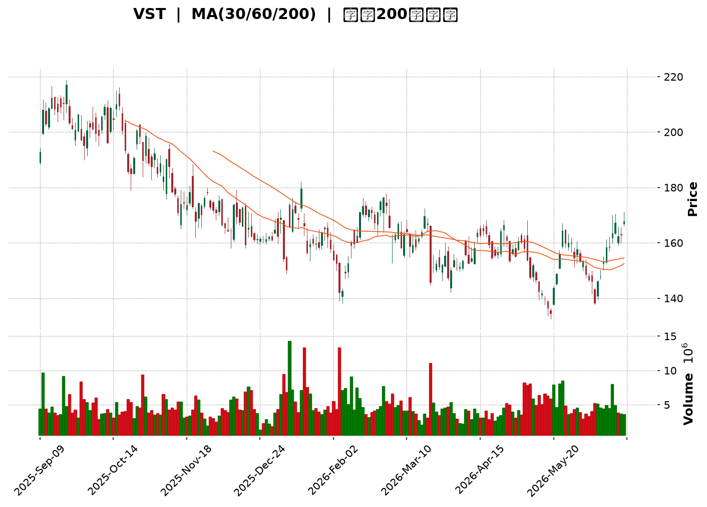
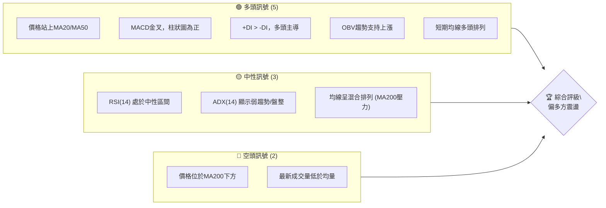
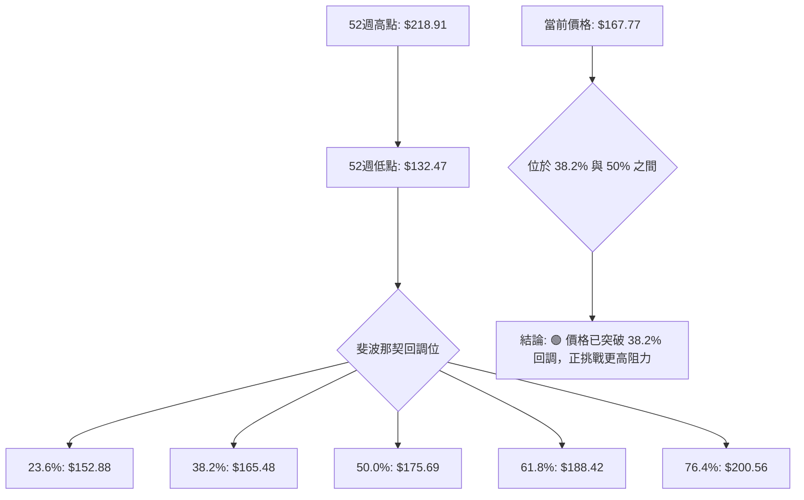
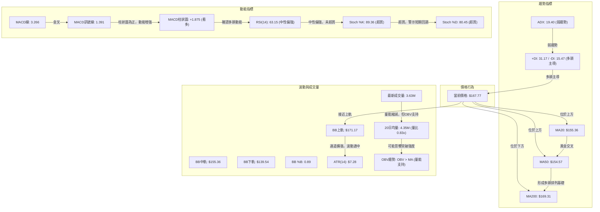
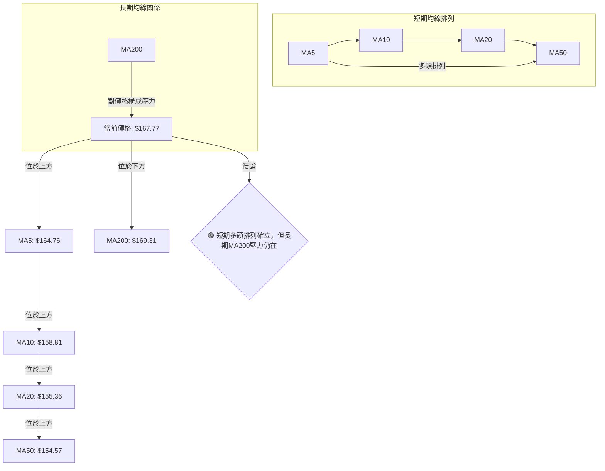

<details>
<summary>📊 靜態圖表 (點擊展開)</summary>

</details>

<html>
<head><meta charset="utf-8" /></head>
<body>
    <div style="height:500px; width:100%;">                        <script>window.PlotlyConfig = {MathJaxConfig: 'local'};</script>
        <script charset="utf-8" src="https://cdn.plot.ly/plotly-3.6.0.min.js" integrity="sha256-QaOVwtVY0T02VaHrr6pnoHLCwayMJp4O5n4YyaE3rJk=" crossorigin="anonymous"></script>                <div id="candlestick-chart" class="plotly-graph-div" style="height:100%; width:100%;"></div>            <script>                window.PLOTLYENV=window.PLOTLYENV || {};                                if (document.getElementById("candlestick-chart")) {                    Plotly.newPlot(                        "candlestick-chart",                        [{"close":{"dtype":"f8","bdata":"AAAAIJoYaEAAAAAAyQNqQAAAAACHX2lAAAAAQGITakAAAABg\u002fIxqQAAAAMDJCmpAAAAAwCLnaUAAAADABiJqQAAAAIDrTGpAAAAA4IQga0AAAAAgk2xpQAAAAKAaJ2lAAAAAABUZaUAAAADgictpQAAAAIDPo2hAAAAAYHBjaEAAAACgkxVpQAAAAMDnOWlAAAAAgN8kaUAAAADghfJoQAAAAOBY2WhAAAAAIDC2aUAAAABAISRqQAAAAOBkgWhAAAAAIMoVakAAAADAC5VpQAAAAKA3P2pAAAAAYOAwakAAAABgehBpQAAAAMDmLWhAAAAA4OI3Z0AAAADg5SFnQAAAAEBx0mdAAAAAYE0UaUAAAABgJs9oQAAAACCWuWdAAAAAgGHRaEAAAAAAi51nQAAAACCccGdAAAAAIKkHaEAAAACgBx9nQAAAAGBYk2dAAAAAoFb7ZkAAAADApsZnQAAAAAD5b2dAAAAA4FdNZkAAAABA+zBmQAAAAMAmW2VAAAAAgOW+ZUAAAABAxshlQAAAAKBKtmVAAAAAoLRMZkAAAAAAN6JlQAAAAICB\u002fGRAAAAAoDzNZUAAAAAANURlQAAAAAAjAmZAAAAAYMhDZkAAAACAb51lQAAAAECzemVAAAAAAAVeZUAAAACA3+plQAAAACBBz2RAAAAAAMutZEAAAAAgDIRkQAAAAACFj2RAAAAAQAe8ZUAAAAAgoCxlQAAAAMCr8WRAAAAAYGGXZUAAAABAz+ljQAAAACBjr2RAAAAA4FJLZEAAAAAA+iNkQAAAAOAqJ2RAAAAAIGwwZEAAAADgKidkQAAAAKCXLGRAAAAAwHtFZEAAAABAURxkQAAAAADGmGRAAAAAQGBPZEAAAABg\u002fiFlQAAAAECNRWNAAAAAwOfFYkAAAAAAJ71kQAAAACBTg2VAAAAAgE5eZUAAAACAHxBlQAAAAGDadWZAAAAAAH7EZEAAAACAE4xjQAAAAGCD8mNAAAAA4Fz9Y0AAAABAtPVjQAAAAGDmy2NAAAAAgNF5ZEAAAABg26VkQAAAAAA1RGRAAAAAgDi9Y0AAAACgszpjQAAAAEB+EmNAAAAA4A7EYUAAAAAgnNVhQAAAAKCWp2JAAAAAIIkRY0AAAABAHOVjQAAAAECp9mNAAAAAQM1UZEAAAACAimBlQAAAAEBtpmVAAAAAoC5DZUAAAACAxYBlQAAAACCrXWVAAAAAQMnqZEAAAABgsGRlQAAAAOAJ3GVAAAAAYKEKZkAAAAAAIa1lQAAAAMAGsWRAAAAAACAoZEAAAABAGV1kQAAAAIAF3mRAAAAAQMvGY0AAAAAgZWVkQAAAAGBJfmRAAAAAwBHXY0AAAADgeORjQAAAAABe0GNAAAAAIGExZEAAAACADXxkQAAAAEDSNGVAAAAAgBDdZEAAAAAAGzpiQAAAAICC4mJAAAAAoDQQY0AAAAAgiuliQAAAAODIAmNAAAAAAGdoY0AAAABgrWpiQAAAACDVw2JAAAAAoNQ3Y0AAAACg\u002ft5iQAAAAKAY7GJAAAAA4OEuY0AAAAAAgXVjQAAAACAqEWNAAAAAgG9QY0AAAAAAUr9jQAAAAMCzd2RAAAAA4MlWZEAAAABgjalkQAAAAMBnZ2RAAAAA4A7sY0AAAAAgMFZjQAAAAOBOcmNAAAAAYC6UY0AAAACA2INkQAAAAAAby2RAAAAAQKEcZEAAAADAZTJjQAAAAADRs2NAAAAA4AJiY0AAAACAABRkQAAAAKD7BGRAAAAAQDLCY0AAAADAgjdjQAAAAABucGJAAAAAwMv6YkAAAACARFViQAAAAGAjzWFAAAAAIHO2YUAAAABggm9hQAAAAGDhEWFAAAAAILHQYEAAAABgjvlhQAAAAIDjm2JAAAAAoKWBY0AAAABAjopkQAAAACCi\u002fWNAAAAAoMkBZEAAAACAMABkQAAAAOBkUWNAAAAAgPi3Y0AAAACgtzJjQAAAAKCFL2NAAAAAoKmRYkAAAADgOVZiQAAAACB\u002fQGJAAAAAgBRLYUAAAAAgnEViQAAAACAEemJAAAAAIMUpY0AAAAAgbMxjQAAAAMBz02NAAAAAIKxwZEAAAADgUehkQAAAAOB6TGRAAAAAANdbZEAAAADgo\u002fhkQA=="},"high":{"dtype":"f8","bdata":"e95f2VpPaEBV1B+9nHhqQJe1v45qWWpAPkAxHMcjakBiSeoDahhrQNDipRDmlWpA2PzEMOaVakBHXoyO6KpqQPm8IAaAnmpAScupMhFda0CKk5c9PnxqQDp9m8meqmlA6SB5LjZtaUBiEagcdtRpQAY1UT+TyGlA6AHEJWT1aEDAO3MOkIJpQOO9ryjLhGlA93Sg0IAqakAysasiKuJpQDiFUgurX2lA9\u002f0qlhm4aUCZGYFlOkZqQKVfp82nb2pA9oP+SIkiakAnWzyme\u002f9pQEh6\u002ffZy5GpACdOvPWMGa0CD4s8quSVqQEZZBRC6lGlAQYTGMsUTaEAvGzPQ2ZZnQPLUBm3k7GdApx9UHjElaUBy+kZeF1ppQDSoH+bkj2hAyfRsa7j8aEDBkCKd2r9oQDJvAG7hAmhAxDkt9CxMaEBxp+5ERNZnQG5o8++n9WdAmIBbvb2KZ0BPO7STCslnQNfiI2l7f2hAOMEpVCNlZ0Cr87UOipFmQFsESi8aJ2ZAltR8mBxoZkC1\u002fPuN0FhmQLNj2LLkFWZArM3DkemXZkDgX7BgKJBnQDSr+9G1nmVAdUAtFibPZUAJY5G2K8BlQAIYhRlpIGZAxk+aO6aAZkDQMAhD8PdlQCg2RXwM52VAfKxdwSCkZUDRLbpa+ClmQDiwGhq4\u002fGVAzjrIvffjZEBCb4oakiZlQEdQBV+bqmRAEPXEBUXFZUAIwyaGHGhmQKJYt14KiWVA9dQpMa2mZUDeJfV4PM1lQBfU6cWfZmVAkvD6Kl9WZUD9YG8TantkQC+VNr\u002fyZ2RA\u002f6sLAF5EZEBT3R8xnFFkQBW902nnd2RAaKRLToZTZEAmYFI7eoFkQJeCwhgEGmVATeopUM5lZUBp8FokSIRlQAyWdjfpBWVAROJtm9hrY0COJfr1QMhlQJWwPdwTCGZAsBfXK+neZUCMn8fNpVZlQOXpDJbNwWZAeQWHmLtUZUAdJ+lMWLFkQB2MH1QPMWRALe2lyJBhZEBltG4Zdk1kQMN8ZnlTm2RAbfYffU6FZEBKFzU1N8NkQPdYvtdW7WRAjvAyQnqBZEDdR5uaPPFjQAdcsSYvgmNArwJ2+40nY0DTwSBkavBhQARwbMPg+mJAVNJ2HjVrY0CoNSN+MB9kQFzWX2FTm2RAd\u002fMSFwy4ZEBml3hI92VlQLi3ZmA0BWZAdF8WtYHgZUAzM\u002fdqAYNlQGJVQOquoGVASzahkbVrZUDnf+CEmmZlQD+xPiSM7mVAWbD5u7YXZkA+i+m7LTpmQG31n4UOAWZAjrl4BIZiZECvNElKOXhkQD8jKB428GRA\u002f6bjmUv9ZEDWRGNMoIVkQLW1qQlhCmVA55Wq9zNxZEBq9DMQ\u002fldkQDxQdpcXmWRA5cq235BhZEDtwTb2HKBkQEdRRym6kGVABnFCWjokZUAS2w0Xl8dkQCj9f9DSdWNArBCp0E08Y0DJ0ZzYVLdjQP255qKbDmNAJp7mLTv\u002fY0A8coLDpdZjQJA+jPBC6GJAtnEuPOKDY0DZhpXnAEtjQLeT4SSCHGNAum8zoDg+Y0AGa5WIsyJkQPAhUtavSWRAXnQOsg\u002fNY0AKvFgB2Q9kQHM\u002fAD6QoWRA5UvjPDDJZEBq01xT+NVkQBSlIOAjCGVAl1FaRUJ6ZEApP5q2\u002fRtkQMePKu9w22NAd6\u002fm+7rUY0DtmB1u9KdkQHfPrSvnBWVAe0d0XRdjZEDmAJauPB1kQDWgRj4E7WNAObMAU1D9Y0A6Qsq45ERkQPwsthFFcmRAvncR6GJYZEBQzOnT8QRlQLp1EVoQWWNAofcaGyoRY0CrwoLxm8NiQA6qzPRpQmJAWRXGBAfjYUASR\u002fX4kJxhQCHzmAkJa2FAVIfWU0gQYUCqLp7QUBZiQOrudJVHomJApM9jWzCrY0CkD9H2TuVkQCksGdBRmWRAhVjUZKRpZEC6wXhmBEJkQGFCeDSBymNAzaDPzsMRZECPZ\u002f6pDbZjQL3L5vpiOmNAeP9xBWBCY0BbQnRB66JiQIgbOsLfwmJA4OUhU475YUDpFA\u002frOVZiQBK6r9ZDyWJAf9bCg3FnY0C9wjo\u002fIihkQBc1bITPRmRAPn6+4UFDZUAAAAAAAFBlQAAAAGBmumRAAAAA4Hq0ZEAAAABAM2tlQA=="},"hovertemplate":"\u003cb\u003e%{x|%Y-%m-%d}\u003c\u002fb\u003e\u003cbr\u003e\u958b: $%{open:.2f}\u003cbr\u003e\u9ad8: $%{high:.2f}\u003cbr\u003e\u4f4e: $%{low:.2f}\u003cbr\u003e\u6536: $%{close:.2f}\u003cextra\u003e\u003c\u002fextra\u003e","low":{"dtype":"f8","bdata":"oeonGyCHZ0CoblZWmt5oQIrWJzxJQWlAoX85epYeaUDM\u002fvUrYhNqQGJvfPRtx2lAievneUNzaUAV7\u002fjS295pQBYYmTyoimlANgeysgXeaUDrfBDgt1NpQO21iZQMIWlAQ9lCeU5maECDSqfBrwRpQMXad4cpnGhACiyVeBe9Z0DYM++y7+tnQGT8QzxZvGhAhn3hBUIVaUBHE7zejpNoQB5PtqVSYmhAj3ZuGIHpaEAA4D4eeI9pQMnE\u002fK3BgGhAbzeNHzTyaEDhK79CEhJpQFugZ1BosWlA51cNTTH6aUCMsOvqDOdoQJtpyE88AGhAVc2rxpwZZ0CDtpo29VxmQLdR+OsSHmdAMJbfx185aECdTWzh63VoQE\u002f83guP9mZA3sr4GOWVZ0D29kUAQnhnQDjBkMZI2GZAT5kaVyRiZ0ADEwuhg\u002fdmQLfJM4c3BWdAUCMfTiJZZkDEkt49w\u002ftlQDyDt\u002fmt7GZA\u002f4UrhDBCZkCb5ppLwBFmQO+1cXUCOmVACufm4ZWcZEBDzt8f3YxlQNNwX394PmVAO2r0J+uvZUDkC2zMLo1lQDlvTLGFOGRAo5QYbMimZEBs51gq8aZkQOjCt\u002fa\u002fi2VA65T9ALIoZkCSwaFmKX9lQNhjnQLwVGVAzflBW\u002foHZUBhYimacjhlQH9+L4jyuGRAdVxEfSVsZEAIgdF3f4FkQLArIaS+v2NAO4jIl\u002fMKZEBEZ7k1xdlkQB2V5wUzyWRAs9PBDX+7ZEASOAeGVsFjQLsa7AjaP2RA3yQwts5AZED6zqgFAA1kQBwFzg0G9mNAcoBRHonqY0C4gPZUC\u002f1jQC8TVg1z72NAKY+dgbMTZEBdZG6czhhkQHYNiAgDbmRADECgLPD3Y0DJlyxTgGpkQNhP4ZS5I2NAQrOS3eiYYkBPjuoShK1kQNZA3jgTdGRA3i1W7yhLZUAJrhDe8LJkQCxWSnqaZmVAkOfdwu1RZEBGAwKoNHpjQBOeeqAQK2NAUsTV2L\u002fWY0AXq5IpDbJjQLD08TDcrmNA2KP2dta2Y0Byb7Z\u002f5BZkQJY9ThIlymNAR\u002furDKyNY0CJRaeyXDNjQMfxonBEv2JAUcp6U1hcYUCQf536ukRhQKFQ\u002f+VsYGJAKc9N6+lrYkByNGHBQExjQN5PMEmaw2NAWY7vxKP+Y0DidHElviFkQJsLt2xlL2VAY1s08oskZUDNzMyMJflkQDb2WZ0UEWVA0tMOiSKYZEDuJ0Lmx01kQILs1nSLM2VAbwviPgh1ZEBtuKDMZE1lQMSnt53rq2RAQZvR0doRY0BLvyHFo\u002f5jQGVNuoV8J2RAbKrpCKC7Y0Cf5bHwUFJjQMMkoUVBe2RA1HE1YBpXY0CX44T2kIhjQElApVJvqWNAHnsInWL1Y0Bf8kUShzVkQJFttaljoWRAwrR7ltx4ZED80hsiFBRiQDCcSKUJpGJAyIIcUeiqYkDrQA8ybsViQPVLM+8fSWJAEhzDmjXxYkDRQsnEo0xiQIi6hYmCxGFA8DrGUwbmYkCspp1EH71iQHp9+\u002fZztWJASPupEzzCYkAzn6ifVGJjQMhBT23tDmNAMcweD6scY0Bm\u002fQP19w1jQIN0gUfdA2RALPfdLIs9ZECnqN4zPkxkQJS7Xv8OQWRA2ZzkySfDY0BB439PQz1jQFCOfteBVmNAst3zCxZJY0AByZRk211jQNzBu59q0GNANrhk\u002fu\u002fPY0BX4EiitRtjQPbMMQxkcGNAYtt3otNWY0BSrOzQCKdjQHihDOVy8mNAFapMPDGMY0Cf+NxPwjFjQFqsM1rIWGJA8Hmqn1lCYkBT2n4cmi5iQE3hjaMTamFA5lUCCT53YUBVuQjMwDNhQDF9spuHtWBARUYq\u002fC6PYEBVvTbJwDNhQNs5lj2tFWJAvFPn\u002fEDRYkALBQmi9b9jQMdPpbT3xWNAJEOH0yWsY0Bq28zAI5VjQNVHqKvJ42JAs\u002f\u002f9j1EVY0BVQ\u002fAcjhdjQJGDq\u002fVbv2JAUQJaL2ZpYkCM8PoUnEViQPVudh3yqmFAABqb1\u002fI2YUBpIkej\u002fmthQAsPdu9rWWJA4+8leT7BYkBBg9+WuBNjQDVlMk+vn2NAMhGFfcz5Y0AAAADAzFxkQAAAAOCj5GNAAAAAACn8Y0AAAADgUcBkQA=="},"name":"\u50f9\u683c","open":{"dtype":"f8","bdata":"c7n19UWgZ0AopqL7J+9oQMkE+O0Y9mlAYD38HLc7aUDM\u002fvUrYhNqQNDipRDmlWpAZw3\u002fRShGakDdocXXTIZqQJQwaSezUWpAgsG1Wv9DakCSdoexoidqQLY3FDtYTWlAf7cW\u002fbilaEClfSaIsgtpQFh40w8xJWlAdORfJ6XLaEDBy+XsHkZoQPtzZmYzZmlAR3mdcRRwaUAN+zOFwqlpQBsRfB99F2lArNLbus4XaUDMzMwsh8RpQKOcKVp7HGpADCo86SUJaUCJobX8951pQDpeT9t1DmpAnm5aGca8akA1GisH4dlpQCB70ZsRaWlA44lo648CaEB2IEuwtVhnQLdR+OsSHmdAzNDY1Bt5aEBy+kZeF1ppQDSoH+bkj2hA1GIYUxTwZ0DrajNF7DtoQOiM3sqE5mdAqs6Cw5jAZ0AYhbaRPGpnQGd5bLeZL2dAyraYRjXEZkCiOWtwTzhmQNlBK1y\u002fP2hAp4oaFcQkZ0BenUHDoHJmQP5SyzukBWZA1QwKppLPZEAWXwQketZlQEqz74s0fmVAHVc7uN\u002fNZUCqIZAftgFnQLMLpWUsaWVA+hZ+fLwbZUBSvuoLdatlQB5+rYDoqGVAN1NYfj5IZkDWVuL69ehlQP6294uF1WVAFWBtrzR+ZUAQOT1t\u002fGVlQA4f1LY2+WVAzjrIvffjZEBNcmeZ5JVkQPhBbtnvlGRA1jlCAhgsZEB0cX76Jc9lQMIjjxrEh2VATEcSyK6+ZEDno1LdOallQP0koZMin2RAIQc50EbAZECtOPeUhXFkQD4gggL6I2RAn+L3y3cRZEAAAADgKidkQG7571vJEWRA4rgUw7IxZEDE909+GU5kQHYNiAgDbmRAkXplNOMcZUB\u002fyluaFBFlQAyWdjfpBWVAg314aUtaY0BDTR56K7tlQEKobyPnhmRA7ZsDkaOwZUB+cQqihh1lQB4XJiW6kGVAqwSR587iZEA2FYATZxpkQOIDlzNI0mNAe0NexHYvZECQRUD23\u002fFjQF+aleWzBGRAT3RV2jziY0ADEildWLFkQPqRSZwRsGRAiTsxD74hZEATEffi4aZjQPSeN70OdmNAR5C9Wo4YY0CiNDVojZNhQGvQ+\u002fbBsmJAbvtA\u002f8GyYkD\u002fGoqro\u002f5jQLVo8+JukWRAkFS1rysJZED6JoGOdj5kQK3P8gcTTWVAs6ulQfWwZUDNzK7IHi5lQH1Q7ahjemVA5YCBUGpFZUDqU5E1MdpkQEAljxnxfGVAA7NbZWRcZUA5TwsKjdBlQLXxqtpfN2VAaNHSWc4nZEBBE15gnSRkQF+1iIDeLWRAgE9oy+F\u002fZEBk8plZCW9jQIbS4Q3snGRAI2cJ6MFkZEB0vvdfsZRjQF2rAP4JKmRAxPbQX8kRZEC2Ry36i0tkQI9bSwNeqWRAdFoVpa7WZEAS2w0Xl8dkQJsRxGqf52JAVVhE3NzKYkCDeW5EEFljQBbcrFNPqWJAEhzDmjXxYkDDZ3p6K5xjQBLZRipc9mFA\u002fZJ2BkPoYkCAm\u002fon9N9iQPTlBU2F2mJA3HawxnrbYkAFbOhyzhBkQD0FXQeBdWNAtZZUdyEpY0Bm\u002fQP19w1jQGrRNB\u002faRWRAwRlEDJioZEAS234f4IpkQLuBQSzhwGRAbaMVuk1aZECY18A7IBFkQElCG9mJsmNAS5sisr13Y0BNfAKAkINjQHTgz7mdmGRAgy\u002fmcLpIZECguN1AUhRkQFJ21iFJgmNAFnTg6dXCY0AlPbjzBa9jQED1\u002fJu0WGRAQvmM6JwoZEAIBNbd+1lkQLp1EVoQWWNA1M6FhWB5YkD6ZWWc\u002fahiQA6qzPRpQmJAOw0CVdWlYUC\u002fIGWJi3JhQKy7RZnHWWFAa6VN44XzYEAAAAAc0zlhQPzERLuHKGJA8Ee7hzPaYkDHxmI6AtZjQCqM6aVWl2RAr4IMn8XTY0BDIIcC1\u002fhjQMLQZVb5mGNAY8mZARp3Y0C17QHUUIljQAw4lp5\u002f6mJArxqcoTL5YkC3\u002fdt4SINiQDEc4UvMhmJAButnBcnkYUDK3O7+XplhQFYbq3pgeWJAgqlK4hQTY0CbYydnJCFjQIfXM+n7ymNA8Fc8ZKA7ZEAAAAAAKXBkQAAAAGCPAmRAAAAAwPVgZEAAAADAHt1kQA=="},"x":["2025-09-09T00:00:00-04:00","2025-09-10T00:00:00-04:00","2025-09-11T00:00:00-04:00","2025-09-12T00:00:00-04:00","2025-09-15T00:00:00-04:00","2025-09-16T00:00:00-04:00","2025-09-17T00:00:00-04:00","2025-09-18T00:00:00-04:00","2025-09-19T00:00:00-04:00","2025-09-22T00:00:00-04:00","2025-09-23T00:00:00-04:00","2025-09-24T00:00:00-04:00","2025-09-25T00:00:00-04:00","2025-09-26T00:00:00-04:00","2025-09-29T00:00:00-04:00","2025-09-30T00:00:00-04:00","2025-10-01T00:00:00-04:00","2025-10-02T00:00:00-04:00","2025-10-03T00:00:00-04:00","2025-10-06T00:00:00-04:00","2025-10-07T00:00:00-04:00","2025-10-08T00:00:00-04:00","2025-10-09T00:00:00-04:00","2025-10-10T00:00:00-04:00","2025-10-13T00:00:00-04:00","2025-10-14T00:00:00-04:00","2025-10-15T00:00:00-04:00","2025-10-16T00:00:00-04:00","2025-10-17T00:00:00-04:00","2025-10-20T00:00:00-04:00","2025-10-21T00:00:00-04:00","2025-10-22T00:00:00-04:00","2025-10-23T00:00:00-04:00","2025-10-24T00:00:00-04:00","2025-10-27T00:00:00-04:00","2025-10-28T00:00:00-04:00","2025-10-29T00:00:00-04:00","2025-10-30T00:00:00-04:00","2025-10-31T00:00:00-04:00","2025-11-03T00:00:00-05:00","2025-11-04T00:00:00-05:00","2025-11-05T00:00:00-05:00","2025-11-06T00:00:00-05:00","2025-11-07T00:00:00-05:00","2025-11-10T00:00:00-05:00","2025-11-11T00:00:00-05:00","2025-11-12T00:00:00-05:00","2025-11-13T00:00:00-05:00","2025-11-14T00:00:00-05:00","2025-11-17T00:00:00-05:00","2025-11-18T00:00:00-05:00","2025-11-19T00:00:00-05:00","2025-11-20T00:00:00-05:00","2025-11-21T00:00:00-05:00","2025-11-24T00:00:00-05:00","2025-11-25T00:00:00-05:00","2025-11-26T00:00:00-05:00","2025-11-28T00:00:00-05:00","2025-12-01T00:00:00-05:00","2025-12-02T00:00:00-05:00","2025-12-03T00:00:00-05:00","2025-12-04T00:00:00-05:00","2025-12-05T00:00:00-05:00","2025-12-08T00:00:00-05:00","2025-12-09T00:00:00-05:00","2025-12-10T00:00:00-05:00","2025-12-11T00:00:00-05:00","2025-12-12T00:00:00-05:00","2025-12-15T00:00:00-05:00","2025-12-16T00:00:00-05:00","2025-12-17T00:00:00-05:00","2025-12-18T00:00:00-05:00","2025-12-19T00:00:00-05:00","2025-12-22T00:00:00-05:00","2025-12-23T00:00:00-05:00","2025-12-24T00:00:00-05:00","2025-12-26T00:00:00-05:00","2025-12-29T00:00:00-05:00","2025-12-30T00:00:00-05:00","2025-12-31T00:00:00-05:00","2026-01-02T00:00:00-05:00","2026-01-05T00:00:00-05:00","2026-01-06T00:00:00-05:00","2026-01-07T00:00:00-05:00","2026-01-08T00:00:00-05:00","2026-01-09T00:00:00-05:00","2026-01-12T00:00:00-05:00","2026-01-13T00:00:00-05:00","2026-01-14T00:00:00-05:00","2026-01-15T00:00:00-05:00","2026-01-16T00:00:00-05:00","2026-01-20T00:00:00-05:00","2026-01-21T00:00:00-05:00","2026-01-22T00:00:00-05:00","2026-01-23T00:00:00-05:00","2026-01-26T00:00:00-05:00","2026-01-27T00:00:00-05:00","2026-01-28T00:00:00-05:00","2026-01-29T00:00:00-05:00","2026-01-30T00:00:00-05:00","2026-02-02T00:00:00-05:00","2026-02-03T00:00:00-05:00","2026-02-04T00:00:00-05:00","2026-02-05T00:00:00-05:00","2026-02-06T00:00:00-05:00","2026-02-09T00:00:00-05:00","2026-02-10T00:00:00-05:00","2026-02-11T00:00:00-05:00","2026-02-12T00:00:00-05:00","2026-02-13T00:00:00-05:00","2026-02-17T00:00:00-05:00","2026-02-18T00:00:00-05:00","2026-02-19T00:00:00-05:00","2026-02-20T00:00:00-05:00","2026-02-23T00:00:00-05:00","2026-02-24T00:00:00-05:00","2026-02-25T00:00:00-05:00","2026-02-26T00:00:00-05:00","2026-02-27T00:00:00-05:00","2026-03-02T00:00:00-05:00","2026-03-03T00:00:00-05:00","2026-03-04T00:00:00-05:00","2026-03-05T00:00:00-05:00","2026-03-06T00:00:00-05:00","2026-03-09T00:00:00-04:00","2026-03-10T00:00:00-04:00","2026-03-11T00:00:00-04:00","2026-03-12T00:00:00-04:00","2026-03-13T00:00:00-04:00","2026-03-16T00:00:00-04:00","2026-03-17T00:00:00-04:00","2026-03-18T00:00:00-04:00","2026-03-19T00:00:00-04:00","2026-03-20T00:00:00-04:00","2026-03-23T00:00:00-04:00","2026-03-24T00:00:00-04:00","2026-03-25T00:00:00-04:00","2026-03-26T00:00:00-04:00","2026-03-27T00:00:00-04:00","2026-03-30T00:00:00-04:00","2026-03-31T00:00:00-04:00","2026-04-01T00:00:00-04:00","2026-04-02T00:00:00-04:00","2026-04-06T00:00:00-04:00","2026-04-07T00:00:00-04:00","2026-04-08T00:00:00-04:00","2026-04-09T00:00:00-04:00","2026-04-10T00:00:00-04:00","2026-04-13T00:00:00-04:00","2026-04-14T00:00:00-04:00","2026-04-15T00:00:00-04:00","2026-04-16T00:00:00-04:00","2026-04-17T00:00:00-04:00","2026-04-20T00:00:00-04:00","2026-04-21T00:00:00-04:00","2026-04-22T00:00:00-04:00","2026-04-23T00:00:00-04:00","2026-04-24T00:00:00-04:00","2026-04-27T00:00:00-04:00","2026-04-28T00:00:00-04:00","2026-04-29T00:00:00-04:00","2026-04-30T00:00:00-04:00","2026-05-01T00:00:00-04:00","2026-05-04T00:00:00-04:00","2026-05-05T00:00:00-04:00","2026-05-06T00:00:00-04:00","2026-05-07T00:00:00-04:00","2026-05-08T00:00:00-04:00","2026-05-11T00:00:00-04:00","2026-05-12T00:00:00-04:00","2026-05-13T00:00:00-04:00","2026-05-14T00:00:00-04:00","2026-05-15T00:00:00-04:00","2026-05-18T00:00:00-04:00","2026-05-19T00:00:00-04:00","2026-05-20T00:00:00-04:00","2026-05-21T00:00:00-04:00","2026-05-22T00:00:00-04:00","2026-05-26T00:00:00-04:00","2026-05-27T00:00:00-04:00","2026-05-28T00:00:00-04:00","2026-05-29T00:00:00-04:00","2026-06-01T00:00:00-04:00","2026-06-02T00:00:00-04:00","2026-06-03T00:00:00-04:00","2026-06-04T00:00:00-04:00","2026-06-05T00:00:00-04:00","2026-06-08T00:00:00-04:00","2026-06-09T00:00:00-04:00","2026-06-10T00:00:00-04:00","2026-06-11T00:00:00-04:00","2026-06-12T00:00:00-04:00","2026-06-15T00:00:00-04:00","2026-06-16T00:00:00-04:00","2026-06-17T00:00:00-04:00","2026-06-18T00:00:00-04:00","2026-06-22T00:00:00-04:00","2026-06-23T00:00:00-04:00","2026-06-24T00:00:00-04:00","2026-06-25T00:00:00-04:00"],"type":"candlestick"},{"hovertemplate":"MA30: $%{y:.2f}\u003cextra\u003e\u003c\u002fextra\u003e","line":{"color":"#2196F3","dash":"dash","width":2},"mode":"lines","name":"MA30","x":["2025-09-09T00:00:00-04:00","2025-09-10T00:00:00-04:00","2025-09-11T00:00:00-04:00","2025-09-12T00:00:00-04:00","2025-09-15T00:00:00-04:00","2025-09-16T00:00:00-04:00","2025-09-17T00:00:00-04:00","2025-09-18T00:00:00-04:00","2025-09-19T00:00:00-04:00","2025-09-22T00:00:00-04:00","2025-09-23T00:00:00-04:00","2025-09-24T00:00:00-04:00","2025-09-25T00:00:00-04:00","2025-09-26T00:00:00-04:00","2025-09-29T00:00:00-04:00","2025-09-30T00:00:00-04:00","2025-10-01T00:00:00-04:00","2025-10-02T00:00:00-04:00","2025-10-03T00:00:00-04:00","2025-10-06T00:00:00-04:00","2025-10-07T00:00:00-04:00","2025-10-08T00:00:00-04:00","2025-10-09T00:00:00-04:00","2025-10-10T00:00:00-04:00","2025-10-13T00:00:00-04:00","2025-10-14T00:00:00-04:00","2025-10-15T00:00:00-04:00","2025-10-16T00:00:00-04:00","2025-10-17T00:00:00-04:00","2025-10-20T00:00:00-04:00","2025-10-21T00:00:00-04:00","2025-10-22T00:00:00-04:00","2025-10-23T00:00:00-04:00","2025-10-24T00:00:00-04:00","2025-10-27T00:00:00-04:00","2025-10-28T00:00:00-04:00","2025-10-29T00:00:00-04:00","2025-10-30T00:00:00-04:00","2025-10-31T00:00:00-04:00","2025-11-03T00:00:00-05:00","2025-11-04T00:00:00-05:00","2025-11-05T00:00:00-05:00","2025-11-06T00:00:00-05:00","2025-11-07T00:00:00-05:00","2025-11-10T00:00:00-05:00","2025-11-11T00:00:00-05:00","2025-11-12T00:00:00-05:00","2025-11-13T00:00:00-05:00","2025-11-14T00:00:00-05:00","2025-11-17T00:00:00-05:00","2025-11-18T00:00:00-05:00","2025-11-19T00:00:00-05:00","2025-11-20T00:00:00-05:00","2025-11-21T00:00:00-05:00","2025-11-24T00:00:00-05:00","2025-11-25T00:00:00-05:00","2025-11-26T00:00:00-05:00","2025-11-28T00:00:00-05:00","2025-12-01T00:00:00-05:00","2025-12-02T00:00:00-05:00","2025-12-03T00:00:00-05:00","2025-12-04T00:00:00-05:00","2025-12-05T00:00:00-05:00","2025-12-08T00:00:00-05:00","2025-12-09T00:00:00-05:00","2025-12-10T00:00:00-05:00","2025-12-11T00:00:00-05:00","2025-12-12T00:00:00-05:00","2025-12-15T00:00:00-05:00","2025-12-16T00:00:00-05:00","2025-12-17T00:00:00-05:00","2025-12-18T00:00:00-05:00","2025-12-19T00:00:00-05:00","2025-12-22T00:00:00-05:00","2025-12-23T00:00:00-05:00","2025-12-24T00:00:00-05:00","2025-12-26T00:00:00-05:00","2025-12-29T00:00:00-05:00","2025-12-30T00:00:00-05:00","2025-12-31T00:00:00-05:00","2026-01-02T00:00:00-05:00","2026-01-05T00:00:00-05:00","2026-01-06T00:00:00-05:00","2026-01-07T00:00:00-05:00","2026-01-08T00:00:00-05:00","2026-01-09T00:00:00-05:00","2026-01-12T00:00:00-05:00","2026-01-13T00:00:00-05:00","2026-01-14T00:00:00-05:00","2026-01-15T00:00:00-05:00","2026-01-16T00:00:00-05:00","2026-01-20T00:00:00-05:00","2026-01-21T00:00:00-05:00","2026-01-22T00:00:00-05:00","2026-01-23T00:00:00-05:00","2026-01-26T00:00:00-05:00","2026-01-27T00:00:00-05:00","2026-01-28T00:00:00-05:00","2026-01-29T00:00:00-05:00","2026-01-30T00:00:00-05:00","2026-02-02T00:00:00-05:00","2026-02-03T00:00:00-05:00","2026-02-04T00:00:00-05:00","2026-02-05T00:00:00-05:00","2026-02-06T00:00:00-05:00","2026-02-09T00:00:00-05:00","2026-02-10T00:00:00-05:00","2026-02-11T00:00:00-05:00","2026-02-12T00:00:00-05:00","2026-02-13T00:00:00-05:00","2026-02-17T00:00:00-05:00","2026-02-18T00:00:00-05:00","2026-02-19T00:00:00-05:00","2026-02-20T00:00:00-05:00","2026-02-23T00:00:00-05:00","2026-02-24T00:00:00-05:00","2026-02-25T00:00:00-05:00","2026-02-26T00:00:00-05:00","2026-02-27T00:00:00-05:00","2026-03-02T00:00:00-05:00","2026-03-03T00:00:00-05:00","2026-03-04T00:00:00-05:00","2026-03-05T00:00:00-05:00","2026-03-06T00:00:00-05:00","2026-03-09T00:00:00-04:00","2026-03-10T00:00:00-04:00","2026-03-11T00:00:00-04:00","2026-03-12T00:00:00-04:00","2026-03-13T00:00:00-04:00","2026-03-16T00:00:00-04:00","2026-03-17T00:00:00-04:00","2026-03-18T00:00:00-04:00","2026-03-19T00:00:00-04:00","2026-03-20T00:00:00-04:00","2026-03-23T00:00:00-04:00","2026-03-24T00:00:00-04:00","2026-03-25T00:00:00-04:00","2026-03-26T00:00:00-04:00","2026-03-27T00:00:00-04:00","2026-03-30T00:00:00-04:00","2026-03-31T00:00:00-04:00","2026-04-01T00:00:00-04:00","2026-04-02T00:00:00-04:00","2026-04-06T00:00:00-04:00","2026-04-07T00:00:00-04:00","2026-04-08T00:00:00-04:00","2026-04-09T00:00:00-04:00","2026-04-10T00:00:00-04:00","2026-04-13T00:00:00-04:00","2026-04-14T00:00:00-04:00","2026-04-15T00:00:00-04:00","2026-04-16T00:00:00-04:00","2026-04-17T00:00:00-04:00","2026-04-20T00:00:00-04:00","2026-04-21T00:00:00-04:00","2026-04-22T00:00:00-04:00","2026-04-23T00:00:00-04:00","2026-04-24T00:00:00-04:00","2026-04-27T00:00:00-04:00","2026-04-28T00:00:00-04:00","2026-04-29T00:00:00-04:00","2026-04-30T00:00:00-04:00","2026-05-01T00:00:00-04:00","2026-05-04T00:00:00-04:00","2026-05-05T00:00:00-04:00","2026-05-06T00:00:00-04:00","2026-05-07T00:00:00-04:00","2026-05-08T00:00:00-04:00","2026-05-11T00:00:00-04:00","2026-05-12T00:00:00-04:00","2026-05-13T00:00:00-04:00","2026-05-14T00:00:00-04:00","2026-05-15T00:00:00-04:00","2026-05-18T00:00:00-04:00","2026-05-19T00:00:00-04:00","2026-05-20T00:00:00-04:00","2026-05-21T00:00:00-04:00","2026-05-22T00:00:00-04:00","2026-05-26T00:00:00-04:00","2026-05-27T00:00:00-04:00","2026-05-28T00:00:00-04:00","2026-05-29T00:00:00-04:00","2026-06-01T00:00:00-04:00","2026-06-02T00:00:00-04:00","2026-06-03T00:00:00-04:00","2026-06-04T00:00:00-04:00","2026-06-05T00:00:00-04:00","2026-06-08T00:00:00-04:00","2026-06-09T00:00:00-04:00","2026-06-10T00:00:00-04:00","2026-06-11T00:00:00-04:00","2026-06-12T00:00:00-04:00","2026-06-15T00:00:00-04:00","2026-06-16T00:00:00-04:00","2026-06-17T00:00:00-04:00","2026-06-18T00:00:00-04:00","2026-06-22T00:00:00-04:00","2026-06-23T00:00:00-04:00","2026-06-24T00:00:00-04:00","2026-06-25T00:00:00-04:00"],"y":{"dtype":"f8","bdata":"AAAAAAAA+H8AAAAAAAD4fwAAAAAAAPh\u002fAAAAAAAA+H8AAAAAAAD4fwAAAAAAAPh\u002fAAAAAAAA+H8AAAAAAAD4fwAAAAAAAPh\u002fAAAAAAAA+H8AAAAAAAD4fwAAAAAAAPh\u002fAAAAAAAA+H8AAAAAAAD4fwAAAAAAAPh\u002fAAAAAAAA+H8AAAAAAAD4fwAAAAAAAPh\u002fAAAAAAAA+H8AAAAAAAD4fwAAAAAAAPh\u002fAAAAAAAA+H8AAAAAAAD4fwAAAAAAAPh\u002fAAAAAAAA+H8AAAAAAAD4fwAAAAAAAPh\u002fAAAAAAAA+H8AAAAAAAD4f3d3d5edgGlAREREBCB5aUARERFhh2BpQLy7u+tKU2lAmpmZOcpKaUAiIiLC7TtpQFVVVcUnKGlAiYiImOUeaUAREREBaglpQFVVVfUA8WhAvLu7O5PWaEAzMzNz7MJoQKuqqgp3tWhAmpmZKWijaEBERERkLZJoQCIiIoLqh2hARERE5Bx2aEBVVVUlbV1oQGZmZrZmPGhAmpmZ6WYfaEDv7u4OaQRoQBEREVGk6WdAmpmZmYbMZ0C8u7vbD6ZnQHd3d0cIiGdAd3d3B3tjZ0AiIiISpz5nQHd3d7d7GmdAq6qq6vr4ZkDv7u6ei9tmQO\u002fu7l6BxGZAVVVVtbW0ZkARERGhV6pmQDMzM9OikGZAIiIi8hVrZkAAAADwckZmQN7d3V1yK2ZA7+7ujiIRZkDe3d3tTfxlQGZmZqYB52VAVVVVdTLSZUBmZma20rZlQHd3d2conmVAiYiIWDmHZUBmZmaWM2hlQHd3d7csTGVAvLu72yQ6ZUC8u7sLwChlQFVVVTWqHmVA3t3dnRUSZUAzMzNzzQNlQHd3dwdJ+mRAAAAAwE7pZECJiIiYCOVkQKuqqtpm1mRAERERsY68ZECamZk5DrhkQImIiBjUs2RAZmZm5i2sZECJiIgIeKdkQERERDTXr2RAq6qqGrmqZECrqqoaf5ZkQCIiInIjj2RAiYiI6EGJZEDv7u4+g4RkQFVVVfX9fWRA7+7ubkBzZECJiIhowm5kQO\u002fu7i76aGRAVVVVBSxZZEBERETEVVNkQHd3d2eSRWRAIiIiEv8vZEBmZmZGURxkQBERERGID2RAd3d39\u002fcFZEB3d3dHxANkQBERERH4AWRAiYiIyHoCZEDe3d19SQ1kQImIiIhGFmRAMzMzA2ceZECJiIjIjyFkQFVVVaVuM2RA3t3dbbpFZEAzMzMTUEtkQJqZmRlFTmRAiYiImANUZEARERFhP1lkQCIiIkInSmRAzczM7PBEZEBVVVWV6EtkQBEREUHCU2RAmpmZmfBRZEAiIiKyqVVkQN7d3e2bW2RAMzMzIy9WZEC8u7vrvE9kQLy7u2vgS2RAREREpL9PZEBmZmbWdVpkQGZmZtarbGRAMzMz0xqHZEAzMzNjdIpkQO\u002fu7i5rjGRAVVVV1V+MZECJiIgY\u002fYNkQERERATce2RA3t3dvfpzZEAzMzOjt1pkQHd3d\u002fcYQmRAiYiICKcwZECJiIh4MRpkQBEREUFXBWRAZmZmRov2Y0AiIiKyCeZjQAAAAHA1zmNAIiIigu+2Y0DNzMyseaZjQCIiIoKQpGNAREREtB6mY0C8u7sbq6hjQKuqquq2pGNAd3d35\u002fSlY0Crqqqa6pxjQKuqqtr7k2NAMzMzE8GRY0AAAAAQEZdjQCIiIrJsn2NAIiIiorueY0AzMzOTvpNjQDMzMzPphmNAzczMnEZ6Y0B3d3eHEopjQLy7uzvBk2NAZmZmFrCZY0ARERFxSZxjQLy7u4tol2NAzczMPMGTY0CrqqqKCpNjQKuqqmrRimNAVVVV1fh9Y0BVVVX1uHFjQBEREVHqYWNA3t3dfbVNY0BVVVVFC0FjQERERIQiPWNAREREdMY+Y0Crqqq6jEVjQDMzMxN7QWNAvLu7u6U+Y0ARERGBADljQERERCS8L2NAmpmZqf8tY0Crqqr60CxjQCIiIhKXKmNAvLu7C\u002fkhY0ARERGxYg9jQERERNSy+WJAq6qqmqXhYkBEREQEwdliQBEREUFLz2JAREREVGvNYkBERESECMtiQKuqqtphyWJAd3d3tzLPYkBVVVUFoN1iQBEREVF+7WJAVVVV9UL5YkAzMzMjxg9jQA=="},"type":"scatter"},{"hovertemplate":"MA60: $%{y:.2f}\u003cextra\u003e\u003c\u002fextra\u003e","line":{"color":"#9C27B0","dash":"dash","width":2},"mode":"lines","name":"MA60","x":["2025-09-09T00:00:00-04:00","2025-09-10T00:00:00-04:00","2025-09-11T00:00:00-04:00","2025-09-12T00:00:00-04:00","2025-09-15T00:00:00-04:00","2025-09-16T00:00:00-04:00","2025-09-17T00:00:00-04:00","2025-09-18T00:00:00-04:00","2025-09-19T00:00:00-04:00","2025-09-22T00:00:00-04:00","2025-09-23T00:00:00-04:00","2025-09-24T00:00:00-04:00","2025-09-25T00:00:00-04:00","2025-09-26T00:00:00-04:00","2025-09-29T00:00:00-04:00","2025-09-30T00:00:00-04:00","2025-10-01T00:00:00-04:00","2025-10-02T00:00:00-04:00","2025-10-03T00:00:00-04:00","2025-10-06T00:00:00-04:00","2025-10-07T00:00:00-04:00","2025-10-08T00:00:00-04:00","2025-10-09T00:00:00-04:00","2025-10-10T00:00:00-04:00","2025-10-13T00:00:00-04:00","2025-10-14T00:00:00-04:00","2025-10-15T00:00:00-04:00","2025-10-16T00:00:00-04:00","2025-10-17T00:00:00-04:00","2025-10-20T00:00:00-04:00","2025-10-21T00:00:00-04:00","2025-10-22T00:00:00-04:00","2025-10-23T00:00:00-04:00","2025-10-24T00:00:00-04:00","2025-10-27T00:00:00-04:00","2025-10-28T00:00:00-04:00","2025-10-29T00:00:00-04:00","2025-10-30T00:00:00-04:00","2025-10-31T00:00:00-04:00","2025-11-03T00:00:00-05:00","2025-11-04T00:00:00-05:00","2025-11-05T00:00:00-05:00","2025-11-06T00:00:00-05:00","2025-11-07T00:00:00-05:00","2025-11-10T00:00:00-05:00","2025-11-11T00:00:00-05:00","2025-11-12T00:00:00-05:00","2025-11-13T00:00:00-05:00","2025-11-14T00:00:00-05:00","2025-11-17T00:00:00-05:00","2025-11-18T00:00:00-05:00","2025-11-19T00:00:00-05:00","2025-11-20T00:00:00-05:00","2025-11-21T00:00:00-05:00","2025-11-24T00:00:00-05:00","2025-11-25T00:00:00-05:00","2025-11-26T00:00:00-05:00","2025-11-28T00:00:00-05:00","2025-12-01T00:00:00-05:00","2025-12-02T00:00:00-05:00","2025-12-03T00:00:00-05:00","2025-12-04T00:00:00-05:00","2025-12-05T00:00:00-05:00","2025-12-08T00:00:00-05:00","2025-12-09T00:00:00-05:00","2025-12-10T00:00:00-05:00","2025-12-11T00:00:00-05:00","2025-12-12T00:00:00-05:00","2025-12-15T00:00:00-05:00","2025-12-16T00:00:00-05:00","2025-12-17T00:00:00-05:00","2025-12-18T00:00:00-05:00","2025-12-19T00:00:00-05:00","2025-12-22T00:00:00-05:00","2025-12-23T00:00:00-05:00","2025-12-24T00:00:00-05:00","2025-12-26T00:00:00-05:00","2025-12-29T00:00:00-05:00","2025-12-30T00:00:00-05:00","2025-12-31T00:00:00-05:00","2026-01-02T00:00:00-05:00","2026-01-05T00:00:00-05:00","2026-01-06T00:00:00-05:00","2026-01-07T00:00:00-05:00","2026-01-08T00:00:00-05:00","2026-01-09T00:00:00-05:00","2026-01-12T00:00:00-05:00","2026-01-13T00:00:00-05:00","2026-01-14T00:00:00-05:00","2026-01-15T00:00:00-05:00","2026-01-16T00:00:00-05:00","2026-01-20T00:00:00-05:00","2026-01-21T00:00:00-05:00","2026-01-22T00:00:00-05:00","2026-01-23T00:00:00-05:00","2026-01-26T00:00:00-05:00","2026-01-27T00:00:00-05:00","2026-01-28T00:00:00-05:00","2026-01-29T00:00:00-05:00","2026-01-30T00:00:00-05:00","2026-02-02T00:00:00-05:00","2026-02-03T00:00:00-05:00","2026-02-04T00:00:00-05:00","2026-02-05T00:00:00-05:00","2026-02-06T00:00:00-05:00","2026-02-09T00:00:00-05:00","2026-02-10T00:00:00-05:00","2026-02-11T00:00:00-05:00","2026-02-12T00:00:00-05:00","2026-02-13T00:00:00-05:00","2026-02-17T00:00:00-05:00","2026-02-18T00:00:00-05:00","2026-02-19T00:00:00-05:00","2026-02-20T00:00:00-05:00","2026-02-23T00:00:00-05:00","2026-02-24T00:00:00-05:00","2026-02-25T00:00:00-05:00","2026-02-26T00:00:00-05:00","2026-02-27T00:00:00-05:00","2026-03-02T00:00:00-05:00","2026-03-03T00:00:00-05:00","2026-03-04T00:00:00-05:00","2026-03-05T00:00:00-05:00","2026-03-06T00:00:00-05:00","2026-03-09T00:00:00-04:00","2026-03-10T00:00:00-04:00","2026-03-11T00:00:00-04:00","2026-03-12T00:00:00-04:00","2026-03-13T00:00:00-04:00","2026-03-16T00:00:00-04:00","2026-03-17T00:00:00-04:00","2026-03-18T00:00:00-04:00","2026-03-19T00:00:00-04:00","2026-03-20T00:00:00-04:00","2026-03-23T00:00:00-04:00","2026-03-24T00:00:00-04:00","2026-03-25T00:00:00-04:00","2026-03-26T00:00:00-04:00","2026-03-27T00:00:00-04:00","2026-03-30T00:00:00-04:00","2026-03-31T00:00:00-04:00","2026-04-01T00:00:00-04:00","2026-04-02T00:00:00-04:00","2026-04-06T00:00:00-04:00","2026-04-07T00:00:00-04:00","2026-04-08T00:00:00-04:00","2026-04-09T00:00:00-04:00","2026-04-10T00:00:00-04:00","2026-04-13T00:00:00-04:00","2026-04-14T00:00:00-04:00","2026-04-15T00:00:00-04:00","2026-04-16T00:00:00-04:00","2026-04-17T00:00:00-04:00","2026-04-20T00:00:00-04:00","2026-04-21T00:00:00-04:00","2026-04-22T00:00:00-04:00","2026-04-23T00:00:00-04:00","2026-04-24T00:00:00-04:00","2026-04-27T00:00:00-04:00","2026-04-28T00:00:00-04:00","2026-04-29T00:00:00-04:00","2026-04-30T00:00:00-04:00","2026-05-01T00:00:00-04:00","2026-05-04T00:00:00-04:00","2026-05-05T00:00:00-04:00","2026-05-06T00:00:00-04:00","2026-05-07T00:00:00-04:00","2026-05-08T00:00:00-04:00","2026-05-11T00:00:00-04:00","2026-05-12T00:00:00-04:00","2026-05-13T00:00:00-04:00","2026-05-14T00:00:00-04:00","2026-05-15T00:00:00-04:00","2026-05-18T00:00:00-04:00","2026-05-19T00:00:00-04:00","2026-05-20T00:00:00-04:00","2026-05-21T00:00:00-04:00","2026-05-22T00:00:00-04:00","2026-05-26T00:00:00-04:00","2026-05-27T00:00:00-04:00","2026-05-28T00:00:00-04:00","2026-05-29T00:00:00-04:00","2026-06-01T00:00:00-04:00","2026-06-02T00:00:00-04:00","2026-06-03T00:00:00-04:00","2026-06-04T00:00:00-04:00","2026-06-05T00:00:00-04:00","2026-06-08T00:00:00-04:00","2026-06-09T00:00:00-04:00","2026-06-10T00:00:00-04:00","2026-06-11T00:00:00-04:00","2026-06-12T00:00:00-04:00","2026-06-15T00:00:00-04:00","2026-06-16T00:00:00-04:00","2026-06-17T00:00:00-04:00","2026-06-18T00:00:00-04:00","2026-06-22T00:00:00-04:00","2026-06-23T00:00:00-04:00","2026-06-24T00:00:00-04:00","2026-06-25T00:00:00-04:00"],"y":{"dtype":"f8","bdata":"AAAAAAAA+H8AAAAAAAD4fwAAAAAAAPh\u002fAAAAAAAA+H8AAAAAAAD4fwAAAAAAAPh\u002fAAAAAAAA+H8AAAAAAAD4fwAAAAAAAPh\u002fAAAAAAAA+H8AAAAAAAD4fwAAAAAAAPh\u002fAAAAAAAA+H8AAAAAAAD4fwAAAAAAAPh\u002fAAAAAAAA+H8AAAAAAAD4fwAAAAAAAPh\u002fAAAAAAAA+H8AAAAAAAD4fwAAAAAAAPh\u002fAAAAAAAA+H8AAAAAAAD4fwAAAAAAAPh\u002fAAAAAAAA+H8AAAAAAAD4fwAAAAAAAPh\u002fAAAAAAAA+H8AAAAAAAD4fwAAAAAAAPh\u002fAAAAAAAA+H8AAAAAAAD4fwAAAAAAAPh\u002fAAAAAAAA+H8AAAAAAAD4fwAAAAAAAPh\u002fAAAAAAAA+H8AAAAAAAD4fwAAAAAAAPh\u002fAAAAAAAA+H8AAAAAAAD4fwAAAAAAAPh\u002fAAAAAAAA+H8AAAAAAAD4fwAAAAAAAPh\u002fAAAAAAAA+H8AAAAAAAD4fwAAAAAAAPh\u002fAAAAAAAA+H8AAAAAAAD4fwAAAAAAAPh\u002fAAAAAAAA+H8AAAAAAAD4fwAAAAAAAPh\u002fAAAAAAAA+H8AAAAAAAD4fwAAAAAAAPh\u002fAAAAAAAA+H8AAAAAAAD4fzMzM3uPImhAzczM3OoWaEARERGBbwVoQHd3d9\u002f28WdA3t3dFfDaZ0ARERFZMMFnQJqZmRHNqWdAvLu7EwSYZ0B3d3f324JnQN7d3U0BbGdAiYiI2GJUZ0DNzMyU3zxnQBEREbnPKWdAERERwVAVZ0BVVVV9MP1mQM3MzJwL6mZAAAAA4CDYZkCJiIiYFsNmQN7d3XWIrWZAvLu7Q76YZkARERFBG4RmQERERKz2cWZAzczMrOpaZkAiIiI6jEVmQBEREZE3L2ZARERE3AQQZkDe3d2lWvtlQAAAAOgn52VAiYiIaJTSZUC8u7vTgcFlQJqZmUksumVAAAAAaLevZUDe3d1da6BlQKuqqiLjj2VAVVVV7St6ZUB3d3cXe2VlQJqZmSm4VGVA7+7ufjFCZUAzMzMriDVlQKuqqur9J2VAVVVVPa8VZUBVVVU9FAVlQHd3d2fd8WRAVVVVNZzbZEBmZmZuQsJkQERERGTarWRAmpmZaQ6gZECamZkpQpZkQDMzMyNRkGRAMzMzM0iKZECJiIh4i4hkQAAAAMhHiGRAmpmZ4dqDZECJiIgwTINkQAAAAMDqhGRAd3d3jySBZEBmZmYmr4FkQBEREZkMgWRAd3d3vxiAZEDNzMy0W4BkQDMzMzv\u002ffGRAvLu7A9V3ZEAAAADYM3FkQJqZmdlycWRAERERQZltZECJiIh4Fm1kQJqZmfHMbGRAERERybdkZEAiIiKqP19kQFVVVU1tWmRAzczM1HVUZEBVVVXN5VZkQO\u002fu7h4fWWRAq6qq8oxbZEDNzMzUYlNkQAAAAKD5TWRAZmZm5itJZEAAAACw4ENkQKuqqgrqPmRAMzMzwzo7ZECJiIiQADRkQAAAAMAvLGRA3t3dBYcnZECJiIig4B1kQDMzM\u002fNiHGRAIiIi2iIeZECrqqrirBhkQM3MzEQ9DmRAVVVVjXkFZEDv7u6G3P9jQCIiIuJb92NAiYiI0If1Y0CJiIjYSfpjQN7d3ZU8\u002fGNAiYiIwPL7Y0BmZmYmSvljQEREROTL92NAMzMzG\u002fjzY0De3d39ZvNjQO\u002fu7o6m9WNAMzMzoz33Y0DNzMw0GvdjQM3MzITK+WNAAAAAuLAAZEBVVVV1QwpkQFVVVTUWEGRA3t3d9QcTZEDNzMxEIxBkQAAAAEiiCWRAVVVV\u002fd0DZEDv7u4W4fZjQBERETF15mNA7+7u7k\u002fXY0Dv7u429cVjQBEREcmgs2NAIiIiYiCiY0C8u7t7ipNjQCIiIvqrhWNAMzMz+9p6Y0C8u7szA3ZjQKuqqsoFc2NAAAAAOGJyY0BmZmbO1XBjQHd3d4c5amNAiYiISPppY0CrqqrK3WRjQGZmZnZJX2NAd3d3D91ZY0CJiIjgOVNjQDMzM8OPTGNAZmZmnjBAY0C8u7vLvzZjQCIiIjoaK2NAiYiI+NgjY0De3d2FjSpjQDMzM4uRLmNA7+7uZnE0Y0AzMzO79DxjQGZmZm5zQmNAERERGYJGY0Dv7u5WaFFjQA=="},"type":"scatter"},{"hovertemplate":"MA200: $%{y:.2f}\u003cextra\u003e\u003c\u002fextra\u003e","line":{"color":"#FF6F00","dash":"solid","width":2},"mode":"lines","name":"MA200","x":["2025-09-09T00:00:00-04:00","2025-09-10T00:00:00-04:00","2025-09-11T00:00:00-04:00","2025-09-12T00:00:00-04:00","2025-09-15T00:00:00-04:00","2025-09-16T00:00:00-04:00","2025-09-17T00:00:00-04:00","2025-09-18T00:00:00-04:00","2025-09-19T00:00:00-04:00","2025-09-22T00:00:00-04:00","2025-09-23T00:00:00-04:00","2025-09-24T00:00:00-04:00","2025-09-25T00:00:00-04:00","2025-09-26T00:00:00-04:00","2025-09-29T00:00:00-04:00","2025-09-30T00:00:00-04:00","2025-10-01T00:00:00-04:00","2025-10-02T00:00:00-04:00","2025-10-03T00:00:00-04:00","2025-10-06T00:00:00-04:00","2025-10-07T00:00:00-04:00","2025-10-08T00:00:00-04:00","2025-10-09T00:00:00-04:00","2025-10-10T00:00:00-04:00","2025-10-13T00:00:00-04:00","2025-10-14T00:00:00-04:00","2025-10-15T00:00:00-04:00","2025-10-16T00:00:00-04:00","2025-10-17T00:00:00-04:00","2025-10-20T00:00:00-04:00","2025-10-21T00:00:00-04:00","2025-10-22T00:00:00-04:00","2025-10-23T00:00:00-04:00","2025-10-24T00:00:00-04:00","2025-10-27T00:00:00-04:00","2025-10-28T00:00:00-04:00","2025-10-29T00:00:00-04:00","2025-10-30T00:00:00-04:00","2025-10-31T00:00:00-04:00","2025-11-03T00:00:00-05:00","2025-11-04T00:00:00-05:00","2025-11-05T00:00:00-05:00","2025-11-06T00:00:00-05:00","2025-11-07T00:00:00-05:00","2025-11-10T00:00:00-05:00","2025-11-11T00:00:00-05:00","2025-11-12T00:00:00-05:00","2025-11-13T00:00:00-05:00","2025-11-14T00:00:00-05:00","2025-11-17T00:00:00-05:00","2025-11-18T00:00:00-05:00","2025-11-19T00:00:00-05:00","2025-11-20T00:00:00-05:00","2025-11-21T00:00:00-05:00","2025-11-24T00:00:00-05:00","2025-11-25T00:00:00-05:00","2025-11-26T00:00:00-05:00","2025-11-28T00:00:00-05:00","2025-12-01T00:00:00-05:00","2025-12-02T00:00:00-05:00","2025-12-03T00:00:00-05:00","2025-12-04T00:00:00-05:00","2025-12-05T00:00:00-05:00","2025-12-08T00:00:00-05:00","2025-12-09T00:00:00-05:00","2025-12-10T00:00:00-05:00","2025-12-11T00:00:00-05:00","2025-12-12T00:00:00-05:00","2025-12-15T00:00:00-05:00","2025-12-16T00:00:00-05:00","2025-12-17T00:00:00-05:00","2025-12-18T00:00:00-05:00","2025-12-19T00:00:00-05:00","2025-12-22T00:00:00-05:00","2025-12-23T00:00:00-05:00","2025-12-24T00:00:00-05:00","2025-12-26T00:00:00-05:00","2025-12-29T00:00:00-05:00","2025-12-30T00:00:00-05:00","2025-12-31T00:00:00-05:00","2026-01-02T00:00:00-05:00","2026-01-05T00:00:00-05:00","2026-01-06T00:00:00-05:00","2026-01-07T00:00:00-05:00","2026-01-08T00:00:00-05:00","2026-01-09T00:00:00-05:00","2026-01-12T00:00:00-05:00","2026-01-13T00:00:00-05:00","2026-01-14T00:00:00-05:00","2026-01-15T00:00:00-05:00","2026-01-16T00:00:00-05:00","2026-01-20T00:00:00-05:00","2026-01-21T00:00:00-05:00","2026-01-22T00:00:00-05:00","2026-01-23T00:00:00-05:00","2026-01-26T00:00:00-05:00","2026-01-27T00:00:00-05:00","2026-01-28T00:00:00-05:00","2026-01-29T00:00:00-05:00","2026-01-30T00:00:00-05:00","2026-02-02T00:00:00-05:00","2026-02-03T00:00:00-05:00","2026-02-04T00:00:00-05:00","2026-02-05T00:00:00-05:00","2026-02-06T00:00:00-05:00","2026-02-09T00:00:00-05:00","2026-02-10T00:00:00-05:00","2026-02-11T00:00:00-05:00","2026-02-12T00:00:00-05:00","2026-02-13T00:00:00-05:00","2026-02-17T00:00:00-05:00","2026-02-18T00:00:00-05:00","2026-02-19T00:00:00-05:00","2026-02-20T00:00:00-05:00","2026-02-23T00:00:00-05:00","2026-02-24T00:00:00-05:00","2026-02-25T00:00:00-05:00","2026-02-26T00:00:00-05:00","2026-02-27T00:00:00-05:00","2026-03-02T00:00:00-05:00","2026-03-03T00:00:00-05:00","2026-03-04T00:00:00-05:00","2026-03-05T00:00:00-05:00","2026-03-06T00:00:00-05:00","2026-03-09T00:00:00-04:00","2026-03-10T00:00:00-04:00","2026-03-11T00:00:00-04:00","2026-03-12T00:00:00-04:00","2026-03-13T00:00:00-04:00","2026-03-16T00:00:00-04:00","2026-03-17T00:00:00-04:00","2026-03-18T00:00:00-04:00","2026-03-19T00:00:00-04:00","2026-03-20T00:00:00-04:00","2026-03-23T00:00:00-04:00","2026-03-24T00:00:00-04:00","2026-03-25T00:00:00-04:00","2026-03-26T00:00:00-04:00","2026-03-27T00:00:00-04:00","2026-03-30T00:00:00-04:00","2026-03-31T00:00:00-04:00","2026-04-01T00:00:00-04:00","2026-04-02T00:00:00-04:00","2026-04-06T00:00:00-04:00","2026-04-07T00:00:00-04:00","2026-04-08T00:00:00-04:00","2026-04-09T00:00:00-04:00","2026-04-10T00:00:00-04:00","2026-04-13T00:00:00-04:00","2026-04-14T00:00:00-04:00","2026-04-15T00:00:00-04:00","2026-04-16T00:00:00-04:00","2026-04-17T00:00:00-04:00","2026-04-20T00:00:00-04:00","2026-04-21T00:00:00-04:00","2026-04-22T00:00:00-04:00","2026-04-23T00:00:00-04:00","2026-04-24T00:00:00-04:00","2026-04-27T00:00:00-04:00","2026-04-28T00:00:00-04:00","2026-04-29T00:00:00-04:00","2026-04-30T00:00:00-04:00","2026-05-01T00:00:00-04:00","2026-05-04T00:00:00-04:00","2026-05-05T00:00:00-04:00","2026-05-06T00:00:00-04:00","2026-05-07T00:00:00-04:00","2026-05-08T00:00:00-04:00","2026-05-11T00:00:00-04:00","2026-05-12T00:00:00-04:00","2026-05-13T00:00:00-04:00","2026-05-14T00:00:00-04:00","2026-05-15T00:00:00-04:00","2026-05-18T00:00:00-04:00","2026-05-19T00:00:00-04:00","2026-05-20T00:00:00-04:00","2026-05-21T00:00:00-04:00","2026-05-22T00:00:00-04:00","2026-05-26T00:00:00-04:00","2026-05-27T00:00:00-04:00","2026-05-28T00:00:00-04:00","2026-05-29T00:00:00-04:00","2026-06-01T00:00:00-04:00","2026-06-02T00:00:00-04:00","2026-06-03T00:00:00-04:00","2026-06-04T00:00:00-04:00","2026-06-05T00:00:00-04:00","2026-06-08T00:00:00-04:00","2026-06-09T00:00:00-04:00","2026-06-10T00:00:00-04:00","2026-06-11T00:00:00-04:00","2026-06-12T00:00:00-04:00","2026-06-15T00:00:00-04:00","2026-06-16T00:00:00-04:00","2026-06-17T00:00:00-04:00","2026-06-18T00:00:00-04:00","2026-06-22T00:00:00-04:00","2026-06-23T00:00:00-04:00","2026-06-24T00:00:00-04:00","2026-06-25T00:00:00-04:00"],"y":{"dtype":"f8","bdata":"AAAAAAAA+H8AAAAAAAD4fwAAAAAAAPh\u002fAAAAAAAA+H8AAAAAAAD4fwAAAAAAAPh\u002fAAAAAAAA+H8AAAAAAAD4fwAAAAAAAPh\u002fAAAAAAAA+H8AAAAAAAD4fwAAAAAAAPh\u002fAAAAAAAA+H8AAAAAAAD4fwAAAAAAAPh\u002fAAAAAAAA+H8AAAAAAAD4fwAAAAAAAPh\u002fAAAAAAAA+H8AAAAAAAD4fwAAAAAAAPh\u002fAAAAAAAA+H8AAAAAAAD4fwAAAAAAAPh\u002fAAAAAAAA+H8AAAAAAAD4fwAAAAAAAPh\u002fAAAAAAAA+H8AAAAAAAD4fwAAAAAAAPh\u002fAAAAAAAA+H8AAAAAAAD4fwAAAAAAAPh\u002fAAAAAAAA+H8AAAAAAAD4fwAAAAAAAPh\u002fAAAAAAAA+H8AAAAAAAD4fwAAAAAAAPh\u002fAAAAAAAA+H8AAAAAAAD4fwAAAAAAAPh\u002fAAAAAAAA+H8AAAAAAAD4fwAAAAAAAPh\u002fAAAAAAAA+H8AAAAAAAD4fwAAAAAAAPh\u002fAAAAAAAA+H8AAAAAAAD4fwAAAAAAAPh\u002fAAAAAAAA+H8AAAAAAAD4fwAAAAAAAPh\u002fAAAAAAAA+H8AAAAAAAD4fwAAAAAAAPh\u002fAAAAAAAA+H8AAAAAAAD4fwAAAAAAAPh\u002fAAAAAAAA+H8AAAAAAAD4fwAAAAAAAPh\u002fAAAAAAAA+H8AAAAAAAD4fwAAAAAAAPh\u002fAAAAAAAA+H8AAAAAAAD4fwAAAAAAAPh\u002fAAAAAAAA+H8AAAAAAAD4fwAAAAAAAPh\u002fAAAAAAAA+H8AAAAAAAD4fwAAAAAAAPh\u002fAAAAAAAA+H8AAAAAAAD4fwAAAAAAAPh\u002fAAAAAAAA+H8AAAAAAAD4fwAAAAAAAPh\u002fAAAAAAAA+H8AAAAAAAD4fwAAAAAAAPh\u002fAAAAAAAA+H8AAAAAAAD4fwAAAAAAAPh\u002fAAAAAAAA+H8AAAAAAAD4fwAAAAAAAPh\u002fAAAAAAAA+H8AAAAAAAD4fwAAAAAAAPh\u002fAAAAAAAA+H8AAAAAAAD4fwAAAAAAAPh\u002fAAAAAAAA+H8AAAAAAAD4fwAAAAAAAPh\u002fAAAAAAAA+H8AAAAAAAD4fwAAAAAAAPh\u002fAAAAAAAA+H8AAAAAAAD4fwAAAAAAAPh\u002fAAAAAAAA+H8AAAAAAAD4fwAAAAAAAPh\u002fAAAAAAAA+H8AAAAAAAD4fwAAAAAAAPh\u002fAAAAAAAA+H8AAAAAAAD4fwAAAAAAAPh\u002fAAAAAAAA+H8AAAAAAAD4fwAAAAAAAPh\u002fAAAAAAAA+H8AAAAAAAD4fwAAAAAAAPh\u002fAAAAAAAA+H8AAAAAAAD4fwAAAAAAAPh\u002fAAAAAAAA+H8AAAAAAAD4fwAAAAAAAPh\u002fAAAAAAAA+H8AAAAAAAD4fwAAAAAAAPh\u002fAAAAAAAA+H8AAAAAAAD4fwAAAAAAAPh\u002fAAAAAAAA+H8AAAAAAAD4fwAAAAAAAPh\u002fAAAAAAAA+H8AAAAAAAD4fwAAAAAAAPh\u002fAAAAAAAA+H8AAAAAAAD4fwAAAAAAAPh\u002fAAAAAAAA+H8AAAAAAAD4fwAAAAAAAPh\u002fAAAAAAAA+H8AAAAAAAD4fwAAAAAAAPh\u002fAAAAAAAA+H8AAAAAAAD4fwAAAAAAAPh\u002fAAAAAAAA+H8AAAAAAAD4fwAAAAAAAPh\u002fAAAAAAAA+H8AAAAAAAD4fwAAAAAAAPh\u002fAAAAAAAA+H8AAAAAAAD4fwAAAAAAAPh\u002fAAAAAAAA+H8AAAAAAAD4fwAAAAAAAPh\u002fAAAAAAAA+H8AAAAAAAD4fwAAAAAAAPh\u002fAAAAAAAA+H8AAAAAAAD4fwAAAAAAAPh\u002fAAAAAAAA+H8AAAAAAAD4fwAAAAAAAPh\u002fAAAAAAAA+H8AAAAAAAD4fwAAAAAAAPh\u002fAAAAAAAA+H8AAAAAAAD4fwAAAAAAAPh\u002fAAAAAAAA+H8AAAAAAAD4fwAAAAAAAPh\u002fAAAAAAAA+H8AAAAAAAD4fwAAAAAAAPh\u002fAAAAAAAA+H8AAAAAAAD4fwAAAAAAAPh\u002fAAAAAAAA+H8AAAAAAAD4fwAAAAAAAPh\u002fAAAAAAAA+H8AAAAAAAD4fwAAAAAAAPh\u002fAAAAAAAA+H8AAAAAAAD4fwAAAAAAAPh\u002fAAAAAAAA+H8AAAAAAAD4fwAAAAAAAPh\u002fAAAAAAAA+H8fhetV6illQA=="},"type":"scatter"}],                        {"template":{"data":{"barpolar":[{"marker":{"line":{"color":"rgb(17,17,17)","width":0.5},"pattern":{"fillmode":"overlay","size":10,"solidity":0.2}},"type":"barpolar"}],"bar":[{"error_x":{"color":"#f2f5fa"},"error_y":{"color":"#f2f5fa"},"marker":{"line":{"color":"rgb(17,17,17)","width":0.5},"pattern":{"fillmode":"overlay","size":10,"solidity":0.2}},"type":"bar"}],"carpet":[{"aaxis":{"endlinecolor":"#A2B1C6","gridcolor":"#506784","linecolor":"#506784","minorgridcolor":"#506784","startlinecolor":"#A2B1C6"},"baxis":{"endlinecolor":"#A2B1C6","gridcolor":"#506784","linecolor":"#506784","minorgridcolor":"#506784","startlinecolor":"#A2B1C6"},"type":"carpet"}],"choropleth":[{"colorbar":{"outlinewidth":0,"ticks":""},"type":"choropleth"}],"contourcarpet":[{"colorbar":{"outlinewidth":0,"ticks":""},"type":"contourcarpet"}],"contour":[{"colorbar":{"outlinewidth":0,"ticks":""},"colorscale":[[0.0,"#0d0887"],[0.1111111111111111,"#46039f"],[0.2222222222222222,"#7201a8"],[0.3333333333333333,"#9c179e"],[0.4444444444444444,"#bd3786"],[0.5555555555555556,"#d8576b"],[0.6666666666666666,"#ed7953"],[0.7777777777777778,"#fb9f3a"],[0.8888888888888888,"#fdca26"],[1.0,"#f0f921"]],"type":"contour"}],"heatmap":[{"colorbar":{"outlinewidth":0,"ticks":""},"colorscale":[[0.0,"#0d0887"],[0.1111111111111111,"#46039f"],[0.2222222222222222,"#7201a8"],[0.3333333333333333,"#9c179e"],[0.4444444444444444,"#bd3786"],[0.5555555555555556,"#d8576b"],[0.6666666666666666,"#ed7953"],[0.7777777777777778,"#fb9f3a"],[0.8888888888888888,"#fdca26"],[1.0,"#f0f921"]],"type":"heatmap"}],"histogram2dcontour":[{"colorbar":{"outlinewidth":0,"ticks":""},"colorscale":[[0.0,"#0d0887"],[0.1111111111111111,"#46039f"],[0.2222222222222222,"#7201a8"],[0.3333333333333333,"#9c179e"],[0.4444444444444444,"#bd3786"],[0.5555555555555556,"#d8576b"],[0.6666666666666666,"#ed7953"],[0.7777777777777778,"#fb9f3a"],[0.8888888888888888,"#fdca26"],[1.0,"#f0f921"]],"type":"histogram2dcontour"}],"histogram2d":[{"colorbar":{"outlinewidth":0,"ticks":""},"colorscale":[[0.0,"#0d0887"],[0.1111111111111111,"#46039f"],[0.2222222222222222,"#7201a8"],[0.3333333333333333,"#9c179e"],[0.4444444444444444,"#bd3786"],[0.5555555555555556,"#d8576b"],[0.6666666666666666,"#ed7953"],[0.7777777777777778,"#fb9f3a"],[0.8888888888888888,"#fdca26"],[1.0,"#f0f921"]],"type":"histogram2d"}],"histogram":[{"marker":{"pattern":{"fillmode":"overlay","size":10,"solidity":0.2}},"type":"histogram"}],"mesh3d":[{"colorbar":{"outlinewidth":0,"ticks":""},"type":"mesh3d"}],"parcoords":[{"line":{"colorbar":{"outlinewidth":0,"ticks":""}},"type":"parcoords"}],"pie":[{"automargin":true,"type":"pie"}],"scatter3d":[{"line":{"colorbar":{"outlinewidth":0,"ticks":""}},"marker":{"colorbar":{"outlinewidth":0,"ticks":""}},"type":"scatter3d"}],"scattercarpet":[{"marker":{"colorbar":{"outlinewidth":0,"ticks":""}},"type":"scattercarpet"}],"scattergeo":[{"marker":{"colorbar":{"outlinewidth":0,"ticks":""}},"type":"scattergeo"}],"scattergl":[{"marker":{"line":{"color":"#283442"}},"type":"scattergl"}],"scattermapbox":[{"marker":{"colorbar":{"outlinewidth":0,"ticks":""}},"type":"scattermapbox"}],"scattermap":[{"marker":{"colorbar":{"outlinewidth":0,"ticks":""}},"type":"scattermap"}],"scatterpolargl":[{"marker":{"colorbar":{"outlinewidth":0,"ticks":""}},"type":"scatterpolargl"}],"scatterpolar":[{"marker":{"colorbar":{"outlinewidth":0,"ticks":""}},"type":"scatterpolar"}],"scatter":[{"marker":{"line":{"color":"#283442"}},"type":"scatter"}],"scatterternary":[{"marker":{"colorbar":{"outlinewidth":0,"ticks":""}},"type":"scatterternary"}],"surface":[{"colorbar":{"outlinewidth":0,"ticks":""},"colorscale":[[0.0,"#0d0887"],[0.1111111111111111,"#46039f"],[0.2222222222222222,"#7201a8"],[0.3333333333333333,"#9c179e"],[0.4444444444444444,"#bd3786"],[0.5555555555555556,"#d8576b"],[0.6666666666666666,"#ed7953"],[0.7777777777777778,"#fb9f3a"],[0.8888888888888888,"#fdca26"],[1.0,"#f0f921"]],"type":"surface"}],"table":[{"cells":{"fill":{"color":"#506784"},"line":{"color":"rgb(17,17,17)"}},"header":{"fill":{"color":"#2a3f5f"},"line":{"color":"rgb(17,17,17)"}},"type":"table"}]},"layout":{"annotationdefaults":{"arrowcolor":"#f2f5fa","arrowhead":0,"arrowwidth":1},"autotypenumbers":"strict","coloraxis":{"colorbar":{"outlinewidth":0,"ticks":""}},"colorscale":{"diverging":[[0,"#8e0152"],[0.1,"#c51b7d"],[0.2,"#de77ae"],[0.3,"#f1b6da"],[0.4,"#fde0ef"],[0.5,"#f7f7f7"],[0.6,"#e6f5d0"],[0.7,"#b8e186"],[0.8,"#7fbc41"],[0.9,"#4d9221"],[1,"#276419"]],"sequential":[[0.0,"#0d0887"],[0.1111111111111111,"#46039f"],[0.2222222222222222,"#7201a8"],[0.3333333333333333,"#9c179e"],[0.4444444444444444,"#bd3786"],[0.5555555555555556,"#d8576b"],[0.6666666666666666,"#ed7953"],[0.7777777777777778,"#fb9f3a"],[0.8888888888888888,"#fdca26"],[1.0,"#f0f921"]],"sequentialminus":[[0.0,"#0d0887"],[0.1111111111111111,"#46039f"],[0.2222222222222222,"#7201a8"],[0.3333333333333333,"#9c179e"],[0.4444444444444444,"#bd3786"],[0.5555555555555556,"#d8576b"],[0.6666666666666666,"#ed7953"],[0.7777777777777778,"#fb9f3a"],[0.8888888888888888,"#fdca26"],[1.0,"#f0f921"]]},"colorway":["#636efa","#EF553B","#00cc96","#ab63fa","#FFA15A","#19d3f3","#FF6692","#B6E880","#FF97FF","#FECB52"],"font":{"color":"#f2f5fa"},"geo":{"bgcolor":"rgb(17,17,17)","lakecolor":"rgb(17,17,17)","landcolor":"rgb(17,17,17)","showlakes":true,"showland":true,"subunitcolor":"#506784"},"hoverlabel":{"align":"left"},"hovermode":"closest","mapbox":{"style":"dark"},"paper_bgcolor":"rgb(17,17,17)","plot_bgcolor":"rgb(17,17,17)","polar":{"angularaxis":{"gridcolor":"#506784","linecolor":"#506784","ticks":""},"bgcolor":"rgb(17,17,17)","radialaxis":{"gridcolor":"#506784","linecolor":"#506784","ticks":""}},"scene":{"xaxis":{"backgroundcolor":"rgb(17,17,17)","gridcolor":"#506784","gridwidth":2,"linecolor":"#506784","showbackground":true,"ticks":"","zerolinecolor":"#C8D4E3"},"yaxis":{"backgroundcolor":"rgb(17,17,17)","gridcolor":"#506784","gridwidth":2,"linecolor":"#506784","showbackground":true,"ticks":"","zerolinecolor":"#C8D4E3"},"zaxis":{"backgroundcolor":"rgb(17,17,17)","gridcolor":"#506784","gridwidth":2,"linecolor":"#506784","showbackground":true,"ticks":"","zerolinecolor":"#C8D4E3"}},"shapedefaults":{"line":{"color":"#f2f5fa"}},"sliderdefaults":{"bgcolor":"#C8D4E3","bordercolor":"rgb(17,17,17)","borderwidth":1,"tickwidth":0},"ternary":{"aaxis":{"gridcolor":"#506784","linecolor":"#506784","ticks":""},"baxis":{"gridcolor":"#506784","linecolor":"#506784","ticks":""},"bgcolor":"rgb(17,17,17)","caxis":{"gridcolor":"#506784","linecolor":"#506784","ticks":""}},"title":{"x":0.05},"updatemenudefaults":{"bgcolor":"#506784","borderwidth":0},"xaxis":{"automargin":true,"gridcolor":"#283442","linecolor":"#506784","ticks":"","title":{"standoff":15},"zerolinecolor":"#283442","zerolinewidth":2},"yaxis":{"automargin":true,"gridcolor":"#283442","linecolor":"#506784","ticks":"","title":{"standoff":15},"zerolinecolor":"#283442","zerolinewidth":2}}},"xaxis":{"rangeslider":{"visible":false},"title":{"text":"\u65e5\u671f"}},"font":{"size":11},"title":{"text":"VST  |  MA(30\u002f60\u002f200)  |  \u6700\u8fd1200\u4ea4\u6613\u65e5"},"yaxis":{"title":{"text":"\u80a1\u50f9 (USD)"}},"hovermode":"x unified","height":500},                        {"responsive": true}                    )                };            </script>        </div>
</body>
</html>

# VST 技術分析報告

> **報告日期**：2026-06-26 ｜ **語言**：繁體中文 ｜ **數據來源**：Yahoo Finance ｜ **當前價格**：$167.77

---

## 目錄

| 章節 | 內容 |
|------|------|
| [1. 技術面概覽](#1-技術面概覽) | 訊號儀表板、核心指標、評分卡 |
| [2. 趨勢分析](#2-趨勢分析) | 多時框趨勢、長中短期走勢 |
| [3. 圖表形態分析](#3-圖表形態分析) | 形態識別、K線組合、目標價 |
| [4. 支撐與阻力](#4-支撐與阻力) | 關鍵價位、斐波那契回調 |
| [5. 技術指標深度解讀](#5-技術指標深度解讀) | MA/RSI/MACD/布林/成交量 |
| [6. 動能與波動率](#6-動能與波動率) | 動能評估、ATR、Beta |
| [7. 多時框架總結](#7-多時框架總結) | 時框架評分矩陣 |
| [8. 交易策略建議](#8-交易策略建議) | 多空策略、風險報酬比 |
| [9. 風險提示與監控](#9-風險提示與監控) | 監控指標、風險場景 |
| [📋 報告總結](#-報告總結) | 綜合評級與關鍵結論 |

---

## 1. 技術面概覽

Vistra Corp. (VST) 目前股價為 $167.77，處於其52週高點 $218.91 和低點 $132.47 的 40.8% 位置。近期價格從底部反彈，表現出一定的買盤動能。本章將提供 VST 技術面的快速概覽，包括關鍵訊號、核心指標及綜合評分。

### 🎯 技術訊號儀表板

當前 VST 的技術訊號呈現多頭主導，但伴隨一些中性及潛在空頭風險。短期動能強勁，但長期趨勢壓力以及成交量不足是需要關注的點。



### 📊 核心指標速覽表

以下表格匯總了 VST 當前主要的技術指標數據及其初步解讀：

| 指標類別 | 指標名稱 | 當前數值 | 訊號 | 解讀 |
|----------|----------|----------|------|------|
| **價格** | 當前價格 | $167.77 | 🟡 | 位於52週區間中下部，近期反彈中 |
| **均線** | MA20 | $155.36 | 🟢 | 價格 ($167.77) 在MA20上方，短期看多 |
| **均線** | MA50 | $154.57 | 🟢 | 價格 ($167.77) 在MA50上方，中期看多 |
| **均線** | MA200 | $169.31 | 🔴 | 價格 ($167.77) 在MA200下方，長期壓力存在 |
| **動能** | RSI(14) | 63.15 | 🟡 | 處於中性偏強區間，未進入超買，有上漲空間 |
| **動能** | MACD | +1.875 (Hist) | 🟢 | MACD線在訊號線上，柱狀圖為正，動能強勁 |
| **動能** | Stoch %K | 89.36 | 🔴 | 進入超買區，短期有回調風險 |
| **趨勢** | ADX(14) | 19.40 | 🟡 | 趨勢強度較弱，可能處於盤整或趨勢初期 |
| **趨勢** | +DI/-DI | 31.17 / 15.47 | 🟢 | +DI遠高於-DI，多頭力量佔據主導 |
| **波動** | ATR(14) | $7.28 | 🟡 | 相對價格的4.34%，波動性適中偏高 |
| **布林** | BB %B | 0.89 | 🟡 | 價格接近布林上軌，短期動能較強 |
| **成交量** | 量比 | 0.83x | 🔴 | 最新成交量低於20日均量，量能不足 |
| **成交量** | OBV趨勢 | OBV > MA | 🟢 | 量能趨勢仍支持價格上漲 |

### 🏆 技術評分卡

綜合各項技術指標分析，VST 的當前技術評分為中性偏多，顯示股價正在從調整中恢復，但仍面臨長期均線壓力及量能配合不足的挑戰。

```
╔══════════════════════════════════════════════════════════════╗
║              技術評分卡 — VST (2026-06-26)                   ║
╠══════════════════════════════════════════════════════════════╣
║ 趨勢強度      ██████░░░░░░░░░░░░░░  60/100  🟡 (ADX弱，但多頭主導) ║
║ 動能指標      ████████░░░░░░░░░░░░  75/100  🟢 (MACD強，但Stoch超買)║
║ 支撐穩定度    ██████████░░░░░░░░░░  80/100  🟢 (MA20/50提供良好支撐)║
║ 成交量配合    ██████░░░░░░░░░░░░░░  65/100  🟡 (OBV支持，但量能縮減)║
║ 形態完整度    ██████░░░░░░░░░░░░░░  60/100  🟡 (潛在底部形態，待確認)║
║ 均線排列      ██████░░░░░░░░░░░░░░  55/100  🟡 (短期多頭，長期有壓)  ║
╠══════════════════════════════════════════════════════════════╣
║ 綜合評分      ███████░░░░░░░░░░░░░  66/100  🟡 偏多方震盪        ║
╚══════════════════════════════════════════════════════════════╝
```

---

## 2. 趨勢分析

對 VST 進行多時框架的趨勢分析，可以幫助我們從宏觀到微觀全面理解其股價走勢，判斷當前所處的階段及未來可能的方向。

### 🌐 多時框趨勢分析

```mermaid
graph TD
    A[長期趨勢 (月線)] --> B{2024年強勁上漲，2025下半年至2026Q1調整，目前反彈}
    B --> C{整體仍處於上升通道中的調整後恢復階段}
    C --> D[中期趨勢 (週線)]
    D --> E{2025年7月高點後進入回調，2026年3月築底反彈，形成中期上升通道}
    E --> F[短期趨勢 (日線)]
    F --> G{價格站穩短期均線，MACD金叉，動能強勁，但面臨MA200壓力}
    G --> H[綜合判斷]
    H --> I{🟢 長期偏多，中期反彈，短期強勢，但需突破關鍵阻力}
```

### 📈 長期趨勢 — 12個月走勢圖（Unicode）

VST 在過去12個月經歷了從高點回調並嘗試築底反彈的過程。2025年7月達到階段性高點 $207.45 後，股價進入調整，最低觸及2026年3月的 $150.12。隨後，股價逐步回升，顯示出底部買盤支撐。當前 $167.77 的價格正處於反彈通道中。

```
VST 月線走勢圖（過去12個月）
價格軸 ($)
$210 ┤                                      ▲ (207.45, 25/07)
$200 ┤              ●
$190 ┤●(192.80)                  ●(195.11)
$180 ┤        ●(188.12)  ●(187.52)
$170 ┤                                ●(173.41)
$160 ┤                        ●(160.88) ●(160.01)
$150 ┤          ●(150.12)
$140 ┤
     └────────────────────────────────────────────────────────
      25/06 25/07 25/08 25/09 25/10 25/11 25/12 26/01 26/02 26/03 26/04 26/05 26/06
                                                                    ▲(167.77, 現價)
```

**走勢特徵分析表格**：

| 期間 | 起始價 | 結束價 | 漲跌幅 | 特徵 | 趨勢判斷 |
|------|--------|--------|--------|------|----------|
| 2025/06-2025/07 | $192.80 | $207.45 | +7.60% | 強勁上漲，創階段新高 | 🟢 強勢上漲 |
| 2025/07-2025/12 | $207.45 | $160.88 | -22.45% | 震盪回調，多頭動能減弱 | 🔴 中期調整 |
| 2025/12-2026/03 | $160.88 | $150.12 | -6.69% | 底部探尋，跌勢趨緩 | 🟡 築底盤整 |
| 2026/03-2026/06 | $150.12 | $167.77 | +11.76% | 溫和反彈，初步恢復上漲動能 | 🟢 短期反彈 |

### 📊 中期趨勢（週線分析）

中期來看，VST 股價在經歷了2025年下半年的調整後，於2026年第一季度找到了相對底部。從2026年3月的低點 $150.12 開始，股價呈現震盪上行格局，形成了初步的上升通道。

```
VST 中期趨勢示意圖 (近期週線)
$180 ┤                          ┌───┐ (阻力區間 $170-$175)
     │                     ┌───┘   │
$170 ┤                  ┌──┘       │
     │                 │           ● (現價 $167.77)
$160 ┤                │           │
     │               │            │
$150 ┤───────────────┘            │
     │              └───────┘ (支撐區間 $150-$155)
$140 ┤
     └───────────────────────────────────
      近期低點       中期支撐       中期阻力
```
當前股價 $167.77 位於中期上升通道內，但正接近通道上沿及關鍵阻力區間 $170-$175。若能有效突破此區間，將確認中期趨勢的進一步上漲。

### ⚡ 趨勢強度評估（ADX 解讀）

ADX (Average Directional Index) 用於衡量趨勢的強度，而非方向。

```mermaid
graph TD
    A[ADX(14) 值: 19.40] --> B{判斷趨勢強度}
    B -- ADX < 20 --> C[弱趨勢 或 盤整行情]
    B -- 20 <= ADX < 25 --> D[趨勢剛啟動 或 盤整結束]
    B -- ADX >= 25 --> E[有明確趨勢]
    A --> F[+DI: 31.17]
    A --> G[-DI: 15.47]
    F & G --> H{判斷趨勢方向}
    H -- +DI > -DI --> I[多頭力量主導]
    H -- -DI > +DI --> J[空頭力量主導]
    C & I --> K[結論: 🟡 趨勢強度雖弱，但多頭力量明顯佔優]
```

**ADX 強度對照表：**

| ADX 數值範圍 | 趨勢強度 | 趨勢判斷 | 當前 VST 狀況 |
|--------------|----------|----------|---------------|
| 0-20         | 弱趨勢   | 盤整行情 | VST (19.40) 處於此區間，趨勢不明顯 |
| 20-25        | 趨勢啟動 | 趨勢醞釀 | 接近此區間，可能醞釀新趨勢 |
| 25-50        | 強趨勢   | 趨勢行情 | 尚未達到，趨勢未完全確立 |
| 50-75        | 非常強勢 | 強勁趨勢 | - |
| 75-100       | 極度強勢 | 極端趨勢 | - |

**解讀：** VST 的 ADX(14) 值為 19.40，表明目前處於弱趨勢或盤整行情。這意味著市場缺乏明確的方向性動能，股價可能在一定區間內震盪。然而，+DI 為 31.17，顯著高於 -DI 的 15.47，這明確指出在當前的市場中，多頭力量佔據主導地位。儘管整體趨勢強度不高，但多頭正在積極控制局面，暗示股價在盤整中偏多方運行，或者正在積蓄力量準備向上突破。投資者應密切關注 ADX 是否能突破 20-25 區間，以確認趨勢的進一步發展。

---

## 3. 圖表形態分析

圖表形態是價格行為的視覺表現，透過識別這些形態，可以預測未來價格的可能走勢及目標價位。

### 🔍 形態識別系統

從提供的月線和週線數據來看，VST 在經歷了2025年下半年至2026年第一季度的回調後，似乎正在形成一個大型的底部反轉形態。目前最有可能的形態是**複合型W底 (Double Bottom)** 或 **擴大楔形 (Broadening Wedge)** 的底部結構。

```mermaid
graph TD
    A[價格走勢分析] --> B{識別潛在形態}
    B --> C[回調至2026年3月低點 $150.12]
    B --> D[2026年5月再次探底 $139.48 (週線數據)]
    C & D --> E[形成W底結構的兩個低點]
    E --> F[當前價格 $167.77 處於反彈階段]
    F --> G[形態確認: 需突破頸線阻力]
    G --> H[結論: 🟡 潛在W底形態，待頸線突破確認]
```

### 🕯️ 重要K線形態分析

由於缺乏日K線數據，我們將主要依據近20週的收盤價數據來判斷週K線的形態特徵。

| 日期 (週結束) | 收盤價 | K線形態 (推斷) | 解讀 | 訊號 |
|---------------|--------|-----------------|------|------|
| 2026-03-01    | $173.41 | 長上影線/墓碑線 | 價格觸及高點後快速回落，賣壓沉重 | 🔴 看空 |
| 2026-03-08    | $158.21 | 長陰線 | 大幅下跌，確認賣壓 | 🔴 看空 |
| 2026-05-17    | $139.48 | 錘子線/長下影線 | 探底後強力反彈，底部支撐強勁 | 🟢 看多 |
| 2026-05-24    | $156.05 | 大陽線/看漲吞噬 | 吞噬前週陰線，確認底部反轉動能 | 🟢 看多 |
| 2026-06-21    | $163.52 | 中陽線 | 價格持續上漲，動能維持 | 🟢 看多 |
| 2026-06-28    | $167.77 | 中陽線 | 價格延續漲勢，多頭佔優 | 🟢 看多 |

**解讀：** 在2026年3月初，股價在 $173.41 附近遭遇強勁賣壓，形成可能的長上影線，隨後幾週連續下跌。然而，在2026年5月17日探底至 $139.48 後，出現了強烈的買盤支撐，隨後一週更是以大陽線拉升，形成明顯的底部反轉K線組合（類似錘子線接看漲吞噬）。這表明市場在 $139.48 附近形成了強勁的心理支撐，並啟動了一波反彈行情。

### 📉 ASCII 走勢形態示意圖

以下示意圖展示了 VST 可能正在形成的「W底」形態，這是一種常見的底部反轉形態。

```
VST 潛在 W 底形態示意圖
價格軸 ($)
$185 ┤                                  ┌───┐ (目標價 $180.54)
     │                                  │   │
$175 ┤                                  │   │
     │                      ┌───┐ (頸線 $160.01)
$165 ┤                  ┌───┘   └─● (現價 $167.77)
     │                 │
$155 ┤                 └──────────┐
     │                ┌───────────┘
$145 ┤            ┌───┘
     │            │
$135 ┤────────────┘
     └───────────────────────────────────────────
      低點1 ($139.48)      回升        低點2 ($147.51)      反彈
      (2026-05-17)                   (2026-05-10) - 這裡取週線數據中的相對低點
```
*註：圖中低點2採用 2026-05-10 的 $147.51 作為形態上的第二個低點，因為形態通常不是精確的雙重低點，而是相近的低點。2026-05-17 的 $139.48 則是更低的實際低點，可視為該形態中更重要的支撐。頸線則取2026-05-31的 $160.01。*

### 🎯 形態目標價計算

基於上述潛在的「W底」形態，我們可以估算其理論目標價。

*   **形態低點 (左底)**：$139.48 (2026-05-17)
*   **形態頸線**：$160.01 (2026-05-31，形態中間高點)
*   **形態高度** = 頸線價格 - 形態低點 = $160.01 - $139.48 = $20.53

**形態目標價** = 頸線價格 + 形態高度 = $160.01 + $20.53 = **$180.54**

**解讀：** 若 VST 能有效突破並站穩頸線 $160.01，則「W底」形態將被確認，其理論上漲目標價為 $180.54。這表示股價有機會進一步挑戰斐波那契回調的更高級別阻力。

---

## 4. 支撐與阻力

識別關鍵的支撐與阻力位對於制定交易策略至關重要。這些價位是買賣雙方力量平衡或逆轉的潛在區域。

### 🗺️ 關鍵價位分布圖（Unicode）

VST 當前價格 $167.77 位於一系列關鍵支撐與阻力之間。

```
VST 價位結構分布圖
═══════════════════════════════════════════════════
$218.91 ║████████████████████████║ 強阻力 R3 (52週高點)
$200.56 ║████████████████████    ║ 阻力 R2 (斐波那契 76.4%)
$188.42 ║████████████████████████║ 關鍵阻力 R1 (斐波那契 61.8%)
$180.54 ║████████████████████████║ 形態目標價
$175.69 ║▓▓▓▓▓▓▓▓▓▓▓▓▓▓▓▓▓▓▓▓▓▓▓▓║ 斐波那契 50%
$171.17 ║▓▓▓▓▓▓▓▓▓▓▓▓▓▓▓▓▓▓▓▓▓▓▓▓║ 布林上軌
$169.31 ║▓▓▓▓▓▓▓▓▓▓▓▓▓▓▓▓▓▓▓▓▓▓▓▓║ MA200
$167.77 ╠════════════════════════╣ ◄ 現價 (2026-06-26)
$165.48 ║▓▓▓▓▓▓▓▓▓▓▓▓▓▓▓▓        ║ 斐波那契 38.2%
$160.01 ║████████████████████████║ 潛在W底頸線
$155.36 ║████████████████████████║ 近期支撐 S1 (MA20 / MA50 / BB中軌)
$152.88 ║████████████████████████║ 斐波那契 23.6%
$139.54 ║████████████████████████║ 布林下軌
$132.47 ║████████████████████████║ 強支撐 S2 (52週低點)
═══════════════════════════════════════════════════
```

### 🚧 阻力位分析表

| 阻力級別 | 價位 | 形成原因 | 突破難度 | 重要性 |
|----------|------|----------|----------|--------|
| **即時阻力** | $169.31 | MA200，長期趨勢線，對當前反彈構成壓力 | 中等 | 高 |
| **短期阻力** | $171.17 | 布林通道上軌，短期超買區邊界 | 中等 | 中 |
| **關鍵阻力 R1** | $175.69 | 斐波那契 50% 回調位，心理關口 | 高 | 高 |
| **形態阻力** | $180.54 | 潛在W底形態的目標價，突破此位將確認形態 | 高 | 中 |
| **主要阻力 R2** | $188.42 | 斐波那契 61.8% 回調位，重要的趨勢反轉確認點 | 較高 | 高 |
| **強阻力 R3** | $218.91 | 52週高點，歷史高位，突破需極大動能 | 非常高 | 非常高 |

### 🛡️ 支撐位分析表

| 支撐級別 | 價位 | 形成原因 | 守住機率 | 重要性 |
|----------|------|----------|----------|--------|
| **即時支撐** | $165.48 | 斐波那契 38.2% 回調位，近期反彈的第一道支撐 | 高 | 中 |
| **關鍵支撐 S1** | $160.01 | 潛在W底形態的頸線，也是心理關口 | 中等 | 高 |
| **重要支撐 S2** | $155.36 | MA20、MA50、布林中軌三線合一，極強的短期及中期支撐 | 非常高 | 非常高 |
| **次要支撐** | $152.88 | 斐波那契 23.6% 回調位 | 中等 | 中 |
| **強支撐 S3** | $139.54 | 布林通道下軌，極端情況下的短期支撐 | 高 | 中 |
| **底部支撐 S4** | $132.47 | 52週低點，市場的長期底部心理防線 | 非常高 | 非常高 |

### 📐 斐波那契回調位分析

我們以 VST 過去52週的最高點 $218.91 和最低點 $132.47 作為斐波那契回調的基準。

*   **52週高點 (0%)**：$218.91
*   **52週低點 (100%)**：$132.47
*   **總跌幅**：$218.91 - $132.47 = $86.44

**斐波那契回調位計算：**

*   **23.6% 回調位**：$132.47 + ($86.44 * 0.236) = **$152.88**
*   **38.2% 回調位**：$132.47 + ($86.44 * 0.382) = **$165.48**
*   **50.0% 回調位**：$132.47 + ($86.44 * 0.500) = **$175.69**
*   **61.8% 回調位**：$132.47 + ($86.44 * 0.618) = **$188.42**
*   **76.4% 回調位**：$132.47 + ($86.44 * 0.764) = **$200.56**

**解讀：** 當前股價 $167.77 位於斐波那契 38.2% 回調位 $165.48 上方，顯示反彈動能持續。下一個重要阻力將是 50% 回調位 $175.69 和 61.8% 回調位 $188.42。這些斐波那契水平將在股價進一步上漲時提供重要的參考點。



---

## 5. 技術指標深度解讀

本章將對 VST 的核心技術指標進行詳細分析，探討它們如何相互作用，並為未來的價格走勢提供線索。

### 🎛️ 指標訊號總覽



### 📈 移動平均線排列分析

移動平均線 (MA) 系統是判斷趨勢方向和強度的重要工具。



**詳細解讀：**
*   **短期均線 (MA5, MA10, MA20, MA50) 排列：** MA5 ($164.76) > MA10 ($158.81) > MA20 ($155.36) > MA50 ($154.57)。短期均線呈現清晰的多頭排列，且均線角度向上，表明短期上升趨勢強勁。
*   **價格與均線關係：** 當前價格 $167.77 位於 MA5、MA10、MA20、MA50 上方，顯示短期和中期均線均提供了良好支撐。
*   **長期均線 (MA200) 關係：** MA200 為 $169.31，當前價格 $167.77 略低於 MA200。這意味著雖然短期趨勢強勁，但長期趨勢仍面臨壓力。MA200 將成為股價進一步上漲的關鍵阻力位。若能有效突破並站穩 MA200，將預示著長期趨勢的轉強。

### 📉 RSI(14) 分析

相對強弱指數 (RSI) 衡量價格變動的速度和幅度，判斷超買或超賣狀態。

*   **RSI(14) 數值**：63.15
*   **RSI 強度進度條**：▓▓▓▓▓▓▓▓▓▓▓▓░░░░░░░░ 63.15/100

**解讀：**
*   **超買超賣區間分析：** RSI 數值 63.15 位於 30-70 的中性區間，但已接近 70 的超買區。這表明多頭動能較強，但尚未達到過熱狀態。股價仍有上漲空間，但需警惕若RSI快速進入超買區（>70）並維持，可能預示短期調整風險。
*   **RSI 背離判斷：** 根據數據，目前「無明顯背離」。這表示價格的上漲與 RSI 的走勢保持一致，即價格創新高時 RSI 也創新高，價格創新低時 RSI 也創新低。沒有背離現象，表明當前動能與價格趨勢是同步的，沒有潛在的反轉信號。

### 📊 MACD(12/26/9) 訊號解讀

平滑異同移動平均線 (MACD) 用於識別趨勢的變化、方向、動量和持續時間。

```mermaid
graph TD
    A[MACD線 (DIF): 3.266] --> B[MACD訊號線 (DEA): 1.391]
    B --> C[MACD柱狀圖 (OSC): +1.875]

    A -- DIF > DEA --> D[MACD金叉]
    D --> E[🟢 多頭動能強勁]

    C -- 柱狀圖為正且不斷放大 --> F[🟢 上漲動能持續增強]

    F --> G[結論: MACD發出明確的看漲訊號，支持股價進一步上漲]
```

**詳細解讀：**
*   **MACD 線與訊號線：** MACD 線 (DIF) 為 3.266，MACD 訊號線 (DEA) 為 1.391。DIF 位於 DEA 上方，形成清晰的「金叉」形態，這是一個強烈的買入信號，表明短期動能已超越中期動能，預示股價可能持續上漲。
*   **MACD 柱狀圖：** MACD 柱狀圖 (OSC) 為 +1.875，且為正值。這表明多頭動能正在增強，柱狀圖的放大趨勢進一步確認了上漲的勢頭。
*   **MACD 背離判斷：** 數據未明確指出 MACD 背離。由於 MACD 柱狀圖為正且在放大，通常與價格的上漲趨勢一致，沒有觀察到頂背離（價格創新高但 MACD 柱狀圖不創新高）的跡象。

### 📦 布林通道分析

布林通道 (Bollinger Bands) 用於衡量價格波動的範圍，判斷價格是相對高還是相對低。

```
