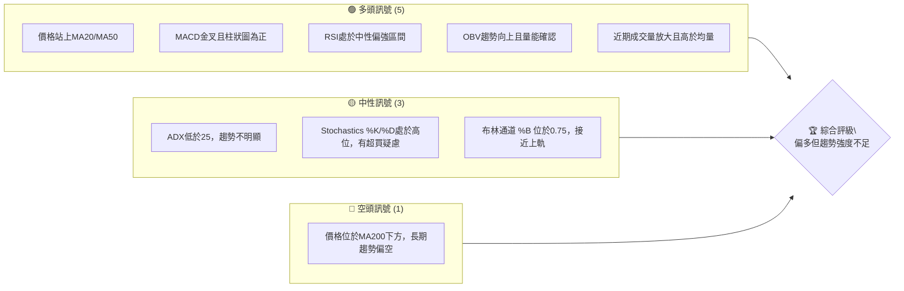
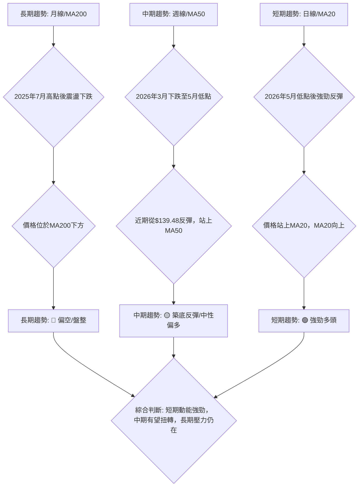
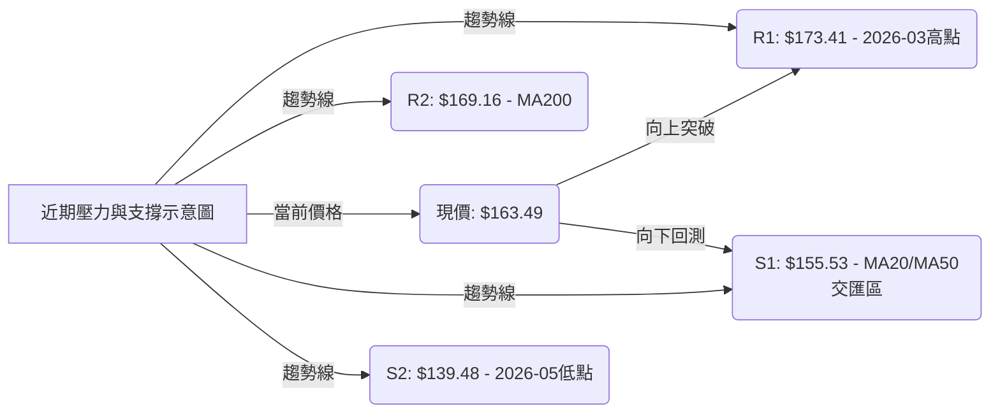
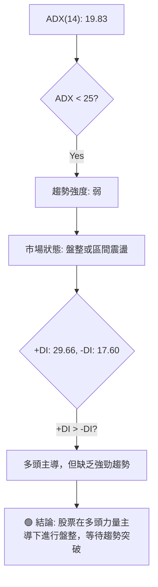
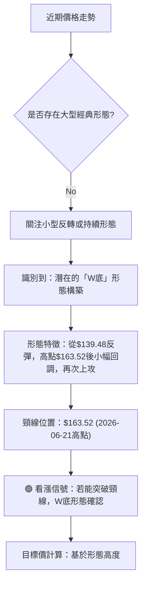
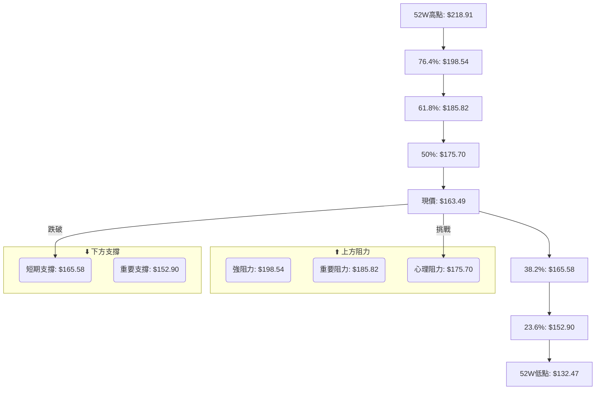
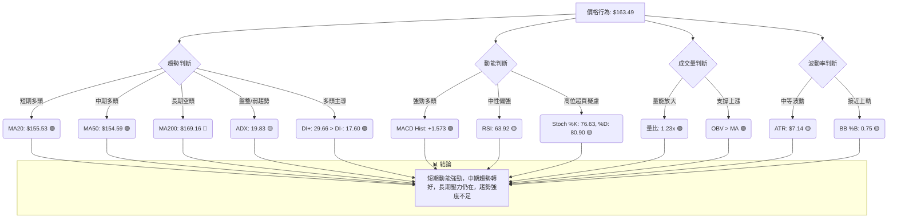
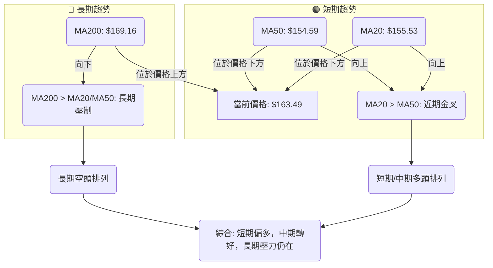
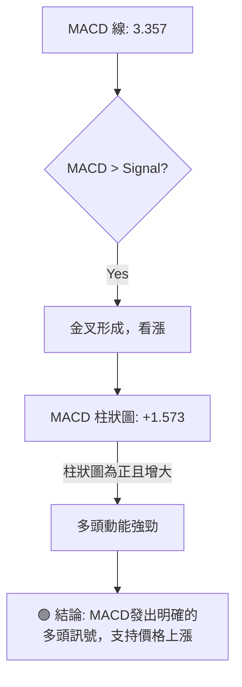
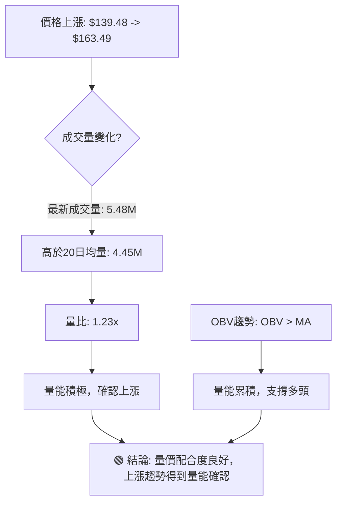

<details>
<summary>📊 靜態圖表 (點擊展開)</summary>

</details>

<html>
<head><meta charset="utf-8" /></head>
<body>
    <div style="height:500px; width:100%;">                        <script>window.PlotlyConfig = {MathJaxConfig: 'local'};</script>
        <script charset="utf-8" src="https://cdn.plot.ly/plotly-3.6.0.min.js" integrity="sha256-QaOVwtVY0T02VaHrr6pnoHLCwayMJp4O5n4YyaE3rJk=" crossorigin="anonymous"></script>                <div id="candlestick-chart" class="plotly-graph-div" style="height:100%; width:100%;"></div>            <script>                window.PLOTLYENV=window.PLOTLYENV || {};                                if (document.getElementById("candlestick-chart")) {                    Plotly.newPlot(                        "candlestick-chart",                        [{"close":{"dtype":"f8","bdata":"AAAAIMkDakAAAAAAh19pQAAAAEBiE2pAAAAAYPyMakAAAADgyQpqQAAAAMAi52lAAAAAwAYiakAAAACA60xqQAAAAOCEIGtAAAAAAJNsaUAAAACAGidpQAAAAAAVGWlAAAAAAIrLaUAAAACAz6NoQAAAAGBwY2hAAAAAoJMVaUAAAADA5zlpQAAAAKDfJGlAAAAAwIXyaEAAAADgWNloQAAAACAwtmlAAAAAYCEkakAAAADgZIFoQAAAAEDKFWpAAAAAwAuVaUAAAACgNz9qQAAAAGDgMGpAAAAAYHoQaUAAAADg5i1oQAAAAODiN2dAAAAA4OUhZ0AAAABAcdJnQAAAAEBNFGlAAAAAgCbPaEAAAAAAlrlnQAAAAGBh0WhAAAAAAIudZ0AAAAAgnHBnQAAAACCpB2hAAAAAoAcfZ0AAAABgWJNnQAAAAIBW+2ZAAAAAwKbGZ0AAAAAA+W9nQAAAAMBXTWZAAAAAQPswZkAAAADAJltlQAAAAGDlvmVAAAAAYMbIZUAAAADASrZlQAAAAKC0TGZAAAAAADeiZUAAAACAgfxkQAAAAIA8zWVAAAAAADVEZUAAAADgIgJmQAAAAGDIQ2ZAAAAAgG+dZUAAAABAs3plQAAAAAAFXmVAAAAAgN\u002fqZUAAAAAgQc9kQAAAAADLrWRAAAAAIAyEZEAAAAAAhY9kQAAAACAHvGVAAAAAQKAsZUAAAADAq\u002fFkQAAAAGBhl2VAAAAAQM\u002fpY0AAAAAgY69kQAAAAOBSS2RAAAAAAPojZEAAAADgKidkQAAAACBsMGRAAAAA4ConZEAAAACglyxkQAAAAMB7RWRAAAAAQFEcZEAAAAAAxphkQAAAAEBgT2RAAAAAYP4hZUAAAABAjUVjQAAAAMDnxWJAAAAAACe9ZEAAAAAgU4NlQAAAAIBOXmVAAAAAgB8QZUAAAABg2nVmQAAAAAB+xGRAAAAAgBOMY0AAAABgg\u002fJjQAAAAOBc\u002fWNAAAAAQLT1Y0AAAABg5stjQAAAAIDReWRAAAAAYNulZEAAAAAANURkQAAAAIA4vWNAAAAAoLM6Y0AAAABAfhJjQAAAAOAOxGFAAAAAIJzVYUAAAACglqdiQAAAACCJEWNAAAAAQBzlY0AAAABAqfZjQAAAAEDNVGRAAAAAgIpgZUAAAABAbaZlQAAAAKAuQ2VAAAAAgMWAZUAAAAAgq11lQAAAAEDJ6mRAAAAAYLBkZUAAAADgCdxlQAAAAGChCmZAAAAAACGtZUAAAADABrFkQAAAAAAgKGRAAAAAQBldZEAAAACABd5kQAAAAEDLxmNAAAAAIGVlZEAAAABgSX5kQAAAAMAR12NAAAAA4HjkY0AAAAAAXtBjQAAAACBhMWRAAAAAgA18ZEAAAABA0jRlQAAAAIAQ3WRAAAAAABs6YkAAAACAguJiQAAAAKA0EGNAAAAAIIrpYkAAAADgyAJjQAAAAABnaGNAAAAAYK1qYkAAAAAg1cNiQAAAAKDUN2NAAAAAoP7eYkAAAACgGOxiQAAAAODhLmNAAAAAAIF1Y0AAAAAgKhFjQAAAAIBvUGNAAAAAAFK\u002fY0AAAADAs3dkQAAAAODJVmRAAAAAYI2pZEAAAADAZ2dkQAAAAOAO7GNAAAAAIDBWY0AAAADgTnJjQAAAAGAulGNAAAAAgNiDZEAAAAAAG8tkQAAAAEChHGRAAAAAwGUyY0AAAAAA0bNjQAAAAOACYmNAAAAAgAAUZEAAAACg+wRkQAAAAEAywmNAAAAAwII3Y0AAAAAAbnBiQAAAAMDL+mJAAAAAgERVYkAAAABgI81hQAAAACBztmFAAAAAYIJvYUAAAABg4RFhQAAAACCx0GBAAAAAYI75YUAAAACA45tiQAAAAKClgWNAAAAAQI6KZEAAAAAgov1jQAAAAKDJAWRAAAAAgDAAZEAAAADgZFFjQAAAAID4t2NAAAAAoLcyY0AAAACghS9jQAAAAKCpkWJAAAAA4DlWYkAAAAAgf0BiQAAAAIAUS2FAAAAAIJxFYkAAAAAgBHpiQAAAACDFKWNAAAAAIGzMY0AAAADAc9NjQAAAACCscGRAAAAA4FHoZEAAAADgekxkQAAAAADXW2RAAAAA4KP4ZEAAAAAgrm9kQA=="},"high":{"dtype":"f8","bdata":"8Iiv3Zx4akCXtb+OallqQD5AMRzHI2pAYknqA2oYa0Bt0lAx5pVqQNj8xDDmlWpAR16MjuiqakD5vCAGgJ5qQEnLqTIRXWtAQKRBHD58akCxK\u002fSonqppQOkgeS42bWlAFiOzPHbUaUAGNVE\u002fk8hpQOgBxCVk9WhAwDtzDpCCaUDjva8oy4RpQNNs7fGAKmpAt014ASriaUA4hVILq19pQPf9KpYZuGlAKdeqhTpGakClX6fNp29qQA4nDmmJImpAJ1s8pnv\u002faUBIev32cuRqQAnTrz1jBmtAg+LPKrklakAdPOAxupRpQEGExjLFE2hALxsz0NmWZ0Dy1AZt5OxnQMOSPv4wJWlA8TD6fhdaaUDGmf7E5I9oQBUTNUu4\u002fGhAwZAindq\u002faEAybwBu4QJoQMQ5LfQsTGhAcafuRETWZ0BuaPPvp\u002fVnQMrTk5y9imdATzu0kwrJZ0DX4iNpe39oQDVLmDIjZWdAq\u002fO1DoqRZkBbBEovGidmQBzSg3ccaGZAM5PPrtBYZkBtSmXT5BVmQKzNw5Hpl2ZA4F+wYCiQZ0A0q\u002fvRtZ5lQApyKvYlz2VACWORtivAZUBpE1n5aCBmQMZPmjumgGZA0DAIQ\u002fD3ZUAoNkV8DOdlQHysXcEgpGVA0S26WvgpZkA4sBoauPxlQM46yL3342RAQm+KGpImZUBHUAVfm6pkQOdZt+VExWVAbIsDqBxoZkCiWLdeCollQPXUKTGtpmVA3iX1eDzNZUAX1OnFn2ZlQJLw+ipfVmVA\u002fWBvE2p7ZEAvlTa\u002f8mdkQP+rCwBeRGRAU90fMZxRZEAVvdNp53dkQGikS06GU2RAJmBSO3qBZECXgsIYBBplQE3qKVDOZWVAafBaJEiEZUAMlnY36QVlQETibZvYa2NAjiX69UDIZUCVsD3cEwhmQLAX1yvp3mVAjJ\u002fHzaVWZUDl6QyWzcFmQHkFh5i7VGVAHSfpTFixZEAdjB9UDzFkQC3tpciQYWRAZbRuGXZNZEDDfGZ5U5tkQG32H31OhWRAShc1NTfDZED3WL7XVu1kQI7wMkJ6gWRA3UebmjzxY0AHXLEmL4JjQK8CdvuNJ2NA08EgZGrwYUAEcGzD4PpiQFTSdh41a2NAqDUjfjAfZEBc1l9hU5tkQHfzEhcMuGRAZpd4SPdlZUC4t2ZgNAVmQHRfFrWB4GVAMzP3agGDZUBiVUDqrqBlQEs2oZG1a2VA53\u002fghJpmZUA\u002fsT4kjO5lQFmw+bu2F2ZAPovpuy06ZkBt9Z+FDgFmQI65eASGYmRArzRJSjl4ZEA\u002fIygeNvBkQP+m45lL\u002fWRA1kRjTKCFZEC1takJYQplQOeVqvczcWRAavQzEP5XZEA8UHaXF5lkQOXKtt+QYWRA7cE29hygZEBHUUcpupBlQAZxQlo6JGVAEtsNF5fHZEAo\u002fX\u002fQ0nVjQKwQqdBNPGNAydGc2FS3Y0D9ueaimw5jQCae5i07\u002f2NAPHKCw6XWY0CQPozwQuhiQLZxLjzig2NA2YaV5wBLY0C3k+EkghxjQLpvM6A4PmNABmuViLMiZEDwIVLWr0lkQF50DrIPzWNACrxYAdkPZEBzPwA+kKFkQOVL4zwwyWRAatNcU\u002fjVZEAUpSDgIwhlQJdRWkVCemRAKT+atv0bZEDHjyrvcNtjQHev5vu61GNA7ZgdbvSnZEB3z60r5wVlQHtHdF0XY2RA5gCWrjwdZEA1oEY+BO1jQDmzAFNQ\u002fWNAOkLKuOREZED8LLYRRXJkQL53EehiWGRAUMzp0\u002fEEZUC6dRFaEFljQKH3GhsqEWNAq8KC8ZvDYkAOqsz0aUJiQFkVxgQH42FAEkf1+JCcYUAh85gJCWthQFSH1lNIEGFAqi6e0FAWYkDq7nSVR6JiQKTPY1swq2NApA\u002fR9k7lZEApLBnQUZlkQIVY1GSkaWRAusF4ZgRCZEBhQng0gcpjQM2gz87DEWRAj2f+qQ22Y0C9y+b6YjpjQHj\u002fcQVgQmNAW0J0QeuiYkCIGzrC38JiQODlIVOO+WFA6RQP6zlWYkASuq\u002fWQ8liQH\u002fWwoNxZ2NAvcI6PyIoZEAXNWyEz0ZkQD5+vuFBQ2VAAAAAAABQZUAAAABgZrpkQAAAAOB6tGRAAAAAQDNrZUAAAACAwv1kQA=="},"hovertemplate":"\u003cb\u003e%{x|%Y-%m-%d}\u003c\u002fb\u003e\u003cbr\u003e\u958b: $%{open:.2f}\u003cbr\u003e\u9ad8: $%{high:.2f}\u003cbr\u003e\u4f4e: $%{low:.2f}\u003cbr\u003e\u6536: $%{close:.2f}\u003cextra\u003e\u003c\u002fextra\u003e","low":{"dtype":"f8","bdata":"MMztdJreaECK1ic8SUFpQKF\u002fOXqWHmlAzP71K2ITakCXqikUbsdpQInr53lDc2lAFe\u002f40tveaUAWGJk8qIppQDYHsrIF3mlAAcYvwLdTaUDvaZF0DCFpQEPZQnlOZmhAFJuw4K8EaUDF2neHKZxoQAoslXgXvWdA2DPvsu\u002frZ0Bk\u002fEM8WbxoQBGezSVCFWlAB+M1v46TaEAeT7alUmJoQI92bhiB6WhAVeWIPXiPaUDJxPytwYBoQDaDJz408mhA4Su\u002fQhISaUBboGdQaLFpQOdXDU0x+mlAjLDr6gznaEDx+YtvPABoQFXNq8acGWdAg7aaNvVcZkC3UfjrEh5nQLPt9qhfOWhAVTb5AOx1aECDCebsjvZmQN2Tj\u002frklWdA9vZFAEJ4Z0A4wZDGSNhmQE+ZGlckYmdAAxMLoYP3ZkC3yTOHNwVnQA7+AC8iWWZAxJLePcP7ZUA8g7f5rexmQPuGO2QwQmZAm+aaS8ARZkDvtXF1AjplQIUcksOVnGRAzcyHP92MZUA\u002f2K6eeD5lQDtq9Cfrr2VA5AtszC6NZUA5b0yxhThkQNDFyE3IpmRAbOdYKvGmZEAm5WPXv4tlQOuU\u002fQCyKGZAksGhZil\u002fZUDYY50C8FRlQM35QVv6B2VAYWIpmnI4ZUB\u002ffi+I8rhkQHVcRH0lbGRACIHRd3+BZECwKyGkvr9jQEwoRnrzCmRA9i88VcXZZEAdlecFM8lkQLPTwQ1\u002fu2RAEjgHhlbBY0C7GuwI2j9kQN8kMLbOQGRA+s6oBQANZEAcBc4NBvZjQHKAUR6J6mNAuID2VAv9Y0AvE1YNc+9jQCmPnYGzE2RAXWRunM4YZEB2DYgIA25kQAxAoCzw92NAyZcsU4BqZEDYT+GUuSNjQEKzkt3omGJAT47qEoStZEDWQN44E3RkQN4tVu8oS2VACa4Q3vCyZEAsVkp6mmZlQJDn3cLtUWRARgMCqDR6Y0ATnnqgECtjQFLE1di\u002f1mNAF6uSKQ2yY0Cw9PEw3K5jQNij9nbWtmNAcm+2f+QWZECWPU4SJcpjQEf7qwysjWNAiUWnslwzY0DH8aJwRL9iQFHKelNYXGFAkH+d+rpEYUChUP\u002flbGBiQCnPTevpa2JAcjRhwUBMY0DeTzBJmsNjQFmO78Sj\u002fmNA4nRxJb4hZECbC7dsZS9lQGNbNPKLJGVAzczMjCX5ZEA29lmdFBFlQNLTDokimGRA7idC5sdNZECC7NZ0izNlQG8L4j4IdWRAbbigzGRNZUDEp7ed66tkQEGb0dHaEWNAS78hxaP+Y0BlTbqFfCdkQGyq6Qigu2NAn+Wx8FBSY0DDJKFFQXtkQNRxNWAaV2NAl+OE9pCIY0BJQKVSb6ljQB57CJ1i9WNAX\u002fJFEoc1ZECRbbWpY6FkQMK0e5bceGRA\u002fNIbIhQUYkAwnEilCaRiQMiCHFHoqmJA60APMm7FYkD1SzPvH0liQBIcw5o18WJA0ULJxKNMYkCIuoWJgsRhQPA6xlMG5mJArKadRB+9YkB6ffv2c7ViQEj7qRM8wmJAM5+on1RiY0DIQU9t7Q5jQDHMHg+rHGNAZv0D9fcNY0CDdIFH3QNkQCz33SyLPWRAp6jeMz5MZECUu17\u002fDkFkQNmc5Mknw2NAQeN\u002fT0M9Y0BQjn7XgVZjQLLd8wsWSWNAAcmUZNtdY0DcwbufatBjQDa4ZP7vz2NAV+BIorUbY0D2zDEMZHBjQGLbd6LTVmNAUqzs0AinY0B4oQzlcvJjQBWqTDwxjGNAn\u002fjcT8IxY0BarDNayFhiQPB5qp9ZQmJAU9p+HJouYkBN4Y2jE2phQOZVAgk+d2FAVbkIzMAzYUAxfbKbh7VgQEVGKvwuj2BAVb02ycAzYUDbOZY9rRViQLxT5\u002fxA0WJACwUJovW\u002fY0DHT6W098VjQCRDh9MlrGNAatvMwCOVY0DVR6iryeNiQLP\u002f\u002fY9RFWNAVUPwHI4XY0CRg6v1W79iQFECWi9maWJAjPD6FJxFYkD1bnYd8qphQAAam9fyNmFAaSJHo\u002f5rYUALD3bva1liQOPvJXk+wWJAQYPflrgTY0A1ZTJPr59jQDIRhX3M+WNAAAAAwMxcZEAAAADgo+RjQAAAAAAp\u002fGNAAAAA4FHAZEAAAACAFGZkQA=="},"name":"\u50f9\u683c","open":{"dtype":"f8","bdata":"SmBOGijvaEDJBPjtGPZpQGA9\u002fBy3O2lAzP71K2ITakBt0lAx5pVqQGcN\u002f0UoRmpA3aHF10yGakCUMGkns1FqQILBtVr\u002fQ2pAAwWckKInakAdkeMaWE1pQH+3Fv24pWhAtoA4p7ILaUBYeNMPMSVpQHTkXyely2hAwcvl7B5GaED7c2ZmM2ZpQOAv\u002fZEUcGlAR\u002fFIZMKpaUAbEXwffRdpQKzS27rOF2lAfMVXTIfEaUCjnClaexxqQIOb8gcmCWlAiaG1\u002fPedaUA6Xk\u002fbdQ5qQJ5uWhnGvGpANRorB+HZaUCHlnK9EWlpQOOJaOuPAmhAdiBLsLVYZ0C3UfjrEh5nQM\u002fVnrUbeWhA8TD6fhdaaUDGmf7E5I9oQFTjOjQU8GdA62ozRew7aEDojN7KhOZnQKrOgsOYwGdAGIW2kTxqZ0BneWy3mS9nQFB65SY1xGZAojlrcE84ZkDZQStcvz9oQL5x5fPDJGdAXp1Bw6ByZkD+Uss7pAVmQG86aoeSz2RAAIAYRHrWZUDdCZ2rNH5lQB1XO7jfzWVAqiGQH7YBZ0CzC6VlLGllQOGegl28G2VAUr7qC3WrZUD3Oi9h6KhlQDdTWH4+SGZA1lbi+vXoZUD+tveLhdVlQBVgba80fmVAEDk9bfxlZUAOH9S2NvllQM46yL3342RATXJnmeSVZED4QW7Z75RkQC0Oj+QXLGRA6Q50GybPZUDCI48axIdlQExHEsiuvmRA56NS3TmpZUD9JKGTIp9kQCEHOdBGwGRArTj3lIVxZEA+IIIC+iNkQJ\u002fi98t3EWRAAAAA4ConZEBu+e9byRFkQOK4FMOyMWRAxPdPfhlOZEB2DYgIA25kQJF6ZTTjHGVAf8pbmhQRZUAMlnY36QVlQIN9eGlLWmNAQ00eeiu7ZUBCqG8j54ZkQO2bA5GjsGVAfnEKooYdZUAeFyYlupBlQKsEkefO4mRANhWAE2caZEDiA5czSNJjQHtDXsR2L2RAkEVA9t\u002fxY0BfmpXlswRkQE90Vdo84mNAAxIpXVixZED6kUmcEbBkQIk7MQ++IWRAExH34uGmY0D0nje9DnZjQEeQvVqOGGNAojQ1aI2TYUBr0Pv2wbJiQG77QP\u002fBsmJA\u002fxqKq6P+Y0C1aPPibpFkQJBUta8rCWRA+iaBjnY+ZECtz\u002fIHE01lQLOrpUH1sGVAzcyuyB4uZUB9UO2oY3plQOWAgVBqRWVA6lORNTHaZEBAJY8Z8XxlQAOzW2VkXGVAOU8LCo3QZUC18araXzdlQGjR0lnOJ2RAQRNeYJ0kZEBftYiA3i1kQIBPaMvhf2RAZPKZWQlvY0CG0uEN7JxkQCNnCejBZGRAdL73X7GUY0BdqwD+CSpkQMT20F\u002fJEWRAtkct+otLZECPW0sDXqlkQHRaFaWu1mRAEtsNF5fHZECbEcRqn+diQFVYRNzcymJAg3luRBBZY0AW3KxTT6liQBIcw5o18WJAw2d6eiucY0AS2UYqXPZhQP2SdgZD6GJAgJv6J\u002fTfYkD05QVNhdpiQNx2sMZ622JABWzocs4QZEA9BV0HgXVjQLWWVHchKWNAZv0D9fcNY0Bq0TQf2kVkQMEZRAyYqGRAEtt+H+CKZEC7gUEs4cBkQG2jFbpNWmRAmNfAOyARZEBJQhvZibJjQEubIrK9d2NATXwCgJCDY0B04M+5nZhkQIMv5nC6SGRAoLjdQFIUZEBSdtYhSYJjQBZ04OnVwmNAJT248wWvY0BA9fybtFhkQEL5jOicKGRACATW3ftZZEC6dRFaEFljQNTOhYVgeWJA+mVlnP2oYkAOqsz0aUJiQDsNAlXVpWFAvyBliYtyYUCsu0WZx1lhQGulTeOF82BAAAAAHNM5YUD8xES7hyhiQPBHu4cz2mJAx8ZiOgLWY0AqjOmlVpdkQK+CDJ\u002fF02NAQyCHAtf4Y0DC0GVW+ZhjQGPJmQEad2NAte0B1FCJY0AMOJaef+piQK8anKEy+WJAt\u002f3beEiDYkAxHOFLzIZiQAbrZwXJ5GFAytzu\u002fl6ZYUBWG6t6YHliQIKpSuIUE2NAm2MnZyQhY0CH1zPp+8pjQPBXPGSgO2RAAAAAAClwZEAAAABgjwJkQAAAAMD1YGRAAAAAwB7dZEAAAAAghbtkQA=="},"x":["2025-09-10T00:00:00-04:00","2025-09-11T00:00:00-04:00","2025-09-12T00:00:00-04:00","2025-09-15T00:00:00-04:00","2025-09-16T00:00:00-04:00","2025-09-17T00:00:00-04:00","2025-09-18T00:00:00-04:00","2025-09-19T00:00:00-04:00","2025-09-22T00:00:00-04:00","2025-09-23T00:00:00-04:00","2025-09-24T00:00:00-04:00","2025-09-25T00:00:00-04:00","2025-09-26T00:00:00-04:00","2025-09-29T00:00:00-04:00","2025-09-30T00:00:00-04:00","2025-10-01T00:00:00-04:00","2025-10-02T00:00:00-04:00","2025-10-03T00:00:00-04:00","2025-10-06T00:00:00-04:00","2025-10-07T00:00:00-04:00","2025-10-08T00:00:00-04:00","2025-10-09T00:00:00-04:00","2025-10-10T00:00:00-04:00","2025-10-13T00:00:00-04:00","2025-10-14T00:00:00-04:00","2025-10-15T00:00:00-04:00","2025-10-16T00:00:00-04:00","2025-10-17T00:00:00-04:00","2025-10-20T00:00:00-04:00","2025-10-21T00:00:00-04:00","2025-10-22T00:00:00-04:00","2025-10-23T00:00:00-04:00","2025-10-24T00:00:00-04:00","2025-10-27T00:00:00-04:00","2025-10-28T00:00:00-04:00","2025-10-29T00:00:00-04:00","2025-10-30T00:00:00-04:00","2025-10-31T00:00:00-04:00","2025-11-03T00:00:00-05:00","2025-11-04T00:00:00-05:00","2025-11-05T00:00:00-05:00","2025-11-06T00:00:00-05:00","2025-11-07T00:00:00-05:00","2025-11-10T00:00:00-05:00","2025-11-11T00:00:00-05:00","2025-11-12T00:00:00-05:00","2025-11-13T00:00:00-05:00","2025-11-14T00:00:00-05:00","2025-11-17T00:00:00-05:00","2025-11-18T00:00:00-05:00","2025-11-19T00:00:00-05:00","2025-11-20T00:00:00-05:00","2025-11-21T00:00:00-05:00","2025-11-24T00:00:00-05:00","2025-11-25T00:00:00-05:00","2025-11-26T00:00:00-05:00","2025-11-28T00:00:00-05:00","2025-12-01T00:00:00-05:00","2025-12-02T00:00:00-05:00","2025-12-03T00:00:00-05:00","2025-12-04T00:00:00-05:00","2025-12-05T00:00:00-05:00","2025-12-08T00:00:00-05:00","2025-12-09T00:00:00-05:00","2025-12-10T00:00:00-05:00","2025-12-11T00:00:00-05:00","2025-12-12T00:00:00-05:00","2025-12-15T00:00:00-05:00","2025-12-16T00:00:00-05:00","2025-12-17T00:00:00-05:00","2025-12-18T00:00:00-05:00","2025-12-19T00:00:00-05:00","2025-12-22T00:00:00-05:00","2025-12-23T00:00:00-05:00","2025-12-24T00:00:00-05:00","2025-12-26T00:00:00-05:00","2025-12-29T00:00:00-05:00","2025-12-30T00:00:00-05:00","2025-12-31T00:00:00-05:00","2026-01-02T00:00:00-05:00","2026-01-05T00:00:00-05:00","2026-01-06T00:00:00-05:00","2026-01-07T00:00:00-05:00","2026-01-08T00:00:00-05:00","2026-01-09T00:00:00-05:00","2026-01-12T00:00:00-05:00","2026-01-13T00:00:00-05:00","2026-01-14T00:00:00-05:00","2026-01-15T00:00:00-05:00","2026-01-16T00:00:00-05:00","2026-01-20T00:00:00-05:00","2026-01-21T00:00:00-05:00","2026-01-22T00:00:00-05:00","2026-01-23T00:00:00-05:00","2026-01-26T00:00:00-05:00","2026-01-27T00:00:00-05:00","2026-01-28T00:00:00-05:00","2026-01-29T00:00:00-05:00","2026-01-30T00:00:00-05:00","2026-02-02T00:00:00-05:00","2026-02-03T00:00:00-05:00","2026-02-04T00:00:00-05:00","2026-02-05T00:00:00-05:00","2026-02-06T00:00:00-05:00","2026-02-09T00:00:00-05:00","2026-02-10T00:00:00-05:00","2026-02-11T00:00:00-05:00","2026-02-12T00:00:00-05:00","2026-02-13T00:00:00-05:00","2026-02-17T00:00:00-05:00","2026-02-18T00:00:00-05:00","2026-02-19T00:00:00-05:00","2026-02-20T00:00:00-05:00","2026-02-23T00:00:00-05:00","2026-02-24T00:00:00-05:00","2026-02-25T00:00:00-05:00","2026-02-26T00:00:00-05:00","2026-02-27T00:00:00-05:00","2026-03-02T00:00:00-05:00","2026-03-03T00:00:00-05:00","2026-03-04T00:00:00-05:00","2026-03-05T00:00:00-05:00","2026-03-06T00:00:00-05:00","2026-03-09T00:00:00-04:00","2026-03-10T00:00:00-04:00","2026-03-11T00:00:00-04:00","2026-03-12T00:00:00-04:00","2026-03-13T00:00:00-04:00","2026-03-16T00:00:00-04:00","2026-03-17T00:00:00-04:00","2026-03-18T00:00:00-04:00","2026-03-19T00:00:00-04:00","2026-03-20T00:00:00-04:00","2026-03-23T00:00:00-04:00","2026-03-24T00:00:00-04:00","2026-03-25T00:00:00-04:00","2026-03-26T00:00:00-04:00","2026-03-27T00:00:00-04:00","2026-03-30T00:00:00-04:00","2026-03-31T00:00:00-04:00","2026-04-01T00:00:00-04:00","2026-04-02T00:00:00-04:00","2026-04-06T00:00:00-04:00","2026-04-07T00:00:00-04:00","2026-04-08T00:00:00-04:00","2026-04-09T00:00:00-04:00","2026-04-10T00:00:00-04:00","2026-04-13T00:00:00-04:00","2026-04-14T00:00:00-04:00","2026-04-15T00:00:00-04:00","2026-04-16T00:00:00-04:00","2026-04-17T00:00:00-04:00","2026-04-20T00:00:00-04:00","2026-04-21T00:00:00-04:00","2026-04-22T00:00:00-04:00","2026-04-23T00:00:00-04:00","2026-04-24T00:00:00-04:00","2026-04-27T00:00:00-04:00","2026-04-28T00:00:00-04:00","2026-04-29T00:00:00-04:00","2026-04-30T00:00:00-04:00","2026-05-01T00:00:00-04:00","2026-05-04T00:00:00-04:00","2026-05-05T00:00:00-04:00","2026-05-06T00:00:00-04:00","2026-05-07T00:00:00-04:00","2026-05-08T00:00:00-04:00","2026-05-11T00:00:00-04:00","2026-05-12T00:00:00-04:00","2026-05-13T00:00:00-04:00","2026-05-14T00:00:00-04:00","2026-05-15T00:00:00-04:00","2026-05-18T00:00:00-04:00","2026-05-19T00:00:00-04:00","2026-05-20T00:00:00-04:00","2026-05-21T00:00:00-04:00","2026-05-22T00:00:00-04:00","2026-05-26T00:00:00-04:00","2026-05-27T00:00:00-04:00","2026-05-28T00:00:00-04:00","2026-05-29T00:00:00-04:00","2026-06-01T00:00:00-04:00","2026-06-02T00:00:00-04:00","2026-06-03T00:00:00-04:00","2026-06-04T00:00:00-04:00","2026-06-05T00:00:00-04:00","2026-06-08T00:00:00-04:00","2026-06-09T00:00:00-04:00","2026-06-10T00:00:00-04:00","2026-06-11T00:00:00-04:00","2026-06-12T00:00:00-04:00","2026-06-15T00:00:00-04:00","2026-06-16T00:00:00-04:00","2026-06-17T00:00:00-04:00","2026-06-18T00:00:00-04:00","2026-06-22T00:00:00-04:00","2026-06-23T00:00:00-04:00","2026-06-24T00:00:00-04:00","2026-06-25T00:00:00-04:00","2026-06-26T00:00:00-04:00"],"type":"candlestick"},{"hovertemplate":"MA30: $%{y:.2f}\u003cextra\u003e\u003c\u002fextra\u003e","line":{"color":"#2196F3","dash":"dash","width":2},"mode":"lines","name":"MA30","x":["2025-09-10T00:00:00-04:00","2025-09-11T00:00:00-04:00","2025-09-12T00:00:00-04:00","2025-09-15T00:00:00-04:00","2025-09-16T00:00:00-04:00","2025-09-17T00:00:00-04:00","2025-09-18T00:00:00-04:00","2025-09-19T00:00:00-04:00","2025-09-22T00:00:00-04:00","2025-09-23T00:00:00-04:00","2025-09-24T00:00:00-04:00","2025-09-25T00:00:00-04:00","2025-09-26T00:00:00-04:00","2025-09-29T00:00:00-04:00","2025-09-30T00:00:00-04:00","2025-10-01T00:00:00-04:00","2025-10-02T00:00:00-04:00","2025-10-03T00:00:00-04:00","2025-10-06T00:00:00-04:00","2025-10-07T00:00:00-04:00","2025-10-08T00:00:00-04:00","2025-10-09T00:00:00-04:00","2025-10-10T00:00:00-04:00","2025-10-13T00:00:00-04:00","2025-10-14T00:00:00-04:00","2025-10-15T00:00:00-04:00","2025-10-16T00:00:00-04:00","2025-10-17T00:00:00-04:00","2025-10-20T00:00:00-04:00","2025-10-21T00:00:00-04:00","2025-10-22T00:00:00-04:00","2025-10-23T00:00:00-04:00","2025-10-24T00:00:00-04:00","2025-10-27T00:00:00-04:00","2025-10-28T00:00:00-04:00","2025-10-29T00:00:00-04:00","2025-10-30T00:00:00-04:00","2025-10-31T00:00:00-04:00","2025-11-03T00:00:00-05:00","2025-11-04T00:00:00-05:00","2025-11-05T00:00:00-05:00","2025-11-06T00:00:00-05:00","2025-11-07T00:00:00-05:00","2025-11-10T00:00:00-05:00","2025-11-11T00:00:00-05:00","2025-11-12T00:00:00-05:00","2025-11-13T00:00:00-05:00","2025-11-14T00:00:00-05:00","2025-11-17T00:00:00-05:00","2025-11-18T00:00:00-05:00","2025-11-19T00:00:00-05:00","2025-11-20T00:00:00-05:00","2025-11-21T00:00:00-05:00","2025-11-24T00:00:00-05:00","2025-11-25T00:00:00-05:00","2025-11-26T00:00:00-05:00","2025-11-28T00:00:00-05:00","2025-12-01T00:00:00-05:00","2025-12-02T00:00:00-05:00","2025-12-03T00:00:00-05:00","2025-12-04T00:00:00-05:00","2025-12-05T00:00:00-05:00","2025-12-08T00:00:00-05:00","2025-12-09T00:00:00-05:00","2025-12-10T00:00:00-05:00","2025-12-11T00:00:00-05:00","2025-12-12T00:00:00-05:00","2025-12-15T00:00:00-05:00","2025-12-16T00:00:00-05:00","2025-12-17T00:00:00-05:00","2025-12-18T00:00:00-05:00","2025-12-19T00:00:00-05:00","2025-12-22T00:00:00-05:00","2025-12-23T00:00:00-05:00","2025-12-24T00:00:00-05:00","2025-12-26T00:00:00-05:00","2025-12-29T00:00:00-05:00","2025-12-30T00:00:00-05:00","2025-12-31T00:00:00-05:00","2026-01-02T00:00:00-05:00","2026-01-05T00:00:00-05:00","2026-01-06T00:00:00-05:00","2026-01-07T00:00:00-05:00","2026-01-08T00:00:00-05:00","2026-01-09T00:00:00-05:00","2026-01-12T00:00:00-05:00","2026-01-13T00:00:00-05:00","2026-01-14T00:00:00-05:00","2026-01-15T00:00:00-05:00","2026-01-16T00:00:00-05:00","2026-01-20T00:00:00-05:00","2026-01-21T00:00:00-05:00","2026-01-22T00:00:00-05:00","2026-01-23T00:00:00-05:00","2026-01-26T00:00:00-05:00","2026-01-27T00:00:00-05:00","2026-01-28T00:00:00-05:00","2026-01-29T00:00:00-05:00","2026-01-30T00:00:00-05:00","2026-02-02T00:00:00-05:00","2026-02-03T00:00:00-05:00","2026-02-04T00:00:00-05:00","2026-02-05T00:00:00-05:00","2026-02-06T00:00:00-05:00","2026-02-09T00:00:00-05:00","2026-02-10T00:00:00-05:00","2026-02-11T00:00:00-05:00","2026-02-12T00:00:00-05:00","2026-02-13T00:00:00-05:00","2026-02-17T00:00:00-05:00","2026-02-18T00:00:00-05:00","2026-02-19T00:00:00-05:00","2026-02-20T00:00:00-05:00","2026-02-23T00:00:00-05:00","2026-02-24T00:00:00-05:00","2026-02-25T00:00:00-05:00","2026-02-26T00:00:00-05:00","2026-02-27T00:00:00-05:00","2026-03-02T00:00:00-05:00","2026-03-03T00:00:00-05:00","2026-03-04T00:00:00-05:00","2026-03-05T00:00:00-05:00","2026-03-06T00:00:00-05:00","2026-03-09T00:00:00-04:00","2026-03-10T00:00:00-04:00","2026-03-11T00:00:00-04:00","2026-03-12T00:00:00-04:00","2026-03-13T00:00:00-04:00","2026-03-16T00:00:00-04:00","2026-03-17T00:00:00-04:00","2026-03-18T00:00:00-04:00","2026-03-19T00:00:00-04:00","2026-03-20T00:00:00-04:00","2026-03-23T00:00:00-04:00","2026-03-24T00:00:00-04:00","2026-03-25T00:00:00-04:00","2026-03-26T00:00:00-04:00","2026-03-27T00:00:00-04:00","2026-03-30T00:00:00-04:00","2026-03-31T00:00:00-04:00","2026-04-01T00:00:00-04:00","2026-04-02T00:00:00-04:00","2026-04-06T00:00:00-04:00","2026-04-07T00:00:00-04:00","2026-04-08T00:00:00-04:00","2026-04-09T00:00:00-04:00","2026-04-10T00:00:00-04:00","2026-04-13T00:00:00-04:00","2026-04-14T00:00:00-04:00","2026-04-15T00:00:00-04:00","2026-04-16T00:00:00-04:00","2026-04-17T00:00:00-04:00","2026-04-20T00:00:00-04:00","2026-04-21T00:00:00-04:00","2026-04-22T00:00:00-04:00","2026-04-23T00:00:00-04:00","2026-04-24T00:00:00-04:00","2026-04-27T00:00:00-04:00","2026-04-28T00:00:00-04:00","2026-04-29T00:00:00-04:00","2026-04-30T00:00:00-04:00","2026-05-01T00:00:00-04:00","2026-05-04T00:00:00-04:00","2026-05-05T00:00:00-04:00","2026-05-06T00:00:00-04:00","2026-05-07T00:00:00-04:00","2026-05-08T00:00:00-04:00","2026-05-11T00:00:00-04:00","2026-05-12T00:00:00-04:00","2026-05-13T00:00:00-04:00","2026-05-14T00:00:00-04:00","2026-05-15T00:00:00-04:00","2026-05-18T00:00:00-04:00","2026-05-19T00:00:00-04:00","2026-05-20T00:00:00-04:00","2026-05-21T00:00:00-04:00","2026-05-22T00:00:00-04:00","2026-05-26T00:00:00-04:00","2026-05-27T00:00:00-04:00","2026-05-28T00:00:00-04:00","2026-05-29T00:00:00-04:00","2026-06-01T00:00:00-04:00","2026-06-02T00:00:00-04:00","2026-06-03T00:00:00-04:00","2026-06-04T00:00:00-04:00","2026-06-05T00:00:00-04:00","2026-06-08T00:00:00-04:00","2026-06-09T00:00:00-04:00","2026-06-10T00:00:00-04:00","2026-06-11T00:00:00-04:00","2026-06-12T00:00:00-04:00","2026-06-15T00:00:00-04:00","2026-06-16T00:00:00-04:00","2026-06-17T00:00:00-04:00","2026-06-18T00:00:00-04:00","2026-06-22T00:00:00-04:00","2026-06-23T00:00:00-04:00","2026-06-24T00:00:00-04:00","2026-06-25T00:00:00-04:00","2026-06-26T00:00:00-04:00"],"y":{"dtype":"f8","bdata":"AAAAAAAA+H8AAAAAAAD4fwAAAAAAAPh\u002fAAAAAAAA+H8AAAAAAAD4fwAAAAAAAPh\u002fAAAAAAAA+H8AAAAAAAD4fwAAAAAAAPh\u002fAAAAAAAA+H8AAAAAAAD4fwAAAAAAAPh\u002fAAAAAAAA+H8AAAAAAAD4fwAAAAAAAPh\u002fAAAAAAAA+H8AAAAAAAD4fwAAAAAAAPh\u002fAAAAAAAA+H8AAAAAAAD4fwAAAAAAAPh\u002fAAAAAAAA+H8AAAAAAAD4fwAAAAAAAPh\u002fAAAAAAAA+H8AAAAAAAD4fwAAAAAAAPh\u002fAAAAAAAA+H8AAAAAAAD4f4mIiAggeWlAREREZIdgaUDv7u7uSlNpQLy7uzvKSmlAVVVVxe07aUBmZmbGJyhpQImIiJjlHmlAERERAWoJaUBVVVX1APFoQLy7uzuT1mhAREREdOzCaEDNzMwMd7VoQKuqqipoo2hAREREZC2SaEAiIiKC6odoQDMzM+McdmhAREREJG1daEBVVVW1ZjxoQGZmZuZmH2hA3t3dDWkEaEARERFRpOlnQJqZmZmGzGdAq6qq2g+mZ0BmZmZGCIhnQERERAR7Y2dA7+7uDqc+Z0AzMzOzexpnQGZmZub6+GZAq6qqmovbZkCamZlZgcRmQAAAALC1tGZAvLu7m1eqZkDe3d3NopBmQN7d3e0Va2ZAq6qq6nJGZkCamZlZcitmQKuqqooiEWZAq6qq6k38ZUAzMzOjAedlQCIiInIy0mVAMzMzs9K2ZUBERERkKJ5lQGZmZlY5h2VARERElDNoZUBVVVW1LExlQKuqqtokOmVAq6qqCsAoZUBEREQ0qh5lQN7d3Z0VEmVAIiIics0DZUBVVVUFSfpkQN7d3b1O6WRAZmZmlgjlZECJiIjYZtZkQAAAALCOvGRAiYiIOA64ZECJiIgY1LNkQGZmZuYtrGRAiYiICHinZEBEREQ0169kQKuqqhq5qmRAq6qqGn+WZEAiIiJyI49kQImIiOhBiWRA7+7uPoOEZEBVVVX1\u002fX1kQAAAAHBAc2RAiYiIaMJuZEDv7u4u+mhkQFVVVQUsWWRARERExFVTZEB3d3dnkkVkQCIiIhL\u002fL2RAZmZmRlEcZEARERERiA9kQHd3d\u002ff3BWRAd3d3R8QDZEARERER+AFkQImIiMh6AmRA3t3dfUkNZECJiIiIRhZkQDMzMwNnHmRAiYiIyI8hZEBVVVWlbjNkQN7d3W26RWRAMzMzE1BLZECamZkZRU5kQImIiJgDVGRAERERYT9ZZEAiIiJCJ0pkQM3MzOzwRGRAVVVVlehLZEARERFBwlNkQJqZmZnwUWRAIiIisqlVZEDe3d3tm1tkQDMzMyMvVmRAvLu767xPZEC8u7tr4EtkQERERKS\u002fT2RAZmZm1nVaZEBmZmbWq2xkQDMzM9Mah2RAMzMzY3SKZEDv7u4ua4xkQFVVVdVfjGRAiYiIGP2DZEBEREQE3HtkQN7d3b36c2RAMzMzo7daZEB3d3f3GEJkQImIiAinMGRAiYiIeDEaZEARERFBVwVkQGZmZkaL9mNAIiIisgnmY0AAAABwNc5jQCIiIoLvtmNAzczMrHmmY0AiIiKCkKRjQERERLQepmNAvLu7G6uoY0CrqqrqtqRjQHd3d+f0pWNAq6qqmuqcY0Crqqra+5NjQDMzMxPBkWNAAAAAEBGXY0AiIiKybJ9jQCIiIqK7nmNAMzMzk76TY0AzMzMz6YZjQM3MzJxGemNAd3d3hxKKY0C8u7s7wZNjQGZmZhawmWNAERERcUmcY0C8u7uLaJdjQM3MzDzBk2NAq6qqigqTY0Crqqpq0YpjQFVVVdX4fWNAVVVV9bhxY0ARERFR6mFjQN7d3X21TWNAVVVVRQtBY0BERESEIj1jQERERHTGPmNAq6qquoxFY0AzMzMTe0FjQLy7u7ulPmNAERERgQA5Y0BEREQkvC9jQJqZman\u002fLWNAq6qq+tAsY0AiIiISlypjQLy7uwv5IWNAERERsWIPY0BERETUsvliQKuqqpql4WJAREREBMHZYkARERFBS89iQERERFRrzWJAREREhAjLYkCrqqraYcliQHd3d7cyz2JAVVVVBaDdYkARERFRfu1iQFVVVfVC+WJAMzMzI8YPY0Crqqo6QiZjQA=="},"type":"scatter"},{"hovertemplate":"MA60: $%{y:.2f}\u003cextra\u003e\u003c\u002fextra\u003e","line":{"color":"#9C27B0","dash":"dash","width":2},"mode":"lines","name":"MA60","x":["2025-09-10T00:00:00-04:00","2025-09-11T00:00:00-04:00","2025-09-12T00:00:00-04:00","2025-09-15T00:00:00-04:00","2025-09-16T00:00:00-04:00","2025-09-17T00:00:00-04:00","2025-09-18T00:00:00-04:00","2025-09-19T00:00:00-04:00","2025-09-22T00:00:00-04:00","2025-09-23T00:00:00-04:00","2025-09-24T00:00:00-04:00","2025-09-25T00:00:00-04:00","2025-09-26T00:00:00-04:00","2025-09-29T00:00:00-04:00","2025-09-30T00:00:00-04:00","2025-10-01T00:00:00-04:00","2025-10-02T00:00:00-04:00","2025-10-03T00:00:00-04:00","2025-10-06T00:00:00-04:00","2025-10-07T00:00:00-04:00","2025-10-08T00:00:00-04:00","2025-10-09T00:00:00-04:00","2025-10-10T00:00:00-04:00","2025-10-13T00:00:00-04:00","2025-10-14T00:00:00-04:00","2025-10-15T00:00:00-04:00","2025-10-16T00:00:00-04:00","2025-10-17T00:00:00-04:00","2025-10-20T00:00:00-04:00","2025-10-21T00:00:00-04:00","2025-10-22T00:00:00-04:00","2025-10-23T00:00:00-04:00","2025-10-24T00:00:00-04:00","2025-10-27T00:00:00-04:00","2025-10-28T00:00:00-04:00","2025-10-29T00:00:00-04:00","2025-10-30T00:00:00-04:00","2025-10-31T00:00:00-04:00","2025-11-03T00:00:00-05:00","2025-11-04T00:00:00-05:00","2025-11-05T00:00:00-05:00","2025-11-06T00:00:00-05:00","2025-11-07T00:00:00-05:00","2025-11-10T00:00:00-05:00","2025-11-11T00:00:00-05:00","2025-11-12T00:00:00-05:00","2025-11-13T00:00:00-05:00","2025-11-14T00:00:00-05:00","2025-11-17T00:00:00-05:00","2025-11-18T00:00:00-05:00","2025-11-19T00:00:00-05:00","2025-11-20T00:00:00-05:00","2025-11-21T00:00:00-05:00","2025-11-24T00:00:00-05:00","2025-11-25T00:00:00-05:00","2025-11-26T00:00:00-05:00","2025-11-28T00:00:00-05:00","2025-12-01T00:00:00-05:00","2025-12-02T00:00:00-05:00","2025-12-03T00:00:00-05:00","2025-12-04T00:00:00-05:00","2025-12-05T00:00:00-05:00","2025-12-08T00:00:00-05:00","2025-12-09T00:00:00-05:00","2025-12-10T00:00:00-05:00","2025-12-11T00:00:00-05:00","2025-12-12T00:00:00-05:00","2025-12-15T00:00:00-05:00","2025-12-16T00:00:00-05:00","2025-12-17T00:00:00-05:00","2025-12-18T00:00:00-05:00","2025-12-19T00:00:00-05:00","2025-12-22T00:00:00-05:00","2025-12-23T00:00:00-05:00","2025-12-24T00:00:00-05:00","2025-12-26T00:00:00-05:00","2025-12-29T00:00:00-05:00","2025-12-30T00:00:00-05:00","2025-12-31T00:00:00-05:00","2026-01-02T00:00:00-05:00","2026-01-05T00:00:00-05:00","2026-01-06T00:00:00-05:00","2026-01-07T00:00:00-05:00","2026-01-08T00:00:00-05:00","2026-01-09T00:00:00-05:00","2026-01-12T00:00:00-05:00","2026-01-13T00:00:00-05:00","2026-01-14T00:00:00-05:00","2026-01-15T00:00:00-05:00","2026-01-16T00:00:00-05:00","2026-01-20T00:00:00-05:00","2026-01-21T00:00:00-05:00","2026-01-22T00:00:00-05:00","2026-01-23T00:00:00-05:00","2026-01-26T00:00:00-05:00","2026-01-27T00:00:00-05:00","2026-01-28T00:00:00-05:00","2026-01-29T00:00:00-05:00","2026-01-30T00:00:00-05:00","2026-02-02T00:00:00-05:00","2026-02-03T00:00:00-05:00","2026-02-04T00:00:00-05:00","2026-02-05T00:00:00-05:00","2026-02-06T00:00:00-05:00","2026-02-09T00:00:00-05:00","2026-02-10T00:00:00-05:00","2026-02-11T00:00:00-05:00","2026-02-12T00:00:00-05:00","2026-02-13T00:00:00-05:00","2026-02-17T00:00:00-05:00","2026-02-18T00:00:00-05:00","2026-02-19T00:00:00-05:00","2026-02-20T00:00:00-05:00","2026-02-23T00:00:00-05:00","2026-02-24T00:00:00-05:00","2026-02-25T00:00:00-05:00","2026-02-26T00:00:00-05:00","2026-02-27T00:00:00-05:00","2026-03-02T00:00:00-05:00","2026-03-03T00:00:00-05:00","2026-03-04T00:00:00-05:00","2026-03-05T00:00:00-05:00","2026-03-06T00:00:00-05:00","2026-03-09T00:00:00-04:00","2026-03-10T00:00:00-04:00","2026-03-11T00:00:00-04:00","2026-03-12T00:00:00-04:00","2026-03-13T00:00:00-04:00","2026-03-16T00:00:00-04:00","2026-03-17T00:00:00-04:00","2026-03-18T00:00:00-04:00","2026-03-19T00:00:00-04:00","2026-03-20T00:00:00-04:00","2026-03-23T00:00:00-04:00","2026-03-24T00:00:00-04:00","2026-03-25T00:00:00-04:00","2026-03-26T00:00:00-04:00","2026-03-27T00:00:00-04:00","2026-03-30T00:00:00-04:00","2026-03-31T00:00:00-04:00","2026-04-01T00:00:00-04:00","2026-04-02T00:00:00-04:00","2026-04-06T00:00:00-04:00","2026-04-07T00:00:00-04:00","2026-04-08T00:00:00-04:00","2026-04-09T00:00:00-04:00","2026-04-10T00:00:00-04:00","2026-04-13T00:00:00-04:00","2026-04-14T00:00:00-04:00","2026-04-15T00:00:00-04:00","2026-04-16T00:00:00-04:00","2026-04-17T00:00:00-04:00","2026-04-20T00:00:00-04:00","2026-04-21T00:00:00-04:00","2026-04-22T00:00:00-04:00","2026-04-23T00:00:00-04:00","2026-04-24T00:00:00-04:00","2026-04-27T00:00:00-04:00","2026-04-28T00:00:00-04:00","2026-04-29T00:00:00-04:00","2026-04-30T00:00:00-04:00","2026-05-01T00:00:00-04:00","2026-05-04T00:00:00-04:00","2026-05-05T00:00:00-04:00","2026-05-06T00:00:00-04:00","2026-05-07T00:00:00-04:00","2026-05-08T00:00:00-04:00","2026-05-11T00:00:00-04:00","2026-05-12T00:00:00-04:00","2026-05-13T00:00:00-04:00","2026-05-14T00:00:00-04:00","2026-05-15T00:00:00-04:00","2026-05-18T00:00:00-04:00","2026-05-19T00:00:00-04:00","2026-05-20T00:00:00-04:00","2026-05-21T00:00:00-04:00","2026-05-22T00:00:00-04:00","2026-05-26T00:00:00-04:00","2026-05-27T00:00:00-04:00","2026-05-28T00:00:00-04:00","2026-05-29T00:00:00-04:00","2026-06-01T00:00:00-04:00","2026-06-02T00:00:00-04:00","2026-06-03T00:00:00-04:00","2026-06-04T00:00:00-04:00","2026-06-05T00:00:00-04:00","2026-06-08T00:00:00-04:00","2026-06-09T00:00:00-04:00","2026-06-10T00:00:00-04:00","2026-06-11T00:00:00-04:00","2026-06-12T00:00:00-04:00","2026-06-15T00:00:00-04:00","2026-06-16T00:00:00-04:00","2026-06-17T00:00:00-04:00","2026-06-18T00:00:00-04:00","2026-06-22T00:00:00-04:00","2026-06-23T00:00:00-04:00","2026-06-24T00:00:00-04:00","2026-06-25T00:00:00-04:00","2026-06-26T00:00:00-04:00"],"y":{"dtype":"f8","bdata":"AAAAAAAA+H8AAAAAAAD4fwAAAAAAAPh\u002fAAAAAAAA+H8AAAAAAAD4fwAAAAAAAPh\u002fAAAAAAAA+H8AAAAAAAD4fwAAAAAAAPh\u002fAAAAAAAA+H8AAAAAAAD4fwAAAAAAAPh\u002fAAAAAAAA+H8AAAAAAAD4fwAAAAAAAPh\u002fAAAAAAAA+H8AAAAAAAD4fwAAAAAAAPh\u002fAAAAAAAA+H8AAAAAAAD4fwAAAAAAAPh\u002fAAAAAAAA+H8AAAAAAAD4fwAAAAAAAPh\u002fAAAAAAAA+H8AAAAAAAD4fwAAAAAAAPh\u002fAAAAAAAA+H8AAAAAAAD4fwAAAAAAAPh\u002fAAAAAAAA+H8AAAAAAAD4fwAAAAAAAPh\u002fAAAAAAAA+H8AAAAAAAD4fwAAAAAAAPh\u002fAAAAAAAA+H8AAAAAAAD4fwAAAAAAAPh\u002fAAAAAAAA+H8AAAAAAAD4fwAAAAAAAPh\u002fAAAAAAAA+H8AAAAAAAD4fwAAAAAAAPh\u002fAAAAAAAA+H8AAAAAAAD4fwAAAAAAAPh\u002fAAAAAAAA+H8AAAAAAAD4fwAAAAAAAPh\u002fAAAAAAAA+H8AAAAAAAD4fwAAAAAAAPh\u002fAAAAAAAA+H8AAAAAAAD4fwAAAAAAAPh\u002fAAAAAAAA+H8AAAAAAAD4f0RERNzqFmhAAAAAgG8FaEBmZmbe9vFnQM3MzBTw2mdAAAAAWDDBZ0AAAAAQzalnQJqZmREEmGdA3t3d9duCZ0BERERMAWxnQO\u002fu7tZiVGdAvLu7k988Z0CJiIi4zylnQImIiMBQFWdAREREfDD9ZkC8u7ubC+pmQO\u002fu7t4g2GZAd3d3lxbDZkDNzMx0iK1mQCIiIkK+mGZAAAAAQBuEZkAzMzOr9nFmQLy7u6vqWmZAiYiIOIxFZkB3d3ePNy9mQCIiItoEEGZAvLu7o1r7ZUDe3d3lJ+dlQGZmZmaU0mVAmpmZ0YHBZUDv7u5GLLplQFVVVWW3r2VAMzMzW2ugZUAAAAAg449lQDMzM+sremVAzczMFHtlZUB3d3cnuFRlQFVVVX0xQmVAmpmZKYg1ZUARERHp\u002fSdlQLy7uzuvFWVAvLu7OxQFZUDe3d1l3fFkQERERDSc22RAVVVVbULCZEAzMzNj2q1kQBEREWkOoGRAERERKUKWZECrqqoiUZBkQDMzMzNIimRAAAAAeIuIZEDv7u7GR4hkQImIiODag2RAd3d3L0yDZEDv7u6+6oRkQO\u002fu7o4kgWRA3t3dJa+BZEARERGZDIFkQHd3d78YgGRAzczMtFuAZEAzMzM7\u002f3xkQLy7uwPVd2RAAAAA2DNxZECamZnZcnFkQBEREUGZbWRAiYiIeBZtZECamZnxzGxkQJqZmcm3ZGRAIiIiqj9fZEBVVVVNbVpkQM3MzNR1VGRAVVVVzeVWZEDv7u4eH1lkQKuqqvKMW2RAzczM1GJTZEAAAACg+U1kQGZmZuYrSWRAAAAAsOBDZECrqqoK6j5kQDMzM8M6O2RAiYiIkAA0ZEAAAADALyxkQN7d3QWHJ2RAiYiIoOAdZEAzMzPzYhxkQCIiItoiHmRAq6qq4qwYZEDNzMxEPQ5kQFVVVY15BWRA7+7uhtz\u002fY0AiIiLiW\u002fdjQImIiNCH9WNAiYiI2En6Y0De3d2VPPxjQImIiMDy+2NAZmZmJkr5Y0BERETky\u002fdjQDMzMxv482NA3t3d\u002fWbzY0Dv7u6OpvVjQDMzM6M992NAzczMNBr3Y0DNzMyEyvljQAAAALiwAGRAVVVVdUMKZEBVVVU1FhBkQN7d3fUHE2RAzczMRCMQZEAAAABIoglkQFVVVf3dA2RA7+7uFuH2Y0ARERExdeZjQO\u002fu7u5P12NA7+7uNvXFY0ARERHJoLNjQCIiImIgomNAvLu7e4qTY0AiIiL6q4VjQDMzM\u002fvaemNAvLu7MwN2Y0CrqqrKBXNjQAAAADhicmNAZmZmztVwY0B3d3eHOWpjQImIiEj6aWNAq6qqyt1kY0BmZmZ2SV9jQHd3dw\u002fdWWNAiYiI4DlTY0AzMzPDj0xjQGZmZp4wQGNAvLu7y782Y0AiIiI6GitjQImIiPjYI2NA3t3dhY0qY0AzMzOLkS5jQO\u002fu7mZxNGNAMzMzu\u002fQ8Y0BmZmZuc0JjQBERERmCRmNA7+7uVmhRY0CrqqrSiVhjQA=="},"type":"scatter"},{"hovertemplate":"MA200: $%{y:.2f}\u003cextra\u003e\u003c\u002fextra\u003e","line":{"color":"#FF6F00","dash":"solid","width":2},"mode":"lines","name":"MA200","x":["2025-09-10T00:00:00-04:00","2025-09-11T00:00:00-04:00","2025-09-12T00:00:00-04:00","2025-09-15T00:00:00-04:00","2025-09-16T00:00:00-04:00","2025-09-17T00:00:00-04:00","2025-09-18T00:00:00-04:00","2025-09-19T00:00:00-04:00","2025-09-22T00:00:00-04:00","2025-09-23T00:00:00-04:00","2025-09-24T00:00:00-04:00","2025-09-25T00:00:00-04:00","2025-09-26T00:00:00-04:00","2025-09-29T00:00:00-04:00","2025-09-30T00:00:00-04:00","2025-10-01T00:00:00-04:00","2025-10-02T00:00:00-04:00","2025-10-03T00:00:00-04:00","2025-10-06T00:00:00-04:00","2025-10-07T00:00:00-04:00","2025-10-08T00:00:00-04:00","2025-10-09T00:00:00-04:00","2025-10-10T00:00:00-04:00","2025-10-13T00:00:00-04:00","2025-10-14T00:00:00-04:00","2025-10-15T00:00:00-04:00","2025-10-16T00:00:00-04:00","2025-10-17T00:00:00-04:00","2025-10-20T00:00:00-04:00","2025-10-21T00:00:00-04:00","2025-10-22T00:00:00-04:00","2025-10-23T00:00:00-04:00","2025-10-24T00:00:00-04:00","2025-10-27T00:00:00-04:00","2025-10-28T00:00:00-04:00","2025-10-29T00:00:00-04:00","2025-10-30T00:00:00-04:00","2025-10-31T00:00:00-04:00","2025-11-03T00:00:00-05:00","2025-11-04T00:00:00-05:00","2025-11-05T00:00:00-05:00","2025-11-06T00:00:00-05:00","2025-11-07T00:00:00-05:00","2025-11-10T00:00:00-05:00","2025-11-11T00:00:00-05:00","2025-11-12T00:00:00-05:00","2025-11-13T00:00:00-05:00","2025-11-14T00:00:00-05:00","2025-11-17T00:00:00-05:00","2025-11-18T00:00:00-05:00","2025-11-19T00:00:00-05:00","2025-11-20T00:00:00-05:00","2025-11-21T00:00:00-05:00","2025-11-24T00:00:00-05:00","2025-11-25T00:00:00-05:00","2025-11-26T00:00:00-05:00","2025-11-28T00:00:00-05:00","2025-12-01T00:00:00-05:00","2025-12-02T00:00:00-05:00","2025-12-03T00:00:00-05:00","2025-12-04T00:00:00-05:00","2025-12-05T00:00:00-05:00","2025-12-08T00:00:00-05:00","2025-12-09T00:00:00-05:00","2025-12-10T00:00:00-05:00","2025-12-11T00:00:00-05:00","2025-12-12T00:00:00-05:00","2025-12-15T00:00:00-05:00","2025-12-16T00:00:00-05:00","2025-12-17T00:00:00-05:00","2025-12-18T00:00:00-05:00","2025-12-19T00:00:00-05:00","2025-12-22T00:00:00-05:00","2025-12-23T00:00:00-05:00","2025-12-24T00:00:00-05:00","2025-12-26T00:00:00-05:00","2025-12-29T00:00:00-05:00","2025-12-30T00:00:00-05:00","2025-12-31T00:00:00-05:00","2026-01-02T00:00:00-05:00","2026-01-05T00:00:00-05:00","2026-01-06T00:00:00-05:00","2026-01-07T00:00:00-05:00","2026-01-08T00:00:00-05:00","2026-01-09T00:00:00-05:00","2026-01-12T00:00:00-05:00","2026-01-13T00:00:00-05:00","2026-01-14T00:00:00-05:00","2026-01-15T00:00:00-05:00","2026-01-16T00:00:00-05:00","2026-01-20T00:00:00-05:00","2026-01-21T00:00:00-05:00","2026-01-22T00:00:00-05:00","2026-01-23T00:00:00-05:00","2026-01-26T00:00:00-05:00","2026-01-27T00:00:00-05:00","2026-01-28T00:00:00-05:00","2026-01-29T00:00:00-05:00","2026-01-30T00:00:00-05:00","2026-02-02T00:00:00-05:00","2026-02-03T00:00:00-05:00","2026-02-04T00:00:00-05:00","2026-02-05T00:00:00-05:00","2026-02-06T00:00:00-05:00","2026-02-09T00:00:00-05:00","2026-02-10T00:00:00-05:00","2026-02-11T00:00:00-05:00","2026-02-12T00:00:00-05:00","2026-02-13T00:00:00-05:00","2026-02-17T00:00:00-05:00","2026-02-18T00:00:00-05:00","2026-02-19T00:00:00-05:00","2026-02-20T00:00:00-05:00","2026-02-23T00:00:00-05:00","2026-02-24T00:00:00-05:00","2026-02-25T00:00:00-05:00","2026-02-26T00:00:00-05:00","2026-02-27T00:00:00-05:00","2026-03-02T00:00:00-05:00","2026-03-03T00:00:00-05:00","2026-03-04T00:00:00-05:00","2026-03-05T00:00:00-05:00","2026-03-06T00:00:00-05:00","2026-03-09T00:00:00-04:00","2026-03-10T00:00:00-04:00","2026-03-11T00:00:00-04:00","2026-03-12T00:00:00-04:00","2026-03-13T00:00:00-04:00","2026-03-16T00:00:00-04:00","2026-03-17T00:00:00-04:00","2026-03-18T00:00:00-04:00","2026-03-19T00:00:00-04:00","2026-03-20T00:00:00-04:00","2026-03-23T00:00:00-04:00","2026-03-24T00:00:00-04:00","2026-03-25T00:00:00-04:00","2026-03-26T00:00:00-04:00","2026-03-27T00:00:00-04:00","2026-03-30T00:00:00-04:00","2026-03-31T00:00:00-04:00","2026-04-01T00:00:00-04:00","2026-04-02T00:00:00-04:00","2026-04-06T00:00:00-04:00","2026-04-07T00:00:00-04:00","2026-04-08T00:00:00-04:00","2026-04-09T00:00:00-04:00","2026-04-10T00:00:00-04:00","2026-04-13T00:00:00-04:00","2026-04-14T00:00:00-04:00","2026-04-15T00:00:00-04:00","2026-04-16T00:00:00-04:00","2026-04-17T00:00:00-04:00","2026-04-20T00:00:00-04:00","2026-04-21T00:00:00-04:00","2026-04-22T00:00:00-04:00","2026-04-23T00:00:00-04:00","2026-04-24T00:00:00-04:00","2026-04-27T00:00:00-04:00","2026-04-28T00:00:00-04:00","2026-04-29T00:00:00-04:00","2026-04-30T00:00:00-04:00","2026-05-01T00:00:00-04:00","2026-05-04T00:00:00-04:00","2026-05-05T00:00:00-04:00","2026-05-06T00:00:00-04:00","2026-05-07T00:00:00-04:00","2026-05-08T00:00:00-04:00","2026-05-11T00:00:00-04:00","2026-05-12T00:00:00-04:00","2026-05-13T00:00:00-04:00","2026-05-14T00:00:00-04:00","2026-05-15T00:00:00-04:00","2026-05-18T00:00:00-04:00","2026-05-19T00:00:00-04:00","2026-05-20T00:00:00-04:00","2026-05-21T00:00:00-04:00","2026-05-22T00:00:00-04:00","2026-05-26T00:00:00-04:00","2026-05-27T00:00:00-04:00","2026-05-28T00:00:00-04:00","2026-05-29T00:00:00-04:00","2026-06-01T00:00:00-04:00","2026-06-02T00:00:00-04:00","2026-06-03T00:00:00-04:00","2026-06-04T00:00:00-04:00","2026-06-05T00:00:00-04:00","2026-06-08T00:00:00-04:00","2026-06-09T00:00:00-04:00","2026-06-10T00:00:00-04:00","2026-06-11T00:00:00-04:00","2026-06-12T00:00:00-04:00","2026-06-15T00:00:00-04:00","2026-06-16T00:00:00-04:00","2026-06-17T00:00:00-04:00","2026-06-18T00:00:00-04:00","2026-06-22T00:00:00-04:00","2026-06-23T00:00:00-04:00","2026-06-24T00:00:00-04:00","2026-06-25T00:00:00-04:00","2026-06-26T00:00:00-04:00"],"y":{"dtype":"f8","bdata":"AAAAAAAA+H8AAAAAAAD4fwAAAAAAAPh\u002fAAAAAAAA+H8AAAAAAAD4fwAAAAAAAPh\u002fAAAAAAAA+H8AAAAAAAD4fwAAAAAAAPh\u002fAAAAAAAA+H8AAAAAAAD4fwAAAAAAAPh\u002fAAAAAAAA+H8AAAAAAAD4fwAAAAAAAPh\u002fAAAAAAAA+H8AAAAAAAD4fwAAAAAAAPh\u002fAAAAAAAA+H8AAAAAAAD4fwAAAAAAAPh\u002fAAAAAAAA+H8AAAAAAAD4fwAAAAAAAPh\u002fAAAAAAAA+H8AAAAAAAD4fwAAAAAAAPh\u002fAAAAAAAA+H8AAAAAAAD4fwAAAAAAAPh\u002fAAAAAAAA+H8AAAAAAAD4fwAAAAAAAPh\u002fAAAAAAAA+H8AAAAAAAD4fwAAAAAAAPh\u002fAAAAAAAA+H8AAAAAAAD4fwAAAAAAAPh\u002fAAAAAAAA+H8AAAAAAAD4fwAAAAAAAPh\u002fAAAAAAAA+H8AAAAAAAD4fwAAAAAAAPh\u002fAAAAAAAA+H8AAAAAAAD4fwAAAAAAAPh\u002fAAAAAAAA+H8AAAAAAAD4fwAAAAAAAPh\u002fAAAAAAAA+H8AAAAAAAD4fwAAAAAAAPh\u002fAAAAAAAA+H8AAAAAAAD4fwAAAAAAAPh\u002fAAAAAAAA+H8AAAAAAAD4fwAAAAAAAPh\u002fAAAAAAAA+H8AAAAAAAD4fwAAAAAAAPh\u002fAAAAAAAA+H8AAAAAAAD4fwAAAAAAAPh\u002fAAAAAAAA+H8AAAAAAAD4fwAAAAAAAPh\u002fAAAAAAAA+H8AAAAAAAD4fwAAAAAAAPh\u002fAAAAAAAA+H8AAAAAAAD4fwAAAAAAAPh\u002fAAAAAAAA+H8AAAAAAAD4fwAAAAAAAPh\u002fAAAAAAAA+H8AAAAAAAD4fwAAAAAAAPh\u002fAAAAAAAA+H8AAAAAAAD4fwAAAAAAAPh\u002fAAAAAAAA+H8AAAAAAAD4fwAAAAAAAPh\u002fAAAAAAAA+H8AAAAAAAD4fwAAAAAAAPh\u002fAAAAAAAA+H8AAAAAAAD4fwAAAAAAAPh\u002fAAAAAAAA+H8AAAAAAAD4fwAAAAAAAPh\u002fAAAAAAAA+H8AAAAAAAD4fwAAAAAAAPh\u002fAAAAAAAA+H8AAAAAAAD4fwAAAAAAAPh\u002fAAAAAAAA+H8AAAAAAAD4fwAAAAAAAPh\u002fAAAAAAAA+H8AAAAAAAD4fwAAAAAAAPh\u002fAAAAAAAA+H8AAAAAAAD4fwAAAAAAAPh\u002fAAAAAAAA+H8AAAAAAAD4fwAAAAAAAPh\u002fAAAAAAAA+H8AAAAAAAD4fwAAAAAAAPh\u002fAAAAAAAA+H8AAAAAAAD4fwAAAAAAAPh\u002fAAAAAAAA+H8AAAAAAAD4fwAAAAAAAPh\u002fAAAAAAAA+H8AAAAAAAD4fwAAAAAAAPh\u002fAAAAAAAA+H8AAAAAAAD4fwAAAAAAAPh\u002fAAAAAAAA+H8AAAAAAAD4fwAAAAAAAPh\u002fAAAAAAAA+H8AAAAAAAD4fwAAAAAAAPh\u002fAAAAAAAA+H8AAAAAAAD4fwAAAAAAAPh\u002fAAAAAAAA+H8AAAAAAAD4fwAAAAAAAPh\u002fAAAAAAAA+H8AAAAAAAD4fwAAAAAAAPh\u002fAAAAAAAA+H8AAAAAAAD4fwAAAAAAAPh\u002fAAAAAAAA+H8AAAAAAAD4fwAAAAAAAPh\u002fAAAAAAAA+H8AAAAAAAD4fwAAAAAAAPh\u002fAAAAAAAA+H8AAAAAAAD4fwAAAAAAAPh\u002fAAAAAAAA+H8AAAAAAAD4fwAAAAAAAPh\u002fAAAAAAAA+H8AAAAAAAD4fwAAAAAAAPh\u002fAAAAAAAA+H8AAAAAAAD4fwAAAAAAAPh\u002fAAAAAAAA+H8AAAAAAAD4fwAAAAAAAPh\u002fAAAAAAAA+H8AAAAAAAD4fwAAAAAAAPh\u002fAAAAAAAA+H8AAAAAAAD4fwAAAAAAAPh\u002fAAAAAAAA+H8AAAAAAAD4fwAAAAAAAPh\u002fAAAAAAAA+H8AAAAAAAD4fwAAAAAAAPh\u002fAAAAAAAA+H8AAAAAAAD4fwAAAAAAAPh\u002fAAAAAAAA+H8AAAAAAAD4fwAAAAAAAPh\u002fAAAAAAAA+H8AAAAAAAD4fwAAAAAAAPh\u002fAAAAAAAA+H8AAAAAAAD4fwAAAAAAAPh\u002fAAAAAAAA+H8AAAAAAAD4fwAAAAAAAPh\u002fAAAAAAAA+H8AAAAAAAD4fwAAAAAAAPh\u002fAAAAAAAA+H8zMzMTOyVlQA=="},"type":"scatter"}],                        {"template":{"data":{"barpolar":[{"marker":{"line":{"color":"rgb(17,17,17)","width":0.5},"pattern":{"fillmode":"overlay","size":10,"solidity":0.2}},"type":"barpolar"}],"bar":[{"error_x":{"color":"#f2f5fa"},"error_y":{"color":"#f2f5fa"},"marker":{"line":{"color":"rgb(17,17,17)","width":0.5},"pattern":{"fillmode":"overlay","size":10,"solidity":0.2}},"type":"bar"}],"carpet":[{"aaxis":{"endlinecolor":"#A2B1C6","gridcolor":"#506784","linecolor":"#506784","minorgridcolor":"#506784","startlinecolor":"#A2B1C6"},"baxis":{"endlinecolor":"#A2B1C6","gridcolor":"#506784","linecolor":"#506784","minorgridcolor":"#506784","startlinecolor":"#A2B1C6"},"type":"carpet"}],"choropleth":[{"colorbar":{"outlinewidth":0,"ticks":""},"type":"choropleth"}],"contourcarpet":[{"colorbar":{"outlinewidth":0,"ticks":""},"type":"contourcarpet"}],"contour":[{"colorbar":{"outlinewidth":0,"ticks":""},"colorscale":[[0.0,"#0d0887"],[0.1111111111111111,"#46039f"],[0.2222222222222222,"#7201a8"],[0.3333333333333333,"#9c179e"],[0.4444444444444444,"#bd3786"],[0.5555555555555556,"#d8576b"],[0.6666666666666666,"#ed7953"],[0.7777777777777778,"#fb9f3a"],[0.8888888888888888,"#fdca26"],[1.0,"#f0f921"]],"type":"contour"}],"heatmap":[{"colorbar":{"outlinewidth":0,"ticks":""},"colorscale":[[0.0,"#0d0887"],[0.1111111111111111,"#46039f"],[0.2222222222222222,"#7201a8"],[0.3333333333333333,"#9c179e"],[0.4444444444444444,"#bd3786"],[0.5555555555555556,"#d8576b"],[0.6666666666666666,"#ed7953"],[0.7777777777777778,"#fb9f3a"],[0.8888888888888888,"#fdca26"],[1.0,"#f0f921"]],"type":"heatmap"}],"histogram2dcontour":[{"colorbar":{"outlinewidth":0,"ticks":""},"colorscale":[[0.0,"#0d0887"],[0.1111111111111111,"#46039f"],[0.2222222222222222,"#7201a8"],[0.3333333333333333,"#9c179e"],[0.4444444444444444,"#bd3786"],[0.5555555555555556,"#d8576b"],[0.6666666666666666,"#ed7953"],[0.7777777777777778,"#fb9f3a"],[0.8888888888888888,"#fdca26"],[1.0,"#f0f921"]],"type":"histogram2dcontour"}],"histogram2d":[{"colorbar":{"outlinewidth":0,"ticks":""},"colorscale":[[0.0,"#0d0887"],[0.1111111111111111,"#46039f"],[0.2222222222222222,"#7201a8"],[0.3333333333333333,"#9c179e"],[0.4444444444444444,"#bd3786"],[0.5555555555555556,"#d8576b"],[0.6666666666666666,"#ed7953"],[0.7777777777777778,"#fb9f3a"],[0.8888888888888888,"#fdca26"],[1.0,"#f0f921"]],"type":"histogram2d"}],"histogram":[{"marker":{"pattern":{"fillmode":"overlay","size":10,"solidity":0.2}},"type":"histogram"}],"mesh3d":[{"colorbar":{"outlinewidth":0,"ticks":""},"type":"mesh3d"}],"parcoords":[{"line":{"colorbar":{"outlinewidth":0,"ticks":""}},"type":"parcoords"}],"pie":[{"automargin":true,"type":"pie"}],"scatter3d":[{"line":{"colorbar":{"outlinewidth":0,"ticks":""}},"marker":{"colorbar":{"outlinewidth":0,"ticks":""}},"type":"scatter3d"}],"scattercarpet":[{"marker":{"colorbar":{"outlinewidth":0,"ticks":""}},"type":"scattercarpet"}],"scattergeo":[{"marker":{"colorbar":{"outlinewidth":0,"ticks":""}},"type":"scattergeo"}],"scattergl":[{"marker":{"line":{"color":"#283442"}},"type":"scattergl"}],"scattermapbox":[{"marker":{"colorbar":{"outlinewidth":0,"ticks":""}},"type":"scattermapbox"}],"scattermap":[{"marker":{"colorbar":{"outlinewidth":0,"ticks":""}},"type":"scattermap"}],"scatterpolargl":[{"marker":{"colorbar":{"outlinewidth":0,"ticks":""}},"type":"scatterpolargl"}],"scatterpolar":[{"marker":{"colorbar":{"outlinewidth":0,"ticks":""}},"type":"scatterpolar"}],"scatter":[{"marker":{"line":{"color":"#283442"}},"type":"scatter"}],"scatterternary":[{"marker":{"colorbar":{"outlinewidth":0,"ticks":""}},"type":"scatterternary"}],"surface":[{"colorbar":{"outlinewidth":0,"ticks":""},"colorscale":[[0.0,"#0d0887"],[0.1111111111111111,"#46039f"],[0.2222222222222222,"#7201a8"],[0.3333333333333333,"#9c179e"],[0.4444444444444444,"#bd3786"],[0.5555555555555556,"#d8576b"],[0.6666666666666666,"#ed7953"],[0.7777777777777778,"#fb9f3a"],[0.8888888888888888,"#fdca26"],[1.0,"#f0f921"]],"type":"surface"}],"table":[{"cells":{"fill":{"color":"#506784"},"line":{"color":"rgb(17,17,17)"}},"header":{"fill":{"color":"#2a3f5f"},"line":{"color":"rgb(17,17,17)"}},"type":"table"}]},"layout":{"annotationdefaults":{"arrowcolor":"#f2f5fa","arrowhead":0,"arrowwidth":1},"autotypenumbers":"strict","coloraxis":{"colorbar":{"outlinewidth":0,"ticks":""}},"colorscale":{"diverging":[[0,"#8e0152"],[0.1,"#c51b7d"],[0.2,"#de77ae"],[0.3,"#f1b6da"],[0.4,"#fde0ef"],[0.5,"#f7f7f7"],[0.6,"#e6f5d0"],[0.7,"#b8e186"],[0.8,"#7fbc41"],[0.9,"#4d9221"],[1,"#276419"]],"sequential":[[0.0,"#0d0887"],[0.1111111111111111,"#46039f"],[0.2222222222222222,"#7201a8"],[0.3333333333333333,"#9c179e"],[0.4444444444444444,"#bd3786"],[0.5555555555555556,"#d8576b"],[0.6666666666666666,"#ed7953"],[0.7777777777777778,"#fb9f3a"],[0.8888888888888888,"#fdca26"],[1.0,"#f0f921"]],"sequentialminus":[[0.0,"#0d0887"],[0.1111111111111111,"#46039f"],[0.2222222222222222,"#7201a8"],[0.3333333333333333,"#9c179e"],[0.4444444444444444,"#bd3786"],[0.5555555555555556,"#d8576b"],[0.6666666666666666,"#ed7953"],[0.7777777777777778,"#fb9f3a"],[0.8888888888888888,"#fdca26"],[1.0,"#f0f921"]]},"colorway":["#636efa","#EF553B","#00cc96","#ab63fa","#FFA15A","#19d3f3","#FF6692","#B6E880","#FF97FF","#FECB52"],"font":{"color":"#f2f5fa"},"geo":{"bgcolor":"rgb(17,17,17)","lakecolor":"rgb(17,17,17)","landcolor":"rgb(17,17,17)","showlakes":true,"showland":true,"subunitcolor":"#506784"},"hoverlabel":{"align":"left"},"hovermode":"closest","mapbox":{"style":"dark"},"paper_bgcolor":"rgb(17,17,17)","plot_bgcolor":"rgb(17,17,17)","polar":{"angularaxis":{"gridcolor":"#506784","linecolor":"#506784","ticks":""},"bgcolor":"rgb(17,17,17)","radialaxis":{"gridcolor":"#506784","linecolor":"#506784","ticks":""}},"scene":{"xaxis":{"backgroundcolor":"rgb(17,17,17)","gridcolor":"#506784","gridwidth":2,"linecolor":"#506784","showbackground":true,"ticks":"","zerolinecolor":"#C8D4E3"},"yaxis":{"backgroundcolor":"rgb(17,17,17)","gridcolor":"#506784","gridwidth":2,"linecolor":"#506784","showbackground":true,"ticks":"","zerolinecolor":"#C8D4E3"},"zaxis":{"backgroundcolor":"rgb(17,17,17)","gridcolor":"#506784","gridwidth":2,"linecolor":"#506784","showbackground":true,"ticks":"","zerolinecolor":"#C8D4E3"}},"shapedefaults":{"line":{"color":"#f2f5fa"}},"sliderdefaults":{"bgcolor":"#C8D4E3","bordercolor":"rgb(17,17,17)","borderwidth":1,"tickwidth":0},"ternary":{"aaxis":{"gridcolor":"#506784","linecolor":"#506784","ticks":""},"baxis":{"gridcolor":"#506784","linecolor":"#506784","ticks":""},"bgcolor":"rgb(17,17,17)","caxis":{"gridcolor":"#506784","linecolor":"#506784","ticks":""}},"title":{"x":0.05},"updatemenudefaults":{"bgcolor":"#506784","borderwidth":0},"xaxis":{"automargin":true,"gridcolor":"#283442","linecolor":"#506784","ticks":"","title":{"standoff":15},"zerolinecolor":"#283442","zerolinewidth":2},"yaxis":{"automargin":true,"gridcolor":"#283442","linecolor":"#506784","ticks":"","title":{"standoff":15},"zerolinecolor":"#283442","zerolinewidth":2}}},"xaxis":{"rangeslider":{"visible":false},"title":{"text":"\u65e5\u671f"}},"font":{"size":11},"title":{"text":"VST  |  MA(30\u002f60\u002f200)  |  \u6700\u8fd1200\u4ea4\u6613\u65e5"},"yaxis":{"title":{"text":"\u80a1\u50f9 (USD)"}},"hovermode":"x unified","height":500},                        {"responsive": true}                    )                };            </script>        </div>
</body>
</html>

# VST 技術分析報告

> **報告日期**：2026-06-27 ｜ **語言**：繁體中文 ｜ **數據來源**：Yahoo Finance ｜ **當前價格**：$163.49

---

## 目錄

| 章節 | 內容 |
|------|------|
| [1. 技術面概覽](#1-技術面概覽) | 訊號儀表板、核心指標、評分卡 |
| [2. 趨勢分析](#2-趨勢分析) | 多時框趨勢、長中短期走勢 |
| [3. 圖表形態分析](#3-圖表形態分析) | 形態識別、K線組合、目標價 |
| [4. 支撐與阻力](#4-支撐與阻力) | 關鍵價位、斐波那契回調 |
| [5. 技術指標深度解讀](#5-技術指標深度解讀) | MA/RSI/MACD/布林/成交量 |
| [6. 動能與波動率](#6-動能與波動率) | 動能評估、ATR、Beta |
| [7. 多時框架總結](#7-多時框架總結) | 時框架評分矩陣 |
| [8. 交易策略建議](#8-交易策略建議) | 多空策略、風險報酬比 |
| [9. 風險提示與監控](#9-風險提示與監控) | 監控指標、風險場景 |
| [10. 報告總結](#10-報告總結) | 關鍵結論、最優策略組合 |

---

## 1. 技術面概覽

### 🎯 技術訊號儀表板

Vistra Corp. (VST) 目前的技術面呈現短期偏多但中期趨勢仍需確認的複雜局面。價格在經歷一波下跌後，近期展現了強勁的反彈動能，並站穩在短期與中期移動平均線之上。然而，長期均線仍構成上方阻力，且整體趨勢強度仍處於盤整區間。



### 📊 核心指標速覽表

下表彙整了 VST 當前的關鍵技術指標，提供快速概覽：

| 指標類別 | 指標名稱 | 當前數值 | 訊號 | 解讀 |
|----------|----------|----------|------|------|
| **價格** | 當前收盤價 | $163.49 | 🟢 | 位於短期與中期均線上方，顯示短期買盤力量 |
| **均線** | MA20 (短期) | $155.53 | 🟢 | 價格位於MA20上方，MA20向上，短期趨勢看多 |
| **均線** | MA50 (中期) | $154.59 | 🟢 | 價格位於MA50上方，MA50向上，中期趨勢轉強 |
| **均線** | MA200 (長期) | $169.16 | 🔴 | 價格位於MA200下方，MA200向下，長期趨勢偏空 |
| **動能** | RSI(14) | 63.92 | 🟡 | 處於中性偏強區間，未達超買，仍有上漲空間 |
| **動能** | MACD (Hist) | +1.573 | 🟢 | MACD線在訊號線上方，柱狀圖為正，動能看多 |
| **波動** | ATR(14) | $7.14 | 🟡 | 每日波動約4.36%，屬於中等波動水平，適合波段操作 |
| **趨勢** | ADX(14) | 19.83 | 🟡 | 趨勢強度較弱，市場處於盤整或弱勢趨勢中 |
| **成交量** | 量比 (vs. 20日均量) | 1.23x | 🟢 | 成交量放大，量能配合價格上漲，顯示買盤積極 |

### 🏆 技術評分卡

根據各項技術指標的表現，VST 的綜合技術評分如下。目前整體評級為「中性偏多」，主要受短期動能支撐，但長期趨勢和趨勢強度仍是制約因素。

```
╔══════════════════════════════════════════════════════════════╗
║             技術評分卡 — VST (2026-06-27)                      ║
╠══════════════════════════════════════════════════════════════╣
║ 趨勢強度      ███████░░░░░░░░░░░░  35/100  🟡 (ADX低於25，趨勢不明顯)║
║ 動能指標      █████████████░░░░░  75/100  🟢 (MACD多頭，RSI中性偏強)║
║ 支撐穩定度    ██████████████░░░░  80/100  🟢 (價格站穩MA20/MA50)  ║
║ 成交量配合    ████████████████░░  85/100  🟢 (量價齊升，OBV趨勢向上)║
║ 形態完整度    ████████░░░░░░░░░░  40/100  🟡 (無明確大型反轉形態，近期W底)║
║ 均線排列      ████████░░░░░░░░░░  50/100  🟡 (MA20/50多頭，MA200空頭)║
╠══════════════════════════════════════════════════════════════╣
║ 綜合評分      ██████████░░░░░░░░  61/100  🟡 偏多              ║
╚══════════════════════════════════════════════════════════════╝
```

---

## 2. 趨勢分析

### 🌐 多時框趨勢分析

對 VST 進行多時框趨勢分析，可以更全面地理解其價格走勢的宏觀與微觀層面。



### 📈 長期趨勢 — 12個月走勢圖（Unicode）

過去12個月的價格走勢顯示 VST 經歷了從高點回落的過程，並在近期找到了階段性支撐。

```
VST 月線走勢圖（過去12個月）
價格軸 ($)
$210 ┤            ●(207.45, 2025-07 高點)
$200 ┤                                            ●(195.11, 2025-09)
$190 ┤          ●(192.80, 2025-06)  ●(188.12, 2025-08)●(187.52, 2025-10)
$180 ┤                                          ●(178.12, 2025-11)
$170 ┤                                    ●(173.41, 2026-02)
$160 ┤────────────────────────────────────────────────────●(163.49, 2026-06 現在)
$150 ┤                          ●(160.88, 2025-12)●(157.91, 2026-01) ●(157.62, 2026-04) ●(160.01, 2026-05)
$140 ┤                                             ●(150.12, 2026-03)
$130 ┤                                           ●(139.48, 2026-05-17 低點)
     └──────────────────────────────────────────────────────────────────
      25-06 25-07 25-08 25-09 25-10 25-11 25-12 26-01 26-02 26-03 26-04 26-05 26-06
```

**走勢特徵分析表格**：

| 時間段 | 起始價 | 結束價 | 漲跌幅 | 走勢特徵 | 評估 |
|--------|--------|--------|--------|----------|------|
| 2025-06 ~ 2025-07 | $192.80 | $207.45 | +7.60% | 強勁上漲，創下年內高點 | 🟢 強勢 |
| 2025-07 ~ 2026-01 | $207.45 | $157.91 | -23.90% | 高點回落，震盪下跌，形成下降趨勢 | 🔴 弱勢 |
| 2026-01 ~ 2026-03 | $157.91 | $150.12 | -4.93% | 反彈失敗後繼續下跌，但跌幅收斂 | 🟡 盤整偏弱 |
| 2026-03 ~ 2026-05 | $150.12 | $160.01 | +6.59% | 觸底反彈，形成階段性底部 | 🟢 築底反彈 |
| 2026-05 ~ 2026-06 | $160.01 | $163.49 | +2.17% | 延續反彈，逐步向長期壓力位靠攏 | 🟢 溫和上漲 |

### 📊 中期趨勢（週線分析）

從近20週的週線數據來看，VST 在2026年3月初達到 $173.41 的高點後，經歷了一波快速下跌，於5月中旬觸及 $139.48 的低點。隨後，股票展開了穩定的反彈，目前收盤價 $163.49 已經回升至下跌波段的50%斐波那契回調位附近。

近期價格走勢顯示，VST 已經成功站上週線級別的MA20和MA50，這是一個積極的信號，表明中期趨勢正在從下跌轉為盤整向上。


**分析**：
- **近期阻力**：首先面臨的是 MA200 ($169.16) 和 2026年3月的高點 $173.41。突破這些水平將確認中期趨勢的反轉。
- **近期支撐**：MA20 ($155.53) 和 MA50 ($154.59) 形成了強有力的支撐區。若回調，此區域有望提供買盤。
- **形態**：從 $139.48 的低點反彈，可以視為一個短期的W底形態的右肩，但仍需突破頸線才能確認。

### ⚡ 趨勢強度評估（ADX 解讀）

ADX (Average Directional Index) 指標用於衡量趨勢的強度，而非方向。當前 VST 的 ADX(14) 數值為 19.83，明確指出市場處於「弱趨勢」或「盤整」狀態。



**ADX 強度對照表**：

| ADX 數值範圍 | 趨勢強度 | 市場解讀 |
|--------------|----------|----------|
| 0 - 25       | 弱趨勢/盤整 | 市場方向不明確，適合區間操作或等待突破 |
| 25 - 50      | 中等趨勢 | 趨勢正在形成或已形成，動能良好 |
| 50 - 75      | 強趨勢 | 趨勢非常明確，動能強勁，適合順勢交易 |
| 75 - 100     | 極強趨勢 | 趨勢極其強勁，可能伴隨超買超賣 |

**解讀**：
儘管 ADX 數值較低，表明整體趨勢不明顯，但 +DI (29.66) 顯著高於 -DI (17.60)。這表示在當前的盤整格局中，多頭力量仍佔據主導地位。價格的近期上漲是多頭力量推動的結果，但由於 ADX 尚未突破25，這波上漲可能仍處於盤整區間內，而非一個強勁的新趨勢的開始。投資者應警惕價格在區間內震盪，並密切關注 ADX 是否能向上突破25，以確認新的趨勢形成。

---

## 3. 圖表形態分析

### 🔍 形態識別系統

根據 VST 近期的價格數據，目前尚未形成經典的大型反轉或持續形態，如頭肩頂/底或大型三角形。然而，從2026年5月中旬 $139.48 的低點反彈，可以識別出一個潛在的「W底」形態的右側構築，這是一個看漲的反轉信號。



### 🕯️ 重要K線形態分析

從近20週的週線收盤價數據，可以觀察到一些關鍵的K線形態和價格行為，這些形態在沒有詳細日K線的情況下，仍能提供趨勢變化的線索。

| 月份 (週) | 收盤價 | K線形態 (根據週收盤價推斷) | 解讀 | 訊號 |
|-----------|--------|----------------------------|------|------|
| 2026-03-01 | $173.41 | 短期高點/潛在射擊之星 (若當週開盤更低) | 價格衝高後回落，上方賣壓顯現，預示回調 | 🔴 |
| 2026-03-08 | $158.21 | 大陰線 | 快速下跌，空頭力量強勁 | 🔴 |
| 2026-05-17 | $139.48 | 錘子線/吞噬形態 (若後續有強勢反彈) | 經歷大幅下跌後，出現下影線，顯示下方有承接買盤 | 🟢 |
| 2026-05-24 | $156.05 | 大陽線/看漲吞噬 (相對前週) | 強勁反彈，吞噬前週跌幅，確認底部支撐 | 🟢 |
| 2026-06-28 | $163.49 | 中陽線/持續上漲 | 延續反彈動能，但動能有所減緩，接近阻力 | 🟡 |

**分析**：
- **2026-03-01 週**：價格達到 $173.41 的高點後，隨後的快速下跌表明此處存在強勁賣壓。
- **2026-05-17 週**：價格跌至 $139.48，RSI 達到 25.5 (超賣區間)。若結合當週的K線低點和收盤價，這可能是一個底部反轉的信號，顯示買盤入場。
- **2026-05-24 週**：價格從 $139.48 迅速反彈至 $156.05，伴隨 MACD 柱狀圖轉正，這是一個強烈的看漲信號，確認了 $139.48 附近的底部。
- **近期**：價格持續震盪上行，但動能有所減緩，表明在接近關鍵阻力位時，市場信心可能有所動搖。

### 📉 ASCII 走勢形態示意圖

以下示意圖描繪了 VST 近期從 $139.48 低點反彈，形成潛在 W 底的形態。

```
VST 近期走勢形態示意圖 (潛在W底)
價格 ($)
$175 ┤                                  R1 (頸線)
$170 ┤                                 ▲
$165 ┤           ┌───────────┐       /
$160 ┤          /             \     /  ◄ 現價 $163.49
$155 ┤         /               \   /
$150 ┤        /                 \ /
$145 ┤       /                   ▼
$140 ┤───────▼───────────────────
$135 ┤       S1 (第一谷)       S2 (第二谷)
     └──────────────────────────────────
      時間軸 (近期)
```
**形態說明**：
- **第一谷 (S1)**：約在 $139.48 附近形成。
- **反彈高點**：反彈至 $163.52 (2026-06-21)，形成 W 底的頸線。
- **第二谷 (S2)**：隨後回調至 $147.81 (2026-06-14)，未跌破第一谷，形成第二個支撐點。
- **右肩上攻**：目前價格 $163.49 再次上攻，試圖突破頸線 $163.52。
- **頸線**：位於 $163.52，突破此處將確認 W 底形態。

### 🎯 形態目標價計算

基於潛在的「W底」形態，我們可以估算其潛在的目標價。W底形態的目標價通常是從頸線位置，向上疊加形態的深度。

- **形態低點**：$139.48 (2026-05-17)
- **頸線位置**：$163.52 (2026-06-21)
- **形態深度**：$163.52 - $139.48 = $24.04

**目標價計算方法**：
目標價 = 頸線價格 + 形態深度
目標價 = $163.52 + $24.04 = $187.56

**評估**：
這個目標價 $187.56 位於多個阻力區間內，包括斐波那契38.2%回調位 $185.74 和2025年8月高點 $188.12，這增加了形態目標價的可靠性。若能成功突破頸線，則此目標價具有較高參考價值。

---

## 4. 支撐與阻力

### 🗺️ 關鍵價位分布圖（Unicode）

VST 的關鍵支撐與阻力位構成了其價格行為的骨架。理解這些價位對於判斷未來走勢至關重要。

```
VST 價位結構分布圖 (2026-06-27)
═══════════════════════════════════════════════════
$218.91 ║████████████████████████║ 強阻力 R4 (52週高點)
$207.45 ║████████████████████    ║ 阻力 R3 (2025-07高點)
$188.12 ║████████████████████████║ 阻力 R2 (2025-08高點 / W底目標價)
$173.41 ║████████████████████    ║ 關鍵阻力 R1 (2026-03高點 / MA200阻力區)
$169.16 ║████████████████████████║ MA200 (長期趨勢線)
$163.49 ╠════════════════════════╣ ◄ 現價
$163.52 ║▓▓▓▓▓▓▓▓▓▓▓▓▓▓▓▓        ║ W底頸線
$155.53 ║████████████████████████║ 近期支撐 S1 (MA20 / MA50交匯區)
$139.48 ║▓▓▓▓▓▓▓▓▓▓▓▓▓▓▓▓        ║ 強支撐 S2 (2026-05低點 / 布林下軌)
$132.47 ║████████████████████████║ 極強支撐 S3 (52週低點)
═══════════════════════════════════════════════════
```

### 🚧 阻力位分析表

下表詳細列出了 VST 的主要阻力位及其形成原因、突破難度與重要性。

| 阻力級別 | 價位 | 形成原因 | 突破難度 | 重要性 |
|----------|------|----------|----------|--------|
| **R1** | $173.41 | 2026年3月高點，同時MA200 ($169.16) 和布林上軌 ($171.63) 構成密集阻力區 | 高 | 🟢 (若突破，將確認中期反轉) |
| **R2** | $188.12 | 2025年8月高點，與潛在W底形態目標價 $187.56 接近 | 中等 | 🟡 (突破則確認強勁動能) |
| **R3** | $207.45 | 2025年7月高點，歷史上漲趨勢的頂部 | 高 | 🔴 (需極強動能方可觸及) |
| **R4** | $218.91 | 52週最高價，市場心理高點 | 極高 | 🔴 (長期看漲目標) |

**分析**：
當前價格 $163.49 距離第一道關鍵阻力 $173.41 仍有約 6% 的空間。此區域不僅有歷史高點，還有 MA200 和布林上軌的雙重壓制，預計將是多頭面臨的嚴峻考驗。成功突破此區域將是 VST 恢復長期上漲趨勢的關鍵一步。

### 🛡️ 支撐位分析表

下表詳細列出了 VST 的主要支撐位及其形成原因、守住機率與重要性。

| 支撐級別 | 價位 | 形成原因 | 守住機率 | 重要性 |
|----------|------|----------|----------|--------|
| **S1** | $155.53 | MA20 ($155.53) 和 MA50 ($154.59) 形成強力支撐區，為近期反彈的基礎 | 高 | 🟢 (短期趨勢關鍵) |
| **S2** | $139.48 | 2026年5月低點，RSI超賣區反彈點，布林下軌 ($139.43) 附近 | 極高 | 🟢 (中期底部確立) |
| **S3** | $132.47 | 52週最低價，歷史極端低點 | 極高 | 🟢 (長期安全邊際) |

**分析**：
當前價格 $163.49 距離第一道支撐 $155.53 仍有約 5% 的距離。MA20和MA50構成的密集支撐區為短期回調提供了堅實的基礎。若價格能在此區域獲得支撐並再次上攻，將強化當前的反彈趨勢。S2 $139.48 是中期底部，若跌破，則當前反彈趨勢將被破壞。

### 📐 斐波那契回調位分析

我們以 VST 過去52週的最高點 $218.91 (高點) 和最低點 $132.47 (低點) 作為主要波動區間，計算斐波那契回調位，以識別潛在的支撐與阻力區域。

- **52週高點 (100%)**：$218.91
- **52週低點 (0%)**：$132.47
- **波動區間**：$218.91 - $132.47 = $86.44

| 斐波那契回調位 | 價位計算 | 價位 | 意義 | 訊號 |
|----------------|----------|------|------|------|
| **76.4%** | $132.47 + ($86.44 * 0.764) | $198.54 | 接近高點的強阻力 | 🔴 |
| **61.8%** | $132.47 + ($86.44 * 0.618) | $185.82 | 重要的回調阻力，與R2接近 | 🔴 |
| **50%** | $132.47 + ($86.44 * 0.50) | $175.70 | 心理關口，與R1區間接近 | 🟡 |
| **38.2%** | $132.47 + ($86.44 * 0.382) | $165.58 | 關鍵的短期阻力/支撐，現價附近 | 🟡 |
| **23.6%** | $132.47 + ($86.44 * 0.236) | $152.90 | 重要的短期支撐，與S1接近 | 🟢 |

**斐波那契回調位視覺化**：



**分析**：
當前價格 $163.49 位於斐波那契38.2% ($165.58) 附近，這是一個重要的分水嶺。若能有效突破並站穩 $165.58，則向上挑戰 $175.70 (50%回調位) 的機率大增，此處與 R1 阻力區重疊，突破將確認中期反彈。反之，若在此處受阻回落，則 $152.90 (23.6%回調位) 將是重要的支撐，與 S1 支撐區重疊。斐波那契回調位與其他技術分析工具（如均線、歷史高低點）形成共振，增強了其參考價值。

---

## 5. 技術指標深度解讀

### 🎛️ 指標訊號總覽

以下 Mermaid 圖表展示了 VST 各項技術指標之間的關係和它們發出的訊號，幫助我們綜合判斷市場情緒。



### 📈 移動平均線排列分析

VST 的移動平均線（MA）系統呈現混合訊號，短期和中期均線向上，但長期均線仍構成壓制。



**分析**：
- **MA20 ($155.53) 和 MA50 ($154.59)**：當前價格 $163.49 位於這兩條均線之上，且 MA20 位於 MA50 之上，形成短期金叉，兩條均線均向上傾斜，這是一個強烈的短期和中期看漲訊號。表明近期買盤積極，支撐作用強勁。
- **MA200 ($169.16)**：價格目前仍位於 MA200 之下，且 MA200 呈向下趨勢，這表明長期趨勢仍然偏空。MA200 將是上方的一個重要阻力位。
- **均線排列**：MA20 > MA50 < MA200。這是一個混合排列，顯示短期動能強勁，但尚未完全扭轉長期趨勢。市場正處於從長期下跌趨勢向盤整或反轉過渡的階段。突破 MA200 將是確認長期趨勢反轉的關鍵。

### 📉 RSI(14) 分析

RSI (Relative Strength Index) 用於衡量價格變動的速度和變化，以評估股票是超買還是超賣。

- **RSI(14) 數值**：63.92
- **超買區**：> 70
- **超賣區**：< 30

**RSI 數值進度條**：
RSI 強度：█████████████░░░░░░░  63.92/100  🟡 中性偏強

**超買超賣區間分析**：
當前 RSI 數值 63.92 位於 30-70 的中性區間內，但已經接近 70 的超買區。這表示 VST 的上漲動能強勁，但尚未達到過熱狀態。市場仍有上漲空間，但需要警惕一旦進入超買區，可能面臨回調壓力。

**背離判斷**：
根據近20週的週線收盤數據：
- **價格走勢**：從2026-03-01的 $173.41 下跌至2026-05-17的 $139.48，隨後反彈至當前的 $163.49。
- **RSI 走勢**：2026-03-01 (76.5) -> 2026-05-17 (25.5) -> 2026-06-28 (63.9)。
- **無明顯頂背離或底背離**：
  - **頂背離**：在2026-03-01高點 ($173.41) 時，RSI 為 76.5，之後價格下跌，RSI 也隨之下降，並未出現價格創新高但 RSI 未創新高的情況。
  - **底背離**：在2026-05-17低點 ($139.48) 時，RSI 為 25.5，之後價格反彈，RSI 也隨之上升，並未出現價格創新低但 RSI 未創新低的情況。
  - **結論**：目前 RSI 未顯示明顯的頂背離或底背離訊號。RSI 走勢與價格走勢基本同步，確認了近期價格的反彈動能。

### 📊 MACD(12/26/9) 訊號解讀

MACD (Moving Average Convergence Divergence) 是判斷趨勢和動能的常用指標。它由MACD線、訊號線和柱狀圖組成。

- **MACD 線**：3.357
- **MACD Signal 線**：1.784
- **MACD 柱狀圖 (Histogram)**：+1.573



**分析**：
- **MACD 線 (3.357) 位於訊號線 (1.784) 之上**：這形成了一個「金叉」，是經典的買入訊號，表示短期動能強於中期動能，股價有上漲趨勢。
- **MACD 柱狀圖 (+1.573) 為正值**：柱狀圖為正值且有擴大的趨勢（從上週的 +1.459 增加到本週的 +1.573），這表明多頭動能正在增強。
- **背離判斷**：
  - 根據近20週的週線數據，MACD 柱狀圖在2026-05-17 (價格 $139.48) 達到最低點 -2.010，隨後價格反彈，柱狀圖也迅速轉正並上升。
  - 目前未觀察到明顯的 MACD 頂背離或底背離。MACD 走勢與價格走勢一致，確認了近期從底部反彈的趨勢。
- **結論**：MACD 指標發出明確的多頭訊號，MACD 金叉和正向且增長的柱狀圖均支持 VST 的股價繼續上漲。這與 RSI 偏強的訊號相互印證，增強了短期看多的信心。

### 📦 布林通道分析

布林通道 (Bollinger Bands) 用於衡量價格的波動區間和相對高低位。

- **BB上軌**：$171.63
- **BB中軌 (MA20)**：$155.53
- **BB下軌**：$139.43
- **BB %B**：0.75 (0=下軌, 0.5=中軌, 1=上軌)

**ASCII 布林通道示意圖**：

```
VST 布林通道示意圖 (2026-06-27)
價格 ($)
$175 ┤                          ═══════════════ BB上軌 ($171.63)
$170 ┤                          █
$165 ┤                          █     ◄ 現價 $163.49
$160 ┤                          █
$155 ┤                          ═══════════════ BB中軌 ($155.53)
$150 ┤                          █
$145 ┤                          █
$140 ┤                          ═══════════════ BB下軌 ($139.43)
$135 ┤
     └──────────────────────────────────────────
      時間軸
```

**分析**：
- **價格與中軌**：當前價格 $163.49 位於布林中軌 ($155.53) 之上，這是一個看漲訊號，表明短期趨勢偏強。布林中軌同時也是 MA20，為價格提供了動態支撐。
- **價格與上軌**：價格接近布林上軌 ($171.63)，BB %B 為 0.75，顯示價格處於通道的相對高位。這意味著短期內可能面臨上軌的壓力，或者若能突破上軌，則可能開啟一波加速上漲行情。
- **通道寬度**：從數據來看，通道的寬度 (上軌-下軌 = $171.63 - $139.43 = $32.20) 屬於中等，ATR 為 $7.14 (約4.36%)，顯示波動性適中，未出現極端收縮或擴張。
- **結論**：布林通道顯示 VST 處於上升趨勢中，但已接近上軌阻力。若能突破上軌，則上漲動能可能進一步釋放；若在上軌受阻，則可能回調至中軌尋求支撐。

### 💹 成交量分析（量價配合度）

成交量是價格走勢的燃料。量價配合度分析可以確認價格趨勢的可靠性。

- **最新成交量**：5,483,700 股
- **20日均量**：4,449,500 股
- **50日均量**：4,896,898 股
- **量比 (vs. 20日均量)**：1.23x
- **OBV趨勢**：OBV > MA → 量能支撐上漲



**分析**：
- **最新成交量與均量比較**：當前成交量 5,483,700 股，顯著高於 20日均量 4,449,500 股（量比 1.23x），也高於 50日均量 4,896,898 股。這是一個積極的訊號，表明在價格反彈的過程中，有更多的資金入場推動。
- **量價配合**：自2026年5月低點 $139.48 以來的反彈，伴隨著成交量的放大，這符合「量價齊升」的健康上漲模式，驗證了價格上漲的可靠性。
- **OBV 趨勢**：OBV (On-Balance Volume) 趨勢顯示 OBV 線在其移動平均線之上，這表明買盤壓力持續累積，量能正在支撐價格的上漲。
- **結論**：成交量分析顯示 VST 的量價配合良好，上漲趨勢得到了充足的量能支持。這為短期和中期看漲情境提供了強有力的佐證。

---

## 6. 動能與波動率

### ⚡ 動能評估四象限

動能評估四象限分析旨在將股票根據其動能強度和波動率進行分類，以判斷其當前的市場狀態和潛在的交易機會。
- **動能強度**：主要參考 ADX 指標。ADX < 25 為弱動能，ADX > 25 為強動能。
- **波動率**：主要參考 ATR 指標。ATR 相對於股價的百分比來判斷高低。VST 的 ATR(14) 為 $7.14，佔當前價格 $163.49 的 4.36%，這屬於中等偏高的波動率。

|