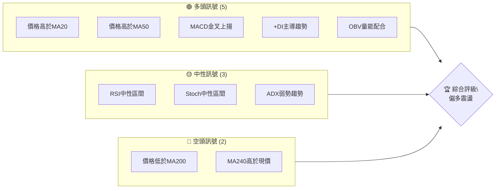
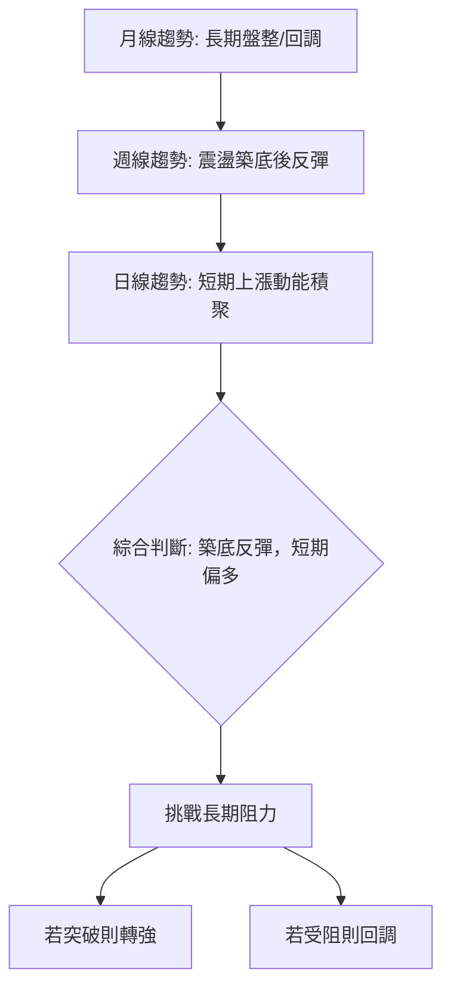
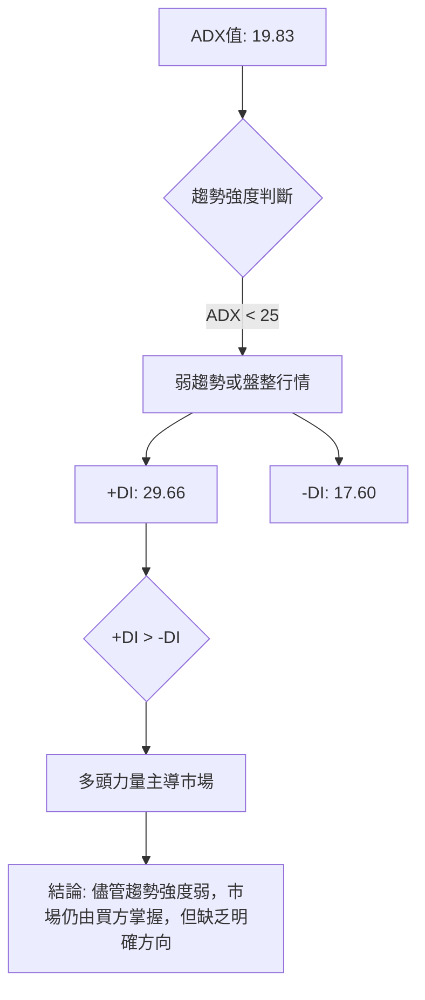
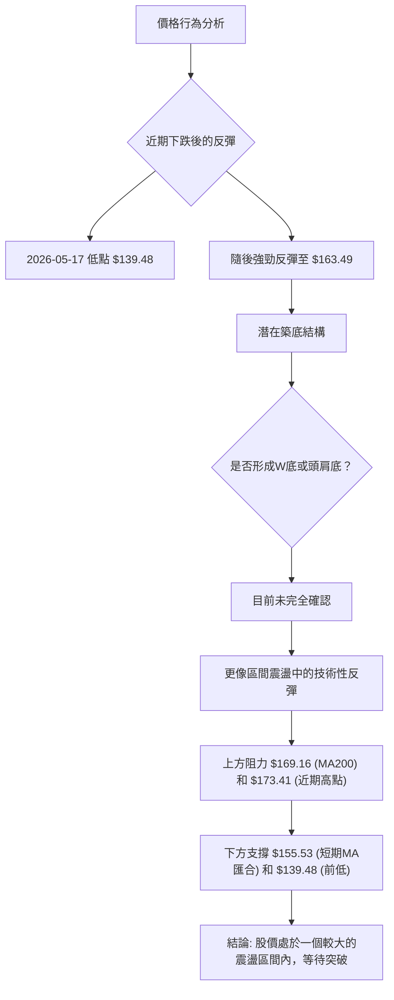
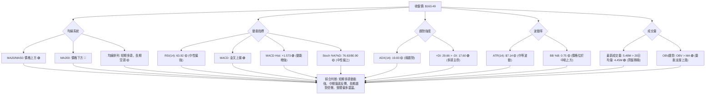
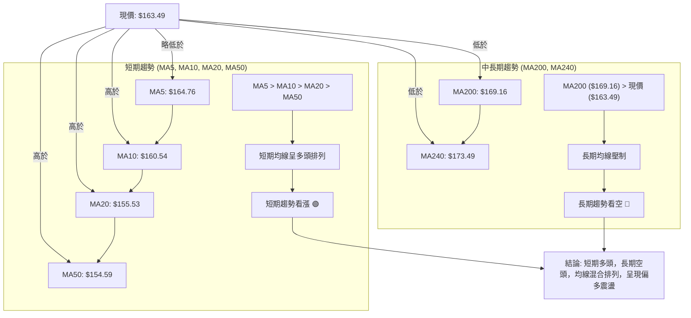
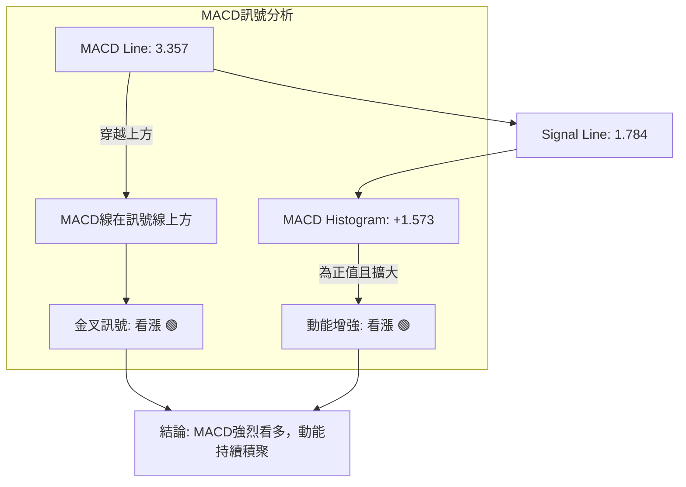
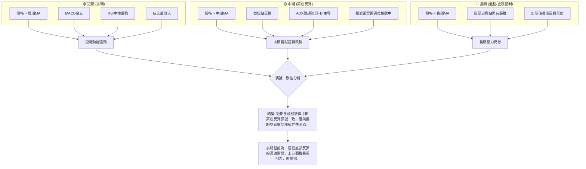
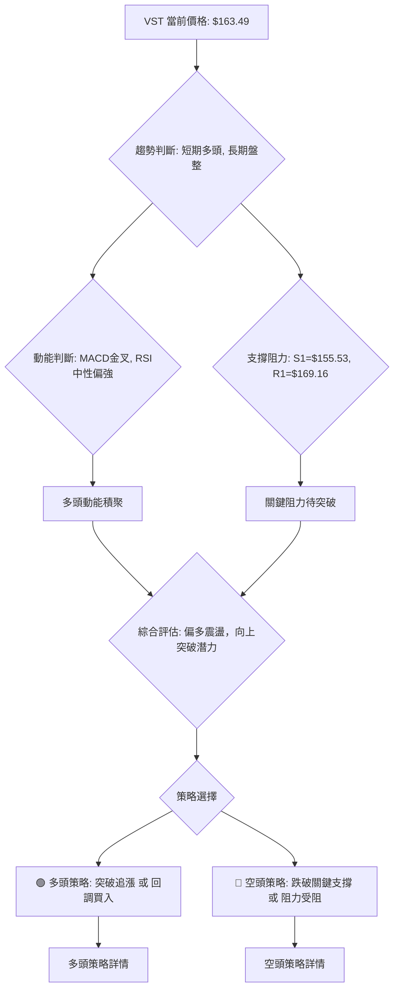
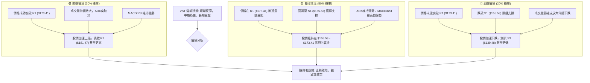

<details>
<summary>📊 靜態圖表 (點擊展開)</summary>

</details>

<html>
<head><meta charset="utf-8" /></head>
<body>
    <div style="height:500px; width:100%;">                        <script>window.PlotlyConfig = {MathJaxConfig: 'local'};</script>
        <script charset="utf-8" src="https://cdn.plot.ly/plotly-3.6.0.min.js" integrity="sha256-QaOVwtVY0T02VaHrr6pnoHLCwayMJp4O5n4YyaE3rJk=" crossorigin="anonymous"></script>                <div id="candlestick-chart" class="plotly-graph-div" style="height:100%; width:100%;"></div>            <script>                window.PLOTLYENV=window.PLOTLYENV || {};                                if (document.getElementById("candlestick-chart")) {                    Plotly.newPlot(                        "candlestick-chart",                        [{"close":{"dtype":"f8","bdata":"AAAAIMkDakAAAADAhl9pQAAAACBiE2pAAAAAQPyMakAAAADgyQpqQAAAAKAi52lAAAAA4AYiakAAAACA60xqQAAAAOCEIGtAAAAAIJNsaUAAAACAGidpQAAAAAAVGWlAAAAAAIrLaUAAAACAz6NoQAAAAEBwY2hAAAAAoJMVaUAAAACg5zlpQAAAAIDfJGlAAAAA4IXyaEAAAAAAWdloQAAAAAAwtmlAAAAAYCEkakAAAADgZIFoQAAAAEDKFWpAAAAAwAuVaUAAAACgNz9qQAAAAGDgMGpAAAAAYHoQaUAAAADg5i1oQAAAAODiN2dAAAAA4OUhZ0AAAABAcdJnQAAAAEBNFGlAAAAAgCbPaEAAAAAAlrlnQAAAAEBh0WhAAAAAAIudZ0AAAABAnHBnQAAAACCpB2hAAAAAoAcfZ0AAAABgWJNnQAAAAIBW+2ZAAAAA4KbGZ0AAAADg+G9nQAAAAOBXTWZAAAAAQPswZkAAAADAJltlQAAAAIDlvmVAAAAAYMbIZUAAAADASrZlQAAAAIC0TGZAAAAAQDeiZUAAAACAgfxkQAAAAIA8zWVAAAAAADVEZUAAAADgIgJmQAAAAGDIQ2ZAAAAAYG+dZUAAAABAs3plQAAAAOAEXmVAAAAAoN\u002fqZUAAAAAAQc9kQAAAAEDLrWRAAAAAAAyEZEAAAAAAhY9kQAAAAEAHvGVAAAAAAKAsZUAAAADAq\u002fFkQAAAAIBhl2VAAAAAQM\u002fpY0AAAAAAY69kQAAAAOBSS2RAAAAAAPojZEAAAADgKidkQAAAACBsMGRAAAAA4ConZEAAAADAlyxkQAAAAMB7RWRAAAAAQFEcZEAAAADgxZhkQAAAAEBgT2RAAAAAYP4hZUAAAABAjUVjQAAAAMDnxWJAAAAAACe9ZEAAAAAAU4NlQAAAAIBOXmVAAAAAgB8QZUAAAACA2nVmQAAAAAB+xGRAAAAAoBOMY0AAAABgg\u002fJjQAAAAABd\u002fWNAAAAAQLT1Y0AAAABg5stjQAAAAKDReWRAAAAAYNulZEAAAAAgNURkQAAAAIA4vWNAAAAAgLM6Y0AAAABAfhJjQAAAAOAOxGFAAAAAIJzVYUAAAACglqdiQAAAACCJEWNAAAAAQBzlY0AAAABgqfZjQAAAACDNVGRAAAAAYIpgZUAAAABgbaZlQAAAAKAuQ2VAAAAAgMWAZUAAAAAAq11lQAAAAEDJ6mRAAAAAYLBkZUAAAAAACtxlQAAAAGChCmZAAAAA4CCtZUAAAADABrFkQAAAAOAfKGRAAAAAIBldZEAAAACABd5kQAAAAEDLxmNAAAAAIGVlZEAAAABASX5kQAAAAKAR12NAAAAA4HjkY0AAAAAAXtBjQAAAACBhMWRAAAAAgA18ZEAAAABA0jRlQAAAAIAQ3WRAAAAAABs6YkAAAACAguJiQAAAAKA0EGNAAAAAIIrpYkAAAADgyAJjQAAAAABnaGNAAAAAYK1qYkAAAAAg1cNiQAAAAKDUN2NAAAAAoP7eYkAAAACgGOxiQAAAAODhLmNAAAAAAIF1Y0AAAAAgKhFjQAAAAIBvUGNAAAAAAFK\u002fY0AAAADAs3dkQAAAAODJVmRAAAAAYI2pZEAAAADAZ2dkQAAAAOAO7GNAAAAAIDBWY0AAAADgTnJjQAAAAGAulGNAAAAAgNiDZEAAAAAAG8tkQAAAAEChHGRAAAAAwGUyY0AAAAAA0bNjQAAAAOACYmNAAAAAgAAUZEAAAACg+wRkQAAAAEAywmNAAAAAwII3Y0AAAAAAbnBiQAAAAMDL+mJAAAAAgERVYkAAAABgI81hQAAAACBztmFAAAAAYIJvYUAAAABg4RFhQAAAACCx0GBAAAAAYI75YUAAAACA45tiQAAAAKClgWNAAAAAQI6KZEAAAAAgov1jQAAAAKDJAWRAAAAAgDAAZEAAAADgZFFjQAAAAID4t2NAAAAAoLcyY0AAAACghS9jQAAAAKCpkWJAAAAA4DlWYkAAAAAgf0BiQAAAAIAUS2FAAAAAIJxFYkAAAAAgBHpiQAAAACDFKWNAAAAAIGzMY0AAAADAc9NjQAAAACCscGRAAAAA4FHoZEAAAADgekxkQAAAAADXW2RAAAAA4KP4ZEAAAAAgrm9kQA=="},"high":{"dtype":"f8","bdata":"8Iiv3Zx4akDeZklMallqQOAhHfzGI2pA+j1C42kYa0Bt0lAx5pVqQHIW7Q\u002fmlWpATPszr+iqakD5vCAGgJ5qQEnLqTIRXWtAipOXPT58akCxK\u002fSonqppQOkgeS42bWlAFiOzPHbUaUAGNVE\u002fk8hpQP+ABAVk9WhAwDtzDpCCaUCEvlAIy4RpQPd0oNCAKmpAMrGrIiriaUD1fv8rq19pQMycKHYZuGlAKdeqhTpGakClX6fNp29qQA4nDmmJImpAJ1s8pnv\u002faUBIev32cuRqQAnTrz1jBmtAg+LPKrklakAdPOAxupRpQEGExjLFE2hALxsz0NmWZ0Dy1AZt5OxnQMOSPv4wJWlA8TD6fhdaaUDGmf7E5I9oQGEx\u002fSq4\u002fGhAwZAindq\u002faEBSH8iO4QJoQMQ5LfQsTGhAcafuRETWZ0BuaPPvp\u002fVnQMrTk5y9imdAxHK3swrJZ0D8LrFHe39oQDjBKVQjZWdAq\u002fO1DoqRZkBbBEovGidmQJbUfJgcaGZAM5PPrtBYZkBtSmXT5BVmQKzhV3Hpl2ZA5aFlpiiQZ0A0q\u002fvRtZ5lQApyKvYlz2VACWORtivAZUBpE1n5aCBmQMZPmjumgGZAhDSCIvD3ZUAoNkV8DOdlQJqt9KAgpGVAWE0We\u002fgpZkAwHEv4t\u002fxlQMzlb\u002f7342RAZO+M+ZEmZUBHUAVfm6pkQBD1xAVFxWVApvpJZBxoZkCiWLdeCollQICAQFGtpmVA3iX1eDzNZUAXXM6kn2ZlQJLw+ipfVmVA\u002fWBvE2p7ZEAvlTa\u002f8mdkQP+rCwBeRGRAU90fMZxRZEBmMkuK53dkQGikS06GU2RAJmBSO3qBZECntvn3AxplQE3qKVDOZWVAafBaJEiEZUAMlnY36QVlQETibZvYa2NAjiX69UDIZUAwOXi7EwhmQLAX1yvp3mVAjJ\u002fHzaVWZUBDH3m2zcFmQHkFh5i7VGVAv0DJblixZEAdjB9UDzFkQGJVRumQYWRAZbRuGXZNZEDDfGZ5U5tkQKbqMZ1OhWRAShc1NTfDZEDEZsn4Vu1kQI7wMkJ6gWRA6oRreTzxY0AHXLEmL4JjQK8CdvuNJ2NA08EgZGrwYUAEcGzD4PpiQFTSdh41a2NAqDUjfjAfZEA4yGeCU5tkQNm+dvYLuGRAfXhwKPdlZUDnzfKANAVmQHRfFrWB4GVAMzP3agGDZUDq9tvJrqBlQEs2oZG1a2VA53\u002fghJpmZUCPyVlEjO5lQFmw+bu2F2ZAFFEZmy06ZkBt9Z+FDgFmQIcDHOSFYmRAo5QeKjl4ZEA\u002fIygeNvBkQP+m45lL\u002fWRA1kRjTKCFZEAf9c7oYAplQPz7sdYzcWRAavQzEP5XZEA8UHaXF5lkQOXKtt+QYWRA7cE29hygZEBHUUcpupBlQAZxQlo6JGVAEtsNF5fHZEAo\u002fX\u002fQ0nVjQKwQqdBNPGNAydGc2FS3Y0D9ueaimw5jQCae5i07\u002f2NAPHKCw6XWY0CQPozwQuhiQLZxLjzig2NA2YaV5wBLY0C3k+EkghxjQLpvM6A4PmNABmuViLMiZEDwIVLWr0lkQF50DrIPzWNACrxYAdkPZEBzPwA+kKFkQOVL4zwwyWRAatNcU\u002fjVZEAUpSDgIwhlQJdRWkVCemRAKT+atv0bZEDHjyrvcNtjQHev5vu61GNA7ZgdbvSnZEB3z60r5wVlQHtHdF0XY2RA5gCWrjwdZEA1oEY+BO1jQDmzAFNQ\u002fWNAOkLKuOREZED8LLYRRXJkQL53EehiWGRAUMzp0\u002fEEZUC6dRFaEFljQKH3GhsqEWNAq8KC8ZvDYkAOqsz0aUJiQFkVxgQH42FAEkf1+JCcYUAh85gJCWthQFSH1lNIEGFAqi6e0FAWYkDq7nSVR6JiQKTPY1swq2NApA\u002fR9k7lZEApLBnQUZlkQIVY1GSkaWRAusF4ZgRCZEBhQng0gcpjQM2gz87DEWRAj2f+qQ22Y0C9y+b6YjpjQHj\u002fcQVgQmNAW0J0QeuiYkCIGzrC38JiQODlIVOO+WFA6RQP6zlWYkASuq\u002fWQ8liQH\u002fWwoNxZ2NAvcI6PyIoZEAXNWyEz0ZkQD5+vuFBQ2VAAAAAAABQZUAAAABgZrpkQAAAAOB6tGRAAAAAQDNrZUAAAACAwv1kQA=="},"hovertemplate":"\u003cb\u003e%{x|%Y-%m-%d}\u003c\u002fb\u003e\u003cbr\u003e\u958b: $%{open:.2f}\u003cbr\u003e\u9ad8: $%{high:.2f}\u003cbr\u003e\u4f4e: $%{low:.2f}\u003cbr\u003e\u6536: $%{close:.2f}\u003cextra\u003e\u003c\u002fextra\u003e","low":{"dtype":"f8","bdata":"MMztdJreaED9HXT8SEFpQDvpZVuWHmlAK46IDGITakCXqikUbsdpQBIRd1pDc2lAvK+m8tveaUAWGJk8qIppQDYHsrIF3mlA63wQ4LdTaUDvaZF0DCFpQEPZQnlOZmhAFJuw4K8EaUDF2neHKZxoQJRvb1kXvWdA2DPvsu\u002frZ0DoQeMcWbxoQIZ94QVCFWlARxO83o6TaEA+CB3FUmJoQN40bfmA6WhAVeWIPXiPaUDJxPytwYBoQDaDJz408mhA4Su\u002fQhISaUBboGdQaLFpQOdXDU0x+mlAjLDr6gznaEDx+YtvPABoQFXNq8acGWdAg7aaNvVcZkC3UfjrEh5nQLPt9qhfOWhAVTb5AOx1aECDCebsjvZmQNtcJtzklWdA9vZFAEJ4Z0D6zMDlSNhmQE+ZGlckYmdAAxMLoYP3ZkC3yTOHNwVnQA7+AC8iWWZA8vR0W8P7ZUCyxWrarexmQP+FK4QwQmZAm+aaS8ARZkDvtXF1AjplQArn5uGVnGRAzcyHP92MZUA\u002f2K6eeD5lQI1n1Qjrr2VAhNMtDC+NZUA5b0yxhThkQNDFyE3IpmRAbOdYKvGmZEAm5WPXv4tlQOuU\u002fQCyKGZAPpPORil\u002fZUDYY50C8FRlQEzVwjv6B2VAFuEkuXI4ZUD6y1Fo8rhkQFIwebwlbGRACHvVV3+BZECwKyGkvr9jQDuIyJfzCmRAk542FsXZZEAdlecFM8lkQCXxeyx\u002fu2RAEjgHhlbBY0CNppjp2T9kQN8kMLbOQGRA+s6oBQANZEAcBc4NBvZjQHKAUR6J6mNAuID2VAv9Y0BOF\u002fUsc+9jQCmPnYGzE2RAXWRunM4YZEAgfcroAm5kQAxAoCzw92NAyZcsU4BqZEDYT+GUuSNjQEKzkt3omGJAT47qEoStZEDbunEaE3RkQN4tVu8oS2VACa4Q3vCyZEDs4MeYmmZlQJDn3cLtUWRA9MHkxzR6Y0ATnnqgECtjQCD0l\u002fi\u002f1mNAF6uSKQ2yY0Cw9PEw3K5jQM7rxZXWtmNAcm+2f+QWZEAvgo0xJcpjQEf7qwysjWNAT3yzklwzY0DH8aJwRL9iQFHKelNYXGFAkH+d+rpEYUChUP\u002flbGBiQCnPTevpa2JAcjRhwUBMY0AceN5omsNjQE8rd6Wj\u002fmNAtKxOB74hZECiHAeMZS9lQGNbNPKLJGVAzczMjCX5ZEApq8x9FBFlQNLTDokimGRA7idC5sdNZEBYROCTizNlQG8L4j4IdWRAFw0urWRNZUDEp7ed66tkQHBgi7PaEWNAtS62paP+Y0BlTbqFfCdkQGyq6Qigu2NAn+Wx8FBSY0Cj4KUlQXtkQDnXA0EaV2NAl+OE9pCIY0BJQKVSb6ljQB57CJ1i9WNAX\u002fJFEoc1ZECRbbWpY6FkQMK0e5bceGRA\u002fNIbIhQUYkAwnEilCaRiQMiCHFHoqmJA60APMm7FYkD1SzPvH0liQBIcw5o18WJA0ULJxKNMYkCIuoWJgsRhQPA6xlMG5mJArKadRB+9YkB6ffv2c7ViQEj7qRM8wmJAM5+on1RiY0DIQU9t7Q5jQDHMHg+rHGNAZv0D9fcNY0CDdIFH3QNkQCz33SyLPWRAp6jeMz5MZECUu17\u002fDkFkQNmc5Mknw2NAQeN\u002fT0M9Y0BQjn7XgVZjQLLd8wsWSWNAAcmUZNtdY0DcwbufatBjQDa4ZP7vz2NAV+BIorUbY0D2zDEMZHBjQGLbd6LTVmNAUqzs0AinY0B4oQzlcvJjQBWqTDwxjGNAn\u002fjcT8IxY0BarDNayFhiQPB5qp9ZQmJAU9p+HJouYkBN4Y2jE2phQOZVAgk+d2FAVbkIzMAzYUAxfbKbh7VgQEVGKvwuj2BAVb02ycAzYUDbOZY9rRViQLxT5\u002fxA0WJACwUJovW\u002fY0DHT6W098VjQCRDh9MlrGNAatvMwCOVY0DVR6iryeNiQLP\u002f\u002fY9RFWNAVUPwHI4XY0CRg6v1W79iQFECWi9maWJAjPD6FJxFYkD1bnYd8qphQAAam9fyNmFAaSJHo\u002f5rYUALD3bva1liQOPvJXk+wWJAQYPflrgTY0A1ZTJPr59jQDIRhX3M+WNAAAAAwMxcZEAAAADgo+RjQAAAAAAp\u002fGNAAAAA4FHAZEAAAACAFGZkQA=="},"name":"\u50f9\u683c","open":{"dtype":"f8","bdata":"SmBOGijvaEBsOnysGPZpQDnoBP62O2lAK46IDGITakBt0lAx5pVqQAmqiSUoRmpAIWtA+EyGakCUMGkns1FqQILBtVr\u002fQ2pAknaHsaInakAdkeMaWE1pQH+3Fv24pWhAtoA4p7ILaUBYeNMPMSVpQOwp1waly2hAwcvl7B5GaEBgQy5GM2ZpQEd5nXEUcGlADfszhcKpaUBkF8w\u002ffRdpQEzwoJvOF2lAfMVXTIfEaUCjnClaexxqQIOb8gcmCWlAiaG1\u002fPedaUA6Xk\u002fbdQ5qQJ5uWhnGvGpANRorB+HZaUCHlnK9EWlpQOOJaOuPAmhAdiBLsLVYZ0C3UfjrEh5nQM\u002fVnrUbeWhA8TD6fhdaaUDGmf7E5I9oQNVjXRUU8GdA62ozRew7aEDZhH\u002frhOZnQKrOgsOYwGdAGIW2kTxqZ0BneWy3mS9nQFB65SY1xGZAeBlTjk84ZkDykg87vz9oQKeKGhXEJGdAXp1Bw6ByZkD+Uss7pAVmQNUMCqaSz2RAAIAYRHrWZUDdCZ2rNH5lQAlY8ZjfzWVAmfufY7YBZ0CzC6VlLGllQOGegl28G2VAUr7qC3WrZUD3Oi9h6KhlQDdTWH4+SGZABIdy2vXoZUD+tveLhdVlQC4sPY80fmVAdDR7jPxlZUD87gmVNvllQMzlb\u002f7342RAhZxLeeSVZED4QW7Z75RkQNY5QgIYLGRA\u002f9OI2SXPZUDCI48axIdlQLYd0eauvmRA56NS3TmpZUBiSbpzIp9kQCEHOdBGwGRArTj3lIVxZEA+IIIC+iNkQJ\u002fi98t3EWRAAAAA4ConZECbdMV7yRFkQOK4FMOyMWRAxPdPfhlOZEAgfcroAm5kQJF6ZTTjHGVAf8pbmhQRZUAMlnY36QVlQIN9eGlLWmNAQ00eeiu7ZUDHIOcE54ZkQO2bA5GjsGVAfnEKooYdZUC0pd9DupBlQKsEkefO4mRAoRRpNGcaZEDiA5czSNJjQHt3ruR2L2RAkEVA9t\u002fxY0BfmpXlswRkQMSPaPk84mNAAxIpXVixZEBW4fO8EbBkQIk7MQ++IWRAUApDwuGmY0D0nje9DnZjQEeQvVqOGGNAojQ1aI2TYUBr0Pv2wbJiQG77QP\u002fBsmJA\u002fxqKq6P+Y0Arf+sDb5FkQFVeLJArCWRAxWAzcHY+ZEBevm4nE01lQLOrpUH1sGVAzcyuyB4uZUB+TMKIY3plQOWAgVBqRWVA6lORNTHaZEAc7wM58XxlQAOzW2VkXGVAXgTX6YzQZUC18araXzdlQAdT0znOJ2RA4dW2QJ0kZEBftYiA3i1kQIBPaMvhf2RAZPKZWQlvY0BM\u002fLHt65xkQP\u002ffJMfBZGRAdL73X7GUY0BdqwD+CSpkQMT20F\u002fJEWRAtkct+otLZECPW0sDXqlkQHRaFaWu1mRAEtsNF5fHZECbEcRqn+diQFVYRNzcymJAg3luRBBZY0AW3KxTT6liQBIcw5o18WJAw2d6eiucY0AS2UYqXPZhQP2SdgZD6GJAgJv6J\u002fTfYkD05QVNhdpiQNx2sMZ622JABWzocs4QZEA9BV0HgXVjQLWWVHchKWNAZv0D9fcNY0Bq0TQf2kVkQMEZRAyYqGRAEtt+H+CKZEC7gUEs4cBkQG2jFbpNWmRAmNfAOyARZEBJQhvZibJjQEubIrK9d2NATXwCgJCDY0B04M+5nZhkQIMv5nC6SGRAoLjdQFIUZEBSdtYhSYJjQBZ04OnVwmNAJT248wWvY0BA9fybtFhkQEL5jOicKGRACATW3ftZZEC6dRFaEFljQNTOhYVgeWJA+mVlnP2oYkAOqsz0aUJiQDsNAlXVpWFAvyBliYtyYUCsu0WZx1lhQGulTeOF82BAAAAAHNM5YUD8xES7hyhiQPBHu4cz2mJAx8ZiOgLWY0AqjOmlVpdkQK+CDJ\u002fF02NAQyCHAtf4Y0DC0GVW+ZhjQGPJmQEad2NAte0B1FCJY0AMOJaef+piQK8anKEy+WJAt\u002f3beEiDYkAxHOFLzIZiQAbrZwXJ5GFAytzu\u002fl6ZYUBWG6t6YHliQIKpSuIUE2NAm2MnZyQhY0CH1zPp+8pjQPBXPGSgO2RAAAAAAClwZEAAAABgjwJkQAAAAMD1YGRAAAAAwB7dZEAAAAAghbtkQA=="},"x":["2025-09-10T00:00:00-04:00","2025-09-11T00:00:00-04:00","2025-09-12T00:00:00-04:00","2025-09-15T00:00:00-04:00","2025-09-16T00:00:00-04:00","2025-09-17T00:00:00-04:00","2025-09-18T00:00:00-04:00","2025-09-19T00:00:00-04:00","2025-09-22T00:00:00-04:00","2025-09-23T00:00:00-04:00","2025-09-24T00:00:00-04:00","2025-09-25T00:00:00-04:00","2025-09-26T00:00:00-04:00","2025-09-29T00:00:00-04:00","2025-09-30T00:00:00-04:00","2025-10-01T00:00:00-04:00","2025-10-02T00:00:00-04:00","2025-10-03T00:00:00-04:00","2025-10-06T00:00:00-04:00","2025-10-07T00:00:00-04:00","2025-10-08T00:00:00-04:00","2025-10-09T00:00:00-04:00","2025-10-10T00:00:00-04:00","2025-10-13T00:00:00-04:00","2025-10-14T00:00:00-04:00","2025-10-15T00:00:00-04:00","2025-10-16T00:00:00-04:00","2025-10-17T00:00:00-04:00","2025-10-20T00:00:00-04:00","2025-10-21T00:00:00-04:00","2025-10-22T00:00:00-04:00","2025-10-23T00:00:00-04:00","2025-10-24T00:00:00-04:00","2025-10-27T00:00:00-04:00","2025-10-28T00:00:00-04:00","2025-10-29T00:00:00-04:00","2025-10-30T00:00:00-04:00","2025-10-31T00:00:00-04:00","2025-11-03T00:00:00-05:00","2025-11-04T00:00:00-05:00","2025-11-05T00:00:00-05:00","2025-11-06T00:00:00-05:00","2025-11-07T00:00:00-05:00","2025-11-10T00:00:00-05:00","2025-11-11T00:00:00-05:00","2025-11-12T00:00:00-05:00","2025-11-13T00:00:00-05:00","2025-11-14T00:00:00-05:00","2025-11-17T00:00:00-05:00","2025-11-18T00:00:00-05:00","2025-11-19T00:00:00-05:00","2025-11-20T00:00:00-05:00","2025-11-21T00:00:00-05:00","2025-11-24T00:00:00-05:00","2025-11-25T00:00:00-05:00","2025-11-26T00:00:00-05:00","2025-11-28T00:00:00-05:00","2025-12-01T00:00:00-05:00","2025-12-02T00:00:00-05:00","2025-12-03T00:00:00-05:00","2025-12-04T00:00:00-05:00","2025-12-05T00:00:00-05:00","2025-12-08T00:00:00-05:00","2025-12-09T00:00:00-05:00","2025-12-10T00:00:00-05:00","2025-12-11T00:00:00-05:00","2025-12-12T00:00:00-05:00","2025-12-15T00:00:00-05:00","2025-12-16T00:00:00-05:00","2025-12-17T00:00:00-05:00","2025-12-18T00:00:00-05:00","2025-12-19T00:00:00-05:00","2025-12-22T00:00:00-05:00","2025-12-23T00:00:00-05:00","2025-12-24T00:00:00-05:00","2025-12-26T00:00:00-05:00","2025-12-29T00:00:00-05:00","2025-12-30T00:00:00-05:00","2025-12-31T00:00:00-05:00","2026-01-02T00:00:00-05:00","2026-01-05T00:00:00-05:00","2026-01-06T00:00:00-05:00","2026-01-07T00:00:00-05:00","2026-01-08T00:00:00-05:00","2026-01-09T00:00:00-05:00","2026-01-12T00:00:00-05:00","2026-01-13T00:00:00-05:00","2026-01-14T00:00:00-05:00","2026-01-15T00:00:00-05:00","2026-01-16T00:00:00-05:00","2026-01-20T00:00:00-05:00","2026-01-21T00:00:00-05:00","2026-01-22T00:00:00-05:00","2026-01-23T00:00:00-05:00","2026-01-26T00:00:00-05:00","2026-01-27T00:00:00-05:00","2026-01-28T00:00:00-05:00","2026-01-29T00:00:00-05:00","2026-01-30T00:00:00-05:00","2026-02-02T00:00:00-05:00","2026-02-03T00:00:00-05:00","2026-02-04T00:00:00-05:00","2026-02-05T00:00:00-05:00","2026-02-06T00:00:00-05:00","2026-02-09T00:00:00-05:00","2026-02-10T00:00:00-05:00","2026-02-11T00:00:00-05:00","2026-02-12T00:00:00-05:00","2026-02-13T00:00:00-05:00","2026-02-17T00:00:00-05:00","2026-02-18T00:00:00-05:00","2026-02-19T00:00:00-05:00","2026-02-20T00:00:00-05:00","2026-02-23T00:00:00-05:00","2026-02-24T00:00:00-05:00","2026-02-25T00:00:00-05:00","2026-02-26T00:00:00-05:00","2026-02-27T00:00:00-05:00","2026-03-02T00:00:00-05:00","2026-03-03T00:00:00-05:00","2026-03-04T00:00:00-05:00","2026-03-05T00:00:00-05:00","2026-03-06T00:00:00-05:00","2026-03-09T00:00:00-04:00","2026-03-10T00:00:00-04:00","2026-03-11T00:00:00-04:00","2026-03-12T00:00:00-04:00","2026-03-13T00:00:00-04:00","2026-03-16T00:00:00-04:00","2026-03-17T00:00:00-04:00","2026-03-18T00:00:00-04:00","2026-03-19T00:00:00-04:00","2026-03-20T00:00:00-04:00","2026-03-23T00:00:00-04:00","2026-03-24T00:00:00-04:00","2026-03-25T00:00:00-04:00","2026-03-26T00:00:00-04:00","2026-03-27T00:00:00-04:00","2026-03-30T00:00:00-04:00","2026-03-31T00:00:00-04:00","2026-04-01T00:00:00-04:00","2026-04-02T00:00:00-04:00","2026-04-06T00:00:00-04:00","2026-04-07T00:00:00-04:00","2026-04-08T00:00:00-04:00","2026-04-09T00:00:00-04:00","2026-04-10T00:00:00-04:00","2026-04-13T00:00:00-04:00","2026-04-14T00:00:00-04:00","2026-04-15T00:00:00-04:00","2026-04-16T00:00:00-04:00","2026-04-17T00:00:00-04:00","2026-04-20T00:00:00-04:00","2026-04-21T00:00:00-04:00","2026-04-22T00:00:00-04:00","2026-04-23T00:00:00-04:00","2026-04-24T00:00:00-04:00","2026-04-27T00:00:00-04:00","2026-04-28T00:00:00-04:00","2026-04-29T00:00:00-04:00","2026-04-30T00:00:00-04:00","2026-05-01T00:00:00-04:00","2026-05-04T00:00:00-04:00","2026-05-05T00:00:00-04:00","2026-05-06T00:00:00-04:00","2026-05-07T00:00:00-04:00","2026-05-08T00:00:00-04:00","2026-05-11T00:00:00-04:00","2026-05-12T00:00:00-04:00","2026-05-13T00:00:00-04:00","2026-05-14T00:00:00-04:00","2026-05-15T00:00:00-04:00","2026-05-18T00:00:00-04:00","2026-05-19T00:00:00-04:00","2026-05-20T00:00:00-04:00","2026-05-21T00:00:00-04:00","2026-05-22T00:00:00-04:00","2026-05-26T00:00:00-04:00","2026-05-27T00:00:00-04:00","2026-05-28T00:00:00-04:00","2026-05-29T00:00:00-04:00","2026-06-01T00:00:00-04:00","2026-06-02T00:00:00-04:00","2026-06-03T00:00:00-04:00","2026-06-04T00:00:00-04:00","2026-06-05T00:00:00-04:00","2026-06-08T00:00:00-04:00","2026-06-09T00:00:00-04:00","2026-06-10T00:00:00-04:00","2026-06-11T00:00:00-04:00","2026-06-12T00:00:00-04:00","2026-06-15T00:00:00-04:00","2026-06-16T00:00:00-04:00","2026-06-17T00:00:00-04:00","2026-06-18T00:00:00-04:00","2026-06-22T00:00:00-04:00","2026-06-23T00:00:00-04:00","2026-06-24T00:00:00-04:00","2026-06-25T00:00:00-04:00","2026-06-26T00:00:00-04:00"],"type":"candlestick"},{"hovertemplate":"MA30: $%{y:.2f}\u003cextra\u003e\u003c\u002fextra\u003e","line":{"color":"#2196F3","dash":"dash","width":2},"mode":"lines","name":"MA30","x":["2025-09-10T00:00:00-04:00","2025-09-11T00:00:00-04:00","2025-09-12T00:00:00-04:00","2025-09-15T00:00:00-04:00","2025-09-16T00:00:00-04:00","2025-09-17T00:00:00-04:00","2025-09-18T00:00:00-04:00","2025-09-19T00:00:00-04:00","2025-09-22T00:00:00-04:00","2025-09-23T00:00:00-04:00","2025-09-24T00:00:00-04:00","2025-09-25T00:00:00-04:00","2025-09-26T00:00:00-04:00","2025-09-29T00:00:00-04:00","2025-09-30T00:00:00-04:00","2025-10-01T00:00:00-04:00","2025-10-02T00:00:00-04:00","2025-10-03T00:00:00-04:00","2025-10-06T00:00:00-04:00","2025-10-07T00:00:00-04:00","2025-10-08T00:00:00-04:00","2025-10-09T00:00:00-04:00","2025-10-10T00:00:00-04:00","2025-10-13T00:00:00-04:00","2025-10-14T00:00:00-04:00","2025-10-15T00:00:00-04:00","2025-10-16T00:00:00-04:00","2025-10-17T00:00:00-04:00","2025-10-20T00:00:00-04:00","2025-10-21T00:00:00-04:00","2025-10-22T00:00:00-04:00","2025-10-23T00:00:00-04:00","2025-10-24T00:00:00-04:00","2025-10-27T00:00:00-04:00","2025-10-28T00:00:00-04:00","2025-10-29T00:00:00-04:00","2025-10-30T00:00:00-04:00","2025-10-31T00:00:00-04:00","2025-11-03T00:00:00-05:00","2025-11-04T00:00:00-05:00","2025-11-05T00:00:00-05:00","2025-11-06T00:00:00-05:00","2025-11-07T00:00:00-05:00","2025-11-10T00:00:00-05:00","2025-11-11T00:00:00-05:00","2025-11-12T00:00:00-05:00","2025-11-13T00:00:00-05:00","2025-11-14T00:00:00-05:00","2025-11-17T00:00:00-05:00","2025-11-18T00:00:00-05:00","2025-11-19T00:00:00-05:00","2025-11-20T00:00:00-05:00","2025-11-21T00:00:00-05:00","2025-11-24T00:00:00-05:00","2025-11-25T00:00:00-05:00","2025-11-26T00:00:00-05:00","2025-11-28T00:00:00-05:00","2025-12-01T00:00:00-05:00","2025-12-02T00:00:00-05:00","2025-12-03T00:00:00-05:00","2025-12-04T00:00:00-05:00","2025-12-05T00:00:00-05:00","2025-12-08T00:00:00-05:00","2025-12-09T00:00:00-05:00","2025-12-10T00:00:00-05:00","2025-12-11T00:00:00-05:00","2025-12-12T00:00:00-05:00","2025-12-15T00:00:00-05:00","2025-12-16T00:00:00-05:00","2025-12-17T00:00:00-05:00","2025-12-18T00:00:00-05:00","2025-12-19T00:00:00-05:00","2025-12-22T00:00:00-05:00","2025-12-23T00:00:00-05:00","2025-12-24T00:00:00-05:00","2025-12-26T00:00:00-05:00","2025-12-29T00:00:00-05:00","2025-12-30T00:00:00-05:00","2025-12-31T00:00:00-05:00","2026-01-02T00:00:00-05:00","2026-01-05T00:00:00-05:00","2026-01-06T00:00:00-05:00","2026-01-07T00:00:00-05:00","2026-01-08T00:00:00-05:00","2026-01-09T00:00:00-05:00","2026-01-12T00:00:00-05:00","2026-01-13T00:00:00-05:00","2026-01-14T00:00:00-05:00","2026-01-15T00:00:00-05:00","2026-01-16T00:00:00-05:00","2026-01-20T00:00:00-05:00","2026-01-21T00:00:00-05:00","2026-01-22T00:00:00-05:00","2026-01-23T00:00:00-05:00","2026-01-26T00:00:00-05:00","2026-01-27T00:00:00-05:00","2026-01-28T00:00:00-05:00","2026-01-29T00:00:00-05:00","2026-01-30T00:00:00-05:00","2026-02-02T00:00:00-05:00","2026-02-03T00:00:00-05:00","2026-02-04T00:00:00-05:00","2026-02-05T00:00:00-05:00","2026-02-06T00:00:00-05:00","2026-02-09T00:00:00-05:00","2026-02-10T00:00:00-05:00","2026-02-11T00:00:00-05:00","2026-02-12T00:00:00-05:00","2026-02-13T00:00:00-05:00","2026-02-17T00:00:00-05:00","2026-02-18T00:00:00-05:00","2026-02-19T00:00:00-05:00","2026-02-20T00:00:00-05:00","2026-02-23T00:00:00-05:00","2026-02-24T00:00:00-05:00","2026-02-25T00:00:00-05:00","2026-02-26T00:00:00-05:00","2026-02-27T00:00:00-05:00","2026-03-02T00:00:00-05:00","2026-03-03T00:00:00-05:00","2026-03-04T00:00:00-05:00","2026-03-05T00:00:00-05:00","2026-03-06T00:00:00-05:00","2026-03-09T00:00:00-04:00","2026-03-10T00:00:00-04:00","2026-03-11T00:00:00-04:00","2026-03-12T00:00:00-04:00","2026-03-13T00:00:00-04:00","2026-03-16T00:00:00-04:00","2026-03-17T00:00:00-04:00","2026-03-18T00:00:00-04:00","2026-03-19T00:00:00-04:00","2026-03-20T00:00:00-04:00","2026-03-23T00:00:00-04:00","2026-03-24T00:00:00-04:00","2026-03-25T00:00:00-04:00","2026-03-26T00:00:00-04:00","2026-03-27T00:00:00-04:00","2026-03-30T00:00:00-04:00","2026-03-31T00:00:00-04:00","2026-04-01T00:00:00-04:00","2026-04-02T00:00:00-04:00","2026-04-06T00:00:00-04:00","2026-04-07T00:00:00-04:00","2026-04-08T00:00:00-04:00","2026-04-09T00:00:00-04:00","2026-04-10T00:00:00-04:00","2026-04-13T00:00:00-04:00","2026-04-14T00:00:00-04:00","2026-04-15T00:00:00-04:00","2026-04-16T00:00:00-04:00","2026-04-17T00:00:00-04:00","2026-04-20T00:00:00-04:00","2026-04-21T00:00:00-04:00","2026-04-22T00:00:00-04:00","2026-04-23T00:00:00-04:00","2026-04-24T00:00:00-04:00","2026-04-27T00:00:00-04:00","2026-04-28T00:00:00-04:00","2026-04-29T00:00:00-04:00","2026-04-30T00:00:00-04:00","2026-05-01T00:00:00-04:00","2026-05-04T00:00:00-04:00","2026-05-05T00:00:00-04:00","2026-05-06T00:00:00-04:00","2026-05-07T00:00:00-04:00","2026-05-08T00:00:00-04:00","2026-05-11T00:00:00-04:00","2026-05-12T00:00:00-04:00","2026-05-13T00:00:00-04:00","2026-05-14T00:00:00-04:00","2026-05-15T00:00:00-04:00","2026-05-18T00:00:00-04:00","2026-05-19T00:00:00-04:00","2026-05-20T00:00:00-04:00","2026-05-21T00:00:00-04:00","2026-05-22T00:00:00-04:00","2026-05-26T00:00:00-04:00","2026-05-27T00:00:00-04:00","2026-05-28T00:00:00-04:00","2026-05-29T00:00:00-04:00","2026-06-01T00:00:00-04:00","2026-06-02T00:00:00-04:00","2026-06-03T00:00:00-04:00","2026-06-04T00:00:00-04:00","2026-06-05T00:00:00-04:00","2026-06-08T00:00:00-04:00","2026-06-09T00:00:00-04:00","2026-06-10T00:00:00-04:00","2026-06-11T00:00:00-04:00","2026-06-12T00:00:00-04:00","2026-06-15T00:00:00-04:00","2026-06-16T00:00:00-04:00","2026-06-17T00:00:00-04:00","2026-06-18T00:00:00-04:00","2026-06-22T00:00:00-04:00","2026-06-23T00:00:00-04:00","2026-06-24T00:00:00-04:00","2026-06-25T00:00:00-04:00","2026-06-26T00:00:00-04:00"],"y":{"dtype":"f8","bdata":"AAAAAAAA+H8AAAAAAAD4fwAAAAAAAPh\u002fAAAAAAAA+H8AAAAAAAD4fwAAAAAAAPh\u002fAAAAAAAA+H8AAAAAAAD4fwAAAAAAAPh\u002fAAAAAAAA+H8AAAAAAAD4fwAAAAAAAPh\u002fAAAAAAAA+H8AAAAAAAD4fwAAAAAAAPh\u002fAAAAAAAA+H8AAAAAAAD4fwAAAAAAAPh\u002fAAAAAAAA+H8AAAAAAAD4fwAAAAAAAPh\u002fAAAAAAAA+H8AAAAAAAD4fwAAAAAAAPh\u002fAAAAAAAA+H8AAAAAAAD4fwAAAAAAAPh\u002fAAAAAAAA+H8AAAAAAAD4fzMzMwMgeWlA7+7uXodgaUC8u7vrSlNpQJqZmTnKSmlARERExO07aUBVVVXFJyhpQHd3d5flHmlA7+7u\u002fmkJaUBERET0APFoQKuqqjqT1mhAIiIicuzCaECrqqoKd7VoQImIiChoo2hAMzMzYy2SaEAAAACA6odoQDMzM+McdmhAREREJG1daEBmZma2ZjxoQJqZmelmH2hAAAAAEGkEaEAiIiJSpOlnQKuqqpqGzGdA3t3d3Q+mZ0CamZlJCIhnQHd3dwd7Y2dAIiIiEqc+Z0BmZma2expnQJqZmen6+GZAzczMnIvbZkC8u7tbgcRmQBEREbG1tGZA3t3dnVeqZkDv7u7OopBmQBEREfEVa2ZAzczM7HJGZkC8u7tbcitmQO\u002fu7o4iEWZAzczM7E38ZUBERESkAedlQERERHQy0mVAVVVVtdK2ZUBVVVVlKJ5lQHd3d1c5h2VARERElDNoZUBmZma2LExlQKuqqtokOmVAq6qqCsAoZUBVVVU1qh5lQN7d3Z0VEmVAIiIics0DZUBEREQESfpkQN7d3b1O6WRARERElAjlZEBmZmbWZtZkQN7d3a2OvGRAZmZmNg64ZEBVVVUV1LNkQDMzM+MtrGRAZmZmBninZEAzMzMz169kQKuqqhq5qmRAq6qqGn+WZEAzMzNzI49kQImIiOhBiWRAAAAAQIOEZEBmZmb2\u002fX1kQBEREXFAc2RAvLu7a8JuZEAzMzMz+mhkQImIiAgsWWRAZmZmxlVTZECrqqpqkkVkQFVVVRX\u002fL2RAmpmZSVEcZEBEREQUiA9kQKuqqvr3BWRAq6qqSsQDZEBEREQU+AFkQKuqqsp6AmRA7+7ufkkNZEC8u7uLRhZkQGZmZgZnHmRAvLu7y48hZEB3d3enbjNkQAAAAHC6RWRAVVVVFVBLZEDe3d0dRU5kQM3MzJwDVGRAREREZD9ZZEBEREREJ0pkQN7d3e3wRGRARERElOhLZEAAAABAwlNkQHd3d5fwUWRAAAAAsKlVZECrqqrqm1tkQN7d3R0vVmRAZmZm5rxPZEBVVVVl4EtkQN7d3Z2\u002fT2RAERER0XVaZEARERHRq2xkQN7d3c0ah2RA3t3dXXSKZECamZkpa4xkQAAAANBfjGRAMzMzE\u002f2DZEDe3d3923tkQImIiLj6c2RA7+7unrdaZEAiIiLyGEJkQDMzMwOnMGRAMzMzczEaZEDNzMw8VwVkQCIiIkKL9mNA3t3drQnmY0CrqqpqNc5jQM3MzHzvtmNAiYiIqHmmY0De3d19kKRjQBEREbEepmNAmpmZGauoY0CJiIjotqRjQFVVVeX0pWNAiYiImOqcY0CamZnZ+5NjQDMzMxPBkWNAAAAAEBGXY0AiIiKybJ9jQCIiIqK7nmNAMzMzk76TY0AzMzMz6YZjQM3MzJxGemNAd3d3hxKKY0C8u7s7wZNjQGZmZhawmWNAERERcUmcY0C8u7uLaJdjQM3MzDzBk2NAq6qqigqTY0Crqqpq0YpjQFVVVdX4fWNAVVVV9bhxY0ARERFR6mFjQN7d3X21TWNAVVVVRQtBY0BERESEIj1jQERERHTGPmNAq6qquoxFY0AzMzMTe0FjQLy7u7ulPmNAERERgQA5Y0BEREQkvC9jQJqZman\u002fLWNAq6qq+tAsY0AiIiISlypjQLy7uwv5IWNAERERsWIPY0BERETUsvliQKuqqpql4WJAREREBMHZYkARERFBS89iQERERFRrzWJAREREhAjLYkCrqqraYcliQHd3d7cyz2JAVVVVBaDdYkARERFRfu1iQFVVVfVC+WJAMzMzI8YPY0Crqqo6QiZjQA=="},"type":"scatter"},{"hovertemplate":"MA60: $%{y:.2f}\u003cextra\u003e\u003c\u002fextra\u003e","line":{"color":"#9C27B0","dash":"dash","width":2},"mode":"lines","name":"MA60","x":["2025-09-10T00:00:00-04:00","2025-09-11T00:00:00-04:00","2025-09-12T00:00:00-04:00","2025-09-15T00:00:00-04:00","2025-09-16T00:00:00-04:00","2025-09-17T00:00:00-04:00","2025-09-18T00:00:00-04:00","2025-09-19T00:00:00-04:00","2025-09-22T00:00:00-04:00","2025-09-23T00:00:00-04:00","2025-09-24T00:00:00-04:00","2025-09-25T00:00:00-04:00","2025-09-26T00:00:00-04:00","2025-09-29T00:00:00-04:00","2025-09-30T00:00:00-04:00","2025-10-01T00:00:00-04:00","2025-10-02T00:00:00-04:00","2025-10-03T00:00:00-04:00","2025-10-06T00:00:00-04:00","2025-10-07T00:00:00-04:00","2025-10-08T00:00:00-04:00","2025-10-09T00:00:00-04:00","2025-10-10T00:00:00-04:00","2025-10-13T00:00:00-04:00","2025-10-14T00:00:00-04:00","2025-10-15T00:00:00-04:00","2025-10-16T00:00:00-04:00","2025-10-17T00:00:00-04:00","2025-10-20T00:00:00-04:00","2025-10-21T00:00:00-04:00","2025-10-22T00:00:00-04:00","2025-10-23T00:00:00-04:00","2025-10-24T00:00:00-04:00","2025-10-27T00:00:00-04:00","2025-10-28T00:00:00-04:00","2025-10-29T00:00:00-04:00","2025-10-30T00:00:00-04:00","2025-10-31T00:00:00-04:00","2025-11-03T00:00:00-05:00","2025-11-04T00:00:00-05:00","2025-11-05T00:00:00-05:00","2025-11-06T00:00:00-05:00","2025-11-07T00:00:00-05:00","2025-11-10T00:00:00-05:00","2025-11-11T00:00:00-05:00","2025-11-12T00:00:00-05:00","2025-11-13T00:00:00-05:00","2025-11-14T00:00:00-05:00","2025-11-17T00:00:00-05:00","2025-11-18T00:00:00-05:00","2025-11-19T00:00:00-05:00","2025-11-20T00:00:00-05:00","2025-11-21T00:00:00-05:00","2025-11-24T00:00:00-05:00","2025-11-25T00:00:00-05:00","2025-11-26T00:00:00-05:00","2025-11-28T00:00:00-05:00","2025-12-01T00:00:00-05:00","2025-12-02T00:00:00-05:00","2025-12-03T00:00:00-05:00","2025-12-04T00:00:00-05:00","2025-12-05T00:00:00-05:00","2025-12-08T00:00:00-05:00","2025-12-09T00:00:00-05:00","2025-12-10T00:00:00-05:00","2025-12-11T00:00:00-05:00","2025-12-12T00:00:00-05:00","2025-12-15T00:00:00-05:00","2025-12-16T00:00:00-05:00","2025-12-17T00:00:00-05:00","2025-12-18T00:00:00-05:00","2025-12-19T00:00:00-05:00","2025-12-22T00:00:00-05:00","2025-12-23T00:00:00-05:00","2025-12-24T00:00:00-05:00","2025-12-26T00:00:00-05:00","2025-12-29T00:00:00-05:00","2025-12-30T00:00:00-05:00","2025-12-31T00:00:00-05:00","2026-01-02T00:00:00-05:00","2026-01-05T00:00:00-05:00","2026-01-06T00:00:00-05:00","2026-01-07T00:00:00-05:00","2026-01-08T00:00:00-05:00","2026-01-09T00:00:00-05:00","2026-01-12T00:00:00-05:00","2026-01-13T00:00:00-05:00","2026-01-14T00:00:00-05:00","2026-01-15T00:00:00-05:00","2026-01-16T00:00:00-05:00","2026-01-20T00:00:00-05:00","2026-01-21T00:00:00-05:00","2026-01-22T00:00:00-05:00","2026-01-23T00:00:00-05:00","2026-01-26T00:00:00-05:00","2026-01-27T00:00:00-05:00","2026-01-28T00:00:00-05:00","2026-01-29T00:00:00-05:00","2026-01-30T00:00:00-05:00","2026-02-02T00:00:00-05:00","2026-02-03T00:00:00-05:00","2026-02-04T00:00:00-05:00","2026-02-05T00:00:00-05:00","2026-02-06T00:00:00-05:00","2026-02-09T00:00:00-05:00","2026-02-10T00:00:00-05:00","2026-02-11T00:00:00-05:00","2026-02-12T00:00:00-05:00","2026-02-13T00:00:00-05:00","2026-02-17T00:00:00-05:00","2026-02-18T00:00:00-05:00","2026-02-19T00:00:00-05:00","2026-02-20T00:00:00-05:00","2026-02-23T00:00:00-05:00","2026-02-24T00:00:00-05:00","2026-02-25T00:00:00-05:00","2026-02-26T00:00:00-05:00","2026-02-27T00:00:00-05:00","2026-03-02T00:00:00-05:00","2026-03-03T00:00:00-05:00","2026-03-04T00:00:00-05:00","2026-03-05T00:00:00-05:00","2026-03-06T00:00:00-05:00","2026-03-09T00:00:00-04:00","2026-03-10T00:00:00-04:00","2026-03-11T00:00:00-04:00","2026-03-12T00:00:00-04:00","2026-03-13T00:00:00-04:00","2026-03-16T00:00:00-04:00","2026-03-17T00:00:00-04:00","2026-03-18T00:00:00-04:00","2026-03-19T00:00:00-04:00","2026-03-20T00:00:00-04:00","2026-03-23T00:00:00-04:00","2026-03-24T00:00:00-04:00","2026-03-25T00:00:00-04:00","2026-03-26T00:00:00-04:00","2026-03-27T00:00:00-04:00","2026-03-30T00:00:00-04:00","2026-03-31T00:00:00-04:00","2026-04-01T00:00:00-04:00","2026-04-02T00:00:00-04:00","2026-04-06T00:00:00-04:00","2026-04-07T00:00:00-04:00","2026-04-08T00:00:00-04:00","2026-04-09T00:00:00-04:00","2026-04-10T00:00:00-04:00","2026-04-13T00:00:00-04:00","2026-04-14T00:00:00-04:00","2026-04-15T00:00:00-04:00","2026-04-16T00:00:00-04:00","2026-04-17T00:00:00-04:00","2026-04-20T00:00:00-04:00","2026-04-21T00:00:00-04:00","2026-04-22T00:00:00-04:00","2026-04-23T00:00:00-04:00","2026-04-24T00:00:00-04:00","2026-04-27T00:00:00-04:00","2026-04-28T00:00:00-04:00","2026-04-29T00:00:00-04:00","2026-04-30T00:00:00-04:00","2026-05-01T00:00:00-04:00","2026-05-04T00:00:00-04:00","2026-05-05T00:00:00-04:00","2026-05-06T00:00:00-04:00","2026-05-07T00:00:00-04:00","2026-05-08T00:00:00-04:00","2026-05-11T00:00:00-04:00","2026-05-12T00:00:00-04:00","2026-05-13T00:00:00-04:00","2026-05-14T00:00:00-04:00","2026-05-15T00:00:00-04:00","2026-05-18T00:00:00-04:00","2026-05-19T00:00:00-04:00","2026-05-20T00:00:00-04:00","2026-05-21T00:00:00-04:00","2026-05-22T00:00:00-04:00","2026-05-26T00:00:00-04:00","2026-05-27T00:00:00-04:00","2026-05-28T00:00:00-04:00","2026-05-29T00:00:00-04:00","2026-06-01T00:00:00-04:00","2026-06-02T00:00:00-04:00","2026-06-03T00:00:00-04:00","2026-06-04T00:00:00-04:00","2026-06-05T00:00:00-04:00","2026-06-08T00:00:00-04:00","2026-06-09T00:00:00-04:00","2026-06-10T00:00:00-04:00","2026-06-11T00:00:00-04:00","2026-06-12T00:00:00-04:00","2026-06-15T00:00:00-04:00","2026-06-16T00:00:00-04:00","2026-06-17T00:00:00-04:00","2026-06-18T00:00:00-04:00","2026-06-22T00:00:00-04:00","2026-06-23T00:00:00-04:00","2026-06-24T00:00:00-04:00","2026-06-25T00:00:00-04:00","2026-06-26T00:00:00-04:00"],"y":{"dtype":"f8","bdata":"AAAAAAAA+H8AAAAAAAD4fwAAAAAAAPh\u002fAAAAAAAA+H8AAAAAAAD4fwAAAAAAAPh\u002fAAAAAAAA+H8AAAAAAAD4fwAAAAAAAPh\u002fAAAAAAAA+H8AAAAAAAD4fwAAAAAAAPh\u002fAAAAAAAA+H8AAAAAAAD4fwAAAAAAAPh\u002fAAAAAAAA+H8AAAAAAAD4fwAAAAAAAPh\u002fAAAAAAAA+H8AAAAAAAD4fwAAAAAAAPh\u002fAAAAAAAA+H8AAAAAAAD4fwAAAAAAAPh\u002fAAAAAAAA+H8AAAAAAAD4fwAAAAAAAPh\u002fAAAAAAAA+H8AAAAAAAD4fwAAAAAAAPh\u002fAAAAAAAA+H8AAAAAAAD4fwAAAAAAAPh\u002fAAAAAAAA+H8AAAAAAAD4fwAAAAAAAPh\u002fAAAAAAAA+H8AAAAAAAD4fwAAAAAAAPh\u002fAAAAAAAA+H8AAAAAAAD4fwAAAAAAAPh\u002fAAAAAAAA+H8AAAAAAAD4fwAAAAAAAPh\u002fAAAAAAAA+H8AAAAAAAD4fwAAAAAAAPh\u002fAAAAAAAA+H8AAAAAAAD4fwAAAAAAAPh\u002fAAAAAAAA+H8AAAAAAAD4fwAAAAAAAPh\u002fAAAAAAAA+H8AAAAAAAD4fwAAAAAAAPh\u002fAAAAAAAA+H8AAAAAAAD4fyIiItrqFmhAZmZmfm8FaEBVVVXd9vFnQFVVVRXw2mdAiYiIWDDBZ0CJiIgQzalnQDMzMxMEmGdA3t3d9duCZ0BERERMAWxnQHd3d9diVGdAvLu7k988Z0AAAAC4zylnQAAAAMBQFWdAvLu7ezD9ZkAzMzObC+pmQO\u002fu7t4g2GZAd3d3lxbDZkDe3d11iK1mQLy7u0O+mGZAERERQRuEZkAzMzOr9nFmQERERKzqWmZAEREROYxFZkAAAACQNy9mQKuqqtoEEGZAREREpFr7ZUDe3d3lJ+dlQGZmZmaU0mVAmpmZ0YHBZUB3d3dHLLplQN7d3WW3r2VAREREXGugZUAREREh449lQM3MzOwremVAZmZmFntlZUAREREpuFRlQAAAAIAxQmVARERELIg1ZUC8u7vr\u002fSdlQGZmZj6vFWVA3t3dPRQFZUAAAABo3fFkQGZmZjac22RA7+7ubkLCZEBVVVVl2q1kQKuqqmoOoGRAq6qqKkKWZEDNzMwkUZBkQERERDRIimRAiYiIeIuIZEAAAADIR4hkQCIiIuLag2RAAAAAMEyDZEDv7u6+6oRkQO\u002fu7o4kgWRA3t3dJa+BZECamZmZDIFkQAAAAMAYgGRAVVVVtVuAZEC8u7s7\u002f3xkQERERATVd2RAd3d31zNxZECamZnZcnFkQAAAAECZbWRAAAAAeBZtZECJiIjwzGxkQHd3d8e3ZGRAERERqT9fZEBERERMbVpkQDMzM9N1VGRAvLu7y+VWZEDe3d0dH1lkQJqZmfGMW2RAvLu702JTZEDv7u6e+U1kQFVVVeUrSWRA7+7uruBDZEAREREJ6j5kQJqZmcE6O2RA7+7ujgA0ZEDv7u6+LyxkQM3MzASHJ2RAd3d3n+AdZEAiIiLyYhxkQBEREdkiHmRAmpmZ4awYZEBEREREPQ5kQM3MzIx5BWRAZmZmhtz\u002fY0ARERHhW\u002fdjQHd3d8+H9WNA7+7u1kn6Y0BERESUPPxjQGZmZr7y+2NAREREJEr5Y0AiIiLiy\u002fdjQImIiBj482NAMzMz+2bzY0C8u7uLpvVjQAAAAKA992NAIiIiMhr3Y0AiIiKCyvljQFVVVbWwAGRAq6qqckMKZECrqqoyFhBkQDMzM\u002fMHE2RAIiIiQiMQZEDNzMxEoglkQKuqqvrdA2RAzczMFOH2Y0BmZmYudeZjQEREROxP12NARERENPXFY0Dv7u7GoLNjQAAAAGAgomNAmpmZeYqTY0B3d3f3q4VjQImIiPjaemNAmpmZMQN2Y0CJiIjIBXNjQGZmZjZicmNAVVVVzdVwY0BmZmaGOWpjQHd3d0f6aWNAmpmZyd1kY0De3d11SV9jQHd3dw\u002fdWWNAiYiI4DlTY0AzMzPDj0xjQGZmZp4wQGNAvLu7y782Y0AiIiI6GitjQImIiPjYI2NA3t3dhY0qY0AzMzOLkS5jQO\u002fu7mZxNGNAMzMzu\u002fQ8Y0BmZmZuc0JjQBERERmCRmNA7+7uVmhRY0CrqqrSiVhjQA=="},"type":"scatter"},{"hovertemplate":"MA200: $%{y:.2f}\u003cextra\u003e\u003c\u002fextra\u003e","line":{"color":"#FF6F00","dash":"solid","width":2},"mode":"lines","name":"MA200","x":["2025-09-10T00:00:00-04:00","2025-09-11T00:00:00-04:00","2025-09-12T00:00:00-04:00","2025-09-15T00:00:00-04:00","2025-09-16T00:00:00-04:00","2025-09-17T00:00:00-04:00","2025-09-18T00:00:00-04:00","2025-09-19T00:00:00-04:00","2025-09-22T00:00:00-04:00","2025-09-23T00:00:00-04:00","2025-09-24T00:00:00-04:00","2025-09-25T00:00:00-04:00","2025-09-26T00:00:00-04:00","2025-09-29T00:00:00-04:00","2025-09-30T00:00:00-04:00","2025-10-01T00:00:00-04:00","2025-10-02T00:00:00-04:00","2025-10-03T00:00:00-04:00","2025-10-06T00:00:00-04:00","2025-10-07T00:00:00-04:00","2025-10-08T00:00:00-04:00","2025-10-09T00:00:00-04:00","2025-10-10T00:00:00-04:00","2025-10-13T00:00:00-04:00","2025-10-14T00:00:00-04:00","2025-10-15T00:00:00-04:00","2025-10-16T00:00:00-04:00","2025-10-17T00:00:00-04:00","2025-10-20T00:00:00-04:00","2025-10-21T00:00:00-04:00","2025-10-22T00:00:00-04:00","2025-10-23T00:00:00-04:00","2025-10-24T00:00:00-04:00","2025-10-27T00:00:00-04:00","2025-10-28T00:00:00-04:00","2025-10-29T00:00:00-04:00","2025-10-30T00:00:00-04:00","2025-10-31T00:00:00-04:00","2025-11-03T00:00:00-05:00","2025-11-04T00:00:00-05:00","2025-11-05T00:00:00-05:00","2025-11-06T00:00:00-05:00","2025-11-07T00:00:00-05:00","2025-11-10T00:00:00-05:00","2025-11-11T00:00:00-05:00","2025-11-12T00:00:00-05:00","2025-11-13T00:00:00-05:00","2025-11-14T00:00:00-05:00","2025-11-17T00:00:00-05:00","2025-11-18T00:00:00-05:00","2025-11-19T00:00:00-05:00","2025-11-20T00:00:00-05:00","2025-11-21T00:00:00-05:00","2025-11-24T00:00:00-05:00","2025-11-25T00:00:00-05:00","2025-11-26T00:00:00-05:00","2025-11-28T00:00:00-05:00","2025-12-01T00:00:00-05:00","2025-12-02T00:00:00-05:00","2025-12-03T00:00:00-05:00","2025-12-04T00:00:00-05:00","2025-12-05T00:00:00-05:00","2025-12-08T00:00:00-05:00","2025-12-09T00:00:00-05:00","2025-12-10T00:00:00-05:00","2025-12-11T00:00:00-05:00","2025-12-12T00:00:00-05:00","2025-12-15T00:00:00-05:00","2025-12-16T00:00:00-05:00","2025-12-17T00:00:00-05:00","2025-12-18T00:00:00-05:00","2025-12-19T00:00:00-05:00","2025-12-22T00:00:00-05:00","2025-12-23T00:00:00-05:00","2025-12-24T00:00:00-05:00","2025-12-26T00:00:00-05:00","2025-12-29T00:00:00-05:00","2025-12-30T00:00:00-05:00","2025-12-31T00:00:00-05:00","2026-01-02T00:00:00-05:00","2026-01-05T00:00:00-05:00","2026-01-06T00:00:00-05:00","2026-01-07T00:00:00-05:00","2026-01-08T00:00:00-05:00","2026-01-09T00:00:00-05:00","2026-01-12T00:00:00-05:00","2026-01-13T00:00:00-05:00","2026-01-14T00:00:00-05:00","2026-01-15T00:00:00-05:00","2026-01-16T00:00:00-05:00","2026-01-20T00:00:00-05:00","2026-01-21T00:00:00-05:00","2026-01-22T00:00:00-05:00","2026-01-23T00:00:00-05:00","2026-01-26T00:00:00-05:00","2026-01-27T00:00:00-05:00","2026-01-28T00:00:00-05:00","2026-01-29T00:00:00-05:00","2026-01-30T00:00:00-05:00","2026-02-02T00:00:00-05:00","2026-02-03T00:00:00-05:00","2026-02-04T00:00:00-05:00","2026-02-05T00:00:00-05:00","2026-02-06T00:00:00-05:00","2026-02-09T00:00:00-05:00","2026-02-10T00:00:00-05:00","2026-02-11T00:00:00-05:00","2026-02-12T00:00:00-05:00","2026-02-13T00:00:00-05:00","2026-02-17T00:00:00-05:00","2026-02-18T00:00:00-05:00","2026-02-19T00:00:00-05:00","2026-02-20T00:00:00-05:00","2026-02-23T00:00:00-05:00","2026-02-24T00:00:00-05:00","2026-02-25T00:00:00-05:00","2026-02-26T00:00:00-05:00","2026-02-27T00:00:00-05:00","2026-03-02T00:00:00-05:00","2026-03-03T00:00:00-05:00","2026-03-04T00:00:00-05:00","2026-03-05T00:00:00-05:00","2026-03-06T00:00:00-05:00","2026-03-09T00:00:00-04:00","2026-03-10T00:00:00-04:00","2026-03-11T00:00:00-04:00","2026-03-12T00:00:00-04:00","2026-03-13T00:00:00-04:00","2026-03-16T00:00:00-04:00","2026-03-17T00:00:00-04:00","2026-03-18T00:00:00-04:00","2026-03-19T00:00:00-04:00","2026-03-20T00:00:00-04:00","2026-03-23T00:00:00-04:00","2026-03-24T00:00:00-04:00","2026-03-25T00:00:00-04:00","2026-03-26T00:00:00-04:00","2026-03-27T00:00:00-04:00","2026-03-30T00:00:00-04:00","2026-03-31T00:00:00-04:00","2026-04-01T00:00:00-04:00","2026-04-02T00:00:00-04:00","2026-04-06T00:00:00-04:00","2026-04-07T00:00:00-04:00","2026-04-08T00:00:00-04:00","2026-04-09T00:00:00-04:00","2026-04-10T00:00:00-04:00","2026-04-13T00:00:00-04:00","2026-04-14T00:00:00-04:00","2026-04-15T00:00:00-04:00","2026-04-16T00:00:00-04:00","2026-04-17T00:00:00-04:00","2026-04-20T00:00:00-04:00","2026-04-21T00:00:00-04:00","2026-04-22T00:00:00-04:00","2026-04-23T00:00:00-04:00","2026-04-24T00:00:00-04:00","2026-04-27T00:00:00-04:00","2026-04-28T00:00:00-04:00","2026-04-29T00:00:00-04:00","2026-04-30T00:00:00-04:00","2026-05-01T00:00:00-04:00","2026-05-04T00:00:00-04:00","2026-05-05T00:00:00-04:00","2026-05-06T00:00:00-04:00","2026-05-07T00:00:00-04:00","2026-05-08T00:00:00-04:00","2026-05-11T00:00:00-04:00","2026-05-12T00:00:00-04:00","2026-05-13T00:00:00-04:00","2026-05-14T00:00:00-04:00","2026-05-15T00:00:00-04:00","2026-05-18T00:00:00-04:00","2026-05-19T00:00:00-04:00","2026-05-20T00:00:00-04:00","2026-05-21T00:00:00-04:00","2026-05-22T00:00:00-04:00","2026-05-26T00:00:00-04:00","2026-05-27T00:00:00-04:00","2026-05-28T00:00:00-04:00","2026-05-29T00:00:00-04:00","2026-06-01T00:00:00-04:00","2026-06-02T00:00:00-04:00","2026-06-03T00:00:00-04:00","2026-06-04T00:00:00-04:00","2026-06-05T00:00:00-04:00","2026-06-08T00:00:00-04:00","2026-06-09T00:00:00-04:00","2026-06-10T00:00:00-04:00","2026-06-11T00:00:00-04:00","2026-06-12T00:00:00-04:00","2026-06-15T00:00:00-04:00","2026-06-16T00:00:00-04:00","2026-06-17T00:00:00-04:00","2026-06-18T00:00:00-04:00","2026-06-22T00:00:00-04:00","2026-06-23T00:00:00-04:00","2026-06-24T00:00:00-04:00","2026-06-25T00:00:00-04:00","2026-06-26T00:00:00-04:00"],"y":{"dtype":"f8","bdata":"AAAAAAAA+H8AAAAAAAD4fwAAAAAAAPh\u002fAAAAAAAA+H8AAAAAAAD4fwAAAAAAAPh\u002fAAAAAAAA+H8AAAAAAAD4fwAAAAAAAPh\u002fAAAAAAAA+H8AAAAAAAD4fwAAAAAAAPh\u002fAAAAAAAA+H8AAAAAAAD4fwAAAAAAAPh\u002fAAAAAAAA+H8AAAAAAAD4fwAAAAAAAPh\u002fAAAAAAAA+H8AAAAAAAD4fwAAAAAAAPh\u002fAAAAAAAA+H8AAAAAAAD4fwAAAAAAAPh\u002fAAAAAAAA+H8AAAAAAAD4fwAAAAAAAPh\u002fAAAAAAAA+H8AAAAAAAD4fwAAAAAAAPh\u002fAAAAAAAA+H8AAAAAAAD4fwAAAAAAAPh\u002fAAAAAAAA+H8AAAAAAAD4fwAAAAAAAPh\u002fAAAAAAAA+H8AAAAAAAD4fwAAAAAAAPh\u002fAAAAAAAA+H8AAAAAAAD4fwAAAAAAAPh\u002fAAAAAAAA+H8AAAAAAAD4fwAAAAAAAPh\u002fAAAAAAAA+H8AAAAAAAD4fwAAAAAAAPh\u002fAAAAAAAA+H8AAAAAAAD4fwAAAAAAAPh\u002fAAAAAAAA+H8AAAAAAAD4fwAAAAAAAPh\u002fAAAAAAAA+H8AAAAAAAD4fwAAAAAAAPh\u002fAAAAAAAA+H8AAAAAAAD4fwAAAAAAAPh\u002fAAAAAAAA+H8AAAAAAAD4fwAAAAAAAPh\u002fAAAAAAAA+H8AAAAAAAD4fwAAAAAAAPh\u002fAAAAAAAA+H8AAAAAAAD4fwAAAAAAAPh\u002fAAAAAAAA+H8AAAAAAAD4fwAAAAAAAPh\u002fAAAAAAAA+H8AAAAAAAD4fwAAAAAAAPh\u002fAAAAAAAA+H8AAAAAAAD4fwAAAAAAAPh\u002fAAAAAAAA+H8AAAAAAAD4fwAAAAAAAPh\u002fAAAAAAAA+H8AAAAAAAD4fwAAAAAAAPh\u002fAAAAAAAA+H8AAAAAAAD4fwAAAAAAAPh\u002fAAAAAAAA+H8AAAAAAAD4fwAAAAAAAPh\u002fAAAAAAAA+H8AAAAAAAD4fwAAAAAAAPh\u002fAAAAAAAA+H8AAAAAAAD4fwAAAAAAAPh\u002fAAAAAAAA+H8AAAAAAAD4fwAAAAAAAPh\u002fAAAAAAAA+H8AAAAAAAD4fwAAAAAAAPh\u002fAAAAAAAA+H8AAAAAAAD4fwAAAAAAAPh\u002fAAAAAAAA+H8AAAAAAAD4fwAAAAAAAPh\u002fAAAAAAAA+H8AAAAAAAD4fwAAAAAAAPh\u002fAAAAAAAA+H8AAAAAAAD4fwAAAAAAAPh\u002fAAAAAAAA+H8AAAAAAAD4fwAAAAAAAPh\u002fAAAAAAAA+H8AAAAAAAD4fwAAAAAAAPh\u002fAAAAAAAA+H8AAAAAAAD4fwAAAAAAAPh\u002fAAAAAAAA+H8AAAAAAAD4fwAAAAAAAPh\u002fAAAAAAAA+H8AAAAAAAD4fwAAAAAAAPh\u002fAAAAAAAA+H8AAAAAAAD4fwAAAAAAAPh\u002fAAAAAAAA+H8AAAAAAAD4fwAAAAAAAPh\u002fAAAAAAAA+H8AAAAAAAD4fwAAAAAAAPh\u002fAAAAAAAA+H8AAAAAAAD4fwAAAAAAAPh\u002fAAAAAAAA+H8AAAAAAAD4fwAAAAAAAPh\u002fAAAAAAAA+H8AAAAAAAD4fwAAAAAAAPh\u002fAAAAAAAA+H8AAAAAAAD4fwAAAAAAAPh\u002fAAAAAAAA+H8AAAAAAAD4fwAAAAAAAPh\u002fAAAAAAAA+H8AAAAAAAD4fwAAAAAAAPh\u002fAAAAAAAA+H8AAAAAAAD4fwAAAAAAAPh\u002fAAAAAAAA+H8AAAAAAAD4fwAAAAAAAPh\u002fAAAAAAAA+H8AAAAAAAD4fwAAAAAAAPh\u002fAAAAAAAA+H8AAAAAAAD4fwAAAAAAAPh\u002fAAAAAAAA+H8AAAAAAAD4fwAAAAAAAPh\u002fAAAAAAAA+H8AAAAAAAD4fwAAAAAAAPh\u002fAAAAAAAA+H8AAAAAAAD4fwAAAAAAAPh\u002fAAAAAAAA+H8AAAAAAAD4fwAAAAAAAPh\u002fAAAAAAAA+H8AAAAAAAD4fwAAAAAAAPh\u002fAAAAAAAA+H8AAAAAAAD4fwAAAAAAAPh\u002fAAAAAAAA+H8AAAAAAAD4fwAAAAAAAPh\u002fAAAAAAAA+H8AAAAAAAD4fwAAAAAAAPh\u002fAAAAAAAA+H8AAAAAAAD4fwAAAAAAAPh\u002fAAAAAAAA+H8AAAAAAAD4fwAAAAAAAPh\u002fAAAAAAAA+H+kcD0SOyVlQA=="},"type":"scatter"}],                        {"template":{"data":{"barpolar":[{"marker":{"line":{"color":"rgb(17,17,17)","width":0.5},"pattern":{"fillmode":"overlay","size":10,"solidity":0.2}},"type":"barpolar"}],"bar":[{"error_x":{"color":"#f2f5fa"},"error_y":{"color":"#f2f5fa"},"marker":{"line":{"color":"rgb(17,17,17)","width":0.5},"pattern":{"fillmode":"overlay","size":10,"solidity":0.2}},"type":"bar"}],"carpet":[{"aaxis":{"endlinecolor":"#A2B1C6","gridcolor":"#506784","linecolor":"#506784","minorgridcolor":"#506784","startlinecolor":"#A2B1C6"},"baxis":{"endlinecolor":"#A2B1C6","gridcolor":"#506784","linecolor":"#506784","minorgridcolor":"#506784","startlinecolor":"#A2B1C6"},"type":"carpet"}],"choropleth":[{"colorbar":{"outlinewidth":0,"ticks":""},"type":"choropleth"}],"contourcarpet":[{"colorbar":{"outlinewidth":0,"ticks":""},"type":"contourcarpet"}],"contour":[{"colorbar":{"outlinewidth":0,"ticks":""},"colorscale":[[0.0,"#0d0887"],[0.1111111111111111,"#46039f"],[0.2222222222222222,"#7201a8"],[0.3333333333333333,"#9c179e"],[0.4444444444444444,"#bd3786"],[0.5555555555555556,"#d8576b"],[0.6666666666666666,"#ed7953"],[0.7777777777777778,"#fb9f3a"],[0.8888888888888888,"#fdca26"],[1.0,"#f0f921"]],"type":"contour"}],"heatmap":[{"colorbar":{"outlinewidth":0,"ticks":""},"colorscale":[[0.0,"#0d0887"],[0.1111111111111111,"#46039f"],[0.2222222222222222,"#7201a8"],[0.3333333333333333,"#9c179e"],[0.4444444444444444,"#bd3786"],[0.5555555555555556,"#d8576b"],[0.6666666666666666,"#ed7953"],[0.7777777777777778,"#fb9f3a"],[0.8888888888888888,"#fdca26"],[1.0,"#f0f921"]],"type":"heatmap"}],"histogram2dcontour":[{"colorbar":{"outlinewidth":0,"ticks":""},"colorscale":[[0.0,"#0d0887"],[0.1111111111111111,"#46039f"],[0.2222222222222222,"#7201a8"],[0.3333333333333333,"#9c179e"],[0.4444444444444444,"#bd3786"],[0.5555555555555556,"#d8576b"],[0.6666666666666666,"#ed7953"],[0.7777777777777778,"#fb9f3a"],[0.8888888888888888,"#fdca26"],[1.0,"#f0f921"]],"type":"histogram2dcontour"}],"histogram2d":[{"colorbar":{"outlinewidth":0,"ticks":""},"colorscale":[[0.0,"#0d0887"],[0.1111111111111111,"#46039f"],[0.2222222222222222,"#7201a8"],[0.3333333333333333,"#9c179e"],[0.4444444444444444,"#bd3786"],[0.5555555555555556,"#d8576b"],[0.6666666666666666,"#ed7953"],[0.7777777777777778,"#fb9f3a"],[0.8888888888888888,"#fdca26"],[1.0,"#f0f921"]],"type":"histogram2d"}],"histogram":[{"marker":{"pattern":{"fillmode":"overlay","size":10,"solidity":0.2}},"type":"histogram"}],"mesh3d":[{"colorbar":{"outlinewidth":0,"ticks":""},"type":"mesh3d"}],"parcoords":[{"line":{"colorbar":{"outlinewidth":0,"ticks":""}},"type":"parcoords"}],"pie":[{"automargin":true,"type":"pie"}],"scatter3d":[{"line":{"colorbar":{"outlinewidth":0,"ticks":""}},"marker":{"colorbar":{"outlinewidth":0,"ticks":""}},"type":"scatter3d"}],"scattercarpet":[{"marker":{"colorbar":{"outlinewidth":0,"ticks":""}},"type":"scattercarpet"}],"scattergeo":[{"marker":{"colorbar":{"outlinewidth":0,"ticks":""}},"type":"scattergeo"}],"scattergl":[{"marker":{"line":{"color":"#283442"}},"type":"scattergl"}],"scattermapbox":[{"marker":{"colorbar":{"outlinewidth":0,"ticks":""}},"type":"scattermapbox"}],"scattermap":[{"marker":{"colorbar":{"outlinewidth":0,"ticks":""}},"type":"scattermap"}],"scatterpolargl":[{"marker":{"colorbar":{"outlinewidth":0,"ticks":""}},"type":"scatterpolargl"}],"scatterpolar":[{"marker":{"colorbar":{"outlinewidth":0,"ticks":""}},"type":"scatterpolar"}],"scatter":[{"marker":{"line":{"color":"#283442"}},"type":"scatter"}],"scatterternary":[{"marker":{"colorbar":{"outlinewidth":0,"ticks":""}},"type":"scatterternary"}],"surface":[{"colorbar":{"outlinewidth":0,"ticks":""},"colorscale":[[0.0,"#0d0887"],[0.1111111111111111,"#46039f"],[0.2222222222222222,"#7201a8"],[0.3333333333333333,"#9c179e"],[0.4444444444444444,"#bd3786"],[0.5555555555555556,"#d8576b"],[0.6666666666666666,"#ed7953"],[0.7777777777777778,"#fb9f3a"],[0.8888888888888888,"#fdca26"],[1.0,"#f0f921"]],"type":"surface"}],"table":[{"cells":{"fill":{"color":"#506784"},"line":{"color":"rgb(17,17,17)"}},"header":{"fill":{"color":"#2a3f5f"},"line":{"color":"rgb(17,17,17)"}},"type":"table"}]},"layout":{"annotationdefaults":{"arrowcolor":"#f2f5fa","arrowhead":0,"arrowwidth":1},"autotypenumbers":"strict","coloraxis":{"colorbar":{"outlinewidth":0,"ticks":""}},"colorscale":{"diverging":[[0,"#8e0152"],[0.1,"#c51b7d"],[0.2,"#de77ae"],[0.3,"#f1b6da"],[0.4,"#fde0ef"],[0.5,"#f7f7f7"],[0.6,"#e6f5d0"],[0.7,"#b8e186"],[0.8,"#7fbc41"],[0.9,"#4d9221"],[1,"#276419"]],"sequential":[[0.0,"#0d0887"],[0.1111111111111111,"#46039f"],[0.2222222222222222,"#7201a8"],[0.3333333333333333,"#9c179e"],[0.4444444444444444,"#bd3786"],[0.5555555555555556,"#d8576b"],[0.6666666666666666,"#ed7953"],[0.7777777777777778,"#fb9f3a"],[0.8888888888888888,"#fdca26"],[1.0,"#f0f921"]],"sequentialminus":[[0.0,"#0d0887"],[0.1111111111111111,"#46039f"],[0.2222222222222222,"#7201a8"],[0.3333333333333333,"#9c179e"],[0.4444444444444444,"#bd3786"],[0.5555555555555556,"#d8576b"],[0.6666666666666666,"#ed7953"],[0.7777777777777778,"#fb9f3a"],[0.8888888888888888,"#fdca26"],[1.0,"#f0f921"]]},"colorway":["#636efa","#EF553B","#00cc96","#ab63fa","#FFA15A","#19d3f3","#FF6692","#B6E880","#FF97FF","#FECB52"],"font":{"color":"#f2f5fa"},"geo":{"bgcolor":"rgb(17,17,17)","lakecolor":"rgb(17,17,17)","landcolor":"rgb(17,17,17)","showlakes":true,"showland":true,"subunitcolor":"#506784"},"hoverlabel":{"align":"left"},"hovermode":"closest","mapbox":{"style":"dark"},"paper_bgcolor":"rgb(17,17,17)","plot_bgcolor":"rgb(17,17,17)","polar":{"angularaxis":{"gridcolor":"#506784","linecolor":"#506784","ticks":""},"bgcolor":"rgb(17,17,17)","radialaxis":{"gridcolor":"#506784","linecolor":"#506784","ticks":""}},"scene":{"xaxis":{"backgroundcolor":"rgb(17,17,17)","gridcolor":"#506784","gridwidth":2,"linecolor":"#506784","showbackground":true,"ticks":"","zerolinecolor":"#C8D4E3"},"yaxis":{"backgroundcolor":"rgb(17,17,17)","gridcolor":"#506784","gridwidth":2,"linecolor":"#506784","showbackground":true,"ticks":"","zerolinecolor":"#C8D4E3"},"zaxis":{"backgroundcolor":"rgb(17,17,17)","gridcolor":"#506784","gridwidth":2,"linecolor":"#506784","showbackground":true,"ticks":"","zerolinecolor":"#C8D4E3"}},"shapedefaults":{"line":{"color":"#f2f5fa"}},"sliderdefaults":{"bgcolor":"#C8D4E3","bordercolor":"rgb(17,17,17)","borderwidth":1,"tickwidth":0},"ternary":{"aaxis":{"gridcolor":"#506784","linecolor":"#506784","ticks":""},"baxis":{"gridcolor":"#506784","linecolor":"#506784","ticks":""},"bgcolor":"rgb(17,17,17)","caxis":{"gridcolor":"#506784","linecolor":"#506784","ticks":""}},"title":{"x":0.05},"updatemenudefaults":{"bgcolor":"#506784","borderwidth":0},"xaxis":{"automargin":true,"gridcolor":"#283442","linecolor":"#506784","ticks":"","title":{"standoff":15},"zerolinecolor":"#283442","zerolinewidth":2},"yaxis":{"automargin":true,"gridcolor":"#283442","linecolor":"#506784","ticks":"","title":{"standoff":15},"zerolinecolor":"#283442","zerolinewidth":2}}},"xaxis":{"rangeslider":{"visible":false},"title":{"text":"\u65e5\u671f"}},"font":{"size":11},"title":{"text":"VST  |  MA(30\u002f60\u002f200)  |  \u6700\u8fd1200\u4ea4\u6613\u65e5"},"yaxis":{"title":{"text":"\u80a1\u50f9 (USD)"}},"hovermode":"x unified","height":500},                        {"responsive": true}                    )                };            </script>        </div>
</body>
</html>

# VST 技術分析報告

> **報告日期**：2026-06-28 ｜ **語言**：繁體中文 ｜ **數據來源**：Yahoo Finance ｜ **當前價格**：$163.49

---

## 目錄

| 章節 | 內容 |
|------|------|
| [1. 技術面概覽](#1-技術面概覽) | 訊號儀表板、核心指標、評分卡 |
| [2. 趨勢分析](#2-趨勢分析) | 多時框趨勢、長中短期走勢 |
| [3. 圖表形態分析](#3-圖表形態分析) | 形態識別、K線組合、目標價 |
| [4. 支撐與阻力](#4-支撐與阻力) | 關鍵價位、斐波那契回調 |
| [5. 技術指標深度解讀](#5-技術指標深度解讀) | MA/RSI/MACD/布林/成交量 |
| [6. 動能與波動率](#6-動能與波動率) | 動能評估、ATR、Beta |
| [7. 多時框架總結](#7-多時框架總結) | 時框架評分矩陣 |
| [8. 交易策略建議](#8-交易策略建議) | 多空策略、風險報酬比 |
| [9. 風險提示與監控](#9-風險提示與監控) | 監控指標、風險場景 |

---

## 1. 技術面概覽

### 🎯 技術訊號儀表板

本儀表板旨在快速總結 VST 當前技術訊號的多空分布，幫助投資者迅速掌握市場情緒。



**解讀**：目前 VST 的技術面呈現多空交織的局面。短期動能指標（MACD、+DI）和量能（OBV）表現強勁，價格也站穩短期均線。然而，中長期趨勢（MA200、MA240）仍對價格構成壓力，且整體趨勢強度（ADX）偏弱，顯示市場處於盤整或弱勢上漲階段。綜合來看，多頭力量在短期內佔優，但需警惕長期均線的壓制和趨勢強度不足帶來的波動風險。

### 📊 核心指標速覽表

以下表格匯總了 VST 當前的關鍵技術指標，並提供簡要解讀：

| 指標類別 | 指標名稱 | 當前數值 | 訊號 | 解讀 |
|----------|----------|----------|------|------|
| **價格** | 當前收盤價 | $163.49 | 🟡 | 位於52週區間的35.9%位置，近期反彈中 |
| **均線** | MA20 | $155.53 | 🟢 | 價格 ($163.49) 高於 MA20，短期看多 |
| **均線** | MA50 | $154.59 | 🟢 | 價格 ($163.49) 高於 MA50，中期偏多 |
| **均線** | MA200 | $169.16 | 🔴 | 價格 ($163.49) 低於 MA200，長期看空 |
| **動能** | RSI(14) | 63.92 | 🟡 | 位於中性區間，趨近超買但未達 |
| **動能** | MACD (Hist) | +1.573 | 🟢 | MACD柱狀圖為正且擴大，動能增強 |
| **波動** | ATR(14) | $7.14 | 🟡 | 每日波動約4.36%，屬於中等波動水平 |
| **趨勢** | ADX(14) | 19.83 | 🟡 | 趨勢強度較弱，市場處於盤整或弱勢趨勢 |
| **成交量** | 量比(vs 20MA) | 1.23x | 🟢 | 成交量高於20日均量，買盤積極 |
| **量能** | OBV趨勢 | OBV > MA | 🟢 | 量能確認價格上漲趨勢 |

### 🏆 技術評分卡

本評分卡從多個維度量化 VST 的技術面表現，提供綜合評級。

```
╔══════════════════════════════════════════════════════════════╗
║              技術評分卡 — VST (2026-06-28)                     ║
╠══════════════════════════════════════════════════════════════╣
║ 趨勢強度      ████████░░░░░░░░░░░░  40/100  🟡 (ADX弱趨勢，但+DI主導)  ║
║ 動能指標      ████████████░░░░░░░░  70/100  🟢 (MACD金叉，RSI中性偏強)║
║ 支撐穩定度    ████████████░░░░░░░░  65/100  🟡 (價格站穩短期MA，但下方空間大)║
║ 成交量配合    ██████████████░░░░░░  80/100  🟢 (量價配合良好，OBV確認)║
║ 形態完整度    ████████░░░░░░░░░░░░  50/100  🟡 (處於震盪區間，無明顯強勢形態)║
║ 均線排列      ████████░░░░░░░░░░░░  55/100  🟡 (短期多頭，長期空頭，混合排列)║
╠══════════════════════════════════════════════════════════════╣
║ 綜合評分      ██████████░░░░░░░░░░  60/100  🟡 偏多震盪                       ║
╚══════════════════════════════════════════════════════════════╝
```

**評級說明**：VST 的綜合評分為60/100，屬於「偏多震盪」評級。儘管短期動能和成交量表現積極，且價格站穩短期均線，但長期均線的壓力和較弱的趨勢強度限制了其上漲空間。這表明 VST 目前處於一個震盪築底或緩慢爬升的階段，多頭雖然佔據優勢，但尚未形成強勁的單邊趨勢，投資者應保持謹慎並關注關鍵阻力位的突破情況。

---

## 2. 趨勢分析

### 🌐 多時框趨勢分析

通過對不同時間框架的趨勢分析，我們可以更全面地理解 VST 的市場走向。



**月線趨勢 (長期)**：從2024年6月的$84.94開始，VST經歷了一波強勁的長期上漲行情，在2025年7月達到$207.45的高點。此後，股價進入了高位盤整和回調階段，直至2026年5月的$139.48附近，這表示長期來看，VST正處於一個從高點回調後的築底過程，尚未恢復到先前的強勁上升趨勢。當前價格$163.49仍低於2025年7月的歷史高點，且低於MA200 ($169.16)和MA240 ($173.49)，顯示長期趨勢仍偏向下行或盤整。

**週線趨勢 (中期)**：觀察近20週的數據，VST在2026年3月1日達到$173.41的近期高點後，經歷了一波快速下跌，於2026年5月17日觸及$139.48的低點。隨後，股價開始強勁反彈，目前已回升至$163.49。這顯示中期趨勢在經歷了一段下跌後，目前正在形成一個新的上升通道或築底反彈結構，短期均線MA20和MA50均已向上穿越，形成多頭排列，對股價構成支撐。

**日線趨勢 (短期)**：根據當前價格與短期均線的關係，收盤價$163.49位於MA20 ($155.53)和MA50 ($154.59)之上，且MA5 ($164.76)和MA10 ($160.54)也呈現多頭排列。這表明短期內多頭動能強勁，價格處於上升通道中。然而，上方面臨MA200 ($169.16)的壓制，這將是短期上漲的重要阻力。

### 📈 長期趨勢 — 12個月走勢圖（Unicode）

以下是 VST 過去12個月的月線收盤價走勢圖，標註了關鍵高低點。

```
VST 月線走勢圖（過去12個月：2025-07 至 2026-06）
價格軸 ($)
$210 ┤                                        ● (207.45, 25-07 高點)
$200 ┤
$190 ┤          ● (195.11)
$180 ┤    ●(188.12)           ●(178.12)
$170 ┤                               ●(173.41)
$160 ┤                       ●(160.88)   ●(160.01) ●(163.49 現在)
$150 ┤                                           ●(150.12)
$140 ┤                               ●(139.48, 26-05 低點)
     └───────────────────────────────────────────────────────
      25-07 25-08 25-09 25-10 25-11 25-12 26-01 26-02 26-03 26-04 26-05 26-06
```

**走勢特徵分析表格**：

| 階段名稱 | 時間區間 | 價格範圍 | 漲跌幅 | 走勢特徵 |
|----------|----------|----------|--------|----------|
| **高點回調** | 2025-07 至 2026-01 | $207.45 → $157.91 | -23.9% | 從歷史高點開始持續下跌，形成明顯的回調趨勢，量能逐漸萎縮。 |
| **震盪築底** | 2026-01 至 2026-05 | $157.91 → $139.48 | -11.7% | 股價在較窄的區間內震盪整理，最低觸及$139.48，顯示下方支撐較強，但缺乏上攻動能。 |
| **反彈啟動** | 2026-05 至 2026-06 | $139.48 → $163.49 | +17.2% | 從低點開始強勁反彈，收復部分跌幅，成交量有所放大，顯示買盤積極。 |

### 📊 中期趨勢（週線分析）

中期趨勢主要觀察近期的波動與方向性。從近20週的數據看，VST在經歷2026年3月初的$173.41高點後，展開了一波下跌，於2026年5月17日探底至$139.48。此後股價強勢反彈，當前已回升至$163.49，顯示出中期築底反彈的跡象。

```
VST 近期壓力與支撐示意圖 (週線)

價格 ($)
$173.41 ─────── R1 (2026-03-01 高點)
        ╲
         ╲
$169.16 ──── R2 (MA200)
         ╱
$163.49 ───── ● (現價)
         ╱
$155.53 ─── S1 (MA20/MA50/BB中軌 匯合支撐)
         ╱
$147.81 ─── S2 (2026-06-14 低點)
         ╱
$139.48 ─── S3 (2026-05-17 低點 / BB下軌)
```

**解讀**：目前股價在$155.53的短期均線匯合處獲得支撐後向上反彈，但上方$169.16 (MA200) 和 $173.41 (3月初高點) 構成顯著阻力。若能有效突破這些阻力，中期趨勢有望轉為強勢多頭。

### ⚡ 趨勢強度評估（ADX 解讀）

ADX (Average Directional Index) 用於衡量趨勢的強度，而非方向。



**ADX 強度對照表**：

| ADX 值 | 趨勢強度 | 市場狀態 |
|--------|----------|----------|
| 0-25   | 弱趨勢   | 盤整或區間震盪 |
| 25-50  | 中等趨勢 | 明顯趨勢形成 |
| 50-75  | 強趨勢   | 強勁趨勢 |
| 75-100 | 極強趨勢 | 趨勢極度強勁 |

**解讀**：VST 當前的 ADX(14) 值為 19.83，明確指出市場處於「弱趨勢或盤整行情」階段。這意味著儘管股價在近期有所反彈，但其上漲缺乏足夠的持續性和廣泛的市場共識，容易出現反覆震盪。
然而，值得注意的是，+DI (29.66) 遠高於 -DI (17.60)，這表明在當前的弱勢趨勢中，多頭力量仍然佔據主導地位。換言之，買方在主導價格波動，但由於整體趨勢強度不足，股價難以走出強勁的單邊上漲行情。投資者應預期價格在短期內將繼續在區間內震盪，並密切關注 ADX 是否能突破25，以確認更強勁的趨勢形成。

---

## 3. 圖表形態分析

### 🔍 形態識別系統

在當前的月線和週線數據中，VST 尚未形成教科書式的經典反轉或持續形態。然而，我們可以觀察到一些價格行為模式。



**解讀**：從長期月線圖來看，VST在2025年7月觸及$207.45高點後，經歷了數月的盤整與回調，形成了一個較大的頂部區間。近期（2026年5月）股價在$139.48附近獲得支撐後強勁反彈，這可能是在構築一個底部結構。雖然目前尚未形成明確的「W底」或「頭肩底」等經典反轉形態，但這種從低點反彈的走勢本身就具備一定的多頭意義。股價當前處於一個較大的震盪區間內，上方的阻力是MA200 ($169.16) 和3月初的高點 ($173.41)，下方的支撐是短期均線匯合處 ($155.53) 和5月低點 ($139.48)。突破任一方向的關鍵價位將決定後續趨勢。

### 🕯️ 重要K線形態分析

由於數據為月線和週線收盤價，我們無法精確識別單根K線形態，但可以根據週線價格行為判斷潛在的形態意義。

| 月份/週 | 收盤價 | 價格行為特徵 | 解讀 | 訊號 |
|---------|--------|--------------|------|------|
| 2026-03-01 | $173.41 | 週線高點 | 階段性高點，隨後快速回調，顯示上方壓力沉重 | 🔴 |
| 2026-05-17 | $139.48 | 週線低點 | 經歷連續下跌後的低點，可能形成短期底部 | 🟢 |
| 2026-05-24 | $156.05 | 強勁反彈 | 從低點大幅拉升，顯示買盤積極，構成看漲吞噬或啟明星的週線級別訊號 | 🟢 |
| 2026-06-28 | $163.49 | 反彈延續 | 價格維持在高位，動能指標配合，但上方阻力漸顯 | 🟡 |

### 📉 ASCII 走勢形態示意圖

以下示意圖描繪了 VST 從2026年3月初高點回調至5月中旬低點，再反彈至當前的走勢形態。

```
VST 近期走勢形態示意圖

價格 ($)
$173.41 ─────── (高點, 2026-03-01)
         ╲
          ╲
           ╲
            ╲
             ╲
$163.49 ───── ● (現價, 2026-06-28)
             ╱
            ╱
           ╱
          ╱
         ╱
$139.48 ─────── (低點, 2026-05-17)
```

**解讀**：該圖顯示 VST 在經歷了一段下跌趨勢後，於$139.48處找到強力支撐並開始反彈。當前價格$163.49位於下跌趨勢線的上方，且正在向$173.41的近期高點挑戰。如果能夠成功突破該高點，則可以確認一個中期反轉形態的形成。目前，它更像是一個大型震盪區間內的底部反彈。

### 🎯 形態目標價計算

由於目前沒有清晰的經典圖表形態（如頭肩底、W底等）完全確認，我們將基於近期價格波動和支撐阻力位來推導潛在的目標價。若將2026年5月17日的$139.48視為一個潛在的底部，而2026年3月1日的$173.41為回調前的阻力，那麼其潛在的形態目標價可參考以下方式：

1.  **區間突破目標**：若股價能有效突破近期阻力區間 $173.41 (3月初高點) 且站穩，則其上漲目標可測量從 $139.48 到 $173.41 的高度，並將此高度疊加到突破點。
    *   高度 = $173.41 - $139.48 = $33.93
    *   若突破點保守估計為 $175.00，則目標價 = $175.00 + $33.93 = $208.93。
    *   此目標價接近2025年7月的歷史高點$207.45，具有一定的參考意義。

2.  **斐波那契擴展目標**：若將$139.48作為波段起點，$173.41作為第一波反彈高點，則其擴展目標可參考：
    *   1.618 擴展位：若以 $139.48 到 $173.41 為基準，擴展目標約為 $173.41 + ($173.41 - $139.48) * 0.618 = $173.41 + $20.97 = $194.38。
    *   2.618 擴展位：約為 $173.41 + ($173.41 - $139.48) * 1.618 = $173.41 + $54.89 = $228.30。

**結論**：由於形態尚未完全確認，這些目標價僅作為潛在參考。在當前階段，我們更應關注關鍵支撐和阻力位的有效性。若能有效突破 $173.41，則有望挑戰 $194.38，甚至更高的 $208.93。

---

## 4. 支撐與阻力

### 🗺️ 關鍵價位分布圖（Unicode）

以下圖表清晰展示了 VST 當前價格附近的關鍵支撐與阻力價位。

```
VST 價位結構分布圖 (2026-06-28)
═══════════════════════════════════════════════════
$207.45 ║████████████████████████║ 極強阻力 R3 (2025-07 高點)
$181.47 ║████████████████████    ║ 強阻力 R2 (斐波那契61.8%)
$173.41 ║████████████████████████║ 關鍵阻力 R1 (2026-03-01 高點 & 斐波那契50%)
$169.16 ║████████████████████    ║ 近期阻力 (MA200)
$163.49 ╠════════════════════════╣ ◄ 現價
$160.54 ║▓▓▓▓▓▓▓▓▓▓▓▓▓▓▓▓        ║ 近期支撐 S1 (MA10)
$155.53 ║████████████████████████║ 強支撐 S2 (MA20/MA50/BB中軌/斐波那契23.6%)
$147.81 ║████████████████████████║ 重要支撐 S3 (2026-06-14 低點)
$139.48 ║████████████████████████║ 極強支撐 S4 (2026-05-17 低點 & BB下軌)
$132.47 ║████████████████████████║ 52週低點支撐 S5
═══════════════════════════════════════════════════
```

### 🚧 阻力位分析表

| 阻力級別 | 價位 | 形成原因 | 突破難度 | 重要性 |
|----------|------|----------|----------|--------|
| **R1**   | $169.16 | MA200、布林通道上軌附近 | 中等 | 股價能否成功轉強的關鍵考驗 |
| **R2**   | $173.41 | 2026年3月初高點、斐波那契50%回調位 ($173.47) | 較高 | 突破此位將確認中期反轉，打開上行空間 |
| **R3**   | $181.47 | 斐波那契61.8%回調位 | 較高 | 重要的心理和技術阻力，突破則趨勢轉強 |
| **R4**   | $207.45 | 2025年7月歷史高點 | 極高 | 長期趨勢的終極考驗，突破則進入新一輪牛市 |

**解讀**：VST 在 $169.16 面臨來自 MA200 和布林通道上軌的初步阻力，這是一個重要的短期多空分界線。若能有效突破並站穩，則將挑戰 $173.41 的中期關鍵阻力，此價位不僅是3月初的高點，也與斐波那契50%回調位重合，具有雙重意義。成功突破 $173.41 將預示著中期趨勢的轉強。更高層次的阻力位於 $181.47 (斐波那契61.8%) 和 $207.45 (歷史高點)，這些將是多頭需要克服的長期挑戰。

### 🛡️ 支撐位分析表

| 支撐級別 | 價位 | 形成原因 | 守住機率 | 重要性 |
|----------|------|----------|----------|--------|
| **S1**   | $155.53 | MA20、MA50、布林通道中軌、斐波那契23.6%回調位 ($155.51) | 較高 | 短期趨勢的重要防線，若跌破則短期轉弱 |
| **S2**   | $147.81 | 2026年6月14日低點 | 中等 | 近期回調的次級支撐，跌破則可能測試更低點 |
| **S3**   | $139.48 | 2026年5月17日低點、布林通道下軌 | 極高 | 中期築底的關鍵支撐，若跌破則中期趨勢惡化 |
| **S4**   | $132.47 | 52週低點 | 極高 | 長期趨勢的最後防線，跌破則長期看空 |

**解讀**：目前 VST 的首要支撐位於 $155.53，這是多條短期均線和布林通道中軌的匯合處，同時也與斐波那契23.6%回調位重合，構成了一個強大的短期支撐區。只要股價能守穩此位，短期上漲動能仍將維持。若不幸跌破，則 $147.81 (近期低點) 和 $139.48 (5月低點及布林下軌) 將成為更重要的中期支撐。特別是 $139.48，它是近期反彈的起點，守住此位對於維持中期築底結構至關重要。52週低點 $132.47 則是長期趨勢的最後防線。

### 📐 斐波那契回調位分析

我們選擇2025年7月的高點 $207.45 作為波段高點，2026年5月17日的低點 $139.48 作為波段低點，以分析當前反彈的回調位。

*   **波段範圍**：$207.45 (高點) - $139.48 (低點) = $67.97

| 回調比例 | 價位計算 | 斐波那契回調位 | 意義 | 視覺化 |
|----------|----------|----------------|------|--------|
| 23.6%    | $139.48 + $67.97 × 0.236 | $155.51 | 初步反彈阻力，與短期均線匯合 | ▓▓▓▓▓▓▓▓▓▓░░░░░░░░░░ |
| 38.2%    | $139.48 + $67.97 × 0.382 | $165.41 | 重要的反彈阻力，突破則反彈持續 | ▓▓▓▓▓▓▓▓▓▓▓▓▓▓░░░░░░ |
| 50.0%    | $139.48 + $67.97 × 0.500 | $173.47 | 中期反轉關鍵位，與近期高點重合 | ▓▓▓▓▓▓▓▓▓▓▓▓▓▓▓▓▓░░░ |
| 61.8%    | $139.48 + $67.97 × 0.618 | $181.47 | 強勁阻力，突破則趨勢轉強 | ▓▓▓▓▓▓▓▓▓▓▓▓▓▓▓▓▓▓▓▓ |

**視覺化**：
```
斐波那契回調位 (自 $207.45 跌至 $139.48)
════════════════════════════════════════════════════════
$207.45 ┤───────────────── (波段高點)
        │
$181.47 ┤─ R(61.8%) ▓▓▓▓▓▓▓▓▓▓▓▓▓▓▓▓▓▓▓▓
$173.47 ┤─ R(50.0%) ▓▓▓▓▓▓▓▓▓▓▓▓▓▓▓▓▓░░░ (接近 2026-03-01高點 $173.41)
$165.41 ┤─ R(38.2%) ▓▓▓▓▓▓▓▓▓▓▓▓▓▓░░░░░░ (接近現價 $163.49)
$155.51 ┤─ R(23.6%) ▓▓▓▓▓▓▓▓▓▓░░░░░░░░░░ (接近 MA20/MA50/BB中軌 $155.53)
        │
$139.48 ┤───────────────── (波段低點)
════════════════════════════════════════════════════════
現價 $163.49 位於 $155.51 (23.6%) 和 $165.41 (38.2%) 之間。
```

**解讀**：當前價格 $163.49 位於斐波那契23.6%回調位 ($155.51) 之上，並正在向38.2%回調位 ($165.41) 挑戰。這表明近期反彈動能較強，但面臨$165.41的初步阻力。若能有效突破 $165.41，下一個重要阻力將是50%回調位 $173.47，此價位與2026年3月初的高點 $173.41 極為接近，構成一個非常強勁的阻力區。能否突破此區間將是判斷 VST 中期趨勢能否反轉的關鍵。

---

## 5. 技術指標深度解讀

### 🎛️ 指標訊號總覽

以下 Mermaid 圖表展示了各主要技術指標當前的訊號關係及其對趨勢的影響。



### 📈 移動平均線排列分析

移動平均線 (MA) 用於判斷趨勢方向和支撐阻力。



**均線排列狀態表**：

| 均線類型 | 數值 | 現價對比 | 趨勢判斷 | 訊號 |
|----------|------|----------|----------|------|
| MA5      | $164.76 | 現價略低於MA5 | 短期回調壓力 | 🟡 |
| MA10     | $160.54 | 現價高於MA10 | 短期支撐強勁 | 🟢 |
| MA20     | $155.53 | 現價高於MA20 | 短期多頭確立 | 🟢 |
| MA50     | $154.59 | 現價高於MA50 | 中期多頭確立 | 🟢 |
| MA200    | $169.16 | 現價低於MA200 | 長期空頭壓制 | 🔴 |
| MA240    | $173.49 | 現價低於MA240 | 更長期空頭壓制 | 🔴 |

**解讀**：VST 的短期均線 (MA5, MA10, MA20, MA50) 呈現明顯的多頭排列，且當前股價 $163.49 位於 MA10、MA20 和 MA50 之上，這明確指出短期和中期趨勢是偏向多頭的。MA20 ($155.53) 和 MA50 ($154.59) 形成黃金交叉，進一步確認了中期上漲動能。然而，股價仍低於長期均線 MA200 ($169.16) 和 MA240 ($173.49)，這意味著長期趨勢仍然偏空或處於盤整。這種「短期看多，長期看空」的混合排列表明 VST 處於一個從底部反彈並試圖扭轉長期趨勢的過渡階段。上方的長期均線將構成重要的阻力。

### 📉 RSI(14) 分析

相對強弱指數 (RSI) 用於衡量價格變動的速度和變化，判斷超買超賣情況。

*   **RSI(14) 值**：63.92
*   **RSI 進度條**：████████████░░░░░░░░░░ (63.92%)

**解讀**：當前 RSI(14) 值為 63.92，位於 30-70 的中性區間內，但已經接近 70 的超買區。這表明 VST 在近期反彈過程中積累了較強的買盤動能，但尚未達到過度買入的狀態，仍有進一步上漲的空間。然而，隨著 RSI 值的升高，市場對超買狀態的警惕性也應隨之提高。

*   **超買超賣區間分析**：
    *   RSI 70-100：超買區，價格可能面臨回調壓力。
    *   RSI 30-70：中性區間，趨勢可能延續或盤整。
    *   RSI 0-30：超賣區，價格可能出現反彈。
    當前 RSI 位於中性偏強區域，表明多頭動能充足，但需留意何時會進入超買區。

*   **RSI 背離判斷**：
    *   數據顯示 `RSI 背離: 無明顯背離`。
    *   **頂背離 (Bearish Divergence)**：當價格創出新高，而 RSI 未能創出新高時，預示著上漲動能減弱，可能出現回調。
    *   **底背離 (Bullish Divergence)**：當價格創出新低，而 RSI 未能創出新低時，預示著下跌動能減弱，可能出現反彈。
    *   根據提供的週線數據，儘管股價在2026年3月1日 ($173.41) 到2026年5月17日 ($139.48) 經歷了下跌，並在近期反彈。在這一過程中，RSI從76.5跌至25.5，然後反彈至63.9。價格與RSI的走勢大致同步，沒有出現明顯的頂背離或底背離現象。目前的RSI走勢與價格上漲保持一致，屬於健康的動能積累。

### 📊 MACD(12/26/9) 訊號解讀

平滑異同移動平均線 (MACD) 是趨勢跟蹤動量指標，顯示兩個移動平均線之間的關係。



**解讀**：
*   **MACD 線 (DIF)**：3.357
*   **訊號線 (DEA)**：1.784
*   **MACD 柱狀圖 (Histogram)**：+1.573

當前 MACD 線 ($3.357) 明顯高於訊號線 ($1.784)，這是一個明確的「金叉」看漲訊號。MACD 柱狀圖為正值 (+1.573)，且從前一週的 +1.459 繼續擴大，這表明多頭動能正在持續增強。這種情況通常預示著股價將繼續上漲。

*   **MACD 背離判斷**：
    *   根據提供的週線數據，在2026年5月17日價格達到低點 $139.48 時，MACD柱狀圖為 -2.010。隨後價格反彈，在2026年6月14日回調至 $147.81，此時MACD柱狀圖為 -0.800。雖然價格形成了一個更高的低點，MACD柱狀圖也形成了更高的低點，這屬於價格與指標的同步確認，而非背離。
    *   在近期上漲過程中，MACD線和訊號線均向上運行，柱狀圖為正且擴大，與價格上漲同步。因此，目前沒有發現明顯的頂背離或底背離現象。MACD指標當前給出明確的看漲訊號。

### 📦 布林通道分析

布林通道 (Bollinger Bands) 用於衡量波動率和判斷價格是否處於相對高位或低位。

*   **布林上軌**：$171.63
*   **布林中軌 (MA20)**：$155.53
*   **布林下軌**：$139.43
*   **當前收盤價**：$163.49
*   **BB %B**：0.75 (表示價格位於中軌和上軌之間，且靠近上軌)

**ASCII 布林通道示意圖**：
```
VST 布林通道示意圖
════════════════════════════════════════════════════════
$171.63 ║████████████████████████║ 布林上軌 (BB Upper Band)
        ║                        ║
$163.49 ╠════════════════════════╣ ◄ 現價 ($163.49)
        ║                        ║ (BB %B = 0.75, 接近上軌)
        ║                        ║
$155.53 ║▓▓▓▓▓▓▓▓▓▓▓▓▓▓▓▓▓▓▓▓▓▓▓▓║ 布林中軌 (MA20)
        ║                        ║
        ║                        ║
$139.43 ║████████████████████████║ 布林下軌 (BB Lower Band)
════════════════════════════════════════════════════════
```

**解讀**：當前價格 $163.49 位於布林通道中軌 ($155.53) 和上軌 ($171.63) 之間，BB %B 值為 0.75，顯示價格相對靠近上軌。這表明目前股價處於一個強勢區域，多頭力量佔優。布林通道的寬度中等，ATR 值 $7.14 也支持這一點，意味著市場波動性適中，沒有出現極端壓縮或擴張。
*   **趨勢判斷**：價格在中軌上方運行，且中軌向上傾斜 (MA20: $155.53 上方)，表明中期趨勢向上。
*   **壓力與支撐**：上軌 $171.63 構成短期阻力，而中軌 $155.53 則為重要的動態支撐。若價格能突破上軌，則可能開啟一波加速上漲行情；若跌破中軌，則可能回測下軌。

### 💹 成交量分析（量價配合度）

成交量是價格趨勢的能量來源，量價配合度對於判斷趨勢的可靠性至關重要。

*   **最新成交量**：5,483,700 股
*   **20日均量**：4,449,500 股
*   **量比 (Volume Ratio)**：1.23x (最新成交量 / 20日均量)
*   **50日均量**：4,896,898 股
*   **OBV 趨勢**：OBV > MA (量能支撐上漲)

**解讀**：
*   **量比**：當前成交量 5,483,700 股，顯著高於 20 日均量 4,449,500 股 (量比 1.23x)。這表明在當前的上漲過程中，市場參與度提高，買盤積極，為價格上漲提供了堅實的基礎。健康的量價配合是價格趨勢持續的關鍵。
*   **OBV 趨勢**：OBV (On Balance Volume) 趨勢顯示「OBV > MA」，這是一個強烈的看漲訊號。OBV 是累積成交量指標，當其向上突破移動平均線時，表明買盤壓力大於賣盤壓力，量能正在積極推動價格上漲。這與價格的近期反彈走勢相互確認，增強了短期上漲趨勢的可靠性。
*   **量價背離**：目前沒有觀察到明顯的量價背離。如果價格上漲但成交量萎縮，則可能出現頂背離，預示上漲乏力；如果價格下跌但成交量放大，則可能出現底背離，預示下跌動能衰竭。當前情況是量價同向，屬於健康的量價配合。

**綜合判斷**：成交量分析強烈支持 VST 當前的反彈趨勢。高於平均的成交量和積極的 OBV 趨勢均表明市場對 VST 的上漲趨可信度高，多頭動能充足。

---

## 6. 動能與波動率

### ⚡ 動能評估四象限

由於 Mermaid 的 `quadrantChart` 不被鼓勵使用，我們將使用表格來呈現動能與波動率的評估。

| 象限 | 動能強度 (ADX & MACD) | 波動率 (ATR) | 當前狀態 | 評估 |
|------|-----------------------|--------------|----------|------|
| Q1   | 強 (ADX > 25, MACD強) | 低 (< 2%)    |          | 最佳機會：強趨勢、低風險 |
| Q2   | 弱 (ADX < 25, MACD弱) | 低 (< 2%)    |          | 謹慎觀望：盤整、等待方向 |
| Q3   | 強 (ADX > 25, MACD強) | 高 (> 4%)    |          | 高風險高收益：強趨勢、高波動 |
| Q4   | 弱 (ADX < 25, MACD弱) | 高 (> 4%)    | ✓        | 避免進場：盤整、高風險 |

**VST 當前狀態評估**：
*   **動能強度**：ADX(14) 為 19.83 (<25)，顯示趨勢強度較弱。然而，MACD 柱狀圖為正且擴大 (+1.573)，+DI (29.66) 遠高於 -DI (17.60)，這表明雖然整體趨勢不強，但多頭動能正在積聚並主導市場。因此，動能可以評估為「中等偏弱，但內部多頭活躍」。
*   **波動率**：ATR(14) 為 $7.14，佔當前價格 $163.49 的 4.36%。這屬於中等偏高的波動水平。

**結論**：VST 目前的狀態介於 Q2 (弱動能、低波動) 和 Q4 (弱動能、高波動) 之間，更偏向於「弱趨勢、中高波動」的混合狀態。這意味著股價在短期內存在一定的上漲潛力（受內部多頭動能驅動），但由於缺乏強勁的整體趨勢確認，其上漲過程可能伴隨較大的波動和反覆。投資者應準備應對價格的快速變化，並將風險控制放在首位。

### 📊 ATR 波動率分析

平均真實波幅 (ATR) 用於衡量資產價格的波動性。

*   **ATR(14)**：$7.14
*   **ATR 佔價格比重**：$7.14 / $163.49 = 4.36%

**解讀**：
VST 當前的 ATR(14) 為 $7.14，這表示在過去14個交易日中，VST 的平均每日波動範圍大約是 $7.14。ATR 佔股價的 4.36%，相對於公用事業板塊而言，這是一個中等偏高的波動水平。較高的 ATR 意味著價格波動幅度較大，這既可能帶來更大的潛在收益，也伴隨著更高的風險。

*   **止損距離建議**：在進行交易時，ATR 可以作為設定止損點的參考。一般建議將止損點設定在 1.5 到 3 倍 ATR 距離之外，以避免被日常波動震出。
    *   1.5x ATR 止損距離：1.5 × $7.14 = $10.71
    *   2x ATR 止損距離：2 × $7.14 = $14.28
    *   對於多頭策略，如果進場價為 $163.49，則 1.5 倍 ATR 止損點約為 $163.49 - $10.71 = $152.78。這與 MA20/MA50 支撐位 ($155.53/$154.59) 接近，是合理的止損參考。

### 📐 Beta 與市場相關性

Beta 值衡量單一資產相對於整體市場的波動性。由於數據中未提供 VST 的 Beta 值，我們將基於其所屬行業進行推斷。

*   **行業**：Utilities - Independent Power Producers (公用事業 - 獨立發電商)
*   **一般行業特性**：公用事業板塊通常被視為防禦性板塊，其股票的 Beta 值普遍較低 (通常小於 1)。這意味著公用事業股票的波動性相對較小，在市場上漲時漲幅可能不及大盤，但在市場下跌時跌幅也相對較小，具有較好的穩定性。

**推斷**：
儘管沒有具體數據，但根據 VST 所屬的公用事業行業特性，我們可以合理推斷 VST 的 Beta 值可能較低。這表示 VST 的股價波動受大盤影響較小，其價格走勢更多地受到公司基本面、行業政策以及電力市場供需關係等特定因素的影響。對於尋求穩定回報或對沖市場風險的投資者而言，低 Beta 股票具有一定的吸引力。然而，當前 VST 的 ATR 顯示其波動性中等偏高，這可能與近期市場對其業務或行業的特定關注點有關，需要進一步結合基本面分析。

---

## 7. 多時框架總結

### 📋 時框架評分表

| 時框架 | 趨勢方向 | 動能 | 均線排列 | 形態 | 綜合評分 | 建議 |
|--------|----------|------|----------|------|----------|------|
| **短期** | 🟢 上漲 | 🟢 強 | 🟢 多頭 | 🟡 反彈 | 8/10 🟢 | 偏多操作 |
| **中期** | 🟡 震盪反彈 | 🟢 中強 | 🟡 混合 | 🟡 築底 | 7/10 🟡 | 謹慎看多 |
| **長期** | 🔴 盤整/回調 | 🟡 中性 | 🔴 空頭壓制 | 🟡 頂部盤整 | 5/10 🟡 | 觀望為主 |

**解讀**：
*   **短期 (日線級別)**：表現出強勁的多頭訊號。價格站穩短期均線，MACD金叉上揚，成交量配合，RSI位於中性偏強區間。短期內預計將繼續挑戰上方阻力。
*   **中期 (週線級別)**：經歷了前期的下跌後，目前處於築底反彈階段。均線排列短期多頭，但長期仍有壓力。整體動能中等偏強，但趨勢強度不足。中期內有望延續反彈，但需警惕回調風險。
*   **長期 (月線級別)**：從歷史高點回調後進入盤整，價格仍受MA200和MA240壓制。雖然近期有所反彈，但長期趨勢尚未扭轉。建議長期投資者保持觀望，等待更明確的底部形成或趨勢反轉訊號。

### 🔲 綜合訊號矩陣

本矩陣將短期、中期、長期各維度的訊號進行整合分析，以判斷其一致性。



**解讀**：VST 的多時框架分析顯示出訊號的複雜性。短期和中期訊號相對一致，均指向股價從低點反彈，且短期動能強勁。MA20、MA50的多頭排列，MACD金叉，以及量能配合，都支持短期上漲。然而，長期訊號則顯示股價仍受到MA200等長期均線的壓制，且距離歷史高點尚遠，尚未形成明確的長期反轉形態。

這種「短期強勢，長期壓制」的矛盾表明，VST 目前處於一個關鍵的轉折點。短期多頭力量正在試圖扭轉長期頹勢，但能否成功突破長期阻力將是關鍵。投資者應認識到，這是一個高波動性且方向性不明確的市場階段，短期交易機會存在，但長期持倉則需要更謹慎的策略和更明確的突破訊號。

---

## 8. 交易策略建議

### 🗺️ 策略決策流程圖

以下流程圖展示了基於 VST 當前技術分析的交易決策邏輯。



### 🟢 多頭策略詳情

基於 VST 短期多頭動能強勁，價格站穩短期均線，且成交量配合良好，MACD金叉，我們建議採取偏多操作。

| 策略要素 | 策略 A (突破追漲) | 策略 B (回調買入) |
|----------|--------------------|--------------------|
| **進場條件** | 股價有效突破 $165.41 (斐波那契38.2%) 並站穩。 | 股價回調至 $155.53 (MA20/MA50/BB中軌) 附近獲得支撐。 |
| **進場價格** | 突破 $165.41 後，在 $166.00-$167.00 區間進場。 | 在 $156.00-$157.00 區間進場。 |
| **目標價 T1** | $173.41 (2026-03-01高點/斐波那契50%) | $169.16 (MA200/布林上軌) |
| **目標價 T2** | $181.47 (斐波那契61.8%) | $173.41 (2026-03-01高點/斐波那契50%) |
| **止損價格** | $159.00 (略低於近期MA10 $160.54) | $147.00 (略低於2026-06-14低點 $147.81) |
| **風險報酬比** | (T1: $173.41 - $166.50) : ($166.50 - $159.00) = $6.91 : $7.50 ≈ 0.92:1 | (T1: $169.16 - $156.50) : ($156.50 - $147.00) = $12.66 : $9.50 ≈ 1.33:1 |
| **成功機率** | 60% | 65% |
| **建議倉位** | 中等偏低 (5-10%) | 中等 (10-15%) |

### 🔴 空頭策略詳情

儘管短期偏多，但若 VST 未能突破關鍵阻力並跌破重要支撐，則需考慮空頭策略。

| 策略要素 | 策略 C (阻力受阻後做空) | 策略 D (跌破支撐後做空) |
|----------|------------------------|------------------------|
| **進場條件** | 股價在 $173.41 (近期高點/斐波那契50%) 附近受阻，K線出現看跌訊號。 | 股價有效跌破 $155.53 (MA20/MA50/BB中軌) 並站不穩。 |
| **進場價格** | 在 $172.00-$173.00 區間進場。 | 跌破 $155.53 後，在 $154.50-$153.50 區間進場。 |
| **目標價 T1** | $163.00 (現價附近) | $147.81 (2026-06-14低點) |
| **目標價 T2** | $155.53 (MA20/MA50/BB中軌) | $139.48 (2026-05-17低點/BB下軌) |
| **止損價格** | $175.00 (略高於 $173.41) | $157.00 (略高於 $155.53) |
| **風險報酬比** | (T1: $172.50 - $163.00) : ($175.00 - $172.50) = $9.50 : $2.50 ≈ 3.8:1 | (T1: $154.00 - $147.81) : ($157.00 - $154.00) = $6.19 : $3.00 ≈ 2.06:1 |
| **成功機率** | 55% | 60% |
| **建議倉位** | 中等偏低 (5-10%) | 中等 (10-15%) |

### ⭐ 整體訊號強度評星

```
做多訊號強度：★★★★☆  (4/5星) (短期動能強勁，有築底反彈跡象，但長期壓力仍存)
做空訊號強度：★★☆☆☆  (2/5星) (短期多頭佔優，但若突破失敗或跌破關鍵支撐，空頭機會浮現)
整體可信度：  ★★★☆☆  (3/5星) (多空交織，需密切關注關鍵點位突破情況)
```

**總結**：目前 VST 處於一個中期反彈的階段，短期動能強勁，多頭佔優。但上方面臨多重阻力，特別是長期均線和斐波那契回調位。因此，建議投資者以多頭策略為主，但在進場時應嚴格設定止損，並密切關注價格在關鍵阻力位的表現。若多頭攻勢受阻並出現明顯回調訊號，則可考慮短線的空頭機會。

---

## 9. 風險提示與監控

### ✅ 關鍵監控指標 Checklist

以下是交易 VST 時需要密切關注的關鍵技術指標清單，以確保及時調整策略。

```
╔══════════════════════════════════════════════════════════════╗
║              VST 關鍵監控指標清單                              ║
╠══════════════════════════════════════════════════════════════╣
║ [🟢] 價格是否維持在 MA20 ($155.53) 和 MA50 ($154.59) 之上？  ║
║ [🟢] MACD 柱狀圖是否持續為正且擴大？                         ║
║ [🟢] RSI 是否突破 70 進入超買區，或出現頂背離？              ║
║ [🟡] ADX 是否能突破 25，確認更強勁的趨勢形成？               ║
║ [🟡] 成交量是否持續放大，支持價格上漲？                       ║
║ [🔴] 價格能否有效突破 $169.16 (MA200) 和 $173.41 (R1)？      ║
║ [🔴] 若回調，能否在 $155.53 (S1) 獲得有效支撐？               ║
║ [🔴] 是否出現任何看跌 K 線形態或反轉訊號？                   ║
╚══════════════════════════════════════════════════════════════╝
```

### ⚠️ 風險場景分析

以下分析了 VST 可能面臨的三種情境，並給出了應對建議。



**解讀**：
*   **樂觀情境**：如果 VST 能夠在放量的情況下，有效突破 $173.41 的關鍵阻力，並且 ADX 隨之上升確認趨勢強度，那麼股價有望開啟一波更強勁的上漲行情，挑戰 $181.47 甚至更高。此時投資者可考慮加倉或持有，並逐步上調止損點。
*   **基本情境**：最有可能的情況是，股價在 $173.41 附近遭遇較強阻力，未能有效突破，隨後回調至 $155.53 附近尋求支撐。在這種情境下，VTS 將維持在一個較大的區間內震盪，市場缺乏明確的方向。投資者可考慮區間操作，即在支撐位買入，阻力位賣出。
*   **悲觀情境**：如果 VST 上攻 $173.41 失敗，並在隨後跌破 $155.53 的重要支撐，尤其是在放量下跌的情況下，那麼中期反彈將宣告失敗，股價可能加速下跌，重新測試 $139.48 的近期低點，甚至挑戰 52 週低點 $132.47。在這種情況下，投資者應嚴格執行止損，及時離場，避免更大損失。

### 🛡️ 風險管理重要提醒

1.  **嚴格執行止損**：無論採用何種策略，都必須預先設定止損點並嚴格執行。止損是保護資金的首要原則。
2.  **倉位管理**：鑑於 VST 當前多空交織的局面和中等偏高的波動率，建議採用分批建倉、逐步加倉的策略，避免重倉單一標的。建議單筆交易倉位不超過總資金的 10-15%。
3.  **關注宏觀環境**：公用事業板塊受利率政策、能源價格、監管政策等宏觀因素影響較大。需持續關注相關新聞和數據，以及分析師評級的變化。
4.  **多指標確認**：不要依賴單一指標的訊號。在做出交易決策前，應尋求多個指標在不同時間框架上的相互確認。
5.  **保持彈性**：市場變化莫測，任何策略都可能失效。投資者應保持思維彈性，根據市場的實時變化，及時調整交易計劃。
6.  **耐心等待**：在趨勢不明朗的盤整階段，過於頻繁的交易往往會增加交易成本和風險。有時，耐心等待明確的趨勢訊號出現，才是最好的策略。

---

## 📋 報告總結

```
╔══════════════════════════════════════════════════════════════╗
║                      VST 技術分析報告總結                      ║
╠══════════════════════════════════════════════════════════════╣
║ 報告日期：2026-06-28                                         ║
║ 當前價格：$163.49                                            ║
║ 分析評級：⚖️ 偏多震盪 (短期動能強勁，但面臨長期壓力，趨勢強度弱) ║
║                                                              ║
║ 關鍵結論：                                                   ║
║ ├─ 長期趨勢：🔴 盤整回調，受 MA200/MA240 壓制。               ║
║ ├─ 中期趨勢：🟡 築底反彈，從 $139.48 強勢反彈。               ║
║ ├─ 短期趨勢：🟢 明顯多頭，MACD金叉，量能配合良好，價格站穩短期MA。║
║ ├─ 關鍵支撐：$155.53 (MA20/MA50/BB中軌/斐波那契23.6%)        ║
║ ├─ 關鍵阻力：$173.41 (2026-03-01高點/斐波那契50%)             ║
║ └─ 分析師目標：均值 $222.89 (與歷史高點及斐波那契擴展位有距離，但顯示長期潛力)║
║                                                              ║
║ 最優策略組合：                                               ║
║ 1. 🥇 最佳機會：回調買入策略。在 $156.00-$157.00 區間進場，止損設於 $147.00，目標 T1 $169.16, T2 $173.41。風險報酬比約 1.33:1。此策略利用短期支撐，風險較低。║
║ 2. 🥈 次選機會：突破追漲策略。若股價有效突破 $165.41，可在 $166.00-$167.00 追漲，止損設於 $159.00，目標 T1 $173.41, T2 $181.47。此策略追逐突破動能，風險略高。║
║ 3. 🥉 保守選擇：等待。若價格在 $173.41 受阻，或跌破 $155.53，則暫不進場，等待更明確的趨勢訊號或更佳的風險報酬點位。保持觀望，避免不必要的風險。║
╚══════════════════════════════════════════════════════════════╝
```

---

> ⚠️ **免責聲明**：本報告為 AI 自動生成之技術分析，所有數據及估算均基於提供的歷史價格資訊。本報告**僅供研究與學術參考**，**不構成任何投資建議**。投資有風險，入市需謹慎。

---

*報告生成時間：2026-06-28 ｜ 數據來源：Yahoo Finance ｜ 分析框架：多時框技術分析*