<details>
<summary>📊 靜態圖表 (點擊展開)</summary>
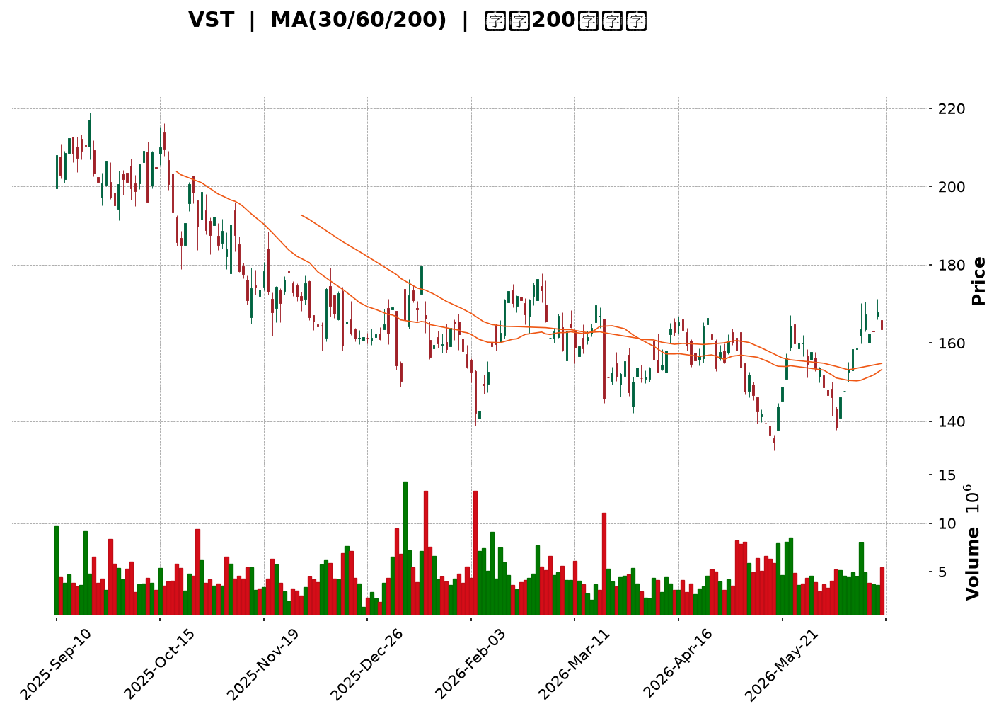
</details>

<html>
<head><meta charset="utf-8" /></head>
<body>
    <div style="height:500px; width:100%;">                        <script>window.PlotlyConfig = {MathJaxConfig: 'local'};</script>
        <script charset="utf-8" src="https://cdn.plot.ly/plotly-3.6.0.min.js" integrity="sha256-QaOVwtVY0T02VaHrr6pnoHLCwayMJp4O5n4YyaE3rJk=" crossorigin="anonymous"></script>                <div id="candlestick-chart" class="plotly-graph-div" style="height:100%; width:100%;"></div>            <script>                window.PLOTLYENV=window.PLOTLYENV || {};                                if (document.getElementById("candlestick-chart")) {                    Plotly.newPlot(                        "candlestick-chart",                        [{"close":{"dtype":"f8","bdata":"AAAAIMkDakAAAADghl9pQAAAAEBiE2pAAAAAQPyMakAAAADgyQpqQAAAAMAi52lAAAAA4AYiakAAAACg60xqQAAAAOCEIGtAAAAAAJNsaUAAAACAGidpQAAAAAAVGWlAAAAAAIrLaUAAAACAz6NoQAAAAEBwY2hAAAAAoJMVaUAAAADA5zlpQAAAAIDfJGlAAAAA4IXyaEAAAAAAWdloQAAAAAAwtmlAAAAAYCEkakAAAADgZIFoQAAAAEDKFWpAAAAAoAuVaUAAAACgNz9qQAAAAGDgMGpAAAAAYHoQaUAAAADg5i1oQAAAAODiN2dAAAAA4OUhZ0AAAABAcdJnQAAAAEBNFGlAAAAAgCbPaEAAAAAAlrlnQAAAAGBh0WhAAAAAAIudZ0AAAAAgnHBnQAAAACCpB2hAAAAAoAcfZ0AAAABAWJNnQAAAAIBW+2ZAAAAAwKbGZ0AAAADg+G9nQAAAAMBXTWZAAAAAQPswZkAAAADAJltlQAAAAIDlvmVAAAAAYMbIZUAAAADASrZlQAAAAIC0TGZAAAAAIDeiZUAAAACAgfxkQAAAAIA8zWVAAAAAADVEZUAAAADgIgJmQAAAAGDIQ2ZAAAAAYG+dZUAAAABgs3plQAAAAAAFXmVAAAAAoN\u002fqZUAAAAAAQc9kQAAAACDLrWRAAAAAIAyEZEAAAAAAhY9kQAAAAEAHvGVAAAAAIKAsZUAAAADAq\u002fFkQAAAAGBhl2VAAAAAQM\u002fpY0AAAAAAY69kQAAAAOBSS2RAAAAAAPojZEAAAADgKidkQAAAACBsMGRAAAAA4ConZEAAAACglyxkQAAAAMB7RWRAAAAAQFEcZEAAAAAAxphkQAAAAEBgT2RAAAAAYP4hZUAAAABAjUVjQAAAAMDnxWJAAAAAACe9ZEAAAAAgU4NlQAAAAIBOXmVAAAAAgB8QZUAAAABg2nVmQAAAAAB+xGRAAAAAgBOMY0AAAABgg\u002fJjQAAAAOBc\u002fWNAAAAAQLT1Y0AAAABg5stjQAAAAIDReWRAAAAAYNulZEAAAAAANURkQAAAAIA4vWNAAAAAoLM6Y0AAAABAfhJjQAAAAOAOxGFAAAAAIJzVYUAAAACglqdiQAAAACCJEWNAAAAAQBzlY0AAAABAqfZjQAAAAEDNVGRAAAAAgIpgZUAAAABAbaZlQAAAAKAuQ2VAAAAAgMWAZUAAAAAgq11lQAAAAEDJ6mRAAAAAYLBkZUAAAADgCdxlQAAAAGChCmZAAAAAACGtZUAAAADABrFkQAAAAAAgKGRAAAAAQBldZEAAAACABd5kQAAAAEDLxmNAAAAAIGVlZEAAAABgSX5kQAAAAMAR12NAAAAA4HjkY0AAAAAAXtBjQAAAACBhMWRAAAAAgA18ZEAAAABA0jRlQAAAAIAQ3WRAAAAAABs6YkAAAACAguJiQAAAAKA0EGNAAAAAIIrpYkAAAADgyAJjQAAAAABnaGNAAAAAYK1qYkAAAAAg1cNiQAAAAKDUN2NAAAAAoP7eYkAAAACgGOxiQAAAAODhLmNAAAAAAIF1Y0AAAAAgKhFjQAAAAIBvUGNAAAAAAFK\u002fY0AAAADAs3dkQAAAAODJVmRAAAAAYI2pZEAAAADAZ2dkQAAAAOAO7GNAAAAAIDBWY0AAAADgTnJjQAAAAGAulGNAAAAAgNiDZEAAAAAAG8tkQAAAAEChHGRAAAAAwGUyY0AAAAAA0bNjQAAAAOACYmNAAAAAgAAUZEAAAACg+wRkQAAAAEAywmNAAAAAwII3Y0AAAAAAbnBiQAAAAMDL+mJAAAAAgERVYkAAAABgI81hQAAAACBztmFAAAAAYIJvYUAAAABg4RFhQAAAACCx0GBAAAAAYI75YUAAAACA45tiQAAAAKClgWNAAAAAQI6KZEAAAAAgov1jQAAAAKDJAWRAAAAAgDAAZEAAAADgZFFjQAAAAID4t2NAAAAAoLcyY0AAAACghS9jQAAAAKCpkWJAAAAA4DlWYkAAAAAgf0BiQAAAAIAUS2FAAAAAIJxFYkAAAAAgBHpiQAAAACDFKWNAAAAAIGzMY0AAAADAc9NjQAAAACCscGRAAAAA4FHoZEAAAADgekxkQAAAAADXW2RAAAAA4KP4ZEAAAAAgrm9kQA=="},"high":{"dtype":"f8","bdata":"8Iiv3Zx4akA6joRtallqQD5AMRzHI2pA+j1C42kYa0Bt0lAx5pVqQNj8xDDmlWpATPszr+iqakBZ\u002f4MmgJ5qQEnLqTIRXWtAQKRBHD58akCxK\u002fSonqppQOkgeS42bWlAFiOzPHbUaUAGNVE\u002fk8hpQP+ABAVk9WhAwDtzDpCCaUDjva8oy4RpQPd0oNCAKmpAMrGrIiriaUD1fv8rq19pQMycKHYZuGlAKdeqhTpGakClX6fNp29qQA4nDmmJImpAlze3hXv\u002faUBIev32cuRqQAnTrz1jBmtAg+LPKrklakAdPOAxupRpQEGExjLFE2hALxsz0NmWZ0Dy1AZt5OxnQMOSPv4wJWlA8TD6fhdaaUDGmf7E5I9oQBUTNUu4\u002fGhAwZAindq\u002faEAybwBu4QJoQMQ5LfQsTGhAcafuRETWZ0CO923Pp\u002fVnQMrTk5y9imdATzu0kwrJZ0D8LrFHe39oQDVLmDIjZWdAq\u002fO1DoqRZkBbBEovGidmQJbUfJgcaGZAM5PPrtBYZkBtSmXT5BVmQKzhV3Hpl2ZA4wCLgyiQZ0A0q\u002fvRtZ5lQApyKvYlz2VACWORtivAZUBpE1n5aCBmQMZPmjumgGZAhDSCIvD3ZUBGoeacDOdlQHysXcEgpGVAWE0We\u002fgpZkAwHEv4t\u002fxlQE0QHN7342RAQm+KGpImZUBHUAVfm6pkQBD1xAVFxWVACMMmhhxoZkCiWLdeCollQPXUKTGtpmVA3iX1eDzNZUAXXM6kn2ZlQJLw+ipfVmVA\u002fWBvE2p7ZEAvlTa\u002f8mdkQP+rCwBeRGRAU90fMZxRZEAVvdNp53dkQGikS06GU2RAJmBSO3qBZECXgsIYBBplQE3qKVDOZWVAafBaJEiEZUAMlnY36QVlQETibZvYa2NAjiX69UDIZUCVsD3cEwhmQLAX1yvp3mVAjJ\u002fHzaVWZUDl6QyWzcFmQHkFh5i7VGVAHSfpTFixZEAdjB9UDzFkQC3tpciQYWRAZbRuGXZNZEDDfGZ5U5tkQG32H31OhWRAShc1NTfDZED3WL7XVu1kQI7wMkJ6gWRA3UebmjzxY0AHXLEmL4JjQK8CdvuNJ2NA08EgZGrwYUAEcGzD4PpiQFTSdh41a2NAqDUjfjAfZEBc1l9hU5tkQHfzEhcMuGRAZpd4SPdlZUC4t2ZgNAVmQHRfFrWB4GVAMzP3agGDZUBiVUDqrqBlQEs2oZG1a2VA53\u002fghJpmZUA\u002fsT4kjO5lQFmw+bu2F2ZAPovpuy06ZkBt9Z+FDgFmQI65eASGYmRArzRJSjl4ZEA\u002fIygeNvBkQP+m45lL\u002fWRA1kRjTKCFZEC1takJYQplQOeVqvczcWRAavQzEP5XZEA8UHaXF5lkQOXKtt+QYWRA7cE29hygZEBHUUcpupBlQAZxQlo6JGVAEtsNF5fHZEAo\u002fX\u002fQ0nVjQKwQqdBNPGNAydGc2FS3Y0D9ueaimw5jQCae5i07\u002f2NAPHKCw6XWY0CQPozwQuhiQLZxLjzig2NA2YaV5wBLY0C3k+EkghxjQLpvM6A4PmNABmuViLMiZEDwIVLWr0lkQF50DrIPzWNACrxYAdkPZEBzPwA+kKFkQOVL4zwwyWRAatNcU\u002fjVZEAUpSDgIwhlQJdRWkVCemRAKT+atv0bZEDHjyrvcNtjQHev5vu61GNA7ZgdbvSnZEB3z60r5wVlQHtHdF0XY2RA5gCWrjwdZEA1oEY+BO1jQDmzAFNQ\u002fWNAOkLKuOREZED8LLYRRXJkQL53EehiWGRAUMzp0\u002fEEZUC6dRFaEFljQKH3GhsqEWNAq8KC8ZvDYkAOqsz0aUJiQFkVxgQH42FAEkf1+JCcYUAh85gJCWthQFSH1lNIEGFAqi6e0FAWYkDq7nSVR6JiQKTPY1swq2NApA\u002fR9k7lZEApLBnQUZlkQIVY1GSkaWRAusF4ZgRCZEBhQng0gcpjQM2gz87DEWRAj2f+qQ22Y0C9y+b6YjpjQHj\u002fcQVgQmNAW0J0QeuiYkCIGzrC38JiQODlIVOO+WFA6RQP6zlWYkASuq\u002fWQ8liQH\u002fWwoNxZ2NAvcI6PyIoZEAXNWyEz0ZkQD5+vuFBQ2VAAAAAAABQZUAAAABgZrpkQAAAAOB6tGRAAAAAQDNrZUAAAACAwv1kQA=="},"hovertemplate":"\u003cb\u003e%{x|%Y-%m-%d}\u003c\u002fb\u003e\u003cbr\u003e\u958b: $%{open:.2f}\u003cbr\u003e\u9ad8: $%{high:.2f}\u003cbr\u003e\u4f4e: $%{low:.2f}\u003cbr\u003e\u6536: $%{close:.2f}\u003cextra\u003e\u003c\u002fextra\u003e","low":{"dtype":"f8","bdata":"MMztdJreaEBE+k0cSUFpQKF\u002fOXqWHmlAK46IDGITakCXqikUbsdpQInr53lDc2lAvK+m8tveaUCku6xbqIppQDYHsrIF3mlAAcYvwLdTaUDvaZF0DCFpQEPZQnlOZmhAFJuw4K8EaUDF2neHKZxoQJRvb1kXvWdA2DPvsu\u002frZ0Bk\u002fEM8WbxoQIZ94QVCFWlARxO83o6TaEA+CB3FUmJoQN40bfmA6WhAVeWIPXiPaUDJxPytwYBoQDaDJz408mhA4gBjIxISaUBboGdQaLFpQOdXDU0x+mlAjLDr6gznaEDx+YtvPABoQFXNq8acGWdAg7aaNvVcZkC3UfjrEh5nQLPt9qhfOWhAVTb5AOx1aECDCebsjvZmQN2Tj\u002frklWdA9vZFAEJ4Z0A4wZDGSNhmQE+ZGlckYmdAAxMLoYP3ZkA7tPRnNwVnQA7+AC8iWWZAxJLePcP7ZUCyxWrarexmQPuGO2QwQmZAm+aaS8ARZkDvtXF1AjplQArn5uGVnGRAzcyHP92MZUA\u002f2K6eeD5lQI1n1Qjrr2VAtO9M7C6NZUA5b0yxhThkQNDFyE3IpmRAbOdYKvGmZEAm5WPXv4tlQOuU\u002fQCyKGZAPpPORil\u002fZUCHIWUi8FRlQM35QVv6B2VAFuEkuXI4ZUD6y1Fo8rhkQGTG3pwlbGRACIHRd3+BZECwKyGkvr9jQDuIyJfzCmRARGe5NcXZZEAdlecFM8lkQLPTwQ1\u002fu2RAEjgHhlbBY0CNppjp2T9kQN8kMLbOQGRA+s6oBQANZEAcBc4NBvZjQHKAUR6J6mNAuID2VAv9Y0AvE1YNc+9jQCmPnYGzE2RAXWRunM4YZEB2DYgIA25kQAxAoCzw92NAyZcsU4BqZEDYT+GUuSNjQEKzkt3omGJAT47qEoStZEDWQN44E3RkQN4tVu8oS2VACa4Q3vCyZEAsVkp6mmZlQJDn3cLtUWRARgMCqDR6Y0ATnnqgECtjQFLE1di\u002f1mNAF6uSKQ2yY0Cw9PEw3K5jQNij9nbWtmNAcm+2f+QWZECWPU4SJcpjQEf7qwysjWNAiUWnslwzY0DH8aJwRL9iQFHKelNYXGFAkH+d+rpEYUChUP\u002flbGBiQCnPTevpa2JAcjRhwUBMY0DeTzBJmsNjQFmO78Sj\u002fmNA4nRxJb4hZECbC7dsZS9lQGNbNPKLJGVAzczMjCX5ZEA29lmdFBFlQNLTDokimGRA7idC5sdNZECC7NZ0izNlQG8L4j4IdWRAbbigzGRNZUDEp7ed66tkQEGb0dHaEWNAS78hxaP+Y0BlTbqFfCdkQGyq6Qigu2NAn+Wx8FBSY0DDJKFFQXtkQNRxNWAaV2NAl+OE9pCIY0BJQKVSb6ljQB57CJ1i9WNAX\u002fJFEoc1ZECRbbWpY6FkQMK0e5bceGRA\u002fNIbIhQUYkAwnEilCaRiQMiCHFHoqmJA60APMm7FYkD1SzPvH0liQBIcw5o18WJA0ULJxKNMYkCIuoWJgsRhQPA6xlMG5mJArKadRB+9YkB6ffv2c7ViQEj7qRM8wmJAM5+on1RiY0DIQU9t7Q5jQDHMHg+rHGNAZv0D9fcNY0CDdIFH3QNkQCz33SyLPWRAp6jeMz5MZECUu17\u002fDkFkQNmc5Mknw2NAQeN\u002fT0M9Y0BQjn7XgVZjQLLd8wsWSWNAAcmUZNtdY0DcwbufatBjQDa4ZP7vz2NAV+BIorUbY0D2zDEMZHBjQGLbd6LTVmNAUqzs0AinY0B4oQzlcvJjQBWqTDwxjGNAn\u002fjcT8IxY0BarDNayFhiQPB5qp9ZQmJAU9p+HJouYkBN4Y2jE2phQOZVAgk+d2FAVbkIzMAzYUAxfbKbh7VgQEVGKvwuj2BAVb02ycAzYUDbOZY9rRViQLxT5\u002fxA0WJACwUJovW\u002fY0DHT6W098VjQCRDh9MlrGNAatvMwCOVY0DVR6iryeNiQLP\u002f\u002fY9RFWNAVUPwHI4XY0CRg6v1W79iQFECWi9maWJAjPD6FJxFYkD1bnYd8qphQAAam9fyNmFAaSJHo\u002f5rYUALD3bva1liQOPvJXk+wWJAQYPflrgTY0A1ZTJPr59jQDIRhX3M+WNAAAAAwMxcZEAAAADgo+RjQAAAAAAp\u002fGNAAAAA4FHAZEAAAACAFGZkQA=="},"name":"\u50f9\u683c","open":{"dtype":"f8","bdata":"SmBOGijvaECbHzrNGPZpQGA9\u002fBy3O2lAK46IDGITakBt0lAx5pVqQGcN\u002f0UoRmpAIWtA+EyGakBoAW9Hs1FqQILBtVr\u002fQ2pAAwWckKInakAdkeMaWE1pQH+3Fv24pWhAtoA4p7ILaUBYeNMPMSVpQOwp1waly2hAwcvl7B5GaED7c2ZmM2ZpQEd5nXEUcGlADfszhcKpaUBkF8w\u002ffRdpQEzwoJvOF2lAfMVXTIfEaUCjnClaexxqQIOb8gcmCWlAQHiq3PedaUA6Xk\u002fbdQ5qQJ5uWhnGvGpANRorB+HZaUCHlnK9EWlpQOOJaOuPAmhAdiBLsLVYZ0C3UfjrEh5nQM\u002fVnrUbeWhA8TD6fhdaaUDGmf7E5I9oQFTjOjQU8GdA62ozRew7aEDojN7KhOZnQKrOgsOYwGdAGIW2kTxqZ0CN3POXmS9nQFB65SY1xGZAojlrcE84ZkDykg87vz9oQL5x5fPDJGdAXp1Bw6ByZkD+Uss7pAVmQNUMCqaSz2RAAIAYRHrWZUDdCZ2rNH5lQAlY8ZjfzWVAog6YQbYBZ0CzC6VlLGllQOGegl28G2VAUr7qC3WrZUD3Oi9h6KhlQDdTWH4+SGZABIdy2vXoZUBwBX+shdVlQBVgba80fmVAdDR7jPxlZUD87gmVNvllQE0QHN7342RATXJnmeSVZED4QW7Z75RkQNY5QgIYLGRAdHF++iXPZUDCI48axIdlQExHEsiuvmRA56NS3TmpZUBiSbpzIp9kQCEHOdBGwGRArTj3lIVxZEA+IIIC+iNkQJ\u002fi98t3EWRAAAAA4ConZEBu+e9byRFkQOK4FMOyMWRAxPdPfhlOZEB2DYgIA25kQJF6ZTTjHGVAf8pbmhQRZUAMlnY36QVlQIN9eGlLWmNAQ00eeiu7ZUBCqG8j54ZkQO2bA5GjsGVAfnEKooYdZUAeFyYlupBlQKsEkefO4mRANhWAE2caZEDiA5czSNJjQHtDXsR2L2RAkEVA9t\u002fxY0BfmpXlswRkQE90Vdo84mNAAxIpXVixZED6kUmcEbBkQIk7MQ++IWRAExH34uGmY0D0nje9DnZjQEeQvVqOGGNAojQ1aI2TYUBr0Pv2wbJiQG77QP\u002fBsmJA\u002fxqKq6P+Y0C1aPPibpFkQJBUta8rCWRA+iaBjnY+ZECtz\u002fIHE01lQLOrpUH1sGVAzcyuyB4uZUB9UO2oY3plQOWAgVBqRWVA6lORNTHaZEBAJY8Z8XxlQAOzW2VkXGVAOU8LCo3QZUC18araXzdlQGjR0lnOJ2RAQRNeYJ0kZEBftYiA3i1kQIBPaMvhf2RAZPKZWQlvY0CG0uEN7JxkQCNnCejBZGRAdL73X7GUY0BdqwD+CSpkQMT20F\u002fJEWRAtkct+otLZECPW0sDXqlkQHRaFaWu1mRAEtsNF5fHZECbEcRqn+diQFVYRNzcymJAg3luRBBZY0AW3KxTT6liQBIcw5o18WJAw2d6eiucY0AS2UYqXPZhQP2SdgZD6GJAgJv6J\u002fTfYkD05QVNhdpiQNx2sMZ622JABWzocs4QZEA9BV0HgXVjQLWWVHchKWNAZv0D9fcNY0Bq0TQf2kVkQMEZRAyYqGRAEtt+H+CKZEC7gUEs4cBkQG2jFbpNWmRAmNfAOyARZEBJQhvZibJjQEubIrK9d2NATXwCgJCDY0B04M+5nZhkQIMv5nC6SGRAoLjdQFIUZEBSdtYhSYJjQBZ04OnVwmNAJT248wWvY0BA9fybtFhkQEL5jOicKGRACATW3ftZZEC6dRFaEFljQNTOhYVgeWJA+mVlnP2oYkAOqsz0aUJiQDsNAlXVpWFAvyBliYtyYUCsu0WZx1lhQGulTeOF82BAAAAAHNM5YUD8xES7hyhiQPBHu4cz2mJAx8ZiOgLWY0AqjOmlVpdkQK+CDJ\u002fF02NAQyCHAtf4Y0DC0GVW+ZhjQGPJmQEad2NAte0B1FCJY0AMOJaef+piQK8anKEy+WJAt\u002f3beEiDYkAxHOFLzIZiQAbrZwXJ5GFAytzu\u002fl6ZYUBWG6t6YHliQIKpSuIUE2NAm2MnZyQhY0CH1zPp+8pjQPBXPGSgO2RAAAAAAClwZEAAAABgjwJkQAAAAMD1YGRAAAAAwB7dZEAAAAAghbtkQA=="},"x":["2025-09-10T00:00:00-04:00","2025-09-11T00:00:00-04:00","2025-09-12T00:00:00-04:00","2025-09-15T00:00:00-04:00","2025-09-16T00:00:00-04:00","2025-09-17T00:00:00-04:00","2025-09-18T00:00:00-04:00","2025-09-19T00:00:00-04:00","2025-09-22T00:00:00-04:00","2025-09-23T00:00:00-04:00","2025-09-24T00:00:00-04:00","2025-09-25T00:00:00-04:00","2025-09-26T00:00:00-04:00","2025-09-29T00:00:00-04:00","2025-09-30T00:00:00-04:00","2025-10-01T00:00:00-04:00","2025-10-02T00:00:00-04:00","2025-10-03T00:00:00-04:00","2025-10-06T00:00:00-04:00","2025-10-07T00:00:00-04:00","2025-10-08T00:00:00-04:00","2025-10-09T00:00:00-04:00","2025-10-10T00:00:00-04:00","2025-10-13T00:00:00-04:00","2025-10-14T00:00:00-04:00","2025-10-15T00:00:00-04:00","2025-10-16T00:00:00-04:00","2025-10-17T00:00:00-04:00","2025-10-20T00:00:00-04:00","2025-10-21T00:00:00-04:00","2025-10-22T00:00:00-04:00","2025-10-23T00:00:00-04:00","2025-10-24T00:00:00-04:00","2025-10-27T00:00:00-04:00","2025-10-28T00:00:00-04:00","2025-10-29T00:00:00-04:00","2025-10-30T00:00:00-04:00","2025-10-31T00:00:00-04:00","2025-11-03T00:00:00-05:00","2025-11-04T00:00:00-05:00","2025-11-05T00:00:00-05:00","2025-11-06T00:00:00-05:00","2025-11-07T00:00:00-05:00","2025-11-10T00:00:00-05:00","2025-11-11T00:00:00-05:00","2025-11-12T00:00:00-05:00","2025-11-13T00:00:00-05:00","2025-11-14T00:00:00-05:00","2025-11-17T00:00:00-05:00","2025-11-18T00:00:00-05:00","2025-11-19T00:00:00-05:00","2025-11-20T00:00:00-05:00","2025-11-21T00:00:00-05:00","2025-11-24T00:00:00-05:00","2025-11-25T00:00:00-05:00","2025-11-26T00:00:00-05:00","2025-11-28T00:00:00-05:00","2025-12-01T00:00:00-05:00","2025-12-02T00:00:00-05:00","2025-12-03T00:00:00-05:00","2025-12-04T00:00:00-05:00","2025-12-05T00:00:00-05:00","2025-12-08T00:00:00-05:00","2025-12-09T00:00:00-05:00","2025-12-10T00:00:00-05:00","2025-12-11T00:00:00-05:00","2025-12-12T00:00:00-05:00","2025-12-15T00:00:00-05:00","2025-12-16T00:00:00-05:00","2025-12-17T00:00:00-05:00","2025-12-18T00:00:00-05:00","2025-12-19T00:00:00-05:00","2025-12-22T00:00:00-05:00","2025-12-23T00:00:00-05:00","2025-12-24T00:00:00-05:00","2025-12-26T00:00:00-05:00","2025-12-29T00:00:00-05:00","2025-12-30T00:00:00-05:00","2025-12-31T00:00:00-05:00","2026-01-02T00:00:00-05:00","2026-01-05T00:00:00-05:00","2026-01-06T00:00:00-05:00","2026-01-07T00:00:00-05:00","2026-01-08T00:00:00-05:00","2026-01-09T00:00:00-05:00","2026-01-12T00:00:00-05:00","2026-01-13T00:00:00-05:00","2026-01-14T00:00:00-05:00","2026-01-15T00:00:00-05:00","2026-01-16T00:00:00-05:00","2026-01-20T00:00:00-05:00","2026-01-21T00:00:00-05:00","2026-01-22T00:00:00-05:00","2026-01-23T00:00:00-05:00","2026-01-26T00:00:00-05:00","2026-01-27T00:00:00-05:00","2026-01-28T00:00:00-05:00","2026-01-29T00:00:00-05:00","2026-01-30T00:00:00-05:00","2026-02-02T00:00:00-05:00","2026-02-03T00:00:00-05:00","2026-02-04T00:00:00-05:00","2026-02-05T00:00:00-05:00","2026-02-06T00:00:00-05:00","2026-02-09T00:00:00-05:00","2026-02-10T00:00:00-05:00","2026-02-11T00:00:00-05:00","2026-02-12T00:00:00-05:00","2026-02-13T00:00:00-05:00","2026-02-17T00:00:00-05:00","2026-02-18T00:00:00-05:00","2026-02-19T00:00:00-05:00","2026-02-20T00:00:00-05:00","2026-02-23T00:00:00-05:00","2026-02-24T00:00:00-05:00","2026-02-25T00:00:00-05:00","2026-02-26T00:00:00-05:00","2026-02-27T00:00:00-05:00","2026-03-02T00:00:00-05:00","2026-03-03T00:00:00-05:00","2026-03-04T00:00:00-05:00","2026-03-05T00:00:00-05:00","2026-03-06T00:00:00-05:00","2026-03-09T00:00:00-04:00","2026-03-10T00:00:00-04:00","2026-03-11T00:00:00-04:00","2026-03-12T00:00:00-04:00","2026-03-13T00:00:00-04:00","2026-03-16T00:00:00-04:00","2026-03-17T00:00:00-04:00","2026-03-18T00:00:00-04:00","2026-03-19T00:00:00-04:00","2026-03-20T00:00:00-04:00","2026-03-23T00:00:00-04:00","2026-03-24T00:00:00-04:00","2026-03-25T00:00:00-04:00","2026-03-26T00:00:00-04:00","2026-03-27T00:00:00-04:00","2026-03-30T00:00:00-04:00","2026-03-31T00:00:00-04:00","2026-04-01T00:00:00-04:00","2026-04-02T00:00:00-04:00","2026-04-06T00:00:00-04:00","2026-04-07T00:00:00-04:00","2026-04-08T00:00:00-04:00","2026-04-09T00:00:00-04:00","2026-04-10T00:00:00-04:00","2026-04-13T00:00:00-04:00","2026-04-14T00:00:00-04:00","2026-04-15T00:00:00-04:00","2026-04-16T00:00:00-04:00","2026-04-17T00:00:00-04:00","2026-04-20T00:00:00-04:00","2026-04-21T00:00:00-04:00","2026-04-22T00:00:00-04:00","2026-04-23T00:00:00-04:00","2026-04-24T00:00:00-04:00","2026-04-27T00:00:00-04:00","2026-04-28T00:00:00-04:00","2026-04-29T00:00:00-04:00","2026-04-30T00:00:00-04:00","2026-05-01T00:00:00-04:00","2026-05-04T00:00:00-04:00","2026-05-05T00:00:00-04:00","2026-05-06T00:00:00-04:00","2026-05-07T00:00:00-04:00","2026-05-08T00:00:00-04:00","2026-05-11T00:00:00-04:00","2026-05-12T00:00:00-04:00","2026-05-13T00:00:00-04:00","2026-05-14T00:00:00-04:00","2026-05-15T00:00:00-04:00","2026-05-18T00:00:00-04:00","2026-05-19T00:00:00-04:00","2026-05-20T00:00:00-04:00","2026-05-21T00:00:00-04:00","2026-05-22T00:00:00-04:00","2026-05-26T00:00:00-04:00","2026-05-27T00:00:00-04:00","2026-05-28T00:00:00-04:00","2026-05-29T00:00:00-04:00","2026-06-01T00:00:00-04:00","2026-06-02T00:00:00-04:00","2026-06-03T00:00:00-04:00","2026-06-04T00:00:00-04:00","2026-06-05T00:00:00-04:00","2026-06-08T00:00:00-04:00","2026-06-09T00:00:00-04:00","2026-06-10T00:00:00-04:00","2026-06-11T00:00:00-04:00","2026-06-12T00:00:00-04:00","2026-06-15T00:00:00-04:00","2026-06-16T00:00:00-04:00","2026-06-17T00:00:00-04:00","2026-06-18T00:00:00-04:00","2026-06-22T00:00:00-04:00","2026-06-23T00:00:00-04:00","2026-06-24T00:00:00-04:00","2026-06-25T00:00:00-04:00","2026-06-26T00:00:00-04:00"],"type":"candlestick"},{"hovertemplate":"MA30: $%{y:.2f}\u003cextra\u003e\u003c\u002fextra\u003e","line":{"color":"#2196F3","dash":"dash","width":2},"mode":"lines","name":"MA30","x":["2025-09-10T00:00:00-04:00","2025-09-11T00:00:00-04:00","2025-09-12T00:00:00-04:00","2025-09-15T00:00:00-04:00","2025-09-16T00:00:00-04:00","2025-09-17T00:00:00-04:00","2025-09-18T00:00:00-04:00","2025-09-19T00:00:00-04:00","2025-09-22T00:00:00-04:00","2025-09-23T00:00:00-04:00","2025-09-24T00:00:00-04:00","2025-09-25T00:00:00-04:00","2025-09-26T00:00:00-04:00","2025-09-29T00:00:00-04:00","2025-09-30T00:00:00-04:00","2025-10-01T00:00:00-04:00","2025-10-02T00:00:00-04:00","2025-10-03T00:00:00-04:00","2025-10-06T00:00:00-04:00","2025-10-07T00:00:00-04:00","2025-10-08T00:00:00-04:00","2025-10-09T00:00:00-04:00","2025-10-10T00:00:00-04:00","2025-10-13T00:00:00-04:00","2025-10-14T00:00:00-04:00","2025-10-15T00:00:00-04:00","2025-10-16T00:00:00-04:00","2025-10-17T00:00:00-04:00","2025-10-20T00:00:00-04:00","2025-10-21T00:00:00-04:00","2025-10-22T00:00:00-04:00","2025-10-23T00:00:00-04:00","2025-10-24T00:00:00-04:00","2025-10-27T00:00:00-04:00","2025-10-28T00:00:00-04:00","2025-10-29T00:00:00-04:00","2025-10-30T00:00:00-04:00","2025-10-31T00:00:00-04:00","2025-11-03T00:00:00-05:00","2025-11-04T00:00:00-05:00","2025-11-05T00:00:00-05:00","2025-11-06T00:00:00-05:00","2025-11-07T00:00:00-05:00","2025-11-10T00:00:00-05:00","2025-11-11T00:00:00-05:00","2025-11-12T00:00:00-05:00","2025-11-13T00:00:00-05:00","2025-11-14T00:00:00-05:00","2025-11-17T00:00:00-05:00","2025-11-18T00:00:00-05:00","2025-11-19T00:00:00-05:00","2025-11-20T00:00:00-05:00","2025-11-21T00:00:00-05:00","2025-11-24T00:00:00-05:00","2025-11-25T00:00:00-05:00","2025-11-26T00:00:00-05:00","2025-11-28T00:00:00-05:00","2025-12-01T00:00:00-05:00","2025-12-02T00:00:00-05:00","2025-12-03T00:00:00-05:00","2025-12-04T00:00:00-05:00","2025-12-05T00:00:00-05:00","2025-12-08T00:00:00-05:00","2025-12-09T00:00:00-05:00","2025-12-10T00:00:00-05:00","2025-12-11T00:00:00-05:00","2025-12-12T00:00:00-05:00","2025-12-15T00:00:00-05:00","2025-12-16T00:00:00-05:00","2025-12-17T00:00:00-05:00","2025-12-18T00:00:00-05:00","2025-12-19T00:00:00-05:00","2025-12-22T00:00:00-05:00","2025-12-23T00:00:00-05:00","2025-12-24T00:00:00-05:00","2025-12-26T00:00:00-05:00","2025-12-29T00:00:00-05:00","2025-12-30T00:00:00-05:00","2025-12-31T00:00:00-05:00","2026-01-02T00:00:00-05:00","2026-01-05T00:00:00-05:00","2026-01-06T00:00:00-05:00","2026-01-07T00:00:00-05:00","2026-01-08T00:00:00-05:00","2026-01-09T00:00:00-05:00","2026-01-12T00:00:00-05:00","2026-01-13T00:00:00-05:00","2026-01-14T00:00:00-05:00","2026-01-15T00:00:00-05:00","2026-01-16T00:00:00-05:00","2026-01-20T00:00:00-05:00","2026-01-21T00:00:00-05:00","2026-01-22T00:00:00-05:00","2026-01-23T00:00:00-05:00","2026-01-26T00:00:00-05:00","2026-01-27T00:00:00-05:00","2026-01-28T00:00:00-05:00","2026-01-29T00:00:00-05:00","2026-01-30T00:00:00-05:00","2026-02-02T00:00:00-05:00","2026-02-03T00:00:00-05:00","2026-02-04T00:00:00-05:00","2026-02-05T00:00:00-05:00","2026-02-06T00:00:00-05:00","2026-02-09T00:00:00-05:00","2026-02-10T00:00:00-05:00","2026-02-11T00:00:00-05:00","2026-02-12T00:00:00-05:00","2026-02-13T00:00:00-05:00","2026-02-17T00:00:00-05:00","2026-02-18T00:00:00-05:00","2026-02-19T00:00:00-05:00","2026-02-20T00:00:00-05:00","2026-02-23T00:00:00-05:00","2026-02-24T00:00:00-05:00","2026-02-25T00:00:00-05:00","2026-02-26T00:00:00-05:00","2026-02-27T00:00:00-05:00","2026-03-02T00:00:00-05:00","2026-03-03T00:00:00-05:00","2026-03-04T00:00:00-05:00","2026-03-05T00:00:00-05:00","2026-03-06T00:00:00-05:00","2026-03-09T00:00:00-04:00","2026-03-10T00:00:00-04:00","2026-03-11T00:00:00-04:00","2026-03-12T00:00:00-04:00","2026-03-13T00:00:00-04:00","2026-03-16T00:00:00-04:00","2026-03-17T00:00:00-04:00","2026-03-18T00:00:00-04:00","2026-03-19T00:00:00-04:00","2026-03-20T00:00:00-04:00","2026-03-23T00:00:00-04:00","2026-03-24T00:00:00-04:00","2026-03-25T00:00:00-04:00","2026-03-26T00:00:00-04:00","2026-03-27T00:00:00-04:00","2026-03-30T00:00:00-04:00","2026-03-31T00:00:00-04:00","2026-04-01T00:00:00-04:00","2026-04-02T00:00:00-04:00","2026-04-06T00:00:00-04:00","2026-04-07T00:00:00-04:00","2026-04-08T00:00:00-04:00","2026-04-09T00:00:00-04:00","2026-04-10T00:00:00-04:00","2026-04-13T00:00:00-04:00","2026-04-14T00:00:00-04:00","2026-04-15T00:00:00-04:00","2026-04-16T00:00:00-04:00","2026-04-17T00:00:00-04:00","2026-04-20T00:00:00-04:00","2026-04-21T00:00:00-04:00","2026-04-22T00:00:00-04:00","2026-04-23T00:00:00-04:00","2026-04-24T00:00:00-04:00","2026-04-27T00:00:00-04:00","2026-04-28T00:00:00-04:00","2026-04-29T00:00:00-04:00","2026-04-30T00:00:00-04:00","2026-05-01T00:00:00-04:00","2026-05-04T00:00:00-04:00","2026-05-05T00:00:00-04:00","2026-05-06T00:00:00-04:00","2026-05-07T00:00:00-04:00","2026-05-08T00:00:00-04:00","2026-05-11T00:00:00-04:00","2026-05-12T00:00:00-04:00","2026-05-13T00:00:00-04:00","2026-05-14T00:00:00-04:00","2026-05-15T00:00:00-04:00","2026-05-18T00:00:00-04:00","2026-05-19T00:00:00-04:00","2026-05-20T00:00:00-04:00","2026-05-21T00:00:00-04:00","2026-05-22T00:00:00-04:00","2026-05-26T00:00:00-04:00","2026-05-27T00:00:00-04:00","2026-05-28T00:00:00-04:00","2026-05-29T00:00:00-04:00","2026-06-01T00:00:00-04:00","2026-06-02T00:00:00-04:00","2026-06-03T00:00:00-04:00","2026-06-04T00:00:00-04:00","2026-06-05T00:00:00-04:00","2026-06-08T00:00:00-04:00","2026-06-09T00:00:00-04:00","2026-06-10T00:00:00-04:00","2026-06-11T00:00:00-04:00","2026-06-12T00:00:00-04:00","2026-06-15T00:00:00-04:00","2026-06-16T00:00:00-04:00","2026-06-17T00:00:00-04:00","2026-06-18T00:00:00-04:00","2026-06-22T00:00:00-04:00","2026-06-23T00:00:00-04:00","2026-06-24T00:00:00-04:00","2026-06-25T00:00:00-04:00","2026-06-26T00:00:00-04:00"],"y":{"dtype":"f8","bdata":"AAAAAAAA+H8AAAAAAAD4fwAAAAAAAPh\u002fAAAAAAAA+H8AAAAAAAD4fwAAAAAAAPh\u002fAAAAAAAA+H8AAAAAAAD4fwAAAAAAAPh\u002fAAAAAAAA+H8AAAAAAAD4fwAAAAAAAPh\u002fAAAAAAAA+H8AAAAAAAD4fwAAAAAAAPh\u002fAAAAAAAA+H8AAAAAAAD4fwAAAAAAAPh\u002fAAAAAAAA+H8AAAAAAAD4fwAAAAAAAPh\u002fAAAAAAAA+H8AAAAAAAD4fwAAAAAAAPh\u002fAAAAAAAA+H8AAAAAAAD4fwAAAAAAAPh\u002fAAAAAAAA+H8AAAAAAAD4f2ZmZgYgeWlAIiIiYodgaUDe3d3tSlNpQKuqqjrKSmlAVVVVxe07aUBmZmbGJyhpQImIiJjlHmlAAAAAAGoJaUAzMzPzAPFoQJqZmTmT1mhAIiIicuzCaECamZkJd7VoQHd3dydoo2hAERERYS2SaEDe3d196odoQAAAAOAcdmhAERERIW1daEAiIiKyZjxoQFVVVeVmH2hAvLu7C2kEaEDe3d1NpOlnQGZmZpaGzGdAiYiI2A+mZ0BERERECIhnQCIiIgJ7Y2dA3t3dDac+Z0AiIiKyexpnQFVVVeX6+GZAiYiImIvbZkCJiIhYgcRmQO\u002fu7q61tGZAvLu7m1eqZkDNzMzMopBmQN7d3e0Va2ZAq6qq6nJGZkCamZlZcitmQLy7u4siEWZAq6qq6k38ZUAzMzOjAedlQCIiInIy0mVAMzMzs9K2ZUBERERkKJ5lQGZmZlY5h2VARERElDNoZUBmZma2LExlQLy7u9skOmVAvLu7C8AoZUBVVVU1qh5lQN7d3Z0VEmVAIiIics0DZUBVVVUFSfpkQO\u002fu7r5O6WRAZmZmlgjlZECJiIjYZtZkQAAAALCOvGRAiYiIOA64ZECJiIgY1LNkQGZmZuYtrGRAmpmZCXinZEBEREQ0169kQKuqqhq5qmRAmpmZGX+WZEAiIiJyI49kQHd3d+dBiWRA3t3dPYOEZEBERET0\u002fX1kQN7d3W1Ac2RAd3d3Z8JuZEDe3d0t+mhkQERERAQsWWRAMzMzw1VTZEB3d3dnkkVkQCIiIhL\u002fL2RAZmZmRlEcZEARERERiA9kQHd3d\u002ff3BWRAd3d3R8QDZEARERER+AFkQImIiMh6AmRA3t3dfUkNZECJiIiIRhZkQDMzMwNnHmRAiYiIyI8hZEBVVVWlbjNkQN7d3W26RWRAMzMzE1BLZECamZkZRU5kQImIiJgDVGRAERERYT9ZZEAiIiJCJ0pkQM3MzOzwRGRAVVVVlehLZEARERFBwlNkQJqZmZnwUWRAIiIisqlVZEDe3d3tm1tkQDMzMyMvVmRAvLu767xPZEC8u7tr4EtkQERERKS\u002fT2RAZmZm1nVaZEBmZmbWq2xkQDMzM9Mah2RAMzMzY3SKZEDv7u4ua4xkQFVVVdVfjGRAiYiIGP2DZEBEREQE3HtkQN7d3b36c2RAMzMzo7daZEB3d3f3GEJkQImIiAinMGRAiYiIeDEaZEARERFBVwVkQGZmZkaL9mNAIiIisgnmY0AAAABwNc5jQCIiIoLvtmNAzczMrHmmY0AiIiKCkKRjQERERLQepmNAvLu7G6uoY0CrqqrqtqRjQHd3d+f0pWNAq6qqmuqcY0Crqqra+5NjQDMzMxPBkWNAAAAAEBGXY0AiIiKybJ9jQCIiIqK7nmNAMzMzk76TY0AzMzMz6YZjQM3MzJxGemNAd3d3hxKKY0C8u7s7wZNjQGZmZhawmWNAERERcUmcY0C8u7uLaJdjQM3MzDzBk2NAq6qqigqTY0Crqqpq0YpjQFVVVdX4fWNAVVVV9bhxY0ARERFR6mFjQN7d3X21TWNAVVVVRQtBY0BERESEIj1jQERERHTGPmNAq6qquoxFY0AzMzMTe0FjQLy7u7ulPmNAERERgQA5Y0BEREQkvC9jQJqZman\u002fLWNAq6qq+tAsY0AiIiISlypjQLy7uwv5IWNAERERsWIPY0BERETUsvliQKuqqpql4WJAREREBMHZYkARERFBS89iQERERFRrzWJAREREhAjLYkCrqqraYcliQHd3d7cyz2JAVVVVBaDdYkARERFRfu1iQFVVVfVC+WJAMzMzI8YPY0Crqqo6QiZjQA=="},"type":"scatter"},{"hovertemplate":"MA60: $%{y:.2f}\u003cextra\u003e\u003c\u002fextra\u003e","line":{"color":"#9C27B0","dash":"dash","width":2},"mode":"lines","name":"MA60","x":["2025-09-10T00:00:00-04:00","2025-09-11T00:00:00-04:00","2025-09-12T00:00:00-04:00","2025-09-15T00:00:00-04:00","2025-09-16T00:00:00-04:00","2025-09-17T00:00:00-04:00","2025-09-18T00:00:00-04:00","2025-09-19T00:00:00-04:00","2025-09-22T00:00:00-04:00","2025-09-23T00:00:00-04:00","2025-09-24T00:00:00-04:00","2025-09-25T00:00:00-04:00","2025-09-26T00:00:00-04:00","2025-09-29T00:00:00-04:00","2025-09-30T00:00:00-04:00","2025-10-01T00:00:00-04:00","2025-10-02T00:00:00-04:00","2025-10-03T00:00:00-04:00","2025-10-06T00:00:00-04:00","2025-10-07T00:00:00-04:00","2025-10-08T00:00:00-04:00","2025-10-09T00:00:00-04:00","2025-10-10T00:00:00-04:00","2025-10-13T00:00:00-04:00","2025-10-14T00:00:00-04:00","2025-10-15T00:00:00-04:00","2025-10-16T00:00:00-04:00","2025-10-17T00:00:00-04:00","2025-10-20T00:00:00-04:00","2025-10-21T00:00:00-04:00","2025-10-22T00:00:00-04:00","2025-10-23T00:00:00-04:00","2025-10-24T00:00:00-04:00","2025-10-27T00:00:00-04:00","2025-10-28T00:00:00-04:00","2025-10-29T00:00:00-04:00","2025-10-30T00:00:00-04:00","2025-10-31T00:00:00-04:00","2025-11-03T00:00:00-05:00","2025-11-04T00:00:00-05:00","2025-11-05T00:00:00-05:00","2025-11-06T00:00:00-05:00","2025-11-07T00:00:00-05:00","2025-11-10T00:00:00-05:00","2025-11-11T00:00:00-05:00","2025-11-12T00:00:00-05:00","2025-11-13T00:00:00-05:00","2025-11-14T00:00:00-05:00","2025-11-17T00:00:00-05:00","2025-11-18T00:00:00-05:00","2025-11-19T00:00:00-05:00","2025-11-20T00:00:00-05:00","2025-11-21T00:00:00-05:00","2025-11-24T00:00:00-05:00","2025-11-25T00:00:00-05:00","2025-11-26T00:00:00-05:00","2025-11-28T00:00:00-05:00","2025-12-01T00:00:00-05:00","2025-12-02T00:00:00-05:00","2025-12-03T00:00:00-05:00","2025-12-04T00:00:00-05:00","2025-12-05T00:00:00-05:00","2025-12-08T00:00:00-05:00","2025-12-09T00:00:00-05:00","2025-12-10T00:00:00-05:00","2025-12-11T00:00:00-05:00","2025-12-12T00:00:00-05:00","2025-12-15T00:00:00-05:00","2025-12-16T00:00:00-05:00","2025-12-17T00:00:00-05:00","2025-12-18T00:00:00-05:00","2025-12-19T00:00:00-05:00","2025-12-22T00:00:00-05:00","2025-12-23T00:00:00-05:00","2025-12-24T00:00:00-05:00","2025-12-26T00:00:00-05:00","2025-12-29T00:00:00-05:00","2025-12-30T00:00:00-05:00","2025-12-31T00:00:00-05:00","2026-01-02T00:00:00-05:00","2026-01-05T00:00:00-05:00","2026-01-06T00:00:00-05:00","2026-01-07T00:00:00-05:00","2026-01-08T00:00:00-05:00","2026-01-09T00:00:00-05:00","2026-01-12T00:00:00-05:00","2026-01-13T00:00:00-05:00","2026-01-14T00:00:00-05:00","2026-01-15T00:00:00-05:00","2026-01-16T00:00:00-05:00","2026-01-20T00:00:00-05:00","2026-01-21T00:00:00-05:00","2026-01-22T00:00:00-05:00","2026-01-23T00:00:00-05:00","2026-01-26T00:00:00-05:00","2026-01-27T00:00:00-05:00","2026-01-28T00:00:00-05:00","2026-01-29T00:00:00-05:00","2026-01-30T00:00:00-05:00","2026-02-02T00:00:00-05:00","2026-02-03T00:00:00-05:00","2026-02-04T00:00:00-05:00","2026-02-05T00:00:00-05:00","2026-02-06T00:00:00-05:00","2026-02-09T00:00:00-05:00","2026-02-10T00:00:00-05:00","2026-02-11T00:00:00-05:00","2026-02-12T00:00:00-05:00","2026-02-13T00:00:00-05:00","2026-02-17T00:00:00-05:00","2026-02-18T00:00:00-05:00","2026-02-19T00:00:00-05:00","2026-02-20T00:00:00-05:00","2026-02-23T00:00:00-05:00","2026-02-24T00:00:00-05:00","2026-02-25T00:00:00-05:00","2026-02-26T00:00:00-05:00","2026-02-27T00:00:00-05:00","2026-03-02T00:00:00-05:00","2026-03-03T00:00:00-05:00","2026-03-04T00:00:00-05:00","2026-03-05T00:00:00-05:00","2026-03-06T00:00:00-05:00","2026-03-09T00:00:00-04:00","2026-03-10T00:00:00-04:00","2026-03-11T00:00:00-04:00","2026-03-12T00:00:00-04:00","2026-03-13T00:00:00-04:00","2026-03-16T00:00:00-04:00","2026-03-17T00:00:00-04:00","2026-03-18T00:00:00-04:00","2026-03-19T00:00:00-04:00","2026-03-20T00:00:00-04:00","2026-03-23T00:00:00-04:00","2026-03-24T00:00:00-04:00","2026-03-25T00:00:00-04:00","2026-03-26T00:00:00-04:00","2026-03-27T00:00:00-04:00","2026-03-30T00:00:00-04:00","2026-03-31T00:00:00-04:00","2026-04-01T00:00:00-04:00","2026-04-02T00:00:00-04:00","2026-04-06T00:00:00-04:00","2026-04-07T00:00:00-04:00","2026-04-08T00:00:00-04:00","2026-04-09T00:00:00-04:00","2026-04-10T00:00:00-04:00","2026-04-13T00:00:00-04:00","2026-04-14T00:00:00-04:00","2026-04-15T00:00:00-04:00","2026-04-16T00:00:00-04:00","2026-04-17T00:00:00-04:00","2026-04-20T00:00:00-04:00","2026-04-21T00:00:00-04:00","2026-04-22T00:00:00-04:00","2026-04-23T00:00:00-04:00","2026-04-24T00:00:00-04:00","2026-04-27T00:00:00-04:00","2026-04-28T00:00:00-04:00","2026-04-29T00:00:00-04:00","2026-04-30T00:00:00-04:00","2026-05-01T00:00:00-04:00","2026-05-04T00:00:00-04:00","2026-05-05T00:00:00-04:00","2026-05-06T00:00:00-04:00","2026-05-07T00:00:00-04:00","2026-05-08T00:00:00-04:00","2026-05-11T00:00:00-04:00","2026-05-12T00:00:00-04:00","2026-05-13T00:00:00-04:00","2026-05-14T00:00:00-04:00","2026-05-15T00:00:00-04:00","2026-05-18T00:00:00-04:00","2026-05-19T00:00:00-04:00","2026-05-20T00:00:00-04:00","2026-05-21T00:00:00-04:00","2026-05-22T00:00:00-04:00","2026-05-26T00:00:00-04:00","2026-05-27T00:00:00-04:00","2026-05-28T00:00:00-04:00","2026-05-29T00:00:00-04:00","2026-06-01T00:00:00-04:00","2026-06-02T00:00:00-04:00","2026-06-03T00:00:00-04:00","2026-06-04T00:00:00-04:00","2026-06-05T00:00:00-04:00","2026-06-08T00:00:00-04:00","2026-06-09T00:00:00-04:00","2026-06-10T00:00:00-04:00","2026-06-11T00:00:00-04:00","2026-06-12T00:00:00-04:00","2026-06-15T00:00:00-04:00","2026-06-16T00:00:00-04:00","2026-06-17T00:00:00-04:00","2026-06-18T00:00:00-04:00","2026-06-22T00:00:00-04:00","2026-06-23T00:00:00-04:00","2026-06-24T00:00:00-04:00","2026-06-25T00:00:00-04:00","2026-06-26T00:00:00-04:00"],"y":{"dtype":"f8","bdata":"AAAAAAAA+H8AAAAAAAD4fwAAAAAAAPh\u002fAAAAAAAA+H8AAAAAAAD4fwAAAAAAAPh\u002fAAAAAAAA+H8AAAAAAAD4fwAAAAAAAPh\u002fAAAAAAAA+H8AAAAAAAD4fwAAAAAAAPh\u002fAAAAAAAA+H8AAAAAAAD4fwAAAAAAAPh\u002fAAAAAAAA+H8AAAAAAAD4fwAAAAAAAPh\u002fAAAAAAAA+H8AAAAAAAD4fwAAAAAAAPh\u002fAAAAAAAA+H8AAAAAAAD4fwAAAAAAAPh\u002fAAAAAAAA+H8AAAAAAAD4fwAAAAAAAPh\u002fAAAAAAAA+H8AAAAAAAD4fwAAAAAAAPh\u002fAAAAAAAA+H8AAAAAAAD4fwAAAAAAAPh\u002fAAAAAAAA+H8AAAAAAAD4fwAAAAAAAPh\u002fAAAAAAAA+H8AAAAAAAD4fwAAAAAAAPh\u002fAAAAAAAA+H8AAAAAAAD4fwAAAAAAAPh\u002fAAAAAAAA+H8AAAAAAAD4fwAAAAAAAPh\u002fAAAAAAAA+H8AAAAAAAD4fwAAAAAAAPh\u002fAAAAAAAA+H8AAAAAAAD4fwAAAAAAAPh\u002fAAAAAAAA+H8AAAAAAAD4fwAAAAAAAPh\u002fAAAAAAAA+H8AAAAAAAD4fwAAAAAAAPh\u002fAAAAAAAA+H8AAAAAAAD4f6uqqtrqFmhA7+7ufm8FaEBVVVXd9vFnQERERBTw2mdAAAAAWDDBZ0AAAAAQzalnQCIiIhIEmGdAVVVV9duCZ0AzMzNLAWxnQN7d3dViVGdAq6qqkt88Z0Dv7u62zylnQO\u002fu7r5QFWdAq6qqejD9ZkAiIiKaC+pmQN7d3d0g2GZAZmZmlhbDZkC8u7tziK1mQJqZmUG+mGZA7+7uPhuEZkCamZmp9nFmQKuqqqrqWmZAd3d3N4xFZkBmZmaONy9mQBEREdkEEGZAMzMzo1r7ZUBVVVXlJ+dlQN7d3WWU0mVAERER0YHBZUBmZmZGLLplQM3MzGS3r2VAq6qqWmugZUB3d3cf449lQKuqquoremVAREREFHtlZUDv7u4muFRlQM3MzHwxQmVAERERKYg1ZUCJiIjo\u002fSdlQDMzMzuvFWVAMzMzOxQFZUDe3d1l3fFkQERERDSc22RAVVVVbULCZEC8u7tj2q1kQJqZmWkOoGRAmpmZKUKWZEAzMzMjUZBkQDMzMzNIimRAAAAAeIuIZEDv7u7GR4hkQBEREeHag2RAd3d3L0yDZEDv7u6+6oRkQO\u002fu7o4kgWRA3t3dJa+BZEARERGZDIFkQHd3d78YgGRAVVVVtVuAZEAzMzM7\u002f3xkQLy7uwPVd2RAd3d31zNxZECamZnZcnFkQImIiECZbWRAAAAAeBZtZEARERHxzGxkQImIiMi3ZGRAmpmZqT9fZEDNzMxMbVpkQERERNR1VGRAzczMzOVWZEDv7u4eH1lkQKuqqvKMW2RAzczM1GJTZEAAAACg+U1kQGZmZuYrSWRAAAAAsOBDZECrqqoK6j5kQDMzM8M6O2RAiYiIkAA0ZEAAAADALyxkQN7d3QWHJ2RAiYiIoOAdZEAzMzPzYhxkQCIiItoiHmRAq6qq4qwYZEDNzMxEPQ5kQFVVVY15BWRA7+7uhtz\u002fY0AiIiLiW\u002fdjQImIiNCH9WNAiYiI2En6Y0De3d2VPPxjQImIiMDy+2NAZmZmJkr5Y0BERETky\u002fdjQDMzMxv482NA3t3d\u002fWbzY0Dv7u6OpvVjQDMzM6M992NAzczMNBr3Y0DNzMyEyvljQAAAALiwAGRAVVVVdUMKZEBVVVU1FhBkQN7d3fUHE2RAzczMRCMQZEAAAABIoglkQFVVVf3dA2RA7+7uFuH2Y0ARERExdeZjQO\u002fu7u5P12NA7+7uNvXFY0ARERHJoLNjQCIiImIgomNAvLu7e4qTY0AiIiL6q4VjQDMzM\u002fvaemNAvLu7MwN2Y0CrqqrKBXNjQAAAADhicmNAZmZmztVwY0B3d3eHOWpjQImIiEj6aWNAq6qqyt1kY0BmZmZ2SV9jQHd3dw\u002fdWWNAiYiI4DlTY0AzMzPDj0xjQGZmZp4wQGNAvLu7y782Y0AiIiI6GitjQImIiPjYI2NA3t3dhY0qY0AzMzOLkS5jQO\u002fu7mZxNGNAMzMzu\u002fQ8Y0BmZmZuc0JjQBERERmCRmNA7+7uVmhRY0CrqqrSiVhjQA=="},"type":"scatter"},{"hovertemplate":"MA200: $%{y:.2f}\u003cextra\u003e\u003c\u002fextra\u003e","line":{"color":"#FF6F00","dash":"solid","width":2},"mode":"lines","name":"MA200","x":["2025-09-10T00:00:00-04:00","2025-09-11T00:00:00-04:00","2025-09-12T00:00:00-04:00","2025-09-15T00:00:00-04:00","2025-09-16T00:00:00-04:00","2025-09-17T00:00:00-04:00","2025-09-18T00:00:00-04:00","2025-09-19T00:00:00-04:00","2025-09-22T00:00:00-04:00","2025-09-23T00:00:00-04:00","2025-09-24T00:00:00-04:00","2025-09-25T00:00:00-04:00","2025-09-26T00:00:00-04:00","2025-09-29T00:00:00-04:00","2025-09-30T00:00:00-04:00","2025-10-01T00:00:00-04:00","2025-10-02T00:00:00-04:00","2025-10-03T00:00:00-04:00","2025-10-06T00:00:00-04:00","2025-10-07T00:00:00-04:00","2025-10-08T00:00:00-04:00","2025-10-09T00:00:00-04:00","2025-10-10T00:00:00-04:00","2025-10-13T00:00:00-04:00","2025-10-14T00:00:00-04:00","2025-10-15T00:00:00-04:00","2025-10-16T00:00:00-04:00","2025-10-17T00:00:00-04:00","2025-10-20T00:00:00-04:00","2025-10-21T00:00:00-04:00","2025-10-22T00:00:00-04:00","2025-10-23T00:00:00-04:00","2025-10-24T00:00:00-04:00","2025-10-27T00:00:00-04:00","2025-10-28T00:00:00-04:00","2025-10-29T00:00:00-04:00","2025-10-30T00:00:00-04:00","2025-10-31T00:00:00-04:00","2025-11-03T00:00:00-05:00","2025-11-04T00:00:00-05:00","2025-11-05T00:00:00-05:00","2025-11-06T00:00:00-05:00","2025-11-07T00:00:00-05:00","2025-11-10T00:00:00-05:00","2025-11-11T00:00:00-05:00","2025-11-12T00:00:00-05:00","2025-11-13T00:00:00-05:00","2025-11-14T00:00:00-05:00","2025-11-17T00:00:00-05:00","2025-11-18T00:00:00-05:00","2025-11-19T00:00:00-05:00","2025-11-20T00:00:00-05:00","2025-11-21T00:00:00-05:00","2025-11-24T00:00:00-05:00","2025-11-25T00:00:00-05:00","2025-11-26T00:00:00-05:00","2025-11-28T00:00:00-05:00","2025-12-01T00:00:00-05:00","2025-12-02T00:00:00-05:00","2025-12-03T00:00:00-05:00","2025-12-04T00:00:00-05:00","2025-12-05T00:00:00-05:00","2025-12-08T00:00:00-05:00","2025-12-09T00:00:00-05:00","2025-12-10T00:00:00-05:00","2025-12-11T00:00:00-05:00","2025-12-12T00:00:00-05:00","2025-12-15T00:00:00-05:00","2025-12-16T00:00:00-05:00","2025-12-17T00:00:00-05:00","2025-12-18T00:00:00-05:00","2025-12-19T00:00:00-05:00","2025-12-22T00:00:00-05:00","2025-12-23T00:00:00-05:00","2025-12-24T00:00:00-05:00","2025-12-26T00:00:00-05:00","2025-12-29T00:00:00-05:00","2025-12-30T00:00:00-05:00","2025-12-31T00:00:00-05:00","2026-01-02T00:00:00-05:00","2026-01-05T00:00:00-05:00","2026-01-06T00:00:00-05:00","2026-01-07T00:00:00-05:00","2026-01-08T00:00:00-05:00","2026-01-09T00:00:00-05:00","2026-01-12T00:00:00-05:00","2026-01-13T00:00:00-05:00","2026-01-14T00:00:00-05:00","2026-01-15T00:00:00-05:00","2026-01-16T00:00:00-05:00","2026-01-20T00:00:00-05:00","2026-01-21T00:00:00-05:00","2026-01-22T00:00:00-05:00","2026-01-23T00:00:00-05:00","2026-01-26T00:00:00-05:00","2026-01-27T00:00:00-05:00","2026-01-28T00:00:00-05:00","2026-01-29T00:00:00-05:00","2026-01-30T00:00:00-05:00","2026-02-02T00:00:00-05:00","2026-02-03T00:00:00-05:00","2026-02-04T00:00:00-05:00","2026-02-05T00:00:00-05:00","2026-02-06T00:00:00-05:00","2026-02-09T00:00:00-05:00","2026-02-10T00:00:00-05:00","2026-02-11T00:00:00-05:00","2026-02-12T00:00:00-05:00","2026-02-13T00:00:00-05:00","2026-02-17T00:00:00-05:00","2026-02-18T00:00:00-05:00","2026-02-19T00:00:00-05:00","2026-02-20T00:00:00-05:00","2026-02-23T00:00:00-05:00","2026-02-24T00:00:00-05:00","2026-02-25T00:00:00-05:00","2026-02-26T00:00:00-05:00","2026-02-27T00:00:00-05:00","2026-03-02T00:00:00-05:00","2026-03-03T00:00:00-05:00","2026-03-04T00:00:00-05:00","2026-03-05T00:00:00-05:00","2026-03-06T00:00:00-05:00","2026-03-09T00:00:00-04:00","2026-03-10T00:00:00-04:00","2026-03-11T00:00:00-04:00","2026-03-12T00:00:00-04:00","2026-03-13T00:00:00-04:00","2026-03-16T00:00:00-04:00","2026-03-17T00:00:00-04:00","2026-03-18T00:00:00-04:00","2026-03-19T00:00:00-04:00","2026-03-20T00:00:00-04:00","2026-03-23T00:00:00-04:00","2026-03-24T00:00:00-04:00","2026-03-25T00:00:00-04:00","2026-03-26T00:00:00-04:00","2026-03-27T00:00:00-04:00","2026-03-30T00:00:00-04:00","2026-03-31T00:00:00-04:00","2026-04-01T00:00:00-04:00","2026-04-02T00:00:00-04:00","2026-04-06T00:00:00-04:00","2026-04-07T00:00:00-04:00","2026-04-08T00:00:00-04:00","2026-04-09T00:00:00-04:00","2026-04-10T00:00:00-04:00","2026-04-13T00:00:00-04:00","2026-04-14T00:00:00-04:00","2026-04-15T00:00:00-04:00","2026-04-16T00:00:00-04:00","2026-04-17T00:00:00-04:00","2026-04-20T00:00:00-04:00","2026-04-21T00:00:00-04:00","2026-04-22T00:00:00-04:00","2026-04-23T00:00:00-04:00","2026-04-24T00:00:00-04:00","2026-04-27T00:00:00-04:00","2026-04-28T00:00:00-04:00","2026-04-29T00:00:00-04:00","2026-04-30T00:00:00-04:00","2026-05-01T00:00:00-04:00","2026-05-04T00:00:00-04:00","2026-05-05T00:00:00-04:00","2026-05-06T00:00:00-04:00","2026-05-07T00:00:00-04:00","2026-05-08T00:00:00-04:00","2026-05-11T00:00:00-04:00","2026-05-12T00:00:00-04:00","2026-05-13T00:00:00-04:00","2026-05-14T00:00:00-04:00","2026-05-15T00:00:00-04:00","2026-05-18T00:00:00-04:00","2026-05-19T00:00:00-04:00","2026-05-20T00:00:00-04:00","2026-05-21T00:00:00-04:00","2026-05-22T00:00:00-04:00","2026-05-26T00:00:00-04:00","2026-05-27T00:00:00-04:00","2026-05-28T00:00:00-04:00","2026-05-29T00:00:00-04:00","2026-06-01T00:00:00-04:00","2026-06-02T00:00:00-04:00","2026-06-03T00:00:00-04:00","2026-06-04T00:00:00-04:00","2026-06-05T00:00:00-04:00","2026-06-08T00:00:00-04:00","2026-06-09T00:00:00-04:00","2026-06-10T00:00:00-04:00","2026-06-11T00:00:00-04:00","2026-06-12T00:00:00-04:00","2026-06-15T00:00:00-04:00","2026-06-16T00:00:00-04:00","2026-06-17T00:00:00-04:00","2026-06-18T00:00:00-04:00","2026-06-22T00:00:00-04:00","2026-06-23T00:00:00-04:00","2026-06-24T00:00:00-04:00","2026-06-25T00:00:00-04:00","2026-06-26T00:00:00-04:00"],"y":{"dtype":"f8","bdata":"AAAAAAAA+H8AAAAAAAD4fwAAAAAAAPh\u002fAAAAAAAA+H8AAAAAAAD4fwAAAAAAAPh\u002fAAAAAAAA+H8AAAAAAAD4fwAAAAAAAPh\u002fAAAAAAAA+H8AAAAAAAD4fwAAAAAAAPh\u002fAAAAAAAA+H8AAAAAAAD4fwAAAAAAAPh\u002fAAAAAAAA+H8AAAAAAAD4fwAAAAAAAPh\u002fAAAAAAAA+H8AAAAAAAD4fwAAAAAAAPh\u002fAAAAAAAA+H8AAAAAAAD4fwAAAAAAAPh\u002fAAAAAAAA+H8AAAAAAAD4fwAAAAAAAPh\u002fAAAAAAAA+H8AAAAAAAD4fwAAAAAAAPh\u002fAAAAAAAA+H8AAAAAAAD4fwAAAAAAAPh\u002fAAAAAAAA+H8AAAAAAAD4fwAAAAAAAPh\u002fAAAAAAAA+H8AAAAAAAD4fwAAAAAAAPh\u002fAAAAAAAA+H8AAAAAAAD4fwAAAAAAAPh\u002fAAAAAAAA+H8AAAAAAAD4fwAAAAAAAPh\u002fAAAAAAAA+H8AAAAAAAD4fwAAAAAAAPh\u002fAAAAAAAA+H8AAAAAAAD4fwAAAAAAAPh\u002fAAAAAAAA+H8AAAAAAAD4fwAAAAAAAPh\u002fAAAAAAAA+H8AAAAAAAD4fwAAAAAAAPh\u002fAAAAAAAA+H8AAAAAAAD4fwAAAAAAAPh\u002fAAAAAAAA+H8AAAAAAAD4fwAAAAAAAPh\u002fAAAAAAAA+H8AAAAAAAD4fwAAAAAAAPh\u002fAAAAAAAA+H8AAAAAAAD4fwAAAAAAAPh\u002fAAAAAAAA+H8AAAAAAAD4fwAAAAAAAPh\u002fAAAAAAAA+H8AAAAAAAD4fwAAAAAAAPh\u002fAAAAAAAA+H8AAAAAAAD4fwAAAAAAAPh\u002fAAAAAAAA+H8AAAAAAAD4fwAAAAAAAPh\u002fAAAAAAAA+H8AAAAAAAD4fwAAAAAAAPh\u002fAAAAAAAA+H8AAAAAAAD4fwAAAAAAAPh\u002fAAAAAAAA+H8AAAAAAAD4fwAAAAAAAPh\u002fAAAAAAAA+H8AAAAAAAD4fwAAAAAAAPh\u002fAAAAAAAA+H8AAAAAAAD4fwAAAAAAAPh\u002fAAAAAAAA+H8AAAAAAAD4fwAAAAAAAPh\u002fAAAAAAAA+H8AAAAAAAD4fwAAAAAAAPh\u002fAAAAAAAA+H8AAAAAAAD4fwAAAAAAAPh\u002fAAAAAAAA+H8AAAAAAAD4fwAAAAAAAPh\u002fAAAAAAAA+H8AAAAAAAD4fwAAAAAAAPh\u002fAAAAAAAA+H8AAAAAAAD4fwAAAAAAAPh\u002fAAAAAAAA+H8AAAAAAAD4fwAAAAAAAPh\u002fAAAAAAAA+H8AAAAAAAD4fwAAAAAAAPh\u002fAAAAAAAA+H8AAAAAAAD4fwAAAAAAAPh\u002fAAAAAAAA+H8AAAAAAAD4fwAAAAAAAPh\u002fAAAAAAAA+H8AAAAAAAD4fwAAAAAAAPh\u002fAAAAAAAA+H8AAAAAAAD4fwAAAAAAAPh\u002fAAAAAAAA+H8AAAAAAAD4fwAAAAAAAPh\u002fAAAAAAAA+H8AAAAAAAD4fwAAAAAAAPh\u002fAAAAAAAA+H8AAAAAAAD4fwAAAAAAAPh\u002fAAAAAAAA+H8AAAAAAAD4fwAAAAAAAPh\u002fAAAAAAAA+H8AAAAAAAD4fwAAAAAAAPh\u002fAAAAAAAA+H8AAAAAAAD4fwAAAAAAAPh\u002fAAAAAAAA+H8AAAAAAAD4fwAAAAAAAPh\u002fAAAAAAAA+H8AAAAAAAD4fwAAAAAAAPh\u002fAAAAAAAA+H8AAAAAAAD4fwAAAAAAAPh\u002fAAAAAAAA+H8AAAAAAAD4fwAAAAAAAPh\u002fAAAAAAAA+H8AAAAAAAD4fwAAAAAAAPh\u002fAAAAAAAA+H8AAAAAAAD4fwAAAAAAAPh\u002fAAAAAAAA+H8AAAAAAAD4fwAAAAAAAPh\u002fAAAAAAAA+H8AAAAAAAD4fwAAAAAAAPh\u002fAAAAAAAA+H8AAAAAAAD4fwAAAAAAAPh\u002fAAAAAAAA+H8AAAAAAAD4fwAAAAAAAPh\u002fAAAAAAAA+H8AAAAAAAD4fwAAAAAAAPh\u002fAAAAAAAA+H8AAAAAAAD4fwAAAAAAAPh\u002fAAAAAAAA+H8AAAAAAAD4fwAAAAAAAPh\u002fAAAAAAAA+H8AAAAAAAD4fwAAAAAAAPh\u002fAAAAAAAA+H8AAAAAAAD4fwAAAAAAAPh\u002fAAAAAAAA+H8AAAAAAAD4fwAAAAAAAPh\u002fAAAAAAAA+H\u002fsUbgSOyVlQA=="},"type":"scatter"}],                        {"template":{"data":{"barpolar":[{"marker":{"line":{"color":"rgb(17,17,17)","width":0.5},"pattern":{"fillmode":"overlay","size":10,"solidity":0.2}},"type":"barpolar"}],"bar":[{"error_x":{"color":"#f2f5fa"},"error_y":{"color":"#f2f5fa"},"marker":{"line":{"color":"rgb(17,17,17)","width":0.5},"pattern":{"fillmode":"overlay","size":10,"solidity":0.2}},"type":"bar"}],"carpet":[{"aaxis":{"endlinecolor":"#A2B1C6","gridcolor":"#506784","linecolor":"#506784","minorgridcolor":"#506784","startlinecolor":"#A2B1C6"},"baxis":{"endlinecolor":"#A2B1C6","gridcolor":"#506784","linecolor":"#506784","minorgridcolor":"#506784","startlinecolor":"#A2B1C6"},"type":"carpet"}],"choropleth":[{"colorbar":{"outlinewidth":0,"ticks":""},"type":"choropleth"}],"contourcarpet":[{"colorbar":{"outlinewidth":0,"ticks":""},"type":"contourcarpet"}],"contour":[{"colorbar":{"outlinewidth":0,"ticks":""},"colorscale":[[0.0,"#0d0887"],[0.1111111111111111,"#46039f"],[0.2222222222222222,"#7201a8"],[0.3333333333333333,"#9c179e"],[0.4444444444444444,"#bd3786"],[0.5555555555555556,"#d8576b"],[0.6666666666666666,"#ed7953"],[0.7777777777777778,"#fb9f3a"],[0.8888888888888888,"#fdca26"],[1.0,"#f0f921"]],"type":"contour"}],"heatmap":[{"colorbar":{"outlinewidth":0,"ticks":""},"colorscale":[[0.0,"#0d0887"],[0.1111111111111111,"#46039f"],[0.2222222222222222,"#7201a8"],[0.3333333333333333,"#9c179e"],[0.4444444444444444,"#bd3786"],[0.5555555555555556,"#d8576b"],[0.6666666666666666,"#ed7953"],[0.7777777777777778,"#fb9f3a"],[0.8888888888888888,"#fdca26"],[1.0,"#f0f921"]],"type":"heatmap"}],"histogram2dcontour":[{"colorbar":{"outlinewidth":0,"ticks":""},"colorscale":[[0.0,"#0d0887"],[0.1111111111111111,"#46039f"],[0.2222222222222222,"#7201a8"],[0.3333333333333333,"#9c179e"],[0.4444444444444444,"#bd3786"],[0.5555555555555556,"#d8576b"],[0.6666666666666666,"#ed7953"],[0.7777777777777778,"#fb9f3a"],[0.8888888888888888,"#fdca26"],[1.0,"#f0f921"]],"type":"histogram2dcontour"}],"histogram2d":[{"colorbar":{"outlinewidth":0,"ticks":""},"colorscale":[[0.0,"#0d0887"],[0.1111111111111111,"#46039f"],[0.2222222222222222,"#7201a8"],[0.3333333333333333,"#9c179e"],[0.4444444444444444,"#bd3786"],[0.5555555555555556,"#d8576b"],[0.6666666666666666,"#ed7953"],[0.7777777777777778,"#fb9f3a"],[0.8888888888888888,"#fdca26"],[1.0,"#f0f921"]],"type":"histogram2d"}],"histogram":[{"marker":{"pattern":{"fillmode":"overlay","size":10,"solidity":0.2}},"type":"histogram"}],"mesh3d":[{"colorbar":{"outlinewidth":0,"ticks":""},"type":"mesh3d"}],"parcoords":[{"line":{"colorbar":{"outlinewidth":0,"ticks":""}},"type":"parcoords"}],"pie":[{"automargin":true,"type":"pie"}],"scatter3d":[{"line":{"colorbar":{"outlinewidth":0,"ticks":""}},"marker":{"colorbar":{"outlinewidth":0,"ticks":""}},"type":"scatter3d"}],"scattercarpet":[{"marker":{"colorbar":{"outlinewidth":0,"ticks":""}},"type":"scattercarpet"}],"scattergeo":[{"marker":{"colorbar":{"outlinewidth":0,"ticks":""}},"type":"scattergeo"}],"scattergl":[{"marker":{"line":{"color":"#283442"}},"type":"scattergl"}],"scattermapbox":[{"marker":{"colorbar":{"outlinewidth":0,"ticks":""}},"type":"scattermapbox"}],"scattermap":[{"marker":{"colorbar":{"outlinewidth":0,"ticks":""}},"type":"scattermap"}],"scatterpolargl":[{"marker":{"colorbar":{"outlinewidth":0,"ticks":""}},"type":"scatterpolargl"}],"scatterpolar":[{"marker":{"colorbar":{"outlinewidth":0,"ticks":""}},"type":"scatterpolar"}],"scatter":[{"marker":{"line":{"color":"#283442"}},"type":"scatter"}],"scatterternary":[{"marker":{"colorbar":{"outlinewidth":0,"ticks":""}},"type":"scatterternary"}],"surface":[{"colorbar":{"outlinewidth":0,"ticks":""},"colorscale":[[0.0,"#0d0887"],[0.1111111111111111,"#46039f"],[0.2222222222222222,"#7201a8"],[0.3333333333333333,"#9c179e"],[0.4444444444444444,"#bd3786"],[0.5555555555555556,"#d8576b"],[0.6666666666666666,"#ed7953"],[0.7777777777777778,"#fb9f3a"],[0.8888888888888888,"#fdca26"],[1.0,"#f0f921"]],"type":"surface"}],"table":[{"cells":{"fill":{"color":"#506784"},"line":{"color":"rgb(17,17,17)"}},"header":{"fill":{"color":"#2a3f5f"},"line":{"color":"rgb(17,17,17)"}},"type":"table"}]},"layout":{"annotationdefaults":{"arrowcolor":"#f2f5fa","arrowhead":0,"arrowwidth":1},"autotypenumbers":"strict","coloraxis":{"colorbar":{"outlinewidth":0,"ticks":""}},"colorscale":{"diverging":[[0,"#8e0152"],[0.1,"#c51b7d"],[0.2,"#de77ae"],[0.3,"#f1b6da"],[0.4,"#fde0ef"],[0.5,"#f7f7f7"],[0.6,"#e6f5d0"],[0.7,"#b8e186"],[0.8,"#7fbc41"],[0.9,"#4d9221"],[1,"#276419"]],"sequential":[[0.0,"#0d0887"],[0.1111111111111111,"#46039f"],[0.2222222222222222,"#7201a8"],[0.3333333333333333,"#9c179e"],[0.4444444444444444,"#bd3786"],[0.5555555555555556,"#d8576b"],[0.6666666666666666,"#ed7953"],[0.7777777777777778,"#fb9f3a"],[0.8888888888888888,"#fdca26"],[1.0,"#f0f921"]],"sequentialminus":[[0.0,"#0d0887"],[0.1111111111111111,"#46039f"],[0.2222222222222222,"#7201a8"],[0.3333333333333333,"#9c179e"],[0.4444444444444444,"#bd3786"],[0.5555555555555556,"#d8576b"],[0.6666666666666666,"#ed7953"],[0.7777777777777778,"#fb9f3a"],[0.8888888888888888,"#fdca26"],[1.0,"#f0f921"]]},"colorway":["#636efa","#EF553B","#00cc96","#ab63fa","#FFA15A","#19d3f3","#FF6692","#B6E880","#FF97FF","#FECB52"],"font":{"color":"#f2f5fa"},"geo":{"bgcolor":"rgb(17,17,17)","lakecolor":"rgb(17,17,17)","landcolor":"rgb(17,17,17)","showlakes":true,"showland":true,"subunitcolor":"#506784"},"hoverlabel":{"align":"left"},"hovermode":"closest","mapbox":{"style":"dark"},"paper_bgcolor":"rgb(17,17,17)","plot_bgcolor":"rgb(17,17,17)","polar":{"angularaxis":{"gridcolor":"#506784","linecolor":"#506784","ticks":""},"bgcolor":"rgb(17,17,17)","radialaxis":{"gridcolor":"#506784","linecolor":"#506784","ticks":""}},"scene":{"xaxis":{"backgroundcolor":"rgb(17,17,17)","gridcolor":"#506784","gridwidth":2,"linecolor":"#506784","showbackground":true,"ticks":"","zerolinecolor":"#C8D4E3"},"yaxis":{"backgroundcolor":"rgb(17,17,17)","gridcolor":"#506784","gridwidth":2,"linecolor":"#506784","showbackground":true,"ticks":"","zerolinecolor":"#C8D4E3"},"zaxis":{"backgroundcolor":"rgb(17,17,17)","gridcolor":"#506784","gridwidth":2,"linecolor":"#506784","showbackground":true,"ticks":"","zerolinecolor":"#C8D4E3"}},"shapedefaults":{"line":{"color":"#f2f5fa"}},"sliderdefaults":{"bgcolor":"#C8D4E3","bordercolor":"rgb(17,17,17)","borderwidth":1,"tickwidth":0},"ternary":{"aaxis":{"gridcolor":"#506784","linecolor":"#506784","ticks":""},"baxis":{"gridcolor":"#506784","linecolor":"#506784","ticks":""},"bgcolor":"rgb(17,17,17)","caxis":{"gridcolor":"#506784","linecolor":"#506784","ticks":""}},"title":{"x":0.05},"updatemenudefaults":{"bgcolor":"#506784","borderwidth":0},"xaxis":{"automargin":true,"gridcolor":"#283442","linecolor":"#506784","ticks":"","title":{"standoff":15},"zerolinecolor":"#283442","zerolinewidth":2},"yaxis":{"automargin":true,"gridcolor":"#283442","linecolor":"#506784","ticks":"","title":{"standoff":15},"zerolinecolor":"#283442","zerolinewidth":2}}},"xaxis":{"rangeslider":{"visible":false},"title":{"text":"\u65e5\u671f"}},"font":{"size":11},"title":{"text":"VST  |  MA(30\u002f60\u002f200)  |  \u6700\u8fd1200\u4ea4\u6613\u65e5"},"yaxis":{"title":{"text":"\u80a1\u50f9 (USD)"}},"hovermode":"x unified","height":500},                        {"responsive": true}                    )                };            </script>        </div>
</body>
</html>

# VST 技術分析報告

> **報告日期**：2026-06-29 ｜ **語言**：繁體中文 ｜ **數據來源**：Yahoo Finance ｜ **當前價格**：$163.49

---

## 目錄

| 章節 | 內容 |
|------|------|
| [1. 技術面概覽](#1-技術面概覽) | 訊號儀表板、核心指標、評分卡 |
| [2. 趨勢分析](#2-趨勢分析) | 多時框趨勢、長中短期走勢 |
| [3. 圖表形態分析](#3-圖表形態分析) | 形態識別、K線組合、目標價 |
| [4. 支撐與阻力](#4-支撐與阻力) | 關鍵價位、斐波那契回調 |
| [5. 技術指標深度解讀](#5-技術指標深度解讀) | MA/RSI/MACD/布林/成交量 |
| [6. 動能與波動率](#6-動能與波動率) | 動能評估、ATR、Beta |
| [7. 多時框架總結](#7-多時框架總結) | 時框架評分矩陣 |
| [8. 交易策略建議](#8-交易策略建議) | 多空策略、風險報酬比 |
| [9. 風險提示與監控](#9-風險提示與監控) | 監控指標、風險場景 |

---

## 1. 技術面概覽

本章節提供 VST 當前技術狀況的快速總覽，透過多個視覺化工具呈現核心訊號與綜合評級。

### 🎯 技術訊號儀表板

目前 VST 的技術訊號呈現多空交織的局面，短期動能偏強，但長期趨勢仍面臨挑戰。

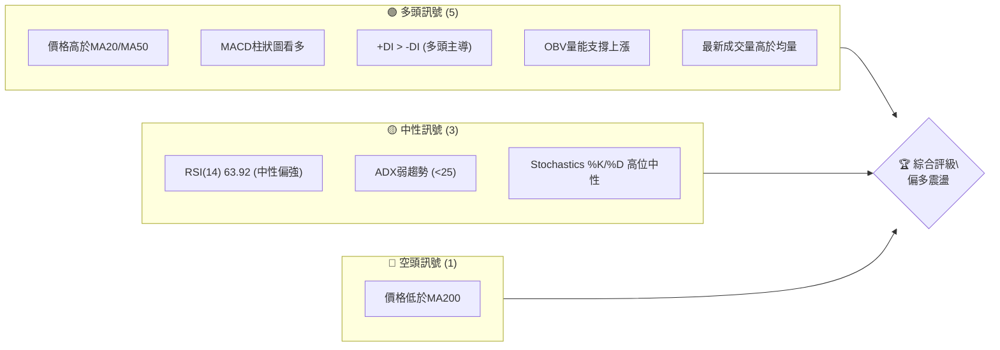
**解讀**：多頭訊號數量明顯多於空頭訊號，主要體現在短期均線支撐、動能指標強勁以及量能配合良好。然而，價格仍位於長期均線MA200下方，暗示長期上漲趨勢尚未確立，或正處於從長期下跌/盤整中恢復的階段。ADX顯示當前趨勢強度不足，市場可能處於震盪整理中，但多頭力量暫時佔據上風。

### 📊 核心指標速覽表

| 指標類別 | 指標名稱 | 當前數值 | 訊號 | 解讀 |
|----------|----------|----------|------|------|
| **價格** | 當前價格 | $163.49 | 🟡 | 位於52週區間的35.9%，中等偏低位置 |
| **均線** | MA20 | $155.53 | 🟢 | 價格在MA20上方，短線偏多 |
| **均線** | MA50 | $154.59 | 🟢 | 價格在MA50上方，中線偏多 |
| **均線** | MA200 | $169.16 | 🔴 | 價格在MA200下方，長線壓力顯著 |
| **動能** | RSI(14) | 63.92 | 🟡 | 位於中性區間中上部，動能強勁但未超買 |
| **動能** | MACD | +1.573 | 🟢 | MACD線位於訊號線上方，柱狀圖為正且增長，看多 |
| **波動** | ATR(14) | $7.14 | 🟡 | 佔價格4.36%，屬於中等波動水平 |
| **趨勢** | ADX(14) | 19.83 | 🟡 | 趨勢強度不足25，為弱趨勢或盤整行情 |
| **量能** | OBV趨勢 | OBV > MA | 🟢 | 量能確認價格上漲，看多 |

### 🏆 技術評分卡

綜合各項技術指標，VST 目前的技術評級為中性偏多，動能表現良好，但趨勢強度與長期均線壓力需持續關注。

╔══════════════════════════════════════════════════════════════╗
║                技術評分卡 — VST (2026-06-29)                   ║
╠══════════════════════════════════════════════════════════════╣
║ 趨勢強度      ████████░░░░░░░░░░░░  60/100  🟡 (ADX弱但多頭主導)║
║ 動能指標      ████████████░░░░░░░░  75/100  🟢 (RSI強勁, MACD看多)║
║ 支撐穩定度    ██████████████░░░░░░  80/100  🟢 (MA20/50提供強支撐)║
║ 成交量配合    ██████████████░░░░░░  80/100  🟢 (量價齊升, OBV確認)║
║ 形態完整度    ████████░░░░░░░░░░░░  65/100  🟡 (短期V型反轉，中期震盪)║
║ 均線排列      ████████░░░░░░░░░░░░  65/100  🟡 (短中線多頭，長線空頭)║
╠══════════════════════════════════════════════════════════════╣
║ 綜合評分      ██████████░░░░░░░░░░  71/100  🟡 偏多震盪              ║
╚══════════════════════════════════════════════════════════════╝

## 2. 趨勢分析

本章將從多個時間框架對 VST 的價格趨勢進行深入剖析，以確立其長期、中期及短期的市場方向。

### 🌐 多時框趨勢分析

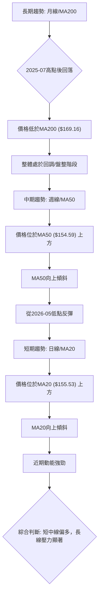
**解讀**：
- **長期趨勢 (月線/MA200)**：從2025年7月觸及高點$207.45後，VST股價經歷了一波顯著的回調，並在2026年5月觸及低點$139.48。目前價格$163.49仍位於長期均線MA200 ($169.16) 下方，顯示長期上漲趨勢已受挑戰，或處於一個大型的整理區間。歷史高點$207.45和52週高點$218.91形成了強大的長期阻力。
- **中期趨勢 (週線/MA50)**：自2026年5月低點$139.48以來，VST股價呈現明顯的反彈趨勢。目前價格$163.49已站穩MA50 ($154.59) 上方，且MA50開始向上傾斜，表明中期趨勢已轉為偏多。最近幾週的連續上漲確認了這一反彈動能。
- **短期趨勢 (日線/MA20)**：在過去幾週，VST股價表現強勁，成功站上MA20 ($155.53) 並維持在其上方。MA20呈顯著上揚趨勢，且與MA50形成多頭排列，顯示短期買盤力量積極。當前價格$163.49略低於非常短期的MA5 ($164.76)，可能預示短線小幅回調或整理。

### 📈 長期趨勢 — 12個月走勢圖（Unicode）

下圖展示了 VST 過去12個月的月線收盤價格走勢，標註了關鍵的高點和低點。

```
VST 月線走勢圖（過去12個月：2025-07 至 2026-06）
價格軸 ($)
$210 ┤                                  ● (207.45, 2025-07 高點)
$200 ┤
$190 ┤                                        ● (195.11)
$180 ┤                                      ● (188.12)
$170 ┤                                    ● (173.41)
$160 ┤  ● (160.88)                                     ● (163.49, 現在)
$150 ┤          ● (150.12)
$140 ┤                ● (139.48, 2026-05 低點)
     └────────────────────────────────────────────────────────────
      2025-07 08 09 10 11 12 2026-01 02 03 04 05 06
```
**圖表解讀**：
過去12個月，VST 股價在2025年7月達到階段性高點$207.45後，經歷了一段震盪下行區間，最低觸及2026年5月的$139.48。隨後，股價從低點開始反彈，目前收盤價$163.49。整體而言，這12個月的走勢呈現出一個從高位回落後築底反彈的「V」型或「W」型底部結構的右側。當前價格雖然遠低於2025年7月高點，但明顯高於2026年5月低點，顯示出從底部區域的反轉動能。

**走勢特徵分析表格**：

| 階段 | 起始月份 | 結束月份 | 區間高點 | 區間低點 | 漲跌幅 | 主要特徵 |
|------|----------|----------|----------|----------|--------|----------|
| **高位回落** | 2025-07 | 2025-12 | $207.45 | $160.88 | -22.45% | 從歷史高點回落，震盪下行，量能逐漸萎縮 |
| **築底整理** | 2026-01 | 2026-03 | $173.41 | $150.12 | -13.43% | 股價在$150-$175區間震盪，尋找支撐 |
| **探底反彈** | 2026-04 | 2026-05 | $160.01 | $139.48 | +14.71% | 快速下跌至$139.48後，迅速反彈，形成V型底 |
| **溫和上漲** | 2026-06 | 當前 | $163.49 | $147.81 | +10.60% | 股價在反彈基礎上穩步上行，成交量配合良好 |

### 📊 中期趨勢（週線分析）

中期趨勢顯示 VST 股價已從5月低點$139.48築底回升，目前正面臨上方阻力區域。

```
VST 近期壓力與支撐示意圖 (週線視角)

           $207.45 (2025-07 高點, 長期阻力)
             /
            /
          $173.41 (2026-03 高點, 重要阻力)
         /
        /    --- MA200 ($169.16) --- (強阻力)
       /   /
      /   /
     /   /
    /   /   --- BB上軌 ($171.63) --- (短期阻力)
   /   /
  /   /
 $163.49 (現價) ◄───────────────────────
  \   \
   \   \
    \   --- MA20 ($155.53) --- (短期支撐)
     \   --- MA50 ($154.59) --- (中期支撐)
      \
       $139.48 (2026-05 低點, 強支撐)
```
**解讀**：目前股價$163.49位於MA20($155.53)和MA50($154.59)上方，這些均線形成穩固的中期支撐區。然而，上方MA200($169.16)和布林通道上軌($171.63)構成強勁阻力，同時2026年3月的高點$173.41也是一個重要的壓力位。股價若要進一步上漲，需要有效突破這些阻力區。

### ⚡ 趨勢強度評估（ADX 解讀）

ADX 指標用於衡量趨勢的強度，而非方向。

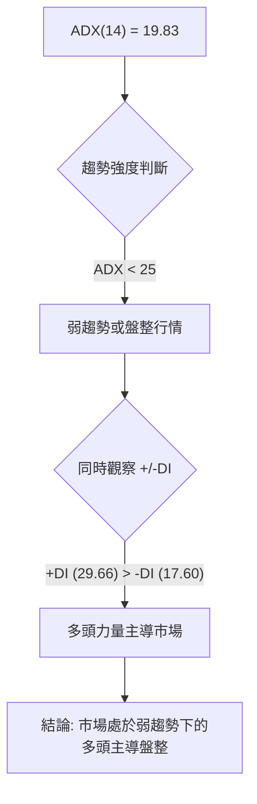

**ADX 強度對照表**：
| ADX 數值 | 趨勢強度 | 建議 |
|----------|----------|------|
| 0-25     | 弱趨勢/盤整 | 適合震盪策略，不宜追漲殺跌 |
| 25-50    | 中等趨勢 | 趨勢形成，可考慮順勢交易 |
| 50-75    | 強趨勢   | 趨勢強勁，順勢交易機會大 |
| 75-100   | 極強趨勢 | 趨勢可能過熱，注意回調風險 |

**解讀**：VST 的 ADX(14) 為 19.83，明確指出當前市場處於**弱趨勢或盤整行情**。這意味著股價缺乏一個強勁的單邊趨勢，可能在一定區間內波動。然而，值得注意的是，+DI (29.66) 顯著高於 -DI (17.60)，這表明在當前的弱勢趨勢中，**多頭力量仍佔據主導地位**。因此，儘管市場沒有明確的強勁趨勢，但買方仍比賣方更活躍，有利於股價在盤整中保持偏強勢態或醞釀向上突破。交易者應避免過度追漲，而應關注區間交易機會或等待趨勢明確後的突破。

## 3. 圖表形態分析

本章將分析 VST 股價走勢中可能存在的圖表形態和K線組合，以預測未來價格方向。

### 🔍 形態識別系統

根據提供的24個月歷史數據和近20週的週線數據，VST 在更長期的月線圖上似乎在2025年7月高點$207.45後形成一個大型的**下降楔形 (Falling Wedge)** 形態的初步階段，並在2026年5月$139.48處觸底反彈。下降楔形通常被視為看漲反轉形態。

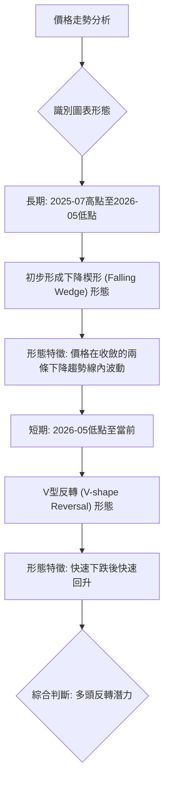
**解讀**：
- **長期形態：下降楔形 (Falling Wedge)**：從2025年7月的$207.45高點到2026年5月的$139.48低點，VST的價格走勢呈現出一種收斂的下降趨勢，形成下降楔形的底部區域。這種形態的特點是價格波動幅度逐漸縮小，同時高點和低點都在不斷下移。下降楔形通常預示著趨勢反轉，即從下降趨勢轉為上升趨勢。目前的價格反彈正是在這個楔形底部區域的有效突破或反轉確認。
- **短期形態：V型反轉 (V-shape Reversal)**：在2026年5月17日觸及$139.48的低點後，VST股價快速且有力地反彈，在幾週內回升至$163.49，形成了一個清晰的V型反轉。這種形態表明市場情緒在短時間內發生了劇烈變化，買盤力量迅速壓倒賣盤，通常預示著短期內強勁的上漲動能。

### 🕯️ 重要K線形態分析

根據近20週的週線收盤數據，我們可以觀察到幾個關鍵的K線形態，這些形態為當前趨勢提供了重要線索。

| 月份 | 收盤價 | K線形態 | 解讀 | 訊號 |
|------|--------|---------|------|------|
| 2026-03-01 | $173.41 | 潛在的**射擊之星 (Shooting Star)** | 在高位出現長上影線，實體較小，後續價格下跌，為看跌反轉訊號。 | 🔴 |
| 2026-05-17 | $139.48 | **錘子線 (Hammer)** | 在下跌趨勢底部出現，帶有長下影線和小實體，暗示賣壓減輕，買盤介入，為看漲反轉訊號。 | 🟢 |
| 2026-05-24 | $156.05 | **看漲吞噬 (Bullish Engulfing)** | 前一週下跌小K線被本週上漲大K線完全吞噬，確認了錘子線的看漲反轉。 | 🟢 |
| 2026-06-28 | $163.49 | **陽線收盤** | 近期連續陽線，顯示買盤持續活躍，動能偏強。 | 🟢 |

### 📉 ASCII 走勢形態示意圖

以下是 VST 近期從下降楔形底部反轉並形成V型底的示意圖：

```
VST 走勢形態示意圖 (長期下降楔形底部與短期V型反轉)

$210 ┼───────────────────────┐
     │                      / \
$200 ┤                     /   \
     │                    /     \
$190 ┤                   /       \
     │                  /         \
$180 ┤                 /           \
     │                /             \
$170 ┤               /               \ (2026-03 高點)
     │              /                 \
$160 ┤             /                   \
     │            /                     \
$150 ┤           /                       \
     │          /                         \
$140 ┤         /                           \
     │        /                             \
$130 ┼───────┴──────────────────────────────┴───────
     └─────────────────────────────────────────────────────
     (2025-07)                                       (2026-05 低點)
     高點                                              V型反轉
                                                         │
                                                         │
                                                         ▼
                                                         $139.48
                                                         │
                                                         │
                                                         │
                                                         ▲
                                                         │
                                                         │
                                                         $163.49 (現價)
```
**解讀**：圖中可見，股價從2025年7月的高點開始呈現出高點和低點逐漸下移的收斂走勢，形成了一個大型的下降楔形。在2026年5月觸及$139.48的低點後，股價迅速向上反彈，形成了清晰的V型反轉，並持續上漲至當前價格$163.49。這表明市場已從長期修正趨勢中尋找到新的支撐，並展現出較強的反轉動能。

### 🎯 形態目標價計算

基於上述形態分析，我們可以對潛在的目標價進行估算。

1.  **V型反轉目標價**：
    -   V型反轉的低點為 $139.48$ (2026-05-17)。
    -   V型反轉前的波段高點可視為2026年3月1日的 $173.41$。
    -   從 $139.48$ 反彈至 $163.49$，目前已完成一部分反轉。若以 $173.41$ 作為前高點，則頸線可設在 $173.41$。
    -   形態高度 = $173.41 - 139.48 = $33.93。
    -   **保守目標價 (等幅上漲)** = 頸線 + 形態高度 = $173.41 + ($33.93 * 0.5) = $173.41 + $16.97 = **$190.38**。
    -   **激進目標價 (完全反轉)** = 頸線 + 形態高度 = $173.41 + $33.93 = **$207.34** (接近2025-07高點)。

2.  **下降楔形突破目標價**：
    -   下降楔形的目標價通常是形態開始時的寬度或形態開始時的阻力位。
    -   若以2025年7月高點$207.45作為楔形起點，則突破後有機會挑戰此高點。
    -   **目標價區間**：一旦有效突破楔形上邊界（約在$170-$175區域），潛在目標價可能在**$190.00 - $207.00**之間。

**綜合判斷**：基於V型反轉和下降楔形的潛在突破，VST 在突破短期阻力後，有較大機會挑戰**$190.38 (T1)** 和 **$207.34 (T2)** 的目標價區間。這與分析師的平均目標價$222.89也較為吻合。

## 4. 支撐與阻力

本章將詳細分析 VST 股價的關鍵支撐與阻力價位，這些價位對於判斷未來走勢至關重要。

### 🗺️ 關鍵價位分布圖（Unicode）

下圖展示了 VST 當前價格周圍的重要支撐與阻力價位結構。

```
VST 價位結構分布圖 (2026-06-29)
═══════════════════════════════════════════════════
$218.91 ║████████████████████████║ 52週高點 / 強阻力 R4
$207.45 ║████████████████████    ║ 2025-07高點 / 強阻力 R3
$190.38 ║████████████████████████║ 形態目標價 R2 (V型反轉保守目標)
$173.47 ║████████████████████    ║ 斐波那契50%回調 / 2026-03高點 R1a
$171.63 ║████████████████████████║ 布林通道上軌 / 關鍵阻力 R1
$169.16 ║████████████████████    ║ MA200 / 關鍵阻力 R0
$165.45 ║████████████████████████║ 斐波那契38.2%回調 / 短期阻力 R0a
$163.49 ╠════════════════════════╣ ◄ 現價
$155.53 ║▓▓▓▓▓▓▓▓▓▓▓▓▓▓▓▓        ║ MA20 / 近期支撐 S1
$154.59 ║▓▓▓▓▓▓▓▓▓▓▓▓▓▓▓▓        ║ MA50 / 近期支撐 S1a
$147.51 ║████████████████████████║ 2026-05-10低點 / 強支撐 S2
$139.48 ║████████████████████████║ 2026-05-17低點 / BB下軌 / 強支撐 S3
$132.47 ║████████████████████████║ 52週低點 / 極強支撐 S4
═══════════════════════════════════════════════════
```

### 🚧 阻力位分析表

| 阻力級別 | 價位 | 形成原因 | 突破難度 | 重要性 |
|----------|------|----------|----------|--------|
| **R0a**  | $165.45 | 斐波那契38.2%回調位 (從$207.45-$139.48回調) | 中等 | 短期上漲的第一道考驗 |
| **R0**   | $169.16 | 200日移動平均線 (MA200) | 較高 | 長期趨勢的分水嶺，突破則長期看好 |
| **R1**   | $171.63 | 布林通道上軌 | 中等 | 短期漲勢的極限，可能引發回調 |
| **R1a**  | $173.47 | 斐波那契50%回調位 / 2026-03高點 | 較高 | 重要的心理與技術阻力，突破則確認反轉 |
| **R2**   | $190.38 | V型反轉形態的保守目標價 | 高 | 形態突破後的階段性目標 |
| **R3**   | $207.45 | 2025年7月歷史高點 | 極高 | 股價能否重回強勢的關鍵考驗 |
| **R4**   | $218.91 | 52週高點 | 極高 | 突破則創一年新高，確立強勁多頭 |

### 🛡️ 支撐位分析表

| 支撐級別 | 價位 | 形成原因 | 守住機率 | 重要性 |
|----------|------|----------|----------|--------|
| **S1**   | $155.53 | 20日移動平均線 (MA20) | 較高 | 短期趨勢的重要支撐，跌破則短線看淡 |
| **S1a**  | $154.59 | 50日移動平均線 (MA50) | 較高 | 中期趨勢的重要支撐，也是MA200中軌 |
| **S2**   | $147.51 | 2026年5月10日低點 | 高 | 近期反彈前的次要支撐位 |
| **S3**   | $139.48 | 2026年5月17日低點 / 布林通道下軌 | 極高 | V型反轉的底部，極強的心理與技術支撐 |
| **S4**   | $132.47 | 52週低點 | 極高 | 一年內的最低價，跌破則趨勢極度悲觀 |

### 📐 斐波那契回調位分析

我們以2025年7月高點$207.45作為**波段頂部 (Peak)**，2026年5月17日低點$139.48作為**波段底部 (Trough)**，來計算其回調位，以評估當前反彈的阻力。

-   **波段高點**：$207.45
-   **波段低點**：$139.48
-   **波段總幅度**：$207.45 - $139.48 = $67.97

| 回調比例 | 計算方式 | 斐波那契價位 | 當前價格相對位置 | 評估 |
|----------|----------|--------------|------------------|------|
| **23.6%**| $139.48 + ($67.97 * 0.236) | $155.50 | 價格已突破 | 🟢 支撐轉阻力，現已突破 |
| **38.2%**| $139.48 + ($67.97 * 0.382) | $165.45 | 價格位於下方 | 🔴 短期重要阻力 |
| **50.0%**| $139.48 + ($67.97 * 0.500) | $173.47 | 價格位於下方 | 🔴 中期關鍵阻力 |
| **61.8%**| $139.48 + ($67.97 * 0.618) | $181.38 | 價格位於下方 | 🔴 強勁阻力 |
| **76.4%**| $139.48 + ($67.97 * 0.764) | $191.46 | 價格位於下方 | 🔴 上漲趨勢的終極考驗 |

**視覺化**：
```
VST 斐波那契回調位示意圖 (從 2025-07 高點至 2026-05 低點)

$207.45 ─┐ (100% 高點)
         │
         │
         │
$191.46 ─┼─ (76.4% 回調)
         │
         │
$181.38 ─┼─ (61.8% 回調)
         │
         │
$173.47 ─┼─ (50.0% 回調) ◄─ 重要阻力
         │
         │
$165.45 ─┼─ (38.2% 回調) ◄─ 當前價格 ($163.49) 下方，即時阻力
         │
         │
$155.50 ─┼─ (23.6% 回調) ◄─ 已突破，轉為支撐
         │
         │
$139.48 ─┘ (0% 低點)
```
**解讀**：當前價格$163.49位於23.6%和38.2%回調位之間，且略低於38.2%回調位$165.45。這意味著$165.45是當前反彈面臨的第一道較強阻力。若能有效突破並站穩此位，則下一個重要目標將是50%回調位$173.47，這與2026年3月的高點重合，構成一個強大的阻力區。斐波那契回調位為多頭提供了清晰的目標，也為潛在的回調提供了參考支撐。

## 5. 技術指標深度解讀

本章將對 VST 的核心技術指標進行詳盡分析，包括移動平均線、RSI、MACD、布林通道和成交量，並探討它們之間的相互關係。

### 🎛️ 指標訊號總覽

以下 Mermaid 圖表展示了各個技術指標的當前訊號及其相互關係。

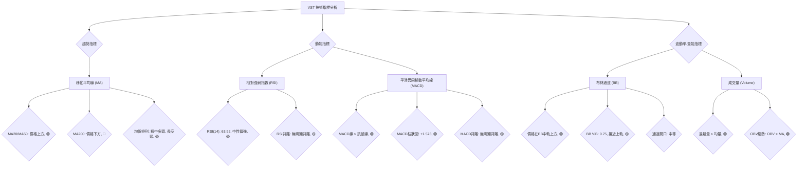

### 📈 移動平均線排列分析

VST 的移動平均線系統呈現出短期與中期看多、長期看空的混合訊號。

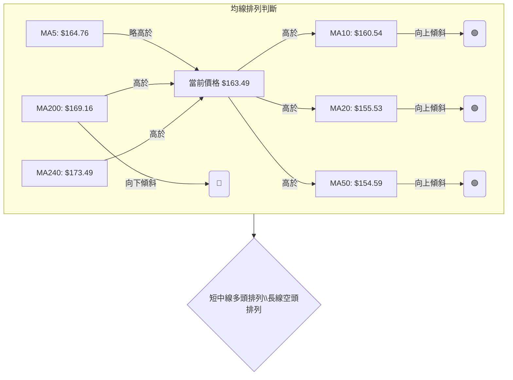
**解讀**：
-   **短期均線 (MA5, MA10, MA20)**：MA5 ($164.76) 略高於當前價格，可能預示短期存在小幅回調壓力或短線動能稍緩。然而，當前價格$163.49仍高於MA10 ($160.54) 和MA20 ($155.53)，且這些短期均線均呈向上傾斜，顯示短期趨勢強勁，買盤活躍。
-   **中期均線 (MA50)**：價格$163.49位於MA50 ($154.59) 上方，且MA50也向上傾斜，表明中期趨勢已轉為多頭。MA20和MA50形成多頭排列 (MA20 > MA50)，進一步確認中期上漲動能。
-   **長期均線 (MA200, MA240)**：當前價格$163.49仍位於MA200 ($169.16) 和MA240 ($173.49) 下方，且MA200呈向下傾斜。這是一個重要的長期空頭訊號，意味著長期趨勢仍面臨壓力，MA200構成一個強勁的阻力位。若股價能有效突破MA200並站穩，將是長期趨勢反轉的關鍵訊號。

**綜合判斷**：VST 股價目前處於**短中期上漲，但長期壓力仍存**的狀態。短中期均線的多頭排列提供了良好的支撐，但能否突破長期均線的壓制，將是判斷其能否開啟新一輪長期上漲的關鍵。

### 📉 RSI(14) 分析

RSI(14) 是一種動能指標，用於衡量股價上漲和下跌力量的相對強度。

-   **RSI(14) 數值**：**63.92**
-   **RSI 進度條**：████████████▓░░░░░░░░ (63.92%)

**超買超賣區間分析**：
-   RSI 數值位於 30-70 的中性區間內。
-   當前 63.92 處於中性區間的偏強位置，表明買盤動能相對較強，但尚未進入傳統的超買區 (通常為70以上)。這給了股價進一步上漲的空間，而無需立即面臨回調壓力。
-   歷史數據顯示，在2026年3月1日，VST 股價達到 $173.41 時，RSI 曾高達 76.5，進入超買區，隨後股價出現顯著回調。而在2026年5月17日，股價跌至 $139.48 時，RSI 跌至 25.5，進入超賣區，隨後股價迅速反彈。當前 RSI 位於中性區，健康且具備上漲潛力。

**背離判斷 (頂背離/底背離)**：
-   **頂背離**：當股價創出新高，但RSI未能創出新高，形成背離，通常預示股價可能見頂回落。
-   **底背離**：當股價創出新低，但RSI未能創出新低，形成背離，通常預示股價可能見底反彈。
根據提供的數據，**未觀察到明顯的RSI頂背離或底背離現象**。最近一次從$139.48反彈，RSI也從超賣區同步回升，量價配合良好。這表明當前上漲動能是健康的，沒有隱藏的衰竭跡象。

### 📊 MACD(12/26/9) 訊號解讀

MACD (平滑異同移動平均線) 是一種趨勢跟蹤動能指標，包含MACD線、訊號線和MACD柱狀圖。

-   **MACD 線**：3.357
-   **MACD Signal 線**：1.784
-   **MACD Hist 柱狀圖**：+1.573

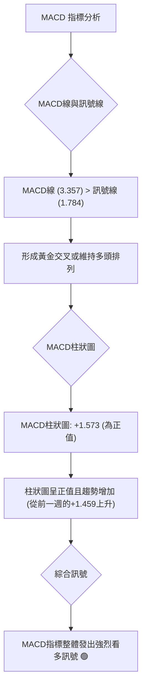
**解讀**：
-   **MACD線與訊號線**：MACD線 (3.357) 位於其訊號線 (1.784) 上方，這是一個典型的**黃金交叉**或**多頭排列**訊號，表明短期動能強於中期動能，預示股價上漲。
-   **MACD柱狀圖**：MACD柱狀圖為正值 (+1.573)，且從前一週的+1.459進一步增加。柱狀圖為正且持續增長，是**動能增強的明確訊號**，確認了當前的上漲趨勢。
-   **背離判斷**：根據提供的數據，**未觀察到明顯的MACD頂背離或底背離現象**。MACD指標與價格走勢同步，MACD柱狀圖在股價從低點反彈時同步轉正並持續增加，顯示動能的健康增長。

**綜合判斷**：MACD指標當前發出**強烈的多頭訊號**。MACD線位於訊號線上，且柱狀圖為正並增長，這與RSI的偏強表現相互印證，確認了股價的短期和中期上漲動能。

### 📦 布林通道分析

布林通道 (Bollinger Bands) 由三條線組成：上軌、中軌 (通常為MA20) 和下軌，用於衡量價格的波動區間。

-   **BB上軌**：$171.63
-   **BB中軌 (MA20)**：$155.53
-   **BB下軌**：$139.43
-   **BB %B**：0.75 (當前價格在布林通道中的相對位置，0=下軌，0.5=中軌，1=上軌)

**ASCII 布林通道示意圖**：
```
VST 布林通道示意圖 (2026-06-29)

價格軸 ($)
$175 ┤
$170 ┤          ═════════════════════════════════════ BB上軌 ($171.63)
$165 ┤          │                                     ◄───────────────────
$160 ┤          │  ● ($163.49, 現價)
$155 ┤          ═════════════════════════════════════ BB中軌 (MA20, $155.53)
$150 ┤          │
$145 ┤          │
$140 ┤          ═════════════════════════════════════ BB下軌 ($139.43)
$135 ┤
     └───────────────────────────────────────────────────────────────────
```
**解讀**：
-   **價格與通道的關係**：當前價格$163.49位於布林通道中軌 ($155.53) 和上軌 ($171.63) 之間，且**接近上軌** (BB %B = 0.75)。這表明股價處於上升趨勢中，買盤力量較強。
-   **通道開口**：數據未直接提供通道寬度，但從上軌$171.63和下軌$139.43的價差 ($32.20) 來看，通道寬度適中，表明市場波動性處於正常範圍，沒有極端擴張或收縮。
-   **支撐與阻力**：中軌MA20 ($155.53) 提供了穩固的動態支撐，而上軌 ($171.63) 則構成短期阻力。若股價能突破上軌，可能預示著趨勢的加速，但同時也需警惕超買風險。

**綜合判斷**：布林通道顯示 VST 股價處於健康的上升通道中，並得到中軌的良好支撐。價格接近上軌，暗示短期動能強勁，但上方阻力也隨之增加。

### 💹 成交量分析（量價配合度）

成交量是價格走勢的燃料，量價配合度對於判斷趨勢的可靠性至關重要。

-   **最新成交量**：5,483,700
-   **20日均量**：4,449,500
-   **50日均量**：4,896,898
-   **量比 (最新量/20日均量)**：1.23x
-   **OBV趨勢**：OBV > MA → 量能支撐上漲

**解讀**：
-   **量能放大**：最新的成交量 (5,483,700) 顯著高於20日均量 (4,449,500) 和50日均量 (4,896,898)，量比達到1.23倍。這表明在當前價格水平，市場交投活躍，有更多的資金參與買賣。在股價上漲的過程中，成交量放大通常是**健康上漲的訊號**，顯示買盤積極。
-   **OBV (能量潮)**：OBV 指標的趨勢顯示 "OBV > MA"，這是一個重要的**多頭確認訊號**。OBV 上漲意味著在股價上漲的日子裡，成交量大於下跌的日子，表明資金正在持續流入，支持當前價格的上漲趨勢。
-   **量價背離**：
    -   **價漲量縮 (看跌)**：價格上漲但成交量萎縮，可能預示上漲動能不足。
    -   **價跌量增 (看跌)**：價格下跌但成交量放大，可能預示賣壓沉重。
    -   **價漲量增 (看漲)**：價格上漲且成交量放大，是健康的多頭訊號。
    -   **價跌量縮 (看漲)**：價格下跌但成交量萎縮，可能預示賣壓減輕，下跌動能不足。
    當前 VST 呈現**價漲量增**的狀態，最新成交量放大，且股價處於反彈趨勢中。這是一個**強烈的多頭確認訊號**，表明當前的反彈是真實且有資金支持的，沒有量價背離的跡象。

**綜合判斷**：成交量分析為 VST 的上漲趨勢提供了堅實的基礎。量能放大和OBV的積極表現，共同確認了當前多頭動能的有效性。

## 6. 動能與波動率

本章將評估 VST 的動能強度和波動率特性，這對於制定交易策略和風險管理至關重要。

### ⚡ 動能評估四象限

我們將 VST 的動能和波動率進行綜合評估，以確定其當前所處的市場狀態。由於避免使用 quadrantChart，我們將使用表格形式呈現。

| 象限 | 動能 | 波動 | 當前狀態 (VST) | 評估與交易建議 |
|------|------|------|----------------|----------------|
| Q1 | 強 | 低 | -                  | 最佳機會：趨勢確立，風險相對可控，適合順勢交易。 |
| Q2 | 弱 | 低 | -                  | 謹慎觀望：市場缺乏方向和波動，等待趨勢明朗。 |
| Q3 | 強 | 高 | **✓ (VST 當前)**   | 高風險高收益：趨勢強勁但波動大，適合短線交易者，需嚴格止損。 |
| Q4 | 弱 | 高 | -                  | 避免進場：市場混亂，方向不明，風險極高。 |

**VST 動能與波動率分析流程圖**：
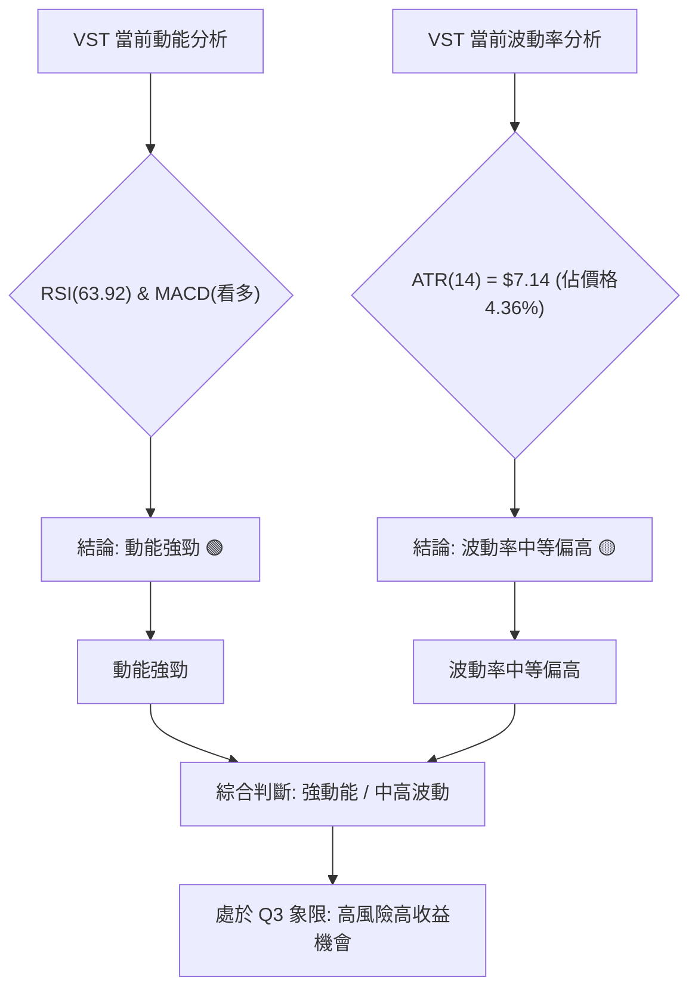
**解讀**：
-   **動能評估**：RSI(14) 為 63.92，處於中性偏強區間，且 MACD 指標發出明確的多頭訊號，MACD 線位於訊號線上方，柱狀圖為正且增長。這些都表明 VST 當前具有**強勁的買盤動能**。
-   **波動率評估**：ATR(14) 為 $7.14，佔當前股價 $163.49 的 4.36%。對於公用事業股而言，4.36% 的日均波動幅度屬於**中等偏高水平**。這意味著 VST 的日內或短期價格變動幅度相對較大。

**綜合判斷**：VST 目前位於**「強動能，中高波動」**的象限 (Q3)。這表明該股票正處於一個活躍的趨勢中，具有較大的上漲潛力，但同時也伴隨著較高的日內和短期價格波動風險。這類股票適合經驗豐富的交易者，他們能夠承受較高的波動，並利用其動能進行交易，但必須嚴格設置止損。

### 📊 ATR 波動率分析

平均真實波動範圍 (ATR) 衡量的是一段時間內的價格波動幅度，是評估風險和設置止損的重要工具。

-   **ATR(14) 數值**：$7.14
-   **佔當前價格比例**：4.36%

**解讀**：
-   **日均波動幅度**：過去14個交易日，VST 的平均每日波動範圍為 $7.14。這可以理解為股票在一個正常交易日中，從最高點到最低點的平均波動幅度。
-   **相對波動性**：4.36% 的相對波動率對於公用事業板塊的股票來說，是相對較高的。通常公用事業股的波動性較低，這可能反映了 VST 近期市場關注度提高或特定事件驅動。
-   **止損距離建議**：ATR 可以作為設置動態止損的參考。一般建議止損距離為 1x 至 2x ATR。
    -   **保守止損** (1x ATR)：約 $7.14。如果以當前價格 $163.49 計算，止損點約為 $163.49 - $7.14 = $156.35。
    -   **激進止損** (2x ATR)：約 $14.28。止損點約為 $163.49 - $14.28 = $149.21。
    -   結合技術支撐位，建議將止損設置在關鍵支撐位下方，並參考 ATR 來調整風險敞口。例如，若進場點為 $163.49，考慮到MA20/MA50的支撐在 $155.53/$154.59，將止損設在 $154.00 (約1.3x ATR) 或 $149.00 (約2x ATR) 附近會更合理。

### 📐 Beta 與市場相關性

由於提供的數據中未包含 Beta 值，我們將根據 Vistra Corp. (VST) 所屬的公用事業 (Utilities) 行業特性進行推斷。

**推斷分析**：
-   **行業特性**：公用事業公司通常被視為防禦性股票，其業務穩定，受經濟週期影響較小，提供必需服務。因此，公用事業股的波動性通常低於大盤，其 Beta 值普遍小於 1。
-   **市場相關性**：Vistra Corp. 作為一家獨立發電商和零售電力公司，其營收和利潤相對穩定，受市場整體情緒波動的影響相對較小。
-   **假設 Beta 值**：基於行業特性，我們可以合理推斷 VST 的 Beta 值可能在 **0.5 到 0.8 之間**。這意味著當大盤上漲或下跌 1% 時，VST 的股價預計會上漲或下跌 0.5% 到 0.8%。
-   **風險影響**：較低的 Beta 值表明 VST 在市場下跌時可能表現出較強的防禦性，跌幅相對較小；但在市場上漲時，其漲幅也可能小於大盤。對於追求穩定性和抵抗市場風險的投資者來說，這是其吸引力之一。

**重要提示**：由於 Beta 值為推斷，實際值可能有所差異。投資者應查找官方數據以獲取準確的 Beta 值。

## 7. 多時框架總結

本章將綜合各時間框架的技術分析結果，提供一個全面的市場評估，以指導交易決策。

### 📋 時框架評分表

| 時框架 | 趨勢方向 | 動能 | 均線排列 | 形態 | 綜合評分 | 建議 |
|--------|----------|------|----------|------|----------|------|
| **短期** | 🟢 上漲 | 🟢 強勁 | 🟢 多頭 | 🟢 V型反轉 | 8/10     | 積極看多 |
| **中期** | 🟢 上漲 | 🟢 強勁 | 🟢 多頭 | 🟡 築底反彈 | 7/10     | 偏多 |
| **長期** | 🔴 下跌 | 🟡 中性 | 🔴 空頭 | 🟡 下降楔形底部 | 5/10     | 謹慎觀望 |

**解讀**：
-   **短期 (日線)**：VST 股價在短期內表現強勁，從5月低點迅速反彈，動能指標如RSI和MACD均顯示強勁的買盤動能。價格位於短期均線上方，且均線呈多頭排列。V型反轉形態也提供了看漲訊號。
-   **中期 (週線)**：中期來看，股價已成功站穩MA50上方，且MA50向上傾斜，確認了中期上漲趨勢。雖然從長期高點來看仍處於回調後的反彈，但築底形態顯現，動能持續。
-   **長期 (月線)**：長期趨勢仍面臨挑戰，股價仍位於MA200下方，MA200的下傾表明長期壓力依然存在。雖然下降楔形底部形態預示潛在反轉，但尚未完全確認突破。長期動能目前處於中性恢復階段。

### 🔲 綜合訊號矩陣

以下矩陣分析了 VST 在短期、中期和長期維度上各項技術訊號的一致性。

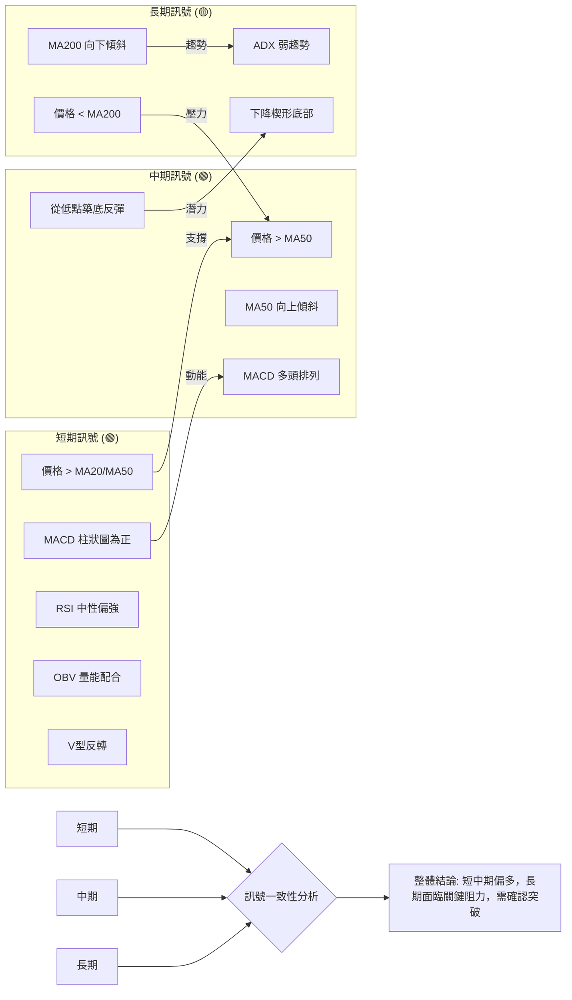
**解讀**：
-   **短期與中期訊號高度一致**：在短期和中期時間框架內，所有關鍵指標（價格與均線關係、動能指標、量能、形態）均發出**強烈的多頭訊號**。這表明 VST 在未來數週至數月內具有較大的上漲潛力。
-   **長期訊號存在矛盾**：長期視角下，價格未能突破MA200，且ADX顯示趨勢強度不足，這與短中期的強勢形成對比。然而，長期下降楔形底部形態的存在，預示著潛在的長期趨勢反轉可能性。
-   **綜合判斷**：VST 目前處於一個**從長期下跌或盤整中尋求反轉的過渡階段**。短中期動能強勁且趨勢向上，有望繼續推動股價上行。但能否成功突破MA200等長期阻力，將是決定其能否開啟新一輪牛市的關鍵。投資者應關注關鍵長期阻力位的突破情況，並在短期內積極尋找逢低做多或突破追多的機會。

## 8. 交易策略建議

基於上述多時框架的技術分析，VST 目前呈現短中期偏多但長期仍有阻力的格局。以下提供多頭和空頭交易策略，並詳細列出進場、止損和目標價位。

### 🗺️ 策略決策流程圖

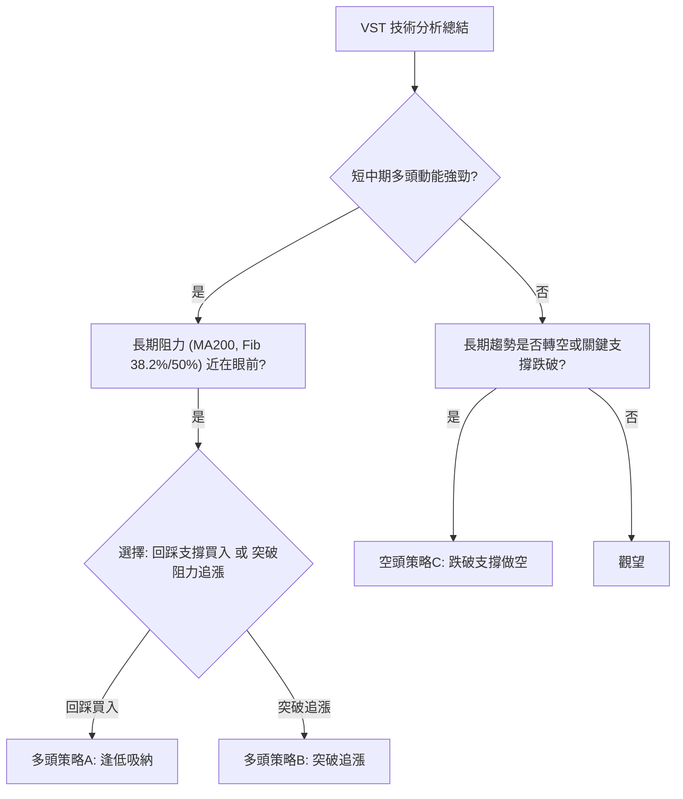

### 🟢 多頭策略詳情

**當前價格：$163.49**

| 策略要素 | 策略 A：逢低吸納 (回踩MA20/MA50) | 策略 B：突破追漲 (突破Fib 50%/MA200) |
|----------|------------------------------------|------------------------------------------|
| **進場條件** | 價格回踩 MA20/MA50 區域，並出現止跌K線（如錘子線、啟明星）。 | 價格有效突破 $173.47 (斐波那契50%回調位) 和 $169.16 (MA200) 等綜合阻力，並站穩。 |
| **進場價格** | $156.00 (靠近MA20/MA50支撐區) | $174.00 (確認突破 $173.47) |
| **目標價 T1** | $169.16 (MA200阻力) | $181.38 (斐波那契61.8%回調位) |
| **目標價 T2** | $173.47 (斐波那契50%回調位) | $190.38 (V型反轉保守目標價) |
| **止損價格** | $150.00 (略低於近期低點 $147.51，約1x ATR) | $166.00 (略低於MA200，約1x ATR) |
| **風險報酬比** | **T1: 2.19:1** (($169.16 - $156.00) / ($156.00 - $150.00) = $13.16 / $6.00) | **T1: 1.05:1** (($181.38 - $174.00) / ($174.00 - $166.00) = $7.38 / $8.00) |
|                  | **T2: 2.91:1** (($173.47 - $156.00) / ($156.00 - $150.00) = $17.47 / $6.00) | **T2: 2.05:1** (($190.38 - $174.00) / ($174.00 - $166.00) = $16.38 / $8.00) |
| **成功機率** | 65% (基於強勁支撐和動能) | 55% (需要突破多重阻力) |
| **建議倉位** | 中等倉位 (5-10%) | 較小倉位 (3-7%) |

### 🔴 空頭策略詳情

**當前價格：$163.49**

| 策略要素 | 策略 C：跌破關鍵支撐做空 |
|----------|------------------------------------|
| **進場條件** | 價格跌破 $154.59 (MA50/MA20綜合支撐) 並持續下行，確認空頭趨勢。 |
| **進場價格** | $153.50 (確認跌破 $154.59) |
| **目標價 T1** | $147.51 (2026-05-10低點) |
| **目標價 T2** | $139.43 (布林通道下軌 / 2026-05-17低點) |
| **止損價格** | $158.00 (略高於MA20，約1x ATR) |
| **風險報酬比** | **T1: 1.33:1** (($153.50 - $147.51) / ($158.00 - $153.50) = $5.99 / $4.50) |
|                  | **T2: 3.13:1** (($153.50 - $139.43) / ($158.00 - $153.50) = $14.07 / $4.50) |
| **成功機率** | 40% (逆勢交易，風險較高) |
| **建議倉位** | 較小倉位 (2-5%) 或觀望 |

### ⭐ 整體訊號強度評星

基於當前所有技術指標的綜合分析：

```
做多訊號強度：★★★★☆  (4/5星) 🟢
做空訊號強度：★★☆☆☆  (2/5星) 🔴
整體可信度：  ★★★☆☆  (3/5星) 🟡
```
**解讀**：目前 VST 的做多訊號較為強勁，特別是在短中期時間框架內。多頭策略的成功機率和風險報酬比相對較優。做空訊號較弱，且屬於逆勢交易，風險較高。整體而言，市場仍存在不確定性，尤其是在突破長期阻力方面，因此整體可信度為中等。

## 9. 風險提示與監控

本章將列出 VST 交易中需要關注的關鍵監控指標、可能發生的風險場景以及重要的風險管理提醒。

### ✅ 關鍵監控指標 Checklist

以下是交易 VST 時應密切關注的技術指標和價格水平，以確保及時調整策略。

╔══════════════════════════════════════════════════════════════╗
║                VST 交易監控指標清單                          ║
╠══════════════════════════════════════════════════════════════╣
║ ├─ **價格走勢**：                                             ║
║ │   ├─ 股價是否能有效突破 $165.45 (Fib 38.2%) 和 $169.16 (MA200)。║
║ │   ├─ 股價是否跌破 $155.53 (MA20) 和 $154.59 (MA50) 支撐。   ║
║ │   └─ 是否出現明確的K線反轉形態（如流星、烏雲蓋頂）。         ║
║ ├─ **動能指標**：                                             ║
║ │   ├─ RSI(14) 是否進入超買區 (70以上) 並出現頂背離。         ║
║ │   ├─ MACD 柱狀圖是否由正轉負，或MACD線跌破訊號線。          ║
║ │   └─ Stochastics 是否在高位死叉。                          ║
║ ├─ **趨勢指標**：                                             ║
║ │   ├─ ADX 是否突破25，確認強趨勢的形成。                     ║
║ │   └─ MA200 趨勢是否由向下轉為走平或向上。                   ║
║ ├─ **成交量**：                                               ║
║ │   ├─ 價格上漲時成交量是否持續放大，或出現價漲量縮的背離。   ║
║ │   └─ 價格下跌時成交量是否異常放大。                         ║
║ ├─ **基本面**：                                               ║
║ │   └─ 關注公司財報、盈利預期以及行業政策變化。               ║
╚══════════════════════════════════════════════════════════════╝

### ⚠️ 風險場景分析

針對 VST 的當前技術狀況，我們設定三種可能的市場情境：樂觀、基本和悲觀。

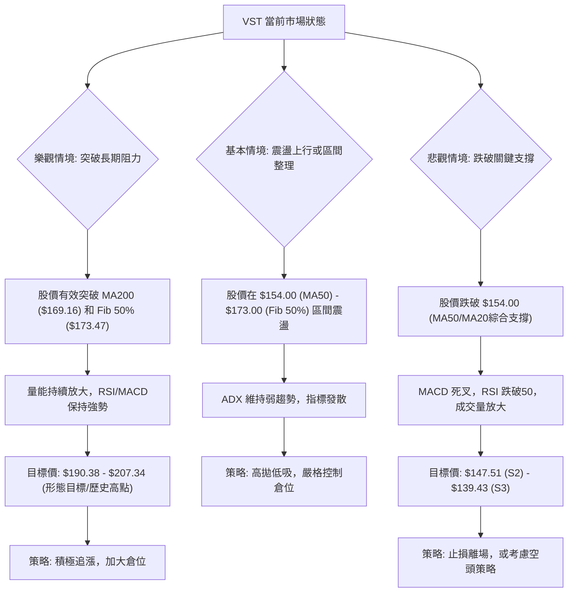
**解讀**：
-   **樂觀情境 (突破長期阻力)**：如果 VST 能夠在強勁動能和量能的配合下，有效突破 MA200 ($169.16) 和斐波那契50%回調位 ($173.47) 等長期阻力，將確認其長期趨勢的反轉。在此情境下，股價有望向 $190.38 甚至 $207.34 的更高目標邁進。
-   **基本情境 (震盪上行或區間整理)**：鑒於 ADX 顯示當前趨勢強度不足，股價可能在 $154.00 (MA50) 至 $173.00 (Fib 50%) 之間進行區間震盪整理，或呈現緩慢的震盪上行。此情境下，交易者可採取高拋低吸的策略，並耐心等待趨勢的明確。
-   **悲觀情境 (跌破關鍵支撐)**：若 VST 股價無法維持當前的反彈動能，並跌破 $154.00 (MA50/MA20綜合支撐)，則可能預示著短期反彈的結束，股價將重新測試 $147.51 和 $139.43 等更低的支撐位。在此情境下，應嚴格執行止損，避免損失擴大。

### 🛡️ 風險管理重要提醒

1.  **嚴格執行止損**：無論採取何種策略，務必在進場前設定明確的止損點，並在觸發時堅決執行，避免因市場波動造成不可控的損失。
2.  **倉位管理**：根據自身風險承受能力和策略的成功機率，合理分配倉位。對於高波動或逆勢策略，應使用較小倉位。
3.  **分批建倉/減倉**：可以考慮在關鍵支撐位附近分批建倉，或在突破重要阻力後分批追漲。在達到目標價位時，分批減倉以鎖定利潤。
4.  **關注外部風險**：除了技術面，還需留意宏觀經濟數據、行業政策變化、公司新聞（儘管目前無新聞）等可能影響股價的基本面因素。
5.  **多時框架確認**：在做出交易決策前，應確保至少兩個以上時間框架的訊號相互印證，以提高交易的成功率。
6.  **保持彈性**：市場變化莫測，任何策略都可能失效。交易者應保持靈活性，根據市場實際走勢和指標變化，及時調整交易計劃。

---

## 📋 報告總結

```
VST 技術分析報告總結
════════════════════════════════════════════════════════
報告日期：2026-06-29
當前價格：$163.49
分析評級：⚖️ 偏多震盪 (短中期動能強勁，長期壓力待解)

關鍵結論：
├─ 長期趨勢：🔴 價格低於MA200，但處於下降楔形底部，有反轉潛力。
├─ 中期趨勢：🟢 價格站穩MA50上方，MA50向上傾斜，呈多頭趨勢。
├─ 短期趨勢：🟢 V型反轉後強勢上漲，動能指標(RSI, MACD)看多，成交量配合良好。
├─ 關鍵支撐：$155.53 (MA20), $154.59 (MA50), $139.48 (2026-05低點)。
├─ 關鍵阻力：$165.45 (Fib 38.2%), $169.16 (MA200), $173.47 (Fib 50%/2026-03高點)。
└─ 分析師目標：$222.89 (平均目標價，遠高於現價，提供長期上漲潛力)。

最優策略組合：
1. 🥇 **最佳機會 (多頭)**：回踩 MA20/MA50 支撐區 ($156.00) 逢低吸納，目標 $173.47，止損 $150.00。風險報酬比優異。
2. 🥈 **次選機會 (多頭)**：價格有效突破 $173.47 (Fib 50% / 2026-03高點) 後追漲，目標 $190.38，止損 $166.00。
3. 🥉 **保守選擇 (觀望)**：若價格跌破 MA50 ($154.59)，則觀望或考慮輕倉做空至 $139.43，但此為逆勢交易，風險較高。
════════════════════════════════════════════════════════
```

---

> ⚠️ **免責聲明**：本報告為 AI 自動生成之技術分析，所有數據及估算均基於提供的歷史價格資訊。本報告**僅供研究與學術參考**，**不構成任何投資建議**。投資有風險，入市需謹慎。

---

*報告生成時間：2026-06-29 ｜ 數據來源：Yahoo Finance ｜ 分析框架：多時框技術分析*