<details>
<summary>📊 靜態圖表 (點擊展開)</summary>
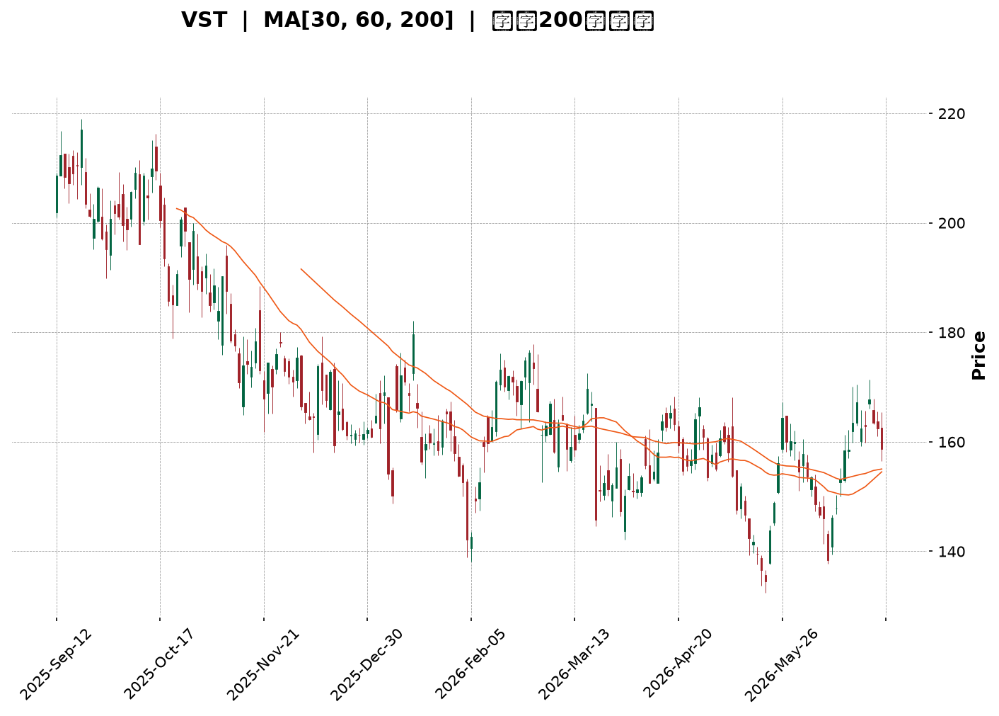
</details>

<html>
<head><meta charset="utf-8" /></head>
<body>
    <div style="height:500px; width:100%;">                        <script>window.PlotlyConfig = {MathJaxConfig: 'local'};</script>
        <script charset="utf-8" src="https://cdn.plot.ly/plotly-3.6.0.min.js" integrity="sha256-QaOVwtVY0T02VaHrr6pnoHLCwayMJp4O5n4YyaE3rJk=" crossorigin="anonymous"></script>                <div id="candlestick-chart" class="plotly-graph-div" style="height:100%; width:100%;"></div>            <script>                window.PLOTLYENV=window.PLOTLYENV || {};                                if (document.getElementById("candlestick-chart")) {                    Plotly.newPlot(                        "candlestick-chart",                        [{"close":{"dtype":"f8","bdata":"AAAAIGITakAAAABg\u002fIxqQAAAAODJCmpAAAAAwCLnaUAAAADABiJqQAAAAIDrTGpAAAAA4IQga0AAAAAgk2xpQAAAAKAaJ2lAAAAAABUZaUAAAADgictpQAAAAIDPo2hAAAAAYHBjaEAAAACgkxVpQAAAAMDnOWlAAAAAgN8kaUAAAADghfJoQAAAAOBY2WhAAAAAIDC2aUAAAABAISRqQAAAAOBkgWhAAAAAIMoVakAAAADAC5VpQAAAAKA3P2pAAAAAYOAwakAAAABgehBpQAAAAMDmLWhAAAAA4OI3Z0AAAADg5SFnQAAAAEBx0mdAAAAAYE0UaUAAAABgJs9oQAAAACCWuWdAAAAAgGHRaEAAAAAAi51nQAAAACCccGdAAAAAIKkHaEAAAACgBx9nQAAAAGBYk2dAAAAAoFb7ZkAAAADApsZnQAAAAAD5b2dAAAAA4FdNZkAAAABA+zBmQAAAAMAmW2VAAAAAgOW+ZUAAAABAxshlQAAAAKBKtmVAAAAAoLRMZkAAAAAAN6JlQAAAAICB\u002fGRAAAAAoDzNZUAAAAAANURlQAAAAAAjAmZAAAAAYMhDZkAAAACAb51lQAAAAECzemVAAAAAAAVeZUAAAACA3+plQAAAACBBz2RAAAAAAMutZEAAAAAgDIRkQAAAAACFj2RAAAAAQAe8ZUAAAAAgoCxlQAAAAMCr8WRAAAAAYGGXZUAAAABAz+ljQAAAACBjr2RAAAAA4FJLZEAAAAAA+iNkQAAAAOAqJ2RAAAAAIGwwZEAAAADgKidkQAAAAKCXLGRAAAAAwHtFZEAAAABAURxkQAAAAADGmGRAAAAAQGBPZEAAAABg\u002fiFlQAAAAECNRWNAAAAAwOfFYkAAAAAAJ71kQAAAACBTg2VAAAAAgE5eZUAAAACAHxBlQAAAAGDadWZAAAAAAH7EZEAAAACAE4xjQAAAAGCD8mNAAAAA4Fz9Y0AAAABAtPVjQAAAAGDmy2NAAAAAgNF5ZEAAAABg26VkQAAAAAA1RGRAAAAAgDi9Y0AAAACgszpjQAAAAEB+EmNAAAAA4A7EYUAAAAAgnNVhQAAAAKCWp2JAAAAAIIkRY0AAAABAHOVjQAAAAECp9mNAAAAAQM1UZEAAAACAimBlQAAAAEBtpmVAAAAAoC5DZUAAAACAxYBlQAAAACCrXWVAAAAAQMnqZEAAAABgsGRlQAAAAOAJ3GVAAAAAYKEKZkAAAAAAIa1lQAAAAMAGsWRAAAAAACAoZEAAAABAGV1kQAAAAIAF3mRAAAAAQMvGY0AAAAAgZWVkQAAAAGBJfmRAAAAAwBHXY0AAAADgeORjQAAAAABe0GNAAAAAIGExZEAAAACADXxkQAAAAEDSNGVAAAAAgBDdZEAAAAAAGzpiQAAAAICC4mJAAAAAoDQQY0AAAAAgiuliQAAAAODIAmNAAAAAAGdoY0AAAABgrWpiQAAAACDVw2JAAAAAoNQ3Y0AAAACg\u002ft5iQAAAAKAY7GJAAAAA4OEuY0AAAAAAgXVjQAAAACAqEWNAAAAAgG9QY0AAAAAAUr9jQAAAAMCzd2RAAAAA4MlWZEAAAABgjalkQAAAAMBnZ2RAAAAA4A7sY0AAAAAgMFZjQAAAAOBOcmNAAAAAYC6UY0AAAACA2INkQAAAAAAby2RAAAAAQKEcZEAAAADAZTJjQAAAAADRs2NAAAAA4AJiY0AAAACAABRkQAAAAKD7BGRAAAAAQDLCY0AAAADAgjdjQAAAAABucGJAAAAAwMv6YkAAAACARFViQAAAAGAjzWFAAAAAIHO2YUAAAABggm9hQAAAAGDhEWFAAAAAILHQYEAAAABgjvlhQAAAAIDjm2JAAAAAoKWBY0AAAABAjopkQAAAACCi\u002fWNAAAAAoMkBZEAAAACAMABkQAAAAOBkUWNAAAAAgPi3Y0AAAACgtzJjQAAAAKCFL2NAAAAAoKmRYkAAAADgOVZiQAAAACB\u002fQGJAAAAAgBRLYUAAAAAgnEViQAAAACAEemJAAAAAIMUpY0AAAAAgbMxjQAAAAMBz02NAAAAAIKxwZEAAAADgUehkQAAAAOB6TGRAAAAAANdbZEAAAADgo\u002fhkQAAAACCub2RAAAAAAClMZEAAAAAAKdRjQA=="},"high":{"dtype":"f8","bdata":"4CEd\u002fMYjakBiSeoDahhrQG3SUDHmlWpA2PzEMOaVakBHXoyO6KpqQPm8IAaAnmpAScupMhFda0CKk5c9PnxqQDp9m8meqmlA6SB5LjZtaUBiEagcdtRpQAY1UT+TyGlA6AHEJWT1aEDAO3MOkIJpQOO9ryjLhGlA93Sg0IAqakAysasiKuJpQDiFUgurX2lA9\u002f0qlhm4aUCZGYFlOkZqQKVfp82nb2pA9oP+SIkiakAnWzyme\u002f9pQEh6\u002ffZy5GpACdOvPWMGa0CD4s8quSVqQEZZBRC6lGlAQYTGMsUTaEAvGzPQ2ZZnQPLUBm3k7GdApx9UHjElaUBy+kZeF1ppQDSoH+bkj2hAyfRsa7j8aEDBkCKd2r9oQDJvAG7hAmhAxDkt9CxMaEBxp+5ERNZnQG5o8++n9WdAmIBbvb2KZ0BPO7STCslnQNfiI2l7f2hAOMEpVCNlZ0Cr87UOipFmQFsESi8aJ2ZAltR8mBxoZkC1\u002fPuN0FhmQLNj2LLkFWZArM3DkemXZkDgX7BgKJBnQDSr+9G1nmVAdUAtFibPZUAJY5G2K8BlQAIYhRlpIGZAxk+aO6aAZkDQMAhD8PdlQCg2RXwM52VAfKxdwSCkZUDRLbpa+ClmQDiwGhq4\u002fGVAzjrIvffjZEBCb4oakiZlQEdQBV+bqmRAEPXEBUXFZUAIwyaGHGhmQKJYt14KiWVA9dQpMa2mZUDeJfV4PM1lQBfU6cWfZmVAkvD6Kl9WZUD9YG8TantkQC+VNr\u002fyZ2RA\u002f6sLAF5EZEBT3R8xnFFkQBW902nnd2RAaKRLToZTZEAmYFI7eoFkQJeCwhgEGmVATeopUM5lZUBp8FokSIRlQAyWdjfpBWVAROJtm9hrY0COJfr1QMhlQJWwPdwTCGZAsBfXK+neZUCMn8fNpVZlQOXpDJbNwWZAeQWHmLtUZUAdJ+lMWLFkQB2MH1QPMWRALe2lyJBhZEBltG4Zdk1kQMN8ZnlTm2RAbfYffU6FZEBKFzU1N8NkQPdYvtdW7WRAjvAyQnqBZEDdR5uaPPFjQAdcsSYvgmNArwJ2+40nY0DTwSBkavBhQARwbMPg+mJAVNJ2HjVrY0CoNSN+MB9kQFzWX2FTm2RAd\u002fMSFwy4ZEBml3hI92VlQLi3ZmA0BWZAdF8WtYHgZUAzM\u002fdqAYNlQGJVQOquoGVASzahkbVrZUDnf+CEmmZlQD+xPiSM7mVAWbD5u7YXZkA+i+m7LTpmQG31n4UOAWZAjrl4BIZiZECvNElKOXhkQD8jKB428GRA\u002f6bjmUv9ZEDWRGNMoIVkQLW1qQlhCmVA55Wq9zNxZEBq9DMQ\u002fldkQDxQdpcXmWRA5cq235BhZEDtwTb2HKBkQEdRRym6kGVABnFCWjokZUAS2w0Xl8dkQCj9f9DSdWNArBCp0E08Y0DJ0ZzYVLdjQP255qKbDmNAJp7mLTv\u002fY0A8coLDpdZjQJA+jPBC6GJAtnEuPOKDY0DZhpXnAEtjQLeT4SSCHGNAum8zoDg+Y0AGa5WIsyJkQPAhUtavSWRAXnQOsg\u002fNY0AKvFgB2Q9kQHM\u002fAD6QoWRA5UvjPDDJZEBq01xT+NVkQBSlIOAjCGVAl1FaRUJ6ZEApP5q2\u002fRtkQMePKu9w22NAd6\u002fm+7rUY0DtmB1u9KdkQHfPrSvnBWVAe0d0XRdjZEDmAJauPB1kQDWgRj4E7WNAObMAU1D9Y0A6Qsq45ERkQPwsthFFcmRAvncR6GJYZEBQzOnT8QRlQLp1EVoQWWNAofcaGyoRY0CrwoLxm8NiQA6qzPRpQmJAWRXGBAfjYUASR\u002fX4kJxhQCHzmAkJa2FAVIfWU0gQYUCqLp7QUBZiQOrudJVHomJApM9jWzCrY0CkD9H2TuVkQCksGdBRmWRAhVjUZKRpZEC6wXhmBEJkQGFCeDSBymNAzaDPzsMRZECPZ\u002f6pDbZjQL3L5vpiOmNAeP9xBWBCY0BbQnRB66JiQIgbOsLfwmJA4OUhU475YUDpFA\u002frOVZiQBK6r9ZDyWJAf9bCg3FnY0C9wjo\u002fIihkQBc1bITPRmRAPn6+4UFDZUAAAAAAAFBlQAAAAGBmumRAAAAA4Hq0ZEAAAABAM2tlQAAAAIDC\u002fWRAAAAAQDOzZEAAAABgZq5kQA=="},"hovertemplate":"\u003cb\u003e%{x|%Y-%m-%d}\u003c\u002fb\u003e\u003cbr\u003e\u958b: $%{open:.2f}\u003cbr\u003e\u9ad8: $%{high:.2f}\u003cbr\u003e\u4f4e: $%{low:.2f}\u003cbr\u003e\u6536: $%{close:.2f}\u003cextra\u003e\u003c\u002fextra\u003e","low":{"dtype":"f8","bdata":"O+llW5YeaUDM\u002fvUrYhNqQJeqKRRux2lAievneUNzaUAV7\u002fjS295pQBYYmTyoimlANgeysgXeaUDrfBDgt1NpQO21iZQMIWlAQ9lCeU5maECDSqfBrwRpQMXad4cpnGhACiyVeBe9Z0DYM++y7+tnQGT8QzxZvGhAhn3hBUIVaUBHE7zejpNoQB5PtqVSYmhAj3ZuGIHpaEAA4D4eeI9pQMnE\u002fK3BgGhAbzeNHzTyaEDhK79CEhJpQFugZ1BosWlA51cNTTH6aUCMsOvqDOdoQJtpyE88AGhAVc2rxpwZZ0CDtpo29VxmQLdR+OsSHmdAMJbfx185aECdTWzh63VoQE\u002f83guP9mZA3sr4GOWVZ0D29kUAQnhnQDjBkMZI2GZAT5kaVyRiZ0ADEwuhg\u002fdmQLfJM4c3BWdAUCMfTiJZZkDEkt49w\u002ftlQDyDt\u002fmt7GZA\u002f4UrhDBCZkCb5ppLwBFmQO+1cXUCOmVACufm4ZWcZEBDzt8f3YxlQNNwX394PmVAO2r0J+uvZUDkC2zMLo1lQDlvTLGFOGRAo5QYbMimZEBs51gq8aZkQOjCt\u002fa\u002fi2VA65T9ALIoZkCSwaFmKX9lQNhjnQLwVGVAzflBW\u002foHZUBhYimacjhlQH9+L4jyuGRAdVxEfSVsZEAIgdF3f4FkQLArIaS+v2NAO4jIl\u002fMKZEBEZ7k1xdlkQB2V5wUzyWRAs9PBDX+7ZEASOAeGVsFjQLsa7AjaP2RA3yQwts5AZED6zqgFAA1kQBwFzg0G9mNAcoBRHonqY0C4gPZUC\u002f1jQC8TVg1z72NAKY+dgbMTZEBdZG6czhhkQHYNiAgDbmRADECgLPD3Y0DJlyxTgGpkQNhP4ZS5I2NAQrOS3eiYYkBPjuoShK1kQNZA3jgTdGRA3i1W7yhLZUAJrhDe8LJkQCxWSnqaZmVAkOfdwu1RZEBGAwKoNHpjQBOeeqAQK2NAUsTV2L\u002fWY0AXq5IpDbJjQLD08TDcrmNA2KP2dta2Y0Byb7Z\u002f5BZkQJY9ThIlymNAR\u002furDKyNY0CJRaeyXDNjQMfxonBEv2JAUcp6U1hcYUCQf536ukRhQKFQ\u002f+VsYGJAKc9N6+lrYkByNGHBQExjQN5PMEmaw2NAWY7vxKP+Y0DidHElviFkQJsLt2xlL2VAY1s08oskZUDNzMyMJflkQDb2WZ0UEWVA0tMOiSKYZEDuJ0Lmx01kQILs1nSLM2VAbwviPgh1ZEBtuKDMZE1lQMSnt53rq2RAQZvR0doRY0BLvyHFo\u002f5jQGVNuoV8J2RAbKrpCKC7Y0Cf5bHwUFJjQMMkoUVBe2RA1HE1YBpXY0CX44T2kIhjQElApVJvqWNAHnsInWL1Y0Bf8kUShzVkQJFttaljoWRAwrR7ltx4ZED80hsiFBRiQDCcSKUJpGJAyIIcUeiqYkDrQA8ybsViQPVLM+8fSWJAEhzDmjXxYkDRQsnEo0xiQIi6hYmCxGFA8DrGUwbmYkCspp1EH71iQHp9+\u002fZztWJASPupEzzCYkAzn6ifVGJjQMhBT23tDmNAMcweD6scY0Bm\u002fQP19w1jQIN0gUfdA2RALPfdLIs9ZECnqN4zPkxkQJS7Xv8OQWRA2ZzkySfDY0BB439PQz1jQFCOfteBVmNAst3zCxZJY0AByZRk211jQNzBu59q0GNANrhk\u002fu\u002fPY0BX4EiitRtjQPbMMQxkcGNAYtt3otNWY0BSrOzQCKdjQHihDOVy8mNAFapMPDGMY0Cf+NxPwjFjQFqsM1rIWGJA8Hmqn1lCYkBT2n4cmi5iQE3hjaMTamFA5lUCCT53YUBVuQjMwDNhQDF9spuHtWBARUYq\u002fC6PYEBVvTbJwDNhQNs5lj2tFWJAvFPn\u002fEDRYkALBQmi9b9jQMdPpbT3xWNAJEOH0yWsY0Bq28zAI5VjQNVHqKvJ42JAs\u002f\u002f9j1EVY0BVQ\u002fAcjhdjQJGDq\u002fVbv2JAUQJaL2ZpYkCM8PoUnEViQPVudh3yqmFAABqb1\u002fI2YUBpIkej\u002fmthQAsPdu9rWWJA4+8leT7BYkBBg9+WuBNjQDVlMk+vn2NAMhGFfcz5Y0AAAADAzFxkQAAAAOCj5GNAAAAAACn8Y0AAAADgUcBkQAAAAIAUZmRAAAAA4KMgZEAAAADgUZBjQA=="},"name":"\u50f9\u683c","open":{"dtype":"f8","bdata":"OegE\u002frY7aUDM\u002fvUrYhNqQG3SUDHmlWpAZw3\u002fRShGakDdocXXTIZqQJQwaSezUWpAgsG1Wv9DakCSdoexoidqQLY3FDtYTWlAf7cW\u002fbilaEClfSaIsgtpQFh40w8xJWlAdORfJ6XLaEDBy+XsHkZoQPtzZmYzZmlAR3mdcRRwaUAN+zOFwqlpQBsRfB99F2lArNLbus4XaUDMzMwsh8RpQKOcKVp7HGpADCo86SUJaUCJobX8951pQDpeT9t1DmpAnm5aGca8akA1GisH4dlpQCB70ZsRaWlA44lo648CaEB2IEuwtVhnQLdR+OsSHmdAzNDY1Bt5aEBy+kZeF1ppQDSoH+bkj2hA1GIYUxTwZ0DrajNF7DtoQOiM3sqE5mdAqs6Cw5jAZ0AYhbaRPGpnQGd5bLeZL2dAyraYRjXEZkCiOWtwTzhmQNlBK1y\u002fP2hAp4oaFcQkZ0BenUHDoHJmQP5SyzukBWZA1QwKppLPZEAWXwQketZlQEqz74s0fmVAHVc7uN\u002fNZUCqIZAftgFnQLMLpWUsaWVA+hZ+fLwbZUBSvuoLdatlQB5+rYDoqGVAN1NYfj5IZkDWVuL69ehlQP6294uF1WVAFWBtrzR+ZUAQOT1t\u002fGVlQA4f1LY2+WVAzjrIvffjZEBNcmeZ5JVkQPhBbtnvlGRA1jlCAhgsZEB0cX76Jc9lQMIjjxrEh2VATEcSyK6+ZEDno1LdOallQP0koZMin2RAIQc50EbAZECtOPeUhXFkQD4gggL6I2RAn+L3y3cRZEAAAADgKidkQG7571vJEWRA4rgUw7IxZEDE909+GU5kQHYNiAgDbmRAkXplNOMcZUB\u002fyluaFBFlQAyWdjfpBWVAg314aUtaY0BDTR56K7tlQEKobyPnhmRA7ZsDkaOwZUB+cQqihh1lQB4XJiW6kGVAqwSR587iZEA2FYATZxpkQOIDlzNI0mNAe0NexHYvZECQRUD23\u002fFjQF+aleWzBGRAT3RV2jziY0ADEildWLFkQPqRSZwRsGRAiTsxD74hZEATEffi4aZjQPSeN70OdmNAR5C9Wo4YY0CiNDVojZNhQGvQ+\u002fbBsmJAbvtA\u002f8GyYkD\u002fGoqro\u002f5jQLVo8+JukWRAkFS1rysJZED6JoGOdj5kQK3P8gcTTWVAs6ulQfWwZUDNzK7IHi5lQH1Q7ahjemVA5YCBUGpFZUDqU5E1MdpkQEAljxnxfGVAA7NbZWRcZUA5TwsKjdBlQLXxqtpfN2VAaNHSWc4nZEBBE15gnSRkQF+1iIDeLWRAgE9oy+F\u002fZEBk8plZCW9jQIbS4Q3snGRAI2cJ6MFkZEB0vvdfsZRjQF2rAP4JKmRAxPbQX8kRZEC2Ry36i0tkQI9bSwNeqWRAdFoVpa7WZEAS2w0Xl8dkQJsRxGqf52JAVVhE3NzKYkCDeW5EEFljQBbcrFNPqWJAEhzDmjXxYkDDZ3p6K5xjQBLZRipc9mFA\u002fZJ2BkPoYkCAm\u002fon9N9iQPTlBU2F2mJA3HawxnrbYkAFbOhyzhBkQD0FXQeBdWNAtZZUdyEpY0Bm\u002fQP19w1jQGrRNB\u002faRWRAwRlEDJioZEAS234f4IpkQLuBQSzhwGRAbaMVuk1aZECY18A7IBFkQElCG9mJsmNAS5sisr13Y0BNfAKAkINjQHTgz7mdmGRAgy\u002fmcLpIZECguN1AUhRkQFJ21iFJgmNAFnTg6dXCY0AlPbjzBa9jQED1\u002fJu0WGRAQvmM6JwoZEAIBNbd+1lkQLp1EVoQWWNA1M6FhWB5YkD6ZWWc\u002fahiQA6qzPRpQmJAOw0CVdWlYUC\u002fIGWJi3JhQKy7RZnHWWFAa6VN44XzYEAAAAAc0zlhQPzERLuHKGJA8Ee7hzPaYkDHxmI6AtZjQCqM6aVWl2RAr4IMn8XTY0BDIIcC1\u002fhjQMLQZVb5mGNAY8mZARp3Y0C17QHUUIljQAw4lp5\u002f6mJArxqcoTL5YkC3\u002fdt4SINiQDEc4UvMhmJAButnBcnkYUDK3O7+XplhQFYbq3pgeWJAgqlK4hQTY0CbYydnJCFjQIfXM+n7ymNA8Fc8ZKA7ZEAAAAAAKXBkQAAAAGCPAmRAAAAAwPVgZEAAAADAHt1kQAAAACCFu2RAAAAAYGZ2ZEAAAABgj1JkQA=="},"x":["2025-09-12T00:00:00-04:00","2025-09-15T00:00:00-04:00","2025-09-16T00:00:00-04:00","2025-09-17T00:00:00-04:00","2025-09-18T00:00:00-04:00","2025-09-19T00:00:00-04:00","2025-09-22T00:00:00-04:00","2025-09-23T00:00:00-04:00","2025-09-24T00:00:00-04:00","2025-09-25T00:00:00-04:00","2025-09-26T00:00:00-04:00","2025-09-29T00:00:00-04:00","2025-09-30T00:00:00-04:00","2025-10-01T00:00:00-04:00","2025-10-02T00:00:00-04:00","2025-10-03T00:00:00-04:00","2025-10-06T00:00:00-04:00","2025-10-07T00:00:00-04:00","2025-10-08T00:00:00-04:00","2025-10-09T00:00:00-04:00","2025-10-10T00:00:00-04:00","2025-10-13T00:00:00-04:00","2025-10-14T00:00:00-04:00","2025-10-15T00:00:00-04:00","2025-10-16T00:00:00-04:00","2025-10-17T00:00:00-04:00","2025-10-20T00:00:00-04:00","2025-10-21T00:00:00-04:00","2025-10-22T00:00:00-04:00","2025-10-23T00:00:00-04:00","2025-10-24T00:00:00-04:00","2025-10-27T00:00:00-04:00","2025-10-28T00:00:00-04:00","2025-10-29T00:00:00-04:00","2025-10-30T00:00:00-04:00","2025-10-31T00:00:00-04:00","2025-11-03T00:00:00-05:00","2025-11-04T00:00:00-05:00","2025-11-05T00:00:00-05:00","2025-11-06T00:00:00-05:00","2025-11-07T00:00:00-05:00","2025-11-10T00:00:00-05:00","2025-11-11T00:00:00-05:00","2025-11-12T00:00:00-05:00","2025-11-13T00:00:00-05:00","2025-11-14T00:00:00-05:00","2025-11-17T00:00:00-05:00","2025-11-18T00:00:00-05:00","2025-11-19T00:00:00-05:00","2025-11-20T00:00:00-05:00","2025-11-21T00:00:00-05:00","2025-11-24T00:00:00-05:00","2025-11-25T00:00:00-05:00","2025-11-26T00:00:00-05:00","2025-11-28T00:00:00-05:00","2025-12-01T00:00:00-05:00","2025-12-02T00:00:00-05:00","2025-12-03T00:00:00-05:00","2025-12-04T00:00:00-05:00","2025-12-05T00:00:00-05:00","2025-12-08T00:00:00-05:00","2025-12-09T00:00:00-05:00","2025-12-10T00:00:00-05:00","2025-12-11T00:00:00-05:00","2025-12-12T00:00:00-05:00","2025-12-15T00:00:00-05:00","2025-12-16T00:00:00-05:00","2025-12-17T00:00:00-05:00","2025-12-18T00:00:00-05:00","2025-12-19T00:00:00-05:00","2025-12-22T00:00:00-05:00","2025-12-23T00:00:00-05:00","2025-12-24T00:00:00-05:00","2025-12-26T00:00:00-05:00","2025-12-29T00:00:00-05:00","2025-12-30T00:00:00-05:00","2025-12-31T00:00:00-05:00","2026-01-02T00:00:00-05:00","2026-01-05T00:00:00-05:00","2026-01-06T00:00:00-05:00","2026-01-07T00:00:00-05:00","2026-01-08T00:00:00-05:00","2026-01-09T00:00:00-05:00","2026-01-12T00:00:00-05:00","2026-01-13T00:00:00-05:00","2026-01-14T00:00:00-05:00","2026-01-15T00:00:00-05:00","2026-01-16T00:00:00-05:00","2026-01-20T00:00:00-05:00","2026-01-21T00:00:00-05:00","2026-01-22T00:00:00-05:00","2026-01-23T00:00:00-05:00","2026-01-26T00:00:00-05:00","2026-01-27T00:00:00-05:00","2026-01-28T00:00:00-05:00","2026-01-29T00:00:00-05:00","2026-01-30T00:00:00-05:00","2026-02-02T00:00:00-05:00","2026-02-03T00:00:00-05:00","2026-02-04T00:00:00-05:00","2026-02-05T00:00:00-05:00","2026-02-06T00:00:00-05:00","2026-02-09T00:00:00-05:00","2026-02-10T00:00:00-05:00","2026-02-11T00:00:00-05:00","2026-02-12T00:00:00-05:00","2026-02-13T00:00:00-05:00","2026-02-17T00:00:00-05:00","2026-02-18T00:00:00-05:00","2026-02-19T00:00:00-05:00","2026-02-20T00:00:00-05:00","2026-02-23T00:00:00-05:00","2026-02-24T00:00:00-05:00","2026-02-25T00:00:00-05:00","2026-02-26T00:00:00-05:00","2026-02-27T00:00:00-05:00","2026-03-02T00:00:00-05:00","2026-03-03T00:00:00-05:00","2026-03-04T00:00:00-05:00","2026-03-05T00:00:00-05:00","2026-03-06T00:00:00-05:00","2026-03-09T00:00:00-04:00","2026-03-10T00:00:00-04:00","2026-03-11T00:00:00-04:00","2026-03-12T00:00:00-04:00","2026-03-13T00:00:00-04:00","2026-03-16T00:00:00-04:00","2026-03-17T00:00:00-04:00","2026-03-18T00:00:00-04:00","2026-03-19T00:00:00-04:00","2026-03-20T00:00:00-04:00","2026-03-23T00:00:00-04:00","2026-03-24T00:00:00-04:00","2026-03-25T00:00:00-04:00","2026-03-26T00:00:00-04:00","2026-03-27T00:00:00-04:00","2026-03-30T00:00:00-04:00","2026-03-31T00:00:00-04:00","2026-04-01T00:00:00-04:00","2026-04-02T00:00:00-04:00","2026-04-06T00:00:00-04:00","2026-04-07T00:00:00-04:00","2026-04-08T00:00:00-04:00","2026-04-09T00:00:00-04:00","2026-04-10T00:00:00-04:00","2026-04-13T00:00:00-04:00","2026-04-14T00:00:00-04:00","2026-04-15T00:00:00-04:00","2026-04-16T00:00:00-04:00","2026-04-17T00:00:00-04:00","2026-04-20T00:00:00-04:00","2026-04-21T00:00:00-04:00","2026-04-22T00:00:00-04:00","2026-04-23T00:00:00-04:00","2026-04-24T00:00:00-04:00","2026-04-27T00:00:00-04:00","2026-04-28T00:00:00-04:00","2026-04-29T00:00:00-04:00","2026-04-30T00:00:00-04:00","2026-05-01T00:00:00-04:00","2026-05-04T00:00:00-04:00","2026-05-05T00:00:00-04:00","2026-05-06T00:00:00-04:00","2026-05-07T00:00:00-04:00","2026-05-08T00:00:00-04:00","2026-05-11T00:00:00-04:00","2026-05-12T00:00:00-04:00","2026-05-13T00:00:00-04:00","2026-05-14T00:00:00-04:00","2026-05-15T00:00:00-04:00","2026-05-18T00:00:00-04:00","2026-05-19T00:00:00-04:00","2026-05-20T00:00:00-04:00","2026-05-21T00:00:00-04:00","2026-05-22T00:00:00-04:00","2026-05-26T00:00:00-04:00","2026-05-27T00:00:00-04:00","2026-05-28T00:00:00-04:00","2026-05-29T00:00:00-04:00","2026-06-01T00:00:00-04:00","2026-06-02T00:00:00-04:00","2026-06-03T00:00:00-04:00","2026-06-04T00:00:00-04:00","2026-06-05T00:00:00-04:00","2026-06-08T00:00:00-04:00","2026-06-09T00:00:00-04:00","2026-06-10T00:00:00-04:00","2026-06-11T00:00:00-04:00","2026-06-12T00:00:00-04:00","2026-06-15T00:00:00-04:00","2026-06-16T00:00:00-04:00","2026-06-17T00:00:00-04:00","2026-06-18T00:00:00-04:00","2026-06-22T00:00:00-04:00","2026-06-23T00:00:00-04:00","2026-06-24T00:00:00-04:00","2026-06-25T00:00:00-04:00","2026-06-26T00:00:00-04:00","2026-06-29T00:00:00-04:00","2026-06-30T00:00:00-04:00"],"type":"candlestick"},{"hovertemplate":"MA30: $%{y:.2f}\u003cextra\u003e\u003c\u002fextra\u003e","line":{"color":"#2196F3","dash":"dash","width":2},"mode":"lines","name":"MA30","x":["2025-09-12T00:00:00-04:00","2025-09-15T00:00:00-04:00","2025-09-16T00:00:00-04:00","2025-09-17T00:00:00-04:00","2025-09-18T00:00:00-04:00","2025-09-19T00:00:00-04:00","2025-09-22T00:00:00-04:00","2025-09-23T00:00:00-04:00","2025-09-24T00:00:00-04:00","2025-09-25T00:00:00-04:00","2025-09-26T00:00:00-04:00","2025-09-29T00:00:00-04:00","2025-09-30T00:00:00-04:00","2025-10-01T00:00:00-04:00","2025-10-02T00:00:00-04:00","2025-10-03T00:00:00-04:00","2025-10-06T00:00:00-04:00","2025-10-07T00:00:00-04:00","2025-10-08T00:00:00-04:00","2025-10-09T00:00:00-04:00","2025-10-10T00:00:00-04:00","2025-10-13T00:00:00-04:00","2025-10-14T00:00:00-04:00","2025-10-15T00:00:00-04:00","2025-10-16T00:00:00-04:00","2025-10-17T00:00:00-04:00","2025-10-20T00:00:00-04:00","2025-10-21T00:00:00-04:00","2025-10-22T00:00:00-04:00","2025-10-23T00:00:00-04:00","2025-10-24T00:00:00-04:00","2025-10-27T00:00:00-04:00","2025-10-28T00:00:00-04:00","2025-10-29T00:00:00-04:00","2025-10-30T00:00:00-04:00","2025-10-31T00:00:00-04:00","2025-11-03T00:00:00-05:00","2025-11-04T00:00:00-05:00","2025-11-05T00:00:00-05:00","2025-11-06T00:00:00-05:00","2025-11-07T00:00:00-05:00","2025-11-10T00:00:00-05:00","2025-11-11T00:00:00-05:00","2025-11-12T00:00:00-05:00","2025-11-13T00:00:00-05:00","2025-11-14T00:00:00-05:00","2025-11-17T00:00:00-05:00","2025-11-18T00:00:00-05:00","2025-11-19T00:00:00-05:00","2025-11-20T00:00:00-05:00","2025-11-21T00:00:00-05:00","2025-11-24T00:00:00-05:00","2025-11-25T00:00:00-05:00","2025-11-26T00:00:00-05:00","2025-11-28T00:00:00-05:00","2025-12-01T00:00:00-05:00","2025-12-02T00:00:00-05:00","2025-12-03T00:00:00-05:00","2025-12-04T00:00:00-05:00","2025-12-05T00:00:00-05:00","2025-12-08T00:00:00-05:00","2025-12-09T00:00:00-05:00","2025-12-10T00:00:00-05:00","2025-12-11T00:00:00-05:00","2025-12-12T00:00:00-05:00","2025-12-15T00:00:00-05:00","2025-12-16T00:00:00-05:00","2025-12-17T00:00:00-05:00","2025-12-18T00:00:00-05:00","2025-12-19T00:00:00-05:00","2025-12-22T00:00:00-05:00","2025-12-23T00:00:00-05:00","2025-12-24T00:00:00-05:00","2025-12-26T00:00:00-05:00","2025-12-29T00:00:00-05:00","2025-12-30T00:00:00-05:00","2025-12-31T00:00:00-05:00","2026-01-02T00:00:00-05:00","2026-01-05T00:00:00-05:00","2026-01-06T00:00:00-05:00","2026-01-07T00:00:00-05:00","2026-01-08T00:00:00-05:00","2026-01-09T00:00:00-05:00","2026-01-12T00:00:00-05:00","2026-01-13T00:00:00-05:00","2026-01-14T00:00:00-05:00","2026-01-15T00:00:00-05:00","2026-01-16T00:00:00-05:00","2026-01-20T00:00:00-05:00","2026-01-21T00:00:00-05:00","2026-01-22T00:00:00-05:00","2026-01-23T00:00:00-05:00","2026-01-26T00:00:00-05:00","2026-01-27T00:00:00-05:00","2026-01-28T00:00:00-05:00","2026-01-29T00:00:00-05:00","2026-01-30T00:00:00-05:00","2026-02-02T00:00:00-05:00","2026-02-03T00:00:00-05:00","2026-02-04T00:00:00-05:00","2026-02-05T00:00:00-05:00","2026-02-06T00:00:00-05:00","2026-02-09T00:00:00-05:00","2026-02-10T00:00:00-05:00","2026-02-11T00:00:00-05:00","2026-02-12T00:00:00-05:00","2026-02-13T00:00:00-05:00","2026-02-17T00:00:00-05:00","2026-02-18T00:00:00-05:00","2026-02-19T00:00:00-05:00","2026-02-20T00:00:00-05:00","2026-02-23T00:00:00-05:00","2026-02-24T00:00:00-05:00","2026-02-25T00:00:00-05:00","2026-02-26T00:00:00-05:00","2026-02-27T00:00:00-05:00","2026-03-02T00:00:00-05:00","2026-03-03T00:00:00-05:00","2026-03-04T00:00:00-05:00","2026-03-05T00:00:00-05:00","2026-03-06T00:00:00-05:00","2026-03-09T00:00:00-04:00","2026-03-10T00:00:00-04:00","2026-03-11T00:00:00-04:00","2026-03-12T00:00:00-04:00","2026-03-13T00:00:00-04:00","2026-03-16T00:00:00-04:00","2026-03-17T00:00:00-04:00","2026-03-18T00:00:00-04:00","2026-03-19T00:00:00-04:00","2026-03-20T00:00:00-04:00","2026-03-23T00:00:00-04:00","2026-03-24T00:00:00-04:00","2026-03-25T00:00:00-04:00","2026-03-26T00:00:00-04:00","2026-03-27T00:00:00-04:00","2026-03-30T00:00:00-04:00","2026-03-31T00:00:00-04:00","2026-04-01T00:00:00-04:00","2026-04-02T00:00:00-04:00","2026-04-06T00:00:00-04:00","2026-04-07T00:00:00-04:00","2026-04-08T00:00:00-04:00","2026-04-09T00:00:00-04:00","2026-04-10T00:00:00-04:00","2026-04-13T00:00:00-04:00","2026-04-14T00:00:00-04:00","2026-04-15T00:00:00-04:00","2026-04-16T00:00:00-04:00","2026-04-17T00:00:00-04:00","2026-04-20T00:00:00-04:00","2026-04-21T00:00:00-04:00","2026-04-22T00:00:00-04:00","2026-04-23T00:00:00-04:00","2026-04-24T00:00:00-04:00","2026-04-27T00:00:00-04:00","2026-04-28T00:00:00-04:00","2026-04-29T00:00:00-04:00","2026-04-30T00:00:00-04:00","2026-05-01T00:00:00-04:00","2026-05-04T00:00:00-04:00","2026-05-05T00:00:00-04:00","2026-05-06T00:00:00-04:00","2026-05-07T00:00:00-04:00","2026-05-08T00:00:00-04:00","2026-05-11T00:00:00-04:00","2026-05-12T00:00:00-04:00","2026-05-13T00:00:00-04:00","2026-05-14T00:00:00-04:00","2026-05-15T00:00:00-04:00","2026-05-18T00:00:00-04:00","2026-05-19T00:00:00-04:00","2026-05-20T00:00:00-04:00","2026-05-21T00:00:00-04:00","2026-05-22T00:00:00-04:00","2026-05-26T00:00:00-04:00","2026-05-27T00:00:00-04:00","2026-05-28T00:00:00-04:00","2026-05-29T00:00:00-04:00","2026-06-01T00:00:00-04:00","2026-06-02T00:00:00-04:00","2026-06-03T00:00:00-04:00","2026-06-04T00:00:00-04:00","2026-06-05T00:00:00-04:00","2026-06-08T00:00:00-04:00","2026-06-09T00:00:00-04:00","2026-06-10T00:00:00-04:00","2026-06-11T00:00:00-04:00","2026-06-12T00:00:00-04:00","2026-06-15T00:00:00-04:00","2026-06-16T00:00:00-04:00","2026-06-17T00:00:00-04:00","2026-06-18T00:00:00-04:00","2026-06-22T00:00:00-04:00","2026-06-23T00:00:00-04:00","2026-06-24T00:00:00-04:00","2026-06-25T00:00:00-04:00","2026-06-26T00:00:00-04:00","2026-06-29T00:00:00-04:00","2026-06-30T00:00:00-04:00"],"y":{"dtype":"f8","bdata":"AAAAAAAA+H8AAAAAAAD4fwAAAAAAAPh\u002fAAAAAAAA+H8AAAAAAAD4fwAAAAAAAPh\u002fAAAAAAAA+H8AAAAAAAD4fwAAAAAAAPh\u002fAAAAAAAA+H8AAAAAAAD4fwAAAAAAAPh\u002fAAAAAAAA+H8AAAAAAAD4fwAAAAAAAPh\u002fAAAAAAAA+H8AAAAAAAD4fwAAAAAAAPh\u002fAAAAAAAA+H8AAAAAAAD4fwAAAAAAAPh\u002fAAAAAAAA+H8AAAAAAAD4fwAAAAAAAPh\u002fAAAAAAAA+H8AAAAAAAD4fwAAAAAAAPh\u002fAAAAAAAA+H8AAAAAAAD4f7y7u+tKU2lAq6qqOspKaUAzMzPD7TtpQFVVVcUnKGlAiYiImOUeaUAREREBaglpQFVVVfUA8WhAvLu7O5PWaEAzMzNz7MJoQKuqqgp3tWhAmpmZKWijaEBERERkLZJoQCIiIoLqh2hARERE5Bx2aEBVVVUlbV1oQGZmZrZmPGhAmpmZ6WYfaEDv7u4OaQRoQBEREVGk6WdAmpmZmYbMZ0C8u7vbD6ZnQHd3d0cIiGdAd3d3B3tjZ0AiIiISpz5nQHd3d7d7GmdAq6qq6vr4ZkDv7u6ei9tmQO\u002fu7l6BxGZAVVVVtbW0ZkARERGhV6pmQDMzM9OikGZAIiIi8hVrZkAAAADwckZmQN7d3V1yK2ZA7+7ujiIRZkDe3d3tTfxlQGZmZqYB52VAVVVVdTLSZUBmZma20rZlQHd3d2conmVAiYiIWDmHZUBmZmaWM2hlQHd3d7csTGVAvLu72yQ6ZUC8u7sLwChlQFVVVTWqHmVA3t3dnRUSZUAzMzNzzQNlQHd3dwdJ+mRAAAAAwE7pZECJiIiYCOVkQKuqqtpm1mRAERERsY68ZECamZk5DrhkQImIiBjUs2RAZmZm5i2sZECJiIgIeKdkQERERDTXr2RAq6qqGrmqZECrqqoaf5ZkQCIiInIjj2RAiYiI6EGJZEDv7u4+g4RkQFVVVfX9fWRA7+7ubkBzZECJiIhowm5kQO\u002fu7i76aGRAVVVVBSxZZEBERETEVVNkQHd3d2eSRWRAIiIiEv8vZEBmZmZGURxkQBERERGID2RAd3d39\u002fcFZEB3d3dHxANkQBERERH4AWRAiYiIyHoCZEDe3d19SQ1kQImIiIhGFmRAMzMzA2ceZECJiIjIjyFkQFVVVaVuM2RA3t3dbbpFZEAzMzMTUEtkQJqZmRlFTmRAiYiImANUZEARERFhP1lkQCIiIkInSmRAzczM7PBEZEBVVVWV6EtkQBEREUHCU2RAmpmZmfBRZEAiIiKyqVVkQN7d3e2bW2RAMzMzIy9WZEC8u7vrvE9kQLy7u2vgS2RAREREpL9PZEBmZmbWdVpkQGZmZtarbGRAMzMz0xqHZEAzMzNjdIpkQO\u002fu7i5rjGRAVVVV1V+MZECJiIgY\u002fYNkQERERATce2RA3t3dvfpzZEAzMzOjt1pkQHd3d\u002fcYQmRAiYiICKcwZECJiIh4MRpkQBEREUFXBWRAZmZmRov2Y0AiIiKyCeZjQAAAAHA1zmNAIiIigu+2Y0DNzMyseaZjQCIiIoKQpGNAREREtB6mY0C8u7sbq6hjQKuqquq2pGNAd3d35\u002fSlY0Crqqqa6pxjQKuqqtr7k2NAMzMzE8GRY0AAAAAQEZdjQCIiIrJsn2NAIiIiorueY0AzMzOTvpNjQDMzMzPphmNAzczMnEZ6Y0B3d3eHEopjQLy7uzvBk2NAZmZmFrCZY0ARERFxSZxjQLy7u4tol2NAzczMPMGTY0CrqqqKCpNjQKuqqmrRimNAVVVV1fh9Y0BVVVX1uHFjQBEREVHqYWNA3t3dfbVNY0BVVVVFC0FjQERERIQiPWNAREREdMY+Y0Crqqq6jEVjQDMzMxN7QWNAvLu7u6U+Y0ARERGBADljQERERCS8L2NAmpmZqf8tY0Crqqr60CxjQCIiIhKXKmNAvLu7C\u002fkhY0ARERGxYg9jQERERNSy+WJAq6qqmqXhYkBEREQEwdliQBEREUFLz2JAREREVGvNYkBERESECMtiQKuqqtphyWJAd3d3tzLPYkBVVVUFoN1iQBEREVF+7WJAVVVV9UL5YkAzMzMjxg9jQKuqqjpCJmNAMzMz01A8Y0B3d3fHvFBjQA=="},"type":"scatter"},{"hovertemplate":"MA60: $%{y:.2f}\u003cextra\u003e\u003c\u002fextra\u003e","line":{"color":"#9C27B0","dash":"dash","width":2},"mode":"lines","name":"MA60","x":["2025-09-12T00:00:00-04:00","2025-09-15T00:00:00-04:00","2025-09-16T00:00:00-04:00","2025-09-17T00:00:00-04:00","2025-09-18T00:00:00-04:00","2025-09-19T00:00:00-04:00","2025-09-22T00:00:00-04:00","2025-09-23T00:00:00-04:00","2025-09-24T00:00:00-04:00","2025-09-25T00:00:00-04:00","2025-09-26T00:00:00-04:00","2025-09-29T00:00:00-04:00","2025-09-30T00:00:00-04:00","2025-10-01T00:00:00-04:00","2025-10-02T00:00:00-04:00","2025-10-03T00:00:00-04:00","2025-10-06T00:00:00-04:00","2025-10-07T00:00:00-04:00","2025-10-08T00:00:00-04:00","2025-10-09T00:00:00-04:00","2025-10-10T00:00:00-04:00","2025-10-13T00:00:00-04:00","2025-10-14T00:00:00-04:00","2025-10-15T00:00:00-04:00","2025-10-16T00:00:00-04:00","2025-10-17T00:00:00-04:00","2025-10-20T00:00:00-04:00","2025-10-21T00:00:00-04:00","2025-10-22T00:00:00-04:00","2025-10-23T00:00:00-04:00","2025-10-24T00:00:00-04:00","2025-10-27T00:00:00-04:00","2025-10-28T00:00:00-04:00","2025-10-29T00:00:00-04:00","2025-10-30T00:00:00-04:00","2025-10-31T00:00:00-04:00","2025-11-03T00:00:00-05:00","2025-11-04T00:00:00-05:00","2025-11-05T00:00:00-05:00","2025-11-06T00:00:00-05:00","2025-11-07T00:00:00-05:00","2025-11-10T00:00:00-05:00","2025-11-11T00:00:00-05:00","2025-11-12T00:00:00-05:00","2025-11-13T00:00:00-05:00","2025-11-14T00:00:00-05:00","2025-11-17T00:00:00-05:00","2025-11-18T00:00:00-05:00","2025-11-19T00:00:00-05:00","2025-11-20T00:00:00-05:00","2025-11-21T00:00:00-05:00","2025-11-24T00:00:00-05:00","2025-11-25T00:00:00-05:00","2025-11-26T00:00:00-05:00","2025-11-28T00:00:00-05:00","2025-12-01T00:00:00-05:00","2025-12-02T00:00:00-05:00","2025-12-03T00:00:00-05:00","2025-12-04T00:00:00-05:00","2025-12-05T00:00:00-05:00","2025-12-08T00:00:00-05:00","2025-12-09T00:00:00-05:00","2025-12-10T00:00:00-05:00","2025-12-11T00:00:00-05:00","2025-12-12T00:00:00-05:00","2025-12-15T00:00:00-05:00","2025-12-16T00:00:00-05:00","2025-12-17T00:00:00-05:00","2025-12-18T00:00:00-05:00","2025-12-19T00:00:00-05:00","2025-12-22T00:00:00-05:00","2025-12-23T00:00:00-05:00","2025-12-24T00:00:00-05:00","2025-12-26T00:00:00-05:00","2025-12-29T00:00:00-05:00","2025-12-30T00:00:00-05:00","2025-12-31T00:00:00-05:00","2026-01-02T00:00:00-05:00","2026-01-05T00:00:00-05:00","2026-01-06T00:00:00-05:00","2026-01-07T00:00:00-05:00","2026-01-08T00:00:00-05:00","2026-01-09T00:00:00-05:00","2026-01-12T00:00:00-05:00","2026-01-13T00:00:00-05:00","2026-01-14T00:00:00-05:00","2026-01-15T00:00:00-05:00","2026-01-16T00:00:00-05:00","2026-01-20T00:00:00-05:00","2026-01-21T00:00:00-05:00","2026-01-22T00:00:00-05:00","2026-01-23T00:00:00-05:00","2026-01-26T00:00:00-05:00","2026-01-27T00:00:00-05:00","2026-01-28T00:00:00-05:00","2026-01-29T00:00:00-05:00","2026-01-30T00:00:00-05:00","2026-02-02T00:00:00-05:00","2026-02-03T00:00:00-05:00","2026-02-04T00:00:00-05:00","2026-02-05T00:00:00-05:00","2026-02-06T00:00:00-05:00","2026-02-09T00:00:00-05:00","2026-02-10T00:00:00-05:00","2026-02-11T00:00:00-05:00","2026-02-12T00:00:00-05:00","2026-02-13T00:00:00-05:00","2026-02-17T00:00:00-05:00","2026-02-18T00:00:00-05:00","2026-02-19T00:00:00-05:00","2026-02-20T00:00:00-05:00","2026-02-23T00:00:00-05:00","2026-02-24T00:00:00-05:00","2026-02-25T00:00:00-05:00","2026-02-26T00:00:00-05:00","2026-02-27T00:00:00-05:00","2026-03-02T00:00:00-05:00","2026-03-03T00:00:00-05:00","2026-03-04T00:00:00-05:00","2026-03-05T00:00:00-05:00","2026-03-06T00:00:00-05:00","2026-03-09T00:00:00-04:00","2026-03-10T00:00:00-04:00","2026-03-11T00:00:00-04:00","2026-03-12T00:00:00-04:00","2026-03-13T00:00:00-04:00","2026-03-16T00:00:00-04:00","2026-03-17T00:00:00-04:00","2026-03-18T00:00:00-04:00","2026-03-19T00:00:00-04:00","2026-03-20T00:00:00-04:00","2026-03-23T00:00:00-04:00","2026-03-24T00:00:00-04:00","2026-03-25T00:00:00-04:00","2026-03-26T00:00:00-04:00","2026-03-27T00:00:00-04:00","2026-03-30T00:00:00-04:00","2026-03-31T00:00:00-04:00","2026-04-01T00:00:00-04:00","2026-04-02T00:00:00-04:00","2026-04-06T00:00:00-04:00","2026-04-07T00:00:00-04:00","2026-04-08T00:00:00-04:00","2026-04-09T00:00:00-04:00","2026-04-10T00:00:00-04:00","2026-04-13T00:00:00-04:00","2026-04-14T00:00:00-04:00","2026-04-15T00:00:00-04:00","2026-04-16T00:00:00-04:00","2026-04-17T00:00:00-04:00","2026-04-20T00:00:00-04:00","2026-04-21T00:00:00-04:00","2026-04-22T00:00:00-04:00","2026-04-23T00:00:00-04:00","2026-04-24T00:00:00-04:00","2026-04-27T00:00:00-04:00","2026-04-28T00:00:00-04:00","2026-04-29T00:00:00-04:00","2026-04-30T00:00:00-04:00","2026-05-01T00:00:00-04:00","2026-05-04T00:00:00-04:00","2026-05-05T00:00:00-04:00","2026-05-06T00:00:00-04:00","2026-05-07T00:00:00-04:00","2026-05-08T00:00:00-04:00","2026-05-11T00:00:00-04:00","2026-05-12T00:00:00-04:00","2026-05-13T00:00:00-04:00","2026-05-14T00:00:00-04:00","2026-05-15T00:00:00-04:00","2026-05-18T00:00:00-04:00","2026-05-19T00:00:00-04:00","2026-05-20T00:00:00-04:00","2026-05-21T00:00:00-04:00","2026-05-22T00:00:00-04:00","2026-05-26T00:00:00-04:00","2026-05-27T00:00:00-04:00","2026-05-28T00:00:00-04:00","2026-05-29T00:00:00-04:00","2026-06-01T00:00:00-04:00","2026-06-02T00:00:00-04:00","2026-06-03T00:00:00-04:00","2026-06-04T00:00:00-04:00","2026-06-05T00:00:00-04:00","2026-06-08T00:00:00-04:00","2026-06-09T00:00:00-04:00","2026-06-10T00:00:00-04:00","2026-06-11T00:00:00-04:00","2026-06-12T00:00:00-04:00","2026-06-15T00:00:00-04:00","2026-06-16T00:00:00-04:00","2026-06-17T00:00:00-04:00","2026-06-18T00:00:00-04:00","2026-06-22T00:00:00-04:00","2026-06-23T00:00:00-04:00","2026-06-24T00:00:00-04:00","2026-06-25T00:00:00-04:00","2026-06-26T00:00:00-04:00","2026-06-29T00:00:00-04:00","2026-06-30T00:00:00-04:00"],"y":{"dtype":"f8","bdata":"AAAAAAAA+H8AAAAAAAD4fwAAAAAAAPh\u002fAAAAAAAA+H8AAAAAAAD4fwAAAAAAAPh\u002fAAAAAAAA+H8AAAAAAAD4fwAAAAAAAPh\u002fAAAAAAAA+H8AAAAAAAD4fwAAAAAAAPh\u002fAAAAAAAA+H8AAAAAAAD4fwAAAAAAAPh\u002fAAAAAAAA+H8AAAAAAAD4fwAAAAAAAPh\u002fAAAAAAAA+H8AAAAAAAD4fwAAAAAAAPh\u002fAAAAAAAA+H8AAAAAAAD4fwAAAAAAAPh\u002fAAAAAAAA+H8AAAAAAAD4fwAAAAAAAPh\u002fAAAAAAAA+H8AAAAAAAD4fwAAAAAAAPh\u002fAAAAAAAA+H8AAAAAAAD4fwAAAAAAAPh\u002fAAAAAAAA+H8AAAAAAAD4fwAAAAAAAPh\u002fAAAAAAAA+H8AAAAAAAD4fwAAAAAAAPh\u002fAAAAAAAA+H8AAAAAAAD4fwAAAAAAAPh\u002fAAAAAAAA+H8AAAAAAAD4fwAAAAAAAPh\u002fAAAAAAAA+H8AAAAAAAD4fwAAAAAAAPh\u002fAAAAAAAA+H8AAAAAAAD4fwAAAAAAAPh\u002fAAAAAAAA+H8AAAAAAAD4fwAAAAAAAPh\u002fAAAAAAAA+H8AAAAAAAD4fwAAAAAAAPh\u002fAAAAAAAA+H8AAAAAAAD4f3d3d9\u002f28WdAZmZmFvDaZ0CamZlZMMFnQJqZmRHNqWdAvLu7EwSYZ0B3d3f324JnQN7d3U0BbGdAiYiI2GJUZ0DNzMyU3zxnQBEREbnPKWdAERERwVAVZ0BVVVV9MP1mQM3MzJwL6mZAAAAA4CDYZkCJiIiYFsNmQN7d3XWIrWZAvLu7Q76YZkARERFBG4RmQERERKz2cWZAzczMrOpaZkAiIiI6jEVmQBEREZE3L2ZARERE3AQQZkDe3d2lWvtlQAAAAOgn52VAiYiIaJTSZUC8u7vTgcFlQJqZmUksumVAAAAAaLevZUDe3d1da6BlQKuqqiLjj2VAVVVV7St6ZUB3d3cXe2VlQJqZmSm4VGVA7+7ufjFCZUAzMzMriDVlQKuqqur9J2VAVVVVPa8VZUBVVVU9FAVlQHd3d2fd8WRAVVVVNZzbZEBmZmZuQsJkQERERGTarWRAmpmZaQ6gZECamZkpQpZkQDMzMyNRkGRAMzMzM0iKZECJiIh4i4hkQAAAAMhHiGRAmpmZ4dqDZECJiIgwTINkQAAAAMDqhGRAd3d3jySBZEBmZmYmr4FkQBEREZkMgWRAd3d3vxiAZEDNzMy0W4BkQDMzMzv\u002ffGRAvLu7A9V3ZEAAAADYM3FkQJqZmdlycWRAERERQZltZECJiIh4Fm1kQJqZmfHMbGRAERERybdkZEAiIiKqP19kQFVVVU1tWmRAzczM1HVUZEBVVVXN5VZkQO\u002fu7h4fWWRAq6qq8oxbZEDNzMzUYlNkQAAAAKD5TWRAZmZm5itJZEAAAACw4ENkQKuqqgrqPmRAMzMzwzo7ZECJiIiQADRkQAAAAMAvLGRA3t3dBYcnZECJiIig4B1kQDMzM\u002fNiHGRAIiIi2iIeZECrqqrirBhkQM3MzEQ9DmRAVVVVjXkFZEDv7u6G3P9jQCIiIuJb92NAiYiI0If1Y0CJiIjYSfpjQN7d3ZU8\u002fGNAiYiIwPL7Y0BmZmYmSvljQEREROTL92NAMzMzG\u002fjzY0De3d39ZvNjQO\u002fu7o6m9WNAMzMzoz33Y0DNzMw0GvdjQM3MzITK+WNAAAAAuLAAZEBVVVV1QwpkQFVVVTUWEGRA3t3d9QcTZEDNzMxEIxBkQAAAAEiiCWRAVVVV\u002fd0DZEDv7u4W4fZjQBERETF15mNA7+7u7k\u002fXY0Dv7u429cVjQBEREcmgs2NAIiIiYiCiY0C8u7t7ipNjQCIiIvqrhWNAMzMz+9p6Y0C8u7szA3ZjQKuqqsoFc2NAAAAAOGJyY0BmZmbO1XBjQHd3d4c5amNAiYiISPppY0CrqqrK3WRjQGZmZnZJX2NAd3d3D91ZY0CJiIjgOVNjQDMzM8OPTGNAZmZmnjBAY0C8u7vLvzZjQCIiIjoaK2NAiYiI+NgjY0De3d2FjSpjQDMzM4uRLmNA7+7uZnE0Y0AzMzO79DxjQGZmZm5zQmNAERERGYJGY0Dv7u5WaFFjQKuqqtKJWGNARERE1CRdY0BmZmbeOmFjQA=="},"type":"scatter"},{"hovertemplate":"MA200: $%{y:.2f}\u003cextra\u003e\u003c\u002fextra\u003e","line":{"color":"#FF6F00","dash":"solid","width":2},"mode":"lines","name":"MA200","x":["2025-09-12T00:00:00-04:00","2025-09-15T00:00:00-04:00","2025-09-16T00:00:00-04:00","2025-09-17T00:00:00-04:00","2025-09-18T00:00:00-04:00","2025-09-19T00:00:00-04:00","2025-09-22T00:00:00-04:00","2025-09-23T00:00:00-04:00","2025-09-24T00:00:00-04:00","2025-09-25T00:00:00-04:00","2025-09-26T00:00:00-04:00","2025-09-29T00:00:00-04:00","2025-09-30T00:00:00-04:00","2025-10-01T00:00:00-04:00","2025-10-02T00:00:00-04:00","2025-10-03T00:00:00-04:00","2025-10-06T00:00:00-04:00","2025-10-07T00:00:00-04:00","2025-10-08T00:00:00-04:00","2025-10-09T00:00:00-04:00","2025-10-10T00:00:00-04:00","2025-10-13T00:00:00-04:00","2025-10-14T00:00:00-04:00","2025-10-15T00:00:00-04:00","2025-10-16T00:00:00-04:00","2025-10-17T00:00:00-04:00","2025-10-20T00:00:00-04:00","2025-10-21T00:00:00-04:00","2025-10-22T00:00:00-04:00","2025-10-23T00:00:00-04:00","2025-10-24T00:00:00-04:00","2025-10-27T00:00:00-04:00","2025-10-28T00:00:00-04:00","2025-10-29T00:00:00-04:00","2025-10-30T00:00:00-04:00","2025-10-31T00:00:00-04:00","2025-11-03T00:00:00-05:00","2025-11-04T00:00:00-05:00","2025-11-05T00:00:00-05:00","2025-11-06T00:00:00-05:00","2025-11-07T00:00:00-05:00","2025-11-10T00:00:00-05:00","2025-11-11T00:00:00-05:00","2025-11-12T00:00:00-05:00","2025-11-13T00:00:00-05:00","2025-11-14T00:00:00-05:00","2025-11-17T00:00:00-05:00","2025-11-18T00:00:00-05:00","2025-11-19T00:00:00-05:00","2025-11-20T00:00:00-05:00","2025-11-21T00:00:00-05:00","2025-11-24T00:00:00-05:00","2025-11-25T00:00:00-05:00","2025-11-26T00:00:00-05:00","2025-11-28T00:00:00-05:00","2025-12-01T00:00:00-05:00","2025-12-02T00:00:00-05:00","2025-12-03T00:00:00-05:00","2025-12-04T00:00:00-05:00","2025-12-05T00:00:00-05:00","2025-12-08T00:00:00-05:00","2025-12-09T00:00:00-05:00","2025-12-10T00:00:00-05:00","2025-12-11T00:00:00-05:00","2025-12-12T00:00:00-05:00","2025-12-15T00:00:00-05:00","2025-12-16T00:00:00-05:00","2025-12-17T00:00:00-05:00","2025-12-18T00:00:00-05:00","2025-12-19T00:00:00-05:00","2025-12-22T00:00:00-05:00","2025-12-23T00:00:00-05:00","2025-12-24T00:00:00-05:00","2025-12-26T00:00:00-05:00","2025-12-29T00:00:00-05:00","2025-12-30T00:00:00-05:00","2025-12-31T00:00:00-05:00","2026-01-02T00:00:00-05:00","2026-01-05T00:00:00-05:00","2026-01-06T00:00:00-05:00","2026-01-07T00:00:00-05:00","2026-01-08T00:00:00-05:00","2026-01-09T00:00:00-05:00","2026-01-12T00:00:00-05:00","2026-01-13T00:00:00-05:00","2026-01-14T00:00:00-05:00","2026-01-15T00:00:00-05:00","2026-01-16T00:00:00-05:00","2026-01-20T00:00:00-05:00","2026-01-21T00:00:00-05:00","2026-01-22T00:00:00-05:00","2026-01-23T00:00:00-05:00","2026-01-26T00:00:00-05:00","2026-01-27T00:00:00-05:00","2026-01-28T00:00:00-05:00","2026-01-29T00:00:00-05:00","2026-01-30T00:00:00-05:00","2026-02-02T00:00:00-05:00","2026-02-03T00:00:00-05:00","2026-02-04T00:00:00-05:00","2026-02-05T00:00:00-05:00","2026-02-06T00:00:00-05:00","2026-02-09T00:00:00-05:00","2026-02-10T00:00:00-05:00","2026-02-11T00:00:00-05:00","2026-02-12T00:00:00-05:00","2026-02-13T00:00:00-05:00","2026-02-17T00:00:00-05:00","2026-02-18T00:00:00-05:00","2026-02-19T00:00:00-05:00","2026-02-20T00:00:00-05:00","2026-02-23T00:00:00-05:00","2026-02-24T00:00:00-05:00","2026-02-25T00:00:00-05:00","2026-02-26T00:00:00-05:00","2026-02-27T00:00:00-05:00","2026-03-02T00:00:00-05:00","2026-03-03T00:00:00-05:00","2026-03-04T00:00:00-05:00","2026-03-05T00:00:00-05:00","2026-03-06T00:00:00-05:00","2026-03-09T00:00:00-04:00","2026-03-10T00:00:00-04:00","2026-03-11T00:00:00-04:00","2026-03-12T00:00:00-04:00","2026-03-13T00:00:00-04:00","2026-03-16T00:00:00-04:00","2026-03-17T00:00:00-04:00","2026-03-18T00:00:00-04:00","2026-03-19T00:00:00-04:00","2026-03-20T00:00:00-04:00","2026-03-23T00:00:00-04:00","2026-03-24T00:00:00-04:00","2026-03-25T00:00:00-04:00","2026-03-26T00:00:00-04:00","2026-03-27T00:00:00-04:00","2026-03-30T00:00:00-04:00","2026-03-31T00:00:00-04:00","2026-04-01T00:00:00-04:00","2026-04-02T00:00:00-04:00","2026-04-06T00:00:00-04:00","2026-04-07T00:00:00-04:00","2026-04-08T00:00:00-04:00","2026-04-09T00:00:00-04:00","2026-04-10T00:00:00-04:00","2026-04-13T00:00:00-04:00","2026-04-14T00:00:00-04:00","2026-04-15T00:00:00-04:00","2026-04-16T00:00:00-04:00","2026-04-17T00:00:00-04:00","2026-04-20T00:00:00-04:00","2026-04-21T00:00:00-04:00","2026-04-22T00:00:00-04:00","2026-04-23T00:00:00-04:00","2026-04-24T00:00:00-04:00","2026-04-27T00:00:00-04:00","2026-04-28T00:00:00-04:00","2026-04-29T00:00:00-04:00","2026-04-30T00:00:00-04:00","2026-05-01T00:00:00-04:00","2026-05-04T00:00:00-04:00","2026-05-05T00:00:00-04:00","2026-05-06T00:00:00-04:00","2026-05-07T00:00:00-04:00","2026-05-08T00:00:00-04:00","2026-05-11T00:00:00-04:00","2026-05-12T00:00:00-04:00","2026-05-13T00:00:00-04:00","2026-05-14T00:00:00-04:00","2026-05-15T00:00:00-04:00","2026-05-18T00:00:00-04:00","2026-05-19T00:00:00-04:00","2026-05-20T00:00:00-04:00","2026-05-21T00:00:00-04:00","2026-05-22T00:00:00-04:00","2026-05-26T00:00:00-04:00","2026-05-27T00:00:00-04:00","2026-05-28T00:00:00-04:00","2026-05-29T00:00:00-04:00","2026-06-01T00:00:00-04:00","2026-06-02T00:00:00-04:00","2026-06-03T00:00:00-04:00","2026-06-04T00:00:00-04:00","2026-06-05T00:00:00-04:00","2026-06-08T00:00:00-04:00","2026-06-09T00:00:00-04:00","2026-06-10T00:00:00-04:00","2026-06-11T00:00:00-04:00","2026-06-12T00:00:00-04:00","2026-06-15T00:00:00-04:00","2026-06-16T00:00:00-04:00","2026-06-17T00:00:00-04:00","2026-06-18T00:00:00-04:00","2026-06-22T00:00:00-04:00","2026-06-23T00:00:00-04:00","2026-06-24T00:00:00-04:00","2026-06-25T00:00:00-04:00","2026-06-26T00:00:00-04:00","2026-06-29T00:00:00-04:00","2026-06-30T00:00:00-04:00"],"y":{"dtype":"f8","bdata":"AAAAAAAA+H8AAAAAAAD4fwAAAAAAAPh\u002fAAAAAAAA+H8AAAAAAAD4fwAAAAAAAPh\u002fAAAAAAAA+H8AAAAAAAD4fwAAAAAAAPh\u002fAAAAAAAA+H8AAAAAAAD4fwAAAAAAAPh\u002fAAAAAAAA+H8AAAAAAAD4fwAAAAAAAPh\u002fAAAAAAAA+H8AAAAAAAD4fwAAAAAAAPh\u002fAAAAAAAA+H8AAAAAAAD4fwAAAAAAAPh\u002fAAAAAAAA+H8AAAAAAAD4fwAAAAAAAPh\u002fAAAAAAAA+H8AAAAAAAD4fwAAAAAAAPh\u002fAAAAAAAA+H8AAAAAAAD4fwAAAAAAAPh\u002fAAAAAAAA+H8AAAAAAAD4fwAAAAAAAPh\u002fAAAAAAAA+H8AAAAAAAD4fwAAAAAAAPh\u002fAAAAAAAA+H8AAAAAAAD4fwAAAAAAAPh\u002fAAAAAAAA+H8AAAAAAAD4fwAAAAAAAPh\u002fAAAAAAAA+H8AAAAAAAD4fwAAAAAAAPh\u002fAAAAAAAA+H8AAAAAAAD4fwAAAAAAAPh\u002fAAAAAAAA+H8AAAAAAAD4fwAAAAAAAPh\u002fAAAAAAAA+H8AAAAAAAD4fwAAAAAAAPh\u002fAAAAAAAA+H8AAAAAAAD4fwAAAAAAAPh\u002fAAAAAAAA+H8AAAAAAAD4fwAAAAAAAPh\u002fAAAAAAAA+H8AAAAAAAD4fwAAAAAAAPh\u002fAAAAAAAA+H8AAAAAAAD4fwAAAAAAAPh\u002fAAAAAAAA+H8AAAAAAAD4fwAAAAAAAPh\u002fAAAAAAAA+H8AAAAAAAD4fwAAAAAAAPh\u002fAAAAAAAA+H8AAAAAAAD4fwAAAAAAAPh\u002fAAAAAAAA+H8AAAAAAAD4fwAAAAAAAPh\u002fAAAAAAAA+H8AAAAAAAD4fwAAAAAAAPh\u002fAAAAAAAA+H8AAAAAAAD4fwAAAAAAAPh\u002fAAAAAAAA+H8AAAAAAAD4fwAAAAAAAPh\u002fAAAAAAAA+H8AAAAAAAD4fwAAAAAAAPh\u002fAAAAAAAA+H8AAAAAAAD4fwAAAAAAAPh\u002fAAAAAAAA+H8AAAAAAAD4fwAAAAAAAPh\u002fAAAAAAAA+H8AAAAAAAD4fwAAAAAAAPh\u002fAAAAAAAA+H8AAAAAAAD4fwAAAAAAAPh\u002fAAAAAAAA+H8AAAAAAAD4fwAAAAAAAPh\u002fAAAAAAAA+H8AAAAAAAD4fwAAAAAAAPh\u002fAAAAAAAA+H8AAAAAAAD4fwAAAAAAAPh\u002fAAAAAAAA+H8AAAAAAAD4fwAAAAAAAPh\u002fAAAAAAAA+H8AAAAAAAD4fwAAAAAAAPh\u002fAAAAAAAA+H8AAAAAAAD4fwAAAAAAAPh\u002fAAAAAAAA+H8AAAAAAAD4fwAAAAAAAPh\u002fAAAAAAAA+H8AAAAAAAD4fwAAAAAAAPh\u002fAAAAAAAA+H8AAAAAAAD4fwAAAAAAAPh\u002fAAAAAAAA+H8AAAAAAAD4fwAAAAAAAPh\u002fAAAAAAAA+H8AAAAAAAD4fwAAAAAAAPh\u002fAAAAAAAA+H8AAAAAAAD4fwAAAAAAAPh\u002fAAAAAAAA+H8AAAAAAAD4fwAAAAAAAPh\u002fAAAAAAAA+H8AAAAAAAD4fwAAAAAAAPh\u002fAAAAAAAA+H8AAAAAAAD4fwAAAAAAAPh\u002fAAAAAAAA+H8AAAAAAAD4fwAAAAAAAPh\u002fAAAAAAAA+H8AAAAAAAD4fwAAAAAAAPh\u002fAAAAAAAA+H8AAAAAAAD4fwAAAAAAAPh\u002fAAAAAAAA+H8AAAAAAAD4fwAAAAAAAPh\u002fAAAAAAAA+H8AAAAAAAD4fwAAAAAAAPh\u002fAAAAAAAA+H8AAAAAAAD4fwAAAAAAAPh\u002fAAAAAAAA+H8AAAAAAAD4fwAAAAAAAPh\u002fAAAAAAAA+H8AAAAAAAD4fwAAAAAAAPh\u002fAAAAAAAA+H8AAAAAAAD4fwAAAAAAAPh\u002fAAAAAAAA+H8AAAAAAAD4fwAAAAAAAPh\u002fAAAAAAAA+H8AAAAAAAD4fwAAAAAAAPh\u002fAAAAAAAA+H8AAAAAAAD4fwAAAAAAAPh\u002fAAAAAAAA+H8AAAAAAAD4fwAAAAAAAPh\u002fAAAAAAAA+H8AAAAAAAD4fwAAAAAAAPh\u002fAAAAAAAA+H8AAAAAAAD4fwAAAAAAAPh\u002fAAAAAAAA+H8AAAAAAAD4fwAAAAAAAPh\u002fAAAAAAAA+H8AAAAAAAD4fwAAAAAAAPh\u002fAAAAAAAA+H9I4XrY0BZlQA=="},"type":"scatter"}],                        {"template":{"data":{"barpolar":[{"marker":{"line":{"color":"rgb(17,17,17)","width":0.5},"pattern":{"fillmode":"overlay","size":10,"solidity":0.2}},"type":"barpolar"}],"bar":[{"error_x":{"color":"#f2f5fa"},"error_y":{"color":"#f2f5fa"},"marker":{"line":{"color":"rgb(17,17,17)","width":0.5},"pattern":{"fillmode":"overlay","size":10,"solidity":0.2}},"type":"bar"}],"carpet":[{"aaxis":{"endlinecolor":"#A2B1C6","gridcolor":"#506784","linecolor":"#506784","minorgridcolor":"#506784","startlinecolor":"#A2B1C6"},"baxis":{"endlinecolor":"#A2B1C6","gridcolor":"#506784","linecolor":"#506784","minorgridcolor":"#506784","startlinecolor":"#A2B1C6"},"type":"carpet"}],"choropleth":[{"colorbar":{"outlinewidth":0,"ticks":""},"type":"choropleth"}],"contourcarpet":[{"colorbar":{"outlinewidth":0,"ticks":""},"type":"contourcarpet"}],"contour":[{"colorbar":{"outlinewidth":0,"ticks":""},"colorscale":[[0.0,"#0d0887"],[0.1111111111111111,"#46039f"],[0.2222222222222222,"#7201a8"],[0.3333333333333333,"#9c179e"],[0.4444444444444444,"#bd3786"],[0.5555555555555556,"#d8576b"],[0.6666666666666666,"#ed7953"],[0.7777777777777778,"#fb9f3a"],[0.8888888888888888,"#fdca26"],[1.0,"#f0f921"]],"type":"contour"}],"heatmap":[{"colorbar":{"outlinewidth":0,"ticks":""},"colorscale":[[0.0,"#0d0887"],[0.1111111111111111,"#46039f"],[0.2222222222222222,"#7201a8"],[0.3333333333333333,"#9c179e"],[0.4444444444444444,"#bd3786"],[0.5555555555555556,"#d8576b"],[0.6666666666666666,"#ed7953"],[0.7777777777777778,"#fb9f3a"],[0.8888888888888888,"#fdca26"],[1.0,"#f0f921"]],"type":"heatmap"}],"histogram2dcontour":[{"colorbar":{"outlinewidth":0,"ticks":""},"colorscale":[[0.0,"#0d0887"],[0.1111111111111111,"#46039f"],[0.2222222222222222,"#7201a8"],[0.3333333333333333,"#9c179e"],[0.4444444444444444,"#bd3786"],[0.5555555555555556,"#d8576b"],[0.6666666666666666,"#ed7953"],[0.7777777777777778,"#fb9f3a"],[0.8888888888888888,"#fdca26"],[1.0,"#f0f921"]],"type":"histogram2dcontour"}],"histogram2d":[{"colorbar":{"outlinewidth":0,"ticks":""},"colorscale":[[0.0,"#0d0887"],[0.1111111111111111,"#46039f"],[0.2222222222222222,"#7201a8"],[0.3333333333333333,"#9c179e"],[0.4444444444444444,"#bd3786"],[0.5555555555555556,"#d8576b"],[0.6666666666666666,"#ed7953"],[0.7777777777777778,"#fb9f3a"],[0.8888888888888888,"#fdca26"],[1.0,"#f0f921"]],"type":"histogram2d"}],"histogram":[{"marker":{"pattern":{"fillmode":"overlay","size":10,"solidity":0.2}},"type":"histogram"}],"mesh3d":[{"colorbar":{"outlinewidth":0,"ticks":""},"type":"mesh3d"}],"parcoords":[{"line":{"colorbar":{"outlinewidth":0,"ticks":""}},"type":"parcoords"}],"pie":[{"automargin":true,"type":"pie"}],"scatter3d":[{"line":{"colorbar":{"outlinewidth":0,"ticks":""}},"marker":{"colorbar":{"outlinewidth":0,"ticks":""}},"type":"scatter3d"}],"scattercarpet":[{"marker":{"colorbar":{"outlinewidth":0,"ticks":""}},"type":"scattercarpet"}],"scattergeo":[{"marker":{"colorbar":{"outlinewidth":0,"ticks":""}},"type":"scattergeo"}],"scattergl":[{"marker":{"line":{"color":"#283442"}},"type":"scattergl"}],"scattermapbox":[{"marker":{"colorbar":{"outlinewidth":0,"ticks":""}},"type":"scattermapbox"}],"scattermap":[{"marker":{"colorbar":{"outlinewidth":0,"ticks":""}},"type":"scattermap"}],"scatterpolargl":[{"marker":{"colorbar":{"outlinewidth":0,"ticks":""}},"type":"scatterpolargl"}],"scatterpolar":[{"marker":{"colorbar":{"outlinewidth":0,"ticks":""}},"type":"scatterpolar"}],"scatter":[{"marker":{"line":{"color":"#283442"}},"type":"scatter"}],"scatterternary":[{"marker":{"colorbar":{"outlinewidth":0,"ticks":""}},"type":"scatterternary"}],"surface":[{"colorbar":{"outlinewidth":0,"ticks":""},"colorscale":[[0.0,"#0d0887"],[0.1111111111111111,"#46039f"],[0.2222222222222222,"#7201a8"],[0.3333333333333333,"#9c179e"],[0.4444444444444444,"#bd3786"],[0.5555555555555556,"#d8576b"],[0.6666666666666666,"#ed7953"],[0.7777777777777778,"#fb9f3a"],[0.8888888888888888,"#fdca26"],[1.0,"#f0f921"]],"type":"surface"}],"table":[{"cells":{"fill":{"color":"#506784"},"line":{"color":"rgb(17,17,17)"}},"header":{"fill":{"color":"#2a3f5f"},"line":{"color":"rgb(17,17,17)"}},"type":"table"}]},"layout":{"annotationdefaults":{"arrowcolor":"#f2f5fa","arrowhead":0,"arrowwidth":1},"autotypenumbers":"strict","coloraxis":{"colorbar":{"outlinewidth":0,"ticks":""}},"colorscale":{"diverging":[[0,"#8e0152"],[0.1,"#c51b7d"],[0.2,"#de77ae"],[0.3,"#f1b6da"],[0.4,"#fde0ef"],[0.5,"#f7f7f7"],[0.6,"#e6f5d0"],[0.7,"#b8e186"],[0.8,"#7fbc41"],[0.9,"#4d9221"],[1,"#276419"]],"sequential":[[0.0,"#0d0887"],[0.1111111111111111,"#46039f"],[0.2222222222222222,"#7201a8"],[0.3333333333333333,"#9c179e"],[0.4444444444444444,"#bd3786"],[0.5555555555555556,"#d8576b"],[0.6666666666666666,"#ed7953"],[0.7777777777777778,"#fb9f3a"],[0.8888888888888888,"#fdca26"],[1.0,"#f0f921"]],"sequentialminus":[[0.0,"#0d0887"],[0.1111111111111111,"#46039f"],[0.2222222222222222,"#7201a8"],[0.3333333333333333,"#9c179e"],[0.4444444444444444,"#bd3786"],[0.5555555555555556,"#d8576b"],[0.6666666666666666,"#ed7953"],[0.7777777777777778,"#fb9f3a"],[0.8888888888888888,"#fdca26"],[1.0,"#f0f921"]]},"colorway":["#636efa","#EF553B","#00cc96","#ab63fa","#FFA15A","#19d3f3","#FF6692","#B6E880","#FF97FF","#FECB52"],"font":{"color":"#f2f5fa"},"geo":{"bgcolor":"rgb(17,17,17)","lakecolor":"rgb(17,17,17)","landcolor":"rgb(17,17,17)","showlakes":true,"showland":true,"subunitcolor":"#506784"},"hoverlabel":{"align":"left"},"hovermode":"closest","mapbox":{"style":"dark"},"paper_bgcolor":"rgb(17,17,17)","plot_bgcolor":"rgb(17,17,17)","polar":{"angularaxis":{"gridcolor":"#506784","linecolor":"#506784","ticks":""},"bgcolor":"rgb(17,17,17)","radialaxis":{"gridcolor":"#506784","linecolor":"#506784","ticks":""}},"scene":{"xaxis":{"backgroundcolor":"rgb(17,17,17)","gridcolor":"#506784","gridwidth":2,"linecolor":"#506784","showbackground":true,"ticks":"","zerolinecolor":"#C8D4E3"},"yaxis":{"backgroundcolor":"rgb(17,17,17)","gridcolor":"#506784","gridwidth":2,"linecolor":"#506784","showbackground":true,"ticks":"","zerolinecolor":"#C8D4E3"},"zaxis":{"backgroundcolor":"rgb(17,17,17)","gridcolor":"#506784","gridwidth":2,"linecolor":"#506784","showbackground":true,"ticks":"","zerolinecolor":"#C8D4E3"}},"shapedefaults":{"line":{"color":"#f2f5fa"}},"sliderdefaults":{"bgcolor":"#C8D4E3","bordercolor":"rgb(17,17,17)","borderwidth":1,"tickwidth":0},"ternary":{"aaxis":{"gridcolor":"#506784","linecolor":"#506784","ticks":""},"baxis":{"gridcolor":"#506784","linecolor":"#506784","ticks":""},"bgcolor":"rgb(17,17,17)","caxis":{"gridcolor":"#506784","linecolor":"#506784","ticks":""}},"title":{"x":0.05},"updatemenudefaults":{"bgcolor":"#506784","borderwidth":0},"xaxis":{"automargin":true,"gridcolor":"#283442","linecolor":"#506784","ticks":"","title":{"standoff":15},"zerolinecolor":"#283442","zerolinewidth":2},"yaxis":{"automargin":true,"gridcolor":"#283442","linecolor":"#506784","ticks":"","title":{"standoff":15},"zerolinecolor":"#283442","zerolinewidth":2}}},"xaxis":{"rangeslider":{"visible":false},"title":{"text":"\u65e5\u671f"}},"font":{"size":11},"title":{"text":"VST  |  MA(30\u002f60\u002f200)  |  \u6700\u8fd1200\u4ea4\u6613\u65e5"},"yaxis":{"title":{"text":"\u80a1\u50f9 (USD)"}},"hovermode":"x unified","height":500},                        {"responsive": true}                    )                };            </script>        </div>
</body>
</html>

# VST 技術分析報告

> **報告日期**：2026-07-01 ｜ **語言**：繁體中文 ｜ **數據來源**：Yahoo Finance ｜ **當前價格**：$158.63

---

## 目錄

| 章節 | 內容 |
|------|------|
| [1. 技術面概覽](#1-技術面概覽) | 訊號儀表板、核心指標、評分卡 |
| [2. 趨勢分析](#2-趨勢分析) | 多時框趨勢、長中短期走勢 |
| [3. 圖表形態分析](#3-圖表形態分析) | 形態識別、K線組合、目標價 |
| [4. 支撐與阻力](#4-支撐與阻力) | 關鍵價位、斐波那契回調 |
| [5. 技術指標深度解讀](#5-技術指標深度解讀) | MA/RSI/MACD/布林/成交量 |
| [6. 動能與波動率](#6-動能與波動率) | 動能評估、ATR、Beta |
| [7. 多時框架總結](#7-多時框架總結) | 時框架評分矩陣 |
| [8. 交易策略建議](#8-交易策略建議) | 多空策略、風險報酬比 |
| [9. 風險提示與監控](#9-風險提示與監控) | 監控指標、風險場景 |

---

## 1. 技術面概覽

### 🎯 技術訊號儀表板

當前 VST 的技術訊號呈現多空交織的局面。儘管短期移動平均線顯示價格位於支撐之上，但長期趨勢仍面臨挑戰。動能指標表現積極，但趨勢強度不足，顯示市場處於盤整或弱趨勢狀態。

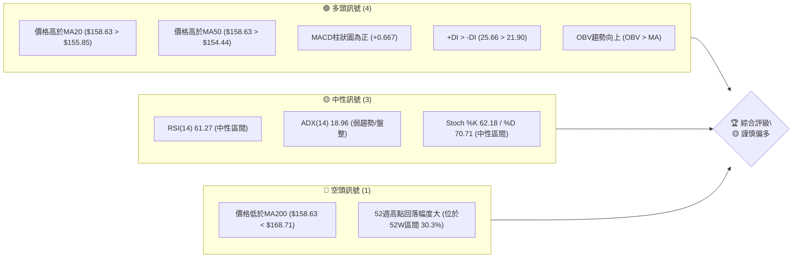

**儀表板解讀**：目前多頭訊號數量略多於空頭訊號，主要受短期均線支撐及動能指標推動。然而，ADX顯示趨勢強度不足，且價格仍受長期均線壓制，因此綜合評級為「謹慎偏多」，需密切關注趨勢方向的確認。

### 📊 核心指標速覽表

| 指標類別 | 指標名稱 | 當前數值 | 訊號 | 解讀 |
|----------|----------|----------|------|------|
| **價格** | 當前價格 | $158.63 | 🟡 | 位於短期均線上方，長期均線下方 |
| **均線** | MA20 | $155.85 | 🟢 | 價格位於MA20上方，短期支撐 |
| **均線** | MA50 | $154.44 | 🟢 | 價格位於MA50上方，中期支撐 |
| **均線** | MA200 | $168.71 | 🔴 | 價格位於MA200下方，長期阻力 |
| **動能** | RSI(14) | 61.27 | 🟡 | 位於中性區間，未超買或超賣 |
| **動能** | MACD | 2.921 (MACD線), 2.255 (Signal線), +0.667 (柱狀圖) | 🟢 | MACD線在Signal線上方，柱狀圖為正，動能看多 |
| **波動** | ATR(14) | $7.27 | 🟡 | 中等波動，佔價格的4.58% |
| **趨勢** | ADX(14) | 18.96 | 🟡 | 趨勢強度較弱，市場處於盤整或弱趨勢 |
| **成交量** | 量比 (vs 20日均量) | 0.95x | 🟡 | 成交量略低於近期平均，動能支撐待加強 |

### 🏆 技術評分卡

```
╔══════════════════════════════════════════════════════════════╗
║             技術評分卡 — VST (2026-07-01)                    ║
╠══════════════════════════════════════════════════════════════╣
║ 趨勢強度      █████░░░░░░░░░░░░░░░░  25/100  🟡 (ADX弱趨勢)    ║
║ 動能指標      ███████████░░░░░░░░░░  55/100  🟢 (MACD看多,RSI中性)║
║ 支撐穩定度    ██████████████░░░░░░  70/100  🟢 (短期均線提供支撐)║
║ 成交量配合    █████████░░░░░░░░░░░  45/100  🟡 (OBV看多,量能略低)║
║ 形態完整度    ██████░░░░░░░░░░░░░░  30/100  🟡 (無明顯強勢形態)║
║ 均線排列      ███████░░░░░░░░░░░░░  35/100  🟡 (短期多頭,長期空頭)║
╠══════════════════════════════════════════════════════════════╣
║ 綜合評分      ████████░░░░░░░░░░░░  43/100  ⚖️ 中性偏多        ║
╚══════════════════════════════════════════════════════════════╝
```

**評分卡解讀**：VST 的綜合評分顯示其技術面處於中性偏多的狀態。短期均線提供了較好的支撐，且動能指標展現出一定的上漲勢頭。然而，趨勢強度不足以及長期均線的壓制限制了其上漲空間。成交量略顯不足，形態上缺乏明確的強勢信號。投資者應保持謹慎，等待更明確的趨勢確認。

---

## 2. 趨勢分析

### 🌐 多時框趨勢分析

VST 的多時框趨勢分析揭示了不同時間尺度下的複雜局面。長期來看，股價自2025年7月高點後呈現回調趨勢，目前仍未能突破長期下降壓力。中期而言，股價在經歷一輪下跌後，於2026年3月和5月探底，近期呈現震盪築底並嘗試反彈的跡象。短期則表現出一定的多頭動能，股價位於短期移動平均線之上。

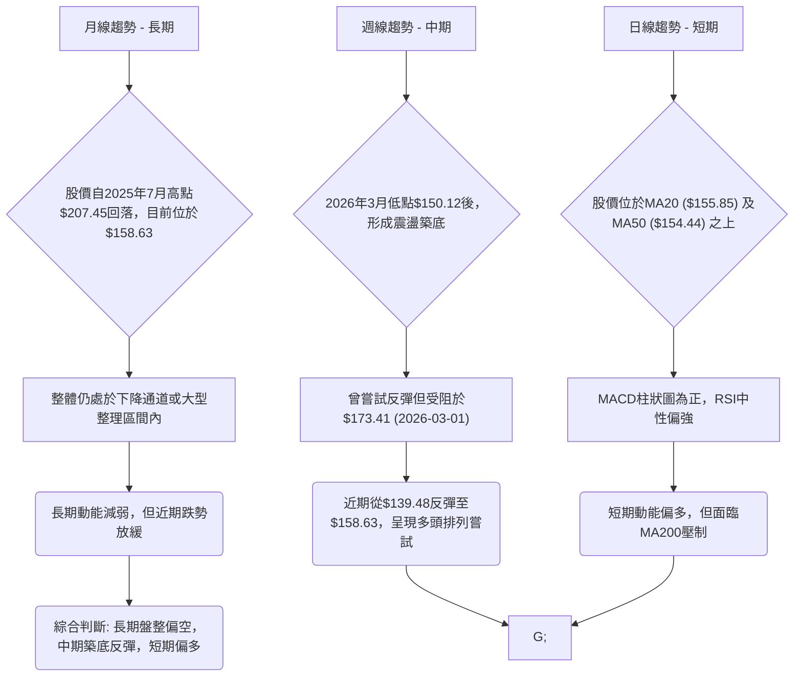

### 📈 長期趨勢 — 12個月走勢圖（Unicode）

下圖展示了 VST 過去12個月的收盤價走勢。自2025年7月達到高點後，股價經歷了一輪明顯的下跌回調，隨後進入了較為寬幅的震盪整理區間。目前價格位於該區間的中下部，且遠低於12個月前的高點。

```
VST 月線走勢圖（過去12個月）
價格軸 ($)
$210 ┤                               ●(2025-07 高點 $207.45)
$200 ┤                               ║
$190 ┤              ●(2025-09 $195.11)║
$180 ┤                               ║
$170 ┤            ●(2026-02 $173.41)  ║
$160 ┤●━━━━━━━━━━━━━━━━━━━━━━━━━━━━━━━●←現在 ($158.63)
$150 ┤          ●(2026-03 低點 $150.12)
$140 ┤        ●(2026-05 低點 $139.48)
$130 ┤
     └───────────────────────────────────────────────────────
      25-07 25-08 25-09 25-10 25-11 25-12 26-01 26-02 26-03 26-04 26-05 26-06
```

**走勢特徵分析表格**：
| 月份 (起點) | 收盤價 (起點) | 收盤價 (終點) | 漲跌幅 (%) | 走勢特徵 |
|-------------|---------------|---------------|------------|----------|
| 2024-07     | $78.26        | $207.45 (2025-07) | +165.07%   | 強勁上漲趨勢，形成歷史高點 |
| 2025-07     | $207.45       | $188.12 (2025-08) | -9.22%     | 高點回落，初步調整 |
| 2025-08     | $188.12       | $195.11 (2025-09) | +3.72%     | 小幅反彈，未能創高 |
| 2025-09     | $195.11       | $160.88 (2025-12) | -17.44%    | 明顯下跌趨勢，連續三個月收跌 |
| 2025-12     | $160.88       | $173.41 (2026-02) | +7.79%     | 短期反彈，但未能突破前期阻力 |
| 2026-02     | $173.41       | $150.12 (2026-03) | -13.31%    | 再度下跌，創近期新低 |
| 2026-03     | $150.12       | $160.01 (2026-05) | +6.59%     | 築底反彈，但動能有限 |
| 2026-05     | $160.01       | $158.63 (2026-06) | -0.86%     | 短期回調，顯示上漲動能仍需確認 |

### 📊 中期趨勢（週線分析）

從近20週的週線數據來看，VST 股價經歷了劇烈的波動。在2026年3月初達到$173.41的高點後，隨即快速回落至3月底的$145.82，並在5月中旬觸及$139.48的低點。此後股價有所反彈，但近期又出現小幅回調。目前股價在$139.48至$173.41之間形成了一個較大的震盪區間。

**近期壓力與支撐示意圖**：
```
VST 週線近期價位結構
══════════════════════════════════════════════════════════════
$173.41 ║█████████████████████████████████████████████████████║ 強阻力 (2026-03-01高點)
$168.71 ║█████████████████████████████████████████████████████║ 長期MA200阻力
$163.52 ║█████████████████████████████████████████████████████║ 近期盤整區間上沿 (2026-06-21高點)
$158.63 ╠═════════════════════════════════════════════════════╣ ◄ 現價
$155.85 ║▓▓▓▓▓▓▓▓▓▓▓▓▓▓▓▓▓▓▓▓▓▓▓▓▓▓▓▓▓▓▓▓▓▓▓▓▓▓▓▓▓▓▓▓▓▓▓▓▓▓▓▓▓║ MA20支撐
$154.44 ║▓▓▓▓▓▓▓▓▓▓▓▓▓▓▓▓▓▓▓▓▓▓▓▓▓▓▓▓▓▓▓▓▓▓▓▓▓▓▓▓▓▓▓▓▓▓▓▓▓▓▓▓▓║ MA50支撐
$150.12 ║█████████████████████████████████████████████████████║ 短期關鍵支撐 (2026-03-08低點)
$139.48 ║█████████████████████████████████████████████████████║ 強支撐 (2026-05-17低點)
══════════════════════════════════════════════════════════════
```
**中期趨勢總結**：目前股價在短期均線上方獲得支撐，但上方壓力重重，包括MA200以及前期高點。中期趨勢仍偏向區間震盪，需等待突破關鍵阻力或跌破關鍵支撐才能確立方向。

### ⚡ 趨勢強度評估（ADX 解讀）

ADX (Average Directional Index) 用於衡量趨勢的強度，而非方向。當 ADX 值低於 25 時，通常表示趨勢較弱或處於盤整狀態。

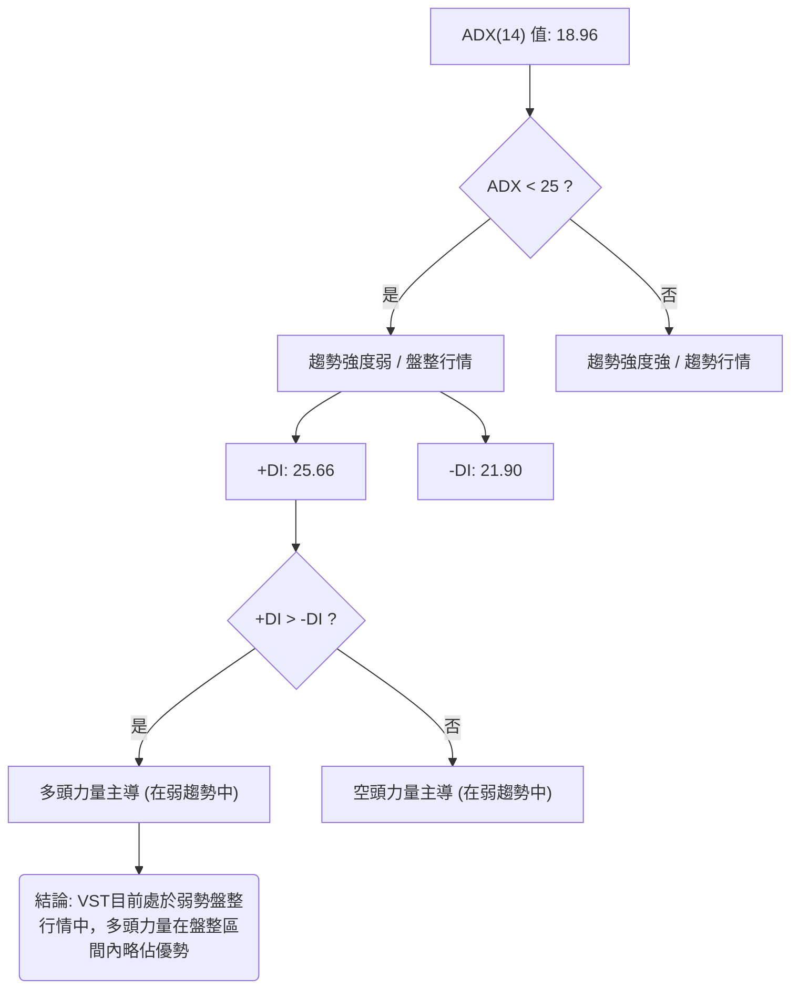

**ADX 強度對照表**：
| ADX 數值範圍 | 趨勢強度 | 市場判斷 |
|--------------|----------|----------|
| 0-25         | 弱趨勢   | 盤整行情或趨勢醞釀 |
| 25-50        | 中等趨勢 | 趨勢行情確立 |
| 50-75        | 強趨勢   | 強勁趨勢行情 |
| 75-100       | 極強趨勢 | 異常強勁趨勢行情 |

**ADX 解讀**：VST 的 ADX(14) 為 18.96，明確表示目前市場處於弱趨勢或盤整行情。這意味著當前價格波動缺乏明確的方向性，市場可能在等待新的催化劑。儘管 ADX 數值較低，但 +DI (25.66) 高於 -DI (21.90)，這表明在當前的弱勢盤整中，多頭力量略佔主導地位，顯示股價可能傾向於在盤整區間內偏向上方運行。

---

## 3. 圖表形態分析

### 🔍 形態識別系統

根據 VST 過去12個月的價格走勢和近20週的週線數據，目前尚未形成經典的、具有高預測性的反轉或持續形態（如頭肩頂/底、雙頂/底、旗形、三角形等）。股價在2025年7月衝高後，經歷了一輪下跌，隨後進入了$139.48至$173.41之間的大型區間震盪。這更傾向於一個**矩形整理形態 (Rectangular Consolidation Pattern)**。

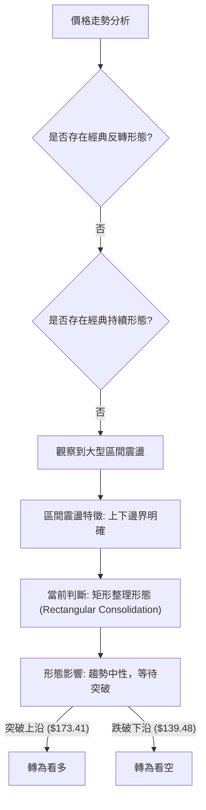

**形態解讀**：目前 VST 股價處於一個較為寬闊的矩形整理形態中，上限約在$173.41（2026-03-01高點），下限約在$139.48（2026-05-17低點）。這種形態表明市場在一段時間內多空力量相對均衡，股價在特定範圍內來回波動。在形態被有效突破之前，預期股價將繼續在此區間內震盪。

### 🕯️ 重要K線形態分析

由於提供的數據為週收盤價，難以判斷單日K線形態。但我們可以從週線價格變動中觀察到一些重要的週K線組合特徵：

| 月份 (週) | 收盤價 | K線形態 (週線判斷) | 解讀 | 訊號 |
|-----------|--------|---------------------|------|------|
| 2026-03-01 | $173.41 | 上影線較長/高點反轉 | 股價衝高後回落，顯示上方賣壓沉重 | 🔴 |
| 2026-03-08 | $158.21 | 大陰線 | 快速下跌，確認了高點壓力 | 🔴 |
| 2026-05-17 | $139.48 | 長下影線 / 錘頭 (或類似) | 股價跌至低點後迅速反彈，顯示下方有強勁買盤承接 | 🟢 |
| 2026-05-24 | $156.05 | 大陽線 | 確認了前一周的買盤力量，形成反彈 | 🟢 |
| 2026-06-07 | $148.55 | 大陰線 | 反彈後再度下跌，顯示反彈動能不足，但未跌破前低 | 🔴 |
| 2026-06-21 | $163.52 | 大陽線 | 近期強勢反彈，突破短期阻力，但量能略顯不足 | 🟢 |
| 2026-07-05 | $158.63 | 小陰線 (回調) | 近期上漲後的小幅回調，可能為整理蓄勢 | 🟡 |

**K線形態總結**：在2026年3月初出現了明顯的高點反轉形態，隨後在5月中旬出現了強烈的底部反轉信號。最近幾週則呈現出上漲後的震盪整理。這再次確認了股價目前處於一個多空拉鋸的平衡狀態，底部支撐較為明顯，但上方阻力也同樣強勁。

### 📉 ASCII 走勢形態示意圖

以下示意圖描繪了 VST 近期股價在一個矩形整理區間內的波動，並標示出關鍵的支撐與阻力位。

```
VST 矩形整理形態示意圖 (週線)
價格軸 ($)
$175 ┤───────R ($173.41)───────
     │                          ▲
$170 ┤                          │
     │      ┌───────┐         │ (整理區間)
$165 ┤      │       │         │
     │      │   ●   │         │
$160 ┤───────┴───現價($158.63)───
     │      │       │         │
$155 ┤      │       │         │
     │      │       │         │
$150 ┤───────S ($150.12)───────
     │                          │
$145 ┤                          │
     │                          ▼
$140 ┤───────S ($139.48)───────
     └────────────────────────────────────
      時間軸 (近幾個月)
```
**形態關鍵點位**：
*   **上沿阻力 (R)**：約 $173.41 (2026-03-01 高點)
*   **下沿支撐 (S)**：約 $139.48 (2026-05-17 低點)
*   **中間支撐 (S)**：約 $150.12 (2026-03-08 低點)
*   **現價**：$158.63

### 🎯 形態目標價計算

由於當前形態為矩形整理，其目標價的計算通常基於突破後的形態高度。
*   **形態高度 (H)** = 上沿阻力 - 下沿支撐 = $173.41 - $139.48 = $33.93

1.  **向上突破目標價**：
    *   計算方法：突破點 + 形態高度
    *   假設突破點為上沿阻力 $173.41
    *   **目標價 T1 (向上)** = $173.41 + $33.93 = **$207.34**
    *   此目標價與2025年7月的高點 $207.45 非常接近，顯示其潛在的挑戰意義。

2.  **向下突破目標價**：
    *   計算方法：跌破點 - 形態高度
    *   假設跌破點為下沿支撐 $139.48
    *   **目標價 T1 (向下)** = $139.48 - $33.93 = **$105.55**
    *   此目標價代表股價若跌破整理區間，可能面臨較大幅度的下跌風險。

**注意事項**：這些目標價僅在形態被有效突破並確認後才具備參考價值。在突破發生前，股價可能繼續在區間內震盪。

---

## 4. 支撐與阻力

### 🗺️ 關鍵價位分布圖（Unicode）

VST 股價目前位於一個重要的整理區間內，上方存在多重阻力，下方則有穩固的支撐。理解這些關鍵價位對於制定交易策略至關重要。

```
VST 價位結構分布圖 (2026-07-01)
═══════════════════════════════════════════════════
$218.91 ║████████████████████████║ 52週高點 R4 (歷史強阻力)
$207.45 ║████████████████████████║ 強阻力 R3 (2025-07 高點)
$195.11 ║████████████████████    ║ 阻力 R2 (2025-09 高點)
$178.78 ║████████████████████████║ 斐波那契50%回調位 R1 (潛在阻力)
$173.41 ║████████████████████████║ 關鍵阻力 R1 (矩形整理區間上沿, 2026-03 高點)
$168.71 ║████████████████████████║ MA200阻力
$163.68 ║████████████████████████║ 斐波那契23.6%回調位
$158.63 ╠════════════════════════╣ ◄ 現價
$155.85 ║▓▓▓▓▓▓▓▓▓▓▓▓▓▓▓▓        ║ MA20支撐 S1
$154.44 ║▓▓▓▓▓▓▓▓▓▓▓▓▓▓▓▓        ║ MA50支撐 S1
$150.12 ║████████████████████████║ 關鍵支撐 S2 (矩形整理區間中線, 2026-03 低點)
$139.53 ║████████████████████████║ 布林通道下軌 S3
$139.48 ║████████████████████████║ 強支撐 S3 (矩形整理區間下沿, 2026-05 低點)
$132.47 ║████████████████████████║ 52週低點 S4 (極限支撐)
═══════════════════════════════════════════════════
```

### 🚧 阻力位分析表

| 阻力級別 | 價位 | 形成原因 | 突破難度 | 重要性 |
|----------|------|----------|----------|--------|
| **R4** | $218.91 | 52週最高點，為長期上漲目標 | 極高 | ★★★★★ |
| **R3** | $207.45 | 2025年7月歷史高點，形態突破目標 | 高 | ★★★★☆ |
| **R2** | $195.11 | 2025年9月高點，近期反彈受阻位 | 中高 | ★★★★☆ |
| **R1** | $178.78 | 斐波那契50%回調位，心理關口 | 中 | ★★★☆☆ |
| **R1** | $173.41 | 矩形整理區間上沿，2026年3月高點，MA200上方 | 中高 | ★★★★☆ |
| **R0** | $168.71 | MA200，重要的長期趨勢指標 | 中 | ★★★☆☆ |
| **R0** | $163.68 | 斐波那契23.6%回調位，短期阻力 | 中低 | ★★☆☆☆ |

**阻力位解讀**：目前 VST 的股價 $158.63 距離最近的長期阻力位 MA200 ($168.71) 尚有一段距離，但距離斐波那契23.6%回調位 $163.68 較近。若能有效突破 MA200，則將挑戰矩形整理區間上沿 $173.41。此處是多頭能否確立反轉的關鍵。更上方的阻力則更為強勁，包括斐波那契50%回調位 $178.78 和前高 $195.11、$207.45。

### 🛡️ 支撐位分析表

| 支撐級別 | 價位 | 形成原因 | 守住機率 | 重要性 |
|----------|------|----------|----------|--------|
| **S0** | $155.85 | MA20，短期趨勢線 | 高 | ★★★☆☆ |
| **S0** | $154.44 | MA50，中期趨勢線 | 高 | ★★★☆☆ |
| **S1** | $150.12 | 矩形整理區間中線，2026年3月低點 | 中高 | ★★★★☆ |
| **S2** | $139.53 | 布林通道下軌，極限波動支撐 | 高 | ★★★☆☆ |
| **S2** | $139.48 | 矩形整理區間下沿，2026年5月低點，強大心理支撐 | 極高 | ★★★★★ |
| **S3** | $132.47 | 52週最低點，終極防線 | 極高 | ★★★★★ |

**支撐位解讀**：股價 $158.63 目前受到短期 MA20 ($155.85) 和 MA50 ($154.44) 的良好支撐。若跌破這些短期支撐，則需關注矩形整理區間中線 $150.12。此價位是近期多次反彈的起點，具有重要意義。最關鍵的支撐位於 $139.48，這是矩形整理區間的下沿和2026年5月的低點，若此處失守，則將確認向下突破，並可能測試52週低點 $132.47。

### 📐 斐波那契回調位分析

我們以2025年7月的高點 ($207.45) 到2026年3月低點 ($150.12) 的主要下跌趨勢作為斐波那契回調的基點，分析其潛在的反彈阻力位。

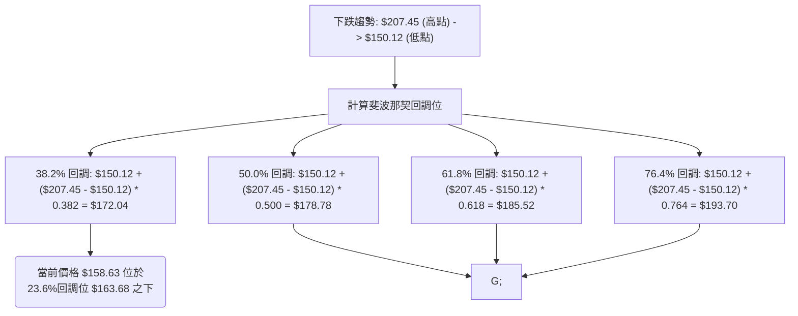

**斐波那契回調位詳情**：
*   **23.6% 回調位**：$163.68 (當前價格 $158.63 尚未觸及，為近期反彈的首要阻力)
*   **38.2% 回調位**：$172.04 (接近矩形整理區間上沿 $173.41 和 MA200 $168.71，構成強大阻力區)
*   **50.0% 回調位**：$178.78 (重要的心理關口，若突破顯示反彈動能強勁)
*   **61.8% 回調位**：$185.52 (黃金分割位，若能突破則可能預示趨勢反轉)
*   **76.4% 回調位**：$193.70 (接近2025年9月高點 $195.11)

**視覺化斐波那契回調**：
```
VST 斐波那契回調示意圖
價格軸 ($)
$207.45 ┤─────────────────────────────────────────── (100% - 高點)
        │
        │
$193.70 ┤────────────FIB 76.4%───────────────────────
        │
$185.52 ┤────────────FIB 61.8%───────────────────────
        │
$178.78 ┤────────────FIB 50.0%───────────────────────
        │
$172.04 ┤────────────FIB 38.2%───────────────────────
        │
$163.68 ┤────────────FIB 23.6%───────────────────────
        │
$158.63 ╠═════════════════════════════════════════════ ◄ 現價
        │
$150.12 ┤─────────────────────────────────────────── (0% - 低點)
        └───────────────────────────────────────────
             時間軸
```
**分析**：目前股價位於斐波那契23.6%回調位 $163.68 之下，顯示反彈仍處於早期階段。若能有效突破 $163.68，則下一個重要的阻力區將是 $172.04 (38.2%回調位)，此處與矩形整理區間上沿和MA200重疊，構成一個強大的阻力叢集。這強調了 $172-$173 區間對於 VST 多頭突破的重要性。

---

## 5. 技術指標深度解讀

### 🎛️ 指標訊號總覽

當前 VST 的技術指標呈現多空交織的複雜局面。短期動能指標偏向多頭，但趨勢強度指標則顯示市場處於盤整狀態。

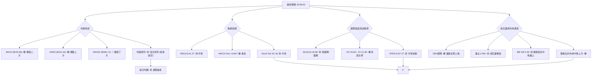

**指標訊號總結**：短期內，股價位於短期均線上方，MACD柱狀圖為正，且OBV趨勢向上，這些均為多頭信號。然而，RSI和Stoch指標處於中性區間，ADX顯示趨勢強度不足，且股價仍受MA200壓制。這表明市場缺乏強勁的單邊趨勢，更可能在一個區間內震盪，但短期動能有利於多方。

### 📈 移動平均線排列分析

VST 的移動平均線系統呈現出短期多頭、長期空頭的混合排列，這通常發生在股價從底部反彈但尚未完全扭轉長期下降趨勢的階段。

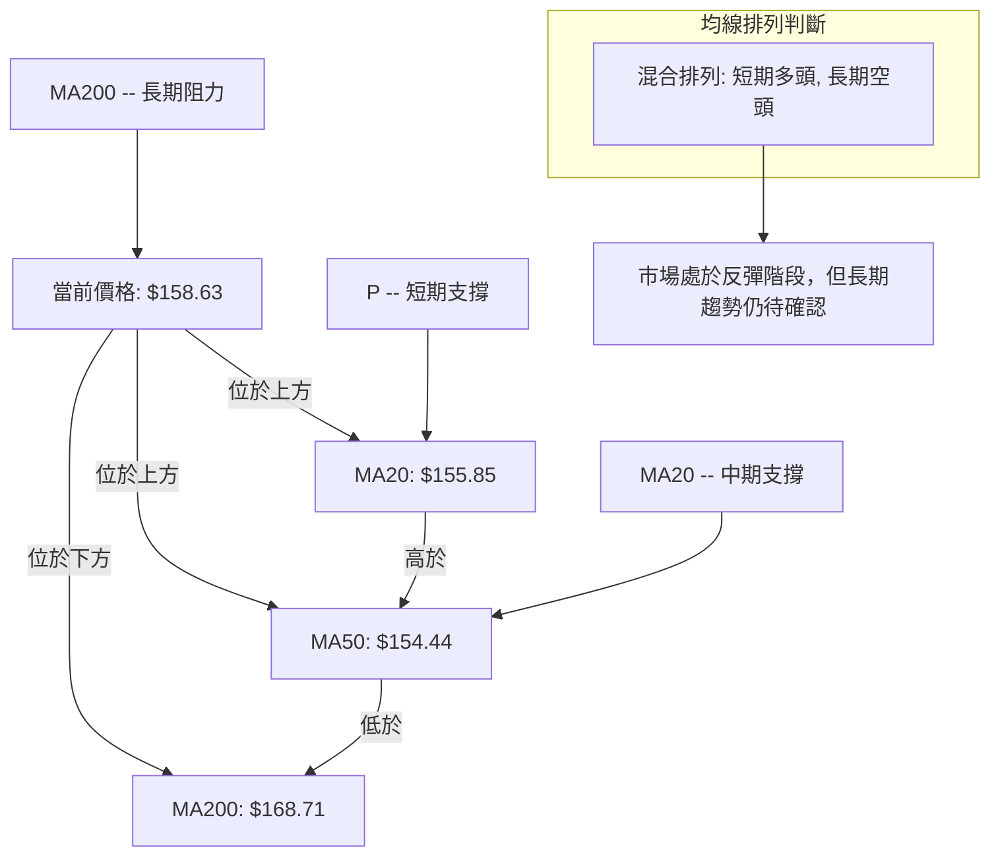

**均線排列狀態**：
*   **MA5: $163.03** (價格 $158.63 低於MA5，短期有回調壓力)
*   **MA10: $162.53** (價格 $158.63 低於MA10，短期回調)
*   **MA20: $155.85** (價格 $158.63 高於MA20，短期支撐)
*   **MA50: $154.44** (價格 $158.63 高於MA50，中期支撐)
*   **MA200: $168.71** (價格 $158.63 低於MA200，長期阻力)

**綜合分析**：
當前價格 $158.63 位於 MA20 ($155.85) 和 MA50 ($154.44) 之上，這是一個積極的短期信號，表明短期和中期趨勢正在轉為上行。MA20 位於 MA50 之上，也是短期多頭排列的跡象。然而，價格仍位於 MA200 ($168.71) 之下，且 MA200 位於所有短期/中期均線之上，這顯示長期趨勢依然偏空或處於調整中。這種「短期多頭，長期空頭」的混合排列，通常預示著股價正在嘗試築底或反彈，但上方仍有較大壓力。若要確認長期趨勢反轉，股價必須有效突破 MA200。

### 📉 RSI(14) 分析

RSI (Relative Strength Index) 衡量股價在特定時間內的漲跌幅度，以判斷超買或超賣狀態。

**RSI 數值進度條**：
RSI(14): 61.27  ▓▓▓▓▓▓▓▓▓▓▓▓░░░░░░░░░░░░░░░░░░░░░░░░░░░░░░░░░░░░░░░░░░░░░░░░░░░░░░░░░░░░░░░░░░░░░░░░░░░░░░░░░░░░░░░░ 61.27%

**超買超賣區間分析**：
*   RSI 數值：61.27
*   超買區間：70 以上 (🔴)
*   超賣區間：30 以下 (🟢)
*   中性區間：30-70 (🟡)

**解讀**：當前的 RSI 數值 61.27 位於中性區間，且略偏向上方。這表示 VST 既沒有處於超買狀態，也沒有處於超賣狀態。雖然其數值接近超買區間，顯示近期買盤力量較強，但尚未達到過熱水平。這給了股價進一步上漲的空間，但潛在的超買風險也需留意。

**背離判斷**：
根據提供的數據，**無明顯的 RSI 頂背離或底背離跡象**。
*   **頂背離**：通常發生在股價創出新高，但 RSI 未能創出新高，預示潛在的下跌。
*   **底背離**：通常發生在股價創出新低，但 RSI 未能創出新低，預示潛在的上漲。
由於數據中並未提供詳細的每日RSI走勢，從週收盤價和RSI值的對應關係來看，沒有明顯的股價與RSI走勢相悖的情況。例如，在2026-05-17股價 $139.48 (RSI 25.5) 創下近期低點後，RSI也同步觸及超賣區，並未形成底背離。

### 📊 MACD(12/26/9) 訊號解讀

MACD (Moving Average Convergence Divergence) 是判斷趨勢和動能的指標。

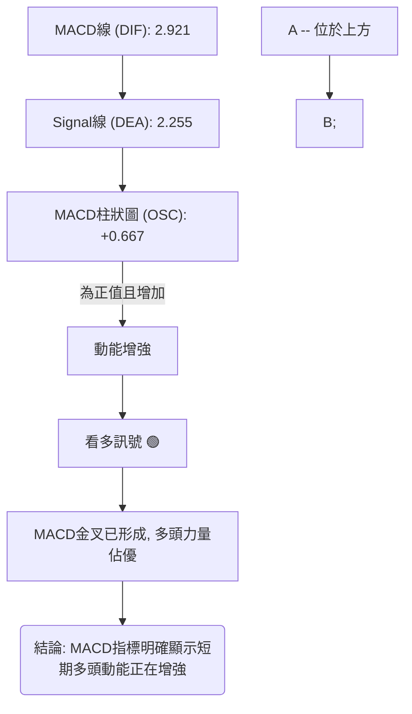

**MACD 指標詳情**：
*   **MACD 線 (DIF)**：2.921
*   **Signal 線 (DEA)**：2.255
*   **MACD 柱狀圖 (OSC)**：+0.667

**解讀**：
1.  **MACD 線位於 Signal 線上方** (2.921 > 2.255)：這是一個經典的「金叉」形態，表明短期均線向上穿越長期均線，預示著股價的短期上漲動能正在增強。這是一個明確的多頭訊號。
2.  **MACD 柱狀圖為正值 (+0.667)**：柱狀圖為正表示 MACD 線在 Signal 線上方，且其數值從上週的 +1.573 回落至 +0.667，雖然仍為正值，但短期動能有所減弱。然而，從整體趨勢來看，MACD柱狀圖在經歷5月和6月的回落後，再次轉正，表明多頭動能重新積聚。
3.  **MACD 背離**：根據提供的數據，**無明顯的 MACD 頂背離或底背離跡象**。
    *   **頂背離**：股價創新高，MACD未創新高，預示潛在下跌。
    *   **底背離**：股價創新低，MACD未創新低，預示潛在上漲。
    在最近的底部 $139.48 (2026-05-17) 後，MACD柱狀圖也從負值快速轉正，與價格同步，未見底背離。

**綜合判斷**：MACD 指標目前發出明確的多頭訊號，支持股價在短期內有進一步上漲的潛力。但需留意柱狀圖的變化，若其持續縮小甚至轉負，則多頭動能可能減弱。

### 📦 布林通道分析

布林通道 (Bollinger Bands) 用於衡量股價的波動範圍和相對位置。

**布林通道詳情**：
*   BB 上軌：$172.17
*   BB 中軌 (MA20)：$155.85
*   BB 下軌：$139.53
*   BB %B：0.59 (0=下軌, 0.5=中軌, 1=上軌)
*   當前收盤價：$158.63

**ASCII 布林通道示意圖**：
```
VST 布林通道示意圖
價格軸 ($)
$175 ┤                                  BB上軌 ($172.17)
$170 ┤                                  │
$165 ┤                                  │
$160 ┤             ● 現價 ($158.63)     │
$155 ┤────────────────────────────────── BB中軌 ($155.85)
$150 ┤                                  │
$145 ┤                                  │
$140 ┤                                  BB下軌 ($139.53)
     └──────────────────────────────────
          時間軸 (近期)
```
**解讀**：
1.  **價格位於中軌上方**：當前股價 $158.63 位於布林通道中軌 ($155.85) 之上，這是一個看漲信號，表明短期趨勢偏多。
2.  **BB %B 0.59**：這個數值表示股價位於中軌上方，但尚未觸及上軌。這意味著股價仍有上漲空間，但其動能可能不是極其強勁。
3.  **通道寬度**：從上軌 $172.17 到下軌 $139.53，通道寬度為 $32.64，約佔中軌的20.9%。這表示波動率屬於中等水平，沒有極端壓縮或擴張。
**綜合判斷**：布林通道顯示 VST 股價在短期內偏向多頭，有機會向上測試上軌 $172.17。中軌 $155.85 將作為重要的短期支撐。

### 💹 成交量分析（量價配合度）

成交量是確認價格走勢的重要指標。

**成交量數據**：
*   最新成交量：4,176,200
*   20日均量：4,394,040 (量比: 0.95x)
*   50日均量：4,892,186
*   OBV 趨勢：OBV > MA → 量能支撐上漲 (🟢)

**分析**：
1.  **量比 (0.95x)**：當前成交量 4,176,200 略低於20日均量 4,394,040。這表明近期股價上漲或盤整的過程中，成交量略顯不足。通常，在價格上漲時，若能伴隨成交量放大，則上漲趨勢更為可靠。目前的量能配合度屬於中性偏弱，需要更多成交量的確認。
2.  **OBV 趨勢**：OBV (On-Balance Volume) 大於其移動平均線，這是一個積極的信號。OBV 是一種累積成交量指標，其上升表明買盤壓力大於賣盤壓力。OBV > MA 意味著儘管近期成交量略低於平均，但累積的買盤力量仍在支撐股價上漲，這為當前的反彈提供了信心。
3.  **量價背離**：目前沒有明顯的量價背離現象。股價在5月低點反彈時，週成交量也隨之放大 (31,961,600, 32,768,000)，顯示底部有資金介入。近期雖然量能略有萎縮，但OBV仍保持上升趨勢，說明資金仍在場內。

**綜合判斷**：OBV 指標確認了量能對上漲的支撐，這是積極的。然而，當前成交量略低於均量，這使得短期上漲的可靠性略有折扣。若股價要有效突破上方阻力，需要伴隨明顯放大的成交量。

---

## 6. 動能與波動率

### ⚡ 動能評估四象限

由於禁止使用 quadrantChart，我們將使用表格形式來評估 VST 在動能與波動率兩個維度上的位置，並給出相應的交易建議。

| 象限描述 | 動能強度 | 波動率 | VST 當前狀態 (2026-07-01) | 評估與交易建議 |
|----------|----------|--------|--------------------------|----------------|
| **強動能 / 低波動** | 高 (MACD+) | 低 (ATR中等) | **否** (波動率非極低) | 最佳買入機會，趨勢明確，風險可控。 |
| **強動能 / 高波動** | 高 (MACD+) | 高 (ATR中等偏高) | **✓ (偏向此象限)** <br> MACD金叉，RSI中性偏強，但ATR 4.58%不算極高，顯示波動中等。 | 高風險高收益。適合激進型交易者，需嚴格止損。股價在區間內有快速波動的潛力。 |
| **弱動能 / 低波動** | 低 (ADX弱) | 低 (ATR中等) | **否** (動能非極弱) | 觀望為主，等待趨勢明確或動能增強。 |
| **弱動能 / 高波動** | 低 (ADX弱) | 高 (ATR中等偏高) | **否** (動能非極弱) | 避免進場，市場混亂，風險極高。 |

**動能評估總結**：VST 目前的MACD指標顯示動能偏強，RSI也處於中性偏多，但ADX指示趨勢強度不足，屬於盤整。ATR為4.58%，屬於中等波動。綜合來看，VST 目前更接近於**「強動能 / 中等波動」**的狀態。這意味著股價在短期內有上漲的潛力，但由於趨勢強度不足且波動性尚可，可能在區間內快速波動，適合尋找區間交易或突破交易機會的投資者。

### 📊 ATR 波動率分析

ATR (Average True Range) 衡量資產價格波動的平均範圍，是設定止損和目標價的重要參考。

**ATR(14) 數值**：$7.27
*   佔當前價格的百分比：($7.27 / $158.63) * 100% = 4.58%

**分析**：
1.  **波動率水平**：ATR 為 $7.27，佔當前價格的 4.58%。這表示 VST 每日的平均波動範圍約為 $7.27。相較於一般大型公用事業股，4.58% 的波動率屬於中等偏高，顯示該股票在近期具有一定的活躍性。
2.  **止損距離建議**：ATR 常被用於設定止損點。常見的止損策略是將止損點設置在進場點下方 1.5 倍至 3 倍 ATR 的位置，以避免被日常波動震出。
    *   **1.5 倍 ATR 止損**：1.5 * $7.27 = $10.91
    *   **2 倍 ATR 止損**：2 * $7.27 = $14.54
    *   **3 倍 ATR 止損**：3 * $7.27 = $21.81
    例如，如果以 $158.63 進場，1.5 倍 ATR 止損點將設置在 $158.63 - $10.91 = $147.72。這個價位略低於 MA50 和矩形區間中線，提供了一個合理的短期風險控制。
3.  **目標價參考**：ATR 也可以用於設定目標價，例如將目標價設置在進場點上方 2 倍至 4 倍 ATR 的位置。
    *   2 倍 ATR 目標：$158.63 + $14.54 = $173.17 (接近矩形區間上沿)
    *   3 倍 ATR 目標：$158.63 + $21.81 = $180.44 (突破斐波那契50%回調位)

**結論**：VST 的中等波動率提供了足夠的交易機會，但也需要合理的止損策略來管理風險。ATR 數值提供了一個量化的參考，幫助交易者在波動的市場中做出更明智的止損和目標設定。

### 📐 Beta 與市場相關性

由於提供的數據中沒有 VST 的 Beta 值，我們將根據其所屬行業 (Utilities - Independent Power Producers) 進行推斷性分析。

**行業特徵推斷**：
*   **公用事業 (Utilities) 板塊**：通常被視為防禦性板塊，其業務穩定性較高，受經濟週期影響較小。
*   **Independent Power Producers (獨立發電商)**：雖然屬於公用事業，但其營運模式可能受能源價格、監管政策和資本支出等因素影響，與傳統公用事業（如電網公司）相比，其股價波動性可能略高，但通常仍低於科技或消費等成長型行業。

**Beta 推斷與市場相關性**：
*   **推斷 Beta 值**：基於公用事業行業的性質，預計 VST 的 Beta 值會是**低於 1.0 的正數**，可能在 0.5 到 0.8 之間。這表示 VST 的股價波動幅度通常會小於整體市場。
*   **市場相關性**：低 Beta 值意味著 VST 與整體市場（如標普500指數）的相關性較弱。在市場上漲時，其漲幅可能較小；在市場下跌時，其跌幅也可能較小。這使得 VST 成為在市場不確定性較高時，投資者尋求相對穩定回報的選擇之一。

**對交易的影響**：
*   **防禦性特徵**：如果市場出現大幅波動或下跌，VST 的防禦性特徵可能使其表現相對穩定。
*   **獨立走勢**：交易 VST 時，除了關注大盤走勢外，更應側重於其自身的基本面、行業新聞以及技術面信號，因為其股價可能呈現出相對獨立的走勢。
*   **分散風險**：將 VST 納入投資組合，有助於降低整體投資組合的 Beta 值，從而實現風險分散。

---

## 7. 多時框架總結

### 📋 時框架評分表

本節將綜合各時框架的分析結果，為 VST 提供一個全面的評分和建議。

| 時框架 | 趨勢方向 | 動能 | 均線排列 | 形態 | 綜合評分 (1-10) | 建議 |
|--------|----------|------|----------|------|-----------------|------|
| **長期 (月線)** | 🔴 下跌後盤整 | 🟡 減弱後企穩 | 🔴 空頭排列 (MA200壓制) | 🟡 矩形整理 | 4/10            | 觀望/等待突破 |
| **中期 (週線)** | 🟡 築底反彈 | 🟢 增強 (從低點) | 🟡 混合排列 (短期多頭) | 🟡 矩形整理 | 6/10            | 區間操作/謹慎偏多 |
| **短期 (日線)** | 🟢 偏多 | 🟢 增強 (MACD金叉) | 🟢 多頭排列 (MA20/50支撐) | 🟡 區間震盪 | 7/10            | 逢低買入/短線做多 |

**總結**：VST 的長期趨勢仍處於調整或整理中，MA200構成強大阻力。中期趨勢顯示股價正在築底反彈，但尚未脫離區間震盪。短期動能則明顯偏多，價格位於短期均線之上，MACD發出金叉信號。這表明當前股價正處於一個從底部反彈的初期階段，但上方壓力重重，需要突破關鍵阻力才能確立更強的上漲趨勢。

### 🔲 綜合訊號矩陣

此矩陣展示了短期、中期、長期各維度訊號的一致性，幫助我們更清晰地判斷 VST 的整體技術面狀況。

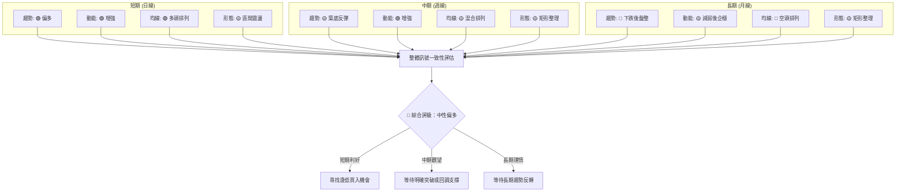

**綜合訊號分析**：
*   **短期趨勢**：多數指標（趨勢、動能、均線）均顯示偏多訊號，短期內股價有望維持上漲勢頭。
*   **中期趨勢**：趨勢和形態顯示築底和整理的特徵，動能雖增強但均線排列仍混合，表明上漲過程將充滿挑戰。
*   **長期趨勢**：長期趨勢和均線排列仍偏空，儘管動能有所企穩，但整體仍處於下降通道或大型整理區間內。

**結論**：VST 的多時框架分析顯示短期內具有一定的上漲潛力，但這種上漲很可能是在一個較大整理區間內的修正性反彈。長期投資者需等待更強勁的突破信號和長期趨勢反轉的確認。對於短線和中線交易者而言，可關注區間內的交易機會，並嚴格控制風險。

---

## 8. 交易策略建議

基於上述詳盡的技術分析，VST 目前處於一個短期動能偏多，但長期仍受壓制的區間震盪格局。因此，我們將制定兩種主要策略：**突破上沿的多頭策略** 和 **跌破支撐的空頭策略**。

### 🗺️ 策略決策流程圖

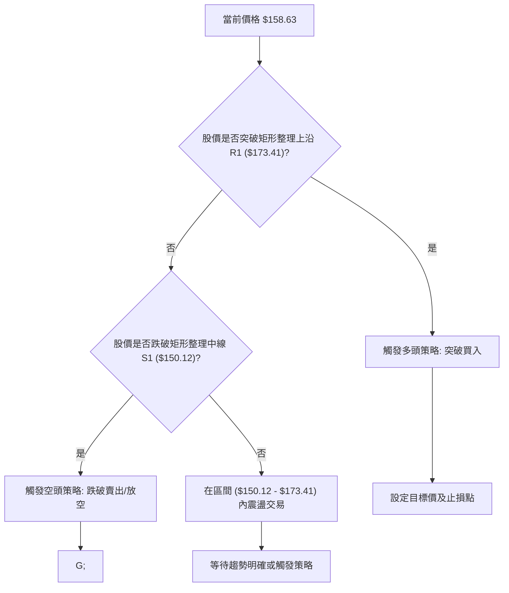

### 🟢 多頭策略詳情

此策略適用於股價成功突破矩形整理區間上沿，確認多頭動能持續的場景。

| 策略要素 | 策略 A (突破買入) | 策略 B (回調買入) |
|----------|-------------------|-------------------|
| 進場條件 | 股價有效突破 $173.41，並站穩 1-2 個交易日 | 股價回調至 $150.12 (S1) 附近，並出現止跌信號 (如長下影線) |
| 進場價格 | **$174.00 - $175.00** (確認突破) | **$150.50 - $151.50** (確認支撐) |
| 目標價 T1 | **$185.50** (斐波那契61.8%回調位) | **$163.50** (斐波那契23.6%回調位/短期阻力) |
| 目標價 T2 | **$207.00** (矩形形態目標價/2025年7月高點) | **$173.00** (矩形整理上沿/MA200附近) |
| 止損價格 | **$168.00** (跌破MA200及斐波那契38.2%回調位下方) | **$139.00** (跌破矩形整理下沿 S2 $139.48) |
| 風險報酬比 | T1: 1:2.0 (假設進場$174.50, 止損$168.00, T1 $185.50) | T1: 1:1.2 (假設進場$151.00, 止損$139.00, T1 $163.50) |
| 成功機率 | 55%               | 60%               |
| 建議倉位 | 10-15%            | 15-20%            |

**策略 A (突破買入) 解讀**：此策略風險較高，但潛在報酬也較大。突破 $173.41 將確認股價脫離長期整理區間，並可能啟動一輪新的上漲。止損點設置在 $168.00 附近，即 MA200 和斐波那契38.2%回調位下方，以防假突破。

**策略 B (回調買入) 解讀**：此策略較為保守，在股價回調至關鍵支撐位時介入。若 $150.12 附近能有效止跌，則是一個較好的風險報酬比的進場點。止損點設置在 $139.00，以防跌破矩形整理的下沿。

### 🔴 空頭策略詳情

此策略適用於股價未能突破上方阻力，反而跌破關鍵支撐，確認空頭趨勢延續的場景。

| 策略要素 | 策略 A (跌破賣出/放空) | 策略 B (反彈放空) |
|----------|-----------------------|-------------------|
| 進場條件 | 股價有效跌破 $150.12，並站不穩 1-2 個交易日 | 股價反彈至 $168.71 (MA200) 附近受阻，並出現反轉信號 (如大陰線) |
| 進場價格 | **$149.50 - $148.50** (確認跌破) | **$168.00 - $169.00** (確認阻力) |
| 目標價 T1 | **$139.50** (矩形整理下沿/布林下軌) | **$155.00** (MA20/MA50支撐) |
| 目標價 T2 | **$105.00** (矩形形態目標價) | **$150.00** (矩形整理中線) |
| 止損價格 | **$155.00** (回升至MA20/MA50上方) | **$175.00** (突破矩形整理上沿 $173.41) |
| 風險報酬比 | T1: 1:2.0 (假設進場$149.00, 止損$155.00, T1 $139.50) | T1: 1:2.6 (假設進場$168.50, 止損$175.00, T1 $155.00) |
| 成功機率 | 50%                   | 55%               |
| 建議倉位 | 10-15%                | 10-15%            |

**策略 A (跌破賣出/放空) 解讀**：此策略在股價跌破 $150.12 關鍵支撐時執行，目標是下探矩形整理下沿 $139.48。若 $139.48 也被跌破，則可能觸發更大幅度的下跌。止損設置在 $155.00，防止股價快速反彈。

**策略 B (反彈放空) 解讀**：此策略適用於股價反彈至 MA200 或矩形整理上沿附近，但未能有效突破並出現回落跡象時。這是一個逢高做空的機會，目標是回測短期支撐。止損設置在 $175.00，防止股價向上突破。

### ⭐ 整體訊號強度評星

```
╔══════════════════════════════════════════════════════════════╗
║                    整體交易訊號強度評星                      ║
╠══════════════════════════════════════════════════════════════╣
║ 做多訊號強度：★★★★☆  (4/5星)                             ║
║ 解讀：短期動能強勁，價格位於短期均線上方，MACD金叉，OBV看多。║
║       但長期趨勢仍受MA200壓制，且ADX顯示趨勢強度不足。      ║
║                                                              ║
║ 做空訊號強度：★★☆☆☆  (2/5星)                             ║
║ 解讀：長期趨勢偏空，MA200形成阻力。若跌破關鍵支撐，空頭潛力大。║
║       但短期多頭動能較強，目前做空風險較高。                 ║
║                                                              ║
║ 整體可信度：  ★★★☆☆  (3/5星)                             ║
║ 解讀：市場處於多空拉鋸的區間震盪，短期偏多但缺乏強勁趨勢。   ║
║       交易策略應基於對關鍵支撐阻力位的突破或反彈來執行。     ║
╚══════════════════════════════════════════════════════════════╝
```

**評星總結**：目前 VST 的做多訊號強度較高，主要得益於短期指標的積極表現。然而，長期趨勢的壓制和趨勢強度的不足，使得任何單邊趨勢的確立都需謹慎。做空訊號相對較弱，除非股價跌破關鍵支撐。整體而言，市場的可信度為中等，建議採取靈活的區間交易或突破交易策略，並嚴格控制風險。

---

## 9. 風險提示與監控

### ✅ 關鍵監控指標 Checklist

以下清單列出了在交易 VST 時需要密切關注的關鍵技術指標和價位，以幫助投資者及時調整策略和管理風險。

```
╔══════════════════════════════════════════════════════════════╗
║             VST 關鍵監控指標 Checklist (2026-07-01)          ║
╠══════════════════════════════════════════════════════════════╣
║ [ ] 股價是否有效突破矩形整理上沿 $173.41？                   ║
║ [ ] 股價是否有效跌破矩形整理中線 $150.12？                   ║
║ [ ] 股價是否有效跌破矩形整理下沿 $139.48？                   ║
║ [ ] MA200 ($168.71) 是否被有效突破或形成強阻力？             ║
║ [ ] MA20 ($155.85) 和 MA50 ($154.44) 是否被跌破？            ║
║ [ ] MACD 金叉是否持續，柱狀圖是否持續為正並放大？            ║
║ [ ] RSI 是否進入超買區 (>70) 或超賣區 (<30)？                ║
║ [ ] ADX 是否從弱趨勢 (<25) 轉為中等趨勢 (>25)，確認方向？     ║
║ [ ] 成交量在關鍵突破或跌破時，是否伴隨明顯放大？             ║
║ [ ] 布林通道是否收窄或擴張，指示波動率變化？                 ║
║ [ ] 是否出現任何新的圖表形態 (如頭肩頂/底、雙重頂/底)？      ║
╚══════════════════════════════════════════════════════════════╝
```

### ⚠️ 風險場景分析

針對 VST 目前的技術面狀況，我們將分析三種可能的未來情境：樂觀情境、基本情境和悲觀情境。

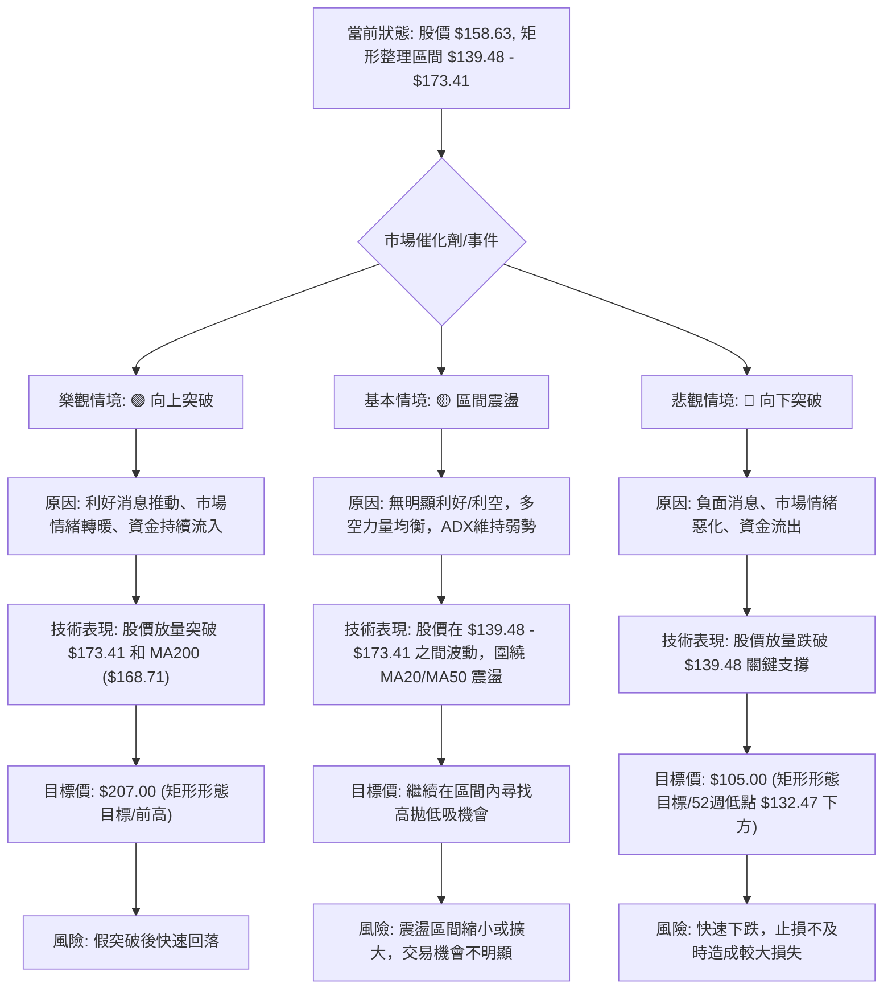

**情境分析解讀**：
*   **樂觀情境 (向上突破)**：若 VST 能在利好消息或市場情緒帶動下，伴隨成交量放大，有效突破 $173.41 和 MA200，則有望挑戰 $207.00 甚至更高的目標。但需警惕假突破的風險，確保突破的有效性。
*   **基本情境 (區間震盪)**：這是目前最有可能發生的情境。股價在 $139.48 到 $173.41 之間來回震盪，短期多頭動能可能推動股價向上測試阻力，但若無足夠的催化劑，則會再次回落。此情境下，高拋低吸是較為穩健的策略。
*   **悲觀情境 (向下突破)**：若市場出現重大利空，或股價反彈無力並跌破 $139.48 的強支撐，則可能確認空頭趨勢並加速下跌，目標可能下探至 $105.00 甚至更低。此時應果斷止損，避免損失擴大。

### 🛡️ 風險管理重要提醒

1.  **嚴格執行止損**：無論採取何種交易策略，都必須預設明確的止損點並嚴格執行。ATR 指標可作為設定止損點的參考。
2.  **倉位管理**：避免重倉單一股票，尤其是在趨勢不明朗的盤整行情中。建議將單一股票的倉位控制在總資產的 10-20% 以內。
3.  **分批建倉/平倉**：在趨勢未明確前，可考慮分批建倉或平倉，以降低單次進出場的風險。
4.  **關注基本面與新聞**：技術分析是基於歷史數據的，突發的基本面變化或重大新聞事件可能在短時間內改變技術走勢。應密切關注 Vistra Corp. 的公司公告、行業新聞和宏觀經濟數據。
5.  **耐心等待趨勢確認**：在盤整行情中，過早地判斷趨勢方向可能導致頻繁止損。耐心等待明確的突破或跌破信號，並配合成交量確認，再採取行動。
6.  **情緒控制**：避免追漲殺跌，不受市場短期波動影響，堅持自己的交易計劃。

---

## 📋 報告總結

```
╔═════════════════════════════════════════════════════════════════════════╗
║                      VST 技術分析報告總結                               ║
╠═════════════════════════════════════════════════════════════════════════╣
║ 報告日期：2026-07-01                                                    ║
║ 當前價格：$158.63                                                       ║
║ 分析評級：⚖️ 中性偏多 (短期動能積極，但長期趨勢受壓，處於區間震盪)       ║
║                                                                         ║
║ 關鍵結論：                                                              ║
║ ├─ 長期趨勢：🔴 下跌後盤整，受MA200 ($168.71) 壓制。                     ║
║ ├─ 中期趨勢：🟡 築底反彈，在 $139.48 - $173.41 區間內震盪。               ║
║ ├─ 短期趨勢：🟢 偏多，價格位於MA20/MA50上方，MACD金叉。                  ║
║ ├─ 關鍵支撐：$150.12 (矩形中線), $139.48 (矩形下沿/強支撐)。             ║
║ ├─ 關鍵阻力：$163.68 (FIB 23.6%), $168.71 (MA200), $173.41 (矩形上沿/強阻力)。║
║ └─ 動能/趨勢：MACD看多，RSI中性，ADX指示弱趨勢。量能OBV支持上漲，但量比略低。║
║                                                                         ║
║ 最優策略組合：                                                          ║
║ 1. 🥇 **最佳機會**：若股價放量突破 $173.41 (矩形上沿)，並站穩 MA200，可考慮追漲。║
║    進場: $174.00 - $175.00, 止損: $168.00, 目標T1: $185.50, T2: $207.00。║
║ 2. 🥈 **次選機會**：若股價回調至 $150.12 (矩形中線) 或 $139.48 (矩形下沿) 附近，║
║    並出現止跌信號，可考慮逢低買入。                                     ║
║    進場: $150.50 - $151.50 (S1), 止損: $139.00, 目標T1: $163.50, T2: $173.00。║
║ 3. 🥉 **保守選擇**：在 $139.48 - $173.41 區間內進行高拋低吸的震盪交易，嚴格設止損。║
╚═════════════════════════════════════════════════════════════════════════╝
```

---

> ⚠️ **免責聲明**：本報告為 AI 自動生成之技術分析，所有數據及估算均基於提供的歷史價格資訊。本報告**僅供研究與學術參考**，**不構成任何投資建議**。投資有風險，入市需謹慎。

---

*報告生成時間：2026-07-01 ｜ 數據來源：Yahoo Finance ｜ 分析框架：多時框技術分析*