<details>
<summary>📊 靜態圖表 (點擊展開)</summary>
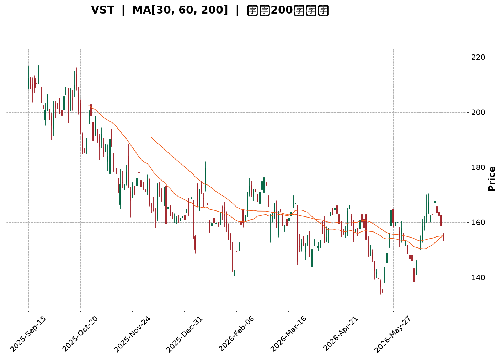
</details>

<html>
<head><meta charset="utf-8" /></head>
<body>
    <div style="height:500px; width:100%;">                        <script>window.PlotlyConfig = {MathJaxConfig: 'local'};</script>
        <script charset="utf-8" src="https://cdn.plot.ly/plotly-3.6.0.min.js" integrity="sha256-QaOVwtVY0T02VaHrr6pnoHLCwayMJp4O5n4YyaE3rJk=" crossorigin="anonymous"></script>                <div id="candlestick-chart" class="plotly-graph-div" style="height:100%; width:100%;"></div>            <script>                window.PLOTLYENV=window.PLOTLYENV || {};                                if (document.getElementById("candlestick-chart")) {                    Plotly.newPlot(                        "candlestick-chart",                        [{"close":{"dtype":"f8","bdata":"AAAAYPyMakAAAADAyQpqQAAAAMAi52lAAAAA4AYiakAAAACg60xqQAAAAOCEIGtAAAAAIJNsaUAAAACgGidpQAAAAAAVGWlAAAAAIIrLaUAAAACAz6NoQAAAAEBwY2hAAAAAoJMVaUAAAACg5zlpQAAAAIDfJGlAAAAA4IXyaEAAAADgWNloQAAAACAwtmlAAAAAQCEkakAAAADgZIFoQAAAACDKFWpAAAAAoAuVaUAAAACgNz9qQAAAAGDgMGpAAAAAgHoQaUAAAADA5i1oQAAAAODiN2dAAAAA4OUhZ0AAAABAcdJnQAAAAGBNFGlAAAAAYCbPaEAAAAAAlrlnQAAAAGBh0WhAAAAA4IqdZ0AAAABAnHBnQAAAACCpB2hAAAAAoAcfZ0AAAABgWJNnQAAAAKBW+2ZAAAAA4KbGZ0AAAADg+G9nQAAAAOBXTWZAAAAAQPswZkAAAADAJltlQAAAAIDlvmVAAAAAgMbIZUAAAADASrZlQAAAAIC0TGZAAAAAIDeiZUAAAACAgfxkQAAAAKA8zWVAAAAAADVEZUAAAAAAIwJmQAAAAGDIQ2ZAAAAAgG+dZUAAAABAs3plQAAAAAAFXmVAAAAAgN\u002fqZUAAAAAAQc9kQAAAACDLrWRAAAAAAAyEZEAAAADghI9kQAAAAEAHvGVAAAAAIKAsZUAAAADAq\u002fFkQAAAAIBhl2VAAAAAQM\u002fpY0AAAAAAY69kQAAAAOBSS2RAAAAAAPojZEAAAADgKidkQAAAACBsMGRAAAAA4ConZEAAAADAlyxkQAAAAMB7RWRAAAAAQFEcZEAAAADgxZhkQAAAAEBgT2RAAAAAYP4hZUAAAABAjUVjQAAAAMDnxWJAAAAAACe9ZEAAAAAAU4NlQAAAAIBOXmVAAAAAgB8QZUAAAACA2nVmQAAAAAB+xGRAAAAAoBOMY0AAAABgg\u002fJjQAAAAABd\u002fWNAAAAAQLT1Y0AAAABg5stjQAAAAKDReWRAAAAAYNulZEAAAAAgNURkQAAAAIA4vWNAAAAAgLM6Y0AAAABAfhJjQAAAAOAOxGFAAAAAIJzVYUAAAACglqdiQAAAACCJEWNAAAAAQBzlY0AAAABgqfZjQAAAACDNVGRAAAAAYIpgZUAAAABgbaZlQAAAAKAuQ2VAAAAAgMWAZUAAAAAAq11lQAAAAEDJ6mRAAAAAYLBkZUAAAAAACtxlQAAAAGChCmZAAAAA4CCtZUAAAADABrFkQAAAAOAfKGRAAAAAIBldZEAAAACABd5kQAAAAEDLxmNAAAAAIGVlZEAAAABASX5kQAAAAKAR12NAAAAA4HjkY0AAAAAAXtBjQAAAACBhMWRAAAAAgA18ZEAAAABA0jRlQAAAAIAQ3WRAAAAAABs6YkAAAACAguJiQAAAAKA0EGNAAAAAIIrpYkAAAADgyAJjQAAAAABnaGNAAAAAYK1qYkAAAAAg1cNiQAAAAKDUN2NAAAAAoP7eYkAAAACgGOxiQAAAAODhLmNAAAAAAIF1Y0AAAAAgKhFjQAAAAIBvUGNAAAAAAFK\u002fY0AAAADAs3dkQAAAAODJVmRAAAAAYI2pZEAAAADAZ2dkQAAAAOAO7GNAAAAAIDBWY0AAAADgTnJjQAAAAGAulGNAAAAAgNiDZEAAAAAAG8tkQAAAAEChHGRAAAAAwGUyY0AAAAAA0bNjQAAAAOACYmNAAAAAgAAUZEAAAACg+wRkQAAAAEAywmNAAAAAwII3Y0AAAAAAbnBiQAAAAMDL+mJAAAAAgERVYkAAAABgI81hQAAAACBztmFAAAAAYIJvYUAAAABg4RFhQAAAACCx0GBAAAAAYI75YUAAAACA45tiQAAAAKClgWNAAAAAQI6KZEAAAAAgov1jQAAAAKDJAWRAAAAAgDAAZEAAAADgZFFjQAAAAID4t2NAAAAAoLcyY0AAAACghS9jQAAAAKCpkWJAAAAA4DlWYkAAAAAgf0BiQAAAAIAUS2FAAAAAIJxFYkAAAAAgBHpiQAAAACDFKWNAAAAAIGzMY0AAAADAc9NjQAAAACCscGRAAAAA4FHoZEAAAADgekxkQAAAAADXW2RAAAAA4KP4ZEAAAAAgrm9kQAAAAAApTGRAAAAAACnUY0AAAADAHiVjQA=="},"high":{"dtype":"f8","bdata":"YknqA2oYa0DQ4qUQ5pVqQNj8xDDmlWpATPszr+iqakBZ\u002f4MmgJ5qQEnLqTIRXWtAipOXPT58akA6fZvJnqppQOkgeS42bWlAyzS+XHbUaUAGNVE\u002fk8hpQP+ABAVk9WhAwDtzDpCCaUCEvlAIy4RpQPd0oNCAKmpAMrGrIiriaUA4hVILq19pQPf9KpYZuGlAmRmBZTpGakClX6fNp29qQPaD\u002fkiJImpAlze3hXv\u002faUBIev32cuRqQAnTrz1jBmtA8dgxTLklakBGWQUQupRpQEGExjLFE2hALxsz0NmWZ0Dy1AZt5OxnQKcfVB4xJWlAcvpGXhdaaUDGmf7E5I9oQBUTNUu4\u002fGhAHy6Ze9q\u002faEBSH8iO4QJoQMQ5LfQsTGhAcafuRETWZ0BuaPPvp\u002fVnQJiAW729imdAxHK3swrJZ0D8LrFHe39oQDjBKVQjZWdAq\u002fO1DoqRZkBbBEovGidmQJbUfJgcaGZAsSmjz9BYZkBtSmXT5BVmQKzhV3Hpl2ZA4wCLgyiQZ0A0q\u002fvRtZ5lQHVALRYmz2VACWORtivAZUACGIUZaSBmQMZPmjumgGZA0DAIQ\u002fD3ZUAoNkV8DOdlQHysXcEgpGVA0S26WvgpZkAwHEv4t\u002fxlQE0QHN7342RAZO+M+ZEmZUDPJ9s+m6pkQBD1xAVFxWVACMMmhhxoZkCiWLdeCollQICAQFGtpmVA3iX1eDzNZUAXXM6kn2ZlQJLw+ipfVmVA\u002fWBvE2p7ZEAvlTa\u002f8mdkQP+rCwBeRGRAU90fMZxRZEBmMkuK53dkQGikS06GU2RAJmBSO3qBZECntvn3AxplQE3qKVDOZWVAafBaJEiEZUAMlnY36QVlQETibZvYa2NAjiX69UDIZUAwOXi7EwhmQLAX1yvp3mVAjJ\u002fHzaVWZUBDH3m2zcFmQHkFh5i7VGVAv0DJblixZEAdjB9UDzFkQGJVRumQYWRAZbRuGXZNZEDDfGZ5U5tkQKbqMZ1OhWRAShc1NTfDZEDEZsn4Vu1kQI7wMkJ6gWRA6oRreTzxY0AHXLEmL4JjQK8CdvuNJ2NA08EgZGrwYUAEcGzD4PpiQFTSdh41a2NAqDUjfjAfZEA4yGeCU5tkQNm+dvYLuGRAfXhwKPdlZUDnzfKANAVmQHRfFrWB4GVAMzP3agGDZUDq9tvJrqBlQEs2oZG1a2VA53\u002fghJpmZUCPyVlEjO5lQFmw+bu2F2ZAFFEZmy06ZkBt9Z+FDgFmQIcDHOSFYmRAo5QeKjl4ZEA\u002fIygeNvBkQP+m45lL\u002fWRA1kRjTKCFZEAf9c7oYAplQPz7sdYzcWRAavQzEP5XZEA8UHaXF5lkQOXKtt+QYWRA7cE29hygZEBHUUcpupBlQAZxQlo6JGVAEtsNF5fHZEAo\u002fX\u002fQ0nVjQKwQqdBNPGNAydGc2FS3Y0D9ueaimw5jQCae5i07\u002f2NAPHKCw6XWY0CQPozwQuhiQLZxLjzig2NA2YaV5wBLY0C3k+EkghxjQLpvM6A4PmNABmuViLMiZEDwIVLWr0lkQF50DrIPzWNACrxYAdkPZEBzPwA+kKFkQOVL4zwwyWRAatNcU\u002fjVZEAUpSDgIwhlQJdRWkVCemRAKT+atv0bZEDHjyrvcNtjQHev5vu61GNA7ZgdbvSnZEB3z60r5wVlQHtHdF0XY2RA5gCWrjwdZEA1oEY+BO1jQDmzAFNQ\u002fWNAOkLKuOREZED8LLYRRXJkQL53EehiWGRAUMzp0\u002fEEZUC6dRFaEFljQKH3GhsqEWNAq8KC8ZvDYkAOqsz0aUJiQFkVxgQH42FAEkf1+JCcYUAh85gJCWthQFSH1lNIEGFAqi6e0FAWYkDq7nSVR6JiQKTPY1swq2NApA\u002fR9k7lZEApLBnQUZlkQIVY1GSkaWRAusF4ZgRCZEBhQng0gcpjQM2gz87DEWRAj2f+qQ22Y0C9y+b6YjpjQHj\u002fcQVgQmNAW0J0QeuiYkCIGzrC38JiQODlIVOO+WFA6RQP6zlWYkASuq\u002fWQ8liQH\u002fWwoNxZ2NAvcI6PyIoZEAXNWyEz0ZkQD5+vuFBQ2VAAAAAAABQZUAAAABgZrpkQAAAAOB6tGRAAAAAQDNrZUAAAACAwv1kQAAAAEAzs2RAAAAAYGauZEAAAACAPapjQA=="},"hovertemplate":"\u003cb\u003e%{x|%Y-%m-%d}\u003c\u002fb\u003e\u003cbr\u003e\u958b: $%{open:.2f}\u003cbr\u003e\u9ad8: $%{high:.2f}\u003cbr\u003e\u4f4e: $%{low:.2f}\u003cbr\u003e\u6536: $%{close:.2f}\u003cextra\u003e\u003c\u002fextra\u003e","low":{"dtype":"f8","bdata":"zP71K2ITakBib3z0bcdpQInr53lDc2lAvK+m8tveaUCku6xbqIppQDYHsrIF3mlA63wQ4LdTaUDttYmUDCFpQEPZQnlOZmhApuu5\u002f68EaUDF2neHKZxoQJRvb1kXvWdA2DPvsu\u002frZ0DoQeMcWbxoQIZ94QVCFWlARxO83o6TaEAeT7alUmJoQI92bhiB6WhAAOA+HniPaUDJxPytwYBoQG83jR808mhA4gBjIxISaUBboGdQaLFpQOdXDU0x+mlAbMy2Cg3naECbachPPABoQFXNq8acGWdAg7aaNvVcZkC3UfjrEh5nQDCW38dfOWhAnU1s4et1aECDCebsjvZmQN2Tj\u002frklWdA43x44EF4Z0D6zMDlSNhmQE+ZGlckYmdAAxMLoYP3ZkC3yTOHNwVnQFAjH04iWWZA8vR0W8P7ZUCyxWrarexmQP+FK4QwQmZAm+aaS8ARZkDvtXF1AjplQArn5uGVnGRAVssvX92MZUA\u002f2K6eeD5lQI1n1Qjrr2VAtO9M7C6NZUA5b0yxhThkQKOUGGzIpmRAbOdYKvGmZEDowrf2v4tlQOuU\u002fQCyKGZAksGhZil\u002fZUDYY50C8FRlQM35QVv6B2VAYWIpmnI4ZUD6y1Fo8rhkQGTG3pwlbGRACHvVV3+BZEC7i2SFvr9jQDuIyJfzCmRARGe5NcXZZEAdlecFM8lkQCXxeyx\u002fu2RAEjgHhlbBY0CNppjp2T9kQN8kMLbOQGRA+s6oBQANZEAcBc4NBvZjQHKAUR6J6mNAuID2VAv9Y0BOF\u002fUsc+9jQCmPnYGzE2RAXWRunM4YZEAgfcroAm5kQAxAoCzw92NAyZcsU4BqZEDYT+GUuSNjQEKzkt3omGJAT47qEoStZEDbunEaE3RkQN4tVu8oS2VACa4Q3vCyZEDs4MeYmmZlQJDn3cLtUWRA9MHkxzR6Y0ATnnqgECtjQCD0l\u002fi\u002f1mNAF6uSKQ2yY0Cw9PEw3K5jQM7rxZXWtmNAcm+2f+QWZEAvgo0xJcpjQEf7qwysjWNAT3yzklwzY0DH8aJwRL9iQFHKelNYXGFAkH+d+rpEYUChUP\u002flbGBiQCnPTevpa2JAcjRhwUBMY0AceN5omsNjQE8rd6Wj\u002fmNAtKxOB74hZECiHAeMZS9lQGNbNPKLJGVAzczMjCX5ZEApq8x9FBFlQNLTDokimGRA7idC5sdNZEBYROCTizNlQG8L4j4IdWRAFw0urWRNZUDEp7ed66tkQHBgi7PaEWNAtS62paP+Y0BlTbqFfCdkQGyq6Qigu2NAn+Wx8FBSY0Cj4KUlQXtkQDnXA0EaV2NAl+OE9pCIY0BJQKVSb6ljQB57CJ1i9WNAX\u002fJFEoc1ZECRbbWpY6FkQMK0e5bceGRA\u002fNIbIhQUYkAwnEilCaRiQMiCHFHoqmJA60APMm7FYkD1SzPvH0liQBIcw5o18WJA0ULJxKNMYkCIuoWJgsRhQPA6xlMG5mJArKadRB+9YkB6ffv2c7ViQEj7qRM8wmJAM5+on1RiY0DIQU9t7Q5jQDHMHg+rHGNAZv0D9fcNY0CDdIFH3QNkQCz33SyLPWRAp6jeMz5MZECUu17\u002fDkFkQNmc5Mknw2NAQeN\u002fT0M9Y0BQjn7XgVZjQLLd8wsWSWNAAcmUZNtdY0DcwbufatBjQDa4ZP7vz2NAV+BIorUbY0D2zDEMZHBjQGLbd6LTVmNAUqzs0AinY0B4oQzlcvJjQBWqTDwxjGNAn\u002fjcT8IxY0BarDNayFhiQPB5qp9ZQmJAU9p+HJouYkBN4Y2jE2phQOZVAgk+d2FAVbkIzMAzYUAxfbKbh7VgQEVGKvwuj2BAVb02ycAzYUDbOZY9rRViQLxT5\u002fxA0WJACwUJovW\u002fY0DHT6W098VjQCRDh9MlrGNAatvMwCOVY0DVR6iryeNiQLP\u002f\u002fY9RFWNAVUPwHI4XY0CRg6v1W79iQFECWi9maWJAjPD6FJxFYkD1bnYd8qphQAAam9fyNmFAaSJHo\u002f5rYUALD3bva1liQOPvJXk+wWJAQYPflrgTY0A1ZTJPr59jQDIRhX3M+WNAAAAAwMxcZEAAAADgo+RjQAAAAAAp\u002fGNAAAAA4FHAZEAAAACAFGZkQAAAAOCjIGRAAAAA4FGQY0AAAACgmeFiQA=="},"name":"\u50f9\u683c","open":{"dtype":"f8","bdata":"zP71K2ITakDQ4qUQ5pVqQGcN\u002f0UoRmpAIWtA+EyGakBoAW9Hs1FqQILBtVr\u002fQ2pAknaHsaInakC2NxQ7WE1pQH+3Fv24pWhAyYNKxrILaUBYeNMPMSVpQOwp1waly2hAwcvl7B5GaEBgQy5GM2ZpQEd5nXEUcGlADfszhcKpaUAbEXwffRdpQKzS27rOF2lAzMzMLIfEaUCjnClaexxqQAwqPOklCWlAQHiq3PedaUA6Xk\u002fbdQ5qQJ5uWhnGvGpAzjssKOHZaUAge9GbEWlpQOOJaOuPAmhAdiBLsLVYZ0C3UfjrEh5nQMzQ2NQbeWhAcvpGXhdaaUDGmf7E5I9oQFTjOjQU8GdAIs5cJOw7aEDZhH\u002frhOZnQKrOgsOYwGdAGIW2kTxqZ0BneWy3mS9nQMq2mEY1xGZAeBlTjk84ZkDykg87vz9oQKeKGhXEJGdAXp1Bw6ByZkD+Uss7pAVmQNUMCqaSz2RA6qAsZHrWZUDdCZ2rNH5lQAlY8ZjfzWVAog6YQbYBZ0CzC6VlLGllQPoWfny8G2VAUr7qC3WrZUAefq2A6KhlQDdTWH4+SGZA1lbi+vXoZUD+tveLhdVlQBVgba80fmVAEDk9bfxlZUD87gmVNvllQE0QHN7342RAhZxLeeSVZECD02W575RkQNY5QgIYLGRAdHF++iXPZUDCI48axIdlQLYd0eauvmRA56NS3TmpZUBiSbpzIp9kQCEHOdBGwGRArTj3lIVxZEA+IIIC+iNkQJ\u002fi98t3EWRAAAAA4ConZECbdMV7yRFkQOK4FMOyMWRAxPdPfhlOZEAgfcroAm5kQJF6ZTTjHGVAf8pbmhQRZUAMlnY36QVlQIN9eGlLWmNAQ00eeiu7ZUDHIOcE54ZkQO2bA5GjsGVAfnEKooYdZUC0pd9DupBlQKsEkefO4mRAoRRpNGcaZEDiA5czSNJjQHt3ruR2L2RAkEVA9t\u002fxY0BfmpXlswRkQMSPaPk84mNAAxIpXVixZEBW4fO8EbBkQIk7MQ++IWRAUApDwuGmY0D0nje9DnZjQEeQvVqOGGNAojQ1aI2TYUBr0Pv2wbJiQG77QP\u002fBsmJA\u002fxqKq6P+Y0Arf+sDb5FkQFVeLJArCWRAxWAzcHY+ZEBevm4nE01lQLOrpUH1sGVAzcyuyB4uZUB+TMKIY3plQOWAgVBqRWVA6lORNTHaZEAc7wM58XxlQAOzW2VkXGVAXgTX6YzQZUC18araXzdlQAdT0znOJ2RA4dW2QJ0kZEBftYiA3i1kQIBPaMvhf2RAZPKZWQlvY0BM\u002fLHt65xkQP\u002ffJMfBZGRAdL73X7GUY0BdqwD+CSpkQMT20F\u002fJEWRAtkct+otLZECPW0sDXqlkQHRaFaWu1mRAEtsNF5fHZECbEcRqn+diQFVYRNzcymJAg3luRBBZY0AW3KxTT6liQBIcw5o18WJAw2d6eiucY0AS2UYqXPZhQP2SdgZD6GJAgJv6J\u002fTfYkD05QVNhdpiQNx2sMZ622JABWzocs4QZEA9BV0HgXVjQLWWVHchKWNAZv0D9fcNY0Bq0TQf2kVkQMEZRAyYqGRAEtt+H+CKZEC7gUEs4cBkQG2jFbpNWmRAmNfAOyARZEBJQhvZibJjQEubIrK9d2NATXwCgJCDY0B04M+5nZhkQIMv5nC6SGRAoLjdQFIUZEBSdtYhSYJjQBZ04OnVwmNAJT248wWvY0BA9fybtFhkQEL5jOicKGRACATW3ftZZEC6dRFaEFljQNTOhYVgeWJA+mVlnP2oYkAOqsz0aUJiQDsNAlXVpWFAvyBliYtyYUCsu0WZx1lhQGulTeOF82BAAAAAHNM5YUD8xES7hyhiQPBHu4cz2mJAx8ZiOgLWY0AqjOmlVpdkQK+CDJ\u002fF02NAQyCHAtf4Y0DC0GVW+ZhjQGPJmQEad2NAte0B1FCJY0AMOJaef+piQK8anKEy+WJAt\u002f3beEiDYkAxHOFLzIZiQAbrZwXJ5GFAytzu\u002fl6ZYUBWG6t6YHliQIKpSuIUE2NAm2MnZyQhY0CH1zPp+8pjQPBXPGSgO2RAAAAAAClwZEAAAABgjwJkQAAAAMD1YGRAAAAAwB7dZEAAAAAghbtkQAAAAGBmdmRAAAAAYI9SZEAAAAAAAIBjQA=="},"x":["2025-09-15T00:00:00-04:00","2025-09-16T00:00:00-04:00","2025-09-17T00:00:00-04:00","2025-09-18T00:00:00-04:00","2025-09-19T00:00:00-04:00","2025-09-22T00:00:00-04:00","2025-09-23T00:00:00-04:00","2025-09-24T00:00:00-04:00","2025-09-25T00:00:00-04:00","2025-09-26T00:00:00-04:00","2025-09-29T00:00:00-04:00","2025-09-30T00:00:00-04:00","2025-10-01T00:00:00-04:00","2025-10-02T00:00:00-04:00","2025-10-03T00:00:00-04:00","2025-10-06T00:00:00-04:00","2025-10-07T00:00:00-04:00","2025-10-08T00:00:00-04:00","2025-10-09T00:00:00-04:00","2025-10-10T00:00:00-04:00","2025-10-13T00:00:00-04:00","2025-10-14T00:00:00-04:00","2025-10-15T00:00:00-04:00","2025-10-16T00:00:00-04:00","2025-10-17T00:00:00-04:00","2025-10-20T00:00:00-04:00","2025-10-21T00:00:00-04:00","2025-10-22T00:00:00-04:00","2025-10-23T00:00:00-04:00","2025-10-24T00:00:00-04:00","2025-10-27T00:00:00-04:00","2025-10-28T00:00:00-04:00","2025-10-29T00:00:00-04:00","2025-10-30T00:00:00-04:00","2025-10-31T00:00:00-04:00","2025-11-03T00:00:00-05:00","2025-11-04T00:00:00-05:00","2025-11-05T00:00:00-05:00","2025-11-06T00:00:00-05:00","2025-11-07T00:00:00-05:00","2025-11-10T00:00:00-05:00","2025-11-11T00:00:00-05:00","2025-11-12T00:00:00-05:00","2025-11-13T00:00:00-05:00","2025-11-14T00:00:00-05:00","2025-11-17T00:00:00-05:00","2025-11-18T00:00:00-05:00","2025-11-19T00:00:00-05:00","2025-11-20T00:00:00-05:00","2025-11-21T00:00:00-05:00","2025-11-24T00:00:00-05:00","2025-11-25T00:00:00-05:00","2025-11-26T00:00:00-05:00","2025-11-28T00:00:00-05:00","2025-12-01T00:00:00-05:00","2025-12-02T00:00:00-05:00","2025-12-03T00:00:00-05:00","2025-12-04T00:00:00-05:00","2025-12-05T00:00:00-05:00","2025-12-08T00:00:00-05:00","2025-12-09T00:00:00-05:00","2025-12-10T00:00:00-05:00","2025-12-11T00:00:00-05:00","2025-12-12T00:00:00-05:00","2025-12-15T00:00:00-05:00","2025-12-16T00:00:00-05:00","2025-12-17T00:00:00-05:00","2025-12-18T00:00:00-05:00","2025-12-19T00:00:00-05:00","2025-12-22T00:00:00-05:00","2025-12-23T00:00:00-05:00","2025-12-24T00:00:00-05:00","2025-12-26T00:00:00-05:00","2025-12-29T00:00:00-05:00","2025-12-30T00:00:00-05:00","2025-12-31T00:00:00-05:00","2026-01-02T00:00:00-05:00","2026-01-05T00:00:00-05:00","2026-01-06T00:00:00-05:00","2026-01-07T00:00:00-05:00","2026-01-08T00:00:00-05:00","2026-01-09T00:00:00-05:00","2026-01-12T00:00:00-05:00","2026-01-13T00:00:00-05:00","2026-01-14T00:00:00-05:00","2026-01-15T00:00:00-05:00","2026-01-16T00:00:00-05:00","2026-01-20T00:00:00-05:00","2026-01-21T00:00:00-05:00","2026-01-22T00:00:00-05:00","2026-01-23T00:00:00-05:00","2026-01-26T00:00:00-05:00","2026-01-27T00:00:00-05:00","2026-01-28T00:00:00-05:00","2026-01-29T00:00:00-05:00","2026-01-30T00:00:00-05:00","2026-02-02T00:00:00-05:00","2026-02-03T00:00:00-05:00","2026-02-04T00:00:00-05:00","2026-02-05T00:00:00-05:00","2026-02-06T00:00:00-05:00","2026-02-09T00:00:00-05:00","2026-02-10T00:00:00-05:00","2026-02-11T00:00:00-05:00","2026-02-12T00:00:00-05:00","2026-02-13T00:00:00-05:00","2026-02-17T00:00:00-05:00","2026-02-18T00:00:00-05:00","2026-02-19T00:00:00-05:00","2026-02-20T00:00:00-05:00","2026-02-23T00:00:00-05:00","2026-02-24T00:00:00-05:00","2026-02-25T00:00:00-05:00","2026-02-26T00:00:00-05:00","2026-02-27T00:00:00-05:00","2026-03-02T00:00:00-05:00","2026-03-03T00:00:00-05:00","2026-03-04T00:00:00-05:00","2026-03-05T00:00:00-05:00","2026-03-06T00:00:00-05:00","2026-03-09T00:00:00-04:00","2026-03-10T00:00:00-04:00","2026-03-11T00:00:00-04:00","2026-03-12T00:00:00-04:00","2026-03-13T00:00:00-04:00","2026-03-16T00:00:00-04:00","2026-03-17T00:00:00-04:00","2026-03-18T00:00:00-04:00","2026-03-19T00:00:00-04:00","2026-03-20T00:00:00-04:00","2026-03-23T00:00:00-04:00","2026-03-24T00:00:00-04:00","2026-03-25T00:00:00-04:00","2026-03-26T00:00:00-04:00","2026-03-27T00:00:00-04:00","2026-03-30T00:00:00-04:00","2026-03-31T00:00:00-04:00","2026-04-01T00:00:00-04:00","2026-04-02T00:00:00-04:00","2026-04-06T00:00:00-04:00","2026-04-07T00:00:00-04:00","2026-04-08T00:00:00-04:00","2026-04-09T00:00:00-04:00","2026-04-10T00:00:00-04:00","2026-04-13T00:00:00-04:00","2026-04-14T00:00:00-04:00","2026-04-15T00:00:00-04:00","2026-04-16T00:00:00-04:00","2026-04-17T00:00:00-04:00","2026-04-20T00:00:00-04:00","2026-04-21T00:00:00-04:00","2026-04-22T00:00:00-04:00","2026-04-23T00:00:00-04:00","2026-04-24T00:00:00-04:00","2026-04-27T00:00:00-04:00","2026-04-28T00:00:00-04:00","2026-04-29T00:00:00-04:00","2026-04-30T00:00:00-04:00","2026-05-01T00:00:00-04:00","2026-05-04T00:00:00-04:00","2026-05-05T00:00:00-04:00","2026-05-06T00:00:00-04:00","2026-05-07T00:00:00-04:00","2026-05-08T00:00:00-04:00","2026-05-11T00:00:00-04:00","2026-05-12T00:00:00-04:00","2026-05-13T00:00:00-04:00","2026-05-14T00:00:00-04:00","2026-05-15T00:00:00-04:00","2026-05-18T00:00:00-04:00","2026-05-19T00:00:00-04:00","2026-05-20T00:00:00-04:00","2026-05-21T00:00:00-04:00","2026-05-22T00:00:00-04:00","2026-05-26T00:00:00-04:00","2026-05-27T00:00:00-04:00","2026-05-28T00:00:00-04:00","2026-05-29T00:00:00-04:00","2026-06-01T00:00:00-04:00","2026-06-02T00:00:00-04:00","2026-06-03T00:00:00-04:00","2026-06-04T00:00:00-04:00","2026-06-05T00:00:00-04:00","2026-06-08T00:00:00-04:00","2026-06-09T00:00:00-04:00","2026-06-10T00:00:00-04:00","2026-06-11T00:00:00-04:00","2026-06-12T00:00:00-04:00","2026-06-15T00:00:00-04:00","2026-06-16T00:00:00-04:00","2026-06-17T00:00:00-04:00","2026-06-18T00:00:00-04:00","2026-06-22T00:00:00-04:00","2026-06-23T00:00:00-04:00","2026-06-24T00:00:00-04:00","2026-06-25T00:00:00-04:00","2026-06-26T00:00:00-04:00","2026-06-29T00:00:00-04:00","2026-06-30T00:00:00-04:00","2026-07-01T00:00:00-04:00"],"type":"candlestick"},{"hovertemplate":"MA30: $%{y:.2f}\u003cextra\u003e\u003c\u002fextra\u003e","line":{"color":"#2196F3","dash":"dash","width":2},"mode":"lines","name":"MA30","x":["2025-09-15T00:00:00-04:00","2025-09-16T00:00:00-04:00","2025-09-17T00:00:00-04:00","2025-09-18T00:00:00-04:00","2025-09-19T00:00:00-04:00","2025-09-22T00:00:00-04:00","2025-09-23T00:00:00-04:00","2025-09-24T00:00:00-04:00","2025-09-25T00:00:00-04:00","2025-09-26T00:00:00-04:00","2025-09-29T00:00:00-04:00","2025-09-30T00:00:00-04:00","2025-10-01T00:00:00-04:00","2025-10-02T00:00:00-04:00","2025-10-03T00:00:00-04:00","2025-10-06T00:00:00-04:00","2025-10-07T00:00:00-04:00","2025-10-08T00:00:00-04:00","2025-10-09T00:00:00-04:00","2025-10-10T00:00:00-04:00","2025-10-13T00:00:00-04:00","2025-10-14T00:00:00-04:00","2025-10-15T00:00:00-04:00","2025-10-16T00:00:00-04:00","2025-10-17T00:00:00-04:00","2025-10-20T00:00:00-04:00","2025-10-21T00:00:00-04:00","2025-10-22T00:00:00-04:00","2025-10-23T00:00:00-04:00","2025-10-24T00:00:00-04:00","2025-10-27T00:00:00-04:00","2025-10-28T00:00:00-04:00","2025-10-29T00:00:00-04:00","2025-10-30T00:00:00-04:00","2025-10-31T00:00:00-04:00","2025-11-03T00:00:00-05:00","2025-11-04T00:00:00-05:00","2025-11-05T00:00:00-05:00","2025-11-06T00:00:00-05:00","2025-11-07T00:00:00-05:00","2025-11-10T00:00:00-05:00","2025-11-11T00:00:00-05:00","2025-11-12T00:00:00-05:00","2025-11-13T00:00:00-05:00","2025-11-14T00:00:00-05:00","2025-11-17T00:00:00-05:00","2025-11-18T00:00:00-05:00","2025-11-19T00:00:00-05:00","2025-11-20T00:00:00-05:00","2025-11-21T00:00:00-05:00","2025-11-24T00:00:00-05:00","2025-11-25T00:00:00-05:00","2025-11-26T00:00:00-05:00","2025-11-28T00:00:00-05:00","2025-12-01T00:00:00-05:00","2025-12-02T00:00:00-05:00","2025-12-03T00:00:00-05:00","2025-12-04T00:00:00-05:00","2025-12-05T00:00:00-05:00","2025-12-08T00:00:00-05:00","2025-12-09T00:00:00-05:00","2025-12-10T00:00:00-05:00","2025-12-11T00:00:00-05:00","2025-12-12T00:00:00-05:00","2025-12-15T00:00:00-05:00","2025-12-16T00:00:00-05:00","2025-12-17T00:00:00-05:00","2025-12-18T00:00:00-05:00","2025-12-19T00:00:00-05:00","2025-12-22T00:00:00-05:00","2025-12-23T00:00:00-05:00","2025-12-24T00:00:00-05:00","2025-12-26T00:00:00-05:00","2025-12-29T00:00:00-05:00","2025-12-30T00:00:00-05:00","2025-12-31T00:00:00-05:00","2026-01-02T00:00:00-05:00","2026-01-05T00:00:00-05:00","2026-01-06T00:00:00-05:00","2026-01-07T00:00:00-05:00","2026-01-08T00:00:00-05:00","2026-01-09T00:00:00-05:00","2026-01-12T00:00:00-05:00","2026-01-13T00:00:00-05:00","2026-01-14T00:00:00-05:00","2026-01-15T00:00:00-05:00","2026-01-16T00:00:00-05:00","2026-01-20T00:00:00-05:00","2026-01-21T00:00:00-05:00","2026-01-22T00:00:00-05:00","2026-01-23T00:00:00-05:00","2026-01-26T00:00:00-05:00","2026-01-27T00:00:00-05:00","2026-01-28T00:00:00-05:00","2026-01-29T00:00:00-05:00","2026-01-30T00:00:00-05:00","2026-02-02T00:00:00-05:00","2026-02-03T00:00:00-05:00","2026-02-04T00:00:00-05:00","2026-02-05T00:00:00-05:00","2026-02-06T00:00:00-05:00","2026-02-09T00:00:00-05:00","2026-02-10T00:00:00-05:00","2026-02-11T00:00:00-05:00","2026-02-12T00:00:00-05:00","2026-02-13T00:00:00-05:00","2026-02-17T00:00:00-05:00","2026-02-18T00:00:00-05:00","2026-02-19T00:00:00-05:00","2026-02-20T00:00:00-05:00","2026-02-23T00:00:00-05:00","2026-02-24T00:00:00-05:00","2026-02-25T00:00:00-05:00","2026-02-26T00:00:00-05:00","2026-02-27T00:00:00-05:00","2026-03-02T00:00:00-05:00","2026-03-03T00:00:00-05:00","2026-03-04T00:00:00-05:00","2026-03-05T00:00:00-05:00","2026-03-06T00:00:00-05:00","2026-03-09T00:00:00-04:00","2026-03-10T00:00:00-04:00","2026-03-11T00:00:00-04:00","2026-03-12T00:00:00-04:00","2026-03-13T00:00:00-04:00","2026-03-16T00:00:00-04:00","2026-03-17T00:00:00-04:00","2026-03-18T00:00:00-04:00","2026-03-19T00:00:00-04:00","2026-03-20T00:00:00-04:00","2026-03-23T00:00:00-04:00","2026-03-24T00:00:00-04:00","2026-03-25T00:00:00-04:00","2026-03-26T00:00:00-04:00","2026-03-27T00:00:00-04:00","2026-03-30T00:00:00-04:00","2026-03-31T00:00:00-04:00","2026-04-01T00:00:00-04:00","2026-04-02T00:00:00-04:00","2026-04-06T00:00:00-04:00","2026-04-07T00:00:00-04:00","2026-04-08T00:00:00-04:00","2026-04-09T00:00:00-04:00","2026-04-10T00:00:00-04:00","2026-04-13T00:00:00-04:00","2026-04-14T00:00:00-04:00","2026-04-15T00:00:00-04:00","2026-04-16T00:00:00-04:00","2026-04-17T00:00:00-04:00","2026-04-20T00:00:00-04:00","2026-04-21T00:00:00-04:00","2026-04-22T00:00:00-04:00","2026-04-23T00:00:00-04:00","2026-04-24T00:00:00-04:00","2026-04-27T00:00:00-04:00","2026-04-28T00:00:00-04:00","2026-04-29T00:00:00-04:00","2026-04-30T00:00:00-04:00","2026-05-01T00:00:00-04:00","2026-05-04T00:00:00-04:00","2026-05-05T00:00:00-04:00","2026-05-06T00:00:00-04:00","2026-05-07T00:00:00-04:00","2026-05-08T00:00:00-04:00","2026-05-11T00:00:00-04:00","2026-05-12T00:00:00-04:00","2026-05-13T00:00:00-04:00","2026-05-14T00:00:00-04:00","2026-05-15T00:00:00-04:00","2026-05-18T00:00:00-04:00","2026-05-19T00:00:00-04:00","2026-05-20T00:00:00-04:00","2026-05-21T00:00:00-04:00","2026-05-22T00:00:00-04:00","2026-05-26T00:00:00-04:00","2026-05-27T00:00:00-04:00","2026-05-28T00:00:00-04:00","2026-05-29T00:00:00-04:00","2026-06-01T00:00:00-04:00","2026-06-02T00:00:00-04:00","2026-06-03T00:00:00-04:00","2026-06-04T00:00:00-04:00","2026-06-05T00:00:00-04:00","2026-06-08T00:00:00-04:00","2026-06-09T00:00:00-04:00","2026-06-10T00:00:00-04:00","2026-06-11T00:00:00-04:00","2026-06-12T00:00:00-04:00","2026-06-15T00:00:00-04:00","2026-06-16T00:00:00-04:00","2026-06-17T00:00:00-04:00","2026-06-18T00:00:00-04:00","2026-06-22T00:00:00-04:00","2026-06-23T00:00:00-04:00","2026-06-24T00:00:00-04:00","2026-06-25T00:00:00-04:00","2026-06-26T00:00:00-04:00","2026-06-29T00:00:00-04:00","2026-06-30T00:00:00-04:00","2026-07-01T00:00:00-04:00"],"y":{"dtype":"f8","bdata":"AAAAAAAA+H8AAAAAAAD4fwAAAAAAAPh\u002fAAAAAAAA+H8AAAAAAAD4fwAAAAAAAPh\u002fAAAAAAAA+H8AAAAAAAD4fwAAAAAAAPh\u002fAAAAAAAA+H8AAAAAAAD4fwAAAAAAAPh\u002fAAAAAAAA+H8AAAAAAAD4fwAAAAAAAPh\u002fAAAAAAAA+H8AAAAAAAD4fwAAAAAAAPh\u002fAAAAAAAA+H8AAAAAAAD4fwAAAAAAAPh\u002fAAAAAAAA+H8AAAAAAAD4fwAAAAAAAPh\u002fAAAAAAAA+H8AAAAAAAD4fwAAAAAAAPh\u002fAAAAAAAA+H8AAAAAAAD4f7y7uzvKSmlARERExO07aUBmZmbGJyhpQImIiJjlHmlA7+7u\u002fmkJaUAzMzPzAPFoQJqZmTmT1mhAERERcezCaECJiIgId7VoQHd3dydoo2hAERERYS2SaEDe3d196odoQBEREeEcdmhAIiIiIm1daEBERES0ZjxoQHd3d+dmH2hA7+7uDmkEaEAiIiJSpOlnQJqZmZmGzGdAzczM3A+mZ0CJiIhICIhnQImIiAh7Y2dAREREFKc+Z0CamZm5expnQM3MzOz6+GZAAAAAoIvbZkAAAABggcRmQGZmZra1tGZAIiIioleqZkAzMzPTopBmQDMzM\u002fMVa2ZAAAAA8HJGZkDe3d1dcitmQAAAAJAiEWZAAAAA8E38ZUB3d3enAedlQHd3d3cy0mVAiYiIuNK2ZUCJiIhoKJ5lQJqZmVk5h2VAZmZmljNoZUCJiIi4LExlQM3MzNwkOmVAzczMDMAoZUB3d3c3qh5lQAAAAKAVEmVAMzMzc80DZUBVVVUFSfpkQO\u002fu7r5O6WRAZmZmlgjlZECJiIjYZtZkQO\u002fu7q6OvGRAd3d3Nw64ZEBVVVUV1LNkQDMzM+MtrGRAVVVVBXinZEAiIiIy169kQImIiBi5qmRAmpmZGX+WZEAiIiJyI49kQImIiOhBiWRAAAAAQIOEZEB3d3f3\u002fX1kQCIiInJAc2RAvLu7a8JuZEAzMzMz+mhkQImIiAgsWWRAZmZmxlVTZECrqqpqkkVkQFVVVRX\u002fL2RAmpmZSVEcZEBEREQUiA9kQKuqqvr3BWRAq6qqSsQDZEBEREQU+AFkQKuqqsp6AmRA7+7ufkkNZEC8u7uLRhZkQGZmZgZnHmRAvLu7y48hZEB3d3enbjNkQAAAAHC6RWRAVVVVFVBLZEDe3d0dRU5kQM3MzJwDVGRAREREZD9ZZEBEREREJ0pkQN7d3e3wRGRARERElOhLZEAAAABAwlNkQHd3d5fwUWRAAAAAsKlVZECrqqrqm1tkQN7d3R0vVmRAZmZm5rxPZEBVVVVl4EtkQN7d3Z2\u002fT2RAERER0XVaZEARERHRq2xkQN7d3c0ah2RA3t3dXXSKZECamZkpa4xkQAAAANBfjGRAMzMzE\u002f2DZEDe3d3923tkQImIiLj6c2RA7+7unrdaZEAiIiLyGEJkQDMzMwOnMGRAMzMzczEaZEDNzMw8VwVkQCIiIkKL9mNA3t3drQnmY0CrqqpqNc5jQM3MzHzvtmNAiYiIqHmmY0De3d19kKRjQBEREbEepmNAmpmZGauoY0CJiIjotqRjQFVVVeX0pWNAiYiImOqcY0CamZnZ+5NjQDMzMxPBkWNAAAAAEBGXY0AiIiKybJ9jQCIiIqK7nmNAMzMzk76TY0AzMzMz6YZjQM3MzJxGemNAd3d3hxKKY0C8u7s7wZNjQGZmZhawmWNAERERcUmcY0C8u7uLaJdjQM3MzDzBk2NAq6qqigqTY0Crqqpq0YpjQFVVVdX4fWNAVVVV9bhxY0ARERFR6mFjQN7d3X21TWNAVVVVRQtBY0BERESEIj1jQERERHTGPmNAq6qquoxFY0AzMzMTe0FjQLy7u7ulPmNAERERgQA5Y0BEREQkvC9jQJqZman\u002fLWNAq6qq+tAsY0AiIiISlypjQLy7uwv5IWNAERERsWIPY0BERETUsvliQKuqqpql4WJAREREBMHZYkARERFBS89iQERERFRrzWJAREREhAjLYkCrqqraYcliQHd3d7cyz2JAVVVVBaDdYkARERFRfu1iQFVVVfVC+WJAMzMzI8YPY0Crqqo6QiZjQDMzM9NQPGNAd3d3x7xQY0BmZmYGcmJjQA=="},"type":"scatter"},{"hovertemplate":"MA60: $%{y:.2f}\u003cextra\u003e\u003c\u002fextra\u003e","line":{"color":"#9C27B0","dash":"dash","width":2},"mode":"lines","name":"MA60","x":["2025-09-15T00:00:00-04:00","2025-09-16T00:00:00-04:00","2025-09-17T00:00:00-04:00","2025-09-18T00:00:00-04:00","2025-09-19T00:00:00-04:00","2025-09-22T00:00:00-04:00","2025-09-23T00:00:00-04:00","2025-09-24T00:00:00-04:00","2025-09-25T00:00:00-04:00","2025-09-26T00:00:00-04:00","2025-09-29T00:00:00-04:00","2025-09-30T00:00:00-04:00","2025-10-01T00:00:00-04:00","2025-10-02T00:00:00-04:00","2025-10-03T00:00:00-04:00","2025-10-06T00:00:00-04:00","2025-10-07T00:00:00-04:00","2025-10-08T00:00:00-04:00","2025-10-09T00:00:00-04:00","2025-10-10T00:00:00-04:00","2025-10-13T00:00:00-04:00","2025-10-14T00:00:00-04:00","2025-10-15T00:00:00-04:00","2025-10-16T00:00:00-04:00","2025-10-17T00:00:00-04:00","2025-10-20T00:00:00-04:00","2025-10-21T00:00:00-04:00","2025-10-22T00:00:00-04:00","2025-10-23T00:00:00-04:00","2025-10-24T00:00:00-04:00","2025-10-27T00:00:00-04:00","2025-10-28T00:00:00-04:00","2025-10-29T00:00:00-04:00","2025-10-30T00:00:00-04:00","2025-10-31T00:00:00-04:00","2025-11-03T00:00:00-05:00","2025-11-04T00:00:00-05:00","2025-11-05T00:00:00-05:00","2025-11-06T00:00:00-05:00","2025-11-07T00:00:00-05:00","2025-11-10T00:00:00-05:00","2025-11-11T00:00:00-05:00","2025-11-12T00:00:00-05:00","2025-11-13T00:00:00-05:00","2025-11-14T00:00:00-05:00","2025-11-17T00:00:00-05:00","2025-11-18T00:00:00-05:00","2025-11-19T00:00:00-05:00","2025-11-20T00:00:00-05:00","2025-11-21T00:00:00-05:00","2025-11-24T00:00:00-05:00","2025-11-25T00:00:00-05:00","2025-11-26T00:00:00-05:00","2025-11-28T00:00:00-05:00","2025-12-01T00:00:00-05:00","2025-12-02T00:00:00-05:00","2025-12-03T00:00:00-05:00","2025-12-04T00:00:00-05:00","2025-12-05T00:00:00-05:00","2025-12-08T00:00:00-05:00","2025-12-09T00:00:00-05:00","2025-12-10T00:00:00-05:00","2025-12-11T00:00:00-05:00","2025-12-12T00:00:00-05:00","2025-12-15T00:00:00-05:00","2025-12-16T00:00:00-05:00","2025-12-17T00:00:00-05:00","2025-12-18T00:00:00-05:00","2025-12-19T00:00:00-05:00","2025-12-22T00:00:00-05:00","2025-12-23T00:00:00-05:00","2025-12-24T00:00:00-05:00","2025-12-26T00:00:00-05:00","2025-12-29T00:00:00-05:00","2025-12-30T00:00:00-05:00","2025-12-31T00:00:00-05:00","2026-01-02T00:00:00-05:00","2026-01-05T00:00:00-05:00","2026-01-06T00:00:00-05:00","2026-01-07T00:00:00-05:00","2026-01-08T00:00:00-05:00","2026-01-09T00:00:00-05:00","2026-01-12T00:00:00-05:00","2026-01-13T00:00:00-05:00","2026-01-14T00:00:00-05:00","2026-01-15T00:00:00-05:00","2026-01-16T00:00:00-05:00","2026-01-20T00:00:00-05:00","2026-01-21T00:00:00-05:00","2026-01-22T00:00:00-05:00","2026-01-23T00:00:00-05:00","2026-01-26T00:00:00-05:00","2026-01-27T00:00:00-05:00","2026-01-28T00:00:00-05:00","2026-01-29T00:00:00-05:00","2026-01-30T00:00:00-05:00","2026-02-02T00:00:00-05:00","2026-02-03T00:00:00-05:00","2026-02-04T00:00:00-05:00","2026-02-05T00:00:00-05:00","2026-02-06T00:00:00-05:00","2026-02-09T00:00:00-05:00","2026-02-10T00:00:00-05:00","2026-02-11T00:00:00-05:00","2026-02-12T00:00:00-05:00","2026-02-13T00:00:00-05:00","2026-02-17T00:00:00-05:00","2026-02-18T00:00:00-05:00","2026-02-19T00:00:00-05:00","2026-02-20T00:00:00-05:00","2026-02-23T00:00:00-05:00","2026-02-24T00:00:00-05:00","2026-02-25T00:00:00-05:00","2026-02-26T00:00:00-05:00","2026-02-27T00:00:00-05:00","2026-03-02T00:00:00-05:00","2026-03-03T00:00:00-05:00","2026-03-04T00:00:00-05:00","2026-03-05T00:00:00-05:00","2026-03-06T00:00:00-05:00","2026-03-09T00:00:00-04:00","2026-03-10T00:00:00-04:00","2026-03-11T00:00:00-04:00","2026-03-12T00:00:00-04:00","2026-03-13T00:00:00-04:00","2026-03-16T00:00:00-04:00","2026-03-17T00:00:00-04:00","2026-03-18T00:00:00-04:00","2026-03-19T00:00:00-04:00","2026-03-20T00:00:00-04:00","2026-03-23T00:00:00-04:00","2026-03-24T00:00:00-04:00","2026-03-25T00:00:00-04:00","2026-03-26T00:00:00-04:00","2026-03-27T00:00:00-04:00","2026-03-30T00:00:00-04:00","2026-03-31T00:00:00-04:00","2026-04-01T00:00:00-04:00","2026-04-02T00:00:00-04:00","2026-04-06T00:00:00-04:00","2026-04-07T00:00:00-04:00","2026-04-08T00:00:00-04:00","2026-04-09T00:00:00-04:00","2026-04-10T00:00:00-04:00","2026-04-13T00:00:00-04:00","2026-04-14T00:00:00-04:00","2026-04-15T00:00:00-04:00","2026-04-16T00:00:00-04:00","2026-04-17T00:00:00-04:00","2026-04-20T00:00:00-04:00","2026-04-21T00:00:00-04:00","2026-04-22T00:00:00-04:00","2026-04-23T00:00:00-04:00","2026-04-24T00:00:00-04:00","2026-04-27T00:00:00-04:00","2026-04-28T00:00:00-04:00","2026-04-29T00:00:00-04:00","2026-04-30T00:00:00-04:00","2026-05-01T00:00:00-04:00","2026-05-04T00:00:00-04:00","2026-05-05T00:00:00-04:00","2026-05-06T00:00:00-04:00","2026-05-07T00:00:00-04:00","2026-05-08T00:00:00-04:00","2026-05-11T00:00:00-04:00","2026-05-12T00:00:00-04:00","2026-05-13T00:00:00-04:00","2026-05-14T00:00:00-04:00","2026-05-15T00:00:00-04:00","2026-05-18T00:00:00-04:00","2026-05-19T00:00:00-04:00","2026-05-20T00:00:00-04:00","2026-05-21T00:00:00-04:00","2026-05-22T00:00:00-04:00","2026-05-26T00:00:00-04:00","2026-05-27T00:00:00-04:00","2026-05-28T00:00:00-04:00","2026-05-29T00:00:00-04:00","2026-06-01T00:00:00-04:00","2026-06-02T00:00:00-04:00","2026-06-03T00:00:00-04:00","2026-06-04T00:00:00-04:00","2026-06-05T00:00:00-04:00","2026-06-08T00:00:00-04:00","2026-06-09T00:00:00-04:00","2026-06-10T00:00:00-04:00","2026-06-11T00:00:00-04:00","2026-06-12T00:00:00-04:00","2026-06-15T00:00:00-04:00","2026-06-16T00:00:00-04:00","2026-06-17T00:00:00-04:00","2026-06-18T00:00:00-04:00","2026-06-22T00:00:00-04:00","2026-06-23T00:00:00-04:00","2026-06-24T00:00:00-04:00","2026-06-25T00:00:00-04:00","2026-06-26T00:00:00-04:00","2026-06-29T00:00:00-04:00","2026-06-30T00:00:00-04:00","2026-07-01T00:00:00-04:00"],"y":{"dtype":"f8","bdata":"AAAAAAAA+H8AAAAAAAD4fwAAAAAAAPh\u002fAAAAAAAA+H8AAAAAAAD4fwAAAAAAAPh\u002fAAAAAAAA+H8AAAAAAAD4fwAAAAAAAPh\u002fAAAAAAAA+H8AAAAAAAD4fwAAAAAAAPh\u002fAAAAAAAA+H8AAAAAAAD4fwAAAAAAAPh\u002fAAAAAAAA+H8AAAAAAAD4fwAAAAAAAPh\u002fAAAAAAAA+H8AAAAAAAD4fwAAAAAAAPh\u002fAAAAAAAA+H8AAAAAAAD4fwAAAAAAAPh\u002fAAAAAAAA+H8AAAAAAAD4fwAAAAAAAPh\u002fAAAAAAAA+H8AAAAAAAD4fwAAAAAAAPh\u002fAAAAAAAA+H8AAAAAAAD4fwAAAAAAAPh\u002fAAAAAAAA+H8AAAAAAAD4fwAAAAAAAPh\u002fAAAAAAAA+H8AAAAAAAD4fwAAAAAAAPh\u002fAAAAAAAA+H8AAAAAAAD4fwAAAAAAAPh\u002fAAAAAAAA+H8AAAAAAAD4fwAAAAAAAPh\u002fAAAAAAAA+H8AAAAAAAD4fwAAAAAAAPh\u002fAAAAAAAA+H8AAAAAAAD4fwAAAAAAAPh\u002fAAAAAAAA+H8AAAAAAAD4fwAAAAAAAPh\u002fAAAAAAAA+H8AAAAAAAD4fwAAAAAAAPh\u002fAAAAAAAA+H8AAAAAAAD4f3d3dxfw2mdAIiIiWjDBZ0AiIiISzalnQERERBQEmGdAd3d399uCZ0BVVVVNAWxnQImIiNhiVGdAzczMlN88Z0CJiIi4zylnQImIiMBQFWdAvLu7ezD9ZkAzMzObC+pmQO\u002fu7t4g2GZAd3d3lxbDZkDe3d11iK1mQLy7u0O+mGZAERERQRuEZkC8u7ur9nFmQERERKzqWmZAmpmZOYxFZkCJiIiQNy9mQLy7u9sEEGZA3t3dpVr7ZUB3d3fnJ+dlQAAAAGiU0mVAq6qq0oHBZUARERFJLLplQHd3d2e3r2VA3t3dXWugZUCrqqoi449lQN7d3e0remVAAAAAGHtlZUCrqqoquFRlQBEREYExQmVA3t3dLYg1ZUBVVVXt\u002fSdlQAAAAECvFWVAd3d3PxQFZUCamZlp3fFkQHd3dzec22RAAAAAcELCZEBmZmZm2q1kQLy7u2sOoGRAvLu7K0KWZEDe3d0lUZBkQFVVVTVIimRAEREReYuIZECJiIjIR4hkQKuqquLag2RAERERMUyDZEAAAADA6oRkQHd3d48kgWRAZmZmJq+BZECamZmZDIFkQAAAAMAYgGRAzczMtFuAZEAzMzM7\u002f3xkQDMzMwPVd2RA7+7u1jNxZEARERHZcnFkQAAAAECZbWRAAAAAeBZtZEARERHxzGxkQAAAAMi3ZGRAERERqT9fZEBERERMbVpkQDMzM9N1VGRAvLu7y+VWZEDe3d0dH1lkQJqZmfGMW2RAvLu702JTZEDv7u6e+U1kQFVVVeUrSWRA7+7uruBDZEAREREJ6j5kQJqZmcE6O2RA7+7ujgA0ZEDv7u6+LyxkQM3MzASHJ2RAd3d3n+AdZEAiIiLyYhxkQBEREdkiHmRAmpmZ4awYZEBEREREPQ5kQM3MzIx5BWRAZmZmhtz\u002fY0ARERHhW\u002fdjQHd3d8+H9WNA7+7u1kn6Y0BERESUPPxjQGZmZr7y+2NAREREJEr5Y0AiIiLiy\u002fdjQImIiBj482NAMzMz+2bzY0C8u7uLpvVjQAAAAKA992NAIiIiMhr3Y0AiIiKCyvljQFVVVbWwAGRAq6qqckMKZECrqqoyFhBkQDMzM\u002fMHE2RAIiIiQiMQZEDNzMxEoglkQKuqqvrdA2RAzczMFOH2Y0BmZmYudeZjQEREROxP12NARERENPXFY0Dv7u7GoLNjQAAAAGAgomNAmpmZeYqTY0B3d3f3q4VjQImIiPjaemNAmpmZMQN2Y0CJiIjIBXNjQGZmZjZicmNAVVVVzdVwY0BmZmaGOWpjQHd3d0f6aWNAmpmZyd1kY0De3d11SV9jQHd3dw\u002fdWWNAiYiI4DlTY0AzMzPDj0xjQGZmZp4wQGNAvLu7y782Y0AiIiI6GitjQImIiPjYI2NA3t3dhY0qY0AzMzOLkS5jQO\u002fu7mZxNGNAMzMzu\u002fQ8Y0BmZmZuc0JjQBERERmCRmNA7+7uVmhRY0CrqqrSiVhjQERERNQkXWNAZmZm3jphY0C8u7srLmJjQA=="},"type":"scatter"},{"hovertemplate":"MA200: $%{y:.2f}\u003cextra\u003e\u003c\u002fextra\u003e","line":{"color":"#FF6F00","dash":"solid","width":2},"mode":"lines","name":"MA200","x":["2025-09-15T00:00:00-04:00","2025-09-16T00:00:00-04:00","2025-09-17T00:00:00-04:00","2025-09-18T00:00:00-04:00","2025-09-19T00:00:00-04:00","2025-09-22T00:00:00-04:00","2025-09-23T00:00:00-04:00","2025-09-24T00:00:00-04:00","2025-09-25T00:00:00-04:00","2025-09-26T00:00:00-04:00","2025-09-29T00:00:00-04:00","2025-09-30T00:00:00-04:00","2025-10-01T00:00:00-04:00","2025-10-02T00:00:00-04:00","2025-10-03T00:00:00-04:00","2025-10-06T00:00:00-04:00","2025-10-07T00:00:00-04:00","2025-10-08T00:00:00-04:00","2025-10-09T00:00:00-04:00","2025-10-10T00:00:00-04:00","2025-10-13T00:00:00-04:00","2025-10-14T00:00:00-04:00","2025-10-15T00:00:00-04:00","2025-10-16T00:00:00-04:00","2025-10-17T00:00:00-04:00","2025-10-20T00:00:00-04:00","2025-10-21T00:00:00-04:00","2025-10-22T00:00:00-04:00","2025-10-23T00:00:00-04:00","2025-10-24T00:00:00-04:00","2025-10-27T00:00:00-04:00","2025-10-28T00:00:00-04:00","2025-10-29T00:00:00-04:00","2025-10-30T00:00:00-04:00","2025-10-31T00:00:00-04:00","2025-11-03T00:00:00-05:00","2025-11-04T00:00:00-05:00","2025-11-05T00:00:00-05:00","2025-11-06T00:00:00-05:00","2025-11-07T00:00:00-05:00","2025-11-10T00:00:00-05:00","2025-11-11T00:00:00-05:00","2025-11-12T00:00:00-05:00","2025-11-13T00:00:00-05:00","2025-11-14T00:00:00-05:00","2025-11-17T00:00:00-05:00","2025-11-18T00:00:00-05:00","2025-11-19T00:00:00-05:00","2025-11-20T00:00:00-05:00","2025-11-21T00:00:00-05:00","2025-11-24T00:00:00-05:00","2025-11-25T00:00:00-05:00","2025-11-26T00:00:00-05:00","2025-11-28T00:00:00-05:00","2025-12-01T00:00:00-05:00","2025-12-02T00:00:00-05:00","2025-12-03T00:00:00-05:00","2025-12-04T00:00:00-05:00","2025-12-05T00:00:00-05:00","2025-12-08T00:00:00-05:00","2025-12-09T00:00:00-05:00","2025-12-10T00:00:00-05:00","2025-12-11T00:00:00-05:00","2025-12-12T00:00:00-05:00","2025-12-15T00:00:00-05:00","2025-12-16T00:00:00-05:00","2025-12-17T00:00:00-05:00","2025-12-18T00:00:00-05:00","2025-12-19T00:00:00-05:00","2025-12-22T00:00:00-05:00","2025-12-23T00:00:00-05:00","2025-12-24T00:00:00-05:00","2025-12-26T00:00:00-05:00","2025-12-29T00:00:00-05:00","2025-12-30T00:00:00-05:00","2025-12-31T00:00:00-05:00","2026-01-02T00:00:00-05:00","2026-01-05T00:00:00-05:00","2026-01-06T00:00:00-05:00","2026-01-07T00:00:00-05:00","2026-01-08T00:00:00-05:00","2026-01-09T00:00:00-05:00","2026-01-12T00:00:00-05:00","2026-01-13T00:00:00-05:00","2026-01-14T00:00:00-05:00","2026-01-15T00:00:00-05:00","2026-01-16T00:00:00-05:00","2026-01-20T00:00:00-05:00","2026-01-21T00:00:00-05:00","2026-01-22T00:00:00-05:00","2026-01-23T00:00:00-05:00","2026-01-26T00:00:00-05:00","2026-01-27T00:00:00-05:00","2026-01-28T00:00:00-05:00","2026-01-29T00:00:00-05:00","2026-01-30T00:00:00-05:00","2026-02-02T00:00:00-05:00","2026-02-03T00:00:00-05:00","2026-02-04T00:00:00-05:00","2026-02-05T00:00:00-05:00","2026-02-06T00:00:00-05:00","2026-02-09T00:00:00-05:00","2026-02-10T00:00:00-05:00","2026-02-11T00:00:00-05:00","2026-02-12T00:00:00-05:00","2026-02-13T00:00:00-05:00","2026-02-17T00:00:00-05:00","2026-02-18T00:00:00-05:00","2026-02-19T00:00:00-05:00","2026-02-20T00:00:00-05:00","2026-02-23T00:00:00-05:00","2026-02-24T00:00:00-05:00","2026-02-25T00:00:00-05:00","2026-02-26T00:00:00-05:00","2026-02-27T00:00:00-05:00","2026-03-02T00:00:00-05:00","2026-03-03T00:00:00-05:00","2026-03-04T00:00:00-05:00","2026-03-05T00:00:00-05:00","2026-03-06T00:00:00-05:00","2026-03-09T00:00:00-04:00","2026-03-10T00:00:00-04:00","2026-03-11T00:00:00-04:00","2026-03-12T00:00:00-04:00","2026-03-13T00:00:00-04:00","2026-03-16T00:00:00-04:00","2026-03-17T00:00:00-04:00","2026-03-18T00:00:00-04:00","2026-03-19T00:00:00-04:00","2026-03-20T00:00:00-04:00","2026-03-23T00:00:00-04:00","2026-03-24T00:00:00-04:00","2026-03-25T00:00:00-04:00","2026-03-26T00:00:00-04:00","2026-03-27T00:00:00-04:00","2026-03-30T00:00:00-04:00","2026-03-31T00:00:00-04:00","2026-04-01T00:00:00-04:00","2026-04-02T00:00:00-04:00","2026-04-06T00:00:00-04:00","2026-04-07T00:00:00-04:00","2026-04-08T00:00:00-04:00","2026-04-09T00:00:00-04:00","2026-04-10T00:00:00-04:00","2026-04-13T00:00:00-04:00","2026-04-14T00:00:00-04:00","2026-04-15T00:00:00-04:00","2026-04-16T00:00:00-04:00","2026-04-17T00:00:00-04:00","2026-04-20T00:00:00-04:00","2026-04-21T00:00:00-04:00","2026-04-22T00:00:00-04:00","2026-04-23T00:00:00-04:00","2026-04-24T00:00:00-04:00","2026-04-27T00:00:00-04:00","2026-04-28T00:00:00-04:00","2026-04-29T00:00:00-04:00","2026-04-30T00:00:00-04:00","2026-05-01T00:00:00-04:00","2026-05-04T00:00:00-04:00","2026-05-05T00:00:00-04:00","2026-05-06T00:00:00-04:00","2026-05-07T00:00:00-04:00","2026-05-08T00:00:00-04:00","2026-05-11T00:00:00-04:00","2026-05-12T00:00:00-04:00","2026-05-13T00:00:00-04:00","2026-05-14T00:00:00-04:00","2026-05-15T00:00:00-04:00","2026-05-18T00:00:00-04:00","2026-05-19T00:00:00-04:00","2026-05-20T00:00:00-04:00","2026-05-21T00:00:00-04:00","2026-05-22T00:00:00-04:00","2026-05-26T00:00:00-04:00","2026-05-27T00:00:00-04:00","2026-05-28T00:00:00-04:00","2026-05-29T00:00:00-04:00","2026-06-01T00:00:00-04:00","2026-06-02T00:00:00-04:00","2026-06-03T00:00:00-04:00","2026-06-04T00:00:00-04:00","2026-06-05T00:00:00-04:00","2026-06-08T00:00:00-04:00","2026-06-09T00:00:00-04:00","2026-06-10T00:00:00-04:00","2026-06-11T00:00:00-04:00","2026-06-12T00:00:00-04:00","2026-06-15T00:00:00-04:00","2026-06-16T00:00:00-04:00","2026-06-17T00:00:00-04:00","2026-06-18T00:00:00-04:00","2026-06-22T00:00:00-04:00","2026-06-23T00:00:00-04:00","2026-06-24T00:00:00-04:00","2026-06-25T00:00:00-04:00","2026-06-26T00:00:00-04:00","2026-06-29T00:00:00-04:00","2026-06-30T00:00:00-04:00","2026-07-01T00:00:00-04:00"],"y":{"dtype":"f8","bdata":"AAAAAAAA+H8AAAAAAAD4fwAAAAAAAPh\u002fAAAAAAAA+H8AAAAAAAD4fwAAAAAAAPh\u002fAAAAAAAA+H8AAAAAAAD4fwAAAAAAAPh\u002fAAAAAAAA+H8AAAAAAAD4fwAAAAAAAPh\u002fAAAAAAAA+H8AAAAAAAD4fwAAAAAAAPh\u002fAAAAAAAA+H8AAAAAAAD4fwAAAAAAAPh\u002fAAAAAAAA+H8AAAAAAAD4fwAAAAAAAPh\u002fAAAAAAAA+H8AAAAAAAD4fwAAAAAAAPh\u002fAAAAAAAA+H8AAAAAAAD4fwAAAAAAAPh\u002fAAAAAAAA+H8AAAAAAAD4fwAAAAAAAPh\u002fAAAAAAAA+H8AAAAAAAD4fwAAAAAAAPh\u002fAAAAAAAA+H8AAAAAAAD4fwAAAAAAAPh\u002fAAAAAAAA+H8AAAAAAAD4fwAAAAAAAPh\u002fAAAAAAAA+H8AAAAAAAD4fwAAAAAAAPh\u002fAAAAAAAA+H8AAAAAAAD4fwAAAAAAAPh\u002fAAAAAAAA+H8AAAAAAAD4fwAAAAAAAPh\u002fAAAAAAAA+H8AAAAAAAD4fwAAAAAAAPh\u002fAAAAAAAA+H8AAAAAAAD4fwAAAAAAAPh\u002fAAAAAAAA+H8AAAAAAAD4fwAAAAAAAPh\u002fAAAAAAAA+H8AAAAAAAD4fwAAAAAAAPh\u002fAAAAAAAA+H8AAAAAAAD4fwAAAAAAAPh\u002fAAAAAAAA+H8AAAAAAAD4fwAAAAAAAPh\u002fAAAAAAAA+H8AAAAAAAD4fwAAAAAAAPh\u002fAAAAAAAA+H8AAAAAAAD4fwAAAAAAAPh\u002fAAAAAAAA+H8AAAAAAAD4fwAAAAAAAPh\u002fAAAAAAAA+H8AAAAAAAD4fwAAAAAAAPh\u002fAAAAAAAA+H8AAAAAAAD4fwAAAAAAAPh\u002fAAAAAAAA+H8AAAAAAAD4fwAAAAAAAPh\u002fAAAAAAAA+H8AAAAAAAD4fwAAAAAAAPh\u002fAAAAAAAA+H8AAAAAAAD4fwAAAAAAAPh\u002fAAAAAAAA+H8AAAAAAAD4fwAAAAAAAPh\u002fAAAAAAAA+H8AAAAAAAD4fwAAAAAAAPh\u002fAAAAAAAA+H8AAAAAAAD4fwAAAAAAAPh\u002fAAAAAAAA+H8AAAAAAAD4fwAAAAAAAPh\u002fAAAAAAAA+H8AAAAAAAD4fwAAAAAAAPh\u002fAAAAAAAA+H8AAAAAAAD4fwAAAAAAAPh\u002fAAAAAAAA+H8AAAAAAAD4fwAAAAAAAPh\u002fAAAAAAAA+H8AAAAAAAD4fwAAAAAAAPh\u002fAAAAAAAA+H8AAAAAAAD4fwAAAAAAAPh\u002fAAAAAAAA+H8AAAAAAAD4fwAAAAAAAPh\u002fAAAAAAAA+H8AAAAAAAD4fwAAAAAAAPh\u002fAAAAAAAA+H8AAAAAAAD4fwAAAAAAAPh\u002fAAAAAAAA+H8AAAAAAAD4fwAAAAAAAPh\u002fAAAAAAAA+H8AAAAAAAD4fwAAAAAAAPh\u002fAAAAAAAA+H8AAAAAAAD4fwAAAAAAAPh\u002fAAAAAAAA+H8AAAAAAAD4fwAAAAAAAPh\u002fAAAAAAAA+H8AAAAAAAD4fwAAAAAAAPh\u002fAAAAAAAA+H8AAAAAAAD4fwAAAAAAAPh\u002fAAAAAAAA+H8AAAAAAAD4fwAAAAAAAPh\u002fAAAAAAAA+H8AAAAAAAD4fwAAAAAAAPh\u002fAAAAAAAA+H8AAAAAAAD4fwAAAAAAAPh\u002fAAAAAAAA+H8AAAAAAAD4fwAAAAAAAPh\u002fAAAAAAAA+H8AAAAAAAD4fwAAAAAAAPh\u002fAAAAAAAA+H8AAAAAAAD4fwAAAAAAAPh\u002fAAAAAAAA+H8AAAAAAAD4fwAAAAAAAPh\u002fAAAAAAAA+H8AAAAAAAD4fwAAAAAAAPh\u002fAAAAAAAA+H8AAAAAAAD4fwAAAAAAAPh\u002fAAAAAAAA+H8AAAAAAAD4fwAAAAAAAPh\u002fAAAAAAAA+H8AAAAAAAD4fwAAAAAAAPh\u002fAAAAAAAA+H8AAAAAAAD4fwAAAAAAAPh\u002fAAAAAAAA+H8AAAAAAAD4fwAAAAAAAPh\u002fAAAAAAAA+H8AAAAAAAD4fwAAAAAAAPh\u002fAAAAAAAA+H8AAAAAAAD4fwAAAAAAAPh\u002fAAAAAAAA+H8AAAAAAAD4fwAAAAAAAPh\u002fAAAAAAAA+H8AAAAAAAD4fwAAAAAAAPh\u002fAAAAAAAA+H8AAAAAAAD4fwAAAAAAAPh\u002fAAAAAAAA+H+amZnJ8Q1lQA=="},"type":"scatter"}],                        {"template":{"data":{"barpolar":[{"marker":{"line":{"color":"rgb(17,17,17)","width":0.5},"pattern":{"fillmode":"overlay","size":10,"solidity":0.2}},"type":"barpolar"}],"bar":[{"error_x":{"color":"#f2f5fa"},"error_y":{"color":"#f2f5fa"},"marker":{"line":{"color":"rgb(17,17,17)","width":0.5},"pattern":{"fillmode":"overlay","size":10,"solidity":0.2}},"type":"bar"}],"carpet":[{"aaxis":{"endlinecolor":"#A2B1C6","gridcolor":"#506784","linecolor":"#506784","minorgridcolor":"#506784","startlinecolor":"#A2B1C6"},"baxis":{"endlinecolor":"#A2B1C6","gridcolor":"#506784","linecolor":"#506784","minorgridcolor":"#506784","startlinecolor":"#A2B1C6"},"type":"carpet"}],"choropleth":[{"colorbar":{"outlinewidth":0,"ticks":""},"type":"choropleth"}],"contourcarpet":[{"colorbar":{"outlinewidth":0,"ticks":""},"type":"contourcarpet"}],"contour":[{"colorbar":{"outlinewidth":0,"ticks":""},"colorscale":[[0.0,"#0d0887"],[0.1111111111111111,"#46039f"],[0.2222222222222222,"#7201a8"],[0.3333333333333333,"#9c179e"],[0.4444444444444444,"#bd3786"],[0.5555555555555556,"#d8576b"],[0.6666666666666666,"#ed7953"],[0.7777777777777778,"#fb9f3a"],[0.8888888888888888,"#fdca26"],[1.0,"#f0f921"]],"type":"contour"}],"heatmap":[{"colorbar":{"outlinewidth":0,"ticks":""},"colorscale":[[0.0,"#0d0887"],[0.1111111111111111,"#46039f"],[0.2222222222222222,"#7201a8"],[0.3333333333333333,"#9c179e"],[0.4444444444444444,"#bd3786"],[0.5555555555555556,"#d8576b"],[0.6666666666666666,"#ed7953"],[0.7777777777777778,"#fb9f3a"],[0.8888888888888888,"#fdca26"],[1.0,"#f0f921"]],"type":"heatmap"}],"histogram2dcontour":[{"colorbar":{"outlinewidth":0,"ticks":""},"colorscale":[[0.0,"#0d0887"],[0.1111111111111111,"#46039f"],[0.2222222222222222,"#7201a8"],[0.3333333333333333,"#9c179e"],[0.4444444444444444,"#bd3786"],[0.5555555555555556,"#d8576b"],[0.6666666666666666,"#ed7953"],[0.7777777777777778,"#fb9f3a"],[0.8888888888888888,"#fdca26"],[1.0,"#f0f921"]],"type":"histogram2dcontour"}],"histogram2d":[{"colorbar":{"outlinewidth":0,"ticks":""},"colorscale":[[0.0,"#0d0887"],[0.1111111111111111,"#46039f"],[0.2222222222222222,"#7201a8"],[0.3333333333333333,"#9c179e"],[0.4444444444444444,"#bd3786"],[0.5555555555555556,"#d8576b"],[0.6666666666666666,"#ed7953"],[0.7777777777777778,"#fb9f3a"],[0.8888888888888888,"#fdca26"],[1.0,"#f0f921"]],"type":"histogram2d"}],"histogram":[{"marker":{"pattern":{"fillmode":"overlay","size":10,"solidity":0.2}},"type":"histogram"}],"mesh3d":[{"colorbar":{"outlinewidth":0,"ticks":""},"type":"mesh3d"}],"parcoords":[{"line":{"colorbar":{"outlinewidth":0,"ticks":""}},"type":"parcoords"}],"pie":[{"automargin":true,"type":"pie"}],"scatter3d":[{"line":{"colorbar":{"outlinewidth":0,"ticks":""}},"marker":{"colorbar":{"outlinewidth":0,"ticks":""}},"type":"scatter3d"}],"scattercarpet":[{"marker":{"colorbar":{"outlinewidth":0,"ticks":""}},"type":"scattercarpet"}],"scattergeo":[{"marker":{"colorbar":{"outlinewidth":0,"ticks":""}},"type":"scattergeo"}],"scattergl":[{"marker":{"line":{"color":"#283442"}},"type":"scattergl"}],"scattermapbox":[{"marker":{"colorbar":{"outlinewidth":0,"ticks":""}},"type":"scattermapbox"}],"scattermap":[{"marker":{"colorbar":{"outlinewidth":0,"ticks":""}},"type":"scattermap"}],"scatterpolargl":[{"marker":{"colorbar":{"outlinewidth":0,"ticks":""}},"type":"scatterpolargl"}],"scatterpolar":[{"marker":{"colorbar":{"outlinewidth":0,"ticks":""}},"type":"scatterpolar"}],"scatter":[{"marker":{"line":{"color":"#283442"}},"type":"scatter"}],"scatterternary":[{"marker":{"colorbar":{"outlinewidth":0,"ticks":""}},"type":"scatterternary"}],"surface":[{"colorbar":{"outlinewidth":0,"ticks":""},"colorscale":[[0.0,"#0d0887"],[0.1111111111111111,"#46039f"],[0.2222222222222222,"#7201a8"],[0.3333333333333333,"#9c179e"],[0.4444444444444444,"#bd3786"],[0.5555555555555556,"#d8576b"],[0.6666666666666666,"#ed7953"],[0.7777777777777778,"#fb9f3a"],[0.8888888888888888,"#fdca26"],[1.0,"#f0f921"]],"type":"surface"}],"table":[{"cells":{"fill":{"color":"#506784"},"line":{"color":"rgb(17,17,17)"}},"header":{"fill":{"color":"#2a3f5f"},"line":{"color":"rgb(17,17,17)"}},"type":"table"}]},"layout":{"annotationdefaults":{"arrowcolor":"#f2f5fa","arrowhead":0,"arrowwidth":1},"autotypenumbers":"strict","coloraxis":{"colorbar":{"outlinewidth":0,"ticks":""}},"colorscale":{"diverging":[[0,"#8e0152"],[0.1,"#c51b7d"],[0.2,"#de77ae"],[0.3,"#f1b6da"],[0.4,"#fde0ef"],[0.5,"#f7f7f7"],[0.6,"#e6f5d0"],[0.7,"#b8e186"],[0.8,"#7fbc41"],[0.9,"#4d9221"],[1,"#276419"]],"sequential":[[0.0,"#0d0887"],[0.1111111111111111,"#46039f"],[0.2222222222222222,"#7201a8"],[0.3333333333333333,"#9c179e"],[0.4444444444444444,"#bd3786"],[0.5555555555555556,"#d8576b"],[0.6666666666666666,"#ed7953"],[0.7777777777777778,"#fb9f3a"],[0.8888888888888888,"#fdca26"],[1.0,"#f0f921"]],"sequentialminus":[[0.0,"#0d0887"],[0.1111111111111111,"#46039f"],[0.2222222222222222,"#7201a8"],[0.3333333333333333,"#9c179e"],[0.4444444444444444,"#bd3786"],[0.5555555555555556,"#d8576b"],[0.6666666666666666,"#ed7953"],[0.7777777777777778,"#fb9f3a"],[0.8888888888888888,"#fdca26"],[1.0,"#f0f921"]]},"colorway":["#636efa","#EF553B","#00cc96","#ab63fa","#FFA15A","#19d3f3","#FF6692","#B6E880","#FF97FF","#FECB52"],"font":{"color":"#f2f5fa"},"geo":{"bgcolor":"rgb(17,17,17)","lakecolor":"rgb(17,17,17)","landcolor":"rgb(17,17,17)","showlakes":true,"showland":true,"subunitcolor":"#506784"},"hoverlabel":{"align":"left"},"hovermode":"closest","mapbox":{"style":"dark"},"paper_bgcolor":"rgb(17,17,17)","plot_bgcolor":"rgb(17,17,17)","polar":{"angularaxis":{"gridcolor":"#506784","linecolor":"#506784","ticks":""},"bgcolor":"rgb(17,17,17)","radialaxis":{"gridcolor":"#506784","linecolor":"#506784","ticks":""}},"scene":{"xaxis":{"backgroundcolor":"rgb(17,17,17)","gridcolor":"#506784","gridwidth":2,"linecolor":"#506784","showbackground":true,"ticks":"","zerolinecolor":"#C8D4E3"},"yaxis":{"backgroundcolor":"rgb(17,17,17)","gridcolor":"#506784","gridwidth":2,"linecolor":"#506784","showbackground":true,"ticks":"","zerolinecolor":"#C8D4E3"},"zaxis":{"backgroundcolor":"rgb(17,17,17)","gridcolor":"#506784","gridwidth":2,"linecolor":"#506784","showbackground":true,"ticks":"","zerolinecolor":"#C8D4E3"}},"shapedefaults":{"line":{"color":"#f2f5fa"}},"sliderdefaults":{"bgcolor":"#C8D4E3","bordercolor":"rgb(17,17,17)","borderwidth":1,"tickwidth":0},"ternary":{"aaxis":{"gridcolor":"#506784","linecolor":"#506784","ticks":""},"baxis":{"gridcolor":"#506784","linecolor":"#506784","ticks":""},"bgcolor":"rgb(17,17,17)","caxis":{"gridcolor":"#506784","linecolor":"#506784","ticks":""}},"title":{"x":0.05},"updatemenudefaults":{"bgcolor":"#506784","borderwidth":0},"xaxis":{"automargin":true,"gridcolor":"#283442","linecolor":"#506784","ticks":"","title":{"standoff":15},"zerolinecolor":"#283442","zerolinewidth":2},"yaxis":{"automargin":true,"gridcolor":"#283442","linecolor":"#506784","ticks":"","title":{"standoff":15},"zerolinecolor":"#283442","zerolinewidth":2}}},"xaxis":{"rangeslider":{"visible":false},"title":{"text":"\u65e5\u671f"}},"font":{"size":11},"title":{"text":"VST  |  MA(30\u002f60\u002f200)  |  \u6700\u8fd1200\u4ea4\u6613\u65e5"},"yaxis":{"title":{"text":"\u80a1\u50f9 (USD)"}},"hovermode":"x unified","height":500},                        {"responsive": true}                    )                };            </script>        </div>
</body>
</html>

# VST 技術分析報告

> **報告日期**：2026-07-02 ｜ **語言**：繁體中文 ｜ **數據來源**：提供數據 ｜ **當前價格**：$153.16

---

## 目錄

| 章節 | 內容 |
|------|------|
| [1. 技術面概覽](#1-技術面概覽) | 訊號儀表板、核心指標、評分卡 |
| [2. 趨勢分析](#2-趨勢分析) | 多時框趨勢、長中短期走勢 |
| [3. 圖表形態分析](#3-圖表形態分析) | 形態識別、K線組合、目標價 |
| [4. 支撐與阻力](#4-支撐與阻力) | 關鍵價位、斐波那契回調 |
| [5. 技術指標深度解讀](#5-技術指標深度解讀) | MA/RSI/MACD/布林/成交量 |
| [6. 動能與波動率](#6-動能與波動率) | 動能評估、ATR、Beta |
| [7. 多時框架總結](#7-多時框架總結) | 時框架評分矩陣 |
| [8. 交易策略建議](#8-交易策略建議) | 多空策略、風險報酬比 |
| [9. 風險提示與監控](#9-風險提示與監控) | 監控指標、風險場景 |

---

## 1. 技術面概覽

Vistra Corp. (VST) 在過去一年經歷了從高點回落的修正行情，目前股價 $153.16 處於其52週高點 $218.91 和低點 $132.47 之間偏低的水平 (23.9%)。綜合技術指標顯示出短期空頭壓力與中期築底訊號並存的複雜局面。儘管價格位於主要移動平均線下方，且 MACD 呈現空頭交叉，但 RSI 的底背離和 OBV 的上漲趨勢暗示著潛在的買盤支撐和反轉可能性。ADX 指標則揭示當前市場處於弱勢盤整狀態，缺乏明確趨勢。

### 🎯 技術訊號儀表板

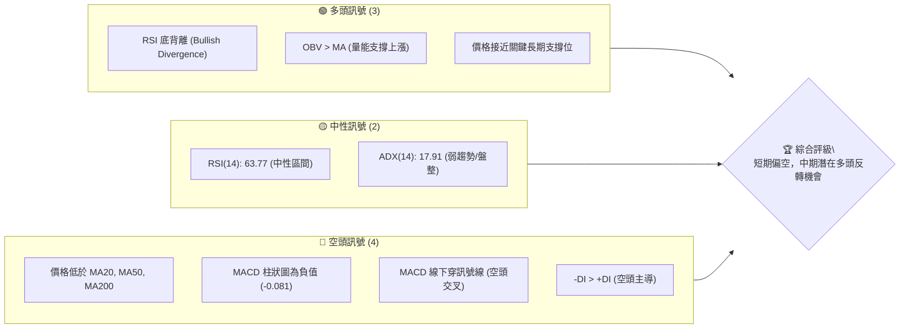
**解讀**：目前多空訊號交織，短期來看，價格表現疲軟，主要均線和MACD均顯示空頭壓力。然而，RSI底背離和OBV的強勢表現提供了重要的潛在反轉訊號，表明在當前價格水平下方存在買盤支撐。ADX的弱趨勢狀態則提示投資者需謹慎，市場可能在築底過程中，而非強勢下跌。

### 📊 核心指標速覽表

| 指標類別 | 指標名稱 | 當前數值 | 訊號 | 解讀 |
|----------|----------|----------|------|------|
| **價格** | 當前價格 | $153.16 | 🔴 | 位於多數均線下方，近52週低點區間 |
| **均線** | MA20 | $155.62 | 🔴 | 價格位於MA20下方，短期趨勢承壓 |
| **均線** | MA50 | $154.31 | 🔴 | 價格位於MA50下方，中期趨勢承壓 |
| **均線** | MA200 | $168.44 | 🔴 | 價格位於MA200下方，長期趨勢偏空 |
| **動能** | RSI(14) | 63.77 | 🟡 | 位於中性區間，但存在底背離訊號 |
| **動能** | MACD | -0.081 | 🔴 | MACD線下穿訊號線，柱狀圖為負，空頭動能增強 |
| **趨勢** | ADX(14) | 17.91 | 🟡 | 趨勢強度弱，市場處於盤整或築底階段 |
| **波動** | ATR(14) | $7.22 | 🟡 | 每日波動約 4.71%，屬於中等波動水平 |
| **成交量**| OBV趨勢 | OBV > MA | 🟢 | 量能支撐上漲，顯示買盤介入或籌碼收集 |

### 🏆 技術評分卡

```
╔══════════════════════════════════════════════════════════════╗
║                技術評分卡 — VST (2026-07-02)                 ║
╠══════════════════════════════════════════════════════════════╣
║ 趨勢強度      ██████░░░░░░░░░░░░░░  30/100  🟡 (ADX顯示弱趨勢) ║
║ 動能指標      ████████░░░░░░░░░░░░  50/100  🟡 (RSI底背離與MACD空頭交叉的矛盾)║
║ 支撐穩定度    ██████████████░░░░░░  70/100  🟢 (接近多重關鍵支撐)║
║ 成交量配合    ██████████░░░░░░░░░░  60/100  🟢 (OBV顯示量能積極)║
║ 形態完整度    ██████░░░░░░░░░░░░░░  40/100  🟡 (潛在底部形態，但尚未確認)║
║ 均線排列      ██████░░░░░░░░░░░░░░  30/100  🔴 (價格位於所有主要均線下方)║
╠══════════════════════════════════════════════════════════════╣
║ 綜合評分      ████████░░░░░░░░░░░░  47/100  🟡 觀望 (短期弱勢，中期潛在反轉)║
╚══════════════════════════════════════════════════════════════╝
```
**評分說明**：VST的技術面評分呈現中性偏弱，主要原因是短期趨勢和均線排列的負面訊號。然而，底部支撐的穩定性以及RSI底背離和OBV量能的積極表現，為其中期走勢提供了一線希望。當前市場缺乏明確的趨勢動能，投資者應密切關注價格在關鍵支撐位的反應，以及多頭訊號能否持續增強。

---

## 2. 趨勢分析

### 🌐 多時框趨勢分析

當前VST的價格走勢呈現出多時框架下的複雜性和矛盾性。長期來看，從2024年中到2025年中，VST經歷了一波強勁的上升趨勢，但隨後進入了漫長的修正和盤整階段。中期趨勢顯示價格在一個較大的區間內波動，而短期趨勢則明顯偏弱，價格持續受到上方移動平均線的壓力。

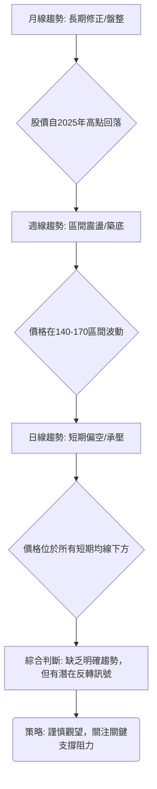
**月線趨勢（長期）**：從2025年7月的高點 $207.45 至今，VST股價經歷了顯著回調。儘管在2026年初曾嘗試反彈，但未能突破前期高點，顯示長期上漲動能已大幅減弱，進入了修正或盤整階段。當前價格 $153.16 遠低於一年高點，表明長期上升趨勢已終結。

**週線趨勢（中期）**：根據近20週的數據，VST股價在 $139.48 至 $173.41 之間形成了一個較大的震盪區間。雖然期間有多次嘗試突破區間上沿，但均告失敗。最近幾週的走勢顯示價格再次回落至區間下沿附近，但在 $139.48 附近出現了買盤支撐，配合RSI底背離，暗示中期可能正在築底。

**日線趨勢（短期）**：當前股價 $153.16 位於所有主要移動平均線 MA20 ($155.62)、MA50 ($154.31) 和 MA200 ($168.44) 的下方。這是一個明確的短期空頭訊號，表明短期內賣壓較重。最新的價格下跌伴隨著 MACD 的空頭交叉，進一步確認了短期動能的疲軟。

### 📈 長期趨勢 — 12個月走勢圖（Unicode）

以下是VST在過去12個月的收盤價走勢圖，清晰展示了其從高點回落並進入盤整的過程：

```
VST 月線走勢圖（過去12個月：2025-07 至 2026-07）
價格軸 ($)
$210 ┤                                                                   
$200 ┤●(207.45)                                                           
$190 ┤  ●(188.12) ●(195.11)                                              
$180 ┤        ●(187.52)                                                  
$170 ┤          ●(178.12)         ●(173.41)                             
$160 ┤            ●(160.88) ●(157.91)       ●(160.01) ●(158.63)         
$150 ┤                                ●(150.12) ●(157.62) ●(153.16) <─ 現價
$140 ┤                                                                   
$130 ┤                                                                   
     └───────────────────────────────────────────────────────────────────
      25-07 25-08 25-09 25-10 25-11 25-12 26-01 26-02 26-03 26-04 26-05 26-06 26-07
```

**走勢特徵分析表格**：

| 階段 | 時間區間 | 價格區間 | 漲跌幅 (月均) | 關鍵特徵 |
|------|------------|------------|---------------|----------|
| **強勢上漲** | 2024-07 至 2025-07 | $78.26 → $207.45 | 約 +11.5% | 股價持續創高，動能強勁 |
| **高位回落** | 2025-07 至 2025-12 | $207.45 → $160.88 | 約 -4.5% | 股價開始修正，伴隨波動性增加 |
| **底部震盪** | 2025-12 至 2026-06 | $157.91 → $163.49 | 約 +0.5% | 股價在較窄區間內震盪，尋找方向 |
| **近期下跌** | 2026-06 至 2026-07 | $163.49 → $153.16 | 約 -6.3% | 短期再次下探，接近區間底部 |

### 📊 中期趨勢（週線分析）

中期來看，VST在過去20週內呈現出較大的波動區間，高點約在 $173.41 (2026-03-01)，低點在 $139.48 (2026-05-17)。當前價格 $153.16 位於此區間的中下部，顯示中期趨勢為區間震盪，並在測試下方支撐。

```
VST 近期週線壓力與支撐示意圖 (2026-07-02)

$173.41 ─────── 阻力區 (2026-03 高點)
$170.00 ─────── 斐波那契50%回調位
$163.52 ─────── 近期小高點 (2026-06)
$155.62 ─────── 短期均線壓力 (MA20)
$153.16 ─●───── 現價
$147.81 ─────── 近期小低點 (2026-06)
$139.48 ─────── 關鍵支撐區 (2026-05 低點 / 布林下軌)
$132.47 ─────── 強支撐區 (52週低點)

```
**解讀**：從週線圖來看，VST在 $170-$173 區間面臨較強阻力，而 $139-$140 區間則提供了堅實的支撐。目前價格正從 $163.49 的高點回落，測試 $150 附近的心理關口。若能守住 $139.48 的支撐，則有望形成雙底或其他反轉形態。

### ⚡ 趨勢強度評估（ADX 解讀）

ADX (Average Directional Index) 指標用於衡量趨勢的強度，而非方向。當前VST的ADX(14)為 17.91，遠低於25的閾值，這明確指示市場正處於弱趨勢或盤整階段。

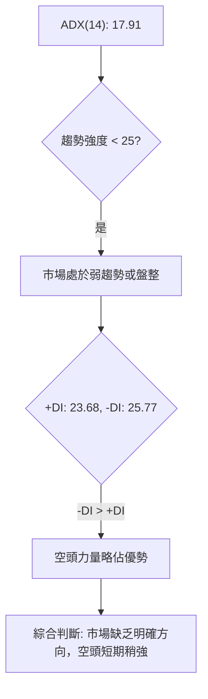

**ADX 強度對照表**：

| ADX 數值 | 趨勢強度 | 市場狀態 | 交易策略建議 |
|----------|----------|----------|--------------|
| 0-25     | 弱趨勢   | 盤整/震盪 | 觀望或區間交易 |
| 25-50    | 中等趨勢 | 趨勢形成  | 順勢交易，關注突破 |
| 50-75    | 強趨勢   | 強勁趨勢  | 順勢交易，持有 |
| 75-100   | 極強趨勢 | 趨勢極強  | 順勢交易，注意反轉風險 |

**解讀**：當前ADX數值為 17.91，屬於弱趨勢區間。這意味著市場缺乏足夠的動能來支持任何單一方向的持續運動。此外，-DI (25.77) 略高於 +DI (23.68)，表明在當前的弱勢市場中，空頭力量稍微佔據上風，但差距不大，不足以形成強勁的下跌趨勢。投資者應避免在這種情況下進行趨勢追蹤交易，而應等待趨勢明確或在區間內尋找交易機會。

---

## 3. 圖表形態分析

### 🔍 形態識別系統

根據提供的月線和週線數據，VST的價格走勢在過去一年中從高位回落後，進入了一個相對寬闊的震盪區間，並在近期測試了區間底部。雖然目前沒有形成教科書般清晰的經典反轉或持續形態，但可以觀察到一些潛在的築底跡象，尤其是結合RSI底背離。

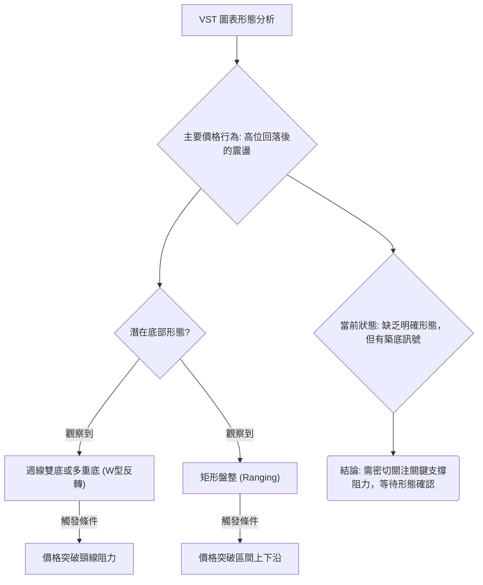
**解讀**：從2026年3月的月線低點 $150.12 和2026年5月的週線低點 $139.48 來看，VST有可能正在構建一個雙底或多重底的底部形態。如果將2026年3月和5月的低點視為底部，那麼頸線阻力將位於近期反彈的高點，例如2026年6月的高點 $163.52。然而，目前的價格 $153.16 仍在頸線下方，形態尚未確認。另一種可能是價格處於矩形盤整中，在 $139.48 (下沿) 和 $173.41 (上沿) 之間震盪。

### 🕯️ 重要K線形態分析

由於提供的數據為週收盤價，我們無法繪製完整的K線圖，但可以根據週收盤價的變化來推斷可能的K線形態及其市場含義。

| 月份 (結束週) | 收盤價 | K線形態推斷 (基於漲跌) | 解讀 | 訊號 |
|---------------|--------|-------------------------|------|------|
| 2026-03-01    | $173.41| 長陽線/高位震盪         | 創下近期高點，多頭強勢 | 🟢 |
| 2026-03-08    | $158.21| 長陰線/吞噬             | 強勢回落，空頭介入 | 🔴 |
| 2026-03-15    | $158.51| 小陽線/十字星           | 止跌企穩或猶豫 | 🟡 |
| 2026-03-22    | $145.82| 長陰線                  | 再次下跌，空頭主導 | 🔴 |
| 2026-04-19    | $163.23| 長陽線                  | 強勁反彈，多頭力量恢復 | 🟢 |
| 2026-05-17    | $139.48| 長陰線 (後續強反彈)     | 創下近期低點，但可能伴隨下影線/反轉 | 🟡 |
| 2026-05-24    | $156.05| 長陽線                  | 強勢反彈，確認底部支撐 | 🟢 |
| 2026-06-07    | $148.55| 長陰線                  | 反彈受阻，再次回落 | 🔴 |
| 2026-06-21    | $163.52| 長陽線                  | 強勢反彈，挑戰前期高點 | 🟢 |
| 2026-07-05    | $153.16| 長陰線                  | 再次回落，短期空頭壓力大 | 🔴 |

**K線形態總結**：過去20週的週線走勢呈現出明顯的震盪特徵，多空力量在關鍵價位附近反复拉鋸。在 $139.48 (2026-05-17) 和 $145.82 (2026-03-22) 附近的低點出現了較強的買盤反彈，形成了長陽線，這支持了底部正在構築的觀點。然而，最近一週從 $163.49 跌至 $153.16 的長陰線，顯示短期賣壓再次增強。

### 📉 ASCII 走勢形態示意圖

以下示意圖展示了VST在過去幾個月的潛在底部形態：

```
VST 潛在底部形態示意圖 (週線視角)

價格軸 ($)
$175 ┤                                  R (163.52)
$170 ┤                                 / \
$165 ┤                       _ _ _ _ _ _ _ _ _ _ _ _ _ _ _ _ _ _ 頸線區 (約163.5)
$160 ┤                     /               \
$155 ┤                    /                 \
$150 ┤          L1 (145.82)                   ● (153.16) <-- 現價
$145 ┤         /                               \
$140 ┤ L2 (139.48)                                 L3?
$135 ┤
     └────────────────────────────────────────────────────────
       2026-03    2026-04    2026-05    2026-06    2026-07

形態說明：
- L1 ($145.82) 和 L2 ($139.48) 構成潛在的底部支撐。
- R ($163.52) 為近期反彈高點，可能作為頸線阻力。
- 當前價格 $153.16 位於潛在頸線下方，接近潛在的第三個低點 (L3)。
- 若能在此處企穩並向上突破頸線，則雙底或三重底形態將被確認。
```

### 🎯 形態目標價計算

如果我們假設在 $139.48 形成了雙底形態，且頸線阻力位於 $163.52 (2026-06-21/28 的高點)，我們可以計算出潛在的形態目標價。

*   **形態高度 (H)** = 頸線價位 - 底部價位 = $163.52 - $139.48 = $24.04
*   **形態目標價 (T)** = 頸線價位 + 形態高度 = $163.52 + $24.04 = **$187.56**

**解讀**：這個目標價 $187.56 是一個基於形態的推測，它代表了如果雙底形態成功突破並完成，股價可能達到的理論高度。這個目標價也接近了2025年8月至10月的價格區間，具有一定的合理性。然而，形態確認是關鍵，必須觀察價格能否有效突破並站穩 $163.52 的頸線。

---

## 4. 支撐與阻力

### 🗺️ 關鍵價位分布圖（Unicode）

以下是VST當前重要的支撐與阻力位分布圖，直觀展示了價格在這些關鍵水平上的位置。

```
VST 價位結構分布圖 (2026-07-02)
═══════════════════════════════════════════════════
$207.45 ║████████████████████████║ 強阻力 R3 (2025年7月高點)
$178.69 ║████████████████████    ║ 阻力 R2 (斐波那契61.8%回調位)
$171.96 ║████████████████████████║ 關鍵阻力 R1 (布林上軌 / 斐波那契50%回調位 $170.00)
$168.44 ║████████████████████    ║ 長期均線阻力 (MA200)
$163.52 ║████████████████████████║ 形態頸線阻力 / 近期反彈高點
$155.62 ║████████████████████    ║ 短期均線阻力 (MA20)
$154.31 ║████████████████████████║ 中期均線阻力 (MA50)
$153.16 ╠════════════════════════╣ ◄ 現價
$150.12 ║▓▓▓▓▓▓▓▓▓▓▓▓▓▓▓▓        ║ 近期心理支撐 / 2026年3月月線低點
$139.29 ║████████████████████████║ 強支撐 S1 (布林下軌 / 2026年5月週線低點 $139.48)
$132.47 ║████████████████████    ║ 強支撐 S2 (52週低點)
═══════════════════════════════════════════════════
```

### 🚧 阻力位分析表

| 阻力級別 | 價位 | 形成原因 | 突破難度 | 重要性 |
|----------|------|----------|----------|--------|
| **即時阻力** | $154.31 (MA50) | 短期均線壓力，近期股價反彈受阻 | 中等 | 🟢 |
| **短期阻力** | $155.62 (MA20) | 短期均線壓力，與MA50形成阻力區 | 中等 | 🟢 |
| **關鍵阻力R1** | $163.52 | 潛在雙底形態頸線，2026年6月反彈高點 | 高 | 🟡 |
| **中期阻力R2** | $170.00 - $171.96 | 斐波那契50%回調位，布林上軌 | 較高 | 🟡 |
| **強阻力R3** | $178.69 - $187.56 | 斐波那契61.8%回調位，形態目標價 | 很高 | 🔴 |
| **長期阻力R4** | $207.45 | 2025年7月歷史高點，強大心理阻力 | 極高 | 🔴 |

### 🛡️ 支撐位分析表

| 支撐級別 | 價位 | 形成原因 | 守住機率 | 重要性 |
|----------|------|----------|----------|--------|
| **即時支撐** | $150.12 | 2026年3月月線低點，心理關口 | 中等 | 🟢 |
| **關鍵支撐S1** | $139.29 - $139.48 | 布林下軌，2026年5月週線低點，潛在雙底底部 | 較高 | 🟢 |
| **強支撐S2** | $132.47 | 52週低點，歷史重要支撐 | 很高 | 🟢 |

### 📐 斐波那契回調位分析

我們以過去12個月的最高點 $207.45 (2025-07) 作為趨勢的起點，以及52週最低點 $132.47 作為趨勢的終點，來計算關鍵的斐波那契回調位，這些回調位通常作為潛在的支撐或阻力。

*   **下降趨勢總幅度** = $207.45 - $132.47 = $74.98

| 斐波那契回調位 | 價位計算 | 價位 | 角色 |
|----------------|----------|------|------|
| **23.6%**      | $132.47 + ($74.98 * 0.236) | $150.16 | 較弱阻力/支撐 |
| **38.2%**      | $132.47 + ($74.98 * 0.382) | $161.12 | 中等阻力/支撐 |
| **50.0%**      | $132.47 + ($74.98 * 0.500) | $170.00 | 關鍵阻力/支撐 |
| **61.8%**      | $132.47 + ($74.98 * 0.618) | $178.69 | 強阻力/支撐 |

**解讀**：當前價格 $153.16 位於 23.6% 回調位 $150.16 之上，但下方即是這個較弱的支撐。而 $161.12 (38.2% 回調位) 則成為價格反彈的首要阻力之一，與形態頸線和均線阻力形成密集的阻力區。50% 回調位 $170.00 和 61.8% 回調位 $178.69 將是更強勁的反彈目標和阻力。斐波那契回調位提供了一個客觀的參考框架，幫助我們理解潛在的價格反轉點和目標區間。

---

## 5. 技術指標深度解讀

### 🎛️ 指標訊號總覽

VST的技術指標呈現出多空交織的複雜局面。短期移動平均線和MACD發出看跌訊號，顯示近期價格承壓；但RSI底背離和OBV的積極表現則提示潛在的底部支撐和反轉機會。ADX表明市場缺乏強勁趨勢，處於盤整狀態。

```mermaid
graph TD
    subgraph Price_Action ["價格行為 ($153.16)"]
        PA1["低於MA20, MA50, MA200"] --> BEARISH_PA("🔴")
        PA2["接近52週低點區間"] --> BEARISH_PA
    end

    subgraph Moving_Averages ["移動平均線"]
        MA1["MA20: $155.62 (⬇)"] --> BEARISH_MA("🔴")
        MA2["MA50: $154.31 (⬇)"] --> BEARISH_MA
        MA3["MA200: $168.44 (⬇)"] --> BEARISH_MA
        MA_System["均線排列: 混合排列"] --> NEUTRAL_MA("🟡")
    end

    subgraph Momentum_Indicators ["動能指標"]
        RSI1["RSI(14): 63.77 (中性)"] --> NEUTRAL_MOM("🟡")
        RSI2["RSI 背離: 底背離"] --> BULLISH_MOM("🟢")
        MACD1["MACD: 2.154"]
        MACD2["MACD Signal: 2.234"]
        MACD3["MACD Hist: -0.081"] --> BEARISH_MOM("🔴")
        MACD1 --> |"MACD < Signal"| BEARISH_MOM
    end

    subgraph Trend_Strength ["趨勢強度"]
        ADX1["ADX(14): 17.91"] --> NEUTRAL_TREND("🟡")
        ADX2["-DI: 25.77 > +DI: 23.68"] --> BEARISH_TREND("🔴")
    end

    subgraph Volatility ["波動率"]
        ATR1["ATR(14): $7.22 (中等波動)"] --> NEUTRAL_VOL("🟡")
    end

    subgraph Volume_Analysis ["成交量分析"]
        VOL1["量比: 1.15x (高於均量)"] --> NEUTRAL_VOL_A("🟡")
        OBV1["OBV趨勢: OBV > MA"] --> BULLISH_VOL_A("🟢")
    end

    BEARISH_PA --> OVERALL_SUMMARY("綜合評估")
    BEARISH_MA --> OVERALL_SUMMARY
    NEUTRAL_MA --> OVERALL_SUMMARY
    NEUTRAL_MOM --> OVERALL_SUMMARY
    BULLISH_MOM --> OVERALL_SUMMARY
    BEARISH_MOM --> OVERALL_SUMMARY
    NEUTRAL_TREND --> OVERALL_SUMMARY
    BEARISH_TREND --> OVERALL_SUMMARY
    NEUTRAL_VOL --> OVERALL_SUMMARY
    NEUTRAL_VOL_A --> OVERALL_SUMMARY
    BULLISH_VOL_A --> OVERALL_SUMMARY

    OVERALL_SUMMARY --> CONCLUSION["結論: 短期承壓，中期具潛在反轉動能"]
```

### 📈 移動平均線排列分析

VST的移動平均線系統當前呈現出一個混合且偏空的排列。價格 $153.16 位於所有主要短期、中期和長期移動平均線之下，這是短期和中期走勢疲軟的明確訊號。

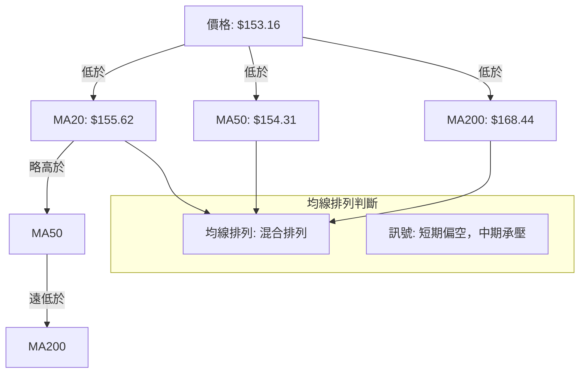
**解讀**：
*   **短期趨勢**：價格 $153.16 位於 MA20 ($155.62) 和 MA50 ($154.31) 之下，且 MA20 略高於 MA50，這通常預示著短期內下行壓力較大，甚至可能形成死亡交叉。
*   **中期趨勢**：MA50 ($154.31) 位於 MA200 ($168.44) 之下，表明中期趨勢也偏向空頭。
*   **長期趨勢**：價格遠低於 MA200 ($168.44)，這是一個重要的長期空頭訊號，意味著股價在長期上漲趨勢中遭遇了重大阻力或已轉為下跌。
*   **總結**：均線系統發出明確的看跌訊號，表明VST在各時間框架內均面臨壓力。要扭轉這一局面，價格需要有效突破並站穩這些移動平均線之上，尤其是 MA200。

### 📉 RSI(14) 分析

RSI (Relative Strength Index) 用於衡量價格變動的速度和變化，反映超買或超賣狀態。

*   **RSI(14) 數值**：63.77
*   **RSI 超買/超賣區間**：
    *   超買區 (>70)：░░░░░░░░░░░░░░░░░░░░
    *   中性區 (30-70)：▓▓▓▓▓▓▓▓▓▓▓▓▓▓▓▓▓▓▓▓
    *   超賣區 (<30)：░░░░░░░░░░░░░░░░░░░░
    *   **當前RSI強度**：██████████████░░░░░░  63.77%  🟡 (中性偏強)

**解讀**：
1.  **中性區間**：RSI 63.77 位於中性區間 (30-70)，尚未達到超買或超賣狀態。這表示當前股價沒有過度上漲或下跌，市場情緒相對平衡。
2.  **RSI 背離**：數據明確指出存在 **⚠️ 底背離 (Bullish Divergence)**。底背離是一個重要的看漲反轉訊號。它發生在股價創出新低或接近前低時，而RSI指標卻未能創出新低，反而出現上揚。這表明儘管價格下跌，但賣盤動能正在減弱，買盤力量正在積聚，預示著價格可能即將反彈。結合VST近期在 $139.48 附近的支撐，這個底背離訊號增加了價格反轉的可能性。

### 📊 MACD(12/26/9) 訊號解讀

MACD (Moving Average Convergence Divergence) 指標用於判斷趨勢的強度、方向和動能。

*   **MACD 線**：2.154
*   **MACD Signal 線**：2.234
*   **MACD 柱狀圖 (Histogram)**：-0.081

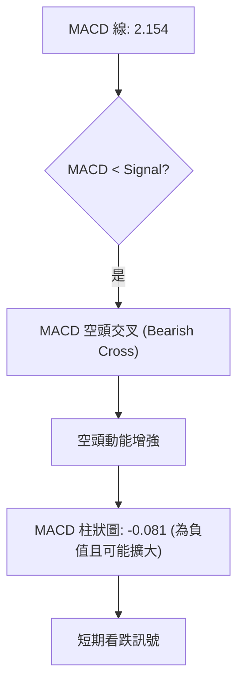
**解讀**：
1.  **空頭交叉**：MACD 線 (2.154) 已經下穿了 Signal 線 (2.234)，這形成了一個標準的空頭交叉訊號 (Bearish Cross)。這表明短期動能已轉向空頭，賣壓正在增加。
2.  **柱狀圖為負**：MACD 柱狀圖為 -0.081，且數值為負，這進一步確認了空頭動能的存在。若柱狀圖持續擴大負值，則表明空頭力量正在增強。
3.  **綜合判斷**：MACD 指標明確發出短期看跌訊號，與價格位於均線下方的情況相互印證。這與RSI底背離的看漲訊號形成了一定的矛盾，提示投資者短期壓力與中期潛在反轉機會並存。需關注價格能否在關鍵支撐位止跌，並觀察MACD柱狀圖何時縮小負值或轉正。

### 📦 布林通道分析

布林通道 (Bollinger Bands) 用於衡量價格的波動區間和相對高低點。

*   **布林上軌 (BB Upper)**：$171.96
*   **布林中軌 (MA20)**：$155.62
*   **布林下軌 (BB Lower)**：$139.29
*   **BB %B**：0.42 (0=下軌, 0.5=中軌, 1=上軌)

```
VST 布林通道示意圖 (2026-07-02)
═══════════════════════════════════════════════════
$171.96 ║████████████████████████║ 布林上軌 (BB Upper)
$160.00 ║                        ║
$155.62 ║─────────── ● ──────────║ 布林中軌 (MA20)
$153.16 ║           ▲            ║ ◄ 現價
$150.00 ║                        ║
$139.29 ║████████████████████████║ 布林下軌 (BB Lower)
═══════════════════════════════════════════════════
```
**解讀**：
1.  **價格位置**：當前價格 $153.16 位於布林中軌 ($155.62) 之下，且 BB %B 為 0.42，這表示價格處於布林通道的下半部分，靠近下軌。這通常暗示著近期價格走勢偏弱，或正在測試下方支撐。
2.  **通道寬度**：布林通道的寬度 (上軌-下軌 = $171.96 - $139.29 = $32.67) 顯示了中等的波動性。通道既沒有極度收窄（預示著即將到來的劇烈波動），也沒有大幅擴張（預示著趨勢的延續）。
3.  **潛在支撐/阻力**：布林中軌 ($155.62) 充當即時阻力，而布林下軌 ($139.29) 則提供了一個重要的動態支撐。值得注意的是，布林下軌與前述的週線低點 $139.48 非常接近，這增強了 $139.29-$139.48 區域作為強勁支撐的重要性。

### 💹 成交量分析（量價配合度）

成交量是確認價格走勢和形態的重要指標。

*   **最新成交量**：5,087,400
*   **20日均量**：4,421,455 (量比: 1.15x)
*   **50日均量**：4,935,568
*   **OBV 趨勢**：OBV > MA → 量能支撐上漲

**解讀**：
1.  **成交量放大**：最新成交量 5,087,400 顯著高於20日均量 (4,421,455)，量比達到1.15倍。通常，在價格下跌時，如果成交量放大，會被視為下跌動能增強的訊號。然而，如果是在關鍵支撐位附近放量，則可能意味著有抄底資金入場。
2.  **OBV 趨勢**：OBV (On-Balance Volume) 顯示 "OBV > MA → 量能支撐上漲"，這是一個非常重要的看漲訊號。OBV 的原理是將當天的成交量加到前一天的OBV值上（如果收盤價上漲），或減去（如果收盤價下跌）。OBV線高於其移動平均線，表明在過去一段時間內，買盤累積的量能多於賣盤。這與當前價格下跌形成 **量價背離**：價格下跌，但OBV卻上升或保持強勢，暗示有主力資金在悄悄吸籌，為未來的上漲積蓄力量。
3.  **綜合判斷**：成交量分析呈現出矛盾但有趣的訊號。近期價格下跌伴隨放量，但OBV的積極趨勢強烈暗示存在潛在的買盤支撐。這進一步強化了RSI底背離所提示的潛在反轉可能性。投資者應密切關注價格在關鍵支撐位止跌時的成交量變化，以確認OBV的訊號。

---

## 6. 動能與波動率

### ⚡ 動能評估四象限

我們將VST當前的動能和波動率進行評估，以確定其在市場中的相對位置。

| 象限 | 動能 (RSI, MACD) | 波動 (ATR) | 當前狀態 | 評估 |
|------|------------------|------------|----------|------|
| Q1   | 強               | 低         | -        | 最佳機會 (強勢且穩定) |
| Q2   | 弱               | 低         | -        | 謹慎觀望 (缺乏方向，但風險較低) |
| Q3   | 強               | 高         | -        | 高風險高收益 (趨勢明確，但波動劇烈) |
| Q4   | 弱               | 高         | ✓        | **避免進場 / 謹慎等待** (缺乏方向，波動大，風險高) |

**解讀**：
*   **動能**：RSI 雖然中性但有底背離的積極訊號，而 MACD 則顯示短期空頭動能。綜合來看，當前動能相對較弱，缺乏明確的單邊趨勢。
*   **波動率**：ATR(14) 為 $7.22，佔價格的 4.71%。對於公用事業類股票而言，這是一個中等偏高的波動水平，顯示股價波動幅度較大。
*   **綜合判斷**：VST目前處於「弱動能、高波動」的第四象限。這是一個高風險的交易環境，因為市場缺乏明確的方向，但價格波動劇烈，容易造成止損。投資者在這種情況下應極度謹慎，避免盲目追漲殺跌，最好等待動能明確或波動率下降。

### 📊 ATR 波動率分析

ATR (Average True Range) 衡量資產價格波動的平均範圍，是判斷市場波動性的重要指標，也常用於設置止損點。

*   **ATR(14)**：$7.22
*   **佔收盤價百分比**：($7.22 / $153.16) * 100% = 4.71%

**解讀**：
1.  **波動性水平**：ATR 數值 $7.22 意味著VST在過去14天中，平均每日的價格波動範圍約為 $7.22。對於公用事業板塊的股票而言，4.71% 的波動率屬於中等偏高水平，顯示股價近期活躍度較高，波動幅度相對較大。
2.  **止損距離建議**：ATR 可以作為設置動態止損的依據。
    *   **保守止損**：通常設置在 2 倍 ATR 左右。若從當前價格 $153.16 計算，則止損點約為 $153.16 - (2 * $7.22) = $138.72。這與布林下軌和關鍵支撐 $139.29 區域非常接近，增加了止損設置的合理性。
    *   **激進止損**：可設置在 1 倍 ATR 左右，即 $153.16 - $7.22 = $145.94。
3.  **風險管理**：較高的ATR值提示投資者在設定倉位時應考慮更大的價格波動，預留足夠的止損空間，以避免被正常波動洗出局。

### 📐 Beta 與市場相關性

報告中未提供 VST 的 Beta 數值。
**解讀**：
*   **行業推斷**：Vistra Corp. 屬於公用事業 (Utilities) 板塊，該板塊的股票通常被視為防禦性資產，其股價波動性相對較低，與大盤的相關性也較弱，即 Beta 值通常會小於1。這意味著在市場上漲時，公用事業股可能漲幅較小；但在市場下跌時，其抗跌性相對較強。
*   **影響**：如果 VST 的 Beta 值確實較低，則其股價走勢可能更多地受到公司自身基本面、行業政策和利率環境的影響，而非大盤的整體情緒。因此，在分析 VST 時，應更多地關注其內部因素和行業動態。在缺乏具體 Beta 數據的情況下，我們無法量化其與市場的相關性，但在制定交易策略時仍需考慮其行業屬性帶來的防禦性特徵。

---

## 7. 多時框架總結

對 VST 進行多時框架分析顯示，不同時間維度下的訊號存在顯著差異，這要求交易者採取更為細緻和靈活的策略。

### 📋 時框架評分表

| 時框架 | 趨勢方向 | 動能 | 均線排列 | 形態 | 綜合評分 | 建議 |
|--------|----------|------|----------|------|----------|------|
| **長期** | 🔴 下跌/盤整 | 🟡 減弱 | 🔴 價在MA200下 | 🟡 高位回落 | 2.5/5 (偏空) | 觀望，等待築底確認 |
| **中期** | 🟡 區間震盪 | 🟢 築底/背離 | 🔴 價在MA50下 | 🟡 潛在雙底 | 3.0/5 (中性) | 關注支撐，等待反轉訊號 |
| **短期** | 🔴 下跌 | 🔴 空頭增強 | 🔴 價在MA20下 | 🔴 短期下跌 | 2.0/5 (偏空) | 避免追空，關注止跌 |

### 🔲 綜合訊號矩陣

短期、中期和長期訊號的一致性分析揭示了當前市場的複雜性。

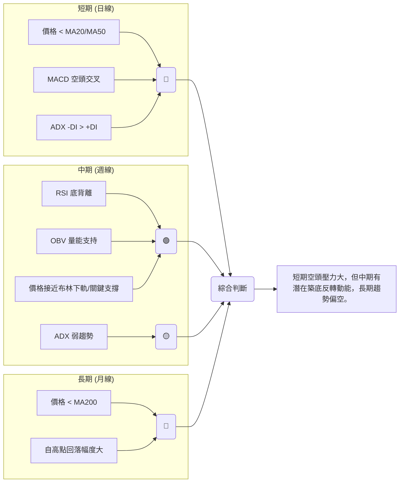
**一致性分析**：
*   **短期與長期**：短期趨勢與長期趨勢在方向上保持一致，均偏向空頭。價格位於所有主要均線下方，且MACD發出賣出訊號，確認了短期弱勢。長期來看，價格從高點回落，也顯示出缺乏上漲動能。
*   **中期與短/長期**：中期訊號與短期/長期訊號存在顯著矛盾。中期RSI的底背離和OBV的積極表現，強烈暗示了在當前低點附近存在買盤支撐和潛在的反轉力量。這使得儘管短期和長期趨勢偏空，但中期卻有築底的可能。
*   **總結**：VST目前處於一個多空拉鋸的關鍵時刻。短期和長期壓力顯而易見，但中期指標卻發出積極的底部訊號。這種不一致性要求投資者耐心等待，觀察哪個方向的訊號最終會佔據主導。在趨勢明確之前，謹慎觀望或小倉位試探可能是較好的選擇。

---

## 8. 交易策略建議

基於VST當前複雜的技術訊號——短期偏空、長期修正，但中期有RSI底背離和OBV量能支持的潛在反轉機會——我們提出以下交易策略。

### 🗺️ 策略決策流程圖

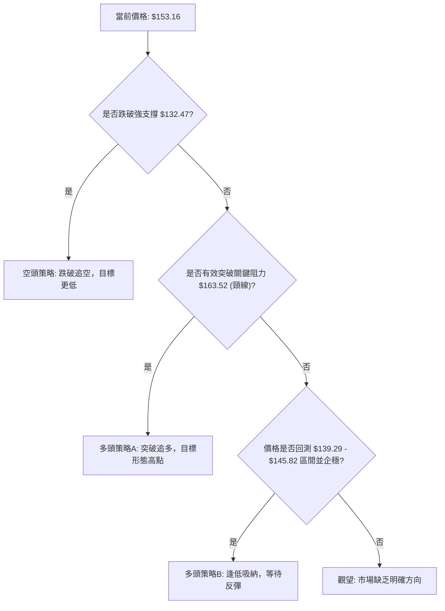

### 🟢 多頭策略詳情

考慮到RSI底背離和OBV的積極訊號，以及價格接近關鍵支撐，多頭策略應側重於逢低吸納或突破確認。

| 策略要素 | 策略 A: 逢低吸納 (激進) | 策略 B: 突破追多 (保守) |
|----------|--------------------------|--------------------------|
| **進場條件** | 價格回測 $139.29-$145.82 區間，並出現止跌K線 (如長下影線、陽線反包)，或RSI從超賣區反轉向上。 | 價格有效突破並站穩形態頸線 $163.52 (至少一個交易日收盤價高於此價位)，且伴隨成交量放大。 |
| **進場價格** | $140.00 - $142.00 之間 | $164.00 - $165.00 之間 (確認突破後) |
| **目標價 T1** | $155.00 (MA20/MA50阻力區) | $170.00 (斐波那契50%回調位/布林上軌) |
| **目標價 T2** | $163.50 (形態頸線阻力) | $187.56 (形態目標價/斐波那契61.8%回調位附近) |
| **止損價格** | $132.00 (略低於52週低點 $132.47) | $159.00 (略低於頸線 $163.52，確保突破有效性) |
| **風險報酬比** | (155-141)/(141-132) = 14/9 = 1.55:1 (T1) <br> (163.5-141)/(141-132) = 22.5/9 = 2.5:1 (T2) | (170-164)/(164-159) = 6/5 = 1.2:1 (T1) <br> (187.56-164)/(164-159) = 23.56/5 = 4.7:1 (T2) |
| **成功機率** | 55% (有底背離和OBV支持) | 60% (突破確認，但需防範假突破) |
| **建議倉位** | 10-15% | 15-20% |

### 🔴 空頭策略詳情

雖然整體有潛在反轉訊號，但短期空頭壓力不容忽視。若關鍵支撐未能守住，或反彈失敗，則空頭策略可考慮。

| 策略要素 | 策略 A: 短期反彈受阻 (激進) | 策略 B: 關鍵支撐跌破 (保守) |
|----------|------------------------------|------------------------------|
| **進場條件** | 價格反彈至 $155.00-$163.50 阻力區後，出現明顯的看跌K線 (如長上影線、陰線吞噬)，且MACD空頭動能再次增強。 | 價格有效跌破並站穩 $132.47 (52週低點)，且伴隨成交量放大。 |
| **進場價格** | $160.00 - $162.00 之間 (反彈高點附近) | $131.00 - $130.00 之間 (確認跌破後) |
| **目標價 T1** | $150.00 (近期心理支撐) | $120.00 (下方無明確支撐，需推測) |
| **目標價 T2** | $139.50 (布林下軌/關鍵支撐S1) | $110.00 (下方無明確支撐，需推測) |
| **止損價格** | $165.00 (略高於形態頸線 $163.52) | $135.00 (略高於 $132.47，確保跌破有效性) |
| **風險報酬比** | (161-150)/(165-161) = 11/4 = 2.75:1 (T1) <br> (161-139.5)/(165-161) = 21.5/4 = 5.37:1 (T2) | (131-120)/(135-131) = 11/4 = 2.75:1 (T1) <br> (131-110)/(135-131) = 21/4 = 5.25:1 (T2) |
| **成功機率** | 50% (反彈受阻可能性) | 40% (與RSI底背離矛盾，風險較高) |
| **建議倉位** | 5-10% (謹慎) | 10-15% |

### ⭐ 整體訊號強度評星

```
做多訊號強度：★★★☆☆  (3/5星) (RSI底背離、OBV支持，但均線壓力大)
做空訊號強度：★★☆☆☆  (2/5星) (均線和MACD偏空，但有底部支撐和潛在反轉)
整體可信度：  ★★★☆☆  (3/5星) (多空交織，需耐心等待方向確認)
```
**評星說明**：當前VST的技術面呈現多空拉鋸。做多訊號主要來自於RSI底背離和OBV的量能支持，這些是潛在底部反轉的重要線索。然而，價格位於所有主要均線下方，短期賣壓顯著，因此做多策略仍需謹慎。做空訊號雖然有均線和MACD的確認，但考慮到關鍵支撐的存在和潛在的反轉動能，追空風險較高。整體可信度中等，市場方向不明，建議投資者保持耐心，等待更明確的訊號或形態確認。

---

## 9. 風險提示與監控

VST當前的技術面處於一個關鍵的轉折點，多空訊號交織，潛在的機會與風險並存。有效的風險管理和持續監控至關重要。

### ✅ 關鍵監控指標 Checklist

以下是交易者在操作VST時應密切關注的關鍵指標清單：

```
╔══════════════════════════════════════════════════════════════╗
║                VST 關鍵監控指標清單 (2026-07-02)             ║
╠══════════════════════════════════════════════════════════════╣
║ [ ] 價格是否能突破並站穩 MA20 ($155.62) 和 MA50 ($154.31)?    ║
║     若能，短期壓力減輕，做多訊號增強。                        ║
║ [ ] 價格是否能有效突破形態頸線 $163.52，並伴隨成交量放大?     ║
║     若能，雙底形態確認，開啟上漲空間。                        ║
║ [ ] RSI 底背離訊號是否持續有效，並帶動RSI值向上突破70?        ║
║     RSI值若能持續上揚，確認買盤動能。                          ║
║ [ ] MACD 線是否上穿 Signal 線，且柱狀圖轉正並擴大?            ║
║     MACD轉多，確認短期動能反轉。                              ║
║ [ ] OBV 趨勢是否持續保持強勢，進一步確認買盤積極性?           ║
║     量能持續支持，是價格上漲的基礎。                          ║
║ [ ] 關鍵支撐 $139.29 (布林下軌/週線低點) 和 $132.47 (52週低點) ║
║     是否能有效守住? 若跌破，則空頭趨勢確認。                  ║
║ [ ] ADX 值是否能突破25，並確認新的趨勢方向 (+DI 或 -DI 主導)? ║
║     趨勢強度確認，有助於順勢交易。                            ║
║ [ ] 近期新聞或公司基本面是否有重大變化?                       ║
║     技術分析需結合基本面，以防突發事件。                      ║
╚══════════════════════════════════════════════════════════════╝
```

### ⚠️ 風險場景分析

基於當前技術訊號的複雜性，我們提出三種可能的市場情境：

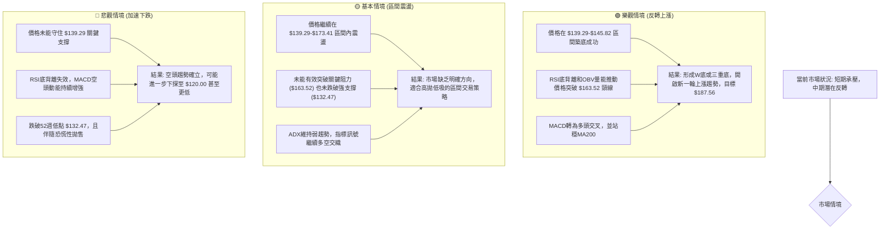

### 🛡️ 風險管理重要提醒

1.  **嚴格止損**：無論採取何種策略，都必須設定並嚴格執行止損點。在波動性較高的市場中，嚴格的止損是保護資本的關鍵。建議止損點設置應結合ATR或關鍵支撐/阻力位。
2.  **倉位管理**：鑑於VST當前的複雜情況，建議採用較小的倉位進行試探性交易，避免重倉。在趨勢未明確之前，不應投入過多資金。
3.  **分批建倉/平倉**：可以考慮分批建倉以降低平均成本，並在達到目標價時分批平倉以鎖定利潤，同時保留一部分倉位以捕捉潛在的更大漲幅。
4.  **避免追漲殺跌**：在弱趨勢或盤整市場中，追漲殺跌往往是虧損的主要原因。耐心等待明確的入場訊號和形態確認。
5.  **結合基本面**：雖然本報告側重技術分析，但投資決策仍應結合公司基本面、行業前景和宏觀經濟環境。特別是對於公用事業股，利率政策和監管環境的變化影響巨大。

---

## 📋 報告總結

```
╔════════════════════════════════════════════════════════════════╗
║                   VST 技術分析報告總結                         ║
╠════════════════════════════════════════════════════════════════╣
║ 報告日期：2026-07-02                                           ║
║ 當前價格：$153.16                                              ║
║ 分析評級：⚖️ 中性偏多頭觀望 (短期弱勢，中期潛在反轉機會)      ║
║                                                                ║
║ 關鍵結論：                                                     ║
║ ├─ 長期趨勢：🔴 自2025年高點回落，目前處於修正或盤整階段。   ║
║ ├─ 中期趨勢：🟡 在 $139.29-$173.41 區間震盪，具築底跡象。     ║
║ ├─ 短期趨勢：🔴 價格位於所有主要均線下方，MACD空頭交叉，短期承壓。║
║ ├─ 關鍵支撐：$139.29 (布林下軌/週線低點) 及 $132.47 (52週低點)。║
║ ├─ 關鍵阻力：$155.62 (MA20/MA50) 及 $163.52 (形態頸線)。       ║
║ └─ 分析師目標：基於形態突破，潛在目標 $187.56。                 ║
║                                                                ║
║ 最優策略組合：                                                 ║
║ 1. 🥇 最佳機會：**逢低吸納反轉策略**：在 $140.00-$142.00 區間尋找止跌訊號進場，║
║                 止損設於 $132.00，目標 $163.50。此策略利用RSI底背離和OBV支持。║
║ 2. 🥈 次選機會：**突破追多策略**：等待價格有效突破並站穩 $163.52 頸線後進場，║
║                 止損設於 $159.00，目標 $187.56。此策略較為保守，等待形態確認。║
║ 3. 🥉 保守選擇：**區間交易策略**：在 $139.29-$173.41 區間內高拋低吸，但需密切║
║                 關注區間邊界的突破或跌破訊號，並嚴格止損。      ║
╚════════════════════════════════════════════════════════════════╝
```

---

> ⚠️ **免責聲明**：本報告為 AI 自動生成之技術分析，所有數據及估算均基於提供的歷史價格資訊。本報告**僅供研究與學術參考**，**不構成任何投資建議**。投資有風險，入市需謹慎。

---

*報告生成時間：2026-07-02 ｜ 數據來源：提供數據 ｜ 分析框架：多時框技術分析*