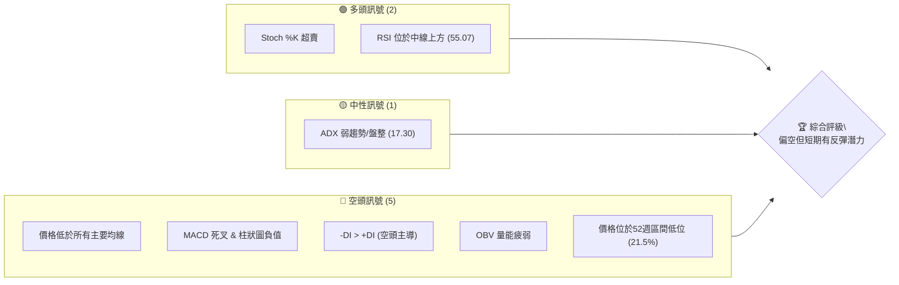
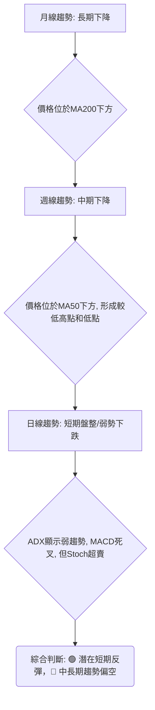
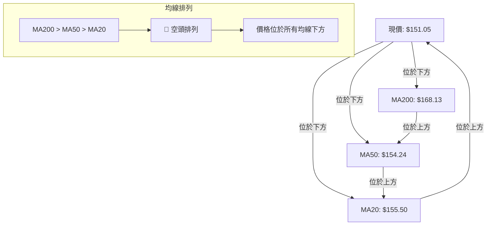
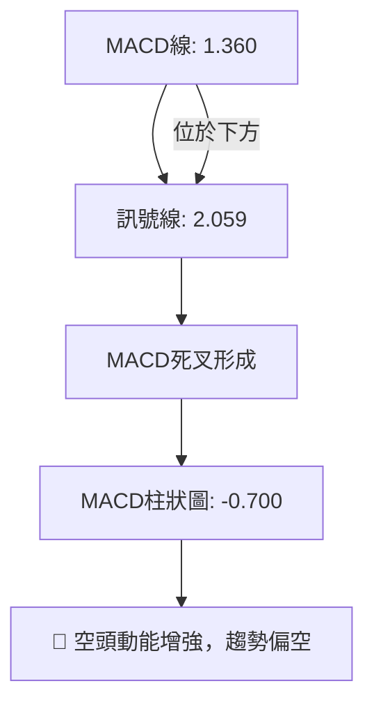

<details>
<summary>📊 靜態圖表 (點擊展開)</summary>

</details>

<html>
<head><meta charset="utf-8" /></head>
<body>
    <div style="height:500px; width:100%;">                        <script>window.PlotlyConfig = {MathJaxConfig: 'local'};</script>
        <script charset="utf-8" src="https://cdn.plot.ly/plotly-3.6.0.min.js" integrity="sha256-QaOVwtVY0T02VaHrr6pnoHLCwayMJp4O5n4YyaE3rJk=" crossorigin="anonymous"></script>                <div id="candlestick-chart" class="plotly-graph-div" style="height:100%; width:100%;"></div>            <script>                window.PLOTLYENV=window.PLOTLYENV || {};                                if (document.getElementById("candlestick-chart")) {                    Plotly.newPlot(                        "candlestick-chart",                        [{"close":{"dtype":"f8","bdata":"AAAA4MkKakAAAACgIudpQAAAAOAGImpAAAAAgOtMakAAAADghCBrQAAAACCTbGlAAAAAgBonaUAAAAAAFRlpQAAAAACKy2lAAAAAgM+jaEAAAABAcGNoQAAAAKCTFWlAAAAAoOc5aUAAAACA3yRpQAAAAOCF8mhAAAAAAFnZaEAAAAAAMLZpQAAAAGAhJGpAAAAA4GSBaEAAAABAyhVqQAAAAMALlWlAAAAAoDc\u002fakAAAABg4DBqQAAAAGB6EGlAAAAA4OYtaEAAAADg4jdnQAAAAODlIWdAAAAAQHHSZ0AAAABATRRpQAAAAIAmz2hAAAAAAJa5Z0AAAABAYdFoQAAAAACLnWdAAAAAQJxwZ0AAAAAgqQdoQAAAAKAHH2dAAAAAYFiTZ0AAAACAVvtmQAAAAOCmxmdAAAAA4PhvZ0AAAADgV01mQAAAAED7MGZAAAAAwCZbZUAAAACA5b5lQAAAAGDGyGVAAAAAwEq2ZUAAAACAtExmQAAAAEA3omVAAAAAgIH8ZEAAAACAPM1lQAAAAAA1RGVAAAAA4CICZkAAAABgyENmQAAAAGBvnWVAAAAAQLN6ZUAAAADgBF5lQAAAAKDf6mVAAAAAAEHPZEAAAABAy61kQAAAAAAMhGRAAAAAAIWPZEAAAABAB7xlQAAAAACgLGVAAAAAwKvxZEAAAACAYZdlQAAAAEDP6WNAAAAAAGOvZEAAAADgUktkQAAAAAD6I2RAAAAA4ConZEAAAAAgbDBkQAAAAOAqJ2RAAAAAwJcsZEAAAADAe0VkQAAAAEBRHGRAAAAA4MWYZEAAAABAYE9kQAAAAGD+IWVAAAAAQI1FY0AAAADA58ViQAAAAAAnvWRAAAAAAFODZUAAAACATl5lQAAAAIAfEGVAAAAAgNp1ZkAAAAAAfsRkQAAAAKATjGNAAAAAYIPyY0AAAAAAXf1jQAAAAEC09WNAAAAAYObLY0AAAACg0XlkQAAAAGDbpWRAAAAAIDVEZEAAAACAOL1jQAAAAICzOmNAAAAAQH4SY0AAAADgDsRhQAAAACCc1WFAAAAAoJanYkAAAAAgiRFjQAAAAEAc5WNAAAAAYKn2Y0AAAAAgzVRkQAAAAGCKYGVAAAAAYG2mZUAAAACgLkNlQAAAAIDFgGVAAAAAAKtdZUAAAABAyepkQAAAAGCwZGVAAAAAAArcZUAAAABgoQpmQAAAAOAgrWVAAAAAwAaxZEAAAADgHyhkQAAAACAZXWRAAAAAgAXeZEAAAABAy8ZjQAAAACBlZWRAAAAAQEl+ZEAAAACgEddjQAAAAOB45GNAAAAAAF7QY0AAAAAgYTFkQAAAAIANfGRAAAAAQNI0ZUAAAACAEN1kQAAAAAAbOmJAAAAAgILiYkAAAACgNBBjQAAAACCK6WJAAAAA4MgCY0AAAAAAZ2hjQAAAAGCtamJAAAAAINXDYkAAAACg1DdjQAAAAKD+3mJAAAAAoBjsYkAAAADg4S5jQAAAAACBdWNAAAAAICoRY0AAAACAb1BjQAAAAABSv2NAAAAAwLN3ZEAAAADgyVZkQAAAAGCNqWRAAAAAwGdnZEAAAADgDuxjQAAAACAwVmNAAAAA4E5yY0AAAABgLpRjQAAAAIDYg2RAAAAAABvLZEAAAABAoRxkQAAAAMBlMmNAAAAAANGzY0AAAADgAmJjQAAAAIAAFGRAAAAAoPsEZEAAAABAMsJjQAAAAMCCN2NAAAAAAG5wYkAAAADAy\u002fpiQAAAAIBEVWJAAAAAYCPNYUAAAAAgc7ZhQAAAAGCCb2FAAAAAYOERYUAAAAAgsdBgQAAAAGCO+WFAAAAAgOObYkAAAACgpYFjQAAAAECOimRAAAAAIKL9Y0AAAACgyQFkQAAAAIAwAGRAAAAA4GRRY0AAAACA+LdjQAAAAKC3MmNAAAAAoIUvY0AAAACgqZFiQAAAAOA5VmJAAAAAIH9AYkAAAACAFEthQAAAACCcRWJAAAAAIAR6YkAAAAAgxSljQAAAACBszGNAAAAAwHPTY0AAAAAgrHBkQAAAAOBR6GRAAAAA4HpMZEAAAAAA11tkQAAAAOCj+GRAAAAAIK5vZEAAAAAAKUxkQAAAAAAp1GNAAAAAwB4lY0AAAACgmeFiQA=="},"high":{"dtype":"f8","bdata":"bdJQMeaVakByFu0P5pVqQEz7M6\u002foqmpA+bwgBoCeakBJy6kyEV1rQIqTlz0+fGpAsSv0qJ6qaUDpIHkuNm1pQBYjszx21GlABjVRP5PIaUD\u002fgAQFZPVoQMA7cw6QgmlAhL5QCMuEaUD3dKDQgCpqQDKxqyIq4mlA9X7\u002fK6tfaUDMnCh2GbhpQCnXqoU6RmpApV+nzadvakAOJw5piSJqQCdbPKZ7\u002f2lASHr99nLkakAJ0689YwZrQIPizyq5JWpAHTzgMbqUaUBBhMYyxRNoQC8bM9DZlmdA8tQGbeTsZ0DDkj7+MCVpQPEw+n4XWmlAxpn+xOSPaEBhMf0quPxoQMGQIp3av2hAUh\u002fIjuECaEDEOS30LExoQHGn7kRE1mdAbmjz76f1Z0DK05OcvYpnQMRyt7MKyWdA\u002fC6xR3t\u002faEA4wSlUI2VnQKvztQ6KkWZAWwRKLxonZkCW1HyYHGhmQDOTz67QWGZAbUpl0+QVZkCs4Vdx6ZdmQOWhZaYokGdANKv70bWeZUAKcir2Jc9lQAljkbYrwGVAaRNZ+WggZkDGT5o7poBmQIQ0giLw92VAKDZFfAznZUCarfSgIKRlQFhNFnv4KWZAMBxL+Lf8ZUDM5W\u002f+9+NkQGTvjPmRJmVAR1AFX5uqZEAQ9cQFRcVlQKb6SWQcaGZAoli3XgqJZUCAgEBRraZlQN4l9Xg8zWVAF1zOpJ9mZUCS8PoqX1ZlQP1gbxNqe2RAL5U2v\u002fJnZED\u002fqwsAXkRkQFPdHzGcUWRAZjJLiud3ZEBopEtOhlNkQCZgUjt6gWRAp7b59wMaZUBN6ilQzmVlQGnwWiRIhGVADJZ2N+kFZUBE4m2b2GtjQI4l+vVAyGVAMDl4uxMIZkCwF9cr6d5lQIyfx82lVmVAQx95ts3BZkB5BYeYu1RlQL9AyW5YsWRAHYwfVA8xZEBiVUbpkGFkQGW0bhl2TWRAw3xmeVObZECm6jGdToVkQEoXNTU3w2RAxGbJ+FbtZECO8DJCeoFkQOqEa3k88WNAB1yxJi+CY0CvAnb7jSdjQNPBIGRq8GFABHBsw+D6YkBU0nYeNWtjQKg1I34wH2RAOMhnglObZEDZvnb2C7hkQH14cCj3ZWVA583ygDQFZkB0Xxa1geBlQDMz92oBg2VA6vbbya6gZUBLNqGRtWtlQOd\u002f4ISaZmVAj8lZRIzuZUBZsPm7thdmQBRRGZstOmZAbfWfhQ4BZkCHAxzkhWJkQKOUHio5eGRAPyMoHjbwZED\u002fpuOZS\u002f1kQNZEY0yghWRAH\u002fXO6GAKZUD8+7HWM3FkQGr0MxD+V2RAPFB2lxeZZEDlyrbfkGFkQO3BNvYcoGRAR1FHKbqQZUAGcUJaOiRlQBLbDReXx2RAKP1\u002f0NJ1Y0CsEKnQTTxjQMnRnNhUt2NA\u002fbnmopsOY0AmnuYtO\u002f9jQDxygsOl1mNAkD6M8ELoYkC2cS484oNjQNmGlecAS2NAt5PhJIIcY0C6bzOgOD5jQAZrlYizImRA8CFS1q9JZEBedA6yD81jQAq8WAHZD2RAcz8APpChZEDlS+M8MMlkQGrTXFP41WRAFKUg4CMIZUCXUVpFQnpkQCk\u002fmrb9G2RAx48q73DbY0B3r+b7utRjQO2YHW70p2RAd8+tK+cFZUB7R3RdF2NkQOYAlq48HWRANaBGPgTtY0A5swBTUP1jQDpCyrjkRGRA\u002fCy2EUVyZEC+dxHoYlhkQFDM6dPxBGVAunURWhBZY0Ch9xobKhFjQKvCgvGbw2JADqrM9GlCYkBZFcYEB+NhQBJH9fiQnGFAIfOYCQlrYUBUh9ZTSBBhQKountBQFmJA6u50lUeiYkCkz2NbMKtjQKQP0fZO5WRAKSwZ0FGZZECFWNRkpGlkQLrBeGYEQmRAYUJ4NIHKY0DNoM\u002fOwxFkQI9n\u002fqkNtmNAvcvm+mI6Y0B4\u002f3EFYEJjQFtCdEHromJAiBs6wt\u002fCYkDg5SFTjvlhQOkUD+s5VmJAErqv1kPJYkB\u002f1sKDcWdjQL3COj8iKGRAFzVshM9GZEA+fr7hQUNlQAAAAAAAUGVAAAAAYGa6ZEAAAADgerRkQAAAAEAza2VAAAAAgML9ZEAAAABAM7NkQAAAAGBmrmRAAAAAgD2qY0AAAAAgrodjQA=="},"hovertemplate":"\u003cb\u003e%{x|%Y-%m-%d}\u003c\u002fb\u003e\u003cbr\u003e\u958b: $%{open:.2f}\u003cbr\u003e\u9ad8: $%{high:.2f}\u003cbr\u003e\u4f4e: $%{low:.2f}\u003cbr\u003e\u6536: $%{close:.2f}\u003cextra\u003e\u003c\u002fextra\u003e","low":{"dtype":"f8","bdata":"l6opFG7HaUASEXdaQ3NpQLyvpvLb3mlAFhiZPKiKaUA2B7KyBd5pQOt8EOC3U2lA72mRdAwhaUBD2UJ5TmZoQBSbsOCvBGlAxdp3hymcaECUb29ZF71nQNgz77Lv62dA6EHjHFm8aECGfeEFQhVpQEcTvN6Ok2hAPggdxVJiaEDeNG35gOloQFXliD14j2lAycT8rcGAaEA2gyc+NPJoQOErv0ISEmlAW6BnUGixaUDnVw1NMfppQIyw6+oM52hA8fmLbzwAaEBVzavGnBlnQIO2mjb1XGZAt1H46xIeZ0Cz7faoXzloQFU2+QDsdWhAgwnm7I72ZkDbXCbc5JVnQPb2RQBCeGdA+szA5UjYZkBPmRpXJGJnQAMTC6GD92ZAt8kzhzcFZ0AO\u002fgAvIllmQPL0dFvD+2VAssVq2q3sZkD\u002fhSuEMEJmQJvmmkvAEWZA77VxdQI6ZUAK5+bhlZxkQM3Mhz\u002fdjGVAP9iunng+ZUCNZ9UI669lQITTLQwvjWVAOW9MsYU4ZEDQxchNyKZkQGznWCrxpmRAJuVj17+LZUDrlP0AsihmQD6TzkYpf2VA2GOdAvBUZUBM1cI7+gdlQBbhJLlyOGVA+stRaPK4ZEBSMHm8JWxkQAh71Vd\u002fgWRAsCshpL6\u002fY0A7iMiX8wpkQJOeNhbF2WRAHZXnBTPJZEAl8Xssf7tkQBI4B4ZWwWNAjaaY6dk\u002fZEDfJDC2zkBkQPrOqAUADWRAHAXODQb2Y0BygFEeiepjQLiA9lQL\u002fWNAThf1LHPvY0Apj52BsxNkQF1kbpzOGGRAIH3K6AJuZEAMQKAs8PdjQMmXLFOAamRA2E\u002fhlLkjY0BCs5Ld6JhiQE+O6hKErWRA27pxGhN0ZEDeLVbvKEtlQAmuEN7wsmRA7ODHmJpmZUCQ593C7VFkQPTB5Mc0emNAE556oBArY0Ag9Jf4v9ZjQBerkikNsmNAsPTxMNyuY0DO68WV1rZjQHJvtn\u002fkFmRAL4KNMSXKY0BH+6sMrI1jQE98s5JcM2NAx\u002fGicES\u002fYkBRynpTWFxhQJB\u002fnfq6RGFAoVD\u002f5WxgYkApz03r6WtiQHI0YcFATGNAHHjeaJrDY0BPK3elo\u002f5jQLSsTge+IWRAohwHjGUvZUBjWzTyiyRlQM3MzIwl+WRAKavMfRQRZUDS0w6JIphkQO4nQubHTWRAWETgk4szZUBvC+I+CHVkQBcNLq1kTWVAxKe3neurZEBwYIuz2hFjQLUutqWj\u002fmNAZU26hXwnZEBsqukIoLtjQJ\u002flsfBQUmNAo+ClJUF7ZEA51wNBGldjQJfjhPaQiGNASUClUm+pY0AeewidYvVjQF\u002fyRRKHNWRAkW21qWOhZEDCtHuW3HhkQPzSGyIUFGJAMJxIpQmkYkDIghxR6KpiQOtADzJuxWJA9Usz7x9JYkASHMOaNfFiQNFCycSjTGJAiLqFiYLEYUDwOsZTBuZiQKymnUQfvWJAen379nO1YkBI+6kTPMJiQDOfqJ9UYmNAyEFPbe0OY0AxzB4PqxxjQGb9A\u002fX3DWNAg3SBR90DZEAs990siz1kQKeo3jM+TGRAlLte\u002fw5BZEDZnOTJJ8NjQEHjf09DPWNAUI5+14FWY0Cy3fMLFkljQAHJlGTbXWNA3MG7n2rQY0A2uGT+789jQFfgSKK1G2NA9swxDGRwY0Bi23ei01ZjQFKs7NAIp2NAeKEM5XLyY0AVqkw8MYxjQJ\u002f43E\u002fCMWNAWqwzWshYYkDweaqfWUJiQFPafhyaLmJATeGNoxNqYUDmVQIJPndhQFW5CMzAM2FAMX2ym4e1YEBFRir8Lo9gQFW9NsnAM2FA2zmWPa0VYkC8U+f8QNFiQAsFCaL1v2NAx0+ltPfFY0AkQ4fTJaxjQGrbzMAjlWNA1Ueoq8njYkCz\u002f\u002f2PURVjQFVD8ByOF2NAkYOr9Vu\u002fYkBRAlovZmliQIzw+hScRWJA9W52HfKqYUAAGpvX8jZhQGkiR6P+a2FACw9272tZYkDj7yV5PsFiQEGD35a4E2NANWUyT6+fY0AyEYV9zPljQAAAAMDMXGRAAAAA4KPkY0AAAAAAKfxjQAAAAOBRwGRAAAAAgBRmZEAAAADgoyBkQAAAAOBRkGNAAAAAoJnhYkAAAAAAAJBiQA=="},"name":"\u50f9\u683c","open":{"dtype":"f8","bdata":"bdJQMeaVakAJqoklKEZqQCFrQPhMhmpAlDBpJ7NRakCCwbVa\u002f0NqQJJ2h7GiJ2pAHZHjGlhNaUB\u002ftxb9uKVoQLaAOKeyC2lAWHjTDzElaUDsKdcGpctoQMHL5eweRmhAYEMuRjNmaUBHeZ1xFHBpQA37M4XCqWlAZBfMP30XaUBM8KCbzhdpQHzFV0yHxGlAo5wpWnscakCDm\u002fIHJglpQImhtfz3nWlAOl5P23UOakCebloZxrxqQDUaKwfh2WlAh5ZyvRFpaUDjiWjrjwJoQHYgS7C1WGdAt1H46xIeZ0DP1Z61G3loQPEw+n4XWmlAxpn+xOSPaEDVY10VFPBnQOtqM0XsO2hA2YR\u002f64TmZ0CqzoLDmMBnQBiFtpE8amdAZ3lst5kvZ0BQeuUmNcRmQHgZU45POGZA8pIPO78\u002faECnihoVxCRnQF6dQcOgcmZA\u002flLLO6QFZkDVDAqmks9kQACAGER61mVA3QmdqzR+ZUAJWPGY381lQJn7n2O2AWdAswulZSxpZUDhnoJdvBtlQFK+6gt1q2VA9zovYeioZUA3U1h+PkhmQASHctr16GVA\u002frb3i4XVZUAuLD2PNH5lQHQ0e4z8ZWVA\u002fO4JlTb5ZUDM5W\u002f+9+NkQIWcS3nklWRA+EFu2e+UZEDWOUICGCxkQP\u002fTiNklz2VAwiOPGsSHZUC2HdHmrr5kQOejUt05qWVAYkm6cyKfZEAhBznQRsBkQK0495SFcWRAPiCCAvojZECf4vfLdxFkQAAAAOAqJ2RAm3TFe8kRZEDiuBTDsjFkQMT3T34ZTmRAIH3K6AJuZECRemU04xxlQH\u002fKW5oUEWVADJZ2N+kFZUCDfXhpS1pjQENNHnoru2VAxyDnBOeGZEDtmwORo7BlQH5xCqKGHWVAtKXfQ7qQZUCrBJHnzuJkQKEUaTRnGmRA4gOXM0jSY0B7d67kdi9kQJBFQPbf8WNAX5qV5bMEZEDEj2j5POJjQAMSKV1YsWRAVuHzvBGwZECJOzEPviFkQFAKQ8LhpmNA9J43vQ52Y0BHkL1ajhhjQKI0NWiNk2FAa9D79sGyYkBu+0D\u002fwbJiQP8aiquj\u002fmNAK3\u002frA2+RZEBVXiyQKwlkQMVgM3B2PmRAXr5uJxNNZUCzq6VB9bBlQM3MrsgeLmVAfkzCiGN6ZUDlgIFQakVlQOpTkTUx2mRAHO8DOfF8ZUADs1tlZFxlQF4E1+mM0GVAtfGq2l83ZUAHU9M5zidkQOHVtkCdJGRAX7WIgN4tZECAT2jL4X9kQGTymVkJb2NATPyx7eucZED\u002f3yTHwWRkQHS+91+xlGNAXasA\u002fgkqZEDE9tBfyRFkQLZHLfqLS2RAj1tLA16pZEB0WhWlrtZkQBLbDReXx2RAmxHEap\u002fnYkBVWETc3MpiQIN5bkQQWWNAFtysU0+pYkASHMOaNfFiQMNnenornGNAEtlGKlz2YUD9knYGQ+hiQICb+if032JA9OUFTYXaYkDcdrDGettiQAVs6HLOEGRAPQVdB4F1Y0C1llR3ISljQGb9A\u002fX3DWNAatE0H9pFZEDBGUQMmKhkQBLbfh\u002fgimRAu4FBLOHAZEBtoxW6TVpkQJjXwDsgEWRASUIb2YmyY0BLmyKyvXdjQE18AoCQg2NAdODPuZ2YZECDL+ZwukhkQKC43UBSFGRAUnbWIUmCY0AWdODp1cJjQCU9uPMFr2NAQPX8m7RYZEBC+YzonChkQAgE1t37WWRAunURWhBZY0DUzoWFYHliQPplZZz9qGJADqrM9GlCYkA7DQJV1aVhQL8gZYmLcmFArLtFmcdZYUBrpU3jhfNgQAAAABzTOWFA\u002fMREu4coYkDwR7uHM9piQMfGYjoC1mNAKozppVaXZECvggyfxdNjQEMghwLX+GNAwtBlVvmYY0BjyZkBGndjQLXtAdRQiWNADDiWnn\u002fqYkCvGpyhMvliQLf923hIg2JAMRzhS8yGYkAG62cFyeRhQMrc7v5emWFAVhuremB5YkCCqUriFBNjQJtjJ2ckIWNAh9cz6fvKY0DwVzxkoDtkQAAAAAApcGRAAAAAYI8CZEAAAADA9WBkQAAAAMAe3WRAAAAAIIW7ZEAAAABgZnZkQAAAAGCPUmRAAAAAAACAY0AAAABgZj5jQA=="},"x":["2025-09-16T00:00:00-04:00","2025-09-17T00:00:00-04:00","2025-09-18T00:00:00-04:00","2025-09-19T00:00:00-04:00","2025-09-22T00:00:00-04:00","2025-09-23T00:00:00-04:00","2025-09-24T00:00:00-04:00","2025-09-25T00:00:00-04:00","2025-09-26T00:00:00-04:00","2025-09-29T00:00:00-04:00","2025-09-30T00:00:00-04:00","2025-10-01T00:00:00-04:00","2025-10-02T00:00:00-04:00","2025-10-03T00:00:00-04:00","2025-10-06T00:00:00-04:00","2025-10-07T00:00:00-04:00","2025-10-08T00:00:00-04:00","2025-10-09T00:00:00-04:00","2025-10-10T00:00:00-04:00","2025-10-13T00:00:00-04:00","2025-10-14T00:00:00-04:00","2025-10-15T00:00:00-04:00","2025-10-16T00:00:00-04:00","2025-10-17T00:00:00-04:00","2025-10-20T00:00:00-04:00","2025-10-21T00:00:00-04:00","2025-10-22T00:00:00-04:00","2025-10-23T00:00:00-04:00","2025-10-24T00:00:00-04:00","2025-10-27T00:00:00-04:00","2025-10-28T00:00:00-04:00","2025-10-29T00:00:00-04:00","2025-10-30T00:00:00-04:00","2025-10-31T00:00:00-04:00","2025-11-03T00:00:00-05:00","2025-11-04T00:00:00-05:00","2025-11-05T00:00:00-05:00","2025-11-06T00:00:00-05:00","2025-11-07T00:00:00-05:00","2025-11-10T00:00:00-05:00","2025-11-11T00:00:00-05:00","2025-11-12T00:00:00-05:00","2025-11-13T00:00:00-05:00","2025-11-14T00:00:00-05:00","2025-11-17T00:00:00-05:00","2025-11-18T00:00:00-05:00","2025-11-19T00:00:00-05:00","2025-11-20T00:00:00-05:00","2025-11-21T00:00:00-05:00","2025-11-24T00:00:00-05:00","2025-11-25T00:00:00-05:00","2025-11-26T00:00:00-05:00","2025-11-28T00:00:00-05:00","2025-12-01T00:00:00-05:00","2025-12-02T00:00:00-05:00","2025-12-03T00:00:00-05:00","2025-12-04T00:00:00-05:00","2025-12-05T00:00:00-05:00","2025-12-08T00:00:00-05:00","2025-12-09T00:00:00-05:00","2025-12-10T00:00:00-05:00","2025-12-11T00:00:00-05:00","2025-12-12T00:00:00-05:00","2025-12-15T00:00:00-05:00","2025-12-16T00:00:00-05:00","2025-12-17T00:00:00-05:00","2025-12-18T00:00:00-05:00","2025-12-19T00:00:00-05:00","2025-12-22T00:00:00-05:00","2025-12-23T00:00:00-05:00","2025-12-24T00:00:00-05:00","2025-12-26T00:00:00-05:00","2025-12-29T00:00:00-05:00","2025-12-30T00:00:00-05:00","2025-12-31T00:00:00-05:00","2026-01-02T00:00:00-05:00","2026-01-05T00:00:00-05:00","2026-01-06T00:00:00-05:00","2026-01-07T00:00:00-05:00","2026-01-08T00:00:00-05:00","2026-01-09T00:00:00-05:00","2026-01-12T00:00:00-05:00","2026-01-13T00:00:00-05:00","2026-01-14T00:00:00-05:00","2026-01-15T00:00:00-05:00","2026-01-16T00:00:00-05:00","2026-01-20T00:00:00-05:00","2026-01-21T00:00:00-05:00","2026-01-22T00:00:00-05:00","2026-01-23T00:00:00-05:00","2026-01-26T00:00:00-05:00","2026-01-27T00:00:00-05:00","2026-01-28T00:00:00-05:00","2026-01-29T00:00:00-05:00","2026-01-30T00:00:00-05:00","2026-02-02T00:00:00-05:00","2026-02-03T00:00:00-05:00","2026-02-04T00:00:00-05:00","2026-02-05T00:00:00-05:00","2026-02-06T00:00:00-05:00","2026-02-09T00:00:00-05:00","2026-02-10T00:00:00-05:00","2026-02-11T00:00:00-05:00","2026-02-12T00:00:00-05:00","2026-02-13T00:00:00-05:00","2026-02-17T00:00:00-05:00","2026-02-18T00:00:00-05:00","2026-02-19T00:00:00-05:00","2026-02-20T00:00:00-05:00","2026-02-23T00:00:00-05:00","2026-02-24T00:00:00-05:00","2026-02-25T00:00:00-05:00","2026-02-26T00:00:00-05:00","2026-02-27T00:00:00-05:00","2026-03-02T00:00:00-05:00","2026-03-03T00:00:00-05:00","2026-03-04T00:00:00-05:00","2026-03-05T00:00:00-05:00","2026-03-06T00:00:00-05:00","2026-03-09T00:00:00-04:00","2026-03-10T00:00:00-04:00","2026-03-11T00:00:00-04:00","2026-03-12T00:00:00-04:00","2026-03-13T00:00:00-04:00","2026-03-16T00:00:00-04:00","2026-03-17T00:00:00-04:00","2026-03-18T00:00:00-04:00","2026-03-19T00:00:00-04:00","2026-03-20T00:00:00-04:00","2026-03-23T00:00:00-04:00","2026-03-24T00:00:00-04:00","2026-03-25T00:00:00-04:00","2026-03-26T00:00:00-04:00","2026-03-27T00:00:00-04:00","2026-03-30T00:00:00-04:00","2026-03-31T00:00:00-04:00","2026-04-01T00:00:00-04:00","2026-04-02T00:00:00-04:00","2026-04-06T00:00:00-04:00","2026-04-07T00:00:00-04:00","2026-04-08T00:00:00-04:00","2026-04-09T00:00:00-04:00","2026-04-10T00:00:00-04:00","2026-04-13T00:00:00-04:00","2026-04-14T00:00:00-04:00","2026-04-15T00:00:00-04:00","2026-04-16T00:00:00-04:00","2026-04-17T00:00:00-04:00","2026-04-20T00:00:00-04:00","2026-04-21T00:00:00-04:00","2026-04-22T00:00:00-04:00","2026-04-23T00:00:00-04:00","2026-04-24T00:00:00-04:00","2026-04-27T00:00:00-04:00","2026-04-28T00:00:00-04:00","2026-04-29T00:00:00-04:00","2026-04-30T00:00:00-04:00","2026-05-01T00:00:00-04:00","2026-05-04T00:00:00-04:00","2026-05-05T00:00:00-04:00","2026-05-06T00:00:00-04:00","2026-05-07T00:00:00-04:00","2026-05-08T00:00:00-04:00","2026-05-11T00:00:00-04:00","2026-05-12T00:00:00-04:00","2026-05-13T00:00:00-04:00","2026-05-14T00:00:00-04:00","2026-05-15T00:00:00-04:00","2026-05-18T00:00:00-04:00","2026-05-19T00:00:00-04:00","2026-05-20T00:00:00-04:00","2026-05-21T00:00:00-04:00","2026-05-22T00:00:00-04:00","2026-05-26T00:00:00-04:00","2026-05-27T00:00:00-04:00","2026-05-28T00:00:00-04:00","2026-05-29T00:00:00-04:00","2026-06-01T00:00:00-04:00","2026-06-02T00:00:00-04:00","2026-06-03T00:00:00-04:00","2026-06-04T00:00:00-04:00","2026-06-05T00:00:00-04:00","2026-06-08T00:00:00-04:00","2026-06-09T00:00:00-04:00","2026-06-10T00:00:00-04:00","2026-06-11T00:00:00-04:00","2026-06-12T00:00:00-04:00","2026-06-15T00:00:00-04:00","2026-06-16T00:00:00-04:00","2026-06-17T00:00:00-04:00","2026-06-18T00:00:00-04:00","2026-06-22T00:00:00-04:00","2026-06-23T00:00:00-04:00","2026-06-24T00:00:00-04:00","2026-06-25T00:00:00-04:00","2026-06-26T00:00:00-04:00","2026-06-29T00:00:00-04:00","2026-06-30T00:00:00-04:00","2026-07-01T00:00:00-04:00","2026-07-02T00:00:00-04:00"],"type":"candlestick"},{"hovertemplate":"MA30: $%{y:.2f}\u003cextra\u003e\u003c\u002fextra\u003e","line":{"color":"#2196F3","dash":"dash","width":2},"mode":"lines","name":"MA30","x":["2025-09-16T00:00:00-04:00","2025-09-17T00:00:00-04:00","2025-09-18T00:00:00-04:00","2025-09-19T00:00:00-04:00","2025-09-22T00:00:00-04:00","2025-09-23T00:00:00-04:00","2025-09-24T00:00:00-04:00","2025-09-25T00:00:00-04:00","2025-09-26T00:00:00-04:00","2025-09-29T00:00:00-04:00","2025-09-30T00:00:00-04:00","2025-10-01T00:00:00-04:00","2025-10-02T00:00:00-04:00","2025-10-03T00:00:00-04:00","2025-10-06T00:00:00-04:00","2025-10-07T00:00:00-04:00","2025-10-08T00:00:00-04:00","2025-10-09T00:00:00-04:00","2025-10-10T00:00:00-04:00","2025-10-13T00:00:00-04:00","2025-10-14T00:00:00-04:00","2025-10-15T00:00:00-04:00","2025-10-16T00:00:00-04:00","2025-10-17T00:00:00-04:00","2025-10-20T00:00:00-04:00","2025-10-21T00:00:00-04:00","2025-10-22T00:00:00-04:00","2025-10-23T00:00:00-04:00","2025-10-24T00:00:00-04:00","2025-10-27T00:00:00-04:00","2025-10-28T00:00:00-04:00","2025-10-29T00:00:00-04:00","2025-10-30T00:00:00-04:00","2025-10-31T00:00:00-04:00","2025-11-03T00:00:00-05:00","2025-11-04T00:00:00-05:00","2025-11-05T00:00:00-05:00","2025-11-06T00:00:00-05:00","2025-11-07T00:00:00-05:00","2025-11-10T00:00:00-05:00","2025-11-11T00:00:00-05:00","2025-11-12T00:00:00-05:00","2025-11-13T00:00:00-05:00","2025-11-14T00:00:00-05:00","2025-11-17T00:00:00-05:00","2025-11-18T00:00:00-05:00","2025-11-19T00:00:00-05:00","2025-11-20T00:00:00-05:00","2025-11-21T00:00:00-05:00","2025-11-24T00:00:00-05:00","2025-11-25T00:00:00-05:00","2025-11-26T00:00:00-05:00","2025-11-28T00:00:00-05:00","2025-12-01T00:00:00-05:00","2025-12-02T00:00:00-05:00","2025-12-03T00:00:00-05:00","2025-12-04T00:00:00-05:00","2025-12-05T00:00:00-05:00","2025-12-08T00:00:00-05:00","2025-12-09T00:00:00-05:00","2025-12-10T00:00:00-05:00","2025-12-11T00:00:00-05:00","2025-12-12T00:00:00-05:00","2025-12-15T00:00:00-05:00","2025-12-16T00:00:00-05:00","2025-12-17T00:00:00-05:00","2025-12-18T00:00:00-05:00","2025-12-19T00:00:00-05:00","2025-12-22T00:00:00-05:00","2025-12-23T00:00:00-05:00","2025-12-24T00:00:00-05:00","2025-12-26T00:00:00-05:00","2025-12-29T00:00:00-05:00","2025-12-30T00:00:00-05:00","2025-12-31T00:00:00-05:00","2026-01-02T00:00:00-05:00","2026-01-05T00:00:00-05:00","2026-01-06T00:00:00-05:00","2026-01-07T00:00:00-05:00","2026-01-08T00:00:00-05:00","2026-01-09T00:00:00-05:00","2026-01-12T00:00:00-05:00","2026-01-13T00:00:00-05:00","2026-01-14T00:00:00-05:00","2026-01-15T00:00:00-05:00","2026-01-16T00:00:00-05:00","2026-01-20T00:00:00-05:00","2026-01-21T00:00:00-05:00","2026-01-22T00:00:00-05:00","2026-01-23T00:00:00-05:00","2026-01-26T00:00:00-05:00","2026-01-27T00:00:00-05:00","2026-01-28T00:00:00-05:00","2026-01-29T00:00:00-05:00","2026-01-30T00:00:00-05:00","2026-02-02T00:00:00-05:00","2026-02-03T00:00:00-05:00","2026-02-04T00:00:00-05:00","2026-02-05T00:00:00-05:00","2026-02-06T00:00:00-05:00","2026-02-09T00:00:00-05:00","2026-02-10T00:00:00-05:00","2026-02-11T00:00:00-05:00","2026-02-12T00:00:00-05:00","2026-02-13T00:00:00-05:00","2026-02-17T00:00:00-05:00","2026-02-18T00:00:00-05:00","2026-02-19T00:00:00-05:00","2026-02-20T00:00:00-05:00","2026-02-23T00:00:00-05:00","2026-02-24T00:00:00-05:00","2026-02-25T00:00:00-05:00","2026-02-26T00:00:00-05:00","2026-02-27T00:00:00-05:00","2026-03-02T00:00:00-05:00","2026-03-03T00:00:00-05:00","2026-03-04T00:00:00-05:00","2026-03-05T00:00:00-05:00","2026-03-06T00:00:00-05:00","2026-03-09T00:00:00-04:00","2026-03-10T00:00:00-04:00","2026-03-11T00:00:00-04:00","2026-03-12T00:00:00-04:00","2026-03-13T00:00:00-04:00","2026-03-16T00:00:00-04:00","2026-03-17T00:00:00-04:00","2026-03-18T00:00:00-04:00","2026-03-19T00:00:00-04:00","2026-03-20T00:00:00-04:00","2026-03-23T00:00:00-04:00","2026-03-24T00:00:00-04:00","2026-03-25T00:00:00-04:00","2026-03-26T00:00:00-04:00","2026-03-27T00:00:00-04:00","2026-03-30T00:00:00-04:00","2026-03-31T00:00:00-04:00","2026-04-01T00:00:00-04:00","2026-04-02T00:00:00-04:00","2026-04-06T00:00:00-04:00","2026-04-07T00:00:00-04:00","2026-04-08T00:00:00-04:00","2026-04-09T00:00:00-04:00","2026-04-10T00:00:00-04:00","2026-04-13T00:00:00-04:00","2026-04-14T00:00:00-04:00","2026-04-15T00:00:00-04:00","2026-04-16T00:00:00-04:00","2026-04-17T00:00:00-04:00","2026-04-20T00:00:00-04:00","2026-04-21T00:00:00-04:00","2026-04-22T00:00:00-04:00","2026-04-23T00:00:00-04:00","2026-04-24T00:00:00-04:00","2026-04-27T00:00:00-04:00","2026-04-28T00:00:00-04:00","2026-04-29T00:00:00-04:00","2026-04-30T00:00:00-04:00","2026-05-01T00:00:00-04:00","2026-05-04T00:00:00-04:00","2026-05-05T00:00:00-04:00","2026-05-06T00:00:00-04:00","2026-05-07T00:00:00-04:00","2026-05-08T00:00:00-04:00","2026-05-11T00:00:00-04:00","2026-05-12T00:00:00-04:00","2026-05-13T00:00:00-04:00","2026-05-14T00:00:00-04:00","2026-05-15T00:00:00-04:00","2026-05-18T00:00:00-04:00","2026-05-19T00:00:00-04:00","2026-05-20T00:00:00-04:00","2026-05-21T00:00:00-04:00","2026-05-22T00:00:00-04:00","2026-05-26T00:00:00-04:00","2026-05-27T00:00:00-04:00","2026-05-28T00:00:00-04:00","2026-05-29T00:00:00-04:00","2026-06-01T00:00:00-04:00","2026-06-02T00:00:00-04:00","2026-06-03T00:00:00-04:00","2026-06-04T00:00:00-04:00","2026-06-05T00:00:00-04:00","2026-06-08T00:00:00-04:00","2026-06-09T00:00:00-04:00","2026-06-10T00:00:00-04:00","2026-06-11T00:00:00-04:00","2026-06-12T00:00:00-04:00","2026-06-15T00:00:00-04:00","2026-06-16T00:00:00-04:00","2026-06-17T00:00:00-04:00","2026-06-18T00:00:00-04:00","2026-06-22T00:00:00-04:00","2026-06-23T00:00:00-04:00","2026-06-24T00:00:00-04:00","2026-06-25T00:00:00-04:00","2026-06-26T00:00:00-04:00","2026-06-29T00:00:00-04:00","2026-06-30T00:00:00-04:00","2026-07-01T00:00:00-04:00","2026-07-02T00:00:00-04:00"],"y":{"dtype":"f8","bdata":"AAAAAAAA+H8AAAAAAAD4fwAAAAAAAPh\u002fAAAAAAAA+H8AAAAAAAD4fwAAAAAAAPh\u002fAAAAAAAA+H8AAAAAAAD4fwAAAAAAAPh\u002fAAAAAAAA+H8AAAAAAAD4fwAAAAAAAPh\u002fAAAAAAAA+H8AAAAAAAD4fwAAAAAAAPh\u002fAAAAAAAA+H8AAAAAAAD4fwAAAAAAAPh\u002fAAAAAAAA+H8AAAAAAAD4fwAAAAAAAPh\u002fAAAAAAAA+H8AAAAAAAD4fwAAAAAAAPh\u002fAAAAAAAA+H8AAAAAAAD4fwAAAAAAAPh\u002fAAAAAAAA+H8AAAAAAAD4f0RERMTtO2lAVVVVxScoaUB3d3eX5R5pQO\u002fu7v5pCWlARERE9ADxaECrqqo6k9ZoQCIiInLswmhAq6qqCne1aECJiIgoaKNoQDMzM2MtkmhAAAAAgOqHaEAzMzPjHHZoQERERCRtXWhAZmZmtmY8aECamZnpZh9oQAAAABBpBGhAIiIiUqTpZ0CrqqqahsxnQN7d3d0PpmdAmpmZSQiIZ0B3d3cHe2NnQCIiIhKnPmdAZmZmtnsaZ0CamZnp+vhmQM3MzJyL22ZAvLu7W4HEZkARERGxtbRmQN7d3Z1XqmZA7+7uzqKQZkARERHxFWtmQM3MzOxyRmZAvLu7W3IrZkDv7u6OIhFmQM3MzOxN\u002fGVAREREpAHnZUBERER0MtJlQFVVVbXStmVAVVVVZSieZUB3d3dXOYdlQERERJQzaGVAZmZmtixMZUCrqqraJDplQKuqqgrAKGVAVVVVNaoeZUDe3d2dFRJlQCIiInLNA2VAREREBEn6ZEDe3d29TulkQERERJQI5WRAZmZm1mbWZEDe3d2tjrxkQGZmZjYOuGRAVVVVFdSzZEAzMzPjLaxkQGZmZgZ4p2RAMzMzM9evZECrqqoauapkQKuqqhp\u002flmRAMzMzcyOPZECJiIjoQYlkQAAAAECDhGRAZmZm9v19ZEARERFxQHNkQLy7u2vCbmRAMzMzM\u002fpoZECJiIgILFlkQGZmZsZVU2RAq6qqapJFZEBVVVUV\u002fy9kQJqZmUlRHGRAREREFIgPZECrqqr69wVkQKuqqkrEA2RAREREFPgBZECrqqrKegJkQO\u002fu7n5JDWRAvLu7i0YWZEBmZmYGZx5kQLy7u8uPIWRAd3d3p24zZEAAAABwukVkQFVVVRVQS2RA3t3dHUVOZEDNzMycA1RkQERERGQ\u002fWWRARERERCdKZEDe3d3t8ERkQERERJToS2RAAAAAQMJTZEB3d3eX8FFkQAAAALCpVWRAq6qq6ptbZEDe3d0dL1ZkQGZmZua8T2RAVVVVZeBLZEDe3d2dv09kQBEREdF1WmRAERER0atsZEDe3d3NGodkQN7d3V10imRAmpmZKWuMZEAAAADQX4xkQDMzMxP9g2RA3t3d\u002fdt7ZECJiIi4+nNkQO\u002fu7p63WmRAIiIi8hhCZEAzMzMDpzBkQDMzM3MxGmRAzczMPFcFZEAiIiJCi\u002fZjQN7d3a0J5mNAq6qqajXOY0DNzMx877ZjQImIiKh5pmNA3t3dfZCkY0ARERGxHqZjQJqZmRmrqGNAiYiI6LakY0BVVVXl9KVjQImIiJjqnGNAmpmZ2fuTY0AzMzMTwZFjQAAAABARl2NAIiIismyfY0AiIiKiu55jQDMzM5O+k2NAMzMzM+mGY0DNzMycRnpjQHd3d4cSimNAvLu7O8GTY0BmZmYWsJljQBEREXFJnGNAvLu7i2iXY0DNzMw8wZNjQKuqqooKk2NAq6qqatGKY0BVVVXV+H1jQFVVVfW4cWNAERERUephY0De3d19tU1jQFVVVUULQWNAREREhCI9Y0BERER0xj5jQKuqqrqMRWNAMzMzE3tBY0C8u7u7pT5jQBEREYEAOWNAREREJLwvY0CamZmp\u002fy1jQKuqqvrQLGNAIiIiEpcqY0C8u7sL+SFjQBEREbFiD2NARERE1LL5YkCrqqqapeFiQERERATB2WJAERERQUvPYkBERERUa81iQERERIQIy2JAq6qq2mHJYkB3d3e3Ms9iQFVVVQWg3WJAERERUX7tYkBVVVX1QvliQDMzMyPGD2NAq6qqOkImY0AzMzPTUDxjQHd3d8e8UGNAZmZmBnJiY0AAAABgE3RjQA=="},"type":"scatter"},{"hovertemplate":"MA60: $%{y:.2f}\u003cextra\u003e\u003c\u002fextra\u003e","line":{"color":"#9C27B0","dash":"dash","width":2},"mode":"lines","name":"MA60","x":["2025-09-16T00:00:00-04:00","2025-09-17T00:00:00-04:00","2025-09-18T00:00:00-04:00","2025-09-19T00:00:00-04:00","2025-09-22T00:00:00-04:00","2025-09-23T00:00:00-04:00","2025-09-24T00:00:00-04:00","2025-09-25T00:00:00-04:00","2025-09-26T00:00:00-04:00","2025-09-29T00:00:00-04:00","2025-09-30T00:00:00-04:00","2025-10-01T00:00:00-04:00","2025-10-02T00:00:00-04:00","2025-10-03T00:00:00-04:00","2025-10-06T00:00:00-04:00","2025-10-07T00:00:00-04:00","2025-10-08T00:00:00-04:00","2025-10-09T00:00:00-04:00","2025-10-10T00:00:00-04:00","2025-10-13T00:00:00-04:00","2025-10-14T00:00:00-04:00","2025-10-15T00:00:00-04:00","2025-10-16T00:00:00-04:00","2025-10-17T00:00:00-04:00","2025-10-20T00:00:00-04:00","2025-10-21T00:00:00-04:00","2025-10-22T00:00:00-04:00","2025-10-23T00:00:00-04:00","2025-10-24T00:00:00-04:00","2025-10-27T00:00:00-04:00","2025-10-28T00:00:00-04:00","2025-10-29T00:00:00-04:00","2025-10-30T00:00:00-04:00","2025-10-31T00:00:00-04:00","2025-11-03T00:00:00-05:00","2025-11-04T00:00:00-05:00","2025-11-05T00:00:00-05:00","2025-11-06T00:00:00-05:00","2025-11-07T00:00:00-05:00","2025-11-10T00:00:00-05:00","2025-11-11T00:00:00-05:00","2025-11-12T00:00:00-05:00","2025-11-13T00:00:00-05:00","2025-11-14T00:00:00-05:00","2025-11-17T00:00:00-05:00","2025-11-18T00:00:00-05:00","2025-11-19T00:00:00-05:00","2025-11-20T00:00:00-05:00","2025-11-21T00:00:00-05:00","2025-11-24T00:00:00-05:00","2025-11-25T00:00:00-05:00","2025-11-26T00:00:00-05:00","2025-11-28T00:00:00-05:00","2025-12-01T00:00:00-05:00","2025-12-02T00:00:00-05:00","2025-12-03T00:00:00-05:00","2025-12-04T00:00:00-05:00","2025-12-05T00:00:00-05:00","2025-12-08T00:00:00-05:00","2025-12-09T00:00:00-05:00","2025-12-10T00:00:00-05:00","2025-12-11T00:00:00-05:00","2025-12-12T00:00:00-05:00","2025-12-15T00:00:00-05:00","2025-12-16T00:00:00-05:00","2025-12-17T00:00:00-05:00","2025-12-18T00:00:00-05:00","2025-12-19T00:00:00-05:00","2025-12-22T00:00:00-05:00","2025-12-23T00:00:00-05:00","2025-12-24T00:00:00-05:00","2025-12-26T00:00:00-05:00","2025-12-29T00:00:00-05:00","2025-12-30T00:00:00-05:00","2025-12-31T00:00:00-05:00","2026-01-02T00:00:00-05:00","2026-01-05T00:00:00-05:00","2026-01-06T00:00:00-05:00","2026-01-07T00:00:00-05:00","2026-01-08T00:00:00-05:00","2026-01-09T00:00:00-05:00","2026-01-12T00:00:00-05:00","2026-01-13T00:00:00-05:00","2026-01-14T00:00:00-05:00","2026-01-15T00:00:00-05:00","2026-01-16T00:00:00-05:00","2026-01-20T00:00:00-05:00","2026-01-21T00:00:00-05:00","2026-01-22T00:00:00-05:00","2026-01-23T00:00:00-05:00","2026-01-26T00:00:00-05:00","2026-01-27T00:00:00-05:00","2026-01-28T00:00:00-05:00","2026-01-29T00:00:00-05:00","2026-01-30T00:00:00-05:00","2026-02-02T00:00:00-05:00","2026-02-03T00:00:00-05:00","2026-02-04T00:00:00-05:00","2026-02-05T00:00:00-05:00","2026-02-06T00:00:00-05:00","2026-02-09T00:00:00-05:00","2026-02-10T00:00:00-05:00","2026-02-11T00:00:00-05:00","2026-02-12T00:00:00-05:00","2026-02-13T00:00:00-05:00","2026-02-17T00:00:00-05:00","2026-02-18T00:00:00-05:00","2026-02-19T00:00:00-05:00","2026-02-20T00:00:00-05:00","2026-02-23T00:00:00-05:00","2026-02-24T00:00:00-05:00","2026-02-25T00:00:00-05:00","2026-02-26T00:00:00-05:00","2026-02-27T00:00:00-05:00","2026-03-02T00:00:00-05:00","2026-03-03T00:00:00-05:00","2026-03-04T00:00:00-05:00","2026-03-05T00:00:00-05:00","2026-03-06T00:00:00-05:00","2026-03-09T00:00:00-04:00","2026-03-10T00:00:00-04:00","2026-03-11T00:00:00-04:00","2026-03-12T00:00:00-04:00","2026-03-13T00:00:00-04:00","2026-03-16T00:00:00-04:00","2026-03-17T00:00:00-04:00","2026-03-18T00:00:00-04:00","2026-03-19T00:00:00-04:00","2026-03-20T00:00:00-04:00","2026-03-23T00:00:00-04:00","2026-03-24T00:00:00-04:00","2026-03-25T00:00:00-04:00","2026-03-26T00:00:00-04:00","2026-03-27T00:00:00-04:00","2026-03-30T00:00:00-04:00","2026-03-31T00:00:00-04:00","2026-04-01T00:00:00-04:00","2026-04-02T00:00:00-04:00","2026-04-06T00:00:00-04:00","2026-04-07T00:00:00-04:00","2026-04-08T00:00:00-04:00","2026-04-09T00:00:00-04:00","2026-04-10T00:00:00-04:00","2026-04-13T00:00:00-04:00","2026-04-14T00:00:00-04:00","2026-04-15T00:00:00-04:00","2026-04-16T00:00:00-04:00","2026-04-17T00:00:00-04:00","2026-04-20T00:00:00-04:00","2026-04-21T00:00:00-04:00","2026-04-22T00:00:00-04:00","2026-04-23T00:00:00-04:00","2026-04-24T00:00:00-04:00","2026-04-27T00:00:00-04:00","2026-04-28T00:00:00-04:00","2026-04-29T00:00:00-04:00","2026-04-30T00:00:00-04:00","2026-05-01T00:00:00-04:00","2026-05-04T00:00:00-04:00","2026-05-05T00:00:00-04:00","2026-05-06T00:00:00-04:00","2026-05-07T00:00:00-04:00","2026-05-08T00:00:00-04:00","2026-05-11T00:00:00-04:00","2026-05-12T00:00:00-04:00","2026-05-13T00:00:00-04:00","2026-05-14T00:00:00-04:00","2026-05-15T00:00:00-04:00","2026-05-18T00:00:00-04:00","2026-05-19T00:00:00-04:00","2026-05-20T00:00:00-04:00","2026-05-21T00:00:00-04:00","2026-05-22T00:00:00-04:00","2026-05-26T00:00:00-04:00","2026-05-27T00:00:00-04:00","2026-05-28T00:00:00-04:00","2026-05-29T00:00:00-04:00","2026-06-01T00:00:00-04:00","2026-06-02T00:00:00-04:00","2026-06-03T00:00:00-04:00","2026-06-04T00:00:00-04:00","2026-06-05T00:00:00-04:00","2026-06-08T00:00:00-04:00","2026-06-09T00:00:00-04:00","2026-06-10T00:00:00-04:00","2026-06-11T00:00:00-04:00","2026-06-12T00:00:00-04:00","2026-06-15T00:00:00-04:00","2026-06-16T00:00:00-04:00","2026-06-17T00:00:00-04:00","2026-06-18T00:00:00-04:00","2026-06-22T00:00:00-04:00","2026-06-23T00:00:00-04:00","2026-06-24T00:00:00-04:00","2026-06-25T00:00:00-04:00","2026-06-26T00:00:00-04:00","2026-06-29T00:00:00-04:00","2026-06-30T00:00:00-04:00","2026-07-01T00:00:00-04:00","2026-07-02T00:00:00-04:00"],"y":{"dtype":"f8","bdata":"AAAAAAAA+H8AAAAAAAD4fwAAAAAAAPh\u002fAAAAAAAA+H8AAAAAAAD4fwAAAAAAAPh\u002fAAAAAAAA+H8AAAAAAAD4fwAAAAAAAPh\u002fAAAAAAAA+H8AAAAAAAD4fwAAAAAAAPh\u002fAAAAAAAA+H8AAAAAAAD4fwAAAAAAAPh\u002fAAAAAAAA+H8AAAAAAAD4fwAAAAAAAPh\u002fAAAAAAAA+H8AAAAAAAD4fwAAAAAAAPh\u002fAAAAAAAA+H8AAAAAAAD4fwAAAAAAAPh\u002fAAAAAAAA+H8AAAAAAAD4fwAAAAAAAPh\u002fAAAAAAAA+H8AAAAAAAD4fwAAAAAAAPh\u002fAAAAAAAA+H8AAAAAAAD4fwAAAAAAAPh\u002fAAAAAAAA+H8AAAAAAAD4fwAAAAAAAPh\u002fAAAAAAAA+H8AAAAAAAD4fwAAAAAAAPh\u002fAAAAAAAA+H8AAAAAAAD4fwAAAAAAAPh\u002fAAAAAAAA+H8AAAAAAAD4fwAAAAAAAPh\u002fAAAAAAAA+H8AAAAAAAD4fwAAAAAAAPh\u002fAAAAAAAA+H8AAAAAAAD4fwAAAAAAAPh\u002fAAAAAAAA+H8AAAAAAAD4fwAAAAAAAPh\u002fAAAAAAAA+H8AAAAAAAD4fwAAAAAAAPh\u002fAAAAAAAA+H8AAAAAAAD4f4mIiFgwwWdAiYiIEM2pZ0AzMzMTBJhnQN7d3fXbgmdARERETAFsZ0B3d3fXYlRnQLy7u5PfPGdAAAAAuM8pZ0AAAADAUBVnQLy7u3sw\u002fWZAMzMzmwvqZkDv7u7eINhmQHd3d5cWw2ZA3t3ddYitZkC8u7tDvphmQBEREUEbhGZAMzMzq\u002fZxZkBERESs6lpmQBERETmMRWZAAAAAkDcvZkCrqqraBBBmQERERKRa+2VA3t3d5SfnZUBmZmZmlNJlQJqZmdGBwWVAd3d3Ryy6ZUDe3d1lt69lQERERFxroGVAERERIeOPZUDNzMzsK3plQGZmZhZ7ZWVAERERKbhUZUAAAACAMUJlQERERCyINWVAvLu76\u002f0nZUBmZmY+rxVlQN7d3T0UBWVAAAAAaN3xZEBmZmY2nNtkQO\u002fu7m5CwmRAVVVVZdqtZECrqqpqDqBkQKuqqipClmRAzczMJFGQZEBEREQ0SIpkQImIiHiLiGRAAAAAyEeIZEAiIiLi2oNkQAAAADBMg2RA7+7uvuqEZEDv7u6OJIFkQN7d3SWvgWRAmpmZmQyBZEAAAADAGIBkQFVVVbVbgGRAvLu7O\u002f98ZEBEREQE1XdkQHd3d9czcWRAmpmZ2XJxZEAAAABAmW1kQAAAAHgWbWRAiYiI8MxsZEB3d3fHt2RkQBEREak\u002fX2RARERETG1aZEAzMzPTdVRkQLy7u8vlVmRA3t3dHR9ZZECamZnxjFtkQLy7u9NiU2RA7+7unvlNZEBVVVXlK0lkQO\u002fu7q7gQ2RAERERCeo+ZECamZnBOjtkQO\u002fu7o4ANGRA7+7uvi8sZEDNzMwEhydkQHd3d5\u002fgHWRAIiIi8mIcZEARERHZIh5kQJqZmeGsGGRARERERD0OZEDNzMyMeQVkQGZmZobc\u002f2NAERER4Vv3Y0B3d3fPh\u002fVjQO\u002fu7tZJ+mNARERElDz8Y0BmZma+8vtjQERERCRK+WNAIiIi4sv3Y0CJiIgY+PNjQDMzM\u002ftm82NAvLu7i6b1Y0AAAACgPfdjQCIiIjIa92NAIiIigsr5Y0BVVVW1sABkQKuqqnJDCmRAq6qqMhYQZEAzMzPzBxNkQCIiIkIjEGRAzczMRKIJZECrqqr63QNkQM3MzBTh9mNAZmZmLnXmY0BERETsT9djQERERDT1xWNA7+7uxqCzY0AAAABgIKJjQJqZmXmKk2NAd3d396uFY0CJiIj42npjQJqZmTEDdmNAiYiIyAVzY0BmZmY2YnJjQFVVVc3VcGNAZmZmhjlqY0B3d3dH+mljQJqZmcndZGNA3t3ddUlfY0B3d3cP3VljQImIiOA5U2NAMzMzw49MY0BmZmaeMEBjQLy7u8u\u002fNmNAIiIiOhorY0CJiIj42CNjQN7d3YWNKmNAMzMzi5EuY0Dv7u5mcTRjQDMzM7v0PGNAZmZmbnNCY0AREREZgkZjQO\u002fu7lZoUWNAq6qq0olYY0BERETUJF1jQGZmZt46YWNAvLu7Ky5iY0Dv7u5u5GBjQA=="},"type":"scatter"},{"hovertemplate":"MA200: $%{y:.2f}\u003cextra\u003e\u003c\u002fextra\u003e","line":{"color":"#FF6F00","dash":"solid","width":2},"mode":"lines","name":"MA200","x":["2025-09-16T00:00:00-04:00","2025-09-17T00:00:00-04:00","2025-09-18T00:00:00-04:00","2025-09-19T00:00:00-04:00","2025-09-22T00:00:00-04:00","2025-09-23T00:00:00-04:00","2025-09-24T00:00:00-04:00","2025-09-25T00:00:00-04:00","2025-09-26T00:00:00-04:00","2025-09-29T00:00:00-04:00","2025-09-30T00:00:00-04:00","2025-10-01T00:00:00-04:00","2025-10-02T00:00:00-04:00","2025-10-03T00:00:00-04:00","2025-10-06T00:00:00-04:00","2025-10-07T00:00:00-04:00","2025-10-08T00:00:00-04:00","2025-10-09T00:00:00-04:00","2025-10-10T00:00:00-04:00","2025-10-13T00:00:00-04:00","2025-10-14T00:00:00-04:00","2025-10-15T00:00:00-04:00","2025-10-16T00:00:00-04:00","2025-10-17T00:00:00-04:00","2025-10-20T00:00:00-04:00","2025-10-21T00:00:00-04:00","2025-10-22T00:00:00-04:00","2025-10-23T00:00:00-04:00","2025-10-24T00:00:00-04:00","2025-10-27T00:00:00-04:00","2025-10-28T00:00:00-04:00","2025-10-29T00:00:00-04:00","2025-10-30T00:00:00-04:00","2025-10-31T00:00:00-04:00","2025-11-03T00:00:00-05:00","2025-11-04T00:00:00-05:00","2025-11-05T00:00:00-05:00","2025-11-06T00:00:00-05:00","2025-11-07T00:00:00-05:00","2025-11-10T00:00:00-05:00","2025-11-11T00:00:00-05:00","2025-11-12T00:00:00-05:00","2025-11-13T00:00:00-05:00","2025-11-14T00:00:00-05:00","2025-11-17T00:00:00-05:00","2025-11-18T00:00:00-05:00","2025-11-19T00:00:00-05:00","2025-11-20T00:00:00-05:00","2025-11-21T00:00:00-05:00","2025-11-24T00:00:00-05:00","2025-11-25T00:00:00-05:00","2025-11-26T00:00:00-05:00","2025-11-28T00:00:00-05:00","2025-12-01T00:00:00-05:00","2025-12-02T00:00:00-05:00","2025-12-03T00:00:00-05:00","2025-12-04T00:00:00-05:00","2025-12-05T00:00:00-05:00","2025-12-08T00:00:00-05:00","2025-12-09T00:00:00-05:00","2025-12-10T00:00:00-05:00","2025-12-11T00:00:00-05:00","2025-12-12T00:00:00-05:00","2025-12-15T00:00:00-05:00","2025-12-16T00:00:00-05:00","2025-12-17T00:00:00-05:00","2025-12-18T00:00:00-05:00","2025-12-19T00:00:00-05:00","2025-12-22T00:00:00-05:00","2025-12-23T00:00:00-05:00","2025-12-24T00:00:00-05:00","2025-12-26T00:00:00-05:00","2025-12-29T00:00:00-05:00","2025-12-30T00:00:00-05:00","2025-12-31T00:00:00-05:00","2026-01-02T00:00:00-05:00","2026-01-05T00:00:00-05:00","2026-01-06T00:00:00-05:00","2026-01-07T00:00:00-05:00","2026-01-08T00:00:00-05:00","2026-01-09T00:00:00-05:00","2026-01-12T00:00:00-05:00","2026-01-13T00:00:00-05:00","2026-01-14T00:00:00-05:00","2026-01-15T00:00:00-05:00","2026-01-16T00:00:00-05:00","2026-01-20T00:00:00-05:00","2026-01-21T00:00:00-05:00","2026-01-22T00:00:00-05:00","2026-01-23T00:00:00-05:00","2026-01-26T00:00:00-05:00","2026-01-27T00:00:00-05:00","2026-01-28T00:00:00-05:00","2026-01-29T00:00:00-05:00","2026-01-30T00:00:00-05:00","2026-02-02T00:00:00-05:00","2026-02-03T00:00:00-05:00","2026-02-04T00:00:00-05:00","2026-02-05T00:00:00-05:00","2026-02-06T00:00:00-05:00","2026-02-09T00:00:00-05:00","2026-02-10T00:00:00-05:00","2026-02-11T00:00:00-05:00","2026-02-12T00:00:00-05:00","2026-02-13T00:00:00-05:00","2026-02-17T00:00:00-05:00","2026-02-18T00:00:00-05:00","2026-02-19T00:00:00-05:00","2026-02-20T00:00:00-05:00","2026-02-23T00:00:00-05:00","2026-02-24T00:00:00-05:00","2026-02-25T00:00:00-05:00","2026-02-26T00:00:00-05:00","2026-02-27T00:00:00-05:00","2026-03-02T00:00:00-05:00","2026-03-03T00:00:00-05:00","2026-03-04T00:00:00-05:00","2026-03-05T00:00:00-05:00","2026-03-06T00:00:00-05:00","2026-03-09T00:00:00-04:00","2026-03-10T00:00:00-04:00","2026-03-11T00:00:00-04:00","2026-03-12T00:00:00-04:00","2026-03-13T00:00:00-04:00","2026-03-16T00:00:00-04:00","2026-03-17T00:00:00-04:00","2026-03-18T00:00:00-04:00","2026-03-19T00:00:00-04:00","2026-03-20T00:00:00-04:00","2026-03-23T00:00:00-04:00","2026-03-24T00:00:00-04:00","2026-03-25T00:00:00-04:00","2026-03-26T00:00:00-04:00","2026-03-27T00:00:00-04:00","2026-03-30T00:00:00-04:00","2026-03-31T00:00:00-04:00","2026-04-01T00:00:00-04:00","2026-04-02T00:00:00-04:00","2026-04-06T00:00:00-04:00","2026-04-07T00:00:00-04:00","2026-04-08T00:00:00-04:00","2026-04-09T00:00:00-04:00","2026-04-10T00:00:00-04:00","2026-04-13T00:00:00-04:00","2026-04-14T00:00:00-04:00","2026-04-15T00:00:00-04:00","2026-04-16T00:00:00-04:00","2026-04-17T00:00:00-04:00","2026-04-20T00:00:00-04:00","2026-04-21T00:00:00-04:00","2026-04-22T00:00:00-04:00","2026-04-23T00:00:00-04:00","2026-04-24T00:00:00-04:00","2026-04-27T00:00:00-04:00","2026-04-28T00:00:00-04:00","2026-04-29T00:00:00-04:00","2026-04-30T00:00:00-04:00","2026-05-01T00:00:00-04:00","2026-05-04T00:00:00-04:00","2026-05-05T00:00:00-04:00","2026-05-06T00:00:00-04:00","2026-05-07T00:00:00-04:00","2026-05-08T00:00:00-04:00","2026-05-11T00:00:00-04:00","2026-05-12T00:00:00-04:00","2026-05-13T00:00:00-04:00","2026-05-14T00:00:00-04:00","2026-05-15T00:00:00-04:00","2026-05-18T00:00:00-04:00","2026-05-19T00:00:00-04:00","2026-05-20T00:00:00-04:00","2026-05-21T00:00:00-04:00","2026-05-22T00:00:00-04:00","2026-05-26T00:00:00-04:00","2026-05-27T00:00:00-04:00","2026-05-28T00:00:00-04:00","2026-05-29T00:00:00-04:00","2026-06-01T00:00:00-04:00","2026-06-02T00:00:00-04:00","2026-06-03T00:00:00-04:00","2026-06-04T00:00:00-04:00","2026-06-05T00:00:00-04:00","2026-06-08T00:00:00-04:00","2026-06-09T00:00:00-04:00","2026-06-10T00:00:00-04:00","2026-06-11T00:00:00-04:00","2026-06-12T00:00:00-04:00","2026-06-15T00:00:00-04:00","2026-06-16T00:00:00-04:00","2026-06-17T00:00:00-04:00","2026-06-18T00:00:00-04:00","2026-06-22T00:00:00-04:00","2026-06-23T00:00:00-04:00","2026-06-24T00:00:00-04:00","2026-06-25T00:00:00-04:00","2026-06-26T00:00:00-04:00","2026-06-29T00:00:00-04:00","2026-06-30T00:00:00-04:00","2026-07-01T00:00:00-04:00","2026-07-02T00:00:00-04:00"],"y":{"dtype":"f8","bdata":"AAAAAAAA+H8AAAAAAAD4fwAAAAAAAPh\u002fAAAAAAAA+H8AAAAAAAD4fwAAAAAAAPh\u002fAAAAAAAA+H8AAAAAAAD4fwAAAAAAAPh\u002fAAAAAAAA+H8AAAAAAAD4fwAAAAAAAPh\u002fAAAAAAAA+H8AAAAAAAD4fwAAAAAAAPh\u002fAAAAAAAA+H8AAAAAAAD4fwAAAAAAAPh\u002fAAAAAAAA+H8AAAAAAAD4fwAAAAAAAPh\u002fAAAAAAAA+H8AAAAAAAD4fwAAAAAAAPh\u002fAAAAAAAA+H8AAAAAAAD4fwAAAAAAAPh\u002fAAAAAAAA+H8AAAAAAAD4fwAAAAAAAPh\u002fAAAAAAAA+H8AAAAAAAD4fwAAAAAAAPh\u002fAAAAAAAA+H8AAAAAAAD4fwAAAAAAAPh\u002fAAAAAAAA+H8AAAAAAAD4fwAAAAAAAPh\u002fAAAAAAAA+H8AAAAAAAD4fwAAAAAAAPh\u002fAAAAAAAA+H8AAAAAAAD4fwAAAAAAAPh\u002fAAAAAAAA+H8AAAAAAAD4fwAAAAAAAPh\u002fAAAAAAAA+H8AAAAAAAD4fwAAAAAAAPh\u002fAAAAAAAA+H8AAAAAAAD4fwAAAAAAAPh\u002fAAAAAAAA+H8AAAAAAAD4fwAAAAAAAPh\u002fAAAAAAAA+H8AAAAAAAD4fwAAAAAAAPh\u002fAAAAAAAA+H8AAAAAAAD4fwAAAAAAAPh\u002fAAAAAAAA+H8AAAAAAAD4fwAAAAAAAPh\u002fAAAAAAAA+H8AAAAAAAD4fwAAAAAAAPh\u002fAAAAAAAA+H8AAAAAAAD4fwAAAAAAAPh\u002fAAAAAAAA+H8AAAAAAAD4fwAAAAAAAPh\u002fAAAAAAAA+H8AAAAAAAD4fwAAAAAAAPh\u002fAAAAAAAA+H8AAAAAAAD4fwAAAAAAAPh\u002fAAAAAAAA+H8AAAAAAAD4fwAAAAAAAPh\u002fAAAAAAAA+H8AAAAAAAD4fwAAAAAAAPh\u002fAAAAAAAA+H8AAAAAAAD4fwAAAAAAAPh\u002fAAAAAAAA+H8AAAAAAAD4fwAAAAAAAPh\u002fAAAAAAAA+H8AAAAAAAD4fwAAAAAAAPh\u002fAAAAAAAA+H8AAAAAAAD4fwAAAAAAAPh\u002fAAAAAAAA+H8AAAAAAAD4fwAAAAAAAPh\u002fAAAAAAAA+H8AAAAAAAD4fwAAAAAAAPh\u002fAAAAAAAA+H8AAAAAAAD4fwAAAAAAAPh\u002fAAAAAAAA+H8AAAAAAAD4fwAAAAAAAPh\u002fAAAAAAAA+H8AAAAAAAD4fwAAAAAAAPh\u002fAAAAAAAA+H8AAAAAAAD4fwAAAAAAAPh\u002fAAAAAAAA+H8AAAAAAAD4fwAAAAAAAPh\u002fAAAAAAAA+H8AAAAAAAD4fwAAAAAAAPh\u002fAAAAAAAA+H8AAAAAAAD4fwAAAAAAAPh\u002fAAAAAAAA+H8AAAAAAAD4fwAAAAAAAPh\u002fAAAAAAAA+H8AAAAAAAD4fwAAAAAAAPh\u002fAAAAAAAA+H8AAAAAAAD4fwAAAAAAAPh\u002fAAAAAAAA+H8AAAAAAAD4fwAAAAAAAPh\u002fAAAAAAAA+H8AAAAAAAD4fwAAAAAAAPh\u002fAAAAAAAA+H8AAAAAAAD4fwAAAAAAAPh\u002fAAAAAAAA+H8AAAAAAAD4fwAAAAAAAPh\u002fAAAAAAAA+H8AAAAAAAD4fwAAAAAAAPh\u002fAAAAAAAA+H8AAAAAAAD4fwAAAAAAAPh\u002fAAAAAAAA+H8AAAAAAAD4fwAAAAAAAPh\u002fAAAAAAAA+H8AAAAAAAD4fwAAAAAAAPh\u002fAAAAAAAA+H8AAAAAAAD4fwAAAAAAAPh\u002fAAAAAAAA+H8AAAAAAAD4fwAAAAAAAPh\u002fAAAAAAAA+H8AAAAAAAD4fwAAAAAAAPh\u002fAAAAAAAA+H8AAAAAAAD4fwAAAAAAAPh\u002fAAAAAAAA+H8AAAAAAAD4fwAAAAAAAPh\u002fAAAAAAAA+H8AAAAAAAD4fwAAAAAAAPh\u002fAAAAAAAA+H8AAAAAAAD4fwAAAAAAAPh\u002fAAAAAAAA+H8AAAAAAAD4fwAAAAAAAPh\u002fAAAAAAAA+H8AAAAAAAD4fwAAAAAAAPh\u002fAAAAAAAA+H8AAAAAAAD4fwAAAAAAAPh\u002fAAAAAAAA+H8AAAAAAAD4fwAAAAAAAPh\u002fAAAAAAAA+H8AAAAAAAD4fwAAAAAAAPh\u002fAAAAAAAA+H8AAAAAAAD4fwAAAAAAAPh\u002fAAAAAAAA+H+uR+GmIARlQA=="},"type":"scatter"}],                        {"template":{"data":{"barpolar":[{"marker":{"line":{"color":"rgb(17,17,17)","width":0.5},"pattern":{"fillmode":"overlay","size":10,"solidity":0.2}},"type":"barpolar"}],"bar":[{"error_x":{"color":"#f2f5fa"},"error_y":{"color":"#f2f5fa"},"marker":{"line":{"color":"rgb(17,17,17)","width":0.5},"pattern":{"fillmode":"overlay","size":10,"solidity":0.2}},"type":"bar"}],"carpet":[{"aaxis":{"endlinecolor":"#A2B1C6","gridcolor":"#506784","linecolor":"#506784","minorgridcolor":"#506784","startlinecolor":"#A2B1C6"},"baxis":{"endlinecolor":"#A2B1C6","gridcolor":"#506784","linecolor":"#506784","minorgridcolor":"#506784","startlinecolor":"#A2B1C6"},"type":"carpet"}],"choropleth":[{"colorbar":{"outlinewidth":0,"ticks":""},"type":"choropleth"}],"contourcarpet":[{"colorbar":{"outlinewidth":0,"ticks":""},"type":"contourcarpet"}],"contour":[{"colorbar":{"outlinewidth":0,"ticks":""},"colorscale":[[0.0,"#0d0887"],[0.1111111111111111,"#46039f"],[0.2222222222222222,"#7201a8"],[0.3333333333333333,"#9c179e"],[0.4444444444444444,"#bd3786"],[0.5555555555555556,"#d8576b"],[0.6666666666666666,"#ed7953"],[0.7777777777777778,"#fb9f3a"],[0.8888888888888888,"#fdca26"],[1.0,"#f0f921"]],"type":"contour"}],"heatmap":[{"colorbar":{"outlinewidth":0,"ticks":""},"colorscale":[[0.0,"#0d0887"],[0.1111111111111111,"#46039f"],[0.2222222222222222,"#7201a8"],[0.3333333333333333,"#9c179e"],[0.4444444444444444,"#bd3786"],[0.5555555555555556,"#d8576b"],[0.6666666666666666,"#ed7953"],[0.7777777777777778,"#fb9f3a"],[0.8888888888888888,"#fdca26"],[1.0,"#f0f921"]],"type":"heatmap"}],"histogram2dcontour":[{"colorbar":{"outlinewidth":0,"ticks":""},"colorscale":[[0.0,"#0d0887"],[0.1111111111111111,"#46039f"],[0.2222222222222222,"#7201a8"],[0.3333333333333333,"#9c179e"],[0.4444444444444444,"#bd3786"],[0.5555555555555556,"#d8576b"],[0.6666666666666666,"#ed7953"],[0.7777777777777778,"#fb9f3a"],[0.8888888888888888,"#fdca26"],[1.0,"#f0f921"]],"type":"histogram2dcontour"}],"histogram2d":[{"colorbar":{"outlinewidth":0,"ticks":""},"colorscale":[[0.0,"#0d0887"],[0.1111111111111111,"#46039f"],[0.2222222222222222,"#7201a8"],[0.3333333333333333,"#9c179e"],[0.4444444444444444,"#bd3786"],[0.5555555555555556,"#d8576b"],[0.6666666666666666,"#ed7953"],[0.7777777777777778,"#fb9f3a"],[0.8888888888888888,"#fdca26"],[1.0,"#f0f921"]],"type":"histogram2d"}],"histogram":[{"marker":{"pattern":{"fillmode":"overlay","size":10,"solidity":0.2}},"type":"histogram"}],"mesh3d":[{"colorbar":{"outlinewidth":0,"ticks":""},"type":"mesh3d"}],"parcoords":[{"line":{"colorbar":{"outlinewidth":0,"ticks":""}},"type":"parcoords"}],"pie":[{"automargin":true,"type":"pie"}],"scatter3d":[{"line":{"colorbar":{"outlinewidth":0,"ticks":""}},"marker":{"colorbar":{"outlinewidth":0,"ticks":""}},"type":"scatter3d"}],"scattercarpet":[{"marker":{"colorbar":{"outlinewidth":0,"ticks":""}},"type":"scattercarpet"}],"scattergeo":[{"marker":{"colorbar":{"outlinewidth":0,"ticks":""}},"type":"scattergeo"}],"scattergl":[{"marker":{"line":{"color":"#283442"}},"type":"scattergl"}],"scattermapbox":[{"marker":{"colorbar":{"outlinewidth":0,"ticks":""}},"type":"scattermapbox"}],"scattermap":[{"marker":{"colorbar":{"outlinewidth":0,"ticks":""}},"type":"scattermap"}],"scatterpolargl":[{"marker":{"colorbar":{"outlinewidth":0,"ticks":""}},"type":"scatterpolargl"}],"scatterpolar":[{"marker":{"colorbar":{"outlinewidth":0,"ticks":""}},"type":"scatterpolar"}],"scatter":[{"marker":{"line":{"color":"#283442"}},"type":"scatter"}],"scatterternary":[{"marker":{"colorbar":{"outlinewidth":0,"ticks":""}},"type":"scatterternary"}],"surface":[{"colorbar":{"outlinewidth":0,"ticks":""},"colorscale":[[0.0,"#0d0887"],[0.1111111111111111,"#46039f"],[0.2222222222222222,"#7201a8"],[0.3333333333333333,"#9c179e"],[0.4444444444444444,"#bd3786"],[0.5555555555555556,"#d8576b"],[0.6666666666666666,"#ed7953"],[0.7777777777777778,"#fb9f3a"],[0.8888888888888888,"#fdca26"],[1.0,"#f0f921"]],"type":"surface"}],"table":[{"cells":{"fill":{"color":"#506784"},"line":{"color":"rgb(17,17,17)"}},"header":{"fill":{"color":"#2a3f5f"},"line":{"color":"rgb(17,17,17)"}},"type":"table"}]},"layout":{"annotationdefaults":{"arrowcolor":"#f2f5fa","arrowhead":0,"arrowwidth":1},"autotypenumbers":"strict","coloraxis":{"colorbar":{"outlinewidth":0,"ticks":""}},"colorscale":{"diverging":[[0,"#8e0152"],[0.1,"#c51b7d"],[0.2,"#de77ae"],[0.3,"#f1b6da"],[0.4,"#fde0ef"],[0.5,"#f7f7f7"],[0.6,"#e6f5d0"],[0.7,"#b8e186"],[0.8,"#7fbc41"],[0.9,"#4d9221"],[1,"#276419"]],"sequential":[[0.0,"#0d0887"],[0.1111111111111111,"#46039f"],[0.2222222222222222,"#7201a8"],[0.3333333333333333,"#9c179e"],[0.4444444444444444,"#bd3786"],[0.5555555555555556,"#d8576b"],[0.6666666666666666,"#ed7953"],[0.7777777777777778,"#fb9f3a"],[0.8888888888888888,"#fdca26"],[1.0,"#f0f921"]],"sequentialminus":[[0.0,"#0d0887"],[0.1111111111111111,"#46039f"],[0.2222222222222222,"#7201a8"],[0.3333333333333333,"#9c179e"],[0.4444444444444444,"#bd3786"],[0.5555555555555556,"#d8576b"],[0.6666666666666666,"#ed7953"],[0.7777777777777778,"#fb9f3a"],[0.8888888888888888,"#fdca26"],[1.0,"#f0f921"]]},"colorway":["#636efa","#EF553B","#00cc96","#ab63fa","#FFA15A","#19d3f3","#FF6692","#B6E880","#FF97FF","#FECB52"],"font":{"color":"#f2f5fa"},"geo":{"bgcolor":"rgb(17,17,17)","lakecolor":"rgb(17,17,17)","landcolor":"rgb(17,17,17)","showlakes":true,"showland":true,"subunitcolor":"#506784"},"hoverlabel":{"align":"left"},"hovermode":"closest","mapbox":{"style":"dark"},"paper_bgcolor":"rgb(17,17,17)","plot_bgcolor":"rgb(17,17,17)","polar":{"angularaxis":{"gridcolor":"#506784","linecolor":"#506784","ticks":""},"bgcolor":"rgb(17,17,17)","radialaxis":{"gridcolor":"#506784","linecolor":"#506784","ticks":""}},"scene":{"xaxis":{"backgroundcolor":"rgb(17,17,17)","gridcolor":"#506784","gridwidth":2,"linecolor":"#506784","showbackground":true,"ticks":"","zerolinecolor":"#C8D4E3"},"yaxis":{"backgroundcolor":"rgb(17,17,17)","gridcolor":"#506784","gridwidth":2,"linecolor":"#506784","showbackground":true,"ticks":"","zerolinecolor":"#C8D4E3"},"zaxis":{"backgroundcolor":"rgb(17,17,17)","gridcolor":"#506784","gridwidth":2,"linecolor":"#506784","showbackground":true,"ticks":"","zerolinecolor":"#C8D4E3"}},"shapedefaults":{"line":{"color":"#f2f5fa"}},"sliderdefaults":{"bgcolor":"#C8D4E3","bordercolor":"rgb(17,17,17)","borderwidth":1,"tickwidth":0},"ternary":{"aaxis":{"gridcolor":"#506784","linecolor":"#506784","ticks":""},"baxis":{"gridcolor":"#506784","linecolor":"#506784","ticks":""},"bgcolor":"rgb(17,17,17)","caxis":{"gridcolor":"#506784","linecolor":"#506784","ticks":""}},"title":{"x":0.05},"updatemenudefaults":{"bgcolor":"#506784","borderwidth":0},"xaxis":{"automargin":true,"gridcolor":"#283442","linecolor":"#506784","ticks":"","title":{"standoff":15},"zerolinecolor":"#283442","zerolinewidth":2},"yaxis":{"automargin":true,"gridcolor":"#283442","linecolor":"#506784","ticks":"","title":{"standoff":15},"zerolinecolor":"#283442","zerolinewidth":2}}},"xaxis":{"rangeslider":{"visible":false},"title":{"text":"\u65e5\u671f"}},"font":{"size":11},"title":{"text":"VST  |  MA(30\u002f60\u002f200)  |  \u6700\u8fd1200\u4ea4\u6613\u65e5"},"yaxis":{"title":{"text":"\u80a1\u50f9 (USD)"}},"hovermode":"x unified","height":500},                        {"responsive": true}                    )                };            </script>        </div>
</body>
</html>

# VST 技術分析報告

> **報告日期**：2026-07-03 ｜ **語言**：繁體中文 ｜ **數據來源**：Yahoo Finance ｜ **當前價格**：$151.05

---

## 目錄

| 章節 | 內容 |
|------|------|
| [1. 技術面概覽](#1-技術面概覽) | 訊號儀表板、核心指標、評分卡 |
| [2. 趨勢分析](#2-趨勢分析) | 多時框趨勢、長中短期走勢 |
| [3. 圖表形態分析](#3-圖表形態分析) | 形態識別、K線組合、目標價 |
| [4. 支撐與阻力](#4-支撐與阻力) | 關鍵價位、斐波那契回調 |
| [5. 技術指標深度解讀](#5-技術指標深度解讀) | MA/RSI/MACD/布林/成交量 |
| [6. 動能與波動率](#6-動能與波動率) | 動能評估、ATR、Beta |
| [7. 多時框架總結](#7-多時框架總結) | 時框架評分矩陣 |
| [8. 交易策略建議](#8-交易策略建議) | 多空策略、風險報酬比 |
| [9. 風險提示與監控](#9-風險提示與監控) | 監控指標、風險場景 |

---

## 1. 技術面概覽

### 🎯 技術訊號儀表板

當前 VST 的技術面訊號呈現出短期超賣但中長期趨勢偏空的複雜局面。多數趨勢與動能指標指向空頭，而部分震盪指標則顯示超賣，暗示短期可能存在反彈需求。



### 📊 核心指標速覽表

以下表格彙整了 VST 當前主要的技術指標數據與初步解讀：

| 指標類別 | 指標名稱 | 當前數值 | 訊號 | 解讀 |
|----------|----------|----------|------|------|
| **價格** | 當前價格 | $151.05 | 🔴 | 價格持續走弱，靠近近期支撐 |
| **均線** | MA20 | $155.50 | 🔴 | 價格位於MA20下方，短期阻力 |
| **均線** | MA50 | $154.24 | 🔴 | 價格位於MA50下方，中期阻力 |
| **均線** | MA200 | $168.13 | 🔴 | 價格位於MA200下方，長期趨勢偏空 |
| **動能** | RSI(14) | 55.07 | 🟡 | 中性區間，但近期有所回落 |
| **動能** | MACD | 1.360 | 🔴 | MACD線位於訊號線下方，柱狀圖為負，空頭動能增強 |
| **動能** | Stoch %K | 17.33 | 🟢 | 進入超賣區間，暗示短期可能反彈 |
| **趨勢** | ADX(14) | 17.30 | 🟡 | 趨勢強度弱，處於盤整或弱趨勢 |
| **波動** | ATR(14) | $7.17 | 🟡 | 中等波動率，佔價格的4.75% |
| **量能** | OBV趨勢 | OBV < MA | 🔴 | 量能疲弱，未確認價格下跌 |

### 🏆 技術評分卡

根據各項技術指標的分析，對 VST 的技術面進行綜合評分。當前評分顯示整體技術面偏弱，主要受到下降趨勢和空頭動能的影響。

```
╔══════════════════════════════════════════════════════════════╗
║             VST 技術評分卡 (2026-07-03)                      ║
╠══════════════════════════════════════════════════════════════╣
║ 趨勢強度      ██████░░░░░░░░░░░░░░  30/100  🔴 (ADX弱，價格在均線下方) ║
║ 動能指標      ████████░░░░░░░░░░░░  40/100  🟡 (MACD空，Stoch超賣)     ║
║ 支撐穩定度    ██████████░░░░░░░░░░  50/100  🟡 (接近52W低點，有潛在支撐) ║
║ 成交量配合    ██████░░░░░░░░░░░░░░  30/100  🔴 (OBV疲弱，量比低於平均) ║
║ 形態完整度    ████████░░░░░░░░░░░░  40/100  🔴 (下降通道/M頭潛在)     ║
║ 均線排列      ██████░░░░░░░░░░░░░░  30/100  🔴 (價格在所有均線下方)   ║
╠══════════════════════════════════════════════════════════════╣
║ 綜合評分      ████████░░░░░░░░░░░░  37/100  🔴 (整體偏空)             ║
╚══════════════════════════════════════════════════════════════╝
```

---

## 2. 趨勢分析

### 🌐 多時框趨勢分析

對 VST 進行多時框趨勢分析，從宏觀到微觀層面評估其價格走勢，以識別不同時間維度下的主要方向。


**月線趨勢 (長期)**：自2025年7月創下高點 $207.45 後，VST 股價呈現明顯的長期下降趨勢。價格持續位於 MA200 ($168.13) 下方，且長期均線呈現下彎跡象，表明市場對該股的長期信心不足。
**週線趨勢 (中期)**：中期來看，VST 股價在 MA50 ($154.24) 下方運行，並形成一系列較低的高點和較低的低點，明確構築了下降通道。儘管偶有反彈，但均未能有效突破關鍵阻力。
**日線趨勢 (短期)**：短期而言，ADX 指標顯示趨勢強度較弱，處於盤整或弱勢下跌狀態。MACD 指標已形成死叉，顯示空頭動能正在累積。然而，Stoch %K 指標進入超賣區，暗示短期內可能存在技術性反彈的需求。

### 📈 長期趨勢 — 12個月走勢圖（Unicode）

以下為 VST 過去 12 個月的月線收盤價走勢圖，標註了關鍵高點和低點，清晰呈現了從高峰回落的趨勢。

```
VST 月線走勢圖（過去12個月：2025-07 至 2026-06）
價格軸 ($)
$210 ┤                               ●(207.45)
$200 ┤
$190 ┤       ●(188.12)  ●(195.11)
$180 ┤                            ●(178.12)
$170 ┤                                        ●(173.41)
$160 ┤                     ●(160.88) ●(160.01) ●(158.63)
$150 ┤                                        ●(150.12)
$140 ┤
$130 ┤
     └─────────────────────────────────────────────────────
      25-07 25-08 25-09 25-10 25-11 25-12 26-01 26-02 26-03 26-04 26-05 26-06
      (高點)                                              (低點)
      當前價格: $151.05 (2026-07)
```

**走勢特徵分析表格**：

| 時間區間 | 起始價 | 結束價 | 漲跌幅 | 走勢特徵 | 評估 |
|----------|--------|--------|--------|----------|------|
| 2025-07 | $207.45 | $207.45 | N/A    | 歷史最高點附近，漲勢達到頂峰 | 🔴 |
| 2025-07 ~ 2025-12 | $207.45 | $160.88 | -22.57% | 明顯回調，形成第一個較低高點和低點 | 🔴 |
| 2026-01 ~ 2026-02 | $157.91 | $173.41 | +9.81% | 短期反彈，但未能突破前期高點 | 🟡 |
| 2026-03 ~ 2026-07 | $150.12 | $151.05 | +0.62% | 築底嘗試，但反彈乏力，形成更低的低點 | 🔴 |
| **整體 (12個月)** | $207.45 | $151.05 | -27.20% | 呈現明顯的長期下降趨勢，價格重心下移 | 🔴 |

### 📊 中期趨勢（週線分析）

從近 20 週的週線數據來看，VST 股價呈現出震盪下跌的趨勢。雖然期間有數次反彈，但均未能有效突破前期高點，且屢次跌破重要支撐位。

```
VST 近期壓力與支撐示意圖 (週線)
╔══════════════════════════════════════════════════════════════╗
║                                                              ║
║   $173.41 (2026-03-01) ┌───────────────┐                      ║
║                       │   中期阻力R1    │                      ║
║   $163.52 (2026-06-21) ├─────────────────┤                      ║
║                       │   短期阻力R2    │                      ║
║   $155.50 (MA20)      │                 │                      ║
║                       │                 │                      ║
║   $151.05 (現價)     ←─────────────────────────────────────── ║
║                       │                 │                      ║
║   $147.81 (2026-06-14) ├─────────────────┤                      ║
║                       │   短期支撐S1    │                      ║
║   $139.48 (2026-05-17) └───────────────┘                      ║
║                       │   中期支撐S2    │                      ║
║   $132.47 (52W Low)   └─────────────────┘                      ║
║                                                              ║
╚══════════════════════════════════════════════════════════════╝
```
**中期趨勢特點**：
- **高點下移**：從 $173.41 (2026-03-01) 降至 $164.12 (2026-04-26)，再到 $163.52 (2026-06-21)，高點不斷降低，顯示買盤力量減弱。
- **低點下移**：從 $145.82 (2026-03-22) 降至 $139.48 (2026-05-17)，雖然最新低點 $151.05 略高於 $139.48，但整體重心仍向下移動。
- **均線壓制**：週線價格長期運行在 MA20 ($155.50) 和 MA50 ($154.24) 之下，這兩條均線已轉化為重要的中期阻力。

### ⚡ 趨勢強度評估（ADX 解讀）

ADX 指標用於衡量趨勢的強度，而非方向。+DI 和 -DI 則指示多頭和空頭的力量。

```mermaid
graph TD
    A[ADX(14) 值: 17.30] --> B{判斷: 趨勢強度弱}
    B --> C{結論: 處於盤整或弱勢趨勢行情}
    C --> D[+DI: 21.83]
    C --> E[-DI: 26.33]
    D & E --> F{判斷: -DI > +DI}
    F --> G(結論: 空頭力量略佔主導)
```
**ADX 強度對照表**：

| ADX 數值 | 趨勢強度 | 市場狀態 |
|----------|----------|----------|
| 0-25     | 弱       | 盤整/無趨勢 |
| 25-50    | 中等     | 明顯趨勢 |
| 50-75    | 強       | 強勁趨勢 |
| 75-100   | 極強     | 極端趨勢 |

**VST ADX 分析**：
- **ADX(14) 數值為 17.30**：根據 ADX 強度對照表，這表明 VST 目前處於「弱趨勢」或「盤整」狀態。市場缺乏明確的單邊方向性，多空雙方力量相對均衡，或等待新的催化劑。
- **+DI (21.83) 與 -DI (26.33) 比較**：-DI 值略高於 +DI 值，雖然差距不大，但仍顯示在當前的弱勢市場中，空頭力量略佔上風，即賣方壓力稍大於買方動能。
**綜合判斷**：ADX 顯示 VST 股價目前缺乏強勁的趨勢，更傾向於在一定區間內震盪。儘管如此，空頭力量略強於多頭，暗示即便在盤整中，股價也更容易向下測試支撐。

---

## 3. 圖表形態分析

### 🔍 形態識別系統

根據 VST 過去一年的價格走勢，已識別出潛在的下降通道形態，以及可能在通道內形成的短期反轉或持續形態。

```mermaid
graph TD
    A[價格走勢分析] --> B{識別主要形態}
    B --> C[下降通道 (Descending Channel)]
    C --> D{特徵: 較低的高點 & 較低的低點}
    D --> E[暗示: 中長期趨勢偏空]
    E --> F{短期形態: 潛在旗形/三角形整理}
    F --> G[當前狀態: 價格在通道下緣附近震盪]
    G --> H(交易策略: 順勢做空或通道邊界反轉交易)
```
**下降通道 (Descending Channel)**：自2025年7月的高點 $207.45 以來，VST 股價形成了一系列較低的高點和較低的低點，清晰地勾勒出一個下降通道。這是一個典型的空頭持續形態，表明賣壓持續主導市場。當前價格 $151.05 位於此通道的下半部分，並正向通道下緣靠攏。
**M頭形態 (潛在)**：雖然沒有形成經典的對稱 M 頭，但從 $207.45 (2025-07) 之後的反彈未能再創新高，且價格持續下行，可視為廣義上的 M 頭或複合頭肩頂的右肩部分，預示著較長期的頂部形態。
**短期整理形態**：在下降通道內部，股價可能會形成一些短期整理形態，如小型的三角形或旗形，這些形態通常會延續通道的趨勢。

### 🕯️ 重要K線形態分析

以下表格分析了近 20 週內 VST 股價出現的關鍵 K 線形態及其市場解讀。

| 日期          | 收盤價 | K線形態 | 解讀                                   | 訊號 |
|---------------|--------|---------|----------------------------------------|------|
| 2026-03-01    | $173.41 | 大陽線/看漲吞噬 | 強勁上漲，突破阻力，但未能持續。     | 🟢 |
| 2026-03-08    | $158.21 | 大陰線/烏雲罩頂 | 快速回落，空頭力量強勁，反轉訊號。   | 🔴 |
| 2026-05-17    | $139.48 | 錘子線/長下影線 | 在低位出現，暗示潛在買盤支撐，嘗試築底。 | 🟢 |
| 2026-05-24    | $156.05 | 大陽線/看漲吞噬 | 在前一周低點後出現，確認短期反彈動能。 | 🟢 |
| 2026-07-05    | $151.05 | 大陰線        | 實體較大，顯示空頭再次掌控局面，回吐前期漲幅。 | 🔴 |

### 📉 ASCII 走勢形態示意圖

以下 ASCII 圖示描繪了 VST 股價的下降通道形態，並標註了當前價格及其相對位置。

```
VST 下降通道形態示意圖 (月/週線級別)
╔══════════════════════════════════════════════════════════════╗
║                                                              ║
║ $210 ┤   ↘R1                                                  ║
║      │        ↘R2                                            ║
║ $190 ┤             ↘R3                                        ║
║      │                  ↘R4                                  ║
║ $170 ┤                      ↘R5                               ║
║      │                           ↘R6                          ║
║ $150 ┤                               ↘現價(151.05)            ║
║      │                                   ↘S1                  ║
║ $130 ┤                                        ↘S2             ║
║      │                                                         ║
║ ══════════════════════════════════════════════════════════════ ║
║ 說明: R1-R6 為下降通道阻力線的觸點，S1-S2 為下降通道支撐線的觸點。 ║
║       現價位於下降通道中部偏下緣，上方阻力重重。               ║
╚══════════════════════════════════════════════════════════════╝
```
**形態解讀**：該下降通道形態表明，儘管股價在通道內震盪，但其整體趨勢方向是向下。每次反彈都受到通道上沿的壓制，而每次下跌都會測試通道下沿的支撐。當前價格 $151.05 位於通道的下半部，顯示市場情緒仍然偏空。

### 🎯 形態目標價計算

基於下降通道形態，我們可以預估潛在的目標價位。
**下降通道的目標價**：
- **通道下沿支撐**：考慮到當前價格 $151.05 正向通道下沿靠攏，若下降趨勢持續，股價可能測試通道下沿。根據歷史走勢，通道下沿可能延伸至 $139.05 (布林下軌) 甚至 $132.47 (52週低點) 區域。
- **M頭形態目標價 (假設)**：若將 $207.45 視為頂部，而頸線約在 $150-$160 區間。假設頸線為 $155.00，則形態高度約為 $207.45 - $155.00 = $52.45。則目標價為 $155.00 - $52.45 = $102.55。此為較為悲觀的長期目標價。
**綜合判斷**：短期內，下降通道的下沿以及 52 週低點 $132.47 將是重要的觀察目標。若跌破，則 M 頭形態的悲觀目標價 $102.55 則有實現的可能性。

---

## 4. 支撐與阻力

### 🗺️ 關鍵價位分布圖（Unicode）

以下圖示呈現了 VST 股價的關鍵支撐與阻力價位分布，當前價格 $151.05 正處於多個阻力與支撐之間。

```
VST 價位結構分布圖 (2026-07-03)
═══════════════════════════════════════════════════
$207.45 ║████████████████████████║ 極強阻力 (歷史高點) R4
$171.94 ║████████████████████    ║ 強阻力 (布林上軌) R3
$168.13 ║████████████████████████║ 關鍵阻力 (MA200) R2
$155.50 ║▓▓▓▓▓▓▓▓▓▓▓▓▓▓▓▓        ║ 短期阻力 (MA20) R1
$154.24 ║▓▓▓▓▓▓▓▓▓▓▓▓▓▓▓▓        ║ 短期阻力 (MA50) R1
$151.05 ╠════════════════════════╣ ◄ 現價
$139.05 ║▓▓▓▓▓▓▓▓▓▓▓▓▓▓▓▓        ║ 近期支撐 (布林下軌) S1
$132.47 ║████████████████████████║ 強支撐 (52週低點) S2
═══════════════════════════════════════════════════
```

### 🚧 阻力位分析表

| 阻力級別 | 價位     | 形成原因                                   | 突破難度 | 重要性 |
|----------|----------|--------------------------------------------|----------|--------|
| **R1**   | $154.24  | MA50                                       | 中等     | 🟢     |
| **R1**   | $155.50  | MA20                                       | 中等     | 🟢     |
| **R2**   | $168.13  | MA200，長期趨勢線                          | 高       | 🟡     |
| **R3**   | $171.94  | 布林通道上軌                               | 高       | 🟡     |
| **R4**   | $207.45  | 過去12個月高點，心理阻力                   | 極高     | 🔴     |

**解讀**：當前價格 $151.05 面臨來自多條移動平均線的阻力，尤其是 MA20 ($155.50) 和 MA50 ($154.24) 近在咫尺。MA200 ($168.13) 作為長期趨勢線，其阻力作用尤為關鍵。若股價能夠有效突破這些阻力，可能預示著趨勢的轉變，但在當前趨勢下，突破難度較大。

### 🛡️ 支撐位分析表

| 支撐級別 | 價位     | 形成原因                                   | 守住機率 | 重要性 |
|----------|----------|--------------------------------------------|----------|--------|
| **S1**   | $139.05  | 布林通道下軌，近期低點                     | 中等     | 🟢     |
| **S2**   | $132.47  | 52週低點，形態頸線或通道下沿               | 高       | 🟡     |

**解讀**：當前價格 $151.05 距離第一個重要支撐位 $139.05 (布林下軌) 不遠。更為關鍵的支撐是 52 週低點 $132.47。歷史上，52 週低點通常會吸引大量買盤，形成較強的心理和技術支撐。若此支撐被跌破，則股價可能面臨更深的下行空間。

### 📐 斐波那契回調位分析

我們以 VST 過去一年的主要上漲波段 (52週低點 $132.47 至 52週高點 $218.91) 作為基礎，計算其斐波那契回調位。當前價格 $151.05 位於深度回調區間。

- **52週高點 (High)**: $218.91
- **52週低點 (Low)**: $132.47
- **波動區間** = $218.91 - $132.47 = $86.44

| 回調比例 | 價位     | 說明                                    | 訊號 |
|----------|----------|-----------------------------------------|------|
| 38.2%    | $185.95  | 淺層回調，若價格能反彈至此，顯示多頭強勢 | 🟢   |
| 50.0%    | $175.69  | 中等回調，重要的心理和技術位          | 🟡   |
| 61.8%    | $165.26  | 黃金分割位，若跌破則趨勢可能反轉        | 🔴   |
| 76.4%    | $152.48  | 深度回調，趨勢已非常疲弱                | 🔴   |

**當前價格 $151.05** 位於 76.4% 斐波那契回調位 $152.48 的下方。這表明股價已經從 52 週高點經歷了非常深度的回調，幾乎回吐了大部分漲幅。此位置通常意味著市場極度弱勢，或可能在接近底部區域尋求支撐。76.4% 回調位 $152.48 目前成為股價反彈的首個阻力。

---

## 5. 技術指標深度解讀

### 🎛️ 指標訊號總覽

以下 Mermaid 圖表展示了 VST 各主要技術指標之間的訊號關係和綜合判斷。

```mermaid
graph TD
    A[價格: $151.05] --> B{趨勢指標}
    B --> C[MA系統: 價格 < MA20/50/200]
    C --> D[ADX: 17.30 (弱趨勢)]
    D --> E[DI: -DI > +DI (空頭主導)]

    A --> F{動能指標}
    F --> G[RSI(14): 55.07 (中性)]
    F --> H[MACD: 死叉 & 柱狀圖負值]
    F --> I[Stoch %K: 17.33 (超賣)]

    A --> J{波動與量能}
    J --> K[ATR(14): $7.17 (中高波動)]
    J --> L[布林通道: 價格靠近下軌]
    J --> M[OBV: 量能疲弱]

    C & D & E & H & M --> N[🔴 普遍偏空，下降趨勢確立]
    G & I --> O[🟡🟢 短期超賣，潛在反彈]

    N & O --> P(綜合判斷: 中長期空頭，短期有技術性反彈需求)
```

### 📈 移動平均線排列分析

VST 的移動平均線系統呈現出明顯的空頭排列趨勢，價格位於所有主要均線下方。


**均線排列解讀**：
- **價格與均線關係**：當前股價 $151.05 位於短期 (MA20 $155.50)、中期 (MA50 $154.24) 和長期 (MA200 $168.13) 所有移動平均線的下方。這是一個強烈的看跌訊號，表明多頭力量疲軟，空頭掌控市場。
- **均線排列順序**：雖然數據中 MA20 ($155.50) 略高於 MA50 ($154.24)，但長期 MA200 仍遠高於所有短期均線。這不是一個完美的「死亡交叉」排列 (MA50在MA200下方，MA20在MA50下方)，但整體而言，價格在所有主要均線下方，且均線值由長到短呈現向下趨勢，構成了一個偏空的均線系統。短期內 MA20 和 MA50 形成密集區，將對價格形成雙重阻力。

### 📉 RSI(14) 分析

RSI (相對強弱指標) 用於衡量價格變動的速度和變化，以識別超買或超賣狀況。

- **RSI(14) 數值**：55.07
- **RSI 強度進度條**：▓▓▓▓▓▓▓▓▓▓▓▓▓▓▓▓▓▓▓▓▓▓▓▓▓▓▓▓▓▓▓▓▓▓▓▓▓▓▓▓▓▓▓▓▓▓▓▓▓▓▓▓▓▓▓▓░░░░░░░░░░░░░░░░░░░░░░░░░░░░░░░░░░░░░░░░░░░░░░░░░░░░ 55.07%
- **超買超賣區間分析**：
    - **超買區 (RSI > 70)**：無。RSI 55.07 遠低於 70，表明股價未處於超買狀態。
    - **超賣區 (RSI < 30)**：無。RSI 55.07 遠高於 30，表明股價未處於超賣狀態。
    - **中性區 (30 < RSI < 70)**：RSI 55.07 位於中性區間。這表示市場動能目前相對平衡，但近期從高位回落，顯示上行動能正在減弱。
- **RSI 背離**：根據提供的數據，**無明顯背離**。在當前的下降趨勢中，需要密切觀察價格創新低時，RSI 是否未能創新低（底背離），這將是潛在反轉的早期訊號。反之，若價格創新高但RSI未能創新高（頂背離），則為看跌訊號。目前未觀察到此類情況。

### 📊 MACD(12/26/9) 訊號解讀

MACD (移動平均線收斂發散指標) 用於識別趨勢的變化、方向、動能和持續時間。


**MACD 指標分析**：
- **MACD 線 (1.360) 與訊號線 (2.059) 關係**：MACD 線已向下穿越訊號線，形成了**死叉**。這是一個明確的看跌訊號，表明短期動能正在轉弱，並開始主導中期動能。
- **MACD 柱狀圖 (Histogram)**：柱狀圖數值為 -0.700，且為負值。這表示 MACD 線與訊號線之間的距離正在擴大，空頭動能正在增強。柱狀圖的負值擴大是趨勢加速下跌的訊號。
**綜合判斷**：MACD 指標明確發出看空訊號，顯示 VST 股價的下跌動能正在增強，中短期趨勢偏向下行。

### 📦 布林通道分析

布林通道 (Bollinger Bands) 用於衡量市場波動性，並識別價格的相對高低點。

```
VST 布林通道示意圖
╔══════════════════════════════════════════════════════════════╗
║                                                              ║
║ $171.94 ┤───────────────────────────────────▲ 上軌 (BB Upper) ║
║         │                                                    ║
║         │                                                    ║
║ $155.50 ┤────────────────────────────▲ 中軌 (MA20)           ║
║         │                                                    ║
║ $151.05 ┤───────────────────────────◄ 現價                   ║
║         │                                                    ║
║ $139.05 ┤──────────────────────▲ 下軌 (BB Lower)             ║
║                                                              ║
╚══════════════════════════════════════════════════════════════╝
```
**布林通道指標分析**：
- **布林上軌**: $171.94
- **布林中軌 (MA20)**: $155.50
- **布林下軌**: $139.05
- **當前價格**: $151.05
- **%B 值**: 0.36
**解讀**：
- **價格位置**：當前價格 $151.05 位於布林中軌 ($155.50) 和下軌 ($139.05) 之間，且更接近下軌。這表明股價處於布林通道的下半部分，整體趨勢偏弱。
- **%B 值**：%B 值為 0.36，介於 0.5 (中軌) 和 0 (下軌) 之間，進一步確認價格在布林通道的下半部分運行，偏向弱勢。
- **通道寬度**：ATR $7.17 顯示通道寬度適中，市場波動性處於正常範圍，沒有明顯的收窄或擴張訊號。
**綜合判斷**：布林通道顯示 VST 股價處於弱勢區域，但尚未觸及下軌，這意味著仍有下行空間，或在觸及下軌時可能獲得支撐。

### 💹 成交量分析（量價配合度）

成交量是價格走勢的能量來源，量價配合度對於判斷趨勢的可靠性至關重要。

- **最新成交量**: 4,254,100
- **20日均量**: 4,440,050 (量比: 0.96x)
- **50日均量**: 4,945,728
- **OBV 趨勢**: OBV < MA → 量能疲弱
**解讀**：
- **量比分析**：最新成交量 4,254,100 較 20 日均量 (4,440,050) 略低，量比為 0.96x。這表明在當前價格下跌的背景下，成交量並未顯著放大，顯示賣壓雖然存在，但可能尚未達到恐慌性拋售的程度，也可能反映出市場觀望情緒濃厚，買盤興趣不足。
- **OBV 趨勢**：OBV (能量潮指標) 顯示其趨勢線位於其移動平均線下方，明確指示**量能疲弱**。OBV 下降通常伴隨價格下跌，若 OBV 未能同步下降或甚至上升，則可能預示背離。然而，當前 OBV 疲弱且低於其均線，與價格的下跌走勢相符，確認了當前下跌趨勢的有效性，但缺乏強勁賣盤推動。
**綜合判斷**：成交量指標顯示當前下跌趨勢缺乏強勁的量能支持，這既可以解讀為賣盤力量有所保留，也可能意味著買盤力量極度缺乏。OBV 的疲弱進一步確認了市場的弱勢。

---

## 6. 動能與波動率

### ⚡ 動能評估四象限

本節將 VST 的動能強度與波動率進行綜合評估，以確定其當前的市場狀態。

| 象限 | 動能    | 波動      | 當前狀態                                   | 評估                                       |
|------|---------|-----------|--------------------------------------------|--------------------------------------------|
| Q1   | 強      | 低        | -                                          | 最佳機會：趨勢明確，風險可控，適合趨勢追蹤 |
| Q2   | 弱      | 低        | -                                          | 謹慎觀望：市場缺乏方向，耐心等待突破       |
| Q3   | 強      | 高        | -                                          | 高風險高收益：趨勢強勁但波動大，適合短線交易 |
| Q4   | 弱      | 高        | **✓** (VST 目前處於此象限)                  | 避免進場：缺乏明確方向，波動大，易止損     |

**VST 動能與波動率分析**：
- **動能評估**：MACD 形成死叉且柱狀圖為負，顯示空頭動能增強。RSI 位於中性區，但從高位回落。ADX 顯示弱趨勢。Stoch %K 雖然超賣，但整體趨勢仍向下。綜合來看，VST 的動能評估為**「弱」**。
- **波動率評估**：ATR(14) 為 $7.17，佔當前價格 $151.05 的 4.75%。對於公用事業股而言，這屬於中高波動水平。因此，VST 的波動率評估為**「高」**。
**結論**：VST 目前處於「弱動能、高波動」的第四象限。這表明市場缺乏明確的方向性趨勢，但價格波動劇烈。在此類市場環境下，交易風險較高，容易出現假突破或快速反轉，投資者應避免盲目進場，建議採取觀望態度或嚴格控制風險的短線交易。

### 📊 ATR 波動率分析

ATR (平均真實波幅) 用於衡量市場的波動程度，為交易者設定止損和目標價提供參考。

- **ATR(14) 數值**: $7.17
- **ATR 佔價格比**: $7.17 / $151.05 = 4.75%
- **ATR 進度條**: ▓▓▓▓▓▓▓▓▓▓▓▓▓▓▓▓▓▓▓▓▓▓▓▓▓▓▓▓▓▓▓▓▓▓▓▓▓▓▓▓▓▓▓▓▓▓▓▓▓▓▓▓▓▓▓▓▓▓▓▓▓▓▓▓▓▓▓▓▓▓▓▓▓▓▓▓▓▓▓▓▓▓▓▓▓▓▓▓▓▓▓▓▓▓▓▓▓▓▓▓▓▓░░░░░░░░░░░░░░░░░░░░░ 71.7% (高於50%)
**解讀**：
- **波動性水平**：ATR 數值為 $7.17，佔股價的 4.75%。對於公用事業類股票而言，4.75% 的日均波動幅度相對較高，顯示 VST 股價具有較高的活躍度和波動性。
- **止損距離建議**：在設定止損點時，應考慮到這種波動性。通常建議將止損點設置在 1.5 倍至 2 倍 ATR 的距離之外，以避免被日常波動震出。
    - 1.5 倍 ATR = 1.5 * $7.17 = $10.76
    - 2 倍 ATR = 2 * $7.17 = $14.34
    - 這意味著，如果當前價格為 $151.05，止損點應至少設置在 $151.05 ± $10.76 的範圍外，以給予交易足夠的運行空間。

### 📐 Beta 與市場相關性

**Beta 數值未在提供的數據中提供**，因此無法對 VST 與整體市場（如 S&P 500）的相關性進行量化分析。
**一般行業特性**：作為公用事業板塊的股票，VST 通常被認為具有較低的 Beta 值，即其股價波動性相對小於大盤。這類股票在市場下跌時通常具有一定的防禦性，但在市場上漲時漲幅也可能較小。然而，具體的 Beta 值會因公司營運狀況和市場環境而異，因此在缺乏數據的情況下，無法給出精確判斷。

---

## 7. 多時框架總結

### 📋 時框架評分表

本表綜合了各時框架下的技術指標表現，為 VST 提供一個全面的評估。

| 時框架 | 趨勢方向 | 動能      | 均線排列 | 形態           | 綜合評分 | 建議 |
|--------|----------|-----------|----------|----------------|----------|------|
| **長期** | 🔴 下降   | 🔴 弱勢   | 🔴 空頭排列 | 🔴 下降通道/M頭 | 2/10     | 🔴 觀望/做空 |
| **中期** | 🔴 下降   | 🔴 偏空   | 🔴 價格在均線下 | 🔴 下降通道     | 3/10     | 🔴 觀望/做空 |
| **短期** | 🟡 盤整/弱勢 | 🟡 混合/超賣 | 🔴 價格在均線下 | 🟡 震盪整理     | 4/10     | 🟡 短期反彈可期，但需謹慎 |

### 🔲 綜合訊號矩陣

以下 Mermaid 圖表展示了短期、中期、長期各維度訊號的一致性分析。

```mermaid
graph TD
    subgraph 短期 (日線)
        A1[趨勢: 弱勢下跌] --> B1[動能: MACD死叉, Stoch超賣]
        B1 --> C1[均線: 價格在均線下方]
        C1 --> D1[形態: 震盪整理]
    end

    subgraph 中期 (週線)
        A2[趨勢: 下降通道] --> B2[動能: MACD空頭動能]
        B2 --> C2[均線: 價格在MA50下方]
        C2 --> D2[形態: 較低高點和低點]
    end

    subgraph 長期 (月線)
        A3[趨勢: 下降趨勢] --> B3[動能: 疲弱]
        B3 --> C3[均線: 價格在MA200下方]
        C3 --> D3[形態: 廣義M頭/下降通道]
    end

    D1 --> E[短期訊號: 🟡 偏空但短期超賣反彈潛力]
    D2 --> F[中期訊號: 🔴 明確空頭]
    D3 --> G[長期訊號: 🔴 強烈空頭]

    E & F & G --> H(綜合結論: 🔴 中長期趨勢偏空，短期或有技術性反彈，但反彈空間有限)
```
**一致性分析**：
- **長期與中期訊號高度一致**：長期和中期趨勢都明確指向下降，多數指標（趨勢、動能、均線、形態）均發出空頭訊號。
- **短期訊號存在矛盾**：短期內，雖然 MACD 和均線仍偏空，但 Stoch %K 指標進入超賣區，暗示短期存在技術性反彈的可能性。然而，這種反彈很可能只是下降趨勢中的修正，而非趨勢反轉。
**總結**：VST 股價面臨強大的中長期賣壓。雖然短期可能因超賣而出現反彈，但投資者應將其視為逢高做空或減倉的機會，而非趨勢反轉的訊號。

---

## 8. 交易策略建議

### 🗺️ 策略決策流程圖

基於多時框架分析，以下是針對 VST 的交易策略決策流程。

```mermaid
graph TD
    A[VST 當前狀態: 價格處於下降趨勢，短期超賣] --> B{判斷: 主要趨勢 vs 短期訊號}
    B --> C{主要趨勢: 中長期偏空}
    B --> D{短期訊號: Stoch %K 超賣，潛在反彈}

    C --> E[策略1: 順勢做空]
    D --> F[策略2: 逆勢短線做多 (反彈)]

    E --> G{條件: 反彈至阻力位，出現看跌K線/指標確認}
    F --> H{條件: 跌至強支撐位，出現看漲K線/指標確認，成交量放大}

    G --> I[執行做空策略]
    H --> J[執行做多策略 (謹慎)]

    I --> K(風險管理: 嚴格止損，控制倉位)
    J --> K
```

### 🟢 多頭策略詳情 (逆勢交易 - 短期反彈)

此策略基於 Stoch %K 的超賣訊號，嘗試捕捉下降趨勢中的短期技術性反彈機會。由於是逆勢交易，風險較高，需嚴格控制倉位和止損。

| 策略要素 | 策略 A (短線反彈)                                    |
|----------|------------------------------------------------------|
| 進場條件 | 股價跌至 $132.47 (52週低點) 或 $139.05 (布林下軌) 附近，並出現強勁看漲K線形態 (如錘子線、啟明星、看漲吞噬)，且成交量放大。 |
| 進場價格 | $135.00                                              |
| 目標價 T1 | $151.05 (現價 / 近期阻力)                            |
| 目標價 T2 | $155.50 (MA20 / 短期阻力)                            |
| 止損價格 | $130.00 (低於52週低點 $132.47)                       |
| 風險報酬比 | T1: 1 : 3.21 (風險 $5.00 / 報酬 $16.05)             |
|          | T2: 1 : 4.10 (風險 $5.00 / 報酬 $20.50)             |
| 成功機率 | 40%                                                  |
| 建議倉位 | 3-5% (極低倉位，嚴格風險控制)                        |

### 🔴 空頭策略詳情 (順勢交易 - 逢高做空)

此策略基於 VST 中長期下降趨勢的判斷，在股價反彈至關鍵阻力位時進行做空，以順應主要趨勢。

| 策略要素 | 策略 B (逢高做空)                                    |
|----------|------------------------------------------------------|
| 進場條件 | 股價反彈至 MA20 ($155.50) 或 MA50 ($154.24) 附近，並出現看跌K線形態 (如烏雲罩頂、射擊之星) 或動能指標轉弱。 |
| 進場價格 | $154.50 (靠近 MA20/MA50 阻力區間)                    |
| 目標價 T1 | $139.05 (布林下軌 / 近期支撐)                        |
| 目標價 T2 | $132.47 (52週低點 / 強支撐)                         |
| 止損價格 | $165.00 (略高於近期反彈高點 $163.52 / $163.49)       |
| 風險報酬比 | T1: 1 : 1.47 (風險 $10.50 / 報酬 $15.45)            |
|          | T2: 1 : 2.10 (風險 $10.50 / 報酬 $22.03)            |
| 成功機率 | 60%                                                  |
| 建議倉位 | 5-10%                                                |

### ⭐ 整體訊號強度評星

基於當前技術指標的綜合分析，對 VST 的多空訊號強度給出評星。

```
做多訊號強度：★★☆☆☆  (2/5星) (短期超賣，但整體趨勢向下，逆勢操作風險高)
做空訊號強度：★★★★☆  (4/5星) (中長期趨勢向下，多項指標確認，順勢操作)
整體可信度：  ★★★☆☆  (3/5星) (趨勢明確，但短期有反彈可能，需等待確認訊號)
```

---

## 9. 風險提示與監控

### ✅ 關鍵監控指標 Checklist

以下是一個關鍵技術指標監控清單，投資者應密切關注這些指標的變化，以便及時調整交易策略。

```
╔══════════════════════════════════════════════════════════════╗
║ VST 關鍵監控指標 Checklist                                   ║
╠══════════════════════════════════════════════════════════════╣
║ ├─ 價格是否有效跌破 $132.47 (52週低點)?                      ║
║ ├─ 價格是否有效突破 $155.50 (MA20) 和 $168.13 (MA200)?       ║
║ ├─ MACD 是否形成金叉 (多頭訊號) 或死叉持續擴大 (空頭加劇)?   ║
║ ├─ RSI 是否進入超買 (>70) 或超賣 (<30) 區間，並出現背離?     ║
║ ├─ ADX 趨勢強度是否開始增強 (>25)，並伴隨 +DI 或 -DI 的主導? ║
║ ├─ 成交量是否在關鍵價位出現異常放大 (放量下跌或放量上漲)?   ║
║ ├─ K線形態是否在關鍵支撐/阻力位出現反轉訊號?                 ║
║ └─ 布林通道是否出現收窄 (預示變盤) 或擴張 (趨勢延續)?         ║
╚══════════════════════════════════════════════════════════════╝
```

### ⚠️ 風險場景分析

針對 VST 的未來走勢，我們設定以下三種情境，以幫助投資者評估潛在的風險與機會。

```mermaid
graph TD
    A[當前狀態: 趨勢偏空，短期超賣] --> B{情境分析}

    B --> C[樂觀情境 (低機率)]
    C --> C1{股價在 $132.47 獲得強勁支撐}
    C1 --> C2{伴隨巨量反轉，形成V型底}
    C2 --> C3{突破所有均線阻力，開啟新一輪上漲}
    C3 --> C4(目標: 挑戰 $170-$180 區間)

    B --> D[基本情境 (中機率)]
    D --> D1{股價在 $139.05 - $132.47 區間獲得短期支撐}
    D1 --> D2{反彈至 $155.50 (MA20) - $160.00 (前期阻力) 區間}
    D2 --> D3{再次受阻下跌，延續下降趨勢}
    D3 --> D4(目標: 測試更低支撐 $120-$130 區間)

    B --> E[悲觀情境 (中高機率)]
    E --> E1{股價直接跌破 $132.47 (52週低點)}
    E1 --> E2{空頭加速，引發恐慌性拋售}
    E2 --> E3{開啟新一輪下跌，尋找更低的支撐位，如 $110-$120 甚至更低}
    E3 --> E4(目標: M頭形態目標價 $102.55 或更低)
```

### 🛡️ 風險管理重要提醒

1.  **嚴格執行止損**：無論採取何種策略，務必設置並嚴格執行止損點。在 VST 這種高波動、弱趨勢的股票上，止損是保護資本的關鍵。
2.  **控制倉位**：根據個人的風險承受能力，合理分配投資倉位。對於逆勢交易，倉位應極低；對於順勢交易，也應避免滿倉操作，以應對市場的不確定性。
3.  **分批建倉/平倉**：避免一次性全部進出市場。可以採用分批建倉策略，在確認訊號後逐步增加倉位；分批平倉則有助於鎖定利潤，並減少單次交易的風險。
4.  **關注基本面變化**：雖然本報告專注於技術分析，但基本面（如公司新聞、財報、行業政策）的重大變化可能導致技術形態失效。應同時關注公司的基本面信息。
5.  **多指標確認**：避免僅憑單一指標進行交易決策。應當綜合多個時間框架和多個指標的訊號，當多個指標相互確認時，交易決策的可靠性更高。

---

## 📋 報告總結

```
╔══════════════════════════════════════════════════════════════════╗
║ VST 技術分析報告總結                                             ║
╠══════════════════════════════════════════════════════════════════╣
║ 報告日期：2026-07-03                                             ║
║ 當前價格：$151.05                                                ║
║ 分析評級：⚖️ 偏空 (中長期趨勢明確向下，短期雖有超賣但反彈空間有限)   ║
║                                                                  ║
║ 關鍵結論：                                                       ║
║ ├─ 長期趨勢：🔴 明顯下降趨勢，價格在MA200下方，空頭主導。           ║
║ ├─ 中期趨勢：🔴 下降通道形態確立，形成較低高點和低點。             ║
║ ├─ 短期趨勢：🟡 盤整/弱勢下跌，ADX弱趨勢，但Stoch %K超賣。        ║
║ ├─ 關鍵支撐：$139.05 (布林下軌), $132.47 (52週低點)。              ║
║ └─ 關鍵阻力：$155.50 (MA20), $168.13 (MA200)。                    ║
║                                                                  ║
║ 最優策略組合：                                                   ║
║ 1. 🥇 最佳機會：**逢高做空策略**。在股價反彈至 $154.50 (MA20/MA50 阻力區) 附近，並出現看跌K線或指標確認時進場做空。止損設於 $165.00，目標價為 $139.05 和 $132.47。此為順勢交易，成功機率相對較高。 ║
║ 2. 🥈 次選機會：**短期反彈做多策略**。在股價跌至 $132.47 (52週低點) 或 $139.05 (布林下軌) 附近，出現強勁看漲K線形態且成交量放大時，可考慮小倉位逆勢做多。止損設於 $130.00，目標價為 $151.05 和 $155.50。此策略風險較高，需嚴格控制。 ║
║ 3. 🥉 保守選擇：**觀望**。在弱趨勢和高波動的市場環境下，觀望是保護資本的有效策略。等待股價明確突破關鍵阻力或支撐，或趨勢強度顯著增強後再考慮進場。 ║
╚══════════════════════════════════════════════════════════════════╝
```

---

> ⚠️ **免責聲明**：本報告為 AI 自動生成之技術分析，所有數據及估算均基於提供的歷史價格資訊。本報告**僅供研究與學術參考**，**不構成任何投資建議**。投資有風險，入市需謹慎。

---

*報告生成時間：2026-07-03 ｜ 數據來源：Yahoo Finance ｜ 分析框架：多時框技術分析*