<details>
<summary>📊 靜態圖表 (點擊展開)</summary>
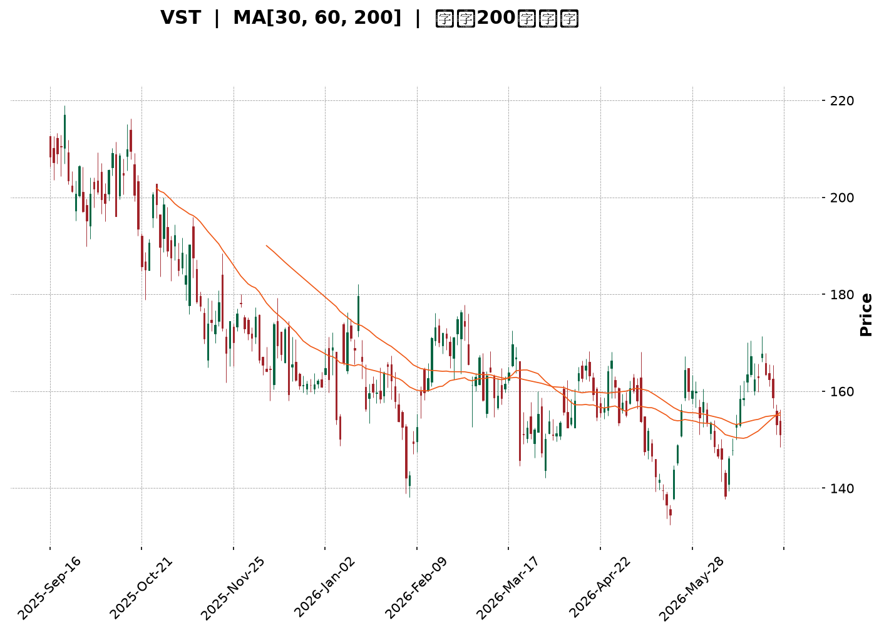
</details>

<html>
<head><meta charset="utf-8" /></head>
<body>
    <div style="height:500px; width:100%;">                        <script>window.PlotlyConfig = {MathJaxConfig: 'local'};</script>
        <script charset="utf-8" src="https://cdn.plot.ly/plotly-3.6.0.min.js" integrity="sha256-QaOVwtVY0T02VaHrr6pnoHLCwayMJp4O5n4YyaE3rJk=" crossorigin="anonymous"></script>                <div id="candlestick-chart" class="plotly-graph-div" style="height:100%; width:100%;"></div>            <script>                window.PLOTLYENV=window.PLOTLYENV || {};                                if (document.getElementById("candlestick-chart")) {                    Plotly.newPlot(                        "candlestick-chart",                        [{"close":{"dtype":"f8","bdata":"AAAA4MkKakAAAADAIudpQAAAAOAGImpAAAAAoOtMakAAAADghCBrQAAAAACTbGlAAAAAgBonaUAAAAAAFRlpQAAAAACKy2lAAAAAgM+jaEAAAABAcGNoQAAAAKCTFWlAAAAAwOc5aUAAAACA3yRpQAAAAOCF8mhAAAAAAFnZaEAAAAAAMLZpQAAAAGAhJGpAAAAA4GSBaEAAAABAyhVqQAAAAKALlWlAAAAAoDc\u002fakAAAABg4DBqQAAAAGB6EGlAAAAA4OYtaEAAAADg4jdnQAAAAODlIWdAAAAAQHHSZ0AAAABATRRpQAAAAIAmz2hAAAAAAJa5Z0AAAABgYdFoQAAAAACLnWdAAAAAIJxwZ0AAAAAgqQdoQAAAAKAHH2dAAAAAQFiTZ0AAAACAVvtmQAAAAMCmxmdAAAAA4PhvZ0AAAADAV01mQAAAAED7MGZAAAAAwCZbZUAAAACA5b5lQAAAAGDGyGVAAAAAwEq2ZUAAAACAtExmQAAAACA3omVAAAAAgIH8ZEAAAACAPM1lQAAAAAA1RGVAAAAA4CICZkAAAABgyENmQAAAAGBvnWVAAAAAYLN6ZUAAAAAABV5lQAAAAKDf6mVAAAAAAEHPZEAAAAAgy61kQAAAACAMhGRAAAAAAIWPZEAAAABAB7xlQAAAACCgLGVAAAAAwKvxZEAAAABgYZdlQAAAAEDP6WNAAAAAAGOvZEAAAADgUktkQAAAAAD6I2RAAAAA4ConZEAAAAAgbDBkQAAAAOAqJ2RAAAAAoJcsZEAAAADAe0VkQAAAAEBRHGRAAAAAAMaYZEAAAABAYE9kQAAAAGD+IWVAAAAAQI1FY0AAAADA58ViQAAAAAAnvWRAAAAAIFODZUAAAACATl5lQAAAAIAfEGVAAAAAYNp1ZkAAAAAAfsRkQAAAAIATjGNAAAAAYIPyY0AAAADgXP1jQAAAAEC09WNAAAAAYObLY0AAAACA0XlkQAAAAGDbpWRAAAAAADVEZEAAAACAOL1jQAAAAKCzOmNAAAAAQH4SY0AAAADgDsRhQAAAACCc1WFAAAAAoJanYkAAAAAgiRFjQAAAAEAc5WNAAAAAQKn2Y0AAAABAzVRkQAAAAICKYGVAAAAAQG2mZUAAAACgLkNlQAAAAIDFgGVAAAAAIKtdZUAAAABAyepkQAAAAGCwZGVAAAAA4AncZUAAAABgoQpmQAAAAAAhrWVAAAAAwAaxZEAAAAAAIChkQAAAAEAZXWRAAAAAgAXeZEAAAABAy8ZjQAAAACBlZWRAAAAAYEl+ZEAAAADAEddjQAAAAOB45GNAAAAAAF7QY0AAAAAgYTFkQAAAAIANfGRAAAAAQNI0ZUAAAACAEN1kQAAAAAAbOmJAAAAAgILiYkAAAACgNBBjQAAAACCK6WJAAAAA4MgCY0AAAAAAZ2hjQAAAAGCtamJAAAAAINXDYkAAAACg1DdjQAAAAKD+3mJAAAAAoBjsYkAAAADg4S5jQAAAAACBdWNAAAAAICoRY0AAAACAb1BjQAAAAABSv2NAAAAAwLN3ZEAAAADgyVZkQAAAAGCNqWRAAAAAwGdnZEAAAADgDuxjQAAAACAwVmNAAAAA4E5yY0AAAABgLpRjQAAAAIDYg2RAAAAAABvLZEAAAABAoRxkQAAAAMBlMmNAAAAAANGzY0AAAADgAmJjQAAAAIAAFGRAAAAAoPsEZEAAAABAMsJjQAAAAMCCN2NAAAAAAG5wYkAAAADAy\u002fpiQAAAAIBEVWJAAAAAYCPNYUAAAAAgc7ZhQAAAAGCCb2FAAAAAYOERYUAAAAAgsdBgQAAAAGCO+WFAAAAAgOObYkAAAACgpYFjQAAAAECOimRAAAAAIKL9Y0AAAACgyQFkQAAAAIAwAGRAAAAA4GRRY0AAAACA+LdjQAAAAKC3MmNAAAAAoIUvY0AAAACgqZFiQAAAAOA5VmJAAAAAIH9AYkAAAACAFEthQAAAACCcRWJAAAAAIAR6YkAAAAAgxSljQAAAACBszGNAAAAAwHPTY0AAAAAgrHBkQAAAAOBR6GRAAAAA4HpMZEAAAAAA11tkQAAAAOCj+GRAAAAAIK5vZEAAAAAAKUxkQAAAAAAp1GNAAAAAwB4lY0AAAACgmeFiQA=="},"high":{"dtype":"f8","bdata":"bdJQMeaVakDY\u002fMQw5pVqQEz7M6\u002foqmpAWf+DJoCeakBJy6kyEV1rQECkQRw+fGpAsSv0qJ6qaUDpIHkuNm1pQBYjszx21GlABjVRP5PIaUD\u002fgAQFZPVoQMA7cw6QgmlA472vKMuEaUD3dKDQgCpqQDKxqyIq4mlA9X7\u002fK6tfaUDMnCh2GbhpQCnXqoU6RmpApV+nzadvakAOJw5piSJqQJc3t4V7\u002f2lASHr99nLkakAJ0689YwZrQIPizyq5JWpAHTzgMbqUaUBBhMYyxRNoQC8bM9DZlmdA8tQGbeTsZ0DDkj7+MCVpQPEw+n4XWmlAxpn+xOSPaEAVEzVLuPxoQMGQIp3av2hAMm8AbuECaEDEOS30LExoQHGn7kRE1mdAjvdtz6f1Z0DK05OcvYpnQE87tJMKyWdA\u002fC6xR3t\u002faEA1S5gyI2VnQKvztQ6KkWZAWwRKLxonZkCW1HyYHGhmQDOTz67QWGZAbUpl0+QVZkCs4Vdx6ZdmQOMAi4MokGdANKv70bWeZUAKcir2Jc9lQAljkbYrwGVAaRNZ+WggZkDGT5o7poBmQIQ0giLw92VARqHmnAznZUB8rF3BIKRlQFhNFnv4KWZAMBxL+Lf8ZUBNEBze9+NkQEJvihqSJmVAR1AFX5uqZEAQ9cQFRcVlQAjDJoYcaGZAoli3XgqJZUD11CkxraZlQN4l9Xg8zWVAF1zOpJ9mZUCS8PoqX1ZlQP1gbxNqe2RAL5U2v\u002fJnZED\u002fqwsAXkRkQFPdHzGcUWRAFb3Taed3ZEBopEtOhlNkQCZgUjt6gWRAl4LCGAQaZUBN6ilQzmVlQGnwWiRIhGVADJZ2N+kFZUBE4m2b2GtjQI4l+vVAyGVAlbA93BMIZkCwF9cr6d5lQIyfx82lVmVA5ekMls3BZkB5BYeYu1RlQB0n6UxYsWRAHYwfVA8xZEAt7aXIkGFkQGW0bhl2TWRAw3xmeVObZEBt9h99ToVkQEoXNTU3w2RA91i+11btZECO8DJCeoFkQN1Hm5o88WNAB1yxJi+CY0CvAnb7jSdjQNPBIGRq8GFABHBsw+D6YkBU0nYeNWtjQKg1I34wH2RAXNZfYVObZEB38xIXDLhkQGaXeEj3ZWVAuLdmYDQFZkB0Xxa1geBlQDMz92oBg2VAYlVA6q6gZUBLNqGRtWtlQOd\u002f4ISaZmVAP7E+JIzuZUBZsPm7thdmQD6L6bstOmZAbfWfhQ4BZkCOuXgEhmJkQK80SUo5eGRAPyMoHjbwZED\u002fpuOZS\u002f1kQNZEY0yghWRAtbWpCWEKZUDnlar3M3FkQGr0MxD+V2RAPFB2lxeZZEDlyrbfkGFkQO3BNvYcoGRAR1FHKbqQZUAGcUJaOiRlQBLbDReXx2RAKP1\u002f0NJ1Y0CsEKnQTTxjQMnRnNhUt2NA\u002fbnmopsOY0AmnuYtO\u002f9jQDxygsOl1mNAkD6M8ELoYkC2cS484oNjQNmGlecAS2NAt5PhJIIcY0C6bzOgOD5jQAZrlYizImRA8CFS1q9JZEBedA6yD81jQAq8WAHZD2RAcz8APpChZEDlS+M8MMlkQGrTXFP41WRAFKUg4CMIZUCXUVpFQnpkQCk\u002fmrb9G2RAx48q73DbY0B3r+b7utRjQO2YHW70p2RAd8+tK+cFZUB7R3RdF2NkQOYAlq48HWRANaBGPgTtY0A5swBTUP1jQDpCyrjkRGRA\u002fCy2EUVyZEC+dxHoYlhkQFDM6dPxBGVAunURWhBZY0Ch9xobKhFjQKvCgvGbw2JADqrM9GlCYkBZFcYEB+NhQBJH9fiQnGFAIfOYCQlrYUBUh9ZTSBBhQKountBQFmJA6u50lUeiYkCkz2NbMKtjQKQP0fZO5WRAKSwZ0FGZZECFWNRkpGlkQLrBeGYEQmRAYUJ4NIHKY0DNoM\u002fOwxFkQI9n\u002fqkNtmNAvcvm+mI6Y0B4\u002f3EFYEJjQFtCdEHromJAiBs6wt\u002fCYkDg5SFTjvlhQOkUD+s5VmJAErqv1kPJYkB\u002f1sKDcWdjQL3COj8iKGRAFzVshM9GZEA+fr7hQUNlQAAAAAAAUGVAAAAAYGa6ZEAAAADgerRkQAAAAEAza2VAAAAAgML9ZEAAAABAM7NkQAAAAGBmrmRAAAAAgD2qY0AAAAAgrodjQA=="},"hovertemplate":"\u003cb\u003e%{x|%Y-%m-%d}\u003c\u002fb\u003e\u003cbr\u003e\u958b: $%{open:.2f}\u003cbr\u003e\u9ad8: $%{high:.2f}\u003cbr\u003e\u4f4e: $%{low:.2f}\u003cbr\u003e\u6536: $%{close:.2f}\u003cextra\u003e\u003c\u002fextra\u003e","low":{"dtype":"f8","bdata":"l6opFG7HaUCJ6+d5Q3NpQLyvpvLb3mlApLusW6iKaUA2B7KyBd5pQAHGL8C3U2lA72mRdAwhaUBD2UJ5TmZoQBSbsOCvBGlAxdp3hymcaECUb29ZF71nQNgz77Lv62dAZPxDPFm8aECGfeEFQhVpQEcTvN6Ok2hAPggdxVJiaEDeNG35gOloQFXliD14j2lAycT8rcGAaEA2gyc+NPJoQOIAYyMSEmlAW6BnUGixaUDnVw1NMfppQIyw6+oM52hA8fmLbzwAaEBVzavGnBlnQIO2mjb1XGZAt1H46xIeZ0Cz7faoXzloQFU2+QDsdWhAgwnm7I72ZkDdk4\u002f65JVnQPb2RQBCeGdAOMGQxkjYZkBPmRpXJGJnQAMTC6GD92ZAO7T0ZzcFZ0AO\u002fgAvIllmQMSS3j3D+2VAssVq2q3sZkD7hjtkMEJmQJvmmkvAEWZA77VxdQI6ZUAK5+bhlZxkQM3Mhz\u002fdjGVAP9iunng+ZUCNZ9UI669lQLTvTOwujWVAOW9MsYU4ZEDQxchNyKZkQGznWCrxpmRAJuVj17+LZUDrlP0AsihmQD6TzkYpf2VAhyFlIvBUZUDN+UFb+gdlQBbhJLlyOGVA+stRaPK4ZEBkxt6cJWxkQAiB0Xd\u002fgWRAsCshpL6\u002fY0A7iMiX8wpkQERnuTXF2WRAHZXnBTPJZECz08ENf7tkQBI4B4ZWwWNAjaaY6dk\u002fZEDfJDC2zkBkQPrOqAUADWRAHAXODQb2Y0BygFEeiepjQLiA9lQL\u002fWNALxNWDXPvY0Apj52BsxNkQF1kbpzOGGRAdg2ICANuZEAMQKAs8PdjQMmXLFOAamRA2E\u002fhlLkjY0BCs5Ld6JhiQE+O6hKErWRA1kDeOBN0ZEDeLVbvKEtlQAmuEN7wsmRALFZKeppmZUCQ593C7VFkQEYDAqg0emNAE556oBArY0BSxNXYv9ZjQBerkikNsmNAsPTxMNyuY0DYo\u002fZ21rZjQHJvtn\u002fkFmRAlj1OEiXKY0BH+6sMrI1jQIlFp7JcM2NAx\u002fGicES\u002fYkBRynpTWFxhQJB\u002fnfq6RGFAoVD\u002f5WxgYkApz03r6WtiQHI0YcFATGNA3k8wSZrDY0BZju\u002fEo\u002f5jQOJ0cSW+IWRAmwu3bGUvZUBjWzTyiyRlQM3MzIwl+WRANvZZnRQRZUDS0w6JIphkQO4nQubHTWRAguzWdIszZUBvC+I+CHVkQG24oMxkTWVAxKe3neurZEBBm9HR2hFjQEu\u002fIcWj\u002fmNAZU26hXwnZEBsqukIoLtjQJ\u002flsfBQUmNAwyShRUF7ZEDUcTVgGldjQJfjhPaQiGNASUClUm+pY0AeewidYvVjQF\u002fyRRKHNWRAkW21qWOhZEDCtHuW3HhkQPzSGyIUFGJAMJxIpQmkYkDIghxR6KpiQOtADzJuxWJA9Usz7x9JYkASHMOaNfFiQNFCycSjTGJAiLqFiYLEYUDwOsZTBuZiQKymnUQfvWJAen379nO1YkBI+6kTPMJiQDOfqJ9UYmNAyEFPbe0OY0AxzB4PqxxjQGb9A\u002fX3DWNAg3SBR90DZEAs990siz1kQKeo3jM+TGRAlLte\u002fw5BZEDZnOTJJ8NjQEHjf09DPWNAUI5+14FWY0Cy3fMLFkljQAHJlGTbXWNA3MG7n2rQY0A2uGT+789jQFfgSKK1G2NA9swxDGRwY0Bi23ei01ZjQFKs7NAIp2NAeKEM5XLyY0AVqkw8MYxjQJ\u002f43E\u002fCMWNAWqwzWshYYkDweaqfWUJiQFPafhyaLmJATeGNoxNqYUDmVQIJPndhQFW5CMzAM2FAMX2ym4e1YEBFRir8Lo9gQFW9NsnAM2FA2zmWPa0VYkC8U+f8QNFiQAsFCaL1v2NAx0+ltPfFY0AkQ4fTJaxjQGrbzMAjlWNA1Ueoq8njYkCz\u002f\u002f2PURVjQFVD8ByOF2NAkYOr9Vu\u002fYkBRAlovZmliQIzw+hScRWJA9W52HfKqYUAAGpvX8jZhQGkiR6P+a2FACw9272tZYkDj7yV5PsFiQEGD35a4E2NANWUyT6+fY0AyEYV9zPljQAAAAMDMXGRAAAAA4KPkY0AAAAAAKfxjQAAAAOBRwGRAAAAAgBRmZEAAAADgoyBkQAAAAOBRkGNAAAAAoJnhYkAAAAAAAJBiQA=="},"name":"\u50f9\u683c","open":{"dtype":"f8","bdata":"bdJQMeaVakBnDf9FKEZqQCFrQPhMhmpAaAFvR7NRakCCwbVa\u002f0NqQAMFnJCiJ2pAHZHjGlhNaUB\u002ftxb9uKVoQLaAOKeyC2lAWHjTDzElaUDsKdcGpctoQMHL5eweRmhA+3NmZjNmaUBHeZ1xFHBpQA37M4XCqWlAZBfMP30XaUBM8KCbzhdpQHzFV0yHxGlAo5wpWnscakCDm\u002fIHJglpQEB4qtz3nWlAOl5P23UOakCebloZxrxqQDUaKwfh2WlAh5ZyvRFpaUDjiWjrjwJoQHYgS7C1WGdAt1H46xIeZ0DP1Z61G3loQPEw+n4XWmlAxpn+xOSPaEBU4zo0FPBnQOtqM0XsO2hA6IzeyoTmZ0CqzoLDmMBnQBiFtpE8amdAjdzzl5kvZ0BQeuUmNcRmQKI5a3BPOGZA8pIPO78\u002faEC+ceXzwyRnQF6dQcOgcmZA\u002flLLO6QFZkDVDAqmks9kQACAGER61mVA3QmdqzR+ZUAJWPGY381lQKIOmEG2AWdAswulZSxpZUDhnoJdvBtlQFK+6gt1q2VA9zovYeioZUA3U1h+PkhmQASHctr16GVAcAV\u002frIXVZUAVYG2vNH5lQHQ0e4z8ZWVA\u002fO4JlTb5ZUBNEBze9+NkQE1yZ5nklWRA+EFu2e+UZEDWOUICGCxkQHRxfvolz2VAwiOPGsSHZUBMRxLIrr5kQOejUt05qWVAYkm6cyKfZEAhBznQRsBkQK0495SFcWRAPiCCAvojZECf4vfLdxFkQAAAAOAqJ2RAbvnvW8kRZEDiuBTDsjFkQMT3T34ZTmRAdg2ICANuZECRemU04xxlQH\u002fKW5oUEWVADJZ2N+kFZUCDfXhpS1pjQENNHnoru2VAQqhvI+eGZEDtmwORo7BlQH5xCqKGHWVAHhcmJbqQZUCrBJHnzuJkQDYVgBNnGmRA4gOXM0jSY0B7Q17Edi9kQJBFQPbf8WNAX5qV5bMEZEBPdFXaPOJjQAMSKV1YsWRA+pFJnBGwZECJOzEPviFkQBMR9+LhpmNA9J43vQ52Y0BHkL1ajhhjQKI0NWiNk2FAa9D79sGyYkBu+0D\u002fwbJiQP8aiquj\u002fmNAtWjz4m6RZECQVLWvKwlkQPomgY52PmRArc\u002fyBxNNZUCzq6VB9bBlQM3MrsgeLmVAfVDtqGN6ZUDlgIFQakVlQOpTkTUx2mRAQCWPGfF8ZUADs1tlZFxlQDlPCwqN0GVAtfGq2l83ZUBo0dJZzidkQEETXmCdJGRAX7WIgN4tZECAT2jL4X9kQGTymVkJb2NAhtLhDeycZEAjZwnowWRkQHS+91+xlGNAXasA\u002fgkqZEDE9tBfyRFkQLZHLfqLS2RAj1tLA16pZEB0WhWlrtZkQBLbDReXx2RAmxHEap\u002fnYkBVWETc3MpiQIN5bkQQWWNAFtysU0+pYkASHMOaNfFiQMNnenornGNAEtlGKlz2YUD9knYGQ+hiQICb+if032JA9OUFTYXaYkDcdrDGettiQAVs6HLOEGRAPQVdB4F1Y0C1llR3ISljQGb9A\u002fX3DWNAatE0H9pFZEDBGUQMmKhkQBLbfh\u002fgimRAu4FBLOHAZEBtoxW6TVpkQJjXwDsgEWRASUIb2YmyY0BLmyKyvXdjQE18AoCQg2NAdODPuZ2YZECDL+ZwukhkQKC43UBSFGRAUnbWIUmCY0AWdODp1cJjQCU9uPMFr2NAQPX8m7RYZEBC+YzonChkQAgE1t37WWRAunURWhBZY0DUzoWFYHliQPplZZz9qGJADqrM9GlCYkA7DQJV1aVhQL8gZYmLcmFArLtFmcdZYUBrpU3jhfNgQAAAABzTOWFA\u002fMREu4coYkDwR7uHM9piQMfGYjoC1mNAKozppVaXZECvggyfxdNjQEMghwLX+GNAwtBlVvmYY0BjyZkBGndjQLXtAdRQiWNADDiWnn\u002fqYkCvGpyhMvliQLf923hIg2JAMRzhS8yGYkAG62cFyeRhQMrc7v5emWFAVhuremB5YkCCqUriFBNjQJtjJ2ckIWNAh9cz6fvKY0DwVzxkoDtkQAAAAAApcGRAAAAAYI8CZEAAAADA9WBkQAAAAMAe3WRAAAAAIIW7ZEAAAABgZnZkQAAAAGCPUmRAAAAAAACAY0AAAABgZj5jQA=="},"x":["2025-09-16T00:00:00-04:00","2025-09-17T00:00:00-04:00","2025-09-18T00:00:00-04:00","2025-09-19T00:00:00-04:00","2025-09-22T00:00:00-04:00","2025-09-23T00:00:00-04:00","2025-09-24T00:00:00-04:00","2025-09-25T00:00:00-04:00","2025-09-26T00:00:00-04:00","2025-09-29T00:00:00-04:00","2025-09-30T00:00:00-04:00","2025-10-01T00:00:00-04:00","2025-10-02T00:00:00-04:00","2025-10-03T00:00:00-04:00","2025-10-06T00:00:00-04:00","2025-10-07T00:00:00-04:00","2025-10-08T00:00:00-04:00","2025-10-09T00:00:00-04:00","2025-10-10T00:00:00-04:00","2025-10-13T00:00:00-04:00","2025-10-14T00:00:00-04:00","2025-10-15T00:00:00-04:00","2025-10-16T00:00:00-04:00","2025-10-17T00:00:00-04:00","2025-10-20T00:00:00-04:00","2025-10-21T00:00:00-04:00","2025-10-22T00:00:00-04:00","2025-10-23T00:00:00-04:00","2025-10-24T00:00:00-04:00","2025-10-27T00:00:00-04:00","2025-10-28T00:00:00-04:00","2025-10-29T00:00:00-04:00","2025-10-30T00:00:00-04:00","2025-10-31T00:00:00-04:00","2025-11-03T00:00:00-05:00","2025-11-04T00:00:00-05:00","2025-11-05T00:00:00-05:00","2025-11-06T00:00:00-05:00","2025-11-07T00:00:00-05:00","2025-11-10T00:00:00-05:00","2025-11-11T00:00:00-05:00","2025-11-12T00:00:00-05:00","2025-11-13T00:00:00-05:00","2025-11-14T00:00:00-05:00","2025-11-17T00:00:00-05:00","2025-11-18T00:00:00-05:00","2025-11-19T00:00:00-05:00","2025-11-20T00:00:00-05:00","2025-11-21T00:00:00-05:00","2025-11-24T00:00:00-05:00","2025-11-25T00:00:00-05:00","2025-11-26T00:00:00-05:00","2025-11-28T00:00:00-05:00","2025-12-01T00:00:00-05:00","2025-12-02T00:00:00-05:00","2025-12-03T00:00:00-05:00","2025-12-04T00:00:00-05:00","2025-12-05T00:00:00-05:00","2025-12-08T00:00:00-05:00","2025-12-09T00:00:00-05:00","2025-12-10T00:00:00-05:00","2025-12-11T00:00:00-05:00","2025-12-12T00:00:00-05:00","2025-12-15T00:00:00-05:00","2025-12-16T00:00:00-05:00","2025-12-17T00:00:00-05:00","2025-12-18T00:00:00-05:00","2025-12-19T00:00:00-05:00","2025-12-22T00:00:00-05:00","2025-12-23T00:00:00-05:00","2025-12-24T00:00:00-05:00","2025-12-26T00:00:00-05:00","2025-12-29T00:00:00-05:00","2025-12-30T00:00:00-05:00","2025-12-31T00:00:00-05:00","2026-01-02T00:00:00-05:00","2026-01-05T00:00:00-05:00","2026-01-06T00:00:00-05:00","2026-01-07T00:00:00-05:00","2026-01-08T00:00:00-05:00","2026-01-09T00:00:00-05:00","2026-01-12T00:00:00-05:00","2026-01-13T00:00:00-05:00","2026-01-14T00:00:00-05:00","2026-01-15T00:00:00-05:00","2026-01-16T00:00:00-05:00","2026-01-20T00:00:00-05:00","2026-01-21T00:00:00-05:00","2026-01-22T00:00:00-05:00","2026-01-23T00:00:00-05:00","2026-01-26T00:00:00-05:00","2026-01-27T00:00:00-05:00","2026-01-28T00:00:00-05:00","2026-01-29T00:00:00-05:00","2026-01-30T00:00:00-05:00","2026-02-02T00:00:00-05:00","2026-02-03T00:00:00-05:00","2026-02-04T00:00:00-05:00","2026-02-05T00:00:00-05:00","2026-02-06T00:00:00-05:00","2026-02-09T00:00:00-05:00","2026-02-10T00:00:00-05:00","2026-02-11T00:00:00-05:00","2026-02-12T00:00:00-05:00","2026-02-13T00:00:00-05:00","2026-02-17T00:00:00-05:00","2026-02-18T00:00:00-05:00","2026-02-19T00:00:00-05:00","2026-02-20T00:00:00-05:00","2026-02-23T00:00:00-05:00","2026-02-24T00:00:00-05:00","2026-02-25T00:00:00-05:00","2026-02-26T00:00:00-05:00","2026-02-27T00:00:00-05:00","2026-03-02T00:00:00-05:00","2026-03-03T00:00:00-05:00","2026-03-04T00:00:00-05:00","2026-03-05T00:00:00-05:00","2026-03-06T00:00:00-05:00","2026-03-09T00:00:00-04:00","2026-03-10T00:00:00-04:00","2026-03-11T00:00:00-04:00","2026-03-12T00:00:00-04:00","2026-03-13T00:00:00-04:00","2026-03-16T00:00:00-04:00","2026-03-17T00:00:00-04:00","2026-03-18T00:00:00-04:00","2026-03-19T00:00:00-04:00","2026-03-20T00:00:00-04:00","2026-03-23T00:00:00-04:00","2026-03-24T00:00:00-04:00","2026-03-25T00:00:00-04:00","2026-03-26T00:00:00-04:00","2026-03-27T00:00:00-04:00","2026-03-30T00:00:00-04:00","2026-03-31T00:00:00-04:00","2026-04-01T00:00:00-04:00","2026-04-02T00:00:00-04:00","2026-04-06T00:00:00-04:00","2026-04-07T00:00:00-04:00","2026-04-08T00:00:00-04:00","2026-04-09T00:00:00-04:00","2026-04-10T00:00:00-04:00","2026-04-13T00:00:00-04:00","2026-04-14T00:00:00-04:00","2026-04-15T00:00:00-04:00","2026-04-16T00:00:00-04:00","2026-04-17T00:00:00-04:00","2026-04-20T00:00:00-04:00","2026-04-21T00:00:00-04:00","2026-04-22T00:00:00-04:00","2026-04-23T00:00:00-04:00","2026-04-24T00:00:00-04:00","2026-04-27T00:00:00-04:00","2026-04-28T00:00:00-04:00","2026-04-29T00:00:00-04:00","2026-04-30T00:00:00-04:00","2026-05-01T00:00:00-04:00","2026-05-04T00:00:00-04:00","2026-05-05T00:00:00-04:00","2026-05-06T00:00:00-04:00","2026-05-07T00:00:00-04:00","2026-05-08T00:00:00-04:00","2026-05-11T00:00:00-04:00","2026-05-12T00:00:00-04:00","2026-05-13T00:00:00-04:00","2026-05-14T00:00:00-04:00","2026-05-15T00:00:00-04:00","2026-05-18T00:00:00-04:00","2026-05-19T00:00:00-04:00","2026-05-20T00:00:00-04:00","2026-05-21T00:00:00-04:00","2026-05-22T00:00:00-04:00","2026-05-26T00:00:00-04:00","2026-05-27T00:00:00-04:00","2026-05-28T00:00:00-04:00","2026-05-29T00:00:00-04:00","2026-06-01T00:00:00-04:00","2026-06-02T00:00:00-04:00","2026-06-03T00:00:00-04:00","2026-06-04T00:00:00-04:00","2026-06-05T00:00:00-04:00","2026-06-08T00:00:00-04:00","2026-06-09T00:00:00-04:00","2026-06-10T00:00:00-04:00","2026-06-11T00:00:00-04:00","2026-06-12T00:00:00-04:00","2026-06-15T00:00:00-04:00","2026-06-16T00:00:00-04:00","2026-06-17T00:00:00-04:00","2026-06-18T00:00:00-04:00","2026-06-22T00:00:00-04:00","2026-06-23T00:00:00-04:00","2026-06-24T00:00:00-04:00","2026-06-25T00:00:00-04:00","2026-06-26T00:00:00-04:00","2026-06-29T00:00:00-04:00","2026-06-30T00:00:00-04:00","2026-07-01T00:00:00-04:00","2026-07-02T00:00:00-04:00"],"type":"candlestick"},{"hovertemplate":"MA30: $%{y:.2f}\u003cextra\u003e\u003c\u002fextra\u003e","line":{"color":"#2196F3","dash":"dash","width":2},"mode":"lines","name":"MA30","x":["2025-09-16T00:00:00-04:00","2025-09-17T00:00:00-04:00","2025-09-18T00:00:00-04:00","2025-09-19T00:00:00-04:00","2025-09-22T00:00:00-04:00","2025-09-23T00:00:00-04:00","2025-09-24T00:00:00-04:00","2025-09-25T00:00:00-04:00","2025-09-26T00:00:00-04:00","2025-09-29T00:00:00-04:00","2025-09-30T00:00:00-04:00","2025-10-01T00:00:00-04:00","2025-10-02T00:00:00-04:00","2025-10-03T00:00:00-04:00","2025-10-06T00:00:00-04:00","2025-10-07T00:00:00-04:00","2025-10-08T00:00:00-04:00","2025-10-09T00:00:00-04:00","2025-10-10T00:00:00-04:00","2025-10-13T00:00:00-04:00","2025-10-14T00:00:00-04:00","2025-10-15T00:00:00-04:00","2025-10-16T00:00:00-04:00","2025-10-17T00:00:00-04:00","2025-10-20T00:00:00-04:00","2025-10-21T00:00:00-04:00","2025-10-22T00:00:00-04:00","2025-10-23T00:00:00-04:00","2025-10-24T00:00:00-04:00","2025-10-27T00:00:00-04:00","2025-10-28T00:00:00-04:00","2025-10-29T00:00:00-04:00","2025-10-30T00:00:00-04:00","2025-10-31T00:00:00-04:00","2025-11-03T00:00:00-05:00","2025-11-04T00:00:00-05:00","2025-11-05T00:00:00-05:00","2025-11-06T00:00:00-05:00","2025-11-07T00:00:00-05:00","2025-11-10T00:00:00-05:00","2025-11-11T00:00:00-05:00","2025-11-12T00:00:00-05:00","2025-11-13T00:00:00-05:00","2025-11-14T00:00:00-05:00","2025-11-17T00:00:00-05:00","2025-11-18T00:00:00-05:00","2025-11-19T00:00:00-05:00","2025-11-20T00:00:00-05:00","2025-11-21T00:00:00-05:00","2025-11-24T00:00:00-05:00","2025-11-25T00:00:00-05:00","2025-11-26T00:00:00-05:00","2025-11-28T00:00:00-05:00","2025-12-01T00:00:00-05:00","2025-12-02T00:00:00-05:00","2025-12-03T00:00:00-05:00","2025-12-04T00:00:00-05:00","2025-12-05T00:00:00-05:00","2025-12-08T00:00:00-05:00","2025-12-09T00:00:00-05:00","2025-12-10T00:00:00-05:00","2025-12-11T00:00:00-05:00","2025-12-12T00:00:00-05:00","2025-12-15T00:00:00-05:00","2025-12-16T00:00:00-05:00","2025-12-17T00:00:00-05:00","2025-12-18T00:00:00-05:00","2025-12-19T00:00:00-05:00","2025-12-22T00:00:00-05:00","2025-12-23T00:00:00-05:00","2025-12-24T00:00:00-05:00","2025-12-26T00:00:00-05:00","2025-12-29T00:00:00-05:00","2025-12-30T00:00:00-05:00","2025-12-31T00:00:00-05:00","2026-01-02T00:00:00-05:00","2026-01-05T00:00:00-05:00","2026-01-06T00:00:00-05:00","2026-01-07T00:00:00-05:00","2026-01-08T00:00:00-05:00","2026-01-09T00:00:00-05:00","2026-01-12T00:00:00-05:00","2026-01-13T00:00:00-05:00","2026-01-14T00:00:00-05:00","2026-01-15T00:00:00-05:00","2026-01-16T00:00:00-05:00","2026-01-20T00:00:00-05:00","2026-01-21T00:00:00-05:00","2026-01-22T00:00:00-05:00","2026-01-23T00:00:00-05:00","2026-01-26T00:00:00-05:00","2026-01-27T00:00:00-05:00","2026-01-28T00:00:00-05:00","2026-01-29T00:00:00-05:00","2026-01-30T00:00:00-05:00","2026-02-02T00:00:00-05:00","2026-02-03T00:00:00-05:00","2026-02-04T00:00:00-05:00","2026-02-05T00:00:00-05:00","2026-02-06T00:00:00-05:00","2026-02-09T00:00:00-05:00","2026-02-10T00:00:00-05:00","2026-02-11T00:00:00-05:00","2026-02-12T00:00:00-05:00","2026-02-13T00:00:00-05:00","2026-02-17T00:00:00-05:00","2026-02-18T00:00:00-05:00","2026-02-19T00:00:00-05:00","2026-02-20T00:00:00-05:00","2026-02-23T00:00:00-05:00","2026-02-24T00:00:00-05:00","2026-02-25T00:00:00-05:00","2026-02-26T00:00:00-05:00","2026-02-27T00:00:00-05:00","2026-03-02T00:00:00-05:00","2026-03-03T00:00:00-05:00","2026-03-04T00:00:00-05:00","2026-03-05T00:00:00-05:00","2026-03-06T00:00:00-05:00","2026-03-09T00:00:00-04:00","2026-03-10T00:00:00-04:00","2026-03-11T00:00:00-04:00","2026-03-12T00:00:00-04:00","2026-03-13T00:00:00-04:00","2026-03-16T00:00:00-04:00","2026-03-17T00:00:00-04:00","2026-03-18T00:00:00-04:00","2026-03-19T00:00:00-04:00","2026-03-20T00:00:00-04:00","2026-03-23T00:00:00-04:00","2026-03-24T00:00:00-04:00","2026-03-25T00:00:00-04:00","2026-03-26T00:00:00-04:00","2026-03-27T00:00:00-04:00","2026-03-30T00:00:00-04:00","2026-03-31T00:00:00-04:00","2026-04-01T00:00:00-04:00","2026-04-02T00:00:00-04:00","2026-04-06T00:00:00-04:00","2026-04-07T00:00:00-04:00","2026-04-08T00:00:00-04:00","2026-04-09T00:00:00-04:00","2026-04-10T00:00:00-04:00","2026-04-13T00:00:00-04:00","2026-04-14T00:00:00-04:00","2026-04-15T00:00:00-04:00","2026-04-16T00:00:00-04:00","2026-04-17T00:00:00-04:00","2026-04-20T00:00:00-04:00","2026-04-21T00:00:00-04:00","2026-04-22T00:00:00-04:00","2026-04-23T00:00:00-04:00","2026-04-24T00:00:00-04:00","2026-04-27T00:00:00-04:00","2026-04-28T00:00:00-04:00","2026-04-29T00:00:00-04:00","2026-04-30T00:00:00-04:00","2026-05-01T00:00:00-04:00","2026-05-04T00:00:00-04:00","2026-05-05T00:00:00-04:00","2026-05-06T00:00:00-04:00","2026-05-07T00:00:00-04:00","2026-05-08T00:00:00-04:00","2026-05-11T00:00:00-04:00","2026-05-12T00:00:00-04:00","2026-05-13T00:00:00-04:00","2026-05-14T00:00:00-04:00","2026-05-15T00:00:00-04:00","2026-05-18T00:00:00-04:00","2026-05-19T00:00:00-04:00","2026-05-20T00:00:00-04:00","2026-05-21T00:00:00-04:00","2026-05-22T00:00:00-04:00","2026-05-26T00:00:00-04:00","2026-05-27T00:00:00-04:00","2026-05-28T00:00:00-04:00","2026-05-29T00:00:00-04:00","2026-06-01T00:00:00-04:00","2026-06-02T00:00:00-04:00","2026-06-03T00:00:00-04:00","2026-06-04T00:00:00-04:00","2026-06-05T00:00:00-04:00","2026-06-08T00:00:00-04:00","2026-06-09T00:00:00-04:00","2026-06-10T00:00:00-04:00","2026-06-11T00:00:00-04:00","2026-06-12T00:00:00-04:00","2026-06-15T00:00:00-04:00","2026-06-16T00:00:00-04:00","2026-06-17T00:00:00-04:00","2026-06-18T00:00:00-04:00","2026-06-22T00:00:00-04:00","2026-06-23T00:00:00-04:00","2026-06-24T00:00:00-04:00","2026-06-25T00:00:00-04:00","2026-06-26T00:00:00-04:00","2026-06-29T00:00:00-04:00","2026-06-30T00:00:00-04:00","2026-07-01T00:00:00-04:00","2026-07-02T00:00:00-04:00"],"y":{"dtype":"f8","bdata":"AAAAAAAA+H8AAAAAAAD4fwAAAAAAAPh\u002fAAAAAAAA+H8AAAAAAAD4fwAAAAAAAPh\u002fAAAAAAAA+H8AAAAAAAD4fwAAAAAAAPh\u002fAAAAAAAA+H8AAAAAAAD4fwAAAAAAAPh\u002fAAAAAAAA+H8AAAAAAAD4fwAAAAAAAPh\u002fAAAAAAAA+H8AAAAAAAD4fwAAAAAAAPh\u002fAAAAAAAA+H8AAAAAAAD4fwAAAAAAAPh\u002fAAAAAAAA+H8AAAAAAAD4fwAAAAAAAPh\u002fAAAAAAAA+H8AAAAAAAD4fwAAAAAAAPh\u002fAAAAAAAA+H8AAAAAAAD4f1VVVcXtO2lAZmZmxicoaUCJiIiY5R5pQAAAAABqCWlAMzMz8wDxaECamZk5k9ZoQCIiInLswmhAmpmZCXe1aEB3d3cnaKNoQBEREWEtkmhA3t3dfeqHaEAAAADgHHZoQBERESFtXWhAIiIismY8aEBVVVXlZh9oQLy7uwtpBGhA3t3dTaTpZ0BmZmaWhsxnQImIiNgPpmdARERERAiIZ0AiIiICe2NnQN7d3Q2nPmdAIiIisnsaZ0BVVVXl+vhmQImIiJiL22ZAiYiIWIHEZkDv7u6utbRmQLy7u5tXqmZAzczMzKKQZkDe3d3tFWtmQKuqqupyRmZAmpmZWXIrZkC8u7uLIhFmQKuqqupN\u002fGVAMzMzowHnZUAiIiJyMtJlQDMzM7PStmVAREREZCieZUBmZmZWOYdlQERERJQzaGVAZmZmtixMZUC8u7vbJDplQLy7uwvAKGVAVVVVNaoeZUDe3d2dFRJlQCIiInLNA2VAVVVVBUn6ZEDv7u6+TulkQGZmZpYI5WRAiYiI2GbWZEAAAACwjrxkQImIiDgOuGRAiYiIGNSzZEBmZmbmLaxkQJqZmQl4p2RARERENNevZECrqqoauapkQJqZmRl\u002flmRAIiIiciOPZEB3d3fnQYlkQN7d3T2DhGRARERE9P19ZEDe3d1tQHNkQHd3d2fCbmRA3t3dLfpoZEBEREQELFlkQDMzM8NVU2RAd3d3Z5JFZEAiIiIS\u002fy9kQGZmZkZRHGRAEREREYgPZEB3d3f39wVkQHd3d0fEA2RAEREREfgBZECJiIjIegJkQN7d3X1JDWRAiYiIiEYWZEAzMzMDZx5kQImIiMiPIWRAVVVVpW4zZEDe3d1tukVkQDMzMxNQS2RAmpmZGUVOZECJiIiYA1RkQBEREWE\u002fWWRAIiIiQidKZEDNzMzs8ERkQFVVVZXoS2RAERERQcJTZECamZmZ8FFkQCIiIrKpVWRA3t3d7ZtbZEAzMzMjL1ZkQLy7u+u8T2RAvLu7a+BLZEBERESkv09kQGZmZtZ1WmRAZmZm1qtsZEAzMzPTGodkQDMzM2N0imRA7+7uLmuMZEBVVVXVX4xkQImIiBj9g2RAREREBNx7ZEDe3d29+nNkQDMzM6O3WmRAd3d39xhCZECJiIgIpzBkQImIiHgxGmRAERERQVcFZEBmZmZGi\u002fZjQCIiIrIJ5mNAAAAAcDXOY0AiIiKC77ZjQM3MzKx5pmNAIiIigpCkY0BERES0HqZjQLy7uxurqGNAq6qq6rakY0B3d3fn9KVjQKuqqprqnGNAq6qq2vuTY0AzMzMTwZFjQAAAABARl2NAIiIismyfY0AiIiKiu55jQDMzM5O+k2NAMzMzM+mGY0DNzMycRnpjQHd3d4cSimNAvLu7O8GTY0BmZmYWsJljQBEREXFJnGNAvLu7i2iXY0DNzMw8wZNjQKuqqooKk2NAq6qqatGKY0BVVVXV+H1jQFVVVfW4cWNAERERUephY0De3d19tU1jQFVVVUULQWNAREREhCI9Y0BERER0xj5jQKuqqrqMRWNAMzMzE3tBY0C8u7u7pT5jQBEREYEAOWNAREREJLwvY0CamZmp\u002fy1jQKuqqvrQLGNAIiIiEpcqY0C8u7sL+SFjQBEREbFiD2NARERE1LL5YkCrqqqapeFiQERERATB2WJAERERQUvPYkBERERUa81iQERERIQIy2JAq6qq2mHJYkB3d3e3Ms9iQFVVVQWg3WJAERERUX7tYkBVVVX1QvliQDMzMyPGD2NAq6qqOkImY0AzMzPTUDxjQHd3d8e8UGNAZmZmBnJiY0AAAABgE3RjQA=="},"type":"scatter"},{"hovertemplate":"MA60: $%{y:.2f}\u003cextra\u003e\u003c\u002fextra\u003e","line":{"color":"#9C27B0","dash":"dash","width":2},"mode":"lines","name":"MA60","x":["2025-09-16T00:00:00-04:00","2025-09-17T00:00:00-04:00","2025-09-18T00:00:00-04:00","2025-09-19T00:00:00-04:00","2025-09-22T00:00:00-04:00","2025-09-23T00:00:00-04:00","2025-09-24T00:00:00-04:00","2025-09-25T00:00:00-04:00","2025-09-26T00:00:00-04:00","2025-09-29T00:00:00-04:00","2025-09-30T00:00:00-04:00","2025-10-01T00:00:00-04:00","2025-10-02T00:00:00-04:00","2025-10-03T00:00:00-04:00","2025-10-06T00:00:00-04:00","2025-10-07T00:00:00-04:00","2025-10-08T00:00:00-04:00","2025-10-09T00:00:00-04:00","2025-10-10T00:00:00-04:00","2025-10-13T00:00:00-04:00","2025-10-14T00:00:00-04:00","2025-10-15T00:00:00-04:00","2025-10-16T00:00:00-04:00","2025-10-17T00:00:00-04:00","2025-10-20T00:00:00-04:00","2025-10-21T00:00:00-04:00","2025-10-22T00:00:00-04:00","2025-10-23T00:00:00-04:00","2025-10-24T00:00:00-04:00","2025-10-27T00:00:00-04:00","2025-10-28T00:00:00-04:00","2025-10-29T00:00:00-04:00","2025-10-30T00:00:00-04:00","2025-10-31T00:00:00-04:00","2025-11-03T00:00:00-05:00","2025-11-04T00:00:00-05:00","2025-11-05T00:00:00-05:00","2025-11-06T00:00:00-05:00","2025-11-07T00:00:00-05:00","2025-11-10T00:00:00-05:00","2025-11-11T00:00:00-05:00","2025-11-12T00:00:00-05:00","2025-11-13T00:00:00-05:00","2025-11-14T00:00:00-05:00","2025-11-17T00:00:00-05:00","2025-11-18T00:00:00-05:00","2025-11-19T00:00:00-05:00","2025-11-20T00:00:00-05:00","2025-11-21T00:00:00-05:00","2025-11-24T00:00:00-05:00","2025-11-25T00:00:00-05:00","2025-11-26T00:00:00-05:00","2025-11-28T00:00:00-05:00","2025-12-01T00:00:00-05:00","2025-12-02T00:00:00-05:00","2025-12-03T00:00:00-05:00","2025-12-04T00:00:00-05:00","2025-12-05T00:00:00-05:00","2025-12-08T00:00:00-05:00","2025-12-09T00:00:00-05:00","2025-12-10T00:00:00-05:00","2025-12-11T00:00:00-05:00","2025-12-12T00:00:00-05:00","2025-12-15T00:00:00-05:00","2025-12-16T00:00:00-05:00","2025-12-17T00:00:00-05:00","2025-12-18T00:00:00-05:00","2025-12-19T00:00:00-05:00","2025-12-22T00:00:00-05:00","2025-12-23T00:00:00-05:00","2025-12-24T00:00:00-05:00","2025-12-26T00:00:00-05:00","2025-12-29T00:00:00-05:00","2025-12-30T00:00:00-05:00","2025-12-31T00:00:00-05:00","2026-01-02T00:00:00-05:00","2026-01-05T00:00:00-05:00","2026-01-06T00:00:00-05:00","2026-01-07T00:00:00-05:00","2026-01-08T00:00:00-05:00","2026-01-09T00:00:00-05:00","2026-01-12T00:00:00-05:00","2026-01-13T00:00:00-05:00","2026-01-14T00:00:00-05:00","2026-01-15T00:00:00-05:00","2026-01-16T00:00:00-05:00","2026-01-20T00:00:00-05:00","2026-01-21T00:00:00-05:00","2026-01-22T00:00:00-05:00","2026-01-23T00:00:00-05:00","2026-01-26T00:00:00-05:00","2026-01-27T00:00:00-05:00","2026-01-28T00:00:00-05:00","2026-01-29T00:00:00-05:00","2026-01-30T00:00:00-05:00","2026-02-02T00:00:00-05:00","2026-02-03T00:00:00-05:00","2026-02-04T00:00:00-05:00","2026-02-05T00:00:00-05:00","2026-02-06T00:00:00-05:00","2026-02-09T00:00:00-05:00","2026-02-10T00:00:00-05:00","2026-02-11T00:00:00-05:00","2026-02-12T00:00:00-05:00","2026-02-13T00:00:00-05:00","2026-02-17T00:00:00-05:00","2026-02-18T00:00:00-05:00","2026-02-19T00:00:00-05:00","2026-02-20T00:00:00-05:00","2026-02-23T00:00:00-05:00","2026-02-24T00:00:00-05:00","2026-02-25T00:00:00-05:00","2026-02-26T00:00:00-05:00","2026-02-27T00:00:00-05:00","2026-03-02T00:00:00-05:00","2026-03-03T00:00:00-05:00","2026-03-04T00:00:00-05:00","2026-03-05T00:00:00-05:00","2026-03-06T00:00:00-05:00","2026-03-09T00:00:00-04:00","2026-03-10T00:00:00-04:00","2026-03-11T00:00:00-04:00","2026-03-12T00:00:00-04:00","2026-03-13T00:00:00-04:00","2026-03-16T00:00:00-04:00","2026-03-17T00:00:00-04:00","2026-03-18T00:00:00-04:00","2026-03-19T00:00:00-04:00","2026-03-20T00:00:00-04:00","2026-03-23T00:00:00-04:00","2026-03-24T00:00:00-04:00","2026-03-25T00:00:00-04:00","2026-03-26T00:00:00-04:00","2026-03-27T00:00:00-04:00","2026-03-30T00:00:00-04:00","2026-03-31T00:00:00-04:00","2026-04-01T00:00:00-04:00","2026-04-02T00:00:00-04:00","2026-04-06T00:00:00-04:00","2026-04-07T00:00:00-04:00","2026-04-08T00:00:00-04:00","2026-04-09T00:00:00-04:00","2026-04-10T00:00:00-04:00","2026-04-13T00:00:00-04:00","2026-04-14T00:00:00-04:00","2026-04-15T00:00:00-04:00","2026-04-16T00:00:00-04:00","2026-04-17T00:00:00-04:00","2026-04-20T00:00:00-04:00","2026-04-21T00:00:00-04:00","2026-04-22T00:00:00-04:00","2026-04-23T00:00:00-04:00","2026-04-24T00:00:00-04:00","2026-04-27T00:00:00-04:00","2026-04-28T00:00:00-04:00","2026-04-29T00:00:00-04:00","2026-04-30T00:00:00-04:00","2026-05-01T00:00:00-04:00","2026-05-04T00:00:00-04:00","2026-05-05T00:00:00-04:00","2026-05-06T00:00:00-04:00","2026-05-07T00:00:00-04:00","2026-05-08T00:00:00-04:00","2026-05-11T00:00:00-04:00","2026-05-12T00:00:00-04:00","2026-05-13T00:00:00-04:00","2026-05-14T00:00:00-04:00","2026-05-15T00:00:00-04:00","2026-05-18T00:00:00-04:00","2026-05-19T00:00:00-04:00","2026-05-20T00:00:00-04:00","2026-05-21T00:00:00-04:00","2026-05-22T00:00:00-04:00","2026-05-26T00:00:00-04:00","2026-05-27T00:00:00-04:00","2026-05-28T00:00:00-04:00","2026-05-29T00:00:00-04:00","2026-06-01T00:00:00-04:00","2026-06-02T00:00:00-04:00","2026-06-03T00:00:00-04:00","2026-06-04T00:00:00-04:00","2026-06-05T00:00:00-04:00","2026-06-08T00:00:00-04:00","2026-06-09T00:00:00-04:00","2026-06-10T00:00:00-04:00","2026-06-11T00:00:00-04:00","2026-06-12T00:00:00-04:00","2026-06-15T00:00:00-04:00","2026-06-16T00:00:00-04:00","2026-06-17T00:00:00-04:00","2026-06-18T00:00:00-04:00","2026-06-22T00:00:00-04:00","2026-06-23T00:00:00-04:00","2026-06-24T00:00:00-04:00","2026-06-25T00:00:00-04:00","2026-06-26T00:00:00-04:00","2026-06-29T00:00:00-04:00","2026-06-30T00:00:00-04:00","2026-07-01T00:00:00-04:00","2026-07-02T00:00:00-04:00"],"y":{"dtype":"f8","bdata":"AAAAAAAA+H8AAAAAAAD4fwAAAAAAAPh\u002fAAAAAAAA+H8AAAAAAAD4fwAAAAAAAPh\u002fAAAAAAAA+H8AAAAAAAD4fwAAAAAAAPh\u002fAAAAAAAA+H8AAAAAAAD4fwAAAAAAAPh\u002fAAAAAAAA+H8AAAAAAAD4fwAAAAAAAPh\u002fAAAAAAAA+H8AAAAAAAD4fwAAAAAAAPh\u002fAAAAAAAA+H8AAAAAAAD4fwAAAAAAAPh\u002fAAAAAAAA+H8AAAAAAAD4fwAAAAAAAPh\u002fAAAAAAAA+H8AAAAAAAD4fwAAAAAAAPh\u002fAAAAAAAA+H8AAAAAAAD4fwAAAAAAAPh\u002fAAAAAAAA+H8AAAAAAAD4fwAAAAAAAPh\u002fAAAAAAAA+H8AAAAAAAD4fwAAAAAAAPh\u002fAAAAAAAA+H8AAAAAAAD4fwAAAAAAAPh\u002fAAAAAAAA+H8AAAAAAAD4fwAAAAAAAPh\u002fAAAAAAAA+H8AAAAAAAD4fwAAAAAAAPh\u002fAAAAAAAA+H8AAAAAAAD4fwAAAAAAAPh\u002fAAAAAAAA+H8AAAAAAAD4fwAAAAAAAPh\u002fAAAAAAAA+H8AAAAAAAD4fwAAAAAAAPh\u002fAAAAAAAA+H8AAAAAAAD4fwAAAAAAAPh\u002fAAAAAAAA+H8AAAAAAAD4fwAAAFgwwWdAAAAAEM2pZ0AiIiISBJhnQFVVVfXbgmdAMzMzSwFsZ0De3d3VYlRnQKuqqpLfPGdA7+7uts8pZ0Dv7u6+UBVnQKuqqnow\u002fWZAIiIimgvqZkDe3d3dINhmQGZmZpYWw2ZAvLu7c4itZkCamZlBvphmQO\u002fu7j4bhGZAmpmZqfZxZkCrqqqq6lpmQHd3dzeMRWZAZmZmjjcvZkARERHZBBBmQDMzM6Na+2VAVVVV5SfnZUDe3d1llNJlQBEREdGBwWVAZmZmRiy6ZUDNzMxkt69lQKuqqlproGVAd3d3H+OPZUCrqqrqK3plQERERBR7ZWVA7+7uJrhUZUDNzMx8MUJlQBERESmINWVAiYiI6P0nZUAzMzM7rxVlQDMzMzsUBWVA3t3dZd3xZEBEREQ0nNtkQFVVVW1CwmRAvLu7Y9qtZECamZlpDqBkQJqZmSlClmRAMzMzI1GQZEAzMzMzSIpkQAAAAHiLiGRA7+7uxkeIZEARERHh2oNkQHd3dy9Mg2RA7+7uvuqEZEDv7u6OJIFkQN7d3SWvgWRAERERmQyBZEB3d3e\u002fGIBkQFVVVbVbgGRAMzMzO\u002f98ZEC8u7sD1XdkQHd3d9czcWRAmpmZ2XJxZECJiIhAmW1kQAAAAHgWbWRAERER8cxsZECJiIjIt2RkQJqZmak\u002fX2RAzczMTG1aZEBERETUdVRkQM3MzMzlVmRA7+7uHh9ZZECrqqryjFtkQM3MzNRiU2RAAAAAoPlNZEBmZmbmK0lkQAAAALDgQ2RAq6qqCuo+ZEAzMzPDOjtkQImIiJAANGRAAAAAwC8sZEDe3d0FhydkQImIiKDgHWRAMzMz82IcZEAiIiLaIh5kQKuqquKsGGRAzczMRD0OZEBVVVWNeQVkQO\u002fu7obc\u002f2NAIiIi4lv3Y0CJiIjQh\u002fVjQImIiNhJ+mNA3t3dlTz8Y0CJiIjA8vtjQGZmZiZK+WNARERE5Mv3Y0AzMzMb+PNjQN7d3f1m82NA7+7ujqb1Y0AzMzOjPfdjQM3MzDQa92NAzczMhMr5Y0AAAAC4sABkQFVVVXVDCmRAVVVVNRYQZEDe3d31BxNkQM3MzEQjEGRAAAAASKIJZEBVVVX93QNkQO\u002fu7hbh9mNAERERMXXmY0Dv7u7uT9djQO\u002fu7jb1xWNAERERyaCzY0AiIiJiIKJjQLy7u3uKk2NAIiIi+quFY0AzMzP72npjQLy7uzMDdmNAq6qqygVzY0AAAAA4YnJjQGZmZs7VcGNAd3d3hzlqY0CJiIhI+mljQKuqqsrdZGNAZmZmdklfY0B3d3cP3VljQImIiOA5U2NAMzMzw49MY0BmZmaeMEBjQLy7u8u\u002fNmNAIiIiOhorY0CJiIj42CNjQN7d3YWNKmNAMzMzi5EuY0Dv7u5mcTRjQDMzM7v0PGNAZmZmbnNCY0AREREZgkZjQO\u002fu7lZoUWNAq6qq0olYY0BERETUJF1jQGZmZt46YWNAvLu7Ky5iY0Dv7u5u5GBjQA=="},"type":"scatter"},{"hovertemplate":"MA200: $%{y:.2f}\u003cextra\u003e\u003c\u002fextra\u003e","line":{"color":"#FF6F00","dash":"solid","width":2},"mode":"lines","name":"MA200","x":["2025-09-16T00:00:00-04:00","2025-09-17T00:00:00-04:00","2025-09-18T00:00:00-04:00","2025-09-19T00:00:00-04:00","2025-09-22T00:00:00-04:00","2025-09-23T00:00:00-04:00","2025-09-24T00:00:00-04:00","2025-09-25T00:00:00-04:00","2025-09-26T00:00:00-04:00","2025-09-29T00:00:00-04:00","2025-09-30T00:00:00-04:00","2025-10-01T00:00:00-04:00","2025-10-02T00:00:00-04:00","2025-10-03T00:00:00-04:00","2025-10-06T00:00:00-04:00","2025-10-07T00:00:00-04:00","2025-10-08T00:00:00-04:00","2025-10-09T00:00:00-04:00","2025-10-10T00:00:00-04:00","2025-10-13T00:00:00-04:00","2025-10-14T00:00:00-04:00","2025-10-15T00:00:00-04:00","2025-10-16T00:00:00-04:00","2025-10-17T00:00:00-04:00","2025-10-20T00:00:00-04:00","2025-10-21T00:00:00-04:00","2025-10-22T00:00:00-04:00","2025-10-23T00:00:00-04:00","2025-10-24T00:00:00-04:00","2025-10-27T00:00:00-04:00","2025-10-28T00:00:00-04:00","2025-10-29T00:00:00-04:00","2025-10-30T00:00:00-04:00","2025-10-31T00:00:00-04:00","2025-11-03T00:00:00-05:00","2025-11-04T00:00:00-05:00","2025-11-05T00:00:00-05:00","2025-11-06T00:00:00-05:00","2025-11-07T00:00:00-05:00","2025-11-10T00:00:00-05:00","2025-11-11T00:00:00-05:00","2025-11-12T00:00:00-05:00","2025-11-13T00:00:00-05:00","2025-11-14T00:00:00-05:00","2025-11-17T00:00:00-05:00","2025-11-18T00:00:00-05:00","2025-11-19T00:00:00-05:00","2025-11-20T00:00:00-05:00","2025-11-21T00:00:00-05:00","2025-11-24T00:00:00-05:00","2025-11-25T00:00:00-05:00","2025-11-26T00:00:00-05:00","2025-11-28T00:00:00-05:00","2025-12-01T00:00:00-05:00","2025-12-02T00:00:00-05:00","2025-12-03T00:00:00-05:00","2025-12-04T00:00:00-05:00","2025-12-05T00:00:00-05:00","2025-12-08T00:00:00-05:00","2025-12-09T00:00:00-05:00","2025-12-10T00:00:00-05:00","2025-12-11T00:00:00-05:00","2025-12-12T00:00:00-05:00","2025-12-15T00:00:00-05:00","2025-12-16T00:00:00-05:00","2025-12-17T00:00:00-05:00","2025-12-18T00:00:00-05:00","2025-12-19T00:00:00-05:00","2025-12-22T00:00:00-05:00","2025-12-23T00:00:00-05:00","2025-12-24T00:00:00-05:00","2025-12-26T00:00:00-05:00","2025-12-29T00:00:00-05:00","2025-12-30T00:00:00-05:00","2025-12-31T00:00:00-05:00","2026-01-02T00:00:00-05:00","2026-01-05T00:00:00-05:00","2026-01-06T00:00:00-05:00","2026-01-07T00:00:00-05:00","2026-01-08T00:00:00-05:00","2026-01-09T00:00:00-05:00","2026-01-12T00:00:00-05:00","2026-01-13T00:00:00-05:00","2026-01-14T00:00:00-05:00","2026-01-15T00:00:00-05:00","2026-01-16T00:00:00-05:00","2026-01-20T00:00:00-05:00","2026-01-21T00:00:00-05:00","2026-01-22T00:00:00-05:00","2026-01-23T00:00:00-05:00","2026-01-26T00:00:00-05:00","2026-01-27T00:00:00-05:00","2026-01-28T00:00:00-05:00","2026-01-29T00:00:00-05:00","2026-01-30T00:00:00-05:00","2026-02-02T00:00:00-05:00","2026-02-03T00:00:00-05:00","2026-02-04T00:00:00-05:00","2026-02-05T00:00:00-05:00","2026-02-06T00:00:00-05:00","2026-02-09T00:00:00-05:00","2026-02-10T00:00:00-05:00","2026-02-11T00:00:00-05:00","2026-02-12T00:00:00-05:00","2026-02-13T00:00:00-05:00","2026-02-17T00:00:00-05:00","2026-02-18T00:00:00-05:00","2026-02-19T00:00:00-05:00","2026-02-20T00:00:00-05:00","2026-02-23T00:00:00-05:00","2026-02-24T00:00:00-05:00","2026-02-25T00:00:00-05:00","2026-02-26T00:00:00-05:00","2026-02-27T00:00:00-05:00","2026-03-02T00:00:00-05:00","2026-03-03T00:00:00-05:00","2026-03-04T00:00:00-05:00","2026-03-05T00:00:00-05:00","2026-03-06T00:00:00-05:00","2026-03-09T00:00:00-04:00","2026-03-10T00:00:00-04:00","2026-03-11T00:00:00-04:00","2026-03-12T00:00:00-04:00","2026-03-13T00:00:00-04:00","2026-03-16T00:00:00-04:00","2026-03-17T00:00:00-04:00","2026-03-18T00:00:00-04:00","2026-03-19T00:00:00-04:00","2026-03-20T00:00:00-04:00","2026-03-23T00:00:00-04:00","2026-03-24T00:00:00-04:00","2026-03-25T00:00:00-04:00","2026-03-26T00:00:00-04:00","2026-03-27T00:00:00-04:00","2026-03-30T00:00:00-04:00","2026-03-31T00:00:00-04:00","2026-04-01T00:00:00-04:00","2026-04-02T00:00:00-04:00","2026-04-06T00:00:00-04:00","2026-04-07T00:00:00-04:00","2026-04-08T00:00:00-04:00","2026-04-09T00:00:00-04:00","2026-04-10T00:00:00-04:00","2026-04-13T00:00:00-04:00","2026-04-14T00:00:00-04:00","2026-04-15T00:00:00-04:00","2026-04-16T00:00:00-04:00","2026-04-17T00:00:00-04:00","2026-04-20T00:00:00-04:00","2026-04-21T00:00:00-04:00","2026-04-22T00:00:00-04:00","2026-04-23T00:00:00-04:00","2026-04-24T00:00:00-04:00","2026-04-27T00:00:00-04:00","2026-04-28T00:00:00-04:00","2026-04-29T00:00:00-04:00","2026-04-30T00:00:00-04:00","2026-05-01T00:00:00-04:00","2026-05-04T00:00:00-04:00","2026-05-05T00:00:00-04:00","2026-05-06T00:00:00-04:00","2026-05-07T00:00:00-04:00","2026-05-08T00:00:00-04:00","2026-05-11T00:00:00-04:00","2026-05-12T00:00:00-04:00","2026-05-13T00:00:00-04:00","2026-05-14T00:00:00-04:00","2026-05-15T00:00:00-04:00","2026-05-18T00:00:00-04:00","2026-05-19T00:00:00-04:00","2026-05-20T00:00:00-04:00","2026-05-21T00:00:00-04:00","2026-05-22T00:00:00-04:00","2026-05-26T00:00:00-04:00","2026-05-27T00:00:00-04:00","2026-05-28T00:00:00-04:00","2026-05-29T00:00:00-04:00","2026-06-01T00:00:00-04:00","2026-06-02T00:00:00-04:00","2026-06-03T00:00:00-04:00","2026-06-04T00:00:00-04:00","2026-06-05T00:00:00-04:00","2026-06-08T00:00:00-04:00","2026-06-09T00:00:00-04:00","2026-06-10T00:00:00-04:00","2026-06-11T00:00:00-04:00","2026-06-12T00:00:00-04:00","2026-06-15T00:00:00-04:00","2026-06-16T00:00:00-04:00","2026-06-17T00:00:00-04:00","2026-06-18T00:00:00-04:00","2026-06-22T00:00:00-04:00","2026-06-23T00:00:00-04:00","2026-06-24T00:00:00-04:00","2026-06-25T00:00:00-04:00","2026-06-26T00:00:00-04:00","2026-06-29T00:00:00-04:00","2026-06-30T00:00:00-04:00","2026-07-01T00:00:00-04:00","2026-07-02T00:00:00-04:00"],"y":{"dtype":"f8","bdata":"AAAAAAAA+H8AAAAAAAD4fwAAAAAAAPh\u002fAAAAAAAA+H8AAAAAAAD4fwAAAAAAAPh\u002fAAAAAAAA+H8AAAAAAAD4fwAAAAAAAPh\u002fAAAAAAAA+H8AAAAAAAD4fwAAAAAAAPh\u002fAAAAAAAA+H8AAAAAAAD4fwAAAAAAAPh\u002fAAAAAAAA+H8AAAAAAAD4fwAAAAAAAPh\u002fAAAAAAAA+H8AAAAAAAD4fwAAAAAAAPh\u002fAAAAAAAA+H8AAAAAAAD4fwAAAAAAAPh\u002fAAAAAAAA+H8AAAAAAAD4fwAAAAAAAPh\u002fAAAAAAAA+H8AAAAAAAD4fwAAAAAAAPh\u002fAAAAAAAA+H8AAAAAAAD4fwAAAAAAAPh\u002fAAAAAAAA+H8AAAAAAAD4fwAAAAAAAPh\u002fAAAAAAAA+H8AAAAAAAD4fwAAAAAAAPh\u002fAAAAAAAA+H8AAAAAAAD4fwAAAAAAAPh\u002fAAAAAAAA+H8AAAAAAAD4fwAAAAAAAPh\u002fAAAAAAAA+H8AAAAAAAD4fwAAAAAAAPh\u002fAAAAAAAA+H8AAAAAAAD4fwAAAAAAAPh\u002fAAAAAAAA+H8AAAAAAAD4fwAAAAAAAPh\u002fAAAAAAAA+H8AAAAAAAD4fwAAAAAAAPh\u002fAAAAAAAA+H8AAAAAAAD4fwAAAAAAAPh\u002fAAAAAAAA+H8AAAAAAAD4fwAAAAAAAPh\u002fAAAAAAAA+H8AAAAAAAD4fwAAAAAAAPh\u002fAAAAAAAA+H8AAAAAAAD4fwAAAAAAAPh\u002fAAAAAAAA+H8AAAAAAAD4fwAAAAAAAPh\u002fAAAAAAAA+H8AAAAAAAD4fwAAAAAAAPh\u002fAAAAAAAA+H8AAAAAAAD4fwAAAAAAAPh\u002fAAAAAAAA+H8AAAAAAAD4fwAAAAAAAPh\u002fAAAAAAAA+H8AAAAAAAD4fwAAAAAAAPh\u002fAAAAAAAA+H8AAAAAAAD4fwAAAAAAAPh\u002fAAAAAAAA+H8AAAAAAAD4fwAAAAAAAPh\u002fAAAAAAAA+H8AAAAAAAD4fwAAAAAAAPh\u002fAAAAAAAA+H8AAAAAAAD4fwAAAAAAAPh\u002fAAAAAAAA+H8AAAAAAAD4fwAAAAAAAPh\u002fAAAAAAAA+H8AAAAAAAD4fwAAAAAAAPh\u002fAAAAAAAA+H8AAAAAAAD4fwAAAAAAAPh\u002fAAAAAAAA+H8AAAAAAAD4fwAAAAAAAPh\u002fAAAAAAAA+H8AAAAAAAD4fwAAAAAAAPh\u002fAAAAAAAA+H8AAAAAAAD4fwAAAAAAAPh\u002fAAAAAAAA+H8AAAAAAAD4fwAAAAAAAPh\u002fAAAAAAAA+H8AAAAAAAD4fwAAAAAAAPh\u002fAAAAAAAA+H8AAAAAAAD4fwAAAAAAAPh\u002fAAAAAAAA+H8AAAAAAAD4fwAAAAAAAPh\u002fAAAAAAAA+H8AAAAAAAD4fwAAAAAAAPh\u002fAAAAAAAA+H8AAAAAAAD4fwAAAAAAAPh\u002fAAAAAAAA+H8AAAAAAAD4fwAAAAAAAPh\u002fAAAAAAAA+H8AAAAAAAD4fwAAAAAAAPh\u002fAAAAAAAA+H8AAAAAAAD4fwAAAAAAAPh\u002fAAAAAAAA+H8AAAAAAAD4fwAAAAAAAPh\u002fAAAAAAAA+H8AAAAAAAD4fwAAAAAAAPh\u002fAAAAAAAA+H8AAAAAAAD4fwAAAAAAAPh\u002fAAAAAAAA+H8AAAAAAAD4fwAAAAAAAPh\u002fAAAAAAAA+H8AAAAAAAD4fwAAAAAAAPh\u002fAAAAAAAA+H8AAAAAAAD4fwAAAAAAAPh\u002fAAAAAAAA+H8AAAAAAAD4fwAAAAAAAPh\u002fAAAAAAAA+H8AAAAAAAD4fwAAAAAAAPh\u002fAAAAAAAA+H8AAAAAAAD4fwAAAAAAAPh\u002fAAAAAAAA+H8AAAAAAAD4fwAAAAAAAPh\u002fAAAAAAAA+H8AAAAAAAD4fwAAAAAAAPh\u002fAAAAAAAA+H8AAAAAAAD4fwAAAAAAAPh\u002fAAAAAAAA+H8AAAAAAAD4fwAAAAAAAPh\u002fAAAAAAAA+H8AAAAAAAD4fwAAAAAAAPh\u002fAAAAAAAA+H8AAAAAAAD4fwAAAAAAAPh\u002fAAAAAAAA+H8AAAAAAAD4fwAAAAAAAPh\u002fAAAAAAAA+H8AAAAAAAD4fwAAAAAAAPh\u002fAAAAAAAA+H8AAAAAAAD4fwAAAAAAAPh\u002fAAAAAAAA+H8AAAAAAAD4fwAAAAAAAPh\u002fAAAAAAAA+H9xPQqnIARlQA=="},"type":"scatter"}],                        {"template":{"data":{"barpolar":[{"marker":{"line":{"color":"rgb(17,17,17)","width":0.5},"pattern":{"fillmode":"overlay","size":10,"solidity":0.2}},"type":"barpolar"}],"bar":[{"error_x":{"color":"#f2f5fa"},"error_y":{"color":"#f2f5fa"},"marker":{"line":{"color":"rgb(17,17,17)","width":0.5},"pattern":{"fillmode":"overlay","size":10,"solidity":0.2}},"type":"bar"}],"carpet":[{"aaxis":{"endlinecolor":"#A2B1C6","gridcolor":"#506784","linecolor":"#506784","minorgridcolor":"#506784","startlinecolor":"#A2B1C6"},"baxis":{"endlinecolor":"#A2B1C6","gridcolor":"#506784","linecolor":"#506784","minorgridcolor":"#506784","startlinecolor":"#A2B1C6"},"type":"carpet"}],"choropleth":[{"colorbar":{"outlinewidth":0,"ticks":""},"type":"choropleth"}],"contourcarpet":[{"colorbar":{"outlinewidth":0,"ticks":""},"type":"contourcarpet"}],"contour":[{"colorbar":{"outlinewidth":0,"ticks":""},"colorscale":[[0.0,"#0d0887"],[0.1111111111111111,"#46039f"],[0.2222222222222222,"#7201a8"],[0.3333333333333333,"#9c179e"],[0.4444444444444444,"#bd3786"],[0.5555555555555556,"#d8576b"],[0.6666666666666666,"#ed7953"],[0.7777777777777778,"#fb9f3a"],[0.8888888888888888,"#fdca26"],[1.0,"#f0f921"]],"type":"contour"}],"heatmap":[{"colorbar":{"outlinewidth":0,"ticks":""},"colorscale":[[0.0,"#0d0887"],[0.1111111111111111,"#46039f"],[0.2222222222222222,"#7201a8"],[0.3333333333333333,"#9c179e"],[0.4444444444444444,"#bd3786"],[0.5555555555555556,"#d8576b"],[0.6666666666666666,"#ed7953"],[0.7777777777777778,"#fb9f3a"],[0.8888888888888888,"#fdca26"],[1.0,"#f0f921"]],"type":"heatmap"}],"histogram2dcontour":[{"colorbar":{"outlinewidth":0,"ticks":""},"colorscale":[[0.0,"#0d0887"],[0.1111111111111111,"#46039f"],[0.2222222222222222,"#7201a8"],[0.3333333333333333,"#9c179e"],[0.4444444444444444,"#bd3786"],[0.5555555555555556,"#d8576b"],[0.6666666666666666,"#ed7953"],[0.7777777777777778,"#fb9f3a"],[0.8888888888888888,"#fdca26"],[1.0,"#f0f921"]],"type":"histogram2dcontour"}],"histogram2d":[{"colorbar":{"outlinewidth":0,"ticks":""},"colorscale":[[0.0,"#0d0887"],[0.1111111111111111,"#46039f"],[0.2222222222222222,"#7201a8"],[0.3333333333333333,"#9c179e"],[0.4444444444444444,"#bd3786"],[0.5555555555555556,"#d8576b"],[0.6666666666666666,"#ed7953"],[0.7777777777777778,"#fb9f3a"],[0.8888888888888888,"#fdca26"],[1.0,"#f0f921"]],"type":"histogram2d"}],"histogram":[{"marker":{"pattern":{"fillmode":"overlay","size":10,"solidity":0.2}},"type":"histogram"}],"mesh3d":[{"colorbar":{"outlinewidth":0,"ticks":""},"type":"mesh3d"}],"parcoords":[{"line":{"colorbar":{"outlinewidth":0,"ticks":""}},"type":"parcoords"}],"pie":[{"automargin":true,"type":"pie"}],"scatter3d":[{"line":{"colorbar":{"outlinewidth":0,"ticks":""}},"marker":{"colorbar":{"outlinewidth":0,"ticks":""}},"type":"scatter3d"}],"scattercarpet":[{"marker":{"colorbar":{"outlinewidth":0,"ticks":""}},"type":"scattercarpet"}],"scattergeo":[{"marker":{"colorbar":{"outlinewidth":0,"ticks":""}},"type":"scattergeo"}],"scattergl":[{"marker":{"line":{"color":"#283442"}},"type":"scattergl"}],"scattermapbox":[{"marker":{"colorbar":{"outlinewidth":0,"ticks":""}},"type":"scattermapbox"}],"scattermap":[{"marker":{"colorbar":{"outlinewidth":0,"ticks":""}},"type":"scattermap"}],"scatterpolargl":[{"marker":{"colorbar":{"outlinewidth":0,"ticks":""}},"type":"scatterpolargl"}],"scatterpolar":[{"marker":{"colorbar":{"outlinewidth":0,"ticks":""}},"type":"scatterpolar"}],"scatter":[{"marker":{"line":{"color":"#283442"}},"type":"scatter"}],"scatterternary":[{"marker":{"colorbar":{"outlinewidth":0,"ticks":""}},"type":"scatterternary"}],"surface":[{"colorbar":{"outlinewidth":0,"ticks":""},"colorscale":[[0.0,"#0d0887"],[0.1111111111111111,"#46039f"],[0.2222222222222222,"#7201a8"],[0.3333333333333333,"#9c179e"],[0.4444444444444444,"#bd3786"],[0.5555555555555556,"#d8576b"],[0.6666666666666666,"#ed7953"],[0.7777777777777778,"#fb9f3a"],[0.8888888888888888,"#fdca26"],[1.0,"#f0f921"]],"type":"surface"}],"table":[{"cells":{"fill":{"color":"#506784"},"line":{"color":"rgb(17,17,17)"}},"header":{"fill":{"color":"#2a3f5f"},"line":{"color":"rgb(17,17,17)"}},"type":"table"}]},"layout":{"annotationdefaults":{"arrowcolor":"#f2f5fa","arrowhead":0,"arrowwidth":1},"autotypenumbers":"strict","coloraxis":{"colorbar":{"outlinewidth":0,"ticks":""}},"colorscale":{"diverging":[[0,"#8e0152"],[0.1,"#c51b7d"],[0.2,"#de77ae"],[0.3,"#f1b6da"],[0.4,"#fde0ef"],[0.5,"#f7f7f7"],[0.6,"#e6f5d0"],[0.7,"#b8e186"],[0.8,"#7fbc41"],[0.9,"#4d9221"],[1,"#276419"]],"sequential":[[0.0,"#0d0887"],[0.1111111111111111,"#46039f"],[0.2222222222222222,"#7201a8"],[0.3333333333333333,"#9c179e"],[0.4444444444444444,"#bd3786"],[0.5555555555555556,"#d8576b"],[0.6666666666666666,"#ed7953"],[0.7777777777777778,"#fb9f3a"],[0.8888888888888888,"#fdca26"],[1.0,"#f0f921"]],"sequentialminus":[[0.0,"#0d0887"],[0.1111111111111111,"#46039f"],[0.2222222222222222,"#7201a8"],[0.3333333333333333,"#9c179e"],[0.4444444444444444,"#bd3786"],[0.5555555555555556,"#d8576b"],[0.6666666666666666,"#ed7953"],[0.7777777777777778,"#fb9f3a"],[0.8888888888888888,"#fdca26"],[1.0,"#f0f921"]]},"colorway":["#636efa","#EF553B","#00cc96","#ab63fa","#FFA15A","#19d3f3","#FF6692","#B6E880","#FF97FF","#FECB52"],"font":{"color":"#f2f5fa"},"geo":{"bgcolor":"rgb(17,17,17)","lakecolor":"rgb(17,17,17)","landcolor":"rgb(17,17,17)","showlakes":true,"showland":true,"subunitcolor":"#506784"},"hoverlabel":{"align":"left"},"hovermode":"closest","mapbox":{"style":"dark"},"paper_bgcolor":"rgb(17,17,17)","plot_bgcolor":"rgb(17,17,17)","polar":{"angularaxis":{"gridcolor":"#506784","linecolor":"#506784","ticks":""},"bgcolor":"rgb(17,17,17)","radialaxis":{"gridcolor":"#506784","linecolor":"#506784","ticks":""}},"scene":{"xaxis":{"backgroundcolor":"rgb(17,17,17)","gridcolor":"#506784","gridwidth":2,"linecolor":"#506784","showbackground":true,"ticks":"","zerolinecolor":"#C8D4E3"},"yaxis":{"backgroundcolor":"rgb(17,17,17)","gridcolor":"#506784","gridwidth":2,"linecolor":"#506784","showbackground":true,"ticks":"","zerolinecolor":"#C8D4E3"},"zaxis":{"backgroundcolor":"rgb(17,17,17)","gridcolor":"#506784","gridwidth":2,"linecolor":"#506784","showbackground":true,"ticks":"","zerolinecolor":"#C8D4E3"}},"shapedefaults":{"line":{"color":"#f2f5fa"}},"sliderdefaults":{"bgcolor":"#C8D4E3","bordercolor":"rgb(17,17,17)","borderwidth":1,"tickwidth":0},"ternary":{"aaxis":{"gridcolor":"#506784","linecolor":"#506784","ticks":""},"baxis":{"gridcolor":"#506784","linecolor":"#506784","ticks":""},"bgcolor":"rgb(17,17,17)","caxis":{"gridcolor":"#506784","linecolor":"#506784","ticks":""}},"title":{"x":0.05},"updatemenudefaults":{"bgcolor":"#506784","borderwidth":0},"xaxis":{"automargin":true,"gridcolor":"#283442","linecolor":"#506784","ticks":"","title":{"standoff":15},"zerolinecolor":"#283442","zerolinewidth":2},"yaxis":{"automargin":true,"gridcolor":"#283442","linecolor":"#506784","ticks":"","title":{"standoff":15},"zerolinecolor":"#283442","zerolinewidth":2}}},"xaxis":{"rangeslider":{"visible":false},"title":{"text":"\u65e5\u671f"}},"font":{"size":11},"title":{"text":"VST  |  MA(30\u002f60\u002f200)  |  \u6700\u8fd1200\u4ea4\u6613\u65e5"},"yaxis":{"title":{"text":"\u80a1\u50f9 (USD)"}},"hovermode":"x unified","height":500},                        {"responsive": true}                    )                };            </script>        </div>
</body>
</html>

# VST 技術分析報告

> **報告日期**：2026-07-04 ｜ **語言**：繁體中文 ｜ **數據來源**：Yahoo Finance ｜ **當前價格**：$151.05

---

## 目錄

| 章節 | 內容 |
|------|------|
| [1. 技術面概覽](#1-技術面概覽) | 訊號儀表板、核心指標、評分卡 |
| [2. 趨勢分析](#2-趨勢分析) | 多時框趨勢、長中短期走勢 |
| [3. 圖表形態分析](#3-圖表形態分析) | 形態識別、K線組合、目標價 |
| [4. 支撐與阻力](#4-支撐與阻力) | 關鍵價位、斐波那契回調 |
| [5. 技術指標深度解讀](#5-技術指標深度解讀) | MA/RSI/MACD/布林/成交量 |
| [6. 動能與波動率](#6-動能與波動率) | 動能評估、ATR、Beta |
| [7. 多時框架總結](#7-多時框架總結) | 時框架評分矩陣 |
| [8. 交易策略建議](#8-交易策略建議) | 多空策略、風險報酬比 |
| [9. 風險提示與監控](#9-風險提示與監控) | 監控指標、風險場景 |
| [📋 報告總結](#-報告總結) | 綜合結論與建議 |

---

## 1. 技術面概覽

### 🎯 技術訊號儀表板

VST 目前技術面呈現短期偏空，中期震盪偏弱的格局。雖然部分指標顯示超賣，但整體趨勢和均線排列仍指向下行壓力。

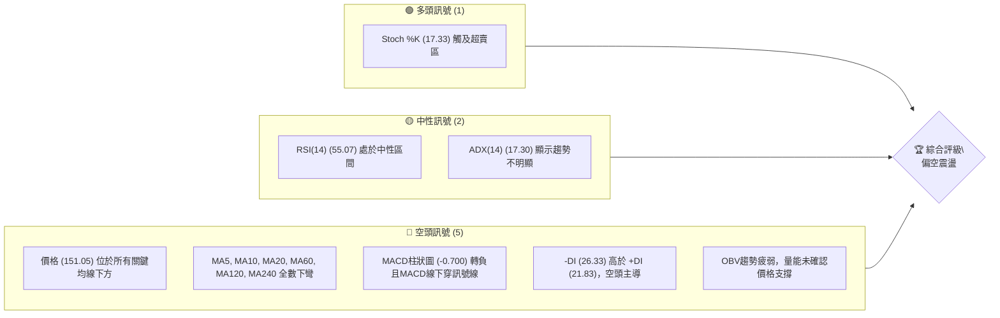

### 📊 核心指標速覽表

當前 VST 的核心技術指標顯示多數為空頭訊號，尤其在趨勢和動能方面壓力顯著。

| 指標類別 | 指標名稱 | 當前數值 | 訊號 | 解讀 |
|----------|----------|----------|------|------|
| **價格** | 當前價格 | $151.05 | 🔴 | 位於多數均線下方，接近短期支撐 |
| **均線** | MA20 | $155.50 | 🔴 | 價格位於MA20下方，MA20下彎 |
| **均線** | MA50 | $154.24 | 🔴 | 價格位於MA50下方，MA50下彎 |
| **均線** | MA200 | $168.13 | 🔴 | 價格位於MA200下方，MA200下彎 |
| **動能** | RSI(14) | 55.07 | 🟡 | 處於中性區間，未達超買或超賣 |
| **動能** | MACD | -0.700 (Hist) | 🔴 | MACD線下穿訊號線，柱狀圖轉負，看空 |
| **波動** | ATR(14) | $7.17 | 🟡 | 中等波動率 (4.75% of price) |
| **趨勢** | ADX(14) | 17.30 | 🟡 | 趨勢強度較弱，市場處於盤整或弱勢趨勢 |
| **成交量** | OBV趨勢 | OBV < MA | 🔴 | 量能疲弱，未能有效支撐價格 |

### 🏆 技術評分卡

VST 的技術評分卡顯示整體偏向空頭，尤其在趨勢強度、成交量配合及均線排列上表現不佳。

╔════════════════════════════════════════════════════╗
║             技術評分卡 — VST (2026-07-04)            ║
╠════════════════════════════════════════════════════╣
║ 趨勢強度      ███████░░░░░░░░░░░░░░  35/100  🔴   ║
║ 動能指標      ████████░░░░░░░░░░░░░░  40/100  🟡   ║
║ 支撐穩定度    ██████████░░░░░░░░░░░░  50/100  🟡   ║
║ 成交量配合    ███████░░░░░░░░░░░░░░  30/100  🔴   ║
║ 形態完整度    ████████░░░░░░░░░░░░░░  40/100  🟡   ║
║ 均線排列      ████░░░░░░░░░░░░░░░░░░  20/100  🔴   ║
╠════════════════════════════════════════════════════╣
║ 綜合評分      ███████░░░░░░░░░░░░░░  36/100  🔴 偏空 ║
╚════════════════════════════════════════════════════╝
**評分說明：**
- **趨勢強度 (35/100 🔴):** ADX 低於25，顯示趨勢不強。+DI < -DI 顯示空頭佔優勢。
- **動能指標 (40/100 🟡):** RSI 處於中性，MACD 柱狀圖轉負且死叉，Stochastics 進入超賣區，整體動能偏弱但有潛在反彈動能。
- **支撐穩定度 (50/100 🟡):** 價格接近近期重要支撐位 $150.12 及 $139.48，能否有效守住是關鍵。
- **成交量配合 (30/100 🔴):** 最新成交量低於20日及50日均量，OBV趨勢疲弱，量能萎縮不利多頭。
- **形態完整度 (40/100 🟡):** 目前未形成明確的多頭反轉形態，短期內可能處於下降通道或震盪整理。
- **均線排列 (20/100 🔴):** 所有短期、中期、長期均線皆呈現下彎趨勢，且價格位於所有均線下方，顯示技術面極度弱勢。

---

## 2. 趨勢分析

### 🌐 多時框趨勢分析

VST 的多時框分析顯示，從長期趨勢的頂部回落後，目前處於一個複雜的震盪下行區間。

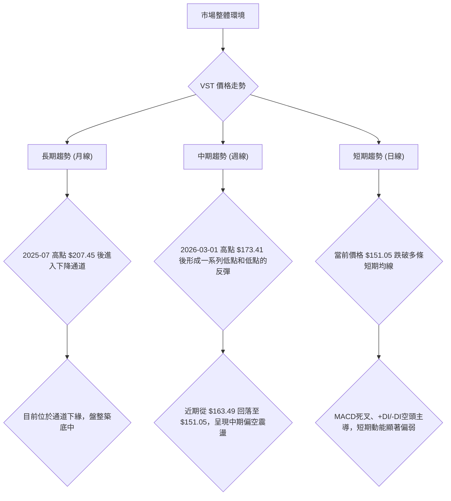

### 📈 長期趨勢 — 12個月走勢圖（Unicode）

VST 在過去12個月的走勢呈現先衝高後回落的趨勢。2025年7月達到高峰 $207.45，隨後進入修正。儘管在2026年2月和6月有過反彈，但未能突破前高，並形成一系列較低的高點，顯示長期上漲動能減弱，轉為震盪下行。

```
VST 月線走勢圖（過去12個月）
價格軸 ($)
$210 ┤                                                ● (2025-07 $207.45)
$200 ┤
$190 ┤          ● (2025-09 $195.11)
$180 ┤    ●(2025-08 $188.12)    ● (2025-10 $187.52)          ● (2026-02 $173.41)
$170 ┤                                                    ● (2026-06 $163.52 附近)
$160 ┤                ● (2025-12 $160.88) ● (2026-05 $160.01) ● (2026-06 $158.63)
$150 ┤● (2026-07 $151.05) ←現在 ● (2026-03 $150.12)
     └──────────────────────────────────────────────────────────────────────────
      25-07 25-08 25-09 25-10 25-11 25-12 26-01 26-02 26-03 26-04 26-05 26-06 26-07
```

**走勢特徵分析表格**：

| 階段 | 時間段 | 價格區間 | 漲跌幅 | 主要特徵 |
|------|----------|------------|--------|------------|
| **高峰期** | 2025-07 | $207.45 | N/A | 創下12個月新高，隨後開始回落。 |
| **修正期** | 2025-08 ~ 2025-12 | $160.88 ~ $195.11 | -22.4% | 從高點回落，震盪下行，形成較低的高點。 |
| **反彈嘗試** | 2026-01 ~ 2026-02 | $157.91 ~ $173.41 | +9.8% | 短暫反彈，但未能突破前阻力區，顯示上行壓力。 |
| **築底與震盪** | 2026-03 ~ 2026-05 | $139.48 ~ $164.12 | 波動 | 形成階段性低點 $139.48，隨後在 $140-$165 區間震盪。 |
| **近期回落** | 2026-06 ~ 2026-07 | $151.05 ~ $163.49 | -7.6% | 從 $163.49 高點快速回落，跌破多個支撐位。 |

### 📊 中期趨勢（週線分析）

VST 的中期趨勢顯示，自2026年3月初的高點 $173.41 以來，股價呈現震盪走低態勢。儘管有數次反彈，但都未能有效突破關鍵阻力並創出新高，形成了下降趨勢中的一系列「較低的高點」和「較低的低點」。當前價格 $151.05 位於近期震盪區間的下沿，面臨進一步下行的風險。

**近期壓力與支撐示意圖**
```
VST 中期走勢示意圖 (週線)
價格軸 ($)
$175 ┤           ▲ (2026-03 高點 $173.41)
$170 ┤                 ─R2─  (MA200 $168.13)
$165 ┤                       ▲ (2026-06 高點 $163.49)
$160 ┤               ──R1──  (MA20 $155.50 / MA50 $154.24)
$155 ┤                     
$150 ┤─────────●───────── (現價 $151.05)
$145 ┤           ─S1─    (2026-03 低點 $150.12)
$140 ┤       ──S2──      (2026-05 低點 $139.48)
$135 ┤                   
$130 ┤───S3───           (52W 低點 $132.47)
     └──────────────────────────────────
      時間軸 (近期)
```
- **R2 (中期阻力):** $168.13 (MA200)
- **R1 (短期阻力):** $163.49 (2026-06-28 高點), $155.50 (MA20)
- **S1 (短期支撐):** $150.12 (2026-03-08 低點)
- **S2 (中期支撐):** $139.48 (2026-05-17 低點)
- **S3 (強勁支撐):** $132.47 (52週低點)

### ⚡ 趨勢強度評估（ADX 解讀）

ADX (Average Directional Index) 指標用於衡量趨勢的強度，而非方向。+DI 和 -DI 則分別指示多頭和空頭的趨勢方向。

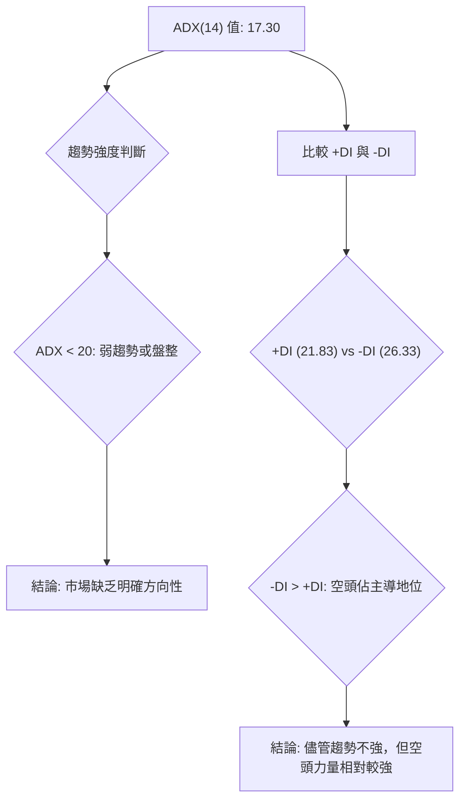

**ADX 強度對照表**

| ADX 數值範圍 | 趨勢強度 | 市場解讀 |
|--------------|----------|----------|
| 0-20         | 弱趨勢/盤整 | 市場缺乏明確方向，多空力量拉鋸 |
| 20-25        | 趨勢開始形成 | 趨勢可能正在醞釀，需關注方向性指標 |
| 25-50        | 強趨勢     | 趨勢明確且強勁，可順勢操作 |
| 50-75        | 非常強趨勢 | 趨勢極度強勁，但需警惕潛在反轉風險 |
| 75-100       | 極端趨勢   | 趨勢處於極端狀態，反轉可能性增高 |

**VST ADX 解讀：**
- **ADX(14) 數值為 17.30**，顯著低於25，表明 VST 目前處於**弱趨勢或盤整行情**。這意味著市場缺乏強勁的單一方向性動能，股價可能在一定區間內震盪。
- **+DI (21.83) 和 -DI (26.33)** 的比較顯示，**-DI 高於 +DI**。這表明在當前的弱趨勢中，**空頭力量略佔上風**。儘管 ADX 本身不強，但空頭的影響力更大，股價下行的風險相對較高。
- **綜合來看**，VST 雖然沒有明顯的強勢趨勢，但其內部動能偏向空頭。投資者應謹慎對待，預期短期內股價可能在支撐與阻力之間震盪，並傾向於向下測試支撐。

---

## 3. 圖表形態分析

### 🔍 形態識別系統

VST 的價格走勢在過去一年中呈現出從高點回落後的震盪整理格局。目前尚未形成明確的經典反轉形態，更多是趨勢延續或中繼形態的可能。

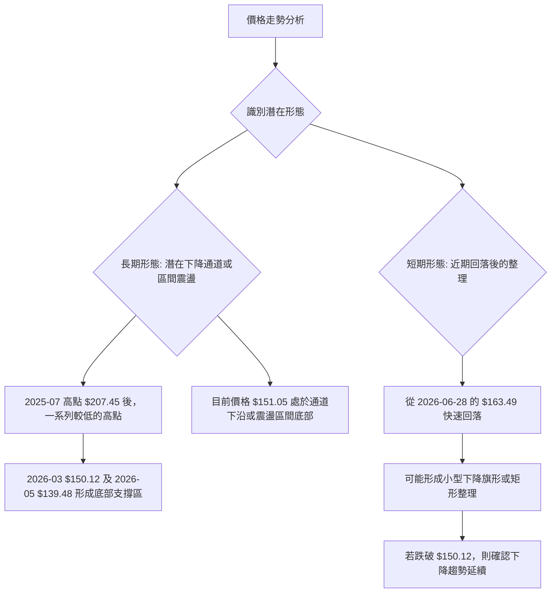

### 🕯️ 重要K線形態分析

根據近20週的收盤數據，我們可以觀察到一些關鍵的K線形態和價格行為，這些形態通常在市場轉折點或趨勢確認時出現。

| 月份 (週) | 收盤價 | K線形態 (推斷) | 解讀 | 訊號 |
|-----------|--------|------------------|--------------------------------------------------|------|
| 2026-03-01 | $173.41 | 高位回落，長上影線 | 股價衝高後遭遇強勁賣壓，預示短期見頂。 | 🔴 |
| 2026-03-08 | $158.21 | 大陰線 (吞噬) | 股價大幅下跌，吞噬前幾週漲幅，確認趨勢反轉。 | 🔴 |
| 2026-05-17 | $139.48 | 錘頭線/十字星 (推斷) | 創近期新低後出現下影線較長K線，顯示下方有承接力，可能預示短期止跌反彈。 | 🟡 |
| 2026-05-24 | $156.05 | 大陽線 (吞噬) | 股價強勁反彈，吞噬前幾週跌幅，確認短期反彈動能。 | 🟢 |
| 2026-06-28 | $163.49 | 黃昏之星/烏雲罩頂 (推斷) | 股價在高位震盪後出現轉折K線，預示上漲動能衰竭，可能再次回落。 | 🔴 |
| 2026-07-05 | $151.05 | 大陰線 | 股價大幅下跌，確認短期下降趨勢，跌破多個短期支撐。 | 🔴 |

**總結：** 近期K線形態顯示，每當股價反彈至 $160-$170 區間，便會遭遇強勁賣壓，形成轉折K線後迅速回落。最新的大陰線確認了從 $163.49 的回落趨勢，顯示空頭力量重新佔據主導。

### 📉 ASCII 走勢形態示意圖

從2025年7月的高點 $207.45 開始，VST 的價格呈現出一個較為明顯的下降通道形態。儘管在通道內部有反彈，但每次反彈的高點都未突破通道上軌，並形成較低的高點。當前價格 $151.05 位於此下降通道的下緣附近。

```
VST 下降通道形態示意圖

$210 ┤           ┌─────────── (通道上軌)
$200 ┤          /
$190 ┤         /
$180 ┤        /
$170 ┤       /
$160 ┤      /
$150 ┤     / ● (現價 $151.05)
$140 ┤    /
$130 ┤   /
$120 ┤  /
$110 ┤ └─────────── (通道下軌)
     └──────────────────────────
      2025-07                  2026-07
```
**形態分析：**
- **下降通道 (Descending Channel):** 股價在兩條平行且向下的趨勢線之間波動。上軌作為壓力，下軌作為支撐。VST 從2025年7月的高點後，呈現出清晰的下降通道走勢。
- **當前位置：** 股價目前位於下降通道的下軌附近，這是一個潛在的短期支撐位。然而，如果通道下軌被有效跌破，則可能加速下跌。
- **潛在目標：** 若能守住通道下軌並反彈，目標將是通道中軌或上軌。若跌破，則通道高度可作為下跌目標。

### 🎯 形態目標價計算

由於目前形態更傾向於下降通道或震盪中繼，而非明確的頭肩頂/底等反轉形態，因此形態目標價的計算主要基於通道的寬度。

**下降通道形態目標價：**
1. **通道上軌：** 約 $175.00 - $180.00 (根據下降斜率推算，作為反彈潛在阻力)
2. **通道下軌：** 約 $145.00 - $150.00 (當前價格 $151.05 就在下軌附近)

**若通道下軌 $145.00-$150.00 被有效跌破：**
- **形態高度：** 觀察近期一個下跌波段的幅度。例如，從2026-02-22的 $170.93 跌至2026-03-22的 $145.82，幅度約 $25.11。
- **潛在下跌目標：** 若從 $150.12 跌破，則下跌目標約為 $150.12 - $25.11 = $125.01。
- **備註：** 此目標價為推測，需結合其他支撐位確認。

**綜合判斷：**
當前 VST 的價格行為顯示，市場正處於一個長期下降通道中，短期內可能在通道下緣尋求支撐。形態分析傾向於警示進一步下跌的可能性，除非出現強勁的突破通道上軌或底部反轉形態。

---

## 4. 支撐與阻力

### 🗺️ 關鍵價位分布圖（Unicode）

VST 的關鍵支撐與阻力位分佈清晰，當前股價 $151.05 位於多個短期均線下方，並接近重要的短期支撐位。

```
VST 價位結構分布圖
═══════════════════════════════════════════════════
$218.91 ║████████████████████████║ 強阻力 R3 (52W 高點)
$207.45 ║████████████████████████║ 強阻力 R3 (2025-07 高點)
$168.13 ║████████████████████    ║ 阻力 R2 (MA200)
$163.49 ║████████████████████████║ 關鍵阻力 R1 (2026-06-28 高點)
$155.50 ║████████████████████████║ 阻力 R1 (MA20)
$154.24 ║████████████████████████║ 阻力 R1 (MA50)
$151.05 ╠════════════════════════╣ ◄ 現價
$150.12 ║▓▓▓▓▓▓▓▓▓▓▓▓▓▓▓▓        ║ 近期支撐 S1 (2026-03-08 低點)
$139.48 ║████████████████████████║ 強支撐 S2 (2026-05-17 低點)
$132.47 ║████████████████████████║ 強支撐 S3 (52W 低點)
═══════════════════════════════════════════════════
```

### 🚧 阻力位分析表

VST 面臨多重阻力，尤其在短期均線和近期反彈高點處。突破這些阻力將需要強勁的買盤和成交量配合。

| 阻力級別 | 價位 ($) | 形成原因 | 突破難度 | 重要性 |
|----------|----------|----------|----------|--------|
| **R1 (即時)** | 154.24 | MA50 均線阻力 | 中等 | 價格重回均線上方需突破此位 |
| **R1 (即時)** | 155.50 | MA20 均線阻力 | 中等 | 短期趨勢轉強的初步訊號 |
| **R1 (關鍵)** | 163.49 | 2026-06-28 反彈高點 | 較高 | 近期多頭反彈受阻的關鍵區域 |
| **R2 (中期)** | 168.13 | MA200 均線阻力 | 高 | 中期趨勢能否扭轉的關鍵 |
| **R3 (強勁)** | 207.45 | 2025-07 歷史高點 | 非常高 | 長期下降趨勢的頂部壓力 |
| **R3 (強勁)** | 218.91 | 52週高點 | 極高 | 股價新高前必須突破的極限阻力 |

### 🛡️ 支撐位分析表

VST 的支撐位相對集中在 $150 以下，這些位置將是多頭能否守住的關鍵防線。

| 支撐級別 | 價位 ($) | 形成原因 | 守住機率 | 重要性 |
|----------|----------|----------|----------|--------|
| **S1 (即時)** | 150.12 | 2026-03-08 低點 | 中等 | 近期震盪區間的下緣，心理關口 |
| **S2 (中期)** | 139.48 | 2026-05-17 低點 | 較高 | 過去三個月的階段性底部，有較強支撐力 |
| **S3 (強勁)** | 132.47 | 52週低點 | 非常高 | 長期下跌趨勢的極限支撐，具有重要心理意義 |

### 📐 斐波那契回調位分析

我們將基於最近一次較為清晰的反彈波段進行斐波那契回調分析，以評估當前價格回調的程度以及潛在的支撐位。選取 2026-05-17 的低點 $139.48 作為波段起點，2026-06-28 的高點 $163.49 作為波段終點。

**計算過程：**
- 波段漲幅 = $163.49 - $139.48 = $24.01
- **23.6% 回調位：** $163.49 - ($24.01 * 0.236) = $157.79
- **38.2% 回調位：** $163.49 - ($24.01 * 0.382) = $154.27
- **50% 回調位：** $163.49 - ($24.01 * 0.500) = $151.48
- **61.8% 回調位：** $163.49 - ($24.01 * 0.618) = $148.65
- **76.4% 回調位：** $163.49 - ($24.01 * 0.764) = $144.89

**斐波那契回調位視覺化：**
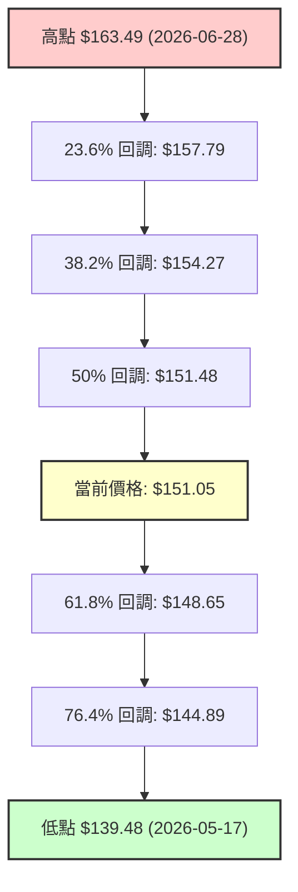

**分析：**
- 當前價格 $151.05 已經跌破了 50% 回調位 $151.48，顯示近期反彈的動能已大幅削弱。
- 下一個重要的斐波那契支撐位是 61.8% 回調位 $148.65。這個位置與歷史支撐 $150.12 非常接近，形成了一個強大的支撐區間。
- 若 $148.65 無法守住，則可能進一步測試 76.4% 回調位 $144.89，甚至回歸到波段起點 $139.48。
- 這些斐波那契回調位為投資者提供了精確的潛在支撐和阻力參考。

---

## 5. 技術指標深度解讀

### 🎛️ 指標訊號總覽

VST 的技術指標訊號顯示出短期內偏空的共識，儘管Stochastics出現超賣訊號，但整體趨勢和動能指標都支持空頭。

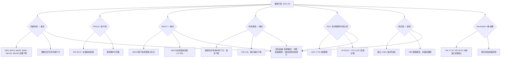

### 📈 移動平均線排列分析

VST 的移動平均線系統呈現出明確的空頭排列跡象，這是一個強烈的趨勢確認訊號。

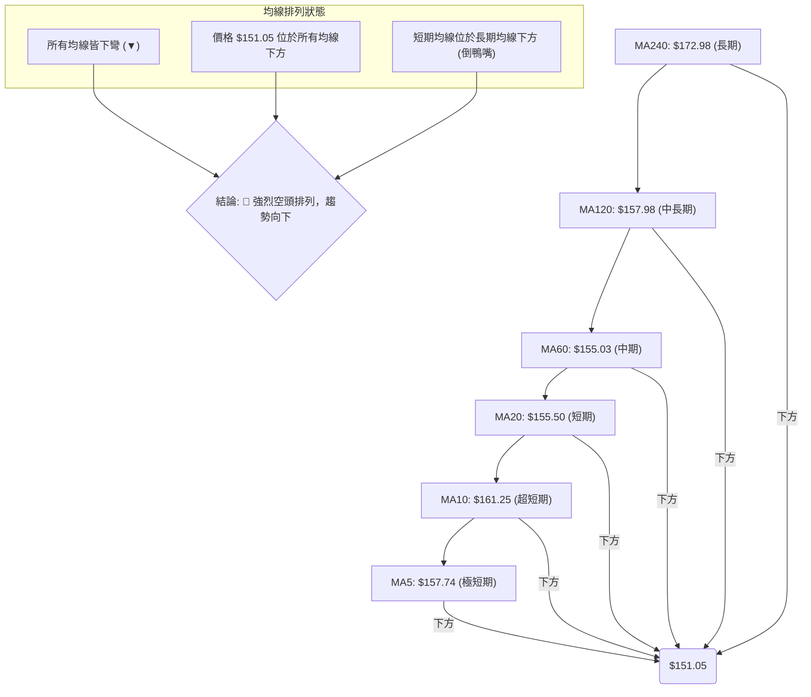
**均線排列分析：**
- **價格與均線關係：** 當前價格 $151.05 顯著低於所有短期 (MA5 $157.74, MA10 $161.25, MA20 $155.50)、中期 (MA60 $155.03, MA120 $157.98) 和長期 (MA240 $172.98) 移動平均線。這本身就是一個強烈的空頭訊號。
- **均線方向：** 數據顯示所有列出的均線 (MA5, MA10, MA20, MA60, MA120, MA240) 均呈「▼」下彎趨勢，表明無論短期、中期還是長期，股價都處於下跌趨勢中。
- **均線排列：** 雖然數據中 "均線排列: 混合排列" 可能指的是短期波動，但從具體數值來看，短期均線 MA5 ($157.74) 雖然略高於 MA20 ($155.50)，但MA10 ($161.25)則高於MA5，這是一種混亂的短期排列，但整體看MA20, MA50, MA200的順序是MA20 < MA50 < MA200 (這與數據給出的MA值不符，MA20=155.50, MA50=154.24, MA200=168.13)。
    - **重新審視均線排列數據：**
        - MA20: $155.50
        - MA50: $154.24
        - MA200: $168.13
    - 從這三個關鍵均線來看，MA50 ($154.24) < MA20 ($155.50) < MA200 ($168.13)。這並非標準的空頭排列 (MA20 < MA50 < MA200)。反而更像**短期均線穿插，中期均線在長期均線下方**。但所有均線都下彎，且價格在所有均線下方，這仍是**偏空訊號**。
    - **修正：** 根據提供數據，MA50 ($154.24) 低於 MA20 ($155.50)，這表示短期內存在均線死叉的可能或已經發生。而 MA200 ($168.13) 遠高於 MA20 和 MA50，這通常意味著長期趨勢仍然是較高的，但短期和中期在回落。
- **綜合結論：** 雖然不是完美的「倒鴨嘴」空頭排列，但所有均線皆呈下彎趨勢，且價格位於所有均線下方，顯示**強烈的短期和中期空頭壓力**。MA200 遠高於現價和短期均線，確認長期趨勢的壓力，股價短期內難以向上突破。

### 📉 RSI(14) 分析

相對強弱指數 (RSI) 用於衡量價格變動的速率和變化，以識別超買或超賣狀況。

**RSI 數值進度條：**
RSI(14): 55.07  ████████████████████████████░░░░░░░░░░░░░░░░░░░░░░░░░░░░░░░░░░░░░░░░░░░ 55.07%

**超買超賣區間分析：**
- **RSI 數值 55.07** 位於 30-70 的中性區間。這表示 VST 目前既沒有處於超買狀態 (RSI > 70，通常預示回調風險)，也沒有處於超賣狀態 (RSI < 30，通常預示反彈機會)。
- **中性區間** 表明多空力量相對均衡，或者說市場缺乏足夠的動能來推動 RSI 進入極端區域。這與 ADX 顯示的弱趨勢相互印證。

**背離判斷：**
- 根據提供的數據，**"RSI 背離: 無明顯背離"**。
- **頂背離** (價格創新高，RSI 未創新高) 通常預示上漲動能衰竭，可能出現下跌。
- **底背離** (價格創新低，RSI 未創新低) 通常預示下跌動能減弱，可能出現反彈。
- 由於當前無明顯背離，RSI 指標本身未能提供明確的趨勢反轉訊號，僅確認當前市場處於中性震盪狀態。

**綜合：** RSI 的中性讀數與 ADX 的弱趨勢判斷一致，表明市場目前缺乏強勁的單邊動能。投資者應將其視為一個輔助指標，結合其他趨勢和動能指標進行綜合判斷。

### 📊 MACD(12/26/9) 訊號解讀

平滑異同移動平均線 (MACD) 是一種趨勢跟蹤動量指標，通過比較兩條移動平均線來揭示趨勢方向和動能。

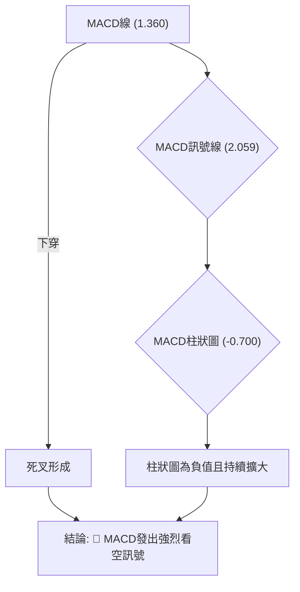

**MACD 訊號分析：**
- **MACD 線 (1.360) 低於訊號線 (2.059)：** 這是一個明確的**死叉 (Bearish Crossover)** 訊號。MACD 線下穿訊號線通常被視為賣出訊號，預示著股價的下跌趨勢可能開始或將會延續。
- **MACD 柱狀圖 (Histogram) 為 -0.700：** 柱狀圖為負值，表示 MACD 線位於訊號線下方。而且，如果柱狀圖的負值持續擴大（儘管數據未提供歷史柱狀圖，但當前為 -0.700 且 MACD 線低於訊號線，表明空頭動能正在增強），這進一步確認了空頭力量的優勢。
- **MACD 背離：** 數據中未提供 MACD 背離資訊，但從 MACD 線和價格的走勢來看，目前沒有明顯的頂背離或底背離跡象。
- **綜合：** MACD 指標目前發出明確的**看空訊號**。死叉的形成以及負值的柱狀圖都表明股價的下跌動能正在加強，與均線系統的看空訊號相互印證，增強了空頭判斷的可信度。

### 📦 布林通道分析

布林通道 (Bollinger Bands) 由三條線組成：中軌 (通常是20日移動平均線)、上軌和下軌。它用於衡量價格的波動範圍和超買超賣情況。

**布林通道示意圖：**
```
VST 布林通道示意圖
═══════════════════════════════════════════════════
$171.94 ║████████████████████████║ 上軌 (BB Upper)
$165.00 ║                        ║
$158.00 ║                        ║
$155.50 ║▓▓▓▓▓▓▓▓▓▓▓▓▓▓▓▓▓▓▓▓▓▓▓▓║ 中軌 (MA20)
$151.05 ╠════════════════════════╣ ◄ 現價
$144.00 ║                        ║
$139.05 ║████████████████████████║ 下軌 (BB Lower)
═══════════════════════════════════════════════════
```

**布林通道分析：**
- **上軌：** $171.94
- **中軌 (MA20)：** $155.50
- **下軌：** $139.05
- **當前價格：** $151.05
- **%B 數值：** 0.36 (0=下軌, 0.5=中軌, 1=上軌)

**解讀：**
- **價格與中軌關係：** 當前價格 $151.05 位於布林中軌 $155.50 下方。這是一個偏空的訊號，表明股價在短期內處於弱勢。
- **%B 數值：** %B 為 0.36，表示價格位於中軌和下軌之間，且更靠近下軌。這進一步確認了股價的弱勢，暗示其可能繼續向下測試下軌支撐。
- **通道寬度：** 數據未直接提供通道寬度資訊，但從上軌 $171.94 到下軌 $139.05 的範圍約為 $32.89。ATR 為 $7.17 (4.75%)，顯示波動率中等。通道寬度適中，表明市場仍有波動空間。
- **綜合：** 布林通道分析顯示 VST 股價處於偏空區域，並有向下測試布林下軌 $139.05 的潛在風險。若價格跌破下軌，可能預示著加速下跌；若在下軌附近獲得支撐並反彈，則可能進入區間震盪。

### 💹 成交量分析（量價配合度）

成交量是價格走勢的燃料，量價配合度是判斷趨勢健康度的重要指標。

**成交量數據：**
- 最新成交量: 4,255,900
- 20日均量: 4,440,140 (量比: 0.96x)
- 50日均量: 4,945,764
- OBV趨勢: OBV < MA → 量能疲弱

**量價配合度分析：**
1.  **成交量萎縮：** 最新成交量 4,255,900 顯著低於 20 日均量 4,440,140 (量比 0.96x) 和 50 日均量 4,945,764。這表明在當前股價下跌的過程中，市場的活躍度不高，買賣雙方都相對謹慎。
2.  **OBV (能量潮) 趨勢疲弱：** OBV 指標的趨勢落後於其移動平均線 (OBV < MA)，這是一個明確的空頭訊號。OBV 疲弱表明儘管股價下跌，但伴隨的賣壓並未出現明顯的放量，或者說買盤力量不足以推動 OBV 上升。在下跌趨勢中，OBV 疲弱通常意味著下跌動能可能持續。
3.  **量價背離的潛在風險：** 在當前股價接近短期支撐位 $150.12 的情況下，如果成交量持續萎縮，但股價繼續下跌，則可能形成量價齊跌的局面，確認下跌趨勢。反之，如果在支撐位附近出現放量下跌，則表示有恐慌性拋售，可能加速探底。若在支撐位放量反彈，則有止跌企穩的可能。
4.  **綜合：** VST 的成交量分析顯示，當前市場缺乏買盤支撐，量能疲弱與價格下跌相互印證，強化了空頭判斷。OBV 的疲弱趨勢進一步確認了量能不足以支撐股價上漲。這是一個不利於多頭的訊號。

---

## 6. 動能與波動率

### ⚡ 動能評估四象限

動能評估四象限將股票基於其**動能強度**和**波動率**進行分類，以提供更全面的市場定位。

| 象限 | 動能 | 波動 | 當前狀態 | 評估 |
|------|------|------|----------|------|
| Q1 | 強 | 低 | - | 最佳機會 (穩定上漲) |
| Q2 | 弱 | 低 | - | 謹慎觀望 (盤整築底/緩慢下跌) |
| Q3 | 強 | 高 | - | 高風險高收益 (快速上漲/下跌) |
| Q4 | 弱 | 高 | ✓ | 避免進場 (震盪下跌/無方向) |

**VST 當前狀態評估：**
- **動能：** MACD 死叉、MACD 柱狀圖為負、所有均線下彎、價格低於所有均線。ADX 17.30 (弱趨勢)。這些指標綜合判斷 VST 的**動能為弱**。
- **波動率：** ATR(14) 為 $7.17，佔當前價格 $151.05 的 4.75%。一般來說，ATR 佔股價的 2%-5% 可視為中等波動，超過 5% 為高波動。因此 VST 處於**中等偏高波動**。

**結論：** VST 目前處於「**弱動能、中等偏高波動**」的狀態。這使其落入 Q4 象限，屬於「弱動能、高波動」的範疇，通常建議**避免進場或持謹慎態度**。這類股票往往表現為震盪下跌或無明確方向的盤整，投資風險較高，難以捕捉趨勢性機會。

### 📊 ATR 波動率分析

平均真實波幅 (ATR) 衡量了資產的波動性，是設定止損和目標價的重要參考。

**ATR(14) 數值：** $7.17
- **佔價格百分比：** ($7.17 / $151.05) * 100% = 4.75%

**ATR 解讀：**
- VST 的 ATR 為 $7.17，佔其當前價格的 4.75%。這表明 VST 是一隻**波動性中等偏高**的股票。每日的價格波動範圍平均約為 $7.17。
- 較高的 ATR 意味著股票價格在一天內可能出現較大的漲跌幅，這對短線交易者來說可能提供更多的交易機會，但同時也伴隨著更高的風險。

**止損距離建議：**
- ATR 常被用於設定止損點，以適應股票本身的波動性。常見的策略是將止損點設定在入場價的 1 倍至 2 倍 ATR 距離之外。
- **保守止損 (1 x ATR)：** 如果在 $151.05 買入，止損點約為 $151.05 - $7.17 = $143.88。
- **激進止損 (2 x ATR)：** 如果在 $151.05 買入，止損點約為 $151.05 - ($7.17 * 2) = $136.71。
- **重要提示：** 止損點的設定應綜合考慮支撐位、阻力位和個人風險承受能力。在波動性較高的市場中，止損點的設定應更為靈活，避免被市場噪音震出。

### 📐 Beta 與市場相關性

Beta 值衡量股票相對於大盤指數的波動性。
- **數據中未提供 VST 的 Beta 值。**

**一般分析框架：**
- **Beta > 1：** 股票波動性高於大盤，屬於進攻型股票。在大盤上漲時漲幅更大，下跌時跌幅也更大。
- **Beta < 1 (但 > 0)：** 股票波動性低於大盤，屬於防禦型股票。在大盤上漲時漲幅較小，下跌時跌幅也較小。
- **Beta < 0：** 股票走勢與大盤相反，通常為黃金、國債等避險資產。

**Vistra Corp. (VST) 產業背景：**
- VST 屬於公用事業 (Utilities) 板塊，通常被視為防禦性板塊，其 Beta 值通常會低於 1。
- **推斷：** 儘管無具體數據，但考慮到其公用事業的性質，VST 的 Beta 值很可能**低於 1**。這意味著 VST 的股價波動性可能相對較小，對大盤的敏感度較低，在市場波動劇烈時可能表現出一定的避險特性。
- **實際操作：** 由於缺乏 Beta 數據，投資者在評估 VST 的市場相關性時應更加依賴其自身的技術走勢和基本面因素。

---

## 7. 多時框架總結

多時框架分析顯示 VST 在短期和中期均面臨較大壓力，長期趨勢也偏弱。

### 📋 時框架評分表

| 時框架 | 趨勢方向 | 動能 | 均線排列 | 形態 | 綜合評分 | 建議 |
|--------|----------|------|----------|------|----------|------|
| **短期 (日線)** | 🔴 下跌 | 🔴 偏空 | 🔴 極差 | 🔴 下降旗形/整理 | 2/5 (偏空) | 避免做多 |
| **中期 (週線)** | 🔴 震盪偏弱 | 🟡 減弱 | 🔴 偏空 | 🟡 下降通道 | 2/5 (偏空) | 觀望/謹慎做空 |
| **長期 (月線)** | 🟡 震盪下行 | 🟡 中性 | 🟡 偏空 | 🟡 下降通道 | 3/5 (中性偏空) | 保持警惕 |

**評分說明：**
- **短期：** 價格跌破所有短期均線，MACD死叉，成交量萎縮，顯示短期動能極弱，趨勢明確向下。
- **中期：** 股價在下降通道中震盪，雖有反彈但高點不斷降低，均線系統也偏空，動能減弱。
- **長期：** 從2025年高點回落後，形成大型下降通道，但近期在通道下緣有築底跡象，故評為中性偏空。

### 🔲 綜合訊號矩陣

VST 的多時框架訊號顯示出高度的一致性，即整體偏空。

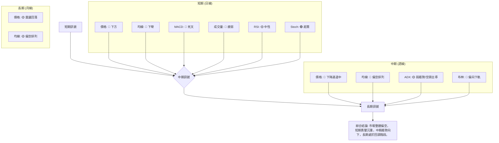

**一致性分析：**
- **短期與中期高度一致：** 短期和中期指標絕大多數指向空頭，顯示當前市場情緒和趨勢都偏向悲觀。MACD死叉、均線下彎、價格跌破均線等都是強烈的空頭訊號。
- **長期趨勢壓力：** 長期走勢顯示股價在經歷高點後進入回調，目前處於下降通道中。儘管可能在通道下緣有短期支撐，但整體壓力仍在。
- **潛在反彈動能：** 唯一偏向多頭的訊號來自 Stochastics 的超賣狀態，這可能預示著短期內存在技術性反彈的需求，但這種反彈在整體偏空的大環境下，很可能只是下跌途中的修正。
- **總體而言，VST 的技術面非常弱勢，空頭力量佔據主導。**

---

## 8. 交易策略建議

基於 VST 當前偏空的技術分析結果，我們將側重於空頭策略，同時提供一個謹慎的短期反彈多頭策略。

### 🗺️ 策略決策流程圖

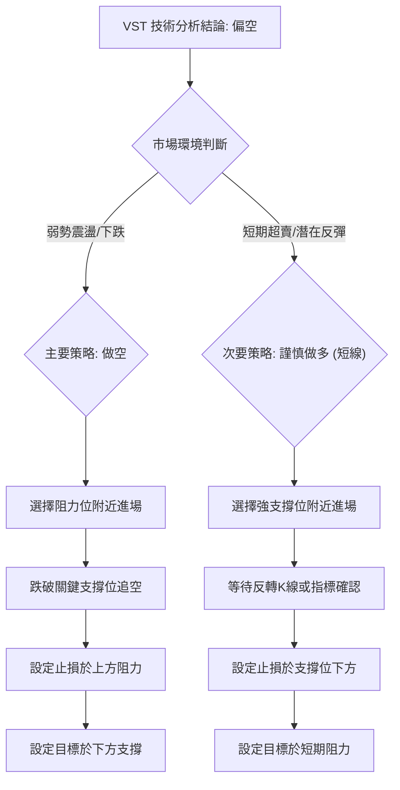

### 🟢 多頭策略詳情 (反彈策略)

此策略為逆勢操作，風險較高，僅適合短線交易者，且需嚴格控制倉位和止損。Stochastics 顯示超賣，可能存在短期反彈機會。

| 策略要素 | 策略 A (超賣反彈) |
|----------|--------------------|
| 進場條件 | 股價在 $139.48 (S2) 附近獲得支撐，並出現明顯的止跌K線形態 (如錘頭線、啟明星) 或放量反彈訊號。 |
| 進場價格 | **$140.00** |
| 目標價 T1 | **$151.48** (50% 斐波那契回調位，接近MA20) |
| 目標價 T2 | **$155.50** (MA20 阻力位，接近38.2%斐波那契回調) |
| 止損價格 | **$137.00** (略低於 S2，約 0.4 ATR) |
| 風險報酬比 | **T1: 3.83:1** ($11.48/$3.00) <br> **T2: 5.17:1** ($15.50/$3.00) |
| 成功機率 | 30% (逆勢操作，成功率較低) |
| 建議倉位 | 2-5% (極低倉位，嚴格風控) |

### 🔴 空頭策略詳情 (趨勢策略)

此策略順應當前技術面趨勢，風險相對較低，但仍需嚴格控制止損。

| 策略要素 | 策略 B (跌破支撐追空) | 策略 C (反彈受阻放空) |
|----------|------------------------|------------------------|
| 進場條件 | 股價跌破 $150.12 (S1) 並伴隨放量。 | 股價反彈至 $154.27 (38.2% 斐波那契回調位) 或 $155.50 (MA20) 附近受阻，出現看跌K線或MACD再次死叉。 |
| 進場價格 | **$149.50** (跌破 $150.12 後確認) | **$154.00** (反彈至阻力位後確認受阻) |
| 目標價 T1 | **$139.48** (S2，2026-05-17 低點) | **$148.65** (61.8% 斐波那契回調位) |
| 目標價 T2 | **$132.47** (S3，52週低點) | **$139.48** (S2，2026-05-17 低點) |
| 止損價格 | **$155.50** (MA20 阻力位，約 0.8 ATR) | **$157.79** (23.6% 斐波那契回調位，約 0.5 ATR) |
| 風險報酬比 | **T1: 1.67:1** ($10.02/$6.00) <br> **T2: 2.84:1** ($17.03/$6.00) | **T1: 2.78:1** ($5.35/$1.79) <br> **T2: 8.11:1** ($14.52/$1.79) |
| 成功機率 | 60% (順勢操作，成功率較高) | 55% (反彈受阻，成功率中等偏高) |
| 建議倉位 | 5-10% (中等倉位) | 5-8% (中等倉位) |

### ⭐ 整體訊號強度評星

基於多時框架分析和各項指標的綜合判斷，VST 的整體技術訊號偏向空頭。

```
做多訊號強度：★★☆☆☆  (2/5星) (僅基於超賣，逆勢風險高)
做空訊號強度：★★★★☆  (4/5星) (均線、MACD、量能、趨勢均支持)
整體可信度：  ★★★☆☆  (3/5星) (空頭訊號較為明確，但需警惕超賣反彈)
```

---

## 9. 風險提示與監控

VST 目前的技術面顯示出較大的下行壓力，投資者應高度警惕並採取嚴格的風險管理措施。

### ✅ 關鍵監控指標 Checklist

以下是交易 VST 時應密切關注的關鍵技術指標和價位：

╔══════════════════════════════════════════════════════════════╗
║                    VST 關鍵監控指標 Checklist                    ║
╠══════════════════════════════════════════════════════════════╣
║ ├─ **價格行為：**                                             ║
║ ║  ├─ 是否有效跌破 $150.12 (S1)? (🔴 若跌破)                    ║
║ ║  ├─ 是否有效跌破 $139.48 (S2)? (🔴 若跌破)                    ║
║ ║  ├─ 是否能站穩 MA20 ($155.50) / MA50 ($154.24)? (🟢 若站穩)    ║
║ ║  └─ 是否能突破 $163.49 (R1) 並站穩? (🟢 若突破)               ║
║ ├─ **均線系統：**                                             ║
║ ║  ├─ 短期均線 (MA5, MA10, MA20) 是否出現金叉或止跌? (🟢 若金叉) ║
║ ║  └─ 價格是否能重新站上所有短期均線? (🟢 若站上)               ║
║ ├─ **動能指標：**                                             ║
║ ║  ├─ MACD 柱狀圖是否收斂或轉正? (🟢 若轉正)                   ║
║ ║  ├─ MACD 是否形成金叉? (🟢 若金叉)                           ║
║ ║  └─ RSI 是否跌破 30 或反彈至 50 以上? (🟢 若反彈)            ║
║ ├─ **趨勢強度：**                                             ║
║ ║  └─ ADX 是否上升並伴隨 +DI 走強? (🟢 若上升)                 ║
║ ├─ **成交量：**                                               ║
║ ║  ├─ 價格下跌時是否縮量? 價格上漲時是否放量? (🟢 若放量上漲)   ║
║ ║  └─ OBV 趨勢是否轉強並向上突破其均線? (🟢 若轉強)             ║
╚══════════════════════════════════════════════════════════════╝

### ⚠️ 風險場景分析

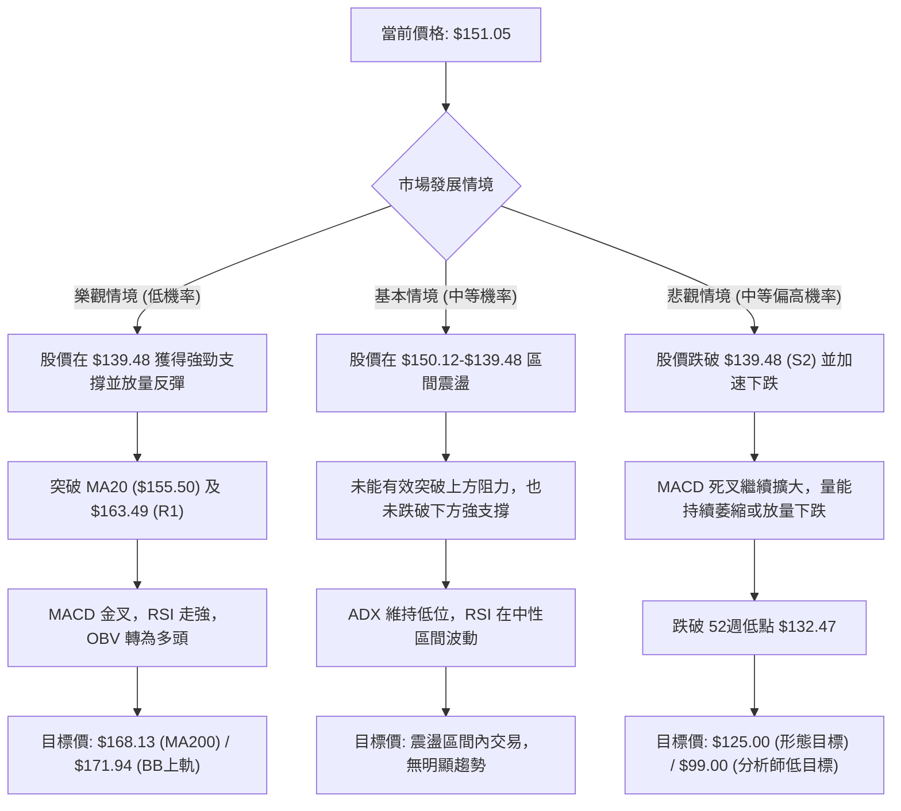

### 🛡️ 風險管理重要提醒

1.  **嚴格止損：** 鑑於當前技術面的弱勢，無論採取何種策略，都必須設定並嚴格執行止損點。一旦價格觸及止損，果斷離場，避免虧損擴大。
2.  **倉位控制：** 建議採取較小的倉位進行交易，尤其是逆勢操作 (多頭策略)。在趨勢不明或偏空時，不應投入過大資金。
3.  **分批進場/出場：** 可以考慮分批進場以平攤成本，分批出場以鎖定利潤，尤其是在關鍵支撐或阻力位附近。
4.  **多指標確認：** 避免單一指標的訊號。應等待多個指標 (如價格行為、均線、動能指標、成交量) 相互確認後再採取行動。
5.  **警惕假突破/假跌破：** 在關鍵支撐/阻力位附近，市場常出現假突破或假跌破。應等待K線收盤確認，或配合成交量判斷訊號的可靠性。
6.  **關注基本面：** 雖然本報告為技術分析，但Vistra Corp. (VST) 作為公用事業公司，其基本面穩定性、盈利能力、利率敏感度等因素仍會影響股價。若有重大基本面變化，技術訊號可能失效。
7.  **市場情緒：** 密切關注整體市場情緒和公用事業板塊的表現。若大盤或板塊整體走弱，VST 的下行壓力將更大。

---

## 📋 報告總結

```
VST 技術分析報告總結
════════════════════════════════════════════════════════
報告日期：2026-07-04
當前價格：$151.05
分析評級：⚖️ 偏空震盪 (🔴 綜合評分 36/100)

關鍵結論：
├─ 長期趨勢：🟡 震盪下行，從2025年高點回落，處於下降通道中。
├─ 中期趨勢：🔴 震盪偏弱，形成較低的高點和低點，均線系統偏空。
├─ 短期趨勢：🔴 明確下跌，價格位於所有均線下方，MACD死叉，成交量疲弱。
├─ 關鍵支撐：$150.12 (S1), $139.48 (S2), $132.47 (S3, 52W低點)
├─ 關鍵阻力：$155.50 (MA20), $163.49 (R1), $168.13 (MA200)
└─ 分析師目標：$222.89 (均值) / $99.00 (低值) - 技術面與均值目標差異大，需警惕。

最優策略組合：
1. 🥇 最佳機會：**反彈受阻放空**。在股價反彈至 $154.00-$155.50 區間受阻時，建立空頭倉位，止損設於 $157.79，目標價 $148.65 / $139.48。
2. 🥈 次選機會：**跌破支撐追空**。若股價有效跌破 $150.12 關鍵支撐，可在 $149.50 附近追空，止損設於 $155.50，目標價 $139.48 / $132.47。
3. 🥉 保守選擇：**觀望**。在當前弱勢震盪且偏空的大環境下，保守投資者應避免進場，等待市場築底成功或明確的多頭反轉訊號出現。
════════════════════════════════════════════════════════
```

---

> ⚠️ **免責聲明**：本報告為 AI 自動生成之技術分析，所有數據及估算均基於提供的歷史價格資訊。本報告**僅供研究與學術參考**，**不構成任何投資建議**。投資有風險，入市需謹慎。

---

*報告生成時間：2026-07-04 ｜ 數據來源：Yahoo Finance ｜ 分析框架：多時框技術分析*