<details>
<summary>📊 靜態圖表 (點擊展開)</summary>

</details>

<html>
<head><meta charset="utf-8" /></head>
<body>
    <div style="height:500px; width:100%;">                        <script>window.PlotlyConfig = {MathJaxConfig: 'local'};</script>
        <script charset="utf-8" src="https://cdn.plot.ly/plotly-3.6.0.min.js" integrity="sha256-QaOVwtVY0T02VaHrr6pnoHLCwayMJp4O5n4YyaE3rJk=" crossorigin="anonymous"></script>                <div id="candlestick-chart" class="plotly-graph-div" style="height:100%; width:100%;"></div>            <script>                window.PLOTLYENV=window.PLOTLYENV || {};                                if (document.getElementById("candlestick-chart")) {                    Plotly.newPlot(                        "candlestick-chart",                        [{"close":{"dtype":"f8","bdata":"AAAAwMkKakAAAACgIudpQAAAAOAGImpAAAAAoOtMakAAAADghCBrQAAAACCTbGlAAAAAoBonaUAAAAAAFRlpQAAAACCKy2lAAAAAgM+jaEAAAABAcGNoQAAAAKCTFWlAAAAAoOc5aUAAAACA3yRpQAAAAOCF8mhAAAAA4FjZaEAAAAAgMLZpQAAAAEAhJGpAAAAA4GSBaEAAAAAgyhVqQAAAAKALlWlAAAAAoDc\u002fakAAAABg4DBqQAAAAIB6EGlAAAAAwOYtaEAAAADg4jdnQAAAAODlIWdAAAAAQHHSZ0AAAABgTRRpQAAAAGAmz2hAAAAAAJa5Z0AAAABgYdFoQAAAAOCKnWdAAAAAQJxwZ0AAAAAgqQdoQAAAAKAHH2dAAAAAYFiTZ0AAAACgVvtmQAAAAOCmxmdAAAAA4PhvZ0AAAADgV01mQAAAAED7MGZAAAAAwCZbZUAAAACA5b5lQAAAAIDGyGVAAAAAwEq2ZUAAAACAtExmQAAAACA3omVAAAAAgIH8ZEAAAACgPM1lQAAAAAA1RGVAAAAAACMCZkAAAABgyENmQAAAAIBvnWVAAAAAQLN6ZUAAAAAABV5lQAAAAIDf6mVAAAAAAEHPZEAAAAAgy61kQAAAAAAMhGRAAAAA4ISPZEAAAABAB7xlQAAAACCgLGVAAAAAwKvxZEAAAACAYZdlQAAAAEDP6WNAAAAAAGOvZEAAAADgUktkQAAAAAD6I2RAAAAA4ConZEAAAAAgbDBkQAAAAOAqJ2RAAAAAwJcsZEAAAADAe0VkQAAAAEBRHGRAAAAA4MWYZEAAAABAYE9kQAAAAGD+IWVAAAAAQI1FY0AAAADA58ViQAAAAAAnvWRAAAAAAFODZUAAAACATl5lQAAAAIAfEGVAAAAAgNp1ZkAAAAAAfsRkQAAAAKATjGNAAAAAYIPyY0AAAAAAXf1jQAAAAEC09WNAAAAAYObLY0AAAACg0XlkQAAAAGDbpWRAAAAAIDVEZEAAAACAOL1jQAAAAICzOmNAAAAAQH4SY0AAAADgDsRhQAAAACCc1WFAAAAAoJanYkAAAAAgiRFjQAAAAEAc5WNAAAAAYKn2Y0AAAAAgzVRkQAAAAGCKYGVAAAAAYG2mZUAAAACgLkNlQAAAAIDFgGVAAAAAAKtdZUAAAABAyepkQAAAAGCwZGVAAAAAAArcZUAAAABgoQpmQAAAAOAgrWVAAAAAwAaxZEAAAADgHyhkQAAAACAZXWRAAAAAgAXeZEAAAABAy8ZjQAAAACBlZWRAAAAAQEl+ZEAAAACgEddjQAAAAOB45GNAAAAAAF7QY0AAAAAgYTFkQAAAAIANfGRAAAAAQNI0ZUAAAACAEN1kQAAAAAAbOmJAAAAAgILiYkAAAACgNBBjQAAAACCK6WJAAAAA4MgCY0AAAAAAZ2hjQAAAAGCtamJAAAAAINXDYkAAAACg1DdjQAAAAKD+3mJAAAAAoBjsYkAAAADg4S5jQAAAAACBdWNAAAAAICoRY0AAAACAb1BjQAAAAABSv2NAAAAAwLN3ZEAAAADgyVZkQAAAAGCNqWRAAAAAwGdnZEAAAADgDuxjQAAAACAwVmNAAAAA4E5yY0AAAABgLpRjQAAAAIDYg2RAAAAAABvLZEAAAABAoRxkQAAAAMBlMmNAAAAAANGzY0AAAADgAmJjQAAAAIAAFGRAAAAAoPsEZEAAAABAMsJjQAAAAMCCN2NAAAAAAG5wYkAAAADAy\u002fpiQAAAAIBEVWJAAAAAYCPNYUAAAAAgc7ZhQAAAAGCCb2FAAAAAYOERYUAAAAAgsdBgQAAAAGCO+WFAAAAAgOObYkAAAACgpYFjQAAAAECOimRAAAAAIKL9Y0AAAACgyQFkQAAAAIAwAGRAAAAA4GRRY0AAAACA+LdjQAAAAKC3MmNAAAAAoIUvY0AAAACgqZFiQAAAAOA5VmJAAAAAIH9AYkAAAACAFEthQAAAACCcRWJAAAAAIAR6YkAAAAAgxSljQAAAACBszGNAAAAAwHPTY0AAAAAgrHBkQAAAAOBR6GRAAAAA4HpMZEAAAAAA11tkQAAAAOCj+GRAAAAAIK5vZEAAAAAAKUxkQAAAAAAp1GNAAAAAwB4lY0AAAACgmeFiQA=="},"high":{"dtype":"f8","bdata":"0OKlEOaVakByFu0P5pVqQEz7M6\u002foqmpAWf+DJoCeakBJy6kyEV1rQIqTlz0+fGpAOn2byZ6qaUDpIHkuNm1pQMs0vlx21GlABjVRP5PIaUD\u002fgAQFZPVoQMA7cw6QgmlAhL5QCMuEaUD3dKDQgCpqQDKxqyIq4mlAOIVSC6tfaUD3\u002fSqWGbhpQJkZgWU6RmpApV+nzadvakD2g\u002f5IiSJqQJc3t4V7\u002f2lASHr99nLkakAJ0689YwZrQPHYMUy5JWpARlkFELqUaUBBhMYyxRNoQC8bM9DZlmdA8tQGbeTsZ0CnH1QeMSVpQHL6Rl4XWmlAxpn+xOSPaEAVEzVLuPxoQB8umXvav2hAUh\u002fIjuECaEDEOS30LExoQHGn7kRE1mdAbmjz76f1Z0CYgFu9vYpnQMRyt7MKyWdA\u002fC6xR3t\u002faEA4wSlUI2VnQKvztQ6KkWZAWwRKLxonZkCW1HyYHGhmQLEpo8\u002fQWGZAbUpl0+QVZkCs4Vdx6ZdmQOMAi4MokGdANKv70bWeZUB1QC0WJs9lQAljkbYrwGVAAhiFGWkgZkDGT5o7poBmQNAwCEPw92VAKDZFfAznZUB8rF3BIKRlQNEtulr4KWZAMBxL+Lf8ZUBNEBze9+NkQGTvjPmRJmVAzyfbPpuqZEAQ9cQFRcVlQAjDJoYcaGZAoli3XgqJZUCAgEBRraZlQN4l9Xg8zWVAF1zOpJ9mZUCS8PoqX1ZlQP1gbxNqe2RAL5U2v\u002fJnZED\u002fqwsAXkRkQFPdHzGcUWRAZjJLiud3ZEBopEtOhlNkQCZgUjt6gWRAp7b59wMaZUBN6ilQzmVlQGnwWiRIhGVADJZ2N+kFZUBE4m2b2GtjQI4l+vVAyGVAMDl4uxMIZkCwF9cr6d5lQIyfx82lVmVAQx95ts3BZkB5BYeYu1RlQL9AyW5YsWRAHYwfVA8xZEBiVUbpkGFkQGW0bhl2TWRAw3xmeVObZECm6jGdToVkQEoXNTU3w2RAxGbJ+FbtZECO8DJCeoFkQOqEa3k88WNAB1yxJi+CY0CvAnb7jSdjQNPBIGRq8GFABHBsw+D6YkBU0nYeNWtjQKg1I34wH2RAOMhnglObZEDZvnb2C7hkQH14cCj3ZWVA583ygDQFZkB0Xxa1geBlQDMz92oBg2VA6vbbya6gZUBLNqGRtWtlQOd\u002f4ISaZmVAj8lZRIzuZUBZsPm7thdmQBRRGZstOmZAbfWfhQ4BZkCHAxzkhWJkQKOUHio5eGRAPyMoHjbwZED\u002fpuOZS\u002f1kQNZEY0yghWRAH\u002fXO6GAKZUD8+7HWM3FkQGr0MxD+V2RAPFB2lxeZZEDlyrbfkGFkQO3BNvYcoGRAR1FHKbqQZUAGcUJaOiRlQBLbDReXx2RAKP1\u002f0NJ1Y0CsEKnQTTxjQMnRnNhUt2NA\u002fbnmopsOY0AmnuYtO\u002f9jQDxygsOl1mNAkD6M8ELoYkC2cS484oNjQNmGlecAS2NAt5PhJIIcY0C6bzOgOD5jQAZrlYizImRA8CFS1q9JZEBedA6yD81jQAq8WAHZD2RAcz8APpChZEDlS+M8MMlkQGrTXFP41WRAFKUg4CMIZUCXUVpFQnpkQCk\u002fmrb9G2RAx48q73DbY0B3r+b7utRjQO2YHW70p2RAd8+tK+cFZUB7R3RdF2NkQOYAlq48HWRANaBGPgTtY0A5swBTUP1jQDpCyrjkRGRA\u002fCy2EUVyZEC+dxHoYlhkQFDM6dPxBGVAunURWhBZY0Ch9xobKhFjQKvCgvGbw2JADqrM9GlCYkBZFcYEB+NhQBJH9fiQnGFAIfOYCQlrYUBUh9ZTSBBhQKountBQFmJA6u50lUeiYkCkz2NbMKtjQKQP0fZO5WRAKSwZ0FGZZECFWNRkpGlkQLrBeGYEQmRAYUJ4NIHKY0DNoM\u002fOwxFkQI9n\u002fqkNtmNAvcvm+mI6Y0B4\u002f3EFYEJjQFtCdEHromJAiBs6wt\u002fCYkDg5SFTjvlhQOkUD+s5VmJAErqv1kPJYkB\u002f1sKDcWdjQL3COj8iKGRAFzVshM9GZEA+fr7hQUNlQAAAAAAAUGVAAAAAYGa6ZEAAAADgerRkQAAAAEAza2VAAAAAgML9ZEAAAABAM7NkQAAAAGBmrmRAAAAAgD2qY0AAAAAgrodjQA=="},"hovertemplate":"\u003cb\u003e%{x|%Y-%m-%d}\u003c\u002fb\u003e\u003cbr\u003e\u958b: $%{open:.2f}\u003cbr\u003e\u9ad8: $%{high:.2f}\u003cbr\u003e\u4f4e: $%{low:.2f}\u003cbr\u003e\u6536: $%{close:.2f}\u003cextra\u003e\u003c\u002fextra\u003e","low":{"dtype":"f8","bdata":"Ym989G3HaUASEXdaQ3NpQLyvpvLb3mlApLusW6iKaUA2B7KyBd5pQOt8EOC3U2lA7bWJlAwhaUBD2UJ5TmZoQKbruf+vBGlAxdp3hymcaECUb29ZF71nQNgz77Lv62dA6EHjHFm8aECGfeEFQhVpQEcTvN6Ok2hAHk+2pVJiaECPdm4YgeloQADgPh54j2lAycT8rcGAaEBvN40fNPJoQOIAYyMSEmlAW6BnUGixaUDnVw1NMfppQGzMtgoN52hAm2nITzwAaEBVzavGnBlnQIO2mjb1XGZAt1H46xIeZ0Awlt\u002fHXzloQJ1NbOHrdWhAgwnm7I72ZkDdk4\u002f65JVnQON8eOBBeGdA+szA5UjYZkBPmRpXJGJnQAMTC6GD92ZAt8kzhzcFZ0BQIx9OIllmQPL0dFvD+2VAssVq2q3sZkD\u002fhSuEMEJmQJvmmkvAEWZA77VxdQI6ZUAK5+bhlZxkQFbLL1\u002fdjGVAP9iunng+ZUCNZ9UI669lQLTvTOwujWVAOW9MsYU4ZECjlBhsyKZkQGznWCrxpmRA6MK39r+LZUDrlP0AsihmQJLBoWYpf2VA2GOdAvBUZUDN+UFb+gdlQGFiKZpyOGVA+stRaPK4ZEBkxt6cJWxkQAh71Vd\u002fgWRAu4tkhb6\u002fY0A7iMiX8wpkQERnuTXF2WRAHZXnBTPJZEAl8Xssf7tkQBI4B4ZWwWNAjaaY6dk\u002fZEDfJDC2zkBkQPrOqAUADWRAHAXODQb2Y0BygFEeiepjQLiA9lQL\u002fWNAThf1LHPvY0Apj52BsxNkQF1kbpzOGGRAIH3K6AJuZEAMQKAs8PdjQMmXLFOAamRA2E\u002fhlLkjY0BCs5Ld6JhiQE+O6hKErWRA27pxGhN0ZEDeLVbvKEtlQAmuEN7wsmRA7ODHmJpmZUCQ593C7VFkQPTB5Mc0emNAE556oBArY0Ag9Jf4v9ZjQBerkikNsmNAsPTxMNyuY0DO68WV1rZjQHJvtn\u002fkFmRAL4KNMSXKY0BH+6sMrI1jQE98s5JcM2NAx\u002fGicES\u002fYkBRynpTWFxhQJB\u002fnfq6RGFAoVD\u002f5WxgYkApz03r6WtiQHI0YcFATGNAHHjeaJrDY0BPK3elo\u002f5jQLSsTge+IWRAohwHjGUvZUBjWzTyiyRlQM3MzIwl+WRAKavMfRQRZUDS0w6JIphkQO4nQubHTWRAWETgk4szZUBvC+I+CHVkQBcNLq1kTWVAxKe3neurZEBwYIuz2hFjQLUutqWj\u002fmNAZU26hXwnZEBsqukIoLtjQJ\u002flsfBQUmNAo+ClJUF7ZEA51wNBGldjQJfjhPaQiGNASUClUm+pY0AeewidYvVjQF\u002fyRRKHNWRAkW21qWOhZEDCtHuW3HhkQPzSGyIUFGJAMJxIpQmkYkDIghxR6KpiQOtADzJuxWJA9Usz7x9JYkASHMOaNfFiQNFCycSjTGJAiLqFiYLEYUDwOsZTBuZiQKymnUQfvWJAen379nO1YkBI+6kTPMJiQDOfqJ9UYmNAyEFPbe0OY0AxzB4PqxxjQGb9A\u002fX3DWNAg3SBR90DZEAs990siz1kQKeo3jM+TGRAlLte\u002fw5BZEDZnOTJJ8NjQEHjf09DPWNAUI5+14FWY0Cy3fMLFkljQAHJlGTbXWNA3MG7n2rQY0A2uGT+789jQFfgSKK1G2NA9swxDGRwY0Bi23ei01ZjQFKs7NAIp2NAeKEM5XLyY0AVqkw8MYxjQJ\u002f43E\u002fCMWNAWqwzWshYYkDweaqfWUJiQFPafhyaLmJATeGNoxNqYUDmVQIJPndhQFW5CMzAM2FAMX2ym4e1YEBFRir8Lo9gQFW9NsnAM2FA2zmWPa0VYkC8U+f8QNFiQAsFCaL1v2NAx0+ltPfFY0AkQ4fTJaxjQGrbzMAjlWNA1Ueoq8njYkCz\u002f\u002f2PURVjQFVD8ByOF2NAkYOr9Vu\u002fYkBRAlovZmliQIzw+hScRWJA9W52HfKqYUAAGpvX8jZhQGkiR6P+a2FACw9272tZYkDj7yV5PsFiQEGD35a4E2NANWUyT6+fY0AyEYV9zPljQAAAAMDMXGRAAAAA4KPkY0AAAAAAKfxjQAAAAOBRwGRAAAAAgBRmZEAAAADgoyBkQAAAAOBRkGNAAAAAoJnhYkAAAAAAAJBiQA=="},"name":"\u50f9\u683c","open":{"dtype":"f8","bdata":"0OKlEOaVakAJqoklKEZqQCFrQPhMhmpAaAFvR7NRakCCwbVa\u002f0NqQJJ2h7GiJ2pAtjcUO1hNaUB\u002ftxb9uKVoQMmDSsayC2lAWHjTDzElaUDsKdcGpctoQMHL5eweRmhAYEMuRjNmaUBHeZ1xFHBpQA37M4XCqWlAGxF8H30XaUCs0tu6zhdpQMzMzCyHxGlAo5wpWnscakAMKjzpJQlpQEB4qtz3nWlAOl5P23UOakCebloZxrxqQM47LCjh2WlAIHvRmxFpaUDjiWjrjwJoQHYgS7C1WGdAt1H46xIeZ0DM0NjUG3loQHL6Rl4XWmlAxpn+xOSPaEBU4zo0FPBnQCLOXCTsO2hA2YR\u002f64TmZ0CqzoLDmMBnQBiFtpE8amdAZ3lst5kvZ0DKtphGNcRmQHgZU45POGZA8pIPO78\u002faECnihoVxCRnQF6dQcOgcmZA\u002flLLO6QFZkDVDAqmks9kQOqgLGR61mVA3QmdqzR+ZUAJWPGY381lQKIOmEG2AWdAswulZSxpZUD6Fn58vBtlQFK+6gt1q2VAHn6tgOioZUA3U1h+PkhmQNZW4vr16GVA\u002frb3i4XVZUAVYG2vNH5lQBA5PW38ZWVA\u002fO4JlTb5ZUBNEBze9+NkQIWcS3nklWRAg9Nlue+UZEDWOUICGCxkQHRxfvolz2VAwiOPGsSHZUC2HdHmrr5kQOejUt05qWVAYkm6cyKfZEAhBznQRsBkQK0495SFcWRAPiCCAvojZECf4vfLdxFkQAAAAOAqJ2RAm3TFe8kRZEDiuBTDsjFkQMT3T34ZTmRAIH3K6AJuZECRemU04xxlQH\u002fKW5oUEWVADJZ2N+kFZUCDfXhpS1pjQENNHnoru2VAxyDnBOeGZEDtmwORo7BlQH5xCqKGHWVAtKXfQ7qQZUCrBJHnzuJkQKEUaTRnGmRA4gOXM0jSY0B7d67kdi9kQJBFQPbf8WNAX5qV5bMEZEDEj2j5POJjQAMSKV1YsWRAVuHzvBGwZECJOzEPviFkQFAKQ8LhpmNA9J43vQ52Y0BHkL1ajhhjQKI0NWiNk2FAa9D79sGyYkBu+0D\u002fwbJiQP8aiquj\u002fmNAK3\u002frA2+RZEBVXiyQKwlkQMVgM3B2PmRAXr5uJxNNZUCzq6VB9bBlQM3MrsgeLmVAfkzCiGN6ZUDlgIFQakVlQOpTkTUx2mRAHO8DOfF8ZUADs1tlZFxlQF4E1+mM0GVAtfGq2l83ZUAHU9M5zidkQOHVtkCdJGRAX7WIgN4tZECAT2jL4X9kQGTymVkJb2NATPyx7eucZED\u002f3yTHwWRkQHS+91+xlGNAXasA\u002fgkqZEDE9tBfyRFkQLZHLfqLS2RAj1tLA16pZEB0WhWlrtZkQBLbDReXx2RAmxHEap\u002fnYkBVWETc3MpiQIN5bkQQWWNAFtysU0+pYkASHMOaNfFiQMNnenornGNAEtlGKlz2YUD9knYGQ+hiQICb+if032JA9OUFTYXaYkDcdrDGettiQAVs6HLOEGRAPQVdB4F1Y0C1llR3ISljQGb9A\u002fX3DWNAatE0H9pFZEDBGUQMmKhkQBLbfh\u002fgimRAu4FBLOHAZEBtoxW6TVpkQJjXwDsgEWRASUIb2YmyY0BLmyKyvXdjQE18AoCQg2NAdODPuZ2YZECDL+ZwukhkQKC43UBSFGRAUnbWIUmCY0AWdODp1cJjQCU9uPMFr2NAQPX8m7RYZEBC+YzonChkQAgE1t37WWRAunURWhBZY0DUzoWFYHliQPplZZz9qGJADqrM9GlCYkA7DQJV1aVhQL8gZYmLcmFArLtFmcdZYUBrpU3jhfNgQAAAABzTOWFA\u002fMREu4coYkDwR7uHM9piQMfGYjoC1mNAKozppVaXZECvggyfxdNjQEMghwLX+GNAwtBlVvmYY0BjyZkBGndjQLXtAdRQiWNADDiWnn\u002fqYkCvGpyhMvliQLf923hIg2JAMRzhS8yGYkAG62cFyeRhQMrc7v5emWFAVhuremB5YkCCqUriFBNjQJtjJ2ckIWNAh9cz6fvKY0DwVzxkoDtkQAAAAAApcGRAAAAAYI8CZEAAAADA9WBkQAAAAMAe3WRAAAAAIIW7ZEAAAABgZnZkQAAAAGCPUmRAAAAAAACAY0AAAABgZj5jQA=="},"x":["2025-09-16T00:00:00-04:00","2025-09-17T00:00:00-04:00","2025-09-18T00:00:00-04:00","2025-09-19T00:00:00-04:00","2025-09-22T00:00:00-04:00","2025-09-23T00:00:00-04:00","2025-09-24T00:00:00-04:00","2025-09-25T00:00:00-04:00","2025-09-26T00:00:00-04:00","2025-09-29T00:00:00-04:00","2025-09-30T00:00:00-04:00","2025-10-01T00:00:00-04:00","2025-10-02T00:00:00-04:00","2025-10-03T00:00:00-04:00","2025-10-06T00:00:00-04:00","2025-10-07T00:00:00-04:00","2025-10-08T00:00:00-04:00","2025-10-09T00:00:00-04:00","2025-10-10T00:00:00-04:00","2025-10-13T00:00:00-04:00","2025-10-14T00:00:00-04:00","2025-10-15T00:00:00-04:00","2025-10-16T00:00:00-04:00","2025-10-17T00:00:00-04:00","2025-10-20T00:00:00-04:00","2025-10-21T00:00:00-04:00","2025-10-22T00:00:00-04:00","2025-10-23T00:00:00-04:00","2025-10-24T00:00:00-04:00","2025-10-27T00:00:00-04:00","2025-10-28T00:00:00-04:00","2025-10-29T00:00:00-04:00","2025-10-30T00:00:00-04:00","2025-10-31T00:00:00-04:00","2025-11-03T00:00:00-05:00","2025-11-04T00:00:00-05:00","2025-11-05T00:00:00-05:00","2025-11-06T00:00:00-05:00","2025-11-07T00:00:00-05:00","2025-11-10T00:00:00-05:00","2025-11-11T00:00:00-05:00","2025-11-12T00:00:00-05:00","2025-11-13T00:00:00-05:00","2025-11-14T00:00:00-05:00","2025-11-17T00:00:00-05:00","2025-11-18T00:00:00-05:00","2025-11-19T00:00:00-05:00","2025-11-20T00:00:00-05:00","2025-11-21T00:00:00-05:00","2025-11-24T00:00:00-05:00","2025-11-25T00:00:00-05:00","2025-11-26T00:00:00-05:00","2025-11-28T00:00:00-05:00","2025-12-01T00:00:00-05:00","2025-12-02T00:00:00-05:00","2025-12-03T00:00:00-05:00","2025-12-04T00:00:00-05:00","2025-12-05T00:00:00-05:00","2025-12-08T00:00:00-05:00","2025-12-09T00:00:00-05:00","2025-12-10T00:00:00-05:00","2025-12-11T00:00:00-05:00","2025-12-12T00:00:00-05:00","2025-12-15T00:00:00-05:00","2025-12-16T00:00:00-05:00","2025-12-17T00:00:00-05:00","2025-12-18T00:00:00-05:00","2025-12-19T00:00:00-05:00","2025-12-22T00:00:00-05:00","2025-12-23T00:00:00-05:00","2025-12-24T00:00:00-05:00","2025-12-26T00:00:00-05:00","2025-12-29T00:00:00-05:00","2025-12-30T00:00:00-05:00","2025-12-31T00:00:00-05:00","2026-01-02T00:00:00-05:00","2026-01-05T00:00:00-05:00","2026-01-06T00:00:00-05:00","2026-01-07T00:00:00-05:00","2026-01-08T00:00:00-05:00","2026-01-09T00:00:00-05:00","2026-01-12T00:00:00-05:00","2026-01-13T00:00:00-05:00","2026-01-14T00:00:00-05:00","2026-01-15T00:00:00-05:00","2026-01-16T00:00:00-05:00","2026-01-20T00:00:00-05:00","2026-01-21T00:00:00-05:00","2026-01-22T00:00:00-05:00","2026-01-23T00:00:00-05:00","2026-01-26T00:00:00-05:00","2026-01-27T00:00:00-05:00","2026-01-28T00:00:00-05:00","2026-01-29T00:00:00-05:00","2026-01-30T00:00:00-05:00","2026-02-02T00:00:00-05:00","2026-02-03T00:00:00-05:00","2026-02-04T00:00:00-05:00","2026-02-05T00:00:00-05:00","2026-02-06T00:00:00-05:00","2026-02-09T00:00:00-05:00","2026-02-10T00:00:00-05:00","2026-02-11T00:00:00-05:00","2026-02-12T00:00:00-05:00","2026-02-13T00:00:00-05:00","2026-02-17T00:00:00-05:00","2026-02-18T00:00:00-05:00","2026-02-19T00:00:00-05:00","2026-02-20T00:00:00-05:00","2026-02-23T00:00:00-05:00","2026-02-24T00:00:00-05:00","2026-02-25T00:00:00-05:00","2026-02-26T00:00:00-05:00","2026-02-27T00:00:00-05:00","2026-03-02T00:00:00-05:00","2026-03-03T00:00:00-05:00","2026-03-04T00:00:00-05:00","2026-03-05T00:00:00-05:00","2026-03-06T00:00:00-05:00","2026-03-09T00:00:00-04:00","2026-03-10T00:00:00-04:00","2026-03-11T00:00:00-04:00","2026-03-12T00:00:00-04:00","2026-03-13T00:00:00-04:00","2026-03-16T00:00:00-04:00","2026-03-17T00:00:00-04:00","2026-03-18T00:00:00-04:00","2026-03-19T00:00:00-04:00","2026-03-20T00:00:00-04:00","2026-03-23T00:00:00-04:00","2026-03-24T00:00:00-04:00","2026-03-25T00:00:00-04:00","2026-03-26T00:00:00-04:00","2026-03-27T00:00:00-04:00","2026-03-30T00:00:00-04:00","2026-03-31T00:00:00-04:00","2026-04-01T00:00:00-04:00","2026-04-02T00:00:00-04:00","2026-04-06T00:00:00-04:00","2026-04-07T00:00:00-04:00","2026-04-08T00:00:00-04:00","2026-04-09T00:00:00-04:00","2026-04-10T00:00:00-04:00","2026-04-13T00:00:00-04:00","2026-04-14T00:00:00-04:00","2026-04-15T00:00:00-04:00","2026-04-16T00:00:00-04:00","2026-04-17T00:00:00-04:00","2026-04-20T00:00:00-04:00","2026-04-21T00:00:00-04:00","2026-04-22T00:00:00-04:00","2026-04-23T00:00:00-04:00","2026-04-24T00:00:00-04:00","2026-04-27T00:00:00-04:00","2026-04-28T00:00:00-04:00","2026-04-29T00:00:00-04:00","2026-04-30T00:00:00-04:00","2026-05-01T00:00:00-04:00","2026-05-04T00:00:00-04:00","2026-05-05T00:00:00-04:00","2026-05-06T00:00:00-04:00","2026-05-07T00:00:00-04:00","2026-05-08T00:00:00-04:00","2026-05-11T00:00:00-04:00","2026-05-12T00:00:00-04:00","2026-05-13T00:00:00-04:00","2026-05-14T00:00:00-04:00","2026-05-15T00:00:00-04:00","2026-05-18T00:00:00-04:00","2026-05-19T00:00:00-04:00","2026-05-20T00:00:00-04:00","2026-05-21T00:00:00-04:00","2026-05-22T00:00:00-04:00","2026-05-26T00:00:00-04:00","2026-05-27T00:00:00-04:00","2026-05-28T00:00:00-04:00","2026-05-29T00:00:00-04:00","2026-06-01T00:00:00-04:00","2026-06-02T00:00:00-04:00","2026-06-03T00:00:00-04:00","2026-06-04T00:00:00-04:00","2026-06-05T00:00:00-04:00","2026-06-08T00:00:00-04:00","2026-06-09T00:00:00-04:00","2026-06-10T00:00:00-04:00","2026-06-11T00:00:00-04:00","2026-06-12T00:00:00-04:00","2026-06-15T00:00:00-04:00","2026-06-16T00:00:00-04:00","2026-06-17T00:00:00-04:00","2026-06-18T00:00:00-04:00","2026-06-22T00:00:00-04:00","2026-06-23T00:00:00-04:00","2026-06-24T00:00:00-04:00","2026-06-25T00:00:00-04:00","2026-06-26T00:00:00-04:00","2026-06-29T00:00:00-04:00","2026-06-30T00:00:00-04:00","2026-07-01T00:00:00-04:00","2026-07-02T00:00:00-04:00"],"type":"candlestick"},{"hovertemplate":"MA30: $%{y:.2f}\u003cextra\u003e\u003c\u002fextra\u003e","line":{"color":"#2196F3","dash":"dash","width":2},"mode":"lines","name":"MA30","x":["2025-09-16T00:00:00-04:00","2025-09-17T00:00:00-04:00","2025-09-18T00:00:00-04:00","2025-09-19T00:00:00-04:00","2025-09-22T00:00:00-04:00","2025-09-23T00:00:00-04:00","2025-09-24T00:00:00-04:00","2025-09-25T00:00:00-04:00","2025-09-26T00:00:00-04:00","2025-09-29T00:00:00-04:00","2025-09-30T00:00:00-04:00","2025-10-01T00:00:00-04:00","2025-10-02T00:00:00-04:00","2025-10-03T00:00:00-04:00","2025-10-06T00:00:00-04:00","2025-10-07T00:00:00-04:00","2025-10-08T00:00:00-04:00","2025-10-09T00:00:00-04:00","2025-10-10T00:00:00-04:00","2025-10-13T00:00:00-04:00","2025-10-14T00:00:00-04:00","2025-10-15T00:00:00-04:00","2025-10-16T00:00:00-04:00","2025-10-17T00:00:00-04:00","2025-10-20T00:00:00-04:00","2025-10-21T00:00:00-04:00","2025-10-22T00:00:00-04:00","2025-10-23T00:00:00-04:00","2025-10-24T00:00:00-04:00","2025-10-27T00:00:00-04:00","2025-10-28T00:00:00-04:00","2025-10-29T00:00:00-04:00","2025-10-30T00:00:00-04:00","2025-10-31T00:00:00-04:00","2025-11-03T00:00:00-05:00","2025-11-04T00:00:00-05:00","2025-11-05T00:00:00-05:00","2025-11-06T00:00:00-05:00","2025-11-07T00:00:00-05:00","2025-11-10T00:00:00-05:00","2025-11-11T00:00:00-05:00","2025-11-12T00:00:00-05:00","2025-11-13T00:00:00-05:00","2025-11-14T00:00:00-05:00","2025-11-17T00:00:00-05:00","2025-11-18T00:00:00-05:00","2025-11-19T00:00:00-05:00","2025-11-20T00:00:00-05:00","2025-11-21T00:00:00-05:00","2025-11-24T00:00:00-05:00","2025-11-25T00:00:00-05:00","2025-11-26T00:00:00-05:00","2025-11-28T00:00:00-05:00","2025-12-01T00:00:00-05:00","2025-12-02T00:00:00-05:00","2025-12-03T00:00:00-05:00","2025-12-04T00:00:00-05:00","2025-12-05T00:00:00-05:00","2025-12-08T00:00:00-05:00","2025-12-09T00:00:00-05:00","2025-12-10T00:00:00-05:00","2025-12-11T00:00:00-05:00","2025-12-12T00:00:00-05:00","2025-12-15T00:00:00-05:00","2025-12-16T00:00:00-05:00","2025-12-17T00:00:00-05:00","2025-12-18T00:00:00-05:00","2025-12-19T00:00:00-05:00","2025-12-22T00:00:00-05:00","2025-12-23T00:00:00-05:00","2025-12-24T00:00:00-05:00","2025-12-26T00:00:00-05:00","2025-12-29T00:00:00-05:00","2025-12-30T00:00:00-05:00","2025-12-31T00:00:00-05:00","2026-01-02T00:00:00-05:00","2026-01-05T00:00:00-05:00","2026-01-06T00:00:00-05:00","2026-01-07T00:00:00-05:00","2026-01-08T00:00:00-05:00","2026-01-09T00:00:00-05:00","2026-01-12T00:00:00-05:00","2026-01-13T00:00:00-05:00","2026-01-14T00:00:00-05:00","2026-01-15T00:00:00-05:00","2026-01-16T00:00:00-05:00","2026-01-20T00:00:00-05:00","2026-01-21T00:00:00-05:00","2026-01-22T00:00:00-05:00","2026-01-23T00:00:00-05:00","2026-01-26T00:00:00-05:00","2026-01-27T00:00:00-05:00","2026-01-28T00:00:00-05:00","2026-01-29T00:00:00-05:00","2026-01-30T00:00:00-05:00","2026-02-02T00:00:00-05:00","2026-02-03T00:00:00-05:00","2026-02-04T00:00:00-05:00","2026-02-05T00:00:00-05:00","2026-02-06T00:00:00-05:00","2026-02-09T00:00:00-05:00","2026-02-10T00:00:00-05:00","2026-02-11T00:00:00-05:00","2026-02-12T00:00:00-05:00","2026-02-13T00:00:00-05:00","2026-02-17T00:00:00-05:00","2026-02-18T00:00:00-05:00","2026-02-19T00:00:00-05:00","2026-02-20T00:00:00-05:00","2026-02-23T00:00:00-05:00","2026-02-24T00:00:00-05:00","2026-02-25T00:00:00-05:00","2026-02-26T00:00:00-05:00","2026-02-27T00:00:00-05:00","2026-03-02T00:00:00-05:00","2026-03-03T00:00:00-05:00","2026-03-04T00:00:00-05:00","2026-03-05T00:00:00-05:00","2026-03-06T00:00:00-05:00","2026-03-09T00:00:00-04:00","2026-03-10T00:00:00-04:00","2026-03-11T00:00:00-04:00","2026-03-12T00:00:00-04:00","2026-03-13T00:00:00-04:00","2026-03-16T00:00:00-04:00","2026-03-17T00:00:00-04:00","2026-03-18T00:00:00-04:00","2026-03-19T00:00:00-04:00","2026-03-20T00:00:00-04:00","2026-03-23T00:00:00-04:00","2026-03-24T00:00:00-04:00","2026-03-25T00:00:00-04:00","2026-03-26T00:00:00-04:00","2026-03-27T00:00:00-04:00","2026-03-30T00:00:00-04:00","2026-03-31T00:00:00-04:00","2026-04-01T00:00:00-04:00","2026-04-02T00:00:00-04:00","2026-04-06T00:00:00-04:00","2026-04-07T00:00:00-04:00","2026-04-08T00:00:00-04:00","2026-04-09T00:00:00-04:00","2026-04-10T00:00:00-04:00","2026-04-13T00:00:00-04:00","2026-04-14T00:00:00-04:00","2026-04-15T00:00:00-04:00","2026-04-16T00:00:00-04:00","2026-04-17T00:00:00-04:00","2026-04-20T00:00:00-04:00","2026-04-21T00:00:00-04:00","2026-04-22T00:00:00-04:00","2026-04-23T00:00:00-04:00","2026-04-24T00:00:00-04:00","2026-04-27T00:00:00-04:00","2026-04-28T00:00:00-04:00","2026-04-29T00:00:00-04:00","2026-04-30T00:00:00-04:00","2026-05-01T00:00:00-04:00","2026-05-04T00:00:00-04:00","2026-05-05T00:00:00-04:00","2026-05-06T00:00:00-04:00","2026-05-07T00:00:00-04:00","2026-05-08T00:00:00-04:00","2026-05-11T00:00:00-04:00","2026-05-12T00:00:00-04:00","2026-05-13T00:00:00-04:00","2026-05-14T00:00:00-04:00","2026-05-15T00:00:00-04:00","2026-05-18T00:00:00-04:00","2026-05-19T00:00:00-04:00","2026-05-20T00:00:00-04:00","2026-05-21T00:00:00-04:00","2026-05-22T00:00:00-04:00","2026-05-26T00:00:00-04:00","2026-05-27T00:00:00-04:00","2026-05-28T00:00:00-04:00","2026-05-29T00:00:00-04:00","2026-06-01T00:00:00-04:00","2026-06-02T00:00:00-04:00","2026-06-03T00:00:00-04:00","2026-06-04T00:00:00-04:00","2026-06-05T00:00:00-04:00","2026-06-08T00:00:00-04:00","2026-06-09T00:00:00-04:00","2026-06-10T00:00:00-04:00","2026-06-11T00:00:00-04:00","2026-06-12T00:00:00-04:00","2026-06-15T00:00:00-04:00","2026-06-16T00:00:00-04:00","2026-06-17T00:00:00-04:00","2026-06-18T00:00:00-04:00","2026-06-22T00:00:00-04:00","2026-06-23T00:00:00-04:00","2026-06-24T00:00:00-04:00","2026-06-25T00:00:00-04:00","2026-06-26T00:00:00-04:00","2026-06-29T00:00:00-04:00","2026-06-30T00:00:00-04:00","2026-07-01T00:00:00-04:00","2026-07-02T00:00:00-04:00"],"y":{"dtype":"f8","bdata":"AAAAAAAA+H8AAAAAAAD4fwAAAAAAAPh\u002fAAAAAAAA+H8AAAAAAAD4fwAAAAAAAPh\u002fAAAAAAAA+H8AAAAAAAD4fwAAAAAAAPh\u002fAAAAAAAA+H8AAAAAAAD4fwAAAAAAAPh\u002fAAAAAAAA+H8AAAAAAAD4fwAAAAAAAPh\u002fAAAAAAAA+H8AAAAAAAD4fwAAAAAAAPh\u002fAAAAAAAA+H8AAAAAAAD4fwAAAAAAAPh\u002fAAAAAAAA+H8AAAAAAAD4fwAAAAAAAPh\u002fAAAAAAAA+H8AAAAAAAD4fwAAAAAAAPh\u002fAAAAAAAA+H8AAAAAAAD4fzMzM8PtO2lAVVVVxScoaUCJiIiY5R5pQO\u002fu7v5pCWlAMzMz8wDxaECamZk5k9ZoQBEREXHswmhAiYiICHe1aEB3d3cnaKNoQBEREWEtkmhA3t3dfeqHaEARERHhHHZoQCIiIiJtXWhAREREtGY8aEB3d3fnZh9oQO\u002fu7g5pBGhAIiIiUqTpZ0CamZmZhsxnQM3MzNwPpmdAiYiISAiIZ0CJiIgIe2NnQERERBSnPmdAmpmZuXsaZ0DNzMzs+vhmQAAAAKCL22ZAAAAAYIHEZkBmZma2tbRmQCIiIqJXqmZAMzMz06KQZkAzMzPzFWtmQAAAAPByRmZA3t3dXXIrZkAAAACQIhFmQAAAAPBN\u002fGVAd3d3pwHnZUB3d3d3MtJlQImIiLjStmVAiYiIaCieZUCamZlZOYdlQGZmZpYzaGVAiYiIuCxMZUDNzMzcJDplQM3MzAzAKGVAd3d3N6oeZUAAAACgFRJlQDMzM3PNA2VAVVVVBUn6ZEDv7u6+TulkQGZmZpYI5WRAiYiI2GbWZEDv7u6ujrxkQHd3dzcOuGRAVVVVFdSzZEAzMzPjLaxkQFVVVQV4p2RAIiIiMtevZECJiIgYuapkQJqZmRl\u002flmRAIiIiciOPZECJiIjoQYlkQAAAAECDhGRAd3d39\u002f19ZEAiIiJyQHNkQLy7u2vCbmRAMzMzM\u002fpoZECJiIgILFlkQGZmZsZVU2RAq6qqapJFZEBVVVUV\u002fy9kQJqZmUlRHGRAREREFIgPZECrqqr69wVkQKuqqkrEA2RAREREFPgBZECrqqrKegJkQO\u002fu7n5JDWRAvLu7i0YWZEBmZmYGZx5kQLy7u8uPIWRAd3d3p24zZEAAAABwukVkQFVVVRVQS2RA3t3dHUVOZEDNzMycA1RkQERERGQ\u002fWWRARERERCdKZEDe3d3t8ERkQERERJToS2RAAAAAQMJTZEB3d3eX8FFkQAAAALCpVWRAq6qq6ptbZEDe3d0dL1ZkQGZmZua8T2RAVVVVZeBLZEDe3d2dv09kQBEREdF1WmRAERER0atsZEDe3d3NGodkQN7d3V10imRAmpmZKWuMZEAAAADQX4xkQDMzMxP9g2RA3t3d\u002fdt7ZECJiIi4+nNkQO\u002fu7p63WmRAIiIi8hhCZEAzMzMDpzBkQDMzM3MxGmRAzczMPFcFZEAiIiJCi\u002fZjQN7d3a0J5mNAq6qqajXOY0DNzMx877ZjQImIiKh5pmNA3t3dfZCkY0ARERGxHqZjQJqZmRmrqGNAiYiI6LakY0BVVVXl9KVjQImIiJjqnGNAmpmZ2fuTY0AzMzMTwZFjQAAAABARl2NAIiIismyfY0AiIiKiu55jQDMzM5O+k2NAMzMzM+mGY0DNzMycRnpjQHd3d4cSimNAvLu7O8GTY0BmZmYWsJljQBEREXFJnGNAvLu7i2iXY0DNzMw8wZNjQKuqqooKk2NAq6qqatGKY0BVVVXV+H1jQFVVVfW4cWNAERERUephY0De3d19tU1jQFVVVUULQWNAREREhCI9Y0BERER0xj5jQKuqqrqMRWNAMzMzE3tBY0C8u7u7pT5jQBEREYEAOWNAREREJLwvY0CamZmp\u002fy1jQKuqqvrQLGNAIiIiEpcqY0C8u7sL+SFjQBEREbFiD2NARERE1LL5YkCrqqqapeFiQERERATB2WJAERERQUvPYkBERERUa81iQERERIQIy2JAq6qq2mHJYkB3d3e3Ms9iQFVVVQWg3WJAERERUX7tYkBVVVX1QvliQDMzMyPGD2NAq6qqOkImY0AzMzPTUDxjQHd3d8e8UGNAZmZmBnJiY0AAAABgE3RjQA=="},"type":"scatter"},{"hovertemplate":"MA60: $%{y:.2f}\u003cextra\u003e\u003c\u002fextra\u003e","line":{"color":"#9C27B0","dash":"dash","width":2},"mode":"lines","name":"MA60","x":["2025-09-16T00:00:00-04:00","2025-09-17T00:00:00-04:00","2025-09-18T00:00:00-04:00","2025-09-19T00:00:00-04:00","2025-09-22T00:00:00-04:00","2025-09-23T00:00:00-04:00","2025-09-24T00:00:00-04:00","2025-09-25T00:00:00-04:00","2025-09-26T00:00:00-04:00","2025-09-29T00:00:00-04:00","2025-09-30T00:00:00-04:00","2025-10-01T00:00:00-04:00","2025-10-02T00:00:00-04:00","2025-10-03T00:00:00-04:00","2025-10-06T00:00:00-04:00","2025-10-07T00:00:00-04:00","2025-10-08T00:00:00-04:00","2025-10-09T00:00:00-04:00","2025-10-10T00:00:00-04:00","2025-10-13T00:00:00-04:00","2025-10-14T00:00:00-04:00","2025-10-15T00:00:00-04:00","2025-10-16T00:00:00-04:00","2025-10-17T00:00:00-04:00","2025-10-20T00:00:00-04:00","2025-10-21T00:00:00-04:00","2025-10-22T00:00:00-04:00","2025-10-23T00:00:00-04:00","2025-10-24T00:00:00-04:00","2025-10-27T00:00:00-04:00","2025-10-28T00:00:00-04:00","2025-10-29T00:00:00-04:00","2025-10-30T00:00:00-04:00","2025-10-31T00:00:00-04:00","2025-11-03T00:00:00-05:00","2025-11-04T00:00:00-05:00","2025-11-05T00:00:00-05:00","2025-11-06T00:00:00-05:00","2025-11-07T00:00:00-05:00","2025-11-10T00:00:00-05:00","2025-11-11T00:00:00-05:00","2025-11-12T00:00:00-05:00","2025-11-13T00:00:00-05:00","2025-11-14T00:00:00-05:00","2025-11-17T00:00:00-05:00","2025-11-18T00:00:00-05:00","2025-11-19T00:00:00-05:00","2025-11-20T00:00:00-05:00","2025-11-21T00:00:00-05:00","2025-11-24T00:00:00-05:00","2025-11-25T00:00:00-05:00","2025-11-26T00:00:00-05:00","2025-11-28T00:00:00-05:00","2025-12-01T00:00:00-05:00","2025-12-02T00:00:00-05:00","2025-12-03T00:00:00-05:00","2025-12-04T00:00:00-05:00","2025-12-05T00:00:00-05:00","2025-12-08T00:00:00-05:00","2025-12-09T00:00:00-05:00","2025-12-10T00:00:00-05:00","2025-12-11T00:00:00-05:00","2025-12-12T00:00:00-05:00","2025-12-15T00:00:00-05:00","2025-12-16T00:00:00-05:00","2025-12-17T00:00:00-05:00","2025-12-18T00:00:00-05:00","2025-12-19T00:00:00-05:00","2025-12-22T00:00:00-05:00","2025-12-23T00:00:00-05:00","2025-12-24T00:00:00-05:00","2025-12-26T00:00:00-05:00","2025-12-29T00:00:00-05:00","2025-12-30T00:00:00-05:00","2025-12-31T00:00:00-05:00","2026-01-02T00:00:00-05:00","2026-01-05T00:00:00-05:00","2026-01-06T00:00:00-05:00","2026-01-07T00:00:00-05:00","2026-01-08T00:00:00-05:00","2026-01-09T00:00:00-05:00","2026-01-12T00:00:00-05:00","2026-01-13T00:00:00-05:00","2026-01-14T00:00:00-05:00","2026-01-15T00:00:00-05:00","2026-01-16T00:00:00-05:00","2026-01-20T00:00:00-05:00","2026-01-21T00:00:00-05:00","2026-01-22T00:00:00-05:00","2026-01-23T00:00:00-05:00","2026-01-26T00:00:00-05:00","2026-01-27T00:00:00-05:00","2026-01-28T00:00:00-05:00","2026-01-29T00:00:00-05:00","2026-01-30T00:00:00-05:00","2026-02-02T00:00:00-05:00","2026-02-03T00:00:00-05:00","2026-02-04T00:00:00-05:00","2026-02-05T00:00:00-05:00","2026-02-06T00:00:00-05:00","2026-02-09T00:00:00-05:00","2026-02-10T00:00:00-05:00","2026-02-11T00:00:00-05:00","2026-02-12T00:00:00-05:00","2026-02-13T00:00:00-05:00","2026-02-17T00:00:00-05:00","2026-02-18T00:00:00-05:00","2026-02-19T00:00:00-05:00","2026-02-20T00:00:00-05:00","2026-02-23T00:00:00-05:00","2026-02-24T00:00:00-05:00","2026-02-25T00:00:00-05:00","2026-02-26T00:00:00-05:00","2026-02-27T00:00:00-05:00","2026-03-02T00:00:00-05:00","2026-03-03T00:00:00-05:00","2026-03-04T00:00:00-05:00","2026-03-05T00:00:00-05:00","2026-03-06T00:00:00-05:00","2026-03-09T00:00:00-04:00","2026-03-10T00:00:00-04:00","2026-03-11T00:00:00-04:00","2026-03-12T00:00:00-04:00","2026-03-13T00:00:00-04:00","2026-03-16T00:00:00-04:00","2026-03-17T00:00:00-04:00","2026-03-18T00:00:00-04:00","2026-03-19T00:00:00-04:00","2026-03-20T00:00:00-04:00","2026-03-23T00:00:00-04:00","2026-03-24T00:00:00-04:00","2026-03-25T00:00:00-04:00","2026-03-26T00:00:00-04:00","2026-03-27T00:00:00-04:00","2026-03-30T00:00:00-04:00","2026-03-31T00:00:00-04:00","2026-04-01T00:00:00-04:00","2026-04-02T00:00:00-04:00","2026-04-06T00:00:00-04:00","2026-04-07T00:00:00-04:00","2026-04-08T00:00:00-04:00","2026-04-09T00:00:00-04:00","2026-04-10T00:00:00-04:00","2026-04-13T00:00:00-04:00","2026-04-14T00:00:00-04:00","2026-04-15T00:00:00-04:00","2026-04-16T00:00:00-04:00","2026-04-17T00:00:00-04:00","2026-04-20T00:00:00-04:00","2026-04-21T00:00:00-04:00","2026-04-22T00:00:00-04:00","2026-04-23T00:00:00-04:00","2026-04-24T00:00:00-04:00","2026-04-27T00:00:00-04:00","2026-04-28T00:00:00-04:00","2026-04-29T00:00:00-04:00","2026-04-30T00:00:00-04:00","2026-05-01T00:00:00-04:00","2026-05-04T00:00:00-04:00","2026-05-05T00:00:00-04:00","2026-05-06T00:00:00-04:00","2026-05-07T00:00:00-04:00","2026-05-08T00:00:00-04:00","2026-05-11T00:00:00-04:00","2026-05-12T00:00:00-04:00","2026-05-13T00:00:00-04:00","2026-05-14T00:00:00-04:00","2026-05-15T00:00:00-04:00","2026-05-18T00:00:00-04:00","2026-05-19T00:00:00-04:00","2026-05-20T00:00:00-04:00","2026-05-21T00:00:00-04:00","2026-05-22T00:00:00-04:00","2026-05-26T00:00:00-04:00","2026-05-27T00:00:00-04:00","2026-05-28T00:00:00-04:00","2026-05-29T00:00:00-04:00","2026-06-01T00:00:00-04:00","2026-06-02T00:00:00-04:00","2026-06-03T00:00:00-04:00","2026-06-04T00:00:00-04:00","2026-06-05T00:00:00-04:00","2026-06-08T00:00:00-04:00","2026-06-09T00:00:00-04:00","2026-06-10T00:00:00-04:00","2026-06-11T00:00:00-04:00","2026-06-12T00:00:00-04:00","2026-06-15T00:00:00-04:00","2026-06-16T00:00:00-04:00","2026-06-17T00:00:00-04:00","2026-06-18T00:00:00-04:00","2026-06-22T00:00:00-04:00","2026-06-23T00:00:00-04:00","2026-06-24T00:00:00-04:00","2026-06-25T00:00:00-04:00","2026-06-26T00:00:00-04:00","2026-06-29T00:00:00-04:00","2026-06-30T00:00:00-04:00","2026-07-01T00:00:00-04:00","2026-07-02T00:00:00-04:00"],"y":{"dtype":"f8","bdata":"AAAAAAAA+H8AAAAAAAD4fwAAAAAAAPh\u002fAAAAAAAA+H8AAAAAAAD4fwAAAAAAAPh\u002fAAAAAAAA+H8AAAAAAAD4fwAAAAAAAPh\u002fAAAAAAAA+H8AAAAAAAD4fwAAAAAAAPh\u002fAAAAAAAA+H8AAAAAAAD4fwAAAAAAAPh\u002fAAAAAAAA+H8AAAAAAAD4fwAAAAAAAPh\u002fAAAAAAAA+H8AAAAAAAD4fwAAAAAAAPh\u002fAAAAAAAA+H8AAAAAAAD4fwAAAAAAAPh\u002fAAAAAAAA+H8AAAAAAAD4fwAAAAAAAPh\u002fAAAAAAAA+H8AAAAAAAD4fwAAAAAAAPh\u002fAAAAAAAA+H8AAAAAAAD4fwAAAAAAAPh\u002fAAAAAAAA+H8AAAAAAAD4fwAAAAAAAPh\u002fAAAAAAAA+H8AAAAAAAD4fwAAAAAAAPh\u002fAAAAAAAA+H8AAAAAAAD4fwAAAAAAAPh\u002fAAAAAAAA+H8AAAAAAAD4fwAAAAAAAPh\u002fAAAAAAAA+H8AAAAAAAD4fwAAAAAAAPh\u002fAAAAAAAA+H8AAAAAAAD4fwAAAAAAAPh\u002fAAAAAAAA+H8AAAAAAAD4fwAAAAAAAPh\u002fAAAAAAAA+H8AAAAAAAD4fwAAAAAAAPh\u002fAAAAAAAA+H8AAAAAAAD4f5qZmVkwwWdAmpmZEc2pZ0BEREQUBJhnQHd3d\u002ffbgmdAVVVVTQFsZ0CJiIjYYlRnQM3MzJTfPGdAiYiIuM8pZ0CJiIjAUBVnQLy7u3sw\u002fWZAMzMzmwvqZkDv7u7eINhmQHd3d5cWw2ZA3t3ddYitZkC8u7tDvphmQBEREUEbhGZAvLu7q\u002fZxZkBERESs6lpmQJqZmTmMRWZAiYiIkDcvZkC8u7vbBBBmQN7d3aVa+2VAd3d35yfnZUAAAABolNJlQKuqqtKBwWVAERERSSy6ZUB3d3dnt69lQN7d3V1roGVAq6qqIuOPZUDe3d3tK3plQAAAABh7ZWVAq6qqKrhUZUARERGBMUJlQN7d3S2INWVAVVVV7f0nZUAAAABArxVlQHd3dz8UBWVAmpmZad3xZEB3d3c3nNtkQAAAAHBCwmRAZmZmZtqtZEC8u7trDqBkQLy7uytClmRA3t3dJVGQZEBVVVU1SIpkQBEREXmLiGRAiYiIyEeIZECrqqri2oNkQBERETFMg2RAAAAAwOqEZEB3d3ePJIFkQGZmZiavgWRAmpmZmQyBZEAAAADAGIBkQM3MzLRbgGRAMzMzO\u002f98ZEAzMzMD1XdkQO\u002fu7tYzcWRAERER2XJxZEAAAABAmW1kQAAAAHgWbWRAERER8cxsZEAAAADIt2RkQBEREak\u002fX2RARERETG1aZEAzMzPTdVRkQLy7u8vlVmRA3t3dHR9ZZECamZnxjFtkQLy7u9NiU2RA7+7unvlNZEBVVVXlK0lkQO\u002fu7q7gQ2RAERERCeo+ZECamZnBOjtkQO\u002fu7o4ANGRA7+7uvi8sZEDNzMwEhydkQHd3d5\u002fgHWRAIiIi8mIcZEARERHZIh5kQJqZmeGsGGRARERERD0OZEDNzMyMeQVkQGZmZobc\u002f2NAERER4Vv3Y0B3d3fPh\u002fVjQO\u002fu7tZJ+mNARERElDz8Y0BmZma+8vtjQERERCRK+WNAIiIi4sv3Y0CJiIgY+PNjQDMzM\u002ftm82NAvLu7i6b1Y0AAAACgPfdjQCIiIjIa92NAIiIigsr5Y0BVVVW1sABkQKuqqnJDCmRAq6qqMhYQZEAzMzPzBxNkQCIiIkIjEGRAzczMRKIJZECrqqr63QNkQM3MzBTh9mNAZmZmLnXmY0BERETsT9djQERERDT1xWNA7+7uxqCzY0AAAABgIKJjQJqZmXmKk2NAd3d396uFY0CJiIj42npjQJqZmTEDdmNAiYiIyAVzY0BmZmY2YnJjQFVVVc3VcGNAZmZmhjlqY0B3d3dH+mljQJqZmcndZGNA3t3ddUlfY0B3d3cP3VljQImIiOA5U2NAMzMzw49MY0BmZmaeMEBjQLy7u8u\u002fNmNAIiIiOhorY0CJiIj42CNjQN7d3YWNKmNAMzMzi5EuY0Dv7u5mcTRjQDMzM7v0PGNAZmZmbnNCY0AREREZgkZjQO\u002fu7lZoUWNAq6qq0olYY0BERETUJF1jQGZmZt46YWNAvLu7Ky5iY0Dv7u5u5GBjQA=="},"type":"scatter"},{"hovertemplate":"MA200: $%{y:.2f}\u003cextra\u003e\u003c\u002fextra\u003e","line":{"color":"#FF6F00","dash":"solid","width":2},"mode":"lines","name":"MA200","x":["2025-09-16T00:00:00-04:00","2025-09-17T00:00:00-04:00","2025-09-18T00:00:00-04:00","2025-09-19T00:00:00-04:00","2025-09-22T00:00:00-04:00","2025-09-23T00:00:00-04:00","2025-09-24T00:00:00-04:00","2025-09-25T00:00:00-04:00","2025-09-26T00:00:00-04:00","2025-09-29T00:00:00-04:00","2025-09-30T00:00:00-04:00","2025-10-01T00:00:00-04:00","2025-10-02T00:00:00-04:00","2025-10-03T00:00:00-04:00","2025-10-06T00:00:00-04:00","2025-10-07T00:00:00-04:00","2025-10-08T00:00:00-04:00","2025-10-09T00:00:00-04:00","2025-10-10T00:00:00-04:00","2025-10-13T00:00:00-04:00","2025-10-14T00:00:00-04:00","2025-10-15T00:00:00-04:00","2025-10-16T00:00:00-04:00","2025-10-17T00:00:00-04:00","2025-10-20T00:00:00-04:00","2025-10-21T00:00:00-04:00","2025-10-22T00:00:00-04:00","2025-10-23T00:00:00-04:00","2025-10-24T00:00:00-04:00","2025-10-27T00:00:00-04:00","2025-10-28T00:00:00-04:00","2025-10-29T00:00:00-04:00","2025-10-30T00:00:00-04:00","2025-10-31T00:00:00-04:00","2025-11-03T00:00:00-05:00","2025-11-04T00:00:00-05:00","2025-11-05T00:00:00-05:00","2025-11-06T00:00:00-05:00","2025-11-07T00:00:00-05:00","2025-11-10T00:00:00-05:00","2025-11-11T00:00:00-05:00","2025-11-12T00:00:00-05:00","2025-11-13T00:00:00-05:00","2025-11-14T00:00:00-05:00","2025-11-17T00:00:00-05:00","2025-11-18T00:00:00-05:00","2025-11-19T00:00:00-05:00","2025-11-20T00:00:00-05:00","2025-11-21T00:00:00-05:00","2025-11-24T00:00:00-05:00","2025-11-25T00:00:00-05:00","2025-11-26T00:00:00-05:00","2025-11-28T00:00:00-05:00","2025-12-01T00:00:00-05:00","2025-12-02T00:00:00-05:00","2025-12-03T00:00:00-05:00","2025-12-04T00:00:00-05:00","2025-12-05T00:00:00-05:00","2025-12-08T00:00:00-05:00","2025-12-09T00:00:00-05:00","2025-12-10T00:00:00-05:00","2025-12-11T00:00:00-05:00","2025-12-12T00:00:00-05:00","2025-12-15T00:00:00-05:00","2025-12-16T00:00:00-05:00","2025-12-17T00:00:00-05:00","2025-12-18T00:00:00-05:00","2025-12-19T00:00:00-05:00","2025-12-22T00:00:00-05:00","2025-12-23T00:00:00-05:00","2025-12-24T00:00:00-05:00","2025-12-26T00:00:00-05:00","2025-12-29T00:00:00-05:00","2025-12-30T00:00:00-05:00","2025-12-31T00:00:00-05:00","2026-01-02T00:00:00-05:00","2026-01-05T00:00:00-05:00","2026-01-06T00:00:00-05:00","2026-01-07T00:00:00-05:00","2026-01-08T00:00:00-05:00","2026-01-09T00:00:00-05:00","2026-01-12T00:00:00-05:00","2026-01-13T00:00:00-05:00","2026-01-14T00:00:00-05:00","2026-01-15T00:00:00-05:00","2026-01-16T00:00:00-05:00","2026-01-20T00:00:00-05:00","2026-01-21T00:00:00-05:00","2026-01-22T00:00:00-05:00","2026-01-23T00:00:00-05:00","2026-01-26T00:00:00-05:00","2026-01-27T00:00:00-05:00","2026-01-28T00:00:00-05:00","2026-01-29T00:00:00-05:00","2026-01-30T00:00:00-05:00","2026-02-02T00:00:00-05:00","2026-02-03T00:00:00-05:00","2026-02-04T00:00:00-05:00","2026-02-05T00:00:00-05:00","2026-02-06T00:00:00-05:00","2026-02-09T00:00:00-05:00","2026-02-10T00:00:00-05:00","2026-02-11T00:00:00-05:00","2026-02-12T00:00:00-05:00","2026-02-13T00:00:00-05:00","2026-02-17T00:00:00-05:00","2026-02-18T00:00:00-05:00","2026-02-19T00:00:00-05:00","2026-02-20T00:00:00-05:00","2026-02-23T00:00:00-05:00","2026-02-24T00:00:00-05:00","2026-02-25T00:00:00-05:00","2026-02-26T00:00:00-05:00","2026-02-27T00:00:00-05:00","2026-03-02T00:00:00-05:00","2026-03-03T00:00:00-05:00","2026-03-04T00:00:00-05:00","2026-03-05T00:00:00-05:00","2026-03-06T00:00:00-05:00","2026-03-09T00:00:00-04:00","2026-03-10T00:00:00-04:00","2026-03-11T00:00:00-04:00","2026-03-12T00:00:00-04:00","2026-03-13T00:00:00-04:00","2026-03-16T00:00:00-04:00","2026-03-17T00:00:00-04:00","2026-03-18T00:00:00-04:00","2026-03-19T00:00:00-04:00","2026-03-20T00:00:00-04:00","2026-03-23T00:00:00-04:00","2026-03-24T00:00:00-04:00","2026-03-25T00:00:00-04:00","2026-03-26T00:00:00-04:00","2026-03-27T00:00:00-04:00","2026-03-30T00:00:00-04:00","2026-03-31T00:00:00-04:00","2026-04-01T00:00:00-04:00","2026-04-02T00:00:00-04:00","2026-04-06T00:00:00-04:00","2026-04-07T00:00:00-04:00","2026-04-08T00:00:00-04:00","2026-04-09T00:00:00-04:00","2026-04-10T00:00:00-04:00","2026-04-13T00:00:00-04:00","2026-04-14T00:00:00-04:00","2026-04-15T00:00:00-04:00","2026-04-16T00:00:00-04:00","2026-04-17T00:00:00-04:00","2026-04-20T00:00:00-04:00","2026-04-21T00:00:00-04:00","2026-04-22T00:00:00-04:00","2026-04-23T00:00:00-04:00","2026-04-24T00:00:00-04:00","2026-04-27T00:00:00-04:00","2026-04-28T00:00:00-04:00","2026-04-29T00:00:00-04:00","2026-04-30T00:00:00-04:00","2026-05-01T00:00:00-04:00","2026-05-04T00:00:00-04:00","2026-05-05T00:00:00-04:00","2026-05-06T00:00:00-04:00","2026-05-07T00:00:00-04:00","2026-05-08T00:00:00-04:00","2026-05-11T00:00:00-04:00","2026-05-12T00:00:00-04:00","2026-05-13T00:00:00-04:00","2026-05-14T00:00:00-04:00","2026-05-15T00:00:00-04:00","2026-05-18T00:00:00-04:00","2026-05-19T00:00:00-04:00","2026-05-20T00:00:00-04:00","2026-05-21T00:00:00-04:00","2026-05-22T00:00:00-04:00","2026-05-26T00:00:00-04:00","2026-05-27T00:00:00-04:00","2026-05-28T00:00:00-04:00","2026-05-29T00:00:00-04:00","2026-06-01T00:00:00-04:00","2026-06-02T00:00:00-04:00","2026-06-03T00:00:00-04:00","2026-06-04T00:00:00-04:00","2026-06-05T00:00:00-04:00","2026-06-08T00:00:00-04:00","2026-06-09T00:00:00-04:00","2026-06-10T00:00:00-04:00","2026-06-11T00:00:00-04:00","2026-06-12T00:00:00-04:00","2026-06-15T00:00:00-04:00","2026-06-16T00:00:00-04:00","2026-06-17T00:00:00-04:00","2026-06-18T00:00:00-04:00","2026-06-22T00:00:00-04:00","2026-06-23T00:00:00-04:00","2026-06-24T00:00:00-04:00","2026-06-25T00:00:00-04:00","2026-06-26T00:00:00-04:00","2026-06-29T00:00:00-04:00","2026-06-30T00:00:00-04:00","2026-07-01T00:00:00-04:00","2026-07-02T00:00:00-04:00"],"y":{"dtype":"f8","bdata":"AAAAAAAA+H8AAAAAAAD4fwAAAAAAAPh\u002fAAAAAAAA+H8AAAAAAAD4fwAAAAAAAPh\u002fAAAAAAAA+H8AAAAAAAD4fwAAAAAAAPh\u002fAAAAAAAA+H8AAAAAAAD4fwAAAAAAAPh\u002fAAAAAAAA+H8AAAAAAAD4fwAAAAAAAPh\u002fAAAAAAAA+H8AAAAAAAD4fwAAAAAAAPh\u002fAAAAAAAA+H8AAAAAAAD4fwAAAAAAAPh\u002fAAAAAAAA+H8AAAAAAAD4fwAAAAAAAPh\u002fAAAAAAAA+H8AAAAAAAD4fwAAAAAAAPh\u002fAAAAAAAA+H8AAAAAAAD4fwAAAAAAAPh\u002fAAAAAAAA+H8AAAAAAAD4fwAAAAAAAPh\u002fAAAAAAAA+H8AAAAAAAD4fwAAAAAAAPh\u002fAAAAAAAA+H8AAAAAAAD4fwAAAAAAAPh\u002fAAAAAAAA+H8AAAAAAAD4fwAAAAAAAPh\u002fAAAAAAAA+H8AAAAAAAD4fwAAAAAAAPh\u002fAAAAAAAA+H8AAAAAAAD4fwAAAAAAAPh\u002fAAAAAAAA+H8AAAAAAAD4fwAAAAAAAPh\u002fAAAAAAAA+H8AAAAAAAD4fwAAAAAAAPh\u002fAAAAAAAA+H8AAAAAAAD4fwAAAAAAAPh\u002fAAAAAAAA+H8AAAAAAAD4fwAAAAAAAPh\u002fAAAAAAAA+H8AAAAAAAD4fwAAAAAAAPh\u002fAAAAAAAA+H8AAAAAAAD4fwAAAAAAAPh\u002fAAAAAAAA+H8AAAAAAAD4fwAAAAAAAPh\u002fAAAAAAAA+H8AAAAAAAD4fwAAAAAAAPh\u002fAAAAAAAA+H8AAAAAAAD4fwAAAAAAAPh\u002fAAAAAAAA+H8AAAAAAAD4fwAAAAAAAPh\u002fAAAAAAAA+H8AAAAAAAD4fwAAAAAAAPh\u002fAAAAAAAA+H8AAAAAAAD4fwAAAAAAAPh\u002fAAAAAAAA+H8AAAAAAAD4fwAAAAAAAPh\u002fAAAAAAAA+H8AAAAAAAD4fwAAAAAAAPh\u002fAAAAAAAA+H8AAAAAAAD4fwAAAAAAAPh\u002fAAAAAAAA+H8AAAAAAAD4fwAAAAAAAPh\u002fAAAAAAAA+H8AAAAAAAD4fwAAAAAAAPh\u002fAAAAAAAA+H8AAAAAAAD4fwAAAAAAAPh\u002fAAAAAAAA+H8AAAAAAAD4fwAAAAAAAPh\u002fAAAAAAAA+H8AAAAAAAD4fwAAAAAAAPh\u002fAAAAAAAA+H8AAAAAAAD4fwAAAAAAAPh\u002fAAAAAAAA+H8AAAAAAAD4fwAAAAAAAPh\u002fAAAAAAAA+H8AAAAAAAD4fwAAAAAAAPh\u002fAAAAAAAA+H8AAAAAAAD4fwAAAAAAAPh\u002fAAAAAAAA+H8AAAAAAAD4fwAAAAAAAPh\u002fAAAAAAAA+H8AAAAAAAD4fwAAAAAAAPh\u002fAAAAAAAA+H8AAAAAAAD4fwAAAAAAAPh\u002fAAAAAAAA+H8AAAAAAAD4fwAAAAAAAPh\u002fAAAAAAAA+H8AAAAAAAD4fwAAAAAAAPh\u002fAAAAAAAA+H8AAAAAAAD4fwAAAAAAAPh\u002fAAAAAAAA+H8AAAAAAAD4fwAAAAAAAPh\u002fAAAAAAAA+H8AAAAAAAD4fwAAAAAAAPh\u002fAAAAAAAA+H8AAAAAAAD4fwAAAAAAAPh\u002fAAAAAAAA+H8AAAAAAAD4fwAAAAAAAPh\u002fAAAAAAAA+H8AAAAAAAD4fwAAAAAAAPh\u002fAAAAAAAA+H8AAAAAAAD4fwAAAAAAAPh\u002fAAAAAAAA+H8AAAAAAAD4fwAAAAAAAPh\u002fAAAAAAAA+H8AAAAAAAD4fwAAAAAAAPh\u002fAAAAAAAA+H8AAAAAAAD4fwAAAAAAAPh\u002fAAAAAAAA+H8AAAAAAAD4fwAAAAAAAPh\u002fAAAAAAAA+H8AAAAAAAD4fwAAAAAAAPh\u002fAAAAAAAA+H8AAAAAAAD4fwAAAAAAAPh\u002fAAAAAAAA+H8AAAAAAAD4fwAAAAAAAPh\u002fAAAAAAAA+H8AAAAAAAD4fwAAAAAAAPh\u002fAAAAAAAA+H8AAAAAAAD4fwAAAAAAAPh\u002fAAAAAAAA+H8AAAAAAAD4fwAAAAAAAPh\u002fAAAAAAAA+H8AAAAAAAD4fwAAAAAAAPh\u002fAAAAAAAA+H8AAAAAAAD4fwAAAAAAAPh\u002fAAAAAAAA+H8AAAAAAAD4fwAAAAAAAPh\u002fAAAAAAAA+H8AAAAAAAD4fwAAAAAAAPh\u002fAAAAAAAA+H8zMzOnIARlQA=="},"type":"scatter"}],                        {"template":{"data":{"barpolar":[{"marker":{"line":{"color":"rgb(17,17,17)","width":0.5},"pattern":{"fillmode":"overlay","size":10,"solidity":0.2}},"type":"barpolar"}],"bar":[{"error_x":{"color":"#f2f5fa"},"error_y":{"color":"#f2f5fa"},"marker":{"line":{"color":"rgb(17,17,17)","width":0.5},"pattern":{"fillmode":"overlay","size":10,"solidity":0.2}},"type":"bar"}],"carpet":[{"aaxis":{"endlinecolor":"#A2B1C6","gridcolor":"#506784","linecolor":"#506784","minorgridcolor":"#506784","startlinecolor":"#A2B1C6"},"baxis":{"endlinecolor":"#A2B1C6","gridcolor":"#506784","linecolor":"#506784","minorgridcolor":"#506784","startlinecolor":"#A2B1C6"},"type":"carpet"}],"choropleth":[{"colorbar":{"outlinewidth":0,"ticks":""},"type":"choropleth"}],"contourcarpet":[{"colorbar":{"outlinewidth":0,"ticks":""},"type":"contourcarpet"}],"contour":[{"colorbar":{"outlinewidth":0,"ticks":""},"colorscale":[[0.0,"#0d0887"],[0.1111111111111111,"#46039f"],[0.2222222222222222,"#7201a8"],[0.3333333333333333,"#9c179e"],[0.4444444444444444,"#bd3786"],[0.5555555555555556,"#d8576b"],[0.6666666666666666,"#ed7953"],[0.7777777777777778,"#fb9f3a"],[0.8888888888888888,"#fdca26"],[1.0,"#f0f921"]],"type":"contour"}],"heatmap":[{"colorbar":{"outlinewidth":0,"ticks":""},"colorscale":[[0.0,"#0d0887"],[0.1111111111111111,"#46039f"],[0.2222222222222222,"#7201a8"],[0.3333333333333333,"#9c179e"],[0.4444444444444444,"#bd3786"],[0.5555555555555556,"#d8576b"],[0.6666666666666666,"#ed7953"],[0.7777777777777778,"#fb9f3a"],[0.8888888888888888,"#fdca26"],[1.0,"#f0f921"]],"type":"heatmap"}],"histogram2dcontour":[{"colorbar":{"outlinewidth":0,"ticks":""},"colorscale":[[0.0,"#0d0887"],[0.1111111111111111,"#46039f"],[0.2222222222222222,"#7201a8"],[0.3333333333333333,"#9c179e"],[0.4444444444444444,"#bd3786"],[0.5555555555555556,"#d8576b"],[0.6666666666666666,"#ed7953"],[0.7777777777777778,"#fb9f3a"],[0.8888888888888888,"#fdca26"],[1.0,"#f0f921"]],"type":"histogram2dcontour"}],"histogram2d":[{"colorbar":{"outlinewidth":0,"ticks":""},"colorscale":[[0.0,"#0d0887"],[0.1111111111111111,"#46039f"],[0.2222222222222222,"#7201a8"],[0.3333333333333333,"#9c179e"],[0.4444444444444444,"#bd3786"],[0.5555555555555556,"#d8576b"],[0.6666666666666666,"#ed7953"],[0.7777777777777778,"#fb9f3a"],[0.8888888888888888,"#fdca26"],[1.0,"#f0f921"]],"type":"histogram2d"}],"histogram":[{"marker":{"pattern":{"fillmode":"overlay","size":10,"solidity":0.2}},"type":"histogram"}],"mesh3d":[{"colorbar":{"outlinewidth":0,"ticks":""},"type":"mesh3d"}],"parcoords":[{"line":{"colorbar":{"outlinewidth":0,"ticks":""}},"type":"parcoords"}],"pie":[{"automargin":true,"type":"pie"}],"scatter3d":[{"line":{"colorbar":{"outlinewidth":0,"ticks":""}},"marker":{"colorbar":{"outlinewidth":0,"ticks":""}},"type":"scatter3d"}],"scattercarpet":[{"marker":{"colorbar":{"outlinewidth":0,"ticks":""}},"type":"scattercarpet"}],"scattergeo":[{"marker":{"colorbar":{"outlinewidth":0,"ticks":""}},"type":"scattergeo"}],"scattergl":[{"marker":{"line":{"color":"#283442"}},"type":"scattergl"}],"scattermapbox":[{"marker":{"colorbar":{"outlinewidth":0,"ticks":""}},"type":"scattermapbox"}],"scattermap":[{"marker":{"colorbar":{"outlinewidth":0,"ticks":""}},"type":"scattermap"}],"scatterpolargl":[{"marker":{"colorbar":{"outlinewidth":0,"ticks":""}},"type":"scatterpolargl"}],"scatterpolar":[{"marker":{"colorbar":{"outlinewidth":0,"ticks":""}},"type":"scatterpolar"}],"scatter":[{"marker":{"line":{"color":"#283442"}},"type":"scatter"}],"scatterternary":[{"marker":{"colorbar":{"outlinewidth":0,"ticks":""}},"type":"scatterternary"}],"surface":[{"colorbar":{"outlinewidth":0,"ticks":""},"colorscale":[[0.0,"#0d0887"],[0.1111111111111111,"#46039f"],[0.2222222222222222,"#7201a8"],[0.3333333333333333,"#9c179e"],[0.4444444444444444,"#bd3786"],[0.5555555555555556,"#d8576b"],[0.6666666666666666,"#ed7953"],[0.7777777777777778,"#fb9f3a"],[0.8888888888888888,"#fdca26"],[1.0,"#f0f921"]],"type":"surface"}],"table":[{"cells":{"fill":{"color":"#506784"},"line":{"color":"rgb(17,17,17)"}},"header":{"fill":{"color":"#2a3f5f"},"line":{"color":"rgb(17,17,17)"}},"type":"table"}]},"layout":{"annotationdefaults":{"arrowcolor":"#f2f5fa","arrowhead":0,"arrowwidth":1},"autotypenumbers":"strict","coloraxis":{"colorbar":{"outlinewidth":0,"ticks":""}},"colorscale":{"diverging":[[0,"#8e0152"],[0.1,"#c51b7d"],[0.2,"#de77ae"],[0.3,"#f1b6da"],[0.4,"#fde0ef"],[0.5,"#f7f7f7"],[0.6,"#e6f5d0"],[0.7,"#b8e186"],[0.8,"#7fbc41"],[0.9,"#4d9221"],[1,"#276419"]],"sequential":[[0.0,"#0d0887"],[0.1111111111111111,"#46039f"],[0.2222222222222222,"#7201a8"],[0.3333333333333333,"#9c179e"],[0.4444444444444444,"#bd3786"],[0.5555555555555556,"#d8576b"],[0.6666666666666666,"#ed7953"],[0.7777777777777778,"#fb9f3a"],[0.8888888888888888,"#fdca26"],[1.0,"#f0f921"]],"sequentialminus":[[0.0,"#0d0887"],[0.1111111111111111,"#46039f"],[0.2222222222222222,"#7201a8"],[0.3333333333333333,"#9c179e"],[0.4444444444444444,"#bd3786"],[0.5555555555555556,"#d8576b"],[0.6666666666666666,"#ed7953"],[0.7777777777777778,"#fb9f3a"],[0.8888888888888888,"#fdca26"],[1.0,"#f0f921"]]},"colorway":["#636efa","#EF553B","#00cc96","#ab63fa","#FFA15A","#19d3f3","#FF6692","#B6E880","#FF97FF","#FECB52"],"font":{"color":"#f2f5fa"},"geo":{"bgcolor":"rgb(17,17,17)","lakecolor":"rgb(17,17,17)","landcolor":"rgb(17,17,17)","showlakes":true,"showland":true,"subunitcolor":"#506784"},"hoverlabel":{"align":"left"},"hovermode":"closest","mapbox":{"style":"dark"},"paper_bgcolor":"rgb(17,17,17)","plot_bgcolor":"rgb(17,17,17)","polar":{"angularaxis":{"gridcolor":"#506784","linecolor":"#506784","ticks":""},"bgcolor":"rgb(17,17,17)","radialaxis":{"gridcolor":"#506784","linecolor":"#506784","ticks":""}},"scene":{"xaxis":{"backgroundcolor":"rgb(17,17,17)","gridcolor":"#506784","gridwidth":2,"linecolor":"#506784","showbackground":true,"ticks":"","zerolinecolor":"#C8D4E3"},"yaxis":{"backgroundcolor":"rgb(17,17,17)","gridcolor":"#506784","gridwidth":2,"linecolor":"#506784","showbackground":true,"ticks":"","zerolinecolor":"#C8D4E3"},"zaxis":{"backgroundcolor":"rgb(17,17,17)","gridcolor":"#506784","gridwidth":2,"linecolor":"#506784","showbackground":true,"ticks":"","zerolinecolor":"#C8D4E3"}},"shapedefaults":{"line":{"color":"#f2f5fa"}},"sliderdefaults":{"bgcolor":"#C8D4E3","bordercolor":"rgb(17,17,17)","borderwidth":1,"tickwidth":0},"ternary":{"aaxis":{"gridcolor":"#506784","linecolor":"#506784","ticks":""},"baxis":{"gridcolor":"#506784","linecolor":"#506784","ticks":""},"bgcolor":"rgb(17,17,17)","caxis":{"gridcolor":"#506784","linecolor":"#506784","ticks":""}},"title":{"x":0.05},"updatemenudefaults":{"bgcolor":"#506784","borderwidth":0},"xaxis":{"automargin":true,"gridcolor":"#283442","linecolor":"#506784","ticks":"","title":{"standoff":15},"zerolinecolor":"#283442","zerolinewidth":2},"yaxis":{"automargin":true,"gridcolor":"#283442","linecolor":"#506784","ticks":"","title":{"standoff":15},"zerolinecolor":"#283442","zerolinewidth":2}}},"xaxis":{"rangeslider":{"visible":false},"title":{"text":"\u65e5\u671f"}},"font":{"size":11},"title":{"text":"VST  |  MA(30\u002f60\u002f200)  |  \u6700\u8fd1200\u4ea4\u6613\u65e5"},"yaxis":{"title":{"text":"\u80a1\u50f9 (USD)"}},"hovermode":"x unified","height":500},                        {"responsive": true}                    )                };            </script>        </div>
</body>
</html>

# VST 技術分析報告

> **報告日期**：2026-07-05 ｜ **語言**：繁體中文 ｜ **數據來源**：Yahoo Finance ｜ **當前價格**：$151.05

---

## 目錄

| 章節 | 內容 |
|------|------|
| [1. 技術面概覽](#1-技術面概覽) | 訊號儀表板、核心指標、評分卡 |
| [2. 趨勢分析](#2-趨勢分析) | 多時框趨勢、長中短期走勢 |
| [3. 圖表形態分析](#3-圖表形態分析) | 形態識別、K線組合、目標價 |
| [4. 支撐與阻力](#4-支撐與阻力) | 關鍵價位、斐波那契回調 |
| [5. 技術指標深度解讀](#5-技術指標深度解讀) | MA/RSI/MACD/布林/成交量 |
| [6. 動能與波動率](#6-動能與波動率) | 動能評估、ATR、Beta |
| [7. 多時框架總結](#7-多時框架總結) | 時框架評分矩陣 |
| [8. 交易策略建議](#8-交易策略建議) | 多空策略、風險報酬比 |
| [9. 風險提示與監控](#9-風險提示與監控) | 監控指標、風險場景 |
| [📋 報告總結](#-報告總結) | 總結與評級 |

---

## 1. 技術面概覽

VST (Vistra Corp.) 目前股價為 $151.05，近期呈現下跌趨勢，並跌破多條關鍵移動平均線。多數動能指標顯示空頭主導，儘管隨機指標已進入超賣區，預示潛在反彈可能。整體市場情緒偏向謹慎，需密切關注關鍵支撐位的表現。

### 🎯 技術訊號儀表板

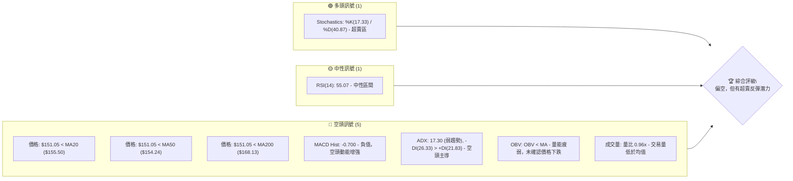
**解讀**：目前空頭訊號佔據主導地位，價格位於所有主要移動平均線下方，MACD柱狀圖轉負，且ADX顯示空頭趨勢略佔優勢但趨勢強度較弱。然而，Stochastics指標已進入超賣區，這通常預示著短期內可能出現技術性反彈。RSI位於中性區，尚未顯示明確方向。整體而言，市場短期偏空，但需警惕超賣反彈。

### 📊 核心指標速覽表

| 指標類別 | 指標名稱 | 當前數值 | 訊號 | 解讀 |
|----------|----------|----------|------|------|
| **價格** | 當前價格 | $151.05 | 🔴 | 位於關鍵均線下方，短期弱勢 |
| **均線** | MA20 | $155.50 | 🔴 | 價格位於MA20下方，短期壓力 |
| **均線** | MA50 | $154.24 | 🔴 | 價格位於MA50下方，中期壓力 |
| **均線** | MA200 | $168.13 | 🔴 | 價格位於MA200下方，長期壓力 |
| **動能** | RSI(14) | 55.07 | 🟡 | 處於中性區間，無明顯超買超賣 |
| **動能** | MACD Hist | -0.700 | 🔴 | MACD線下穿訊號線，空頭動能增強 |
| **動能** | Stoch %K | 17.33 | 🟢 | 進入超賣區，潛在反彈訊號 |
| **波動** | ATR(14) | $7.17 | 🟡 | 波動率適中，佔股價4.75% |
| **趨勢** | ADX(14) | 17.30 | 🟡 | 趨勢強度弱，可能處於盤整或弱勢下跌 |
| **量能** | OBV趨勢 | OBV < MA | 🔴 | 成交量未確認下跌趨勢，量能疲弱 |

### 🏆 技術評分卡

```
╔══════════════════════════════════════════════════════════════╗
║                技術評分卡 — VST (2026-07-05)                   ║
╠══════════════════════════════════════════════════════════════╣
║ 趨勢強度      ███░░░░░░░░░░░░░░░░░  15/100  🔴 (ADX弱趨勢，空頭主導)   ║
║ 動能指標      ██████░░░░░░░░░░░░░░  30/100  🔴 (MACD空頭，RSI中性，Stoch超賣)║
║ 支撐穩定度    ██████████░░░░░░░░░░  50/100  🟡 (接近重要支撐，但尚未確認守穩)║
║ 成交量配合    ███░░░░░░░░░░░░░░░░░  15/100  🔴 (量能疲弱，未確認價格走勢)   ║
║ 形態完整度    ██████░░░░░░░░░░░░░░  30/100  🟡 (無明顯大型形態，短期震盪)   ║
║ 均線排列      ████░░░░░░░░░░░░░░░░  20/100  🔴 (價格在所有均線下方，均線空頭排列)║
╠══════════════════════════════════════════════════════════════╣
║ 綜合評分      ████░░░░░░░░░░░░░░░░  27/100  🔴 偏空，但有短期反彈潛力 ║
╚══════════════════════════════════════════════════════════════╝
```
**評分說明**：VST的綜合評分偏低，主要受到趨勢疲弱、空頭動能增強以及價格跌破多條關鍵均線的影響。成交量未能為當前價格走勢提供有效支撐，進一步確認了弱勢。儘管Stochastics顯示超賣，為多頭帶來一線希望，但整體技術面仍偏向空頭。

---

## 2. 趨勢分析

### 🌐 多時框趨勢分析

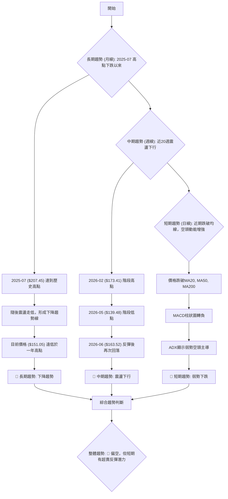
**解讀**：
- **長期趨勢 (月線)**：從2025年7月的歷史高點$207.45以來，VST股價呈現明顯的震盪下行趨勢。儘管期間有多次反彈，但未能突破前高，整體重心不斷下移。目前的$151.05價格遠低於一年內的高點，顯示長期結構偏弱。
- **中期趨勢 (週線)**：近20週的數據顯示，股價在$139.48至$173.41的區間內震盪。最近一次，股價在2026年2月達到$173.41後回落至5月的$139.48，隨後反彈至6月的$163.52，但未能維持漲勢，目前再次回落至$151.05。這表明中期趨勢仍然處於震盪下行通道中。
- **短期趨勢 (日線)**：當前價格$151.05已跌破MA20($155.50)、MA50($154.24)和MA200($168.13)，形成典型的空頭排列前期形態。MACD柱狀圖轉為負值，確認短期空頭動能佔優。ADX雖顯示趨勢強度較弱，但負DI大於正DI，暗示當前弱勢由空頭主導。

### 📈 長期趨勢 — 12個月走勢圖（ASCII）

```
VST 月線走勢圖（過去12個月）
價格軸 ($)
$210 ┤                               ●(207.45 - 2025/07 高點)
$200 ┤                               
$190 ┤          ●       ●
$180 ┤    ●
$170 ┤                       ●
$160 ┤        ●   ●   ●   ●   ●
$150 ┤            ●               ●←現在 (151.05 - 2026/07)
$140 ┤
     └────────────────────────────
      25/07 25/08 25/09 25/10 25/11 25/12 26/01 26/02 26/03 26/04 26/05 26/06 26/07
```

**走勢特徵分析表格**：

| 時間區間 | 主要走勢 | 漲跌幅 (約略) | 特徵描述 | 關鍵高點/低點 |
|----------|----------|----------------|----------|----------------|
| 2025/07-2025/08 | 急速回調 | -9.37% | 從歷史高點回落，量能萎縮 | 高點: $207.45 |
| 2025/08-2025/09 | 短期反彈 | +3.72% | 窄幅震盪反彈，未能突破前高 | 低點: $188.12 |
| 2025/09-2025/12 | 震盪下跌 | -17.54% | 逐步跌破關鍵支撐，形成下降趨勢 | 高點: $195.11, 低點: $160.88 |
| 2026/01-2026/02 | 階段反彈 | +9.81% | 觸底後反彈，量能溫和放大 | 低點: $157.91, 高點: $173.41 |
| 2026/02-2026/03 | 快速下跌 | -13.43% | 反彈受阻後快速回落，跌破前低 | 高點: $173.41, 低點: $150.12 |
| 2026/03-2026/06 | 區間震盪 | +5.67% | 在$150-$165區間震盪，未能有效突破 | 低點: $150.12, 高點: $163.52 |
| 2026/06-2026/07 | 再次回落 | -7.67% | 震盪區間上沿受阻後再度回落 | 高點: $163.49, 現在: $151.05 |

### 📊 中期趨勢（週線分析）

VST在中期週線圖上，自2026年2月高點$173.41以來，呈現一個震盪下行的趨勢。雖然在2026年5月觸及$139.48後有所反彈，但反彈至$163.52後再次受阻，未能突破$173.41的前高。目前股價正從$163.49的高點回落，且已跌破近期形成的多重支撐。

```
VST 近期週線壓力與支撐示意圖
══════════════════════════════════════════════════════════════════
$175 ║                                    ● (2026-02 高點 $173.41)
$170 ║                                  ┌─┐
$165 ║                                  │ │
$160 ║                                  └─┼───┐ (2026-06 反彈高點 $163.52)
$155 ║                                    │   │
$150 ╠═════════════════════════════════════════● (現價 $151.05)
$145 ║                                    │
$140 ║                                    ● (2026-05 低點 $139.48)
     ╚══════════════════════════════════════════════════════════════════
     關鍵阻力區: $163.52 - $173.41
     現價: $151.05
     關鍵支撐區: $139.48 - $145.82
```
**解讀**：股價目前位於中期阻力區下方，且正在測試近期形成的支撐。若能守住$145.82-$139.48的區間，則可能形成底部盤整；若跌破，則可能進一步下探。

### ⚡ 趨勢強度評估（ADX 解讀）

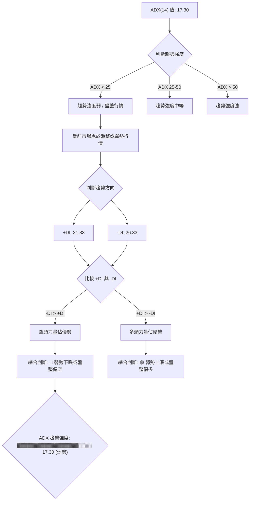
**ADX 強度對照表**：
| ADX 數值範圍 | 趨勢強度 | 市場性質 | 建議操作 |
|--------------|----------|----------|----------|
| 0-25         | 弱勢     | 盤整/弱趨勢 | 觀望或短線操作 |
| 25-50        | 中等     | 明顯趨勢 | 順勢操作 |
| 50-75        | 強勢     | 強勁趨勢 | 順勢操作，注意反轉 |
| 75-100       | 極強     | 極端趨勢 | 順勢操作，極度警惕反轉 |

**解讀**：VST的ADX(14)數值為17.30，遠低於25的閾值，這明確指出當前市場處於「弱趨勢」或「盤整行情」中。在此類市場中，價格往往缺乏明確的方向性，容易在區間內震盪。進一步觀察方向指標，-DI為26.33，而+DI為21.83，-DI明顯高於+DI，這表明在當前的弱勢中，空頭力量略佔主導地位。因此，儘管整體趨勢不強，但傾向於弱勢下跌或盤整偏空。在這種環境下，追漲殺跌的風險較高，更適合採取區間操作或等待趨勢明朗。

---

## 3. 圖表形態分析

### 🔍 形態識別系統

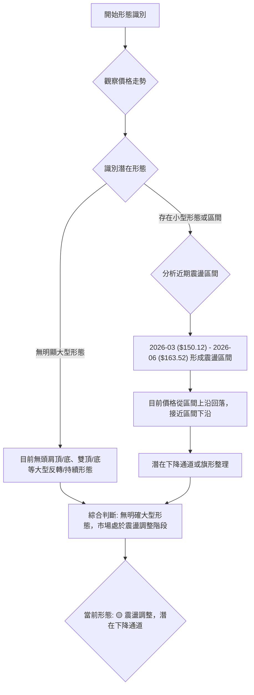
**解讀**：根據過去12個月的價格走勢和近20週的週線數據，VST目前並未形成明顯的頭肩頂/底、雙頂/底等大型反轉或持續形態。市場更多地表現為一個震盪調整的狀態。從2026年3月的低點$150.12到2026年6月的高點$163.52，股價形成了一個相對寬鬆的震盪區間。近期價格從區間上沿$163.52回落，目前正接近區間下沿。這可能暗示股價正形成一個小型下降通道或旗形整理，需等待進一步突破或跌破來確認方向。

### 🕯️ 重要K線形態分析

| 日期 | 收盤價 | K線形態 | 解讀 | 訊號 |
|------|--------|---------|------|------|
| 2026-05-17 | $139.48 | 長下影線陰線 | 股價觸及低點後迅速反彈，顯示下方有承接力道，但最終仍收跌。 | 🟡 潛在支撐 |
| 2026-05-24 | $156.05 | 大陽線 | 伴隨較大成交量，強勢反彈，確認了前週的承接力道。 | 🟢 反彈訊號 |
| 2026-05-31 | $160.01 | 陽線 | 延續反彈，但漲幅縮小，顯示上漲動能有所減弱。 | 🟡 動能減弱 |
| 2026-06-07 | $148.55 | 大陰線 | 吞噬前週部分漲幅，顯示反彈受阻，空頭力量開始介入。 | 🔴 回調訊號 |
| 2026-06-21 | $163.52 | 大陽線 | 強勢反彈至近期高點，但未能突破前期阻力。 | 🟢 反彈高點 |
| 2026-07-05 | $151.05 | 大陰線 | 吞噬前兩週的漲幅，且跌破多條短期均線，空頭力量強勁。 | 🔴 賣出訊號 |

### 📉 ASCII 走勢形態示意圖

```
VST 近期震盪區間與潛在下降通道示意圖
══════════════════════════════════════════════════════════════════
$175 ║                                    ● (2026-02 高點 $173.41)
$170 ║                                  /
$165 ║                                /───┐ (震盪區間上沿 ~ $163.50)
$160 ║                             /       │
$155 ║                          /          │
$150 ╠═════════════════════════════════════● (現價 $151.05, 接近區間下沿)
$145 ║                        /            │
$140 ║                      ●────────────┘ (震盪區間下沿 ~ $139.50)
$135 ║
     ╚══════════════════════════════════════════════════════════════════
     解讀: 股價在$140-$165之間形成震盪區間，近期從區間上沿回落，
           形成一個潛在的短期下降通道。
```

### 🎯 形態目標價計算

由於目前並未形成明確的大型圖表形態（如頭肩頂、雙頂等），因此無法依賴傳統形態學進行目標價計算。當前走勢更像是價格在一個區間內震盪，並可能形成一個短期下降通道。

**基於區間震盪的目標價分析**：
- **震盪區間上限**：約 $163.52 (2026-06 高點)
- **震盪區間下限**：約 $139.48 (2026-05 低點)
- **當前價格**：$151.05

若股價跌破區間下限 $139.48，則可能目標價會是：
- **跌破目標價1 (基於區間高度)**：$139.48 - ($163.52 - $139.48) = $139.48 - $24.04 = $115.44
- **跌破目標價2 (基於52週低點)**：$132.47 (52週低點) 將是下一個重要支撐。

若股價能守住 $139.48 並反彈，則可能目標價會是：
- **反彈目標價1 (區間中軸)**：約 ($163.52 + $139.48) / 2 = $151.50
- **反彈目標價2 (區間上沿)**：$163.52

**結論**：由於缺乏明確的形態，我們將主要依賴支撐與阻力位來判斷潛在的交易目標。當前價格 $151.05 位於震盪區間中下部，且短期偏空，需警惕跌破區間下限的風險。

---

## 4. 支撐與阻力

### 🗺️ 關鍵價位分布圖（ASCII）

```
VST 價位結構分布圖 (2026-07-05)
══════════════════════════════════════════════════════════════════
$218.91 ║███████████████████████████████████████████████████████║ 強阻力 R3 (52週高點)
$180.00 ║███████████████████████████████████████████████████████║ 阻力 R2 (心理關口)
$171.94 ║███████████████████████████████████████████████████████║ 阻力 R2 (布林上軌)
$168.13 ║███████████████████████████████████████████████████████║ 關鍵阻力 R1 (MA200)
$163.52 ║███████████████████████████████████████████████████████║ 關鍵阻力 R1 (近期高點)
$155.50 ║███████████████████████████████████████████████████████║ 阻力 R1 (MA20/布林中軌)
$154.24 ║███████████████████████████████████████████████████████║ 阻力 R1 (MA50)
$151.05 ╠═══════════════════════════════════════════════════════╣ ◄ 現價
$145.82 ║▓▓▓▓▓▓▓▓▓▓▓▓▓▓▓▓▓▓▓▓▓▓▓▓▓▓▓▓▓▓▓▓▓▓▓▓▓▓▓▓▓▓▓▓▓▓▓▓▓▓▓▓▓▓▓▓▓║ 近期支撐 S1 (2026-03低點)
$139.48 ║███████████████████████████████████████████████████████║ 強支撐 S2 (2026-05低點)
$139.05 ║███████████████████████████████████████████████████████║ 強支撐 S2 (布林下軌)
$132.47 ║███████████████████████████████████████████████████████║ 強支撐 S3 (52週低點)
══════════════════════════════════════════════════════════════════
```

### 🚧 阻力位分析表

| 阻力級別 | 價位 | 形成原因 | 突破難度 | 重要性 |
|----------|------|----------|----------|--------|
| **R1 (即時)** | $154.24 | MA50 | 中等 | 🟢 價格反彈首個考驗 |
| **R1 (即時)** | $155.50 | MA20 / 布林中軌 | 中等 | 🟢 價格反彈次個考驗，動能轉換關鍵 |
| **R1 (近期)** | $163.52 | 2026-06 反彈高點 | 高 | 🟡 突破此處方能挑戰更上方阻力 |
| **R2 (中期)** | $168.13 | MA200 | 高 | 🔴 長期趨勢線，突破需強大買盤 |
| **R2 (中期)** | $171.94 | 布林上軌 | 高 | 🔴 價格波動上限，短期超買區 |
| **R3 (強勁)** | $218.91 | 52週高點 | 極高 | 🔴 歷史阻力，短期內難以觸及 |

### 🛡️ 支撐位分析表

| 支撐級別 | 價位 | 形成原因 | 守住機率 | 重要性 |
|----------|------|----------|----------|--------|
| **S1 (即時)** | $145.82 | 2026-03 階段性低點 | 中等 | 🟡 若跌破可能加速下跌 |
| **S2 (關鍵)** | $139.48 | 2026-05 階段性低點 | 高 | 🟢 近期最強支撐，決定中期走勢 |
| **S2 (關鍵)** | $139.05 | 布林下軌 | 高 | 🟢 與 $139.48 形成強大支撐區 |
| **S3 (極強)** | $132.47 | 52週低點 | 極高 | 🔴 歷史低點，跌破將開啟新一輪下跌 |

### 📐 斐波那契回調位分析

我們選擇從2026年2月的高點($173.41)到2026年5月的低點($139.48)這一波下跌進行斐波那契回調分析，以判斷潛在的反彈阻力位。

**斐波那契回調位計算 (從 $173.41 跌至 $139.48)**：
- **高點 (A)**: $173.41 (2026-02)
- **低點 (B)**: $139.48 (2026-05)
- **跌幅**: $173.41 - $139.48 = $33.93

- **23.6% 回調**: $139.48 + ($33.93 * 0.236) = $139.48 + $8.00 = **$147.48**
- **38.2% 回調**: $139.48 + ($33.93 * 0.382) = $139.48 + $12.97 = **$152.45**
- **50.0% 回調**: $139.48 + ($33.93 * 0.500) = $139.48 + $16.97 = **$156.45**
- **61.8% 回調**: $139.48 + ($33.93 * 0.618) = $139.48 + $20.97 = **$160.45**
- **76.4% 回調**: $139.48 + ($33.93 * 0.764) = $139.48 + $25.93 = **$165.41**

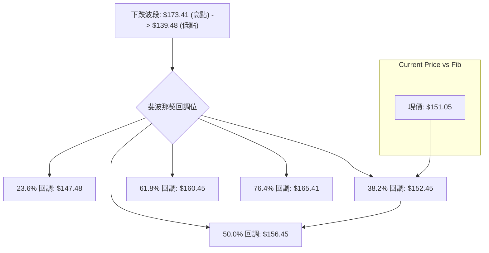
**解讀**：
- 當前價格 $151.05 位於 23.6% 回調位 $147.48 和 38.2% 回調位 $152.45 之間。這表明股價在經歷一波下跌後，目前處於弱勢反彈或盤整中，但尚未突破38.2%的回調阻力。
- **$152.45 (38.2% 回調)** 是一個重要的短期阻力位，若能突破此處，則下一目標將是 $156.45 (50% 回調)，此處與MA20和布林中軌 $155.50 形成強力阻力區。
- **$160.45 (61.8% 回調)** 則是更強的阻力，突破此處才能真正扭轉短期頹勢。
- 斐波那契回調位與移動平均線和布林通道等關鍵阻力位存在重疊，增加了這些價位的有效性。例如，50%回調位 $156.45 與MA20 $155.50 緊密相連，形成一個強大的阻力區。

---

## 5. 技術指標深度解讀

### 🎛️ 指標訊號總覽

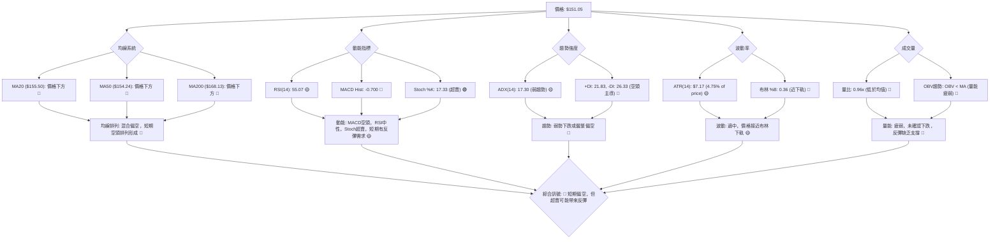

### 📈 移動平均線排列分析

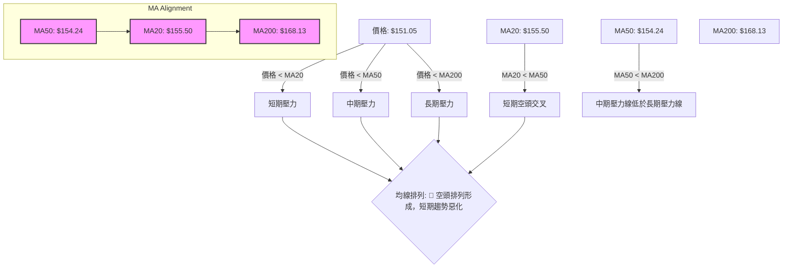
**解讀**：當前VST的價格$151.05已同時跌破MA20($155.50)、MA50($154.24)和MA200($168.13)，這是非常明確的空頭訊號。
- **短期均線 (MA20)** 位於價格上方，構成直接阻力。
- **中期均線 (MA50)** 也位於價格上方，且已下穿MA20，形成**短期空頭交叉 (Death Cross)**，這是一個強烈的賣出訊號。
- **長期均線 (MA200)** 位於所有均線和價格上方，顯示長期趨勢壓力巨大。
- **均線排列**：目前MA50 ($154.24) < MA20 ($155.50) < MA200 ($168.13)。這種排列方式顯示短期均線已開始下穿中期均線，儘管MA200仍最高，但短期和中期趨勢已轉為空頭。這表明市場正從震盪轉向更明確的下跌趨勢。

### 📉 RSI(14) 分析

**RSI(14) 數值**：55.07
**RSI 強度進度條**：▓▓▓▓▓▓▓▓▓▓▓▓░░░░░░░░ 55.07%

**超買超賣區間分析**：
- **超買區 (RSI > 70)**：過去20週數據中，2026-03-01時RSI曾達76.5，進入超買區，隨後股價迅速回落。
- **超賣區 (RSI < 30)**：2026-05-17時RSI曾達25.5，進入超賣區，隨後股價出現反彈。
- **中性區 (30 < RSI < 70)**：當前RSI為55.07，位於中性區間，表明市場買賣力量相對平衡，缺乏明確的方向性。

**背離判斷**：
- **無明顯背離**：根據提供的數據，RSI走勢與價格走勢未出現明顯的頂背離或底背離現象。價格在2026-06-21達到$163.52時，RSI為53.3；隨後價格下跌至$151.05，RSI也隨之回落到55.07。雖然RSI在$163.52時未明顯高於之前的反彈高點（如2026-04-26的$164.12，RSI為65.1），但也沒有形成明確的頂背離結構。同樣，在近期價格下跌過程中，RSI也未形成底背離。

**解讀**：RSI目前處於中性區間，未能提供明確的買賣訊號。這與ADX顯示的弱勢趨勢相符，表明市場缺乏強勁的動能。交易者應等待RSI進入超買或超賣區，或出現明確的背離訊號，方可作為輔助判斷依據。

### 📊 MACD(12/26/9) 訊號解讀

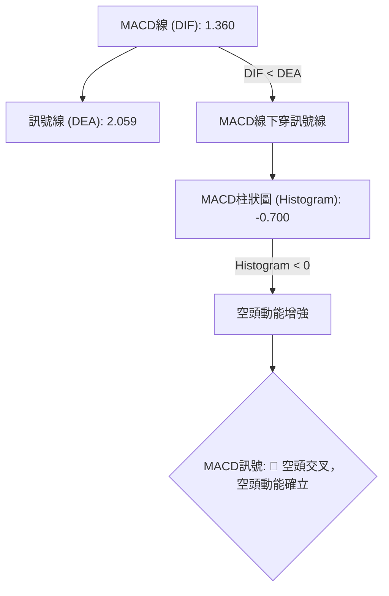
**MACD訊號集成**：
- **MACD線 (DIF)**：1.360
- **訊號線 (DEA)**：2.059
- **MACD柱狀圖 (Histogram)**：-0.700

**解讀**：
- **MACD線下穿訊號線**：DIF (1.360) 低於 DEA (2.059)，這是一個明確的空頭交叉訊號，表明短期價格動能已轉弱並超越中期動能，預示股價可能進一步下跌。
- **MACD柱狀圖為負值**：Histogram為-0.700，且為負值，這進一步確認了空頭動能正在增強。柱狀圖的絕對值越大，空頭動能越強。當前負值不大，但已從正值轉負，表明空頭力量剛開始發力。

**背離判斷**：
- **無明顯背離**：根據提供的週線MACD柱狀圖數據，在價格從2026-06-28的$163.49下跌到2026-07-05的$151.05的過程中，MACD柱狀圖從+1.573轉為-0.700。雖然價格下跌，但MACD柱狀圖也隨之轉弱。在之前的高點$173.41 (2026-03-01) 時，MACD柱狀圖為+1.580，而2026-06-28的$163.49時MACD柱狀圖為+1.573。儘管價格沒有創出新高，MACD柱狀圖也未創新高，但沒有形成明顯的頂背離。同樣，在下跌過程中也未見底背離。

**總結**：MACD指標發出明確的空頭訊號，與價格跌破均線的表現一致，強化了短期偏空的判斷。

### 📦 布林通道分析

**布林通道參數**：
- **上軌 (Upper Band)**: $171.94
- **中軌 (Middle Band, MA20)**: $155.50
- **下軌 (Lower Band)**: $139.05
- **當前價格**: $151.05
- **布林 %B**: 0.36

```
VST 布林通道示意圖
══════════════════════════════════════════════════════════════════
$175 ║                                     ┌───────┐ (上軌 $171.94)
$170 ║                                     │       │
$165 ║                                     │       │
$160 ║                                     │       │
$155 ║                                     ├───────┤ (中軌 $155.50)
$150 ╠═════════════════════════════════════● (現價 $151.05)
$145 ║                                     │       │
$140 ║                                     └───────┘ (下軌 $139.05)
$135 ║
     ╚══════════════════════════════════════════════════════════════════
     解讀: 價格位於布林中軌與下軌之間，接近下軌，顯示短期偏弱。
           布林通道開口適中，表明波動性未極端放大。
```
**解讀**：
- **價格位置**：當前價格 $151.05 位於布林通道的中軌 ($155.50) 和下軌 ($139.05) 之間。這表明股價處於偏弱勢的區域。
- **布林 %B (0.36)**：此數值表示價格位於通道下半部分，且相對接近下軌。這通常暗示短期賣壓較重，但同時也可能預示若價格觸及下軌並未跌破，則有機會出現反彈。
- **通道開口**：布林通道的開口寬度適中，ATR為$7.17，表明市場波動性並未極端放大或收縮，仍處於正常範圍。
- **潛在支撐/阻力**：布林中軌 $155.50 構成即時阻力，與MA20重疊，強化了其阻力作用。布林下軌 $139.05 則構成重要支撐，與2026-05的低點 $139.48 形成強力支撐區。

**總結**：布林通道顯示價格處於弱勢區域，但接近下軌可能帶來技術性反彈機會，尤其是在下軌與其他關鍵支撐位重合的情況下。

### 💹 成交量分析（量價配合度）

**成交量數據**：
- **最新成交量**：4,254,100
- **20日均量**：4,440,050
- **50日均量**：4,945,728
- **量比 (最新/20日均量)**：0.96x
- **OBV趨勢**：OBV < MA (量能疲弱)

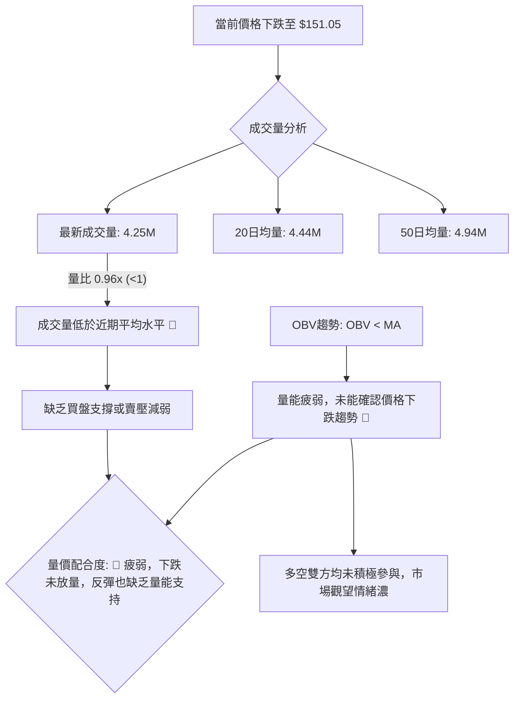
**解讀**：
- **量比分析**：最新成交量為4,254,100股，低於20日均量4,440,050股和50日均量4,945,728股，量比為0.96x。這表明在當前價格下跌的過程中，成交量相對萎縮。通常，價格下跌伴隨成交量放大被視為空頭力量強勁的訊號；而下跌縮量則可能暗示賣壓有所減輕，或者市場觀望情緒濃厚。
- **OBV趨勢**：OBV趨勢顯示OBV線位於其移動平均線下方，這是一個量能疲弱的訊號。OBV未能跟隨價格趨勢，表明累積買盤不足，也未能確認當前的下跌趨勢是由大量資金推動。
- **量價配合度**：綜合來看，當前VST的量價配合度不佳。價格下跌但量能萎縮，這使得當前的下跌趨勢顯得“不夠健康”。如果價格要有效反彈，則需要有明顯的成交量放大來確認買盤的介入；如果價格繼續下跌，也需要放量來確認空頭的持續性。目前，量能疲弱暗示市場缺乏明確的動能，無論是向上還是向下。

---

## 6. 動能與波動率

### ⚡ 動能評估四象限

```mermaid
graph TD
    A["VST 當前狀態評估"] --> B{"動能強度"}
    A --> C{"波動率"}

    B -- RSI("55.07") & MACD Hist("-0.700") --> B1["動能: 弱勢/偏空"]
    C -- ATR("$7.17, 4.75%") & BB %B("0.36") --> C1["波動率: 中等"]

    B1 --> Q_matrix["動能與波動率矩陣"]
    C1 --> Q_matrix

    subgraph Q_matrix ["動能與波動率評估"]
        direction LR
        S1("弱動能 / 中等波動")
    end

    Q_matrix --> D["綜合評估"]
    D --> E{"當前市場位置"}
    E --> E1["價格跌破均線，但Stochastics超賣"]
    E1 --> F{"結論: 🟡 處於弱動能、中等波動的調整區，需警惕下行風險，但超賣提供短期反彈可能。"}
```

**動能評估四象限分析表**：

| 象限 | 動能 | 波動 | 當前狀態 (VST) | 評估 |
|------|------|------|----------------|------|
| Q1 | 強 | 低 | - | 最佳機會 (趨勢穩定，風險較低) |
| Q2 | 弱 | 低 | - | 謹慎觀望 (缺乏方向，波動小) |
| Q3 | 強 | 高 | - | 高風險高收益 (趨勢強勁，但波動大) |
| Q4 | 弱 | 高 | ✓ | 避免進場 / 謹慎操作 (方向不明，波動大，風險高) |

**解讀**：VST目前的動能評估為「弱動能」，主要基於MACD柱狀圖轉負、價格位於均線下方以及RSI處於中性區間。波動率方面，ATR為$7.17 (佔股價4.75%)，布林通道開口適中，顯示為「中等波動」。
因此，VST目前處於「弱動能、中等波動」的狀態。這通常意味著市場缺乏明確的方向性，價格可能在一個較寬的區間內震盪。這種市場環境對趨勢追隨者來說風險較高，更適合採取區間交易策略或保持觀望。儘管Stochastics進入超賣區為短期反彈提供了一絲希望，但整體市場結構仍然偏弱。

### 📊 ATR 波動率分析

**ATR(14) 數值**：$7.17
**佔當前價格比例**：($7.17 / $151.05) * 100% = 4.75%

**解讀**：
- ATR衡量了資產的平均真實波動範圍。VST的ATR為$7.17，表示在過去14個交易日中，該股票的平均每日波動範圍約為$7.17。
- 相對於當前股價$151.05，ATR佔比約為4.75%。對於公用事業股而言，這屬於中等偏高的波動水平。這意味著VST的每日價格波動幅度相對較大，為短線交易者提供了機會，但也增加了風險。
- **止損距離建議**：ATR是設定止損點的常用工具。一般建議將止損點設置在當前價格下方1.5至3倍ATR的距離。
    - **保守止損** (1.5倍ATR)：$151.05 - (1.5 * $7.17) = $151.05 - $10.76 = **$140.29**
    - **激進止損** (2倍ATR)：$151.05 - (2 * $7.17) = $151.05 - $14.34 = **$136.71**
    - 考慮到$139.48 (2026-05低點) 和 $139.05 (布林下軌) 是關鍵支撐，將止損設置在這些支撐位下方，例如$138.00，是一個合理的選擇。

### 📐 Beta 與市場相關性

根據提供的數據，VST的Beta值並未給出。
**一般行業特性判斷**：
- Vistra Corp. (VST) 屬於公用事業 (Utilities) 板塊，具體為獨立電力生產商。公用事業板塊通常被視為防禦性行業，其股票的波動性相對較低，與整體市場的相關性也較弱。
- 因此，儘管缺乏具體數據，我們可以合理推斷VST的Beta值可能小於1 (即Beta < 1)。這意味著在市場上漲時，VST的漲幅可能小於大盤；在市場下跌時，其跌幅也可能小於大盤。
- **投資意義**：低Beta股票通常在投資組合中扮演穩定器的角色，有助於降低整體投資組合的波動性。在市場不確定性較高或預期市場回調時，這類股票可能受到青睞。

---

## 7. 多時框架總結

### 📋 時框架評分表

| 時框架 | 趨勢方向 | 動能 | 均線排列 | 形態 | 綜合評分 | 建議 |
|--------|----------|------|----------|------|----------|------|
| **長期 (月線)** | 🔴 下跌 | 🔴 疲弱 | 🔴 空頭壓力 | 🟡 震盪下行 | 2/10 🔴 | 謹慎觀望 |
| **中期 (週線)** | 🔴 震盪下行 | 🟡 中性偏空 | 🔴 均線承壓 | 🟡 區間震盪 | 4/10 🔴 | 區間操作 |
| **短期 (日線)** | 🔴 弱勢下跌 | 🟡 超賣反彈 | 🔴 短期空頭 | 🟡 潛在通道 | 3/10 🔴 | 關注反彈 |

**解讀**：
- **長期**：VST的長期趨勢明確為下跌，價格遠低於歷史高點，且未能有效突破關鍵長期阻力。量能疲弱，缺乏長期上漲動能。
- **中期**：中期趨勢呈現震盪下行，價格在一個較寬的區間內波動，但重心逐漸下移。均線系統顯示中期壓力沉重。
- **短期**：短期趨勢為弱勢下跌，價格跌破所有主要均線，MACD發出賣出訊號。然而，Stochastics進入超賣區，為短期帶來反彈的可能性，但反彈的持續性仍需觀察。

### 🔲 綜合訊號矩陣

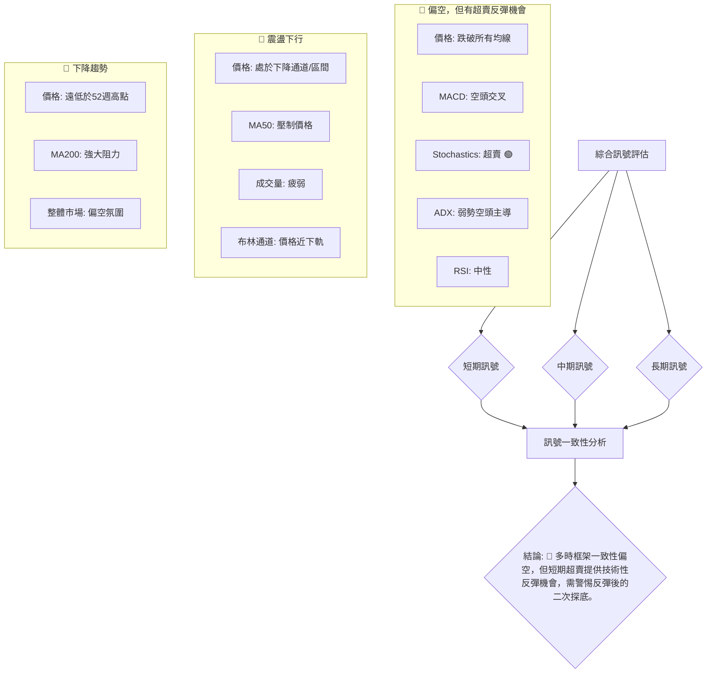
**一致性分析**：
- **短期、中期、長期趨勢均顯示偏空或震盪下行**，這表明VST面臨來自各時框架的賣壓。
- **均線系統**在所有時框架中都表現為對價格的壓制，尤其短期均線已形成空頭排列。
- **動能指標**在短期內有分歧，MACD偏空，但Stochastics超賣，RSI中性，這為短期反彈提供了依據。
- **成交量**在各時框架中均表現疲弱，未能為任何一方提供強勁支撐。

**總結**：VST的多時框架訊號呈現高度的一致性，整體偏向空頭。長期和中期趨勢均為下行或震盪下行，而短期趨勢也已轉為弱勢下跌。儘管短期超賣可能引發技術性反彈，但這類反彈在缺乏強勁量能和趨勢支撐的情況下，往往難以持續，投資者應以謹慎態度對待。

---

## 8. 交易策略建議

VST目前處於短期弱勢下跌，中期震盪下行，長期下降趨勢的格局。雖然Stochastics指標顯示超賣，可能引發技術性反彈，但整體趨勢和多數指標仍偏空。因此，建議採取謹慎的交易策略，優先考慮在反彈至阻力位時建立空頭頭寸，或在關鍵支撐位確認有效支撐後進行短線反彈操作。

### 🗺️ 策略決策流程圖

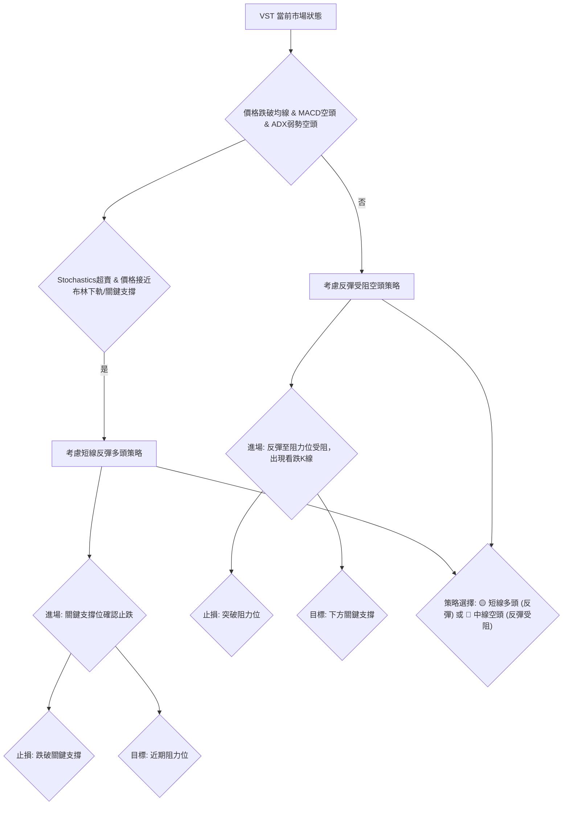

### 🟢 多頭策略詳情 (短線超賣反彈)

**策略背景**：儘管整體趨勢偏空，但Stochastics已進入超賣區 (%K=17.33, %D=40.87)，且價格接近布林下軌 ($139.05) 和2026-05低點 ($139.48) 形成的強支撐區。若此區域能有效止跌，則可能出現技術性反彈。

| 策略要素 | 策略 A (激進反彈多頭) | 策略 B (保守反彈多頭) |
|----------|------------------------|------------------------|
| 進場條件 | 價格在 $139.05 - $139.48 區域出現止跌K線 (如錘子線、陽線吞噬) 並伴隨成交量放大。 | 價格有效站穩 $140.00，並突破 $145.82 (S1) 後回踩確認。 |
| 進場價格 | **$140.00**            | **$146.00**            |
| 目標價 T1 | **$147.48** (23.6% Fib回調) | **$152.45** (38.2% Fib回調) |
| 目標價 T2 | **$152.45** (38.2% Fib回調) | **$156.45** (50% Fib回調 / MA20 / 布林中軌) |
| 止損價格 | **$138.00** (略低於S2和布林下軌) | **$143.00** (略低於S1) |
| 風險報酬比 | T1: (147.48-140)/(140-138) = 7.48/2 = **3.74:1** | T1: (152.45-146)/(146-143) = 6.45/3 = **2.15:1** |
|          | T2: (152.45-140)/(140-138) = 12.45/2 = **6.23:1** | T2: (156.45-146)/(146-143) = 10.45/3 = **3.48:1** |
| 成功機率 | 40% (逆勢操作，風險較高) | 50% (等待確認，風險較低) |
| 建議倉位 | 輕倉 (不超過總資金5%) | 中輕倉 (不超過總資金10%) |

### 🔴 空頭策略詳情 (反彈受阻做空)

**策略背景**：長期和中期趨勢偏空，價格已跌破多條均線，MACD空頭訊號明確。若股價反彈至關鍵阻力位 (如均線、斐波那契回調位) 受阻，未能有效突破，則可視為建立空頭頭寸的機會。

| 策略要素 | 策略 C (反彈至MA20做空) | 策略 D (跌破S1做空) |
|----------|--------------------------|----------------------|
| 進場條件 | 價格反彈至MA20 ($155.50) 或斐波那契50%回調位 ($156.45) 附近，出現看跌K線 (如射擊之星、陰線吞噬) 並伴隨量能縮小。 | 價格跌破 $145.82 (S1) 並確認有效，未能迅速收回。 |
| 進場價格 | **$154.50**              | **$145.50**          |
| 目標價 T1 | **$145.82** (S1)         | **$139.48** (S2 / 布林下軌) |
| 目標價 T2 | **$139.48** (S2 / 布林下軌) | **$132.47** (52週低點) |
| 止損價格 | **$157.00** (略高於MA20和50% Fib) | **$147.00** (略高於S1) |
| 風險報酬比 | T1: (154.50-145.82)/(157-154.50) = 8.68/2.5 = **3.47:1** | T1: (145.50-139.48)/(147-145.50) = 6.02/1.5 = **4.01:1** |
|          | T2: (154.50-139.48)/(157-154.50) = 15.02/2.5 = **6.01:1** | T2: (145.50-132.47)/(147-145.50) = 13.03/1.5 = **8.69:1** |
| 成功機率 | 60% (順勢操作，風險較低) | 65% (確認跌破，風險較低) |
| 建議倉位 | 中倉 (不超過總資金15%) | 中倉 (不超過總資金15%) |

### ⭐ 整體訊號強度評星

```
做多訊號強度：★★☆☆☆  (2/5星) (主要基於超賣反彈，逆勢操作)
做空訊號強度：★★★★☆  (4/5星) (趨勢和指標均偏空，順勢操作)
整體可信度：  ★★★☆☆  (3/5星) (市場處於震盪調整，方向不明朗，但偏空力量佔優)
```

---

## 9. 風險提示與監控

VST目前處於一個多空拉鋸的關鍵時期，儘管整體趨勢偏空，但短期超賣情況可能引發技術性反彈。投資者必須對潛在風險保持高度警惕，並嚴格執行風險管理策略。

### ✅ 關鍵監控指標 Checklist

```
╔══════════════════════════════════════════════════════════════╗
║              VST 關鍵監控指標 Checklist                      ║
╠══════════════════════════════════════════════════════════════╣
║ [ ] 價格是否跌破 $139.05 - $139.48 強支撐區？ (🔴 高風險)    ║
║ [ ] 價格是否有效突破 MA20 ($155.50) 和 MA50 ($154.24)？ (🟢 反彈訊號)║
║ [ ] MACD柱狀圖是否由負轉正或負值縮小？ (🟢 空頭動能減弱)     ║
║ [ ] RSI是否進入超買區 (>70) 或超賣區 (<30)？ (🟡 區間波動)   ║
║ [ ] 成交量在下跌或反彈時是否出現異常放大？ (🟢/🔴 確認趨勢)  ║
║ [ ] ADX是否突破25並顯示明確趨勢方向？ (🟢/🔴 趨勢確立)      ║
║ [ ] 是否有重大利好/利空消息影響公用事業板塊？ (⚠️ 外部風險)  ║
║ [ ] 52週低點 $132.47 是否被測試或跌破？ (🔴 極高風險)      ║
╚══════════════════════════════════════════════════════════════╝
```

### ⚠️ 風險場景分析

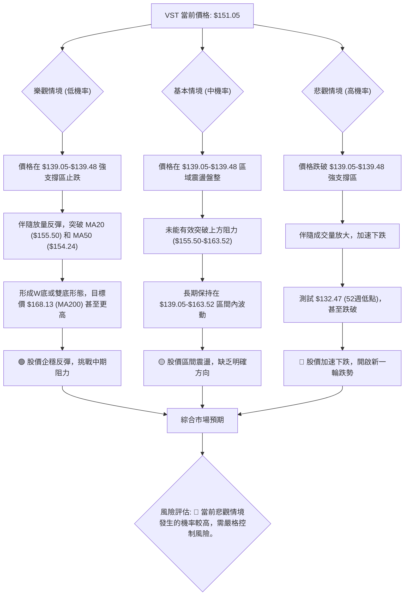

### 🛡️ 風險管理重要提醒

1.  **倉位管理**：鑑於當前市場的不確定性及偏空趨勢，建議投資者採取輕倉策略，將單一股票的倉位控制在總資金的10%以下，以避免單一標的對整體投資組合造成過大影響。對於逆勢的多頭策略，倉位應更低。
2.  **嚴格止損**：無論採取何種交易策略，都必須設定明確的止損點並嚴格執行。一旦價格觸及止損位，應果斷離場，避免虧損擴大。尤其是做多策略，止損點必須設置在關鍵支撐位下方。
3.  **多樣化投資**：避免將所有資金集中於單一股票或單一板塊。通過分散投資於不同行業和資產類別，可以有效降低非系統性風險。
4.  **監控市場情緒與宏觀經濟**：公用事業板塊雖然具備防禦性，但仍會受到利率政策、能源價格、監管政策以及整體市場情緒的影響。密切關注相關宏觀經濟數據和行業新聞。
5.  **避免追漲殺跌**：在弱勢或盤整市場中，追漲殺跌往往容易造成虧損。建議等待價格確認方向或在關鍵支撐/阻力位進行逆向操作，並嚴格控制風險。
6.  **耐心等待**：當前VST缺乏明確的強勢趨勢，對於不熟悉區間操作的投資者，耐心等待趨勢明朗化，或等待股價突破關鍵阻力並站穩後再考慮進場，可能是更穩健的選擇。

---

## 📋 報告總結

```
╔══════════════════════════════════════════════════════════════╗
║                  VST 技術分析報告總結                          ║
╠══════════════════════════════════════════════════════════════╣
║ 報告日期：2026-07-05                                           ║
║ 當前價格：$151.05                                              ║
║ 分析評級：⚖️ 偏空，但短期有超賣反彈機會                       ║
║                                                              ║
║ 關鍵結論：                                                     ║
║ ├─ 長期趨勢：🔴 下跌趨勢，價格遠低於歷史高點。                ║
║ ├─ 中期趨勢：🔴 震盪下行，均線系統構成壓力。                  ║
║ ├─ 短期趨勢：🔴 弱勢下跌，價格跌破所有主要均線，MACD空頭。    ║
║ ├─ 關鍵支撐：$139.48 (2026-05低點) / $139.05 (布林下軌)      ║
║ ├─ 關鍵阻力：$155.50 (MA20/布林中軌) / $163.52 (近期反彈高點)║
║ └─ 分析師目標：分析師平均目標價 $222.89，但技術面短期偏弱，分歧較大。║
║                                                              ║
║ 最優策略組合：                                                 ║
║ 1. 🥇 最佳機會：**反彈受阻做空 (策略C)**。在價格反彈至 $154.50-$156.45 阻力區受阻時，建立空頭頭寸，目標價 $139.48，止損 $157.00。風險報酬比優異。║
║ 2. 🥈 次選機會：**跌破支撐做空 (策略D)**。若價格跌破 $145.82 關鍵支撐，則可追空，目標價 $139.48 或 $132.47，止損 $147.00。風險報酬比良好。║
║ 3. 🥉 保守選擇：**短線超賣反彈多頭 (策略A/B)**。若 $139.05-$139.48 強支撐區有效止跌，可輕倉博取反彈，目標價 $147.48-$156.45，止損 $138.00。此為逆勢操作，風險較高，需嚴格控制倉位。║
╚══════════════════════════════════════════════════════════════╝
```

---

> ⚠️ **免責聲明**：本報告為 AI 自動生成之技術分析，所有數據及估算均基於提供的歷史價格資訊。本報告**僅供研究與學術參考**，**不構成任何投資建議**。投資有風險，入市需謹慎。

---

*報告生成時間：2026-07-05 ｜ 數據來源：Yahoo Finance ｜ 分析框架：多時框技術分析*