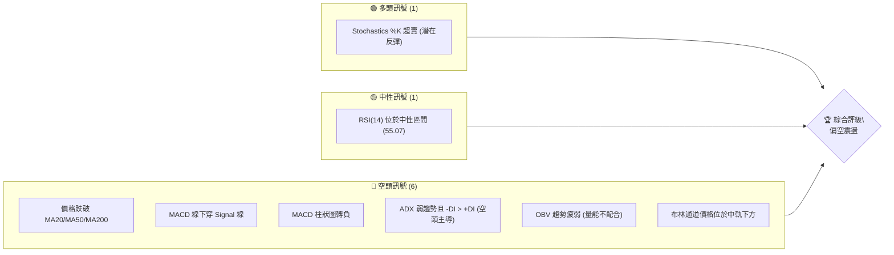
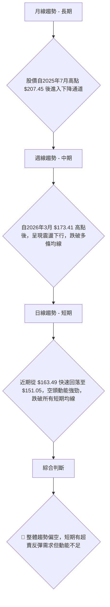
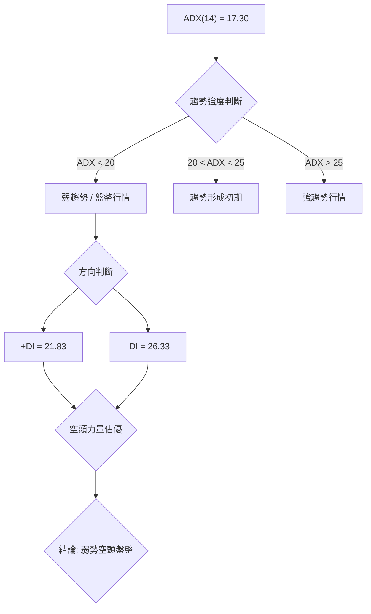
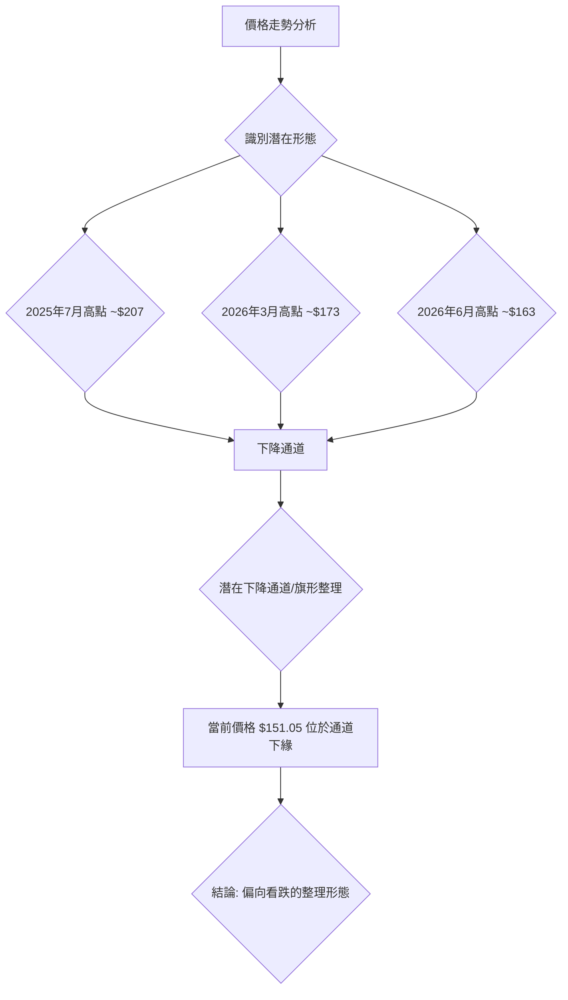
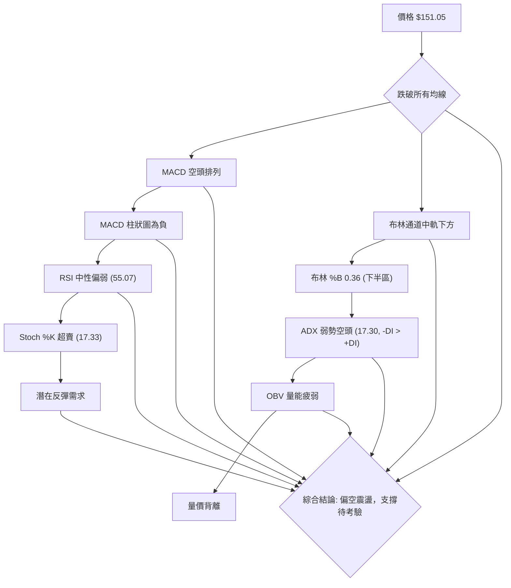
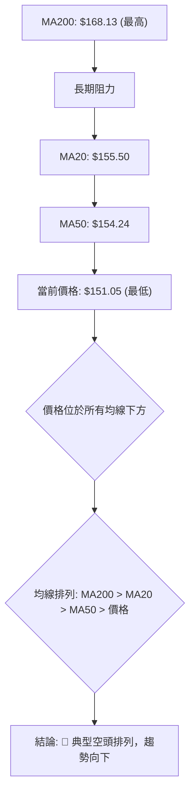
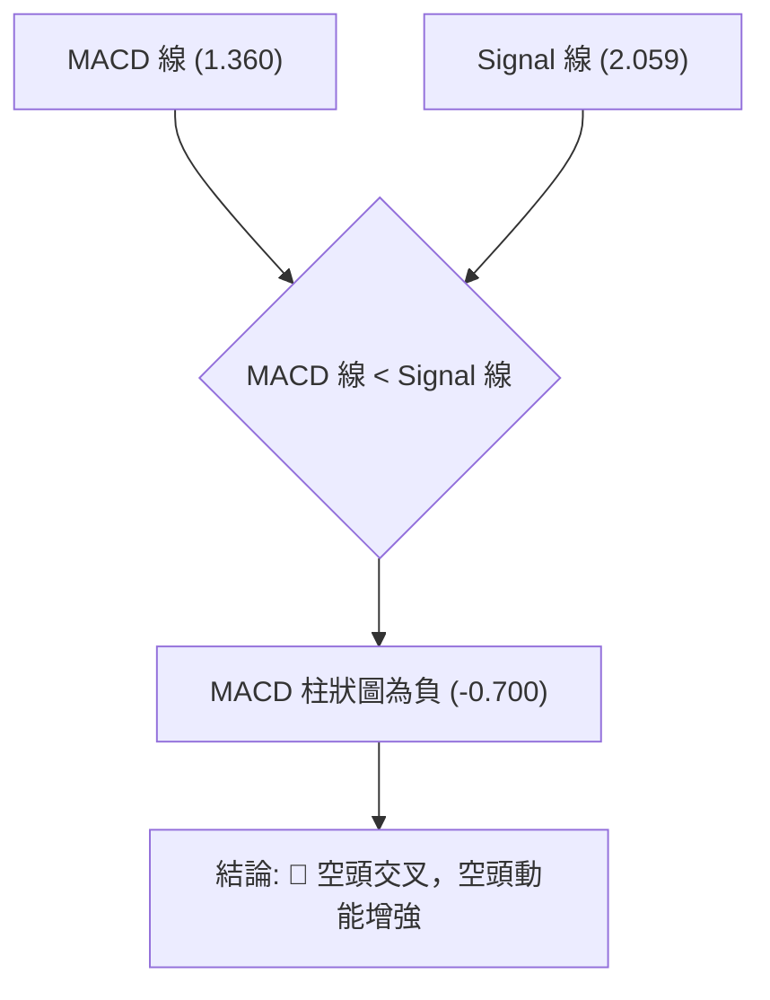
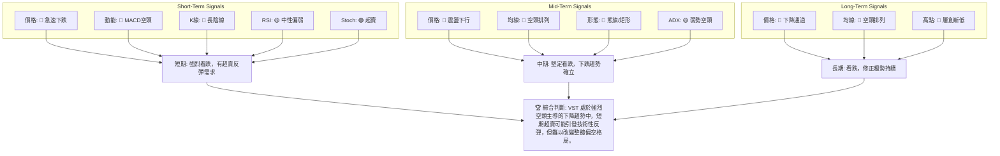
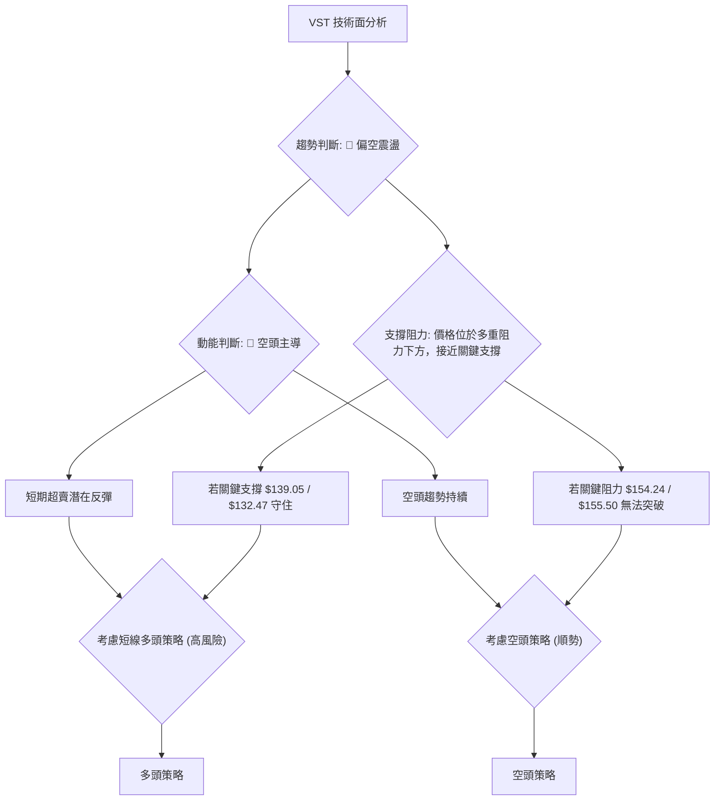

<details>
<summary>📊 靜態圖表 (點擊展開)</summary>

</details>

<html>
<head><meta charset="utf-8" /></head>
<body>
    <div style="height:500px; width:100%;">                        <script>window.PlotlyConfig = {MathJaxConfig: 'local'};</script>
        <script charset="utf-8" src="https://cdn.plot.ly/plotly-3.6.0.min.js" integrity="sha256-QaOVwtVY0T02VaHrr6pnoHLCwayMJp4O5n4YyaE3rJk=" crossorigin="anonymous"></script>                <div id="candlestick-chart" class="plotly-graph-div" style="height:100%; width:100%;"></div>            <script>                window.PLOTLYENV=window.PLOTLYENV || {};                                if (document.getElementById("candlestick-chart")) {                    Plotly.newPlot(                        "candlestick-chart",                        [{"close":{"dtype":"f8","bdata":"AAAA4MkKakAAAADgIudpQAAAAMAGImpAAAAAoOtMakAAAADghCBrQAAAACCTbGlAAAAAoBonaUAAAAAAFRlpQAAAAACKy2lAAAAAgM+jaEAAAABAcGNoQAAAAKCTFWlAAAAAoOc5aUAAAACA3yRpQAAAAOCF8mhAAAAA4FjZaEAAAAAgMLZpQAAAAEAhJGpAAAAAwGSBaEAAAAAgyhVqQAAAAKALlWlAAAAAoDc\u002fakAAAABg4DBqQAAAAGB6EGlAAAAAwOYtaEAAAADg4jdnQAAAAODlIWdAAAAAQHHSZ0AAAABgTRRpQAAAAGAmz2hAAAAAAJa5Z0AAAACAYdFoQAAAAACLnWdAAAAAQJxwZ0AAAAAgqQdoQAAAAKAHH2dAAAAAYFiTZ0AAAACgVvtmQAAAAMCmxmdAAAAA4PhvZ0AAAADAV01mQAAAAED7MGZAAAAAwCZbZUAAAACA5b5lQAAAAGDGyGVAAAAAwEq2ZUAAAACgtExmQAAAAAA3omVAAAAAgIH8ZEAAAACgPM1lQAAAAAA1RGVAAAAAACMCZkAAAABgyENmQAAAAIBvnWVAAAAAQLN6ZUAAAAAABV5lQAAAAIDf6mVAAAAAAEHPZEAAAAAAy61kQAAAACAMhGRAAAAAAIWPZEAAAABAB7xlQAAAACCgLGVAAAAAwKvxZEAAAABgYZdlQAAAAEDP6WNAAAAAIGOvZEAAAADgUktkQAAAAAD6I2RAAAAA4ConZEAAAAAgbDBkQAAAAOAqJ2RAAAAAwJcsZEAAAADAe0VkQAAAAEBRHGRAAAAA4MWYZEAAAABAYE9kQAAAAGD+IWVAAAAAQI1FY0AAAADA58ViQAAAAAAnvWRAAAAAAFODZUAAAACATl5lQAAAAIAfEGVAAAAAgNp1ZkAAAAAAfsRkQAAAAKATjGNAAAAAYIPyY0AAAAAAXf1jQAAAAEC09WNAAAAAYObLY0AAAACg0XlkQAAAAGDbpWRAAAAAIDVEZEAAAACAOL1jQAAAAICzOmNAAAAAQH4SY0AAAADgDsRhQAAAACCc1WFAAAAAoJanYkAAAAAgiRFjQAAAAEAc5WNAAAAAYKn2Y0AAAAAgzVRkQAAAAGCKYGVAAAAAYG2mZUAAAACgLkNlQAAAAIDFgGVAAAAAAKtdZUAAAABAyepkQAAAAGCwZGVAAAAAAArcZUAAAABgoQpmQAAAAOAgrWVAAAAAwAaxZEAAAADgHyhkQAAAACAZXWRAAAAAgAXeZEAAAABAy8ZjQAAAACBlZWRAAAAAQEl+ZEAAAACgEddjQAAAAOB45GNAAAAAAF7QY0AAAAAgYTFkQAAAAIANfGRAAAAAQNI0ZUAAAACAEN1kQAAAAAAbOmJAAAAAgILiYkAAAACgNBBjQAAAACCK6WJAAAAA4MgCY0AAAAAAZ2hjQAAAAGCtamJAAAAAINXDYkAAAACg1DdjQAAAAKD+3mJAAAAAoBjsYkAAAADg4S5jQAAAAACBdWNAAAAAICoRY0AAAACAb1BjQAAAAABSv2NAAAAAwLN3ZEAAAADgyVZkQAAAAGCNqWRAAAAAwGdnZEAAAADgDuxjQAAAACAwVmNAAAAA4E5yY0AAAABgLpRjQAAAAIDYg2RAAAAAABvLZEAAAABAoRxkQAAAAMBlMmNAAAAAANGzY0AAAADgAmJjQAAAAIAAFGRAAAAAoPsEZEAAAABAMsJjQAAAAMCCN2NAAAAAAG5wYkAAAADAy\u002fpiQAAAAIBEVWJAAAAAYCPNYUAAAAAgc7ZhQAAAAGCCb2FAAAAAYOERYUAAAAAgsdBgQAAAAGCO+WFAAAAAgOObYkAAAACgpYFjQAAAAECOimRAAAAAIKL9Y0AAAACgyQFkQAAAAIAwAGRAAAAA4GRRY0AAAACA+LdjQAAAAKC3MmNAAAAAoIUvY0AAAACgqZFiQAAAAOA5VmJAAAAAIH9AYkAAAACAFEthQAAAACCcRWJAAAAAIAR6YkAAAAAgxSljQAAAACBszGNAAAAAwHPTY0AAAAAgrHBkQAAAAOBR6GRAAAAA4HpMZEAAAAAA11tkQAAAAOCj+GRAAAAAIK5vZEAAAAAAKUxkQAAAAAAp1GNAAAAAwB4lY0AAAACgmeFiQA=="},"high":{"dtype":"f8","bdata":"bdJQMeaVakA945xR5pVqQEdejI7oqmpAWf+DJoCeakBJy6kyEV1rQIqTlz0+fGpAOn2byZ6qaUDpIHkuNm1pQBYjszx21GlABjVRP5PIaUD\u002fgAQFZPVoQMA7cw6QgmlAhL5QCMuEaUD3dKDQgCpqQDKxqyIq4mlAOIVSC6tfaUD3\u002fSqWGbhpQJkZgWU6RmpAe\u002fMhq6dvakD2g\u002f5IiSJqQJc3t4V7\u002f2lASHr99nLkakAJ0689YwZrQIPizyq5JWpARlkFELqUaUBBhMYyxRNoQC8bM9DZlmdA8tQGbeTsZ0CnH1QeMSVpQHL6Rl4XWmlAxpn+xOSPaEDJ9GxruPxoQMGQIp3av2hAUh\u002fIjuECaEDEOS30LExoQHGn7kRE1mdAbmjz76f1Z0CYgFu9vYpnQE87tJMKyWdA\u002fC6xR3t\u002faEA1S5gyI2VnQKvztQ6KkWZAWwRKLxonZkCW1HyYHGhmQDOTz67QWGZAbUpl0+QVZkCszcOR6ZdmQOBfsGAokGdANKv70bWeZUB1QC0WJs9lQAljkbYrwGVAAhiFGWkgZkDGT5o7poBmQNAwCEPw92VAKDZFfAznZUB8rF3BIKRlQNEtulr4KWZAMBxL+Lf8ZUDOOsi99+NkQEJvihqSJmVAR1AFX5uqZEAQ9cQFRcVlQAjDJoYcaGZAoli3XgqJZUD11CkxraZlQN4l9Xg8zWVAF9TpxZ9mZUCS8PoqX1ZlQP1gbxNqe2RAL5U2v\u002fJnZED\u002fqwsAXkRkQFPdHzGcUWRAZjJLiud3ZEBopEtOhlNkQCZgUjt6gWRAp7b59wMaZUBN6ilQzmVlQGnwWiRIhGVADJZ2N+kFZUBE4m2b2GtjQI4l+vVAyGVAMDl4uxMIZkCwF9cr6d5lQIyfx82lVmVAQx95ts3BZkB5BYeYu1RlQL9AyW5YsWRAHYwfVA8xZEBiVUbpkGFkQGW0bhl2TWRAw3xmeVObZECm6jGdToVkQEoXNTU3w2RAxGbJ+FbtZECO8DJCeoFkQOqEa3k88WNAB1yxJi+CY0CvAnb7jSdjQNPBIGRq8GFABHBsw+D6YkBU0nYeNWtjQKg1I34wH2RAOMhnglObZEDZvnb2C7hkQH14cCj3ZWVA583ygDQFZkB0Xxa1geBlQDMz92oBg2VA6vbbya6gZUBLNqGRtWtlQOd\u002f4ISaZmVAj8lZRIzuZUBZsPm7thdmQBRRGZstOmZAbfWfhQ4BZkCHAxzkhWJkQKOUHio5eGRAPyMoHjbwZED\u002fpuOZS\u002f1kQNZEY0yghWRAH\u002fXO6GAKZUD8+7HWM3FkQGr0MxD+V2RAPFB2lxeZZEDlyrbfkGFkQO3BNvYcoGRAR1FHKbqQZUAGcUJaOiRlQBLbDReXx2RAKP1\u002f0NJ1Y0CsEKnQTTxjQMnRnNhUt2NA\u002fbnmopsOY0AmnuYtO\u002f9jQDxygsOl1mNAkD6M8ELoYkC2cS484oNjQNmGlecAS2NAt5PhJIIcY0C6bzOgOD5jQAZrlYizImRA8CFS1q9JZEBedA6yD81jQAq8WAHZD2RAcz8APpChZEDlS+M8MMlkQGrTXFP41WRAFKUg4CMIZUCXUVpFQnpkQCk\u002fmrb9G2RAx48q73DbY0B3r+b7utRjQO2YHW70p2RAd8+tK+cFZUB7R3RdF2NkQOYAlq48HWRANaBGPgTtY0A5swBTUP1jQDpCyrjkRGRA\u002fCy2EUVyZEC+dxHoYlhkQFDM6dPxBGVAunURWhBZY0Ch9xobKhFjQKvCgvGbw2JADqrM9GlCYkBZFcYEB+NhQBJH9fiQnGFAIfOYCQlrYUBUh9ZTSBBhQKountBQFmJA6u50lUeiYkCkz2NbMKtjQKQP0fZO5WRAKSwZ0FGZZECFWNRkpGlkQLrBeGYEQmRAYUJ4NIHKY0DNoM\u002fOwxFkQI9n\u002fqkNtmNAvcvm+mI6Y0B4\u002f3EFYEJjQFtCdEHromJAiBs6wt\u002fCYkDg5SFTjvlhQOkUD+s5VmJAErqv1kPJYkB\u002f1sKDcWdjQL3COj8iKGRAFzVshM9GZEA+fr7hQUNlQAAAAAAAUGVAAAAAYGa6ZEAAAADgerRkQAAAAEAza2VAAAAAgML9ZEAAAABAM7NkQAAAAGBmrmRAAAAAgD2qY0AAAAAgrodjQA=="},"hovertemplate":"\u003cb\u003e%{x|%Y-%m-%d}\u003c\u002fb\u003e\u003cbr\u003e\u958b: $%{open:.2f}\u003cbr\u003e\u9ad8: $%{high:.2f}\u003cbr\u003e\u4f4e: $%{low:.2f}\u003cbr\u003e\u6536: $%{close:.2f}\u003cextra\u003e\u003c\u002fextra\u003e","low":{"dtype":"f8","bdata":"l6opFG7HaUD\u002fxViZQ3NpQBXv+NLb3mlApLusW6iKaUA2B7KyBd5pQOt8EOC3U2lA7bWJlAwhaUBD2UJ5TmZoQBSbsOCvBGlAxdp3hymcaECUb29ZF71nQNgz77Lv62dA6EHjHFm8aECGfeEFQhVpQEcTvN6Ok2hAHk+2pVJiaECPdm4YgeloQADgPh54j2lA45n9jcGAaEBvN40fNPJoQOIAYyMSEmlAW6BnUGixaUDnVw1NMfppQIyw6+oM52hAm2nITzwAaEBVzavGnBlnQIO2mjb1XGZAt1H46xIeZ0Awlt\u002fHXzloQJ1NbOHrdWhAgwnm7I72ZkDeyvgY5ZVnQPb2RQBCeGdA+szA5UjYZkBPmRpXJGJnQAMTC6GD92ZAt8kzhzcFZ0BQIx9OIllmQMSS3j3D+2VAssVq2q3sZkD7hjtkMEJmQJvmmkvAEWZA77VxdQI6ZUAK5+bhlZxkQM3Mhz\u002fdjGVAP9iunng+ZUA7avQn669lQOQLbMwujWVAOW9MsYU4ZECjlBhsyKZkQGznWCrxpmRA6MK39r+LZUDrlP0AsihmQJLBoWYpf2VA2GOdAvBUZUDN+UFb+gdlQGFiKZpyOGVA+stRaPK4ZEB1XER9JWxkQAiB0Xd\u002fgWRAsCshpL6\u002fY0A7iMiX8wpkQERnuTXF2WRAHZXnBTPJZECz08ENf7tkQBI4B4ZWwWNAuxrsCNo\u002fZEDfJDC2zkBkQPrOqAUADWRAHAXODQb2Y0BygFEeiepjQLiA9lQL\u002fWNAThf1LHPvY0Apj52BsxNkQF1kbpzOGGRAIH3K6AJuZEAMQKAs8PdjQMmXLFOAamRA2E\u002fhlLkjY0BCs5Ld6JhiQE+O6hKErWRA27pxGhN0ZEDeLVbvKEtlQAmuEN7wsmRA7ODHmJpmZUCQ593C7VFkQPTB5Mc0emNAE556oBArY0Ag9Jf4v9ZjQBerkikNsmNAsPTxMNyuY0DO68WV1rZjQHJvtn\u002fkFmRAL4KNMSXKY0BH+6sMrI1jQE98s5JcM2NAx\u002fGicES\u002fYkBRynpTWFxhQJB\u002fnfq6RGFAoVD\u002f5WxgYkApz03r6WtiQHI0YcFATGNAHHjeaJrDY0BPK3elo\u002f5jQLSsTge+IWRAohwHjGUvZUBjWzTyiyRlQM3MzIwl+WRAKavMfRQRZUDS0w6JIphkQO4nQubHTWRAWETgk4szZUBvC+I+CHVkQBcNLq1kTWVAxKe3neurZEBwYIuz2hFjQLUutqWj\u002fmNAZU26hXwnZEBsqukIoLtjQJ\u002flsfBQUmNAo+ClJUF7ZEA51wNBGldjQJfjhPaQiGNASUClUm+pY0AeewidYvVjQF\u002fyRRKHNWRAkW21qWOhZEDCtHuW3HhkQPzSGyIUFGJAMJxIpQmkYkDIghxR6KpiQOtADzJuxWJA9Usz7x9JYkASHMOaNfFiQNFCycSjTGJAiLqFiYLEYUDwOsZTBuZiQKymnUQfvWJAen379nO1YkBI+6kTPMJiQDOfqJ9UYmNAyEFPbe0OY0AxzB4PqxxjQGb9A\u002fX3DWNAg3SBR90DZEAs990siz1kQKeo3jM+TGRAlLte\u002fw5BZEDZnOTJJ8NjQEHjf09DPWNAUI5+14FWY0Cy3fMLFkljQAHJlGTbXWNA3MG7n2rQY0A2uGT+789jQFfgSKK1G2NA9swxDGRwY0Bi23ei01ZjQFKs7NAIp2NAeKEM5XLyY0AVqkw8MYxjQJ\u002f43E\u002fCMWNAWqwzWshYYkDweaqfWUJiQFPafhyaLmJATeGNoxNqYUDmVQIJPndhQFW5CMzAM2FAMX2ym4e1YEBFRir8Lo9gQFW9NsnAM2FA2zmWPa0VYkC8U+f8QNFiQAsFCaL1v2NAx0+ltPfFY0AkQ4fTJaxjQGrbzMAjlWNA1Ueoq8njYkCz\u002f\u002f2PURVjQFVD8ByOF2NAkYOr9Vu\u002fYkBRAlovZmliQIzw+hScRWJA9W52HfKqYUAAGpvX8jZhQGkiR6P+a2FACw9272tZYkDj7yV5PsFiQEGD35a4E2NANWUyT6+fY0AyEYV9zPljQAAAAMDMXGRAAAAA4KPkY0AAAAAAKfxjQAAAAOBRwGRAAAAAgBRmZEAAAADgoyBkQAAAAOBRkGNAAAAAoJnhYkAAAAAAAJBiQA=="},"name":"\u50f9\u683c","open":{"dtype":"f8","bdata":"bdJQMeaVakDEcHRmKEZqQN2hxddMhmpAaAFvR7NRakCCwbVa\u002f0NqQJJ2h7GiJ2pAtjcUO1hNaUB\u002ftxb9uKVoQLaAOKeyC2lAWHjTDzElaUDsKdcGpctoQMHL5eweRmhAYEMuRjNmaUBHeZ1xFHBpQA37M4XCqWlAGxF8H30XaUCs0tu6zhdpQMzMzCyHxGlA2MwQOHscakAMKjzpJQlpQEB4qtz3nWlAOl5P23UOakCebloZxrxqQDUaKwfh2WlAIHvRmxFpaUDjiWjrjwJoQHYgS7C1WGdAt1H46xIeZ0DM0NjUG3loQHL6Rl4XWmlAxpn+xOSPaEDUYhhTFPBnQOtqM0XsO2hA2YR\u002f64TmZ0CqzoLDmMBnQBiFtpE8amdAZ3lst5kvZ0DKtphGNcRmQKI5a3BPOGZA8pIPO78\u002faEC+ceXzwyRnQF6dQcOgcmZA\u002flLLO6QFZkDVDAqmks9kQACAGER61mVA3QmdqzR+ZUAdVzu4381lQKohkB+2AWdAswulZSxpZUD6Fn58vBtlQFK+6gt1q2VAHn6tgOioZUA3U1h+PkhmQNZW4vr16GVA\u002frb3i4XVZUAVYG2vNH5lQBA5PW38ZWVA\u002fO4JlTb5ZUDOOsi99+NkQE1yZ5nklWRA+EFu2e+UZEDWOUICGCxkQHRxfvolz2VAwiOPGsSHZUBMRxLIrr5kQOejUt05qWVA\u002fSShkyKfZEAhBznQRsBkQK0495SFcWRAPiCCAvojZECf4vfLdxFkQAAAAOAqJ2RAm3TFe8kRZEDiuBTDsjFkQMT3T34ZTmRAIH3K6AJuZECRemU04xxlQH\u002fKW5oUEWVADJZ2N+kFZUCDfXhpS1pjQENNHnoru2VAxyDnBOeGZEDtmwORo7BlQH5xCqKGHWVAtKXfQ7qQZUCrBJHnzuJkQKEUaTRnGmRA4gOXM0jSY0B7d67kdi9kQJBFQPbf8WNAX5qV5bMEZEDEj2j5POJjQAMSKV1YsWRAVuHzvBGwZECJOzEPviFkQFAKQ8LhpmNA9J43vQ52Y0BHkL1ajhhjQKI0NWiNk2FAa9D79sGyYkBu+0D\u002fwbJiQP8aiquj\u002fmNAK3\u002frA2+RZEBVXiyQKwlkQMVgM3B2PmRAXr5uJxNNZUCzq6VB9bBlQM3MrsgeLmVAfkzCiGN6ZUDlgIFQakVlQOpTkTUx2mRAHO8DOfF8ZUADs1tlZFxlQF4E1+mM0GVAtfGq2l83ZUAHU9M5zidkQOHVtkCdJGRAX7WIgN4tZECAT2jL4X9kQGTymVkJb2NATPyx7eucZED\u002f3yTHwWRkQHS+91+xlGNAXasA\u002fgkqZEDE9tBfyRFkQLZHLfqLS2RAj1tLA16pZEB0WhWlrtZkQBLbDReXx2RAmxHEap\u002fnYkBVWETc3MpiQIN5bkQQWWNAFtysU0+pYkASHMOaNfFiQMNnenornGNAEtlGKlz2YUD9knYGQ+hiQICb+if032JA9OUFTYXaYkDcdrDGettiQAVs6HLOEGRAPQVdB4F1Y0C1llR3ISljQGb9A\u002fX3DWNAatE0H9pFZEDBGUQMmKhkQBLbfh\u002fgimRAu4FBLOHAZEBtoxW6TVpkQJjXwDsgEWRASUIb2YmyY0BLmyKyvXdjQE18AoCQg2NAdODPuZ2YZECDL+ZwukhkQKC43UBSFGRAUnbWIUmCY0AWdODp1cJjQCU9uPMFr2NAQPX8m7RYZEBC+YzonChkQAgE1t37WWRAunURWhBZY0DUzoWFYHliQPplZZz9qGJADqrM9GlCYkA7DQJV1aVhQL8gZYmLcmFArLtFmcdZYUBrpU3jhfNgQAAAABzTOWFA\u002fMREu4coYkDwR7uHM9piQMfGYjoC1mNAKozppVaXZECvggyfxdNjQEMghwLX+GNAwtBlVvmYY0BjyZkBGndjQLXtAdRQiWNADDiWnn\u002fqYkCvGpyhMvliQLf923hIg2JAMRzhS8yGYkAG62cFyeRhQMrc7v5emWFAVhuremB5YkCCqUriFBNjQJtjJ2ckIWNAh9cz6fvKY0DwVzxkoDtkQAAAAAApcGRAAAAAYI8CZEAAAADA9WBkQAAAAMAe3WRAAAAAIIW7ZEAAAABgZnZkQAAAAGCPUmRAAAAAAACAY0AAAABgZj5jQA=="},"x":["2025-09-16T00:00:00-04:00","2025-09-17T00:00:00-04:00","2025-09-18T00:00:00-04:00","2025-09-19T00:00:00-04:00","2025-09-22T00:00:00-04:00","2025-09-23T00:00:00-04:00","2025-09-24T00:00:00-04:00","2025-09-25T00:00:00-04:00","2025-09-26T00:00:00-04:00","2025-09-29T00:00:00-04:00","2025-09-30T00:00:00-04:00","2025-10-01T00:00:00-04:00","2025-10-02T00:00:00-04:00","2025-10-03T00:00:00-04:00","2025-10-06T00:00:00-04:00","2025-10-07T00:00:00-04:00","2025-10-08T00:00:00-04:00","2025-10-09T00:00:00-04:00","2025-10-10T00:00:00-04:00","2025-10-13T00:00:00-04:00","2025-10-14T00:00:00-04:00","2025-10-15T00:00:00-04:00","2025-10-16T00:00:00-04:00","2025-10-17T00:00:00-04:00","2025-10-20T00:00:00-04:00","2025-10-21T00:00:00-04:00","2025-10-22T00:00:00-04:00","2025-10-23T00:00:00-04:00","2025-10-24T00:00:00-04:00","2025-10-27T00:00:00-04:00","2025-10-28T00:00:00-04:00","2025-10-29T00:00:00-04:00","2025-10-30T00:00:00-04:00","2025-10-31T00:00:00-04:00","2025-11-03T00:00:00-05:00","2025-11-04T00:00:00-05:00","2025-11-05T00:00:00-05:00","2025-11-06T00:00:00-05:00","2025-11-07T00:00:00-05:00","2025-11-10T00:00:00-05:00","2025-11-11T00:00:00-05:00","2025-11-12T00:00:00-05:00","2025-11-13T00:00:00-05:00","2025-11-14T00:00:00-05:00","2025-11-17T00:00:00-05:00","2025-11-18T00:00:00-05:00","2025-11-19T00:00:00-05:00","2025-11-20T00:00:00-05:00","2025-11-21T00:00:00-05:00","2025-11-24T00:00:00-05:00","2025-11-25T00:00:00-05:00","2025-11-26T00:00:00-05:00","2025-11-28T00:00:00-05:00","2025-12-01T00:00:00-05:00","2025-12-02T00:00:00-05:00","2025-12-03T00:00:00-05:00","2025-12-04T00:00:00-05:00","2025-12-05T00:00:00-05:00","2025-12-08T00:00:00-05:00","2025-12-09T00:00:00-05:00","2025-12-10T00:00:00-05:00","2025-12-11T00:00:00-05:00","2025-12-12T00:00:00-05:00","2025-12-15T00:00:00-05:00","2025-12-16T00:00:00-05:00","2025-12-17T00:00:00-05:00","2025-12-18T00:00:00-05:00","2025-12-19T00:00:00-05:00","2025-12-22T00:00:00-05:00","2025-12-23T00:00:00-05:00","2025-12-24T00:00:00-05:00","2025-12-26T00:00:00-05:00","2025-12-29T00:00:00-05:00","2025-12-30T00:00:00-05:00","2025-12-31T00:00:00-05:00","2026-01-02T00:00:00-05:00","2026-01-05T00:00:00-05:00","2026-01-06T00:00:00-05:00","2026-01-07T00:00:00-05:00","2026-01-08T00:00:00-05:00","2026-01-09T00:00:00-05:00","2026-01-12T00:00:00-05:00","2026-01-13T00:00:00-05:00","2026-01-14T00:00:00-05:00","2026-01-15T00:00:00-05:00","2026-01-16T00:00:00-05:00","2026-01-20T00:00:00-05:00","2026-01-21T00:00:00-05:00","2026-01-22T00:00:00-05:00","2026-01-23T00:00:00-05:00","2026-01-26T00:00:00-05:00","2026-01-27T00:00:00-05:00","2026-01-28T00:00:00-05:00","2026-01-29T00:00:00-05:00","2026-01-30T00:00:00-05:00","2026-02-02T00:00:00-05:00","2026-02-03T00:00:00-05:00","2026-02-04T00:00:00-05:00","2026-02-05T00:00:00-05:00","2026-02-06T00:00:00-05:00","2026-02-09T00:00:00-05:00","2026-02-10T00:00:00-05:00","2026-02-11T00:00:00-05:00","2026-02-12T00:00:00-05:00","2026-02-13T00:00:00-05:00","2026-02-17T00:00:00-05:00","2026-02-18T00:00:00-05:00","2026-02-19T00:00:00-05:00","2026-02-20T00:00:00-05:00","2026-02-23T00:00:00-05:00","2026-02-24T00:00:00-05:00","2026-02-25T00:00:00-05:00","2026-02-26T00:00:00-05:00","2026-02-27T00:00:00-05:00","2026-03-02T00:00:00-05:00","2026-03-03T00:00:00-05:00","2026-03-04T00:00:00-05:00","2026-03-05T00:00:00-05:00","2026-03-06T00:00:00-05:00","2026-03-09T00:00:00-04:00","2026-03-10T00:00:00-04:00","2026-03-11T00:00:00-04:00","2026-03-12T00:00:00-04:00","2026-03-13T00:00:00-04:00","2026-03-16T00:00:00-04:00","2026-03-17T00:00:00-04:00","2026-03-18T00:00:00-04:00","2026-03-19T00:00:00-04:00","2026-03-20T00:00:00-04:00","2026-03-23T00:00:00-04:00","2026-03-24T00:00:00-04:00","2026-03-25T00:00:00-04:00","2026-03-26T00:00:00-04:00","2026-03-27T00:00:00-04:00","2026-03-30T00:00:00-04:00","2026-03-31T00:00:00-04:00","2026-04-01T00:00:00-04:00","2026-04-02T00:00:00-04:00","2026-04-06T00:00:00-04:00","2026-04-07T00:00:00-04:00","2026-04-08T00:00:00-04:00","2026-04-09T00:00:00-04:00","2026-04-10T00:00:00-04:00","2026-04-13T00:00:00-04:00","2026-04-14T00:00:00-04:00","2026-04-15T00:00:00-04:00","2026-04-16T00:00:00-04:00","2026-04-17T00:00:00-04:00","2026-04-20T00:00:00-04:00","2026-04-21T00:00:00-04:00","2026-04-22T00:00:00-04:00","2026-04-23T00:00:00-04:00","2026-04-24T00:00:00-04:00","2026-04-27T00:00:00-04:00","2026-04-28T00:00:00-04:00","2026-04-29T00:00:00-04:00","2026-04-30T00:00:00-04:00","2026-05-01T00:00:00-04:00","2026-05-04T00:00:00-04:00","2026-05-05T00:00:00-04:00","2026-05-06T00:00:00-04:00","2026-05-07T00:00:00-04:00","2026-05-08T00:00:00-04:00","2026-05-11T00:00:00-04:00","2026-05-12T00:00:00-04:00","2026-05-13T00:00:00-04:00","2026-05-14T00:00:00-04:00","2026-05-15T00:00:00-04:00","2026-05-18T00:00:00-04:00","2026-05-19T00:00:00-04:00","2026-05-20T00:00:00-04:00","2026-05-21T00:00:00-04:00","2026-05-22T00:00:00-04:00","2026-05-26T00:00:00-04:00","2026-05-27T00:00:00-04:00","2026-05-28T00:00:00-04:00","2026-05-29T00:00:00-04:00","2026-06-01T00:00:00-04:00","2026-06-02T00:00:00-04:00","2026-06-03T00:00:00-04:00","2026-06-04T00:00:00-04:00","2026-06-05T00:00:00-04:00","2026-06-08T00:00:00-04:00","2026-06-09T00:00:00-04:00","2026-06-10T00:00:00-04:00","2026-06-11T00:00:00-04:00","2026-06-12T00:00:00-04:00","2026-06-15T00:00:00-04:00","2026-06-16T00:00:00-04:00","2026-06-17T00:00:00-04:00","2026-06-18T00:00:00-04:00","2026-06-22T00:00:00-04:00","2026-06-23T00:00:00-04:00","2026-06-24T00:00:00-04:00","2026-06-25T00:00:00-04:00","2026-06-26T00:00:00-04:00","2026-06-29T00:00:00-04:00","2026-06-30T00:00:00-04:00","2026-07-01T00:00:00-04:00","2026-07-02T00:00:00-04:00"],"type":"candlestick"},{"hovertemplate":"MA30: $%{y:.2f}\u003cextra\u003e\u003c\u002fextra\u003e","line":{"color":"#2196F3","dash":"dash","width":2},"mode":"lines","name":"MA30","x":["2025-09-16T00:00:00-04:00","2025-09-17T00:00:00-04:00","2025-09-18T00:00:00-04:00","2025-09-19T00:00:00-04:00","2025-09-22T00:00:00-04:00","2025-09-23T00:00:00-04:00","2025-09-24T00:00:00-04:00","2025-09-25T00:00:00-04:00","2025-09-26T00:00:00-04:00","2025-09-29T00:00:00-04:00","2025-09-30T00:00:00-04:00","2025-10-01T00:00:00-04:00","2025-10-02T00:00:00-04:00","2025-10-03T00:00:00-04:00","2025-10-06T00:00:00-04:00","2025-10-07T00:00:00-04:00","2025-10-08T00:00:00-04:00","2025-10-09T00:00:00-04:00","2025-10-10T00:00:00-04:00","2025-10-13T00:00:00-04:00","2025-10-14T00:00:00-04:00","2025-10-15T00:00:00-04:00","2025-10-16T00:00:00-04:00","2025-10-17T00:00:00-04:00","2025-10-20T00:00:00-04:00","2025-10-21T00:00:00-04:00","2025-10-22T00:00:00-04:00","2025-10-23T00:00:00-04:00","2025-10-24T00:00:00-04:00","2025-10-27T00:00:00-04:00","2025-10-28T00:00:00-04:00","2025-10-29T00:00:00-04:00","2025-10-30T00:00:00-04:00","2025-10-31T00:00:00-04:00","2025-11-03T00:00:00-05:00","2025-11-04T00:00:00-05:00","2025-11-05T00:00:00-05:00","2025-11-06T00:00:00-05:00","2025-11-07T00:00:00-05:00","2025-11-10T00:00:00-05:00","2025-11-11T00:00:00-05:00","2025-11-12T00:00:00-05:00","2025-11-13T00:00:00-05:00","2025-11-14T00:00:00-05:00","2025-11-17T00:00:00-05:00","2025-11-18T00:00:00-05:00","2025-11-19T00:00:00-05:00","2025-11-20T00:00:00-05:00","2025-11-21T00:00:00-05:00","2025-11-24T00:00:00-05:00","2025-11-25T00:00:00-05:00","2025-11-26T00:00:00-05:00","2025-11-28T00:00:00-05:00","2025-12-01T00:00:00-05:00","2025-12-02T00:00:00-05:00","2025-12-03T00:00:00-05:00","2025-12-04T00:00:00-05:00","2025-12-05T00:00:00-05:00","2025-12-08T00:00:00-05:00","2025-12-09T00:00:00-05:00","2025-12-10T00:00:00-05:00","2025-12-11T00:00:00-05:00","2025-12-12T00:00:00-05:00","2025-12-15T00:00:00-05:00","2025-12-16T00:00:00-05:00","2025-12-17T00:00:00-05:00","2025-12-18T00:00:00-05:00","2025-12-19T00:00:00-05:00","2025-12-22T00:00:00-05:00","2025-12-23T00:00:00-05:00","2025-12-24T00:00:00-05:00","2025-12-26T00:00:00-05:00","2025-12-29T00:00:00-05:00","2025-12-30T00:00:00-05:00","2025-12-31T00:00:00-05:00","2026-01-02T00:00:00-05:00","2026-01-05T00:00:00-05:00","2026-01-06T00:00:00-05:00","2026-01-07T00:00:00-05:00","2026-01-08T00:00:00-05:00","2026-01-09T00:00:00-05:00","2026-01-12T00:00:00-05:00","2026-01-13T00:00:00-05:00","2026-01-14T00:00:00-05:00","2026-01-15T00:00:00-05:00","2026-01-16T00:00:00-05:00","2026-01-20T00:00:00-05:00","2026-01-21T00:00:00-05:00","2026-01-22T00:00:00-05:00","2026-01-23T00:00:00-05:00","2026-01-26T00:00:00-05:00","2026-01-27T00:00:00-05:00","2026-01-28T00:00:00-05:00","2026-01-29T00:00:00-05:00","2026-01-30T00:00:00-05:00","2026-02-02T00:00:00-05:00","2026-02-03T00:00:00-05:00","2026-02-04T00:00:00-05:00","2026-02-05T00:00:00-05:00","2026-02-06T00:00:00-05:00","2026-02-09T00:00:00-05:00","2026-02-10T00:00:00-05:00","2026-02-11T00:00:00-05:00","2026-02-12T00:00:00-05:00","2026-02-13T00:00:00-05:00","2026-02-17T00:00:00-05:00","2026-02-18T00:00:00-05:00","2026-02-19T00:00:00-05:00","2026-02-20T00:00:00-05:00","2026-02-23T00:00:00-05:00","2026-02-24T00:00:00-05:00","2026-02-25T00:00:00-05:00","2026-02-26T00:00:00-05:00","2026-02-27T00:00:00-05:00","2026-03-02T00:00:00-05:00","2026-03-03T00:00:00-05:00","2026-03-04T00:00:00-05:00","2026-03-05T00:00:00-05:00","2026-03-06T00:00:00-05:00","2026-03-09T00:00:00-04:00","2026-03-10T00:00:00-04:00","2026-03-11T00:00:00-04:00","2026-03-12T00:00:00-04:00","2026-03-13T00:00:00-04:00","2026-03-16T00:00:00-04:00","2026-03-17T00:00:00-04:00","2026-03-18T00:00:00-04:00","2026-03-19T00:00:00-04:00","2026-03-20T00:00:00-04:00","2026-03-23T00:00:00-04:00","2026-03-24T00:00:00-04:00","2026-03-25T00:00:00-04:00","2026-03-26T00:00:00-04:00","2026-03-27T00:00:00-04:00","2026-03-30T00:00:00-04:00","2026-03-31T00:00:00-04:00","2026-04-01T00:00:00-04:00","2026-04-02T00:00:00-04:00","2026-04-06T00:00:00-04:00","2026-04-07T00:00:00-04:00","2026-04-08T00:00:00-04:00","2026-04-09T00:00:00-04:00","2026-04-10T00:00:00-04:00","2026-04-13T00:00:00-04:00","2026-04-14T00:00:00-04:00","2026-04-15T00:00:00-04:00","2026-04-16T00:00:00-04:00","2026-04-17T00:00:00-04:00","2026-04-20T00:00:00-04:00","2026-04-21T00:00:00-04:00","2026-04-22T00:00:00-04:00","2026-04-23T00:00:00-04:00","2026-04-24T00:00:00-04:00","2026-04-27T00:00:00-04:00","2026-04-28T00:00:00-04:00","2026-04-29T00:00:00-04:00","2026-04-30T00:00:00-04:00","2026-05-01T00:00:00-04:00","2026-05-04T00:00:00-04:00","2026-05-05T00:00:00-04:00","2026-05-06T00:00:00-04:00","2026-05-07T00:00:00-04:00","2026-05-08T00:00:00-04:00","2026-05-11T00:00:00-04:00","2026-05-12T00:00:00-04:00","2026-05-13T00:00:00-04:00","2026-05-14T00:00:00-04:00","2026-05-15T00:00:00-04:00","2026-05-18T00:00:00-04:00","2026-05-19T00:00:00-04:00","2026-05-20T00:00:00-04:00","2026-05-21T00:00:00-04:00","2026-05-22T00:00:00-04:00","2026-05-26T00:00:00-04:00","2026-05-27T00:00:00-04:00","2026-05-28T00:00:00-04:00","2026-05-29T00:00:00-04:00","2026-06-01T00:00:00-04:00","2026-06-02T00:00:00-04:00","2026-06-03T00:00:00-04:00","2026-06-04T00:00:00-04:00","2026-06-05T00:00:00-04:00","2026-06-08T00:00:00-04:00","2026-06-09T00:00:00-04:00","2026-06-10T00:00:00-04:00","2026-06-11T00:00:00-04:00","2026-06-12T00:00:00-04:00","2026-06-15T00:00:00-04:00","2026-06-16T00:00:00-04:00","2026-06-17T00:00:00-04:00","2026-06-18T00:00:00-04:00","2026-06-22T00:00:00-04:00","2026-06-23T00:00:00-04:00","2026-06-24T00:00:00-04:00","2026-06-25T00:00:00-04:00","2026-06-26T00:00:00-04:00","2026-06-29T00:00:00-04:00","2026-06-30T00:00:00-04:00","2026-07-01T00:00:00-04:00","2026-07-02T00:00:00-04:00"],"y":{"dtype":"f8","bdata":"AAAAAAAA+H8AAAAAAAD4fwAAAAAAAPh\u002fAAAAAAAA+H8AAAAAAAD4fwAAAAAAAPh\u002fAAAAAAAA+H8AAAAAAAD4fwAAAAAAAPh\u002fAAAAAAAA+H8AAAAAAAD4fwAAAAAAAPh\u002fAAAAAAAA+H8AAAAAAAD4fwAAAAAAAPh\u002fAAAAAAAA+H8AAAAAAAD4fwAAAAAAAPh\u002fAAAAAAAA+H8AAAAAAAD4fwAAAAAAAPh\u002fAAAAAAAA+H8AAAAAAAD4fwAAAAAAAPh\u002fAAAAAAAA+H8AAAAAAAD4fwAAAAAAAPh\u002fAAAAAAAA+H8AAAAAAAD4fyIiIsLtO2lAMzMzwycoaUBVVVWV5R5pQN7d3f1pCWlAIiIi8gDxaECJiIg4k9ZoQAAAAHDswmhAd3d3B3e1aEBmZmYmaKNoQAAAAGAtkmhAzczMfOqHaEDv7u7eHHZoQAAAACBtXWhAIiIismY8aEBVVVXlZh9oQLy7uwtpBGhA7+7uTqTpZ0B3d3eXhsxnQJqZmdkPpmdAZmZmRgiIZ0BmZmYGe2NnQCIiIhKnPmdAd3d3t3saZ0Crqqrq+vhmQO\u002fu7p6L22ZA7+7uXoHEZkBVVVW1tbRmQBEREaFXqmZAIiIi0qKQZkARERHxFWtmQO\u002fu7u5yRmZA3t3dXXIrZkDv7u6OIhFmQN7d3e1N\u002fGVAVVVVpQHnZUBERER0MtJlQFVVVbXStmVAZmZmZiieZUB3d3dXOYdlQFVVVZUzaGVAd3d3tyxMZUDNzMzcJDplQM3MzAzAKGVAd3d3N6oeZUAAAACgFRJlQERERHTNA2VAZmZmBkn6ZEDv7u6+TulkQHd3d5cI5WRAmpmZ2WbWZEAAAACwjrxkQImIiDgOuGRAZmZmFtSzZEBERETkLaxkQGZmZgZ4p2RAMzMzM9evZECamZkZuapkQKuqqhp\u002flmRAMzMzcyOPZECrqqrqQYlkQBEREUGDhGRAd3d39\u002f19ZEAiIiJyQHNkQLy7u2vCbmRAMzMzM\u002fpoZECamZkJLFlkQHd3d8dVU2RAq6qqapJFZEBVVVUV\u002fy9kQJqZmUlRHGRAREREFIgPZECrqqr69wVkQKuqqkrEA2RAREREFPgBZECrqqrKegJkQO\u002fu7n5JDWRAvLu7i0YWZEBmZmYGZx5kQLy7u8uPIWRAd3d3p24zZEAAAABwukVkQFVVVRVQS2RA3t3dHUVOZEDNzMycA1RkQERERGQ\u002fWWRARERERCdKZEDe3d3t8ERkQERERJToS2RAAAAAQMJTZEB3d3eX8FFkQAAAALCpVWRAq6qq6ptbZEDe3d0dL1ZkQGZmZua8T2RAVVVVZeBLZEDe3d2dv09kQBEREdF1WmRAERER0atsZEDe3d3NGodkQN7d3V10imRAmpmZKWuMZEAAAADQX4xkQDMzMxP9g2RA3t3d\u002fdt7ZECJiIi4+nNkQO\u002fu7p63WmRAIiIi8hhCZEAzMzMDpzBkQDMzM3MxGmRAzczMPFcFZEAiIiJCi\u002fZjQN7d3a0J5mNAq6qqajXOY0DNzMx877ZjQImIiKh5pmNA3t3dfZCkY0ARERGxHqZjQJqZmRmrqGNAiYiI6LakY0BVVVXl9KVjQImIiJjqnGNAmpmZ2fuTY0AzMzMTwZFjQAAAABARl2NAIiIismyfY0AiIiKiu55jQDMzM5O+k2NAMzMzM+mGY0DNzMycRnpjQHd3d4cSimNAvLu7O8GTY0BmZmYWsJljQBEREXFJnGNAvLu7i2iXY0DNzMw8wZNjQKuqqooKk2NAq6qqatGKY0BVVVXV+H1jQFVVVfW4cWNAERERUephY0De3d19tU1jQFVVVUULQWNAREREhCI9Y0BERER0xj5jQKuqqrqMRWNAMzMzE3tBY0C8u7u7pT5jQBEREYEAOWNAREREJLwvY0CamZmp\u002fy1jQKuqqvrQLGNAIiIiEpcqY0C8u7sL+SFjQBEREbFiD2NARERE1LL5YkCrqqqapeFiQERERATB2WJAERERQUvPYkBERERUa81iQERERIQIy2JAq6qq2mHJYkB3d3e3Ms9iQFVVVQWg3WJAERERUX7tYkBVVVX1QvliQDMzMyPGD2NAq6qqOkImY0AzMzPTUDxjQHd3d8e8UGNAZmZmBnJiY0AAAABgE3RjQA=="},"type":"scatter"},{"hovertemplate":"MA60: $%{y:.2f}\u003cextra\u003e\u003c\u002fextra\u003e","line":{"color":"#9C27B0","dash":"dash","width":2},"mode":"lines","name":"MA60","x":["2025-09-16T00:00:00-04:00","2025-09-17T00:00:00-04:00","2025-09-18T00:00:00-04:00","2025-09-19T00:00:00-04:00","2025-09-22T00:00:00-04:00","2025-09-23T00:00:00-04:00","2025-09-24T00:00:00-04:00","2025-09-25T00:00:00-04:00","2025-09-26T00:00:00-04:00","2025-09-29T00:00:00-04:00","2025-09-30T00:00:00-04:00","2025-10-01T00:00:00-04:00","2025-10-02T00:00:00-04:00","2025-10-03T00:00:00-04:00","2025-10-06T00:00:00-04:00","2025-10-07T00:00:00-04:00","2025-10-08T00:00:00-04:00","2025-10-09T00:00:00-04:00","2025-10-10T00:00:00-04:00","2025-10-13T00:00:00-04:00","2025-10-14T00:00:00-04:00","2025-10-15T00:00:00-04:00","2025-10-16T00:00:00-04:00","2025-10-17T00:00:00-04:00","2025-10-20T00:00:00-04:00","2025-10-21T00:00:00-04:00","2025-10-22T00:00:00-04:00","2025-10-23T00:00:00-04:00","2025-10-24T00:00:00-04:00","2025-10-27T00:00:00-04:00","2025-10-28T00:00:00-04:00","2025-10-29T00:00:00-04:00","2025-10-30T00:00:00-04:00","2025-10-31T00:00:00-04:00","2025-11-03T00:00:00-05:00","2025-11-04T00:00:00-05:00","2025-11-05T00:00:00-05:00","2025-11-06T00:00:00-05:00","2025-11-07T00:00:00-05:00","2025-11-10T00:00:00-05:00","2025-11-11T00:00:00-05:00","2025-11-12T00:00:00-05:00","2025-11-13T00:00:00-05:00","2025-11-14T00:00:00-05:00","2025-11-17T00:00:00-05:00","2025-11-18T00:00:00-05:00","2025-11-19T00:00:00-05:00","2025-11-20T00:00:00-05:00","2025-11-21T00:00:00-05:00","2025-11-24T00:00:00-05:00","2025-11-25T00:00:00-05:00","2025-11-26T00:00:00-05:00","2025-11-28T00:00:00-05:00","2025-12-01T00:00:00-05:00","2025-12-02T00:00:00-05:00","2025-12-03T00:00:00-05:00","2025-12-04T00:00:00-05:00","2025-12-05T00:00:00-05:00","2025-12-08T00:00:00-05:00","2025-12-09T00:00:00-05:00","2025-12-10T00:00:00-05:00","2025-12-11T00:00:00-05:00","2025-12-12T00:00:00-05:00","2025-12-15T00:00:00-05:00","2025-12-16T00:00:00-05:00","2025-12-17T00:00:00-05:00","2025-12-18T00:00:00-05:00","2025-12-19T00:00:00-05:00","2025-12-22T00:00:00-05:00","2025-12-23T00:00:00-05:00","2025-12-24T00:00:00-05:00","2025-12-26T00:00:00-05:00","2025-12-29T00:00:00-05:00","2025-12-30T00:00:00-05:00","2025-12-31T00:00:00-05:00","2026-01-02T00:00:00-05:00","2026-01-05T00:00:00-05:00","2026-01-06T00:00:00-05:00","2026-01-07T00:00:00-05:00","2026-01-08T00:00:00-05:00","2026-01-09T00:00:00-05:00","2026-01-12T00:00:00-05:00","2026-01-13T00:00:00-05:00","2026-01-14T00:00:00-05:00","2026-01-15T00:00:00-05:00","2026-01-16T00:00:00-05:00","2026-01-20T00:00:00-05:00","2026-01-21T00:00:00-05:00","2026-01-22T00:00:00-05:00","2026-01-23T00:00:00-05:00","2026-01-26T00:00:00-05:00","2026-01-27T00:00:00-05:00","2026-01-28T00:00:00-05:00","2026-01-29T00:00:00-05:00","2026-01-30T00:00:00-05:00","2026-02-02T00:00:00-05:00","2026-02-03T00:00:00-05:00","2026-02-04T00:00:00-05:00","2026-02-05T00:00:00-05:00","2026-02-06T00:00:00-05:00","2026-02-09T00:00:00-05:00","2026-02-10T00:00:00-05:00","2026-02-11T00:00:00-05:00","2026-02-12T00:00:00-05:00","2026-02-13T00:00:00-05:00","2026-02-17T00:00:00-05:00","2026-02-18T00:00:00-05:00","2026-02-19T00:00:00-05:00","2026-02-20T00:00:00-05:00","2026-02-23T00:00:00-05:00","2026-02-24T00:00:00-05:00","2026-02-25T00:00:00-05:00","2026-02-26T00:00:00-05:00","2026-02-27T00:00:00-05:00","2026-03-02T00:00:00-05:00","2026-03-03T00:00:00-05:00","2026-03-04T00:00:00-05:00","2026-03-05T00:00:00-05:00","2026-03-06T00:00:00-05:00","2026-03-09T00:00:00-04:00","2026-03-10T00:00:00-04:00","2026-03-11T00:00:00-04:00","2026-03-12T00:00:00-04:00","2026-03-13T00:00:00-04:00","2026-03-16T00:00:00-04:00","2026-03-17T00:00:00-04:00","2026-03-18T00:00:00-04:00","2026-03-19T00:00:00-04:00","2026-03-20T00:00:00-04:00","2026-03-23T00:00:00-04:00","2026-03-24T00:00:00-04:00","2026-03-25T00:00:00-04:00","2026-03-26T00:00:00-04:00","2026-03-27T00:00:00-04:00","2026-03-30T00:00:00-04:00","2026-03-31T00:00:00-04:00","2026-04-01T00:00:00-04:00","2026-04-02T00:00:00-04:00","2026-04-06T00:00:00-04:00","2026-04-07T00:00:00-04:00","2026-04-08T00:00:00-04:00","2026-04-09T00:00:00-04:00","2026-04-10T00:00:00-04:00","2026-04-13T00:00:00-04:00","2026-04-14T00:00:00-04:00","2026-04-15T00:00:00-04:00","2026-04-16T00:00:00-04:00","2026-04-17T00:00:00-04:00","2026-04-20T00:00:00-04:00","2026-04-21T00:00:00-04:00","2026-04-22T00:00:00-04:00","2026-04-23T00:00:00-04:00","2026-04-24T00:00:00-04:00","2026-04-27T00:00:00-04:00","2026-04-28T00:00:00-04:00","2026-04-29T00:00:00-04:00","2026-04-30T00:00:00-04:00","2026-05-01T00:00:00-04:00","2026-05-04T00:00:00-04:00","2026-05-05T00:00:00-04:00","2026-05-06T00:00:00-04:00","2026-05-07T00:00:00-04:00","2026-05-08T00:00:00-04:00","2026-05-11T00:00:00-04:00","2026-05-12T00:00:00-04:00","2026-05-13T00:00:00-04:00","2026-05-14T00:00:00-04:00","2026-05-15T00:00:00-04:00","2026-05-18T00:00:00-04:00","2026-05-19T00:00:00-04:00","2026-05-20T00:00:00-04:00","2026-05-21T00:00:00-04:00","2026-05-22T00:00:00-04:00","2026-05-26T00:00:00-04:00","2026-05-27T00:00:00-04:00","2026-05-28T00:00:00-04:00","2026-05-29T00:00:00-04:00","2026-06-01T00:00:00-04:00","2026-06-02T00:00:00-04:00","2026-06-03T00:00:00-04:00","2026-06-04T00:00:00-04:00","2026-06-05T00:00:00-04:00","2026-06-08T00:00:00-04:00","2026-06-09T00:00:00-04:00","2026-06-10T00:00:00-04:00","2026-06-11T00:00:00-04:00","2026-06-12T00:00:00-04:00","2026-06-15T00:00:00-04:00","2026-06-16T00:00:00-04:00","2026-06-17T00:00:00-04:00","2026-06-18T00:00:00-04:00","2026-06-22T00:00:00-04:00","2026-06-23T00:00:00-04:00","2026-06-24T00:00:00-04:00","2026-06-25T00:00:00-04:00","2026-06-26T00:00:00-04:00","2026-06-29T00:00:00-04:00","2026-06-30T00:00:00-04:00","2026-07-01T00:00:00-04:00","2026-07-02T00:00:00-04:00"],"y":{"dtype":"f8","bdata":"AAAAAAAA+H8AAAAAAAD4fwAAAAAAAPh\u002fAAAAAAAA+H8AAAAAAAD4fwAAAAAAAPh\u002fAAAAAAAA+H8AAAAAAAD4fwAAAAAAAPh\u002fAAAAAAAA+H8AAAAAAAD4fwAAAAAAAPh\u002fAAAAAAAA+H8AAAAAAAD4fwAAAAAAAPh\u002fAAAAAAAA+H8AAAAAAAD4fwAAAAAAAPh\u002fAAAAAAAA+H8AAAAAAAD4fwAAAAAAAPh\u002fAAAAAAAA+H8AAAAAAAD4fwAAAAAAAPh\u002fAAAAAAAA+H8AAAAAAAD4fwAAAAAAAPh\u002fAAAAAAAA+H8AAAAAAAD4fwAAAAAAAPh\u002fAAAAAAAA+H8AAAAAAAD4fwAAAAAAAPh\u002fAAAAAAAA+H8AAAAAAAD4fwAAAAAAAPh\u002fAAAAAAAA+H8AAAAAAAD4fwAAAAAAAPh\u002fAAAAAAAA+H8AAAAAAAD4fwAAAAAAAPh\u002fAAAAAAAA+H8AAAAAAAD4fwAAAAAAAPh\u002fAAAAAAAA+H8AAAAAAAD4fwAAAAAAAPh\u002fAAAAAAAA+H8AAAAAAAD4fwAAAAAAAPh\u002fAAAAAAAA+H8AAAAAAAD4fwAAAAAAAPh\u002fAAAAAAAA+H8AAAAAAAD4fwAAAAAAAPh\u002fAAAAAAAA+H8AAAAAAAD4f4mIiFgwwWdAiYiIEM2pZ0AiIiISBJhnQN7d3fXbgmdAvLu7SwFsZ0BmZmbWYlRnQKuqqpLfPGdA7+7uts8pZ0Dv7u6+UBVnQKuqqnow\u002fWZAIiIimgvqZkDe3d3dINhmQGZmZpYWw2ZAzczMdIitZkCrqqpCvphmQAAAAEAbhGZAq6qqqvZxZkAzMzOr6lpmQImIiDiMRWZAAAAAkDcvZkAzMzPbBBBmQFVVVaVa+2VA7+7u5ifnZUB3d3dnlNJlQKuqqtKBwWVAERERSSy6ZUB3d3dnt69lQN7d3V1roGVAq6qqIuOPZUDe3d3tK3plQAAAABh7ZWVAq6qqKrhUZUCJiIiAMUJlQM3MzCyINWVARERE7P0nZUDv7u4+rxVlQGZmZj4UBWVAiYiIaN3xZEBmZmY2nNtkQHd3d29CwmRA3t3dZdqtZEC8u7trDqBkQLy7uytClmRA3t3dJVGQZEBVVVU1SIpkQJqZmXmLiGRAERERyUeIZECrqqri2oNkQJqZmTFMg2RAiYiIwOqEZEAAAACQJIFkQO\u002fu7iavgWRAIiIimgyBZECJiIjAGIBkQFVVVbVbgGRAvLu7O\u002f98ZEC8u7sD1XdkQHd3d9czcWRAmpmZ2XJxZEARERFBmW1kQImIiHgWbWRAERER8cxsZEAAAADIt2RkQBEREak\u002fX2RARERETG1aZEC8u7vTdVRkQERERMzlVmRA3t3dHR9ZZECamZnxjFtkQLy7u9NiU2RA7+7unvlNZEBVVVXlK0lkQO\u002fu7q7gQ2RAERERCeo+ZECamZnBOjtkQO\u002fu7o4ANGRA7+7uvi8sZEDNzMwEhydkQHd3d5\u002fgHWRAIiIi8mIcZEARERHZIh5kQJqZmeGsGGRARERERD0OZEDNzMyMeQVkQGZmZobc\u002f2NAERER4Vv3Y0B3d3fPh\u002fVjQO\u002fu7tZJ+mNARERElDz8Y0BmZma+8vtjQERERCRK+WNAIiIi4sv3Y0CJiIgY+PNjQDMzM\u002ftm82NAvLu7i6b1Y0AAAACgPfdjQCIiIjIa92NAIiIigsr5Y0BVVVW1sABkQKuqqnJDCmRAq6qqMhYQZEAzMzPzBxNkQCIiIkIjEGRAzczMRKIJZECrqqr63QNkQM3MzBTh9mNAZmZmLnXmY0BERETsT9djQERERDT1xWNA7+7uxqCzY0AAAABgIKJjQJqZmXmKk2NAd3d396uFY0CJiIj42npjQJqZmTEDdmNAiYiIyAVzY0BmZmY2YnJjQFVVVc3VcGNAZmZmhjlqY0B3d3dH+mljQJqZmcndZGNA3t3ddUlfY0B3d3cP3VljQImIiOA5U2NAMzMzw49MY0BmZmaeMEBjQLy7u8u\u002fNmNAIiIiOhorY0CJiIj42CNjQN7d3YWNKmNAMzMzi5EuY0Dv7u5mcTRjQDMzM7v0PGNAZmZmbnNCY0AREREZgkZjQO\u002fu7lZoUWNAq6qq0olYY0BERETUJF1jQGZmZt46YWNAvLu7Ky5iY0Dv7u5u5GBjQA=="},"type":"scatter"},{"hovertemplate":"MA200: $%{y:.2f}\u003cextra\u003e\u003c\u002fextra\u003e","line":{"color":"#FF6F00","dash":"solid","width":2},"mode":"lines","name":"MA200","x":["2025-09-16T00:00:00-04:00","2025-09-17T00:00:00-04:00","2025-09-18T00:00:00-04:00","2025-09-19T00:00:00-04:00","2025-09-22T00:00:00-04:00","2025-09-23T00:00:00-04:00","2025-09-24T00:00:00-04:00","2025-09-25T00:00:00-04:00","2025-09-26T00:00:00-04:00","2025-09-29T00:00:00-04:00","2025-09-30T00:00:00-04:00","2025-10-01T00:00:00-04:00","2025-10-02T00:00:00-04:00","2025-10-03T00:00:00-04:00","2025-10-06T00:00:00-04:00","2025-10-07T00:00:00-04:00","2025-10-08T00:00:00-04:00","2025-10-09T00:00:00-04:00","2025-10-10T00:00:00-04:00","2025-10-13T00:00:00-04:00","2025-10-14T00:00:00-04:00","2025-10-15T00:00:00-04:00","2025-10-16T00:00:00-04:00","2025-10-17T00:00:00-04:00","2025-10-20T00:00:00-04:00","2025-10-21T00:00:00-04:00","2025-10-22T00:00:00-04:00","2025-10-23T00:00:00-04:00","2025-10-24T00:00:00-04:00","2025-10-27T00:00:00-04:00","2025-10-28T00:00:00-04:00","2025-10-29T00:00:00-04:00","2025-10-30T00:00:00-04:00","2025-10-31T00:00:00-04:00","2025-11-03T00:00:00-05:00","2025-11-04T00:00:00-05:00","2025-11-05T00:00:00-05:00","2025-11-06T00:00:00-05:00","2025-11-07T00:00:00-05:00","2025-11-10T00:00:00-05:00","2025-11-11T00:00:00-05:00","2025-11-12T00:00:00-05:00","2025-11-13T00:00:00-05:00","2025-11-14T00:00:00-05:00","2025-11-17T00:00:00-05:00","2025-11-18T00:00:00-05:00","2025-11-19T00:00:00-05:00","2025-11-20T00:00:00-05:00","2025-11-21T00:00:00-05:00","2025-11-24T00:00:00-05:00","2025-11-25T00:00:00-05:00","2025-11-26T00:00:00-05:00","2025-11-28T00:00:00-05:00","2025-12-01T00:00:00-05:00","2025-12-02T00:00:00-05:00","2025-12-03T00:00:00-05:00","2025-12-04T00:00:00-05:00","2025-12-05T00:00:00-05:00","2025-12-08T00:00:00-05:00","2025-12-09T00:00:00-05:00","2025-12-10T00:00:00-05:00","2025-12-11T00:00:00-05:00","2025-12-12T00:00:00-05:00","2025-12-15T00:00:00-05:00","2025-12-16T00:00:00-05:00","2025-12-17T00:00:00-05:00","2025-12-18T00:00:00-05:00","2025-12-19T00:00:00-05:00","2025-12-22T00:00:00-05:00","2025-12-23T00:00:00-05:00","2025-12-24T00:00:00-05:00","2025-12-26T00:00:00-05:00","2025-12-29T00:00:00-05:00","2025-12-30T00:00:00-05:00","2025-12-31T00:00:00-05:00","2026-01-02T00:00:00-05:00","2026-01-05T00:00:00-05:00","2026-01-06T00:00:00-05:00","2026-01-07T00:00:00-05:00","2026-01-08T00:00:00-05:00","2026-01-09T00:00:00-05:00","2026-01-12T00:00:00-05:00","2026-01-13T00:00:00-05:00","2026-01-14T00:00:00-05:00","2026-01-15T00:00:00-05:00","2026-01-16T00:00:00-05:00","2026-01-20T00:00:00-05:00","2026-01-21T00:00:00-05:00","2026-01-22T00:00:00-05:00","2026-01-23T00:00:00-05:00","2026-01-26T00:00:00-05:00","2026-01-27T00:00:00-05:00","2026-01-28T00:00:00-05:00","2026-01-29T00:00:00-05:00","2026-01-30T00:00:00-05:00","2026-02-02T00:00:00-05:00","2026-02-03T00:00:00-05:00","2026-02-04T00:00:00-05:00","2026-02-05T00:00:00-05:00","2026-02-06T00:00:00-05:00","2026-02-09T00:00:00-05:00","2026-02-10T00:00:00-05:00","2026-02-11T00:00:00-05:00","2026-02-12T00:00:00-05:00","2026-02-13T00:00:00-05:00","2026-02-17T00:00:00-05:00","2026-02-18T00:00:00-05:00","2026-02-19T00:00:00-05:00","2026-02-20T00:00:00-05:00","2026-02-23T00:00:00-05:00","2026-02-24T00:00:00-05:00","2026-02-25T00:00:00-05:00","2026-02-26T00:00:00-05:00","2026-02-27T00:00:00-05:00","2026-03-02T00:00:00-05:00","2026-03-03T00:00:00-05:00","2026-03-04T00:00:00-05:00","2026-03-05T00:00:00-05:00","2026-03-06T00:00:00-05:00","2026-03-09T00:00:00-04:00","2026-03-10T00:00:00-04:00","2026-03-11T00:00:00-04:00","2026-03-12T00:00:00-04:00","2026-03-13T00:00:00-04:00","2026-03-16T00:00:00-04:00","2026-03-17T00:00:00-04:00","2026-03-18T00:00:00-04:00","2026-03-19T00:00:00-04:00","2026-03-20T00:00:00-04:00","2026-03-23T00:00:00-04:00","2026-03-24T00:00:00-04:00","2026-03-25T00:00:00-04:00","2026-03-26T00:00:00-04:00","2026-03-27T00:00:00-04:00","2026-03-30T00:00:00-04:00","2026-03-31T00:00:00-04:00","2026-04-01T00:00:00-04:00","2026-04-02T00:00:00-04:00","2026-04-06T00:00:00-04:00","2026-04-07T00:00:00-04:00","2026-04-08T00:00:00-04:00","2026-04-09T00:00:00-04:00","2026-04-10T00:00:00-04:00","2026-04-13T00:00:00-04:00","2026-04-14T00:00:00-04:00","2026-04-15T00:00:00-04:00","2026-04-16T00:00:00-04:00","2026-04-17T00:00:00-04:00","2026-04-20T00:00:00-04:00","2026-04-21T00:00:00-04:00","2026-04-22T00:00:00-04:00","2026-04-23T00:00:00-04:00","2026-04-24T00:00:00-04:00","2026-04-27T00:00:00-04:00","2026-04-28T00:00:00-04:00","2026-04-29T00:00:00-04:00","2026-04-30T00:00:00-04:00","2026-05-01T00:00:00-04:00","2026-05-04T00:00:00-04:00","2026-05-05T00:00:00-04:00","2026-05-06T00:00:00-04:00","2026-05-07T00:00:00-04:00","2026-05-08T00:00:00-04:00","2026-05-11T00:00:00-04:00","2026-05-12T00:00:00-04:00","2026-05-13T00:00:00-04:00","2026-05-14T00:00:00-04:00","2026-05-15T00:00:00-04:00","2026-05-18T00:00:00-04:00","2026-05-19T00:00:00-04:00","2026-05-20T00:00:00-04:00","2026-05-21T00:00:00-04:00","2026-05-22T00:00:00-04:00","2026-05-26T00:00:00-04:00","2026-05-27T00:00:00-04:00","2026-05-28T00:00:00-04:00","2026-05-29T00:00:00-04:00","2026-06-01T00:00:00-04:00","2026-06-02T00:00:00-04:00","2026-06-03T00:00:00-04:00","2026-06-04T00:00:00-04:00","2026-06-05T00:00:00-04:00","2026-06-08T00:00:00-04:00","2026-06-09T00:00:00-04:00","2026-06-10T00:00:00-04:00","2026-06-11T00:00:00-04:00","2026-06-12T00:00:00-04:00","2026-06-15T00:00:00-04:00","2026-06-16T00:00:00-04:00","2026-06-17T00:00:00-04:00","2026-06-18T00:00:00-04:00","2026-06-22T00:00:00-04:00","2026-06-23T00:00:00-04:00","2026-06-24T00:00:00-04:00","2026-06-25T00:00:00-04:00","2026-06-26T00:00:00-04:00","2026-06-29T00:00:00-04:00","2026-06-30T00:00:00-04:00","2026-07-01T00:00:00-04:00","2026-07-02T00:00:00-04:00"],"y":{"dtype":"f8","bdata":"AAAAAAAA+H8AAAAAAAD4fwAAAAAAAPh\u002fAAAAAAAA+H8AAAAAAAD4fwAAAAAAAPh\u002fAAAAAAAA+H8AAAAAAAD4fwAAAAAAAPh\u002fAAAAAAAA+H8AAAAAAAD4fwAAAAAAAPh\u002fAAAAAAAA+H8AAAAAAAD4fwAAAAAAAPh\u002fAAAAAAAA+H8AAAAAAAD4fwAAAAAAAPh\u002fAAAAAAAA+H8AAAAAAAD4fwAAAAAAAPh\u002fAAAAAAAA+H8AAAAAAAD4fwAAAAAAAPh\u002fAAAAAAAA+H8AAAAAAAD4fwAAAAAAAPh\u002fAAAAAAAA+H8AAAAAAAD4fwAAAAAAAPh\u002fAAAAAAAA+H8AAAAAAAD4fwAAAAAAAPh\u002fAAAAAAAA+H8AAAAAAAD4fwAAAAAAAPh\u002fAAAAAAAA+H8AAAAAAAD4fwAAAAAAAPh\u002fAAAAAAAA+H8AAAAAAAD4fwAAAAAAAPh\u002fAAAAAAAA+H8AAAAAAAD4fwAAAAAAAPh\u002fAAAAAAAA+H8AAAAAAAD4fwAAAAAAAPh\u002fAAAAAAAA+H8AAAAAAAD4fwAAAAAAAPh\u002fAAAAAAAA+H8AAAAAAAD4fwAAAAAAAPh\u002fAAAAAAAA+H8AAAAAAAD4fwAAAAAAAPh\u002fAAAAAAAA+H8AAAAAAAD4fwAAAAAAAPh\u002fAAAAAAAA+H8AAAAAAAD4fwAAAAAAAPh\u002fAAAAAAAA+H8AAAAAAAD4fwAAAAAAAPh\u002fAAAAAAAA+H8AAAAAAAD4fwAAAAAAAPh\u002fAAAAAAAA+H8AAAAAAAD4fwAAAAAAAPh\u002fAAAAAAAA+H8AAAAAAAD4fwAAAAAAAPh\u002fAAAAAAAA+H8AAAAAAAD4fwAAAAAAAPh\u002fAAAAAAAA+H8AAAAAAAD4fwAAAAAAAPh\u002fAAAAAAAA+H8AAAAAAAD4fwAAAAAAAPh\u002fAAAAAAAA+H8AAAAAAAD4fwAAAAAAAPh\u002fAAAAAAAA+H8AAAAAAAD4fwAAAAAAAPh\u002fAAAAAAAA+H8AAAAAAAD4fwAAAAAAAPh\u002fAAAAAAAA+H8AAAAAAAD4fwAAAAAAAPh\u002fAAAAAAAA+H8AAAAAAAD4fwAAAAAAAPh\u002fAAAAAAAA+H8AAAAAAAD4fwAAAAAAAPh\u002fAAAAAAAA+H8AAAAAAAD4fwAAAAAAAPh\u002fAAAAAAAA+H8AAAAAAAD4fwAAAAAAAPh\u002fAAAAAAAA+H8AAAAAAAD4fwAAAAAAAPh\u002fAAAAAAAA+H8AAAAAAAD4fwAAAAAAAPh\u002fAAAAAAAA+H8AAAAAAAD4fwAAAAAAAPh\u002fAAAAAAAA+H8AAAAAAAD4fwAAAAAAAPh\u002fAAAAAAAA+H8AAAAAAAD4fwAAAAAAAPh\u002fAAAAAAAA+H8AAAAAAAD4fwAAAAAAAPh\u002fAAAAAAAA+H8AAAAAAAD4fwAAAAAAAPh\u002fAAAAAAAA+H8AAAAAAAD4fwAAAAAAAPh\u002fAAAAAAAA+H8AAAAAAAD4fwAAAAAAAPh\u002fAAAAAAAA+H8AAAAAAAD4fwAAAAAAAPh\u002fAAAAAAAA+H8AAAAAAAD4fwAAAAAAAPh\u002fAAAAAAAA+H8AAAAAAAD4fwAAAAAAAPh\u002fAAAAAAAA+H8AAAAAAAD4fwAAAAAAAPh\u002fAAAAAAAA+H8AAAAAAAD4fwAAAAAAAPh\u002fAAAAAAAA+H8AAAAAAAD4fwAAAAAAAPh\u002fAAAAAAAA+H8AAAAAAAD4fwAAAAAAAPh\u002fAAAAAAAA+H8AAAAAAAD4fwAAAAAAAPh\u002fAAAAAAAA+H8AAAAAAAD4fwAAAAAAAPh\u002fAAAAAAAA+H8AAAAAAAD4fwAAAAAAAPh\u002fAAAAAAAA+H8AAAAAAAD4fwAAAAAAAPh\u002fAAAAAAAA+H8AAAAAAAD4fwAAAAAAAPh\u002fAAAAAAAA+H8AAAAAAAD4fwAAAAAAAPh\u002fAAAAAAAA+H8AAAAAAAD4fwAAAAAAAPh\u002fAAAAAAAA+H8AAAAAAAD4fwAAAAAAAPh\u002fAAAAAAAA+H8AAAAAAAD4fwAAAAAAAPh\u002fAAAAAAAA+H8AAAAAAAD4fwAAAAAAAPh\u002fAAAAAAAA+H8AAAAAAAD4fwAAAAAAAPh\u002fAAAAAAAA+H8AAAAAAAD4fwAAAAAAAPh\u002fAAAAAAAA+H8AAAAAAAD4fwAAAAAAAPh\u002fAAAAAAAA+H8AAAAAAAD4fwAAAAAAAPh\u002fAAAAAAAA+H9xPQqnIARlQA=="},"type":"scatter"}],                        {"template":{"data":{"barpolar":[{"marker":{"line":{"color":"rgb(17,17,17)","width":0.5},"pattern":{"fillmode":"overlay","size":10,"solidity":0.2}},"type":"barpolar"}],"bar":[{"error_x":{"color":"#f2f5fa"},"error_y":{"color":"#f2f5fa"},"marker":{"line":{"color":"rgb(17,17,17)","width":0.5},"pattern":{"fillmode":"overlay","size":10,"solidity":0.2}},"type":"bar"}],"carpet":[{"aaxis":{"endlinecolor":"#A2B1C6","gridcolor":"#506784","linecolor":"#506784","minorgridcolor":"#506784","startlinecolor":"#A2B1C6"},"baxis":{"endlinecolor":"#A2B1C6","gridcolor":"#506784","linecolor":"#506784","minorgridcolor":"#506784","startlinecolor":"#A2B1C6"},"type":"carpet"}],"choropleth":[{"colorbar":{"outlinewidth":0,"ticks":""},"type":"choropleth"}],"contourcarpet":[{"colorbar":{"outlinewidth":0,"ticks":""},"type":"contourcarpet"}],"contour":[{"colorbar":{"outlinewidth":0,"ticks":""},"colorscale":[[0.0,"#0d0887"],[0.1111111111111111,"#46039f"],[0.2222222222222222,"#7201a8"],[0.3333333333333333,"#9c179e"],[0.4444444444444444,"#bd3786"],[0.5555555555555556,"#d8576b"],[0.6666666666666666,"#ed7953"],[0.7777777777777778,"#fb9f3a"],[0.8888888888888888,"#fdca26"],[1.0,"#f0f921"]],"type":"contour"}],"heatmap":[{"colorbar":{"outlinewidth":0,"ticks":""},"colorscale":[[0.0,"#0d0887"],[0.1111111111111111,"#46039f"],[0.2222222222222222,"#7201a8"],[0.3333333333333333,"#9c179e"],[0.4444444444444444,"#bd3786"],[0.5555555555555556,"#d8576b"],[0.6666666666666666,"#ed7953"],[0.7777777777777778,"#fb9f3a"],[0.8888888888888888,"#fdca26"],[1.0,"#f0f921"]],"type":"heatmap"}],"histogram2dcontour":[{"colorbar":{"outlinewidth":0,"ticks":""},"colorscale":[[0.0,"#0d0887"],[0.1111111111111111,"#46039f"],[0.2222222222222222,"#7201a8"],[0.3333333333333333,"#9c179e"],[0.4444444444444444,"#bd3786"],[0.5555555555555556,"#d8576b"],[0.6666666666666666,"#ed7953"],[0.7777777777777778,"#fb9f3a"],[0.8888888888888888,"#fdca26"],[1.0,"#f0f921"]],"type":"histogram2dcontour"}],"histogram2d":[{"colorbar":{"outlinewidth":0,"ticks":""},"colorscale":[[0.0,"#0d0887"],[0.1111111111111111,"#46039f"],[0.2222222222222222,"#7201a8"],[0.3333333333333333,"#9c179e"],[0.4444444444444444,"#bd3786"],[0.5555555555555556,"#d8576b"],[0.6666666666666666,"#ed7953"],[0.7777777777777778,"#fb9f3a"],[0.8888888888888888,"#fdca26"],[1.0,"#f0f921"]],"type":"histogram2d"}],"histogram":[{"marker":{"pattern":{"fillmode":"overlay","size":10,"solidity":0.2}},"type":"histogram"}],"mesh3d":[{"colorbar":{"outlinewidth":0,"ticks":""},"type":"mesh3d"}],"parcoords":[{"line":{"colorbar":{"outlinewidth":0,"ticks":""}},"type":"parcoords"}],"pie":[{"automargin":true,"type":"pie"}],"scatter3d":[{"line":{"colorbar":{"outlinewidth":0,"ticks":""}},"marker":{"colorbar":{"outlinewidth":0,"ticks":""}},"type":"scatter3d"}],"scattercarpet":[{"marker":{"colorbar":{"outlinewidth":0,"ticks":""}},"type":"scattercarpet"}],"scattergeo":[{"marker":{"colorbar":{"outlinewidth":0,"ticks":""}},"type":"scattergeo"}],"scattergl":[{"marker":{"line":{"color":"#283442"}},"type":"scattergl"}],"scattermapbox":[{"marker":{"colorbar":{"outlinewidth":0,"ticks":""}},"type":"scattermapbox"}],"scattermap":[{"marker":{"colorbar":{"outlinewidth":0,"ticks":""}},"type":"scattermap"}],"scatterpolargl":[{"marker":{"colorbar":{"outlinewidth":0,"ticks":""}},"type":"scatterpolargl"}],"scatterpolar":[{"marker":{"colorbar":{"outlinewidth":0,"ticks":""}},"type":"scatterpolar"}],"scatter":[{"marker":{"line":{"color":"#283442"}},"type":"scatter"}],"scatterternary":[{"marker":{"colorbar":{"outlinewidth":0,"ticks":""}},"type":"scatterternary"}],"surface":[{"colorbar":{"outlinewidth":0,"ticks":""},"colorscale":[[0.0,"#0d0887"],[0.1111111111111111,"#46039f"],[0.2222222222222222,"#7201a8"],[0.3333333333333333,"#9c179e"],[0.4444444444444444,"#bd3786"],[0.5555555555555556,"#d8576b"],[0.6666666666666666,"#ed7953"],[0.7777777777777778,"#fb9f3a"],[0.8888888888888888,"#fdca26"],[1.0,"#f0f921"]],"type":"surface"}],"table":[{"cells":{"fill":{"color":"#506784"},"line":{"color":"rgb(17,17,17)"}},"header":{"fill":{"color":"#2a3f5f"},"line":{"color":"rgb(17,17,17)"}},"type":"table"}]},"layout":{"annotationdefaults":{"arrowcolor":"#f2f5fa","arrowhead":0,"arrowwidth":1},"autotypenumbers":"strict","coloraxis":{"colorbar":{"outlinewidth":0,"ticks":""}},"colorscale":{"diverging":[[0,"#8e0152"],[0.1,"#c51b7d"],[0.2,"#de77ae"],[0.3,"#f1b6da"],[0.4,"#fde0ef"],[0.5,"#f7f7f7"],[0.6,"#e6f5d0"],[0.7,"#b8e186"],[0.8,"#7fbc41"],[0.9,"#4d9221"],[1,"#276419"]],"sequential":[[0.0,"#0d0887"],[0.1111111111111111,"#46039f"],[0.2222222222222222,"#7201a8"],[0.3333333333333333,"#9c179e"],[0.4444444444444444,"#bd3786"],[0.5555555555555556,"#d8576b"],[0.6666666666666666,"#ed7953"],[0.7777777777777778,"#fb9f3a"],[0.8888888888888888,"#fdca26"],[1.0,"#f0f921"]],"sequentialminus":[[0.0,"#0d0887"],[0.1111111111111111,"#46039f"],[0.2222222222222222,"#7201a8"],[0.3333333333333333,"#9c179e"],[0.4444444444444444,"#bd3786"],[0.5555555555555556,"#d8576b"],[0.6666666666666666,"#ed7953"],[0.7777777777777778,"#fb9f3a"],[0.8888888888888888,"#fdca26"],[1.0,"#f0f921"]]},"colorway":["#636efa","#EF553B","#00cc96","#ab63fa","#FFA15A","#19d3f3","#FF6692","#B6E880","#FF97FF","#FECB52"],"font":{"color":"#f2f5fa"},"geo":{"bgcolor":"rgb(17,17,17)","lakecolor":"rgb(17,17,17)","landcolor":"rgb(17,17,17)","showlakes":true,"showland":true,"subunitcolor":"#506784"},"hoverlabel":{"align":"left"},"hovermode":"closest","mapbox":{"style":"dark"},"paper_bgcolor":"rgb(17,17,17)","plot_bgcolor":"rgb(17,17,17)","polar":{"angularaxis":{"gridcolor":"#506784","linecolor":"#506784","ticks":""},"bgcolor":"rgb(17,17,17)","radialaxis":{"gridcolor":"#506784","linecolor":"#506784","ticks":""}},"scene":{"xaxis":{"backgroundcolor":"rgb(17,17,17)","gridcolor":"#506784","gridwidth":2,"linecolor":"#506784","showbackground":true,"ticks":"","zerolinecolor":"#C8D4E3"},"yaxis":{"backgroundcolor":"rgb(17,17,17)","gridcolor":"#506784","gridwidth":2,"linecolor":"#506784","showbackground":true,"ticks":"","zerolinecolor":"#C8D4E3"},"zaxis":{"backgroundcolor":"rgb(17,17,17)","gridcolor":"#506784","gridwidth":2,"linecolor":"#506784","showbackground":true,"ticks":"","zerolinecolor":"#C8D4E3"}},"shapedefaults":{"line":{"color":"#f2f5fa"}},"sliderdefaults":{"bgcolor":"#C8D4E3","bordercolor":"rgb(17,17,17)","borderwidth":1,"tickwidth":0},"ternary":{"aaxis":{"gridcolor":"#506784","linecolor":"#506784","ticks":""},"baxis":{"gridcolor":"#506784","linecolor":"#506784","ticks":""},"bgcolor":"rgb(17,17,17)","caxis":{"gridcolor":"#506784","linecolor":"#506784","ticks":""}},"title":{"x":0.05},"updatemenudefaults":{"bgcolor":"#506784","borderwidth":0},"xaxis":{"automargin":true,"gridcolor":"#283442","linecolor":"#506784","ticks":"","title":{"standoff":15},"zerolinecolor":"#283442","zerolinewidth":2},"yaxis":{"automargin":true,"gridcolor":"#283442","linecolor":"#506784","ticks":"","title":{"standoff":15},"zerolinecolor":"#283442","zerolinewidth":2}}},"xaxis":{"rangeslider":{"visible":false},"title":{"text":"\u65e5\u671f"}},"font":{"size":11},"title":{"text":"VST  |  MA(30\u002f60\u002f200)  |  \u6700\u8fd1200\u4ea4\u6613\u65e5"},"yaxis":{"title":{"text":"\u80a1\u50f9 (USD)"}},"hovermode":"x unified","height":500},                        {"responsive": true}                    )                };            </script>        </div>
</body>
</html>

# VST 技術分析報告

> **報告日期**：2026-07-06 ｜ **語言**：繁體中文 ｜ **數據來源**：提供數據 ｜ **當前價格**：$151.05

---

## 目錄

| 章節 | 內容 |
|------|------|
| [1. 技術面概覽](#1-技術面概覽) | 訊號儀表板、核心指標、評分卡 |
| [2. 趨勢分析](#2-趨勢分析) | 多時框趨勢、長中短期走勢 |
| [3. 圖表形態分析](#3-圖表形態分析) | 形態識別、K線組合、目標價 |
| [4. 支撐與阻力](#4-支撐與阻力) | 關鍵價位、斐波那契回調 |
| [5. 技術指標深度解讀](#5-技術指標深度解讀) | MA/RSI/MACD/布林/成交量 |
| [6. 動能與波動率](#6-動能與波動率) | 動能評估、ATR、Beta |
| [7. 多時框架總結](#7-多時框架總結) | 時框架評分矩陣 |
| [8. 交易策略建議](#8-交易策略建議) | 多空策略、風險報酬比 |
| [9. 風險提示與監控](#9-風險提示與監控) | 監控指標、風險場景 |

---

## 1. 技術面概覽

### 🎯 技術訊號儀表板

Vistra Corp. (VST) 目前的技術面呈現出偏空的震盪格局。價格已跌破多條關鍵移動平均線，且動能指標轉弱。儘管短線出現超賣跡象，但整體趨勢仍受空方主導。



**儀表板解讀**：
目前多頭訊號僅來自於 Stochastic %K 的超賣狀態，這暗示了股價可能存在技術性反彈的需求，但尚未得到其他指標的確認。RSI 處於中性區間，未能提供明確的方向性指引。然而，空頭訊號則多達六項，包括價格跌破所有主要移動平均線、MACD 轉為空頭排列、趨勢強度指標 ADX 顯示空頭主導，以及量價配合不佳。這表明市場短期情緒偏向悲觀，整體走勢處於偏空震盪。

### 📊 核心指標速覽表

下表彙整了 VST 的關鍵技術指標及其當前狀態和解讀：

| 指標類別 | 指標名稱 | 當前數值 | 訊號 | 解讀 |
|----------|----------|----------|------|------|
| **價格** | 當前價格 | $151.05 | 🔴 | 位於關鍵均線下方，較近期高點大幅回落 |
| **均線** | MA20 | $155.50 | 🔴 | 價格位於 MA20 下方，顯示短期壓力 |
| **均線** | MA50 | $154.24 | 🔴 | 價格位於 MA50 下方，顯示中期壓力 |
| **均線** | MA200 | $168.13 | 🔴 | 價格位於 MA200 下方，顯示長期趨勢轉弱 |
| **動能** | RSI(14) | 55.07 | 🟡 | 位於中性區間，未超買或超賣 |
| **動能** | MACD | 1.360 (線) / -0.700 (柱) | 🔴 | MACD 線下穿 Signal 線，柱狀圖為負，空頭動能增強 |
| **動能** | Stoch %K | 17.33 | 🟢 | 進入超賣區間，可能醞釀反彈 |
| **趨勢** | ADX(14) | 17.30 | 🟡 | 趨勢強度較弱，市場處於盤整或弱勢趨勢 |
| **趨勢** | -DI | 26.33 | 🔴 | -DI 高於 +DI，空頭力量佔優 |
| **波動** | ATR(14) | $7.17 | 🟡 | 每日波動約 4.75%，波動性中等 |
| **量能** | OBV趨勢 | OBV < MA | 🔴 | 量能疲弱，未確認價格反彈或支撐 |

### 🏆 技術評分卡

根據各項技術指標的表現，VST 的綜合技術評分顯示其目前處於較弱勢的地位。

```
╔══════════════════════════════════════════════════════════════╗
║              技術評分卡 — VST (2026-07-06)                   ║
╠══════════════════════════════════════════════════════════════╣
║ 趨勢強度      ▓▓▓▓▓▓▓░░░░░░░░░░░░░░  35/100  🟡 (ADX 弱勢空頭)║
║ 動能指標      ▓▓▓▓▓▓░░░░░░░░░░░░░░░░  30/100  🔴 (MACD 轉空)  ║
║ 支撐穩定度    ▓▓▓▓▓▓▓▓▓░░░░░░░░░░░░  45/100  🟡 (接近重要支撐)║
║ 成交量配合    ▓▓▓▓▓░░░░░░░░░░░░░░░░░  25/100  🔴 (量能疲弱)  ║
║ 形態完整度    ▓▓▓▓▓▓▓▓░░░░░░░░░░░░░  40/100  🟡 (潛在下降通道)║
║ 均線排列      ▓▓▓▓░░░░░░░░░░░░░░░░░░  20/100  🔴 (空頭排列傾向)║
╠══════════════════════════════════════════════════════════════╣
║ 綜合評分      ▓▓▓▓▓▓░░░░░░░░░░░░░░░░  32/100  評級: 偏空震盪 ║
╚══════════════════════════════════════════════════════════════╝
```

**評分卡解讀**：
- **趨勢強度 (35/100)**：ADX 數值低於 25，顯示趨勢不強，目前處於盤整或弱勢趨勢。且 -DI 高於 +DI，表明空頭力量在弱勢趨勢中佔據主導。
- **動能指標 (30/100)**：MACD 柱狀圖轉負，MACD 線下穿訊號線，顯示空頭動能強勁。RSI 雖然中性，但Stochastics %K已進入超賣區，僅提供潛在反彈空間。
- **支撐穩定度 (45/100)**：價格正接近布林通道下軌及近期低點，這些位置可能提供一定支撐，但尚未得到有效確認。
- **成交量配合 (25/100)**：最新成交量低於均量，且 OBV 趨勢疲弱，量價配合不佳，顯示下跌過程中缺乏承接買盤，反彈缺乏動能。
- **形態完整度 (40/100)**：股價自高點回落，可能形成下降通道或潛在的頭肩頂形態，但尚未完全確認，仍需觀察。
- **均線排列 (20/100)**：價格已跌破所有短期、中期和長期移動平均線 (MA20, MA50, MA200)，且均線呈現空頭排列 (MA200 > MA20 > MA50 > 價格)，顯示強烈空頭趨勢。

**綜合評分 (32/100)**：VST 的技術面整體偏弱，多數指標指向空頭，短期內可能維持偏空震盪或進一步下探。

---

## 2. 趨勢分析

### 🌐 多時框趨勢分析

透過多時框架分析，我們可以更全面地理解 VST 的市場結構。



**多時框趨勢解讀**：
- **長期趨勢 (月線)**：從2024年7月的$78.26到2025年7月的$207.45，VST經歷了一波強勁的牛市。然而，自2025年7月觸及歷史高點$207.45後，股價開始築頂回落，進入了一個長期下降通道。儘管相較於兩年前的起點仍有顯著漲幅，但目前已明顯脫離高點，呈現長期修正格局。
- **中期趨勢 (週線)**：檢視過去12個月的週線走勢，自2025年7月高點$207.45後，股價持續震盪下行。尤其在2026年3月反彈至$173.41後，未能突破前高，並隨後跌破了MA20、MA50、MA200等關鍵中期均線，形成中期空頭排列，顯示中期趨勢已轉為弱勢。
- **短期趨勢 (日線)**：根據最新的日線數據，VST在過去一週（2026-07-05）從$163.49急劇下跌至$151.05，跌幅顯著。此快速下跌使得價格跌破了MA5、MA10、MA20等所有短期移動平均線，且MACD柱狀圖轉負，空頭動能充沛。雖然Stochastics指標顯示短期超賣，可能引發技術性反彈，但整體短期趨勢仍由空方主導。

### 📈 長期趨勢 — 12個月走勢圖（Unicode）

以下為 VST 過去12個月的月線收盤價走勢圖，標註了關鍵高低點，以視覺化方式呈現其長期趨勢。

```
VST 月線走勢圖（過去12個月）
價格軸 ($)
$210 ┤                               ● (207.45) 2025-07 高點
$200 ┤                             ╱
$190 ┤                            ● (195.11)
$180 ┤                          ╱
$170 ┤                        ● (173.41)
$160 ┤                      ╱ ● (163.52)
$150 ┤●────────────────────● (151.05) ← 現在
$140 ┤  ● (139.48) 2026-05 低點
     └─────────────────────────────────────────────────────
      2025-07 08 09 10 11 12 2026-01 02 03 04 05 06 07
```

**走勢特徵分析表格**：

| 階段 | 時間區間 | 價格範圍 (高/低) | 漲跌幅 | 走勢特徵 | 訊號 |
|------|----------|--------------------|--------|----------|------|
| **高點回落** | 2025-07 ~ 2025-12 | $207.45 / $160.88 | -22.45% | 自歷史高點開始回落，形成初期賣壓。 | 🔴 |
| **築底反彈** | 2026-01 ~ 2026-02 | $157.91 / $173.41 | +9.81% | 短暫反彈，但未能突破前期阻力。 | 🟡 |
| **再次下行** | 2026-03 ~ 2026-05 | $173.41 / $139.48 | -19.56% | 再次下探，創下12個月新低，空頭趨勢明顯。 | 🔴 |
| **短暫回升** | 2026-05 ~ 2026-06 | $139.48 / $163.49 | +17.20% | 從低點強勢反彈，但未能站穩，再次面臨壓力。 | 🟡 |
| **近期急挫** | 22026-07 | $163.49 / $151.05 | -7.50% | 快速下跌，跌破關鍵支撐，空頭動能強勁。 | 🔴 |

**長期趨勢總結**：
VST 在過去12個月的走勢呈現出從高點回落的修正趨勢。2025年7月的高點$207.45是重要的長期壓力位。儘管在2026年5月曾觸及$139.48的低點後出現反彈，但未能持續，最終在2026年7月再次急劇下跌，顯示多頭力量不足以扭轉整體下降趨勢。當前價格$151.05距離52週高點$218.91有顯著距離，且處於52週區間的21.5%位置，表明其處於相對低位，但仍存在進一步下探的風險。

### 📊 中期趨勢（週線分析）

中期趨勢主要關注過去20週的週線走勢，以識別關鍵的壓力與支撐區間。

```
VST 中期壓力與支撐示意圖 (近20週)

價格 ($)
$175 ┤                                    R1 ($173.41)
$170 ┤                                   /
$165 ┤                                  /    P1 ($163.49)
$160 ┤                                 /
$155 ┤─────────────────────── C ($155.50 MA20)
$150 ┤             S1 ($151.05) ← 現價
$145 ┤            /
$140 ┤           / S2 ($139.48)
$135 ┤
     └─────────────────────────────────────────────────────
      2026-02 2026-03 2026-04 2026-05 2026-06 2026-07

圖例：
R1: 主要阻力位
P1: 近期高點壓力
C: 中軌/均線壓力
S1: 近期支撐
S2: 主要支撐位
```

**中期趨勢解讀**：
在過去20週，VST股價在$139.48至$173.41之間震盪。2026年3月初的$173.41是中期高點，構成重要阻力。隨後股價經歷了一波下跌，在2026年5月中旬觸及$139.48的低點，此處形成了中期強支撐。近期股價從$163.49再次回落，顯示$163.49-164.12區域形成新的短期壓力。當前價格$151.05已跌破MA20 ($155.50) 和MA50 ($154.24)，這些均線現在轉變為中期阻力。

### ⚡ 趨勢強度評估（ADX 解讀）

ADX (Average Directional Index) 用於衡量趨勢的強度，而非方向。+DI 和 -DI 則指示趨勢的方向。



**ADX 強度對照表**：

| ADX 數值範圍 | 趨勢強度 | 市場行為 |
|--------------|----------|----------|
| 0-20         | 弱趨勢   | 盤整或區間震盪 |
| 20-25        | 趨勢形成 | 趨勢可能正在發展 |
| 25-50        | 強趨勢   | 明顯的趨勢行情 |
| 50-75        | 非常強勢 | 強勁的單邊趨勢 |

**ADX 解讀**：
VST 的 ADX(14) 當前數值為 **17.30**，這明確表明市場目前處於**弱趨勢或盤整行情**。ADX 低於20的閾值，說明股價缺乏明確的趨勢方向，可能在一個區間內震盪。
進一步觀察方向指標：+DI 為 21.83，-DI 為 26.33。由於 **-DI 高於 +DI**，這表示在當前的弱勢趨勢或盤整中，**空頭力量佔據主導地位**。這與價格跌破均線的現象相互印證，雖然整體趨勢不強，但市場短期偏向空頭。因此，當前市場更可能表現為在一個區間內震盪下行，而非強勁的單邊趨勢。

---

## 3. 圖表形態分析

### 🔍 形態識別系統

VST 的價格走勢在過去一年中，從高點回落的過程中，展現出一些潛在的圖表形態。



**形態識別解讀**：
從2025年7月的高點$207.45開始，VST股價呈現出一系列「較低的高點」和「較低的低點」，這構成了一個明顯的**下降通道 (Descending Channel)**。
- **較高的高點**：$207.45 (2025-07), $195.11 (2025-09), $173.41 (2026-03), $163.49 (2026-06)
- **較低的低點**：$160.88 (2025-12), $139.48 (2026-05)
當前價格$151.05正位於這個下降通道的下緣附近。這種形態本身偏向看跌，意味著股價很可能繼續沿著通道向下運行，除非出現強大的買盤力量突破通道上緣。
此外，近期從2026年5月的低點$139.48反彈至$163.49，隨後快速回落至$151.05，可能正在形成一個**熊旗 (Bear Flag)** 或**矩形整理 (Rectangle)** 的形態，這兩種形態在下跌趨勢中通常被視為下跌中繼，預示著進一步的下跌。

### 🕯️ 重要K線形態分析

以下分析了過去20週內 VST 出現的重要週K線形態及其潛在意義。

| 月份 | 收盤價 | K線形態 | 解讀 | 訊號 |
|------|--------|---------|------|------|
| 2026-03-01 | $173.41 | **長上影線** | 股價衝高回落，顯示上方賣壓沉重，多頭動能減弱。 | 🔴 |
| 2026-03-08 | $158.21 | **長陰線** | 大幅下跌，實體較長，顯示空頭力量強勁。 | 🔴 |
| 2026-05-17 | $139.48 | **錘子線 (或長下影線)** | 股價探底回升，暗示在低位有買盤承接，可能構成短期底部。 | 🟢 |
| 2026-05-24 | $156.05 | **大陽線** | 延續前一周反彈，確認了短期底部買盤力量。 | 🟢 |
| 2026-07-05 | $151.05 | **長陰線/看跌吞噬** | 股價從$163.49大幅下跌，完全吞噬前一周漲幅，空頭力量再次主導。 | 🔴 |

**K線形態解讀**：
過去20週，VST經歷了多次多空轉換。2026年3月初的長上影線和隨後的長陰線確立了中期下跌趨勢。2026年5月17日的錘子線配合隨後的大陽線，成功引發了一波反彈，顯示$139.48附近存在較強的短期支撐。然而，最新一週（2026-07-05）形成的長陰線，幾乎吞噬了前幾週的反彈成果，這是一個非常強烈的看跌訊號，表明空頭再次掌控局面，且賣壓沉重。

### 📉 ASCII 走勢形態示意圖

以下示意圖描繪了 VST 自2025年7月高點以來的下降通道形態，以及近期可能的熊旗/矩形整理。

```
VST 下降通道與近期形態示意圖

價格 ($)
$210 ┤                                      頂部 (207.45)
$200 ┤                                    /
$190 ┤                                   /  通道上緣 (下降趨勢線)
$180 ┤                                  /
$170 ┤                                 /
$160 ┤                                /
$150 ┤───────────────────────── C (151.05) ← 現價
$140 ┤                             /
$130 ┤                            / 通道下緣 (下降趨勢線)
     └─────────────────────────────────────────────────────
      2025-07 08 09 10 11 12 2026-01 02 03 04 05 06 07

形狀識別：
    ╔══════════════════════════════════════════════════╗
    ║ 熊旗/矩形整理 (2026-05 ~ 2026-07)                ║
    ║                                                  ║
    ║   高點 $163.49 ───────────────────┐              ║
    ║                                   │               ║
    ║                                   │ 下跌          ║
    ║                                   │               ║
    ║   現價 $151.05 ───────────────────┤               ║
    ║                                   │               ║
    ║   低點 $139.48 ───────────────────┘               ║
    ╚══════════════════════════════════════════════════╝
```

**形態示意圖解讀**：
圖中清晰顯示 VST 自2025年7月高點以來沿著一個下降通道運行。近期價格從$163.49回落至$151.05，這段走勢可視為在一個較大的下降趨勢中的一個短期整理，形似熊旗或矩形。這種形態通常預示著在突破下方支撐後，股價將延續原有的下跌趨勢。

### 🎯 形態目標價計算

基於上述形態識別，我們嘗試計算可能的目標價。

**1. 下降通道目標價**：
由於下降通道是一個持續性形態，其目標價通常是通道的寬度。
- 通道上緣的近期高點約為 $163.49 (2026-06)
- 通道下緣的近期低點約為 $139.48 (2026-05)
- 通道寬度約為 $163.49 - $139.48 = $24.01
如果股價跌破通道下緣 $139.48，則潛在目標價可能為 $139.48 - $24.01 = $115.47。

**2. 潛在熊旗/矩形整理目標價**：
如果當前從$163.49到$151.05的下跌是一個熊旗形態，其目標價通常是旗桿的長度。
- 旗桿起始點 (前一波下跌高點) 假設為 $173.41 (2026-03)
- 旗桿終止點 (旗形開始前低點) 假設為 $139.48 (2026-05)
- 旗桿長度約為 $173.41 - $139.48 = $33.93
如果價格跌破熊旗整理的下沿 (約 $145-$150 區間，以 $148 為中位數)，則潛在目標價可能為 $148 - $33.93 = $114.07。

**綜合目標價**：
基於下降通道和潛在熊旗形態，如果當前支撐位被有效跌破，VST 的潛在下跌目標價區間可能在 **$114.07 至 $115.47**。

---

## 4. 支撐與阻力

### 🗺️ 關鍵價位分布圖（Unicode）

VST 目前的價格$151.05處於關鍵支撐與阻力之間，但更接近支撐區。

```
VST 價位結構分布圖
═══════════════════════════════════════════════════
$218.91 ║████████████████████████║ 52週高點 R4
$171.94 ║████████████████████    ║ 布林上軌 R3
$168.13 ║████████████████████████║ MA200阻力 R2 (強)
$155.50 ║████████████████████    ║ MA20/MA50阻力 R1 (關鍵)
$154.24 ║████████████████████    ║
$151.05 ╠════════════════════════╣ ◄ 現價
$139.05 ║▓▓▓▓▓▓▓▓▓▓▓▓▓▓▓▓        ║ 布林下軌 S1 (關鍵)
$132.47 ║████████████████████████║ 52週低點 S2 (強)
═══════════════════════════════════════════════════
```

**價位結構解讀**：
當前價格$151.05位於多重阻力下方，包括MA20 ($155.50)、MA50 ($154.24) 和MA200 ($168.13)。這些均線構成層層壓力。下方則有布林通道下軌 ($139.05) 和52週低點 ($132.47) 提供潛在支撐。

### 🚧 阻力位分析表

| 阻力級別 | 價位 | 形成原因 | 突破難度 | 重要性 |
|----------|------|----------|----------|--------|
| **R1 (關鍵)** | $154.24 - $155.50 | MA50與MA20匯合區，以及近期震盪平台。 | 中等偏高 | 🟢🟢🟢🟢 |
| **R2 (強)** | $168.13 | MA200長期均線，同時接近前期震盪高點。 | 高 | 🟢🟢🟢🟢🟢 |
| **R3** | $171.94 | 布林通道上軌，短期反彈的上限。 | 高 | 🟢🟢🟢 |
| **R4 (極強)** | $218.91 | 52週最高點，長期下跌趨勢的起始點。 | 極高 | 🟢🟢🟢🟢🟢 |

**阻力位解讀**：
目前VST面臨來自上方多條移動平均線的強大壓力。MA20 ($155.50) 和MA50 ($154.24) 構成近期最直接的阻力區間。若能突破此區，MA200 ($168.13) 將是更重要的阻力，突破MA200意味著長期趨勢的潛在反轉。52週高點$218.91則是長期牛市能否重啟的終極考驗。

### 🛡️ 支撐位分析表

| 支撐級別 | 價位 | 形成原因 | 守住機率 | 重要性 |
|----------|------|----------|----------|--------|
| **S1 (關鍵)** | $139.05 | 布林通道下軌，以及2026年5月的短期低點。 | 中等 | 🟢🟢🟢🟢 |
| **S2 (強)** | $132.47 | 52週最低點，歷史重要心理關口。 | 中等偏高 | 🟢🟢🟢🟢🟢 |

**支撐位解讀**：
當前價格$151.05距離布林通道下軌$139.05相對較近，此處是近期一個關鍵的短期支撐位，若能守住，可能引發技術性反彈。更為重要的強支撐位於52週低點$132.47，這是過去一年股價的最低點，具有極強的心理和技術意義。一旦跌破$132.47，則可能開啟新一輪下跌空間。

### 📐 斐波那契回調位分析

我們以 VST 過去52週的最高點 ($218.91) 和最低點 ($132.47) 作為斐波那契回調的參考區間，以評估當前價格的相對位置和潛在反彈阻力。

- **最高點 (High)**: $218.91
- **最低點 (Low)**: $132.47
- **波動區間**: $218.91 - $132.47 = $86.44

| 斐波那契回調位 | 計算 ($132.47 + 波動區間 * % ) | 價位 | 重要性 |
|----------------|----------------------------------|--------|----------|
| **23.6%**      | $132.47 + $86.44 * 0.236         | $152.88 | 輕微阻力 |
| **38.2%**      | $132.47 + $86.44 * 0.382         | $165.49 | 關鍵阻力 |
| **50.0%**      | $132.47 + $86.44 * 0.500         | $175.69 | 中期阻力 |
| **61.8%**      | $132.47 + $86.44 * 0.618         | $185.89 | 強阻力 |

**斐波那契回調位視覺化**：

```
VST 斐波那契回調位 (52週高低點)

價格 ($)
$218.91 ┤████████████████████████║ 最高點
$185.89 ┤████████████████████    ║ 61.8% 回調
$175.69 ┤████████████████████████║ 50.0% 回調
$165.49 ┤████████████████████    ║ 38.2% 回調
$152.88 ┤████████████████████████║ 23.6% 回調
$151.05 ╠════════════════════════╣ ◄ 現價
$132.47 ║▓▓▓▓▓▓▓▓▓▓▓▓▓▓▓▓        ║ 最低點
═══════════════════════════════════════════════════
```

**斐波那契回調位解讀**：
當前價格$151.05已跌破23.6%斐波那契回調位 ($152.88)，這強化了其短期弱勢。若股價要恢復上升趨勢，首先需要有效站上$152.88，並挑戰$165.49的38.2%回調位。38.2%回調位通常被視為多頭能否逆轉跌勢的關鍵考驗。目前價格處於52週低點的上方，但在所有斐波那契回調位下方，顯示整體趨勢依然偏空。

---

## 5. 技術指標深度解讀

### 🎛️ 指標訊號總覽

以下 Mermaid 圖表展示了各關鍵技術指標之間的訊號關係與相互確認。



**指標訊號總覽解讀**：
VST 的各項技術指標目前呈現出高度一致的偏空訊號。價格跌破所有主要移動平均線，且位於布林通道中軌下方，直接反映了股價的弱勢。MACD 的空頭排列和負值柱狀圖，以及 ADX 顯示的弱勢空頭主導，都確認了當前的下跌動能。RSI 雖然處於中性區間，但並未提供反轉訊號。唯一的潛在多頭訊號來自 Stochastics 的超賣，這可能預示著技術性反彈的需求，但缺乏成交量 (OBV 疲弱) 的配合，使得這種反彈的持續性存疑。整體而言，市場仍處於空頭主導的震盪格局。

### 📈 移動平均線排列分析

VST 的移動平均線 (MA) 排列是判斷其趨勢強弱的關鍵指標。

**當前均線數據**：
- MA200: $168.13
- MA20: $155.50
- MA50: $154.24
- 當前收盤價: $151.05



**移動平均線排列解讀**：
從提供的數據來看，VST 的移動平均線呈現出清晰的**空頭排列**：MA200 ($168.13) > MA20 ($155.50) > MA50 ($154.24) > 當前價格 ($151.05)。
這種排列是極其看跌的訊號，表明股價在短期、中期和長期都處於下跌趨勢中。價格已跌破所有關鍵均線，顯示買盤力量極度疲弱，而均線本身則轉化為強大的阻力。尤其MA200作為長期趨勢線，其被跌破且位於所有均線之上，進一步確認了長期趨勢的惡化。

### 📉 RSI(14) 分析

相對強弱指數 (RSI) 用於衡量價格變動的速度和變化，以識別超買或超賣狀況。

**RSI(14) 數值**：55.07

**RSI 強度進度條**：
▓▓▓▓▓▓▓▓▓▓▓░░░░░░░░░░░░░░░░░░░░░░░░░░░░░░░░░░░░░░░ 55.07 (中性偏強)

**RSI 分析**：
- **當前數值**：VST 的 RSI(14) 為 55.07。這個數值位於 30-70 的中性區間內，既未達到傳統的超買區 (RSI > 70)，也未達到超賣區 (RSI < 30)。這表明市場目前沒有極端的多頭或空頭情緒，處於一個相對平衡但偏弱的狀態，因為它從前一周的 63.9 (接近強勢區) 大幅回落。
- **超買超賣區間分析**：由於 RSI 尚未進入超賣區，這意味著儘管股價近期下跌，但尚未達到技術性反彈的強烈訊號。若 RSI 能跌破 30，則可視為超賣，增加短期反彈的可能性。
- **背離判斷**：根據提供的數據和過去20週的週線收盤價與RSI變化，我們觀察是否存在背離。
    - **頂背離 (Bearish Divergence)**：在2026年3月1日，價格達到$173.41，RSI為76.5 (超買)。隨後價格在2026年6月28日反彈至$163.49，但RSI為63.9。儘管價格$163.49低於$173.41，RSI也從76.5降至63.9，這不構成頂背離，而是價格和RSI同步回落。
    - **底背離 (Bullish Divergence)**：在2026年5月17日，價格跌至$139.48，RSI為25.5 (超賣)。隨後價格反彈，RSI也隨之上升。目前價格$151.05高於$139.48，RSI 55.07也高於25.5。因此，**目前未觀察到明顯的底背離或頂背離訊號**。RSI 的走勢與價格走勢大致同步，確認了當前的價格行為。

### 📊 MACD(12/26/9) 訊號解讀

平滑異同移動平均線 (MACD) 是一種趨勢跟蹤動量指標，用於識別新的趨勢、超買超賣狀況以及潛在的反轉。

**MACD 指標數值**：
- MACD 線: 1.360
- MACD Signal 線: 2.059
- MACD 柱狀圖 (Histogram): -0.700



**MACD 訊號解讀**：
- **空頭交叉**：MACD 線 (1.360) 已下穿其 Signal 線 (2.059)，這是一個明確的**空頭交叉訊號**。這表示短期動能已轉弱並超越長期動能，預示著股價可能進一步下跌。
- **柱狀圖轉負**：MACD 柱狀圖的數值為 -0.700，從前一周的 +1.573 轉為負值。這確認了空頭動能的增強，且賣壓正在累積。柱狀圖從正轉負，通常被視為一個重要的賣出訊號。
- **背離判斷**：
    - **頂背離 (Bearish Divergence)**：觀察過去20週數據，2026年3月1日價格高點$173.41，MACD柱狀圖+1.580。隨後價格在2026年6月28日反彈至$163.49，MACD柱狀圖+1.573。雖然價格略低，但MACD柱狀圖幾乎持平。這種情況不構成強烈的頂背離，但未能創出新高且隨後急跌，仍顯示動能不足。
    - **底背離 (Bullish Divergence)**：在2026年5月17日，價格低點$139.48，MACD柱狀圖為-2.010。隨後價格反彈，MACD柱狀圖轉正。目前價格$151.05高於$139.48，MACD柱狀圖-0.700，高於-2.010。因此，**目前未觀察到明顯的底背離訊號**。
總體而言，MACD 指標目前發出明確的空頭訊號，與價格走勢和均線排列相互印證，加強了看跌判斷。

### 📦 布林通道分析

布林通道 (Bollinger Bands) 用於衡量價格的波動範圍，並識別價格的超買超賣情況。

**布林通道關鍵數值**：
- 布林上軌 (Upper Band): $171.94
- 布林中軌 (Middle Band, MA20): $155.50
- 布林下軌 (Lower Band): $139.05
- 當前收盤價: $151.05
- %B: 0.36

**ASCII 布林通道示意圖**：

```
VST 布林通道走勢示意圖

價格 ($)
$175 ┤                                  ┌───────────┐ 上軌 ($171.94)
$170 ┤                                  │           │
$165 ┤                                  │           │
$160 ┤                                  ├───────────┤ 中軌 ($155.50)
$155 ┤                                  │           │
$150 ┤───────────────────────────● ($151.05) ← 現價
$145 ┤                                  │           │
$140 ┤                                  └───────────┘ 下軌 ($139.05)
$135 ┤
     └─────────────────────────────────────────────────────
      時間軸
```

**布林通道分析**：
- **價格與中軌關係**：當前價格$151.05位於布林中軌 ($155.50) 下方。這是一個看跌訊號，表明短期趨勢偏弱。中軌通常作為重要的動態支撐或阻力，價格在中軌下方運行，顯示空頭佔優。
- **%B 指標**：%B 值為 0.36，表示價格位於布林通道的下半區間 (0.5 以下)。這進一步確認了股價的弱勢，並暗示價格正朝著下軌移動。
- **通道寬度**：從數據中無法直接判斷通道寬度的變化，但ATR ($7.17) 顯示其波動性中等。若通道持續收窄，可能預示著一段盤整後的大幅波動；若通道擴張，則可能意味著趨勢的加劇。
- **潛在支撐**：布林下軌 $139.05 構成了一個重要的動態支撐位。歷史數據顯示，2026年5月17日價格曾觸及$139.48，與下軌接近，隨後出現反彈。因此，$139.05附近可能會再次提供一定支撐。

總體而言，布林通道分析確認了 VST 的偏空走勢，價格正朝下軌靠攏，暗示短期內可能面臨進一步下跌的壓力，或在下軌附近尋求支撐。

### 💹 成交量分析（量價配合度）

成交量是價格走勢的燃料，量價配合度對於判斷趨勢的可靠性至關重要。

**成交量數據**：
- 最新成交量: 4,254,100
- 20日均量: 4,440,050
- 50日均量: 4,945,728
- 量比 (最新成交量 / 20日均量): 0.96x
- OBV 趨勢: OBV < MA (量能疲弱)

**成交量分析**：
- **成交量萎縮**：最新成交量 4,254,100 低於20日均量 4,440,050 (量比 0.96x)，也低於50日均量 4,945,728。這表明近期市場活躍度有所下降。
- **量價配合**：在股價從$163.49急劇下跌至$151.05的過程中，成交量相對萎縮。通常，下跌伴隨放量會被視為下跌趨勢的確認，而縮量下跌則可能暗示賣壓尚未達到極致，但同時也意味著買盤承接力量不足。當前縮量下跌，尤其是在MACD轉空、價格跌破均線的情況下，表明多頭缺乏進場意願，空頭雖未大幅放量，但仍主導市場。
- **OBV 趨勢**：OBV (On Balance Volume) 趨勢顯示「OBV < MA」，這是一個明確的**量能疲弱訊號**。OBV 是一種累積成交量指標，其趨勢與價格趨勢的背離或確認非常重要。OBV 低於其移動平均線，說明在過去一段時間內，下跌日的成交量總和大於上漲日的成交量總和，或上漲日的成交量不足以推動 OBV 上升。這與價格的下跌趨勢相互印證，確認了下跌的有效性，且反彈缺乏量能支持。
- **潛在背離**：目前未觀察到明顯的量價背離。如果價格創新低而 OBV 未創新低，則可能構成看漲背離；反之，若價格創新高而 OBV 未創新高，則可能構成看跌背離。當前情況下，價格和 OBV 趨勢均偏弱，顯示量價配合一致，確認了偏空走勢。

**結論**：
VST 的成交量分析顯示市場活躍度下降，且量價配合不佳。OBV 指標的疲弱進一步確認了當前的偏空走勢。在缺乏強勁買盤量能的支撐下，股價的反彈難以持續，下跌風險較高。

---

## 6. 動能與波動率

### ⚡ 動能評估四象限

動能與波動率的綜合評估有助於判斷股票當前的市場環境和交易機會。

| 象限 | 動能 | 波動 | 當前狀態 | 評估 |
|------|------|------|----------|------|
| Q1 | 強 | 低 | - | 最佳機會 (穩定上漲，低風險) |
| Q2 | 弱 | 低 | - | 謹慎觀望 (盤整或緩跌，缺乏機會) |
| Q3 | 強 | 高 | - | 高風險高收益 (快速上漲或下跌，波動大) |
| Q4 | 弱 | 高 | ✓ | 避免進場 (不確定性高，風險難控) |

**動能評估**：
- **MACD**：MACD 線下穿 Signal 線，柱狀圖為負 (-0.700)。這顯示短期動能已轉為空頭。
- **價格與均線**：價格位於所有關鍵均線下方，均線呈現空頭排列。
- **RSI**：RSI(14) 位於 55.07，從高位回落，顯示多頭動能減弱。
- **結論**：整體動能評估為**弱**，且偏向空頭。

**波動率評估**：
- **ATR(14)**：$7.17 (佔當前價格 $151.05 的 4.75%)。
- **歷史波動**：與公用事業板塊通常的低波動特性相比，4.75% 的每日波動率屬於**中等到偏高**。

**綜合判斷**：
VST 目前處於「**弱動能**」與「**中等到偏高波動**」的狀態。根據動能評估四象限，這將其歸類為 **Q4 (避免進場)**。在這種環境下，市場缺乏明確的方向性趨勢，但價格波動較大，容易出現假突破或快速反轉，使得交易風險難以控制。建議投資者保持觀望，等待動能轉強或波動率降低，以尋找更明確的交易機會。

### 📊 ATR 波動率分析

平均真實範圍 (Average True Range, ATR) 用於衡量市場的波動性，而非方向。

**ATR(14)**：$7.17 (佔當前價格 $151.05 的 4.75%)

**ATR 分析**：
- **波動性水平**：VST 的 ATR 為 $7.17，佔其當前價格的 4.75%。對於公用事業板塊的股票而言，這是一個相對**中等偏高**的波動水平。較高的波動性意味著價格在短時間內可能出現較大的漲跌幅。
- **止損距離建議**：ATR 可以作為設定止損點的參考。
    - **1 倍 ATR 止損**：$7.17。若在 $151.05 進場，止損點可設為 $151.05 - $7.17 = $143.88。
    - **1.5 倍 ATR 止損**：$7.17 * 1.5 = $10.76。止損點可設為 $151.05 - $10.76 = $140.29。
    - **2 倍 ATR 止損**：$7.17 * 2 = $14.34。止損點可設為 $151.05 - $14.34 = $136.71。
    - 由於當前市場偏空，且價格正接近關鍵支撐，建議將止損點設定在關鍵支撐位下方，並參考 ATR 數值來判斷止損空間的合理性。例如，若考慮在反彈時做空，止損可設在近期阻力位上方，並結合 ATR 考量。

**結論**：
VST 的中等偏高波動性增加了交易的潛在風險和收益。投資者應根據自身的風險承受能力，合理利用 ATR 來設定止損，以有效管理風險。在目前弱勢市場中，應特別注意波動性帶來的快速虧損風險。

### 📐 Beta 與市場相關性

Beta 值衡量單一證券相對於整個市場的波動性。數據中未提供 VST 的 Beta 值，但我們可以根據其行業屬性進行推斷。

**行業背景**：
VST 是一家公用事業公司 (Utilities - Independent Power Producers)。公用事業板塊通常被視為**防禦性行業**。

**市場相關性推斷**：
- **低 Beta 值**：歷史上，公用事業股票的 Beta 值通常**小於 1**。這意味著當整體市場上漲或下跌時，公用事業股票的波動幅度通常小於市場。它們在市場下跌時提供相對穩定的表現，但在牛市中漲幅也可能較小。
- **市場相關性**：由於其業務性質（提供必需品，需求相對穩定），公用事業公司的股價受宏觀經濟週期的影響相對較小，與大盤的相關性通常較低。
- **當前情境**：儘管 VST 屬於防禦性行業，但其近期股價從高點大幅回落，且技術指標偏空，顯示其自身面臨的特定賣壓。即使其 Beta 值較低，也無法完全免疫於市場或行業的特定風險。

**結論**：
雖然數據中未提供 VST 的具體 Beta 值，但基於其公用事業的行業屬性，預計其 Beta 值應低於1，與整體市場的相關性較弱。這意味著 VST 在市場劇烈波動時可能提供一定的避險功能，但在當前自身趨勢偏空的情況下，其防禦性可能被削弱。投資者在考量投資組合時，應將其作為防禦性配置的一部分，但仍需關注其個股技術面和基本面變化。

---

## 7. 多時框架總結

綜合不同時間框架的分析，我們可以更清晰地看到 VST 的整體技術面格局。

### 📋 時框架評分表

| 時框架 | 趨勢方向 | 動能 | 均線排列 | 形態 | 綜合評分 | 建議 |
|--------|----------|------|----------|------|----------|------|
| **長期 (月線)** | 🔴 下降通道 | 🟡 減弱 | 🔴 空頭排列 | 🔴 下降通道 | 3/10 | 觀望/偏空 |
| **中期 (週線)** | 🔴 下跌震盪 | 🔴 轉空 | 🔴 空頭排列 | 🔴 熊旗/矩形 | 2/10 | 偏空/做空 |
| **短期 (日線)** | 🔴 急速下跌 | 🔴 空頭 | 🔴 空頭排列 | 🔴 長陰線 | 1/10 | 偏空/做空 |

**時框架評分解讀**：
- **長期趨勢**：自2025年7月高點以來，股價已進入下降通道，均線呈現空頭排列。動能雖從高點回落，但尚未極度超賣，因此評分較低，建議長期投資者保持觀望或偏空態度。
- **中期趨勢**：過去12個月，股價在中期呈現震盪下跌，MACD轉空，均線排列為空頭。近期形態顯示為熊旗或矩形整理，預示下跌中繼。中期評分較低，適合尋找做空機會。
- **短期趨勢**：近期股價從$163.49急劇下跌至$151.05，K線形成長陰線，MACD空頭動能強勁。所有短期均線被跌破。短期評分最低，顯示極強的空頭壓力。

### 🔲 綜合訊號矩陣

以下矩陣展示了短期、中期、長期各維度訊號的一致性，以判斷整體市場情緒。



**綜合訊號矩陣解讀**：
從多時框架分析來看，VST 的技術面呈現出高度一致的**空頭訊號**。無論是短期、中期還是長期，價格趨勢、均線排列和動能指標都指向下跌。雖然短期Stochastics指標顯示超賣，可能導致技術性反彈，但這種反彈在缺乏量能和強勁買盤支持的情況下，很難扭轉整體空頭格局。投資者應謹慎對待任何反彈，並將其視為可能的做空機會，而非趨勢反轉的訊號。

---

## 8. 交易策略建議

基於 VST 當前偏空震盪的技術面分析，以下提供多頭與空頭策略建議。

### 🗺️ 策略決策流程圖



### 🟢 多頭策略詳情 (反彈交易，高風險)

**策略理念**：基於 Stochastics %K 超賣 ($17.33) 和價格接近布林下軌 ($139.05) 及52週低點 ($132.47) 的技術性反彈機會。此策略為逆勢交易，風險較高。

| 策略要素 | 策略 A (激進反彈) | 策略 B (保守反彈) |
|----------|--------------------|--------------------|
| 進場條件 | 股價在 $139.05 附近出現明顯錘子線或早晨之星等看漲K線組合，並伴隨成交量放大。 | 股價在 $132.47 附近獲得有效支撐，且MACD柱狀圖止跌回升，RSI從超賣區反彈。 |
| 進場價格 | $139.50 | $133.00 |
| 目標價 T1 | $145.80 (近期平台支撐轉阻力) | $139.00 (布林下軌支撐轉阻力) |
| 目標價 T2 | $151.00 (當前價格，回補缺口) | $145.00 (近期平台支撐轉阻力) |
| 止損價格 | $137.00 (跌破布林下軌 $139.05) | $130.00 (跌破52週低點 $132.47) |
| 風險報酬比 | $2.50 : $5.50 = 1 : 2.2 | $3.00 : $12.00 = 1 : 4 |
| 成功機率 | 30% | 40% |
| 建議倉位 | 5% (極低) | 10% (低) |

**多頭策略說明**：
儘管 VST 整體趨勢偏空，但短期超賣狀況可能引發技術性反彈。策略A較為激進，嘗試在布林下軌附近捕捉反彈。策略B則更為保守，等待52週低點的強支撐確認。兩種策略均需嚴格控制倉位和止損，因為逆勢交易風險極高，目標價也應設定在較近的阻力位。

### 🔴 空頭策略詳情 (順勢交易，較低風險)

**策略理念**：基於 VST 整體空頭趨勢、MACD 空頭排列、價格跌破均線以及形態分析的看跌訊號。

| 策略要素 | 策略 C (反彈做空) | 策略 D (跌破做空) |
|----------|--------------------|--------------------|
| 進場條件 | 股價反彈至 MA20/MA50 阻力區 ($154.24-$155.50) 附近，出現看跌K線 (如射擊之星或烏雲蓋頂)，且量能萎縮。 | 股價有效跌破布林下軌 $139.05，或跌破52週低點 $132.47，伴隨放量。 |
| 進場價格 | $154.50 | $138.50 (跌破 $139.05 後) 或 $132.00 (跌破 $132.47 後) |
| 目標價 T1 | $145.80 (近期平台支撐) | $132.50 (52週低點) 或 $125.00 (下方整數關口) |
| 目標價 T2 | $139.00 (布林下軌) | $115.00 (形態目標價) |
| 止損價格 | $158.00 (突破 MA20/MA50 阻力) | $141.00 (跌破 $139.05 後反彈站穩) 或 $135.00 (跌破 $132.47 後反彈站穩) |
| 風險報酬比 | $3.50 : $15.50 = 1 : 4.4 | $2.50 : $23.50 = 1 : 9.4 (跌破$132.47) |
| 成功機率 | 60% | 55% |
| 建議倉位 | 15% (中等) | 10% (中等) |

**空頭策略說明**：
策略C是順應當前下跌趨勢的反彈做空，利用均線阻力作為進場點。策略D則是在關鍵支撐被跌破後追擊空頭，目標價可參考形態目標價。空頭策略的風險報酬比相對較優，成功機率也較高，但仍需注意止損設定，以防市場突發反轉。

### ⭐ 整體訊號強度評星

```
做多訊號強度：★★☆☆☆  (2/5星) (僅超賣反彈潛力，逆勢高風險)
做空訊號強度：★★★★☆  (4/5星) (趨勢明確，多指標確認，順勢而為)
整體可信度：  ★★★☆☆  (3/5星) (空頭趨勢明顯，但近期波動較大，需謹慎)
```

**評星解讀**：
VST 的做空訊號強度顯著高於做多訊號。多項指標如均線排列、MACD、ADX、OBV 和價格形態都指向空頭。做多僅基於短期超賣可能引發的技術性反彈，風險極高。因此，建議投資者以做空策略為主，或保持觀望。整體可信度為中等，因為儘管趨勢偏空，但公用事業股的波動性可能不如其他板塊劇烈，且短期可能出現反彈，需要密切監控。

---

## 9. 風險提示與監控

### ✅ 關鍵監控指標 Checklist

為了有效管理 VST 的交易風險，以下列出需密切監控的關鍵指標和價位。

```
╔══════════════════════════════════════════════════════════════╗
║ VST 關鍵監控指標清單 (2026-07-06)                             ║
╠══════════════════════════════════════════════════════════════╣
║ [ ] 股價是否有效跌破 $139.05 (布林下軌/近期支撐)              ║
║ [ ] 股價是否有效跌破 $132.47 (52週低點/強支撐)                ║
║ [ ] 股價是否反彈並站穩於 $155.50 (MA20/MA50匯合區) 上方      ║
║ [ ] MACD 線是否上穿 Signal 線 (金叉訊號)                      ║
║ [ ] MACD 柱狀圖是否由負轉正                                   ║
║ [ ] RSI(14) 是否跌破 30 (強烈超賣) 或突破 70 (強烈超買)         ║
║ [ ] ADX(14) 是否突破 25 (趨勢確立) 且 +DI 是否超越 -DI        ║
║ [ ] 成交量是否在下跌時放量，或在反彈時縮量 (確認趨勢)         ║
║ [ ] OBV 趨勢是否由下降轉為上升 (量能改善)                     ║
║ [ ] 是否出現新的反轉K線形態 (如看漲吞噬、啟明星)              ║
╚══════════════════════════════════════════════════════════════╝
```

### ⚠️ 風險場景分析

針對 VST 目前的技術面，我們可以預設以下三種情境：

```mermaid
graph TD
    A["當前價格 $151.05"] --> B{"市場情境分析"}

    subgraph 樂觀情境 (Bullish) [低機率]
        B1["價格從 $139.05/$132.47 強勁反彈"]
        B1 --> B2["突破 MA20/MA50 阻力 $155.50"]
        B2 --> B3["MACD 形成金叉並柱狀圖轉正"]
        B3 --> B4["伴隨成交量顯著放大"]
        B4 --> B5["結論: 短期反轉形成，可能挑戰更高阻力 $168.13 (MA200)"]
    end

    subgraph 基本情境 (Base Case) [中機率]
        B5["價格在 $139.05 - $155.50 區間震盪"]
        B5 --> B6["均線壓力持續，難以有效突破"]
        B6 --> B7["MACD 保持空頭排列或在零軸附近徘徊"]
        B7 --> B8["成交量維持低迷，缺乏方向性動能"]
        B8 --> B9["結論: 偏空震盪持續，等待方向性突破"]
    end

    subgraph 悲觀情境 (Bearish) [中高機率]
        B9["價格有效跌破 $139.05 (布林下軌)"]
        B9 --> B10["進一步跌破 $132.47 (52週低點)"]
        B10 --> B11["MACD 空頭動能持續增強，柱狀圖負值擴大"]
        B11 --> B12["下跌伴隨成交量放大 (空頭趨勢確認)"]
        B12 --> B13["結論: 下跌趨勢加速，可能觸及形態目標價 $114.07 - $115.47"]
    end

    B --> B1
    B --> B5
    B --> B9
```

**風險場景分析解讀**：
- **樂觀情境**：Vistra 作為公用事業股，基本面相對穩定，若市場情緒轉好或出現利好消息，且價格能在強支撐位獲得有效反彈，並伴隨指標轉強，則可能形成短期反轉。但目前技術面來看，此情境機率較低。
- **基本情境**：在缺乏明確趨勢的情況下，Vistra 可能會在當前支撐 ($139.05) 和阻力 ($155.50) 之間持續震盪。這將是一個消耗時間的過程，投資者需耐心等待市場選擇方向。
- **悲觀情境**：這是目前技術指標最支持的情境。若關鍵支撐位被有效跌破，將引發進一步的恐慌性賣壓，加速下跌趨勢，並可能觸及形態分析所預測的目標價區間。此情境的機率偏高，投資者應高度警惕。

### 🛡️ 風險管理重要提醒

1.  **嚴格止損**：無論採取何種交易策略，都必須設定並嚴格執行止損點。尤其在目前趨勢不明朗且偏空的情況下，止損是保護資本的關鍵。
2.  **倉位管理**：避免重倉單一股票，尤其對於趨勢偏弱的標的。建議將 VST 的倉位控制在總投資組合的較小比例，以分散風險。逆勢交易（做多）的倉位應進一步降低。
3.  **分批建倉/平倉**：在關鍵支撐或阻力位附近，可以考慮分批建倉或平倉，以降低單次交易的風險，並在不同價位上優化成本。
4.  **避免情緒化交易**：市場的波動和不確定性容易引發恐慌或貪婪。務必堅持既定的交易計劃和風險管理原則，避免追漲殺跌。
5.  **關注基本面變化**：儘管本報告側重技術分析，但基本面（如公司新聞、財報、行業政策變化）可能對股價產生重大影響，需同時關注。分析師共識「強買」與平均目標價 $222.89 遠高於現價，這表明基本面分析師對其長期價值有信心，但技術面可能反映短期情緒或未來的基本面風險。
6.  **多時框確認**：在做出交易決策前，應再次確認不同時間框架的訊號是否一致。在當前多數時框架偏空的情況下，應避免盲目進場。

---

## 📋 報告總結

```
╔═════════════════════════════════════════════════════════════════════════════╗
║ VST 技術分析報告總結                                                        ║
╠═════════════════════════════════════════════════════════════════════════════╣
║ 報告日期：2026-07-06                                                        ║
║ 當前價格：$151.05                                                           ║
║ 分析評級：⚖️ 偏空震盪 (多數指標指向空頭，短期有超賣反彈需求但動能不足)      ║
║                                                                             ║
║ 關鍵結論：                                                                  ║
║ ├─ 長期趨勢：🔴 股價自2025年7月高點後進入下降通道，均線呈現空頭排列。       ║
║ ├─ 中期趨勢：🔴 震盪下行，MACD空頭排列，潛在熊旗/矩形整理。                  ║
║ ├─ 短期趨勢：🔴 近期急劇下跌，MACD空頭動能強勁，價格跌破所有短期均線。       ║
║ ├─ 關鍵支撐：$139.05 (布林下軌)，$132.47 (52週低點)。                      ║
║ ├─ 關鍵阻力：$154.24 - $155.50 (MA20/MA50匯合區)，$168.13 (MA200)。        ║
║ └─ 形態目標：若跌破關鍵支撐，潛在目標價區間為 $114.07 - $115.47。             ║
║                                                                             ║
║ 最優策略組合：                                                              ║
║ 1. 🥇 最佳機會：反彈至 MA20/MA50 阻力區 ($154.24-$155.50) 附近做空，止損嚴格設於阻力上方。 ║
║ 2. 🥈 次選機會：等待價格有效跌破 $139.05 或 $132.47 後，追擊空頭。           ║
║ 3. 🥉 保守選擇：保持觀望，等待市場趨勢明朗，或等待超賣後出現強勁反轉訊號再考慮短線做多。 ║
╚═════════════════════════════════════════════════════════════════════════════╝
```

---

> ⚠️ **免責聲明**：本報告為 AI 自動生成之技術分析，所有數據及估算均基於提供的歷史價格資訊。本報告**僅供研究與學術參考**，**不構成任何投資建議**。投資有風險，入市需謹慎。

---

*報告生成時間：2026-07-06 ｜ 數據來源：提供數據 ｜ 分析框架：多時框技術分析*