<details>
<summary>📊 靜態圖表 (點擊展開)</summary>
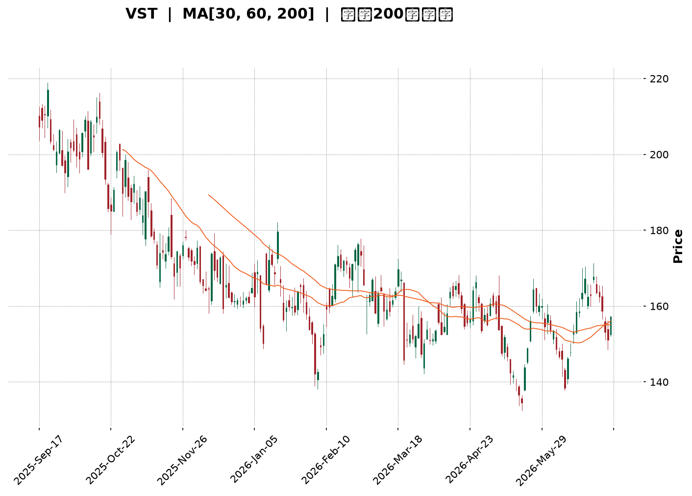
</details>

<html>
<head><meta charset="utf-8" /></head>
<body>
    <div style="height:500px; width:100%;">                        <script>window.PlotlyConfig = {MathJaxConfig: 'local'};</script>
        <script charset="utf-8" src="https://cdn.plot.ly/plotly-3.6.0.min.js" integrity="sha256-QaOVwtVY0T02VaHrr6pnoHLCwayMJp4O5n4YyaE3rJk=" crossorigin="anonymous"></script>                <div id="candlestick-chart" class="plotly-graph-div" style="height:100%; width:100%;"></div>            <script>                window.PLOTLYENV=window.PLOTLYENV || {};                                if (document.getElementById("candlestick-chart")) {                    Plotly.newPlot(                        "candlestick-chart",                        [{"close":{"dtype":"f8","bdata":"AAAA4CLnaUAAAADgBiJqQAAAAKDrTGpAAAAA4IQga0AAAAAgk2xpQAAAAKAaJ2lAAAAAABUZaUAAAAAAistpQAAAAIDPo2hAAAAAQHBjaEAAAACgkxVpQAAAAKDnOWlAAAAAgN8kaUAAAADghfJoQAAAAOBY2WhAAAAAIDC2aUAAAABAISRqQAAAAMBkgWhAAAAAIMoVakAAAACgC5VpQAAAAKA3P2pAAAAAYOAwakAAAABgehBpQAAAAMDmLWhAAAAA4OI3Z0AAAADg5SFnQAAAAEBx0mdAAAAAYE0UaUAAAABgJs9oQAAAAACWuWdAAAAAgGHRaEAAAAAAi51nQAAAAECccGdAAAAAIKkHaEAAAACgBx9nQAAAAGBYk2dAAAAAoFb7ZkAAAADApsZnQAAAAOD4b2dAAAAAwFdNZkAAAABA+zBmQAAAAMAmW2VAAAAAgOW+ZUAAAABgxshlQAAAAMBKtmVAAAAAoLRMZkAAAAAAN6JlQAAAAICB\u002fGRAAAAAoDzNZUAAAAAANURlQAAAAAAjAmZAAAAAYMhDZkAAAACAb51lQAAAAECzemVAAAAAAAVeZUAAAACA3+plQAAAAABBz2RAAAAAAMutZEAAAAAgDIRkQAAAAACFj2RAAAAAQAe8ZUAAAAAgoCxlQAAAAMCr8WRAAAAAYGGXZUAAAABAz+ljQAAAACBjr2RAAAAA4FJLZEAAAAAA+iNkQAAAAOAqJ2RAAAAAIGwwZEAAAADgKidkQAAAAMCXLGRAAAAAwHtFZEAAAABAURxkQAAAAODFmGRAAAAAQGBPZEAAAABg\u002fiFlQAAAAECNRWNAAAAAwOfFYkAAAAAAJ71kQAAAAABTg2VAAAAAgE5eZUAAAACAHxBlQAAAAIDadWZAAAAAAH7EZEAAAACgE4xjQAAAAGCD8mNAAAAAAF39Y0AAAABAtPVjQAAAAGDmy2NAAAAAoNF5ZEAAAABg26VkQAAAACA1RGRAAAAAgDi9Y0AAAACAszpjQAAAAEB+EmNAAAAA4A7EYUAAAAAgnNVhQAAAAKCWp2JAAAAAIIkRY0AAAABAHOVjQAAAAGCp9mNAAAAAIM1UZEAAAABgimBlQAAAAGBtpmVAAAAAoC5DZUAAAACAxYBlQAAAAACrXWVAAAAAQMnqZEAAAABgsGRlQAAAAAAK3GVAAAAAYKEKZkAAAADgIK1lQAAAAMAGsWRAAAAA4B8oZEAAAAAgGV1kQAAAAIAF3mRAAAAAQMvGY0AAAAAgZWVkQAAAAEBJfmRAAAAAoBHXY0AAAADgeORjQAAAAABe0GNAAAAAIGExZEAAAACADXxkQAAAAEDSNGVAAAAAgBDdZEAAAAAAGzpiQAAAAICC4mJAAAAAoDQQY0AAAAAgiuliQAAAAODIAmNAAAAAAGdoY0AAAABgrWpiQAAAACDVw2JAAAAAoNQ3Y0AAAACg\u002ft5iQAAAAKAY7GJAAAAA4OEuY0AAAAAAgXVjQAAAACAqEWNAAAAAgG9QY0AAAAAAUr9jQAAAAMCzd2RAAAAA4MlWZEAAAABgjalkQAAAAMBnZ2RAAAAA4A7sY0AAAAAgMFZjQAAAAOBOcmNAAAAAYC6UY0AAAACA2INkQAAAAAAby2RAAAAAQKEcZEAAAADAZTJjQAAAAADRs2NAAAAA4AJiY0AAAACAABRkQAAAAKD7BGRAAAAAQDLCY0AAAADAgjdjQAAAAABucGJAAAAAwMv6YkAAAACARFViQAAAAGAjzWFAAAAAIHO2YUAAAABggm9hQAAAAGDhEWFAAAAAILHQYEAAAABgjvlhQAAAAIDjm2JAAAAAoKWBY0AAAABAjopkQAAAACCi\u002fWNAAAAAoMkBZEAAAACAMABkQAAAAOBkUWNAAAAAgPi3Y0AAAACgtzJjQAAAAKCFL2NAAAAAoKmRYkAAAADgOVZiQAAAACB\u002fQGJAAAAAgBRLYUAAAAAgnEViQAAAACAEemJAAAAAIMUpY0AAAAAgbMxjQAAAAMBz02NAAAAAIKxwZEAAAADgUehkQAAAAOB6TGRAAAAAANdbZEAAAADgo\u002fhkQAAAACCub2RAAAAAAClMZEAAAAAAKdRjQAAAAMAeJWNAAAAAoJnhYkAAAABACqdjQA=="},"high":{"dtype":"f8","bdata":"PeOcUeaVakBM+zOv6KpqQFn\u002fgyaAnmpAScupMhFda0CKk5c9PnxqQDp9m8meqmlA6SB5LjZtaUAWI7M8dtRpQAY1UT+TyGlA\u002f4AEBWT1aEDAO3MOkIJpQIS+UAjLhGlA93Sg0IAqakAysasiKuJpQDiFUgurX2lA9\u002f0qlhm4aUCZGYFlOkZqQHvzIaunb2pA9oP+SIkiakCXN7eFe\u002f9pQEh6\u002ffZy5GpACdOvPWMGa0CD4s8quSVqQEZZBRC6lGlAQYTGMsUTaEAvGzPQ2ZZnQPLUBm3k7GdApx9UHjElaUBy+kZeF1ppQMaZ\u002fsTkj2hAyfRsa7j8aEDBkCKd2r9oQFIfyI7hAmhAxDkt9CxMaEBxp+5ERNZnQG5o8++n9WdAmIBbvb2KZ0BPO7STCslnQPwusUd7f2hANUuYMiNlZ0Cr87UOipFmQFsESi8aJ2ZAltR8mBxoZkAzk8+u0FhmQG1KZdPkFWZArM3DkemXZkDgX7BgKJBnQDSr+9G1nmVAdUAtFibPZUAJY5G2K8BlQAIYhRlpIGZAxk+aO6aAZkDQMAhD8PdlQCg2RXwM52VAfKxdwSCkZUDRLbpa+ClmQDAcS\u002fi3\u002fGVAzjrIvffjZEBCb4oakiZlQEdQBV+bqmRAEPXEBUXFZUAIwyaGHGhmQKJYt14KiWVA9dQpMa2mZUDeJfV4PM1lQBfU6cWfZmVAkvD6Kl9WZUD9YG8TantkQC+VNr\u002fyZ2RA\u002f6sLAF5EZEBT3R8xnFFkQGYyS4rnd2RAaKRLToZTZEAmYFI7eoFkQKe2+fcDGmVATeopUM5lZUBp8FokSIRlQAyWdjfpBWVAROJtm9hrY0COJfr1QMhlQDA5eLsTCGZAsBfXK+neZUCMn8fNpVZlQEMfebbNwWZAeQWHmLtUZUC\u002fQMluWLFkQB2MH1QPMWRAYlVG6ZBhZEBltG4Zdk1kQMN8ZnlTm2RApuoxnU6FZEBKFzU1N8NkQMRmyfhW7WRAjvAyQnqBZEDqhGt5PPFjQAdcsSYvgmNArwJ2+40nY0DTwSBkavBhQARwbMPg+mJAVNJ2HjVrY0CoNSN+MB9kQDjIZ4JTm2RA2b529gu4ZEB9eHAo92VlQOfN8oA0BWZAdF8WtYHgZUAzM\u002fdqAYNlQOr228muoGVASzahkbVrZUDnf+CEmmZlQI\u002fJWUSM7mVAWbD5u7YXZkAUURmbLTpmQG31n4UOAWZAhwMc5IViZECjlB4qOXhkQD8jKB428GRA\u002f6bjmUv9ZEDWRGNMoIVkQB\u002f1zuhgCmVA\u002fPux1jNxZEBq9DMQ\u002fldkQDxQdpcXmWRA5cq235BhZEDtwTb2HKBkQEdRRym6kGVABnFCWjokZUAS2w0Xl8dkQCj9f9DSdWNArBCp0E08Y0DJ0ZzYVLdjQP255qKbDmNAJp7mLTv\u002fY0A8coLDpdZjQJA+jPBC6GJAtnEuPOKDY0DZhpXnAEtjQLeT4SSCHGNAum8zoDg+Y0AGa5WIsyJkQPAhUtavSWRAXnQOsg\u002fNY0AKvFgB2Q9kQHM\u002fAD6QoWRA5UvjPDDJZEBq01xT+NVkQBSlIOAjCGVAl1FaRUJ6ZEApP5q2\u002fRtkQMePKu9w22NAd6\u002fm+7rUY0DtmB1u9KdkQHfPrSvnBWVAe0d0XRdjZEDmAJauPB1kQDWgRj4E7WNAObMAU1D9Y0A6Qsq45ERkQPwsthFFcmRAvncR6GJYZEBQzOnT8QRlQLp1EVoQWWNAofcaGyoRY0CrwoLxm8NiQA6qzPRpQmJAWRXGBAfjYUASR\u002fX4kJxhQCHzmAkJa2FAVIfWU0gQYUCqLp7QUBZiQOrudJVHomJApM9jWzCrY0CkD9H2TuVkQCksGdBRmWRAhVjUZKRpZEC6wXhmBEJkQGFCeDSBymNAzaDPzsMRZECPZ\u002f6pDbZjQL3L5vpiOmNAeP9xBWBCY0BbQnRB66JiQIgbOsLfwmJA4OUhU475YUDpFA\u002frOVZiQBK6r9ZDyWJAf9bCg3FnY0C9wjo\u002fIihkQBc1bITPRmRAPn6+4UFDZUAAAAAAAFBlQAAAAGBmumRAAAAA4Hq0ZEAAAABAM2tlQAAAAIDC\u002fWRAAAAAQDOzZEAAAABgZq5kQAAAAIA9qmNAAAAAIK6HY0AAAAAgrqdjQA=="},"hovertemplate":"\u003cb\u003e%{x|%Y-%m-%d}\u003c\u002fb\u003e\u003cbr\u003e\u958b: $%{open:.2f}\u003cbr\u003e\u9ad8: $%{high:.2f}\u003cbr\u003e\u4f4e: $%{low:.2f}\u003cbr\u003e\u6536: $%{close:.2f}\u003cextra\u003e\u003c\u002fextra\u003e","low":{"dtype":"f8","bdata":"\u002f8VYmUNzaUC8r6by295pQKS7rFuoimlANgeysgXeaUDrfBDgt1NpQO21iZQMIWlAQ9lCeU5maEAUm7DgrwRpQMXad4cpnGhAlG9vWRe9Z0DYM++y7+tnQOhB4xxZvGhAhn3hBUIVaUBHE7zejpNoQB5PtqVSYmhAj3ZuGIHpaEAA4D4eeI9pQOOZ\u002fY3BgGhAbzeNHzTyaEDiAGMjEhJpQFugZ1BosWlA51cNTTH6aUCMsOvqDOdoQJtpyE88AGhAVc2rxpwZZ0CDtpo29VxmQLdR+OsSHmdAMJbfx185aECdTWzh63VoQIMJ5uyO9mZA3sr4GOWVZ0D29kUAQnhnQPrMwOVI2GZAT5kaVyRiZ0ADEwuhg\u002fdmQLfJM4c3BWdAUCMfTiJZZkDEkt49w\u002ftlQLLFatqt7GZA+4Y7ZDBCZkCb5ppLwBFmQO+1cXUCOmVACufm4ZWcZEDNzIc\u002f3YxlQD\u002fYrp54PmVAO2r0J+uvZUDkC2zMLo1lQDlvTLGFOGRAo5QYbMimZEBs51gq8aZkQOjCt\u002fa\u002fi2VA65T9ALIoZkCSwaFmKX9lQNhjnQLwVGVAzflBW\u002foHZUBhYimacjhlQPrLUWjyuGRAdVxEfSVsZEAIgdF3f4FkQLArIaS+v2NAO4jIl\u002fMKZEBEZ7k1xdlkQB2V5wUzyWRAs9PBDX+7ZEASOAeGVsFjQLsa7AjaP2RA3yQwts5AZED6zqgFAA1kQBwFzg0G9mNAcoBRHonqY0C4gPZUC\u002f1jQE4X9Sxz72NAKY+dgbMTZEBdZG6czhhkQCB9yugCbmRADECgLPD3Y0DJlyxTgGpkQNhP4ZS5I2NAQrOS3eiYYkBPjuoShK1kQNu6cRoTdGRA3i1W7yhLZUAJrhDe8LJkQOzgx5iaZmVAkOfdwu1RZED0weTHNHpjQBOeeqAQK2NAIPSX+L\u002fWY0AXq5IpDbJjQLD08TDcrmNAzuvFlda2Y0Byb7Z\u002f5BZkQC+CjTElymNAR\u002furDKyNY0BPfLOSXDNjQMfxonBEv2JAUcp6U1hcYUCQf536ukRhQKFQ\u002f+VsYGJAKc9N6+lrYkByNGHBQExjQBx43miaw2NATyt3paP+Y0C0rE4HviFkQKIcB4xlL2VAY1s08oskZUDNzMyMJflkQCmrzH0UEWVA0tMOiSKYZEDuJ0Lmx01kQFhE4JOLM2VAbwviPgh1ZEAXDS6tZE1lQMSnt53rq2RAcGCLs9oRY0C1Lralo\u002f5jQGVNuoV8J2RAbKrpCKC7Y0Cf5bHwUFJjQKPgpSVBe2RAOdcDQRpXY0CX44T2kIhjQElApVJvqWNAHnsInWL1Y0Bf8kUShzVkQJFttaljoWRAwrR7ltx4ZED80hsiFBRiQDCcSKUJpGJAyIIcUeiqYkDrQA8ybsViQPVLM+8fSWJAEhzDmjXxYkDRQsnEo0xiQIi6hYmCxGFA8DrGUwbmYkCspp1EH71iQHp9+\u002fZztWJASPupEzzCYkAzn6ifVGJjQMhBT23tDmNAMcweD6scY0Bm\u002fQP19w1jQIN0gUfdA2RALPfdLIs9ZECnqN4zPkxkQJS7Xv8OQWRA2ZzkySfDY0BB439PQz1jQFCOfteBVmNAst3zCxZJY0AByZRk211jQNzBu59q0GNANrhk\u002fu\u002fPY0BX4EiitRtjQPbMMQxkcGNAYtt3otNWY0BSrOzQCKdjQHihDOVy8mNAFapMPDGMY0Cf+NxPwjFjQFqsM1rIWGJA8Hmqn1lCYkBT2n4cmi5iQE3hjaMTamFA5lUCCT53YUBVuQjMwDNhQDF9spuHtWBARUYq\u002fC6PYEBVvTbJwDNhQNs5lj2tFWJAvFPn\u002fEDRYkALBQmi9b9jQMdPpbT3xWNAJEOH0yWsY0Bq28zAI5VjQNVHqKvJ42JAs\u002f\u002f9j1EVY0BVQ\u002fAcjhdjQJGDq\u002fVbv2JAUQJaL2ZpYkCM8PoUnEViQPVudh3yqmFAABqb1\u002fI2YUBpIkej\u002fmthQAsPdu9rWWJA4+8leT7BYkBBg9+WuBNjQDVlMk+vn2NAMhGFfcz5Y0AAAADAzFxkQAAAAOCj5GNAAAAAACn8Y0AAAADgUcBkQAAAAIAUZmRAAAAA4KMgZEAAAADgUZBjQAAAAKCZ4WJAAAAAAACQYkAAAADgUQBjQA=="},"name":"\u50f9\u683c","open":{"dtype":"f8","bdata":"xHB0ZihGakAha0D4TIZqQGgBb0ezUWpAgsG1Wv9DakCSdoexoidqQLY3FDtYTWlAf7cW\u002fbilaEC2gDinsgtpQFh40w8xJWlA7CnXBqXLaEDBy+XsHkZoQGBDLkYzZmlAR3mdcRRwaUAN+zOFwqlpQBsRfB99F2lArNLbus4XaUDMzMwsh8RpQNjMEDh7HGpADCo86SUJaUBAeKrc951pQDpeT9t1DmpAnm5aGca8akA1GisH4dlpQCB70ZsRaWlA44lo648CaEB2IEuwtVhnQLdR+OsSHmdAzNDY1Bt5aEBy+kZeF1ppQMaZ\u002fsTkj2hA1GIYUxTwZ0DrajNF7DtoQNmEf+uE5mdAqs6Cw5jAZ0AYhbaRPGpnQGd5bLeZL2dAyraYRjXEZkCiOWtwTzhmQPKSDzu\u002fP2hAvnHl88MkZ0BenUHDoHJmQP5SyzukBWZA1QwKppLPZEAAgBhEetZlQN0Jnas0fmVAHVc7uN\u002fNZUCqIZAftgFnQLMLpWUsaWVA+hZ+fLwbZUBSvuoLdatlQB5+rYDoqGVAN1NYfj5IZkDWVuL69ehlQP6294uF1WVAFWBtrzR+ZUAQOT1t\u002fGVlQPzuCZU2+WVAzjrIvffjZEBNcmeZ5JVkQPhBbtnvlGRA1jlCAhgsZEB0cX76Jc9lQMIjjxrEh2VATEcSyK6+ZEDno1LdOallQP0koZMin2RAIQc50EbAZECtOPeUhXFkQD4gggL6I2RAn+L3y3cRZEAAAADgKidkQJt0xXvJEWRA4rgUw7IxZEDE909+GU5kQCB9yugCbmRAkXplNOMcZUB\u002fyluaFBFlQAyWdjfpBWVAg314aUtaY0BDTR56K7tlQMcg5wTnhmRA7ZsDkaOwZUB+cQqihh1lQLSl30O6kGVAqwSR587iZEChFGk0ZxpkQOIDlzNI0mNAe3eu5HYvZECQRUD23\u002fFjQF+aleWzBGRAxI9o+TziY0ADEildWLFkQFbh87wRsGRAiTsxD74hZEBQCkPC4aZjQPSeN70OdmNAR5C9Wo4YY0CiNDVojZNhQGvQ+\u002fbBsmJAbvtA\u002f8GyYkD\u002fGoqro\u002f5jQCt\u002f6wNvkWRAVV4skCsJZEDFYDNwdj5kQF6+bicTTWVAs6ulQfWwZUDNzK7IHi5lQH5MwohjemVA5YCBUGpFZUDqU5E1MdpkQBzvAznxfGVAA7NbZWRcZUBeBNfpjNBlQLXxqtpfN2VAB1PTOc4nZEDh1bZAnSRkQF+1iIDeLWRAgE9oy+F\u002fZEBk8plZCW9jQEz8se3rnGRA\u002f98kx8FkZEB0vvdfsZRjQF2rAP4JKmRAxPbQX8kRZEC2Ry36i0tkQI9bSwNeqWRAdFoVpa7WZEAS2w0Xl8dkQJsRxGqf52JAVVhE3NzKYkCDeW5EEFljQBbcrFNPqWJAEhzDmjXxYkDDZ3p6K5xjQBLZRipc9mFA\u002fZJ2BkPoYkCAm\u002fon9N9iQPTlBU2F2mJA3HawxnrbYkAFbOhyzhBkQD0FXQeBdWNAtZZUdyEpY0Bm\u002fQP19w1jQGrRNB\u002faRWRAwRlEDJioZEAS234f4IpkQLuBQSzhwGRAbaMVuk1aZECY18A7IBFkQElCG9mJsmNAS5sisr13Y0BNfAKAkINjQHTgz7mdmGRAgy\u002fmcLpIZECguN1AUhRkQFJ21iFJgmNAFnTg6dXCY0AlPbjzBa9jQED1\u002fJu0WGRAQvmM6JwoZEAIBNbd+1lkQLp1EVoQWWNA1M6FhWB5YkD6ZWWc\u002fahiQA6qzPRpQmJAOw0CVdWlYUC\u002fIGWJi3JhQKy7RZnHWWFAa6VN44XzYEAAAAAc0zlhQPzERLuHKGJA8Ee7hzPaYkDHxmI6AtZjQCqM6aVWl2RAr4IMn8XTY0BDIIcC1\u002fhjQMLQZVb5mGNAY8mZARp3Y0C17QHUUIljQAw4lp5\u002f6mJArxqcoTL5YkC3\u002fdt4SINiQDEc4UvMhmJAButnBcnkYUDK3O7+XplhQFYbq3pgeWJAgqlK4hQTY0CbYydnJCFjQIfXM+n7ymNA8Fc8ZKA7ZEAAAAAAKXBkQAAAAGCPAmRAAAAAwPVgZEAAAADAHt1kQAAAACCFu2RAAAAAYGZ2ZEAAAABgj1JkQAAAAAAAgGNAAAAAYGY+Y0AAAABACg9jQA=="},"x":["2025-09-17T00:00:00-04:00","2025-09-18T00:00:00-04:00","2025-09-19T00:00:00-04:00","2025-09-22T00:00:00-04:00","2025-09-23T00:00:00-04:00","2025-09-24T00:00:00-04:00","2025-09-25T00:00:00-04:00","2025-09-26T00:00:00-04:00","2025-09-29T00:00:00-04:00","2025-09-30T00:00:00-04:00","2025-10-01T00:00:00-04:00","2025-10-02T00:00:00-04:00","2025-10-03T00:00:00-04:00","2025-10-06T00:00:00-04:00","2025-10-07T00:00:00-04:00","2025-10-08T00:00:00-04:00","2025-10-09T00:00:00-04:00","2025-10-10T00:00:00-04:00","2025-10-13T00:00:00-04:00","2025-10-14T00:00:00-04:00","2025-10-15T00:00:00-04:00","2025-10-16T00:00:00-04:00","2025-10-17T00:00:00-04:00","2025-10-20T00:00:00-04:00","2025-10-21T00:00:00-04:00","2025-10-22T00:00:00-04:00","2025-10-23T00:00:00-04:00","2025-10-24T00:00:00-04:00","2025-10-27T00:00:00-04:00","2025-10-28T00:00:00-04:00","2025-10-29T00:00:00-04:00","2025-10-30T00:00:00-04:00","2025-10-31T00:00:00-04:00","2025-11-03T00:00:00-05:00","2025-11-04T00:00:00-05:00","2025-11-05T00:00:00-05:00","2025-11-06T00:00:00-05:00","2025-11-07T00:00:00-05:00","2025-11-10T00:00:00-05:00","2025-11-11T00:00:00-05:00","2025-11-12T00:00:00-05:00","2025-11-13T00:00:00-05:00","2025-11-14T00:00:00-05:00","2025-11-17T00:00:00-05:00","2025-11-18T00:00:00-05:00","2025-11-19T00:00:00-05:00","2025-11-20T00:00:00-05:00","2025-11-21T00:00:00-05:00","2025-11-24T00:00:00-05:00","2025-11-25T00:00:00-05:00","2025-11-26T00:00:00-05:00","2025-11-28T00:00:00-05:00","2025-12-01T00:00:00-05:00","2025-12-02T00:00:00-05:00","2025-12-03T00:00:00-05:00","2025-12-04T00:00:00-05:00","2025-12-05T00:00:00-05:00","2025-12-08T00:00:00-05:00","2025-12-09T00:00:00-05:00","2025-12-10T00:00:00-05:00","2025-12-11T00:00:00-05:00","2025-12-12T00:00:00-05:00","2025-12-15T00:00:00-05:00","2025-12-16T00:00:00-05:00","2025-12-17T00:00:00-05:00","2025-12-18T00:00:00-05:00","2025-12-19T00:00:00-05:00","2025-12-22T00:00:00-05:00","2025-12-23T00:00:00-05:00","2025-12-24T00:00:00-05:00","2025-12-26T00:00:00-05:00","2025-12-29T00:00:00-05:00","2025-12-30T00:00:00-05:00","2025-12-31T00:00:00-05:00","2026-01-02T00:00:00-05:00","2026-01-05T00:00:00-05:00","2026-01-06T00:00:00-05:00","2026-01-07T00:00:00-05:00","2026-01-08T00:00:00-05:00","2026-01-09T00:00:00-05:00","2026-01-12T00:00:00-05:00","2026-01-13T00:00:00-05:00","2026-01-14T00:00:00-05:00","2026-01-15T00:00:00-05:00","2026-01-16T00:00:00-05:00","2026-01-20T00:00:00-05:00","2026-01-21T00:00:00-05:00","2026-01-22T00:00:00-05:00","2026-01-23T00:00:00-05:00","2026-01-26T00:00:00-05:00","2026-01-27T00:00:00-05:00","2026-01-28T00:00:00-05:00","2026-01-29T00:00:00-05:00","2026-01-30T00:00:00-05:00","2026-02-02T00:00:00-05:00","2026-02-03T00:00:00-05:00","2026-02-04T00:00:00-05:00","2026-02-05T00:00:00-05:00","2026-02-06T00:00:00-05:00","2026-02-09T00:00:00-05:00","2026-02-10T00:00:00-05:00","2026-02-11T00:00:00-05:00","2026-02-12T00:00:00-05:00","2026-02-13T00:00:00-05:00","2026-02-17T00:00:00-05:00","2026-02-18T00:00:00-05:00","2026-02-19T00:00:00-05:00","2026-02-20T00:00:00-05:00","2026-02-23T00:00:00-05:00","2026-02-24T00:00:00-05:00","2026-02-25T00:00:00-05:00","2026-02-26T00:00:00-05:00","2026-02-27T00:00:00-05:00","2026-03-02T00:00:00-05:00","2026-03-03T00:00:00-05:00","2026-03-04T00:00:00-05:00","2026-03-05T00:00:00-05:00","2026-03-06T00:00:00-05:00","2026-03-09T00:00:00-04:00","2026-03-10T00:00:00-04:00","2026-03-11T00:00:00-04:00","2026-03-12T00:00:00-04:00","2026-03-13T00:00:00-04:00","2026-03-16T00:00:00-04:00","2026-03-17T00:00:00-04:00","2026-03-18T00:00:00-04:00","2026-03-19T00:00:00-04:00","2026-03-20T00:00:00-04:00","2026-03-23T00:00:00-04:00","2026-03-24T00:00:00-04:00","2026-03-25T00:00:00-04:00","2026-03-26T00:00:00-04:00","2026-03-27T00:00:00-04:00","2026-03-30T00:00:00-04:00","2026-03-31T00:00:00-04:00","2026-04-01T00:00:00-04:00","2026-04-02T00:00:00-04:00","2026-04-06T00:00:00-04:00","2026-04-07T00:00:00-04:00","2026-04-08T00:00:00-04:00","2026-04-09T00:00:00-04:00","2026-04-10T00:00:00-04:00","2026-04-13T00:00:00-04:00","2026-04-14T00:00:00-04:00","2026-04-15T00:00:00-04:00","2026-04-16T00:00:00-04:00","2026-04-17T00:00:00-04:00","2026-04-20T00:00:00-04:00","2026-04-21T00:00:00-04:00","2026-04-22T00:00:00-04:00","2026-04-23T00:00:00-04:00","2026-04-24T00:00:00-04:00","2026-04-27T00:00:00-04:00","2026-04-28T00:00:00-04:00","2026-04-29T00:00:00-04:00","2026-04-30T00:00:00-04:00","2026-05-01T00:00:00-04:00","2026-05-04T00:00:00-04:00","2026-05-05T00:00:00-04:00","2026-05-06T00:00:00-04:00","2026-05-07T00:00:00-04:00","2026-05-08T00:00:00-04:00","2026-05-11T00:00:00-04:00","2026-05-12T00:00:00-04:00","2026-05-13T00:00:00-04:00","2026-05-14T00:00:00-04:00","2026-05-15T00:00:00-04:00","2026-05-18T00:00:00-04:00","2026-05-19T00:00:00-04:00","2026-05-20T00:00:00-04:00","2026-05-21T00:00:00-04:00","2026-05-22T00:00:00-04:00","2026-05-26T00:00:00-04:00","2026-05-27T00:00:00-04:00","2026-05-28T00:00:00-04:00","2026-05-29T00:00:00-04:00","2026-06-01T00:00:00-04:00","2026-06-02T00:00:00-04:00","2026-06-03T00:00:00-04:00","2026-06-04T00:00:00-04:00","2026-06-05T00:00:00-04:00","2026-06-08T00:00:00-04:00","2026-06-09T00:00:00-04:00","2026-06-10T00:00:00-04:00","2026-06-11T00:00:00-04:00","2026-06-12T00:00:00-04:00","2026-06-15T00:00:00-04:00","2026-06-16T00:00:00-04:00","2026-06-17T00:00:00-04:00","2026-06-18T00:00:00-04:00","2026-06-22T00:00:00-04:00","2026-06-23T00:00:00-04:00","2026-06-24T00:00:00-04:00","2026-06-25T00:00:00-04:00","2026-06-26T00:00:00-04:00","2026-06-29T00:00:00-04:00","2026-06-30T00:00:00-04:00","2026-07-01T00:00:00-04:00","2026-07-02T00:00:00-04:00","2026-07-06T00:00:00-04:00"],"type":"candlestick"},{"hovertemplate":"MA30: $%{y:.2f}\u003cextra\u003e\u003c\u002fextra\u003e","line":{"color":"#2196F3","dash":"dash","width":2},"mode":"lines","name":"MA30","x":["2025-09-17T00:00:00-04:00","2025-09-18T00:00:00-04:00","2025-09-19T00:00:00-04:00","2025-09-22T00:00:00-04:00","2025-09-23T00:00:00-04:00","2025-09-24T00:00:00-04:00","2025-09-25T00:00:00-04:00","2025-09-26T00:00:00-04:00","2025-09-29T00:00:00-04:00","2025-09-30T00:00:00-04:00","2025-10-01T00:00:00-04:00","2025-10-02T00:00:00-04:00","2025-10-03T00:00:00-04:00","2025-10-06T00:00:00-04:00","2025-10-07T00:00:00-04:00","2025-10-08T00:00:00-04:00","2025-10-09T00:00:00-04:00","2025-10-10T00:00:00-04:00","2025-10-13T00:00:00-04:00","2025-10-14T00:00:00-04:00","2025-10-15T00:00:00-04:00","2025-10-16T00:00:00-04:00","2025-10-17T00:00:00-04:00","2025-10-20T00:00:00-04:00","2025-10-21T00:00:00-04:00","2025-10-22T00:00:00-04:00","2025-10-23T00:00:00-04:00","2025-10-24T00:00:00-04:00","2025-10-27T00:00:00-04:00","2025-10-28T00:00:00-04:00","2025-10-29T00:00:00-04:00","2025-10-30T00:00:00-04:00","2025-10-31T00:00:00-04:00","2025-11-03T00:00:00-05:00","2025-11-04T00:00:00-05:00","2025-11-05T00:00:00-05:00","2025-11-06T00:00:00-05:00","2025-11-07T00:00:00-05:00","2025-11-10T00:00:00-05:00","2025-11-11T00:00:00-05:00","2025-11-12T00:00:00-05:00","2025-11-13T00:00:00-05:00","2025-11-14T00:00:00-05:00","2025-11-17T00:00:00-05:00","2025-11-18T00:00:00-05:00","2025-11-19T00:00:00-05:00","2025-11-20T00:00:00-05:00","2025-11-21T00:00:00-05:00","2025-11-24T00:00:00-05:00","2025-11-25T00:00:00-05:00","2025-11-26T00:00:00-05:00","2025-11-28T00:00:00-05:00","2025-12-01T00:00:00-05:00","2025-12-02T00:00:00-05:00","2025-12-03T00:00:00-05:00","2025-12-04T00:00:00-05:00","2025-12-05T00:00:00-05:00","2025-12-08T00:00:00-05:00","2025-12-09T00:00:00-05:00","2025-12-10T00:00:00-05:00","2025-12-11T00:00:00-05:00","2025-12-12T00:00:00-05:00","2025-12-15T00:00:00-05:00","2025-12-16T00:00:00-05:00","2025-12-17T00:00:00-05:00","2025-12-18T00:00:00-05:00","2025-12-19T00:00:00-05:00","2025-12-22T00:00:00-05:00","2025-12-23T00:00:00-05:00","2025-12-24T00:00:00-05:00","2025-12-26T00:00:00-05:00","2025-12-29T00:00:00-05:00","2025-12-30T00:00:00-05:00","2025-12-31T00:00:00-05:00","2026-01-02T00:00:00-05:00","2026-01-05T00:00:00-05:00","2026-01-06T00:00:00-05:00","2026-01-07T00:00:00-05:00","2026-01-08T00:00:00-05:00","2026-01-09T00:00:00-05:00","2026-01-12T00:00:00-05:00","2026-01-13T00:00:00-05:00","2026-01-14T00:00:00-05:00","2026-01-15T00:00:00-05:00","2026-01-16T00:00:00-05:00","2026-01-20T00:00:00-05:00","2026-01-21T00:00:00-05:00","2026-01-22T00:00:00-05:00","2026-01-23T00:00:00-05:00","2026-01-26T00:00:00-05:00","2026-01-27T00:00:00-05:00","2026-01-28T00:00:00-05:00","2026-01-29T00:00:00-05:00","2026-01-30T00:00:00-05:00","2026-02-02T00:00:00-05:00","2026-02-03T00:00:00-05:00","2026-02-04T00:00:00-05:00","2026-02-05T00:00:00-05:00","2026-02-06T00:00:00-05:00","2026-02-09T00:00:00-05:00","2026-02-10T00:00:00-05:00","2026-02-11T00:00:00-05:00","2026-02-12T00:00:00-05:00","2026-02-13T00:00:00-05:00","2026-02-17T00:00:00-05:00","2026-02-18T00:00:00-05:00","2026-02-19T00:00:00-05:00","2026-02-20T00:00:00-05:00","2026-02-23T00:00:00-05:00","2026-02-24T00:00:00-05:00","2026-02-25T00:00:00-05:00","2026-02-26T00:00:00-05:00","2026-02-27T00:00:00-05:00","2026-03-02T00:00:00-05:00","2026-03-03T00:00:00-05:00","2026-03-04T00:00:00-05:00","2026-03-05T00:00:00-05:00","2026-03-06T00:00:00-05:00","2026-03-09T00:00:00-04:00","2026-03-10T00:00:00-04:00","2026-03-11T00:00:00-04:00","2026-03-12T00:00:00-04:00","2026-03-13T00:00:00-04:00","2026-03-16T00:00:00-04:00","2026-03-17T00:00:00-04:00","2026-03-18T00:00:00-04:00","2026-03-19T00:00:00-04:00","2026-03-20T00:00:00-04:00","2026-03-23T00:00:00-04:00","2026-03-24T00:00:00-04:00","2026-03-25T00:00:00-04:00","2026-03-26T00:00:00-04:00","2026-03-27T00:00:00-04:00","2026-03-30T00:00:00-04:00","2026-03-31T00:00:00-04:00","2026-04-01T00:00:00-04:00","2026-04-02T00:00:00-04:00","2026-04-06T00:00:00-04:00","2026-04-07T00:00:00-04:00","2026-04-08T00:00:00-04:00","2026-04-09T00:00:00-04:00","2026-04-10T00:00:00-04:00","2026-04-13T00:00:00-04:00","2026-04-14T00:00:00-04:00","2026-04-15T00:00:00-04:00","2026-04-16T00:00:00-04:00","2026-04-17T00:00:00-04:00","2026-04-20T00:00:00-04:00","2026-04-21T00:00:00-04:00","2026-04-22T00:00:00-04:00","2026-04-23T00:00:00-04:00","2026-04-24T00:00:00-04:00","2026-04-27T00:00:00-04:00","2026-04-28T00:00:00-04:00","2026-04-29T00:00:00-04:00","2026-04-30T00:00:00-04:00","2026-05-01T00:00:00-04:00","2026-05-04T00:00:00-04:00","2026-05-05T00:00:00-04:00","2026-05-06T00:00:00-04:00","2026-05-07T00:00:00-04:00","2026-05-08T00:00:00-04:00","2026-05-11T00:00:00-04:00","2026-05-12T00:00:00-04:00","2026-05-13T00:00:00-04:00","2026-05-14T00:00:00-04:00","2026-05-15T00:00:00-04:00","2026-05-18T00:00:00-04:00","2026-05-19T00:00:00-04:00","2026-05-20T00:00:00-04:00","2026-05-21T00:00:00-04:00","2026-05-22T00:00:00-04:00","2026-05-26T00:00:00-04:00","2026-05-27T00:00:00-04:00","2026-05-28T00:00:00-04:00","2026-05-29T00:00:00-04:00","2026-06-01T00:00:00-04:00","2026-06-02T00:00:00-04:00","2026-06-03T00:00:00-04:00","2026-06-04T00:00:00-04:00","2026-06-05T00:00:00-04:00","2026-06-08T00:00:00-04:00","2026-06-09T00:00:00-04:00","2026-06-10T00:00:00-04:00","2026-06-11T00:00:00-04:00","2026-06-12T00:00:00-04:00","2026-06-15T00:00:00-04:00","2026-06-16T00:00:00-04:00","2026-06-17T00:00:00-04:00","2026-06-18T00:00:00-04:00","2026-06-22T00:00:00-04:00","2026-06-23T00:00:00-04:00","2026-06-24T00:00:00-04:00","2026-06-25T00:00:00-04:00","2026-06-26T00:00:00-04:00","2026-06-29T00:00:00-04:00","2026-06-30T00:00:00-04:00","2026-07-01T00:00:00-04:00","2026-07-02T00:00:00-04:00","2026-07-06T00:00:00-04:00"],"y":{"dtype":"f8","bdata":"AAAAAAAA+H8AAAAAAAD4fwAAAAAAAPh\u002fAAAAAAAA+H8AAAAAAAD4fwAAAAAAAPh\u002fAAAAAAAA+H8AAAAAAAD4fwAAAAAAAPh\u002fAAAAAAAA+H8AAAAAAAD4fwAAAAAAAPh\u002fAAAAAAAA+H8AAAAAAAD4fwAAAAAAAPh\u002fAAAAAAAA+H8AAAAAAAD4fwAAAAAAAPh\u002fAAAAAAAA+H8AAAAAAAD4fwAAAAAAAPh\u002fAAAAAAAA+H8AAAAAAAD4fwAAAAAAAPh\u002fAAAAAAAA+H8AAAAAAAD4fwAAAAAAAPh\u002fAAAAAAAA+H8AAAAAAAD4f0RERMQnKGlAZmZmluUeaUDe3d39aQlpQCIiIvIA8WhAiYiIOJPWaEAAAABw7MJoQHd3dwd3tWhAZmZmJmijaEAAAABgLZJoQM3MzHzqh2hA7+7u3hx2aEAAAAAgbV1oQCIiIrJmPGhAVVVV5WYfaEC8u7sLaQRoQO\u002fu7k6k6WdAd3d3l4bMZ0CamZnZD6ZnQGZmZkYIiGdAZmZmBntjZ0AiIiISpz5nQHd3d7d7GmdAq6qq6vr4ZkDv7u6ei9tmQO\u002fu7l6BxGZAVVVVtbW0ZkARERGhV6pmQCIiItKikGZAERER8RVrZkDv7u7uckZmQN7d3V1yK2ZA7+7ujiIRZkDe3d3tTfxlQFVVVaUB52VAREREdDLSZUBVVVW10rZlQGZmZmYonmVAd3d3VzmHZUBVVVWVM2hlQHd3d7csTGVAzczM3CQ6ZUDNzMwMwChlQHd3dzeqHmVAAAAAoBUSZUBERER0zQNlQGZmZgZJ+mRA7+7uvk7pZEB3d3eXCOVkQJqZmdlm1mRAAAAAsI68ZECJiIg4DrhkQGZmZhbUs2RARERE5C2sZEBmZmYGeKdkQDMzMzPXr2RAmpmZGbmqZECrqqoaf5ZkQDMzM3Mjj2RAq6qq6kGJZEARERFBg4RkQHd3d\u002ff9fWRAIiIickBzZEC8u7trwm5kQDMzMzP6aGRAmpmZCSxZZEB3d3fHVVNkQKuqqmqSRWRAVVVVFf8vZECamZlJURxkQERERBSID2RAq6qq+vcFZECrqqpKxANkQERERBT4AWRAq6qqynoCZEDv7u5+SQ1kQLy7u4tGFmRAZmZmBmceZEC8u7vLjyFkQHd3d6duM2RAAAAAcLpFZEBVVVUVUEtkQN7d3R1FTmRAzczMnANUZEBERERkP1lkQEREREQnSmRA3t3d7fBEZEBERESU6EtkQAAAAEDCU2RAd3d3l\u002fBRZEAAAACwqVVkQKuqquqbW2RA3t3dHS9WZEBmZmbmvE9kQFVVVWXgS2RA3t3dnb9PZEARERHRdVpkQBEREdGrbGRA3t3dzRqHZEDe3d1ddIpkQJqZmSlrjGRAAAAA0F+MZEAzMzMT\u002fYNkQN7d3f3be2RAiYiIuPpzZEDv7u6et1pkQCIiIvIYQmRAMzMzA6cwZEAzMzNzMRpkQM3MzDxXBWRAIiIiQov2Y0De3d2tCeZjQKuqqmo1zmNAzczMfO+2Y0CJiIioeaZjQN7d3X2QpGNAERERsR6mY0CamZkZq6hjQImIiOi2pGNAVVVV5fSlY0CJiIiY6pxjQJqZmdn7k2NAMzMzE8GRY0AAAAAQEZdjQCIiIrJsn2NAIiIiorueY0AzMzOTvpNjQDMzMzPphmNAzczMnEZ6Y0B3d3eHEopjQLy7uzvBk2NAZmZmFrCZY0ARERFxSZxjQLy7u4tol2NAzczMPMGTY0CrqqqKCpNjQKuqqmrRimNAVVVV1fh9Y0BVVVX1uHFjQBEREVHqYWNA3t3dfbVNY0BVVVVFC0FjQERERIQiPWNAREREdMY+Y0Crqqq6jEVjQDMzMxN7QWNAvLu7u6U+Y0ARERGBADljQERERCS8L2NAmpmZqf8tY0Crqqr60CxjQCIiIhKXKmNAvLu7C\u002fkhY0ARERGxYg9jQERERNSy+WJAq6qqmqXhYkBEREQEwdliQBEREUFLz2JAREREVGvNYkBERESECMtiQKuqqtphyWJAd3d3tzLPYkBVVVUFoN1iQBEREVF+7WJAVVVV9UL5YkAzMzMjxg9jQKuqqjpCJmNAMzMz01A8Y0B3d3fHvFBjQGZmZgZyYmNAAAAAYBN0Y0De3d1NZIJjQA=="},"type":"scatter"},{"hovertemplate":"MA60: $%{y:.2f}\u003cextra\u003e\u003c\u002fextra\u003e","line":{"color":"#9C27B0","dash":"dash","width":2},"mode":"lines","name":"MA60","x":["2025-09-17T00:00:00-04:00","2025-09-18T00:00:00-04:00","2025-09-19T00:00:00-04:00","2025-09-22T00:00:00-04:00","2025-09-23T00:00:00-04:00","2025-09-24T00:00:00-04:00","2025-09-25T00:00:00-04:00","2025-09-26T00:00:00-04:00","2025-09-29T00:00:00-04:00","2025-09-30T00:00:00-04:00","2025-10-01T00:00:00-04:00","2025-10-02T00:00:00-04:00","2025-10-03T00:00:00-04:00","2025-10-06T00:00:00-04:00","2025-10-07T00:00:00-04:00","2025-10-08T00:00:00-04:00","2025-10-09T00:00:00-04:00","2025-10-10T00:00:00-04:00","2025-10-13T00:00:00-04:00","2025-10-14T00:00:00-04:00","2025-10-15T00:00:00-04:00","2025-10-16T00:00:00-04:00","2025-10-17T00:00:00-04:00","2025-10-20T00:00:00-04:00","2025-10-21T00:00:00-04:00","2025-10-22T00:00:00-04:00","2025-10-23T00:00:00-04:00","2025-10-24T00:00:00-04:00","2025-10-27T00:00:00-04:00","2025-10-28T00:00:00-04:00","2025-10-29T00:00:00-04:00","2025-10-30T00:00:00-04:00","2025-10-31T00:00:00-04:00","2025-11-03T00:00:00-05:00","2025-11-04T00:00:00-05:00","2025-11-05T00:00:00-05:00","2025-11-06T00:00:00-05:00","2025-11-07T00:00:00-05:00","2025-11-10T00:00:00-05:00","2025-11-11T00:00:00-05:00","2025-11-12T00:00:00-05:00","2025-11-13T00:00:00-05:00","2025-11-14T00:00:00-05:00","2025-11-17T00:00:00-05:00","2025-11-18T00:00:00-05:00","2025-11-19T00:00:00-05:00","2025-11-20T00:00:00-05:00","2025-11-21T00:00:00-05:00","2025-11-24T00:00:00-05:00","2025-11-25T00:00:00-05:00","2025-11-26T00:00:00-05:00","2025-11-28T00:00:00-05:00","2025-12-01T00:00:00-05:00","2025-12-02T00:00:00-05:00","2025-12-03T00:00:00-05:00","2025-12-04T00:00:00-05:00","2025-12-05T00:00:00-05:00","2025-12-08T00:00:00-05:00","2025-12-09T00:00:00-05:00","2025-12-10T00:00:00-05:00","2025-12-11T00:00:00-05:00","2025-12-12T00:00:00-05:00","2025-12-15T00:00:00-05:00","2025-12-16T00:00:00-05:00","2025-12-17T00:00:00-05:00","2025-12-18T00:00:00-05:00","2025-12-19T00:00:00-05:00","2025-12-22T00:00:00-05:00","2025-12-23T00:00:00-05:00","2025-12-24T00:00:00-05:00","2025-12-26T00:00:00-05:00","2025-12-29T00:00:00-05:00","2025-12-30T00:00:00-05:00","2025-12-31T00:00:00-05:00","2026-01-02T00:00:00-05:00","2026-01-05T00:00:00-05:00","2026-01-06T00:00:00-05:00","2026-01-07T00:00:00-05:00","2026-01-08T00:00:00-05:00","2026-01-09T00:00:00-05:00","2026-01-12T00:00:00-05:00","2026-01-13T00:00:00-05:00","2026-01-14T00:00:00-05:00","2026-01-15T00:00:00-05:00","2026-01-16T00:00:00-05:00","2026-01-20T00:00:00-05:00","2026-01-21T00:00:00-05:00","2026-01-22T00:00:00-05:00","2026-01-23T00:00:00-05:00","2026-01-26T00:00:00-05:00","2026-01-27T00:00:00-05:00","2026-01-28T00:00:00-05:00","2026-01-29T00:00:00-05:00","2026-01-30T00:00:00-05:00","2026-02-02T00:00:00-05:00","2026-02-03T00:00:00-05:00","2026-02-04T00:00:00-05:00","2026-02-05T00:00:00-05:00","2026-02-06T00:00:00-05:00","2026-02-09T00:00:00-05:00","2026-02-10T00:00:00-05:00","2026-02-11T00:00:00-05:00","2026-02-12T00:00:00-05:00","2026-02-13T00:00:00-05:00","2026-02-17T00:00:00-05:00","2026-02-18T00:00:00-05:00","2026-02-19T00:00:00-05:00","2026-02-20T00:00:00-05:00","2026-02-23T00:00:00-05:00","2026-02-24T00:00:00-05:00","2026-02-25T00:00:00-05:00","2026-02-26T00:00:00-05:00","2026-02-27T00:00:00-05:00","2026-03-02T00:00:00-05:00","2026-03-03T00:00:00-05:00","2026-03-04T00:00:00-05:00","2026-03-05T00:00:00-05:00","2026-03-06T00:00:00-05:00","2026-03-09T00:00:00-04:00","2026-03-10T00:00:00-04:00","2026-03-11T00:00:00-04:00","2026-03-12T00:00:00-04:00","2026-03-13T00:00:00-04:00","2026-03-16T00:00:00-04:00","2026-03-17T00:00:00-04:00","2026-03-18T00:00:00-04:00","2026-03-19T00:00:00-04:00","2026-03-20T00:00:00-04:00","2026-03-23T00:00:00-04:00","2026-03-24T00:00:00-04:00","2026-03-25T00:00:00-04:00","2026-03-26T00:00:00-04:00","2026-03-27T00:00:00-04:00","2026-03-30T00:00:00-04:00","2026-03-31T00:00:00-04:00","2026-04-01T00:00:00-04:00","2026-04-02T00:00:00-04:00","2026-04-06T00:00:00-04:00","2026-04-07T00:00:00-04:00","2026-04-08T00:00:00-04:00","2026-04-09T00:00:00-04:00","2026-04-10T00:00:00-04:00","2026-04-13T00:00:00-04:00","2026-04-14T00:00:00-04:00","2026-04-15T00:00:00-04:00","2026-04-16T00:00:00-04:00","2026-04-17T00:00:00-04:00","2026-04-20T00:00:00-04:00","2026-04-21T00:00:00-04:00","2026-04-22T00:00:00-04:00","2026-04-23T00:00:00-04:00","2026-04-24T00:00:00-04:00","2026-04-27T00:00:00-04:00","2026-04-28T00:00:00-04:00","2026-04-29T00:00:00-04:00","2026-04-30T00:00:00-04:00","2026-05-01T00:00:00-04:00","2026-05-04T00:00:00-04:00","2026-05-05T00:00:00-04:00","2026-05-06T00:00:00-04:00","2026-05-07T00:00:00-04:00","2026-05-08T00:00:00-04:00","2026-05-11T00:00:00-04:00","2026-05-12T00:00:00-04:00","2026-05-13T00:00:00-04:00","2026-05-14T00:00:00-04:00","2026-05-15T00:00:00-04:00","2026-05-18T00:00:00-04:00","2026-05-19T00:00:00-04:00","2026-05-20T00:00:00-04:00","2026-05-21T00:00:00-04:00","2026-05-22T00:00:00-04:00","2026-05-26T00:00:00-04:00","2026-05-27T00:00:00-04:00","2026-05-28T00:00:00-04:00","2026-05-29T00:00:00-04:00","2026-06-01T00:00:00-04:00","2026-06-02T00:00:00-04:00","2026-06-03T00:00:00-04:00","2026-06-04T00:00:00-04:00","2026-06-05T00:00:00-04:00","2026-06-08T00:00:00-04:00","2026-06-09T00:00:00-04:00","2026-06-10T00:00:00-04:00","2026-06-11T00:00:00-04:00","2026-06-12T00:00:00-04:00","2026-06-15T00:00:00-04:00","2026-06-16T00:00:00-04:00","2026-06-17T00:00:00-04:00","2026-06-18T00:00:00-04:00","2026-06-22T00:00:00-04:00","2026-06-23T00:00:00-04:00","2026-06-24T00:00:00-04:00","2026-06-25T00:00:00-04:00","2026-06-26T00:00:00-04:00","2026-06-29T00:00:00-04:00","2026-06-30T00:00:00-04:00","2026-07-01T00:00:00-04:00","2026-07-02T00:00:00-04:00","2026-07-06T00:00:00-04:00"],"y":{"dtype":"f8","bdata":"AAAAAAAA+H8AAAAAAAD4fwAAAAAAAPh\u002fAAAAAAAA+H8AAAAAAAD4fwAAAAAAAPh\u002fAAAAAAAA+H8AAAAAAAD4fwAAAAAAAPh\u002fAAAAAAAA+H8AAAAAAAD4fwAAAAAAAPh\u002fAAAAAAAA+H8AAAAAAAD4fwAAAAAAAPh\u002fAAAAAAAA+H8AAAAAAAD4fwAAAAAAAPh\u002fAAAAAAAA+H8AAAAAAAD4fwAAAAAAAPh\u002fAAAAAAAA+H8AAAAAAAD4fwAAAAAAAPh\u002fAAAAAAAA+H8AAAAAAAD4fwAAAAAAAPh\u002fAAAAAAAA+H8AAAAAAAD4fwAAAAAAAPh\u002fAAAAAAAA+H8AAAAAAAD4fwAAAAAAAPh\u002fAAAAAAAA+H8AAAAAAAD4fwAAAAAAAPh\u002fAAAAAAAA+H8AAAAAAAD4fwAAAAAAAPh\u002fAAAAAAAA+H8AAAAAAAD4fwAAAAAAAPh\u002fAAAAAAAA+H8AAAAAAAD4fwAAAAAAAPh\u002fAAAAAAAA+H8AAAAAAAD4fwAAAAAAAPh\u002fAAAAAAAA+H8AAAAAAAD4fwAAAAAAAPh\u002fAAAAAAAA+H8AAAAAAAD4fwAAAAAAAPh\u002fAAAAAAAA+H8AAAAAAAD4fwAAAAAAAPh\u002fAAAAAAAA+H8AAAAAAAD4fxERERHNqWdAq6qqEgSYZ0De3d3124JnQLy7u0sBbGdAZmZm1mJUZ0CrqqqS3zxnQO\u002fu7rbPKWdA7+7uvlAVZ0Crqqp6MP1mQCIiIpoL6mZA3t3d3SDYZkBmZmaWFsNmQM3MzHSIrWZAq6qqQr6YZkAAAABAG4RmQKuqqqr2cWZAMzMzq+paZkCJiIg4jEVmQAAAAJA3L2ZAMzMz2wQQZkBVVVWlWvtlQO\u002fu7uYn52VAd3d3Z5TSZUCrqqrSgcFlQBEREUksumVAd3d3Z7evZUDe3d1da6BlQKuqqiLjj2VA3t3d7St6ZUAAAAAYe2VlQKuqqiq4VGVAiYiIgDFCZUDNzMwsiDVlQEREROz9J2VA7+7uPq8VZUBmZmY+FAVlQImIiGjd8WRAZmZmNpzbZEB3d3dvQsJkQN7d3WXarWRAvLu7aw6gZEC8u7srQpZkQN7d3SVRkGRAVVVVNUiKZECamZl5i4hkQBEREclHiGRAq6qq4tqDZECamZkxTINkQImIiMDqhGRAAAAAkCSBZEDv7u4mr4FkQCIiIpoMgWRAiYiIwBiAZEBVVVW1W4BkQLy7uzv\u002ffGRAvLu7A9V3ZEB3d3fXM3FkQJqZmdlycWRAERERQZltZECJiIh4Fm1kQBEREfHMbGRAAAAAyLdkZEARERGpP19kQERERExtWmRAvLu703VUZEBERETM5VZkQN7d3R0fWWRAmpmZ8YxbZEC8u7vTYlNkQO\u002fu7p75TWRAVVVV5StJZEDv7u6u4ENkQBEREQnqPmRAmpmZwTo7ZEDv7u6OADRkQO\u002fu7r4vLGRAzczMBIcnZEB3d3ef4B1kQCIiIvJiHGRAERER2SIeZECamZnhrBhkQEREREQ9DmRAzczMjHkFZEBmZmaG3P9jQBEREeFb92NAd3d3z4f1Y0Dv7u7WSfpjQERERJQ8\u002fGNAZmZmvvL7Y0BEREQkSvljQCIiIuLL92NAiYiIGPjzY0AzMzP7ZvNjQLy7u4um9WNAAAAAoD33Y0AiIiIyGvdjQCIiIoLK+WNAVVVVtbAAZECrqqpyQwpkQKuqqjIWEGRAMzMz8wcTZEAiIiJCIxBkQM3MzESiCWRAq6qq+t0DZEDNzMwU4fZjQGZmZi515mNARERE7E\u002fXY0BEREQ09cVjQO\u002fu7sags2NAAAAAYCCiY0CamZl5ipNjQHd3d\u002ferhWNAiYiI+Np6Y0CamZkxA3ZjQImIiMgFc2NAZmZmNmJyY0BVVVXN1XBjQGZmZoY5amNAd3d3R\u002fppY0CamZnJ3WRjQN7d3XVJX2NAd3d3D91ZY0CJiIjgOVNjQDMzM8OPTGNAZmZmnjBAY0C8u7vLvzZjQCIiIjoaK2NAiYiI+NgjY0De3d2FjSpjQDMzM4uRLmNA7+7uZnE0Y0AzMzO79DxjQGZmZm5zQmNAERERGYJGY0Dv7u5WaFFjQKuqqtKJWGNARERE1CRdY0BmZmbeOmFjQLy7uysuYmNA7+7ubuRgY0CamZnJt2FjQA=="},"type":"scatter"},{"hovertemplate":"MA200: $%{y:.2f}\u003cextra\u003e\u003c\u002fextra\u003e","line":{"color":"#FF6F00","dash":"solid","width":2},"mode":"lines","name":"MA200","x":["2025-09-17T00:00:00-04:00","2025-09-18T00:00:00-04:00","2025-09-19T00:00:00-04:00","2025-09-22T00:00:00-04:00","2025-09-23T00:00:00-04:00","2025-09-24T00:00:00-04:00","2025-09-25T00:00:00-04:00","2025-09-26T00:00:00-04:00","2025-09-29T00:00:00-04:00","2025-09-30T00:00:00-04:00","2025-10-01T00:00:00-04:00","2025-10-02T00:00:00-04:00","2025-10-03T00:00:00-04:00","2025-10-06T00:00:00-04:00","2025-10-07T00:00:00-04:00","2025-10-08T00:00:00-04:00","2025-10-09T00:00:00-04:00","2025-10-10T00:00:00-04:00","2025-10-13T00:00:00-04:00","2025-10-14T00:00:00-04:00","2025-10-15T00:00:00-04:00","2025-10-16T00:00:00-04:00","2025-10-17T00:00:00-04:00","2025-10-20T00:00:00-04:00","2025-10-21T00:00:00-04:00","2025-10-22T00:00:00-04:00","2025-10-23T00:00:00-04:00","2025-10-24T00:00:00-04:00","2025-10-27T00:00:00-04:00","2025-10-28T00:00:00-04:00","2025-10-29T00:00:00-04:00","2025-10-30T00:00:00-04:00","2025-10-31T00:00:00-04:00","2025-11-03T00:00:00-05:00","2025-11-04T00:00:00-05:00","2025-11-05T00:00:00-05:00","2025-11-06T00:00:00-05:00","2025-11-07T00:00:00-05:00","2025-11-10T00:00:00-05:00","2025-11-11T00:00:00-05:00","2025-11-12T00:00:00-05:00","2025-11-13T00:00:00-05:00","2025-11-14T00:00:00-05:00","2025-11-17T00:00:00-05:00","2025-11-18T00:00:00-05:00","2025-11-19T00:00:00-05:00","2025-11-20T00:00:00-05:00","2025-11-21T00:00:00-05:00","2025-11-24T00:00:00-05:00","2025-11-25T00:00:00-05:00","2025-11-26T00:00:00-05:00","2025-11-28T00:00:00-05:00","2025-12-01T00:00:00-05:00","2025-12-02T00:00:00-05:00","2025-12-03T00:00:00-05:00","2025-12-04T00:00:00-05:00","2025-12-05T00:00:00-05:00","2025-12-08T00:00:00-05:00","2025-12-09T00:00:00-05:00","2025-12-10T00:00:00-05:00","2025-12-11T00:00:00-05:00","2025-12-12T00:00:00-05:00","2025-12-15T00:00:00-05:00","2025-12-16T00:00:00-05:00","2025-12-17T00:00:00-05:00","2025-12-18T00:00:00-05:00","2025-12-19T00:00:00-05:00","2025-12-22T00:00:00-05:00","2025-12-23T00:00:00-05:00","2025-12-24T00:00:00-05:00","2025-12-26T00:00:00-05:00","2025-12-29T00:00:00-05:00","2025-12-30T00:00:00-05:00","2025-12-31T00:00:00-05:00","2026-01-02T00:00:00-05:00","2026-01-05T00:00:00-05:00","2026-01-06T00:00:00-05:00","2026-01-07T00:00:00-05:00","2026-01-08T00:00:00-05:00","2026-01-09T00:00:00-05:00","2026-01-12T00:00:00-05:00","2026-01-13T00:00:00-05:00","2026-01-14T00:00:00-05:00","2026-01-15T00:00:00-05:00","2026-01-16T00:00:00-05:00","2026-01-20T00:00:00-05:00","2026-01-21T00:00:00-05:00","2026-01-22T00:00:00-05:00","2026-01-23T00:00:00-05:00","2026-01-26T00:00:00-05:00","2026-01-27T00:00:00-05:00","2026-01-28T00:00:00-05:00","2026-01-29T00:00:00-05:00","2026-01-30T00:00:00-05:00","2026-02-02T00:00:00-05:00","2026-02-03T00:00:00-05:00","2026-02-04T00:00:00-05:00","2026-02-05T00:00:00-05:00","2026-02-06T00:00:00-05:00","2026-02-09T00:00:00-05:00","2026-02-10T00:00:00-05:00","2026-02-11T00:00:00-05:00","2026-02-12T00:00:00-05:00","2026-02-13T00:00:00-05:00","2026-02-17T00:00:00-05:00","2026-02-18T00:00:00-05:00","2026-02-19T00:00:00-05:00","2026-02-20T00:00:00-05:00","2026-02-23T00:00:00-05:00","2026-02-24T00:00:00-05:00","2026-02-25T00:00:00-05:00","2026-02-26T00:00:00-05:00","2026-02-27T00:00:00-05:00","2026-03-02T00:00:00-05:00","2026-03-03T00:00:00-05:00","2026-03-04T00:00:00-05:00","2026-03-05T00:00:00-05:00","2026-03-06T00:00:00-05:00","2026-03-09T00:00:00-04:00","2026-03-10T00:00:00-04:00","2026-03-11T00:00:00-04:00","2026-03-12T00:00:00-04:00","2026-03-13T00:00:00-04:00","2026-03-16T00:00:00-04:00","2026-03-17T00:00:00-04:00","2026-03-18T00:00:00-04:00","2026-03-19T00:00:00-04:00","2026-03-20T00:00:00-04:00","2026-03-23T00:00:00-04:00","2026-03-24T00:00:00-04:00","2026-03-25T00:00:00-04:00","2026-03-26T00:00:00-04:00","2026-03-27T00:00:00-04:00","2026-03-30T00:00:00-04:00","2026-03-31T00:00:00-04:00","2026-04-01T00:00:00-04:00","2026-04-02T00:00:00-04:00","2026-04-06T00:00:00-04:00","2026-04-07T00:00:00-04:00","2026-04-08T00:00:00-04:00","2026-04-09T00:00:00-04:00","2026-04-10T00:00:00-04:00","2026-04-13T00:00:00-04:00","2026-04-14T00:00:00-04:00","2026-04-15T00:00:00-04:00","2026-04-16T00:00:00-04:00","2026-04-17T00:00:00-04:00","2026-04-20T00:00:00-04:00","2026-04-21T00:00:00-04:00","2026-04-22T00:00:00-04:00","2026-04-23T00:00:00-04:00","2026-04-24T00:00:00-04:00","2026-04-27T00:00:00-04:00","2026-04-28T00:00:00-04:00","2026-04-29T00:00:00-04:00","2026-04-30T00:00:00-04:00","2026-05-01T00:00:00-04:00","2026-05-04T00:00:00-04:00","2026-05-05T00:00:00-04:00","2026-05-06T00:00:00-04:00","2026-05-07T00:00:00-04:00","2026-05-08T00:00:00-04:00","2026-05-11T00:00:00-04:00","2026-05-12T00:00:00-04:00","2026-05-13T00:00:00-04:00","2026-05-14T00:00:00-04:00","2026-05-15T00:00:00-04:00","2026-05-18T00:00:00-04:00","2026-05-19T00:00:00-04:00","2026-05-20T00:00:00-04:00","2026-05-21T00:00:00-04:00","2026-05-22T00:00:00-04:00","2026-05-26T00:00:00-04:00","2026-05-27T00:00:00-04:00","2026-05-28T00:00:00-04:00","2026-05-29T00:00:00-04:00","2026-06-01T00:00:00-04:00","2026-06-02T00:00:00-04:00","2026-06-03T00:00:00-04:00","2026-06-04T00:00:00-04:00","2026-06-05T00:00:00-04:00","2026-06-08T00:00:00-04:00","2026-06-09T00:00:00-04:00","2026-06-10T00:00:00-04:00","2026-06-11T00:00:00-04:00","2026-06-12T00:00:00-04:00","2026-06-15T00:00:00-04:00","2026-06-16T00:00:00-04:00","2026-06-17T00:00:00-04:00","2026-06-18T00:00:00-04:00","2026-06-22T00:00:00-04:00","2026-06-23T00:00:00-04:00","2026-06-24T00:00:00-04:00","2026-06-25T00:00:00-04:00","2026-06-26T00:00:00-04:00","2026-06-29T00:00:00-04:00","2026-06-30T00:00:00-04:00","2026-07-01T00:00:00-04:00","2026-07-02T00:00:00-04:00","2026-07-06T00:00:00-04:00"],"y":{"dtype":"f8","bdata":"AAAAAAAA+H8AAAAAAAD4fwAAAAAAAPh\u002fAAAAAAAA+H8AAAAAAAD4fwAAAAAAAPh\u002fAAAAAAAA+H8AAAAAAAD4fwAAAAAAAPh\u002fAAAAAAAA+H8AAAAAAAD4fwAAAAAAAPh\u002fAAAAAAAA+H8AAAAAAAD4fwAAAAAAAPh\u002fAAAAAAAA+H8AAAAAAAD4fwAAAAAAAPh\u002fAAAAAAAA+H8AAAAAAAD4fwAAAAAAAPh\u002fAAAAAAAA+H8AAAAAAAD4fwAAAAAAAPh\u002fAAAAAAAA+H8AAAAAAAD4fwAAAAAAAPh\u002fAAAAAAAA+H8AAAAAAAD4fwAAAAAAAPh\u002fAAAAAAAA+H8AAAAAAAD4fwAAAAAAAPh\u002fAAAAAAAA+H8AAAAAAAD4fwAAAAAAAPh\u002fAAAAAAAA+H8AAAAAAAD4fwAAAAAAAPh\u002fAAAAAAAA+H8AAAAAAAD4fwAAAAAAAPh\u002fAAAAAAAA+H8AAAAAAAD4fwAAAAAAAPh\u002fAAAAAAAA+H8AAAAAAAD4fwAAAAAAAPh\u002fAAAAAAAA+H8AAAAAAAD4fwAAAAAAAPh\u002fAAAAAAAA+H8AAAAAAAD4fwAAAAAAAPh\u002fAAAAAAAA+H8AAAAAAAD4fwAAAAAAAPh\u002fAAAAAAAA+H8AAAAAAAD4fwAAAAAAAPh\u002fAAAAAAAA+H8AAAAAAAD4fwAAAAAAAPh\u002fAAAAAAAA+H8AAAAAAAD4fwAAAAAAAPh\u002fAAAAAAAA+H8AAAAAAAD4fwAAAAAAAPh\u002fAAAAAAAA+H8AAAAAAAD4fwAAAAAAAPh\u002fAAAAAAAA+H8AAAAAAAD4fwAAAAAAAPh\u002fAAAAAAAA+H8AAAAAAAD4fwAAAAAAAPh\u002fAAAAAAAA+H8AAAAAAAD4fwAAAAAAAPh\u002fAAAAAAAA+H8AAAAAAAD4fwAAAAAAAPh\u002fAAAAAAAA+H8AAAAAAAD4fwAAAAAAAPh\u002fAAAAAAAA+H8AAAAAAAD4fwAAAAAAAPh\u002fAAAAAAAA+H8AAAAAAAD4fwAAAAAAAPh\u002fAAAAAAAA+H8AAAAAAAD4fwAAAAAAAPh\u002fAAAAAAAA+H8AAAAAAAD4fwAAAAAAAPh\u002fAAAAAAAA+H8AAAAAAAD4fwAAAAAAAPh\u002fAAAAAAAA+H8AAAAAAAD4fwAAAAAAAPh\u002fAAAAAAAA+H8AAAAAAAD4fwAAAAAAAPh\u002fAAAAAAAA+H8AAAAAAAD4fwAAAAAAAPh\u002fAAAAAAAA+H8AAAAAAAD4fwAAAAAAAPh\u002fAAAAAAAA+H8AAAAAAAD4fwAAAAAAAPh\u002fAAAAAAAA+H8AAAAAAAD4fwAAAAAAAPh\u002fAAAAAAAA+H8AAAAAAAD4fwAAAAAAAPh\u002fAAAAAAAA+H8AAAAAAAD4fwAAAAAAAPh\u002fAAAAAAAA+H8AAAAAAAD4fwAAAAAAAPh\u002fAAAAAAAA+H8AAAAAAAD4fwAAAAAAAPh\u002fAAAAAAAA+H8AAAAAAAD4fwAAAAAAAPh\u002fAAAAAAAA+H8AAAAAAAD4fwAAAAAAAPh\u002fAAAAAAAA+H8AAAAAAAD4fwAAAAAAAPh\u002fAAAAAAAA+H8AAAAAAAD4fwAAAAAAAPh\u002fAAAAAAAA+H8AAAAAAAD4fwAAAAAAAPh\u002fAAAAAAAA+H8AAAAAAAD4fwAAAAAAAPh\u002fAAAAAAAA+H8AAAAAAAD4fwAAAAAAAPh\u002fAAAAAAAA+H8AAAAAAAD4fwAAAAAAAPh\u002fAAAAAAAA+H8AAAAAAAD4fwAAAAAAAPh\u002fAAAAAAAA+H8AAAAAAAD4fwAAAAAAAPh\u002fAAAAAAAA+H8AAAAAAAD4fwAAAAAAAPh\u002fAAAAAAAA+H8AAAAAAAD4fwAAAAAAAPh\u002fAAAAAAAA+H8AAAAAAAD4fwAAAAAAAPh\u002fAAAAAAAA+H8AAAAAAAD4fwAAAAAAAPh\u002fAAAAAAAA+H8AAAAAAAD4fwAAAAAAAPh\u002fAAAAAAAA+H8AAAAAAAD4fwAAAAAAAPh\u002fAAAAAAAA+H8AAAAAAAD4fwAAAAAAAPh\u002fAAAAAAAA+H8AAAAAAAD4fwAAAAAAAPh\u002fAAAAAAAA+H8AAAAAAAD4fwAAAAAAAPh\u002fAAAAAAAA+H8AAAAAAAD4fwAAAAAAAPh\u002fAAAAAAAA+H8AAAAAAAD4fwAAAAAAAPh\u002fAAAAAAAA+H8AAAAAAAD4fwAAAAAAAPh\u002fAAAAAAAA+H9SuB7l8vtkQA=="},"type":"scatter"}],                        {"template":{"data":{"barpolar":[{"marker":{"line":{"color":"rgb(17,17,17)","width":0.5},"pattern":{"fillmode":"overlay","size":10,"solidity":0.2}},"type":"barpolar"}],"bar":[{"error_x":{"color":"#f2f5fa"},"error_y":{"color":"#f2f5fa"},"marker":{"line":{"color":"rgb(17,17,17)","width":0.5},"pattern":{"fillmode":"overlay","size":10,"solidity":0.2}},"type":"bar"}],"carpet":[{"aaxis":{"endlinecolor":"#A2B1C6","gridcolor":"#506784","linecolor":"#506784","minorgridcolor":"#506784","startlinecolor":"#A2B1C6"},"baxis":{"endlinecolor":"#A2B1C6","gridcolor":"#506784","linecolor":"#506784","minorgridcolor":"#506784","startlinecolor":"#A2B1C6"},"type":"carpet"}],"choropleth":[{"colorbar":{"outlinewidth":0,"ticks":""},"type":"choropleth"}],"contourcarpet":[{"colorbar":{"outlinewidth":0,"ticks":""},"type":"contourcarpet"}],"contour":[{"colorbar":{"outlinewidth":0,"ticks":""},"colorscale":[[0.0,"#0d0887"],[0.1111111111111111,"#46039f"],[0.2222222222222222,"#7201a8"],[0.3333333333333333,"#9c179e"],[0.4444444444444444,"#bd3786"],[0.5555555555555556,"#d8576b"],[0.6666666666666666,"#ed7953"],[0.7777777777777778,"#fb9f3a"],[0.8888888888888888,"#fdca26"],[1.0,"#f0f921"]],"type":"contour"}],"heatmap":[{"colorbar":{"outlinewidth":0,"ticks":""},"colorscale":[[0.0,"#0d0887"],[0.1111111111111111,"#46039f"],[0.2222222222222222,"#7201a8"],[0.3333333333333333,"#9c179e"],[0.4444444444444444,"#bd3786"],[0.5555555555555556,"#d8576b"],[0.6666666666666666,"#ed7953"],[0.7777777777777778,"#fb9f3a"],[0.8888888888888888,"#fdca26"],[1.0,"#f0f921"]],"type":"heatmap"}],"histogram2dcontour":[{"colorbar":{"outlinewidth":0,"ticks":""},"colorscale":[[0.0,"#0d0887"],[0.1111111111111111,"#46039f"],[0.2222222222222222,"#7201a8"],[0.3333333333333333,"#9c179e"],[0.4444444444444444,"#bd3786"],[0.5555555555555556,"#d8576b"],[0.6666666666666666,"#ed7953"],[0.7777777777777778,"#fb9f3a"],[0.8888888888888888,"#fdca26"],[1.0,"#f0f921"]],"type":"histogram2dcontour"}],"histogram2d":[{"colorbar":{"outlinewidth":0,"ticks":""},"colorscale":[[0.0,"#0d0887"],[0.1111111111111111,"#46039f"],[0.2222222222222222,"#7201a8"],[0.3333333333333333,"#9c179e"],[0.4444444444444444,"#bd3786"],[0.5555555555555556,"#d8576b"],[0.6666666666666666,"#ed7953"],[0.7777777777777778,"#fb9f3a"],[0.8888888888888888,"#fdca26"],[1.0,"#f0f921"]],"type":"histogram2d"}],"histogram":[{"marker":{"pattern":{"fillmode":"overlay","size":10,"solidity":0.2}},"type":"histogram"}],"mesh3d":[{"colorbar":{"outlinewidth":0,"ticks":""},"type":"mesh3d"}],"parcoords":[{"line":{"colorbar":{"outlinewidth":0,"ticks":""}},"type":"parcoords"}],"pie":[{"automargin":true,"type":"pie"}],"scatter3d":[{"line":{"colorbar":{"outlinewidth":0,"ticks":""}},"marker":{"colorbar":{"outlinewidth":0,"ticks":""}},"type":"scatter3d"}],"scattercarpet":[{"marker":{"colorbar":{"outlinewidth":0,"ticks":""}},"type":"scattercarpet"}],"scattergeo":[{"marker":{"colorbar":{"outlinewidth":0,"ticks":""}},"type":"scattergeo"}],"scattergl":[{"marker":{"line":{"color":"#283442"}},"type":"scattergl"}],"scattermapbox":[{"marker":{"colorbar":{"outlinewidth":0,"ticks":""}},"type":"scattermapbox"}],"scattermap":[{"marker":{"colorbar":{"outlinewidth":0,"ticks":""}},"type":"scattermap"}],"scatterpolargl":[{"marker":{"colorbar":{"outlinewidth":0,"ticks":""}},"type":"scatterpolargl"}],"scatterpolar":[{"marker":{"colorbar":{"outlinewidth":0,"ticks":""}},"type":"scatterpolar"}],"scatter":[{"marker":{"line":{"color":"#283442"}},"type":"scatter"}],"scatterternary":[{"marker":{"colorbar":{"outlinewidth":0,"ticks":""}},"type":"scatterternary"}],"surface":[{"colorbar":{"outlinewidth":0,"ticks":""},"colorscale":[[0.0,"#0d0887"],[0.1111111111111111,"#46039f"],[0.2222222222222222,"#7201a8"],[0.3333333333333333,"#9c179e"],[0.4444444444444444,"#bd3786"],[0.5555555555555556,"#d8576b"],[0.6666666666666666,"#ed7953"],[0.7777777777777778,"#fb9f3a"],[0.8888888888888888,"#fdca26"],[1.0,"#f0f921"]],"type":"surface"}],"table":[{"cells":{"fill":{"color":"#506784"},"line":{"color":"rgb(17,17,17)"}},"header":{"fill":{"color":"#2a3f5f"},"line":{"color":"rgb(17,17,17)"}},"type":"table"}]},"layout":{"annotationdefaults":{"arrowcolor":"#f2f5fa","arrowhead":0,"arrowwidth":1},"autotypenumbers":"strict","coloraxis":{"colorbar":{"outlinewidth":0,"ticks":""}},"colorscale":{"diverging":[[0,"#8e0152"],[0.1,"#c51b7d"],[0.2,"#de77ae"],[0.3,"#f1b6da"],[0.4,"#fde0ef"],[0.5,"#f7f7f7"],[0.6,"#e6f5d0"],[0.7,"#b8e186"],[0.8,"#7fbc41"],[0.9,"#4d9221"],[1,"#276419"]],"sequential":[[0.0,"#0d0887"],[0.1111111111111111,"#46039f"],[0.2222222222222222,"#7201a8"],[0.3333333333333333,"#9c179e"],[0.4444444444444444,"#bd3786"],[0.5555555555555556,"#d8576b"],[0.6666666666666666,"#ed7953"],[0.7777777777777778,"#fb9f3a"],[0.8888888888888888,"#fdca26"],[1.0,"#f0f921"]],"sequentialminus":[[0.0,"#0d0887"],[0.1111111111111111,"#46039f"],[0.2222222222222222,"#7201a8"],[0.3333333333333333,"#9c179e"],[0.4444444444444444,"#bd3786"],[0.5555555555555556,"#d8576b"],[0.6666666666666666,"#ed7953"],[0.7777777777777778,"#fb9f3a"],[0.8888888888888888,"#fdca26"],[1.0,"#f0f921"]]},"colorway":["#636efa","#EF553B","#00cc96","#ab63fa","#FFA15A","#19d3f3","#FF6692","#B6E880","#FF97FF","#FECB52"],"font":{"color":"#f2f5fa"},"geo":{"bgcolor":"rgb(17,17,17)","lakecolor":"rgb(17,17,17)","landcolor":"rgb(17,17,17)","showlakes":true,"showland":true,"subunitcolor":"#506784"},"hoverlabel":{"align":"left"},"hovermode":"closest","mapbox":{"style":"dark"},"paper_bgcolor":"rgb(17,17,17)","plot_bgcolor":"rgb(17,17,17)","polar":{"angularaxis":{"gridcolor":"#506784","linecolor":"#506784","ticks":""},"bgcolor":"rgb(17,17,17)","radialaxis":{"gridcolor":"#506784","linecolor":"#506784","ticks":""}},"scene":{"xaxis":{"backgroundcolor":"rgb(17,17,17)","gridcolor":"#506784","gridwidth":2,"linecolor":"#506784","showbackground":true,"ticks":"","zerolinecolor":"#C8D4E3"},"yaxis":{"backgroundcolor":"rgb(17,17,17)","gridcolor":"#506784","gridwidth":2,"linecolor":"#506784","showbackground":true,"ticks":"","zerolinecolor":"#C8D4E3"},"zaxis":{"backgroundcolor":"rgb(17,17,17)","gridcolor":"#506784","gridwidth":2,"linecolor":"#506784","showbackground":true,"ticks":"","zerolinecolor":"#C8D4E3"}},"shapedefaults":{"line":{"color":"#f2f5fa"}},"sliderdefaults":{"bgcolor":"#C8D4E3","bordercolor":"rgb(17,17,17)","borderwidth":1,"tickwidth":0},"ternary":{"aaxis":{"gridcolor":"#506784","linecolor":"#506784","ticks":""},"baxis":{"gridcolor":"#506784","linecolor":"#506784","ticks":""},"bgcolor":"rgb(17,17,17)","caxis":{"gridcolor":"#506784","linecolor":"#506784","ticks":""}},"title":{"x":0.05},"updatemenudefaults":{"bgcolor":"#506784","borderwidth":0},"xaxis":{"automargin":true,"gridcolor":"#283442","linecolor":"#506784","ticks":"","title":{"standoff":15},"zerolinecolor":"#283442","zerolinewidth":2},"yaxis":{"automargin":true,"gridcolor":"#283442","linecolor":"#506784","ticks":"","title":{"standoff":15},"zerolinecolor":"#283442","zerolinewidth":2}}},"xaxis":{"rangeslider":{"visible":false},"title":{"text":"\u65e5\u671f"}},"font":{"size":11},"title":{"text":"VST  |  MA(30\u002f60\u002f200)  |  \u6700\u8fd1200\u4ea4\u6613\u65e5"},"yaxis":{"title":{"text":"\u80a1\u50f9 (USD)"}},"hovermode":"x unified","height":500},                        {"responsive": true}                    )                };            </script>        </div>
</body>
</html>

# VST 技術分析報告

> **報告日期**：2026-07-07 ｜ **語言**：繁體中文 ｜ **數據來源**：Yahoo Finance ｜ **當前價格**：$157.22

---

## 目錄

| 章節 | 內容 |
|------|------|
| [1. 技術面概覽](#1-技術面概覽) | 訊號儀表板、核心指標、評分卡 |
| [2. 趨勢分析](#2-趨勢分析) | 多時框趨勢、長中短期走勢 |
| [3. 圖表形態分析](#3-圖表形態分析) | 形態識別、K線組合、目標價 |
| [4. 支撐與阻力](#4-支撐與阻力) | 關鍵價位、斐波那契回調 |
| [5. 技術指標深度解讀](#5-技術指標深度解讀) | MA/RSI/MACD/布林/成交量 |
| [6. 動能與波動率](#6-動能與波動率) | 動能評估、ATR、Beta |
| [7. 多時框架總結](#7-多時框架總結) | 時框架評分矩陣 |
| [8. 交易策略建議](#8-交易策略建議) | 多空策略、風險報酬比 |
| [9. 風險提示與監控](#9-風險提示與監控) | 監控指標、風險場景 |

---

## 1. 技術面概覽

VST (Vistra Corp.) 目前股價為 $157.22，位於其 52 週高點 $218.91 和低點 $132.47 之間的 28.6% 區間，顯示其當前價格相對接近 52 週低點，處於偏弱勢的區域。短期移動平均線（MA20, MA50）顯示價格位於其上方，呈現短線支撐，但長期移動平均線（MA200）則位於價格上方，構成中長期阻力。動能指標如 RSI 處於中性區間，而 MACD 柱狀圖為負值，顯示短線動能偏弱。成交量低於平均水平，且 OBV 趨勢疲弱，暗示當前反彈缺乏量能支持。

### 🎯 技術訊號儀表板

綜合當前技術指標，VST 的多空訊號分佈呈現複雜局面，短期有反彈跡象，但中長期趨勢仍受壓制。

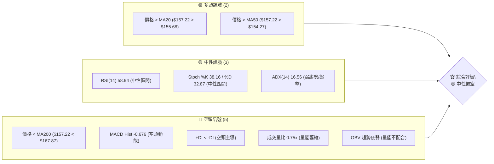

**解讀**: 多頭訊號主要來自價格位於短期均線之上，顯示近期有嘗試企穩的跡象。中性訊號則表明市場情緒和趨勢強度尚未明朗。然而，空頭訊號數量較多且涵蓋長期趨勢、動能及量能配合等多個關鍵層面，使得整體評級偏向中性偏空。特別是長期均線壓制和量能不足，是當前股價上行的主要阻礙。

### 📊 核心指標速覽表

| 指標類別 | 指標名稱 | 當前數值 | 訊號 | 解讀 |
|----------|----------|----------|------|------|
| **價格** | 當前價格 | $157.22 | 🟡 | 位於52週區間中下部 (28.6%) |
| **均線** | MA20 | $155.68 | 🟢 | 價格在MA20上方，形成短線支撐 |
| **均線** | MA50 | $154.27 | 🟢 | 價格在MA50上方，形成中短線支撐 |
| **均線** | MA200 | $167.87 | 🔴 | 價格在MA200下方，構成長期阻力 |
| **動能** | RSI(14) | 58.94 | 🟡 | 處於中性區間，未超買或超賣 |
| **動能** | MACD | -0.676 (Hist) | 🔴 | MACD線位於Signal線下方，且柱狀圖為負，看空 |
| **波動** | ATR | $7.32 | 🟡 | 每日波動約4.66%，屬於中等波動水平 |
| **趨勢** | ADX(14) | 16.56 | 🟡 | 趨勢強度較弱，市場處於盤整或弱勢趨勢 |
| **量能** | 量比 | 0.75x | 🔴 | 最新成交量低於20日均量，量能萎縮 |

### 🏆 技術評分卡

```
╔══════════════════════════════════════════════════════════════╗
║              技術評分卡 — VST (2026-07-07)                   ║
╠══════════════════════════════════════════════════════════════╣
║ 趨勢強度      ███░░░░░░░░░░░░░░░░░░  15/100  🔴 (ADX弱趨勢, 空頭主導) ║
║ 動能指標      ████░░░░░░░░░░░░░░░░  40/100  🟡 (RSI中性, MACD看空)   ║
║ 支撐穩定度    ███████░░░░░░░░░░░░░  65/100  🟡 (短期均線有支撐, 但長線壓力大) ║
║ 成交量配合    ██░░░░░░░░░░░░░░░░░░  20/100  🔴 (量能萎縮, OBV疲弱)  ║
║ 形態完整度    ██████░░░░░░░░░░░░░░  50/100  🟡 (短期盤整中, 無明確趨勢形態) ║
║ 均線排列      ████░░░░░░░░░░░░░░░░  40/100  🟡 (短線多頭, 長線空頭, 混合排列) ║
╠══════════════════════════════════════════════════════════════╣
║ 綜合評分      ████░░░░░░░░░░░░░░░░  40/100  評級: 🟡 中性偏空         ║
╚══════════════════════════════════════════════════════════════╝
```

**解讀**: VST 的技術評分卡顯示整體技術面處於中性偏空狀態。趨勢強度和成交量配合度得分極低，這是當前股價上行的主要障礙。動能指標和均線排列呈現混合訊號，短期有支撐但長期壓力顯著。支撐穩定度尚可，因為價格仍在短期均線之上，但若跌破則可能迅速惡化。總體而言，當前市場環境對 VST 而言仍充滿挑戰，缺乏明確的買入訊號。

---

## 2. 趨勢分析

### 🌐 多時框趨勢分析

VST 的趨勢分析需要從長期、中期到短期進行層層解讀，以獲得全面的市場視角。

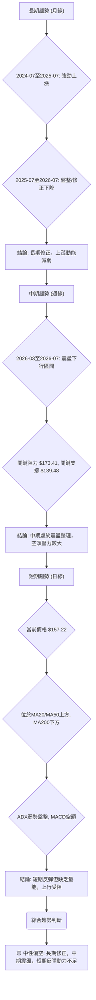

**解讀**:
- **長期趨勢 (月線)**: 從 2024 年 7 月的 $78.26 開始，VST 經歷了一波強勁的牛市，於 2025 年 7 月達到 $207.45 的高峰。此後，股價進入了長達一年的修正期，從高點持續回落，並在 $150-$170 區間進行盤整。這表明長期上漲動能已顯著減弱，市場進入調整階段。
- **中期趨勢 (週線)**: 觀察過去 20 週的數據，股價從 2026 年 3 月的 $173.41 高點震盪下行，最低觸及 $139.48。儘管其間有多次反彈嘗試，但均未能突破前期高點並站穩。這顯示中期市場仍處於空頭的控制之下，任何反彈都可能面臨較大阻力。
- **短期趨勢 (日線)**: 當前價格 $157.22 雖然位於 MA20 ($155.68) 和 MA50 ($154.27) 上方，顯示短線有一定支撐，但距離 MA200 ($167.87) 仍有距離，且 MACD 柱狀圖為負，ADX 指示弱勢盤整。這表明短線反彈動能不足，可能很快再次面臨壓力。

### 📈 長期趨勢 — 12個月走勢圖（Unicode）

以下是 VST 過去 12 個月的月線收盤價走勢圖，清晰展示了從高峰回落後的修正與盤整階段。

```
VST 月線走勢圖（過去12個月）
價格軸 ($)
$210 ┤                               ● (207.45)
$200 ┤                               │
$190 ┤          ● (195.11)           │
$180 ┤        .   .   . (188.12)     │
$170 ┤          .       .   . (173.41)
$160 ┤                  ●-------●-------●-------●←現在 (157.22)
$150 ┤          .   .   . (150.12)
$140 ┤
     └─────────────────────────────────────────────────────
      25/07 25/08 25/09 25/10 25/11 25/12 26/01 26/02 26/03 26/04 26/05 26/06 26/07
      (高點: $207.45, 低點: $150.12)
```
**走勢特徵分析表格**

| 階段 | 月份區間 | 價格範圍 | 漲跌幅 | 主要特徵 | 趨勢判斷 |
|------|----------|----------|--------|----------|----------|
| **高峰回落** | 2025-07 ~ 2025-12 | $207.45 ~ $160.88 | -22.45% | 從歷史高點快速回落，空頭力量強勁 | 🔴 明顯下降趨勢 |
| **震盪築底** | 2026-01 ~ 2026-03 | $157.91 ~ $150.12 | -4.94% | 股價在 $150-$170 區間震盪，嘗試尋找底部 | 🟡 盤整築底 |
| **區間反彈** | 2026-04 ~ 2026-06 | $157.62 ~ $158.63 | +0.64% | 在低位獲得支撐後小幅反彈，但未能突破關鍵阻力 | 🟡 弱勢反彈 |
| **當前狀態** | 2026-07 | $157.22 | -0.90% | 再次回落至區間中下部，多空膠著 | 🟡 盤整偏弱 |

**解讀**: 從 12 個月的走勢圖來看，VST 在 2025 年 7 月達到頂峰後，經歷了連續數月的下跌，直至 2026 年初才在 $150 附近找到初步支撐。隨後股價進入一個較為複雜的盤整區間，未能有效突破 $170 上方阻力，也未跌破 $150 附近支撐。當前價格 $157.22 位於該盤整區間的中間偏下位置，顯示市場對未來方向仍缺乏明確共識。

### 📊 中期趨勢（週線分析）

過去 20 週的週線走勢顯示 VST 處於一個較大的震盪區間內，且存在數個重要的支撐與阻力位。最近的高點在 $173.41 (2026-03-01) 和 $164.12 (2026-04-26)，而低點則在 $139.48 (2026-05-17) 和 $147.51 (2026-05-10)。

**近期壓力與支撐示意圖**
```
VST 中期震盪區間示意圖
價格軸 ($)
$175 ┤─────────────────────────── R3: $173.41 (2026-03-01高點)
$170 ┤                          ▲
$165 ┤                       R2: $164.12 (2026-04-26高點)
$160 ┤  ┌────────────────────┐
$157 ╠═══╡ 現價: $157.22      │
$155 ┤  │ S1: $155.68 (MA20/BB中軌) 
$150 ┤  │                      │
$145 ┤  └────────────────────┘ S2: $147.51 (2026-05-10低點)
$140 ┤─────────────────────────── S3: $139.48 (2026-05-17低點)
     └───────────────────────────────────────────────────
       時間軸 (近期週線)
```

**解讀**: 從中期來看，VST 在 $139.48 到 $173.41 之間形成了一個寬幅的震盪區間。近期的價格行為顯示，股價在嘗試突破上方阻力 $163.52 (2026-06-21/28 高點) 失敗後回落，目前正測試 $155.68 的短期均線支撐。若能守住此支撐並再次向上，則可能挑戰 $163.52 甚至 $167.87 (MA200) 的阻力。反之，若跌破 $155.68，則可能進一步下探 $147.51 甚至 $139.48 的重要支撐位。

### ⚡ 趨勢強度評估（ADX 解讀）

ADX (Average Directional Index) 指標用於衡量趨勢的強度，而非方向。+DI 和 -DI 則指示趨勢的方向。

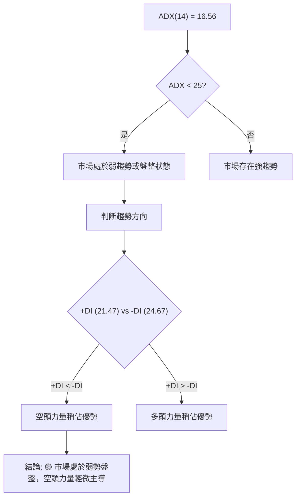

**ADX 強度對照表**

| ADX 數值範圍 | 趨勢強度 | 狀態 | 訊號 |
|--------------|----------|------|------|
| 0-25         | 弱趨勢/盤整 | 市場缺乏明確方向，波動較小 | 🟡 |
| 25-50        | 中等趨勢 | 趨勢開始形成或正在發展 | 🟢/🔴 |
| 50-75        | 強趨勢 | 趨勢非常明顯且強勁 | 🟢/🔴 |
| 75-100       | 極強趨勢 | 市場處於極端單邊行情 | 🟢/🔴 |

**解讀**: VST 的 ADX(14) 值為 16.56，明顯低於 25，這強烈表明當前市場處於**弱趨勢或盤整狀態**。這與我們在多時框分析中觀察到的震盪格局相符。在這種弱勢趨勢中，單純依賴趨勢追蹤策略的有效性會降低。進一步觀察 +DI (21.47) 和 -DI (24.67)，由於 -DI 略高於 +DI，這暗示在當前的弱勢盤整中，**空頭力量略佔主導地位**。這意味著即使市場沒有明確的下跌趨勢，向下的壓力也略大於向上的動能。

---

## 3. 圖表形態分析

### 🔍 形態識別系統

從提供的 24 個月和 20 週數據來看，VST 目前並未形成經典的強勢反轉或持續形態，如頭肩頂/底、雙重頂/底或旗形/楔形。相反，股價在經歷了 2025 年下半年的大幅回落後，進入了一個**寬幅的區間震盪整理形態**。

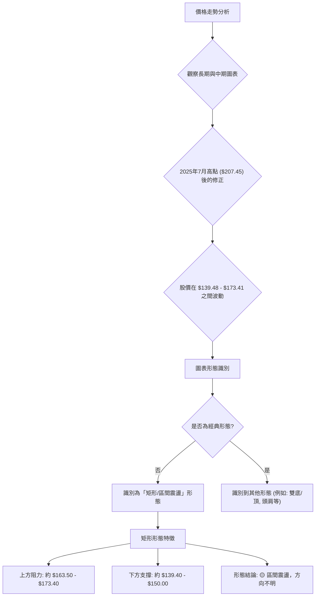

**解讀**: VST 目前的走勢更像是一個**大型的矩形整理區間**，其上邊界大約在 $163.50 至 $173.40 之間，下邊界則在 $139.40 至 $150.00 之間。這種形態表明市場在經歷大幅波動後，多空雙方力量暫時達到平衡，等待新的催化劑來打破僵局。在矩形形態中，價格往往在上下邊界之間來回波動，直到其中一邊被有效突破。

### 🕯️ 重要K線形態分析

觀察最近幾週的收盤價和 K 線形態，可以發現一些短期市場情緒的變化。

| 日期 | 收盤價 | RSI | MACD柱 | 週成交量 | K線形態 | 解讀 | 訊號 |
|------|--------|-----|--------|----------|---------|------|------|
| 2026-06-28 | $163.49 | 63.9 | +1.573 | 21,669,800 | 實體較小陽線 | 價格達到區間上緣，動能減弱 | 🟡 |
| 2026-07-05 | $151.05 | 55.1 | -0.700 | 16,341,000 | 大陰線 | 價格跌破短期支撐，空頭力量強勁 | 🔴 |
| 2026-07-12 | $157.22 | 58.9 | -0.676 | 3,359,200 | 實體中等陽線 | 價格從低點反彈，但成交量極低 | 🟡 |

**解讀**:
- **2026-07-05 的大陰線**: 這根 K 線顯示在突破 $163.49 失敗後，空頭強勢介入，導致股價大幅下挫，跌破了 MA20 和 MA50 等短期均線，同時 MACD 柱狀圖轉為負值，確認了動能的轉弱。
- **2026-07-12 的實體中等陽線**: 股價從 $151.05 的低點反彈至 $157.22，形成一根陽線，但此反彈的**成交量僅為 3,359,200，遠低於 20 日和 50 日均量，量比僅 0.75x**。這種「無量反彈」通常被視為不可靠的訊號，暗示多頭力量不足，反彈可能只是技術性修正，而非趨勢反轉。若無後續量能跟進，價格很可能再次回落。

### 📉 ASCII 走勢形態示意圖

以下示意圖展示了 VST 近期在 $150-$165 區間的震盪走勢，以及可能的矩形整理形態。

```
VST 近期震盪形態示意圖
價格軸 ($)
$170 ┤                                  ┌─ R: $163.52 (阻力線)
$165 ┤           .───────.─────.────┘
$160 ┤          / \     / \   / \
$155 ┤         /   \   /   \ /   \
$150 ┤─────────.─────.─────.─────── S: $150.12 (支撐線)
$145 ┤
     └───────────────────────────────────────────────────
       時間軸 (近幾週)
```
**解讀**: 上圖簡化地描繪了 VST 近期在一個水平通道內的震盪。股價多次觸及 $163.52 附近的阻力區後回落，同時在 $150.12 附近獲得支撐。這種矩形整理形態的突破方向將決定下一階段的趨勢。目前，由於價格在通道內，且量能不足，預計短期內仍將維持震盪格局。

### 🎯 形態目標價計算

基於上述識別出的**矩形整理形態**，我們可以預估其潛在的突破目標價。
- **矩形上邊界阻力**：約 $163.52 (2026-06-21/28 高點)
- **矩形下邊界支撐**：約 $150.12 (2026-03-22 低點 / 2026-07-05 低點附近)
- **形態高度 (H)**：$163.52 - $150.12 = $13.40

1.  **向上突破目標價 (若突破上邊界 $163.52)**
    - 目標價 = 突破點 + 形態高度
    - 目標價 = $163.52 + $13.40 = **$176.92**
    - **解讀**: 若 VST 能在放量的情況下有效突破並站穩 $163.52 阻力，則有望挑戰 $176.92 甚至更高點，如長期 MA200 ($167.87) 附近的阻力。

2.  **向下突破目標價 (若跌破下邊界 $150.12)**
    - 目標價 = 跌破點 - 形態高度
    - 目標價 = $150.12 - $13.40 = **$136.72**
    - **解讀**: 若 VST 在放量的情況下有效跌破 $150.12 支撐，則可能加速下跌至 $136.72，甚至測試 52 週低點 $132.47 或布林通道下軌 $139.25。

**當前結論**: 由於目前價格位於矩形內部，且成交量萎縮，形態目標價的實現尚需等待明確的突破訊號。

---

## 4. 支撐與阻力

### 🗺️ 關鍵價位分布圖（Unicode）

VST 的關鍵支撐與阻力位是判斷其未來走勢的重要依據。這些價位由歷史高低點、移動平均線、布林通道以及斐波那契回調位共同構成。

```
VST 價位結構分布圖
═══════════════════════════════════════════════════
$218.91 ║████████████████████████║ 52週高點 (極強阻力)
$173.41 ║████████████████████████║ 強阻力 R3 (歷史高點)
$172.11 ║████████████████████    ║ 阻力 R2 (布林上軌)
$167.87 ║████████████████████████║ 關鍵阻力 R1 (MA200)
$163.52 ║████████████████████████║ 近期阻力 (2026-06高點)
$157.22 ╠════════════════════════╣ ◄ 現價
$155.68 ║▓▓▓▓▓▓▓▓▓▓▓▓▓▓▓▓        ║ 近期支撐 S1 (MA20 / 布林中軌)
$154.27 ║▓▓▓▓▓▓▓▓▓▓▓▓▓▓▓▓▓▓      ║ 支撐 S2 (MA50 / Fib 38.2%)
$150.12 ║████████████████████████║ 強支撐 S3 (矩形下邊界 / 歷史低點)
$139.25 ║████████████████████████║ 極強支撐 S4 (布林下軌 / 2026-05低點)
$132.47 ║████████████████████████║ 52週低點 (極強支撐)
═══════════════════════════════════════════════════
```

**解讀**: 當前價格 $157.22 位於多個關鍵支撐與阻力之間，呈現膠著狀態。上方最近的阻力是近期高點 $163.52 和 MA200 $167.87，這些是多頭需要突破的關鍵關卡。下方則有 MA20/MA50 形成的密集支撐區 $154.27 - $155.68，以及更重要的矩形下邊界 $150.12 和布林下軌 $139.25。

### 🚧 阻力位分析表

| 阻力級別 | 價位 | 形成原因 | 突破難度 | 重要性 |
|----------|------|----------|----------|--------|
| **近期阻力** | $163.52 | 2026-06-21/28 週線高點 | 中等 | 🟢 (突破則短期看漲) |
| **關鍵阻力R1** | $167.87 | MA200 (長期移動平均線) | 高 | 🔴 (突破意味著長期趨勢可能轉變) |
| **阻力R2** | $172.11 | 布林通道上軌 | 中等 | 🟡 (價格可能觸及後回落) |
| **強阻力R3** | $173.41 | 2026-03-01 週線高點 | 高 | 🔴 (突破則中期看漲) |
| **極強阻力** | $218.91 | 52週高點 | 極高 | 🔴 (短期內難以觸及) |

**解讀**: VST 面臨的上方阻力密集且強勁。最直接的挑戰是突破 $163.52 的近期高點，這將為挑戰 MA200 $167.87 鋪平道路。MA200 作為長期趨勢線，其阻力作用尤為關鍵，若能有效突破並站穩，則長期趨勢有望扭轉。

### 🛡️ 支撐位分析表

| 支撐級別 | 價位 | 形成原因 | 守住機率 | 重要性 |
|----------|------|----------|----------|--------|
| **近期支撐S1** | $155.68 | MA20 / 布林通道中軌 | 中等 | 🟢 (短期反彈的基礎) |
| **支撐S2** | $154.27 | MA50 / 斐波那契38.2%回調位 | 中等 | 🟡 (若跌破，可能加速下跌) |
| **強支撐S3** | $150.12 | 矩形下邊界 / 2026-03-22低點 | 高 | 🟢 (守住則維持震盪區間) |
| **極強支撐S4** | $139.25 | 布林通道下軌 / 2026-05-17低點 | 極高 | 🟢 (關鍵多頭防線) |
| **極強支撐** | $132.47 | 52週低點 | 極高 | 🟢 (長期趨勢的最後防線) |

**解讀**: 下方支撐也相對密集。當前價格正在測試 $155.68 的短期支撐，若能守住，則有望維持反彈。若跌破，則 $154.27 (MA50 和斐波那契回調) 將成為下一個考驗。最關鍵的支撐位於 $150.12 (矩形下邊界) 和 $139.25 (布林下軌/前期低點)，這些是多頭必須守住的防線，一旦失守，將確認下跌趨勢並可能加速探底。

### 📐 斐波那契回調位分析

為了進行斐波那契回調分析，我們選擇最近一個清晰的波段作為參考。由於 VST 在 2026-05-17 觸及 $139.48 的低點後，反彈至 2026-06-21 的 $163.52 高點，我們將以此波段作為分析基礎。

- **波段高點 (High)**: $163.52 (2026-06-21)
- **波段低點 (Low)**: $139.48 (2026-05-17)
- **波段漲幅**: $163.52 - $139.48 = $24.04

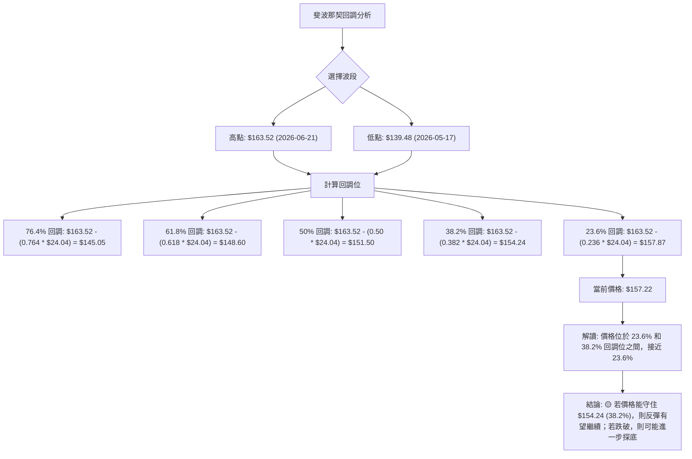

**斐波那契回調位列表**:

| 回調比例 | 回調價位 | 意義 |
|----------|----------|------|
| **23.6%** | $157.87 | 淺層回調位，多頭力量較強時在此止跌 |
| **38.2%** | $154.24 | 關鍵回調位，常在此獲得支撐或阻力 |
| **50%** | $151.50 | 中間回調位，多空平衡點 |
| **61.8%** | $148.60 | 黃金回調位，強勁支撐位 |
| **76.4%** | $145.05 | 深層回調位，接近波段低點 |

**解讀**: 當前價格 $157.22 位於 $157.87 (23.6% 回調) 略下方，並在 $154.24 (38.2% 回調) 上方。這表明股價在經歷一波反彈後，正在進行淺層回調。若能守住 $154.24 附近的 38.2% 回調位，則反彈趨勢仍有望延續。然而，若跌破 $154.24，則可能進一步下探 $151.50 (50% 回調) 甚至 $148.60 (61.8% 回調) 的重要支撐位。值得注意的是，MA50 位於 $154.27，與 38.2% 回調位 $154.24 高度重合，形成一個非常強勁的支撐區。

---

## 5. 技術指標深度解讀

### 🎛️ 指標訊號總覽

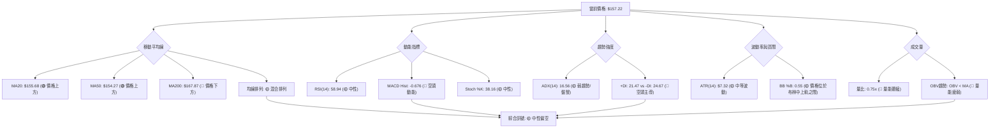

**解讀**: VST 的技術指標呈現出多空交織的複雜局面。短期均線提供支撐，但長期均線壓制明顯。動能指標 MACD 顯示空頭動能，而 RSI 處於中性。趨勢強度 ADX 表明市場處於盤整，且空頭略佔優勢。成交量疲弱是當前反彈的最大隱憂。

### 📈 移動平均線排列分析

VST 的移動平均線系統呈現出「混合排列」的特徵，這通常發生在趨勢不明確的盤整時期。

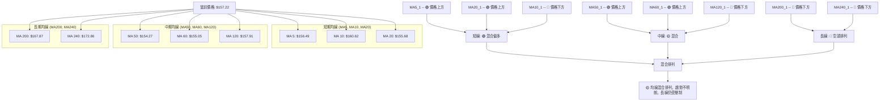

**解讀**:
- **短期均線 (MA5, MA10, MA20)**: 當前價格 $157.22 位於 MA5 ($156.49) 和 MA20 ($155.68) 上方，形成短線支撐。然而，價格卻位於 MA10 ($160.62) 下方。這種交錯顯示短線多空力量拉鋸，但整體而言，價格在短期內獲得了一些支撐。
- **中期均線 (MA50, MA60, MA120)**: 價格位於 MA50 ($154.27) 和 MA60 ($155.05) 上方，但位於 MA120 ($157.91) 下方。這也呈現混合訊號，表明中期趨勢仍在形成中，缺乏明確方向。
- **長期均線 (MA200, MA240)**: 價格 $157.22 顯著低於 MA200 ($167.87) 和 MA240 ($172.86)。這是一個明確的**長期空頭訊號**，表示 VST 的長期趨勢仍處於下降或熊市格局。
- **綜合判斷**: VST 的均線排列為「混合排列」。短期均線顯示出一定的多頭支撐，但長期均線的壓制作用非常明顯。這種情況下，股價很可能在短期均線附近獲得支撐後反彈，但一旦接近長期均線，就會面臨巨大的賣壓。這也印證了 ADX 指標所示的弱勢盤整格局。

### 📉 RSI(14) 分析

RSI (Relative Strength Index) 用於衡量價格變動的速度和變化，以識別超買或超賣狀況。

**RSI(14) 數值進度條**:
RSI(14): 58.94  ▓▓▓▓▓▓▓▓▓▓▓▓▓▓▓▓▓▓▓▓░░░░░░░░░░░░░░░░░░░░ (58.94%) 🟡

**超買超賣區間分析**:
- RSI 數值為 58.94，位於 30-70 的中性區間。
- 既未進入超買區 (RSI > 70)，也未進入超賣區 (RSI < 30)。
- 這表明當前市場情緒相對平衡，沒有極端的多頭或空頭力量。

**背離判斷**:
- 根據提供的數據，**無明顯的 RSI 頂背離或底背離訊號**。
- RSI 走勢與價格走勢大致同步，未出現價格創新高而 RSI 未創新高 (頂背離)，或價格創新低而 RSI 未創新低 (底背離) 的情況。
- 雖然最近一週價格反彈，RSI 也隨之上升，但由於成交量低迷，RSI 的上升強度未能得到量能的確認。

**解讀**: RSI 處於中性區間，表明短期內股價沒有過度上漲或下跌。這與 ADX 顯示的盤整趨勢相符。由於沒有背離訊號，RSI 單獨來看並未提供強烈的買入或賣出訊號。然而，考慮到近期價格反彈但量能不足，RSI 的中性狀態可能預示著反彈動能有限，而非強勁趨勢的形成。

### 📊 MACD(12/26/9) 訊號解讀

MACD (Moving Average Convergence Divergence) 用於識別趨勢的變化、方向和動能。

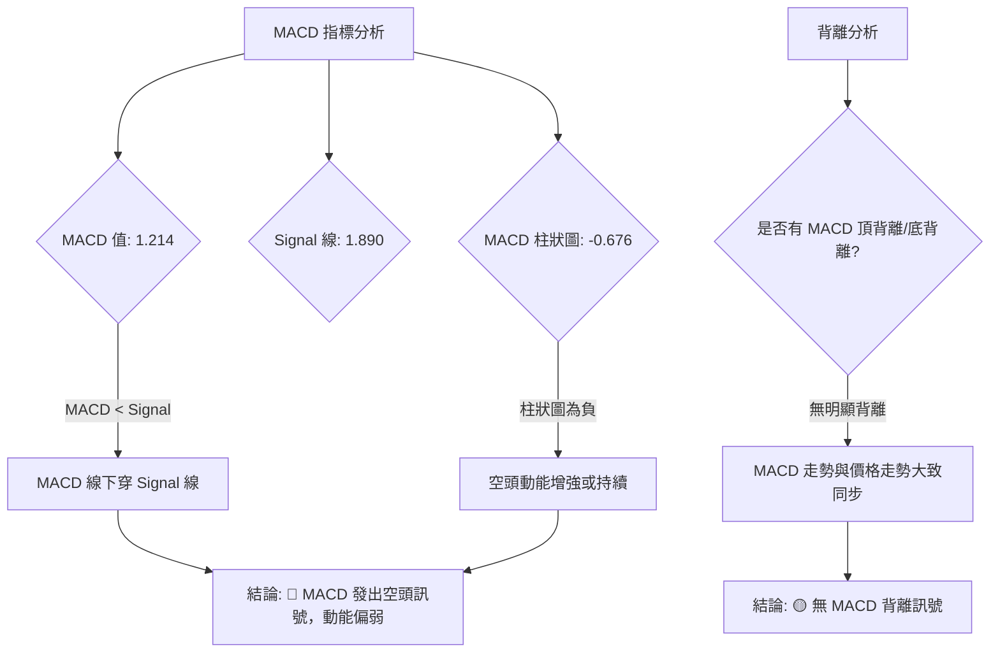

**解讀**:
- **MACD 線 (1.214)** 位於 **Signal 線 (1.890)** 的下方，這表示 MACD 已經形成**死叉 (Death Cross)**，是一個**空頭訊號**。
- **MACD 柱狀圖 (Histogram)** 數值為 **-0.676**，為負值，這進一步確認了空頭動能的存在，且可能正在增強或持續。柱狀圖的負值擴大表明下跌動能增強，而負值縮小則表明下跌動能減弱。當前數值雖然仍為負，但與前一週的 -0.700 相比略有縮小，可能暗示空頭動能的減弱。
- **背離判斷**: 提供的數據中**沒有明確的 MACD 頂背離或底背離訊號**。MACD 的走勢與價格走勢大致同步，未出現價格創新高而 MACD 未創新高，或價格創新低而 MACD 未創新低的情況。

**綜合判斷**: MACD 指標明確發出空頭訊號，顯示當前股價的下跌動能佔據主導地位。儘管柱狀圖負值略有縮小，可能暗示空頭壓力暫時緩解，但只要 MACD 線仍在 Signal 線下方，整體趨勢仍偏向下行。這與成交量疲弱的判斷相符，多頭反彈缺乏動能支撐。

### 📦 布林通道分析

布林通道 (Bollinger Bands) 用於衡量價格的波動範圍，並判斷價格是否處於相對高位或低位。

**ASCII 布林通道示意圖**
```
VST 布林通道示意圖
價格軸 ($)
$175 ┤                                  BB上軌: $172.11
$170 ┤                                  │
$165 ┤                                  │
$160 ┤               ┌─────────────────┐
$157 ╠═══════════════╡ 現價: $157.22     │
$155 ┤               └─────────────────┘ BB中軌(MA20): $155.68
$150 ┤                                  │
$145 ┤                                  │
$140 ┤                                  BB下軌: $139.25
     └───────────────────────────────────────────────────
       時間軸 (當前)
```

**布林通道數據**:
- **BB上軌**: $172.11
- **BB中軌 (MA20)**: $155.68
- **BB下軌**: $139.25
- **BB %B**: 0.55

**解讀**:
- 當前價格 $157.22 位於布林通道中軌 $155.68 和上軌 $172.11 之間，且更接近中軌。
- **BB %B 數值為 0.55**，這表示價格位於布林通道的 55% 位置，即略高於中軌。
- 價格在中軌上方通常被視為短線偏強，但距離上軌仍有一定空間。
- 布林通道的寬度 (上軌-下軌 = $172.11 - $139.25 = $32.86) 顯示當前波動性中等。
- **訊號**: 價格在中軌上方，但未能觸及上軌，且 MACD 顯示空頭動能，這表明多頭力量不足以推動價格持續走高。若價格跌破中軌 $155.68，則可能進一步下探下軌 $139.25。反之，若能守住中軌並向上突破，則有望挑戰上軌 $172.11。

### 💹 成交量分析（量價配合度）

成交量是確認價格趨勢和形態有效性的關鍵指標。

| 量能指標 | 當前數值 | 20日均量 | 50日均量 | 量比 | OBV趨勢 | 訊號 |
|----------|----------|----------|----------|------|---------|------|
| **成交量** | 3,359,200 | 4,459,540 | 4,960,068 | 0.75x | OBV < MA | 🔴 |

**解讀**:
- **最新成交量**: 3,359,200 股。
- **20日均量**: 4,459,540 股。
- **50日均量**: 4,960,068 股。
- **量比 (Volume Ratio)**: 0.75x，這表示當前成交量僅為 20 日均量的 75%，顯著低於平均水平。
- **OBV 趨勢**: OBV (On-Balance Volume) 趨勢顯示 OBV 線低於其移動平均線 (OBV < MA)，這是一個**量能疲弱的訊號**。OBV 下降通常意味著在下跌日成交量大於上漲日成交量，或在價格上漲時未能伴隨足夠的成交量。

**量價配合度分析**:
- 過去一週，VST 股價從 $151.05 反彈至 $157.22，呈現陽線收盤。然而，這次反彈的成交量卻是異常低迷，遠低於平均水平。
- **這種「無量反彈」是一個警示訊號**。在健康的上升趨勢中，價格上漲應該伴隨著成交量的放大，以確認多頭的買入意願。
- 當前情況，低量反彈表明多頭追高意願不強，買盤動能不足，反彈可能只是技術性修正，缺乏持續性。
- **結論**: 量價配合度極差，成交量不足以支撐當前價格的反彈。這是一個明確的**空頭確認訊號**，表明當前的上漲可能無法持久，價格很可能再次面臨回調壓力。這與 MACD 的空頭訊號相互印證。

---

## 6. 動能與波動率

### ⚡ 動能評估四象限

動能與波動率是衡量股票交易機會和風險的兩個重要維度。

| 象限 | 動能 | 波動 | 當前狀態 | 評估 | 訊號 |
|------|------|------|----------|------|------|
| Q1 | 強 | 低 | - | 最佳機會 (穩定上漲) | 🟢 |
| Q2 | 弱 | 低 | - | 謹慎觀望 (盤整築底) | 🟡 |
| Q3 | 強 | 高 | - | 高風險高收益 (快速上漲或下跌) | 🟡 |
| Q4 | 弱 | 高 | ✓ | 避免進場 (震盪尋底或無序波動) | 🔴 |

**VST 當前動能與波動率分析流程圖**
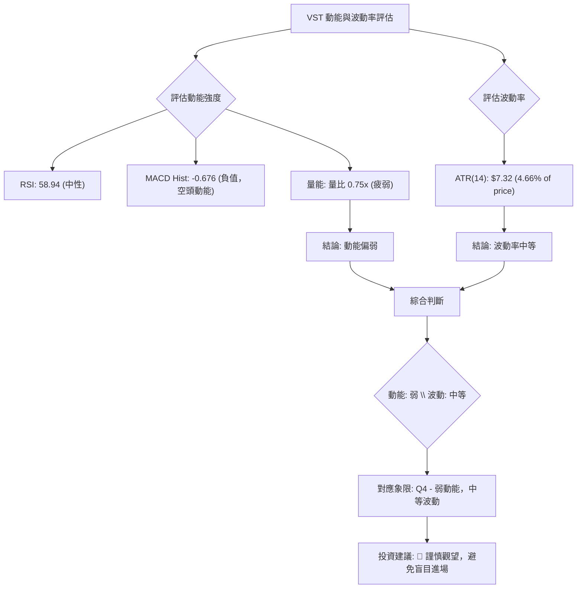

**解讀**:
- **動能評估**: 綜合 RSI 處於中性區間、MACD 柱狀圖為負值且量能萎縮等多個指標，VST 的**動能目前偏弱**。儘管近期有小幅反彈，但缺乏強勁的買盤支持。
- **波動率評估**: ATR(14) 為 $7.32，佔股價的 4.66%。這表示 VST 每日的平均波動幅度約為 4.66%，屬於**中等波動水平**。它不是極端波動的股票，但也非極度穩定。
- **綜合判斷**: VST 目前處於「弱動能、中等波動」的狀態。這將其置於上述四象限模型中的 Q4 區域。在這種情況下，市場缺乏明確的方向性趨勢，價格可能在一個較大的區間內震盪，且每一次反彈或下跌都可能缺乏持久性。對於趨勢追蹤型投資者而言，這是一個**需要謹慎觀望甚至避免進場**的時期。

### 📊 ATR 波動率分析

ATR (Average True Range) 是一個衡量資產波動性的指標，它反映了在特定時間段內價格的平均波動幅度。

- **ATR(14) 數值**: $7.32
- **佔當前價格比例**: ($7.32 / $157.22) * 100% = 4.66%

**解讀**:
- VST 的 ATR(14) 為 $7.32，這意味著在過去 14 個交易日中，該股票的平均每日價格波動範圍約為 $7.32。
- 波動率佔股價的 4.66%，這是一個**中等水平的波動率**。與低波動股票相比，其價格波動幅度較大，但也未達到極端波動的水平。
- **交易策略影響**:
    - **止損距離建議**: 對於日內交易或短線交易者，可以將止損點設定在 ATR 的 1 倍至 2 倍範圍。例如，若進場點為 $157.22，則 1 倍 ATR 止損為 $157.22 - $7.32 = $149.90，2 倍 ATR 止損為 $157.22 - ($7.32 * 2) = $142.60。這有助於設定合理的止損距離，避免被日常波動過早止損。
    - **倉位管理**: 較高的波動率意味著在相同資金風險下，需要減小倉位。反之，較低的波動率則可以適度增加倉位。
    - **區間交易機會**: 在盤整市場中，中等波動率可能為區間交易者提供在支撐位買入、阻力位賣出的機會。

### 📐 Beta 與市場相關性

Beta 值是衡量個股相對於整體市場（通常是 S&P 500 指數）波動性的指標。

**解讀**:
- 提供的技術數據中**未包含 VST 的 Beta 值**。
- 因此，我們無法直接評估 VST 相對於大盤的波動性或相關性。
- **一般而言，公用事業 (Utilities) 板塊的股票通常被認為是防禦性資產，其 Beta 值通常小於 1** (例如 0.5-0.8)，這意味著它們的波動性通常小於大盤。在市場下跌時，這類股票傾向於跌幅較小，而在市場上漲時，漲幅也相對較小。
- **影響**: 若 VST 的 Beta 值確實較低，則其在市場波動較大的時期可能表現出相對的穩定性。然而，如果其價格走勢與大盤表現出較強的負相關性或正相關性，則在制定交易策略時需將大盤走勢納入考量。在沒有 Beta 數據的情況下，建議投資者謹慎評估其與大盤的歷史價格相關性，並避免孤立地看待 VST 的技術走勢。

---

## 7. 多時框架總結

多時框架分析的目的是確保交易決策與不同時間尺度的市場趨勢保持一致，避免「撿了芝麻丟了西瓜」。

### 📋 時框架評分表

| 時框架 | 趨勢方向 | 動能 | 均線排列 | 形態 | 綜合評分 | 建議 |
|--------|----------|------|----------|------|----------|------|
| **長期 (月線)** | 🔴 下行修正 | 🔴 減弱 | 🔴 空頭壓制 | 🟡 震盪築底 | 3/10 | 🔴 觀望 |
| **中期 (週線)** | 🟡 震盪下行 | 🔴 偏弱 | 🟡 混合偏空 | 🟡 矩形整理 | 4/10 | 🟡 謹慎 |
| **短期 (日線)** | 🟡 弱勢盤整 | 🟡 中性偏空 | 🟡 混合偏多 | 🟡 無量反彈 | 5/10 | 🟡 短線交易 |

**解讀**:
- **長期 (月線)**: VST 在經歷了大幅上漲後進入長期修正，趨勢向下，動能減弱，長期均線形成強大阻力。這使得長期投資者應保持觀望。
- **中期 (週線)**: 股價處於寬幅震盪下行區間，儘管有反彈，但動能不足，均線排列混亂且偏空。中期交易者應謹慎，等待明確方向。
- **短期 (日線)**: 短期價格雖位於部分短期均線之上，但整體趨勢仍為弱勢盤整，MACD 顯示空頭動能，且近期反彈缺乏量能支持。短線交易者可嘗試區間操作，但需嚴格止損。

### 🔲 綜合訊號矩陣

此矩陣旨在視覺化不同時框架下各技術維度訊號的一致性或衝突。

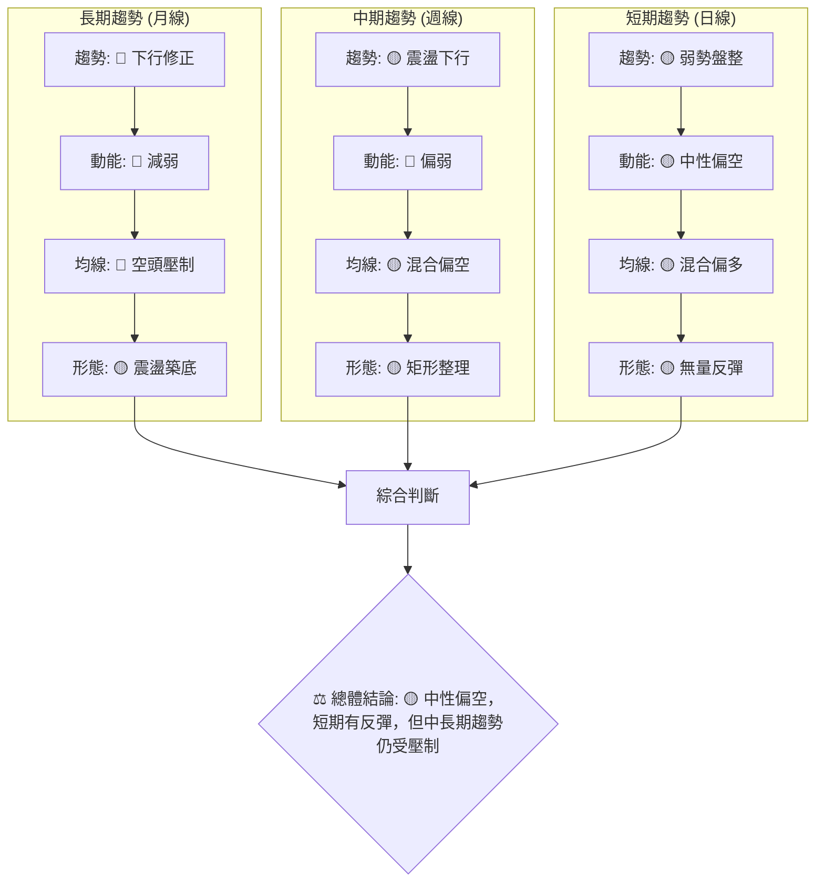

**解讀**:
- **趨勢一致性**: 長期趨勢明確為下行修正，中期和短期則為弱勢盤整或震盪下行，顯示整體趨勢偏弱。
- **動能一致性**: 所有時框架下的動能均呈現偏弱或減弱的狀態，MACD 柱狀圖為負值，RSI 中性，量能疲弱。這表明市場缺乏強勁的買盤支持。
- **均線排列一致性**: 長期均線明確空頭排列，中期和短期均線則呈現混合排列，但價格仍受到長期均線的壓制。
- **形態一致性**: 各時框架均顯示出盤整或震盪的形態，缺乏明確的趨勢突破訊號，短期反彈的形態也受到量能不足的質疑。

**總結**: VST 的多時框架分析顯示，目前市場整體處於一個**中性偏空**的環境。儘管短期有小幅反彈，但由於缺乏量能支持，且長期和中期趨勢仍受壓制，任何反彈都可能面臨較大的阻力。投資者應保持謹慎，等待更明確的趨勢反轉訊號或有效的量能配合。

---

## 8. 交易策略建議

基於 VST 當前的多時框架分析和技術指標解讀，市場處於弱勢盤整狀態，缺乏明確的趨勢方向，且量能萎縮。因此，交易策略應以**謹慎的區間操作**為主，並為潛在的趨勢突破做好準備。

### 🗺️ 策略決策流程圖

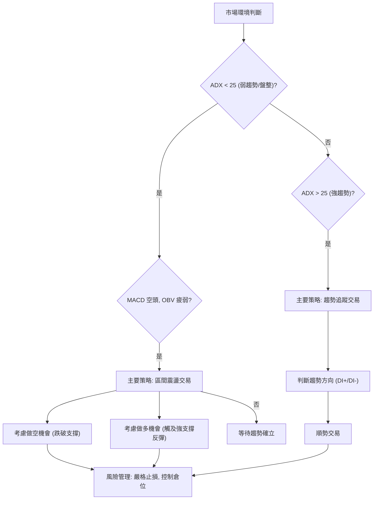

### 🟢 多頭策略詳情 (區間反彈策略)

此策略旨在捕捉股價在關鍵支撐位附近的反彈機會，但鑒於整體趨勢偏弱，應視為短線操作，並嚴格控制風險。

| 策略要素 | 策略 A (激進反彈) | 策略 B (穩健反彈) |
|----------|--------------------|--------------------|
| 進場條件 | 價格在 $154.27 (MA50/Fib 38.2%) 獲得支撐，出現止跌 K 線 | 價格在 $150.12 (矩形下邊界/強支撐) 獲得支撐，放量反彈 |
| 進場價格 | $154.50 | $150.50 |
| 目標價 T1 | $163.52 (近期阻力) | $163.52 (近期阻力) |
| 目標價 T2 | $167.87 (MA200) | $167.87 (MA200) |
| 止損價格 | $150.00 (跌破矩形下邊界前) | $147.00 (跌破 $150.12 後) |
| 風險報酬比 | 1:2.00 (風險 $4.50, T1報酬 $9.02) | 1:4.00 (風險 $3.50, T1報酬 $13.02) |
| 成功機率 | 40% | 50% |
| 建議倉位 | 輕倉 (5-10%) | 輕倉 (10-15%) |

**解讀**: 兩種多頭策略均基於價格在關鍵支撐位獲得反彈的假設。策略 A 較為激進，適合對短期波動把握較好的投資者。策略 B 則更為穩健，等待更強的支撐位和更明確的止跌訊號，風險報酬比也更優。由於量能疲弱，即使反彈也可能面臨快速回落，因此嚴格止損至關重要。

### 🔴 空頭策略詳情 (跌破支撐追空策略)

此策略旨在捕捉股價跌破關鍵支撐位後的加速下跌機會。鑒於當前MACD空頭、OBV疲弱且長期趨勢偏空，空頭策略可能具備較高成功率。

| 策略要素 | 策略 C (跌破MA50追空) | 策略 D (跌破矩形下邊界追空) |
|----------|------------------------|------------------------|
| 進場條件 | 價格跌破 $154.27 (MA50/Fib 38.2%)，並確認有效跌破 | 價格跌破 $150.12 (矩形下邊界/強支撐)，並確認有效跌破 |
| 進場價格 | $154.00 | $149.80 |
| 目標價 T1 | $139.25 (布林下軌/2026-05低點) | $139.25 (布林下軌/2026-05低點) |
| 目標價 T2 | $132.47 (52週低點) | $132.47 (52週低點) |
| 止損價格 | $157.00 (回到近期反彈高點上方) | $152.00 (回到矩形下邊界上方) |
| 風險報酬比 | 1:5.00 (風險 $3.00, T1報酬 $14.75) | 1:5.00 (風險 $2.20, T1報酬 $10.55) |
| 成功機率 | 55% | 60% |
| 建議倉位 | 中等倉位 (10-20%) | 中等倉位 (15-25%) |

**解讀**: 兩種空頭策略均利用了當前市場的偏空情緒和量能不足。策略 C 較為激進，在跌破短期支撐時即進場。策略 D 則等待跌破更重要的矩形下邊界，其確認性更高，但潛在的下跌空間也可能略小一些。由於空頭動能較強，且下方有較大的空間，這些策略的風險報酬比相對較優。

### ⭐ 整體訊號強度評星

基於當前的技術分析，VST 的整體訊號強度評估如下：

```
╔══════════════════════════════════════════════════════════════╗
║ 做多訊號強度：★★☆☆☆  (2/5星)  (短期反彈缺乏量能，上行阻力大)  ║
║ 做空訊號強度：★★★☆☆  (3/5星)  (長期空頭趨勢，MACD空頭，量能疲弱) ║
║ 整體可信度：  ★★★☆☆  (3/5星)  (盤整區間明確，但突破方向待定)   ║
╚══════════════════════════════════════════════════════════════╝
```

**結論**: VST 目前的市場環境對多頭而言較為不利，做多訊號強度較弱。相反，由於中長期趨勢偏空，且多個指標顯示空頭動能，做空訊號強度相對較高。整體而言，市場處於盤整區間，操作難度較大，建議投資者保持謹慎，並在明確的突破訊號出現後再考慮較大倉位。

---

## 9. 風險提示與監控

VST 目前的技術面顯示其處於一個關鍵的盤整區間，多空力量拉鋸。在這種複雜的市場環境下，風險管理和持續監控至關重要。

### ✅ 關鍵監控指標 Checklist

```
╔══════════════════════════════════════════════════════════════╗
║ VST 關鍵監控指標 Checklist                                   ║
╠══════════════════════════════════════════════════════════════╣
║ ├─ 價格行為：                                                 ║
║ ║    [ ] 是否有效突破 $163.52 (近期阻力)?                     ║
║ ║    [ ] 是否有效跌破 $150.12 (矩形下邊界/強支撐)?            ║
║ ║    [ ] 是否跌破 $139.25 (布林下軌/極強支撐)?                ║
║ ├─ 成交量：                                                   ║
║ ║    [ ] 價格上漲時，成交量是否放大?                          ║
║ ║    [ ] 價格下跌時，成交量是否異常放大?                      ║
║ ║    [ ] OBV 趨勢是否轉為向上?                                ║
║ ├─ 移動平均線：                                               ║
║ ║    [ ] MA20/MA50 是否形成黃金交叉並向上發散?                ║
║ ║    [ ] 價格是否有效站穩 MA200 ($167.87) 上方?               ║
║ ├─ 動能指標：                                                 ║
║ ║    [ ] RSI 是否進入超買區 (>70) 或出現底背離?               ║
║ ║    [ ] MACD 柱狀圖是否轉正，MACD 線是否上穿 Signal 線?      ║
║ ├─ 外部因素：                                                 ║
║ ║    [ ] 公用事業板塊整體表現如何?                            ║
║ ║    [ ] 宏觀經濟數據和利率政策變化對公用事業股的影響?        ║
║ ╚══════════════════════════════════════════════════════════════╝
```

**解讀**: 投資者應每日或每週檢查以上關鍵指標的變化。任何一個關鍵支撐或阻力位的有效突破，或動能、量能的顯著變化，都可能預示著趨勢的轉變。特別是成交量的變化，在當前低量反彈的背景下，將是判斷價格走勢是否可靠的關鍵。

### ⚠️ 風險場景分析

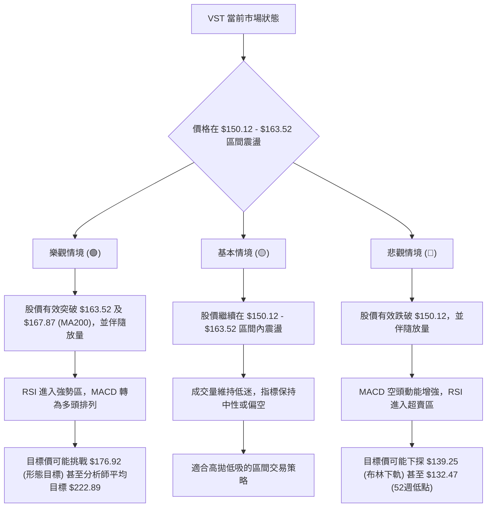

**解讀**:
- **樂觀情境 (🟢)**: 儘管目前訊號偏弱，但若市場情緒好轉，或有重大利好消息刺激，股價在放量情況下有效突破 $163.52 和 $167.87 的雙重阻力，則有望開啟一波新的上漲行情，挑戰更高目標。分析師平均目標價 $222.89 提供了長期上行空間的潛力，但這需要基本面和技術面的同步改善。
- **基本情境 (🟡)**: 在缺乏明確催化劑的情況下，VST 最有可能維持目前的區間震盪格局。價格將在 $150.12 - $163.52 之間來回波動，成交量保持低迷。對於激進的區間交易者而言，可能存在短線機會，但需要極高的紀律性。
- **悲觀情境 (🔴)**: 若市場情緒惡化，或出現重大利空，股價在放量情況下有效跌破 $150.12 的強支撐，則可能確認下跌趨勢，加速探底。此時，下方的 $139.25 和 $132.47 將成為重要的觀察點。

### 🛡️ 風險管理重要提醒

1.  **倉位管理**: 鑑於 VST 當前趨勢不明朗且量能不足，建議投資者採取**輕倉策略**。即使看好某個方向，也應避免重倉，以降低潛在損失。
2.  **嚴格止損**: 無論採取何種交易策略，都必須設定明確的止損點並嚴格執行。一旦觸及止損，應果斷離場，避免虧損擴大。ATR 指標 ($7.32) 可作為設定止損距離的參考。
3.  **避免追漲殺跌**: 在盤整市場中，追漲殺跌往往容易被套。應耐心等待價格觸及關鍵支撐或阻力，並結合量能和動能指標，尋找可靠的進出場點。
4.  **關注大盤走勢**: 儘管 VST 屬於公用事業板塊，但其走勢仍會受到大盤情緒的影響。在大盤不穩定的情況下，個股很難逆勢走出強勁行情。
5.  **結合基本面**: 本報告僅基於技術分析。建議投資者在做出最終決策前，結合 VST 的基本面（如盈利能力、行業前景、分析師評級等）進行綜合判斷。分析師平均目標價 $222.89 遠高於當前價格，這可能反映了基本面上的潛在價值，但技術面尚未能體現。

---

## 📋 報告總結

```
╔════════════════════════════════════════════════════════════════════════════╗
║ VST 技術分析報告總結                                                       ║
╠════════════════════════════════════════════════════════════════════════════╣
║ 報告日期：2026-07-07                                                       ║
║ 當前價格：$157.22                                                          ║
║ 分析評級：⚖️ 中性偏空 (短期有反彈跡象，但中長期趨勢受壓且量能不足)           ║
║                                                                            ║
║ 關鍵結論：                                                                 ║
║ ├─ 長期趨勢：🔴 下行修正，上漲動能減弱。                                    ║
║ ├─ 中期趨勢：🟡 震盪下行，空頭壓力較大。                                    ║
║ ├─ 短期趨勢：🟡 弱勢盤整，近期反彈缺乏量能支持。                            ║
║ ├─ 關鍵支撐：$150.12 (矩形下邊界)，其次是 $139.25 (布林下軌)。             ║
║ ├─ 關鍵阻力：$163.52 (近期高點)，其次是 $167.87 (MA200)。                  ║
║ └─ 動能/量能：MACD 柱狀圖為負，OBV 疲弱，量能萎縮，不利於股價上行。         ║
║                                                                            ║
║ 最優策略組合：                                                             ║
║ 1. 🥇 最佳機會：**等待明確的空頭突破並追空。** 若股價在放量下有效跌破 $150.12，║
║                可考慮在 $149.80 進場做空，止損 $152.00，目標 $139.25 / $132.47。║
║ 2. 🥈 次選機會：**謹慎的區間反彈做多。** 若股價在 $150.12 附近獲得強勁支撐並放量反彈，║
║                可考慮在 $150.50 進場做多，止損 $147.00，目標 $163.52 / $167.87。║
║ 3. 🥉 保守選擇：**維持觀望。** 在缺乏明確趨勢和量能支持的情況下，不進行任何操作，║
║                等待市場給出更清晰的訊號或突破當前盤整區間。                 ║
╚════════════════════════════════════════════════════════════════════════════╝
```

---

> ⚠️ **免責聲明**：本報告為 AI 自動生成之技術分析，所有數據及估算均基於提供的歷史價格資訊。本報告**僅供研究與學術參考**，**不構成任何投資建議**。投資有風險，入市需謹慎。

---

*報告生成時間：2026-07-07 ｜ 數據來源：Yahoo Finance ｜ 分析框架：多時框技術分析*