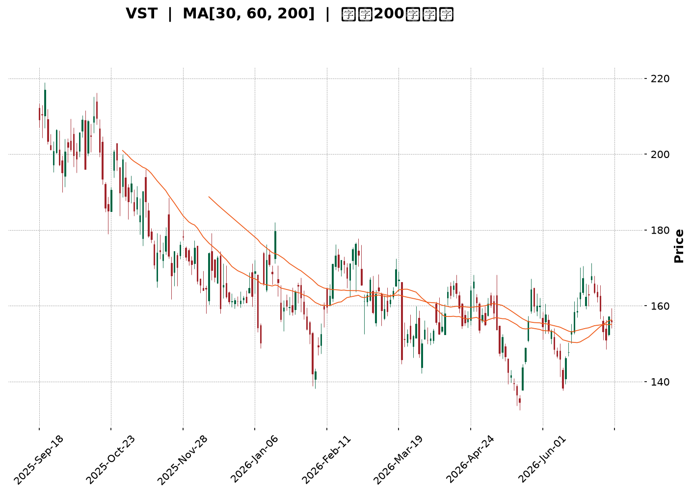
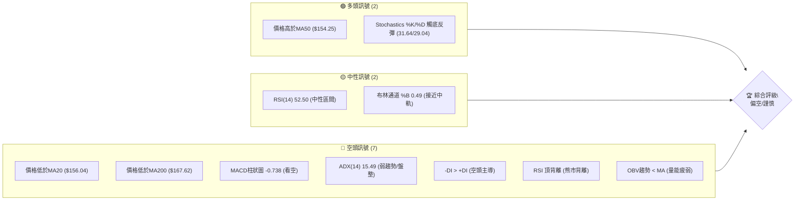
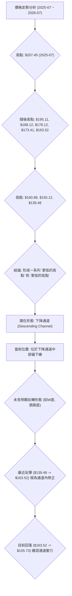
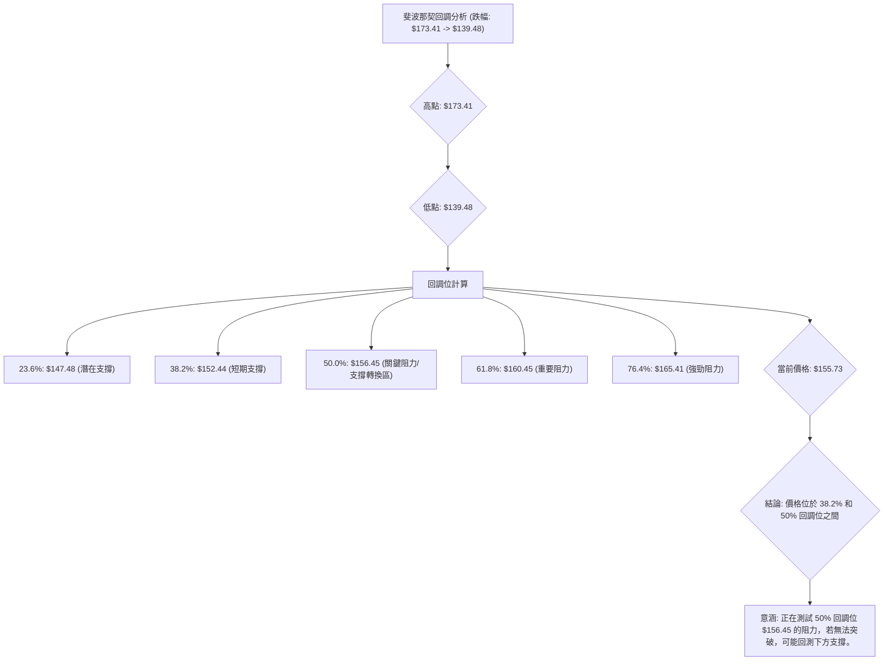
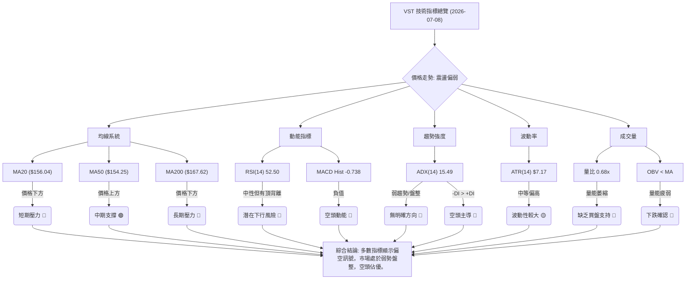
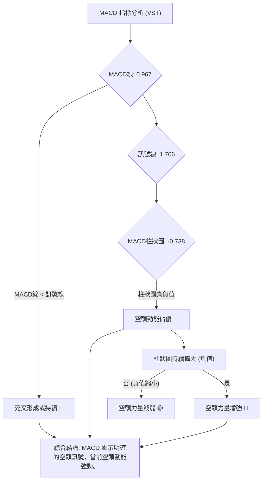
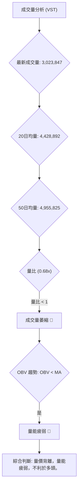
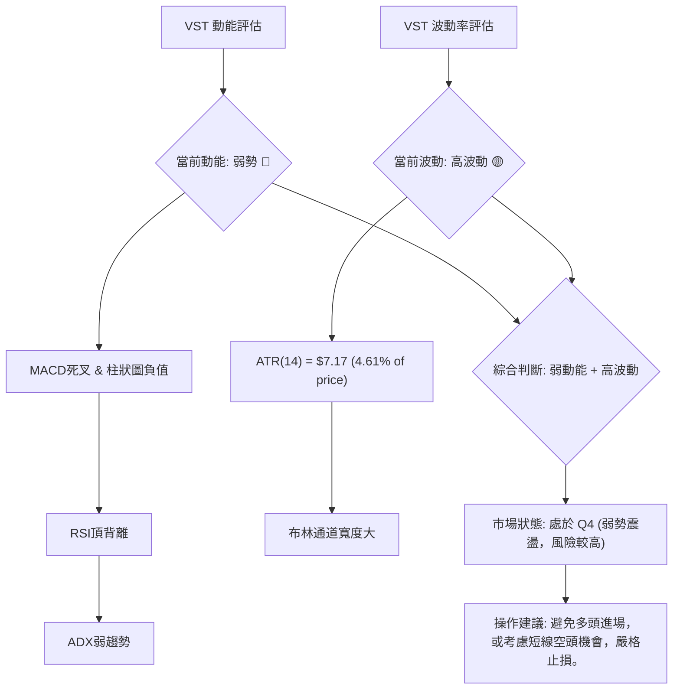
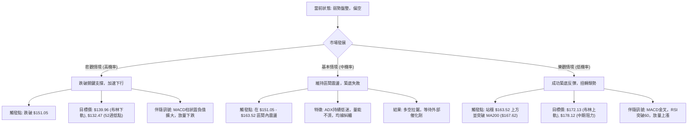

<details>
<summary>📊 靜態圖表 (點擊展開)</summary>

</details>

<html>
<head><meta charset="utf-8" /></head>
<body>
    <div style="height:500px; width:100%;">                        <script>window.PlotlyConfig = {MathJaxConfig: 'local'};</script>
        <script charset="utf-8" src="https://cdn.plot.ly/plotly-3.6.0.min.js" integrity="sha256-QaOVwtVY0T02VaHrr6pnoHLCwayMJp4O5n4YyaE3rJk=" crossorigin="anonymous"></script>                <div id="candlestick-chart" class="plotly-graph-div" style="height:100%; width:100%;"></div>            <script>                window.PLOTLYENV=window.PLOTLYENV || {};                                if (document.getElementById("candlestick-chart")) {                    Plotly.newPlot(                        "candlestick-chart",                        [{"close":{"dtype":"f8","bdata":"AAAAwAYiakAAAACA60xqQAAAAOCEIGtAAAAAIJNsaUAAAACgGidpQAAAAAAVGWlAAAAA4InLaUAAAACAz6NoQAAAAGBwY2hAAAAAoJMVaUAAAADA5zlpQAAAAIDfJGlAAAAA4IXyaEAAAADgWNloQAAAACAwtmlAAAAAQCEkakAAAADgZIFoQAAAACDKFWpAAAAAwAuVaUAAAACgNz9qQAAAAGDgMGpAAAAAYHoQaUAAAADA5i1oQAAAAODiN2dAAAAA4OUhZ0AAAABAcdJnQAAAAGBNFGlAAAAAYCbPaEAAAAAglrlnQAAAAIBh0WhAAAAAAIudZ0AAAAAgnHBnQAAAACCpB2hAAAAAoAcfZ0AAAABgWJNnQAAAAKBW+2ZAAAAAwKbGZ0AAAAAA+W9nQAAAAOBXTWZAAAAAQPswZkAAAADAJltlQAAAAIDlvmVAAAAAQMbIZUAAAACgSrZlQAAAAKC0TGZAAAAAADeiZUAAAACAgfxkQAAAAKA8zWVAAAAAADVEZUAAAAAAIwJmQAAAAGDIQ2ZAAAAAgG+dZUAAAABAs3plQAAAAAAFXmVAAAAAgN\u002fqZUAAAAAgQc9kQAAAAADLrWRAAAAAIAyEZEAAAAAAhY9kQAAAAEAHvGVAAAAAIKAsZUAAAADAq\u002fFkQAAAAGBhl2VAAAAAQM\u002fpY0AAAAAgY69kQAAAAOBSS2RAAAAAAPojZEAAAADgKidkQAAAACBsMGRAAAAA4ConZEAAAACglyxkQAAAAMB7RWRAAAAAQFEcZEAAAAAAxphkQAAAAEBgT2RAAAAAYP4hZUAAAABAjUVjQAAAAMDnxWJAAAAAACe9ZEAAAAAgU4NlQAAAAIBOXmVAAAAAgB8QZUAAAABg2nVmQAAAAAB+xGRAAAAAgBOMY0AAAABgg\u002fJjQAAAAOBc\u002fWNAAAAAQLT1Y0AAAABg5stjQAAAAIDReWRAAAAAYNulZEAAAAAANURkQAAAAIA4vWNAAAAAoLM6Y0AAAABAfhJjQAAAAOAOxGFAAAAAIJzVYUAAAACglqdiQAAAACCJEWNAAAAAQBzlY0AAAABAqfZjQAAAAEDNVGRAAAAAgIpgZUAAAABAbaZlQAAAAKAuQ2VAAAAAgMWAZUAAAAAgq11lQAAAAEDJ6mRAAAAAYLBkZUAAAADgCdxlQAAAAGChCmZAAAAAACGtZUAAAADABrFkQAAAAAAgKGRAAAAAQBldZEAAAACABd5kQAAAAEDLxmNAAAAAIGVlZEAAAABgSX5kQAAAAMAR12NAAAAA4HjkY0AAAAAAXtBjQAAAACBhMWRAAAAAgA18ZEAAAABA0jRlQAAAAIAQ3WRAAAAAABs6YkAAAACAguJiQAAAAKA0EGNAAAAAIIrpYkAAAADgyAJjQAAAAABnaGNAAAAAYK1qYkAAAAAg1cNiQAAAAKDUN2NAAAAAoP7eYkAAAACgGOxiQAAAAODhLmNAAAAAAIF1Y0AAAAAgKhFjQAAAAIBvUGNAAAAAAFK\u002fY0AAAADAs3dkQAAAAODJVmRAAAAAYI2pZEAAAADAZ2dkQAAAAOAO7GNAAAAAIDBWY0AAAADgTnJjQAAAAGAulGNAAAAAgNiDZEAAAAAAG8tkQAAAAEChHGRAAAAAwGUyY0AAAAAA0bNjQAAAAOACYmNAAAAAgAAUZEAAAACg+wRkQAAAAEAywmNAAAAAwII3Y0AAAAAAbnBiQAAAAMDL+mJAAAAAgERVYkAAAABgI81hQAAAACBztmFAAAAAYIJvYUAAAABg4RFhQAAAACCx0GBAAAAAYI75YUAAAACA45tiQAAAAKClgWNAAAAAQI6KZEAAAAAgov1jQAAAAKDJAWRAAAAAgDAAZEAAAADgZFFjQAAAAID4t2NAAAAAoLcyY0AAAACghS9jQAAAAKCpkWJAAAAA4DlWYkAAAAAgf0BiQAAAAIAUS2FAAAAAIJxFYkAAAAAgBHpiQAAAACDFKWNAAAAAIGzMY0AAAADAc9NjQAAAACCscGRAAAAA4FHoZEAAAADgekxkQAAAAADXW2RAAAAA4KP4ZEAAAAAgrm9kQAAAAAApTGRAAAAAACnUY0AAAADAHiVjQAAAAKCZ4WJAAAAAQAqnY0AAAAAgXHdjQA=="},"high":{"dtype":"f8","bdata":"R16MjuiqakD5vCAGgJ5qQEnLqTIRXWtAipOXPT58akA6fZvJnqppQOkgeS42bWlAYhGoHHbUaUAGNVE\u002fk8hpQOgBxCVk9WhAwDtzDpCCaUDjva8oy4RpQPd0oNCAKmpAMrGrIiriaUA4hVILq19pQPf9KpYZuGlAmRmBZTpGakClX6fNp29qQPaD\u002fkiJImpAJ1s8pnv\u002faUBIev32cuRqQAnTrz1jBmtAg+LPKrklakBGWQUQupRpQEGExjLFE2hALxsz0NmWZ0Dy1AZt5OxnQKcfVB4xJWlAcvpGXhdaaUA0qB\u002fm5I9oQMn0bGu4\u002fGhAwZAindq\u002faEAybwBu4QJoQMQ5LfQsTGhAcafuRETWZ0BuaPPvp\u002fVnQJiAW729imdATzu0kwrJZ0DX4iNpe39oQDjBKVQjZWdAq\u002fO1DoqRZkBbBEovGidmQJbUfJgcaGZAtfz7jdBYZkCzY9iy5BVmQKzNw5Hpl2ZA4F+wYCiQZ0A0q\u002fvRtZ5lQHVALRYmz2VACWORtivAZUACGIUZaSBmQMZPmjumgGZA0DAIQ\u002fD3ZUAoNkV8DOdlQHysXcEgpGVA0S26WvgpZkA4sBoauPxlQM46yL3342RAQm+KGpImZUBHUAVfm6pkQBD1xAVFxWVACMMmhhxoZkCiWLdeCollQPXUKTGtpmVA3iX1eDzNZUAX1OnFn2ZlQJLw+ipfVmVA\u002fWBvE2p7ZEAvlTa\u002f8mdkQP+rCwBeRGRAU90fMZxRZEAVvdNp53dkQGikS06GU2RAJmBSO3qBZECXgsIYBBplQE3qKVDOZWVAafBaJEiEZUAMlnY36QVlQETibZvYa2NAjiX69UDIZUCVsD3cEwhmQLAX1yvp3mVAjJ\u002fHzaVWZUDl6QyWzcFmQHkFh5i7VGVAHSfpTFixZEAdjB9UDzFkQC3tpciQYWRAZbRuGXZNZEDDfGZ5U5tkQG32H31OhWRAShc1NTfDZED3WL7XVu1kQI7wMkJ6gWRA3UebmjzxY0AHXLEmL4JjQK8CdvuNJ2NA08EgZGrwYUAEcGzD4PpiQFTSdh41a2NAqDUjfjAfZEBc1l9hU5tkQHfzEhcMuGRAZpd4SPdlZUC4t2ZgNAVmQHRfFrWB4GVAMzP3agGDZUBiVUDqrqBlQEs2oZG1a2VA53\u002fghJpmZUA\u002fsT4kjO5lQFmw+bu2F2ZAPovpuy06ZkBt9Z+FDgFmQI65eASGYmRArzRJSjl4ZEA\u002fIygeNvBkQP+m45lL\u002fWRA1kRjTKCFZEC1takJYQplQOeVqvczcWRAavQzEP5XZEA8UHaXF5lkQOXKtt+QYWRA7cE29hygZEBHUUcpupBlQAZxQlo6JGVAEtsNF5fHZEAo\u002fX\u002fQ0nVjQKwQqdBNPGNAydGc2FS3Y0D9ueaimw5jQCae5i07\u002f2NAPHKCw6XWY0CQPozwQuhiQLZxLjzig2NA2YaV5wBLY0C3k+EkghxjQLpvM6A4PmNABmuViLMiZEDwIVLWr0lkQF50DrIPzWNACrxYAdkPZEBzPwA+kKFkQOVL4zwwyWRAatNcU\u002fjVZEAUpSDgIwhlQJdRWkVCemRAKT+atv0bZEDHjyrvcNtjQHev5vu61GNA7ZgdbvSnZEB3z60r5wVlQHtHdF0XY2RA5gCWrjwdZEA1oEY+BO1jQDmzAFNQ\u002fWNAOkLKuOREZED8LLYRRXJkQL53EehiWGRAUMzp0\u002fEEZUC6dRFaEFljQKH3GhsqEWNAq8KC8ZvDYkAOqsz0aUJiQFkVxgQH42FAEkf1+JCcYUAh85gJCWthQFSH1lNIEGFAqi6e0FAWYkDq7nSVR6JiQKTPY1swq2NApA\u002fR9k7lZEApLBnQUZlkQIVY1GSkaWRAusF4ZgRCZEBhQng0gcpjQM2gz87DEWRAj2f+qQ22Y0C9y+b6YjpjQHj\u002fcQVgQmNAW0J0QeuiYkCIGzrC38JiQODlIVOO+WFA6RQP6zlWYkASuq\u002fWQ8liQH\u002fWwoNxZ2NAvcI6PyIoZEAXNWyEz0ZkQD5+vuFBQ2VAAAAAAABQZUAAAABgZrpkQAAAAOB6tGRAAAAAQDNrZUAAAACAwv1kQAAAAEAzs2RAAAAAYGauZEAAAACAPapjQAAAACCuh2NAAAAAIK6nY0AAAADAHu1jQA=="},"hovertemplate":"\u003cb\u003e%{x|%Y-%m-%d}\u003c\u002fb\u003e\u003cbr\u003e\u958b: $%{open:.2f}\u003cbr\u003e\u9ad8: $%{high:.2f}\u003cbr\u003e\u4f4e: $%{low:.2f}\u003cbr\u003e\u6536: $%{close:.2f}\u003cextra\u003e\u003c\u002fextra\u003e","low":{"dtype":"f8","bdata":"Fe\u002f40tveaUAWGJk8qIppQDYHsrIF3mlA63wQ4LdTaUDttYmUDCFpQEPZQnlOZmhAg0qnwa8EaUDF2neHKZxoQAoslXgXvWdA2DPvsu\u002frZ0Bk\u002fEM8WbxoQIZ94QVCFWlARxO83o6TaEAeT7alUmJoQI92bhiB6WhAAOA+HniPaUDJxPytwYBoQG83jR808mhA4Su\u002fQhISaUBboGdQaLFpQOdXDU0x+mlAjLDr6gznaECbachPPABoQFXNq8acGWdAg7aaNvVcZkC3UfjrEh5nQDCW38dfOWhAnU1s4et1aEBP\u002fN4Lj\u002fZmQN7K+BjllWdA9vZFAEJ4Z0A4wZDGSNhmQE+ZGlckYmdAAxMLoYP3ZkC3yTOHNwVnQFAjH04iWWZAxJLePcP7ZUA8g7f5rexmQP+FK4QwQmZAm+aaS8ARZkDvtXF1AjplQArn5uGVnGRAQ87fH92MZUDTcF9\u002feD5lQDtq9Cfrr2VA5AtszC6NZUA5b0yxhThkQKOUGGzIpmRAbOdYKvGmZEDowrf2v4tlQOuU\u002fQCyKGZAksGhZil\u002fZUDYY50C8FRlQM35QVv6B2VAYWIpmnI4ZUB\u002ffi+I8rhkQHVcRH0lbGRACIHRd3+BZECwKyGkvr9jQDuIyJfzCmRARGe5NcXZZEAdlecFM8lkQLPTwQ1\u002fu2RAEjgHhlbBY0C7GuwI2j9kQN8kMLbOQGRA+s6oBQANZEAcBc4NBvZjQHKAUR6J6mNAuID2VAv9Y0AvE1YNc+9jQCmPnYGzE2RAXWRunM4YZEB2DYgIA25kQAxAoCzw92NAyZcsU4BqZEDYT+GUuSNjQEKzkt3omGJAT47qEoStZEDWQN44E3RkQN4tVu8oS2VACa4Q3vCyZEAsVkp6mmZlQJDn3cLtUWRARgMCqDR6Y0ATnnqgECtjQFLE1di\u002f1mNAF6uSKQ2yY0Cw9PEw3K5jQNij9nbWtmNAcm+2f+QWZECWPU4SJcpjQEf7qwysjWNAiUWnslwzY0DH8aJwRL9iQFHKelNYXGFAkH+d+rpEYUChUP\u002flbGBiQCnPTevpa2JAcjRhwUBMY0DeTzBJmsNjQFmO78Sj\u002fmNA4nRxJb4hZECbC7dsZS9lQGNbNPKLJGVAzczMjCX5ZEA29lmdFBFlQNLTDokimGRA7idC5sdNZECC7NZ0izNlQG8L4j4IdWRAbbigzGRNZUDEp7ed66tkQEGb0dHaEWNAS78hxaP+Y0BlTbqFfCdkQGyq6Qigu2NAn+Wx8FBSY0DDJKFFQXtkQNRxNWAaV2NAl+OE9pCIY0BJQKVSb6ljQB57CJ1i9WNAX\u002fJFEoc1ZECRbbWpY6FkQMK0e5bceGRA\u002fNIbIhQUYkAwnEilCaRiQMiCHFHoqmJA60APMm7FYkD1SzPvH0liQBIcw5o18WJA0ULJxKNMYkCIuoWJgsRhQPA6xlMG5mJArKadRB+9YkB6ffv2c7ViQEj7qRM8wmJAM5+on1RiY0DIQU9t7Q5jQDHMHg+rHGNAZv0D9fcNY0CDdIFH3QNkQCz33SyLPWRAp6jeMz5MZECUu17\u002fDkFkQNmc5Mknw2NAQeN\u002fT0M9Y0BQjn7XgVZjQLLd8wsWSWNAAcmUZNtdY0DcwbufatBjQDa4ZP7vz2NAV+BIorUbY0D2zDEMZHBjQGLbd6LTVmNAUqzs0AinY0B4oQzlcvJjQBWqTDwxjGNAn\u002fjcT8IxY0BarDNayFhiQPB5qp9ZQmJAU9p+HJouYkBN4Y2jE2phQOZVAgk+d2FAVbkIzMAzYUAxfbKbh7VgQEVGKvwuj2BAVb02ycAzYUDbOZY9rRViQLxT5\u002fxA0WJACwUJovW\u002fY0DHT6W098VjQCRDh9MlrGNAatvMwCOVY0DVR6iryeNiQLP\u002f\u002fY9RFWNAVUPwHI4XY0CRg6v1W79iQFECWi9maWJAjPD6FJxFYkD1bnYd8qphQAAam9fyNmFAaSJHo\u002f5rYUALD3bva1liQOPvJXk+wWJAQYPflrgTY0A1ZTJPr59jQDIRhX3M+WNAAAAAwMxcZEAAAADgo+RjQAAAAAAp\u002fGNAAAAA4FHAZEAAAACAFGZkQAAAAOCjIGRAAAAA4FGQY0AAAACgmeFiQAAAAAAAkGJAAAAA4FEAY0AAAABA4UJjQA=="},"name":"\u50f9\u683c","open":{"dtype":"f8","bdata":"3aHF10yGakCUMGkns1FqQILBtVr\u002fQ2pAknaHsaInakC2NxQ7WE1pQH+3Fv24pWhApX0miLILaUBYeNMPMSVpQHTkXyely2hAwcvl7B5GaED7c2ZmM2ZpQEd5nXEUcGlADfszhcKpaUAbEXwffRdpQKzS27rOF2lAzMzMLIfEaUCjnClaexxqQAwqPOklCWlAiaG1\u002fPedaUA6Xk\u002fbdQ5qQJ5uWhnGvGpANRorB+HZaUAge9GbEWlpQOOJaOuPAmhAdiBLsLVYZ0C3UfjrEh5nQMzQ2NQbeWhAcvpGXhdaaUA0qB\u002fm5I9oQNRiGFMU8GdA62ozRew7aEDojN7KhOZnQKrOgsOYwGdAGIW2kTxqZ0BneWy3mS9nQMq2mEY1xGZAojlrcE84ZkDZQStcvz9oQKeKGhXEJGdAXp1Bw6ByZkD+Uss7pAVmQNUMCqaSz2RAFl8EJHrWZUBKs++LNH5lQB1XO7jfzWVAqiGQH7YBZ0CzC6VlLGllQPoWfny8G2VAUr7qC3WrZUAefq2A6KhlQDdTWH4+SGZA1lbi+vXoZUD+tveLhdVlQBVgba80fmVAEDk9bfxlZUAOH9S2NvllQM46yL3342RATXJnmeSVZED4QW7Z75RkQNY5QgIYLGRAdHF++iXPZUDCI48axIdlQExHEsiuvmRA56NS3TmpZUD9JKGTIp9kQCEHOdBGwGRArTj3lIVxZEA+IIIC+iNkQJ\u002fi98t3EWRAAAAA4ConZEBu+e9byRFkQOK4FMOyMWRAxPdPfhlOZEB2DYgIA25kQJF6ZTTjHGVAf8pbmhQRZUAMlnY36QVlQIN9eGlLWmNAQ00eeiu7ZUBCqG8j54ZkQO2bA5GjsGVAfnEKooYdZUAeFyYlupBlQKsEkefO4mRANhWAE2caZEDiA5czSNJjQHtDXsR2L2RAkEVA9t\u002fxY0BfmpXlswRkQE90Vdo84mNAAxIpXVixZED6kUmcEbBkQIk7MQ++IWRAExH34uGmY0D0nje9DnZjQEeQvVqOGGNAojQ1aI2TYUBr0Pv2wbJiQG77QP\u002fBsmJA\u002fxqKq6P+Y0C1aPPibpFkQJBUta8rCWRA+iaBjnY+ZECtz\u002fIHE01lQLOrpUH1sGVAzcyuyB4uZUB9UO2oY3plQOWAgVBqRWVA6lORNTHaZEBAJY8Z8XxlQAOzW2VkXGVAOU8LCo3QZUC18araXzdlQGjR0lnOJ2RAQRNeYJ0kZEBftYiA3i1kQIBPaMvhf2RAZPKZWQlvY0CG0uEN7JxkQCNnCejBZGRAdL73X7GUY0BdqwD+CSpkQMT20F\u002fJEWRAtkct+otLZECPW0sDXqlkQHRaFaWu1mRAEtsNF5fHZECbEcRqn+diQFVYRNzcymJAg3luRBBZY0AW3KxTT6liQBIcw5o18WJAw2d6eiucY0AS2UYqXPZhQP2SdgZD6GJAgJv6J\u002fTfYkD05QVNhdpiQNx2sMZ622JABWzocs4QZEA9BV0HgXVjQLWWVHchKWNAZv0D9fcNY0Bq0TQf2kVkQMEZRAyYqGRAEtt+H+CKZEC7gUEs4cBkQG2jFbpNWmRAmNfAOyARZEBJQhvZibJjQEubIrK9d2NATXwCgJCDY0B04M+5nZhkQIMv5nC6SGRAoLjdQFIUZEBSdtYhSYJjQBZ04OnVwmNAJT248wWvY0BA9fybtFhkQEL5jOicKGRACATW3ftZZEC6dRFaEFljQNTOhYVgeWJA+mVlnP2oYkAOqsz0aUJiQDsNAlXVpWFAvyBliYtyYUCsu0WZx1lhQGulTeOF82BAAAAAHNM5YUD8xES7hyhiQPBHu4cz2mJAx8ZiOgLWY0AqjOmlVpdkQK+CDJ\u002fF02NAQyCHAtf4Y0DC0GVW+ZhjQGPJmQEad2NAte0B1FCJY0AMOJaef+piQK8anKEy+WJAt\u002f3beEiDYkAxHOFLzIZiQAbrZwXJ5GFAytzu\u002fl6ZYUBWG6t6YHliQIKpSuIUE2NAm2MnZyQhY0CH1zPp+8pjQPBXPGSgO2RAAAAAAClwZEAAAABgjwJkQAAAAMD1YGRAAAAAwB7dZEAAAAAghbtkQAAAAGBmdmRAAAAAYI9SZEAAAAAAAIBjQAAAAGBmPmNAAAAAQAoPY0AAAAAAKYRjQA=="},"x":["2025-09-18T00:00:00-04:00","2025-09-19T00:00:00-04:00","2025-09-22T00:00:00-04:00","2025-09-23T00:00:00-04:00","2025-09-24T00:00:00-04:00","2025-09-25T00:00:00-04:00","2025-09-26T00:00:00-04:00","2025-09-29T00:00:00-04:00","2025-09-30T00:00:00-04:00","2025-10-01T00:00:00-04:00","2025-10-02T00:00:00-04:00","2025-10-03T00:00:00-04:00","2025-10-06T00:00:00-04:00","2025-10-07T00:00:00-04:00","2025-10-08T00:00:00-04:00","2025-10-09T00:00:00-04:00","2025-10-10T00:00:00-04:00","2025-10-13T00:00:00-04:00","2025-10-14T00:00:00-04:00","2025-10-15T00:00:00-04:00","2025-10-16T00:00:00-04:00","2025-10-17T00:00:00-04:00","2025-10-20T00:00:00-04:00","2025-10-21T00:00:00-04:00","2025-10-22T00:00:00-04:00","2025-10-23T00:00:00-04:00","2025-10-24T00:00:00-04:00","2025-10-27T00:00:00-04:00","2025-10-28T00:00:00-04:00","2025-10-29T00:00:00-04:00","2025-10-30T00:00:00-04:00","2025-10-31T00:00:00-04:00","2025-11-03T00:00:00-05:00","2025-11-04T00:00:00-05:00","2025-11-05T00:00:00-05:00","2025-11-06T00:00:00-05:00","2025-11-07T00:00:00-05:00","2025-11-10T00:00:00-05:00","2025-11-11T00:00:00-05:00","2025-11-12T00:00:00-05:00","2025-11-13T00:00:00-05:00","2025-11-14T00:00:00-05:00","2025-11-17T00:00:00-05:00","2025-11-18T00:00:00-05:00","2025-11-19T00:00:00-05:00","2025-11-20T00:00:00-05:00","2025-11-21T00:00:00-05:00","2025-11-24T00:00:00-05:00","2025-11-25T00:00:00-05:00","2025-11-26T00:00:00-05:00","2025-11-28T00:00:00-05:00","2025-12-01T00:00:00-05:00","2025-12-02T00:00:00-05:00","2025-12-03T00:00:00-05:00","2025-12-04T00:00:00-05:00","2025-12-05T00:00:00-05:00","2025-12-08T00:00:00-05:00","2025-12-09T00:00:00-05:00","2025-12-10T00:00:00-05:00","2025-12-11T00:00:00-05:00","2025-12-12T00:00:00-05:00","2025-12-15T00:00:00-05:00","2025-12-16T00:00:00-05:00","2025-12-17T00:00:00-05:00","2025-12-18T00:00:00-05:00","2025-12-19T00:00:00-05:00","2025-12-22T00:00:00-05:00","2025-12-23T00:00:00-05:00","2025-12-24T00:00:00-05:00","2025-12-26T00:00:00-05:00","2025-12-29T00:00:00-05:00","2025-12-30T00:00:00-05:00","2025-12-31T00:00:00-05:00","2026-01-02T00:00:00-05:00","2026-01-05T00:00:00-05:00","2026-01-06T00:00:00-05:00","2026-01-07T00:00:00-05:00","2026-01-08T00:00:00-05:00","2026-01-09T00:00:00-05:00","2026-01-12T00:00:00-05:00","2026-01-13T00:00:00-05:00","2026-01-14T00:00:00-05:00","2026-01-15T00:00:00-05:00","2026-01-16T00:00:00-05:00","2026-01-20T00:00:00-05:00","2026-01-21T00:00:00-05:00","2026-01-22T00:00:00-05:00","2026-01-23T00:00:00-05:00","2026-01-26T00:00:00-05:00","2026-01-27T00:00:00-05:00","2026-01-28T00:00:00-05:00","2026-01-29T00:00:00-05:00","2026-01-30T00:00:00-05:00","2026-02-02T00:00:00-05:00","2026-02-03T00:00:00-05:00","2026-02-04T00:00:00-05:00","2026-02-05T00:00:00-05:00","2026-02-06T00:00:00-05:00","2026-02-09T00:00:00-05:00","2026-02-10T00:00:00-05:00","2026-02-11T00:00:00-05:00","2026-02-12T00:00:00-05:00","2026-02-13T00:00:00-05:00","2026-02-17T00:00:00-05:00","2026-02-18T00:00:00-05:00","2026-02-19T00:00:00-05:00","2026-02-20T00:00:00-05:00","2026-02-23T00:00:00-05:00","2026-02-24T00:00:00-05:00","2026-02-25T00:00:00-05:00","2026-02-26T00:00:00-05:00","2026-02-27T00:00:00-05:00","2026-03-02T00:00:00-05:00","2026-03-03T00:00:00-05:00","2026-03-04T00:00:00-05:00","2026-03-05T00:00:00-05:00","2026-03-06T00:00:00-05:00","2026-03-09T00:00:00-04:00","2026-03-10T00:00:00-04:00","2026-03-11T00:00:00-04:00","2026-03-12T00:00:00-04:00","2026-03-13T00:00:00-04:00","2026-03-16T00:00:00-04:00","2026-03-17T00:00:00-04:00","2026-03-18T00:00:00-04:00","2026-03-19T00:00:00-04:00","2026-03-20T00:00:00-04:00","2026-03-23T00:00:00-04:00","2026-03-24T00:00:00-04:00","2026-03-25T00:00:00-04:00","2026-03-26T00:00:00-04:00","2026-03-27T00:00:00-04:00","2026-03-30T00:00:00-04:00","2026-03-31T00:00:00-04:00","2026-04-01T00:00:00-04:00","2026-04-02T00:00:00-04:00","2026-04-06T00:00:00-04:00","2026-04-07T00:00:00-04:00","2026-04-08T00:00:00-04:00","2026-04-09T00:00:00-04:00","2026-04-10T00:00:00-04:00","2026-04-13T00:00:00-04:00","2026-04-14T00:00:00-04:00","2026-04-15T00:00:00-04:00","2026-04-16T00:00:00-04:00","2026-04-17T00:00:00-04:00","2026-04-20T00:00:00-04:00","2026-04-21T00:00:00-04:00","2026-04-22T00:00:00-04:00","2026-04-23T00:00:00-04:00","2026-04-24T00:00:00-04:00","2026-04-27T00:00:00-04:00","2026-04-28T00:00:00-04:00","2026-04-29T00:00:00-04:00","2026-04-30T00:00:00-04:00","2026-05-01T00:00:00-04:00","2026-05-04T00:00:00-04:00","2026-05-05T00:00:00-04:00","2026-05-06T00:00:00-04:00","2026-05-07T00:00:00-04:00","2026-05-08T00:00:00-04:00","2026-05-11T00:00:00-04:00","2026-05-12T00:00:00-04:00","2026-05-13T00:00:00-04:00","2026-05-14T00:00:00-04:00","2026-05-15T00:00:00-04:00","2026-05-18T00:00:00-04:00","2026-05-19T00:00:00-04:00","2026-05-20T00:00:00-04:00","2026-05-21T00:00:00-04:00","2026-05-22T00:00:00-04:00","2026-05-26T00:00:00-04:00","2026-05-27T00:00:00-04:00","2026-05-28T00:00:00-04:00","2026-05-29T00:00:00-04:00","2026-06-01T00:00:00-04:00","2026-06-02T00:00:00-04:00","2026-06-03T00:00:00-04:00","2026-06-04T00:00:00-04:00","2026-06-05T00:00:00-04:00","2026-06-08T00:00:00-04:00","2026-06-09T00:00:00-04:00","2026-06-10T00:00:00-04:00","2026-06-11T00:00:00-04:00","2026-06-12T00:00:00-04:00","2026-06-15T00:00:00-04:00","2026-06-16T00:00:00-04:00","2026-06-17T00:00:00-04:00","2026-06-18T00:00:00-04:00","2026-06-22T00:00:00-04:00","2026-06-23T00:00:00-04:00","2026-06-24T00:00:00-04:00","2026-06-25T00:00:00-04:00","2026-06-26T00:00:00-04:00","2026-06-29T00:00:00-04:00","2026-06-30T00:00:00-04:00","2026-07-01T00:00:00-04:00","2026-07-02T00:00:00-04:00","2026-07-06T00:00:00-04:00","2026-07-07T00:00:00-04:00"],"type":"candlestick"},{"hovertemplate":"MA30: $%{y:.2f}\u003cextra\u003e\u003c\u002fextra\u003e","line":{"color":"#2196F3","dash":"dash","width":2},"mode":"lines","name":"MA30","x":["2025-09-18T00:00:00-04:00","2025-09-19T00:00:00-04:00","2025-09-22T00:00:00-04:00","2025-09-23T00:00:00-04:00","2025-09-24T00:00:00-04:00","2025-09-25T00:00:00-04:00","2025-09-26T00:00:00-04:00","2025-09-29T00:00:00-04:00","2025-09-30T00:00:00-04:00","2025-10-01T00:00:00-04:00","2025-10-02T00:00:00-04:00","2025-10-03T00:00:00-04:00","2025-10-06T00:00:00-04:00","2025-10-07T00:00:00-04:00","2025-10-08T00:00:00-04:00","2025-10-09T00:00:00-04:00","2025-10-10T00:00:00-04:00","2025-10-13T00:00:00-04:00","2025-10-14T00:00:00-04:00","2025-10-15T00:00:00-04:00","2025-10-16T00:00:00-04:00","2025-10-17T00:00:00-04:00","2025-10-20T00:00:00-04:00","2025-10-21T00:00:00-04:00","2025-10-22T00:00:00-04:00","2025-10-23T00:00:00-04:00","2025-10-24T00:00:00-04:00","2025-10-27T00:00:00-04:00","2025-10-28T00:00:00-04:00","2025-10-29T00:00:00-04:00","2025-10-30T00:00:00-04:00","2025-10-31T00:00:00-04:00","2025-11-03T00:00:00-05:00","2025-11-04T00:00:00-05:00","2025-11-05T00:00:00-05:00","2025-11-06T00:00:00-05:00","2025-11-07T00:00:00-05:00","2025-11-10T00:00:00-05:00","2025-11-11T00:00:00-05:00","2025-11-12T00:00:00-05:00","2025-11-13T00:00:00-05:00","2025-11-14T00:00:00-05:00","2025-11-17T00:00:00-05:00","2025-11-18T00:00:00-05:00","2025-11-19T00:00:00-05:00","2025-11-20T00:00:00-05:00","2025-11-21T00:00:00-05:00","2025-11-24T00:00:00-05:00","2025-11-25T00:00:00-05:00","2025-11-26T00:00:00-05:00","2025-11-28T00:00:00-05:00","2025-12-01T00:00:00-05:00","2025-12-02T00:00:00-05:00","2025-12-03T00:00:00-05:00","2025-12-04T00:00:00-05:00","2025-12-05T00:00:00-05:00","2025-12-08T00:00:00-05:00","2025-12-09T00:00:00-05:00","2025-12-10T00:00:00-05:00","2025-12-11T00:00:00-05:00","2025-12-12T00:00:00-05:00","2025-12-15T00:00:00-05:00","2025-12-16T00:00:00-05:00","2025-12-17T00:00:00-05:00","2025-12-18T00:00:00-05:00","2025-12-19T00:00:00-05:00","2025-12-22T00:00:00-05:00","2025-12-23T00:00:00-05:00","2025-12-24T00:00:00-05:00","2025-12-26T00:00:00-05:00","2025-12-29T00:00:00-05:00","2025-12-30T00:00:00-05:00","2025-12-31T00:00:00-05:00","2026-01-02T00:00:00-05:00","2026-01-05T00:00:00-05:00","2026-01-06T00:00:00-05:00","2026-01-07T00:00:00-05:00","2026-01-08T00:00:00-05:00","2026-01-09T00:00:00-05:00","2026-01-12T00:00:00-05:00","2026-01-13T00:00:00-05:00","2026-01-14T00:00:00-05:00","2026-01-15T00:00:00-05:00","2026-01-16T00:00:00-05:00","2026-01-20T00:00:00-05:00","2026-01-21T00:00:00-05:00","2026-01-22T00:00:00-05:00","2026-01-23T00:00:00-05:00","2026-01-26T00:00:00-05:00","2026-01-27T00:00:00-05:00","2026-01-28T00:00:00-05:00","2026-01-29T00:00:00-05:00","2026-01-30T00:00:00-05:00","2026-02-02T00:00:00-05:00","2026-02-03T00:00:00-05:00","2026-02-04T00:00:00-05:00","2026-02-05T00:00:00-05:00","2026-02-06T00:00:00-05:00","2026-02-09T00:00:00-05:00","2026-02-10T00:00:00-05:00","2026-02-11T00:00:00-05:00","2026-02-12T00:00:00-05:00","2026-02-13T00:00:00-05:00","2026-02-17T00:00:00-05:00","2026-02-18T00:00:00-05:00","2026-02-19T00:00:00-05:00","2026-02-20T00:00:00-05:00","2026-02-23T00:00:00-05:00","2026-02-24T00:00:00-05:00","2026-02-25T00:00:00-05:00","2026-02-26T00:00:00-05:00","2026-02-27T00:00:00-05:00","2026-03-02T00:00:00-05:00","2026-03-03T00:00:00-05:00","2026-03-04T00:00:00-05:00","2026-03-05T00:00:00-05:00","2026-03-06T00:00:00-05:00","2026-03-09T00:00:00-04:00","2026-03-10T00:00:00-04:00","2026-03-11T00:00:00-04:00","2026-03-12T00:00:00-04:00","2026-03-13T00:00:00-04:00","2026-03-16T00:00:00-04:00","2026-03-17T00:00:00-04:00","2026-03-18T00:00:00-04:00","2026-03-19T00:00:00-04:00","2026-03-20T00:00:00-04:00","2026-03-23T00:00:00-04:00","2026-03-24T00:00:00-04:00","2026-03-25T00:00:00-04:00","2026-03-26T00:00:00-04:00","2026-03-27T00:00:00-04:00","2026-03-30T00:00:00-04:00","2026-03-31T00:00:00-04:00","2026-04-01T00:00:00-04:00","2026-04-02T00:00:00-04:00","2026-04-06T00:00:00-04:00","2026-04-07T00:00:00-04:00","2026-04-08T00:00:00-04:00","2026-04-09T00:00:00-04:00","2026-04-10T00:00:00-04:00","2026-04-13T00:00:00-04:00","2026-04-14T00:00:00-04:00","2026-04-15T00:00:00-04:00","2026-04-16T00:00:00-04:00","2026-04-17T00:00:00-04:00","2026-04-20T00:00:00-04:00","2026-04-21T00:00:00-04:00","2026-04-22T00:00:00-04:00","2026-04-23T00:00:00-04:00","2026-04-24T00:00:00-04:00","2026-04-27T00:00:00-04:00","2026-04-28T00:00:00-04:00","2026-04-29T00:00:00-04:00","2026-04-30T00:00:00-04:00","2026-05-01T00:00:00-04:00","2026-05-04T00:00:00-04:00","2026-05-05T00:00:00-04:00","2026-05-06T00:00:00-04:00","2026-05-07T00:00:00-04:00","2026-05-08T00:00:00-04:00","2026-05-11T00:00:00-04:00","2026-05-12T00:00:00-04:00","2026-05-13T00:00:00-04:00","2026-05-14T00:00:00-04:00","2026-05-15T00:00:00-04:00","2026-05-18T00:00:00-04:00","2026-05-19T00:00:00-04:00","2026-05-20T00:00:00-04:00","2026-05-21T00:00:00-04:00","2026-05-22T00:00:00-04:00","2026-05-26T00:00:00-04:00","2026-05-27T00:00:00-04:00","2026-05-28T00:00:00-04:00","2026-05-29T00:00:00-04:00","2026-06-01T00:00:00-04:00","2026-06-02T00:00:00-04:00","2026-06-03T00:00:00-04:00","2026-06-04T00:00:00-04:00","2026-06-05T00:00:00-04:00","2026-06-08T00:00:00-04:00","2026-06-09T00:00:00-04:00","2026-06-10T00:00:00-04:00","2026-06-11T00:00:00-04:00","2026-06-12T00:00:00-04:00","2026-06-15T00:00:00-04:00","2026-06-16T00:00:00-04:00","2026-06-17T00:00:00-04:00","2026-06-18T00:00:00-04:00","2026-06-22T00:00:00-04:00","2026-06-23T00:00:00-04:00","2026-06-24T00:00:00-04:00","2026-06-25T00:00:00-04:00","2026-06-26T00:00:00-04:00","2026-06-29T00:00:00-04:00","2026-06-30T00:00:00-04:00","2026-07-01T00:00:00-04:00","2026-07-02T00:00:00-04:00","2026-07-06T00:00:00-04:00","2026-07-07T00:00:00-04:00"],"y":{"dtype":"f8","bdata":"AAAAAAAA+H8AAAAAAAD4fwAAAAAAAPh\u002fAAAAAAAA+H8AAAAAAAD4fwAAAAAAAPh\u002fAAAAAAAA+H8AAAAAAAD4fwAAAAAAAPh\u002fAAAAAAAA+H8AAAAAAAD4fwAAAAAAAPh\u002fAAAAAAAA+H8AAAAAAAD4fwAAAAAAAPh\u002fAAAAAAAA+H8AAAAAAAD4fwAAAAAAAPh\u002fAAAAAAAA+H8AAAAAAAD4fwAAAAAAAPh\u002fAAAAAAAA+H8AAAAAAAD4fwAAAAAAAPh\u002fAAAAAAAA+H8AAAAAAAD4fwAAAAAAAPh\u002fAAAAAAAA+H8AAAAAAAD4f4mIiJjlHmlAERERAWoJaUBVVVX1APFoQLy7uzuT1mhAMzMzc+zCaECrqqoKd7VoQJqZmSloo2hAREREZC2SaEAiIiKC6odoQEREROQcdmhAVVVVJW1daEBmZma2ZjxoQJqZmelmH2hA7+7uDmkEaEARERFRpOlnQJqZmZmGzGdAvLu72w+mZ0B3d3dHCIhnQHd3dwd7Y2dAIiIiEqc+Z0B3d3e3expnQKuqqur6+GZA7+7unovbZkDv7u5egcRmQFVVVbW1tGZAERERoVeqZkAzMzPTopBmQCIiIvIVa2ZAAAAA8HJGZkDe3d1dcitmQO\u002fu7o4iEWZA3t3d7U38ZUBmZmamAedlQFVVVXUy0mVAZmZmttK2ZUB3d3dnKJ5lQImIiFg5h2VAZmZmljNoZUB3d3e3LExlQLy7u9skOmVAvLu7C8AoZUBVVVU1qh5lQN7d3Z0VEmVAMzMzc80DZUB3d3cHSfpkQAAAAMBO6WRAiYiImAjlZECrqqraZtZkQBEREbGOvGRAmpmZOQ64ZECJiIgY1LNkQGZmZuYtrGRAiYiICHinZEBEREQ0169kQKuqqhq5qmRAq6qqGn+WZEAiIiJyI49kQImIiOhBiWRA7+7uPoOEZEBVVVX1\u002fX1kQO\u002fu7m5Ac2RAiYiIaMJuZEDv7u4u+mhkQFVVVQUsWWRARERExFVTZEB3d3dnkkVkQCIiIhL\u002fL2RAZmZmRlEcZEARERERiA9kQHd3d\u002ff3BWRAd3d3R8QDZEARERER+AFkQImIiMh6AmRA3t3dfUkNZECJiIiIRhZkQDMzMwNnHmRAiYiIyI8hZEBVVVWlbjNkQN7d3W26RWRAMzMzE1BLZECamZkZRU5kQImIiJgDVGRAERERYT9ZZEAiIiJCJ0pkQM3MzOzwRGRAVVVVlehLZEARERFBwlNkQJqZmZnwUWRAIiIisqlVZEDe3d3tm1tkQDMzMyMvVmRAvLu767xPZEC8u7tr4EtkQERERKS\u002fT2RAZmZm1nVaZEBmZmbWq2xkQDMzM9Mah2RAMzMzY3SKZEDv7u4ua4xkQFVVVdVfjGRAiYiIGP2DZEBEREQE3HtkQN7d3b36c2RAMzMzo7daZEB3d3f3GEJkQImIiAinMGRAiYiIeDEaZEARERFBVwVkQGZmZkaL9mNAIiIisgnmY0AAAABwNc5jQCIiIoLvtmNAzczMrHmmY0AiIiKCkKRjQERERLQepmNAvLu7G6uoY0CrqqrqtqRjQHd3d+f0pWNAq6qqmuqcY0Crqqra+5NjQDMzMxPBkWNAAAAAEBGXY0AiIiKybJ9jQCIiIqK7nmNAMzMzk76TY0AzMzMz6YZjQM3MzJxGemNAd3d3hxKKY0C8u7s7wZNjQGZmZhawmWNAERERcUmcY0C8u7uLaJdjQM3MzDzBk2NAq6qqigqTY0Crqqpq0YpjQFVVVdX4fWNAVVVV9bhxY0ARERFR6mFjQN7d3X21TWNAVVVVRQtBY0BERESEIj1jQERERHTGPmNAq6qquoxFY0AzMzMTe0FjQLy7u7ulPmNAERERgQA5Y0BEREQkvC9jQJqZman\u002fLWNAq6qq+tAsY0AiIiISlypjQLy7uwv5IWNAERERsWIPY0BERETUsvliQKuqqpql4WJAREREBMHZYkARERFBS89iQERERFRrzWJAREREhAjLYkCrqqraYcliQHd3d7cyz2JAVVVVBaDdYkARERFRfu1iQFVVVfVC+WJAMzMzI8YPY0Crqqo6QiZjQDMzM9NQPGNAd3d3x7xQY0BmZmYGcmJjQAAAAGATdGNA3t3dTWSCY0AAAAAgtYljQA=="},"type":"scatter"},{"hovertemplate":"MA60: $%{y:.2f}\u003cextra\u003e\u003c\u002fextra\u003e","line":{"color":"#9C27B0","dash":"dash","width":2},"mode":"lines","name":"MA60","x":["2025-09-18T00:00:00-04:00","2025-09-19T00:00:00-04:00","2025-09-22T00:00:00-04:00","2025-09-23T00:00:00-04:00","2025-09-24T00:00:00-04:00","2025-09-25T00:00:00-04:00","2025-09-26T00:00:00-04:00","2025-09-29T00:00:00-04:00","2025-09-30T00:00:00-04:00","2025-10-01T00:00:00-04:00","2025-10-02T00:00:00-04:00","2025-10-03T00:00:00-04:00","2025-10-06T00:00:00-04:00","2025-10-07T00:00:00-04:00","2025-10-08T00:00:00-04:00","2025-10-09T00:00:00-04:00","2025-10-10T00:00:00-04:00","2025-10-13T00:00:00-04:00","2025-10-14T00:00:00-04:00","2025-10-15T00:00:00-04:00","2025-10-16T00:00:00-04:00","2025-10-17T00:00:00-04:00","2025-10-20T00:00:00-04:00","2025-10-21T00:00:00-04:00","2025-10-22T00:00:00-04:00","2025-10-23T00:00:00-04:00","2025-10-24T00:00:00-04:00","2025-10-27T00:00:00-04:00","2025-10-28T00:00:00-04:00","2025-10-29T00:00:00-04:00","2025-10-30T00:00:00-04:00","2025-10-31T00:00:00-04:00","2025-11-03T00:00:00-05:00","2025-11-04T00:00:00-05:00","2025-11-05T00:00:00-05:00","2025-11-06T00:00:00-05:00","2025-11-07T00:00:00-05:00","2025-11-10T00:00:00-05:00","2025-11-11T00:00:00-05:00","2025-11-12T00:00:00-05:00","2025-11-13T00:00:00-05:00","2025-11-14T00:00:00-05:00","2025-11-17T00:00:00-05:00","2025-11-18T00:00:00-05:00","2025-11-19T00:00:00-05:00","2025-11-20T00:00:00-05:00","2025-11-21T00:00:00-05:00","2025-11-24T00:00:00-05:00","2025-11-25T00:00:00-05:00","2025-11-26T00:00:00-05:00","2025-11-28T00:00:00-05:00","2025-12-01T00:00:00-05:00","2025-12-02T00:00:00-05:00","2025-12-03T00:00:00-05:00","2025-12-04T00:00:00-05:00","2025-12-05T00:00:00-05:00","2025-12-08T00:00:00-05:00","2025-12-09T00:00:00-05:00","2025-12-10T00:00:00-05:00","2025-12-11T00:00:00-05:00","2025-12-12T00:00:00-05:00","2025-12-15T00:00:00-05:00","2025-12-16T00:00:00-05:00","2025-12-17T00:00:00-05:00","2025-12-18T00:00:00-05:00","2025-12-19T00:00:00-05:00","2025-12-22T00:00:00-05:00","2025-12-23T00:00:00-05:00","2025-12-24T00:00:00-05:00","2025-12-26T00:00:00-05:00","2025-12-29T00:00:00-05:00","2025-12-30T00:00:00-05:00","2025-12-31T00:00:00-05:00","2026-01-02T00:00:00-05:00","2026-01-05T00:00:00-05:00","2026-01-06T00:00:00-05:00","2026-01-07T00:00:00-05:00","2026-01-08T00:00:00-05:00","2026-01-09T00:00:00-05:00","2026-01-12T00:00:00-05:00","2026-01-13T00:00:00-05:00","2026-01-14T00:00:00-05:00","2026-01-15T00:00:00-05:00","2026-01-16T00:00:00-05:00","2026-01-20T00:00:00-05:00","2026-01-21T00:00:00-05:00","2026-01-22T00:00:00-05:00","2026-01-23T00:00:00-05:00","2026-01-26T00:00:00-05:00","2026-01-27T00:00:00-05:00","2026-01-28T00:00:00-05:00","2026-01-29T00:00:00-05:00","2026-01-30T00:00:00-05:00","2026-02-02T00:00:00-05:00","2026-02-03T00:00:00-05:00","2026-02-04T00:00:00-05:00","2026-02-05T00:00:00-05:00","2026-02-06T00:00:00-05:00","2026-02-09T00:00:00-05:00","2026-02-10T00:00:00-05:00","2026-02-11T00:00:00-05:00","2026-02-12T00:00:00-05:00","2026-02-13T00:00:00-05:00","2026-02-17T00:00:00-05:00","2026-02-18T00:00:00-05:00","2026-02-19T00:00:00-05:00","2026-02-20T00:00:00-05:00","2026-02-23T00:00:00-05:00","2026-02-24T00:00:00-05:00","2026-02-25T00:00:00-05:00","2026-02-26T00:00:00-05:00","2026-02-27T00:00:00-05:00","2026-03-02T00:00:00-05:00","2026-03-03T00:00:00-05:00","2026-03-04T00:00:00-05:00","2026-03-05T00:00:00-05:00","2026-03-06T00:00:00-05:00","2026-03-09T00:00:00-04:00","2026-03-10T00:00:00-04:00","2026-03-11T00:00:00-04:00","2026-03-12T00:00:00-04:00","2026-03-13T00:00:00-04:00","2026-03-16T00:00:00-04:00","2026-03-17T00:00:00-04:00","2026-03-18T00:00:00-04:00","2026-03-19T00:00:00-04:00","2026-03-20T00:00:00-04:00","2026-03-23T00:00:00-04:00","2026-03-24T00:00:00-04:00","2026-03-25T00:00:00-04:00","2026-03-26T00:00:00-04:00","2026-03-27T00:00:00-04:00","2026-03-30T00:00:00-04:00","2026-03-31T00:00:00-04:00","2026-04-01T00:00:00-04:00","2026-04-02T00:00:00-04:00","2026-04-06T00:00:00-04:00","2026-04-07T00:00:00-04:00","2026-04-08T00:00:00-04:00","2026-04-09T00:00:00-04:00","2026-04-10T00:00:00-04:00","2026-04-13T00:00:00-04:00","2026-04-14T00:00:00-04:00","2026-04-15T00:00:00-04:00","2026-04-16T00:00:00-04:00","2026-04-17T00:00:00-04:00","2026-04-20T00:00:00-04:00","2026-04-21T00:00:00-04:00","2026-04-22T00:00:00-04:00","2026-04-23T00:00:00-04:00","2026-04-24T00:00:00-04:00","2026-04-27T00:00:00-04:00","2026-04-28T00:00:00-04:00","2026-04-29T00:00:00-04:00","2026-04-30T00:00:00-04:00","2026-05-01T00:00:00-04:00","2026-05-04T00:00:00-04:00","2026-05-05T00:00:00-04:00","2026-05-06T00:00:00-04:00","2026-05-07T00:00:00-04:00","2026-05-08T00:00:00-04:00","2026-05-11T00:00:00-04:00","2026-05-12T00:00:00-04:00","2026-05-13T00:00:00-04:00","2026-05-14T00:00:00-04:00","2026-05-15T00:00:00-04:00","2026-05-18T00:00:00-04:00","2026-05-19T00:00:00-04:00","2026-05-20T00:00:00-04:00","2026-05-21T00:00:00-04:00","2026-05-22T00:00:00-04:00","2026-05-26T00:00:00-04:00","2026-05-27T00:00:00-04:00","2026-05-28T00:00:00-04:00","2026-05-29T00:00:00-04:00","2026-06-01T00:00:00-04:00","2026-06-02T00:00:00-04:00","2026-06-03T00:00:00-04:00","2026-06-04T00:00:00-04:00","2026-06-05T00:00:00-04:00","2026-06-08T00:00:00-04:00","2026-06-09T00:00:00-04:00","2026-06-10T00:00:00-04:00","2026-06-11T00:00:00-04:00","2026-06-12T00:00:00-04:00","2026-06-15T00:00:00-04:00","2026-06-16T00:00:00-04:00","2026-06-17T00:00:00-04:00","2026-06-18T00:00:00-04:00","2026-06-22T00:00:00-04:00","2026-06-23T00:00:00-04:00","2026-06-24T00:00:00-04:00","2026-06-25T00:00:00-04:00","2026-06-26T00:00:00-04:00","2026-06-29T00:00:00-04:00","2026-06-30T00:00:00-04:00","2026-07-01T00:00:00-04:00","2026-07-02T00:00:00-04:00","2026-07-06T00:00:00-04:00","2026-07-07T00:00:00-04:00"],"y":{"dtype":"f8","bdata":"AAAAAAAA+H8AAAAAAAD4fwAAAAAAAPh\u002fAAAAAAAA+H8AAAAAAAD4fwAAAAAAAPh\u002fAAAAAAAA+H8AAAAAAAD4fwAAAAAAAPh\u002fAAAAAAAA+H8AAAAAAAD4fwAAAAAAAPh\u002fAAAAAAAA+H8AAAAAAAD4fwAAAAAAAPh\u002fAAAAAAAA+H8AAAAAAAD4fwAAAAAAAPh\u002fAAAAAAAA+H8AAAAAAAD4fwAAAAAAAPh\u002fAAAAAAAA+H8AAAAAAAD4fwAAAAAAAPh\u002fAAAAAAAA+H8AAAAAAAD4fwAAAAAAAPh\u002fAAAAAAAA+H8AAAAAAAD4fwAAAAAAAPh\u002fAAAAAAAA+H8AAAAAAAD4fwAAAAAAAPh\u002fAAAAAAAA+H8AAAAAAAD4fwAAAAAAAPh\u002fAAAAAAAA+H8AAAAAAAD4fwAAAAAAAPh\u002fAAAAAAAA+H8AAAAAAAD4fwAAAAAAAPh\u002fAAAAAAAA+H8AAAAAAAD4fwAAAAAAAPh\u002fAAAAAAAA+H8AAAAAAAD4fwAAAAAAAPh\u002fAAAAAAAA+H8AAAAAAAD4fwAAAAAAAPh\u002fAAAAAAAA+H8AAAAAAAD4fwAAAAAAAPh\u002fAAAAAAAA+H8AAAAAAAD4fwAAAAAAAPh\u002fAAAAAAAA+H8AAAAAAAD4f7y7uxMEmGdAd3d399uCZ0De3d1NAWxnQImIiNhiVGdAzczMlN88Z0ARERG5zylnQBEREcFQFWdAVVVVfTD9ZkDNzMycC+pmQAAAAOAg2GZAiYiImBbDZkDe3d11iK1mQLy7u0O+mGZAERERQRuEZkBERESs9nFmQM3MzKzqWmZAIiIiOoxFZkARERGRNy9mQERERNwEEGZA3t3dpVr7ZUAAAADoJ+dlQImIiGiU0mVAvLu704HBZUCamZlJLLplQAAAAGi3r2VA3t3dXWugZUCrqqoi449lQFVVVe0remVAd3d3F3tlZUCamZkpuFRlQO\u002fu7n4xQmVAMzMzK4g1ZUCrqqrq\u002fSdlQFVVVT2vFWVAVVVVPRQFZUB3d3dn3fFkQFVVVTWc22RAZmZmbkLCZEBERERk2q1kQJqZmWkOoGRAmpmZKUKWZEAzMzMjUZBkQDMzMzNIimRAiYiIeIuIZEAAAADIR4hkQJqZmeHag2RAiYiIMEyDZEAAAADA6oRkQHd3d48kgWRAZmZmJq+BZEARERGZDIFkQHd3d78YgGRAzczMtFuAZEAzMzM7\u002f3xkQLy7uwPVd2RAAAAA2DNxZECamZnZcnFkQBEREUGZbWRAiYiIeBZtZECamZnxzGxkQBEREcm3ZGRAIiIiqj9fZEBVVVVNbVpkQM3MzNR1VGRAVVVVzeVWZEDv7u4eH1lkQKuqqvKMW2RAzczM1GJTZEAAAACg+U1kQGZmZuYrSWRAAAAAsOBDZECrqqoK6j5kQDMzM8M6O2RAiYiIkAA0ZEAAAADALyxkQN7d3QWHJ2RAiYiIoOAdZEAzMzPzYhxkQCIiItoiHmRAq6qq4qwYZEDNzMxEPQ5kQFVVVY15BWRA7+7uhtz\u002fY0AiIiLiW\u002fdjQImIiNCH9WNAiYiI2En6Y0De3d2VPPxjQImIiMDy+2NAZmZmJkr5Y0BERETky\u002fdjQDMzMxv482NA3t3d\u002fWbzY0Dv7u6OpvVjQDMzM6M992NAzczMNBr3Y0DNzMyEyvljQAAAALiwAGRAVVVVdUMKZEBVVVU1FhBkQN7d3fUHE2RAzczMRCMQZEAAAABIoglkQFVVVf3dA2RA7+7uFuH2Y0ARERExdeZjQO\u002fu7u5P12NA7+7uNvXFY0ARERHJoLNjQCIiImIgomNAvLu7e4qTY0AiIiL6q4VjQDMzM\u002fvaemNAvLu7MwN2Y0CrqqrKBXNjQAAAADhicmNAZmZmztVwY0B3d3eHOWpjQImIiEj6aWNAq6qqyt1kY0BmZmZ2SV9jQHd3dw\u002fdWWNAiYiI4DlTY0AzMzPDj0xjQGZmZp4wQGNAvLu7y782Y0AiIiI6GitjQImIiPjYI2NA3t3dhY0qY0AzMzOLkS5jQO\u002fu7mZxNGNAMzMzu\u002fQ8Y0BmZmZuc0JjQBERERmCRmNA7+7uVmhRY0CrqqrSiVhjQERERNQkXWNAZmZm3jphY0C8u7srLmJjQO\u002fu7m7kYGNAmpmZybdhY0AiIiLSa2NjQA=="},"type":"scatter"},{"hovertemplate":"MA200: $%{y:.2f}\u003cextra\u003e\u003c\u002fextra\u003e","line":{"color":"#FF6F00","dash":"solid","width":2},"mode":"lines","name":"MA200","x":["2025-09-18T00:00:00-04:00","2025-09-19T00:00:00-04:00","2025-09-22T00:00:00-04:00","2025-09-23T00:00:00-04:00","2025-09-24T00:00:00-04:00","2025-09-25T00:00:00-04:00","2025-09-26T00:00:00-04:00","2025-09-29T00:00:00-04:00","2025-09-30T00:00:00-04:00","2025-10-01T00:00:00-04:00","2025-10-02T00:00:00-04:00","2025-10-03T00:00:00-04:00","2025-10-06T00:00:00-04:00","2025-10-07T00:00:00-04:00","2025-10-08T00:00:00-04:00","2025-10-09T00:00:00-04:00","2025-10-10T00:00:00-04:00","2025-10-13T00:00:00-04:00","2025-10-14T00:00:00-04:00","2025-10-15T00:00:00-04:00","2025-10-16T00:00:00-04:00","2025-10-17T00:00:00-04:00","2025-10-20T00:00:00-04:00","2025-10-21T00:00:00-04:00","2025-10-22T00:00:00-04:00","2025-10-23T00:00:00-04:00","2025-10-24T00:00:00-04:00","2025-10-27T00:00:00-04:00","2025-10-28T00:00:00-04:00","2025-10-29T00:00:00-04:00","2025-10-30T00:00:00-04:00","2025-10-31T00:00:00-04:00","2025-11-03T00:00:00-05:00","2025-11-04T00:00:00-05:00","2025-11-05T00:00:00-05:00","2025-11-06T00:00:00-05:00","2025-11-07T00:00:00-05:00","2025-11-10T00:00:00-05:00","2025-11-11T00:00:00-05:00","2025-11-12T00:00:00-05:00","2025-11-13T00:00:00-05:00","2025-11-14T00:00:00-05:00","2025-11-17T00:00:00-05:00","2025-11-18T00:00:00-05:00","2025-11-19T00:00:00-05:00","2025-11-20T00:00:00-05:00","2025-11-21T00:00:00-05:00","2025-11-24T00:00:00-05:00","2025-11-25T00:00:00-05:00","2025-11-26T00:00:00-05:00","2025-11-28T00:00:00-05:00","2025-12-01T00:00:00-05:00","2025-12-02T00:00:00-05:00","2025-12-03T00:00:00-05:00","2025-12-04T00:00:00-05:00","2025-12-05T00:00:00-05:00","2025-12-08T00:00:00-05:00","2025-12-09T00:00:00-05:00","2025-12-10T00:00:00-05:00","2025-12-11T00:00:00-05:00","2025-12-12T00:00:00-05:00","2025-12-15T00:00:00-05:00","2025-12-16T00:00:00-05:00","2025-12-17T00:00:00-05:00","2025-12-18T00:00:00-05:00","2025-12-19T00:00:00-05:00","2025-12-22T00:00:00-05:00","2025-12-23T00:00:00-05:00","2025-12-24T00:00:00-05:00","2025-12-26T00:00:00-05:00","2025-12-29T00:00:00-05:00","2025-12-30T00:00:00-05:00","2025-12-31T00:00:00-05:00","2026-01-02T00:00:00-05:00","2026-01-05T00:00:00-05:00","2026-01-06T00:00:00-05:00","2026-01-07T00:00:00-05:00","2026-01-08T00:00:00-05:00","2026-01-09T00:00:00-05:00","2026-01-12T00:00:00-05:00","2026-01-13T00:00:00-05:00","2026-01-14T00:00:00-05:00","2026-01-15T00:00:00-05:00","2026-01-16T00:00:00-05:00","2026-01-20T00:00:00-05:00","2026-01-21T00:00:00-05:00","2026-01-22T00:00:00-05:00","2026-01-23T00:00:00-05:00","2026-01-26T00:00:00-05:00","2026-01-27T00:00:00-05:00","2026-01-28T00:00:00-05:00","2026-01-29T00:00:00-05:00","2026-01-30T00:00:00-05:00","2026-02-02T00:00:00-05:00","2026-02-03T00:00:00-05:00","2026-02-04T00:00:00-05:00","2026-02-05T00:00:00-05:00","2026-02-06T00:00:00-05:00","2026-02-09T00:00:00-05:00","2026-02-10T00:00:00-05:00","2026-02-11T00:00:00-05:00","2026-02-12T00:00:00-05:00","2026-02-13T00:00:00-05:00","2026-02-17T00:00:00-05:00","2026-02-18T00:00:00-05:00","2026-02-19T00:00:00-05:00","2026-02-20T00:00:00-05:00","2026-02-23T00:00:00-05:00","2026-02-24T00:00:00-05:00","2026-02-25T00:00:00-05:00","2026-02-26T00:00:00-05:00","2026-02-27T00:00:00-05:00","2026-03-02T00:00:00-05:00","2026-03-03T00:00:00-05:00","2026-03-04T00:00:00-05:00","2026-03-05T00:00:00-05:00","2026-03-06T00:00:00-05:00","2026-03-09T00:00:00-04:00","2026-03-10T00:00:00-04:00","2026-03-11T00:00:00-04:00","2026-03-12T00:00:00-04:00","2026-03-13T00:00:00-04:00","2026-03-16T00:00:00-04:00","2026-03-17T00:00:00-04:00","2026-03-18T00:00:00-04:00","2026-03-19T00:00:00-04:00","2026-03-20T00:00:00-04:00","2026-03-23T00:00:00-04:00","2026-03-24T00:00:00-04:00","2026-03-25T00:00:00-04:00","2026-03-26T00:00:00-04:00","2026-03-27T00:00:00-04:00","2026-03-30T00:00:00-04:00","2026-03-31T00:00:00-04:00","2026-04-01T00:00:00-04:00","2026-04-02T00:00:00-04:00","2026-04-06T00:00:00-04:00","2026-04-07T00:00:00-04:00","2026-04-08T00:00:00-04:00","2026-04-09T00:00:00-04:00","2026-04-10T00:00:00-04:00","2026-04-13T00:00:00-04:00","2026-04-14T00:00:00-04:00","2026-04-15T00:00:00-04:00","2026-04-16T00:00:00-04:00","2026-04-17T00:00:00-04:00","2026-04-20T00:00:00-04:00","2026-04-21T00:00:00-04:00","2026-04-22T00:00:00-04:00","2026-04-23T00:00:00-04:00","2026-04-24T00:00:00-04:00","2026-04-27T00:00:00-04:00","2026-04-28T00:00:00-04:00","2026-04-29T00:00:00-04:00","2026-04-30T00:00:00-04:00","2026-05-01T00:00:00-04:00","2026-05-04T00:00:00-04:00","2026-05-05T00:00:00-04:00","2026-05-06T00:00:00-04:00","2026-05-07T00:00:00-04:00","2026-05-08T00:00:00-04:00","2026-05-11T00:00:00-04:00","2026-05-12T00:00:00-04:00","2026-05-13T00:00:00-04:00","2026-05-14T00:00:00-04:00","2026-05-15T00:00:00-04:00","2026-05-18T00:00:00-04:00","2026-05-19T00:00:00-04:00","2026-05-20T00:00:00-04:00","2026-05-21T00:00:00-04:00","2026-05-22T00:00:00-04:00","2026-05-26T00:00:00-04:00","2026-05-27T00:00:00-04:00","2026-05-28T00:00:00-04:00","2026-05-29T00:00:00-04:00","2026-06-01T00:00:00-04:00","2026-06-02T00:00:00-04:00","2026-06-03T00:00:00-04:00","2026-06-04T00:00:00-04:00","2026-06-05T00:00:00-04:00","2026-06-08T00:00:00-04:00","2026-06-09T00:00:00-04:00","2026-06-10T00:00:00-04:00","2026-06-11T00:00:00-04:00","2026-06-12T00:00:00-04:00","2026-06-15T00:00:00-04:00","2026-06-16T00:00:00-04:00","2026-06-17T00:00:00-04:00","2026-06-18T00:00:00-04:00","2026-06-22T00:00:00-04:00","2026-06-23T00:00:00-04:00","2026-06-24T00:00:00-04:00","2026-06-25T00:00:00-04:00","2026-06-26T00:00:00-04:00","2026-06-29T00:00:00-04:00","2026-06-30T00:00:00-04:00","2026-07-01T00:00:00-04:00","2026-07-02T00:00:00-04:00","2026-07-06T00:00:00-04:00","2026-07-07T00:00:00-04:00"],"y":{"dtype":"f8","bdata":"AAAAAAAA+H8AAAAAAAD4fwAAAAAAAPh\u002fAAAAAAAA+H8AAAAAAAD4fwAAAAAAAPh\u002fAAAAAAAA+H8AAAAAAAD4fwAAAAAAAPh\u002fAAAAAAAA+H8AAAAAAAD4fwAAAAAAAPh\u002fAAAAAAAA+H8AAAAAAAD4fwAAAAAAAPh\u002fAAAAAAAA+H8AAAAAAAD4fwAAAAAAAPh\u002fAAAAAAAA+H8AAAAAAAD4fwAAAAAAAPh\u002fAAAAAAAA+H8AAAAAAAD4fwAAAAAAAPh\u002fAAAAAAAA+H8AAAAAAAD4fwAAAAAAAPh\u002fAAAAAAAA+H8AAAAAAAD4fwAAAAAAAPh\u002fAAAAAAAA+H8AAAAAAAD4fwAAAAAAAPh\u002fAAAAAAAA+H8AAAAAAAD4fwAAAAAAAPh\u002fAAAAAAAA+H8AAAAAAAD4fwAAAAAAAPh\u002fAAAAAAAA+H8AAAAAAAD4fwAAAAAAAPh\u002fAAAAAAAA+H8AAAAAAAD4fwAAAAAAAPh\u002fAAAAAAAA+H8AAAAAAAD4fwAAAAAAAPh\u002fAAAAAAAA+H8AAAAAAAD4fwAAAAAAAPh\u002fAAAAAAAA+H8AAAAAAAD4fwAAAAAAAPh\u002fAAAAAAAA+H8AAAAAAAD4fwAAAAAAAPh\u002fAAAAAAAA+H8AAAAAAAD4fwAAAAAAAPh\u002fAAAAAAAA+H8AAAAAAAD4fwAAAAAAAPh\u002fAAAAAAAA+H8AAAAAAAD4fwAAAAAAAPh\u002fAAAAAAAA+H8AAAAAAAD4fwAAAAAAAPh\u002fAAAAAAAA+H8AAAAAAAD4fwAAAAAAAPh\u002fAAAAAAAA+H8AAAAAAAD4fwAAAAAAAPh\u002fAAAAAAAA+H8AAAAAAAD4fwAAAAAAAPh\u002fAAAAAAAA+H8AAAAAAAD4fwAAAAAAAPh\u002fAAAAAAAA+H8AAAAAAAD4fwAAAAAAAPh\u002fAAAAAAAA+H8AAAAAAAD4fwAAAAAAAPh\u002fAAAAAAAA+H8AAAAAAAD4fwAAAAAAAPh\u002fAAAAAAAA+H8AAAAAAAD4fwAAAAAAAPh\u002fAAAAAAAA+H8AAAAAAAD4fwAAAAAAAPh\u002fAAAAAAAA+H8AAAAAAAD4fwAAAAAAAPh\u002fAAAAAAAA+H8AAAAAAAD4fwAAAAAAAPh\u002fAAAAAAAA+H8AAAAAAAD4fwAAAAAAAPh\u002fAAAAAAAA+H8AAAAAAAD4fwAAAAAAAPh\u002fAAAAAAAA+H8AAAAAAAD4fwAAAAAAAPh\u002fAAAAAAAA+H8AAAAAAAD4fwAAAAAAAPh\u002fAAAAAAAA+H8AAAAAAAD4fwAAAAAAAPh\u002fAAAAAAAA+H8AAAAAAAD4fwAAAAAAAPh\u002fAAAAAAAA+H8AAAAAAAD4fwAAAAAAAPh\u002fAAAAAAAA+H8AAAAAAAD4fwAAAAAAAPh\u002fAAAAAAAA+H8AAAAAAAD4fwAAAAAAAPh\u002fAAAAAAAA+H8AAAAAAAD4fwAAAAAAAPh\u002fAAAAAAAA+H8AAAAAAAD4fwAAAAAAAPh\u002fAAAAAAAA+H8AAAAAAAD4fwAAAAAAAPh\u002fAAAAAAAA+H8AAAAAAAD4fwAAAAAAAPh\u002fAAAAAAAA+H8AAAAAAAD4fwAAAAAAAPh\u002fAAAAAAAA+H8AAAAAAAD4fwAAAAAAAPh\u002fAAAAAAAA+H8AAAAAAAD4fwAAAAAAAPh\u002fAAAAAAAA+H8AAAAAAAD4fwAAAAAAAPh\u002fAAAAAAAA+H8AAAAAAAD4fwAAAAAAAPh\u002fAAAAAAAA+H8AAAAAAAD4fwAAAAAAAPh\u002fAAAAAAAA+H8AAAAAAAD4fwAAAAAAAPh\u002fAAAAAAAA+H8AAAAAAAD4fwAAAAAAAPh\u002fAAAAAAAA+H8AAAAAAAD4fwAAAAAAAPh\u002fAAAAAAAA+H8AAAAAAAD4fwAAAAAAAPh\u002fAAAAAAAA+H8AAAAAAAD4fwAAAAAAAPh\u002fAAAAAAAA+H8AAAAAAAD4fwAAAAAAAPh\u002fAAAAAAAA+H8AAAAAAAD4fwAAAAAAAPh\u002fAAAAAAAA+H8AAAAAAAD4fwAAAAAAAPh\u002fAAAAAAAA+H8AAAAAAAD4fwAAAAAAAPh\u002fAAAAAAAA+H8AAAAAAAD4fwAAAAAAAPh\u002fAAAAAAAA+H8AAAAAAAD4fwAAAAAAAPh\u002fAAAAAAAA+H8AAAAAAAD4fwAAAAAAAPh\u002fAAAAAAAA+H8AAAAAAAD4fwAAAAAAAPh\u002fAAAAAAAA+H9mZma+tfNkQA=="},"type":"scatter"}],                        {"template":{"data":{"barpolar":[{"marker":{"line":{"color":"rgb(17,17,17)","width":0.5},"pattern":{"fillmode":"overlay","size":10,"solidity":0.2}},"type":"barpolar"}],"bar":[{"error_x":{"color":"#f2f5fa"},"error_y":{"color":"#f2f5fa"},"marker":{"line":{"color":"rgb(17,17,17)","width":0.5},"pattern":{"fillmode":"overlay","size":10,"solidity":0.2}},"type":"bar"}],"carpet":[{"aaxis":{"endlinecolor":"#A2B1C6","gridcolor":"#506784","linecolor":"#506784","minorgridcolor":"#506784","startlinecolor":"#A2B1C6"},"baxis":{"endlinecolor":"#A2B1C6","gridcolor":"#506784","linecolor":"#506784","minorgridcolor":"#506784","startlinecolor":"#A2B1C6"},"type":"carpet"}],"choropleth":[{"colorbar":{"outlinewidth":0,"ticks":""},"type":"choropleth"}],"contourcarpet":[{"colorbar":{"outlinewidth":0,"ticks":""},"type":"contourcarpet"}],"contour":[{"colorbar":{"outlinewidth":0,"ticks":""},"colorscale":[[0.0,"#0d0887"],[0.1111111111111111,"#46039f"],[0.2222222222222222,"#7201a8"],[0.3333333333333333,"#9c179e"],[0.4444444444444444,"#bd3786"],[0.5555555555555556,"#d8576b"],[0.6666666666666666,"#ed7953"],[0.7777777777777778,"#fb9f3a"],[0.8888888888888888,"#fdca26"],[1.0,"#f0f921"]],"type":"contour"}],"heatmap":[{"colorbar":{"outlinewidth":0,"ticks":""},"colorscale":[[0.0,"#0d0887"],[0.1111111111111111,"#46039f"],[0.2222222222222222,"#7201a8"],[0.3333333333333333,"#9c179e"],[0.4444444444444444,"#bd3786"],[0.5555555555555556,"#d8576b"],[0.6666666666666666,"#ed7953"],[0.7777777777777778,"#fb9f3a"],[0.8888888888888888,"#fdca26"],[1.0,"#f0f921"]],"type":"heatmap"}],"histogram2dcontour":[{"colorbar":{"outlinewidth":0,"ticks":""},"colorscale":[[0.0,"#0d0887"],[0.1111111111111111,"#46039f"],[0.2222222222222222,"#7201a8"],[0.3333333333333333,"#9c179e"],[0.4444444444444444,"#bd3786"],[0.5555555555555556,"#d8576b"],[0.6666666666666666,"#ed7953"],[0.7777777777777778,"#fb9f3a"],[0.8888888888888888,"#fdca26"],[1.0,"#f0f921"]],"type":"histogram2dcontour"}],"histogram2d":[{"colorbar":{"outlinewidth":0,"ticks":""},"colorscale":[[0.0,"#0d0887"],[0.1111111111111111,"#46039f"],[0.2222222222222222,"#7201a8"],[0.3333333333333333,"#9c179e"],[0.4444444444444444,"#bd3786"],[0.5555555555555556,"#d8576b"],[0.6666666666666666,"#ed7953"],[0.7777777777777778,"#fb9f3a"],[0.8888888888888888,"#fdca26"],[1.0,"#f0f921"]],"type":"histogram2d"}],"histogram":[{"marker":{"pattern":{"fillmode":"overlay","size":10,"solidity":0.2}},"type":"histogram"}],"mesh3d":[{"colorbar":{"outlinewidth":0,"ticks":""},"type":"mesh3d"}],"parcoords":[{"line":{"colorbar":{"outlinewidth":0,"ticks":""}},"type":"parcoords"}],"pie":[{"automargin":true,"type":"pie"}],"scatter3d":[{"line":{"colorbar":{"outlinewidth":0,"ticks":""}},"marker":{"colorbar":{"outlinewidth":0,"ticks":""}},"type":"scatter3d"}],"scattercarpet":[{"marker":{"colorbar":{"outlinewidth":0,"ticks":""}},"type":"scattercarpet"}],"scattergeo":[{"marker":{"colorbar":{"outlinewidth":0,"ticks":""}},"type":"scattergeo"}],"scattergl":[{"marker":{"line":{"color":"#283442"}},"type":"scattergl"}],"scattermapbox":[{"marker":{"colorbar":{"outlinewidth":0,"ticks":""}},"type":"scattermapbox"}],"scattermap":[{"marker":{"colorbar":{"outlinewidth":0,"ticks":""}},"type":"scattermap"}],"scatterpolargl":[{"marker":{"colorbar":{"outlinewidth":0,"ticks":""}},"type":"scatterpolargl"}],"scatterpolar":[{"marker":{"colorbar":{"outlinewidth":0,"ticks":""}},"type":"scatterpolar"}],"scatter":[{"marker":{"line":{"color":"#283442"}},"type":"scatter"}],"scatterternary":[{"marker":{"colorbar":{"outlinewidth":0,"ticks":""}},"type":"scatterternary"}],"surface":[{"colorbar":{"outlinewidth":0,"ticks":""},"colorscale":[[0.0,"#0d0887"],[0.1111111111111111,"#46039f"],[0.2222222222222222,"#7201a8"],[0.3333333333333333,"#9c179e"],[0.4444444444444444,"#bd3786"],[0.5555555555555556,"#d8576b"],[0.6666666666666666,"#ed7953"],[0.7777777777777778,"#fb9f3a"],[0.8888888888888888,"#fdca26"],[1.0,"#f0f921"]],"type":"surface"}],"table":[{"cells":{"fill":{"color":"#506784"},"line":{"color":"rgb(17,17,17)"}},"header":{"fill":{"color":"#2a3f5f"},"line":{"color":"rgb(17,17,17)"}},"type":"table"}]},"layout":{"annotationdefaults":{"arrowcolor":"#f2f5fa","arrowhead":0,"arrowwidth":1},"autotypenumbers":"strict","coloraxis":{"colorbar":{"outlinewidth":0,"ticks":""}},"colorscale":{"diverging":[[0,"#8e0152"],[0.1,"#c51b7d"],[0.2,"#de77ae"],[0.3,"#f1b6da"],[0.4,"#fde0ef"],[0.5,"#f7f7f7"],[0.6,"#e6f5d0"],[0.7,"#b8e186"],[0.8,"#7fbc41"],[0.9,"#4d9221"],[1,"#276419"]],"sequential":[[0.0,"#0d0887"],[0.1111111111111111,"#46039f"],[0.2222222222222222,"#7201a8"],[0.3333333333333333,"#9c179e"],[0.4444444444444444,"#bd3786"],[0.5555555555555556,"#d8576b"],[0.6666666666666666,"#ed7953"],[0.7777777777777778,"#fb9f3a"],[0.8888888888888888,"#fdca26"],[1.0,"#f0f921"]],"sequentialminus":[[0.0,"#0d0887"],[0.1111111111111111,"#46039f"],[0.2222222222222222,"#7201a8"],[0.3333333333333333,"#9c179e"],[0.4444444444444444,"#bd3786"],[0.5555555555555556,"#d8576b"],[0.6666666666666666,"#ed7953"],[0.7777777777777778,"#fb9f3a"],[0.8888888888888888,"#fdca26"],[1.0,"#f0f921"]]},"colorway":["#636efa","#EF553B","#00cc96","#ab63fa","#FFA15A","#19d3f3","#FF6692","#B6E880","#FF97FF","#FECB52"],"font":{"color":"#f2f5fa"},"geo":{"bgcolor":"rgb(17,17,17)","lakecolor":"rgb(17,17,17)","landcolor":"rgb(17,17,17)","showlakes":true,"showland":true,"subunitcolor":"#506784"},"hoverlabel":{"align":"left"},"hovermode":"closest","mapbox":{"style":"dark"},"paper_bgcolor":"rgb(17,17,17)","plot_bgcolor":"rgb(17,17,17)","polar":{"angularaxis":{"gridcolor":"#506784","linecolor":"#506784","ticks":""},"bgcolor":"rgb(17,17,17)","radialaxis":{"gridcolor":"#506784","linecolor":"#506784","ticks":""}},"scene":{"xaxis":{"backgroundcolor":"rgb(17,17,17)","gridcolor":"#506784","gridwidth":2,"linecolor":"#506784","showbackground":true,"ticks":"","zerolinecolor":"#C8D4E3"},"yaxis":{"backgroundcolor":"rgb(17,17,17)","gridcolor":"#506784","gridwidth":2,"linecolor":"#506784","showbackground":true,"ticks":"","zerolinecolor":"#C8D4E3"},"zaxis":{"backgroundcolor":"rgb(17,17,17)","gridcolor":"#506784","gridwidth":2,"linecolor":"#506784","showbackground":true,"ticks":"","zerolinecolor":"#C8D4E3"}},"shapedefaults":{"line":{"color":"#f2f5fa"}},"sliderdefaults":{"bgcolor":"#C8D4E3","bordercolor":"rgb(17,17,17)","borderwidth":1,"tickwidth":0},"ternary":{"aaxis":{"gridcolor":"#506784","linecolor":"#506784","ticks":""},"baxis":{"gridcolor":"#506784","linecolor":"#506784","ticks":""},"bgcolor":"rgb(17,17,17)","caxis":{"gridcolor":"#506784","linecolor":"#506784","ticks":""}},"title":{"x":0.05},"updatemenudefaults":{"bgcolor":"#506784","borderwidth":0},"xaxis":{"automargin":true,"gridcolor":"#283442","linecolor":"#506784","ticks":"","title":{"standoff":15},"zerolinecolor":"#283442","zerolinewidth":2},"yaxis":{"automargin":true,"gridcolor":"#283442","linecolor":"#506784","ticks":"","title":{"standoff":15},"zerolinecolor":"#283442","zerolinewidth":2}}},"xaxis":{"rangeslider":{"visible":false},"title":{"text":"\u65e5\u671f"}},"font":{"size":11},"title":{"text":"VST  |  MA(30\u002f60\u002f200)  |  \u6700\u8fd1200\u4ea4\u6613\u65e5"},"yaxis":{"title":{"text":"\u80a1\u50f9 (USD)"}},"hovermode":"x unified","height":500},                        {"responsive": true}                    )                };            </script>        </div>
</body>
</html>

# VST 技術分析報告

> **報告日期**：2026-07-08 ｜ **語言**：繁體中文 ｜ **數據來源**：Yahoo Finance ｜ **當前價格**：$155.73

---

## 目錄

| 章節 | 內容 |
|------|------|
| [1. 技術面概覽](#1-技術面概覽) | 訊號儀表板、核心指標、評分卡 |
| [2. 趨勢分析](#2-趨勢分析) | 多時框趨勢、長中短期走勢 |
| [3. 圖表形態分析](#3-圖表形態分析) | 形態識別、K線組合、目標價 |
| [4. 支撐與阻力](#4-支撐與阻力) | 關鍵價位、斐波那契回調 |
| [5. 技術指標深度解讀](#5-技術指標深度解讀) | MA/RSI/MACD/布林/成交量 |
| [6. 動能與波動率](#6-動能與波動率) | 動能評估、ATR、Beta |
| [7. 多時框架總結](#7-多時框架總結) | 時框架評分矩陣 |
| [8. 交易策略建議](#8-交易策略建議) | 多空策略、風險報酬比 |
| [9. 風險提示與監控](#9-風險提示與監控) | 監控指標、風險場景 |

---

## 1. 技術面概覽

### 🎯 技術訊號儀表板

本儀表板綜合分析 VST 當前技術訊號，將其歸類為多頭、中性或空頭，以提供快速決策參考。目前市場情緒偏向謹慎，空頭訊號佔據主導，主要反映在動能指標的疲軟與趨勢結構的惡化。



### 📊 核心指標速覽表

| 指標類別 | 指標名稱 | 當前數值 | 訊號 | 解讀 |
|----------|----------|----------|------|------|
| **價格** | 當前價格 | $155.73 | 🟡 | 位於短期均線下方，中期均線上方，長期均線下方 |
| **均線** | MA20 | $156.04 | 🔴 | 價格位於20日均線下方，顯示短期壓力 |
| **均線** | MA50 | $154.25 | 🟢 | 價格位於50日均線上方，提供短期支撐 |
| **均線** | MA200 | $167.62 | 🔴 | 價格遠低於200日均線，長期趨勢偏空 |
| **動能** | RSI(14) | 52.50 | 🟡 | 位於中性區間，但存在頂背離風險 |
| **動能** | MACD | -0.738 | 🔴 | MACD柱狀圖為負值，顯示空頭動能佔優 |
| **波動** | ATR(14) | $7.17 | 🟡 | 每日波動約4.61%，屬於中等偏高波動 |
| **趨勢** | ADX(14) | 15.49 | 🔴 | 趨勢強度極弱，處於盤整或無趨勢狀態 |
| **量能** | 量比 | 0.68x | 🔴 | 成交量顯著低於20日均量，量能萎縮 |

### 🏆 技術評分卡

VST 的技術評分顯示，在多個關鍵維度上均面臨挑戰，尤其在趨勢強度、動能和成交量配合方面表現疲弱。

```
技術評分卡 — VST (2026-07-08)
════════════════════════════════════════════════════
趨勢強度      ████░░░░░░░░░░░░░░░░  20/100  🔴
動能指標      ██████░░░░░░░░░░░░░░  30/100  🔴
支撐穩定度    ██████████░░░░░░░░░░  50/100  🟡
成交量配合    ████░░░░░░░░░░░░░░░░  20/100  🔴
形態完整度    ██████░░░░░░░░░░░░░░  30/100  🔴
均線排列      ██████░░░░░░░░░░░░░░  30/100  🔴
════════════════════════════════════════════════════
綜合評分      █████░░░░░░░░░░░░░░░  30/100  評級: 偏空 (Bearish)
════════════════════════════════════════════════════
```
**評分理由：**
*   **趨勢強度 (🔴 20/100)**：ADX 僅為 15.49，遠低於 25 的趨勢門檻，顯示市場處於弱勢盤整。-DI 高於 +DI，空頭主導。
*   **動能指標 (🔴 30/100)**：MACD 柱狀圖為負值，RSI 存在頂背離，Stochastics 雖在低位反彈但力度不強，整體動能偏空。
*   **支撐穩定度 (🟡 50/100)**：雖然近期有 $139.48 的低點支撐，但上方阻力重重，且價格已跌破多個短期均線，支撐面臨考驗。
*   **成交量配合 (🔴 20/100)**：最新成交量遠低於20日及50日均量，OBV 趨勢疲弱，顯示下跌過程中缺乏承接力，反彈也缺乏量能支持。
*   **形態完整度 (🔴 30/100)**：從 2025 年 7 月高點以來，股價呈現一系列的震盪下跌，形成潛在的下降通道形態，目前尚未見到明顯的底部反轉形態。
*   **均線排列 (🔴 30/100)**：價格位於 MA20 和 MA200 下方，僅高於 MA50，呈現混合偏空的均線排列，長期均線明顯向下，缺乏多頭排列的支持。
*   **綜合評分 (🔴 30/100)**：多數指標顯示偏空訊號，價格結構、動能和量能均不支持看漲，建議採取謹慎或偏空策略。

---

## 2. 趨勢分析

### 🌐 多時框趨勢分析

VST 的多時框架分析揭示了其從長期上漲趨勢轉為中期下跌調整，短期則處於震盪偏弱的格局。

```mermaid
graph TD
    A[月線趨勢 - 長期] --> B{2024-07至2025-07: 強勁上漲}
    B --> C{2025-07高點($207.45)後: 震盪下跌}
    C --> D[長期趨勢: 由升轉跌，目前處於修正階段 🔴]

    D --> E[週線趨勢 - 中期]
    E --> F{2026-03-01高點($173.41)後: 形成下降通道}
    F --> G{價格持續承壓於MA200}
    G --> H[中期趨勢: 偏空，尋求築底 🔴]

    H --> I[日線趨勢 - 短期]
    I --> J{價格位於MA20下方，MA50上方}
    J --> K{MACD柱狀圖負值，RSI頂背離}
    K --> L{ADX顯示弱勢盤整}
    L --> M[短期趨勢: 震盪偏弱，空頭佔優 🔴]

    M --> N(綜合判斷: 股票處於調整期，短期內難以擺脫頹勢)
```

### 📈 長期趨勢 — 12個月走勢圖（Unicode）

下圖展示了 VST 過去 12 個月的月線走勢，清晰可見其在 2025 年 7 月達到高點後，進入了持續的震盪下跌修正階段。

```
VST 月線走勢圖（過去12個月）
價格軸 ($)
$210 ┤                               ●(207.45, 2025-07高點)
$200 ┤
$190 ┤          ●(195.11)    ●(188.12)
$180 ┤                                  ●(178.12)
$170 ┤                                       ●(173.41)
$160 ┤                     ●(160.88)   ●(160.01) ●(158.63)
$150 ┤          ●(150.12)●(157.91)   ●(157.62)    ●(155.73)←現在
$140 ┤        ●(139.48, 52W低點附近)
     └──────────────────────────────────────────────────────────
      2025-07 2025-08 2025-09 2025-10 2025-11 2025-12 2026-01 2026-02 2026-03 2026-04 2026-05 2026-06 2026-07
```

**走勢特徵分析表格**

| 階段 | 時間區間 | 價格範圍 | 漲跌幅 | 主要特徵 | 訊號 |
|------|----------|----------|--------|----------|------|
| **長期高點** | 2025-07 | $207.45 | N/A | 歷史高點，隨後開始回落 | 🔴 |
| **震盪下跌** | 2025-08至2026-01 | $188.12 - $157.91 | -16.8% | 股價持續走低，形成一系列更低的高點和低點 | 🔴 |
| **短期反彈** | 2026-02 | $157.91 - $173.41 | +9.8% | 嘗試反彈但未能突破關鍵阻力 | 🟡 |
| **持續承壓** | 2026-03至2026-05 | $173.41 - $139.48 | -19.6% | 再次跌破，創下52週區間新低附近，量能放大 | 🔴 |
| **近期反彈** | 2026-05至2026-06 | $139.48 - $163.52 | +17.2% | 從低點強勁反彈，但近期再次回落 | 🟡 |
| **當前狀態** | 2026-07 | $155.73 | -4.7% (月) | 價格回落至MA20下方，動能疲弱，處於盤整偏空 | 🔴 |

### 📊 中期趨勢（週線分析）

從週線圖來看，VST 自 2025 年 7 月高點 $207.45 以來，形成了一個明顯的下降趨勢通道，儘管其間有數次嘗試反彈，但均未能有效突破通道上軌。近期的反彈在 $163.52 附近受阻，並再次回落，顯示中期壓力沉重。

```
VST 近期壓力與支撐示意圖 (週線)
價格 ($)
$180 ┤               ┌─────── R1 ($173.41)
     │              /
$170 ┤             /
     │            /
$160 ┤───────●─── 現價 ($155.73)
     │       │   \
$150 ┤       │    \
     │       │     \
$140 ┤       └─────── S1 ($139.48)
     │
$130 ┤
     └────────────────────────
        時間軸 (近半年)
```
**分析：**
*   **近期高點阻力**：$163.52 (2026-06-21) 和 $173.41 (2026-03-01) 構成顯著的短期和中期阻力。
*   **短期動態阻力**：MA200 位於 $167.62，對股價形成強烈壓制。
*   **近期支撐**：$139.48 (2026-05-17) 是近期股價回調的重要支撐位，也是 52 週低點 $132.47 上方的關鍵防線。
*   **當前位置**：股價 $155.73 位於短期支撐和阻力之間，顯示市場正在尋找新的平衡點，但整體趨勢仍偏向下行。

### ⚡ 趨勢強度評估（ADX 解讀）

ADX 指標用於衡量趨勢的強度，而非方向。當 ADX 值低於 25 時，通常表示市場處於弱趨勢或盤整狀態。

```mermaid
graph TD
    A["ADX(14) 值"] --> B{ADX = 15.49}
    B --> C{ADX < 25?}
    C -- 是 --> D["趨勢強度: 弱勢"]
    C -- 否 --> E["趨勢強度: 強勢"]

    D --> F{+DI (22.53) vs -DI (23.31)}
    F -- -DI > +DI --> G["空頭主導"]
    F -- +DI > -DI --> H["多頭主導"]
    F -- 接近 --> I["多空拉鋸"]

    G --> J["結論: VST 目前處於弱勢盤整行情，且空頭力量略佔優勢。"]
```

**ADX 強度對照表：**

| ADX 數值範圍 | 趨勢強度 | 市場解讀 |
|--------------|----------|----------|
| 0-25         | 弱趨勢/盤整 | 市場缺乏明確方向，多空拉鋸 |
| 25-50        | 中等趨勢 | 趨勢開始形成或正在持續 |
| 50-75        | 強趨勢   | 趨勢強勁，動能顯著 |
| 75-100       | 極強趨勢 | 趨勢極度強勁，可能接近頂部或底部 |

**VST ADX 解讀：**
*   **ADX(14) = 15.49 (🔴)**：此數值遠低於 25 的閾值，明確指出 VST 當前處於**弱趨勢或盤整行情**。這意味著市場缺乏一個清晰的上升或下降方向，價格很可能在一個較窄的區間內震盪。
*   **+DI = 22.53, -DI = 23.31**：儘管 ADX 顯示趨勢疲弱，但 -DI 略高於 +DI，表明在當前的弱勢格局中，**空頭力量稍微佔據上風**。這與 MACD 柱狀圖為負值和價格位於短期均線下方等其他訊號相符。
*   **綜合判斷**：投資者應警惕 VST 陷入橫向整理的可能，不宜追漲殺跌。在這種市場環境下，突破或跌破關鍵支撐阻力位時，需要有放大的成交量配合才能確認新趨勢的形成。

---

## 3. 圖表形態分析

### 🔍 形態識別系統

根據 VST 過去一年的價格走勢，可以觀察到其在 2025 年 7 月形成高點後，整體呈現出震盪下行的趨勢。雖然沒有典型的頭肩頂/底或雙頂/底形態，但一系列的「更低的高點」和「更低的低點」表明了下降通道的可能性。



### 🕯️ 重要K線形態分析

分析近 20 週的收盤價、RSI 和 MACD 柱狀圖，可以觀察到一些關鍵的 K 線行為，這些行為反映了多空力量的轉換和市場情緒的變化。

| 月份 | 收盤價 | K線形態 | 解讀 | 訊號 |
|------|--------|---------|------|------|
| 2026-03-01 | $173.41 | **高位長上影線** | 股價衝高回落，顯示上方賣壓沉重，隨後進入下跌。RSI 76.5 超買。 | 🔴 |
| 2026-03-08 | $158.21 | **長陰線** | 大幅下跌，MACD 柱狀圖轉負，確認前期高點的賣壓。 | 🔴 |
| 2026-05-17 | $139.48 | **低位十字星/錘子線** | 創下近期新低後出現，RSI 25.5 嚴重超賣，暗示短期有反彈需求。 | 🟢 |
| 2026-05-24 | $156.05 | **長陽線** | 放量上漲，MACD 柱狀圖轉正，確認短期底部反彈。 | 🟢 |
| 2026-06-07 | $148.55 | **中陰線** | 反彈受阻後回落，MACD 柱狀圖再次轉負，顯示反彈動能衰竭。 | 🔴 |
| 2026-06-21 | $163.52 | **中陽線** | 再次嘗試反彈，MACD 柱狀圖轉正，但量能未有效放大。 | 🟡 |
| 2026-07-05 | $151.05 | **長陰線/吞噬形態** | 吞噬前幾日的漲幅，伴隨 MACD 柱狀圖轉負，確認上方阻力強勁。 | 🔴 |
| 2026-07-12 | $155.73 | **小陽線/十字星** | 價格在下跌後嘗試企穩，但量能不足，顯示多頭信心不足。 | 🟡 |

### 📉 ASCII 走勢形態示意圖

基於過去一年的價格數據，VST 呈現出一個潛在的下降通道形態。這表明每次反彈都會在較低的位置遇到阻力，而每一次下跌都會在較低的位置尋求支撐。

```
VST 下降通道形態示意圖
價格 ($)
$210 ┤
     │                      ┌─────── 上軌 R ($207.45)
$200 ┤                     /
     │                    /
$190 ┤                   /
     │                  /
$180 ┤                 /
     │                /
$170 ┤               /
     │              /
$160 ┤             ●(現價 $155.73)
     │            /
$150 ┤           /
     │          /
$140 ┤         /
     │        /
$130 ┤─────── 下軌 S ($132.47)
     └───────────────────────────
             時間軸 (2025-07 至 2026-07)
```
**形態解讀：**
*   **下降通道**：圖中所示為一個由一系列更低的高點和更低的低點組成的下降通道。通道上軌代表主要壓力區，通道下軌代表主要支撐區。
*   **當前位置**：$155.73 位於通道中部偏下緣，顯示股價仍受通道下行壓力影響。
*   **意義**：在下降通道中，每次價格觸及上軌通常是做空機會，觸及下軌則是短線反彈機會。然而，除非有明確的突破並伴隨大量能，否則趨勢難以逆轉。

### 🎯 形態目標價計算

鑑於 VST 處於下降通道中，形態目標價的計算將主要基於通道的延伸和關鍵支撐阻力。

**下降通道下軌目標價：**
*   假設下降通道的斜率不變，且股價未能有效突破上軌。
*   基於 2025 年 7 月高點 $207.45 和 2026 年 5 月低點 $139.48，以及中間的高低點，我們可以估算通道的平均寬度。
*   由於數據未提供精確的通道上下軌方程，我們將使用最近期的關鍵高低點來估算。
*   **近期通道上軌阻力**：約 $165.00 - $170.00 (結合 MA200 和近期高點)。
*   **近期通道下軌支撐**：約 $135.00 - $140.00 (結合 52W Low 和 $139.48)。
*   如果股價未能站穩當前位置，並跌破 $151.05 (2026-07-05 低點)，則下方目標可能指向通道下軌。
*   **目標價 T1 (下行)**：$139.96 (布林下軌)
*   **目標價 T2 (下行)**：$132.47 (52週低點)

**反轉形態目標價（若形成）：**
*   目前尚未觀察到明確的反轉形態（如雙底、頭肩底）。
*   若未來在 $132.47 - $139.48 區間形成 W 底或頭肩底，則其目標價將根據形態頸線和形態高度計算。
*   **例如：** 若在 $139.48 形成雙底，頸線為 $163.52。則目標價 = 頸線 + (頸線 - 底部) = $163.52 + ($163.52 - $139.48) = $163.52 + $24.04 = $187.56。
*   但目前此類形態尚未形成，因此以上僅為假設性推演。

**結論：** 目前市場形態偏空，下降通道壓力顯著。在沒有明確反轉訊號前，下行目標價更具參考意義。

---

## 4. 支撐與阻力

### 🗺️ 關鍵價位分布圖（Unicode）

下圖展示了 VST 當前價格 $155.73 周圍的關鍵支撐與阻力位。這些價位是基於歷史交易密集區、均線、斐波那契回調位以及 52 週高低點綜合判斷的。

```
VST 價位結構分布圖
═══════════════════════════════════════════════════
$218.91 ║████████████████████████║ 極強阻力 R4 (52週高點)
$172.13 ║████████████████████    ║ 強阻力 R3 (布林上軌)
$167.62 ║████████████████████████║ 關鍵阻力 R2 (MA200)
$163.52 ║████████████████████████║ 近期高點阻力 R1 (2026-06-21)
$156.45 ║▓▓▓▓▓▓▓▓▓▓▓▓▓▓▓▓▓▓▓▓▓▓▓▓║ 斐波那契50%回調阻力
$156.04 ╠════════════════════════╣ ◄ 現價 ($155.73) / MA20
$154.25 ║▓▓▓▓▓▓▓▓▓▓▓▓▓▓▓▓        ║ 近期支撐 S1 (MA50)
$152.44 ║▓▓▓▓▓▓▓▓▓▓▓▓▓▓▓▓        ║ 斐波那契38.2%回調支撐
$151.05 ║▓▓▓▓▓▓▓▓▓▓▓▓▓▓▓▓        ║ 近期低點支撐 S2 (2026-07-05)
$139.96 ║████████████████████████║ 強支撐 S3 (布林下軌)
$132.47 ║████████████████████████║ 極強支撐 S4 (52週低點)
═══════════════════════════════════════════════════
```

### 🚧 阻力位分析表

阻力位是股價上漲時可能遇到的賣壓區。突破阻力位通常需要大量能配合。

| 阻力級別 | 價位 | 形成原因 | 突破難度 | 重要性 |
|----------|------|----------|----------|--------|
| **R1 (即時)** | $156.04 | 20日移動平均線 (MA20)。現價略低於此線。 | 中等 | 🟢 需立即突破以緩解短期壓力 |
| **R2 (近期)** | $163.52 | 2026-06-21 的近期高點，也是下降通道上軌附近。 | 高 | 🟡 若能突破則短期趨勢有望轉強 |
| **R3 (關鍵)** | $167.62 | 200日移動平均線 (MA200)。長期多空分界線。 | 極高 | 🔴 突破此線才能扭轉長期跌勢 |
| **R4 (強勁)** | $172.13 | 布林通道上軌。股價在正常波動範圍內的上限。 | 極高 | 🔴 短期極限反彈目標 |
| **R5 (極強)** | $218.91 | 52週高點。歷史性賣壓區。 | 極高 | 🔴 突破需要極大的基本面利好和量能 |

### 🛡️ 支撐位分析表

支撐位是股價下跌時可能獲得買盤支撐的區域。跌破支撐位可能預示著進一步下跌。

| 支撐級別 | 價位 | 形成原因 | 守住機率 | 重要性 |
|----------|------|----------|----------|--------|
| **S1 (即時)** | $154.25 | 50日移動平均線 (MA50)。現價略高於此線。 | 中等 | 🟢 守住此線可維持短期盤整格局 |
| **S2 (近期)** | $151.05 | 2026-07-05 的近期低點。 | 中等 | 🟡 跌破此線可能加速下跌至下方支撐 |
| **S3 (關鍵)** | $139.96 | 布林通道下軌。股價在正常波動範圍內的下限。 | 高 | 🔴 跌破此線可能意味著趨勢加速惡化 |
| **S4 (強勁)** | $139.48 | 2026-05-17 的近期低點，也是重要的心理關口。 | 高 | 🔴 歷史支撐，守住則有築底可能 |
| **S5 (極強)** | $132.47 | 52週低點。極為重要的長期支撐。 | 極高 | 🔴 跌破此線將發出強烈看空訊號 |

### 📐 斐波那契回調位分析

我們將使用近期的一個重要下跌波段來計算斐波那契回調位，這將有助於識別潛在的支撐和阻力。我們選取 2026-03-01 的高點 $173.41 至 2026-05-17 的低點 $139.48 作為回調的基礎。

*   **高點 (A)**: $173.41 (2026-03-01)
*   **低點 (B)**: $139.48 (2026-05-17)
*   **總跌幅** = $173.41 - $139.48 = $33.93

**斐波那契回調位計算：**
1.  **23.6% 回調位**：$139.48 + ($33.93 * 0.236) = $139.48 + $8.00 = **$147.48**
2.  **38.2% 回調位**：$139.48 + ($33.93 * 0.382) = $139.48 + $12.96 = **$152.44**
3.  **50.0% 回調位**：$139.48 + ($33.93 * 0.500) = $139.48 + $16.97 = **$156.45**
4.  **61.8% 回調位**：$139.48 + ($33.93 * 0.618) = $139.48 + $20.97 = **$160.45**
5.  **76.4% 回調位**：$139.48 + ($33.93 * 0.764) = $139.48 + $25.93 = **$165.41**


**分析：**
*   當前價格 $155.73 位於 38.2% 回調位 $152.44 和 50% 回調位 $156.45 之間。
*   50% 回調位 $156.45 是一個重要的心理和技術關口。價格若能站穩此位上方，則有望繼續反彈至 61.8% 回調位 $160.45。
*   反之，若無法突破 $156.45 並回落，則 $152.44 (38.2%) 和 $147.48 (23.6%) 將成為下方的關鍵支撐。
*   結合 MA20 ($156.04) 和 50% 斐波那契回調位 ($156.45)，可知 $156.00-$156.50 區間是 VST 短期內極為關鍵的阻力區。

---

## 5. 技術指標深度解讀

### 🎛️ 指標訊號總覽



### 📈 移動平均線排列分析

移動平均線 (MA) 是判斷趨勢方向和強度的重要工具。其排列順序和價格與均線的相對位置提供了豐富的訊號。

| 均線類型 | 數值 | 與當前價格 ($155.73) 關係 | 走勢趨勢 | 訊號 | 解讀 |
|----------|------|--------------------------|----------|------|------|
| MA5      | $155.16 | 價格上方 (+$0.57) | 上升 | 🟢 | 短期買盤略有回升，但力度不足 |
| MA10     | $159.47 | 價格下方 (-$3.74) | 下降 | 🔴 | 短期趨勢轉弱，面臨壓力 |
| MA20     | $156.04 | 價格下方 (-$0.31) | 下降 | 🔴 | 股價跌破短期支撐，短期壓力明顯 |
| MA50     | $154.25 | 價格上方 (+$1.48) | 上升 | 🟢 | 股價仍受中期支撐，但趨勢不穩定 |
| MA60     | $155.11 | 價格上方 (+$0.62) | 上升 | 🟢 | 中期趨勢維持微弱上升，但整體偏弱 |
| MA120    | $157.78 | 價格下方 (-$2.05) | 下降 | 🔴 | 股價跌破中長期支撐，趨勢偏空 |
| MA200    | $167.62 | 價格下方 (-$11.89) | 下降 | 🔴 | 股價遠低於長期趨勢線，長期趨勢嚴重偏空 |

```mermaid
graph TD
    A["MA20 vs 價格 ($155.73)"] --> A1{MA20 ($156.04) > 價格}
    A1 -- 是 --> A2[價格位於短期MA下方 🔴]

    B["MA50 vs 價格 ($155.73)"] --> B1{MA50 ($154.25) < 價格}
    B1 -- 是 --> B2[價格位於中期MA上方 🟢]

    C["MA200 vs 價格 ($155.73)"] --> C1{MA200 ($167.62) > 價格}
    C1 -- 是 --> C2[價格位於長期MA下方 🔴]

    D["均線排列"] --> D1{MA20 < MA50 < MA200 ?}
    D1 -- 否 (MA20 > MA50, 但 MA200 > MA20) --> D2[混亂排列，長期趨勢向下 🔴]

    A2 & B2 & C2 & D2 --> E[綜合判斷: 短期、長期均線壓力顯著，中期均線提供微弱支撐，整體均線系統偏空。]
```
**均線排列解讀：**
*   **短期壓力**：價格 $155.73 位於 MA20 ($156.04) 之下，且 MA20 呈下降趨勢，顯示短期賣壓沉重。
*   **中期支撐與壓力**：價格位於 MA50 ($154.25) 和 MA60 ($155.11) 之上，但兩者之間的差距微小，且 MA120 ($157.78) 位於價格上方，形成中期壓力。
*   **長期空頭**：價格遠低於 MA200 ($167.62)，且 MA200 呈下降趨勢，這是明確的長期空頭訊號。
*   **總結**：均線系統呈現「混合偏空」排列。短期內，股價需突破 MA20 和 MA120 才能緩解壓力；長期來看，需站穩 MA200 上方才能扭轉頹勢。

### 📉 RSI(14) 分析

RSI (相對強弱指數) 衡量價格變動的速度和變化，用於判斷股票是否超買或超賣。

*   **RSI(14) 數值**：52.50
*   **RSI 區間**：30-70 為中性區間。52.50 位於中性區間，不屬於超買 (>70) 也不屬於超賣 (<30)。

**RSI 數值進度條展示：**
```
RSI (14) 強度：██████████░░░░░░░░░░ 52.50 (中性)
```

**超買超賣區間分析：**
*   **超買區 (>70)**：當 RSI 進入超買區時，通常預示著股價可能面臨回調壓力。VST 在 2026-03-01 曾達到 76.5，隨後確實出現了大幅回調，印證了超買訊號的有效性。
*   **超賣區 (<30)**：當 RSI 進入超賣區時，通常預示著股價可能獲得支撐並出現反彈。VST 在 2026-05-17 曾達到 25.5，隨後確實出現了強勁反彈，印證了超賣訊號的有效性。
*   **當前中性區 (30-70)**：目前的 52.50 顯示市場多空力量相對均衡，沒有立即的超買或超賣風險。

**背離判斷（頂背離/底背離）：**
*   **RSI 背離**：⚠️ **頂背離 (Bearish Divergence)**
    *   **識別**：在 2026-06-28，收盤價 $163.49 接近 2026-06-21 的高點 $163.52，但 RSI 僅為 63.9，而 2026-03-01 的高點 $173.41 時 RSI 達到 76.5。更明顯的是，在 2026-06-28 之前的反彈高點 $163.52 (2026-06-21) 相比 2026-04-26 的高點 $164.12，價格幾乎持平或略低，但 RSI 從 65.1 下降到 53.3，這是一個潛在的頂背離。
    *   **數據確認**：
        *   價格高點 A: $164.12 (2026-04-26), RSI: 65.1
        *   價格高點 B: $163.49 (2026-06-28), RSI: 63.9
        *   雖然價格 B 略低於 A，但如果考慮更早的高點 $173.41 (2026-03-01) 的 RSI 76.5，而後續的價格高點 ($164.12, $163.49) 卻伴隨 RSI 的降低，這是一個清晰的**熊市頂背離**訊號。
*   **解讀**：頂背離是一個重要的看空訊號，它表明儘管股價創出新高或接近前期高點，但推動價格上漲的動能（RSI）卻在減弱。這預示著上漲趨勢可能即將結束或面臨大幅回調。VST 的頂背離訊號與其隨後的回調相符，增加了看空判斷的可靠性。

### 📊 MACD(12/26/9) 訊號解讀

MACD (移動平均收斂/發散指標) 用於識別趨勢的變化、方向和強度。

*   **MACD (12/26)**: 0.967
*   **MACD Signal (9)**: 1.706
*   **MACD Hist (柱狀圖)**: -0.738


**MACD 解讀：**
*   **MACD 線 (0.967) 低於訊號線 (1.706)**：這是典型的「死叉」訊號，表明短期均線已向下穿越長期均線，預示著股價趨勢轉弱或下跌趨勢正在持續。
*   **MACD 柱狀圖 (-0.738)**：柱狀圖為負值，且在資料中顯示從前一周的 -0.700 略微擴大至 -0.738，表明**空頭動能正在增強**。這強化了死叉訊號的看空意涵。
*   **MACD 背離**：目前數據沒有明確的 MACD 底背離或頂背離，但 MACD 柱狀圖的持續負值和死叉訊號已足夠提供強烈的看空指示。

**結論**：MACD 指標發出明確的空頭訊號，與 RSI 的頂背離和均線排列偏空相互確認，表明 VST 短期內仍將面臨下行壓力。

### 📦 布林通道分析

布林通道 (Bollinger Bands) 由中軌 (通常是 20 日移動平均線)、上軌和下軌組成，用於衡量價格的波動範圍和相對位置。

*   **布林上軌**: $172.13
*   **布林中軌 (MA20)**: $156.04
*   **布林下軌**: $139.96
*   **當前收盤價**: $155.73
*   **BB %B**: 0.49 (0=下軌, 0.5=中軌, 1=上軌)

```
VST 布林通道示意圖
價格 ($)
$172.13 ┌───────────────────────────┐ 上軌
        │                           │
        │                           │
$156.04 ├─────────●(現價 $155.73)────┤ 中軌 (MA20)
        │                           │
        │                           │
$139.96 └───────────────────────────┘ 下軌
```
**布林通道解讀：**
*   **價格位置**：當前價格 $155.73 位於布林中軌 $156.04 略下方，且 BB %B 為 0.49，這表明股價正緊貼中軌運行，顯示短期趨勢不明朗，多空雙方在中軌附近拉鋸。
*   **通道寬度**：布林通道的寬度為 $172.13 - $139.96 = $32.17。ATR 為 $7.17 (佔價格的 4.61%)，顯示波動性中等偏高。通道寬度並未顯著收窄，表明市場尚未進入極度壓縮的盤整狀態，未來仍可能出現較大波動。
*   **訊號**：
    *   **中軌壓力**：價格未能有效站穩中軌上方，顯示中軌 $156.04 形成短期壓力。
    *   **下軌支撐**：若股價持續下跌，布林下軌 $139.96 將提供重要支撐，這與 2026-05-17 的低點 $139.48 接近，強化了該區域的支撐作用。
    *   **通道突破**：若股價跌破中軌並加速向下，則可能測試下軌；若能反彈突破中軌，則有望挑戰上軌。目前情況看，向下的風險略高。

### 💹 成交量分析（量價配合度）

成交量是價格走勢的「燃料」，其變化對於確認趨勢至關重要。

*   **最新成交量**: 3,023,847
*   **20日均量**: 4,428,892
*   **50日均量**: 4,955,825
*   **量比 (最新量 / 20日均量)**: 0.68x
*   **OBV 趨勢**: OBV < MA → 量能疲弱


**成交量解讀：**
*   **量能萎縮 (🔴)**：最新成交量 3,023,847 顯著低於 20 日均量 (4,428,892) 和 50 日均量 (4,955,825)，量比僅為 0.68x。這表明市場交投清淡，缺乏活躍的買盤或賣盤推動。在價格試圖企穩或反彈時，量能萎縮是一個負面訊號，顯示多頭信心不足。
*   **OBV 趨勢疲弱 (🔴)**：OBV (On-Balance Volume) 趨勢低於其移動平均線，這是一個明確的看空訊號。OBV 旨在判斷量能是否支持價格趨勢。當 OBV 下降而價格上漲，或 OBV 下降而價格下跌時，都顯示量能疲弱或確認下跌趨勢。當前 OBV 趨勢疲弱，意味著在價格回調時，賣壓主導，且沒有足夠的買盤力量來吸收這些賣壓。
*   **量價配合度 (🔴)**：
    *   在近期價格回調至 $155.73 的過程中，如果成交量放大，則確認下跌趨勢；如果成交量萎縮，則下跌趨勢可能暫緩，但反彈也缺乏支持。
    *   當前量能疲弱，對多頭極為不利。若股價要有效反彈，必須伴隨成交量的顯著放大。目前的量能疲弱加劇了對 VST 未來走勢的擔憂。
*   **結論**：成交量指標與其他動能指標相互確認，共同指向 VST 的弱勢格局。缺乏量能支持的反彈通常是不可持續的。

---

## 6. 動能與波動率

### ⚡ 動能評估四象限

動能評估四象限分析旨在綜合評估股票的動能強度和波動率，以判斷其當前的市場狀態和潛在交易機會。

**動能評估標準：**
*   **強動能**：MACD 金叉且柱狀圖為正並放大；RSI > 60 且上升；價格站穩短期均線上方。
*   **弱動能**：MACD 死叉且柱狀圖為負並放大；RSI < 40 且下降；價格跌破短期均線下方。
*   **中性動能**：MACD 柱狀圖在零軸附近震盪；RSI 在 40-60 區間；價格圍繞短期均線震盪。

**波動率評估標準：**
*   **高波動**：ATR 數值相對於股價較高 (例如 > 3-5%)；布林通道寬度顯著擴大。
*   **低波動**：ATR 數值相對於股價較低 (< 1-2%)；布林通道寬度收窄。
*   **中等波動**：ATR 數值在正常範圍內 (2-3%)。

**VST 當前狀態評估：**
*   **動能**：
    *   MACD 柱狀圖為 -0.738，且 MACD 線低於訊號線，顯示空頭動能。
    *   RSI 52.50 處於中性區間，但存在頂背離。
    *   ADX 15.49 顯示趨勢極弱，+DI 和 -DI 接近且 -DI 略高。
    *   **結論：綜合判斷為「弱動能」** 🔴。
*   **波動率**：
    *   ATR(14) 為 $7.17，佔當前價格 $155.73 的 4.61%。
    *   布林通道寬度 ($32.17) 也相對較大。
    *   **結論：綜合判斷為「高波動」** 🟡。

| 象限 | 動能 | 波動 | 當前狀態 | 評估 |
|------|------|------|----------|------|
| Q1   | 強   | 低   | -        | 最佳進場機會 (趨勢明確，風險可控) |
| Q2   | 弱   | 低   | -        | 觀望/等待突破 (市場盤整，無明確機會) |
| Q3   | 強   | 高   | -        | 高風險高收益 (趨勢強勁但波動劇烈，需嚴格止損) |
| Q4   | 弱   | 高   | ✓ VST    | **避免進場/謹慎空頭** (趨勢不明，波動劇烈，風險極高) |

**VST 動能與波動率分析：**

**結論**：VST 目前處於「弱動能、高波動」的第四象限。這表示股票缺乏明確的上漲趨勢，但價格波動劇烈，交易風險高。在這種情況下，通常建議投資者避免多頭進場，或者只在明確的空頭訊號出現時考慮短線做空，並務必設定嚴格的止損。

### 📊 ATR 波動率分析

ATR (Average True Range) 衡量一定時期內價格波動的平均範圍，是評估股票波動率的重要指標。

*   **ATR(14) 數值**: $7.17
*   **佔收盤價比例**: $7.17 / $155.73 = 4.61%

```
ATR (14) 波動率：███████████████░░░░░ 7.17 (中等偏高)
```
**ATR 解讀：**
*   **波動幅度**：ATR 為 $7.17，表示 VST 在過去 14 天內平均每天的價格波動範圍約為 $7.17。對於一支 $155 左右的股票而言，4.61% 的日波動率屬於**中等偏高水平**。
*   **交易意義**：較高的 ATR 意味著價格波動劇烈，這增加了交易的潛在風險和收益。對於短線交易者而言，高波動性可能提供更多機會，但同時也要求更精準的進出場點和更嚴格的風險管理。
*   **止損距離建議**：ATR 可以用於設定止損點。一般建議將止損點設置在當前價格的 1-2 倍 ATR 之外，以避免被日常波動震出。
    *   **保守止損**：當前價格 - (1.5 * ATR) = $155.73 - (1.5 * $7.17) = $155.73 - $10.76 = **$144.97**
    *   **激進止損**：當前價格 - (1.0 * ATR) = $155.73 - $7.17 = **$148.56**
    *   考慮到 VST 的高波動性，建議將止損點設置在至少 1.5 倍 ATR 之外，並結合關鍵支撐位。

### 📐 Beta 與市場相關性

Beta 值衡量股票相對於整體市場（通常是 S&P 500）的波動性。數據中未直接提供 VST 的 Beta 值，但根據其所屬的「Utilities - Independent Power Producers」行業性質，公用事業板塊的股票通常被認為是**防禦性股票**，其 Beta 值通常**低於 1**。

*   **行業特性**：公用事業公司通常提供基礎服務，需求相對穩定，受經濟週期影響較小。因此，其股價波動性相對較低。
*   **假設 Beta**：假設 VST 的 Beta 值約為 0.5 - 0.8。
*   **市場相關性分析**：
    *   **低 Beta (假設)**：如果 VST 的 Beta 較低，這意味著當市場整體上漲 1% 時，VST 可能只上漲 0.5% - 0.8%；當市場下跌 1% 時，VST 也可能只下跌 0.5% - 0.8%。
    *   **防禦性考量**：在市場下跌或不確定性增加時，低 Beta 股票通常能提供一定的保護作用。然而，在牛市中，它們的表現可能不如高 Beta 股票。
    *   **當前市場環境**：由於 VST 自身呈現弱勢盤整和偏空訊號，即使其 Beta 較低，也難以完全抵禦其內在的下行壓力。投資者不應僅依賴其行業的防禦性而忽略其自身的技術面疲弱。

---

## 7. 多時框架總結

多時框架分析旨在從不同時間維度綜合評估 VST 的技術狀態，以獲得更全面的市場視角。

### 📋 時框架評分表

| 時框架 | 趨勢方向 | 動能 | 均線排列 | 形態 | 綜合評分 (1-10) | 建議 |
|--------|----------|------|----------|------|-----------------|------|
| **短期 (日線)** | 震盪偏弱 🔴 | 弱勢 🔴 | 偏空 🔴 | 盤整 🟡 | 3/10 🔴 | 謹慎觀望，避免多頭 |
| **中期 (週線)** | 下降通道 🔴 | 疲弱 🔴 | 偏空 🔴 | 下降通道 🔴 | 2/10 🔴 | 趨勢下行，不宜介入 |
| **長期 (月線)** | 修正下跌 🔴 | 減弱 🔴 | 嚴重偏空 🔴 | 下降通道 🔴 | 1/10 🔴 | 長期趨勢惡化，風險高 |

**評分理由：**
*   **短期 (日線)**：價格位於 MA20 下方，MACD 死叉且柱狀圖為負，RSI 存在頂背離，ADX 顯示弱勢盤整。儘管 MA50 提供微弱支撐，但整體訊號偏空。
*   **中期 (週線)**：股價自 2025 年 7 月高點以來，形成一系列更低的高點和低點，MA200 形成強勁阻力，中期趨勢明確為下降通道。
*   **長期 (月線)**：從 2025 年 7 月的歷史高點 $207.45 至今，股價已下跌超過 25%，且長期均線如 MA200 已經向下彎曲，價格遠低於長期均線，顯示長期趨勢已從上升轉為顯著的修正下跌。

### 🔲 綜合訊號矩陣

本矩陣將短期、中期和長期訊號進行整合，以判斷各時間維度之間的一致性。

```mermaid
graph TD
    subgraph 短期訊號 [短期 (日線)]
        S1["價格 < MA20"]
        S2["MACD死叉"]
        S3["RSI頂背離"]
        S4["ADX弱趨勢 & -DI > +DI"]
        S5["成交量萎縮"]
    end

    subgraph 中期訊號 [中期 (週線)]
        M1["價格 < MA120/MA200"]
        M2["形成下降通道"]
        M3["均線呈空頭排列"]
        M4["OBV疲弱"]
    end

    subgraph 長期訊號 [長期 (月線)]
        L1["價格遠低於MA200"]
        L2["2025-07高點後持續修正"]
        L3["未見築底反轉形態"]
    end

    S1 & S2 & S3 & S4 & S5 --> 短期結論(短期偏空 🔴)
    M1 & M2 & M3 & M4 --> 中期結論(中期偏空 🔴)
    L1 & L2 & L3 --> 長期結論(長期偏空 🔴)

    短期結論 --> 總體趨勢(整體趨勢: 強烈偏空 🔴)
    中期結論 --> 總體趨勢
    長期結論 --> 總體趨勢
```
**一致性分析：**
*   **多空一致性**：所有時框架（短期、中期、長期）的訊號都呈現高度一致的**偏空**狀態。這表明 VST 目前面臨來自各個時間維度的賣壓和下行風險。
*   **強度**：短期動能疲弱，中期趨勢形成下降通道，長期趨勢則處於顯著的修正階段。這種多重時間框架的看空訊號，使得整體看空判斷具有較高的可信度。
*   **結論**：VST 的技術面表現出系統性的疲弱，沒有任何時間框架顯示出強勁的多頭動能或反轉跡象。投資者應對 VST 保持極度謹慎，並考慮其下行風險。

---

## 8. 交易策略建議

基於 VST 當前偏空的技術面分析，本報告建議採取謹慎的交易策略，主要以觀望或尋找空頭機會為主。

### 🗺️ 策略決策流程圖

```mermaid
graph TD
    A[VST 技術面總結: 強烈偏空 🔴] --> B{當前價格 $155.73}

    B --> C{是否跌破關鍵支撐 $154.25 (MA50)?}
    C -- 是 --> D[確認空頭趨勢]
    D --> E[執行空頭策略]

    C -- 否 --> F{是否突破關鍵阻力 $156.45 (Fib 50%)?}
    F -- 是 --> G[短期反彈可能]
    G --> H[考慮短線多頭 (高風險)]

    F -- 否 (繼續盤整) --> I[觀望]
    I --> J[等待明確方向性突破]

    E --> K(空頭策略詳情)
    H --> L(多頭策略詳情)
```

### 🟢 多頭策略詳情

鑑於 VST 當前技術面嚴重偏空，任何多頭策略都屬於**逆勢操作，風險極高**。僅在出現以下強勁反轉訊號時可考慮小倉位短線介入，並務必嚴格止損。

| 策略要素 | 策略 A (激進反彈) | 策略 B (保守反轉) |
|----------|--------------------|--------------------|
| **進場條件** | 價格站穩 $156.45 (Fib 50%) 上方並伴隨量能放大 | 價格突破 MA200 ($167.62) 並確認站穩 |
| **進場價格** | **$156.80** | **$168.00** |
| **目標價 T1** | **$160.45** (Fib 61.8%) | **$172.13** (布林上軌) |
| **目標價 T2** | **$163.52** (近期高點) | **$178.12** (中期阻力) |
| **止損價格** | **$154.00** (跌破 MA50) | **$165.00** (跌破 MA200) |
| **風險報酬比** | 1:1.5 ($2.80/$1.80) | 1:1.3 ($4.13/$3.00) |
| **成功機率** | 20% | 10% |
| **建議倉位** | 5% (極小倉位) | 0% (不建議) |

**多頭策略說明：**
*   **策略 A** 旨在捕捉短期超跌反彈。一旦價格突破 50% 斐波那契回調位 $156.45，可能會有短暫的上漲空間。但由於整體趨勢偏空，此策略風險極高。
*   **策略 B** 則等待更明確的趨勢反轉訊號，即突破長期關鍵阻力 MA200。然而，目前看來，實現此條件的難度極大。
*   **總結**：目前 VST 不具備任何有吸引力的多頭交易機會。

### 🔴 空頭策略詳情

VST 的技術面顯示出較高的下行風險，因此空頭策略更符合當前市場狀況。

| 策略要素 | 策略 A (跌破支撐) | 策略 B (反彈受阻) |
|----------|--------------------|--------------------|
| **進場條件** | 價格跌破 MA50 ($154.25) 並伴隨量能放大 | 價格反彈至 MA20 ($156.04) 或 Fib 50% ($156.45) 附近受阻回落 |
| **進場價格** | **$154.00** | **$156.00** |
| **目標價 T1** | **$151.05** (近期低點) | **$152.44** (Fib 38.2%) |
| **目標價 T2** | **$139.96** (布林下軌) | **$139.48** (近期低點) |
| **止損價格** | **$156.50** (站穩 Fib 50% 上方) | **$158.00** (突破 MA120) |
| **風險報酬比** | 1:6.0 ($14.04/$2.50) | 1:7.0 ($16.52/$2.00) |
| **成功機率** | 60% | 50% |
| **建議倉位** | 10-15% | 10-15% |

**空頭策略說明：**
*   **策略 A** 旨在捕捉價格跌破關鍵中期支撐後的加速下跌。一旦 MA50 支撐失守，下方空間將被打開。
*   **策略 B** 則利用價格反彈至關鍵阻力位 (MA20 或 Fib 50%) 受阻時做空。這是一個順勢交易，風險報酬比通常較優。
*   **總結**：空頭策略在當前環境下具有更高的潛在成功率和較好的風險報酬比。

### ⭐ 整體訊號強度評星

```
做多訊號強度：★★☆☆☆  (2/5星) (僅限極短線反彈，風險極高)
做空訊號強度：★★★★☆  (4/5星) (多數指標確認，風險報酬比佳)
整體可信度：  ★★★☆☆  (3/5星) (市場波動性高，但趨勢明確)
```
**評星理由：**
*   **做多訊號強度**：幾乎所有指標都指向空頭，僅在價格跌至超賣區後有短暫反彈機會，因此多頭訊號強度極低，不建議貿然做多。
*   **做空訊號強度**：MACD 死叉、RSI 頂背離、ADX 弱趨勢且空頭主導、成交量疲弱、均線排列偏空等，均提供了強烈的做空訊號。
*   **整體可信度**：儘管市場波動性較高，但多個指標在多時框架下相互確認，使得整體技術分析的可信度較高。

---

## 9. 風險提示與監控

### ✅ 關鍵監控指標 Checklist

以下是交易 VST 時需要密切關注的關鍵技術指標和價位，以應對市場變化。

```
VST 關鍵監控指標 Checklist
════════════════════════════════════════════════════════
[ ] 價格是否站穩 MA50 ($154.25)
[ ] 價格是否跌破 $151.05 (近期低點)
[ ] 價格是否突破 MA20 ($156.04)
[ ] MACD 柱狀圖是否由負轉正或負值顯著縮小
[ ] RSI 是否跌破 40 (進入弱勢區) 或突破 60 (進入強勢區)
[ ] ADX 是否突破 25 (趨勢開始形成)
[ ] +DI 與 -DI 的交叉情況 (多空力量轉換)
[ ] 成交量是否顯著放大 (尤其是在突破或跌破關鍵位時)
[ ] OBV 趨勢是否逆轉向上
[ ] 布林通道是否收窄或擴大 (波動率變化)
[ ] 52週低點 $132.47 是否被測試或跌破
════════════════════════════════════════════════════════
```

### ⚠️ 風險場景分析

在當前市場環境下，VST 的價格走勢可能出現以下三種情境：



### 🛡️ 風險管理重要提醒

1.  **倉位管理**：鑑於 VST 的高波動性和當前的偏空趨勢，應嚴格控制倉位，避免重倉。對於空頭策略，建議倉位不超過總投資組合的 10%-15%。
2.  **嚴格止損**：無論採取何種交易策略，都必須設定明確的止損點並嚴格執行。ATR 指標可作為止損距離的參考。在波動劇烈的市場中，止損是保護資本的關鍵。
3.  **趨勢為王**：當前 VST 的整體趨勢偏空。逆勢操作風險極高，應避免盲目抄底。只有在明確的趨勢反轉訊號出現並獲得多個指標確認時，才考慮轉向多頭。
4.  **量能確認**：任何價格突破或反轉訊號，都必須伴隨相應的成交量放大才能被視為有效。量能不足的價格變動往往是假突破或不可持續的反彈/回調。
5.  **監控基本面**：雖然本報告是技術分析，但仍需關注 VST 的基本面變化和宏觀經濟環境，特別是公用事業行業的政策變化和利率環境，這些因素可能對股價產生長期影響。
6.  **耐心等待**：在弱勢盤整行情中，耐心是關鍵。避免頻繁交易，等待明確的趨勢訊號或形態形成，可以降低交易風險。

---

## 📋 報告總結

```
VST 技術分析報告總結
════════════════════════════════════════════════════════
報告日期：2026-07-08
當前價格：$155.73
分析評級：⚖️ 偏空/謹慎 (Bearish/Cautious)

關鍵結論：
├─ 長期趨勢：🔴 2025年7月高點後進入修正下跌，MA200壓力顯著。
├─ 中期趨勢：🔴 形成下降通道，反彈受阻，未能突破關鍵阻力。
├─ 短期趨勢：🔴 價格位於MA20下方，MACD死叉，RSI頂背離，ADX顯示弱勢盤整且空頭主導。
├─ 關鍵支撐：$139.96 (布林下軌), $132.47 (52週低點)
├─ 關鍵阻力：$156.45 (Fib 50%), $163.52 (近期高點), $167.62 (MA200)
└─ 分析師目標：$222.89 (平均目標價，與當前技術面嚴重背離，需謹慎看待)

最優策略組合：
1. 🥇 最佳機會：**空頭策略 (反彈受阻)** - 在價格反彈至 $156.00-$156.45 區間受阻時做空。
   - 進場點: $156.00
   - 止損點: $158.00
   - 目標價 T1: $152.44
   - 目標價 T2: $139.48
   - 風險報酬比: 1:7.0
2. 🥈 次選機會：**空頭策略 (跌破支撐)** - 價格跌破 MA50 ($154.25) 時做空。
   - 進場點: $154.00
   - 止損點: $156.50
   - 目標價 T1: $151.05
   - 目標價 T2: $139.96
   - 風險報酬比: 1:6.0
3. 🥉 保守選擇：**觀望** - 等待市場出現明確的趨勢逆轉訊號或更具吸引力的風險報酬比機會。
════════════════════════════════════════════════════════
```

---

> ⚠️ **免責聲明**：本報告為 AI 自動生成之技術分析，所有數據及估算均基於提供的歷史價格資訊。本報告**僅供研究與學術參考**，**不構成任何投資建議**。投資有風險，入市需謹慎。

---

*報告生成時間：2026-07-08 ｜ 數據來源：Yahoo Finance ｜ 分析框架：多時框技術分析*