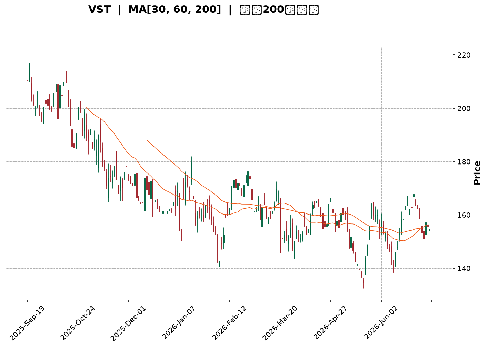
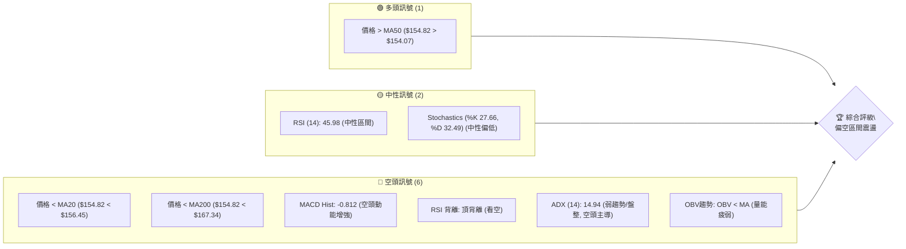
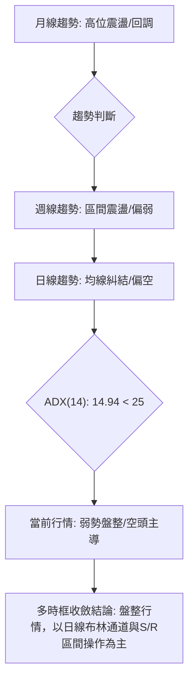
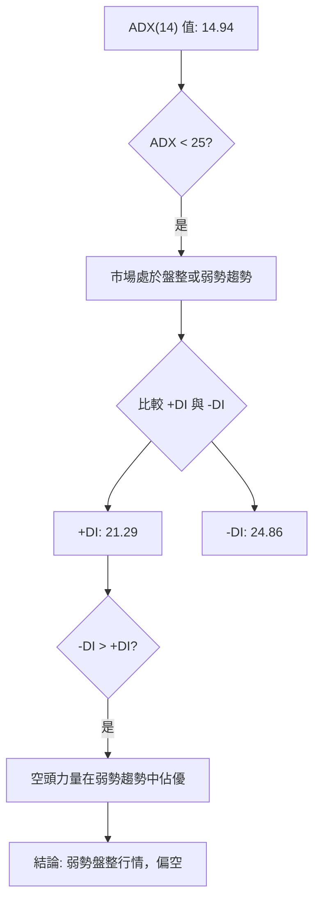
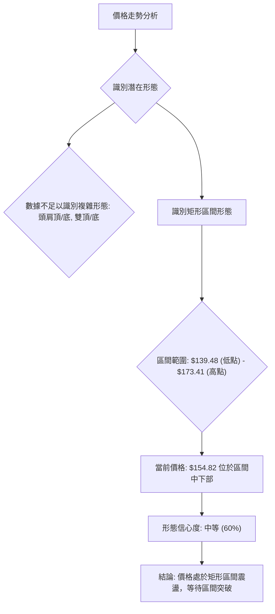
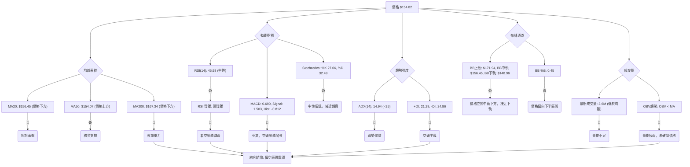
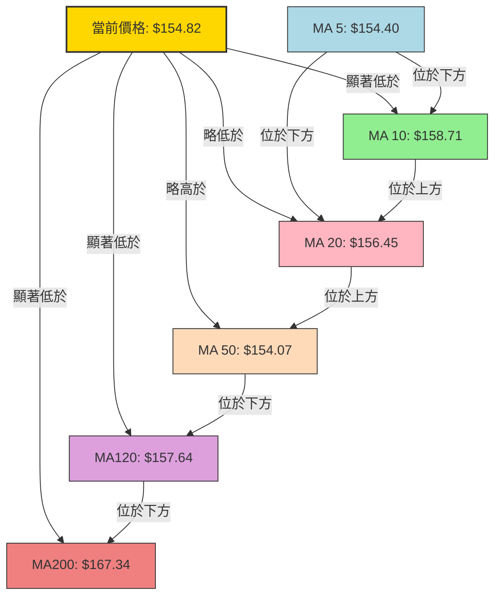
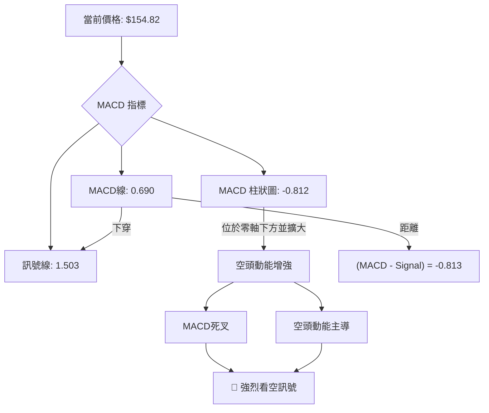
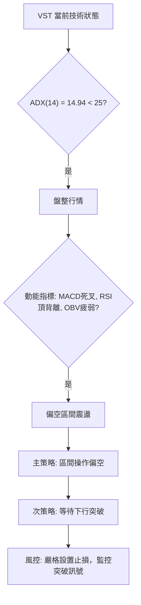
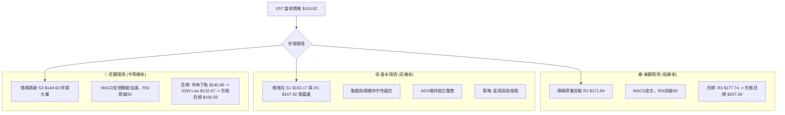

<details>
<summary>📊 靜態圖表 (點擊展開)</summary>

</details>

<html>
<head><meta charset="utf-8" /></head>
<body>
    <div style="height:500px; width:100%;">                        <script>window.PlotlyConfig = {MathJaxConfig: 'local'};</script>
        <script charset="utf-8" src="https://cdn.plot.ly/plotly-3.6.0.min.js" integrity="sha256-QaOVwtVY0T02VaHrr6pnoHLCwayMJp4O5n4YyaE3rJk=" crossorigin="anonymous"></script>                <div id="candlestick-chart" class="plotly-graph-div" style="height:100%; width:100%;"></div>            <script>                window.PLOTLYENV=window.PLOTLYENV || {};                                if (document.getElementById("candlestick-chart")) {                    Plotly.newPlot(                        "candlestick-chart",                        [{"close":{"dtype":"f8","bdata":"AAAAoOtMakAAAADghCBrQAAAACCTbGlAAAAAoBonaUAAAAAAFRlpQAAAACCKy2lAAAAAgM+jaEAAAABAcGNoQAAAAKCTFWlAAAAAoOc5aUAAAACA3yRpQAAAAOCF8mhAAAAA4FjZaEAAAAAgMLZpQAAAAEAhJGpAAAAA4GSBaEAAAAAgyhVqQAAAAKALlWlAAAAAoDc\u002fakAAAABg4DBqQAAAAIB6EGlAAAAAwOYtaEAAAADg4jdnQAAAAODlIWdAAAAAQHHSZ0AAAABgTRRpQAAAAGAmz2hAAAAAAJa5Z0AAAABgYdFoQAAAAOCKnWdAAAAAQJxwZ0AAAAAgqQdoQAAAAKAHH2dAAAAAYFiTZ0AAAACgVvtmQAAAAOCmxmdAAAAA4PhvZ0AAAADgV01mQAAAAED7MGZAAAAAwCZbZUAAAACA5b5lQAAAAIDGyGVAAAAAwEq2ZUAAAACAtExmQAAAACA3omVAAAAAgIH8ZEAAAACgPM1lQAAAAAA1RGVAAAAAACMCZkAAAABgyENmQAAAAIBvnWVAAAAAQLN6ZUAAAAAABV5lQAAAAIDf6mVAAAAAAEHPZEAAAAAgy61kQAAAAAAMhGRAAAAA4ISPZEAAAABAB7xlQAAAACCgLGVAAAAAwKvxZEAAAACAYZdlQAAAAEDP6WNAAAAAAGOvZEAAAADgUktkQAAAAAD6I2RAAAAA4ConZEAAAAAgbDBkQAAAAOAqJ2RAAAAAwJcsZEAAAADAe0VkQAAAAEBRHGRAAAAA4MWYZEAAAABAYE9kQAAAAGD+IWVAAAAAQI1FY0AAAADA58ViQAAAAAAnvWRAAAAAAFODZUAAAACATl5lQAAAAIAfEGVAAAAAgNp1ZkAAAAAAfsRkQAAAAKATjGNAAAAAYIPyY0AAAAAAXf1jQAAAAEC09WNAAAAAYObLY0AAAACg0XlkQAAAAGDbpWRAAAAAIDVEZEAAAACAOL1jQAAAAICzOmNAAAAAQH4SY0AAAADgDsRhQAAAACCc1WFAAAAAoJanYkAAAAAgiRFjQAAAAEAc5WNAAAAAYKn2Y0AAAAAgzVRkQAAAAGCKYGVAAAAAYG2mZUAAAACgLkNlQAAAAIDFgGVAAAAAAKtdZUAAAABAyepkQAAAAGCwZGVAAAAAAArcZUAAAABgoQpmQAAAAOAgrWVAAAAAwAaxZEAAAADgHyhkQAAAACAZXWRAAAAAgAXeZEAAAABAy8ZjQAAAACBlZWRAAAAAQEl+ZEAAAACgEddjQAAAAOB45GNAAAAAAF7QY0AAAAAgYTFkQAAAAIANfGRAAAAAQNI0ZUAAAACAEN1kQAAAAAAbOmJAAAAAgILiYkAAAACgNBBjQAAAACCK6WJAAAAA4MgCY0AAAAAAZ2hjQAAAAGCtamJAAAAAINXDYkAAAACg1DdjQAAAAKD+3mJAAAAAoBjsYkAAAADg4S5jQAAAAACBdWNAAAAAICoRY0AAAACAb1BjQAAAAABSv2NAAAAAwLN3ZEAAAADgyVZkQAAAAGCNqWRAAAAAwGdnZEAAAADgDuxjQAAAACAwVmNAAAAA4E5yY0AAAABgLpRjQAAAAIDYg2RAAAAAABvLZEAAAABAoRxkQAAAAMBlMmNAAAAAANGzY0AAAADgAmJjQAAAAIAAFGRAAAAAoPsEZEAAAABAMsJjQAAAAMCCN2NAAAAAAG5wYkAAAADAy\u002fpiQAAAAIBEVWJAAAAAYCPNYUAAAAAgc7ZhQAAAAGCCb2FAAAAAYOERYUAAAAAgsdBgQAAAAGCO+WFAAAAAgOObYkAAAACgpYFjQAAAAECOimRAAAAAIKL9Y0AAAACgyQFkQAAAAIAwAGRAAAAA4GRRY0AAAACA+LdjQAAAAKC3MmNAAAAAoIUvY0AAAACgqZFiQAAAAOA5VmJAAAAAIH9AYkAAAACAFEthQAAAACCcRWJAAAAAIAR6YkAAAAAgxSljQAAAACBszGNAAAAAwHPTY0AAAAAgrHBkQAAAAOBR6GRAAAAA4HpMZEAAAAAA11tkQAAAAOCj+GRAAAAAIK5vZEAAAAAAKUxkQAAAAAAp1GNAAAAAwB4lY0AAAACgmeFiQAAAAEAKp2NAAAAAIFx3Y0AAAACAPVpjQA=="},"high":{"dtype":"f8","bdata":"Wf+DJoCeakBJy6kyEV1rQIqTlz0+fGpAOn2byZ6qaUDpIHkuNm1pQMs0vlx21GlABjVRP5PIaUD\u002fgAQFZPVoQMA7cw6QgmlAhL5QCMuEaUD3dKDQgCpqQDKxqyIq4mlAOIVSC6tfaUD3\u002fSqWGbhpQJkZgWU6RmpApV+nzadvakD2g\u002f5IiSJqQJc3t4V7\u002f2lASHr99nLkakAJ0689YwZrQPHYMUy5JWpARlkFELqUaUBBhMYyxRNoQC8bM9DZlmdA8tQGbeTsZ0CnH1QeMSVpQHL6Rl4XWmlAxpn+xOSPaEAVEzVLuPxoQB8umXvav2hAUh\u002fIjuECaEDEOS30LExoQHGn7kRE1mdAbmjz76f1Z0CYgFu9vYpnQMRyt7MKyWdA\u002fC6xR3t\u002faEA4wSlUI2VnQKvztQ6KkWZAWwRKLxonZkCW1HyYHGhmQLEpo8\u002fQWGZAbUpl0+QVZkCs4Vdx6ZdmQOMAi4MokGdANKv70bWeZUB1QC0WJs9lQAljkbYrwGVAAhiFGWkgZkDGT5o7poBmQNAwCEPw92VAKDZFfAznZUB8rF3BIKRlQNEtulr4KWZAMBxL+Lf8ZUBNEBze9+NkQGTvjPmRJmVAzyfbPpuqZEAQ9cQFRcVlQAjDJoYcaGZAoli3XgqJZUCAgEBRraZlQN4l9Xg8zWVAF1zOpJ9mZUCS8PoqX1ZlQP1gbxNqe2RAL5U2v\u002fJnZED\u002fqwsAXkRkQFPdHzGcUWRAZjJLiud3ZEBopEtOhlNkQCZgUjt6gWRAp7b59wMaZUBN6ilQzmVlQGnwWiRIhGVADJZ2N+kFZUBE4m2b2GtjQI4l+vVAyGVAMDl4uxMIZkCwF9cr6d5lQIyfx82lVmVAQx95ts3BZkB5BYeYu1RlQL9AyW5YsWRAHYwfVA8xZEBiVUbpkGFkQGW0bhl2TWRAw3xmeVObZECm6jGdToVkQEoXNTU3w2RAxGbJ+FbtZECO8DJCeoFkQOqEa3k88WNAB1yxJi+CY0CvAnb7jSdjQNPBIGRq8GFABHBsw+D6YkBU0nYeNWtjQKg1I34wH2RAOMhnglObZEDZvnb2C7hkQH14cCj3ZWVA583ygDQFZkB0Xxa1geBlQDMz92oBg2VA6vbbya6gZUBLNqGRtWtlQOd\u002f4ISaZmVAj8lZRIzuZUBZsPm7thdmQBRRGZstOmZAbfWfhQ4BZkCHAxzkhWJkQKOUHio5eGRAPyMoHjbwZED\u002fpuOZS\u002f1kQNZEY0yghWRAH\u002fXO6GAKZUD8+7HWM3FkQGr0MxD+V2RAPFB2lxeZZEDlyrbfkGFkQO3BNvYcoGRAR1FHKbqQZUAGcUJaOiRlQBLbDReXx2RAKP1\u002f0NJ1Y0CsEKnQTTxjQMnRnNhUt2NA\u002fbnmopsOY0AmnuYtO\u002f9jQDxygsOl1mNAkD6M8ELoYkC2cS484oNjQNmGlecAS2NAt5PhJIIcY0C6bzOgOD5jQAZrlYizImRA8CFS1q9JZEBedA6yD81jQAq8WAHZD2RAcz8APpChZEDlS+M8MMlkQGrTXFP41WRAFKUg4CMIZUCXUVpFQnpkQCk\u002fmrb9G2RAx48q73DbY0B3r+b7utRjQO2YHW70p2RAd8+tK+cFZUB7R3RdF2NkQOYAlq48HWRANaBGPgTtY0A5swBTUP1jQDpCyrjkRGRA\u002fCy2EUVyZEC+dxHoYlhkQFDM6dPxBGVAunURWhBZY0Ch9xobKhFjQKvCgvGbw2JADqrM9GlCYkBZFcYEB+NhQBJH9fiQnGFAIfOYCQlrYUBUh9ZTSBBhQKountBQFmJA6u50lUeiYkCkz2NbMKtjQKQP0fZO5WRAKSwZ0FGZZECFWNRkpGlkQLrBeGYEQmRAYUJ4NIHKY0DNoM\u002fOwxFkQI9n\u002fqkNtmNAvcvm+mI6Y0B4\u002f3EFYEJjQFtCdEHromJAiBs6wt\u002fCYkDg5SFTjvlhQOkUD+s5VmJAErqv1kPJYkB\u002f1sKDcWdjQL3COj8iKGRAFzVshM9GZEA+fr7hQUNlQAAAAAAAUGVAAAAAYGa6ZEAAAADgerRkQAAAAEAza2VAAAAAgML9ZEAAAABAM7NkQAAAAGBmrmRAAAAAgD2qY0AAAAAgrodjQAAAACCup2NAAAAAwB7tY0AAAADgpY9jQA=="},"hovertemplate":"\u003cb\u003e%{x|%Y-%m-%d}\u003c\u002fb\u003e\u003cbr\u003e\u958b: $%{open:.2f}\u003cbr\u003e\u9ad8: $%{high:.2f}\u003cbr\u003e\u4f4e: $%{low:.2f}\u003cbr\u003e\u6536: $%{close:.2f}\u003cextra\u003e\u003c\u002fextra\u003e","low":{"dtype":"f8","bdata":"pLusW6iKaUA2B7KyBd5pQOt8EOC3U2lA7bWJlAwhaUBD2UJ5TmZoQKbruf+vBGlAxdp3hymcaECUb29ZF71nQNgz77Lv62dA6EHjHFm8aECGfeEFQhVpQEcTvN6Ok2hAHk+2pVJiaECPdm4YgeloQADgPh54j2lAycT8rcGAaEBvN40fNPJoQOIAYyMSEmlAW6BnUGixaUDnVw1NMfppQGzMtgoN52hAm2nITzwAaEBVzavGnBlnQIO2mjb1XGZAt1H46xIeZ0Awlt\u002fHXzloQJ1NbOHrdWhAgwnm7I72ZkDdk4\u002f65JVnQON8eOBBeGdA+szA5UjYZkBPmRpXJGJnQAMTC6GD92ZAt8kzhzcFZ0BQIx9OIllmQPL0dFvD+2VAssVq2q3sZkD\u002fhSuEMEJmQJvmmkvAEWZA77VxdQI6ZUAK5+bhlZxkQFbLL1\u002fdjGVAP9iunng+ZUCNZ9UI669lQLTvTOwujWVAOW9MsYU4ZECjlBhsyKZkQGznWCrxpmRA6MK39r+LZUDrlP0AsihmQJLBoWYpf2VA2GOdAvBUZUDN+UFb+gdlQGFiKZpyOGVA+stRaPK4ZEBkxt6cJWxkQAh71Vd\u002fgWRAu4tkhb6\u002fY0A7iMiX8wpkQERnuTXF2WRAHZXnBTPJZEAl8Xssf7tkQBI4B4ZWwWNAjaaY6dk\u002fZEDfJDC2zkBkQPrOqAUADWRAHAXODQb2Y0BygFEeiepjQLiA9lQL\u002fWNAThf1LHPvY0Apj52BsxNkQF1kbpzOGGRAIH3K6AJuZEAMQKAs8PdjQMmXLFOAamRA2E\u002fhlLkjY0BCs5Ld6JhiQE+O6hKErWRA27pxGhN0ZEDeLVbvKEtlQAmuEN7wsmRA7ODHmJpmZUCQ593C7VFkQPTB5Mc0emNAE556oBArY0Ag9Jf4v9ZjQBerkikNsmNAsPTxMNyuY0DO68WV1rZjQHJvtn\u002fkFmRAL4KNMSXKY0BH+6sMrI1jQE98s5JcM2NAx\u002fGicES\u002fYkBRynpTWFxhQJB\u002fnfq6RGFAoVD\u002f5WxgYkApz03r6WtiQHI0YcFATGNAHHjeaJrDY0BPK3elo\u002f5jQLSsTge+IWRAohwHjGUvZUBjWzTyiyRlQM3MzIwl+WRAKavMfRQRZUDS0w6JIphkQO4nQubHTWRAWETgk4szZUBvC+I+CHVkQBcNLq1kTWVAxKe3neurZEBwYIuz2hFjQLUutqWj\u002fmNAZU26hXwnZEBsqukIoLtjQJ\u002flsfBQUmNAo+ClJUF7ZEA51wNBGldjQJfjhPaQiGNASUClUm+pY0AeewidYvVjQF\u002fyRRKHNWRAkW21qWOhZEDCtHuW3HhkQPzSGyIUFGJAMJxIpQmkYkDIghxR6KpiQOtADzJuxWJA9Usz7x9JYkASHMOaNfFiQNFCycSjTGJAiLqFiYLEYUDwOsZTBuZiQKymnUQfvWJAen379nO1YkBI+6kTPMJiQDOfqJ9UYmNAyEFPbe0OY0AxzB4PqxxjQGb9A\u002fX3DWNAg3SBR90DZEAs990siz1kQKeo3jM+TGRAlLte\u002fw5BZEDZnOTJJ8NjQEHjf09DPWNAUI5+14FWY0Cy3fMLFkljQAHJlGTbXWNA3MG7n2rQY0A2uGT+789jQFfgSKK1G2NA9swxDGRwY0Bi23ei01ZjQFKs7NAIp2NAeKEM5XLyY0AVqkw8MYxjQJ\u002f43E\u002fCMWNAWqwzWshYYkDweaqfWUJiQFPafhyaLmJATeGNoxNqYUDmVQIJPndhQFW5CMzAM2FAMX2ym4e1YEBFRir8Lo9gQFW9NsnAM2FA2zmWPa0VYkC8U+f8QNFiQAsFCaL1v2NAx0+ltPfFY0AkQ4fTJaxjQGrbzMAjlWNA1Ueoq8njYkCz\u002f\u002f2PURVjQFVD8ByOF2NAkYOr9Vu\u002fYkBRAlovZmliQIzw+hScRWJA9W52HfKqYUAAGpvX8jZhQGkiR6P+a2FACw9272tZYkDj7yV5PsFiQEGD35a4E2NANWUyT6+fY0AyEYV9zPljQAAAAMDMXGRAAAAA4KPkY0AAAAAAKfxjQAAAAOBRwGRAAAAAgBRmZEAAAADgoyBkQAAAAOBRkGNAAAAAoJnhYkAAAAAAAJBiQAAAAOBRAGNAAAAA4FFAY0AAAACAPepiQA=="},"name":"\u50f9\u683c","open":{"dtype":"f8","bdata":"aAFvR7NRakCCwbVa\u002f0NqQJJ2h7GiJ2pAtjcUO1hNaUB\u002ftxb9uKVoQMmDSsayC2lAWHjTDzElaUDsKdcGpctoQMHL5eweRmhAYEMuRjNmaUBHeZ1xFHBpQA37M4XCqWlAGxF8H30XaUCs0tu6zhdpQMzMzCyHxGlAo5wpWnscakAMKjzpJQlpQEB4qtz3nWlAOl5P23UOakCebloZxrxqQM47LCjh2WlAIHvRmxFpaUDjiWjrjwJoQHYgS7C1WGdAt1H46xIeZ0DM0NjUG3loQHL6Rl4XWmlAxpn+xOSPaEBU4zo0FPBnQCLOXCTsO2hA2YR\u002f64TmZ0CqzoLDmMBnQBiFtpE8amdAZ3lst5kvZ0DKtphGNcRmQHgZU45POGZA8pIPO78\u002faECnihoVxCRnQF6dQcOgcmZA\u002flLLO6QFZkDVDAqmks9kQOqgLGR61mVA3QmdqzR+ZUAJWPGY381lQKIOmEG2AWdAswulZSxpZUD6Fn58vBtlQFK+6gt1q2VAHn6tgOioZUA3U1h+PkhmQNZW4vr16GVA\u002frb3i4XVZUAVYG2vNH5lQBA5PW38ZWVA\u002fO4JlTb5ZUBNEBze9+NkQIWcS3nklWRAg9Nlue+UZEDWOUICGCxkQHRxfvolz2VAwiOPGsSHZUC2HdHmrr5kQOejUt05qWVAYkm6cyKfZEAhBznQRsBkQK0495SFcWRAPiCCAvojZECf4vfLdxFkQAAAAOAqJ2RAm3TFe8kRZEDiuBTDsjFkQMT3T34ZTmRAIH3K6AJuZECRemU04xxlQH\u002fKW5oUEWVADJZ2N+kFZUCDfXhpS1pjQENNHnoru2VAxyDnBOeGZEDtmwORo7BlQH5xCqKGHWVAtKXfQ7qQZUCrBJHnzuJkQKEUaTRnGmRA4gOXM0jSY0B7d67kdi9kQJBFQPbf8WNAX5qV5bMEZEDEj2j5POJjQAMSKV1YsWRAVuHzvBGwZECJOzEPviFkQFAKQ8LhpmNA9J43vQ52Y0BHkL1ajhhjQKI0NWiNk2FAa9D79sGyYkBu+0D\u002fwbJiQP8aiquj\u002fmNAK3\u002frA2+RZEBVXiyQKwlkQMVgM3B2PmRAXr5uJxNNZUCzq6VB9bBlQM3MrsgeLmVAfkzCiGN6ZUDlgIFQakVlQOpTkTUx2mRAHO8DOfF8ZUADs1tlZFxlQF4E1+mM0GVAtfGq2l83ZUAHU9M5zidkQOHVtkCdJGRAX7WIgN4tZECAT2jL4X9kQGTymVkJb2NATPyx7eucZED\u002f3yTHwWRkQHS+91+xlGNAXasA\u002fgkqZEDE9tBfyRFkQLZHLfqLS2RAj1tLA16pZEB0WhWlrtZkQBLbDReXx2RAmxHEap\u002fnYkBVWETc3MpiQIN5bkQQWWNAFtysU0+pYkASHMOaNfFiQMNnenornGNAEtlGKlz2YUD9knYGQ+hiQICb+if032JA9OUFTYXaYkDcdrDGettiQAVs6HLOEGRAPQVdB4F1Y0C1llR3ISljQGb9A\u002fX3DWNAatE0H9pFZEDBGUQMmKhkQBLbfh\u002fgimRAu4FBLOHAZEBtoxW6TVpkQJjXwDsgEWRASUIb2YmyY0BLmyKyvXdjQE18AoCQg2NAdODPuZ2YZECDL+ZwukhkQKC43UBSFGRAUnbWIUmCY0AWdODp1cJjQCU9uPMFr2NAQPX8m7RYZEBC+YzonChkQAgE1t37WWRAunURWhBZY0DUzoWFYHliQPplZZz9qGJADqrM9GlCYkA7DQJV1aVhQL8gZYmLcmFArLtFmcdZYUBrpU3jhfNgQAAAABzTOWFA\u002fMREu4coYkDwR7uHM9piQMfGYjoC1mNAKozppVaXZECvggyfxdNjQEMghwLX+GNAwtBlVvmYY0BjyZkBGndjQLXtAdRQiWNADDiWnn\u002fqYkCvGpyhMvliQLf923hIg2JAMRzhS8yGYkAG62cFyeRhQMrc7v5emWFAVhuremB5YkCCqUriFBNjQJtjJ2ckIWNAh9cz6fvKY0DwVzxkoDtkQAAAAAApcGRAAAAAYI8CZEAAAADA9WBkQAAAAMAe3WRAAAAAIIW7ZEAAAABgZnZkQAAAAGCPUmRAAAAAAACAY0AAAABgZj5jQAAAAEAKD2NAAAAAACmEY0AAAAAgrj9jQA=="},"x":["2025-09-19T00:00:00-04:00","2025-09-22T00:00:00-04:00","2025-09-23T00:00:00-04:00","2025-09-24T00:00:00-04:00","2025-09-25T00:00:00-04:00","2025-09-26T00:00:00-04:00","2025-09-29T00:00:00-04:00","2025-09-30T00:00:00-04:00","2025-10-01T00:00:00-04:00","2025-10-02T00:00:00-04:00","2025-10-03T00:00:00-04:00","2025-10-06T00:00:00-04:00","2025-10-07T00:00:00-04:00","2025-10-08T00:00:00-04:00","2025-10-09T00:00:00-04:00","2025-10-10T00:00:00-04:00","2025-10-13T00:00:00-04:00","2025-10-14T00:00:00-04:00","2025-10-15T00:00:00-04:00","2025-10-16T00:00:00-04:00","2025-10-17T00:00:00-04:00","2025-10-20T00:00:00-04:00","2025-10-21T00:00:00-04:00","2025-10-22T00:00:00-04:00","2025-10-23T00:00:00-04:00","2025-10-24T00:00:00-04:00","2025-10-27T00:00:00-04:00","2025-10-28T00:00:00-04:00","2025-10-29T00:00:00-04:00","2025-10-30T00:00:00-04:00","2025-10-31T00:00:00-04:00","2025-11-03T00:00:00-05:00","2025-11-04T00:00:00-05:00","2025-11-05T00:00:00-05:00","2025-11-06T00:00:00-05:00","2025-11-07T00:00:00-05:00","2025-11-10T00:00:00-05:00","2025-11-11T00:00:00-05:00","2025-11-12T00:00:00-05:00","2025-11-13T00:00:00-05:00","2025-11-14T00:00:00-05:00","2025-11-17T00:00:00-05:00","2025-11-18T00:00:00-05:00","2025-11-19T00:00:00-05:00","2025-11-20T00:00:00-05:00","2025-11-21T00:00:00-05:00","2025-11-24T00:00:00-05:00","2025-11-25T00:00:00-05:00","2025-11-26T00:00:00-05:00","2025-11-28T00:00:00-05:00","2025-12-01T00:00:00-05:00","2025-12-02T00:00:00-05:00","2025-12-03T00:00:00-05:00","2025-12-04T00:00:00-05:00","2025-12-05T00:00:00-05:00","2025-12-08T00:00:00-05:00","2025-12-09T00:00:00-05:00","2025-12-10T00:00:00-05:00","2025-12-11T00:00:00-05:00","2025-12-12T00:00:00-05:00","2025-12-15T00:00:00-05:00","2025-12-16T00:00:00-05:00","2025-12-17T00:00:00-05:00","2025-12-18T00:00:00-05:00","2025-12-19T00:00:00-05:00","2025-12-22T00:00:00-05:00","2025-12-23T00:00:00-05:00","2025-12-24T00:00:00-05:00","2025-12-26T00:00:00-05:00","2025-12-29T00:00:00-05:00","2025-12-30T00:00:00-05:00","2025-12-31T00:00:00-05:00","2026-01-02T00:00:00-05:00","2026-01-05T00:00:00-05:00","2026-01-06T00:00:00-05:00","2026-01-07T00:00:00-05:00","2026-01-08T00:00:00-05:00","2026-01-09T00:00:00-05:00","2026-01-12T00:00:00-05:00","2026-01-13T00:00:00-05:00","2026-01-14T00:00:00-05:00","2026-01-15T00:00:00-05:00","2026-01-16T00:00:00-05:00","2026-01-20T00:00:00-05:00","2026-01-21T00:00:00-05:00","2026-01-22T00:00:00-05:00","2026-01-23T00:00:00-05:00","2026-01-26T00:00:00-05:00","2026-01-27T00:00:00-05:00","2026-01-28T00:00:00-05:00","2026-01-29T00:00:00-05:00","2026-01-30T00:00:00-05:00","2026-02-02T00:00:00-05:00","2026-02-03T00:00:00-05:00","2026-02-04T00:00:00-05:00","2026-02-05T00:00:00-05:00","2026-02-06T00:00:00-05:00","2026-02-09T00:00:00-05:00","2026-02-10T00:00:00-05:00","2026-02-11T00:00:00-05:00","2026-02-12T00:00:00-05:00","2026-02-13T00:00:00-05:00","2026-02-17T00:00:00-05:00","2026-02-18T00:00:00-05:00","2026-02-19T00:00:00-05:00","2026-02-20T00:00:00-05:00","2026-02-23T00:00:00-05:00","2026-02-24T00:00:00-05:00","2026-02-25T00:00:00-05:00","2026-02-26T00:00:00-05:00","2026-02-27T00:00:00-05:00","2026-03-02T00:00:00-05:00","2026-03-03T00:00:00-05:00","2026-03-04T00:00:00-05:00","2026-03-05T00:00:00-05:00","2026-03-06T00:00:00-05:00","2026-03-09T00:00:00-04:00","2026-03-10T00:00:00-04:00","2026-03-11T00:00:00-04:00","2026-03-12T00:00:00-04:00","2026-03-13T00:00:00-04:00","2026-03-16T00:00:00-04:00","2026-03-17T00:00:00-04:00","2026-03-18T00:00:00-04:00","2026-03-19T00:00:00-04:00","2026-03-20T00:00:00-04:00","2026-03-23T00:00:00-04:00","2026-03-24T00:00:00-04:00","2026-03-25T00:00:00-04:00","2026-03-26T00:00:00-04:00","2026-03-27T00:00:00-04:00","2026-03-30T00:00:00-04:00","2026-03-31T00:00:00-04:00","2026-04-01T00:00:00-04:00","2026-04-02T00:00:00-04:00","2026-04-06T00:00:00-04:00","2026-04-07T00:00:00-04:00","2026-04-08T00:00:00-04:00","2026-04-09T00:00:00-04:00","2026-04-10T00:00:00-04:00","2026-04-13T00:00:00-04:00","2026-04-14T00:00:00-04:00","2026-04-15T00:00:00-04:00","2026-04-16T00:00:00-04:00","2026-04-17T00:00:00-04:00","2026-04-20T00:00:00-04:00","2026-04-21T00:00:00-04:00","2026-04-22T00:00:00-04:00","2026-04-23T00:00:00-04:00","2026-04-24T00:00:00-04:00","2026-04-27T00:00:00-04:00","2026-04-28T00:00:00-04:00","2026-04-29T00:00:00-04:00","2026-04-30T00:00:00-04:00","2026-05-01T00:00:00-04:00","2026-05-04T00:00:00-04:00","2026-05-05T00:00:00-04:00","2026-05-06T00:00:00-04:00","2026-05-07T00:00:00-04:00","2026-05-08T00:00:00-04:00","2026-05-11T00:00:00-04:00","2026-05-12T00:00:00-04:00","2026-05-13T00:00:00-04:00","2026-05-14T00:00:00-04:00","2026-05-15T00:00:00-04:00","2026-05-18T00:00:00-04:00","2026-05-19T00:00:00-04:00","2026-05-20T00:00:00-04:00","2026-05-21T00:00:00-04:00","2026-05-22T00:00:00-04:00","2026-05-26T00:00:00-04:00","2026-05-27T00:00:00-04:00","2026-05-28T00:00:00-04:00","2026-05-29T00:00:00-04:00","2026-06-01T00:00:00-04:00","2026-06-02T00:00:00-04:00","2026-06-03T00:00:00-04:00","2026-06-04T00:00:00-04:00","2026-06-05T00:00:00-04:00","2026-06-08T00:00:00-04:00","2026-06-09T00:00:00-04:00","2026-06-10T00:00:00-04:00","2026-06-11T00:00:00-04:00","2026-06-12T00:00:00-04:00","2026-06-15T00:00:00-04:00","2026-06-16T00:00:00-04:00","2026-06-17T00:00:00-04:00","2026-06-18T00:00:00-04:00","2026-06-22T00:00:00-04:00","2026-06-23T00:00:00-04:00","2026-06-24T00:00:00-04:00","2026-06-25T00:00:00-04:00","2026-06-26T00:00:00-04:00","2026-06-29T00:00:00-04:00","2026-06-30T00:00:00-04:00","2026-07-01T00:00:00-04:00","2026-07-02T00:00:00-04:00","2026-07-06T00:00:00-04:00","2026-07-07T00:00:00-04:00","2026-07-08T00:00:00-04:00"],"type":"candlestick"},{"hovertemplate":"MA30: $%{y:.2f}\u003cextra\u003e\u003c\u002fextra\u003e","line":{"color":"#2196F3","dash":"dash","width":2},"mode":"lines","name":"MA30","x":["2025-09-19T00:00:00-04:00","2025-09-22T00:00:00-04:00","2025-09-23T00:00:00-04:00","2025-09-24T00:00:00-04:00","2025-09-25T00:00:00-04:00","2025-09-26T00:00:00-04:00","2025-09-29T00:00:00-04:00","2025-09-30T00:00:00-04:00","2025-10-01T00:00:00-04:00","2025-10-02T00:00:00-04:00","2025-10-03T00:00:00-04:00","2025-10-06T00:00:00-04:00","2025-10-07T00:00:00-04:00","2025-10-08T00:00:00-04:00","2025-10-09T00:00:00-04:00","2025-10-10T00:00:00-04:00","2025-10-13T00:00:00-04:00","2025-10-14T00:00:00-04:00","2025-10-15T00:00:00-04:00","2025-10-16T00:00:00-04:00","2025-10-17T00:00:00-04:00","2025-10-20T00:00:00-04:00","2025-10-21T00:00:00-04:00","2025-10-22T00:00:00-04:00","2025-10-23T00:00:00-04:00","2025-10-24T00:00:00-04:00","2025-10-27T00:00:00-04:00","2025-10-28T00:00:00-04:00","2025-10-29T00:00:00-04:00","2025-10-30T00:00:00-04:00","2025-10-31T00:00:00-04:00","2025-11-03T00:00:00-05:00","2025-11-04T00:00:00-05:00","2025-11-05T00:00:00-05:00","2025-11-06T00:00:00-05:00","2025-11-07T00:00:00-05:00","2025-11-10T00:00:00-05:00","2025-11-11T00:00:00-05:00","2025-11-12T00:00:00-05:00","2025-11-13T00:00:00-05:00","2025-11-14T00:00:00-05:00","2025-11-17T00:00:00-05:00","2025-11-18T00:00:00-05:00","2025-11-19T00:00:00-05:00","2025-11-20T00:00:00-05:00","2025-11-21T00:00:00-05:00","2025-11-24T00:00:00-05:00","2025-11-25T00:00:00-05:00","2025-11-26T00:00:00-05:00","2025-11-28T00:00:00-05:00","2025-12-01T00:00:00-05:00","2025-12-02T00:00:00-05:00","2025-12-03T00:00:00-05:00","2025-12-04T00:00:00-05:00","2025-12-05T00:00:00-05:00","2025-12-08T00:00:00-05:00","2025-12-09T00:00:00-05:00","2025-12-10T00:00:00-05:00","2025-12-11T00:00:00-05:00","2025-12-12T00:00:00-05:00","2025-12-15T00:00:00-05:00","2025-12-16T00:00:00-05:00","2025-12-17T00:00:00-05:00","2025-12-18T00:00:00-05:00","2025-12-19T00:00:00-05:00","2025-12-22T00:00:00-05:00","2025-12-23T00:00:00-05:00","2025-12-24T00:00:00-05:00","2025-12-26T00:00:00-05:00","2025-12-29T00:00:00-05:00","2025-12-30T00:00:00-05:00","2025-12-31T00:00:00-05:00","2026-01-02T00:00:00-05:00","2026-01-05T00:00:00-05:00","2026-01-06T00:00:00-05:00","2026-01-07T00:00:00-05:00","2026-01-08T00:00:00-05:00","2026-01-09T00:00:00-05:00","2026-01-12T00:00:00-05:00","2026-01-13T00:00:00-05:00","2026-01-14T00:00:00-05:00","2026-01-15T00:00:00-05:00","2026-01-16T00:00:00-05:00","2026-01-20T00:00:00-05:00","2026-01-21T00:00:00-05:00","2026-01-22T00:00:00-05:00","2026-01-23T00:00:00-05:00","2026-01-26T00:00:00-05:00","2026-01-27T00:00:00-05:00","2026-01-28T00:00:00-05:00","2026-01-29T00:00:00-05:00","2026-01-30T00:00:00-05:00","2026-02-02T00:00:00-05:00","2026-02-03T00:00:00-05:00","2026-02-04T00:00:00-05:00","2026-02-05T00:00:00-05:00","2026-02-06T00:00:00-05:00","2026-02-09T00:00:00-05:00","2026-02-10T00:00:00-05:00","2026-02-11T00:00:00-05:00","2026-02-12T00:00:00-05:00","2026-02-13T00:00:00-05:00","2026-02-17T00:00:00-05:00","2026-02-18T00:00:00-05:00","2026-02-19T00:00:00-05:00","2026-02-20T00:00:00-05:00","2026-02-23T00:00:00-05:00","2026-02-24T00:00:00-05:00","2026-02-25T00:00:00-05:00","2026-02-26T00:00:00-05:00","2026-02-27T00:00:00-05:00","2026-03-02T00:00:00-05:00","2026-03-03T00:00:00-05:00","2026-03-04T00:00:00-05:00","2026-03-05T00:00:00-05:00","2026-03-06T00:00:00-05:00","2026-03-09T00:00:00-04:00","2026-03-10T00:00:00-04:00","2026-03-11T00:00:00-04:00","2026-03-12T00:00:00-04:00","2026-03-13T00:00:00-04:00","2026-03-16T00:00:00-04:00","2026-03-17T00:00:00-04:00","2026-03-18T00:00:00-04:00","2026-03-19T00:00:00-04:00","2026-03-20T00:00:00-04:00","2026-03-23T00:00:00-04:00","2026-03-24T00:00:00-04:00","2026-03-25T00:00:00-04:00","2026-03-26T00:00:00-04:00","2026-03-27T00:00:00-04:00","2026-03-30T00:00:00-04:00","2026-03-31T00:00:00-04:00","2026-04-01T00:00:00-04:00","2026-04-02T00:00:00-04:00","2026-04-06T00:00:00-04:00","2026-04-07T00:00:00-04:00","2026-04-08T00:00:00-04:00","2026-04-09T00:00:00-04:00","2026-04-10T00:00:00-04:00","2026-04-13T00:00:00-04:00","2026-04-14T00:00:00-04:00","2026-04-15T00:00:00-04:00","2026-04-16T00:00:00-04:00","2026-04-17T00:00:00-04:00","2026-04-20T00:00:00-04:00","2026-04-21T00:00:00-04:00","2026-04-22T00:00:00-04:00","2026-04-23T00:00:00-04:00","2026-04-24T00:00:00-04:00","2026-04-27T00:00:00-04:00","2026-04-28T00:00:00-04:00","2026-04-29T00:00:00-04:00","2026-04-30T00:00:00-04:00","2026-05-01T00:00:00-04:00","2026-05-04T00:00:00-04:00","2026-05-05T00:00:00-04:00","2026-05-06T00:00:00-04:00","2026-05-07T00:00:00-04:00","2026-05-08T00:00:00-04:00","2026-05-11T00:00:00-04:00","2026-05-12T00:00:00-04:00","2026-05-13T00:00:00-04:00","2026-05-14T00:00:00-04:00","2026-05-15T00:00:00-04:00","2026-05-18T00:00:00-04:00","2026-05-19T00:00:00-04:00","2026-05-20T00:00:00-04:00","2026-05-21T00:00:00-04:00","2026-05-22T00:00:00-04:00","2026-05-26T00:00:00-04:00","2026-05-27T00:00:00-04:00","2026-05-28T00:00:00-04:00","2026-05-29T00:00:00-04:00","2026-06-01T00:00:00-04:00","2026-06-02T00:00:00-04:00","2026-06-03T00:00:00-04:00","2026-06-04T00:00:00-04:00","2026-06-05T00:00:00-04:00","2026-06-08T00:00:00-04:00","2026-06-09T00:00:00-04:00","2026-06-10T00:00:00-04:00","2026-06-11T00:00:00-04:00","2026-06-12T00:00:00-04:00","2026-06-15T00:00:00-04:00","2026-06-16T00:00:00-04:00","2026-06-17T00:00:00-04:00","2026-06-18T00:00:00-04:00","2026-06-22T00:00:00-04:00","2026-06-23T00:00:00-04:00","2026-06-24T00:00:00-04:00","2026-06-25T00:00:00-04:00","2026-06-26T00:00:00-04:00","2026-06-29T00:00:00-04:00","2026-06-30T00:00:00-04:00","2026-07-01T00:00:00-04:00","2026-07-02T00:00:00-04:00","2026-07-06T00:00:00-04:00","2026-07-07T00:00:00-04:00","2026-07-08T00:00:00-04:00"],"y":{"dtype":"f8","bdata":"AAAAAAAA+H8AAAAAAAD4fwAAAAAAAPh\u002fAAAAAAAA+H8AAAAAAAD4fwAAAAAAAPh\u002fAAAAAAAA+H8AAAAAAAD4fwAAAAAAAPh\u002fAAAAAAAA+H8AAAAAAAD4fwAAAAAAAPh\u002fAAAAAAAA+H8AAAAAAAD4fwAAAAAAAPh\u002fAAAAAAAA+H8AAAAAAAD4fwAAAAAAAPh\u002fAAAAAAAA+H8AAAAAAAD4fwAAAAAAAPh\u002fAAAAAAAA+H8AAAAAAAD4fwAAAAAAAPh\u002fAAAAAAAA+H8AAAAAAAD4fwAAAAAAAPh\u002fAAAAAAAA+H8AAAAAAAD4f+\u002fu7v5pCWlAMzMz8wDxaECamZk5k9ZoQBEREXHswmhAiYiICHe1aEB3d3cnaKNoQBEREWEtkmhA3t3dfeqHaEARERHhHHZoQCIiIiJtXWhAREREtGY8aEB3d3fnZh9oQO\u002fu7g5pBGhAIiIiUqTpZ0CamZmZhsxnQM3MzNwPpmdAiYiISAiIZ0CJiIgIe2NnQERERBSnPmdAmpmZuXsaZ0DNzMzs+vhmQAAAAKCL22ZAAAAAYIHEZkBmZma2tbRmQCIiIqJXqmZAMzMz06KQZkAzMzPzFWtmQAAAAPByRmZA3t3dXXIrZkAAAACQIhFmQAAAAPBN\u002fGVAd3d3pwHnZUB3d3d3MtJlQImIiLjStmVAiYiIaCieZUCamZlZOYdlQGZmZpYzaGVAiYiIuCxMZUDNzMzcJDplQM3MzAzAKGVAd3d3N6oeZUAAAACgFRJlQDMzM3PNA2VAVVVVBUn6ZEDv7u6+TulkQGZmZpYI5WRAiYiI2GbWZEDv7u6ujrxkQHd3dzcOuGRAVVVVFdSzZEAzMzPjLaxkQFVVVQV4p2RAIiIiMtevZECJiIgYuapkQJqZmRl\u002flmRAIiIiciOPZECJiIjoQYlkQAAAAECDhGRAd3d39\u002f19ZEAiIiJyQHNkQLy7u2vCbmRAMzMzM\u002fpoZECJiIgILFlkQGZmZsZVU2RAq6qqapJFZEBVVVUV\u002fy9kQJqZmUlRHGRAREREFIgPZECrqqr69wVkQKuqqkrEA2RAREREFPgBZECrqqrKegJkQO\u002fu7n5JDWRAvLu7i0YWZEBmZmYGZx5kQLy7u8uPIWRAd3d3p24zZEAAAABwukVkQFVVVRVQS2RA3t3dHUVOZEDNzMycA1RkQERERGQ\u002fWWRARERERCdKZEDe3d3t8ERkQERERJToS2RAAAAAQMJTZEB3d3eX8FFkQAAAALCpVWRAq6qq6ptbZEDe3d0dL1ZkQGZmZua8T2RAVVVVZeBLZEDe3d2dv09kQBEREdF1WmRAERER0atsZEDe3d3NGodkQN7d3V10imRAmpmZKWuMZEAAAADQX4xkQDMzMxP9g2RA3t3d\u002fdt7ZECJiIi4+nNkQO\u002fu7p63WmRAIiIi8hhCZEAzMzMDpzBkQDMzM3MxGmRAzczMPFcFZEAiIiJCi\u002fZjQN7d3a0J5mNAq6qqajXOY0DNzMx877ZjQImIiKh5pmNA3t3dfZCkY0ARERGxHqZjQJqZmRmrqGNAiYiI6LakY0BVVVXl9KVjQImIiJjqnGNAmpmZ2fuTY0AzMzMTwZFjQAAAABARl2NAIiIismyfY0AiIiKiu55jQDMzM5O+k2NAMzMzM+mGY0DNzMycRnpjQHd3d4cSimNAvLu7O8GTY0BmZmYWsJljQBEREXFJnGNAvLu7i2iXY0DNzMw8wZNjQKuqqooKk2NAq6qqatGKY0BVVVXV+H1jQFVVVfW4cWNAERERUephY0De3d19tU1jQFVVVUULQWNAREREhCI9Y0BERER0xj5jQKuqqrqMRWNAMzMzE3tBY0C8u7u7pT5jQBEREYEAOWNAREREJLwvY0CamZmp\u002fy1jQKuqqvrQLGNAIiIiEpcqY0C8u7sL+SFjQBEREbFiD2NARERE1LL5YkCrqqqapeFiQERERATB2WJAERERQUvPYkBERERUa81iQERERIQIy2JAq6qq2mHJYkB3d3e3Ms9iQFVVVQWg3WJAERERUX7tYkBVVVX1QvliQDMzMyPGD2NAq6qqOkImY0AzMzPTUDxjQHd3d8e8UGNAZmZmBnJiY0AAAABgE3RjQN7d3U1kgmNAAAAAILWJY0CrqqraZIhjQA=="},"type":"scatter"},{"hovertemplate":"MA60: $%{y:.2f}\u003cextra\u003e\u003c\u002fextra\u003e","line":{"color":"#9C27B0","dash":"dash","width":2},"mode":"lines","name":"MA60","x":["2025-09-19T00:00:00-04:00","2025-09-22T00:00:00-04:00","2025-09-23T00:00:00-04:00","2025-09-24T00:00:00-04:00","2025-09-25T00:00:00-04:00","2025-09-26T00:00:00-04:00","2025-09-29T00:00:00-04:00","2025-09-30T00:00:00-04:00","2025-10-01T00:00:00-04:00","2025-10-02T00:00:00-04:00","2025-10-03T00:00:00-04:00","2025-10-06T00:00:00-04:00","2025-10-07T00:00:00-04:00","2025-10-08T00:00:00-04:00","2025-10-09T00:00:00-04:00","2025-10-10T00:00:00-04:00","2025-10-13T00:00:00-04:00","2025-10-14T00:00:00-04:00","2025-10-15T00:00:00-04:00","2025-10-16T00:00:00-04:00","2025-10-17T00:00:00-04:00","2025-10-20T00:00:00-04:00","2025-10-21T00:00:00-04:00","2025-10-22T00:00:00-04:00","2025-10-23T00:00:00-04:00","2025-10-24T00:00:00-04:00","2025-10-27T00:00:00-04:00","2025-10-28T00:00:00-04:00","2025-10-29T00:00:00-04:00","2025-10-30T00:00:00-04:00","2025-10-31T00:00:00-04:00","2025-11-03T00:00:00-05:00","2025-11-04T00:00:00-05:00","2025-11-05T00:00:00-05:00","2025-11-06T00:00:00-05:00","2025-11-07T00:00:00-05:00","2025-11-10T00:00:00-05:00","2025-11-11T00:00:00-05:00","2025-11-12T00:00:00-05:00","2025-11-13T00:00:00-05:00","2025-11-14T00:00:00-05:00","2025-11-17T00:00:00-05:00","2025-11-18T00:00:00-05:00","2025-11-19T00:00:00-05:00","2025-11-20T00:00:00-05:00","2025-11-21T00:00:00-05:00","2025-11-24T00:00:00-05:00","2025-11-25T00:00:00-05:00","2025-11-26T00:00:00-05:00","2025-11-28T00:00:00-05:00","2025-12-01T00:00:00-05:00","2025-12-02T00:00:00-05:00","2025-12-03T00:00:00-05:00","2025-12-04T00:00:00-05:00","2025-12-05T00:00:00-05:00","2025-12-08T00:00:00-05:00","2025-12-09T00:00:00-05:00","2025-12-10T00:00:00-05:00","2025-12-11T00:00:00-05:00","2025-12-12T00:00:00-05:00","2025-12-15T00:00:00-05:00","2025-12-16T00:00:00-05:00","2025-12-17T00:00:00-05:00","2025-12-18T00:00:00-05:00","2025-12-19T00:00:00-05:00","2025-12-22T00:00:00-05:00","2025-12-23T00:00:00-05:00","2025-12-24T00:00:00-05:00","2025-12-26T00:00:00-05:00","2025-12-29T00:00:00-05:00","2025-12-30T00:00:00-05:00","2025-12-31T00:00:00-05:00","2026-01-02T00:00:00-05:00","2026-01-05T00:00:00-05:00","2026-01-06T00:00:00-05:00","2026-01-07T00:00:00-05:00","2026-01-08T00:00:00-05:00","2026-01-09T00:00:00-05:00","2026-01-12T00:00:00-05:00","2026-01-13T00:00:00-05:00","2026-01-14T00:00:00-05:00","2026-01-15T00:00:00-05:00","2026-01-16T00:00:00-05:00","2026-01-20T00:00:00-05:00","2026-01-21T00:00:00-05:00","2026-01-22T00:00:00-05:00","2026-01-23T00:00:00-05:00","2026-01-26T00:00:00-05:00","2026-01-27T00:00:00-05:00","2026-01-28T00:00:00-05:00","2026-01-29T00:00:00-05:00","2026-01-30T00:00:00-05:00","2026-02-02T00:00:00-05:00","2026-02-03T00:00:00-05:00","2026-02-04T00:00:00-05:00","2026-02-05T00:00:00-05:00","2026-02-06T00:00:00-05:00","2026-02-09T00:00:00-05:00","2026-02-10T00:00:00-05:00","2026-02-11T00:00:00-05:00","2026-02-12T00:00:00-05:00","2026-02-13T00:00:00-05:00","2026-02-17T00:00:00-05:00","2026-02-18T00:00:00-05:00","2026-02-19T00:00:00-05:00","2026-02-20T00:00:00-05:00","2026-02-23T00:00:00-05:00","2026-02-24T00:00:00-05:00","2026-02-25T00:00:00-05:00","2026-02-26T00:00:00-05:00","2026-02-27T00:00:00-05:00","2026-03-02T00:00:00-05:00","2026-03-03T00:00:00-05:00","2026-03-04T00:00:00-05:00","2026-03-05T00:00:00-05:00","2026-03-06T00:00:00-05:00","2026-03-09T00:00:00-04:00","2026-03-10T00:00:00-04:00","2026-03-11T00:00:00-04:00","2026-03-12T00:00:00-04:00","2026-03-13T00:00:00-04:00","2026-03-16T00:00:00-04:00","2026-03-17T00:00:00-04:00","2026-03-18T00:00:00-04:00","2026-03-19T00:00:00-04:00","2026-03-20T00:00:00-04:00","2026-03-23T00:00:00-04:00","2026-03-24T00:00:00-04:00","2026-03-25T00:00:00-04:00","2026-03-26T00:00:00-04:00","2026-03-27T00:00:00-04:00","2026-03-30T00:00:00-04:00","2026-03-31T00:00:00-04:00","2026-04-01T00:00:00-04:00","2026-04-02T00:00:00-04:00","2026-04-06T00:00:00-04:00","2026-04-07T00:00:00-04:00","2026-04-08T00:00:00-04:00","2026-04-09T00:00:00-04:00","2026-04-10T00:00:00-04:00","2026-04-13T00:00:00-04:00","2026-04-14T00:00:00-04:00","2026-04-15T00:00:00-04:00","2026-04-16T00:00:00-04:00","2026-04-17T00:00:00-04:00","2026-04-20T00:00:00-04:00","2026-04-21T00:00:00-04:00","2026-04-22T00:00:00-04:00","2026-04-23T00:00:00-04:00","2026-04-24T00:00:00-04:00","2026-04-27T00:00:00-04:00","2026-04-28T00:00:00-04:00","2026-04-29T00:00:00-04:00","2026-04-30T00:00:00-04:00","2026-05-01T00:00:00-04:00","2026-05-04T00:00:00-04:00","2026-05-05T00:00:00-04:00","2026-05-06T00:00:00-04:00","2026-05-07T00:00:00-04:00","2026-05-08T00:00:00-04:00","2026-05-11T00:00:00-04:00","2026-05-12T00:00:00-04:00","2026-05-13T00:00:00-04:00","2026-05-14T00:00:00-04:00","2026-05-15T00:00:00-04:00","2026-05-18T00:00:00-04:00","2026-05-19T00:00:00-04:00","2026-05-20T00:00:00-04:00","2026-05-21T00:00:00-04:00","2026-05-22T00:00:00-04:00","2026-05-26T00:00:00-04:00","2026-05-27T00:00:00-04:00","2026-05-28T00:00:00-04:00","2026-05-29T00:00:00-04:00","2026-06-01T00:00:00-04:00","2026-06-02T00:00:00-04:00","2026-06-03T00:00:00-04:00","2026-06-04T00:00:00-04:00","2026-06-05T00:00:00-04:00","2026-06-08T00:00:00-04:00","2026-06-09T00:00:00-04:00","2026-06-10T00:00:00-04:00","2026-06-11T00:00:00-04:00","2026-06-12T00:00:00-04:00","2026-06-15T00:00:00-04:00","2026-06-16T00:00:00-04:00","2026-06-17T00:00:00-04:00","2026-06-18T00:00:00-04:00","2026-06-22T00:00:00-04:00","2026-06-23T00:00:00-04:00","2026-06-24T00:00:00-04:00","2026-06-25T00:00:00-04:00","2026-06-26T00:00:00-04:00","2026-06-29T00:00:00-04:00","2026-06-30T00:00:00-04:00","2026-07-01T00:00:00-04:00","2026-07-02T00:00:00-04:00","2026-07-06T00:00:00-04:00","2026-07-07T00:00:00-04:00","2026-07-08T00:00:00-04:00"],"y":{"dtype":"f8","bdata":"AAAAAAAA+H8AAAAAAAD4fwAAAAAAAPh\u002fAAAAAAAA+H8AAAAAAAD4fwAAAAAAAPh\u002fAAAAAAAA+H8AAAAAAAD4fwAAAAAAAPh\u002fAAAAAAAA+H8AAAAAAAD4fwAAAAAAAPh\u002fAAAAAAAA+H8AAAAAAAD4fwAAAAAAAPh\u002fAAAAAAAA+H8AAAAAAAD4fwAAAAAAAPh\u002fAAAAAAAA+H8AAAAAAAD4fwAAAAAAAPh\u002fAAAAAAAA+H8AAAAAAAD4fwAAAAAAAPh\u002fAAAAAAAA+H8AAAAAAAD4fwAAAAAAAPh\u002fAAAAAAAA+H8AAAAAAAD4fwAAAAAAAPh\u002fAAAAAAAA+H8AAAAAAAD4fwAAAAAAAPh\u002fAAAAAAAA+H8AAAAAAAD4fwAAAAAAAPh\u002fAAAAAAAA+H8AAAAAAAD4fwAAAAAAAPh\u002fAAAAAAAA+H8AAAAAAAD4fwAAAAAAAPh\u002fAAAAAAAA+H8AAAAAAAD4fwAAAAAAAPh\u002fAAAAAAAA+H8AAAAAAAD4fwAAAAAAAPh\u002fAAAAAAAA+H8AAAAAAAD4fwAAAAAAAPh\u002fAAAAAAAA+H8AAAAAAAD4fwAAAAAAAPh\u002fAAAAAAAA+H8AAAAAAAD4fwAAAAAAAPh\u002fAAAAAAAA+H8AAAAAAAD4f3d3d\u002ffbgmdAVVVVTQFsZ0CJiIjYYlRnQM3MzJTfPGdAiYiIuM8pZ0CJiIjAUBVnQLy7u3sw\u002fWZAMzMzmwvqZkDv7u7eINhmQHd3d5cWw2ZA3t3ddYitZkC8u7tDvphmQBEREUEbhGZAvLu7q\u002fZxZkBERESs6lpmQJqZmTmMRWZAiYiIkDcvZkC8u7vbBBBmQN7d3aVa+2VAd3d35yfnZUAAAABolNJlQKuqqtKBwWVAERERSSy6ZUB3d3dnt69lQN7d3V1roGVAq6qqIuOPZUDe3d3tK3plQAAAABh7ZWVAq6qqKrhUZUARERGBMUJlQN7d3S2INWVAVVVV7f0nZUAAAABArxVlQHd3dz8UBWVAmpmZad3xZEB3d3c3nNtkQAAAAHBCwmRAZmZmZtqtZEC8u7trDqBkQLy7uytClmRA3t3dJVGQZEBVVVU1SIpkQBEREXmLiGRAiYiIyEeIZECrqqri2oNkQBERETFMg2RAAAAAwOqEZEB3d3ePJIFkQGZmZiavgWRAmpmZmQyBZEAAAADAGIBkQM3MzLRbgGRAMzMzO\u002f98ZEAzMzMD1XdkQO\u002fu7tYzcWRAERER2XJxZEAAAABAmW1kQAAAAHgWbWRAERER8cxsZEAAAADIt2RkQBEREak\u002fX2RARERETG1aZEAzMzPTdVRkQLy7u8vlVmRA3t3dHR9ZZECamZnxjFtkQLy7u9NiU2RA7+7unvlNZEBVVVXlK0lkQO\u002fu7q7gQ2RAERERCeo+ZECamZnBOjtkQO\u002fu7o4ANGRA7+7uvi8sZEDNzMwEhydkQHd3d5\u002fgHWRAIiIi8mIcZEARERHZIh5kQJqZmeGsGGRARERERD0OZEDNzMyMeQVkQGZmZobc\u002f2NAERER4Vv3Y0B3d3fPh\u002fVjQO\u002fu7tZJ+mNARERElDz8Y0BmZma+8vtjQERERCRK+WNAIiIi4sv3Y0CJiIgY+PNjQDMzM\u002ftm82NAvLu7i6b1Y0AAAACgPfdjQCIiIjIa92NAIiIigsr5Y0BVVVW1sABkQKuqqnJDCmRAq6qqMhYQZEAzMzPzBxNkQCIiIkIjEGRAzczMRKIJZECrqqr63QNkQM3MzBTh9mNAZmZmLnXmY0BERETsT9djQERERDT1xWNA7+7uxqCzY0AAAABgIKJjQJqZmXmKk2NAd3d396uFY0CJiIj42npjQJqZmTEDdmNAiYiIyAVzY0BmZmY2YnJjQFVVVc3VcGNAZmZmhjlqY0B3d3dH+mljQJqZmcndZGNA3t3ddUlfY0B3d3cP3VljQImIiOA5U2NAMzMzw49MY0BmZmaeMEBjQLy7u8u\u002fNmNAIiIiOhorY0CJiIj42CNjQN7d3YWNKmNAMzMzi5EuY0Dv7u5mcTRjQDMzM7v0PGNAZmZmbnNCY0AREREZgkZjQO\u002fu7lZoUWNAq6qq0olYY0BERETUJF1jQGZmZt46YWNAvLu7Ky5iY0Dv7u5u5GBjQJqZmcm3YWNAIiIi0mtjY0B3d3enlWNjQA=="},"type":"scatter"},{"hovertemplate":"MA200: $%{y:.2f}\u003cextra\u003e\u003c\u002fextra\u003e","line":{"color":"#FF6F00","dash":"solid","width":2},"mode":"lines","name":"MA200","x":["2025-09-19T00:00:00-04:00","2025-09-22T00:00:00-04:00","2025-09-23T00:00:00-04:00","2025-09-24T00:00:00-04:00","2025-09-25T00:00:00-04:00","2025-09-26T00:00:00-04:00","2025-09-29T00:00:00-04:00","2025-09-30T00:00:00-04:00","2025-10-01T00:00:00-04:00","2025-10-02T00:00:00-04:00","2025-10-03T00:00:00-04:00","2025-10-06T00:00:00-04:00","2025-10-07T00:00:00-04:00","2025-10-08T00:00:00-04:00","2025-10-09T00:00:00-04:00","2025-10-10T00:00:00-04:00","2025-10-13T00:00:00-04:00","2025-10-14T00:00:00-04:00","2025-10-15T00:00:00-04:00","2025-10-16T00:00:00-04:00","2025-10-17T00:00:00-04:00","2025-10-20T00:00:00-04:00","2025-10-21T00:00:00-04:00","2025-10-22T00:00:00-04:00","2025-10-23T00:00:00-04:00","2025-10-24T00:00:00-04:00","2025-10-27T00:00:00-04:00","2025-10-28T00:00:00-04:00","2025-10-29T00:00:00-04:00","2025-10-30T00:00:00-04:00","2025-10-31T00:00:00-04:00","2025-11-03T00:00:00-05:00","2025-11-04T00:00:00-05:00","2025-11-05T00:00:00-05:00","2025-11-06T00:00:00-05:00","2025-11-07T00:00:00-05:00","2025-11-10T00:00:00-05:00","2025-11-11T00:00:00-05:00","2025-11-12T00:00:00-05:00","2025-11-13T00:00:00-05:00","2025-11-14T00:00:00-05:00","2025-11-17T00:00:00-05:00","2025-11-18T00:00:00-05:00","2025-11-19T00:00:00-05:00","2025-11-20T00:00:00-05:00","2025-11-21T00:00:00-05:00","2025-11-24T00:00:00-05:00","2025-11-25T00:00:00-05:00","2025-11-26T00:00:00-05:00","2025-11-28T00:00:00-05:00","2025-12-01T00:00:00-05:00","2025-12-02T00:00:00-05:00","2025-12-03T00:00:00-05:00","2025-12-04T00:00:00-05:00","2025-12-05T00:00:00-05:00","2025-12-08T00:00:00-05:00","2025-12-09T00:00:00-05:00","2025-12-10T00:00:00-05:00","2025-12-11T00:00:00-05:00","2025-12-12T00:00:00-05:00","2025-12-15T00:00:00-05:00","2025-12-16T00:00:00-05:00","2025-12-17T00:00:00-05:00","2025-12-18T00:00:00-05:00","2025-12-19T00:00:00-05:00","2025-12-22T00:00:00-05:00","2025-12-23T00:00:00-05:00","2025-12-24T00:00:00-05:00","2025-12-26T00:00:00-05:00","2025-12-29T00:00:00-05:00","2025-12-30T00:00:00-05:00","2025-12-31T00:00:00-05:00","2026-01-02T00:00:00-05:00","2026-01-05T00:00:00-05:00","2026-01-06T00:00:00-05:00","2026-01-07T00:00:00-05:00","2026-01-08T00:00:00-05:00","2026-01-09T00:00:00-05:00","2026-01-12T00:00:00-05:00","2026-01-13T00:00:00-05:00","2026-01-14T00:00:00-05:00","2026-01-15T00:00:00-05:00","2026-01-16T00:00:00-05:00","2026-01-20T00:00:00-05:00","2026-01-21T00:00:00-05:00","2026-01-22T00:00:00-05:00","2026-01-23T00:00:00-05:00","2026-01-26T00:00:00-05:00","2026-01-27T00:00:00-05:00","2026-01-28T00:00:00-05:00","2026-01-29T00:00:00-05:00","2026-01-30T00:00:00-05:00","2026-02-02T00:00:00-05:00","2026-02-03T00:00:00-05:00","2026-02-04T00:00:00-05:00","2026-02-05T00:00:00-05:00","2026-02-06T00:00:00-05:00","2026-02-09T00:00:00-05:00","2026-02-10T00:00:00-05:00","2026-02-11T00:00:00-05:00","2026-02-12T00:00:00-05:00","2026-02-13T00:00:00-05:00","2026-02-17T00:00:00-05:00","2026-02-18T00:00:00-05:00","2026-02-19T00:00:00-05:00","2026-02-20T00:00:00-05:00","2026-02-23T00:00:00-05:00","2026-02-24T00:00:00-05:00","2026-02-25T00:00:00-05:00","2026-02-26T00:00:00-05:00","2026-02-27T00:00:00-05:00","2026-03-02T00:00:00-05:00","2026-03-03T00:00:00-05:00","2026-03-04T00:00:00-05:00","2026-03-05T00:00:00-05:00","2026-03-06T00:00:00-05:00","2026-03-09T00:00:00-04:00","2026-03-10T00:00:00-04:00","2026-03-11T00:00:00-04:00","2026-03-12T00:00:00-04:00","2026-03-13T00:00:00-04:00","2026-03-16T00:00:00-04:00","2026-03-17T00:00:00-04:00","2026-03-18T00:00:00-04:00","2026-03-19T00:00:00-04:00","2026-03-20T00:00:00-04:00","2026-03-23T00:00:00-04:00","2026-03-24T00:00:00-04:00","2026-03-25T00:00:00-04:00","2026-03-26T00:00:00-04:00","2026-03-27T00:00:00-04:00","2026-03-30T00:00:00-04:00","2026-03-31T00:00:00-04:00","2026-04-01T00:00:00-04:00","2026-04-02T00:00:00-04:00","2026-04-06T00:00:00-04:00","2026-04-07T00:00:00-04:00","2026-04-08T00:00:00-04:00","2026-04-09T00:00:00-04:00","2026-04-10T00:00:00-04:00","2026-04-13T00:00:00-04:00","2026-04-14T00:00:00-04:00","2026-04-15T00:00:00-04:00","2026-04-16T00:00:00-04:00","2026-04-17T00:00:00-04:00","2026-04-20T00:00:00-04:00","2026-04-21T00:00:00-04:00","2026-04-22T00:00:00-04:00","2026-04-23T00:00:00-04:00","2026-04-24T00:00:00-04:00","2026-04-27T00:00:00-04:00","2026-04-28T00:00:00-04:00","2026-04-29T00:00:00-04:00","2026-04-30T00:00:00-04:00","2026-05-01T00:00:00-04:00","2026-05-04T00:00:00-04:00","2026-05-05T00:00:00-04:00","2026-05-06T00:00:00-04:00","2026-05-07T00:00:00-04:00","2026-05-08T00:00:00-04:00","2026-05-11T00:00:00-04:00","2026-05-12T00:00:00-04:00","2026-05-13T00:00:00-04:00","2026-05-14T00:00:00-04:00","2026-05-15T00:00:00-04:00","2026-05-18T00:00:00-04:00","2026-05-19T00:00:00-04:00","2026-05-20T00:00:00-04:00","2026-05-21T00:00:00-04:00","2026-05-22T00:00:00-04:00","2026-05-26T00:00:00-04:00","2026-05-27T00:00:00-04:00","2026-05-28T00:00:00-04:00","2026-05-29T00:00:00-04:00","2026-06-01T00:00:00-04:00","2026-06-02T00:00:00-04:00","2026-06-03T00:00:00-04:00","2026-06-04T00:00:00-04:00","2026-06-05T00:00:00-04:00","2026-06-08T00:00:00-04:00","2026-06-09T00:00:00-04:00","2026-06-10T00:00:00-04:00","2026-06-11T00:00:00-04:00","2026-06-12T00:00:00-04:00","2026-06-15T00:00:00-04:00","2026-06-16T00:00:00-04:00","2026-06-17T00:00:00-04:00","2026-06-18T00:00:00-04:00","2026-06-22T00:00:00-04:00","2026-06-23T00:00:00-04:00","2026-06-24T00:00:00-04:00","2026-06-25T00:00:00-04:00","2026-06-26T00:00:00-04:00","2026-06-29T00:00:00-04:00","2026-06-30T00:00:00-04:00","2026-07-01T00:00:00-04:00","2026-07-02T00:00:00-04:00","2026-07-06T00:00:00-04:00","2026-07-07T00:00:00-04:00","2026-07-08T00:00:00-04:00"],"y":{"dtype":"f8","bdata":"AAAAAAAA+H8AAAAAAAD4fwAAAAAAAPh\u002fAAAAAAAA+H8AAAAAAAD4fwAAAAAAAPh\u002fAAAAAAAA+H8AAAAAAAD4fwAAAAAAAPh\u002fAAAAAAAA+H8AAAAAAAD4fwAAAAAAAPh\u002fAAAAAAAA+H8AAAAAAAD4fwAAAAAAAPh\u002fAAAAAAAA+H8AAAAAAAD4fwAAAAAAAPh\u002fAAAAAAAA+H8AAAAAAAD4fwAAAAAAAPh\u002fAAAAAAAA+H8AAAAAAAD4fwAAAAAAAPh\u002fAAAAAAAA+H8AAAAAAAD4fwAAAAAAAPh\u002fAAAAAAAA+H8AAAAAAAD4fwAAAAAAAPh\u002fAAAAAAAA+H8AAAAAAAD4fwAAAAAAAPh\u002fAAAAAAAA+H8AAAAAAAD4fwAAAAAAAPh\u002fAAAAAAAA+H8AAAAAAAD4fwAAAAAAAPh\u002fAAAAAAAA+H8AAAAAAAD4fwAAAAAAAPh\u002fAAAAAAAA+H8AAAAAAAD4fwAAAAAAAPh\u002fAAAAAAAA+H8AAAAAAAD4fwAAAAAAAPh\u002fAAAAAAAA+H8AAAAAAAD4fwAAAAAAAPh\u002fAAAAAAAA+H8AAAAAAAD4fwAAAAAAAPh\u002fAAAAAAAA+H8AAAAAAAD4fwAAAAAAAPh\u002fAAAAAAAA+H8AAAAAAAD4fwAAAAAAAPh\u002fAAAAAAAA+H8AAAAAAAD4fwAAAAAAAPh\u002fAAAAAAAA+H8AAAAAAAD4fwAAAAAAAPh\u002fAAAAAAAA+H8AAAAAAAD4fwAAAAAAAPh\u002fAAAAAAAA+H8AAAAAAAD4fwAAAAAAAPh\u002fAAAAAAAA+H8AAAAAAAD4fwAAAAAAAPh\u002fAAAAAAAA+H8AAAAAAAD4fwAAAAAAAPh\u002fAAAAAAAA+H8AAAAAAAD4fwAAAAAAAPh\u002fAAAAAAAA+H8AAAAAAAD4fwAAAAAAAPh\u002fAAAAAAAA+H8AAAAAAAD4fwAAAAAAAPh\u002fAAAAAAAA+H8AAAAAAAD4fwAAAAAAAPh\u002fAAAAAAAA+H8AAAAAAAD4fwAAAAAAAPh\u002fAAAAAAAA+H8AAAAAAAD4fwAAAAAAAPh\u002fAAAAAAAA+H8AAAAAAAD4fwAAAAAAAPh\u002fAAAAAAAA+H8AAAAAAAD4fwAAAAAAAPh\u002fAAAAAAAA+H8AAAAAAAD4fwAAAAAAAPh\u002fAAAAAAAA+H8AAAAAAAD4fwAAAAAAAPh\u002fAAAAAAAA+H8AAAAAAAD4fwAAAAAAAPh\u002fAAAAAAAA+H8AAAAAAAD4fwAAAAAAAPh\u002fAAAAAAAA+H8AAAAAAAD4fwAAAAAAAPh\u002fAAAAAAAA+H8AAAAAAAD4fwAAAAAAAPh\u002fAAAAAAAA+H8AAAAAAAD4fwAAAAAAAPh\u002fAAAAAAAA+H8AAAAAAAD4fwAAAAAAAPh\u002fAAAAAAAA+H8AAAAAAAD4fwAAAAAAAPh\u002fAAAAAAAA+H8AAAAAAAD4fwAAAAAAAPh\u002fAAAAAAAA+H8AAAAAAAD4fwAAAAAAAPh\u002fAAAAAAAA+H8AAAAAAAD4fwAAAAAAAPh\u002fAAAAAAAA+H8AAAAAAAD4fwAAAAAAAPh\u002fAAAAAAAA+H8AAAAAAAD4fwAAAAAAAPh\u002fAAAAAAAA+H8AAAAAAAD4fwAAAAAAAPh\u002fAAAAAAAA+H8AAAAAAAD4fwAAAAAAAPh\u002fAAAAAAAA+H8AAAAAAAD4fwAAAAAAAPh\u002fAAAAAAAA+H8AAAAAAAD4fwAAAAAAAPh\u002fAAAAAAAA+H8AAAAAAAD4fwAAAAAAAPh\u002fAAAAAAAA+H8AAAAAAAD4fwAAAAAAAPh\u002fAAAAAAAA+H8AAAAAAAD4fwAAAAAAAPh\u002fAAAAAAAA+H8AAAAAAAD4fwAAAAAAAPh\u002fAAAAAAAA+H8AAAAAAAD4fwAAAAAAAPh\u002fAAAAAAAA+H8AAAAAAAD4fwAAAAAAAPh\u002fAAAAAAAA+H8AAAAAAAD4fwAAAAAAAPh\u002fAAAAAAAA+H8AAAAAAAD4fwAAAAAAAPh\u002fAAAAAAAA+H8AAAAAAAD4fwAAAAAAAPh\u002fAAAAAAAA+H8AAAAAAAD4fwAAAAAAAPh\u002fAAAAAAAA+H8AAAAAAAD4fwAAAAAAAPh\u002fAAAAAAAA+H8AAAAAAAD4fwAAAAAAAPh\u002fAAAAAAAA+H8AAAAAAAD4fwAAAAAAAPh\u002fAAAAAAAA+H8AAAAAAAD4fwAAAAAAAPh\u002fAAAAAAAA+H97FK7vB+tkQA=="},"type":"scatter"}],                        {"template":{"data":{"barpolar":[{"marker":{"line":{"color":"rgb(17,17,17)","width":0.5},"pattern":{"fillmode":"overlay","size":10,"solidity":0.2}},"type":"barpolar"}],"bar":[{"error_x":{"color":"#f2f5fa"},"error_y":{"color":"#f2f5fa"},"marker":{"line":{"color":"rgb(17,17,17)","width":0.5},"pattern":{"fillmode":"overlay","size":10,"solidity":0.2}},"type":"bar"}],"carpet":[{"aaxis":{"endlinecolor":"#A2B1C6","gridcolor":"#506784","linecolor":"#506784","minorgridcolor":"#506784","startlinecolor":"#A2B1C6"},"baxis":{"endlinecolor":"#A2B1C6","gridcolor":"#506784","linecolor":"#506784","minorgridcolor":"#506784","startlinecolor":"#A2B1C6"},"type":"carpet"}],"choropleth":[{"colorbar":{"outlinewidth":0,"ticks":""},"type":"choropleth"}],"contourcarpet":[{"colorbar":{"outlinewidth":0,"ticks":""},"type":"contourcarpet"}],"contour":[{"colorbar":{"outlinewidth":0,"ticks":""},"colorscale":[[0.0,"#0d0887"],[0.1111111111111111,"#46039f"],[0.2222222222222222,"#7201a8"],[0.3333333333333333,"#9c179e"],[0.4444444444444444,"#bd3786"],[0.5555555555555556,"#d8576b"],[0.6666666666666666,"#ed7953"],[0.7777777777777778,"#fb9f3a"],[0.8888888888888888,"#fdca26"],[1.0,"#f0f921"]],"type":"contour"}],"heatmap":[{"colorbar":{"outlinewidth":0,"ticks":""},"colorscale":[[0.0,"#0d0887"],[0.1111111111111111,"#46039f"],[0.2222222222222222,"#7201a8"],[0.3333333333333333,"#9c179e"],[0.4444444444444444,"#bd3786"],[0.5555555555555556,"#d8576b"],[0.6666666666666666,"#ed7953"],[0.7777777777777778,"#fb9f3a"],[0.8888888888888888,"#fdca26"],[1.0,"#f0f921"]],"type":"heatmap"}],"histogram2dcontour":[{"colorbar":{"outlinewidth":0,"ticks":""},"colorscale":[[0.0,"#0d0887"],[0.1111111111111111,"#46039f"],[0.2222222222222222,"#7201a8"],[0.3333333333333333,"#9c179e"],[0.4444444444444444,"#bd3786"],[0.5555555555555556,"#d8576b"],[0.6666666666666666,"#ed7953"],[0.7777777777777778,"#fb9f3a"],[0.8888888888888888,"#fdca26"],[1.0,"#f0f921"]],"type":"histogram2dcontour"}],"histogram2d":[{"colorbar":{"outlinewidth":0,"ticks":""},"colorscale":[[0.0,"#0d0887"],[0.1111111111111111,"#46039f"],[0.2222222222222222,"#7201a8"],[0.3333333333333333,"#9c179e"],[0.4444444444444444,"#bd3786"],[0.5555555555555556,"#d8576b"],[0.6666666666666666,"#ed7953"],[0.7777777777777778,"#fb9f3a"],[0.8888888888888888,"#fdca26"],[1.0,"#f0f921"]],"type":"histogram2d"}],"histogram":[{"marker":{"pattern":{"fillmode":"overlay","size":10,"solidity":0.2}},"type":"histogram"}],"mesh3d":[{"colorbar":{"outlinewidth":0,"ticks":""},"type":"mesh3d"}],"parcoords":[{"line":{"colorbar":{"outlinewidth":0,"ticks":""}},"type":"parcoords"}],"pie":[{"automargin":true,"type":"pie"}],"scatter3d":[{"line":{"colorbar":{"outlinewidth":0,"ticks":""}},"marker":{"colorbar":{"outlinewidth":0,"ticks":""}},"type":"scatter3d"}],"scattercarpet":[{"marker":{"colorbar":{"outlinewidth":0,"ticks":""}},"type":"scattercarpet"}],"scattergeo":[{"marker":{"colorbar":{"outlinewidth":0,"ticks":""}},"type":"scattergeo"}],"scattergl":[{"marker":{"line":{"color":"#283442"}},"type":"scattergl"}],"scattermapbox":[{"marker":{"colorbar":{"outlinewidth":0,"ticks":""}},"type":"scattermapbox"}],"scattermap":[{"marker":{"colorbar":{"outlinewidth":0,"ticks":""}},"type":"scattermap"}],"scatterpolargl":[{"marker":{"colorbar":{"outlinewidth":0,"ticks":""}},"type":"scatterpolargl"}],"scatterpolar":[{"marker":{"colorbar":{"outlinewidth":0,"ticks":""}},"type":"scatterpolar"}],"scatter":[{"marker":{"line":{"color":"#283442"}},"type":"scatter"}],"scatterternary":[{"marker":{"colorbar":{"outlinewidth":0,"ticks":""}},"type":"scatterternary"}],"surface":[{"colorbar":{"outlinewidth":0,"ticks":""},"colorscale":[[0.0,"#0d0887"],[0.1111111111111111,"#46039f"],[0.2222222222222222,"#7201a8"],[0.3333333333333333,"#9c179e"],[0.4444444444444444,"#bd3786"],[0.5555555555555556,"#d8576b"],[0.6666666666666666,"#ed7953"],[0.7777777777777778,"#fb9f3a"],[0.8888888888888888,"#fdca26"],[1.0,"#f0f921"]],"type":"surface"}],"table":[{"cells":{"fill":{"color":"#506784"},"line":{"color":"rgb(17,17,17)"}},"header":{"fill":{"color":"#2a3f5f"},"line":{"color":"rgb(17,17,17)"}},"type":"table"}]},"layout":{"annotationdefaults":{"arrowcolor":"#f2f5fa","arrowhead":0,"arrowwidth":1},"autotypenumbers":"strict","coloraxis":{"colorbar":{"outlinewidth":0,"ticks":""}},"colorscale":{"diverging":[[0,"#8e0152"],[0.1,"#c51b7d"],[0.2,"#de77ae"],[0.3,"#f1b6da"],[0.4,"#fde0ef"],[0.5,"#f7f7f7"],[0.6,"#e6f5d0"],[0.7,"#b8e186"],[0.8,"#7fbc41"],[0.9,"#4d9221"],[1,"#276419"]],"sequential":[[0.0,"#0d0887"],[0.1111111111111111,"#46039f"],[0.2222222222222222,"#7201a8"],[0.3333333333333333,"#9c179e"],[0.4444444444444444,"#bd3786"],[0.5555555555555556,"#d8576b"],[0.6666666666666666,"#ed7953"],[0.7777777777777778,"#fb9f3a"],[0.8888888888888888,"#fdca26"],[1.0,"#f0f921"]],"sequentialminus":[[0.0,"#0d0887"],[0.1111111111111111,"#46039f"],[0.2222222222222222,"#7201a8"],[0.3333333333333333,"#9c179e"],[0.4444444444444444,"#bd3786"],[0.5555555555555556,"#d8576b"],[0.6666666666666666,"#ed7953"],[0.7777777777777778,"#fb9f3a"],[0.8888888888888888,"#fdca26"],[1.0,"#f0f921"]]},"colorway":["#636efa","#EF553B","#00cc96","#ab63fa","#FFA15A","#19d3f3","#FF6692","#B6E880","#FF97FF","#FECB52"],"font":{"color":"#f2f5fa"},"geo":{"bgcolor":"rgb(17,17,17)","lakecolor":"rgb(17,17,17)","landcolor":"rgb(17,17,17)","showlakes":true,"showland":true,"subunitcolor":"#506784"},"hoverlabel":{"align":"left"},"hovermode":"closest","mapbox":{"style":"dark"},"paper_bgcolor":"rgb(17,17,17)","plot_bgcolor":"rgb(17,17,17)","polar":{"angularaxis":{"gridcolor":"#506784","linecolor":"#506784","ticks":""},"bgcolor":"rgb(17,17,17)","radialaxis":{"gridcolor":"#506784","linecolor":"#506784","ticks":""}},"scene":{"xaxis":{"backgroundcolor":"rgb(17,17,17)","gridcolor":"#506784","gridwidth":2,"linecolor":"#506784","showbackground":true,"ticks":"","zerolinecolor":"#C8D4E3"},"yaxis":{"backgroundcolor":"rgb(17,17,17)","gridcolor":"#506784","gridwidth":2,"linecolor":"#506784","showbackground":true,"ticks":"","zerolinecolor":"#C8D4E3"},"zaxis":{"backgroundcolor":"rgb(17,17,17)","gridcolor":"#506784","gridwidth":2,"linecolor":"#506784","showbackground":true,"ticks":"","zerolinecolor":"#C8D4E3"}},"shapedefaults":{"line":{"color":"#f2f5fa"}},"sliderdefaults":{"bgcolor":"#C8D4E3","bordercolor":"rgb(17,17,17)","borderwidth":1,"tickwidth":0},"ternary":{"aaxis":{"gridcolor":"#506784","linecolor":"#506784","ticks":""},"baxis":{"gridcolor":"#506784","linecolor":"#506784","ticks":""},"bgcolor":"rgb(17,17,17)","caxis":{"gridcolor":"#506784","linecolor":"#506784","ticks":""}},"title":{"x":0.05},"updatemenudefaults":{"bgcolor":"#506784","borderwidth":0},"xaxis":{"automargin":true,"gridcolor":"#283442","linecolor":"#506784","ticks":"","title":{"standoff":15},"zerolinecolor":"#283442","zerolinewidth":2},"yaxis":{"automargin":true,"gridcolor":"#283442","linecolor":"#506784","ticks":"","title":{"standoff":15},"zerolinecolor":"#283442","zerolinewidth":2}}},"xaxis":{"rangeslider":{"visible":false},"title":{"text":"\u65e5\u671f"}},"font":{"size":11},"title":{"text":"VST  |  MA(30\u002f60\u002f200)  |  \u6700\u8fd1200\u4ea4\u6613\u65e5"},"yaxis":{"title":{"text":"\u80a1\u50f9 (USD)"}},"hovermode":"x unified","height":500},                        {"responsive": true}                    )                };            </script>        </div>
</body>
</html>

# VST 技術分析報告

> **報告日期**：2026-07-09 ｜ **語言**：繁體中文 ｜ **數據來源**：Yahoo Finance ｜ **當前價格**：$154.82

---

## 目錄

| 章節 | 內容 |
|------|------|
| [1. 技術面概覽](#1-技術面概覽) | 訊號儀表板、核心指標、評分卡 |
| [2. 趨勢分析](#2-趨勢分析) | 多時框趨勢、長中短期走勢 |
| [3. 圖表形態分析](#3-圖表形態分析) | 形態識別、K線組合、目標價 |
| [4. 支撐與阻力](#4-支撐與阻力) | 關鍵價位、斐波那契回調 |
| [5. 技術指標深度解讀](#5-技術指標深度解讀) | MA/RSI/MACD/布林/成交量 |
| [6. 動能與波動率](#6-動能與波動率) | 動能評估、ATR、Beta |
| [7. 多時框架總結](#7-多時框架總結) | 時框架評分矩陣 |
| [8. 交易策略建議](#8-交易策略建議) | 多空策略、風險報酬比 |
| [9. 風險提示與監控](#9-風險提示與監控) | 監控指標、風險場景 |

---

## 1. 技術面概覽

Vistra Corp. (VST) 目前股價為 $154.82，正處於一個複雜的技術格局中。儘管部分短期指標顯示中性，但中期趨勢偏弱，且多個動能與量能指標發出看空訊號，尤其值得關注的是 RSI 頂背離與 ADX 顯示的弱勢盤整行情。

### 🎯 技術訊號儀表板



**儀表板解讀**：
當前VST的技術訊號呈現顯著的空頭主導格局。儘管價格略高於MA50，但被MA20和MA200壓制，顯示短期和長期均線壓力。MACD柱狀圖為負且RSI出現頂背離，是強烈的動能轉弱訊號。ADX指示目前市場處於弱勢盤整，但方向指標顯示空頭佔優。量能指標OBV也確認了量能疲弱。綜合來看，市場情緒偏向謹慎甚至悲觀，短期內突破上行的動能不足。

### 📊 核心指標速覽表

| 指標類別 | 指標名稱 | 當前數值 | 訊號 | 解讀 |
|----------|----------|----------|------|------|
| **價格** | 當前價格 | $154.82 | 🟡 | 位於52週區間的25.9%，相對低位 |
| **均線** | MA20 | $156.45 | 🔴 | 價格位於MA20下方，短期趨勢承壓 |
| **均線** | MA50 | $154.07 | 🟢 | 價格位於MA50上方，提供初步支撐 |
| **均線** | MA200 | $167.34 | 🔴 | 價格遠低於MA200，長期趨勢偏空 |
| **動能** | RSI(14) | 45.98 | 🟡 | 中性區間，但有頂背離警示 |
| **動能** | MACD | 0.690 | 🔴 | MACD線下穿訊號線，柱狀圖為負，空頭動能增強 |
| **波動** | ATR | $6.93 | 🟡 | 每日波動約4.48%，中等波動水平 |

### 🏆 技術評分卡

```
╔══════════════════════════════════════════════════════════════╗
║                技術評分卡 — VST (2026-07-09)                 ║
╠══════════════════════════════════════════════════════════════╣
║ 趨勢強度      ████████░░░░░░░░░░░░  40/100  🔴 (ADX弱趨勢，空頭主導) ║
║ 動能指標      ██████░░░░░░░░░░░░░░  30/100  🔴 (MACD空頭，RSI頂背離) ║
║ 支撐穩定度    ████████████░░░░░░░░  60/100  🟡 (接近關鍵斐波那契和S1)║
║ 成交量配合    ████░░░░░░░░░░░░░░░░  20/100  🔴 (OBV疲弱，量比低於均值)║
║ 形態完整度    ████████░░░░░░░░░░░░  40/100  🟡 (處於潛在區間震盪)   ║
║ 均線排列      ██████░░░░░░░░░░░░░░  30/100  🔴 (混合排列，長短期均線壓制)║
╠══════════════════════════════════════════════════════════════╣
║ 綜合評分      ███████░░░░░░░░░░░░░  37/100  🔴 偏空區間震盪              ║
╚══════════════════════════════════════════════════════════════╝
```
**評分卡解讀**：
VST的綜合技術評分顯示其處於一個偏空的技術環境。趨勢強度低，動能指標和成交量配合度均表現疲弱，均線排列也未能形成明確的多頭趨勢。雖然支撐穩定度尚可，但整體而言，上漲動能不足，下行風險較高。當前情境更傾向於區間震盪，且在區間內偏向空頭。

---

## 2. 趨勢分析

### 🌐 多時框趨勢分析

VST在不同時間框架下呈現出複雜的趨勢結構。從月線級別來看，經歷了2025年上半年的強勁上漲後，近一年來進入了高位盤整或回調階段。週線圖顯示近期波動加劇，但未能形成清晰的方向性趨勢。日線層面則在關鍵均線之間震盪，缺乏明確的多空動能。



**多時框趨勢解讀**：
*   **月線 (長期)**：從2025年7月高點$207.45以來，VST股價經歷了一波明顯的回調，並在2026年初至今維持在$150-$170區間內震盪。這表明長線上漲動能已大幅減弱，進入了調整階段。
*   **週線 (中期)**：近20週的數據顯示，股價在2026年3月觸及$173.41後迅速回落，隨後在$140-$165之間擺動。2026年5月曾探底$139.48後反彈，但近期再次回落至$154.82，顯示中期趨勢偏弱，震盪幅度較大。
*   **日線 (短期)**：當前價格$154.82位於MA20 ($156.45)下方，MA50 ($154.07)上方，MA200 ($167.34)下方，呈現均線糾結且價格受上方均線壓制的狀態。短線多空力量膠著，但空頭動能指標更為突出。

### 📈 長期趨勢 — 12個月走勢圖（Unicode）

過去12個月（2025年7月至2026年7月）VST的股價走勢圖顯示，股價在達到2025年7月的高點後開始回調，並在隨後的月份中保持在一個較寬的震盪區間內。

```
VST 月線走勢圖（過去12個月）
價格軸 ($)
$220 ┤                                         ●(2025-07 $207.45)
$210 ┤
$200 ┤
$190 ┤                 ●(2025-09 $195.11)
$180 ┤           ●(2025-08 $188.12)
$170 ┤                                     ●(2026-02 $173.41)
$160 ┤             ●(2025-12 $160.88) ●(2026-05 $160.01) ●(2026-06 $158.63)
$150 ┤●━━━━━━━━━━━━━━━━━━━━━━━━━━━━━━━━━━━━━━━━━━●←現在 (2026-07 $154.82)
$140 ┤                                     ●(2026-03 $150.12)
$130 ┤
     └────────────────────────────────────────────────────────────
      2025-07 08 09 10 11 12 2026-01 02 03 04 05 06 07
```

**走勢特徵分析表格**：

| 時間區段 | 漲跌幅 | 高點 (月收盤價) | 低點 (月收盤價) | 走勢特徵 |
|----------|--------|-----------------|-----------------|----------|
| 2025-07至2025-12 | -22.39% | $207.45 (2025-07) | $160.88 (2025-12) | 經歷高點後明顯回調，進入調整階段 |
| 2026-01至2026-03 | -13.91% | $173.41 (2026-02) | $150.12 (2026-03) | 短暫反彈後再次探底，形成較低高點 |
| 2026-04至2026-07 | +3.13%  | $160.01 (2026-05) | $150.12 (2026-03) | 底部震盪反彈，但未能有效突破區間上限，目前再次回落 |

**長期趨勢總結**：
VST在過去12個月呈現出高位回調與區間震盪的格局。從2025年7月的高點$207.45開始，股價逐步走低，並在$150至$170區間內尋求平衡。目前$154.82的價格遠低於一年前的高點，顯示長期上漲動能已耗盡，進入了較為複雜的盤整階段。

### 📊 中期趨勢（週線分析）

從近20週的週線收盤價來看，VST在$140-$170區間內震盪。儘管在2026年5月探底$139.48後出現反彈，但未能持續，最近兩週再次回落，顯示中期上行壓力較大。

```
VST 近期壓力與支撐示意圖 (週線)
價格軸 ($)
$175 ┤                                  R ($173.41 2026-03-01)
$170 ┤                                  ███████████████████████
$165 ┤                                  ███████████████████████
$160 ┤          ● (2026-05-31 $160.01)  ███████████████████████
$155 ┤───────────────────────────●←現價 ($154.82)
$150 ┤                                  ███████████████████████
$145 ┤                                  ███████████████████████
$140 ┤          S ($139.48 2026-05-17)   ███████████████████████
$135 ┤
     └────────────────────────────────────────────────────────────
      2026-03 2026-04 2026-05 2026-06 2026-07
```
**中期趨勢解讀**：
週線圖顯示VST目前處於一個較大的震盪區間，上方阻力約在$163-$173，下方支撐約在$139-$148。最近的反彈在$163.52 (2026-06-21) 附近受阻後回落，表明此區間的阻力依然強勁。當前價格$154.82位於區間中下部，且面臨MA20、MA10等短期均線的下行壓力。

### ⚡ 趨勢強度評估（ADX 解讀）

ADX (Average Directional Index) 用於衡量趨勢的強度，而非方向。當ADX值低於25時，通常表示市場處於盤整或弱勢趨勢。



**ADX 強度對照表**：

| ADX 值 | 趨勢強度 | 市場狀況 |
|--------|----------|----------|
| 0-25   | 弱勢/無趨勢 | 盤整、震盪、缺乏方向 |
| 25-50  | 中等趨勢 | 趨勢明確，動能良好 |
| 50-75  | 強勢趨勢 | 趨勢非常明確，動能強勁 |
| 75-100 | 極強趨勢 | 趨勢極端強勁，可能過熱 |

**ADX 解讀**：
VST的ADX(14)值為14.94，遠低於25的閾值，這明確指出當前市場處於**弱勢盤整行情**，缺乏強勁的方向性趨勢。在這種盤整格局下，+DI (21.29) 略低於 -DI (24.86)，表明在當前的弱勢中，空頭力量略佔上風。這與其他動能指標的看空訊號相符，提示市場在盤整區間內更傾向於下行。

---

## 3. 圖表形態分析

### 🔍 形態識別系統

根據提供的數據，VST的價格走勢在過去幾個月中主要呈現出區間震盪的特徵，未能形成明確的經典圖表形態（如頭肩頂/底、雙頂/底或旗形）。然而，從2026年3月至7月的走勢觀察，價格在$140-$170之間形成了一個較為寬廣的**矩形區間 (Rectangle Pattern)**。



**形態信心度表格**：

| 形態 | 信心度 | 判斷依據（引用數據） | 完成度 | 目標價（附計算式） |
|------|--------|----------------------|--------|--------------------|
| 矩形區間 | 60%    | 2026-03-01高點$173.41，2026-05-17低點$139.48，以及2026-06-21反彈高點$163.52，形成$140-$170的震盪區間。價格在該區間內多次觸及邊界並反轉。 | 100% (已形成) | **上行突破目標**：$173.41 + ($173.41 - $139.48) = $207.34 <br> **下行突破目標**：$139.48 - ($173.41 - $139.48) = $105.55 |

**形態解讀**：
VST在過去約五個月的時間裡，股價主要在約$140至$170的區間內震盪，形成了矩形區間形態。這種形態反映了多空力量的平衡，市場在尋找新的方向。目前價格$154.82位於區間的中下部，接近區間下沿支撐，但上方阻力依然存在。突破區間的任何一側都可能預示著新一輪趨勢的開始。由於ADX顯示為弱勢盤整，此矩形區間形態的可靠性較高。

### 🕯️ 重要K線形態分析

根據近20週的收盤價數據，可以觀察到一些潛在的K線行為，儘管缺乏完整的開高低收數據來確認標準K線形態。

| 日期 | 收盤價 | K線形態 (推測) | 解讀 | 訊號 |
|------|--------|-----------------|------|------|
| 2026-03-01 | $173.41 | (高位收盤)      | 觸及區間上沿，隨後迅速回落，形成中期高點 | 🔴 (阻力確認) |
| 2026-05-17 | $139.48 | (低位收盤)      | 觸及區間下沿，隨後出現強勁反彈，形成中期低點 | 🟢 (支撐確認) |
| 2026-06-07 | $148.55 | (反彈受阻後回落) | 反彈未能突破前高，再次回落，顯示上行乏力 | 🔴 (動能不足) |
| 2026-07-05 | $151.05 | (近期低點)      | 近期回落至此，接近關鍵支撐S1 ($153.17) 和斐波那契78.6% ($150.97) | 🟡 (潛在支撐) |

**K線形態分析**：
缺乏完整的K線數據限制了對單一K線形態的深入分析。然而，從收盤價序列可以看出，股價在觸及區間高點$173.41和低點$139.48時，都伴隨著隨後的趨勢反轉，這間接證實了這些價位的阻力與支撐作用。最近兩週的收盤價顯示從$163.49回落至$154.82，表明短期上漲動能已衰竭。

### 📉 ASCII 走勢形態示意圖

以下是VST在近幾個月所形成的矩形區間震盪形態示意圖。

```
VST 矩形區間震盪形態示意圖
價格軸 ($)
$175 ┤──────────────────────R ($173.41)──────────────────────
     ║                                                        ║
$170 ┤             ───●─                                     ║
     ║           ／     ＼                                   ║
$165 ┤         ●           ●                                 ║
     ║       ／             ＼                               ║
$160 ┤     ●                   ●                              ║
     ║   ／                       ＼                           ║
$155 ┤●───────────────────────────────●←現價 ($154.82)───────
     ║                                                        ║
$150 ┤                                                        ║
     ║                                                        ║
$145 ┤                                                        ║
     ║                                                        ║
$140 ┤──────────────────────S ($139.48)──────────────────────
     └────────────────────────────────────────────────────────────
      2026-03         2026-04         2026-05         2026-06         2026-07
```
**形態示意圖解讀**：
此圖清晰展示了VST股價在$139.48至$173.41之間形成的矩形區間。價格在區間內來回震盪，目前位於區間下半部，靠近支撐位。這強化了當前為盤整行情的判斷，交易策略應側重於區間邊界的買賣機會，並等待有效突破以確認新的趨勢方向。

### 🎯 形態目標價計算

根據矩形區間形態，一旦價格有效突破區間的上限或下限，其目標價通常為區間的高度。
*   **區間高度 (H)** = 區間上限 - 區間下限 = $173.41 (2026-03-01高點) - $139.48 (2026-05-17低點) = $33.93

*   **上行突破目標價**：
    *   計算式：區間上限 + 區間高度
    *   目標價：$173.41 + $33.93 = **$207.34**
    *   此目標價接近2025年7月的高點$207.45，顯示若能有效突破盤整區間，有望挑戰歷史高位。

*   **下行突破目標價**：
    *   計算式：區間下限 - 區間高度
    *   目標價：$139.48 - $33.93 = **$105.55**
    *   此目標價遠低於當前價格，若區間下沿支撐失守，可能引發較大幅度的下跌。

**重要提示**：這些目標價僅在形態被有效突破（通常伴隨大量成交）後才成立。在突破確認前，價格仍將在矩形區間內震盪。

---

## 4. 支撐與阻力

### 🗺️ 關鍵價位分布圖（Unicode）

VST的關鍵支撐與阻力位分佈清晰，目前價格$154.82正處於一個關鍵區間，下方有較強支撐，上方則面臨多重阻力。

```
VST 價位結構分布圖
═══════════════════════════════════════════════════════════════
$177.74 ║███████████████████████████████████████║ 強阻力 R3
$171.94 ║███████████████████████████████████████║ 阻力 R2 (布林上軌)
$167.92 ║███████████████████████████████████████║ 關鍵阻力 R1 (MA200附近)
$165.49 ║▓▓▓▓▓▓▓▓▓▓▓▓▓▓▓▓▓▓▓▓▓▓▓▓▓▓▓▓▓▓▓▓▓▓▓▓▓▓▓▓▓║ 斐波那契回調 61.8%
$156.45 ║▓▓▓▓▓▓▓▓▓▓▓▓▓▓▓▓▓▓▓▓▓▓▓▓▓▓▓▓▓▓▓▓▓▓▓▓▓▓▓▓▓║ 布林中軌 (MA20)
$154.82 ╠═════════════════════════════════════════╣ ◄ 現價
$153.17 ║▓▓▓▓▓▓▓▓▓▓▓▓▓▓▓▓▓▓▓▓▓▓▓▓▓▓▓▓▓▓▓▓▓▓▓▓▓▓▓▓▓║ 近期支撐 S1
$150.97 ║▓▓▓▓▓▓▓▓▓▓▓▓▓▓▓▓▓▓▓▓▓▓▓▓▓▓▓▓▓▓▓▓▓▓▓▓▓▓▓▓▓║ 斐波那契回調 78.6%
$148.78 ║███████████████████████████████████████║ 強支撐 S2
$144.63 ║███████████████████████████████████████║ 強支撐 S3
$132.47 ║███████████████████████████████████████║ 52W Low / 斐波那契 100%
═══════════════════════════════════════════════════════════════
```
**價位分布圖解讀**：
當前價格$154.82位於多重支撐與阻力之間，形成了一個狹窄的交易區間。上方最近的阻力是MA20 ($156.45)和R1 ($167.92)，下方最近的支撐是S1 ($153.17)和斐波那契78.6% ($150.97)。這表明在短期內，價格可能繼續在這些關鍵價位之間震盪。

### 🚧 阻力位分析表

| 阻力級別 | 價位 | 形成原因 | 突破難度 | 重要性 |
|----------|------|----------|----------|--------|
| **R1**   | $167.92 | 近一年波段高點聚類，接近MA200 ($167.34)，是中期趨勢的關鍵分界線。 | 中高 | 🟢 (中期壓力) |
| **R2**   | $171.94 | 近一年波段高點聚類，同時也是布林通道上軌。 | 高 | 🟡 (區間上限/強壓力) |
| **R3**   | $177.74 | 近一年波段高點聚類，突破此位將意味著強勁的反彈或趨勢反轉。 | 極高 | 🔴 (長期壓力) |

**阻力位解讀**：
VST的上方阻力密集且強勁。R1 ($167.92) 與MA200重合，是判斷中期趨勢是否轉強的關鍵。R2 ($171.94) 作為布林通道上軌，是短期價格上漲的極限。R3 ($177.74) 則是更強的長期阻力，突破需極大的買盤動能。在當前弱勢盤整格局下，突破這些阻力的難度較大。

### 🛡️ 支撐位分析表

| 支撐級別 | 價位 | 形成原因 | 守住機率 | 重要性 |
|----------|------|----------|----------|--------|
| **S1**   | $153.17 | 近一年波段低點聚類，距離現價僅一步之遙，是短期多頭的防線。 | 中 | 🟢 (短期防線) |
| **斐波那契 78.6%** | $150.97 | 52週區間的關鍵回調位，歷史上常提供強力支撐。 | 中高 | 🟢 (關鍵回調支撐) |
| **S2**   | $148.78 | 近一年波段低點聚類，跌破S1後的下一道重要防線。 | 高 | 🟡 (中期支撐) |
| **S3**   | $144.63 | 近一年波段低點聚類，也是矩形區間下沿的延伸支撐。 | 極高 | 🔴 (強勁防線) |

**支撐位解讀**：
VST的下方支撐也相對堅實。S1 ($153.17) 是當前價格的直接支撐。更重要的是斐波那契78.6%回調位$150.97，以及S2 ($148.78) 和S3 ($144.63)。這些支撐位構成了當前矩形區間的底部，若能有效守住，則價格有望在該區間內進行反彈。然而，一旦跌破S3，則可能引發更深層次的回調。

### 📐 斐波那契回調位分析

VST的52週價格區間為$132.47至$218.91。根據此區間計算的斐波那契回調位如下：

| 斐波那契級別 | 價位 | 意義 |
|--------------|------|------|
| 0.0% (52W High) | $218.91 | 52週高點，潛在長期阻力 |
| 23.6%        | $198.51 | 較淺回調位，顯示強勢反彈或趨勢延續 |
| 38.2%        | $185.89 | 經典回調位，通常為健康回調目標 |
| 50.0%        | $175.69 | 心理重要位，顯示多空平衡 |
| 61.8%        | $165.49 | 黃金分割位，關鍵支撐/阻力，跌破此位通常預示趨勢反轉 |
| 78.6%        | $150.97 | 深度回調位，若能守住則仍有反彈機會，否則可能測試前低 |
| 100.0% (52W Low)| $132.47 | 52週低點，終極支撐 |

**斐波那契回調位解讀**：
當前價格$154.82位於斐波那契61.8% ($165.49) 和78.6% ($150.97) 回調位之間。這表明VST自52週高點以來經歷了深度的回調，目前正在尋求底部支撐。78.6%回調位$150.97是一個極其重要的支撐，它位於S1 ($153.17) 和S2 ($148.78) 之間，若該價位能夠有效守住，則可能預示著短期內的反彈。然而，若跌破此位，則市場將轉向悲觀，可能進一步探測52週低點$132.47。目前價格正測試此關鍵區間的支撐強度。

---

## 5. 技術指標深度解讀

### 🎛️ 指標訊號總覽

VST的技術指標呈現出一個複雜但偏空的畫面。均線系統顯示中期壓力，動能指標普遍疲弱且有看空訊號，而成交量則未能配合價格的任何潛在反彈。



### 📈 移動平均線排列分析

VST的移動平均線（MA）目前呈現出「混合排列」的狀態，反映了市場缺乏明確的單一方向趨勢，且多空力量在各個時間框架上相互拉扯。


**移動平均線排列分析**：
*   **短期均線 (MA5, MA10, MA20)**：MA5 ($154.40) 位於MA10 ($158.71) 和MA20 ($156.45) 之下，且當前價格 $154.82 位於MA20下方，表明短期趨勢偏弱，存在下行壓力。MA10和MA20也呈現向下或走平趨勢。
*   **中期均線 (MA50, MA60, MA120)**：價格 $154.82 位於MA50 ($154.07) 之上，但略低於MA60 ($155.11) 和MA120 ($157.64)。這顯示中期趨勢動能不足，均線糾結，未能形成明確的多頭排列。
*   **長期均線 (MA200, MA240)**：價格 $154.82 顯著低於MA200 ($167.34) 和MA240 ($172.54)。這是一個強烈的看空訊號，表明長期趨勢仍處於下行或深度回調中，上方存在巨大的阻力。
*   **綜合判斷**：均線排列呈現「混合排列」，短期均線向下交織，中期均線糾結，長期均線位於價格上方。整體而言，均線系統發出偏空訊號，顯示股價缺乏上漲動能，且面臨來自上方均線的持續壓力。

### 📉 RSI(14) 分析

RSI (Relative Strength Index) 衡量價格變動的相對強度，以判斷超買或超賣狀況，並識別潛在的背離訊號。

**RSI 數值進度條**：
RSI(14): ▓▓▓▓▓▓▓▓▓▓▓▓▓▓▓▓▓▓▓▓▓▓▓░░░░░░░░░░░░░░░░░░░░░░░░░░░░░░░░░░░░░░░░░░░░░░░░░░░░░░░░░░░░░░░░░░░░░░░░░░░░░░░░░░░░░░░░░░░░░░░░░░░░░░░░░░░░░░░░░░░░░░░░░░░░░░░░░░░░░░░░░░░░░░░░░░░░░░░░░░░░░░░░░░░░░░░░░░░░░░░░░░░░░░░░░░░░░░░░░░░░░░░░░░░░░░░░░░░░░░░░░░░░░░░░░░░░░░░░░░░░░░░░░░░░░░░░░░░░░░░░░░░░░░░░░░░░░░░░░░░░░░░░░░░░░░░░░░░░░░░░░░░░░░░░░░░░░░░░░░░░░░░░░░░░░░░░░░░░░░░░░░░░░░░░░░░░░░░░░░░░░░░░░░░░░░░░░░░░░░░░░░░░░░░░░░░░░░░░░░░░░░░░░░░░░░░░░░░░░░░░░░░░░░░░░░░░░░░░░░░░░░░░░░░░░░░░░░░░░░░░░░░░░░░░░░░░░░░░░░░░░░░░░░░░░░░░░░░░░░░░░░░░░░░░░░░░░░░░░░░░░░░░░░░░░░░░░░░░░░░░░░░░░░░░░░░░░░░░░░░░░░░░░░░░░░░░░░░░░░░░░░░░░░░░░░░░░░░░░░░░░░░░░░░░░░░░░░░░░░░░░░░░░░░░░░░░░░░░░░░░░░░░░░░░░░░░░░░░░░░░░░░░░░░░░░░░░░░░░░░░░░░░░░░░░░░░░░░░░░░░░░░░░░░░░░░░░░░░░░░░░░░░░░░░░░░░░░░░░░░░░░░░░░░░░░░░░░░░░░░░░░░░░░░░░░░░░░░░░░░░░░░░░░░░░░░░░░░░░░░░░░░░░░░░░░░░░░░░░░░░░░░░░░░░░░░░░░░░░░░░░░░░░░░░░░░░░░░░░░░░░░░░░░░░░░░░░░░░░░░░░░░░░░░░░░░░░░░░░░░░░░░░░░░░░░░░░░░░░░░░░░░░░░░░░░░░░░░░░░░░░░░░░░░░░░░░░░░░░░░░░░░░░░░░░░░░░░░░░░░░░░░░░░░░░░░░░░░░░░░░░░░░░░░░░░░░░░░░░░░░░░░░░░░░░░░░░░░░░░░░░░░░░░░░░░░░░░░░░░░░░░░░░░░░░░░░░░░░░░░░░░░░░░░░░░░░░░░░░░░░░░░░░░░░░░░░░░░░░░░░░░░░░░░░░░░░░░░░░░░░░░░░░░░░░░░░░░░░░░░░░░░░░░░░░░░░░░░░░░░░░░░░░░░░░░░░░░░░░░░░░░░░░░░░░░░░░░░░░░░░░░░░░░░░░░░░░░░░░░░░░░░░░░░░░░░░░░░░░░░░░░░░░░░░░░░░░░░░░░░░░░░░░░░░░░░░░░░░░░░░░░░░░░░░░░░░░░░░░░░░░░░░░░░░░░░░░░░░░░░░░░░░░░░░░░░░░░░░░░░░░░░░░░░░░░░░░░░░░░░░░░░░░░░░░░░░░░░░░░░░░░░░░░░░░░░░░░░░░░░░░░░░░░░░░░░░░░░░░░░░░░░░░░░░░░░░░░░░░░░░░░ 45.98%  (RSI(14) = 45.98) 🟡

**RSI 解讀**：
*   **數值分析**：當前RSI(14)為45.98，位於50中線下方，屬於中性偏弱區間。這表明市場動能不足，既沒有明顯的超買也沒有超賣。
*   **背離判斷**：數據明確指出存在**⚠️ 頂背離 (Bearish Divergence)**。頂背離是重要的看空訊號，通常發生在價格創出新高（或持平高點），而RSI卻未能同步創出新高（或創出較低高點）時。這意味著雖然價格表面上保持強勢，但其背後的上漲動能已經衰竭。此訊號預示著價格可能即將反轉下跌或進入深度調整。
*   **綜合判斷**：RSI雖然處於中性區間，但**頂背離訊號的出現是一個強烈的警示**。這提示我們即使價格短期內可能維持橫向震盪，但上漲的潛力已大幅削弱，下行風險正在累積。

### 📊 MACD(12/26/9) 訊號解讀

MACD (Moving Average Convergence Divergence) 是一個趨勢追蹤動能指標，由MACD線、訊號線和柱狀圖組成。


**MACD 解讀**：
*   **MACD線與訊號線**：MACD線 (0.690) 位於訊號線 (1.503) 之下，這形成了**死叉 (Dead Cross)**。死叉是一個經典的看空訊號，表示短期平均價格動能已轉弱，並開始向下穿越長期平均價格動能，預示價格可能進一步下跌。
*   **MACD柱狀圖**：MACD柱狀圖為-0.812，位於零軸下方，且其絕對值可能正在擴大（根據數據趨勢判斷）。柱狀圖為負值表示空頭動能佔優，而其擴大則意味著空頭力量正在增強。
*   **綜合判斷**：MACD指標發出明確的**強烈看空訊號**。MACD死叉和負值的柱狀圖都表明市場的下行動能正在累積，且短期內可能難以出現強勁反彈。這與RSI的頂背離訊號相互印證，加強了看空的判斷。

### 📦 布林通道分析

布林通道 (Bollinger Bands) 由中軌（通常為20日移動平均線）、上軌和下軌組成，用於衡量價格的波動區間。

```
VST 布林通道示意圖
價格軸 ($)
$175 ┤
$170 ┤                                        BB上軌 ($171.94)
$165 ┤
$160 ┤
$155 ┤───────────────────────────●←現價 ($154.82)
$150 ┤                                        BB中軌 ($156.45)
$145 ┤
$140 ┤                                        BB下軌 ($140.96)
$135 ┤
     └────────────────────────────────────────────────────────────
```
**布林通道解讀**：
*   **價格位置**：當前價格 $154.82 位於布林通道中軌 ($156.45) 的下方，但仍在下軌 ($140.96) 之上。這表明價格正處於中軌和下軌之間的下降通道中，偏向空頭。
*   **%B 值**：布林通道 %B 值為0.45。%B值在0到1之間，0.5代表價格在中軌，0代表下軌，1代表上軌。0.45的值意味著價格略低於中軌，更接近通道的下半部分，進一步確認了偏空格局。
*   **通道寬度**：上軌 ($171.94) 與下軌 ($140.96) 之間的距離為$30.98，相對於價格是一個中等寬度。這表示目前的波動性既不極度收縮（預示大行情將至），也不極度擴張（預示趨勢可能逆轉）。市場處於一個中等波動的盤整區間。
*   **綜合判斷**：布林通道分析顯示VST價格處於中軌下方，暗示短期偏空。結合ADX的弱勢盤整判斷，價格很可能在布林通道的上下軌之間震盪，近期傾向於測試下軌支撐。

### 💹 成交量分析（量價配合度）

成交量是確認價格走勢和判斷趨勢可信度的重要指標。

**成交量分析**：
*   **最新成交量**：3,603,800股，顯著低於20日均量 (4,442,870股) 和50日均量 (4,958,342股)。
*   **量比**：0.81x，這表示當日的成交量低於平均水平。在價格下跌或盤整期間，成交量萎縮可能意味著賣壓暫時減輕，但也可能反映市場觀望情緒濃厚，缺乏買盤動能。
*   **OBV趨勢**：數據明確指出「OBV < MA → 量能疲弱」。OBV (On Balance Volume) 是一種衡量買賣壓力的指標。OBV線位於其移動平均線下方，表明買盤力量不足，未能有效推升價格。這與價格的偏空走勢相互印證，是一個重要的看空訊號。
*   **量價配合度**：當前價格處於回調或盤整階段，成交量萎縮且OBV疲弱，這表明市場缺乏積極的買盤支持，任何反彈都可能因量能不足而難以持續。這加劇了短期內下行風險的擔憂，或至少預示著難以有效突破阻力。

---

## 6. 動能與波動率

### ⚡ 動能評估四象限

動能評估四象限分析旨在結合股票的動能強度和波動率，以判斷其當前所處的市場階段和潛在機會。

| 象限 | 動能 (MACD, RSI) | 波動 (ATR) | 當前狀態 | 評估 |
|------|------------------|------------|----------|------|
| Q1   | 強 (🟢)          | 低 (🟢)    | -        | 最佳機會 (強勢股，穩定上漲) |
| Q2   | 弱 (🔴)          | 低 (🟢)    | ✓        | 謹慎觀望 (缺乏方向，可能積蓄動能) |
| Q3   | 強 (🟢)          | 高 (🔴)    | -        | 高風險高收益 (追漲殺跌，波動劇烈) |
| Q4   | 弱 (🔴)          | 高 (🔴)    | -        | 避免進場 (方向不明，風險高) |

**動能評估**：
*   **動能強度**：MACD死叉且柱狀圖為負，RSI頂背離，且+DI < -DI，這些都指向**弱勢動能 (🔴)**。市場缺乏上漲的推動力。
*   **波動率**：ATR(14)為$6.93，佔當前價格$154.82的4.48%。這是一個**中等波動水平 (🟡)**，既非極端低波動（盤整末期），也非極端高波動（趨勢加速或反轉）。

**當前狀態與評估**：
VST當前處於**弱動能、中等波動**的狀態。這使其介於Q2 (弱動能、低波動) 和Q4 (弱動能、高波動) 之間，更偏向於Q2。這意味著市場缺乏明確的趨勢方向，上漲動能不足，但波動性並未達到極端水平。在這種情況下，投資者應採取**謹慎觀望**的態度，避免盲目進場。市場可能在當前區間內繼續震盪，等待新的催化劑或動能積蓄。

### 📊 ATR 波動率分析

ATR (Average True Range) 衡量資產價格的平均真實波動範圍，是一個重要的風險管理工具。

**ATR 數值分析**：
*   **ATR(14)**：$6.93
*   **ATR佔價格比例**：$6.93 / $154.82 = 4.48%

**解讀**：
VST的ATR為$6.93，表示在過去14天中，平均每日的價格波動範圍約為$6.93。4.48%的比例顯示VST的日常波動性屬於中等水平。這意味著：
1.  **市場活躍度**：VST具有一定的活躍度，但並非極端活躍或死氣沉沉。
2.  **風險管理**：在設置止損點時，ATR是一個有用的參考。
    *   **止損距離建議**：通常建議將止損點設置在當前價格下方1倍至2倍ATR的距離。
        *   1x ATR止損：$154.82 - $6.93 = **$147.89** (接近S2 $148.78 和斐波那契78.6% $150.97)
        *   1.5x ATR止損：$154.82 - ($6.93 * 1.5) = **$144.37** (接近S3 $144.63)
    *   這些ATR計算出的止損點與關鍵支撐位高度重合，增加了其有效性。在實際操作中，應根據個人的風險承受能力和交易策略，選擇合適的ATR倍數來設置止損。

### 📐 Beta 與市場相關性

Beta 值衡量股票相對於整體市場（通常是S&P 500指數）的波動性，反映了其與市場的相關性。

**Beta 值**：1.409

**解讀**：
*   **高於1的Beta值**：VST的Beta值為1.409，顯著高於1。這表明VST的股價波動性比整體市場高。
*   **市場敏感性**：當市場上漲1%時，理論上VST的股價平均會上漲1.409%。反之，當市場下跌1%時，VST的股價平均會下跌1.409%。
*   **風險與報酬**：高Beta股票通常伴隨著更高的風險，但也可能帶來更高的潛在報酬。在牛市中，高Beta股票表現可能優於大盤；但在熊市或市場回調時，其跌幅也可能大於大盤。
*   **綜合判斷**：考慮到當前VST的技術面偏空且處於弱勢盤整，其高Beta值意味著如果市場整體趨勢轉弱，VST的下行壓力可能會被放大。投資者在配置VST時，應充分考慮其相對較高的市場敏感性。

---

## 7. 多時框架總結

### 📋 時框架評分表

| 時框架 | 趨勢方向 | 動能 | 均線排列 | 形態 | 綜合評分 | 建議 |
|--------|----------|------|----------|------|----------|------|
| **長期** | 🔴 回調/震盪 | 🔴 減弱 | 🔴 空頭壓制 | 🟡 廣泛區間 | 30/100   | 謹慎觀望 |
| **中期** | 🟡 區間震盪 | 🔴 疲弱 | 🟡 糾結偏空 | 🟡 矩形震盪 | 40/100   | 偏空操作 |
| **短期** | 🔴 偏空 | 🔴 負向 | 🔴 短期承壓 | 🟡 區間下沿 | 35/100   | 區間偏空 |

**時框架評分表解讀**：
VST在所有時間框架上都未能展現出強勁的多頭動能。長期趨勢處於回調與廣泛震盪中，均線系統顯示長期壓力沉重。中期趨勢則表現為區間震盪且動能疲弱。短期趨勢更是直接偏空，受多重指標壓制。整體評分均較低，指向偏空的市場環境。

### 🔲 綜合訊號矩陣

本矩陣將各時間框架的關鍵訊號進行整合，以判斷其一致性與潛在衝突。

```mermaid
quadrantChart
    title "VST 多時框綜合訊號矩陣"
    x-axis "短期動能 (RSI, MACD)" -- "強"
    y-axis "長期趨勢 (MA200, 形態)" -- "強"
    quadrant-1 "強勢上漲"
    quadrant-2 "盤整蓄勢"
    quadrant-3 "弱勢下跌"
    quadrant-4 "震盪築底"
    "長期均線壓制" : -0.7, 0.2
    "MACD死叉/RSI頂背離" : -0.8, 0.1
    "ADX弱勢盤整" : -0.5, 0.3
    "OBV量能疲弱" : -0.6, 0.2
    "價格位於S1/Fib 78.6%附近" : -0.4, 0.4
    "矩形區間震盪" : -0.5, 0.5
    "當前價格 ($154.82)" : -0.6, 0.3
```
**綜合訊號矩陣解讀**：
VST的綜合訊號點主要集中在左下方區域，代表**弱勢下跌**或**震盪築底**的特徵。
*   **長期趨勢**：MA200位於價格上方，且價格自2025年高點回調，顯示長期趨勢偏弱。
*   **短期動能**：MACD死叉、RSI頂背離、OBV疲弱，均指向短期動能不足且偏空。
*   **ADX**：ADX(14) 14.94 顯示為弱勢盤整行情，進一步確認了市場缺乏明確趨勢。
*   **支撐位**：價格目前位於S1和斐波那契78.6%回調位附近，這些是潛在的支撐區域，可能限制進一步下跌的空間，但缺乏強勁反彈的動能。
整體而言，多時框架訊號高度一致地指向一個**偏空且缺乏方向的盤整市場**。

### ⚖️ 多時框收斂結論

根據嚴格要求的多時框收斂規則：

1.  **判斷行情性質**：ADX(14)值為14.94，遠低於25，明確指示當前為**盤整行情 (Ranging Market)**。
2.  **主導時框**：在盤整行情中，應以**日線布林通道上下軌**為主要交易區間，並結合關鍵支撐與阻力位進行操作。
3.  **方向性結論**：儘管是盤整行情，但多個動能指標（MACD死叉、RSI頂背離、OBV疲弱）和ADX中-DI > +DI的狀況，都指向盤整區間內**偏向空頭**的趨勢。價格位於布林中軌下方，且受MA20和MA200壓制。

**最終結論**：
VST目前處於**弱勢偏空的區間震盪行情**。短期內，價格很可能在布林通道上下軌 ($140.96 - $171.94) 和關鍵S/R區間 ($144.63 - $167.92) 內波動。由於缺乏上漲動能，且多個空頭訊號相互印證，市場傾向於向下測試支撐。在這種情況下，策略應以高拋低吸為主，並對下行突破保持高度警惕。

---

## 8. 交易策略建議

### 🗺️ 策略決策流程圖



### 🧭 策略路由

**當前主策略方向 = 偏空區間震盪 (依評分 37/100)**

根據第1章「技術評分卡」的綜合評分37/100，以及第7章「多時框收斂結論」的判斷，VST目前處於**偏空的區間震盪行情**。因此，本報告將主推偏空的區間操作策略，並密切關注下行突破的機會。多頭策略僅作為反彈至阻力位時的對沖提示。

### 🎯 價格情境階梯（Price Scenarios）

| 觸發條件 | 下一目標 | 後續延伸 | 情境含義 |
|----------|----------|----------|----------|
| **突破 R1 $167.92** | R2 $171.94 | R3 $177.74 / 形態目標 $207.34 | 短線轉強，有望挑戰布林上軌及更高阻力，但需大量能配合。 |
| **站穩現價區間** | — | — | 價格在S1 ($153.17) 至R1 ($167.92) 之間震盪，等待方向。 |
| **跌破 S1 $153.17** | 斐波那契78.6% $150.97 | S2 $148.78 / S3 $144.63 / 布林下軌 $140.96 | 中期轉弱，可能加速下探，測試更深層次支撐。 |

### 📊 情境機率分佈

基於當前技術指標的綜合分析，對未來價格走勢的情境機率估計如下：

| 情境 | 機率 | 主要依據 |
|------|------|----------|
| 繼續上行 / 反彈 | 25% | 價格接近S1和斐波那契78.6%支撐，Stochastics接近超賣區，存在技術性反彈可能。 |
| 區間震盪 | 55% | ADX弱勢盤整，價格位於布林通道中下部，均線糾結，缺乏明確趨勢動能。 |
| 回落 / 再探底 | 20% | MACD死叉，RSI頂背離，OBV疲弱，-DI > +DI，均線排列偏空，下行壓力累積。 |

**機率分佈解讀**：
最有可能的情境是VST在當前區間內繼續震盪，但由於多個動能指標偏空，區間內更傾向於下探支撐。純粹的繼續上行或強勁反彈的機率較低，除非出現新的利好消息或市場情緒大幅轉變。

### 🟢 主策略詳情（偏空區間操作）

鑑於當前偏空的區間震盪行情，建議採用兩種偏空策略：

| 策略要素 | 策略 A：反彈做空 (高拋) | 策略 B：跌破追空 (低吸失敗) |
|----------|------------------------|--------------------------|
| **進場條件** | 價格反彈至關鍵阻力位R1或MA200附近，出現看跌K線形態或動能衰竭。 | 價格有效跌破S1，並確認無法站回。 |
| **進場價格** | **$167.92** (R1) 或 **$167.34** (MA200) | **$153.17** (S1) 跌破後追空 |
| **目標價 T1** | **$153.17** (S1) 或 **$150.97** (Fib 78.6%) | **$148.78** (S2) |
| **目標價 T2** | **$148.78** (S2) 或 **$144.63** (S3) | **$144.63** (S3) 或 **$140.96** (布林下軌) |
| **止損價格** | **$171.94** (R2 / 布林上軌上方) | **$154.82** (現價上方，確保跌破有效性) |
| **風險報酬比** | (以$167.92進場，T1 $153.17，止損 $171.94) <br> 風險: $171.94 - $167.92 = $4.02 <br> 報酬: $167.92 - $153.17 = $14.75 <br> **約 1:3.67** | (以$153.17進場，T1 $148.78，止損 $154.82) <br> 風險: $154.82 - $153.17 = $1.65 <br> 報酬: $153.17 - $148.78 = $4.39 <br> **約 1:2.66** |
| **成功機率** | 60% (基於阻力位強度和偏空動能) | 55% (基於支撐位薄弱和空頭動能) |
| **建議倉位** | 10-15% | 10-15% |

### 🔴 反向風險觸發點（對沖提示）

以下是可能推翻上述偏空策略的關鍵訊號，應作為風險監控的一部分：
*   **突破強阻力**：價格帶量有效突破R2 ($171.94) 和布林通道上軌，尤其伴隨MACD金叉和RSI轉強。
*   **動能反轉**：MACD線向上穿越訊號線，柱狀圖轉為正值並擴大；RSI突破50中線並持續走高，且不再出現頂背離。
*   **ADX變化**：ADX值開始上升並突破25，同時+DI顯著高於-DI，表明多頭趨勢正在形成。
*   **成交量配合**：價格上漲伴隨著持續放大且高於均值的成交量，且OBV趨勢轉為向上。

### ⭐ 整體訊號強度評星

```
做多訊號強度：★★☆☆☆  (2/5星) (僅有短期技術性反彈可能)
做空訊號強度：★★★★☆  (4/5星) (多重指標確認偏空，下行風險高)
整體可信度：  ★★★☆☆  (3/5星) (盤整行情，但方向性偏空，需要等待突破確認)
```

---

## 9. 風險提示與監控

### ✅ 關鍵監控指標 Checklist

以下是交易者在操作VST時應密切關注的關鍵技術指標清單：

```
╔══════════════════════════════════════════════════════════════╗
║                VST 風險監控指標清單                          ║
╠══════════════════════════════════════════════════════════════╣
║ [ ] 價格對關鍵支撐位S1 ($153.17) 和斐波那契78.6% ($150.97) 的反應 ║
║ [ ] 價格對關鍵阻力位R1 ($167.92) 和MA200 ($167.34) 的反應     ║
║ [ ] MACD線與訊號線是否出現金叉 (多頭) 或死叉 (空頭)              ║
║ [ ] MACD柱狀圖是否由負轉正或由正轉負                             ║
║ [ ] RSI(14)是否突破50中線或跌破30超賣區                          ║
║ [ ] RSI是否存在新的頂背離或底背離訊號                           ║
║ [ ] ADX(14)值是否突破25 (趨勢形成) 或持續低於25 (盤整)           ║
║ [ ] +DI與-DI的相對強弱，判斷趨勢主導方                           ║
║ [ ] 成交量是否異常放大或萎縮，尤其是在關鍵價位附近                 ║
║ [ ] OBV趨勢是否與價格走勢一致 (量價配合)                          ║
║ [ ] 價格是否有效突破布林通道上下軌                               ║
╚══════════════════════════════════════════════════════════════╝
```

### ⚠️ 風險場景分析


**風險場景解讀**：
*   **樂觀情境**：Vistra Corp.若能有效突破上方強阻力R2 ($171.94)，並伴隨動能指標的全面轉強，則有望開啟一波新的上漲行情，挑戰更高阻力甚至形態目標$207.34。然而，目前技術面顯示此情境發生的機率較低。
*   **基本情境**：這是目前最有可能發生的情境。VST股價在當前關鍵支撐S1 ($153.17) 和阻力R1 ($167.92) 之間持續震盪。在這種情況下，交易策略應以區間操作為主，利用區間邊界進行高拋低吸。
*   **悲觀情境**：如果股價未能守住S3 ($144.63) 甚至布林下軌 ($140.96)，並伴隨空頭動能的進一步增強，則可能引發恐慌性拋售，導致股價加速下跌，甚至探測52週低點$132.47，甚至形態目標$105.55。目前多個指標偏空，增加了此情境發生的風險。

### 🛡️ 風險管理重要提醒

1.  **嚴格止損**：在偏空區間震盪行情中，價格波動劇烈且方向不明確，嚴格執行止損是保護資本的關鍵。根據ATR建議止損點，並堅持執行。
2.  **倉位控制**：鑑於VST的Beta值較高且市場處於盤整，建議採取較為保守的倉位管理，避免重倉單一標的。建議將單一股票的倉位控制在總投資組合的10-15%以下。
3.  **分批進出**：在區間震盪行情中，分批進場和分批出場可以有效降低單次交易的風險，並優化平均成本。
4.  **避免追漲殺跌**：在缺乏明確趨勢的盤整行情中，追漲殺跌往往容易被套。應耐心等待價格觸及區間邊界或關鍵S/R位時再考慮進場。
5.  **關注基本面變化**：儘管本報告側重技術分析，但任何基本面（如財報、行業新聞、併購消息）的重大變化都可能迅速改變技術面走勢。應定期關注公司基本面信息。
6.  **時間框架一致性**：確保交易策略與所分析的時間框架一致。短期交易者應更關注日線和小時線，而長期投資者則應以週線和月線為主。
7.  **市場情緒監控**：高Beta股票受市場情緒影響大。關注整體市場指數（如S&P 500）的走勢和情緒變化。

---

## 📋 報告總結

```
VST 技術分析報告總結
════════════════════════════════════════════════════════
報告日期：2026-07-09
當前價格：$154.82
分析評級：⚖️ 偏空區間震盪 (ADX<25, 動能指標偏空)

關鍵結論：
├─ 長期趨勢：🔴 高位回調/廣泛震盪，MA200壓制。
├─ 中期趨勢：🟡 區間震盪，動能疲弱，缺乏明確方向。
├─ 短期趨勢：🔴 偏空，價格位於MA20下方，MACD死叉，RSI頂背離。
├─ 關鍵支撐：$153.17 (S1), $150.97 (Fib 78.6%), $148.78 (S2)。
├─ 關鍵阻力：$167.92 (R1), $171.94 (R2/布林上軌)。
└─ 分析師目標：區間操作，下行目標可看至$144.63 (S3)，上行阻力$167.92 (R1)。

最優策略組合：
1. 🥇 **最佳機會**：價格反彈至R1 ($167.92) 或MA200 ($167.34) 附近時，確認動能衰竭後，考慮做空。目標價S1 ($153.17) 或Fib 78.6% ($150.97)，止損設於R2 ($171.94) 上方。風險報酬比約 1:3.67。
2. 🥈 **次選機會**：若價格有效跌破S1 ($153.17)，確認空頭突破後追空。目標價S2 ($148.78) 或S3 ($144.63)，止損設於S1上方 ($154.82)。風險報酬比約 1:2.66。
3. 🥉 **保守選擇**：等待價格明確突破矩形區間 ($139.48 - $173.41) 並伴隨大量確認後，再順勢操作。在此之前，維持觀望或小倉位區間操作。
════════════════════════════════════════════════════════
```

---

> ⚠️ **免責聲明**：本報告為 AI 自動生成之技術分析，所有數據及估算均基於提供的歷史價格資訊。本報告**僅供研究與學術參考**，**不構成任何投資建議**。投資有風險，入市需謹慎。

---

*報告生成時間：2026-07-09 ｜ 數據來源：Yahoo Finance ｜ 分析框架：多時框技術分析*