<details>
<summary>📊 靜態圖表 (點擊展開)</summary>
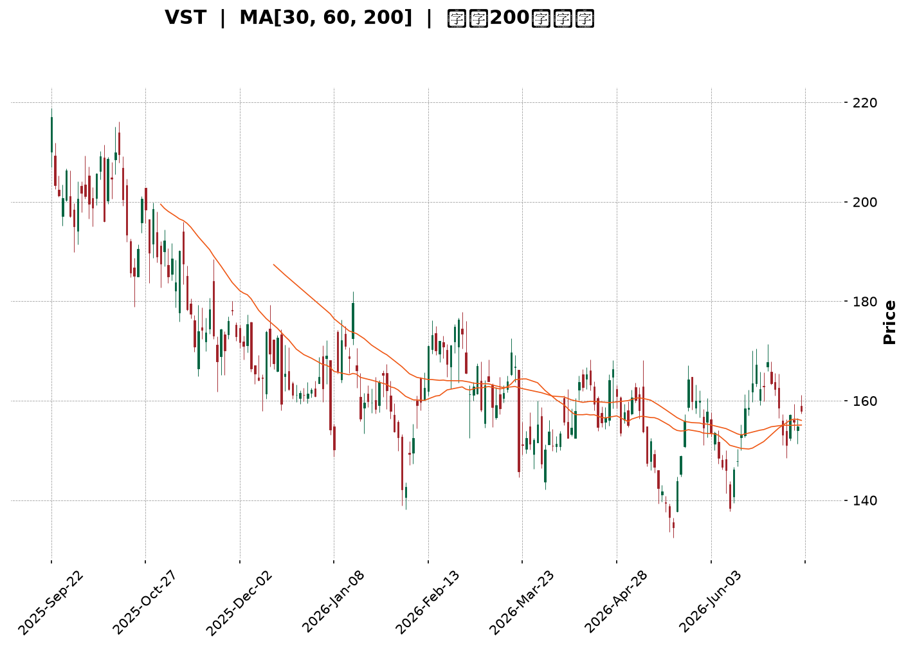
</details>

<html>
<head><meta charset="utf-8" /></head>
<body>
    <div style="height:500px; width:100%;">                        <script>window.PlotlyConfig = {MathJaxConfig: 'local'};</script>
        <script charset="utf-8" src="https://cdn.plot.ly/plotly-3.7.0.min.js" integrity="sha256-jvTGqxNp8AGWEcvNLVuKr+8j5dGe9Yw51LQkmDH+IYA=" crossorigin="anonymous"></script>                <div id="candlestick-chart" class="plotly-graph-div" style="height:100%; width:100%;"></div>            <script>                window.PLOTLYENV=window.PLOTLYENV || {};                                if (document.getElementById("candlestick-chart")) {                    Plotly.newPlot(                        "candlestick-chart",                        [{"close":{"dtype":"f8","bdata":"AAAA4IQga0AAAAAgk2xpQAAAAKAaJ2lAAAAAABUZaUAAAADgictpQAAAAIDPo2hAAAAAYHBjaEAAAACgkxVpQAAAAMDnOWlAAAAAgN8kaUAAAADghfJoQAAAAOBY2WhAAAAAIDC2aUAAAABAISRqQAAAAOBkgWhAAAAAIMoVakAAAADAC5VpQAAAAKA3P2pAAAAAYOAwakAAAABgehBpQAAAAMDmLWhAAAAA4OI3Z0AAAADg5SFnQAAAAEBx0mdAAAAAYE0UaUAAAABgJs9oQAAAACCWuWdAAAAAgGHRaEAAAAAAi51nQAAAACCccGdAAAAAIKkHaEAAAACgBx9nQAAAAGBYk2dAAAAAoFb7ZkAAAADApsZnQAAAAAD5b2dAAAAA4FdNZkAAAABA+zBmQAAAAMAmW2VAAAAAgOW+ZUAAAABAxshlQAAAAKBKtmVAAAAAoLRMZkAAAAAAN6JlQAAAAICB\u002fGRAAAAAoDzNZUAAAAAANURlQAAAAAAjAmZAAAAAYMhDZkAAAACAb51lQAAAAECzemVAAAAAAAVeZUAAAACA3+plQAAAACBBz2RAAAAAAMutZEAAAAAgDIRkQAAAAACFj2RAAAAAQAe8ZUAAAAAgoCxlQAAAAMCr8WRAAAAAYGGXZUAAAABAz+ljQAAAACBjr2RAAAAA4FJLZEAAAAAA+iNkQAAAAOAqJ2RAAAAAIGwwZEAAAADgKidkQAAAAKCXLGRAAAAAwHtFZEAAAABAURxkQAAAAADGmGRAAAAAQGBPZEAAAABg\u002fiFlQAAAAECNRWNAAAAAwOfFYkAAAAAAJ71kQAAAACBTg2VAAAAAgE5eZUAAAACAHxBlQAAAAGDadWZAAAAAAH7EZEAAAACAE4xjQAAAAGCD8mNAAAAA4Fz9Y0AAAABAtPVjQAAAAGDmy2NAAAAAgNF5ZEAAAABg26VkQAAAAAA1RGRAAAAAgDi9Y0AAAACgszpjQAAAAEB+EmNAAAAA4A7EYUAAAAAgnNVhQAAAAKCWp2JAAAAAIIkRY0AAAABAHOVjQAAAAECp9mNAAAAAQM1UZEAAAACAimBlQAAAAEBtpmVAAAAAoC5DZUAAAACAxYBlQAAAACCrXWVAAAAAQMnqZEAAAABgsGRlQAAAAOAJ3GVAAAAAYKEKZkAAAAAAIa1lQAAAAMAGsWRAAAAAACAoZEAAAABAGV1kQAAAAIAF3mRAAAAAQMvGY0AAAAAgZWVkQAAAAGBJfmRAAAAAwBHXY0AAAADgeORjQAAAAABe0GNAAAAAIGExZEAAAACADXxkQAAAAEDSNGVAAAAAgBDdZEAAAAAAGzpiQAAAAICC4mJAAAAAoDQQY0AAAAAgiuliQAAAAODIAmNAAAAAAGdoY0AAAABgrWpiQAAAACDVw2JAAAAAoNQ3Y0AAAACg\u002ft5iQAAAAKAY7GJAAAAA4OEuY0AAAAAAgXVjQAAAACAqEWNAAAAAgG9QY0AAAAAAUr9jQAAAAMCzd2RAAAAA4MlWZEAAAABgjalkQAAAAMBnZ2RAAAAA4A7sY0AAAAAgMFZjQAAAAOBOcmNAAAAAYC6UY0AAAACA2INkQAAAAAAby2RAAAAAQKEcZEAAAADAZTJjQAAAAADRs2NAAAAA4AJiY0AAAACAABRkQAAAAKD7BGRAAAAAQDLCY0AAAADAgjdjQAAAAABucGJAAAAAwMv6YkAAAACARFViQAAAAGAjzWFAAAAAIHO2YUAAAABggm9hQAAAAGDhEWFAAAAAILHQYEAAAABgjvlhQAAAAIDjm2JAAAAAoKWBY0AAAABAjopkQAAAACCi\u002fWNAAAAAoMkBZEAAAACAMABkQAAAAOBkUWNAAAAAgPi3Y0AAAACgtzJjQAAAAKCFL2NAAAAAoKmRYkAAAADgOVZiQAAAACB\u002fQGJAAAAAgBRLYUAAAAAgnEViQAAAACAEemJAAAAAIMUpY0AAAAAgbMxjQAAAAMBz02NAAAAAIKxwZEAAAADgUehkQAAAAOB6TGRAAAAAANdbZEAAAADgo\u002fhkQAAAACCub2RAAAAAAClMZEAAAAAAKdRjQAAAAMAeJWNAAAAAoJnhYkAAAABACqdjQAAAACBcd2NAAAAAgD1aY0AAAAAgXL9jQA=="},"high":{"dtype":"f8","bdata":"ScupMhFda0CKk5c9PnxqQDp9m8meqmlA6SB5LjZtaUBiEagcdtRpQAY1UT+TyGlA6AHEJWT1aEDAO3MOkIJpQOO9ryjLhGlA93Sg0IAqakAysasiKuJpQDiFUgurX2lA9\u002f0qlhm4aUCZGYFlOkZqQKVfp82nb2pA9oP+SIkiakAnWzyme\u002f9pQEh6\u002ffZy5GpACdOvPWMGa0CD4s8quSVqQEZZBRC6lGlAQYTGMsUTaEAvGzPQ2ZZnQPLUBm3k7GdApx9UHjElaUBy+kZeF1ppQDSoH+bkj2hAyfRsa7j8aEDBkCKd2r9oQDJvAG7hAmhAxDkt9CxMaEBxp+5ERNZnQG5o8++n9WdAmIBbvb2KZ0BPO7STCslnQNfiI2l7f2hAOMEpVCNlZ0Cr87UOipFmQFsESi8aJ2ZAltR8mBxoZkC1\u002fPuN0FhmQLNj2LLkFWZArM3DkemXZkDgX7BgKJBnQDSr+9G1nmVAdUAtFibPZUAJY5G2K8BlQAIYhRlpIGZAxk+aO6aAZkDQMAhD8PdlQCg2RXwM52VAfKxdwSCkZUDRLbpa+ClmQDiwGhq4\u002fGVAzjrIvffjZEBCb4oakiZlQEdQBV+bqmRAEPXEBUXFZUAIwyaGHGhmQKJYt14KiWVA9dQpMa2mZUDeJfV4PM1lQBfU6cWfZmVAkvD6Kl9WZUD9YG8TantkQC+VNr\u002fyZ2RA\u002f6sLAF5EZEBT3R8xnFFkQBW902nnd2RAaKRLToZTZEAmYFI7eoFkQJeCwhgEGmVATeopUM5lZUBp8FokSIRlQAyWdjfpBWVAROJtm9hrY0COJfr1QMhlQJWwPdwTCGZAsBfXK+neZUCMn8fNpVZlQOXpDJbNwWZAeQWHmLtUZUAdJ+lMWLFkQB2MH1QPMWRALe2lyJBhZEBltG4Zdk1kQMN8ZnlTm2RAbfYffU6FZEBKFzU1N8NkQPdYvtdW7WRAjvAyQnqBZEDdR5uaPPFjQAdcsSYvgmNArwJ2+40nY0DTwSBkavBhQARwbMPg+mJAVNJ2HjVrY0CoNSN+MB9kQFzWX2FTm2RAd\u002fMSFwy4ZEBml3hI92VlQLi3ZmA0BWZAdF8WtYHgZUAzM\u002fdqAYNlQGJVQOquoGVASzahkbVrZUDnf+CEmmZlQD+xPiSM7mVAWbD5u7YXZkA+i+m7LTpmQG31n4UOAWZAjrl4BIZiZECvNElKOXhkQD8jKB428GRA\u002f6bjmUv9ZEDWRGNMoIVkQLW1qQlhCmVA55Wq9zNxZEBq9DMQ\u002fldkQDxQdpcXmWRA5cq235BhZEDtwTb2HKBkQEdRRym6kGVABnFCWjokZUAS2w0Xl8dkQCj9f9DSdWNArBCp0E08Y0DJ0ZzYVLdjQP255qKbDmNAJp7mLTv\u002fY0A8coLDpdZjQJA+jPBC6GJAtnEuPOKDY0DZhpXnAEtjQLeT4SSCHGNAum8zoDg+Y0AGa5WIsyJkQPAhUtavSWRAXnQOsg\u002fNY0AKvFgB2Q9kQHM\u002fAD6QoWRA5UvjPDDJZEBq01xT+NVkQBSlIOAjCGVAl1FaRUJ6ZEApP5q2\u002fRtkQMePKu9w22NAd6\u002fm+7rUY0DtmB1u9KdkQHfPrSvnBWVAe0d0XRdjZEDmAJauPB1kQDWgRj4E7WNAObMAU1D9Y0A6Qsq45ERkQPwsthFFcmRAvncR6GJYZEBQzOnT8QRlQLp1EVoQWWNAofcaGyoRY0CrwoLxm8NiQA6qzPRpQmJAWRXGBAfjYUASR\u002fX4kJxhQCHzmAkJa2FAVIfWU0gQYUCqLp7QUBZiQOrudJVHomJApM9jWzCrY0CkD9H2TuVkQCksGdBRmWRAhVjUZKRpZEC6wXhmBEJkQGFCeDSBymNAzaDPzsMRZECPZ\u002f6pDbZjQL3L5vpiOmNAeP9xBWBCY0BbQnRB66JiQIgbOsLfwmJA4OUhU475YUDpFA\u002frOVZiQBK6r9ZDyWJAf9bCg3FnY0C9wjo\u002fIihkQBc1bITPRmRAPn6+4UFDZUAAAAAAAFBlQAAAAGBmumRAAAAA4Hq0ZEAAAABAM2tlQAAAAIDC\u002fWRAAAAAQDOzZEAAAABgZq5kQAAAAIA9qmNAAAAAIK6HY0AAAAAgrqdjQAAAAMAe7WNAAAAA4KWPY0AAAACAwiVkQA=="},"hovertemplate":"\u003cb\u003e%{x|%Y-%m-%d}\u003c\u002fb\u003e\u003cbr\u003e\u958b: $%{open:.2f}\u003cbr\u003e\u9ad8: $%{high:.2f}\u003cbr\u003e\u4f4e: $%{low:.2f}\u003cbr\u003e\u6536: $%{close:.2f}\u003cextra\u003e\u003c\u002fextra\u003e","low":{"dtype":"f8","bdata":"NgeysgXeaUDrfBDgt1NpQO21iZQMIWlAQ9lCeU5maECDSqfBrwRpQMXad4cpnGhACiyVeBe9Z0DYM++y7+tnQGT8QzxZvGhAhn3hBUIVaUBHE7zejpNoQB5PtqVSYmhAj3ZuGIHpaEAA4D4eeI9pQMnE\u002fK3BgGhAbzeNHzTyaEDhK79CEhJpQFugZ1BosWlA51cNTTH6aUCMsOvqDOdoQJtpyE88AGhAVc2rxpwZZ0CDtpo29VxmQLdR+OsSHmdAMJbfx185aECdTWzh63VoQE\u002f83guP9mZA3sr4GOWVZ0D29kUAQnhnQDjBkMZI2GZAT5kaVyRiZ0ADEwuhg\u002fdmQLfJM4c3BWdAUCMfTiJZZkDEkt49w\u002ftlQDyDt\u002fmt7GZA\u002f4UrhDBCZkCb5ppLwBFmQO+1cXUCOmVACufm4ZWcZEBDzt8f3YxlQNNwX394PmVAO2r0J+uvZUDkC2zMLo1lQDlvTLGFOGRAo5QYbMimZEBs51gq8aZkQOjCt\u002fa\u002fi2VA65T9ALIoZkCSwaFmKX9lQNhjnQLwVGVAzflBW\u002foHZUBhYimacjhlQH9+L4jyuGRAdVxEfSVsZEAIgdF3f4FkQLArIaS+v2NAO4jIl\u002fMKZEBEZ7k1xdlkQB2V5wUzyWRAs9PBDX+7ZEASOAeGVsFjQLsa7AjaP2RA3yQwts5AZED6zqgFAA1kQBwFzg0G9mNAcoBRHonqY0C4gPZUC\u002f1jQC8TVg1z72NAKY+dgbMTZEBdZG6czhhkQHYNiAgDbmRADECgLPD3Y0DJlyxTgGpkQNhP4ZS5I2NAQrOS3eiYYkBPjuoShK1kQNZA3jgTdGRA3i1W7yhLZUAJrhDe8LJkQCxWSnqaZmVAkOfdwu1RZEBGAwKoNHpjQBOeeqAQK2NAUsTV2L\u002fWY0AXq5IpDbJjQLD08TDcrmNA2KP2dta2Y0Byb7Z\u002f5BZkQJY9ThIlymNAR\u002furDKyNY0CJRaeyXDNjQMfxonBEv2JAUcp6U1hcYUCQf536ukRhQKFQ\u002f+VsYGJAKc9N6+lrYkByNGHBQExjQN5PMEmaw2NAWY7vxKP+Y0DidHElviFkQJsLt2xlL2VAY1s08oskZUDNzMyMJflkQDb2WZ0UEWVA0tMOiSKYZEDuJ0Lmx01kQILs1nSLM2VAbwviPgh1ZEBtuKDMZE1lQMSnt53rq2RAQZvR0doRY0BLvyHFo\u002f5jQGVNuoV8J2RAbKrpCKC7Y0Cf5bHwUFJjQMMkoUVBe2RA1HE1YBpXY0CX44T2kIhjQElApVJvqWNAHnsInWL1Y0Bf8kUShzVkQJFttaljoWRAwrR7ltx4ZED80hsiFBRiQDCcSKUJpGJAyIIcUeiqYkDrQA8ybsViQPVLM+8fSWJAEhzDmjXxYkDRQsnEo0xiQIi6hYmCxGFA8DrGUwbmYkCspp1EH71iQHp9+\u002fZztWJASPupEzzCYkAzn6ifVGJjQMhBT23tDmNAMcweD6scY0Bm\u002fQP19w1jQIN0gUfdA2RALPfdLIs9ZECnqN4zPkxkQJS7Xv8OQWRA2ZzkySfDY0BB439PQz1jQFCOfteBVmNAst3zCxZJY0AByZRk211jQNzBu59q0GNANrhk\u002fu\u002fPY0BX4EiitRtjQPbMMQxkcGNAYtt3otNWY0BSrOzQCKdjQHihDOVy8mNAFapMPDGMY0Cf+NxPwjFjQFqsM1rIWGJA8Hmqn1lCYkBT2n4cmi5iQE3hjaMTamFA5lUCCT53YUBVuQjMwDNhQDF9spuHtWBARUYq\u002fC6PYEBVvTbJwDNhQNs5lj2tFWJAvFPn\u002fEDRYkALBQmi9b9jQMdPpbT3xWNAJEOH0yWsY0Bq28zAI5VjQNVHqKvJ42JAs\u002f\u002f9j1EVY0BVQ\u002fAcjhdjQJGDq\u002fVbv2JAUQJaL2ZpYkCM8PoUnEViQPVudh3yqmFAABqb1\u002fI2YUBpIkej\u002fmthQAsPdu9rWWJA4+8leT7BYkBBg9+WuBNjQDVlMk+vn2NAMhGFfcz5Y0AAAADAzFxkQAAAAOCj5GNAAAAAACn8Y0AAAADgUcBkQAAAAIAUZmRAAAAA4KMgZEAAAADgUZBjQAAAAKCZ4WJAAAAAAACQYkAAAADgUQBjQAAAAOBRQGNAAAAAgD3qYkAAAACAPa5jQA=="},"name":"\u50f9\u683c","open":{"dtype":"f8","bdata":"gsG1Wv9DakCSdoexoidqQLY3FDtYTWlAf7cW\u002fbilaEClfSaIsgtpQFh40w8xJWlAdORfJ6XLaEDBy+XsHkZoQPtzZmYzZmlAR3mdcRRwaUAN+zOFwqlpQBsRfB99F2lArNLbus4XaUDMzMwsh8RpQKOcKVp7HGpADCo86SUJaUCJobX8951pQDpeT9t1DmpAnm5aGca8akA1GisH4dlpQCB70ZsRaWlA44lo648CaEB2IEuwtVhnQLdR+OsSHmdAzNDY1Bt5aEBy+kZeF1ppQDSoH+bkj2hA1GIYUxTwZ0DrajNF7DtoQOiM3sqE5mdAqs6Cw5jAZ0AYhbaRPGpnQGd5bLeZL2dAyraYRjXEZkCiOWtwTzhmQNlBK1y\u002fP2hAp4oaFcQkZ0BenUHDoHJmQP5SyzukBWZA1QwKppLPZEAWXwQketZlQEqz74s0fmVAHVc7uN\u002fNZUCqIZAftgFnQLMLpWUsaWVA+hZ+fLwbZUBSvuoLdatlQB5+rYDoqGVAN1NYfj5IZkDWVuL69ehlQP6294uF1WVAFWBtrzR+ZUAQOT1t\u002fGVlQA4f1LY2+WVAzjrIvffjZEBNcmeZ5JVkQPhBbtnvlGRA1jlCAhgsZEB0cX76Jc9lQMIjjxrEh2VATEcSyK6+ZEDno1LdOallQP0koZMin2RAIQc50EbAZECtOPeUhXFkQD4gggL6I2RAn+L3y3cRZEAAAADgKidkQG7571vJEWRA4rgUw7IxZEDE909+GU5kQHYNiAgDbmRAkXplNOMcZUB\u002fyluaFBFlQAyWdjfpBWVAg314aUtaY0BDTR56K7tlQEKobyPnhmRA7ZsDkaOwZUB+cQqihh1lQB4XJiW6kGVAqwSR587iZEA2FYATZxpkQOIDlzNI0mNAe0NexHYvZECQRUD23\u002fFjQF+aleWzBGRAT3RV2jziY0ADEildWLFkQPqRSZwRsGRAiTsxD74hZEATEffi4aZjQPSeN70OdmNAR5C9Wo4YY0CiNDVojZNhQGvQ+\u002fbBsmJAbvtA\u002f8GyYkD\u002fGoqro\u002f5jQLVo8+JukWRAkFS1rysJZED6JoGOdj5kQK3P8gcTTWVAs6ulQfWwZUDNzK7IHi5lQH1Q7ahjemVA5YCBUGpFZUDqU5E1MdpkQEAljxnxfGVAA7NbZWRcZUA5TwsKjdBlQLXxqtpfN2VAaNHSWc4nZEBBE15gnSRkQF+1iIDeLWRAgE9oy+F\u002fZEBk8plZCW9jQIbS4Q3snGRAI2cJ6MFkZEB0vvdfsZRjQF2rAP4JKmRAxPbQX8kRZEC2Ry36i0tkQI9bSwNeqWRAdFoVpa7WZEAS2w0Xl8dkQJsRxGqf52JAVVhE3NzKYkCDeW5EEFljQBbcrFNPqWJAEhzDmjXxYkDDZ3p6K5xjQBLZRipc9mFA\u002fZJ2BkPoYkCAm\u002fon9N9iQPTlBU2F2mJA3HawxnrbYkAFbOhyzhBkQD0FXQeBdWNAtZZUdyEpY0Bm\u002fQP19w1jQGrRNB\u002faRWRAwRlEDJioZEAS234f4IpkQLuBQSzhwGRAbaMVuk1aZECY18A7IBFkQElCG9mJsmNAS5sisr13Y0BNfAKAkINjQHTgz7mdmGRAgy\u002fmcLpIZECguN1AUhRkQFJ21iFJgmNAFnTg6dXCY0AlPbjzBa9jQED1\u002fJu0WGRAQvmM6JwoZEAIBNbd+1lkQLp1EVoQWWNA1M6FhWB5YkD6ZWWc\u002fahiQA6qzPRpQmJAOw0CVdWlYUC\u002fIGWJi3JhQKy7RZnHWWFAa6VN44XzYEAAAAAc0zlhQPzERLuHKGJA8Ee7hzPaYkDHxmI6AtZjQCqM6aVWl2RAr4IMn8XTY0BDIIcC1\u002fhjQMLQZVb5mGNAY8mZARp3Y0C17QHUUIljQAw4lp5\u002f6mJArxqcoTL5YkC3\u002fdt4SINiQDEc4UvMhmJAButnBcnkYUDK3O7+XplhQFYbq3pgeWJAgqlK4hQTY0CbYydnJCFjQIfXM+n7ymNA8Fc8ZKA7ZEAAAAAAKXBkQAAAAGCPAmRAAAAAwPVgZEAAAADAHt1kQAAAACCFu2RAAAAAYGZ2ZEAAAABgj1JkQAAAAAAAgGNAAAAAYGY+Y0AAAABACg9jQAAAAAAphGNAAAAAIK4\u002fY0AAAADgUeBjQA=="},"x":["2025-09-22T00:00:00-04:00","2025-09-23T00:00:00-04:00","2025-09-24T00:00:00-04:00","2025-09-25T00:00:00-04:00","2025-09-26T00:00:00-04:00","2025-09-29T00:00:00-04:00","2025-09-30T00:00:00-04:00","2025-10-01T00:00:00-04:00","2025-10-02T00:00:00-04:00","2025-10-03T00:00:00-04:00","2025-10-06T00:00:00-04:00","2025-10-07T00:00:00-04:00","2025-10-08T00:00:00-04:00","2025-10-09T00:00:00-04:00","2025-10-10T00:00:00-04:00","2025-10-13T00:00:00-04:00","2025-10-14T00:00:00-04:00","2025-10-15T00:00:00-04:00","2025-10-16T00:00:00-04:00","2025-10-17T00:00:00-04:00","2025-10-20T00:00:00-04:00","2025-10-21T00:00:00-04:00","2025-10-22T00:00:00-04:00","2025-10-23T00:00:00-04:00","2025-10-24T00:00:00-04:00","2025-10-27T00:00:00-04:00","2025-10-28T00:00:00-04:00","2025-10-29T00:00:00-04:00","2025-10-30T00:00:00-04:00","2025-10-31T00:00:00-04:00","2025-11-03T00:00:00-05:00","2025-11-04T00:00:00-05:00","2025-11-05T00:00:00-05:00","2025-11-06T00:00:00-05:00","2025-11-07T00:00:00-05:00","2025-11-10T00:00:00-05:00","2025-11-11T00:00:00-05:00","2025-11-12T00:00:00-05:00","2025-11-13T00:00:00-05:00","2025-11-14T00:00:00-05:00","2025-11-17T00:00:00-05:00","2025-11-18T00:00:00-05:00","2025-11-19T00:00:00-05:00","2025-11-20T00:00:00-05:00","2025-11-21T00:00:00-05:00","2025-11-24T00:00:00-05:00","2025-11-25T00:00:00-05:00","2025-11-26T00:00:00-05:00","2025-11-28T00:00:00-05:00","2025-12-01T00:00:00-05:00","2025-12-02T00:00:00-05:00","2025-12-03T00:00:00-05:00","2025-12-04T00:00:00-05:00","2025-12-05T00:00:00-05:00","2025-12-08T00:00:00-05:00","2025-12-09T00:00:00-05:00","2025-12-10T00:00:00-05:00","2025-12-11T00:00:00-05:00","2025-12-12T00:00:00-05:00","2025-12-15T00:00:00-05:00","2025-12-16T00:00:00-05:00","2025-12-17T00:00:00-05:00","2025-12-18T00:00:00-05:00","2025-12-19T00:00:00-05:00","2025-12-22T00:00:00-05:00","2025-12-23T00:00:00-05:00","2025-12-24T00:00:00-05:00","2025-12-26T00:00:00-05:00","2025-12-29T00:00:00-05:00","2025-12-30T00:00:00-05:00","2025-12-31T00:00:00-05:00","2026-01-02T00:00:00-05:00","2026-01-05T00:00:00-05:00","2026-01-06T00:00:00-05:00","2026-01-07T00:00:00-05:00","2026-01-08T00:00:00-05:00","2026-01-09T00:00:00-05:00","2026-01-12T00:00:00-05:00","2026-01-13T00:00:00-05:00","2026-01-14T00:00:00-05:00","2026-01-15T00:00:00-05:00","2026-01-16T00:00:00-05:00","2026-01-20T00:00:00-05:00","2026-01-21T00:00:00-05:00","2026-01-22T00:00:00-05:00","2026-01-23T00:00:00-05:00","2026-01-26T00:00:00-05:00","2026-01-27T00:00:00-05:00","2026-01-28T00:00:00-05:00","2026-01-29T00:00:00-05:00","2026-01-30T00:00:00-05:00","2026-02-02T00:00:00-05:00","2026-02-03T00:00:00-05:00","2026-02-04T00:00:00-05:00","2026-02-05T00:00:00-05:00","2026-02-06T00:00:00-05:00","2026-02-09T00:00:00-05:00","2026-02-10T00:00:00-05:00","2026-02-11T00:00:00-05:00","2026-02-12T00:00:00-05:00","2026-02-13T00:00:00-05:00","2026-02-17T00:00:00-05:00","2026-02-18T00:00:00-05:00","2026-02-19T00:00:00-05:00","2026-02-20T00:00:00-05:00","2026-02-23T00:00:00-05:00","2026-02-24T00:00:00-05:00","2026-02-25T00:00:00-05:00","2026-02-26T00:00:00-05:00","2026-02-27T00:00:00-05:00","2026-03-02T00:00:00-05:00","2026-03-03T00:00:00-05:00","2026-03-04T00:00:00-05:00","2026-03-05T00:00:00-05:00","2026-03-06T00:00:00-05:00","2026-03-09T00:00:00-04:00","2026-03-10T00:00:00-04:00","2026-03-11T00:00:00-04:00","2026-03-12T00:00:00-04:00","2026-03-13T00:00:00-04:00","2026-03-16T00:00:00-04:00","2026-03-17T00:00:00-04:00","2026-03-18T00:00:00-04:00","2026-03-19T00:00:00-04:00","2026-03-20T00:00:00-04:00","2026-03-23T00:00:00-04:00","2026-03-24T00:00:00-04:00","2026-03-25T00:00:00-04:00","2026-03-26T00:00:00-04:00","2026-03-27T00:00:00-04:00","2026-03-30T00:00:00-04:00","2026-03-31T00:00:00-04:00","2026-04-01T00:00:00-04:00","2026-04-02T00:00:00-04:00","2026-04-06T00:00:00-04:00","2026-04-07T00:00:00-04:00","2026-04-08T00:00:00-04:00","2026-04-09T00:00:00-04:00","2026-04-10T00:00:00-04:00","2026-04-13T00:00:00-04:00","2026-04-14T00:00:00-04:00","2026-04-15T00:00:00-04:00","2026-04-16T00:00:00-04:00","2026-04-17T00:00:00-04:00","2026-04-20T00:00:00-04:00","2026-04-21T00:00:00-04:00","2026-04-22T00:00:00-04:00","2026-04-23T00:00:00-04:00","2026-04-24T00:00:00-04:00","2026-04-27T00:00:00-04:00","2026-04-28T00:00:00-04:00","2026-04-29T00:00:00-04:00","2026-04-30T00:00:00-04:00","2026-05-01T00:00:00-04:00","2026-05-04T00:00:00-04:00","2026-05-05T00:00:00-04:00","2026-05-06T00:00:00-04:00","2026-05-07T00:00:00-04:00","2026-05-08T00:00:00-04:00","2026-05-11T00:00:00-04:00","2026-05-12T00:00:00-04:00","2026-05-13T00:00:00-04:00","2026-05-14T00:00:00-04:00","2026-05-15T00:00:00-04:00","2026-05-18T00:00:00-04:00","2026-05-19T00:00:00-04:00","2026-05-20T00:00:00-04:00","2026-05-21T00:00:00-04:00","2026-05-22T00:00:00-04:00","2026-05-26T00:00:00-04:00","2026-05-27T00:00:00-04:00","2026-05-28T00:00:00-04:00","2026-05-29T00:00:00-04:00","2026-06-01T00:00:00-04:00","2026-06-02T00:00:00-04:00","2026-06-03T00:00:00-04:00","2026-06-04T00:00:00-04:00","2026-06-05T00:00:00-04:00","2026-06-08T00:00:00-04:00","2026-06-09T00:00:00-04:00","2026-06-10T00:00:00-04:00","2026-06-11T00:00:00-04:00","2026-06-12T00:00:00-04:00","2026-06-15T00:00:00-04:00","2026-06-16T00:00:00-04:00","2026-06-17T00:00:00-04:00","2026-06-18T00:00:00-04:00","2026-06-22T00:00:00-04:00","2026-06-23T00:00:00-04:00","2026-06-24T00:00:00-04:00","2026-06-25T00:00:00-04:00","2026-06-26T00:00:00-04:00","2026-06-29T00:00:00-04:00","2026-06-30T00:00:00-04:00","2026-07-01T00:00:00-04:00","2026-07-02T00:00:00-04:00","2026-07-06T00:00:00-04:00","2026-07-07T00:00:00-04:00","2026-07-08T00:00:00-04:00","2026-07-09T00:00:00-04:00"],"type":"candlestick"},{"hovertemplate":"MA30: $%{y:.2f}\u003cextra\u003e\u003c\u002fextra\u003e","line":{"color":"#2196F3","dash":"dash","width":2},"mode":"lines","name":"MA30","x":["2025-09-22T00:00:00-04:00","2025-09-23T00:00:00-04:00","2025-09-24T00:00:00-04:00","2025-09-25T00:00:00-04:00","2025-09-26T00:00:00-04:00","2025-09-29T00:00:00-04:00","2025-09-30T00:00:00-04:00","2025-10-01T00:00:00-04:00","2025-10-02T00:00:00-04:00","2025-10-03T00:00:00-04:00","2025-10-06T00:00:00-04:00","2025-10-07T00:00:00-04:00","2025-10-08T00:00:00-04:00","2025-10-09T00:00:00-04:00","2025-10-10T00:00:00-04:00","2025-10-13T00:00:00-04:00","2025-10-14T00:00:00-04:00","2025-10-15T00:00:00-04:00","2025-10-16T00:00:00-04:00","2025-10-17T00:00:00-04:00","2025-10-20T00:00:00-04:00","2025-10-21T00:00:00-04:00","2025-10-22T00:00:00-04:00","2025-10-23T00:00:00-04:00","2025-10-24T00:00:00-04:00","2025-10-27T00:00:00-04:00","2025-10-28T00:00:00-04:00","2025-10-29T00:00:00-04:00","2025-10-30T00:00:00-04:00","2025-10-31T00:00:00-04:00","2025-11-03T00:00:00-05:00","2025-11-04T00:00:00-05:00","2025-11-05T00:00:00-05:00","2025-11-06T00:00:00-05:00","2025-11-07T00:00:00-05:00","2025-11-10T00:00:00-05:00","2025-11-11T00:00:00-05:00","2025-11-12T00:00:00-05:00","2025-11-13T00:00:00-05:00","2025-11-14T00:00:00-05:00","2025-11-17T00:00:00-05:00","2025-11-18T00:00:00-05:00","2025-11-19T00:00:00-05:00","2025-11-20T00:00:00-05:00","2025-11-21T00:00:00-05:00","2025-11-24T00:00:00-05:00","2025-11-25T00:00:00-05:00","2025-11-26T00:00:00-05:00","2025-11-28T00:00:00-05:00","2025-12-01T00:00:00-05:00","2025-12-02T00:00:00-05:00","2025-12-03T00:00:00-05:00","2025-12-04T00:00:00-05:00","2025-12-05T00:00:00-05:00","2025-12-08T00:00:00-05:00","2025-12-09T00:00:00-05:00","2025-12-10T00:00:00-05:00","2025-12-11T00:00:00-05:00","2025-12-12T00:00:00-05:00","2025-12-15T00:00:00-05:00","2025-12-16T00:00:00-05:00","2025-12-17T00:00:00-05:00","2025-12-18T00:00:00-05:00","2025-12-19T00:00:00-05:00","2025-12-22T00:00:00-05:00","2025-12-23T00:00:00-05:00","2025-12-24T00:00:00-05:00","2025-12-26T00:00:00-05:00","2025-12-29T00:00:00-05:00","2025-12-30T00:00:00-05:00","2025-12-31T00:00:00-05:00","2026-01-02T00:00:00-05:00","2026-01-05T00:00:00-05:00","2026-01-06T00:00:00-05:00","2026-01-07T00:00:00-05:00","2026-01-08T00:00:00-05:00","2026-01-09T00:00:00-05:00","2026-01-12T00:00:00-05:00","2026-01-13T00:00:00-05:00","2026-01-14T00:00:00-05:00","2026-01-15T00:00:00-05:00","2026-01-16T00:00:00-05:00","2026-01-20T00:00:00-05:00","2026-01-21T00:00:00-05:00","2026-01-22T00:00:00-05:00","2026-01-23T00:00:00-05:00","2026-01-26T00:00:00-05:00","2026-01-27T00:00:00-05:00","2026-01-28T00:00:00-05:00","2026-01-29T00:00:00-05:00","2026-01-30T00:00:00-05:00","2026-02-02T00:00:00-05:00","2026-02-03T00:00:00-05:00","2026-02-04T00:00:00-05:00","2026-02-05T00:00:00-05:00","2026-02-06T00:00:00-05:00","2026-02-09T00:00:00-05:00","2026-02-10T00:00:00-05:00","2026-02-11T00:00:00-05:00","2026-02-12T00:00:00-05:00","2026-02-13T00:00:00-05:00","2026-02-17T00:00:00-05:00","2026-02-18T00:00:00-05:00","2026-02-19T00:00:00-05:00","2026-02-20T00:00:00-05:00","2026-02-23T00:00:00-05:00","2026-02-24T00:00:00-05:00","2026-02-25T00:00:00-05:00","2026-02-26T00:00:00-05:00","2026-02-27T00:00:00-05:00","2026-03-02T00:00:00-05:00","2026-03-03T00:00:00-05:00","2026-03-04T00:00:00-05:00","2026-03-05T00:00:00-05:00","2026-03-06T00:00:00-05:00","2026-03-09T00:00:00-04:00","2026-03-10T00:00:00-04:00","2026-03-11T00:00:00-04:00","2026-03-12T00:00:00-04:00","2026-03-13T00:00:00-04:00","2026-03-16T00:00:00-04:00","2026-03-17T00:00:00-04:00","2026-03-18T00:00:00-04:00","2026-03-19T00:00:00-04:00","2026-03-20T00:00:00-04:00","2026-03-23T00:00:00-04:00","2026-03-24T00:00:00-04:00","2026-03-25T00:00:00-04:00","2026-03-26T00:00:00-04:00","2026-03-27T00:00:00-04:00","2026-03-30T00:00:00-04:00","2026-03-31T00:00:00-04:00","2026-04-01T00:00:00-04:00","2026-04-02T00:00:00-04:00","2026-04-06T00:00:00-04:00","2026-04-07T00:00:00-04:00","2026-04-08T00:00:00-04:00","2026-04-09T00:00:00-04:00","2026-04-10T00:00:00-04:00","2026-04-13T00:00:00-04:00","2026-04-14T00:00:00-04:00","2026-04-15T00:00:00-04:00","2026-04-16T00:00:00-04:00","2026-04-17T00:00:00-04:00","2026-04-20T00:00:00-04:00","2026-04-21T00:00:00-04:00","2026-04-22T00:00:00-04:00","2026-04-23T00:00:00-04:00","2026-04-24T00:00:00-04:00","2026-04-27T00:00:00-04:00","2026-04-28T00:00:00-04:00","2026-04-29T00:00:00-04:00","2026-04-30T00:00:00-04:00","2026-05-01T00:00:00-04:00","2026-05-04T00:00:00-04:00","2026-05-05T00:00:00-04:00","2026-05-06T00:00:00-04:00","2026-05-07T00:00:00-04:00","2026-05-08T00:00:00-04:00","2026-05-11T00:00:00-04:00","2026-05-12T00:00:00-04:00","2026-05-13T00:00:00-04:00","2026-05-14T00:00:00-04:00","2026-05-15T00:00:00-04:00","2026-05-18T00:00:00-04:00","2026-05-19T00:00:00-04:00","2026-05-20T00:00:00-04:00","2026-05-21T00:00:00-04:00","2026-05-22T00:00:00-04:00","2026-05-26T00:00:00-04:00","2026-05-27T00:00:00-04:00","2026-05-28T00:00:00-04:00","2026-05-29T00:00:00-04:00","2026-06-01T00:00:00-04:00","2026-06-02T00:00:00-04:00","2026-06-03T00:00:00-04:00","2026-06-04T00:00:00-04:00","2026-06-05T00:00:00-04:00","2026-06-08T00:00:00-04:00","2026-06-09T00:00:00-04:00","2026-06-10T00:00:00-04:00","2026-06-11T00:00:00-04:00","2026-06-12T00:00:00-04:00","2026-06-15T00:00:00-04:00","2026-06-16T00:00:00-04:00","2026-06-17T00:00:00-04:00","2026-06-18T00:00:00-04:00","2026-06-22T00:00:00-04:00","2026-06-23T00:00:00-04:00","2026-06-24T00:00:00-04:00","2026-06-25T00:00:00-04:00","2026-06-26T00:00:00-04:00","2026-06-29T00:00:00-04:00","2026-06-30T00:00:00-04:00","2026-07-01T00:00:00-04:00","2026-07-02T00:00:00-04:00","2026-07-06T00:00:00-04:00","2026-07-07T00:00:00-04:00","2026-07-08T00:00:00-04:00","2026-07-09T00:00:00-04:00"],"y":{"dtype":"f8","bdata":"AAAAAAAA+H8AAAAAAAD4fwAAAAAAAPh\u002fAAAAAAAA+H8AAAAAAAD4fwAAAAAAAPh\u002fAAAAAAAA+H8AAAAAAAD4fwAAAAAAAPh\u002fAAAAAAAA+H8AAAAAAAD4fwAAAAAAAPh\u002fAAAAAAAA+H8AAAAAAAD4fwAAAAAAAPh\u002fAAAAAAAA+H8AAAAAAAD4fwAAAAAAAPh\u002fAAAAAAAA+H8AAAAAAAD4fwAAAAAAAPh\u002fAAAAAAAA+H8AAAAAAAD4fwAAAAAAAPh\u002fAAAAAAAA+H8AAAAAAAD4fwAAAAAAAPh\u002fAAAAAAAA+H8AAAAAAAD4f1VVVfUA8WhAvLu7O5PWaEAzMzNz7MJoQKuqqgp3tWhAmpmZKWijaEBERERkLZJoQCIiIoLqh2hARERE5Bx2aEBVVVUlbV1oQGZmZrZmPGhAmpmZ6WYfaEDv7u4OaQRoQBEREVGk6WdAmpmZmYbMZ0C8u7vbD6ZnQHd3d0cIiGdAd3d3B3tjZ0AiIiISpz5nQHd3d7d7GmdAq6qq6vr4ZkDv7u6ei9tmQO\u002fu7l6BxGZAVVVVtbW0ZkARERGhV6pmQDMzM9OikGZAIiIi8hVrZkAAAADwckZmQN7d3V1yK2ZA7+7ujiIRZkDe3d3tTfxlQGZmZqYB52VAVVVVdTLSZUBmZma20rZlQHd3d2conmVAiYiIWDmHZUBmZmaWM2hlQHd3d7csTGVAvLu72yQ6ZUC8u7sLwChlQFVVVTWqHmVA3t3dnRUSZUAzMzNzzQNlQHd3dwdJ+mRAAAAAwE7pZECJiIiYCOVkQKuqqtpm1mRAERERsY68ZECamZk5DrhkQImIiBjUs2RAZmZm5i2sZECJiIgIeKdkQERERDTXr2RAq6qqGrmqZECrqqoaf5ZkQCIiInIjj2RAiYiI6EGJZEDv7u4+g4RkQFVVVfX9fWRA7+7ubkBzZECJiIhowm5kQO\u002fu7i76aGRAVVVVBSxZZEBERETEVVNkQHd3d2eSRWRAIiIiEv8vZEBmZmZGURxkQBERERGID2RAd3d39\u002fcFZEB3d3dHxANkQBERERH4AWRAiYiIyHoCZEDe3d19SQ1kQImIiIhGFmRAMzMzA2ceZECJiIjIjyFkQFVVVaVuM2RA3t3dbbpFZEAzMzMTUEtkQJqZmRlFTmRAiYiImANUZEARERFhP1lkQCIiIkInSmRAzczM7PBEZEBVVVWV6EtkQBEREUHCU2RAmpmZmfBRZEAiIiKyqVVkQN7d3e2bW2RAMzMzIy9WZEC8u7vrvE9kQLy7u2vgS2RAREREpL9PZEBmZmbWdVpkQGZmZtarbGRAMzMz0xqHZEAzMzNjdIpkQO\u002fu7i5rjGRAVVVV1V+MZECJiIgY\u002fYNkQERERATce2RA3t3dvfpzZEAzMzOjt1pkQHd3d\u002fcYQmRAiYiICKcwZECJiIh4MRpkQBEREUFXBWRAZmZmRov2Y0AiIiKyCeZjQAAAAHA1zmNAIiIigu+2Y0DNzMyseaZjQCIiIoKQpGNAREREtB6mY0C8u7sbq6hjQKuqquq2pGNAd3d35\u002fSlY0Crqqqa6pxjQKuqqtr7k2NAMzMzE8GRY0AAAAAQEZdjQCIiIrJsn2NAIiIiorueY0AzMzOTvpNjQDMzMzPphmNAzczMnEZ6Y0B3d3eHEopjQLy7uzvBk2NAZmZmFrCZY0ARERFxSZxjQLy7u4tol2NAzczMPMGTY0CrqqqKCpNjQKuqqmrRimNAVVVV1fh9Y0BVVVX1uHFjQBEREVHqYWNA3t3dfbVNY0BVVVVFC0FjQERERIQiPWNAREREdMY+Y0Crqqq6jEVjQDMzMxN7QWNAvLu7u6U+Y0ARERGBADljQERERCS8L2NAmpmZqf8tY0Crqqr60CxjQCIiIhKXKmNAvLu7C\u002fkhY0ARERGxYg9jQERERNSy+WJAq6qqmqXhYkBEREQEwdliQBEREUFLz2JAREREVGvNYkBERESECMtiQKuqqtphyWJAd3d3tzLPYkBVVVUFoN1iQBEREVF+7WJAVVVV9UL5YkAzMzMjxg9jQKuqqjpCJmNAMzMz01A8Y0B3d3fHvFBjQGZmZgZyYmNAAAAAYBN0Y0De3d1NZIJjQAAAACC1iWNAq6qq2mSIY0CrqqrqnoFjQA=="},"type":"scatter"},{"hovertemplate":"MA60: $%{y:.2f}\u003cextra\u003e\u003c\u002fextra\u003e","line":{"color":"#9C27B0","dash":"dash","width":2},"mode":"lines","name":"MA60","x":["2025-09-22T00:00:00-04:00","2025-09-23T00:00:00-04:00","2025-09-24T00:00:00-04:00","2025-09-25T00:00:00-04:00","2025-09-26T00:00:00-04:00","2025-09-29T00:00:00-04:00","2025-09-30T00:00:00-04:00","2025-10-01T00:00:00-04:00","2025-10-02T00:00:00-04:00","2025-10-03T00:00:00-04:00","2025-10-06T00:00:00-04:00","2025-10-07T00:00:00-04:00","2025-10-08T00:00:00-04:00","2025-10-09T00:00:00-04:00","2025-10-10T00:00:00-04:00","2025-10-13T00:00:00-04:00","2025-10-14T00:00:00-04:00","2025-10-15T00:00:00-04:00","2025-10-16T00:00:00-04:00","2025-10-17T00:00:00-04:00","2025-10-20T00:00:00-04:00","2025-10-21T00:00:00-04:00","2025-10-22T00:00:00-04:00","2025-10-23T00:00:00-04:00","2025-10-24T00:00:00-04:00","2025-10-27T00:00:00-04:00","2025-10-28T00:00:00-04:00","2025-10-29T00:00:00-04:00","2025-10-30T00:00:00-04:00","2025-10-31T00:00:00-04:00","2025-11-03T00:00:00-05:00","2025-11-04T00:00:00-05:00","2025-11-05T00:00:00-05:00","2025-11-06T00:00:00-05:00","2025-11-07T00:00:00-05:00","2025-11-10T00:00:00-05:00","2025-11-11T00:00:00-05:00","2025-11-12T00:00:00-05:00","2025-11-13T00:00:00-05:00","2025-11-14T00:00:00-05:00","2025-11-17T00:00:00-05:00","2025-11-18T00:00:00-05:00","2025-11-19T00:00:00-05:00","2025-11-20T00:00:00-05:00","2025-11-21T00:00:00-05:00","2025-11-24T00:00:00-05:00","2025-11-25T00:00:00-05:00","2025-11-26T00:00:00-05:00","2025-11-28T00:00:00-05:00","2025-12-01T00:00:00-05:00","2025-12-02T00:00:00-05:00","2025-12-03T00:00:00-05:00","2025-12-04T00:00:00-05:00","2025-12-05T00:00:00-05:00","2025-12-08T00:00:00-05:00","2025-12-09T00:00:00-05:00","2025-12-10T00:00:00-05:00","2025-12-11T00:00:00-05:00","2025-12-12T00:00:00-05:00","2025-12-15T00:00:00-05:00","2025-12-16T00:00:00-05:00","2025-12-17T00:00:00-05:00","2025-12-18T00:00:00-05:00","2025-12-19T00:00:00-05:00","2025-12-22T00:00:00-05:00","2025-12-23T00:00:00-05:00","2025-12-24T00:00:00-05:00","2025-12-26T00:00:00-05:00","2025-12-29T00:00:00-05:00","2025-12-30T00:00:00-05:00","2025-12-31T00:00:00-05:00","2026-01-02T00:00:00-05:00","2026-01-05T00:00:00-05:00","2026-01-06T00:00:00-05:00","2026-01-07T00:00:00-05:00","2026-01-08T00:00:00-05:00","2026-01-09T00:00:00-05:00","2026-01-12T00:00:00-05:00","2026-01-13T00:00:00-05:00","2026-01-14T00:00:00-05:00","2026-01-15T00:00:00-05:00","2026-01-16T00:00:00-05:00","2026-01-20T00:00:00-05:00","2026-01-21T00:00:00-05:00","2026-01-22T00:00:00-05:00","2026-01-23T00:00:00-05:00","2026-01-26T00:00:00-05:00","2026-01-27T00:00:00-05:00","2026-01-28T00:00:00-05:00","2026-01-29T00:00:00-05:00","2026-01-30T00:00:00-05:00","2026-02-02T00:00:00-05:00","2026-02-03T00:00:00-05:00","2026-02-04T00:00:00-05:00","2026-02-05T00:00:00-05:00","2026-02-06T00:00:00-05:00","2026-02-09T00:00:00-05:00","2026-02-10T00:00:00-05:00","2026-02-11T00:00:00-05:00","2026-02-12T00:00:00-05:00","2026-02-13T00:00:00-05:00","2026-02-17T00:00:00-05:00","2026-02-18T00:00:00-05:00","2026-02-19T00:00:00-05:00","2026-02-20T00:00:00-05:00","2026-02-23T00:00:00-05:00","2026-02-24T00:00:00-05:00","2026-02-25T00:00:00-05:00","2026-02-26T00:00:00-05:00","2026-02-27T00:00:00-05:00","2026-03-02T00:00:00-05:00","2026-03-03T00:00:00-05:00","2026-03-04T00:00:00-05:00","2026-03-05T00:00:00-05:00","2026-03-06T00:00:00-05:00","2026-03-09T00:00:00-04:00","2026-03-10T00:00:00-04:00","2026-03-11T00:00:00-04:00","2026-03-12T00:00:00-04:00","2026-03-13T00:00:00-04:00","2026-03-16T00:00:00-04:00","2026-03-17T00:00:00-04:00","2026-03-18T00:00:00-04:00","2026-03-19T00:00:00-04:00","2026-03-20T00:00:00-04:00","2026-03-23T00:00:00-04:00","2026-03-24T00:00:00-04:00","2026-03-25T00:00:00-04:00","2026-03-26T00:00:00-04:00","2026-03-27T00:00:00-04:00","2026-03-30T00:00:00-04:00","2026-03-31T00:00:00-04:00","2026-04-01T00:00:00-04:00","2026-04-02T00:00:00-04:00","2026-04-06T00:00:00-04:00","2026-04-07T00:00:00-04:00","2026-04-08T00:00:00-04:00","2026-04-09T00:00:00-04:00","2026-04-10T00:00:00-04:00","2026-04-13T00:00:00-04:00","2026-04-14T00:00:00-04:00","2026-04-15T00:00:00-04:00","2026-04-16T00:00:00-04:00","2026-04-17T00:00:00-04:00","2026-04-20T00:00:00-04:00","2026-04-21T00:00:00-04:00","2026-04-22T00:00:00-04:00","2026-04-23T00:00:00-04:00","2026-04-24T00:00:00-04:00","2026-04-27T00:00:00-04:00","2026-04-28T00:00:00-04:00","2026-04-29T00:00:00-04:00","2026-04-30T00:00:00-04:00","2026-05-01T00:00:00-04:00","2026-05-04T00:00:00-04:00","2026-05-05T00:00:00-04:00","2026-05-06T00:00:00-04:00","2026-05-07T00:00:00-04:00","2026-05-08T00:00:00-04:00","2026-05-11T00:00:00-04:00","2026-05-12T00:00:00-04:00","2026-05-13T00:00:00-04:00","2026-05-14T00:00:00-04:00","2026-05-15T00:00:00-04:00","2026-05-18T00:00:00-04:00","2026-05-19T00:00:00-04:00","2026-05-20T00:00:00-04:00","2026-05-21T00:00:00-04:00","2026-05-22T00:00:00-04:00","2026-05-26T00:00:00-04:00","2026-05-27T00:00:00-04:00","2026-05-28T00:00:00-04:00","2026-05-29T00:00:00-04:00","2026-06-01T00:00:00-04:00","2026-06-02T00:00:00-04:00","2026-06-03T00:00:00-04:00","2026-06-04T00:00:00-04:00","2026-06-05T00:00:00-04:00","2026-06-08T00:00:00-04:00","2026-06-09T00:00:00-04:00","2026-06-10T00:00:00-04:00","2026-06-11T00:00:00-04:00","2026-06-12T00:00:00-04:00","2026-06-15T00:00:00-04:00","2026-06-16T00:00:00-04:00","2026-06-17T00:00:00-04:00","2026-06-18T00:00:00-04:00","2026-06-22T00:00:00-04:00","2026-06-23T00:00:00-04:00","2026-06-24T00:00:00-04:00","2026-06-25T00:00:00-04:00","2026-06-26T00:00:00-04:00","2026-06-29T00:00:00-04:00","2026-06-30T00:00:00-04:00","2026-07-01T00:00:00-04:00","2026-07-02T00:00:00-04:00","2026-07-06T00:00:00-04:00","2026-07-07T00:00:00-04:00","2026-07-08T00:00:00-04:00","2026-07-09T00:00:00-04:00"],"y":{"dtype":"f8","bdata":"AAAAAAAA+H8AAAAAAAD4fwAAAAAAAPh\u002fAAAAAAAA+H8AAAAAAAD4fwAAAAAAAPh\u002fAAAAAAAA+H8AAAAAAAD4fwAAAAAAAPh\u002fAAAAAAAA+H8AAAAAAAD4fwAAAAAAAPh\u002fAAAAAAAA+H8AAAAAAAD4fwAAAAAAAPh\u002fAAAAAAAA+H8AAAAAAAD4fwAAAAAAAPh\u002fAAAAAAAA+H8AAAAAAAD4fwAAAAAAAPh\u002fAAAAAAAA+H8AAAAAAAD4fwAAAAAAAPh\u002fAAAAAAAA+H8AAAAAAAD4fwAAAAAAAPh\u002fAAAAAAAA+H8AAAAAAAD4fwAAAAAAAPh\u002fAAAAAAAA+H8AAAAAAAD4fwAAAAAAAPh\u002fAAAAAAAA+H8AAAAAAAD4fwAAAAAAAPh\u002fAAAAAAAA+H8AAAAAAAD4fwAAAAAAAPh\u002fAAAAAAAA+H8AAAAAAAD4fwAAAAAAAPh\u002fAAAAAAAA+H8AAAAAAAD4fwAAAAAAAPh\u002fAAAAAAAA+H8AAAAAAAD4fwAAAAAAAPh\u002fAAAAAAAA+H8AAAAAAAD4fwAAAAAAAPh\u002fAAAAAAAA+H8AAAAAAAD4fwAAAAAAAPh\u002fAAAAAAAA+H8AAAAAAAD4fwAAAAAAAPh\u002fAAAAAAAA+H8AAAAAAAD4f97d3U0BbGdAiYiI2GJUZ0DNzMyU3zxnQBEREbnPKWdAERERwVAVZ0BVVVV9MP1mQM3MzJwL6mZAAAAA4CDYZkCJiIiYFsNmQN7d3XWIrWZAvLu7Q76YZkARERFBG4RmQERERKz2cWZAzczMrOpaZkAiIiI6jEVmQBEREZE3L2ZARERE3AQQZkDe3d2lWvtlQAAAAOgn52VAiYiIaJTSZUC8u7vTgcFlQJqZmUksumVAAAAAaLevZUDe3d1da6BlQKuqqiLjj2VAVVVV7St6ZUB3d3cXe2VlQJqZmSm4VGVA7+7ufjFCZUAzMzMriDVlQKuqqur9J2VAVVVVPa8VZUBVVVU9FAVlQHd3d2fd8WRAVVVVNZzbZEBmZmZuQsJkQERERGTarWRAmpmZaQ6gZECamZkpQpZkQDMzMyNRkGRAMzMzM0iKZECJiIh4i4hkQAAAAMhHiGRAmpmZ4dqDZECJiIgwTINkQAAAAMDqhGRAd3d3jySBZEBmZmYmr4FkQBEREZkMgWRAd3d3vxiAZEDNzMy0W4BkQDMzMzv\u002ffGRAvLu7A9V3ZEAAAADYM3FkQJqZmdlycWRAERERQZltZECJiIh4Fm1kQJqZmfHMbGRAERERybdkZEAiIiKqP19kQFVVVU1tWmRAzczM1HVUZEBVVVXN5VZkQO\u002fu7h4fWWRAq6qq8oxbZEDNzMzUYlNkQAAAAKD5TWRAZmZm5itJZEAAAACw4ENkQKuqqgrqPmRAMzMzwzo7ZECJiIiQADRkQAAAAMAvLGRA3t3dBYcnZECJiIig4B1kQDMzM\u002fNiHGRAIiIi2iIeZECrqqrirBhkQM3MzEQ9DmRAVVVVjXkFZEDv7u6G3P9jQCIiIuJb92NAiYiI0If1Y0CJiIjYSfpjQN7d3ZU8\u002fGNAiYiIwPL7Y0BmZmYmSvljQEREROTL92NAMzMzG\u002fjzY0De3d39ZvNjQO\u002fu7o6m9WNAMzMzoz33Y0DNzMw0GvdjQM3MzITK+WNAAAAAuLAAZEBVVVV1QwpkQFVVVTUWEGRA3t3d9QcTZEDNzMxEIxBkQAAAAEiiCWRAVVVV\u002fd0DZEDv7u4W4fZjQBERETF15mNA7+7u7k\u002fXY0Dv7u429cVjQBEREcmgs2NAIiIiYiCiY0C8u7t7ipNjQCIiIvqrhWNAMzMz+9p6Y0C8u7szA3ZjQKuqqsoFc2NAAAAAOGJyY0BmZmbO1XBjQHd3d4c5amNAiYiISPppY0CrqqrK3WRjQGZmZnZJX2NAd3d3D91ZY0CJiIjgOVNjQDMzM8OPTGNAZmZmnjBAY0C8u7vLvzZjQCIiIjoaK2NAiYiI+NgjY0De3d2FjSpjQDMzM4uRLmNA7+7uZnE0Y0AzMzO79DxjQGZmZm5zQmNAERERGYJGY0Dv7u5WaFFjQKuqqtKJWGNARERE1CRdY0BmZmbeOmFjQLy7uysuYmNA7+7ubuRgY0CamZnJt2FjQCIiItJrY2NAd3d3p5VjY0CrqqrSlWNjQA=="},"type":"scatter"},{"hovertemplate":"MA200: $%{y:.2f}\u003cextra\u003e\u003c\u002fextra\u003e","line":{"color":"#FF6F00","dash":"solid","width":2},"mode":"lines","name":"MA200","x":["2025-09-22T00:00:00-04:00","2025-09-23T00:00:00-04:00","2025-09-24T00:00:00-04:00","2025-09-25T00:00:00-04:00","2025-09-26T00:00:00-04:00","2025-09-29T00:00:00-04:00","2025-09-30T00:00:00-04:00","2025-10-01T00:00:00-04:00","2025-10-02T00:00:00-04:00","2025-10-03T00:00:00-04:00","2025-10-06T00:00:00-04:00","2025-10-07T00:00:00-04:00","2025-10-08T00:00:00-04:00","2025-10-09T00:00:00-04:00","2025-10-10T00:00:00-04:00","2025-10-13T00:00:00-04:00","2025-10-14T00:00:00-04:00","2025-10-15T00:00:00-04:00","2025-10-16T00:00:00-04:00","2025-10-17T00:00:00-04:00","2025-10-20T00:00:00-04:00","2025-10-21T00:00:00-04:00","2025-10-22T00:00:00-04:00","2025-10-23T00:00:00-04:00","2025-10-24T00:00:00-04:00","2025-10-27T00:00:00-04:00","2025-10-28T00:00:00-04:00","2025-10-29T00:00:00-04:00","2025-10-30T00:00:00-04:00","2025-10-31T00:00:00-04:00","2025-11-03T00:00:00-05:00","2025-11-04T00:00:00-05:00","2025-11-05T00:00:00-05:00","2025-11-06T00:00:00-05:00","2025-11-07T00:00:00-05:00","2025-11-10T00:00:00-05:00","2025-11-11T00:00:00-05:00","2025-11-12T00:00:00-05:00","2025-11-13T00:00:00-05:00","2025-11-14T00:00:00-05:00","2025-11-17T00:00:00-05:00","2025-11-18T00:00:00-05:00","2025-11-19T00:00:00-05:00","2025-11-20T00:00:00-05:00","2025-11-21T00:00:00-05:00","2025-11-24T00:00:00-05:00","2025-11-25T00:00:00-05:00","2025-11-26T00:00:00-05:00","2025-11-28T00:00:00-05:00","2025-12-01T00:00:00-05:00","2025-12-02T00:00:00-05:00","2025-12-03T00:00:00-05:00","2025-12-04T00:00:00-05:00","2025-12-05T00:00:00-05:00","2025-12-08T00:00:00-05:00","2025-12-09T00:00:00-05:00","2025-12-10T00:00:00-05:00","2025-12-11T00:00:00-05:00","2025-12-12T00:00:00-05:00","2025-12-15T00:00:00-05:00","2025-12-16T00:00:00-05:00","2025-12-17T00:00:00-05:00","2025-12-18T00:00:00-05:00","2025-12-19T00:00:00-05:00","2025-12-22T00:00:00-05:00","2025-12-23T00:00:00-05:00","2025-12-24T00:00:00-05:00","2025-12-26T00:00:00-05:00","2025-12-29T00:00:00-05:00","2025-12-30T00:00:00-05:00","2025-12-31T00:00:00-05:00","2026-01-02T00:00:00-05:00","2026-01-05T00:00:00-05:00","2026-01-06T00:00:00-05:00","2026-01-07T00:00:00-05:00","2026-01-08T00:00:00-05:00","2026-01-09T00:00:00-05:00","2026-01-12T00:00:00-05:00","2026-01-13T00:00:00-05:00","2026-01-14T00:00:00-05:00","2026-01-15T00:00:00-05:00","2026-01-16T00:00:00-05:00","2026-01-20T00:00:00-05:00","2026-01-21T00:00:00-05:00","2026-01-22T00:00:00-05:00","2026-01-23T00:00:00-05:00","2026-01-26T00:00:00-05:00","2026-01-27T00:00:00-05:00","2026-01-28T00:00:00-05:00","2026-01-29T00:00:00-05:00","2026-01-30T00:00:00-05:00","2026-02-02T00:00:00-05:00","2026-02-03T00:00:00-05:00","2026-02-04T00:00:00-05:00","2026-02-05T00:00:00-05:00","2026-02-06T00:00:00-05:00","2026-02-09T00:00:00-05:00","2026-02-10T00:00:00-05:00","2026-02-11T00:00:00-05:00","2026-02-12T00:00:00-05:00","2026-02-13T00:00:00-05:00","2026-02-17T00:00:00-05:00","2026-02-18T00:00:00-05:00","2026-02-19T00:00:00-05:00","2026-02-20T00:00:00-05:00","2026-02-23T00:00:00-05:00","2026-02-24T00:00:00-05:00","2026-02-25T00:00:00-05:00","2026-02-26T00:00:00-05:00","2026-02-27T00:00:00-05:00","2026-03-02T00:00:00-05:00","2026-03-03T00:00:00-05:00","2026-03-04T00:00:00-05:00","2026-03-05T00:00:00-05:00","2026-03-06T00:00:00-05:00","2026-03-09T00:00:00-04:00","2026-03-10T00:00:00-04:00","2026-03-11T00:00:00-04:00","2026-03-12T00:00:00-04:00","2026-03-13T00:00:00-04:00","2026-03-16T00:00:00-04:00","2026-03-17T00:00:00-04:00","2026-03-18T00:00:00-04:00","2026-03-19T00:00:00-04:00","2026-03-20T00:00:00-04:00","2026-03-23T00:00:00-04:00","2026-03-24T00:00:00-04:00","2026-03-25T00:00:00-04:00","2026-03-26T00:00:00-04:00","2026-03-27T00:00:00-04:00","2026-03-30T00:00:00-04:00","2026-03-31T00:00:00-04:00","2026-04-01T00:00:00-04:00","2026-04-02T00:00:00-04:00","2026-04-06T00:00:00-04:00","2026-04-07T00:00:00-04:00","2026-04-08T00:00:00-04:00","2026-04-09T00:00:00-04:00","2026-04-10T00:00:00-04:00","2026-04-13T00:00:00-04:00","2026-04-14T00:00:00-04:00","2026-04-15T00:00:00-04:00","2026-04-16T00:00:00-04:00","2026-04-17T00:00:00-04:00","2026-04-20T00:00:00-04:00","2026-04-21T00:00:00-04:00","2026-04-22T00:00:00-04:00","2026-04-23T00:00:00-04:00","2026-04-24T00:00:00-04:00","2026-04-27T00:00:00-04:00","2026-04-28T00:00:00-04:00","2026-04-29T00:00:00-04:00","2026-04-30T00:00:00-04:00","2026-05-01T00:00:00-04:00","2026-05-04T00:00:00-04:00","2026-05-05T00:00:00-04:00","2026-05-06T00:00:00-04:00","2026-05-07T00:00:00-04:00","2026-05-08T00:00:00-04:00","2026-05-11T00:00:00-04:00","2026-05-12T00:00:00-04:00","2026-05-13T00:00:00-04:00","2026-05-14T00:00:00-04:00","2026-05-15T00:00:00-04:00","2026-05-18T00:00:00-04:00","2026-05-19T00:00:00-04:00","2026-05-20T00:00:00-04:00","2026-05-21T00:00:00-04:00","2026-05-22T00:00:00-04:00","2026-05-26T00:00:00-04:00","2026-05-27T00:00:00-04:00","2026-05-28T00:00:00-04:00","2026-05-29T00:00:00-04:00","2026-06-01T00:00:00-04:00","2026-06-02T00:00:00-04:00","2026-06-03T00:00:00-04:00","2026-06-04T00:00:00-04:00","2026-06-05T00:00:00-04:00","2026-06-08T00:00:00-04:00","2026-06-09T00:00:00-04:00","2026-06-10T00:00:00-04:00","2026-06-11T00:00:00-04:00","2026-06-12T00:00:00-04:00","2026-06-15T00:00:00-04:00","2026-06-16T00:00:00-04:00","2026-06-17T00:00:00-04:00","2026-06-18T00:00:00-04:00","2026-06-22T00:00:00-04:00","2026-06-23T00:00:00-04:00","2026-06-24T00:00:00-04:00","2026-06-25T00:00:00-04:00","2026-06-26T00:00:00-04:00","2026-06-29T00:00:00-04:00","2026-06-30T00:00:00-04:00","2026-07-01T00:00:00-04:00","2026-07-02T00:00:00-04:00","2026-07-06T00:00:00-04:00","2026-07-07T00:00:00-04:00","2026-07-08T00:00:00-04:00","2026-07-09T00:00:00-04:00"],"y":{"dtype":"f8","bdata":"AAAAAAAA+H8AAAAAAAD4fwAAAAAAAPh\u002fAAAAAAAA+H8AAAAAAAD4fwAAAAAAAPh\u002fAAAAAAAA+H8AAAAAAAD4fwAAAAAAAPh\u002fAAAAAAAA+H8AAAAAAAD4fwAAAAAAAPh\u002fAAAAAAAA+H8AAAAAAAD4fwAAAAAAAPh\u002fAAAAAAAA+H8AAAAAAAD4fwAAAAAAAPh\u002fAAAAAAAA+H8AAAAAAAD4fwAAAAAAAPh\u002fAAAAAAAA+H8AAAAAAAD4fwAAAAAAAPh\u002fAAAAAAAA+H8AAAAAAAD4fwAAAAAAAPh\u002fAAAAAAAA+H8AAAAAAAD4fwAAAAAAAPh\u002fAAAAAAAA+H8AAAAAAAD4fwAAAAAAAPh\u002fAAAAAAAA+H8AAAAAAAD4fwAAAAAAAPh\u002fAAAAAAAA+H8AAAAAAAD4fwAAAAAAAPh\u002fAAAAAAAA+H8AAAAAAAD4fwAAAAAAAPh\u002fAAAAAAAA+H8AAAAAAAD4fwAAAAAAAPh\u002fAAAAAAAA+H8AAAAAAAD4fwAAAAAAAPh\u002fAAAAAAAA+H8AAAAAAAD4fwAAAAAAAPh\u002fAAAAAAAA+H8AAAAAAAD4fwAAAAAAAPh\u002fAAAAAAAA+H8AAAAAAAD4fwAAAAAAAPh\u002fAAAAAAAA+H8AAAAAAAD4fwAAAAAAAPh\u002fAAAAAAAA+H8AAAAAAAD4fwAAAAAAAPh\u002fAAAAAAAA+H8AAAAAAAD4fwAAAAAAAPh\u002fAAAAAAAA+H8AAAAAAAD4fwAAAAAAAPh\u002fAAAAAAAA+H8AAAAAAAD4fwAAAAAAAPh\u002fAAAAAAAA+H8AAAAAAAD4fwAAAAAAAPh\u002fAAAAAAAA+H8AAAAAAAD4fwAAAAAAAPh\u002fAAAAAAAA+H8AAAAAAAD4fwAAAAAAAPh\u002fAAAAAAAA+H8AAAAAAAD4fwAAAAAAAPh\u002fAAAAAAAA+H8AAAAAAAD4fwAAAAAAAPh\u002fAAAAAAAA+H8AAAAAAAD4fwAAAAAAAPh\u002fAAAAAAAA+H8AAAAAAAD4fwAAAAAAAPh\u002fAAAAAAAA+H8AAAAAAAD4fwAAAAAAAPh\u002fAAAAAAAA+H8AAAAAAAD4fwAAAAAAAPh\u002fAAAAAAAA+H8AAAAAAAD4fwAAAAAAAPh\u002fAAAAAAAA+H8AAAAAAAD4fwAAAAAAAPh\u002fAAAAAAAA+H8AAAAAAAD4fwAAAAAAAPh\u002fAAAAAAAA+H8AAAAAAAD4fwAAAAAAAPh\u002fAAAAAAAA+H8AAAAAAAD4fwAAAAAAAPh\u002fAAAAAAAA+H8AAAAAAAD4fwAAAAAAAPh\u002fAAAAAAAA+H8AAAAAAAD4fwAAAAAAAPh\u002fAAAAAAAA+H8AAAAAAAD4fwAAAAAAAPh\u002fAAAAAAAA+H8AAAAAAAD4fwAAAAAAAPh\u002fAAAAAAAA+H8AAAAAAAD4fwAAAAAAAPh\u002fAAAAAAAA+H8AAAAAAAD4fwAAAAAAAPh\u002fAAAAAAAA+H8AAAAAAAD4fwAAAAAAAPh\u002fAAAAAAAA+H8AAAAAAAD4fwAAAAAAAPh\u002fAAAAAAAA+H8AAAAAAAD4fwAAAAAAAPh\u002fAAAAAAAA+H8AAAAAAAD4fwAAAAAAAPh\u002fAAAAAAAA+H8AAAAAAAD4fwAAAAAAAPh\u002fAAAAAAAA+H8AAAAAAAD4fwAAAAAAAPh\u002fAAAAAAAA+H8AAAAAAAD4fwAAAAAAAPh\u002fAAAAAAAA+H8AAAAAAAD4fwAAAAAAAPh\u002fAAAAAAAA+H8AAAAAAAD4fwAAAAAAAPh\u002fAAAAAAAA+H8AAAAAAAD4fwAAAAAAAPh\u002fAAAAAAAA+H8AAAAAAAD4fwAAAAAAAPh\u002fAAAAAAAA+H8AAAAAAAD4fwAAAAAAAPh\u002fAAAAAAAA+H8AAAAAAAD4fwAAAAAAAPh\u002fAAAAAAAA+H8AAAAAAAD4fwAAAAAAAPh\u002fAAAAAAAA+H8AAAAAAAD4fwAAAAAAAPh\u002fAAAAAAAA+H8AAAAAAAD4fwAAAAAAAPh\u002fAAAAAAAA+H8AAAAAAAD4fwAAAAAAAPh\u002fAAAAAAAA+H8AAAAAAAD4fwAAAAAAAPh\u002fAAAAAAAA+H8AAAAAAAD4fwAAAAAAAPh\u002fAAAAAAAA+H8AAAAAAAD4fwAAAAAAAPh\u002fAAAAAAAA+H8AAAAAAAD4fwAAAAAAAPh\u002fAAAAAAAA+H8AAAAAAAD4fwAAAAAAAPh\u002fAAAAAAAA+H9SuB6ppOJkQA=="},"type":"scatter"}],                        {"template":{"data":{"barpolar":[{"marker":{"line":{"color":"rgb(17,17,17)","width":0.5},"pattern":{"fillmode":"overlay","size":10,"solidity":0.2}},"type":"barpolar"}],"bar":[{"error_x":{"color":"#f2f5fa"},"error_y":{"color":"#f2f5fa"},"marker":{"line":{"color":"rgb(17,17,17)","width":0.5},"pattern":{"fillmode":"overlay","size":10,"solidity":0.2}},"type":"bar"}],"carpet":[{"aaxis":{"endlinecolor":"#A2B1C6","gridcolor":"#506784","linecolor":"#506784","minorgridcolor":"#506784","startlinecolor":"#A2B1C6"},"baxis":{"endlinecolor":"#A2B1C6","gridcolor":"#506784","linecolor":"#506784","minorgridcolor":"#506784","startlinecolor":"#A2B1C6"},"type":"carpet"}],"choropleth":[{"colorbar":{"outlinewidth":0,"ticks":""},"type":"choropleth"}],"contourcarpet":[{"colorbar":{"outlinewidth":0,"ticks":""},"type":"contourcarpet"}],"contour":[{"colorbar":{"outlinewidth":0,"ticks":""},"colorscale":[[0.0,"#0d0887"],[0.1111111111111111,"#46039f"],[0.2222222222222222,"#7201a8"],[0.3333333333333333,"#9c179e"],[0.4444444444444444,"#bd3786"],[0.5555555555555556,"#d8576b"],[0.6666666666666666,"#ed7953"],[0.7777777777777778,"#fb9f3a"],[0.8888888888888888,"#fdca26"],[1.0,"#f0f921"]],"type":"contour"}],"heatmap":[{"colorbar":{"outlinewidth":0,"ticks":""},"colorscale":[[0.0,"#0d0887"],[0.1111111111111111,"#46039f"],[0.2222222222222222,"#7201a8"],[0.3333333333333333,"#9c179e"],[0.4444444444444444,"#bd3786"],[0.5555555555555556,"#d8576b"],[0.6666666666666666,"#ed7953"],[0.7777777777777778,"#fb9f3a"],[0.8888888888888888,"#fdca26"],[1.0,"#f0f921"]],"type":"heatmap"}],"histogram2dcontour":[{"colorbar":{"outlinewidth":0,"ticks":""},"colorscale":[[0.0,"#0d0887"],[0.1111111111111111,"#46039f"],[0.2222222222222222,"#7201a8"],[0.3333333333333333,"#9c179e"],[0.4444444444444444,"#bd3786"],[0.5555555555555556,"#d8576b"],[0.6666666666666666,"#ed7953"],[0.7777777777777778,"#fb9f3a"],[0.8888888888888888,"#fdca26"],[1.0,"#f0f921"]],"type":"histogram2dcontour"}],"histogram2d":[{"colorbar":{"outlinewidth":0,"ticks":""},"colorscale":[[0.0,"#0d0887"],[0.1111111111111111,"#46039f"],[0.2222222222222222,"#7201a8"],[0.3333333333333333,"#9c179e"],[0.4444444444444444,"#bd3786"],[0.5555555555555556,"#d8576b"],[0.6666666666666666,"#ed7953"],[0.7777777777777778,"#fb9f3a"],[0.8888888888888888,"#fdca26"],[1.0,"#f0f921"]],"type":"histogram2d"}],"histogram":[{"marker":{"pattern":{"fillmode":"overlay","size":10,"solidity":0.2}},"type":"histogram"}],"mesh3d":[{"colorbar":{"outlinewidth":0,"ticks":""},"type":"mesh3d"}],"parcoords":[{"line":{"colorbar":{"outlinewidth":0,"ticks":""}},"type":"parcoords"}],"pie":[{"automargin":true,"type":"pie"}],"scatter3d":[{"line":{"colorbar":{"outlinewidth":0,"ticks":""}},"marker":{"colorbar":{"outlinewidth":0,"ticks":""}},"type":"scatter3d"}],"scattercarpet":[{"marker":{"colorbar":{"outlinewidth":0,"ticks":""}},"type":"scattercarpet"}],"scattergeo":[{"marker":{"colorbar":{"outlinewidth":0,"ticks":""}},"type":"scattergeo"}],"scattergl":[{"marker":{"line":{"color":"#283442"}},"type":"scattergl"}],"scattermapbox":[{"marker":{"colorbar":{"outlinewidth":0,"ticks":""}},"type":"scattermapbox"}],"scattermap":[{"marker":{"colorbar":{"outlinewidth":0,"ticks":""}},"type":"scattermap"}],"scatterpolargl":[{"marker":{"colorbar":{"outlinewidth":0,"ticks":""}},"type":"scatterpolargl"}],"scatterpolar":[{"marker":{"colorbar":{"outlinewidth":0,"ticks":""}},"type":"scatterpolar"}],"scatter":[{"marker":{"line":{"color":"#283442"}},"type":"scatter"}],"scatterternary":[{"marker":{"colorbar":{"outlinewidth":0,"ticks":""}},"type":"scatterternary"}],"surface":[{"colorbar":{"outlinewidth":0,"ticks":""},"colorscale":[[0.0,"#0d0887"],[0.1111111111111111,"#46039f"],[0.2222222222222222,"#7201a8"],[0.3333333333333333,"#9c179e"],[0.4444444444444444,"#bd3786"],[0.5555555555555556,"#d8576b"],[0.6666666666666666,"#ed7953"],[0.7777777777777778,"#fb9f3a"],[0.8888888888888888,"#fdca26"],[1.0,"#f0f921"]],"type":"surface"}],"table":[{"cells":{"fill":{"color":"#506784"},"line":{"color":"rgb(17,17,17)"}},"header":{"fill":{"color":"#2a3f5f"},"line":{"color":"rgb(17,17,17)"}},"type":"table"}]},"layout":{"annotationdefaults":{"arrowcolor":"#f2f5fa","arrowhead":0,"arrowwidth":1},"autotypenumbers":"strict","coloraxis":{"colorbar":{"outlinewidth":0,"ticks":""}},"colorscale":{"diverging":[[0,"#8e0152"],[0.1,"#c51b7d"],[0.2,"#de77ae"],[0.3,"#f1b6da"],[0.4,"#fde0ef"],[0.5,"#f7f7f7"],[0.6,"#e6f5d0"],[0.7,"#b8e186"],[0.8,"#7fbc41"],[0.9,"#4d9221"],[1,"#276419"]],"sequential":[[0.0,"#0d0887"],[0.1111111111111111,"#46039f"],[0.2222222222222222,"#7201a8"],[0.3333333333333333,"#9c179e"],[0.4444444444444444,"#bd3786"],[0.5555555555555556,"#d8576b"],[0.6666666666666666,"#ed7953"],[0.7777777777777778,"#fb9f3a"],[0.8888888888888888,"#fdca26"],[1.0,"#f0f921"]],"sequentialminus":[[0.0,"#0d0887"],[0.1111111111111111,"#46039f"],[0.2222222222222222,"#7201a8"],[0.3333333333333333,"#9c179e"],[0.4444444444444444,"#bd3786"],[0.5555555555555556,"#d8576b"],[0.6666666666666666,"#ed7953"],[0.7777777777777778,"#fb9f3a"],[0.8888888888888888,"#fdca26"],[1.0,"#f0f921"]]},"colorway":["#636efa","#EF553B","#00cc96","#ab63fa","#FFA15A","#19d3f3","#FF6692","#B6E880","#FF97FF","#FECB52"],"font":{"color":"#f2f5fa"},"geo":{"bgcolor":"rgb(17,17,17)","lakecolor":"rgb(17,17,17)","landcolor":"rgb(17,17,17)","showlakes":true,"showland":true,"subunitcolor":"#506784"},"hoverlabel":{"align":"left"},"hovermode":"closest","mapbox":{"style":"dark"},"paper_bgcolor":"rgb(17,17,17)","plot_bgcolor":"rgb(17,17,17)","polar":{"angularaxis":{"gridcolor":"#506784","linecolor":"#506784","ticks":""},"bgcolor":"rgb(17,17,17)","radialaxis":{"gridcolor":"#506784","linecolor":"#506784","ticks":""}},"scene":{"xaxis":{"backgroundcolor":"rgb(17,17,17)","gridcolor":"#506784","gridwidth":2,"linecolor":"#506784","showbackground":true,"ticks":"","zerolinecolor":"#C8D4E3"},"yaxis":{"backgroundcolor":"rgb(17,17,17)","gridcolor":"#506784","gridwidth":2,"linecolor":"#506784","showbackground":true,"ticks":"","zerolinecolor":"#C8D4E3"},"zaxis":{"backgroundcolor":"rgb(17,17,17)","gridcolor":"#506784","gridwidth":2,"linecolor":"#506784","showbackground":true,"ticks":"","zerolinecolor":"#C8D4E3"}},"shapedefaults":{"line":{"color":"#f2f5fa"}},"sliderdefaults":{"bgcolor":"#C8D4E3","bordercolor":"rgb(17,17,17)","borderwidth":1,"tickwidth":0},"ternary":{"aaxis":{"gridcolor":"#506784","linecolor":"#506784","ticks":""},"baxis":{"gridcolor":"#506784","linecolor":"#506784","ticks":""},"bgcolor":"rgb(17,17,17)","caxis":{"gridcolor":"#506784","linecolor":"#506784","ticks":""}},"title":{"x":0.05},"updatemenudefaults":{"bgcolor":"#506784","borderwidth":0},"xaxis":{"automargin":true,"gridcolor":"#283442","linecolor":"#506784","ticks":"","title":{"standoff":15},"zerolinecolor":"#283442","zerolinewidth":2},"yaxis":{"automargin":true,"gridcolor":"#283442","linecolor":"#506784","ticks":"","title":{"standoff":15},"zerolinecolor":"#283442","zerolinewidth":2}}},"xaxis":{"rangeslider":{"visible":false},"title":{"text":"\u65e5\u671f"}},"font":{"size":11},"title":{"text":"VST  |  MA(30\u002f60\u002f200)  |  \u6700\u8fd1200\u4ea4\u6613\u65e5"},"yaxis":{"title":{"text":"\u80a1\u50f9 (USD)"}},"hovermode":"x unified","height":500},                        {"responsive": true}                    )                };            </script>        </div>
</body>
</html>

# VST 技術分析報告

> **報告日期**：2026-07-10 ｜ **語言**：繁體中文 ｜ **數據來源**：Yahoo Finance ｜ **當前價格**：$157.98

---

## 目錄

| 章節 | 內容 |
|------|------|
| [1. 技術面概覽](#1-技術面概覽) | 訊號儀表板、核心指標、評分卡 |
| [2. 趨勢分析](#2-趨勢分析) | 多時框趨勢、長中短期走勢 |
| [3. 圖表形態分析](#3-圖表形態分析) | 形態識別、K線組合、目標價 |
| [4. 支撐與阻力](#4-支撐與阻力) | 關鍵價位、斐波那契回調 |
| [5. 技術指標深度解讀](#5-技術指標深度解讀) | MA/RSI/MACD/布林/成交量 |
| [6. 動能與波動率](#6-動能與波動率) | 動能評估、ATR、Beta |
| [7. 多時框架總結](#7-多時框架總結) | 時框架評分矩陣 |
| [8. 交易策略建議](#8-交易策略建議) | 多空策略、風險報酬比 |
| [9. 風險提示與監控](#9-風險提示與監控) | 監控指標、風險場景 |

---

## 1. 技術面概覽

VST (Vistra Corp.) 目前股價為 $157.98，位於其 52 週高點 $218.91 和低點 $132.47 之間，約在區間的 29.5% 位置。ATR(14) 為 $7.01，顯示其每日波動約為 4.44%，屬於中等波動水平。整體來看，市場正處於一個缺乏明確方向的盤整階段，多空力量拉鋸，但短期內多頭試圖在關鍵支撐位上方尋求反彈。

### 🎯 技術訊號儀表板

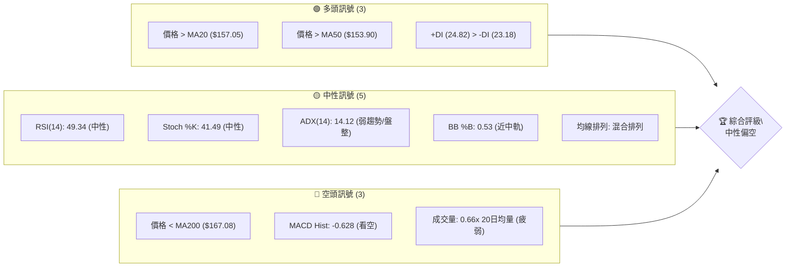
**解讀**：目前 VST 的技術訊號呈現多空交織的複雜局面。短期均線（MA20, MA50）給予多頭支撐，且 +DI 略高於 -DI，顯示多頭在微弱趨勢中佔優。然而，長期均線（MA200）仍壓制股價，MACD 柱狀圖為負值，且成交量明顯萎縮，這些都是明確的空頭訊號。最關鍵的是 ADX 值僅為 14.12，明確指示市場處於盤整或弱勢趨勢，而非強勢方向性行情。RSI 和 Stoch 指標均在中性區間，進一步確認了市場缺乏明確動能的現狀。綜合來看，雖然短期有反彈跡象，但整體仍處於中性偏空的盤整格局。

### 📊 核心指標速覽表

| 指標類別 | 指標名稱 | 當前數值 | 訊號 | 解讀 |
|----------|----------|----------|------|------|
| **價格** | 當前價格 | $157.98 | 🟡 | 位於52週區間中下部，近期處於震盪反彈中 |
| **均線** | MA20 | $157.05 | 🟢 | 價格在MA20上方，短期有支撐 |
| **均線** | MA50 | $153.90 | 🟢 | 價格在MA50上方，中期有支撐 |
| **均線** | MA200 | $167.08 | 🔴 | 價格在MA200下方，長期趨勢受壓 |
| **動能** | RSI(14) | 49.34 | 🟡 | 位於中性區間，無超買超賣壓力 |
| **動能** | MACD | -0.628 | 🔴 | MACD線在訊號線下方，柱狀圖為負，看空 |
| **趨勢** | ADX(14) | 14.12 | 🟡 | 趨勢強度極弱，市場處於盤整狀態 |
| **波動** | ATR(14) | $7.01 | 🟡 | 中等波動，約佔股價4.44% |
| **成交量** | 量比(20日) | 0.66x | 🔴 | 成交量低於均值，量能疲弱 |

### 🏆 技術評分卡

```
技術評分卡 — VST (2026-07-10)
════════════════════════════════════════════════════
趨勢強度      ██████░░░░░░░░░░░░░░  30/100  🟡 (ADX低，趨勢不明顯)
動能指標      ██████░░░░░░░░░░░░░░  35/100  🔴 (RSI中性，MACD看空)
支撐穩定度    ██████████░░░░░░░░░░  50/100  🟡 (近期有支撐，但長期壓力大)
成交量配合    ████░░░░░░░░░░░░░░░░  20/100  🔴 (量能疲弱，未確認反彈)
形態完整度    ████████░░░░░░░░░░░░  40/100  🟡 (潛在反轉形態，但未確認)
均線排列      ██████░░░░░░░░░░░░░░  30/100  🟡 (短期多頭，長期空頭，混合)
════════════════════════════════════════════════════
綜合評分      ██████░░░░░░░░░░░░░░  38/100  中性偏空
════════════════════════════════════════════════════
```
**評分說明**：
- **趨勢強度**：ADX 14.12 顯示趨勢極弱，市場處於盤整，因此評分較低。
- **動能指標**：RSI 處於中性區間，而 MACD 柱狀圖為負值，且 MACD 線已下穿訊號線，顯示動能偏空。
- **支撐穩定度**：股價在短期均線上方，且接近關鍵斐波那契回調支撐位 $150.97，提供了一定穩定性。
- **成交量配合**：成交量遠低於平均，未能有效支持近期的股價反彈，顯示買盤力道不足。
- **形態完整度**：雖然存在潛在的更高低點結構，但尚未形成明確的底部反轉形態，需等待進一步確認。
- **均線排列**：MA20 和 MA50 在價格下方提供支撐，但 MA200 仍位於價格上方，且 MA10 正在下滑，顯示均線排列混亂，多空拉鋸。

綜合來看，VST 目前處於中性偏空的評級。市場缺乏明確趨勢方向，儘管短期有支撐，但動能和成交量不足以推動股價有效突破上方阻力。

---

## 2. 趨勢分析

### 🌐 多時框趨勢分析

VST 的多時框趨勢分析揭示了長期下行修正與短期盤整反彈之間的複雜關係。

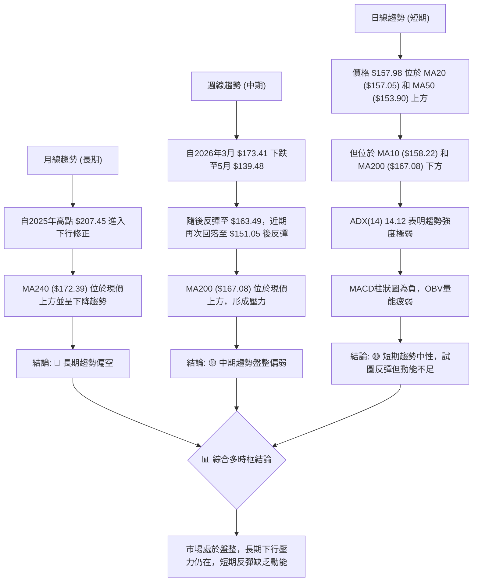

### 📈 長期趨勢 — 12個月走勢圖（Unicode）

VST 在過去 12 個月的月線走勢呈現出從高點回落的修正格局。2025 年 7 月達到最高點 $207.45 後，股價開始震盪下行，在 2026 年 3 月觸及 $150.12 的低點，隨後有所反彈，但未能回到前期高位。當前價格 $157.98 仍遠低於一年前的高點，顯示長期趨勢偏弱。

```
VST 月線走勢圖（過去12個月）
價格軸 ($)
$210 ┤                               ●(207.45)
$200 ┤              ●(195.11)
$190 ┤          ●(188.12)    ●(187.52)
$180 ┤                        ●(178.12)
$170 ┤                               ●(173.41)
$160 ┤                ●(160.88) ●(160.01) ●(158.63)
$150 ┤          ●(150.12) ●(157.91) ●(157.62) ●(157.98)←現在
     └───────────────────────────────────────────────────────
      25-07 25-08 25-09 25-10 25-11 25-12 26-01 26-02 26-03 26-04 26-05 26-06 26-07
```

**走勢特徵分析表格**：

| 時間區間 | 起始價 | 結束價 | 漲跌幅 | 主要特徵 | 訊號 |
|----------|--------|--------|--------|----------|------|
| 2025年7月-12月 | $207.45 | $160.88 | -22.45% | 從歷史高位回落，形成下降趨勢 | 🔴 |
| 2026年1月-3月 | $157.91 | $150.12 | -4.93% | 築底嘗試，但仍有下探動作 | 🟡 |
| 2026年4月-7月 | $157.62 | $157.98 | +0.23% | 底部反彈後進入窄幅盤整，動能不足 | 🟡 |
| **總結** | $207.45 | $157.98 | -23.97% | 長期處於修正階段，短期缺乏方向性 | 🔴 |

### 📊 中期趨勢（週線分析）

中期趨勢方面，VST 在過去 20 週經歷了明顯的波動。從 2026 年 3 月初的 $173.41 高點快速下跌至 5 月中旬的 $139.48，跌幅約 19.5%。隨後股價展開反彈，在 6 月底達到 $163.49 的階段性高點，但未能突破 MA200 ($167.08) 的壓制，並再次回落至 $151.05，隨後又小幅反彈至當前 $157.98。這種「跌深反彈，受阻回落，再次尋求支撐」的模式，明確顯示中期趨勢處於盤整震盪狀態。

```
VST 近期週線壓力與支撐示意圖
價格軸 ($)
$180 ┤                                 R2 ($171.94)
     ┤                                 R1 ($167.92)
$170 ┤       ───╮          ╱╲
     ┤          │         ╱  ╲
$160 ┤          │        ╱    ●←現價 $157.98
     ┤          │       ╱      ╲
$150 ┤          │      ╱        ╲
     ┤          ╰─────           S1 ($153.17)
$140 ┤           ●                 S2 ($148.78)
     ┤                               S3 ($144.63)
     └────────────────────────────────────────────────
        (高點) (低點) (反彈) (回落) (現價)
```
**解讀**：從週線圖來看，股價在 $139.48 附近獲得支撐後出現了較強的反彈，但反彈動能未能持續，在接近 $163.49 的位置再次遭遇阻力。目前的股價 $157.98 正處於短期反彈後的盤整區間，上方 R1 $167.92 和 R2 $171.94 構成強勁阻力，下方 S1 $153.17 和 S2 $148.78 則提供關鍵支撐。中期來看，股價在 $140-$170 區間內震盪的可能性較大。

### ⚡ 趨勢強度評估（ADX 解讀）

ADX (Average Directional Index) 指標用於衡量趨勢的強度，而非方向。當 ADX 值低於 25 時，通常表示市場處於盤整或弱勢趨勢；高於 25 則表示趨勢較強。

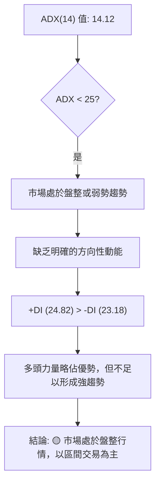

**ADX 強度對照表**：

| ADX 數值範圍 | 趨勢強度 | 市場狀況 | 建議 |
|--------------|----------|----------|------|
| 0-25         | 弱勢     | 盤整/無趨勢 | 區間交易，等待突破 |
| 25-50        | 中度     | 趨勢形成中 | 順勢交易，關注指標確認 |
| 50-75        | 強勢     | 明確趨勢   | 順勢交易，注意超買超賣 |
| 75-100       | 極強     | 趨勢非常強勁 | 順勢交易，警惕反轉風險 |

**解讀**：VST 的 ADX(14) 值為 14.12，遠低於 25 的閾值，明確指示當前市場處於**弱勢趨勢或盤整行情**。這意味著股價缺乏強勁的單一方向動能，預計將在一定區間內震盪。儘管 +DI (24.82) 略高於 -DI (23.18)，表明多頭力量在當前弱勢中略微佔優，但其差距不足以推動股價形成一個明確的上升趨勢。因此，在當前 ADX 條件下，應避免追漲殺跌，而應更側重於區間震盪的交易策略。

---

## 3. 圖表形態分析

### 🔍 形態識別系統

在當前 ADX 值較低，市場處於盤整的情況下，強勢的趨勢延續形態（如旗形、三角旗形）較難形成或確認。我們主要關注潛在的反轉形態或底部構築形態。

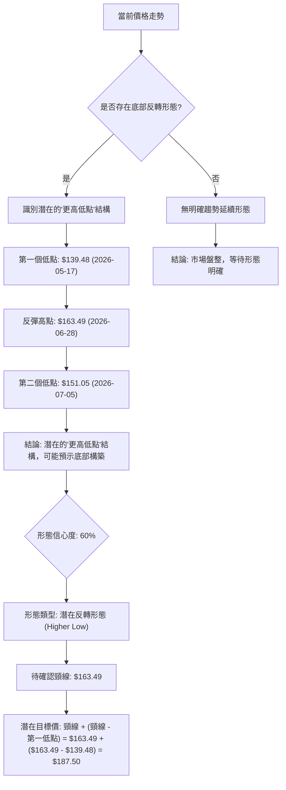

**已識別形態詳情**：

| 形態 | 信心度 | 判斷依據（引用數據） | 完成度 | 目標價（附計算式） |
|------|--------|----------------------|--------|--------------------|
| 潛在反轉形態 (Higher Low) | 60% | 2026-05-17 低點 $139.48，隨後反彈至 $163.49 (2026-06-28)，再回落至 $151.05 (2026-07-05) 形成更高低點。當前價格 $157.98 位於第二個低點之上。 | 70% | 頸線 $163.49 + 形態高度 ($163.49 - $139.48) = $163.49 + $24.01 = $187.50 |
| **備註** | | 此形態雖非教科書式的雙底，但「更高低點」結構是強勢反轉的早期訊號。需突破頸線 $163.49 方可確認形態有效。 | | |

**解讀**：VST 在經歷了從 3 月份高點 $173.41 到 5 月份低點 $139.48 的下跌後，於 5 月中旬形成了一個重要低點。隨後股價反彈至 $163.49，但在 7 月初再次回落至 $151.05，此處形成了一個比前一個低點更高的低點。這種「更高低點」的結構是潛在底部反轉形態的常見特徵，表明空頭力量減弱，多頭開始嘗試築底。然而，該形態尚未完全確認，需要股價有效突破兩個低點之間的反彈高點 $163.49（視為頸線）才能確立反轉。目前的信心度為 60%，主要基於價格行為的趨勢變化，但成交量和 MACD 尚未完全配合。

### 🕯️ 重要K線形態分析

由於提供的數據是週收盤價，難以判斷細緻的單日 K 線形態。但我們可以觀察週線級別的價格行為：

| 月份 | 收盤價 | K線形態 (週線級別) | 解讀 | 訊號 |
|------|--------|----------------------|------|------|
| 2026-05-17 | $139.48 | 大陰線後止跌 | 股價跌至 52 週低點區間，市場恐慌拋售後，顯示買盤開始介入，形成階段性低點。 | 🟢 |
| 2026-05-24 | $156.05 | 強勢反彈長陽線 | 價格從低點強勁反彈，收復前週部分跌幅，表明多頭力量回歸。 | 🟢 |
| 2026-06-07 | $148.55 | 長上影線（相對高點） | 反彈至高點後遭遇拋壓，顯示上方阻力較大，多頭動能減弱。 | 🔴 |
| 2026-07-05 | $151.05 | 短期回落止跌 | 價格回落至斐波那契回調位 $150.97 附近，並形成更高低點，暗示支撐有效。 | 🟡 |
| 2026-07-12 | $157.98 | 小幅反彈 | 價格從 $151.05 處反彈，但收盤價仍受制於 MA10 ($158.22)，動能尚不明顯。 | 🟡 |

**解讀**：從週線 K 線形態來看，5 月中旬的低點 $139.48 之後出現了強勁的長陽線反彈，確認了階段性底部。然而，隨後的反彈在高點附近出現了長上影線（或類似形態），表明上方存在較強的賣壓。最近幾週，股價在 $151.05 附近再次獲得支撐後小幅反彈，但缺乏強勁的 K 線形態確認其持續性。整體而言，K 線形態支持了當前處於底部盤整和潛在反轉的判斷。

### 📉 ASCII 走勢形態示意圖

以下示意圖展示了 VST 股價在過去幾個月中形成的潛在「更高低點」反轉結構。

```
VST 潛在反轉形態示意圖
價格軸 ($)
$170 ┤                                   R1 ($167.92)
     ┤                                   頸線 ($163.49)
$160 ┤               ───────╮           ●←現價 $157.98
     ┤              ╱        ╲         ╱
$150 ┤             ╱          ╲       ╱
     ┤            ●            ●
$140 ┤           ╱              ╲
     ┤          ╱                ╲
     ┤         ●(低點1)          (低點2)
     └────────────────────────────────────────────────
         2026-05-17  2026-06-28  2026-07-05  2026-07-10
         $139.48     $163.49     $151.05     $157.98
```
**解讀**：圖中清晰顯示了 VST 在 $139.48 (低點1) 處觸底反彈，隨後在 $163.49 形成一個階段性高點（潛在頸線）。之後股價回落，但在 $151.05 (低點2) 處止跌，形成了一個比低點1更高的低點。目前股價正從低點2反彈，朝著頸線方向移動。如果股價能夠有效突破並站穩頸線 $163.49，則此反轉形態將得到確認，並有望向目標價 $187.50 邁進。

### 🎯 形態目標價計算

對於上述識別的「潛在反轉形態 (Higher Low)」，其目標價計算基於形態的高度，並從頸線向上延伸。

- **第一低點 (Low 1)**：$139.48 (發生於 2026-05-17)
- **反彈高點 (Neckline)**：$163.49 (發生於 2026-06-28)
- **第二低點 (Low 2)**：$151.05 (發生於 2026-07-05)

**形態高度計算**：
形態高度 = 頸線價格 - 第一低點價格
形態高度 = $163.49 - $139.48 = $24.01

**目標價計算**：
目標價 = 頸線價格 + 形態高度
目標價 = $163.49 + $24.01 = $187.50

**解讀**：若 VST 股價能成功突破並穩定站上 $163.49 的頸線位置，則此潛在反轉形態將被確認，其理論目標價將指向 $187.50。這個目標價位在斐波那契回調的 38.2% ($185.89) 附近，顯示了潛在的共振效應。然而，如果股價未能突破頸線，或再次跌破第二低點 $151.05，則此形態將失效。

---

## 4. 支撐與阻力

### 🗺️ 關鍵價位分布圖（Unicode）

當前價格 $157.98 位於多個關鍵支撐和阻力位之間，顯示市場正處於區間震盪。

```
VST 價位結構分布圖
═══════════════════════════════════════════════════
$177.74 ║████████████████████████║ 強阻力 R3
$171.94 ║████████████████████    ║ 阻力 R2
$167.92 ║████████████████████████║ 關鍵阻力 R1 (斐波那契 61.8% $165.49 附近)
$157.98 ╠════════════════════════╣ ◄ 現價
$153.17 ║▓▓▓▓▓▓▓▓▓▓▓▓▓▓▓▓        ║ 近期支撐 S1 (MA50 $153.90 附近)
$148.78 ║████████████████████████║ 強支撐 S2 (斐波那契 78.6% $150.97 附近)
$144.63 ║████████████████████████║ 強支撐 S3
═══════════════════════════════════════════════════
```
**解讀**：從價位結構圖可以看出，VST 股價目前正被一系列密集的支撐與阻力位夾在中間。上方最近的阻力是 R1 $167.92，與斐波那契 61.8% 回調位 $165.49 形成共振，構成較強的壓力區。下方最近的支撐是 S1 $153.17，與 MA50 $153.90 接近。更強的支撐位於 S2 $148.78 和斐波那契 78.6% 回調位 $150.97 附近，這些位置在近期走勢中已被證明具有較強的買盤承接能力。

### 🚧 阻力位分析表

阻力位是股價上漲時可能遭遇賣壓的價格水平。這些價位通常是歷史高點、形態頸線或斐波那契回調位。

| 阻力級別 | 價位 | 形成原因 | 突破難度 | 重要性 |
|----------|------|----------|----------|--------|
| R1 (關鍵) | $167.92 | 近一年波段高點聚類，接近斐波那契 61.8% 回調位 $165.49，以及 MA200 ($167.08)。 | 高 | 🟢 (短期反彈能否持續的關鍵) |
| R2 (中級) | $171.94 | 近一年波段高點聚類，接近布林通道上軌 ($171.74)。 | 中高 | 🟡 (突破 R1 後的下一目標) |
| R3 (強勁) | $177.74 | 近一年波段高點聚類，多個技術形態頂部，歷史套牢區。 | 極高 | 🔴 (趨勢反轉的強勢訊號) |

**解讀**：VST 上方的阻力位層層疊疊。R1 $167.92 不僅是一個關鍵的波段高點聚類，更與長期均線 MA200 和重要的斐波那契回調位 $165.49 形成強烈共振，構成當前多頭反彈最難攻克的關卡。一旦 R1 被有效突破，下一目標將是 R2 $171.94，它與布林通道上軌重疊，同樣提供強大阻力。最上方的 R3 $177.74 則代表了更強的歷史賣壓，其突破將是長期趨勢反轉的重要訊號。

### 🛡️ 支撐位分析表

支撐位是股價下跌時可能獲得買盤支撐的價格水平。這些價位通常是歷史低點、形態底部或斐波那契回調位。

| 支撐級別 | 價位 | 形成原因 | 守住機率 | 重要性 |
|----------|------|----------|----------|--------|
| S1 (近期) | $153.17 | 近一年波段低點聚類，接近 MA50 ($153.90) 和布林通道中軌 ($157.05) 下方。 | 中高 | 🟢 (短期回調的關鍵防線) |
| S2 (重要) | $148.78 | 近一年波段低點聚類，與斐波那契 78.6% 回調位 $150.97 形成強烈共振。 | 高 | 🟢 (中期趨勢穩定的關鍵) |
| S3 (強勁) | $144.63 | 近一年波段低點聚類，歷史多頭防守區，心理關口。 | 極高 | 🟡 (避免趨勢惡化的最後防線) |

**解讀**：VST 下方的支撐位同樣關鍵。S1 $153.17 是短期回調的重要防線，與 MA50 形成共振，若能守住，則短期反彈仍有希望。S2 $148.78 則是一個更為重要的支撐位，它與斐波那契 78.6% 回調位 $150.97 緊密相連，近期股價在 $151.05 處獲得有效支撐，證明了該區域的買盤承接力。如果 S2 失守，則將面臨更深的回調，S3 $144.63 將成為最後一道防線，其失守可能預示著中期趨勢的惡化。

### 📐 斐波那契回調位分析

斐波那契回調位是從 52 週高點 $218.91 到 52 週低點 $132.47 的區間計算得出的關鍵回調水平。當前價格 $157.98 位於 61.8% 和 78.6% 回調位之間。

| 斐波那契水平 | 價位 | 意義 |
|--------------|------|------|
| 0.0% (52W High) | $218.91 | 長期上升趨勢的起點，或下跌趨勢的終點 |
| 23.6%        | $198.51 | 初步回調位 |
| 38.2%        | $185.89 | 較強回調位，可能形成反彈阻力 |
| 50.0%        | $175.69 | 通常視為牛熊分界線，心理關口 |
| 61.8%        | $165.49 | 黃金分割點，重要支撐或阻力 |
| 78.6%        | $150.97 | 較深回調位，接近底部 |
| 100.0% (52W Low) | $132.47 | 長期上升趨勢的終點，或下跌趨勢的起點 |

**解讀**：當前 VST 股價 $157.98 位於斐波那契 61.8% ($165.49) 和 78.6% ($150.97) 回調位之間。這表明股價已經從 52 週高點經歷了深度回調，目前正在低位區間尋求支撐。
- **上方阻力**：61.8% 回調位 $165.49 是一個非常重要的阻力關口，它與 R1 $167.92 和 MA200 $167.08 形成強烈共振，構成股價反彈的巨大壓力。
- **下方支撐**：78.6% 回調位 $150.97 則是一個關鍵的支撐位。近期股價在 $151.05 處獲得有效支撐，證明了該區域的買盤承接能力。如果此支撐位被跌破，則股價可能進一步探向 52 週低點 $132.47。
- **當前位置**：股價位於 61.8% 和 78.6% 之間，表明市場對深度回調後的反彈持謹慎態度。多頭正在努力守住 $150.97 附近的支撐，並試圖挑戰 $165.49 附近的阻力。

---

## 5. 技術指標深度解讀

### 🎛️ 指標訊號總覽

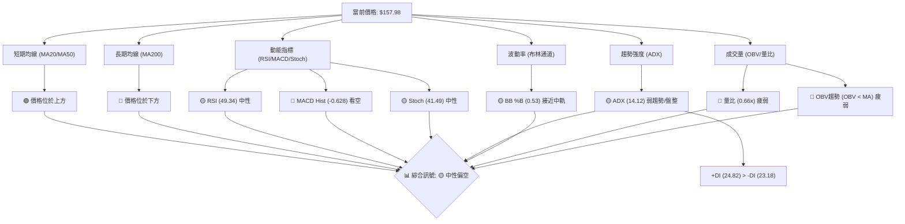
**解讀**：綜合來看，VST 的技術指標呈現出一個中性偏空的整體訊號。短期均線顯示股價有一定支撐，但長期均線的壓制、MACD 的空頭訊號以及疲弱的成交量都指向市場缺乏上漲動能。ADX 指標更是明確指出當前為盤整行情，而非趨勢行情。

### 📈 移動平均線排列分析

移動平均線 (MA) 用於平滑價格數據並識別趨勢方向和支撐阻力。

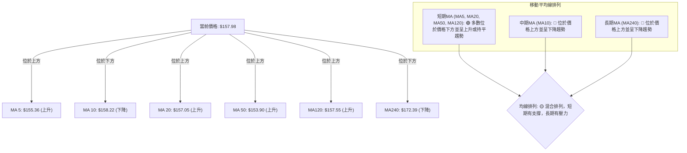
**解讀**：VST 的移動平均線排列呈現複雜的「混合排列」。
- **短期均線**：MA5 ($155.36)、MA20 ($157.05)、MA50 ($153.90) 和 MA120 ($157.55) 均位於當前價格 $157.98 之下，且多數呈上升趨勢，為股價提供了短期和中期的支撐。這表明近期市場情緒有所改善，買盤在低位有所承接。
- **中期均線**：MA10 ($158.22) 略高於當前價格並呈下降趨勢，顯示短期反彈動能正在減弱，或面臨短期賣壓。
- **長期均線**：MA200 ($167.08) 和 MA240 ($172.39) 遠高於當前價格並呈下降趨勢，構成強大的長期阻力。這印證了從 52 週高點以來的長期下跌趨勢尚未改變。

總體而言，這種混合排列表明股價在長期下跌趨勢中進行短期反彈和盤整，多空力量拉鋸。短期均線的支撐為多頭提供喘息空間，但長期均線的壓制限制了上漲空間。

### 📉 RSI(14) 分析

相對強弱指數 (RSI) 用於衡量價格變動的速度和幅度，判斷超買或超賣狀態。

- **RSI 數值進度條**：
  RSI(14) = 49.34: ▓▓▓▓▓▓▓▓▓▓▓░░░░░░░░░░ (49.34%)

- **超買超賣區間分析**：
  - **超買區 (RSI > 70)**：RSI 49.34 未進入超買區。上次進入超買區是在 2026-03-01 (RSI 76.5)，隨後價格大幅下跌，顯示超買壓力得到釋放。
  - **超賣區 (RSI < 30)**：RSI 49.34 未進入超賣區。上次進入超賣區是在 2026-05-17 (RSI 25.5)，隨後價格強勁反彈，顯示超賣狀態得到修正。
  - **中性區 (30 < RSI < 70)**：當前 RSI 49.34 位於中性區間，表明市場供需處於相對平衡狀態，沒有明顯的超買或超賣壓力。這符合 ADX 指示的盤整行情。

- **背離判斷**：
  - **RSI 背離**：數據中明確指出「無明顯背離」。
  - **解讀**：目前未觀察到 RSI 頂背離（價格創新高，RSI 未創新高，預示下跌）或底背離（價格創新低，RSI 未創新低，預示上漲）。這意味著 RSI 與價格走勢保持一致，未發出反轉的早期預警訊號。

**總結**：RSI 指標目前處於中性區間，未提供明確的多空方向訊號。其數值與價格走勢保持一致，沒有出現背離，進一步支持了當前市場處於盤整的判斷。

### 📊 MACD(12/26/9) 訊號解讀

移動平均線聚合散度指標 (MACD) 用於識別趨勢的強度、方向、動能和持續時間。

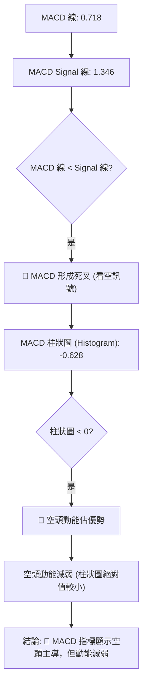
**解讀**：
- **MACD 線與訊號線**：MACD 線 (0.718) 位於訊號線 (1.346) 之下，形成了**死叉**，這是一個典型的**看空訊號**。它表明短期股價的平均動能正在減弱，並已跌破其長期平均動能。
- **MACD 柱狀圖**：柱狀圖為 -0.628，位於零軸下方，這再次確認了**空頭動能佔據主導地位**。然而，需要注意的是，柱狀圖的絕對值相對較小，且可能正在縮小（如果前幾天為更負值），這可能暗示空頭動能正在減弱，或者下跌勢頭有所緩解。

**總結**：MACD 指標整體發出偏空的訊號。儘管空頭動能可能有所減弱，但死叉的形成和負值的柱狀圖都提醒投資者應保持謹慎。這與 ADX 指示的盤整行情相符，表明市場在沒有明確多頭動能的情況下，仍受空頭壓制。

### 📦 布林通道分析

布林通道 (Bollinger Bands) 由中軌 (MA20)、上軌和下軌組成，用於衡量價格的波動區間。

```
VST 布林通道示意圖
價格軸 ($)
$171.74 ┤─────────────────────────────────── BB上軌
        │                                   (當前價格 $157.98)
$157.05 ┤─────────────────────────────────── BB中軌 (MA20)
        │
        │
$142.35 ┤─────────────────────────────────── BB下軌
        └───────────────────────────────────
```
**解讀**：
- **布林中軌 (MA20)**：$157.05。當前價格 $157.98 位於中軌上方，這是一個短期偏多的訊號。它表明股價近期經歷反彈，並嘗試在中軌上方站穩。
- **布林上軌**：$171.74。布林上軌構成股價上漲的動態阻力。如果股價能夠持續在中軌上方運行，並挑戰上軌，則可能預示著短期上升趨勢的形成。
- **布林下軌**：$142.35。布林下軌構成股價下跌的動態支撐。近期股價在 $151.05 附近獲得支撐，距離下軌還有一定距離，表明下行空間在短期內相對有限。
- **布林帶寬**：數據未直接提供帶寬，但從上軌 $171.74 和下軌 $142.35 的距離 ($29.39) 來看，帶寬處於中等水平。BB %B 為 0.53，表示價格略高於中軌。
- **與 ADX 結合**：ADX 14.12 顯示趨勢疲弱，這通常伴隨著布林帶寬的收縮，預示著價格將在通道內震盪，而不是突破性行情。

**總結**：布林通道顯示 VST 股價目前在中軌上方運行，短期偏多。但結合 ADX 的弱趨勢判斷，預計股價將在中軌和上軌之間震盪，上軌 $171.74 將構成較強的阻力。下軌 $142.35 則為重要的下跌支撐。

### 💹 成交量分析（量價配合度）

成交量是價格走勢的燃料，量價配合是判斷趨勢有效性的關鍵。

- **最新成交量**：2,905,200 股
- **20 日均量**：4,385,275 股
- **50 日均量**：4,924,932 股
- **量比 (最新/20日均量)**：0.66x (66%)
- **OBV 趨勢**：OBV < MA → 量能疲弱

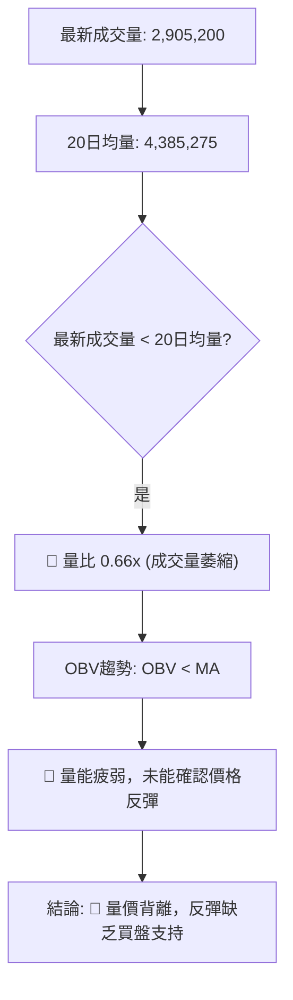
**解讀**：
- **成交量萎縮**：當前成交量 2,905,200 股遠低於 20 日均量 4,385,275 股 (量比 0.66x)，也低於 50 日均量。這是一個明確的**空頭訊號**。成交量萎縮表明市場參與度不高，買盤力量不足。
- **量價背離**：儘管 VST 股價近期有所反彈（從 $151.05 到 $157.98），但成交量卻未能有效放大。這種**量價背離**通常被視為反彈缺乏實質買盤支持的跡象，其持續性存疑。
- **OBV 趨勢**：OBV (On-Balance Volume) 趨勢顯示「OBV < MA」，這也印證了量能疲弱的判斷。OBV 的下降趨勢或未能隨價格上漲而同步上升，表明累積買盤壓力不足。

**總結**：成交量分析發出強烈的**看空訊號**。量能萎縮和量價背離嚴重削弱了近期股價反彈的可靠性。在缺乏成交量支持的情況下，股價很難有效突破上方阻力，更容易在盤整中再次回落。

---

## 6. 動能與波動率

### ⚡ 動能評估四象限

動能評估四象限將股票分為四類，以更好地理解其當前市場狀態。

| 象限 | 動能 | 波動 | 當前狀態 | 評估 |
|------|------|------|----------|------|
| Q1 | 強 | 低 | - | 最佳機會 (趨勢明確，風險可控) |
| Q2 | 弱 | 低 | - | 謹慎觀望 (缺乏方向，波動小，易盤整) |
| Q3 | 強 | 高 | - | 高風險高收益 (趨勢明確，但波動大) |
| Q4 | 弱 | 高 | ✓ | 避免進場 (缺乏方向，波動大，難以操作) |

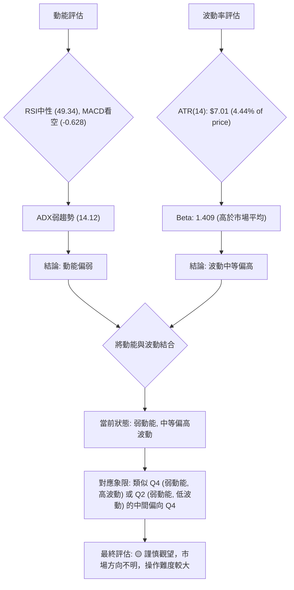
**解讀**：
- **動能**：RSI 處於中性區間，MACD 柱狀圖為負值，且 MACD 線形成死叉，顯示空頭動能佔優。更重要的是，ADX 值僅為 14.12，表明趨勢強度極弱，市場處於盤整。綜合來看，VST 的動能評估為**偏弱**。
- **波動率**：ATR(14) 為 $7.01，佔當前價格的 4.44%，這是一個中等偏高的波動水平。同時，其 Beta 值為 1.409，顯示 VST 的波動性高於大盤。綜合來看，VST 的波動率評估為**中等偏高**。

**四象限定位**：將「弱動能」與「中等偏高波動」結合，VST 目前處於類似 Q4（弱動能，高波動）的狀態。這意味著市場缺乏明確的方向性，但價格波動性卻不低，這使得交易變得更具挑戰性和不確定性。在這種情況下，投資者應保持高度謹慎，避免盲目追高殺跌，並等待市場方向的明確。

### 📊 ATR 波動率分析

平均真實波幅 (ATR) 用於衡量資產的波動程度，是設定止損和目標價的重要參考。

- **ATR(14) 數值**：$7.01
- **佔股價百分比**：4.44% ( $7.01 / $157.98 )

**解讀**：
- **波動水平**：VST 的 ATR(14) 為 $7.01，佔當前股價 $157.98 的 4.44%。相對於一般大型股，4.44% 的日均波動幅度屬於中等偏高水平。這意味著 VST 的股價在短期內可能會有較大的日內波動，為短線交易者提供機會，但也增加了風險。
- **止損距離建議**：ATR 可以作為衡量止損距離的依據。一般建議止損點設置在 1.5 倍至 3 倍 ATR 之外，以避免被正常市場噪音掃出。
    - 1.5 倍 ATR = 1.5 * $7.01 = $10.515
    - 2 倍 ATR = 2 * $7.01 = $14.02
    - 3 倍 ATR = 3 * $7.01 = $21.03
    這表示如果從當前價格 $157.98 進場，止損點應至少設置在 $157.98 - $10.515 = $147.465 之下，以給予交易足夠的波動空間。

**總結**：ATR 指標確認 VST 具有中等偏高的波動性。這要求交易者在設置止損和管理倉位時更加謹慎，應考慮到較大的價格波動幅度。

### 📐 Beta 與市場相關性

Beta 值衡量單一資產相對於整體市場（通常是標普 500 指數）的波動性。

- **Beta 值**：1.409

**解讀**：
- **高於市場平均**：VST 的 Beta 值為 1.409，顯著高於 1。這表示 VST 的股價波動性比整體市場高出約 40.9%。當市場上漲 1% 時，理論上 VST 傾向於上漲 1.409%；當市場下跌 1% 時，VST 傾向於下跌 1.409%。
- **市場相關性**：高 Beta 值意味著 VST 的股價走勢與大盤高度相關，且波動幅度更大。在牛市中，這可能帶來更高的收益潛力；但在熊市中，也可能導致更大的虧損。
- **風險考量**：由於 VST 的波動性較高，投資者在配置資產時需要考慮其對投資組合整體風險的影響。在市場不確定性較高或波動性加劇時，高 Beta 股票的風險會更加突出。

**總結**：VST 的高 Beta 值 ($1.409) 表明其具有較高的市場敏感性和波動性。這在制定交易策略時必須納入考量，尤其是在止損設置和倉位管理方面。

---

## 7. 多時框架總結

### 📋 時框架評分表

| 時框架 | 趨勢方向 | 動能 | 均線排列 | 形態 | 綜合評分 | 建議 |
|--------|----------|------|----------|------|----------|------|
| 月線   | 🔴 下行修正 | 🔴 弱勢 | 🔴 空頭壓制 | 🟡 底部尋求 | 3/10 | 謹慎觀望 |
| 週線   | 🟡 盤整偏弱 | 🟡 中性偏空 | 🟡 混合排列 | 🟡 潛在反轉 | 5/10 | 區間操作 |
| 日線   | 🟡 中性盤整 | 🔴 動能不足 | 🟡 短期支撐 | 🟡 試圖反彈 | 4/10 | 謹慎短線 |

### 🔲 綜合訊號矩陣

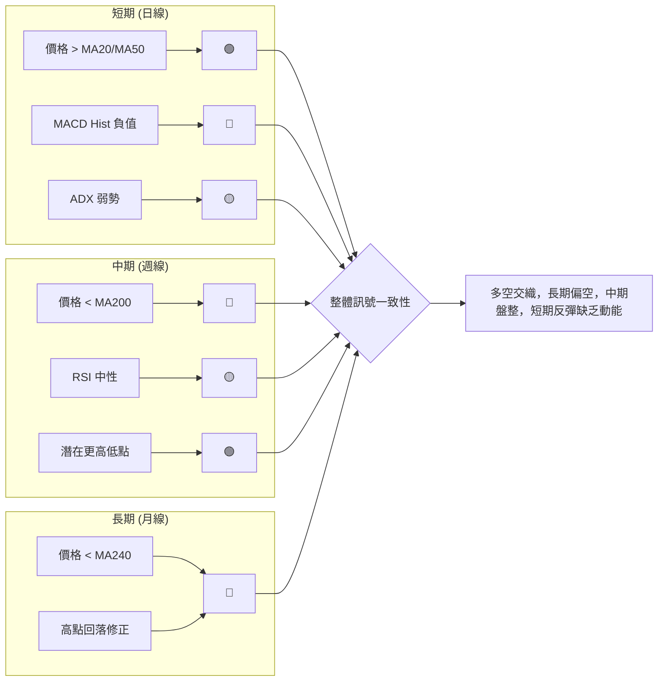
**解讀**：從多時框架來看，VST 的訊號一致性較低，顯示市場缺乏明確的單一方向。
- **長期**：月線級別顯示明確的下行修正趨勢，價格遠低於長期均線，並從高點大幅回落，長期展望偏空。
- **中期**：週線級別處於盤整偏弱狀態。雖然近期出現了更高低點的潛在反轉結構，但價格仍受制於長期均線，動能指標中性偏空，顯示反彈仍有壓力。
- **短期**：日線級別在短期均線上方獲得支撐，試圖反彈，但 MACD 柱狀圖為負，成交量疲弱，反彈動能不足。ADX 指標也確認了短期市場處於盤整。

### ⚖️ 多時框收斂結論

根據嚴格要求 14 的多時框收斂規則：
1. **判斷趨勢行情或盤整行情**：當前 ADX(14) 值為 14.12，遠低於 25。因此，市場被判定為**盤整行情 (Ranging Market)**。
2. **主導時框與交易區間**：由於是盤整行情，應以**日線布林通道上下軌為主要交易區間**。
3. **最終方向性結論**：
    - 從長期來看，VST 自 2025 年 7 月高點 $207.45 以來，一直處於修正性下跌趨勢中，MA200 和 MA240 均位於價格上方並呈下降趨勢，構成強大壓制。
    - 中期來看，股價在 $139.48 附近獲得支撐後有所反彈，形成潛在的更高低點，但反彈動能不足，未能有效突破關鍵阻力。
    - 短期來看，股價在短期均線上方，但 MACD 呈空頭排列，成交量萎縮，ADX 顯示趨勢疲弱。
    綜合所有時框架的分析，儘管短期有反彈跡象，但缺乏強勁動能和成交量支持，且長期下行壓力猶存。因此，VST 的整體方向性結論為：**中性偏空 (Neutral to Slightly Bearish)**。市場預計將在當前的支撐與阻力區間內繼續震盪，短期反彈面臨較大阻力，並有再次回落探底的風險。

---

## 8. 交易策略建議

### 🗺️ 策略決策流程圖

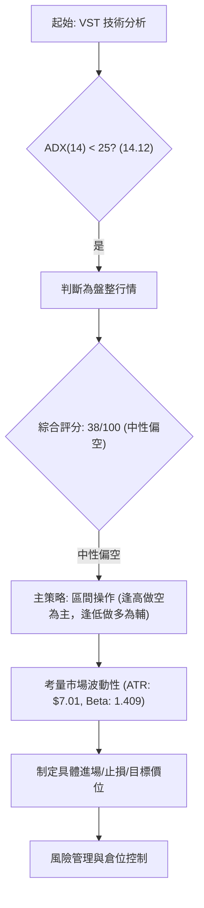

### 🧭 策略路由（依評分卡分流）

**當前主策略方向 = 區間震盪操作 (中性偏空，評分 38/100)**

由於綜合評分卡為 38/100 (中性偏空)，且 ADX 指標明確指示為盤整行情，因此當前應以**區間操作**為核心策略，並在區間內**逢高做空為主，逢低做多為輔**，但需嚴格控制風險。

### 🎯 價格情境階梯（Price Scenarios）

以當前價格 $157.98 為基準，建立向上與向下的情境劇本。

| 觸發條件 | 下一目標 | 後續延伸 | 情境含義 |
|----------|----------|----------|----------|
| **突破 R1 $167.92** | R2 $171.94 | R3 $177.74 | **短線轉強**：若能帶量突破關鍵阻力 R1，則短期多頭力量增強，有望進一步挑戰更高阻力。 |
| **站穩現價區間** | — | — | **區間震盪**：若股價未能突破 R1 也未跌破 S1，則大概率維持在 $153.17 - $167.92 區間內震盪。 |
| **跌破 S1 $153.17** | S2 $148.78 | S3 $144.63 | **中期轉弱**：若跌破短期支撐 S1，則短期反彈結束，可能再次探底 S2 和 S3，趨勢轉為偏空。 |

### 📊 情境機率分佈

| 情境 | 機率 | 主要依據 |
|------|------|----------|
| 繼續上行 / 反彈 | 30% | 短期均線支撐 (MA20/MA50)、潛在更高低點形態、+DI > -DI。 |
| 區間震盪 | 50% | ADX 弱勢 (14.12)、RSI 中性 (49.34)、MACD 柱狀圖絕對值縮小、布林通道中等帶寬。 |
| 回落 / 再探底 | 20% | MACD 死叉 (看空)、成交量萎縮 (0.66x)、OBV 疲弱、長期均線壓制 (MA200/MA240)。 |

**解讀**：基於 ADX 指示的盤整行情、中性偏空的技術評分以及多空交織的指標訊號，我們判斷 VST 最有可能的情境是繼續在 $153.17 - $167.92 區間內震盪。上行反彈的機率較低，因為缺乏量能和強勁動能支持。回落探底的機率也存在，尤其是在成交量持續萎縮和 MACD 偏空的情況下。

### 🟢 主策略詳情（區間操作，逢高做空為主）

| 策略要素 | 策略 A：逢高做空 (主策略) | 策略 B：逢低做多 (輔助策略) |
|----------|---------------------------|---------------------------|
| 進場條件 | 價格觸及 R1 或布林上軌，並伴隨動能指標轉弱（如 RSI 掉頭、MACD 柱狀圖擴大負值）。 | 價格觸及 S1 或 S2，並伴隨動能指標轉強（如 RSI 止跌回升、MACD 柱狀圖收縮負值）。 |
| 進場價格 | $167.92 (R1) 或 $171.74 (BB上軌) | $153.17 (S1) 或 $148.78 (S2) |
| 目標價 T1 | $157.05 (BB中軌/MA20) | $157.05 (BB中軌/MA20) |
| 目標價 T2 | $153.17 (S1) | $167.92 (R1) |
| 止損價格 | $177.74 (R3) (約 1 倍 ATR 於 BB上軌之上) | $144.63 (S3) (約 1 倍 ATR 於 S2 之下) |
| 風險報酬比 | 若進場 $171.74, 止損 $177.74, 目標T1 $157.05: (171.74-157.05) / (177.74-171.74) = 14.69 / 6.00 = **2.45:1** | 若進場 $148.78, 止損 $144.63, 目標T1 $157.05: (157.05-148.78) / (148.78-144.63) = 8.27 / 4.15 = **1.99:1** |
| 成功機率 | 55% | 45% |
| 建議倉位 | 輕倉 (不超過總資金 5%) | 輕倉 (不超過總資金 3%) |

**解讀**：
- **主策略 (逢高做空)**：鑒於長期趨勢偏空、MACD 死叉和成交量疲弱，逢高做空在當前盤整行情中具有較高勝率。在價格反彈至 R1 $167.92 或布林上軌 $171.74 附近時，若動能指標顯示疲軟，可考慮進場做空。止損設置在 R3 $177.74 上方，目標價可設為布林中軌 $157.05 或 S1 $153.17。風險報酬比相對吸引人。
- **輔助策略 (逢低做多)**：此策略應更為謹慎。當價格回落至 S1 $153.17 或 S2 $148.78 附近，且出現止跌訊號時，可考慮輕倉做多。止損設置在 S3 $144.63 之下，目標價為布林中軌 $157.05 或 R1 $167.92。儘管風險報酬比尚可，但整體市場偏空，此策略應作為短線反彈交易，並隨時準備止損。

### 🔴 反向風險觸發點（對沖提示）

以下是可能推翻上述主策略的關鍵價位和訊號，應作為風險監控的重點：

- **多頭反轉訊號**：
    - 股價帶量突破 R3 $177.74，並站穩其上。
    - MACD 形成金叉，且柱狀圖轉正並持續放大。
    - ADX 突破 25，且 +DI 顯著高於 -DI。
    - 成交量持續放大，伴隨股價上漲。
- **空頭趨勢確認訊號**：
    - 股價帶量跌破 S3 $144.63，並持續下行。
    - MACD 死叉後，柱狀圖負值持續擴大。
    - ADX 突破 25，且 -DI 顯著高於 +DI。
    - 成交量放大，伴隨股價下跌。

---

## 9. 風險提示與監控

### ✅ 關鍵監控指標 Checklist

以下是交易 VST 時需要密切關注的關鍵技術指標和價位，以應對市場變化。

```
VST 關鍵監控指標 Checklist
╔══════════════════════════════════════════════════════════════╗
║ [ ] 價格行為：當前價格 $157.98 是否穩定在 S1 $153.17 上方？  ║
║ [ ] 關鍵阻力：R1 $167.92 是否被有效突破？（帶量突破更佳）     ║
║ [ ] 關鍵支撐：S2 $148.78 或 S3 $144.63 是否被跌破？           ║
╠══════════════════════════════════════════════════════════════╣
║ [ ] ADX(14)：是否突破 25？ (+DI/-DI 誰佔優？)                 ║
║ [ ] MACD：是否形成金叉或死叉？柱狀圖變化趨勢？                 ║
║ [ ] RSI(14)：是否進入超買/超賣區？是否存在背離？               ║
║ [ ] 成交量：是否配合價格走勢？量比是否顯著放大？               ║
║ [ ] 布林通道：價格是否突破上/下軌？帶寬是否收縮/擴張？         ║
╚══════════════════════════════════════════════════════════════╝
```

### ⚠️ 風險場景分析

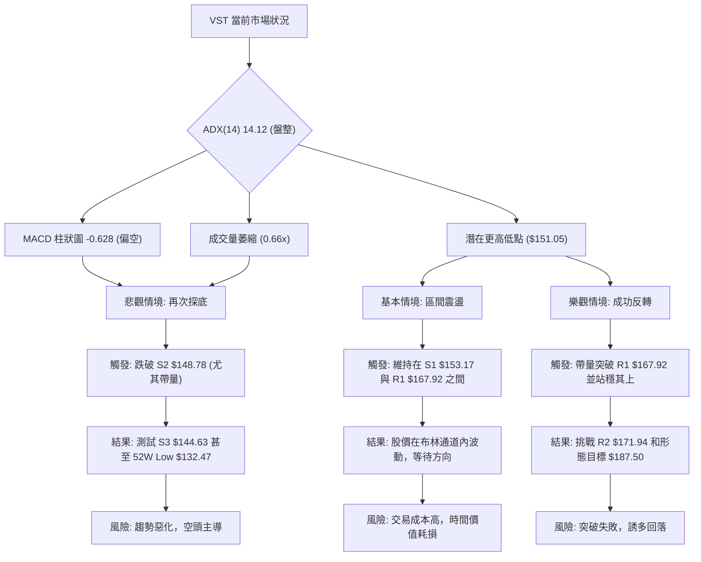
**解讀**：
- **樂觀情境**：如果 VST 能夠在接下來的交易日中，在成交量放大的配合下，有效突破並站穩 R1 $167.92，則其潛在的反轉形態將得到確認，股價有望進一步挑戰 R2 $171.94 甚至形態目標價 $187.50。此情境下，MACD 應轉為金叉，RSI 應向超買區推進。
- **基本情境**：在 ADX 弱勢的背景下，最有可能的情境是 VST 股價繼續維持在 S1 $153.17 和 R1 $167.92 之間震盪。布林通道中軌 $157.05 將成為多空拉鋸的焦點。此情境下，指標將維持中性，成交量保持清淡。
- **悲觀情境**：如果 VST 未能守住 S1 $153.17，尤其是在成交量放大的情況下跌破 S2 $148.78，則短期反彈將宣告失敗，股價可能再次加速下跌，目標指向 S3 $144.63 甚至 52 週低點 $132.47。此情境下，MACD 的空頭訊號將進一步強化，RSI 可能進入超賣區。

### 🛡️ 風險管理重要提醒

1.  **倉位管理**：由於 VST 處於盤整行情且波動性較高 (Beta 1.409)，應採取輕倉策略。單一頭寸不應超過總投資組合的 5%，以防範市場突發風險。
2.  **嚴格止損**：在盤整市場中，價格波動容易觸發止損。務必預設明確的止損點，並嚴格執行。建議根據 ATR 波動率 ($7.01) 設定止損，例如 1.5 倍至 2 倍 ATR 的距離。
3.  **分批進場/出場**：避免一次性重倉，可考慮分批進場和出場，以平滑平均成本，並在市場方向不明朗時保留操作彈性。
4.  **關注成交量**：成交量是判斷趨勢有效性的關鍵。在當前量能疲弱的情況下，任何反彈都應保持警惕。若要確認突破或反轉，必須伴隨顯著放大的成交量。
5.  **不逆勢交易**：儘管是區間操作，但仍需尊重大的趨勢。長期趨勢仍偏空，因此逢高做空相對更具優勢，而逢低做多應視為短線反彈策略，並嚴格控制風險。
6.  **市場環境**：密切關注整體市場（如標普 500 指數）的走勢。由於 VST 的 Beta 值較高，其股價容易受到大盤情緒的影響。

---

## 📋 報告總結

```
VST 技術分析報告總結
════════════════════════════════════════════════════════
報告日期：2026-07-10
當前價格：$157.98
分析評級：⚖️ 中性偏空 (ADX 弱勢，MACD 死叉，量能疲弱)

關鍵結論：
├─ 長期趨勢：🔴 下行修正，受 MA200/MA240 壓制。
├─ 中期趨勢：🟡 盤整偏弱，形成潛在更高低點，但反彈動能不足。
├─ 短期趨勢：🟡 中性盤整，價格在短期均線上方，但面臨 MA10 和 MACD 壓力。
├─ 關鍵支撐：S1 $153.17, S2 $148.78 (與斐波那契 78.6% $150.97 共振)。
├─ 關鍵阻力：R1 $167.92 (與斐波那契 61.8% $165.49 及 MA200 $167.08 共振)。
└─ 分析師目標：潛在反轉形態目標 $187.50 (需突破頸線 $163.49 確認)。

最優策略組合：
1. 🥇 最佳機會：**逢高做空** – 在價格反彈至 R1 $167.92 或 BB上軌 $171.74 附近，且動能指標轉弱時進場。目標價為 BB中軌 $157.05 或 S1 $153.17，止損設於 R3 $177.74。風險報酬比約 2.45:1。
2. 🥈 次選機會：**逢低做多 (謹慎)** – 在價格回落至 S1 $153.17 或 S2 $148.78 附近，且出現止跌訊號時輕倉進場。目標價為 BB中軌 $157.05 或 R1 $167.92，止損設於 S3 $144.63。風險報酬比約 1.99:1。
3. 🥉 保守選擇：**觀望等待** – 在市場方向不明朗，且風險報酬比不佳時，保持觀望，等待突破關鍵支撐或阻力，或等待更明確的趨勢形成。
════════════════════════════════════════════════════════
```

---

> ⚠️ **免責聲明**：本報告為 AI 自動生成之技術分析，所有數據及估算均基於提供的歷史價格資訊。本報告**僅供研究與學術參考**，**不構成任何投資建議**。投資有風險，入市需謹慎。

---

*報告生成時間：2026-07-10 ｜ 數據來源：Yahoo Finance ｜ 分析框架：多時框技術分析*