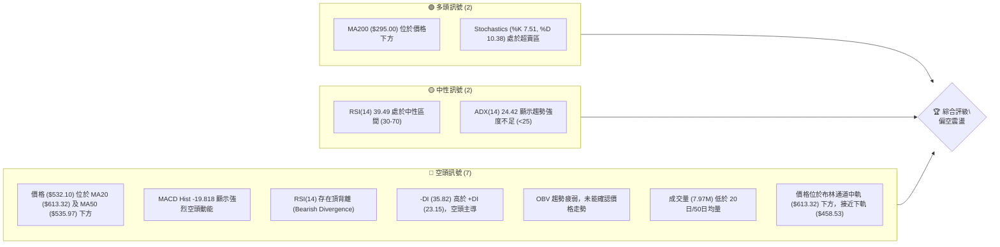
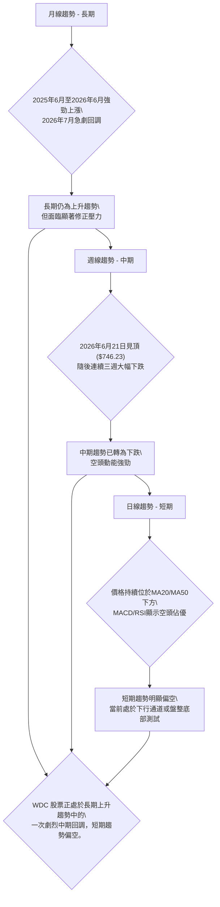
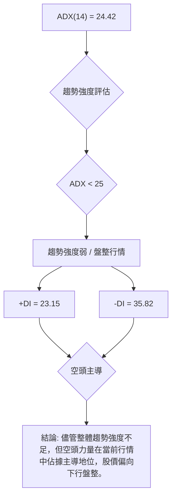
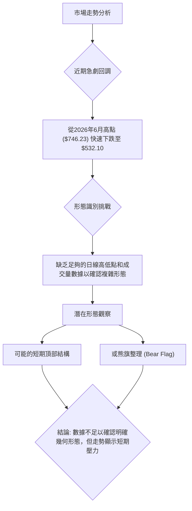
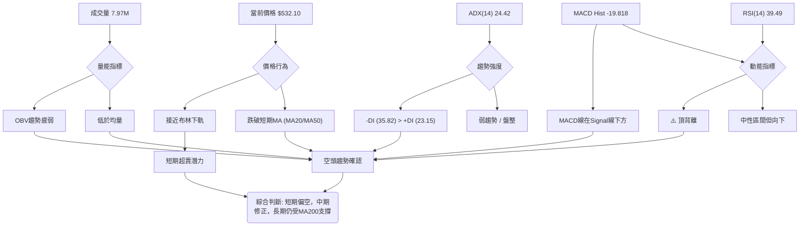
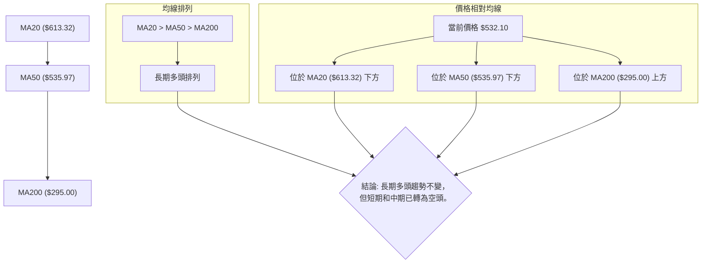
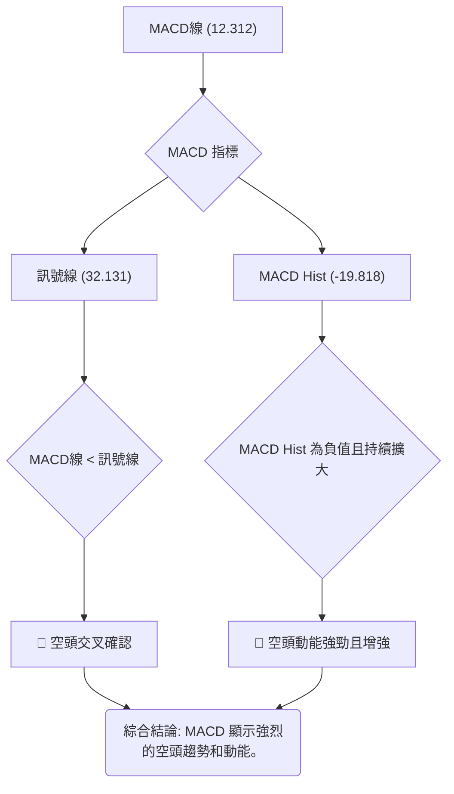
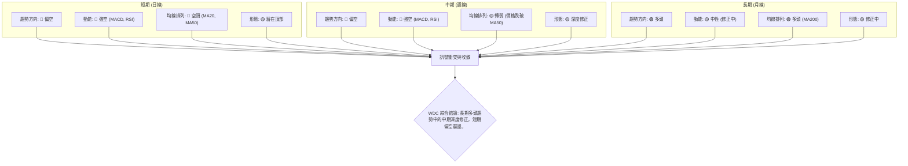
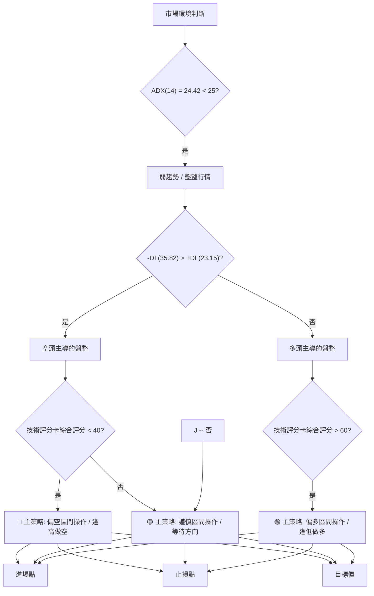
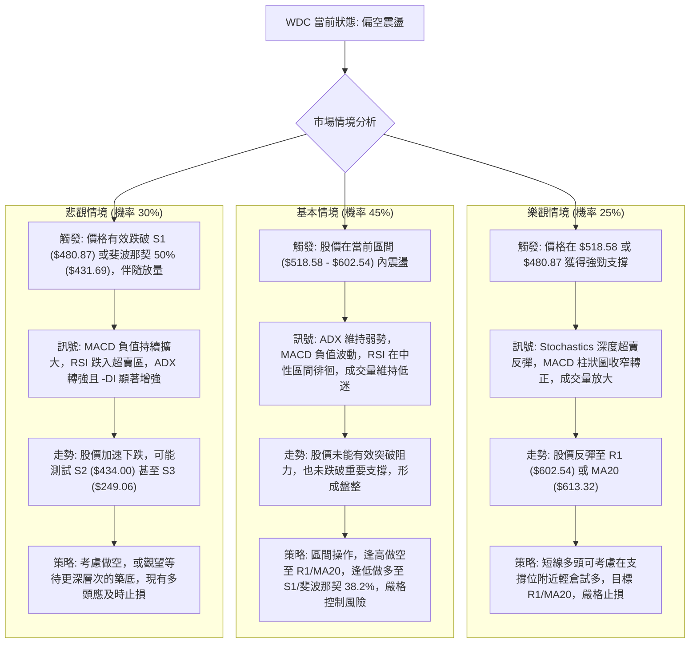

<html>
<head><meta charset="utf-8" /></head>
<body>
    <div style="height:500px; width:100%;">                        <script>window.PlotlyConfig = {MathJaxConfig: 'local'};</script>
        <script charset="utf-8" src="https://cdn.plot.ly/plotly-3.6.0.min.js" integrity="sha256-QaOVwtVY0T02VaHrr6pnoHLCwayMJp4O5n4YyaE3rJk=" crossorigin="anonymous"></script>                <div id="candlestick-chart" class="plotly-graph-div" style="height:100%; width:100%;"></div>            <script>                window.PLOTLYENV=window.PLOTLYENV || {};                                if (document.getElementById("candlestick-chart")) {                    Plotly.newPlot(                        "candlestick-chart",                        [{"close":{"dtype":"f8","bdata":"AAAAAPpAWkAAAAAgk59aQAAAAIAFEVxAAAAAYPWGW0AAAAAgKmNbQAAAAMClxFpAAAAAAI6vWkAAAABAySVdQAAAAGD++V1AAAAAYIZNYEAAAAAA8GJgQAAAACCJZGBAAAAAQKVHX0AAAABAr\u002fFdQAAAAACVQV5AAAAAoPviXUAAAAAgatFcQAAAAMBKrV1AAAAAwAo\u002fXEAAAABgSBJeQAAAAKCNcF9AAAAAQHOCX0AAAAAA9FdeQAAAAIBIUF5AAAAAQDMUXkAAAAAAxWNfQAAAAMBzKGBAAAAA4H2gX0AAAACAojBfQAAAAOBcpmFAAAAAAH8+YUAAAACAj8BiQAAAACApumNAAAAAAIX\u002fYkAAAACgovxjQAAAAOB9bGRAAAAAwAlYZEAAAABg5b9lQAAAAMC1OGVAAAAAYLW8ZEAAAAAArZ5jQAAAAKAWtGNAAAAAIL1HZEAAAACAQBVjQAAAAAC6OGNAAAAAIJyBYUAAAABgX2BhQAAAACCS12JAAAAAYL9mY0AAAABgNrFjQAAAAMDcY2RAAAAA4JJqZEAAAACgHvljQAAAAACAbGNAAAAAAIkdZEAAAAAA5RllQAAAAGBcNmVAAAAAQK8uZUAAAABgnbtmQAAAAMCIY2dAAAAAIC4IZkAAAABgpX5lQAAAAEDjz2VAAAAAQMbFZEAAAAAApN1lQAAAAMDJn2ZAAAAAIJ0VZkAAAACARUVmQAAAAOArb2ZAAAAAIICuZkAAAABgAnNmQAAAAIA5\u002f2VAAAAAwACGZUAAAADAhnNnQAAAAMBIeWdAAAAAQM1oa0AAAACgGfloQAAAAADjcmdAAAAAwKYLaUAAAACAO4FqQAAAAGC5vGpAAAAAYLXcakAAAADgzL9rQAAAAMDtrGtAAAAAgKDba0AAAADAGDluQAAAACCOZW5AAAAAgNyIbUAAAABggxduQAAAAKBAkW9AAAAAIA95cUAAAADgbWRxQAAAAICHQ29AAAAAoJzhcEAAAABAniFyQAAAAIB\u002f1HBAAAAAYAxBcEAAAADgHadxQAAAAKCm3XFAAAAAQPNmcEAAAACgvhlxQAAAAABtv3FAAAAA4B+XcUAAAADAlb9xQAAAAKCwhnJAAAAAoIrIcUAAAABgItZxQAAAAOCShHFAAAAAoAzncEAAAAAg+SxyQAAAAADXoXFAAAAAIA95cUAAAABgNt9wQAAAAACvT29AAAAAwMxScEAAAADgejBwQAAAAAAAqG5AAAAAwPVgcEAAAAAghaNwQAAAAMD1zHBAAAAAQOFScEAAAADgowRxQAAAACBc43FAAAAAwPWcc0AAAABgZg5zQAAAAEDhznNAAAAAoJlRckAAAADgo2xyQAAAAMDM0HJAAAAAgD2CckAAAACgmRVxQAAAAKBwNXFAAAAAoHB1b0AAAAAA1+dwQAAAACCum3JAAAAAIIVvckAAAABgZgJzQAAAACBcf3NAAAAA4HosdUAAAACAFB51QAAAAEDhdnVAAAAAYI\u002fidUAAAAAgheN2QAAAAAAA0HZAAAAAQAqbdkAAAADgUUh3QAAAAIDCYXdAAAAAwPX8d0AAAACgmVF4QAAAAIDrMXlAAAAAAABAeUAAAAAgrgt5QAAAAADXb3hAAAAAACnMeUAAAADgUSh7QAAAAOBR+HpAAAAAgMKle0AAAAAAKRR9QAAAAGBmMn5AAAAAYI\u002f+fEAAAAAAAAB+QAAAAOCjHoBAAAAAANeLfkAAAACgcOF+QAAAAGBmkn5AAAAA4FEgfkAAAABA4ap8QAAAAMDMfHxAAAAAgOu5fEAAAAAgXGd+QAAAAOB6RH5AAAAAQDNlgEAAAADAzJSAQAAAAKBwmYBAAAAAIK6ZgEAAAACgmRGBQAAAAMDMmIFAAAAAQOGQgkAAAAAAAPyBQAAAACCF+39AAAAAoHB3gEAAAACAwi2AQAAAAKBwoX5AAAAA4FGKgEAAAACgcJeBQAAAAIA9bIRAAAAA4KNIhUAAAABACkGGQAAAAADXUYdAAAAAwPXkhkAAAAAAAPaEQAAAAOCjHoRAAAAAwB4bhUAAAACgmVOCQAAAAEAKX4RAAAAAgML1g0AAAADA9bKCQAAAAAAA2IBAAAAAIK4LgkAAAADAzKCAQA=="},"high":{"dtype":"f8","bdata":"lqRFeFZ+WkAhPdHTusJaQI5irO7dK1xAkIhSj09nXEC+gmKflipcQMbErJfiI1tA\u002fDMHWvr6WkA0HaJ7RX9dQH3hJsK0m15AQhqyj3ZeYEC2nO5rKidhQKIljFV0AWFAeNcSntAAYUAXI9MBft5fQAZ8zJ0WyV5A8djDcNkrXkCywMqIzHJeQHd3R9HJmV5AstVFP01IXUD+7hPtEB9eQNqz7+hzR2BAry0emYseYEBSbZVXlnpgQAmAsvJadV5Azey3P2s9X0DWNUMBsKNfQOLSeLrNq2BAnHmnEL6dYEAyoc87FKpfQFKieTzJL2JApkcSYC26YUCn63\u002fFVa5jQLDX56ImAGRAPML3gWVfY0AS8he4sqVkQFkSaa8h6WRALz6Qj\u002fxgZEBNaWsmIgBmQB80KzIVR2ZA8BYSa6PsZUAxZws2ZpVkQLXlIFYhL2RA7bo6+M\u002foZEBNfT0RoCNkQBng+ZgOjmNAToBuiz5yZEA3Nijb4KlhQBAuZmsjEGNAVk6mM+x5Y0AK3N9GTiNkQPJiRW66bmRAhEKgTDmhZEBOEOybFDBlQFOxZs4O62NA05s8rHwuZEDb\u002fhsacixlQP8sdAFanWVAiSah0pF4ZUDGBFg2P8xmQCy75BjAlWdAasZgOGU3Z0DFNHvWlpxmQHReFOdxKWZAJlp2mqiyZkB\u002fT7za5qxmQOgEfNTNJWdAxiCT6eRiZ0CmooepEUpmQIxFiUjOzmZA6He6iNjNZkB80KvNzxVnQKOLMzbxq2ZANdmSVkodZkAb7cL5w3VnQA8ohZqFeGhANaf4H\u002fmja0D5r+kK8ZdqQITbK3G5GWlAf3t+Ml0aaUBJe8wRfqpqQErjI7OpPGtAfrpWdEtNa0D80\u002f7o1MtsQJ7aCsQovGxAWG\u002fAhB3FbEC6Lzr+DJluQMXqlcZI+m5AZeHivUZkbkAy5d0KP0pvQPLT1GkJBnBAq9bHctO9cUDpStcjidRxQPjj0VoHuXFAY1snCBc5cUAqZqT7uoVyQOSPFQGVbXJAxn7fogPccEDiY8DatLxxQNYnyGCedHJAW94Dl\u002fK6cUCZ0Tilf3pxQE6zRIelNXNAfEzZylcYckD3uvOVOwNyQADjDBwHXHNANBiXBwe2ckC6mDAGuZVyQCxsRwjdanJAiC7Pj9O9cUB7sSusrpZyQCYN1tDHHXJAegNakRP7cUDVYQcBjLxxQAywjTasDnBA5xR7ixIKcUAAAACAwtlwQAAAAGCPMnBAAAAAYI9icEAAAAAAAIxxQAAAAAAAEHFAAAAAwMzMcEAAAABACmdxQAAAAIDrHXJAAAAAYLiuc0AAAACA6\u002flzQAAAAEAz83NAAAAAANePc0AAAABA4c5zQAAAAKCZ1XJAAAAAIIXLckAAAADA9TxyQAAAAAAAqHFAAAAAgOvtcUAAAACgcPFwQAAAAEAzD3NAAAAAYGaickAAAACgcHlzQAAAAEAzg3NAAAAAAADAdUAAAACgmZF1QAAAAAAA3HVAAAAAgOv9dUAAAADAzOR2QAAAAADX13ZAAAAAYGYGd0AAAAAgrq93QAAAAGBmyndAAAAAIFxbeEAAAAAAACB5QAAAAIDrBXpAAAAAAADoeUAAAAAAAOB5QAAAAKBHxXhAAAAAANefe0AAAACAwm17QAAAAIDr6XtAAAAAoEddfEAAAACAwgF+QAAAAIDrPX5AAAAAwB65fUAAAABgjzp+QAAAAEAzaYBAAAAAoJnJf0AAAABgj3p\u002fQAAAACCFv39AAAAAYI9mfkAAAAAAAHB+QAAAACCuA31AAAAAYGZafUAAAADgo3R+QAAAAADXn35AAAAAwPXAgEAAAACgcBWBQAAAAAAATIFAAAAAgBQCgUAAAADAHqGBQAAAAKBw2YFAAAAA4FHUgkAAAAAAAJCCQAAAAKBHUYFAAAAAIK7hgEAAAACgRwuBQAAAAIDCGYBAAAAAgMKNgEAAAADgUeKBQAAAAGBmloRAAAAAIFzPhkAAAADAzC6HQAAAAMD1\u002fohAAAAAYGZeiEAAAACAPVSFQAAAAAAAyIRAAAAAAADIhkAAAAAgXDuEQAAAAADXZ4RAAAAAANe\u002fhEAAAADAHkuDQAAAAIDCC4NAAAAAAADIgkAAAAAAADCBQA=="},"hovertemplate":"\u003cb\u003e%{x|%Y-%m-%d}\u003c\u002fb\u003e\u003cbr\u003e\u958b: $%{open:.2f}\u003cbr\u003e\u9ad8: $%{high:.2f}\u003cbr\u003e\u4f4e: $%{low:.2f}\u003cbr\u003e\u6536: $%{close:.2f}\u003cextra\u003e\u003c\u002fextra\u003e","low":{"dtype":"f8","bdata":"kbdhgqJ3WUBglAmh10taQED2\u002f8ulxFpAjbVb2KBQW0BQXycATzFbQOUivNDXiVpAiO\u002fWBjxSWkAKn\u002fr08utbQB1k1OsqU11AMPWjvQBXXUDC+RVVfghgQL5KbpxuOGBAS\u002fRh4+kxX0AusCuiLWpdQDaADYly0F1Al+AXkVJ2XUD3GgmQfLhcQNx9JzYg91xA7TqHTg0YXECbXmEUsVZcQBdTh+aPj15AD28Y\u002fKzSXkDOxXMlkuxdQK5wQmCX3F1Au6n1JRtFXUClKPP6GGReQBFY+TKrG2BAIYhWjvnDXkDchbsUaGxeQObSwTaeYmBA6R16oMjaYEAaxqd7DX9hQNzE7oeHe2JAsMuhDH26YkDTor89FhljQEt04SMM82NAX+\u002f3a6cTY0DXLA0QTCNlQCbTiiyGLWVAjO1eVjGaZECMM8n7nFJjQB+MJ\u002fpnvGJA5zSIefFpY0D7HkCG0dFiQNk6gfVnvGJAFkrOSoQuYUBzQU5WVIhgQHuu3jfBy2FA\u002fFEJ71dwYkBh00ncG4VjQCq7DqjZkmNAbCcgnemgY0ARAgNtO4JjQEbz5iU752JAFBObMPodY0Bk5W8ghT1kQMjo639y1WRAk\u002fd1DJvZZECHjHXjNhplQEWJqKK+q2VAueUQhQk+ZUAfV7YcnHdlQFHSOQwRVWVA5pqiuIGsZEAnduflFstlQAK1bAkS82VAFPM1vpF4ZUCOTegxVM1lQMsjoRk9NmZAOP4iIVpDZkBjf4ztsRNmQDx3owKj5WVA5AFOtbJlZUCQslXcsRNmQCyOOUjN1mZAb7I+8aKIZ0DGhtJH2mBoQParmzqik2ZAS2CdCyc9Z0B0lc2sCS1oQEg2wCErDGpADFoYTENBakDRX43vnZxrQPJ+apc9F2tAgmJ146F8a0A9FXUrvT9sQAqJe020h2xAPkWCa9gCbUDJTzM3p0ZtQHhjzVyrcm5AM1fFqc1KcEDkhgHWi8NwQIBC8VLsrm1AoSpbGSUobkCam6bUHvlwQEVZQLiqxm9AMIWSsTfZb0CrLTmU\u002fl1wQGn\u002fTdVm9nBAkhL6CwFKcEAlFfK\u002fZqNwQCLbuofVrXFAtVSXAFKlcECXfif76v1wQCPMXNB1ynFAu\u002fK5W7mYcUAiEFsIg15xQPtosyPAYHFAagtL1Iy7cECImLiOGIBxQHlaWafj5nBAybtpeYAfcUDTxzmQ\u002f1VwQDxxr\u002fbwg25AQ+08d0+\u002fb0AAAACgcHVvQAAAAGBmhm5AAAAAAADAbUAAAABgZppwQAAAAAApfHBAAAAAwMwUcEAAAACgcJVwQAAAAOBRbHFAAAAAIIXLcUAAAACgmclyQAAAAOB6EHJAAAAAQOEyckAAAABgj7JxQAAAAEAzg3FAAAAAAACMcUAAAACgRw1xQAAAAAAA4HBAAAAAgOshb0AAAAAAANBvQAAAAAAAiHFAAAAAAABgcUAAAACAPbJyQAAAACCue3JAAAAAYI+6dEAAAAAAAJh0QAAAAAAAoHRAAAAAAAA4dUAAAAAAAFh1QAAAAIDC+XVAAAAAgMIRdkAAAABA4eJ2QAAAAGBm5nZAAAAAAAAYd0AAAAAAKdx3QAAAAMD1HHhAAAAAwMwAeUAAAADgesR4QAAAAOBRYHdAAAAAwMygeUAAAAAAAGB6QAAAAAAAQHlAAAAAACnIekAAAABACnN8QAAAAADXD3xAAAAA4HokfEAAAADAHlV9QAAAAAAAgH5AAAAAwMwsfUAAAACA67V9QAAAAKBwBX5AAAAAAAAQfUAAAABguJp7QAAAAAAAIHtAAAAAQOGCfEAAAACA6618QAAAAMDM6H1AAAAAAABIf0AAAACgmU2AQAAAAKBwe4BAAAAAoHA1gEAAAAAAKbKAQAAAAAAA6IBAAAAAAADagUAAAADgeqSBQAAAAKBH9X9AAAAAYGY4gEAAAACA6w1+QAAAAAAASH5AAAAAAACQfkAAAAAgrp+AQAAAAAAAIINAAAAAwMzahEAAAADA9bCFQAAAAEDhGIdAAAAAwMy0hkAAAAAAAGiEQAAAAKBHI4NAAAAAAACUhEAAAACAFByCQAAAAAAAcIJAAAAAYGayg0AAAABgZk6CQAAAAGC4boBAAAAAQOGcgUAAAACA6+V\u002fQA=="},"name":"\u50f9\u683c","open":{"dtype":"f8","bdata":"Zb4DegmVWUA7xCLfom9aQED2\u002f8ulxFpAPv287n4VXEAsl0h7q6xbQD0OEaPvnlpAW1r+PETVWkChC9jXF\u002fhbQDcq9Jwtal1AZh+S7NOBXUDZx0kjvvpgQEUMdTxHcmBAv5zk1nbaYEApSn9ToNNfQOfCnBtgJ15A0C4CshjoXUCGR\u002fi4KPZdQEa\u002fc1P5hV5Ae9GUj4T9XEBZUmGlOiNdQP\u002f\u002fqaIrx15AWBMpjHAtX0BzqNP2yhhgQA7Chz0eVF5AGxu9TfFAXkDqfshmzHJeQNX5nlB+J2BAAn9m3YuaYEA7P86gaKJfQCJIDtNeaGBAHmpWwqsyYUCqTXmXn2ljQH9EKDUB\u002fGJAu\u002fJbkazkYkBr6oguHiBjQJTOR6Ue+WNAr1xY18TxY0DviUj9EThlQGTG8t+QamVALm+2X2YwZUA2IzQYvUdkQLoXiLpizGJA5zSIefFpY0AaBLvDBsVjQBD54IZAFWNA7C1q1xZPZEDQsiRUhIthQHuu3jfBy2FAuOpBatm5YkBbyUNa7JhjQBEuRVVw+WNAFPK2r9T\u002fY0DD5ZDpJtlkQPsRBF8Z6mNAWmdFnr9aY0Bk5W8ghT1kQOd0PZ4kW2VAvZh8X80zZUCuiN9WHzRlQFLcs42IF2ZAx\u002fdSxQ4IZ0DmcV3hjEZmQKxB9gvtf2VALsViqgt6ZkA3Ia6S7NZlQB\u002fktGfaF2ZAYnXpcS9MZ0A8EaoS9O1lQKcUGR\u002f6Y2ZAKg9v+yDHZkCYLCyKQl1mQAzDH2DhhWZAy9VRHe8VZkCh5K7mryNmQNz0HKV7ImhArVwj4e+wZ0BzNcVJb3xqQFgkbxhADWlA4YeEC1N4Z0B0lc2sCS1oQE2QPtMdJWpA2cZPS7m8akAWojVSX\u002flrQMZkAvjGlWxA7XXoYDiWa0B2PT9P1HxsQBEAqHjx0m5A3unxiVAUbkCQHmz9lX9tQDKujLUkf25Ad0FO+C51cECCGYSW0c1xQJMDq821YXFANnygm5Z0bkCqVrxGBXZxQCXCeFq803FAEjO15VH+b0BwahvxxOVwQHYn\u002fKV\u002fenFA6VdBJFZ+cUBDkdafLC9xQJQWl5zRzXFA7fnNglkPcUD65jz6olNxQONlcLDJDXJA58iq0zhuckAiEFsIg15xQDS3vLq\u002ft3FAPR0P2eGccUD1YiNa2oVxQK\u002fD4bs14HFAAMyQRLA6cUAS7Evt7eVwQIuCIdtXzm9AmkDwbAgOcEAAAADAzBBwQAAAACBcP29AAAAAgBTmbUAAAABAM8dwQAAAAMDM3HBAAAAAYI+acEAAAAAgrp9wQAAAAOCjrHFAAAAAwB4FckAAAADAzFhzQAAAAMAeQXJAAAAA4FFYc0AAAACAwqlyQAAAAOBRaHJAAAAAAABAckAAAADgo+xxQAAAAGBmLnFAAAAAQOGmcUAAAAAAADBwQAAAAAAAiHFAAAAAYLhicUAAAABA4fJyQAAAAKBHnXJAAAAAAADwdEAAAACAFH51QAAAAEAzf3VAAAAAwMxYdUAAAAAAAGx2QAAAAAAAoHZAAAAAACmodkAAAACgmSV3QAAAAADXf3dAAAAAAACQd0AAAADAHul4QAAAAAAAMHhAAAAAgMKheUAAAAAgrrt5QAAAAEDhAnhAAAAAoJmFekAAAACAFLJ6QAAAACCFY3lAAAAAIK7rekAAAADAzHx8QAAAAAAAgH1AAAAA4FGAfUAAAADA9bB9QAAAAOB6kH5AAAAAoJkdf0AAAADAHnV\u002fQAAAAAApTH5AAAAAAABsfUAAAACgcFV+QAAAAEAzm3tAAAAAgBRWfUAAAABA4a58QAAAAEDhhn5AAAAAoEeNf0AAAACAwteAQAAAAIAU5IBAAAAAYGbygEAAAAAAAMCAQAAAAAAAeIFAAAAAAADagUAAAACAFLCBQAAAAAAACoFAAAAAIK7hgEAAAAAAALyAQAAAAEAza39AAAAA4FEcf0AAAACA6++AQAAAAIA9VoNAAAAAgD12hUAAAAAA17uFQAAAAEAz4YdAAAAAAAAmiEAAAAAgrsmEQAAAACCuk4RAAAAAAADIhkAAAABAMxmEQAAAAOB6xIJAAAAAIIXDg0AAAADgeuSCQAAAAAAAnIJAAAAAAAC4gUAAAABAM6OAQA=="},"x":["2025-09-18T00:00:00-04:00","2025-09-19T00:00:00-04:00","2025-09-22T00:00:00-04:00","2025-09-23T00:00:00-04:00","2025-09-24T00:00:00-04:00","2025-09-25T00:00:00-04:00","2025-09-26T00:00:00-04:00","2025-09-29T00:00:00-04:00","2025-09-30T00:00:00-04:00","2025-10-01T00:00:00-04:00","2025-10-02T00:00:00-04:00","2025-10-03T00:00:00-04:00","2025-10-06T00:00:00-04:00","2025-10-07T00:00:00-04:00","2025-10-08T00:00:00-04:00","2025-10-09T00:00:00-04:00","2025-10-10T00:00:00-04:00","2025-10-13T00:00:00-04:00","2025-10-14T00:00:00-04:00","2025-10-15T00:00:00-04:00","2025-10-16T00:00:00-04:00","2025-10-17T00:00:00-04:00","2025-10-20T00:00:00-04:00","2025-10-21T00:00:00-04:00","2025-10-22T00:00:00-04:00","2025-10-23T00:00:00-04:00","2025-10-24T00:00:00-04:00","2025-10-27T00:00:00-04:00","2025-10-28T00:00:00-04:00","2025-10-29T00:00:00-04:00","2025-10-30T00:00:00-04:00","2025-10-31T00:00:00-04:00","2025-11-03T00:00:00-05:00","2025-11-04T00:00:00-05:00","2025-11-05T00:00:00-05:00","2025-11-06T00:00:00-05:00","2025-11-07T00:00:00-05:00","2025-11-10T00:00:00-05:00","2025-11-11T00:00:00-05:00","2025-11-12T00:00:00-05:00","2025-11-13T00:00:00-05:00","2025-11-14T00:00:00-05:00","2025-11-17T00:00:00-05:00","2025-11-18T00:00:00-05:00","2025-11-19T00:00:00-05:00","2025-11-20T00:00:00-05:00","2025-11-21T00:00:00-05:00","2025-11-24T00:00:00-05:00","2025-11-25T00:00:00-05:00","2025-11-26T00:00:00-05:00","2025-11-28T00:00:00-05:00","2025-12-01T00:00:00-05:00","2025-12-02T00:00:00-05:00","2025-12-03T00:00:00-05:00","2025-12-04T00:00:00-05:00","2025-12-05T00:00:00-05:00","2025-12-08T00:00:00-05:00","2025-12-09T00:00:00-05:00","2025-12-10T00:00:00-05:00","2025-12-11T00:00:00-05:00","2025-12-12T00:00:00-05:00","2025-12-15T00:00:00-05:00","2025-12-16T00:00:00-05:00","2025-12-17T00:00:00-05:00","2025-12-18T00:00:00-05:00","2025-12-19T00:00:00-05:00","2025-12-22T00:00:00-05:00","2025-12-23T00:00:00-05:00","2025-12-24T00:00:00-05:00","2025-12-26T00:00:00-05:00","2025-12-29T00:00:00-05:00","2025-12-30T00:00:00-05:00","2025-12-31T00:00:00-05:00","2026-01-02T00:00:00-05:00","2026-01-05T00:00:00-05:00","2026-01-06T00:00:00-05:00","2026-01-07T00:00:00-05:00","2026-01-08T00:00:00-05:00","2026-01-09T00:00:00-05:00","2026-01-12T00:00:00-05:00","2026-01-13T00:00:00-05:00","2026-01-14T00:00:00-05:00","2026-01-15T00:00:00-05:00","2026-01-16T00:00:00-05:00","2026-01-20T00:00:00-05:00","2026-01-21T00:00:00-05:00","2026-01-22T00:00:00-05:00","2026-01-23T00:00:00-05:00","2026-01-26T00:00:00-05:00","2026-01-27T00:00:00-05:00","2026-01-28T00:00:00-05:00","2026-01-29T00:00:00-05:00","2026-01-30T00:00:00-05:00","2026-02-02T00:00:00-05:00","2026-02-03T00:00:00-05:00","2026-02-04T00:00:00-05:00","2026-02-05T00:00:00-05:00","2026-02-06T00:00:00-05:00","2026-02-09T00:00:00-05:00","2026-02-10T00:00:00-05:00","2026-02-11T00:00:00-05:00","2026-02-12T00:00:00-05:00","2026-02-13T00:00:00-05:00","2026-02-17T00:00:00-05:00","2026-02-18T00:00:00-05:00","2026-02-19T00:00:00-05:00","2026-02-20T00:00:00-05:00","2026-02-23T00:00:00-05:00","2026-02-24T00:00:00-05:00","2026-02-25T00:00:00-05:00","2026-02-26T00:00:00-05:00","2026-02-27T00:00:00-05:00","2026-03-02T00:00:00-05:00","2026-03-03T00:00:00-05:00","2026-03-04T00:00:00-05:00","2026-03-05T00:00:00-05:00","2026-03-06T00:00:00-05:00","2026-03-09T00:00:00-04:00","2026-03-10T00:00:00-04:00","2026-03-11T00:00:00-04:00","2026-03-12T00:00:00-04:00","2026-03-13T00:00:00-04:00","2026-03-16T00:00:00-04:00","2026-03-17T00:00:00-04:00","2026-03-18T00:00:00-04:00","2026-03-19T00:00:00-04:00","2026-03-20T00:00:00-04:00","2026-03-23T00:00:00-04:00","2026-03-24T00:00:00-04:00","2026-03-25T00:00:00-04:00","2026-03-26T00:00:00-04:00","2026-03-27T00:00:00-04:00","2026-03-30T00:00:00-04:00","2026-03-31T00:00:00-04:00","2026-04-01T00:00:00-04:00","2026-04-02T00:00:00-04:00","2026-04-06T00:00:00-04:00","2026-04-07T00:00:00-04:00","2026-04-08T00:00:00-04:00","2026-04-09T00:00:00-04:00","2026-04-10T00:00:00-04:00","2026-04-13T00:00:00-04:00","2026-04-14T00:00:00-04:00","2026-04-15T00:00:00-04:00","2026-04-16T00:00:00-04:00","2026-04-17T00:00:00-04:00","2026-04-20T00:00:00-04:00","2026-04-21T00:00:00-04:00","2026-04-22T00:00:00-04:00","2026-04-23T00:00:00-04:00","2026-04-24T00:00:00-04:00","2026-04-27T00:00:00-04:00","2026-04-28T00:00:00-04:00","2026-04-29T00:00:00-04:00","2026-04-30T00:00:00-04:00","2026-05-01T00:00:00-04:00","2026-05-04T00:00:00-04:00","2026-05-05T00:00:00-04:00","2026-05-06T00:00:00-04:00","2026-05-07T00:00:00-04:00","2026-05-08T00:00:00-04:00","2026-05-11T00:00:00-04:00","2026-05-12T00:00:00-04:00","2026-05-13T00:00:00-04:00","2026-05-14T00:00:00-04:00","2026-05-15T00:00:00-04:00","2026-05-18T00:00:00-04:00","2026-05-19T00:00:00-04:00","2026-05-20T00:00:00-04:00","2026-05-21T00:00:00-04:00","2026-05-22T00:00:00-04:00","2026-05-26T00:00:00-04:00","2026-05-27T00:00:00-04:00","2026-05-28T00:00:00-04:00","2026-05-29T00:00:00-04:00","2026-06-01T00:00:00-04:00","2026-06-02T00:00:00-04:00","2026-06-03T00:00:00-04:00","2026-06-04T00:00:00-04:00","2026-06-05T00:00:00-04:00","2026-06-08T00:00:00-04:00","2026-06-09T00:00:00-04:00","2026-06-10T00:00:00-04:00","2026-06-11T00:00:00-04:00","2026-06-12T00:00:00-04:00","2026-06-15T00:00:00-04:00","2026-06-16T00:00:00-04:00","2026-06-17T00:00:00-04:00","2026-06-18T00:00:00-04:00","2026-06-22T00:00:00-04:00","2026-06-23T00:00:00-04:00","2026-06-24T00:00:00-04:00","2026-06-25T00:00:00-04:00","2026-06-26T00:00:00-04:00","2026-06-29T00:00:00-04:00","2026-06-30T00:00:00-04:00","2026-07-01T00:00:00-04:00","2026-07-02T00:00:00-04:00","2026-07-06T00:00:00-04:00","2026-07-07T00:00:00-04:00"],"type":"candlestick"},{"hovertemplate":"MA30: $%{y:.2f}\u003cextra\u003e\u003c\u002fextra\u003e","line":{"color":"#2196F3","dash":"dash","width":2},"mode":"lines","name":"MA30","x":["2025-09-18T00:00:00-04:00","2025-09-19T00:00:00-04:00","2025-09-22T00:00:00-04:00","2025-09-23T00:00:00-04:00","2025-09-24T00:00:00-04:00","2025-09-25T00:00:00-04:00","2025-09-26T00:00:00-04:00","2025-09-29T00:00:00-04:00","2025-09-30T00:00:00-04:00","2025-10-01T00:00:00-04:00","2025-10-02T00:00:00-04:00","2025-10-03T00:00:00-04:00","2025-10-06T00:00:00-04:00","2025-10-07T00:00:00-04:00","2025-10-08T00:00:00-04:00","2025-10-09T00:00:00-04:00","2025-10-10T00:00:00-04:00","2025-10-13T00:00:00-04:00","2025-10-14T00:00:00-04:00","2025-10-15T00:00:00-04:00","2025-10-16T00:00:00-04:00","2025-10-17T00:00:00-04:00","2025-10-20T00:00:00-04:00","2025-10-21T00:00:00-04:00","2025-10-22T00:00:00-04:00","2025-10-23T00:00:00-04:00","2025-10-24T00:00:00-04:00","2025-10-27T00:00:00-04:00","2025-10-28T00:00:00-04:00","2025-10-29T00:00:00-04:00","2025-10-30T00:00:00-04:00","2025-10-31T00:00:00-04:00","2025-11-03T00:00:00-05:00","2025-11-04T00:00:00-05:00","2025-11-05T00:00:00-05:00","2025-11-06T00:00:00-05:00","2025-11-07T00:00:00-05:00","2025-11-10T00:00:00-05:00","2025-11-11T00:00:00-05:00","2025-11-12T00:00:00-05:00","2025-11-13T00:00:00-05:00","2025-11-14T00:00:00-05:00","2025-11-17T00:00:00-05:00","2025-11-18T00:00:00-05:00","2025-11-19T00:00:00-05:00","2025-11-20T00:00:00-05:00","2025-11-21T00:00:00-05:00","2025-11-24T00:00:00-05:00","2025-11-25T00:00:00-05:00","2025-11-26T00:00:00-05:00","2025-11-28T00:00:00-05:00","2025-12-01T00:00:00-05:00","2025-12-02T00:00:00-05:00","2025-12-03T00:00:00-05:00","2025-12-04T00:00:00-05:00","2025-12-05T00:00:00-05:00","2025-12-08T00:00:00-05:00","2025-12-09T00:00:00-05:00","2025-12-10T00:00:00-05:00","2025-12-11T00:00:00-05:00","2025-12-12T00:00:00-05:00","2025-12-15T00:00:00-05:00","2025-12-16T00:00:00-05:00","2025-12-17T00:00:00-05:00","2025-12-18T00:00:00-05:00","2025-12-19T00:00:00-05:00","2025-12-22T00:00:00-05:00","2025-12-23T00:00:00-05:00","2025-12-24T00:00:00-05:00","2025-12-26T00:00:00-05:00","2025-12-29T00:00:00-05:00","2025-12-30T00:00:00-05:00","2025-12-31T00:00:00-05:00","2026-01-02T00:00:00-05:00","2026-01-05T00:00:00-05:00","2026-01-06T00:00:00-05:00","2026-01-07T00:00:00-05:00","2026-01-08T00:00:00-05:00","2026-01-09T00:00:00-05:00","2026-01-12T00:00:00-05:00","2026-01-13T00:00:00-05:00","2026-01-14T00:00:00-05:00","2026-01-15T00:00:00-05:00","2026-01-16T00:00:00-05:00","2026-01-20T00:00:00-05:00","2026-01-21T00:00:00-05:00","2026-01-22T00:00:00-05:00","2026-01-23T00:00:00-05:00","2026-01-26T00:00:00-05:00","2026-01-27T00:00:00-05:00","2026-01-28T00:00:00-05:00","2026-01-29T00:00:00-05:00","2026-01-30T00:00:00-05:00","2026-02-02T00:00:00-05:00","2026-02-03T00:00:00-05:00","2026-02-04T00:00:00-05:00","2026-02-05T00:00:00-05:00","2026-02-06T00:00:00-05:00","2026-02-09T00:00:00-05:00","2026-02-10T00:00:00-05:00","2026-02-11T00:00:00-05:00","2026-02-12T00:00:00-05:00","2026-02-13T00:00:00-05:00","2026-02-17T00:00:00-05:00","2026-02-18T00:00:00-05:00","2026-02-19T00:00:00-05:00","2026-02-20T00:00:00-05:00","2026-02-23T00:00:00-05:00","2026-02-24T00:00:00-05:00","2026-02-25T00:00:00-05:00","2026-02-26T00:00:00-05:00","2026-02-27T00:00:00-05:00","2026-03-02T00:00:00-05:00","2026-03-03T00:00:00-05:00","2026-03-04T00:00:00-05:00","2026-03-05T00:00:00-05:00","2026-03-06T00:00:00-05:00","2026-03-09T00:00:00-04:00","2026-03-10T00:00:00-04:00","2026-03-11T00:00:00-04:00","2026-03-12T00:00:00-04:00","2026-03-13T00:00:00-04:00","2026-03-16T00:00:00-04:00","2026-03-17T00:00:00-04:00","2026-03-18T00:00:00-04:00","2026-03-19T00:00:00-04:00","2026-03-20T00:00:00-04:00","2026-03-23T00:00:00-04:00","2026-03-24T00:00:00-04:00","2026-03-25T00:00:00-04:00","2026-03-26T00:00:00-04:00","2026-03-27T00:00:00-04:00","2026-03-30T00:00:00-04:00","2026-03-31T00:00:00-04:00","2026-04-01T00:00:00-04:00","2026-04-02T00:00:00-04:00","2026-04-06T00:00:00-04:00","2026-04-07T00:00:00-04:00","2026-04-08T00:00:00-04:00","2026-04-09T00:00:00-04:00","2026-04-10T00:00:00-04:00","2026-04-13T00:00:00-04:00","2026-04-14T00:00:00-04:00","2026-04-15T00:00:00-04:00","2026-04-16T00:00:00-04:00","2026-04-17T00:00:00-04:00","2026-04-20T00:00:00-04:00","2026-04-21T00:00:00-04:00","2026-04-22T00:00:00-04:00","2026-04-23T00:00:00-04:00","2026-04-24T00:00:00-04:00","2026-04-27T00:00:00-04:00","2026-04-28T00:00:00-04:00","2026-04-29T00:00:00-04:00","2026-04-30T00:00:00-04:00","2026-05-01T00:00:00-04:00","2026-05-04T00:00:00-04:00","2026-05-05T00:00:00-04:00","2026-05-06T00:00:00-04:00","2026-05-07T00:00:00-04:00","2026-05-08T00:00:00-04:00","2026-05-11T00:00:00-04:00","2026-05-12T00:00:00-04:00","2026-05-13T00:00:00-04:00","2026-05-14T00:00:00-04:00","2026-05-15T00:00:00-04:00","2026-05-18T00:00:00-04:00","2026-05-19T00:00:00-04:00","2026-05-20T00:00:00-04:00","2026-05-21T00:00:00-04:00","2026-05-22T00:00:00-04:00","2026-05-26T00:00:00-04:00","2026-05-27T00:00:00-04:00","2026-05-28T00:00:00-04:00","2026-05-29T00:00:00-04:00","2026-06-01T00:00:00-04:00","2026-06-02T00:00:00-04:00","2026-06-03T00:00:00-04:00","2026-06-04T00:00:00-04:00","2026-06-05T00:00:00-04:00","2026-06-08T00:00:00-04:00","2026-06-09T00:00:00-04:00","2026-06-10T00:00:00-04:00","2026-06-11T00:00:00-04:00","2026-06-12T00:00:00-04:00","2026-06-15T00:00:00-04:00","2026-06-16T00:00:00-04:00","2026-06-17T00:00:00-04:00","2026-06-18T00:00:00-04:00","2026-06-22T00:00:00-04:00","2026-06-23T00:00:00-04:00","2026-06-24T00:00:00-04:00","2026-06-25T00:00:00-04:00","2026-06-26T00:00:00-04:00","2026-06-29T00:00:00-04:00","2026-06-30T00:00:00-04:00","2026-07-01T00:00:00-04:00","2026-07-02T00:00:00-04:00","2026-07-06T00:00:00-04:00","2026-07-07T00:00:00-04:00"],"y":{"dtype":"f8","bdata":"AAAAAAAA+H8AAAAAAAD4fwAAAAAAAPh\u002fAAAAAAAA+H8AAAAAAAD4fwAAAAAAAPh\u002fAAAAAAAA+H8AAAAAAAD4fwAAAAAAAPh\u002fAAAAAAAA+H8AAAAAAAD4fwAAAAAAAPh\u002fAAAAAAAA+H8AAAAAAAD4fwAAAAAAAPh\u002fAAAAAAAA+H8AAAAAAAD4fwAAAAAAAPh\u002fAAAAAAAA+H8AAAAAAAD4fwAAAAAAAPh\u002fAAAAAAAA+H8AAAAAAAD4fwAAAAAAAPh\u002fAAAAAAAA+H8AAAAAAAD4fwAAAAAAAPh\u002fAAAAAAAA+H8AAAAAAAD4fzMzM8NzAl5AmpmZKbhIXkCJiIgokqVeQCIiImK\u002fBl9Ad3d3ZxVgX0BVVVW1fMtfQKuqqtrQIWBAAAAA0I5dYEAiIiKSyppgQKuqqlL7z2BAEREROdL1YEDv7u6WaRFhQCIiIgqqLWFARERE7EJVYUBERER8V3hhQGZmZt5Fm2FA7+7uviSxYUARERE5d8phQHd3dz+h7GFA7+7utqsZYkDe3d0NaEFiQKuqqmJCaWJAiYiIoAmRYkCJiIhQArpiQN7d3cVr3mJAERERSbwJY0CJiIiA3jdjQDMzM9v\u002fYmNAZmZmZtCQY0BmZmZWuc1jQERERESy\u002fmNAAAAAcI0nZEARERGR9D5kQJqZmQm\u002fUGRAiYiIWONfZEDNzMzs629kQImIiLiygmRAd3d394yRZECrqqoa\u002f5VkQAAAAGBYoGRAMzMzM\u002fCwZEDe3d0tFclkQImIiGin3GRAMzMzQ0PnZEDv7u7eiQxlQFVVVeXSMGVAiYiIiFSFZUCrqqqKJ8ZlQJqZmQl37WVAIiIi4qAdZkAAAAAww1dmQM3MzKzsjWZAMzMz0+3EZkB3d3f3SAdnQGZmZgazTWdAAAAA4MSPZ0Dv7u7um91nQFVVVXX7K2hAvLu7O0FzaECrqqoqDbJoQAAAAJDX92hAvLu7OwpmaUAiIiJyctdpQN7d3Q0aKGpAiYiIOPOWakAzMzOjzRFrQERERBT6b2tAIiIiIu3Ia0CrqqqKKDhsQO\u002fu7h6hqWxAZmZmZgIAbUAzMzPDSmRtQHd3d8d6121AmpmZaQVMbkC8u7srz7JuQKuqqtqtJm9Aq6qq2klsb0B3d3cXmMdvQHd3dxc8FXBA3t3d3Zs6cECamZnpnmRwQDMzM9sAiXBAZmZmVn6rcECamZkREsVwQCIiIkqV1HBAMzMzGwTpcEARERG5NvJwQImIiDhS83BAiYiIeBIBcUBVVVUNqg5xQBEREZFXF3FAzczMPIkNcUBmZmbWVwpxQGZmZqaYHXFAvLu7a+g0cUBVVVX1zDxxQN7d3Z02VnFAzczM7NRncUBVVVV1am5xQERERFSFdnFAVVVVRX+IcUB3d3fnW4hxQM3MzGzCg3FAMzMzG+FzcUDNzMwUsGxxQKuqqjJjbXFAzczMFPRycUARERFZ9nxxQEREROzajXFAAAAAiE2ycUAzMzMLaMtxQN7d3ZUb7HFAZmZm\u002fsERckC8u7vzGUVyQGZmZl4sgnJAzczMBMi3ckB3d3cvT\u002fRyQGZmZt4IOXNAVVVVzfd5c0DNzMwEgbtzQHd3d88iA3RAiYiIgE5PdEAAAADYzpN0QGZmZs6wy3RAAAAAyHYAdUAzMzM7mEV1QN7d3ZW1gnVAREREjFDSdUCrqqpiOy12QDMzMxtajnZAVVVVTdTndkAiIiLqClZ3QJqZmdFN1ndAZmZmxr1UeEARERGh\u002fst4QGZmZtYVMnlAVVVVZdiVeUBERETkQuh5QImIiNj5NHpAiYiIiGx1ekB3d3enqsR6QAAAAGDJD3tAREREFNlse0DNzMxshMR7QImIiIglHXxAq6qqqo53fEB3d3fHL9R8QGZmZjb7OH1AvLu7KySpfUC8u7v7jQx+QBEREYF5Rn5AvLu7iwmIfkAzMzOTbsZ+QHd3dwdJ+35AERERQW85f0AAAACA631\u002fQFVVVUVT9H9AmpmZQdI5gEB3d3c\u002fp3uAQHd3d9fOwYBA7+7uxnYJgUDNzMykVDyBQO\u002fu7sZ2XoFAiYiIwDyQgUDNzMzc3aiBQN7d3eVC1IFAiYiISAz+gUBERER0TCOCQN7d3T18OYJAmpmZyehYgkAiIiJ6FGWCQA=="},"type":"scatter"},{"hovertemplate":"MA60: $%{y:.2f}\u003cextra\u003e\u003c\u002fextra\u003e","line":{"color":"#9C27B0","dash":"dash","width":2},"mode":"lines","name":"MA60","x":["2025-09-18T00:00:00-04:00","2025-09-19T00:00:00-04:00","2025-09-22T00:00:00-04:00","2025-09-23T00:00:00-04:00","2025-09-24T00:00:00-04:00","2025-09-25T00:00:00-04:00","2025-09-26T00:00:00-04:00","2025-09-29T00:00:00-04:00","2025-09-30T00:00:00-04:00","2025-10-01T00:00:00-04:00","2025-10-02T00:00:00-04:00","2025-10-03T00:00:00-04:00","2025-10-06T00:00:00-04:00","2025-10-07T00:00:00-04:00","2025-10-08T00:00:00-04:00","2025-10-09T00:00:00-04:00","2025-10-10T00:00:00-04:00","2025-10-13T00:00:00-04:00","2025-10-14T00:00:00-04:00","2025-10-15T00:00:00-04:00","2025-10-16T00:00:00-04:00","2025-10-17T00:00:00-04:00","2025-10-20T00:00:00-04:00","2025-10-21T00:00:00-04:00","2025-10-22T00:00:00-04:00","2025-10-23T00:00:00-04:00","2025-10-24T00:00:00-04:00","2025-10-27T00:00:00-04:00","2025-10-28T00:00:00-04:00","2025-10-29T00:00:00-04:00","2025-10-30T00:00:00-04:00","2025-10-31T00:00:00-04:00","2025-11-03T00:00:00-05:00","2025-11-04T00:00:00-05:00","2025-11-05T00:00:00-05:00","2025-11-06T00:00:00-05:00","2025-11-07T00:00:00-05:00","2025-11-10T00:00:00-05:00","2025-11-11T00:00:00-05:00","2025-11-12T00:00:00-05:00","2025-11-13T00:00:00-05:00","2025-11-14T00:00:00-05:00","2025-11-17T00:00:00-05:00","2025-11-18T00:00:00-05:00","2025-11-19T00:00:00-05:00","2025-11-20T00:00:00-05:00","2025-11-21T00:00:00-05:00","2025-11-24T00:00:00-05:00","2025-11-25T00:00:00-05:00","2025-11-26T00:00:00-05:00","2025-11-28T00:00:00-05:00","2025-12-01T00:00:00-05:00","2025-12-02T00:00:00-05:00","2025-12-03T00:00:00-05:00","2025-12-04T00:00:00-05:00","2025-12-05T00:00:00-05:00","2025-12-08T00:00:00-05:00","2025-12-09T00:00:00-05:00","2025-12-10T00:00:00-05:00","2025-12-11T00:00:00-05:00","2025-12-12T00:00:00-05:00","2025-12-15T00:00:00-05:00","2025-12-16T00:00:00-05:00","2025-12-17T00:00:00-05:00","2025-12-18T00:00:00-05:00","2025-12-19T00:00:00-05:00","2025-12-22T00:00:00-05:00","2025-12-23T00:00:00-05:00","2025-12-24T00:00:00-05:00","2025-12-26T00:00:00-05:00","2025-12-29T00:00:00-05:00","2025-12-30T00:00:00-05:00","2025-12-31T00:00:00-05:00","2026-01-02T00:00:00-05:00","2026-01-05T00:00:00-05:00","2026-01-06T00:00:00-05:00","2026-01-07T00:00:00-05:00","2026-01-08T00:00:00-05:00","2026-01-09T00:00:00-05:00","2026-01-12T00:00:00-05:00","2026-01-13T00:00:00-05:00","2026-01-14T00:00:00-05:00","2026-01-15T00:00:00-05:00","2026-01-16T00:00:00-05:00","2026-01-20T00:00:00-05:00","2026-01-21T00:00:00-05:00","2026-01-22T00:00:00-05:00","2026-01-23T00:00:00-05:00","2026-01-26T00:00:00-05:00","2026-01-27T00:00:00-05:00","2026-01-28T00:00:00-05:00","2026-01-29T00:00:00-05:00","2026-01-30T00:00:00-05:00","2026-02-02T00:00:00-05:00","2026-02-03T00:00:00-05:00","2026-02-04T00:00:00-05:00","2026-02-05T00:00:00-05:00","2026-02-06T00:00:00-05:00","2026-02-09T00:00:00-05:00","2026-02-10T00:00:00-05:00","2026-02-11T00:00:00-05:00","2026-02-12T00:00:00-05:00","2026-02-13T00:00:00-05:00","2026-02-17T00:00:00-05:00","2026-02-18T00:00:00-05:00","2026-02-19T00:00:00-05:00","2026-02-20T00:00:00-05:00","2026-02-23T00:00:00-05:00","2026-02-24T00:00:00-05:00","2026-02-25T00:00:00-05:00","2026-02-26T00:00:00-05:00","2026-02-27T00:00:00-05:00","2026-03-02T00:00:00-05:00","2026-03-03T00:00:00-05:00","2026-03-04T00:00:00-05:00","2026-03-05T00:00:00-05:00","2026-03-06T00:00:00-05:00","2026-03-09T00:00:00-04:00","2026-03-10T00:00:00-04:00","2026-03-11T00:00:00-04:00","2026-03-12T00:00:00-04:00","2026-03-13T00:00:00-04:00","2026-03-16T00:00:00-04:00","2026-03-17T00:00:00-04:00","2026-03-18T00:00:00-04:00","2026-03-19T00:00:00-04:00","2026-03-20T00:00:00-04:00","2026-03-23T00:00:00-04:00","2026-03-24T00:00:00-04:00","2026-03-25T00:00:00-04:00","2026-03-26T00:00:00-04:00","2026-03-27T00:00:00-04:00","2026-03-30T00:00:00-04:00","2026-03-31T00:00:00-04:00","2026-04-01T00:00:00-04:00","2026-04-02T00:00:00-04:00","2026-04-06T00:00:00-04:00","2026-04-07T00:00:00-04:00","2026-04-08T00:00:00-04:00","2026-04-09T00:00:00-04:00","2026-04-10T00:00:00-04:00","2026-04-13T00:00:00-04:00","2026-04-14T00:00:00-04:00","2026-04-15T00:00:00-04:00","2026-04-16T00:00:00-04:00","2026-04-17T00:00:00-04:00","2026-04-20T00:00:00-04:00","2026-04-21T00:00:00-04:00","2026-04-22T00:00:00-04:00","2026-04-23T00:00:00-04:00","2026-04-24T00:00:00-04:00","2026-04-27T00:00:00-04:00","2026-04-28T00:00:00-04:00","2026-04-29T00:00:00-04:00","2026-04-30T00:00:00-04:00","2026-05-01T00:00:00-04:00","2026-05-04T00:00:00-04:00","2026-05-05T00:00:00-04:00","2026-05-06T00:00:00-04:00","2026-05-07T00:00:00-04:00","2026-05-08T00:00:00-04:00","2026-05-11T00:00:00-04:00","2026-05-12T00:00:00-04:00","2026-05-13T00:00:00-04:00","2026-05-14T00:00:00-04:00","2026-05-15T00:00:00-04:00","2026-05-18T00:00:00-04:00","2026-05-19T00:00:00-04:00","2026-05-20T00:00:00-04:00","2026-05-21T00:00:00-04:00","2026-05-22T00:00:00-04:00","2026-05-26T00:00:00-04:00","2026-05-27T00:00:00-04:00","2026-05-28T00:00:00-04:00","2026-05-29T00:00:00-04:00","2026-06-01T00:00:00-04:00","2026-06-02T00:00:00-04:00","2026-06-03T00:00:00-04:00","2026-06-04T00:00:00-04:00","2026-06-05T00:00:00-04:00","2026-06-08T00:00:00-04:00","2026-06-09T00:00:00-04:00","2026-06-10T00:00:00-04:00","2026-06-11T00:00:00-04:00","2026-06-12T00:00:00-04:00","2026-06-15T00:00:00-04:00","2026-06-16T00:00:00-04:00","2026-06-17T00:00:00-04:00","2026-06-18T00:00:00-04:00","2026-06-22T00:00:00-04:00","2026-06-23T00:00:00-04:00","2026-06-24T00:00:00-04:00","2026-06-25T00:00:00-04:00","2026-06-26T00:00:00-04:00","2026-06-29T00:00:00-04:00","2026-06-30T00:00:00-04:00","2026-07-01T00:00:00-04:00","2026-07-02T00:00:00-04:00","2026-07-06T00:00:00-04:00","2026-07-07T00:00:00-04:00"],"y":{"dtype":"f8","bdata":"AAAAAAAA+H8AAAAAAAD4fwAAAAAAAPh\u002fAAAAAAAA+H8AAAAAAAD4fwAAAAAAAPh\u002fAAAAAAAA+H8AAAAAAAD4fwAAAAAAAPh\u002fAAAAAAAA+H8AAAAAAAD4fwAAAAAAAPh\u002fAAAAAAAA+H8AAAAAAAD4fwAAAAAAAPh\u002fAAAAAAAA+H8AAAAAAAD4fwAAAAAAAPh\u002fAAAAAAAA+H8AAAAAAAD4fwAAAAAAAPh\u002fAAAAAAAA+H8AAAAAAAD4fwAAAAAAAPh\u002fAAAAAAAA+H8AAAAAAAD4fwAAAAAAAPh\u002fAAAAAAAA+H8AAAAAAAD4fwAAAAAAAPh\u002fAAAAAAAA+H8AAAAAAAD4fwAAAAAAAPh\u002fAAAAAAAA+H8AAAAAAAD4fwAAAAAAAPh\u002fAAAAAAAA+H8AAAAAAAD4fwAAAAAAAPh\u002fAAAAAAAA+H8AAAAAAAD4fwAAAAAAAPh\u002fAAAAAAAA+H8AAAAAAAD4fwAAAAAAAPh\u002fAAAAAAAA+H8AAAAAAAD4fwAAAAAAAPh\u002fAAAAAAAA+H8AAAAAAAD4fwAAAAAAAPh\u002fAAAAAAAA+H8AAAAAAAD4fwAAAAAAAPh\u002fAAAAAAAA+H8AAAAAAAD4fwAAAAAAAPh\u002fAAAAAAAA+H8AAAAAAAD4f+\u002fu7hL2f2FAZmZmwvSlYUCrqqrS3shhQFVVVV0P6mFAIiIiBvcHYkC8u7sj1SpiQJqZmclBUmJAvLu74413YkBmZmbWZJhiQFVVVdkpuGJAIiIiNmHTYkBmZmZiP+1iQFVVVbkoBWNAvLu7F0MeY0CamZmtcEJjQN7d3WEMZmNAvLu7ozybY0De3d1hT8hjQImIiCQM7WNAiYiITKYbZEDv7u6elUxkQLy7u4eXe2RA3t3dufuqZEAAAACkpeBkQCIiImYPFmVAiYiIlMBMZUC8u7s3vYplQERERKh9x2VAERER0QgCZkCJiIhA4z9mQCIiIupEe2ZA3t3d1cvGZkCamZmBMwtnQLy7u4tsPGdAiYiISGt7Z0AAAADI3MBnQGZmZmZW+WdAzczMDD0taECrqqrSE2doQHd3d7\u002f8pGhAzczMTHnYaECJiIj4rxZpQAAAABgRWmlAZmZmVqSZaUBVVVWFrN9pQAAAAGDAK2pAmpmZMc94akARERHR38ZqQERERJz3C2tA7+7uTmxJa0CamZmBgJBrQJqZmTH3z2tAAAAAQPUNbEBVVVWNtkhsQFVVVc1ue2xAMzMzi+awbECJiIiwBOFsQDMzM\u002fNPCW1AZmZmFrM6bUCrqqqisGdtQBEREVlDk21Aq6qqWo7AbUB3d3cPEfZtQFVVVa2lMW5AAAAACGKAbkDv7u7Gs8VuQAAAAKgzDm9A3t3dfUtMb0Crqqq6fopvQLy7u+NVy29AREREPEAEcECJiIikQB1wQEREROi\u002fN3BAAAAA6PFMcEBVVVXVC2NwQAAAABBdgHBAERERgYyUcEBmZmYyYbBwQN7d3YGL0XBA7+7usnT2cEBmZmZ6AxhxQImIiDiOOnFAZmZmKqBecUCrqqoCFoVxQERERNRgq3FAAAAAEGbQcUBERET0QvNxQHd3d4stFnJA7+7uIoU9ckARERGJFWVyQERERDA9jXJAq6qq3muuckAzMzNXE89yQGZmZrqk9HJA3t3dma8ac0BERESYMkFzQN7d3Rl2bHNAiYiIvBKdc0AAAADs0s1zQLy7u7dvAnRAVVVVySk4dEDNzMxoM290QDMzMx8IrXRAzczMcE\u002fkdEDv7u5aVxx1QImIiIS8T3VAERERPWaEdUCrqqqenLJ1QGZmZmJq4XVARERECN0TdkBVVVVZCUh2QO\u002fu7nryfXZAVVVViU2\u002fdkBEREQwzwR3QHd3d\u002fOoT3dAvLu7V6uXd0B3d3d7P+R3QGZmZgoCOXhAiYiI\u002fI2ReEBERESAB+R4QERERCjOJHlAIiIiBqxreUCamZm1Hq15QO\u002fu7up843lAiYiIBPMcekCamZndwWF6QJqZmW2Eu3pAvLu7h\u002foie0DNzMzwRJJ7QBEREeX7CHxAmpmZ7WB9fEDe3d0ZWud8QLy7u6+dSX1AvLu7o5u6fUBVVVUt3Q5+QBEREdFNbX5AMzMze\u002fjIfkBmZmbmbRd\u002fQCIiIir5U39A3t3dDZ+Tf0De3d3Nacd\u002fQA=="},"type":"scatter"},{"hovertemplate":"MA200: $%{y:.2f}\u003cextra\u003e\u003c\u002fextra\u003e","line":{"color":"#FF6F00","dash":"solid","width":2},"mode":"lines","name":"MA200","x":["2025-09-18T00:00:00-04:00","2025-09-19T00:00:00-04:00","2025-09-22T00:00:00-04:00","2025-09-23T00:00:00-04:00","2025-09-24T00:00:00-04:00","2025-09-25T00:00:00-04:00","2025-09-26T00:00:00-04:00","2025-09-29T00:00:00-04:00","2025-09-30T00:00:00-04:00","2025-10-01T00:00:00-04:00","2025-10-02T00:00:00-04:00","2025-10-03T00:00:00-04:00","2025-10-06T00:00:00-04:00","2025-10-07T00:00:00-04:00","2025-10-08T00:00:00-04:00","2025-10-09T00:00:00-04:00","2025-10-10T00:00:00-04:00","2025-10-13T00:00:00-04:00","2025-10-14T00:00:00-04:00","2025-10-15T00:00:00-04:00","2025-10-16T00:00:00-04:00","2025-10-17T00:00:00-04:00","2025-10-20T00:00:00-04:00","2025-10-21T00:00:00-04:00","2025-10-22T00:00:00-04:00","2025-10-23T00:00:00-04:00","2025-10-24T00:00:00-04:00","2025-10-27T00:00:00-04:00","2025-10-28T00:00:00-04:00","2025-10-29T00:00:00-04:00","2025-10-30T00:00:00-04:00","2025-10-31T00:00:00-04:00","2025-11-03T00:00:00-05:00","2025-11-04T00:00:00-05:00","2025-11-05T00:00:00-05:00","2025-11-06T00:00:00-05:00","2025-11-07T00:00:00-05:00","2025-11-10T00:00:00-05:00","2025-11-11T00:00:00-05:00","2025-11-12T00:00:00-05:00","2025-11-13T00:00:00-05:00","2025-11-14T00:00:00-05:00","2025-11-17T00:00:00-05:00","2025-11-18T00:00:00-05:00","2025-11-19T00:00:00-05:00","2025-11-20T00:00:00-05:00","2025-11-21T00:00:00-05:00","2025-11-24T00:00:00-05:00","2025-11-25T00:00:00-05:00","2025-11-26T00:00:00-05:00","2025-11-28T00:00:00-05:00","2025-12-01T00:00:00-05:00","2025-12-02T00:00:00-05:00","2025-12-03T00:00:00-05:00","2025-12-04T00:00:00-05:00","2025-12-05T00:00:00-05:00","2025-12-08T00:00:00-05:00","2025-12-09T00:00:00-05:00","2025-12-10T00:00:00-05:00","2025-12-11T00:00:00-05:00","2025-12-12T00:00:00-05:00","2025-12-15T00:00:00-05:00","2025-12-16T00:00:00-05:00","2025-12-17T00:00:00-05:00","2025-12-18T00:00:00-05:00","2025-12-19T00:00:00-05:00","2025-12-22T00:00:00-05:00","2025-12-23T00:00:00-05:00","2025-12-24T00:00:00-05:00","2025-12-26T00:00:00-05:00","2025-12-29T00:00:00-05:00","2025-12-30T00:00:00-05:00","2025-12-31T00:00:00-05:00","2026-01-02T00:00:00-05:00","2026-01-05T00:00:00-05:00","2026-01-06T00:00:00-05:00","2026-01-07T00:00:00-05:00","2026-01-08T00:00:00-05:00","2026-01-09T00:00:00-05:00","2026-01-12T00:00:00-05:00","2026-01-13T00:00:00-05:00","2026-01-14T00:00:00-05:00","2026-01-15T00:00:00-05:00","2026-01-16T00:00:00-05:00","2026-01-20T00:00:00-05:00","2026-01-21T00:00:00-05:00","2026-01-22T00:00:00-05:00","2026-01-23T00:00:00-05:00","2026-01-26T00:00:00-05:00","2026-01-27T00:00:00-05:00","2026-01-28T00:00:00-05:00","2026-01-29T00:00:00-05:00","2026-01-30T00:00:00-05:00","2026-02-02T00:00:00-05:00","2026-02-03T00:00:00-05:00","2026-02-04T00:00:00-05:00","2026-02-05T00:00:00-05:00","2026-02-06T00:00:00-05:00","2026-02-09T00:00:00-05:00","2026-02-10T00:00:00-05:00","2026-02-11T00:00:00-05:00","2026-02-12T00:00:00-05:00","2026-02-13T00:00:00-05:00","2026-02-17T00:00:00-05:00","2026-02-18T00:00:00-05:00","2026-02-19T00:00:00-05:00","2026-02-20T00:00:00-05:00","2026-02-23T00:00:00-05:00","2026-02-24T00:00:00-05:00","2026-02-25T00:00:00-05:00","2026-02-26T00:00:00-05:00","2026-02-27T00:00:00-05:00","2026-03-02T00:00:00-05:00","2026-03-03T00:00:00-05:00","2026-03-04T00:00:00-05:00","2026-03-05T00:00:00-05:00","2026-03-06T00:00:00-05:00","2026-03-09T00:00:00-04:00","2026-03-10T00:00:00-04:00","2026-03-11T00:00:00-04:00","2026-03-12T00:00:00-04:00","2026-03-13T00:00:00-04:00","2026-03-16T00:00:00-04:00","2026-03-17T00:00:00-04:00","2026-03-18T00:00:00-04:00","2026-03-19T00:00:00-04:00","2026-03-20T00:00:00-04:00","2026-03-23T00:00:00-04:00","2026-03-24T00:00:00-04:00","2026-03-25T00:00:00-04:00","2026-03-26T00:00:00-04:00","2026-03-27T00:00:00-04:00","2026-03-30T00:00:00-04:00","2026-03-31T00:00:00-04:00","2026-04-01T00:00:00-04:00","2026-04-02T00:00:00-04:00","2026-04-06T00:00:00-04:00","2026-04-07T00:00:00-04:00","2026-04-08T00:00:00-04:00","2026-04-09T00:00:00-04:00","2026-04-10T00:00:00-04:00","2026-04-13T00:00:00-04:00","2026-04-14T00:00:00-04:00","2026-04-15T00:00:00-04:00","2026-04-16T00:00:00-04:00","2026-04-17T00:00:00-04:00","2026-04-20T00:00:00-04:00","2026-04-21T00:00:00-04:00","2026-04-22T00:00:00-04:00","2026-04-23T00:00:00-04:00","2026-04-24T00:00:00-04:00","2026-04-27T00:00:00-04:00","2026-04-28T00:00:00-04:00","2026-04-29T00:00:00-04:00","2026-04-30T00:00:00-04:00","2026-05-01T00:00:00-04:00","2026-05-04T00:00:00-04:00","2026-05-05T00:00:00-04:00","2026-05-06T00:00:00-04:00","2026-05-07T00:00:00-04:00","2026-05-08T00:00:00-04:00","2026-05-11T00:00:00-04:00","2026-05-12T00:00:00-04:00","2026-05-13T00:00:00-04:00","2026-05-14T00:00:00-04:00","2026-05-15T00:00:00-04:00","2026-05-18T00:00:00-04:00","2026-05-19T00:00:00-04:00","2026-05-20T00:00:00-04:00","2026-05-21T00:00:00-04:00","2026-05-22T00:00:00-04:00","2026-05-26T00:00:00-04:00","2026-05-27T00:00:00-04:00","2026-05-28T00:00:00-04:00","2026-05-29T00:00:00-04:00","2026-06-01T00:00:00-04:00","2026-06-02T00:00:00-04:00","2026-06-03T00:00:00-04:00","2026-06-04T00:00:00-04:00","2026-06-05T00:00:00-04:00","2026-06-08T00:00:00-04:00","2026-06-09T00:00:00-04:00","2026-06-10T00:00:00-04:00","2026-06-11T00:00:00-04:00","2026-06-12T00:00:00-04:00","2026-06-15T00:00:00-04:00","2026-06-16T00:00:00-04:00","2026-06-17T00:00:00-04:00","2026-06-18T00:00:00-04:00","2026-06-22T00:00:00-04:00","2026-06-23T00:00:00-04:00","2026-06-24T00:00:00-04:00","2026-06-25T00:00:00-04:00","2026-06-26T00:00:00-04:00","2026-06-29T00:00:00-04:00","2026-06-30T00:00:00-04:00","2026-07-01T00:00:00-04:00","2026-07-02T00:00:00-04:00","2026-07-06T00:00:00-04:00","2026-07-07T00:00:00-04:00"],"y":{"dtype":"f8","bdata":"AAAAAAAA+H8AAAAAAAD4fwAAAAAAAPh\u002fAAAAAAAA+H8AAAAAAAD4fwAAAAAAAPh\u002fAAAAAAAA+H8AAAAAAAD4fwAAAAAAAPh\u002fAAAAAAAA+H8AAAAAAAD4fwAAAAAAAPh\u002fAAAAAAAA+H8AAAAAAAD4fwAAAAAAAPh\u002fAAAAAAAA+H8AAAAAAAD4fwAAAAAAAPh\u002fAAAAAAAA+H8AAAAAAAD4fwAAAAAAAPh\u002fAAAAAAAA+H8AAAAAAAD4fwAAAAAAAPh\u002fAAAAAAAA+H8AAAAAAAD4fwAAAAAAAPh\u002fAAAAAAAA+H8AAAAAAAD4fwAAAAAAAPh\u002fAAAAAAAA+H8AAAAAAAD4fwAAAAAAAPh\u002fAAAAAAAA+H8AAAAAAAD4fwAAAAAAAPh\u002fAAAAAAAA+H8AAAAAAAD4fwAAAAAAAPh\u002fAAAAAAAA+H8AAAAAAAD4fwAAAAAAAPh\u002fAAAAAAAA+H8AAAAAAAD4fwAAAAAAAPh\u002fAAAAAAAA+H8AAAAAAAD4fwAAAAAAAPh\u002fAAAAAAAA+H8AAAAAAAD4fwAAAAAAAPh\u002fAAAAAAAA+H8AAAAAAAD4fwAAAAAAAPh\u002fAAAAAAAA+H8AAAAAAAD4fwAAAAAAAPh\u002fAAAAAAAA+H8AAAAAAAD4fwAAAAAAAPh\u002fAAAAAAAA+H8AAAAAAAD4fwAAAAAAAPh\u002fAAAAAAAA+H8AAAAAAAD4fwAAAAAAAPh\u002fAAAAAAAA+H8AAAAAAAD4fwAAAAAAAPh\u002fAAAAAAAA+H8AAAAAAAD4fwAAAAAAAPh\u002fAAAAAAAA+H8AAAAAAAD4fwAAAAAAAPh\u002fAAAAAAAA+H8AAAAAAAD4fwAAAAAAAPh\u002fAAAAAAAA+H8AAAAAAAD4fwAAAAAAAPh\u002fAAAAAAAA+H8AAAAAAAD4fwAAAAAAAPh\u002fAAAAAAAA+H8AAAAAAAD4fwAAAAAAAPh\u002fAAAAAAAA+H8AAAAAAAD4fwAAAAAAAPh\u002fAAAAAAAA+H8AAAAAAAD4fwAAAAAAAPh\u002fAAAAAAAA+H8AAAAAAAD4fwAAAAAAAPh\u002fAAAAAAAA+H8AAAAAAAD4fwAAAAAAAPh\u002fAAAAAAAA+H8AAAAAAAD4fwAAAAAAAPh\u002fAAAAAAAA+H8AAAAAAAD4fwAAAAAAAPh\u002fAAAAAAAA+H8AAAAAAAD4fwAAAAAAAPh\u002fAAAAAAAA+H8AAAAAAAD4fwAAAAAAAPh\u002fAAAAAAAA+H8AAAAAAAD4fwAAAAAAAPh\u002fAAAAAAAA+H8AAAAAAAD4fwAAAAAAAPh\u002fAAAAAAAA+H8AAAAAAAD4fwAAAAAAAPh\u002fAAAAAAAA+H8AAAAAAAD4fwAAAAAAAPh\u002fAAAAAAAA+H8AAAAAAAD4fwAAAAAAAPh\u002fAAAAAAAA+H8AAAAAAAD4fwAAAAAAAPh\u002fAAAAAAAA+H8AAAAAAAD4fwAAAAAAAPh\u002fAAAAAAAA+H8AAAAAAAD4fwAAAAAAAPh\u002fAAAAAAAA+H8AAAAAAAD4fwAAAAAAAPh\u002fAAAAAAAA+H8AAAAAAAD4fwAAAAAAAPh\u002fAAAAAAAA+H8AAAAAAAD4fwAAAAAAAPh\u002fAAAAAAAA+H8AAAAAAAD4fwAAAAAAAPh\u002fAAAAAAAA+H8AAAAAAAD4fwAAAAAAAPh\u002fAAAAAAAA+H8AAAAAAAD4fwAAAAAAAPh\u002fAAAAAAAA+H8AAAAAAAD4fwAAAAAAAPh\u002fAAAAAAAA+H8AAAAAAAD4fwAAAAAAAPh\u002fAAAAAAAA+H8AAAAAAAD4fwAAAAAAAPh\u002fAAAAAAAA+H8AAAAAAAD4fwAAAAAAAPh\u002fAAAAAAAA+H8AAAAAAAD4fwAAAAAAAPh\u002fAAAAAAAA+H8AAAAAAAD4fwAAAAAAAPh\u002fAAAAAAAA+H8AAAAAAAD4fwAAAAAAAPh\u002fAAAAAAAA+H8AAAAAAAD4fwAAAAAAAPh\u002fAAAAAAAA+H8AAAAAAAD4fwAAAAAAAPh\u002fAAAAAAAA+H8AAAAAAAD4fwAAAAAAAPh\u002fAAAAAAAA+H8AAAAAAAD4fwAAAAAAAPh\u002fAAAAAAAA+H8AAAAAAAD4fwAAAAAAAPh\u002fAAAAAAAA+H8AAAAAAAD4fwAAAAAAAPh\u002fAAAAAAAA+H8AAAAAAAD4fwAAAAAAAPh\u002fAAAAAAAA+H8AAAAAAAD4fwAAAAAAAPh\u002fAAAAAAAA+H\u002fXo3CUC3ByQA=="},"type":"scatter"}],                        {"template":{"data":{"barpolar":[{"marker":{"line":{"color":"rgb(17,17,17)","width":0.5},"pattern":{"fillmode":"overlay","size":10,"solidity":0.2}},"type":"barpolar"}],"bar":[{"error_x":{"color":"#f2f5fa"},"error_y":{"color":"#f2f5fa"},"marker":{"line":{"color":"rgb(17,17,17)","width":0.5},"pattern":{"fillmode":"overlay","size":10,"solidity":0.2}},"type":"bar"}],"carpet":[{"aaxis":{"endlinecolor":"#A2B1C6","gridcolor":"#506784","linecolor":"#506784","minorgridcolor":"#506784","startlinecolor":"#A2B1C6"},"baxis":{"endlinecolor":"#A2B1C6","gridcolor":"#506784","linecolor":"#506784","minorgridcolor":"#506784","startlinecolor":"#A2B1C6"},"type":"carpet"}],"choropleth":[{"colorbar":{"outlinewidth":0,"ticks":""},"type":"choropleth"}],"contourcarpet":[{"colorbar":{"outlinewidth":0,"ticks":""},"type":"contourcarpet"}],"contour":[{"colorbar":{"outlinewidth":0,"ticks":""},"colorscale":[[0.0,"#0d0887"],[0.1111111111111111,"#46039f"],[0.2222222222222222,"#7201a8"],[0.3333333333333333,"#9c179e"],[0.4444444444444444,"#bd3786"],[0.5555555555555556,"#d8576b"],[0.6666666666666666,"#ed7953"],[0.7777777777777778,"#fb9f3a"],[0.8888888888888888,"#fdca26"],[1.0,"#f0f921"]],"type":"contour"}],"heatmap":[{"colorbar":{"outlinewidth":0,"ticks":""},"colorscale":[[0.0,"#0d0887"],[0.1111111111111111,"#46039f"],[0.2222222222222222,"#7201a8"],[0.3333333333333333,"#9c179e"],[0.4444444444444444,"#bd3786"],[0.5555555555555556,"#d8576b"],[0.6666666666666666,"#ed7953"],[0.7777777777777778,"#fb9f3a"],[0.8888888888888888,"#fdca26"],[1.0,"#f0f921"]],"type":"heatmap"}],"histogram2dcontour":[{"colorbar":{"outlinewidth":0,"ticks":""},"colorscale":[[0.0,"#0d0887"],[0.1111111111111111,"#46039f"],[0.2222222222222222,"#7201a8"],[0.3333333333333333,"#9c179e"],[0.4444444444444444,"#bd3786"],[0.5555555555555556,"#d8576b"],[0.6666666666666666,"#ed7953"],[0.7777777777777778,"#fb9f3a"],[0.8888888888888888,"#fdca26"],[1.0,"#f0f921"]],"type":"histogram2dcontour"}],"histogram2d":[{"colorbar":{"outlinewidth":0,"ticks":""},"colorscale":[[0.0,"#0d0887"],[0.1111111111111111,"#46039f"],[0.2222222222222222,"#7201a8"],[0.3333333333333333,"#9c179e"],[0.4444444444444444,"#bd3786"],[0.5555555555555556,"#d8576b"],[0.6666666666666666,"#ed7953"],[0.7777777777777778,"#fb9f3a"],[0.8888888888888888,"#fdca26"],[1.0,"#f0f921"]],"type":"histogram2d"}],"histogram":[{"marker":{"pattern":{"fillmode":"overlay","size":10,"solidity":0.2}},"type":"histogram"}],"mesh3d":[{"colorbar":{"outlinewidth":0,"ticks":""},"type":"mesh3d"}],"parcoords":[{"line":{"colorbar":{"outlinewidth":0,"ticks":""}},"type":"parcoords"}],"pie":[{"automargin":true,"type":"pie"}],"scatter3d":[{"line":{"colorbar":{"outlinewidth":0,"ticks":""}},"marker":{"colorbar":{"outlinewidth":0,"ticks":""}},"type":"scatter3d"}],"scattercarpet":[{"marker":{"colorbar":{"outlinewidth":0,"ticks":""}},"type":"scattercarpet"}],"scattergeo":[{"marker":{"colorbar":{"outlinewidth":0,"ticks":""}},"type":"scattergeo"}],"scattergl":[{"marker":{"line":{"color":"#283442"}},"type":"scattergl"}],"scattermapbox":[{"marker":{"colorbar":{"outlinewidth":0,"ticks":""}},"type":"scattermapbox"}],"scattermap":[{"marker":{"colorbar":{"outlinewidth":0,"ticks":""}},"type":"scattermap"}],"scatterpolargl":[{"marker":{"colorbar":{"outlinewidth":0,"ticks":""}},"type":"scatterpolargl"}],"scatterpolar":[{"marker":{"colorbar":{"outlinewidth":0,"ticks":""}},"type":"scatterpolar"}],"scatter":[{"marker":{"line":{"color":"#283442"}},"type":"scatter"}],"scatterternary":[{"marker":{"colorbar":{"outlinewidth":0,"ticks":""}},"type":"scatterternary"}],"surface":[{"colorbar":{"outlinewidth":0,"ticks":""},"colorscale":[[0.0,"#0d0887"],[0.1111111111111111,"#46039f"],[0.2222222222222222,"#7201a8"],[0.3333333333333333,"#9c179e"],[0.4444444444444444,"#bd3786"],[0.5555555555555556,"#d8576b"],[0.6666666666666666,"#ed7953"],[0.7777777777777778,"#fb9f3a"],[0.8888888888888888,"#fdca26"],[1.0,"#f0f921"]],"type":"surface"}],"table":[{"cells":{"fill":{"color":"#506784"},"line":{"color":"rgb(17,17,17)"}},"header":{"fill":{"color":"#2a3f5f"},"line":{"color":"rgb(17,17,17)"}},"type":"table"}]},"layout":{"annotationdefaults":{"arrowcolor":"#f2f5fa","arrowhead":0,"arrowwidth":1},"autotypenumbers":"strict","coloraxis":{"colorbar":{"outlinewidth":0,"ticks":""}},"colorscale":{"diverging":[[0,"#8e0152"],[0.1,"#c51b7d"],[0.2,"#de77ae"],[0.3,"#f1b6da"],[0.4,"#fde0ef"],[0.5,"#f7f7f7"],[0.6,"#e6f5d0"],[0.7,"#b8e186"],[0.8,"#7fbc41"],[0.9,"#4d9221"],[1,"#276419"]],"sequential":[[0.0,"#0d0887"],[0.1111111111111111,"#46039f"],[0.2222222222222222,"#7201a8"],[0.3333333333333333,"#9c179e"],[0.4444444444444444,"#bd3786"],[0.5555555555555556,"#d8576b"],[0.6666666666666666,"#ed7953"],[0.7777777777777778,"#fb9f3a"],[0.8888888888888888,"#fdca26"],[1.0,"#f0f921"]],"sequentialminus":[[0.0,"#0d0887"],[0.1111111111111111,"#46039f"],[0.2222222222222222,"#7201a8"],[0.3333333333333333,"#9c179e"],[0.4444444444444444,"#bd3786"],[0.5555555555555556,"#d8576b"],[0.6666666666666666,"#ed7953"],[0.7777777777777778,"#fb9f3a"],[0.8888888888888888,"#fdca26"],[1.0,"#f0f921"]]},"colorway":["#636efa","#EF553B","#00cc96","#ab63fa","#FFA15A","#19d3f3","#FF6692","#B6E880","#FF97FF","#FECB52"],"font":{"color":"#f2f5fa"},"geo":{"bgcolor":"rgb(17,17,17)","lakecolor":"rgb(17,17,17)","landcolor":"rgb(17,17,17)","showlakes":true,"showland":true,"subunitcolor":"#506784"},"hoverlabel":{"align":"left"},"hovermode":"closest","mapbox":{"style":"dark"},"paper_bgcolor":"rgb(17,17,17)","plot_bgcolor":"rgb(17,17,17)","polar":{"angularaxis":{"gridcolor":"#506784","linecolor":"#506784","ticks":""},"bgcolor":"rgb(17,17,17)","radialaxis":{"gridcolor":"#506784","linecolor":"#506784","ticks":""}},"scene":{"xaxis":{"backgroundcolor":"rgb(17,17,17)","gridcolor":"#506784","gridwidth":2,"linecolor":"#506784","showbackground":true,"ticks":"","zerolinecolor":"#C8D4E3"},"yaxis":{"backgroundcolor":"rgb(17,17,17)","gridcolor":"#506784","gridwidth":2,"linecolor":"#506784","showbackground":true,"ticks":"","zerolinecolor":"#C8D4E3"},"zaxis":{"backgroundcolor":"rgb(17,17,17)","gridcolor":"#506784","gridwidth":2,"linecolor":"#506784","showbackground":true,"ticks":"","zerolinecolor":"#C8D4E3"}},"shapedefaults":{"line":{"color":"#f2f5fa"}},"sliderdefaults":{"bgcolor":"#C8D4E3","bordercolor":"rgb(17,17,17)","borderwidth":1,"tickwidth":0},"ternary":{"aaxis":{"gridcolor":"#506784","linecolor":"#506784","ticks":""},"baxis":{"gridcolor":"#506784","linecolor":"#506784","ticks":""},"bgcolor":"rgb(17,17,17)","caxis":{"gridcolor":"#506784","linecolor":"#506784","ticks":""}},"title":{"x":0.05},"updatemenudefaults":{"bgcolor":"#506784","borderwidth":0},"xaxis":{"automargin":true,"gridcolor":"#283442","linecolor":"#506784","ticks":"","title":{"standoff":15},"zerolinecolor":"#283442","zerolinewidth":2},"yaxis":{"automargin":true,"gridcolor":"#283442","linecolor":"#506784","ticks":"","title":{"standoff":15},"zerolinecolor":"#283442","zerolinewidth":2}}},"xaxis":{"rangeslider":{"visible":false},"title":{"text":"\u65e5\u671f"}},"font":{"size":11},"title":{"text":"WDC  |  MA(30\u002f60\u002f200)  |  \u6700\u8fd1200\u4ea4\u6613\u65e5"},"yaxis":{"title":{"text":"\u80a1\u50f9 (USD)"}},"hovermode":"x unified","height":500},                        {"responsive": true}                    )                };            </script>        </div>
</body>
</html>

# WDC 技術分析報告

> **報告日期**：2026-07-08 ｜ **語言**：繁體中文 ｜ **數據來源**：Yahoo Finance ｜ **當前價格**：$532.10

---

## 目錄

| 章節 | 內容 |
|------|------|
| [1. 技術面概覽](#1-技術面概覽) | 訊號儀表板、核心指標、評分卡 |
| [2. 趨勢分析](#2-趨勢分析) | 多時框趨勢、長中短期走勢 |
| [3. 圖表形態分析](#3-圖表形態分析) | 形態識別、K線組合、目標價 |
| [4. 支撐與阻力](#4-支撐與阻力) | 關鍵價位、斐波那契回調 |
| [5. 技術指標深度解讀](#5-技術指標深度解讀) | MA/RSI/MACD/布林/成交量 |
| [6. 動能與波動率](#6-動能與波動率) | 動能評估、ATR、Beta |
| [7. 多時框架總結](#7-多時框架總結) | 時框架評分矩陣 |
| [8. 交易策略建議](#8-交易策略建議) | 多空策略、風險報酬比 |
| [9. 風險提示與監控](#9-風險提示與監控) | 監控指標、風險場景 |

---

## 1. 技術面概覽

### 🎯 技術訊號儀表板

本節透過 Mermaid 圖表呈現 WDC 當前技術指標的多空訊號分布，旨在提供一個直觀且全面的市場情緒快照。



**分析說明**：
WDC 的技術訊號呈現明顯的偏空態勢。儘管長期趨勢仍受 MA200 支撐，且短期 Stochastics 指標進入超賣區，暗示潛在的反彈需求，但多數動能與趨勢指標均指向空頭。價格位於短期與中期均線下方，MACD 柱狀圖顯示強勁的下跌動能，RSI 的頂背離更是市場疲軟的關鍵警示。ADX 指標雖然顯示趨勢強度不足，但其中的 -DI 高於 +DI，表明在當前弱勢趨勢中，空方力量佔據上風。成交量的萎縮與 OBV 的疲弱，進一步確認了市場缺乏買盤支撐。

### 📊 核心指標速覽表

本表彙整 WDC 的關鍵技術指標，提供快速查閱與初步解讀。

| 指標類別 | 指標名稱 | 當前數值 | 訊號 | 解讀 |
|----------|----------|----------|------|------|
| **價格** | 當前價格 | $532.10 | 🔴 | 較52W高點回落顯著，接近近期支撐 |
| **均線** | MA20 | $613.32 | 🔴 | 價格位於 MA20 下方，短線空頭 |
| **均線** | MA50 | $535.97 | 🔴 | 價格位於 MA50 下方，中期空頭 |
| **均線** | MA200 | $295.00 | 🟢 | 價格遠高於 MA200，長線多頭趨勢不變 |
| **動能** | RSI(14) | 39.49 | 🟡 | 處於中性區間，但趨勢向下，並有頂背離 |
| **動能** | MACD | -19.818 (Hist) | 🔴 | MACD 線在訊號線下方，柱狀圖負值擴大，空頭動能強勁 |
| **波動** | ATR(14) | $68.78 | 🔴 | 波動性高 (12.93% of price)，市場不確定性大 |

### 🏆 技術評分卡

本評分卡綜合評估 WDC 各技術層面的表現，以量化方式呈現其當前多空態勢。

```
╔══════════════════════════════════════════════════════════════╗
║                 技術評分卡 — WDC (2026-07-08)                  ║
╠══════════════════════════════════════════════════════════════╣
║ 趨勢強度      █████░░░░░░░░░░░░░░░  25/100  🔴               ║
║ 動能指標      ████░░░░░░░░░░░░░░░░  20/100  🔴               ║
║ 支撐穩定度    ████████░░░░░░░░░░░░  40/100  🟡               ║
║ 成交量配合    ████░░░░░░░░░░░░░░░░  20/100  🔴               ║
║ 形態完整度    ██████░░░░░░░░░░░░░░  30/100  🟡               ║
║ 均線排列      ██████░░░░░░░░░░░░░░  30/100  🟡               ║
╠══════════════════════════════════════════════════════════════╣
║ 綜合評分      █████░░░░░░░░░░░░░░░  28/100  🔴 偏空震盪       ║
╚══════════════════════════════════════════════════════════════╝
```

**評分說明**：
*   **趨勢強度 (25/100 🔴)**：ADX 24.42 顯示趨勢強度不足，屬於弱勢或盤整行情。同時，-DI 顯著高於 +DI，表明空頭力量佔優。
*   **動能指標 (20/100 🔴)**：RSI 存在頂背離，MACD 柱狀圖為負且擴大，顯示強勁的空頭動能。儘管 Stochastics 進入超賣區，但整體動能嚴重偏空。
*   **支撐穩定度 (40/100 🟡)**：當前價格 $532.10 位於斐波那契 38.2% 回調位 $518.58 附近，並接近 S1 $480.87，支撐位正在被測試。MA200 提供了強大的長期支撐，但距離較遠。
*   **成交量配合 (20/100 🔴)**：當前成交量遠低於平均水平，OBV 趨勢疲弱，量能未能支持價格，顯示買盤意願不足。
*   **形態完整度 (30/100 🟡)**：目前未偵測到明確的底部反轉形態，價格從高點急劇回落，可能形成短期頭部或熊旗整理，但尚未確認。
*   **均線排列 (30/100 🟡)**：儘管長期均線 (MA200) 仍保持多頭排列，但價格已跌破短期 (MA20) 和中期 (MA50) 均線，顯示短期和中期趨勢已轉為空頭。

**綜合判斷**：WDC 的技術面表現疲軟，多數指標指向空頭。儘管存在超賣和長期均線支撐，但短期動能和趨勢強度均不樂觀，建議採取偏空或謹慎觀望策略。

---

## 2. 趨勢分析

### 🌐 多時框趨勢分析

本節透過 Mermaid 流程圖，從月線、週線到日線，層層遞進地分析 WDC 的趨勢走向，以提供全面的市場視角。



**分析說明**：
*   **月線趨勢 (長期)**：從 2025 年 6 月的 $63.83 到 2026 年 6 月的 $638.72，WDC 經歷了一輪極其強勁的長期上升趨勢。然而，2026 年 7 月的收盤價 $532.10 相較於 6 月份的 $638.72 呈現大幅回落，表明長期上升趨勢面臨顯著的修正壓力。儘管如此，價格仍遠高於長期均線 MA200 ($295.00)，因此長期結構性多頭趨勢尚未被破壞，但短期內需要警惕。
*   **週線趨勢 (中期)**：從週線數據來看，WDC 在 2026 年 6 月 21 日達到 $746.23 的高點後，隨後兩週經歷了 $586.45 和 $539.00 的大幅下跌，並在最新一週收於 $532.10。這種連續性的下跌，尤其伴隨著 MACD 柱狀圖由正轉負並快速擴大，以及 RSI 從超買區迅速回落，明確指示中期趨勢已轉為下跌。空頭動能在中期層面表現強勁。
*   **日線趨勢 (短期)**：當前價格 $532.10 位於 MA20 ($613.32) 和 MA50 ($535.97) 均線下方，形成短期的空頭排列。MACD 柱狀圖的負值擴大，RSI 位於中性區間但趨勢向下並伴隨頂背離，這些都強烈顯示短期趨勢偏空。目前股價正處於一個下行通道或在測試重要的短期支撐位。

**綜合判斷**：WDC 股票正處於其長期強勁上升趨勢中的一次劇烈中期回調。短期和中期趨勢均已轉為偏空，市場情緒悲觀，需警惕進一步的下行風險。

### 📈 長期趨勢 — 12個月走勢圖（Unicode）

以下是 WDC 過去 12 個月的月線收盤價走勢圖，標注了關鍵高低點。

```
WDC 月線走勢圖（過去12個月）
價格軸 ($)
$799.87 ┤                                            ●(26/04 $434.52)
        │                                            ●(26/05 $531.21)
        │                                            ●(26/06 $638.72)
$600    ┤                                        ●
        │                                    ●
        │                                ●
        │                            ●
$400    ┤                        ●
        │                    ●
        │                ●
        │            ●
        │        ●
$200    ┤    ●
        │●
$63.51  ┤───────────────────────────────────────────────────────────────────
         25/07 25/08 25/09 25/10 25/11 25/12 26/01 26/02 26/03 26/04 26/05 26/06 26/07
         $78.50 $80.14 $119.91 $150.02 $163.12 $172.19 $250.11 $279.57 $270.49 $434.52 $531.21 $638.72 $532.10
```

**走勢特徵分析表格**：

| 階段 | 時間區間 | 價格區間 | 漲跌幅 | 主要特徵 |
|------|----------|----------|--------|----------|
| **強勁上漲** | 2025-07 ~ 2026-02 | $78.50 ~ $279.57 | +256.14% | 股價持續穩步攀升，多頭趨勢確立，成交量逐漸放大。 |
| **短期回調** | 2026-02 ~ 2026-03 | $279.57 ~ $270.49 | -3.25% | 經歷小幅回調，但很快獲得支撐並恢復上漲動能。 |
| **加速上漲** | 2026-03 ~ 2026-06 | $270.49 ~ $638.72 | +136.14% | 股價進入加速上漲階段，多個月線呈現大陽線，漲幅驚人。 |
| **急劇回落** | 2026-06 ~ 2026-07 | $638.72 ~ $532.10 | -16.70% | 達到階段性高點後，2026年7月出現大幅回調，打破短期上漲趨勢。 |

### 📊 中期趨勢（週線分析）

WDC 的中期走勢在經歷了 2026 年 6 月 21 日 ($746.23) 的高點後，明顯轉弱。隨後的幾週，股價呈現快速下跌，跌破了多個關鍵支撐位，並形成了短期內的下降趨勢。

**近期壓力與支撐示意圖 (ASCII)**：
```
WDC 週線走勢示意圖 - 近期關鍵點
═══════════════════════════════════════════════════════════════
$746.23 ┤                        (2026-06-21 高點)  ← 壓力
        │                                       
$602.54 ┤─────────────────────────── R1            ← 關鍵阻力
        │                                       
$532.10 ├─────────────────────────── 現在價格      
        │                                       
$518.58 ┤─────────────────────────── 斐波那契38.2% ← 潛在支撐
        │                                       
$480.87 ┤─────────────────────────── S1            ← 近期支撐
        │                                       
$434.00 ┤─────────────────────────── S2            ← 強支撐
═══════════════════════════════════════════════════════════════
```
**分析**：
*   從週線來看，股價在 $746.23 附近形成了一個明顯的短期頂部。
*   隨後的下跌迅速跌破了多個心理關口，目前正在測試斐波那契 38.2% 回調位 $518.58 和近期支撐 S1 $480.87。
*   中期而言，MA50 ($535.97) 曾提供支撐，但已被跌破，現在成為短期阻力。MA20 ($613.32) 則更遠，構成更強的阻力。

### ⚡ 趨勢強度評估（ADX 解讀）

ADX 指標用於衡量趨勢的強度，而非方向。本節將詳細解讀 WDC 的 ADX 數值。



**ADX 強度對照表**：

| ADX 數值範圍 | 趨勢強度 | 市場性質 |
|--------------|----------|----------|
| 0-25         | 弱趨勢   | 盤整行情 |
| 25-50        | 中等趨勢 | 趨勢行情 |
| 50-75        | 強趨勢   | 強勁趨勢 |
| 75-100       | 極強趨勢 | 趨勢非常強勁 |

**分析說明**：
WDC 的 ADX(14) 數值為 24.42。根據 ADX 強度對照表，這表示當前市場處於**弱趨勢或盤整行情**。ADX 數值低於 25，表明市場缺乏明確的方向性動能，股價可能在一定區間內震盪。

然而，我們需要進一步分析 +DI 和 -DI 的關係來判斷在當前弱趨勢中的主導方向。
*   **+DI (多頭方向指標)**：23.15
*   **-DI (空頭方向指標)**：35.82

由於 -DI (35.82) 顯著高於 +DI (23.15)，這表明在當前的弱勢市場中，**空頭力量佔據主導地位**。雖然沒有強烈的趨勢，但市場傾向於下行盤整或繼續探底。結合 ADX 數值，我們可以判斷 WDC 目前處於一個偏空的弱勢震盪區間。

---

## 3. 圖表形態分析

### 🔍 形態識別系統

根據提供的數據，WDC 在過去一年中經歷了顯著的上升趨勢，並在近期出現急劇回調。由於數據粒度主要為月線和週線收盤價，且缺乏日線級別的詳細高低點和成交量模式，難以識別複雜的幾何圖表形態（如頭肩頂、雙底等）並給予高信心度。當前走勢更像是從強勢上漲後的快速修正，可能形成潛在的短期頭部或熊旗整理。



**形態信心度表格**：

| 形態 | 信心度 | 判斷依據（引用數據） | 完成度 | 目標價（附計算式） |
|------|--------|----------------------|--------|--------------------|
| **短期頂部結構** | 55% | 2026-06-21 週收盤 $746.23 後連續三週大幅下跌至 $532.10，MACD 頂背離，RSI 頂背離。這是從高點快速反轉的典型特徵。 | 70% | 形態高度 $746.23 - $532.10 = $214.13。若確認頂部，目標價可能為 $532.10 - $214.13 = $317.97 (此為粗略估計，需更多確認) |
| **熊旗整理 (Bear Flag)** | 35% | 股價從高點急跌後，若在 $518.58 (斐波那契 38.2%) 至 $602.54 (R1) 之間形成小幅反彈或橫盤區間，可能構成熊旗旗面。目前處於旗面形成初期，信心度較低。 | 20% | (若確認) 旗桿高度 ($746.23 - $532.10) 約為 $214.13。若跌破旗面，目標價可能為 $532.10 - $214.13 = $317.97。 |
| **其他幾何形態** | 數據中未偵測到明確的幾何形態，無法給出具體判斷。 | 缺乏日線級別數據和詳細的高低點序列。 | N/A | N/A |

**分析說明**：
當前 WDC 的走勢更偏向於從一個強勁的上升趨勢中進行快速且深度的修正。這種修正可能形成一個短期頂部結構，尤其是在 RSI 和 MACD 出現頂背離的情況下。如果股價在當前水平 $532.10 附近或 S1 $480.87 附近進行短暫盤整，然後再次向下突破，則可能形成一個熊旗形態。然而，這些都只是初步的觀察，需要未來幾天的價格行為和成交量配合才能進一步確認。

### 🕯️ 重要K線形態分析

根據提供的近20週收盤走勢數據，我們可以觀察到一些重要的K線組合特徵（儘管是週線數據，而非日線）。

| 日期 | 收盤價 | K線形態 (週線) | 解讀 | 訊號 |
|------|--------|-----------------|------|------|
| 2026-04-19 | $372.52 | 長陽線 | 強勁上漲動能，突破關鍵阻力。 | 🟢 強多 |
| 2026-04-26 | $404.00 | 長陽線 | 上漲延續，RSI 進入超買區 (95.1)。 | 🟢 強多 |
| 2026-05-24 | $484.28 | 震盪整理 | RSI 從高位回落，MACD 柱狀圖轉負，顯示動能減弱。 | 🟡 轉弱 |
| 2026-06-21 | $746.23 | 極長陽線 | 價格達到歷史新高，但RSI已顯示頂背離跡象。 | 🟢 強多 (但有潛在風險) |
| 2026-06-28 | $586.45 | 巨幅陰線 | 在前一週創高後，本週出現巨幅下跌，吞噬了之前數週的漲幅，且成交量顯著放大。這是極為強烈的反轉訊號。 | 🔴 強空 |
| 2026-07-05 | $539.00 | 大陰線 | 延續下跌，MACD 柱狀圖負值擴大，顯示空頭主導。 | 🔴 強空 |
| 2026-07-12 | $532.10 | 小陰線 | 延續下跌，跌勢稍緩，但仍處於空頭趨勢中。RSI 跌至 39.5。 | 🔴 偏空 |

**分析說明**：
2026 年 6 月 28 日的巨幅陰線（從 $746.23 的高點大幅回落至 $586.45，跌幅達 21.4%）是一個極其重要的反轉訊號，它吞噬了之前數週的漲幅，並在極高的成交量下完成，這通常預示著市場情緒的劇烈轉變和資金的快速流出。隨後的兩週繼續下跌，確認了空頭力量的強勢。

### 📉 ASCII 走勢形態示意圖

以下示意圖展示 WDC 近期從高點回落的形態，並標註潛在的短期頂部結構。

```
WDC 近期走勢形態示意圖
═══════════════════════════════════════════════════════════════
價格軸 ($)
$746.23 ┤                ● (2026-06-21 週高點)
        │               / \
        │              /   \
        │             /     \
$602.54 ┤            /       \  R1
        │           /         \
$532.10 ├───────────●─────────● ← 現在價格 $532.10 (潛在頸線)
        │          /           \
        │         /             \
$480.87 ┤        ● S1
        │       /
        │      /
$434.00 ┤     ● S2
        │    /
        │   /
$249.06 ┤  ● S3
        └───────────────────────────────────────────────────────
         時間軸 (假設短期頂部結構形成中)
```
**分析**：
示意圖顯示 WDC 從 $746.23 高點回落，目前正測試 $532.10 附近。若將此高點視為潛在的頭部，則 $532.10 附近可能成為一個臨時的頸線區域。如果股價未能有效反彈並跌破此區域，則頂部形態的確立將會帶來更深的調整。

### 🎯 形態目標價計算

由於當前數據不足以完全確認一個複雜的圖表形態，我們將基於「潛在短期頂部結構」進行初步的目標價推算。
*   **形態高度**：取 2026 年 6 月 21 日的週高點 $746.23 與當前價格 $532.10 之間的跌幅，約為 $214.13。
*   **潛在頸線**：目前 $532.10 附近可以視為一個臨時的支撐區間或潛在頸線。
*   **目標價計算**：若股價確認跌破此潛在頸線，則形態目標價可粗略估計為：
    *   目標價 = 潛在頸線價格 - 形態高度
    *   目標價 = $532.10 - $214.13 = $317.97

**重要提示**：此目標價計算基於未完全確認的形態假設，僅供參考，實際走勢可能因市場變化而有差異。需密切關注後續價格行為，特別是 $518.58 (斐波那契 38.2%) 和 $480.87 (S1) 這些關鍵支撐位的表現。

---

## 4. 支撐與阻力

### 🗺️ 關鍵價位分布圖（Unicode）

以下是 WDC 當前價格周圍的關鍵支撐與阻力位分布圖，這些價位將對未來的價格走勢產生重要影響。

```
WDC 價位結構分布圖
═══════════════════════════════════════════════════
$799.87 ║████████████████████████║ 強阻力 R2 (52W High)
$768.12 ║████████████████████████║ 布林上軌
$626.09 ║████████████████████████║ 斐波那契 23.6%
$613.32 ║████████████████████████║ MA20 / 布林中軌
$602.54 ║████████████████████████║ 關鍵阻力 R1
$535.97 ║████████████████████████║ MA50
$532.10 ╠════════════════════════╣ ◄ 現價
$518.58 ║▓▓▓▓▓▓▓▓▓▓▓▓▓▓▓▓▓▓▓▓▓▓▓▓║ 斐波那契 38.2% (潛在支撐)
$480.87 ║▓▓▓▓▓▓▓▓▓▓▓▓▓▓▓▓▓▓▓▓▓▓▓▓║ 近期支撐 S1
$458.53 ║▓▓▓▓▓▓▓▓▓▓▓▓▓▓▓▓▓▓▓▓▓▓▓▓║ 布林下軌
$434.00 ║████████████████████████║ 強支撐 S2
$431.69 ║████████████████████████║ 斐波那契 50.0%
$344.80 ║████████████████████████║ 斐波那契 61.8%
$295.00 ║████████████████████████║ MA200
$249.06 ║████████████████████████║ 強支撐 S3
═══════════════════════════════════════════════════
```

### 🚧 阻力位分析表

以下列出 WDC 的關鍵阻力位及其分析，這些價位在股價上漲時可能遇到賣壓。

| 阻力級別 | 價位 | 形成原因 | 突破難度 | 重要性 |
|----------|------|----------|----------|--------|
| **R1** | $602.54 | 近一年波段高點聚類，也是從高點回落後形成的初步壓力區間。 | 中高 | 股價若能有效突破並站穩此位，將有機會測試更高阻力。 |
| **R2** | $799.87 | 52週高點，也是歷史高位附近。 | 極高 | 除非有極重大利好消息或市場情緒極度樂觀，否則難以一次性突破。 |
| **移動平均線阻力** | MA50 ($535.97) | 當前價格略低於 MA50，MA50 構成即時阻力。 | 中 | 短期反彈若能突破 MA50，將有助於穩定情緒。 |
| **移動平均線阻力** | MA20 ($613.32) | 價格遠低於 MA20，MA20 構成較強阻力。 | 高 | 突破 MA20 意味著短期趨勢可能逆轉。 |
| **斐波那契阻力** | 23.6% ($626.09) | 從 52 週低點到高點的斐波那契回調位，構成回升時的潛在阻力。 | 中高 | 若反彈至此位，需觀察是否遇阻。 |

### 🛡️ 支撐位分析表

以下列出 WDC 的關鍵支撐位及其分析，這些價位在股價下跌時可能獲得買盤支撐。

| 支撐級別 | 價位 | 形成原因 | 守住機率 | 重要性 |
|----------|------|----------|----------|--------|
| **斐波那契支撐** | 38.2% ($518.58) | 從 52 週低點到高點的斐波那契回調位，當前價格 $532.10 接近此位。 | 中 | 這是近期下跌後的關鍵支撐，若能守穩，可能形成短期反彈。 |
| **S1** | $480.87 | 近一年波段低點聚類，近期下跌後的首個重要支撐。 | 中高 | 若跌破 $518.58，此位將是重要的防線。 |
| **S2** | $434.00 | 近一年波段低點聚類，是更強的心理和技術支撐。 | 高 | 若 S1 失守，S2 將是空頭下一目標，也是多頭重要的防守點。 |
| **斐波那契支撐** | 50.0% ($431.69) | 52週區間的 50% 回調位，與 S2 接近，形成強聯合支撐。 | 高 | 具備強大支撐能力，若跌至此處，可能引發技術性反彈。 |
| **S3** | $249.06 | 近一年波段低點聚類，也是歷史上漲途中的關鍵支撐。 | 極高 | 股價若跌至此位，意味著長期趨勢可能受到嚴重挑戰。 |
| **移動平均線支撐** | MA200 ($295.00) | 長期趨勢線，對股價有強大支撐作用。 | 極高 | 股價位於 MA200 上方表明長期趨勢健康。 |
| **布林下軌** | $458.53 | 布林通道的下軌，通常為短期超賣區間。 | 中 | 股價接近下軌，可能出現技術性反彈。 |

### 📐 斐波那契回調位分析

WDC 的 52 週區間為 $63.51 (低點) 至 $799.87 (高點)。根據此區間計算的斐波那契回調位如下：

*   **0.0% (52W High)**: $799.87
*   **23.6%**: $626.09
*   **38.2%**: $518.58
*   **50.0%**: $431.69
*   **61.8%**: $344.80
*   **78.6%**: $221.09
*   **100.0% (52W Low)**: $63.51

**分析說明**：
當前價格 $532.10 位於斐波那契 23.6% 回調位 ($626.09) 和 38.2% 回調位 ($518.58) 之間。這表示 WDC 已經從其 52 週高點回調了超過 23.6% 的漲幅，並正在測試 38.2% 的關鍵回調水平。

*   **意義**：斐波那契 38.2% 回調位 $518.58 是技術分析中一個重要的支撐點。如果股價能夠在此位獲得有效支撐並反彈，可能預示著當前下跌趨勢的暫時結束或修正的完成。
*   **風險**：然而，如果 $518.58 被有效跌破，下一個重要的支撐將是 50.0% 回調位 $431.69 (與 S2 $434.00 非常接近，形成強聯合支撐)，以及 61.8% 回調位 $344.80。鑑於當前的空頭動能，對斐波那契 38.2% 位的測試至關重要。

---

## 5. 技術指標深度解讀

### 🎛️ 指標訊號總覽

本節透過 Mermaid 圖表展示 WDC 各主要技術指標之間的關係及其發出的訊號，幫助理解當前市場的多空力量。



### 📈 移動平均線排列分析

WDC 的移動平均線系統揭示了短期與長期趨勢的衝突。



**分析說明**：
*   **均線排列**：數據顯示 MA20 ($613.32) > MA50 ($535.97) > MA200 ($295.00)，這是一個典型的**多頭排列**，表明 WDC 的長期趨勢仍然是上升的。
*   **價格與均線的關係**：
    *   當前價格 $532.10 位於 MA20 ($613.32) **下方**，表明短期趨勢為空頭。
    *   當前價格 $532.10 位於 MA50 ($535.97) **下方**，表明中期趨勢也轉為空頭。
    *   當前價格 $532.10 位於 MA200 ($295.00) **上方**，這再次確認了其長期仍然處於上升趨勢中，MA200 提供了強大的長期支撐。

**綜合判斷**：儘管長期均線保持多頭排列，但價格已跌破短期和中期均線，暗示 WDC 正經歷一次較為深度的修正。MA20 和 MA50 將在短期內構成較強的動態阻力。

### 📉 RSI(14) 分析

相對強弱指數 (RSI) 是衡量股價上漲和下跌動能的指標。

*   **RSI(14) 數值**：39.49
    RSI 強度: ▓▓▓▓▓▓▓░░░░░░░░░░░░ 39.49%

**分析說明**：
*   **超買/超賣區間**：RSI 數值 39.49 位於 30-70 的中性區間內，既未進入超買區 (>70)，也未進入超賣區 (<30)。然而，其數值接近超賣區，且趨勢明顯向下，表明賣壓仍在持續。
*   **背離判斷**：數據明確指出「**RSI 背離: ⚠️ 頂背離 (Bearish Divergence)**」。
    *   **頂背離**的形成通常是股價創出新高（或至少沒有創出新低），但 RSI 指標卻未能同步創出新高（或創出新低），這是一個重要的反轉訊號，暗示上漲動能正在減弱，隨後可能出現下跌。
    *   根據近20週數據，WDC 在 2026-06-21 週收盤 $746.23 時，RSI 為 73.7。但在其之前，2026-04-26 週收盤 $404.00 時 RSI 達到 95.1，2026-05-03 週收盤 $431.52 時 RSI 為 83.2。雖然價格持續走高，但RSI的高點卻在降低（95.1 -> 83.2 -> 73.7），這符合頂背離的定義，強烈預示著隨後的下跌。

**綜合判斷**：RSI 的頂背離是一個強烈的看空訊號，結合當前 RSI 位於中性區間偏下方且持續下跌，表明空頭動能仍佔主導，儘管尚未進入深度超賣區，但賣壓可能持續。

### 📊 MACD(12/26/9) 訊號解讀

平滑異同移動平均線 (MACD) 是一個趨勢追蹤動量指標，用於識別新的趨勢、超買超賣情況以及潛在的反轉。



**分析說明**：
*   **MACD 線 (DIF)**：12.312
*   **訊號線 (DEA)**：32.131
*   **MACD 柱狀圖 (Histogram)**：-19.818

當前 MACD 線 (12.312) 位於訊號線 (32.131) **下方**，這是一個**死亡交叉**的訊號，表明短期動能已轉為空頭。更重要的是，MACD 柱狀圖為 **-19.818**，顯示為**負值且其絕對值較前幾週 (2026-07-05: -16.048) 進一步擴大**。這強烈指示空頭動能不僅存在，而且正在增強。

**綜合判斷**：MACD 指標明確發出強烈的空頭訊號，其死亡交叉和負值擴大的柱狀圖都支持股價將繼續下行的判斷。

### 📦 布林通道分析

布林通道 (Bollinger Bands) 用於衡量價格的波動範圍，並判斷價格的相對高低。

**ASCII 布林通道示意圖**：
```
WDC 布林通道示意圖
════════════════════════════════════════════════════════════════
$768.12 ┤────────────────── BB上軌 (Resistance)
        │
        │
$613.32 ┤────────────────── BB中軌 (MA20)
        │
        │
$532.10 ├────────────────── 現價
        │
        │
        │
$458.53 ┤────────────────── BB下軌 (Support)
════════════════════════════════════════════════════════════════
```

**分析說明**：
*   **BB上軌**：$768.12
*   **BB中軌 (MA20)**：$613.32
*   **BB下軌**：$458.53
*   **BB %B**：0.24 (0=下軌, 0.5=中軌, 1=上軌)

當前價格 $532.10 位於布林通道中軌 ($613.32) 下方，並且接近布林下軌 ($458.53)。BB %B 數值為 0.24，表示價格已經非常接近下軌。

**綜合判斷**：價格接近布林下軌通常被視為**短期超賣**的跡象，可能預示著短期內有技術性反彈的需求。然而，如果布林通道持續向下開口，且價格沿下軌運行，則可能形成「沿下軌下跌」的趨勢，表明跌勢強勁。目前的狀況是通道帶寬依然較寬 (ATR高)，顯示波動性大，而價格在中軌下方且靠近下軌，整體偏空。

### 💹 成交量分析（量價配合度）

成交量是確認價格走勢強度的重要指標。

*   **最新成交量**：7,975,300
*   **20日均量**：10,695,110
*   **50日均量**：8,846,070
*   **量比**：0.75x (當前成交量 / 20日均量)
*   **OBV趨勢**：OBV < MA → 量能疲弱

**分析說明**：
*   **成交量萎縮**：當前成交量 7,975,300 顯著低於 20 日均量 (10,695,110) 和 50 日均量 (8,846,070)，量比僅為 0.75x。這表明在價格下跌的過程中，市場的交易活躍度下降，買盤意願不足。
*   **OBV 趨勢疲弱**：OBV (On-Balance Volume) 是一種衡量買賣壓力的指標。OBV 趨勢疲弱且低於其移動平均線，表明在當前價格下跌的過程中，累積的買盤壓力不足，甚至可能在流失。
*   **量價配合度**：在價格持續下跌的背景下，成交量萎縮和 OBV 疲弱通常被解讀為**空頭趨勢的確認**。這表示市場缺乏足夠的買盤來阻止價格下跌，賣方力量相對佔優。雖然在某些情況下，下跌縮量可能預示著賣壓減輕，但在當前 MACD 和 RSI 均為空頭訊號的情況下，縮量下跌更傾向於市場缺乏承接力。

**綜合判斷**：成交量分析顯示市場缺乏買盤支撐，量能疲弱，與當前的空頭趨勢形成有效配合，進一步確認了 WDC 的弱勢。

---

## 6. 動能與波動率

### ⚡ 動能評估四象限

本節將 WDC 的當前狀態置於動能與波動率的四象限框架中進行評估。

| 象限 | 動能 | 波動 | 當前狀態 | 評估 |
|------|------|------|----------|------|
| Q1 | 強 | 低 | - | 最佳機會 (趨勢強勁且穩定) |
| Q2 | 弱 | 低 | - | 謹慎觀望 (缺乏方向，波動小) |
| Q3 | 強 | 高 | - | 高風險高收益 (快速趨勢，但風險大) |
| Q4 | 弱 | 高 | ✓ | **避免進場 / 區間操作 (不確定性高，風險大)** |

**分析說明**：
*   **動能評估**：
    *   MACD 柱狀圖為負值且擴大 (-19.818)，顯示強勁的**空頭動能**。
    *   RSI(14) 39.49 雖然在中性區間，但其趨勢向下，並伴隨頂背離，表明上漲動能已消退，下跌動能佔優。
    *   Stochastics (%K 7.51, %D 10.38) 處於超賣區，暗示短期可能存在反彈需求，但這通常是短暫的。
    *   **綜合動能判斷**：WDC 的整體動能目前為**弱勢且偏空**。儘管有超賣跡象，但主要動量指標指向下跌。
*   **波動率評估**：
    *   ATR(14) 為 $68.78，佔當前價格 $532.10 的 12.93%。這是一個相對較高的波動率，顯示 WDC 的每日價格變化幅度較大。
    *   布林通道帶寬在價格急劇下跌後通常會擴大，而目前的價格變動確實較為劇烈。
    *   **綜合波動率判斷**：WDC 具有**高波動性**。

**結論**：WDC 目前處於「**弱動能，高波動**」的第四象限。這是一個高不確定性和高風險的市場環境。股價缺乏明確的上升動能，但波動劇烈，容易出現快速的拉升或下跌。對於趨勢交易者而言，此時應避免追高殺跌，更適合採取謹慎的區間操作策略，或等待明確的趨勢信號出現。

### 📊 ATR 波動率分析

平均真實波幅 (ATR) 是衡量市場波動性的指標，它反映了在給定時間段內資產的價格波動幅度。

*   **ATR(14)**：$68.78
*   **佔當前價格比例**：12.93%

**分析說明**：
*   **高波動性**：ATR 數值高達 $68.78，佔當前價格 $532.10 的 12.93%。這表明 WDC 在過去 14 天內的平均每日波動範圍非常大。相比於一般股票 1-5% 的 ATR 佔比，WDC 的波動性顯著偏高。
*   **交易風險**：高 ATR 意味著價格變動劇烈，短期內可能出現大幅的漲跌。這增加了交易的風險，但也可能提供更大的潛在回報空間（如果方向判斷正確）。
*   **止損距離建議**：對於高波動性股票，傳統的固定止損距離可能容易被掃出場。基於 ATR，建議將止損距離設置為 1.5 到 3 倍 ATR 範圍之外。
    *   **1.5x ATR 止損**：1.5 * $68.78 = $103.17。
    *   **2x ATR 止損**：2 * $68.78 = $137.56。
    *   這意味著，如果從 $532.10 買入，止損點可能在 $532.10 - $103.17 = $428.93 或 $532.10 - $137.56 = $394.54 附近。由於止損距離較大，需要合理控制倉位。

**綜合判斷**：WDC 具有極高的波動性，交易者在制定策略時必須充分考慮這一點，並將止損點設置在足夠寬的範圍內，以避免被短期波動掃出場。同時，高波動性也可能導致快速的利潤或損失。

### 📐 Beta 與市場相關性

Beta 值衡量股票相對於整體市場的波動程度。

*   **Beta**：2.166

**分析說明**：
*   **高 Beta 值**：WDC 的 Beta 值為 2.166，遠高於市場平均水平 (Beta=1)。這表示 WDC 的股價波動性是市場平均波動性的 2.166 倍。
*   **市場相關性**：
    *   當市場上漲 1% 時，WDC 的股價理論上會上漲 2.166%。
    *   當市場下跌 1% 時，WDC 的股價理論上會下跌 2.166%。
*   **投資風險**：高 Beta 值股票通常被視為高風險高回報的投資。在牛市中，它可能帶來超額收益；但在熊市或市場調整時，它也可能經歷比大盤更劇烈的跌幅。
*   **當前市場環境**：鑑於 WDC 當前處於偏空震盪的技術面，其高 Beta 值意味著一旦市場出現普遍性下跌，WDC 的跌幅將可能被放大。反之，若市場企穩反彈，WDC 也可能受益於其高 Beta 而有更強的反彈。

**綜合判斷**：WDC 是一支高波動、高風險的股票，其走勢與大盤高度相關且波動幅度更大。投資者應密切關注整體市場動態，並將其納入風險管理考量。

---

## 7. 多時框架總結

### 📋 時框架評分表

本表綜合了 WDC 在不同時間框架下的趨勢、動能、均線排列和形態表現，提供一個全面的評分和策略建議。

| 時框架 | 趨勢方向 | 動能 | 均線排列 | 形態 | 綜合評分 (1-10) | 建議 |
|--------|----------|------|----------|------|-----------------|------|
| **短期 (日線)** | 🔴 偏空 | 🔴 強空 | 🔴 空頭 | 🟡 潛在頂部 | 3.0 | 謹慎觀望 / 偏空操作 |
| **中期 (週線)** | 🔴 偏空 | 🔴 強空 | 🟡 轉弱 | 🟡 修正中 | 4.0 | 逢高減碼 / 等待築底 |
| **長期 (月線)** | 🟢 多頭 | 🟡 中性 | 🟢 多頭 | 🟡 修正中 | 6.0 | 長線持有者觀察修正深度，非急於進場 |

### 🔲 綜合訊號矩陣

本矩陣展示了 WDC 在不同時間框架下各維度訊號的一致性，以判斷整體市場偏向。



**分析說明**：
*   **短期與中期**：日線和週線的訊號高度一致，均指向**偏空**。趨勢方向、動能指標（MACD、RSI）、均線排列和圖表形態都顯示出強烈的賣壓和下跌動能。
*   **長期**：月線級別的趨勢仍然是**多頭**，MA200 提供了堅實的支撐。然而，長期的動能和形態也處於修正之中，顯示出從極強上漲後的調整。
*   **衝突點**：短期/中期偏空與長期多頭之間存在衝突。這意味著當前是長期牛市中的一次健康（但劇烈）修正，而非趨勢反轉。

### ⚖️ 多時框收斂結論

根據嚴格要求 14，我們將依據 ADX 數值和多時框訊號進行收斂判斷。

1.  **趨勢強度判斷**：WDC 的 ADX(14) 數值為 24.42，**低於 25**。這明確指示當前市場處於**弱趨勢或盤整行情**。
2.  **主導時框與交易區間**：根據規則，在盤整行情中，應以日線布林通道上下軌為主要交易區間。然而，我們還需考慮其他指標的偏向。
3.  **趨勢偏向**：儘管 ADX 顯示弱趨勢，但：
    *   -DI (35.82) 顯著高於 +DI (23.15)，表明在當前弱勢中，**空頭力量佔據主導**。
    *   MACD 柱狀圖負值擴大，RSI 頂背離且向下，價格位於 MA20/MA50 下方，均為強烈空頭訊號。
    *   價格目前位於布林通道中軌下方，並接近下軌。

**最終結論**：
WDC 當前處於一個**偏空震盪的弱勢行情**。雖然長期趨勢仍為多頭，但中期和短期均面臨強勁的修正壓力，並伴隨顯著的空頭動能。在 ADX < 25 的盤整框架下，交易應以布林通道的區間操作為主，但由於空頭指標佔優，應**偏向於在反彈至阻力位時尋找做空機會，或在重要支撐位附近等待築底訊號後再考慮做多**。當前價格 $532.10 位於斐波那契 38.2% 回調位 $518.58 附近，此處的支撐效應將是關鍵。

因此，第 8 章的主策略將側重於**偏空區間操作**，或等待進一步的築底確認。

---

## 8. 交易策略建議

### 🗺️ 策略決策流程圖

基於多時框分析及 ADX 判斷，以下是 WDC 的策略決策流程圖。


**策略路由**：
根據第 1 章「技術評分卡」的綜合評分 (28/100)，WDC 的評分**偏空 (≤40)**。因此，**當前主策略方向 = 🔴 偏空區間操作 / 逢高做空**。多頭機會需等待更明確的底部訊號或強勢突破。

### 🎯 價格情境階梯（Price Scenarios）

以下為 WDC 的價格情境劇本，價位均引用自第 4 章的關鍵數值。

| 觸發條件 | 下一目標 | 後續延伸 | 情境含義 |
|----------|----------|----------|----------|
| **突破 R1 $602.54** | 斐波那契 23.6% $626.09 | R2 $799.87 | 短線轉強，空頭壓力減輕，可能形成反彈或趨勢反轉。 |
| **站穩現價區間** | — | — | 在 $518.58 (斐波那契 38.2%) 至 $602.54 (R1) 之間震盪。 | 區間震盪，等待方向突破。 |
| **跌破 S1 $480.87** | S2 $434.00 | S3 $249.06 | 中期轉弱，空頭趨勢確認，可能加速下跌。 |

### 📊 情境機率分佈

以下是 WDC 三種價格情境的機率估計及主要依據。

| 情境 | 機率 | 主要依據 |
|------|------|----------|
| **繼續上行 / 反彈** | 25% | Stochastics 超賣；價格接近斐波那契 38.2% ($518.58) 和 S1 ($480.87) 潛在支撐；長期 MA200 仍為多頭。 |
| **區間震盪** | 45% | ADX (24.42) 顯示弱趨勢/盤整；價格位於布林通道中下軌之間，可能在 $518.58 至 $602.54 區間整理。 |
| **回落 / 再探底** | 30% | MACD 柱狀圖負值擴大；RSI 頂背離；-DI 顯著高於 +DI；成交量疲弱；價格跌破短期/中期均線。 |

**分析說明**：
當前市場環境下，WDC 處於一個偏空震盪的格局。由於 ADX 顯示趨勢強度不足，區間震盪的可能性最高。然而，鑑於多數動能指標偏空，且價格從高點急劇回落，向下測試更深支撐的風險依然存在。反彈的機率最低，即使反彈也可能受阻於上方均線和阻力位。

### 🟢 主策略詳情：偏空區間操作 / 逢高做空

鑑於 WDC 的技術評分偏空，且 ADX 顯示弱趨勢但空頭主導，我們建議採取偏空區間操作，即在股價反彈至阻力位時尋找做空機會，並在跌破關鍵支撐時擴大空頭部位。

| 策略要素 | 策略 A：反彈做空 (保守) | 策略 B：跌破支撐追空 (激進) |
|----------|-----------------------|---------------------------|
| **進場條件** | 價格反彈至 MA50 或 R1 附近，且動能指標未見明顯轉強。 | 價格有效跌破 S1 ($480.87)，並伴隨放量。 |
| **進場價格** | $535.97 (MA50) 或 $602.54 (R1) | $480.00 (略低於 S1) |
| **目標價 T1** | $480.87 (S1) | $434.00 (S2) |
| **目標價 T2** | $434.00 (S2) | $344.80 (斐波那契 61.8%) |
| **止損價格** | $620.00 (略高於 R1 和斐波那契 23.6%) | $490.00 (略高於 S1) |
| **風險報酬比** | (以進場 $580.00 為例) <br> T1: ($580-$480.87) / ($620-$580) = 2.48:1 <br> T2: ($580-$434.00) / ($620-$580) = 3.65:1 | (以進場 $480.00 為例) <br> T1: ($480-$434.00) / ($490-$480) = 4.6:1 <br> T2: ($480-$344.80) / ($490-$480) = 13.52:1 |
| **成功機率** | 55% | 45% |
| **建議倉位** | 中低倉位 (20-30%) | 低倉位 (10-15%) |

### 🔴 反向風險觸發點（對沖提示）

以下是可能推翻上述主策略的關鍵點位和訊號，供風險管理參考：
*   **價格突破並站穩 $602.54 (R1) 上方**：若 WDC 能夠帶量突破 R1，並在一週內站穩此位，將削弱空頭趨勢。
*   **MACD 柱狀圖轉正並持續放大**：若 MACD 顯示多頭動能顯著恢復，則需重新評估。
*   **RSI 突破 50 並維持上升趨勢**：RSI 回到 50 以上並呈現強勁上升，表明買盤動能回歸。
*   **成交量在反彈時顯著放大**：若股價在反彈時伴隨巨量，顯示有大資金進場。
*   **日線級別出現明顯底部反轉 K 線形態**：如帶量錘頭線、啟明星等。

### ⭐ 整體訊號強度評星

```
做多訊號強度：★★☆☆☆  (2/5星)
做空訊號強度：★★★★☆  (4/5星)
整體可信度：  ★★★☆☆  (3/5星)
```
**評星說明**：
*   **做多訊號強度**：低。儘管 Stochastics 超賣，但缺乏其他強勁的多頭確認，短期反彈動力不足。
*   **做空訊號強度**：高。RSI 頂背離、MACD 強烈空頭、價格跌破短期/中期均線、成交量疲弱等，均指向空頭。
*   **整體可信度**：中等。ADX 顯示弱趨勢，市場可能在震盪中尋找方向，但動能指標明確偏空，因此偏空策略的可信度較高。

---

## 9. 風險提示與監控

### ✅ 關鍵監控指標 Checklist

以下是交易 WDC 時需要密切關注的關鍵指標清單，以確保及時調整策略和管理風險。

```
╔══════════════════════════════════════════════════════════════╗
║                 WDC 關鍵監控指標 Checklist                     ║
╠══════════════════════════════════════════════════════════════╣
║ [ ] 價格：是否有效突破或跌破關鍵支撐/阻力位 (R1 $602.54, S1 $480.87)║
║ [ ] MA20/MA50：價格是否重新站上或跌破這些動態均線              ║
║ [ ] RSI(14)：是否進入超買/超賣區，或出現新的背離              ║
║ [ ] MACD：MACD線與訊號線的交叉情況，柱狀圖正負及變化趨勢       ║
║ [ ] ADX：ADX值是否突破25，確認趨勢形成；+DI/-DI的相對強弱     ║
║ [ ] 成交量：價格變動時的成交量配合情況，是否放量突破或縮量下跌 ║
║ [ ] 布林通道：價格是否觸及上軌/下軌，通道帶寬的變化            ║
║ [ ] 市場情緒：整體市場（如SPY, QQQ）表現，WDC的Beta效應        ║
║ [ ] 公司新聞：任何可能影響基本面的公司或產業消息                ║
╚══════════════════════════════════════════════════════════════╝
```

### ⚠️ 風險場景分析

本節透過 Mermaid 圖表展示 WDC 在不同市場情境下的可能走勢及應對策略。



### 🛡️ 風險管理重要提醒

1.  **倉位管理**：鑑於 WDC 的高 Beta 值 (2.166) 和高 ATR ($68.78)，其波動性極大。應嚴格控制單一股票的倉位，避免重倉，以降低市場劇烈波動帶來的風險。
2.  **止損原則**：無論採取何種策略，都必須設定明確的止損點。一旦價格觸及止損位，應堅決執行，避免情緒化交易導致虧損擴大。對於高波動性股票，止損點可基於 ATR 或關鍵支撐/阻力位設定。
3.  **多樣化投資**：不要將所有資金集中在單一高風險股票上。通過投資組合的多樣化，分散風險。
4.  **監控市場環境**：WDC 具有高 Beta 值，其走勢與大盤高度相關。密切關注整體市場（如標普500指數）的趨勢和情緒，避免逆勢而為。
5.  **耐心與紀律**：在當前偏空震盪的行情中，市場不確定性高。交易者需要極大的耐心等待明確的交易訊號，並嚴格遵守交易紀律，避免頻繁交易和追漲殺跌。
6.  **基本面關注**：儘管本報告側重技術分析，但長期的投資決策仍需結合基本面分析。留意 WDC 的營收、盈利、產業前景等基本面變化，它們可能影響長期趨勢。

---

## 📋 報告總結

```
╔══════════════════════════════════════════════════════════════════════╗
║                           WDC 技術分析報告總結                           ║
╠══════════════════════════════════════════════════════════════════════╣
║ 報告日期：2026-07-08                                                 ║
║ 當前價格：$532.10                                                    ║
║ 分析評級：⚖️ 偏空震盪 (綜合評分 28/100)                               ║
║                                                                      ║
║ 關鍵結論：                                                           ║
║ ├─ 長期趨勢：🟢 多頭。價格遠高於MA200，但正經歷深度修正。             ║
║ ├─ 中期趨勢：🔴 偏空。價格跌破MA50，空頭動能強勁。                   ║
║ ├─ 短期趨勢：🔴 偏空。價格跌破MA20，MACD/RSI顯示強烈賣壓。           ║
║ ├─ 關鍵支撐：$518.58 (斐波那契 38.2%)，其次是 S1 $480.87 和 S2 $434.00。║
║ ├─ 關鍵阻力：MA50 $535.97，R1 $602.54，以及 MA20 $613.32。         ║
║ └─ 分析師目標：$600.29 (平均目標價，高於現價，但需注意技術面壓力)。  ║
║                                                                      ║
║ 最優策略組合：                                                       ║
║ 1. 🥇 最佳機會：反彈做空策略。在價格反彈至 MA50 ($535.97) 或 R1 ($602.54) 附近，且動能指標未見明顯轉強時，考慮建立空頭部位，目標 S1/S2。           ║
║ 2. 🥈 次選機會：區間操作策略。在價格於 $518.58 (斐波那契 38.2%) 至 $602.54 (R1) 之間震盪時，可進行短線高拋低吸，但需嚴格控制風險並注意空頭偏向。    ║
║ 3. 🥉 保守選擇：觀望等待。在當前不確定性較高的偏空震盪行情中，等待價格跌破 S1 ($480.87) 後確認空頭趨勢再追空，或等待明確的底部反轉訊號出現後再考慮做多。║
╚══════════════════════════════════════════════════════════════════════╝
```

---

> ⚠️ **免責聲明**：本報告為 AI 自動生成之技術分析，所有數據及估算均基於提供的歷史價格資訊。本報告**僅供研究與學術參考**，**不構成任何投資建議**。投資有風險，入市需謹慎。

---

*報告生成時間：2026-07-08 ｜ 數據來源：Yahoo Finance ｜ 分析框架：多時框技術分析*