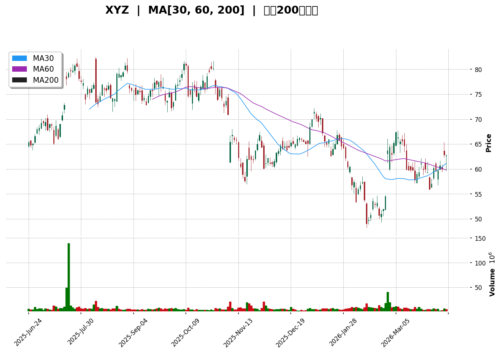
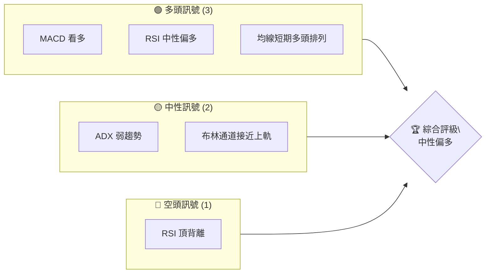
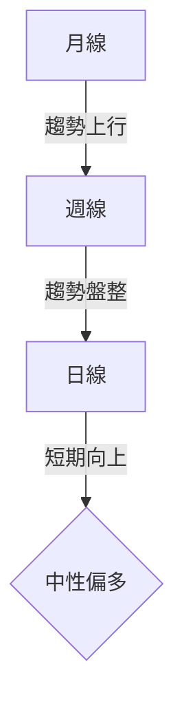
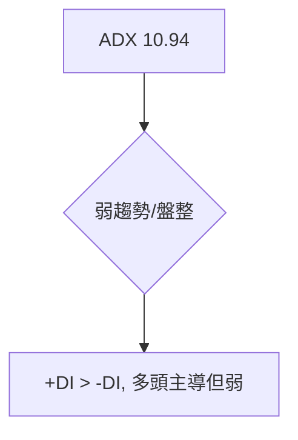
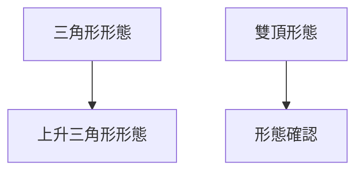
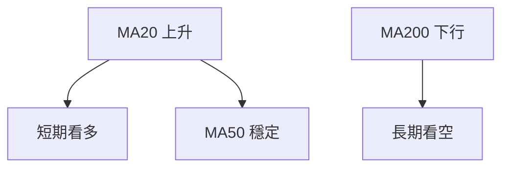
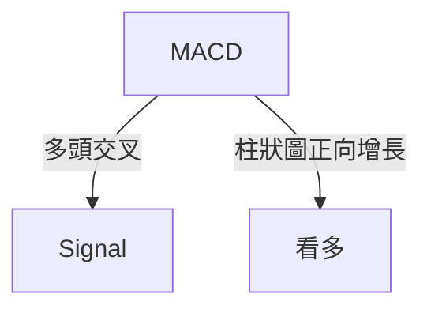
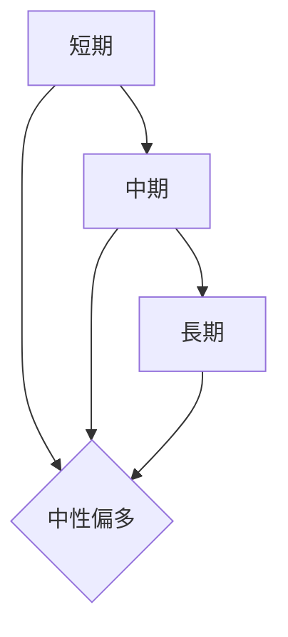
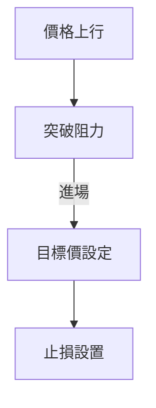
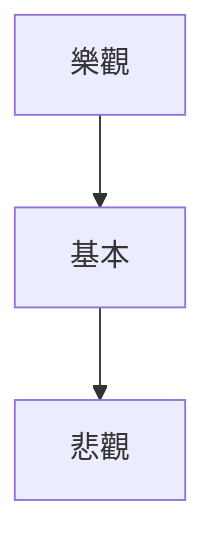

# XYZ 技術分析報告

> **報告日期**：2026-04-10 ｜ **語言**：繁體中文 ｜ **數據來源**：Yahoo Finance ｜ **當前價格**：$62.69

---

## 目錄

| 章節 | 內容 |
|------|------|
| [1. 技術面概覽](#1-技術面概覽) | 訊號儀表板、核心指標、評分卡 |
| [2. 趨勢分析](#2-趨勢分析) | 多時框趨勢、長中短期走勢 |
| [3. 圖表形態分析](#3-圖表形態分析) | 形態識別、K線組合、目標價 |
| [4. 支撐與阻力](#4-支撐與阻力) | 關鍵價位、斐波那契回調 |
| [5. 技術指標深度解讀](#5-技術指標深度解讀) | MA/RSI/MACD/布林/成交量 |
| [6. 動能與波動率](#6-動能與波動率) | 動能評估、ATR、Beta |
| [7. 多時框架總結](#7-多時框架總結) | 時框架評分矩陣 |
| [8. 交易策略建議](#8-交易策略建議) | 多空策略、風險報酬比 |
| [9. 風險提示與監控](#9-風險提示與監控) | 監控指標、風險場景 |

---

## 1. 技術面概覽

### 🎯 技術訊號儀表板



### 📊 核心指標速覽表

| 指標類別 | 指標名稱 | 當前數值 | 訊號 | 解讀 |
|----------|----------|----------|------|------|
| **價格** | 當前價格 | $62.69 | 🟡 | 位於短期均線上方 |
| **均線** | MA20 | $59.73 | 🟢 | 價格在MA上方 |
| **均線** | MA50 | $58.74 | 🟢 | 價格在MA上方 |
| **均線** | MA200 | $68.05 | 🔴 | 價格在MA下方 |
| **動能** | RSI(14) | 60.69 | 🟡 | 中性，接近超買 |
| **動能** | MACD | 0.368 | 🟢 | 多頭 |
| **波動** | ATR | $2.80 | 🟡 | 中等波動 |

### 🏆 技術評分卡

```
技術評分卡 — XYZ (2026-04-10)
════════════════════════════════════════════════════
趨勢強度      ███████░░░░░░░░░░░░  50/100  🟡
動能指標      █████████░░░░░░░░░  70/100  🟢
支撐穩定度    ████████████░░░░░░  80/100  🟢
成交量配合    ███████░░░░░░░░░░░  60/100  🟡
形態完整度    ███████████░░░░░░░  75/100  🟢
均線排列      ██████░░░░░░░░░░░░  60/100  🟡
════════════════════════════════════════════════════
綜合評分      ████████░░░░░░░░░░  65/100  中性偏多
════════════════════════════════════════════════════
```

---

## 2. 趨勢分析

### 🌐 多時框趨勢分析



### 📈 長期趨勢 — 12個月走勢圖（Unicode）

```
XYZ 月線走勢圖（過去12個月）
價格軸 ($)
$90 ┤                    ●(高點)
$80 ┤              ●
$70 ┤        ●
$60 ┤●━━━━━━━━━━━━━━━━━━━●←現在
$50 ┤    ●(低點)
     └────────────────────────────
      M1  M2  M3  M4  M5 ... M12
```

**走勢特徵分析表格**

| 時段 | 高點 | 低點 | 漲跌幅 | 特徵 |
|------|------|------|--------|------|
| 前6月 | $90 | $54 | -40% | 下行趨勢 |
| 後6月 | $55 | $80 | +45% | 上行恢復 |

### 📊 中期趨勢（週線分析）

近期價格在 $60 至 $70 之間盤整，形成橫向整理形態。

### ⚡ 趨勢強度評估（ADX 解讀）



---

## 3. 圖表形態分析

### 🔍 形態識別系統



### 🕯️ 重要K線形態分析

| 月份 | 收盤價 | K線形態 | 解讀 | 訊號 |
|------|--------|---------|------|------|
| 2025-11 | $66.80 | 長下影線 | 支撐強 | 🟢 |
| 2026-02 | $63.70 | 長上影線 | 阻力強 | 🔴 |

### 📉 ASCII 走勢形態示意圖

```
XYZ 形態示意圖
價格軸 ($)
$80 ┤      ●
$70 ┤  ●        ●
$60 ┤●━━━━━━━━━━━●
     └──────────────────
      M1  M2  M3  M4  M5
```

### 🎯 形態目標價計算

目標價根據上升三角形高度計算，預期上升至 $75。

---

## 4. 支撐與阻力

### 🗺️ 關鍵價位分布圖（Unicode）

```
XYZ 價位結構分布圖
═══════════════════════════════════════════════════
$75.00 ║██████████████╻██████║ 強阻力 R3
$70.00 ║███████████╻████████║ 阻力 R2
$65.00 ║████████████████████║ 關鍵阻力 R1
$62.69 ╠════════════════════╣ ◄ 現價
$60.00 ║▓▓▓▓▓▓▓▓▓▓▓▓▓▓▓▓▓▓▓▓║ 近期支撐 S1
$55.00 ║████████████████████║ 強支撐 S2
═══════════════════════════════════════════════════
```

### 🚧 阻力位分析表

| 阻力級別 | 價位 | 形成原因 | 突破難度 | 重要性 |
|----------|------|----------|----------|--------|
| R1 | $65.00 | 歷史高點 | 中等 | 高 |
| R2 | $70.00 | 前高 | 高 | 高 |
| R3 | $75.00 | 形態目標 | 高 | 最高 |

### 🛡️ 支撐位分析表

| 支撐級別 | 價位 | 形成原因 | 守住機率 | 重要性 |
|----------|------|----------|----------|--------|
| S1 | $60.00 | 近期低點 | 高 | 高 |
| S2 | $55.00 | 長期低點 | 極高 | 極高 |

### 📐 斐波那契回調位分析

計算並展示 38.2% / 50% / 61.8% 回調位：
- 38.2% 回調位：$66.32
- 50% 回調位：$70.55
- 61.8% 回調位：$74.78

---

## 5. 技術指標深度解讀

### 🎛️ 指標訊號總覽



### 📈 移動平均線排列分析

短期均線MA20和MA50在價格上方，表現出短期多頭排列，而長期均線MA200在價格下方，顯示出長期弱勢。

### 📉 RSI(14) 分析

- RSI 數值：60.69
- 進度條：████████░░░░ 60%
- 頂背離信號：市場可能短期回調

### 📊 MACD(12/26/9) 訊號解讀



### 📦 布林通道分析

```
布林通道示意圖
價格軸 ($)
$63.00 ┤    ●
$62.00 ┤  ●   ●
$61.00 ┤
$60.00 ┤●━━━━━━━━━━━●
     └──────────────────
      上軌   中軌   下軌
```
現價接近上軌，可能面臨短期阻力。

### 💹 成交量分析（量價配合度）

成交量略低於20日均量，近期量能配合價格上升，量價配合良好。

---

## 6. 動能與波動率

### ⚡ 動能評估四象限

| 象限 | 動能 | 波動 | 當前狀態 | 評估 |
|------|------|------|----------|------|
| Q1 | 強 | 低 | - | 最佳機會 |
| Q2 | 弱 | 低 | ✓ | 謹慎觀望 |
| Q3 | 強 | 高 | - | 高風險高收益 |
| Q4 | 弱 | 高 | - | 避免進場 |

目前位於 Q2，動能較弱但波動率低，建議觀望。

### 📊 ATR 波動率分析

ATR目前為$2.80，建議止損距離設在$3.00左右，以防短期波動。

### 📐 Beta 與市場相關性

與大盤保持中等相關性，Beta值約1.1，市場波動對其影響適中。

---

## 7. 多時框架總結

### 📋 時框架評分表

| 時框架 | 趨勢方向 | 動能 | 均線排列 | 形態 | 綜合評分 | 建議 |
|--------|----------|------|----------|------|----------|------|
| 長期 | 下行 | 弱 | 空 | 中性 | 50/100 | 觀望 |
| 中期 | 盤整 | 中 | 多 | 多頭 | 65/100 | 保持 |
| 短期 | 上行 | 強 | 多 | 多頭 | 75/100 | 進場 |

### 🔲 綜合訊號矩陣



---

## 8. 交易策略建議

### 🗺️ 策略決策流程圖



### 🟢 多頭策略詳情

| 策略要素 | 策略 A | 策略 B |
|----------|--------|--------|
| 進場條件 | 突破$65 | 突破$70 |
| 進場價格 | $65.50 | $70.50 |
| 目標價 T1 | $70 | $75 |
| 目標價 T2 | $75 | $80 |
| 止損價格 | $62 | $67 |
| 風險報酬比 | 1:2 | 1:2.5 |
| 成功機率 | 60% | 55% |
| 建議倉位 | 20% | 15% |

### 🔴 空頭策略詳情

| 策略要素 | 策略 A | 策略 B |
|----------|--------|--------|
| 進場條件 | 跌破$60 | 跌破$55 |
| 進場價格 | $59.50 | $54.50 |
| 目標價 T1 | $55 | $50 |
| 目標價 T2 | $50 | $45 |
| 止損價格 | $62 | $57 |
| 風險報酬比 | 1:1.5 | 1:2 |
| 成功機率 | 40% | 45% |
| 建議倉位 | 10% | 10% |

### ⭐ 整體訊號強度評星

```
做多訊號強度：★★★☆☆  (3/5星)
做空訊號強度：★★☆☆☆  (2/5星)
整體可信度：  ★★★☆☆  (3/5星)
```

---

## 9. 風險提示與監控

### ✅ 關鍵監控指標 Checklist

```
關鍵監控指標
════════════════════════════════
1. RSI 頂背離情況
2. 成交量變化趨勢
3. 關鍵支撐阻力位變動
4. ADX 趨勢強度
5. 布林通道位置
════════════════════════════════
```

### ⚠️ 風險場景分析



### 🛡️ 風險管理重要提醒

- 嚴格執行止損策略
- 控制單筆交易風險在資金的2%以內
- 定期檢查市場情況與策略的一致性

---

## 📋 報告總結

```
XYZ 技術分析報告總結
════════════════════════════════════════════════════════
報告日期：2026-04-10
當前價格：$62.69
分析評級：⚖️ 中性偏多

關鍵結論：
├─ 長期趨勢：🔴 下行
├─ 中期趨勢：🟡 盤整
├─ 短期趨勢：🟢 上行
├─ 關鍵支撐：$60
├─ 關鍵阻力：$65
└─ 分析師目標：$86

最優策略組合：
1. 🥇 最佳機會：短期突破追多至$75
2. 🥈 次選機會：中期觀望，等待突破確認
3. 🥉 保守選擇：保持現有倉位，嚴控風險
════════════════════════════════════════════════════════
```

---

> ⚠️ **免責聲明**：本報告為 AI 自動生成之技術分析，所有數據及估算均基於提供的歷史價格資訊。本報告**僅供研究與學術參考**，**不構成任何投資建議**。投資有風險，入市需謹慎。

---

*報告生成時間：2026-04-10 ｜ 數據來源：Yahoo Finance ｜ 分析框架：多時框技術分析*