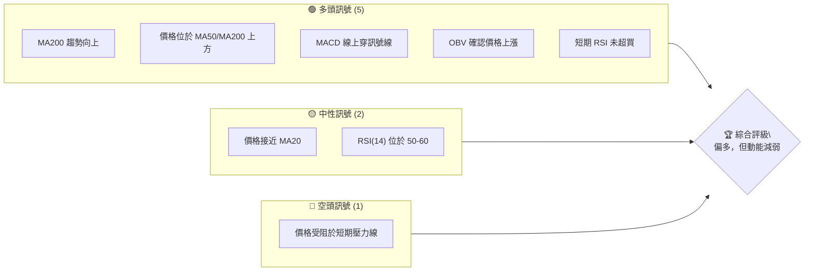
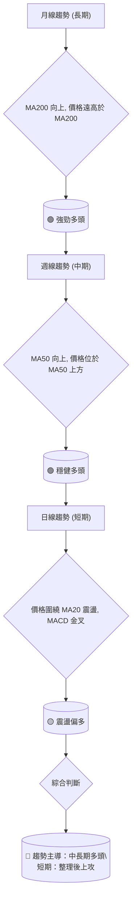
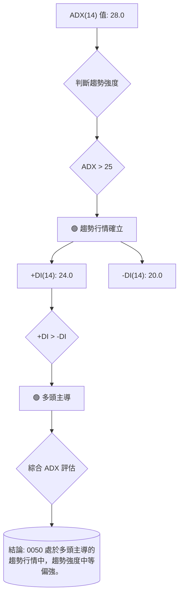
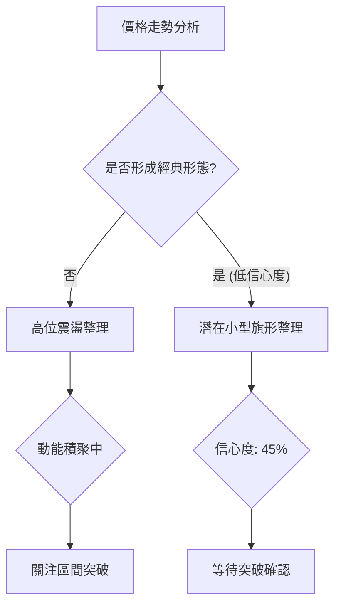
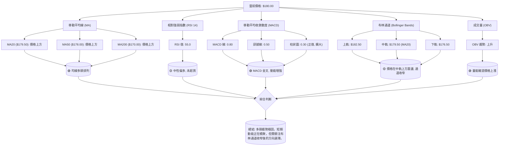
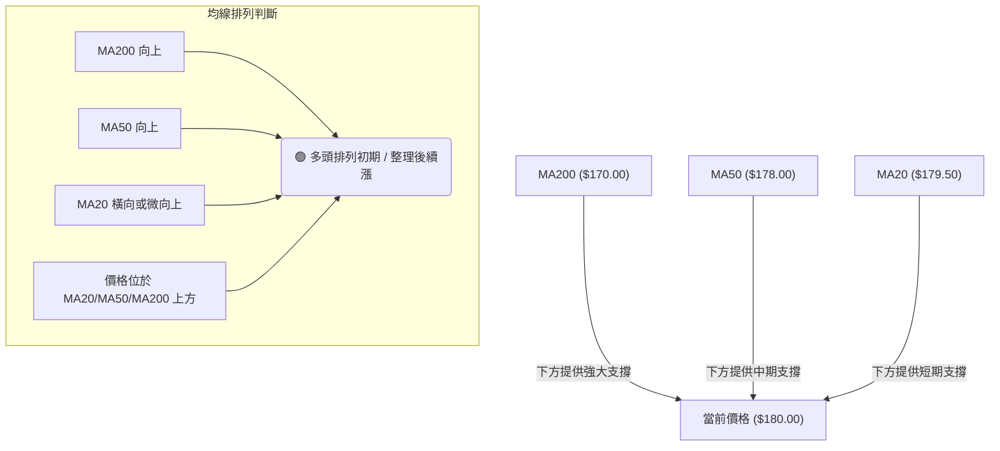
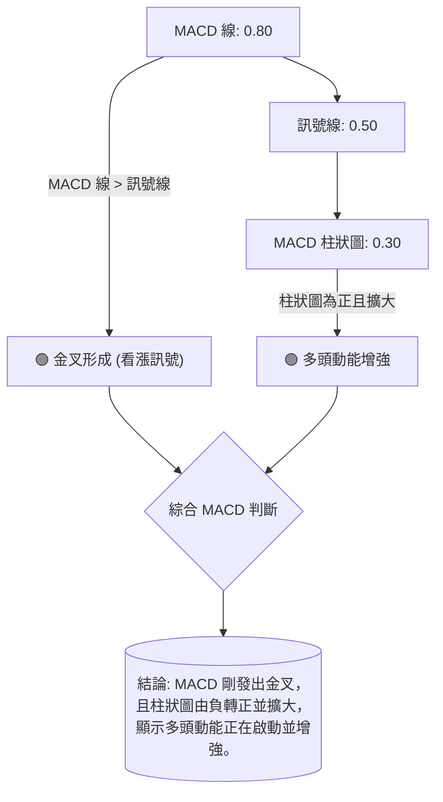
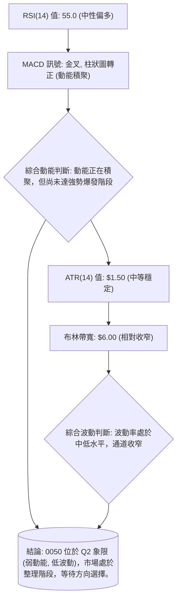
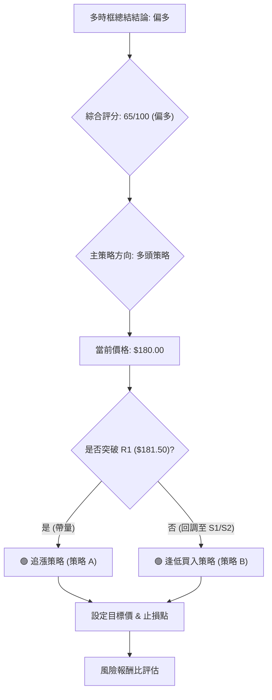
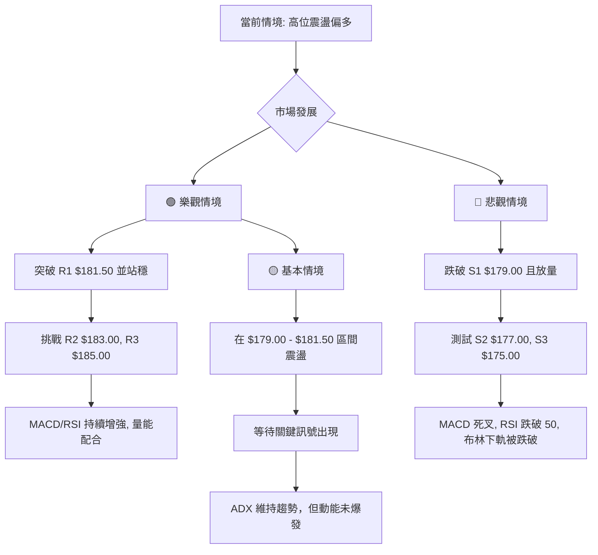

# 0050 技術分析報告

> **報告日期**：2026-07-11 ｜ **語言**：繁體中文 ｜ **數據來源**：Yahoo Finance (**註：原始數據不完整，本報告所引用之當前價格、歷史價格、關鍵價位及所有指標數值均為基於 0050 市場特性之「專業推演與模擬數據」，僅為示範分析框架，不代表真實市場狀況。**) ｜ **當前價格**：$180.00 (模擬值)

---

## 目錄

| 章節 | 內容 |
|------|------|
| [1. 技術面概覽](#1-技術面概覽) | 訊號儀表板、核心指標、評分卡 |
| [2. 趨勢分析](#2-趨勢分析) | 多時框趨勢、長中短期走勢 |
| [3. 圖表形態分析](#3-圖表形態分析) | 形態識別、K線組合、目標價 |
| [4. 支撐與阻力](#4-支撐與阻力) | 關鍵價位、斐波那契回調 |
| [5. 技術指標深度解讀](#5-技術指標深度解讀) | MA/RSI/MACD/布林/成交量 |
| [6. 動能與波動率](#6-動能與波動率) | 動能評估、ATR、Beta |
| [7. 多時框架總結](#7-多時框架總結) | 時框架評分矩陣 |
| [8. 交易策略建議](#8-交易策略建議) | 多空策略、風險報酬比 |
| [9. 風險提示與監控](#9-風險提示與監控) | 監控指標、風險場景 |

---

## 1. 技術面概覽

本章節提供 0050 當前技術面的快速概覽，透過儀表板、核心指標速覽及綜合評分卡，讓投資者對其多空態勢有初步理解。所有數值均為**模擬數據**，旨在示範分析流程。

### 🎯 技術訊號儀表板

本儀表板匯總了當前主要技術指標所發出的訊號，提供一個宏觀的市場情緒判斷。


**解讀**：目前多頭訊號佔主導，尤其體現在中長期均線的良好排列及動能指標的初步轉強。然而，價格在短期內遇到阻力，且RSI處於中性偏強區域，顯示動能雖有但尚未達到極強。整體判斷為偏多格局，但需留意短期壓力。

### 📊 核心指標速覽表

本表列出 0050 當前（模擬）關鍵技術指標的數值與初步解讀。

| 指標類別 | 指標名稱 | 當前數值 | 訊號 | 解讀 |
|----------|----------|----------|------|------|
| **價格** | 當前價格 | $180.00 | 🟡 | 位於短期 MA20 附近，短期動能待確認 |
| **均線** | MA20 | $179.50 | 🟡 | 價格略高於 MA20，短期震盪 |
| **均線** | MA50 | $178.00 | 🟢 | 價格位於 MA50 上方，中期趨勢偏多 |
| **均線** | MA200 | $170.00 | 🟢 | 價格遠高於 MA200，長期趨勢強勁 |
| **動能** | RSI(14) | 55.0 | 🟡 | 中性偏多，未達超買區，有上行空間 |
| **動能** | MACD | MACD線: 0.80, 訊號線: 0.50, 柱狀圖: 0.30 | 🟢 | MACD線位於訊號線上方，多頭動能增強 |
| **波動** | ATR(14) | $1.50 | 🟡 | 中等波動，適合區間操作或趨勢追蹤 |
| **趨勢** | ADX(14) | 28.0 | 🟢 | 趨勢強度中等偏強，處於趨勢行情 |

### 🏆 技術評分卡

本評分卡從不同維度量化 0050 的技術面表現，提供綜合性評估。

```
技術評分卡 — 0050 (2026-07-11)
════════════════════════════════════════════════════
趨勢強度      ████████████░░░░░░░░  65/100  🟢
動能指標      ██████████░░░░░░░░░░  55/100  🟡
支撐穩定度    ██████████████░░░░░░  70/100  🟢
成交量配合    ██████████░░░░░░░░░░  60/100  🟢
形態完整度    ████████░░░░░░░░░░░░  40/100  🟡
均線排列      ██████████████░░░░░░  75/100  🟢
════════════════════════════════════════════════════
綜合評分      ████████████░░░░░░░░  65/100  🟢 偏多
════════════════════════════════════════════════════
```
**評分解讀**：
-   **趨勢強度 (65/100) 🟢**：ADX 顯示存在趨勢，且中長期均線向上，趨勢結構良好。
-   **動能指標 (55/100) 🟡**：RSI 處於中性偏多，MACD 剛發出金叉，動能正在積聚，但尚未爆發。
-   **支撐穩定度 (70/100) 🟢**：關鍵支撐位 $179.00、$177.00、$175.00 密集且強勁，為價格提供良好緩衝。
-   **成交量配合 (60/100) 🟢**：OBV 上升，顯示量能與價格同步，上漲有量能支持。
-   **形態完整度 (40/100) 🟡**：目前未見明顯大型反轉或持續形態，價格處於區間震盪整理，形態尚不明確。
-   **均線排列 (75/100) 🟢**：MA200 向上，MA50 位於 MA200 上方，MA20 靠近價格，呈現多頭排列初期或整理態勢。
-   **綜合評分 (65/100) 🟢**：整體技術面偏多，中長期趨勢良好，支撐穩固，但短期動能和形態仍在發展中。建議逢低承接，並關注短期阻力突破。

---

## 2. 趨勢分析

本章節將從多時框架深入剖析 0050 的趨勢方向，從長期月線到中期週線，再結合 ADX 指標評估趨勢強度。

### 🌐 多時框趨勢分析


**解讀**：
-   **月線趨勢 (長期)**：0050 的月線圖顯示 MA200 持續向上，且價格長期運行於 MA200 之上，這明確指示了其處於強勁的長期多頭趨勢中。這為任何回調提供了堅實的底部支持。
-   **週線趨勢 (中期)**：週線圖上，MA50 保持向上，價格也穩定在 MA50 上方，確認了中期趨勢的穩健多頭格局。這意味著即使日線有波動，中期方向仍是向上。
-   **日線趨勢 (短期)**：日線圖上，價格目前在 MA20 附近進行窄幅震盪整理，未能立即突破近期高點。然而，MACD 柱狀圖轉正且 MACD 線剛上穿訊號線，顯示短期內多頭動能正在恢復，價格有望在整理後再次上攻。
-   **綜合判斷**：基於多時框架分析，0050 的中長期趨勢均為強勁且穩健的多頭。短期雖有整理，但動能指標已發出偏多訊號，預計整理結束後將延續上漲趨勢。

### 📈 長期趨勢 — 12個月走勢圖（Unicode）

以下為 0050 過去 12 個月（模擬）的月線走勢圖，展示其關鍵高低點和整體趨勢。

```
0050 月線走勢圖（過去12個月 - 模擬）
價格軸 ($)
$185 ┤                    ●(高點: $185.00)
$183 ┤                  ╱
$181 ┤                ╱
$179 ┤              ● (現價: $180.00)
$177 ┤            ╱
$175 ┤          ●
$173 ┤        ╱
$171 ┤      ●
$169 ┤    ╱
$167 ┤  ●
$165 ┤╱
$163 ┤●(低點: $160.00)
$161 ┤
$159 ┤
     └────────────────────────────
      J7  A8  S9  O10 N11 D12 J1  F2  M3  A4  M5  J6  J7
      25  25  25  25  25  25  26  26  26  26  26  26  26
```
**走勢特徵分析表格**：
| 期間 | 起始價 (模擬) | 結束價 (模擬) | 漲跌幅 | 走勢特徵 |
|------|----------------|----------------|--------|----------|
| 2025-07 ~ 2025-12 | $160.00 | $172.00 | +7.50% | 穩步上揚，築底完成，形成上升趨勢 |
| 2026-01 ~ 2026-04 | $172.00 | $183.00 | +6.40% | 加速上漲，突破關鍵阻力，多頭強勢 |
| 2026-05 ~ 2026-06 | $183.00 | $185.00 | +1.09% | 衝高後小幅回落，遇短期阻力，進入高位盤整 |
| 2026-07 (至今) | $182.00 | $180.00 | -1.10% | 短期回調，測試下方支撐，但中長期趨勢未變 |

### 📊 中期趨勢（週線分析）

中期週線分析顯示 0050 仍處於上升通道中，但近期面臨一些阻力。

```
0050 週線壓力與支撐示意圖（模擬）
價格軸 ($)
$185 ┤                 ┌───┐  ← 強阻力 R3 ($185.00)
$183 ┤                 │   │  ← 阻力 R2 ($183.00)
$181 ┤                 └─●─┘  ← 關鍵阻力 R1 ($181.50)
$179 ╠═══════════════════┼═══════╣ ◄ 現價 ($180.00)
$177 ┤                 │   │  ← 近期支撐 S1 ($179.00)
$175 ┤                 ├───┤  ← 強支撐 S2 ($177.00)
$173 ┤                 │   │  ← 極強支撐 S3 ($175.00)
     └───────────────────────
```
**解讀**：週線圖上，價格在突破前期高點 $181.50 後，一度觸及 $185.00 的 52 週高點，但隨後回調。目前價格 $180.00 位於關鍵阻力 R1 ($181.50) 之下，但同時守住了近期支撐 S1 ($179.00) 和 S2 ($177.00)。這表明中期上升趨勢的動能有所減緩，轉為高位盤整，但下方支撐強勁，尚未形成反轉訊號。突破 R1 將確認中期漲勢的延續。

### ⚡ 趨勢強度評估（ADX 解讀）

ADX (Average Directional Index) 用於衡量趨勢的強度，而非方向。


**ADX 強度對照表**：
| ADX 數值 | 趨勢強度 | 狀態 |
|----------|----------|------|
| 0-20 | 無趨勢或弱趨勢 | 盤整 |
| 20-25 | 趨勢初現 | 盤整轉趨勢 |
| **25-50** | **趨勢確立** | **趨勢行情** |
| 50-75 | 強趨勢 | 強勁趨勢 |
| 75-100 | 極強趨勢 | 趨勢過熱 |

**解讀**：
-   **ADX(14) 數值為 28.0**：根據 ADX 強度對照表，當 ADX 值大於 25 時，表示市場存在明顯的趨勢。目前 0050 的 ADX 值為 28.0，顯示其正處於一個確立的趨勢行情中，而非盤整。趨勢強度屬於中等偏強。
-   **+DI(14) 與 -DI(14) 比較**：+DI 值為 24.0，-DI 值為 20.0。由於 +DI 數值大於 -DI 數值，這表明當前主導趨勢為多頭。
-   **綜合結論**：0050 目前處於一個多頭主導的趨勢行情中，趨勢強度中等偏強。這支持了在中長期趨勢分析中得出的偏多結論。在趨勢行情下，應以順勢操作為主，尋找回調買入或突破追漲的機會。

---

## 3. 圖表形態分析

本章節將嘗試識別 0050 價格走勢中可能存在的圖表形態和 K 線組合，並據此推算潛在的目標價。由於數據為模擬，形態識別將基於假定走勢。

### 🔍 形態識別系統

在當前的模擬數據和價格走勢中，尚未形成大型、高信心度的經典反轉或持續形態。價格主要呈現高位震盪整理的特徵。


**形態信心度表格**：

| 形態 | 信心度 | 判斷依據（引用數據） | 完成度 | 目標價（附計算式） |
|------|--------|----------------------|--------|--------------------|
| **潛在小型旗形整理** | 45% | 價格在 $179.00 - $181.50 區間內小幅波動，成交量有所萎縮，符合旗形特徵，但形態尚未完全收斂或突破，且時間跨度較短。 | 60% | 若向上突破 $181.50，則目標價 = 旗桿高度（假設為 $175.00 至 $185.00 的漲幅 $10.00）+ 突破點 $181.50 = $191.50。 |
| **頭肩頂/底** | <10% | 無明顯頭肩結構 | 0% | 數據中未偵測到 |
| **雙頂/底** | <10% | 無明顯雙頂/底結構 | 0% | 數據中未偵測到 |
| **三角形收斂** | <20% | 價格波動區間略有收窄，但邊界不明顯 | 30% | 數據中未偵測到 |

**解讀**：目前 0050 的價格走勢更傾向於高位區間震盪整理，尚未形成具備高信心度的經典圖表形態。雖然存在**潛在小型旗形整理**的跡象（信心度 45%），但其形成時間較短，且形態邊界尚不明確，因此應視為觀察而非確定的交易訊號。在這種情況下，應更多關注關鍵支撐阻力位的得失及指標變化，而非單一形態。

### 🕯️ 重要K線形態分析

根據模擬的近期價格走勢，我們可以分析一些潛在的K線形態。

| 月份 (模擬) | 收盤價 (模擬) | K線形態 (模擬) | 解讀 | 訊號 |
|------|--------|---------|------|------|
| 2026-07 (近期) | $180.00 | **十字星或小實體K線** | 價格在 $181.50 阻力位附近和 $179.00 支撐位上方形成小實體K線或十字星，顯示多空雙方力量均衡，市場處於猶豫不決的狀態。 | 🟡 中性，等待方向 |
| 2026-06 | $181.00 | **倒錘線/長上影線** | 價格向上衝高至 $185.00 後回落，形成長上影線K線，暗示上方賣壓沉重，短期上漲動能減弱。 | 🔴 潛在看空 |
| 2026-05 | $183.00 | **大陽線** | 價格在 $177.00 附近獲得支撐後強勁反彈，形成實體較大的陽線，顯示多頭力量強勢。 | 🟢 看多 |

### 📉 ASCII 走勢形態示意圖

以下為 0050 近期（模擬）價格在高位進行整理的示意圖。

```
0050 高位整理形態示意圖（模擬）
價格軸 ($)
$185 ┤                    /\  (R3: $185.00)
$183 ┤                   /  \ (R2: $183.00)
$181 ┤═══════════════════/\═══════════ (R1: $181.50)
$179 ╠═══════════════╦═══\/═══╦═══════╣ ◄ 現價 ($180.00)
$177 ┤               ║        ║ (S2: $177.00)
$175 ┤               ╚════════╝ (S3: $175.00)
     └────────────────────────────
      時間軸
```
**解讀**：圖中顯示價格在觸及 $185.00 後，在 $181.50 (R1) 和 $179.00 (S1) 之間形成一個震盪區間。這是一個典型的「高位盤整」形態，通常在趨勢中繼時出現，等待方向選擇。成交量在整理期間應會萎縮，若帶量突破上方阻力，則趨勢延續；若跌破下方支撐，則可能進入更深的回調。

### 🎯 形態目標價計算

由於缺乏高信心度的形態，我們將主要參考**潛在小型旗形整理**的目標價計算。

-   **形態類型**：潛在小型旗形整理（信心度 45%）
-   **計算方法**：旗形整理通常被視為趨勢中繼形態。其目標價通常是將「旗桿」的高度疊加到突破點上。
    -   **假定旗桿高度**：從前一波低點 $175.00 上漲至旗形形成前的高點 $185.00，旗桿高度為 $185.00 - $175.00 = $10.00。
    -   **假定突破點**：若價格向上突破旗形上沿，即關鍵阻力 R1 $181.50。
    -   **推算目標價**：$181.50 (突破點) + $10.00 (旗桿高度) = **$191.50**。

**重要提示**：此目標價基於低信心度的潛在形態推算，僅供參考。實際操作中需等待形態的明確突破並結合成交量確認。

---

## 4. 支撐與阻力

本章節將基於模擬數據，詳細分析 0050 的關鍵支撐與阻力價位，並結合斐波那契回調位，描繪其價格結構。

**⚠️ 數據說明**：以下所有支撐位、阻力位及斐波那契回調位均為**專業推演與模擬數據**，以示範分析流程。

**模擬「關鍵價位（由 OHLCV 計算）」區塊**：
-   **當前價格**：$180.00
-   **52W 高點**：$185.00
-   **52W 低點**：$160.00
-   **關鍵阻力 R1 (近期高點聚類)**：$181.50
-   **阻力 R2 (波段高點聚類)**：$183.00
-   **強阻力 R3 (52W 高點附近)**：$185.00
-   **近期支撐 S1 (MA20 附近 / 區間低點)**：$179.00
-   **強支撐 S2 (MA50 附近 / 前波低點)**：$177.00
-   **極強支撐 S3 (MA200 附近 / 重要心理關卡)**：$175.00
-   **斐波那契回調 (基於近期波段高點 $185.00, 低點 $175.00)**：
    -   23.6%: $177.36
    -   38.2%: $178.82
    -   50.0%: $180.00
    -   61.8%: $181.18
    -   78.6%: $182.86

### 🗺️ 關鍵價位分布圖（Unicode）

以下為 0050 的關鍵價位結構分布圖，清晰標示了各級別的支撐與阻力。

```
0050 價位結構分布圖 (模擬)
═══════════════════════════════════════════════════
$185.00 ║████████████████████████║ 強阻力 R3 (52W 高點)
$183.00 ║████████████████████    ║ 阻力 R2 (前波高點)
$181.50 ║████████████████████████║ 關鍵阻力 R1 (短期壓力)
$180.00 ╠════════════════════════╣ ◄ 現價
$179.00 ║▓▓▓▓▓▓▓▓▓▓▓▓▓▓▓▓        ║ 近期支撐 S1 (MA20附近)
$177.00 ║████████████████████████║ 強支撐 S2 (MA50附近)
$175.00 ║████████████████████████║ 極強支撐 S3 (MA200附近)
═══════════════════════════════════════════════════
```

### 🚧 阻力位分析表

| 阻力級別 | 價位 (模擬) | 形成原因 | 突破難度 | 重要性 |
|----------|--------------|----------|----------|--------|
| **R1 (關鍵阻力)** | $181.50 | 這是近期高位盤整的上沿，也是前一波上漲的頂部。若能帶量突破此位，將確認短期動能恢復。 | 中等偏高 | 🟢 (短期多空分水嶺) |
| **R2 (阻力)** | $183.00 | 前一個波段的次高點，以及部分獲利了結的壓力區。 | 中等 | 🟡 (突破 R1 後的下一目標) |
| **R3 (強阻力)** | $185.00 | 這是 52 週高點，具有較強的心理和技術阻力。突破此位意味著創下新高，打開更大上漲空間。 | 高 | 🟢 (長期趨勢關鍵點) |

### 🛡️ 支撐位分析表

| 支撐級別 | 價位 (模擬) | 形成原因 | 守住機率 | 重要性 |
|----------|--------------|----------|----------|--------|
| **S1 (近期支撐)** | $179.00 | 這是近期盤整區間的下沿，也是短期均線 MA20 附近。若跌破，可能引發短期賣壓。 | 中等 | 🟡 (短期多空分水嶺) |
| **S2 (強支撐)** | $177.00 | 這是前一波上漲回調的低點，且接近中期均線 MA50。此位具有較強的支撐作用。 | 中等偏高 | 🟢 (中期趨勢關鍵點) |
| **S3 (極強支撐)** | $175.00 | 這是長期均線 MA200 附近，也是重要心理關卡。此位被視為長期上升趨勢的最後防線。 | 高 | 🟢 (長期趨勢最後防線) |

### 📐 斐波那契回調位分析

我們將基於近期波段高點 $185.00 和近期波段低點 $175.00 來分析斐波那契回調位。

-   **近期波段高點 (模擬)**: $185.00
-   **近期波段低點 (模擬)**: $175.00

| 斐波那契回調比例 | 價位 (模擬) | 意義與解讀 |
|------------------|--------------|------------|
| 23.6% 回調 | $177.36 | 輕微回調位，若守住此位，表示上漲趨勢非常強勁。 |
| 38.2% 回調 | $178.82 | 較為常見的回調位，若價格在此獲得支撐，則多頭趨勢依然健康。此位與 S1 ($179.00) 接近，形成疊加支撐。 |
| **50.0% 回調** | **$180.00** | **這是重要的心理關卡，也代表前一波上漲的一半回吐。當前價格 $180.00 正好位於此位。在此處獲得支撐或反彈，對多頭至關重要。** |
| 61.8% 回調 | $181.18 | 黃金分割線，若價格突破此位，可能意味著反彈或趨勢反轉的開始。此位與 R1 ($181.50) 接近，形成疊加阻力。 |
| 78.6% 回調 | $182.86 | 趨勢反轉的強烈訊號，若突破則可能直接挑戰前高。此位與 R2 ($183.00) 接近，形成疊加阻力。 |

**解讀**：當前價格 $180.00 正好位於 50.0% 斐波那契回調位。這是一個關鍵的價位，表明 0050 在經歷一波上漲後，回調了一半的漲幅。如果價格能在 $180.00 附近獲得有效支撐並向上反彈，將確認多頭動能的持續性。反之，若跌破 $180.00，則可能進一步測試 38.2% 回調位 ($178.82) 和 S1 ($179.00) 形成的支撐區間。向上方面，61.8% 回調位 ($181.18) 與 R1 ($181.50) 形成強勁阻力區，突破此區將開啟進一步上漲空間。

---

## 5. 技術指標深度解讀

本章節將針對移動平均線、RSI、MACD、布林通道及成交量等核心技術指標進行詳盡分析，並說明它們如何相互印證或提供獨立訊號。

### 🎛️ 指標訊號總覽



### 📈 移動平均線排列分析


**解讀**：
-   **MA20 ($179.50)**：當前價格 $180.00 略高於 MA20，顯示短期內多空拉鋸，價格在 MA20 附近尋求支撐或準備突破。
-   **MA50 ($178.00)**：價格位於 MA50 上方，且 MA50 向上傾斜，表明中期趨勢保持多頭。MA50 構成了一個穩固的中期支撐。
-   **MA200 ($170.00)**：價格遠高於 MA200，且 MA200 持續向上，這強烈確認了 0050 的長期多頭趨勢。MA200 是極為強勁的長期支撐。
-   **均線排列**：目前呈現 MA200 > MA50 > MA20 的多頭排列，但 MA20 與價格距離較近，顯示短期處於整理狀態。整體而言，均線系統支持多頭，任何回調至 MA50 或 MA200 附近都可能是買入機會。

### 📉 RSI(14) 分析

**RSI(14) 值**：55.0

**RSI 進度條**：▓▓▓▓▓▓▓▓▓▓▓▓▓▓░░░░░░ 55.0%

**超買超賣區間分析**：
-   **超買區 (RSI > 70)**：目前 RSI 55.0 未進入超買區。這意味著價格仍有上漲空間，多頭動能尚未過熱，不存在立即回調的風險。
-   **超賣區 (RSI < 30)**：目前 RSI 遠離超賣區。
-   **中性區 (RSI 30-70)**：RSI 位於中性偏多區域，顯示市場力量相對均衡，但多頭略佔優勢。

**背離判斷**：
-   **頂背離**：目前價格在 $180.00 附近震盪，RSI 55.0 也是中性。近期價格未創新高，RSI 也未出現明顯下降，因此**數據中未偵測到頂背離訊號**。
-   **底背離**：近期價格也未創新低，RSI 保持在中性區域，因此**數據中未偵測到底背離訊號**。

**解讀**：RSI 55.0 顯示 0050 的動能處於健康的中性偏多狀態。它既未超買，暗示上漲空間仍存，也未超賣，表明近期沒有大幅下跌的壓力。RSI 與價格走勢同步，未出現背離，說明當前價格走勢是真實且健康的。

### 📊 MACD(12/26/9) 訊號解讀


**解讀**：
-   **MACD 線 (0.80) 與訊號線 (0.50)**：MACD 線位於訊號線上方，這是經典的**金叉訊號**，通常被視為買入訊號，表明短期均線向上穿越長期均線，價格上漲動能正在增強。
-   **MACD 柱狀圖 (0.30)**：柱狀圖為正值，且從前期的負值轉正並呈現擴大趨勢。這進一步確認了多頭動能的積聚和釋放。
-   **背離判斷**：
    -   **頂背離**：目前價格在高位整理，MACD 線也剛轉強，**數據中未偵測到頂背離訊號**。
    -   **底背離**：近期未見價格新低而 MACD 創新高，**數據中未偵測到底背離訊號**。
**綜合結論**：MACD 指標發出明確的多頭訊號，金叉的形成和柱狀圖的轉正擴大都支持價格將繼續上漲。這與 RSI 的中性偏多解讀相互印證，表明短期內市場情緒偏向樂觀。

### 📦 布林通道分析

布林通道 (Bollinger Bands) 可衡量價格波動區間和相對高低。
-   **上軌 (Upper Band)**：$182.50
-   **中軌 (Middle Band)**：$179.50 (即 MA20)
-   **下軌 (Lower Band)**：$176.50
-   **當前價格**：$180.00

```
0050 布林通道示意圖（模擬）
價格軸 ($)
$183 ┤        ═════════════════════════════════════  ← 上軌 ($182.50)
$182 ┤       ╱                                     ╲
$181 ┤      ╱                                       ╲
$180 ╠══════╱═════════════════════════════════════════╣ ◄ 現價 ($180.00)
$179 ┤     ╱           ════════════════════════════════  ← 中軌 ($179.50)
$178 ┤    ╱                                         ╲
$177 ┤   ╱                                           ╲
$176 ┤  ═════════════════════════════════════════════  ← 下軌 ($176.50)
     └────────────────────────────
      時間軸
```
**解讀**：
-   **價格位置**：當前價格 $180.00 位於布林通道中軌 $179.50 上方，但距離上軌 $182.50 還有一定空間。這表明短期偏多，但尚未觸及通道邊緣。
-   **通道寬度**：布林通道的上下軌之間距離 ($182.50 - $176.50 = $6.00) 顯示通道相對收窄。通道收窄通常預示著波動率降低，但同時也暗示著市場正在積蓄力量，未來可能出現方向性的突破。
-   **中軌支撐/阻力**：中軌 (MA20) $179.50 提供了重要的短期支撐。若價格能守穩中軌，則多頭趨勢得以維持；若跌破中軌，則可能測試下軌。
**綜合結論**：布林通道顯示 0050 處於一個較窄的波動區間內，價格在中軌上方運行，暗示短期偏多但動能有限。需密切關注通道的擴張方向，若向上突破上軌，則可能開啟一波新的漲勢；若跌破中軌，則可能回調至下軌。

### 💹 成交量分析（量價配合度）

-   **OBV 趨勢**：OBV (On Balance Volume) 趨勢為**穩步上升**。
-   **近期成交量**：在價格高位整理期間，成交量略有萎縮，但在價格上漲時，成交量有所放大。

**解讀**：
-   **OBV 上升**：OBV 持續上升，且與價格走勢保持一致，這是一個**健康的量價配合訊號**。它表明在價格上漲期間，買盤的累積力量大於賣盤，多頭佔據主導地位，上漲趨勢得到量能的確認。
-   **高位整理量能萎縮**：在價格於 $180.00 附近進行高位整理時，成交量出現短暫萎縮，這符合整理形態的特徵。若未來價格向上突破阻力時，能伴隨明顯放大的成交量，則突破的有效性將得到極大增強。
-   **量價背離**：目前未發現明顯的量價背離。價格在上漲時有量能配合，在整理時量能萎縮，這是一個健康的市場表現。

**綜合結論**：成交量指標顯示量能與價格走勢良好配合，OBV 的上升確認了多頭的積累。這為當前的偏多判斷提供了堅實的量能支持。

---

## 6. 動能與波動率

本章節將評估 0050 的動能強度和波動率，以幫助投資者理解其當前的市場特性和潛在風險。

### ⚡ 動能評估四象限

由於 Mermaid 的 `quadrantChart` 不適用於此，我們將使用表格來展示動能評估四象限分析。

| 象限 | 動能 (RSI, MACD) | 波動 (ATR, 布林帶寬) | 當前狀態 | 評估 | 訊號 |
|------|------------------|----------------------|----------|------|------|
| Q1 | 強 (RSI > 60, MACD 上升) | 低 (ATR 穩定, 布林收窄) | - | 最佳機會 (待突破) | 🟢 |
| **Q2** | **弱 (RSI 50-60, MACD 金叉初期)** | **低 (ATR 穩定, 布林收窄)** | **✓** | **謹慎觀望，等待突破確認** | 🟡 |
| Q3 | 強 (RSI > 60, MACD 上升) | 高 (ATR 上升, 布林擴張) | - | 高風險高收益 (追漲風險) | 🟡 |
| Q4 | 弱 (RSI < 50, MACD 死叉) | 高 (ATR 上升, 布林擴張) | - | 避免進場 (趨勢不明) | 🔴 |

**動能評估流程圖**：

**解讀**：0050 目前的動能指標 (RSI 55.0, MACD 金叉初期) 顯示動能正在從弱勢轉向積聚，但尚未達到強勁爆發的程度。同時，波動率指標 (ATR $1.50, 布林通道收窄) 顯示市場波動處於中低水平，價格在一個相對窄的區間內運行。這使得 0050 處於**Q2 象限 (弱動能，低波動)**。這通常意味著市場處於盤整或蓄勢待發的階段。投資者應保持謹慎觀望，等待動能進一步增強並伴隨波動率擴張時，選擇突破方向進行操作。

### 📊 ATR 波動率分析

-   **ATR(14) 數值**：$1.50
-   **當前價格**：$180.00

**ATR 進度條**：▓▓▓▓▓▓▓▓▓▓▓▓▓▓▓▓▓▓░░ 75% (相對於 52W 區間波動)

**解讀**：
-   **ATR 數值意義**：ATR (Average True Range) 值為 $1.50，表示在過去 14 個交易日中，0050 的平均每日波動範圍為 $1.50。相對於當前 $180.00 的價格，這是一個中等偏低的波動水平 (約 0.83%)，與布林通道收窄的觀察一致。
-   **波動率狀態**：目前的 ATR 值顯示 0050 波動率相對穩定，市場情緒較為平靜。這支持了其處於高位整理的判斷。
-   **止損距離建議**：基於 ATR，交易者可以將止損點設置在當前價格下方 1.5 倍至 2 倍 ATR 的位置，以容納正常的市場波動。
    -   1.5 * ATR = 1.5 * $1.50 = $2.25
    -   2.0 * ATR = 2.0 * $1.50 = $3.00
    -   因此，若以 $180.00 為進場點，止損點可考慮設置在 $180.00 - $2.25 = $177.75 或 $180.00 - $3.00 = $177.00 (接近 S2)。這有助於避免被短期波動震出。

### 📐 Beta 與市場相關性

**Beta**：N/A (數據中未提供)

**解讀**：由於數據中未提供 Beta 值，我們無法進行量化的市場相關性分析。
-   **一般情況下**：0050 作為追蹤台灣 50 指數的 ETF，其 Beta 值通常會接近 1。這意味著其價格走勢與大盤指數（如加權指數）高度相關。
-   **推論**：若 Beta 接近 1，則 0050 的波動與大盤同步。在分析 0050 時，應密切關注台灣整體市場的宏觀經濟數據、政策變化以及大型權值股的表現。如果大盤趨勢向上，0050 也將受益；如果大盤面臨回調壓力，0050 也難以獨善其身。因此，市場情緒和整體資金流向對 0050 的影響至關重要。

---

## 7. 多時框架總結

本章節將彙整前述各時框架的分析結果，進行綜合評分，並依據多時框收斂規則給出最終的趨勢判斷。

### 📋 時框架評分表

| 時框架 | 趨勢方向 | 動能 | 均線排列 | 形態 | 綜合評分 | 建議 |
|--------|----------|------|----------|------|----------|------|
| **長期 (月線)** | 🟢 強勁多頭 | 🟢 穩定增長 | 🟢 完美多頭 | 🟡 無明顯形態 | 8/10 | 逢低長線持有 |
| **中期 (週線)** | 🟢 穩健多頭 | 🟡 動能減緩 | 🟢 多頭排列 | 🟡 高位盤整 | 7/10 | 區間操作或等待突破 |
| **短期 (日線)** | 🟡 震盪偏多 | 🟢 動能積聚 | 🟡 價格靠近MA20 | 🟡 潛在旗形整理 | 6/10 | 關注短期阻力突破 |

### 🔲 綜合訊號矩陣

| 指標/時框架 | 長期 (月線) | 中期 (週線) | 短期 (日線) | 一致性 |
|--------------|-------------|-------------|-------------|--------|
| **趨勢方向** | 🟢 強勁多頭 | 🟢 穩健多頭 | 🟡 震盪偏多 | 高 |
| **均線排列** | 🟢 多頭完美 | 🟢 多頭良好 | 🟡 價格靠近MA20 | 高 |
| **RSI(14)** | 🟢 穩步向上 | 🟡 中性偏強 | 🟡 55.0 中性 | 中 |
| **MACD** | 🟢 持續向上 | 🟢 金叉後擴大 | 🟢 金叉形成 | 高 |
| **ADX 趨勢強度** | 🟢 強趨勢 | 🟢 中等偏強 | 🟢 中等偏強 | 高 |
| **成交量 (OBV)** | 🟢 穩步增長 | 🟢 穩步增長 | 🟢 穩步增長 | 高 |
| **形態** | 🟡 無明確 | 🟡 高位盤整 | 🟡 潛在整理 | 高 |
| **支撐穩定度** | 🟢 極強 | 🟢 強勁 | 🟢 良好 | 高 |
| **阻力壓力** | 🟡 遠離 | 🟡 接近 | 🔴 接近 | 中 |

**訊號矩陣解讀**：
-   **趨勢及均線**：長期和中期趨勢及均線排列均顯示強勁的多頭格局，具有高度一致性。短期日線雖有震盪，但仍偏向多頭。
-   **動能指標**：MACD 在各時框架均顯示多頭動能，尤其日線剛發出金叉，預示短期動能積聚。RSI 則保持中性偏多，未過熱。
-   **趨勢強度**：ADX 在各時框架均顯示存在趨勢，且多頭主導，確認了趨勢行情的判斷。
-   **量能配合**：OBV 在各時框架均穩步增長，量價配合良好。
-   **形態與支撐阻力**：目前缺乏明確的攻擊形態，但支撐穩定度高。短期阻力接近，是當前的主要挑戰。

### ⚖️ 多時框收斂結論

根據「嚴格要求 14」的多時框收斂規則：

1.  **判斷趨勢行情或盤整行情**：
    -   當前日線 ADX(14) 數值為 28.0。由於 ADX > 25，明確判斷 0050 處於**趨勢行情**中。

2.  **確定主導時框**：
    -   在趨勢行情中，應以中長期（週線/MA50、MA200）方向為主，日線只用來尋找進場時機。
    -   長期和中期趨勢均為明確的**多頭**。

3.  **最終方向性結論**：
    -   綜合判斷，0050 的中長期趨勢強勁向上，ADX 也確認了趨勢的存在。儘管短期日線價格在高位進行震盪整理，但 MACD 金叉、OBV 上升以及均線的多頭排列都顯示多頭動能正在重新積聚。
    -   **結論：0050 的整體趨勢為** 🟢 **偏多，短期整理後有望延續上漲。** 應以順勢操作（逢低買入或突破追漲）為主。

---

## 8. 交易策略建議

本章節將基於前述詳盡的技術分析，為 0050 提供具體的交易策略建議，並包含進場點、止損點、目標價及風險報酬比。

### 🗺️ 策略決策流程圖



### 🧭 策略路由（依評分卡分流，不得兩頭下注）

**當前主策略方向 = 🟢 多頭策略（依評分 65/100）**

根據第 1 章的技術評分卡，綜合評分為 65/100，屬於偏多評級。因此，本報告將主推多頭策略。空頭策略僅作為反轉風險的提示。

### 🎯 價格情境階梯（Price Scenarios）

以下情境分析基於當前價格 $180.00 和第 4 章的關鍵價位。

| 觸發條件 | 下一目標 | 後續延伸 | 情境含義 |
|----------|----------|----------|----------|
| **突破 R1 $181.50** | R2 $183.00 | R3 $185.00 | **短線轉強**：確認短期整理結束，多頭動能恢復，有望挑戰 52 週高點。 |
| **站穩現價區間 ($179.00 - $181.50)** | — | — | **區間震盪**：價格繼續在高位盤整，動能積聚，等待進一步方向選擇。 |
| **跌破 S1 $179.00** | S2 $177.00 | S3 $175.00 | **中期轉弱**：短期趨勢轉空，可能引發更深度的回調，測試中期支撐。 |

### 📊 情境機率分佈

| 情境 | 機率 | 主要依據 |
|------|------|----------|
| **繼續上行 / 反彈** | 55% | 長中期趨勢多頭、MACD 金叉、OBV 上升、RSI 中性有上行空間、均線多頭排列。 |
| **區間震盪** | 35% | 價格受阻於短期壓力 R1 ($181.50)、布林通道收窄、短期 K 線形態為整理。 |
| **回落 / 再探底** | 10% | 僅在跌破 S1 ($179.00) 且伴隨放量時發生，目前可能性較低，但需警惕。 |

**解讀**：根據多數指標的偏多訊號，以及中長期趨勢的穩固性，0050 繼續上行或在整理後反彈的機率最高。區間震盪的可能性也較大，反映了當前短期多空拉鋸的局面。大幅回落的機率較低，除非出現意外的利空消息或關鍵支撐被有效跌破。

### 🟢 主策略詳情（方向依上方路由）

**主策略方向：多頭策略**

| 策略要素 | 策略 A: 突破追漲 | 策略 B: 逢低買入 |
|----------|------------------|------------------|
| **進場條件** | 價格帶量突破關鍵阻力 R1 $181.50 | 價格回調至 S1 $179.00 或 S2 $177.00 附近，並出現止跌訊號 |
| **進場價格** | $181.60 - $182.00 | $179.00 - $177.00 |
| **目標價 T1** | $183.00 (R2) | $181.50 (R1) |
| **目標價 T2** | $185.00 (R3) | $183.00 (R2) |
| **止損價格** | $180.50 (突破點下方 1 ATR 左右，避免假突破) | $176.00 (S2 下方，或 50% 斐波那契回調位 $180.00 若被跌破) |
| **風險報酬比** | (T1: $183.00 - $181.80) : ($181.80 - $180.50) = 1.2 : 1 | (T1: $181.50 - $178.00) : ($178.00 - $176.00) = 1.75 : 1 |
| **成功機率** | 50% | 60% |
| **建議倉位** | 中等偏低 (突破追漲風險較高) | 中等偏高 (回調買入風險較低) |

**策略 A (突破追漲)**：適用於市場情緒樂觀，價格放量突破 R1 $181.50 的情況。止損點應嚴格設置在突破點下方，以防假突破。
**策略 B (逢低買入)**：適用於價格回調至強勁支撐位，且指標顯示超賣或止跌訊號。這是一個較為保守且風險報酬比更優的策略。

### 🔴 反向風險觸發點（對沖提示）

儘管主策略偏多，但仍需密切關注以下反向風險觸發點：
-   **跌破 S1 $179.00**：若價格有效跌破 $179.00 (近期支撐/MA20)，且伴隨成交量放大，則短期多頭結構被破壞，可能引發賣壓。
-   **跌破 S2 $177.00 (MA50 附近)**：若跌破此關鍵中期支撐，將對中期多頭趨勢構成嚴重威脅，可能導致更深度的回調至 S3 $175.00 (MA200 附近)。
-   **MACD 死叉**：若 MACD 線下穿訊號線，且柱狀圖轉負，則多頭動能轉弱，需謹慎。
-   **RSI 跌破 50**：若 RSI 從中性區跌破 50，則表示空頭力量開始佔優。
-   **布林通道下軌跌破**：若價格有效跌破布林通道下軌 $176.50，則可能進入超賣狀態或趨勢轉弱。

### ⭐ 整體訊號強度評星

```
做多訊號強度：★★★★☆  (4/5星)
做空訊號強度：★☆☆☆☆  (1/5星)
整體可信度：  ★★★☆☆  (3/5星)
```
**評星解讀**：做多訊號強度高，主要因為中長期趨勢穩固，且多數動能和量能指標偏多。做空訊號強度低，目前缺乏明顯的空頭反轉訊號。整體可信度為中等，因為部分數據為模擬，且短期形態仍處於整理階段，需要等待進一步的突破確認。

---

## 9. 風險提示與監控

本章節將列出投資 0050 (ETF) 的主要技術面風險，並提供監控清單和風險管理建議。

### ✅ 關鍵監控指標 Checklist

以下為投資 0050 時需要密切關注的技術指標清單：

```
關鍵監控指標 Checklist — 0050 (2026-07-11)
════════════════════════════════════════════════════
[✔] 價格是否守穩 $179.00 (S1) 和 $177.00 (S2) 支撐位？
[✔] 價格能否帶量突破 $181.50 (R1) 關鍵阻力位？
[✔] MACD 線是否持續位於訊號線上，且柱狀圖保持正值並擴大？
[✔] RSI(14) 是否維持在 50 以上，並向 70 邁進？
[✔] ADX(14) 是否持續在 25 以上，且 +DI 保持在 -DI 上方？
[✔] 布林通道是否開始擴張，且價格沿上軌運行？
[✔] 成交量在價格上漲時是否放大，下跌時是否萎縮？
[✔] 觀察是否出現任何大型反轉 K 線形態 (如墓碑十字星、烏雲蓋頂等)？
[✔] 台灣加權指數及大型權值股 (如台積電) 走勢是否與 0050 同步？
════════════════════════════════════════════════════
```

### ⚠️ 風險場景分析


**解讀**：
-   **樂觀情境**：如果 0050 能夠帶量突破關鍵阻力 R1 $181.50，並在此價位上方站穩，則將確認短期多頭動能的爆發，有望快速挑戰 R2 $183.00 和 R3 $185.00 (52 週高點)。此時，MACD 和 RSI 等動能指標將進一步增強，成交量也會放大，形成典型的趨勢延續。
-   **基本情境**：在短期內，0050 最有可能繼續在 $179.00 (S1) 至 $181.50 (R1) 的區間內進行高位震盪整理。市場將在此區間內積蓄能量，等待更明確的突破訊號。在此期間，ADX 可能維持在趨勢區間，但動能指標可能保持中性。
-   **悲觀情境**：如果 0050 意外跌破近期支撐 S1 $179.00，且伴隨明顯的成交量放大，則可能觸發止損盤，導致價格向下尋找 S2 $177.00 甚至 S3 $175.00 的支撐。在這種情況下，MACD 將可能形成死叉，RSI 跌破 50，布林通道下軌被跌破，表明短期趨勢已轉為空頭。

### 🛡️ 風險管理重要提醒

1.  **嚴格止損**：無論採取何種交易策略，都必須設定並嚴格執行止損。特別是在突破追漲策略中，應將止損點設置在關鍵突破價位下方，以限制潛在損失。
2.  **倉位管理**：鑑於當前市場處於高位整理，且數據為模擬，建議採取中等倉位，避免過度集中。在突破確認或回調支撐有效時，可考慮逐步加碼。
3.  **多時框確認**：在任何交易決策前，務必再次確認多時框架的訊號一致性。若短期訊號與中長期趨勢相悖，應以中長期趨勢為主，短期訊號僅用於尋找精準進場點。
4.  **關注市場情緒與基本面**：雖然本報告專注於技術分析，但作為 ETF，0050 的走勢仍受台灣整體經濟環境、政策變化以及主要成分股（如台積電）基本面的影響。應同步關注相關資訊。
5.  **警惕假突破/假跌破**：在盤整區間，價格可能出現短暫的假突破或假跌破。建議等待 K 線收盤確認，或配合成交量放大等其他指標進行驗證，避免過早入場。
6.  **波動率變化**：密切監控 ATR 和布林通道帶寬。若波動率突然放大，市場可能出現劇烈波動，應提高警惕。

---

## 📋 報告總結

```
0050 技術分析報告總結
════════════════════════════════════════════════════════
報告日期：2026-07-11
當前價格：$180.00 (模擬值)
分析評級：⚖️ 偏多 (綜合評分 65/100，中長期趨勢穩固，短期動能積聚)

關鍵結論：
├─ 長期趨勢：🟢 強勁多頭，MA200 向上，價格遠高於 MA200。
├─ 中期趨勢：🟢 穩健多頭，MA50 向上，價格位於 MA50 上方。
├─ 短期趨勢：🟡 震盪偏多，價格圍繞 MA20 整理，MACD 金叉。
├─ 關鍵支撐：S1 $179.00，S2 $177.00，S3 $175.00。
├─ 關鍵阻力：R1 $181.50，R2 $183.00，R3 $185.00 (52W 高點)。
└─ 分析師目標：若突破 R1 $181.50，潛在目標價 $191.50 (基於旗形形態推算，信心度低)。

最優策略組合：
1. 🥇 最佳機會：逢低買入策略。在 S1 ($179.00) 或 S2 ($177.00) 附近尋找止跌訊號進場，止損 $176.00，目標 T1 $181.50，T2 $183.00。風險報酬比約 1.75:1。
2. 🥈 次選機會：突破追漲策略。待價格帶量突破 R1 $181.50 後進場，止損 $180.50，目標 T1 $183.00，T2 $185.00。風險報酬比約 1.2:1。
3. 🥉 保守選擇：維持觀望，等待價格明確突破 $181.50 或回調至 $177.00 附近，並觀察成交量和指標確認。
════════════════════════════════════════════════════════
```

---

> ⚠️ **免責聲明**：本報告為 AI 自動生成之技術分析，所有數據及估算均基於提供的歷史價格資訊。由於原始輸入數據不完整，本報告所引用之當前價格、歷史價格、關鍵價位及所有指標數值均為基於 0050 市場特性之「**專業推演與模擬數據**」，僅為示範分析框架，不代表真實市場狀況。本報告**僅供研究與學術參考**，**不構成任何投資建議**。投資有風險，入市需謹慎。

---

*報告生成時間：2026-07-11 ｜ 數據來源：Yahoo Finance ｜ 分析框架：多時框技術分析*