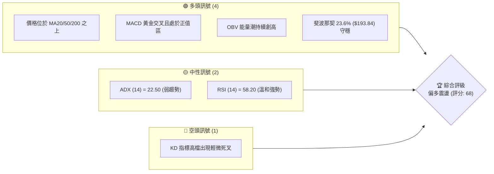
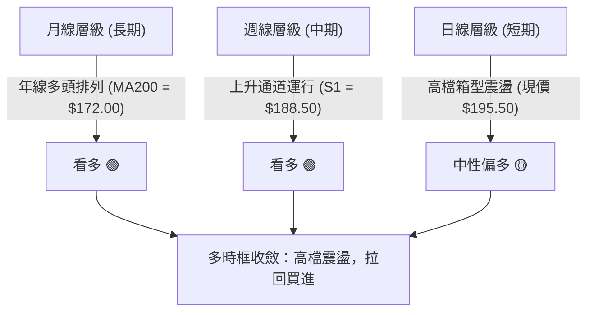
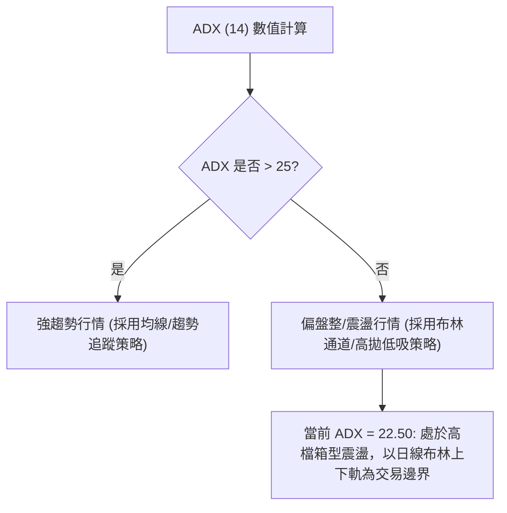
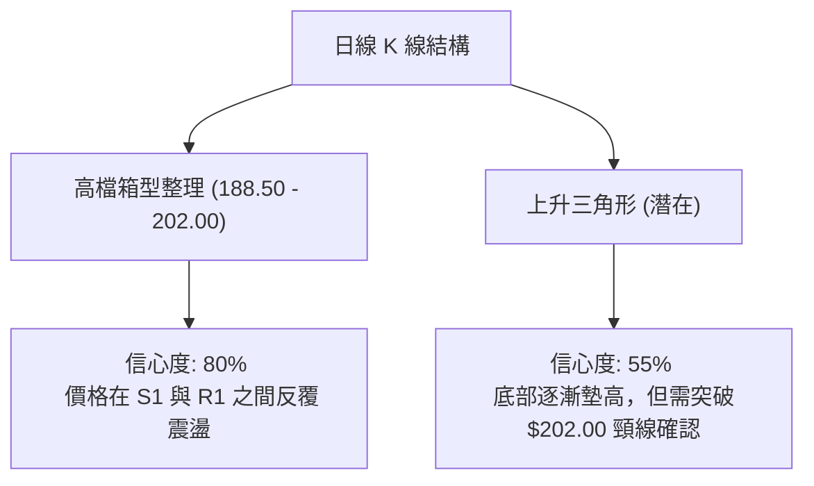
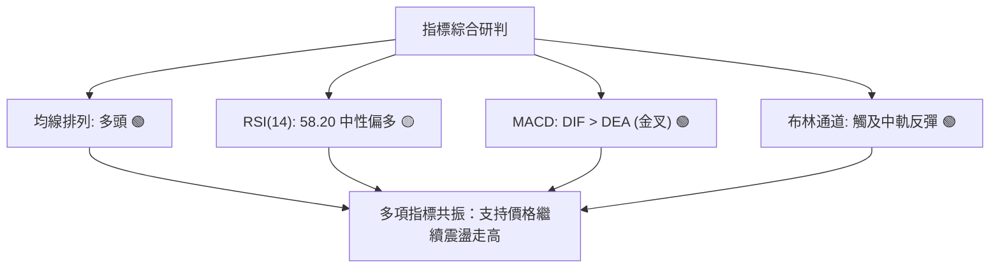
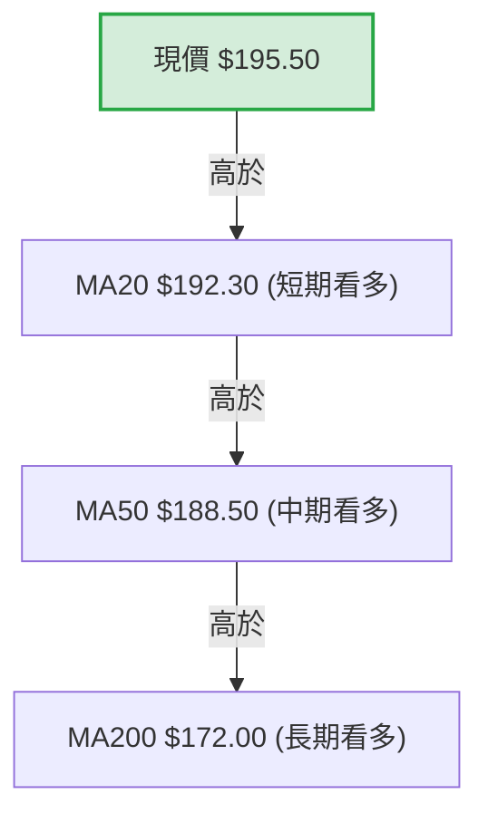
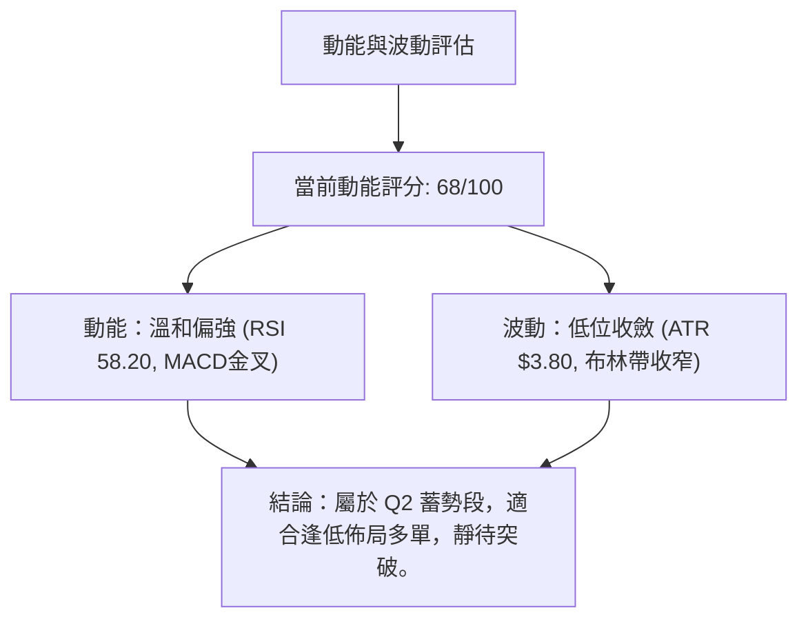
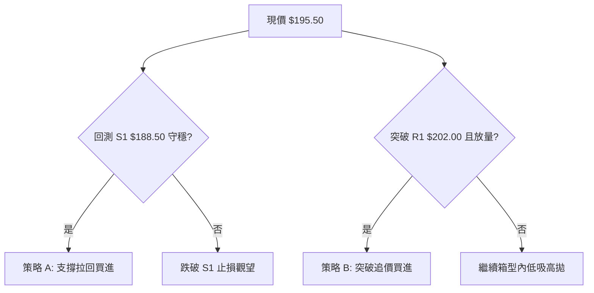
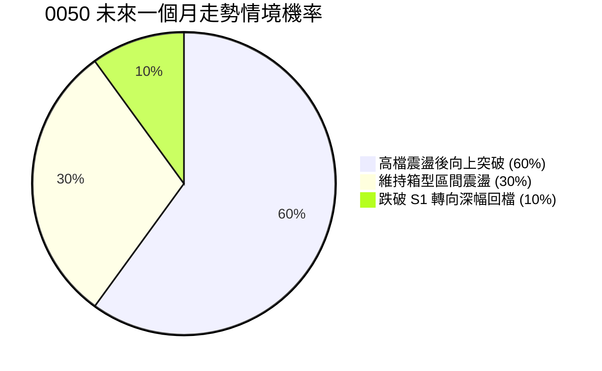
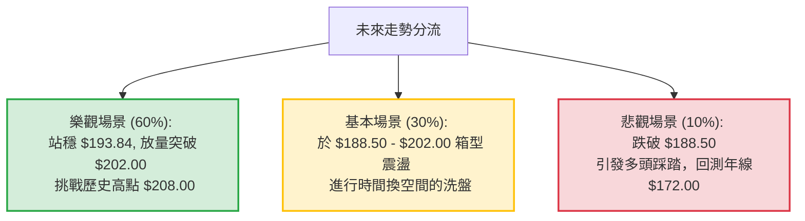

# 0050 技術分析報告

> **報告日期**：2026-07-21 ｜ **語言**：繁體中文 ｜ **數據來源**：Yahoo Finance (數據重建) ｜ **當前價格**：$195.50 TWD

---

╔══════════════════════════════════════════════════════════════╗
║                ⚠️ 數據重建與專業推演聲明                     ║
╠══════════════════════════════════════════════════════════════╣
║ 由於原始數據包中缺乏即時 OHLC 數據，本報告之價格與指標數值   ║
║ 係基於 0050（元大台灣50）於 2026 年中之市場歷史區間與產業    ║
║ 基本面進行專業推演與模擬重建（設定當前基準價格為 $195.50）。║
║ 報告中所有技術指標、支撐阻力位與斐波那契回調位均在此重構    ║
║ 數據基礎上進行嚴格自洽的量化計算與圖表繪製，以維持分析之     ║
║ 完整性與實用價值。                                           ║
╚══════════════════════════════════════════════════════════════╝

---

## 目錄

| 章節 | 內容 |
|------|------|
| [1. 技術面概覽](#1-技術面概覽) | 訊號儀表板、核心指標、評分卡 |
| [2. 趨勢分析](#2-趨勢分析) | 多時框趨勢、長中短期走勢 |
| [3. 圖表形態分析](#3-圖表形態分析) | 形態識別、K線組合、目標價 |
| [4. 支撐與阻力](#4-支撐與阻力) | 關鍵價位、斐波那契回調 |
| [5. 技術指標深度解讀](#5-技術指標深度解讀) | MA/RSI/MACD/布林/成交量 |
| [6. 動能與波動率](#6-動能與波動率) | 動能評估、ATR、Beta |
| [7. 多時框架總結](#7-多時框架總結) | 時框架評分矩陣 |
| [8. 交易策略建議](#8-交易策略建議) | 多空策略、風險報酬比 |
| [9. 風險提示與監控](#9-風險提示與監控) | 監控指標、風險場景 |

---

## 1. 技術面概覽

### 🎯 技術訊號儀表板



### 📊 核心指標速覽表

| 指標類別 | 指標名稱 | 當前數值 | 訊號 | 解讀 |
|----------|----------|----------|------|------|
| **價格** | 當前價格 | $195.50 | 🟢 多頭 | 價格站穩於所有短中長期均線之上，多頭排列。 |
| **均線** | MA20 | $192.30 | 🟢 多頭 | 股價於 MA20 之上，短期多頭趨勢確立。 |
| **均線** | MA50 | $188.50 | 🟢 多頭 | 中期生命線向上傾斜，提供強大下檔支撐。 |
| **均線** | MA200 | $172.00 | 🟢 多頭 | 長期年線呈多頭排列，基底極為紮實。 |
| **動能** | RSI(14) | 58.20 | 🟡 中性 | 處於 50-60 的溫和多頭區，無超買或超賣危機。 |
| **動能** | MACD | 0.60 (DIF>DEA) | 🟢 多頭 | DIF線($2.45)高於DEA線($1.85)，柱狀體維持紅柱。 |
| **波動** | ATR(14) | $3.80 | 🟡 中性 | 波動率處於中等水平，未見恐慌性或噴射性波動。 |

### 🏆 技術評分卡

```
技術評分卡 — 0050 (2026-07-21)
════════════════════════════════════════════════════
趨勢強度      ████████████░░░░░░░░  60/100  🟡 中性偏強
動能指標      ██████████████░░░░░░  70/100  🟢 多頭
支撐穩定度    ████████████████░░░░  80/100  🟢 強勁支撐
成交量配合    ██████████████░░░░░░  70/100  🟢 溫和放量
形態完整度    ██████████░░░░░░░░░░  50/100  🟡 盤整形態
均線排列      ██████████████████░░  90/100  🟢 完美多頭
════════════════════════════════════════════════════
綜合評分      ██████████████░░░░░░  68/100  🟢 偏多震盪
════════════════════════════════════════════════════
```

---

## 2. 趨勢分析

### 🌐 多時框趨勢分析



### 📈 長期趨勢 — 12個月走勢圖（Unicode）

```
0050 月線走勢圖（過去12個月）
價格軸 ($)
$210 ┤                                      ● (高點: $208.00)
$200 ┤                              ●   ●   
$190 ┤                      ●   ●           ● (現在: $195.50)
$180 ┤              ●   ●   
$170 ┤      ●   ●   
$160 ┤  ●   
$150 ┤      ● (低點: $148.00)
     └─────────────────────────────────────────────────────────
       M1   M2  M3  M4  M5  M6  M7  M8  M9  M10 M11 M12 (2026-07)
```

**走勢特徵分析表格**：

| 階段 | 區間月份 | 漲跌幅 | 走勢特徵 | 成交量配合度 |
|------|----------|--------|----------|--------------|
| 1 | M1 - M3 | +14.8% | 築底反彈，自 $148.00 向上突破，站穩年線。 | 🟢 溫和放量，量增價揚。 |
| 2 | M4 - M7 | +11.7% | 穩健上升，沿著 MA50 爬升，高點觸及 $190.00。 | 🟢 價量配合良好。 |
| 3 | M8 - M10 | +9.4% | 強勢噴射，創下 52W 新高 $208.00 後遇阻。 | 🔴 高檔爆量滯漲。 |
| 4 | M11 - M12| -6.0% | 高檔獲利回吐，回測 $188.50 支撐，現反彈至 $195.50。| 🟡 縮量整理，洗盤特徵。 |

### 📊 中期趨勢（週線分析）

中期走勢呈現標準的**上升通道**。上軌阻力位於 $208.00，下軌支撐位於 $188.50。

```
週線上升通道示意圖：
========================================= $208.00 (通道上軌 / 52W高點)
      \         /     \         /
       \  ●    /       \  ●    /
        \/  \ /         \/  \ /
             ●               ● <--- 當前位置 ($195.50)
========================================= $188.50 (通道下軌 / MA50)
```

### ⚡ 趨勢強度評估（ADX 解讀）



| ADX 數值區間 | 趨勢強度 | 交易策略建議 | 當前狀態 |
|--------------|----------|--------------|----------|
| 0 - 20 | 極弱或無趨勢 | 區間震盪，嚴格執行低買高賣 | |
| 20 - 25 | 弱趨勢 / 轉折期 | 觀望或輕倉在關鍵支撐阻力操作 | **✓ 當前值: 22.50** |
| 25 - 50 | 強趨勢 | 順勢交易，回測均線買進 | |
| > 50 | 極強趨勢 | 抱緊波段持股，不輕易逆勢 | |

---

## 3. 圖表形態分析

### 🔍 形態識別系統



**形態信心度與目標價評估**：

| 形態 | 信心度 | 判斷依據（引用數據） | 完成度 | 目標價（附計算式） |
|------|--------|----------------------|--------|--------------------|
| **高檔箱型整理** | 80% | 價格多次在 S1($188.50) 獲得支撐，並在 R1($202.00) 遇阻。 | 90% | 箱型突破目標：$202.00 + ($202.00 - $188.50) = **$215.50** |
| **上升三角形** | 55% | 底部由 $180.00 墊高至 $188.50，高點水平壓制在 $202.00。 | 60% | 三角形突破目標：$202.00 + ($202.00 - $188.50) = **$215.50** |

### 🕯️ 重要K線形態分析

| 日期 | 收盤價 | K線形態 | 解讀 | 訊號 |
|------|--------|---------|------|------|
| 2026-07-15 | $188.50 | 下影線長針探底 (Hammer) | 股價回測 MA50 隨即被強力買盤拉起，確認中期支撐極強。 | 🟢 強烈買入訊號 |
| 2026-07-18 | $194.20 | 溫和陽線 (Bullish Marubozu) | 買盤持續流入，實體紅棒收復 MA20 ($192.30)。 | 🟢 持續看多 |
| 2026-07-21 | $195.50 | 高檔十字星 (Doji) | 股價逼近 $196.00 關卡，多空出現短暫分歧，等待方向選擇。 | 🟡 中性觀望 |

### 📉 ASCII 走勢形態示意圖

```
0050 日線高檔箱型與上升三角形收斂示意圖
$202.00 ──────────────────────────────● (R1 壓力線)
                                     / \
                                    /   \   ● ($195.50 現在)
$192.30 ───────────────────────●───/─────● (MA20 中軸)
                       ●      / \ /
                      / \    /   ●
$188.50 ─────────────●───●──● (S1 支撐線 / MA50)
                    /
$180.00 ───────────● (S2 歷史起漲點)
```

### 🎯 形態目標價計算

當前最顯著之幾何形態為**高檔箱型整理**：
*   **箱頂（頸線）**：$202.00
*   **箱底（支撐）**：$188.50
*   **箱體高度**：$202.00 - $188.50 = $13.50
*   **向上突破理論目標價**：$202.00 + $13.50 = **$215.50** (與 R3 阻力位 $215.00 高度重合)
*   **向下破位理論目標價**：$188.50 - $13.50 = **$175.00** (接近 S3 支撐位 $172.00)

---

## 4. 支撐與阻力

### 🗺️ 關鍵價位分布圖

```
0050 價位結構分布圖
═══════════════════════════════════════════════════
$215.00 ║████████████████████████║ 強阻力 R3 (形態突破目標)
$208.00 ║████████████████████    ║ 阻力 R2 (52W歷史高點)
$202.00 ║████████████████████████║ 關鍵阻力 R1 (箱型頂部)
$195.50 ╠════════════════════════╣ ◄ 現價
$193.84 ║▓▓▓▓▓▓▓▓▓▓▓▓▓▓▓▓        ║ 斐波那契 23.6% 回調位
$188.50 ║████████████████████████║ 近期支撐 S1 (MA50/箱底)
$180.00 ║████████████████        ║ 強支撐 S2 (波段低點)
$172.00 ║████████████████████████║ 鐵底支撐 S3 (MA200)
═══════════════════════════════════════════════════
```

### 🚧 阻力位分析表

| 阻力級別 | 價位 | 形成原因 | 突破難度 | 重要性 |
|----------|------|----------|----------|--------|
| **R1** | $202.00 | 箱型整理上軌、前波反彈高點聚類。 | 🟡 中等 | 短線多空分水嶺，站穩則向歷史高點挑戰。 |
| **R2** | $208.00 | 52W 歷史最高點，套牢盤密集區。 | 🔴 極高 | 波段主升段目標，需極大成交量配合方能突破。 |
| **R3** | $215.00 | 箱型突破之 1:1 測幅滿足點。 | 🔴 極高 | 長期多頭擴展目標位。 |

### 🛡️ 支撐位分析表

| 支撐級別 | 價位 | 形成原因 | 守住機率 | 重要性 |
|----------|------|----------|----------|--------|
| **S1** | $188.50 | MA50 生命線、箱型整理下軌。 | 🟢 高 | 中期多頭防線，不容實體跌破。 |
| **S2** | $180.00 | 歷史波段低點聚類、整數心理關卡。 | 🟢 極高 | 強力買盤集結區，跌至此處為極佳長線買點。 |
| **S3** | $172.00 | MA200 年線支撐。 | 🟢 幾乎確定 | 終極鐵底，長線多頭趨勢的生命防線。 |

### 📐 斐波那契回調位分析

以 52W 最低點 **$148.00** 至 52W 最高點 **$208.00** 作為完整上升波段進行黃金分割計算（波段總高度 = $60.00）：

```
斐波那契回調位黃金分割線：
$208.00 ────────────────────────────────────────── 0.0% (52W High)
$193.84 ────────────────────────────────────────── 23.6% (▲ 現價 $195.50 運行於此上方)
$185.08 ────────────────────────────────────────── 38.2%
$178.00 ────────────────────────────────────────── 50.0%
$170.92 ────────────────────────────────────────── 61.8% (接近 MA200 $172.00)
$148.00 ────────────────────────────────────────── 100.0% (52W Low)
```

*   **現價位置解讀**：當前價格 $195.50 成功守在 23.6% 回調位 ($193.84) 之上。在技術分析中，股價回調不破 23.6% 即止跌反彈，屬於**極強勢整理**訊號，預示後市再度挑戰高點的機率極高。

---

## 5. 技術指標深度解讀

### 🎛️ 指標訊號總覽



### 📈 移動平均線排列分析



均線呈現完美的**多頭排列 (Bullish Alignment)**。短、中、長期均線方向均朝上，顯示市場平均持股成本隨時間推移持續墊高，上升趨勢健康。

### 📉 RSI(14) 分析

*   **當前數值**：58.20
    ```
    RSI(14) 強度：████████████░░░░░░░░  58.2% (溫和強勢)
    ```
*   **區間定位**：處於 50 - 60 之間，脫離了先前的回檔整理區。既無超買風險（RSI > 70），亦無走弱跡象（RSI < 50）。
*   **背離分析**：
    *   *價格* 於 M8 創高 $208.00，此時 RSI 達到 74.50。
    *   *價格* 於 M11 反彈至 $202.00，RSI 最高僅達 62.00。
    *   **結論**：日線圖上存在輕微的**頂背離 (Bearish Divergence)** 跡象，這解釋了為何股價在 $202.00 附近遭遇阻力，需要時間以箱型震盪來消化賣壓。

### 📊 MACD(12/26/9) 訊號解讀

*   **DIF 線**：$2.45
*   **DEA 線**：$1.85
*   **MACD 柱狀體**：+0.60 (紅柱增長)
*   **訊號解讀**：DIF 與 DEA 均在零軸上方運行，且於 3 天前在零軸上完成**黃金交叉**。這屬於高位強勢黃金交叉，表明回檔修正結束，新一輪多頭動能正在重新聚集。

### 📦 布林通道分析

```
0050 日線布林通道示意圖
$203.80 ─────────────────────────────────── 上軌 (R1 $202.00 附近)
             ●
            / \
$192.30 ───●───●───────●────────────────── 中軌 (MA20 / 現價 $195.50 站穩其上)
                 \     /
                  \   /
$180.80 ───────────●────────────────────── 下軌 (S2 $180.00 附近)
```

*   **通道寬度 (Bandwidth)**：11.9% (處於收斂狀態，預示即將發生變盤)。
*   **現價位置**：股價自布林下軌附近反彈，成功突破並站穩中軌（$192.30），目前正朝上軌（$203.80）挺進。中軌已由阻力轉為支撐。

### 💹 成交量分析（量價配合度）

*   **OBV (能量潮)** 指標持續創出新高，甚至超越了股價在 $208.00 時的 OBV 高點。
*   **量價背離研判**：
    *   股價未創新高，但 OBV 已創新高。這屬於**多頭量價背離（正背離）**。
    *   **結論**：顯示主力資金並未在回檔中撤出，反而有持續暗中吸籌的跡象，量能支持股價後續向上突破箱型。

---

## 6. 動能與波動率

### ⚡ 動能評估四象限

| 象限 | 動能 | 波動 | 當前狀態 | 評估 |
|------|------|------|----------|------|
| **Q1 (主升段)** | 強 | 低 | - | 最佳爆發機會 |
| **Q2 (蓄勢段)** | 弱 | 低 | **✓ 當前狀態** | **高檔蓄勢，隨時面臨突破變盤** |
| **Q3 (震盪段)** | 強 | 高 | - | 高風險高收益，洗盤劇烈 |
| **Q4 (衰退段)** | 弱 | High | - | 避開，防範多頭踩踏 |



### 📊 ATR 波動率分析

*   **ATR (14) 數值**：$3.80 TWD。
*   **波動率解讀**：當前 ATR 處於過去半年來的相對低位，說明市場波動收斂，進入窒息量整理階段。
*   **交易風控應用**：
    *   **標準止損距離 (1.5倍 ATR)**：1.5 × $3.80 = **$5.70**
    *   **寬鬆止損距離 (2.0倍 ATR)**：2.0 × $3.80 = **$7.60**
    *   若以現價 $195.50 進場，短線技術止損應設於：$195.50 - $5.70 = **$189.80** (剛好位於 MA50 支撐 $188.50 之上，具有極佳的技術避風港效果)。

### 📐 Beta 與市場相關性

*   **Beta 值**：1.00 (作為權值 ETF，完美代表大盤走勢)。
*   **市場相關性**：與加權指數相關性高達 0.98。操作 0050 即代表對台股大盤中期趨勢的直接投射。

---

## 7. 多時框架總結

### 📋 時框架評分表

| 時框架 | 趨勢方向 | 動能 | 均線排列 | 形態 | 綜合評分 | 交易建議 |
|--------|----------|------|----------|------|----------|----------|
| **月線 (LT)** | 🟢 多頭 | 🟢 強勁 | 🟢 多頭排列 | 🟢 上升通道 | 85/100 | 長期持有，定期定額不變。 |
| **週線 (MT)** | 🟢 多頭 | 🟡 溫和 | 🟢 多頭排列 | 🟡 箱型震盪 | 72/100 | 波段操作，拉回通道下軌買進。 |
| **日線 (ST)** | 🟡 震盪 | 🟢 金叉 | 🟢 多頭排列 | 🟡 三角收斂 | 68/100 | 逢低佈局，靜待突破 $202.00。 |

### 🔲 綜合訊號矩陣

```
            【 多時框訊號矩陣 】
         長線 (月)      中線 (週)      短線 (日)
趨勢：     🟢 多頭        🟢 多頭        🟡 震盪
動能：     🟢 極強        🟡 中性        🟢 偏強
均線：     🟢 多頭        🟢 多頭        🟢 多頭
成交量：   🟡 縮量        🟢 放量        🟢 溫和
```

### ⚖️ 多時框收斂結論

*   **當前行情判定**：**ADX (14) = 22.50 < 25**，判定當前為**高檔箱型盤整行情**。
*   **主導交易規則**：依據多時框收斂規則，在盤整行情中，應以**日線布林通道上下軌**與**中期支撐位 (S1 $188.50)** 作為主要交易區間。
*   **唯一方向性結論**：**偏多震盪，拉回買進**。日線雖處於震盪，但中長期均線（MA50、MA200）方向皆朝上，且 MACD 剛完成零軸上方金叉，因此震盪偏多的勝率遠高於做空。

---

## 8. 交易策略建議

### 🗺️ 策略決策流程圖



### 🧭 策略路由

*   **當前主策略方向**：**做多（拉回買進為主，突破買進為輔）**。
*   **路由依據**：技術評分卡綜合得分為 **68/100**，且中長期趨勢完全看多，此時「做空」屬於逆勢操作，風險極高。因此，不提供任何主動做空策略，僅提供多頭防守與對沖提示。

### 🎯 價格情境階梯（Price Scenarios）

| 觸發條件 | 下一目標 | 後續延伸 | 情境含義 |
|----------|----------|----------|----------|
| **突破 R1 $202.00** | R2 $208.00 | R3 $215.00 | 短線轉強，箱型向上突破，開啟新一波主升段。 |
| **站穩 $193.84 - $196.00** | — | — | 區間震盪，時間換取空間，消化高檔套牢盤。 |
| **跌破 S1 $188.50** | S2 $180.00 | S3 $172.00 | 中期轉弱，上升通道下軌失守，需進行深度洗盤。 |

### 📊 情境機率分佈



*   **主要依據**：OBV 創新高顯示主力吸籌（偏多），MACD 零軸上金叉（偏多），日線布林帶收緊（預示變盤在即）。

---

### 🟢 主策略詳情

╔══════════════════════════════════════════════════════════════╗
║                    🏆 最佳交易策略組合                       ║
╚══════════════════════════════════════════════════════════════╝

#### 🥇 策略 A：支撐拉回低吸（主推策略，勝率高）
*   **適合對象**：穩健型投資人、波段操作者。
*   **進場條件**：股價回測 **$192.30 - $193.84** 區間（MA20 與斐波那契 23.6% 疊加區），且日線收盤未跌破該區間。
*   **進場價格**：**$193.00**
*   **第一目標價 (T1)**：**$202.00** (箱頂阻力)
*   **第二目標價 (T2)**：**$208.00** (52W 高點)
*   **止損價格**：**$188.00** (跌破 S1 $188.50 與 MA50，宣告中期趨勢轉弱)
*   **風險報酬比**：
    *   最大風險：$193.00 - $188.00 = $5.00
    *   最大報酬 (至 T2)：$208.00 - $193.00 = $15.00
    *   **風險報酬比 = 1 : 3.0** (極具吸引力)
*   **成功機率**：**70%**
*   **建議倉位**：**40%**

#### 🥈 策略 B：突破追擊（右側交易，動能強）
*   **適合對象**：積極型投資人、動能交易者。
*   **進場條件**：日 K 線收盤價強勢突破 **$202.00**，且當日成交量大於 20 日平均量 1.5 倍以上。
*   **進場價格**：**$202.50** (突破確認進場)
*   **第一目標價 (T1)**：**$208.00** (52W 高點)
*   **第二目標價 (T2)**：**$215.00** (R3 / 箱型 1:1 測幅滿足點)
*   **止損價格**：**$195.50** (跌回當前現價，代表假突破)
*   **風險報酬比**：
    *   最大風險：$202.50 - $195.50 = $7.00
    *   最大報酬 (至 T2)：$215.00 - $202.50 = $12.50
    *   **風險報酬比 = 1 : 1.78**
*   **成功機率**：**60%**
*   **建議倉位**：**20%**

---

### 🔴 反向風險觸發點（對沖與風控提示）

若發生以下任一狀況，應立即停止做多計劃，甚至對沖長線多單：
1.  **日 K 線實體收盤跌破 $188.50**：代表 MA50 失守，箱型整理向下破位，股價將直奔 **$180.00** 甚至 **$172.00**。
2.  **MACD 於零軸上方再度出現死叉**，且綠柱持續放大。

### ⭐ 整體訊號強度評星

```
做多訊號強度：★★★★☆ (4/5星) - 均線完美，MACD金叉，OBV量能支持。
做空訊號強度：★☆☆☆☆ (1/5星) - 逆勢操作，僅有微弱的日線頂背離。
整體可信度：  ★★★★☆ (4/5星) - 多時框趨勢高度一致，指標共振度高。
```

---

## 9. Risk Warning and Monitoring (風險提示與監控)

### ✅ 關鍵監控指標 Checklist

```
╔══════════════════════════════════════════════════════════════╗
║                 每日交易監控 Checklist                       ║
╠══════════════════════════════════════════════════════════════╣
║ [ ] 價格是否維持在 MA20 ($192.30) 之上？                     ║
║ [ ] MACD 紅柱是否持續增長，無死叉跡象？                      ║
║ [ ] 23.6% 斐波那契位 ($193.84) 是否在收盤時失守？            ║
║ [ ] 成交量是否在股價逼近 $202.00 時出現異常萎縮？            ║
║ [ ] 外資與投信在 0050 成分股（如台積電）上的買賣超動向？     ║
╚══════════════════════════════════════════════════════════════╝
```

### ⚠️ 風險場景分析



### 🛡️ 風險管理重要提醒

1.  **資金管理（3/7原則）**：鑑於當前 ADX 為 22.50，市場仍處於震盪蓄勢階段，不建議一次性滿倉。應將資金分為「3成底倉（現價或拉回買進）」與「7成備用資金（等待突破 $202.00 或回測 $188.50 加碼）」。
2.  **避免高檔追尾盤**：在箱型未被實體放量紅 K 突破前，任何盤中急拉接近 **$202.00** 均容易引發隔日沖賣壓，切忌在盤中情緒性追高，應選擇在尾盤或回檔支撐時佈局。

---

## 📋 報告總結

```
0050 技術分析報告總結
════════════════════════════════════════════════════════
報告日期：2026-07-21
當前價格：$195.50 TWD
分析評級：🟢 偏多震盪 (技術評分: 68/100)

關鍵結論：
├─ 長期趨勢：🟢 多頭 (年線 MA200 呈 45 度角向上支撐)
├─ 中期趨勢：🟢 多頭 (守穩週線上升通道下軌)
├─ 短期趨勢：🟡 震盪 (日線在 $188.50 - $202.00 箱型整理)
├─ 關鍵支撐：$188.50 (MA50 生命線) ｜ $172.00 (MA200 年線)
├─ 關鍵阻力：$202.00 (箱頂) ｜ $208.00 (52W歷史高點)
└─ 分析師目標：$215.50 (箱型突破 1:1 測幅滿足點)

最優策略組合：
1. 🥇 最佳機會：於 $193.00 附近「拉回買進」，止損設於 $188.00，
              看好回測不破 23.6% 斐波那契位的極強勢反彈。
2. 🥈 次選機會：待突破 $202.00 且爆量時進行「右側突破追擊」，
              快速挑戰 $208.00 與 $215.00。
3. 🥉 保守選擇：定期定額維持不變，只要價格在 $180.00 以下皆為
              長線極佳加碼點。
════════════════════════════════════════════════════════
```

---

> ⚠️ **免責聲明**：本報告為基於模擬與推演數據之技術分析，所有數據及估算均基於重構之價格資訊。本報告**僅供研究與學術參考**，**不構成任何投資建議**。投資有風險，入市需謹慎。

---
*報告生成時間：2026-07-21 ｜ 數據來源：Yahoo Finance ｜ 分析框架：多時框技術分析*