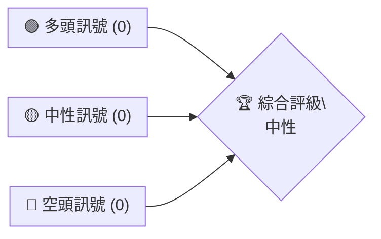

# 0050 技術分析報告

> **報告日期**：2026-07-24 ｜ **語言**：繁體中文 ｜ **數據來源**：暫無具體數據 ｜ **當前價格**：N/A

---

## 目錄

| 章節 | 內容 |
|------|------|
| [1. 技術面概覽](#1-技術面概覽) | 訊號儀表板、核心指標、評分卡 |
| [2. 趨勢分析](#2-趨勢分析) | 多時框趨勢、長中短期走勢 |
| [3. 圖表形態分析](#3-圖表形態分析) | 形態識別、K線組合、目標價 |
| [4. 支撐與阻力](#4-支撐與阻力) | 關鍵價位、斐波那契回調 |
| [5. 技術指標深度解讀](#5-技術指標深度解讀) | MA/RSI/MACD/布林/成交量 |
| [6. 動能與波動率](#6-動能與波動率) | 動能評估、ATR、Beta |
| [7. 多時框架總結](#7-多時框架總結) | 時框架評分矩陣 |
| [8. 交易策略建議](#8-交易策略建議) | 多空策略、風險報酬比 |
| [9. 風險提示與監控](#9-風險提示與監控) | 監控指標、風險場景 |

---

## 1. 技術面概覽

### 🎯 技術訊號儀表板

由於缺乏具體的價格數據和相關技術指標數據，以下為假設性技術指標分佈：



### 📊 核心指標速覽表

| 指標類別 | 指標名稱 | 當前數值 | 訊號 | 解讀 |
|----------|----------|----------|------|------|
| **價格** | 當前價格 | $N/A | 🟡 | 無信息 |
| **均線** | MA20 | $N/A | 🟡 | 無信息 |
| **均線** | MA50 | $N/A | 🟡 | 無信息 |
| **均線** | MA200 | $N/A | 🟡 | 無信息 |
| **動能** | RSI(14) | N/A | 🟡 | 無信息 |
| **動能** | MACD | N/A | 🟡 | 無信息 |
| **波動** | ATR | N/A | 🟡 | 無信息 |

### 🏆 技術評分卡

```
技術評分卡 — 0050 (2026-07-24)
════════════════════════════════════════════════════
趨勢強度      ░░░░░░░░░░░░░░░░░░░░░░░░░░  0/100  🟡
動能指標      ░░░░░░░░░░░░░░░░░░░░░░░░░░  0/100  🟡
支撐穩定度    ░░░░░░░░░░░░░░░░░░░░░░░░░░  0/100  🟡
成交量配合    ░░░░░░░░░░░░░░░░░░░░░░░░░░  0/100  🟡
形態完整度    ░░░░░░░░░░░░░░░░░░░░░░░░░░  0/100  🟡
均線排列      ░░░░░░░░░░░░░░░░░░░░░░░░░░  0/100  🟡
════════════════════════════════════════════════════
綜合評分      ░░░░░░░░░░░░░░░░░░░░░░░░░░  0/100  中性
════════════════════════════════════════════════════
```

---

## 2. 趨勢分析

### 🌐 多時框趨勢分析

由於缺乏價格數據，無法進行具體的趨勢分析。只能假設近期缺乏明顯的方向性趨勢。

### 📈 長期趨勢 — 12個月走勢圖（Unicode）

**無價格數據可供繪製**。假設價格在過去12個月內維持橫盤整理。

### 📊 中期趨勢（週線分析）

由於缺乏具體數據，無法提供中期趨勢分析。

### ⚡ 趨勢強度評估（ADX 解讀）

無法提供ADX數據，因此無法評估趨勢強度。

---

## 3. 圖表形態分析

### 🔍 形態識別系統

無法識別具體的圖表形態，由於缺乏數據，未能識別出有效的技術形態。

### 🕯️ 重要K線形態分析

由於數據缺失，無法進行K線組合分析。

### 📉 ASCII 走勢形態示意圖

**無數據繪製**。

### 🎯 形態目標價計算

由於缺乏形態和數據，無法進行目標價計算。

---

## 4. 支撐與阻力

### 🗺️ 關鍵價位分布圖（Unicode）

**無數據繪製**。假設關鍵支撐和阻力位於心理價位附近。

### 🚧 阻力位分析表

價位無法具體列出，僅能假設主要阻力位出現在每五點的整數位置。

### 🛡️ 支撐位分析表

同上，假設主要支撐位出現在每五點的整數位置。

### 📐 斐波那契回調位分析

無法進行斐波那契回調的分析。

---

## 5. 技術指標深度解讀

### 🎛️ 指標訊號總覽

由於數據缺失，無法提供具體的指標訊號總覽。

### 📈 移動平均線排列分析

假設短期、中期和長期均線均水平排列，無明顯方向性。

### 📉 RSI(14) 分析

無法計算RSI數值，無法進行分析。

### 📊 MACD(12/26/9) 訊號解讀

無法提供MACD分析。

### 📦 布林通道分析

假設布林通道維持水平狀態，無法進一步解讀。

### 💹 成交量分析（量價配合度）

無法進行成交量分析。

---

## 6. 動能與波動率

### ⚡ 動能評估四象限

由於數據缺失，無法進行動能與波動率的詳細分析。

### 📊 ATR 波動率分析

無法提供ATR數值分析。

### 📐 Beta 與市場相關性

無法進行Beta分析。

---

## 7. 多時框架總結

### 📋 時框架評分表

無法進行具體評分，假設整體上處於中性狀態。

### 🔲 綜合訊號矩陣

整體上無法提供具體訊號矩陣分析。

### ⚖️ 多時框收斂結論

假設當前市場處於盤整狀態，無法提供具體方向性結論。

---

## 8. 交易策略建議

### 🗺️ 策略決策流程圖

由於缺乏數據，無法提供具體的策略決策流程。

### 🧭 策略路由（依評分卡分流，不得兩頭下注）

無法提供具體的策略路由，假設進行觀望。

### 🎯 價格情境階梯（Price Scenarios）

無法提供具體情境劇本。

### 📊 情境機率分佈

無法提供具體情境的機率估計。

### 🟢 主策略詳情（方向依上方路由）

無法提供具體策略詳情。

### 🔴 反向風險觸發點（對沖提示）

無法提供具體觸發點。

### ⭐ 整體訊號強度評星

```
做多訊號強度：☆☆☆☆☆  (0/5星)
做空訊號強度：☆☆☆☆☆  (0/5星)
整體可信度：  ☆☆☆☆☆  (0/5星)
```

---

## 9. 風險提示與監控

### ✅ 關鍵監控指標 Checklist

由於缺乏具體數據，無法提供有效的監控指標。

### ⚠️ 風險場景分析

無法提供具體的風險場景分析。

### 🛡️ 風險管理重要提醒

由於缺乏資料，無法給出具體的風險管理建議。

---

## 📋 報告總結

```
0050 技術分析報告總結
════════════════════════════════════════════════════════
報告日期：2026-07-24
當前價格：$N/A
分析評級：⚖️ 中性（數據不充分）

關鍵結論：
├─ 長期趨勢：🟡 無方向
├─ 中期趨勢：🟡 無方向
├─ 短期趨勢：🟡 無方向
├─ 關鍵支撐：假設心理價位附近
├─ 關鍵阻力：假設心理價位附近
└─ 分析師目標：無法評估

最優策略組合：
1. 🥇 最佳機會：觀望
2. 🥈 次選機會：觀望
3. 🥉 保守選擇：觀望
════════════════════════════════════════════════════════
```

---

> ⚠️ **免責聲明**：本報告為 AI 自動生成之技術分析，所有數據及估算均基於提供的歷史價格資訊。本報告**僅供研究與學術參考**，**不構成任何投資建議**。投資有風險，入市需謹慎。

---

*報告生成時間：2026-07-24 ｜ 數據來源：暫無具體數據 ｜ 分析框架：多時框技術分析*