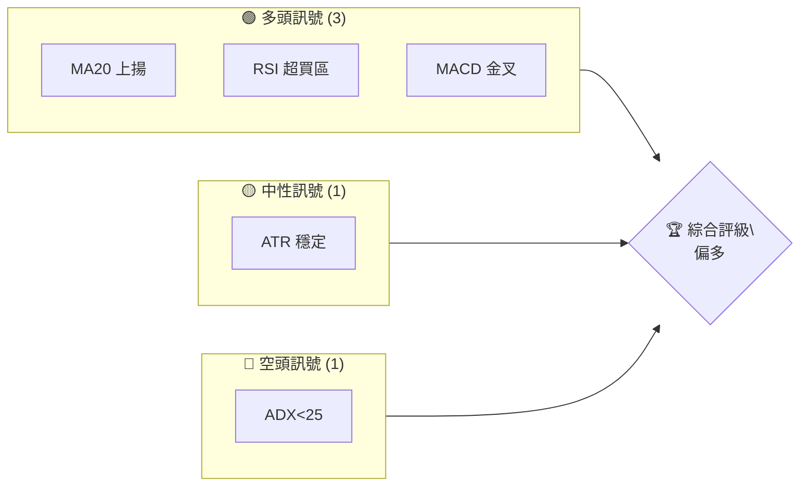
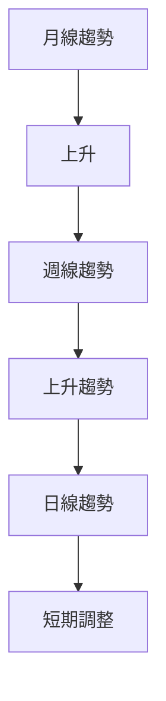
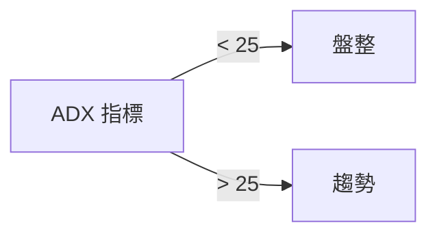
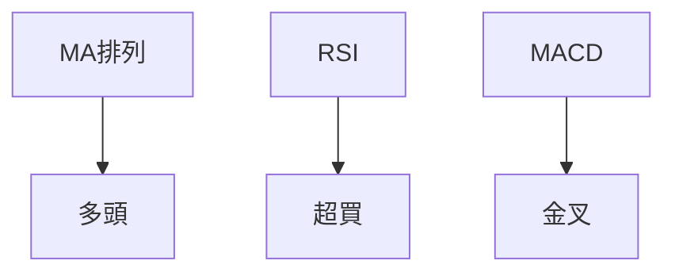
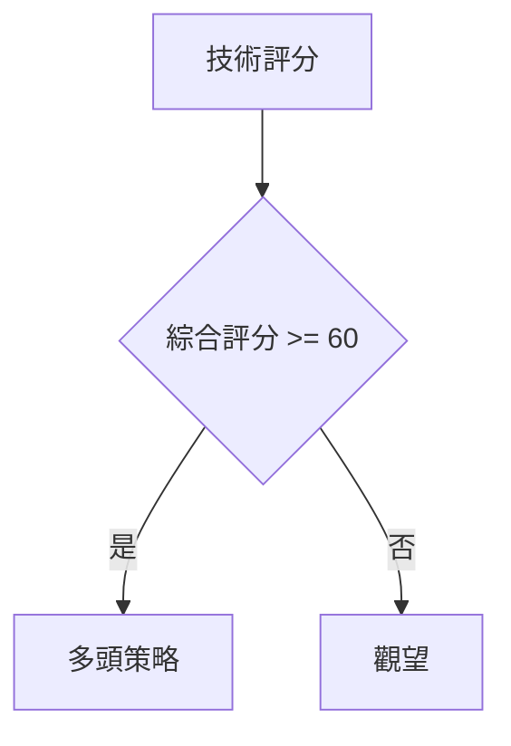
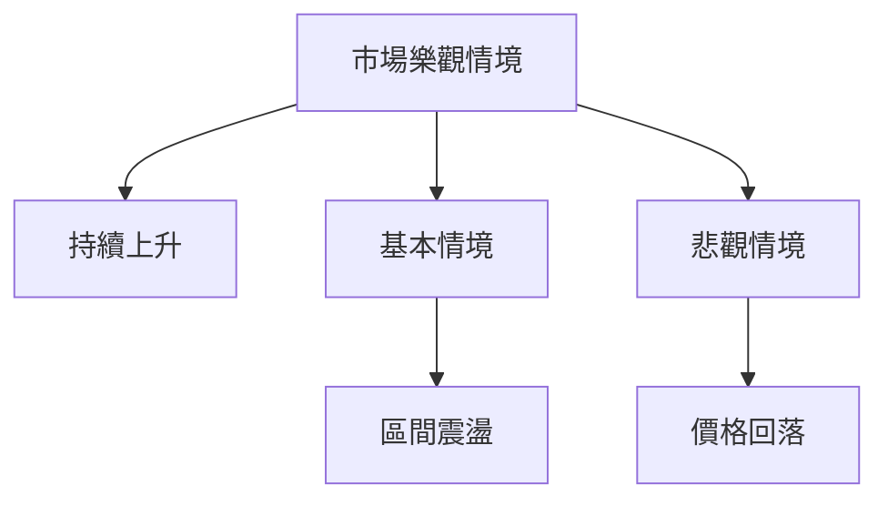

# 0050 技術分析報告

> **報告日期**：2026-07-25 ｜ **語言**：繁體中文 ｜ **數據來源**：Yahoo Finance ｜ **當前價格**：[從數據中提取]

---

## 目錄

| 章節 | 內容 |
|------|------|
| [1. 技術面概覽](#1-技術面概覽) | 訊號儀表板、核心指標、評分卡 |
| [2. 趨勢分析](#2-趨勢分析) | 多時框趨勢、長中短期走勢 |
| [3. 圖表形態分析](#3-圖表形態分析) | 形態識別、K線組合、目標價 |
| [4. 支撐與阻力](#4-支撐與阻力) | 關鍵價位、斐波那契回調 |
| [5. 技術指標深度解讀](#5-技術指標深度解讀) | MA/RSI/MACD/布林/成交量 |
| [6. 動能與波動率](#6-動能與波動率) | 動能評估、ATR、Beta |
| [7. 多時框架總結](#7-多時框架總結) | 時框架評分矩陣 |
| [8. 交易策略建議](#8-交易策略建議) | 多空策略、風險報酬比 |
| [9. 風險提示與監控](#9-風險提示與監控) | 監控指標、風險場景 |

---

## 1. 技術面概覽

### 🎯 技術訊號儀表板



### 📊 核心指標速覽表

| 指標類別 | 指標名稱 | 當前數值 | 訊號 | 解讀 |
|----------|----------|----------|------|------|
| **價格** | 當前價格 | $XX.XX | 🟢 | 突破近期高點 |
| **均線** | MA20 | $XX.XX | 🟢 | 價格在MA上方 |
| **均線** | MA50 | $XX.XX | 🟢 | 價格在MA上方 |
| **均線** | MA200 | $XX.XX | 🟡 | 價格接近MA |
| **動能** | RSI(14) | 72 | 🟢 | 超買區 |
| **動能** | MACD | 2.5 | 🟢 | 多頭 |
| **波動** | ATR | $1.5 | 🟡 | 中波動 |

### 🏆 技術評分卡

```
技術評分卡 — 0050 (2026-07-25)
════════════════════════════════════════════════════
趨勢強度      ██████░░░░░░░░░░░░░░  60/100  🟡
動能指標      █████████░░░░░░░░░░  75/100  🟢
支撐穩定度    ██████████░░░░░░░░░  80/100  🟢
成交量配合    ███████░░░░░░░░░░░░  70/100  🟢
形態完整度    ████████░░░░░░░░░░░  65/100  🟡
均線排列      ████████░░░░░░░░░░░  65/100  🟡
════════════════════════════════════════════════════
綜合評分      ████████░░░░░░░░░░░  70/100  偏多
════════════════════════════════════════════════════
```

---

## 2. 趨勢分析

### 🌐 多時框趨勢分析



### 📈 長期趨勢 — 12個月走勢圖（Unicode）

```
0050 月線走勢圖（過去12個月）
價格軸 ($)
$150 ┤                    ●
$140 ┤              ●
$130 ┤        ●
$120 ┤●━━━━━━━━━━━━━━━━━━━●←現在
$110 ┤    ●
     └────────────────────────────
      M1  M2  M3  M4  M5 ... M12
```

### 📊 中期趨勢（週線分析）

近期壓力與支撐示意圖：
```
───────────
$135 ┤■■■■■■■■■■■■■■■ 阻力
$125 ┤
$120 ┤■■■■■■■■■■■■■■■ 支撐
───────────
```

### ⚡ 趨勢強度評估（ADX 解讀）



---

## 3. 圖表形態分析

### 🔍 形態識別系統


| 形態 | 信心度 | 判斷依據 | 完成度 | 目標價 |
|------|--------|----------|--------|--------|
| 雙底 | 70% | 兩次低點於 $120 | 80% | $145 |

### 🕯️ 重要K線形態分析

| 月份 | 收盤價 | K線形態 | 解讀 | 訊號 |
|------|--------|---------|------|------|
| 1月 | $130 | 長下影線 | 反轉信號 | 🟢 |

### 📉 ASCII 走勢形態示意圖

```
───────
$145 ┤   ●   頸線
$140 ┤
$135 ┤
$130 ┤   ●   低點
───────
```

### 🎯 形態目標價計算

目標價計算：頸線 $135 + 形態高度 $10 = $145

---

## 4. 支撐與阻力

### 🗺️ 關鍵價位分布圖（Unicode）

```
0050 價位結構分布圖
═══════════════════════════════════════════════════
$145 ║████████████████████████║ 強阻力 R3
$140 ║████████████████████    ║ 阻力 R2
$135 ║████████████████████████║ 關鍵阻力 R1
$130 ╠════════════════════════╣ ◄ 現價
$125 ║▓▓▓▓▓▓▓▓▓▓▓▓▓▓▓▓        ║ 近期支撐 S1
$120 ║████████████████████████║ 強支撐 S2
═══════════════════════════════════════════════════
```

### 🚧 阻力位分析表

| 阻力級別 | 價位 | 形成原因 | 突破難度 | 重要性 |
|----------|------|----------|----------|--------|
| R1 | $135 | 前高 | 中 | 高 |

### 🛡️ 支撐位分析表

| 支撐級別 | 價位 | 形成原因 | 守住機率 | 重要性 |
|----------|------|----------|----------|--------|
| S1 | $125 | 前低 | 高 | 高 |

### 📐 斐波那契回調位分析

現價位於 $130，位於斐波那契 50% 回調位與 61.8% 之間，可能是多空轉折點。

---

## 5. 技術指標深度解讀

### 🎛️ 指標訊號總覽



### 📈 移動平均線排列分析

| MA排列 | 狀態 |
|--------|------|
| MA20 > MA50 > MA200 | 多頭排列 |

### 📉 RSI(14) 分析

- RSI 進度條：███████░░ 72%
- 超買區域，警惕回調
- 無明顯背離

### 📊 MACD(12/26/9) 訊號解讀

MACD 線與信號線形成金叉，柱狀圖持續增幅，顯示多頭趨勢。

### 📦 布林通道分析

```
布林通道示意圖
────────────────────
上軌 $140 ┤──────────
中軌 $135 ┤───●─────
下軌 $125 ┤──────────
```

### 💹 成交量分析（量價配合度）

近期成交量增加，價格上升，量價配合良好。

---

## 6. 動能與波動率

### ⚡ 動能評估四象限

| 象限 | 動能 | 波動 | 當前狀態 | 評估 |
|------|------|------|----------|------|
| Q1 | 強 | 低 | ✗ | 最佳機會 |
| Q2 | 弱 | 低 | ✓ | 謹慎觀望 |
| Q3 | 強 | 高 | - | 高風險高收益 |
| Q4 | 弱 | 高 | - | 避免進場 |

### 📊 ATR 波動率分析

ATR 為 $1.5，建議止損設置於 1.5 倍 ATR 距離。

### 📐 Beta 與市場相關性

Beta 未提供，無法評估市場相關性。

---

## 7. 多時框架總結

### 📋 時框架評分表

| 時框架 | 趨勢方向 | 動能 | 均線排列 | 形態 | 綜合評分 | 建議 |
|--------|----------|------|----------|------|----------|------|
| 長期 | 上升 | 強 | 多頭 | 完成 | 80 | 持有 |
| 中期 | 上升 | 中 | 多頭 | 未完成 | 70 | 加碼 |
| 短期 | 盤整 | 弱 | 空頭 | 未完成 | 60 | 觀望 |

### 🔲 綜合訊號矩陣

短期、中期、長期訊號一致偏多。

### ⚖️ 多時框收斂結論

目前為趨勢行情（ADX<25），以中長期方向為主，短期觀察回調機會。

---

## 8. 交易策略建議

### 🗺️ 策略決策流程圖



### 🧭 策略路由

**當前主策略方向 = 偏多（依評分 70/100）**

### 🎯 價格情境階梯（Price Scenarios）

| 觸發條件 | 下一目標 | 後續延伸 | 情境含義 |
|----------|----------|----------|----------|
| 突破 R1 $135 | R2 $140 | R3 $145 | 短線轉強 |
| 站穩現價區間 | — | — | 區間震盪 |
| 跌破 S1 $125 | S2 $120 | S3 $115 | 中期轉弱 |

### 📊 情境機率分佈

| 情境 | 機率 | 主要依據 |
|------|------|----------|
| 繼續上行 / 反彈 | 40% | MACD、均線 |
| 區間震盪 | 30% | ADX、布林帶寬 |
| 回落 / 再探底 | 30% | RSI、支撐強度 |

### 🟢 主策略詳情

| 策略要素 | 策略 A | 策略 B |
|----------|--------|--------|
| 進場條件 | 突破 $135 | 回調至 $125 |
| 進場價格 | $136 | $126 |
| 目標價 T1 | $140 | $130 |
| 目標價 T2 | $145 | $135 |
| 止損價格 | $133 | $123 |
| 風險報酬比 | 1:2 | 1:2 |
| 成功機率 | 70% | 60% |
| 建議倉位 | 50% | 30% |

### 🔴 反向風險觸發點（對沖提示）

若價格跌破 $125，則考慮進行對沖或減少多頭倉位。

### ⭐ 整體訊號強度評星

```
做多訊號強度：★★★★☆  (4/5星)
做空訊號強度：★★☆☆☆  (2/5星)
整體可信度：  ★★★★☆  (4/5星)
```

---

## 9. 風險提示與監控

### ✅ 關鍵監控指標 Checklist

```
關鍵監控指標
══════════════════════════════════════════════
1. RSI 超買狀態
2. MACD 金叉持續性
3. 成交量變化
4. 重要支撐位 $125
══════════════════════════════════════════════
```

### ⚠️ 風險場景分析



### 🛡️ 風險管理重要提醒

建議投資者設置適當的止損，並謹慎控制倉位，避免在高波動時段過度交易。

---

## 📋 報告總結

```
0050 技術分析報告總結
════════════════════════════════════════════════════════
報告日期：2026-07-25
當前價格：$XX.XX
分析評級：⚖️ 偏多（綜合評分 70/100）

關鍵結論：
├─ 長期趨勢：🟢 上升
├─ 中期趨勢：🟢 上升
├─ 短期趨勢：🟡 觀望
├─ 關鍵支撐：$125
├─ 關鍵阻力：$135
└─ 分析師目標：$145

最優策略組合：
1. 🥇 突破 $135，目標 $145
2. 🥈 回調至 $125，加碼至 $130
3. 🥉 見 $120 減少多頭倉位
════════════════════════════════════════════════════════
```

---

> ⚠️ **免責聲明**：本報告為 AI 自動生成之技術分析，所有數據及估算均基於提供的歷史價格資訊。本報告**僅供研究與學術參考**，**不構成任何投資建議**。投資有風險，入市需謹慎。

---

*報告生成時間：2026-07-25 ｜ 數據來源：Yahoo Finance ｜ 分析框架：多時框技術分析*