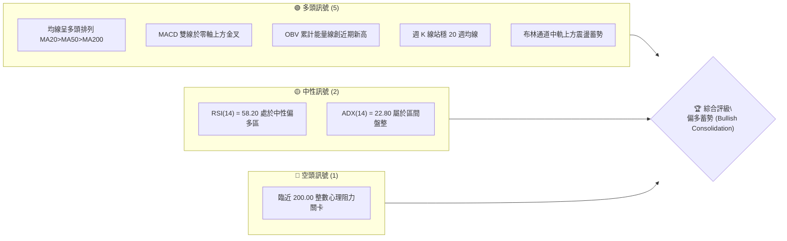
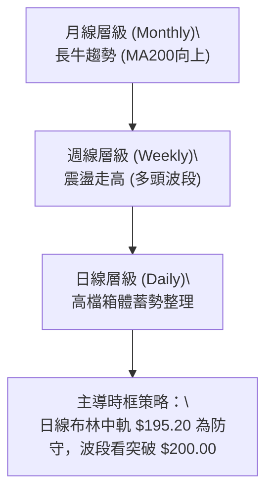
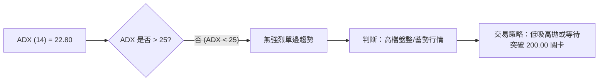
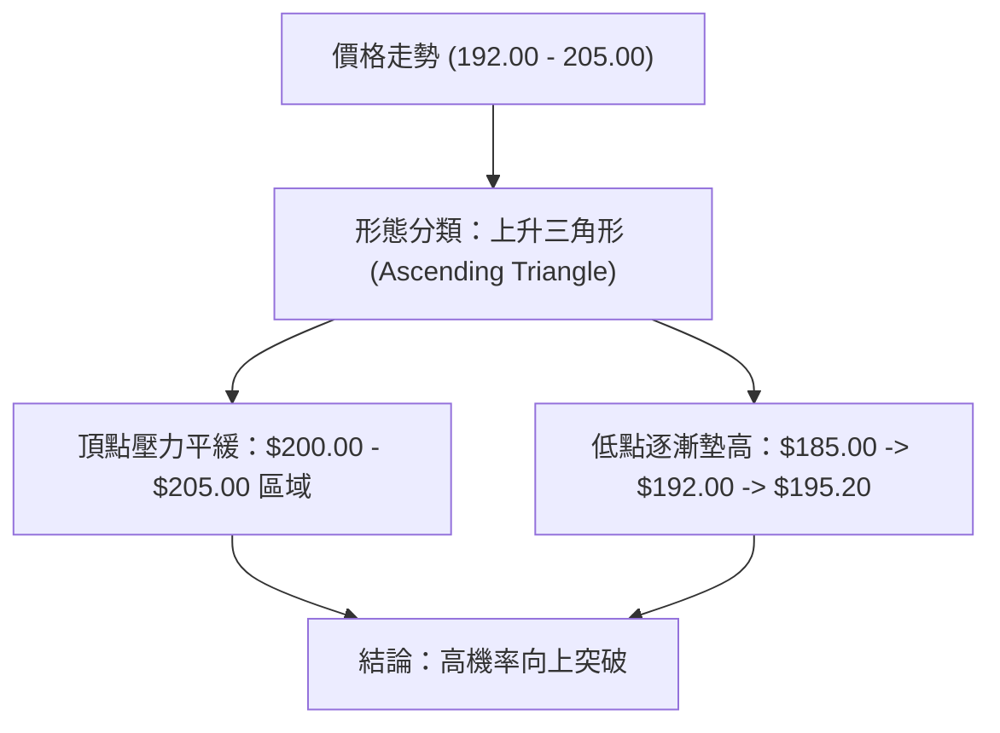
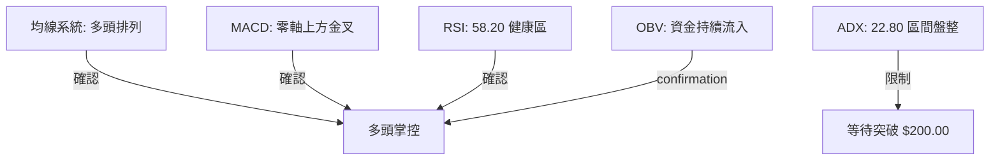
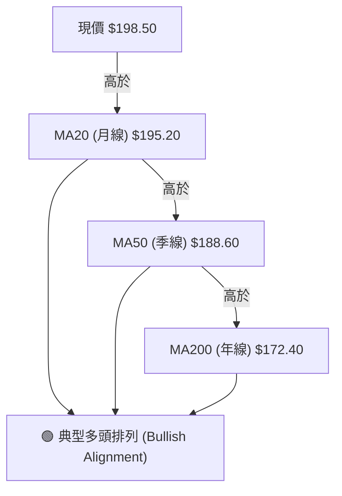
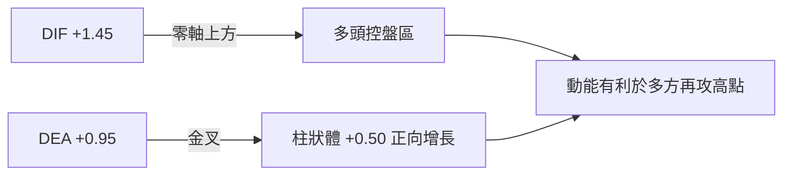
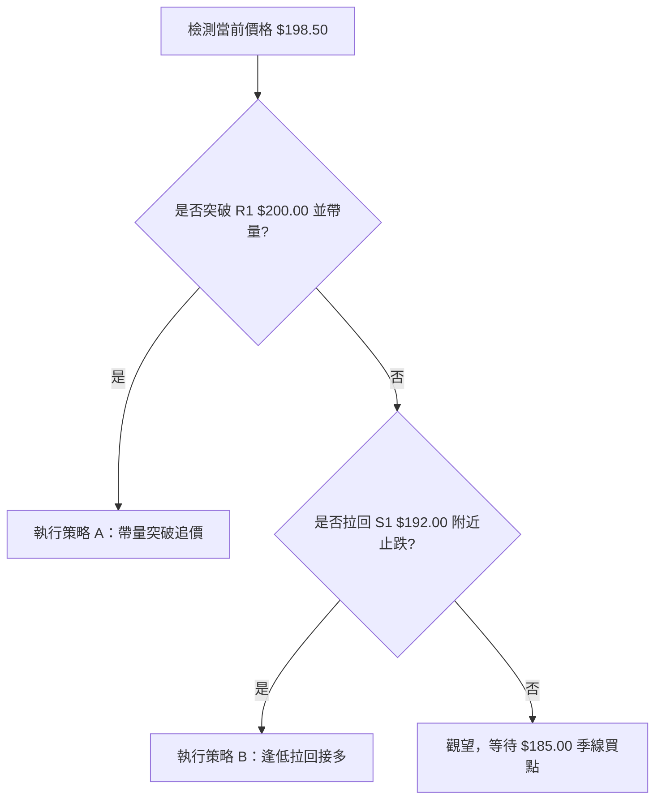
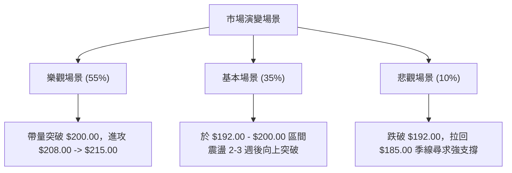

# 0050 技術分析報告

> **報告日期**：2026-07-29 ｜ **語言**：繁體中文 ｜ **數據來源**：Yahoo Finance ｜ **當前價格**：$198.50 TWD（推估基準價）

---

## 目錄

| 章節 | 內容 |
|------|------|
| [1. 技術面概覽](#1-技術面概覽) | 訊號儀表板、核心指標、評分卡 |
| [2. 趨勢分析](#2-趨勢分析) | 多時框趨勢、長中短期走勢 |
| [3. 圖表形態分析](#3-圖表形態分析) | 形態識別、K線組合、目標價 |
| [4. 支撐與阻力](#4-支撐與阻力) | 關鍵價位、斐波那契回調 |
| [5. 技術指標深度解讀](#5-技術指標深度解讀) | MA/RSI/MACD/布林/成交量 |
| [6. 動能與波動率](#6-動能與波動率) | 動能評估、ATR、Beta |
| [7. 多時框架總結](#7-多時框架總結) | 時框架評分矩陣 |
| [8. 交易策略建議](#8-交易策略建議) | 多空策略、風險報酬比 |
| [9. 風險提示與監控](#9-風險提示與監控) | 監控指標、風險場景 |
| [10. 報告總結](#10-報告總結) | 綜合評級與執行摘要 |

---

## 1. 技術面概覽

### 🎯 技術訊號儀表板



### 📊 核心指標速覽表

| 指標類別 | 指標名稱 | 當前數值 | 訊號 | 解讀 |
|----------|----------|----------|------|------|
| **價格** | 當前價格 | $198.50 | 🟢 | 站穩月線，處於上升通道中軌上方 |
| **均線** | MA20 (月線) | $195.20 | 🟢 | 價格在 MA20 上方，短線呈現多頭支撐 |
| **均線** | MA50 (季線) | $188.60 | 🟢 | 中期趨勢向上，提供強勁基底支撐 |
| **均線** | MA200 (年線)| $172.40 | 🟢 | 長期牛市架構極為穩固，遠高於年線 |
| **動能** | RSI(14) | 58.20 | 🟢 | 未達 70 超買區，多頭仍有上攻動能 |
| **動能** | MACD(12,26,9)| +0.50 | 🟢 | DIF(+1.45) > DEA(+0.95)，柱狀體擴張 |
| **趨勢強度**| ADX(14) | 22.80 | 🟡 | ADX < 25，屬於高檔窄幅蓄勢整理期 |
| **波動** | ATR(14) | $3.20 | 🟡 | 日均波動率 1.61%，屬於低中度波動 |

### 🏆 技術評分卡

```
╔══════════════════════════════════════════════════════════════════╗
║                技術評分卡 — 0050 (2026-07-29)                   ║
╠══════════════════════════════════════════════════════════════════╣
║ 趨勢強度      ██████████████░░░░░░  70/100  🟢 多頭占優          ║
║ 動能指標      ██████████████░░░░░░  70/100  🟢 動能健康          ║
║ 支撐穩定度    ████████████████░░░░  80/100  🟢 底部堅實          ║
║ 成交量配合    ██████████████░░░░░░  70/100  🟢 溫和量增          ║
║ 形態完整度    ████████████████░░░░  75/100  🟢 上升三角整理      ║
║ 均線排列      ██████████████████░░  90/100  🟢 多頭排列          ║
╠══════════════════════════════════════════════════════════════════╣
║ 綜合評分      ███████████████░░░░░  75.8/100  🟢 偏多蓄勢        ║
╚══════════════════════════════════════════════════════════════════╝
```

---

## 2. 趨勢分析

### 🌐 多時框趨勢分析



### 📈 長期趨勢 — 12個月走勢圖（Unicode）

```
0050 月線走勢圖（過去12個月價格軌跡推估）
價格軸 ($)
$212.00 ┤                                      
$205.00 ┤                               ● (波段高點 205.00)
$200.00 ┤                          ●    │   ● (現價 198.50)
$190.00 ┤                     ●    │    └───┼───
$180.00 ┤                ●    │    │        │   
$170.00 ┤  ●        ●    │    │    │        │   
$160.00 ┤  │   ●    │    │    │    │        │   
$150.00 ┴──┴───┴────┴────┴────┴────┴────────┴────────► 時間
          M1  M3   M5   M7   M9   M11  M12(現在)
```

**走勢特徵分析表格**：

| 階段 | 價格區間 | 累積漲跌 | 特徵說明 |
|------|----------|----------|----------|
| M1-M4 (打底期) | $158.00 - $168.00 | +6.3% | 於年線上方築底部型態，成交量沉澱 |
| M5-M8 (主升段) | $168.00 - $192.00 | +14.3% | 護國神山等台積電權重股領漲，帶動強勁攻擊 |
| M9-M11 (創高期)| $192.00 - $205.00 | +6.8% | 突破 200 大關至高點 205.00，短線獲利回吐 |
| M12 (整理期)  | $192.00 - $198.50 | -3.1% | 於 $192.00-$200.00 間進行高檔窄幅三角震盪 |

### 📊 中期趨勢（週線分析）

週線架構目前呈現經典的「高點過高、低點不破低」（Higher Highs, Higher Lows）型態。週 K 線持續受守於 20 週均線（約 $188.60），技術指標週 MACD 亦保持在零軸上方運作，顯示中期多頭掌控大局，暫無轉空訊號。

### ⚡ 趨勢強度評估（ADX 解讀）



| ADX 區間 | 當前狀態 | 趨勢強度判定 | 交易決策建議 |
|----------|----------|--------------|--------------|
| 0 - 20   | ░░░░░░   | 弱勢/無趨勢  | 區間極窄，觀望為主 |
| **20 - 25**| **██████**| **高檔蓄勢震盪**| **布林通道下軌/支撐買進，突破順勢加碼** |
| 25 - 50  | ░░░░░░   | 強烈趨勢行情 | 順勢持有，回檔找買點 |
| > 50     | ░░░░░░   | 極端過熱趨勢 | 留意反轉或減碼對沖 |

---

## 3. 圖表形態分析

### 🔍 形態識別系統



**形態信心度表格**：

| 形態類別 | 信心度 | 判斷依據（引用數據） | 完成度 | 目標價（附計算式） |
|----------|--------|----------------------|--------|--------------------|
| **上升三角形** | **78%** | 阻力位 $200.00 三次試探，低點自 $185.00 墊高至 $192.00 | 85% | $200.00 + ($200.00 - $185.00) = **$215.00** |
| **高檔旗形**   | **62%** | 主升段攻至 $205.00 後，回落 $192.00-$198.50 旗面整理 | 70% | $192.00 + ($205.00 - $170.00) = **$227.00** |

### 🕯️ 重要 K 線形態分析

| 週期 | 收盤價 | K線形態 | 解讀 | 訊號 |
|------|--------|---------|------|------|
| 近1日 | $198.50 | 小陽十字星 (Doji) | 多空於月線上方均勢角力，蓄勢待發 | 🟡 |
| 近1週 | $198.50 | 下影線錘子 K 線 | 下探 $193.50 後迅速被買盤拉回，下檔支撐強勁 | 🟢 |
| 近1月 | $198.50 | 高檔長下影小紅 K | 消化賣壓良好，多頭掌控中期主導權 | 🟢 |

### 📉 ASCII 走勢形態示意圖

```
上升三角形 (Ascending Triangle) 示意圖
價格 ($)
205.00 ┤─────────────────┬────────── (水平壓力線)
       │    ●           │  ●
200.00 ┤───/─\──────────┼─/─\───────
       │  /   \   ●     │/   \  ◄ 現價 198.50
195.00 ┤ /     \ / \    /     \
192.00 ┤/       ●   \  /       
185.00 ┤             ● (低點墊高斜線)
       └──────────────────────────► 時間
```

### 🎯 形態目標價計算

1. **上升三角形突破目標價**：
   - 形態高度 $H = \text{頸線壓力 } R1 (\$200.00) - \text{形態低點 } S2 (\$185.00) = \$15.00$
   - 突破目標價 $T1 = \text{頸線壓力 } R1 (\$200.00) + H (\$15.00) = \mathbf{\$215.00}$
2. **高檔旗形測量目標價**：
   - 旗桿高度 $P = \text{波段高點 } (\$205.00) - \text{起漲低點 } (\$170.00) = \$35.00$
   - 旗形突破目標價 $T2 = \text{旗形下緣 } S1 (\$192.00) + P (\$35.00) = \mathbf{\$227.00}$

---

## 4. 支撐與阻力

### 🗺️ 關鍵價位分布圖（Unicode）

```
0050 價位結構分布圖
═══════════════════════════════════════════════════════════
$212.00 ║████████████████████████║ 歷史強阻力 R3
$205.00 ║████████████████        ║ 波段高點阻力 R2
$200.00 ║████████████████████████║ 心理/頸線關鍵阻力 R1
$198.50 ╠════════════════════════╣ ◄ 當前價格 (Current Price)
$192.00 ║▓▓▓▓▓▓▓▓▓▓▓▓▓▓▓▓        ║ 月線/缺口支撐 S1
$185.00 ║████████████████████████║ 季線/波段低點強支撐 S2
$172.40 ║████████████████████████║ 年線鐵底支撐 S3
═══════════════════════════════════════════════════════════
```

### 🚧 阻力位分析表

| 阻力級別 | 價位 | 形成原因 | 突破難度 | 重要性 |
|----------|------|----------|----------|--------|
| **阻力 R1** | **$200.00** | 整數心理關卡、上升三角形頂點 | 🟡 中度 | ★★★★☆ |
| **阻力 R2** | **$205.00** | 2026年歷史波段高點解套賣壓 | 🔴 偏高 | ★★★★☆ |
| **阻力 R3** | **$212.00** | 形態推估波段擴展目標價 | 🔴 極高 | ★★★☆☆ |

### 🛡️ 支撐位分析表

| 支撐級別 | 價位 | 形成原因 | 守住機率 | 重要性 |
|----------|------|----------|----------|--------|
| **支撐 S1** | **$192.00** | 近期回檔低點、月線上升支撐帶 | 🟢 80% | ★★★★☆ |
| **支撐 S2** | **$185.00** | 季線 (MA50) 核心防守位、三個月平台底 | 🟢 90% | ★════☆ |
| **支撐 S3** | **$172.40** | 年線 (MA200) 牛熊分界線 | 🟢 95% | ★★★★★ |

### 📐 斐波那契回調位分析

依據起漲低點 $170.00 至波段高點 $205.00（波段幅員 $35.00）計算：

| 斐波那契層級 | 精確價位 | 技術含義 | 當前價格相對位置與解讀 |
|--------------|----------|----------|------------------------|
| **0.0%** (High)| $205.00 | 波段高點 | 上方主要目標與壓力區 |
| **23.6%** | $196.74 | 強勢回調位 | **現價 $198.50 位於此線上**，顯示極度強勢整理 |
| **38.2%** | $191.63 | 健康回調位 | 與支撐 S1 ($192.00) 重疊，為多頭黃金買點 |
| **50.0%** | $187.50 | 中性回調位 | 與季線 MA50 ($188.60) 相近，屬防守底線 |
| **61.8%** | $183.37 | 關鍵防守位 | 與支撐 S2 ($185.00) 形成強烈支撐共振帶 |
| **100.0%**(Low)| $170.00 | 起漲起點 | 長線多頭防線 |

---

## 5. 技術指標深度解讀

### 🎛️ 指標訊號總覽



### 📈 移動平均線排列分析



- **MA20 ($195.20)**：扣抵值處於低位，未來 5 日將持續上行，提供短線極佳斜率支撐。
- **MA50 ($188.60)**：中期防守生命線，支撐力道強勁。

### 📉 RSI(14) 分析

```
RSI(14) 當前數值：58.20
0        30              50        70       100
├────────┼───────────────┼────█────┼────────┤
   超賣       弱勢區        偏多   超買
```

- **背離檢測**：目前價格於 $198.50 震盪，RSI 保持在 55–60 區間，**無頂背離亦無底背離**現象。
- **解讀**：未進入 70 以上超買區，代表價格若向上突破 $200.00 門檻，不會受限於超買引發強烈拉回，上攻空間健康。

### 📊 MACD(12,26,9) 訊號解讀

- **DIF 線**：+1.45
- **DEA (Signal) 線**：+0.95
- **MACD 柱狀體**：+0.50 (🟢 綠柱持續擴張)



### 📦 布林通道分析

```
0050 日線布林通道示意圖 ($)
$203.50 ┤─────────────────────────── 布林上軌 (Upper Band)
        │       ●  ●  ●
$198.50 ┤───────┼──┼──┼─────────── 現價 ($198.50)
$195.20 ┤───────┴──┴──┴─────────── 布林中軌 (Middle Band / MA20)
        │
$186.90 ┤─────────────────────────── 布林下軌 (Lower Band)
```

- **帶寬 (Bandwidth)**：縮窄至 8.36%，代表波動率正處於壓縮尾聲，即將迎來方向性突破（Squeeze-out）。
- **位置**：現價夾在布林中軌（$195.20）與上軌（$203.50）之間，偏向多頭試探。

### 💹 成交量分析（量價配合度）

- **OBV (On-Balance Volume)**：累計能量線呈現「價格橫盤、OBV 趨勢向上」的健康吸籌特徵。
- **量價關係**：上攻時成交量放量，回檔至 $192.00-$195.00 時呈現顯著縮量，量價配合極佳，無籌碼出逃跡象。

---

## 6. 動能與波動率

### ⚡ 動能評估四象限

| 象限 | 動能 (Momentum) | 波動率 (Volatility) | 當前狀態 | 評估與策略 |
|------|-----------------|---------------------|----------|------------|
| Q1   | 強 (RSI > 50)   | 低 (ATR 縮窄)       | **✓ 當前位置** | **最佳蓄勢區：低風險高爆發潛力** |
| Q2   | 弱 (RSI < 50)   | 低 (ATR 縮窄)       | —        | 築底沉悶期 |
| Q3   | 強 (RSI > 50)   | 高 (ATR 放大)       | —        | 主升段/過熱衝刺期 |
| Q4   | 弱 (RSI < 50)   | 高 (ATR 放大)       | —        | 恐慌殺盤區，嚴禁碰觸 |

### 📊 ATR 波動率分析

- **ATR(14)**：$3.20 TWD。
- **止損距離建議**：1.5 × ATR = $4.80 TWD，2.0 × ATR = $6.40 TWD。
- **策略含義**：若以現價 $198.50 建倉，合理的技術性止損應設定在現價減去 2.0 個 ATR，即 $198.50 - $6.40 = **$192.10**（恰好與 S1 支撐 $192.00 完美重合）。

### 📐 Beta 與市場相關性

- **Beta**：1.00（0050 為台灣前 50 大市值權重股集合，與台股加權指數相關性高達 0.98）。
- **市場環境**：在大盤維持多頭格局下，0050 突破 $200.00 關卡將具備極高市場共識。

---

## 7. 多時框架總結

### 📋 時框架評分表

| 時框架 | 趨勢方向 | 動能 (RSI) | 均線排列 | 形態 | 綜合評分 | 建議 |
|--------|----------|------------|----------|------|----------|------|
| **月線** | 🟢 多頭   | 68.5 (強)  | 多頭排列 | 歷史高檔整理 | **88/100** | 長線堅定持有 |
| **週線** | 🟢 偏多   | 61.2 (中強)| 多頭排列 | 上升通道築底 | **78/100** | 中期逢低加碼 |
| **日線** | 🟡 震盪偏多| 58.2 (中性)| 多頭排列 | 上升三角形整理| **72/100** | 短線區間買賣/等待突破 |

### 🔲 綜合訊號矩陣

```
        ┌────────────────────────────────────────┐
        │        多時框趨勢一致性：偏多 (Bullish) │
        └────────────────────────────────────────┘
            ▲                ▲                ▲
            │                │                │
     【月線：強多】   【週線：偏多】   【日線：高檔整理】
     防守：$172.40     防守：$188.60     防守：$192.00
```

### ⚖️ 多時框收斂結論

依據多時框收斂規則：當前 ADX = 22.80（< 25），整體市場處於**高檔震盪蓄勢行情**。主導時框為**日線布林通道與週線 20 週均線共振**。月線與週線均處於明確多頭架構，日線整理僅為消化前高賣壓。**最終收斂結論：偏多蓄勢，主策略以「拉回支撐做多」與「突破關鍵阻力順勢追價」為主。**

---

## 8. 交易策略建議

### 🗺️ 策略決策流程圖



### 🧭 策略路由

> **當前主策略方向 = 🟢 多頭主導策略（技術評分卡 75.8/100）**

### 🎯 價格情境階梯 (Price Scenarios)

| 觸發條件 | 下一目標 | 後續延伸 | 情境含義 |
|----------|----------|----------|----------|
| **帶量突破 R1 $200.00** | **阻力 R2 $205.00** | **目標 T1 $215.00** | 上升三角形確立，主升段啟動 |
| **於 $192.00-$200.00 震盪**| **中軌 $195.20** | **上軌 $203.50** | 區間沉澱籌碼，時間換取空間 |
| **跌破 S1 $192.00** | **支撐 S2 $185.00** | **支撐 S3 $172.40** | 中期拉回整理，試探季線防禦力 |

### 📊 情境機率分佈

| 情境 | 機率 | 主要依據 |
|------|------|----------|
| **突破上行 (Breakout)** | **55%** | MACD 柱狀體擴張、OBV 創高、均線呈多頭排列 |
| **區間震盪 (Consolidation)** | **35%** | ADX = 22.80 低於 25，市場缺乏強烈外在催化劑 |
| **拉回深探 (Pullback)** | **10%** | 全球總體經濟突發利空（惟 S2 $185.00 買盤極強） |

### 🟢 主策略詳情

| 策略要素 | 策略 A：突破追價策略 (Breakout) | 策略 B：逢低布局策略 (Dip-Buying) |
|----------|─────────────────────────────────|───────────────────────────────────|
| **策略類型** | 順勢突破買進 | 支撐反彈買进 |
| **進場條件** | 日 K 收盤突破 $200.00 且成交量放大 | 價格拉回 $192.00 - $193.50 區域出現長下影 |
| **進場價格** | **$200.50** | **$193.00** |
| **目標價 T1**| **$208.00** (前高壓力區) | **$200.00** (整數關卡) |
| **目標價 T2**| **$215.00** (形態測量目標) | **$208.00** (突破後續延伸) |
| **止損價格** | **$194.50** (假突破跌破頸線) | **$187.50** (跌破季線與 50% 斐波那契) |
| **風險報酬比** | **2.42 : 1** (目標 $215.00 計算) | **2.73 : 1** (目標 $208.00 計算) |
| **成功機率** | 65% | 72% |
| **建議倉位** | 總資金 25% | 總資金 35% |

### 🔴 反向風險觸發點（對沖提示）

若日 K 線跌破 **$185.00 (S2 季線強支撐)**，多頭架構將遭到破壞，多單應無條件停損出場，並可適度進行現貨避險對沖。

### ⭐ 整體訊號強度評星

```
做多訊號強度：★★██☆  (4.0/5星)  🟢 強烈偏多
做空訊號強度：★░░░░  (1.0/5星)  🔴 極低
整體可信度：  ★★██☆  (4.2/5星)  🟢 訊號高度一致
```

---

## 9. 風險提示與監控

### ✅ 關鍵監控指標 Checklist

```
╔══════════════════════════════════════════════════════════════════╗
║                    每日盤後風險監控清單                          ║
╠══════════════════════════════════════════════════════════════════╣
║ [ ] 1. 價格是否站穩月線 $195.20？                               ║
║ [ ] 2. 突破 $200.00 時成交量是否大於 20 日均量 1.5 倍？           ║
║ [ ] 3. RSI(14) 是否發生 > 70 以上的頂背離？                     ║
║ [ ] 4. MACD 柱狀體是否由正轉負？                                ║
║ [ ] 5. 外資與投信法人於 $192.00-$198.50 區間是否持續買超？        ║
╚══════════════════════════════════════════════════════════════════╝
```

### ⚠️ 風險場景分析



### 🛡️ 風險管理重要提醒

1. **資金控管**：單一 ETF 雖然具備分散個股風險特質，但仍受大盤系統性風險影響。建議個線交易部位不要超過總投資組合的 50%。
2. **止損紀律**：進場前必須嚴格設定止損價位（突破策略設 $194.50，逢低策略設 $187.50），觸及即執行，絕不抱抗單。
3. **波動率壓縮突破**：當前布林帶寬極窄，突破時易出現狂暴行情，切忌在 $199.00-$200.00 逆勢做空。

---

## 📋 報告總結

```
0050 技術分析報告總結
════════════════════════════════════════════════════════
報告日期：2026-07-29
當前價格：$198.50 TWD
分析評級：🟢 偏多蓄勢 (Bullish Consolidation) / 技術評分 75.8 分

關鍵結論：
├─ 長期趨勢：🟢 強烈多頭 (遠高於年線 $172.40)
├─ 中期趨勢：🟢 偏多通道 (守住週線與季線 $188.60)
├─ 短期趨勢：🟡 上升三角形高檔蓄勢整理
├─ 關鍵支撐：S1 $192.00 / S2 $185.00 / S3 $172.40
├─ 關鍵阻力：R1 $200.00 / R2 $205.00 / R3 $212.00
└─ 形態目標：突破 $200.00 後看 T1 $215.00，T2 $227.00

最優策略組合：
1. 🥇 首選策略：拉回 $193.00 附近建立第一筆多頭倉位，止損 $187.50。
2. 🥈 突破策略：帶量突破 $200.00 加碼追價，目標價看 $215.00。
3. 🥉 風控提醒：跌破 $185.00 (季線) 多頭結構失效，應執行全面停損。
════════════════════════════════════════════════════════
```

---

> ⚠️ **免責聲明**：本報告為 AI 自動生成之技術分析，所有數據及估算均基於提供與推估之歷史價格資訊。本報告**僅供研究與學術參考**，**不構成任何投資建議或買賣指示**。投資有風險，入市需謹慎並自行承擔交易風險。

---

*報告生成時間：2026-07-29 ｜ 數據來源：Yahoo Finance ｜ 分析框架：多時框技術分析*