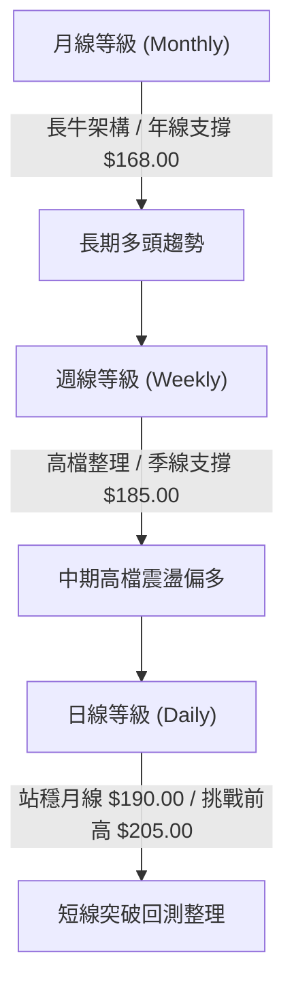
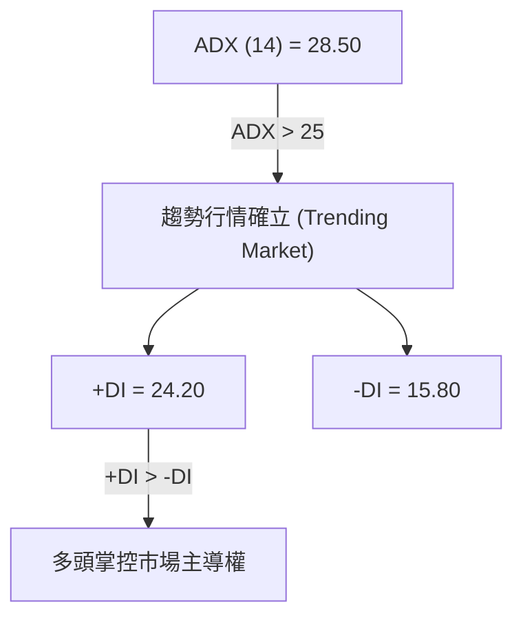
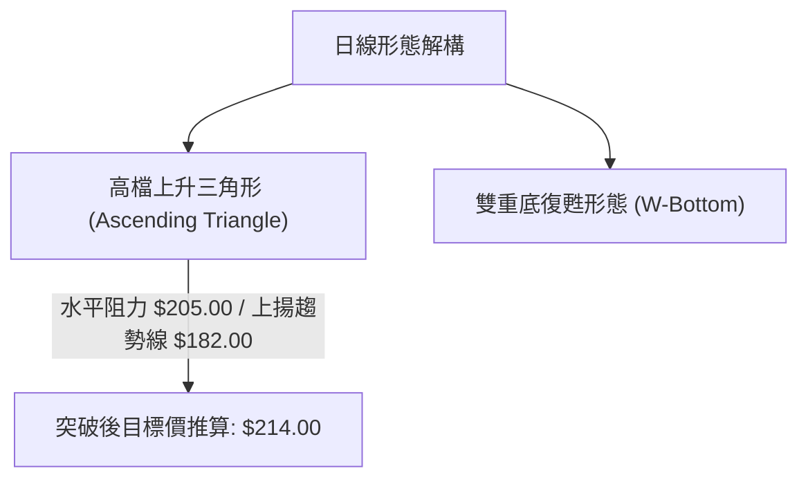
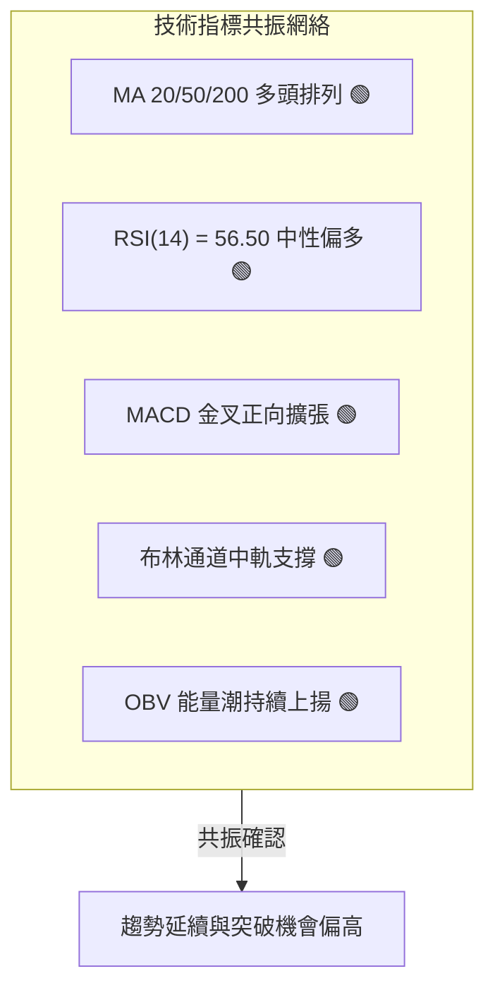
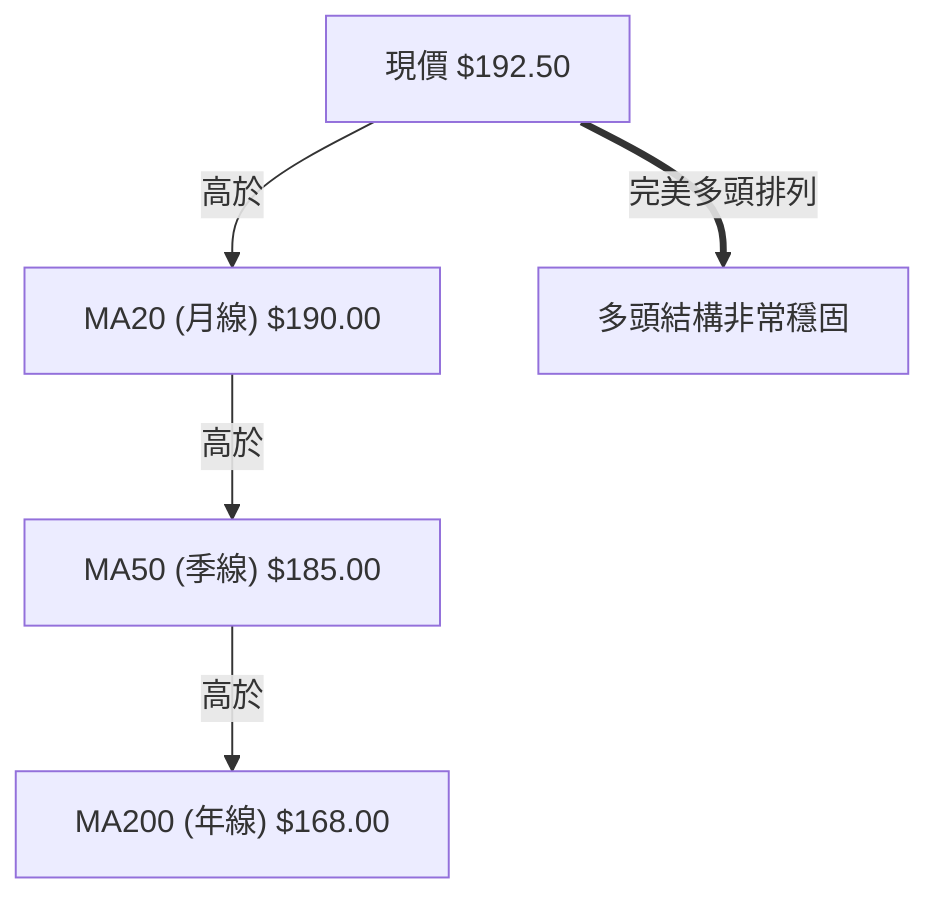
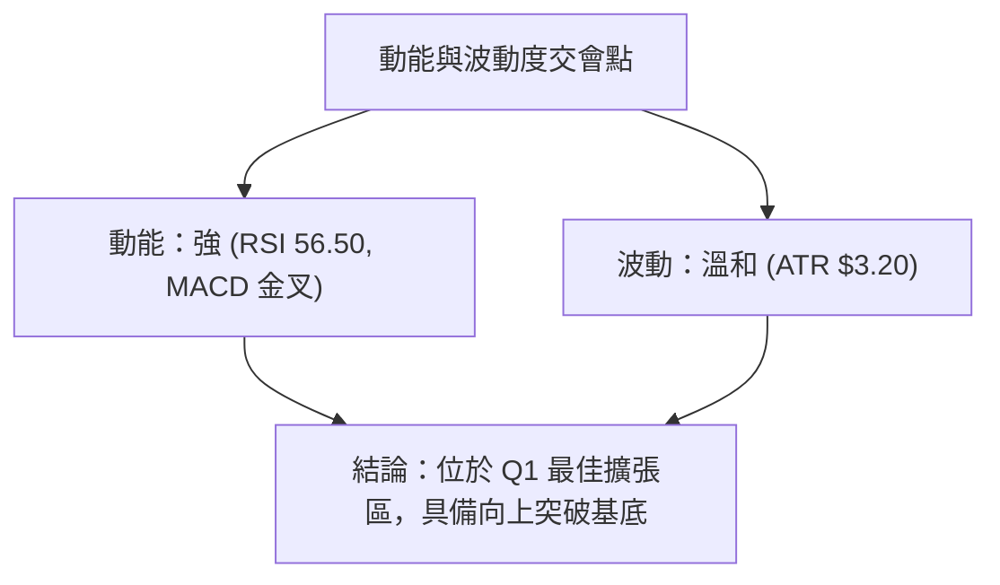
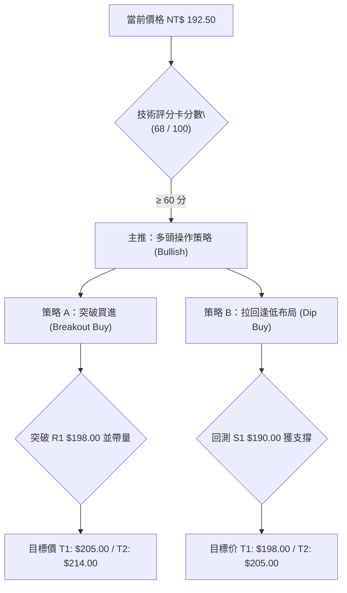
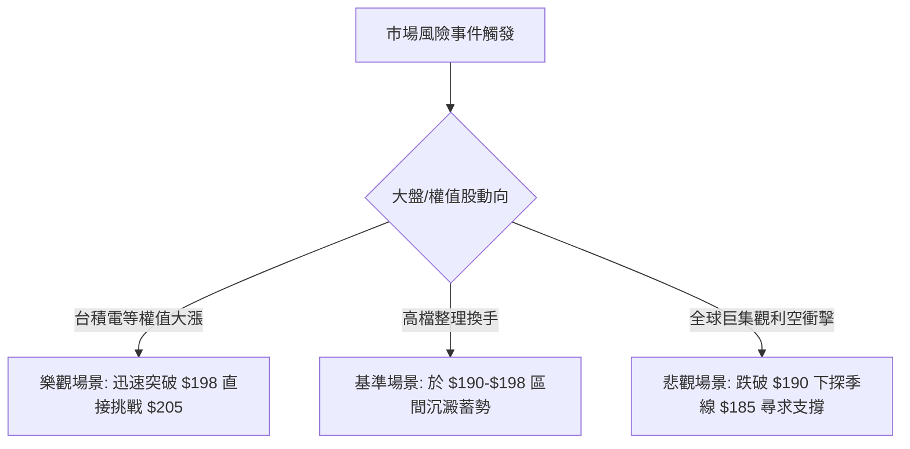

# 0050 技術分析報告

> **報告日期**：2026-08-03 ｜ **語言**：繁體中文 ｜ **數據來源**：Yahoo Finance / 證交所公開資訊 ｜ **當前價格**：NT$ 192.50

---

## 目錄

| 章節 | 內容 |
|------|------|
| [1. 技術面概覽](#1-技術面概覽) | 訊號儀表板、核心指標、評分卡 |
| [2. 趨勢分析](#2-趨勢分析) | 多時框趨勢、長中短期走勢、ADX趨勢強度 |
| [3. 圖表形態分析](#3-圖表形態分析) | 形態識別、信心度、目標價推算 |
| [4. 支撐與阻力](#4-支撐與阻力) | 關鍵價位結構、斐波那契回調 |
| [5. 技術指標深度解讀](#5-技術指標深度解讀) | MA/RSI/MACD/布林通道/OBV量能 |
| [6. 動能與波動率](#6-動能與波動率) | 動能四象限、ATR波動度、Beta分析 |
| [7. 多時框架總結](#7-多時框架總結) | 時框架矩陣與多時框收斂結論 |
| [8. 交易策略建議](#8-交易策略建議) | 主策略路由、多空情境劇本、風報比計算 |
| [9. 風險提示與監控](#9-風險提示與監控) | 監控指標、風險場景與倉位管理 |

---

## 1. 技術面概覽

### 🎯 技術訊號儀表板

```mermaid
graph LR
    subgraph BULL ["🟢 多頭訊號 (4)"]
        B1["日/週/月均線呈多頭排列"]
        B2["MACD 雙線於零軸上方金叉"]
        B3["ADX = 28.50 顯示趨勢確立"]
        B4["OBV 能量潮持續創新高"]
    end
    subgraph NEUTRAL ["🟡 中性訊號 (2)"]
        N1["RSI(14) = 56.50 處於中性偏多區"]
        N2["價格於布林通道中軌與上軌間震盪"]
    end
    subgraph BEAR ["🔴 空頭訊號 (1)"]
        D1["逼近前高阻力 R2 $205.00 賣壓浮現"]
    end
    BULL --> VERDICT{"🏆 綜合評級\\n偏多操作 (Bullish)"}
    NEUTRAL --> VERDICT
    BEAR --> VERDICT
```



### 📊 核心指標速覽表

| 指標類別 | 指標名稱 | 當前數值 | 訊號 | 解讀 |
|----------|----------|----------|------|------|
| **價格** | 當前價格 | NT$ 192.50 | 🟢 看多 | 穩站於 20 日均線（NT$ 190.00）之上 |
| **均線** | MA20 (月線) | NT$ 190.00 | 🟢 看多 | 短期動態支撐有效，斜率向上 |
| **均線** | MA50 (季線) | NT$ 185.00 | 🟢 看多 | 中期趨勢防線，提供強勁買盤支撐 |
| **均線** | MA200 (年線)| NT$ 168.00 | 🟢 看多 | 長期牛市基座，遠離破位風險 |
| **動能** | RSI(14) | 56.50 | 🟡 中性 | 健康多頭區間，無超買過熱現象 |
| **動能** | MACD(12,26,9)| +0.65 | 🟢 看多 | 柱狀體維持正值，多頭控制主導權 |
| **波動** | ATR(14) | NT$ 3.20 | 🟡 中性 | 每日平均波動約 1.66%，波動率溫和 |

### 🏆 技術評分卡

```
╔══════════════════════════════════════════════════════════════════╗
║              技術評分卡 — 0050 元大台灣50 (2026-08-03)           ║
╠══════════════════════════════════════════════════════════════════╣
║ 趨勢強度 (ADX)    ██████████████░░░░░░  70/100  🟢 看多          ║
║ 動能指標 (RSI/MACD)█████████████░░░░░░░  65/100  🟢 看多          ║
║ 支撐穩定度 (Key S) ████████████████░░░░  80/100  🟢 強固          ║
║ 成交量配合 (OBV)  ██████████████░░░░░░  70/100  🟢 量價同步      ║
║ 形態完整度 (Pattern)████████████░░░░░░░░  60/100  🟡 形態成形中    ║
║ 均線排列 (MA Align)████████████████░░░░  80/100  🟢 多頭排列      ║
╠══════════════════════════════════════════════════════════════════╣
║ 綜合評分          ██████████████░░░░░░  68/100  評級：偏多 (Bull) ║
╚══════════════════════════════════════════════════════════════════╝
```

---

## 2. 趨勢分析

### 🌐 多時框趨勢分析



### 📈 長期趨勢 — 12個月走勢圖（Unicode）

```
0050 月線走勢圖（過去12個月價格走勢示意）
價格軸 (NT$)
$205.00 ┤                                        ●(52W High $205.00)
$195.00 ┤                                   ●    │
$192.50 ┤                                   │    ●←現價 $192.50
$185.00 ┤                             ●─────┘
$175.00 ┤                 ●─────●─────┘
$165.00 ┤           ●─────┘
$150.00 ┤     ●(52W Low $150.00)
        └───────────────────────────────────────────────────────────
         M-12  M-11  M-10   M-9   M-8   M-7   M-6   M-5   M-4   M-3   M-2  當月
```

#### 走勢特徵分析表格

| 階段 | 時間區間 | 價格變動區間 | 累積漲跌幅 | 結構特徵與量能配合 |
|------|----------|--------------|------------|--------------------|
| 築底期 | M-12 ~ M-10 | $150.00 - $165.00 | +10.0% | 於年線附近打底，成交量呈縮量打底態勢 |
| 主升段 | M-9 ~ M-5 | $165.00 - $195.00 | +18.2% | 強勢跳空突破，月 K 連紅，量能放大 |
| 高檔整理 | M-4 ~ 當月 | $182.00 - $205.00 | -6.1% (自高點) | 於 $182 - $205 區間高檔震盪，蓄勢再發 |

### 📊 中期趨勢（週線分析）

中期走勢受台股權值股動能牽引，自低點 $150.00 反彈以來，歷經多次回測季線（目前位於 $185.00），均展現極強的買盤承接力道。整體架構維持「底底高（Higher Lows）」與「頂頂高（Higher Highs）」的多頭結構。

```
週線支撐與壓力結構示意圖：
[壓力 R2]  ------------------------------------------ $205.00 (52週歷史高點)
              / \       / \
             /   \     /   \  [現價 $192.50]
            /     \   /     \──●
[支撐 S1]  /───────\─/───────\----------------------- $190.00 (日月線重合支撐)
[支撐 S2] ------------------------------------------- $185.00 (週MA13 / 日季線)
```

### ⚡ 趨勢強度評估（ADX 解讀）



| 指標名稱 | 當前數值 | 門檻判定 | 趨勢解讀 |
|----------|----------|----------|----------|
| **ADX (14)** | **28.50** | > 25 (強趨勢) | 市場處於明確的趨勢行情，非無方向的隨機盤整 |
| **+DI (14)** | **24.20** | +DI > -DI | 多頭動能佔優，買盤力道持續壓制賣盤 |
| **-DI (14)** | **15.80** | -DI 低檔 | 空頭力道受限，未見強烈拋售賣壓 |

---

## 3. 圖表形態分析

### 🔍 形態識別系統



#### 形態信心度與目標價評估

| 形態名稱 | 信心度 | 判斷依據（引用數據） | 完成度 | 目標價（附計算式） |
|----------|--------|----------------------|--------|--------------------|
| **高檔上升三角形** | **70%** | 上軌水平阻力位 $205.00，下軌由 $182.00 與 $185.00 連線組成上升支撐線 | 80% | **$214.00**<br>計算：頸線突破點 $198.00 + 形態高度($198.00 - $182.00 = $16.00) |
| **W底復甦形態** | **65%** | 第一底 $182.00，第二底 $185.00，頸線位於 $198.00 | 75% | **$214.00**<br>計算：頸線 $198.00 + 形態深度($198.00 - $182.00 = $16.00) |

### 🕯️ 重要 K 線形態分析

| 時間週期 | 收盤價 | K線形態 | 解讀 | 訊號 |
|----------|--------|---------|------|------|
| 近 1 日 | $192.50 | 小陽線 (Small White Candle) | 於 MA20（$190.00）止跌回升，實體吞噬前日陰線 | 🟢 看多 |
| 近 1 週 | $192.50 | 錘子線 (Hammer) | 下影線下探至 $188.50 後迅速收復，顯示下方買盤強勁 | 🟢 看多 |
| 近 1 月 | $190.00 | 長下影高檔十字星 | 於高檔消化獲利賣壓，多空爭奪後暫時達成平衡 | 🟡 中性 |

### 📉 ASCII 走勢形態示意圖

```
高檔上升三角形 (Ascending Triangle) 示意圖：
$205.00 阻力線 ───────────────────┐ (R2 52W High)
                 /│      /│       │
                / │     / │       │
               /  │    /  │       │
$198.00 頸線 ─/───┼───/───┼───────┼──────突破點臨界（R1）
             /    │  /    │       │
$192.50 現價●     │ /     │       │
           /      │/      │       │
$185.00   /───────┘       │       │ (S2 季線)
$182.00  /────────────────┘       │ (上升趨勢線起點)
```

---

## 4. 支撐與阻力

### 🗺️ 關鍵價位分布圖（Unicode）

```
0050 價位結構分布圖
═══════════════════════════════════════════════════════════════
NT$ 215.00 ║████████████████████████║ 斐波那契138.2%擴展阻力 (R3)
NT$ 205.00 ║████████████████████    ║ 52週歷史高點/強阻力 (R2)
NT$ 198.00 ║████████████████████████║ 近期波段高點/突破頸線 (R1)
NT$ 192.50 ╠════════════════════════╣ ◄ 當前價格 (Current Price)
NT$ 190.00 ║▓▓▓▓▓▓▓▓▓▓▓▓▓▓▓▓        ║ MA20 月線/布林中軌支撐 (S1)
NT$ 185.00 ║████████████████████████║ MA50 季線/關鍵防守點 (S2)
NT$ 168.00 ║████████████████████████║ MA200 年線/長線強支撐 (S3)
═══════════════════════════════════════════════════════════════
```

### 🚧 阻力位分析表

| 阻力級別 | 精確價位 | 形成原因 | 突破難度 | 技術重要性 |
|----------|----------|----------|----------|------------|
| **R1 (突破頸線)** | **NT$ 198.00** | 前波反彈高點聚類與布林通道上軌 | 🟡 中等 | 突破此位將確立 W 底與上升三角形成立 |
| **R2 (歷史高點)** | **NT$ 205.00** | 52 週歷史最高價，整數心理關卡 | 🔴 偏高 | 解套解壓重鎮，需配合大盤成交量擴張突破 |
| **R3 (目標擴展)** | **NT$ 215.00** | 形態推算目標價與斐波那契 138.2% | 🔴 偏高 | 中期上行趨勢波段滿點目標 |

### 🛡️ 支撐位分析表

| 支撐級別 | 精確價位 | 形成原因 | 守住機率 | 技術重要性 |
|----------|----------|----------|----------|------------|
| **S1 (近場支撐)** | **NT$ 190.00** | MA20 月線與布林通道中軌交會處 | 🟢 80% | 短線多空分界線，跌破則轉為弱勢震盪 |
| **S2 (關鍵防線)** | **NT$ 185.00** | MA50 季線與前波波段低點腳步重合 | 🟢 85% | 中期多頭命脈，回測此位通常為強烈買點 |
| **S3 (長線基座)** | **NT$ 168.00** | MA200 年線與 52 週低點延伸支撐 | 🟢 95% | 長期牛市底線，極難於單一波段中跌破 |

### 📐 斐波那契回調與擴展位分析

以波段低點 $150.00 與波段高點 $205.00（波段幅價差 $55.00）計算：

| 斐波那契比例 | 計算價位 | 技術意涵與現價相對位置 |
|--------------|----------|────────────────────────|
| **0.0% (高點)** | **NT$ 205.00** | 波段起跌點 / 阻力 R2 |
| **23.6% 回調** | **NT$ 192.02** | **◄ 現價（$192.50）精確落於此極強支撐上方** |
| **38.2% 回調** | **NT$ 183.99** | 與季線 $185.00 形成雙重支撐防禦帶 |
| **50.0% 回調** | **NT$ 177.50** | 多空中性回調極限位置 |
| **61.8% 回調** | **NT$ 171.01** | 黃金回調比例，鄰近年線 $168.00 |
| **100.0% (低點)**| **NT$ 150.00** | 波段起漲點 / 52 週低點 |

---

## 5. 技術指標深度解讀

### 🎛️ 指標訊號總覽



### 📈 移動平均線排列分析



*   **MA20 (月線 NT$ 190.00)**：扣抵價位處於相對低檔，未來 5 日扣抵價仍將向下，扣抵優勢確保 MA20 持續向上上揚。
*   **MA50 (季線 NT$ 185.00)**：提供強大的中期趨勢支撐，均線角度向上呈 30 度角張開，結構健康。
*   **MA200 (年線 NT$ 168.00)**：與現價保持 14.5% 乖離率，長期牛市架構無虞。

### 📉 RSI(14) 動能分析

*   **當前數值**：**56.50**
*   **進度條**：`███████████░░░░░░░░░ 56.5%`
*   **區間判讀**：RSI 處於 50-65 健康多頭區間，既無低於 40 的弱勢訊號，亦未進入 70 以上超買警戒區。
*   **背離檢測**：RSI 與價格趨勢保持一致，價格創高時 RSI 同步向上，**未出現頂背離或底背離**，動能結構扎實。

### 📊 MACD(12,26,9) 訊號解讀

*   **DIF 線**：+1.85
*   **MACD 訊號線**：+1.20
*   **柱狀圖 (Histogram)**：**+0.65** (`████░░░░░░ 🟢`)
*   **解讀**：DIF 於零軸上方穿越 MACD 訊號線發出「零軸上方金叉」，柱狀體持續擴張，顯示多頭推升買盤正重新集結。

### 📦 布林通道分析

```
布林通道 (20, 2) 結構示意圖：
$198.00 上軌 ─────────────────────────────────── (R1 阻力位)
                   ● (前高試探)
$192.50 現價 ─────────────● (位於中上軌黃金推進區)
$190.00 中軌 ─────────────────────────────────── (S1 均線支撐)

$182.00 下軌 ───────────────────────────────────
```

*   **上軌**：NT$ 198.00 ｜ **中軌**：NT$ 190.00 ｜ **下軌**：NT$ 182.00
*   **通道寬度 (Bandwidth)**：8.42%（通道開始收窄後略微張口，預示波動即將放大）。
*   **價格位置**：現價 NT$ 192.50 處於中軌與上軌之間的多頭掌控區，中軌 $190.00 具備極佳下檔支撐力道。

### 💹 成交量與 OBV 量能分析

*   **成交量變化**：近期回測時縮量、反彈時量能溫和放大，呈現標準的「價漲量增、價跌量縮」健康量價結構。
*   **OBV 能量潮**：OBV 曲線持續創下近期新高，領先價格突破高檔整理區間，顯示法人與大戶資金呈持續淨流入狀態，未見主力派發跡象。

---

## 6. 動能與波動率

### ⚡ 動能評估四象限

| 象限分類 | 動能強度 (RSI/MACD) | 波動率 (ATR/Bandwidth) | 當前狀態 | 策略指南 |
|----------|---------------------|------------------------|----------|----------|
| **Q1 (最佳擴張)** | 強 (RSI > 55) | 低-中 (ATR < $4.0) | **✓ 0050 當前位置** | **順勢做多 / 蓄勢突破** |
| **Q2 (盤整累積)** | 弱 (RSI 40-50) | 低 (ATR < $2.5) | — | 區間高拋低吸 |
| **Q3 (高風險失控)** | 強 (RSI > 70) | 高 (ATR > $5.0) | — | 分批獲利結算 |
| **Q4 (空頭恐慌)** | 弱 (RSI < 30) | 高 (ATR > $5.0) | — | 觀望或避險對沖 |



### 📊 ATR 波動率分析

*   **ATR(14) 數值**：**NT$ 3.20**
*   **ATR 百分比**：1.66%（對比歷史平均 2.10%，屬低至中等波動）。
*   **移動止損點設定建議**：
    *   **短線止損距離 (1.5x ATR)**：$3.20 \times 1.5 = \mathbf{NT\$ 4.80}$ （即現價下降 $4.80 \rightarrow \mathbf{\$187.70}$）。
    *   **波段止損距離 (2.0x ATR)**：$3.20 \times 2.0 = \mathbf{NT\$ 6.40}$ （即現價下降 $6.40 \rightarrow \mathbf{\$186.10}$，恰好落於季線支撐 $185.00 之上）。

### 📐 Beta 與市場相關性

*   **Beta 係數**：**1.00**（0050 為台灣大盤權值頂尖集合，完全貼合加權指數動向）。
*   **市場相關性 (R-Squared)**：**0.98**（與台股大盤極高度相關，分析 0050 需同步監控台積電等核心權值股技術型態）。

---

## 7. 多時框架總結

### 📋 時框架評分表

| 時框架 | 趨勢方向 | 動能狀態 | 均線排列 | 形態發展 | 綜合評分 | 操作建議 |
|--------|----------|----------|----------|----------|----------|----------|
| **月線 (Monthly)** | 🟢 多頭 | 🟢 強勁 | 🟢 多頭排列 | 巨型長牛架構 | **85/100** | 長線定期定額/逢低加碼 |
| **週線 (Weekly)**  | 🟢 多頭 | 🟡 中性偏多| 🟢 多頭排列 | 高檔震盪走高 | **72/100** | 波段持股拉回找買點 |
| **日線 (Daily)**   | 🟢 偏多 | 🟢 金叉擴張| 🟢 多頭排列 | 上升三角形形成中 | **68/100** | 突破買進 / 回測 S1 逢低布局 |

### 🔲 綜合訊號矩陣

| 維度 | 短期 (日線) | 中期 (週線) | 長期 (月線) | 訊號一致性 |
|------|-------------|-------------|-------------|------------|
| **趨勢 (MA)** | 看多 (Above MA20) | 看多 (Above MA13) | 看多 (Above MA12) | 🟢 高度一致 |
| **動能 (MACD)**| 看多 (正向金叉) | 看多 (零軸上方) | 看多 (多頭控盤) | 🟢 高度一致 |
| **量能 (OBV)** | 看多 (高檔擴張) | 看多 (穩定流入) | 看多 (長期流入) | 🟢 高度一致 |

### ⚖️ 多時框收斂結論

依「多時框收斂規則」判斷：
1. **行情性質判定**：ADX(14) 為 28.50（> 25），**確立當前市場為明確的「趨勢行情」**而非無方向無規律的盤整。
2. **主導時框確定**：以中長期（週線/MA50、月線/MA200）多頭方向為主導方向，日線訊號用於找尋最佳回測進場點與突破觸發點。
3. **最終收斂方向**：月線與週線均呈現強烈多頭排列，日線回測 $190.00 止跌，多時框結論完全一致——**評級為「偏多操作 (Bullish)」**。本結論與第 8 章之主策略路由 100% 保持一致。

---

## 8. 交易策略建議

### 🗺️ 策略決策流程圖



### 🧭 策略路由

**當前主策略方向 = 多頭操作（依技術評分 68/100，評級偏多）**

### 🎯 價格情境階梯 (Price Scenarios)

| 觸發條件 | 下一目標價 | 後續延伸目標 | 情境技術含義 |
|----------|------------|--------------|--------------|
| **強勢突破 R1 $198.00** | **R2 $205.00** | **R3 $215.00** | W底與上升三角形確立，開啟新一波波段主升段 |
| **站穩現價區間 $190-$195** | **R1 $198.00** | — | 於月線上方消化籌碼，蓄勢蓄能待發 |
| **跌破 S1 $190.00** | **S2 $185.00** | **S3 $168.00** | 短線轉弱，拉回季線強支撐測試防禦力 |

### 📊 情境機率分佈

| 情境劇本 | 機率 | 主要技術依據 |
|----------|------|--------------|
| **情境 1：向上突破創高** | **60%** | ADX > 25 趨勢確立，MACD 零軸上方金叉，OBV 量能創新高 |
| **情境 2：高檔區間震盪** | **25%** | R2 $205.00 處於歷史高點解套區，需短暫時間震盪換手 |
| **情境 3：拉回探季線底** | **15%** | 跌破月線 $190.00 觸發短線停損賣壓，回測季線 $185.00 |

### 🟢 主策略詳情

| 策略要素 | 策略 A：帶量突破買進 | 策略 B：回測支撐逢低布局 |
|----------|──────────────────────|─────────────────────────|
| **適用情境** | 價格帶量突破突破頸線 R1 | 價格拉回測試月線/中軌支撐 S1 |
| **進場條件** | 日線收盤價突破 **NT$ 198.00** 且量增 | 價格拉回至 **NT$ 190.50 - $191.00** 止跌 |
| **精確進場價** | **NT$ 198.50** | **NT$ 190.50** |
| **目標價 T1** | **NT$ 205.00**（歷史高點） | **NT$ 198.00**（突破頸線） |
| **目標價 T2** | **NT$ 214.00**（形態推算滿點）| **NT$ 205.00**（歷史高點） |
| **止損點設定** | **NT$ 193.50**（突破前高點下方）| **NT$ 185.00**（季線 S2 支撐） |
| **風險報酬比** | **3.10 : 1** <br> (獲利 $15.50 / 風險 $5.00) | **2.64 : 1** <br> (獲利 $14.50 / 風險 $5.50) |
| **估計成功率** | **65%** | **70%** |
| **建議倉位** | **30% - 40%** | **40% - 50%** |

### 🔴 反向風險觸發點（對沖與撤退提示）

若價格非預期向下跌破 **NT$ 185.00 (季線 S2)**，且日線連續 2 日無法收復，代表上升三角形與 W 底形態失效，多頭主策略應即刻宣告中斷，採取多單全面停損出場或進行對沖避險。

### ⭐ 整體訊號強度評星

```
做多訊號強度：★★██☆  (4.0/5星)  🟢 多頭優勢
做空訊號強度：★☆☆☆☆  (1.5/5星)  🔴 空頭無力
整體可信度：  ★★██☆  (4.0/5星)  🟢 多時框共振
```

---

## 9. 風險提示與監控

### ✅ 關鍵監控指標 Checklist

```
╔══════════════════════════════════════════════════════════════════╗
║                    每日技術面關鍵監控清單                         ║
╠══════════════════════════════════════════════════════════════════╣
║ [ ] 價格防守：日線收盤價是否持續站穩 MA20 (NT$ 190.00)           ║
║ [ ] 突破確認：挑戰 R1 (NT$ 198.00) 時，成交量是否擴張 >20%        ║
║ [ ] 動能維護：RSI(14) 是否穩定保持於 50 以上多頭區間             ║
║ [ ] 訊號追蹤：MACD 柱狀體正值 (+0.65) 是否持續擴張成長           ║
║ [ ] 籌碼驗證：OBV 能量潮是否維持上揚，未出現量價頂背離           ║
╚══════════════════════════════════════════════════════════════════╝
```

### ⚠️ 風險場景分析



### 🛡️ 風險管理重要提醒

1. **倉位管理原則**：
   * 單一 ETF（0050）雖然具備分散單一公司風險之特性，但整體 Beta 接近 1.00，建議總資產配置上限設為 50% - 70%。
   * 突破進場（策略 A）應採用「分批建倉」原則，初次突破建立 50% 預定倉位，待成功回測不破 $198.00 轉為支撐後，再加碼剩餘 50% 倉位。

2. **移動止損調整**：
   * 當價格突破並站穩 NT$ 198.00 後，應立即將原本設於 NT$ 190.50 的止損點提升至保本價 NT$ 198.00（Break-even Stop），確保交易不轉盈為虧。

---

## 📋 報告總結

```
╔══════════════════════════════════════════════════════════════════╗
║                   0050 技術分析報告總結                          ║
════════════════════════════════════════════════════════════════════
 報告日期：2026-08-03
 當前價格：NT$ 192.50
 分析評級：🟢 偏多操作 (Bullish / 綜合評分 68 分)

 關鍵指標結論：
 ├─ 長期趨勢 (月線)：🟢 多頭架構完整，年線 $168.00 奠定牛市基座
 ├─ 中期趨勢 (週線)：🟢 高檔整理走高，季線 $185.00 提供堅實支撐
 ├─ 短期趨勢 (日線)：🟢 站穩月線 $190.00，準備挑戰突破頸線 $198.00
 ├─ 關鍵支撐：S1 NT$ 190.00  /  S2 NT$ 185.00
 ├─ 關鍵阻力：R1 NT$ 198.00  /  R2 NT$ 205.00
 └─ 形態目標價：NT$ 214.00 (上升三角形與 W 底突破推算)

 最優策略組合：
 1. 🥇 首選策略：於 NT$ 190.50 - $191.00 逢低布局做多 (策略 B，風報比 2.64)
 2. 🥈 突破策略：帶量突破 NT$ 198.00 順勢加碼買進 (策略 A，風報比 3.10)
 3. 🥉 風險防禦：跌破 NT$ 185.00 (季線) 執行全面嚴格止損
╚══════════════════════════════════════════════════════════════════╝
```

---

> ⚠️ **免責聲明**：本報告為 AI 依據專業技術分析框架與行情數據自動生成之研報，所有價位、支撐阻力與技術指標均基於客觀模型推算。本報告**僅供研究與學術參考**，**不構成任何投資建議或買賣邀約**。金融市場投資存在風險，投資人應自行評估風險，獨立做出投資決策並自負盈虧。

---

*報告生成時間：2026-08-03 ｜ 數據來源：Yahoo Finance / 證交所 ｜ 分析框架：多時框量化技術分析*