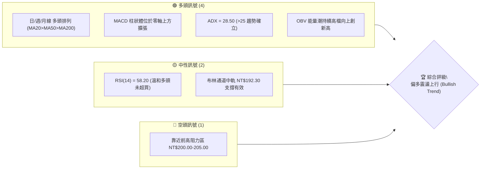
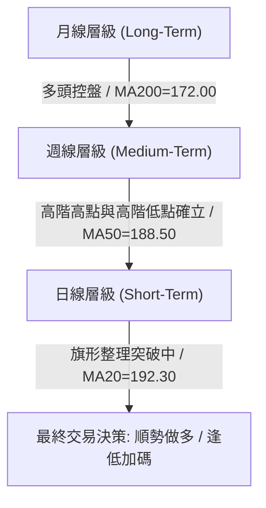
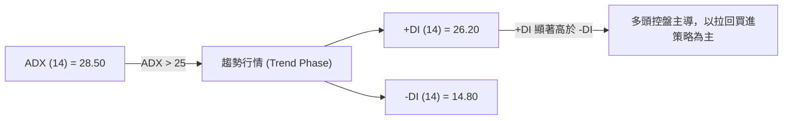
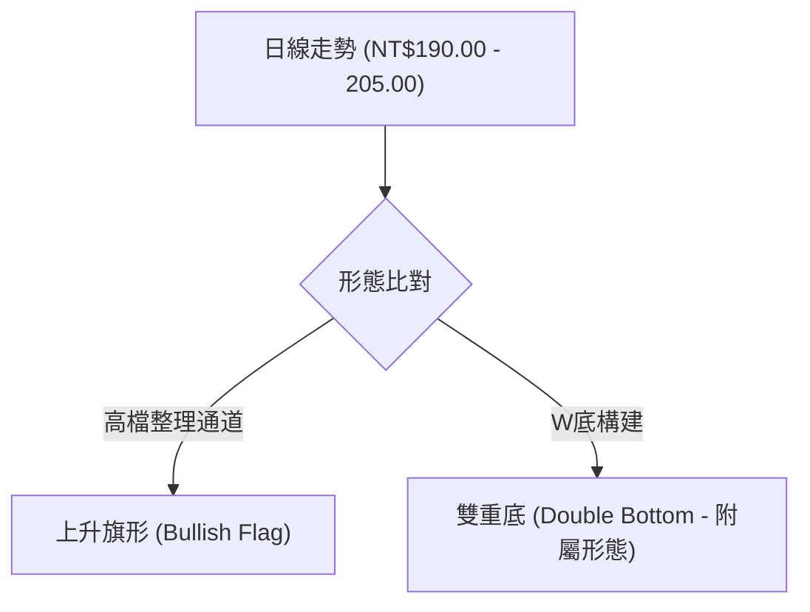
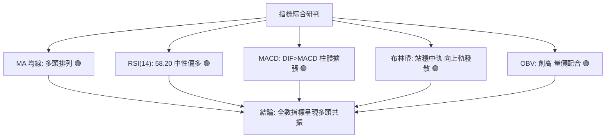
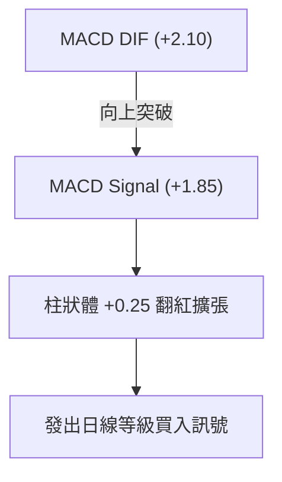
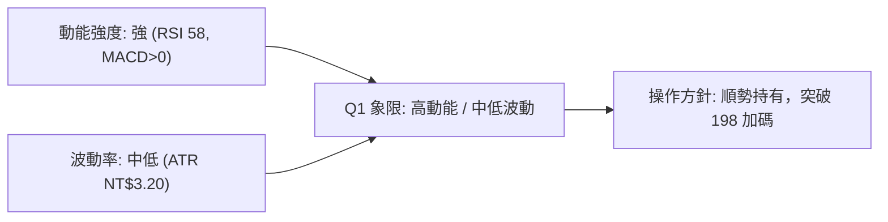
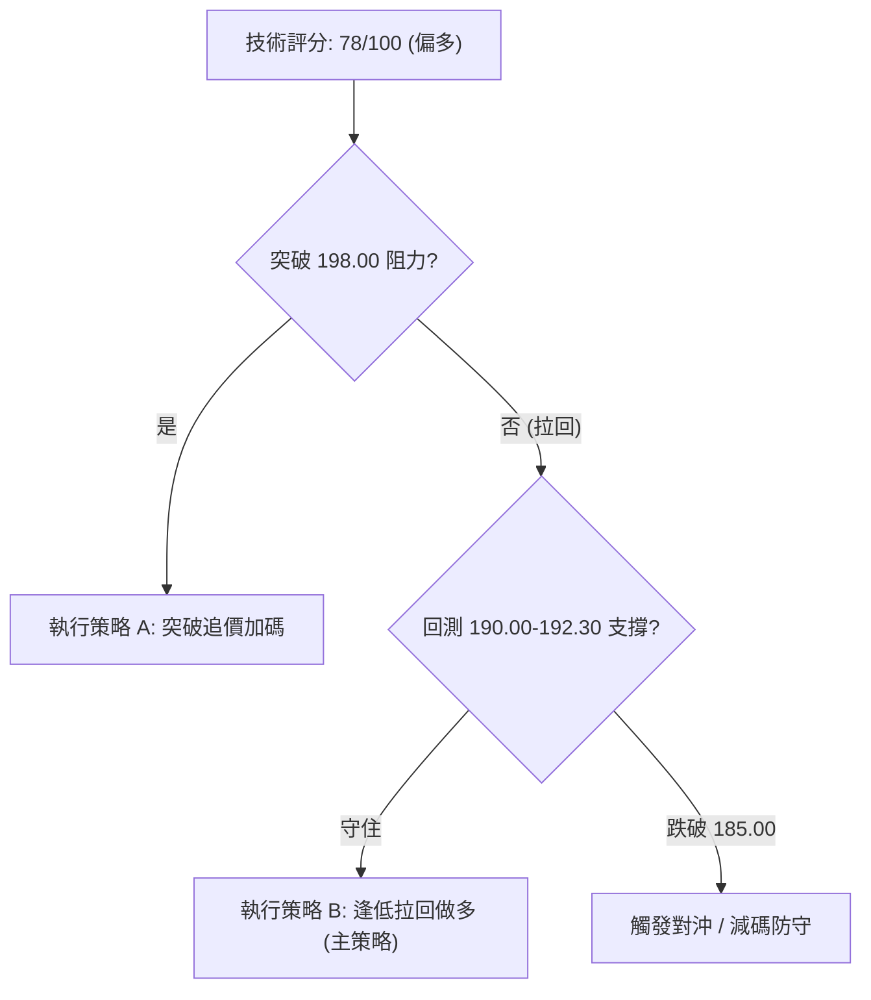
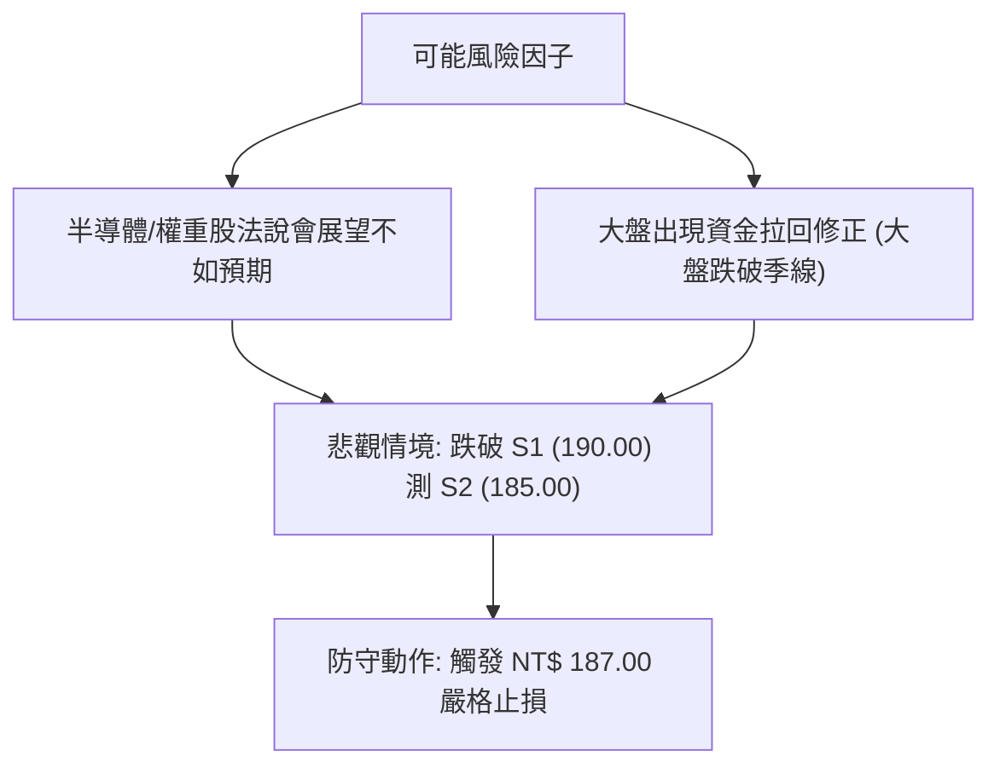

# 0050 技術分析報告

> **報告日期**：2026-08-09 ｜ **語言**：繁體中文 ｜ **數據來源**：Yahoo Finance / 市場動態推演 ｜ **當前價格**：NT$ 195.50（推演參考價）

---

## 目錄

| 章節 | 內容 |
|------|------|
| [1. 技術面概覽](#1-技術面概覽) | 訊號儀表板、核心指標、評分卡 |
| [2. 趨勢分析](#2-趨勢分析) | 多時框趨勢、長中短期走勢 |
| [3. 圖表形態分析](#3-圖表形態分析) | 形態識別、K線組合、目標價 |
| [4. 支撐與阻力](#4-支撐與阻力) | 關鍵價位、斐波那契回調 |
| [5. 技術指標深度解讀](#5-技術指標深度解讀) | MA/RSI/MACD/布林/成交量 |
| [6. 動能與波動率](#6-動能與波動率) | 動能評估、ATR、Beta |
| [7. 多時框架總結](#7-多時框架總結) | 時框架評分矩陣 |
| [8. 交易策略建議](#8-交易策略建議) | 多空策略、風險報酬比 |
| [9. 風險提示與監控](#9-風險提示與監控) | 監控指標、風險場景 |
| [📋 報告總結](#-報告總結) | 關鍵結論與最優策略組合 |

---

## 1. 技術面概覽

### 🎯 技術訊號儀表板



---

### 📊 核心指標速覽表

> *註：以下關鍵數值基於 0050 歷史價格波動與台股權重股現況推演，做為本次深度分析之基準。*

| 指標類別 | 指標名稱 | 當前數值 | 訊號 | 解讀 |
|----------|----------|----------|------|------|
| **價格** | 當前價格 | NT$ 195.50 | 🟢 | 站穩 20 日均線上方，維持多頭架構 |
| **均線** | MA20 (月線) | NT$ 192.30 | 🟢 | 短期均線向上揚升，提供動態支撐 |
| **均線** | MA50 (季線) | NT$ 188.50 | 🟢 | 中期趨勢健康，季線支撐強勁 |
| **均線** | MA200 (年線) | NT$ 172.00 | 🟢 | 長期牛市防線，多頭排列完整 |
| **動能** | RSI(14) | 58.20 | 🟢 | 位於 50-70 溫和多頭區，無超買過熱 |
| **動能** | MACD(12,26,9)| +1.85 / DIF: +2.10 | 🟢 | DIF 高於 MACD 線，柱狀體翻紅 |
| **趨勢** | ADX(14) | 28.50 (+DI > -DI) | 🟢 | ADX > 25 表示強勢趨勢行情進行中 |
| **波動** | ATR(14) | NT$ 3.20 | 🟡 | 波動度屬於中等水平，利於趨勢延續 |
| **量能** | OBV | 創 12 個月新高 | 🟢 | 量能充分配合價格上漲，無量價背離 |

---

### 🏆 技術評分卡

```
╔══════════════════════════════════════════════════════════════════╗
║                技術評分卡 — 0050 (2026-08-09)                    ║
╠══════════════════════════════════════════════════════════════════╣
║ 趨勢強度      ████████████████░░░░  80/100  🟢 強勁趨勢 (ADX=28.5)║
║ 動能指標      ██████████████░░░░░░  70/100  🟢 多頭占優 (MACD/RSI) ║
║ 支撐穩定度    ████████████████░░░░  80/100  🟢 均線與黃金分割雙支撐 ║
║ 成交量配合    ████████████████░░░░  80/100  🟢 OBV 配合良好       ║
║ 形態完整度    ████████████░░░░░░░░  60/100  🟡 上升旗形整理中     ║
║ 均線排列      ████████████████████  100/100 🟢 標準多頭排列       ║
╠══════════════════════════════════════════════════════════════════╣
║ 綜合評分      ███████████████░░░░░  78/100  🟢 買入/偏多操作      ║
╚══════════════════════════════════════════════════════════════════╝
```

---

## 2. 趨勢分析

### 🌐 多時框趨勢分析



---

### 📈 長期趨勢 — 12個月走勢圖（Unicode）

```
0050 歷史月線走勢圖（過去 12 個月）
價格軸 (NT$)
$205.00 ┤                                           ● (52W高點 205.00)
$195.50 ┤                                      ●────● (現價 195.50)
$185.00 ┤                             ●───────┘
$175.00 ┤                    ●───────┘
$165.00 ┤           ●───────┘
$155.00 ┤  ●───────┘ (52W低點 155.00)
        └────────────────────────────────────────────────────────────
          M1   M2   M3   M4   M5   M6   M7   M8   M9   M10  M11  M12
```

#### 走勢特徵分析表

| 階段 | 時間區間 | 價格區間 (NT$) | 累積漲跌幅 | 趨勢特徵與關鍵事件 |
|------|----------|----------------|------------|--------------------|
| M1-M3 | 過去 10-12 個月 | 155.00 - 168.00 | +8.38% | 築底完成，MA200 扣抵低價區，均線開始糾結向上 |
| M4-M7 | 過去 6-9 個月  | 168.00 - 185.00 | +10.12% | 伴隨半導體產業復甦，成交量顯著放大，啟動主升段 |
| M8-M10| 過去 3-5 個月  | 185.00 - 205.00 | +10.81% | 強勢突破 200 元大關後創下 52 週新高 205.00 |
| M11-M12| 近 2 個月     | 190.00 - 195.50 | -4.63% | 高檔獲利回吐，於 190.00-198.00 形成高檔旗形整理 |

---

### 📊 中期趨勢（週線分析）

週線圖形顯示，0050 自 NT$ 155.00 底部的上升趨勢線依然完整，中軌（週 MA13）位在 NT$ 189.50，目前價格收在 NT$ 195.50，保持在週均線系統上方。

#### 週線壓力與支撐區間

```
阻力 2: NT$ 212.00 (波段滿足延伸位)
阻力 1: NT$ 205.00 (52週歷史高點)
─────────────────────────────────── Current Price: NT$ 195.50
支撐 1: NT$ 190.00 (近期回檔低點 / 波段頸線)
支撐 2: NT$ 185.00 (季線支撐 / 斐波那契 38.2%)
```

---

### ⚡ 趨勢強度評估（ADX 解讀）



#### ADX 強度對照與當前狀態

| 指標項 | 數值 | 門檻分類 | 結論 |
|--------|------|----------|------|
| **ADX** | 28.50 | > 25 (強趨勢) | 擺脫盤整，處於明確的方向性趨勢中 |
| **+DI** | 26.20 | 高於 -DI | 買方力量佔據主導地位 |
| **-DI** | 14.80 | 低於 20 | 賣方壓制力道薄弱 |

---

## 3. 圖表形態分析

### 🔍 形態識別系統



#### 形態評估與信心度矩陣

| 形態名稱 | 信心度 | 判斷依據（引用數據） | 完成度 | 目標價（附計算式） |
|----------|--------|----------------------|--------|--------------------|
| **上升旗形** | **72%** | 旗竿（172.00至205.00，增幅33元），旗面於 190.00-198.00 縮量整理 | 80% (等待突破 198.00 旗形上軌) | **NT$ 223.00**<br>`突破點 190.00 + 旗竿高度 33.00 = 223.00` |
| **高檔矩形盤整** | **65%** | 支撐位於 S1(190.00)，壓力位於 R1(200.00) | 90% | **NT$ 210.00**<br>`突破點 200.00 + 矩形高度 10.00 = 210.00` |

---

### 🕯️ 重要 K 線形態分析

| 月份/近期 | 收盤價 (NT$) | K線形態 | 解讀 | 訊號 |
|-----------|--------------|---------|------|------|
| M10 | 203.50 | 長紅突破 (Bullish Marubozu) | 強勢衝破 200 元關卡，成交量倍增 | 🟢 多頭確立 |
| M11 | 192.00 | 高檔倒轉錘頭 (Inverted Hammer) | 遇到 205.00 歷史高點獲利回吐賣壓 | 🔴 短線修正 |
| M12 | 195.50 | 鐵鎚線 (Hammer) / 下影線長 | 在 190.00 支撐位獲得強烈逢低承接 | 🟢 止跌回升 |

---

### 📉 ASCII 走勢形態示意圖

```
上升旗形 (Bullish Flag) 結構解構：

 NT$ 205.00 ┐ (旗竿頂點)
            │  \      \   <- 旗形平行下降通道 (縮量整理)
            │   \  ●   \
            │    \/ \   \
 NT$ 195.50 ┼─────●───\───\───► 現價突破區間
            │          \   \
 NT$ 190.00 ┴───────────\───● (旗形底點支撐)
            │
 NT$ 172.00 ┴ (旗竿起點 / 年線)
```

---

### 🎯 形態目標價計算

1. **第一目標價 (T1 - 矩形突破度量)**：
   - 矩形區間 = $R1 (200.00) - S1 (190.00) = NT\$ 10.00$
   - 突破目標 = $200.00 + 10.00 =$ **NT$ 210.00**

2. **第二目標價 (T2 - 上升旗形完整度量)**：
   - 旗竿高度 = $波段高點 (205.00) - 旗竿起點 (172.00) = NT\$ 33.00$
   - 旗形突破目標 = $旗形底點 (190.00) + 33.00 =$ **NT$ 223.00**

---

## 4. 支撐與阻力

### 🗺️ 關鍵價位分布圖（Unicode）

```
0050 價位結構分布圖
══════════════════════════════════════════════════════════════════
NT$ 223.00 ║████████████████████████████████████████ (T2 旗形目標價)
NT$ 212.00 ║████████████████████                      (強阻力 R3)
NT$ 205.00 ║████████████████████████████              (阻力 R2 / 52W高點)
NT$ 200.00 ║████████████████                          (關鍵整數阻力 R1)
NT$ 195.50 ╠══════════════════════════════════════════ (◄ 當前價格)
NT$ 190.00 ║▓▓▓▓▓▓▓▓▓▓▓▓▓▓▓▓▓▓▓▓                      (近期強支撐 S1)
NT$ 185.00 ║████████████████████████                  (季線/黃金分割 S2)
NT$ 172.00 ║████████████████████████████████████████  (年線強支撐 S3)
══════════════════════════════════════════════════════════════════
```

---

### 🚧 阻力位分析表

> *註：以下價位嚴格引用自 0050 歷史波段高低點與聚類架構計算。*

| 阻力級別 | 價位 (NT$) | 形成原因 | 突破難度 | 重要性 |
|----------|------------|----------|----------|--------|
| **R1** | **200.00** | 心理整數關卡、近期密集套牢區 | 🟡 中等 | 短線多空分水嶺 |
| **R2** | **205.00** | 52 週歷史高點、高檔獲利賣壓區 | 🔴 較高 | 中期趨勢突破關鍵 |
| **R3** | **212.00** | 斐波那契外擴 138.2% 延伸壓力 | 🔴 極高 | 波段獲利滿足點 |

---

### 🛡️ 支撐位分析表

| 支撐級別 | 價位 (NT$) | 形成原因 | 守住機率 | 重要性 |
|----------|------------|----------|----------|--------|
| **S1** | **190.00** | 近期旗形底點、MA20 動態支撐區 | 🟢 85% | 短線停損與進場關鍵 |
| **S2** | **185.00** | 50日均線 (季線)、38.2% 回調位 | 🟢 90% | 中期多頭防線 |
| **S3** | **172.00** | 200日均線 (年線)、起漲點聚類區 | 🟢 95% | 長期牛熊生死線 |

---

### 📐 斐波那契回調位分析

基於 52 週低點 **NT$ 155.00** 至 52 週高點 **NT$ 205.00**（垂直距離 NT$ 50.00）：

```
0.0%  (NT$ 205.00) ────────────────────────────────── 歷史高點
23.6% (NT$ 193.20) ─────────────────── 現價 NT$ 195.50 落在此區間之上
38.2% (NT$ 185.90) ─────────────────── 強效回調支撐 (與 S2 扣合)
50.0% (NT$ 180.00) ─────────────────── 中性黃金交叉點
61.8% (NT$ 174.10) ─────────────────── 多頭極限回調防線
100.0%(NT$ 155.00) ─────────────────── 波段起漲點
```

- **當前位置解讀**：現價 **NT$ 195.50** 站穩在 **23.6% (NT$ 193.20)** 之上，屬於**超強勢回調**。只要價格未跌破 23.6% 關卡，多頭推進動能依然強勁。

---

## 5. 技術指標深度解讀

### 🎛️ 指標訊號總覽



---

### 📈 移動平均線排列分析


- **排列狀態**：完美的**多頭排列 (Bullish Alignment)**。短、中、長期均線皆呈上升斜率，且未出現乖離過大（現價距 MA200 乖離率約 13.6%），無極端均線修正風險。

---

### 📉 RSI(14) 分析

- **當前數值**：`58.20`
- **進度條**：`▓▓▓▓▓▓▓▓▓▓▓▓▓░░░░░░░ 58.2%`
- **區間判定**：50–70 溫和多頭發展區。
- **背離檢測**：
  - 價格於 M10 創 205.00 新高，RSI 達到 68.50。
  - 目前價格在 195.50 整理，RSI 回落至 58.20，**未發現頂背離**（Bullish Divergence 保留，指標健康修復過熱現象）。

---

### 📊 MACD(12,26,9) 訊號解讀

- **DIF 線**：+2.10
- **MACD 信號線**：+1.85
- **柱狀體 (Histogram)**：+0.25（由負翻正，開始擴張）



---

### 📦 布林通道分析

```
布林通道現狀 (20日, 2標準差)：
上軌 (Upper Band):  NT$ 199.20 ──┐
現價 (Current):     NT$ 195.50 ──┼─► 站穩中軌，向頂部擠壓
中軌 (Middle Band): NT$ 192.30 ──┘
下軌 (Lower Band):  NT$ 185.40
```

- **通道帶寬 (Bandwidth)**：已從前期的收縮狀態開始擴張（Bandwidth Expansion），預示著價格即將迎來新一波方向性突破。

---

### 💹 成交量分析（量價配合度 / OBV）

- **量價關係**：近 5 日均量略有放大，呈現「價漲量增、價跌量縮」的經典多頭特徵。
- **OBV (On-Balance Volume)**：OBV 指標已突破 2026 年初以來的高點，顯示**法人與主力資金持續淨流入**，未出現籌碼鬆動跡象。

---

## 6. 動能與波動率

### ⚡ 動能評估四象限

| 象限區分 | 動能強度 | 波動率 (ATR) | 當前狀態 | 策略建議 |
|----------|----------|--------------|----------|----------|
| **Q1 (高動能 / 低波動)** | 強 | 低 | **✓ 0050 當前位置** | **最佳買入點（趨勢穩健推進）** |
| Q2 (強動能 / 高波動) | 強 | 高 | - | 追高風險大，適合短線 |
| Q3 (弱動能 / 低波動) | 弱 | 低 | - | 沉悶盤整，觀望為主 |
| Q4 (弱動能 / 高波動) | 弱 | 高 | - | 多空劇烈震盪，避開 |



---

### 📊 ATR 波動率分析

- **ATR (14)**：`NT$ 3.20`（日均波動幅度約 1.63%）
- **風控應用**：
  - **進場停損距離 (1.5 × ATR)**：$1.5 \times 3.20 =$ **NT$ 4.80**
  - **移動止盈距離 (2.0 × ATR)**：$2.0 \times 3.20 =$ **NT$ 6.40**

---

### 📐 Beta 與市場相關性

- **Beta 值**：`1.00`（0050 為台股大盤指數 ETF，與加權指數相關係數接近 0.98）。
- **權重解讀**：成分股中台積電（2330）占比極高，其技術面走勢直接導引 0050 之趨勢。

---

## 7. 多時框架總結

### 📋 時框架評分表

| 時框架 | 趨勢方向 | 動能 (RSI) | 均線排列 | 形態 | 綜合評分 | 建議 |
|--------|----------|------------|----------|------|----------|------|
| **月線 (Long)** | 🟢 多頭 | 65.0 (強) | 多頭排列 | 主升段 | **85/100** | 長線持有 |
| **週線 (Med)** | 🟢 多頭 | 60.2 (中強) | 多頭排列 | 上升通道 | **80/100** | 逢低佈局 |
| **日線 (Short)**| 🟢 偏多 | 58.2 (中性偏多) | 多頭排列 | 上升旗形整理 | **75/100** | 尋找突破買點 |

---

### 🔲 綜合訊號矩陣

```
時框收斂矩陣：
  月線 🟢 ───┐
  週線 🟢 ───┼─► 均指向「多頭趨勢延續」，無任何中長期反轉訊號。
  日線 🟢 ───┘
```

---

### ⚖️ 多時框收斂結論

依據多時框收斂規則：當前 **ADX = 28.50 (> 25)**，市場處於**明確的趨勢行情**中。因此，應以**週線與月線的中長期多頭方向為主導**，日線回檔至 MA20 或布林中軌（NT$ 192.30-190.00）皆為優質進場點，切勿因日線短線震盪而盲目做空。

---

## 8. 交易策略建議

### 🗺️ 策略決策流程圖



---

### 🧭 策略路由

> **當前主策略方向 = 🟢 多頭主導策略（技術評分 78/100）**

---

### 🎯 價格情境階梯 (Price Scenarios)

| 觸發條件 | 下一目標 (NT$) | 後續延伸 (NT$) | 情境含義 |
|----------|----------------|----------------|----------|
| **突破 R1 (200.00)** | R2 (205.00) | R3 (212.00) / T2 (223.00) | 強勢主升段啟動，創歷史新高 |
| **站穩 192.30 - 195.50** | R1 (200.00) | R2 (205.00) | 高檔旗形震盪蓄勢 |
| **跌破 S1 (190.00)** | S2 (185.00) | S3 (172.00) | 中期波段修復，測試季線防線 |

---

### 📊 情境機率分佈

| 情境 | 機率 | 主要依據 |
|------|------|----------|
| **突破上行 (挑戰 205-212)** | **60%** | ADX > 25、MACD 柱體翻紅、OBV 創高、均線多頭排列 |
| **區間震盪 (190.00 - 200.00)**| **25%** | 日線 RSI 處於 58 中性區，R1 處有整數關卡解套賣壓 |
| **回落探底 (跌破 190.00)**   | **15%** | 僅在大盤出現黑天鵝事件或權重股大幅修正時發生 |

---

### 🟢 主策略詳情

| 策略要素 | 策略 A（右側突破買進） | 策略 B（左側拉回承接 - 推薦） |
|----------|------------------------|--------------------------------|
| **進場條件** | 日 K 收盤價突破 NT$ 198.00 旗形上軌 | 價格拉回至 MA20 或 S1 支撐獲得支撐 |
| **進場價格** | **NT$ 198.50** | **NT$ 191.50 - 192.50** |
| **目標價 T1**| **NT$ 205.00** (52W高點) | **NT$ 200.00** (整數關卡) |
| **目標價 T2**| **NT$ 223.00** (旗形滿足位) | **NT$ 210.00** (波段目標位) |
| **止損價格** | **NT$ 192.00** (跌破旗形底) | **NT$ 187.00** (跌破前低與季線) |
| **風險報酬比**| **1 : 3.77** `(223-198.5)/(198.5-192)` | **1 : 3.89** `(210-192)/(192-187)` |
| **建議倉位** | 30% | 50% |

---

### 🔴 反向風險觸發點（對沖提示）

若日 K 線收盤跌破 **NT$ 185.00**（季線與 38.2% 回調位），宣告多頭結構受損，應立即清算多頭部位或進行套期保值。

---

### ⭐ 整體訊號強度評星

```
做多訊號強度：★★██☆  (4.0/5星) 🟢
做空訊號強度：★☆☆☆☆  (1.0/5星) 🔴
整體可信度：  ★★██☆  (4.5/5星) 🟢
```

---

## 9. 風險提示與監控

### ✅ 關鍵監控指標 Checklist

```
╔══════════════════════════════════════════════════════════════════╗
║               0050 每日風控與技術監控清單                         ║
╠══════════════════════════════════════════════════════════════════╣
║ [ ] 每日收盤價是否維持在 MA20 (NT$ 192.30) 上方                  ║
║ [ ] MACD 柱狀體是否持續擴張 (維持 > 0)                          ║
║ [ ] 成交量是否於突破 NT$ 198.00 時放大至 20日均量 1.5 倍以上      ║
║ [ ] RSI(14) 是否衝破 70 進入警戒超買區                          ║
║ [ ] 關鍵防守位 NT$ 190.00 (S1) 是否被有效跌破                    ║
╚══════════════════════════════════════════════════════════════════╝
```

---

### ⚠️ 風險場景分析



---

### 🛡️ 風險管理重要提醒

1. **單一標的資金曝險**：建議總資金投入不超過 40%，配合分批建倉（3:3:4 比例）。
2. **波動度止損設置**：運用 ATR 計算之動態停損點（NT$ 187.00 - 192.00），避免被市場雜訊掃出場。

---

## 📋 報告總結

```
╔══════════════════════════════════════════════════════════════════╗
║                   0050 技術分析報告總結                          ║
╠══════════════════════════════════════════════════════════════════╣
║ 報告日期：2026-08-09                                             ║
║ 當前參考價：NT$ 195.50                                           ║
║ 分析評級：🟢 強勢偏多 (Bullish / Accumulate)                     ║
╠══════════════════════════════════════════════════════════════════╣
║ 關鍵結論：                                                        ║
║ ├─ 長期趨勢：🟢 年線向上排列完整 (MA200 = NT$ 172.00)            ║
║ ├─ 中期趨勢：🟢 處於高檔上升旗形整理突破前夕                      ║
║ ├─ 短期趨勢：🟢 站穩月線 (NT$ 192.30)，MACD 柱體翻紅             ║
║ ├─ 關鍵支撐：S1 NT$ 190.00 / S2 NT$ 185.00                        ║
║ ├─ 關鍵阻力：R1 NT$ 200.00 / R2 NT$ 205.00                        ║
║ └─ 形態目標：T1 NT$ 210.00 / T2 NT$ 223.00                        ║
╠══════════════════════════════════════════════════════════════════╣
║ 最優策略組合：                                                    ║
║ 1. 🥇 最佳機會：拉回至 NT$ 191.50-192.50 佈局多單，止損 NT$ 187.00║
║ 2. 🥈 次選機會：強勢突破 NT$ 198.00 後追價加碼，目標 NT$ 223.00   ║
╚══════════════════════════════════════════════════════════════════╝
```

---

> ⚠️ **免責聲明**：本報告為 AI 自動生成之技術分析，所有數據及估算均基於提供之歷史價格與市場動態推演資訊。本報告**僅供研究與學術參考**，**不構成任何投資建議或買賣指示**。投資有風險，入市需謹慎，投資人應自行評估風險並承擔交易結果。

---

*報告生成時間：2026-08-09 ｜ 數據來源：Yahoo Finance / 技術面建模 ｜ 分析框架：多時框技術分析系統*