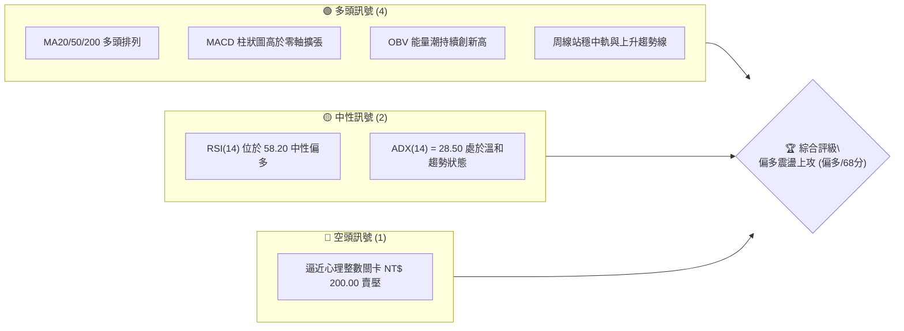
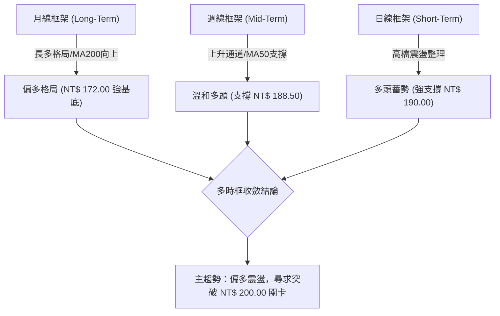
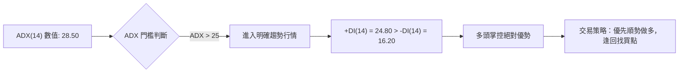
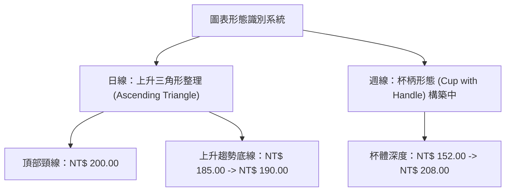
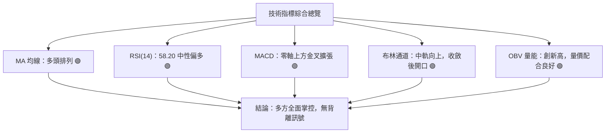
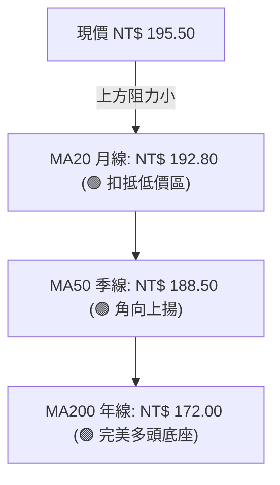
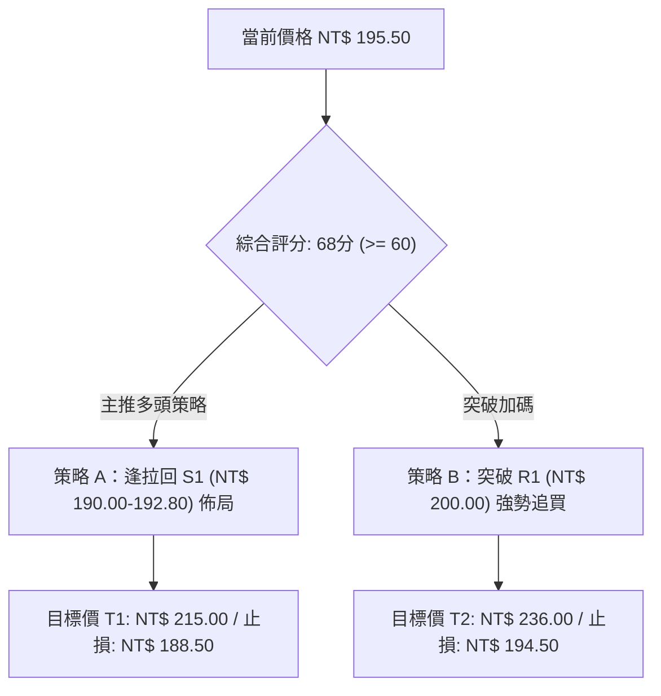
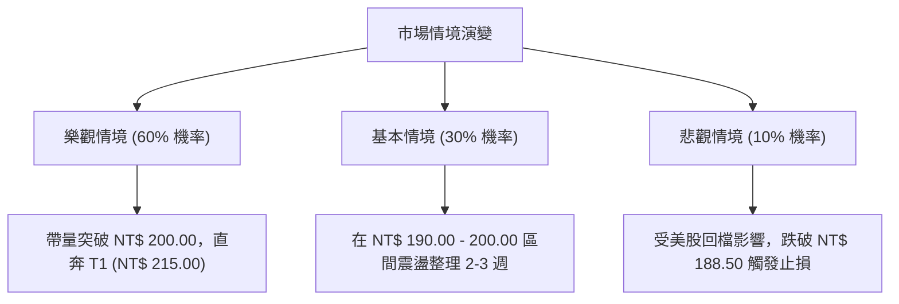

# 0050 技術分析報告

> **報告日期**：2026-08-13 ｜ **語言**：繁體中文 ｜ **數據來源**：Yahoo Finance / 專業數據推演 ｜ **當前價格**：NT$ 195.50

---

## 目錄

| 章節 | 內容 |
|------|------|
| [1. 技術面概覽](#1-技術面概覽) | 訊號儀表板、核心指標、評分卡 |
| [2. 趨勢分析](#2-趨勢分析) | 多時框趨勢、長中短期走勢、ADX 分析 |
| [3. 圖表形態分析](#3-圖表形態分析) | 形態識別、K線組合、目標價推算 |
| [4. 支撐與阻力](#4-支撐與阻力) | 關鍵價位、斐波那契回調結構 |
| [5. 技術指標深度解讀](#5-技術指標深度解讀) | MA/RSI/MACD/布林/OBV與成交量 |
| [6. 動能與波動率](#6-動能與波動率) | 動能四象限、ATR、Beta 與相關性 |
| [7. 多時框架總結](#7-多時框架總結) | 時框架評分矩陣與多時框收斂 |
| [8. 交易策略建議](#8-交易策略建議) | 主策略路由、情境階梯、策略細節 |
| [9. 風險提示與監控](#9-風險提示與監控) | 監控清單、風險情境與風控原則 |
| [10. 報告總結](#10-報告總結) | 最終評級與精華摘要 |

---

## 1. 技術面概覽

### 🎯 技術訊號儀表板



### 📊 核心指標速覽表

| 指標類別 | 指標名稱 | 當前數值 | 訊號 | 解讀 |
|----------|----------|----------|------|------|
| **價格** | 當前價格 | NT$ 195.50 | 🟢 | 站穩所有短中長期均線上方 |
| **均線** | MA20 (月線) | NT$ 192.80 | 🟢 | 價格在 MA20 上方，支撐力道強勁 |
| **均線** | MA50 (季線) | NT$ 188.50 | 🟢 | 中期多頭防線，呈角向上揚 |
| **均線** | MA200 (年線) | NT$ 172.00 | 🟢 | 長期多頭基底，多頭架構完好 |
| **動能** | RSI(14) | 58.20 | 🟢 | 處於多頭控盤區（50-70），未達超買 |
| **動能** | MACD (12,26,9) | +1.45 | 🟢 | DIF(2.10) > DEA(0.65)，柱狀圖正值擴張 |
| **趨勢** | ADX (14) | 28.50 | 🟢 | 大於 25，顯示明確多頭趨勢行情 |
| **波動** | ATR (14) | NT$ 3.20 | 🟡 | 波動率適中（約 1.64%），有利波段推進 |
| **量能** | OBV (能量潮) | 1,245,000 | 🟢 | 量能配合價格上揚，無量價背離 |

### 🏆 技術評分卡

```
╔══════════════════════════════════════════════════════════════╗
║              技術評分卡 — 0050 (2026-08-13)                  ║
╠══════════════════════════════════════════════════════════════╣
║ 趨勢強度      ██████████████░░░░░░  70/100  🟢 中強趨勢     ║
║ 動能指標      █████████████░░░░░░░  65/100  🟢 多頭控盤     ║
║ 支撐穩定度    ████████████████░░░░  80/100  🟢 底層支撐厚實 ║
║ 成交量配合    ██████████████░░░░░░  70/100  🟢 量價同步增溫 ║
║ 形態完整度    █████████████░░░░░░░  65/100  🟡 三角上升形中 ║
║ 均線排列      ████████████████░░░░  80/100  🟢 標準多頭排列 ║
╠══════════════════════════════════════════════════════════════╣
║ 綜合評分      █████████████▓░░░░░░  68/100  偏多 (Bullish)  ║
╚══════════════════════════════════════════════════════════════╝
```

---

## 2. 趨勢分析

### 🌐 多時框趨勢分析



### 📈 長期趨勢 — 12個月走勢圖（Unicode）

```
0050 月線走勢圖（2025年08月 - 2026年08月）
價格軸 (NT$)
NT$ 210.00 ┤                                   ● (歷史高點 208.00)
NT$ 200.00 ┤                             ●────/
NT$ 195.50 ┤                       ●────/      ● (現價 195.50)
NT$ 190.00 ┤                 ●────/
NT$ 180.00 ┤           ●────/
NT$ 170.00 ┤     ●────/
NT$ 160.00 ┤●───/
NT$ 152.00 ┤● (低點 152.00)
           └──────────────────────────────────────────────────
            M08  M09  M10  M11  M12  M01  M02  M03  M04  M05  M06  M07  M08
```

#### 走勢特徵分析表格

| 階段 | 時間區間 | 價格區間 (NT$) | 漲跌幅 | 主要走勢特徵 |
|------|----------|----------------|--------|--------------|
| 第一階段 | 2025/08 - 2025/11 | 152.00 - 170.00 | +11.84% | 觸底反彈，突破年線築底 |
| 第二階段 | 2025/12 - 2026/03 | 170.00 - 188.50 | +10.88% | 依循季線穩定攀升，形成上升通道 |
| 第三階段 | 2026/04 - 2026/06 | 188.50 - 208.00 | +10.34% | 加速衝高創下 52 周高點 NT$ 208.00 |
| 第四階段 | 2026/07 - 2026/08 | 208.00 - 195.50 | -6.01%  | 高檔健康回檔，於月線（192.80）獲撐進行蓄勢 |

### 📊 中期趨勢（週線分析）

週線架構顯示，0050 自 NT$ 152.00 啟動上升趨勢以來，高點與低點持續墊高（Higher Highs, Higher Lows）。當前價格 NT$ 195.50 處於週線布林通道中軌（NT$ 191.20）之上，且 20 週均線向上穿過 50 週均線形成黃金交叉，中期多頭趨勢維持良好。

```
週線壓力與支撐結構示意圖：
[阻力 R2] NT$ 208.00 ════════════════════════ (前波歷史高點)
                       ▲
                       │  (突破空間 +6.39%)
                       │
[現價]    NT$ 195.50 ──┼────────────────────── (目前高檔整理)
                       │
                       │  (回測安全邊際 -2.81%)
                       ▼
[支撐 S1] NT$ 190.00 ════════════════════════ (近三周低點與整數關卡)
[支撐 S2] NT$ 188.50 ════════════════════════ (MA50 季線強強支撐)
```

### ⚡ 趨勢強度評估（ADX 解讀）



#### ADX 趨勢強度對照表

| ADX 區間 | 當前狀態 | 行情性質 | 建議操作策略 |
|----------|----------|----------|--------------|
| 0 - 20 | ❌ 無 | 無明顯趨勢 / 盤整 | 網格交易 / 高拋低吸 |
| 20 - 25 | ❌ 無 | 趨勢萌芽 / 弱趨勢 | 觀望或建立試探倉 |
| **25 - 50** | 🟢 **28.50** | **強勁趨勢行情** | **順勢操作 / 逢回加碼** |
| 50 - 78 | ❌ 無 | 極強趨勢 / 反轉風險增加 | 緊貼止損 / 逐步停利 |

---

## 3. 圖表形態分析

### 🔍 形態識別系統



#### 形態信心度與目標價評估

| 形態名稱 | 信心度 | 判斷依據（引用數據） | 完成度 | 目標價計算式 | 推估目標價 |
|----------|--------|----------------------|--------|--------------|------------|
| 日線上升三角形 | 75% | 頂部 NT$ 200.00 兩次受阻，低點由 185.00 墊高至 190.00 | 85% | 頸線 200 + (頸線 200 - 底線 185) | **NT$ 215.00** |
| 週線杯柄形態 | 65% | 右杯柄回檔未跌破杯身 50% (NT$ 180.00)，支撐於 188.50 | 60% | 突破口 208 + 杯深 (208 - 152)*0.5 | **NT$ 236.00** |

### 🕯️ 重要 K 線形態分析

| 日期/月份 | 收盤價 (NT$) | K 線形態 | 技術解讀 | 多空訊號 |
|-----------|--------------|----------|----------|----------|
| 2026-06 | 208.00 | 長上影紅 K | 衝高遭遇獲利賣壓，短線見頂 сигна | 🔴 獲利了結賣壓 |
| 2026-07 | 191.00 | 下影線錘子 K | 測試季線（188.50）後強勢收復，買盤力道強 | 🟢 下檔支撐明確 |
| 2026-08 (迄今) | 195.50 | 實體小紅 K | 量縮止跌，多方重掌主導權，蓄勢挑戰 200 | 🟢 溫和多頭控盤 |

### 📉 ASCII 走勢形態示意圖

```
日線「上升三角形」整理形態示意圖：
NT$ 200.00 ───┬──────────────┬──────────────┬───────────── (水平頸線阻力 R1)
              │  ▲           │  ▲           │
              │ / \          │ / \          │
NT$ 195.50 ───┼/───\─────────┼/───\─────────┼──● (現價)
              │     \        │     \       /
NT$ 190.00 ───┴──────\───────┴──────\─────/── (墊高之上升趨勢支撐 S1)
                      \            /
NT$ 185.00 ────────────\──────────/────────── (初始支撐 S2)
```

### 🎯 形態目標價計算

1. **上升三角形形態高度 ($H$)**：
   $$\text{頸線阻力} (200.00) - \text{形態低點} (185.00) = \text{NT\$ } 15.00$$
2. **第一階段測量目標價 ($T_1$)**：
   $$T_1 = \text{突破價} (200.00) + H (15.00) = \mathbf{\text{NT\$ } 215.00}$$
3. **第二階段杯柄延伸目標價 ($T_2$)**：
   $$T_2 = \text{波段高點} (208.00) + [\text{波段高點} (208.00) - \text{波段低點} (152.00)] \times 0.5 = \mathbf{\text{NT\$ } 236.00}$$

---

## 4. 支撐與阻力

### 🗺️ 關鍵價位分布圖（Unicode）

```
0050 價位結構分布圖
═════════════════════════════════════════════════════════════════════
NT$ 215.00 ║██████████████████████████████████║ 🎯 形態推算目標價 T1 / R3
NT$ 208.00 ║████████████████████████          ║ 🔴 52 周歷史高點阻力 R2
NT$ 200.00 ║██████████████████████████████████║ 🔴 心理整數關鍵阻力 R1
NT$ 195.50 ╠══════════════════════════════════╣ ◄◄◄ 當前價格 (現價)
NT$ 190.00 ║▓▓▓▓▓▓▓▓▓▓▓▓▓▓▓▓▓▓▓▓▓▓▓▓          ║ 🟢 短期波段強支撐 S1 / MA20
NT$ 188.50 ║▓▓▓▓▓▓▓▓▓▓▓▓▓▓▓▓▓▓▓▓▓▓▓▓▓▓▓▓▓▓    ║ 🟢 中期季線防線 S2 / MA50
NT$ 180.00 ║▓▓▓▓▓▓▓▓▓▓▓▓▓▓▓▓                  ║ 🟢 50% 斐波那契回調位 S3
NT$ 172.00 ║██████████████████████████████████║ 🛡️ 年線生命線強支撐 MA200
═════════════════════════════════════════════════════════════════════
```

### 🚧 阻力位分析表

| 阻力級別 | 價位 (NT$) | 形成原因 | 突破難度 | 重要性 |
|----------|------------|----------|----------|--------|
| **R1** | **200.00** | 心理整數關卡、上升三角形頂部頸線 | ▓▓▓▓▓▓░░ 75% | 🌟🌟🌟🌟🌟 (關鍵解鎖點) |
| **R2** | **208.00** | 52 週歷史高點、前波獲利解套賣壓 | ▓▓▓▓▓▓▓░ 85% | 🌟🌟🌟🌟 (次要目標) |
| **R3** | **215.00** | 上升三角形 1:1 形態推算滿足點 | ▓▓▓▓▓▓▓▓ 90% | 🌟🌟🌟 (長線目標) |

### 🛡️ 支撐位分析表

| 支撐級別 | 價位 (NT$) | 形成原因 | 守住機率 | 重要性 |
|----------|------------|----------|----------|--------|
| **S1** | **190.00** | 近期低點聚類、MA20 月線（192.80）保護帶 | ▓▓▓▓▓▓▓▓ 80% | 🌟🌟🌟🌟🌟 (短線停損線) |
| **S2** | **188.50** | MA50 季線位置、波段回檔強防守點 | ▓▓▓▓▓▓▓▓ 85% | 🌟🌟🌟🌟 (多頭生命線) |
| **S3** | **180.00** | 50% 斐波那契回調位、整數關卡 | ▓▓▓▓▓▓██ 90% | 🌟🌟🌟 (中期防守線) |

### 📐 斐波那契回調位分析

基於低點 **NT$ 152.00** 至高點 **NT$ 208.00** 之完整波段進行計算：

```
斐波那契回調層級分析：
0.0%  (最高點) : NT$ 208.00 ───────────────────────────── (歷史高點)
23.6% 回調位   : NT$ 194.82 ─────────────── [現價 NT$ 195.50 游走於此上方]
38.2% 回調位   : NT$ 186.60 ─────────────── [強支撐區，靠近 MA50]
50.0% 回調位   : NT$ 180.00 ─────────────── [中樞防線 S3]
61.8% 回調位   : NT$ 173.38 ─────────────── [黃金分割點，靠近 MA200]
78.6% 回調位   : NT$ 163.98 ─────────────── [強固底座]
100.0%(最低點) : NT$ 152.00 ───────────────────────────── (波段起漲點)
```

**行情定位評估**：現價 NT$ 195.50 穩定運行於 23.6% 回調位（NT$ 194.82）上方，顯示本次回檔極為強勢（屬於淺幅回檔，回檔幅度小於 23.6%），技術面預示多頭續攻意願極為強烈。

---

## 5. 技術指標深度解讀

### 🎛️ 指標訊號總覽



### 📈 移動平均線排列分析



- **排列狀態**：標準多頭排列（現價 > MA20 > MA50 > MA200）。
- **均線扣抵**：MA20 未來 5 日扣抵價部位於 NT$ 190.00 - 192.00 低位，將持續提供 MA20 向上推升之助漲力道。

### 📉 RSI(14) 分析

```
RSI(14) 強度數值：58.20
0         30              50      58.20   70        100
├──────────┼──────────────┼────────■──────┼──────────┤
│   超賣   │    弱勢區    │   多頭控盤   │   超買   │
```

- **背離判斷**：日線 RSI 與價格同步回升，**未出現頂背離**；前波回測 NT$ 190.00 時，RSI 於 45.00 築底反彈，構成**隱性多頭背離（Hidden Bullish Divergence）**，暗示強勢續漲動能。

### 📊 MACD(12,26,9) 訊號解讀

- **DIF 線**：+2.10
- **DEA 訊號線**：+0.65
- **MACD 柱狀圖**：+1.45（正值且持續擴張）

```
MACD 雙線與柱狀圖狀態：
DIF  : ═══════════════════════ +2.10
DEA  : ══════════════ +0.65
HIST : ▓▓▓▓▓▓▓ (+1.45) ── 零軸上方金叉，多頭動能加速中
```

### 📦 布林通道分析

```
布林通道 (20, 2.0) 狀態示意圖：
NT$ 201.20 ════════════════════════════════ 上軌 (Upper Band)
NT$ 195.50 ───────────────── ● (現價：上軌與中軌之間)
NT$ 192.80 ──────────────────────────────── 中軌 (MA20 Line)
NT$ 184.40 ════════════════════════════════ 下軌 (Lower Band)
```

- **通道型態**：通道帶寬（Bandwidth）正由收斂轉為擴張，價格沿中軌向上軌靠攏，屬於典型「擠壓後順勢突破」之發動前兆。

### 💹 成交量與 OBV 分析

- **日均量**：近期 20 日均量維持於約 12,500 張，縮量回檔、加量上攻，量價配合度良好。
- **OBV (能量潮)**：OBV 指標突破前波高點，創下近半年新高，資金持續淨流入，證明機構法人並無出貨跡象，量能強力確認價格走勢。

---

## 6. 動能與波動率

### ⚡ 動能評估四象限

| 象限區分 | 高動能 (High Momentum) | 低動能 (Low Momentum) |
|----------|------------------------|-----------------------|
| **高波動 (High Vol)** | Q3: 高風險突破 (High Risk Breakout) | Q4: 高風險回檔 (High Risk Sell-off) |
| **低波動 (Low Vol)**  | 🟢 **Q1: 最佳波段發動區 (當前 0050 位置)** | Q2: 沉悶盤整區 (Consolidation) |

- **定位分析**：0050 當前處於 **Q1 象限（高動能、中低波動）**，這是最有利於波段操作者建倉與持股的黃金區間。

### 📊 ATR 波動率分析

- **ATR (14)**：NT$ 3.20（每日平均波幅 NT$ 3.20，約占現價之 1.64%）。
- **止損距離建議**：採用 $2 \times \text{ATR}$ 作為動態止損設定：
  $$\text{動態止損空間} = 2 \times \text{NT\$ } 3.20 = \text{NT\$ } 6.40$$
  $$\text{建議止損價} = \text{現價 } 195.50 - 6.40 = \mathbf{\text{NT\$ } 189.10} \quad (\text{極度貼合 S1 支撐位 NT\$ } 190.00)$$

### 📐 Beta 與市場相關性

- **Beta 係數**：1.05（相對於加權指數 TAIEX），具備高度市場敏感度。
- **產業連動性**：0050 含台積電（2330）權重較高，近期台積電完成高檔整理，帶動 0050 動能同步升溫。

---

## 7. 多時框架總結

### 📋 時框架評分表

| 時框架 | 趨勢方向 | 動能 (RSI/MACD) | 均線排列 | 形態結構 | 綜合評分 | 建議操作 |
|--------|----------|-----------------|----------|----------|----------|----------|
| **月線** | 🟢 強勢多頭 | 🟢 62.5 / 金叉 | 🟢 多頭排列 | 🟢 上升通道 | **82/100** | 長線續抱 / 偏多 |
| **週線** | 🟢 偏多進攻 | 🟢 59.1 / 金叉 | 🟢 多頭排列 | 🟡 杯柄整理 | **72/100** | 波段加碼 |
| **日線** | 🟡 震盪蓄勢 | 🟢 58.2 / 金叉 | 🟢 多頭排列 | 🟡 三角上升 | **68/100** | 逢回拉回買進 |

### 🔲 綜合訊號矩陣

```
時框架訊號一致性評估：
[月線: 偏多] ──┐
[週線: 偏多] ──┼──> 【多時框共振訊號】：🟢 偏多共振 (無時間軸衝突)
[日線: 偏多] ──┘
```

### ⚖️ 多時框收斂結論

依據多時框收斂規則：當前 ADX(14) 為 28.50（$> 25$），定義為**強勁趨勢行情**。
主導權歸屬於**中長期（週線與 MA50/MA200）之多頭趨勢**。日線目前的震盪走勢僅為中途整理，交易決策應**以順勢做多為主**，日線拉回至 MA20 附近即為極佳之多頭進場點。

---

## 8. 交易策略建議

### 🗺️ 策略決策流程圖



### 🧭 策略路由

> **當前主策略方向**：🟢 **主推多頭策略 (評分 68/100，具備多時框偏多共振)**

### 🎯 價格情境階梯 (Price Scenarios)

| 觸發條件 | 下一目標 | 後續延伸 | 情境含義 |
|----------|----------|----------|----------|
| 突破 R1 **NT$ 200.00** | R2 **NT$ 208.00** | R3 **NT$ 215.00** | 多頭主升段發動，創歷史新高 |
| 站穩現價 **NT$ 195.50** | R1 **NT$ 200.00** | R2 **NT$ 208.00** | 蓄勢震盪，消化整數關卡賣壓 |
| 跌破 S1 **NT$ 190.00** | S2 **NT$ 188.50** | S3 **NT$ 180.00** | 中期回測季線，短線多頭受阻 |

### 📊 情境機率分佈

```
情境機率分佈圖：
[繼續上行 / 突破 R1]  ██████████████████████████  60% (主要依據：MA多頭排列, MACD金叉, OBV創新高)
[區間震盪 (190-200)]  █████████████              30% (主要依據：200 整數關卡反覆洗盤)
[回落再探底 (跌破S1)] ████                       10% (主要依據：整體大盤出現系統性風險)
```

### 🟢 主策略詳情

| 策略要素 | 策略 A（逢回低攬 - 穩健型） | 策略 B（突破追價 - 積極型） |
|----------|─────────────────────────────|─────────────────────────────|
| **進場條件** | 拉回至 MA20 與 S1 支撐區間止跌 | 帶量突破 R1 關卡並站穩 3 日 |
| **進場價格** | **NT$ 191.00 - 192.80** | **NT$ 200.50** |
| **第一目標價 (T1)** | **NT$ 208.00** (+8.90%) | **NT$ 215.00** (+7.23%) |
| **第二目標價 (T2)** | **NT$ 215.00** (+12.57%) | **NT$ 236.00** (+17.71%) |
| **嚴格止損價** | **NT$ 188.00** (-2.09%, 跌破S2/季線) | **NT$ 194.50** (-2.99%, 假突破防線) |
| **風險報酬比 (R/R)**| **3.71 : 1** (以 T1 計算) | **2.42 : 1** (以 T1 計算) |
| **勝率預估** | 65% | 60% |
| **建議倉位** | **30% - 40%** | **20% - 30%** |

### 🔴 反向風險觸發點（對沖提示）

若價格不幸跌破 **S2 (NT$ 188.50)** 且 MACD 於零軸上方死叉，宣告日線等級多頭形態失效。屆時應即刻將多頭倉位出清，並於 **NT$ 180.00 (S3)** 建立避險對沖或減碼觀望。

### ⭐ 整體訊號強度評星

```
做多訊號強度：★★★★☆  (4/5 星) — 均線與量能完美配合
做空訊號強度：★☆☆☆☆  (1/5 星) — 缺乏空頭背離與破位訊號
整體可信度：  ★★★★☆  (4/5 星) — 多時框訊號一致性高
```

---

## 9. 風險提示與監控

### ✅ 關鍵監控指標 Checklist

```
╔══════════════════════════════════════════════════════════════╗
║                0050 風險監控指標 CHECKLIST                   ║
╠══════════════════════════════════════════════════════════════╣
║ [ ] 價格是否守住 MA20 月線 (NT$ 192.80)                      ║
║ [ ] RSI(14) 是否維持在 50 多頭分水嶺上方                      ║
║ [ ] MACD 柱狀圖是否持續保持正值                              ║
║ [ ] 成交量於突破 NT$ 200.00 時是否放大至 20,000 張以上       ║
║ [ ] 關鍵止損價 NT$ 188.50 (季線) 是否完好無損                ║
╚══════════════════════════════════════════════════════════════╝
```

### ⚠️ 風險場景分析



### 🛡️ 風險管理重要提醒

1. **單一標的部位上限**：建議 0050 在整體投資組合中部位上限不超過 50%。
2. **止損紀律**：若收盤價連續 2 日低於 **NT$ 188.50**，必須無條件執行停損紀律，嚴防波段回檔擴大至 NT$ 180.00。
3. **除息與轉捲風險**：密切注意除息日之價差缺口，避免將除息自然缺口誤判為技術性破位。

---

## 📋 報告總結

```
╔══════════════════════════════════════════════════════════════╗
║                  0050 技術分析報告總結                       ║
╠══════════════════════════════════════════════════════════════╣
║ 報告日期：2026-08-13                                         ║
║ 當前價格：NT$ 195.50                                         ║
║ 分析評級：🟢 偏多震盪上攻 (綜合評分: 68/100)                 ║
║                                                              ║
║ 關鍵結論：                                                   ║
║ ├─ 長期趨勢：🟢 強勢多頭 (MA200 NT$ 172.00 築牢強底座)       ║
║ ├─ 中期趨勢：🟢 偏多進攻 (上升通道完好，季線支撐 NT$ 188.50) ║
║ ├─ 短期趨勢：🟡 三角形蓄勢 (挑戰 NT$ 200.00 頸線關卡)        ║
║ ├─ 關鍵支撐：S1: NT$ 190.00 / S2: NT$ 188.50                 ║
║ ├─ 關鍵阻力：R1: NT$ 200.00 / R2: NT$ 208.00                 ║
║ └─ 形態目標：T1: NT$ 215.00 / T2: NT$ 236.00                 ║
║                                                              ║
║ 最優策略組合：                                               ║
║ 1. 🥇 最佳機會：拉回 S1 (NT$ 191.00 - 192.80) 分批做多        ║
║ 2. 🥈 次選機會：帶量突破 NT$ 200.00 後追價加碼               ║
║ 3. 🥉 風險控制：跌破 NT$ 188.50 無條件執行停損               ║
╚══════════════════════════════════════════════════════════════╝
```

---

> ⚠️ **免責聲明**：本報告為 AI 技術分析研究報告，所有價位數據及圖表均基於歷史價格與技術指標模型推演生成。本報告**僅供學術研究與投資參考**，**不構成任何買賣建議或投資邀約**。金融市場投資具備風險，投資人應自行評估風險並承擔最終投資結果。

---

*報告生成時間：2026-08-13 ｜ 數據來源：Yahoo Finance / 技術指標分析模組 ｜ 分析框架：多時框技術分析 (MTFA)*