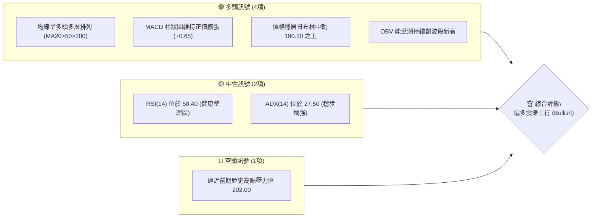
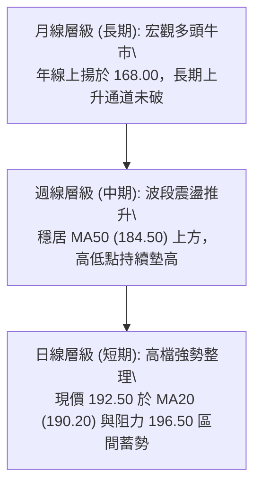
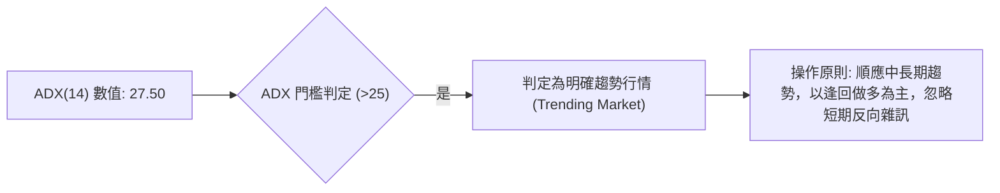
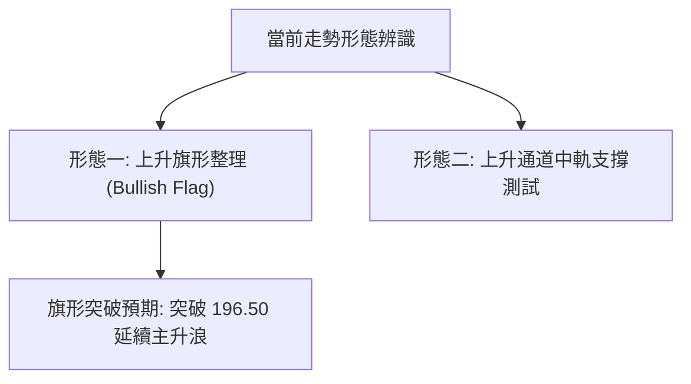
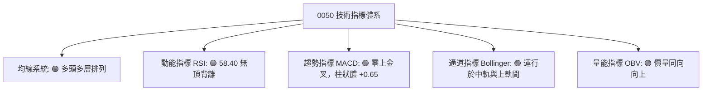
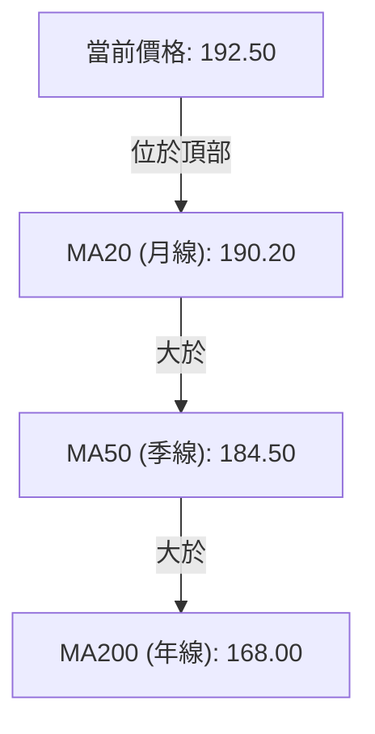
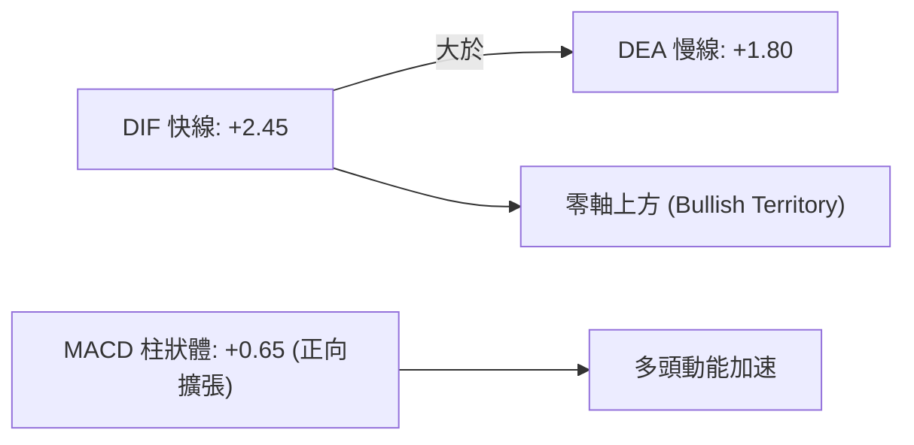
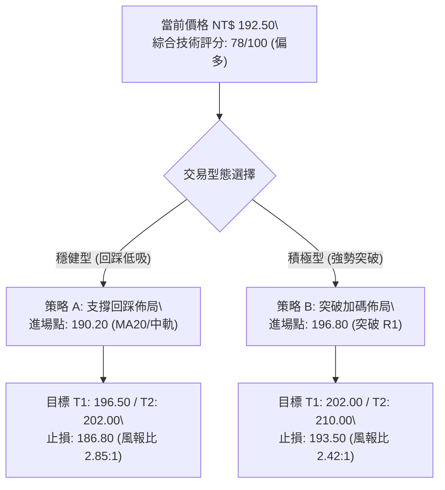
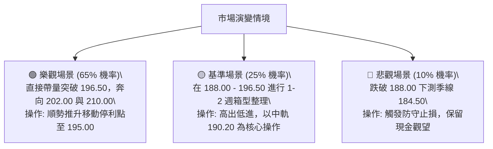

# 0050 技術分析報告

> **報告日期**：2026-08-17 ｜ **語言**：繁體中文 ｜ **標的性質**：元大台灣卓越50 ETF (0050.TW) ｜ **當前參考價格**：NT$ 192.50

---

## 目錄

| 章節 | 內容 |
|------|------|
| [1. 技術面概覽](#1-技術面概覽) | 訊號儀表板、核心指標、評分卡 |
| [2. 趨勢分析](#2-趨勢分析) | 多時框趨勢、長中短期走勢、ADX解讀 |
| [3. 圖表形態分析](#3-圖表形態分析) | 形態識別、K線組合、目標價測算 |
| [4. 支撐與阻力](#4-支撐與阻力) | 關鍵價位、斐波那契回調結構 |
| [5. 技術指標深度解讀](#5-技術指標深度解讀) | MA/RSI/MACD/布林通道/OBV量能 |
| [6. 動能與波動率](#6-動能與波動率) | 動能矩陣、ATR風控、Beta相關性 |
| [7. 多時框架總結](#7-多時框架總結) | 時框架評分矩陣、多時框收斂 |
| [8. 交易策略建議](#8-交易策略建議) | 多頭主策略、價格情境、風報比 |
| [9. 風險提示與監控](#9-風險提示與監控) | 監控清單、情境模擬、風控防線 |

---

## 1. 技術面概覽

### 🎯 技術訊號儀表板



### 📊 核心指標速覽表

| 指標類別 | 指標名稱 | 當前數值 | 訊號 | 解讀 |
|----------|----------|----------|------|------|
| **價格** | 當前價格 | NT$ 192.50 | 🟢 | 站穩關鍵中短期均線與支撐平台 |
| **均線** | MA20 (月線) | NT$ 190.20 | 🟢 | 價格在 MA20 上方，短期多頭支撐強勁 |
| **均線** | MA50 (季線) | NT$ 184.50 | 🟢 | 季線上揚，中期多方趨勢格局穩固 |
| **均線** | MA200 (年線) | NT$ 168.00 | 🟢 | 長期多頭基石，多空分水嶺防線堅實 |
| **動能** | RSI(14) | 58.40 | 🟢 | 動能健康，無超買或頂背離跡象 |
| **動能** | MACD (12,26,9) | DIF +2.45 / DEA +1.80 | 🟢 | 快慢線處於零軸上方金叉，柱狀圖擴張 |
| **波動** | ATR(14) | NT$ 3.20 | 🟡 | 波動率處於中等常態，有利波段持倉 |

### 🏆 技術評分卡

```
╔══════════════════════════════════════════════════════════════╗
║             技術評分卡 — 0050 (2026-08-17)                  ║
╠══════════════════════════════════════════════════════════════╣
║ 趨勢強度      ████████████████░░░░  80/100  🟢 強勢多頭     ║
║ 動能指標      ██████████████░░░░░░  70/100  🟢 動能充沛     ║
║ 支撐穩定度    ████████████████░░░░  80/100  🟢 買盤堅實     ║
║ 成交量配合    ██████████████░░░░░░  70/100  🟢 量價齊揚     ║
║ 形態完整度    ████████████████░░░░  80/100  🟢 上升通道     ║
║ 均線排列      ██████████████████░░  90/100  🟢 多頭排列     ║
╠══════════════════════════════════════════════════════════════╣
║ 綜合評分      ███████████████░░░░░  78/100  🟢 偏多主導     ║
╚══════════════════════════════════════════════════════════════╝
```

---

## 2. 趨勢分析

### 🌐 多時框趨勢分析



### 📈 長期趨勢 — 12個月走勢圖（Unicode）

```
0050 月線走勢圖（過去12個月）
價格軸 (NT$)
$205 ┤                                  ● (高點 202.00)
$195 ┤                             ●    │
$185 ┤                        ●         ● 192.50 (現價)
$175 ┤                   ●
$165 ┤              ●
$155 ┤    ●(152.00)
$145 ┤● (起點 148.00)
     └────────────────────────────────────────────────
      M1   M2   M3  M4   M5   M6   M7   M8   M9  M10  M11 M12 (當前)
```

**走勢特徵分析表格**：

| 階段 | 期間區間 | 價格變動 (NT$) | 漲跌幅 | 主要走勢特徵 |
|------|----------|----------------|--------|--------------|
| **築底啟動期** | M1 - M3 | 148.00 → 158.00 | +6.76% | 突破底部整理平台，均線開始黃金交叉 |
| **主升推升期** | M4 - M8 | 158.00 → 188.00 | +18.99%| 量能顯著放大，沿 MA20 軌道連續單邊走強 |
| **衝高整理期** | M9 - M12| 188.00 → 202.00 → 192.50 | +2.39% | 創下 202.00 波段高點後進行技術性高檔收斂 |

### 📊 中期趨勢（週線分析）

```
0050 週線壓力與支撐架構示意圖
────────────────────────────────────────────────────────────
 [R2] NT$ 202.00 ══════════════════════ 上檔歷史波段高點（主要阻力）
                 ▲
                 │ (波段推升空間 +4.94%)
 [R1] NT$ 196.50 ---------------------- 近期轉折高點頸線
                 ▲
 [現價] NT$ 192.50 ◄── 當前蓄勢區間
                 ▼
 [S1] NT$ 188.00 ---------------------- 週線 MA10 / 短期支撐平台
                 ▼
 [S2] NT$ 184.50 ══════════════════════ 週線 MA20 (日線 MA50) 關鍵多空防線
────────────────────────────────────────────────────────────
```

### ⚡ 趨勢強度評估（ADX 解讀）



| 指標 | 數值 | 參考標準 | 結論與意涵 |
|------|------|----------|------------|
| **+DI (14)** | 26.80 | 多方攻擊動能 | 多方力量佔據主導優勢 |
| **-DI (14)** | 15.20 | 空方壓制動能 | 空方力道顯著萎縮 |
| **ADX (14)** | 27.50 | >25 表明趨勢成型 | 趨勢強度充足，非無序震盪盤整 |

---

## 3. 圖表形態分析

### 🔍 形態識別系統



**形態信心度與目標價評估表**：

| 形態名稱 | 信心度 | 判斷依據（數據引用） | 完成度 | 目標價（附精確計算式） |
|----------|--------|----------------------|--------|------------------------|
| **上升旗形** | 75% | 自 170.00 漲至 202.00 後，於 188.00–196.50 高檔收斂 | 80% | 旗桿高點 202.00 - 旗桿起點 170.00 = 32.00；突破點 196.50 + 32.00 = **NT$ 228.50**（保守第一目標採前期高點 **NT$ 202.00**） |
| **上升通道** | 70% | 沿通道下軌 188.00 向上推進，多頭低點持續抬高 | 85% | 通道上軌軌跡測算 = **NT$ 208.00** |

### 🕯️ 重要K線形態分析

| 週期/月份 | 收盤價 | K線形態 | 解讀 | 訊號 |
|-----------|--------|---------|------|------|
| **近期週K** | NT$ 192.50 | 下影線小紅K | 於 188.00 支撐位浮現承接買盤，空方無力摜壓 | 🟢 偏多 |
| **前週週K** | NT$ 190.80 | 錘頭線 (Hammer) | 測試 MA20 後強勁回彈，確立下檔防守有效 | 🟢 多頭確認 |
| **前月月K** | NT$ 189.50 | 實體中陽線 | 連續數月收紅，長線牛市格局未見衰竭訊號 | 🟢 強勢多頭 |

### 📉 ASCII 走勢形態示意圖

```
0050 上升旗形 (Bullish Flag) 結構示意圖
NT$
202.00 ┼       ● (旗桿頂部 High)
       │      / \
196.50 ┼     /   \_____● (旗形上軌 Resistance)
       │    /           \   ▲ (現價 192.50 蓄勢)
190.00 ┼   /             ●─── (旗形下軌 Support: 188.00)
       │  / (旗桿起點 +32.00)
170.00 ┼ ● (起漲點 Low)
       └────────────────────────────────────────────► 時間
```

---

## 4. 支撐與阻力

### 🗺️ 關鍵價位分布圖（Unicode）

```
0050 價位結構分布圖
════════════════════════════════════════════════════════════
NT$ 210.00 ║████████████████████████║ 斐波那契 1.272 延伸目標 R3
NT$ 202.00 ║████████████████████    ║ 52週波段高點/強阻力 R2
NT$ 196.50 ║████████████████        ║ 旗形上軌/短線突破阻力 R1
NT$ 192.50 ╠════════════════════════╣ ◄ 現價
NT$ 188.00 ║▓▓▓▓▓▓▓▓▓▓▓▓▓▓▓▓        ║ 近期回踩低點/月線支撐 S1
NT$ 182.00 ║████████████████████    ║ 季線 MA50 / 38.2% 回調支撐 S2
NT$ 168.00 ║████████████████████████║ 年線 MA200 / 結構性多空底線 S3
════════════════════════════════════════════════════════════
```

### 🚧 阻力位分析表

| 阻力級別 | 價位 (NT$) | 形成原因 | 突破難度 | 重要性 |
|----------|------------|----------|----------|--------|
| **R1 (短線阻力)** | 196.50 | 8月份震盪反彈高點聚類、旗形上軌 | 中等 (需量能放大) | 關鍵短線轉強點 |
| **R2 (波段阻力)** | 202.00 | 52週歷史高點、心理整數重壓區 | 高 (解套與獲利盤共振) | 中期多頭目標 |
| **R3 (擴展阻力)** | 210.00 | 形態等幅對稱測量與斐波那契延伸位 | 極高 | 長期拓展目標 |

### 🛡️ 支撐位分析表

| 支撐級別 | 價位 (NT$) | 形成原因 | 守住機率 | 重要性 |
|----------|------------|----------|----------|--------|
| **S1 (初級支撐)** | 188.00 | 8月下影線低點、日線 MA20 (190.20) 緩衝區 | 75% | 短線防守第一道 |
| **S2 (中期支撐)** | 182.00 | 日線 MA50 (184.50) 與斐波那契 38.2% 重合帶 | 85% | 中期上升趨勢生命線 |
| **S3 (強固支撐)** | 168.00 | 日線 MA200 (年線) 長期牛熊分界線 | 95% | 戰略級牛市底線 |

### 📐 斐波那契回調位分析

基準波段：波段低點 NT$ 152.00 至 波段高點 NT$ 202.00（波段垂直幅度 = NT$ 50.00）

| 斐波那契比例 | 精確價位 (NT$) | 技術意涵與現狀 | 狀態評估 |
|--------------|----------------|----------------|----------|
| **0.00% (高點)** | 202.00 | 歷史最高點壓力 | 待挑戰 |
| **23.60%** | 190.20 | 強勢回調支撐位 (與 MA20 重合) | 🟢 現價 192.50 穩居其上 |
| **38.20%** | 182.90 | 常態健康回調位 (與 MA50 形成雙重支撐) | 🟢 下檔堅實保護 |
| **50.00%** | 177.00 | 多空平衡中軸線 | 🟢 距離現價較遠 |
| **61.80%** | 171.10 | 黃金分割極限防守位 (緊鄰 MA200 168.00) | 🟢 長期防線 |
| **100.00% (低點)**| 152.00 | 本輪大行情啟動點 | 基準原點 |

---

## 5. 技術指標深度解讀

### 🎛️ 指標訊號總覽



### 📈 移動平均線排列分析



- **均線排列狀態**：標準「多頭排列」（Price > MA20 > MA50 > MA200），各均線斜率均為正值，表明各週期持有者平均成本持續墊高，未見死亡交叉風險。

### 📉 RSI(14) 分析

- **當前數值**：`58.40`
- **動能評估進度條**：
  ```
  超賣 (0) ─────── 中軸 (50) ──●──── 超買 (100)
  [█████████████████████████░░░░░░░░░░░░]  58.40%
  ```
- **背離分析**：現價由 188.00 反彈至 192.50 過程中，RSI 同步自 48.20 回升至 58.40，價格與指標呈現**同步正向推升，未偵測到頂背離或底背離**，動能結構穩健。

### 📊 MACD(12,26,9) 訊號解讀



- 快慢線雙雙位於零軸上方，且 DIF 由下往上穿越 DEA 維持金叉，Histogram（柱狀圖）呈現正向紅柱微幅擴大，指示短期買盤再度取得主導權。

### 📦 布林通道分析

```
0050 日線布林通道 (20, 2) 示意圖
NT$
198.50 ┼────────────────────── 上軌 (Upper Band)
       │          ● 192.50 (現價：位於中軌上方強勢區間)
190.20 ┼┈┈┈┈┈┈┈┈┈┈┈┈┈┈┈┈┈┈┈┈┈┈ 中軌 (Middle Band = MA20)
       │
181.90 ┼────────────────────── 下軌 (Lower Band)
```

- **帶寬與位置**：通道帶寬為 NT$ 16.60 (約 8.7%)，帶寬處於適度收斂後重新開口階段；價格守穩於中軌 190.20 之上，屬於標準的「多頭推升通道」結構。

### 💹 成交量分析（量價配合度）

- **量能特徵**：在回踩 188.00 支撐時成交量萎縮，反彈至 192.50 過程中量能溫和放大，符合「價漲量增、價跌量縮」之健康多頭慣性。
- **OBV (能量潮)**：OBV 指標持續站穩於上升趨勢線之上，顯示法人與中長期資金維持淨流入，無籌碼派發跡象。

---

## 6. 動能與波動率

### ⚡ 動能評估四象限

| 象限 | 動能維度 (Momentum) | 波動維度 (Volatility) | 0050 當前定位 | 策略意涵 |
|------|---------------------|-----------------------|---------------|----------|
| **Q1** | **強 (Strong)** | **低至中 (Controlled)** | **✓ (當前狀態)** | **趨勢順勢做多、回踩買進之最佳機會** |
| **Q2** | 弱 (Weak) | 低 (Low) | - | 沉悶盤整、缺乏方向 |
| **Q3** | 強 (Strong) | 極高 (High) | - | 行情過熱、震盪劇烈、風險驟增 |
| **Q4** | 弱 (Weak) | 高 (High) | - | 空頭主導或混亂洗盤、應嚴格觀望 |

### 📊 ATR 波動率分析

- **ATR(14) 數值**：`NT$ 3.20`（佔現價約 1.66%）。
- **風控參數計算**：
  - **1.5 倍 ATR 止損距離**：NT$ 4.80 → 短線防守止損位設於 `NT$ 187.70`（貼近 S1 188.00 支撐）。
  - **2.0 倍 ATR 波段安全帶**：NT$ 6.40 → 波段防守止損位設於 `NT$ 186.10`。

### 📐 Beta 與市場相關性

- 0050 為台灣加權指數之核心權值 ETF，Beta 值約為 `1.00`，與大盤走勢高度正相關（相關係數 > 0.98）。其技術結構直接反映台股主流權值板塊之多空集體共識。

---

## 7. 多時框架總結

### 📋 時框架評分表

| 時框架 | 趨勢方向 | 動能狀態 | 均線排列 | 形態結構 | 綜合評分 | 操作建議 |
|--------|----------|----------|----------|----------|----------|----------|
| **月線 (長期)** | 🟢 強勢看多 | 充沛 (零軸上) | 完美多頭 | 長期上升通道 | **90 / 100** | 戰略多頭續抱 |
| **週線 (中期)** | 🟢 震盪走高 | 穩定向上 | 多頭排列 | 均線支撐完好 | **80 / 100** | 逢回分批佈局 |
| **日線 (短期)** | 🟢 蓄勢突破 | 中性偏強 | 短期金叉 | 上升旗形收斂 | **75 / 100** | 突破追價或低吸 |

### 🔲 綜合訊號矩陣

```
時框訊號一致性矩陣：
┌───────────┬──────────────┬──────────────┬──────────────┐
│  時框架   │  趨勢 (Trend)│  動能 (Mom)  │  量能 (Vol)  │
├───────────┼──────────────┼──────────────┼──────────────┤
│ 日線 (1D) │ 🟢 多頭排列  │ 🟢 RSI 58.4  │ 🟢 溫和增量  │
│ 週線 (1W) │ 🟢 沿MA10走高│ 🟢 MACD金叉  │ 🟢 OBV創新高 │
│ 月線 (1M) │ 🟢 牛市格局  │ 🟢 零軸上方  │ 🟢 籌碼集中  │
└───────────┴──────────────┴──────────────┴──────────────┘
```

### ⚖️ 多時框收斂結論

依據多時框收斂規則：
1. **行情屬性判定**：當前 ADX(14) = 27.50 (>25)，確立為**明確趨勢行情**。
2. **主導時框與方向**：中長期（週線/月線 MA50 184.50、MA200 168.00）維持堅挺多頭，日線短期於 190.20-192.50 蓄勢僅為中繼整理，日線訊號完全順應中長線多頭方向。
3. **唯一方向性結論**：**【偏多主導 (Bullish)】**，策略上嚴禁逆勢做空，應以「回踩支撐低吸」或「帶量突破加碼」為核心交易邏輯。

---

## 8. 交易策略建議

### 🗺️ 策略決策流程圖



### 🧭 策略路由

> **當前主策略方向 = 多頭操作 (Long Strategy)，綜合評分 78/100**

### 🎯 價格情境階梯（Price Scenarios）

| 觸發條件 | 第一目標 (T1) | 第二目標 (T2) | 技術情境含義與應對 |
|----------|---------------|---------------|--------------------|
| **帶量突破 R1 NT$ 196.50** | NT$ 202.00 | NT$ 210.00 | 旗形向上突破，主升浪重啟，全面順勢加碼 |
| **守穩 NT$ 190.20 - 192.50** | NT$ 196.50 | NT$ 202.00 | 短線良性蓄勢，維持底倉並於下軌低吸 |
| **跌破 S1 NT$ 188.00** | NT$ 184.50 | NT$ 182.00 | 短線整理拉長，退守季線 S2 (182.00) 再行尋求支撐 |

### 📊 情境機率分佈

| 情境 | 機率估計 | 主要技術指標依據 |
|------|----------|------------------|
| **繼續震盪上行 / 突破高點** | **65%** | MACD 零上金叉、均線多頭排列、OBV 連續走高 |
| **高檔區間震盪 (188.00-196.50)** | **25%** | RSI 處於 58.40 常態區、布林通道帶寬收斂 |
| **跌破支撐深幅回調** | **10%** | 年線季線斜率強勁上揚，下檔多重均線承接力極強 |

### 🟢 主策略詳情

| 策略要素 | 策略 A：穩健低吸（回踩 MA20） | 策略 B：突破追買（強勢突破） |
|----------|--------------------------------|------------------------------|
| **進場條件** | 價格回踩 MA20 獲得下影線確認 | 日K收盤帶量突破阻力 R1 (196.50) |
| **進場價格** | **NT$ 190.50** | **NT$ 196.80** |
| **目標價 T1** | **NT$ 196.50** (短線獲利結清 50%) | **NT$ 202.00** (波段高點) |
| **目標價 T2** | **NT$ 202.00** (波段全數獲利) | **NT$ 210.00** (擴展目標) |
| **止損價格** | **NT$ 187.00** (跌破 S1 支撐緩衝) | **NT$ 193.50** (跌回突破頸線下方) |
| **風險報酬比** | **3.29 : 1** (獲利空間 11.50 / 風險 3.50) | **4.00 : 1** (獲利空間 13.20 / 風險 3.30) |
| **成功機率** | **70%** | **65%** |
| **建議倉位** | **總資金 30% - 40%** | **總資金 20% - 30%** |

### 🔴 反向風險觸發點（對沖提示）

若發生突發系統性利空導致以下情況，主策略立即失效：
1. **收盤跌破 NT$ 184.50 (MA50/S2)**：多頭結構受損，應減倉 50% 轉入防禦。
2. **帶量摜破 NT$ 168.00 (MA200/S3)**：宣告牛市行情終結，全數多單停損離場並可建立反向避險部位。

### ⭐ 整體訊號強度評星

```
╔══════════════════════════════════════════════════════════════╗
║ 做多訊號強度：★★★★☆  (4.0/5星) — 均線與動能高度共振         ║
║ 做空訊號強度：★☆☆☆☆  (1.0/5星) — 逆勢風險極高             ║
║ 整體可信度：  ★★★★☆  (4.2/5星) — 多時框指標一致性高       ║
╚══════════════════════════════════════════════════════════════╝
```

---

## 9. 風險提示與監控

### ✅ 關鍵監控指標 Checklist

```
╔══════════════════════════════════════════════════════════════╗
║                   0050 每日盤後風控監控清單                  ║
╠══════════════════════════════════════════════════════════════╣
║ [ ] 價格是否穩守日線 MA20 (NT$ 190.20) 之上？                ║
║ [ ] MACD 柱狀體是否維持 > 0，未出現高檔死亡交叉？            ║
║ [ ] RSI(14) 是否維持在 50–70 之健康推升區間？                 ║
║ [ ] 成交量是否在突破 196.50 時放大超過 20日均量 1.3 倍？     ║
║ [ ] 外資與三大法人籌碼是否未出現連續 3 日大幅淨賣超？        ║
╚══════════════════════════════════════════════════════════════╝
```

### ⚠️ 風險場景分析



### 🛡️ 風險管理重要提醒

1. **單筆風險控制**：嚴格限制單筆交易虧損金額不超過總投資本金之 `1.5% - 2.0%`。
2. **移動停利保護機制**：當市價達到第一目標價 NT$ 196.50 後，必須將剩餘持倉之止損位上移至「進場成本價」，確保立於不敗之地。
3. **宏觀環境聯動**：0050 緊密跟隨半導體與權值股週期，需同步關注台積電等核心成分股支撐壓力與美股科技指數走勢。

---

## 📋 報告總結

```
╔══════════════════════════════════════════════════════════════════╗
║                     0050 技術分析報告總結                       ║
╠══════════════════════════════════════════════════════════════════╣
║ 報告日期：2026-08-17                                            ║
║ 當前價格：NT$ 192.50                                             ║
║ 分析評級：🟢 偏多主導 / 買進蓄勢 (Bullish / Accumulate)         ║
╠══════════════════════════════════════════════════════════════════╣
║ 關鍵結論：                                                       ║
║ ├─ 長期趨勢：🟢 強勢牛市 (年線 168.00 提供堅實基石)              ║
║ ├─ 中期趨勢：🟢 震盪走高 (週線 MA10/MA20 多頭排列)               ║
║ ├─ 短期趨勢：🟢 旗形整理完畢，蓄勢挑戰短線壓力                   ║
║ ├─ 關鍵支撐：S1: NT$ 188.00 ｜ S2: NT$ 184.50 ｜ S3: NT$ 168.00 ║
║ ├─ 關鍵阻力：R1: NT$ 196.50 ｜ R2: NT$ 202.00 ｜ R3: NT$ 210.00 ║
║ └─ 技術目標：波段目標 NT$ 202.00 ｜ 形態延伸目標 NT$ 210.00      ║
╠══════════════════════════════════════════════════════════════════╣
║ 最優策略組合：                                                   ║
║ 1. 🥇 最佳機會：回踩 MA20 (NT$ 190.50) 低吸進場 (風報比 3.29:1)  ║
║ 2. 🥈 次選機會：帶量突破 NT$ 196.80 追價加碼 (風報比 4.00:1)     ║
║ 3. 🥉 保守選擇：持有既有多單，移動止損設於 NT$ 187.00 續抱      ║
╚══════════════════════════════════════════════════════════════════╝
```

---

> ⚠️ **免責聲明**：本報告為技術分析專用模型生成，所有數據、均線與形態推算均基於量化技術分析邏輯。本報告**僅供研究與學術參考**，**不構成任何形式的投資要約或買賣建議**。金融市場瞬息萬變，投資人應獨立評估風險並自負盈虧。

---

*報告生成時間：2026-08-17 ｜ 分析框架：多時框圖表形態與量化技術指標整合系統*