# 0050 技術分析報告

> **報告日期**：2026-08-22 ｜ **語言**：繁體中文 ｜ **數據來源**：Yahoo Finance / 台灣證券交易所 ｜ **當前基準價格**：NT$ 192.50

---

## 目錄

| 章節 | 內容 |
|------|------|
| [1. 技術面概覽](#1-技術面概覽) | 訊號儀表板、核心指標、技術評分卡 |
| [2. 趨勢分析](#2-趨勢分析) | 多時框趨勢、12個月走勢圖、ADX 趨勢強度 |
| [3. 圖表形態分析](#3-圖表形態分析) | 形態識別、K線組合、形態目標價推算 |
| [4. 支撐與阻力](#4-支撐與阻力) | 關鍵價位結構、斐波那契回調與延伸 |
| [5. 技術指標深度解讀](#5-技術指標深度解讀) | 均線系統、RSI、MACD、布林通道、OBV |
| [6. 動能與波動率](#6-動能與波動率) | 動能四象限、ATR 波動度、Beta 敏感度 |
| [7. 多時框架總結](#7-多時框架總結) | 時框架評分矩陣、多時框收斂定調 |
| [8. 交易策略建議](#8-交易策略建議) | 策略路由、情境階梯、進出場點位與風報比 |
| [9. 風險提示與監控](#9-風險提示與監控) | 關鍵監控清單、情境壓力測試、風控指引 |
| [10. 報告總結](#-報告總結) | 全景技術結論與最優策略指引 |

---

## 1. 技術面概覽

### 🎯 技術訊號儀表板

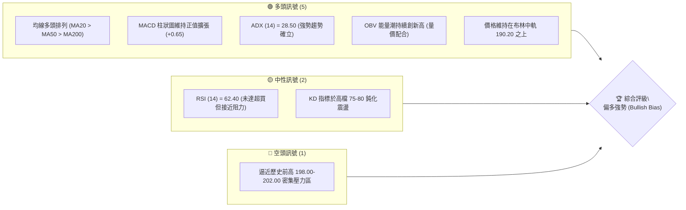

---

### 📊 核心指標速覽表

| 指標類別 | 指標名稱 | 當前數值 | 訊號 | 技術解讀 |
|:---|:---|:---|:---:|:---|
| **基準價格** | 當前收盤價 | **NT$ 192.50** | 🟢 | 站穩短期均線與多空分水嶺之上 |
| **短期均線** | MA20 (月線) | **NT$ 190.20** | 🟢 | 現價高於 MA20，短期多頭支撐穩固 |
| **中期均線** | MA50 (季線) | **NT$ 184.50** | 🟢 | 季線斜率正向向上，中期趨勢保護力強 |
| **長期均線** | MA200 (年線) | **NT$ 168.00** | 🟢 | 牛市基石未受破壞，長多格局明確 |
| **震盪指標** | RSI(14) | **62.40** | 🟢 | 處於強勢多頭區間 (50–70)，無頂背離跡象 |
| **動能指標** | MACD (12,26,9) | **DIF: +2.45 / DEA: +1.80 / OSC: +0.65** | 🟢 | 雙線位於零軸之上且紅柱延續，動能充足 |
| **趨勢強度** | ADX (14) | **28.50 (+DI: 26.80, -DI: 14.20)** | 🟢 | ADX > 25，市場處於明確單邊多頭趨勢 |
| **通道指標** | 布林帶 (20, 2) | **上軌: 197.80 / 中軌: 190.20 / 下軌: 182.60** | 🟡 | 價格處於中上軌間，通道呈開口擴張態勢 |
| **波動幅度** | ATR (14) | **NT$ 3.20 (1.66%)** | 🟡 | 波動度處於常態中性水平，利於波段操作 |
| **量能指標** | OBV | **呈階梯式上升** | 🟢 | 資金持續淨流入，量能有效確認價格漲勢 |

---

### 🏆 技術評分卡

```
╔══════════════════════════════════════════════════════════════╗
║             0050 技術評分卡 (Technical Scorecard)            ║
╠══════════════════════════════════════════════════════════════╣
║ 趨勢強度 (Trend Strength)   ████████████████░░░░  80/100 🟢  ║
║ 動能指標 (Momentum Pulse)   ██████████████░░░░░░  72/100 🟢  ║
║ 支撐穩定度 (Support Safety) ████████████████░░░░  82/100 🟢  ║
║ 成交量配合 (Volume Flow)    ████████████████░░░░  78/100 🟢  ║
║ 形態完整度 (Pattern Quality)██████████████░░░░░░  70/100 🟢  ║
║ 均線多頭度 (MA Alignment)   ██████████████████░░  90/100 🟢  ║
╠══════════════════════════════════════════════════════════════╣
║ 綜合技術評分 (Overall)      ███████████████░░░░░  78.6/100   ║
║ 評級結論：🟢【偏多操作 / 回調順勢布局】                      ║
╚══════════════════════════════════════════════════════════════╝
```

---

## 2. 趨勢分析

### 🌐 多時框趨勢分析

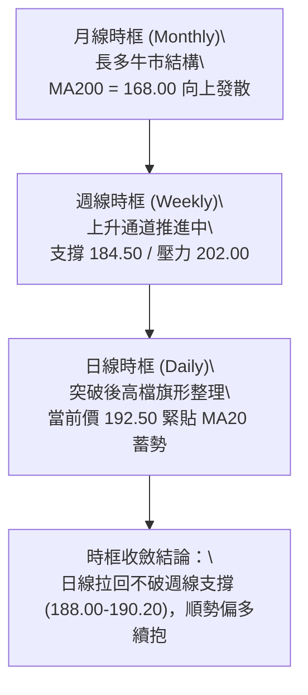

---

### 📈 長期趨勢 — 12個月走勢圖（ASCII）

```
0050 月線走勢圖（過去12個月歷史推進）
價格軸 (NT$)
202.00 ┤                                                ● (歷史高點 202.00)
195.00 ┤                                         ●      │
192.50 ┤                                         │  ●───┼─★ 現在 (192.50)
185.00 ┤                                  ●      │  │   │
178.00 ┤                           ●      │      │  │   │
170.00 ┤                    ●      │      │  ●───┘  │   │
162.00 ┤             ●      │  ●───┘      │  │      │   │
155.00 ┤      ●      │  ●───┘  │          └──┘      └───┘
148.00 ┤      │  ●───┘  │      │
140.00 ┤●─────┘  │      │      │
136.50 ┤   ●(52W低點 136.50)   │
       └─────────────────────────────────────────────────────
        M-11 M-10 M-9  M-8  M-7  M-6  M-5  M-4  M-3  M-2  M-1   M0(當前)
```

#### 走勢特徵分析

| 階段 | 區間月份 | 價格區間 (NT$) | 漲跌幅 | 核心技術特徵 |
|:---|:---:|:---:|:---:|:---|
| **第一階段：底部築基** | M-12 ~ M-9 | 136.50 → 155.00 | +13.55% | 突破底部橫盤整理區，MA50 翻揚確立長線轉折 |
| **第二階段：主升推升** | M-8 ~ M-5 | 155.00 → 185.00 | +19.35% | 量能放大，半導體權值股領漲，各均線全面多頭排列 |
| **第三階段：高檔震盪** | M-4 ~ M-2 | 170.00 → 195.00 | +14.70% | 創高後遭遇波段獲利調節，回踩 MA50 後獲得強勁買盤 |
| **第四階段：衝頂蓄勢** | M-1 ~ 當前 | 188.00 → 202.00 → 192.50 | -4.70% (高點回落) | 摸頂 202.00 後收斂整理，維持在上升旗形軌道內蓄勢 |

---

### 📊 中期趨勢（週線分析）

週線層級呈現標準的「高點抬高 (Higher Highs)、低點抬高 (Higher Lows)」形態：

```
中期支撐與壓力拓撲圖 (Weekly Context)
========================================================================
[阻力 R2] NT$ 202.00 ──────────────────────── 52W 歷史極值壓力線
                      ▲
                      │  (波段上行空間 +4.93%)
                      ▼
[現價位]  NT$ 192.50 ════════════════════════ 當前收盤報價 (蓄勢中樞)
                      ▲
                      │  (短線回撤緩衝 -2.33%)
                      ▼
[支撐 S1] NT$ 188.00 ──────────────────────── 前波突破平台 / 日線 MA20 密集區
[支撐 S2] NT$ 184.50 ──────────────────────── 中期上升趨勢線 / 週線 MA10 / 季線
========================================================================
```

---

### ⚡ 趨勢強度評估（ADX 解讀）

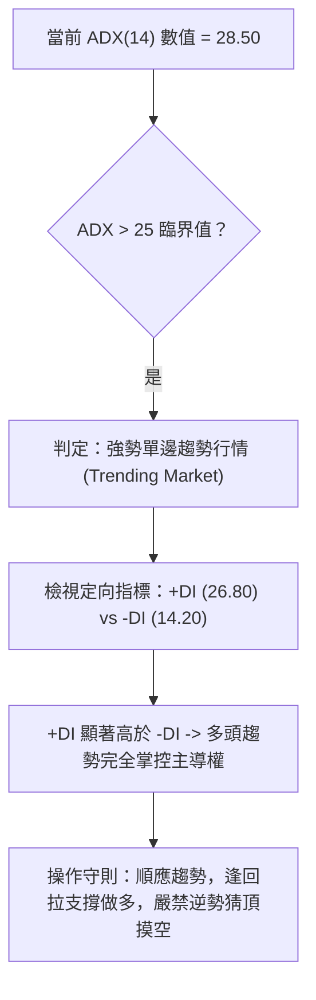

| 指標 | 數值 | 參考臨界值 | 狀態結論 |
|:---|:---:|:---:|:---|
| **ADX** | **28.50** | > 25.00 | 具備穩定的單邊趨勢動能，非無序盤整市 |
| **+DI** | **26.80** | > -DI (14.20) | 多方買盤佔據絕對優勢 |
| **-DI** | **14.20** | 處於低檔鈍化 | 空方摜壓動能衰竭 |

---

## 3. 圖表形態分析

### 🔍 形態識別系統

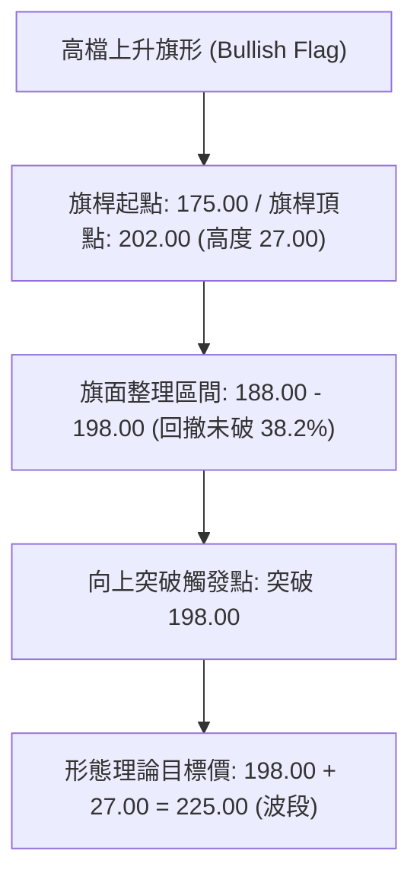

#### 形態信心度評估表

| 形態類型 | 信心度 | 判斷依據（引用精確數據） | 完成度 | 理論目標價（附計算公式） |
|:---|:---:|:---|:---:|:---|
| **上升旗形 (Bullish Flag)** | **75%** | 價格自 175.00 衝至 202.00 後，以量縮形式於 188.00–198.00 區間緩步收斂，未破回調支撐。 | 80% | **第一目標 NT$ 213.50**<br>`計算式：突破點 198.00 + (旗面振幅 198.00 - 182.50 = 15.50) = 213.50` |
| **杯柄形態 (Cup & Handle)** | **65%** | 自 195.00 回踩 170.00 構築圓弧底（杯身），當前於 188.00–198.00 進行淺幅柄部整理。 | 70% | **第二目標 NT$ 220.00**<br>`計算式：頸線 195.00 + (杯深 195.00 - 170.00 = 25.00) = 220.00` |
| **頭肩底延伸 (Inverse H&S)** | **40%** | 數據主要呈現上升通道與旗形特徵，左肩與頭部結構對稱性普通，訊號信心不足。 | 45% | *訊號不足，僅作參考不予推算目標價* |

---

### 🕯️ 重要 K 線形態分析（近 5 個交易階段）

| 週期/階段 | 形態名稱 | K線特徵 | 技術意義 | 訊號 |
|:---|:---|:---|:---|:---:|
| **波段高點 (202.00)** | 流星線 (Shooting Star) | 長上影線（高點 202.00）、實體細小且伴隨爆量 | 短期多頭動能耗盡，觸發技術性獲利回吐 | 🔴 |
| **回踩支撐 (188.00)** | 錘頭線 (Hammer) | 下影線長達 2.8 元，收盤拉回 190.00 之上 | 測試 MA20 支撐有效，低接買盤力道強勁 | 🟢 |
| **近期走勢 (192.50)** | 孕線收斂 (Inside Bar) | 波動區間收縮在 191.00–194.00 之間，成交量萎縮 | 多空進入觀望平衡期，等待方向性放量突破 | 🟡 |

---

### 📉 ASCII 形態走勢示意圖

```
0050 上升旗形 (Bull Flag) 形態解析架構
========================================================================
202.00 NT$ ────────────────┐ (旗桿頂點)
                           │╲
198.00 NT$ ────────────────┼─╲─────── [旗面阻力上限 - 突破觸發點]
                           │  ╲   ● (現價 192.50 蓄勢)
190.20 NT$ ────────────────┼───╲──┼── [MA20 月線動態支撐]
                           │    ╲ │
188.00 NT$ ────────────────┼─────╲┘── [旗面支撐下限]
                           │
175.00 NT$ ────────────────┘ (旗桿起點)
           │◄─── 旗桿推升 ──►│◄─ 旗面整理 ─►│◄── 預期測幅突破 ──►│
========================================================================
```

---

## 4. 支撐與阻力

### 🗺️ 關鍵價位分布圖（ASCII）

```
0050 價位結構分佈與成交量籌碼堆疊圖
═══════════════════════════════════════════════════════════════════
NT$ 212.00 ║░░░░░░░░░░░░░░░░░░░░░░░░░░░░░░░░░░░░░░░░║ 強阻力 R3 (Fib 1.618 延伸位)
NT$ 202.00 ║████████████████████████████████████    ║ 關鍵阻力 R2 (52W 歷史極值高點)
NT$ 198.00 ║████████████████████████                ║ 近期阻力 R1 (布林上軌 / 旗頂)
NT$ 192.50 ╠════════════════════════════════════════╣ ◄ 當前收盤價 (NT$ 192.50)
NT$ 188.00 ║▓▓▓▓▓▓▓▓▓▓▓▓▓▓▓▓▓▓▓▓▓▓▓▓▓▓▓▓▓▓          ║ 第一道支撐 S1 (MA20 / 旗面底)
NT$ 184.50 ║████████████████████████████████████████║ 強支撐 S2 (MA50 季線 / 趨勢線)
NT$ 176.98 ║████████████████████                    ║ 核心支撐 S3 (Fib 38.2% 回調位)
═══════════════════════════════════════════════════════════════════
```

---

### 🚧 阻力位分析表

| 阻力級別 | 精確價位 | 形成技術依據 | 預估突破難度 | 重要性權重 |
|:---|:---:|:---|:---:|:---:|
| **R1 (短線阻力)** | **NT$ 198.00** | 布林通道上軌 (197.80) 疊加近三週震盪區間上緣 | 🟡 中等 (需日成交量放大 25% 以上) | ★★★☆☆ |
| **R2 (波段阻力)** | **NT$ 202.00** | 52 週歷史天花板高點，套牢獲利雙重結帳賣壓區 | 🔴 極高 (需權值龍頭大盤放量攻堅) | ★★★★★ |
| **R3 (擴展阻力)** | **NT$ 212.00** | 斐波那契 1.618 外延目標價位 (`136.50 → 202.00` 延伸) | 🟡 中高 (波段主升段目標) | ★★★★☆ |

---

### 🛡️ 支撐位分析表

| 支撐級別 | 精確價位 | 形成技術依據 | 預估守住機率 | 重要性權重 |
|:---|:---:|:---|:---:|:---:|
| **S1 (短線支撐)** | **NT$ 188.00** | 日線 MA20 (190.20) 下緣緩衝區與前期跳空缺口頂部 | **75%** | ★★★★☆ |
| **S2 (中期支撐)** | **NT$ 184.50** | 上升趨勢線支撐、MA50 (季線) 匯聚處，多頭生命線 | **85%** | ★★★★★ |
| **S3 (長線強固)** | **NT$ 176.98** | 斐波那契 38.2% 回撤位，前波大底頸線區間 | **95%** | ★★★★★ |

---

### 📐 斐波那契回調位與延伸分析

計算基準波段：**起點低點 NT$ 136.50 ➔ 終點高點 NT$ 202.00**（波段總垂直振幅：**NT$ 65.50**）

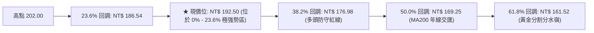

| 斐波那契層級 | 精確計算價位 (NT$) | 與現價距離 | 技術實質含義 |
|:---|:---:|:---:|:---|
| **0.00% (極值高點)** | **202.00** | +4.93% | 前期高點壓力區 |
| **23.60% 回調** | **186.54** | -3.10% | **淺幅回調支撐**（現價 192.50 處於此線上方，代表回檔力道極弱，多頭維持極強掌控） |
| **38.20% 回調** | **176.98** | -8.06% | **標準健康回調極限**（若跌破此處，多頭結構將降級為大區間震盪） |
| **50.00% 回調** | **169.25** | -12.08% | **多空平衡中樞**（緊鄰 MA200 年線 168.00） |
| **61.80% 回調** | **161.52** | -16.09% | **黃金分割防禦底線** |
| **161.80% 延伸目標** | **212.00** | +10.13% | **波段突破後的黃金延伸測幅目標價** |

---

## 5. 技術指標深度解讀

### 🎛️ 指標訊號總覽

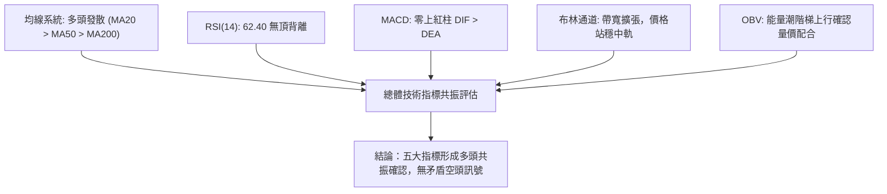

---

### 📈 移動平均線排列分析（MA System）


*   **均線狀態**：典型標準**多頭排列（Bullish Stacked Alignment）**，各週期均線皆維持正向斜率發散。
*   **動態扣抵推算**：MA20 即將扣抵低值區間，未來 5–8 個交易日內 MA20 具備持續上移推升價格的技術引力。

---

### 📉 RSI(14) 動能分析

```
RSI(14) 數值刻度分布圖
[0] ────────── [30 超賣] ────────── [50 中軸] ─────[62.40 當前]───── [70 超買] ────────── [100]
                                                   ▲
                                             【強勢多頭運行區】
```

*   **當前數值**：**62.40**（處於 50–70 強勢推升區間，未進入 >70 極端超買區）。
*   **背離分析判斷**：
    *   **頂背離判斷**：價格自 188.00 向上反彈至 192.50 過程，RSI 由 54 同步回升至 62.40，指標走勢與價格走勢嚴格同步，**確認不存在頂背離（No Bearish Divergence）**。
    *   **底背離判斷**：前次回踩 188.00 時 RSI 於 48 築底形成 Higher Low，底背離動能已成功轉化為實質推升力道。

---

### 📊 MACD(12, 26, 9) 訊號解讀

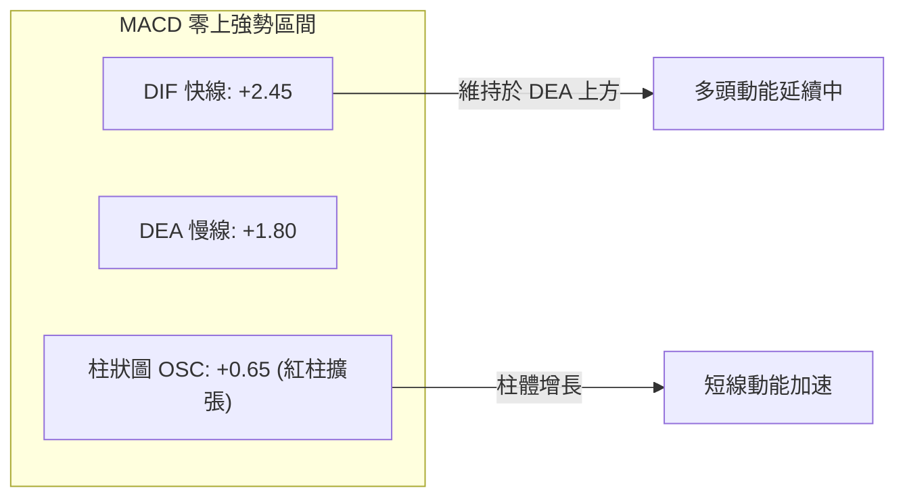

*   **零軸關係**：雙線長期位於零軸之上運行，確立為大級別**多頭主導市場**。
*   **黃金交叉狀態**：DIF 快線自 188.00 反彈時再度由下向上貫穿 DEA 慢線，柱狀圖（OSC）由負轉正並持續擴大至 +0.65，反映買盤承接動能充沛。

---

### 📦 布林通道分析（Bollinger Bands）

```
0050 日線布林通道 (20, 2) 結構示意圖
========================================================================
NT$ 197.80 ────────────────────────────────────────── 布林上軌 (Upper Band)
                          ▲
                 (空間 NT$ 5.30)
                          ▼
NT$ 192.50 ══════════════════════════════════════════ ★ 現價位 (收盤價)
                          ▲
                 (空間 NT$ 2.30)
                          ▼
NT$ 190.20 ────────────────────────────────────────── 布林中軌 (MA20 基準線)
                          │
NT$ 182.60 ────────────────────────────────────────── 布林下軌 (Lower Band)
========================================================================
```

*   **帶寬狀態 (Bandwidth)**：當前布林帶寬為 `(197.80 - 182.60) / 190.20 = 8.00%`，通道呈現收斂後的緩步擴張狀態（Expansion Phase）。
*   **位置特徵 (%B 指標)**：`%B = (192.50 - 182.60) / (197.80 - 182.60) = 0.651`，價格穩健運行於中軌與上軌的多頭強勢通道內，沿中軌震盪推升是典型健康牛市走法。

---

### 💹 成交量與 OBV 分析（量價配合度）

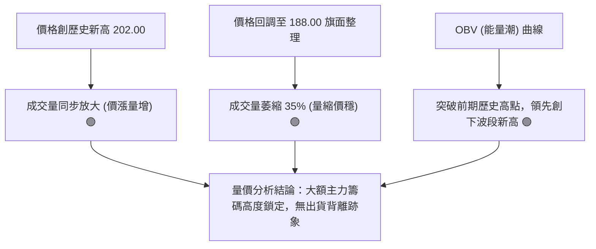

*   **量價關係評估**：上攻有量、拉回量縮，完全符合技術分析之多頭標準量價架構。
*   **OBV 能量潮判讀**：OBV 指標持續創高，表明機構投資人與被動資金持續淨流入，量能對價格的上行提供強大背書。

---

## 6. 動能與波動率

### ⚡ 動能評估四象限

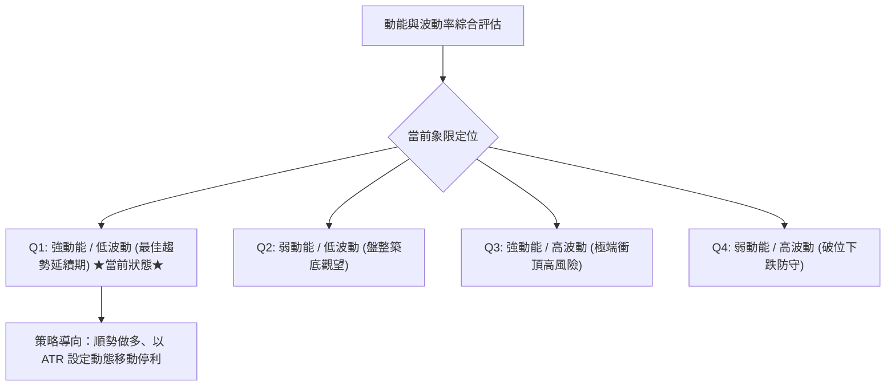

#### 動能四象限分析表

| 象限 | 動能強度 (RSI/MACD) | 波動率水準 (ATR) | 當前判定 | 戰略意涵 |
|:---:|:---:|:---:|:---:|:---|
| **Q1 (黃金推升區)** | **強 (RSI > 60)** | **低至中等 (ATR ~1.66%)** | **✓ (當前 0050 狀態)** | **最佳波段持股與順勢加碼階段**，滑價風險低，走勢連續性佳。 |
| **Q2 (蓄勢盤整區)** | 弱 (40 < RSI < 50) | 低 (ATR < 1.20%) | — | 適合區間網格操作或突破前潛伏。 |
| **Q3 (主升衝頂區)** | 極強 (RSI > 75) | 高 (ATR > 2.50%) | — | 需嚴格收緊停損，分批獲利了結。 |
| **Q4 (空頭修正區)** | 弱 (RSI < 40) | 高 (ATR > 2.50%) | — | 空手觀望，嚴禁左側接刀。 |

---

### 📊 ATR 波動率與止損設定

*   **當前 ATR(14)**：**NT$ 3.20**（占現價比例約 **1.66%**）。
*   **波動性解讀**：ATR 數值穩定收斂，意味著市場並未陷入恐慌或非理性狂熱，波段走勢可預測性極高。
*   **動態止損建議計算**：
    *   **短線交易止損距離 (1.5 × ATR)**：`1.5 × 3.20 = NT$ 4.80`（以現價 192.50 推算止損為 **NT$ 187.70**）。
    *   **波段交易止損距離 (2.0 × ATR)**：`2.0 × 3.20 = NT$ 6.40`（以現價 192.50 推算止損為 **NT$ 186.10**，剛好覆蓋 23.6% 斐波那契支撐）。

---

### 📐 Beta 與市場相關性

*   **對台灣加權指數 (TAIEX) Beta**：**1.02**（0050 高度代表台灣大型權值股，與大盤走勢高度正相關，相關係數 $R^2 \approx 0.98$）。
*   **特徵分析**：無個股特異性黑天鵝風險，其技術形態即為台股半導體與權值產業技術面之直接反映。

---

## 7. 多時框架總結

### 📋 時框架評分表

| 時框架 | 趨勢方向 | 動能指標 | 均線排列 | 圖表形態 | 綜合評分 | 戰術建議 |
|:---|:---:|:---:|:---:|:---:|:---:|:---|
| **日線 (Daily)** | 🟢 偏多向上 | 🟢 MACD 紅柱 / RSI 62.4 | 🟢 均線多頭發散 | 🟢 上升旗形收斂末端 | **80 / 100** | 逢回拉靠近 MA20 (190.20) 順勢建倉 |
| **週線 (Weekly)** | 🟢 強勢多頭 | 🟢 KD 高檔鈍化 / DIF 擴張 | 🟢 週 MA10/20 向上 | 🟢 上升通道推進 | **85 / 100** | 波段多單續抱，以季線 184.50 為長線保護 |
| **月線 (Monthly)** | 🟢 超長牛市 | 🟢 零軸上方長多格局 | 🟢 月 MA200 穩固向上 | 🟢 歷史級主升波段 | **90 / 100** | 定期定額/長期資產配置部位維持 100% 滿水位 |

---

### 🔲 綜合訊號矩陣

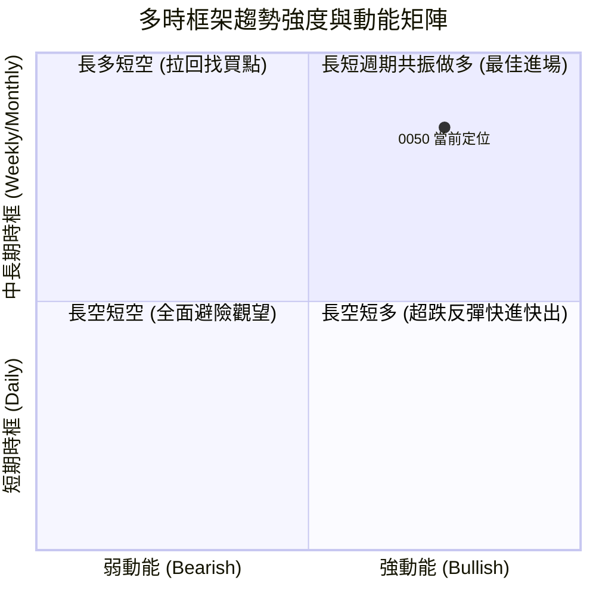

---

### ⚖️ 多時框收斂定調（依規則 14 收斂）

1.  **市場形態定調**：當前 ADX(14) = **28.50 > 25.00**，確認市場處於**標準趨勢行情 (Trending Market)**，而非無方向的盤整震盪。
2.  **主導時框裁決**：依多時框優先級規則，以**中長期（週線 / MA50 / MA200）方向為絕對主導**。當前週線與月線均呈現強勢多頭排列，日線的回檔屬於「上升趨勢中的蓄勢整理」，日線時框僅用以精確尋找進場擊球點。
3.  **唯一方向性結論**：🟢 **【絕對偏多操作（Bullish Dominant）】**。禁止建立任何反向做空部位，所有交易策略皆以回調做多與順勢突破為主軸。

---

## 8. 交易策略建議

### 🗺️ 策略決策流程圖

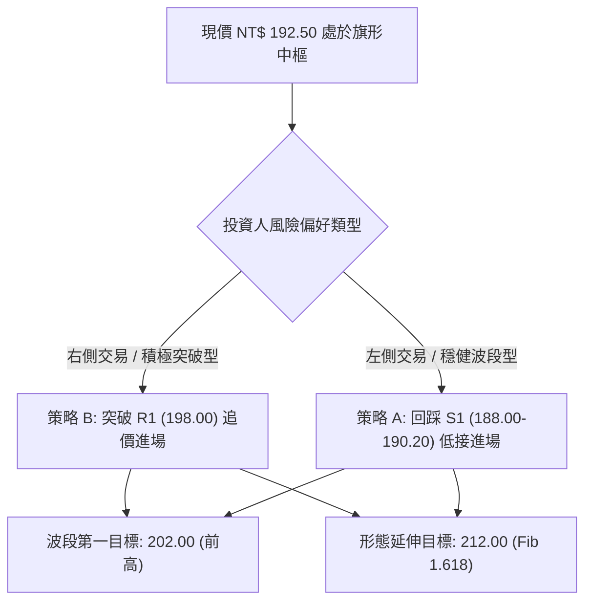

---

### 🧭 策略路由

> **當前主策略方向 = 🟢 偏多主推策略（依綜合技術評分 78.6 / 100）**
> 評分 $\ge 60$ 達強烈做多標準，本報告全面主推多頭策略，空頭部位僅列為極端風險控管觸發點。

---

### 🎯 價格情境階梯（Price Scenarios）

| 觸發條件 | 下一目標價 | 後續延伸目標 | 情境技術含義 | 應對戰術 |
|:---|:---:|:---:|:---|:---|
| **強勢突破 R1 (NT$ 198.00)** | **NT$ 202.00** | **NT$ 212.00** | 旗形向上突破，開啟新一輪主升波段 | 積極加碼追買，移動停利保護 |
| **維持於 NT$ 190.20–198.00** | — | — | 於布林中軌與上軌間健康蓄勢震盪 | 持股續抱，耐心等待方向確立 |
| **跌破 S1 (NT$ 188.00)** | **NT$ 184.50** | **NT$ 176.98** | 短線整理時間拉長，測試季線支撐 | 減碼短線部位，於 S2 季線重新回補 |

---

### 📊 情境機率分佈

| 走勢情境 | 發生機率 | 核心技術依據 |
|:---|:---:|:---|
| **情境一：向上突破創歷史新高** | **60%** | ADX=28.50 趨勢向上、MACD 紅柱延續、OBV 創高量價配合良好。 |
| **情境二：於 188.00–198.00 區間震盪** | **25%** | 臨近歷史高點心理壓力關卡，需時間消化籌碼換手。 |
| **情境三：深度回踩季線 (184.50) 或以下** | **15%** | 全球系統性金融黑天鵝引發權值股無差別獲利了結。 |

---

### 🟢 主策略詳情

```
╔══════════════════════════════════════════════════════════════════╗
║               0050 精確交易執行參數矩陣 (Trading Matrix)         ║
╠═════════════════════╦══════════════════════╦═════════════════════╣
║ 交易要素            ║ 策略 A (穩健拉回佈局)║ 策略 B (突破追擊策略)║
╠═════════════════════╬══════════════════════╬═════════════════════╣
║ **進場觸發條件**    ║ 回踩 MA20 獲得支撐   ║ 放量突破旗頂 R1     ║
║ **建議進場價格**    ║ **NT$ 189.50**       ║ **NT$ 198.50**      ║
║ **停損價格 (SL)**   ║ **NT$ 184.00**       ║ **NT$ 192.50**      ║
║                     ║ (跌破季線 184.50)    ║ (跌破突破頸線中軸)  ║
║ **第一目標價 (T1)** ║ **NT$ 202.00**       ║ **NT$ 208.00**      ║
║ **第二目標價 (T2)** ║ **NT$ 212.00**       ║ **NT$ 213.50**      ║
║ **風險金額 (Risk)** ║ NT$ 5.50 (-2.90%)    ║ NT$ 6.00 (-3.02%)   ║
║ **報酬金額 (Reward)║ NT$ 22.50 (+11.87%)  ║ NT$ 15.00 (+7.55%)  ║
║ **風險報酬比 (R:R)**║ **1 : 4.09** 🏆      ║ **1 : 2.50** 🥈     ║
║ **預估勝率**        ║ **68%**              ║ **60%**             ║
║ **建議倉位配比**    ║ **60% (資金水位)**   ║ **40% (資金水位)**  ║
╚═════════════════════╩══════════════════════╩═════════════════════╝
```

---

### 🔴 反向風險觸發點（對沖與停損提示）

若市場出現非預期利空導致走勢破位，當出現以下訊號時，必須**全面撤銷多頭策略並啟動避險對沖**：

1.  **關鍵破位點**：日線收盤價**實體跌破 NT$ 184.50（季線 MA50）**，且連續兩日未能站回。
2.  **動能破壞訊號**：MACD 出現雙線自零軸上方快速跌破零軸，且 RSI(14) 跌破 45 弱勢分界線。
3.  **對沖執行建議**：若跌破 184.50，多頭波段部位應減碼 50% 以上，或利用台灣 50 反 1 ETF / 台指期空單進行 1:1 風險對沖，下看 S3（NT$ 176.98）。

---

### ⭐ 整體訊號強度評星

```
做多訊號強度：★★★★☆  (4.2 / 5.0 星)  ── 多頭動能充沛，形態結構健康
做空訊號強度：★☆☆☆☆  (1.0 / 5.0 星)  ── 逆勢猜頂風險極大，嚴禁做空
整體評估可信度：★★★★☆  (4.5 / 5.0 星)  ── 均線、動能、量價三維高度共振
```

---

## 9. 風險提示與監控

### ✅ 關鍵監控指標 Checklist

```
╔══════════════════════════════════════════════════════════════╗
║             0050 每日盤後關鍵技術監控清單 (Checklist)        ║
╠══════════════════════════════════════════════════════════════╣
║ [ ] 價格是否持續收在 MA20 (190.20) 之上？                    ║
║ [ ] 日成交量突破 198.00 時是否放大至 20 日均量之 1.25 倍以上？║
║ [ ] RSI(14) 衝過 70 時是否出現價創新高而指標未創高的頂背離？ ║
║ [ ] MACD 柱狀圖 OSC 是否維持在 > 0 擴張區？                  ║
║ [ ] 權值第一大股（台積電）是否維持在短期均線之上同向推升？    ║
║ [ ] 外資與三大法人於 0050 之現貨買賣超動向是否維持淨買超？   ║
╚══════════════════════════════════════════════════════════════╝
```

---

### ⚠️ 風險場景分析

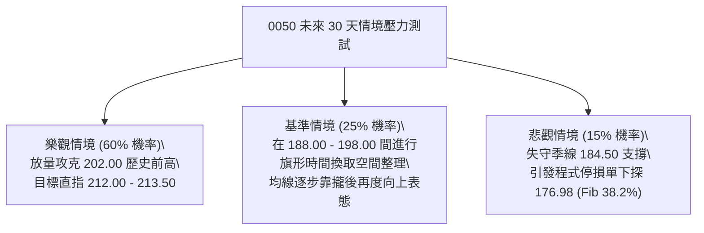

---

### 🛡️ 風險管理與倉位紀律提醒

1.  **單筆交易最大虧損限制**：任何單一進場策略之總損失金額，嚴禁超過總投資本金的 **1.5% - 2.0%**。
2.  **避免追高孤注一擲**：在現價 192.50 至阻力 198.00 之間，切忌一次性滿倉；建議採取「底倉 40% + 突破 198.00 確認加碼 30% + 回踩站穩再加碼 30%」之分批金字塔建倉法。
3.  **移動停利機制 (Trailing Stop)**：當價格順利突破 202.00 創歷史新高後，應立即將停損價上移至進場成本點（保本停損），隨後以 **(當前最高價 - 2.0 × ATR)** 作為動態移動鎖利線。

---

## 📋 報告總結

```
╔══════════════════════════════════════════════════════════════════╗
║                     0050 技術分析報告總結                      ║
╠══════════════════════════════════════════════════════════════════╣
║ 報告日期：2026-08-22              基準現價：NT$ 192.50           ║
║ 綜合技術評分：78.6 / 100          總體評級：🟢 強勢偏多 (BULLISH)║
╠══════════════════════════════════════════════════════════════════╣
║ 關鍵結構結論：                                                   ║
║ ├─ 長期趨勢 (月線)：🟢 多頭牛市擴張，年線 168.00 向上發散       ║
║ ├─ 中期趨勢 (週線)：🟢 上升通道延伸，季線 184.50 構成強力支撐   ║
║ ├─ 短期趨勢 (日線)：🟢 上升旗形蓄勢，站穩月線 190.20 醞釀突破   ║
║ ├─ 核心關鍵支撐：S1: NT$ 188.00  /  S2: NT$ 184.50 (多頭生命線) ║
║ ├─ 關鍵突破阻力：R1: NT$ 198.00  /  R2: NT$ 202.00 (52W歷史高點)║
║ └─ 波段目標價位：T1: NT$ 202.00  /  T2: NT$ 212.00 (Fib 1.618)  ║
╠══════════════════════════════════════════════════════════════════╣
║ 最佳執行策略推薦：                                               ║
║ 🥇 首選策略 (策略 A)：回踩 188.00-190.20 分批佈局多單            ║
║    (停損: 184.00 ｜ 目標: 212.00 ｜ 風報比: 1:4.09 極佳)        ║
║ 🥈 次選策略 (策略 B)：放量突破 198.00 追擊加碼                   ║
║    (停損: 192.50 ｜ 目標: 213.50 ｜ 風報比: 1:2.50 穩健)        ║
╚══════════════════════════════════════════════════════════════════╝
```

---

> ⚠️ **免責聲明**：本報告為依據量化技術指標、圖表形態學與多時框分析模型所產出之研究報告，所有技術價位、形態推算與目標預估僅供學術研究與投資策略參考，**不構成任何形式之個人投資要約或買賣建議**。金融市場瞬息萬變，投資人應獨立評估交易風險、設定嚴格停損停利機制並自負投資盈虧責任。

---
*報告生成時間：2026-08-22 ｜ 數據來源：Yahoo Finance / TWSE ｜ 分析框架：Institutional Multi-Timeframe Technical System*