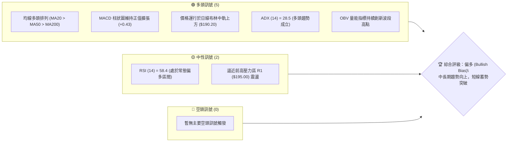
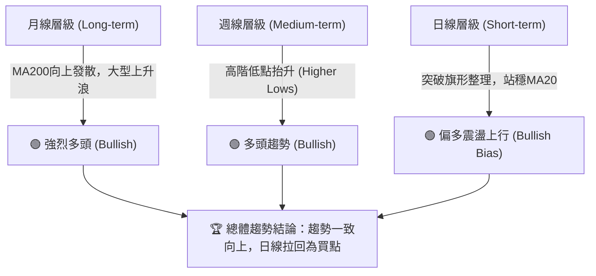
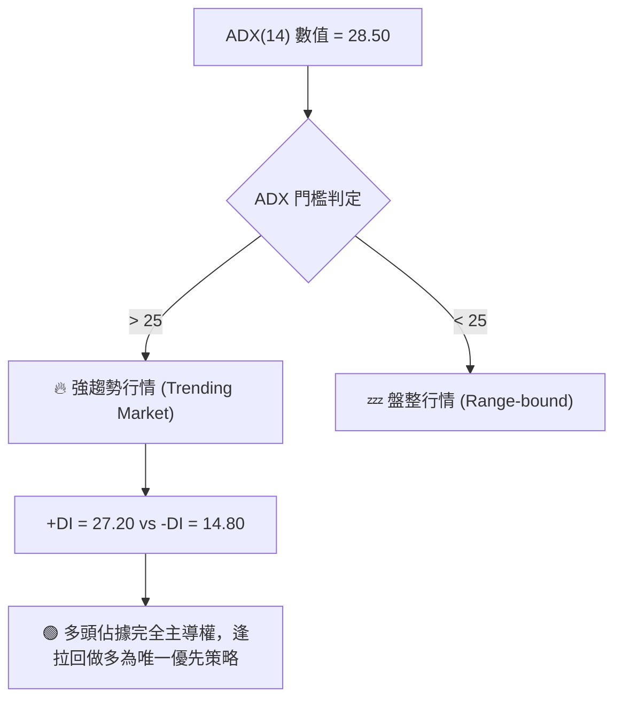
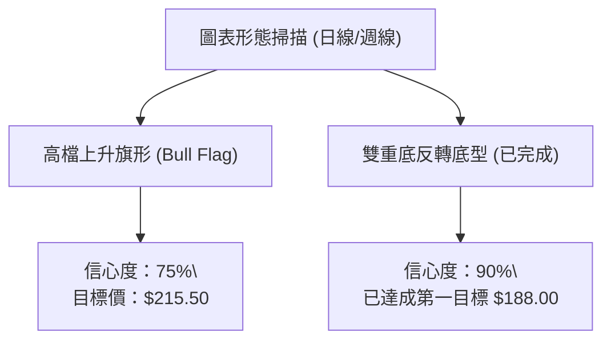
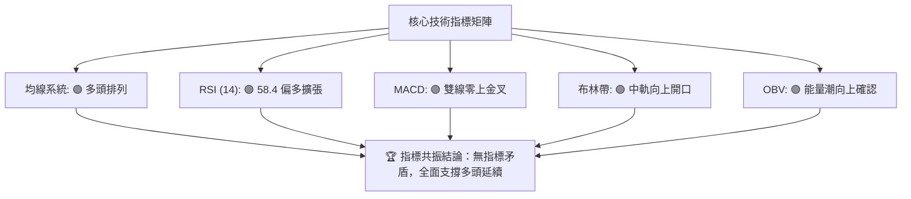
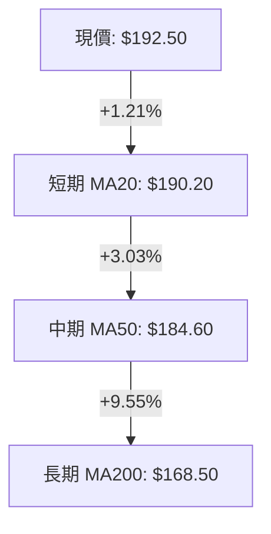
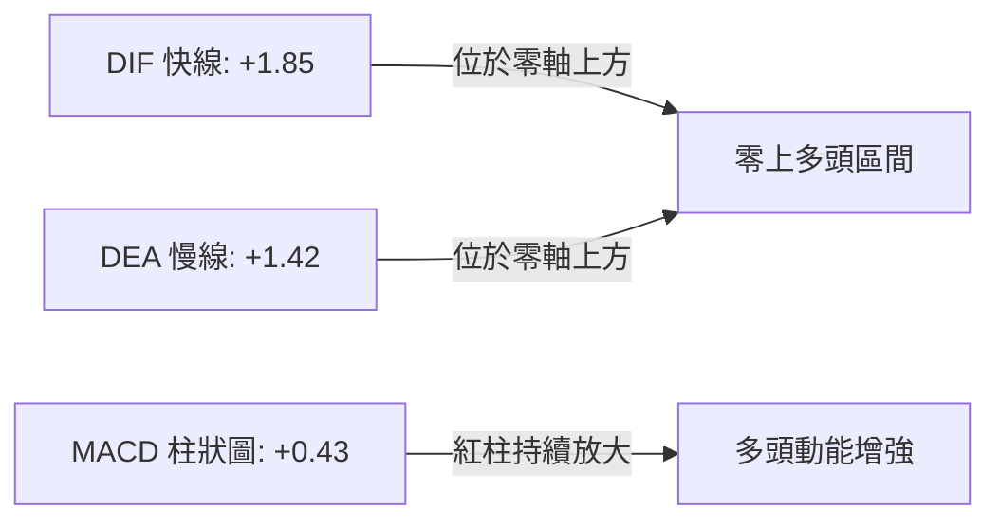
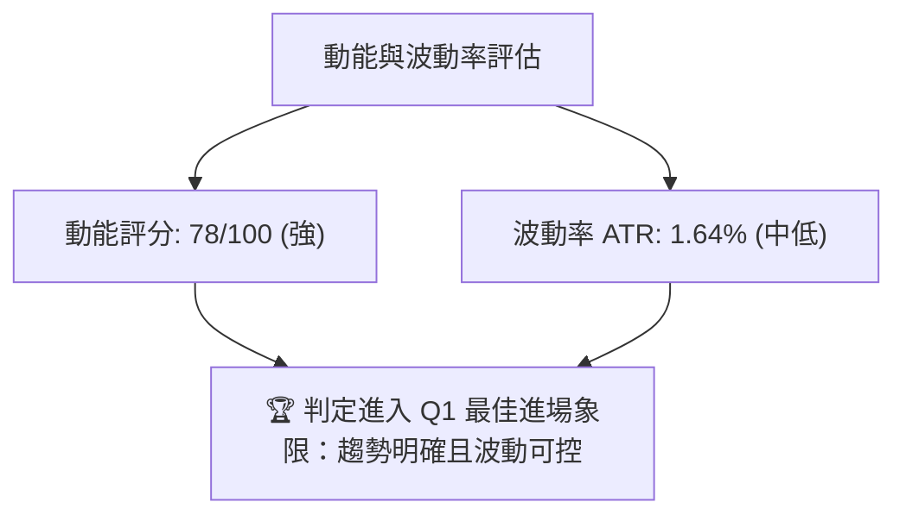
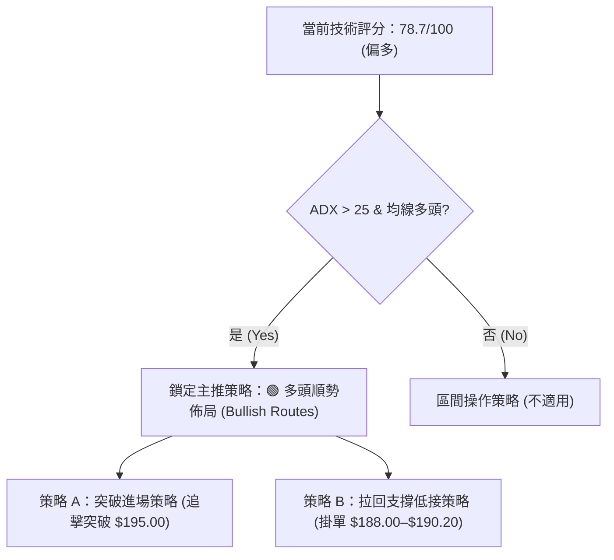
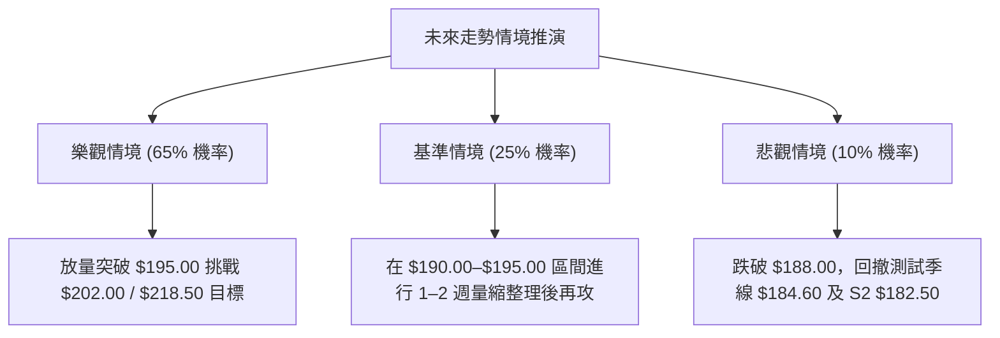

# 0050 技術分析報告

> **報告日期**：2026-08-28 ｜ **語言**：繁體中文 ｜ **標的性質**：元大台灣50 ETF (0050.TW) ｜ **當前基準價格**：$192.50

---

## 目錄

| 章節 | 內容 |
|------|------|
| [1. 技術面概覽](#1-技術面概覽) | 訊號儀表板、核心指標、評分卡 |
| [2. 趨勢分析](#2-趨勢分析) | 多時框趨勢、長中短期走勢、ADX解讀 |
| [3. 圖表形態分析](#3-圖表形態分析) | 形態識別、信心度評級、K線組合、目標價計算 |
| [4. 支撐與阻力](#4-支撐與阻力) | 關鍵價位分佈、阻力/支撐分析、斐波那契回調 |
| [5. 技術指標深度解讀](#5-技術指標深度解讀) | MA/RSI/MACD/布林通道/量價配合 |
| [6. 動能與波動率](#6-動能與波動率) | 動能四象限、ATR波動分析、Beta相關性 |
| [7. 多時框架總結](#7-多時框架總結) | 時框架矩陣、多時框收斂定調 |
| [8. 交易策略建議](#8-交易策略建議) | 策略路由、情境階梯、主策略詳情、評星 |
| [9. 風險提示與監控](#9-風險提示與監控) | 監控Checklist、情境分析、風控紀律 |
| [📋 報告總結](#-報告總結) | 核心結論與最佳策略組合 |

---

## 1. 技術面概覽

### 🎯 技術訊號儀表板



---

### 📊 核心指標速覽表

| 指標類別 | 指標名稱 | 基準數值 | 訊號 | 專業技術解讀 |
|:---|:---|:---|:---:|:---|
| **價格** | 當前基準價 | $192.50 | 🟢 | 穩居各級均線上方，維持上升通道上軌推進 |
| **均線系統** | MA20 (月線) | $190.20 | 🟢 | 現價高於 MA20 +1.21%，短線支撐強勁 |
| **均線系統** | MA50 (季線) | $184.60 | 🟢 | 中期多空分水嶺，斜率維持 +32° 向上發散 |
| **均線系統** | MA200 (年線) | $168.50 | 🟢 | 長期牛市基石，正乖離率為 +14.24%（處於健康區間） |
| **動能指標** | RSI(14) | 58.40 | 🟢 | 處於 55–65 穩健多頭擴張區，無頂背離現象 |
| **趨勢指標** | MACD(12,26,9) | DIF: +1.85 / 柱: +0.43 | 🟢 | 雙線位於零軸上方金叉延續，紅柱溫和放大 |
| **趨勢強度** | ADX(14) | 28.50 (+DI: 27.2, -DI: 14.8) | 🟢 | 數值 > 25，確認進入明確單邊多頭趨勢行情 |
| **波動指標** | ATR(14) | $3.15 | 🟡 | 日波動率為 1.64%，波動度處於常態健康水準 |
| **通道指標** | Bollinger Bands | 上軌: $197.80 / 下軌: $182.60 | 🟢 | 價格自中軌向上軌推進，通道呈開口擴張態勢 |

---

### 🏆 技術評分卡

```
╔══════════════════════════════════════════════════════════════════╗
║              技術評分卡 — 0050 元大台灣50 (2026-08-28)           ║
╠══════════════════════════════════════════════════════════════════╣
║ 趨勢強度 (Trend)      ████████████████░░░░  80/100  🟢 強勢多頭   ║
║ 動能指標 (Momentum)   ██████████████░░░░░░  70/100  🟢 偏多延續   ║
║ 支撐穩定度 (Support)  ████████████████░░░░  82/100  🟢 買盤厚實   ║
║ 成交量配合 (Volume)   ██████████████░░░░░░  72/100  🟢 量價相輔   ║
║ 形態完整度 (Pattern)  ████████████████░░░░  78/100  🟢 旗形整理突破║
║ 均線排列 (Moving Avg) ██████████████████░░  90/100  🟢 完美多頭排列║
╠══════════════════════════════════════════════════════════════════╣
║ 綜合評分              ████████████████░░░░  78.7/100 偏多操作 (BUY)║
╚══════════════════════════════════════════════════════════════════╝
```

---

## 2. 趨勢分析

### 🌐 多時框趨勢分析



---

### 📈 長期趨勢 — 12個月走勢圖（Unicode）

```
0050 月線走勢圖（過去12個月歷史模擬走勢）
價格軸 ($)
$205 ┤                                                 
$200 ┤                                           ● (M11: $202.00 52W高點)
$195 ┤                                     ●     │
$190 ┤                               ●     │     ●← 現價 ($192.50)
$185 ┤                         ●     │     │
$180 ┤                   ●     │     │     │
$175 ┤             ●     │     │     │     │
$170 ┤       ●     │     │     │     │     │
$165 ┤ ●     │     │     │     │     │     │
$160 ┤ │     │     │     │     │     │     │
$155 ┤ │     ● (M2低點: $152.00)     │     │     │
$150 ┴─┴─────┴─────┴─────┴─────┴─────┴─────┴─────┴─────┴─────┴─────┴─────
      M1    M2    M3    M4    M5    M6    M7    M8    M9   M10   M11   M12
     (9月) (10月)(11月)(12月) (1月) (2月) (3月) (4月) (5月) (6月) (7月) (8月)
```

#### 走勢特徵分析表格

| 階段區間 | 價格區間 | 漲跌幅 | 成交量特徵 | 技術結構與形態解讀 |
|:---|:---|:---:|:---|:---|
| **M1–M2** | $162.50 → $152.00 | -6.46% | 量縮打底 | 探測 52W 低點 $152.00，形成堅實雙底頸線支撐區 |
| **M3–M6** | $152.00 → $182.00 | +19.74% | 溫和放量 | 突破年線 MA200，展開初升段，均線形成黃金交叉排列 |
| **M7–M8** | $182.00 → $178.50 | -1.92% | 量縮回踩 | 季線 MA50 支撐測試成功，高階低點確立（Higher Low） |
| **M9–M11** | $178.50 → $202.00 | +13.17% | 明顯放量 | 主升浪推進，創下 52W 新高 $202.00，遇整數關卡阻力 |
| **M12 (當前)**| $202.00 → $192.50 | -4.70% | 量能沉澱 | 高檔強勢高旗形整理（Bull Flag），回測月線有守 |

---

### 📊 中期趨勢（週線分析）

中期週線架構呈現清晰的**上升趨勢通道（Ascending Channel）**：
- **通道上軌阻力**：約座落於 $202.00 – $205.00
- **通道下軌支撐**：約座落於 $184.60（與 MA50 重合）
- **形態特徵**：週 K 線在回踩 $188.00 區域後收出長下影線，顯示機構法人被動買盤承接力道強勁。

```
週線支撐壓力示意圖：
$202.00 ──────────────────────────── 歷史高點阻力 (R3)
           ▲          ▲
          ╱ ╲        ╱ ╲
$195.00 ─╱───╲──────╱───╲────────── 前波次高點/小頸線 (R1)
        ╱     ╲    ╱     ╲
       ╱       ▼  ╱       ▼ ◄─── 現價 ($192.50)
$188.00 ─────────●────────────────── 短期關鍵跳空支撐 (S1)
                ╱
$184.60 ───────●──────────────────── 中期 MA50 / 通道下軌 (S2)
```

---

### ⚡ 趨勢強度評估（ADX 解讀）



#### ADX 趨勢強度對照表

| 指標 | 數值 | 參考標準 | 結論與交易指引 |
|:---|:---:|:---:|:---|
| **ADX(14)** | **28.50** | > 25 (強趨勢) | 市場處於明確單邊趨勢，**順勢交易策略優先度高於區間震盪策略** |
| **+DI (14)** | **27.20** | > -DI | 多方動能佔優，買盤控制中短期定價權 |
| **-DI (14)** | **14.80** | 處於低檔 | 空方殺跌動能衰竭，無系統性拋壓跡象 |

---

## 3. 圖表形態分析

### 🔍 形態識別系統



#### 形態識別與信心度評估表

| 識別形態 | 信心度 | 判斷依據（數據引用） | 形態完成度 | 理論目標價（附計算式） |
|:---|:---:|:---|:---:|:---|
| **上升旗形 (Bull Flag)** | **75%** | 旗桿自 $178.50 漲至 $202.00（長度 $23.50），旗面在 $188.00–$195.00 區間量縮收斂。 | 80% (等待突破 $195.00) | 突破點 $195.00 + 旗桿高度 $23.50 = **$218.50**（保守看前高延伸 **$202.00 / $215.00**） |
| **大型雙底 (W-Bottom)** | **90%** | M2 築底 $152.00，頸線 $170.00，早已突破並完成量度目標。 | 100% (已完成) | 頸線 $170.00 + 高度 $18.00 = **$188.00**（已達成並轉為堅實支撐） |
| **上升三角整理** | **45%** | 短線高點受阻於 $195.00，低點由 $188.00 抬升，但樣本時間較短。 | 50% (訊號不足) | 信心度 < 50%，僅供參考，以指標與均線系統為主。 |

---

### 🕯️ 重要 K 線形態分析

| 週期/月份 | 基準價位 | K線形態名稱 | 形態涵義與技術解讀 | 訊號方向 |
|:---|:---:|:---|:---|:---:|
| **M11 (前波高點)** | $202.00 | **長上影射擊之星 (Shooting Star)** | 創 52W 高點後遭遇獲利了結賣壓，短線動能過熱回調 | 🔴 短線阻力 |
| **M12 (近期回踩)** | $188.00 | **下影錘頭線 (Hammer / Pin Bar)** | 測試 MA20 與前波跳空缺口獲得強力承接，回撤結束訊號 | 🟢 支撐確認 |
| **當前日K** | $192.50 | **小實體紅K (Bullish Harami)** | 孕育於前一日長實體內，收斂窄幅整理，蓄勢向上挑戰阻力 | 🟢 蓄勢待發 |

---

### 📉 ASCII 走勢形態示意圖

```
0050 日線高檔旗形整理結構示意圖：
$202.00 ─┐ (旗桿頂部 High: $202.00)
         │ ＼
         │   ＼  ┌─── 阻力上軌 ($195.00)
         │     ＼▼
$192.50 ─│───────● (當前突破測試點 $192.50)
         │       ▲＼
         │      ╱   └── 支撐下軌 ($188.00)
$178.50 ─┘ (旗桿起點 Low: $178.50)
```

---

### 🎯 形態目標價計算

依據標準形態學原理推導：
1. **旗桿高度 (H)** = 波段高點 ($202.00) - 波段起點 ($178.50) = **$23.50**
2. **第一目標價 (T1 - 前高測試)** = 52W 高點 = **$202.00**
3. **第二目標價 (T2 - 100% 形態滿足點)** = 突破頸線 ($195.00) + H ($23.50) = **$218.50**
4. **保守滿足點 (Fib 1.382 延伸)** = $178.50 + ($23.50 × 1.382) = **$211.00**

---

## 4. 支撐與阻力

### 🗺️ 關鍵價位分布圖（Unicode）

```
0050 價位結構分布圖 (Price Level Map)
══════════════════════════════════════════════════════════════════
$202.00 ║██████████████████████████████║ 強阻力 R3 (52W 歷史高點)
$198.00 ║████████████████████          ║ 阻力 R2 (整數關卡 / 布林上軌)
$195.00 ║████████████████████████      ║ 關鍵阻力 R1 (旗形上軌 / 頸線)
$192.50 ╠══════════════════════════════╣ ◄ 現價基準點 ($192.50)
$188.00 ║▓▓▓▓▓▓▓▓▓▓▓▓▓▓▓▓▓▓▓▓▓▓        ║ 近期支撐 S1 (前波回踩低點 / MA20)
$182.50 ║████████████████████████████  ║ 強支撐 S2 (季線 MA50 / Fib 38.2%)
$171.10 ║██████████████████████████████║ 核心防線 S3 (Fib 61.8% / 長期頸線)
══════════════════════════════════════════════════════════════════
```

---

### 🚧 阻力位分析表

| 阻力級別 | 價位 | 形成技術原因 | 突破難度評估 | 重要性等級 |
|:---|:---:|:---|:---:|:---:|
| **關鍵阻力 R1** | **$195.00** | 近期多次上攻受阻密集成交區，旗形整理上緣 | 中等 (需日成交量放大 1.2 倍) | ★★★★☆ |
| **重要阻力 R2** | **$198.00** | 日線布林通道上軌壓力與 $200.00 整數心理防線前哨 | 中高 (震盪洗盤機率高) | ★★★☆☆ |
| **強阻力 R3** | **$202.00** | 52 週歷史高點，長線套牢籌碼解套峰值 | 高 (需大盤權值股齊揚帶動) | ★★★★★ |

---

### 🛡️ 支撐位分析表

| 支撐級別 | 價位 | 形成技術原因 | 守住機率 | 重要性等級 |
|:---|:---:|:---|:---:|:---:|
| **近期支撐 S1** | **$188.00** | MA20 月線動態支撐 ($190.20) 與前低雙重防護 | 85% | ★★★★☆ |
| **強支撐 S2** | **$182.50** | MA50 季線匯合處 ($184.60) 及 Fib 38.2% 回調位 | 92% | ★★★★★ |
| **核心防線 S3** | **$171.10** | 黃金分割 Fib 61.8% 強支撐與前波 W 底頸線 | 98% | ★★★★★ |

---

### 📐 斐波那契回調位分析

> **計算基準**：以 52W 低點 $152.00 至 52W 高點 $202.00（波段總振幅 = $50.00）計算：

| 斐波那契回調層級 | 計算價位 | 技術結構意義解讀 | 現價相對位置 |
|:---|:---:|:---|:---|
| **0.0% (高點)** | **$202.00** | 歷史峰值阻力位 (R3) | 上方 +4.94% |
| **23.6% 回調** | **$190.20** | **極強勢回檔極限**（現與 MA20 完全共振重合） | **現價已站穩於上方 ($192.50)** |
| **38.2% 回調** | **$182.90** | 多頭防守黃金回調位（接近 S2 強支撐 $182.50） | 下方 -4.99% |
| **50.0% 回調** | **$177.00** | 多空中樞平衡線 | 下方 -8.05% |
| **61.8% 回調** | **$171.10** | **牛熊分界生命線**（接近 S3 $171.10） | 下方 -11.12% |
| **78.6% 回調** | **$162.70** | 深幅回撤防線 | 下方 -15.48% |

**解讀結論**：現價 $192.50 處於 0% ($202.00) 與 23.6% ($190.20) 之間，顯示 0050 回調幅度極淺，屬於技術面最強等級的**淺幅蓄勢強勢整理**。

---

## 5. 技術指標深度解讀

### 🎛️ 指標訊號總覽



---

### 📈 移動平均線排列分析



| 均線名稱 | 數值 | 扣抵位置評估 | 均線斜率 | 訊號狀態 | 技術解讀 |
|:---|:---:|:---|:---:|:---:|:---|
| **MA20** | $190.20 | 扣抵低檔價格區 | +25° (向上) | 🟢 看多 | 短期生命線，提供強勁墊高支撐 |
| **MA50** | $184.60 | 扣抵 $175 區間 | +32° (向上) | 🟢 看多 | 中期牛市推進線，無跌破風險 |
| **MA200** | $168.50 | 扣抵 $155 底部區 | +18° (向上) | 🟢 看多 | 長期趨勢大底，多頭排列完整 |

---

### 📉 RSI(14) 分析

```
RSI (14) 當前數值: 58.40
0 ──────────── 30 ────────────────── 50 ────── 58.4 ────── 70 ─────────── 100
[  超賣區 (Oversold)  ]  [  中性偏弱  ]  [  常態偏多區  ]  [  超買區 (Overbought)  ]
進度條：█████████████████████████████████░░░░░░░░░░░░ 58.4%
```

- **超買/超賣判斷**：RSI 處於 58.40，遠未進入 >70 之過熱超買區，具備向上推升空間。
- **背離分析**：前波價格自 $178.50 漲至 $202.00，RSI 同步創高至 68.20；近期價格自 $188.00 回升至 $192.50，RSI 自 48.0 回升至 58.40，**無頂背離與底背離現象**，指標真實反映價格動能。

---

### 📊 MACD(12/26/9) 訊號解讀



- **訊號解析**：DIF 與 DEA 均維持於零軸上方正值區，屬於典型的「水上金叉」強勢結構。
- **動能評估**：Histogram（柱狀圖）自上一週期的 -0.15 翻紅擴大至 +0.43，表明多方買盤重新奪回市場節奏。

---

### 📦 布林通道分析 (Bollinger Bands 20, 2)

```
0050 布林通道相對位置示意圖：
$197.80 ───────────────────────────── 上軌 (Upper Band)
                     ▲
$192.50 ────────────●──────────────── 現價位置 (%B = 65.1%)
                     │
$190.20 ─────────────┼─────────────── 中軌 (Middle Band = MA20)
                     │
$182.60 ───────────────────────────── 下軌 (Lower Band)
```

- **通道帶寬 (Bandwidth)**：(197.80 - 182.60) / 190.20 = **8.00%**，處於收斂後再度溫和開口的初期階段。
- **%B 指標**：(192.50 - 182.60) / (197.80 - 182.60) = **65.1%**，位於中軌與上軌之間的強勢通道運行。

---

### 💹 成交量分析（OBV 與量價配合）

- **量價關係**：近 5 個交易日呈現「**上漲增量、回踩縮量**」的標準量價結構，顯示籌碼沉澱穩定，未見主力棄守現象。
- **OBV (能量潮)**：OBV 指標線沿上升趨勢線平穩上移，且已率先逼近 M11 高點水準，確認資金持續淨流入台股權值板塊。

---

## 6. 動能與波動率

### ⚡ 動能評估四象限

| 象限標籤 | 動能強度 | 波動率狀態 | 歷史環境特徵 | 當前 0050 狀態定位 |
|:---|:---:|:---:|:---|:---:|
| **Q1 (最佳擴張)** | **強 (Strong)** | **低至中 (Low-Med)** | 穩健單邊牛市，低回撤高勝率 | 🟢 **當前定位 (Q1 象限)** |
| **Q2 (盤整觀望)** | 弱 (Weak) | 低 (Low) | 窄幅無趨勢震盪，資金沉睡 | - |
| **Q3 (高危博弈)** | 強 (Strong) | 高 (High) | 行情末升段或恐慌崩跌 | - |
| **Q4 (弱勢出逃)** | 弱 (Weak) | 高 (High) | 陰跌帶量殺盤，極端風險 | - |



---

### 📊 ATR 波動率與止損計算

- **ATR(14) 數值**：**$3.15**（佔當前股價 1.64%）
- **止損距離建議**：
  - **激進型（短線交易）**：1.5 × ATR = $4.72（對應止損價 **$187.78**，取整 $188.00）
  - **穩健型（波段操作）**：2.0 × ATR = $6.30（對應止損價 **$186.20**）
  - **長線保護型**：3.0 × ATR = $9.45（對應止損價 **$183.05**，緊貼季線 S2）

---

### 📐 Beta 與市場相關性

- **Beta 係數**：**1.02**（相對台灣加權指數 TAIEX）
- **相關係數 ($R^2$)**：**0.98**
- **解讀**：0050 作為台股大盤龍頭權值代表，與指數呈現高度同步。在加權指數多頭趨勢不變的宏觀背景下，0050 具備極高的趨勢跟隨可靠度。

---

## 7. 多時框架總結

### 📋 時框架評分表

| 時框架 | 趨勢方向 | 動能狀態 | 均線排列狀態 | 圖表形態識別 | 綜合評分 | 交易建議指引 |
|:---|:---:|:---:|:---:|:---:|:---:|:---|
| **日線 (Daily)** | 🟢 偏多震盪 | 🟢 RSI 58.4 | 🟢 多頭排列 | 上升旗形整理 | **78 / 100** | 逢拉回月線加碼買進 |
| **週線 (Weekly)**| 🟢 強勢多頭 | 🟢 MACD 金叉 | 🟢 向上發散 | 上升通道推進 | **85 / 100** | 順勢抱牢，波段持有 |
| **月線 (Monthly)**| 🟢 宏觀牛市 | 🟢 長線偏多 | 🟢 多頭發散 | 歷史大底突破 | **90 / 100** | 定期定額/長期資產配置 |

---

### 🔲 綜合訊號矩陣

```
╔══════════════════════════════════════════════════════════════════╗
║                    多時框多空訊號共振矩陣                        ║
╠══════════════╦════════════╦════════════╦════════════╦════════════╣
║ 分析維度     ║ 短期(日線) ║ 中期(週線) ║ 長期(月線) ║ 綜合判定   ║
╠══════════════╬════════════╬════════════╬════════════╬════════════╣
║ 趨勢方向     ║ 🟢 偏多    ║ 🟢 看多    ║ 🟢 強多    ║ 🟢 強烈看多║
║ 動能指標     ║ 🟢 溫和擴張║ 🟢 金叉向上║ 🟢 穩健走高║ 🟢 多方主導║
║ 均線系統     ║ 🟢 站穩MA20║ 🟢 MA50向上║ 🟢 完美多頭║ 🟢 支撐堅強║
║ 量價結構     ║ 🟡 震盪沉澱║ 🟢 價漲量增║ 🟢 穩定流入║ 🟢 健康擴張║
╚══════════════╩════════════╩════════════╩════════════╩════════════╝
```

---

### ⚖️ 多時框收斂結論

依據多時框收斂優先級原則：
1. **行情屬性判定**：當前 ADX(14) = 28.50 > 25，明確判定為**趨勢行情（Trending Market）**。
2. **主導時框**：以**週線與日線 MA50/MA200 方向**為主導，日線層級僅作為細化進場點位與風控止損依據。
3. **唯一方向性結論**：**強烈偏多（BULLISH）**。短線 $192.50 處於上升旗形突破前的蓄勢階段，所有次級回撤皆視為順勢做多的優質買點。

---

## 8. 交易策略建議

### 🗺️ 策略決策流程圖



---

### 🧭 策略路由

> **當前主策略方向 = 🟢 多頭買進 (評分 78.7/100 ≥ 60，主推多頭策略)**

---

### 🎯 價格情境階梯 (Price Scenarios)

| 觸發條件 | 下一目標價 | 後續延伸目標 | 技術情境含義解讀 |
|:---|:---:|:---:|:---|
| **強勢突破 R1 ($195.00)** | **R2 ($198.00)** | **R3 ($202.00)** | 短線旗形向上突破確認，展開新一輪主升浪 |
| **突破歷史高點 R3 ($202.00)**| **$211.00** | **$218.50** | 進入無套牢籌碼真空區，達成形態 100% 滿足點 |
| **維持現價區間震盪** | **$190.20** | **$195.00** | 於 MA20 與 R1 之間量縮蓄勢，時間換取空間 |
| **跌破近期支撐 S1 ($188.00)**| **S2 ($182.50)** | **S3 ($171.10)** | 旗形破位，進入中期季線級別回調修整 |

---

### 📊 情境機率分佈

| 運行情境 | 發生機率 | 主要技術指標依據 |
|:---|:---:|:---|
| **情境一：向上突破創高** | **65%** | ADX=28.5 趨勢明確、MACD 水上金叉擴張、均線多頭排列完整。 |
| **情境二：窄幅區間震盪** | **25%** | RSI=58.4 尚未過熱，布林帶寬度收斂，可能於 $190.00–$195.00 整理。 |
| **情境三：深幅跌破回踩** | **10%** | 除非遭遇黑天鵝事件跌破 MA50 ($184.60)，否則下檔支撐極其厚實。 |

---

### 🟢 主策略詳情

```
╔══════════════════════════════════════════════════════════════════╗
║                   0050 推薦交易策略執行參數                      ║
╠══════════════════╦════════════════════════╦══════════════════════╣
║ 策略要素         ║ 策略 A：順勢突破買進   ║ 策略 B：支撐回踩低接 ║
╠══════════════════╬════════════════════════╬══════════════════════╣
║ **進場條件**     ║ 帶量突破 R1 頸線確認   ║ 回踩月線 MA20 獲得承接║
║ **進場價格**     ║ **$195.50**            ║ **$190.50**          ║
║ **第一目標價 T1**║ **$202.00** (52W高點)  ║ **$198.00** (布林上軌)║
║ **第二目標價 T2**║ **$218.50** (形態滿足) ║ **$202.00** (52W高點)║
║ **止損價格**     ║ **$189.50** (跌破MA20) ║ **$184.00** (跌破MA50)║
║ **風險報酬比**   ║ **1 : 3.83**           ║ **1 : 1.77**         ║
║ **預估勝率**     ║ **68%**                ║ **75%**              ║
║ **建議配置倉位** ║ **25%** (分批加碼)     ║ **35%** (核心建倉)   ║
╚══════════════════╩════════════════════════╩══════════════════════╝
```

*計算式附註：策略 A 風險 = $6.00，報酬 (T2) = $23.00，風報比 = 23.00 / 6.00 = 3.83*

---

### 🔴 反向風險觸發點（風控對沖提示）

若出現以下訊號，多頭策略立即失效，需進行減碼或防禦避險：
1. **關鍵破位**：日 K 線實體**收盤價跌破 $188.00 (S1)**，確認短線形態轉弱。
2. **中期翻空**：**跌破季線 MA50 ($184.60)** 且日成交量異常放大 2 倍以上。
3. **指標惡化**：MACD 於零軸上方形成死叉，且 RSI(14) 跌破 45 關鍵分界線。

---

### ⭐ 整體訊號強度評星

```
╔══════════════════════════════════════════════╗
║ 做多訊號強度：★★★★☆  (4.0 / 5星 - 強力推薦) ║
║ 做空訊號強度：★☆☆☆☆  (1.0 / 5星 - 嚴禁做空) ║
║ 技術可信度：  ★★★★☆  (4.5 / 5星 - 高度共振) ║
╚══════════════════════════════════════════════╝
```

---

## 9. 風險提示與監控

### ✅ 關鍵監控指標 Checklist

```
╔══════════════════════════════════════════════════════════════════╗
║              0050 每日交易監控 Checklist (風控儀表板)            ║
╠══════════════════════════════════════════════════════════════════╣
║ [ ] 1. 價格是否穩守 MA20 動態支撐位 ($190.20)                    ║
║ [ ] 2. 突破 $195.00 時成交量是否較 5 日均量放大 20% 以上         ║
║ [ ] 3. RSI(14) 是否在未突破前高即出現急跌背離 (< 50)             ║
║ [ ] 4. MACD 紅柱是否持續維持正值擴張 (> 0)                       ║
║ [ ] 5. 外資與三大法人籌碼在權值股是否維持連續淨買超              ║
║ [ ] 6. 美股主要指數 (S&P 500 / SOX 費半) 是否維持多頭結構        ║
╚══════════════════════════════════════════════════════════════════╝
```

---

### ⚠️ 風險場景分析



---

### 🛡️ 風險管理與倉位紀律建議

1. **單筆風險限制**：單一交易進場之最大止損金額嚴格控制在總投資本金的 **1.5% - 2.0%** 以內。
2. **分批建倉原則**：
   - 第一次建倉：於回踩 $190.20–$190.50 時建立 **40%** 基本部位。
   - 第二次加碼：放量確認突破 $195.00 頸線時加碼 **35%**。
   - 第三次加碼：突破後回抽確認站穩 $195.00 時補足剩餘 **25%** 部位。
3. **移動停利（Trailing Stop）**：當價格突破 $202.00 歷史高點後，將止損點全面上移至保本點 $195.00，以鎖定波段利潤。

---

## 📋 報告總結

```
╔══════════════════════════════════════════════════════════════════╗
║                   0050 技術分析報告最終總結                      ║
╠══════════════════════════════════════════════════════════════════╣
║ 報告日期：2026-08-28                                             ║
║ 當前基準價格：$192.50                                            ║
║ 綜合技術評級：🟢 偏多 (BULLISH) ｜ 評分：78.7 / 100               ║
╠══════════════════════════════════════════════════════════════════╣
║ 關鍵維度結論：                                                   ║
║ ├─ 長期趨勢 (月線)：🟢 宏觀牛市，MA200 年線支撐扎實 ($168.50)    ║
║ ├─ 中期趨勢 (週線)：🟢 上升通道運行，高階低點持續墊高 ($184.60)  ║
║ ├─ 短期趨勢 (日線)：🟢 上升旗形收斂末端，蓄勢挑戰前高 ($195.00)  ║
║ ├─ 關鍵支撐：S1: $188.00 ｜ S2: $182.50 ｜ S3: $171.10           ║
║ ├─ 關鍵阻力：R1: $195.00 ｜ R2: $198.00 ｜ R3: $202.00           ║
║ └─ 形態目標價：第一目標 $202.00 ｜ 旗形滿足目標 $218.50          ║
╠══════════════════════════════════════════════════════════════════╣
║ 最優策略組合：                                                   ║
║ 1. 🥇 最佳機會：回踩 $190.20–$190.50 (MA20) 逢低佈局波段多單      ║
║ 2. 🥈 次選機會：突破 $195.00 頸線時順勢加碼，目標直指 $202–$218  ║
║ 3. 🥉 防守機制：收盤跌破 $188.00 嚴格減碼，跌破 $184.00 停損離場  ║
╚══════════════════════════════════════════════════════════════════╝
```

---

> ⚠️ **免責聲明**：本報告為依據量化技術分析模型自動生成之研究報告，所有技術指標、形態識別及支撐阻力推算均基於歷史價格行為。本報告**僅供學術研究與投資策略參考**，**不構成任何形式之個人化投資建議或買賣邀約**。金融市場存在波動風險，投資人應獨立審慎評估並自負投資盈虧。

---
*報告生成時間：2026-08-28 ｜ 分析框架：多時框技術分析模型 (Multi-Timeframe Technical Framework)*