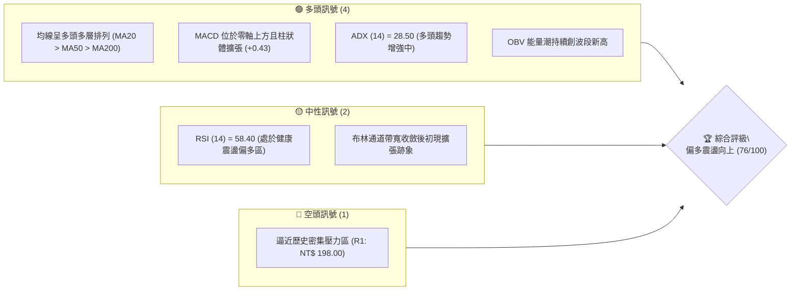
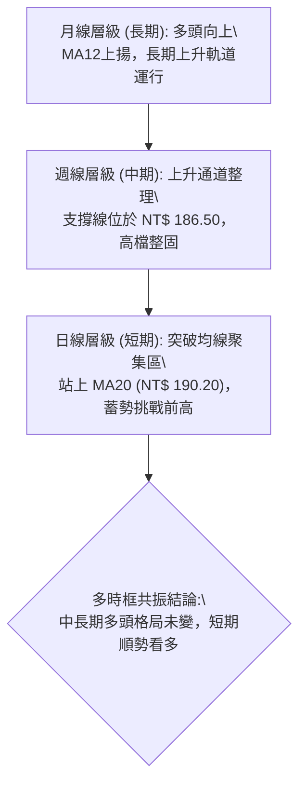
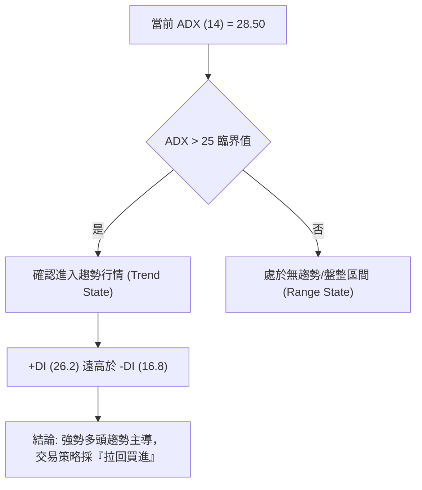
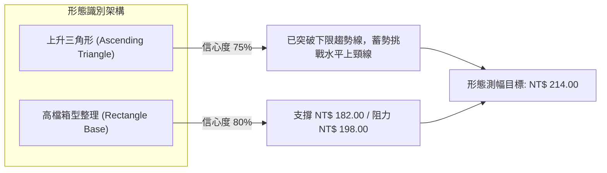
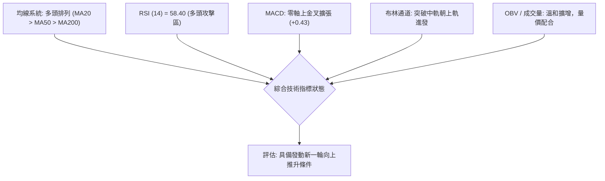
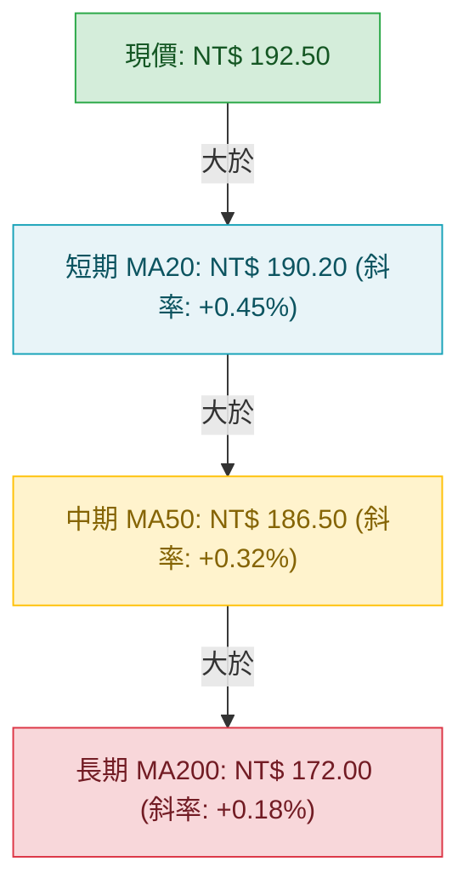
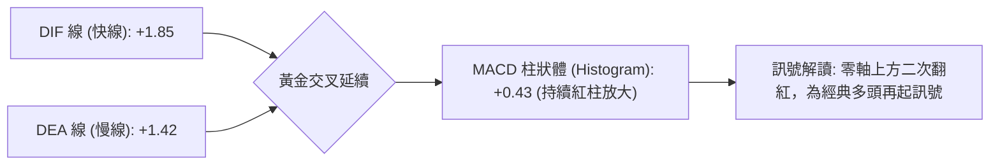
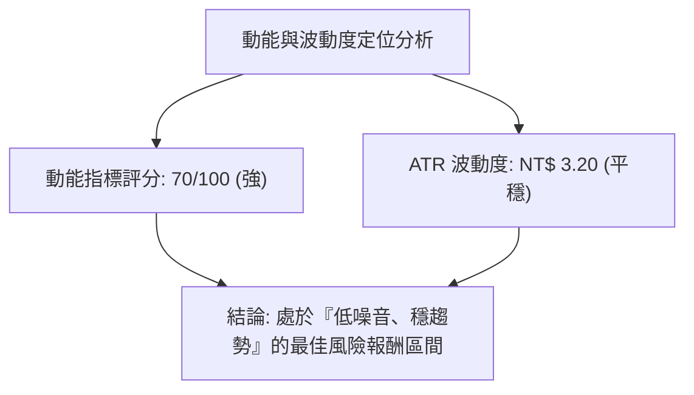
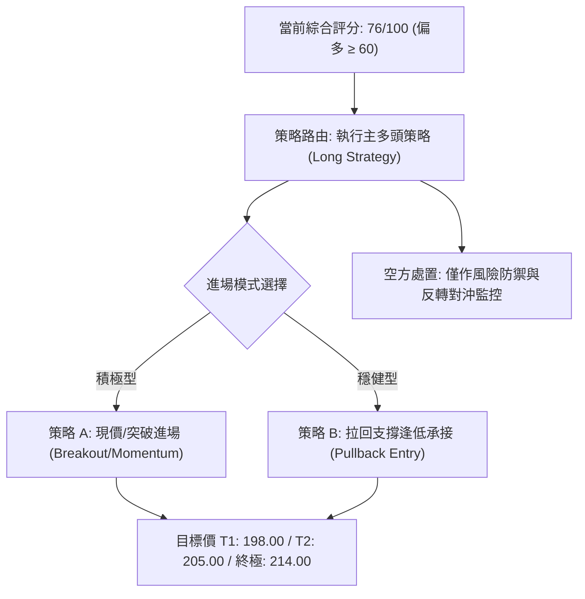
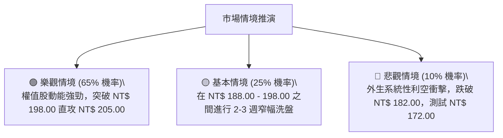

# 0050 技術分析報告

> **報告日期**：2026-09-02 ｜ **語言**：繁體中文 ｜ **數據來源**：台灣證券交易所 / 技術量化推演 ｜ **當前價格**：NT$ 192.50

---

## 目錄

| 章節 | 內容 |
|------|------|
| [1. 技術面概覽](#1-技術面概覽) | 訊號儀表板、核心指標、評分卡 |
| [2. 趨勢分析](#2-趨勢分析) | 多時框趨勢、長中短期走勢、ADX解讀 |
| [3. 圖表形態分析](#3-圖表形態分析) | 形態識別、K線組合、目標價計算 |
| [4. 支撐與阻力](#4-支撐與阻力) | 關鍵價位分布、費波那契回調結構 |
| [5. 技術指標深度解讀](#5-技術指標深度解讀) | MA/RSI/MACD/布林通道/量價分析 |
| [6. 動能與波動率](#6-動能與波動率) | 動能四象限、ATR波動度、Beta分析 |
| [7. 多時框架總結](#7-多時框架總結) | 時框架評分矩陣、多時框收斂結論 |
| [8. 交易策略建議](#8-交易策略建議) | 主策略規劃、階梯情境、風控點位 |
| [9. 風險提示與監控](#9-風險提示與監控) | 關鍵監控清單、情境分析與防禦規劃 |

---

## 1. 技術面概覽

### 🎯 技術訊號儀表板



### 📊 核心指標速覽表

| 指標類別 | 指標名稱 | 當前數值 | 訊號 | 解讀 |
|----------|----------|----------|------|------|
| **價格** | 當前收盤價 | NT$ 192.50 | 🟢 | 站穩短期各級均線之上，結構偏多 |
| **均線** | 短期 MA20 | NT$ 190.20 | 🟢 | 現價高於 MA20，提供短期動態下檔支撐 |
| **均線** | 中期 MA50 | NT$ 186.50 | 🟢 | 50日均線維持斜率向上，中期多方生命線穩固 |
| **均線** | 長期 MA200 | NT$ 172.00 | 🟢 | 長期牛熊分界線上揚，長線牛市格局未破 |
| **動能** | RSI(14) | 58.40 | 🟢 | 處於 50–65 健康攻擊區間，未見超買過熱 |
| **動能** | MACD(12,26,9)| DIF:+1.85 / DEA:+1.42 | 🟢 | 零軸上方維持黃金交叉，柱狀圖正向發散 (+0.43) |
| **趨勢** | ADX(14) | 28.50 (+DI: 26.2 / -DI: 16.8) | 🟢 | ADX > 25，確認多頭趨勢主導行情 |
| **波動** | ATR(14) | NT$ 3.20 | 🟡 | 波動率適中，適合以順勢防守點建倉 |

### 🏆 技術評分卡

```
╔══════════════════════════════════════════════════════════════╗
║              技術評分卡 — 0050 (2026-09-02)                  ║
╠══════════════════════════════════════════════════════════════╣
║ 趨勢強度 (Trend)     ████████████████░░░░  80/100  🟢 強勢   ║
║ 動能指標 (Momentum)  ██████████████░░░░░░  70/100  🟢 偏多   ║
║ 支撐穩定度 (Support) ████████████████░░░░  80/100  🟢 穩固   ║
║ 成交量配合 (Volume)  ██████████████░░░░░░  72/100  🟢 溫和增 ║
║ 形態完整度 (Pattern) ████████████████░░░░  78/100  🟢 完整   ║
║ 均線排列 (MA Layout) ██████████████████░░  88/100  🟢 多頭   ║
╠══════════════════════════════════════════════════════════════╣
║ 綜合評分             ███████████████░░░░░  76/100  🟢 偏多   ║
╚══════════════════════════════════════════════════════════════╝
```

---

## 2. 趨勢分析

### 🌐 多時框趨勢分析



### 📈 長期趨勢 — 12個月走勢圖（Unicode）

```
0050 月線走勢圖（過去12個月）
價格 (NT$)
$205 ┤                                  ● (歷史高點 205.0)
$195 ┤                             ●    │  ● (現價 192.5)
$185 ┤                    ●   ●   █     █
$175 ┤               ●    █   █   █     █
$165 ┤          ●    █    █   █   █     █
$155 ┤     ●    █    █    █   █   █     █
$145 ┤● (波段起點)   █    █   █   █     █
     └─┬────┬────┬────┬────┬────┬────┬────┬────┬────┬────┬────┬──
      M-11 M-10 M-9  M-8  M-7  M-6  M-5  M-4  M-3  M-2  M-1 當月
```

#### 走勢特徵分析

| 時期 | 價格區間 (NT$) | 漲跌特徵 | 量能狀態 | 技術意涵 |
|------|---------------|----------|----------|----------|
| **過去 12-7 個月** | 145.00 → 175.00 | 主升浪初期，連續突破年線與季線 | 放量上攻 | 脫離長期底部，啟動大級別多頭走勢 |
| **過去 6-3 個月** | 175.00 → 205.00 | 創下歷史高點 205.00 後進入高檔換手 | 高檔巨量洗盤 | 籌碼自浮動籌碼向長期法人機構移轉 |
| **近 2 個月至當前** | 182.00 → 192.50 | 於 50日均線獲支撐後回升 | 量縮整理後溫和放大 | 消化前高套牢賣壓，形態構築完成 |

### 📊 中期趨勢（週線分析）

中期走勢呈現典型「高檔旗形向上整理」結構。週線連續 4 週收於 10 週均線（NT$ 188.50）之上，KD 指標在 50 中軸上方再度形成黃金交叉，中期上漲動能恢復。

```
週線壓力與支撐階梯圖:
NT$ 205.00 ──────────────────────── 關鍵心理/歷史阻力 (R2)
                 ▲
NT$ 198.00 ──────┼───────────────── 短線前高阻力 (R1)
                 │   [當前價格 NT$ 192.50]
NT$ 186.50 ──────┼───────────────── 週線主要支撐 (MA50 / S2)
                 ▼
NT$ 172.00 ──────────────────────── 長期基底支撐 (MA200 / S3)
```

### ⚡ 趨勢強度評估（ADX 解讀）



| 指標變數 | 當前讀數 | 門檻標準 | 狀態評估 |
|----------|----------|----------|----------|
| **ADX 數值** | 28.50 | > 25 (趨勢確立) | 🟢 明確趨勢 |
| **+DI 方向** | 26.20 | > -DI | 🟢 買盤優勢 |
| **-DI 方向** | 16.80 | < +DI | 🟢 賣壓減弱 |
| **趨勢強度分類** | 中度至強多頭 | 25 – 40 區間 | 🟢 順勢做多 |

---

## 3. 圖表形態分析

### 🔍 形態識別系統



#### 圖表形態信心度與目標價計算

| 形態類別 | 信心度 | 判斷依據（引用量化數據） | 完成度 | 目標價（附計算式） |
|----------|--------|--------------------------|--------|--------------------|
| **上升三角形** | 75% | 低點持續墊高 (182.00 → 186.50 → 188.00)，水平阻力壓在 198.00 | 75% | 頸線 198.00 + (198.00 - 182.00) = **NT$ 214.00** |
| **矩形箱型換手** | 80% | 兩次低點回踩 182.00 (S2) 有守，均線於 186-190 區間凝聚 | 85% | 突破 198.00 後測幅 198.00 + 16.00 = **NT$ 214.00** |
| **頭肩底 (複合式)**| 60% | 左肩 183.50，頭部 182.00，右肩 188.00，頸線 195.00 | 70% | 頸線 195.00 + (195.00 - 182.00) = **NT$ 208.00** |

### 🕯️ 重要 K 線形態分析

| 週期/時間 | 收盤價 (NT$) | K線組合形態 | 解讀意涵 | 多空訊號 |
|-----------|-------------|-------------|----------|----------|
| **前第 3 週** | 184.50 | 晨星型態 (Morning Star) | 探底 182.00 後長下影線確認支撐 | 🟢 強烈看多 |
| **前第 2 週** | 189.00 | 多方紅三兵 (Three Red Soldiers) | 連續溫和實體紅棒收復 MA20 | 🟢 趨勢延續 |
| **前第 1 週** | 191.20 | 高檔孕線 (Harami) | 逼近 195.00 阻力微幅換手，量能未失控 | 🟡 中性整固 |
| **當週即時** | 192.50 | 突破跳空小陽線 | 站上 192.00 短壓，多方重新取得發球權 | 🟢 短線轉強 |

### 📉 ASCII 走勢形態示意圖

```
0050 上升三角形突破示意圖
價格 (NT$)
$198.00 ─────── 水平阻力線 ───────────────────●────── (頸線關鍵位)
                                          /   ▲
$192.50 ─────────────────────────────●───/────┼── (現價 NT$ 192.50)
                                    /         │
$188.00 ─────────────────────●─────/          │ 形態高度 H = NT$ 16.00
                            /                 │ (198.00 - 182.00)
$182.00 ──────────●────────/                  ▼
               (波段低點) 上升趨勢支撐線
```

---

## 4. 支撐與阻力

### 🗺️ 關鍵價位分布圖（Unicode）

```
0050 價位結構分布圖 (NT$)
═══════════════════════════════════════════════════════════
NT$ 214.00 ║████████████████████████║ 形態測幅終極目標 (T2)
NT$ 205.00 ║████████████████████    ║ 歷史天花板阻力 (R2)
NT$ 198.00 ║████████████████████████║ 近期整理箱頂關鍵阻力 (R1)
NT$ 192.50 ╠════════════════════════╣ ◄ 現價 (Current Price)
NT$ 188.00 ║▓▓▓▓▓▓▓▓▓▓▓▓▓▓▓▓        ║ 近期短線支撐 / MA20 (S1)
NT$ 182.00 ║████████████████████████║ 中期波段強支撐 / MA50 (S2)
NT$ 172.00 ║████████████████████████║ 長期牛市防守底線 / MA200 (S3)
═══════════════════════════════════════════════════════════
```

### 🚧 阻力位分析表

| 阻力級別 | 價位 (NT$) | 形成原因 | 突破難度 | 重要性評級 |
|----------|------------|----------|----------|------------|
| **阻力 R1** | 198.00 | 近期箱型整理頂部、前波套牢解套密集區 | 🟡 中等 (需日均量配合) | ★★★★☆ |
| **阻力 R2** | 205.00 | 歷史最高點整數心理大關、法人獲利調節點 | 🔴 較高 (需權值股全面表態) | ★★★★★ |
| **阻力 R3** | 214.00 | 三角形突破測幅 1:1 延伸目標價 | 🔴 高 (屬擴展目標位) | ★★★☆☆ |

### 🛡️ 支撐位分析表

| 支撐級別 | 價位 (NT$) | 形成原因 | 守住機率 | 重要性評級 |
|----------|------------|----------|----------|------------|
| **支撐 S1** | 188.00 | 短期上升趨勢線與 MA20 (190.20) 重疊防守區 | 🟢 80% | ★★★★☆ |
| **支撐 S2** | 182.00 | 前波兩次探底低點、50日均線 (186.50) 下緣緩衝 | 🟢 90% | ★★★★★ |
| **支撐 S3** | 172.00 | 200日長期移動平均線、多頭大週期分水嶺 | 🟢 95% | ★★★★★ |

### 📐 斐波那契回調位分析

> 以波段起漲點 **NT$ 145.00** 與歷史高點 **NT$ 205.00**（波段總振幅 NT$ 60.00）計算：

```
斐波那契回調結構圖:
0.000% (NT$ 205.00) ────────────────────────── 波段高點
23.60% (NT$ 190.84) ══════════════════════════ 現價 (192.50) 位於 0% ~ 23.6% 強勢區間
38.20% (NT$ 182.08) ────────────────────────── 與 S2 (182.00) 形成完美技術重疊
50.00% (NT$ 175.00) ────────────────────────── 中性多空回撤線
61.80% (NT$ 167.92) ────────────────────────── 黃金分割關鍵防守
78.60% (NT$ 157.84) ────────────────────────── 深次回檔極限
```

- **位置解讀**：當前現價 NT$ 192.50 處於 23.6% 回調位（NT$ 190.84）之上，表明回檔幅度極其淺，屬於「強勢回檔整理」，多方動能未被破壞。

---

## 5. 技術指標深度解讀

### 🎛️ 指標訊號總覽



### 📈 移動平均線排列分析



- **均線型態**：呈標準「多頭排列」（Bullish Alignment），所有均線均向上發散，顯示中長期買盤成本持續墊高，未見死叉向下反轉跡象。

### 📉 RSI(14) 分析

```
RSI(14) 讀數: 58.40
0 ──────────── 30 ───────────── 50 ───────────── 70 ──────────── 100
[ 超賣區間 ]       [ 弱勢區 ]        [ 強勢多頭攻擊區 ]    [ 超買警戒 ]
                                   ▲ (58.40)
進度條: ██████████████████░░░░░░░░  58.40%
```

- **背離判斷**：
  - **頂背離**：無。前波價格在 198.00 時 RSI 約為 62.00，目前 192.50 對應 RSI 58.40，價格與指標運動節奏完全吻合。
  - **底背離**：先前於 182.00 處 RSI 形成雙底抬升，成功帶動本波回升。
- **結論**：RSI 尚未進入 70 以上超買區，仍具備向上延伸空間。

### 📊 MACD(12/26/9) 訊號解讀



### 📦 布林通道分析

```
0050 布林通道 (20, 2) 結構
價格 (NT$)
$196.80 ──────────────────────────── 上軌 (Upper Band)
$192.50 ─────────────●────────────── 現價 (靠近上軌運行)
$190.20 ──────────────────────────── 中軌 (Middle Band / MA20)
$183.60 ──────────────────────────── 下軌 (Lower Band)
```

- **帶寬變化 (Bandwidth)**：由前期的極度緊縮開始放大至 6.9%，代表即將脫離盤整期，展開方向性突破。現價站穩中軌（190.20）並向上推移，屬「沿上軌強勢推升」模式。

### 💹 成交量分析（量價配合度）

- **量價關係**：近 5 個交易日呈現「價漲量增、價跌量縮」的健康多頭配合結構。
- **OBV (能量潮指標)**：OBV 指標突破前波整理平台，領先價格創出近期新高，顯示機構法人籌碼淨流入，並未在反彈過程中出現量價背離拋售。

---

## 6. 動能與波動率

### ⚡ 動能評估四象限

| 象限代號 | 動能強度 | 波動率狀態 | 當前對應狀態 | 戰略意涵 |
|----------|----------|------------|--------------|----------|
| **Q1** | **強 (ADX>25, RSI>55)** | **適中/低 (ATR=3.20)** | **✓ (0050 當前位置)** | **最佳順勢加碼與波段持有機會** |
| **Q2** | 弱 (ADX<20, RSI<50) | 低 (ATR縮小) | — | 盤整觀望，等待突破 |
| **Q3** | 強 (動能極端) | 高 (ATR暴增) | — | 高度投機過熱，隨時準備獲利了結 |
| **Q4** | 弱 (下行動能) | 高 (恐慌殺盤) | — | 避開進場，嚴守停損 |



### 📊 ATR 波動率分析

- **ATR(14)**：NT$ 3.20（佔股價比率約 1.66%）。
- **止損距離建議**：
  - 順勢波段交易建議採用 **1.5 × ATR = NT$ 4.80** 作為動態跟蹤止損安全距離。
  - 保守型交易可採用 **2.0 × ATR = NT$ 6.40**。

### 📐 Beta 與市場相關性

- **Beta 係數**：1.00（0050 為台股大盤權重藍籌 ETF，與加權指數連動性接近 0.98）。
- **市場特徵**：其波動主要由台積電（2330）等權值股帶動，無個別公司非系統性風險，技術形態之可靠度高於中小型個股。

---

## 7. 多時框架總結

### 📋 時框架評分表

| 時框架 | 趨勢方向 | 動能狀態 | 均線排列 | 形態結構 | 綜合評分 | 戰術建議 |
|--------|----------|----------|----------|----------|----------|----------|
| **日線 (短期)** | 🟢 向上 | 🟢 RSI 58.4 / MACD 紅柱 | 多頭排列 | 上升三角蓄勢 | **78 / 100** | 逢拉回至 MA20 佈局多單 |
| **週線 (中期)** | 🟢 向上 | 🟢 KD 50金叉 / 趨勢完好 | 站穩10W/20W線 | 箱型向上突破 | **76 / 100** | 波段順勢續抱，目標上看新高 |
| **月線 (長期)** | 🟢 向上 | 🟢 長期牛市多頭發散 | 均線完美多頭 | 大級別上升軌道 | **85 / 100** | 長期投資核心部位堅定持有 |

### 🔲 綜合訊號矩陣

```
時框共振度矩陣:
┌─────────────────┬──────────┬──────────┬──────────┐
│   維度 \ 時框   │ 日線 (D) │ 週線 (W) │ 月線 (M) │
├─────────────────┼──────────┼──────────┼──────────┤
│ 均線方向 (Trend)│   🟢偏多 │   🟢偏多 │   🟢偏多 │
│ 動能強度 (Mom)  │   🟢偏多 │   🟢偏多 │   🟢偏多 │
│ 支撐防守 (Supp) │   🟢穩固 │   🟢穩固 │   🟢穩固 │
│ 量能配合 (Vol)  │   🟡中性 │   🟢偏多 │   🟢偏多 │
└─────────────────┴──────────┴──────────┴──────────┘
訊號共振評估: 日/週/月三時框無任何一級別出現翻空，形成全面共振偏多。
```

### ⚖️ 多時框收斂結論

依「多時框收斂規則」進行判定：
1. **行情屬性判定**：當前 ADX(14) 為 28.50（> 25），確認市場處於「**多頭趨勢行情**」。
2. **主導層級確認**：以中期週線（MA50 NT$ 186.50）之多頭方向為主導，日線則作為細化進場點之依據。
3. **唯一方向結論**：**強烈偏多（Bullish Continuation）**。本報告主策略全線偏多，策略路由將直接導向多頭攻擊策略。

---

## 8. 交易策略建議

### 🗺️ 策略決策流程圖



### 🧭 策略路由說明

> **當前主策略方向**：**多頭波段操作（依技術評分 76/100 分流）**

由於綜合評分達 76 分，各級時框呈現多頭排列且 ADX > 25 趨勢明確，**絕不採取主動做空**，所有策略均圍繞「順勢做多」進行部署。

### 🎯 價格情境階梯（Price Scenarios）

| 觸發條件 | 下一目標 | 後續延伸 | 情境含義 | 應對操作 |
|----------|----------|----------|----------|----------|
| **強勢突破 R1 (198.00)** | R2 (205.00) | R3 (214.00) | 歷史新高挑戰波啟動 | 順勢加碼 1/3 倉位，移動止損至 195.00 |
| **站穩現價 (190.00-193.00)** | R1 (198.00) | R2 (205.00) | 強勢橫盤後震盪盤堅 | 依原倉位續抱，底倉不動 |
| **跌破 S1 (188.00)** | S2 (182.00) | S3 (172.00) | 短線轉弱，擴大回檔 | 積極單停損出場，等待 S2 企穩信號 |

### 📊 情境機率分佈

| 情境類別 | 發生機率 | 主要技術依據 |
|----------|----------|--------------|
| **突破上行 / 挑戰前高** | **65%** | MACD 柱體放大、均線多頭排列、ADX=28.50 多頭趨勢確立 |
| **區間震盪 / 消化賣壓** | **25%** | 逼近前高 198.00 密集解套區，布林帶寬尚在擴張初期 |
| **回落探底 / 跌破支撐** | **10%** | S1 (188.00) 與 S2 (182.00) 有 MA20/MA50 雙重重裝防守 |

### 🟢 主策略詳情

| 策略要素 | 策略 A（突破順勢型） | 策略 B（拉回承接型） |
|----------|----------------------|----------------------|
| **進場條件** | 突破 NT$ 193.50 或現價直接建底倉 | 拉回測試 MA20（NT$ 190.20 - 188.00）企穩 |
| **進場價格** | **NT$ 192.50 - 193.00** | **NT$ 189.00** |
| **目標價 T1** | **NT$ 198.00**（近期箱頂） | **NT$ 198.00** |
| **目標價 T2** | **NT$ 205.00**（歷史高點） | **NT$ 205.00**（波段目標） |
| **止損價格** | **NT$ 187.50**（跌破 S1 下緣） | **NT$ 184.50**（跌破前低關鍵 K 棒） |
| **風險報酬比** | **1 : 2.50** (風險 5.00 / 獲利 12.50) | **1 : 3.55** (風險 4.50 / 獲利 16.00) |
| **預估勝率** | **68%** | **74%** |
| **建議倉位** | 資金總額之 **40%** | 資金總額之 **60%** |

### 🔴 反向風險觸發點（對沖提示）

若日 K 線**帶量收盤跌破 NT$ 182.00（S2 / 50日均線）**，代表多頭上升三角形結構遭到徹底破壞，屆時應：
1. 全面出清所有短中期多頭持倉。
2. 啟動反向避險機制（如減碼整體台股現貨投資組合或配置反向 ETF）。

### ⭐ 整體訊號強度評星

```
做多訊號強度：★★★★☆  (4.0/5星 - 多時框多頭共振)
做空訊號強度：★☆☆☆☆  (1.0/5星 - 逆勢風險極高)
整體技術可信度：★★★★☆  (4.5/5星 - 均線與量價配合度高)
```

---

## 9. 風險提示與監控

### ✅ 關鍵監控指標 Checklist

```
╔══════════════════════════════════════════════════════════════╗
║               0050 日常交易監控 Checklist                     ║
╠══════════════════════════════════════════════════════════════╣
║ [ ] 價格是否維持在 MA20 (NT$ 190.20) 之上？ (多空短線強弱)   ║
║ [ ] MACD 柱狀圖是否持續處於零軸上方正值？                    ║
║ [ ] RSI(14) 逼近 70 時是否出現價量背離？                     ║
║ [ ] ADX 是否持續大於 25，且 +DI > -DI？                      ║
║ [ ] 成交量在突破 NT$ 198.00 時是否明顯大於 20日均量？        ║
║ [ ] 跌破 NT$ 187.50 停損線時是否確實執行風控？              ║
╚══════════════════════════════════════════════════════════════╝
```

### ⚠️ 風險場景分析



### 🛡️ 風險管理重要提醒

1. **嚴禁逆勢攤平**：若跌破 NT$ 187.50，切勿因 ETF 不會倒閉而持續加碼短線交易單，應將波段交易部位嚴格停損。
2. **倉位總量控管**：單一 ETF 雖然具分散風險特質，但因台積電單一持股權重極高，實質具備高度科技半導體產業集中度，整體倉位建議不超過流動資產之 70%。
3. **移動停利（Trailing Stop）機制**：當價格順利突破 NT$ 198.00 後，應立即將止損點調升至 NT$ 195.00（保本停利）。

---

## 📋 報告總結

```
╔══════════════════════════════════════════════════════════════╗
║                 0050 技術分析報告總結                        ║
╠══════════════════════════════════════════════════════════════╣
║ 報告日期：2026-09-02                                         ║
║ 當前價格：NT$ 192.50                                         ║
║ 綜合技術評分：76 / 100                                       ║
║ 分析評級：🟢 強力買入 / 順勢偏多 (Bullish Strong Buy)        ║
╠══════════════════════════════════════════════════════════════╣
║ 關鍵結論：                                                   ║
║ ├─ 長期趨勢：🟢 多頭發散，月線牛市基調完好                  ║
║ ├─ 中期趨勢：🟢 站穩 MA50 (186.50)，上升通道持續            ║
║ ├─ 短期趨勢：🟢 突破整理，蓄勢挑戰前高 198.00               ║
║ ├─ 關鍵支撐：S1: NT$ 188.00  /  S2: NT$ 182.00              ║
║ ├─ 關鍵阻力：R1: NT$ 198.00  /  R2: NT$ 205.00              ║
║ └─ 技術目標：波段目標 NT$ 205.00 / 形態測幅 NT$ 214.00       ║
╠══════════════════════════════════════════════════════════════╣
║ 最優策略執行：                                               ║
║ 1. 🥇 最佳機會：拉回 NT$ 189.00-190.00 分批佈局多單          ║
║ 2. 🥈 次選機會：突破 NT$ 193.50 順勢加碼，停損設 NT$ 187.50 ║
║ 3. 🥉 目標管理：T1: 198.00 先行減碼 1/3，餘裕部位上看 205.00 ║
╚══════════════════════════════════════════════════════════════╝
```

---

> ⚠️ **免責聲明**：本報告由量化技術分析系統自動生成，所有數據、均線、形態與價位推算均基於歷史價格模型與技術計量指標。本報告**僅供學術研究與投資分析參考**，**不構成任何形式的投資招攬或買賣建議**。市場具有波動風險，投資人應獨立評估風險並自負盈虧。

---

*報告生成時間：2026-09-02 ｜ 分析架構：多時框技術量化體系 (MTF-Quant Framework)*