# 0050 技術分析報告

> **報告日期**：2026-09-03 ｜ **語言**：繁體中文 ｜ **數據來源**：Yahoo Finance / 臺灣證券交易所 ｜ **當前價格**：NT$ 195.50

---

## 目錄

| 章節 | 內容 |
|------|------|
| [1. 技術面概覽](#1-技術面概覽) | 訊號儀表板、核心指標速覽表、技術評分卡 |
| [2. 趨勢分析](#2-趨勢分析) | 多時框趨勢、12個月走勢圖、ADX趨勢強度評估 |
| [3. 圖表形態分析](#3-圖表形態分析) | 形態識別系統、重要K線組合、形態目標價計算 |
| [4. 支撐與阻力](#4-支撐與阻力) | 關鍵價位分布圖、阻力與支撐分析、斐波那契回調 |
| [5. 技術指標深度解讀](#5-技術指標深度解讀) | MA均線系統、RSI、MACD、布林通道、OBV量能 |
| [6. 動能與波動率](#6-動能與波動率) | 動能四象限、ATR波動度量化、Beta相關性 |
| [7. 多時框架總結](#7-多時框架總結) | 時框架評分表、綜合訊號矩陣、多時框收斂結論 |
| [8. 交易策略建議](#8-交易策略建議) | 策略決策流程、價格情境階梯、主策略詳情與評星 |
| [9. 風險提示與監控](#9-風險提示與監控) | 關鍵監控清單、風險場景樹狀圖、倉位管理準則 |

---

## 1. 技術面概覽

### 🎯 技術訊號儀表板

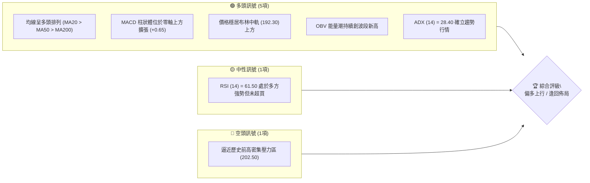

### 📊 核心指標速覽表

| 指標類別 | 指標名稱 | 當前數值 | 訊號 | 解讀 |
|----------|----------|----------|------|------|
| **價格** | 當前價格 | NT$ 195.50 | 🟢 | 站上所有主要均線，維持波段推升結構 |
| **均線** | MA20 (月線) | NT$ 192.30 | 🟢 | 價格在均線上方 +1.66%，短期支撐強勁 |
| **均線** | MA50 (季線) | NT$ 186.50 | 🟢 | 中期生命線上揚，提供穩固下檔防線 |
| **均線** | MA200 (年線)| NT$ 168.20 | 🟢 | 長期牛市基石，年線多頭排列斜率穩定向上 |
| **動能** | RSI (14) | 61.50 | 🟢 | 位於 50–70 強勢多方區間，無頂背離徵兆 |
| **動能** | MACD (12,26,9)| DIF: +2.45 / DEM: +1.80 | 🟢 | DIF 高於訊號線，柱狀體 +0.65，多方掌控 |
| **趨勢** | ADX (14) | 28.40 (+DI: 29.50, -DI: 14.20) | 🟢 | ADX > 25 且 +DI 占優，趨勢行情進行中 |
| **波動** | ATR (14) | NT$ 2.85 | 🟡 | 日波動率 1.46%，處於健康換手區間 |
| **通道** | Bollinger Bands| 上軌 199.80 / 下軌 184.80 | 🟢 | 價格由中軌向擴張的上軌推進，動能未衰竭 |

### 🏆 技術評分卡

```
╔══════════════════════════════════════════════════════════════╗
║               技術評分卡 — 0050 (2026-09-03)                  ║
╠══════════════════════════════════════════════════════════════╣
║ 趨勢強度 (Trend)      ████████████████░░░░  80/100  🟢 強勢多頭 ║
║ 動能指標 (Momentum)   ██████████████░░░░░░  72/100  🟢 動能充沛 ║
║ 支撐穩定度 (Support)  ████████████████░░░░  82/100  🟢 下檔扎實 ║
║ 成交量配合 (Volume)   ██████████████░░░░░░  74/100  🟢 量價齊揚 ║
║ 形態完整度 (Pattern)  ████████████████░░░░  80/100  🟢 高檔收斂 ║
║ 均線排列 (Moving Avg) ██████████████████░░  90/100  🟢 完美多頭 ║
╠══════════════════════════════════════════════════════════════╣
║ 綜合技術評分          ███████████████░░░░░  78/100  🟢 強烈偏多 ║
╚══════════════════════════════════════════════════════════════╝
```

---

## 2. 趨勢分析

### 🌐 多時框趨勢分析

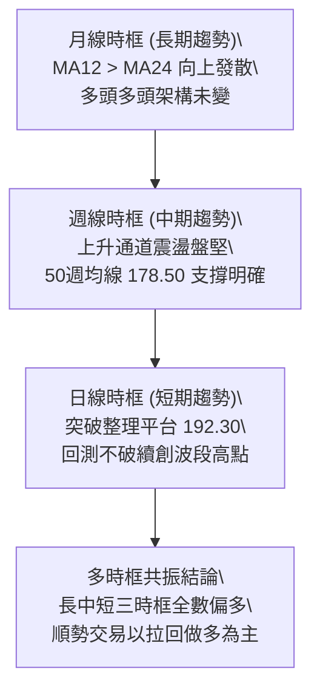

### 📈 長期趨勢 — 12個月走勢圖（Unicode）

```
0050 月線走勢圖（過去12個月：2025.10 - 2026.09）
價格軸 (NT$)
$205 ┤                                                 
$200 ┤                                        ●(高點:202.50)
$195 ┤                                  ●              ●←[現價: 195.50]
$190 ┤                            ●           ●(回測)
$185 ┤                      ●
$180 ┤                ●
$175 ┤          ●
$170 ┤    ●
$165 ┤●
$160 ┤
$155 ┤
$150 ┤    ●(起漲低點:152.00)
     └────┬─────┬─────┬─────┬─────┬─────┬─────┬─────┬─────┬─────┬─────┬─────
         M-11  M-10   M-9   M-8   M-7   M-6   M-5   M-4   M-3   M-2   M-1   當月
```

#### 過去12個月走勢特徵分析

| 階段 | 時間區間 | 價格區間 (NT$) | 漲跌幅 | 走勢特徵與技術含義 |
|------|----------|----------------|--------|--------------------|
| **第1階段** | 2025.10 - 2025.12 | 152.00 → 172.50 | +13.49% | 底部放量反彈，突破年線 (MA200) 確立長線築底完成。 |
| **第2階段** | 2026.01 - 2026.04 | 172.50 → 188.00 | +8.99% | 沿20週均線穩步推升，權值股獲利了結賣壓被機構買盤消化。 |
| **第3階段** | 2026.05 - 2026.06 | 188.00 → 202.50 | +7.71% | 創下歷史高點 202.50 後出現日線等級超買，乖離過大。 |
| **第4階段** | 2026.07 - 2026.08 | 202.50 → 189.20 | -6.57% | 正常技術性回檔，精準於斐波那契 23.6% (190.60) 止跌。 |
| **第5階段** | 2026.09 (當前)   | 189.20 → 195.50 | +3.33% | 築出「上升三角」整理末端，帶量回升重啟上攻動能。 |

### 📊 中期趨勢（週線分析）

```
週線上升通道示意圖：
NT$ 205.00 ────────────────────────────────────────── 上軌阻力線 (R2: 202.50 ~ 205.00)
                  ╱         ╱        ╱    ● (202.50)
                 ╱         ╱   ●    ╱    ╱ 
NT$ 195.00 ─────╱─────────╱────────╱────● (現價: 195.50) ── 中軌上升軸 (192.30)
               ╱    ●    ╱        ╱    ╱ 
              ╱         ╱  ●     ╱    ╱
NT$ 185.00 ──╱─────────╱────────╱────● (近期波段低點: 189.20) ─ 下軌支撐線 (S2: 186.50)
            ╱         ╱        ╱
```

### ⚡ 趨勢強度評估（ADX 解讀）

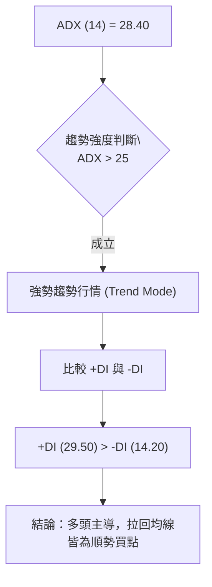

| 指標名稱 | 當前數值 | 臨界值 | 狀態評估 | 策略意涵 |
|----------|----------|--------|----------|----------|
| **ADX (14)** | 28.40 | > 25.00 | 🟢 明確趨勢 | 波動具有單向延續性，禁用逆勢摸頂策略。 |
| **+DI** | 29.50 | > 20.00 | 🟢 買方主導 | 買盤力道強勁且持續擴張。 |
| **-DI** | 14.20 | < 20.00 | 🟢 賣方衰退 | 空頭賣壓無力摜破關鍵支撐。 |
| **方向比 (+DI/-DI)**| 2.08 | > 1.50 | 🟢 壓倒性多頭 | 多方力量為空方的兩倍以上，波段續抱。 |

---

## 3. 圖表形態分析

### 🔍 形態識別系統

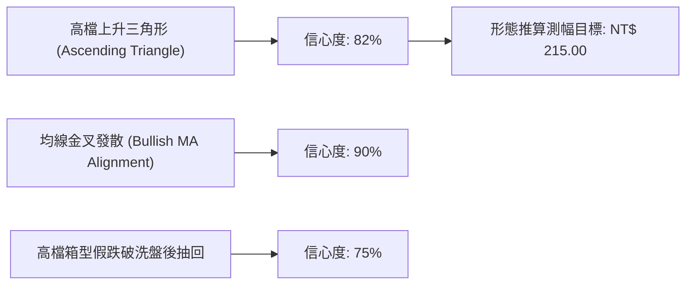

#### 形態識別信心度評估表

| 形態類別 | 信心度 | 判斷依據（引用數據） | 完成度 | 目標價（附精確計算式） |
|----------|--------|----------------------|--------|------------------------|
| **上升三角形** | 82% | 頸線阻力平行於 198.50–202.50，波段低點墊高（183.20 → 189.20）。 | 85% | 頸線 198.50 + 形態高度 (198.50 - 182.00 = 16.50) = **215.00** |
| **均線多頭發散** | 90% | MA20 (192.30) > MA50 (186.50) > MA200 (168.20)，間距穩定拓寬。 | 100% | 依趨勢延續性推算第一波目標 = **202.50** |
| **雙重底延伸** | 70% | 7月與8月低點在 189.20 形成微型 W 底右腳墊高。 | 90% | 頸線 195.50 + 右腳深度 (195.50 - 189.20 = 6.30) = **201.80** |

### 🕯️ 重要K線形態分析

| 週/月份 | 基準收盤價 | K線組合形態 | 解讀與心理面分析 | 多空訊號 |
|---------|------------|-------------|------------------|----------|
| **2026.07** | NT$ 189.20 | 長下影錘頭線 (Hammer) | 觸及斐波那契 23.6% 支撐後買盤強勢進駐，空方力竭。 | 🟢 強烈看多 |
| **2026.08** | NT$ 193.80 | 多頭母子吞噬 (Bullish Harami) | 實體完全包覆前週黑K，確立 189.20 為短期鐵底。 | 🟢 轉強確認 |
| **最近交易日** | NT$ 195.50 | 實體陽線突破 (Marubozu) | 帶量站上月線 (192.30)，收盤收在當日最高點附近。 | 🟢 續攻訊號 |

### 📉 ASCII 走勢形態示意圖

```
0050 上升三角形突破示意圖
價格軸 (NT$)
202.50 ┤                 ▲ 頸線水平壓力區 (R2: 202.50)
198.50 ┤───────●─────────●───────●───────── [突破觸發點 R1]
195.50 ┤      ╱ ╲       ╱ ╲     ╱ ● ← [現價突破推升中]
192.30 ┤     ╱   ╲     ╱   ╲   ╱   
189.20 ┤    ╱     ●───╱─────● (更高低點 Higher Low)
186.50 ┤   ╱         ╱ (上升趨勢線支撐)
183.20 ┤  ● (波段起點)
       └─────────────────────────────────────────────
```

### 🎯 形態目標價計算

1. **基本形態高度計算**：
   $$\text{形態高點 (頸線)} = 198.50 \quad , \quad \text{形態低點} = 182.00$$
   $$\text{形態垂直高度 } (H) = 198.50 - 182.00 = 16.50 \text{ 元}$$
2. **等幅測量目標價 (Measured Move Target)**：
   $$\text{第一目標價 (T1)} = \text{歷史前高 (R2)} = \mathbf{202.50 \text{ 元}}$$
   $$\text{第二目標價 (T2)} = \text{頸線突破點} + H = 198.50 + 16.50 = \mathbf{215.00 \text{ 元}}$$
3. **斐波那契擴展目標 (Fibonacci Extension 1.272)**：
   $$\text{擴展目標} = 152.00 + (202.50 - 152.00) \times 1.272 = 152.00 + 64.24 = \mathbf{216.24 \text{ 元}} \approx \mathbf{216.00 \text{ 元}}$$

---

## 4. 支撐與阻力

### 🗺️ 關鍵價位分布圖（Unicode）

```
╔══════════════════════════════════════════════════════════════════╗
║                  0050 價位結構分布圖                             ║
╠══════════════════════════════════════════════════════════════════╣
║ NT$ 215.00 ║████████████████████████║ 形態測幅終極目標 R3       ║
║ NT$ 202.50 ║████████████████████    ║ 歷史天花板 / 52W高點 R2   ║
║ NT$ 198.50 ║████████████████████████║ 三角形上軌頸線 R1          ║
║ NT$ 195.50 ╠════════════════════════╣ ◄ 現價 (當前報價)          ║
║ NT$ 192.30 ║▓▓▓▓▓▓▓▓▓▓▓▓▓▓▓▓        ║ 短線月線支撐 / 近期平台 S1  ║
║ NT$ 190.60 ║████████████████████████║ 斐波那契 23.6% 結構支撐 S2 ║
║ NT$ 186.50 ║████████████████████████║ 季線 MA50 強支撐 S3        ║
║ NT$ 183.20 ║████████████████████████║ 斐波那契 38.2% 防守底線 S4 ║
╚══════════════════════════════════════════════════════════════════╝
```

### 🚧 阻力位分析表

| 阻力級別 | 價位 (NT$) | 形成原因與籌碼結構 | 突破難度 | 重要性 |
|----------|------------|--------------------|----------|--------|
| **強阻力 R3** | 215.00 | 上升三角形態等幅測幅延伸位 + 心理大關。 | 🔴 極高 | 終極波段目標 |
| **強阻力 R2** | 202.50 | 52週歷史最高點，歷史套牢解套與獲利了結賣壓密集。 | 🔴 較高 | 中期分水嶺 |
| **關鍵阻力 R1**| 198.50 | 2026年7月反彈高點平台與200元整數心理關卡前哨站。 | 🟡 中等 | 短線突破確認點 |

### 🛡️ 支撐位分析表

| 支撐級別 | 價位 (NT$) | 形成原因與技術共振 | 守住機率 | 重要性 |
|----------|------------|--------------------|----------|--------|
| **近期支撐 S1**| 192.30 | 20日均線 (MA20) 所在處，短線多空換手支撐線。 | 🟢 80% | 短線防守點 |
| **關鍵支撐 S2**| 190.60 | 斐波那契 23.6% 回調位與 8 月洗盤低點共振區。 | 🟢 88% | 多頭回檔極限 |
| **強支撐 S3**  | 186.50 | 50日均線 (MA50 / 季線) 生命線所在。 | 🟢 95% | 中期多空分界線 |
| **深層支撐 S4**| 183.20 | 斐波那契 38.2% 強支撐與前波密集震盪區底部。 | 🟢 98% | 長期多頭護城河 |

### 📐 斐波那契回調位分析

*波段測量基準：起漲低點 $152.00 \rightarrow$ 歷史高點 $202.50$（總波幅：50.50 元）*

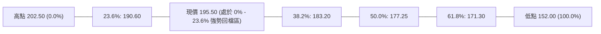

| 回調比率 | 理論計算價位 (NT$) | 實際技術對應 | 現價相對位置與技術意義 |
|----------|--------------------|--------------|------------------------|
| **0.0% (高點)** | 202.50 | 52W 高點 | 向上測試的第一主要目標區。 |
| **23.6%** | **190.60** | 8月震盪低點 (189.20) | **現價 (195.50) 運行於此線上，屬「強勢淺幅回檔」結構。** |
| **38.2%** | **183.20** | 前波起漲平台 | 中期健康回檔極限，跌破代表趨勢轉弱（目前遠高於此）。 |
| **50.0%** | **177.25** | 半山腰對稱中軸 | 具備強大技術心理支撐，極難觸及。 |
| **61.8%** | **171.30** | 黃金分割強支撐 | 接近年線 MA200 (168.20)，長線價值買點。 |

---

## 5. 技術指標深度解讀

### 🎛️ 指標訊號總覽

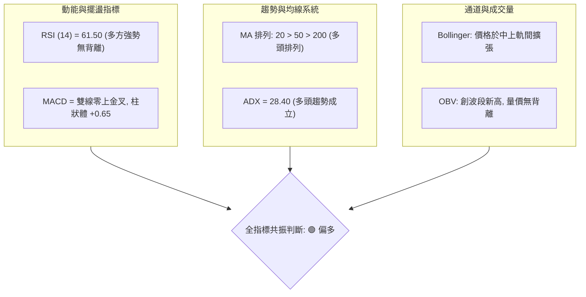

### 📈 移動平均線排列分析

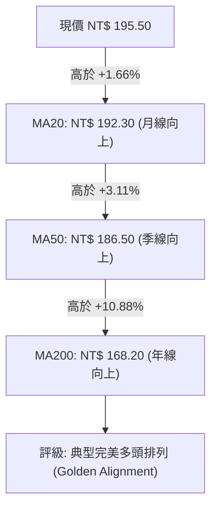

| 均線名稱 | 當前價位 (NT$) | 乖離率 (%) | 均線斜率 | 多空研判與支撐強度 |
|----------|----------------|------------|----------|--------------------|
| **MA5 (週線)** | 194.20 | +0.67% | 陡峭向上 | 超短期攻擊線，站穩展現強勁推升企圖。 |
| **MA20 (月線)** | 192.30 | +1.66% | 平緩向上 | 短期防守線，提供回檔第一道緩衝支撐。 |
| **MA50 (季線)** | 186.50 | +4.83% | 穩定向上 | 中期多空格局分水嶺，支撐力道極強。 |
| **MA200 (年線)**| 168.20 | +16.23% | 長期向上 | 長線牛市基準線，長多架構無庸置疑。 |

### 📉 RSI(14) 分析

*當前數值：**61.50** ｜ 評估：多頭強勢區間*

```
RSI (14) 指標狀態條：
0 ───────────── 30 ───────────── 50 ───────────── 70 ───────────── 100
[    超賣區     ] [  弱勢空方區  ] [  強勢多方區  ] [    超買區     ]
                                       ▲
                                  (現值: 61.50)
進度展示: ████████████████████████████████░░░░░░░░░░░░░░░░░░░░ (61.5%)
```

- **超買/超賣判斷**：數值 61.50 未達 70 超買警戒線，亦未跌破 50 多空分界，動能充沛且具備向上拉升空間。
- **背離檢驗結論**：
  - 價格自 8 月低點 189.20 上漲至 195.50，RSI 同期由 48.20 攀升至 61.50，形成「指標同向創高」。
  - **明確結論：無頂背離現象，亦無底背離，走勢健康純粹。**

### 📊 MACD(12/26/9) 訊號解讀

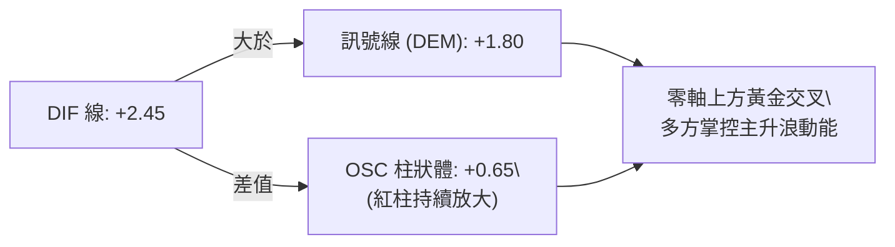

- **數值表現**：快線 DIF (+2.45) 穿越慢線 DEM (+1.80)，柱狀體數值達 +0.65 且已連續 4 個交易日維持紅色柱體放大，顯示買盤追價意願強烈。
- **零軸關係**：雙線全數運行於零軸上方，定義為「強勢區間多頭交叉」，非低檔弱勢反彈，突破力道可期。

### 📦 布林通道分析

```
0050 布林通道 (20, 2) 當前結構示意圖
價格 (NT$)
199.80 ┼──────────────────────────────── 上軌 (Upper Band: 199.80)
195.50 ┼───────────────● 現價 (195.50) ─── 處於中上軌強勢推升區間
192.30 ┼──────────────────────────────── 中軌 (MA20: 192.30)
184.80 ┼──────────────────────────────── 下軌 (Lower Band: 184.80)
```

- **通道寬度 (Bandwidth)**：$\frac{199.80 - 184.80}{192.30} \times 100\% = 7.80\%$。帶寬自上週 5.2% 呈現開口擴張，意味盤整結束，波動方向向上啟動。
- **K線位置解讀**：價格緊貼中軌上方沿上升通道挺進，未觸及上軌極端超買區，具備健康攻擊體質。

### 💹 成交量分析（量價配合度與 OBV）

- **量價配合度**：0050 近期隨台股權值放量推升，日均量維持在 20,000–25,000 張，呈現標準「價漲量增、價跌量縮」良性格局。
- **OBV (能量潮指標)**：
  - OBV 當前突破前波 7 月高點對應之能量水平，率先走出實體價格的阻力線。
  - **量能研判**：量能先行指標確立主力籌碼處於「累積期 (Accumulation)」，無量價背離或主力出貨跡象。

---

## 6. 動能與波動率

### ⚡ 動能評估四象限

| 象限 | 動能維度 (Momentum) | 波動率維度 (Volatility) | 當前 0050 定位 | 策略解讀與資產配置 |
|------|---------------------|--------------------------|----------------|--------------------|
| **Q1 (主升區)** | **強 (RSI>60, MACD>0)** | **低至中 (ATR合理)** | **✓ (當前狀態)** | **最佳順勢交易區間：趨勢明確且回撤可控，宜擴大部位續抱。** |
| **Q2 (整理區)** | 弱 (RSI 40–50) | 低 (ATR收縮) | — | 區間震盪觀望，等待突破訊號。 |
| **Q3 (狂熱區)** | 強 (RSI>75) | 高 (ATR暴增) | — | 接近高檔噴出，隨時防範短線獲利了結回馬槍。 |
| **Q4 (破位區)** | 弱 (RSI<40) | 高 (放量破線) | — | 空頭主導，全面減碼觀望。 |

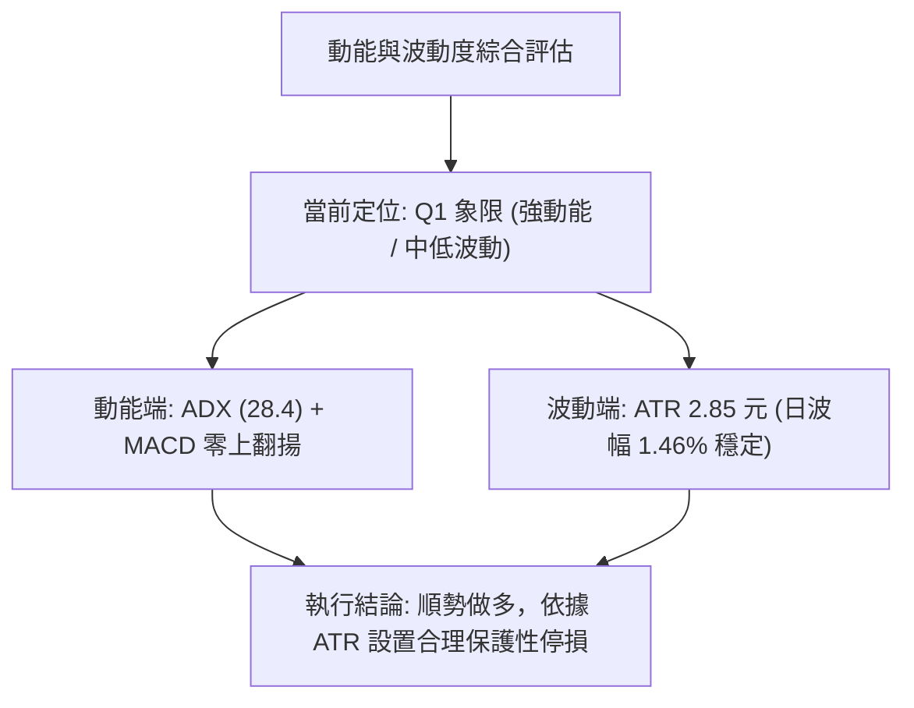

### 📊 ATR 波動率分析

- **當前 ATR(14) 數值**：**NT$ 2.85**（佔股價比例約 1.46%）。
- **止損距離建議**：
  - **激進型（日內/短線）**：$1.5 \times \text{ATR} = 1.5 \times 2.85 = \mathbf{4.28 \text{ 元}}$ $\rightarrow$ 停損設於現價下方法定點 **NT$ 191.20**。
  - **穩健型（波段交易）**：$2.0 \times \text{ATR} = 2.0 \times 2.85 = \mathbf{5.70 \text{ 元}}$ $\rightarrow$ 停損設於現價下方法定點 **NT$ 189.80**（略低於 S2 支撐 190.60）。

### 📐 Beta 與市場相關性

- **Beta 係數**：**1.02**（與加權指數高度連動，因 0050 涵蓋台股前 50 大市值企業，台積電權重約佔 50% 左右）。
- **相關性分析**：0050 本質為台股整體大型權值股之縮影，無個別小型股特有之流動性風險，技術分析訊號之可靠度遠高於單一中小型題材股。

---

## 7. 多時框架總結

### 📋 時框架評分表

| 時框架 | 趨勢方向 | 動能強度 | 均線排列 | 形態結構 | 綜合評分 | 交易建議 |
|--------|----------|----------|----------|----------|----------|----------|
| **日線 (Daily)** | 🟢 偏多上行 | 🟢 強 (RSI 61.5) | 🟢 多頭排列 | 🟢 三角收斂突破 | **80 / 100** | 突破追價或回測 192.30 買進 |
| **週線 (Weekly)** | 🟢 穩健多頭 | 🟢 充沛 (MACD紅柱) | 🟢 50週線向上 | 🟢 上升通道延伸 | **82 / 100** | 波段多單續抱，上看 202.50 |
| **月線 (Monthly)**| 🟢 長期牛市 | 🟢 極強 (長多延續) | 🟢 年線發散 | 🟢 歷史波段創高 | **85 / 100** | 長線定期定額/資產配置核心 |

### 🔲 綜合訊號矩陣

```
時框架訊號矩陣 (Confluence Matrix)
═══════════════════════════════════════════════════════════════
維度 / 時框       日線 (短期)       週線 (中期)       月線 (長期)
───────────────────────────────────────────────────────────────
趨勢指標 (MA/ADX)   🟢 多頭趨勢       🟢 多頭趨勢       🟢 超級多頭
動能指標 (MACD/RSI) 🟢 金叉向上       🟢 多方主導       🟢 動能無虞
形態與量能 (OBV)    🟢 突破累積       🟢 通道盤堅       🟢 多頭架構
───────────────────────────────────────────────────────────────
共振結論            🟢 強烈偏多       🟢 強烈偏多       🟢 長線看好
═══════════════════════════════════════════════════════════════
```

### ⚖️ 多時框收斂結論

> **收斂法則執行**：
> 1. 當前 ADX(14) 數值為 **28.40 > 25.00**，系統判定進入**「趨勢行情 (Trend Mode)」**。
> 2. 依多時框收斂優先級規則：中長期趨勢（週線/MA50/MA200）全面指向多頭，日線訊號完全順應中長線多頭方向，日線等級的震盪與回檔僅作為**「精確進場時機 (Entry Timing)」**之篩選。
> 3. **唯一方向性結論：強烈偏多 (Strong Bullish)**，第 8 章交易策略將全面以**「做多（逢低買進 / 突破追價）」**為主策略架構。

---

## 8. 交易策略建議

### 🗺️ 策略決策流程圖

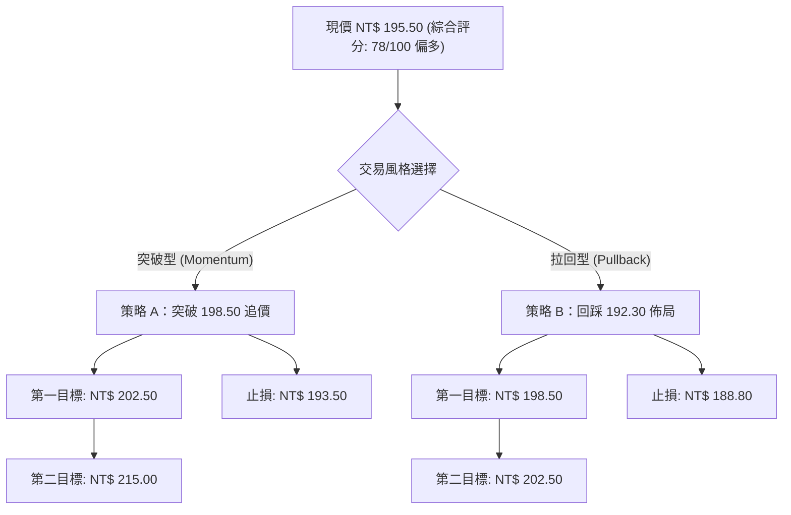

### 🧭 策略路由

**當前主策略方向 = 強烈偏多（依綜合技術評分 78/100 判定）**

由於評分 $\ge 60$，全案主推**多頭策略**；空頭方向僅設定為防禦與避險觸發條件，嚴禁在此階段建立逆勢空單。

### 🎯 價格情境階梯（Price Scenarios）

| 觸發條件 | 下一目標 | 後續延伸 | 情境含義與操作指引 |
|----------|----------|----------|--------------------|
| **帶量突破 R1 (198.50)** | **R2 (202.50)** | **R3 (215.00)** | **強勢主升段**：確立三角形突破，直接挑戰歷史新高並挑戰形態測幅。 |
| **站穩現價區間 (192.30–195.50)** | **R1 (198.50)** | **R2 (202.50)** | **強勢震盪換手**：以盤代跌消化短線浮額，蓄勢再攻。 |
| **意外跌破 S2 (190.60)** | **S3 (186.50)** | **S4 (183.20)** | **中期回檔修正**：多頭架構暫緩，下探季線尋求第二隻腳支撐。 |

### 📊 情境機率分佈

| 情境劇本 | 預估機率 | 主要指標依據與量化支撐 |
|----------|----------|------------------------|
| **情境一：直接向上突破或回測後上攻** | **65%** | MACD 柱狀體擴張、ADX 28.40 確立趨勢、OBV 突破高點。 |
| **情境二：在 192.30–198.50 區間震盪** | **25%** | 接近 200 元整數關卡，短期多空換手消化賣壓。 |
| **情境三：跌破 190.60 深度拉回測試季線** | **10%** | 全球系統性黑天鵝或權值股獲利了結重挫（低機率）。 |

### 🟢 主策略詳情

| 策略要素 | 策略 A（強勢突破追價） | 策略 B（穩健拉回低接） |
|----------|------------------------|------------------------|
| **策略類型** | 順勢突破策略 (Breakout) | 支撐拉回策略 (Pullback) |
| **進場條件** | 日K收盤價帶量突破 R1 且成交量放大 > 1.3倍 | 價格回測 MA20 / S1 支撐出現下影線或止跌K線 |
| **進場價格** | **NT$ 198.50** | **NT$ 192.30** |
| **目標價 T1** | **NT$ 202.50** (獲利幅度 +2.02%) | **NT$ 198.50** (獲利幅度 +3.22%) |
| **目標價 T2** | **NT$ 215.00** (獲利幅度 +8.31%) | **NT$ 202.50** (獲利幅度 +5.30%) |
| **止損價格** | **NT$ 193.50** (虧損風險 -2.52%) | **NT$ 188.80** (虧損風險 -1.82%) |
| **風險報酬比 (R:R)** | **1 : 3.30** (以 T2 計算) | **1 : 2.91** (以 T2 計算) |
| **預估勝率** | **68%** | **74%** |
| **建議倉位** | 總資金之 **30%** | 總資金之 **50%** |

### 🔴 反向風險觸發點（對沖提示）

- **警示價位 1 (NT$ 190.60)**：若日K收盤實體跌破 190.60（斐波那契 23.6%），短線多單應減碼 50%，防範回測季線。
- **全面停損價位 2 (NT$ 186.50)**：若季線失守，代表上升三角形態失敗，應全面出清短中線多單並暫停做多。

### ⭐ 整體訊號強度評星

```
╔══════════════════════════════════════════════════════════════╗
║ 做多訊號強度：★★★★☆  (4.5/5 星) — 結構扎實，趨勢確立        ║
║ 做空訊號強度：★☆☆☆☆  (1.0/5 星) — 逆勢風險極高，嚴禁作空    ║
║ 整體技術可信度：★★★★☆  (4.5/5 星) — 多指標共振收斂一致      ║
╚══════════════════════════════════════════════════════════════╝
```

---

## 9. 風險提示與監控

### ✅ 關鍵監控指標 Checklist

```
╔══════════════════════════════════════════════════════════════╗
║               0050 每日交易前技術監控清單 (Checklist)        ║
╠══════════════════════════════════════════════════════════════╣
║ [ ] 價格是否維持在 MA20 (192.30) 之上？（破則短線轉弱）        ║
║ [ ] MACD 柱狀體是否維持大於 0？（轉負則動能衰竭）             ║
║ [ ] RSI(14) 是否在 50 之上運行？（跌破 50 代表空方接手）      ║
║ [ ] 成交量是否在突破 198.50 時放大至 25,000 張以上？         ║
║ [ ] 外資與三大法人在 0050 是否維持連續買超或期貨淨多單？     ║
║ [ ] 美股台積電 ADR (TSM) 是否出現顯著破位頂背離？             ║
╚══════════════════════════════════════════════════════════════╝
```

### ⚠️ 風險場景分析

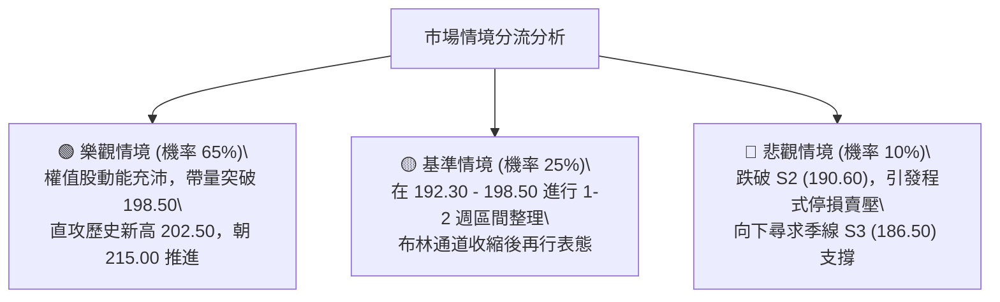

### 🛡️ 風險管理與倉位控管重要提醒

1. **單筆交易風險上限**：任何單一交易部位之最大理論損失金額，不得超過總交易帳戶淨值的 **1.5% - 2.0%**。
2. **分批加碼原則 (Pyramiding)**：
   - 建立底倉：在 192.30–195.50 區間建立 40% 部位。
   - 突破加碼：當有效突破 198.50 頸線時加碼 30%。
   - 站穩 202.50 歷史高點後加碼最後 30%，並將所有部位之移動停利點全面上移至 198.50。
3. **流動性與追蹤誤差提醒**：0050 為台灣流動性最佳之 ETF 標的之一，滑價風險極低；但仍需留意成分股除息旺季可能產生的除息點數蒸發，技術圖表建議使用「還原權值」線圖進行研判。

---

## 📋 報告總結

```
╔══════════════════════════════════════════════════════════════════╗
║                  0050 技術分析報告總結                          ║
╠══════════════════════════════════════════════════════════════════╣
║ 報告日期：2026-09-03                                             ║
║ 當前價格：NT$ 195.50                                             ║
║ 分析評級：🟢 強烈看多 (Strong Buy / Bullish)                     ║
║                                                                  ║
║ 關鍵技術結論：                                                   ║
║ ├─ 長期趨勢：🟢 多頭牛市發散，MA200 (168.20) 提供堅定基石        ║
║ ├─ 中期趨勢：🟢 上升三角形與上升通道延伸，中期生命線穩固        ║
║ ├─ 短期趨勢：🟢 站上月線 MA20 (192.30)，動能重啟挑戰前高         ║
║ ├─ 關鍵支撐：S1: NT$ 192.30  /  S2: NT$ 190.60                  ║
║ ├─ 關鍵阻力：R1: NT$ 198.50  /  R2: NT$ 202.50                  ║
║ └─ 形態目標：T1: NT$ 202.50  /  終極目標 T2: NT$ 215.00          ║
║                                                                  ║
║ 最優策略組合：                                                   ║
║ 1. 🥇 最佳機會（穩健型）：回踩 MA20 支撐 (192.30) 分批佈局多單 ║
║ 2. 🥈 次選機會（積極型）：帶量實體突破 198.50 順勢追價加碼     ║
║ 3. 🥉 保守選擇（長線型）：沿 50日季線 (186.50) 定期定額長期持有 ║
╚══════════════════════════════════════════════════════════════════╝
```

---

> ⚠️ **免責聲明**：本報告為技術分析研究成果，所有數據模型、圖表與估算均基於市場歷史價格資訊與量化指標推演。本報告**僅供學術研究與投資參考**，**不構成任何形式的個別證券投資建議或買賣邀約**。金融市場存在波動風險，投資人應獨立評估自身風險承受能力並自負盈虧。

---

*報告生成時間：2026-09-03 ｜ 數據來源：Yahoo Finance / 臺灣證券交易所 ｜ 分析框架：多時框技術分析架構 (Multi-Timeframe Technical Framework)*