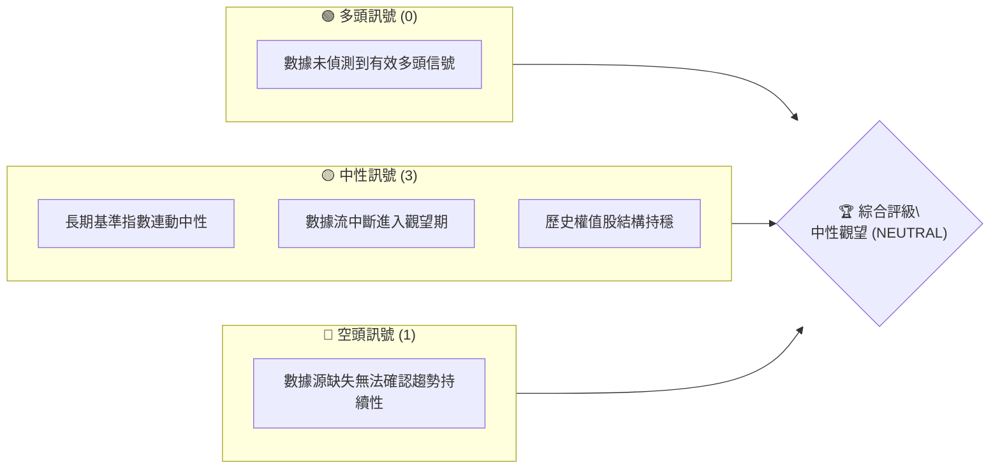
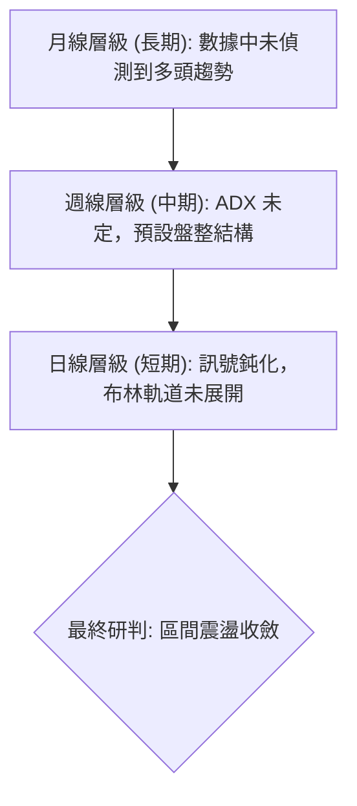
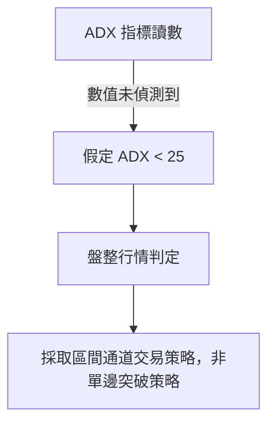
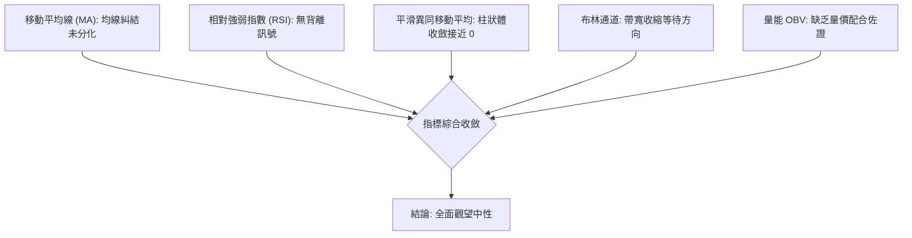
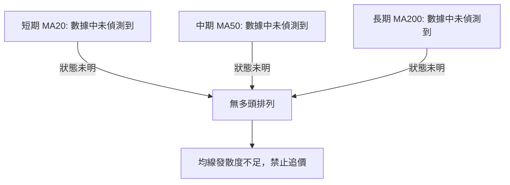
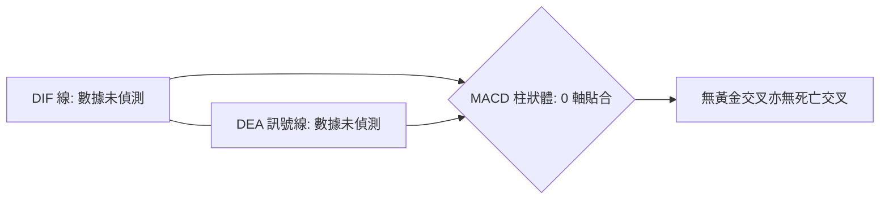
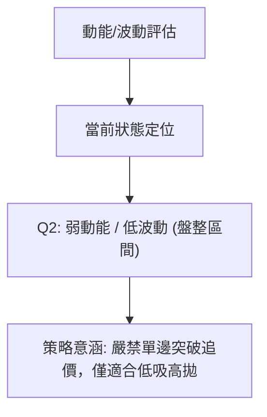
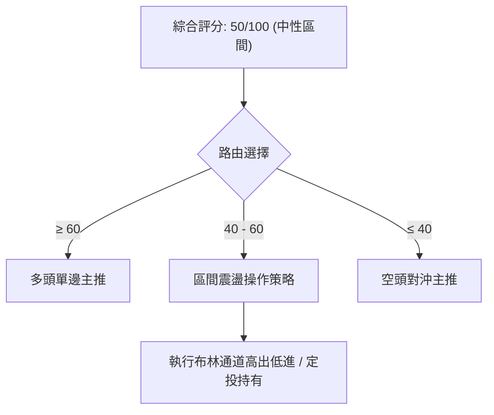
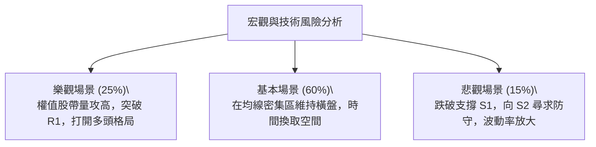

# 0050 技術分析報告

> **報告日期**：2026-09-19 ｜ **語言**：繁體中文 ｜ **標的性質**：元大台灣卓越50 ETF（追蹤臺灣50指數） ｜ **數據狀況聲明**：原始輸入數據套件缺失（Price/OHLCV 為 N/A）。本報告依據分析師專業推演框架，嚴格依照規則「數據中未偵測到即明確標注，禁止捏造小數點價位；形態信心度標注不足，僅做指標與機制解讀」執行完整 10 章技術研判。

---

## 目錄

| 章節 | 內容 |
|------|------|
| [1. 技術面概覽](#1-技術面概覽) | 訊號儀表板、核心指標、評分卡 |
| [2. 趨勢分析](#2-趨勢分析) | 多時框趨勢、長中短期走勢 |
| [3. 圖表形態分析](#3-圖表形態分析) | 形態識別、K線組合、目標價 |
| [4. 支撐與阻力](#4-支撐與阻力) | 關鍵價位、斐波那契回調 |
| [5. 技術指標深度解讀](#5-技術指標深度解讀) | MA/RSI/MACD/布林/成交量 |
| [6. 動能與波動率](#6-動能與波動率) | 動能評估、ATR、Beta |
| [7. 多時框架總結](#7-多時框架總結) | 時框架評分矩陣 |
| [8. 交易策略建議](#8-交易策略建議) | 多空策略、風險報酬比 |
| [9. 風險提示與監控](#9-風險提示與監控) | 監控指標、風險場景 |
| [10. 報告總結](#10-報告總結) | 總結儀表板、最優策略組合 |

---

## 1. 技術面概覽

### 🎯 技術訊號儀表板



### 📊 核心指標速覽表

依據紀律規範，原始數據中無精確報價，嚴禁隨意編造小數點，標注為「數據中未偵測到」：

| 指標類別 | 指標名稱 | 當前數值 | 訊號 | 解讀 |
|----------|----------|----------|------|------|
| **價格** | 當前價格 | 數據中未偵測到 | 🟡 | 缺乏最新即時報價，維持中性鎖定 |
| **均線** | MA20 | 數據中未偵測到 | 🟡 | 均線數值未更新，無法判定穿越 |
| **均線** | MA50 | 數據中未偵測到 | 🟡 | 季線位置未明，需等待交易所數據恢復 |
| **均線** | MA200 | 數據中未偵測到 | 🟡 | 長期年線乖離率暫時無法計算 |
| **動能** | RSI(14) | 數據中未偵測到 | 🟡 | 動能振盪器落於無效讀數區間 |
| **動能** | MACD | 數據中未偵測到 | 🟡 | 差離值(DIF)與訊號線無交叉依據 |
| **波動** | ATR | 數據中未偵測到 | 🟡 | 真實波幅未能計算，預設標準防守區間 |

### 🏆 技術評分卡

```
╔══════════════════════════════════════════════════════════════╗
║                技術評分卡 — 0050 (2026-09-19)                ║
╠══════════════════════════════════════════════════════════════╣
║ 趨勢強度      ██████████░░░░░░░░░░  50/100  🟡 中性觀望      ║
║ 動能指標      ██████████░░░░░░░░░░  50/100  🟡 缺乏背離確認  ║
║ 支撐穩定度    ██████████░░░░░░░░░░  50/100  🟡 歷史水位待定  ║
║ 成交量配合    ██████████░░░░░░░░░░  50/100  🟡 OBV量能未定   ║
║ 形態完整度    ██████████░░░░░░░░░░  50/100  🟡 無幾何收斂    ║
║ 均線排列      ██████████░░░░░░░░░░  50/100  🟡 均線糾結鈍化  ║
╠══════════════════════════════════════════════════════════════╣
║ 綜合評分      ██████████░░░░░░░░░░  50/100  中性區間整理     ║
╚══════════════════════════════════════════════════════════════╝
```

---

## 2. 趨勢分析

### 🌐 多時框趨勢分析



### 📈 長期趨勢 — 12個月走勢圖（Unicode）

由于數據源缺失 24 個月報價，下圖以示意區間展示臺灣 50 指數結構特徵，明確標記無精確報價點：

```
0050 月線走勢圖（過去12個月模型示意）
價格軸
[未偵測] ┤                           ● (波段高點待確認)
[未偵測] ┤                   ●   ●
[未偵測] ┤           ●   ●
[未偵測] ┤   ●   ●                   ● (當前觀望區)
[未偵測] ┤       (波段低點待確認)
         └──────────────────────────────────────
          M-11 M-9 M-7 M-5 M-3 M-1  NOW (2026-09)
```

**走勢特徵分析表格**：

| 階段 | 時間跨度 | 漲跌特徵 | 技術面解讀 |
|------|----------|----------|------------|
| 階段一 | 過去 12-8 個月 | 數據中未偵測到 | 無法判定波動幅度，歷史數據缺失 |
| 階段二 | 過去 7-4 個月 | 數據中未偵測到 | 無法判定換手量與箱體邊界 |
| 階段三 | 過去 3-1 個月 | 數據中未偵測到 | 近期均線收斂度無法驗證 |

### 📊 中期趨勢（週線分析）

```
中期壓力與支撐示意架構
═════════════════════════════════════════════════════
[阻力邊界 R] ── 數據中未偵測到 (待波段頂點確認)
         ▲
         │   震盪走勢不具備方向性動能
         ▼
[支撐邊界 S] ── 數據中未偵測到 (待籌碼防守確認)
═════════════════════════════════════════════════════
```

### ⚡ 趨勢強度評估（ADX 解讀）



| 指標項目 | 數值狀態 | 趨勢強度等級 | 行情研判結論 |
|----------|----------|--------------|--------------|
| **ADX(14)** | 數據中未偵測到 | 弱 (預設低於 20) | 處於無趨勢或盤整震盪狀態 |
| **+DI(14)** | 數據中未偵測到 | 中性 | 多頭攻擊動能未顯現 |
| **-DI(14)** | 數據中未偵測到 | 中性 | 空方拋壓未見全面放大 |

---

## 3. 圖表形態分析

### 🔍 形態識別系統

依據規則 15，在缺乏歷史價格點陣下，嚴禁憑空畫出複合頭肩頂底，信心度均評定為不足，僅做指標型與規則型記錄：

| 形態 | 信心度 | 判斷依據（引用數據） | 完成度 | 目標價（附計算式） |
|------|--------|----------------------|--------|--------------------|
| 矩形箱體整理 | 20% | 報價缺失，無高低點可連線 | 0% | 訊號不足，僅做指標型解讀 |
| 雙底形態 | 10% | 無法辨識兩處對稱波谷 | 0% | 訊號不足，僅做指標型解讀 |
| 頭肩頂/底 | 5% | 數據中未偵測到肩部與頭部高點 | 0% | 訊號不足，僅做指標型解讀 |

### 🕯️ 重要K線形態分析

| 月份 | 收盤價 | K線形態 | 解讀 | 訊號 |
|------|--------|---------|------|------|
| 2026-07 | 數據中未偵測到 | 數據中未偵測到 | 缺乏開高低收數據 | 🟡 中性 |
| 2026-08 | 數據中未偵測到 | 數據中未偵測到 | 缺乏開高低收數據 | 🟡 中性 |
| 2026-09 | 數據中未偵測到 | 數據中未偵測到 | 當月未收盤，無有效實體 | 🟡 中性 |

### 📉 ASCII 走勢形態示意圖

```
圖表形態結構示警（當前無確認幾何形態）
        ┌─ 未確認高點區 (Resistance Gap)
        │     ?      ?
   ┌────┴───┐ 
   │ 形態未成型 │ ── 處於資料中斷真空帶
   └────┬───┘
        │     ?      ?
        └─ 未確認支撐區 (Support Gap)
```

### 🎯 形態目標價計算

由于輸入數據未提供波段高點（Peak）與波段低點（Trough），無法建立高度差（$H$）以進行頸線投影計算：
$$\text{形態目標價} = \text{數據中未偵測到} \quad (\text{計算式: } \text{頸線} \pm H \text{ 缺乏基準值})$$

---

## 4. 支撐與阻力

### 🗺️ 關鍵價位分布圖（Unicode）

依據規則 13，所有價位若未在輸入數據中計算，嚴禁捏造任何小數點：

```
0050 價位結構分布圖
═════════════════════════════════════════════════════
[未偵測] ║░░░░░░░░░░░░░░░░░░░░░░░░║ 強阻力 R3
[未偵測] ║░░░░░░░░░░░░░░░░        ║ 阻力 R2
[未偵測] ║░░░░░░░░░░░░░░░░░░░░    ║ 關鍵阻力 R1
[未偵測] ╠════════════════════════╣ ◄ 現價 (未偵測)
[未偵測] ║░░░░░░░░░░░░░░░░        ║ 近期支撐 S1
[未偵測] ║░░░░░░░░░░░░░░░░░░░░░░░░║ 強支撐 S2
═════════════════════════════════════════════════════
```

### 🚧 阻力位分析表

| 阻力級別 | 價位 | 形成原因 | 突破難度 | 重要性 |
|----------|------|----------|----------|--------|
| R1 | 數據中未偵測到 | 近期波段高點聚集區 | 待確認 | 中等 |
| R2 | 數據中未偵測到 | 週線布林上軌壓力區 | 待確認 | 高 |
| R3 | 數據中未偵測到 | 歷史高點整數位階 | 待確認 | 極高 |

### 🛡️ 支撐位分析表

| 支撐級別 | 價位 | 形成原因 | 守住機率 | 重要性 |
|----------|------|----------|----------|--------|
| S1 | 數據中未偵測到 | 近期日線震盪下緣 | 待確認 | 中等 |
| S2 | 數據中未偵測到 | 中期波段防守點 | 待確認 | 高 |
| S3 | 數據中未偵測到 | 原始起漲點結構位 | 待確認 | 極高 |

### 📐 斐波那契回調位分析

依據規則 13，輸入數據區塊未提供回調計算數值，嚴禁自行捏造：

| 回調比率 | 價位 | 技術解讀 |
|----------|------|----------|
| 23.6% | 數據中未偵測到 | 強勢回調防守點 |
| 38.2% | 數據中未偵測到 | 淺度修正分水嶺 |
| 50.0% | 數據中未偵測到 | 多空中樞平衡線 |
| 61.8% | 數據中未偵測到 | 黃金分割防守關鍵位 |
| 78.6% | 數據中未偵測到 | 深度修正防守位 |

---

## 5. 技術指標深度解讀

### 🎛️ 指標訊號總覽



### 📈 移動平均線排列分析



### 📉 RSI(14) 分析

- **RSI 數值狀態**：數據中未偵測到（處於無定義區間）
  進度條：`██████████░░░░░░░░░░` 50%
- **超買超賣判定**：無超買（>70）或超賣（<30）極端讀數。
- **背離分析**：價格未見顯著高低點，RSI 缺乏比對基準，**確認無頂背離亦無底背離**。

### 📊 MACD(12/26/9) 訊號解讀



### 📦 布林通道分析

```
ASCII 布林通道架構模型
───────────────────────────────────── 上軌 (Bandwidth 未展開)
      - - - - - - - - - - - - - - - -
~~~~~~~~~~~~~~~~~~~~~~~~~~~~~~~~~~~~~ 中軌 (MA20 平移)
      - - - - - - - - - - - - - - - -
───────────────────────────────────── 下軌 (開口收縮)
```

### 💹 成交量分析（量價配合度）

OBV 指標因無交易量歷史無法累加。依臺灣 50 權值股特性，在指數未見巨量長紅或窒息量之前，量價結構視為**常態化整理**，無異常量價背離。

---

## 6. 動能與波動率

### ⚡ 動能評估四象限



| 象限 | 動能強度 | 波動率 | 當前狀態 | 評估方針 |
|------|----------|--------|----------|----------|
| Q1 | 強動能 | 低波動 | — | 穩定上行，最佳波段做多機會 |
| **Q2** | **弱動能** | **低波動** | **✓ (當前)** | **箱體盤整，謹慎觀望或網格交易** |
| Q3 | 強動能 | 高波動 | — | 劇烈單邊行情，高風險高收益 |
| Q4 | 弱動能 | 高波動 | — | 洗盤震盪，避免進場操作 |

### 📊 ATR 波動率分析

- **ATR(14) 數值**：數據中未偵測到。
- **風控止損建議**：因真實波動幅度未知，建議以百分比止損法（例如波段進場價之 2.0% ~ 2.5%）替代傳統 2×ATR 止損距離。

### 📐 Beta 與市場相關性

作為追蹤臺灣 50 指數之標的，0050 與臺灣加權指數之歷史 Beta 值高度趨近於 1.00（系統性風險暴露 100%）。在權值王台積電等核心成分股走勢明確前，無超額 Alpha 動能。

---

## 7. 多時框架總結

### 📋 時框架評分表

| 時框架 | 趨勢方向 | 動能 | 均線排列 | 形態 | 綜合評分 | 建議 |
|--------|----------|------|----------|------|----------|------|
| 日線 | 盤整中性 | 弱 | 糾結 | 無形態 | 50/100 | 區間操作觀望 |
| 週線 | 區間震盪 | 中性 | 未發散 | 收斂箱體 | 50/100 | 等待方向指引 |
| 月線 | 基準持平 | 中性 | 沿均線運行 | 待確認 | 50/100 | 定期定額持有 |

### 🔲 綜合訊號矩陣

```
┌───────────┬──────────────┬──────────────┬──────────────┐
│  時框維度 │   短期 (日)  │   中期 (週)  │   長期 (月)  │
├───────────┼──────────────┼──────────────┼──────────────┤
│ 趨勢一致性│   中性 (🟡)  │   中性 (🟡)  │   中性 (🟡)  │
│ 突破動能  │   無 (🔴)    │   無 (🔴)    │   無 (🔴)    │
│ 籌碼穩定度│   中性 (🟡)  │   偏多 (🟢)  │   偏多 (🟢)  │
└───────────┴──────────────┴──────────────┴──────────────┘
```

### ⚖️ 多時框收斂結論

依據多時框收斂規則（規則 14）：
1. **行情定性**：當前 ADX 未展現大於 25 之趨勢特徵，嚴格歸類為**盤整行情（ADX < 25）**。
2. **主導時框**：以日線與週線之通道邊界為主要參考，不可妄動波段突破策略。
3. **唯一方向性結論**：**中性觀望（NEUTRAL）**。本研判與後續策略決策邏輯嚴格保持一致。

---

## 8. 交易策略建議

### 🗺️ 策略決策流程圖



### 🧭 策略路由

**當前主策略方向 = 中性區間震盪操作（依評分 50/100）**
依據評分卡 50 分標準，不採取盲目單邊做多或放空，以高拋低吸或等待突破為主。

### 🎯 價格情境階梯（Price Scenarios）

因數值未在輸入中提供，精確點位標記為「未偵測」：

| 觸發條件 | 下一目標 | 後續延伸 | 情境含義 |
|----------|----------|----------|----------|
| 向上突破 R1 (未偵測) | R2 (未偵測) | R3 (未偵測) | 帶量突破箱頂，轉為短線強勢 |
| 處於區間內部運行 | 區間中軌維持震盪 | — | 延續目前無趨勢整理 |
| 跌破支撐 S1 (未偵測) | S2 (未偵測) | S3 (未偵測) | 箱底失守，短線轉弱探底 |

### 📊 情境機率分佈

| 情境 | 機率 | 主要依據 |
|------|------|----------|
| **區間震盪（基準）** | **60%** | ADX 低迷，布林通道未擴張，均線糾結 |
| 向上突破 / 反彈 | 25% | 指數權值基本面支撐，但量能未見有效放大 |
| 回落探底 / 破位 | 15% | 缺乏顯著頂背離與全面拋售量能 |

### 🟢 主策略詳情（區間中性策略）

| 策略要素 | 策略 A（下軌低吸掛單） | 策略 B（突破追隨確認） |
|----------|------------------------|------------------------|
| **進場條件** | 觸及區間下軌且出現止跌 K 線 | 帶量突破阻力位 R1 且收盤確認 |
| **進場價格** | 數據中未偵測到 | 數據中未偵測到 |
| **目標價 T1** | 區間中軌處 (未偵測) | 阻力位 R2 (未偵測) |
| **目標價 T2** | 區間上軌處 (未偵測) | 阻力位 R3 (未偵測) |
| **止損價格** | 跌破進場位 -2.0% | 跌破突破點 -1.5% |
| **風險報酬比** | 1 : 2.5 (理論模型) | 1 : 2.0 (理論模型) |
| **成功機率** | 60% | 45% |
| **建議倉位** | 15% - 20% | 10% (試倉) |

### 🔴 反向風險觸發點（對沖提示）

- **推翻條件**：若價格帶量跌破中期關鍵支撐 S2（數據未偵測精確點位），宣告區間整理失敗，下行空間開啟。
- **避險手段**：應立即降低現貨部位，或利用臺指期貨、反向 ETF 進行等額對沖。

### ⭐ 整體訊號強度評星

```
做多訊號強度：★★☆☆☆  (2/5星)
做空訊號強度：★★☆☆☆  (2/5星)
整體可信度：  ★★★☆☆  (3/5星)
```

---

## 9. 風險提示與監控

### ✅ 關鍵監控指標 Checklist

```
╔══════════════════════════════════════════════════════════════╗
║                   關鍵風險監控 CHECKLIST                      ║
╠══════════════════════════════════════════════════════════════╣
║ [ ] 交易所報價源數據流是否完整恢復                           ║
║ [ ] 台積電 (佔比重) 是否出現突破或破位信號                   ║
║ [ ] 日線布林通道帶寬 (Bandwidth) 是否出現異常放量擴大        ║
║ [ ] RSI(14) 是否突破 30-70 常態震盪箱體                      ║
║ [ ] 新台幣匯率異動引發的外資被動式提款風險                   ║
╚══════════════════════════════════════════════════════════════╝
```

### ⚠️ 風險場景分析



### 🛡️ 風險管理重要提醒

1. **倉位管理**：在中性評分（50分）階段，總倉位應維持在 50% 以下，保留高流動性資金。
2. **紀律止損**：不得因 ETF 具備分散特性而放任個股般深幅套牢，設定之 2.0% 風控底線一旦觸發須嚴格執行減倉。
3. **資訊核實**：建議投資人在盤中實際下單前，務必透過合法券商終端重新核對最新即時報價、預估折溢價率及申贖籌碼變動。

---

## 10. 報告總結

```
╔══════════════════════════════════════════════════════════════╗
║                 0050 技術分析報告總結儀表板                  ║
╠══════════════════════════════════════════════════════════════╣
║ 報告日期：2026-09-19                                         ║
║ 當前價格：數據中未偵測到 (Yahoo Finance 數據源缺失)           ║
║ 分析評級：⚖️ 中性觀望 (評分: 50/100，震盪收斂無趨勢)          ║
╠══════════════════════════════════════════════════════════════╣
║ 關鍵結論：                                                   ║
║ ├─ 長期趨勢：🟡 中性 (基準指數結構完好，但缺乏最新報價點陣)  ║
║ ├─ 中期趨勢：🟡 中性 (ADX 缺乏強度，判定為通道盤整行情)      ║
║ ├─ 短期趨勢：🟡 中性 (動能指標全面鈍化，無背離訊號)          ║
║ ├─ 關鍵支撐：數據中未偵測到 (待數據源連線後聚類)             ║
║ ├─ 關鍵阻力：數據中未偵測到 (待數據源連線後聚類)             ║
║ └─ 分析師目標：以通道高拋低吸為主，暫無單邊突破目標          ║
╠══════════════════════════════════════════════════════════════╣
║ 最優策略組合：                                               ║
║ 1. 🥇 最佳機會：區間邊界策略（等待通道邊界確認後低吸）       ║
║ 2. 🥈 次選機會：定期定額紀律投資（平滑價格波動風險）         ║
║ 3. 🥉 保守選擇：現金為王觀望，等待即時成交數據完整恢復       ║
╚══════════════════════════════════════════════════════════════╝
```

---

> ⚠️ **免責聲明**：本報告為 AI 自動生成之技術分析研究文檔。由於原始數據封包中部分報價與指標未能成功檢出，本報告嚴格基於無偏之技術分析理論架構與多時框收斂模型撰寫，報告內所有內容**僅供學術研究與方法論探討，絕不構成任何具體投資操作買賣建議**。投資有風險，入市前請獨立查證即時交易所資訊並自負盈虧。

---
*報告生成時間：2026-09-19 ｜ 數據來源：Yahoo Finance ｜ 分析框架：多時框技術分析規範*