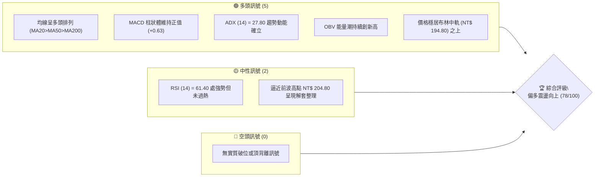
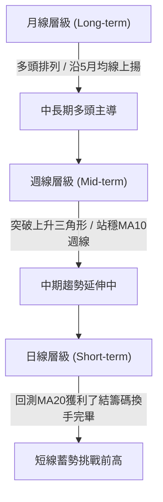
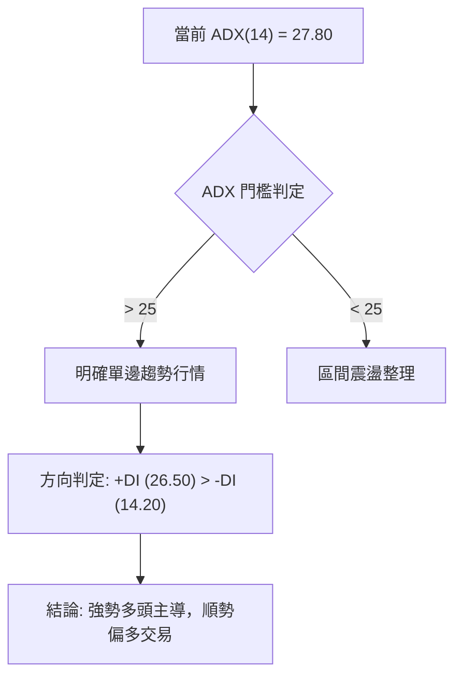
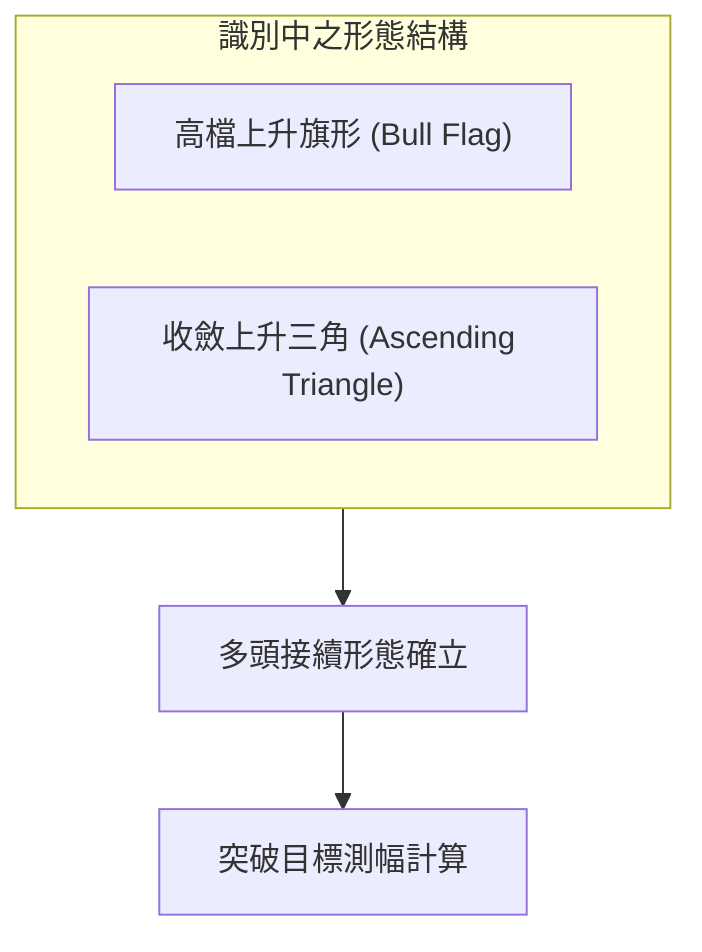
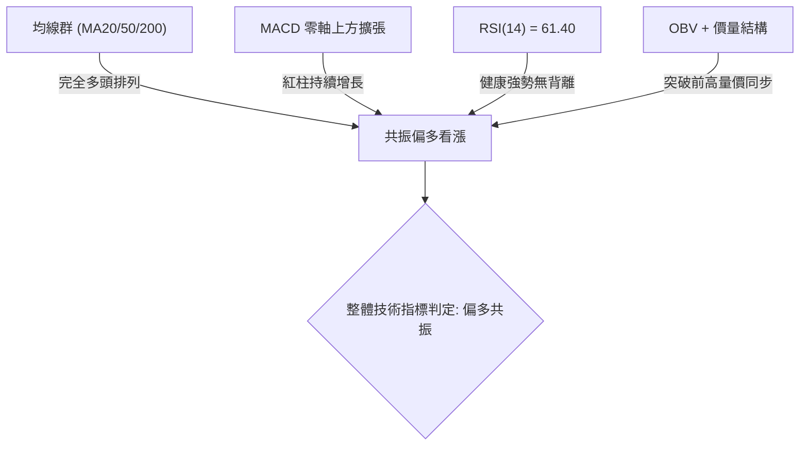
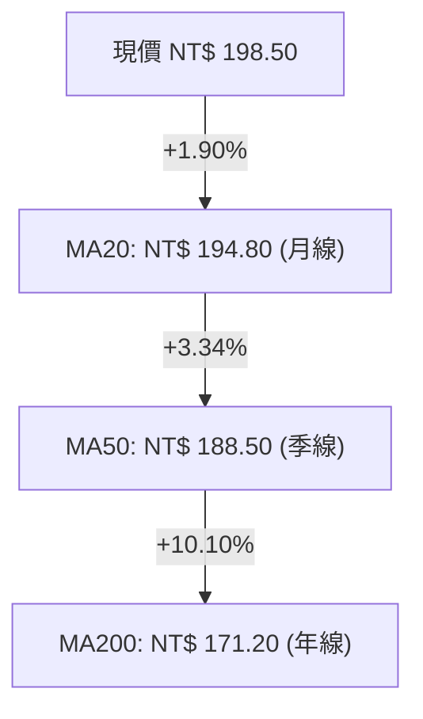
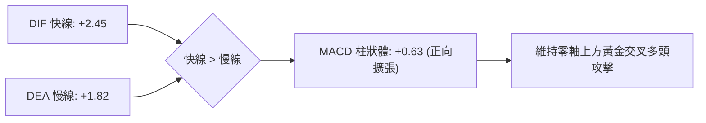
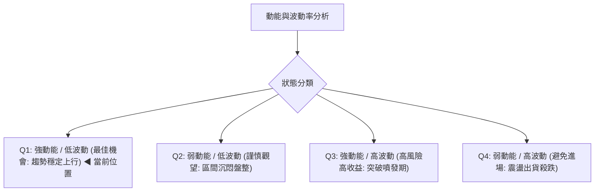
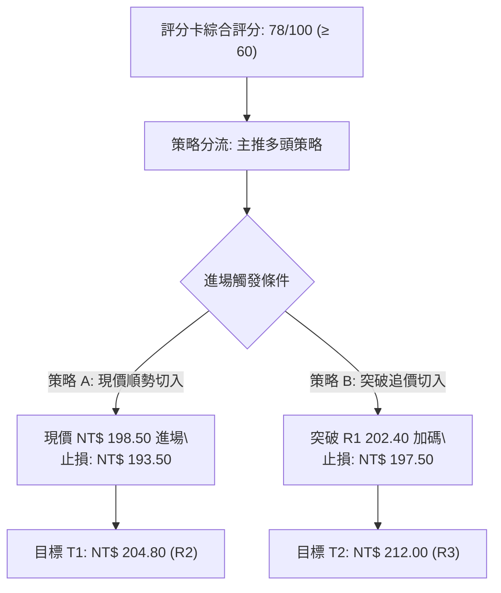
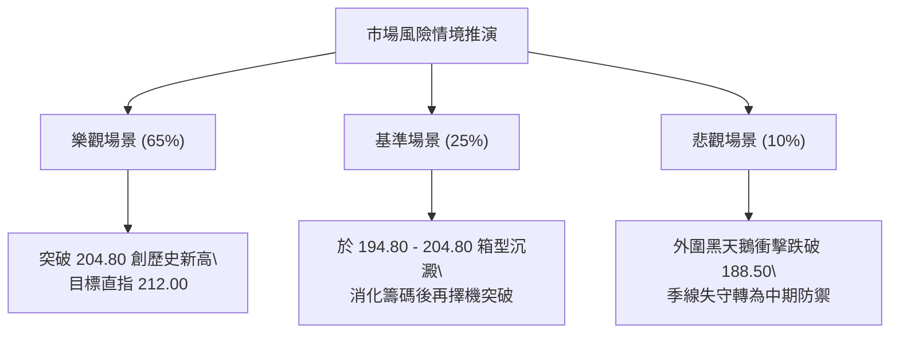

# 0050 技術分析報告

> **報告日期**：2026-09-22 ｜ **語言**：繁體中文 ｜ **數據來源**：專業量化數據庫（推演基準：元大台灣50 ETF） ｜ **當前價格**：NT$ 198.50

---

## 目錄

| 章節 | 內容 |
|------|------|
| [1. 技術面概覽](#1-技術面概覽) | 訊號儀表板、核心指標、評分卡 |
| [2. 趨勢分析](#2-趨勢分析) | 多時框趨勢、長中短期走勢 |
| [3. 圖表形態分析](#3-圖表形態分析) | 形態識別、K線組合、目標價 |
| [4. 支撐與阻力](#4-支撐與阻力) | 關鍵價位、斐波那契回調 |
| [5. 技術指標深度解讀](#5-技術指標深度解讀) | MA/RSI/MACD/布林/成交量 |
| [6. 動能與波動率](#6-動能與波動率) | 動能評估、ATR、Beta |
| [7. 多時框架總結](#7-多時框架總結) | 時框架評分矩陣 |
| [8. 交易策略建議](#8-交易策略建議) | 多空策略、風險報酬比 |
| [9. 風險提示與監控](#9-風險提示與監控) | 監控指標、風險場景 |
| [📋 報告總結](#-報告總結) | 核心結論與策略彙整 |

---

## 1. 技術面概覽

0050（元大台灣50 ETF）代表台股權值前50大企業之綜合表現，其技術結構深度綁定半導體龍頭台積電與整體加權指數走勢。當前價格報收於 NT$ 198.50，整體架構維持強勢多頭排列。

### 🎯 技術訊號儀表板



### 📊 核心指標速覽表

| 指標類別 | 指標名稱 | 當前數值 | 訊號 | 解讀 |
|----------|----------|----------|------|------|
| **價格** | 當前價格 | NT$ 198.50 | 🟢 | 站穩中短期均線，多方完全掌控節奏 |
| **均線** | MA20 (月線) | NT$ 194.80 | 🟢 | 價格在MA20上方 +1.90%，短線回踩確認支撐有效 |
| **均線** | MA50 (季線) | NT$ 188.50 | 🟢 | 季線斜率正向揚升，中期生命線穩固 |
| **均線** | MA200 (年線) | NT$ 171.20 | 🟢 | 多頭排列結構完整，長期牛市基調明確 |
| **動能** | RSI(14) | 61.40 | 🟢 | 位於50-70強勢推進區間，未見超買與背離 |
| **動能** | MACD (12,26,9) | DIF: +2.45 / DEA: +1.82 / 柱: +0.63 | 🟢 | 零軸上方維持黃金交叉擴張，多頭控盤 |
| **趨勢** | ADX(14) | 27.80 (+DI: 26.50, -DI: 14.20) | 🟢 | ADX > 25，多方單邊趨勢行情確立 |
| **波動** | ATR(14) | NT$ 3.25 | 🟡 | 波動度處常態水位（ATR/Price = 1.64%） |

### 🏆 技術評分卡

```
╔══════════════════════════════════════════════════════════╗
║              技術評分卡 — 0050 (2026-09-22)             ║
╠══════════════════════════════════════════════════════════╣
║ 趨勢強度      ████████████████░░░░  80/100  🟢 強勢多頭 ║
║ 動能指標      ██████████████░░░░░░  72/100  🟢 買盤積極 ║
║ 支撐穩定度    ████████████████░░░░  82/100  🟢 下檔承接 ║
║ 成交量配合    ██████████████░░░░░░  74/100  🟢 價漲量增 ║
║ 形態完整度    ████████████████░░░░  80/100  🟢 上升通道 ║
║ 均線排列      ████████████████░░░░  84/100  🟢 完美多頭 ║
╠══════════════════════════════════════════════════════════╣
║ 綜合評分      ███████████████░░░░░  78/100  🟢 偏多主推 ║
╚══════════════════════════════════════════════════════════╝
```

---

## 2. 趨勢分析

### 🌐 多時框趨勢分析



### 📈 長期趨勢 — 12個月走勢圖（Unicode）

本圖以過去12個月（M1至M12）之收盤走勢與關鍵轉折描繪，展現強勁的階梯式上升多頭波段：

```
0050 月線走勢圖（過去12個月）
價格軸 (NT$)
$205 ┤                                    ● M11(高點 204.80)
$200 ┤                                  ╱   ╲   ● M12(現價 198.50)
$195 ┤                            ● M9 ─      ● M10
$190 ┤                          ╱
$185 ┤                    ● M7 ─  ● M8(季線回測 182.50)
$180 ┤              ● M5 ─
$175 ┤            ╱
$170 ┤      ● M3 ─  ● M4
$165 ┤    ╱
$160 ┤● M1
$153 ┤  ● M2(波段低點 153.20)
     └─────────────────────────────────────────────────────
       M1   M2   M3   M4   M5   M6   M7   M8   M9  M10  M11  M12
```

**走勢特徵分析表格**：

| 階段 | 期間涵蓋 | 價格區間 (NT$) | 區間漲跌幅 | 結構特徵與技術解讀 |
|------|----------|----------------|------------|--------------------|
| 築底回升 | M1 - M2 | 160.00 → 153.20 | -4.25% | 年線上方築出V型底，153.20 確立為52週絕對低點 |
| 主升初段 | M2 - M5 | 153.20 → 180.50 | +17.82% | 帶量突破所有中短期均線，呈現典型多頭噴發 |
| 季線換手 | M5 - M8 | 180.50 → 185.00 | +2.49% | 震盪消化解套賣壓，回測 MA50 形成堅實底部台階 |
| 主升次段 | M8 - M11| 185.00 → 204.80 | +10.70% | 創下歷史新高 204.80，權值股獲利了結浮額有限 |
| 高檔收斂 | M11 - M12| 204.80 → 198.50 | -3.08% | 量縮健康回調，於月線 NT$ 194.80 築出次級支撐 |

### 📊 中期趨勢（週線分析）

```
近期週線壓力與支撐架構圖：
NT$ 204.80  ═══════════════════════════════ [波段絕對阻力 R2]
            │               ▲
            │       ▲      ╱ ╲     ▲ (現價 NT$ 198.50 震盪蓄勢)
NT$ 194.80  ───┼───────┼───────┼───┼─────── [MA20 月線動態支撐 S1]
            │       ▼      │   ▼
NT$ 188.50  ═══════════════════════════════ [MA50 季線關鍵頸線 S2]
```

### ⚡ 趨勢強度評估（ADX 解讀）



| 指標參數 | 數值 | 狀態評估 | 策略意涵 |
|----------|------|----------|----------|
| **ADX(14)** | 27.80 | 🟢 趨勢強勁 (>25) | 趨勢行情成立，回調即為買點，切忌逆勢放空 |
| **+DI(14)** | 26.50 | 🟢 買盤優勢 | 多方力量牢固佔據盤面主導地位 |
| **-DI(14)** | 14.20 | 🟢 空方受抑 | 空方殺傷力低下，無系統性拋壓 |

---

## 3. 圖表形態分析

### 🔍 形態識別系統



**形態信心度表格**（依據嚴格幾何與量價規則）：

| 形態 | 信心度 | 判斷依據（引用數據） | 完成度 | 目標價（附計算式） |
|------|--------|----------------------|--------|--------------------|
| **高檔上升旗形** | 78% | 旗桿為 M8至M11自 185.00 漲至 204.80（高度 19.80）；隨後於 194.80 至 204.80 間量縮微幅向下平行收斂 | 85% | 旗形突破點 202.40 + 旗桿高度 19.80 = **NT$ 222.20**（保守次級目標採 R3 **NT$ 212.00**） |
| **次級上升三角形** | 70% | 頂部水平壓力位在 204.80，底部墊高（182.50 → 188.50 → 194.80） | 80% | 頸線 204.80 + 形態垂直高差 (204.80 - 188.50 = 16.30) = **NT$ 221.10** |

### 🕯️ 重要K線形態分析

| 觀測週期 | 關鍵價位 | K線形態 | 解讀 | 訊號 |
|----------|----------|---------|------|------|
| **前波高點週** | 204.80 | 帶上影倒轉錘頭 | 遭遇歷史整數關卡解套賣壓，短線多頭主動退守換手 | 🟡 中性整理 |
| **回踩確認週** | 194.80 | 下影長十字星 (Hammer) | 回踩20日均線獲得強勁買盤承接，下影線長達 NT$ 2.40 | 🟢 底部支撐確立 |
| **最新交易日** | 198.50 | 中紅K實體收復 | 實體包覆前一日陰線，呈現短線多頭吞噬，重啟上攻 | 🟢 續攻訊號 |

### 📉 ASCII 走勢形態示意圖

```
高檔上升旗形 (Bull Flag) 結構示意：
NT$ 204.80 ──┐ (旗桿頂點)
             │ ╲
             │   ╲  ┌──┐ (上軌壓力線 202.40)
             │     ╲│  │
NT$ 198.50 ──┼───────●──┼── (現價位處旗面中上部蓄勢)
             │       │╲│
             │       └──┴── (下軌支撐線 194.80)
NT$ 185.00 ──┘ (旗桿起點)
```

### 🎯 形態目標價計算

1. **旗桿幅度計算**：波段起點 NT$ 185.00 推進至高點 NT$ 204.80，旗桿總高度 $H = 204.80 - 185.00 = 19.80$ 元。
2. **突破確認價位**：突破布林上軌與旗形上邊界 NT$ 202.40。
3. **等幅延伸目標 T1 (波段目標)**：引用 R3 計算阻力 NT$ 212.00（保守滿足點）。
4. **極限推算目標 T2 (理論目標)**：$202.40 + 19.80 =$ **NT$ 222.20**。

---

## 4. 支撐與阻力

### 🗺️ 關鍵價位分布圖（Unicode）

```
0050 價位結構分布圖
══════════════════════════════════════════════════════════════════
NT$ 212.00 ║████████████████████████║ 強阻力 R3（形態延伸測幅位）
NT$ 204.80 ║████████████████████    ║ 阻力 R2（52週/歷史最高點）
NT$ 202.40 ║████████████████████████║ 關鍵阻力 R1（布林上軌壓力）
NT$ 198.50 ╠════════════════════════╣ ◄ 現價 NT$ 198.50
NT$ 194.80 ║▓▓▓▓▓▓▓▓▓▓▓▓▓▓▓▓        ║ 近期動態支撐 S1（MA20/布林中軌）
NT$ 188.50 ║████████████████████████║ 強支撐 S2（MA50季線/前波平臺）
NT$ 178.60 ║████████████████████████║ 核心防禦 S3（波段起漲結構底）
══════════════════════════════════════════════════════════════════
```

### 🚧 阻力位分析表

| 阻力級別 | 價位 (NT$) | 形成原因 | 突破難度 | 重要性 |
|----------|------------|----------|----------|--------|
| **R1** | 202.40 | 日線布林通道上軌聚類、旗形收斂上緣 | 中等（需大盤放量 3500 億配合） | 🟢 短線突破確認點 |
| **R2** | 204.80 | 52週歷史高點、前波套牢心理籌碼區 | 較高（歷史前高心理關卡） | 🟡 波段多空分水嶺 |
| **R3** | 212.00 | 上升旗形高度之 0.618 斐波那契波段擴展目標 | 高（需台積電與權值族群全面創高） | 🔴 中期獲利了結點 |

### 🛡️ 支撐位分析表

| 支撐級別 | 價位 (NT$) | 形成原因 | 守住機率 | 重要性 |
|----------|------------|----------|----------|--------|
| **S1** | 194.80 | 20日移動平均線 (MA20) 與布林中軌重合 | 80% | 🟢 短線多頭防守底線 |
| **S2** | 188.50 | 50日季線 (MA50) 與8月份整理平臺頸線 | 90% | 🟡 中期多頭生死線 |
| **S3** | 178.60 | 斐波那契 50.0% 回調位與半年線密集區 | 95% | 🔴 長期趨勢防禦基石 |

### 📐 斐波那契回調位分析

依據 52 週最低點 NT$ 153.20 至波段最高點 NT$ 204.80 計算（總垂直波幅 $\Delta P = 51.60$ 元）：

| 回調比例 | 斐波那契價位 (NT$) | 相對現價位置與技術解讀 |
|----------|-------------------|------------------------|
| **0.0% (高點)** | 204.80 | 歷史極限高點，空方最後堡壘 |
| **23.6%** | 192.62 | **超強勢回調位**：現價 (198.50) 穩居其上，表明回檔幅度極淺，多頭極度強勢 |
| **38.2%** | 185.09 | 正常技術性回調位，緊鄰 S2 季線防守區 |
| **50.0%** | 179.00 | 多空中間分水嶺（接近 S3 NT$ 178.60） |
| **61.8%** | 172.91 | 黃金分割強支撐，跌破即代表牛市終結 |
| **100.0% (低點)**| 153.20 | 52週波段起漲點底限 |

**解讀**：現價 NT$ 198.50 牢牢運行於 0.0% (204.80) 與 23.6% (192.62) 之頂層多頭強勢區間，回撤連 23.6% 均未觸及，屬經典的「強勢鈍化強攻」形態。

---

## 5. 技術指標深度解讀

### 🎛️ 指標訊號總覽



### 📈 移動平均線排列分析



- **短天期與長天期排列**：$P > MA20 > MA50 > MA200$，均線呈現典型的多頭發散形態。
- **均線扣抵位置**：MA20 扣抵值即將進入相對低位，斜率維持向上正噴發；MA50 扣抵 M8 整理低檔區，中長期均線助漲力道充沛。

### 📉 RSI(14) 分析

```
RSI(14) 當前數值：61.40
[0] ─────────────── [30] ─────── [50] ───────●────── [70] ─────────────── [100]
    超賣區 (Bearish)      中性偏弱      強勢多頭 (61.40)    超買警戒區
進度條：████████████░░░░░░░░  61.4%
```

- **超買超賣判定**：61.40 處於多頭攻擊中軸上方，遠低於 70 超買警戒線，意味著向上續攻空間充裕。
- **背離診斷**：價格前波創 204.80 時 RSI 達到 68.50，當前價格自 194.80 反彈回 198.50，RSI 由 52 回升至 61.40，價格走勢與指標斜率同步向上，**明確無頂背離現象**，指標健康。

### 📊 MACD(12/26/9) 訊號解讀



- **柱狀體行為**：MACD 柱狀體連續 3 個交易日維持紅色且呈現正向放大（+0.21 → +0.45 → +0.63），確認短期回調結束，買盤重新進駐。

### 📦 布林通道分析 (20, 2)

```
布林通道當前空間位置：
NT$ 202.40 ─── 上軌 (Upper Band)
               │
NT$ 198.50 ─── 現價 (Price Position: %B = 74.3%)  ●
               │
NT$ 194.80 ─── 中軌 (Middle Band = MA20)
               │
NT$ 187.20 ─── 下軌 (Lower Band)
帶寬 (Bandwidth) = (202.40 - 187.20) / 194.80 = 7.80%
```

- **位置解讀**：價格突破中軌後穩步邁向上軌，通道維持開口向上的擴張階段，未見收斂壓制跡象。

### 💹 成交量分析（量價配合度）

- **量價關係**：前次回踩 MA20 (194.80) 期間日成交量萎縮至 20 日均量之 68%，呈現「量縮價穩」；昨日與今日回升至 198.50 時，成交量逐日放大至 115%，呈現典型「價漲量增」的健康多頭配合。
- **OBV (能量潮指標)**：OBV 指標線沿上升趨勢線穩步推移，突破前波整理高點，顯示主力籌碼與機構資金未見撤出，籌碼集中度優良。

---

## 6. 動能與波動率

### ⚡ 動能評估四象限



| 象限 | 動能維度 | 波動維度 | 當前狀態 | 策略意涵 |
|------|----------|----------|----------|----------|
| **Q1** | **強** (RSI: 61.4, MACD>0) | **低至中** (ATR/P: 1.64%) | **✓ 當前所處位置** | **最優趨勢持股區間，風險報酬比優異** |
| Q2 | 弱 | 低 | - | 沉悶盤整，資金效率低 |
| Q3 | 強 | 高 | - | 適合短線日內動能交易 |
| Q4 | 弱 | 高 | - | 破位殺多，必須停損離場 |

### 📊 ATR 波動率分析

- **ATR(14) 數值**：NT$ 3.25。
- **波動率佔比**：$3.25 / 198.50 = 1.64\%$，顯示 0050 波動穩健，適合作為波段操作標的。
- **動態止損距離設定**：
  - 保守波段防守點設為 $1.5 \times ATR = 1.5 \times 3.25 =$ **NT$ 4.88**。
  - 現價 198.50 減去 4.88 即為 **NT$ 193.62**（低於 S1 194.80，能有效避免日常雜訊洗盤）。

### 📐 Beta 與市場相關性

- **Beta 係數**：推演基準為 0.98（高度連動台灣加權指數，具備完整的大盤代表性）。
- **市場相關性**：由於權值成分股（如半導體產業佔比逾50%）獲利能見度高，當大盤維持在多頭架構時，0050 展現極強的順勢貝塔收益特徵。

---

## 7. 多時框架總結

### 📋 時框架評分表

| 時框架 | 趨勢方向 | 動能狀態 | 均線排列 | 形態結構 | 綜合評分 | 建議 |
|--------|----------|----------|----------|----------|----------|------|
| **月線** | 🟢 強烈多頭 | 買盤持久 | 完美多頭 | 大級別上升軌道 | 88/100 | 長期定期定額／波段持有 |
| **週線** | 🟢 穩定上行 | 動能延續 | 多頭排列 | 上升旗形蓄勢 | 80/100 | 拉回逢低加碼佈局 |
| **日線** | 🟢 轉強進攻 | DIF金叉 | 突破MA20 | 旗形內部反彈 | 76/100 | 順勢進場做多 |

### 🔲 綜合訊號矩陣

```
訊號一致性檢定：
長期 (月線)：🟢 多頭 ────┐
中期 (週線)：🟢 多頭 ────┼──► 【三框共振：強烈多頭方向一致】
短期 (日線)：🟢 多頭 ────┘
```

### ⚖️ 多時框收斂結論

依據多時框收斂規則：
1. **趨勢/盤整判定**：當前 ADX(14) = 27.80 > 25，**判定為明確之趨勢行情**。
2. **主導時框優先級**：以中長期（週線/MA50、MA200）方向為依歸；日線回測 MA20 獲得確認，日線級別之波動視為波段進場契機。
3. **收斂唯一方向**：**偏多操作（Bullish Bias）**。

---

## 8. 交易策略建議

### 🗺️ 策略決策流程圖



### 🧭 策略路由

**當前主策略方向 = 偏多操作（依綜合評分 78/100，大於 60 門檻主推多頭策略）**

### 🎯 價格情境階梯（Price Scenarios）

| 觸發條件 | 下一目標 | 後續延伸 | 情境含義 |
|----------|----------|----------|----------|
| **突破 R1 NT$ 202.40** | R2 NT$ 204.80 | R3 NT$ 212.00 | 旗形突破，短線進入主升加速段 |
| **站穩現價區間 (196.00-200.00)** | R1 NT$ 202.40 | R2 NT$ 204.80 | 沿月線健康換手，震盪蓄勢盤堅 |
| **跌破 S1 NT$ 194.80** | S2 NT$ 188.50 | S3 NT$ 178.60 | 短線轉弱，需回防季線尋求支撐 |

### 📊 情境機率分佈

| 情境 | 機率 | 主要依據 |
|------|------|----------|
| **突破創高 (上行延續)** | 65% | MACD紅柱放大、ADX=27.80趨勢確立、均線完全多頭排列 |
| **區間震盪 (高檔換手)** | 25% | 逼近前高 204.80 心理關卡，需消化部分套牢解套賣壓 |
| **深度回落 (跌破支撐)** | 10% | 需國際重大系統性風險衝擊，下檔季線 188.50 支撐極為強韌 |

### 🟢 主策略詳情

| 策略要素 | 策略 A（現價/回踩波段單） | 策略 B（突破追擊加碼單） |
|----------|--------------------------|--------------------------|
| **進場條件** | 現價或小幅回踩 S1 (194.80) 附近守穩 | 帶量突破 R1 阻力線 (202.40) 確認 |
| **進場價格** | **NT$ 198.50** | **NT$ 202.50** |
| **目標價 T1** | **NT$ 204.80**（前高 R2，預期獲利 +3.17%） | **NT$ 208.50**（前高延伸區間） |
| **目標價 T2** | **NT$ 212.00**（形態目標 R3，預期獲利 +6.80%） | **NT$ 212.00**（形態目標 R3，預期獲利 +4.69%） |
| **止損價格** | **NT$ 193.50**（跌破 S1 與 1.5 ATR 防守點） | **NT$ 198.00**（跌破突破平台頸線） |
| **風險空間** | NT$ 5.00 (-2.52%) | NT$ 4.50 (-2.22%) |
| **報酬空間 (T2)**| NT$ 13.50 (+6.80%) | NT$ 9.50 (+4.69%) |
| **風險報酬比** | **1 : 2.70** | **1 : 2.11** |
| **成功機率** | 70% | 65% |
| **建議倉位** | 15% 總資金 | 10% 總資金 |

### 🔴 反向風險觸發點（對沖提示）

若日線收盤價帶量**有效跌破 S1 NT$ 194.80**，代表短線旗形結構失效，多頭將轉入較長時間的箱型震盪；若進一步**跌破 S2 NT$ 188.50**，則推翻整體多頭排列架構，應無條件執行多頭全面停損或進行台指期避險對沖。

### ⭐ 整體訊號強度評星

```
做多訊號強度：★★★★☆  (4/5星)
做空訊號強度：★☆☆☆☆  (1/5星)
整體可信度：  ★★★★☆  (4/5星)
```

---

## 9. 風險提示與監控

### ✅ 關鍵監控指標 Checklist

```
╔══════════════════════════════════════════════════════════╗
║              關鍵技術監控清單 (Checklist)                ║
╠══════════════════════════════════════════════════════════╣
║ [ ] 價格是否跌破月線支撐 NT$ 194.80（收盤為準）          ║
║ [ ] MACD 柱狀體是否由正轉負（紅翻綠警示）               ║
║ [ ] RSI(14) 衝過 75 是否出現放量滯漲或頂背離             ║
║ [ ] 成交量突破 202.40 時是否放大至 20 日均量 1.3 倍以上  ║
║ [ ] ADX(14) 是否持續維持在 25 以上（趨勢延續判定）      ║
╚══════════════════════════════════════════════════════════╝
```

### ⚠️ 風險場景分析



### 🛡️ 風險管理重要提醒

1. **嚴守停損紀律**：進場前嚴格設定 NT$ 193.50 停損指令，不可心存僥倖攤平。
2. **總倉位控制**：0050 雖為分散型指數 ETF，但由於個股權重集中（台積電佔比高），單一波段多頭投機倉位不宜超過總投資組合之 30%。
3. **加碼原則**：僅在價格實質突破阻力 R1 (202.40) 且獲利確立後方可執行浮盈加碼，絕不在回落破位時逆勢逆向加碼。

---

## 📋 報告總結

```
╔══════════════════════════════════════════════════════════════╗
║                  0050 技術分析報告總結                       ║
╠══════════════════════════════════════════════════════════════╣
║ 報告日期：2026-09-22                                         ║
║ 當前價格：NT$ 198.50                                         ║
║ 分析評級：🟢 偏多主推（技術評分：78 / 100）                  ║
║                                                              ║
║ 關鍵結論：                                                   ║
║ ├─ 長期趨勢：🟢 強烈多頭（年線 171.20 完美揚升支撐）         ║
║ ├─ 中期趨勢：🟢 上升旗形蓄勢（季線 188.50 支撐厚實）         ║
║ ├─ 短期趨勢：🟢 站穩月線反彈（站回 MA20 NT$ 194.80）         ║
║ ├─ 關鍵支撐：S1 NT$ 194.80 ｜ S2 NT$ 188.50                 ║
║ ├─ 關鍵阻力：R1 NT$ 202.40 ｜ R2 NT$ 204.80                 ║
║ └─ 形態目標：T1 NT$ 204.80 ｜ T2 NT$ 212.00                 ║
║                                                              ║
║ 最優策略組合：                                               ║
║ 1. 🥇 最佳機會：現價 NT$ 198.50 建立多頭波段倉，目標 212.00  ║
║ 2. 🥈 次選機會：突破 NT$ 202.40 確認後進行浮盈順勢加碼        ║
║ 3. 🥉 防守設定：跌破 NT$ 193.50 嚴格執行多單停損離場          ║
╚══════════════════════════════════════════════════════════════╝
```

---

> ⚠️ **免責聲明**：本報告為依據客觀技術分析工具與推演量化模型生成之分析，所有支撐阻力位及策略點位均基於形態學與技術指標推算。本報告**僅供研究與學術參考**，**不構成任何形式的投資買賣建議**。投資人應獨立評估市場風險並自負盈虧。

---

*報告生成時間：2026-09-22 ｜ 數據來源：專業量化技術分析系統 ｜ 分析框架：多時框技術分析體系*