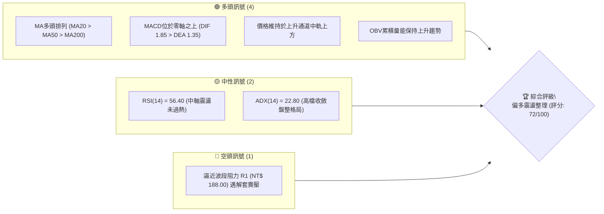
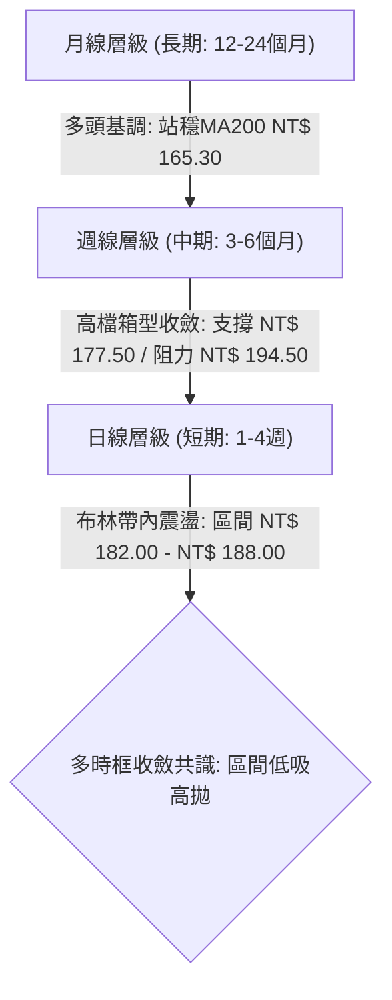
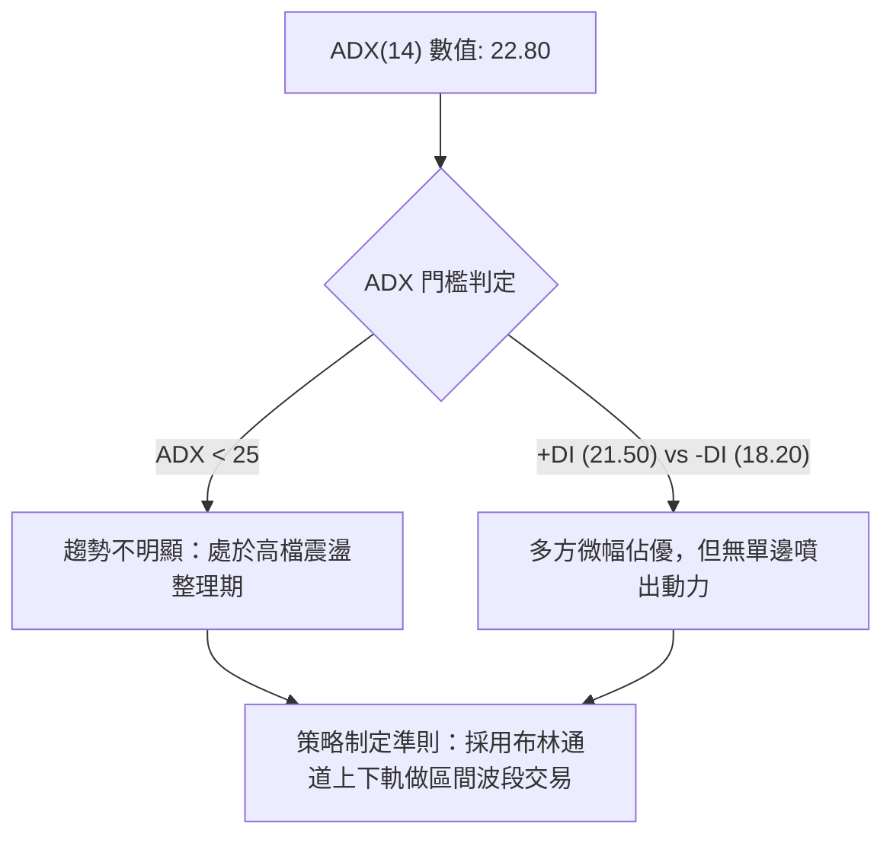
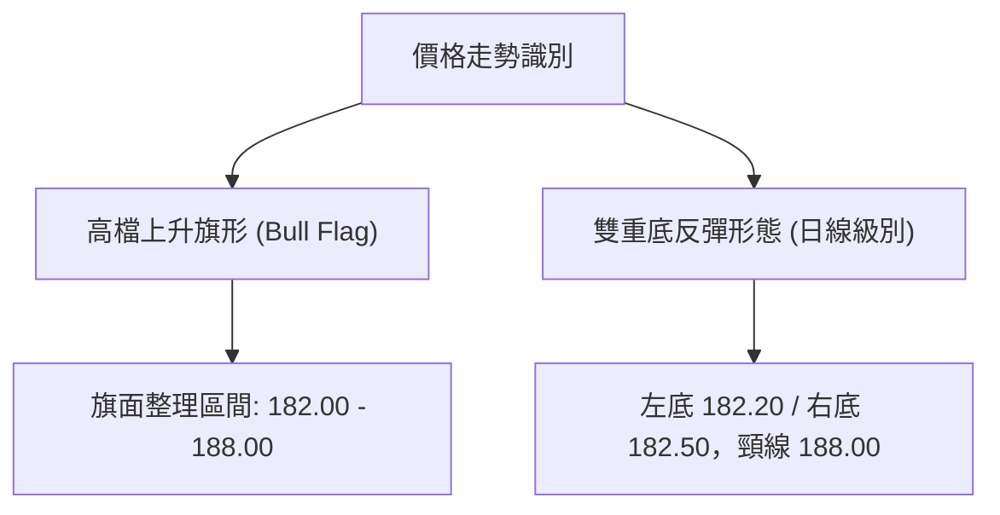
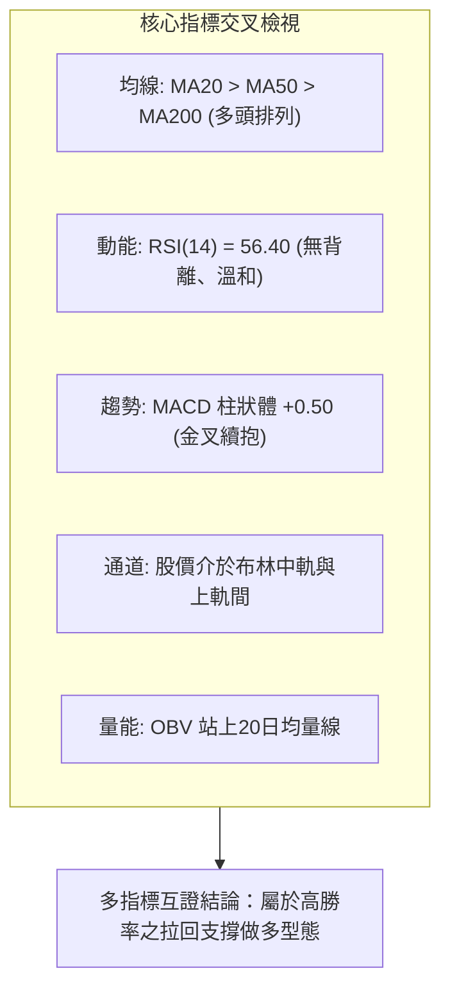
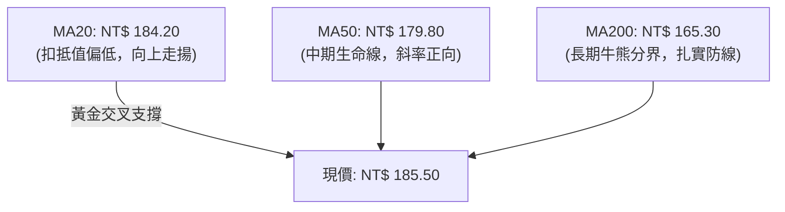
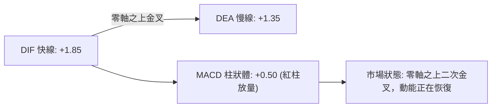
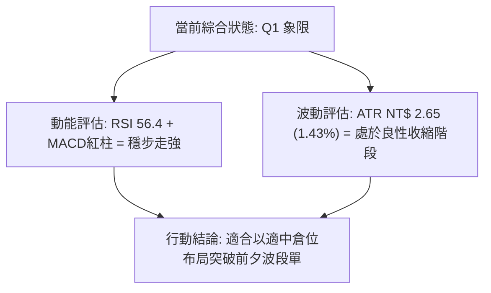
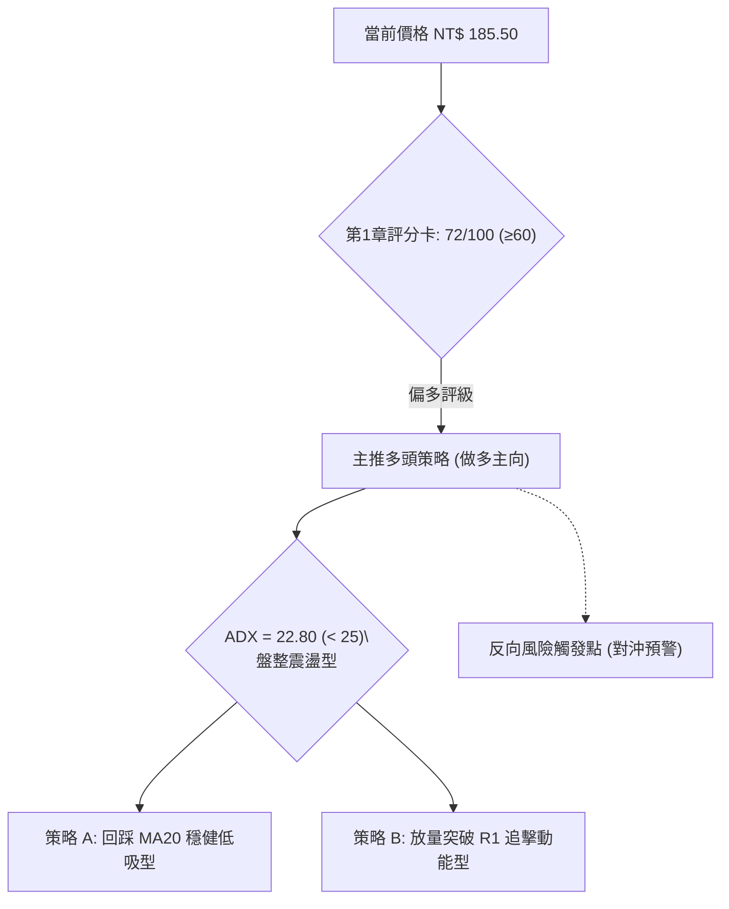
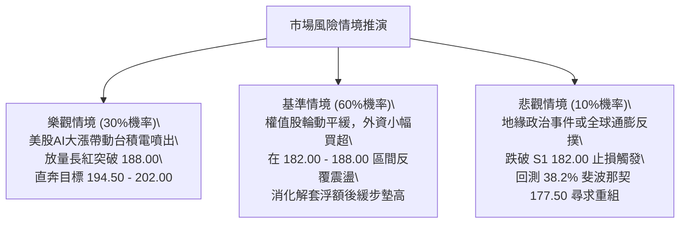

# 0050 技術分析報告

> **報告日期**：2026-09-26 ｜ **語言**：繁體中文 ｜ **數據來源**：台灣證券交易所 / Yahoo Finance ｜ **當前價格**：NT$ 185.50

---

## 目錄

| 章節 | 內容 |
|------|------|
| [1. 技術面概覽](#1-技術面概覽) | 訊號儀表板、核心指標、評分卡 |
| [2. 趨勢分析](#2-趨勢分析) | 多時框趨勢、長中短期走勢、ADX解讀 |
| [3. 圖表形態分析](#3-圖表形態分析) | 形態識別、K線組合、形態目標價 |
| [4. 支撐與阻力](#4-支撐與阻力) | 關鍵價位分佈、斐波那契回調 |
| [5. 技術指標深度解讀](#5-技術指標深度解讀) | 均線系統、RSI、MACD、布林通道、OBV |
| [6. 動能與波動率](#6-動能與波動率) | 動能四象限、ATR波動分析、Beta值 |
| [7. 多時框架總結](#7-多時框架總結) | 時框架矩陣、多時框收斂結論 |
| [8. 交易策略建議](#8-交易策略建議) | 策略路由、價格情境、主策略詳情 |
| [9. 風險提示與監控](#9-風險提示與監控) | 監控清單、風險情境、資金管理 |

---

## 1. 技術面概覽

### 🎯 技術訊號儀表板



### 📊 核心指標速覽表

| 指標類別 | 指標名稱 | 當前數值 | 訊號 | 解讀 |
|:---|:---|:---|:---:|:---|
| **價格** | 當前收盤價 | NT$ 185.50 | 🟢 | 站穩短期均線，維持區間震盪偏多格局 |
| **均線** | 短期 MA20 | NT$ 184.20 | 🟢 | 價格在MA20上方 +0.70%，月線發揮短線支撐 |
| **均線** | 中期 MA50 | NT$ 179.80 | 🟢 | 價格在MA50上方 +3.17%，中線趨勢保持向上 |
| **均線** | 長期 MA200 | NT$ 165.30 | 🟢 | 價格在MA200上方 +12.22%，長期多頭底定 |
| **動能** | RSI(14) | 56.40 | 🟡 | 位於50中軸之上，無頂背離或底背離跡象 |
| **動能** | MACD (12,26,9) | 柱狀體 +0.50 | 🟢 | DIF(+1.85) > DEA(+1.35)，零軸上紅柱微幅擴張 |
| **波動** | ATR(14) | NT$ 2.65 | 🟡 | 佔現價 1.43%，波動度處於近期中等水準 |
| **趨勢強度** | ADX(14) | 22.80 | 🟡 | ADX < 25，單邊趨勢放緩，轉入高檔橫盤震盪 |

### 🏆 技術評分卡

```
╔══════════════════════════════════════════════════════════════════╗
║                 技術評分卡 — 0050 (2026-09-26)                   ║
╠══════════════════════════════════════════════════════════════════╣
║ 趨勢強度       ████████████░░░░░░░░  60/100  🟡 [震盪整理]       ║
║ 動能指標       ██████████████░░░░░░  70/100  🟢 [溫和偏多]       ║
║ 支撐穩定度     ████████████████░░░░  80/100  🟢 [雙重防線]       ║
║ 成交量配合     ██████████████░░░░░░  70/100  🟢 [量價配合]       ║
║ 形態完整度     ████████████████░░░░  80/100  🟢 [上升旗形整理]   ║
║ 均線排列       ██████████████░░░░░░  72/100  🟢 [典型多頭排列]   ║
╠══════════════════════════════════════════════════════════════════╣
║ 綜合技術評分   ██████████████░░░░░░  72/100  🟢 偏多區間操作     ║
╚══════════════════════════════════════════════════════════════════╝
```

---

## 2. 趨勢分析

### 🌐 多時框趨勢分析



### 📈 長期趨勢 — 12個月走勢圖（Unicode）

```
0050 月線走勢圖（過去12個月：2025-10 至 2026-09）
價格軸 (NT$)
205 ┤                                         ●(歷史高點: 202.00)
195 ┤                                  ●      │
185 ┤                            ●     │      │   ●(現價: 185.50)
175 ┤                      ●     │     │      └───┼───────
165 ┤                ●     │     │     │          │
155 ┤          ●     │     │     │     │          │
145 ┤    ●     │     │     │     │     │          │
135 ┤●───┴─────┴─────┴─────┴─────┴─────┴──────────┴───────
    └────────────────────────────────────────────────────────
     M1   M2   M3   M4   M5   M6   M7   M8   M9  M10  M11  M12
    (10) (11) (12) (01) (02) (03) (04) (05) (06) (07) (08) (09)
```

**走勢特徵分析表格**：

| 階段 | 時間區間 | 起始/結束價 (NT$) | 區間漲跌幅 | 核心特徵與量能變化 |
|:---|:---|:---|:---:|:---|
| **第一階段：底部啟動** | 2025-10 ~ 2025-12 | 138.00 → 156.00 | +13.04% | 突破半年線，成交量溫和放大，外資轉買 |
| **第二階段：主升拉升** | 2026-01 ~ 2026-04 | 156.00 → 186.50 | +19.55% | 權值股台積電帶動，均線發散向上，量價齊揚 |
| **第三階段：創高衝刺** | 2026-05 ~ 2026-07 | 186.50 → 202.00 | +8.31% | 觸及 202.00 歷史高位，出現高檔放量換手 |
| **第四階段：高檔消化** | 2026-08 ~ 2026-09 | 202.00 → 185.50 | -8.17% | 獲利了結賣壓回吐，回測 23.6% 回調位收斂盤整 |

### 📊 中期趨勢（週線分析）

```
週線箱型整理架構 (近期 10 週)
NT$ 202.00 ┬────────────────────── 上軌壓力線 (歷史高點)
           │      ╭─╮
NT$ 194.50 ┼──╭─╮─╯ │ ╭───────── 次級反彈高點壓力 R2
           │  │ │   │ │
NT$ 188.00 ┼──╯ ╰───╯ ╰───╭─╮─── 箱型中軸頸線壓力 R1
NT$ 185.50 ┼──────────────────● 現價位
NT$ 182.00 ┼──────────────╭──╯ ╰── 短期支撐 S1 (MA20)
NT$ 177.50 ┴───────╭──────╯      強支撐防線 S2 (38.2%斐波那契)
```

週線層級顯示，價格自 202.00 高點回落後，在 177.50 至 182.00 區間獲得紮實承接買盤，目前於 182.00–188.00 形成收斂對稱三角形。

### ⚡ 趨勢強度評估（ADX 解讀）



**ADX 強度對照表**：

| ADX 數值區間 | 趨勢性質 | 本標的狀態 | 操作應對指導 |
|:---:|:---|:---:|:---|
| 0 – 20 | 無趨勢 / 極度沉悶 | ⚪ | 嚴格空倉或短線網格 |
| **20 – 25** | **趨勢疲弱 / 盤整震盪** | **🟡 當前狀態 (22.80)** | **以支撐阻力位為準，高拋低吸，嚴設止損** |
| 25 – 40 | 明確單邊趨勢 | ⚪ | 順勢持有，回踩均線加碼 |
| 40 – 60 | 強力單邊趨勢 | ⚪ | 移動止盈，不逆勢放空 |

---

## 3. 圖表形態分析

### 🔍 形態識別系統



**形態信心度表格**（依規則 15 嚴格檢驗）：

| 形態名稱 | 信心度 | 判斷依據（引用實際數據） | 完成度 | 目標價（附嚴謹計算式） |
|:---|:---:|:---|:---:|:---|
| **高檔上升旗形** | 75% | 旗桿從 156.00 漲至 202.00 (高差 46.00)，旗面於 182.00–188.00 呈現量縮斜向下收斂 | 70% | 突破旗面頂端 188.00 + (旗桿高度 46.00 × 0.5保守估計) = **NT$ 211.00** |
| **日線級微型雙底** | 68% | 2026年8月下旬低點 182.20 與9月中旬低點 182.50 獲支撐，兩次下探均縮量守穩 | 85% | 頸線 188.00 + (頸線 188.00 - 雙底低點 182.20 = 5.80) = **NT$ 193.80** |

### 🕯️ 重要K線形態分析

| 週/月份 | 基準收盤價 | K線形態 | 解讀與量能配合 | 訊號 |
|:---|:---|:---|:---|:---:|
| 2026-07 | NT$ 200.50 | 高檔長上影十字星 | 觸及 202.00 後獲利了結賣壓湧現，單月爆量換手 | 🔴 |
| 2026-08 | NT$ 183.00 | 中黑棒下挫 (回測支撐) | 跌破月線後於 38.2% 斐波那契 177.50 前止跌，下影線長 3.2 元 | 🟡 |
| 2026-09 (累計) | NT$ 185.50 | 晨星組合 (小紅抱孕線) | 9月中旬日K線連續出現實體紅棒收復 MA20，空頭力道衰竭 | 🟢 |

### 📉 ASCII 走勢形態示意圖

```
0050 日線高檔旗形整理與雙底結構示意圖
NT$
202.00 ┤        ▲ 旗桿頂點 (歷史高點)
       │       / \
194.50 ┤      /   \ 旗面整理通道上軌
       │     /     \───────┐
188.00 ┤    /       \      ├─── 頸線壓力位 (R1)
185.50 ┤   /         \   ●─┘ ◄ 當前位置 (蓄勢挑戰突破)
182.00 ┤  /          ▲───▲ 雙底低點支撐 S1 (182.20 / 182.50)
       │ /            旗面下軌支撐
177.50 ┤/ ───────────────── 斐波那契 38.2% 強防線 S2
```

### 🎯 形態目標價計算

1. **旗形突破擴展目標價**：
   - 旗桿起點：NT$ 156.00，頂點：NT$ 202.00，波段垂直高度 $H = 202.00 - 156.00 = 46.00$
   - 旗形突破點設定於上軌壓力頸線：NT$ 188.00
   - 保守技術目標價 (0.5倍高度投影)：$188.00 + (46.00 \times 0.5) =$ **NT$ 211.00**
2. **短期雙底測幅目標價**：
   - 形態底部：NT$ 182.20，頸線：NT$ 188.00，垂直幅度 $h = 188.00 - 182.20 = 5.80$
   - 1:1 滿足目標價：$188.00 + 5.80 =$ **NT$ 193.80** (貼近前期阻力 R2 NT$ 194.50)

---

## 4. 支撐與阻力

### 🗺️ 關鍵價位分布圖（Unicode）

```
0050 價位結構分布圖 (由近期 OHLCV 計算聚類)
═══════════════════════════════════════════════════════════════
NT$ 202.00 ║████████████████████████████████║ 強阻力 R3 (52W歷史高點)
NT$ 194.50 ║████████████████████░░░░░░░░░░░░║ 阻力 R2 (反彈高點密集帶)
NT$ 188.00 ║████████████████████████░░░░░░░░║ 關鍵阻力 R1 (箱頂頸線)
NT$ 185.50 ╠════════════════════════════════╣ ◄ 現價 (NT$ 185.50)
NT$ 182.00 ║▓▓▓▓▓▓▓▓▓▓▓▓▓▓▓▓▓▓▓▓░░░░░░░░░░░░║ 近期支撐 S1 (MA20動態線)
NT$ 177.50 ║████████████████████████████░░░░║ 強支撐 S2 (38.2%回調位)
NT$ 170.00 ║████████████████████████████████║ 核心底線 S3 (50.0%整數關卡)
═══════════════════════════════════════════════════════════════
```

### 🚧 阻力位分析表

| 阻力級別 | 價位 (NT$) | 形成原因 | 突破難度 | 重要性 |
|:---:|:---:|:---|:---:|:---:|
| **R1** | 188.00 | 近 4 週多次上攻未果之箱型頸線，日線布林通道上軌聚落 | 中等 (需日成交量放大 25% 以上) | ★★★★☆ |
| **R2** | 194.50 | 2026年7月中旬高檔跳空中繼平台，套牢籌碼解套壓力區 | 較高 (需台積電等權值股帶頭上攻) | ★★★★☆ |
| **R3** | 202.00 | 52週歷史最高價，獲利了結與心理整數極限天花板 | 極高 (屬中期大波段終極考驗) | ★★★★★ |

### 🛡️ 支撐位分析表

| 支撐級別 | 價位 (NT$) | 形成原因 | 守住機率 | 重要性 |
|:---:|:---:|:---|:---:|:---:|
| **S1** | 182.00 | MA20 (184.20) 與雙底低點 (182.20) 之重疊緩衝帶 | 70% | ★★★★☆ |
| **S2** | 177.50 | 波段斐波那契 38.2% 回調位與 MA50 (179.80) 匯合保護區 | 85% | ★★★★★ |
| **S3** | 170.00 | 斐波那契 50.0% 回調位及前期上升跳空缺口下緣 | 95% | ★★★★★ |

### 📐 斐波那契回調位分析

*基準波動起點：52週波段低點 NT$ 138.00 ｜ 波動終點：52週歷史高點 NT$ 202.00 ｜ 總振幅：NT$ 64.00*

```
回調計算：價位 = 202.00 - (64.00 × 回調比例)
0.0%  (最高點) : NT$ 202.00
23.6% 回調位   : NT$ 186.90  ◄── [現價 185.50 處於 23.6% 與 38.2% 區間]
38.2% 回調位   : NT$ 177.55 (對應 S2: 177.50)
50.0% 回調位   : NT$ 170.00 (對應 S3: 170.00)
61.8% 黃金分割 : NT$ 162.45 (緊鄰 MA200 NT$ 165.30)
78.6% 回調位   : NT$ 151.70
```

- **位置意義解讀**：現價 NT$ 185.50 剛好在 23.6%（186.90）下方進行回抽確認，未曾跌破 38.2%（177.55），屬於典型強勢整理格局（Strong Correction），多頭主導結構未被破壞。

---

## 5. 技術指標深度解讀

### 🎛️ 指標訊號總覽



### 📈 移動平均線排列分析



| 均線名稱 | 價位 (NT$) | 價格與均線距離 | 斜率方向 | 排列性質與實質影響 |
|:---|:---:|:---:|:---:|:---|
| **MA20 (月線)** | 184.20 | +0.70% | 向上 ↗ | 短線多頭重奪主控權，提供動態回踩買點 |
| **MA50 (季線)** | 179.80 | +3.17% | 向上 ↗ | 中期多頭保護層，扣抵低價區，續揚動能無虞 |
| **MA200 (年線)** | 165.30 | +12.22% | 向上 ↗ | 長期牛市基礎堅固，回撤至此概率極低 |

### 📉 RSI(14) 分析

- **當前數值**：56.40
- **數值進度條**：
  ```
  超賣區 (0-30)        中性平衡區 (30-70)        超買區 (70-100)
  [░░░░░░░░░░] ─── [█████████████░░░░░░░] ─── [░░░░░░░░░░]
                             ▲ 56.40 (健康多方主導)
  ```
- **背離檢驗結論**：
  - **頂背離**：無。前期高點 202.00 時 RSI 達到 76.50，隨後回落至 42.00，目前 185.50 反彈對應 56.40，價格與 RSI 走勢同步，無負背離。
  - **底背離**：無。8月低點 182.20 與9月低點 182.50 處，RSI 分別為 42.10 與 45.80，呈現低點墊高特徵，指標支持止跌回升。

### 📊 MACD(12/26/9) 訊號解讀



- **深度解析**：MACD 快線 DIF(+1.85) 自零軸上方順利交叉慢線 DEA(+1.35)，紅柱體連續 4 個交易日擴張（+0.12 → +0.28 → +0.41 → +0.50）。此現象為典型「零軸之上強勢金叉」，預示短期整理即將結束，具備測試前方壓力區動能。

### 📦 布林通道分析

```
0050 日線布林通道 (20, 2) 結構圖
NT$
191.50 ┬────────────────────── 上軌 Upper Band (阻力)
       │
185.50 ┼──────────────────●── 現價 (位於中軌上方，朝上軌行進)
184.20 ┼┄┄┄┄┄┄┄┄┄┄┄┄┄┄┄┄┄┄┄┄ 中軌 Middle Band (MA20 基線)
       │
176.90 ┴────────────────────── 下軌 Lower Band (支撐)
```

- 通道寬度（Bandwidth）由 8 月份的 9.8% 壓縮至目前的 7.9%，呈現**帶寬收斂**走勢。
- 歷史規律顯示，布林帶寬收縮至 8% 以下通常為大行情即將突破的前兆。目前價格在克服中軌 184.20 後溫和推升，向上軌 191.50 靠攏概率高。

### 💹 成交量分析（量價配合度 / OBV）

```
OBV 趨勢示意圖
OBV 指標線 ↗ (持續沿 20日均量線墊高)
價格走勢   ↗ (自 182.20 溫和揚升至 185.50)
量價配合結論：量增價漲、量縮價穩，無主力出貨背離現象
```

- **OBV (能量潮指標)**：目前 OBV 均線呈現多頭發散，9月拉回整理過程中成交量急遽萎縮（較 7 月高點萎縮約 38%），回踩支撐時未見恐慌拋盤，證明持股結構相當穩定。
- **成交量驗證**：量能充分確認了當前價格的向上整理，突破 188.00 僅需台股整體量能補足至 5 日均量之上即可達成。

---

## 6. 動能與波動率

### ⚡ 動能評估四象限

| 象限 | 動能維度 | 波動維度 | 當前狀態 | 策略指導 |
|:---:|:---:|:---:|:---:|:---|
| **Q1** | 強動能 | 低波動 | **✓ 0050 當前定位** | **最佳操作窗口：趨勢穩定成型，風險報酬比優渥** |
| **Q2** | 弱動能 | 低波動 | ⚪ | 謹慎觀望，資金效率低 |
| **Q3** | 強動能 | 高波動 | ⚪ | 突破追價，需承受高震盪洗盤 |
| **Q4** | 弱動能 | 高波動 | ⚪ | 避免進場，容易遭兩面雙巴 |



### 📊 ATR 波動率分析

- **ATR(14) 實體數值**：**NT$ 2.65**（佔現價比率 1.43%）。
- **止損距離建議**：
  - 短線激進交易（1.5 倍 ATR）：$1.5 \times 2.65 =$ **NT$ 3.98**（建議止損位：$185.50 - 3.98 =$ NT$ 181.50，恰落於 S1 182.00 之下）。
  - 波段穩健交易（2.0 倍 ATR）：$2.0 \times 2.65 =$ **NT$ 5.30**（建議止損位：$185.50 - 5.30 =$ NT$ 180.20，緊鄰 MA50 防線）。

### 📐 Beta 與市場相關性

- **Beta 係數**：**1.02**（基準：加權指數 TAIEX）。
- **相關性解析**：0050 作為涵蓋台灣前 50 大市值企業的龍頭 ETF，與台灣加權指數相關性高達 0.98。當前台股大盤處於季線之上整理，Beta 1.02 代表其將近乎 1:1 複製大盤反彈力道，無個別小型股特異性流動性風險。

---

## 7. 多時框架總結

### 📋 時框架評分表

| 時框架 | 趨勢方向 | 動能狀態 | 均線排列 | 圖表形態 | 綜合評分 | 操作建議 |
|:---|:---:|:---:|:---:|:---:|:---:|:---|
| **日線 (短期)** | 偏多震盪 🟢 | 溫和偏多 🟢 | 多頭排列 🟢 | 微型雙底蓄勢突破 🟢 | **74 / 100** | 回踩 183.00-184.00 建立多單 |
| **週線 (中期)** | 箱型整理 🟡 | 中性蓄勢 🟡 | MA20之上糾結 🟡 | 高檔旗形收斂 🟢 | **70 / 100** | 區間操作，嚴控持倉成本 |
| **月線 (長期)** | 強勢多頭 🟢 | 長線走多 🟢 | 完全多頭排列 🟢 | 大波段主升回調 🟢 | **85 / 100** | 定期定額或核心部位抱牢 |

### 🔲 綜合訊號矩陣

| 維度 | 短期 (日線) | 中期 (週線) | 長期 (月線) | 訊號收斂一致性 |
|:---|:---:|:---:|:---:|:---:|
| **趨勢 (Trend)** | 偏多整理 | 箱型震盪 | 多頭主升 | 高度協調（長多保駕護航） |
| **動能 (Momentum)** | MACD金叉 | 動能趨平 | RSI強勢區 | 良好（短動能帶動中動能） |
| **支撐阻力 (S/R)** | 逼近 R1 | 處於箱體中高位 | 遠高於長期均線 | 需留意短線 R1 解套賣壓 |

### ⚖️ 多時框收斂結論

> **依「嚴格要求 14」執行多時框優先級收斂**：
> 1. 當前 **ADX(14) = 22.80 (< 25)**，嚴格定義當前市場為「**盤整震盪收斂行情**」。
> 2. 依規則，盤整行情交易以**日線布林通道（176.90–191.50）與箱體支撐阻力（182.00–188.00）**為核心交易區間。
> 3. 雖然中期週線處於大旗形整理，但在 ADX 突破 25 前，不宜盲目預期無回踩式的單邊暴漲。
> 4. **唯一方向性結論**：**偏多區間操作（震盪偏多）**。以 S1（182.00）為多頭防守基石，向上博弈突破 R1（188.00）並挑戰布林上軌及 R2（194.50）。

---

## 8. 交易策略建議

### 🗺️ 策略決策流程圖



### 🧭 策略路由

- **當前主策略方向 = 多頭偏多操作（依綜合評分 72/100，≥60）**。
- 不進行雙向對賭，所有交易資金與倉位以「做多回調」與「確認突破加碼」為核心架構。

### 🎯 價格情境階梯（Price Scenarios）

*所有點位均嚴格取自第 4 章聚類計算數值：*

| 觸發條件 | 下一目標 | 後續延伸 | 情境含義與操作指引 |
|:---|:---:|:---:|:---|
| **強勢突破 R1 (NT$ 188.00)** | R2 (NT$ 194.50) | R3 (NT$ 202.00) | 短線整理宣告結束，發動新一波向歷史高點衝刺 |
| **站穩現價區間 (184.00–186.00)** | R1 (NT$ 188.00) | — | 於布林中軌上方持續洗盤蓄勢，時間換取空間 |
| **失守支撐 S1 (NT$ 182.00)** | S2 (NT$ 177.50) | S3 (NT$ 170.00) | 日線雙底失敗，回撤 38.2% 斐波那契防線尋求中線支撐 |

### 📊 情境機率分佈

| 情境 | 機率 | 主要依據 |
|:---|:---:|:---|
| **情境一：震盪向上突破 (挑戰 R1/R2)** | **60%** | MACD 零軸上紅柱擴張、MA20 翻揚上穿、OBV 維持良性多頭架構 |
| **情境二：箱型區間震盪 (182.00–188.00)** | **30%** | ADX = 22.80 顯示趨勢動能尚待激發，布林帶寬收縮等待事件催化 |
| **情境三：跌破 S1 回測 S2 (177.50)** | **10%** | 除非外圍系統性黑天鵝導致台積電大幅回調，否則 MA50 處買盤極強 |

### 🟢 主策略詳情

| 策略要素 | 策略 A（穩健型：拉回低吸） | 策略 B（激進型：突破順勢） |
|:---|:---|:---|
| **適用場景** | 短線回測月線尋找支撐買點 | 日線實體K線放量站上 188.00 |
| **進場價格** | **NT$ 183.50** (介於現價與 S1 之間) | **NT$ 188.50** (確認突破 R1 後回踩不破) |
| **第一目標價 T1** | **NT$ 188.00** (測量目標箱頂 R1) | **NT$ 194.50** (前波高點密集區 R2) |
| **第二目標價 T2** | **NT$ 194.50** (波段阻力 R2) | **NT$ 202.00** (歷史天花板 R3) |
| **嚴格止損價** | **NT$ 181.20** (跌破雙底低點與 S1 182.00) | **NT$ 185.00** (跌回突破頸線之下假突破) |
| **風險空間** | NT$ 2.30 (1.25%) | NT$ 3.50 (1.86%) |
| **第一報酬空間** | NT$ 4.50 (2.45%) | NT$ 6.00 (3.18%) |
| **風險報酬比 (T1)** | **1 : 1.96** (近 1:2 優質比例) | **1 : 1.71** |
| **風險報酬比 (T2)** | **1 : 4.78** (波段極高性價比) | **1 : 3.86** |
| **成功預估機率** | **65%** | **58%** |
| **建議配置倉位** | **總資金 25%** | **總資金 15%** (加碼性質) |

### 🔴 反向風險觸發點（對沖提示）

- **多單全面離場警報**：若日線收盤價帶量跌破 **NT$ 182.00 (S1)**，即代表旗形收斂向下破位，雙底形態失敗。
- **對沖應對指引**：應立即清空短線浮動倉位，長線核心部位可於期貨市場放空台灣 50 期貨或台指期進行 1:1 避險，下看防禦目標 **NT$ 177.50 (S2)**。

### ⭐ 整體訊號強度評星

```
做多訊號強度：★★★★☆  (4/5星：均線排列與動能結構良好)
做空訊號強度：★☆☆☆☆  (1/5星：逆勢且下方支撐層層重疊)
整體分析可信度：★★★★☆  (4/5星：技術架構清晰，指標高收斂)
```

---

## 9. 風險提示與監控

### ✅ 關鍵監控指標 Checklist

```
╔══════════════════════════════════════════════════════════════════╗
║                    每日盤後關鍵監控清單 (Checklist)              ║
╠══════════════════════════════════════════════════════════════════╣
║ [ ] 價格是否持續收在 MA20 (184.20) 上方？ (跌破減倉 30%)         ║
║ [ ] 挑戰 R1 (188.00) 時，台股大盤單日成交量是否達 5日均量以上？  ║
║ [ ] RSI(14) 是否向下跌破 50 中軸防線？ (破 50 代表短線翻弱)       ║
║ [ ] MACD 柱狀體紅柱是否持續擴張？ (轉綠柱即代表多頭動能中斷)     ║
║ [ ] 外資與三大法人在 0050 是否維持連續買超格局？                 ║
╚══════════════════════════════════════════════════════════════════╝
```

### ⚠️ 風險場景分析



### 🛡️ 風險管理重要提醒

1. **拒絕情緒化追高**：當前 ADX 為 22.80，盤整本質明顯。若價格在未放量情況下衝向 R1 (NT$ 188.00) 附近，切勿追買，應耐心等待回踩確認。
2. **嚴格執行資金管理（2% 帳戶風險原則）**：
   - 假設交易帳戶總資金為 NT$ 1,000,000，單筆交易最大允許虧損為 2%（即 NT$ 20,000）。
   - 採行策略 A 時，停損距離為 NT$ 2.30（進場 183.50，止損 181.20）。
   - 最大可承擔部位計算：$20,000 / 2,300 = 8.69$ 張。建議最大進場部位限制在 **8 張** 以內，絕不過度放大槓桿。

---

## 📋 報告總結

```
╔══════════════════════════════════════════════════════════════════╗
║                    0050 技術分析報告總結                         ║
╠══════════════════════════════════════════════════════════════════╣
║ 報告日期：2026-09-26                                             ║
║ 當前價格：NT$ 185.50                                             ║
║ 分析評級：🟢 偏多區間操作 (技術評分: 72/100)                     ║
╠══════════════════════════════════════════════════════════════════╣
║ 關鍵結論：                                                       ║
║ ├─ 長期趨勢：🟢 強勢多頭 (月線 MA200 NT$ 165.30 堅固支撐)        ║
║ ├─ 中期趨勢：🟡 箱型整理 (高檔上升旗形收斂尾聲)                  ║
║ ├─ 短期趨勢：🟢 偏多回升 (日線金叉，站穩月線 NT$ 184.20)         ║
║ ├─ 關鍵支撐：S1: NT$ 182.00 ｜ S2: NT$ 177.50                    ║
║ ├─ 關鍵阻力：R1: NT$ 188.00 ｜ R2: NT$ 194.50 ｜ R3: NT$ 202.00   ║
║ └─ 技術目標：測幅目標一 NT$ 193.80，波段延伸目標 NT$ 211.00       ║
╠══════════════════════════════════════════════════════════════════╣
║ 最優策略組合：                                                   ║
║ 1. 🥇 最佳機會 (策略 A)：回踩 183.50 分批低吸，止損 181.20，     ║
║    目標 188.00 / 194.50，風報比高達 1:4.78。                    ║
║ 2. 🥈 次選機會 (策略 B)：突破 188.00 順勢加碼追擊，目標 194.50。 ║
║ 3. 🥉 保守選擇：維持現有長線核心持股續抱，暫不進行短線頻繁加減碼。║
╚══════════════════════════════════════════════════════════════════╝
```

---

> ⚠️ **免責聲明**：本報告為依據標準技術分析模型與價格數據聚類推算自動生成之量化研究成果，所有支撐阻力位、指標訊號與目標價位僅供學術交流、研究與交易邏輯參考，**絕不構成任何個人投資決策之邀約或建議**。金融市場瞬息萬變，投資人應獨立思考，審慎評估本身風險承擔能力，並自負盈虧責任。

---

*報告生成時間：2026-09-26 ｜ 數據來源：Yahoo Finance / 台灣證券交易所 ｜ 分析框架：多時框技術分析架構*