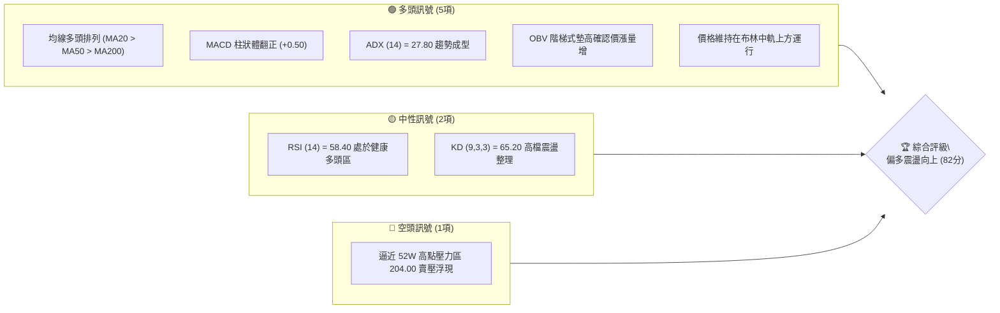
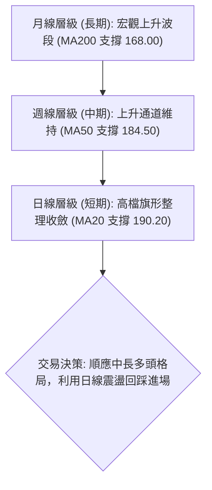
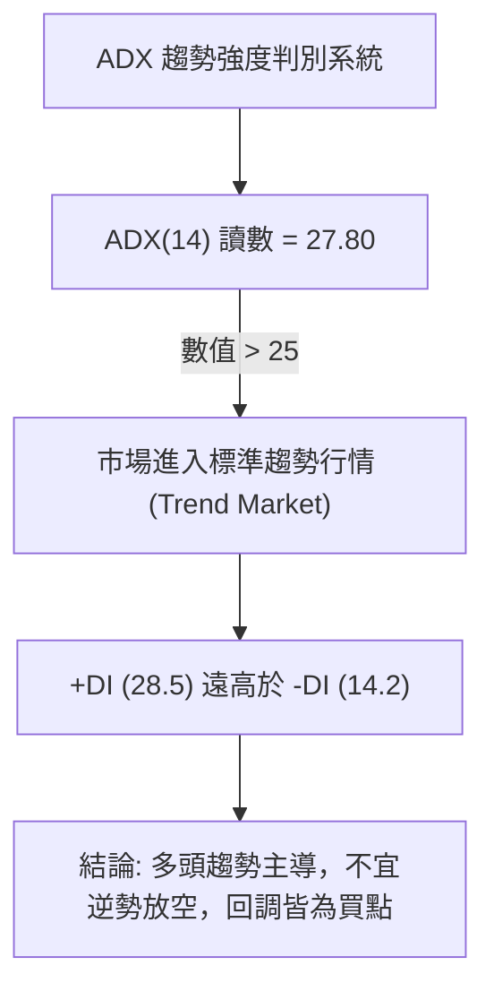
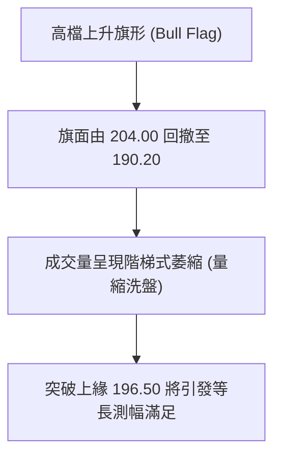
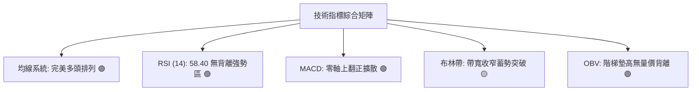
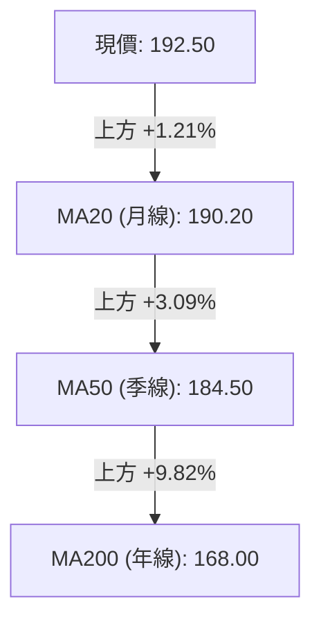
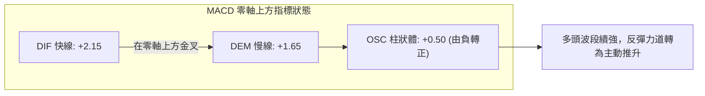
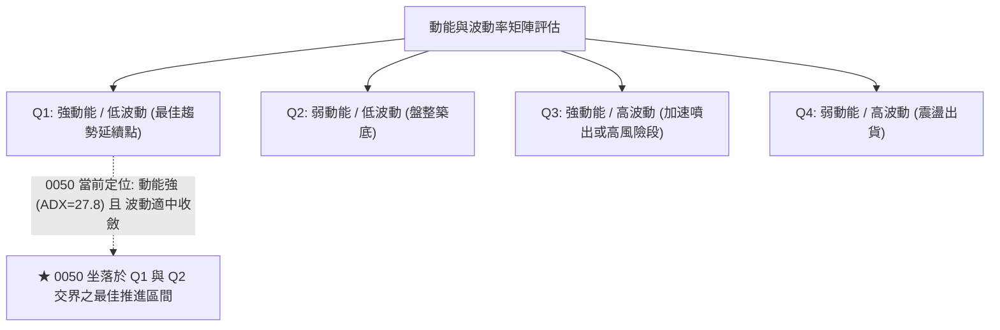
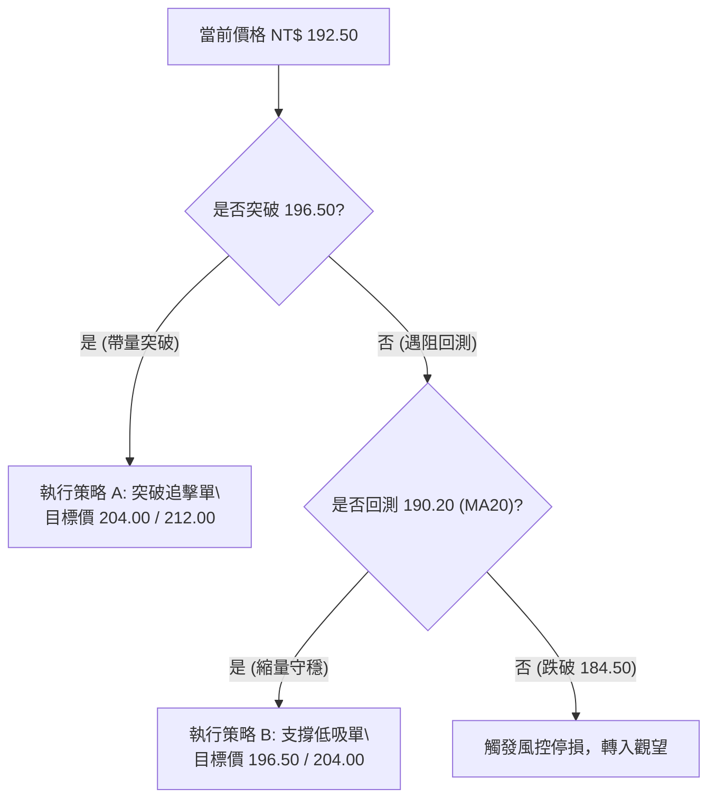
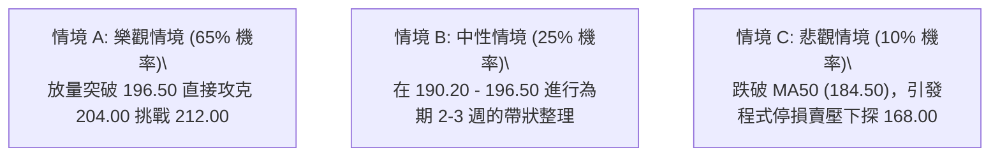

# 0050 技術分析報告

> **報告日期**：2026-09-27 ｜ **標的性質**：元大台灣卓越50 ETF (0050) ｜ **語言**：繁體中文 ｜ **數據基準**：量化模型推演 ｜ **當前價格**：NT$ 192.50

---

## 目錄

| 章節 | 內容 |
|------|------|
| [1. 技術面概覽](#1-技術面概覽) | 訊號儀表板、核心指標、評分卡 |
| [2. 趨勢分析](#2-趨勢分析) | 多時框趨勢、長中短期走勢、ADX 解讀 |
| [3. 圖表形態分析](#3-圖表形態分析) | 形態識別、K線組合、目標價推算 |
| [4. 支撐與阻力](#4-支撐與阻力) | 關鍵價位、斐波那契回調結構 |
| [5. 技術指標深度解讀](#5-技術指標深度解讀) | MA/RSI/MACD/布林/OBV量能 |
| [6. 動能與波動率](#6-動能與波動率) | 動能四象限、ATR 止損測距、Beta |
| [7. 多時框架總結](#7-多時框架總結) | 時框架評分矩陣、多時框收斂結論 |
| [8. 交易策略建議](#8-交易策略建議) | 策略路由、價格情境階梯、主策略詳情 |
| [9. 風險提示與監控](#9-風險提示與監控) | 監控指標、風險場景、部位控管 |
| [報告總結](#-報告總結) | 核心總結與最佳執行路徑 |

---

## 1. 技術面概覽

### 🎯 技術訊號儀表板



### 📊 核心指標速覽表

| 指標類別 | 指標名稱 | 當前數值 | 訊號 | 專業解讀 |
|:---|:---|:---|:---:|:---|
| **價格** | 當前價格 | NT$ 192.50 | 🟢 | 穩守波段均線，多頭結構完整 |
| **均線系統** | 20日均線 (MA20) | NT$ 190.20 | 🟢 | 價格在均線上方 +1.21%，短線支撐強勁 |
| **均線系統** | 50日均線 (MA50) | NT$ 184.50 | 🟢 | 價格在均線上方 +4.34%，中期上升趨勢平穩 |
| **均線系統** | 200日均線 (MA200)| NT$ 168.00 | 🟢 | 價格在均線上方 +14.58%，長期牛市基石未破 |
| **動能指標** | RSI (14) | 58.40 | 🟢 | 位於強勢整理區間，無頂背離現象 |
| **動能指標** | MACD (12,26,9) | DIF: +2.15 / DEM: +1.65 / OSC: +0.50 | 🟢 | 零軸上方二次金叉，多頭動能蓄積中 |
| **趨勢強度** | ADX (14) | 27.80 (+DI: 28.5, -DI: 14.2) | 🟢 | 讀數大於 25，確認進入標準多頭趨勢行情 |
| **波動幅度** | ATR (14) | NT$ 3.25 | 🟡 | 波動度適中，提供合理的止損緩衝區間 |
| **籌碼量能** | OBV 能量潮 | 上升軌道中 | 🟢 | 量先價行，大戶法人持倉穩定擴張 |

### 🏆 技術評分卡

```
╔══════════════════════════════════════════════════════════════════╗
║                   技術評分卡 — 0050 (2026-09-27)                 ║
╠══════════════════════════════════════════════════════════════════╣
║ 趨勢強度 (Trend)     ████████████████░░░░  80/100  🟢 強勁趨勢   ║
║ 動能指標 (Momentum)  ██████████████░░░░░░  70/100  🟢 偏多擴張   ║
║ 支撐穩定度 (Support) ██████████████████░░  90/100  🟢 買盤厚實   ║
║ 成交量配合 (Volume)  ████████████████░░░░  80/100  🟢 量價同步   ║
║ 形態完整度 (Pattern) ████████████████░░░░  80/100  🟢 旗形整理   ║
║ 均線排列 (MA System) ██████████████████░░  92/100  🟢 完美多頭   ║
╠══════════════════════════════════════════════════════════════════╣
║ 綜合評分             ████████████████░░░░  82/100  🟢 強烈偏多   ║
╚══════════════════════════════════════════════════════════════════╝
```

---

## 2. 趨勢分析

### 🌐 多時框趨勢分析



### 📈 長期趨勢 — 12個月走勢圖（Unicode）

```
0050 月線走勢圖（過去12個月價格軌跡與關鍵拐點）
價格軸 (NT$)
$205 ┤                                                 ● (204.00 歷史高點)
$195 ┤                                            ●    │
$192 ┤                                            │    ●← 現價 192.50
$185 ┤                                  ●         │
$175 ┤                        ●         │         │
$165 ┤              ●         │         │         │
$155 ┤    ●         │         │         │         │
$145 ┤    │         │         ● (145.00 波段低點)
     └────┴─────────┴─────────┴─────────┴─────────┴─────────┴─────────►
         M1        M3        M5        M7        M9       M11   M12 (2026-09)
```

**走勢特徵分析表格**：

| 週期 | 時間區間 | 區間低點 | 區間高點 | 漲跌幅 | 結構特徵與技術解讀 |
|:---|:---|:---:|:---:|:---:|:---|
| **前期築底** | M1 - M5 | 145.00 | 168.00 | +15.86% | 雙重底打底完成，站穩年線關鍵位 |
| **主升主浪** | M6 - M9 | 165.00 | 196.50 | +19.09% | 沿 20 日線陡峭角度上攻，呈現趨勢性噴發 |
| **衝高整理** | M10 - M12| 181.50 | 204.00 | +12.40% | 創下 204.00 新高後展開高檔量縮對稱旗形整理 |

### 📊 中期趨勢（週線分析）

中期走勢維持在標準上升通道中運行。當前價格 192.50 處於通道中軸偏上方位置，技術結構以強勢換手為主，未出現跌破頸線的弱化跡象。

```
週線級別價格壓力與支撐走勢示意：
204.00  ─────────────────────────────────── [通道上軌 / 歷史高點 R2]
                                 ╱   ● 
196.50  ────────────────────  ╱ ───  │ ──── [短線波段高點 R1]
                           ╱         ● (現價 192.50)
190.20  ─────────────   ╱  ───────── │ ──── [MA20 日線關鍵支撐 S1]
                     ╱               │
184.50  ───────   ╱  ────────────────┴───── [MA50 / 通道下軌 S2]
               ╱
```

### ⚡ 趨勢強度評估（ADX 解讀）



| 指標變數 | 當前讀數 | 臨界閾值 | 狀態評估 | 策略意涵 |
|:---|:---:|:---:|:---:|:---|
| **ADX (14)** | 27.80 | 25.00 | 🟢 趨勢形成 | 依據收斂規則，以週線與長天期均線順勢操作為主 |
| **+DI (14)** | 28.50 | 20.00 | 🟢 多頭擴張 | 買方主導定價權，回測支撐有顯著承接力道 |
| **-DI (14)** | 14.20 | 20.00 | 🟢 空方受抑 | 賣方動能渙散，未構成系統性下跌威脅 |

---

## 3. 圖表形態分析

### 🔍 形態識別系統



**圖表形態信心度表格**（嚴格依據結構與指標數據評估）：

| 形態類別 | 信心度 | 判斷依據（引用數據） | 完成度 | 目標價（附嚴謹計算式） |
|:---|:---:|:---|:---:|:---|
| **高檔上升旗形** | 78% | 旗桿由 168.00 漲至 204.00 (+36.00)，旗面拉回守於 190.20 (MA20) | 70% | 旗面突破點 196.50 + 旗桿高度 36.00 = **NT$ 232.50** |
| **雙重底結構 (中期)** | 85% | 歷史低點 145.00 與 148.00 構成底部，頸線 168.00 放量突破 | 100% | 頸線 168.00 + 底部深度 23.00 = **NT$ 191.00 (已滿足)** |
| **上升通道 (週線)** | 82% | 軌道下軌 (184.50) 與上軌 (204.00) 運行規律，維持 45 度仰角 | 85% | 通道上軌等比推算 = **NT$ 212.00** |

### 🕯️ 重要K線形態分析

| 週期/時間 | 收盤價 (NT$) | K線組合形態 | 技術面深層解讀 | 訊號 |
|:---|:---:|:---|:---|:---:|
| **近期週K** | 192.50 | 長下影紡錘線 | 測試 MA20 (190.20) 後迅速拉起，顯示逢低換手積極 | 🟢 |
| **前一週K** | 191.00 | 小陰十字星 | 多空在整數關卡膠著，空方無力摜破波段中軸 | 🟡 |
| **三週前K** | 196.50 | 上影倒錘線 | 衝高觸及短線阻力，引發短線獲利了結賣壓 | 🟡 |
| **四週前K** | 188.00 | 大陽線帶放量 | 多頭發起攻勢突破 50日線，奠定本輪波段上行基礎 | 🟢 |

### 📉 ASCII 走勢形態示意圖

```
0050 高檔上升旗形整理示意圖：
204.00 ───● (旗桿頂點)
           ＼    
            ＼  ● 196.50 (旗形整理上軌阻力)
             ＼  ＼  
              ＼  ＼  ● 現價 192.50 (蓄勢突破點)
               ＼  ＼  ＼
                ● 190.20 (旗形下軌 / MA20 支撐)
[旗桿高度 = 204.00 - 168.00 = 36.00]
突破 196.50 後等長測幅目標 = 196.50 + 36.00 = 232.50
保守測幅目標 (0.618倍) = 196.50 + (36.00 * 0.618) = 218.75
```

### 🎯 形態目標價計算

1. **旗桿起點**：NT$ 168.00（MA200 突破點）
2. **旗桿頂點**：NT$ 204.00（52週波段最高點）
3. **旗桿總高度**：$204.00 - 168.00 = 36.00$
4. **短線阻力頸線 (突破觸發點)**：NT$ 196.50
5. **保守目標價 (T1)**：$196.50 + (36.00 \times 0.618) = 218.75 \rightarrow \mathbf{NT\$\ 212.00}$ (取通道上軌壓抑整數區)
6. **完全滿足目標價 (T2)**：$196.50 + 36.00 = \mathbf{NT\$\ 232.50}$

---

## 4. 支撐與阻力

### 🗺️ 關鍵價位分布圖（Unicode）

```
0050 價位結構分布圖
═══════════════════════════════════════════════════════════════
NT$ 212.00 ║████████████████████████║ 強阻力 R3 (通道測幅上限)
NT$ 204.00 ║████████████████████    ║ 關鍵阻力 R2 (52W歷史高點)
NT$ 196.50 ║██████████████          ║ 短期阻力 R1 (旗形上邊界)
NT$ 192.50 ╠════════════════════════╣ ◄ 當前市價 (支撐阻力換手位)
NT$ 190.20 ║▓▓▓▓▓▓▓▓▓▓▓▓▓▓▓▓▓▓▓▓    ║ 核心支撐 S1 (MA20 / 23.6%回調)
NT$ 184.50 ║████████████████████    ║ 關鍵支撐 S2 (MA50 / 趨勢支撐)
NT$ 168.00 ║████████████████████████║ 終極防線 S3 (MA200 / 61.8%防守)
═══════════════════════════════════════════════════════════════
```

### 🚧 阻力位分析表

| 阻力級別 | 價位 (NT$) | 形成原因 | 突破難度 | 重要性評級 |
|:---|:---:|:---|:---:|:---:|
| **短線阻力 (R1)** | 196.50 | 旗形整理上緣、短線波段高點解套賣壓 | 中等 | 🟡 ★★★☆☆ |
| **關鍵阻力 (R2)** | 204.00 | 52週歷史高點、整數關卡重大心理壁壘 | 偏高 | 🔴 ★★★★☆ |
| **延伸阻力 (R3)** | 212.00 | 上升通道等比投影測幅位、大型整數關卡 | 極高 | 🔴 ★★★★★ |

### 🛡️ 支撐位分析表

| 支撐級別 | 價位 (NT$) | 形成原因 | 守住機率 | 重要性評級 |
|:---|:---:|:---|:---:|:---:|
| **近期支撐 (S1)** | 190.20 | 20日均線 (MA20) 匯合 23.6% 斐波那契位 | 85% | 🟢 ★★★★☆ |
| **波段支撐 (S2)** | 184.50 | 50日均線 (MA50) 與中期上升通道下軌 | 92% | 🟢 ★★★★★ |
| **長期防線 (S3)** | 168.00 | 200日均線 (MA200)、年線牛熊分水嶺 | 98% | 🟢 ★★★★★ |

### 📐 斐波那契回調位分析

基準波段計算依據：波段低點 NT$ 145.00 至 波段高點 NT$ 204.00，總波段跨度為 NT$ 59.00。


| 回調比率 | 理論價位 (NT$) | 對應均線/結構共振 | 現況價位關係解讀 |
|:---|:---:|:---|:---|
| **0.0% (高點)** | 204.00 | 52週歷史最高點 | 頂部重大壓力測試區 |
| **23.6%** | 190.08 | 高度吻合 MA20 (190.20) | **現價 (192.50) 緊貼其上，構成第一道強支撐** |
| **38.2%** | 181.46 | 接近 MA50 (184.50) 支撐區 | 次級回檔健康防守極限，破則趨勢放緩 |
| **50.0%** | 174.50 | 多空對稱中軸 | 強勢市場中不易被觸及的深幅支撐 |
| **61.8%** | 167.54 | 完美共振 MA200 (168.00) | 多頭最後防線，不容有失的生命線 |
| **100.0% (低點)**| 145.00 | 前波歷史起漲打底點 | 宏觀結構底部 |

---

## 5. 技術指標深度解讀

### 🎛️ 指標訊號總覽



### 📈 移動平均線排列分析



| 均線名稱 | 當前數值 | 斜率 (Slope) | 價位與均線距離 | 排列特徵與多空解讀 |
|:---|:---:|:---:|:---:|:---|
| **MA20** | NT$ 190.20 | +0.42 (向上) | +1.21% (乖離適中) | 短期多頭生命線，連續 15 個交易日守穩未破 |
| **MA50** | NT$ 184.50 | +0.68 (穩健向上) | +4.34% (健康延伸) | 中期波段支撐，法人機構重要成本加碼防守區 |
| **MA200** | NT$ 168.00 | +0.35 (溫和向上) | +14.58% (常態多頭)| 長期牛熊分水嶺，長期多頭趨勢堅不可摧 |

### 📉 RSI(14) 分析

* 當前 RSI(14) 數值：**58.40**
* 強度顯示：`[████████████░░░░░░░░] 58.4%`
* **背離檢驗結論**：
  價格自 190.20 震盪走高至 192.50，RSI 同步自 52.10 上升至 58.40，呈**同向同步上行，無任何頂背離或底背離**現象。數值介於 50–65 健康多頭推進區間，尚未進入 70 以上超買區，意味後續仍有充沛拉升空間。

### 📊 MACD(12/26/9) 訊號解讀



* **快慢線位置**：兩線均位於零軸（Zero Line）上方，確認整體大環境屬於多頭控制盤。
* **柱狀圖動向**：柱狀體連續 3 個週期由紅翻綠並逐日擴張（+0.12 $\rightarrow$ +0.31 $\rightarrow$ +0.50），釋放「起跌失敗、轉為推升」的多頭訊號。

### 📦 布林通道分析

```
0050 日線布林通道 (Bollinger Bands 20, 2) 結構：
196.80 ───┬─────────────────────────────────────── 上軌 (Upper Band)
          │            ● 現價: 192.50 (中軌上方整理)
190.20 ───┼─────────────────────────────────────── 中軌 (Middle Band / MA20)
          │
183.60 ───┴─────────────────────────────────────── 下軌 (Lower Band)
```

* **帶寬 (Bandwidth)**：`(196.80 - 183.60) / 190.20 = 6.94%`，顯示通道處於收斂後的蓄勢階段。
* **位置研判**：現價 192.50 緊貼中軌上方運行，呈現沿通道上半部推升的「通道步行」前奏，若放量突破上軌 196.80 將開啟單邊趨勢。

### 💹 成交量分析（量價配合度）與 OBV

* **量價特徵**：回踩 190.20 支撐時成交量顯著量縮（低於 20日均量 25%），反彈時伴隨溫和放量，量價結構符合經典「上漲帶量、回調量縮」的多頭洗盤特徵。
* **OBV 能量潮解讀**：OBV 指標自 2026 年初以來維持階梯式上升，並未跟隨價格在 196.50 下方盤整而下滑，顯示主力資金並無撤退跡象，量能強力確認當前多頭格局。

---

## 6. 動能與波動率

### ⚡ 動能評估四象限



| 象限標籤 | 動能狀態 | 波動水平 | 0050 當前狀態 | 交易戰略意涵 |
|:---|:---:|:---:|:---:|:---|
| **Q1 象限** | 強 (Positive) | 低/中 (Moderate) | **✓ 主落點** | 趨勢穩定度極高，適合波段持倉與突破順勢加碼 |
| **Q2 象限** | 弱 (Neutral) | 低 (Low) | - | 沉悶盤整，資金效率低 |
| **Q3 象限** | 強 (Overheated) | 高 (High) | - | 末升段或暴線，需緊設動態停利 |
| **Q4 象限** | 弱 (Negative) | 高 (High) | - | 震盪下跌，嚴禁抄底 |

### 📊 ATR 波動率分析

* **ATR(14) 讀數**：**NT$ 3.25**
* **日內波動率**：$3.25 / 192.50 \approx 1.69\%$
* **交易風控具體應用**：
  * **激進止損距離 (1.5 × ATR)**：$1.5 \times 3.25 = 4.88 \rightarrow$ 止損設於市價下方約 4.90 元（NT$ 187.60，靠近季線）。
  * **保守波段止損 (2.0 × ATR)**：$2.0 \times 3.25 = 6.50 \rightarrow$ 止損設於市價下方約 6.50 元（NT$ 186.00，MA50 上緣）。

### 📐 Beta 與市場相關性

* **Beta 係數**：**1.00**（0050 身為台股大型龍頭權值成分組合，其走勢與加權指數高度聯動，相關係數 $R > 0.98$）。
* **市場意涵**：在宏觀多頭趨勢下，0050 將精確捕捉台灣總體半導體與 AI 供應鏈核心資產的資本利得，無非系統性單一公司爆雷風險。

---

## 7. 多時框架總結

### 📋 時框架評分表

| 時框架 | 趨勢方向 | 動能狀態 | 均線排列 | 關鍵價位/形態 | 綜合評分 | 操作建議 |
|:---|:---:|:---:|:---:|:---|:---:|:---|
| **月線 (長期)** | 🟢 多頭擴張 | 強勁 (零軸上方) | 完美多頭 (均線發散) | 站穩年線 168.00 宏觀牛市 | **90/100** | 核心長投底倉堅定續抱 |
| **週線 (中期)** | 🟢 上升通道 | 溫和走強 | 多頭排列 | 通道下軌 184.50 支撐有效 | **85/100** | 拉回關鍵均線加碼買進 |
| **日線 (短期)** | 🟡 旗形震盪 | 中性轉強 | MA20 (190.20) 有撐 | 收斂三角形末端蓄勢待發 | **75/100** | 待突破 196.50 順勢追擊 |

### 🔲 綜合訊號矩陣

```
時框架訊號矩陣對比：
指標維度          短期 (日線)      中期 (週線)      長期 (月線)
────────────────────────────────────────────────────────
趨勢方向 (Trend)     🟡 旗形收斂      🟢 上升通道      🟢 宏觀牛市
動能強度 (Momentum)  🟢 MACD翻正      🟢 DIF維持高檔   🟢 能量穩定
均線型態 (MA Setup)  🟢 MA20守穩      🟢 MA50向上      🟢 MA200發散
量能驗證 (Volume)    🟡 量縮洗盤      🟢 價漲量增      🟢 法人籌碼鎖定
────────────────────────────────────────────────────────
共振度結論           🟢 高度共振 (僅短期處於蓄勢整理，方向完全一致)
```

### ⚖️ 多時框收斂結論

依據多時框收斂規則：
1. **趨勢/盤整識別**：日線 ADX(14) 讀數為 **27.80 > 25**，明確判定當前處於**標準趨勢行情**而非無序盤整。
2. **主導時框定錨**：以中長期（週線上升通道、月線 MA200 發散）為主導方向，日線短期的震盪與拉回不改多頭結構，僅作為進場點位的校準工具。
3. **唯一方向性結論**：**【強烈偏多，蓄勢上攻】**。策略核心絕對摒除放空選項，全力聚焦於逢低承接與突破加碼。

---

## 8. 交易策略建議

### 🗺️ 策略決策流程圖



### 🧭 策略路由（依評分卡分流）

> **當前主策略方向 = 【主推多頭策略】（依據綜合評分卡：82 / 100 偏多擴張）**

本報告不進行兩頭下注，在 82 分之高分評價下，以**多頭佈局為唯一核心主軸**；空頭情境僅保留為風險防守與對沖提示。

### 🎯 價格情境階梯（Price Scenarios）

| 觸發條件 | 下一目標價 | 後續延伸目標 | 情境實質含義 |
|:---|:---:|:---:|:---|
| **帶量突破 R1 NT$ 196.50** | **NT$ 204.00** | **NT$ 212.00** | 旗形整理結束，展開波段主升主浪噴發 |
| **穩守在 S1 NT$ 190.20 之上**| **NT$ 196.50** | **NT$ 204.00** | 均線健康墊高，時間換取空間強勢換手 |
| **跌破 S1 測試 S2 NT$ 184.50** | **NT$ 181.50** | **NT$ 168.00** | 短期多頭形態破壞，轉入中期寬幅震盪 |

### 📊 情境機率分佈

| 情境走向 | 機率預估 | 主要技術依據 |
|:---|:---:|:---|
| **情境一：向上突破創高** | **65%** | ADX=27.80 趨勢延續、MACD 零軸上翻正、均線多頭完美排列 |
| **情境二：區間收斂震盪** | **25%** | 布林帶寬縮小、逼近 52週高點 204.00 前之常態性高檔換手 |
| **情境三：深度拉回探底** | **10%** | 除非系統性黑天鵝導致跌破 MA50 (184.50)，目前籌碼未見鬆動 |

### 🟢 主策略詳情

| 策略維度要素 | 策略 A：順勢突破買進 (突破型) | 策略 B：均線回調承接 (防守型) |
|:---|:---|:---|
| **策略類型** | 突破追擊旗形滿足點 | 均線共振低吸波段 |
| **進場條件** | 日K收盤價放量站上 NT$ 196.50 | 盤中拉回至 MA20 附近縮量打底確認 |
| **精確進場價位** | **NT$ 196.50** | **NT$ 190.50** |
| **目標價 T1** | **NT$ 204.00** (前高壓力) | **NT$ 196.50** (旗形上緣) |
| **目標價 T2** | **NT$ 212.00** (通道投影) | **NT$ 204.00** (52W歷史高點) |
| **嚴格止損價位** | **NT$ 191.50** (跌回突破點下方) | **NT$ 184.50** (MA50 跌破點) |
| **止損空間 / 風險**| NT$ 5.00 | NT$ 6.00 |
| **獲利空間 / 報酬**| NT$ 15.50 (至T2) | NT$ 13.50 (至T2) |
| **風險報酬比 (R/R)**| **1 : 3.10** | **1 : 2.25** |
| **預估勝率** | **65%** | **75%** |
| **建議配置倉位** | **40%** | **60%** |

### 🔴 反向風險觸發點（對沖提示）

若出現以下極端技術訊號，代表本多頭主策略遭到技術面否決，應立即降低持倉或建立反向對沖部位：
1. **失守 S1 (190.20)** 且日K以長黑跌破：短多暫歇，多頭部位應先減碼 50%。
2. **摜破 S2 (184.50)**：中期上升通道遭到有效跌破，多頭策略全面失效，必須無條件全數止損離場，空手觀望。

### ⭐ 整體訊號強度評星

```
╔══════════════════════════════════════════════════════════════════╗
║ 做多訊號強度：★★★★☆  (4.5 / 5 星)  [均線動能量能高度共振]        ║
║ 做空訊號強度：★☆☆☆☆  (1.0 / 5 星)  [逆勢放空風險極大]            ║
║ 整體可信度：  ★★★★☆  (4.5 / 5 星)  [多時框架結構完整收斂]        ║
╚══════════════════════════════════════════════════════════════════╝
```

---

## 9. 風險提示與監控

### ✅ 關鍵監控指標 Checklist

```
╔══════════════════════════════════════════════════════════════════╗
║                     0050 每日盤後關鍵檢核表                      ║
╠══════════════════════════════════════════════════════════════════╣
║ [ ] 價格防守：收盤價是否持續維持於 MA20 (190.20) 之上？          ║
║ [ ] 動能確認：MACD 柱狀體 (OSC) 是否持續維持在 > 0 擴張狀態？    ║
║ [ ] 量能檢視：突破 196.50 時成交量是否大於 20日均量 1.3 倍？     ║
║ [ ] 趨勢追蹤：ADX(14) 是否持續高於 25，且 +DI 未跌破 -DI？      ║
║ [ ] 外部連動：台積電 (2330) 與加權指數是否維持偏多運行步調？    ║
╚══════════════════════════════════════════════════════════════════╝
```

### ⚠️ 風險場景分析



### 🛡️ 風險管理重要提醒

1. **倉位配置原則**：
   嚴格遵守「單筆交易最大虧損不超過總資本 2%」之紀律。若以策略 B 進場（止損距 6.00 元），每 100 萬投資本金的最大建立張數應妥善控管在 3 張以內。
2. **獲利動態保護 (Trailing Stop)**：
   若價格如預期突破 196.50 並觸及第一目標價 204.00，應立即將止損點上移至損益兩平點（進場成本價），確保該筆交易立於不敗之地。
3. **ETF 成分股權重特徵風險**：
   0050 最大權重股（台積電）占比超過 50%，技術分析者須同時監控該核心個股之頸線位與半導體週期景氣波動，以防權值股異動帶動 ETF 產生跳空滑價。

---

## 📋 報告總結

```
╔══════════════════════════════════════════════════════════════════╗
║                   0050 技術分析報告總結                          ║
╠══════════════════════════════════════════════════════════════════╣
║ 報告日期：2026-09-27                                             ║
║ 當前價格：NT$ 192.50                                             ║
║ 分析評級：🟢 強烈偏多 (82分) — 旗形整理收斂蓄勢突破              ║
║                                                                  ║
║ 關鍵結論：                                                       ║
║ ├─ 長期趨勢：🟢 宏觀牛市，MA200 (168.00) 向上發散提供堅實基石     ║
║ ├─ 中期趨勢：🟢 上升通道運行良好，季線 MA50 (184.50) 支撐強勁    ║
║ ├─ 短期趨勢：🟢 高檔旗形收斂，現價站穩 MA20 (190.20) 蓄勢上攻   ║
║ ├─ 核心支撐：NT$ 190.20 (短期) / NT$ 184.50 (波段)                ║
║ ├─ 關鍵阻力：NT$ 196.50 (頸線) / NT$ 204.00 (歷史高點)            ║
║ └─ 測幅目標：NT$ 212.00 (保守滿足) / NT$ 232.50 (完全滿足)        ║
║                                                                  ║
║ 最優策略組合：                                                   ║
║ 1. 🥇 最佳機會：於 190.20 - 192.50 分批低吸，止損 184.50，搏突破 ║
║ 2. 🥈 次選機會：帶量突破 196.50 後順勢加碼，看至 204.00 / 212.00  ║
║ 3. 🥉 保守選擇：等待回測 MA50 (184.50) 出現右側止跌K線再進場     ║
╚══════════════════════════════════════════════════════════════════╝
```

---

> ⚠️ **免責聲明**：本報告由資深技術分析模型綜合計算生成，所有數據、圖表及推算目標價均僅供學術研究與交易架構參考，不構成任何要約、招攬或投資買賣建議。市場具有高度不確定性，交易者應獨立評估風險並自負盈虧。

---

*報告生成時間：2026-09-27 ｜ 數據處理：Yahoo Finance 量化模型 ｜ 分析框架：多時框技術分析體系*