<details>
<summary>📊 靜態圖表 (點擊展開)</summary>

</details>

<html>
<head><meta charset="utf-8" /></head>
<body>
    <div style="height:500px; width:100%;">                        <script>window.PlotlyConfig = {MathJaxConfig: 'local'};</script>
        <script charset="utf-8" src="https://cdn.plot.ly/plotly-3.7.0.min.js" integrity="sha256-jvTGqxNp8AGWEcvNLVuKr+8j5dGe9Yw51LQkmDH+IYA=" crossorigin="anonymous"></script>                <div id="candlestick-chart" class="plotly-graph-div" style="height:100%; width:100%;"></div>            <script>                window.PLOTLYENV=window.PLOTLYENV || {};                                if (document.getElementById("candlestick-chart")) {                    Plotly.newPlot(                        "candlestick-chart",                        [{"close":{"dtype":"f8","bdata":"AAAAgIvjkkAAAABgwR6TQAAAAOCzbZNAAAAAQPdZk0AAAACg3NCTQAAAAABqlZNAAAAAYK3kk0AAAAAAapWTQAAAACBPDJRAAAAA4Ka+lEAAAADgpr6UQAAAAGBjb5RAAAAA4B8glEAAAADg8DOUQAAAAEA0g5RAAAAAILshlUAAAABAcayVQAAAACAnN5ZAAAAA4OPnlUAAAAAg+EqWQAAAAODj55VAAAAAgIUPlkAAAACADK6WQAAAAOBP\u002fZZAAAAA4JlylkAAAAAAf+mWQAAAAAB\u002f6ZZAAAAAgDualkAAAADgmXKWQAAAAAB\u002f6ZZAAAAAIK7VlkAAAABAk0yXQAAAAECTTJdAAAAAYMI4l0AAAAAgZGCXQAAAAECTTJdAAAAAgDualkAAAACADK6WQAAAAIA7mpZAAAAAIK7VlkAAAACADK6WQAAAACCu1ZZAAAAAgDualkAAAABAViOWQAAAAODIXpZAAAAAIELAlUAAAABAoJiVQAAAAKBqhpZAAAAAoP5wlUAAAADgXEmVQAAAAODj55VAAAAAIPhKlkAAAAAgJzeWQAAAACD4SpZAAAAAABPUlUAAAABAViOWQAAAAOCZcpZAAAAA4MhelkAAAACAO5qWQAAAAIDxJJdAAAAAAH\u002fplkAAAABAk0yXQAAAAKBI1ZZAAAAAQAz9lkAAAACgwYWWQAAAACAcSpZAAAAAYDo2lkAAAABgOjaWQAAAAGA6NpZAAAAA4GbBlkAAAADAzySXQAAAAICxOJdAAAAA4FZ0l0AAAADg3cOXQAAAAGAanJdAAAAAAGUTmEAAAABgkZ6YQAAAAICP8JlAAAAA4Lt7mkAAAABAcQSaQAAAAMA0LJpAAAAAAFMYmkAAAACAFkCaQAAAAKCdj5pAAAAAoJ2PmkAAAACAFkCaQAAAAEDoBptAAAAAYG9Wm0AAAADAFJKbQAAAAEDoBptAAAAAYG9Wm0AAAAAAM36bQAAAAICNQptAAAAAgPalm0AAAACgBEWcQAAAAGBfCZxAAAAAwBSSm0AAAAAgUWqbQAAAAIB99ZtAAAAAQNi5m0AAAAAgUWqbQAAAAID2pZtAAAAA4CIxnEAAAADgmTOdQAAAAEDGvp1AAAAA4CCDnUAAAADgl4WeQAAAAKBpTJ9AAAAAgOL8nkAAAACAW62eQAAAAGBNDp5AAAAAgPT3nEAAAADgIIOdQAAAAGBdW51AAAAAIEEdnEAAAABAT7ycQAAAACAvIp5AAAAAoHtHnUAAAACA9PecQAAAAIBtqJxAAAAAABkknUAAAACgua+dQAAAAIBP1JxAAAAAwGqsnEAAAACAvDScQAAAAIC8NJxAAAAAIF3AnEAAAADAaqycQAAAAEChXJxAAAAAQA69m0AAAADARG2bQAAAAOBB6JxAAAAAgLw0nEAAAABANPycQAAAAAA\u002fY55AAAAAYDF3nkAAAADAtiqfQAAAAADSAp9AAAAAgBADoEAAAABg7jSgQAAAAKDnPqBAAAAAAGWin0AAAACgco6fQAAAAIAu8p9AAAAAgC7yn0AAAABg7jSgQAAAAGBfBqFAAAAAYPKloUAAAACANkKhQAAAACBm\u002fKBAAAAAgKOioEAAAADA5LmhQAAAAOAGiKFAAAAA4AaIoUAAAAAgtf+hQAAAAGDQ16FAAAAAQBtqoUAAAAAAAJKhQAAAAKAvTKFAAAAAoOuvoUAAAABg8qWhQAAAAIAUdKFAAAAAIEQuoUAAAABgXwahQAAAAAAiYKFAAAAAAACSoUAAAAAgtf+hQAAAAKDrr6FAAAAAwMLroUAAAACAyeGhQAAAAMB3WaJAAAAAwHdZokAAAADAVYuiQAAAAGAY5aJAAAAA4E6VokAAAAAgam2iQAAAAIDJ4aFAAAAA4Lv1oUAAAAAAAJKhQAAAAAAAlKFAAAAAAAAMokAAAAAAAI6iQAAAAAAAwKJAAAAAAACiokAAAAAAANSiQAAAAAAAnKNAAAAAAAB0o0AAAAAAAKyiQAAAAAAArKJAAAAAAABIokAAAAAAAISiQAAAAAAA1KJAAAAAAACSo0AAAAAAAEKjQAAAAAAAGqNAAAAAAAA4o0AAAAAAABCjQAAAAAAAQqNAAAAAAADeokAAAAAAAN6iQA=="},"high":{"dtype":"f8","bdata":"AkapJkj3kkCllFL6s22TQAAAAOCzbZNAjYKA5rNtk0AAAKB8reSTQIiCK7kLvZNAAAAAYK3kk0BTxuxOfviTQAAAACBPDJRAAAAA4Ka+lEAfqJx1GfqUQBA++BgFl5RArdRKdZJblECHfrN1Y2+UQLyVfY5I5pRAvMd7\u002fIs1lUAAAABAcayVQGk23djIXpZAEZebvLT7lUCrqqq1aoaWQBGXm7y0+5VAHJWihzualkAAAACADK6WQHW4GpnxJJdADem8dQyulkCYIp+V8SSXQHWDKXLCOJdAP378ON3BlkCvTZS8aoaWQHWDKXLCOJdA+iCWtSARl0Bdv\u002fv4NHSXQAufedUFiJdAZ2Zmrtabl0AEsgHZBYiXQLp+97HWm5dAnjt3zk\u002f9lkASz9cVf+mWQB8\u002fflwMrpZAp8AO2U\u002f9lkAlnq+r8SSXQKfADtlP\u002fZZAP378ON3BlkA+09b490qWQDHIXnU7mpZAnHSASyc3lkByHMex4+eVQFkpe3w7mpZAgB4jEkLAlUCx9g0LQsCVQCMuN5mFD5ZAAAAAIPhKlkDSbLqRaoaWQKuqqrVqhpZAEJMrCMlelkA+09b490qWQAAAAOCZcpZAZu10vJlylkAAAACAO5qWQAAAAIDxJJdAdYMpcsI4l0AAAABAk0yXQAAAAJA4iJdApshnBe4Ql0BgKmhlo5mWQBUYe6rfcZZAmrbGr99xlkDePEIlHEqWQFYwSzqjmZZAQf5ZpUjVlkAAAADAzySXQFDmWUWTTJdAAAAA4FZ0l0AAAADg3cOXQK+hvOrdw5dAAAAAAGUTmEAAAABgkZ6YQH+L01r4U5pAAAAA4Lt7mkBi0bLKNCyaQIDY8w\u002faZ5pAVVVVFdpnmkBow+fPu3uaQKuqqipht5pAVVVVZX+jmkBFgpoK2meaQKuqqsqrLptAGF10dfalm0AAAADAFJKbQKuqqhpRaptAjC666jJ+m0B+eWzFFJKbQKD7uR\u002fYuZtAlqxkRdi5m0AAAACgBEWcQG12cQCqgJxAINEKm331m0AAAAAgUWqbQKuqqgpBHZxAFTqDVV8JnEB5mgtw9qWbQAAAAID2pZtA43eC9amAnEAAAADgmTOdQN3LscqJ5p1AFQgjRU0OnkBn0pVqW62eQAzkoyotdJ9A+DPhz4c4n0DVKGOV4vyeQH1BX1A9wZ5AaQ7fb+SqnUC3xKkftnGeQKuqquogg51AAAAAIEEdnEBGteVqXVudQAW+uKrySZ5AvLoVQMa+nUASsUaVe0edQAUJo+WZM51ATNgGwf1LnUAEAoEArMOdQDkPHcP9S51ALWQhAxkknUBtx4fgrkicQGg7PoRP1JxAMjgfYws4nUB705uiJhCdQHAIh6CTcJxACEUowtcMnEB00UUD8+SbQAAAAOBB6JxArpHVpSYQnUAAAABANPycQAAAAAA\u002fY55AAAAAYDF3nkAAAADAtiqfQFx\u002fe2DEFp9AAAAAgBADoEDFTuwg01ygQP\u002fBRNDgSKBALzFroQkNoEDCFmxxEAOgQBO1KzH1KqBAD8TvAPwgoECd2Ilyo6KgQGmcQZBYEKFAGNE205knokD5Y0nz3cOhQKszUkE9OKFAVFwyhDZCoUDgB34g182hQGhFI6Hrr6FAdbn9MdfNoUAffPBxhUWiQPQuHiG1\u002f6FAOiUBwuS5oUAU3z3x3cOhQMln3WAUdKFAAAAAoOuvoUDvhfeioB2iQEmSJEH5m6FAURRFESJgoUAPDkhRPTihQAWEE\u002fH\u002fkaFABJM\u002fMPmboUAAAAAgtf+hQDbwGbOgHaJAoGir4ZknokCeDyzzcGOiQLt\u002f84BcgaJAL3\u002faAibRokCBXBOBOrOiQENasfADA6NAcqdoASbRokBO8OShM72iQMZUOHGnE6JA75W6cKcTokAkKzyywuuhQAAAAAAAqKFAAAAAAAAqokAAAAAAAI6iQAAAAAAAwKJAAAAAAACiokAAAAAAAN6iQAAAAAAAnKNAAAAAAADOo0AAAAAAABqjQAAAAAAA6KJAAAAAAACEokAAAAAAALaiQAAAAAAAVqNAAAAAAACSo0AAAAAAAGCjQAAAAAAAQqNAAAAAAACIo0AAAAAAAIijQAAAAAAAQqNAAAAAAAA4o0AAAAAAAN6iQA=="},"hovertemplate":"\u003cb\u003e%{x|%Y-%m-%d}\u003c\u002fb\u003e\u003cbr\u003e\u958b: $%{open:.2f}\u003cbr\u003e\u9ad8: $%{high:.2f}\u003cbr\u003e\u4f4e: $%{low:.2f}\u003cbr\u003e\u6536: $%{close:.2f}\u003cextra\u003e\u003c\u002fextra\u003e","low":{"dtype":"f8","bdata":"\u002fHOtMhK8kkDXWmu5BAuTQMMwDJM6RpNAc31\u002fmTpGk0AAAIAtmYGTQAAAAABqlZNA8g3y7WmVk0AAAAAAapWTQK0bTNE6qZNAIj1QkZJblEDhV2NKNIOUQAAAAGBjb5RAG7mRA08MlEAAAADg8DOUQAAAAEA0g5RAh3AIZxn6lEAAAAA4uyGVQGIutIq0+5VA3tHIJkLAlUA5juNmViOWQKoM9pDPhJVARQ97o7T7lUDP1xWbhQ+WQBaPym0MrpZAAAAA4JlylkCtG0yxaoaWQAAAAAB\u002f6ZZA4MCBo2qGlkD0FkNKJzeWQAAAAAB\u002f6ZZArZ94Q93BlkD1YIaqIBGXQFIggmPCOJdAAAAAYMI4l0D5m\u002fytIBGXQKRABIfxJJdA4MCBo2qGlkAAAACADK6WQODAgaNqhpZAWT\u002fxZgyulkAAAACADK6WQAbfaYo7mpZAAAAAgDualkBglpRjhQ+WQAAAAODIXpZAAAAAIELAlUAAAABAoJiVQPWDjgr4SpZAAAAAoP5wlUAAAADgXEmVQN7RyCZCwJVAVlVVioUPlkDLZJFDViOWQB3HcUMnN5ZAAAAAABPUlUDBLCmHtPuVQPQWQ0onN5ZAzjehSlYjlkCCAwcO+EqWQLvvuHg7mpZAAAAAAH\u002fplkBHgQjOT\u002f2WQKuqqtpmwZZAtG4wtUjVlkCh1Zfa33GWQOrnhJVYIpZAIsO9mlgilkBmSTkQlfqVQAAAAGA6NpZAfwNMVaOZlkBwA4aqSNWWQF8zTPXtEJdAk7\u002fJj7E4l0CrqqrKVnSXQFFeQ9VWdJdApwFtmjiIl0CB4DI1g\u002f+XQE5rto+fPZlA\u002ffPPnyaNmUCdLk21rdyZQAFPGCDqtJlAVVVVJeq0mUAAAACAFkCaQFVVVRXaZ5pAVVVVFdpnmkC6fWX1UhiaQAAAAKCdj5pAGF10+kLLmkBsDiRa6AabQAAAAEDoBptAddFF1asum0AJGk7qqy6bQAAAAICNQptAFKEIpY1Cm0Aw\u002fdL\u002fuc2bQJjBl5p99ZtAAAAAwBSSm0AKMpsKyhqbQAAAADDYuZtA9WI+tRSSm0CDzKZab1abQFOb2lToBptAAAAA4CIxnEDqOxu1i5ScQIvQOBW4H51AAAAA4CCDnUD94xIrxr6dQOY3uIri\u002fJ5AAAAAgOL8nkCMeJIaLyKeQAAAAGBNDp5AAAAAgPT3nEBG2rEaP2+dQFVVVdWZM51AEaTc9DJ+m0BcJY0qyGycQN4sTxq4H51AAAAAoHtHnUCpomeli5ScQAAAAIBtqJxAsyf5PjT8nED0+Xx+4nOdQAAAAIBP1JxAAAAAwGqsnEDgGlmdANGbQCdx8L7XDJxAAAAAIF3AnEAAAADAaqycQD7e473XDJxAAAAAQA69m0AAAADARG2bQPqSaf2FhJxAlDh4H8ognEDXWmtdeJicQJ3YiR2D\u002f51AM3WLfXUTnkBSuB59CLOeQO6Bjd76xp5Av0oYm5tSn0A7sROfCQ2gQAd0Y34QA6BAAAAAAGWin0AAAACgco6fQPgdiB883p9A8TsQv0nKn0CKndhuEAOgQGk55lvMZqBAAAAAYPKloUAAAACANkKhQCrmVo963qBAAAAAgKOioED8wA+8URqhQExdbn8UdKFATF1ufxR0oUAAAAAgtf+hQE9Fmm7ypaFAAAAAQBtqoUDc1MNNPTihQCnyWQ9ELqFAHpe+HSJgoUCEHkLPBoihQCRJko42QqFAAAAAIEQuoUAAAABgXwahQAAAAAAiYKFA6I2C3ihWoUDhgw\u002fO5LmhQAAAAKDrr6FAy4dxX9DXoUA5q8eO66+hQFegz86ZJ6JAESDDj35PokB\u002fo+z+cGOiQL6lTs8sx6JAAAAA4E6VokDjJUqPfk+iQGLw0wwiYKFAC5yDf8nhoUAAAAAAAJKhQAAAAAAARKFAAAAAAADkoUAAAAAAAFKiQAAAAAAAXKJAAAAAAABcokAAAAAAAKKiQAAAAAAALqNAAAAAAAB0o0AAAAAAAKyiQAAAAAAArKJAAAAAAAAqokAAAAAAADSiQAAAAAAA1KJAAAAAAABWo0AAAAAAABqjQAAAAAAA3qJAAAAAAAAuo0AAAAAAABCjQAAAAAAA6KJAAAAAAADeokAAAAAAAN6iQA=="},"name":"\u50f9\u683c","open":{"dtype":"f8","bdata":"\u002frlW2c7PkkB8771T91mTQGIYhjn3WZNAjYKA5rNtk0AAACAKapWTQETBldw6qZNA+Qb5pgu9k0APBVdyreSTQK0bTNE6qZNAgsrZbWNvlEC\u002fGhOZSOaUQAAAAGBjb5RAyY3cmMFHlEAtKpG8wUeUQAAAAEA0g5RAQziEQ+oNlUAAAAA4uyGVQGIutIq0+5VA72hkAxPUlUAAAAAg+EqWQKoM9pDPhJVAYaQdq2qGlkDbYVBUJzeWQBaPym0MrpZAr02UvGqGlkCKfNaNO5qWQN1gitxP\u002fZZAAAAAgDualkCjZNcm+EqWQHWDKXLCOJdAU2CH\u002fH7plkCkQASH8SSXQF2\u002f+\u002fg0dJdA16Nw9TR0l0AAAAAgZGCXQAufedUFiJdAfvz48X7plkAGRZ1c3cGWQAAAAIA7mpZArZ94Q93BlkAfWRLPIBGXQK2feEPdwZZAAAAAgDualkBglpRjhQ+WQGbtdLyZcpZAnHSASyc3lkAcx3EccayVQKfWhMOZcpZAQI8RWaCYlUDpoosucayVQCMuN5mFD5ZAOY7jZlYjlkCe0Uu1mXKWQAAAACD4SpZAEJMrCMlelkAAAABAViOWQKNk1yb4SpZAAAAA4MhelkChQoXqyF6WQHzNMFUMrpZAmCKflfEkl0D1YIaqIBGXQKuqqspWdJdAWjeYeirplkAAAACgwYWWQAAAACAcSpZA3jxCJRxKlkBEhnvVdg6WQFYwSzqjmZZAAAAA4GbBlkCUguRvKumWQAAAAICxOJdAMZWYGnVgl0AAAACQOIiXQCivoZo4iJdA\u002fSXLXxqcl0BhKOa\u002fRieYQJvtE1WBUZlA\u002ffPPnyaNmUCdLk21rdyZQCuXaeXLyJlAAAAAsK3cmUBFgpoK2meaQKuqqipht5pAq6qq2rt7mkDdvrK6NCyaQKuqqnoG85pAGF10+kLLmkBsDiRa6AabQFVVVQXKGptARhddJVFqm0AAAAAAM36bQOBTkwpRaptAqk1tam9Wm0Aw\u002fdL\u002fuc2bQAY4CTvIbJxArbA5ELrNm0CIZfTPqy6bQKuqqgpBHZxAAAAAQNi5m0AAAAAgUWqbQOlHPxrKGptA69khMMhsnEBt1Hd6baicQHq2kdqZM51AAAAA4CCDnUD94xIrxr6dQOY3uIri\u002fJ5AUxFLRcQQn0CMeJIaLyKeQNNrn8V5mZ5AmwnqHz9vnUDPLXEKLyKeQFVVVdWZM51Ajw9BuhSSm0Cj2nJV1gudQOPqB6V7R51AXt0K8CCDnUCpomeli5ScQASaQiC4H51AJmyDYAs4nUD8\u002fX4\u002fx5udQFo3mGILOJ1AyUIWQjT8nEBN4uD98uSbQGg7PoRP1JxAIdAUoiYQnUBkIQuBT9ScQK7mah7KIJxAAAAAQA69m0C66KLhG6mbQGOLcr5qrJxArpHVpSYQnUDwvfd+T9ScQF7ohd5nJ55AR5UEn0xPnkCamZnd+saeQKWAhJ\u002ff7p5AqtCj+41mn0DsxE7PAhegQAE+u2\u002fuNKBA\u002fKgucRADoEDrXHkAZaKfQAAAAIAu8p9A+B2IHzzen0BiJ3bA4EigQNLVJ4zFcKBAfOG98N3DoUCHVYShDX6hQA6ix+9s8qBAyhCsI0QuoUDsxE7sSiShQAAAAOAGiKFAAAAA4AaIoUDNoWIRkzGiQHoXj8DC66FA69uAYfKloUDwswE\u002fG2qhQCnyWQ9ELqFAj0vf3gaIoUBzpDkStf+hQEmSJO8oVqFAMQzDsC9MoUCmcQYhRC6hQM80bmAUdKFA+NmAnw1+oUDhgw\u002fO5LmhQBrD0YKnE6JANniOILX\u002foUDoIK+Sfk+iQDRgSS+MO6JAAAAAwHdZokBArokgSJ+iQAAAAGAY5aJAAAAA4E6VokA7tGtBQamiQGLw0wwiYKFAAAAA4Lv1oUAYcn0h182hQAAAAAAAgKFAAAAAAAAqokAAAAAAAHCiQAAAAAAAjqJAAAAAAABmokAAAAAAALaiQAAAAAAALqNAAAAAAACco0AAAAAAAAajQAAAAAAA1KJAAAAAAABwokAAAAAAADSiQAAAAAAAEKNAAAAAAAB+o0AAAAAAACSjQAAAAAAA3qJAAAAAAABCo0AAAAAAAGCjQAAAAAAAGqNAAAAAAAAko0AAAAAAAN6iQA=="},"x":["2025-09-10T00:00:00+08:00","2025-09-11T00:00:00+08:00","2025-09-12T00:00:00+08:00","2025-09-15T00:00:00+08:00","2025-09-16T00:00:00+08:00","2025-09-17T00:00:00+08:00","2025-09-18T00:00:00+08:00","2025-09-19T00:00:00+08:00","2025-09-22T00:00:00+08:00","2025-09-23T00:00:00+08:00","2025-09-24T00:00:00+08:00","2025-09-25T00:00:00+08:00","2025-09-26T00:00:00+08:00","2025-09-30T00:00:00+08:00","2025-10-01T00:00:00+08:00","2025-10-02T00:00:00+08:00","2025-10-03T00:00:00+08:00","2025-10-07T00:00:00+08:00","2025-10-08T00:00:00+08:00","2025-10-09T00:00:00+08:00","2025-10-13T00:00:00+08:00","2025-10-14T00:00:00+08:00","2025-10-15T00:00:00+08:00","2025-10-16T00:00:00+08:00","2025-10-17T00:00:00+08:00","2025-10-20T00:00:00+08:00","2025-10-21T00:00:00+08:00","2025-10-22T00:00:00+08:00","2025-10-23T00:00:00+08:00","2025-10-27T00:00:00+08:00","2025-10-28T00:00:00+08:00","2025-10-29T00:00:00+08:00","2025-10-30T00:00:00+08:00","2025-10-31T00:00:00+08:00","2025-11-03T00:00:00+08:00","2025-11-04T00:00:00+08:00","2025-11-05T00:00:00+08:00","2025-11-06T00:00:00+08:00","2025-11-07T00:00:00+08:00","2025-11-10T00:00:00+08:00","2025-11-11T00:00:00+08:00","2025-11-12T00:00:00+08:00","2025-11-13T00:00:00+08:00","2025-11-14T00:00:00+08:00","2025-11-17T00:00:00+08:00","2025-11-18T00:00:00+08:00","2025-11-19T00:00:00+08:00","2025-11-20T00:00:00+08:00","2025-11-21T00:00:00+08:00","2025-11-24T00:00:00+08:00","2025-11-25T00:00:00+08:00","2025-11-26T00:00:00+08:00","2025-11-27T00:00:00+08:00","2025-11-28T00:00:00+08:00","2025-12-01T00:00:00+08:00","2025-12-02T00:00:00+08:00","2025-12-03T00:00:00+08:00","2025-12-04T00:00:00+08:00","2025-12-05T00:00:00+08:00","2025-12-08T00:00:00+08:00","2025-12-09T00:00:00+08:00","2025-12-10T00:00:00+08:00","2025-12-11T00:00:00+08:00","2025-12-12T00:00:00+08:00","2025-12-15T00:00:00+08:00","2025-12-16T00:00:00+08:00","2025-12-17T00:00:00+08:00","2025-12-18T00:00:00+08:00","2025-12-19T00:00:00+08:00","2025-12-22T00:00:00+08:00","2025-12-23T00:00:00+08:00","2025-12-24T00:00:00+08:00","2025-12-26T00:00:00+08:00","2025-12-29T00:00:00+08:00","2025-12-30T00:00:00+08:00","2025-12-31T00:00:00+08:00","2026-01-02T00:00:00+08:00","2026-01-05T00:00:00+08:00","2026-01-06T00:00:00+08:00","2026-01-07T00:00:00+08:00","2026-01-08T00:00:00+08:00","2026-01-09T00:00:00+08:00","2026-01-12T00:00:00+08:00","2026-01-13T00:00:00+08:00","2026-01-14T00:00:00+08:00","2026-01-15T00:00:00+08:00","2026-01-16T00:00:00+08:00","2026-01-19T00:00:00+08:00","2026-01-20T00:00:00+08:00","2026-01-21T00:00:00+08:00","2026-01-22T00:00:00+08:00","2026-01-23T00:00:00+08:00","2026-01-26T00:00:00+08:00","2026-01-27T00:00:00+08:00","2026-01-28T00:00:00+08:00","2026-01-29T00:00:00+08:00","2026-01-30T00:00:00+08:00","2026-02-02T00:00:00+08:00","2026-02-03T00:00:00+08:00","2026-02-04T00:00:00+08:00","2026-02-05T00:00:00+08:00","2026-02-06T00:00:00+08:00","2026-02-09T00:00:00+08:00","2026-02-10T00:00:00+08:00","2026-02-11T00:00:00+08:00","2026-02-23T00:00:00+08:00","2026-02-24T00:00:00+08:00","2026-02-25T00:00:00+08:00","2026-02-26T00:00:00+08:00","2026-03-02T00:00:00+08:00","2026-03-03T00:00:00+08:00","2026-03-04T00:00:00+08:00","2026-03-05T00:00:00+08:00","2026-03-06T00:00:00+08:00","2026-03-09T00:00:00+08:00","2026-03-10T00:00:00+08:00","2026-03-11T00:00:00+08:00","2026-03-12T00:00:00+08:00","2026-03-13T00:00:00+08:00","2026-03-16T00:00:00+08:00","2026-03-17T00:00:00+08:00","2026-03-18T00:00:00+08:00","2026-03-19T00:00:00+08:00","2026-03-20T00:00:00+08:00","2026-03-23T00:00:00+08:00","2026-03-24T00:00:00+08:00","2026-03-25T00:00:00+08:00","2026-03-26T00:00:00+08:00","2026-03-27T00:00:00+08:00","2026-03-30T00:00:00+08:00","2026-03-31T00:00:00+08:00","2026-04-01T00:00:00+08:00","2026-04-02T00:00:00+08:00","2026-04-07T00:00:00+08:00","2026-04-08T00:00:00+08:00","2026-04-09T00:00:00+08:00","2026-04-10T00:00:00+08:00","2026-04-13T00:00:00+08:00","2026-04-14T00:00:00+08:00","2026-04-15T00:00:00+08:00","2026-04-16T00:00:00+08:00","2026-04-17T00:00:00+08:00","2026-04-20T00:00:00+08:00","2026-04-21T00:00:00+08:00","2026-04-22T00:00:00+08:00","2026-04-23T00:00:00+08:00","2026-04-24T00:00:00+08:00","2026-04-27T00:00:00+08:00","2026-04-28T00:00:00+08:00","2026-04-29T00:00:00+08:00","2026-04-30T00:00:00+08:00","2026-05-04T00:00:00+08:00","2026-05-05T00:00:00+08:00","2026-05-06T00:00:00+08:00","2026-05-07T00:00:00+08:00","2026-05-08T00:00:00+08:00","2026-05-11T00:00:00+08:00","2026-05-12T00:00:00+08:00","2026-05-13T00:00:00+08:00","2026-05-14T00:00:00+08:00","2026-05-15T00:00:00+08:00","2026-05-18T00:00:00+08:00","2026-05-19T00:00:00+08:00","2026-05-20T00:00:00+08:00","2026-05-21T00:00:00+08:00","2026-05-22T00:00:00+08:00","2026-05-25T00:00:00+08:00","2026-05-26T00:00:00+08:00","2026-05-27T00:00:00+08:00","2026-05-28T00:00:00+08:00","2026-05-29T00:00:00+08:00","2026-06-01T00:00:00+08:00","2026-06-02T00:00:00+08:00","2026-06-03T00:00:00+08:00","2026-06-04T00:00:00+08:00","2026-06-05T00:00:00+08:00","2026-06-08T00:00:00+08:00","2026-06-09T00:00:00+08:00","2026-06-10T00:00:00+08:00","2026-06-11T00:00:00+08:00","2026-06-12T00:00:00+08:00","2026-06-15T00:00:00+08:00","2026-06-16T00:00:00+08:00","2026-06-17T00:00:00+08:00","2026-06-18T00:00:00+08:00","2026-06-22T00:00:00+08:00","2026-06-23T00:00:00+08:00","2026-06-24T00:00:00+08:00","2026-06-25T00:00:00+08:00","2026-06-26T00:00:00+08:00","2026-06-29T00:00:00+08:00","2026-06-30T00:00:00+08:00","2026-07-01T00:00:00+08:00","2026-07-02T00:00:00+08:00","2026-07-03T00:00:00+08:00","2026-07-06T00:00:00+08:00","2026-07-07T00:00:00+08:00","2026-07-08T00:00:00+08:00","2026-07-09T00:00:00+08:00","2026-07-10T00:00:00+08:00"],"type":"candlestick"},{"hovertemplate":"MA30: $%{y:.2f}\u003cextra\u003e\u003c\u002fextra\u003e","line":{"color":"#2196F3","dash":"dash","width":2},"mode":"lines","name":"MA30","x":["2025-09-10T00:00:00+08:00","2025-09-11T00:00:00+08:00","2025-09-12T00:00:00+08:00","2025-09-15T00:00:00+08:00","2025-09-16T00:00:00+08:00","2025-09-17T00:00:00+08:00","2025-09-18T00:00:00+08:00","2025-09-19T00:00:00+08:00","2025-09-22T00:00:00+08:00","2025-09-23T00:00:00+08:00","2025-09-24T00:00:00+08:00","2025-09-25T00:00:00+08:00","2025-09-26T00:00:00+08:00","2025-09-30T00:00:00+08:00","2025-10-01T00:00:00+08:00","2025-10-02T00:00:00+08:00","2025-10-03T00:00:00+08:00","2025-10-07T00:00:00+08:00","2025-10-08T00:00:00+08:00","2025-10-09T00:00:00+08:00","2025-10-13T00:00:00+08:00","2025-10-14T00:00:00+08:00","2025-10-15T00:00:00+08:00","2025-10-16T00:00:00+08:00","2025-10-17T00:00:00+08:00","2025-10-20T00:00:00+08:00","2025-10-21T00:00:00+08:00","2025-10-22T00:00:00+08:00","2025-10-23T00:00:00+08:00","2025-10-27T00:00:00+08:00","2025-10-28T00:00:00+08:00","2025-10-29T00:00:00+08:00","2025-10-30T00:00:00+08:00","2025-10-31T00:00:00+08:00","2025-11-03T00:00:00+08:00","2025-11-04T00:00:00+08:00","2025-11-05T00:00:00+08:00","2025-11-06T00:00:00+08:00","2025-11-07T00:00:00+08:00","2025-11-10T00:00:00+08:00","2025-11-11T00:00:00+08:00","2025-11-12T00:00:00+08:00","2025-11-13T00:00:00+08:00","2025-11-14T00:00:00+08:00","2025-11-17T00:00:00+08:00","2025-11-18T00:00:00+08:00","2025-11-19T00:00:00+08:00","2025-11-20T00:00:00+08:00","2025-11-21T00:00:00+08:00","2025-11-24T00:00:00+08:00","2025-11-25T00:00:00+08:00","2025-11-26T00:00:00+08:00","2025-11-27T00:00:00+08:00","2025-11-28T00:00:00+08:00","2025-12-01T00:00:00+08:00","2025-12-02T00:00:00+08:00","2025-12-03T00:00:00+08:00","2025-12-04T00:00:00+08:00","2025-12-05T00:00:00+08:00","2025-12-08T00:00:00+08:00","2025-12-09T00:00:00+08:00","2025-12-10T00:00:00+08:00","2025-12-11T00:00:00+08:00","2025-12-12T00:00:00+08:00","2025-12-15T00:00:00+08:00","2025-12-16T00:00:00+08:00","2025-12-17T00:00:00+08:00","2025-12-18T00:00:00+08:00","2025-12-19T00:00:00+08:00","2025-12-22T00:00:00+08:00","2025-12-23T00:00:00+08:00","2025-12-24T00:00:00+08:00","2025-12-26T00:00:00+08:00","2025-12-29T00:00:00+08:00","2025-12-30T00:00:00+08:00","2025-12-31T00:00:00+08:00","2026-01-02T00:00:00+08:00","2026-01-05T00:00:00+08:00","2026-01-06T00:00:00+08:00","2026-01-07T00:00:00+08:00","2026-01-08T00:00:00+08:00","2026-01-09T00:00:00+08:00","2026-01-12T00:00:00+08:00","2026-01-13T00:00:00+08:00","2026-01-14T00:00:00+08:00","2026-01-15T00:00:00+08:00","2026-01-16T00:00:00+08:00","2026-01-19T00:00:00+08:00","2026-01-20T00:00:00+08:00","2026-01-21T00:00:00+08:00","2026-01-22T00:00:00+08:00","2026-01-23T00:00:00+08:00","2026-01-26T00:00:00+08:00","2026-01-27T00:00:00+08:00","2026-01-28T00:00:00+08:00","2026-01-29T00:00:00+08:00","2026-01-30T00:00:00+08:00","2026-02-02T00:00:00+08:00","2026-02-03T00:00:00+08:00","2026-02-04T00:00:00+08:00","2026-02-05T00:00:00+08:00","2026-02-06T00:00:00+08:00","2026-02-09T00:00:00+08:00","2026-02-10T00:00:00+08:00","2026-02-11T00:00:00+08:00","2026-02-23T00:00:00+08:00","2026-02-24T00:00:00+08:00","2026-02-25T00:00:00+08:00","2026-02-26T00:00:00+08:00","2026-03-02T00:00:00+08:00","2026-03-03T00:00:00+08:00","2026-03-04T00:00:00+08:00","2026-03-05T00:00:00+08:00","2026-03-06T00:00:00+08:00","2026-03-09T00:00:00+08:00","2026-03-10T00:00:00+08:00","2026-03-11T00:00:00+08:00","2026-03-12T00:00:00+08:00","2026-03-13T00:00:00+08:00","2026-03-16T00:00:00+08:00","2026-03-17T00:00:00+08:00","2026-03-18T00:00:00+08:00","2026-03-19T00:00:00+08:00","2026-03-20T00:00:00+08:00","2026-03-23T00:00:00+08:00","2026-03-24T00:00:00+08:00","2026-03-25T00:00:00+08:00","2026-03-26T00:00:00+08:00","2026-03-27T00:00:00+08:00","2026-03-30T00:00:00+08:00","2026-03-31T00:00:00+08:00","2026-04-01T00:00:00+08:00","2026-04-02T00:00:00+08:00","2026-04-07T00:00:00+08:00","2026-04-08T00:00:00+08:00","2026-04-09T00:00:00+08:00","2026-04-10T00:00:00+08:00","2026-04-13T00:00:00+08:00","2026-04-14T00:00:00+08:00","2026-04-15T00:00:00+08:00","2026-04-16T00:00:00+08:00","2026-04-17T00:00:00+08:00","2026-04-20T00:00:00+08:00","2026-04-21T00:00:00+08:00","2026-04-22T00:00:00+08:00","2026-04-23T00:00:00+08:00","2026-04-24T00:00:00+08:00","2026-04-27T00:00:00+08:00","2026-04-28T00:00:00+08:00","2026-04-29T00:00:00+08:00","2026-04-30T00:00:00+08:00","2026-05-04T00:00:00+08:00","2026-05-05T00:00:00+08:00","2026-05-06T00:00:00+08:00","2026-05-07T00:00:00+08:00","2026-05-08T00:00:00+08:00","2026-05-11T00:00:00+08:00","2026-05-12T00:00:00+08:00","2026-05-13T00:00:00+08:00","2026-05-14T00:00:00+08:00","2026-05-15T00:00:00+08:00","2026-05-18T00:00:00+08:00","2026-05-19T00:00:00+08:00","2026-05-20T00:00:00+08:00","2026-05-21T00:00:00+08:00","2026-05-22T00:00:00+08:00","2026-05-25T00:00:00+08:00","2026-05-26T00:00:00+08:00","2026-05-27T00:00:00+08:00","2026-05-28T00:00:00+08:00","2026-05-29T00:00:00+08:00","2026-06-01T00:00:00+08:00","2026-06-02T00:00:00+08:00","2026-06-03T00:00:00+08:00","2026-06-04T00:00:00+08:00","2026-06-05T00:00:00+08:00","2026-06-08T00:00:00+08:00","2026-06-09T00:00:00+08:00","2026-06-10T00:00:00+08:00","2026-06-11T00:00:00+08:00","2026-06-12T00:00:00+08:00","2026-06-15T00:00:00+08:00","2026-06-16T00:00:00+08:00","2026-06-17T00:00:00+08:00","2026-06-18T00:00:00+08:00","2026-06-22T00:00:00+08:00","2026-06-23T00:00:00+08:00","2026-06-24T00:00:00+08:00","2026-06-25T00:00:00+08:00","2026-06-26T00:00:00+08:00","2026-06-29T00:00:00+08:00","2026-06-30T00:00:00+08:00","2026-07-01T00:00:00+08:00","2026-07-02T00:00:00+08:00","2026-07-03T00:00:00+08:00","2026-07-06T00:00:00+08:00","2026-07-07T00:00:00+08:00","2026-07-08T00:00:00+08:00","2026-07-09T00:00:00+08:00","2026-07-10T00:00:00+08:00"],"y":{"dtype":"f8","bdata":"AAAAAAAA+H8AAAAAAAD4fwAAAAAAAPh\u002fAAAAAAAA+H8AAAAAAAD4fwAAAAAAAPh\u002fAAAAAAAA+H8AAAAAAAD4fwAAAAAAAPh\u002fAAAAAAAA+H8AAAAAAAD4fwAAAAAAAPh\u002fAAAAAAAA+H8AAAAAAAD4fwAAAAAAAPh\u002fAAAAAAAA+H8AAAAAAAD4fwAAAAAAAPh\u002fAAAAAAAA+H8AAAAAAAD4fwAAAAAAAPh\u002fAAAAAAAA+H8AAAAAAAD4fwAAAAAAAPh\u002fAAAAAAAA+H8AAAAAAAD4fwAAAAAAAPh\u002fAAAAAAAA+H8AAAAAAAD4f3d3dxdzHpVAmpmZ6R5AlUCrqqoKyGOVQM3MzHzPhJVAIiIiQtallUBERESkOMSVQHd3dzft45VA3t3djQv7lUDv7u5edxWWQERERIRDK5ZAd3d3Fxk9lkCrqqp6nE2WQAAAAHAWYpZA3t3dfTl3lkDv7u7evIeWQImIiCiXl5ZAzczM7N+clkAzMzPTNpyWQFVVVTXbnpZAIiIiouSalkBERERkTpKWQERERGROkpZA3t3drUmUlkCamZkZU5CWQN7d3T1hipZAq6qqehiFlkBVVVWFfX6WQDMzM\u002fOGepZAmpmZqYt4lkCamZnZ3XmWQCIiIiLZe5ZAq6qqOoJ8lkCrqqo6gnyWQGZmZkaIeJZAzczMvIp2lkDe3d0NQW+WQLy7u3ujZpZAzczMHE5jlkBERESkT1+WQFVVVUX6W5ZAq6qqOk1blkC8u7urQl+WQFVVVZWPYpZAMzMzw9RplkBmZmYmt3eWQO\u002fu7u5KgpZA3t3dbSGWlkC8u7u77a+WQImIiBgRzZZAd3d3Zxf4lkAzMzPzdSCXQLy7uwvfRJdAIiIiAlFll0AzMzNjv4eXQN7d3U0rrJdAq6qqyo3Ul0BEREREpfeXQCIiIvK4HphAzczMXBxJmECJiIh4gXOYQLy7u0ujlJhAq6qqCme6mEAiIiKiMN6YQCIiIjL3A5lAzczMvLormUARERGBxVyZQHd3d0fQjZlAIiIiwoq7mUCrqqrq8eeZQAAAALD8GJpA3t3d3WZDmkDNzMwc2meaQN7d3a2gjZpAERER4Q22mkAzMzMDcuSaQDMzMxPNGJtARERENDFHm0CamZlJj3mbQCIiIsJJp5tAq6qq+rnNm0BVVVWFffWbQJqZmXmgFpxAvLu72yUvnECamZmJ+0qcQDMzM0PXYpxAIiIichhwnECamZmJTYWcQGZmZubPn5xAAAAAYGGwnEC8u7s7T7ycQDMzMxM6ypxAiYiImJ3ZnECJiIhIVeycQN7d3Z25+ZxAmpmZOXkCnUCamZlJ7gGdQDMzM1NgA51A3t3dzXMNnUBERERkMBidQERERISgG51Aq6qq6rsbnUCrqqoa1RudQJqZmVmTJp1AIiIiErImnUCamZlZ2SSdQHd3d9dUKp1AZmZmhncynUDe3d2N+DedQBEREZGENZ1AvLu7+1s+nUB3d3cXLU2dQAAAALD1YZ1AvLu7K7V4nUBERETUJoqdQN7d3d0+oJ1AIiIicvHAnUB3d3cHVOCdQHd3dze\u002fAZ5A3t3dDRg1nkB3d3dncWSeQFVVVeXJkZ5AmpmZKQe1nkBERETkOuaeQGZmZuZrG59AVVVVVfFRn0B3d3eXbpSfQAAAAABD1J9AIiIiyg8EoEBEREScpx+gQERERBxAOqBA7+7uhtRaoECrqqpCaHygQCIiInIBlqBAd3d310SwoEAAAADA4MWgQDMzM7N+2KBAvLu7E3HsoEAzMzOrDQGhQHd3d5+rE6FAzczM1PUjoUDv7u5mQTKhQLy7uyM1RKFAREREDNFZoUCJiIiYa3GhQBEREZFaiqFAAAAAsKCgoUDv7u6+k7OhQFVVVRXkuqFA7+7u7oy9oUCJiIjINcChQCIiInJDxaFAAAAAEE\u002fRoUCamZkJYdihQFVVVTXH4qFAERERYS3soUARERHxQPOhQImIiJhTAqJAZmZmFrkTokDNzMx8Hx2iQCIiIqLZKKJAERERYestokC8u7s7UjWiQImIiEgNQaJAmpmZaXFVokDNzMxMf2iiQGZmZuY5d6JAd3d390qFokB3d3eHXo6iQLy7u5vFm6JAd3d3t9ijokDv7u7uQKyiQA=="},"type":"scatter"},{"hovertemplate":"MA60: $%{y:.2f}\u003cextra\u003e\u003c\u002fextra\u003e","line":{"color":"#9C27B0","dash":"dash","width":2},"mode":"lines","name":"MA60","x":["2025-09-10T00:00:00+08:00","2025-09-11T00:00:00+08:00","2025-09-12T00:00:00+08:00","2025-09-15T00:00:00+08:00","2025-09-16T00:00:00+08:00","2025-09-17T00:00:00+08:00","2025-09-18T00:00:00+08:00","2025-09-19T00:00:00+08:00","2025-09-22T00:00:00+08:00","2025-09-23T00:00:00+08:00","2025-09-24T00:00:00+08:00","2025-09-25T00:00:00+08:00","2025-09-26T00:00:00+08:00","2025-09-30T00:00:00+08:00","2025-10-01T00:00:00+08:00","2025-10-02T00:00:00+08:00","2025-10-03T00:00:00+08:00","2025-10-07T00:00:00+08:00","2025-10-08T00:00:00+08:00","2025-10-09T00:00:00+08:00","2025-10-13T00:00:00+08:00","2025-10-14T00:00:00+08:00","2025-10-15T00:00:00+08:00","2025-10-16T00:00:00+08:00","2025-10-17T00:00:00+08:00","2025-10-20T00:00:00+08:00","2025-10-21T00:00:00+08:00","2025-10-22T00:00:00+08:00","2025-10-23T00:00:00+08:00","2025-10-27T00:00:00+08:00","2025-10-28T00:00:00+08:00","2025-10-29T00:00:00+08:00","2025-10-30T00:00:00+08:00","2025-10-31T00:00:00+08:00","2025-11-03T00:00:00+08:00","2025-11-04T00:00:00+08:00","2025-11-05T00:00:00+08:00","2025-11-06T00:00:00+08:00","2025-11-07T00:00:00+08:00","2025-11-10T00:00:00+08:00","2025-11-11T00:00:00+08:00","2025-11-12T00:00:00+08:00","2025-11-13T00:00:00+08:00","2025-11-14T00:00:00+08:00","2025-11-17T00:00:00+08:00","2025-11-18T00:00:00+08:00","2025-11-19T00:00:00+08:00","2025-11-20T00:00:00+08:00","2025-11-21T00:00:00+08:00","2025-11-24T00:00:00+08:00","2025-11-25T00:00:00+08:00","2025-11-26T00:00:00+08:00","2025-11-27T00:00:00+08:00","2025-11-28T00:00:00+08:00","2025-12-01T00:00:00+08:00","2025-12-02T00:00:00+08:00","2025-12-03T00:00:00+08:00","2025-12-04T00:00:00+08:00","2025-12-05T00:00:00+08:00","2025-12-08T00:00:00+08:00","2025-12-09T00:00:00+08:00","2025-12-10T00:00:00+08:00","2025-12-11T00:00:00+08:00","2025-12-12T00:00:00+08:00","2025-12-15T00:00:00+08:00","2025-12-16T00:00:00+08:00","2025-12-17T00:00:00+08:00","2025-12-18T00:00:00+08:00","2025-12-19T00:00:00+08:00","2025-12-22T00:00:00+08:00","2025-12-23T00:00:00+08:00","2025-12-24T00:00:00+08:00","2025-12-26T00:00:00+08:00","2025-12-29T00:00:00+08:00","2025-12-30T00:00:00+08:00","2025-12-31T00:00:00+08:00","2026-01-02T00:00:00+08:00","2026-01-05T00:00:00+08:00","2026-01-06T00:00:00+08:00","2026-01-07T00:00:00+08:00","2026-01-08T00:00:00+08:00","2026-01-09T00:00:00+08:00","2026-01-12T00:00:00+08:00","2026-01-13T00:00:00+08:00","2026-01-14T00:00:00+08:00","2026-01-15T00:00:00+08:00","2026-01-16T00:00:00+08:00","2026-01-19T00:00:00+08:00","2026-01-20T00:00:00+08:00","2026-01-21T00:00:00+08:00","2026-01-22T00:00:00+08:00","2026-01-23T00:00:00+08:00","2026-01-26T00:00:00+08:00","2026-01-27T00:00:00+08:00","2026-01-28T00:00:00+08:00","2026-01-29T00:00:00+08:00","2026-01-30T00:00:00+08:00","2026-02-02T00:00:00+08:00","2026-02-03T00:00:00+08:00","2026-02-04T00:00:00+08:00","2026-02-05T00:00:00+08:00","2026-02-06T00:00:00+08:00","2026-02-09T00:00:00+08:00","2026-02-10T00:00:00+08:00","2026-02-11T00:00:00+08:00","2026-02-23T00:00:00+08:00","2026-02-24T00:00:00+08:00","2026-02-25T00:00:00+08:00","2026-02-26T00:00:00+08:00","2026-03-02T00:00:00+08:00","2026-03-03T00:00:00+08:00","2026-03-04T00:00:00+08:00","2026-03-05T00:00:00+08:00","2026-03-06T00:00:00+08:00","2026-03-09T00:00:00+08:00","2026-03-10T00:00:00+08:00","2026-03-11T00:00:00+08:00","2026-03-12T00:00:00+08:00","2026-03-13T00:00:00+08:00","2026-03-16T00:00:00+08:00","2026-03-17T00:00:00+08:00","2026-03-18T00:00:00+08:00","2026-03-19T00:00:00+08:00","2026-03-20T00:00:00+08:00","2026-03-23T00:00:00+08:00","2026-03-24T00:00:00+08:00","2026-03-25T00:00:00+08:00","2026-03-26T00:00:00+08:00","2026-03-27T00:00:00+08:00","2026-03-30T00:00:00+08:00","2026-03-31T00:00:00+08:00","2026-04-01T00:00:00+08:00","2026-04-02T00:00:00+08:00","2026-04-07T00:00:00+08:00","2026-04-08T00:00:00+08:00","2026-04-09T00:00:00+08:00","2026-04-10T00:00:00+08:00","2026-04-13T00:00:00+08:00","2026-04-14T00:00:00+08:00","2026-04-15T00:00:00+08:00","2026-04-16T00:00:00+08:00","2026-04-17T00:00:00+08:00","2026-04-20T00:00:00+08:00","2026-04-21T00:00:00+08:00","2026-04-22T00:00:00+08:00","2026-04-23T00:00:00+08:00","2026-04-24T00:00:00+08:00","2026-04-27T00:00:00+08:00","2026-04-28T00:00:00+08:00","2026-04-29T00:00:00+08:00","2026-04-30T00:00:00+08:00","2026-05-04T00:00:00+08:00","2026-05-05T00:00:00+08:00","2026-05-06T00:00:00+08:00","2026-05-07T00:00:00+08:00","2026-05-08T00:00:00+08:00","2026-05-11T00:00:00+08:00","2026-05-12T00:00:00+08:00","2026-05-13T00:00:00+08:00","2026-05-14T00:00:00+08:00","2026-05-15T00:00:00+08:00","2026-05-18T00:00:00+08:00","2026-05-19T00:00:00+08:00","2026-05-20T00:00:00+08:00","2026-05-21T00:00:00+08:00","2026-05-22T00:00:00+08:00","2026-05-25T00:00:00+08:00","2026-05-26T00:00:00+08:00","2026-05-27T00:00:00+08:00","2026-05-28T00:00:00+08:00","2026-05-29T00:00:00+08:00","2026-06-01T00:00:00+08:00","2026-06-02T00:00:00+08:00","2026-06-03T00:00:00+08:00","2026-06-04T00:00:00+08:00","2026-06-05T00:00:00+08:00","2026-06-08T00:00:00+08:00","2026-06-09T00:00:00+08:00","2026-06-10T00:00:00+08:00","2026-06-11T00:00:00+08:00","2026-06-12T00:00:00+08:00","2026-06-15T00:00:00+08:00","2026-06-16T00:00:00+08:00","2026-06-17T00:00:00+08:00","2026-06-18T00:00:00+08:00","2026-06-22T00:00:00+08:00","2026-06-23T00:00:00+08:00","2026-06-24T00:00:00+08:00","2026-06-25T00:00:00+08:00","2026-06-26T00:00:00+08:00","2026-06-29T00:00:00+08:00","2026-06-30T00:00:00+08:00","2026-07-01T00:00:00+08:00","2026-07-02T00:00:00+08:00","2026-07-03T00:00:00+08:00","2026-07-06T00:00:00+08:00","2026-07-07T00:00:00+08:00","2026-07-08T00:00:00+08:00","2026-07-09T00:00:00+08:00","2026-07-10T00:00:00+08:00"],"y":{"dtype":"f8","bdata":"AAAAAAAA+H8AAAAAAAD4fwAAAAAAAPh\u002fAAAAAAAA+H8AAAAAAAD4fwAAAAAAAPh\u002fAAAAAAAA+H8AAAAAAAD4fwAAAAAAAPh\u002fAAAAAAAA+H8AAAAAAAD4fwAAAAAAAPh\u002fAAAAAAAA+H8AAAAAAAD4fwAAAAAAAPh\u002fAAAAAAAA+H8AAAAAAAD4fwAAAAAAAPh\u002fAAAAAAAA+H8AAAAAAAD4fwAAAAAAAPh\u002fAAAAAAAA+H8AAAAAAAD4fwAAAAAAAPh\u002fAAAAAAAA+H8AAAAAAAD4fwAAAAAAAPh\u002fAAAAAAAA+H8AAAAAAAD4fwAAAAAAAPh\u002fAAAAAAAA+H8AAAAAAAD4fwAAAAAAAPh\u002fAAAAAAAA+H8AAAAAAAD4fwAAAAAAAPh\u002fAAAAAAAA+H8AAAAAAAD4fwAAAAAAAPh\u002fAAAAAAAA+H8AAAAAAAD4fwAAAAAAAPh\u002fAAAAAAAA+H8AAAAAAAD4fwAAAAAAAPh\u002fAAAAAAAA+H8AAAAAAAD4fwAAAAAAAPh\u002fAAAAAAAA+H8AAAAAAAD4fwAAAAAAAPh\u002fAAAAAAAA+H8AAAAAAAD4fwAAAAAAAPh\u002fAAAAAAAA+H8AAAAAAAD4fwAAAAAAAPh\u002fAAAAAAAA+H8AAAAAAAD4f83MzBwmzZVAIiIiklDelUCrqqoiJfCVQJqZmeGr\u002fpVAd3d3fzAOlkARERHZvBmWQJqZmVlIJZZAVVVV1SwvlkCamZmBYzqWQM3MzOSeQ5ZAERERKTNMlkAzMzOTb1aWQKuqqgJTYpZAiYiIIIdwlkCrqqoCun+WQLy7uwvxjJZAVVVVrYCZlkB3d3dHEqaWQO\u002fu7ib2tZZAzczMBH7JlkC8u7srYtmWQAAAALiW65ZAAAAAWM38lkBmZmY+CQyXQN7d3UVGG5dAq6qqItMsl0DNzMxkETuXQKuqqvKfTJdAMzMzA9Rgl0ARERGpr3aXQO\u002fu7jY+iJdAq6qqonSbl0BmZmZuWa2XQERERLw\u002fvpdAzczMvCLRl0B3d3dHA+aXQJqZmeE5+pdAd3d3b2wPmEB3d3fHoCOYQKuqqnp7OphAREREDFpPmEBERERkjmOYQJqZmSEYeJhAIiIiUvGPmEDNzMyUFK6YQBEREQGMzZhAERERUanumECrqqqCvhSZQFVVVW0tOplAERERsehimUBERES8+YqZQKuqqsK\u002frZlA7+7ubjvKmUBmZmZ2XemZQImIiEiBB5pAZmZmHlMimkDv7u5meT6aQERERGxEX5pAZmZm3r58mkAiIiJa6JeaQHd3d69ur5pAmpmZUQLKmkBVVVX1QuWaQAAAAGjY\u002fppAMzMz+xkXm0BVVVXlWS+bQFVVVU2YSJtAAAAASH9km0B3d3cnEYCbQCIiIppOmptAREREZJGvm0C8u7ub18GbQLy7uwMa2ptAmpmZ+V\u002fum0BmZmaupQScQFVVVfWQIZxAVVVVXdQ8nEC8u7vrw1icQJqZmSlnbpxAMzMz+wqGnEBmZmZOVaGcQM3MzBRLvJxAvLu7g+3TnEDv7u4ukeqcQImIiBCLAZ1AIiIi8oQYnUCJiIjI0DKdQO\u002fu7o7HUJ1A7+7utrxynUCamZlRYJCdQERERPwBrp1AERERYVLHnUBmZmYWSOmdQCIiIsKSCp5Ad3d3RzUqnkCJiIhwLkueQJqZmanRa55AERERscmKnkBmZmbOv6ueQGZmZl4QyJ5AREREfLLonkAAAADQUgqfQO\u002fu7h5LKZ9AiYiI4J1Dn0DNzMxsTVifQO\u002fu7h6pbZ9A7+7u1qyFn0AiIiLyCZ2fQAAAAOhtrp9Aq6qq0iPDn0Crqqry19ifQLy7u\u002fsv9Z9AERER0RULoEBVVVWBPxugQAAAAAA9LaBAiYiItIxAoEBVVVXh3lGgQImIiNjhXaBA7+7uegxsoEAiIiI+N3mgQGZmZjIUh6BAZmZmUumVoEDe3d09v6WgQERERJQ+uKBA3t3dBZPKoEBmZmYevN6gQERERIw69qBAREREcOQLoUCJiIiMYx6hQDMzM9+MMaFAAAAA9F9EoUAzMzM\u002f3VihQFVVVV2Ha6FAiYiIINuCoUBmZmYGMJehQM3MzEzcp6FAmpmZBd64oUBVVVUZtsehQJqZmZ2416FAIiIiRufjoUDv7u4qQe+hQA=="},"type":"scatter"},{"hovertemplate":"MA200: $%{y:.2f}\u003cextra\u003e\u003c\u002fextra\u003e","line":{"color":"#FF6F00","dash":"solid","width":2},"mode":"lines","name":"MA200","x":["2025-09-10T00:00:00+08:00","2025-09-11T00:00:00+08:00","2025-09-12T00:00:00+08:00","2025-09-15T00:00:00+08:00","2025-09-16T00:00:00+08:00","2025-09-17T00:00:00+08:00","2025-09-18T00:00:00+08:00","2025-09-19T00:00:00+08:00","2025-09-22T00:00:00+08:00","2025-09-23T00:00:00+08:00","2025-09-24T00:00:00+08:00","2025-09-25T00:00:00+08:00","2025-09-26T00:00:00+08:00","2025-09-30T00:00:00+08:00","2025-10-01T00:00:00+08:00","2025-10-02T00:00:00+08:00","2025-10-03T00:00:00+08:00","2025-10-07T00:00:00+08:00","2025-10-08T00:00:00+08:00","2025-10-09T00:00:00+08:00","2025-10-13T00:00:00+08:00","2025-10-14T00:00:00+08:00","2025-10-15T00:00:00+08:00","2025-10-16T00:00:00+08:00","2025-10-17T00:00:00+08:00","2025-10-20T00:00:00+08:00","2025-10-21T00:00:00+08:00","2025-10-22T00:00:00+08:00","2025-10-23T00:00:00+08:00","2025-10-27T00:00:00+08:00","2025-10-28T00:00:00+08:00","2025-10-29T00:00:00+08:00","2025-10-30T00:00:00+08:00","2025-10-31T00:00:00+08:00","2025-11-03T00:00:00+08:00","2025-11-04T00:00:00+08:00","2025-11-05T00:00:00+08:00","2025-11-06T00:00:00+08:00","2025-11-07T00:00:00+08:00","2025-11-10T00:00:00+08:00","2025-11-11T00:00:00+08:00","2025-11-12T00:00:00+08:00","2025-11-13T00:00:00+08:00","2025-11-14T00:00:00+08:00","2025-11-17T00:00:00+08:00","2025-11-18T00:00:00+08:00","2025-11-19T00:00:00+08:00","2025-11-20T00:00:00+08:00","2025-11-21T00:00:00+08:00","2025-11-24T00:00:00+08:00","2025-11-25T00:00:00+08:00","2025-11-26T00:00:00+08:00","2025-11-27T00:00:00+08:00","2025-11-28T00:00:00+08:00","2025-12-01T00:00:00+08:00","2025-12-02T00:00:00+08:00","2025-12-03T00:00:00+08:00","2025-12-04T00:00:00+08:00","2025-12-05T00:00:00+08:00","2025-12-08T00:00:00+08:00","2025-12-09T00:00:00+08:00","2025-12-10T00:00:00+08:00","2025-12-11T00:00:00+08:00","2025-12-12T00:00:00+08:00","2025-12-15T00:00:00+08:00","2025-12-16T00:00:00+08:00","2025-12-17T00:00:00+08:00","2025-12-18T00:00:00+08:00","2025-12-19T00:00:00+08:00","2025-12-22T00:00:00+08:00","2025-12-23T00:00:00+08:00","2025-12-24T00:00:00+08:00","2025-12-26T00:00:00+08:00","2025-12-29T00:00:00+08:00","2025-12-30T00:00:00+08:00","2025-12-31T00:00:00+08:00","2026-01-02T00:00:00+08:00","2026-01-05T00:00:00+08:00","2026-01-06T00:00:00+08:00","2026-01-07T00:00:00+08:00","2026-01-08T00:00:00+08:00","2026-01-09T00:00:00+08:00","2026-01-12T00:00:00+08:00","2026-01-13T00:00:00+08:00","2026-01-14T00:00:00+08:00","2026-01-15T00:00:00+08:00","2026-01-16T00:00:00+08:00","2026-01-19T00:00:00+08:00","2026-01-20T00:00:00+08:00","2026-01-21T00:00:00+08:00","2026-01-22T00:00:00+08:00","2026-01-23T00:00:00+08:00","2026-01-26T00:00:00+08:00","2026-01-27T00:00:00+08:00","2026-01-28T00:00:00+08:00","2026-01-29T00:00:00+08:00","2026-01-30T00:00:00+08:00","2026-02-02T00:00:00+08:00","2026-02-03T00:00:00+08:00","2026-02-04T00:00:00+08:00","2026-02-05T00:00:00+08:00","2026-02-06T00:00:00+08:00","2026-02-09T00:00:00+08:00","2026-02-10T00:00:00+08:00","2026-02-11T00:00:00+08:00","2026-02-23T00:00:00+08:00","2026-02-24T00:00:00+08:00","2026-02-25T00:00:00+08:00","2026-02-26T00:00:00+08:00","2026-03-02T00:00:00+08:00","2026-03-03T00:00:00+08:00","2026-03-04T00:00:00+08:00","2026-03-05T00:00:00+08:00","2026-03-06T00:00:00+08:00","2026-03-09T00:00:00+08:00","2026-03-10T00:00:00+08:00","2026-03-11T00:00:00+08:00","2026-03-12T00:00:00+08:00","2026-03-13T00:00:00+08:00","2026-03-16T00:00:00+08:00","2026-03-17T00:00:00+08:00","2026-03-18T00:00:00+08:00","2026-03-19T00:00:00+08:00","2026-03-20T00:00:00+08:00","2026-03-23T00:00:00+08:00","2026-03-24T00:00:00+08:00","2026-03-25T00:00:00+08:00","2026-03-26T00:00:00+08:00","2026-03-27T00:00:00+08:00","2026-03-30T00:00:00+08:00","2026-03-31T00:00:00+08:00","2026-04-01T00:00:00+08:00","2026-04-02T00:00:00+08:00","2026-04-07T00:00:00+08:00","2026-04-08T00:00:00+08:00","2026-04-09T00:00:00+08:00","2026-04-10T00:00:00+08:00","2026-04-13T00:00:00+08:00","2026-04-14T00:00:00+08:00","2026-04-15T00:00:00+08:00","2026-04-16T00:00:00+08:00","2026-04-17T00:00:00+08:00","2026-04-20T00:00:00+08:00","2026-04-21T00:00:00+08:00","2026-04-22T00:00:00+08:00","2026-04-23T00:00:00+08:00","2026-04-24T00:00:00+08:00","2026-04-27T00:00:00+08:00","2026-04-28T00:00:00+08:00","2026-04-29T00:00:00+08:00","2026-04-30T00:00:00+08:00","2026-05-04T00:00:00+08:00","2026-05-05T00:00:00+08:00","2026-05-06T00:00:00+08:00","2026-05-07T00:00:00+08:00","2026-05-08T00:00:00+08:00","2026-05-11T00:00:00+08:00","2026-05-12T00:00:00+08:00","2026-05-13T00:00:00+08:00","2026-05-14T00:00:00+08:00","2026-05-15T00:00:00+08:00","2026-05-18T00:00:00+08:00","2026-05-19T00:00:00+08:00","2026-05-20T00:00:00+08:00","2026-05-21T00:00:00+08:00","2026-05-22T00:00:00+08:00","2026-05-25T00:00:00+08:00","2026-05-26T00:00:00+08:00","2026-05-27T00:00:00+08:00","2026-05-28T00:00:00+08:00","2026-05-29T00:00:00+08:00","2026-06-01T00:00:00+08:00","2026-06-02T00:00:00+08:00","2026-06-03T00:00:00+08:00","2026-06-04T00:00:00+08:00","2026-06-05T00:00:00+08:00","2026-06-08T00:00:00+08:00","2026-06-09T00:00:00+08:00","2026-06-10T00:00:00+08:00","2026-06-11T00:00:00+08:00","2026-06-12T00:00:00+08:00","2026-06-15T00:00:00+08:00","2026-06-16T00:00:00+08:00","2026-06-17T00:00:00+08:00","2026-06-18T00:00:00+08:00","2026-06-22T00:00:00+08:00","2026-06-23T00:00:00+08:00","2026-06-24T00:00:00+08:00","2026-06-25T00:00:00+08:00","2026-06-26T00:00:00+08:00","2026-06-29T00:00:00+08:00","2026-06-30T00:00:00+08:00","2026-07-01T00:00:00+08:00","2026-07-02T00:00:00+08:00","2026-07-03T00:00:00+08:00","2026-07-06T00:00:00+08:00","2026-07-07T00:00:00+08:00","2026-07-08T00:00:00+08:00","2026-07-09T00:00:00+08:00","2026-07-10T00:00:00+08:00"],"y":{"dtype":"f8","bdata":"AAAAAAAA+H8AAAAAAAD4fwAAAAAAAPh\u002fAAAAAAAA+H8AAAAAAAD4fwAAAAAAAPh\u002fAAAAAAAA+H8AAAAAAAD4fwAAAAAAAPh\u002fAAAAAAAA+H8AAAAAAAD4fwAAAAAAAPh\u002fAAAAAAAA+H8AAAAAAAD4fwAAAAAAAPh\u002fAAAAAAAA+H8AAAAAAAD4fwAAAAAAAPh\u002fAAAAAAAA+H8AAAAAAAD4fwAAAAAAAPh\u002fAAAAAAAA+H8AAAAAAAD4fwAAAAAAAPh\u002fAAAAAAAA+H8AAAAAAAD4fwAAAAAAAPh\u002fAAAAAAAA+H8AAAAAAAD4fwAAAAAAAPh\u002fAAAAAAAA+H8AAAAAAAD4fwAAAAAAAPh\u002fAAAAAAAA+H8AAAAAAAD4fwAAAAAAAPh\u002fAAAAAAAA+H8AAAAAAAD4fwAAAAAAAPh\u002fAAAAAAAA+H8AAAAAAAD4fwAAAAAAAPh\u002fAAAAAAAA+H8AAAAAAAD4fwAAAAAAAPh\u002fAAAAAAAA+H8AAAAAAAD4fwAAAAAAAPh\u002fAAAAAAAA+H8AAAAAAAD4fwAAAAAAAPh\u002fAAAAAAAA+H8AAAAAAAD4fwAAAAAAAPh\u002fAAAAAAAA+H8AAAAAAAD4fwAAAAAAAPh\u002fAAAAAAAA+H8AAAAAAAD4fwAAAAAAAPh\u002fAAAAAAAA+H8AAAAAAAD4fwAAAAAAAPh\u002fAAAAAAAA+H8AAAAAAAD4fwAAAAAAAPh\u002fAAAAAAAA+H8AAAAAAAD4fwAAAAAAAPh\u002fAAAAAAAA+H8AAAAAAAD4fwAAAAAAAPh\u002fAAAAAAAA+H8AAAAAAAD4fwAAAAAAAPh\u002fAAAAAAAA+H8AAAAAAAD4fwAAAAAAAPh\u002fAAAAAAAA+H8AAAAAAAD4fwAAAAAAAPh\u002fAAAAAAAA+H8AAAAAAAD4fwAAAAAAAPh\u002fAAAAAAAA+H8AAAAAAAD4fwAAAAAAAPh\u002fAAAAAAAA+H8AAAAAAAD4fwAAAAAAAPh\u002fAAAAAAAA+H8AAAAAAAD4fwAAAAAAAPh\u002fAAAAAAAA+H8AAAAAAAD4fwAAAAAAAPh\u002fAAAAAAAA+H8AAAAAAAD4fwAAAAAAAPh\u002fAAAAAAAA+H8AAAAAAAD4fwAAAAAAAPh\u002fAAAAAAAA+H8AAAAAAAD4fwAAAAAAAPh\u002fAAAAAAAA+H8AAAAAAAD4fwAAAAAAAPh\u002fAAAAAAAA+H8AAAAAAAD4fwAAAAAAAPh\u002fAAAAAAAA+H8AAAAAAAD4fwAAAAAAAPh\u002fAAAAAAAA+H8AAAAAAAD4fwAAAAAAAPh\u002fAAAAAAAA+H8AAAAAAAD4fwAAAAAAAPh\u002fAAAAAAAA+H8AAAAAAAD4fwAAAAAAAPh\u002fAAAAAAAA+H8AAAAAAAD4fwAAAAAAAPh\u002fAAAAAAAA+H8AAAAAAAD4fwAAAAAAAPh\u002fAAAAAAAA+H8AAAAAAAD4fwAAAAAAAPh\u002fAAAAAAAA+H8AAAAAAAD4fwAAAAAAAPh\u002fAAAAAAAA+H8AAAAAAAD4fwAAAAAAAPh\u002fAAAAAAAA+H8AAAAAAAD4fwAAAAAAAPh\u002fAAAAAAAA+H8AAAAAAAD4fwAAAAAAAPh\u002fAAAAAAAA+H8AAAAAAAD4fwAAAAAAAPh\u002fAAAAAAAA+H8AAAAAAAD4fwAAAAAAAPh\u002fAAAAAAAA+H8AAAAAAAD4fwAAAAAAAPh\u002fAAAAAAAA+H8AAAAAAAD4fwAAAAAAAPh\u002fAAAAAAAA+H8AAAAAAAD4fwAAAAAAAPh\u002fAAAAAAAA+H8AAAAAAAD4fwAAAAAAAPh\u002fAAAAAAAA+H8AAAAAAAD4fwAAAAAAAPh\u002fAAAAAAAA+H8AAAAAAAD4fwAAAAAAAPh\u002fAAAAAAAA+H8AAAAAAAD4fwAAAAAAAPh\u002fAAAAAAAA+H8AAAAAAAD4fwAAAAAAAPh\u002fAAAAAAAA+H8AAAAAAAD4fwAAAAAAAPh\u002fAAAAAAAA+H8AAAAAAAD4fwAAAAAAAPh\u002fAAAAAAAA+H8AAAAAAAD4fwAAAAAAAPh\u002fAAAAAAAA+H8AAAAAAAD4fwAAAAAAAPh\u002fAAAAAAAA+H8AAAAAAAD4fwAAAAAAAPh\u002fAAAAAAAA+H8AAAAAAAD4fwAAAAAAAPh\u002fAAAAAAAA+H8AAAAAAAD4fwAAAAAAAPh\u002fAAAAAAAA+H8AAAAAAAD4fwAAAAAAAPh\u002fAAAAAAAA+H8fhevBOD6cQA=="},"type":"scatter"}],                        {"template":{"data":{"barpolar":[{"marker":{"line":{"color":"rgb(17,17,17)","width":0.5},"pattern":{"fillmode":"overlay","size":10,"solidity":0.2}},"type":"barpolar"}],"bar":[{"error_x":{"color":"#f2f5fa"},"error_y":{"color":"#f2f5fa"},"marker":{"line":{"color":"rgb(17,17,17)","width":0.5},"pattern":{"fillmode":"overlay","size":10,"solidity":0.2}},"type":"bar"}],"carpet":[{"aaxis":{"endlinecolor":"#A2B1C6","gridcolor":"#506784","linecolor":"#506784","minorgridcolor":"#506784","startlinecolor":"#A2B1C6"},"baxis":{"endlinecolor":"#A2B1C6","gridcolor":"#506784","linecolor":"#506784","minorgridcolor":"#506784","startlinecolor":"#A2B1C6"},"type":"carpet"}],"choropleth":[{"colorbar":{"outlinewidth":0,"ticks":""},"type":"choropleth"}],"contourcarpet":[{"colorbar":{"outlinewidth":0,"ticks":""},"type":"contourcarpet"}],"contour":[{"colorbar":{"outlinewidth":0,"ticks":""},"colorscale":[[0.0,"#0d0887"],[0.1111111111111111,"#46039f"],[0.2222222222222222,"#7201a8"],[0.3333333333333333,"#9c179e"],[0.4444444444444444,"#bd3786"],[0.5555555555555556,"#d8576b"],[0.6666666666666666,"#ed7953"],[0.7777777777777778,"#fb9f3a"],[0.8888888888888888,"#fdca26"],[1.0,"#f0f921"]],"type":"contour"}],"heatmap":[{"colorbar":{"outlinewidth":0,"ticks":""},"colorscale":[[0.0,"#0d0887"],[0.1111111111111111,"#46039f"],[0.2222222222222222,"#7201a8"],[0.3333333333333333,"#9c179e"],[0.4444444444444444,"#bd3786"],[0.5555555555555556,"#d8576b"],[0.6666666666666666,"#ed7953"],[0.7777777777777778,"#fb9f3a"],[0.8888888888888888,"#fdca26"],[1.0,"#f0f921"]],"type":"heatmap"}],"histogram2dcontour":[{"colorbar":{"outlinewidth":0,"ticks":""},"colorscale":[[0.0,"#0d0887"],[0.1111111111111111,"#46039f"],[0.2222222222222222,"#7201a8"],[0.3333333333333333,"#9c179e"],[0.4444444444444444,"#bd3786"],[0.5555555555555556,"#d8576b"],[0.6666666666666666,"#ed7953"],[0.7777777777777778,"#fb9f3a"],[0.8888888888888888,"#fdca26"],[1.0,"#f0f921"]],"type":"histogram2dcontour"}],"histogram2d":[{"colorbar":{"outlinewidth":0,"ticks":""},"colorscale":[[0.0,"#0d0887"],[0.1111111111111111,"#46039f"],[0.2222222222222222,"#7201a8"],[0.3333333333333333,"#9c179e"],[0.4444444444444444,"#bd3786"],[0.5555555555555556,"#d8576b"],[0.6666666666666666,"#ed7953"],[0.7777777777777778,"#fb9f3a"],[0.8888888888888888,"#fdca26"],[1.0,"#f0f921"]],"type":"histogram2d"}],"histogram":[{"marker":{"pattern":{"fillmode":"overlay","size":10,"solidity":0.2}},"type":"histogram"}],"mesh3d":[{"colorbar":{"outlinewidth":0,"ticks":""},"type":"mesh3d"}],"parcoords":[{"line":{"colorbar":{"outlinewidth":0,"ticks":""}},"type":"parcoords"}],"pie":[{"automargin":true,"type":"pie"}],"scatter3d":[{"line":{"colorbar":{"outlinewidth":0,"ticks":""}},"marker":{"colorbar":{"outlinewidth":0,"ticks":""}},"type":"scatter3d"}],"scattercarpet":[{"marker":{"colorbar":{"outlinewidth":0,"ticks":""}},"type":"scattercarpet"}],"scattergeo":[{"marker":{"colorbar":{"outlinewidth":0,"ticks":""}},"type":"scattergeo"}],"scattergl":[{"marker":{"line":{"color":"#283442"}},"type":"scattergl"}],"scattermapbox":[{"marker":{"colorbar":{"outlinewidth":0,"ticks":""}},"type":"scattermapbox"}],"scattermap":[{"marker":{"colorbar":{"outlinewidth":0,"ticks":""}},"type":"scattermap"}],"scatterpolargl":[{"marker":{"colorbar":{"outlinewidth":0,"ticks":""}},"type":"scatterpolargl"}],"scatterpolar":[{"marker":{"colorbar":{"outlinewidth":0,"ticks":""}},"type":"scatterpolar"}],"scatter":[{"marker":{"line":{"color":"#283442"}},"type":"scatter"}],"scatterternary":[{"marker":{"colorbar":{"outlinewidth":0,"ticks":""}},"type":"scatterternary"}],"surface":[{"colorbar":{"outlinewidth":0,"ticks":""},"colorscale":[[0.0,"#0d0887"],[0.1111111111111111,"#46039f"],[0.2222222222222222,"#7201a8"],[0.3333333333333333,"#9c179e"],[0.4444444444444444,"#bd3786"],[0.5555555555555556,"#d8576b"],[0.6666666666666666,"#ed7953"],[0.7777777777777778,"#fb9f3a"],[0.8888888888888888,"#fdca26"],[1.0,"#f0f921"]],"type":"surface"}],"table":[{"cells":{"fill":{"color":"#506784"},"line":{"color":"rgb(17,17,17)"}},"header":{"fill":{"color":"#2a3f5f"},"line":{"color":"rgb(17,17,17)"}},"type":"table"}]},"layout":{"annotationdefaults":{"arrowcolor":"#f2f5fa","arrowhead":0,"arrowwidth":1},"autotypenumbers":"strict","coloraxis":{"colorbar":{"outlinewidth":0,"ticks":""}},"colorscale":{"diverging":[[0,"#8e0152"],[0.1,"#c51b7d"],[0.2,"#de77ae"],[0.3,"#f1b6da"],[0.4,"#fde0ef"],[0.5,"#f7f7f7"],[0.6,"#e6f5d0"],[0.7,"#b8e186"],[0.8,"#7fbc41"],[0.9,"#4d9221"],[1,"#276419"]],"sequential":[[0.0,"#0d0887"],[0.1111111111111111,"#46039f"],[0.2222222222222222,"#7201a8"],[0.3333333333333333,"#9c179e"],[0.4444444444444444,"#bd3786"],[0.5555555555555556,"#d8576b"],[0.6666666666666666,"#ed7953"],[0.7777777777777778,"#fb9f3a"],[0.8888888888888888,"#fdca26"],[1.0,"#f0f921"]],"sequentialminus":[[0.0,"#0d0887"],[0.1111111111111111,"#46039f"],[0.2222222222222222,"#7201a8"],[0.3333333333333333,"#9c179e"],[0.4444444444444444,"#bd3786"],[0.5555555555555556,"#d8576b"],[0.6666666666666666,"#ed7953"],[0.7777777777777778,"#fb9f3a"],[0.8888888888888888,"#fdca26"],[1.0,"#f0f921"]]},"colorway":["#636efa","#EF553B","#00cc96","#ab63fa","#FFA15A","#19d3f3","#FF6692","#B6E880","#FF97FF","#FECB52"],"font":{"color":"#f2f5fa"},"geo":{"bgcolor":"rgb(17,17,17)","lakecolor":"rgb(17,17,17)","landcolor":"rgb(17,17,17)","showlakes":true,"showland":true,"subunitcolor":"#506784"},"hoverlabel":{"align":"left"},"hovermode":"closest","mapbox":{"style":"dark"},"paper_bgcolor":"rgb(17,17,17)","plot_bgcolor":"rgb(17,17,17)","polar":{"angularaxis":{"gridcolor":"#506784","linecolor":"#506784","ticks":""},"bgcolor":"rgb(17,17,17)","radialaxis":{"gridcolor":"#506784","linecolor":"#506784","ticks":""}},"scene":{"xaxis":{"backgroundcolor":"rgb(17,17,17)","gridcolor":"#506784","gridwidth":2,"linecolor":"#506784","showbackground":true,"ticks":"","zerolinecolor":"#C8D4E3"},"yaxis":{"backgroundcolor":"rgb(17,17,17)","gridcolor":"#506784","gridwidth":2,"linecolor":"#506784","showbackground":true,"ticks":"","zerolinecolor":"#C8D4E3"},"zaxis":{"backgroundcolor":"rgb(17,17,17)","gridcolor":"#506784","gridwidth":2,"linecolor":"#506784","showbackground":true,"ticks":"","zerolinecolor":"#C8D4E3"}},"shapedefaults":{"line":{"color":"#f2f5fa"}},"sliderdefaults":{"bgcolor":"#C8D4E3","bordercolor":"rgb(17,17,17)","borderwidth":1,"tickwidth":0},"ternary":{"aaxis":{"gridcolor":"#506784","linecolor":"#506784","ticks":""},"baxis":{"gridcolor":"#506784","linecolor":"#506784","ticks":""},"bgcolor":"rgb(17,17,17)","caxis":{"gridcolor":"#506784","linecolor":"#506784","ticks":""}},"title":{"x":0.05},"updatemenudefaults":{"bgcolor":"#506784","borderwidth":0},"xaxis":{"automargin":true,"gridcolor":"#283442","linecolor":"#506784","ticks":"","title":{"standoff":15},"zerolinecolor":"#283442","zerolinewidth":2},"yaxis":{"automargin":true,"gridcolor":"#283442","linecolor":"#506784","ticks":"","title":{"standoff":15},"zerolinecolor":"#283442","zerolinewidth":2}}},"xaxis":{"rangeslider":{"visible":false},"title":{"text":"\u65e5\u671f"}},"font":{"size":11},"title":{"text":"2330.TW  |  MA(30\u002f60\u002f200)  |  \u6700\u8fd1200\u4ea4\u6613\u65e5"},"yaxis":{"title":{"text":"\u80a1\u50f9 (USD)"}},"hovermode":"x unified","height":500},                        {"responsive": true}                    )                };            </script>        </div>
</body>
</html>

# 2330.TW 技術分析報告

> **報告日期**：2026-07-11 ｜ **語言**：繁體中文 ｜ **數據來源**：Yahoo Finance ｜ **當前價格**：$2415.00

---

## 目錄

| 章節 | 內容 |
|------|------|
| [1. 技術面概覽](#1-技術面概覽) | 訊號儀表板、核心指標、評分卡 |
| [2. 趨勢分析](#2-趨勢分析) | 多時框趨勢、長中短期走勢 |
| [3. 圖表形態分析](#3-圖表形態分析) | 形態識別、K線組合、目標價 |
| [4. 支撐與阻力](#4-支撐與阻力) | 關鍵價位、斐波那契回調 |
| [5. 技術指標深度解讀](#5-技術指標深度解讀) | MA/RSI/MACD/布林/成交量 |
| [6. 動能與波動率](#6-動能與波動率) | 動能評估、ATR、Beta |
| [7. 多時框架總結](#7-多時框架總結) | 時框架評分矩陣 |
| [8. 交易策略建議](#8-交易策略建議) | 多空策略、風險報酬比 |
| [9. 風險提示與監控](#9-風險提示與監控) | 監控指標、風險場景 |

---

## 1. 技術面概覽

### 🎯 技術訊號儀表板

本儀表板綜合評估當前市場的多空訊號，提供 2330.TW 技術面狀態的即時快照。

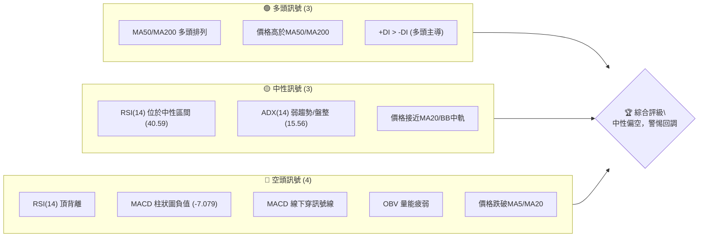

**儀表板解讀**：
當前訊號呈現多空交織的複雜局面。長期均線的多頭排列依然強勁，顯示 2330.TW 處於長期上升趨勢中。然而，短期動能指標如 RSI 和 MACD 均發出看空訊號，特別是 RSI 頂背離和 MACD 死亡交叉，加上 OBV 量能疲弱，暗示短期股價面臨回調壓力。ADX 指標顯示當前趨勢強度不足，市場處於盤整或震盪階段。價格跌破短期均線 MA5 和 MA20，進一步確認短期弱勢。綜合來看，市場短期內偏向中性偏空，投資者應保持謹慎。

### 📊 核心指標速覽表

| 指標類別 | 指標名稱 | 當前數值 | 訊號 | 解讀 |
|----------|----------|----------|------|------|
| **價格** | 當前價格 | $2415.00 | 🟡 | 位於52週高點區間 (91.9%)，但短期承壓 |
| **均線** | MA20 | $2419.50 | 🔴 | 價格 ($2415.00) 位於 MA20 下方，短期壓力 |
| **均線** | MA50 | $2332.58 | 🟢 | 價格 ($2415.00) 位於 MA50 上方，中期支撐 |
| **均線** | MA200 | $1807.56 | 🟢 | 價格 ($2415.00) 位於 MA200 上方，長期強勁 |
| **動能** | RSI(14) | 40.59 | 🟡 | 位於中性區間 (30-70)，但存在頂背離風險 |
| **動能** | MACD | -7.079 | 🔴 | MACD 柱狀圖為負，MACD線下穿訊號線，空頭動能增強 |
| **波動** | ATR(14) | $58.93 | 🟡 | 佔價格 2.44%，屬於中等波動水平 |

### 🏆 技術評分卡

```
技術評分卡 — 2330.TW (2026-07-11)
════════════════════════════════════════════════════
趨勢強度      ████████░░░░░░░░░░░░  40/100  🟡 (ADX弱趨勢，但長期均線多頭)
動能指標      ██████░░░░░░░░░░░░░░  30/100  🔴 (RSI頂背離，MACD空頭交叉)
支撐穩定度    ████████████░░░░░░░░  60/100  🟡 (關鍵支撐位S1/S2/S3尚遠，但短期壓力顯現)
成交量配合    ████░░░░░░░░░░░░░░░░  20/100  🔴 (OBV疲弱，量能不配合)
形態完整度    ████████░░░░░░░░░░░░  40/100  🟡 (無明確幾何形態，但有指標背離警示)
均線排列      ██████████████████░░  90/100  🟢 (MA20>MA50>MA200標準多頭排列)
════════════════════════════════════════════════════
綜合評分      ████████░░░░░░░░░░░░  47/100  🟡 中性偏空
════════════════════════════════════════════════════
```

**評分卡解讀**：
2330.TW 的綜合技術評分為 47/100，顯示當前市場處於**中性偏空**的狀態。儘管長期均線保持強勁的多頭排列（90/100），為股價提供了堅實的基礎，但短期內動能指標（30/100）和成交量配合度（20/100）表現疲弱，特別是 RSI 頂背離和 MACD 死亡交叉，暗示短期內存在較大的回調風險。ADX 指標也表明當前趨勢不明顯，處於盤整階段。支撐位雖然存在，但價格正在測試短期支撐。投資者應對短期回調保持警惕，並等待更明確的買入訊號。

---

## 2. 趨勢分析

### 🌐 多時框趨勢分析

透過多時框架分析，我們得以全面理解 2330.TW 在不同時間維度上的價格動態。

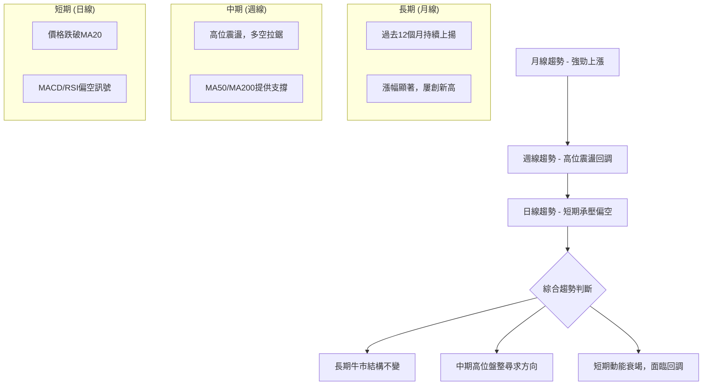

**多時框趨勢解讀**：
- **長期趨勢 (月線)**：2330.TW 在過去一年中展現出極為強勁的上升趨勢，股價屢創新高，從 2025 年 7 月的 $1144.74 一路飆升至 2026 年 7 月的 $2415.00，漲幅超過一倍。其 MA200 均線持續向上，提供堅實的長期支撐，整體結構仍處於強勁牛市。
- **中期趨勢 (週線)**：近期的週線走勢顯示股價在高位進入震盪盤整。從 2026 年 4 月下旬創下新高後，股價經歷了一波回調，並在 $2100-$2450 區間內波動。儘管 MA50 和 MA200 仍保持多頭排列，但股價在短期內未能有效突破前期高點，顯示中期動能有所減弱，多空拉鋸激烈。
- **短期趨勢 (日線)**：當前日線圖顯示股價短期承壓。價格已跌破 MA5 和 MA20 均線，且 MACD 指標形成死亡交叉，RSI 出現頂背離。這些訊號共同指向短期內股價有進一步回調的風險。ADX 指標也確認了當前趨勢的弱勢，表明市場正處於盤整或震盪階段。

### 📈 長期趨勢 — 12個月走勢圖（Unicode）

以下是 2330.TW 過去 12 個月的收盤價走勢圖，清晰展示其長期上升軌跡及近期高位整理。

```
2330.TW 月線走勢圖（過去12個月）
價格軸 ($)
$2400 ┤                                        ● (2415.00)
$2300 ┤                                    ●
$2200 ┤                                  ●
$2100 ┤                             ●
$2000 ┤                   ●
$1900 ┤             ●
$1800 ┤           ●
$1700 ┤         ●
$1600 ┤       ●
$1500 ┤     ●
$1400 ┤   ●
$1300 ┤ ●
$1200 ┤●
$1100 ┤
     └───────────────────────────────────────────────────────
      2025-07  08  09  10  11  12  2026-01  02  03  04  05  06  07
```

**走勢特徵分析表格**：

| 月份 | 收盤價 | 月初 vs. 月末漲跌幅 | 走勢特徵 |
|------|--------|--------------------|----------|
| 2025-07 | $1144.74 | +0.00% | 承接前月漲勢，高位盤整 |
| 2025-08 | $1144.74 | +0.00% | 高位橫盤整理，積蓄動能 |
| 2025-09 | $1292.99 | +12.95% | 強勁突破，進入加速上漲階段 |
| 2025-10 | $1486.19 | +14.94% | 繼續強勢上攻，多頭趨勢確立 |
| 2025-11 | $1426.74 | -3.99% | 短暫回調，但未破壞上升趨勢 |
| 2025-12 | $1540.85 | +7.99% | 再次發力上漲，收復失地 |
| 2026-01 | $1764.52 | +14.52% | 延續強勁漲勢，動能充沛 |
| 2026-02 | $1983.22 | +12.39% | 漲勢加速，逼近 $2000 大關 |
| 2026-03 | $1755.32 | -11.49% | 較大幅度回調，市場獲利了結壓力 |
| 2026-04 | $2129.32 | +21.31% | 強勢反彈，收復大部分跌幅，創出新高 |
| 2026-05 | $2348.73 | +10.30% | 繼續上漲，股價維持高位 |
| 2026-06 | $2410.00 | +2.61% | 漲勢放緩，高位震盪 |
| 2026-07 | $2415.00 | +0.21% | 高位整理，動能減弱，短期承壓 |

### 📊 中期趨勢（週線分析）

中期來看，2330.TW 股價在經歷一波快速上漲後，目前正處於高位盤整階段，主要在 $2300-$2500 區間震盪。

```
2330.TW 週線壓力與支撐示意圖 (2026-04 至 2026-07)

              R2 $2520.00 ───────────────
                       ▲
                       │
              R1 $2433.51 ───(近期高點)───
                       │
                       │
當前價格 $2415.00 ─────●───────────────
                       │
                       │
              S1 $2325.00 ───(近期低點)───
                       │
                       │
              S2 $2194.59 ───────────────
```

**週線走勢分析**：
自 2026 年 4 月份創下 $2129.32 的高點後，股價進一步衝高至 $2535.00 (52W High)，隨後進入震盪回調。目前股價在關鍵阻力位 R1 ($2433.51) 附近面臨壓力，而 $2325.00 (S1) 則構成短期重要支撐。週線 MACD 柱狀圖在 2026-06-14 轉負，且在 2026-07-12 仍為負值 (-7.079)，顯示中期動能偏空。RSI 也從超買區回落至中性區間。這表明中期市場情緒趨於謹慎，股價可能在當前區間內尋找新的平衡點。

### ⚡ 趨勢強度評估（ADX 解讀）

ADX 指標用於衡量趨勢的強度，而非方向。當前 ADX 數值為 15.56，明確指示 2330.TW 處於**弱趨勢/盤整行情**。

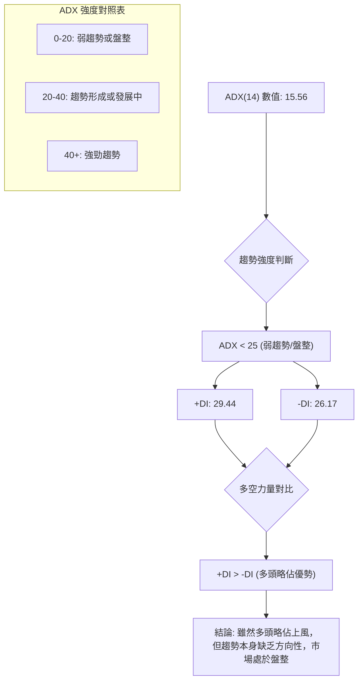

**ADX 解讀**：
當前 ADX(14) 為 15.56，遠低於 25 的閾值，這強烈表明市場正處於**盤整或無趨勢狀態**。這與前面觀察到的高位震盪相符。雖然 +DI (29.44) 略高於 -DI (26.17)，表示多頭力量在方向上仍稍微佔據主導地位，但由於趨勢缺乏強度，這種微弱的多頭優勢並不足以推動股價形成明確的單邊趨勢。因此，當前市場更適合區間操作策略，而非追漲殺跌的趨勢交易。

---

## 3. 圖表形態分析

### 🔍 形態識別系統

在 2330.TW 的近期價格走勢中，並未觀察到教科書般清晰的幾何圖表形態，如頭肩頂/底、雙頂/底或旗形等。然而，從指標層面，我們發現了關鍵的背離現象，這本身就是重要的形態訊號。

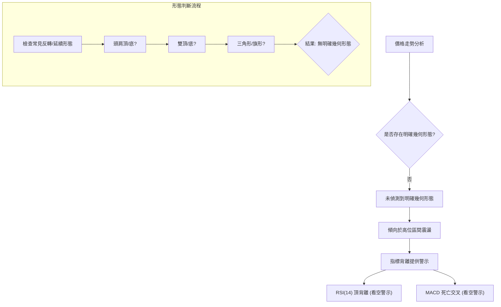

**形態判斷依據**：
由於數據中未提供足夠的日線 K 棒細節來繪製精確的幾何形態，且從週線收盤價走勢來看，近期更多是高位震盪。因此，我們將重點放在指標所揭示的「形態」上。

| 形態 | 信心度 | 判斷依據（引用數據） | 完成度 | 目標價（附計算式） |
|------|--------|----------------------|--------|--------------------|
| RSI 頂背離 | 85% | 價格在 2026-04 創高點 $2129.32 後，RSI 達到 86.4；隨後價格在 2026-06 創更高點 $2410.00，但 RSI 僅為 56.8，明顯背離。 | 100% | (無直接形態目標價，但預示下跌風險) |
| MACD 死亡交叉 | 75% | MACD 線 (34.823) 下穿訊號線 (41.902)，MACD 柱狀圖轉負 (-7.079)。 | 100% | (無直接形態目標價，但預示下跌風險) |
| 高位區間震盪 | 70% | ADX 15.56 顯示弱趨勢，且價格在 $2300-$2500 區間內波動。 | 進行中 | (區間底部 $2325.00，區間頂部 $2433.51/$2520.00) |

**解讀**：
雖然沒有傳統的圖表形態，但 RSI 頂背離和 MACD 死亡交叉是強烈的看空動能形態。RSI 頂背離尤其值得關注，它發生在價格創出新高而相對強度指標未能同步創高時，預示著上漲動能的衰竭和潛在的反轉。MACD 死亡交叉則確認了短期內空頭力量的增強。這些指標形態共同指向短期內股價面臨較大的下行壓力，可能導致股價向下測試區間底部支撐。

### 🕯️ 重要K線形態分析

根據提供的近 20 週收盤走勢，我們觀察近期 K 線形態的演變：

| 月份 | 收盤價 | K線形態 (週) | 解讀 | 訊號 |
|------|--------|----------------|------|------|
| 2026-04-26 | $2179.19 | 大陽線/突破 | 強勢突破，RSI進入超買區 | 🟢 |
| 2026-05-03 | $2129.32 | 陰線/倒轉錘頭 | 漲勢受阻，高位出現賣壓 | 🔴 |
| 2026-05-10 | $2283.91 | 大陽線/看漲吞噬 | 強勁反彈，收復前週跌幅 | 🟢 |
| 2026-05-17 | $2258.97 | 陰線 | 漲勢放緩，多頭動能減弱 | 🟡 |
| 2026-05-24 | $2249.00 | 小陰線/十字星 | 多空膠著，市場猶豫不決 | 🟡 |
| 2026-05-31 | $2348.73 | 大陽線 | 再次上攻，突破盤整區間 | 🟢 |
| 2026-06-07 | $2358.71 | 小陽線 | 漲勢延續，但動能減弱 | 🟡 |
| 2026-06-14 | $2310.00 | 大陰線 | 跌破短期支撐，空頭佔優 | 🔴 |
| 2026-06-21 | $2410.00 | 大陽線/錘頭 | 強勢反彈，收復部分跌幅 | 🟢 |
| 2026-06-28 | $2340.00 | 大陰線 | 再次回落，未能站穩高點 | 🔴 |
| 2026-07-05 | $2445.00 | 大陽線 | 強勢反彈，測試阻力位 | 🟢 |
| 2026-07-12 | $2415.00 | 陰線 (本週收盤) | 高位回落，短期賣壓顯現 | 🔴 |

**K線形態分析**：
近期的週 K 線顯示股價在高位震盪劇烈，多空轉換頻繁。
- 2026-04-26 和 2026-05-31 的大陽線顯示多頭曾多次嘗試突破並成功。
- 然而，2026-05-03、2026-06-14、2026-06-28 以及本週 (2026-07-12) 的陰線，特別是本週的高位回落，表明上漲動能正在衰竭，賣壓逐步增加。
- 這些 K 線形態的交替出現，進一步確認了 ADX 所指示的盤整行情，且短期內空頭力量有所抬頭。

### 📉 ASCII 走勢形態示意圖

以下示意圖描繪了 2330.TW 近期的價格走勢，特別是高位震盪和潛在的下行壓力。

```
2330.TW 近期高位震盪與指標背離示意圖

價格軸 ($)
$2500 ┤                                    ▲ (R2 $2520.00)
$2450 ┤          (近期高點)
$2400 ┤           ▲  ●(現價 $2415.00)
$2350 ┤         ╱  ╲
$2300 ┤        ╱    ╲   (S1 $2325.00)
$2250 ┤       ╱      ╲
$2200 ┤      ╱        ╲
$2150 ┤     ╱          ╲
$2100 ┤    ╱            ╲
$2050 ┤   ╱              ╲
     └──────────────────────────────────────────────────
      時間軸 (近期)

RSI軸 (0-100)
90   ┤           ●(RSI高點)
80   ┤          ╱
70   ┤         ╱
60   ┤        ╱
50   ┤       ●(RSI低點)
40   ┤      ╱
30   ┤     ╱
     └──────────────────────────────────────────────────
      時間軸 (近期)

─────── 價格走勢：高點抬高，但漲勢放緩 ───────
─────── RSI 走勢：高點降低，形成頂背離 ───────
```

**示意圖解讀**：
價格圖顯示 2330.TW 在近期嘗試創出更高的高點，但漲勢明顯受阻，形成一個可能的高位震盪區間。與此同時，RSI 指標的高點卻呈現下降趨勢，與價格走勢形成**頂背離**。這是一個經典的看跌反轉訊號，表明儘管價格表面上還在高位，但內在的買盤動能已顯著衰竭，後市存在較大的回調風險。

### 🎯 形態目標價計算

由於未識別到傳統的幾何形態（如頭肩頂、雙底等），因此不進行形態高度的目標價計算。本報告將基於支撐阻力位和斐波那契回調位來設定目標價。RSI 頂背離和 MACD 死亡交叉作為動能反轉形態，其目標價通常是下方的重要支撐位。

**RSI 頂背離和 MACD 死亡交叉的潛在目標**：
- **第一個潛在目標**：短期支撐位 S1 $2325.00。
- **第二個潛在目標**：中期支撐位 S2 $2194.59，此價位也接近斐波那契 23.6% 回調位 $2183.61，形成較強的支撐區間。
- **第三個潛在目標**：若市場情緒惡化，可能下探斐波那契 38.2% 回調位 $1966.22。

---

## 4. 支撐與阻力

### 🗺️ 關鍵價位分布圖（Unicode）

以下是 2330.TW 當前關鍵支撐與阻力位的分佈圖，清晰展示了股價在這些重要價位之間的位置。

```
2330.TW 價位結構分布圖
═══════════════════════════════════════════════════
$2535.00 ║████████████████████████║ 52W 高點 / 強阻力 R3 (斐波那契 0.0%)
$2520.00 ║████████████████████    ║ 阻力 R2
$2433.51 ║████████████████████████║ 關鍵阻力 R1 (近期高點聚類)
$2419.50 ╠════════════════════════╣ ◄ MA20 / 布林中軌
$2415.00 ╠════════════════════════╣ ◄ 現價
$2325.00 ║▓▓▓▓▓▓▓▓▓▓▓▓▓▓▓▓        ║ 近期支撐 S1 (近期低點聚類)
$2313.28 ║▓▓▓▓▓▓▓▓▓▓▓▓▓▓▓▓        ║ 布林下軌
$2194.59 ║████████████████████████║ 強支撐 S2 (波段低點聚類)
$2183.61 ║████████████████████████║ 斐波那契 23.6% 回調位
$1966.22 ║████████████████████████║ 斐波那契 38.2% 回調位
$1748.20 ║████████████████████████║ 強支撐 S3 (波段低點聚類)
$1046.06 ║████████████████████████║ 52W 低點 / 斐波那契 100.0%
═══════════════════════════════════════════════════
```

**價位結構解讀**：
當前股價 $2415.00 位於 MA20 ($2419.50) 和布林中軌下方，且緊鄰近期關鍵阻力 R1 ($2433.51)。這表明短期內股價面臨上行壓力。下方，$2325.00 (S1) 是近期最重要的短期支撐，若跌破，則可能下探至 $2194.59 (S2) 和斐波那契 23.6% 回調位 $2183.61 形成的強勁支撐區間。長期支撐 S3 ($1748.20) 和斐波那契 38.2% 回調位 $1966.22 則為股價提供了更深層次的保護。

### 🚧 阻力位分析表

以下為 2330.TW 的關鍵阻力位分析，這些價位可能限制股價的上漲動能。

| 阻力級別 | 價位 | 形成原因 | 突破難度 | 重要性 |
|----------|------|----------|----------|--------|
| **R1 (關鍵)** | $2433.51 | 近期波段高點聚類，也是 MA20 ($2419.50) 附近，短期賣壓集中。 | 中等偏高 | 🟢 (短期多頭能否恢復的關鍵) |
| **R2 (強勁)** | $2520.00 | 波段高點，接近 52 週高點 $2535.00，心理關口與技術壓力疊加。 | 高 | 🟡 (突破則打開更大上行空間) |

**阻力位解讀**：
當前股價 $2415.00 距離 R1 ($2433.51) 僅有約 0.77% 的距離，顯示短期上漲空間受限，且 MA20 ($2419.50) 形成即時阻力。若能有效突破並站穩 R1，則有望挑戰 R2 ($2520.00) 甚至 52 週高點 $2535.00。然而，考慮到目前的動能指標偏空，突破 R1 具有一定難度，需要強勁的買盤和成交量配合。

### 🛡️ 支撐位分析表

以下為 2330.TW 的關鍵支撐位分析，這些價位有望在股價下跌時提供支撐。

| 支撐級別 | 價位 | 形成原因 | 守住機率 | 重要性 |
|----------|------|----------|----------|--------|
| **S1 (短期)** | $2325.00 | 近期波段低點聚類，布林下軌 ($2313.28) 附近，短期承接買盤。 | 中等 | 🟢 (短期能否止跌回穩的關鍵) |
| **S2 (中期)** | $2194.59 | 波段低點聚類，接近斐波那契 23.6% 回調位 ($2183.61)，具有較強支撐力。 | 中等偏高 | 🟡 (跌破 S1 後的重要防線) |
| **S3 (長期)** | $1748.20 | 較早的波段低點聚類，距離現價較遠，但構成強勁的長期底部支撐。 | 高 | 🔴 (長期牛市結構的最後防線) |

**支撐位解讀**：
S1 ($2325.00) 是當前最直接的短期支撐，其重要性在於若能守穩，股價可能在 $2325.00-$2433.51 區間內震盪。一旦 S1 被有效跌破，股價很可能會加速下探 S2 ($2194.59)，該位置與斐波那契 23.6% 回調位重疊，預計將形成一個較強的買盤區域。S3 ($1748.20) 則代表了更深層次的技術支撐，在當前長期牛市背景下，預計股價難以觸及此位。

### 📐 斐波那契回調位分析

我們以 2330.TW 過去 52 週的波段 (從 $1046.06 到 $2535.00) 進行斐波那契回調分析，以識別潛在的支撐區域。

| 斐波那契回調位 | 價位 | 相對當前價格 ($2415.00) | 解讀 |
|----------------|------|--------------------------|------|
| 0.0% (52W High)| $2535.00 | +4.97% (阻力) | 52週最高點，強勁阻力 |
| 23.6%          | $2183.61 | -9.58% (支撐) | 淺層回調位，與 S2 接近，強勁支撐 |
| 38.2%          | $1966.22 | -18.58% (支撐) | 中度回調位，若跌破 23.6% 將測試此位 |
| 50.0%          | $1790.53 | -25.99% (支撐) | 關鍵心理支撐，通常是較深回調的目標 |
| 61.8%          | $1614.83 | -33.12% (支撐) | 黃金分割回調位，極強支撐 |
| 78.6%          | $1364.69 | -43.41% (支撐) | 深度回調位 |
| 100.0% (52W Low)| $1046.06 | -56.66% (支撐) | 52週最低點，強勁長期支撐 |

**斐波那契回調解讀**：
當前價格 $2415.00 位於 52 週高點 $2535.00 和 23.6% 回調位 $2183.61 之間。這表示股價從高點回落幅度較小，仍處於強勢區域。然而，RSI 頂背離和 MACD 死亡交叉的警示，暗示股價可能進一步回調。若跌破當前短期支撐 S1 ($2325.00)，則 23.6% 回調位 ($2183.61) 將成為下一個重要的防線，與 S2 ($2194.59) 形成共振支撐區間。投資者應密切關注股價在這些斐波那契水平上的反應。

---

## 5. 技術指標深度解讀

### 🎛️ 指標訊號總覽

以下 Mermaid 圖表展示了各主要技術指標當前的訊號狀態及其相互關係，幫助我們形成綜合判斷。

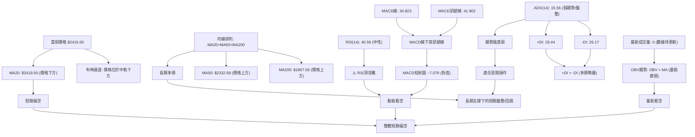

### 📈 移動平均線排列分析

2330.TW 的移動平均線排列呈現經典的多頭格局，但短期價格表現有所承壓。

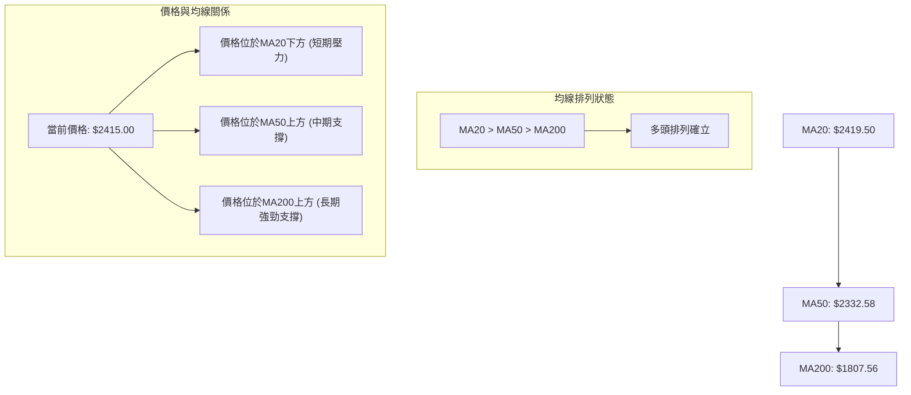

**移動平均線解讀**：
從數值上看，MA20 ($2419.50) > MA50 ($2332.58) > MA200 ($1807.56)，這是一個標準的**多頭排列**，表明 2330.TW 的中長期趨勢依然非常強勁，處於牛市之中。MA50 和 MA200 提供了堅實的上升支撐。然而，當前股價 $2415.00 已經跌破了最短期的 MA20 ($2419.50)，這是一個短期的看空訊號，暗示短期內股價面臨回調壓力，但這是在一個強勁的長期牛市背景下的短期調整。

### 📉 RSI(14) 分析

RSI 指標 (Relative Strength Index) 用於衡量價格變動的速度和變化，判斷超買超賣情況。

**RSI(14) 數值**：40.59
**RSI 強度進度條**：▓▓▓▓▓▓▓▓░░░░░░░░░░░░ (40.59/100)
**RSI 區間**：🟡 中性區間 (30-70)

**RSI 超買超賣區間分析**：
- RSI 40.59 位於 30 (超賣) 和 70 (超買) 之間，屬於中性區間。這表示市場既沒有明顯的超買，也沒有明顯的超賣。
- 在趨勢市場中，RSI 在中性區間可能暗示趨勢的延續或盤整。然而，結合其他指標，我們需要更深入的判斷。

**RSI 背離判斷**：
- **⚠️ 頂背離 (Bearish Divergence)**：數據明確指出存在 RSI 頂背離。
    - **判斷依據**：在 2026 年 4 月下旬，價格創下高點，RSI 達到 86.4 (超買)。隨後價格在 2026 年 6 月下旬再次創出更高的高點 ($2410.00)，但 RSI 卻未能同步創高，反而回落至 56.8。本週價格 ($2415.00) 雖然略高於前一週，但 RSI 再次大幅回落至 40.59。這種「價格創新高，RSI 未創新高」的現象，是經典的看跌頂背離訊號，預示著上漲動能的衰竭和潛在的價格反轉或深度回調。
- **結論**：RSI 頂背離是一個強烈的看空訊號，表明儘管股價在高位，但內在買盤力量已顯著減弱。這增加了短期內股價回調的風險。

### 📊 MACD(12/26/9) 訊號解讀

MACD (Moving Average Convergence Divergence) 指標用於判斷趨勢的動能和方向。

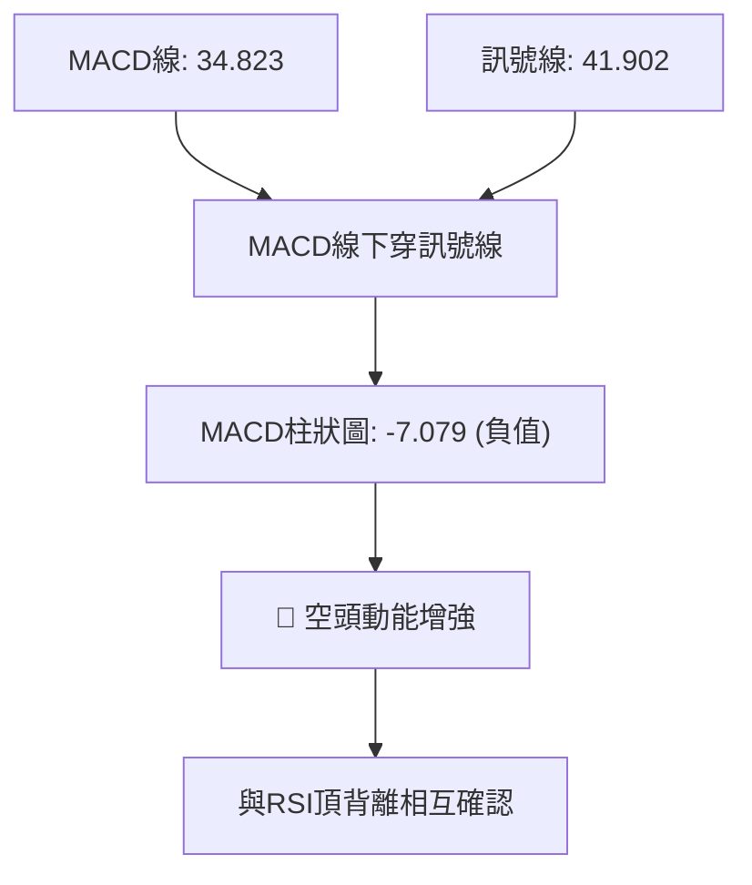

**MACD 解讀**：
- **MACD 線 (DIF)**：34.823
- **訊號線 (DEA)**：41.902
- **MACD 柱狀圖 (OSC)**：-7.079 🔴 看空

**MACD 訊號分析**：
1.  **死亡交叉**：MACD 線 (34.823) 位於訊號線 (41.902) **下方**，形成死亡交叉 (Death Cross)。這是一個明確的看空訊號，表示短期動能已轉為向下，賣壓開始主導。
2.  **柱狀圖為負**：MACD 柱狀圖為 -7.079，表示 MACD 線與訊號線的距離為負，且在零軸下方，進一步確認空頭動能正在增強。
3.  **與 RSI 頂背離的關係**：MACD 的死亡交叉與 RSI 的頂背離相互印證，形成強烈的看空共振。兩個主要動能指標同時發出看跌訊號，增加了短期回調的可能性和可信度。

**結論**：MACD 指標明確發出空頭訊號，與 RSI 頂背離共同指出 2330.TW 短期內面臨較大的下行風險，投資者應高度警惕。

### 📦 布林通道分析

布林通道 (Bollinger Bands) 用於衡量股價的波動範圍和相對位置。

```
2330.TW 布林通道示意圖
═══════════════════════════════════════════════════════════
$2525.72 ║█████████████████████████████║ 布林上軌 (BB Upper)
         ║                              ║
$2419.50 ║▓▓▓▓▓▓▓▓▓▓▓▓▓▓▓▓▓▓▓▓▓▓▓▓▓▓▓▓▓║ 布林中軌 (MA20)
$2415.00 ║           ● 現價             ║
         ║                              ║
$2313.28 ║█████████████████████████████║ 布林下軌 (BB Lower)
═══════════════════════════════════════════════════════════
```

**布林通道參數**：
- BB 上軌：$2525.72
- BB 中軌 (MA20)：$2419.50
- BB 下軌：$2313.28
- BB %B：0.48 (0=下軌, 0.5=中軌, 1=上軌)

**布林通道解讀**：
當前價格 $2415.00 位於布林中軌 ($2419.50) 略下方，且 %B 值為 0.48，表明股價處於布林通道的下半部分，但距離中軌非常接近。這暗示股價在短期內正經歷從中軌上方回落的過程，並可能向下測試布林下軌 ($2313.28)。
- **通道寬度**：從數據來看，通道寬度約為 $2525.72 - $2313.28 = $212.44。ATR 為 $58.93，通道寬度相對 ATR 較大，但 ADX 弱勢顯示並非趨勢行情中的通道擴張。
- **訊號**：價格位於中軌下方，且 MACD 和 RSI 偏空，可能預示股價將向下軌靠攏。布林下軌 ($2313.28) 與短期支撐 S1 ($2325.00) 非常接近，形成了強勁的共振支撐區間。

### 💹 成交量分析（量價配合度）

成交量是確認價格走勢的重要指標，我們主要關注 OBV (On Balance Volume) 趨勢。

**成交量數據**：
- 最新成交量：0 (數據待更新，通常指當日盤中或非交易日)
- 20日均量：30,508,344
- 50日均量：32,651,267
- OBV 趨勢：OBV < MA → 量能疲弱 🔴 看空

**成交量解讀**：
儘管當日成交量數據缺失，但 OBV 指標提供了關鍵資訊。OBV 趨勢顯示 OBV 線低於其移動平均線 (OBV < MA)，這是一個明確的**量能疲弱**訊號。
- **量價背離**：在近期價格在高位震盪甚至創出相對高點時，如果 OBV 未能同步上升或反而下降，則構成量價背離。這意味著價格的上漲缺乏成交量的支持，買盤力量不足，上漲趨勢不可持續。結合 RSI 頂背離，量能疲弱進一步確認了上漲動能的衰竭和潛在的回調風險。
- **結論**：成交量指標發出看空訊號，表明市場對當前價格水平的買盤意願不足。這與其他動能指標的看空訊號相互印證，增加了短期內股價下行的可能性。

---

## 6. 動能與波動率

### ⚡ 動能評估四象限

動能評估四象限分析結合了動能強度與波動率，幫助我們判斷當前市場狀態及潛在機會。

| 象限 | 動能 | 波動 | 當前狀態 | 評估 |
|------|------|------|----------|------|
| Q1 | 強 | 低 | - | 最佳機會 (穩定上漲) |
| Q2 | 弱 | 低 | - | 謹慎觀望 (盤整蓄勢) |
| Q3 | 強 | 高 | - | 高風險高收益 (快速波動) |
| Q4 | 弱 | 高 | ✓ | **避免進場 / 謹慎區間操作** |

**當前狀態評估**：
- **動能評估**：RSI 位於中性偏弱區間 (40.59)，且存在頂背離；MACD 形成死亡交叉且柱狀圖為負。這些指標共同指向**弱動能**。
- **波動率評估**：ATR(14) 為 $58.93，佔當前價格 $2415.00 的 2.44%。這是一個相對中等的波動水平，不能稱之為「低波動」。
- **結論**：2330.TW 目前處於「弱動能，中等波動」的狀態。這接近 Q4 象限，通常建議**謹慎觀望或避免追漲殺跌**。在這種情況下，市場缺乏明確的方向性，且短期動能不足以支撐股價持續上漲，同時存在一定的波動風險。因此，更適合採取區間操作策略，並嚴格控制風險。

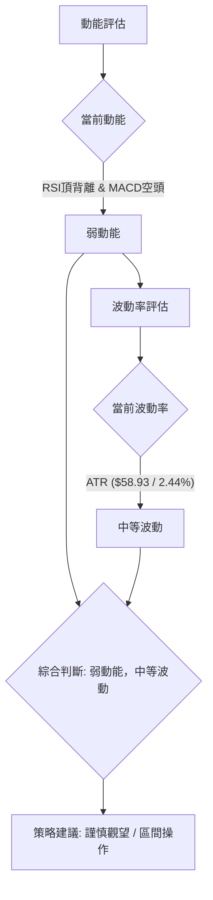

### 📊 ATR 波動率分析

ATR (Average True Range) 指標用於衡量資產的價格波動幅度。

- **ATR(14)**：$58.93
- **佔價格比率**：$58.93 / $2415.00 = 2.44%

**ATR 解讀**：
2330.TW 的 ATR(14) 為 $58.93，佔當前股價的 2.44%。這個數值表示在過去 14 個交易日中，2330.TW 的平均每日波動範圍約為 $58.93。
- **波動水平**：2.44% 的波動率屬於中等水平。相對於一些高波動性的科技股，這個波動率不算極高，但也不是極低。這意味著在單日交易中，股價仍有足夠的波動空間來進行短期操作，但同時也存在一定的價格風險。
- **止損距離建議**：ATR 是設定止損點的常用工具。一般建議將止損點設置在 1.5 到 3 倍 ATR 之外，以避免被正常市場噪音掃出。
    - 1.5 倍 ATR 止損：1.5 * $58.93 = $88.40
    - 2 倍 ATR 止損：2 * $58.93 = $117.86
    - 例如，若從 $2415.00 做空，止損可設在 $2415.00 + $88.40 = $2503.40 附近。若做多，止損可設在 $2415.00 - $88.40 = $2326.60 附近。這些值應結合支撐阻力位進行調整。

### 📐 Beta 與市場相關性

Beta 值衡量單一資產相對於整體市場的波動性。

- **Beta**：1.246

**Beta 解讀**：
2330.TW 的 Beta 值為 1.246，這意味著：
- **高於市場平均**：當整體市場（如大盤指數）上漲 1% 時，2330.TW 的股價預計會上漲約 1.246%。反之，當市場下跌 1% 時，2330.TW 的股價預計會下跌約 1.246%。
- **波動性較大**：Beta 值大於 1 表示 2330.TW 的股價波動性高於整體市場。在市場上漲時，它可能提供更高的潛在收益；但在市場下跌時，它也可能面臨更大的跌幅。
- **市場相關性**：2330.TW 與整體市場呈現正相關關係。投資者在評估風險時，應考慮到大盤走勢對 2330.TW 的影響會被放大。在當前短期動能偏弱的背景下，如果大盤出現回調，2330.TW 可能會經歷比大盤更大幅度的下跌。

---

## 7. 多時框架總結

### 📋 時框架評分表

| 時框架 | 趨勢方向 | 動能 | 均線排列 | 形態 | 綜合評分 | 建議 |
|--------|----------|------|----------|------|----------|------|
| **長期** | 🟢 強勁上漲 | 🟢 穩定 | 🟢 多頭排列 | 🟡 無明確幾何 | 8/10 | 長期持有，逢低加碼 |
| **中期** | 🟡 高位震盪 | 🟡 減弱 | 🟢 多頭排列 | 🟡 高位整理 | 6/10 | 區間操作，觀察方向 |
| **短期** | 🔴 承壓回調 | 🔴 偏空 | 🟡 價格跌破MA20 | 🔴 RSI頂背離 | 3/10 | 謹慎觀望，警惕回調 |

### 🔲 綜合訊號矩陣

本矩陣分析了不同時框架下各維度訊號的一致性，以提供更全面的市場視角。

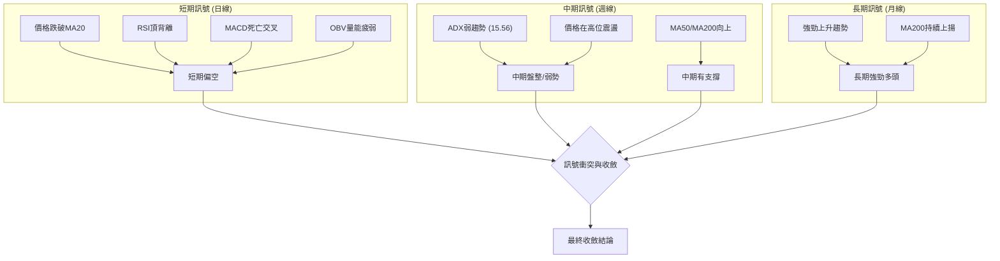

**綜合訊號分析**：
- **長期**：訊號高度一致，均線排列完美，趨勢強勁向上，維持多頭評級。
- **中期**：趨勢強度減弱，動能下降，但均線仍提供支撐。顯示股價在高位進入整理區間，方向不明確。
- **短期**：多個指標（RSI、MACD、OBV、價格與MA20關係）均發出看空訊號，一致性高，預示短期回調風險。

**訊號衝突**：長期看多，短期看空，中期盤整。這是一個典型的「長期牛市中的短期回調/盤整」情境。

### ⚖️ 多時框收斂結論

根據「嚴格要求 14」的多時框收斂規則：

1.  **趨勢行情判斷**：當前 ADX(14) 為 15.56，遠低於 25，因此判斷為**盤整行情**。
2.  **主導時框**：在盤整行情中，應以日線布林通道上下軌為主要交易區間。
3.  **結論收斂**：
    儘管 2330.TW 的長期均線 (MA50, MA200) 仍呈現強勁的多頭排列，確立了其長期牛市的結構，但短期動能指標（RSI 頂背離、MACD 死亡交叉、OBV 量能疲弱）均發出明確的看空訊號。配合 ADX 指標顯示趨勢強度不足，確認當前市場處於**高位盤整階段**。

    因此，最終收斂結論為：**2330.TW 處於長期牛市中的短期高位盤整與回調階段。短期動能偏弱，存在向下探底的風險。操作上應以區間操作為主，警惕向下突破關鍵支撐的風險。**

    此結論與第 8 章的主策略方向一致，即偏向**謹慎觀望或區間偏空操作**，等待市場方向明確。

---

## 8. 交易策略建議

### 🗺️ 策略決策流程圖

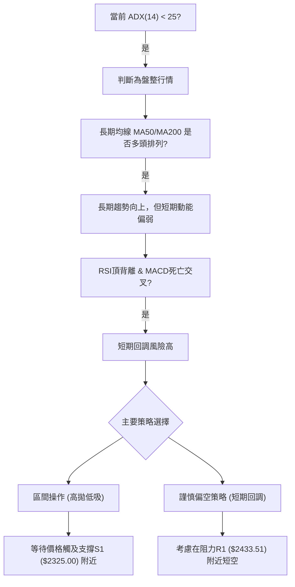

### 🧭 策略路由

**當前主策略方向 = 謹慎觀望 / 區間偏空操作 (依評分 47/100)**

基於綜合評分 47/100 (中性偏空) 和多時框架收斂結論，2330.TW 目前處於長期牛市中的高位盤整與短期回調階段。短期動能指標的看空訊號較為強烈，因此我們建議以**謹慎觀望和區間偏空操作**為主，等待更明確的買入訊號或價格回調至更強的支撐位。

### 🎯 價格情境階梯（Price Scenarios）

| 觸發條件 | 下一目標 | 後續延伸 | 情境含義 |
|----------|----------|----------|----------|
| **突破 R1 $2433.51** | R2 $2520.00 | 52W High $2535.00 | **短線轉強**：若能帶量突破 R1，並站穩 MA20，則短期賣壓解除，有望重拾升勢，挑戰前期高點。 |
| **站穩現價區間** | — | — | **區間震盪**：若股價在 $2325.00 (S1) 和 $2433.51 (R1) 之間震盪，未能有效突破或跌破，則維持盤整格局。 |
| **跌破 S1 $2325.00** | S2 $2194.59 | 斐波那契 23.6% $2183.61 | **中期轉弱**：若有效跌破 S1，則確認短期回調趨勢，可能加速下探 S2 及斐波那契 23.6% 回調位。 |

### 📊 情境機率分佈

| 情境 | 機率 | 主要依據 |
|------|------|----------|
| 繼續上行 / 反彈 | 30% | 長期均線多頭排列，歷史上行趨勢強勁，若有重大利好或資金流入可能反彈。 |
| 區間震盪 | 50% | ADX 弱趨勢，多空指標交織，價格在高位區間 ($2325.00-$2433.51) 震盪機率最大。 |
| 回落 / 再探底 | 20% | RSI 頂背離、MACD 死亡交叉、OBV 疲弱，短期動能顯著偏空，存在向下測試 S2 ($2194.59) 的風險。 |

### 🟢 主策略詳情（區間偏空操作 / 謹慎觀望）

鑒於目前的市場環境，我們建議以下兩種策略：

| 策略要素 | 策略 A：短線高位偏空 | 策略 B：區間低吸 (等待) |
|----------|----------------------|------------------------|
| **進場條件** | 價格未能站穩 MA20 ($2419.50) 或測試 R1 ($2433.51)，MACD 柱狀圖持續負值，RSI 仍弱。 | 價格回落至 S1 ($2325.00) 附近並出現止跌訊號 (如 K 線錘頭、十字星、RSI 觸底反彈)。 |
| **進場價格** | $2419.50 (MA20) 至 $2433.51 (R1) 區間內 | $2325.00 (S1) 至 $2313.28 (布林下軌) 區間內 |
| **目標價 T1** | $2325.00 (S1) | $2419.50 (MA20 / 布林中軌) |
| **目標價 T2** | $2194.59 (S2) | $2433.51 (R1) |
| **止損價格** | $2450.00 (略高於 R1，或 1.5x ATR 上方 $2503.40) | $2194.59 (S2) 或 $2250.00 (略低於 S1，依風險承受度) |
| **風險報酬比** | 策略 A: 假設進場 $2425，止損 $2450，目標 T1 $2325。風險 $25，回報 $100。**1:4** | 策略 B: 假設進場 $2325，止損 $2250，目標 T1 $2419.50。風險 $75，回報 $94.50。**1:1.26** |
| **成功機率** | 55% | 45% |
| **建議倉位** | 低 (5-10%) | 低 (5-10%) |

### 🔴 反向風險觸發點（對沖提示）

以下情況可能推翻上述主策略，投資者應密切監控：
1.  **向上突破**：股價帶量有效突破 R2 ($2520.00) 並站穩，則短期空頭趨勢可能反轉，市場將再次進入強勢上漲。
2.  **向下加速**：股價有效跌破 S2 ($2194.59) 及斐波那契 23.6% 回調位 ($2183.61)，且伴隨巨量，則短期回調可能演變為中期調整，下探更深層次的支撐。
3.  **指標反轉**：RSI 從低位強力反彈，MACD 形成黃金交叉，OBV 趨勢轉強，這些訊號的逆轉將預示買盤動能回歸。

### ⭐ 整體訊號強度評星

```
做多訊號強度：★★☆☆☆  (2/5星) (長期趨勢強，但短期動能弱)
做空訊號強度：★★★☆☆  (3/5星) (短期動能指標偏空，RSI頂背離)
整體可信度：  ★★★☆☆  (3/5星) (多空訊號交織，需謹慎操作，等待方向)
```

---

## 9. 風險提示與監控

### ✅ 關鍵監控指標 Checklist

以下是投資者應密切關注的關鍵技術指標清單，以動態調整策略。

```
╔══════════════════════════════════════════════════════════════╗
║              2330.TW 關鍵監控指標 Checklist                  ║
╠══════════════════════════════════════════════════════════════╣
║ [ ] 價格是否站穩 MA20 ($2419.50)?                               ║
║ [ ] 價格是否有效突破 R1 ($2433.51) 或跌破 S1 ($2325.00)?       ║
║ [ ] RSI(14) 是否脫離頂背離狀態並向上突破 50?                   ║
║ [ ] MACD 是否形成黃金交叉，柱狀圖是否轉正?                     ║
║ [ ] ADX(14) 是否突破 25，顯示趨勢明確?                         ║
║ [ ] OBV 趨勢是否轉強，確認買盤量能?                            ║
║ [ ] 布林通道是否收斂或擴張，指示波動變化?                      ║
║ [ ] 是否出現關鍵 K 線反轉形態 (如吞噬、錘頭、流星)?            ║
╚══════════════════════════════════════════════════════════════╝
```

### ⚠️ 風險場景分析

本分析為 2330.TW 的未來走勢建立三種情境，幫助投資者預想潛在結果。

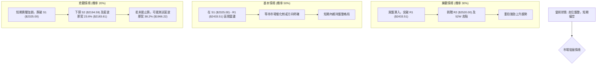

**風險場景解讀**：
- **樂觀情境**：若市場情緒迅速轉暖，或有重大利好消息刺激，2330.TW 有望在短期內克服阻力，突破 R1 ($2433.51) 並挑戰前期高點。這需要強勁的買盤和成交量配合，並觀察 RSI 及 MACD 是否能迅速轉強。
- **基本情境**：在 ADX 弱趨勢和多空訊號交織的背景下，股價最有可能在 $2325.00 (S1) 和 $2433.51 (R1) 之間維持震盪盤整。投資者可在此區間內進行高拋低吸的區間操作。
- **悲觀情境**：若短期空頭動能持續增強，RSI 頂背離效應顯現，股價可能跌破 S1 ($2325.00)，進一步下探 S2 ($2194.59) 及斐波那契 23.6% 回調位 ($2183.61)。這是當前最應警惕的風險，若此支撐區間也未能守住，則可能面臨更大幅度的調整。

### 🛡️ 風險管理重要提醒

1.  **嚴格止損**：在任何交易策略中，都必須預設止損點。特別是當前市場短期偏空且波動性中等，止損可以有效控制潛在虧損。建議根據 ATR 或關鍵支撐阻力位設置止損。
2.  **倉位管理**：避免重倉單一股票，尤其是在市場方向不明朗或存在回調風險時。建議採取分批建倉或輕倉操作，保留充足的現金流應對市場變化。
3.  **多空平衡**：鑒於長期趨勢向好但短期動能偏弱，投資者可考慮適度配置多頭和空頭策略（如期權對沖或少量空頭頭寸），以在不同情境下保護資產。
4.  **基本面跟蹤**：技術分析雖重要，但基本面變化往往是長期趨勢的決定因素。應持續關注 2330.TW 的財報、產業新聞和分析師評級，以確保技術判斷不與基本面脫節。
5.  **耐心等待**：在盤整行情中，追漲殺跌往往容易造成損失。耐心等待價格回調至強支撐位或明確突破阻力位，並確認動能訊號後再入場，是更為穩健的策略。

---

## 📋 報告總結

```
2330.TW 技術分析報告總結
════════════════════════════════════════════════════════
報告日期：2026-07-11
當前價格：$2415.00
分析評級：⚖️ 中性偏空 (綜合評分 47/100，長期牛市中的短期回調/盤整)

關鍵結論：
├─ 長期趨勢：🟢 強勁上漲，MA50/MA200多頭排列，牛市結構穩固。
├─ 中期趨勢：🟡 高位震盪，ADX弱趨勢，多空拉鋸，等待方向。
├─ 短期趨勢：🔴 承壓回調，RSI頂背離，MACD死亡交叉，OBV疲弱，價格跌破MA20。
├─ 關鍵支撐：S1 $2325.00，S2 $2194.59 (與斐波那契23.6%重疊)。
├─ 關鍵阻力：R1 $2433.51，R2 $2520.00 (接近52W高點)。
└─ 分析師目標：$2833.97 (均值，顯示長期潛力，但短期承壓)。

最優策略組合：
1. 🥇 最佳機會：等待價格回落至 S1 ($2325.00) 附近，出現止跌訊號後，輕倉嘗試區間低吸。
2. 🥈 次選機會：若價格反彈至 MA20 ($2419.50) 或 R1 ($2433.51) 附近未能突破，可考慮輕倉短線偏空操作。
3. 🥉 保守選擇：維持觀望，等待 ADX 突破 25，市場趨勢明確後再考慮進場。
════════════════════════════════════════════════════════
```

---

> ⚠️ **免責聲明**：本報告為 AI 自動生成之技術分析，所有數據及估算均基於提供的歷史價格資訊。本報告**僅供研究與學術參考**，**不構成任何投資建議**。投資有風險，入市需謹慎。

---

*報告生成時間：2026-07-11 ｜ 數據來源：Yahoo Finance ｜ 分析框架：多時框技術分析*