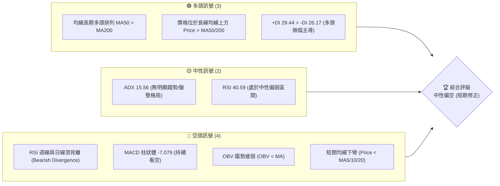
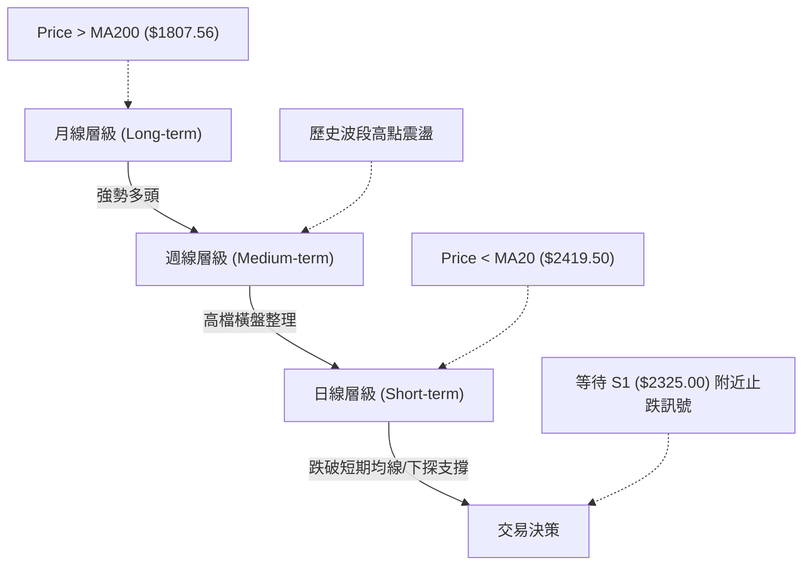
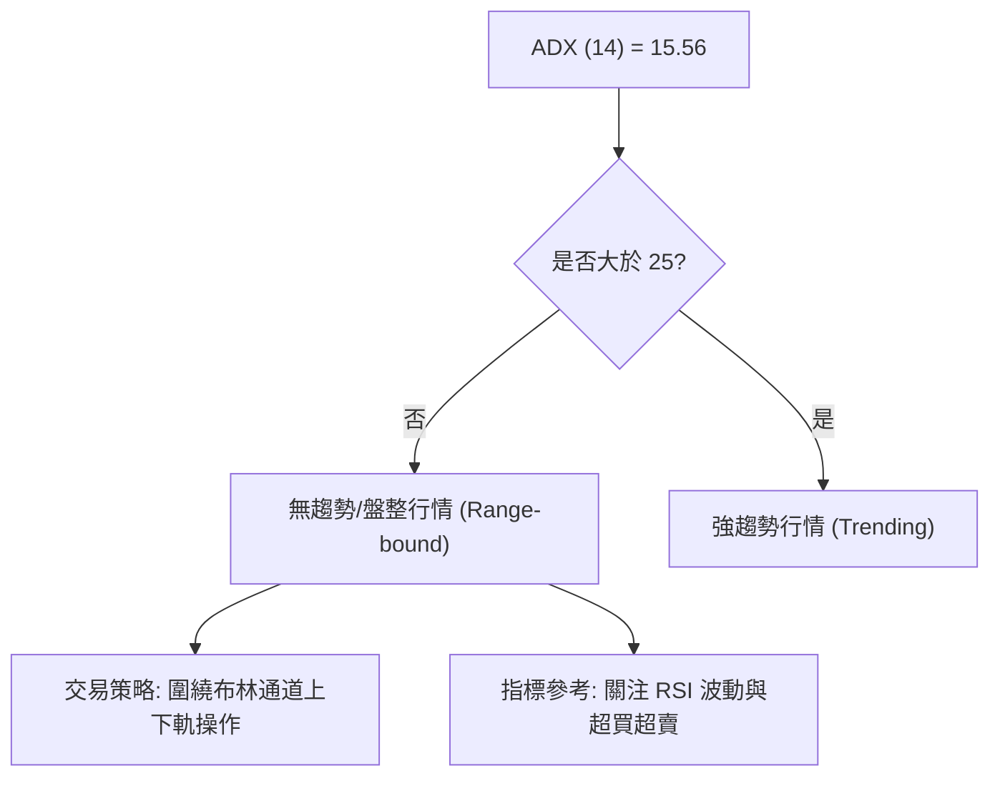
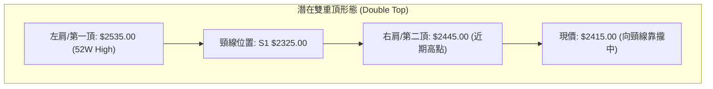
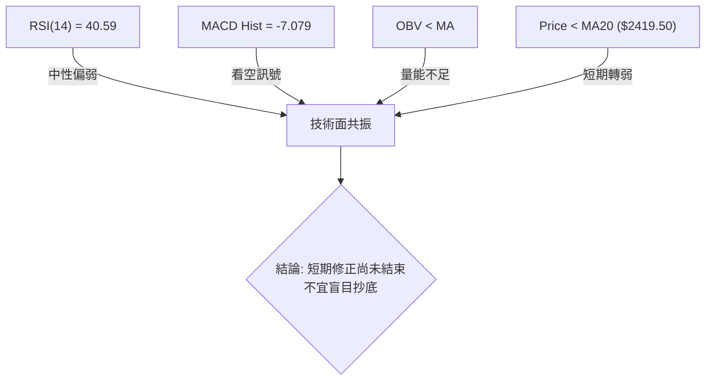
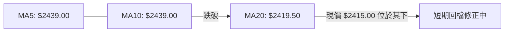
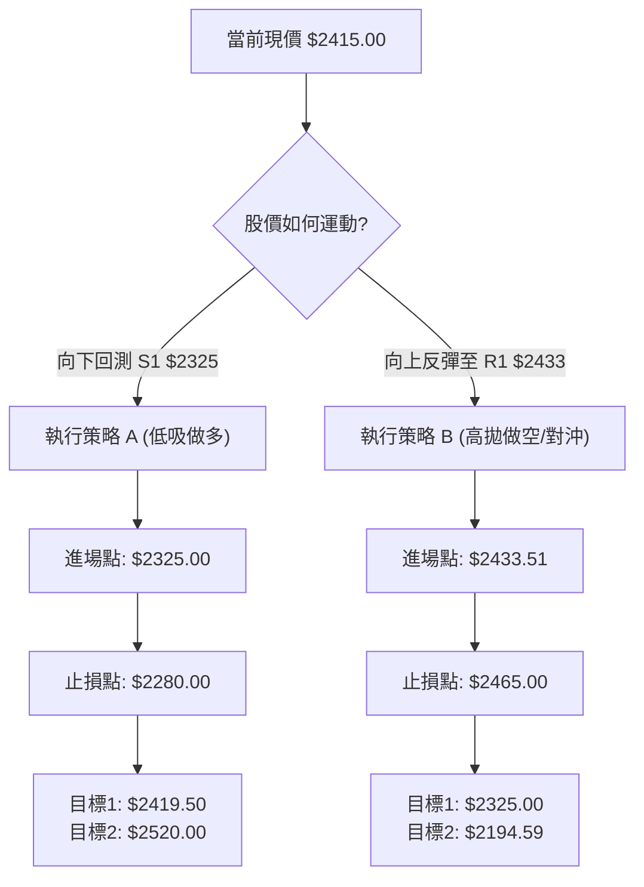
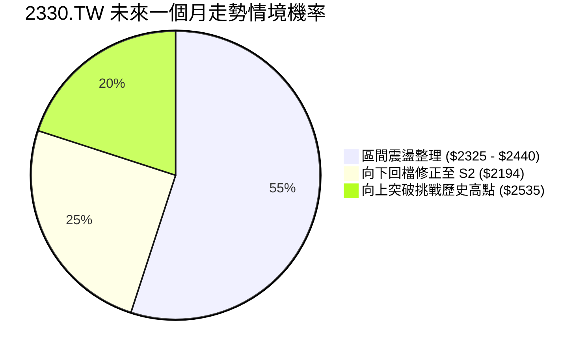
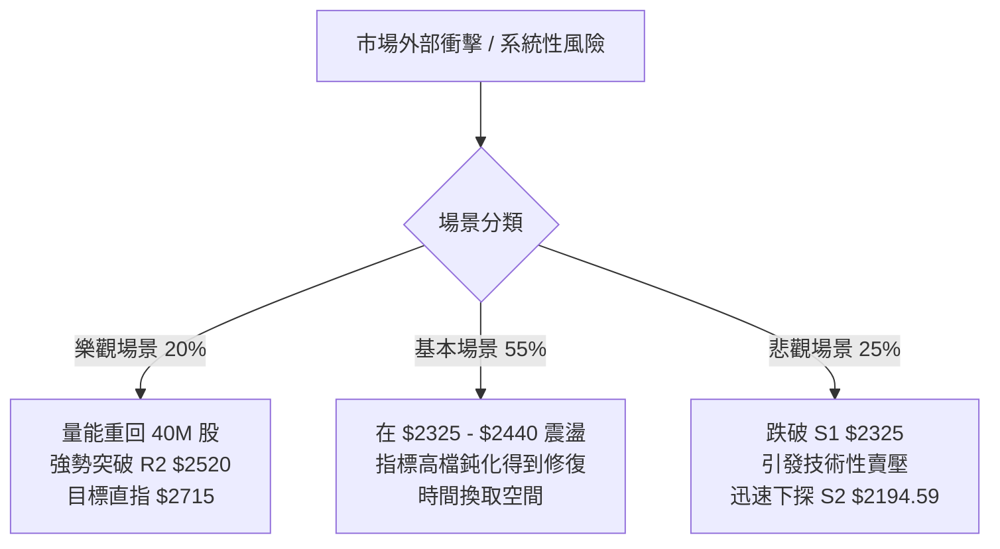

<details>
<summary>📊 靜態圖表 (點擊展開)</summary>

</details>

<html>
<head><meta charset="utf-8" /></head>
<body>
    <div style="height:500px; width:100%;">                        <script>window.PlotlyConfig = {MathJaxConfig: 'local'};</script>
        <script charset="utf-8" src="https://cdn.plot.ly/plotly-3.7.0.min.js" integrity="sha256-jvTGqxNp8AGWEcvNLVuKr+8j5dGe9Yw51LQkmDH+IYA=" crossorigin="anonymous"></script>                <div id="candlestick-chart" class="plotly-graph-div" style="height:100%; width:100%;"></div>            <script>                window.PLOTLYENV=window.PLOTLYENV || {};                                if (document.getElementById("candlestick-chart")) {                    Plotly.newPlot(                        "candlestick-chart",                        [{"close":{"dtype":"f8","bdata":"AAAAgIvjkkAAAABAwR6TQAAAAOCzbZNAAAAAYPdZk0AAAACA3NCTQAAAAABqlZNAAAAAgK3kk0AAAAAAapWTQAAAACBPDJRAAAAA4Ka+lEAAAADgpr6UQAAAAGBjb5RAAAAA4B8glEAAAADA8DOUQAAAAEA0g5RAAAAAILshlUAAAABAcayVQAAAAEAnN5ZAAAAA4OPnlUAAAAAg+EqWQAAAAODj55VAAAAAYIUPlkAAAABgDK6WQAAAAOBP\u002fZZAAAAAwJlylkAAAAAAf+mWQAAAAAB\u002f6ZZAAAAAgDualkAAAADAmXKWQAAAAAB\u002f6ZZAAAAAQK7VlkAAAABAk0yXQAAAAECTTJdAAAAAYMI4l0AAAAAgZGCXQAAAAECTTJdAAAAAgDualkAAAABgDK6WQAAAAIA7mpZAAAAAQK7VlkAAAABgDK6WQAAAAECu1ZZAAAAAgDualkAAAABAViOWQAAAAODIXpZAAAAAAELAlUAAAABgoJiVQAAAAMBqhpZAAAAAgP5wlUAAAADgXEmVQAAAAODj55VAAAAAIPhKlkAAAABAJzeWQAAAACD4SpZAAAAAABPUlUAAAABAViOWQAAAAMCZcpZAAAAA4MhelkAAAACAO5qWQAAAAKDxJJdAAAAAAH\u002fplkAAAABAk0yXQAAAAKBI1ZZAAAAAQAz9lkAAAACAwYWWQAAAAEAcSpZAAAAAgDo2lkAAAACAOjaWQAAAAIA6NpZAAAAAwGbBlkAAAACgzySXQAAAAICxOJdAAAAA4FZ0l0AAAADg3cOXQAAAAEAanJdAAAAAAGUTmEAAAABgkZ6YQAAAAICP8JlAAAAA4Lt7mkAAAABAcQSaQAAAAOA0LJpAAAAAAFMYmkAAAACAFkCaQAAAAMCdj5pAAAAAwJ2PmkAAAACAFkCaQAAAAEDoBptAAAAAQG9Wm0AAAACgFJKbQAAAAEDoBptAAAAAQG9Wm0AAAADgMn6bQAAAAKCNQptAAAAAgPalm0AAAACgBEWcQAAAAGBfCZxAAAAAoBSSm0AAAAAgUWqbQAAAAIB99ZtAAAAAINi5m0AAAAAgUWqbQAAAAID2pZtAAAAAwCIxnEAAAADgmTOdQAAAAEDGvp1AAAAAACGDnUAAAADgl4WeQAAAAKBpTJ9AAAAAoOL8nkAAAACAW62eQAAAAEBNDp5AAAAAgPT3nEAAAAAAIYOdQAAAAGBdW51AAAAAAEEdnEAAAABAT7ycQAAAACAvIp5AAAAAoHtHnUAAAACA9PecQAAAAIBtqJxAAAAAABkknUAAAACgua+dQAAAAIBP1JxAAAAAwGqsnEAAAACAvDScQAAAAIC8NJxAAAAAIF3AnEAAAADAaqycQAAAAEChXJxAAAAAQA69m0AAAADARG2bQAAAAOBB6JxAAAAAgLw0nEAAAABANPycQAAAAAA\u002fY55AAAAAYDF3nkAAAADAtiqfQAAAAADSAp9AAAAAgBADoEAAAABg7jSgQAAAAKDnPqBAAAAAAGWin0AAAACgco6fQAAAAIAu8p9AAAAAgC7yn0AAAABg7jSgQAAAAGBfBqFAAAAAYPKloUAAAACANkKhQAAAACBm\u002fKBAAAAAgKOioEAAAADA5LmhQAAAAOAGiKFAAAAA4AaIoUAAAAAgtf+hQAAAAGDQ16FAAAAAQBtqoUAAAAAAAJKhQAAAAKAvTKFAAAAAoOuvoUAAAABg8qWhQAAAAIAUdKFAAAAAIEQuoUAAAABgXwahQAAAAAAiYKFAAAAAAACSoUAAAAAgtf+hQAAAAKDrr6FAAAAAwMLroUAAAACAyeGhQAAAAMB3WaJAAAAAwHdZokAAAADAVYuiQAAAAGAY5aJAAAAA4E6VokAAAAAgam2iQAAAAIDJ4aFAAAAA4Lv1oUAAAAAAAJKhQAAAAAAAlKFAAAAAAAAMokAAAAAAAI6iQAAAAAAAwKJAAAAAAACiokAAAAAAANSiQAAAAAAAnKNAAAAAAAB0o0AAAAAAAKyiQAAAAAAArKJAAAAAAABIokAAAAAAAISiQAAAAAAA1KJAAAAAAACSo0AAAAAAAEKjQAAAAAAAGqNAAAAAAAA4o0AAAAAAABCjQAAAAAAAQqNAAAAAAADeokAAAAAAAN6iQA=="},"high":{"dtype":"f8","bdata":"AkapJkj3kkCdc87Zs22TQAAAAOCzbZNAvSWhBrRtk0AAAIBcreSTQIiCK7kLvZNAAAAAgK3kk0BTxuxOfviTQAAAACBPDJRAAAAA4Ka+lEAfqJx1GfqUQBA++BgFl5RArdRKdZJblEBVVVVVY2+UQLyVfY5I5pRAvMd7\u002fIs1lUAAAABAcayVQLZMFvnIXpZAEZebvLT7lUCrqqq1aoaWQBGXm7y0+5VAHWDZZjualkAAAABgDK6WQHW4GpnxJJdAXypoVQyulkCYIp+V8SSXQHWDKXLCOJdAP378ON3BlkAfDnicaoaWQHWDKXLCOJdA8m\u002fp1SARl0Bdv\u002fv4NHSXQAufedUFiJdAZ2Zmrtabl0AEsgHZBYiXQLp+97HWm5dAnjt3zk\u002f9lkCG7oP1fumWQB8\u002fflwMrpZAoUpG+U\u002f9lkAN3QeL8SSXQKFKRvlP\u002fZZAP378ON3BlkA+09b490qWQDHIXnU7mpZAkYnRKic3lkAkjzzS4+eVQA5Ql5w7mpZAt9Ks8UHAlUCx9g0LQsCVQCMuN5mFD5ZAAAAAIPhKlkBsmSyyaoaWQKuqqrVqhpZAEJMrCMlelkA+09b490qWQAAAAMCZcpZAZu10vJlylkAAAACAO5qWQAAAAKDxJJdAdYMpcsI4l0AAAABAk0yXQAAAAJA4iJdApshnBe4Ql0DQ6ktFo5mWQGIutMrfcZZAs6Qc0N9xlkCR4V5FHEqWQNVn2lqjmZZAvQg+hUjVlkAAAACgzySXQFDmWUWTTJdAAAAA4FZ0l0AAAADg3cOXQKK8hsrdw5dAAAAAAGUTmEAAAABgkZ6YQH+L01r4U5pAAAAA4Lt7mkBi0bLKNCyaQILFPDDaZ5pAVVVVFdpnmkBow+fPu3uaQLeS2kpht5pAW0lthX+jmkBFgpoK2meaQKuqqsqrLptA0kUXVfalm0AAAACgFJKbQKuqqhpRaptA6aKLyjJ+m0BVVVWlFJKbQGAERkDYuZtAlqxkRdi5m0AAAACgBEWcQG12cQCqgJxAx2+Xen31m0AAAAAgUWqbQKuqqgpBHZxAlXAnNV8JnEB5mgtw9qWbQAAAAID2pZtAxzIo1amAnEAAAADgmTOdQN3LscqJ5p1A1e+5ZU0OnkBn0pVqW62eQAzkoyotdJ9ACMwe8Ic4n0DVKGOV4vyeQIO+oC89wZ5AaQ7fb+SqnUCSdqxAtnGeQKuqquogg51AAAAAAEEdnEBGteVqXVudQAW+uKrySZ5AvLoVQMa+nUASsUaVe0edQAUJo+WZM51ATNgGwf1LnUAEAoEArMOdQDkPHcP9S51ALWQhAxkknUBtx4fgrkicQGg7PoRP1JxAMjgfYws4nUB705uiJhCdQHAIh6CTcJxACEUowtcMnEB00UUD8+SbQAAAAOBB6JxArpHVpSYQnUAAAABANPycQAAAAAA\u002fY55AAAAAYDF3nkAAAADAtiqfQFx\u002fe2DEFp9AAAAAgBADoEDFTuwg01ygQP\u002fBRNDgSKBALzFroQkNoEDCFmxxEAOgQBO1KzH1KqBAD8TvAPwgoECd2Ilyo6KgQGmcQZBYEKFAGNE205knokD5Y0nz3cOhQKszUkE9OKFAVFwyhDZCoUDgB34g182hQGhFI6Hrr6FAdbn9MdfNoUAffPBxhUWiQPQuHiG1\u002f6FAOiUBwuS5oUAU3z3x3cOhQMln3WAUdKFAAAAAoOuvoUDvhfeioB2iQEmSJEH5m6FAURRFESJgoUAPDkhRPTihQAWEE\u002fH\u002fkaFABJM\u002fMPmboUAAAAAgtf+hQDbwGbOgHaJAoGir4ZknokCeDyzzcGOiQLt\u002f84BcgaJAL3\u002faAibRokCBXBOBOrOiQENasfADA6NAcqdoASbRokBO8OShM72iQMZUOHGnE6JA75W6cKcTokAkKzyywuuhQAAAAAAAqKFAAAAAAAAqokAAAAAAAI6iQAAAAAAAwKJAAAAAAACiokAAAAAAAN6iQAAAAAAAnKNAAAAAAADOo0AAAAAAABqjQAAAAAAA6KJAAAAAAACEokAAAAAAALaiQAAAAAAAVqNAAAAAAACSo0AAAAAAAGCjQAAAAAAAQqNAAAAAAACIo0AAAAAAAIijQAAAAAAAQqNAAAAAAAA4o0AAAAAAAN6iQA=="},"hovertemplate":"\u003cb\u003e%{x|%Y-%m-%d}\u003c\u002fb\u003e\u003cbr\u003e\u958b: $%{open:.2f}\u003cbr\u003e\u9ad8: $%{high:.2f}\u003cbr\u003e\u4f4e: $%{low:.2f}\u003cbr\u003e\u6536: $%{close:.2f}\u003cextra\u003e\u003c\u002fextra\u003e","low":{"dtype":"f8","bdata":"\u002fHOtMhK8kkAYY4yZBAuTQMMwDJM6RpNAQ9peuTpGk0AAAAAOmYGTQAAAAABqlZNAco1yDWqVk0AAAAAAapWTQK0bTNE6qZNAIj1QkZJblEDhV2NKNIOUQAAAAGBjb5RAG7mRA08MlEAAAADA8DOUQAAAAEA0g5RAh3AIZxn6lEAAAAA4uyGVQO+MXqq0+5VA3tHIJkLAlUA5juNmViOWQKoM9pDPhJVAs82Xg7T7lUDug\u002fV7hQ+WQBaPym0MrpZAAAAAwJlylkCtG0yxaoaWQAAAAAB\u002f6ZZA4MCBo2qGlkCg1ZcqJzeWQAAAAAB\u002f6ZZAr9pcY93BlkD1YIaqIBGXQFIggmPCOJdAAAAAYMI4l0D5m\u002fytIBGXQKRABIfxJJdA4MCBo2qGlkAAAABgDK6WQODAgaNqhpZAX7W5hgyulkAAAABgDK6WQA6QFqo7mpZAAAAAgDualkBglpRjhQ+WQAAAAODIXpZAAAAAAELAlUAAAABgoJiVQNYPOir4SpZAAAAAgP5wlUAAAADgXEmVQN7RyCZCwJVAVlVVioUPlkCl2XRjViOWQB3HcUMnN5ZAAAAAABPUlUDBLCmHtPuVQKDVlyonN5ZAzjehSlYjlkCCAwcO+EqWQIcm+Zc7mpZAAAAAAH\u002fplkBHgQjOT\u002f2WQKuqqtpmwZZAtG4wtUjVlkAvFbS633GWQJ7RS7VYIpZAbx6hulgilkBNW+MvlfqVQAAAAIA6NpZAh+6DNaOZlkAh+fOKSNWWQF8zTPXtEJdAk7\u002fJj7E4l0CrqqrKVnSXQF5DebVWdJdApwFtmjiIl0CB4DI1g\u002f+XQE5rto+fPZlA\u002ffPPnyaNmUCdLk21rdyZQPx0hj\u002fqtJlAVVVVJeq0mUAAAACAFkCaQEltJTXaZ5pASW0lNdpnmkC6fWX1UhiaQAAAAKCdj5pA0kUX20LLmkC3lsU66AabQAAAAEDoBptAF110tasum0CrqqrKqy6bQAAAAKCNQptAFKEIpY1Cm0Aw\u002fdL\u002fuc2bQJjBl5p99ZtAAAAAoBSSm0AKMpsKyhqbQAAAADDYuZtAtkdslRSSm0CDzKZab1abQFOb2lToBptAAAAAwCIxnEDqOxu1i5ScQIvQOBW4H51AAAAAACGDnUD94xIrxr6dQOY3uIri\u002fJ5AAAAAoOL8nkCMeJIaLyKeQAAAAEBNDp5AAAAAgPT3nEB0S5w6P2+dQFVVVdWZM51A+K2R1TJ+m0BcJY0qyGycQN4sTxq4H51AAAAAoHtHnUCpomeli5ScQAAAAIBtqJxAsyf5PjT8nED0+Xx+4nOdQAAAAIBP1JxAAAAAwGqsnEDgGlmdANGbQCdx8L7XDJxAAAAAIF3AnEAAAADAaqycQD7e473XDJxAAAAAQA69m0AAAADARG2bQPqSaf2FhJxAlDh4H8ognEDXWmtdeJicQJ3YiR2D\u002f51AM3WLfXUTnkBSuB59CLOeQO6Bjd76xp5Av0oYm5tSn0A7sROfCQ2gQAd0Y34QA6BAAAAAAGWin0AAAACgco6fQPgdiB883p9A8TsQv0nKn0CKndhuEAOgQGk55lvMZqBAAAAAYPKloUAAAACANkKhQCrmVo963qBAAAAAgKOioED8wA+8URqhQExdbn8UdKFATF1ufxR0oUAAAAAgtf+hQE9Fmm7ypaFAAAAAQBtqoUDc1MNNPTihQCnyWQ9ELqFAHpe+HSJgoUCEHkLPBoihQCRJko42QqFAAAAAIEQuoUAAAABgXwahQAAAAAAiYKFA6I2C3ihWoUDhgw\u002fO5LmhQAAAAKDrr6FAy4dxX9DXoUA5q8eO66+hQFegz86ZJ6JAESDDj35PokB\u002fo+z+cGOiQL6lTs8sx6JAAAAA4E6VokDjJUqPfk+iQGLw0wwiYKFAC5yDf8nhoUAAAAAAAJKhQAAAAAAARKFAAAAAAADkoUAAAAAAAFKiQAAAAAAAXKJAAAAAAABcokAAAAAAAKKiQAAAAAAALqNAAAAAAAB0o0AAAAAAAKyiQAAAAAAArKJAAAAAAAAqokAAAAAAADSiQAAAAAAA1KJAAAAAAABWo0AAAAAAABqjQAAAAAAA3qJAAAAAAAAuo0AAAAAAABCjQAAAAAAA6KJAAAAAAADeokAAAAAAAN6iQA=="},"name":"\u50f9\u683c","open":{"dtype":"f8","bdata":"\u002frlW2c7PkkC11loz91mTQGIYhjn3WZNAvSWhBrRtk0AAAIDqaZWTQETBldw6qZNAuUa5xgu9k0APBVdyreSTQK0bTNE6qZNAgsrZbWNvlEC\u002fGhOZSOaUQAAAAGBjb5RAyY3cmMFHlEAcx3GcwUeUQAAAAEA0g5RAQziEQ+oNlUAAAAA4uyGVQO+MXqq0+5VA72hkAxPUlUAAAAAg+EqWQKoM9pDPhJVA0C1ximqGlkDzIvg0JzeWQBaPym0MrpZAHw54nGqGlkCKfNaNO5qWQN1gitxP\u002fZZAAAAAgDualkDA4w8H+EqWQHWDKXLCOJdAUSWjHH\u002fplkCkQASH8SSXQF2\u002f+\u002fg0dJdA16Nw9TR0l0AAAAAgZGCXQAufedUFiJdAfvz48X7plkCCT4E83cGWQAAAAIA7mpZAr9pcY93BlkCLjYauIBGXQK\u002faXGPdwZZAAAAAgDualkBglpRjhQ+WQGbtdLyZcpZAkYnRKic3lkDJI488cayVQPKvaOOZcpZAW2nWOKCYlUDpoosucayVQCMuN5mFD5ZAOY7jZlYjlkARc6HVmXKWQAAAACD4SpZAEJMrCMlelkAAAABAViOWQMDjDwf4SpZAAAAA4MhelkChQoXqyF6WQCtqjHQMrpZAmCKflfEkl0D1YIaqIBGXQKuqqspWdJdAWjeYeirplkAAAACAwYWWQAAAAEAcSpZAkeFeRRxKlkDePEL1dg6WQNVn2lqjmZZAAAAAwGbBlkDZ+jZQKumWQAAAAICxOJdAMZWYGnVgl0AAAACQOIiXQK+hvHo4iJdA\u002fSXLXxqcl0BhKOa\u002fRieYQJvtE1WBUZlA\u002ffPPnyaNmUCdLk21rdyZQCgM8ATMyJlAAAAAsK3cmUBFgpoK2meaQLeS2kpht5pApbaS+rt7mkDdvrK6NCyaQKuqqnoG85pA0kUX20LLmkC3lsU66AabQFVVVQXKGptAdNFFBVFqm0AAAADgMn6bQHUBwipRaptAqk1tam9Wm0Aw\u002fdL\u002fuc2bQAY4CTvIbJxARHb077nNm0CIZfTPqy6bQKuqqgpBHZxAAAAAINi5m0AAAAAgUWqbQOlHPxrKGptAFSbeD8hsnEBt1Hd6baicQHq2kdqZM51AAAAAACGDnUD94xIrxr6dQOY3uIri\u002fJ5AWJlfZcQQn0CMeJIaLyKeQNc+C6V5mZ5AmwnqHz9vnUBhpB0rLyKeQFVVVdWZM51AOXjfmhSSm0Cj2nJV1gudQOPqB6V7R51AXt0K8CCDnUCpomeli5ScQASaQiC4H51AJmyDYAs4nUD8\u002fX4\u002fx5udQFo3mGILOJ1AyUIWQjT8nEBN4uD98uSbQGg7PoRP1JxAIdAUoiYQnUBkIQuBT9ScQK7mah7KIJxAAAAAQA69m0C66KLhG6mbQGOLcr5qrJxArpHVpSYQnUDwvfd+T9ScQF7ohd5nJ55AR5UEn0xPnkCamZnd+saeQKWAhJ\u002ff7p5AqtCj+41mn0DsxE7PAhegQAE+u2\u002fuNKBA\u002fKgucRADoEDrXHkAZaKfQAAAAIAu8p9A+B2IHzzen0BiJ3bA4EigQNLVJ4zFcKBAfOG98N3DoUCHVYShDX6hQA6ix+9s8qBAyhCsI0QuoUDsxE7sSiShQAAAAOAGiKFAAAAA4AaIoUDNoWIRkzGiQHoXj8DC66FA69uAYfKloUDwswE\u002fG2qhQCnyWQ9ELqFAj0vf3gaIoUBzpDkStf+hQEmSJO8oVqFAMQzDsC9MoUCmcQYhRC6hQM80bmAUdKFA+NmAnw1+oUDhgw\u002fO5LmhQBrD0YKnE6JANniOILX\u002foUDoIK+Sfk+iQDRgSS+MO6JAAAAAwHdZokBArokgSJ+iQAAAAGAY5aJAAAAA4E6VokA7tGtBQamiQGLw0wwiYKFAAAAA4Lv1oUAYcn0h182hQAAAAAAAgKFAAAAAAAAqokAAAAAAAHCiQAAAAAAAjqJAAAAAAABmokAAAAAAALaiQAAAAAAALqNAAAAAAACco0AAAAAAAAajQAAAAAAA1KJAAAAAAABwokAAAAAAADSiQAAAAAAAEKNAAAAAAAB+o0AAAAAAACSjQAAAAAAA3qJAAAAAAABCo0AAAAAAAGCjQAAAAAAAGqNAAAAAAAAko0AAAAAAAN6iQA=="},"x":["2025-09-10T00:00:00+08:00","2025-09-11T00:00:00+08:00","2025-09-12T00:00:00+08:00","2025-09-15T00:00:00+08:00","2025-09-16T00:00:00+08:00","2025-09-17T00:00:00+08:00","2025-09-18T00:00:00+08:00","2025-09-19T00:00:00+08:00","2025-09-22T00:00:00+08:00","2025-09-23T00:00:00+08:00","2025-09-24T00:00:00+08:00","2025-09-25T00:00:00+08:00","2025-09-26T00:00:00+08:00","2025-09-30T00:00:00+08:00","2025-10-01T00:00:00+08:00","2025-10-02T00:00:00+08:00","2025-10-03T00:00:00+08:00","2025-10-07T00:00:00+08:00","2025-10-08T00:00:00+08:00","2025-10-09T00:00:00+08:00","2025-10-13T00:00:00+08:00","2025-10-14T00:00:00+08:00","2025-10-15T00:00:00+08:00","2025-10-16T00:00:00+08:00","2025-10-17T00:00:00+08:00","2025-10-20T00:00:00+08:00","2025-10-21T00:00:00+08:00","2025-10-22T00:00:00+08:00","2025-10-23T00:00:00+08:00","2025-10-27T00:00:00+08:00","2025-10-28T00:00:00+08:00","2025-10-29T00:00:00+08:00","2025-10-30T00:00:00+08:00","2025-10-31T00:00:00+08:00","2025-11-03T00:00:00+08:00","2025-11-04T00:00:00+08:00","2025-11-05T00:00:00+08:00","2025-11-06T00:00:00+08:00","2025-11-07T00:00:00+08:00","2025-11-10T00:00:00+08:00","2025-11-11T00:00:00+08:00","2025-11-12T00:00:00+08:00","2025-11-13T00:00:00+08:00","2025-11-14T00:00:00+08:00","2025-11-17T00:00:00+08:00","2025-11-18T00:00:00+08:00","2025-11-19T00:00:00+08:00","2025-11-20T00:00:00+08:00","2025-11-21T00:00:00+08:00","2025-11-24T00:00:00+08:00","2025-11-25T00:00:00+08:00","2025-11-26T00:00:00+08:00","2025-11-27T00:00:00+08:00","2025-11-28T00:00:00+08:00","2025-12-01T00:00:00+08:00","2025-12-02T00:00:00+08:00","2025-12-03T00:00:00+08:00","2025-12-04T00:00:00+08:00","2025-12-05T00:00:00+08:00","2025-12-08T00:00:00+08:00","2025-12-09T00:00:00+08:00","2025-12-10T00:00:00+08:00","2025-12-11T00:00:00+08:00","2025-12-12T00:00:00+08:00","2025-12-15T00:00:00+08:00","2025-12-16T00:00:00+08:00","2025-12-17T00:00:00+08:00","2025-12-18T00:00:00+08:00","2025-12-19T00:00:00+08:00","2025-12-22T00:00:00+08:00","2025-12-23T00:00:00+08:00","2025-12-24T00:00:00+08:00","2025-12-26T00:00:00+08:00","2025-12-29T00:00:00+08:00","2025-12-30T00:00:00+08:00","2025-12-31T00:00:00+08:00","2026-01-02T00:00:00+08:00","2026-01-05T00:00:00+08:00","2026-01-06T00:00:00+08:00","2026-01-07T00:00:00+08:00","2026-01-08T00:00:00+08:00","2026-01-09T00:00:00+08:00","2026-01-12T00:00:00+08:00","2026-01-13T00:00:00+08:00","2026-01-14T00:00:00+08:00","2026-01-15T00:00:00+08:00","2026-01-16T00:00:00+08:00","2026-01-19T00:00:00+08:00","2026-01-20T00:00:00+08:00","2026-01-21T00:00:00+08:00","2026-01-22T00:00:00+08:00","2026-01-23T00:00:00+08:00","2026-01-26T00:00:00+08:00","2026-01-27T00:00:00+08:00","2026-01-28T00:00:00+08:00","2026-01-29T00:00:00+08:00","2026-01-30T00:00:00+08:00","2026-02-02T00:00:00+08:00","2026-02-03T00:00:00+08:00","2026-02-04T00:00:00+08:00","2026-02-05T00:00:00+08:00","2026-02-06T00:00:00+08:00","2026-02-09T00:00:00+08:00","2026-02-10T00:00:00+08:00","2026-02-11T00:00:00+08:00","2026-02-23T00:00:00+08:00","2026-02-24T00:00:00+08:00","2026-02-25T00:00:00+08:00","2026-02-26T00:00:00+08:00","2026-03-02T00:00:00+08:00","2026-03-03T00:00:00+08:00","2026-03-04T00:00:00+08:00","2026-03-05T00:00:00+08:00","2026-03-06T00:00:00+08:00","2026-03-09T00:00:00+08:00","2026-03-10T00:00:00+08:00","2026-03-11T00:00:00+08:00","2026-03-12T00:00:00+08:00","2026-03-13T00:00:00+08:00","2026-03-16T00:00:00+08:00","2026-03-17T00:00:00+08:00","2026-03-18T00:00:00+08:00","2026-03-19T00:00:00+08:00","2026-03-20T00:00:00+08:00","2026-03-23T00:00:00+08:00","2026-03-24T00:00:00+08:00","2026-03-25T00:00:00+08:00","2026-03-26T00:00:00+08:00","2026-03-27T00:00:00+08:00","2026-03-30T00:00:00+08:00","2026-03-31T00:00:00+08:00","2026-04-01T00:00:00+08:00","2026-04-02T00:00:00+08:00","2026-04-07T00:00:00+08:00","2026-04-08T00:00:00+08:00","2026-04-09T00:00:00+08:00","2026-04-10T00:00:00+08:00","2026-04-13T00:00:00+08:00","2026-04-14T00:00:00+08:00","2026-04-15T00:00:00+08:00","2026-04-16T00:00:00+08:00","2026-04-17T00:00:00+08:00","2026-04-20T00:00:00+08:00","2026-04-21T00:00:00+08:00","2026-04-22T00:00:00+08:00","2026-04-23T00:00:00+08:00","2026-04-24T00:00:00+08:00","2026-04-27T00:00:00+08:00","2026-04-28T00:00:00+08:00","2026-04-29T00:00:00+08:00","2026-04-30T00:00:00+08:00","2026-05-04T00:00:00+08:00","2026-05-05T00:00:00+08:00","2026-05-06T00:00:00+08:00","2026-05-07T00:00:00+08:00","2026-05-08T00:00:00+08:00","2026-05-11T00:00:00+08:00","2026-05-12T00:00:00+08:00","2026-05-13T00:00:00+08:00","2026-05-14T00:00:00+08:00","2026-05-15T00:00:00+08:00","2026-05-18T00:00:00+08:00","2026-05-19T00:00:00+08:00","2026-05-20T00:00:00+08:00","2026-05-21T00:00:00+08:00","2026-05-22T00:00:00+08:00","2026-05-25T00:00:00+08:00","2026-05-26T00:00:00+08:00","2026-05-27T00:00:00+08:00","2026-05-28T00:00:00+08:00","2026-05-29T00:00:00+08:00","2026-06-01T00:00:00+08:00","2026-06-02T00:00:00+08:00","2026-06-03T00:00:00+08:00","2026-06-04T00:00:00+08:00","2026-06-05T00:00:00+08:00","2026-06-08T00:00:00+08:00","2026-06-09T00:00:00+08:00","2026-06-10T00:00:00+08:00","2026-06-11T00:00:00+08:00","2026-06-12T00:00:00+08:00","2026-06-15T00:00:00+08:00","2026-06-16T00:00:00+08:00","2026-06-17T00:00:00+08:00","2026-06-18T00:00:00+08:00","2026-06-22T00:00:00+08:00","2026-06-23T00:00:00+08:00","2026-06-24T00:00:00+08:00","2026-06-25T00:00:00+08:00","2026-06-26T00:00:00+08:00","2026-06-29T00:00:00+08:00","2026-06-30T00:00:00+08:00","2026-07-01T00:00:00+08:00","2026-07-02T00:00:00+08:00","2026-07-03T00:00:00+08:00","2026-07-06T00:00:00+08:00","2026-07-07T00:00:00+08:00","2026-07-08T00:00:00+08:00","2026-07-09T00:00:00+08:00","2026-07-10T00:00:00+08:00"],"type":"candlestick"},{"hovertemplate":"MA30: $%{y:.2f}\u003cextra\u003e\u003c\u002fextra\u003e","line":{"color":"#2196F3","dash":"dash","width":2},"mode":"lines","name":"MA30","x":["2025-09-10T00:00:00+08:00","2025-09-11T00:00:00+08:00","2025-09-12T00:00:00+08:00","2025-09-15T00:00:00+08:00","2025-09-16T00:00:00+08:00","2025-09-17T00:00:00+08:00","2025-09-18T00:00:00+08:00","2025-09-19T00:00:00+08:00","2025-09-22T00:00:00+08:00","2025-09-23T00:00:00+08:00","2025-09-24T00:00:00+08:00","2025-09-25T00:00:00+08:00","2025-09-26T00:00:00+08:00","2025-09-30T00:00:00+08:00","2025-10-01T00:00:00+08:00","2025-10-02T00:00:00+08:00","2025-10-03T00:00:00+08:00","2025-10-07T00:00:00+08:00","2025-10-08T00:00:00+08:00","2025-10-09T00:00:00+08:00","2025-10-13T00:00:00+08:00","2025-10-14T00:00:00+08:00","2025-10-15T00:00:00+08:00","2025-10-16T00:00:00+08:00","2025-10-17T00:00:00+08:00","2025-10-20T00:00:00+08:00","2025-10-21T00:00:00+08:00","2025-10-22T00:00:00+08:00","2025-10-23T00:00:00+08:00","2025-10-27T00:00:00+08:00","2025-10-28T00:00:00+08:00","2025-10-29T00:00:00+08:00","2025-10-30T00:00:00+08:00","2025-10-31T00:00:00+08:00","2025-11-03T00:00:00+08:00","2025-11-04T00:00:00+08:00","2025-11-05T00:00:00+08:00","2025-11-06T00:00:00+08:00","2025-11-07T00:00:00+08:00","2025-11-10T00:00:00+08:00","2025-11-11T00:00:00+08:00","2025-11-12T00:00:00+08:00","2025-11-13T00:00:00+08:00","2025-11-14T00:00:00+08:00","2025-11-17T00:00:00+08:00","2025-11-18T00:00:00+08:00","2025-11-19T00:00:00+08:00","2025-11-20T00:00:00+08:00","2025-11-21T00:00:00+08:00","2025-11-24T00:00:00+08:00","2025-11-25T00:00:00+08:00","2025-11-26T00:00:00+08:00","2025-11-27T00:00:00+08:00","2025-11-28T00:00:00+08:00","2025-12-01T00:00:00+08:00","2025-12-02T00:00:00+08:00","2025-12-03T00:00:00+08:00","2025-12-04T00:00:00+08:00","2025-12-05T00:00:00+08:00","2025-12-08T00:00:00+08:00","2025-12-09T00:00:00+08:00","2025-12-10T00:00:00+08:00","2025-12-11T00:00:00+08:00","2025-12-12T00:00:00+08:00","2025-12-15T00:00:00+08:00","2025-12-16T00:00:00+08:00","2025-12-17T00:00:00+08:00","2025-12-18T00:00:00+08:00","2025-12-19T00:00:00+08:00","2025-12-22T00:00:00+08:00","2025-12-23T00:00:00+08:00","2025-12-24T00:00:00+08:00","2025-12-26T00:00:00+08:00","2025-12-29T00:00:00+08:00","2025-12-30T00:00:00+08:00","2025-12-31T00:00:00+08:00","2026-01-02T00:00:00+08:00","2026-01-05T00:00:00+08:00","2026-01-06T00:00:00+08:00","2026-01-07T00:00:00+08:00","2026-01-08T00:00:00+08:00","2026-01-09T00:00:00+08:00","2026-01-12T00:00:00+08:00","2026-01-13T00:00:00+08:00","2026-01-14T00:00:00+08:00","2026-01-15T00:00:00+08:00","2026-01-16T00:00:00+08:00","2026-01-19T00:00:00+08:00","2026-01-20T00:00:00+08:00","2026-01-21T00:00:00+08:00","2026-01-22T00:00:00+08:00","2026-01-23T00:00:00+08:00","2026-01-26T00:00:00+08:00","2026-01-27T00:00:00+08:00","2026-01-28T00:00:00+08:00","2026-01-29T00:00:00+08:00","2026-01-30T00:00:00+08:00","2026-02-02T00:00:00+08:00","2026-02-03T00:00:00+08:00","2026-02-04T00:00:00+08:00","2026-02-05T00:00:00+08:00","2026-02-06T00:00:00+08:00","2026-02-09T00:00:00+08:00","2026-02-10T00:00:00+08:00","2026-02-11T00:00:00+08:00","2026-02-23T00:00:00+08:00","2026-02-24T00:00:00+08:00","2026-02-25T00:00:00+08:00","2026-02-26T00:00:00+08:00","2026-03-02T00:00:00+08:00","2026-03-03T00:00:00+08:00","2026-03-04T00:00:00+08:00","2026-03-05T00:00:00+08:00","2026-03-06T00:00:00+08:00","2026-03-09T00:00:00+08:00","2026-03-10T00:00:00+08:00","2026-03-11T00:00:00+08:00","2026-03-12T00:00:00+08:00","2026-03-13T00:00:00+08:00","2026-03-16T00:00:00+08:00","2026-03-17T00:00:00+08:00","2026-03-18T00:00:00+08:00","2026-03-19T00:00:00+08:00","2026-03-20T00:00:00+08:00","2026-03-23T00:00:00+08:00","2026-03-24T00:00:00+08:00","2026-03-25T00:00:00+08:00","2026-03-26T00:00:00+08:00","2026-03-27T00:00:00+08:00","2026-03-30T00:00:00+08:00","2026-03-31T00:00:00+08:00","2026-04-01T00:00:00+08:00","2026-04-02T00:00:00+08:00","2026-04-07T00:00:00+08:00","2026-04-08T00:00:00+08:00","2026-04-09T00:00:00+08:00","2026-04-10T00:00:00+08:00","2026-04-13T00:00:00+08:00","2026-04-14T00:00:00+08:00","2026-04-15T00:00:00+08:00","2026-04-16T00:00:00+08:00","2026-04-17T00:00:00+08:00","2026-04-20T00:00:00+08:00","2026-04-21T00:00:00+08:00","2026-04-22T00:00:00+08:00","2026-04-23T00:00:00+08:00","2026-04-24T00:00:00+08:00","2026-04-27T00:00:00+08:00","2026-04-28T00:00:00+08:00","2026-04-29T00:00:00+08:00","2026-04-30T00:00:00+08:00","2026-05-04T00:00:00+08:00","2026-05-05T00:00:00+08:00","2026-05-06T00:00:00+08:00","2026-05-07T00:00:00+08:00","2026-05-08T00:00:00+08:00","2026-05-11T00:00:00+08:00","2026-05-12T00:00:00+08:00","2026-05-13T00:00:00+08:00","2026-05-14T00:00:00+08:00","2026-05-15T00:00:00+08:00","2026-05-18T00:00:00+08:00","2026-05-19T00:00:00+08:00","2026-05-20T00:00:00+08:00","2026-05-21T00:00:00+08:00","2026-05-22T00:00:00+08:00","2026-05-25T00:00:00+08:00","2026-05-26T00:00:00+08:00","2026-05-27T00:00:00+08:00","2026-05-28T00:00:00+08:00","2026-05-29T00:00:00+08:00","2026-06-01T00:00:00+08:00","2026-06-02T00:00:00+08:00","2026-06-03T00:00:00+08:00","2026-06-04T00:00:00+08:00","2026-06-05T00:00:00+08:00","2026-06-08T00:00:00+08:00","2026-06-09T00:00:00+08:00","2026-06-10T00:00:00+08:00","2026-06-11T00:00:00+08:00","2026-06-12T00:00:00+08:00","2026-06-15T00:00:00+08:00","2026-06-16T00:00:00+08:00","2026-06-17T00:00:00+08:00","2026-06-18T00:00:00+08:00","2026-06-22T00:00:00+08:00","2026-06-23T00:00:00+08:00","2026-06-24T00:00:00+08:00","2026-06-25T00:00:00+08:00","2026-06-26T00:00:00+08:00","2026-06-29T00:00:00+08:00","2026-06-30T00:00:00+08:00","2026-07-01T00:00:00+08:00","2026-07-02T00:00:00+08:00","2026-07-03T00:00:00+08:00","2026-07-06T00:00:00+08:00","2026-07-07T00:00:00+08:00","2026-07-08T00:00:00+08:00","2026-07-09T00:00:00+08:00","2026-07-10T00:00:00+08:00"],"y":{"dtype":"f8","bdata":"AAAAAAAA+H8AAAAAAAD4fwAAAAAAAPh\u002fAAAAAAAA+H8AAAAAAAD4fwAAAAAAAPh\u002fAAAAAAAA+H8AAAAAAAD4fwAAAAAAAPh\u002fAAAAAAAA+H8AAAAAAAD4fwAAAAAAAPh\u002fAAAAAAAA+H8AAAAAAAD4fwAAAAAAAPh\u002fAAAAAAAA+H8AAAAAAAD4fwAAAAAAAPh\u002fAAAAAAAA+H8AAAAAAAD4fwAAAAAAAPh\u002fAAAAAAAA+H8AAAAAAAD4fwAAAAAAAPh\u002fAAAAAAAA+H8AAAAAAAD4fwAAAAAAAPh\u002fAAAAAAAA+H8AAAAAAAD4fzMzMxNzHpVAZmZm5h5AlUCJiIgIyGOVQKuqqnrPhJVA7+7uPtallUAiIiKiOMSVQFVVVTXt45VAq6qqigv7lUCrqqpadxWWQAAAAIBDK5ZAREREFBk9lkBmZmZ2nE2WQM3MzGwWYpZAq6qqejl3lkDNzMzcvIeWQGZmZiaXl5ZAmpmZ6d+clkARERHRNpyWQDMzMzPbnpZA7+7unuSalkARERFhTpKWQBEREWFOkpZAvLu7q0mUlkCamZkZU5CWQN7d3T1hipZAvLu7exiFlkBmZmaGfX6WQDMzM\u002fOGepZAmpmZqYt4lkCrqqra3XmWQERERCTZe5ZAvLu7O4J8lkC8u7s7gnyWQHd3d0eIeJZA3t3dvYp2lkDe3d0NQW+WQM3MzHyjZpZA7+7uHk5jlkCJiIioT1+WQKuqqkr6W5ZA3t3dPU1blkDv7u6uQl+WQHd3d5ePYpZAVVVVxdRplkCJiIgot3eWQAAAAPBKgpZAAAAAcCGWlkDNzMy87a+WQImIiBgRzZZAiYiIaBf4lkBERET0dSCXQN7d3Q3fRJdAREREBFFll0BERERkv4eXQAAAAFArrJdA3t3dzY3Ul0B3d3dHpfeXQGZmZva4HphAAAAAYBxJmECrqqp6gXOYQM3MzEyjlJhAq6qqCme6mEARERGhMN6YQCIiIjL3A5lAzczMvLormUAiIiKCxVyZQHd3d0fQjZlAAAAAwIq7mUB3d3fn8eeZQLy7u6v8GJpAmpmZ2WZDmkCamZkZ2meaQKuqqqqgjZpAzczM3A22mkDv7u7+ceSaQAAAABDNGJtAIiIiMjFHm0B3d3dHj3mbQAAAAMBJp5tAmpmZ+bnNm0BERESEffWbQGZmZnagFpxAiYiI2CUvnEB3d3eH+0qcQAAAAEDXYpxAzczMbBhwnEBERESETYWcQBEREeHPn5xAvLu7W2GwnECJiIg4T7ycQAAAABA6ypxAZmZmlp3ZnEB3d3dHVeycQLy7u5u5+ZxAd3d3N3kCnUB3d3dH7gGdQBEREVFgA51AzczMzHMNnUAzMzNjMBidQDMzM4OgG51Aq6qq6rsbnUCrqqoa1RudQJqZmVmTJp1AMzMzE7ImnUCrqqpa2SSdQImIiNhUKp1AZmZmhncynUDe3d2N+DedQBEREZGENZ1Aq6qq+ls+nUBmZmYWLU2dQAAAALD1YZ1AvLu7K7V4nUAzMzPTJoqdQM3MzNw+oJ1AIiIicvHAnUB3d3cHVOCdQHd3dze\u002fAZ5A3t3dDRg1nkB3d3dncWSeQFVVVeXJkZ5AmpmZKQe1nkBERETkOuaeQGZmZuZrG59AVVVVVfFRn0B3d3eXbpSfQAAAAABD1J9AIiIiyg8EoEBEREScpx+gQERERBxAOqBA7+7uhtRaoECrqqpCaHygQCIiInIBlqBAd3d310SwoEAAAADA4MWgQDMzM7N+2KBAvLu7E3HsoEAzMzOrDQGhQHd3d5+rE6FAzczM1PUjoUDv7u5mQTKhQLy7uyM1RKFAREREDNFZoUCJiIiYa3GhQBEREZFaiqFAAAAAsKCgoUDv7u6+k7OhQFVVVRXkuqFA7+7u7oy9oUCJiIjINcChQCIiInJDxaFAAAAAEE\u002fRoUCamZkJYdihQFVVVTXH4qFAERERYS3soUARERHxQPOhQImIiJhTAqJAZmZmFrkTokDNzMx8Hx2iQCIiIqLZKKJAERERYestokC8u7s7UjWiQImIiEgNQaJAmpmZaXFVokDNzMxMf2iiQGZmZuY5d6JAd3d390qFokB3d3eHXo6iQLy7u5vFm6JAd3d3t9ijokDv7u7uQKyiQA=="},"type":"scatter"},{"hovertemplate":"MA60: $%{y:.2f}\u003cextra\u003e\u003c\u002fextra\u003e","line":{"color":"#9C27B0","dash":"dash","width":2},"mode":"lines","name":"MA60","x":["2025-09-10T00:00:00+08:00","2025-09-11T00:00:00+08:00","2025-09-12T00:00:00+08:00","2025-09-15T00:00:00+08:00","2025-09-16T00:00:00+08:00","2025-09-17T00:00:00+08:00","2025-09-18T00:00:00+08:00","2025-09-19T00:00:00+08:00","2025-09-22T00:00:00+08:00","2025-09-23T00:00:00+08:00","2025-09-24T00:00:00+08:00","2025-09-25T00:00:00+08:00","2025-09-26T00:00:00+08:00","2025-09-30T00:00:00+08:00","2025-10-01T00:00:00+08:00","2025-10-02T00:00:00+08:00","2025-10-03T00:00:00+08:00","2025-10-07T00:00:00+08:00","2025-10-08T00:00:00+08:00","2025-10-09T00:00:00+08:00","2025-10-13T00:00:00+08:00","2025-10-14T00:00:00+08:00","2025-10-15T00:00:00+08:00","2025-10-16T00:00:00+08:00","2025-10-17T00:00:00+08:00","2025-10-20T00:00:00+08:00","2025-10-21T00:00:00+08:00","2025-10-22T00:00:00+08:00","2025-10-23T00:00:00+08:00","2025-10-27T00:00:00+08:00","2025-10-28T00:00:00+08:00","2025-10-29T00:00:00+08:00","2025-10-30T00:00:00+08:00","2025-10-31T00:00:00+08:00","2025-11-03T00:00:00+08:00","2025-11-04T00:00:00+08:00","2025-11-05T00:00:00+08:00","2025-11-06T00:00:00+08:00","2025-11-07T00:00:00+08:00","2025-11-10T00:00:00+08:00","2025-11-11T00:00:00+08:00","2025-11-12T00:00:00+08:00","2025-11-13T00:00:00+08:00","2025-11-14T00:00:00+08:00","2025-11-17T00:00:00+08:00","2025-11-18T00:00:00+08:00","2025-11-19T00:00:00+08:00","2025-11-20T00:00:00+08:00","2025-11-21T00:00:00+08:00","2025-11-24T00:00:00+08:00","2025-11-25T00:00:00+08:00","2025-11-26T00:00:00+08:00","2025-11-27T00:00:00+08:00","2025-11-28T00:00:00+08:00","2025-12-01T00:00:00+08:00","2025-12-02T00:00:00+08:00","2025-12-03T00:00:00+08:00","2025-12-04T00:00:00+08:00","2025-12-05T00:00:00+08:00","2025-12-08T00:00:00+08:00","2025-12-09T00:00:00+08:00","2025-12-10T00:00:00+08:00","2025-12-11T00:00:00+08:00","2025-12-12T00:00:00+08:00","2025-12-15T00:00:00+08:00","2025-12-16T00:00:00+08:00","2025-12-17T00:00:00+08:00","2025-12-18T00:00:00+08:00","2025-12-19T00:00:00+08:00","2025-12-22T00:00:00+08:00","2025-12-23T00:00:00+08:00","2025-12-24T00:00:00+08:00","2025-12-26T00:00:00+08:00","2025-12-29T00:00:00+08:00","2025-12-30T00:00:00+08:00","2025-12-31T00:00:00+08:00","2026-01-02T00:00:00+08:00","2026-01-05T00:00:00+08:00","2026-01-06T00:00:00+08:00","2026-01-07T00:00:00+08:00","2026-01-08T00:00:00+08:00","2026-01-09T00:00:00+08:00","2026-01-12T00:00:00+08:00","2026-01-13T00:00:00+08:00","2026-01-14T00:00:00+08:00","2026-01-15T00:00:00+08:00","2026-01-16T00:00:00+08:00","2026-01-19T00:00:00+08:00","2026-01-20T00:00:00+08:00","2026-01-21T00:00:00+08:00","2026-01-22T00:00:00+08:00","2026-01-23T00:00:00+08:00","2026-01-26T00:00:00+08:00","2026-01-27T00:00:00+08:00","2026-01-28T00:00:00+08:00","2026-01-29T00:00:00+08:00","2026-01-30T00:00:00+08:00","2026-02-02T00:00:00+08:00","2026-02-03T00:00:00+08:00","2026-02-04T00:00:00+08:00","2026-02-05T00:00:00+08:00","2026-02-06T00:00:00+08:00","2026-02-09T00:00:00+08:00","2026-02-10T00:00:00+08:00","2026-02-11T00:00:00+08:00","2026-02-23T00:00:00+08:00","2026-02-24T00:00:00+08:00","2026-02-25T00:00:00+08:00","2026-02-26T00:00:00+08:00","2026-03-02T00:00:00+08:00","2026-03-03T00:00:00+08:00","2026-03-04T00:00:00+08:00","2026-03-05T00:00:00+08:00","2026-03-06T00:00:00+08:00","2026-03-09T00:00:00+08:00","2026-03-10T00:00:00+08:00","2026-03-11T00:00:00+08:00","2026-03-12T00:00:00+08:00","2026-03-13T00:00:00+08:00","2026-03-16T00:00:00+08:00","2026-03-17T00:00:00+08:00","2026-03-18T00:00:00+08:00","2026-03-19T00:00:00+08:00","2026-03-20T00:00:00+08:00","2026-03-23T00:00:00+08:00","2026-03-24T00:00:00+08:00","2026-03-25T00:00:00+08:00","2026-03-26T00:00:00+08:00","2026-03-27T00:00:00+08:00","2026-03-30T00:00:00+08:00","2026-03-31T00:00:00+08:00","2026-04-01T00:00:00+08:00","2026-04-02T00:00:00+08:00","2026-04-07T00:00:00+08:00","2026-04-08T00:00:00+08:00","2026-04-09T00:00:00+08:00","2026-04-10T00:00:00+08:00","2026-04-13T00:00:00+08:00","2026-04-14T00:00:00+08:00","2026-04-15T00:00:00+08:00","2026-04-16T00:00:00+08:00","2026-04-17T00:00:00+08:00","2026-04-20T00:00:00+08:00","2026-04-21T00:00:00+08:00","2026-04-22T00:00:00+08:00","2026-04-23T00:00:00+08:00","2026-04-24T00:00:00+08:00","2026-04-27T00:00:00+08:00","2026-04-28T00:00:00+08:00","2026-04-29T00:00:00+08:00","2026-04-30T00:00:00+08:00","2026-05-04T00:00:00+08:00","2026-05-05T00:00:00+08:00","2026-05-06T00:00:00+08:00","2026-05-07T00:00:00+08:00","2026-05-08T00:00:00+08:00","2026-05-11T00:00:00+08:00","2026-05-12T00:00:00+08:00","2026-05-13T00:00:00+08:00","2026-05-14T00:00:00+08:00","2026-05-15T00:00:00+08:00","2026-05-18T00:00:00+08:00","2026-05-19T00:00:00+08:00","2026-05-20T00:00:00+08:00","2026-05-21T00:00:00+08:00","2026-05-22T00:00:00+08:00","2026-05-25T00:00:00+08:00","2026-05-26T00:00:00+08:00","2026-05-27T00:00:00+08:00","2026-05-28T00:00:00+08:00","2026-05-29T00:00:00+08:00","2026-06-01T00:00:00+08:00","2026-06-02T00:00:00+08:00","2026-06-03T00:00:00+08:00","2026-06-04T00:00:00+08:00","2026-06-05T00:00:00+08:00","2026-06-08T00:00:00+08:00","2026-06-09T00:00:00+08:00","2026-06-10T00:00:00+08:00","2026-06-11T00:00:00+08:00","2026-06-12T00:00:00+08:00","2026-06-15T00:00:00+08:00","2026-06-16T00:00:00+08:00","2026-06-17T00:00:00+08:00","2026-06-18T00:00:00+08:00","2026-06-22T00:00:00+08:00","2026-06-23T00:00:00+08:00","2026-06-24T00:00:00+08:00","2026-06-25T00:00:00+08:00","2026-06-26T00:00:00+08:00","2026-06-29T00:00:00+08:00","2026-06-30T00:00:00+08:00","2026-07-01T00:00:00+08:00","2026-07-02T00:00:00+08:00","2026-07-03T00:00:00+08:00","2026-07-06T00:00:00+08:00","2026-07-07T00:00:00+08:00","2026-07-08T00:00:00+08:00","2026-07-09T00:00:00+08:00","2026-07-10T00:00:00+08:00"],"y":{"dtype":"f8","bdata":"AAAAAAAA+H8AAAAAAAD4fwAAAAAAAPh\u002fAAAAAAAA+H8AAAAAAAD4fwAAAAAAAPh\u002fAAAAAAAA+H8AAAAAAAD4fwAAAAAAAPh\u002fAAAAAAAA+H8AAAAAAAD4fwAAAAAAAPh\u002fAAAAAAAA+H8AAAAAAAD4fwAAAAAAAPh\u002fAAAAAAAA+H8AAAAAAAD4fwAAAAAAAPh\u002fAAAAAAAA+H8AAAAAAAD4fwAAAAAAAPh\u002fAAAAAAAA+H8AAAAAAAD4fwAAAAAAAPh\u002fAAAAAAAA+H8AAAAAAAD4fwAAAAAAAPh\u002fAAAAAAAA+H8AAAAAAAD4fwAAAAAAAPh\u002fAAAAAAAA+H8AAAAAAAD4fwAAAAAAAPh\u002fAAAAAAAA+H8AAAAAAAD4fwAAAAAAAPh\u002fAAAAAAAA+H8AAAAAAAD4fwAAAAAAAPh\u002fAAAAAAAA+H8AAAAAAAD4fwAAAAAAAPh\u002fAAAAAAAA+H8AAAAAAAD4fwAAAAAAAPh\u002fAAAAAAAA+H8AAAAAAAD4fwAAAAAAAPh\u002fAAAAAAAA+H8AAAAAAAD4fwAAAAAAAPh\u002fAAAAAAAA+H8AAAAAAAD4fwAAAAAAAPh\u002fAAAAAAAA+H8AAAAAAAD4fwAAAAAAAPh\u002fAAAAAAAA+H8AAAAAAAD4f7y7uxsmzZVAERERkVDelUAiIiIiJfCVQBEREeGr\u002fpVAZmZmfjAOlkAAAADYvBmWQBEREVlIJZZAzczM1CwvlkCamZmBYzqWQFVVVeWeQ5ZAERERKTNMlkCrqqqSb1aWQCIiIgJTYpZAAAAAIIdwlkCrqqoCun+WQDMzMwvxjJZAzczMrICZlkDv7u5GEqaWQN7d3SX2tZZAvLu7A37JlkCrqqoqYtmWQHd3d7eW65ZAAAAAWM38lkDv7u4+CQyXQO\u002fu7kZGG5dAzczMJNMsl0Dv7u5mETuXQM3MzPSfTJdAzczMBNRgl0Crqqqqr3aXQImIiDg+iJdAMzMzo3Sbl0BmZmZuWa2XQM3MzLw\u002fvpdAVVVVvSLRl0AAAABIA+aXQCIiIuI5+pdAd3d3b2wPmEAAAADIoCOYQDMzM3t7OphAvLu7C1pPmEBERERkjmOYQBERESEYeJhAERERUfGPmEC8u7uTFK6YQAAAAACMzZhAERERUanumEAiIiKCvhSZQERERGwtOplAERERsehimUBERES8+YqZQCIiIsK\u002frZlAZmZmbjvKmUDe3d11XemZQAAAAEiBB5pAVVVVHVMimkDe3d1leT6aQLy7u2tEX5pA3t3d3b58mkCamZlZ6JeaQGZmZq5ur5pAiYiIUALKmkBERET0QuWaQO\u002fu7mbY\u002fppAIiIi+hkXm0DNzMzkWS+bQEREREyYSJtAZmZmRn9km0BVVVUlEYCbQHd3d5dOmptAIiIiYpGvm0AiIiKa18GbQCIiIgIa2ptAAAAA+F\u002fum0DNzMyspQScQERERPSQIZxAREREXNQ8nECrqqrqw1icQImIiChnbpxAIiIi+gqGnEBVVVVNVaGcQDMzMxNLvJxAIiIigu3TnEBVVVUtkeqcQGZmZg6LAZ1Ad3d374QYnUDe3d3F0DKdQERERIzHUJ1AzczMtLxynUAAAABQYJCdQKuqqvoBrp1AAAAAYFLHnUDe3d0VSOmdQBEREcGSCp5AZmZmRjUqnkB3d3dvLkueQImIiKjRa55AiYiIsMmKnkDe3d3Nv6ueQN7d3V0QyJ5AREREfLLonkAAAADQUgqfQO\u002fu7h5LKZ9AERER4Z1Dn0BVVVVtTVifQHd3dx+pbZ9A7+7u1qyFn0AiIiLyCZ2fQAAAAOhtrp9AIiIi0iPDn0AiIiLy19ifQLy7u\u002fsv9Z9AERER0RULoEARERGBPxugQLy7u\u002f88LaBAiYiItIxAoEBVVVXh3lGgQImIiNjhXaBA7+7uegxsoEAiIiI+N3mgQGZmZjIUh6BAZmZmUumVoEDe3d09v6WgQERERJQ+uKBA3t3dBZPKoEBmZmYevN6gQERERIw69qBAREREcOQLoUCJiIiMYx6hQDMzM9+MMaFAAAAA9F9EoUAzMzM\u002f3VihQFVVVV2Ha6FAiYiIINuCoUBmZmYGMJehQM3MzEzcp6FAmpmZBd64oUBVVVUZtsehQJqZmZ2416FAIiIiRufjoUDv7u4qQe+hQA=="},"type":"scatter"},{"hovertemplate":"MA200: $%{y:.2f}\u003cextra\u003e\u003c\u002fextra\u003e","line":{"color":"#FF6F00","dash":"solid","width":2},"mode":"lines","name":"MA200","x":["2025-09-10T00:00:00+08:00","2025-09-11T00:00:00+08:00","2025-09-12T00:00:00+08:00","2025-09-15T00:00:00+08:00","2025-09-16T00:00:00+08:00","2025-09-17T00:00:00+08:00","2025-09-18T00:00:00+08:00","2025-09-19T00:00:00+08:00","2025-09-22T00:00:00+08:00","2025-09-23T00:00:00+08:00","2025-09-24T00:00:00+08:00","2025-09-25T00:00:00+08:00","2025-09-26T00:00:00+08:00","2025-09-30T00:00:00+08:00","2025-10-01T00:00:00+08:00","2025-10-02T00:00:00+08:00","2025-10-03T00:00:00+08:00","2025-10-07T00:00:00+08:00","2025-10-08T00:00:00+08:00","2025-10-09T00:00:00+08:00","2025-10-13T00:00:00+08:00","2025-10-14T00:00:00+08:00","2025-10-15T00:00:00+08:00","2025-10-16T00:00:00+08:00","2025-10-17T00:00:00+08:00","2025-10-20T00:00:00+08:00","2025-10-21T00:00:00+08:00","2025-10-22T00:00:00+08:00","2025-10-23T00:00:00+08:00","2025-10-27T00:00:00+08:00","2025-10-28T00:00:00+08:00","2025-10-29T00:00:00+08:00","2025-10-30T00:00:00+08:00","2025-10-31T00:00:00+08:00","2025-11-03T00:00:00+08:00","2025-11-04T00:00:00+08:00","2025-11-05T00:00:00+08:00","2025-11-06T00:00:00+08:00","2025-11-07T00:00:00+08:00","2025-11-10T00:00:00+08:00","2025-11-11T00:00:00+08:00","2025-11-12T00:00:00+08:00","2025-11-13T00:00:00+08:00","2025-11-14T00:00:00+08:00","2025-11-17T00:00:00+08:00","2025-11-18T00:00:00+08:00","2025-11-19T00:00:00+08:00","2025-11-20T00:00:00+08:00","2025-11-21T00:00:00+08:00","2025-11-24T00:00:00+08:00","2025-11-25T00:00:00+08:00","2025-11-26T00:00:00+08:00","2025-11-27T00:00:00+08:00","2025-11-28T00:00:00+08:00","2025-12-01T00:00:00+08:00","2025-12-02T00:00:00+08:00","2025-12-03T00:00:00+08:00","2025-12-04T00:00:00+08:00","2025-12-05T00:00:00+08:00","2025-12-08T00:00:00+08:00","2025-12-09T00:00:00+08:00","2025-12-10T00:00:00+08:00","2025-12-11T00:00:00+08:00","2025-12-12T00:00:00+08:00","2025-12-15T00:00:00+08:00","2025-12-16T00:00:00+08:00","2025-12-17T00:00:00+08:00","2025-12-18T00:00:00+08:00","2025-12-19T00:00:00+08:00","2025-12-22T00:00:00+08:00","2025-12-23T00:00:00+08:00","2025-12-24T00:00:00+08:00","2025-12-26T00:00:00+08:00","2025-12-29T00:00:00+08:00","2025-12-30T00:00:00+08:00","2025-12-31T00:00:00+08:00","2026-01-02T00:00:00+08:00","2026-01-05T00:00:00+08:00","2026-01-06T00:00:00+08:00","2026-01-07T00:00:00+08:00","2026-01-08T00:00:00+08:00","2026-01-09T00:00:00+08:00","2026-01-12T00:00:00+08:00","2026-01-13T00:00:00+08:00","2026-01-14T00:00:00+08:00","2026-01-15T00:00:00+08:00","2026-01-16T00:00:00+08:00","2026-01-19T00:00:00+08:00","2026-01-20T00:00:00+08:00","2026-01-21T00:00:00+08:00","2026-01-22T00:00:00+08:00","2026-01-23T00:00:00+08:00","2026-01-26T00:00:00+08:00","2026-01-27T00:00:00+08:00","2026-01-28T00:00:00+08:00","2026-01-29T00:00:00+08:00","2026-01-30T00:00:00+08:00","2026-02-02T00:00:00+08:00","2026-02-03T00:00:00+08:00","2026-02-04T00:00:00+08:00","2026-02-05T00:00:00+08:00","2026-02-06T00:00:00+08:00","2026-02-09T00:00:00+08:00","2026-02-10T00:00:00+08:00","2026-02-11T00:00:00+08:00","2026-02-23T00:00:00+08:00","2026-02-24T00:00:00+08:00","2026-02-25T00:00:00+08:00","2026-02-26T00:00:00+08:00","2026-03-02T00:00:00+08:00","2026-03-03T00:00:00+08:00","2026-03-04T00:00:00+08:00","2026-03-05T00:00:00+08:00","2026-03-06T00:00:00+08:00","2026-03-09T00:00:00+08:00","2026-03-10T00:00:00+08:00","2026-03-11T00:00:00+08:00","2026-03-12T00:00:00+08:00","2026-03-13T00:00:00+08:00","2026-03-16T00:00:00+08:00","2026-03-17T00:00:00+08:00","2026-03-18T00:00:00+08:00","2026-03-19T00:00:00+08:00","2026-03-20T00:00:00+08:00","2026-03-23T00:00:00+08:00","2026-03-24T00:00:00+08:00","2026-03-25T00:00:00+08:00","2026-03-26T00:00:00+08:00","2026-03-27T00:00:00+08:00","2026-03-30T00:00:00+08:00","2026-03-31T00:00:00+08:00","2026-04-01T00:00:00+08:00","2026-04-02T00:00:00+08:00","2026-04-07T00:00:00+08:00","2026-04-08T00:00:00+08:00","2026-04-09T00:00:00+08:00","2026-04-10T00:00:00+08:00","2026-04-13T00:00:00+08:00","2026-04-14T00:00:00+08:00","2026-04-15T00:00:00+08:00","2026-04-16T00:00:00+08:00","2026-04-17T00:00:00+08:00","2026-04-20T00:00:00+08:00","2026-04-21T00:00:00+08:00","2026-04-22T00:00:00+08:00","2026-04-23T00:00:00+08:00","2026-04-24T00:00:00+08:00","2026-04-27T00:00:00+08:00","2026-04-28T00:00:00+08:00","2026-04-29T00:00:00+08:00","2026-04-30T00:00:00+08:00","2026-05-04T00:00:00+08:00","2026-05-05T00:00:00+08:00","2026-05-06T00:00:00+08:00","2026-05-07T00:00:00+08:00","2026-05-08T00:00:00+08:00","2026-05-11T00:00:00+08:00","2026-05-12T00:00:00+08:00","2026-05-13T00:00:00+08:00","2026-05-14T00:00:00+08:00","2026-05-15T00:00:00+08:00","2026-05-18T00:00:00+08:00","2026-05-19T00:00:00+08:00","2026-05-20T00:00:00+08:00","2026-05-21T00:00:00+08:00","2026-05-22T00:00:00+08:00","2026-05-25T00:00:00+08:00","2026-05-26T00:00:00+08:00","2026-05-27T00:00:00+08:00","2026-05-28T00:00:00+08:00","2026-05-29T00:00:00+08:00","2026-06-01T00:00:00+08:00","2026-06-02T00:00:00+08:00","2026-06-03T00:00:00+08:00","2026-06-04T00:00:00+08:00","2026-06-05T00:00:00+08:00","2026-06-08T00:00:00+08:00","2026-06-09T00:00:00+08:00","2026-06-10T00:00:00+08:00","2026-06-11T00:00:00+08:00","2026-06-12T00:00:00+08:00","2026-06-15T00:00:00+08:00","2026-06-16T00:00:00+08:00","2026-06-17T00:00:00+08:00","2026-06-18T00:00:00+08:00","2026-06-22T00:00:00+08:00","2026-06-23T00:00:00+08:00","2026-06-24T00:00:00+08:00","2026-06-25T00:00:00+08:00","2026-06-26T00:00:00+08:00","2026-06-29T00:00:00+08:00","2026-06-30T00:00:00+08:00","2026-07-01T00:00:00+08:00","2026-07-02T00:00:00+08:00","2026-07-03T00:00:00+08:00","2026-07-06T00:00:00+08:00","2026-07-07T00:00:00+08:00","2026-07-08T00:00:00+08:00","2026-07-09T00:00:00+08:00","2026-07-10T00:00:00+08:00"],"y":{"dtype":"f8","bdata":"AAAAAAAA+H8AAAAAAAD4fwAAAAAAAPh\u002fAAAAAAAA+H8AAAAAAAD4fwAAAAAAAPh\u002fAAAAAAAA+H8AAAAAAAD4fwAAAAAAAPh\u002fAAAAAAAA+H8AAAAAAAD4fwAAAAAAAPh\u002fAAAAAAAA+H8AAAAAAAD4fwAAAAAAAPh\u002fAAAAAAAA+H8AAAAAAAD4fwAAAAAAAPh\u002fAAAAAAAA+H8AAAAAAAD4fwAAAAAAAPh\u002fAAAAAAAA+H8AAAAAAAD4fwAAAAAAAPh\u002fAAAAAAAA+H8AAAAAAAD4fwAAAAAAAPh\u002fAAAAAAAA+H8AAAAAAAD4fwAAAAAAAPh\u002fAAAAAAAA+H8AAAAAAAD4fwAAAAAAAPh\u002fAAAAAAAA+H8AAAAAAAD4fwAAAAAAAPh\u002fAAAAAAAA+H8AAAAAAAD4fwAAAAAAAPh\u002fAAAAAAAA+H8AAAAAAAD4fwAAAAAAAPh\u002fAAAAAAAA+H8AAAAAAAD4fwAAAAAAAPh\u002fAAAAAAAA+H8AAAAAAAD4fwAAAAAAAPh\u002fAAAAAAAA+H8AAAAAAAD4fwAAAAAAAPh\u002fAAAAAAAA+H8AAAAAAAD4fwAAAAAAAPh\u002fAAAAAAAA+H8AAAAAAAD4fwAAAAAAAPh\u002fAAAAAAAA+H8AAAAAAAD4fwAAAAAAAPh\u002fAAAAAAAA+H8AAAAAAAD4fwAAAAAAAPh\u002fAAAAAAAA+H8AAAAAAAD4fwAAAAAAAPh\u002fAAAAAAAA+H8AAAAAAAD4fwAAAAAAAPh\u002fAAAAAAAA+H8AAAAAAAD4fwAAAAAAAPh\u002fAAAAAAAA+H8AAAAAAAD4fwAAAAAAAPh\u002fAAAAAAAA+H8AAAAAAAD4fwAAAAAAAPh\u002fAAAAAAAA+H8AAAAAAAD4fwAAAAAAAPh\u002fAAAAAAAA+H8AAAAAAAD4fwAAAAAAAPh\u002fAAAAAAAA+H8AAAAAAAD4fwAAAAAAAPh\u002fAAAAAAAA+H8AAAAAAAD4fwAAAAAAAPh\u002fAAAAAAAA+H8AAAAAAAD4fwAAAAAAAPh\u002fAAAAAAAA+H8AAAAAAAD4fwAAAAAAAPh\u002fAAAAAAAA+H8AAAAAAAD4fwAAAAAAAPh\u002fAAAAAAAA+H8AAAAAAAD4fwAAAAAAAPh\u002fAAAAAAAA+H8AAAAAAAD4fwAAAAAAAPh\u002fAAAAAAAA+H8AAAAAAAD4fwAAAAAAAPh\u002fAAAAAAAA+H8AAAAAAAD4fwAAAAAAAPh\u002fAAAAAAAA+H8AAAAAAAD4fwAAAAAAAPh\u002fAAAAAAAA+H8AAAAAAAD4fwAAAAAAAPh\u002fAAAAAAAA+H8AAAAAAAD4fwAAAAAAAPh\u002fAAAAAAAA+H8AAAAAAAD4fwAAAAAAAPh\u002fAAAAAAAA+H8AAAAAAAD4fwAAAAAAAPh\u002fAAAAAAAA+H8AAAAAAAD4fwAAAAAAAPh\u002fAAAAAAAA+H8AAAAAAAD4fwAAAAAAAPh\u002fAAAAAAAA+H8AAAAAAAD4fwAAAAAAAPh\u002fAAAAAAAA+H8AAAAAAAD4fwAAAAAAAPh\u002fAAAAAAAA+H8AAAAAAAD4fwAAAAAAAPh\u002fAAAAAAAA+H8AAAAAAAD4fwAAAAAAAPh\u002fAAAAAAAA+H8AAAAAAAD4fwAAAAAAAPh\u002fAAAAAAAA+H8AAAAAAAD4fwAAAAAAAPh\u002fAAAAAAAA+H8AAAAAAAD4fwAAAAAAAPh\u002fAAAAAAAA+H8AAAAAAAD4fwAAAAAAAPh\u002fAAAAAAAA+H8AAAAAAAD4fwAAAAAAAPh\u002fAAAAAAAA+H8AAAAAAAD4fwAAAAAAAPh\u002fAAAAAAAA+H8AAAAAAAD4fwAAAAAAAPh\u002fAAAAAAAA+H8AAAAAAAD4fwAAAAAAAPh\u002fAAAAAAAA+H8AAAAAAAD4fwAAAAAAAPh\u002fAAAAAAAA+H8AAAAAAAD4fwAAAAAAAPh\u002fAAAAAAAA+H8AAAAAAAD4fwAAAAAAAPh\u002fAAAAAAAA+H8AAAAAAAD4fwAAAAAAAPh\u002fAAAAAAAA+H8AAAAAAAD4fwAAAAAAAPh\u002fAAAAAAAA+H8AAAAAAAD4fwAAAAAAAPh\u002fAAAAAAAA+H8AAAAAAAD4fwAAAAAAAPh\u002fAAAAAAAA+H8AAAAAAAD4fwAAAAAAAPh\u002fAAAAAAAA+H8AAAAAAAD4fwAAAAAAAPh\u002fAAAAAAAA+H8AAAAAAAD4fwAAAAAAAPh\u002fAAAAAAAA+H8UrkfBOD6cQA=="},"type":"scatter"}],                        {"template":{"data":{"barpolar":[{"marker":{"line":{"color":"rgb(17,17,17)","width":0.5},"pattern":{"fillmode":"overlay","size":10,"solidity":0.2}},"type":"barpolar"}],"bar":[{"error_x":{"color":"#f2f5fa"},"error_y":{"color":"#f2f5fa"},"marker":{"line":{"color":"rgb(17,17,17)","width":0.5},"pattern":{"fillmode":"overlay","size":10,"solidity":0.2}},"type":"bar"}],"carpet":[{"aaxis":{"endlinecolor":"#A2B1C6","gridcolor":"#506784","linecolor":"#506784","minorgridcolor":"#506784","startlinecolor":"#A2B1C6"},"baxis":{"endlinecolor":"#A2B1C6","gridcolor":"#506784","linecolor":"#506784","minorgridcolor":"#506784","startlinecolor":"#A2B1C6"},"type":"carpet"}],"choropleth":[{"colorbar":{"outlinewidth":0,"ticks":""},"type":"choropleth"}],"contourcarpet":[{"colorbar":{"outlinewidth":0,"ticks":""},"type":"contourcarpet"}],"contour":[{"colorbar":{"outlinewidth":0,"ticks":""},"colorscale":[[0.0,"#0d0887"],[0.1111111111111111,"#46039f"],[0.2222222222222222,"#7201a8"],[0.3333333333333333,"#9c179e"],[0.4444444444444444,"#bd3786"],[0.5555555555555556,"#d8576b"],[0.6666666666666666,"#ed7953"],[0.7777777777777778,"#fb9f3a"],[0.8888888888888888,"#fdca26"],[1.0,"#f0f921"]],"type":"contour"}],"heatmap":[{"colorbar":{"outlinewidth":0,"ticks":""},"colorscale":[[0.0,"#0d0887"],[0.1111111111111111,"#46039f"],[0.2222222222222222,"#7201a8"],[0.3333333333333333,"#9c179e"],[0.4444444444444444,"#bd3786"],[0.5555555555555556,"#d8576b"],[0.6666666666666666,"#ed7953"],[0.7777777777777778,"#fb9f3a"],[0.8888888888888888,"#fdca26"],[1.0,"#f0f921"]],"type":"heatmap"}],"histogram2dcontour":[{"colorbar":{"outlinewidth":0,"ticks":""},"colorscale":[[0.0,"#0d0887"],[0.1111111111111111,"#46039f"],[0.2222222222222222,"#7201a8"],[0.3333333333333333,"#9c179e"],[0.4444444444444444,"#bd3786"],[0.5555555555555556,"#d8576b"],[0.6666666666666666,"#ed7953"],[0.7777777777777778,"#fb9f3a"],[0.8888888888888888,"#fdca26"],[1.0,"#f0f921"]],"type":"histogram2dcontour"}],"histogram2d":[{"colorbar":{"outlinewidth":0,"ticks":""},"colorscale":[[0.0,"#0d0887"],[0.1111111111111111,"#46039f"],[0.2222222222222222,"#7201a8"],[0.3333333333333333,"#9c179e"],[0.4444444444444444,"#bd3786"],[0.5555555555555556,"#d8576b"],[0.6666666666666666,"#ed7953"],[0.7777777777777778,"#fb9f3a"],[0.8888888888888888,"#fdca26"],[1.0,"#f0f921"]],"type":"histogram2d"}],"histogram":[{"marker":{"pattern":{"fillmode":"overlay","size":10,"solidity":0.2}},"type":"histogram"}],"mesh3d":[{"colorbar":{"outlinewidth":0,"ticks":""},"type":"mesh3d"}],"parcoords":[{"line":{"colorbar":{"outlinewidth":0,"ticks":""}},"type":"parcoords"}],"pie":[{"automargin":true,"type":"pie"}],"scatter3d":[{"line":{"colorbar":{"outlinewidth":0,"ticks":""}},"marker":{"colorbar":{"outlinewidth":0,"ticks":""}},"type":"scatter3d"}],"scattercarpet":[{"marker":{"colorbar":{"outlinewidth":0,"ticks":""}},"type":"scattercarpet"}],"scattergeo":[{"marker":{"colorbar":{"outlinewidth":0,"ticks":""}},"type":"scattergeo"}],"scattergl":[{"marker":{"line":{"color":"#283442"}},"type":"scattergl"}],"scattermapbox":[{"marker":{"colorbar":{"outlinewidth":0,"ticks":""}},"type":"scattermapbox"}],"scattermap":[{"marker":{"colorbar":{"outlinewidth":0,"ticks":""}},"type":"scattermap"}],"scatterpolargl":[{"marker":{"colorbar":{"outlinewidth":0,"ticks":""}},"type":"scatterpolargl"}],"scatterpolar":[{"marker":{"colorbar":{"outlinewidth":0,"ticks":""}},"type":"scatterpolar"}],"scatter":[{"marker":{"line":{"color":"#283442"}},"type":"scatter"}],"scatterternary":[{"marker":{"colorbar":{"outlinewidth":0,"ticks":""}},"type":"scatterternary"}],"surface":[{"colorbar":{"outlinewidth":0,"ticks":""},"colorscale":[[0.0,"#0d0887"],[0.1111111111111111,"#46039f"],[0.2222222222222222,"#7201a8"],[0.3333333333333333,"#9c179e"],[0.4444444444444444,"#bd3786"],[0.5555555555555556,"#d8576b"],[0.6666666666666666,"#ed7953"],[0.7777777777777778,"#fb9f3a"],[0.8888888888888888,"#fdca26"],[1.0,"#f0f921"]],"type":"surface"}],"table":[{"cells":{"fill":{"color":"#506784"},"line":{"color":"rgb(17,17,17)"}},"header":{"fill":{"color":"#2a3f5f"},"line":{"color":"rgb(17,17,17)"}},"type":"table"}]},"layout":{"annotationdefaults":{"arrowcolor":"#f2f5fa","arrowhead":0,"arrowwidth":1},"autotypenumbers":"strict","coloraxis":{"colorbar":{"outlinewidth":0,"ticks":""}},"colorscale":{"diverging":[[0,"#8e0152"],[0.1,"#c51b7d"],[0.2,"#de77ae"],[0.3,"#f1b6da"],[0.4,"#fde0ef"],[0.5,"#f7f7f7"],[0.6,"#e6f5d0"],[0.7,"#b8e186"],[0.8,"#7fbc41"],[0.9,"#4d9221"],[1,"#276419"]],"sequential":[[0.0,"#0d0887"],[0.1111111111111111,"#46039f"],[0.2222222222222222,"#7201a8"],[0.3333333333333333,"#9c179e"],[0.4444444444444444,"#bd3786"],[0.5555555555555556,"#d8576b"],[0.6666666666666666,"#ed7953"],[0.7777777777777778,"#fb9f3a"],[0.8888888888888888,"#fdca26"],[1.0,"#f0f921"]],"sequentialminus":[[0.0,"#0d0887"],[0.1111111111111111,"#46039f"],[0.2222222222222222,"#7201a8"],[0.3333333333333333,"#9c179e"],[0.4444444444444444,"#bd3786"],[0.5555555555555556,"#d8576b"],[0.6666666666666666,"#ed7953"],[0.7777777777777778,"#fb9f3a"],[0.8888888888888888,"#fdca26"],[1.0,"#f0f921"]]},"colorway":["#636efa","#EF553B","#00cc96","#ab63fa","#FFA15A","#19d3f3","#FF6692","#B6E880","#FF97FF","#FECB52"],"font":{"color":"#f2f5fa"},"geo":{"bgcolor":"rgb(17,17,17)","lakecolor":"rgb(17,17,17)","landcolor":"rgb(17,17,17)","showlakes":true,"showland":true,"subunitcolor":"#506784"},"hoverlabel":{"align":"left"},"hovermode":"closest","mapbox":{"style":"dark"},"paper_bgcolor":"rgb(17,17,17)","plot_bgcolor":"rgb(17,17,17)","polar":{"angularaxis":{"gridcolor":"#506784","linecolor":"#506784","ticks":""},"bgcolor":"rgb(17,17,17)","radialaxis":{"gridcolor":"#506784","linecolor":"#506784","ticks":""}},"scene":{"xaxis":{"backgroundcolor":"rgb(17,17,17)","gridcolor":"#506784","gridwidth":2,"linecolor":"#506784","showbackground":true,"ticks":"","zerolinecolor":"#C8D4E3"},"yaxis":{"backgroundcolor":"rgb(17,17,17)","gridcolor":"#506784","gridwidth":2,"linecolor":"#506784","showbackground":true,"ticks":"","zerolinecolor":"#C8D4E3"},"zaxis":{"backgroundcolor":"rgb(17,17,17)","gridcolor":"#506784","gridwidth":2,"linecolor":"#506784","showbackground":true,"ticks":"","zerolinecolor":"#C8D4E3"}},"shapedefaults":{"line":{"color":"#f2f5fa"}},"sliderdefaults":{"bgcolor":"#C8D4E3","bordercolor":"rgb(17,17,17)","borderwidth":1,"tickwidth":0},"ternary":{"aaxis":{"gridcolor":"#506784","linecolor":"#506784","ticks":""},"baxis":{"gridcolor":"#506784","linecolor":"#506784","ticks":""},"bgcolor":"rgb(17,17,17)","caxis":{"gridcolor":"#506784","linecolor":"#506784","ticks":""}},"title":{"x":0.05},"updatemenudefaults":{"bgcolor":"#506784","borderwidth":0},"xaxis":{"automargin":true,"gridcolor":"#283442","linecolor":"#506784","ticks":"","title":{"standoff":15},"zerolinecolor":"#283442","zerolinewidth":2},"yaxis":{"automargin":true,"gridcolor":"#283442","linecolor":"#506784","ticks":"","title":{"standoff":15},"zerolinecolor":"#283442","zerolinewidth":2}}},"xaxis":{"rangeslider":{"visible":false},"title":{"text":"\u65e5\u671f"}},"font":{"size":11},"title":{"text":"2330.TW  |  MA(30\u002f60\u002f200)  |  \u6700\u8fd1200\u4ea4\u6613\u65e5"},"yaxis":{"title":{"text":"\u80a1\u50f9 (USD)"}},"hovermode":"x unified","height":500},                        {"responsive": true}                    )                };            </script>        </div>
</body>
</html>

# 2330.TW 技術分析報告

> **報告日期**：2026-07-12 ｜ **語言**：繁體中文 ｜ **數據來源**：Yahoo Finance ｜ **當前價格**：$2415.00

---

## 目錄

| 章節 | 內容 |
|------|------|
| [1. 技術面概覽](#1-技術面概覽) | 訊號儀表板、核心指標、評分卡 |
| [2. 趨勢分析](#2-趨勢分析) | 多時框趨勢、長中短期走勢 |
| [3. 圖表形態分析](#3-圖表形態分析) | 形態識別、K線組合、目標價 |
| [4. 支撐與阻力](#4-支撐與阻力) | 關鍵價位、斐波那契回調 |
| [5. 技術指標深度解讀](#5-技術指標深度解讀) | MA/RSI/MACD/布林/成交量 |
| [6. 動能與波動率](#6-動能與波動率) | 動能評估、ATR、Beta |
| [7. 多時框架總結](#7-多時框架總結) | 時框架評分矩陣 |
| [8. 交易策略建議](#8-交易策略建議) | 多空策略、風險報酬比 |
| [9. 風險提示與監控](#9-風險提示與監控) | 監控指標、風險場景 |

---

## 1. 技術面概覽

### 🎯 技術訊號儀表板



### 📊 核心指標速覽表

| 指標類別 | 指標名稱 | 當前數值 | 訊號 | 解讀 |
|----------|----------|----------|------|------|
| **價格** | 當前價格 | $2415.00 | 🟡 中性 | 處於歷史高點區域進行高檔箱型震盪，距離52W高點 $2535.00 約 4.73% |
| **均線** | MA20 | $2419.50 | 🔴 空頭 | 價格跌破生命線 MA20，且 MA20 開始微幅下彎，短期動能轉弱 |
| **均線** | MA50 | $2332.58 | 🟢 多頭 | 價格維持在 MA50 之上，中期上升趨勢未破，MA50 為重要防線 |
| **均線** | MA200 | $1807.56 | 🟢 多頭 | 價格遠高於年線 MA200，長期多頭格局極為穩固 |
| **動能** | RSI(14) | 40.59 | 🔴 空頭 | RSI 跌落 50 中軸以下，且存在明確的**頂背離**訊號，警示回檔風險 |
| **動能** | MACD | -7.079 (Hist) | 🔴 空頭 | MACD 柱狀體為負值且持續擴大，DIF 與 MACD 線呈現死叉下行 |
| **波動** | ATR(14) | $58.93 | 🟡 中性 | 每日平均波動幅度佔股價 2.44%，波動度溫和，適合區間操作 |
| **趨勢** | ADX(14) | 15.56 | 🟡 中性 | ADX 遠低於 25，顯示當前處於**無趨勢的盤整行情**，不宜追漲殺跌 |
| **成交量**| OBV 趨勢 | OBV < MA | 🔴 空頭 | 量能無法有效跟上價格，OBV 低於均線，顯示買盤追價意願低迷 |

### 🏆 技術評分卡

```
技術評分卡 — 2330.TW (2026-07-12)
════════════════════════════════════════════════════
趨勢強度      ██████░░░░░░░░░░░░░░  30/100  🟡 中性 (ADX=15.56)
動能指標      ████████░░░░░░░░░░░░  40/100  🔴 看空 (MACD死叉/RSI低於50)
支撐穩定度    ████████████████░░░░  80/100  🟢 看多 (S1與MA50共振)
成交量配合    ██████░░░░░░░░░░░░░░  30/100  🔴 看空 (OBV疲弱/量能萎縮)
形態完整度    ██████████░░░░░░░░░░  50/100  🟡 中性 (高檔箱型盤整)
均線排列      ██████████████████░░  90/100  🟢 看多 (長線多頭排列)
════════════════════════════════════════════════════
綜合評分      ██████████░░░░░░░░░░  53/100  ⚖️ 中性偏弱 (區間操作)
════════════════════════════════════════════════════
```

---

## 2. 趨勢分析

### 🌐 多時框趨勢分析



### 📈 長期趨勢 — 12個月走勢圖（Unicode）

以下為 2330.TW 過去 12 個月（2025-07 至 2026-07）的月線走勢圖，展示了股價從千元關卡一路攀升至兩千元以上的壯麗牛市，以及近期在高檔出現的橫盤整理。

```
2330.TW 月線走勢圖（過去12個月）
價格軸 ($)
$2500 ┤                                              ●  ●  ● (2415.00)
$2300 ┤                                        ●  ●
$2100 ┤                                  ●
$1900 ┤                            ●  ●
$1700 ┤                      ●
$1500 ┤                ●  ●
$1300 ┤          ●
$1100 ┤●  ●  ●
      └──────────────────────────────────────────────────────────────
       07  08  09  10  11  12  01  02  03  04  05  06  07 (月份)
      【2025年】          【2026年】
```

#### 走勢特徵分析

| 階段區間 | 起迄價格 | 漲跌幅 (%) | 量能配合度 | 趨勢特徵解讀 |
|----------|----------|------------|------------|--------------|
| **2025-07 ~ 2025-09** | $1144.74 → $1292.99 | +12.95% | 溫和放量 | 突破千元大關後的震盪整固，多頭格局初現。 |
| **2025-10 ~ 2025-12** | $1486.19 → $1540.85 | +3.68% | 穩定放量 | 進入主升段之前的平台整理，籌碼換手充分。 |
| **2026-01 ~ 2026-02** | $1764.52 → $1983.22 | +12.39% | 爆發放量 | 瘋狂主升段，資金大舉湧入，股價直逼 $2000 大關。 |
| **2026-03 ~ 2026-04** | $1755.32 → $2129.32 | +21.31% | 劇烈波動 | 出現快速回檔（最低逼近 MA120）後強力V轉，寫下新高。 |
| **2026-05 ~ 2026-07** | $2348.73 → $2415.00 | +2.82% | **顯著萎縮** | 進入高檔滯漲期，量價背離嚴重，顯示追價買盤力道衰退。 |

### 📊 中期趨勢（週線分析）

從週線收盤走勢來看，近十週（2026-05-10 至 2026-07-12）股價呈現高檔箱型震盪。
- **阻力區間**：多次上攻 $2445.00 - $2450.00 區間受阻，未能有效站穩。
- **支撐區間**：下檔在 $2310.00 - $2340.00 具備強力買盤支撐。
- **週線指標警訊**：
  - 週線 RSI 於 2026-04-26 達到 **86.4** 的極度超買值，隨後股價雖創高，但 RSI 卻一路下滑至目前的 **40.6**。此為標準的**中線頂背離**，暗示中期頭部可能正在成型，或需要更長時間的震盪整理來消化賣壓。

### ⚡ 趨勢強度評估（ADX 解讀）



#### ADX 趨勢強度對照

| ADX 數值區間 | 趨勢強度 | 適用交易系統 | 2330.TW 當前狀態 |
|--------------|----------|--------------|------------------|
| **< 20** | **極弱 / 盤整** | **震盪指標 (RSI, KD, 布林通道)** | **★ 當前值 15.56：確認為無趨勢震盪格局** |
| **20 ~ 25** | 溫和趨勢 | 混合系統 | 需等待突破確認 |
| **25 ~ 50** | 強勁趨勢 | 均線系統 (MA, MACD) | 暫不適用 |
| **> 50** | 極強趨勢 | 趨勢追蹤 (Breakout) | 暫不適用 |

---

## 3. 圖表形態分析

### 🔍 形態識別系統

在日線與週線圖表上，2330.TW 呈現出一個潛在的**雙重頂（M頭）**或**高檔矩形箱型整理**形態。由於目前並未跌破關鍵頸線，我們以中性偏謹慎的態度進行評估。



#### 形態信心度與判斷依據

| 識別形態 | 信心度 | 判斷依據（引用數據） | 完成度 | 目標價（附計算式） |
|----------|--------|----------------------|--------|--------------------|
| **潛在雙重頂 (Double Top)** | **55%** | 1. 第一頂 $2535.00，第二頂 $2445.00，呈現一頂比一頂低的弱勢特徵。<br>2. 頸線位於關鍵波段低點聚類 **S1: $2325.00**。 | 45% (未跌破頸線) | 若跌破頸線 $2325.00：<br>$\text{目標價} = 2325.00 - (2535.00 - 2325.00) = \mathbf{\$2115.00}$<br>(此目標價與 S2 $2194.59 附近之斐波那契 23.6% 回調位 $2183.61 相近) |
| **高檔矩形箱型 (Rectangle Box)** | **75%** | 1. ADX = 15.56 證實無趨勢。<br>2. 股價在 R2 ($2520.00) 與 S1 ($2325.00) 之間反覆震盪，且成交量萎縮。 | 80% (進行中) | 區間上軌：**$2520.00**<br>區間下軌：**$2325.00**<br>箱型對稱突破目標：若往上突破為 **$2715.00**；往下跌破為 **$2130.00**。 |

### 🕯️ 重要K線形態分析

觀察近期日線與週線的K線組合，顯示高檔賣壓沉重：

| 日期 / 月份 | 收盤價 | K線形態 | 技術解讀 | 訊號強度 |
|-------------|--------|---------|----------|----------|
| **2026-06-14** | $2310.00 | **長下影線錘子K線** | 股價下探 S1 支撐後迅速獲得買盤承接，確認 $2310 - $2325 區域具備強勁支撐。 | 🟢 溫和看多 |
| **2026-07-05** | $2445.00 | **流星線 (Shooting Star)** | 盤中試圖上攻但尾盤遭壓回，留下長上影線，顯示高檔賣壓沉重，多頭力竭。 | 🔴 強烈看空 |
| **2026-07-12** | $2415.00 | **陰線孕育線 (Harami)** | 波動幅度收窄，收在 MA20 之下，顯示市場觀望氣氛濃厚，多空雙方力量暫時均衡，但空方微幅佔優。 | 🟡 中性偏空 |

### 📉 ASCII 走勢形態示意圖

```
   $2535 ├───────● (第一頂 - 52W High)
         │      / \
   $2445 ├─────/───\─────● (第二頂 - 近期高點)
         │    /     \   / \
   $2415 ├───/───────\_/───● <--- 當前價格 ($2415.00)
         │  /               \
   $2325 ├──●────────────────● <--- 關鍵頸線 / 箱型下軌 (S1: $2325.00)
         └─────────────────────────
```

---

## 4. 支撐與阻力

### 🗺️ 關鍵價位分布圖（Unicode）

```
2330.TW 價位結構分布圖
═══════════════════════════════════════════════════
$2535.00 ║████████████████████████║ 52W 歷史極限高點 (0.0% Fib)
$2520.00 ║████████████████████    ║ 密集波段高點阻力 R2
$2433.51 ║████████████████████████║ 短線直接阻力 R1 (MA5/10 共振區)
$2415.00 ╠════════════════════════╣ ◄ 當前現價
$2325.00 ║▓▓▓▓▓▓▓▓▓▓▓▓▓▓▓▓        ║ 關鍵頸線/近期強支撐 S1 (與 MA50 共振)
$2194.59 ║████████████████████████║ 中期波段防線 S2 (23.6% Fib: $2183.61)
$1748.20 ║████████████████████████║ 長期終極防線 S3 (50.0% Fib: $1790.53)
═══════════════════════════════════════════════════
```

### 🚧 阻力位分析表

| 阻力級別 | 價位 | 形成原因 | 突破難度 | 重要性 |
|----------|------|----------|----------|--------|
| **R1 (直接阻力)** | **$2433.51** | 近一年波段高點聚類，且與短期下彎的 MA5 ($2439) 及 MA10 ($2439) 高度重疊。 | 🟡 中等 | 站穩此處才能化解短期回檔危機。 |
| **R2 (強阻力)** | **$2520.00** | 靠近 52W 高點 $2535.00，為歷史密集套牢區。 | 🔴 極高 | 必須配合成交量放大至 50 日均量以上才能有效突破。 |

### 🛡️ 支撐位分析表

| 支撐級別 | 價位 | 形成原因 | 守住機率 | 重要性 |
|----------|------|----------|----------|--------|
| **S1 (關鍵防線)** | **$2325.00** | 1. 近期多次測試不破的波段低點。<br>2. 逼近中期生命線 MA50 ($2332.58)。 | 🟢 高 | **多頭防守底線**。一旦失守，潛在 M 頭形態將被確認。 |
| **S2 (中期強支撐)**| **$2194.59** | 1. 前波起漲點平台的密集成交區。<br>2. 斐波那契 23.6% 回調位 ($2183.61) 共振區。 | 🟢 極高 | 中線多方絕對不容有失的陣地，適合中長線資金建倉。 |
| **S3 (長線終極支撐)**| **$1748.20** | 1. 52W 低點至高點的 50% 斐波那契回調位 ($1790.53) 附近。<br>2. 與長線年線 MA200 ($1807.56) 形成共振。 | 🟢 極高 | 長期投資者的「黃金買點」，跌至此處的機率極低。 |

### 📐 斐波那契回調位分析

基於 52 週區間 **$1046.06 → $2535.00** 進行分析：
- 當前價格 **$2415.00** 處於 **0.0% ($2535.00)** 與 **23.6% ($2183.61)** 之間。
- **解讀**：股價仍處於強勢的多頭回調區間內（回調幅度未達 23.6%）。只要股價維持在 $2183.61 以上，中長期牛市格局就沒有遭到破壞。然而，短期若跌破 S1 ($2325.00)，將高機率向 23.6% 回調位 ($2183.61) 與 S2 ($2194.59) 尋求支撐。

---

## 5. 技術指標深度解讀

### 🎛️ 指標訊號關係圖



### 📈 移動平均線排列分析

雖然長線呈現多頭排列（MA20 > MA50 > MA200），但短期均線已出現弱化跡象：



- **短期均線糾結下彎**：MA5 與 MA10 同在 $2439.00 形成死亡交叉，且股價 $2415.00 已跌破 MA20 ($2419.50)。這意味著過去 20 天進場的投資人多數處於套牢狀態。
- **中期支撐完好**：MA50 ($2332.58) 仍維持上揚斜率，這將是下檔最強大的動態支撐。

### 📉 RSI(14) 分析與頂背離

RSI 當前數值為 **40.59**，顯示空方動能暫時主導。

```
RSI(14) 強度條
[░░░░░░░░░░░░░░░░░░░░████████████████████░░░░░░░░░░] 40.59% (中性偏弱)
0%                  30% (超賣)             70% (超買)      100%
```

- **⚠️ 頂背離警告**：
  - **價格走勢**：2026-04-26 收盤 $2179.19 → 2026-07-12 收盤 $2415.00（**高點抬高 Higher High**）
  - **RSI 走勢**：2026-04-26 RSI 86.4 → 2026-07-12 RSI 40.6（**高點降低 Lower High**）
  - **結論**：此為極度標準的**日線/週線級別頂背離**，表明股價雖然在上漲，但內在動能急劇流失，是極其強烈的波段見頂或深度回檔訊號。

### 📊 MACD(12/26/9) 訊號解讀

- **DIF / MACD 線**：MACD 數值為 **34.823**，訊號線（Signal）為 **41.902**。DIF 線已由上而下穿過訊號線，形成**高位死亡交叉**。
- **柱狀體 (Histogram)**：為 **-7.079**。柱狀體在零軸下方持續向下擴散，顯示空頭修正動能仍在加速，短期內尚未出現止跌回穩的綠柱。

### 📦 布林通道分析

```
布林通道結構與現價位置
$2525.72 ─────────────────────────────────────────── BB上軌
         \
          \   ● $2415.00 (當前價格，處於中軌下方)
$2419.50 ───*─────────────────────────────────────── BB中軌 (MA20)
             \
              \
$2313.28 ──────●──────────────────────────────────── BB下軌
```

- **通道特徵**：布林通道帶寬正在收窄，反映市場波動率下降，符合 ADX = 15.56 的盤整特徵。
- **現價位置**：現價 $2415.00 略低於中軌 $2419.50（%B = 0.48）。根據盤整行情的特性，股價高機率會向布林下軌 **$2313.28**（與 S1 $2325.00 形成支撐帶）尋求支撐。

### 💹 成交量分析（量價配合度）

- **量能萎縮**：最新成交量極度萎縮，20日均量（30,508,344）低於 50日均量（32,651,267）。
- **量價背離**：股價在 6 月至 7 月試圖維持在高檔，但成交量卻一路下滑。
- **OBV 趨勢**：OBV 指標已跌破其移動平均線，呈現「價平量縮、量先價行」的空頭特徵，顯示主流資金在此處並未積極追價，甚至有暗中派發的嫌疑。

---

## 6. 動能與波動率

### ⚡ 動能評估四象限

根據當前技術指標，2330.TW 處於 **Q2：弱動能、低波動（區間震盪與蓄勢）** 象限。

| 象限 | 動能狀態 | 波動率狀態 | 當前定位 | 交易策略指導 |
|------|----------|------------|----------|--------------|
| **Q1 (強趨勢)** | 強 (RSI > 60) | 低 (ATR 縮小) | — | 趨勢追蹤，逢回加碼 |
| **Q2 (震盪蓄勢)**| **弱 (RSI < 50)**| **低 (ATR 穩定)**| **★ 2330.TW 當前位置** | **區間操作，低吸高拋，不突破不追單** |
| **Q3 (高危噴出)**| 強 (RSI > 70) | 高 (ATR 放大) | — | 減碼提防獲利了結 |
| **Q4 (恐慌殺多)**| 弱 (RSI < 30) | 高 (ATR 放大) | — | 等待超跌後的V轉反彈 |

### 📊 ATR 波動率與風險控制

- **ATR(14)**：當前值為 **$58.93**（佔股價 2.44%）。
- **止損距離建議**：
  - **短線交易（1.5倍 ATR）**：$58.93 \times 1.5 = \mathbf{\$88.40}$
  - **波段交易（2.0倍 ATR）**：$58.93 \times 2.0 = \mathbf{\$117.86}$
- **解讀**：在設定任何買入策略時，止損點距離進場點應至少保留 $88.40 的緩衝空間，以防範盤中的隨機噪音波動。

### 📐 Beta 與市場相關性

- **Beta 值**：**1.246**。
- **解讀**：2330.TW 的波動幅度大於大盤（加權指數）約 24.6%。當大盤出現 1% 的修正時，本股理論上將修正 1.25%。因此在當前大盤可能面臨高檔回檔的背景下，需格外提防 2330.TW 出現放大版的修正。

---

## 7. 多時框架總結

### 📋 時框架評分表

| 時框架 | 趨勢方向 | 動能指標 | 均線排列 | 圖表形態 | 綜合評分 | 交易建議 |
|--------|----------|----------|----------|----------|----------|----------|
| **日線 (Short)** | 🔴 看空 | 🔴 MACD死叉 | 🟡 短期下彎 | 🟡 箱型整理 | **42/100** | 暫停買入，等待回檔支撐 |
| **週線 (Medium)**| 🟡 中性 | 🔴 RSI頂背離 | 🟢 多頭排列 | 🔴 潛在雙頂 | **55/100** | 區間操作，高拋低吸 |
| **月線 (Long)**  | 🟢 看多 | 🟢 強勢多頭 | 🟢 多頭排列 | 🟢 上升通道 | **85/100** | 長線續抱，逢大回檔加碼 |

### 🔲 綜合訊號矩陣

```
            【 短期 (日線) 】   【 中期 (週線) 】   【 長期 (月線) 】
趨勢方向          🔴                 🟡                 🟢
動能強度          🔴                 🔴                 🟢
量能配合          🔴                 🔴                 🟡
關鍵位置       BB中軌下方         箱型中軸          遠高於年線
```

### ⚖️ 多時框收斂結論

**當前行情屬性：盤整行情（ADX = 15.56 < 25）**

依據多時框收斂規則，在盤整行情中，應以**日線與週線的布林通道及關鍵水平支撐阻力位**作為主要交易指導。
- **結論**：長期多頭趨勢（月線）依然完好，但中短期（日線、週線）面臨嚴重的**量價背離**與**RSI頂背離**。這意味著股價直接向上突破 $2535.00 的機率極低。
- **最可能走勢**：股價將在 **$2325.00 (S1) 至 $2520.00 (R2)** 之間進行為期數週的箱型整固，以消化高檔套牢籌碼。

---

## 8. 交易策略建議

### 🗺️ 策略決策流程圖



### 🧭 策略路由

> **當前主策略方向：區間震盪操作（綜合評分：53/100）**
> 
> 由於綜合評分處於 40–60 的絕對中性區間，且 ADX 證實為盤整行情，**嚴禁盲目追高或在箱型中軸進行重倉交易**。策略上應以「布林通道下軌與強支撐 S1 附近買入」以及「布林上軌與阻力位 R1/R2 附近賣出（或對沖）」為主。

### 🎯 價格情境階梯 (Price Scenarios)

| 觸發條件 | 下一目標 | 後續延伸 | 情境含義 |
|----------|----------|----------|----------|
| **向上突破 R1 $2433.51** | R2 $2520.00 | 52W High $2535.00 | 短線多頭重掌主導權，挑戰歷史高點。 |
| **維持在 $2325.00 ~ $2433.51** | — | — | 區間內無序震盪，磨平散戶耐心。 |
| **向下跌破 S1 $2325.00** | S2 $2194.59 | 23.6% Fib $2183.61 | 中期趨勢轉弱，M頭形態確立，引發多頭踩踏。 |

### 📊 情境機率分佈



- **區間震盪 (55%)**：ADX 處於極低水位，且暑期通常為半導體傳統淡季，資金動能不足，高機率以時間換取空間。
- **向下修正 (25%)**：MACD 死叉與 RSI 頂背離需要透過價格下跌來修正指標。
- **直接突破 (20%)**：在量能萎縮的背景下，直接突破歷史高點的難度極高。

---

### 🟢 主策略詳情

#### 策略 A：下軌支撐低吸策略（主推，偏多）

*適合中長線投資人或波段操作者，利用高檔震盪的下軌進行安全建倉。*

| 策略要素 | 具體設定值 | 決策依據與計算公式 |
|----------|------------|--------------------|
| **進場條件** | 股價回測 S1 附近，且日線K線出現止跌訊號（如長下影線或陽包陰）。 |
| **進場價格** | **$2325.00** | 密集成交區支撐 S1，且極度接近布林下軌 $2313.28。 |
| **目標價 T1** | **$2419.50** | 布林中軌（MA20）位置，短線獲利了結點。 |
| **目標價 T2** | **$2520.00** | 箱型上軌阻力 R2，波段多單最大目標。 |
| **止損價格** | **$2280.00** | 跌破 S1 且跌破布林下軌（留有約 0.8倍 ATR 緩衝）。 |
| **風險報酬比** | **1 : 4.33** | $\text{風險} = 2325 - 2280 = 45$<br>$\text{最大報酬} = 2520 - 2325 = 195$<br>$\text{風報比} = 195 / 45 = \mathbf{4.33}$ |
| **成功機率** | **60%** | 基於 MA50 強力支撐與長期多頭趨勢。 |
| **建議倉位** | **15%** | 盤整期不宜過度曝險。 |

#### 策略 B：高檔阻力對沖/短空策略（輔助，偏空）

*適合敏捷的短線交易員，在箱型上軌進行防禦性操作。*

| 策略要素 | 具體設定值 | 決策依據與計算公式 |
|----------|------------|--------------------|
| **進場條件** | 股價反彈至 R1 遇阻（如出現流星線或上影線）。 |
| **進場價格** | **$2433.51** | 直接阻力位 R1，與下彎的 MA5/10 重合。 |
| **目標價 T1** | **$2325.00** | 回測箱型下軌 S1。 |
| **目標價 T2** | **$2194.59** | 若跌破 S1，下探強支撐 S2。 |
| **止損價格** | **$2465.00** | 突破 R1 並站上近期高點（留有約 0.5倍 ATR 緩衝）。 |
| **風險報酬比** | **1 : 3.45** | $\text{風險} = 2465 - 2433.51 = 31.49$<br>$\text{目標1報酬} = 2433.51 - 2325 = 108.51$<br>$\text{風報比} = 108.51 / 31.49 = \mathbf{3.45}$ |
| **成功機率** | **50%** | 頂背離訊號支持短期下行。 |
| **建議倉位** | **10%** | 逆大勢操作，必須嚴格控制倉位。 |

---

### 🔴 反向風險觸發點（對沖提示）

若發生以下狀況，應立即停止上述策略：
1. **多單觸發對沖**：若日線收盤價**跌破 $2310.00**，顯示 S1 徹底失守，M頭形態確立，多單應立即止損，並可反手建立空頭部位或買入反向 ETF 對沖。
2. **空單觸發止損**：若日線收盤價**站穩 $2465.00 以上**（伴隨成交量大於 35,000,000 股），顯示頂背離被強勢鈍化，空單必須無條件出場。

### ⭐ 整體訊號強度評星

```
做多訊號強度：★★☆☆☆  (2/5 星，短期均線走空，不宜追高)
做空訊號強度：★★★☆☆  (3/5 星，頂背離與死叉共振，空方佔優)
整體可信度：  ★★★★☆  (4/5 星，ADX與布林通道指標高度收斂)
```

---

## 9. 風險提示與監控

### ✅ 關鍵監控指標 Checklist

```
╔══════════════════════════════════════════════════════════════╗
║              每日交易前必檢監控清單 (Checklist)              ║
╠══════════════════════════════════════════════════════════════╣
║ [ ] 價格是否跌破 MA50 ($2332.58)？(跌破則長期多頭警報響起)  ║
║ [ ] MACD 柱狀體是否出現縮短（綠柱/紅柱變短）？                ║
║ [ ] 成交量是否突破 35,000,000 股？(量能放大代表突破有效性)    ║
║ [ ] RSI(14) 是否跌破 40？(跌破 40 將加速下探 S1 支撐)       ║
║ [ ] 台股加權指數是否同步轉弱？(Beta 1.246 放大系統性風險)     ║
╚══════════════════════════════════════════════════════════════╝
```

### ⚠️ 風險場景分析



#### 風險緩解措施
- **針對基本場景**：分批、金字塔式建倉。在 $2325 附近先建立 5% 試探倉，確認止跌後再加碼至 15%。
- **針對悲觀場景**：嚴格執行移動止損。一旦跌破 $2280.00，絕不攤平，立即離場，保留資金在 S2 ($2194.59) 或 23.6% 斐波那契回調位 ($2183.61) 重新布局。

---

## 📋 報告總結

```
2330.TW 技術分析報告總結
════════════════════════════════════════════════════════
報告日期：2026-07-12
當前價格：$2415.00
分析評級：⚖️ 中性偏弱 (短期修正，中期盤整)

關鍵結論：
├─ 長期趨勢：🟢 強勢多頭 (Price > MA200，年線斜率向上)
├─ 中期趨勢：🟡 高檔震盪 (週線級別 RSI 頂背離，橫盤整理)
├─ 短期趨勢：🔴 弱勢修正 (Price < MA20，MACD死叉持續)
├─ 關鍵支撐：$2325.00 (S1) / $2194.59 (S2)
├─ 關鍵阻力：$2433.51 (R1) / $2520.00 (R2)
└─ 分析師目標均價：$2833.97 (目前折價 14.78%)

最優策略組合：
1. 🥇 最佳機會：在 $2325.00 (S1) 附近「逢低佈局多單」，止損設於 $2280.00。
2. 🥈 次選機會：在 $2433.51 (R1) 附近「防禦性反彈放空」，止損設於 $2465.00。
3. 🥉 保守選擇：空手觀望，等待 ADX 重新站上 25 且箱型區間突破後順勢操作。
════════════════════════════════════════════════════════
```

---

> ⚠️ **免責聲明**：本報告為資深技術分析師之獨立研究成果，所有數據及估算均基於 2026-07-12 提供的歷史價格資訊。本報告**僅供研究與學術參考**，**不構成任何投資建議或買賣邀約**。投資有風險，入市需謹慎，投資人應自行評估並自負盈虧。

---

*報告生成時間：2026-07-12 ｜ 數據來源：Yahoo Finance ｜ 分析框架：多時框技術分析*