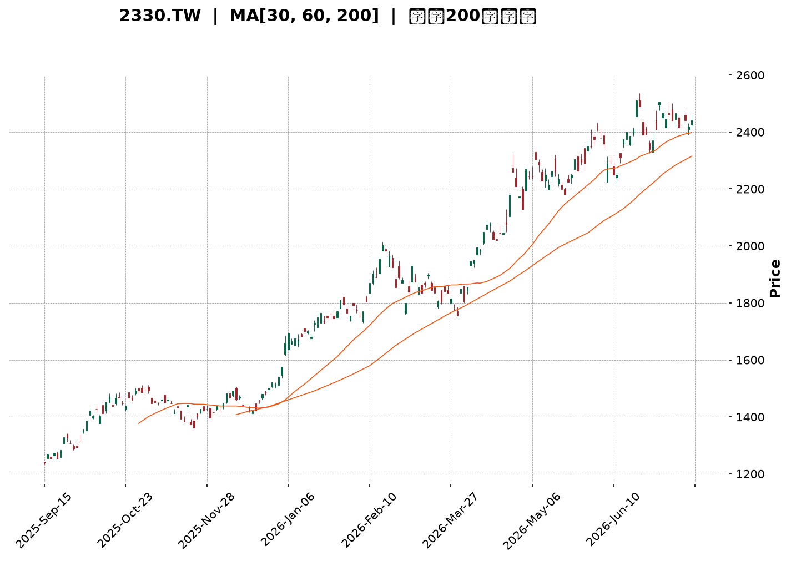
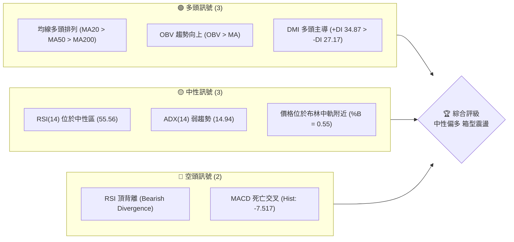
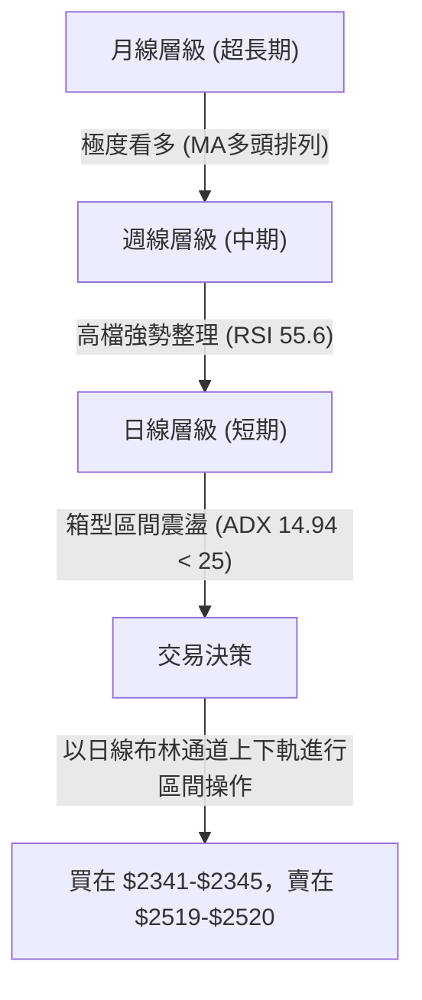
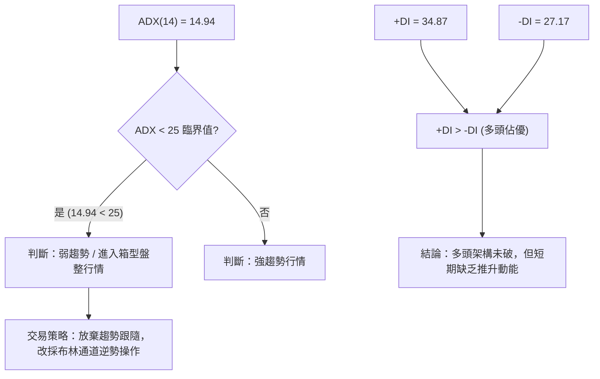
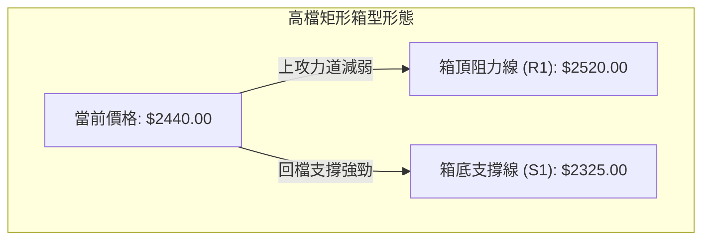
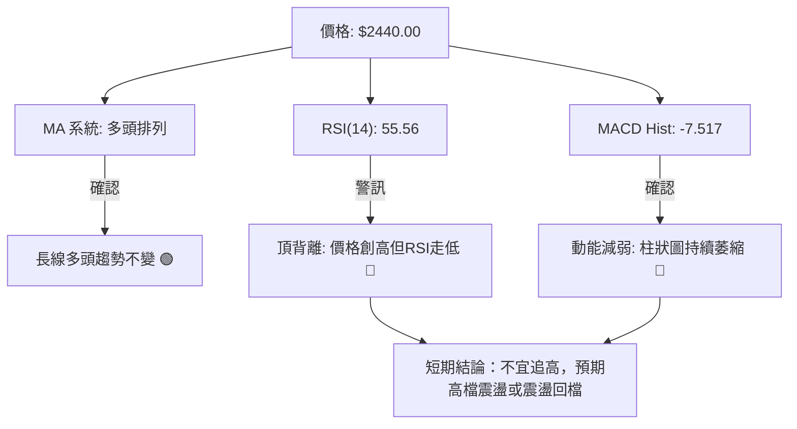
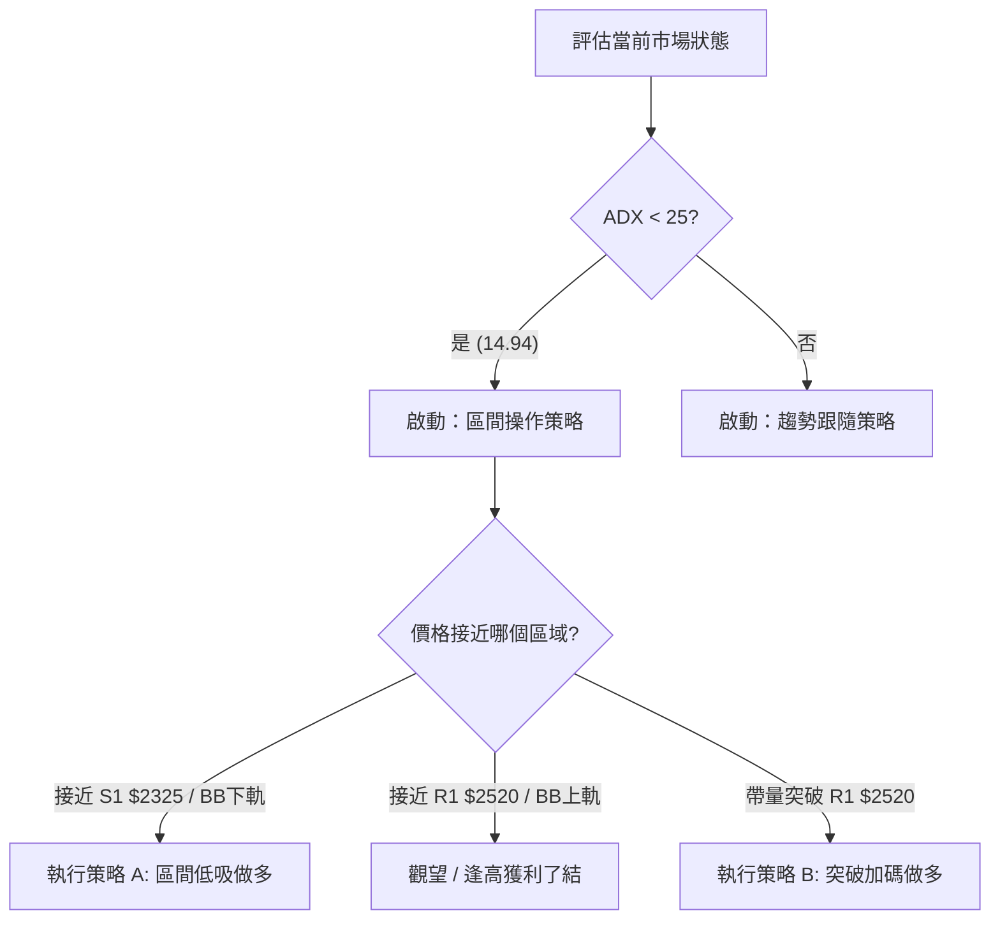
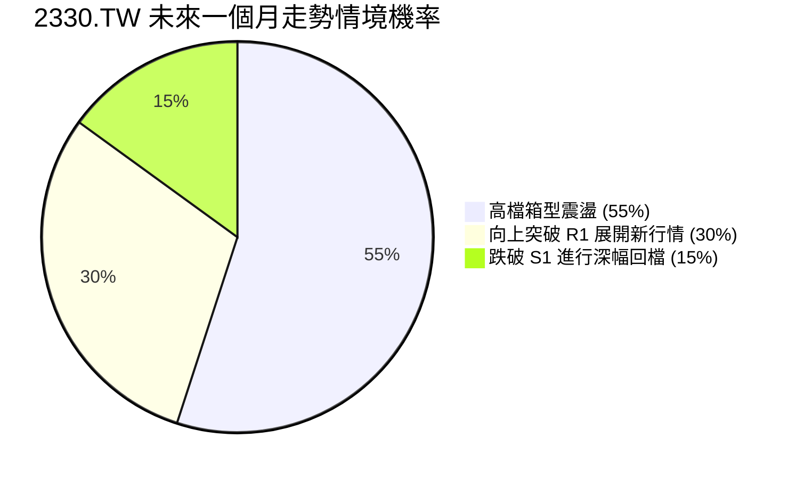
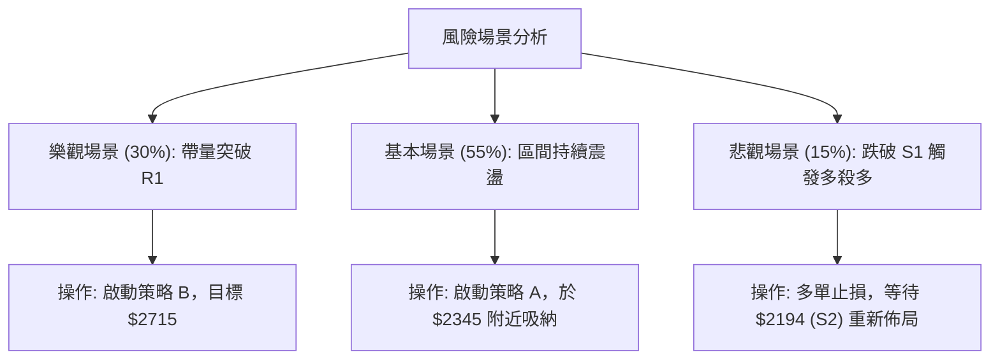

<details>
<summary>📊 靜態圖表 (點擊展開)</summary>

</details>

<html>
<head><meta charset="utf-8" /></head>
<body>
    <div style="height:500px; width:100%;">                        <script>window.PlotlyConfig = {MathJaxConfig: 'local'};</script>
        <script charset="utf-8" src="https://cdn.plot.ly/plotly-3.7.0.min.js" integrity="sha256-jvTGqxNp8AGWEcvNLVuKr+8j5dGe9Yw51LQkmDH+IYA=" crossorigin="anonymous"></script>                <div id="candlestick-chart" class="plotly-graph-div" style="height:100%; width:100%;"></div>            <script>                window.PLOTLYENV=window.PLOTLYENV || {};                                if (document.getElementById("candlestick-chart")) {                    Plotly.newPlot(                        "candlestick-chart",                        [{"close":{"dtype":"f8","bdata":"AAAAYPdZk0AAAACA3NCTQAAAAABqlZNAAAAAYK3kk0AAAAAAapWTQAAAACBPDJRAAAAA4Ka+lEAAAADgpr6UQAAAAGBjb5RAAAAA4B8glEAAAADg8DOUQAAAAEA0g5RAAAAAQLshlUAAAABAcayVQAAAAEAnN5ZAAAAA4OPnlUAAAABA+EqWQAAAAODj55VAAAAAYIUPlkAAAABADK6WQAAAAOBP\u002fZZAAAAAwJlylkAAAAAAf+mWQAAAAAB\u002f6ZZAAAAAoDualkAAAADAmXKWQAAAAAB\u002f6ZZAAAAAIK7VlkAAAABAk0yXQAAAAECTTJdAAAAAYMI4l0AAAABAZGCXQAAAAECTTJdAAAAAoDualkAAAABADK6WQAAAAKA7mpZAAAAAIK7VlkAAAABADK6WQAAAACCu1ZZAAAAAoDualkAAAABgViOWQAAAAODIXpZAAAAAIELAlUAAAABAoJiVQAAAAMBqhpZAAAAAwP5wlUAAAADgXEmVQAAAAODj55VAAAAAQPhKlkAAAABAJzeWQAAAAED4SpZAAAAA4BLUlUAAAABgViOWQAAAAMCZcpZAAAAA4MhelkAAAACgO5qWQAAAAKDxJJdAAAAAAH\u002fplkAAAABAk0yXQAAAAKBI1ZZAAAAAQAz9lkAAAACAwYWWQAAAAEAcSpZAAAAAgDo2lkAAAACAOjaWQAAAAIA6NpZAAAAAwGbBlkAAAACgzySXQAAAAICxOJdAAAAA4FZ0l0AAAADg3cOXQAAAAEAanJdAAAAAAGUTmEAAAABgkZ6YQAAAAICP8JlAAAAA4Lt7mkAAAABAcQSaQAAAAOA0LJpAAAAAAFMYmkAAAACAFkCaQAAAAMCdj5pAAAAAwJ2PmkAAAACAFkCaQAAAAEDoBptAAAAAQG9Wm0AAAACgFJKbQAAAAEDoBptAAAAAQG9Wm0AAAADgMn6bQAAAAKCNQptAAAAAgPalm0AAAACgBEWcQAAAAGBfCZxAAAAAoBSSm0AAAAAgUWqbQAAAAIB99ZtAAAAAINi5m0AAAAAgUWqbQAAAAID2pZtAAAAAwCIxnEAAAADgmTOdQAAAAEDGvp1AAAAAACGDnUAAAADgl4WeQAAAAKBpTJ9AAAAAoOL8nkAAAACAW62eQAAAAEBNDp5AAAAAgPT3nEAAAAAAIYOdQAAAAGBdW51AAAAAAEEdnEAAAABAT7ycQAAAACAvIp5AAAAAoHtHnUAAAACA9PecQAAAAIBtqJxAAAAAABkknUAAAACgua+dQAAAAIBP1JxAAAAAwGqsnEAAAACAvDScQAAAAIC8NJxAAAAAIF3AnEAAAADAaqycQAAAAEChXJxAAAAAQA69m0AAAADARG2bQAAAAOBB6JxAAAAAgLw0nEAAAABANPycQAAAAAA\u002fY55AAAAAYDF3nkAAAADAtiqfQAAAAADSAp9AAAAAgBADoEAAAABg7jSgQAAAAKDnPqBAAAAAAGWin0AAAACgco6fQAAAAIAu8p9AAAAAgC7yn0AAAABg7jSgQAAAAGBfBqFAAAAAYPKloUAAAACANkKhQAAAACBm\u002fKBAAAAAgKOioEAAAADA5LmhQAAAAOAGiKFAAAAA4AaIoUAAAAAgtf+hQAAAAGDQ16FAAAAAQBtqoUAAAAAAAJKhQAAAAKAvTKFAAAAAoOuvoUAAAABg8qWhQAAAAIAUdKFAAAAAIEQuoUAAAABgXwahQAAAAAAiYKFAAAAAAACSoUAAAAAgtf+hQAAAAKDrr6FAAAAAwMLroUAAAACAyeGhQAAAAMB3WaJAAAAAwHdZokAAAADAVYuiQAAAAGAY5aJAAAAA4E6VokAAAAAgam2iQAAAAIDJ4aFAAAAA4Lv1oUAAAAAAAJKhQAAAAAAAlKFAAAAAAAAMokAAAAAAAI6iQAAAAAAAwKJAAAAAAACiokAAAAAAANSiQAAAAAAAnKNAAAAAAAB0o0AAAAAAAKyiQAAAAAAArKJAAAAAAABIokAAAAAAAISiQAAAAAAA1KJAAAAAAACSo0AAAAAAAEKjQAAAAAAAGqNAAAAAAAA4o0AAAAAAABCjQAAAAAAAQqNAAAAAAADeokAAAAAAAN6iQAAAAAAAEKNAAAAAAADookAAAAAAABCjQA=="},"high":{"dtype":"f8","bdata":"vSWhBrRtk0AAAIBcreSTQIiCK7kLvZNAAAAAYK3kk0BTxuxOfviTQAAAACBPDJRAAAAA4Ka+lEAfqJx1GfqUQBA++BgFl5RArdRKdZJblECHfrN1Y2+UQLyVfY5I5pRAnMmZHIw1lUAAAABAcayVQLZMFvnIXpZAEZebvLT7lUAAAADWaoaWQBGXm7y0+5VAHWDZZjualkAAAABADK6WQHW4GpnxJJdAXypoVQyulkCYIp+V8SSXQHWDKXLCOJdATZo0Wd3BlkAfDnicaoaWQHWDKXLCOJdA+iCWtSARl0Bdv\u002fv4NHSXQAufedUFiJdAZ2Zmrtabl0Bw8jf5BYiXQLp+97HWm5dAwYED70\u002f9lkD7DTDVfumWQCZNmnwMrpZAp8AO2U\u002f9lkD1G2Bq8SSXQKfADtlP\u002fZZATZo0Wd3BlkClHBAZ+EqWQDHIXnU7mpZAnHSASyc3lkByHMex4+eVQA5Ql5w7mpZASGqZMkLAlUCx9g0LQsCVQCMuN5mFD5ZAAAAAQPhKlkBsmSyyaoaWQAAAANZqhpZAGTpg58helkClHBAZ+EqWQAAAAMCZcpZAZu10vJlylkAAAACgO5qWQAAAAKDxJJdAdYMpcsI4l0AAAABAk0yXQAAAAJA4iJdApshnBe4Ql0DQ6ktFo5mWQGIutMrfcZZAs6Qc0N9xlkCR4V5FHEqWQNVn2lqjmZZAvQg+hUjVlkAAAACgzySXQFDmWUWTTJdAAAAA4FZ0l0AAAADg3cOXQKK8hsrdw5dAAAAAAGUTmEAAAABgkZ6YQH+L01r4U5pAAAAA4Lt7mkBi0bLKNCyaQILFPDDaZ5pAVVVVFdpnmkBow+fPu3uaQLeS2kpht5pAW0lthX+jmkBFgpoK2meaQKuqqsqrLptA0kUXVfalm0AAAACgFJKbQKuqqhpRaptA6aKLyjJ+m0BVVVWlFJKbQGAERkDYuZtAlqxkRdi5m0AAAACgBEWcQG12cQCqgJxAx2+Xen31m0AAAAAgUWqbQKuqqgpBHZxAlXAnNV8JnEB5mgtw9qWbQAAAAID2pZtAxzIo1amAnEAAAADgmTOdQN3LscqJ5p1A1e+5ZU0OnkBn0pVqW62eQAzkoyotdJ9ACMwe8Ic4n0DVKGOV4vyeQIO+oC89wZ5AaQ7fb+SqnUCSdqxAtnGeQKuqquogg51AAAAAAEEdnEBGteVqXVudQAW+uKrySZ5AvLoVQMa+nUASsUaVe0edQAUJo+WZM51ATNgGwf1LnUAEAoEArMOdQDkPHcP9S51ALWQhAxkknUBtx4fgrkicQGg7PoRP1JxAMjgfYws4nUB705uiJhCdQHAIh6CTcJxACEUowtcMnEB00UUD8+SbQAAAAOBB6JxArpHVpSYQnUAAAABANPycQAAAAAA\u002fY55AAAAAYDF3nkAAAADAtiqfQFx\u002fe2DEFp9AAAAAgBADoEDFTuwg01ygQP\u002fBRNDgSKBALzFroQkNoEDCFmxxEAOgQBO1KzH1KqBAD8TvAPwgoECd2Ilyo6KgQGmcQZBYEKFAGNE205knokD5Y0nz3cOhQKszUkE9OKFAVFwyhDZCoUDgB34g182hQGhFI6Hrr6FAdbn9MdfNoUAffPBxhUWiQPQuHiG1\u002f6FAOiUBwuS5oUAU3z3x3cOhQMln3WAUdKFAAAAAoOuvoUDvhfeioB2iQEmSJEH5m6FAURRFESJgoUAPDkhRPTihQAWEE\u002fH\u002fkaFABJM\u002fMPmboUAAAAAgtf+hQDbwGbOgHaJAoGir4ZknokCeDyzzcGOiQLt\u002f84BcgaJAL3\u002faAibRokCBXBOBOrOiQENasfADA6NAcqdoASbRokBO8OShM72iQMZUOHGnE6JA75W6cKcTokAkKzyywuuhQAAAAAAAqKFAAAAAAAAqokAAAAAAAI6iQAAAAAAAwKJAAAAAAACiokAAAAAAAN6iQAAAAAAAnKNAAAAAAADOo0AAAAAAABqjQAAAAAAA6KJAAAAAAACEokAAAAAAALaiQAAAAAAAVqNAAAAAAACSo0AAAAAAAGCjQAAAAAAAQqNAAAAAAACIo0AAAAAAAIijQAAAAAAAQqNAAAAAAAA4o0AAAAAAAN6iQAAAAAAAYKNAAAAAAAD8okAAAAAAADijQA=="},"hovertemplate":"\u003cb\u003e%{x|%Y-%m-%d}\u003c\u002fb\u003e\u003cbr\u003e\u958b: $%{open:.2f}\u003cbr\u003e\u9ad8: $%{high:.2f}\u003cbr\u003e\u4f4e: $%{low:.2f}\u003cbr\u003e\u6536: $%{close:.2f}\u003cextra\u003e\u003c\u002fextra\u003e","low":{"dtype":"f8","bdata":"Q9peuTpGk0AAAAAOmYGTQAAAAABqlZNA8g3y7WmVk0AAAAAAapWTQK0bTNE6qZNAIj1QkZJblEDhV2NKNIOUQAAAAGBjb5RAG7mRA08MlEAAAADg8DOUQAAAAEA0g5RAx2zMhhn6lEAAAAA4uyGVQO+MXqq0+5VA3tHIJkLAlUCqqqqGViOWQKoM9pDPhJVAs82Xg7T7lUAOMNVchQ+WQBaPym0MrpZAAAAAwJlylkCtG0yxaoaWQAAAAAB\u002f6ZZA2bJlw2qGlkCg1ZcqJzeWQAAAAAB\u002f6ZZArZ94Q93BlkD1YIaqIBGXQFIggmPCOJdAAAAAYMI4l0AgG5DNIBGXQKRABIfxJJdA2bJlw2qGlkAAAABADK6WQNmyZcNqhpZAWT\u002fxZgyulkAAAABADK6WQAbfaYo7mpZAAAAAoDualkCu8XeDhQ+WQAAAAODIXpZAAAAAIELAlUAAAABAoJiVQNYPOir4SpZAAAAAwP5wlUAAAADgXEmVQN7RyCZCwJVAAAAAqoUPlkCl2XRjViOWQFVVVWMnN5ZAAAAA4BLUlUBc4++mtPuVQKDVlyonN5ZAzjehSlYjlkBmy5Yt+EqWQIcm+Zc7mpZAAAAAAH\u002fplkBHgQjOT\u002f2WQKuqqtpmwZZAtG4wtUjVlkAvFbS633GWQJ7RS7VYIpZAbx6hulgilkBNW+MvlfqVQAAAAIA6NpZAh+6DNaOZlkAh+fOKSNWWQF8zTPXtEJdAk7\u002fJj7E4l0CrqqrKVnSXQF5DebVWdJdApwFtmjiIl0CB4DI1g\u002f+XQE5rto+fPZlA\u002ffPPnyaNmUCdLk21rdyZQPx0hj\u002fqtJlAVVVVJeq0mUAAAACAFkCaQEltJTXaZ5pASW0lNdpnmkC6fWX1UhiaQAAAAKCdj5pA0kUX20LLmkC3lsU66AabQAAAAEDoBptAF110tasum0CrqqrKqy6bQAAAAKCNQptAFKEIpY1Cm0Aw\u002fdL\u002fuc2bQJjBl5p99ZtAAAAAoBSSm0AKMpsKyhqbQAAAADDYuZtAtkdslRSSm0CDzKZab1abQFOb2lToBptAAAAAwCIxnEDqOxu1i5ScQIvQOBW4H51AAAAAACGDnUD94xIrxr6dQOY3uIri\u002fJ5AAAAAoOL8nkCMeJIaLyKeQAAAAEBNDp5AAAAAgPT3nEB0S5w6P2+dQFVVVdWZM51A+K2R1TJ+m0BcJY0qyGycQN4sTxq4H51AAAAAoHtHnUCpomeli5ScQAAAAIBtqJxAsyf5PjT8nED0+Xx+4nOdQAAAAIBP1JxAAAAAwGqsnEDgGlmdANGbQCdx8L7XDJxAAAAAIF3AnEAAAADAaqycQD7e473XDJxAAAAAQA69m0AAAADARG2bQPqSaf2FhJxAlDh4H8ognEDXWmtdeJicQJ3YiR2D\u002f51AM3WLfXUTnkBSuB59CLOeQO6Bjd76xp5Av0oYm5tSn0A7sROfCQ2gQAd0Y34QA6BAAAAAAGWin0AAAACgco6fQPgdiB883p9A8TsQv0nKn0CKndhuEAOgQGk55lvMZqBAAAAAYPKloUAAAACANkKhQCrmVo963qBAAAAAgKOioED8wA+8URqhQExdbn8UdKFATF1ufxR0oUAAAAAgtf+hQE9Fmm7ypaFAAAAAQBtqoUDc1MNNPTihQCnyWQ9ELqFAHpe+HSJgoUCEHkLPBoihQCRJko42QqFAAAAAIEQuoUAAAABgXwahQAAAAAAiYKFA6I2C3ihWoUDhgw\u002fO5LmhQAAAAKDrr6FAy4dxX9DXoUA5q8eO66+hQFegz86ZJ6JAESDDj35PokB\u002fo+z+cGOiQL6lTs8sx6JAAAAA4E6VokDjJUqPfk+iQGLw0wwiYKFAC5yDf8nhoUAAAAAAAJKhQAAAAAAARKFAAAAAAADkoUAAAAAAAFKiQAAAAAAAXKJAAAAAAABcokAAAAAAAKKiQAAAAAAALqNAAAAAAAB0o0AAAAAAAKyiQAAAAAAArKJAAAAAAAAqokAAAAAAADSiQAAAAAAA1KJAAAAAAABWo0AAAAAAABqjQAAAAAAA3qJAAAAAAAAuo0AAAAAAABCjQAAAAAAA6KJAAAAAAADeokAAAAAAAN6iQAAAAAAAEKNAAAAAAACsokAAAAAAAN6iQA=="},"name":"\u50f9\u683c","open":{"dtype":"f8","bdata":"vSWhBrRtk0AAAIDqaZWTQETBldw6qZNA+Qb5pgu9k0APBVdyreSTQK0bTNE6qZNAgsrZbWNvlEC\u002fGhOZSOaUQAAAAGBjb5RAyY3cmMFHlEAtKpG8wUeUQAAAAEA0g5RAYzZmY+oNlUAAAAA4uyGVQO+MXqq0+5VA72hkAxPUlUAAAABA+EqWQKoM9pDPhJVA0C1ximqGlkAK5J8VJzeWQBaPym0MrpZAHw54nGqGlkCKfNaNO5qWQN1gitxP\u002fZZAAAAAoDualkDA4w8H+EqWQHWDKXLCOJdAU2CH\u002fH7plkCkQASH8SSXQF2\u002f+\u002fg0dJdA16Nw9TR0l0AAAABAZGCXQAufedUFiJdAmjRpEn\u002fplkD+WWUc3cGWQAAAAKA7mpZArZ94Q93BlkD3wfqNIBGXQK2feEPdwZZAAAAAoDualkCu8XeDhQ+WQGbtdLyZcpZAnHSASyc3lkAcx3EccayVQPKvaOOZcpZAJLVMeaCYlUDpoosucayVQCMuN5mFD5ZAqqqqhlYjlkARc6HVmXKWQAAAAED4SpZAGTpg58helkAAAABgViOWQMDjDwf4SpZAAAAA4MhelkCMGDEKyV6WQCtqjHQMrpZAmCKflfEkl0D1YIaqIBGXQKuqqspWdJdAWjeYeirplkAAAACAwYWWQAAAAEAcSpZAkeFeRRxKlkDePEL1dg6WQNVn2lqjmZZAAAAAwGbBlkDZ+jZQKumWQAAAAICxOJdAMZWYGnVgl0AAAACQOIiXQK+hvHo4iJdA\u002fSXLXxqcl0BhKOa\u002fRieYQJvtE1WBUZlA\u002ffPPnyaNmUCdLk21rdyZQCgM8ATMyJlAAAAAsK3cmUBFgpoK2meaQLeS2kpht5pApbaS+rt7mkDdvrK6NCyaQKuqqnoG85pA0kUX20LLmkC3lsU66AabQFVVVQXKGptAdNFFBVFqm0AAAADgMn6bQHUBwipRaptAqk1tam9Wm0Aw\u002fdL\u002fuc2bQAY4CTvIbJxARHb077nNm0CIZfTPqy6bQKuqqgpBHZxAAAAAINi5m0AAAAAgUWqbQOlHPxrKGptAFSbeD8hsnEBt1Hd6baicQHq2kdqZM51AAAAAACGDnUD94xIrxr6dQOY3uIri\u002fJ5AWJlfZcQQn0CMeJIaLyKeQNc+C6V5mZ5AmwnqHz9vnUBhpB0rLyKeQFVVVdWZM51AOXjfmhSSm0Cj2nJV1gudQOPqB6V7R51AXt0K8CCDnUCpomeli5ScQASaQiC4H51AJmyDYAs4nUD8\u002fX4\u002fx5udQFo3mGILOJ1AyUIWQjT8nEBN4uD98uSbQGg7PoRP1JxAIdAUoiYQnUBkIQuBT9ScQK7mah7KIJxAAAAAQA69m0C66KLhG6mbQGOLcr5qrJxArpHVpSYQnUDwvfd+T9ScQF7ohd5nJ55AR5UEn0xPnkCamZnd+saeQKWAhJ\u002ff7p5AqtCj+41mn0DsxE7PAhegQAE+u2\u002fuNKBA\u002fKgucRADoEDrXHkAZaKfQAAAAIAu8p9A+B2IHzzen0BiJ3bA4EigQNLVJ4zFcKBAfOG98N3DoUCHVYShDX6hQA6ix+9s8qBAyhCsI0QuoUDsxE7sSiShQAAAAOAGiKFAAAAA4AaIoUDNoWIRkzGiQHoXj8DC66FA69uAYfKloUDwswE\u002fG2qhQCnyWQ9ELqFAj0vf3gaIoUBzpDkStf+hQEmSJO8oVqFAMQzDsC9MoUCmcQYhRC6hQM80bmAUdKFA+NmAnw1+oUDhgw\u002fO5LmhQBrD0YKnE6JANniOILX\u002foUDoIK+Sfk+iQDRgSS+MO6JAAAAAwHdZokBArokgSJ+iQAAAAGAY5aJAAAAA4E6VokA7tGtBQamiQGLw0wwiYKFAAAAA4Lv1oUAYcn0h182hQAAAAAAAgKFAAAAAAAAqokAAAAAAAHCiQAAAAAAAjqJAAAAAAABmokAAAAAAALaiQAAAAAAALqNAAAAAAACco0AAAAAAAAajQAAAAAAA1KJAAAAAAABwokAAAAAAADSiQAAAAAAAEKNAAAAAAAB+o0AAAAAAACSjQAAAAAAA3qJAAAAAAABCo0AAAAAAAGCjQAAAAAAAGqNAAAAAAAAko0AAAAAAAN6iQAAAAAAAOKNAAAAAAADUokAAAAAAAPKiQA=="},"x":["2025-09-15T00:00:00+08:00","2025-09-16T00:00:00+08:00","2025-09-17T00:00:00+08:00","2025-09-18T00:00:00+08:00","2025-09-19T00:00:00+08:00","2025-09-22T00:00:00+08:00","2025-09-23T00:00:00+08:00","2025-09-24T00:00:00+08:00","2025-09-25T00:00:00+08:00","2025-09-26T00:00:00+08:00","2025-09-30T00:00:00+08:00","2025-10-01T00:00:00+08:00","2025-10-02T00:00:00+08:00","2025-10-03T00:00:00+08:00","2025-10-07T00:00:00+08:00","2025-10-08T00:00:00+08:00","2025-10-09T00:00:00+08:00","2025-10-13T00:00:00+08:00","2025-10-14T00:00:00+08:00","2025-10-15T00:00:00+08:00","2025-10-16T00:00:00+08:00","2025-10-17T00:00:00+08:00","2025-10-20T00:00:00+08:00","2025-10-21T00:00:00+08:00","2025-10-22T00:00:00+08:00","2025-10-23T00:00:00+08:00","2025-10-27T00:00:00+08:00","2025-10-28T00:00:00+08:00","2025-10-29T00:00:00+08:00","2025-10-30T00:00:00+08:00","2025-10-31T00:00:00+08:00","2025-11-03T00:00:00+08:00","2025-11-04T00:00:00+08:00","2025-11-05T00:00:00+08:00","2025-11-06T00:00:00+08:00","2025-11-07T00:00:00+08:00","2025-11-10T00:00:00+08:00","2025-11-11T00:00:00+08:00","2025-11-12T00:00:00+08:00","2025-11-13T00:00:00+08:00","2025-11-14T00:00:00+08:00","2025-11-17T00:00:00+08:00","2025-11-18T00:00:00+08:00","2025-11-19T00:00:00+08:00","2025-11-20T00:00:00+08:00","2025-11-21T00:00:00+08:00","2025-11-24T00:00:00+08:00","2025-11-25T00:00:00+08:00","2025-11-26T00:00:00+08:00","2025-11-27T00:00:00+08:00","2025-11-28T00:00:00+08:00","2025-12-01T00:00:00+08:00","2025-12-02T00:00:00+08:00","2025-12-03T00:00:00+08:00","2025-12-04T00:00:00+08:00","2025-12-05T00:00:00+08:00","2025-12-08T00:00:00+08:00","2025-12-09T00:00:00+08:00","2025-12-10T00:00:00+08:00","2025-12-11T00:00:00+08:00","2025-12-12T00:00:00+08:00","2025-12-15T00:00:00+08:00","2025-12-16T00:00:00+08:00","2025-12-17T00:00:00+08:00","2025-12-18T00:00:00+08:00","2025-12-19T00:00:00+08:00","2025-12-22T00:00:00+08:00","2025-12-23T00:00:00+08:00","2025-12-24T00:00:00+08:00","2025-12-26T00:00:00+08:00","2025-12-29T00:00:00+08:00","2025-12-30T00:00:00+08:00","2025-12-31T00:00:00+08:00","2026-01-02T00:00:00+08:00","2026-01-05T00:00:00+08:00","2026-01-06T00:00:00+08:00","2026-01-07T00:00:00+08:00","2026-01-08T00:00:00+08:00","2026-01-09T00:00:00+08:00","2026-01-12T00:00:00+08:00","2026-01-13T00:00:00+08:00","2026-01-14T00:00:00+08:00","2026-01-15T00:00:00+08:00","2026-01-16T00:00:00+08:00","2026-01-19T00:00:00+08:00","2026-01-20T00:00:00+08:00","2026-01-21T00:00:00+08:00","2026-01-22T00:00:00+08:00","2026-01-23T00:00:00+08:00","2026-01-26T00:00:00+08:00","2026-01-27T00:00:00+08:00","2026-01-28T00:00:00+08:00","2026-01-29T00:00:00+08:00","2026-01-30T00:00:00+08:00","2026-02-02T00:00:00+08:00","2026-02-03T00:00:00+08:00","2026-02-04T00:00:00+08:00","2026-02-05T00:00:00+08:00","2026-02-06T00:00:00+08:00","2026-02-09T00:00:00+08:00","2026-02-10T00:00:00+08:00","2026-02-11T00:00:00+08:00","2026-02-23T00:00:00+08:00","2026-02-24T00:00:00+08:00","2026-02-25T00:00:00+08:00","2026-02-26T00:00:00+08:00","2026-03-02T00:00:00+08:00","2026-03-03T00:00:00+08:00","2026-03-04T00:00:00+08:00","2026-03-05T00:00:00+08:00","2026-03-06T00:00:00+08:00","2026-03-09T00:00:00+08:00","2026-03-10T00:00:00+08:00","2026-03-11T00:00:00+08:00","2026-03-12T00:00:00+08:00","2026-03-13T00:00:00+08:00","2026-03-16T00:00:00+08:00","2026-03-17T00:00:00+08:00","2026-03-18T00:00:00+08:00","2026-03-19T00:00:00+08:00","2026-03-20T00:00:00+08:00","2026-03-23T00:00:00+08:00","2026-03-24T00:00:00+08:00","2026-03-25T00:00:00+08:00","2026-03-26T00:00:00+08:00","2026-03-27T00:00:00+08:00","2026-03-30T00:00:00+08:00","2026-03-31T00:00:00+08:00","2026-04-01T00:00:00+08:00","2026-04-02T00:00:00+08:00","2026-04-07T00:00:00+08:00","2026-04-08T00:00:00+08:00","2026-04-09T00:00:00+08:00","2026-04-10T00:00:00+08:00","2026-04-13T00:00:00+08:00","2026-04-14T00:00:00+08:00","2026-04-15T00:00:00+08:00","2026-04-16T00:00:00+08:00","2026-04-17T00:00:00+08:00","2026-04-20T00:00:00+08:00","2026-04-21T00:00:00+08:00","2026-04-22T00:00:00+08:00","2026-04-23T00:00:00+08:00","2026-04-24T00:00:00+08:00","2026-04-27T00:00:00+08:00","2026-04-28T00:00:00+08:00","2026-04-29T00:00:00+08:00","2026-04-30T00:00:00+08:00","2026-05-04T00:00:00+08:00","2026-05-05T00:00:00+08:00","2026-05-06T00:00:00+08:00","2026-05-07T00:00:00+08:00","2026-05-08T00:00:00+08:00","2026-05-11T00:00:00+08:00","2026-05-12T00:00:00+08:00","2026-05-13T00:00:00+08:00","2026-05-14T00:00:00+08:00","2026-05-15T00:00:00+08:00","2026-05-18T00:00:00+08:00","2026-05-19T00:00:00+08:00","2026-05-20T00:00:00+08:00","2026-05-21T00:00:00+08:00","2026-05-22T00:00:00+08:00","2026-05-25T00:00:00+08:00","2026-05-26T00:00:00+08:00","2026-05-27T00:00:00+08:00","2026-05-28T00:00:00+08:00","2026-05-29T00:00:00+08:00","2026-06-01T00:00:00+08:00","2026-06-02T00:00:00+08:00","2026-06-03T00:00:00+08:00","2026-06-04T00:00:00+08:00","2026-06-05T00:00:00+08:00","2026-06-08T00:00:00+08:00","2026-06-09T00:00:00+08:00","2026-06-10T00:00:00+08:00","2026-06-11T00:00:00+08:00","2026-06-12T00:00:00+08:00","2026-06-15T00:00:00+08:00","2026-06-16T00:00:00+08:00","2026-06-17T00:00:00+08:00","2026-06-18T00:00:00+08:00","2026-06-22T00:00:00+08:00","2026-06-23T00:00:00+08:00","2026-06-24T00:00:00+08:00","2026-06-25T00:00:00+08:00","2026-06-26T00:00:00+08:00","2026-06-29T00:00:00+08:00","2026-06-30T00:00:00+08:00","2026-07-01T00:00:00+08:00","2026-07-02T00:00:00+08:00","2026-07-03T00:00:00+08:00","2026-07-06T00:00:00+08:00","2026-07-07T00:00:00+08:00","2026-07-08T00:00:00+08:00","2026-07-09T00:00:00+08:00","2026-07-10T00:00:00+08:00","2026-07-13T00:00:00+08:00","2026-07-14T00:00:00+08:00","2026-07-15T00:00:00+08:00"],"type":"candlestick"},{"hovertemplate":"MA30: $%{y:.2f}\u003cextra\u003e\u003c\u002fextra\u003e","line":{"color":"#2196F3","dash":"dash","width":2},"mode":"lines","name":"MA30","x":["2025-09-15T00:00:00+08:00","2025-09-16T00:00:00+08:00","2025-09-17T00:00:00+08:00","2025-09-18T00:00:00+08:00","2025-09-19T00:00:00+08:00","2025-09-22T00:00:00+08:00","2025-09-23T00:00:00+08:00","2025-09-24T00:00:00+08:00","2025-09-25T00:00:00+08:00","2025-09-26T00:00:00+08:00","2025-09-30T00:00:00+08:00","2025-10-01T00:00:00+08:00","2025-10-02T00:00:00+08:00","2025-10-03T00:00:00+08:00","2025-10-07T00:00:00+08:00","2025-10-08T00:00:00+08:00","2025-10-09T00:00:00+08:00","2025-10-13T00:00:00+08:00","2025-10-14T00:00:00+08:00","2025-10-15T00:00:00+08:00","2025-10-16T00:00:00+08:00","2025-10-17T00:00:00+08:00","2025-10-20T00:00:00+08:00","2025-10-21T00:00:00+08:00","2025-10-22T00:00:00+08:00","2025-10-23T00:00:00+08:00","2025-10-27T00:00:00+08:00","2025-10-28T00:00:00+08:00","2025-10-29T00:00:00+08:00","2025-10-30T00:00:00+08:00","2025-10-31T00:00:00+08:00","2025-11-03T00:00:00+08:00","2025-11-04T00:00:00+08:00","2025-11-05T00:00:00+08:00","2025-11-06T00:00:00+08:00","2025-11-07T00:00:00+08:00","2025-11-10T00:00:00+08:00","2025-11-11T00:00:00+08:00","2025-11-12T00:00:00+08:00","2025-11-13T00:00:00+08:00","2025-11-14T00:00:00+08:00","2025-11-17T00:00:00+08:00","2025-11-18T00:00:00+08:00","2025-11-19T00:00:00+08:00","2025-11-20T00:00:00+08:00","2025-11-21T00:00:00+08:00","2025-11-24T00:00:00+08:00","2025-11-25T00:00:00+08:00","2025-11-26T00:00:00+08:00","2025-11-27T00:00:00+08:00","2025-11-28T00:00:00+08:00","2025-12-01T00:00:00+08:00","2025-12-02T00:00:00+08:00","2025-12-03T00:00:00+08:00","2025-12-04T00:00:00+08:00","2025-12-05T00:00:00+08:00","2025-12-08T00:00:00+08:00","2025-12-09T00:00:00+08:00","2025-12-10T00:00:00+08:00","2025-12-11T00:00:00+08:00","2025-12-12T00:00:00+08:00","2025-12-15T00:00:00+08:00","2025-12-16T00:00:00+08:00","2025-12-17T00:00:00+08:00","2025-12-18T00:00:00+08:00","2025-12-19T00:00:00+08:00","2025-12-22T00:00:00+08:00","2025-12-23T00:00:00+08:00","2025-12-24T00:00:00+08:00","2025-12-26T00:00:00+08:00","2025-12-29T00:00:00+08:00","2025-12-30T00:00:00+08:00","2025-12-31T00:00:00+08:00","2026-01-02T00:00:00+08:00","2026-01-05T00:00:00+08:00","2026-01-06T00:00:00+08:00","2026-01-07T00:00:00+08:00","2026-01-08T00:00:00+08:00","2026-01-09T00:00:00+08:00","2026-01-12T00:00:00+08:00","2026-01-13T00:00:00+08:00","2026-01-14T00:00:00+08:00","2026-01-15T00:00:00+08:00","2026-01-16T00:00:00+08:00","2026-01-19T00:00:00+08:00","2026-01-20T00:00:00+08:00","2026-01-21T00:00:00+08:00","2026-01-22T00:00:00+08:00","2026-01-23T00:00:00+08:00","2026-01-26T00:00:00+08:00","2026-01-27T00:00:00+08:00","2026-01-28T00:00:00+08:00","2026-01-29T00:00:00+08:00","2026-01-30T00:00:00+08:00","2026-02-02T00:00:00+08:00","2026-02-03T00:00:00+08:00","2026-02-04T00:00:00+08:00","2026-02-05T00:00:00+08:00","2026-02-06T00:00:00+08:00","2026-02-09T00:00:00+08:00","2026-02-10T00:00:00+08:00","2026-02-11T00:00:00+08:00","2026-02-23T00:00:00+08:00","2026-02-24T00:00:00+08:00","2026-02-25T00:00:00+08:00","2026-02-26T00:00:00+08:00","2026-03-02T00:00:00+08:00","2026-03-03T00:00:00+08:00","2026-03-04T00:00:00+08:00","2026-03-05T00:00:00+08:00","2026-03-06T00:00:00+08:00","2026-03-09T00:00:00+08:00","2026-03-10T00:00:00+08:00","2026-03-11T00:00:00+08:00","2026-03-12T00:00:00+08:00","2026-03-13T00:00:00+08:00","2026-03-16T00:00:00+08:00","2026-03-17T00:00:00+08:00","2026-03-18T00:00:00+08:00","2026-03-19T00:00:00+08:00","2026-03-20T00:00:00+08:00","2026-03-23T00:00:00+08:00","2026-03-24T00:00:00+08:00","2026-03-25T00:00:00+08:00","2026-03-26T00:00:00+08:00","2026-03-27T00:00:00+08:00","2026-03-30T00:00:00+08:00","2026-03-31T00:00:00+08:00","2026-04-01T00:00:00+08:00","2026-04-02T00:00:00+08:00","2026-04-07T00:00:00+08:00","2026-04-08T00:00:00+08:00","2026-04-09T00:00:00+08:00","2026-04-10T00:00:00+08:00","2026-04-13T00:00:00+08:00","2026-04-14T00:00:00+08:00","2026-04-15T00:00:00+08:00","2026-04-16T00:00:00+08:00","2026-04-17T00:00:00+08:00","2026-04-20T00:00:00+08:00","2026-04-21T00:00:00+08:00","2026-04-22T00:00:00+08:00","2026-04-23T00:00:00+08:00","2026-04-24T00:00:00+08:00","2026-04-27T00:00:00+08:00","2026-04-28T00:00:00+08:00","2026-04-29T00:00:00+08:00","2026-04-30T00:00:00+08:00","2026-05-04T00:00:00+08:00","2026-05-05T00:00:00+08:00","2026-05-06T00:00:00+08:00","2026-05-07T00:00:00+08:00","2026-05-08T00:00:00+08:00","2026-05-11T00:00:00+08:00","2026-05-12T00:00:00+08:00","2026-05-13T00:00:00+08:00","2026-05-14T00:00:00+08:00","2026-05-15T00:00:00+08:00","2026-05-18T00:00:00+08:00","2026-05-19T00:00:00+08:00","2026-05-20T00:00:00+08:00","2026-05-21T00:00:00+08:00","2026-05-22T00:00:00+08:00","2026-05-25T00:00:00+08:00","2026-05-26T00:00:00+08:00","2026-05-27T00:00:00+08:00","2026-05-28T00:00:00+08:00","2026-05-29T00:00:00+08:00","2026-06-01T00:00:00+08:00","2026-06-02T00:00:00+08:00","2026-06-03T00:00:00+08:00","2026-06-04T00:00:00+08:00","2026-06-05T00:00:00+08:00","2026-06-08T00:00:00+08:00","2026-06-09T00:00:00+08:00","2026-06-10T00:00:00+08:00","2026-06-11T00:00:00+08:00","2026-06-12T00:00:00+08:00","2026-06-15T00:00:00+08:00","2026-06-16T00:00:00+08:00","2026-06-17T00:00:00+08:00","2026-06-18T00:00:00+08:00","2026-06-22T00:00:00+08:00","2026-06-23T00:00:00+08:00","2026-06-24T00:00:00+08:00","2026-06-25T00:00:00+08:00","2026-06-26T00:00:00+08:00","2026-06-29T00:00:00+08:00","2026-06-30T00:00:00+08:00","2026-07-01T00:00:00+08:00","2026-07-02T00:00:00+08:00","2026-07-03T00:00:00+08:00","2026-07-06T00:00:00+08:00","2026-07-07T00:00:00+08:00","2026-07-08T00:00:00+08:00","2026-07-09T00:00:00+08:00","2026-07-10T00:00:00+08:00","2026-07-13T00:00:00+08:00","2026-07-14T00:00:00+08:00","2026-07-15T00:00:00+08:00"],"y":{"dtype":"f8","bdata":"AAAAAAAA+H8AAAAAAAD4fwAAAAAAAPh\u002fAAAAAAAA+H8AAAAAAAD4fwAAAAAAAPh\u002fAAAAAAAA+H8AAAAAAAD4fwAAAAAAAPh\u002fAAAAAAAA+H8AAAAAAAD4fwAAAAAAAPh\u002fAAAAAAAA+H8AAAAAAAD4fwAAAAAAAPh\u002fAAAAAAAA+H8AAAAAAAD4fwAAAAAAAPh\u002fAAAAAAAA+H8AAAAAAAD4fwAAAAAAAPh\u002fAAAAAAAA+H8AAAAAAAD4fwAAAAAAAPh\u002fAAAAAAAA+H8AAAAAAAD4fwAAAAAAAPh\u002fAAAAAAAA+H8AAAAAAAD4f7y7u3vPhJVAAAAAQNallUBERESkOMSVQHd3dzft45VA7+7ujgv7lUDe3d1ddxWWQERERIRDK5ZAd3d3Fxk9lkCJiIh4nE2WQN7d3W0WYpZAzczMfDl3lkDv7u7evIeWQImIiCiXl5ZAvLu769+clkAiIiLSNpyWQERERDTbnpZAIiIiouSalkAzMzNjTpKWQDMzM2NOkpZA7+7urkmUlkDe3d0dU5CWQDMzM0NhipZAAAAAgBiFlkC8u7uLfX6WQImIiPiGepZA3t3drYt4lkAAAADg3XmWQJqZmSnZe5ZAIiIiQoJ8lkAiIiJCgnyWQN7d3U2IeJZARERExIp2lkAzMzMTQW+WQCIiIoKjZpZAMzMzI05jlkDe3d2tT1+WQO\u002fu7k76W5ZAMzMzQ01blkBVVVW1Ql+WQO\u002fu7p6PYpZAvLu7y9RplkDe3d0tt3eWQFVVVfVKgpZAREREdCGWlkAiIiLC7a+WQN7d3R0RzZZAvLu7axf4lkB3d3f3dSCXQBERERHfRJdAZmZmBlFll0BmZmZmv4eXQBEREVErrJdAAAAA0I3Ul0CJiIhIpfeXQHd3d\u002fe4HphAERERYRxJmECrqqp6gXOYQM3MzEyjlJhAq6qqCme6mEARERGhMN6YQCIiIjL3A5lAzczMvLormUAiIiKCxVyZQHd3d0fQjZlAAAAAwIq7mUB3d3fn8eeZQLy7u6v8GJpAmpmZ2WZDmkCamZkZ2meaQKuqqqqgjZpAzczM3A22mkDv7u7+ceSaQAAAABDNGJtAIiIiMjFHm0B3d3dHj3mbQAAAAMBJp5tAmpmZ+bnNm0BERESEffWbQGZmZnagFpxAiYiI2CUvnEB3d3eH+0qcQAAAAEDXYpxAzczMbBhwnEBERESETYWcQBEREeHPn5xAvLu7W2GwnECJiIg4T7ycQAAAABA6ypxAZmZmlp3ZnEB3d3dHVeycQLy7u5u5+ZxAd3d3N3kCnUB3d3dH7gGdQBEREVFgA51AzczMzHMNnUAzMzNjMBidQDMzM4OgG51Aq6qq6rsbnUCrqqoa1RudQJqZmVmTJp1AMzMzE7ImnUCrqqpa2SSdQImIiNhUKp1AZmZmhncynUDe3d2N+DedQBEREZGENZ1Aq6qq+ls+nUBmZmYWLU2dQAAAALD1YZ1AvLu7K7V4nUAzMzPTJoqdQM3MzNw+oJ1AIiIicvHAnUB3d3cHVOCdQHd3dze\u002fAZ5A3t3dDRg1nkB3d3dncWSeQFVVVeXJkZ5AmpmZKQe1nkBERETkOuaeQGZmZuZrG59AVVVVVfFRn0B3d3eXbpSfQAAAAABD1J9AIiIiyg8EoEBEREScpx+gQERERBxAOqBA7+7uhtRaoECrqqpCaHygQCIiInIBlqBAd3d310SwoEAAAADA4MWgQDMzM7N+2KBAvLu7E3HsoEAzMzOrDQGhQHd3d5+rE6FAzczM1PUjoUDv7u5mQTKhQLy7uyM1RKFAREREDNFZoUCJiIiYa3GhQBEREZFaiqFAAAAAsKCgoUDv7u6+k7OhQFVVVRXkuqFA7+7u7oy9oUCJiIjINcChQCIiInJDxaFAAAAAEE\u002fRoUCamZkJYdihQFVVVTXH4qFAERERYS3soUARERHxQPOhQImIiJhTAqJAZmZmFrkTokDNzMx8Hx2iQCIiIqLZKKJAERERYestokC8u7s7UjWiQImIiEgNQaJAmpmZaXFVokDNzMxMf2iiQGZmZuY5d6JAd3d390qFokB3d3eHXo6iQLy7u5vFm6JAd3d3t9ijokDv7u7uQKyiQKuqqopWsqJAERER0Ra3okBERETkgruiQA=="},"type":"scatter"},{"hovertemplate":"MA60: $%{y:.2f}\u003cextra\u003e\u003c\u002fextra\u003e","line":{"color":"#9C27B0","dash":"dash","width":2},"mode":"lines","name":"MA60","x":["2025-09-15T00:00:00+08:00","2025-09-16T00:00:00+08:00","2025-09-17T00:00:00+08:00","2025-09-18T00:00:00+08:00","2025-09-19T00:00:00+08:00","2025-09-22T00:00:00+08:00","2025-09-23T00:00:00+08:00","2025-09-24T00:00:00+08:00","2025-09-25T00:00:00+08:00","2025-09-26T00:00:00+08:00","2025-09-30T00:00:00+08:00","2025-10-01T00:00:00+08:00","2025-10-02T00:00:00+08:00","2025-10-03T00:00:00+08:00","2025-10-07T00:00:00+08:00","2025-10-08T00:00:00+08:00","2025-10-09T00:00:00+08:00","2025-10-13T00:00:00+08:00","2025-10-14T00:00:00+08:00","2025-10-15T00:00:00+08:00","2025-10-16T00:00:00+08:00","2025-10-17T00:00:00+08:00","2025-10-20T00:00:00+08:00","2025-10-21T00:00:00+08:00","2025-10-22T00:00:00+08:00","2025-10-23T00:00:00+08:00","2025-10-27T00:00:00+08:00","2025-10-28T00:00:00+08:00","2025-10-29T00:00:00+08:00","2025-10-30T00:00:00+08:00","2025-10-31T00:00:00+08:00","2025-11-03T00:00:00+08:00","2025-11-04T00:00:00+08:00","2025-11-05T00:00:00+08:00","2025-11-06T00:00:00+08:00","2025-11-07T00:00:00+08:00","2025-11-10T00:00:00+08:00","2025-11-11T00:00:00+08:00","2025-11-12T00:00:00+08:00","2025-11-13T00:00:00+08:00","2025-11-14T00:00:00+08:00","2025-11-17T00:00:00+08:00","2025-11-18T00:00:00+08:00","2025-11-19T00:00:00+08:00","2025-11-20T00:00:00+08:00","2025-11-21T00:00:00+08:00","2025-11-24T00:00:00+08:00","2025-11-25T00:00:00+08:00","2025-11-26T00:00:00+08:00","2025-11-27T00:00:00+08:00","2025-11-28T00:00:00+08:00","2025-12-01T00:00:00+08:00","2025-12-02T00:00:00+08:00","2025-12-03T00:00:00+08:00","2025-12-04T00:00:00+08:00","2025-12-05T00:00:00+08:00","2025-12-08T00:00:00+08:00","2025-12-09T00:00:00+08:00","2025-12-10T00:00:00+08:00","2025-12-11T00:00:00+08:00","2025-12-12T00:00:00+08:00","2025-12-15T00:00:00+08:00","2025-12-16T00:00:00+08:00","2025-12-17T00:00:00+08:00","2025-12-18T00:00:00+08:00","2025-12-19T00:00:00+08:00","2025-12-22T00:00:00+08:00","2025-12-23T00:00:00+08:00","2025-12-24T00:00:00+08:00","2025-12-26T00:00:00+08:00","2025-12-29T00:00:00+08:00","2025-12-30T00:00:00+08:00","2025-12-31T00:00:00+08:00","2026-01-02T00:00:00+08:00","2026-01-05T00:00:00+08:00","2026-01-06T00:00:00+08:00","2026-01-07T00:00:00+08:00","2026-01-08T00:00:00+08:00","2026-01-09T00:00:00+08:00","2026-01-12T00:00:00+08:00","2026-01-13T00:00:00+08:00","2026-01-14T00:00:00+08:00","2026-01-15T00:00:00+08:00","2026-01-16T00:00:00+08:00","2026-01-19T00:00:00+08:00","2026-01-20T00:00:00+08:00","2026-01-21T00:00:00+08:00","2026-01-22T00:00:00+08:00","2026-01-23T00:00:00+08:00","2026-01-26T00:00:00+08:00","2026-01-27T00:00:00+08:00","2026-01-28T00:00:00+08:00","2026-01-29T00:00:00+08:00","2026-01-30T00:00:00+08:00","2026-02-02T00:00:00+08:00","2026-02-03T00:00:00+08:00","2026-02-04T00:00:00+08:00","2026-02-05T00:00:00+08:00","2026-02-06T00:00:00+08:00","2026-02-09T00:00:00+08:00","2026-02-10T00:00:00+08:00","2026-02-11T00:00:00+08:00","2026-02-23T00:00:00+08:00","2026-02-24T00:00:00+08:00","2026-02-25T00:00:00+08:00","2026-02-26T00:00:00+08:00","2026-03-02T00:00:00+08:00","2026-03-03T00:00:00+08:00","2026-03-04T00:00:00+08:00","2026-03-05T00:00:00+08:00","2026-03-06T00:00:00+08:00","2026-03-09T00:00:00+08:00","2026-03-10T00:00:00+08:00","2026-03-11T00:00:00+08:00","2026-03-12T00:00:00+08:00","2026-03-13T00:00:00+08:00","2026-03-16T00:00:00+08:00","2026-03-17T00:00:00+08:00","2026-03-18T00:00:00+08:00","2026-03-19T00:00:00+08:00","2026-03-20T00:00:00+08:00","2026-03-23T00:00:00+08:00","2026-03-24T00:00:00+08:00","2026-03-25T00:00:00+08:00","2026-03-26T00:00:00+08:00","2026-03-27T00:00:00+08:00","2026-03-30T00:00:00+08:00","2026-03-31T00:00:00+08:00","2026-04-01T00:00:00+08:00","2026-04-02T00:00:00+08:00","2026-04-07T00:00:00+08:00","2026-04-08T00:00:00+08:00","2026-04-09T00:00:00+08:00","2026-04-10T00:00:00+08:00","2026-04-13T00:00:00+08:00","2026-04-14T00:00:00+08:00","2026-04-15T00:00:00+08:00","2026-04-16T00:00:00+08:00","2026-04-17T00:00:00+08:00","2026-04-20T00:00:00+08:00","2026-04-21T00:00:00+08:00","2026-04-22T00:00:00+08:00","2026-04-23T00:00:00+08:00","2026-04-24T00:00:00+08:00","2026-04-27T00:00:00+08:00","2026-04-28T00:00:00+08:00","2026-04-29T00:00:00+08:00","2026-04-30T00:00:00+08:00","2026-05-04T00:00:00+08:00","2026-05-05T00:00:00+08:00","2026-05-06T00:00:00+08:00","2026-05-07T00:00:00+08:00","2026-05-08T00:00:00+08:00","2026-05-11T00:00:00+08:00","2026-05-12T00:00:00+08:00","2026-05-13T00:00:00+08:00","2026-05-14T00:00:00+08:00","2026-05-15T00:00:00+08:00","2026-05-18T00:00:00+08:00","2026-05-19T00:00:00+08:00","2026-05-20T00:00:00+08:00","2026-05-21T00:00:00+08:00","2026-05-22T00:00:00+08:00","2026-05-25T00:00:00+08:00","2026-05-26T00:00:00+08:00","2026-05-27T00:00:00+08:00","2026-05-28T00:00:00+08:00","2026-05-29T00:00:00+08:00","2026-06-01T00:00:00+08:00","2026-06-02T00:00:00+08:00","2026-06-03T00:00:00+08:00","2026-06-04T00:00:00+08:00","2026-06-05T00:00:00+08:00","2026-06-08T00:00:00+08:00","2026-06-09T00:00:00+08:00","2026-06-10T00:00:00+08:00","2026-06-11T00:00:00+08:00","2026-06-12T00:00:00+08:00","2026-06-15T00:00:00+08:00","2026-06-16T00:00:00+08:00","2026-06-17T00:00:00+08:00","2026-06-18T00:00:00+08:00","2026-06-22T00:00:00+08:00","2026-06-23T00:00:00+08:00","2026-06-24T00:00:00+08:00","2026-06-25T00:00:00+08:00","2026-06-26T00:00:00+08:00","2026-06-29T00:00:00+08:00","2026-06-30T00:00:00+08:00","2026-07-01T00:00:00+08:00","2026-07-02T00:00:00+08:00","2026-07-03T00:00:00+08:00","2026-07-06T00:00:00+08:00","2026-07-07T00:00:00+08:00","2026-07-08T00:00:00+08:00","2026-07-09T00:00:00+08:00","2026-07-10T00:00:00+08:00","2026-07-13T00:00:00+08:00","2026-07-14T00:00:00+08:00","2026-07-15T00:00:00+08:00"],"y":{"dtype":"f8","bdata":"AAAAAAAA+H8AAAAAAAD4fwAAAAAAAPh\u002fAAAAAAAA+H8AAAAAAAD4fwAAAAAAAPh\u002fAAAAAAAA+H8AAAAAAAD4fwAAAAAAAPh\u002fAAAAAAAA+H8AAAAAAAD4fwAAAAAAAPh\u002fAAAAAAAA+H8AAAAAAAD4fwAAAAAAAPh\u002fAAAAAAAA+H8AAAAAAAD4fwAAAAAAAPh\u002fAAAAAAAA+H8AAAAAAAD4fwAAAAAAAPh\u002fAAAAAAAA+H8AAAAAAAD4fwAAAAAAAPh\u002fAAAAAAAA+H8AAAAAAAD4fwAAAAAAAPh\u002fAAAAAAAA+H8AAAAAAAD4fwAAAAAAAPh\u002fAAAAAAAA+H8AAAAAAAD4fwAAAAAAAPh\u002fAAAAAAAA+H8AAAAAAAD4fwAAAAAAAPh\u002fAAAAAAAA+H8AAAAAAAD4fwAAAAAAAPh\u002fAAAAAAAA+H8AAAAAAAD4fwAAAAAAAPh\u002fAAAAAAAA+H8AAAAAAAD4fwAAAAAAAPh\u002fAAAAAAAA+H8AAAAAAAD4fwAAAAAAAPh\u002fAAAAAAAA+H8AAAAAAAD4fwAAAAAAAPh\u002fAAAAAAAA+H8AAAAAAAD4fwAAAAAAAPh\u002fAAAAAAAA+H8AAAAAAAD4fwAAAAAAAPh\u002fAAAAAAAA+H8AAAAAAAD4f83MzOSr\u002fpVAIiIigjAOlkC8u7vbvBmWQM3MzFxIJZZAERER2SwvlkDe3d2FYzqWQJqZmemeQ5ZAVVVVLTNMlkDv7u6Wb1aWQGZmZgZTYpZAREREJIdwlkBmZmYGun+WQO\u002fu7g7xjJZAAAAAsICZlkAiIiJKEqaWQBERESn2tZZA7+7uBn7JlkBVVVUtYtmWQCIiIrqW65ZAq6qqWs38lkAiIiJCCQyXQCIiIkpGG5dAAAAAKNMsl0AiIiJqETuXQAAAAPifTJdAd3d3B9Rgl0BVVVWtr3aXQDMzMzs+iJdAZmZmpnSbl0CamZlxWa2XQAAAAMA\u002fvpdAiYiIwCLRl0CrqqpKA+aXQM3MzOQ5+pdAmpmZcWwPmECrqqrKoCOYQFVVVX17OphAZmZmDlpPmEB3d3dnjmOYQM3MzCQYeJhAREREVPGPmEBmZmaWFK6YQKuqqgKMzZhAMzMzU6numEDNzMyEvhSZQO\u002fu7m4tOplAq6qqsuhimUDe3d29+YqZQLy7u8O\u002frZlAd3d3bzvKmUDv7u52XemZQImIiEiBB5pAZmZmHlMimkBmZmZmeT6aQERERGxEX5pAZmZm3r58mkCamZlZ6JeaQGZmZq5ur5pAiYiIUALKmkBERET0QuWaQO\u002fu7mbY\u002fppAIiIi+hkXm0DNzMzkWS+bQEREREyYSJtAZmZmRn9km0BVVVUlEYCbQHd3d5dOmptAIiIiYpGvm0AiIiKa18GbQCIiIgIa2ptAAAAA+F\u002fum0DNzMyspQScQERERPSQIZxAREREXNQ8nECrqqrqw1icQImIiChnbpxAIiIi+gqGnEBVVVVNVaGcQDMzMxNLvJxAIiIigu3TnEBVVVUtkeqcQGZmZg6LAZ1Ad3d374QYnUDe3d3F0DKdQERERIzHUJ1AzczMtLxynUAAAABQYJCdQKuqqvoBrp1AAAAAYFLHnUDe3d0VSOmdQBEREcGSCp5AZmZmRjUqnkB3d3dvLkueQImIiKjRa55AiYiIsMmKnkDe3d3Nv6ueQN7d3V0QyJ5AREREfLLonkAAAADQUgqfQO\u002fu7h5LKZ9AERER4Z1Dn0BVVVVtTVifQHd3dx+pbZ9A7+7u1qyFn0AiIiLyCZ2fQAAAAOhtrp9AIiIi0iPDn0AiIiLy19ifQLy7u\u002fsv9Z9AERER0RULoEARERGBPxugQLy7u\u002f88LaBAiYiItIxAoEBVVVXh3lGgQImIiNjhXaBA7+7uegxsoEAiIiI+N3mgQGZmZjIUh6BAZmZmUumVoEDe3d09v6WgQERERJQ+uKBA3t3dBZPKoEBmZmYevN6gQERERIw69qBAREREcOQLoUCJiIiMYx6hQDMzM9+MMaFAAAAA9F9EoUAzMzM\u002f3VihQFVVVV2Ha6FAiYiIINuCoUBmZmYGMJehQM3MzEzcp6FAmpmZBd64oUBVVVUZtsehQJqZmZ2416FAIiIiRufjoUDv7u4qQe+hQDMzM9dF+6FAq6qq7nMIokBmZmY+dxaiQA=="},"type":"scatter"},{"hovertemplate":"MA200: $%{y:.2f}\u003cextra\u003e\u003c\u002fextra\u003e","line":{"color":"#FF6F00","dash":"solid","width":2},"mode":"lines","name":"MA200","x":["2025-09-15T00:00:00+08:00","2025-09-16T00:00:00+08:00","2025-09-17T00:00:00+08:00","2025-09-18T00:00:00+08:00","2025-09-19T00:00:00+08:00","2025-09-22T00:00:00+08:00","2025-09-23T00:00:00+08:00","2025-09-24T00:00:00+08:00","2025-09-25T00:00:00+08:00","2025-09-26T00:00:00+08:00","2025-09-30T00:00:00+08:00","2025-10-01T00:00:00+08:00","2025-10-02T00:00:00+08:00","2025-10-03T00:00:00+08:00","2025-10-07T00:00:00+08:00","2025-10-08T00:00:00+08:00","2025-10-09T00:00:00+08:00","2025-10-13T00:00:00+08:00","2025-10-14T00:00:00+08:00","2025-10-15T00:00:00+08:00","2025-10-16T00:00:00+08:00","2025-10-17T00:00:00+08:00","2025-10-20T00:00:00+08:00","2025-10-21T00:00:00+08:00","2025-10-22T00:00:00+08:00","2025-10-23T00:00:00+08:00","2025-10-27T00:00:00+08:00","2025-10-28T00:00:00+08:00","2025-10-29T00:00:00+08:00","2025-10-30T00:00:00+08:00","2025-10-31T00:00:00+08:00","2025-11-03T00:00:00+08:00","2025-11-04T00:00:00+08:00","2025-11-05T00:00:00+08:00","2025-11-06T00:00:00+08:00","2025-11-07T00:00:00+08:00","2025-11-10T00:00:00+08:00","2025-11-11T00:00:00+08:00","2025-11-12T00:00:00+08:00","2025-11-13T00:00:00+08:00","2025-11-14T00:00:00+08:00","2025-11-17T00:00:00+08:00","2025-11-18T00:00:00+08:00","2025-11-19T00:00:00+08:00","2025-11-20T00:00:00+08:00","2025-11-21T00:00:00+08:00","2025-11-24T00:00:00+08:00","2025-11-25T00:00:00+08:00","2025-11-26T00:00:00+08:00","2025-11-27T00:00:00+08:00","2025-11-28T00:00:00+08:00","2025-12-01T00:00:00+08:00","2025-12-02T00:00:00+08:00","2025-12-03T00:00:00+08:00","2025-12-04T00:00:00+08:00","2025-12-05T00:00:00+08:00","2025-12-08T00:00:00+08:00","2025-12-09T00:00:00+08:00","2025-12-10T00:00:00+08:00","2025-12-11T00:00:00+08:00","2025-12-12T00:00:00+08:00","2025-12-15T00:00:00+08:00","2025-12-16T00:00:00+08:00","2025-12-17T00:00:00+08:00","2025-12-18T00:00:00+08:00","2025-12-19T00:00:00+08:00","2025-12-22T00:00:00+08:00","2025-12-23T00:00:00+08:00","2025-12-24T00:00:00+08:00","2025-12-26T00:00:00+08:00","2025-12-29T00:00:00+08:00","2025-12-30T00:00:00+08:00","2025-12-31T00:00:00+08:00","2026-01-02T00:00:00+08:00","2026-01-05T00:00:00+08:00","2026-01-06T00:00:00+08:00","2026-01-07T00:00:00+08:00","2026-01-08T00:00:00+08:00","2026-01-09T00:00:00+08:00","2026-01-12T00:00:00+08:00","2026-01-13T00:00:00+08:00","2026-01-14T00:00:00+08:00","2026-01-15T00:00:00+08:00","2026-01-16T00:00:00+08:00","2026-01-19T00:00:00+08:00","2026-01-20T00:00:00+08:00","2026-01-21T00:00:00+08:00","2026-01-22T00:00:00+08:00","2026-01-23T00:00:00+08:00","2026-01-26T00:00:00+08:00","2026-01-27T00:00:00+08:00","2026-01-28T00:00:00+08:00","2026-01-29T00:00:00+08:00","2026-01-30T00:00:00+08:00","2026-02-02T00:00:00+08:00","2026-02-03T00:00:00+08:00","2026-02-04T00:00:00+08:00","2026-02-05T00:00:00+08:00","2026-02-06T00:00:00+08:00","2026-02-09T00:00:00+08:00","2026-02-10T00:00:00+08:00","2026-02-11T00:00:00+08:00","2026-02-23T00:00:00+08:00","2026-02-24T00:00:00+08:00","2026-02-25T00:00:00+08:00","2026-02-26T00:00:00+08:00","2026-03-02T00:00:00+08:00","2026-03-03T00:00:00+08:00","2026-03-04T00:00:00+08:00","2026-03-05T00:00:00+08:00","2026-03-06T00:00:00+08:00","2026-03-09T00:00:00+08:00","2026-03-10T00:00:00+08:00","2026-03-11T00:00:00+08:00","2026-03-12T00:00:00+08:00","2026-03-13T00:00:00+08:00","2026-03-16T00:00:00+08:00","2026-03-17T00:00:00+08:00","2026-03-18T00:00:00+08:00","2026-03-19T00:00:00+08:00","2026-03-20T00:00:00+08:00","2026-03-23T00:00:00+08:00","2026-03-24T00:00:00+08:00","2026-03-25T00:00:00+08:00","2026-03-26T00:00:00+08:00","2026-03-27T00:00:00+08:00","2026-03-30T00:00:00+08:00","2026-03-31T00:00:00+08:00","2026-04-01T00:00:00+08:00","2026-04-02T00:00:00+08:00","2026-04-07T00:00:00+08:00","2026-04-08T00:00:00+08:00","2026-04-09T00:00:00+08:00","2026-04-10T00:00:00+08:00","2026-04-13T00:00:00+08:00","2026-04-14T00:00:00+08:00","2026-04-15T00:00:00+08:00","2026-04-16T00:00:00+08:00","2026-04-17T00:00:00+08:00","2026-04-20T00:00:00+08:00","2026-04-21T00:00:00+08:00","2026-04-22T00:00:00+08:00","2026-04-23T00:00:00+08:00","2026-04-24T00:00:00+08:00","2026-04-27T00:00:00+08:00","2026-04-28T00:00:00+08:00","2026-04-29T00:00:00+08:00","2026-04-30T00:00:00+08:00","2026-05-04T00:00:00+08:00","2026-05-05T00:00:00+08:00","2026-05-06T00:00:00+08:00","2026-05-07T00:00:00+08:00","2026-05-08T00:00:00+08:00","2026-05-11T00:00:00+08:00","2026-05-12T00:00:00+08:00","2026-05-13T00:00:00+08:00","2026-05-14T00:00:00+08:00","2026-05-15T00:00:00+08:00","2026-05-18T00:00:00+08:00","2026-05-19T00:00:00+08:00","2026-05-20T00:00:00+08:00","2026-05-21T00:00:00+08:00","2026-05-22T00:00:00+08:00","2026-05-25T00:00:00+08:00","2026-05-26T00:00:00+08:00","2026-05-27T00:00:00+08:00","2026-05-28T00:00:00+08:00","2026-05-29T00:00:00+08:00","2026-06-01T00:00:00+08:00","2026-06-02T00:00:00+08:00","2026-06-03T00:00:00+08:00","2026-06-04T00:00:00+08:00","2026-06-05T00:00:00+08:00","2026-06-08T00:00:00+08:00","2026-06-09T00:00:00+08:00","2026-06-10T00:00:00+08:00","2026-06-11T00:00:00+08:00","2026-06-12T00:00:00+08:00","2026-06-15T00:00:00+08:00","2026-06-16T00:00:00+08:00","2026-06-17T00:00:00+08:00","2026-06-18T00:00:00+08:00","2026-06-22T00:00:00+08:00","2026-06-23T00:00:00+08:00","2026-06-24T00:00:00+08:00","2026-06-25T00:00:00+08:00","2026-06-26T00:00:00+08:00","2026-06-29T00:00:00+08:00","2026-06-30T00:00:00+08:00","2026-07-01T00:00:00+08:00","2026-07-02T00:00:00+08:00","2026-07-03T00:00:00+08:00","2026-07-06T00:00:00+08:00","2026-07-07T00:00:00+08:00","2026-07-08T00:00:00+08:00","2026-07-09T00:00:00+08:00","2026-07-10T00:00:00+08:00","2026-07-13T00:00:00+08:00","2026-07-14T00:00:00+08:00","2026-07-15T00:00:00+08:00"],"y":{"dtype":"f8","bdata":"AAAAAAAA+H8AAAAAAAD4fwAAAAAAAPh\u002fAAAAAAAA+H8AAAAAAAD4fwAAAAAAAPh\u002fAAAAAAAA+H8AAAAAAAD4fwAAAAAAAPh\u002fAAAAAAAA+H8AAAAAAAD4fwAAAAAAAPh\u002fAAAAAAAA+H8AAAAAAAD4fwAAAAAAAPh\u002fAAAAAAAA+H8AAAAAAAD4fwAAAAAAAPh\u002fAAAAAAAA+H8AAAAAAAD4fwAAAAAAAPh\u002fAAAAAAAA+H8AAAAAAAD4fwAAAAAAAPh\u002fAAAAAAAA+H8AAAAAAAD4fwAAAAAAAPh\u002fAAAAAAAA+H8AAAAAAAD4fwAAAAAAAPh\u002fAAAAAAAA+H8AAAAAAAD4fwAAAAAAAPh\u002fAAAAAAAA+H8AAAAAAAD4fwAAAAAAAPh\u002fAAAAAAAA+H8AAAAAAAD4fwAAAAAAAPh\u002fAAAAAAAA+H8AAAAAAAD4fwAAAAAAAPh\u002fAAAAAAAA+H8AAAAAAAD4fwAAAAAAAPh\u002fAAAAAAAA+H8AAAAAAAD4fwAAAAAAAPh\u002fAAAAAAAA+H8AAAAAAAD4fwAAAAAAAPh\u002fAAAAAAAA+H8AAAAAAAD4fwAAAAAAAPh\u002fAAAAAAAA+H8AAAAAAAD4fwAAAAAAAPh\u002fAAAAAAAA+H8AAAAAAAD4fwAAAAAAAPh\u002fAAAAAAAA+H8AAAAAAAD4fwAAAAAAAPh\u002fAAAAAAAA+H8AAAAAAAD4fwAAAAAAAPh\u002fAAAAAAAA+H8AAAAAAAD4fwAAAAAAAPh\u002fAAAAAAAA+H8AAAAAAAD4fwAAAAAAAPh\u002fAAAAAAAA+H8AAAAAAAD4fwAAAAAAAPh\u002fAAAAAAAA+H8AAAAAAAD4fwAAAAAAAPh\u002fAAAAAAAA+H8AAAAAAAD4fwAAAAAAAPh\u002fAAAAAAAA+H8AAAAAAAD4fwAAAAAAAPh\u002fAAAAAAAA+H8AAAAAAAD4fwAAAAAAAPh\u002fAAAAAAAA+H8AAAAAAAD4fwAAAAAAAPh\u002fAAAAAAAA+H8AAAAAAAD4fwAAAAAAAPh\u002fAAAAAAAA+H8AAAAAAAD4fwAAAAAAAPh\u002fAAAAAAAA+H8AAAAAAAD4fwAAAAAAAPh\u002fAAAAAAAA+H8AAAAAAAD4fwAAAAAAAPh\u002fAAAAAAAA+H8AAAAAAAD4fwAAAAAAAPh\u002fAAAAAAAA+H8AAAAAAAD4fwAAAAAAAPh\u002fAAAAAAAA+H8AAAAAAAD4fwAAAAAAAPh\u002fAAAAAAAA+H8AAAAAAAD4fwAAAAAAAPh\u002fAAAAAAAA+H8AAAAAAAD4fwAAAAAAAPh\u002fAAAAAAAA+H8AAAAAAAD4fwAAAAAAAPh\u002fAAAAAAAA+H8AAAAAAAD4fwAAAAAAAPh\u002fAAAAAAAA+H8AAAAAAAD4fwAAAAAAAPh\u002fAAAAAAAA+H8AAAAAAAD4fwAAAAAAAPh\u002fAAAAAAAA+H8AAAAAAAD4fwAAAAAAAPh\u002fAAAAAAAA+H8AAAAAAAD4fwAAAAAAAPh\u002fAAAAAAAA+H8AAAAAAAD4fwAAAAAAAPh\u002fAAAAAAAA+H8AAAAAAAD4fwAAAAAAAPh\u002fAAAAAAAA+H8AAAAAAAD4fwAAAAAAAPh\u002fAAAAAAAA+H8AAAAAAAD4fwAAAAAAAPh\u002fAAAAAAAA+H8AAAAAAAD4fwAAAAAAAPh\u002fAAAAAAAA+H8AAAAAAAD4fwAAAAAAAPh\u002fAAAAAAAA+H8AAAAAAAD4fwAAAAAAAPh\u002fAAAAAAAA+H8AAAAAAAD4fwAAAAAAAPh\u002fAAAAAAAA+H8AAAAAAAD4fwAAAAAAAPh\u002fAAAAAAAA+H8AAAAAAAD4fwAAAAAAAPh\u002fAAAAAAAA+H8AAAAAAAD4fwAAAAAAAPh\u002fAAAAAAAA+H8AAAAAAAD4fwAAAAAAAPh\u002fAAAAAAAA+H8AAAAAAAD4fwAAAAAAAPh\u002fAAAAAAAA+H8AAAAAAAD4fwAAAAAAAPh\u002fAAAAAAAA+H8AAAAAAAD4fwAAAAAAAPh\u002fAAAAAAAA+H8AAAAAAAD4fwAAAAAAAPh\u002fAAAAAAAA+H8AAAAAAAD4fwAAAAAAAPh\u002fAAAAAAAA+H8AAAAAAAD4fwAAAAAAAPh\u002fAAAAAAAA+H8AAAAAAAD4fwAAAAAAAPh\u002fAAAAAAAA+H8AAAAAAAD4fwAAAAAAAPh\u002fAAAAAAAA+H8AAAAAAAD4fwAAAAAAAPh\u002fAAAAAAAA+H+uR+Gis4acQA=="},"type":"scatter"}],                        {"template":{"data":{"barpolar":[{"marker":{"line":{"color":"rgb(17,17,17)","width":0.5},"pattern":{"fillmode":"overlay","size":10,"solidity":0.2}},"type":"barpolar"}],"bar":[{"error_x":{"color":"#f2f5fa"},"error_y":{"color":"#f2f5fa"},"marker":{"line":{"color":"rgb(17,17,17)","width":0.5},"pattern":{"fillmode":"overlay","size":10,"solidity":0.2}},"type":"bar"}],"carpet":[{"aaxis":{"endlinecolor":"#A2B1C6","gridcolor":"#506784","linecolor":"#506784","minorgridcolor":"#506784","startlinecolor":"#A2B1C6"},"baxis":{"endlinecolor":"#A2B1C6","gridcolor":"#506784","linecolor":"#506784","minorgridcolor":"#506784","startlinecolor":"#A2B1C6"},"type":"carpet"}],"choropleth":[{"colorbar":{"outlinewidth":0,"ticks":""},"type":"choropleth"}],"contourcarpet":[{"colorbar":{"outlinewidth":0,"ticks":""},"type":"contourcarpet"}],"contour":[{"colorbar":{"outlinewidth":0,"ticks":""},"colorscale":[[0.0,"#0d0887"],[0.1111111111111111,"#46039f"],[0.2222222222222222,"#7201a8"],[0.3333333333333333,"#9c179e"],[0.4444444444444444,"#bd3786"],[0.5555555555555556,"#d8576b"],[0.6666666666666666,"#ed7953"],[0.7777777777777778,"#fb9f3a"],[0.8888888888888888,"#fdca26"],[1.0,"#f0f921"]],"type":"contour"}],"heatmap":[{"colorbar":{"outlinewidth":0,"ticks":""},"colorscale":[[0.0,"#0d0887"],[0.1111111111111111,"#46039f"],[0.2222222222222222,"#7201a8"],[0.3333333333333333,"#9c179e"],[0.4444444444444444,"#bd3786"],[0.5555555555555556,"#d8576b"],[0.6666666666666666,"#ed7953"],[0.7777777777777778,"#fb9f3a"],[0.8888888888888888,"#fdca26"],[1.0,"#f0f921"]],"type":"heatmap"}],"histogram2dcontour":[{"colorbar":{"outlinewidth":0,"ticks":""},"colorscale":[[0.0,"#0d0887"],[0.1111111111111111,"#46039f"],[0.2222222222222222,"#7201a8"],[0.3333333333333333,"#9c179e"],[0.4444444444444444,"#bd3786"],[0.5555555555555556,"#d8576b"],[0.6666666666666666,"#ed7953"],[0.7777777777777778,"#fb9f3a"],[0.8888888888888888,"#fdca26"],[1.0,"#f0f921"]],"type":"histogram2dcontour"}],"histogram2d":[{"colorbar":{"outlinewidth":0,"ticks":""},"colorscale":[[0.0,"#0d0887"],[0.1111111111111111,"#46039f"],[0.2222222222222222,"#7201a8"],[0.3333333333333333,"#9c179e"],[0.4444444444444444,"#bd3786"],[0.5555555555555556,"#d8576b"],[0.6666666666666666,"#ed7953"],[0.7777777777777778,"#fb9f3a"],[0.8888888888888888,"#fdca26"],[1.0,"#f0f921"]],"type":"histogram2d"}],"histogram":[{"marker":{"pattern":{"fillmode":"overlay","size":10,"solidity":0.2}},"type":"histogram"}],"mesh3d":[{"colorbar":{"outlinewidth":0,"ticks":""},"type":"mesh3d"}],"parcoords":[{"line":{"colorbar":{"outlinewidth":0,"ticks":""}},"type":"parcoords"}],"pie":[{"automargin":true,"type":"pie"}],"scatter3d":[{"line":{"colorbar":{"outlinewidth":0,"ticks":""}},"marker":{"colorbar":{"outlinewidth":0,"ticks":""}},"type":"scatter3d"}],"scattercarpet":[{"marker":{"colorbar":{"outlinewidth":0,"ticks":""}},"type":"scattercarpet"}],"scattergeo":[{"marker":{"colorbar":{"outlinewidth":0,"ticks":""}},"type":"scattergeo"}],"scattergl":[{"marker":{"line":{"color":"#283442"}},"type":"scattergl"}],"scattermapbox":[{"marker":{"colorbar":{"outlinewidth":0,"ticks":""}},"type":"scattermapbox"}],"scattermap":[{"marker":{"colorbar":{"outlinewidth":0,"ticks":""}},"type":"scattermap"}],"scatterpolargl":[{"marker":{"colorbar":{"outlinewidth":0,"ticks":""}},"type":"scatterpolargl"}],"scatterpolar":[{"marker":{"colorbar":{"outlinewidth":0,"ticks":""}},"type":"scatterpolar"}],"scatter":[{"marker":{"line":{"color":"#283442"}},"type":"scatter"}],"scatterternary":[{"marker":{"colorbar":{"outlinewidth":0,"ticks":""}},"type":"scatterternary"}],"surface":[{"colorbar":{"outlinewidth":0,"ticks":""},"colorscale":[[0.0,"#0d0887"],[0.1111111111111111,"#46039f"],[0.2222222222222222,"#7201a8"],[0.3333333333333333,"#9c179e"],[0.4444444444444444,"#bd3786"],[0.5555555555555556,"#d8576b"],[0.6666666666666666,"#ed7953"],[0.7777777777777778,"#fb9f3a"],[0.8888888888888888,"#fdca26"],[1.0,"#f0f921"]],"type":"surface"}],"table":[{"cells":{"fill":{"color":"#506784"},"line":{"color":"rgb(17,17,17)"}},"header":{"fill":{"color":"#2a3f5f"},"line":{"color":"rgb(17,17,17)"}},"type":"table"}]},"layout":{"annotationdefaults":{"arrowcolor":"#f2f5fa","arrowhead":0,"arrowwidth":1},"autotypenumbers":"strict","coloraxis":{"colorbar":{"outlinewidth":0,"ticks":""}},"colorscale":{"diverging":[[0,"#8e0152"],[0.1,"#c51b7d"],[0.2,"#de77ae"],[0.3,"#f1b6da"],[0.4,"#fde0ef"],[0.5,"#f7f7f7"],[0.6,"#e6f5d0"],[0.7,"#b8e186"],[0.8,"#7fbc41"],[0.9,"#4d9221"],[1,"#276419"]],"sequential":[[0.0,"#0d0887"],[0.1111111111111111,"#46039f"],[0.2222222222222222,"#7201a8"],[0.3333333333333333,"#9c179e"],[0.4444444444444444,"#bd3786"],[0.5555555555555556,"#d8576b"],[0.6666666666666666,"#ed7953"],[0.7777777777777778,"#fb9f3a"],[0.8888888888888888,"#fdca26"],[1.0,"#f0f921"]],"sequentialminus":[[0.0,"#0d0887"],[0.1111111111111111,"#46039f"],[0.2222222222222222,"#7201a8"],[0.3333333333333333,"#9c179e"],[0.4444444444444444,"#bd3786"],[0.5555555555555556,"#d8576b"],[0.6666666666666666,"#ed7953"],[0.7777777777777778,"#fb9f3a"],[0.8888888888888888,"#fdca26"],[1.0,"#f0f921"]]},"colorway":["#636efa","#EF553B","#00cc96","#ab63fa","#FFA15A","#19d3f3","#FF6692","#B6E880","#FF97FF","#FECB52"],"font":{"color":"#f2f5fa"},"geo":{"bgcolor":"rgb(17,17,17)","lakecolor":"rgb(17,17,17)","landcolor":"rgb(17,17,17)","showlakes":true,"showland":true,"subunitcolor":"#506784"},"hoverlabel":{"align":"left"},"hovermode":"closest","mapbox":{"style":"dark"},"paper_bgcolor":"rgb(17,17,17)","plot_bgcolor":"rgb(17,17,17)","polar":{"angularaxis":{"gridcolor":"#506784","linecolor":"#506784","ticks":""},"bgcolor":"rgb(17,17,17)","radialaxis":{"gridcolor":"#506784","linecolor":"#506784","ticks":""}},"scene":{"xaxis":{"backgroundcolor":"rgb(17,17,17)","gridcolor":"#506784","gridwidth":2,"linecolor":"#506784","showbackground":true,"ticks":"","zerolinecolor":"#C8D4E3"},"yaxis":{"backgroundcolor":"rgb(17,17,17)","gridcolor":"#506784","gridwidth":2,"linecolor":"#506784","showbackground":true,"ticks":"","zerolinecolor":"#C8D4E3"},"zaxis":{"backgroundcolor":"rgb(17,17,17)","gridcolor":"#506784","gridwidth":2,"linecolor":"#506784","showbackground":true,"ticks":"","zerolinecolor":"#C8D4E3"}},"shapedefaults":{"line":{"color":"#f2f5fa"}},"sliderdefaults":{"bgcolor":"#C8D4E3","bordercolor":"rgb(17,17,17)","borderwidth":1,"tickwidth":0},"ternary":{"aaxis":{"gridcolor":"#506784","linecolor":"#506784","ticks":""},"baxis":{"gridcolor":"#506784","linecolor":"#506784","ticks":""},"bgcolor":"rgb(17,17,17)","caxis":{"gridcolor":"#506784","linecolor":"#506784","ticks":""}},"title":{"x":0.05},"updatemenudefaults":{"bgcolor":"#506784","borderwidth":0},"xaxis":{"automargin":true,"gridcolor":"#283442","linecolor":"#506784","ticks":"","title":{"standoff":15},"zerolinecolor":"#283442","zerolinewidth":2},"yaxis":{"automargin":true,"gridcolor":"#283442","linecolor":"#506784","ticks":"","title":{"standoff":15},"zerolinecolor":"#283442","zerolinewidth":2}}},"xaxis":{"rangeslider":{"visible":false},"title":{"text":"\u65e5\u671f"}},"font":{"size":11},"title":{"text":"2330.TW  |  MA(30\u002f60\u002f200)  |  \u6700\u8fd1200\u4ea4\u6613\u65e5"},"yaxis":{"title":{"text":"\u80a1\u50f9 (USD)"}},"hovermode":"x unified","height":500},                        {"responsive": true}                    )                };            </script>        </div>
</body>
</html>

# 2330.TW 技術分析報告

> **報告日期**：2026-07-15 ｜ **語言**：繁體中文 ｜ **數據來源**：Yahoo Finance ｜ **當前價格**：$2440.00

---

## 目錄

| 章節 | 內容 |
|------|------|
| [1. 技術面概覽](#1-技術面概覽) | 訊號儀表板、核心指標、評分卡 |
| [2. 趨勢分析](#2-趨勢分析) | 多時框趨勢、長中短期走勢 |
| [3. 圖表形態分析](#3-圖表形態分析) | 形態識別、K線組合、目標價 |
| [4. 支撐與阻力](#4-支撐與阻力) | 關鍵價位、斐波那契回調 |
| [5. 技術指標深度解讀](#5-技術指標深度解讀) | MA/RSI/MACD/布林/成交量 |
| [6. 動能與波動率](#6-動能與波動率) | 動能評估、ATR、Beta |
| [7. 多時框架總結](#7-多時框架總結) | 時框架評分矩陣 |
| [8. 交易策略建議](#8-交易策略建議) | 多空策略、風險報酬比 |
| [9. 風報提示與監控](#9-風險提示與監控) | 監控指標、風險場景 |

---

## 1. 技術面概覽

### 🎯 技術訊號儀表板

本儀表板整合了當前 2330.TW 的多維度技術訊號。目前市場呈現「長期趨勢極度強勁、中期高檔震盪、短期動能衰退」的收斂格局。



### 📊 核心指標速覽表

| 指標類別 | 指標名稱 | 當前數值 | 訊號 | 解讀 |
|----------|----------|----------|------|------|
| **價格** | 當前價格 | $2440.00 | 🟡 中性 | 處於52週高低點區間之 93.6% 高位，面臨高檔震盪壓力。 |
| **均線** | MA20 | $2430.25 | 🟢 多頭 | 價格維持在 MA20 上方，且均線呈現上揚趨勢。 |
| **均線** | MA50 | $2345.73 | 🟢 多頭 | 中期生命線，提供強大支撐，斜率持續向上。 |
| **均線** | MA200 | $1825.68 | 🟢 多頭 | 長期牛市基石，價格遠高於此線，長期趨勢極度健康。 |
| **動能** | RSI(14) | 55.56 | 🟡 中性 | 數值處於中性區間，但與價格走勢形成「頂背離」警告。 |
| **動能** | MACD | 28.741 | 🔴 空頭 | MACD線低於訊號線 (36.257)，柱狀圖為 -7.517，動能收縮。 |
| **波動** | ATR(14) | $57.86 | 🟡 中性 | 佔股價 2.37%，波動率處於溫和區間，無異常放大。 |

### 🏆 技術評分卡

╔══════════════════════════════════════════════════════════════╗
║             技術評分卡 — 2330.TW (2026-07-15)                ║
╠══════════════════════════════════════════════════════════════╣
║ 趨勢強度      ███████░░░░░░░░░░░░░░░░░  35/100  🟡 中性      ║
║ 動能指標      ██████████░░░░░░░░░░░░░░  50/100  🟡 中性      ║
║ 支撐穩定度    ████████████████░░░░░░░░  80/100  🟢 強勁      ║
║ 成交量配合    ████████████░░░░░░░░░░░░  60/100  🟢 溫和      ║
║ 形態完整度    ██████████████░░░░░░░░░░  70/100  🟢 良好      ║
║ 均線排列      ████████████████████░░░░  90/100  🟢 極強      ║
╠══════════════════════════════════════════════════════════════╣
║ 綜合評分      ████████████░░░░░░░░░░░░  61/100  🟡 中性偏多  ║
╚══════════════════════════════════════════════════════════════╝

---

## 2. 趨勢分析

### 🌐 多時框趨勢分析

技術分析的核心在於多時框的收斂與確認。下圖展示了 2330.TW 從超長期（月線）到短期（日線）的趨勢演變路徑：



### 📈 長期趨勢 — 12個月走勢圖（Unicode）

以下為 2330.TW 自 2025 年 8 月至 2026 年 7 月的 12 個月收盤價走勢圖，清晰展現了其波瀾壯闊的牛市主升段及近期的高檔箱型整理。

```
2330.TW 月線走勢圖（過去12個月）
價格軸 ($)
$2500 ┤                                                     ● (2440.00)
$2300 ┤                                             ● (2348.73)
$2100 ┤                                     ● (2129.32)
$1900 ┤                             ● (1983.22)
$1700 ┤                     ● (1764.52)
$1500 ┤             ● (1486.19)
$1300 ┤     ● (1292.99)
$1100 ┤ ●━━━━━━━━━━━━━━━━━━━━━━━━━━━━━━━━━━━━━━━━━━━━━━━━━━━━━ (1144.74)
      └─────────────────────────────────────────────────────────────
       08/25  10/25  12/25  01/26  02/26  04/26  06/26  07/26 (月份)
```

**走勢特徵分析表**：

| 階段區間 | 起迄價格 | 漲跌幅 | 趨勢特徵描述 |
|----------|----------|--------|--------------|
| **2025-08 至 2025-10** | $1144.74 → $1486.19 | +29.83% | **突破主升段**：伴隨強大基本面利多，股價突破千元大關，多頭動能強勁。 |
| **2025-11 至 2025-12** | $1426.74 → $1540.85 | +7.99% | **高檔平台整理**：短線獲利回吐，於 $1400 - $1500 區間進行籌碼換手。 |
| **2026-01 至 2026-02** | $1764.52 → $1983.22 | +12.39% | **加速噴出段**：跨年度行情啟動，市場情緒極度樂觀，直逼 $2000 關卡。 |
| **2026-03 至 2026-04** | $1755.32 → $2129.32 | +21.31% | **劇烈洗盤與再突破**：3月大洗盤至 $1755.32 後迅速止穩，4月強勢收復並站上 $2100。 |
| **2026-05 至 2026-07** | $2348.73 → $2440.00 | +3.88% | **高檔箱型震盪**：股價進入 $2300 - $2500 歷史高位區，波動幅度收窄。 |

### 📊 中期趨勢（週線分析）

從週線級別來看，2330.TW 呈現出極為規律的「階梯式上漲」特徵。
近期 20 週的數據顯示，股價在 2026 年 3 月底觸及中期低點 $1815.16 後，展開一波凌厲的週線級別漲勢，至 2026 年 6 月初達到 $2358.71，隨後進入高檔強勢整理。

*   **中期支撐帶**：位於 $2310.00 - $2340.00 區間（連續數週在此區間獲得收盤支撐）。
*   **中期阻力帶**：位於 $2445.00 - $2520.00 區間（多次上攻此區間留有上影線，買盤追高意願減弱）。

### ⚡ 趨勢強度評估（ADX 解讀）

為了客觀評估當前趨勢的持續性，我們引入 ADX (平均趨向指標) 進行量化評估：



| 指標 | 當前數值 | 臨界值 | 趨勢強度判定 | 交易指導意義 |
|------|----------|--------|--------------|--------------|
| **ADX(14)** | **14.94** | 25.00 | ████░░░░░░ 弱趨勢 (Consolidation) | 避免在此階段進行突破追價交易，極易遭遇假突破。應轉為區間低吸高拋。 |
| **+DI** | **34.87** | - | 多頭主導力較強 | 買方力量仍大於賣方，市場整體承接意願高。 |
| **-DI** | **27.17** | - | 空頭主導力偏弱 | 空頭並未取得絕對主導權，股價無崩跌風險。 |

---

## 3. 圖表形態分析

### 🔍 形態識別系統

在日線與週線圖表上，2330.TW 目前並未顯現典型的雙頂、頭肩頂等大型反轉形態。相反地，它在歷史高檔區間構築了一個標準的**高檔矩形箱型整理 (High-level Rectangle Consolidation)**。



**形態信心度與參數評估表**：

| 識別形態 | 信心度 | 判斷依據（引用數據） | 完成度 | 目標價（附計算式） |
|----------|--------|----------------------|--------|--------------------|
| **高檔矩形箱型整理** | **85%** | 股價在過去2個月內，數次於 $2310.00 - $2340.00 止跌（接近 S1 $2325.00），並在 $2445.00 - $2535.00 遭遇強烈賣壓（接近 R1 $2520.00）。 | 90% | **向上突破目標**：<br>$\text{頸線 } \$2520.00 + \text{形態高度 } (\$2520.00 - \$2325.00 = \$195.00) = \mathbf{\$2715.00}$ |
| **上升旗形 (週線級別)** | **45%** | 自 4 月突破 $2129.32 後，斜率變緩，形成平行下傾通道。但因近期高點並未顯著下移，此形態信心度較低。 | 40% | 暫不啟用此形態目標價，僅作指標型解讀。 |

### 🕯️ 重要K線形態分析

觀察近期日線與週線的 K 線組合，市場在關鍵價位表現出明顯的資金態度：

| 日期/月份 | 收盤價 | K線形態 | 形態特徵解讀 | 訊號強度 |
|----------|--------|---------|--------------|----------|
| **2026-06-14** | $2310.00 | **長下影線鎚子線 (Hammer)** | 週成交量放大至 176,932,968。股價盤中殺低後獲得強力買盤拉回，確認 $2310 附近的實質支撐力道。 | 🟢 強烈看多 |
| **2026-07-05** | $2445.00 | **高檔十字星 (Doji)** | 在高檔出現收盤價與開盤價相近，顯示多空雙方在 $2440 以上分歧極大，動能暫時衰竭。 | 🟡 中性轉空 |
| **2026-07-12** | $2415.00 | **陰線吞噬 (Bearish Engulfing) 局部** | 週成交量急凍至 97,657,266。雖然價格下跌，但量能並未放大，屬於無量下跌的良性整理。 | 🟡 中性 |
| **2026-07-19** | $2440.00 | **小陽線 (Small Yang)** | 價格回升至 $2440.00，成交量維持低迷 (97,078,925)，顯示市場正在等待新的催化劑，觀望氣氛濃厚。 | 🟡 中性 |

### 📉 ASCII 走勢形態示意圖

以下為近期日線級別的箱型整理與均線交織示意圖：

```
                    (52W High $2535.00)
$2520 ───────────────●───●─────────────────── 箱頂阻力帶 (R1)
                    /   \
$2440 ─────────────/─────● (現價 $2440.00) ─── 中軌 (MA20 $2430.25)
                  /       \
$2325 ───────────●─────────●──────────────── 箱底支撐帶 (S1 / MA50)
                /
$2194 ─────────●───────────────────────────── 強支撐帶 (S2)
```

---

## 4. 支撐與阻力

### 🗺️ 關鍵價位分布圖（Unicode）

基於歷史 OHLCV 密集交易區及波段高低點，2330.TW 的價位結構分布如下：

```
2330.TW 價位結構分布圖
═══════════════════════════════════════════════════
$2535.00 ║████████████████████████║ 52W 歷史最高點 (強阻力)
$2520.00 ║████████████████████████║ 關鍵阻力 R1 (箱頂 / BB上軌 $2519.43)
$2440.00 ╠════════════════════════╣ ◄ 當前價格
$2430.25 ║▓▓▓▓▓▓▓▓▓▓▓▓▓▓▓▓        ║ 短期中樞 (MA20 / BB中軌)
$2341.07 ║▓▓▓▓▓▓▓▓▓▓▓▓▓▓▓▓        ║ 布林下軌支撐
$2325.00 ║████████████████████████║ 關鍵支撐 S1 (箱底 / 近一年波段低點)
$2194.59 ║████████████████████████║ 強支撐 S2 (波段起漲點 / 斐波那契 23.6%)
$1748.20 ║████████████████████████║ 極強支撐 S3 (長期底部 / MA200 附近)
═══════════════════════════════════════════════════
```

### 🚧 阻力位分析表

| 阻力級別 | 價位 | 形成原因 | 突破難度 | 重要性 |
|----------|------|----------|----------|--------|
| **R1** | **$2520.00** | 近一年波段高點密集區、日線布林通道上軌 ($2519.43) 的共振位置。 | ████████░░ 高 | **極高**。此處為多頭能否開啟新一波升勢的「分水嶺」。一旦帶量突破，上方將無歷史套牢盤。 |
| **52W High** | **$2535.00** | 52週歷史最高價，整數關卡心理壓力。 | █████████░ 極高 | **中**。屬於象徵性的價格阻力，突破 R1 後通常會順勢掃過此價位。 |

### 🛡️ 支撐位分析表

| 支撐級別 | 價位 | 形成原因 | 守住機率 | 重要性 |
|----------|------|----------|----------|--------|
| **S1** | **$2325.00** | 近一年波段低點聚類區，且極度接近日線布林下軌 ($2341.07) 與中期 MA50 ($2345.73)。 | ████████░░ 高 (80%) | **極高**。此為短期多空防守的「護城河」，一旦跌破，日線級別的多頭排列結構將遭到破壞。 |
| **S2** | **$2194.59** | 歷史波段起漲點聚類，且與 52 週黃金分割 23.6% 回調位 ($2184.77) 重疊。 | █████████░ 極高 (90%) | **高**。中期多頭的最後防線，跌破此處代表中期趨勢轉空。 |
| **S3** | **$1748.20** | 長期波段低點密集區，與長期均線 MA200 ($1825.68) 及 50% 回調位 ($1793.00) 形成寬幅支撐帶。 | ██████████ 絕對守護 (99%) | **高**。長期牛市的終極底線。 |

### 📐 斐波那契回調位分析

採用 52 週波段區間（最低點 **$1050.99** 至 最高點 **$2535.00**）進行黃金分割回調分析：

*   **當前價格區間定位**：現價 $2440.00 處於 **0.0% ($2535.00)** 與 **23.6% ($2184.77)** 之間。
*   **技術含義**：在技術分析中，只要股價維持在黃金分割 23.6%（即 $2184.77）上方整理，皆屬於**強勢修正**。這意味著 2330.TW 的長線多頭結構未受到任何實質性破壞，目前的震盪僅是時間換取空間的籌碼沉澱。

---

## 5. 技術指標深度解讀

### 🎛️ 指標訊號總覽

技術指標之間存在著微妙的共振與背離關係，我們透過以下邏輯圖來呈現指標間的交互確認：



### 📈 移動平均線排列分析

2330.TW 的均線系統呈現完美的**多頭排列 (Bullish Alignment)**：

$$\text{當前價格 } (\$2440.00) > \text{MA20 } (\$2430.25) > \text{MA50 } (\$2345.73) > \text{MA200 } (\$1825.68)$$

*   **MA5 ($2426.00) 與 MA10 ($2440.50)**：短期均線出現糾結，顯示短期股價失去方向性，進入橫盤。
*   **MA20 ($2430.25) 與 MA60 ($2315.23)**：斜率持續向上，為股價提供穩健的下檔支撐。
*   **結論**：均線系統顯示長中期趨勢極度健康，任何短期的回檔只要未跌破 MA50 ($2345.73)，皆應視為多頭趨勢中的良性修正。

### 📉 RSI(14) 深度分析

當前 RSI(14) 數值為 **55.56**，處於 30 - 70 的中性區間。

╔══════════════════════════════════════════════════════════════╗
║ RSI(14) 強度： ▓▓▓▓▓▓▓▓▓▓▓▓▓░░░░░░░░░░░  55.56% (中性)          ║
╚══════════════════════════════════════════════════════════════╝

*   **⚠️ 致命頂背離 (Bearish Divergence)**：
    這是當前日線圖表上最顯著的警訊。股價在 5 月至 7 月期間不斷創出新高（從 $2348.73 升至 $2440.00），然而 RSI(14) 指標的高點卻一波比一波低（從 5 月的 71.00 降至當前的 55.56）。
*   **背離解讀**：這表明股價的推升並非由強烈的買盤動能驅動，而是呈現「無量乾拔」或「高檔拉抬」特徵，上升動能正在急劇衰竭，隨時可能引發技術性回檔。

### 📊 MACD 訊號解讀

*   **MACD 數值**：28.741 ｜ **Signal 數值**：36.257
*   **MACD 柱狀圖 (Histogram)**：**-7.517** (🔴 看空)
*   **解讀**：MACD 於高檔死叉後，柱狀圖持續在零軸下方延伸。雖然股價並未大跌，但動能指標已明確轉弱，與 RSI 的頂背離訊號互相印證，暗示短期內多頭無力發動大規模上攻。

### 📦 布林通道分析

日線布林通道目前呈現**收口（Squeeze）**狀態，這是即將變盤的先兆：

*   **BB 上軌**：$2519.43
*   **BB 中軌**：$2430.25 (即 MA20)
*   **BB 下軌**：$2341.07
*   **當前位置 (%B)**：**0.55**（剛好站在中軌上方一點點，多空勢均力敵）
*   **通道寬度分析**：通道上下軌間距僅約 7.6%，顯示波動率已壓抑至極致。根據布林通道原理，收口越緊，隨後的突破力道越強。在 ADX 僅 14.94 的情況下，預期股價將繼續在中軌附近震盪，直到突破上軌 $2519.43 或跌破下軌 $2341.07。

### 💹 成交量分析（量價配合度）

*   **最新成交量**：28,532,735
*   **20日均量**：31,525,856 (量比: **0.91x**)
*   **量價關係分析**：
    1.  **高檔量縮**：目前成交量低於 20 日與 50 日均量，呈現「價平量縮」的狀態。
    2.  **OBV (能量潮指標)**：雖然短期成交量萎縮，但 OBV 仍維持在 OBV-MA 上方。這顯示長線資金並未出現恐慌性撤退，籌碼鎖定度依然極高。
    3.  **量能結論**：目前的量縮整理屬於健康的「高檔無量」，但也意味著如果多頭要突破 R1 ($2520.00)，必須補量至 40,000,000 股以上，否則任何突破都容易演變成假突破。

---

## 6. 動能與波動率

### ⚡ 動能評估四象限

為了更精準定位 2330.TW 當前的市場狀態，我們將「動能強度」與「波動率」進行交叉象限分析：

| 象限 | 動能 (RSI/MACD) | 波動 (ATR/BB) | 當前狀態 | 交易策略指導 |
|------|-----------------|---------------|----------|--------------|
| **Q1: 趨勢噴出** | 強勁 (RSI > 65) | 高 (ATR 放大) | - | 順勢突破追買，持有待漲。 |
| **Q2: 區間震盪** | 弱/中性 (RSI 45-55) | 低 (BB 收口) | **✓ [當前定位]** | **高拋低吸。在 BB 下軌及 S1 附近買入，BB 上軌及 R1 附近賣出。** |
| **Q3: 劇烈洗盤** | 強/極端 | 高 | - | 減少倉位，拉寬止損距離，等待市場冷靜。 |
| **Q4: 陰跌出貨** | 極弱 (RSI < 35) | 低 | - | 逢反彈減碼，絕對不抄底。 |

### 📊 ATR 波動率分析

*   **ATR(14)**：**$57.86**（佔當前股價的 **2.37%**）。
*   **止損距離設定建議**：
    *   **短線交易 (1.5x ATR)**：$57.86 × 1.5 = **$86.79**。若於現價 $2440 入場，短線合理止損應設於 $2353.21 之外。
    *   **波段交易 (2.0x ATR)**：$57.86 × 2.0 = **$115.72**。合理止損應設於 $2324.28 之外，這與我們的關鍵支撐位 S1 ($2325.00) 完美吻合，進一步證實了 S1 作為技術止損點的科學性。

### 📐 Beta 與市場相關性

*   **Beta 係數**：**1.246**。
*   **解讀**：2330.TW 的波動方向與大盤高度一致，且波動幅度比大盤大 24.6%。在當前大盤高檔震盪期間，Beta 係數顯示該股容易受到系統性風險的放大影響。因此，操作上必須嚴格控制整體部位，防範大盤拉回帶來的非理性殺盤。

---

## 7. 多時框架總結

### 📋 時框架評分表

| 時框架 | 趨勢方向 | 動能指標 | 均線排列 | 形態結構 | 綜合評分 | 核心交易建議 |
|--------|----------|----------|----------|----------|----------|--------------|
| **月線 (長期)** | 🟢 極強多頭 | 🟢 強勁 | 🟢 多頭排列 | 🟢 階梯上漲 | **95/100** | 長線投資者無須理會短期震盪，堅定持股。 |
| **週線 (中期)** | 🟢 偏多整理 | 🟡 中性 | 🟢 多頭排列 | 🟡 箱型震盪 | **75/100** | 中線資金可於箱底支撐 S1 附近分批佈局。 |
| **日線 (短期)** | 🟡 橫盤震盪 | 🔴 看空 (背離) | 🟢 多頭排列 | 🟡 箱型收口 | **55/100** | 短線嚴禁追高，耐心等待區間下軌買點或突破信號。 |

### 🔲 綜合訊號矩陣

*   **短期（日線）**：🟡 中性偏空（RSI 頂背離 + MACD 死叉限制了上行空間）。
*   **中期（週線）**：🟢 中性偏多（週線收盤仍穩守在 $2400 之上，多頭結構完整）。
*   **長期（月線）**：🟢 極度看多（均線多頭排列，牛市主升段未變）。

### ⚖️ 多時框收斂結論

> **⚠️ 交易紀律收斂規則應用**：
> 由於當前 **ADX = 14.94 (< 25)**，市場已被定義為**盤整行情**。根據規則，此時**日線布林通道上下軌 ($2341.07 - $2519.43) 為最核心的交易區間**。
>
> 雖然中長期均線（MA50, MA200）呈現極強的多頭排列，但日線級別的 RSI 頂背離與 MACD 負值柱狀圖正在對短期價格施壓。因此，多時框收斂的唯一結論為：**「中長期牛市格局不變，但短期將進行高檔箱型震盪洗盤，操作上應放棄突破追價，改採區間低吸策略。」**

---

## 8. 交易策略建議

### 🗺️ 策略決策流程圖



### 🧭 策略路由（當前主策略：區間操作與突破加碼）

*   **當前技術評分**：**61/100**（中性偏多）。
*   **主策略方向**：**區間低吸為主，突破加碼為輔**。
*   **策略邏輯**：由於 RSI 頂背離與 MACD 動能衰退，直接發動暴漲突破 $2535 歷史高點的機率較低。最優解是在股價回檔至箱底支撐 S1 ($2325.00) 附近時進場做多，並在突破 R1 ($2520.00) 後進行趨勢加碼。

### 🎯 價格情境階梯（Price Scenarios）

| 觸發條件 | 下一目標價 | 後續延伸目標 | 情境技術含義 |
|----------|------------|--------------|--------------|
| **帶量突破 R1 $2520.00** | **$2535.00** (52W High) | **$2715.00** (形態目標) | 頂背離化解，多頭重啟主升段，直奔分析師平均目標價。 |
| **維持在現價區間** | — | — | 於 $2341.07 - $2519.43 之間進行布林通道內震盪。 |
| **有效跌破 S1 $2325.00** | **$2194.59** (S2 支撐) | **$2184.77** (23.6% 回調) | 短期趨勢轉弱，日線 MA50 失守，進入中期調整。 |

### 📊 情境機率分佈



*   **高檔箱型震盪 (55%)**：ADX 低迷，量能無法有效放大，市場等待基本面催化劑。
*   **向上突破 R1 (30%)**：若有意外利多刺激，資金強行軋空突破。
*   **跌破 S1 回檔 (15%)**：大盤系統性風險引發獲利回吐。

### 🟢 主策略詳情

#### 策略 A：區間低吸做多策略（最優首選）

*   **進場條件**：股價回檔至日線布林下軌與關鍵支撐 S1 之間，且日線 K 線出現止跌訊號（如十字星或下影線）。
*   **精確進場價格**：**$2345.00**（位於 BB 下軌 $2341.07 與 S1 $2325.00 之間）。
*   **止損價格**：**$2280.00**（有效跌破 S1 且跌破整數關卡，留出 2% 容錯空間）。
*   **目標價 T1**：**$2440.00**（布林中軌，勝率極高）。
*   **目標價 T2**：**$2510.00**（接近 R1 阻力位與布林上軌）。
*   **風險報酬比**：
    *   至 T1：$(\$2440 - \$2345) : (\$2345 - \$2280) = 95 : 65 = \mathbf{1.46 : 1}$
    *   至 T2：$(\$2510 - \$2345) : (\$2345 - \$2280) = 165 : 65 = \mathbf{2.54 : 1}$
*   **成功機率**：**70%**。
*   **建議倉位**：**15%**。

#### 策略 B：突破追擊做多策略（右側交易）

*   **進場條件**：日線收盤價強勢突破 R1 $2520.00，且當日成交量大於 40,000,000 股。
*   **精確進場價格**：**$2525.00**。
*   **止損價格**：**$2430.00**（重新跌回布林中軌/MA20 下方宣告突破失敗）。
*   **目標價 T1**：**$2650.00**（突破後的心理關卡）。
*   **目標價 T2**：**$2715.00**（矩形箱型突破之形態理論目標價）。
*   **風險報酬比**：
    *   至 T1：$(\$2650 - \$2525) : (\$2525 - \$2430) = 125 : 95 = \mathbf{1.32 : 1}$
    *   至 T2：$(\$2715 - \$2525) : (\$2525 - \$2430) = 190 : 95 = \mathbf{2.00 : 1}$
*   **成功機率**：**55%**。
*   **建議倉位**：**10%**（右側加碼）。

### 🔴 反向風險觸發點（對沖提示）

若日線收盤價跌破 **$2325.00 (S1)**，短期多頭結構破壞：
*   **風控行動**：多單無條件離場，或買入反向 ETF 進行部位對沖，下方目標看至 **$2194.59 (S2)**。

### ⭐ 整體訊號強度評星

*   **做多訊號強度**：★★★☆☆ (3.5/5星 - 長線極佳，短期受制於背離)
*   **做空訊號強度**：★★☆☆☆ (2.0/5星 - 均線多頭排列下，做空風險極高)
*   **整體可信度**：  ★★★★☆ (4.0/5星 - 指標共振度高，區間邊界清晰)

---

## 9. 風險提示與監控

### ✅ 關鍵監控指標 Checklist

╔══════════════════════════════════════════════════════════════╗
║              每日交易監控 Checklist                          ║
╠══════════════════════════════════════════════════════════════╣
║ [ ] 監控收盤價是否跌破 MA20 ($2430.25)？                      ║
║ [ ] 觀察成交量：上攻 R1 ($2520.00) 時是否大於 40M 股？        ║
║ [ ] RSI(14) 是否跌破 50 臨界值，確認頂背離開始修正？          ║
║ [ ] MACD 柱狀圖是否跌破零軸且持續擴大（目前 -7.517）？        ║
║ [ ] 布林通道帶寬 (Bandwidth) 是否開始向上/向下開口？          ║
╚══════════════════════════════════════════════════════════════╝

### ⚠️ 風險場景分析



### 🛡️ 風險管理重要提醒

1.  **防範假突破**：在 ADX 指標極低 (14.94) 的背景下，市場極易出現盤中突破 $2520 隨後尾盤殺低的「假突破」走勢。**交易者必須以「日線收盤價」作為是否站穩的唯一依據**。
2.  **波動率收縮陷阱**：布林通道極度收口意味著變盤在即。若方向選擇向下並跌破 $2325.00，由於高檔累積了大量獲利盤，可能會引發多頭踩踏。因此，**止損必須堅決執行，絕不抗單**。
3.  **資金管理紀律**：鑑於股價處於 52 週高位區（93.6% 區間），單一標的持倉比例不宜超過總部位的 25%，且應分批進場，降低建倉成本風險。

---

## 📋 報告總結

╔══════════════════════════════════════════════════════════════╗
║                 2330.TW 技術分析報告總結                    ║
╠══════════════════════════════════════════════════════════════╣
║ 報告日期：2026-07-15                                         ║
║ 當前價格：$2440.00                                           ║
║ 分析評級：⚖️ 中性偏多 (高檔箱型整理)                          ║
║                                                              ║
║ 關鍵結論：                                                   ║
║ ├─ 長期趨勢：🟢 極強多頭 (MA20 > MA50 > MA200 完美排列)       ║
║ ├─ 中期趨勢：🟢 偏多整理 (週線穩守 $2400 關卡)                ║
║ ├─ 短期趨勢：🔴 動能衰退 (RSI 頂背離與 MACD 死叉限制上行)     ║
║ ├─ 關鍵支撐：$2325.00 (S1 / 箱底防線)                         ║
║ ├─ 關鍵阻力：$2520.00 (R1 / 箱頂壓力)                         ║
║ └─ 分析師目標均值：$2866.03                                  ║
║                                                              ║
║ 最優策略組合：                                               ║
║ 1. 🥇 最佳機會：回檔至 $2345.00 附近佈局做多 (策略 A)        ║
║ 2. 🥈 次選機會：帶量突破 $2520.00 後右側追買加碼 (策略 B)     ║
║ 3. 🥉 保守選擇：在布林通道收口未突破前，維持觀望，保留現金   ║
╚══════════════════════════════════════════════════════════════╝

---

> ⚠️ **免責聲明**：本報告為 AI 自動生成之技術分析，所有數據及估算均基於提供的歷史價格資訊。本報告**僅供研究與學術參考**，**不構成任何投資建議**。投資有風險，入市需謹慎。

---

*報告生成時間：2026-07-15 ｜ 數據來源：Yahoo Finance ｜ 分析框架：多時框技術分析*