<details>
<summary>📊 靜態圖表 (點擊展開)</summary>
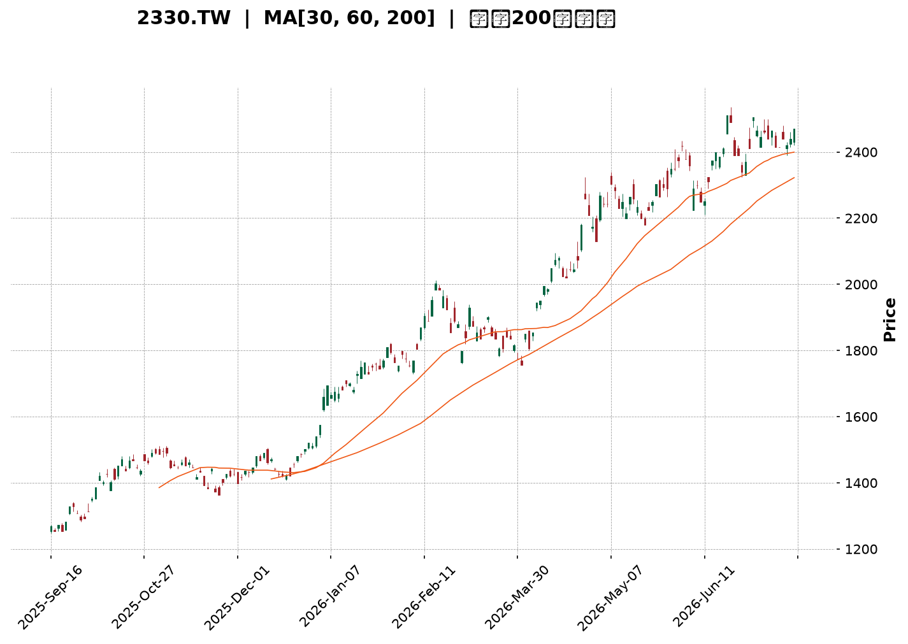
</details>

<html>
<head><meta charset="utf-8" /></head>
<body>
    <div style="height:500px; width:100%;">                        <script>window.PlotlyConfig = {MathJaxConfig: 'local'};</script>
        <script charset="utf-8" src="https://cdn.plot.ly/plotly-3.7.0.min.js" integrity="sha256-jvTGqxNp8AGWEcvNLVuKr+8j5dGe9Yw51LQkmDH+IYA=" crossorigin="anonymous"></script>                <div id="candlestick-chart" class="plotly-graph-div" style="height:100%; width:100%;"></div>            <script>                window.PLOTLYENV=window.PLOTLYENV || {};                                if (document.getElementById("candlestick-chart")) {                    Plotly.newPlot(                        "candlestick-chart",                        [{"close":{"dtype":"f8","bdata":"AAAAgNzQk0AAAAAAapWTQAAAAICt5JNAAAAAAGqVk0AAAAAgTwyUQAAAAOCmvpRAAAAA4Ka+lEAAAABgY2+UQAAAAOAfIJRAAAAAwPAzlEAAAABANIOUQAAAACC7IZVAAAAAQHGslUAAAABAJzeWQAAAAODj55VAAAAAIPhKlkAAAADg4+eVQAAAAGCFD5ZAAAAAYAyulkAAAADgT\u002f2WQAAAAMCZcpZAAAAAAH\u002fplkAAAAAAf+mWQAAAAIA7mpZAAAAAwJlylkAAAAAAf+mWQAAAAECu1ZZAAAAAQJNMl0AAAABAk0yXQAAAAGDCOJdAAAAAIGRgl0AAAABAk0yXQAAAAIA7mpZAAAAAYAyulkAAAACAO5qWQAAAAECu1ZZAAAAAYAyulkAAAABArtWWQAAAAIA7mpZAAAAAQFYjlkAAAADgyF6WQAAAAABCwJVAAAAAYKCYlUAAAADAaoaWQAAAAID+cJVAAAAA4FxJlUAAAADg4+eVQAAAACD4SpZAAAAAQCc3lkAAAAAg+EqWQAAAAAAT1JVAAAAAQFYjlkAAAADAmXKWQAAAAODIXpZAAAAAgDualkAAAACg8SSXQAAAAAB\u002f6ZZAAAAAQJNMl0AAAACgSNWWQAAAAEAM\u002fZZAAAAAgMGFlkAAAABAHEqWQAAAAIA6NpZAAAAAgDo2lkAAAACAOjaWQAAAAMBmwZZAAAAAoM8kl0AAAACAsTiXQAAAAOBWdJdAAAAA4N3Dl0AAAABAGpyXQAAAAABlE5hAAAAAYJGemEAAAACAj\u002fCZQAAAAOC7e5pAAAAAQHEEmkAAAADgNCyaQAAAAABTGJpAAAAAgBZAmkAAAADAnY+aQAAAAMCdj5pAAAAAgBZAmkAAAABA6AabQAAAAEBvVptAAAAAoBSSm0AAAABA6AabQAAAAEBvVptAAAAA4DJ+m0AAAACgjUKbQAAAAID2pZtAAAAAoARFnEAAAABgXwmcQAAAAKAUkptAAAAAIFFqm0AAAACAffWbQAAAACDYuZtAAAAAIFFqm0AAAACA9qWbQAAAAMAiMZxAAAAA4JkznUAAAABAxr6dQAAAAAAhg51AAAAA4JeFnkAAAACgaUyfQAAAAKDi\u002fJ5AAAAAgFutnkAAAABATQ6eQAAAAID095xAAAAAACGDnUAAAABgXVudQAAAAABBHZxAAAAAQE+8nEAAAAAgLyKeQAAAAKB7R51AAAAAgPT3nEAAAACAbaicQAAAAAAZJJ1AAAAAoLmvnUAAAACAT9ScQAAAAMBqrJxAAAAAgLw0nEAAAACAvDScQAAAACBdwJxAAAAAwGqsnEAAAABAoVycQAAAAEAOvZtAAAAAwERtm0AAAADgQeicQAAAAIC8NJxAAAAAQDT8nEAAAAAAP2OeQAAAAGAxd55AAAAAwLYqn0AAAAAA0gKfQAAAAIAQA6BAAAAAYO40oEAAAACg5z6gQAAAAABlop9AAAAAoHKOn0AAAACALvKfQAAAAIAu8p9AAAAAYO40oEAAAABgXwahQAAAAGDypaFAAAAAgDZCoUAAAAAgZvygQAAAAICjoqBAAAAAwOS5oUAAAADgBoihQAAAAOAGiKFAAAAAILX\u002foUAAAABg0NehQAAAAEAbaqFAAAAAAACSoUAAAACgL0yhQAAAAKDrr6FAAAAAYPKloUAAAACAFHShQAAAACBELqFAAAAAYF8GoUAAAAAAImChQAAAAAAAkqFAAAAAILX\u002foUAAAACg66+hQAAAAMDC66FAAAAAgMnhoUAAAADAd1miQAAAAMB3WaJAAAAAwFWLokAAAABgGOWiQAAAAOBOlaJAAAAAIGptokAAAACAyeGhQAAAAOC79aFAAAAAAACSoUAAAAAAAJShQAAAAAAADKJAAAAAAACOokAAAAAAAMCiQAAAAAAAoqJAAAAAAADUokAAAAAAAJyjQAAAAAAAdKNAAAAAAACsokAAAAAAAKyiQAAAAAAASKJAAAAAAACEokAAAAAAANSiQAAAAAAAkqNAAAAAAABCo0AAAAAAABqjQAAAAAAAOKNAAAAAAAAQo0AAAAAAAEKjQAAAAAAA3qJAAAAAAADeokAAAAAAABCjQAAAAAAA6KJAAAAAAAAQo0AAAAAAAEyjQA=="},"high":{"dtype":"f8","bdata":"AACAXK3kk0CIgiu5C72TQAAAAICt5JNAU8bsTn74k0AAAAAgTwyUQAAAAOCmvpRAH6icdRn6lEAQPvgYBZeUQK3USnWSW5RAVVVVVWNvlEC8lX2OSOaUQLzHe\u002fyLNZVAAAAAQHGslUC2TBb5yF6WQBGXm7y0+5VAq6qqtWqGlkARl5u8tPuVQB1g2WY7mpZAAAAAYAyulkB1uBqZ8SSXQF8qaFUMrpZAmCKflfEkl0B1gylywjiXQD9+\u002fDjdwZZAHw54nGqGlkB1gylywjiXQPJv6dUgEZdAXb\u002f7+DR0l0ALn3nVBYiXQGdmZq7Wm5dABLIB2QWIl0C6fvex1puXQJ47d85P\u002fZZAhu6D9X7plkAfP35cDK6WQKFKRvlP\u002fZZADd0Hi\u002fEkl0ChSkb5T\u002f2WQD9+\u002fDjdwZZAPtPW+PdKlkAxyF51O5qWQJGJ0SonN5ZAJI880uPnlUAOUJecO5qWQLfSrPFBwJVAsfYNC0LAlUAjLjeZhQ+WQAAAACD4SpZAbJkssmqGlkCrqqq1aoaWQBCTKwjJXpZAPtPW+PdKlkAAAADAmXKWQGbtdLyZcpZAAAAAgDualkAAAACg8SSXQHWDKXLCOJdAAAAAQJNMl0AAAACQOIiXQKbIZwXuEJdA0OpLRaOZlkBiLrTK33GWQLOkHNDfcZZAkeFeRRxKlkDVZ9pao5mWQL0IPoVI1ZZAAAAAoM8kl0BQ5llFk0yXQAAAAOBWdJdAAAAA4N3Dl0CivIbK3cOXQAAAAABlE5hAAAAAYJGemEB\u002fi9Na+FOaQAAAAOC7e5pAYtGyyjQsmkCCxTww2meaQFVVVRXaZ5pAaMPnz7t7mkC3ktpKYbeaQFtJbYV\u002fo5pARYKaCtpnmkCrqqrKqy6bQNJFF1X2pZtAAAAAoBSSm0CrqqoaUWqbQOmii8oyfptAVVVVpRSSm0BgBEZA2LmbQJasZEXYuZtAAAAAoARFnEBtdnEAqoCcQMdvl3p99ZtAAAAAIFFqm0CrqqoKQR2cQJVwJzVfCZxAeZoLcPalm0AAAACA9qWbQMcyKNWpgJxAAAAA4JkznUDdy7HKieadQNXvuWVNDp5AZ9KValutnkAM5KMqLXSfQAjMHvCHOJ9A1ShjleL8nkCDvqAvPcGeQGkO32\u002fkqp1AknasQLZxnkCrqqrqIIOdQAAAAABBHZxARrXlal1bnUAFvriq8kmeQLy6FUDGvp1AErFGlXtHnUAFCaPlmTOdQEzYBsH9S51ABAKBAKzDnUA5Dx3D\u002fUudQC1kIQMZJJ1AbceH4K5InEBoOz6ET9ScQDI4H2MLOJ1Ae9OboiYQnUBwCIegk3CcQAhFKMLXDJxAdNFFA\u002fPkm0AAAADgQeicQK6R1aUmEJ1AAAAAQDT8nEAAAAAAP2OeQAAAAGAxd55AAAAAwLYqn0Bcf3tgxBafQAAAAIAQA6BAxU7sINNcoED\u002fwUTQ4EigQC8xa6EJDaBAwhZscRADoEATtSsx9SqgQA\u002fE7wD8IKBAndiJcqOioEBpnEGQWBChQBjRNtOZJ6JA+WNJ893DoUCrM1JBPTihQFRcMoQ2QqFA4Ad+INfNoUBoRSOh66+hQHW5\u002fTHXzaFAH3zwcYVFokD0Lh4htf+hQDolAcLkuaFAFN898d3DoUDJZ91gFHShQAAAAKDrr6FA74X3oqAdokBJkiRB+ZuhQFEURREiYKFADw5IUT04oUAFhBPx\u002f5GhQASTPzD5m6FAAAAAILX\u002foUA28BmzoB2iQKBoq+GZJ6JAng8s83BjokC7f\u002fOAXIGiQC9\u002f2gIm0aJAgVwTgTqzokBDWrHwAwOjQHKnaAEm0aJATvDkoTO9okDGVDhxpxOiQO+VunCnE6JAJCs8ssLroUAAAAAAAKihQAAAAAAAKqJAAAAAAACOokAAAAAAAMCiQAAAAAAAoqJAAAAAAADeokAAAAAAAJyjQAAAAAAAzqNAAAAAAAAao0AAAAAAAOiiQAAAAAAAhKJAAAAAAAC2okAAAAAAAFajQAAAAAAAkqNAAAAAAABgo0AAAAAAAEKjQAAAAAAAiKNAAAAAAACIo0AAAAAAAEKjQAAAAAAAOKNAAAAAAADeokAAAAAAAGCjQAAAAAAA\u002fKJAAAAAAAA4o0AAAAAAAEyjQA=="},"hovertemplate":"\u003cb\u003e%{x|%Y-%m-%d}\u003c\u002fb\u003e\u003cbr\u003e\u958b: $%{open:.2f}\u003cbr\u003e\u9ad8: $%{high:.2f}\u003cbr\u003e\u4f4e: $%{low:.2f}\u003cbr\u003e\u6536: $%{close:.2f}\u003cextra\u003e\u003c\u002fextra\u003e","low":{"dtype":"f8","bdata":"AAAADpmBk0AAAAAAapWTQHKNcg1qlZNAAAAAAGqVk0CtG0zROqmTQCI9UJGSW5RA4VdjSjSDlEAAAABgY2+UQBu5kQNPDJRAAAAAwPAzlEAAAABANIOUQIdwCGcZ+pRAAAAAOLshlUDvjF6qtPuVQN7RyCZCwJVAOY7jZlYjlkCqDPaQz4SVQLPNl4O0+5VA7oP1e4UPlkAWj8ptDK6WQAAAAMCZcpZArRtMsWqGlkAAAAAAf+mWQODAgaNqhpZAoNWXKic3lkAAAAAAf+mWQK\u002faXGPdwZZA9WCGqiARl0BSIIJjwjiXQAAAAGDCOJdA+Zv8rSARl0CkQASH8SSXQODAgaNqhpZAAAAAYAyulkDgwIGjaoaWQF+1uYYMrpZAAAAAYAyulkAOkBaqO5qWQAAAAIA7mpZAYJaUY4UPlkAAAADgyF6WQAAAAABCwJVAAAAAYKCYlUDWDzoq+EqWQAAAAID+cJVAAAAA4FxJlUDe0cgmQsCVQFZVVYqFD5ZApdl0Y1YjlkAdx3FDJzeWQAAAAAAT1JVAwSwph7T7lUCg1ZcqJzeWQM43oUpWI5ZAggMHDvhKlkCHJvmXO5qWQAAAAAB\u002f6ZZAR4EIzk\u002f9lkCrqqraZsGWQLRuMLVI1ZZALxW0ut9xlkCe0Uu1WCKWQG8eobpYIpZATVvjL5X6lUAAAACAOjaWQIfugzWjmZZAIfnzikjVlkBfM0z17RCXQJO\u002fyY+xOJdAq6qqylZ0l0BeQ3m1VnSXQKcBbZo4iJdAgeAyNYP\u002fl0BOa7aPnz2ZQP3zz58mjZlAnS5Nta3cmUD8dIY\u002f6rSZQFVVVSXqtJlAAAAAgBZAmkBJbSU12meaQEltJTXaZ5pAun1l9VIYmkAAAACgnY+aQNJFF9tCy5pAt5bFOugGm0AAAABA6AabQBdddLWrLptAq6qqyqsum0AAAACgjUKbQBShCKWNQptAMP3S\u002f7nNm0CYwZeaffWbQAAAAKAUkptACjKbCsoam0AAAAAw2LmbQLZHbJUUkptAg8ymWm9Wm0BTm9pU6AabQAAAAMAiMZxA6jsbtYuUnECL0DgVuB+dQAAAAAAhg51A\u002feMSK8a+nUDmN7iK4vyeQAAAAKDi\u002fJ5AjHiSGi8inkAAAABATQ6eQAAAAID095xAdEucOj9vnUBVVVXVmTOdQPitkdUyfptAXCWNKshsnEDeLE8auB+dQAAAAKB7R51AqaJnpYuUnEAAAACAbaicQLMn+T40\u002fJxA9Pl8fuJznUAAAACAT9ScQAAAAMBqrJxA4BpZnQDRm0AncfC+1wycQAAAACBdwJxAAAAAwGqsnEA+3uO91wycQAAAAEAOvZtAAAAAwERtm0D6kmn9hYScQJQ4eB\u002fKIJxA11prXXiYnECd2Ikdg\u002f+dQDN1i311E55AUrgefQiznkDugY3e+saeQL9KGJubUp9AO7ETnwkNoEAHdGN+EAOgQAAAAABlop9AAAAAoHKOn0D4HYgfPN6fQPE7EL9Jyp9Aip3YbhADoEBpOeZbzGagQAAAAGDypaFAAAAAgDZCoUAq5laPet6gQAAAAICjoqBA\u002fMAPvFEaoUBMXW5\u002fFHShQExdbn8UdKFAAAAAILX\u002foUBPRZpu8qWhQAAAAEAbaqFA3NTDTT04oUAp8lkPRC6hQB6Xvh0iYKFAhB5CzwaIoUAkSZKONkKhQAAAACBELqFAAAAAYF8GoUAAAAAAImChQOiNgt4oVqFA4YMPzuS5oUAAAACg66+hQMuHcV\u002fQ16FAOavHjuuvoUBXoM\u002fOmSeiQBEgw49+T6JAf6Ps\u002fnBjokC+pU7PLMeiQAAAAOBOlaJA4yVKj35PokBi8NMMImChQAucg3\u002fJ4aFAAAAAAACSoUAAAAAAAEShQAAAAAAA5KFAAAAAAABSokAAAAAAAFyiQAAAAAAAXKJAAAAAAACiokAAAAAAAC6jQAAAAAAAdKNAAAAAAACsokAAAAAAAKyiQAAAAAAAKqJAAAAAAAA0okAAAAAAANSiQAAAAAAAVqNAAAAAAAAao0AAAAAAAN6iQAAAAAAALqNAAAAAAAAQo0AAAAAAAOiiQAAAAAAA3qJAAAAAAADeokAAAAAAABCjQAAAAAAArKJAAAAAAADeokAAAAAAAOiiQA=="},"name":"\u50f9\u683c","open":{"dtype":"f8","bdata":"AACA6mmVk0BEwZXcOqmTQLlGucYLvZNADwVXcq3kk0CtG0zROqmTQILK2W1jb5RAvxoTmUjmlEAAAABgY2+UQMmN3JjBR5RAHMdxnMFHlEAAAABANIOUQEM4hEPqDZVAAAAAOLshlUDvjF6qtPuVQO9oZAMT1JVAAAAAIPhKlkCqDPaQz4SVQNAtcYpqhpZA8yL4NCc3lkAWj8ptDK6WQB8OeJxqhpZAinzWjTualkDdYIrcT\u002f2WQAAAAIA7mpZAwOMPB\u002fhKlkB1gylywjiXQFEloxx\u002f6ZZApEAEh\u002fEkl0Bdv\u002fv4NHSXQNejcPU0dJdAAAAAIGRgl0ALn3nVBYiXQH78+PF+6ZZAgk+BPN3BlkAAAACAO5qWQK\u002faXGPdwZZAi42GriARl0Cv2lxj3cGWQAAAAIA7mpZAYJaUY4UPlkBm7XS8mXKWQJGJ0SonN5ZAySOPPHGslUDyr2jjmXKWQFtp1jigmJVA6aKLLnGslUAjLjeZhQ+WQDmO42ZWI5ZAEXOh1ZlylkAAAAAg+EqWQBCTKwjJXpZAAAAAQFYjlkDA4w8H+EqWQAAAAODIXpZAoUKF6shelkAraox0DK6WQJgin5XxJJdA9WCGqiARl0CrqqrKVnSXQFo3mHoq6ZZAAAAAgMGFlkAAAABAHEqWQJHhXkUcSpZA3jxC9XYOlkDVZ9pao5mWQAAAAMBmwZZA2fo2UCrplkAAAACAsTiXQDGVmBp1YJdAAAAAkDiIl0Cvobx6OIiXQP0ly18anJdAYSjmv0YnmECb7RNVgVGZQP3zz58mjZlAnS5Nta3cmUAoDPAEzMiZQAAAALCt3JlARYKaCtpnmkC3ktpKYbeaQKW2kvq7e5pA3b6yujQsmkCrqqp6BvOaQNJFF9tCy5pAt5bFOugGm0BVVVUFyhqbQHTRRQVRaptAAAAA4DJ+m0B1AcIqUWqbQKpNbWpvVptAMP3S\u002f7nNm0AGOAk7yGycQER29O+5zZtAiGX0z6sum0CrqqoKQR2cQAAAACDYuZtAAAAAIFFqm0DpRz8ayhqbQBUm3g\u002fIbJxAbdR3em2onEB6tpHamTOdQAAAAAAhg51A\u002feMSK8a+nUDmN7iK4vyeQFiZX2XEEJ9AjHiSGi8inkDXPguleZmeQJsJ6h8\u002fb51AYaQdKy8inkBVVVXVmTOdQDl435oUkptAo9pyVdYLnUDj6gele0edQF7dCvAgg51AqaJnpYuUnEAEmkIguB+dQCZsg2ALOJ1A\u002fP1+P8ebnUBaN5hiCzidQMlCFkI0\u002fJxATeLg\u002ffLkm0BoOz6ET9ScQCHQFKImEJ1AZCELgU\u002fUnECu5moeyiCcQAAAAEAOvZtAuuii4Rupm0Bji3K+aqycQK6R1aUmEJ1A8L33fk\u002fUnEBe6IXeZyeeQEeVBJ9MT55AmpmZ3frGnkClgISf3+6eQKrQo\u002fuNZp9A7MROzwIXoEABPrtv7jSgQPyoLnEQA6BA61x5AGWin0AAAACALvKfQPgdiB883p9AYid2wOBIoEDS1SeMxXCgQHzhvfDdw6FAh1WEoQ1+oUAOosfvbPKgQMoQrCNELqFA7MRO7EokoUAAAADgBoihQAAAAOAGiKFAzaFiEZMxokB6F4\u002fAwuuhQOvbgGHypaFA8LMBPxtqoUAp8lkPRC6hQI9L394GiKFAc6Q5ErX\u002foUBJkiTvKFahQDEMw7AvTKFApnEGIUQuoUDPNG5gFHShQPjZgJ8NfqFA4YMPzuS5oUAaw9GCpxOiQDZ4jiC1\u002f6FA6CCvkn5PokA0YEkvjDuiQAAAAMB3WaJAQK6JIEifokAAAABgGOWiQAAAAOBOlaJAO7RrQUGpokBi8NMMImChQAAAAOC79aFAGHJ9IdfNoUAAAAAAAIChQAAAAAAAKqJAAAAAAABwokAAAAAAAI6iQAAAAAAAZqJAAAAAAAC2okAAAAAAAC6jQAAAAAAAnKNAAAAAAAAGo0AAAAAAANSiQAAAAAAAcKJAAAAAAAA0okAAAAAAABCjQAAAAAAAfqNAAAAAAAAko0AAAAAAAN6iQAAAAAAAQqNAAAAAAABgo0AAAAAAABqjQAAAAAAAJKNAAAAAAADeokAAAAAAADijQAAAAAAA1KJAAAAAAADyokAAAAAAAPyiQA=="},"x":["2025-09-16T00:00:00+08:00","2025-09-17T00:00:00+08:00","2025-09-18T00:00:00+08:00","2025-09-19T00:00:00+08:00","2025-09-22T00:00:00+08:00","2025-09-23T00:00:00+08:00","2025-09-24T00:00:00+08:00","2025-09-25T00:00:00+08:00","2025-09-26T00:00:00+08:00","2025-09-30T00:00:00+08:00","2025-10-01T00:00:00+08:00","2025-10-02T00:00:00+08:00","2025-10-03T00:00:00+08:00","2025-10-07T00:00:00+08:00","2025-10-08T00:00:00+08:00","2025-10-09T00:00:00+08:00","2025-10-13T00:00:00+08:00","2025-10-14T00:00:00+08:00","2025-10-15T00:00:00+08:00","2025-10-16T00:00:00+08:00","2025-10-17T00:00:00+08:00","2025-10-20T00:00:00+08:00","2025-10-21T00:00:00+08:00","2025-10-22T00:00:00+08:00","2025-10-23T00:00:00+08:00","2025-10-27T00:00:00+08:00","2025-10-28T00:00:00+08:00","2025-10-29T00:00:00+08:00","2025-10-30T00:00:00+08:00","2025-10-31T00:00:00+08:00","2025-11-03T00:00:00+08:00","2025-11-04T00:00:00+08:00","2025-11-05T00:00:00+08:00","2025-11-06T00:00:00+08:00","2025-11-07T00:00:00+08:00","2025-11-10T00:00:00+08:00","2025-11-11T00:00:00+08:00","2025-11-12T00:00:00+08:00","2025-11-13T00:00:00+08:00","2025-11-14T00:00:00+08:00","2025-11-17T00:00:00+08:00","2025-11-18T00:00:00+08:00","2025-11-19T00:00:00+08:00","2025-11-20T00:00:00+08:00","2025-11-21T00:00:00+08:00","2025-11-24T00:00:00+08:00","2025-11-25T00:00:00+08:00","2025-11-26T00:00:00+08:00","2025-11-27T00:00:00+08:00","2025-11-28T00:00:00+08:00","2025-12-01T00:00:00+08:00","2025-12-02T00:00:00+08:00","2025-12-03T00:00:00+08:00","2025-12-04T00:00:00+08:00","2025-12-05T00:00:00+08:00","2025-12-08T00:00:00+08:00","2025-12-09T00:00:00+08:00","2025-12-10T00:00:00+08:00","2025-12-11T00:00:00+08:00","2025-12-12T00:00:00+08:00","2025-12-15T00:00:00+08:00","2025-12-16T00:00:00+08:00","2025-12-17T00:00:00+08:00","2025-12-18T00:00:00+08:00","2025-12-19T00:00:00+08:00","2025-12-22T00:00:00+08:00","2025-12-23T00:00:00+08:00","2025-12-24T00:00:00+08:00","2025-12-26T00:00:00+08:00","2025-12-29T00:00:00+08:00","2025-12-30T00:00:00+08:00","2025-12-31T00:00:00+08:00","2026-01-02T00:00:00+08:00","2026-01-05T00:00:00+08:00","2026-01-06T00:00:00+08:00","2026-01-07T00:00:00+08:00","2026-01-08T00:00:00+08:00","2026-01-09T00:00:00+08:00","2026-01-12T00:00:00+08:00","2026-01-13T00:00:00+08:00","2026-01-14T00:00:00+08:00","2026-01-15T00:00:00+08:00","2026-01-16T00:00:00+08:00","2026-01-19T00:00:00+08:00","2026-01-20T00:00:00+08:00","2026-01-21T00:00:00+08:00","2026-01-22T00:00:00+08:00","2026-01-23T00:00:00+08:00","2026-01-26T00:00:00+08:00","2026-01-27T00:00:00+08:00","2026-01-28T00:00:00+08:00","2026-01-29T00:00:00+08:00","2026-01-30T00:00:00+08:00","2026-02-02T00:00:00+08:00","2026-02-03T00:00:00+08:00","2026-02-04T00:00:00+08:00","2026-02-05T00:00:00+08:00","2026-02-06T00:00:00+08:00","2026-02-09T00:00:00+08:00","2026-02-10T00:00:00+08:00","2026-02-11T00:00:00+08:00","2026-02-23T00:00:00+08:00","2026-02-24T00:00:00+08:00","2026-02-25T00:00:00+08:00","2026-02-26T00:00:00+08:00","2026-03-02T00:00:00+08:00","2026-03-03T00:00:00+08:00","2026-03-04T00:00:00+08:00","2026-03-05T00:00:00+08:00","2026-03-06T00:00:00+08:00","2026-03-09T00:00:00+08:00","2026-03-10T00:00:00+08:00","2026-03-11T00:00:00+08:00","2026-03-12T00:00:00+08:00","2026-03-13T00:00:00+08:00","2026-03-16T00:00:00+08:00","2026-03-17T00:00:00+08:00","2026-03-18T00:00:00+08:00","2026-03-19T00:00:00+08:00","2026-03-20T00:00:00+08:00","2026-03-23T00:00:00+08:00","2026-03-24T00:00:00+08:00","2026-03-25T00:00:00+08:00","2026-03-26T00:00:00+08:00","2026-03-27T00:00:00+08:00","2026-03-30T00:00:00+08:00","2026-03-31T00:00:00+08:00","2026-04-01T00:00:00+08:00","2026-04-02T00:00:00+08:00","2026-04-07T00:00:00+08:00","2026-04-08T00:00:00+08:00","2026-04-09T00:00:00+08:00","2026-04-10T00:00:00+08:00","2026-04-13T00:00:00+08:00","2026-04-14T00:00:00+08:00","2026-04-15T00:00:00+08:00","2026-04-16T00:00:00+08:00","2026-04-17T00:00:00+08:00","2026-04-20T00:00:00+08:00","2026-04-21T00:00:00+08:00","2026-04-22T00:00:00+08:00","2026-04-23T00:00:00+08:00","2026-04-24T00:00:00+08:00","2026-04-27T00:00:00+08:00","2026-04-28T00:00:00+08:00","2026-04-29T00:00:00+08:00","2026-04-30T00:00:00+08:00","2026-05-04T00:00:00+08:00","2026-05-05T00:00:00+08:00","2026-05-06T00:00:00+08:00","2026-05-07T00:00:00+08:00","2026-05-08T00:00:00+08:00","2026-05-11T00:00:00+08:00","2026-05-12T00:00:00+08:00","2026-05-13T00:00:00+08:00","2026-05-14T00:00:00+08:00","2026-05-15T00:00:00+08:00","2026-05-18T00:00:00+08:00","2026-05-19T00:00:00+08:00","2026-05-20T00:00:00+08:00","2026-05-21T00:00:00+08:00","2026-05-22T00:00:00+08:00","2026-05-25T00:00:00+08:00","2026-05-26T00:00:00+08:00","2026-05-27T00:00:00+08:00","2026-05-28T00:00:00+08:00","2026-05-29T00:00:00+08:00","2026-06-01T00:00:00+08:00","2026-06-02T00:00:00+08:00","2026-06-03T00:00:00+08:00","2026-06-04T00:00:00+08:00","2026-06-05T00:00:00+08:00","2026-06-08T00:00:00+08:00","2026-06-09T00:00:00+08:00","2026-06-10T00:00:00+08:00","2026-06-11T00:00:00+08:00","2026-06-12T00:00:00+08:00","2026-06-15T00:00:00+08:00","2026-06-16T00:00:00+08:00","2026-06-17T00:00:00+08:00","2026-06-18T00:00:00+08:00","2026-06-22T00:00:00+08:00","2026-06-23T00:00:00+08:00","2026-06-24T00:00:00+08:00","2026-06-25T00:00:00+08:00","2026-06-26T00:00:00+08:00","2026-06-29T00:00:00+08:00","2026-06-30T00:00:00+08:00","2026-07-01T00:00:00+08:00","2026-07-02T00:00:00+08:00","2026-07-03T00:00:00+08:00","2026-07-06T00:00:00+08:00","2026-07-07T00:00:00+08:00","2026-07-08T00:00:00+08:00","2026-07-09T00:00:00+08:00","2026-07-10T00:00:00+08:00","2026-07-13T00:00:00+08:00","2026-07-14T00:00:00+08:00","2026-07-15T00:00:00+08:00","2026-07-16T00:00:00+08:00"],"type":"candlestick"},{"hovertemplate":"MA30: $%{y:.2f}\u003cextra\u003e\u003c\u002fextra\u003e","line":{"color":"#2196F3","dash":"dash","width":2},"mode":"lines","name":"MA30","x":["2025-09-16T00:00:00+08:00","2025-09-17T00:00:00+08:00","2025-09-18T00:00:00+08:00","2025-09-19T00:00:00+08:00","2025-09-22T00:00:00+08:00","2025-09-23T00:00:00+08:00","2025-09-24T00:00:00+08:00","2025-09-25T00:00:00+08:00","2025-09-26T00:00:00+08:00","2025-09-30T00:00:00+08:00","2025-10-01T00:00:00+08:00","2025-10-02T00:00:00+08:00","2025-10-03T00:00:00+08:00","2025-10-07T00:00:00+08:00","2025-10-08T00:00:00+08:00","2025-10-09T00:00:00+08:00","2025-10-13T00:00:00+08:00","2025-10-14T00:00:00+08:00","2025-10-15T00:00:00+08:00","2025-10-16T00:00:00+08:00","2025-10-17T00:00:00+08:00","2025-10-20T00:00:00+08:00","2025-10-21T00:00:00+08:00","2025-10-22T00:00:00+08:00","2025-10-23T00:00:00+08:00","2025-10-27T00:00:00+08:00","2025-10-28T00:00:00+08:00","2025-10-29T00:00:00+08:00","2025-10-30T00:00:00+08:00","2025-10-31T00:00:00+08:00","2025-11-03T00:00:00+08:00","2025-11-04T00:00:00+08:00","2025-11-05T00:00:00+08:00","2025-11-06T00:00:00+08:00","2025-11-07T00:00:00+08:00","2025-11-10T00:00:00+08:00","2025-11-11T00:00:00+08:00","2025-11-12T00:00:00+08:00","2025-11-13T00:00:00+08:00","2025-11-14T00:00:00+08:00","2025-11-17T00:00:00+08:00","2025-11-18T00:00:00+08:00","2025-11-19T00:00:00+08:00","2025-11-20T00:00:00+08:00","2025-11-21T00:00:00+08:00","2025-11-24T00:00:00+08:00","2025-11-25T00:00:00+08:00","2025-11-26T00:00:00+08:00","2025-11-27T00:00:00+08:00","2025-11-28T00:00:00+08:00","2025-12-01T00:00:00+08:00","2025-12-02T00:00:00+08:00","2025-12-03T00:00:00+08:00","2025-12-04T00:00:00+08:00","2025-12-05T00:00:00+08:00","2025-12-08T00:00:00+08:00","2025-12-09T00:00:00+08:00","2025-12-10T00:00:00+08:00","2025-12-11T00:00:00+08:00","2025-12-12T00:00:00+08:00","2025-12-15T00:00:00+08:00","2025-12-16T00:00:00+08:00","2025-12-17T00:00:00+08:00","2025-12-18T00:00:00+08:00","2025-12-19T00:00:00+08:00","2025-12-22T00:00:00+08:00","2025-12-23T00:00:00+08:00","2025-12-24T00:00:00+08:00","2025-12-26T00:00:00+08:00","2025-12-29T00:00:00+08:00","2025-12-30T00:00:00+08:00","2025-12-31T00:00:00+08:00","2026-01-02T00:00:00+08:00","2026-01-05T00:00:00+08:00","2026-01-06T00:00:00+08:00","2026-01-07T00:00:00+08:00","2026-01-08T00:00:00+08:00","2026-01-09T00:00:00+08:00","2026-01-12T00:00:00+08:00","2026-01-13T00:00:00+08:00","2026-01-14T00:00:00+08:00","2026-01-15T00:00:00+08:00","2026-01-16T00:00:00+08:00","2026-01-19T00:00:00+08:00","2026-01-20T00:00:00+08:00","2026-01-21T00:00:00+08:00","2026-01-22T00:00:00+08:00","2026-01-23T00:00:00+08:00","2026-01-26T00:00:00+08:00","2026-01-27T00:00:00+08:00","2026-01-28T00:00:00+08:00","2026-01-29T00:00:00+08:00","2026-01-30T00:00:00+08:00","2026-02-02T00:00:00+08:00","2026-02-03T00:00:00+08:00","2026-02-04T00:00:00+08:00","2026-02-05T00:00:00+08:00","2026-02-06T00:00:00+08:00","2026-02-09T00:00:00+08:00","2026-02-10T00:00:00+08:00","2026-02-11T00:00:00+08:00","2026-02-23T00:00:00+08:00","2026-02-24T00:00:00+08:00","2026-02-25T00:00:00+08:00","2026-02-26T00:00:00+08:00","2026-03-02T00:00:00+08:00","2026-03-03T00:00:00+08:00","2026-03-04T00:00:00+08:00","2026-03-05T00:00:00+08:00","2026-03-06T00:00:00+08:00","2026-03-09T00:00:00+08:00","2026-03-10T00:00:00+08:00","2026-03-11T00:00:00+08:00","2026-03-12T00:00:00+08:00","2026-03-13T00:00:00+08:00","2026-03-16T00:00:00+08:00","2026-03-17T00:00:00+08:00","2026-03-18T00:00:00+08:00","2026-03-19T00:00:00+08:00","2026-03-20T00:00:00+08:00","2026-03-23T00:00:00+08:00","2026-03-24T00:00:00+08:00","2026-03-25T00:00:00+08:00","2026-03-26T00:00:00+08:00","2026-03-27T00:00:00+08:00","2026-03-30T00:00:00+08:00","2026-03-31T00:00:00+08:00","2026-04-01T00:00:00+08:00","2026-04-02T00:00:00+08:00","2026-04-07T00:00:00+08:00","2026-04-08T00:00:00+08:00","2026-04-09T00:00:00+08:00","2026-04-10T00:00:00+08:00","2026-04-13T00:00:00+08:00","2026-04-14T00:00:00+08:00","2026-04-15T00:00:00+08:00","2026-04-16T00:00:00+08:00","2026-04-17T00:00:00+08:00","2026-04-20T00:00:00+08:00","2026-04-21T00:00:00+08:00","2026-04-22T00:00:00+08:00","2026-04-23T00:00:00+08:00","2026-04-24T00:00:00+08:00","2026-04-27T00:00:00+08:00","2026-04-28T00:00:00+08:00","2026-04-29T00:00:00+08:00","2026-04-30T00:00:00+08:00","2026-05-04T00:00:00+08:00","2026-05-05T00:00:00+08:00","2026-05-06T00:00:00+08:00","2026-05-07T00:00:00+08:00","2026-05-08T00:00:00+08:00","2026-05-11T00:00:00+08:00","2026-05-12T00:00:00+08:00","2026-05-13T00:00:00+08:00","2026-05-14T00:00:00+08:00","2026-05-15T00:00:00+08:00","2026-05-18T00:00:00+08:00","2026-05-19T00:00:00+08:00","2026-05-20T00:00:00+08:00","2026-05-21T00:00:00+08:00","2026-05-22T00:00:00+08:00","2026-05-25T00:00:00+08:00","2026-05-26T00:00:00+08:00","2026-05-27T00:00:00+08:00","2026-05-28T00:00:00+08:00","2026-05-29T00:00:00+08:00","2026-06-01T00:00:00+08:00","2026-06-02T00:00:00+08:00","2026-06-03T00:00:00+08:00","2026-06-04T00:00:00+08:00","2026-06-05T00:00:00+08:00","2026-06-08T00:00:00+08:00","2026-06-09T00:00:00+08:00","2026-06-10T00:00:00+08:00","2026-06-11T00:00:00+08:00","2026-06-12T00:00:00+08:00","2026-06-15T00:00:00+08:00","2026-06-16T00:00:00+08:00","2026-06-17T00:00:00+08:00","2026-06-18T00:00:00+08:00","2026-06-22T00:00:00+08:00","2026-06-23T00:00:00+08:00","2026-06-24T00:00:00+08:00","2026-06-25T00:00:00+08:00","2026-06-26T00:00:00+08:00","2026-06-29T00:00:00+08:00","2026-06-30T00:00:00+08:00","2026-07-01T00:00:00+08:00","2026-07-02T00:00:00+08:00","2026-07-03T00:00:00+08:00","2026-07-06T00:00:00+08:00","2026-07-07T00:00:00+08:00","2026-07-08T00:00:00+08:00","2026-07-09T00:00:00+08:00","2026-07-10T00:00:00+08:00","2026-07-13T00:00:00+08:00","2026-07-14T00:00:00+08:00","2026-07-15T00:00:00+08:00","2026-07-16T00:00:00+08:00"],"y":{"dtype":"f8","bdata":"AAAAAAAA+H8AAAAAAAD4fwAAAAAAAPh\u002fAAAAAAAA+H8AAAAAAAD4fwAAAAAAAPh\u002fAAAAAAAA+H8AAAAAAAD4fwAAAAAAAPh\u002fAAAAAAAA+H8AAAAAAAD4fwAAAAAAAPh\u002fAAAAAAAA+H8AAAAAAAD4fwAAAAAAAPh\u002fAAAAAAAA+H8AAAAAAAD4fwAAAAAAAPh\u002fAAAAAAAA+H8AAAAAAAD4fwAAAAAAAPh\u002fAAAAAAAA+H8AAAAAAAD4fwAAAAAAAPh\u002fAAAAAAAA+H8AAAAAAAD4fwAAAAAAAPh\u002fAAAAAAAA+H8AAAAAAAD4f+\u002fu7j7WpZVAIiIiojjElUBVVVU17eOVQKuqqooL+5VAq6qqWncVlkAAAACAQyuWQERERBQZPZZAZmZmdpxNlkDNzMxsFmKWQKuqqno5d5ZAzczM3LyHlkBmZmYml5eWQJqZmenfnJZAERER0TaclkAzMzMz256WQO\u002fu7p7kmpZAERERYU6SlkARERFhTpKWQLy7u6tJlJZAmpmZGVOQlkDe3d09YYqWQLy7u3sYhZZAZmZmhn1+lkAzMzPzhnqWQJqZmamLeJZAq6qq2t15lkBEREQk2XuWQLy7uzuCfJZAvLu7O4J8lkB3d3dHiHiWQN7d3b2KdpZA3t3dDUFvlkDNzMx8o2aWQO\u002fu7h5OY5ZAiYiIqE9flkCrqqpK+luWQN7d3T1NW5ZA7+7urkJflkB3d3eXj2KWQFVVVcXUaZZAiYiIKLd3lkAAAADwSoKWQAAAAHAhlpZAzczMvO2vlkCJiIgYEc2WQImIiGgX+JZARERE9HUgl0De3d0N30SXQERERARRZZdAREREZL+Hl0AAAABQK6yXQN7d3c2N1JdAd3d3R6X3l0BmZmb2uB6YQAAAAGAcSZhAq6qqeoFzmEDNzMxMo5SYQKuqqgpnuphAERERoTDemEAiIiIy9wOZQM3MzLy6K5lAIiIigsVcmUB3d3dH0I2ZQAAAAMCKu5lAd3d35\u002fHnmUC8u7ur\u002fBiaQJqZmdlmQ5pAmpmZGdpnmkCrqqqqoI2aQM3MzNwNtppA7+7u\u002fnHkmkAAAAAQzRibQCIiIjIxR5tAd3d3R495m0AAAADASaebQJqZmfm5zZtAREREhH31m0BmZmZ2oBacQImIiNglL5xAd3d3h\u002ftKnEAAAABA12KcQM3MzGwYcJxAREREhE2FnEARERHhz5+cQLy7u1thsJxAiYiIOE+8nEAAAAAQOsqcQGZmZpad2ZxAd3d3R1XsnEC8u7ubufmcQHd3dzd5Ap1Ad3d3R+4BnUARERFRYAOdQM3MzMxzDZ1AMzMzYzAYnUAzMzODoBudQKuqquq7G51Aq6qqGtUbnUCamZlZkyadQDMzMxOyJp1Aq6qqWtkknUCJiIjYVCqdQGZmZoZ3Mp1A3t3djfg3nUARERGRhDWdQKuqqvpbPp1AZmZmFi1NnUAAAACw9WGdQLy7uyu1eJ1AMzMz0yaKnUDNzMzcPqCdQCIiInLxwJ1Ad3d3B1TgnUB3d3c3vwGeQN7d3Q0YNZ5Ad3d3Z3FknkBVVVXlyZGeQJqZmSkHtZ5ARERE5DrmnkBmZmbmaxufQFVVVVXxUZ9Ad3d3l26Un0AAAAAAQ9SfQCIiIsoPBKBAREREnKcfoEBEREQcQDqgQO\u002fu7obUWqBAq6qqQmh8oEAiIiJyAZagQHd3d9dEsKBAAAAAwODFoEAzMzOzftigQLy7uxNx7KBAMzMzqw0BoUB3d3efqxOhQM3MzNT1I6FA7+7uZkEyoUC8u7sjNUShQERERAzRWaFAiYiImGtxoUARERGRWoqhQAAAALCgoKFA7+7uvpOzoUBVVVUV5LqhQO\u002fu7u6MvaFAiYiIyDXAoUAiIiJyQ8WhQAAAABBP0aFAmpmZCWHYoUBVVVU1x+KhQBEREWEt7KFAERER8UDzoUCJiIiYUwKiQGZmZha5E6JAzczMfB8dokAiIiKi2SiiQBEREWHrLaJAvLu7O1I1okCJiIhIDUGiQJqZmWlxVaJAzczMTH9ookBmZmbmOXeiQHd3d\u002fdKhaJAd3d3h16OokC8u7ubxZuiQHd3d7fYo6JA7+7u7kCsokCrqqqKVrKiQBEREdEWt6JARERE5IK7okAzMzMD8b6iQA=="},"type":"scatter"},{"hovertemplate":"MA60: $%{y:.2f}\u003cextra\u003e\u003c\u002fextra\u003e","line":{"color":"#9C27B0","dash":"dash","width":2},"mode":"lines","name":"MA60","x":["2025-09-16T00:00:00+08:00","2025-09-17T00:00:00+08:00","2025-09-18T00:00:00+08:00","2025-09-19T00:00:00+08:00","2025-09-22T00:00:00+08:00","2025-09-23T00:00:00+08:00","2025-09-24T00:00:00+08:00","2025-09-25T00:00:00+08:00","2025-09-26T00:00:00+08:00","2025-09-30T00:00:00+08:00","2025-10-01T00:00:00+08:00","2025-10-02T00:00:00+08:00","2025-10-03T00:00:00+08:00","2025-10-07T00:00:00+08:00","2025-10-08T00:00:00+08:00","2025-10-09T00:00:00+08:00","2025-10-13T00:00:00+08:00","2025-10-14T00:00:00+08:00","2025-10-15T00:00:00+08:00","2025-10-16T00:00:00+08:00","2025-10-17T00:00:00+08:00","2025-10-20T00:00:00+08:00","2025-10-21T00:00:00+08:00","2025-10-22T00:00:00+08:00","2025-10-23T00:00:00+08:00","2025-10-27T00:00:00+08:00","2025-10-28T00:00:00+08:00","2025-10-29T00:00:00+08:00","2025-10-30T00:00:00+08:00","2025-10-31T00:00:00+08:00","2025-11-03T00:00:00+08:00","2025-11-04T00:00:00+08:00","2025-11-05T00:00:00+08:00","2025-11-06T00:00:00+08:00","2025-11-07T00:00:00+08:00","2025-11-10T00:00:00+08:00","2025-11-11T00:00:00+08:00","2025-11-12T00:00:00+08:00","2025-11-13T00:00:00+08:00","2025-11-14T00:00:00+08:00","2025-11-17T00:00:00+08:00","2025-11-18T00:00:00+08:00","2025-11-19T00:00:00+08:00","2025-11-20T00:00:00+08:00","2025-11-21T00:00:00+08:00","2025-11-24T00:00:00+08:00","2025-11-25T00:00:00+08:00","2025-11-26T00:00:00+08:00","2025-11-27T00:00:00+08:00","2025-11-28T00:00:00+08:00","2025-12-01T00:00:00+08:00","2025-12-02T00:00:00+08:00","2025-12-03T00:00:00+08:00","2025-12-04T00:00:00+08:00","2025-12-05T00:00:00+08:00","2025-12-08T00:00:00+08:00","2025-12-09T00:00:00+08:00","2025-12-10T00:00:00+08:00","2025-12-11T00:00:00+08:00","2025-12-12T00:00:00+08:00","2025-12-15T00:00:00+08:00","2025-12-16T00:00:00+08:00","2025-12-17T00:00:00+08:00","2025-12-18T00:00:00+08:00","2025-12-19T00:00:00+08:00","2025-12-22T00:00:00+08:00","2025-12-23T00:00:00+08:00","2025-12-24T00:00:00+08:00","2025-12-26T00:00:00+08:00","2025-12-29T00:00:00+08:00","2025-12-30T00:00:00+08:00","2025-12-31T00:00:00+08:00","2026-01-02T00:00:00+08:00","2026-01-05T00:00:00+08:00","2026-01-06T00:00:00+08:00","2026-01-07T00:00:00+08:00","2026-01-08T00:00:00+08:00","2026-01-09T00:00:00+08:00","2026-01-12T00:00:00+08:00","2026-01-13T00:00:00+08:00","2026-01-14T00:00:00+08:00","2026-01-15T00:00:00+08:00","2026-01-16T00:00:00+08:00","2026-01-19T00:00:00+08:00","2026-01-20T00:00:00+08:00","2026-01-21T00:00:00+08:00","2026-01-22T00:00:00+08:00","2026-01-23T00:00:00+08:00","2026-01-26T00:00:00+08:00","2026-01-27T00:00:00+08:00","2026-01-28T00:00:00+08:00","2026-01-29T00:00:00+08:00","2026-01-30T00:00:00+08:00","2026-02-02T00:00:00+08:00","2026-02-03T00:00:00+08:00","2026-02-04T00:00:00+08:00","2026-02-05T00:00:00+08:00","2026-02-06T00:00:00+08:00","2026-02-09T00:00:00+08:00","2026-02-10T00:00:00+08:00","2026-02-11T00:00:00+08:00","2026-02-23T00:00:00+08:00","2026-02-24T00:00:00+08:00","2026-02-25T00:00:00+08:00","2026-02-26T00:00:00+08:00","2026-03-02T00:00:00+08:00","2026-03-03T00:00:00+08:00","2026-03-04T00:00:00+08:00","2026-03-05T00:00:00+08:00","2026-03-06T00:00:00+08:00","2026-03-09T00:00:00+08:00","2026-03-10T00:00:00+08:00","2026-03-11T00:00:00+08:00","2026-03-12T00:00:00+08:00","2026-03-13T00:00:00+08:00","2026-03-16T00:00:00+08:00","2026-03-17T00:00:00+08:00","2026-03-18T00:00:00+08:00","2026-03-19T00:00:00+08:00","2026-03-20T00:00:00+08:00","2026-03-23T00:00:00+08:00","2026-03-24T00:00:00+08:00","2026-03-25T00:00:00+08:00","2026-03-26T00:00:00+08:00","2026-03-27T00:00:00+08:00","2026-03-30T00:00:00+08:00","2026-03-31T00:00:00+08:00","2026-04-01T00:00:00+08:00","2026-04-02T00:00:00+08:00","2026-04-07T00:00:00+08:00","2026-04-08T00:00:00+08:00","2026-04-09T00:00:00+08:00","2026-04-10T00:00:00+08:00","2026-04-13T00:00:00+08:00","2026-04-14T00:00:00+08:00","2026-04-15T00:00:00+08:00","2026-04-16T00:00:00+08:00","2026-04-17T00:00:00+08:00","2026-04-20T00:00:00+08:00","2026-04-21T00:00:00+08:00","2026-04-22T00:00:00+08:00","2026-04-23T00:00:00+08:00","2026-04-24T00:00:00+08:00","2026-04-27T00:00:00+08:00","2026-04-28T00:00:00+08:00","2026-04-29T00:00:00+08:00","2026-04-30T00:00:00+08:00","2026-05-04T00:00:00+08:00","2026-05-05T00:00:00+08:00","2026-05-06T00:00:00+08:00","2026-05-07T00:00:00+08:00","2026-05-08T00:00:00+08:00","2026-05-11T00:00:00+08:00","2026-05-12T00:00:00+08:00","2026-05-13T00:00:00+08:00","2026-05-14T00:00:00+08:00","2026-05-15T00:00:00+08:00","2026-05-18T00:00:00+08:00","2026-05-19T00:00:00+08:00","2026-05-20T00:00:00+08:00","2026-05-21T00:00:00+08:00","2026-05-22T00:00:00+08:00","2026-05-25T00:00:00+08:00","2026-05-26T00:00:00+08:00","2026-05-27T00:00:00+08:00","2026-05-28T00:00:00+08:00","2026-05-29T00:00:00+08:00","2026-06-01T00:00:00+08:00","2026-06-02T00:00:00+08:00","2026-06-03T00:00:00+08:00","2026-06-04T00:00:00+08:00","2026-06-05T00:00:00+08:00","2026-06-08T00:00:00+08:00","2026-06-09T00:00:00+08:00","2026-06-10T00:00:00+08:00","2026-06-11T00:00:00+08:00","2026-06-12T00:00:00+08:00","2026-06-15T00:00:00+08:00","2026-06-16T00:00:00+08:00","2026-06-17T00:00:00+08:00","2026-06-18T00:00:00+08:00","2026-06-22T00:00:00+08:00","2026-06-23T00:00:00+08:00","2026-06-24T00:00:00+08:00","2026-06-25T00:00:00+08:00","2026-06-26T00:00:00+08:00","2026-06-29T00:00:00+08:00","2026-06-30T00:00:00+08:00","2026-07-01T00:00:00+08:00","2026-07-02T00:00:00+08:00","2026-07-03T00:00:00+08:00","2026-07-06T00:00:00+08:00","2026-07-07T00:00:00+08:00","2026-07-08T00:00:00+08:00","2026-07-09T00:00:00+08:00","2026-07-10T00:00:00+08:00","2026-07-13T00:00:00+08:00","2026-07-14T00:00:00+08:00","2026-07-15T00:00:00+08:00","2026-07-16T00:00:00+08:00"],"y":{"dtype":"f8","bdata":"AAAAAAAA+H8AAAAAAAD4fwAAAAAAAPh\u002fAAAAAAAA+H8AAAAAAAD4fwAAAAAAAPh\u002fAAAAAAAA+H8AAAAAAAD4fwAAAAAAAPh\u002fAAAAAAAA+H8AAAAAAAD4fwAAAAAAAPh\u002fAAAAAAAA+H8AAAAAAAD4fwAAAAAAAPh\u002fAAAAAAAA+H8AAAAAAAD4fwAAAAAAAPh\u002fAAAAAAAA+H8AAAAAAAD4fwAAAAAAAPh\u002fAAAAAAAA+H8AAAAAAAD4fwAAAAAAAPh\u002fAAAAAAAA+H8AAAAAAAD4fwAAAAAAAPh\u002fAAAAAAAA+H8AAAAAAAD4fwAAAAAAAPh\u002fAAAAAAAA+H8AAAAAAAD4fwAAAAAAAPh\u002fAAAAAAAA+H8AAAAAAAD4fwAAAAAAAPh\u002fAAAAAAAA+H8AAAAAAAD4fwAAAAAAAPh\u002fAAAAAAAA+H8AAAAAAAD4fwAAAAAAAPh\u002fAAAAAAAA+H8AAAAAAAD4fwAAAAAAAPh\u002fAAAAAAAA+H8AAAAAAAD4fwAAAAAAAPh\u002fAAAAAAAA+H8AAAAAAAD4fwAAAAAAAPh\u002fAAAAAAAA+H8AAAAAAAD4fwAAAAAAAPh\u002fAAAAAAAA+H8AAAAAAAD4fwAAAAAAAPh\u002fAAAAAAAA+H8AAAAAAAD4f2ZmZn4wDpZAAAAA2LwZlkARERFZSCWWQM3MzNQsL5ZAmpmZgWM6lkBVVVXlnkOWQBERESkzTJZAq6qqkm9WlkAiIiICU2KWQAAAACCHcJZAq6qqArp\u002flkAzMzML8YyWQM3MzKyAmZZA7+7uRhKmlkDe3d0l9rWWQLy7uwN+yZZAq6qqKmLZlkB3d3e3luuWQAAAAFjN\u002fJZA7+7uPgkMl0Dv7u5GRhuXQM3MzCTTLJdA7+7uZhE7l0DNzMz0n0yXQM3MzATUYJdAq6qqqq92l0CJiIg4PoiXQDMzM6N0m5dAZmZmblmtl0DNzMy8P76XQFVVVb0i0ZdAAAAASAPml0AiIiLiOfqXQHd3d29sD5hAAAAAyKAjmEAzMzN7ezqYQLy7uwtaT5hAREREZI5jmEAREREhGHiYQBEREVHxj5hAvLu7kxSumEAAAAAAjM2YQBEREVGp7phAIiIigr4UmUBERERsLTqZQBEREbHoYplAREREvPmKmUAiIiLCv62ZQGZmZm47yplA3t3ddV3pmUAAAABIgQeaQFVVVR1TIppA3t3dZXk+mkC8u7trRF+aQN7d3d2+fJpAmpmZWeiXmkBmZmaubq+aQImIiFACyppARERE9ELlmkDv7u5m2P6aQCIiIvoZF5tAzczM5Fkvm0BERERMmEibQGZmZkZ\u002fZJtAVVVVJRGAm0B3d3eXTpqbQCIiImKRr5tAIiIimtfBm0AiIiICGtqbQAAAAPhf7ptAzczMrKUEnEBERET0kCGcQERERFzUPJxAq6qq6sNYnECJiIgoZ26cQCIiIvoKhpxAVVVVTVWhnEAzMzMTS7ycQCIiIoLt05xAVVVVLZHqnEBmZmYOiwGdQHd3d++EGJ1A3t3dxdAynUBERESMx1CdQM3MzLS8cp1AAAAAUGCQnUCrqqr6Aa6dQAAAAGBSx51A3t3dFUjpnUARERHBkgqeQGZmZkY1Kp5Ad3d3by5LnkCJiIio0WueQImIiLDJip5A3t3dzb+rnkDe3d1dEMieQERERHyy6J5AAAAA0FIKn0Dv7u4eSymfQBEREeGdQ59AVVVVbU1Yn0B3d3cfqW2fQO\u002fu7tashZ9AIiIi8gmdn0AAAADoba6fQCIiItIjw59AIiIi8tfYn0C8u7v7L\u002fWfQBEREdEVC6BAERERgT8boEC8u7v\u002fPC2gQImIiLSMQKBAVVVV4d5RoECJiIjY4V2gQO\u002fu7noMbKBAIiIiPjd5oEBmZmYyFIegQGZmZlLplaBA3t3dPb+loEBERESUPrigQN7d3QWTyqBAZmZmHrzeoEBERESMOvagQERERHDkC6FAiYiIjGMeoUAzMzPfjDGhQAAAAPRfRKFAMzMzP91YoUBVVVVdh2uhQImIiCDbgqFAZmZmBjCXoUDNzMxM3KehQJqZmQXeuKFAVVVVGbbHoUCamZmduNehQCIiIkbn46FA7+7uKkHvoUAzMzPXRfuhQKuqqu5zCKJAZmZmPncWokAiIiLKpSSiQA=="},"type":"scatter"},{"hovertemplate":"MA200: $%{y:.2f}\u003cextra\u003e\u003c\u002fextra\u003e","line":{"color":"#FF6F00","dash":"solid","width":2},"mode":"lines","name":"MA200","x":["2025-09-16T00:00:00+08:00","2025-09-17T00:00:00+08:00","2025-09-18T00:00:00+08:00","2025-09-19T00:00:00+08:00","2025-09-22T00:00:00+08:00","2025-09-23T00:00:00+08:00","2025-09-24T00:00:00+08:00","2025-09-25T00:00:00+08:00","2025-09-26T00:00:00+08:00","2025-09-30T00:00:00+08:00","2025-10-01T00:00:00+08:00","2025-10-02T00:00:00+08:00","2025-10-03T00:00:00+08:00","2025-10-07T00:00:00+08:00","2025-10-08T00:00:00+08:00","2025-10-09T00:00:00+08:00","2025-10-13T00:00:00+08:00","2025-10-14T00:00:00+08:00","2025-10-15T00:00:00+08:00","2025-10-16T00:00:00+08:00","2025-10-17T00:00:00+08:00","2025-10-20T00:00:00+08:00","2025-10-21T00:00:00+08:00","2025-10-22T00:00:00+08:00","2025-10-23T00:00:00+08:00","2025-10-27T00:00:00+08:00","2025-10-28T00:00:00+08:00","2025-10-29T00:00:00+08:00","2025-10-30T00:00:00+08:00","2025-10-31T00:00:00+08:00","2025-11-03T00:00:00+08:00","2025-11-04T00:00:00+08:00","2025-11-05T00:00:00+08:00","2025-11-06T00:00:00+08:00","2025-11-07T00:00:00+08:00","2025-11-10T00:00:00+08:00","2025-11-11T00:00:00+08:00","2025-11-12T00:00:00+08:00","2025-11-13T00:00:00+08:00","2025-11-14T00:00:00+08:00","2025-11-17T00:00:00+08:00","2025-11-18T00:00:00+08:00","2025-11-19T00:00:00+08:00","2025-11-20T00:00:00+08:00","2025-11-21T00:00:00+08:00","2025-11-24T00:00:00+08:00","2025-11-25T00:00:00+08:00","2025-11-26T00:00:00+08:00","2025-11-27T00:00:00+08:00","2025-11-28T00:00:00+08:00","2025-12-01T00:00:00+08:00","2025-12-02T00:00:00+08:00","2025-12-03T00:00:00+08:00","2025-12-04T00:00:00+08:00","2025-12-05T00:00:00+08:00","2025-12-08T00:00:00+08:00","2025-12-09T00:00:00+08:00","2025-12-10T00:00:00+08:00","2025-12-11T00:00:00+08:00","2025-12-12T00:00:00+08:00","2025-12-15T00:00:00+08:00","2025-12-16T00:00:00+08:00","2025-12-17T00:00:00+08:00","2025-12-18T00:00:00+08:00","2025-12-19T00:00:00+08:00","2025-12-22T00:00:00+08:00","2025-12-23T00:00:00+08:00","2025-12-24T00:00:00+08:00","2025-12-26T00:00:00+08:00","2025-12-29T00:00:00+08:00","2025-12-30T00:00:00+08:00","2025-12-31T00:00:00+08:00","2026-01-02T00:00:00+08:00","2026-01-05T00:00:00+08:00","2026-01-06T00:00:00+08:00","2026-01-07T00:00:00+08:00","2026-01-08T00:00:00+08:00","2026-01-09T00:00:00+08:00","2026-01-12T00:00:00+08:00","2026-01-13T00:00:00+08:00","2026-01-14T00:00:00+08:00","2026-01-15T00:00:00+08:00","2026-01-16T00:00:00+08:00","2026-01-19T00:00:00+08:00","2026-01-20T00:00:00+08:00","2026-01-21T00:00:00+08:00","2026-01-22T00:00:00+08:00","2026-01-23T00:00:00+08:00","2026-01-26T00:00:00+08:00","2026-01-27T00:00:00+08:00","2026-01-28T00:00:00+08:00","2026-01-29T00:00:00+08:00","2026-01-30T00:00:00+08:00","2026-02-02T00:00:00+08:00","2026-02-03T00:00:00+08:00","2026-02-04T00:00:00+08:00","2026-02-05T00:00:00+08:00","2026-02-06T00:00:00+08:00","2026-02-09T00:00:00+08:00","2026-02-10T00:00:00+08:00","2026-02-11T00:00:00+08:00","2026-02-23T00:00:00+08:00","2026-02-24T00:00:00+08:00","2026-02-25T00:00:00+08:00","2026-02-26T00:00:00+08:00","2026-03-02T00:00:00+08:00","2026-03-03T00:00:00+08:00","2026-03-04T00:00:00+08:00","2026-03-05T00:00:00+08:00","2026-03-06T00:00:00+08:00","2026-03-09T00:00:00+08:00","2026-03-10T00:00:00+08:00","2026-03-11T00:00:00+08:00","2026-03-12T00:00:00+08:00","2026-03-13T00:00:00+08:00","2026-03-16T00:00:00+08:00","2026-03-17T00:00:00+08:00","2026-03-18T00:00:00+08:00","2026-03-19T00:00:00+08:00","2026-03-20T00:00:00+08:00","2026-03-23T00:00:00+08:00","2026-03-24T00:00:00+08:00","2026-03-25T00:00:00+08:00","2026-03-26T00:00:00+08:00","2026-03-27T00:00:00+08:00","2026-03-30T00:00:00+08:00","2026-03-31T00:00:00+08:00","2026-04-01T00:00:00+08:00","2026-04-02T00:00:00+08:00","2026-04-07T00:00:00+08:00","2026-04-08T00:00:00+08:00","2026-04-09T00:00:00+08:00","2026-04-10T00:00:00+08:00","2026-04-13T00:00:00+08:00","2026-04-14T00:00:00+08:00","2026-04-15T00:00:00+08:00","2026-04-16T00:00:00+08:00","2026-04-17T00:00:00+08:00","2026-04-20T00:00:00+08:00","2026-04-21T00:00:00+08:00","2026-04-22T00:00:00+08:00","2026-04-23T00:00:00+08:00","2026-04-24T00:00:00+08:00","2026-04-27T00:00:00+08:00","2026-04-28T00:00:00+08:00","2026-04-29T00:00:00+08:00","2026-04-30T00:00:00+08:00","2026-05-04T00:00:00+08:00","2026-05-05T00:00:00+08:00","2026-05-06T00:00:00+08:00","2026-05-07T00:00:00+08:00","2026-05-08T00:00:00+08:00","2026-05-11T00:00:00+08:00","2026-05-12T00:00:00+08:00","2026-05-13T00:00:00+08:00","2026-05-14T00:00:00+08:00","2026-05-15T00:00:00+08:00","2026-05-18T00:00:00+08:00","2026-05-19T00:00:00+08:00","2026-05-20T00:00:00+08:00","2026-05-21T00:00:00+08:00","2026-05-22T00:00:00+08:00","2026-05-25T00:00:00+08:00","2026-05-26T00:00:00+08:00","2026-05-27T00:00:00+08:00","2026-05-28T00:00:00+08:00","2026-05-29T00:00:00+08:00","2026-06-01T00:00:00+08:00","2026-06-02T00:00:00+08:00","2026-06-03T00:00:00+08:00","2026-06-04T00:00:00+08:00","2026-06-05T00:00:00+08:00","2026-06-08T00:00:00+08:00","2026-06-09T00:00:00+08:00","2026-06-10T00:00:00+08:00","2026-06-11T00:00:00+08:00","2026-06-12T00:00:00+08:00","2026-06-15T00:00:00+08:00","2026-06-16T00:00:00+08:00","2026-06-17T00:00:00+08:00","2026-06-18T00:00:00+08:00","2026-06-22T00:00:00+08:00","2026-06-23T00:00:00+08:00","2026-06-24T00:00:00+08:00","2026-06-25T00:00:00+08:00","2026-06-26T00:00:00+08:00","2026-06-29T00:00:00+08:00","2026-06-30T00:00:00+08:00","2026-07-01T00:00:00+08:00","2026-07-02T00:00:00+08:00","2026-07-03T00:00:00+08:00","2026-07-06T00:00:00+08:00","2026-07-07T00:00:00+08:00","2026-07-08T00:00:00+08:00","2026-07-09T00:00:00+08:00","2026-07-10T00:00:00+08:00","2026-07-13T00:00:00+08:00","2026-07-14T00:00:00+08:00","2026-07-15T00:00:00+08:00","2026-07-16T00:00:00+08:00"],"y":{"dtype":"f8","bdata":"AAAAAAAA+H8AAAAAAAD4fwAAAAAAAPh\u002fAAAAAAAA+H8AAAAAAAD4fwAAAAAAAPh\u002fAAAAAAAA+H8AAAAAAAD4fwAAAAAAAPh\u002fAAAAAAAA+H8AAAAAAAD4fwAAAAAAAPh\u002fAAAAAAAA+H8AAAAAAAD4fwAAAAAAAPh\u002fAAAAAAAA+H8AAAAAAAD4fwAAAAAAAPh\u002fAAAAAAAA+H8AAAAAAAD4fwAAAAAAAPh\u002fAAAAAAAA+H8AAAAAAAD4fwAAAAAAAPh\u002fAAAAAAAA+H8AAAAAAAD4fwAAAAAAAPh\u002fAAAAAAAA+H8AAAAAAAD4fwAAAAAAAPh\u002fAAAAAAAA+H8AAAAAAAD4fwAAAAAAAPh\u002fAAAAAAAA+H8AAAAAAAD4fwAAAAAAAPh\u002fAAAAAAAA+H8AAAAAAAD4fwAAAAAAAPh\u002fAAAAAAAA+H8AAAAAAAD4fwAAAAAAAPh\u002fAAAAAAAA+H8AAAAAAAD4fwAAAAAAAPh\u002fAAAAAAAA+H8AAAAAAAD4fwAAAAAAAPh\u002fAAAAAAAA+H8AAAAAAAD4fwAAAAAAAPh\u002fAAAAAAAA+H8AAAAAAAD4fwAAAAAAAPh\u002fAAAAAAAA+H8AAAAAAAD4fwAAAAAAAPh\u002fAAAAAAAA+H8AAAAAAAD4fwAAAAAAAPh\u002fAAAAAAAA+H8AAAAAAAD4fwAAAAAAAPh\u002fAAAAAAAA+H8AAAAAAAD4fwAAAAAAAPh\u002fAAAAAAAA+H8AAAAAAAD4fwAAAAAAAPh\u002fAAAAAAAA+H8AAAAAAAD4fwAAAAAAAPh\u002fAAAAAAAA+H8AAAAAAAD4fwAAAAAAAPh\u002fAAAAAAAA+H8AAAAAAAD4fwAAAAAAAPh\u002fAAAAAAAA+H8AAAAAAAD4fwAAAAAAAPh\u002fAAAAAAAA+H8AAAAAAAD4fwAAAAAAAPh\u002fAAAAAAAA+H8AAAAAAAD4fwAAAAAAAPh\u002fAAAAAAAA+H8AAAAAAAD4fwAAAAAAAPh\u002fAAAAAAAA+H8AAAAAAAD4fwAAAAAAAPh\u002fAAAAAAAA+H8AAAAAAAD4fwAAAAAAAPh\u002fAAAAAAAA+H8AAAAAAAD4fwAAAAAAAPh\u002fAAAAAAAA+H8AAAAAAAD4fwAAAAAAAPh\u002fAAAAAAAA+H8AAAAAAAD4fwAAAAAAAPh\u002fAAAAAAAA+H8AAAAAAAD4fwAAAAAAAPh\u002fAAAAAAAA+H8AAAAAAAD4fwAAAAAAAPh\u002fAAAAAAAA+H8AAAAAAAD4fwAAAAAAAPh\u002fAAAAAAAA+H8AAAAAAAD4fwAAAAAAAPh\u002fAAAAAAAA+H8AAAAAAAD4fwAAAAAAAPh\u002fAAAAAAAA+H8AAAAAAAD4fwAAAAAAAPh\u002fAAAAAAAA+H8AAAAAAAD4fwAAAAAAAPh\u002fAAAAAAAA+H8AAAAAAAD4fwAAAAAAAPh\u002fAAAAAAAA+H8AAAAAAAD4fwAAAAAAAPh\u002fAAAAAAAA+H8AAAAAAAD4fwAAAAAAAPh\u002fAAAAAAAA+H8AAAAAAAD4fwAAAAAAAPh\u002fAAAAAAAA+H8AAAAAAAD4fwAAAAAAAPh\u002fAAAAAAAA+H8AAAAAAAD4fwAAAAAAAPh\u002fAAAAAAAA+H8AAAAAAAD4fwAAAAAAAPh\u002fAAAAAAAA+H8AAAAAAAD4fwAAAAAAAPh\u002fAAAAAAAA+H8AAAAAAAD4fwAAAAAAAPh\u002fAAAAAAAA+H8AAAAAAAD4fwAAAAAAAPh\u002fAAAAAAAA+H8AAAAAAAD4fwAAAAAAAPh\u002fAAAAAAAA+H8AAAAAAAD4fwAAAAAAAPh\u002fAAAAAAAA+H8AAAAAAAD4fwAAAAAAAPh\u002fAAAAAAAA+H8AAAAAAAD4fwAAAAAAAPh\u002fAAAAAAAA+H8AAAAAAAD4fwAAAAAAAPh\u002fAAAAAAAA+H8AAAAAAAD4fwAAAAAAAPh\u002fAAAAAAAA+H8AAAAAAAD4fwAAAAAAAPh\u002fAAAAAAAA+H8AAAAAAAD4fwAAAAAAAPh\u002fAAAAAAAA+H8AAAAAAAD4fwAAAAAAAPh\u002fAAAAAAAA+H8AAAAAAAD4fwAAAAAAAPh\u002fAAAAAAAA+H8AAAAAAAD4fwAAAAAAAPh\u002fAAAAAAAA+H8AAAAAAAD4fwAAAAAAAPh\u002fAAAAAAAA+H8AAAAAAAD4fwAAAAAAAPh\u002fAAAAAAAA+H8AAAAAAAD4fwAAAAAAAPh\u002fAAAAAAAA+H9I4Xr0VJ+cQA=="},"type":"scatter"}],                        {"template":{"data":{"barpolar":[{"marker":{"line":{"color":"rgb(17,17,17)","width":0.5},"pattern":{"fillmode":"overlay","size":10,"solidity":0.2}},"type":"barpolar"}],"bar":[{"error_x":{"color":"#f2f5fa"},"error_y":{"color":"#f2f5fa"},"marker":{"line":{"color":"rgb(17,17,17)","width":0.5},"pattern":{"fillmode":"overlay","size":10,"solidity":0.2}},"type":"bar"}],"carpet":[{"aaxis":{"endlinecolor":"#A2B1C6","gridcolor":"#506784","linecolor":"#506784","minorgridcolor":"#506784","startlinecolor":"#A2B1C6"},"baxis":{"endlinecolor":"#A2B1C6","gridcolor":"#506784","linecolor":"#506784","minorgridcolor":"#506784","startlinecolor":"#A2B1C6"},"type":"carpet"}],"choropleth":[{"colorbar":{"outlinewidth":0,"ticks":""},"type":"choropleth"}],"contourcarpet":[{"colorbar":{"outlinewidth":0,"ticks":""},"type":"contourcarpet"}],"contour":[{"colorbar":{"outlinewidth":0,"ticks":""},"colorscale":[[0.0,"#0d0887"],[0.1111111111111111,"#46039f"],[0.2222222222222222,"#7201a8"],[0.3333333333333333,"#9c179e"],[0.4444444444444444,"#bd3786"],[0.5555555555555556,"#d8576b"],[0.6666666666666666,"#ed7953"],[0.7777777777777778,"#fb9f3a"],[0.8888888888888888,"#fdca26"],[1.0,"#f0f921"]],"type":"contour"}],"heatmap":[{"colorbar":{"outlinewidth":0,"ticks":""},"colorscale":[[0.0,"#0d0887"],[0.1111111111111111,"#46039f"],[0.2222222222222222,"#7201a8"],[0.3333333333333333,"#9c179e"],[0.4444444444444444,"#bd3786"],[0.5555555555555556,"#d8576b"],[0.6666666666666666,"#ed7953"],[0.7777777777777778,"#fb9f3a"],[0.8888888888888888,"#fdca26"],[1.0,"#f0f921"]],"type":"heatmap"}],"histogram2dcontour":[{"colorbar":{"outlinewidth":0,"ticks":""},"colorscale":[[0.0,"#0d0887"],[0.1111111111111111,"#46039f"],[0.2222222222222222,"#7201a8"],[0.3333333333333333,"#9c179e"],[0.4444444444444444,"#bd3786"],[0.5555555555555556,"#d8576b"],[0.6666666666666666,"#ed7953"],[0.7777777777777778,"#fb9f3a"],[0.8888888888888888,"#fdca26"],[1.0,"#f0f921"]],"type":"histogram2dcontour"}],"histogram2d":[{"colorbar":{"outlinewidth":0,"ticks":""},"colorscale":[[0.0,"#0d0887"],[0.1111111111111111,"#46039f"],[0.2222222222222222,"#7201a8"],[0.3333333333333333,"#9c179e"],[0.4444444444444444,"#bd3786"],[0.5555555555555556,"#d8576b"],[0.6666666666666666,"#ed7953"],[0.7777777777777778,"#fb9f3a"],[0.8888888888888888,"#fdca26"],[1.0,"#f0f921"]],"type":"histogram2d"}],"histogram":[{"marker":{"pattern":{"fillmode":"overlay","size":10,"solidity":0.2}},"type":"histogram"}],"mesh3d":[{"colorbar":{"outlinewidth":0,"ticks":""},"type":"mesh3d"}],"parcoords":[{"line":{"colorbar":{"outlinewidth":0,"ticks":""}},"type":"parcoords"}],"pie":[{"automargin":true,"type":"pie"}],"scatter3d":[{"line":{"colorbar":{"outlinewidth":0,"ticks":""}},"marker":{"colorbar":{"outlinewidth":0,"ticks":""}},"type":"scatter3d"}],"scattercarpet":[{"marker":{"colorbar":{"outlinewidth":0,"ticks":""}},"type":"scattercarpet"}],"scattergeo":[{"marker":{"colorbar":{"outlinewidth":0,"ticks":""}},"type":"scattergeo"}],"scattergl":[{"marker":{"line":{"color":"#283442"}},"type":"scattergl"}],"scattermapbox":[{"marker":{"colorbar":{"outlinewidth":0,"ticks":""}},"type":"scattermapbox"}],"scattermap":[{"marker":{"colorbar":{"outlinewidth":0,"ticks":""}},"type":"scattermap"}],"scatterpolargl":[{"marker":{"colorbar":{"outlinewidth":0,"ticks":""}},"type":"scatterpolargl"}],"scatterpolar":[{"marker":{"colorbar":{"outlinewidth":0,"ticks":""}},"type":"scatterpolar"}],"scatter":[{"marker":{"line":{"color":"#283442"}},"type":"scatter"}],"scatterternary":[{"marker":{"colorbar":{"outlinewidth":0,"ticks":""}},"type":"scatterternary"}],"surface":[{"colorbar":{"outlinewidth":0,"ticks":""},"colorscale":[[0.0,"#0d0887"],[0.1111111111111111,"#46039f"],[0.2222222222222222,"#7201a8"],[0.3333333333333333,"#9c179e"],[0.4444444444444444,"#bd3786"],[0.5555555555555556,"#d8576b"],[0.6666666666666666,"#ed7953"],[0.7777777777777778,"#fb9f3a"],[0.8888888888888888,"#fdca26"],[1.0,"#f0f921"]],"type":"surface"}],"table":[{"cells":{"fill":{"color":"#506784"},"line":{"color":"rgb(17,17,17)"}},"header":{"fill":{"color":"#2a3f5f"},"line":{"color":"rgb(17,17,17)"}},"type":"table"}]},"layout":{"annotationdefaults":{"arrowcolor":"#f2f5fa","arrowhead":0,"arrowwidth":1},"autotypenumbers":"strict","coloraxis":{"colorbar":{"outlinewidth":0,"ticks":""}},"colorscale":{"diverging":[[0,"#8e0152"],[0.1,"#c51b7d"],[0.2,"#de77ae"],[0.3,"#f1b6da"],[0.4,"#fde0ef"],[0.5,"#f7f7f7"],[0.6,"#e6f5d0"],[0.7,"#b8e186"],[0.8,"#7fbc41"],[0.9,"#4d9221"],[1,"#276419"]],"sequential":[[0.0,"#0d0887"],[0.1111111111111111,"#46039f"],[0.2222222222222222,"#7201a8"],[0.3333333333333333,"#9c179e"],[0.4444444444444444,"#bd3786"],[0.5555555555555556,"#d8576b"],[0.6666666666666666,"#ed7953"],[0.7777777777777778,"#fb9f3a"],[0.8888888888888888,"#fdca26"],[1.0,"#f0f921"]],"sequentialminus":[[0.0,"#0d0887"],[0.1111111111111111,"#46039f"],[0.2222222222222222,"#7201a8"],[0.3333333333333333,"#9c179e"],[0.4444444444444444,"#bd3786"],[0.5555555555555556,"#d8576b"],[0.6666666666666666,"#ed7953"],[0.7777777777777778,"#fb9f3a"],[0.8888888888888888,"#fdca26"],[1.0,"#f0f921"]]},"colorway":["#636efa","#EF553B","#00cc96","#ab63fa","#FFA15A","#19d3f3","#FF6692","#B6E880","#FF97FF","#FECB52"],"font":{"color":"#f2f5fa"},"geo":{"bgcolor":"rgb(17,17,17)","lakecolor":"rgb(17,17,17)","landcolor":"rgb(17,17,17)","showlakes":true,"showland":true,"subunitcolor":"#506784"},"hoverlabel":{"align":"left"},"hovermode":"closest","mapbox":{"style":"dark"},"paper_bgcolor":"rgb(17,17,17)","plot_bgcolor":"rgb(17,17,17)","polar":{"angularaxis":{"gridcolor":"#506784","linecolor":"#506784","ticks":""},"bgcolor":"rgb(17,17,17)","radialaxis":{"gridcolor":"#506784","linecolor":"#506784","ticks":""}},"scene":{"xaxis":{"backgroundcolor":"rgb(17,17,17)","gridcolor":"#506784","gridwidth":2,"linecolor":"#506784","showbackground":true,"ticks":"","zerolinecolor":"#C8D4E3"},"yaxis":{"backgroundcolor":"rgb(17,17,17)","gridcolor":"#506784","gridwidth":2,"linecolor":"#506784","showbackground":true,"ticks":"","zerolinecolor":"#C8D4E3"},"zaxis":{"backgroundcolor":"rgb(17,17,17)","gridcolor":"#506784","gridwidth":2,"linecolor":"#506784","showbackground":true,"ticks":"","zerolinecolor":"#C8D4E3"}},"shapedefaults":{"line":{"color":"#f2f5fa"}},"sliderdefaults":{"bgcolor":"#C8D4E3","bordercolor":"rgb(17,17,17)","borderwidth":1,"tickwidth":0},"ternary":{"aaxis":{"gridcolor":"#506784","linecolor":"#506784","ticks":""},"baxis":{"gridcolor":"#506784","linecolor":"#506784","ticks":""},"bgcolor":"rgb(17,17,17)","caxis":{"gridcolor":"#506784","linecolor":"#506784","ticks":""}},"title":{"x":0.05},"updatemenudefaults":{"bgcolor":"#506784","borderwidth":0},"xaxis":{"automargin":true,"gridcolor":"#283442","linecolor":"#506784","ticks":"","title":{"standoff":15},"zerolinecolor":"#283442","zerolinewidth":2},"yaxis":{"automargin":true,"gridcolor":"#283442","linecolor":"#506784","ticks":"","title":{"standoff":15},"zerolinecolor":"#283442","zerolinewidth":2}}},"xaxis":{"rangeslider":{"visible":false},"title":{"text":"\u65e5\u671f"}},"font":{"size":11},"title":{"text":"2330.TW  |  MA(30\u002f60\u002f200)  |  \u6700\u8fd1200\u4ea4\u6613\u65e5"},"yaxis":{"title":{"text":"\u80a1\u50f9 (USD)"}},"hovermode":"x unified","height":500},                        {"responsive": true}                    )                };            </script>        </div>
</body>
</html>

# 2330.TW 技術分析報告

> **報告日期**：2026-07-16 ｜ **語言**：繁體中文 ｜ **數據來源**：Yahoo Finance ｜ **當前價格**：$2470.00

---

## 目錄

| 章節 | 內容 |
|------|------|
| [1. 技術面概覽](#1-技術面概覽) | 訊號儀表板、核心指標、評分卡 |
| [2. 趨勢分析](#2-趨勢分析) | 多時框趨勢、長中短期走勢 |
| [3. 圖表形態分析](#3-圖表形態分析) | 形態識別、K線組合、目標價 |
| [4. 支撐與阻力](#4-支撐與阻力) | 關鍵價位、斐波那契回調 |
| [5. 技術指標深度解讀](#5-技術指標深度解讀) | MA/RSI/MACD/布林/成交量 |
| [6. 動能與波動率](#6-動能與波動率) | 動能評估、ATR、Beta |
| [7. 多時框架總結](#7-多時框架總結) | 時框架評分矩陣 |
| [8. 交易策略建議](#8-交易策略建議) | 多空策略、風險報酬比 |
| [9. 風險提示與監控](#9-風險提示與監控) | 監控指標、風險場景 |
| [10. 報告總結](#📋-報告總結) | 核心結論與最優策略組合 |

---

## 1. 技術面概覽

### 🎯 技術訊號儀表板

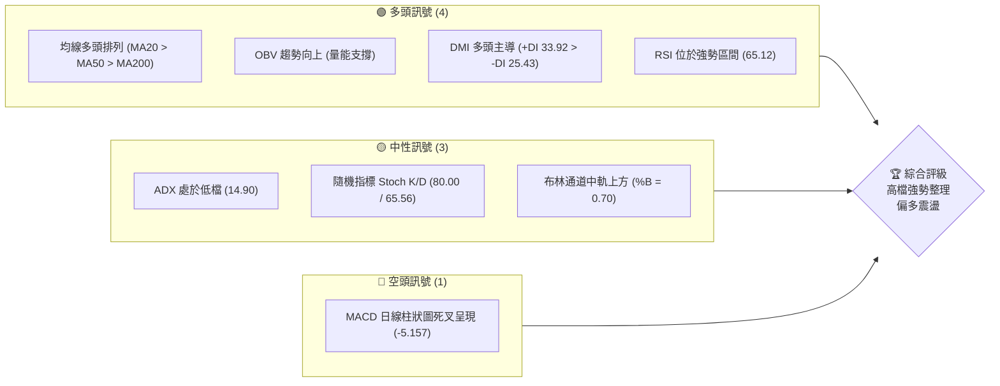

### 📊 核心指標速覽表

| 指標類別 | 指標名稱 | 當前數值 | 訊號 | 解讀 |
|----------|----------|----------|------|------|
| **價格** | 當前價格 | $2470.00 | 🟢 | 位於52週區間的 95.6% 高位，多頭絕對控盤 |
| **均線** | MA20 | $2434.50 | 🟢 | 價格在MA20上方，短期支撐強勁 |
| **均線** | MA50 | $2350.25 | 🟢 | 中期生命線，多頭趨勢不變 |
| **均線** | MA200 | $1831.83 | 🟢 | 長期牛市分水嶺，乖離率偏高但方向極度看好 |
| **動能** | RSI(14) | 65.12 | 🟢 | 處於 50-70 強勢區間，無超買過熱風險 |
| **動能** | MACD | 29.811 | 🔴 | MACD (29.811) < Signal (34.968)，柱狀圖呈現負值 (-5.157) |
| **波動** | ATR(14) | $56.79 | 🟡 | 佔股價 2.30%，波動適中，適合區間操作 |
| **趨勢** | ADX(14) | 14.90 | 🟡 | 指標小於 25，顯示當前為弱趨勢/盤整行情 |

### 🏆 技術評分卡

```
技術評分卡 — 2330.TW (2026-07-16)
════════════════════════════════════════════════════
趨勢強度      ████████░░░░░░░░░░░░  40/100  🟡 盤整蓄勢
動能指標      ██████████████░░░░░░  70/100  🟢 強勢整理
支撐穩定度    ████████████████░░░░  80/100  🟢 支撐強勁
成交量配合    ████████████░░░░░░░░  60/100  🟡 縮量整理
形態完整度    ██████████████░░░░░░  70/100  🟢 箱型結構
均線排列      ██████████████████░░  90/100  🟢 完美多頭
════════════════════════════════════════════════════
綜合評分      ██████████████░░░░░░  68/100  🟢 偏多整理
════════════════════════════════════════════════════
```

---

## 2. 趨勢分析

### 🌐 多時框趨勢分析

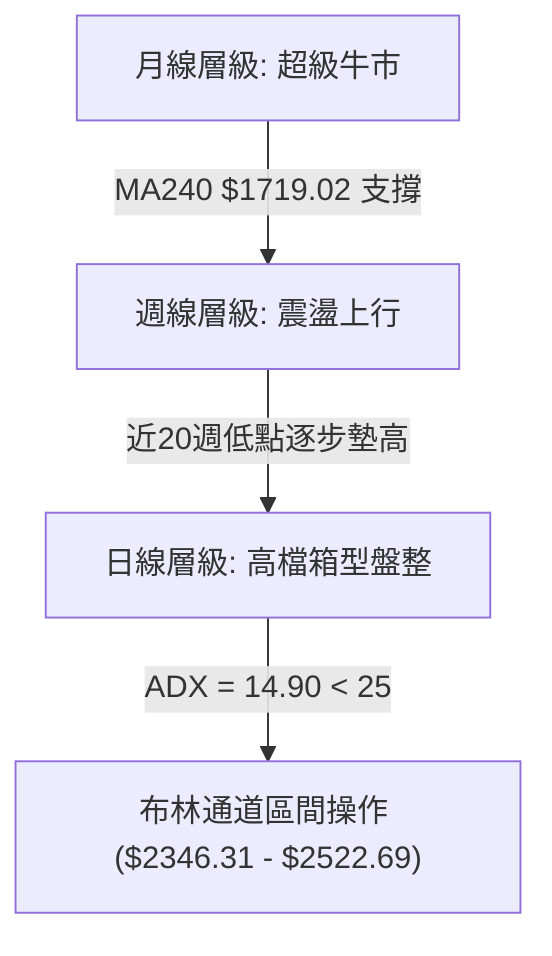

### 📈 長期趨勢 — 12個月走勢圖（Unicode）

```
2330.TW 月線走勢圖（2025-07 至 2026-07）
價格軸 ($)
$2500 ┤                                                 ●(現價 $2470)
$2300 ┤                                         ●     ●
$2100 ┤                                     ●
$1900 ┤                                 ●
$1700 ┤                             ●
$1500 ┤                 ●     ●
$1300 ┤             ●
$1100 ┤●     ●     ●
$900  ┤
      └─────────────────────────────────────────────────────────────
       07/25 08/25 09/25 10/25 11/25 12/25 01/26 02/26 04/26 05/26 07/26 (月份)
```

**走勢特徵分析表格**：
| 階段 | 時間區間 | 價格區間 | 累計漲跌幅 | 主要技術特徵 |
|------|----------|----------|------------|--------------|
| 1. 底部奠定期 | 2024-07 ~ 2024-09 | $906.02 → $932.48 | +2.92% | 守穩 $900 大關，成交量溫和萎縮，籌碼沉澱。 |
| 2. 初步突破期 | 2024-10 ~ 2025-03 | $1003.60 → $894.24 | -10.90% | 首次突破千元大關後遭遇獲利回吐，回踩 $900 關卡。 |
| 3. 中期加速期 | 2025-04 ~ 2025-12 | $892.27 → $1540.85 | +72.69% | 突破箱型整理，沿 MA20 強勢噴發，量價齊揚。 |
| 4. 主升段爆發 | 2026-01 ~ 2026-06 | $1764.52 → $2410.00 | +36.58% | 價格跳空上行，均線呈現發散多頭排列，創下 $2535 歷史高點。 |
| 5. 高檔整理期 | 2026-07 (當前) | $2415.00 → $2470.00 | +2.28% | ADX 降至 14.90，進入高檔橫盤整理，等待方向抉擇。 |

### 📊 中期趨勢（週線分析）

```
2330.TW 週線阻力與支撐示意圖
══════════════════════════════════════════════════════════════
[阻力位]  $2535.00 ──────────────────────────── 52W 歷史高點 (R1 聚類 $2520.00)
                               ▲
                               │  (目前股價: $2470.00 處於強勢整理)
                               ▼
[中軌支撐] $2434.50 ──────────────────────────── MA20 / 週線關鍵中樞
                               ▲
                               ▼
[強支撐位] $2325.00 ──────────────────────────── 近期波段低點聚類 (S1)
══════════════════════════════════════════════════════════════
```

### ⚡ 趨勢強度評估（ADX 解讀）

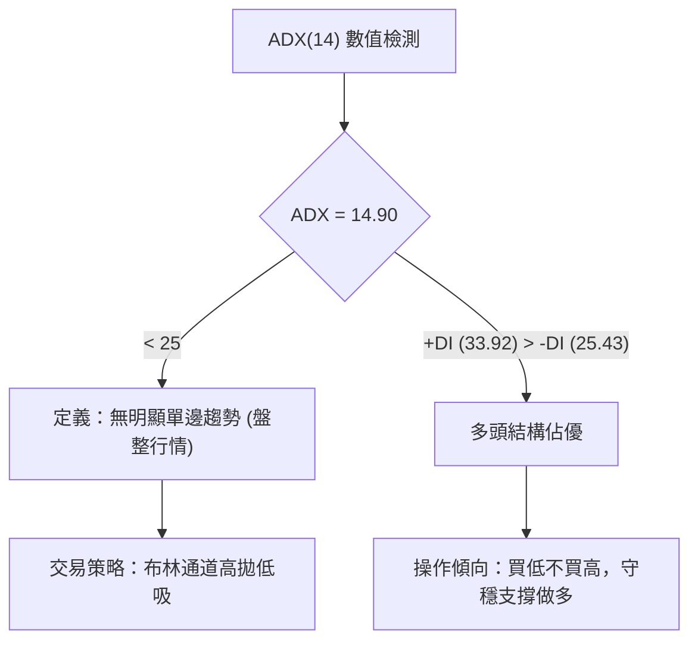

**ADX 趨勢強度對照表**：
*   **0 - 25**：弱趨勢/盤整行情 ➔ **當前狀態 (14.90) ▓▓▓▓▓░░░░░░░░░░░░░░░ 29.8%**
*   **25 - 50**：中等趨勢 ➔ 未達標
*   **50 - 75**：強趨勢 ➔ 未達標
*   **75 - 100**：極強趨勢 ➔ 未達標

---

## 3. 圖表形態分析

### 🔍 形態識別系統

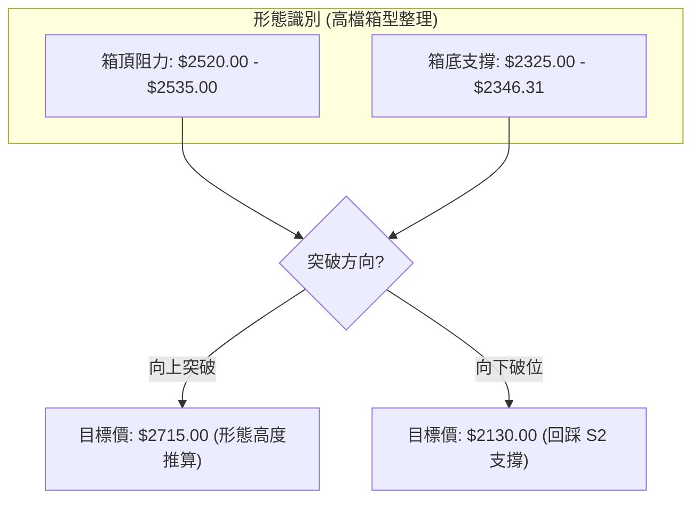

**形態信心度評估表**：
| 識別形態 | 信心度 | 判斷依據（引用數據） | 完成度 | 目標價（附計算式） |
|----------|--------|----------------------|--------|--------------------|
| **高檔箱型整理** | **75%** 🟢 | 股價在近2個月多次測試阻力 $2520.00 (R1) 與支撐 $2325.00 (S1)。 | 90% | 向上目標：$2715.00<br>計算式：$2520.00 (頸線) + ($2520.00 - $2325.00) (形態高度 $195) = $2715.00 |
| **上升旗形** | **45%** 🟡 | 自 2026-05 快速拉升至 $2348.73 後進行橫盤，但回檔斜率不明顯。 | 50% | 數據不足以支持標準幾何旗形，僅作指標型盤整解讀。 |

### 🕯️ 重要K線形態分析

| 日期 | 收盤價 | K線形態 | 解讀 | 訊號 |
|------|--------|---------|------|------|
| **2026-07-19** | $2470.00 | **高檔小陽線** | 伴隨 124M 週成交量，呈現量增價漲，多頭收復前週失土。 | 🟢 多頭 |
| **2026-07-12** | $2415.00 | **量縮陰線** | 成交量急凍至 97M，顯示回檔無量，籌碼惜售，屬於良性回踩。 | 🟡 中性 |
| **2026-07-05** | $2445.00 | **長下影線鎚子** | 盤中向下測試支撐後強力拉回，顯示下方買盤極度強勁。 | 🟢 強勢 |

### 📉 ASCII 走勢形態示意圖

```
2330.TW 日線箱型整理形態 (2026-05 ~ 2026-07)
$2535 ┼─────────────────────────● (52W 歷史高點)
$2520 ┼───────●─────────────────●─────── (箱頂阻力 R1)
      │      ╱ ╲               ╱ ╲
      │     ╱   ╲   ●         ╱   ╲
$2434 ┼────●─────●─╱─╲───────●─────●───── (箱體中軸 MA20)
      │   ╱       ╳   ╲     ╱
      │  ╱       ╱ ╲   ●   ╱
$2325 ┼─●───────●───●─────●───────────── (箱底支撐 S1)
      └───────────────────────────────────
        05/31   06/14  06/28 07/12   07/19  (時間軸)
```

### 🎯 形態目標價計算

1.  **箱體高度計算**：
    $$\text{箱頂阻力 (R1)} = \$2520.00$$
    $$\text{箱底支撐 (S1)} = \$2325.00$$
    $$\text{箱體高度} = \$2520.00 - \$2325.00 = \$195.00$$

2.  **向上突破目標價 (T2)**：
    $$\text{目標價} = \text{箱頂} + \text{箱體高度} = \$2520.00 + \$195.00 = \$2715.00$$

3.  **向下破位防守價**：
    若不幸跌破箱底 $2325.00，則下一波段防守點直指 $2194.59 (S2) 及斐波那契 23.6% 回調位 $2184.77。

---

## 4. 支撐與阻力

### 🗺️ 關鍵價位分布圖（Unicode）

```
2330.TW 價位結構分布圖
═══════════════════════════════════════════════════
$2535.00 ║████████████████████████║ 52W 歷史最高點 (絕對壓力)
$2520.00 ║██████████████████████  ║ 關鍵波段高點阻力 R1
$2470.00 ╠════════════════════════╣ ◄ 當前價格 (現價)
$2434.50 ║▓▓▓▓▓▓▓▓▓▓▓▓▓▓▓▓        ║ 短期均線中樞支撐 (MA20)
$2346.31 ║▓▓▓▓▓▓▓▓▓▓▓▓            ║ 日線布林下軌支撐
$2325.00 ║████████████████████████║ 近期波段強支撐 S1
$2194.59 ║██████████████████      ║ 波段重要支撐 S2 (23.6% 斐氏回調附近)
$1748.20 ║██████████              ║ 長期波段強支撐 S3 (50% 斐氏回調附近)
═══════════════════════════════════════════════════
```

### 🚧 阻力位分析表

| 阻力級別 | 價位 | 形成原因 | 突破難度 | 重要性 |
|----------|------|----------|----------|--------|
| **R1 (關鍵阻力)** | **$2520.00** | 近期波段高點聚類，接近日線布林上軌 ($2522.69)。 | 🟡 中等 | 箱型整理上軌，一旦有效突破，將開啟新一輪主升段。 |
| **歷史高點** | **$2535.00** | 52週歷史最高價，整數關卡與心理壓力位。 | 🔴 極高 | 歷史天花板，需伴隨 180M 以上的週成交量方能有效站穩。 |

### 🛡️ 支撐位分析表

| 支撐級別 | 價位 | 形成原因 | 守住機率 | 重要性 |
|----------|------|----------|----------|--------|
| **S1 (近期支撐)** | **$2325.00** | 近一年波段低點聚類，與 MA50 ($2350.25) 及布林下軌 ($2346.31) 重疊。 | 🟢 高 | 中期多空分水嶺，此處買盤極強，不容失守。 |
| **S2 (強支撐)** | **$2194.59** | 歷史成交密集區，與 23.6% 斐波那契回調位 ($2184.77) 高度重合。 | 🟢 極高 | 長期多頭護城河，跌破此位意味著中期趨勢轉空。 |
| **S3 (極強支撐)** | **$1748.20** | 2026年3月波段低點聚類，接近 MA200 ($1831.83)。 | 🟢 絕對守穩 | 長期牛市終極防線，極難跌破。 |

### 📐 斐波那契回調位分析

基於 52週區間 $1050.99 → $2535.00 進行黃金分割評估：
*   **0.0% (52W High)**: $2535.00
*   **23.6%**: $2184.77
*   **38.2%**: $1968.11
*   **50.0%**: $1793.00
*   **61.8%**: $1617.88

**解讀**：
當前價格 **$2470.00** 處於 0.0% ($2535.00) 與 23.6% ($2184.77) 之間的極強勢區間。股價甚至未曾回踩過 23.6% 支撐位，顯示多頭具有極強的控盤意願。即使未來出現大盤系統性風險，只要守穩 **$2184.77**，2330.TW 的長期牛市格局即未受破壞。

---

## 5. 技術指標深度解讀

### 🎛️ 指標訊號總覽

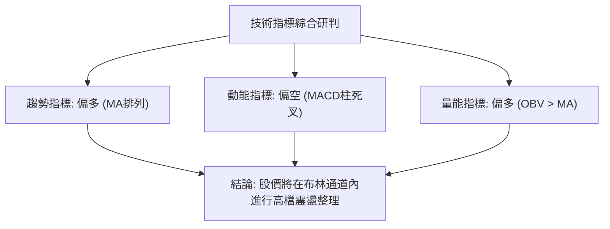

### 📈 移動平均線排列分析

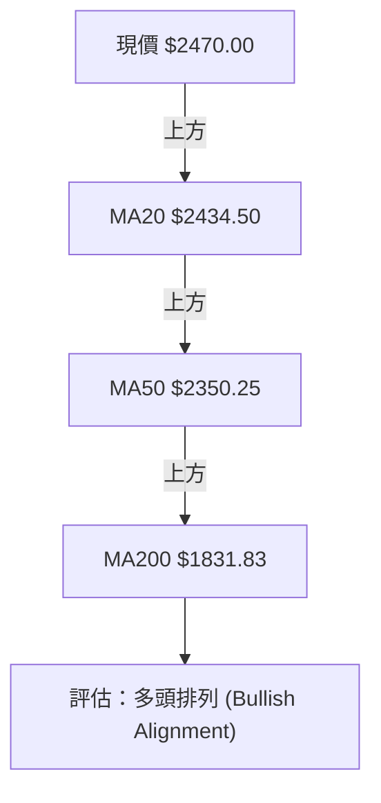

**均線系統狀態評估**：
*   **MA5 / MA10** 呈現微幅上揚，短期價格於 $2430-$2470 形成密集交易帶。
*   **MA20 ($2434.50)** 扮演短期動能支撐，現價站於其上，多頭掌握短期優勢。
*   **MA60 ($2322.32)** 與支撐位 **S1 ($2325.00)** 完美重合，構成中期強大支撐。

### 📉 RSI(14) 分析

*   **當前數值**：**65.12** ➔ **強勢區間 █████████████░░░░░░░░░ 65%**
*   **背離分析**：目前股價創高而 RSI 未同步創歷史新高，但亦無出現高檔頂背離。屬於隨股價震盪而進行的健康指標修正。
*   **超買/超賣**：遠離 70 超買區，具備進一步上攻的空間。

### 📊 MACD(12/26/9) 訊號解讀

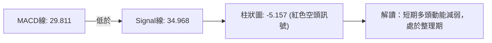

**深度解讀**：
雖然 MACD 雙線仍處於零軸上方的極高位置（代表長期牛市強勁），但日線級別雙線死叉且柱狀圖持續為負（-5.157），這表明短期內不具備連續暴漲的動能，股價更傾向於以橫盤震盪的方式消化賣壓。

### 📦 布林通道分析

```
布林通道現價位置示意圖
══════════════════════════════════════════════════════════════
[BB上軌]  $2522.69 ─────────────────────────────────────────── (壓力強烈)
                     ▲
                     │  ◄─── [現價 $2470.00] (%B = 0.70，中軌上方)
                     ▼
[BB中軌]  $2434.50 ─────────────────────────────────────────── (MA20 支撐)
                     ▲
                     ▼
[BB下軌]  $2346.31 ─────────────────────────────────────────── (買盤密集區)
══════════════════════════════════════════════════════════════
```

*   **通道寬度**：縮口跡象明顯，暗示波動率（ATR）正在下降，股價即將進入變盤臨界點。
*   **%B 數值 (0.70)**：顯示股價在中軌之上、偏向上軌，結構依然偏多。

### 💹 成交量分析（量價配合度）

*   **最新成交量**：27,848,158
*   **20日均量**：31,642,760（量比：**0.88x**）
*   **分析**：股價在高檔震盪時成交量低於均量，呈現典型的「量縮整理」。這說明市場觀望氣氛濃厚，但並無恐慌性賣壓。
*   **OBV 趨勢**：OBV 指標高於其移動平均線，量能長線支撐股價上漲的趨勢並未改變。

---

## 6. 動能與波動率

### ⚡ 動能評估四象限

| 象限 | 動能 | 波動 | 當前狀態 | 評估 |
|------|------|------|----------|------|
| **Q1 (強動能/低波動)** | **強** | **低** | **✓ (當前定位)** | **最佳蓄勢期**。動能維持高檔，波動率下降，適合逢低佈局，靜待突破。 |
| **Q2 (弱動能/低波動)** | 弱 | 低 | - | 盤整無生氣，資金效率低。 |
| **Q3 (強動能/高波動)** | 強 | 高 | - | 噴發主升段，風險與收益並存。 |
| **Q4 (弱動能/高波動)** | 弱 | 高 | - | 出貨派發期，應避開。 |

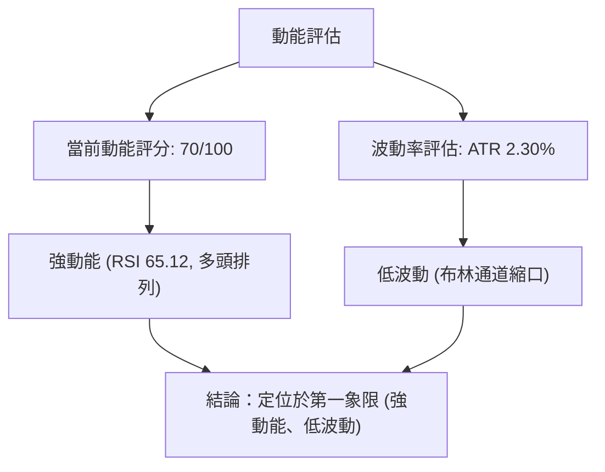

### 📊 ATR 波動率分析

*   **ATR(14)**：**$56.79**（佔股價 2.30%）。
*   **技術應用（止損與波動區間）**：
    *   **1.0x ATR** = $56.79 ➔ 短線波動噪音區。
    *   **1.5x ATR** = $85.19 ➔ 適合波段操作的止損距離。
    *   **2.0x ATR** = $113.58 ➔ 強勢多頭趨勢的終極防守寬度。
*   **策略建議**：若在 $2350.00 附近進場，止損應設在 $2350 - $85 = $2265 附近（此處亦接近強支撐 S2 $2194.59 上方）。

### 📐 Beta 與市場相關性

*   **Beta 係數**：**1.246**。
*   **解讀**：波動率比大盤（加權指數）高出 24.6%。當台股大盤上漲 1% 時，2330.TW 預期上漲 1.25%；反之跌幅亦然。在高檔震盪市中，必須利用其高 Beta 特性，在市場恐慌回檔時尋找超額收益（Alpha）的買點。

---

## 7. 多時框架總結

### 📋 時框架評分表

| 時框架 | 趨勢方向 | 動能 | 均線排列 | 形態 | 綜合評分 | 建議 |
|--------|----------|------|----------|------|----------|------|
| **日線 (1D)** | 🟡 橫盤整理 | 🟡 中性 (MACD死叉) | 🟢 多頭排列 | 🟢 箱型整理 | **65/100** | 區間操作，布林下軌買入。 |
| **週線 (1W)** | 🟢 震盪上行 | 🟢 強勢 (RSI 65.1) | 🟢 多頭排列 | 🟢 底部墊高 | **85/100** | 波段持有，逢回吐加碼。 |
| **月線 (1M)** | 🟢 強烈看多 | 🟢 極強 (歷史高位) | 🟢 完美多頭 | 🟢 主升段 | **95/100** | 長線鎖倉，忽略短期波動。 |

### 🔲 綜合訊號矩陣

```
           短期 (日線)      中期 (週線)      長期 (月線)
趨勢指標     🟡 (ADX<25)      🟢 (趨勢向上)    🟢 (牛市格局)
動能指標     🔴 (MACD柱負)    🟢 (RSI 65.1)    🟢 (動能強勁)
量能配合     🟡 (量縮整理)    🟢 (OBV > MA)    🟢 (長線量增)
```

### ⚖️ 多時框收斂結論

> **當前市場定位：高檔箱型盤整行情 (ADX = 14.90 < 25)**

根據多時框收斂規則，當 ADX 小於 25 時，日線級別的單邊趨勢動能減弱，市場進入盤整。此時應**以日線布林通道上下軌 ($2346.31 - $2522.69) 作為主要交易區間**。

然而，中長期（週線、月線）均線系統呈現完美的強勢多頭排列（MA20 > MA50 > MA200），這意味著**任何日線級別的回檔都是長線買盤的極佳切入點**。我們不應在盤整市中盲目追高，而應採取「**支撐位逢低佈局，靜待箱體突破**」的唯一方向性結論。

---

## 8. 交易策略建議

### 🗺️ 策略決策流程圖

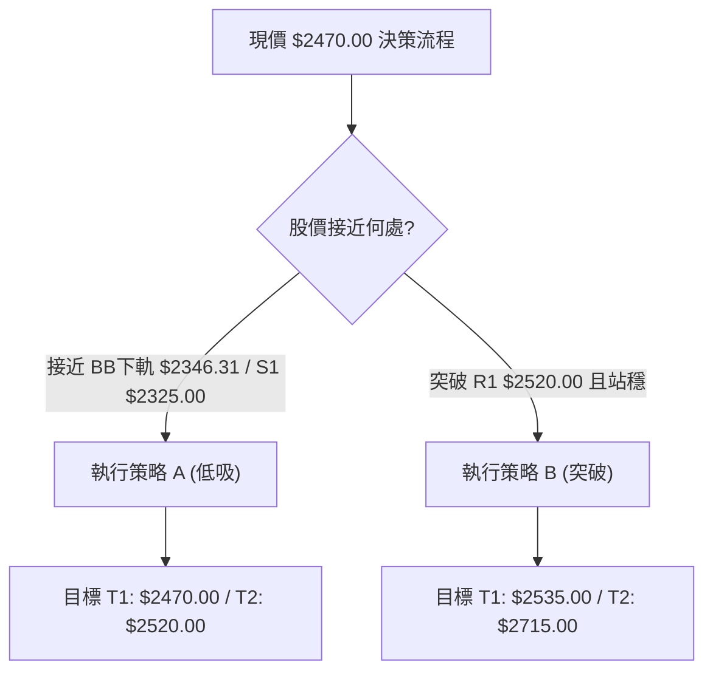

### 🧭 策略路由

*   **當前主策略方向**：**多頭策略（強勢震盪偏多，蓄勢突破）**
*   **依據**：技術綜合評分高達 **68/100**，長週期均線與量能全面看多，空頭僅為短期 MACD 修正。拒絕兩頭下注，不建議建立任何空頭部位。

### 🎯 價格情境階梯（Price Scenarios）

| 觸發條件 | 下一目標 | 後續延伸 | 情境含義 |
|----------|----------|----------|----------|
| **突破 R1 $2520.00** | **$2535.00** (歷史高點) | **$2715.00** (箱型突破目標) | 強勢突破，開啟新一輪主升段 |
| **站穩現價 $2470.00** | — | — | 於 $2415 - $2480 區間持續震盪 |
| **跌破 S1 $2325.00** | **$2194.59** (S2 支撐) | **$2184.77** (23.6% 斐氏回調) | 短期轉弱，波段買點浮現 |

### 📊 情境機率分佈

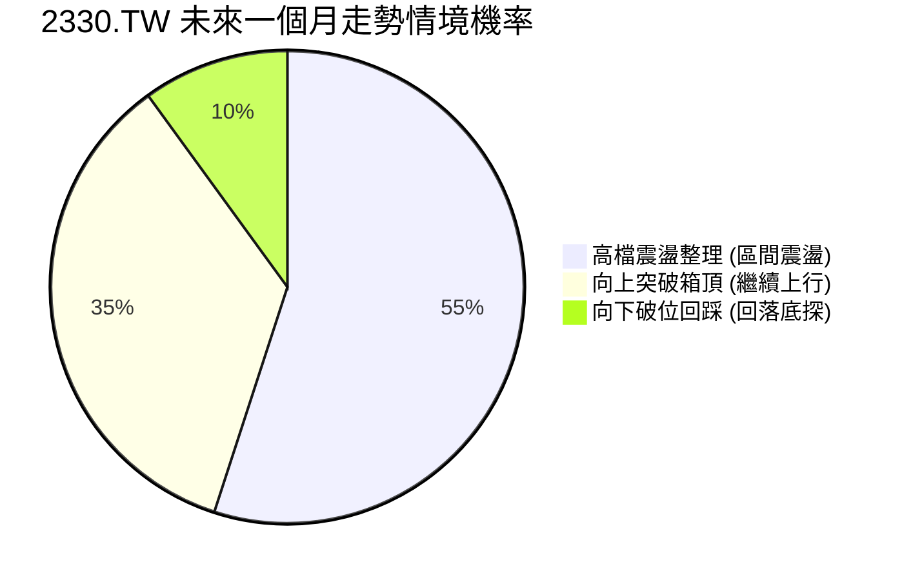

*   **區間震盪 (55%)**：ADX 處於 14.90 低檔，成交量萎縮，預期股價將在 $2346 - $2520 之間反覆洗盤。
*   **繼續上行 (35%)**：中長線多頭排列極佳，OBV 支撐強勁，隨時可能因基本面利多直接封閉阻力。
*   **回落底探 (10%)**：僅在整體市場（如美股半導體板塊）發生系統性崩跌時，才可能回踩 $2194.59。

### 🟢 主策略詳情

| 策略要素 | 策略 A (區間低吸 - 穩健型) | 策略 B (突破追多 - 動能型) |
|----------|----------------------------|----------------------------|
| **進場條件** | 股價回踩布林下軌與 S1 支撐區間。 | 股價強勢突破 R1 $2520.00，且日線收盤確認站穩。 |
| **進場價格** | **$2350.00** | **$2525.00** |
| **目標價 T1** | **$2470.00** (回到箱體中軸) | **$2535.00** (挑戰歷史高點) |
| **目標價 T2** | **$2520.00** (測試箱頂阻力) | **$2715.00** (形態高度推算值) |
| **止損價格** | **$2310.00** (跌破 S1 $2325 且留 15 點噪音空間) | **$2434.50** (跌回 MA20 中軌下方) |
| **風險報酬比** | **1 : 4.25** (風險 $40，最大利潤 $170) | **1 : 2.10** (風險 $90.5，最大利潤 $190) |
| **成功機率** | **70%** | **60%** |
| **建議倉位** | **20%** (基礎多頭底倉) | **10%** (突破加碼倉) |

### 🔴 反向風險觸發點（對沖提示）

若日線收盤價**跌破 $2325.00 (S1)**，代表箱型整理向下破位，短期多頭結構破壞。此時應暫停所有做多操作，並針對現有多頭部位進行 30% 的套期保值（對沖），直至股價在 **$2194.59 (S2)** 附近止跌企穩。

### ⭐ 整體訊號強度評星

```
做多訊號強度：★★★★☆  (4/5星 - 中長線牛市，短線震盪)
做空訊號強度：★☆☆☆☆  (1/5星 - 極不推薦逆勢做空)
整體可信度：  ★★★★☆  (4/5星 - 數據完整，均線排列清晰)
```

---

## 9. Risk Warning and Monitoring (風險提示與監控)

### ✅ 關鍵監控指標 Checklist

```
╔══════════════════════════════════════════════════════════════╗
║              2330.TW 每日交易監控清單                         ║
╠══════════════════════════════════════════════════════════════╣
║ [ ] 日線收盤是否跌破 MA20 ($2434.50) ➔ 短期轉弱警戒          ║
║ [ ] 週成交量是否跌破 100M ➔ 盤整期延長                       ║
║ [ ] MACD 柱狀圖是否由負轉正 ➔ 啟動策略 B 的關鍵信號          ║
║ [ ] RSI(14) 是否跌破 50 中性分水嶺 ➔ 防守轉向 S1             ║
║ [ ] ADX(14) 是否突破 25 ➔ 單邊趋势即將啟動                   ║
╚══════════════════════════════════════════════════════════════╝
```

### ⚠️ 風險場景分析

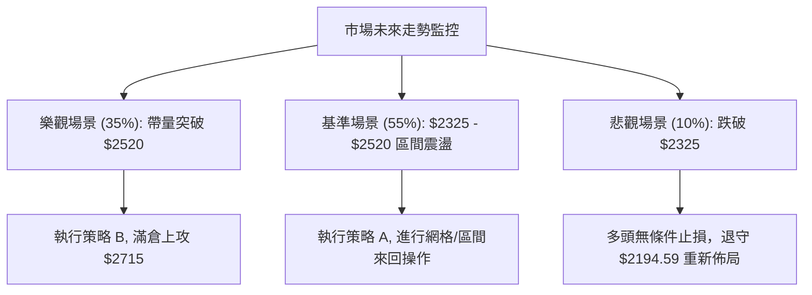

### 🛡️ 風險管理重要提醒

1.  **乖離率風險**：當前股價與 MA200 ($1831.83) 乖離率仍高達 **+34.8%**。雖然長線極度看好，但切忌在 $2500 以上進行無保護的一般融資買進，防範系統性修正帶來的強制平倉風險。
2.  **資金分批原則**：在 ADX 顯示為盤整市的情況下，單次進場資金不宜超過總預算之 20%。應嚴格執行「金字塔式建倉法」，唯有股價向上突破並站穩阻力位後，方可動用加碼資金。

---

## 📋 報告總結

```
2330.TW 技術分析報告總結
════════════════════════════════════════════════════════
報告日期：2026-07-16
當前價格：$2470.00
分析評級：⚖️ 偏多震盪整理 (中長線超級牛市，短期橫盤蓄勢)

關鍵結論：
├─ 長期趨勢：🟢 強烈看多。24個月歷史顯示完美上升通道，MA200 提供長線支撐。
├─ 中期趨勢：🟢 週線穩步墊高。斐波那契回調顯示多頭控盤意願極強。
├─ 短期趨勢：🟡 盤整行情。ADX(14) 僅 14.90，短期動能受制於 MACD 日線死叉。
├─ 關鍵支撐：$2325.00 (S1) / $2194.59 (S2)
├─ 關鍵阻力：$2520.00 (R1) / $2535.00 (歷史高點)
└─ 分析師目標均值：$2882.79 (隱含 +16.7% 上漲空間)

最優策略組合：
1. 🥇 最佳機會：策略 A (區間低吸)。於 $2350.00 附近佈局，止損 $2310.00，風阻比高達 1:4.25。
2. 🥈 次選機會：策略 B (突破追多)。待日線收盤站穩 $2520.00 後順勢進場，目標直指 $2715.00。
3. 🥉 保守選擇：現股波段持有，不進行短線頻繁交易，以時間換取長線倍數空間。
════════════════════════════════════════════════════════
```

---

> ⚠️ **免責聲明**：本報告為資深技術分析師之專業研究成果，所有數據及估算均基於市場公開歷史價格資訊。本報告**僅供研究與學術參考**，**不構成任何投資建議或買賣邀約**。投資有風險，入市需謹慎，投資人應自行評估風險並自負盈虧。

---

*報告生成時間：2026-07-16 ｜ 數據來源：Yahoo Finance ｜ 分析框架：多時框技術分析*