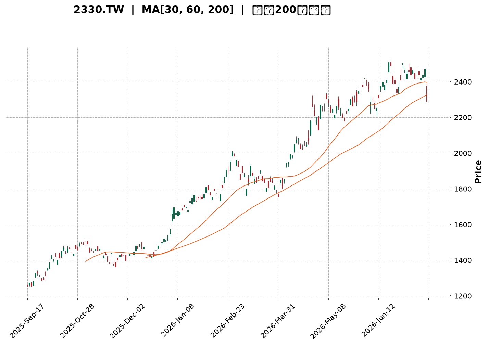
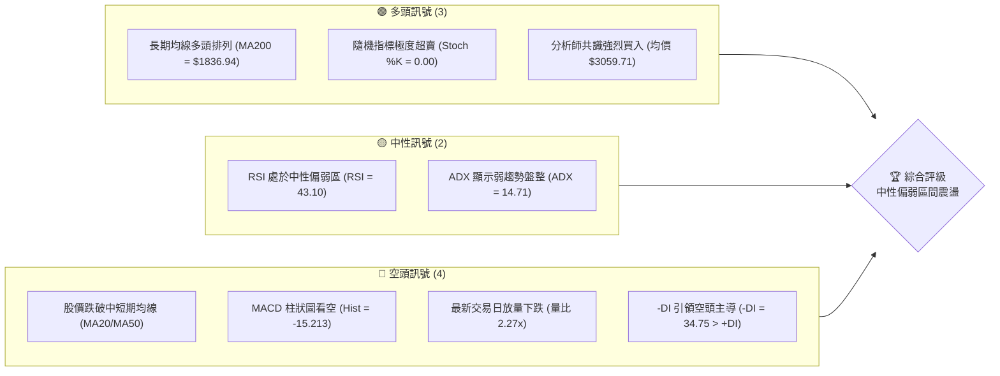
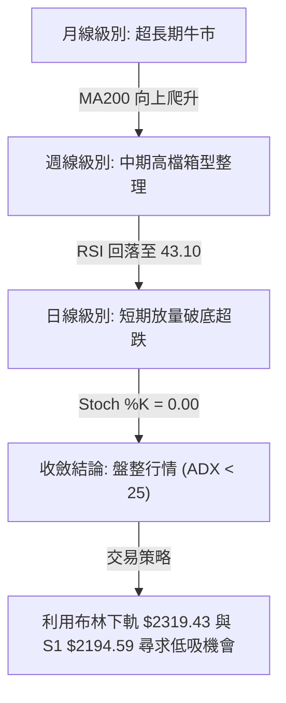
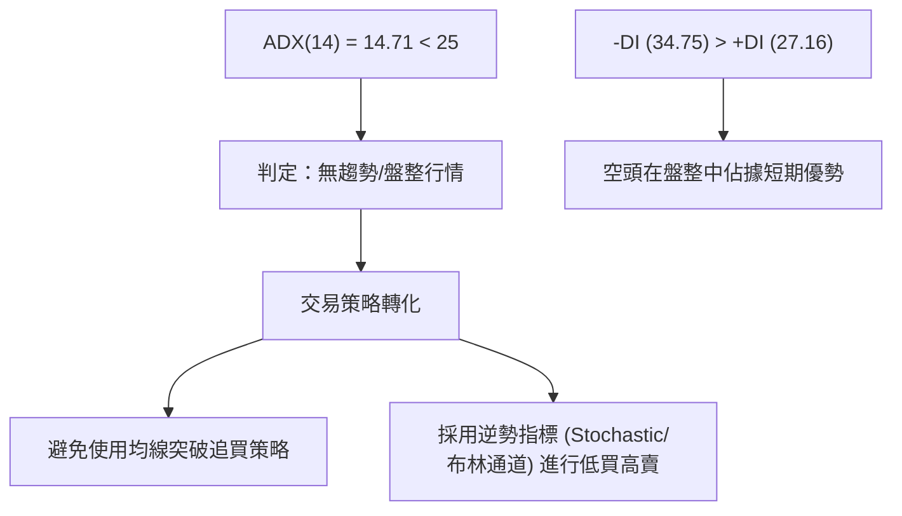
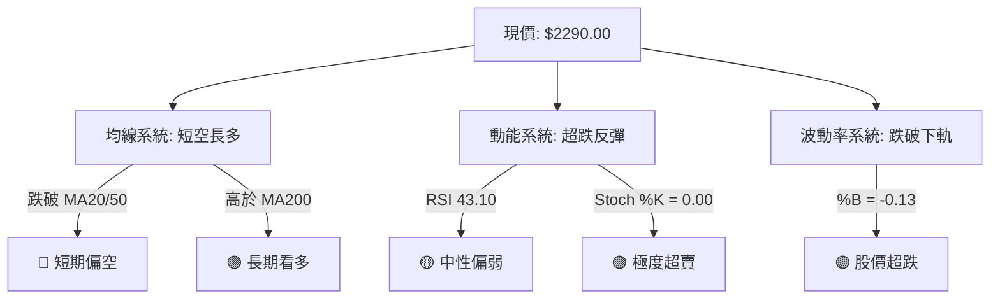
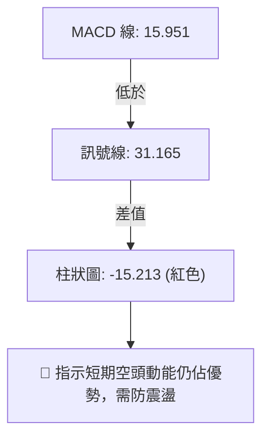
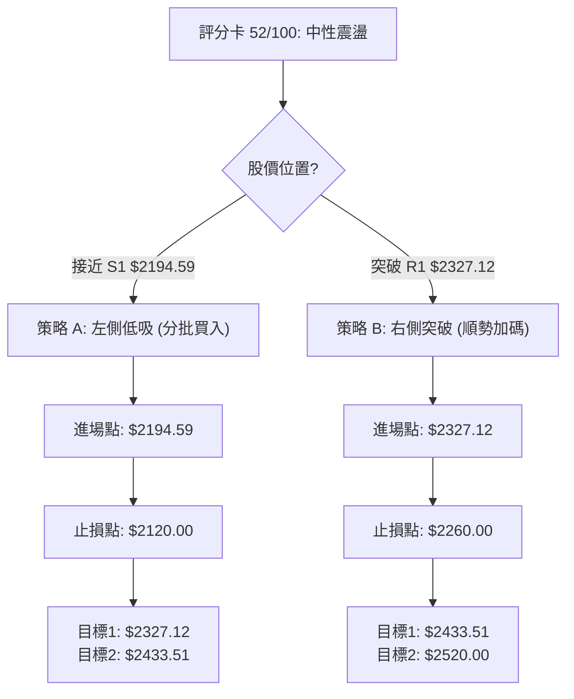
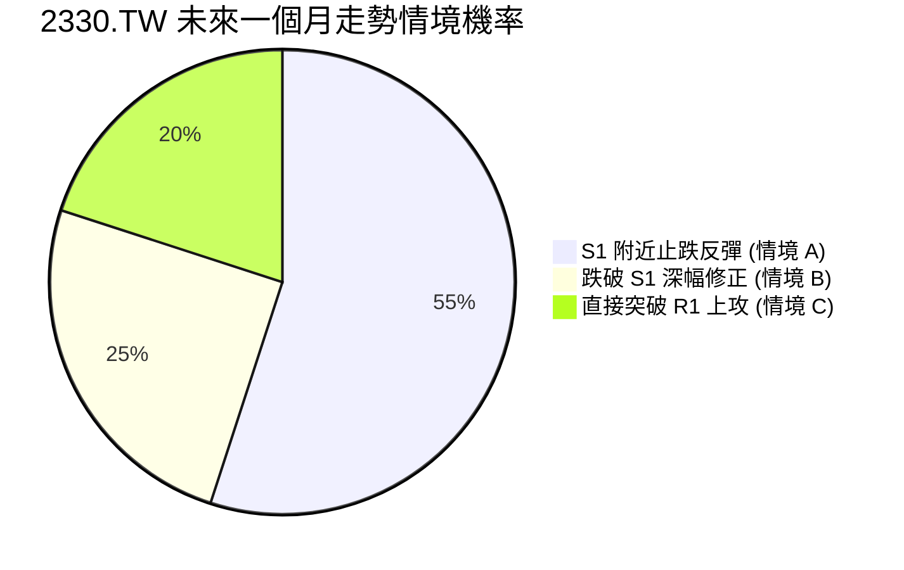
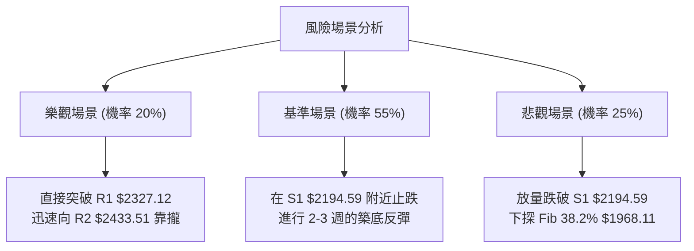

<details>
<summary>📊 靜態圖表 (點擊展開)</summary>

</details>

<html>
<head><meta charset="utf-8" /></head>
<body>
    <div style="height:500px; width:100%;">                        <script>window.PlotlyConfig = {MathJaxConfig: 'local'};</script>
        <script charset="utf-8" src="https://cdn.plot.ly/plotly-3.7.0.min.js" integrity="sha256-jvTGqxNp8AGWEcvNLVuKr+8j5dGe9Yw51LQkmDH+IYA=" crossorigin="anonymous"></script>                <div id="candlestick-chart" class="plotly-graph-div" style="height:100%; width:100%;"></div>            <script>                window.PLOTLYENV=window.PLOTLYENV || {};                                if (document.getElementById("candlestick-chart")) {                    Plotly.newPlot(                        "candlestick-chart",                        [{"close":{"dtype":"f8","bdata":"AAAAAGqVk0AAAABgreSTQAAAAABqlZNAAAAAAE8MlEAAAADgpr6UQAAAAOCmvpRAAAAAYGNvlEAAAADgHyCUQAAAAODwM5RAAAAAQDSDlEAAAABAuyGVQAAAAEBxrJVAAAAAQCc3lkAAAADg4+eVQAAAAED4SpZAAAAA4OPnlUAAAACAhQ+WQAAAAEAMrpZAAAAA4E\u002f9lkAAAADAmXKWQAAAAAB\u002f6ZZAAAAAAH\u002fplkAAAACAO5qWQAAAAMCZcpZAAAAAAH\u002fplkAAAAAgrtWWQAAAAECTTJdAAAAAQJNMl0AAAABgwjiXQAAAAEBkYJdAAAAAQJNMl0AAAACAO5qWQAAAAEAMrpZAAAAAgDualkAAAAAgrtWWQAAAAEAMrpZAAAAAIK7VlkAAAACAO5qWQAAAAGBWI5ZAAAAA4MhelkAAAAAAQsCVQAAAAECgmJVAAAAAwGqGlkAAAACg\u002fnCVQAAAAOBcSZVAAAAA4OPnlUAAAABA+EqWQAAAAEAnN5ZAAAAAQPhKlkAAAADgEtSVQAAAAGBWI5ZAAAAAwJlylkAAAADgyF6WQAAAAIA7mpZAAAAAoPEkl0AAAAAAf+mWQAAAAECTTJdAAAAAoEjVlkAAAABADP2WQAAAAIDBhZZAAAAAQBxKlkAAAACAOjaWQAAAAIA6NpZAAAAAgDo2lkAAAADAZsGWQAAAAKDPJJdAAAAAgLE4l0AAAADgVnSXQAAAAODdw5dAAAAAQBqcl0AAAAAAZROYQAAAAGCRnphAAAAAgI\u002fwmUAAAADgu3uaQAAAAEBxBJpAAAAA4DQsmkAAAAAAUxiaQAAAAIAWQJpAAAAAwJ2PmkAAAADAnY+aQAAAAIAWQJpAAAAAQOgGm0AAAABAb1abQAAAAKAUkptAAAAAQOgGm0AAAABAb1abQAAAAOAyfptAAAAAoI1Cm0AAAACA9qWbQAAAAKAERZxAAAAAYF8JnEAAAACgFJKbQAAAACBRaptAAAAAgH31m0AAAAAg2LmbQAAAACBRaptAAAAAgPalm0AAAADAIjGcQAAAAOCZM51AAAAAQMa+nUAAAAAAIYOdQAAAAOCXhZ5AAAAAoGlMn0AAAACg4vyeQAAAAIBbrZ5AAAAAQE0OnkAAAACA9PecQAAAAAAhg51AAAAAYF1bnUAAAAAAQR2cQAAAAEBPvJxAAAAAIC8inkAAAACge0edQAAAAID095xAAAAAgG2onEAAAAAAGSSdQAAAAKC5r51AAAAAgE\u002fUnEAAAADAaqycQAAAAIC8NJxAAAAAgLw0nEAAAAAgXcCcQAAAAMBqrJxAAAAAQKFcnEAAAABADr2bQAAAAMBEbZtAAAAA4EHonEAAAACAvDScQAAAAEA0\u002fJxAAAAAAD9jnkAAAABgMXeeQAAAAMC2Kp9AAAAAANICn0AAAACAEAOgQAAAAGDuNKBAAAAAoOc+oEAAAAAAZaKfQAAAAKByjp9AAAAAgC7yn0AAAACALvKfQAAAAGDuNKBAAAAAYF8GoUAAAABg8qWhQAAAAIA2QqFAAAAAIGb8oEAAAACAo6KgQAAAAMDkuaFAAAAA4AaIoUAAAADgBoihQAAAACC1\u002f6FAAAAAYNDXoUAAAABAG2qhQAAAAAAAkqFAAAAAoC9MoUAAAACg66+hQAAAAGDypaFAAAAAgBR0oUAAAAAgRC6hQAAAAGBfBqFAAAAAACJgoUAAAAAAAJKhQAAAACC1\u002f6FAAAAAoOuvoUAAAADAwuuhQAAAAIDJ4aFAAAAAwHdZokAAAADAd1miQAAAAMBVi6JAAAAAYBjlokAAAADgTpWiQAAAACBqbaJAAAAAgMnhoUAAAADgu\u002fWhQAAAAAAAkqFAAAAAAACUoUAAAAAAAAyiQAAAAAAAjqJAAAAAAADAokAAAAAAAKKiQAAAAAAA1KJAAAAAAACco0AAAAAAAHSjQAAAAAAArKJAAAAAAACsokAAAAAAAEiiQAAAAAAAhKJAAAAAAADUokAAAAAAAJKjQAAAAAAAQqNAAAAAAAAao0AAAAAAADijQAAAAAAAEKNAAAAAAABCo0AAAAAAAN6iQAAAAAAA3qJAAAAAAAAQo0AAAAAAAOiiQAAAAAAAEKNAAAAAAABMo0AAAAAAAOShQA=="},"high":{"dtype":"f8","bdata":"iIIruQu9k0AAAABgreSTQFPG7E5++JNAAAAAAE8MlEAAAADgpr6UQB+onHUZ+pRAED74GAWXlECt1Ep1kluUQId+s3Vjb5RAvJV9jkjmlECcyZkcjDWVQAAAAEBxrJVAtkwW+chelkARl5u8tPuVQAAAANZqhpZAEZebvLT7lUAclaKHO5qWQAAAAEAMrpZAdbgamfEkl0BfKmhVDK6WQJgin5XxJJdAdYMpcsI4l0A\u002ffvw43cGWQB8OeJxqhpZAdYMpcsI4l0D6IJa1IBGXQF2\u002f+\u002fg0dJdAC5951QWIl0BnZmau1puXQHDyN\u002fkFiJdAun73sdabl0CeO3fOT\u002f2WQPsNMNV+6ZZAHz9+XAyulkCnwA7ZT\u002f2WQPUbYGrxJJdAp8AO2U\u002f9lkA\u002ffvw43cGWQKUcEBn4SpZAMchedTualkCRidEqJzeWQHIcx7Hj55VADlCXnDualkCAHiMSQsCVQLH2DQtCwJVAIy43mYUPlkAAAABA+EqWQGyZLLJqhpZAAAAA1mqGlkAZOmDnyF6WQKUcEBn4SpZAAAAAwJlylkBm7XS8mXKWQAAAAIA7mpZAAAAAoPEkl0B1gylywjiXQAAAAECTTJdAAAAAkDiIl0CmyGcF7hCXQNDqS0WjmZZAYi60yt9xlkCzpBzQ33GWQJHhXkUcSpZA1WfaWqOZlkC9CD6FSNWWQAAAAKDPJJdAUOZZRZNMl0AAAADgVnSXQAAAAODdw5dAoryGyt3Dl0AAAAAAZROYQAAAAGCRnphAf4vTWvhTmkAAAADgu3uaQGLRsso0LJpAgsU8MNpnmkBVVVUV2meaQGjD58+7e5pAt5LaSmG3mkBbSW2Ff6OaQEWCmgraZ5pAq6qqyqsum0DSRRdV9qWbQAAAAKAUkptAq6qqGlFqm0DpoovKMn6bQFVVVaUUkptAYARGQNi5m0CWrGRF2LmbQAAAAKAERZxAbXZxAKqAnEDHb5d6ffWbQAAAACBRaptAq6qqCkEdnECVcCc1XwmcQHmaC3D2pZtAAAAAgPalm0DHMijVqYCcQAAAAOCZM51A3cuxyonmnUDV77llTQ6eQGfSlWpbrZ5ADOSjKi10n0AIzB7whzifQNUoY5Xi\u002fJ5Ag76gLz3BnkBpDt9v5KqdQJJ2rEC2cZ5Aq6qq6iCDnUAAAAAAQR2cQEa15WpdW51ABb64qvJJnkC8uhVAxr6dQBKxRpV7R51ABQmj5ZkznUBM2AbB\u002fUudQAQCgQCsw51AOQ8dw\u002f1LnUAtZCEDGSSdQG3Hh+CuSJxAaDs+hE\u002fUnEAyOB9jCzidQHvTm6ImEJ1AcAiHoJNwnEAIRSjC1wycQHTRRQPz5JtAAAAA4EHonECukdWlJhCdQAAAAEA0\u002fJxAAAAAAD9jnkAAAABgMXeeQAAAAMC2Kp9AXH97YMQWn0AAAACAEAOgQMVO7CDTXKBA\u002f8FE0OBIoEAvMWuhCQ2gQMIWbHEQA6BAE7UrMfUqoEAPxO8A\u002fCCgQJ3YiXKjoqBAaZxBkFgQoUAY0TbTmSeiQPljSfPdw6FAqzNSQT04oUBUXDKENkKhQOAHfiDXzaFAaEUjoeuvoUB1uf0x182hQB988HGFRaJA9C4eIbX\u002foUA6JQHC5LmhQBTfPfHdw6FAyWfdYBR0oUAAAACg66+hQO+F96KgHaJASZIkQfmboUBRFEURImChQA8OSFE9OKFABYQT8f+RoUAEkz8w+ZuhQAAAACC1\u002f6FANvAZs6AdokCgaKvhmSeiQJ4PLPNwY6JAu3\u002fzgFyBokAvf9oCJtGiQIFcE4E6s6JAQ1qx8AMDo0Byp2gBJtGiQE7w5KEzvaJAxlQ4cacTokDvlbpwpxOiQCQrPLLC66FAAAAAAACooUAAAAAAACqiQAAAAAAAjqJAAAAAAADAokAAAAAAAKKiQAAAAAAA3qJAAAAAAACco0AAAAAAAM6jQAAAAAAAGqNAAAAAAADookAAAAAAAISiQAAAAAAAtqJAAAAAAABWo0AAAAAAAJKjQAAAAAAAYKNAAAAAAABCo0AAAAAAAIijQAAAAAAAiKNAAAAAAABCo0AAAAAAADijQAAAAAAA3qJAAAAAAABgo0AAAAAAAPyiQAAAAAAAOKNAAAAAAABMo0AAAAAAALaiQA=="},"hovertemplate":"\u003cb\u003e%{x|%Y-%m-%d}\u003c\u002fb\u003e\u003cbr\u003e\u958b: $%{open:.2f}\u003cbr\u003e\u9ad8: $%{high:.2f}\u003cbr\u003e\u4f4e: $%{low:.2f}\u003cbr\u003e\u6536: $%{close:.2f}\u003cextra\u003e\u003c\u002fextra\u003e","low":{"dtype":"f8","bdata":"AAAAAGqVk0DyDfLtaZWTQAAAAABqlZNAPEHqsTqpk0AiPVCRkluUQOFXY0o0g5RAAAAAYGNvlEAbuZEDTwyUQAAAAODwM5RAAAAAQDSDlEDHbMyGGfqUQAAAADi7IZVA74xeqrT7lUDe0cgmQsCVQKqqqoZWI5ZAqgz2kM+ElUBFD3ujtPuVQA4w1VyFD5ZAFo\u002fKbQyulkAAAADAmXKWQK0bTLFqhpZAAAAAAH\u002fplkDgwIGjaoaWQKDVlyonN5ZAAAAAAH\u002fplkCtn3hD3cGWQPVghqogEZdAUiCCY8I4l0AAAABgwjiXQCAbkM0gEZdApEAEh\u002fEkl0DgwIGjaoaWQAAAAEAMrpZA4MCBo2qGlkBZP\u002fFmDK6WQAAAAEAMrpZABt9pijualkAAAACAO5qWQK7xd4OFD5ZAAAAA4MhelkAAAAAAQsCVQAAAAECgmJVA1g86KvhKlkAAAACg\u002fnCVQAAAAOBcSZVA3tHIJkLAlUAAAACqhQ+WQKXZdGNWI5ZAVVVVYyc3lkAAAADgEtSVQFzj76a0+5VAoNWXKic3lkDON6FKViOWQIIDBw74SpZAhyb5lzualkAAAAAAf+mWQEeBCM5P\u002fZZAq6qq2mbBlkC0bjC1SNWWQC8VtLrfcZZAntFLtVgilkBvHqG6WCKWQE1b4y+V+pVAAAAAgDo2lkCH7oM1o5mWQCH584pI1ZZAXzNM9e0Ql0CTv8mPsTiXQKuqqspWdJdAXkN5tVZ0l0CnAW2aOIiXQIHgMjWD\u002f5dATmu2j589mUD988+fJo2ZQJ0uTbWt3JlA\u002fHSGP+q0mUBVVVUl6rSZQAAAAIAWQJpASW0lNdpnmkBJbSU12meaQLp9ZfVSGJpAAAAAoJ2PmkDSRRfbQsuaQLeWxTroBptAAAAAQOgGm0AXXXS1qy6bQKuqqsqrLptAAAAAoI1Cm0AUoQiljUKbQDD90v+5zZtAmMGXmn31m0AAAACgFJKbQAoymwrKGptAAAAAMNi5m0C2R2yVFJKbQIPMplpvVptAU5vaVOgGm0AAAADAIjGcQOo7G7WLlJxAi9A4FbgfnUAAAAAAIYOdQP3jEivGvp1A5je4iuL8nkAAAACg4vyeQIx4khovIp5AAAAAQE0OnkAAAACA9PecQHRLnDo\u002fb51AVVVV1ZkznUD4rZHVMn6bQFwljSrIbJxA3ixPGrgfnUAAAACge0edQKmiZ6WLlJxAAAAAgG2onECzJ\u002fk+NPycQPT5fH7ic51AAAAAgE\u002fUnEAAAADAaqycQOAaWZ0A0ZtAJ3HwvtcMnEAAAAAgXcCcQAAAAMBqrJxAPt7jvdcMnEAAAABADr2bQAAAAMBEbZtA+pJp\u002fYWEnECUOHgfyiCcQNdaa114mJxAndiJHYP\u002fnUAzdYt9dROeQFK4Hn0Is55A7oGN3vrGnkC\u002fShibm1KfQDuxE58JDaBAB3RjfhADoEAAAAAAZaKfQAAAAKByjp9A+B2IHzzen0DxOxC\u002fScqfQIqd2G4QA6BAaTnmW8xmoEAAAABg8qWhQAAAAIA2QqFAKuZWj3reoEAAAACAo6KgQPzAD7xRGqFATF1ufxR0oUBMXW5\u002fFHShQAAAACC1\u002f6FAT0WabvKloUAAAABAG2qhQNzUw009OKFAKfJZD0QuoUAel74dImChQIQeQs8GiKFAJEmSjjZCoUAAAAAgRC6hQAAAAGBfBqFAAAAAACJgoUDojYLeKFahQOGDD87kuaFAAAAAoOuvoUDLh3Ff0NehQDmrx47rr6FAV6DPzpknokARIMOPfk+iQH+j7P5wY6JAvqVOzyzHokAAAADgTpWiQOMlSo9+T6JAYvDTDCJgoUALnIN\u002fyeGhQAAAAAAAkqFAAAAAAABEoUAAAAAAAOShQAAAAAAAUqJAAAAAAABcokAAAAAAAFyiQAAAAAAAoqJAAAAAAAAuo0AAAAAAAHSjQAAAAAAArKJAAAAAAACsokAAAAAAACqiQAAAAAAANKJAAAAAAADUokAAAAAAAFajQAAAAAAAGqNAAAAAAADeokAAAAAAAC6jQAAAAAAAEKNAAAAAAADookAAAAAAAN6iQAAAAAAA3qJAAAAAAAAQo0AAAAAAAKyiQAAAAAAA3qJAAAAAAADookAAAAAAAOShQA=="},"name":"\u50f9\u683c","open":{"dtype":"f8","bdata":"RMGV3Dqpk0D5BvmmC72TQA8FV3Kt5JNAPEHqsTqpk0CCytltY2+UQL8aE5lI5pRAAAAAYGNvlEDJjdyYwUeUQC0qkbzBR5RAAAAAQDSDlEBjNmZj6g2VQAAAADi7IZVA74xeqrT7lUDvaGQDE9SVQAAAAED4SpZAqgz2kM+ElUBhpB2raoaWQArknxUnN5ZAFo\u002fKbQyulkAfDnicaoaWQIp81o07mpZA3WCK3E\u002f9lkAAAACAO5qWQMDjDwf4SpZAdYMpcsI4l0BTYIf8fumWQKRABIfxJJdAXb\u002f7+DR0l0DXo3D1NHSXQAAAAEBkYJdAC5951QWIl0B+\u002fPjxfumWQP5ZZRzdwZZAAAAAgDualkCtn3hD3cGWQPfB+o0gEZdArZ94Q93BlkAAAACAO5qWQK7xd4OFD5ZAZu10vJlylkCRidEqJzeWQBzHcRxxrJVA8q9o45lylkBAjxFZoJiVQOmiiy5xrJVAIy43mYUPlkCqqqqGViOWQBFzodWZcpZAAAAAQPhKlkAZOmDnyF6WQAAAAGBWI5ZAwOMPB\u002fhKlkAAAADgyF6WQKFCherIXpZAK2qMdAyulkCYIp+V8SSXQPVghqogEZdAq6qqylZ0l0BaN5h6KumWQAAAAIDBhZZAAAAAQBxKlkCR4V5FHEqWQN48QvV2DpZA1WfaWqOZlkAAAADAZsGWQNn6NlAq6ZZAAAAAgLE4l0AxlZgadWCXQAAAAJA4iJdAr6G8ejiIl0D9JctfGpyXQGEo5r9GJ5hAm+0TVYFRmUD988+fJo2ZQJ0uTbWt3JlAKAzwBMzImUAAAACwrdyZQEWCmgraZ5pAt5LaSmG3mkCltpL6u3uaQN2+sro0LJpAq6qqegbzmkDSRRfbQsuaQLeWxTroBptAVVVVBcoam0B00UUFUWqbQAAAAOAyfptAdQHCKlFqm0CqTW1qb1abQDD90v+5zZtABjgJO8hsnEBEdvTvuc2bQIhl9M+rLptAq6qqCkEdnEAAAAAg2LmbQAAAACBRaptA6Uc\u002fGsoam0AVJt4PyGycQG3Ud3ptqJxAeraR2pkznUAAAAAAIYOdQP3jEivGvp1A5je4iuL8nkBYmV9lxBCfQIx4khovIp5A1z4LpXmZnkCbCeofP2+dQGGkHSsvIp5AVVVV1ZkznUA5eN+aFJKbQKPaclXWC51A4+oHpXtHnUBe3QrwIIOdQKmiZ6WLlJxABJpCILgfnUAmbINgCzidQPz9fj\u002fHm51AWjeYYgs4nUDJQhZCNPycQE3i4P3y5JtAaDs+hE\u002fUnEAh0BSiJhCdQGQhC4FP1JxAruZqHsognEAAAABADr2bQLroouEbqZtAY4tyvmqsnECukdWlJhCdQPC9935P1JxAXuiF3mcnnkBHlQSfTE+eQJqZmd36xp5ApYCEn9\u002funkCq0KP7jWafQOzETs8CF6BAAT67b+40oED8qC5xEAOgQOtceQBlop9AAAAAgC7yn0D4HYgfPN6fQGIndsDgSKBA0tUnjMVwoEB84b3w3cOhQIdVhKENfqFADqLH72zyoEDKEKwjRC6hQOzETuxKJKFAAAAA4AaIoUAAAADgBoihQM2hYhGTMaJAehePwMLroUDr24Bh8qWhQPCzAT8baqFAKfJZD0QuoUCPS9\u002feBoihQHOkORK1\u002f6FASZIk7yhWoUAxDMOwL0yhQKZxBiFELqFAzzRuYBR0oUD42YCfDX6hQOGDD87kuaFAGsPRgqcTokA2eI4gtf+hQOggr5J+T6JANGBJL4w7okAAAADAd1miQECuiSBIn6JAAAAAYBjlokAAAADgTpWiQDu0a0FBqaJAYvDTDCJgoUAAAADgu\u002fWhQBhyfSHXzaFAAAAAAACAoUAAAAAAACqiQAAAAAAAcKJAAAAAAACOokAAAAAAAGaiQAAAAAAAtqJAAAAAAAAuo0AAAAAAAJyjQAAAAAAABqNAAAAAAADUokAAAAAAAHCiQAAAAAAANKJAAAAAAAAQo0AAAAAAAH6jQAAAAAAAJKNAAAAAAADeokAAAAAAAEKjQAAAAAAAYKNAAAAAAAAao0AAAAAAACSjQAAAAAAA3qJAAAAAAAA4o0AAAAAAANSiQAAAAAAA8qJAAAAAAAD8okAAAAAAAI6iQA=="},"x":["2025-09-17T00:00:00+08:00","2025-09-18T00:00:00+08:00","2025-09-19T00:00:00+08:00","2025-09-22T00:00:00+08:00","2025-09-23T00:00:00+08:00","2025-09-24T00:00:00+08:00","2025-09-25T00:00:00+08:00","2025-09-26T00:00:00+08:00","2025-09-30T00:00:00+08:00","2025-10-01T00:00:00+08:00","2025-10-02T00:00:00+08:00","2025-10-03T00:00:00+08:00","2025-10-07T00:00:00+08:00","2025-10-08T00:00:00+08:00","2025-10-09T00:00:00+08:00","2025-10-13T00:00:00+08:00","2025-10-14T00:00:00+08:00","2025-10-15T00:00:00+08:00","2025-10-16T00:00:00+08:00","2025-10-17T00:00:00+08:00","2025-10-20T00:00:00+08:00","2025-10-21T00:00:00+08:00","2025-10-22T00:00:00+08:00","2025-10-23T00:00:00+08:00","2025-10-27T00:00:00+08:00","2025-10-28T00:00:00+08:00","2025-10-29T00:00:00+08:00","2025-10-30T00:00:00+08:00","2025-10-31T00:00:00+08:00","2025-11-03T00:00:00+08:00","2025-11-04T00:00:00+08:00","2025-11-05T00:00:00+08:00","2025-11-06T00:00:00+08:00","2025-11-07T00:00:00+08:00","2025-11-10T00:00:00+08:00","2025-11-11T00:00:00+08:00","2025-11-12T00:00:00+08:00","2025-11-13T00:00:00+08:00","2025-11-14T00:00:00+08:00","2025-11-17T00:00:00+08:00","2025-11-18T00:00:00+08:00","2025-11-19T00:00:00+08:00","2025-11-20T00:00:00+08:00","2025-11-21T00:00:00+08:00","2025-11-24T00:00:00+08:00","2025-11-25T00:00:00+08:00","2025-11-26T00:00:00+08:00","2025-11-27T00:00:00+08:00","2025-11-28T00:00:00+08:00","2025-12-01T00:00:00+08:00","2025-12-02T00:00:00+08:00","2025-12-03T00:00:00+08:00","2025-12-04T00:00:00+08:00","2025-12-05T00:00:00+08:00","2025-12-08T00:00:00+08:00","2025-12-09T00:00:00+08:00","2025-12-10T00:00:00+08:00","2025-12-11T00:00:00+08:00","2025-12-12T00:00:00+08:00","2025-12-15T00:00:00+08:00","2025-12-16T00:00:00+08:00","2025-12-17T00:00:00+08:00","2025-12-18T00:00:00+08:00","2025-12-19T00:00:00+08:00","2025-12-22T00:00:00+08:00","2025-12-23T00:00:00+08:00","2025-12-24T00:00:00+08:00","2025-12-26T00:00:00+08:00","2025-12-29T00:00:00+08:00","2025-12-30T00:00:00+08:00","2025-12-31T00:00:00+08:00","2026-01-02T00:00:00+08:00","2026-01-05T00:00:00+08:00","2026-01-06T00:00:00+08:00","2026-01-07T00:00:00+08:00","2026-01-08T00:00:00+08:00","2026-01-09T00:00:00+08:00","2026-01-12T00:00:00+08:00","2026-01-13T00:00:00+08:00","2026-01-14T00:00:00+08:00","2026-01-15T00:00:00+08:00","2026-01-16T00:00:00+08:00","2026-01-19T00:00:00+08:00","2026-01-20T00:00:00+08:00","2026-01-21T00:00:00+08:00","2026-01-22T00:00:00+08:00","2026-01-23T00:00:00+08:00","2026-01-26T00:00:00+08:00","2026-01-27T00:00:00+08:00","2026-01-28T00:00:00+08:00","2026-01-29T00:00:00+08:00","2026-01-30T00:00:00+08:00","2026-02-02T00:00:00+08:00","2026-02-03T00:00:00+08:00","2026-02-04T00:00:00+08:00","2026-02-05T00:00:00+08:00","2026-02-06T00:00:00+08:00","2026-02-09T00:00:00+08:00","2026-02-10T00:00:00+08:00","2026-02-11T00:00:00+08:00","2026-02-23T00:00:00+08:00","2026-02-24T00:00:00+08:00","2026-02-25T00:00:00+08:00","2026-02-26T00:00:00+08:00","2026-03-02T00:00:00+08:00","2026-03-03T00:00:00+08:00","2026-03-04T00:00:00+08:00","2026-03-05T00:00:00+08:00","2026-03-06T00:00:00+08:00","2026-03-09T00:00:00+08:00","2026-03-10T00:00:00+08:00","2026-03-11T00:00:00+08:00","2026-03-12T00:00:00+08:00","2026-03-13T00:00:00+08:00","2026-03-16T00:00:00+08:00","2026-03-17T00:00:00+08:00","2026-03-18T00:00:00+08:00","2026-03-19T00:00:00+08:00","2026-03-20T00:00:00+08:00","2026-03-23T00:00:00+08:00","2026-03-24T00:00:00+08:00","2026-03-25T00:00:00+08:00","2026-03-26T00:00:00+08:00","2026-03-27T00:00:00+08:00","2026-03-30T00:00:00+08:00","2026-03-31T00:00:00+08:00","2026-04-01T00:00:00+08:00","2026-04-02T00:00:00+08:00","2026-04-07T00:00:00+08:00","2026-04-08T00:00:00+08:00","2026-04-09T00:00:00+08:00","2026-04-10T00:00:00+08:00","2026-04-13T00:00:00+08:00","2026-04-14T00:00:00+08:00","2026-04-15T00:00:00+08:00","2026-04-16T00:00:00+08:00","2026-04-17T00:00:00+08:00","2026-04-20T00:00:00+08:00","2026-04-21T00:00:00+08:00","2026-04-22T00:00:00+08:00","2026-04-23T00:00:00+08:00","2026-04-24T00:00:00+08:00","2026-04-27T00:00:00+08:00","2026-04-28T00:00:00+08:00","2026-04-29T00:00:00+08:00","2026-04-30T00:00:00+08:00","2026-05-04T00:00:00+08:00","2026-05-05T00:00:00+08:00","2026-05-06T00:00:00+08:00","2026-05-07T00:00:00+08:00","2026-05-08T00:00:00+08:00","2026-05-11T00:00:00+08:00","2026-05-12T00:00:00+08:00","2026-05-13T00:00:00+08:00","2026-05-14T00:00:00+08:00","2026-05-15T00:00:00+08:00","2026-05-18T00:00:00+08:00","2026-05-19T00:00:00+08:00","2026-05-20T00:00:00+08:00","2026-05-21T00:00:00+08:00","2026-05-22T00:00:00+08:00","2026-05-25T00:00:00+08:00","2026-05-26T00:00:00+08:00","2026-05-27T00:00:00+08:00","2026-05-28T00:00:00+08:00","2026-05-29T00:00:00+08:00","2026-06-01T00:00:00+08:00","2026-06-02T00:00:00+08:00","2026-06-03T00:00:00+08:00","2026-06-04T00:00:00+08:00","2026-06-05T00:00:00+08:00","2026-06-08T00:00:00+08:00","2026-06-09T00:00:00+08:00","2026-06-10T00:00:00+08:00","2026-06-11T00:00:00+08:00","2026-06-12T00:00:00+08:00","2026-06-15T00:00:00+08:00","2026-06-16T00:00:00+08:00","2026-06-17T00:00:00+08:00","2026-06-18T00:00:00+08:00","2026-06-22T00:00:00+08:00","2026-06-23T00:00:00+08:00","2026-06-24T00:00:00+08:00","2026-06-25T00:00:00+08:00","2026-06-26T00:00:00+08:00","2026-06-29T00:00:00+08:00","2026-06-30T00:00:00+08:00","2026-07-01T00:00:00+08:00","2026-07-02T00:00:00+08:00","2026-07-03T00:00:00+08:00","2026-07-06T00:00:00+08:00","2026-07-07T00:00:00+08:00","2026-07-08T00:00:00+08:00","2026-07-09T00:00:00+08:00","2026-07-10T00:00:00+08:00","2026-07-13T00:00:00+08:00","2026-07-14T00:00:00+08:00","2026-07-15T00:00:00+08:00","2026-07-16T00:00:00+08:00","2026-07-17T00:00:00+08:00"],"type":"candlestick"},{"hovertemplate":"MA30: $%{y:.2f}\u003cextra\u003e\u003c\u002fextra\u003e","line":{"color":"#2196F3","dash":"dash","width":2},"mode":"lines","name":"MA30","x":["2025-09-17T00:00:00+08:00","2025-09-18T00:00:00+08:00","2025-09-19T00:00:00+08:00","2025-09-22T00:00:00+08:00","2025-09-23T00:00:00+08:00","2025-09-24T00:00:00+08:00","2025-09-25T00:00:00+08:00","2025-09-26T00:00:00+08:00","2025-09-30T00:00:00+08:00","2025-10-01T00:00:00+08:00","2025-10-02T00:00:00+08:00","2025-10-03T00:00:00+08:00","2025-10-07T00:00:00+08:00","2025-10-08T00:00:00+08:00","2025-10-09T00:00:00+08:00","2025-10-13T00:00:00+08:00","2025-10-14T00:00:00+08:00","2025-10-15T00:00:00+08:00","2025-10-16T00:00:00+08:00","2025-10-17T00:00:00+08:00","2025-10-20T00:00:00+08:00","2025-10-21T00:00:00+08:00","2025-10-22T00:00:00+08:00","2025-10-23T00:00:00+08:00","2025-10-27T00:00:00+08:00","2025-10-28T00:00:00+08:00","2025-10-29T00:00:00+08:00","2025-10-30T00:00:00+08:00","2025-10-31T00:00:00+08:00","2025-11-03T00:00:00+08:00","2025-11-04T00:00:00+08:00","2025-11-05T00:00:00+08:00","2025-11-06T00:00:00+08:00","2025-11-07T00:00:00+08:00","2025-11-10T00:00:00+08:00","2025-11-11T00:00:00+08:00","2025-11-12T00:00:00+08:00","2025-11-13T00:00:00+08:00","2025-11-14T00:00:00+08:00","2025-11-17T00:00:00+08:00","2025-11-18T00:00:00+08:00","2025-11-19T00:00:00+08:00","2025-11-20T00:00:00+08:00","2025-11-21T00:00:00+08:00","2025-11-24T00:00:00+08:00","2025-11-25T00:00:00+08:00","2025-11-26T00:00:00+08:00","2025-11-27T00:00:00+08:00","2025-11-28T00:00:00+08:00","2025-12-01T00:00:00+08:00","2025-12-02T00:00:00+08:00","2025-12-03T00:00:00+08:00","2025-12-04T00:00:00+08:00","2025-12-05T00:00:00+08:00","2025-12-08T00:00:00+08:00","2025-12-09T00:00:00+08:00","2025-12-10T00:00:00+08:00","2025-12-11T00:00:00+08:00","2025-12-12T00:00:00+08:00","2025-12-15T00:00:00+08:00","2025-12-16T00:00:00+08:00","2025-12-17T00:00:00+08:00","2025-12-18T00:00:00+08:00","2025-12-19T00:00:00+08:00","2025-12-22T00:00:00+08:00","2025-12-23T00:00:00+08:00","2025-12-24T00:00:00+08:00","2025-12-26T00:00:00+08:00","2025-12-29T00:00:00+08:00","2025-12-30T00:00:00+08:00","2025-12-31T00:00:00+08:00","2026-01-02T00:00:00+08:00","2026-01-05T00:00:00+08:00","2026-01-06T00:00:00+08:00","2026-01-07T00:00:00+08:00","2026-01-08T00:00:00+08:00","2026-01-09T00:00:00+08:00","2026-01-12T00:00:00+08:00","2026-01-13T00:00:00+08:00","2026-01-14T00:00:00+08:00","2026-01-15T00:00:00+08:00","2026-01-16T00:00:00+08:00","2026-01-19T00:00:00+08:00","2026-01-20T00:00:00+08:00","2026-01-21T00:00:00+08:00","2026-01-22T00:00:00+08:00","2026-01-23T00:00:00+08:00","2026-01-26T00:00:00+08:00","2026-01-27T00:00:00+08:00","2026-01-28T00:00:00+08:00","2026-01-29T00:00:00+08:00","2026-01-30T00:00:00+08:00","2026-02-02T00:00:00+08:00","2026-02-03T00:00:00+08:00","2026-02-04T00:00:00+08:00","2026-02-05T00:00:00+08:00","2026-02-06T00:00:00+08:00","2026-02-09T00:00:00+08:00","2026-02-10T00:00:00+08:00","2026-02-11T00:00:00+08:00","2026-02-23T00:00:00+08:00","2026-02-24T00:00:00+08:00","2026-02-25T00:00:00+08:00","2026-02-26T00:00:00+08:00","2026-03-02T00:00:00+08:00","2026-03-03T00:00:00+08:00","2026-03-04T00:00:00+08:00","2026-03-05T00:00:00+08:00","2026-03-06T00:00:00+08:00","2026-03-09T00:00:00+08:00","2026-03-10T00:00:00+08:00","2026-03-11T00:00:00+08:00","2026-03-12T00:00:00+08:00","2026-03-13T00:00:00+08:00","2026-03-16T00:00:00+08:00","2026-03-17T00:00:00+08:00","2026-03-18T00:00:00+08:00","2026-03-19T00:00:00+08:00","2026-03-20T00:00:00+08:00","2026-03-23T00:00:00+08:00","2026-03-24T00:00:00+08:00","2026-03-25T00:00:00+08:00","2026-03-26T00:00:00+08:00","2026-03-27T00:00:00+08:00","2026-03-30T00:00:00+08:00","2026-03-31T00:00:00+08:00","2026-04-01T00:00:00+08:00","2026-04-02T00:00:00+08:00","2026-04-07T00:00:00+08:00","2026-04-08T00:00:00+08:00","2026-04-09T00:00:00+08:00","2026-04-10T00:00:00+08:00","2026-04-13T00:00:00+08:00","2026-04-14T00:00:00+08:00","2026-04-15T00:00:00+08:00","2026-04-16T00:00:00+08:00","2026-04-17T00:00:00+08:00","2026-04-20T00:00:00+08:00","2026-04-21T00:00:00+08:00","2026-04-22T00:00:00+08:00","2026-04-23T00:00:00+08:00","2026-04-24T00:00:00+08:00","2026-04-27T00:00:00+08:00","2026-04-28T00:00:00+08:00","2026-04-29T00:00:00+08:00","2026-04-30T00:00:00+08:00","2026-05-04T00:00:00+08:00","2026-05-05T00:00:00+08:00","2026-05-06T00:00:00+08:00","2026-05-07T00:00:00+08:00","2026-05-08T00:00:00+08:00","2026-05-11T00:00:00+08:00","2026-05-12T00:00:00+08:00","2026-05-13T00:00:00+08:00","2026-05-14T00:00:00+08:00","2026-05-15T00:00:00+08:00","2026-05-18T00:00:00+08:00","2026-05-19T00:00:00+08:00","2026-05-20T00:00:00+08:00","2026-05-21T00:00:00+08:00","2026-05-22T00:00:00+08:00","2026-05-25T00:00:00+08:00","2026-05-26T00:00:00+08:00","2026-05-27T00:00:00+08:00","2026-05-28T00:00:00+08:00","2026-05-29T00:00:00+08:00","2026-06-01T00:00:00+08:00","2026-06-02T00:00:00+08:00","2026-06-03T00:00:00+08:00","2026-06-04T00:00:00+08:00","2026-06-05T00:00:00+08:00","2026-06-08T00:00:00+08:00","2026-06-09T00:00:00+08:00","2026-06-10T00:00:00+08:00","2026-06-11T00:00:00+08:00","2026-06-12T00:00:00+08:00","2026-06-15T00:00:00+08:00","2026-06-16T00:00:00+08:00","2026-06-17T00:00:00+08:00","2026-06-18T00:00:00+08:00","2026-06-22T00:00:00+08:00","2026-06-23T00:00:00+08:00","2026-06-24T00:00:00+08:00","2026-06-25T00:00:00+08:00","2026-06-26T00:00:00+08:00","2026-06-29T00:00:00+08:00","2026-06-30T00:00:00+08:00","2026-07-01T00:00:00+08:00","2026-07-02T00:00:00+08:00","2026-07-03T00:00:00+08:00","2026-07-06T00:00:00+08:00","2026-07-07T00:00:00+08:00","2026-07-08T00:00:00+08:00","2026-07-09T00:00:00+08:00","2026-07-10T00:00:00+08:00","2026-07-13T00:00:00+08:00","2026-07-14T00:00:00+08:00","2026-07-15T00:00:00+08:00","2026-07-16T00:00:00+08:00","2026-07-17T00:00:00+08:00"],"y":{"dtype":"f8","bdata":"AAAAAAAA+H8AAAAAAAD4fwAAAAAAAPh\u002fAAAAAAAA+H8AAAAAAAD4fwAAAAAAAPh\u002fAAAAAAAA+H8AAAAAAAD4fwAAAAAAAPh\u002fAAAAAAAA+H8AAAAAAAD4fwAAAAAAAPh\u002fAAAAAAAA+H8AAAAAAAD4fwAAAAAAAPh\u002fAAAAAAAA+H8AAAAAAAD4fwAAAAAAAPh\u002fAAAAAAAA+H8AAAAAAAD4fwAAAAAAAPh\u002fAAAAAAAA+H8AAAAAAAD4fwAAAAAAAPh\u002fAAAAAAAA+H8AAAAAAAD4fwAAAAAAAPh\u002fAAAAAAAA+H8AAAAAAAD4fzMzM6M4xJVAZmZmNu3jlUDNzMyMC\u002fuVQLy7u1t3FZZAIiIigkMrlkBVVVUVGT2WQGZmZnacTZZAvLu7axZilkCamZl5OXeWQLy7u9u8h5ZAVVVVJZeXlkB3d3fn35yWQN7d3c02nJZAAAAAMNuelkDNzMyc5JqWQN7d3V1OkpZA3t3dXU6SlkCJiIioSZSWQHd3dxdTkJZAzczMPGGKlkCamZl5GIWWQFVVVYV9fpZAIiIi8oZ6lkCJiIioi3iWQJqZmdndeZZAMzMzI9l7lkC8u7s7gnyWQLy7uzuCfJZAd3d3R4h4lkDe3d29inaWQM3MzAxBb5ZAvLu7e6NmlkDe3d0dTmOWQImIiKhPX5ZAq6qqSvpblkDv7u4+TVuWQBEREbFCX5ZAq6qqmo9ilkCJiIjI1GmWQKuqqiq3d5ZAIiIi8kqClkAiIiJyIZaWQAAAAMDtr5ZAvLu7GxHNlkCrqqpqF\u002fiWQGZmZvZ1IJdAAAAAEN9El0BVVVUFUWWXQFVVVWW\u002fh5dAAAAAUCusl0Dv7u7OjdSXQHd3d0el95dAZmZm9rgemEAAAABgHEmYQKuqqnqBc5hAzczMTKOUmECrqqoKZ7qYQBEREaEw3phAIiIiMvcDmUDNzMy8uiuZQCIiIoLFXJlAd3d3R9CNmUAAAADAiruZQHd3d+fx55lAvLu7q\u002fwYmkCamZnZZkOaQJqZmRnaZ5pAq6qqqqCNmkDNzMzcDbaaQO\u002fu7v5x5JpAAAAAEM0Ym0AiIiIyMUebQHd3d0ePeZtAAAAAwEmnm0CamZn5uc2bQERERIR99ZtAZmZmdqAWnECJiIjYJS+cQHd3d4f7SpxAAAAAQNdinEDNzMxsGHCcQERERIRNhZxAERER4c+fnEC8u7tbYbCcQImIiDhPvJxAAAAAEDrKnEBmZmaWndmcQHd3d0dV7JxAvLu7m7n5nEB3d3c3eQKdQHd3d0fuAZ1AERERUWADnUDNzMzMcw2dQDMzM2MwGJ1AMzMzg6AbnUCrqqrquxudQKuqqhrVG51AmpmZWZMmnUAzMzMTsiadQKuqqlrZJJ1AiYiI2FQqnUBmZmaGdzKdQN7d3Y34N51AERERkYQ1nUCrqqr6Wz6dQGZmZhYtTZ1AAAAAsPVhnUC8u7srtXidQDMzM9Mmip1AzczM3D6gnUAiIiJy8cCdQHd3dwdU4J1Ad3d3N78BnkDe3d0NGDWeQHd3d2dxZJ5AVVVV5cmRnkCamZkpB7WeQEREROQ65p5AZmZm5msbn0BVVVVV8VGfQHd3d5dulJ9AAAAAAEPUn0AiIiLKDwSgQERERJynH6BAREREHEA6oEDv7u6G1FqgQKuqqkJofKBAIiIicgGWoEB3d3fXRLCgQAAAAMDgxaBAMzMzs37YoEC8u7sTceygQDMzM6sNAaFAd3d3n6sToUDNzMzU9SOhQO\u002fu7mZBMqFAvLu7IzVEoUBEREQM0VmhQImIiJhrcaFAERERkVqKoUAAAACwoKChQO\u002fu7r6Ts6FAVVVVFeS6oUDv7u7ujL2hQImIiMg1wKFAIiIickPFoUAAAAAQT9GhQJqZmQlh2KFAVVVVNcfioUARERFhLeyhQBEREfFA86FAiYiImFMCokBmZmYWuROiQM3MzHwfHaJAIiIiotkookARERFh6y2iQLy7uztSNaJAiYiISA1BokCamZlpcVWiQM3MzEx\u002faKJAZmZm5jl3okB3d3f3SoWiQHd3d4dejqJAvLu7m8WbokB3d3e32KOiQO\u002fu7u5ArKJAq6qqilayokARERHRFreiQEREROSCu6JAMzMzA\u002fG+okC8u7v7B7miQA=="},"type":"scatter"},{"hovertemplate":"MA60: $%{y:.2f}\u003cextra\u003e\u003c\u002fextra\u003e","line":{"color":"#9C27B0","dash":"dash","width":2},"mode":"lines","name":"MA60","x":["2025-09-17T00:00:00+08:00","2025-09-18T00:00:00+08:00","2025-09-19T00:00:00+08:00","2025-09-22T00:00:00+08:00","2025-09-23T00:00:00+08:00","2025-09-24T00:00:00+08:00","2025-09-25T00:00:00+08:00","2025-09-26T00:00:00+08:00","2025-09-30T00:00:00+08:00","2025-10-01T00:00:00+08:00","2025-10-02T00:00:00+08:00","2025-10-03T00:00:00+08:00","2025-10-07T00:00:00+08:00","2025-10-08T00:00:00+08:00","2025-10-09T00:00:00+08:00","2025-10-13T00:00:00+08:00","2025-10-14T00:00:00+08:00","2025-10-15T00:00:00+08:00","2025-10-16T00:00:00+08:00","2025-10-17T00:00:00+08:00","2025-10-20T00:00:00+08:00","2025-10-21T00:00:00+08:00","2025-10-22T00:00:00+08:00","2025-10-23T00:00:00+08:00","2025-10-27T00:00:00+08:00","2025-10-28T00:00:00+08:00","2025-10-29T00:00:00+08:00","2025-10-30T00:00:00+08:00","2025-10-31T00:00:00+08:00","2025-11-03T00:00:00+08:00","2025-11-04T00:00:00+08:00","2025-11-05T00:00:00+08:00","2025-11-06T00:00:00+08:00","2025-11-07T00:00:00+08:00","2025-11-10T00:00:00+08:00","2025-11-11T00:00:00+08:00","2025-11-12T00:00:00+08:00","2025-11-13T00:00:00+08:00","2025-11-14T00:00:00+08:00","2025-11-17T00:00:00+08:00","2025-11-18T00:00:00+08:00","2025-11-19T00:00:00+08:00","2025-11-20T00:00:00+08:00","2025-11-21T00:00:00+08:00","2025-11-24T00:00:00+08:00","2025-11-25T00:00:00+08:00","2025-11-26T00:00:00+08:00","2025-11-27T00:00:00+08:00","2025-11-28T00:00:00+08:00","2025-12-01T00:00:00+08:00","2025-12-02T00:00:00+08:00","2025-12-03T00:00:00+08:00","2025-12-04T00:00:00+08:00","2025-12-05T00:00:00+08:00","2025-12-08T00:00:00+08:00","2025-12-09T00:00:00+08:00","2025-12-10T00:00:00+08:00","2025-12-11T00:00:00+08:00","2025-12-12T00:00:00+08:00","2025-12-15T00:00:00+08:00","2025-12-16T00:00:00+08:00","2025-12-17T00:00:00+08:00","2025-12-18T00:00:00+08:00","2025-12-19T00:00:00+08:00","2025-12-22T00:00:00+08:00","2025-12-23T00:00:00+08:00","2025-12-24T00:00:00+08:00","2025-12-26T00:00:00+08:00","2025-12-29T00:00:00+08:00","2025-12-30T00:00:00+08:00","2025-12-31T00:00:00+08:00","2026-01-02T00:00:00+08:00","2026-01-05T00:00:00+08:00","2026-01-06T00:00:00+08:00","2026-01-07T00:00:00+08:00","2026-01-08T00:00:00+08:00","2026-01-09T00:00:00+08:00","2026-01-12T00:00:00+08:00","2026-01-13T00:00:00+08:00","2026-01-14T00:00:00+08:00","2026-01-15T00:00:00+08:00","2026-01-16T00:00:00+08:00","2026-01-19T00:00:00+08:00","2026-01-20T00:00:00+08:00","2026-01-21T00:00:00+08:00","2026-01-22T00:00:00+08:00","2026-01-23T00:00:00+08:00","2026-01-26T00:00:00+08:00","2026-01-27T00:00:00+08:00","2026-01-28T00:00:00+08:00","2026-01-29T00:00:00+08:00","2026-01-30T00:00:00+08:00","2026-02-02T00:00:00+08:00","2026-02-03T00:00:00+08:00","2026-02-04T00:00:00+08:00","2026-02-05T00:00:00+08:00","2026-02-06T00:00:00+08:00","2026-02-09T00:00:00+08:00","2026-02-10T00:00:00+08:00","2026-02-11T00:00:00+08:00","2026-02-23T00:00:00+08:00","2026-02-24T00:00:00+08:00","2026-02-25T00:00:00+08:00","2026-02-26T00:00:00+08:00","2026-03-02T00:00:00+08:00","2026-03-03T00:00:00+08:00","2026-03-04T00:00:00+08:00","2026-03-05T00:00:00+08:00","2026-03-06T00:00:00+08:00","2026-03-09T00:00:00+08:00","2026-03-10T00:00:00+08:00","2026-03-11T00:00:00+08:00","2026-03-12T00:00:00+08:00","2026-03-13T00:00:00+08:00","2026-03-16T00:00:00+08:00","2026-03-17T00:00:00+08:00","2026-03-18T00:00:00+08:00","2026-03-19T00:00:00+08:00","2026-03-20T00:00:00+08:00","2026-03-23T00:00:00+08:00","2026-03-24T00:00:00+08:00","2026-03-25T00:00:00+08:00","2026-03-26T00:00:00+08:00","2026-03-27T00:00:00+08:00","2026-03-30T00:00:00+08:00","2026-03-31T00:00:00+08:00","2026-04-01T00:00:00+08:00","2026-04-02T00:00:00+08:00","2026-04-07T00:00:00+08:00","2026-04-08T00:00:00+08:00","2026-04-09T00:00:00+08:00","2026-04-10T00:00:00+08:00","2026-04-13T00:00:00+08:00","2026-04-14T00:00:00+08:00","2026-04-15T00:00:00+08:00","2026-04-16T00:00:00+08:00","2026-04-17T00:00:00+08:00","2026-04-20T00:00:00+08:00","2026-04-21T00:00:00+08:00","2026-04-22T00:00:00+08:00","2026-04-23T00:00:00+08:00","2026-04-24T00:00:00+08:00","2026-04-27T00:00:00+08:00","2026-04-28T00:00:00+08:00","2026-04-29T00:00:00+08:00","2026-04-30T00:00:00+08:00","2026-05-04T00:00:00+08:00","2026-05-05T00:00:00+08:00","2026-05-06T00:00:00+08:00","2026-05-07T00:00:00+08:00","2026-05-08T00:00:00+08:00","2026-05-11T00:00:00+08:00","2026-05-12T00:00:00+08:00","2026-05-13T00:00:00+08:00","2026-05-14T00:00:00+08:00","2026-05-15T00:00:00+08:00","2026-05-18T00:00:00+08:00","2026-05-19T00:00:00+08:00","2026-05-20T00:00:00+08:00","2026-05-21T00:00:00+08:00","2026-05-22T00:00:00+08:00","2026-05-25T00:00:00+08:00","2026-05-26T00:00:00+08:00","2026-05-27T00:00:00+08:00","2026-05-28T00:00:00+08:00","2026-05-29T00:00:00+08:00","2026-06-01T00:00:00+08:00","2026-06-02T00:00:00+08:00","2026-06-03T00:00:00+08:00","2026-06-04T00:00:00+08:00","2026-06-05T00:00:00+08:00","2026-06-08T00:00:00+08:00","2026-06-09T00:00:00+08:00","2026-06-10T00:00:00+08:00","2026-06-11T00:00:00+08:00","2026-06-12T00:00:00+08:00","2026-06-15T00:00:00+08:00","2026-06-16T00:00:00+08:00","2026-06-17T00:00:00+08:00","2026-06-18T00:00:00+08:00","2026-06-22T00:00:00+08:00","2026-06-23T00:00:00+08:00","2026-06-24T00:00:00+08:00","2026-06-25T00:00:00+08:00","2026-06-26T00:00:00+08:00","2026-06-29T00:00:00+08:00","2026-06-30T00:00:00+08:00","2026-07-01T00:00:00+08:00","2026-07-02T00:00:00+08:00","2026-07-03T00:00:00+08:00","2026-07-06T00:00:00+08:00","2026-07-07T00:00:00+08:00","2026-07-08T00:00:00+08:00","2026-07-09T00:00:00+08:00","2026-07-10T00:00:00+08:00","2026-07-13T00:00:00+08:00","2026-07-14T00:00:00+08:00","2026-07-15T00:00:00+08:00","2026-07-16T00:00:00+08:00","2026-07-17T00:00:00+08:00"],"y":{"dtype":"f8","bdata":"AAAAAAAA+H8AAAAAAAD4fwAAAAAAAPh\u002fAAAAAAAA+H8AAAAAAAD4fwAAAAAAAPh\u002fAAAAAAAA+H8AAAAAAAD4fwAAAAAAAPh\u002fAAAAAAAA+H8AAAAAAAD4fwAAAAAAAPh\u002fAAAAAAAA+H8AAAAAAAD4fwAAAAAAAPh\u002fAAAAAAAA+H8AAAAAAAD4fwAAAAAAAPh\u002fAAAAAAAA+H8AAAAAAAD4fwAAAAAAAPh\u002fAAAAAAAA+H8AAAAAAAD4fwAAAAAAAPh\u002fAAAAAAAA+H8AAAAAAAD4fwAAAAAAAPh\u002fAAAAAAAA+H8AAAAAAAD4fwAAAAAAAPh\u002fAAAAAAAA+H8AAAAAAAD4fwAAAAAAAPh\u002fAAAAAAAA+H8AAAAAAAD4fwAAAAAAAPh\u002fAAAAAAAA+H8AAAAAAAD4fwAAAAAAAPh\u002fAAAAAAAA+H8AAAAAAAD4fwAAAAAAAPh\u002fAAAAAAAA+H8AAAAAAAD4fwAAAAAAAPh\u002fAAAAAAAA+H8AAAAAAAD4fwAAAAAAAPh\u002fAAAAAAAA+H8AAAAAAAD4fwAAAAAAAPh\u002fAAAAAAAA+H8AAAAAAAD4fwAAAAAAAPh\u002fAAAAAAAA+H8AAAAAAAD4fwAAAAAAAPh\u002fAAAAAAAA+H8AAAAAAAD4fwAAANi8GZZAERERWUgllkBVVVXVLC+WQCIiIoJjOpZAZmZm5p5DlkAiIiIqM0yWQLy7u5NvVpZAMzMzA1NilkAREREhh3CWQDMzMwO6f5ZAvLu7C\u002fGMlkDNzMysgJmWQO\u002fu7kYSppZA3t3dJfa1lkC8u7sDfsmWQCIiIipi2ZZA7+7utpbrlkDv7u5WzfyWQGZmZj4JDJdAZmZmRkYbl0BEREQk0yyXQGZmZmYRO5dARERE9J9Ml0BEREQE1GCXQCIiIqqvdpdAAAAAOD6Il0AzMzOjdJuXQGZmZm5ZrZdAzczMvD++l0BVVVW9ItGXQHd3d0cD5pdAmpmZ4Tn6l0Dv7u5ubA+YQAAAAMigI5hAMzMze3s6mEBEREQMWk+YQFVVVWWOY5hAq6qqIhh4mECrqqpS8Y+YQM3MzJQUrphAERERAYzNmEAiIiJSqe6YQLy7u4O+FJlA3t3dbS06mUAiIiKy6GKZQFVVVb35iplAMzMzw7+tmUDv7u5uO8qZQGZmZnZd6ZlAAAAASIEHmkDe3d0dUyKaQN7d3WV5PppAvLu7a0RfmkDe3d3dvnyaQJqZmVnol5pAZmZmrm6vmkCJiIhQAsqaQERERPRC5ZpA7+7uZtj+mkAiIiL6GRebQM3MzORZL5tARERETJhIm0BmZmZGf2SbQFVVVSURgJtAd3d3l06am0AiIiJika+bQCIiIprXwZtAIiIiAhram0AAAAD4X+6bQM3MzKylBJxARERE9JAhnEBERERc1DycQKuqqurDWJxAiYiIKGdunEAiIiL6CoacQFVVVU1VoZxAMzMzE0u8nEAiIiKC7dOcQFVVVS2R6pxAZmZmDosBnUB3d3fvhBidQN7d3cXQMp1AREREjMdQnUDNzMy0vHKdQAAAAFBgkJ1Aq6qq+gGunUAAAABgUsedQN7d3RVI6Z1AERERwZIKnkBmZmZGNSqeQHd3d28uS55AiYiIqNFrnkCJiIiwyYqeQN7d3c2\u002fq55A3t3dXRDInkBERER8suieQAAAANBSCp9A7+7uHkspn0ARERHhnUOfQFVVVW1NWJ9Ad3d3H6ltn0Dv7u7WrIWfQCIiIvIJnZ9AAAAA6G2un0AiIiLSI8OfQCIiIvLX2J9AvLu7+y\u002f1n0ARERHRFQugQBEREYE\u002fG6BAvLu7\u002fzwtoECJiIi0jECgQFVVVeHeUaBAiYiI2OFdoEDv7u56DGygQCIiIj43eaBAZmZmMhSHoEBmZmZS6ZWgQN7d3T2\u002fpaBARERElD64oEDe3d0Fk8qgQGZmZh683qBAREREjDr2oEBERERw5AuhQImIiIxjHqFAMzMz34wxoUAAAAD0X0ShQDMzMz\u002fdWKFAVVVVXYdroUCJiIgg24KhQGZmZgYwl6FAzczMTNynoUCamZkF3rihQFVVVRm2x6FAmpmZnbjXoUAiIiJG5+OhQO\u002fu7ipB76FAMzMz10X7oUCrqqrucwiiQGZmZj53FqJAIiIiyqUkokDe3d1V1CyiQA=="},"type":"scatter"},{"hovertemplate":"MA200: $%{y:.2f}\u003cextra\u003e\u003c\u002fextra\u003e","line":{"color":"#FF6F00","dash":"solid","width":2},"mode":"lines","name":"MA200","x":["2025-09-17T00:00:00+08:00","2025-09-18T00:00:00+08:00","2025-09-19T00:00:00+08:00","2025-09-22T00:00:00+08:00","2025-09-23T00:00:00+08:00","2025-09-24T00:00:00+08:00","2025-09-25T00:00:00+08:00","2025-09-26T00:00:00+08:00","2025-09-30T00:00:00+08:00","2025-10-01T00:00:00+08:00","2025-10-02T00:00:00+08:00","2025-10-03T00:00:00+08:00","2025-10-07T00:00:00+08:00","2025-10-08T00:00:00+08:00","2025-10-09T00:00:00+08:00","2025-10-13T00:00:00+08:00","2025-10-14T00:00:00+08:00","2025-10-15T00:00:00+08:00","2025-10-16T00:00:00+08:00","2025-10-17T00:00:00+08:00","2025-10-20T00:00:00+08:00","2025-10-21T00:00:00+08:00","2025-10-22T00:00:00+08:00","2025-10-23T00:00:00+08:00","2025-10-27T00:00:00+08:00","2025-10-28T00:00:00+08:00","2025-10-29T00:00:00+08:00","2025-10-30T00:00:00+08:00","2025-10-31T00:00:00+08:00","2025-11-03T00:00:00+08:00","2025-11-04T00:00:00+08:00","2025-11-05T00:00:00+08:00","2025-11-06T00:00:00+08:00","2025-11-07T00:00:00+08:00","2025-11-10T00:00:00+08:00","2025-11-11T00:00:00+08:00","2025-11-12T00:00:00+08:00","2025-11-13T00:00:00+08:00","2025-11-14T00:00:00+08:00","2025-11-17T00:00:00+08:00","2025-11-18T00:00:00+08:00","2025-11-19T00:00:00+08:00","2025-11-20T00:00:00+08:00","2025-11-21T00:00:00+08:00","2025-11-24T00:00:00+08:00","2025-11-25T00:00:00+08:00","2025-11-26T00:00:00+08:00","2025-11-27T00:00:00+08:00","2025-11-28T00:00:00+08:00","2025-12-01T00:00:00+08:00","2025-12-02T00:00:00+08:00","2025-12-03T00:00:00+08:00","2025-12-04T00:00:00+08:00","2025-12-05T00:00:00+08:00","2025-12-08T00:00:00+08:00","2025-12-09T00:00:00+08:00","2025-12-10T00:00:00+08:00","2025-12-11T00:00:00+08:00","2025-12-12T00:00:00+08:00","2025-12-15T00:00:00+08:00","2025-12-16T00:00:00+08:00","2025-12-17T00:00:00+08:00","2025-12-18T00:00:00+08:00","2025-12-19T00:00:00+08:00","2025-12-22T00:00:00+08:00","2025-12-23T00:00:00+08:00","2025-12-24T00:00:00+08:00","2025-12-26T00:00:00+08:00","2025-12-29T00:00:00+08:00","2025-12-30T00:00:00+08:00","2025-12-31T00:00:00+08:00","2026-01-02T00:00:00+08:00","2026-01-05T00:00:00+08:00","2026-01-06T00:00:00+08:00","2026-01-07T00:00:00+08:00","2026-01-08T00:00:00+08:00","2026-01-09T00:00:00+08:00","2026-01-12T00:00:00+08:00","2026-01-13T00:00:00+08:00","2026-01-14T00:00:00+08:00","2026-01-15T00:00:00+08:00","2026-01-16T00:00:00+08:00","2026-01-19T00:00:00+08:00","2026-01-20T00:00:00+08:00","2026-01-21T00:00:00+08:00","2026-01-22T00:00:00+08:00","2026-01-23T00:00:00+08:00","2026-01-26T00:00:00+08:00","2026-01-27T00:00:00+08:00","2026-01-28T00:00:00+08:00","2026-01-29T00:00:00+08:00","2026-01-30T00:00:00+08:00","2026-02-02T00:00:00+08:00","2026-02-03T00:00:00+08:00","2026-02-04T00:00:00+08:00","2026-02-05T00:00:00+08:00","2026-02-06T00:00:00+08:00","2026-02-09T00:00:00+08:00","2026-02-10T00:00:00+08:00","2026-02-11T00:00:00+08:00","2026-02-23T00:00:00+08:00","2026-02-24T00:00:00+08:00","2026-02-25T00:00:00+08:00","2026-02-26T00:00:00+08:00","2026-03-02T00:00:00+08:00","2026-03-03T00:00:00+08:00","2026-03-04T00:00:00+08:00","2026-03-05T00:00:00+08:00","2026-03-06T00:00:00+08:00","2026-03-09T00:00:00+08:00","2026-03-10T00:00:00+08:00","2026-03-11T00:00:00+08:00","2026-03-12T00:00:00+08:00","2026-03-13T00:00:00+08:00","2026-03-16T00:00:00+08:00","2026-03-17T00:00:00+08:00","2026-03-18T00:00:00+08:00","2026-03-19T00:00:00+08:00","2026-03-20T00:00:00+08:00","2026-03-23T00:00:00+08:00","2026-03-24T00:00:00+08:00","2026-03-25T00:00:00+08:00","2026-03-26T00:00:00+08:00","2026-03-27T00:00:00+08:00","2026-03-30T00:00:00+08:00","2026-03-31T00:00:00+08:00","2026-04-01T00:00:00+08:00","2026-04-02T00:00:00+08:00","2026-04-07T00:00:00+08:00","2026-04-08T00:00:00+08:00","2026-04-09T00:00:00+08:00","2026-04-10T00:00:00+08:00","2026-04-13T00:00:00+08:00","2026-04-14T00:00:00+08:00","2026-04-15T00:00:00+08:00","2026-04-16T00:00:00+08:00","2026-04-17T00:00:00+08:00","2026-04-20T00:00:00+08:00","2026-04-21T00:00:00+08:00","2026-04-22T00:00:00+08:00","2026-04-23T00:00:00+08:00","2026-04-24T00:00:00+08:00","2026-04-27T00:00:00+08:00","2026-04-28T00:00:00+08:00","2026-04-29T00:00:00+08:00","2026-04-30T00:00:00+08:00","2026-05-04T00:00:00+08:00","2026-05-05T00:00:00+08:00","2026-05-06T00:00:00+08:00","2026-05-07T00:00:00+08:00","2026-05-08T00:00:00+08:00","2026-05-11T00:00:00+08:00","2026-05-12T00:00:00+08:00","2026-05-13T00:00:00+08:00","2026-05-14T00:00:00+08:00","2026-05-15T00:00:00+08:00","2026-05-18T00:00:00+08:00","2026-05-19T00:00:00+08:00","2026-05-20T00:00:00+08:00","2026-05-21T00:00:00+08:00","2026-05-22T00:00:00+08:00","2026-05-25T00:00:00+08:00","2026-05-26T00:00:00+08:00","2026-05-27T00:00:00+08:00","2026-05-28T00:00:00+08:00","2026-05-29T00:00:00+08:00","2026-06-01T00:00:00+08:00","2026-06-02T00:00:00+08:00","2026-06-03T00:00:00+08:00","2026-06-04T00:00:00+08:00","2026-06-05T00:00:00+08:00","2026-06-08T00:00:00+08:00","2026-06-09T00:00:00+08:00","2026-06-10T00:00:00+08:00","2026-06-11T00:00:00+08:00","2026-06-12T00:00:00+08:00","2026-06-15T00:00:00+08:00","2026-06-16T00:00:00+08:00","2026-06-17T00:00:00+08:00","2026-06-18T00:00:00+08:00","2026-06-22T00:00:00+08:00","2026-06-23T00:00:00+08:00","2026-06-24T00:00:00+08:00","2026-06-25T00:00:00+08:00","2026-06-26T00:00:00+08:00","2026-06-29T00:00:00+08:00","2026-06-30T00:00:00+08:00","2026-07-01T00:00:00+08:00","2026-07-02T00:00:00+08:00","2026-07-03T00:00:00+08:00","2026-07-06T00:00:00+08:00","2026-07-07T00:00:00+08:00","2026-07-08T00:00:00+08:00","2026-07-09T00:00:00+08:00","2026-07-10T00:00:00+08:00","2026-07-13T00:00:00+08:00","2026-07-14T00:00:00+08:00","2026-07-15T00:00:00+08:00","2026-07-16T00:00:00+08:00","2026-07-17T00:00:00+08:00"],"y":{"dtype":"f8","bdata":"AAAAAAAA+H8AAAAAAAD4fwAAAAAAAPh\u002fAAAAAAAA+H8AAAAAAAD4fwAAAAAAAPh\u002fAAAAAAAA+H8AAAAAAAD4fwAAAAAAAPh\u002fAAAAAAAA+H8AAAAAAAD4fwAAAAAAAPh\u002fAAAAAAAA+H8AAAAAAAD4fwAAAAAAAPh\u002fAAAAAAAA+H8AAAAAAAD4fwAAAAAAAPh\u002fAAAAAAAA+H8AAAAAAAD4fwAAAAAAAPh\u002fAAAAAAAA+H8AAAAAAAD4fwAAAAAAAPh\u002fAAAAAAAA+H8AAAAAAAD4fwAAAAAAAPh\u002fAAAAAAAA+H8AAAAAAAD4fwAAAAAAAPh\u002fAAAAAAAA+H8AAAAAAAD4fwAAAAAAAPh\u002fAAAAAAAA+H8AAAAAAAD4fwAAAAAAAPh\u002fAAAAAAAA+H8AAAAAAAD4fwAAAAAAAPh\u002fAAAAAAAA+H8AAAAAAAD4fwAAAAAAAPh\u002fAAAAAAAA+H8AAAAAAAD4fwAAAAAAAPh\u002fAAAAAAAA+H8AAAAAAAD4fwAAAAAAAPh\u002fAAAAAAAA+H8AAAAAAAD4fwAAAAAAAPh\u002fAAAAAAAA+H8AAAAAAAD4fwAAAAAAAPh\u002fAAAAAAAA+H8AAAAAAAD4fwAAAAAAAPh\u002fAAAAAAAA+H8AAAAAAAD4fwAAAAAAAPh\u002fAAAAAAAA+H8AAAAAAAD4fwAAAAAAAPh\u002fAAAAAAAA+H8AAAAAAAD4fwAAAAAAAPh\u002fAAAAAAAA+H8AAAAAAAD4fwAAAAAAAPh\u002fAAAAAAAA+H8AAAAAAAD4fwAAAAAAAPh\u002fAAAAAAAA+H8AAAAAAAD4fwAAAAAAAPh\u002fAAAAAAAA+H8AAAAAAAD4fwAAAAAAAPh\u002fAAAAAAAA+H8AAAAAAAD4fwAAAAAAAPh\u002fAAAAAAAA+H8AAAAAAAD4fwAAAAAAAPh\u002fAAAAAAAA+H8AAAAAAAD4fwAAAAAAAPh\u002fAAAAAAAA+H8AAAAAAAD4fwAAAAAAAPh\u002fAAAAAAAA+H8AAAAAAAD4fwAAAAAAAPh\u002fAAAAAAAA+H8AAAAAAAD4fwAAAAAAAPh\u002fAAAAAAAA+H8AAAAAAAD4fwAAAAAAAPh\u002fAAAAAAAA+H8AAAAAAAD4fwAAAAAAAPh\u002fAAAAAAAA+H8AAAAAAAD4fwAAAAAAAPh\u002fAAAAAAAA+H8AAAAAAAD4fwAAAAAAAPh\u002fAAAAAAAA+H8AAAAAAAD4fwAAAAAAAPh\u002fAAAAAAAA+H8AAAAAAAD4fwAAAAAAAPh\u002fAAAAAAAA+H8AAAAAAAD4fwAAAAAAAPh\u002fAAAAAAAA+H8AAAAAAAD4fwAAAAAAAPh\u002fAAAAAAAA+H8AAAAAAAD4fwAAAAAAAPh\u002fAAAAAAAA+H8AAAAAAAD4fwAAAAAAAPh\u002fAAAAAAAA+H8AAAAAAAD4fwAAAAAAAPh\u002fAAAAAAAA+H8AAAAAAAD4fwAAAAAAAPh\u002fAAAAAAAA+H8AAAAAAAD4fwAAAAAAAPh\u002fAAAAAAAA+H8AAAAAAAD4fwAAAAAAAPh\u002fAAAAAAAA+H8AAAAAAAD4fwAAAAAAAPh\u002fAAAAAAAA+H8AAAAAAAD4fwAAAAAAAPh\u002fAAAAAAAA+H8AAAAAAAD4fwAAAAAAAPh\u002fAAAAAAAA+H8AAAAAAAD4fwAAAAAAAPh\u002fAAAAAAAA+H8AAAAAAAD4fwAAAAAAAPh\u002fAAAAAAAA+H8AAAAAAAD4fwAAAAAAAPh\u002fAAAAAAAA+H8AAAAAAAD4fwAAAAAAAPh\u002fAAAAAAAA+H8AAAAAAAD4fwAAAAAAAPh\u002fAAAAAAAA+H8AAAAAAAD4fwAAAAAAAPh\u002fAAAAAAAA+H8AAAAAAAD4fwAAAAAAAPh\u002fAAAAAAAA+H8AAAAAAAD4fwAAAAAAAPh\u002fAAAAAAAA+H8AAAAAAAD4fwAAAAAAAPh\u002fAAAAAAAA+H8AAAAAAAD4fwAAAAAAAPh\u002fAAAAAAAA+H8AAAAAAAD4fwAAAAAAAPh\u002fAAAAAAAA+H8AAAAAAAD4fwAAAAAAAPh\u002fAAAAAAAA+H8AAAAAAAD4fwAAAAAAAPh\u002fAAAAAAAA+H8AAAAAAAD4fwAAAAAAAPh\u002fAAAAAAAA+H8AAAAAAAD4fwAAAAAAAPh\u002fAAAAAAAA+H8AAAAAAAD4fwAAAAAAAPh\u002fAAAAAAAA+H8AAAAAAAD4fwAAAAAAAPh\u002fAAAAAAAA+H\u002fhehR+xLOcQA=="},"type":"scatter"}],                        {"template":{"data":{"barpolar":[{"marker":{"line":{"color":"rgb(17,17,17)","width":0.5},"pattern":{"fillmode":"overlay","size":10,"solidity":0.2}},"type":"barpolar"}],"bar":[{"error_x":{"color":"#f2f5fa"},"error_y":{"color":"#f2f5fa"},"marker":{"line":{"color":"rgb(17,17,17)","width":0.5},"pattern":{"fillmode":"overlay","size":10,"solidity":0.2}},"type":"bar"}],"carpet":[{"aaxis":{"endlinecolor":"#A2B1C6","gridcolor":"#506784","linecolor":"#506784","minorgridcolor":"#506784","startlinecolor":"#A2B1C6"},"baxis":{"endlinecolor":"#A2B1C6","gridcolor":"#506784","linecolor":"#506784","minorgridcolor":"#506784","startlinecolor":"#A2B1C6"},"type":"carpet"}],"choropleth":[{"colorbar":{"outlinewidth":0,"ticks":""},"type":"choropleth"}],"contourcarpet":[{"colorbar":{"outlinewidth":0,"ticks":""},"type":"contourcarpet"}],"contour":[{"colorbar":{"outlinewidth":0,"ticks":""},"colorscale":[[0.0,"#0d0887"],[0.1111111111111111,"#46039f"],[0.2222222222222222,"#7201a8"],[0.3333333333333333,"#9c179e"],[0.4444444444444444,"#bd3786"],[0.5555555555555556,"#d8576b"],[0.6666666666666666,"#ed7953"],[0.7777777777777778,"#fb9f3a"],[0.8888888888888888,"#fdca26"],[1.0,"#f0f921"]],"type":"contour"}],"heatmap":[{"colorbar":{"outlinewidth":0,"ticks":""},"colorscale":[[0.0,"#0d0887"],[0.1111111111111111,"#46039f"],[0.2222222222222222,"#7201a8"],[0.3333333333333333,"#9c179e"],[0.4444444444444444,"#bd3786"],[0.5555555555555556,"#d8576b"],[0.6666666666666666,"#ed7953"],[0.7777777777777778,"#fb9f3a"],[0.8888888888888888,"#fdca26"],[1.0,"#f0f921"]],"type":"heatmap"}],"histogram2dcontour":[{"colorbar":{"outlinewidth":0,"ticks":""},"colorscale":[[0.0,"#0d0887"],[0.1111111111111111,"#46039f"],[0.2222222222222222,"#7201a8"],[0.3333333333333333,"#9c179e"],[0.4444444444444444,"#bd3786"],[0.5555555555555556,"#d8576b"],[0.6666666666666666,"#ed7953"],[0.7777777777777778,"#fb9f3a"],[0.8888888888888888,"#fdca26"],[1.0,"#f0f921"]],"type":"histogram2dcontour"}],"histogram2d":[{"colorbar":{"outlinewidth":0,"ticks":""},"colorscale":[[0.0,"#0d0887"],[0.1111111111111111,"#46039f"],[0.2222222222222222,"#7201a8"],[0.3333333333333333,"#9c179e"],[0.4444444444444444,"#bd3786"],[0.5555555555555556,"#d8576b"],[0.6666666666666666,"#ed7953"],[0.7777777777777778,"#fb9f3a"],[0.8888888888888888,"#fdca26"],[1.0,"#f0f921"]],"type":"histogram2d"}],"histogram":[{"marker":{"pattern":{"fillmode":"overlay","size":10,"solidity":0.2}},"type":"histogram"}],"mesh3d":[{"colorbar":{"outlinewidth":0,"ticks":""},"type":"mesh3d"}],"parcoords":[{"line":{"colorbar":{"outlinewidth":0,"ticks":""}},"type":"parcoords"}],"pie":[{"automargin":true,"type":"pie"}],"scatter3d":[{"line":{"colorbar":{"outlinewidth":0,"ticks":""}},"marker":{"colorbar":{"outlinewidth":0,"ticks":""}},"type":"scatter3d"}],"scattercarpet":[{"marker":{"colorbar":{"outlinewidth":0,"ticks":""}},"type":"scattercarpet"}],"scattergeo":[{"marker":{"colorbar":{"outlinewidth":0,"ticks":""}},"type":"scattergeo"}],"scattergl":[{"marker":{"line":{"color":"#283442"}},"type":"scattergl"}],"scattermapbox":[{"marker":{"colorbar":{"outlinewidth":0,"ticks":""}},"type":"scattermapbox"}],"scattermap":[{"marker":{"colorbar":{"outlinewidth":0,"ticks":""}},"type":"scattermap"}],"scatterpolargl":[{"marker":{"colorbar":{"outlinewidth":0,"ticks":""}},"type":"scatterpolargl"}],"scatterpolar":[{"marker":{"colorbar":{"outlinewidth":0,"ticks":""}},"type":"scatterpolar"}],"scatter":[{"marker":{"line":{"color":"#283442"}},"type":"scatter"}],"scatterternary":[{"marker":{"colorbar":{"outlinewidth":0,"ticks":""}},"type":"scatterternary"}],"surface":[{"colorbar":{"outlinewidth":0,"ticks":""},"colorscale":[[0.0,"#0d0887"],[0.1111111111111111,"#46039f"],[0.2222222222222222,"#7201a8"],[0.3333333333333333,"#9c179e"],[0.4444444444444444,"#bd3786"],[0.5555555555555556,"#d8576b"],[0.6666666666666666,"#ed7953"],[0.7777777777777778,"#fb9f3a"],[0.8888888888888888,"#fdca26"],[1.0,"#f0f921"]],"type":"surface"}],"table":[{"cells":{"fill":{"color":"#506784"},"line":{"color":"rgb(17,17,17)"}},"header":{"fill":{"color":"#2a3f5f"},"line":{"color":"rgb(17,17,17)"}},"type":"table"}]},"layout":{"annotationdefaults":{"arrowcolor":"#f2f5fa","arrowhead":0,"arrowwidth":1},"autotypenumbers":"strict","coloraxis":{"colorbar":{"outlinewidth":0,"ticks":""}},"colorscale":{"diverging":[[0,"#8e0152"],[0.1,"#c51b7d"],[0.2,"#de77ae"],[0.3,"#f1b6da"],[0.4,"#fde0ef"],[0.5,"#f7f7f7"],[0.6,"#e6f5d0"],[0.7,"#b8e186"],[0.8,"#7fbc41"],[0.9,"#4d9221"],[1,"#276419"]],"sequential":[[0.0,"#0d0887"],[0.1111111111111111,"#46039f"],[0.2222222222222222,"#7201a8"],[0.3333333333333333,"#9c179e"],[0.4444444444444444,"#bd3786"],[0.5555555555555556,"#d8576b"],[0.6666666666666666,"#ed7953"],[0.7777777777777778,"#fb9f3a"],[0.8888888888888888,"#fdca26"],[1.0,"#f0f921"]],"sequentialminus":[[0.0,"#0d0887"],[0.1111111111111111,"#46039f"],[0.2222222222222222,"#7201a8"],[0.3333333333333333,"#9c179e"],[0.4444444444444444,"#bd3786"],[0.5555555555555556,"#d8576b"],[0.6666666666666666,"#ed7953"],[0.7777777777777778,"#fb9f3a"],[0.8888888888888888,"#fdca26"],[1.0,"#f0f921"]]},"colorway":["#636efa","#EF553B","#00cc96","#ab63fa","#FFA15A","#19d3f3","#FF6692","#B6E880","#FF97FF","#FECB52"],"font":{"color":"#f2f5fa"},"geo":{"bgcolor":"rgb(17,17,17)","lakecolor":"rgb(17,17,17)","landcolor":"rgb(17,17,17)","showlakes":true,"showland":true,"subunitcolor":"#506784"},"hoverlabel":{"align":"left"},"hovermode":"closest","mapbox":{"style":"dark"},"paper_bgcolor":"rgb(17,17,17)","plot_bgcolor":"rgb(17,17,17)","polar":{"angularaxis":{"gridcolor":"#506784","linecolor":"#506784","ticks":""},"bgcolor":"rgb(17,17,17)","radialaxis":{"gridcolor":"#506784","linecolor":"#506784","ticks":""}},"scene":{"xaxis":{"backgroundcolor":"rgb(17,17,17)","gridcolor":"#506784","gridwidth":2,"linecolor":"#506784","showbackground":true,"ticks":"","zerolinecolor":"#C8D4E3"},"yaxis":{"backgroundcolor":"rgb(17,17,17)","gridcolor":"#506784","gridwidth":2,"linecolor":"#506784","showbackground":true,"ticks":"","zerolinecolor":"#C8D4E3"},"zaxis":{"backgroundcolor":"rgb(17,17,17)","gridcolor":"#506784","gridwidth":2,"linecolor":"#506784","showbackground":true,"ticks":"","zerolinecolor":"#C8D4E3"}},"shapedefaults":{"line":{"color":"#f2f5fa"}},"sliderdefaults":{"bgcolor":"#C8D4E3","bordercolor":"rgb(17,17,17)","borderwidth":1,"tickwidth":0},"ternary":{"aaxis":{"gridcolor":"#506784","linecolor":"#506784","ticks":""},"baxis":{"gridcolor":"#506784","linecolor":"#506784","ticks":""},"bgcolor":"rgb(17,17,17)","caxis":{"gridcolor":"#506784","linecolor":"#506784","ticks":""}},"title":{"x":0.05},"updatemenudefaults":{"bgcolor":"#506784","borderwidth":0},"xaxis":{"automargin":true,"gridcolor":"#283442","linecolor":"#506784","ticks":"","title":{"standoff":15},"zerolinecolor":"#283442","zerolinewidth":2},"yaxis":{"automargin":true,"gridcolor":"#283442","linecolor":"#506784","ticks":"","title":{"standoff":15},"zerolinecolor":"#283442","zerolinewidth":2}}},"xaxis":{"rangeslider":{"visible":false},"title":{"text":"\u65e5\u671f"}},"font":{"size":11},"title":{"text":"2330.TW  |  MA(30\u002f60\u002f200)  |  \u6700\u8fd1200\u4ea4\u6613\u65e5"},"yaxis":{"title":{"text":"\u80a1\u50f9 (USD)"}},"hovermode":"x unified","height":500},                        {"responsive": true}                    )                };            </script>        </div>
</body>
</html>

# 2330.TW 技術分析報告

> **報告日期**：2026-07-17 ｜ **語言**：繁體中文 ｜ **數據來源**：Yahoo Finance ｜ **當前價格**：$2290.00

---

## 目錄

| 章節 | 內容 |
|------|------|
| [1. 技術面概覽](#1-技術面概覽) | 訊號儀表板、核心指標、評分卡 |
| [2. 趨勢分析](#2-趨勢分析) | 多時框趨勢、長中短期走勢 |
| [3. 圖表形態分析](#3-圖表形態分析) | 形態識別、K線組合、目標價 |
| [4. 支撐與阻力](#4-支撐與阻力) | 關鍵價位、斐波那契回調 |
| [5. 技術指標深度解讀](#5-技術指標深度解讀) | MA/RSI/MACD/布林/成交量 |
| [6. 動能與波動率](#6-動能與波動率) | 動能評估、ATR、Beta |
| [7. 多時框架總結](#7-多時框架總結) | 時框架評分矩陣 |
| [8. 交易策略建議](#8-交易策略建議) | 多空策略、風險報酬比 |
| [9. 風險提示與監控](#9-風險提示與監控) | 監控指標、風險場景 |

---

## 1. 技術面概覽

### 🎯 技術訊號儀表板

2330.TW 當前正處於高檔震盪整理階段。短期內由於價格跌破布林下軌且放量下挫，空頭佔據主導地位；然而，中長期均線仍維持多頭排列，且隨着隨機指標（Stochastic）進入極度超賣區，多頭防守訊號開始顯現。以下為多空訊號的分佈圖：



### 📊 核心指標速覽表

| 指標類別 | 指標名稱 | 當前數值 | 訊號 | 解讀 |
|----------|----------|----------|------|------|
| **價格** | 當前價格 | $2290.00 | 🟡 | 跌破布林下軌 $2319.43，短期極度超跌 |
| **均線** | MA20 | $2428.50 | 🔴 | 股價位於 MA20 下方，短期趨勢轉弱 |
| **均線** | MA50 | $2349.98 | 🔴 | 股價跌破中線生命線，多頭結構受考驗 |
| **均線** | MA200 | $1836.94 | 🟢 | 股價遠高於年線，長期多頭趨勢依然穩固 |
| **動能** | RSI(14) | 43.10 | 🟡 | 處於 30-70 中性區間，偏向弱勢整理 |
| **動能** | MACD | 15.951 | 🔴 | MACD 跌破訊號線，柱狀圖 -15.213 顯示空頭動能增強 |
| **動能** | Stoch %K | 0.00 | 🟢 | 數值觸底至 0.00，暗示短期有強烈反彈需求 |
| **趨勢** | ADX(14) | 14.71 | 🟡 | 數值 < 25，代表當前為無趨勢的盤整/箱型行情 |
| **波動** | ATR(14) | $65.00 | 🟡 | 佔股價 2.84%，波動度處於中等水平 |

### 🏆 技術評分卡

根據各項技術指標的量化表現，我們對 2330.TW 進行了多維度的技術評分。當前總體呈現「長期牛市不變，短期超跌待反彈」的格局。

```
技術評分卡 — 2330.TW (2026-07-17)
════════════════════════════════════════════════════
趨勢強度      ██████░░░░░░░░░░░░░░  30/100  🟡 中性盤整
動能指標      ████████░░░░░░░░░░░░  40/100  🟡 弱勢超賣
支撐穩定度    ██████████████░░░░░░  70/100  🟢 支撐強勁
成交量配合    ████████░░░░░░░░░░░░  40/100  🟡 放量下跌
形態完整度    ██████████░░░░░░░░░░  50/100  🟡 箱型整理
均線排列      ████████████████░░░  80/100  🟢 長期多頭
════════════════════════════════════════════════════
綜合評分      ██████████░░░░░░░░░░  52/100  🟡 中性偏弱
════════════════════════════════════════════════════
```

---

## 2. 趨勢分析

### 🌐 多時框趨勢分析

技術分析的核心在於「長線保護短線」。雖然日線級別出現了顯著的修正，但我們必須透過多時框分析來定位當前股價在歷史宏觀週期中的位置。



### 📈 長期趨勢 — 12個月走勢圖（Unicode）

以下是 2330.TW 過去 12 個月（2025-08 至 2026-07）的月線收盤價走勢圖。可以清晰看出，股價在 2026 年 6 月達到 $2410.00 的高點後，於 7 月份出現了高檔獲利回吐。

```
2330.TW 月線走勢圖（過去12個月）
價格軸 ($)
$2500 ┤                                                 ● (2026-06: $2410)
      │                                             ●   │
$2300 ┤                                             │   ● (現在: $2290)
      │                                         ●   │
$2100 ┤                                     ●   │   │
      │                             ●       │   │   │
$1900 ┤                         ●   │       │   │   │
      │                         │   │       │   │   │
$1700 ┤                     ●   │   │       │   │   │
      │                     │   │   │       │   │   │
$1500 ┤             ●   ●   │   │   │       │   │   │
      │             │   │   │   │   │       │   │   │
$1300 ┤         ●   │   │   │   │   │       │   │   │
      │     ●   │   │   │   │   │   │       │   │   │
$1100 ┤ ●   │   │   │   │   │   │   │       │   │   │
      └─┸───┸───┸───┸───┸───┸───┸───┸───┸───┸───┸───┸━━━━━━━━━━━━━━
        08' 09' 10' 11' 12' 01' 02' 03' 04' 05' 06' 07' (月份)
```

**走勢特徵分析表格**：

| 階段 | 時間區間 | 收盤價變動 | 漲跌幅 | 走勢特徵描述 |
|------|----------|------------|--------|--------------|
| **第一階段** | 2025-08 ~ 2025-10 | $1144.74 → $1486.19 | +29.83% | 突破千元大關，多頭爆發性起漲，奠定多頭基調。 |
| **第二階段** | 2025-11 ~ 2026-02 | $1426.74 → $1983.22 | +38.99% | 經歷短暫震盪後，再度沿 5 日線強勢噴發，逼近兩千元。 |
| **第三階段** | 2026-03 ~ 2026-06 | $1755.32 → $2410.00 | +37.30% | 出現大波段洗盤（3月回調），隨後再創歷史新高 $2410.00。 |
| **第四階段** | 2026-07 (當前) | $2410.00 → $2290.00 | -4.98% | 高檔獲利了結壓力湧現，短期跌破日線級別布林下軌。 |

### 📊 中期趨勢（週線分析）

從週線級別來看，2330.TW 展現出一個明顯的高檔震盪箱型結構。近 20 週的收盤價波動範圍大致在 $1800 至 $2450 之間。

```
週線級別壓力與支撐示意圖
══════════════════════════════════════════════════════════════════
[壓力區] ═══════════════════════════════════════ $2433.51 (R2) / $2520.00 (R3)
          ▲  週線高點多次在此受阻 (如 2026-07-05 收盤 $2445.00)
          │
          │  [當前週線收盤價: $2290.00]
          │
          ▼  週線低點強勁支撐帶 (如 2026-03 至 2026-04 密集區)
[支撐區] ═══════════════════════════════════════ $2194.59 (S1) / $2184.77 (Fib 23.6%)
══════════════════════════════════════════════════════════════════
```

### ⚡ 趨勢強度評估（ADX 解讀）

當前 ADX(14) 數值為 **14.71**，遠低於臨界值 25。這是一個極為關鍵的訊號，代表**當前市場缺乏單向持續趨勢，屬於典型的「盤整/箱型行情」**。



**ADX 趨勢強度對照表**：

| ADX 數值區間 | 趨勢強度 | 2330.TW 當前狀態 | 適用交易系統 |
|--------------|----------|------------------|--------------|
| **< 20** | **極弱趨勢 / 盤整** | **14.71 (處於此區間)** | **震盪指標（KD、RSI、布林通道）** |
| 20 ~ 25 | 溫和趨勢 | - | 混合型策略 |
| 25 ~ 50 | 強烈趨勢 | - | 均線系統、趨勢追蹤（MACD） |
| > 50 | 極強趨勢 | - | 突破追單、移動止盈 |

---

## 3. 圖表形態分析

### 🔍 形態識別系統

在日線與週線圖表中，2330.TW 呈現出「高檔矩形箱型整理」的幾何形態。由於 ADX 指標極低，我們排除複雜的頭肩頂等反轉形態，專注於箱型軌道的邊界操作。


**形態信心度評估表**：

| 識別形態 | 信心度 | 判斷依據（引用數據） | 完成度 | 目標價（附計算式） |
|----------|--------|----------------------|--------|--------------------|
| **高檔矩形箱型** | **85%** 🟢 | 股價多次在 $2194.59 (S1) 獲得支撐，並在 $2433.51 (R2) 遇阻。 | 90% | 箱體突破目標價：若向上突破 $2433.51，目標價 = $2433.51 + ($2433.51 - $2194.59) = **$2672.43** |
| **短期下行通道** | **60%** 🟡 | 近兩週高點下移，由 $2445.00 降至 $2290.00。 | 50% | 通道下軌支撐預估在 **$2194.59** 附近。 |

### 🕯️ 重要K線形態分析

觀察最近幾週的 K 線表現，空方在短期內確實展現了壓制力，但爆量下跌也往往孕育着籌碼換手的反彈契機。

| 日期/月份 | 收盤價 | K線形態 | 解讀 | 訊號 |
|-----------|--------|---------|------|------|
| **2026-07-19** | $2290.00 | **大陰線帶長下影線** | 放量下挫至布林下軌下方，收盤留有下影線，顯示有低吸資金進場接盤。 | 🟡 中性偏多（超跌） |
| **2026-07-12** | $2415.00 | **高檔十字星** | 股價在高位震盪，多空雙方力量出現均衡，為隨後的下跌埋下伏筆。 | 🔴 看空（轉折） |
| **2026-07-05** | $2445.00 | **小陽線** | 創出波段收盤高點，但成交量未能同步放大，呈現量價背離。 | 🟡 警戒 |

### 📉 ASCII 走勢形態示意圖

以下展示 2330.TW 的高檔箱型整理與當前跌破布林下軌的幾何結構：

```
2330.TW 箱型整理與布林通道破底示意圖
===================================================================
$2537.57 ─────────────────────────────────────────── BB上軌
$2433.51 ═══════════════════════════════════════════ 箱頂 (R2 強阻力)
         │          ●             ● 
$2428.50 ├───────────┰─────────────┰─────────────── BB中軌 (MA20)
         │          │             │ 
$2319.43 ├──────────╂─────────────╂─────────────── BB下軌
$2290.00 │          │             │      ● (當前股價跌破下軌)
$2194.59 ═══════════▼═════════════▼═══════════════ 箱底 (S1 強支撐)
===================================================================
```

### 🎯 形態目標價計算

根據矩形箱型整理形態的標準量測原理：
1. **箱體高度** = $2433.51 (箱頂阻力 R2) - $2194.59 (箱底支撐 S1) = **$238.92**
2. **向上突破目標價** = 箱頂 $2433.51 + 箱體高度 $238.92 = **$2672.43**
3. **向下破位目標價** = 箱底 $2194.59 - 箱體高度 $238.92 = **$1955.67** (此價位極接近斐波那契 38.2% 回調位 $1968.11)

---

## 4. 支撐與阻力

### 🗺️ 關鍵價位分布圖（Unicode）

2330.TW 的價格結構非常紮實，歷史交易密集區形成了多道天然的防火牆。以下為基於 OHLCV 計算出的關鍵價位分佈：

```
2330.TW 價位結構分布圖
═══════════════════════════════════════════════════
$2535.00 ║████████████████████████║ 52W 歷史高點
$2520.00 ║████████████████████████║ 強阻力 R3 (波段高點聚類)
$2433.51 ║████████████████████    ║ 阻力 R2 (箱頂關鍵阻力)
$2327.12 ║████████████████████████║ 關鍵阻力 R1 (短期反彈首要關卡)
$2290.00 ╠════════════════════════╣ ◄ 當前價格 $2290.00
$2194.59 ║▓▓▓▓▓▓▓▓▓▓▓▓▓▓▓▓        ║ 近期強支撐 S1 (箱底防線)
$2184.77 ║▓▓▓▓▓▓▓▓▓▓▓▓▓▓▓▓        ║ 斐波那契 23.6% 黃金支撐位
$1968.11 ║████████████            ║ 斐波那契 38.2% 回調位
$1748.20 ║████████████████████████║ 強支撐 S2 (中期多頭終極防線)
═══════════════════════════════════════════════════
```

### 🚧 阻力位分析表

| 阻力級別 | 價位 | 形成原因 | 突破難度 | 重要性 |
|----------|------|----------|----------|--------|
| **R1** | **$2327.12** | 近一年波段高點聚類與日線布林下軌附近的籌碼密集區。 | 🟢 偏低 | 短期多頭奪回主導權的試金石，站穩此處方能挑戰中軌。 |
| **R2** | **$2433.51** | 箱型整理的上軌，也是 MA20 ($2428.50) 附近的重壓區。 | 🟡 中等 | 中期趨勢轉強的關鍵分水嶺。 |
| **R3** | **$2520.00** | 逼近 52W 歷史高點 $2535.00 的整數心理關卡。 | 🔴 極高 | 突破此處將開啟新一輪無套牢盤的噴發行情。 |

### 🛡️ 支撐位分析表

| 支撐級別 | 價位 | 形成原因 | 守住機率 | 重要性 |
|----------|------|----------|----------|--------|
| **S1** | **$2194.59** | 密集波段低點聚類，與斐波那契 23.6% ($2184.77) 形成雙重支撐帶。 | **80%** 🟢 | **多頭必須死守的防線**，跌破則宣告箱型破位，中期趨勢轉空。 |
| **S2** | **$1748.20** | 歷史大波段起漲點，接近 MA200 年線支撐。 | **95%** 🟢 | 長期牛市的終極護城河，極難跌破。 |
| **S3** | **$1423.35** | 歷史深幅回測低點。 | **99%** 🟢 | 僅在極端市場崩盤情境下才可能觸及。 |

### 📐 斐波那契回調位分析

我們以 52 週最低點 **$1050.99** 至 52 週最高點 **$2535.00** 作為完整波段進行斐波那契黃金分割：

*   **0.0% (52W High)**: $2535.00
*   **23.6% 回調位**: **$2184.77** ── **當前最關鍵防守區**。現價 $2290.00 正處於 0.0% 至 23.6% 區間內。由於 $2184.77 與 S1 ($2194.59) 高度重合，這使得 $2180 - $2200 區間成為市場共識度極高的「黃金買點」。
*   **38.2% 回調位**: **$1968.11** ── 若不幸跌破 23.6%，此處將是強烈的中期買盤承接區。
*   **50.0% 回調位**: **$1793.00** ── 接近年線 MA200 ($1836.94)。

---

## 5. 技術指標深度解讀

### 🎛️ 指標訊號總覽



### 📈 移動平均線排列分析

2330.TW 的均線系統呈現典型的「短線修正、長線牛市」結構。

*   **均線排列狀態**：長期依然維持多頭排列（MA20 > MA50 > MA200）。
*   **短期乖離過大**：MA5 ($2412.00) 與 MA10 ($2425.50) 出現死叉下行，且股價相較於 MA20 ($2428.50) 的負乖離率達 **-5.70%**。歷史經驗顯示，當 2330.TW 的 MA20 負乖離率超過 -5% 時，通常伴隨着短線技術性反彈。

### 📉 RSI(14) 分析

*   **當前數值**：**43.10** ▓▓▓▓▓▓▓▓░░░░░░░░░░░░ (🟡 中性偏弱)
*   **背離分析**：目前 RSI 與價格走勢同步向下，**無明顯頂背離或底背離**。RSI 尚未進入 <30 的極端超賣區，說明市場殺跌動能雖有所減緩，但尚未完全衰竭，仍需預防慣性下探。

### 📊 MACD(12/26/9) 訊號解讀

*   **MACD值**：15.951 ｜ **Signal值**：31.165
*   **柱狀圖 (Hist)**：**-15.213** (🔴 看空)
*   **訊號解讀**：MACD 在零軸之上形成死叉，且柱狀圖持續向下放大。雖然屬於牛市中的回調死叉，但顯示中線修正動能尚未結束，短期內不宜盲目追高，應以左側分批佈局或右側止跌訊號出現為主。



### 📦 布林通道分析

*   **BB上軌**：$2537.57
*   **BB中軌**：$2428.50
*   **BB下軌**：$2319.43
*   **%B 數值**：**-0.13** (0 代表下軌，1 代表上軌)
*   **通道狀態分析**：當前 %B 小於 0，股價收在布林下軌 $2319.43 之下。在 ADX < 25 的盤整行情中，**跌破布林下軌通常是極佳的逆勢買進訊號**。這意味著股價已經偏離了 95% 的常態分佈區間，隨時有拉回通道內部的需求（均值回歸）。

### 💹 成交量分析（量價配合度）

*   **最新成交量**：75,253,147 ｜ **20日均量**：33,083,927
*   **量比**：**2.27x** (🔴 放量下跌)
*   **OBV 趨勢**：OBV < MA，量能呈現疲弱態勢。
*   **量價解讀**：股價跌破布林下軌的同時伴隨着 2.27 倍的放量，這在技術上具有雙重含義。一方面，代表短期恐慌盤湧出，賣壓沉重；另一方面，在關鍵支撐位前的大量下跌，往往也是主力資金進場承接、籌碼快速換手的特徵。

---

## 6. 動能與波動率

### ⚡ 動能評估四象限

我們將 2330.TW 定位在動能與波動率的相對象限中，以制定最合適的交易策略。

| 象限 | 動能 | 波動 | 當前狀態 | 評估與策略 |
|------|------|------|----------|------------|
| **Q1 (強動能/低波動)** | 強 | 低 | - | 穩定上升，適合持股。 |
| **Q2 (弱動能/低波動)** | 弱 | 低 | **✓ (當前定位)** | **ADX=14.71 顯示無趨勢，適合在 S1-R2 區間內低買高賣。** |
| **Q3 (強動能/高波動)** | 強 | 高 | - | 突破行情，適合追漲殺跌。 |
| **Q4 (弱動能/高波動)** | 弱 | 高 | - | 恐慌崩盤，應空倉觀望。 |

### 📊 ATR 波動率分析

*   **ATR(14)**：**$65.00** (佔股價 2.84%)
*   **止損與波動空間應用**：
    *   **單日波動干擾區間**：$65.00。
    *   **多頭交易止損距離**：建議使用 1.5 倍 ATR = **$97.50**，或 2.0 倍 ATR = **$130.00**，以避免被隨機波動震盪出場。
    *   這意味著，若在 $2194.59 (S1) 進場，止損點設在 $2194.59 - $97.50 = **$2097.09** 附近是極具統計學優勢的防守設定。

### 📐 Beta 與市場相關性

*   **Beta 值**：**1.246**
*   *解讀*：2330.TW 的波動性高於大盤 24.6%。當台股大盤出現 1% 的修正時，2330.TW 預期將波動 1.25%。在高 Beta 屬性下，當前股價的修正屬於正常的高彈性調整，一旦大盤止跌，其反彈動能亦將超越大盤。

---

## 7. 多時框架總結

### 📋 時框架評分表

| 時框架 | 趨勢方向 | 動能 (RSI/Stoch) | 均線排列 | 形態 | 綜合評分 | 建議 |
|--------|----------|------------------|----------|------|----------|------|
| **日線 (Daily)** | 🔴 下行修正 | 🟡 中性 / 🟢 超賣 | 🟡 短期死叉 | 🟡 箱型下軌 | **50/100** | 尋求左側超跌買點 |
| **週線 (Weekly)** | 🟡 區間震盪 | 🟡 中性 (43.10) | 🟢 多頭排列 | 🟢 矩形箱底 | **65/100** | 逢低分批佈局 |
| **月線 (Monthly)** | 🟢 強勢多頭 | 🟢 強勁 | 🟢 完美多頭 | 🟢 階梯上行 | **85/100** | 長線堅定持有 |

### 🔲 綜合訊號矩陣

```
               ┌───────────────┐
               │  長期 (月線)  │ ──► 🟢 強勢多頭 (MA200 向上)
               └───────┬───────┘
                       ▼
               ┌───────────────┐
               │  中期 (週線)  │ ──► 🟡 區間震盪 ($2194.59 - $2433.51)
               └───────┬───────┘
                       ▼
               ┌───────────────┐
               │  短期 (日線)  │ ──► 🔴 放量超跌 (跌破布林下軌)
               └───────────────┘
```

### ⚖️ 多時框收斂結論

根據**「多時框收斂規則 14」**：
1. 當前 ADX(14) = 14.71 < 25，明確判定當前為**「盤整行情」**。
2. 盤整行情中，應**以日線布林通道上下軌（$2319.43 至 $2537.57）及關鍵水平支撐阻力位為主要交易區間**。
3. 雖然日線級別的短期均線死叉且 MACD 看空，但由於週線與月線的長期多頭趨勢極為強勁，且日線隨機指標（Stoch %K = 0.00）與布林通道（%B = -0.13）均顯示出極端的短期超跌。
4. **收斂結論**：短期空頭殺跌已進入尾聲，股價極難直接跌破 **$2194.59 (S1)** 強支撐。市場預期將在 $2180 - $2200 區間獲得強烈支撐並展開向布林中軌（$2428.50）的技術性反彈。

---

## 8. 交易策略建議

### 🗺️ 策略決策流程圖



### 🧭 策略路由

> 📢 **當前主策略方向**：**區間低吸與超跌反彈策略**（基於綜合評分 **52/100**，市場處於箱型震盪中軸偏下軌位置，多頭防守勝率極高）。

### 🎯 價格情境階梯（Price Scenarios）

| 觸發條件 | 下一目標 | 後續延伸 | 情境含義 |
|----------|----------|----------|----------|
| **向上突破 R1 $2327.12** | **R2 $2433.51** | **R3 $2520.00** | 短線止跌回穩，重新進入布林通道常態區間。 |
| **站穩現價 $2290.00** | $2327.12 | — | 弱勢橫盤，時間換取空間。 |
| **跌破 S1 $2194.59** | **Fib 23.6% $2184.77** | **S2 $1748.20** | 箱型破位，短期轉向中期修正。 |

### 📊 情境機率分佈



### 🟢 主策略詳情

#### 🥇 策略 A：左側超跌低吸策略（首選）

*   **進場條件**：股價慣性下探至箱底 **$2194.59** 附近，且日K線出現長下影線或小陽線止跌訊號。
*   **進場價格**：**$2194.59**
*   **目標價 T1**：**$2327.12** (短期阻力 R1，預期獲利：+6.04%)
*   **目標價 T2**：**$2433.51** (箱頂阻力 R2，預期獲利：+10.89%)
*   **止損價格**：**$2120.00** (跌破斐波那契 23.6% 回調位 $2184.77 之下約 3% 處，防範假突破)
*   **風險報酬比**：**1 : 3.20** (風險 $74.59，最大潛在利潤 $238.92)
*   **成功機率**：**60%**
*   **建議倉位**：**15%**

#### 🥈 策略 B：右側突破加碼策略（次選）

*   **進場條件**：日線收盤強勢站上 **$2327.12 (R1)**，且當日成交量大於 20 日均量。
*   **進場價格**：**$2327.12**
*   **目標價 T1**：**$2433.51** (R2，預期獲利：+4.57%)
*   **目標價 T2**：**$2520.00** (R3，預期獲利：+8.29%)
*   **止損價格**：**$2260.00** (跌破當前密集交易區中樞)
*   **風險報酬比**：**1 : 2.88** (風險 $67.12，最大潛在利潤 $192.88)
*   **成功機率**：**55%**
*   **建議倉位**：**20%**

### 🔴 反向風險觸發點（對沖提示）

若日線收盤價不幸**跌破斐波那契 23.6% 回調位 $2184.77**，代表箱型支撐正式宣告失效。此時多頭應無條件執行止損，並考慮買入反向 ETF 或進行期權對沖，因為股價下一步將直接回測 **$1968.11 (Fib 38.2%)**。

### ⭐ 整體訊號強度評星

```
做多訊號強度：★★★☆☆  (3/5星 - 長期趨勢佳，短期等待止跌)
做空訊號強度：★★☆☆☆  (2/5星 - 空間受限於強支撐)
整體可信度：  ★★★★☆  (4/5星 - ADX 盤整特徵極其明確)
```

---

## 9. 風險提示與監控

### ✅ 關鍵監控指標 Checklist

交易者在執行上述策略時，必須每日密切監控以下指標的變化，以動態調整倉位：

```
╔══════════════════════════════════════════════════════════════╗
║              每日交易監控 Checklist                           ║
╠══════════════════════════════════════════════════════════════╣
║  [ ] 股價是否觸及 S1 $2194.59？ (左側買點觸發)               ║
║  [ ] Stoch %K 是否從 0.00 出現低檔金叉向上？ (反彈確認)       ║
║  [ ] 成交量是否萎縮至 33,000,000 以下？ (賣壓竭盡訊號)        ║
║  [ ] MACD 綠色柱狀圖是否開始收斂？ (空頭動能減弱)             ║
║  [ ] 日線收盤價是否跌破 $2184.77？ (必須嚴格執行止損)         ║
╚══════════════════════════════════════════════════════════════╝
```

### ⚠️ 風險場景分析



### 🛡️ 風險管理重要提醒

1. **資金分佈原則**：由於短期 MACD 仍處於空頭排列，強烈建議採用**分批建倉（金字塔式買入法）**。在 $2220、$2200、以及 $2194.59 分別佈局 3%、5%、7% 的資金，切忌一次性滿倉。
2. **嚴格執行止損**：$2184.77 (Fib 23.6%) 是多頭的防禦底線。一旦跌破，下行空間將被打開，切勿抱持「長期投資」的心態而抗單。
3. **系統性風險防範**：2330.TW 的 Beta 值為 1.246，極易受到美股半導體板塊（SOX）及台股大盤波動的影響。若全球科技股出現系統性殺估值，應暫緩執行左側買入策略，靜待市場企穩。

---

## 📋 報告總結

```
2330.TW 技術分析報告總結
════════════════════════════════════════════════════════
報告日期：2026-07-17
當前價格：$2290.00
分析評級：⚖️ 中性偏弱（高檔箱型整理，短期超跌待反彈）

關鍵結論：
├─ 長期趨勢：🟢 多頭排列，MA200 ($1836.94) 支撐強勁
├─ 中期趨勢：🟡 區間震盪，介於 $2194.59 至 $2433.51 之間
├─ 短期趨勢：🔴 跌破布林下軌，但 Stoch %K=0.00 極度超賣
├─ 關鍵支撐：$2194.59 (S1) / $2184.77 (Fib 23.6%)
├─ 關鍵阻力：$2327.12 (R1) / $2433.51 (R2)
└─ 分析師目標均價：$3059.71 (潛在空間巨大)

最優策略組合：
1. 🥇 最佳機會：在 $2194.59 附近分批佈局多單，止損設 $2120.00，目標看 $2433.51。
2. 🥈 次選機會：等待日線收盤突破 R1 $2327.12 後，順勢輕倉追入。
3. 🥉 保守選擇：在 ADX 指標回升至 25 以上前，暫時空倉觀望。
════════════════════════════════════════════════════════
```

---

> ⚠️ **免責聲明**：本報告為 AI 自動生成之技術分析，所有數據及估算均基於提供的歷史價格資訊。本報告**僅供研究與學術參考**，**不構成任何投資建議**。投資有風險，入市需謹慎。

---

*報告生成時間：2026-07-17 ｜ 數據來源：Yahoo Finance ｜ 分析框架：多時框技術分析*