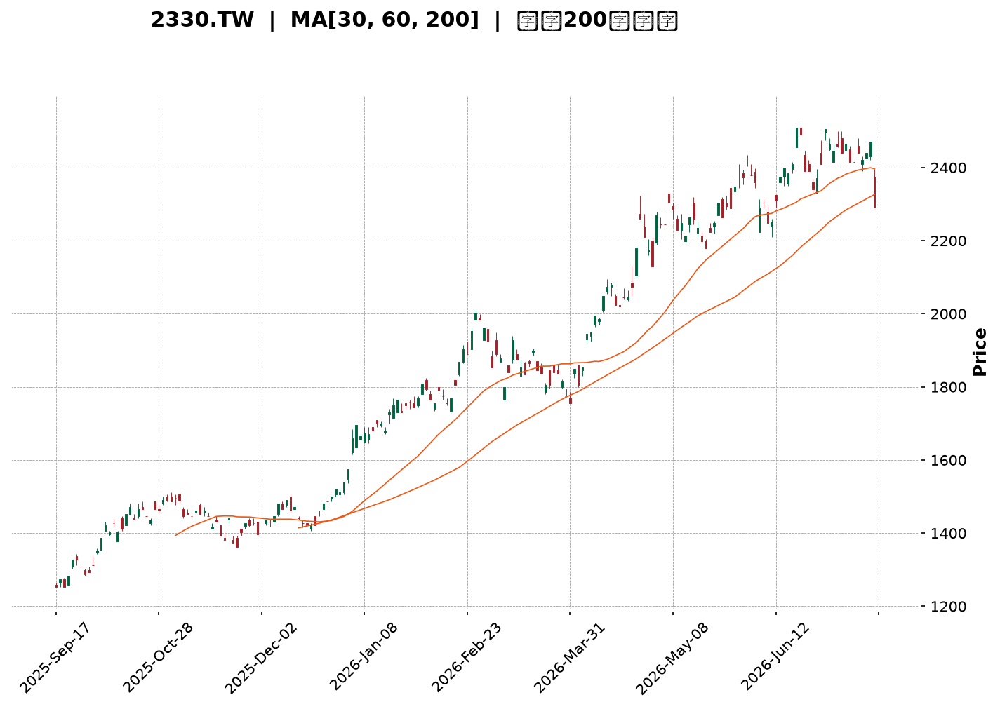
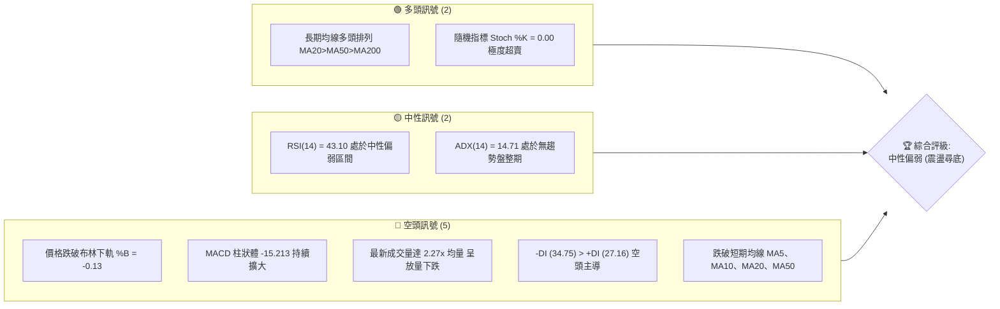
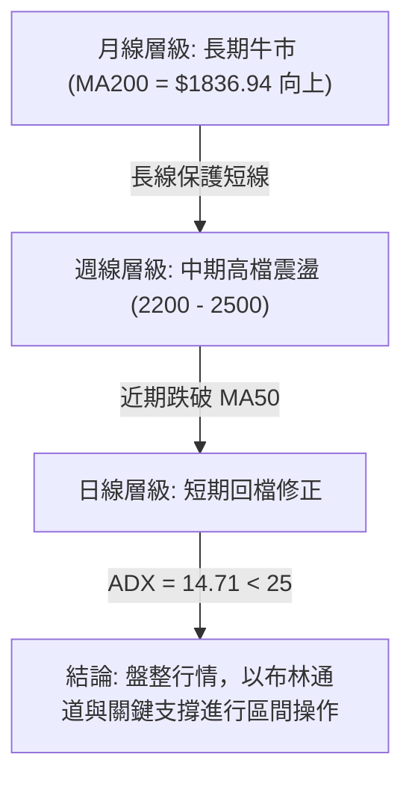
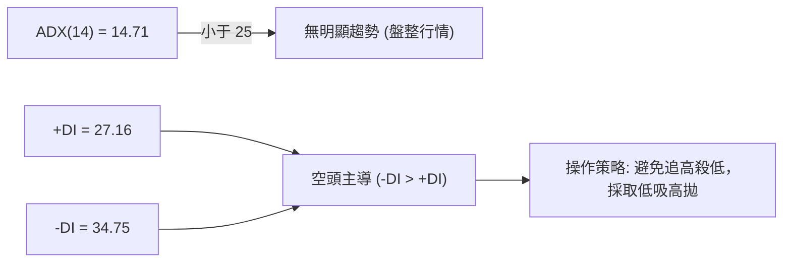
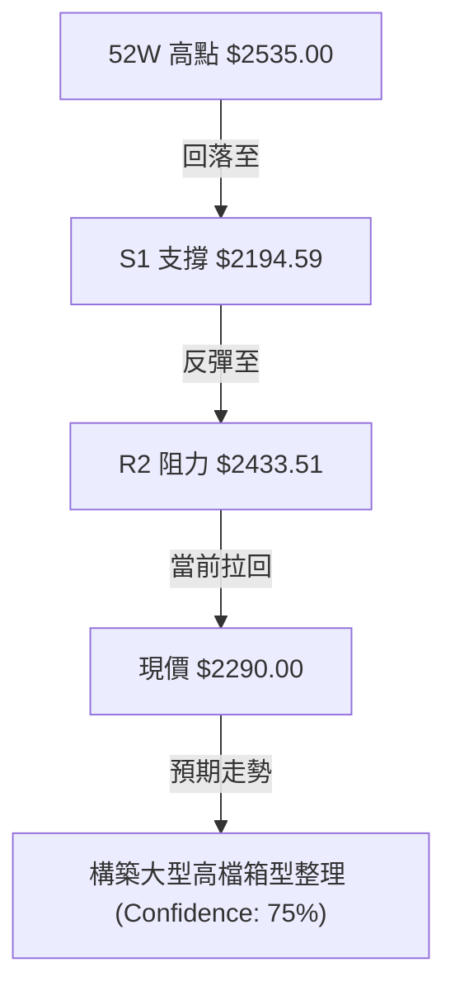
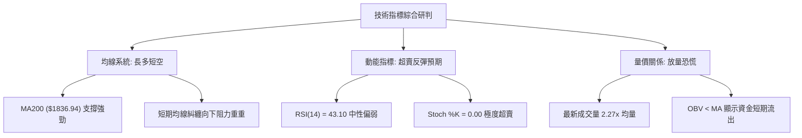
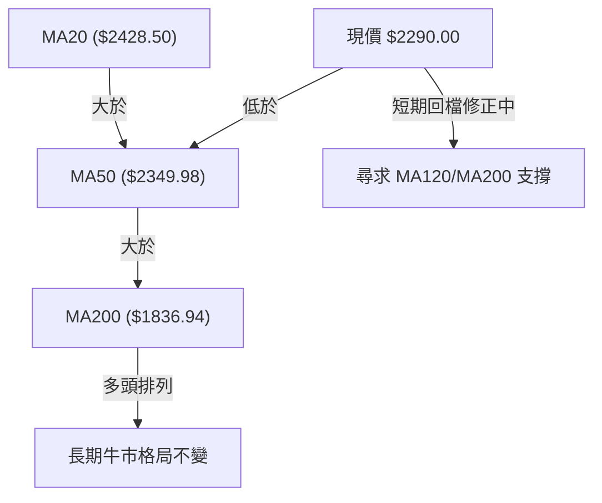
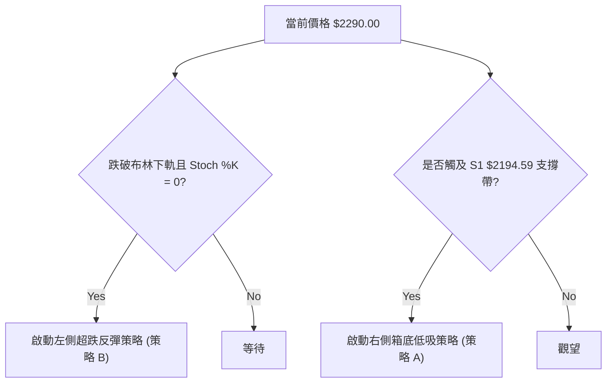
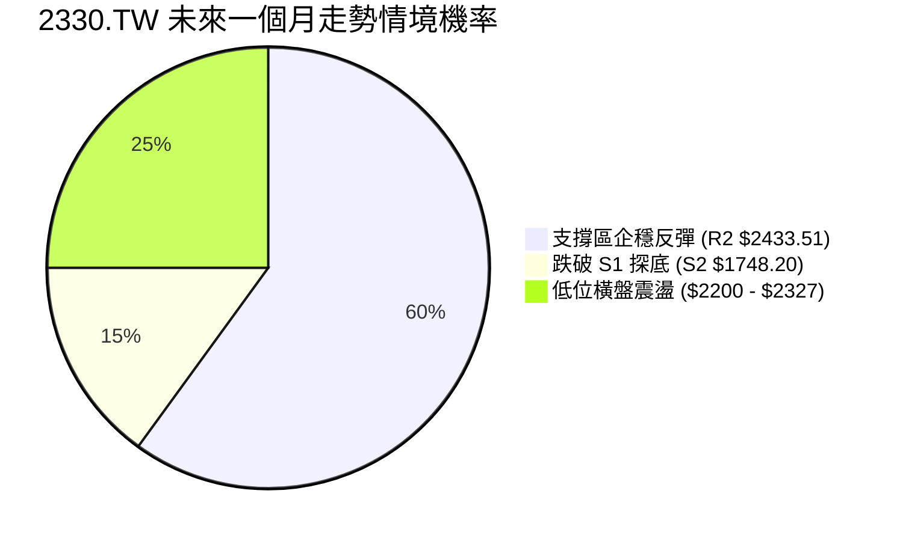
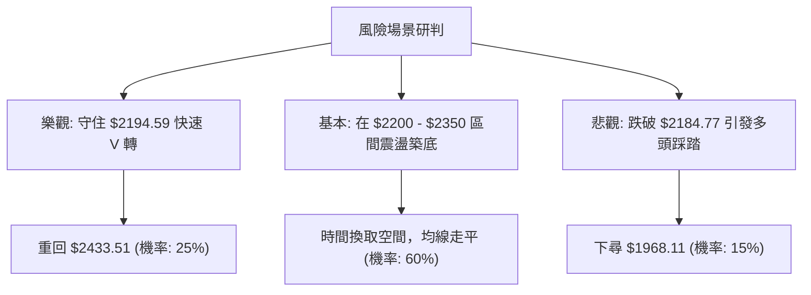

<details>
<summary>📊 靜態圖表 (點擊展開)</summary>

</details>

<html>
<head><meta charset="utf-8" /></head>
<body>
    <div style="height:500px; width:100%;">                        <script>window.PlotlyConfig = {MathJaxConfig: 'local'};</script>
        <script charset="utf-8" src="https://cdn.plot.ly/plotly-3.7.0.min.js" integrity="sha256-jvTGqxNp8AGWEcvNLVuKr+8j5dGe9Yw51LQkmDH+IYA=" crossorigin="anonymous"></script>                <div id="candlestick-chart" class="plotly-graph-div" style="height:100%; width:100%;"></div>            <script>                window.PLOTLYENV=window.PLOTLYENV || {};                                if (document.getElementById("candlestick-chart")) {                    Plotly.newPlot(                        "candlestick-chart",                        [{"close":{"dtype":"f8","bdata":"AAAAAGqVk0AAAABgreSTQAAAAABqlZNAAAAAIE8MlEAAAADgpr6UQAAAAOCmvpRAAAAAYGNvlEAAAADgHyCUQAAAAODwM5RAAAAAQDSDlEAAAABAuyGVQAAAAEBxrJVAAAAAQCc3lkAAAADg4+eVQAAAAED4SpZAAAAA4OPnlUAAAABghQ+WQAAAAEAMrpZAAAAA4E\u002f9lkAAAADAmXKWQAAAAAB\u002f6ZZAAAAAAH\u002fplkAAAACgO5qWQAAAAMCZcpZAAAAAAH\u002fplkAAAAAgrtWWQAAAAECTTJdAAAAAQJNMl0AAAABgwjiXQAAAAEBkYJdAAAAAQJNMl0AAAACgO5qWQAAAAEAMrpZAAAAAoDualkAAAAAgrtWWQAAAAEAMrpZAAAAAIK7VlkAAAACgO5qWQAAAAGBWI5ZAAAAA4MhelkAAAAAgQsCVQAAAAECgmJVAAAAAwGqGlkAAAADA\u002fnCVQAAAAOBcSZVAAAAA4OPnlUAAAABA+EqWQAAAAEAnN5ZAAAAAQPhKlkAAAADgEtSVQAAAAGBWI5ZAAAAAwJlylkAAAADgyF6WQAAAAKA7mpZAAAAAoPEkl0AAAAAAf+mWQAAAAECTTJdAAAAAoEjVlkAAAABADP2WQAAAAIDBhZZAAAAAQBxKlkAAAACAOjaWQAAAAIA6NpZAAAAAgDo2lkAAAADAZsGWQAAAAKDPJJdAAAAAgLE4l0AAAADgVnSXQAAAAODdw5dAAAAAQBqcl0AAAAAAZROYQAAAAGCRnphAAAAAgI\u002fwmUAAAADgu3uaQAAAAEBxBJpAAAAA4DQsmkAAAAAAUxiaQAAAAIAWQJpAAAAAwJ2PmkAAAADAnY+aQAAAAIAWQJpAAAAAQOgGm0AAAABAb1abQAAAAKAUkptAAAAAQOgGm0AAAABAb1abQAAAAOAyfptAAAAAoI1Cm0AAAACA9qWbQAAAAKAERZxAAAAAYF8JnEAAAACgFJKbQAAAACBRaptAAAAAgH31m0AAAAAg2LmbQAAAACBRaptAAAAAgPalm0AAAADAIjGcQAAAAOCZM51AAAAAQMa+nUAAAAAAIYOdQAAAAOCXhZ5AAAAAoGlMn0AAAACg4vyeQAAAAIBbrZ5AAAAAQE0OnkAAAACA9PecQAAAAAAhg51AAAAAYF1bnUAAAAAAQR2cQAAAAEBPvJxAAAAAIC8inkAAAACge0edQAAAAID095xAAAAAgG2onEAAAAAAGSSdQAAAAKC5r51AAAAAgE\u002fUnEAAAADAaqycQAAAAIC8NJxAAAAAgLw0nEAAAAAgXcCcQAAAAMBqrJxAAAAAQKFcnEAAAABADr2bQAAAAMBEbZtAAAAA4EHonEAAAACAvDScQAAAAEA0\u002fJxAAAAAAD9jnkAAAABgMXeeQAAAAMC2Kp9AAAAAANICn0AAAACAEAOgQAAAAGDuNKBAAAAAoOc+oEAAAAAAZaKfQAAAAKByjp9AAAAAgC7yn0AAAACALvKfQAAAAGDuNKBAAAAAYF8GoUAAAABg8qWhQAAAAIA2QqFAAAAAIGb8oEAAAACAo6KgQAAAAMDkuaFAAAAA4AaIoUAAAADgBoihQAAAACC1\u002f6FAAAAAYNDXoUAAAABAG2qhQAAAAAAAkqFAAAAAoC9MoUAAAACg66+hQAAAAGDypaFAAAAAgBR0oUAAAAAgRC6hQAAAAGBfBqFAAAAAACJgoUAAAAAAAJKhQAAAACC1\u002f6FAAAAAoOuvoUAAAADAwuuhQAAAAIDJ4aFAAAAAwHdZokAAAADAd1miQAAAAMBVi6JAAAAAYBjlokAAAADgTpWiQAAAACBqbaJAAAAAgMnhoUAAAADgu\u002fWhQAAAAAAAkqFAAAAAAACUoUAAAAAAAAyiQAAAAAAAjqJAAAAAAADAokAAAAAAAKKiQAAAAAAA1KJAAAAAAACco0AAAAAAAHSjQAAAAAAArKJAAAAAAACsokAAAAAAAEiiQAAAAAAAhKJAAAAAAADUokAAAAAAAJKjQAAAAAAAQqNAAAAAAAAao0AAAAAAADijQAAAAAAAEKNAAAAAAABCo0AAAAAAAN6iQAAAAAAA3qJAAAAAAAAQo0AAAAAAAOiiQAAAAAAAEKNAAAAAAABMo0AAAAAAAOShQA=="},"high":{"dtype":"f8","bdata":"iIIruQu9k0AAAABgreSTQFPG7E5++JNAAAAAIE8MlEAAAADgpr6UQB+onHUZ+pRAED74GAWXlECt1Ep1kluUQId+s3Vjb5RAvJV9jkjmlECcyZkcjDWVQAAAAEBxrJVAtkwW+chelkARl5u8tPuVQAAAANZqhpZAEZebvLT7lUAdYNlmO5qWQAAAAEAMrpZAdbgamfEkl0BfKmhVDK6WQJgin5XxJJdAdYMpcsI4l0BNmjRZ3cGWQB8OeJxqhpZAdYMpcsI4l0D6IJa1IBGXQF2\u002f+\u002fg0dJdAC5951QWIl0BnZmau1puXQHDyN\u002fkFiJdAun73sdabl0DBgQPvT\u002f2WQPsNMNV+6ZZAJk2afAyulkCnwA7ZT\u002f2WQPUbYGrxJJdAp8AO2U\u002f9lkBNmjRZ3cGWQKUcEBn4SpZAMchedTualkCcdIBLJzeWQHIcx7Hj55VADlCXnDualkBIapkyQsCVQLH2DQtCwJVAIy43mYUPlkAAAABA+EqWQGyZLLJqhpZAAAAA1mqGlkAZOmDnyF6WQKUcEBn4SpZAAAAAwJlylkBm7XS8mXKWQAAAAKA7mpZAAAAAoPEkl0B1gylywjiXQAAAAECTTJdAAAAAkDiIl0CmyGcF7hCXQNDqS0WjmZZAYi60yt9xlkCzpBzQ33GWQJHhXkUcSpZA1WfaWqOZlkC9CD6FSNWWQAAAAKDPJJdAUOZZRZNMl0AAAADgVnSXQAAAAODdw5dAoryGyt3Dl0AAAAAAZROYQAAAAGCRnphAf4vTWvhTmkAAAADgu3uaQGLRsso0LJpAgsU8MNpnmkBVVVUV2meaQGjD58+7e5pAt5LaSmG3mkBbSW2Ff6OaQEWCmgraZ5pAq6qqyqsum0DSRRdV9qWbQAAAAKAUkptAq6qqGlFqm0DpoovKMn6bQFVVVaUUkptAYARGQNi5m0CWrGRF2LmbQAAAAKAERZxAbXZxAKqAnEDHb5d6ffWbQAAAACBRaptAq6qqCkEdnECVcCc1XwmcQHmaC3D2pZtAAAAAgPalm0DHMijVqYCcQAAAAOCZM51A3cuxyonmnUDV77llTQ6eQGfSlWpbrZ5ADOSjKi10n0AIzB7whzifQNUoY5Xi\u002fJ5Ag76gLz3BnkBpDt9v5KqdQJJ2rEC2cZ5Aq6qq6iCDnUAAAAAAQR2cQEa15WpdW51ABb64qvJJnkC8uhVAxr6dQBKxRpV7R51ABQmj5ZkznUBM2AbB\u002fUudQAQCgQCsw51AOQ8dw\u002f1LnUAtZCEDGSSdQG3Hh+CuSJxAaDs+hE\u002fUnEAyOB9jCzidQHvTm6ImEJ1AcAiHoJNwnEAIRSjC1wycQHTRRQPz5JtAAAAA4EHonECukdWlJhCdQAAAAEA0\u002fJxAAAAAAD9jnkAAAABgMXeeQAAAAMC2Kp9AXH97YMQWn0AAAACAEAOgQMVO7CDTXKBA\u002f8FE0OBIoEAvMWuhCQ2gQMIWbHEQA6BAE7UrMfUqoEAPxO8A\u002fCCgQJ3YiXKjoqBAaZxBkFgQoUAY0TbTmSeiQPljSfPdw6FAqzNSQT04oUBUXDKENkKhQOAHfiDXzaFAaEUjoeuvoUB1uf0x182hQB988HGFRaJA9C4eIbX\u002foUA6JQHC5LmhQBTfPfHdw6FAyWfdYBR0oUAAAACg66+hQO+F96KgHaJASZIkQfmboUBRFEURImChQA8OSFE9OKFABYQT8f+RoUAEkz8w+ZuhQAAAACC1\u002f6FANvAZs6AdokCgaKvhmSeiQJ4PLPNwY6JAu3\u002fzgFyBokAvf9oCJtGiQIFcE4E6s6JAQ1qx8AMDo0Byp2gBJtGiQE7w5KEzvaJAxlQ4cacTokDvlbpwpxOiQCQrPLLC66FAAAAAAACooUAAAAAAACqiQAAAAAAAjqJAAAAAAADAokAAAAAAAKKiQAAAAAAA3qJAAAAAAACco0AAAAAAAM6jQAAAAAAAGqNAAAAAAADookAAAAAAAISiQAAAAAAAtqJAAAAAAABWo0AAAAAAAJKjQAAAAAAAYKNAAAAAAABCo0AAAAAAAIijQAAAAAAAiKNAAAAAAABCo0AAAAAAADijQAAAAAAA3qJAAAAAAABgo0AAAAAAAPyiQAAAAAAAOKNAAAAAAABMo0AAAAAAALaiQA=="},"hovertemplate":"\u003cb\u003e%{x|%Y-%m-%d}\u003c\u002fb\u003e\u003cbr\u003e\u958b: $%{open:.2f}\u003cbr\u003e\u9ad8: $%{high:.2f}\u003cbr\u003e\u4f4e: $%{low:.2f}\u003cbr\u003e\u6536: $%{close:.2f}\u003cextra\u003e\u003c\u002fextra\u003e","low":{"dtype":"f8","bdata":"AAAAAGqVk0DyDfLtaZWTQAAAAABqlZNArRtM0Tqpk0AiPVCRkluUQOFXY0o0g5RAAAAAYGNvlEAbuZEDTwyUQAAAAODwM5RAAAAAQDSDlEDHbMyGGfqUQAAAADi7IZVA74xeqrT7lUDe0cgmQsCVQKqqqoZWI5ZAqgz2kM+ElUCzzZeDtPuVQA4w1VyFD5ZAFo\u002fKbQyulkAAAADAmXKWQK0bTLFqhpZAAAAAAH\u002fplkDZsmXDaoaWQKDVlyonN5ZAAAAAAH\u002fplkCtn3hD3cGWQPVghqogEZdAUiCCY8I4l0AAAABgwjiXQCAbkM0gEZdApEAEh\u002fEkl0DZsmXDaoaWQAAAAEAMrpZA2bJlw2qGlkBZP\u002fFmDK6WQAAAAEAMrpZABt9pijualkAAAACgO5qWQK7xd4OFD5ZAAAAA4MhelkAAAAAgQsCVQAAAAECgmJVA1g86KvhKlkAAAADA\u002fnCVQAAAAOBcSZVA3tHIJkLAlUAAAACqhQ+WQKXZdGNWI5ZAVVVVYyc3lkAAAADgEtSVQFzj76a0+5VAoNWXKic3lkDON6FKViOWQGbLli34SpZAhyb5lzualkAAAAAAf+mWQEeBCM5P\u002fZZAq6qq2mbBlkC0bjC1SNWWQC8VtLrfcZZAntFLtVgilkBvHqG6WCKWQE1b4y+V+pVAAAAAgDo2lkCH7oM1o5mWQCH584pI1ZZAXzNM9e0Ql0CTv8mPsTiXQKuqqspWdJdAXkN5tVZ0l0CnAW2aOIiXQIHgMjWD\u002f5dATmu2j589mUD988+fJo2ZQJ0uTbWt3JlA\u002fHSGP+q0mUBVVVUl6rSZQAAAAIAWQJpASW0lNdpnmkBJbSU12meaQLp9ZfVSGJpAAAAAoJ2PmkDSRRfbQsuaQLeWxTroBptAAAAAQOgGm0AXXXS1qy6bQKuqqsqrLptAAAAAoI1Cm0AUoQiljUKbQDD90v+5zZtAmMGXmn31m0AAAACgFJKbQAoymwrKGptAAAAAMNi5m0C2R2yVFJKbQIPMplpvVptAU5vaVOgGm0AAAADAIjGcQOo7G7WLlJxAi9A4FbgfnUAAAAAAIYOdQP3jEivGvp1A5je4iuL8nkAAAACg4vyeQIx4khovIp5AAAAAQE0OnkAAAACA9PecQHRLnDo\u002fb51AVVVV1ZkznUD4rZHVMn6bQFwljSrIbJxA3ixPGrgfnUAAAACge0edQKmiZ6WLlJxAAAAAgG2onECzJ\u002fk+NPycQPT5fH7ic51AAAAAgE\u002fUnEAAAADAaqycQOAaWZ0A0ZtAJ3HwvtcMnEAAAAAgXcCcQAAAAMBqrJxAPt7jvdcMnEAAAABADr2bQAAAAMBEbZtA+pJp\u002fYWEnECUOHgfyiCcQNdaa114mJxAndiJHYP\u002fnUAzdYt9dROeQFK4Hn0Is55A7oGN3vrGnkC\u002fShibm1KfQDuxE58JDaBAB3RjfhADoEAAAAAAZaKfQAAAAKByjp9A+B2IHzzen0DxOxC\u002fScqfQIqd2G4QA6BAaTnmW8xmoEAAAABg8qWhQAAAAIA2QqFAKuZWj3reoEAAAACAo6KgQPzAD7xRGqFATF1ufxR0oUBMXW5\u002fFHShQAAAACC1\u002f6FAT0WabvKloUAAAABAG2qhQNzUw009OKFAKfJZD0QuoUAel74dImChQIQeQs8GiKFAJEmSjjZCoUAAAAAgRC6hQAAAAGBfBqFAAAAAACJgoUDojYLeKFahQOGDD87kuaFAAAAAoOuvoUDLh3Ff0NehQDmrx47rr6FAV6DPzpknokARIMOPfk+iQH+j7P5wY6JAvqVOzyzHokAAAADgTpWiQOMlSo9+T6JAYvDTDCJgoUALnIN\u002fyeGhQAAAAAAAkqFAAAAAAABEoUAAAAAAAOShQAAAAAAAUqJAAAAAAABcokAAAAAAAFyiQAAAAAAAoqJAAAAAAAAuo0AAAAAAAHSjQAAAAAAArKJAAAAAAACsokAAAAAAACqiQAAAAAAANKJAAAAAAADUokAAAAAAAFajQAAAAAAAGqNAAAAAAADeokAAAAAAAC6jQAAAAAAAEKNAAAAAAADookAAAAAAAN6iQAAAAAAA3qJAAAAAAAAQo0AAAAAAAKyiQAAAAAAA3qJAAAAAAADookAAAAAAAOShQA=="},"name":"\u50f9\u683c","open":{"dtype":"f8","bdata":"RMGV3Dqpk0D5BvmmC72TQA8FV3Kt5JNArRtM0Tqpk0CCytltY2+UQL8aE5lI5pRAAAAAYGNvlEDJjdyYwUeUQC0qkbzBR5RAAAAAQDSDlEBjNmZj6g2VQAAAADi7IZVA74xeqrT7lUDvaGQDE9SVQAAAAED4SpZAqgz2kM+ElUDQLXGKaoaWQArknxUnN5ZAFo\u002fKbQyulkAfDnicaoaWQIp81o07mpZA3WCK3E\u002f9lkAAAACgO5qWQMDjDwf4SpZAdYMpcsI4l0BTYIf8fumWQKRABIfxJJdAXb\u002f7+DR0l0DXo3D1NHSXQAAAAEBkYJdAC5951QWIl0CaNGkSf+mWQP5ZZRzdwZZAAAAAoDualkCtn3hD3cGWQPfB+o0gEZdArZ94Q93BlkAAAACgO5qWQK7xd4OFD5ZAZu10vJlylkCcdIBLJzeWQBzHcRxxrJVA8q9o45lylkAktUx5oJiVQOmiiy5xrJVAIy43mYUPlkCqqqqGViOWQBFzodWZcpZAAAAAQPhKlkAZOmDnyF6WQAAAAGBWI5ZAwOMPB\u002fhKlkAAAADgyF6WQIwYMQrJXpZAK2qMdAyulkCYIp+V8SSXQPVghqogEZdAq6qqylZ0l0BaN5h6KumWQAAAAIDBhZZAAAAAQBxKlkCR4V5FHEqWQN48QvV2DpZA1WfaWqOZlkAAAADAZsGWQNn6NlAq6ZZAAAAAgLE4l0AxlZgadWCXQAAAAJA4iJdAr6G8ejiIl0D9JctfGpyXQGEo5r9GJ5hAm+0TVYFRmUD988+fJo2ZQJ0uTbWt3JlAKAzwBMzImUAAAACwrdyZQEWCmgraZ5pAt5LaSmG3mkCltpL6u3uaQN2+sro0LJpAq6qqegbzmkDSRRfbQsuaQLeWxTroBptAVVVVBcoam0B00UUFUWqbQAAAAOAyfptAdQHCKlFqm0CqTW1qb1abQDD90v+5zZtABjgJO8hsnEBEdvTvuc2bQIhl9M+rLptAq6qqCkEdnEAAAAAg2LmbQAAAACBRaptA6Uc\u002fGsoam0AVJt4PyGycQG3Ud3ptqJxAeraR2pkznUAAAAAAIYOdQP3jEivGvp1A5je4iuL8nkBYmV9lxBCfQIx4khovIp5A1z4LpXmZnkCbCeofP2+dQGGkHSsvIp5AVVVV1ZkznUA5eN+aFJKbQKPaclXWC51A4+oHpXtHnUBe3QrwIIOdQKmiZ6WLlJxABJpCILgfnUAmbINgCzidQPz9fj\u002fHm51AWjeYYgs4nUDJQhZCNPycQE3i4P3y5JtAaDs+hE\u002fUnEAh0BSiJhCdQGQhC4FP1JxAruZqHsognEAAAABADr2bQLroouEbqZtAY4tyvmqsnECukdWlJhCdQPC9935P1JxAXuiF3mcnnkBHlQSfTE+eQJqZmd36xp5ApYCEn9\u002funkCq0KP7jWafQOzETs8CF6BAAT67b+40oED8qC5xEAOgQOtceQBlop9AAAAAgC7yn0D4HYgfPN6fQGIndsDgSKBA0tUnjMVwoEB84b3w3cOhQIdVhKENfqFADqLH72zyoEDKEKwjRC6hQOzETuxKJKFAAAAA4AaIoUAAAADgBoihQM2hYhGTMaJAehePwMLroUDr24Bh8qWhQPCzAT8baqFAKfJZD0QuoUCPS9\u002feBoihQHOkORK1\u002f6FASZIk7yhWoUAxDMOwL0yhQKZxBiFELqFAzzRuYBR0oUD42YCfDX6hQOGDD87kuaFAGsPRgqcTokA2eI4gtf+hQOggr5J+T6JANGBJL4w7okAAAADAd1miQECuiSBIn6JAAAAAYBjlokAAAADgTpWiQDu0a0FBqaJAYvDTDCJgoUAAAADgu\u002fWhQBhyfSHXzaFAAAAAAACAoUAAAAAAACqiQAAAAAAAcKJAAAAAAACOokAAAAAAAGaiQAAAAAAAtqJAAAAAAAAuo0AAAAAAAJyjQAAAAAAABqNAAAAAAADUokAAAAAAAHCiQAAAAAAANKJAAAAAAAAQo0AAAAAAAH6jQAAAAAAAJKNAAAAAAADeokAAAAAAAEKjQAAAAAAAYKNAAAAAAAAao0AAAAAAACSjQAAAAAAA3qJAAAAAAAA4o0AAAAAAANSiQAAAAAAA8qJAAAAAAAD8okAAAAAAAI6iQA=="},"x":["2025-09-17T00:00:00+08:00","2025-09-18T00:00:00+08:00","2025-09-19T00:00:00+08:00","2025-09-22T00:00:00+08:00","2025-09-23T00:00:00+08:00","2025-09-24T00:00:00+08:00","2025-09-25T00:00:00+08:00","2025-09-26T00:00:00+08:00","2025-09-30T00:00:00+08:00","2025-10-01T00:00:00+08:00","2025-10-02T00:00:00+08:00","2025-10-03T00:00:00+08:00","2025-10-07T00:00:00+08:00","2025-10-08T00:00:00+08:00","2025-10-09T00:00:00+08:00","2025-10-13T00:00:00+08:00","2025-10-14T00:00:00+08:00","2025-10-15T00:00:00+08:00","2025-10-16T00:00:00+08:00","2025-10-17T00:00:00+08:00","2025-10-20T00:00:00+08:00","2025-10-21T00:00:00+08:00","2025-10-22T00:00:00+08:00","2025-10-23T00:00:00+08:00","2025-10-27T00:00:00+08:00","2025-10-28T00:00:00+08:00","2025-10-29T00:00:00+08:00","2025-10-30T00:00:00+08:00","2025-10-31T00:00:00+08:00","2025-11-03T00:00:00+08:00","2025-11-04T00:00:00+08:00","2025-11-05T00:00:00+08:00","2025-11-06T00:00:00+08:00","2025-11-07T00:00:00+08:00","2025-11-10T00:00:00+08:00","2025-11-11T00:00:00+08:00","2025-11-12T00:00:00+08:00","2025-11-13T00:00:00+08:00","2025-11-14T00:00:00+08:00","2025-11-17T00:00:00+08:00","2025-11-18T00:00:00+08:00","2025-11-19T00:00:00+08:00","2025-11-20T00:00:00+08:00","2025-11-21T00:00:00+08:00","2025-11-24T00:00:00+08:00","2025-11-25T00:00:00+08:00","2025-11-26T00:00:00+08:00","2025-11-27T00:00:00+08:00","2025-11-28T00:00:00+08:00","2025-12-01T00:00:00+08:00","2025-12-02T00:00:00+08:00","2025-12-03T00:00:00+08:00","2025-12-04T00:00:00+08:00","2025-12-05T00:00:00+08:00","2025-12-08T00:00:00+08:00","2025-12-09T00:00:00+08:00","2025-12-10T00:00:00+08:00","2025-12-11T00:00:00+08:00","2025-12-12T00:00:00+08:00","2025-12-15T00:00:00+08:00","2025-12-16T00:00:00+08:00","2025-12-17T00:00:00+08:00","2025-12-18T00:00:00+08:00","2025-12-19T00:00:00+08:00","2025-12-22T00:00:00+08:00","2025-12-23T00:00:00+08:00","2025-12-24T00:00:00+08:00","2025-12-26T00:00:00+08:00","2025-12-29T00:00:00+08:00","2025-12-30T00:00:00+08:00","2025-12-31T00:00:00+08:00","2026-01-02T00:00:00+08:00","2026-01-05T00:00:00+08:00","2026-01-06T00:00:00+08:00","2026-01-07T00:00:00+08:00","2026-01-08T00:00:00+08:00","2026-01-09T00:00:00+08:00","2026-01-12T00:00:00+08:00","2026-01-13T00:00:00+08:00","2026-01-14T00:00:00+08:00","2026-01-15T00:00:00+08:00","2026-01-16T00:00:00+08:00","2026-01-19T00:00:00+08:00","2026-01-20T00:00:00+08:00","2026-01-21T00:00:00+08:00","2026-01-22T00:00:00+08:00","2026-01-23T00:00:00+08:00","2026-01-26T00:00:00+08:00","2026-01-27T00:00:00+08:00","2026-01-28T00:00:00+08:00","2026-01-29T00:00:00+08:00","2026-01-30T00:00:00+08:00","2026-02-02T00:00:00+08:00","2026-02-03T00:00:00+08:00","2026-02-04T00:00:00+08:00","2026-02-05T00:00:00+08:00","2026-02-06T00:00:00+08:00","2026-02-09T00:00:00+08:00","2026-02-10T00:00:00+08:00","2026-02-11T00:00:00+08:00","2026-02-23T00:00:00+08:00","2026-02-24T00:00:00+08:00","2026-02-25T00:00:00+08:00","2026-02-26T00:00:00+08:00","2026-03-02T00:00:00+08:00","2026-03-03T00:00:00+08:00","2026-03-04T00:00:00+08:00","2026-03-05T00:00:00+08:00","2026-03-06T00:00:00+08:00","2026-03-09T00:00:00+08:00","2026-03-10T00:00:00+08:00","2026-03-11T00:00:00+08:00","2026-03-12T00:00:00+08:00","2026-03-13T00:00:00+08:00","2026-03-16T00:00:00+08:00","2026-03-17T00:00:00+08:00","2026-03-18T00:00:00+08:00","2026-03-19T00:00:00+08:00","2026-03-20T00:00:00+08:00","2026-03-23T00:00:00+08:00","2026-03-24T00:00:00+08:00","2026-03-25T00:00:00+08:00","2026-03-26T00:00:00+08:00","2026-03-27T00:00:00+08:00","2026-03-30T00:00:00+08:00","2026-03-31T00:00:00+08:00","2026-04-01T00:00:00+08:00","2026-04-02T00:00:00+08:00","2026-04-07T00:00:00+08:00","2026-04-08T00:00:00+08:00","2026-04-09T00:00:00+08:00","2026-04-10T00:00:00+08:00","2026-04-13T00:00:00+08:00","2026-04-14T00:00:00+08:00","2026-04-15T00:00:00+08:00","2026-04-16T00:00:00+08:00","2026-04-17T00:00:00+08:00","2026-04-20T00:00:00+08:00","2026-04-21T00:00:00+08:00","2026-04-22T00:00:00+08:00","2026-04-23T00:00:00+08:00","2026-04-24T00:00:00+08:00","2026-04-27T00:00:00+08:00","2026-04-28T00:00:00+08:00","2026-04-29T00:00:00+08:00","2026-04-30T00:00:00+08:00","2026-05-04T00:00:00+08:00","2026-05-05T00:00:00+08:00","2026-05-06T00:00:00+08:00","2026-05-07T00:00:00+08:00","2026-05-08T00:00:00+08:00","2026-05-11T00:00:00+08:00","2026-05-12T00:00:00+08:00","2026-05-13T00:00:00+08:00","2026-05-14T00:00:00+08:00","2026-05-15T00:00:00+08:00","2026-05-18T00:00:00+08:00","2026-05-19T00:00:00+08:00","2026-05-20T00:00:00+08:00","2026-05-21T00:00:00+08:00","2026-05-22T00:00:00+08:00","2026-05-25T00:00:00+08:00","2026-05-26T00:00:00+08:00","2026-05-27T00:00:00+08:00","2026-05-28T00:00:00+08:00","2026-05-29T00:00:00+08:00","2026-06-01T00:00:00+08:00","2026-06-02T00:00:00+08:00","2026-06-03T00:00:00+08:00","2026-06-04T00:00:00+08:00","2026-06-05T00:00:00+08:00","2026-06-08T00:00:00+08:00","2026-06-09T00:00:00+08:00","2026-06-10T00:00:00+08:00","2026-06-11T00:00:00+08:00","2026-06-12T00:00:00+08:00","2026-06-15T00:00:00+08:00","2026-06-16T00:00:00+08:00","2026-06-17T00:00:00+08:00","2026-06-18T00:00:00+08:00","2026-06-22T00:00:00+08:00","2026-06-23T00:00:00+08:00","2026-06-24T00:00:00+08:00","2026-06-25T00:00:00+08:00","2026-06-26T00:00:00+08:00","2026-06-29T00:00:00+08:00","2026-06-30T00:00:00+08:00","2026-07-01T00:00:00+08:00","2026-07-02T00:00:00+08:00","2026-07-03T00:00:00+08:00","2026-07-06T00:00:00+08:00","2026-07-07T00:00:00+08:00","2026-07-08T00:00:00+08:00","2026-07-09T00:00:00+08:00","2026-07-10T00:00:00+08:00","2026-07-13T00:00:00+08:00","2026-07-14T00:00:00+08:00","2026-07-15T00:00:00+08:00","2026-07-16T00:00:00+08:00","2026-07-17T00:00:00+08:00"],"type":"candlestick"},{"hovertemplate":"MA30: $%{y:.2f}\u003cextra\u003e\u003c\u002fextra\u003e","line":{"color":"#2196F3","dash":"dash","width":2},"mode":"lines","name":"MA30","x":["2025-09-17T00:00:00+08:00","2025-09-18T00:00:00+08:00","2025-09-19T00:00:00+08:00","2025-09-22T00:00:00+08:00","2025-09-23T00:00:00+08:00","2025-09-24T00:00:00+08:00","2025-09-25T00:00:00+08:00","2025-09-26T00:00:00+08:00","2025-09-30T00:00:00+08:00","2025-10-01T00:00:00+08:00","2025-10-02T00:00:00+08:00","2025-10-03T00:00:00+08:00","2025-10-07T00:00:00+08:00","2025-10-08T00:00:00+08:00","2025-10-09T00:00:00+08:00","2025-10-13T00:00:00+08:00","2025-10-14T00:00:00+08:00","2025-10-15T00:00:00+08:00","2025-10-16T00:00:00+08:00","2025-10-17T00:00:00+08:00","2025-10-20T00:00:00+08:00","2025-10-21T00:00:00+08:00","2025-10-22T00:00:00+08:00","2025-10-23T00:00:00+08:00","2025-10-27T00:00:00+08:00","2025-10-28T00:00:00+08:00","2025-10-29T00:00:00+08:00","2025-10-30T00:00:00+08:00","2025-10-31T00:00:00+08:00","2025-11-03T00:00:00+08:00","2025-11-04T00:00:00+08:00","2025-11-05T00:00:00+08:00","2025-11-06T00:00:00+08:00","2025-11-07T00:00:00+08:00","2025-11-10T00:00:00+08:00","2025-11-11T00:00:00+08:00","2025-11-12T00:00:00+08:00","2025-11-13T00:00:00+08:00","2025-11-14T00:00:00+08:00","2025-11-17T00:00:00+08:00","2025-11-18T00:00:00+08:00","2025-11-19T00:00:00+08:00","2025-11-20T00:00:00+08:00","2025-11-21T00:00:00+08:00","2025-11-24T00:00:00+08:00","2025-11-25T00:00:00+08:00","2025-11-26T00:00:00+08:00","2025-11-27T00:00:00+08:00","2025-11-28T00:00:00+08:00","2025-12-01T00:00:00+08:00","2025-12-02T00:00:00+08:00","2025-12-03T00:00:00+08:00","2025-12-04T00:00:00+08:00","2025-12-05T00:00:00+08:00","2025-12-08T00:00:00+08:00","2025-12-09T00:00:00+08:00","2025-12-10T00:00:00+08:00","2025-12-11T00:00:00+08:00","2025-12-12T00:00:00+08:00","2025-12-15T00:00:00+08:00","2025-12-16T00:00:00+08:00","2025-12-17T00:00:00+08:00","2025-12-18T00:00:00+08:00","2025-12-19T00:00:00+08:00","2025-12-22T00:00:00+08:00","2025-12-23T00:00:00+08:00","2025-12-24T00:00:00+08:00","2025-12-26T00:00:00+08:00","2025-12-29T00:00:00+08:00","2025-12-30T00:00:00+08:00","2025-12-31T00:00:00+08:00","2026-01-02T00:00:00+08:00","2026-01-05T00:00:00+08:00","2026-01-06T00:00:00+08:00","2026-01-07T00:00:00+08:00","2026-01-08T00:00:00+08:00","2026-01-09T00:00:00+08:00","2026-01-12T00:00:00+08:00","2026-01-13T00:00:00+08:00","2026-01-14T00:00:00+08:00","2026-01-15T00:00:00+08:00","2026-01-16T00:00:00+08:00","2026-01-19T00:00:00+08:00","2026-01-20T00:00:00+08:00","2026-01-21T00:00:00+08:00","2026-01-22T00:00:00+08:00","2026-01-23T00:00:00+08:00","2026-01-26T00:00:00+08:00","2026-01-27T00:00:00+08:00","2026-01-28T00:00:00+08:00","2026-01-29T00:00:00+08:00","2026-01-30T00:00:00+08:00","2026-02-02T00:00:00+08:00","2026-02-03T00:00:00+08:00","2026-02-04T00:00:00+08:00","2026-02-05T00:00:00+08:00","2026-02-06T00:00:00+08:00","2026-02-09T00:00:00+08:00","2026-02-10T00:00:00+08:00","2026-02-11T00:00:00+08:00","2026-02-23T00:00:00+08:00","2026-02-24T00:00:00+08:00","2026-02-25T00:00:00+08:00","2026-02-26T00:00:00+08:00","2026-03-02T00:00:00+08:00","2026-03-03T00:00:00+08:00","2026-03-04T00:00:00+08:00","2026-03-05T00:00:00+08:00","2026-03-06T00:00:00+08:00","2026-03-09T00:00:00+08:00","2026-03-10T00:00:00+08:00","2026-03-11T00:00:00+08:00","2026-03-12T00:00:00+08:00","2026-03-13T00:00:00+08:00","2026-03-16T00:00:00+08:00","2026-03-17T00:00:00+08:00","2026-03-18T00:00:00+08:00","2026-03-19T00:00:00+08:00","2026-03-20T00:00:00+08:00","2026-03-23T00:00:00+08:00","2026-03-24T00:00:00+08:00","2026-03-25T00:00:00+08:00","2026-03-26T00:00:00+08:00","2026-03-27T00:00:00+08:00","2026-03-30T00:00:00+08:00","2026-03-31T00:00:00+08:00","2026-04-01T00:00:00+08:00","2026-04-02T00:00:00+08:00","2026-04-07T00:00:00+08:00","2026-04-08T00:00:00+08:00","2026-04-09T00:00:00+08:00","2026-04-10T00:00:00+08:00","2026-04-13T00:00:00+08:00","2026-04-14T00:00:00+08:00","2026-04-15T00:00:00+08:00","2026-04-16T00:00:00+08:00","2026-04-17T00:00:00+08:00","2026-04-20T00:00:00+08:00","2026-04-21T00:00:00+08:00","2026-04-22T00:00:00+08:00","2026-04-23T00:00:00+08:00","2026-04-24T00:00:00+08:00","2026-04-27T00:00:00+08:00","2026-04-28T00:00:00+08:00","2026-04-29T00:00:00+08:00","2026-04-30T00:00:00+08:00","2026-05-04T00:00:00+08:00","2026-05-05T00:00:00+08:00","2026-05-06T00:00:00+08:00","2026-05-07T00:00:00+08:00","2026-05-08T00:00:00+08:00","2026-05-11T00:00:00+08:00","2026-05-12T00:00:00+08:00","2026-05-13T00:00:00+08:00","2026-05-14T00:00:00+08:00","2026-05-15T00:00:00+08:00","2026-05-18T00:00:00+08:00","2026-05-19T00:00:00+08:00","2026-05-20T00:00:00+08:00","2026-05-21T00:00:00+08:00","2026-05-22T00:00:00+08:00","2026-05-25T00:00:00+08:00","2026-05-26T00:00:00+08:00","2026-05-27T00:00:00+08:00","2026-05-28T00:00:00+08:00","2026-05-29T00:00:00+08:00","2026-06-01T00:00:00+08:00","2026-06-02T00:00:00+08:00","2026-06-03T00:00:00+08:00","2026-06-04T00:00:00+08:00","2026-06-05T00:00:00+08:00","2026-06-08T00:00:00+08:00","2026-06-09T00:00:00+08:00","2026-06-10T00:00:00+08:00","2026-06-11T00:00:00+08:00","2026-06-12T00:00:00+08:00","2026-06-15T00:00:00+08:00","2026-06-16T00:00:00+08:00","2026-06-17T00:00:00+08:00","2026-06-18T00:00:00+08:00","2026-06-22T00:00:00+08:00","2026-06-23T00:00:00+08:00","2026-06-24T00:00:00+08:00","2026-06-25T00:00:00+08:00","2026-06-26T00:00:00+08:00","2026-06-29T00:00:00+08:00","2026-06-30T00:00:00+08:00","2026-07-01T00:00:00+08:00","2026-07-02T00:00:00+08:00","2026-07-03T00:00:00+08:00","2026-07-06T00:00:00+08:00","2026-07-07T00:00:00+08:00","2026-07-08T00:00:00+08:00","2026-07-09T00:00:00+08:00","2026-07-10T00:00:00+08:00","2026-07-13T00:00:00+08:00","2026-07-14T00:00:00+08:00","2026-07-15T00:00:00+08:00","2026-07-16T00:00:00+08:00","2026-07-17T00:00:00+08:00"],"y":{"dtype":"f8","bdata":"AAAAAAAA+H8AAAAAAAD4fwAAAAAAAPh\u002fAAAAAAAA+H8AAAAAAAD4fwAAAAAAAPh\u002fAAAAAAAA+H8AAAAAAAD4fwAAAAAAAPh\u002fAAAAAAAA+H8AAAAAAAD4fwAAAAAAAPh\u002fAAAAAAAA+H8AAAAAAAD4fwAAAAAAAPh\u002fAAAAAAAA+H8AAAAAAAD4fwAAAAAAAPh\u002fAAAAAAAA+H8AAAAAAAD4fwAAAAAAAPh\u002fAAAAAAAA+H8AAAAAAAD4fwAAAAAAAPh\u002fAAAAAAAA+H8AAAAAAAD4fwAAAAAAAPh\u002fAAAAAAAA+H8AAAAAAAD4f0RERKQ4xJVAd3d3N+3jlUDv7u6OC\u002fuVQN7d3V13FZZAREREhEMrlkB3d3cXGT2WQImIiHicTZZA3t3dbRZilkDNzMx8OXeWQO\u002fu7t68h5ZAiYiIKJeXlkC8u7vr35yWQCIiItI2nJZARERENNuelkAiIiKi5JqWQDMzM2NOkpZAMzMzY06SlkDv7u6uSZSWQN7d3R1TkJZAMzMzQ2GKlkAAAACAGIWWQLy7u4t9fpZAiYiI+IZ6lkDe3d2ti3iWQAAAAODdeZZAmpmZKdl7lkAiIiJCgnyWQCIiIkKCfJZA3t3dTYh4lkBERETEinaWQDMzMxNBb5ZAIiIigqNmlkAzMzMjTmOWQN7d3a1PX5ZA7+7uTvpblkAzMzNDTVuWQFVVVbVCX5ZA7+7uno9ilkC8u7vL1GmWQN7d3S23d5ZAVVVV9UqClkBERER0IZaWQCIiIsLtr5ZA3t3dHRHNlkC8u7trF\u002fiWQHd3d\u002fd1IJdAEREREd9El0BmZmYGUWWXQGZmZma\u002fh5dAERERUSusl0AAAADQjdSXQImIiEil95dAd3d397gemEARERFhHEmYQKuqqnqBc5hAzczMTKOUmECrqqoKZ7qYQBEREaEw3phAIiIiMvcDmUDNzMy8uiuZQCIiIoLFXJlAd3d3R9CNmUAAAADAiruZQHd3d+fx55lAvLu7q\u002fwYmkCamZnZZkOaQJqZmRnaZ5pAq6qqqqCNmkDNzMzcDbaaQO\u002fu7v5x5JpAAAAAEM0Ym0AiIiIyMUebQHd3d0ePeZtAAAAAwEmnm0CamZn5uc2bQERERIR99ZtAZmZmdqAWnECJiIjYJS+cQHd3d4f7SpxAAAAAQNdinEDNzMxsGHCcQERERIRNhZxAERER4c+fnEC8u7tbYbCcQImIiDhPvJxAAAAAEDrKnEBmZmaWndmcQHd3d0dV7JxAvLu7m7n5nEB3d3c3eQKdQHd3d0fuAZ1AERERUWADnUDNzMzMcw2dQDMzM2MwGJ1AMzMzg6AbnUCrqqrquxudQKuqqhrVG51AmpmZWZMmnUAzMzMTsiadQKuqqlrZJJ1AiYiI2FQqnUBmZmaGdzKdQN7d3Y34N51AERERkYQ1nUCrqqr6Wz6dQGZmZhYtTZ1AAAAAsPVhnUC8u7srtXidQDMzM9Mmip1AzczM3D6gnUAiIiJy8cCdQHd3dwdU4J1Ad3d3N78BnkDe3d0NGDWeQHd3d2dxZJ5AVVVV5cmRnkCamZkpB7WeQEREROQ65p5AZmZm5msbn0BVVVVV8VGfQHd3d5dulJ9AAAAAAEPUn0AiIiLKDwSgQERERJynH6BAREREHEA6oEDv7u6G1FqgQKuqqkJofKBAIiIicgGWoEB3d3fXRLCgQAAAAMDgxaBAMzMzs37YoEC8u7sTceygQDMzM6sNAaFAd3d3n6sToUDNzMzU9SOhQO\u002fu7mZBMqFAvLu7IzVEoUBEREQM0VmhQImIiJhrcaFAERERkVqKoUAAAACwoKChQO\u002fu7r6Ts6FAVVVVFeS6oUDv7u7ujL2hQImIiMg1wKFAIiIickPFoUAAAAAQT9GhQJqZmQlh2KFAVVVVNcfioUARERFhLeyhQBEREfFA86FAiYiImFMCokBmZmYWuROiQM3MzHwfHaJAIiIiotkookARERFh6y2iQLy7uztSNaJAiYiISA1BokCamZlpcVWiQM3MzEx\u002faKJAZmZm5jl3okB3d3f3SoWiQHd3d4dejqJAvLu7m8WbokB3d3e32KOiQO\u002fu7u5ArKJAq6qqilayokARERHRFreiQEREROSCu6JAMzMzA\u002fG+okC8u7v7B7miQA=="},"type":"scatter"},{"hovertemplate":"MA60: $%{y:.2f}\u003cextra\u003e\u003c\u002fextra\u003e","line":{"color":"#9C27B0","dash":"dash","width":2},"mode":"lines","name":"MA60","x":["2025-09-17T00:00:00+08:00","2025-09-18T00:00:00+08:00","2025-09-19T00:00:00+08:00","2025-09-22T00:00:00+08:00","2025-09-23T00:00:00+08:00","2025-09-24T00:00:00+08:00","2025-09-25T00:00:00+08:00","2025-09-26T00:00:00+08:00","2025-09-30T00:00:00+08:00","2025-10-01T00:00:00+08:00","2025-10-02T00:00:00+08:00","2025-10-03T00:00:00+08:00","2025-10-07T00:00:00+08:00","2025-10-08T00:00:00+08:00","2025-10-09T00:00:00+08:00","2025-10-13T00:00:00+08:00","2025-10-14T00:00:00+08:00","2025-10-15T00:00:00+08:00","2025-10-16T00:00:00+08:00","2025-10-17T00:00:00+08:00","2025-10-20T00:00:00+08:00","2025-10-21T00:00:00+08:00","2025-10-22T00:00:00+08:00","2025-10-23T00:00:00+08:00","2025-10-27T00:00:00+08:00","2025-10-28T00:00:00+08:00","2025-10-29T00:00:00+08:00","2025-10-30T00:00:00+08:00","2025-10-31T00:00:00+08:00","2025-11-03T00:00:00+08:00","2025-11-04T00:00:00+08:00","2025-11-05T00:00:00+08:00","2025-11-06T00:00:00+08:00","2025-11-07T00:00:00+08:00","2025-11-10T00:00:00+08:00","2025-11-11T00:00:00+08:00","2025-11-12T00:00:00+08:00","2025-11-13T00:00:00+08:00","2025-11-14T00:00:00+08:00","2025-11-17T00:00:00+08:00","2025-11-18T00:00:00+08:00","2025-11-19T00:00:00+08:00","2025-11-20T00:00:00+08:00","2025-11-21T00:00:00+08:00","2025-11-24T00:00:00+08:00","2025-11-25T00:00:00+08:00","2025-11-26T00:00:00+08:00","2025-11-27T00:00:00+08:00","2025-11-28T00:00:00+08:00","2025-12-01T00:00:00+08:00","2025-12-02T00:00:00+08:00","2025-12-03T00:00:00+08:00","2025-12-04T00:00:00+08:00","2025-12-05T00:00:00+08:00","2025-12-08T00:00:00+08:00","2025-12-09T00:00:00+08:00","2025-12-10T00:00:00+08:00","2025-12-11T00:00:00+08:00","2025-12-12T00:00:00+08:00","2025-12-15T00:00:00+08:00","2025-12-16T00:00:00+08:00","2025-12-17T00:00:00+08:00","2025-12-18T00:00:00+08:00","2025-12-19T00:00:00+08:00","2025-12-22T00:00:00+08:00","2025-12-23T00:00:00+08:00","2025-12-24T00:00:00+08:00","2025-12-26T00:00:00+08:00","2025-12-29T00:00:00+08:00","2025-12-30T00:00:00+08:00","2025-12-31T00:00:00+08:00","2026-01-02T00:00:00+08:00","2026-01-05T00:00:00+08:00","2026-01-06T00:00:00+08:00","2026-01-07T00:00:00+08:00","2026-01-08T00:00:00+08:00","2026-01-09T00:00:00+08:00","2026-01-12T00:00:00+08:00","2026-01-13T00:00:00+08:00","2026-01-14T00:00:00+08:00","2026-01-15T00:00:00+08:00","2026-01-16T00:00:00+08:00","2026-01-19T00:00:00+08:00","2026-01-20T00:00:00+08:00","2026-01-21T00:00:00+08:00","2026-01-22T00:00:00+08:00","2026-01-23T00:00:00+08:00","2026-01-26T00:00:00+08:00","2026-01-27T00:00:00+08:00","2026-01-28T00:00:00+08:00","2026-01-29T00:00:00+08:00","2026-01-30T00:00:00+08:00","2026-02-02T00:00:00+08:00","2026-02-03T00:00:00+08:00","2026-02-04T00:00:00+08:00","2026-02-05T00:00:00+08:00","2026-02-06T00:00:00+08:00","2026-02-09T00:00:00+08:00","2026-02-10T00:00:00+08:00","2026-02-11T00:00:00+08:00","2026-02-23T00:00:00+08:00","2026-02-24T00:00:00+08:00","2026-02-25T00:00:00+08:00","2026-02-26T00:00:00+08:00","2026-03-02T00:00:00+08:00","2026-03-03T00:00:00+08:00","2026-03-04T00:00:00+08:00","2026-03-05T00:00:00+08:00","2026-03-06T00:00:00+08:00","2026-03-09T00:00:00+08:00","2026-03-10T00:00:00+08:00","2026-03-11T00:00:00+08:00","2026-03-12T00:00:00+08:00","2026-03-13T00:00:00+08:00","2026-03-16T00:00:00+08:00","2026-03-17T00:00:00+08:00","2026-03-18T00:00:00+08:00","2026-03-19T00:00:00+08:00","2026-03-20T00:00:00+08:00","2026-03-23T00:00:00+08:00","2026-03-24T00:00:00+08:00","2026-03-25T00:00:00+08:00","2026-03-26T00:00:00+08:00","2026-03-27T00:00:00+08:00","2026-03-30T00:00:00+08:00","2026-03-31T00:00:00+08:00","2026-04-01T00:00:00+08:00","2026-04-02T00:00:00+08:00","2026-04-07T00:00:00+08:00","2026-04-08T00:00:00+08:00","2026-04-09T00:00:00+08:00","2026-04-10T00:00:00+08:00","2026-04-13T00:00:00+08:00","2026-04-14T00:00:00+08:00","2026-04-15T00:00:00+08:00","2026-04-16T00:00:00+08:00","2026-04-17T00:00:00+08:00","2026-04-20T00:00:00+08:00","2026-04-21T00:00:00+08:00","2026-04-22T00:00:00+08:00","2026-04-23T00:00:00+08:00","2026-04-24T00:00:00+08:00","2026-04-27T00:00:00+08:00","2026-04-28T00:00:00+08:00","2026-04-29T00:00:00+08:00","2026-04-30T00:00:00+08:00","2026-05-04T00:00:00+08:00","2026-05-05T00:00:00+08:00","2026-05-06T00:00:00+08:00","2026-05-07T00:00:00+08:00","2026-05-08T00:00:00+08:00","2026-05-11T00:00:00+08:00","2026-05-12T00:00:00+08:00","2026-05-13T00:00:00+08:00","2026-05-14T00:00:00+08:00","2026-05-15T00:00:00+08:00","2026-05-18T00:00:00+08:00","2026-05-19T00:00:00+08:00","2026-05-20T00:00:00+08:00","2026-05-21T00:00:00+08:00","2026-05-22T00:00:00+08:00","2026-05-25T00:00:00+08:00","2026-05-26T00:00:00+08:00","2026-05-27T00:00:00+08:00","2026-05-28T00:00:00+08:00","2026-05-29T00:00:00+08:00","2026-06-01T00:00:00+08:00","2026-06-02T00:00:00+08:00","2026-06-03T00:00:00+08:00","2026-06-04T00:00:00+08:00","2026-06-05T00:00:00+08:00","2026-06-08T00:00:00+08:00","2026-06-09T00:00:00+08:00","2026-06-10T00:00:00+08:00","2026-06-11T00:00:00+08:00","2026-06-12T00:00:00+08:00","2026-06-15T00:00:00+08:00","2026-06-16T00:00:00+08:00","2026-06-17T00:00:00+08:00","2026-06-18T00:00:00+08:00","2026-06-22T00:00:00+08:00","2026-06-23T00:00:00+08:00","2026-06-24T00:00:00+08:00","2026-06-25T00:00:00+08:00","2026-06-26T00:00:00+08:00","2026-06-29T00:00:00+08:00","2026-06-30T00:00:00+08:00","2026-07-01T00:00:00+08:00","2026-07-02T00:00:00+08:00","2026-07-03T00:00:00+08:00","2026-07-06T00:00:00+08:00","2026-07-07T00:00:00+08:00","2026-07-08T00:00:00+08:00","2026-07-09T00:00:00+08:00","2026-07-10T00:00:00+08:00","2026-07-13T00:00:00+08:00","2026-07-14T00:00:00+08:00","2026-07-15T00:00:00+08:00","2026-07-16T00:00:00+08:00","2026-07-17T00:00:00+08:00"],"y":{"dtype":"f8","bdata":"AAAAAAAA+H8AAAAAAAD4fwAAAAAAAPh\u002fAAAAAAAA+H8AAAAAAAD4fwAAAAAAAPh\u002fAAAAAAAA+H8AAAAAAAD4fwAAAAAAAPh\u002fAAAAAAAA+H8AAAAAAAD4fwAAAAAAAPh\u002fAAAAAAAA+H8AAAAAAAD4fwAAAAAAAPh\u002fAAAAAAAA+H8AAAAAAAD4fwAAAAAAAPh\u002fAAAAAAAA+H8AAAAAAAD4fwAAAAAAAPh\u002fAAAAAAAA+H8AAAAAAAD4fwAAAAAAAPh\u002fAAAAAAAA+H8AAAAAAAD4fwAAAAAAAPh\u002fAAAAAAAA+H8AAAAAAAD4fwAAAAAAAPh\u002fAAAAAAAA+H8AAAAAAAD4fwAAAAAAAPh\u002fAAAAAAAA+H8AAAAAAAD4fwAAAAAAAPh\u002fAAAAAAAA+H8AAAAAAAD4fwAAAAAAAPh\u002fAAAAAAAA+H8AAAAAAAD4fwAAAAAAAPh\u002fAAAAAAAA+H8AAAAAAAD4fwAAAAAAAPh\u002fAAAAAAAA+H8AAAAAAAD4fwAAAAAAAPh\u002fAAAAAAAA+H8AAAAAAAD4fwAAAAAAAPh\u002fAAAAAAAA+H8AAAAAAAD4fwAAAAAAAPh\u002fAAAAAAAA+H8AAAAAAAD4fwAAAAAAAPh\u002fAAAAAAAA+H8AAAAAAAD4f7y7u9u8GZZAzczMXEgllkARERHZLC+WQN7d3YVjOpZAmpmZ6Z5DlkBVVVUtM0yWQO\u002fu7pZvVpZAZmZmBlNilkBEREQkh3CWQGZmZga6f5ZA7+7uDvGMlkAAAACwgJmWQCIiIkoSppZAERERKfa1lkDv7u4GfsmWQFVVVS1i2ZZAIiIiupbrlkCrqqpazfyWQCIiIkIJDJdAIiIiSkYbl0AAAAAo0yyXQCIiImoRO5dAAAAA+J9Ml0B3d3cH1GCXQFVVVa2vdpdAMzMzOz6Il0BmZmamdJuXQJqZmXFZrZdAAAAAwD++l0CJiIjAItGXQKuqqkoD5pdAzczM5Dn6l0CamZlxbA+YQKuqqsqgI5hAVVVVfXs6mEBmZmYOWk+YQHd3d2eOY5hAzczMJBh4mEBERERU8Y+YQGZmZpYUrphAq6qqAozNmEAzMzNTqe6YQM3MzIS+FJlA7+7ubi06mUCrqqqy6GKZQN7d3b35iplAvLu7w7+tmUB3d3dvO8qZQO\u002fu7nZd6ZlAiYiISIEHmkBmZmYeUyKaQGZmZmZ5PppAREREbERfmkBmZmbevnyaQJqZmVnol5pAZmZmrm6vmkCJiIhQAsqaQERERPRC5ZpA7+7uZtj+mkAiIiL6GRebQM3MzORZL5tARERETJhIm0BmZmZGf2SbQFVVVSURgJtAd3d3l06am0AiIiJika+bQCIiIprXwZtAIiIiAhram0AAAAD4X+6bQM3MzKylBJxARERE9JAhnEBERERc1DycQKuqqurDWJxAiYiIKGdunEAiIiL6CoacQFVVVU1VoZxAMzMzE0u8nEAiIiKC7dOcQFVVVS2R6pxAZmZmDosBnUB3d3fvhBidQN7d3cXQMp1AREREjMdQnUDNzMy0vHKdQAAAAFBgkJ1Aq6qq+gGunUAAAABgUsedQN7d3RVI6Z1AERERwZIKnkBmZmZGNSqeQHd3d28uS55AiYiIqNFrnkCJiIiwyYqeQN7d3c2\u002fq55A3t3dXRDInkBERER8suieQAAAANBSCp9A7+7uHkspn0ARERHhnUOfQFVVVW1NWJ9Ad3d3H6ltn0Dv7u7WrIWfQCIiIvIJnZ9AAAAA6G2un0AiIiLSI8OfQCIiIvLX2J9AvLu7+y\u002f1n0ARERHRFQugQBEREYE\u002fG6BAvLu7\u002fzwtoECJiIi0jECgQFVVVeHeUaBAiYiI2OFdoEDv7u56DGygQCIiIj43eaBAZmZmMhSHoEBmZmZS6ZWgQN7d3T2\u002fpaBARERElD64oEDe3d0Fk8qgQGZmZh683qBAREREjDr2oEBERERw5AuhQImIiIxjHqFAMzMz34wxoUAAAAD0X0ShQDMzMz\u002fdWKFAVVVVXYdroUCJiIgg24KhQGZmZgYwl6FAzczMTNynoUCamZkF3rihQFVVVRm2x6FAmpmZnbjXoUAiIiJG5+OhQO\u002fu7ipB76FAMzMz10X7oUCrqqrucwiiQGZmZj53FqJAIiIiyqUkokDe3d1V1CyiQA=="},"type":"scatter"},{"hovertemplate":"MA200: $%{y:.2f}\u003cextra\u003e\u003c\u002fextra\u003e","line":{"color":"#FF6F00","dash":"solid","width":2},"mode":"lines","name":"MA200","x":["2025-09-17T00:00:00+08:00","2025-09-18T00:00:00+08:00","2025-09-19T00:00:00+08:00","2025-09-22T00:00:00+08:00","2025-09-23T00:00:00+08:00","2025-09-24T00:00:00+08:00","2025-09-25T00:00:00+08:00","2025-09-26T00:00:00+08:00","2025-09-30T00:00:00+08:00","2025-10-01T00:00:00+08:00","2025-10-02T00:00:00+08:00","2025-10-03T00:00:00+08:00","2025-10-07T00:00:00+08:00","2025-10-08T00:00:00+08:00","2025-10-09T00:00:00+08:00","2025-10-13T00:00:00+08:00","2025-10-14T00:00:00+08:00","2025-10-15T00:00:00+08:00","2025-10-16T00:00:00+08:00","2025-10-17T00:00:00+08:00","2025-10-20T00:00:00+08:00","2025-10-21T00:00:00+08:00","2025-10-22T00:00:00+08:00","2025-10-23T00:00:00+08:00","2025-10-27T00:00:00+08:00","2025-10-28T00:00:00+08:00","2025-10-29T00:00:00+08:00","2025-10-30T00:00:00+08:00","2025-10-31T00:00:00+08:00","2025-11-03T00:00:00+08:00","2025-11-04T00:00:00+08:00","2025-11-05T00:00:00+08:00","2025-11-06T00:00:00+08:00","2025-11-07T00:00:00+08:00","2025-11-10T00:00:00+08:00","2025-11-11T00:00:00+08:00","2025-11-12T00:00:00+08:00","2025-11-13T00:00:00+08:00","2025-11-14T00:00:00+08:00","2025-11-17T00:00:00+08:00","2025-11-18T00:00:00+08:00","2025-11-19T00:00:00+08:00","2025-11-20T00:00:00+08:00","2025-11-21T00:00:00+08:00","2025-11-24T00:00:00+08:00","2025-11-25T00:00:00+08:00","2025-11-26T00:00:00+08:00","2025-11-27T00:00:00+08:00","2025-11-28T00:00:00+08:00","2025-12-01T00:00:00+08:00","2025-12-02T00:00:00+08:00","2025-12-03T00:00:00+08:00","2025-12-04T00:00:00+08:00","2025-12-05T00:00:00+08:00","2025-12-08T00:00:00+08:00","2025-12-09T00:00:00+08:00","2025-12-10T00:00:00+08:00","2025-12-11T00:00:00+08:00","2025-12-12T00:00:00+08:00","2025-12-15T00:00:00+08:00","2025-12-16T00:00:00+08:00","2025-12-17T00:00:00+08:00","2025-12-18T00:00:00+08:00","2025-12-19T00:00:00+08:00","2025-12-22T00:00:00+08:00","2025-12-23T00:00:00+08:00","2025-12-24T00:00:00+08:00","2025-12-26T00:00:00+08:00","2025-12-29T00:00:00+08:00","2025-12-30T00:00:00+08:00","2025-12-31T00:00:00+08:00","2026-01-02T00:00:00+08:00","2026-01-05T00:00:00+08:00","2026-01-06T00:00:00+08:00","2026-01-07T00:00:00+08:00","2026-01-08T00:00:00+08:00","2026-01-09T00:00:00+08:00","2026-01-12T00:00:00+08:00","2026-01-13T00:00:00+08:00","2026-01-14T00:00:00+08:00","2026-01-15T00:00:00+08:00","2026-01-16T00:00:00+08:00","2026-01-19T00:00:00+08:00","2026-01-20T00:00:00+08:00","2026-01-21T00:00:00+08:00","2026-01-22T00:00:00+08:00","2026-01-23T00:00:00+08:00","2026-01-26T00:00:00+08:00","2026-01-27T00:00:00+08:00","2026-01-28T00:00:00+08:00","2026-01-29T00:00:00+08:00","2026-01-30T00:00:00+08:00","2026-02-02T00:00:00+08:00","2026-02-03T00:00:00+08:00","2026-02-04T00:00:00+08:00","2026-02-05T00:00:00+08:00","2026-02-06T00:00:00+08:00","2026-02-09T00:00:00+08:00","2026-02-10T00:00:00+08:00","2026-02-11T00:00:00+08:00","2026-02-23T00:00:00+08:00","2026-02-24T00:00:00+08:00","2026-02-25T00:00:00+08:00","2026-02-26T00:00:00+08:00","2026-03-02T00:00:00+08:00","2026-03-03T00:00:00+08:00","2026-03-04T00:00:00+08:00","2026-03-05T00:00:00+08:00","2026-03-06T00:00:00+08:00","2026-03-09T00:00:00+08:00","2026-03-10T00:00:00+08:00","2026-03-11T00:00:00+08:00","2026-03-12T00:00:00+08:00","2026-03-13T00:00:00+08:00","2026-03-16T00:00:00+08:00","2026-03-17T00:00:00+08:00","2026-03-18T00:00:00+08:00","2026-03-19T00:00:00+08:00","2026-03-20T00:00:00+08:00","2026-03-23T00:00:00+08:00","2026-03-24T00:00:00+08:00","2026-03-25T00:00:00+08:00","2026-03-26T00:00:00+08:00","2026-03-27T00:00:00+08:00","2026-03-30T00:00:00+08:00","2026-03-31T00:00:00+08:00","2026-04-01T00:00:00+08:00","2026-04-02T00:00:00+08:00","2026-04-07T00:00:00+08:00","2026-04-08T00:00:00+08:00","2026-04-09T00:00:00+08:00","2026-04-10T00:00:00+08:00","2026-04-13T00:00:00+08:00","2026-04-14T00:00:00+08:00","2026-04-15T00:00:00+08:00","2026-04-16T00:00:00+08:00","2026-04-17T00:00:00+08:00","2026-04-20T00:00:00+08:00","2026-04-21T00:00:00+08:00","2026-04-22T00:00:00+08:00","2026-04-23T00:00:00+08:00","2026-04-24T00:00:00+08:00","2026-04-27T00:00:00+08:00","2026-04-28T00:00:00+08:00","2026-04-29T00:00:00+08:00","2026-04-30T00:00:00+08:00","2026-05-04T00:00:00+08:00","2026-05-05T00:00:00+08:00","2026-05-06T00:00:00+08:00","2026-05-07T00:00:00+08:00","2026-05-08T00:00:00+08:00","2026-05-11T00:00:00+08:00","2026-05-12T00:00:00+08:00","2026-05-13T00:00:00+08:00","2026-05-14T00:00:00+08:00","2026-05-15T00:00:00+08:00","2026-05-18T00:00:00+08:00","2026-05-19T00:00:00+08:00","2026-05-20T00:00:00+08:00","2026-05-21T00:00:00+08:00","2026-05-22T00:00:00+08:00","2026-05-25T00:00:00+08:00","2026-05-26T00:00:00+08:00","2026-05-27T00:00:00+08:00","2026-05-28T00:00:00+08:00","2026-05-29T00:00:00+08:00","2026-06-01T00:00:00+08:00","2026-06-02T00:00:00+08:00","2026-06-03T00:00:00+08:00","2026-06-04T00:00:00+08:00","2026-06-05T00:00:00+08:00","2026-06-08T00:00:00+08:00","2026-06-09T00:00:00+08:00","2026-06-10T00:00:00+08:00","2026-06-11T00:00:00+08:00","2026-06-12T00:00:00+08:00","2026-06-15T00:00:00+08:00","2026-06-16T00:00:00+08:00","2026-06-17T00:00:00+08:00","2026-06-18T00:00:00+08:00","2026-06-22T00:00:00+08:00","2026-06-23T00:00:00+08:00","2026-06-24T00:00:00+08:00","2026-06-25T00:00:00+08:00","2026-06-26T00:00:00+08:00","2026-06-29T00:00:00+08:00","2026-06-30T00:00:00+08:00","2026-07-01T00:00:00+08:00","2026-07-02T00:00:00+08:00","2026-07-03T00:00:00+08:00","2026-07-06T00:00:00+08:00","2026-07-07T00:00:00+08:00","2026-07-08T00:00:00+08:00","2026-07-09T00:00:00+08:00","2026-07-10T00:00:00+08:00","2026-07-13T00:00:00+08:00","2026-07-14T00:00:00+08:00","2026-07-15T00:00:00+08:00","2026-07-16T00:00:00+08:00","2026-07-17T00:00:00+08:00"],"y":{"dtype":"f8","bdata":"AAAAAAAA+H8AAAAAAAD4fwAAAAAAAPh\u002fAAAAAAAA+H8AAAAAAAD4fwAAAAAAAPh\u002fAAAAAAAA+H8AAAAAAAD4fwAAAAAAAPh\u002fAAAAAAAA+H8AAAAAAAD4fwAAAAAAAPh\u002fAAAAAAAA+H8AAAAAAAD4fwAAAAAAAPh\u002fAAAAAAAA+H8AAAAAAAD4fwAAAAAAAPh\u002fAAAAAAAA+H8AAAAAAAD4fwAAAAAAAPh\u002fAAAAAAAA+H8AAAAAAAD4fwAAAAAAAPh\u002fAAAAAAAA+H8AAAAAAAD4fwAAAAAAAPh\u002fAAAAAAAA+H8AAAAAAAD4fwAAAAAAAPh\u002fAAAAAAAA+H8AAAAAAAD4fwAAAAAAAPh\u002fAAAAAAAA+H8AAAAAAAD4fwAAAAAAAPh\u002fAAAAAAAA+H8AAAAAAAD4fwAAAAAAAPh\u002fAAAAAAAA+H8AAAAAAAD4fwAAAAAAAPh\u002fAAAAAAAA+H8AAAAAAAD4fwAAAAAAAPh\u002fAAAAAAAA+H8AAAAAAAD4fwAAAAAAAPh\u002fAAAAAAAA+H8AAAAAAAD4fwAAAAAAAPh\u002fAAAAAAAA+H8AAAAAAAD4fwAAAAAAAPh\u002fAAAAAAAA+H8AAAAAAAD4fwAAAAAAAPh\u002fAAAAAAAA+H8AAAAAAAD4fwAAAAAAAPh\u002fAAAAAAAA+H8AAAAAAAD4fwAAAAAAAPh\u002fAAAAAAAA+H8AAAAAAAD4fwAAAAAAAPh\u002fAAAAAAAA+H8AAAAAAAD4fwAAAAAAAPh\u002fAAAAAAAA+H8AAAAAAAD4fwAAAAAAAPh\u002fAAAAAAAA+H8AAAAAAAD4fwAAAAAAAPh\u002fAAAAAAAA+H8AAAAAAAD4fwAAAAAAAPh\u002fAAAAAAAA+H8AAAAAAAD4fwAAAAAAAPh\u002fAAAAAAAA+H8AAAAAAAD4fwAAAAAAAPh\u002fAAAAAAAA+H8AAAAAAAD4fwAAAAAAAPh\u002fAAAAAAAA+H8AAAAAAAD4fwAAAAAAAPh\u002fAAAAAAAA+H8AAAAAAAD4fwAAAAAAAPh\u002fAAAAAAAA+H8AAAAAAAD4fwAAAAAAAPh\u002fAAAAAAAA+H8AAAAAAAD4fwAAAAAAAPh\u002fAAAAAAAA+H8AAAAAAAD4fwAAAAAAAPh\u002fAAAAAAAA+H8AAAAAAAD4fwAAAAAAAPh\u002fAAAAAAAA+H8AAAAAAAD4fwAAAAAAAPh\u002fAAAAAAAA+H8AAAAAAAD4fwAAAAAAAPh\u002fAAAAAAAA+H8AAAAAAAD4fwAAAAAAAPh\u002fAAAAAAAA+H8AAAAAAAD4fwAAAAAAAPh\u002fAAAAAAAA+H8AAAAAAAD4fwAAAAAAAPh\u002fAAAAAAAA+H8AAAAAAAD4fwAAAAAAAPh\u002fAAAAAAAA+H8AAAAAAAD4fwAAAAAAAPh\u002fAAAAAAAA+H8AAAAAAAD4fwAAAAAAAPh\u002fAAAAAAAA+H8AAAAAAAD4fwAAAAAAAPh\u002fAAAAAAAA+H8AAAAAAAD4fwAAAAAAAPh\u002fAAAAAAAA+H8AAAAAAAD4fwAAAAAAAPh\u002fAAAAAAAA+H8AAAAAAAD4fwAAAAAAAPh\u002fAAAAAAAA+H8AAAAAAAD4fwAAAAAAAPh\u002fAAAAAAAA+H8AAAAAAAD4fwAAAAAAAPh\u002fAAAAAAAA+H8AAAAAAAD4fwAAAAAAAPh\u002fAAAAAAAA+H8AAAAAAAD4fwAAAAAAAPh\u002fAAAAAAAA+H8AAAAAAAD4fwAAAAAAAPh\u002fAAAAAAAA+H8AAAAAAAD4fwAAAAAAAPh\u002fAAAAAAAA+H8AAAAAAAD4fwAAAAAAAPh\u002fAAAAAAAA+H8AAAAAAAD4fwAAAAAAAPh\u002fAAAAAAAA+H8AAAAAAAD4fwAAAAAAAPh\u002fAAAAAAAA+H8AAAAAAAD4fwAAAAAAAPh\u002fAAAAAAAA+H8AAAAAAAD4fwAAAAAAAPh\u002fAAAAAAAA+H8AAAAAAAD4fwAAAAAAAPh\u002fAAAAAAAA+H8AAAAAAAD4fwAAAAAAAPh\u002fAAAAAAAA+H8AAAAAAAD4fwAAAAAAAPh\u002fAAAAAAAA+H8AAAAAAAD4fwAAAAAAAPh\u002fAAAAAAAA+H8AAAAAAAD4fwAAAAAAAPh\u002fAAAAAAAA+H8AAAAAAAD4fwAAAAAAAPh\u002fAAAAAAAA+H8AAAAAAAD4fwAAAAAAAPh\u002fAAAAAAAA+H8AAAAAAAD4fwAAAAAAAPh\u002fAAAAAAAA+H8zMzN\u002fxLOcQA=="},"type":"scatter"}],                        {"template":{"data":{"barpolar":[{"marker":{"line":{"color":"rgb(17,17,17)","width":0.5},"pattern":{"fillmode":"overlay","size":10,"solidity":0.2}},"type":"barpolar"}],"bar":[{"error_x":{"color":"#f2f5fa"},"error_y":{"color":"#f2f5fa"},"marker":{"line":{"color":"rgb(17,17,17)","width":0.5},"pattern":{"fillmode":"overlay","size":10,"solidity":0.2}},"type":"bar"}],"carpet":[{"aaxis":{"endlinecolor":"#A2B1C6","gridcolor":"#506784","linecolor":"#506784","minorgridcolor":"#506784","startlinecolor":"#A2B1C6"},"baxis":{"endlinecolor":"#A2B1C6","gridcolor":"#506784","linecolor":"#506784","minorgridcolor":"#506784","startlinecolor":"#A2B1C6"},"type":"carpet"}],"choropleth":[{"colorbar":{"outlinewidth":0,"ticks":""},"type":"choropleth"}],"contourcarpet":[{"colorbar":{"outlinewidth":0,"ticks":""},"type":"contourcarpet"}],"contour":[{"colorbar":{"outlinewidth":0,"ticks":""},"colorscale":[[0.0,"#0d0887"],[0.1111111111111111,"#46039f"],[0.2222222222222222,"#7201a8"],[0.3333333333333333,"#9c179e"],[0.4444444444444444,"#bd3786"],[0.5555555555555556,"#d8576b"],[0.6666666666666666,"#ed7953"],[0.7777777777777778,"#fb9f3a"],[0.8888888888888888,"#fdca26"],[1.0,"#f0f921"]],"type":"contour"}],"heatmap":[{"colorbar":{"outlinewidth":0,"ticks":""},"colorscale":[[0.0,"#0d0887"],[0.1111111111111111,"#46039f"],[0.2222222222222222,"#7201a8"],[0.3333333333333333,"#9c179e"],[0.4444444444444444,"#bd3786"],[0.5555555555555556,"#d8576b"],[0.6666666666666666,"#ed7953"],[0.7777777777777778,"#fb9f3a"],[0.8888888888888888,"#fdca26"],[1.0,"#f0f921"]],"type":"heatmap"}],"histogram2dcontour":[{"colorbar":{"outlinewidth":0,"ticks":""},"colorscale":[[0.0,"#0d0887"],[0.1111111111111111,"#46039f"],[0.2222222222222222,"#7201a8"],[0.3333333333333333,"#9c179e"],[0.4444444444444444,"#bd3786"],[0.5555555555555556,"#d8576b"],[0.6666666666666666,"#ed7953"],[0.7777777777777778,"#fb9f3a"],[0.8888888888888888,"#fdca26"],[1.0,"#f0f921"]],"type":"histogram2dcontour"}],"histogram2d":[{"colorbar":{"outlinewidth":0,"ticks":""},"colorscale":[[0.0,"#0d0887"],[0.1111111111111111,"#46039f"],[0.2222222222222222,"#7201a8"],[0.3333333333333333,"#9c179e"],[0.4444444444444444,"#bd3786"],[0.5555555555555556,"#d8576b"],[0.6666666666666666,"#ed7953"],[0.7777777777777778,"#fb9f3a"],[0.8888888888888888,"#fdca26"],[1.0,"#f0f921"]],"type":"histogram2d"}],"histogram":[{"marker":{"pattern":{"fillmode":"overlay","size":10,"solidity":0.2}},"type":"histogram"}],"mesh3d":[{"colorbar":{"outlinewidth":0,"ticks":""},"type":"mesh3d"}],"parcoords":[{"line":{"colorbar":{"outlinewidth":0,"ticks":""}},"type":"parcoords"}],"pie":[{"automargin":true,"type":"pie"}],"scatter3d":[{"line":{"colorbar":{"outlinewidth":0,"ticks":""}},"marker":{"colorbar":{"outlinewidth":0,"ticks":""}},"type":"scatter3d"}],"scattercarpet":[{"marker":{"colorbar":{"outlinewidth":0,"ticks":""}},"type":"scattercarpet"}],"scattergeo":[{"marker":{"colorbar":{"outlinewidth":0,"ticks":""}},"type":"scattergeo"}],"scattergl":[{"marker":{"line":{"color":"#283442"}},"type":"scattergl"}],"scattermapbox":[{"marker":{"colorbar":{"outlinewidth":0,"ticks":""}},"type":"scattermapbox"}],"scattermap":[{"marker":{"colorbar":{"outlinewidth":0,"ticks":""}},"type":"scattermap"}],"scatterpolargl":[{"marker":{"colorbar":{"outlinewidth":0,"ticks":""}},"type":"scatterpolargl"}],"scatterpolar":[{"marker":{"colorbar":{"outlinewidth":0,"ticks":""}},"type":"scatterpolar"}],"scatter":[{"marker":{"line":{"color":"#283442"}},"type":"scatter"}],"scatterternary":[{"marker":{"colorbar":{"outlinewidth":0,"ticks":""}},"type":"scatterternary"}],"surface":[{"colorbar":{"outlinewidth":0,"ticks":""},"colorscale":[[0.0,"#0d0887"],[0.1111111111111111,"#46039f"],[0.2222222222222222,"#7201a8"],[0.3333333333333333,"#9c179e"],[0.4444444444444444,"#bd3786"],[0.5555555555555556,"#d8576b"],[0.6666666666666666,"#ed7953"],[0.7777777777777778,"#fb9f3a"],[0.8888888888888888,"#fdca26"],[1.0,"#f0f921"]],"type":"surface"}],"table":[{"cells":{"fill":{"color":"#506784"},"line":{"color":"rgb(17,17,17)"}},"header":{"fill":{"color":"#2a3f5f"},"line":{"color":"rgb(17,17,17)"}},"type":"table"}]},"layout":{"annotationdefaults":{"arrowcolor":"#f2f5fa","arrowhead":0,"arrowwidth":1},"autotypenumbers":"strict","coloraxis":{"colorbar":{"outlinewidth":0,"ticks":""}},"colorscale":{"diverging":[[0,"#8e0152"],[0.1,"#c51b7d"],[0.2,"#de77ae"],[0.3,"#f1b6da"],[0.4,"#fde0ef"],[0.5,"#f7f7f7"],[0.6,"#e6f5d0"],[0.7,"#b8e186"],[0.8,"#7fbc41"],[0.9,"#4d9221"],[1,"#276419"]],"sequential":[[0.0,"#0d0887"],[0.1111111111111111,"#46039f"],[0.2222222222222222,"#7201a8"],[0.3333333333333333,"#9c179e"],[0.4444444444444444,"#bd3786"],[0.5555555555555556,"#d8576b"],[0.6666666666666666,"#ed7953"],[0.7777777777777778,"#fb9f3a"],[0.8888888888888888,"#fdca26"],[1.0,"#f0f921"]],"sequentialminus":[[0.0,"#0d0887"],[0.1111111111111111,"#46039f"],[0.2222222222222222,"#7201a8"],[0.3333333333333333,"#9c179e"],[0.4444444444444444,"#bd3786"],[0.5555555555555556,"#d8576b"],[0.6666666666666666,"#ed7953"],[0.7777777777777778,"#fb9f3a"],[0.8888888888888888,"#fdca26"],[1.0,"#f0f921"]]},"colorway":["#636efa","#EF553B","#00cc96","#ab63fa","#FFA15A","#19d3f3","#FF6692","#B6E880","#FF97FF","#FECB52"],"font":{"color":"#f2f5fa"},"geo":{"bgcolor":"rgb(17,17,17)","lakecolor":"rgb(17,17,17)","landcolor":"rgb(17,17,17)","showlakes":true,"showland":true,"subunitcolor":"#506784"},"hoverlabel":{"align":"left"},"hovermode":"closest","mapbox":{"style":"dark"},"paper_bgcolor":"rgb(17,17,17)","plot_bgcolor":"rgb(17,17,17)","polar":{"angularaxis":{"gridcolor":"#506784","linecolor":"#506784","ticks":""},"bgcolor":"rgb(17,17,17)","radialaxis":{"gridcolor":"#506784","linecolor":"#506784","ticks":""}},"scene":{"xaxis":{"backgroundcolor":"rgb(17,17,17)","gridcolor":"#506784","gridwidth":2,"linecolor":"#506784","showbackground":true,"ticks":"","zerolinecolor":"#C8D4E3"},"yaxis":{"backgroundcolor":"rgb(17,17,17)","gridcolor":"#506784","gridwidth":2,"linecolor":"#506784","showbackground":true,"ticks":"","zerolinecolor":"#C8D4E3"},"zaxis":{"backgroundcolor":"rgb(17,17,17)","gridcolor":"#506784","gridwidth":2,"linecolor":"#506784","showbackground":true,"ticks":"","zerolinecolor":"#C8D4E3"}},"shapedefaults":{"line":{"color":"#f2f5fa"}},"sliderdefaults":{"bgcolor":"#C8D4E3","bordercolor":"rgb(17,17,17)","borderwidth":1,"tickwidth":0},"ternary":{"aaxis":{"gridcolor":"#506784","linecolor":"#506784","ticks":""},"baxis":{"gridcolor":"#506784","linecolor":"#506784","ticks":""},"bgcolor":"rgb(17,17,17)","caxis":{"gridcolor":"#506784","linecolor":"#506784","ticks":""}},"title":{"x":0.05},"updatemenudefaults":{"bgcolor":"#506784","borderwidth":0},"xaxis":{"automargin":true,"gridcolor":"#283442","linecolor":"#506784","ticks":"","title":{"standoff":15},"zerolinecolor":"#283442","zerolinewidth":2},"yaxis":{"automargin":true,"gridcolor":"#283442","linecolor":"#506784","ticks":"","title":{"standoff":15},"zerolinecolor":"#283442","zerolinewidth":2}}},"xaxis":{"rangeslider":{"visible":false},"title":{"text":"\u65e5\u671f"}},"font":{"size":11},"title":{"text":"2330.TW  |  MA(30\u002f60\u002f200)  |  \u6700\u8fd1200\u4ea4\u6613\u65e5"},"yaxis":{"title":{"text":"\u80a1\u50f9 (USD)"}},"hovermode":"x unified","height":500},                        {"responsive": true}                    )                };            </script>        </div>
</body>
</html>

# 2330.TW 技術分析報告

> **報告日期**：2026-07-18 ｜ **語言**：繁體中文 ｜ **數據來源**：Yahoo Finance ｜ **當前價格**：$2290.00

---

## 目錄

| 章節 | 內容 |
|------|------|
| [1. 技術面概覽](#1-技術面概覽) | 訊號儀表板、核心指標、評分卡 |
| [2. 趨勢分析](#2-趨勢分析) | 多時框趨勢、長中短期走勢 |
| [3. 圖表形態分析](#3-圖表形態分析) | 形態識別、K線組合、目標價 |
| [4. 支撐與阻力](#4-支撐與阻力) | 關鍵價位、斐波那契回調 |
| [5. 技術指標深度解讀](#5-技術指標深度解讀) | MA/RSI/MACD/布林/成交量 |
| [6. 動能與波動率](#6-動能與波動率) | 動能評估、ATR、Beta |
| [7. 多時框架總結](#7-多時框架總結) | 時框架評分矩陣 |
| [8. 交易策略建議](#8-交易策略建議) | 多空策略、風險報酬比 |
| [9. 風險提示與監控](#9-風險提示與監控) | 監控指標、風險場景 |

---

## 1. 技術面概覽

### 🎯 技術訊號儀表板



### 📊 核心指標速覽表

| 指標類別 | 指標名稱 | 當前數值 | 訊號 | 解讀 |
|----------|----------|----------|------|------|
| **價格** | 當前價格 | $2290.00 | 🔴 | 跌破短期支撐，處於布林下軌（$2319.43）下方，短期弱勢明顯 |
| **均線** | MA20 | $2428.50 | 🔴 | 價格在 MA20 下方 (-5.70%)，中期趨勢轉弱 |
| **均線** | MA50 | $2349.98 | 🔴 | 價格在 MA50 下方 (-2.55%)，跌破中期生命線 |
| **均線** | MA200 | $1836.94 | 🟢 | 價格遠在 MA200 上方 (+24.66%)，長期多頭格局未變 |
| **動能** | RSI(14) | 43.10 | 🟡 | 中性偏弱，尚未進入 <30 極度超賣區，但具備反彈空間 |
| **動能** | MACD | 15.951 | 🔴 | MACD 柱狀體為 -15.213，空頭動能持續擴大 |
| **波動** | ATR(14) | $65.00 | 🟡 | 每日波幅 2.84%，波動度在中等偏高水平，回檔速度較快 |

### 🏆 技術評分卡

```
技術評分卡 — 2330.TW (2026-07-18)
════════════════════════════════════════════════════
趨勢強度      ███████░░░░░░░░░░░░░  35/100  🔴 空頭主導
動能指標      ████████░░░░░░░░░░░░  40/100  🟡 中性偏弱
支撐穩定度    ███████████████░░░░░  75/100  🟢 支撐強勁
成交量配合    ██████░░░░░░░░░░░░░░  30/100  🔴 放量下跌
形態完整度    ██████████░░░░░░░░░░  50/100  🟡 區間盤整
均線排列      █████████████░░░░░░░  65/100  🟢 長期看多
════════════════════════════════════════════════════
綜合評分      ██████████░░░░░░░░░░  49/100  🟡 中性觀望
════════════════════════════════════════════════════
```

---

## 2. 趨勢分析

### 🌐 多時框趨勢分析



### 📈 長期趨勢 — 12個月走勢圖（Unicode）

```
2330.TW 月線走勢圖（過去12個月）
價格軸 ($)
$2500 ┤                                           ● 2410.00
$2300 ┤                                       ●   │ (當前 2290.00)
$2100 ┤                               ●       │   └─●
$1900 ┤                       ●       │       │
$1700 ┤               ●       │       │       │
$1500 ┤       ●━━━━━━━┚       │       │       │
$1300 ┤   ●   │               │       │       │
$1100 ┤●  │   │               │       │       │
     └─┸──┸──┸───────┸───────┸───────┸───────┸───────┸───
      M08 M10 M12    M02     M04     M05     M06     M07 (2026)
```

**走勢特徵分析表格**：

| 階段 | 時間區間 | 收盤價變化 | 漲跌幅 | 走勢特徵 |
|------|----------|------------|--------|----------|
| 1 | 2025-08 至 2025-12 | $1144.74 ➔ $1540.85 | +34.60% | 穩健上升通道，成交量溫和放大 |
| 2 | 2026-01 至 2026-02 | $1764.52 ➔ $1983.22 | +12.39% | 加速噴出段，創下當時歷史新高 |
| 3 | 2026-03 至 2026-04 | $1755.32 ➔ $2129.32 | +21.31% | 急跌後強勢 V 轉，多頭韌性極強 |
| 4 | 2026-05 至 2026-06 | $2348.73 ➔ $2410.00 | +2.61%  | 高檔震盪減速，買盤追高意願降低 |
| 5 | 2026-07 (至今) | $2410.00 ➔ $2290.00 | -4.98%  | 跌破短期均線，進入修正尋底階段 |

### 📊 中期趨勢（週線分析）

從週線走勢來看，2330.TW 在過去 20 週內呈現高檔箱型震盪格局。
- **阻力區**：主要集中在 $2433.51 (R2) 至 $2520.00 (R3) 區間。
- **支撐區**：以 $2194.59 (S1) 為中期多空防線，此價位與斐波那契 23.6% 回調位 ($2184.77) 高度重合，形成極強的支撐帶。

### ⚡ 趨勢強度評估（ADX 解讀）



| ADX 數值區間 | 趨勢強度 | 2330.TW 當前狀態 | 適用交易系統 |
|--------------|----------|------------------|--------------|
| < 20 | 🟡 極弱 / 無趨勢 | **14.71 (當前值)** | **布林通道 / 震盪指標 (Stoch/RSI)** |
| 20 - 25 | 🟡 溫和 / 轉折期 | - | 均線交叉過渡系統 |
| > 25 | 🟢 強烈趨勢 | - | 均線多頭排列 / 趨勢追蹤系統 |

---

## 3. 圖表形態分析

### 🔍 形態識別系統



**形態信心度評估表**：

| 形態 | 信心度 | 判斷依據（引用數據） | 完成度 | 目標價（附計算式） |
|------|--------|----------------------|--------|--------------------|
| **高檔箱型整理** | 75% | 價格多次在 $2194.59 (S1) 獲得支撐，並在 $2433.51 (R2) 遇阻。 | 80% | 突破箱頂後目標：$2433.51 + ($2433.51 - $2194.59) = **$2672.43** (數據中未偵測到此歷史價位，由形態推算) |
| **雙重頂 (M頭)** | 35% | 若未來跌破 $2194.59 頸線，則 M 頭確立。目前尚未跌破，信心度低。 | 40% | 跌破頸線後目標：$2194.59 - ($2535.00 - $2194.59) = **$1854.18** (接近 MA200 $1836.94) |

### 🕯️ 重要K線形態分析

| 日期/週 | 收盤價 | K線形態 | 解讀 | 訊號 |
|---------|--------|---------|------|------|
| 2026-07-05 | $2445.00 | 避雷針 / 高檔流星線 | 上影線長，顯示高檔賣壓沉重，買盤無力承接。 | 🔴 看空 |
| 2026-07-12 | $2415.00 | 中陰線 | 實體跌破 MA5 ($2412.00 當週跌破)，確認短期轉折向下。 | 🔴 看空 |
| 2026-07-19 | $2290.00 | 放量長陰線 | 跌破布林下軌（$2319.43），成交量放大至 2.27 倍，恐慌盤湧出。 | 🔴 短期極弱，但有超跌反彈機會 |

### 📉 ASCII 走勢形態示意圖

```
2330.TW 高檔箱型整理與當前破軌示意圖
$2535 ├───────────────────● (52W High)
      │                  / \
$2433 ├─────────●───────/───\─────● (箱頂 R2 阻力線)
      │        / \     /     \   /
$2319 ├───────/───\───/───────\─/───[布林下軌]
      │      /     \ /         ▼ (當前現價 $2290.00 破軌)
$2194 ├─────●───────●─────────────── (箱底 S1 支撐線)
      └────────────────────────────────────────
```

---

## 4. 支撐與阻力

### 🗺️ 關鍵價位分布圖（Unicode）

```
2330.TW 價位結構分布圖
═══════════════════════════════════════════════════
$2535.00 ║████████████████████████║ 52W 歷史高點 (波段極限)
$2520.00 ║████████████████████████║ 強阻力 R3 (高檔套牢區)
$2433.51 ║████████████████████    ║ 阻力 R2 (箱頂/MA20重合區)
$2327.12 ║████████████████████████║ 關鍵阻力 R1 (前波低點變阻力)
$2290.00 ╠════════════════════════╣ ◄ 當前現價
$2194.59 ║▓▓▓▓▓▓▓▓▓▓▓▓▓▓▓▓        ║ 近期強支撐 S1 (箱底防線)
$2184.77 ║▓▓▓▓▓▓▓▓▓▓▓▓▓▓▓▓        ║ 斐波那契 23.6% 回調位
$1748.20 ║████████████████████████║ 強支撐 S2 (中期波段起漲點)
═══════════════════════════════════════════════════
```

### 🚧 阻力位分析表

| 阻力級別 | 價位 | 形成原因 | 突破難度 | 重要性 |
|----------|------|----------|----------|--------|
| **R1** | $2327.12 | 近一年波段低點聚類與布林下軌重合區 | 🟢 低 | 短線多空分水嶺，收復此線方能止跌。 |
| **R2** | $2433.51 | 箱頂阻力、MA20 ($2428.50) 密集套牢區 | 🟡 中 | 中期轉強確認點，需放量方能突破。 |
| **R3** | $2520.00 | 近一年歷史高點聚類 ($2535.00下方) | 🔴 高 | 極強阻力，需要產業重大利多配合。 |

### 🛡️ 支撐位分析表

| 支撐級別 | 價位 | 形成原因 | 守住機率 | 重要性 |
|----------|------|----------|----------|--------|
| **S1** | $2194.59 | 近一年波段低點聚類，箱體下軌 | 🟢 80% | 最關鍵的波段防守位置，不容跌破。 |
| **S2** | $1748.20 | 前波密集整理平台、MA200 ($1836.94) 下方 | 🟢 95% | 結構性強支撐，長線投資人終極防線。 |
| **S3** | $1423.35 | 歷史波段低點聚類 | 🟢 99% | 極端市場恐慌下才可能觸及的鐵底。 |

### 📐 斐波那契回調位分析

當前價格 **$2290.00** 介於 **0.0% ($2535.00)** 與 **23.6% ($2184.77)** 之間。

- **23.6% ($2184.77)**：與 S1 支撐位 ($2194.59) 構成一個寬度僅約 0.4% 的**強大黃金支撐帶**。在強勢多頭市場中，23.6% 的回調通常是最佳的「牛市拉回買點」。
- **38.2% ($1968.11)**：若不幸跌破 23.6%，此處將是第二道防線，接近 2026 年 2 月的收盤價 $1983.22。

---

## 5. 技術指標深度解讀

### 🎛️ 指標訊號總覽



### 📈 移動平均線排列分析



- **短期均線**：MA5 ($2412.00)、MA10 ($2425.50)、MA20 ($2428.50) 呈現空頭排列，且現價遠低於 MA5，顯示短線下殺動能強勁。
- **中期生命線**：跌破 MA50 ($2349.98)，代表中期整理時間將會延長。

### 📉 RSI(14) 分析

* 當前 **RSI(14) 數值**：**43.10**
  [░░░░░░░░░░░░░░░░░░░░████████████████████░░░░░░░░░░░░░░░░░░] (43.1%)
* **背離研判**：
  日線與週線圖表上**無明顯背離**現象。RSI 隨著價格同步創下近期新低，屬於健康的動能修正。

### 📊 MACD(12/26/9) 訊號解讀

- **MACD 主線**：15.951 ｜ **Signal 訊號線**：31.165 ｜ **柱狀體 Hist**：-15.213
- **解讀**：MACD 於高位死叉後，柱狀體持續向下方擴散，顯示空頭派發力量尚未衰竭。在柱狀體出現「抽腳」（縮短）之前，不宜盲目左側重倉抄底。

### 📦 布林通道分析

```
布林通道結構與現價位置
═══════════════════════════════════════════════════
$2537.57 ─────────────────────────────────── [BB 上軌]
         
$2428.50 ─────────────────────────────────── [BB 中軌 (MA20)]
         
$2319.43 ─────────────────────────────────── [BB 下軌]
                                 ▼
$2290.00 ─────────────────────────────────── [現價 (已跌破下軌, %B = -0.13)]
═══════════════════════════════════════════════════
```
* **%B 指標為 -0.13**：價格已經實質脫離布林下軌（下方超跌）。歷史數據表明，當 2330.TW 的 %B 跌破 0 進入負值時，極易引發**短線乖離率過大的技術性反彈**。

### 💹 成交量分析（量價配合度）

- **最新成交量**：75,253,147
- **20日均量**：33,083,927（**量比：2.27x**）
- **解讀**：本次下跌伴隨著 2.27 倍的巨量，顯示市場出現恐慌性拋售（Panic Selling）。雖然「放量下跌」在技術上是弱勢特徵，但在支撐位附近（S1 $2194.59 之前）出現放量，也代表有強烈的主力資金進行「被動接盤」，有利於快速構築底部。

---

## 6. 動能與波動率

### ⚡ 動能評估四象限

| 象限 | 動能 (Momentum) | 波動率 (Volatility) | 當前狀態 | 評估與說明 |
|------|----------------|---------------------|----------|------------|
| **Q1** | 強 (多頭) | 低 | - | 穩定上升期，最安全持股階段 |
| **Q2** | 弱 (空頭) | 低 | - | 陰跌盤整期，資金效率低 |
| **Q3** | 強 (多頭) | 高 | - | 噴出暴漲期，注意高檔獲利了結 |
| **Q4** | **弱 (空頭)** | **高** | **✓ (當前)** | **恐慌殺多段。波動率因放量下跌而上升 (ATR=65.00)，動能偏空，但極易產生報復性反彈。** |

### 📊 ATR 波動率分析

- **ATR(14) 數值**：**$65.00** (佔股價 2.84%)。
- **交易應用**：
  * **波動區間**：單日波動參考值為 $65.00。
  * **止損設定**：建議採用 1.5 倍 ATR 作為寬鬆止損距離：$65.00 × 1.5 = **$97.50**。

---

## 7. 多時框架總結

### 📋 時框架評分表

| 時框架 | 趨勢方向 | 動能 (RSI) | 均線排列 | 形態 | 綜合評分 | 建議 |
|--------|----------|------------|----------|------|----------|------|
| **日線** | 🔴 下行 | 🔴 30-40 (弱) | 🔴 空頭排列 | 🟡 箱體破底 | 35/100 | 等待止跌訊號，不盲目摸底 |
| **週線** | 🟡 震盪 | 🟡 40-50 (中) | 🟢 多頭排列 | 🟢 高檔箱型 | 60/100 | 逢低分批佈局強支撐區 |
| **月線** | 🟢 上行 | 🟢 60-70 (強) | 🟢 多頭排列 | 🟢 牛市通道 | 85/100 | 長線續抱，拉回即是買點 |

### ⚖️ 多時框收斂結論

* **當前行情屬性**：**盤整行情（ADX = 14.71 < 25）**。
* **主導交易規則**：以**日線布林通道下軌與關鍵水平支撐位**為主要交易區間。
* **唯一方向性結論**：**中性偏弱，靜待強支撐區（$2184.77 - $2194.59）止跌企穩。** 由於長期趨勢（月線/MA200）依然極度看多，此處的下跌應定性為「牛市大級別回檔」，而非結構性轉空。操作上應「**寧買拉回，不買突破**」。

---

## 8. 交易策略建議

### 🗺️ 策略決策流程圖



### 🧭 策略路由

* **當前主策略方向**：**區間低吸 / 逢低買進 (Buy on Dips)** （基於綜合技術評分 49/100 處於中性震盪區，且長線多頭未變）。

### 🎯 價格情境階梯 (Price Scenarios)

| 觸發條件 | 下一目標 | 後續延伸 | 情境含義 |
|----------|----------|----------|----------|
| **突破 R1 $2327.12** | R2 $2433.51 | R3 $2520.00 | 短線止跌轉強，重回箱體內部 |
| **守住現價 $2290.00** | R1 $2327.12 | — | 低檔震盪，時間換取空間 |
| **跌破 S1 $2194.59** | Fib 23.6% $2184.77 | S2 $1748.20 | 中期轉弱，多頭防線下移 |

### 📊 情境機率分佈



### 🟢 主策略詳情

| 策略要素 | 策略 A (穩健型：箱底強支撐佈局) | 策略 B (激進型：搶超跌乖離反彈) |
|----------|--------------------------------|--------------------------------|
| **進場條件** | 價格回落至 S1 附近，且日線收盤出現下影線。 | 現價 $2290.00 直接進場（博弈 %B 負值回歸）。 |
| **進場價格** | **$2195.00** | **$2290.00** (當前市價) |
| **目標價 T1** | **$2327.12** (R1 阻力) | **$2349.98** (MA50 壓力) |
| **目標價 T2** | **$2433.51** (R2 箱頂) | **$2428.50** (MA20 中軌) |
| **止損價格** | **$2130.00** (跌破 Fib 23.6% 後減速點) | **$2184.77** (Fib 23.6% 關鍵支撐) |
| **風險報酬比** | **1 : 3.67** (風險 $65.00，預期利潤 $238.51) | **1 : 1.32** (風險 $105.23，預期利潤 $138.50) |
| **成功機率** | **70%** | **55%** |
| **建議倉位** | **15%** (分批進場) | **5%** (短線試單) |

### 🔴 反向風險觸發點（對沖提示）

* 若日線收盤價**實質跌破 $2184.77** (Fib 23.6%)，代表多頭結構遭到破壞，應立即暫停所有買入計劃，並對現貨部位進行對沖或減碼，下看 **$1968.11** (Fib 38.2%)。

### ⭐ 整體訊號強度評星

```
做多訊號強度：★★★★☆  (4/5星 - 長線牛市，超跌提供極佳買點)
做空訊號強度：★★☆☆☆  (2/5星 - 短線雖空，但空間有限且極度超賣)
整體可信度：  ★★★★☆  (4/5星 - 關鍵支撐與斐波那契重合，可信度高)
```

---

## 9. 風險提示與監控

### ✅ 關鍵監控指標 Checklist

```
╔══════════════════════════════════════════════════════════════╗
║              每日交易監控清單 (Checklist)                    ║
╠══════════════════════════════════════════════════════════════╣
║ [ ] RSI(14) 是否跌破 30 進入極度超賣區？                     ║
║ [ ] MACD 柱狀體 (Hist) 是否出現縮短 (由 -15.213 往 0 軸收攏)？ ║
║ [ ] 成交量是否萎縮至 20日均量 ($33,083,927) 以下，暗示賣壓竭盡？║
║ [ ] 價格收盤是否重新站穩布林下軌 $2319.43 之上？             ║
║ [ ] 52W 低點 $1050.99 與高點 $2535.00 之斐波那契 23.6% 是否失守？║
╚══════════════════════════════════════════════════════════════╝
```

### ⚠️ 風險場景分析



### 🛡️ 風險管理重要提醒

1. **乖離率過大風險**：當前價格與 MA20 ($2428.50) 負乖離率達 -5.70%，雖然容易引發反彈，但在放量下跌趨勢中，左側交易必須嚴格控制倉位，切忌一次性滿倉。
2. **倉位管理**：建議將總投資資金分為 3 等份。第一等份於現價 $2290.00 試單，第二等份於 $2195.00 (S1) 附近加碼，第三等份待日線出現「底分型」或 MACD 金叉確認後再行投入。

---

## 📋 報告總結

```
2330.TW 技術分析報告總結
════════════════════════════════════════════════════════
報告日期：2026-07-18
當前價格：$2290.00
分析評級：⚖️ 中性偏弱 (大級別牛市中的健康回檔)

關鍵結論：
├─ 長期趨勢：🟢 多頭排列 (MA200 $1836.94 穩步向上)
├─ 中期趨勢：🟡 箱型震盪 (介於 $2194.59 - $2433.51)
├─ 短期趨勢：🔴 超跌修正 (跌破布林下軌，短期動能偏空)
├─ 關鍵支撐：$2194.59 (S1) ｜ $2184.77 (Fib 23.6%)
├─ 關鍵阻力：$2327.12 (R1) ｜ $2433.51 (R2)
└─ 分析師目標均價：$3064.29 (潛在空間 +33.8%)

最優策略組合：
1. 🥇 最佳機會：於 $2195.00 附近分批低吸 (策略 A)，博弈箱底支撐。
2. 🥈 次選機會：現價 $2290.00 輕倉試單 (策略 B)，搶布林下軌超跌反彈。
3. 🥉 保守選擇：等待日線收盤站回 $2327.12 (R1) 上方，確認止跌後順勢買進。
════════════════════════════════════════════════════════
```

---

> ⚠️ **免責聲明**：本報告為 AI 自動生成之技術分析，所有數據及估算均基於提供的歷史價格資訊。本報告**僅供研究與學術參考**，**不構成任何投資建議**。投資有風險，入市需謹慎。

---

*報告生成時間：2026-07-18 ｜ 數據來源：Yahoo Finance ｜ 分析框架：多時框技術分析*