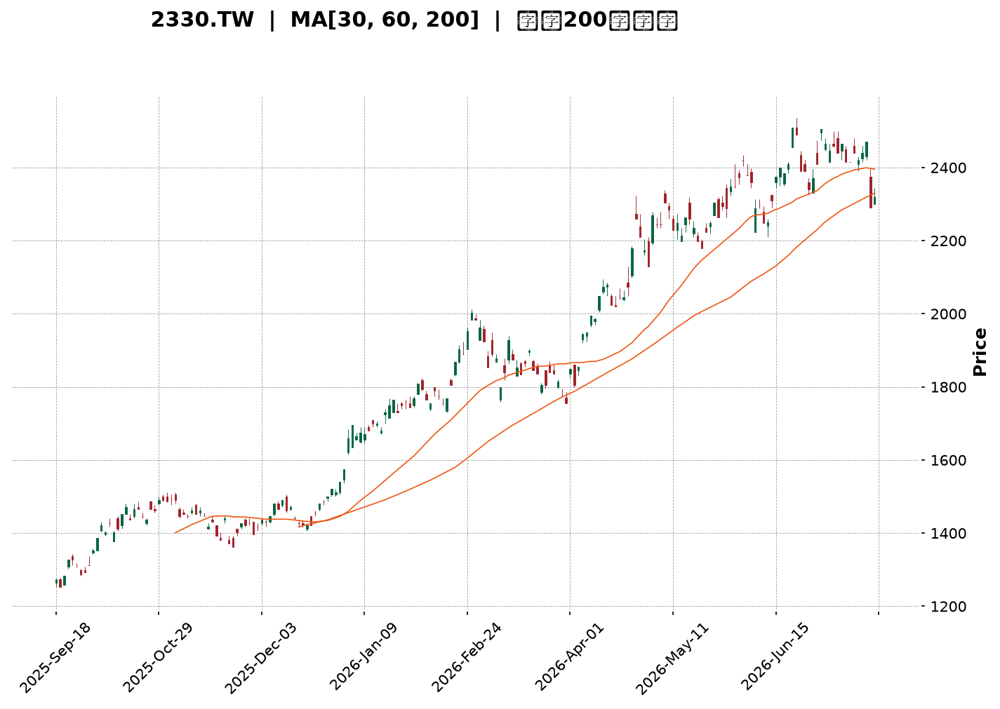
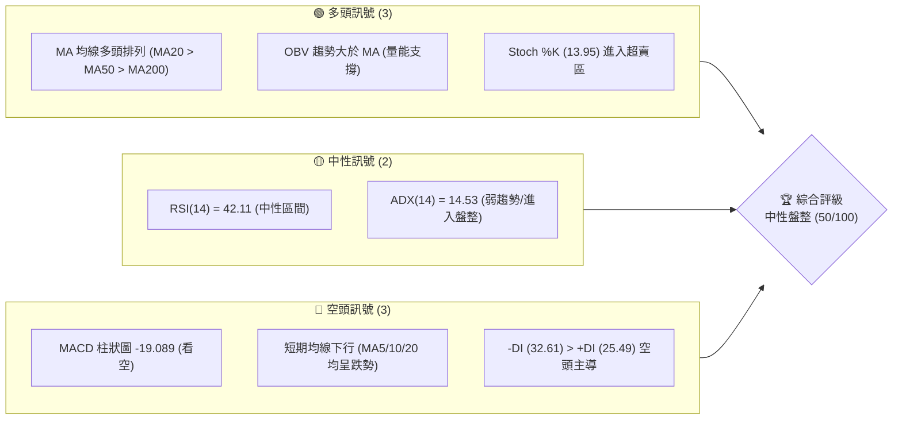
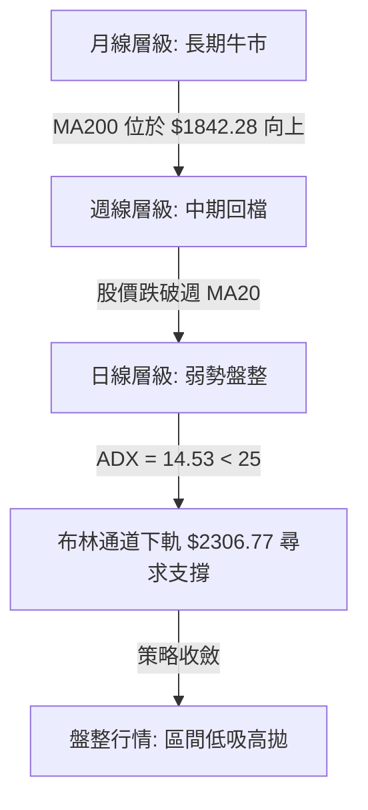
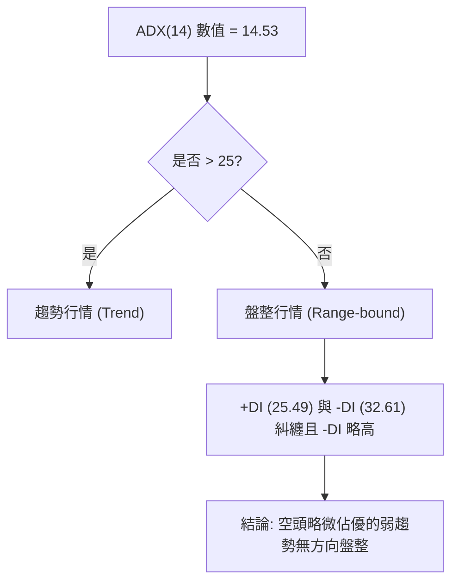
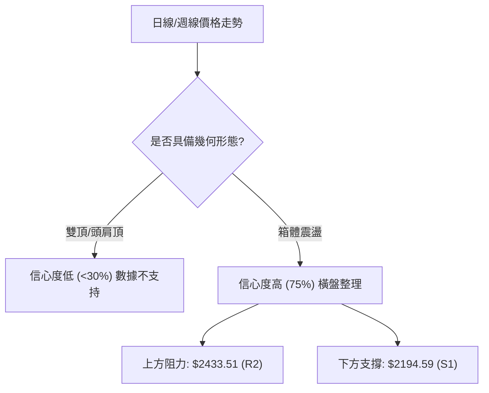
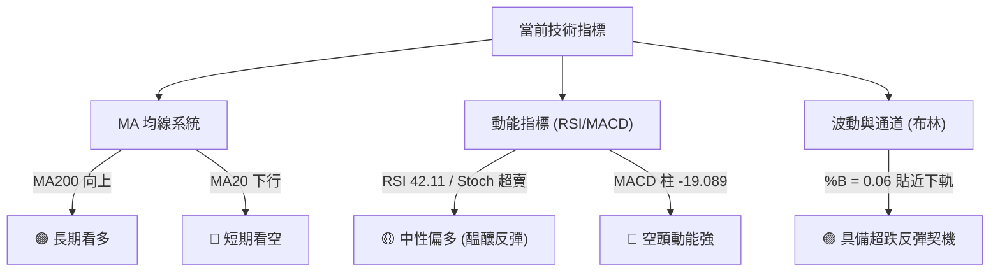
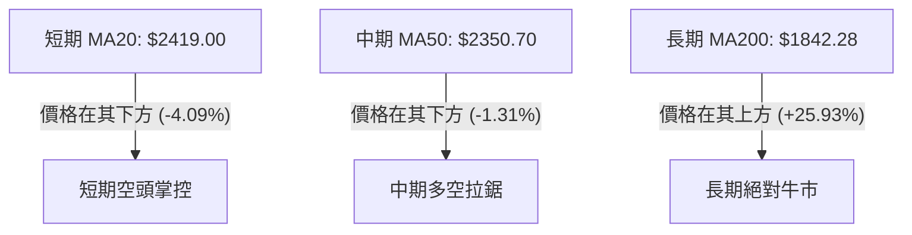
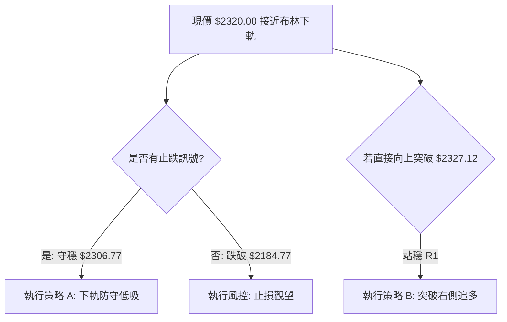
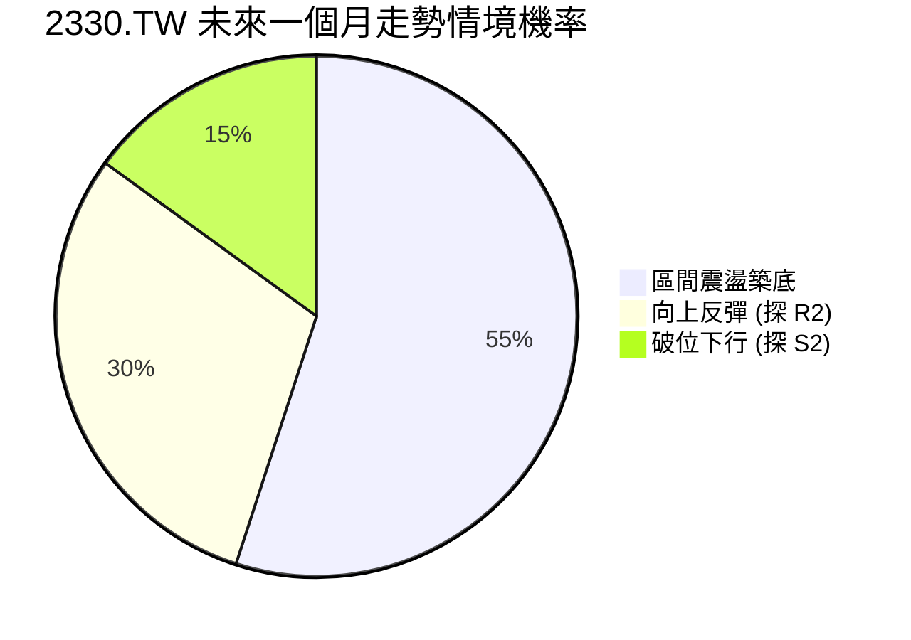
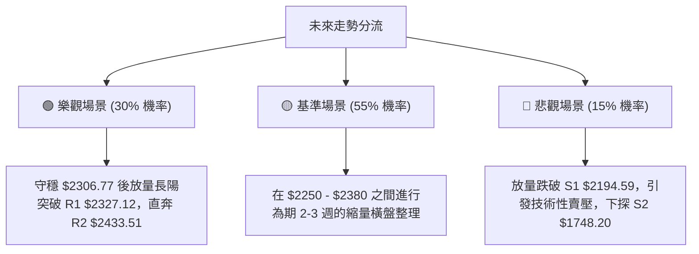

<details>
<summary>📊 靜態圖表 (點擊展開)</summary>

</details>

<html>
<head><meta charset="utf-8" /></head>
<body>
    <div style="height:500px; width:100%;">                        <script>window.PlotlyConfig = {MathJaxConfig: 'local'};</script>
        <script charset="utf-8" src="https://cdn.plot.ly/plotly-3.7.0.min.js" integrity="sha256-jvTGqxNp8AGWEcvNLVuKr+8j5dGe9Yw51LQkmDH+IYA=" crossorigin="anonymous"></script>                <div id="candlestick-chart" class="plotly-graph-div" style="height:100%; width:100%;"></div>            <script>                window.PLOTLYENV=window.PLOTLYENV || {};                                if (document.getElementById("candlestick-chart")) {                    Plotly.newPlot(                        "candlestick-chart",                        [{"close":{"dtype":"f8","bdata":"AAAAgK3kk0AAAAAAapWTQAAAACBPDJRAAAAA4Ka+lEAAAADgpr6UQAAAAGBjb5RAAAAA4B8glEAAAADA8DOUQAAAAEA0g5RAAAAAILshlUAAAABAcayVQAAAAEAnN5ZAAAAA4OPnlUAAAAAg+EqWQAAAAODj55VAAAAAYIUPlkAAAABgDK6WQAAAAOBP\u002fZZAAAAAwJlylkAAAAAAf+mWQAAAAAB\u002f6ZZAAAAAgDualkAAAADAmXKWQAAAAAB\u002f6ZZAAAAAQK7VlkAAAABAk0yXQAAAAECTTJdAAAAAYMI4l0AAAAAgZGCXQAAAAECTTJdAAAAAgDualkAAAABgDK6WQAAAAIA7mpZAAAAAQK7VlkAAAABgDK6WQAAAAECu1ZZAAAAAgDualkAAAABAViOWQAAAAODIXpZAAAAAAELAlUAAAABgoJiVQAAAAMBqhpZAAAAAgP5wlUAAAADgXEmVQAAAAODj55VAAAAAIPhKlkAAAABAJzeWQAAAACD4SpZAAAAAABPUlUAAAABAViOWQAAAAMCZcpZAAAAA4MhelkAAAACAO5qWQAAAAKDxJJdAAAAAAH\u002fplkAAAABAk0yXQAAAAKBI1ZZAAAAAQAz9lkAAAACAwYWWQAAAAEAcSpZAAAAAgDo2lkAAAACAOjaWQAAAAIA6NpZAAAAAwGbBlkAAAACgzySXQAAAAICxOJdAAAAA4FZ0l0AAAADg3cOXQAAAAEAanJdAAAAAAGUTmEAAAABgkZ6YQAAAAICP8JlAAAAA4Lt7mkAAAABAcQSaQAAAAOA0LJpAAAAAAFMYmkAAAACAFkCaQAAAAMCdj5pAAAAAwJ2PmkAAAACAFkCaQAAAAEDoBptAAAAAQG9Wm0AAAACgFJKbQAAAAEDoBptAAAAAQG9Wm0AAAADgMn6bQAAAAKCNQptAAAAAgPalm0AAAACgBEWcQAAAAGBfCZxAAAAAoBSSm0AAAAAgUWqbQAAAAIB99ZtAAAAAINi5m0AAAAAgUWqbQAAAAID2pZtAAAAAwCIxnEAAAADgmTOdQAAAAEDGvp1AAAAAACGDnUAAAADgl4WeQAAAAKBpTJ9AAAAAoOL8nkAAAACAW62eQAAAAEBNDp5AAAAAgPT3nEAAAAAAIYOdQAAAAGBdW51AAAAAAEEdnEAAAABAT7ycQAAAACAvIp5AAAAAoHtHnUAAAACA9PecQAAAAIBtqJxAAAAAABkknUAAAACgua+dQAAAAIBP1JxAAAAAwGqsnEAAAACAvDScQAAAAIC8NJxAAAAAIF3AnEAAAADAaqycQAAAAEChXJxAAAAAQA69m0AAAADARG2bQAAAAOBB6JxAAAAAgLw0nEAAAABANPycQAAAAAA\u002fY55AAAAAYDF3nkAAAADAtiqfQAAAAADSAp9AAAAAgBADoEAAAABg7jSgQAAAAKDnPqBAAAAAAGWin0AAAACgco6fQAAAAIAu8p9AAAAAgC7yn0AAAABg7jSgQAAAAGBfBqFAAAAAYPKloUAAAACANkKhQAAAACBm\u002fKBAAAAAgKOioEAAAADA5LmhQAAAAOAGiKFAAAAA4AaIoUAAAAAgtf+hQAAAAGDQ16FAAAAAQBtqoUAAAAAAAJKhQAAAAKAvTKFAAAAAoOuvoUAAAABg8qWhQAAAAIAUdKFAAAAAIEQuoUAAAABgXwahQAAAAAAiYKFAAAAAAACSoUAAAAAgtf+hQAAAAKDrr6FAAAAAwMLroUAAAACAyeGhQAAAAMB3WaJAAAAAwHdZokAAAADAVYuiQAAAAGAY5aJAAAAA4E6VokAAAAAgam2iQAAAAIDJ4aFAAAAA4Lv1oUAAAAAAAJKhQAAAAAAAlKFAAAAAAAAMokAAAAAAAI6iQAAAAAAAwKJAAAAAAACiokAAAAAAANSiQAAAAAAAnKNAAAAAAAB0o0AAAAAAAKyiQAAAAAAArKJAAAAAAABIokAAAAAAAISiQAAAAAAA1KJAAAAAAACSo0AAAAAAAEKjQAAAAAAAGqNAAAAAAAA4o0AAAAAAABCjQAAAAAAAQqNAAAAAAADeokAAAAAAAN6iQAAAAAAAEKNAAAAAAADookAAAAAAABCjQAAAAAAATKNAAAAAAADkoUAAAAAAACCiQA=="},"high":{"dtype":"f8","bdata":"AAAAgK3kk0BTxuxOfviTQAAAACBPDJRAAAAA4Ka+lEAfqJx1GfqUQBA++BgFl5RArdRKdZJblEBVVVVVY2+UQLyVfY5I5pRAvMd7\u002fIs1lUAAAABAcayVQLZMFvnIXpZAEZebvLT7lUCrqqq1aoaWQBGXm7y0+5VAHWDZZjualkAAAABgDK6WQHW4GpnxJJdAXypoVQyulkCYIp+V8SSXQHWDKXLCOJdAP378ON3BlkAfDnicaoaWQHWDKXLCOJdA8m\u002fp1SARl0Bdv\u002fv4NHSXQAufedUFiJdAZ2Zmrtabl0AEsgHZBYiXQLp+97HWm5dAnjt3zk\u002f9lkCG7oP1fumWQB8\u002fflwMrpZAoUpG+U\u002f9lkAN3QeL8SSXQKFKRvlP\u002fZZAP378ON3BlkA+09b490qWQDHIXnU7mpZAkYnRKic3lkAkjzzS4+eVQA5Ql5w7mpZAt9Ks8UHAlUCx9g0LQsCVQCMuN5mFD5ZAAAAAIPhKlkBsmSyyaoaWQKuqqrVqhpZAEJMrCMlelkA+09b490qWQAAAAMCZcpZAZu10vJlylkAAAACAO5qWQAAAAKDxJJdAdYMpcsI4l0AAAABAk0yXQAAAAJA4iJdApshnBe4Ql0DQ6ktFo5mWQGIutMrfcZZAs6Qc0N9xlkCR4V5FHEqWQNVn2lqjmZZAvQg+hUjVlkAAAACgzySXQFDmWUWTTJdAAAAA4FZ0l0AAAADg3cOXQKK8hsrdw5dAAAAAAGUTmEAAAABgkZ6YQH+L01r4U5pAAAAA4Lt7mkBi0bLKNCyaQILFPDDaZ5pAVVVVFdpnmkBow+fPu3uaQLeS2kpht5pAW0lthX+jmkBFgpoK2meaQKuqqsqrLptA0kUXVfalm0AAAACgFJKbQKuqqhpRaptA6aKLyjJ+m0BVVVWlFJKbQGAERkDYuZtAlqxkRdi5m0AAAACgBEWcQG12cQCqgJxAx2+Xen31m0AAAAAgUWqbQKuqqgpBHZxAlXAnNV8JnEB5mgtw9qWbQAAAAID2pZtAxzIo1amAnEAAAADgmTOdQN3LscqJ5p1A1e+5ZU0OnkBn0pVqW62eQAzkoyotdJ9ACMwe8Ic4n0DVKGOV4vyeQIO+oC89wZ5AaQ7fb+SqnUCSdqxAtnGeQKuqquogg51AAAAAAEEdnEBGteVqXVudQAW+uKrySZ5AvLoVQMa+nUASsUaVe0edQAUJo+WZM51ATNgGwf1LnUAEAoEArMOdQDkPHcP9S51ALWQhAxkknUBtx4fgrkicQGg7PoRP1JxAMjgfYws4nUB705uiJhCdQHAIh6CTcJxACEUowtcMnEB00UUD8+SbQAAAAOBB6JxArpHVpSYQnUAAAABANPycQAAAAAA\u002fY55AAAAAYDF3nkAAAADAtiqfQFx\u002fe2DEFp9AAAAAgBADoEDFTuwg01ygQP\u002fBRNDgSKBALzFroQkNoEDCFmxxEAOgQBO1KzH1KqBAD8TvAPwgoECd2Ilyo6KgQGmcQZBYEKFAGNE205knokD5Y0nz3cOhQKszUkE9OKFAVFwyhDZCoUDgB34g182hQGhFI6Hrr6FAdbn9MdfNoUAffPBxhUWiQPQuHiG1\u002f6FAOiUBwuS5oUAU3z3x3cOhQMln3WAUdKFAAAAAoOuvoUDvhfeioB2iQEmSJEH5m6FAURRFESJgoUAPDkhRPTihQAWEE\u002fH\u002fkaFABJM\u002fMPmboUAAAAAgtf+hQDbwGbOgHaJAoGir4ZknokCeDyzzcGOiQLt\u002f84BcgaJAL3\u002faAibRokCBXBOBOrOiQENasfADA6NAcqdoASbRokBO8OShM72iQMZUOHGnE6JA75W6cKcTokAkKzyywuuhQAAAAAAAqKFAAAAAAAAqokAAAAAAAI6iQAAAAAAAwKJAAAAAAACiokAAAAAAAN6iQAAAAAAAnKNAAAAAAADOo0AAAAAAABqjQAAAAAAA6KJAAAAAAACEokAAAAAAALaiQAAAAAAAVqNAAAAAAACSo0AAAAAAAGCjQAAAAAAAQqNAAAAAAACIo0AAAAAAAIijQAAAAAAAQqNAAAAAAAA4o0AAAAAAAN6iQAAAAAAAYKNAAAAAAAD8okAAAAAAADijQAAAAAAATKNAAAAAAAC2okAAAAAAAFKiQA=="},"hovertemplate":"\u003cb\u003e%{x|%Y-%m-%d}\u003c\u002fb\u003e\u003cbr\u003e\u958b: $%{open:.2f}\u003cbr\u003e\u9ad8: $%{high:.2f}\u003cbr\u003e\u4f4e: $%{low:.2f}\u003cbr\u003e\u6536: $%{close:.2f}\u003cextra\u003e\u003c\u002fextra\u003e","low":{"dtype":"f8","bdata":"co1yDWqVk0AAAAAAapWTQK0bTNE6qZNAIj1QkZJblEDhV2NKNIOUQAAAAGBjb5RAG7mRA08MlEAAAADA8DOUQAAAAEA0g5RAh3AIZxn6lEAAAAA4uyGVQO+MXqq0+5VA3tHIJkLAlUA5juNmViOWQKoM9pDPhJVAs82Xg7T7lUDug\u002fV7hQ+WQBaPym0MrpZAAAAAwJlylkCtG0yxaoaWQAAAAAB\u002f6ZZA4MCBo2qGlkCg1ZcqJzeWQAAAAAB\u002f6ZZAr9pcY93BlkD1YIaqIBGXQFIggmPCOJdAAAAAYMI4l0D5m\u002fytIBGXQKRABIfxJJdA4MCBo2qGlkAAAABgDK6WQODAgaNqhpZAX7W5hgyulkAAAABgDK6WQA6QFqo7mpZAAAAAgDualkBglpRjhQ+WQAAAAODIXpZAAAAAAELAlUAAAABgoJiVQNYPOir4SpZAAAAAgP5wlUAAAADgXEmVQN7RyCZCwJVAVlVVioUPlkCl2XRjViOWQB3HcUMnN5ZAAAAAABPUlUDBLCmHtPuVQKDVlyonN5ZAzjehSlYjlkCCAwcO+EqWQIcm+Zc7mpZAAAAAAH\u002fplkBHgQjOT\u002f2WQKuqqtpmwZZAtG4wtUjVlkAvFbS633GWQJ7RS7VYIpZAbx6hulgilkBNW+MvlfqVQAAAAIA6NpZAh+6DNaOZlkAh+fOKSNWWQF8zTPXtEJdAk7\u002fJj7E4l0CrqqrKVnSXQF5DebVWdJdApwFtmjiIl0CB4DI1g\u002f+XQE5rto+fPZlA\u002ffPPnyaNmUCdLk21rdyZQPx0hj\u002fqtJlAVVVVJeq0mUAAAACAFkCaQEltJTXaZ5pASW0lNdpnmkC6fWX1UhiaQAAAAKCdj5pA0kUX20LLmkC3lsU66AabQAAAAEDoBptAF110tasum0CrqqrKqy6bQAAAAKCNQptAFKEIpY1Cm0Aw\u002fdL\u002fuc2bQJjBl5p99ZtAAAAAoBSSm0AKMpsKyhqbQAAAADDYuZtAtkdslRSSm0CDzKZab1abQFOb2lToBptAAAAAwCIxnEDqOxu1i5ScQIvQOBW4H51AAAAAACGDnUD94xIrxr6dQOY3uIri\u002fJ5AAAAAoOL8nkCMeJIaLyKeQAAAAEBNDp5AAAAAgPT3nEB0S5w6P2+dQFVVVdWZM51A+K2R1TJ+m0BcJY0qyGycQN4sTxq4H51AAAAAoHtHnUCpomeli5ScQAAAAIBtqJxAsyf5PjT8nED0+Xx+4nOdQAAAAIBP1JxAAAAAwGqsnEDgGlmdANGbQCdx8L7XDJxAAAAAIF3AnEAAAADAaqycQD7e473XDJxAAAAAQA69m0AAAADARG2bQPqSaf2FhJxAlDh4H8ognEDXWmtdeJicQJ3YiR2D\u002f51AM3WLfXUTnkBSuB59CLOeQO6Bjd76xp5Av0oYm5tSn0A7sROfCQ2gQAd0Y34QA6BAAAAAAGWin0AAAACgco6fQPgdiB883p9A8TsQv0nKn0CKndhuEAOgQGk55lvMZqBAAAAAYPKloUAAAACANkKhQCrmVo963qBAAAAAgKOioED8wA+8URqhQExdbn8UdKFATF1ufxR0oUAAAAAgtf+hQE9Fmm7ypaFAAAAAQBtqoUDc1MNNPTihQCnyWQ9ELqFAHpe+HSJgoUCEHkLPBoihQCRJko42QqFAAAAAIEQuoUAAAABgXwahQAAAAAAiYKFA6I2C3ihWoUDhgw\u002fO5LmhQAAAAKDrr6FAy4dxX9DXoUA5q8eO66+hQFegz86ZJ6JAESDDj35PokB\u002fo+z+cGOiQL6lTs8sx6JAAAAA4E6VokDjJUqPfk+iQGLw0wwiYKFAC5yDf8nhoUAAAAAAAJKhQAAAAAAARKFAAAAAAADkoUAAAAAAAFKiQAAAAAAAXKJAAAAAAABcokAAAAAAAKKiQAAAAAAALqNAAAAAAAB0o0AAAAAAAKyiQAAAAAAArKJAAAAAAAAqokAAAAAAADSiQAAAAAAA1KJAAAAAAABWo0AAAAAAABqjQAAAAAAA3qJAAAAAAAAuo0AAAAAAABCjQAAAAAAA6KJAAAAAAADeokAAAAAAAN6iQAAAAAAAEKNAAAAAAACsokAAAAAAAN6iQAAAAAAA6KJAAAAAAADkoUAAAAAAAPihQA=="},"name":"\u50f9\u683c","open":{"dtype":"f8","bdata":"uUa5xgu9k0APBVdyreSTQK0bTNE6qZNAgsrZbWNvlEC\u002fGhOZSOaUQAAAAGBjb5RAyY3cmMFHlEAcx3GcwUeUQAAAAEA0g5RAQziEQ+oNlUAAAAA4uyGVQO+MXqq0+5VA72hkAxPUlUAAAAAg+EqWQKoM9pDPhJVA0C1ximqGlkDzIvg0JzeWQBaPym0MrpZAHw54nGqGlkCKfNaNO5qWQN1gitxP\u002fZZAAAAAgDualkDA4w8H+EqWQHWDKXLCOJdAUSWjHH\u002fplkCkQASH8SSXQF2\u002f+\u002fg0dJdA16Nw9TR0l0AAAAAgZGCXQAufedUFiJdAfvz48X7plkCCT4E83cGWQAAAAIA7mpZAr9pcY93BlkCLjYauIBGXQK\u002faXGPdwZZAAAAAgDualkBglpRjhQ+WQGbtdLyZcpZAkYnRKic3lkDJI488cayVQPKvaOOZcpZAW2nWOKCYlUDpoosucayVQCMuN5mFD5ZAOY7jZlYjlkARc6HVmXKWQAAAACD4SpZAEJMrCMlelkAAAABAViOWQMDjDwf4SpZAAAAA4MhelkChQoXqyF6WQCtqjHQMrpZAmCKflfEkl0D1YIaqIBGXQKuqqspWdJdAWjeYeirplkAAAACAwYWWQAAAAEAcSpZAkeFeRRxKlkDePEL1dg6WQNVn2lqjmZZAAAAAwGbBlkDZ+jZQKumWQAAAAICxOJdAMZWYGnVgl0AAAACQOIiXQK+hvHo4iJdA\u002fSXLXxqcl0BhKOa\u002fRieYQJvtE1WBUZlA\u002ffPPnyaNmUCdLk21rdyZQCgM8ATMyJlAAAAAsK3cmUBFgpoK2meaQLeS2kpht5pApbaS+rt7mkDdvrK6NCyaQKuqqnoG85pA0kUX20LLmkC3lsU66AabQFVVVQXKGptAdNFFBVFqm0AAAADgMn6bQHUBwipRaptAqk1tam9Wm0Aw\u002fdL\u002fuc2bQAY4CTvIbJxARHb077nNm0CIZfTPqy6bQKuqqgpBHZxAAAAAINi5m0AAAAAgUWqbQOlHPxrKGptAFSbeD8hsnEBt1Hd6baicQHq2kdqZM51AAAAAACGDnUD94xIrxr6dQOY3uIri\u002fJ5AWJlfZcQQn0CMeJIaLyKeQNc+C6V5mZ5AmwnqHz9vnUBhpB0rLyKeQFVVVdWZM51AOXjfmhSSm0Cj2nJV1gudQOPqB6V7R51AXt0K8CCDnUCpomeli5ScQASaQiC4H51AJmyDYAs4nUD8\u002fX4\u002fx5udQFo3mGILOJ1AyUIWQjT8nEBN4uD98uSbQGg7PoRP1JxAIdAUoiYQnUBkIQuBT9ScQK7mah7KIJxAAAAAQA69m0C66KLhG6mbQGOLcr5qrJxArpHVpSYQnUDwvfd+T9ScQF7ohd5nJ55AR5UEn0xPnkCamZnd+saeQKWAhJ\u002ff7p5AqtCj+41mn0DsxE7PAhegQAE+u2\u002fuNKBA\u002fKgucRADoEDrXHkAZaKfQAAAAIAu8p9A+B2IHzzen0BiJ3bA4EigQNLVJ4zFcKBAfOG98N3DoUCHVYShDX6hQA6ix+9s8qBAyhCsI0QuoUDsxE7sSiShQAAAAOAGiKFAAAAA4AaIoUDNoWIRkzGiQHoXj8DC66FA69uAYfKloUDwswE\u002fG2qhQCnyWQ9ELqFAj0vf3gaIoUBzpDkStf+hQEmSJO8oVqFAMQzDsC9MoUCmcQYhRC6hQM80bmAUdKFA+NmAnw1+oUDhgw\u002fO5LmhQBrD0YKnE6JANniOILX\u002foUDoIK+Sfk+iQDRgSS+MO6JAAAAAwHdZokBArokgSJ+iQAAAAGAY5aJAAAAA4E6VokA7tGtBQamiQGLw0wwiYKFAAAAA4Lv1oUAYcn0h182hQAAAAAAAgKFAAAAAAAAqokAAAAAAAHCiQAAAAAAAjqJAAAAAAABmokAAAAAAALaiQAAAAAAALqNAAAAAAACco0AAAAAAAAajQAAAAAAA1KJAAAAAAABwokAAAAAAADSiQAAAAAAAEKNAAAAAAAB+o0AAAAAAACSjQAAAAAAA3qJAAAAAAABCo0AAAAAAAGCjQAAAAAAAGqNAAAAAAAAko0AAAAAAAN6iQAAAAAAAOKNAAAAAAADUokAAAAAAAPKiQAAAAAAA\u002fKJAAAAAAACOokAAAAAAAPihQA=="},"x":["2025-09-18T00:00:00+08:00","2025-09-19T00:00:00+08:00","2025-09-22T00:00:00+08:00","2025-09-23T00:00:00+08:00","2025-09-24T00:00:00+08:00","2025-09-25T00:00:00+08:00","2025-09-26T00:00:00+08:00","2025-09-30T00:00:00+08:00","2025-10-01T00:00:00+08:00","2025-10-02T00:00:00+08:00","2025-10-03T00:00:00+08:00","2025-10-07T00:00:00+08:00","2025-10-08T00:00:00+08:00","2025-10-09T00:00:00+08:00","2025-10-13T00:00:00+08:00","2025-10-14T00:00:00+08:00","2025-10-15T00:00:00+08:00","2025-10-16T00:00:00+08:00","2025-10-17T00:00:00+08:00","2025-10-20T00:00:00+08:00","2025-10-21T00:00:00+08:00","2025-10-22T00:00:00+08:00","2025-10-23T00:00:00+08:00","2025-10-27T00:00:00+08:00","2025-10-28T00:00:00+08:00","2025-10-29T00:00:00+08:00","2025-10-30T00:00:00+08:00","2025-10-31T00:00:00+08:00","2025-11-03T00:00:00+08:00","2025-11-04T00:00:00+08:00","2025-11-05T00:00:00+08:00","2025-11-06T00:00:00+08:00","2025-11-07T00:00:00+08:00","2025-11-10T00:00:00+08:00","2025-11-11T00:00:00+08:00","2025-11-12T00:00:00+08:00","2025-11-13T00:00:00+08:00","2025-11-14T00:00:00+08:00","2025-11-17T00:00:00+08:00","2025-11-18T00:00:00+08:00","2025-11-19T00:00:00+08:00","2025-11-20T00:00:00+08:00","2025-11-21T00:00:00+08:00","2025-11-24T00:00:00+08:00","2025-11-25T00:00:00+08:00","2025-11-26T00:00:00+08:00","2025-11-27T00:00:00+08:00","2025-11-28T00:00:00+08:00","2025-12-01T00:00:00+08:00","2025-12-02T00:00:00+08:00","2025-12-03T00:00:00+08:00","2025-12-04T00:00:00+08:00","2025-12-05T00:00:00+08:00","2025-12-08T00:00:00+08:00","2025-12-09T00:00:00+08:00","2025-12-10T00:00:00+08:00","2025-12-11T00:00:00+08:00","2025-12-12T00:00:00+08:00","2025-12-15T00:00:00+08:00","2025-12-16T00:00:00+08:00","2025-12-17T00:00:00+08:00","2025-12-18T00:00:00+08:00","2025-12-19T00:00:00+08:00","2025-12-22T00:00:00+08:00","2025-12-23T00:00:00+08:00","2025-12-24T00:00:00+08:00","2025-12-26T00:00:00+08:00","2025-12-29T00:00:00+08:00","2025-12-30T00:00:00+08:00","2025-12-31T00:00:00+08:00","2026-01-02T00:00:00+08:00","2026-01-05T00:00:00+08:00","2026-01-06T00:00:00+08:00","2026-01-07T00:00:00+08:00","2026-01-08T00:00:00+08:00","2026-01-09T00:00:00+08:00","2026-01-12T00:00:00+08:00","2026-01-13T00:00:00+08:00","2026-01-14T00:00:00+08:00","2026-01-15T00:00:00+08:00","2026-01-16T00:00:00+08:00","2026-01-19T00:00:00+08:00","2026-01-20T00:00:00+08:00","2026-01-21T00:00:00+08:00","2026-01-22T00:00:00+08:00","2026-01-23T00:00:00+08:00","2026-01-26T00:00:00+08:00","2026-01-27T00:00:00+08:00","2026-01-28T00:00:00+08:00","2026-01-29T00:00:00+08:00","2026-01-30T00:00:00+08:00","2026-02-02T00:00:00+08:00","2026-02-03T00:00:00+08:00","2026-02-04T00:00:00+08:00","2026-02-05T00:00:00+08:00","2026-02-06T00:00:00+08:00","2026-02-09T00:00:00+08:00","2026-02-10T00:00:00+08:00","2026-02-11T00:00:00+08:00","2026-02-23T00:00:00+08:00","2026-02-24T00:00:00+08:00","2026-02-25T00:00:00+08:00","2026-02-26T00:00:00+08:00","2026-03-02T00:00:00+08:00","2026-03-03T00:00:00+08:00","2026-03-04T00:00:00+08:00","2026-03-05T00:00:00+08:00","2026-03-06T00:00:00+08:00","2026-03-09T00:00:00+08:00","2026-03-10T00:00:00+08:00","2026-03-11T00:00:00+08:00","2026-03-12T00:00:00+08:00","2026-03-13T00:00:00+08:00","2026-03-16T00:00:00+08:00","2026-03-17T00:00:00+08:00","2026-03-18T00:00:00+08:00","2026-03-19T00:00:00+08:00","2026-03-20T00:00:00+08:00","2026-03-23T00:00:00+08:00","2026-03-24T00:00:00+08:00","2026-03-25T00:00:00+08:00","2026-03-26T00:00:00+08:00","2026-03-27T00:00:00+08:00","2026-03-30T00:00:00+08:00","2026-03-31T00:00:00+08:00","2026-04-01T00:00:00+08:00","2026-04-02T00:00:00+08:00","2026-04-07T00:00:00+08:00","2026-04-08T00:00:00+08:00","2026-04-09T00:00:00+08:00","2026-04-10T00:00:00+08:00","2026-04-13T00:00:00+08:00","2026-04-14T00:00:00+08:00","2026-04-15T00:00:00+08:00","2026-04-16T00:00:00+08:00","2026-04-17T00:00:00+08:00","2026-04-20T00:00:00+08:00","2026-04-21T00:00:00+08:00","2026-04-22T00:00:00+08:00","2026-04-23T00:00:00+08:00","2026-04-24T00:00:00+08:00","2026-04-27T00:00:00+08:00","2026-04-28T00:00:00+08:00","2026-04-29T00:00:00+08:00","2026-04-30T00:00:00+08:00","2026-05-04T00:00:00+08:00","2026-05-05T00:00:00+08:00","2026-05-06T00:00:00+08:00","2026-05-07T00:00:00+08:00","2026-05-08T00:00:00+08:00","2026-05-11T00:00:00+08:00","2026-05-12T00:00:00+08:00","2026-05-13T00:00:00+08:00","2026-05-14T00:00:00+08:00","2026-05-15T00:00:00+08:00","2026-05-18T00:00:00+08:00","2026-05-19T00:00:00+08:00","2026-05-20T00:00:00+08:00","2026-05-21T00:00:00+08:00","2026-05-22T00:00:00+08:00","2026-05-25T00:00:00+08:00","2026-05-26T00:00:00+08:00","2026-05-27T00:00:00+08:00","2026-05-28T00:00:00+08:00","2026-05-29T00:00:00+08:00","2026-06-01T00:00:00+08:00","2026-06-02T00:00:00+08:00","2026-06-03T00:00:00+08:00","2026-06-04T00:00:00+08:00","2026-06-05T00:00:00+08:00","2026-06-08T00:00:00+08:00","2026-06-09T00:00:00+08:00","2026-06-10T00:00:00+08:00","2026-06-11T00:00:00+08:00","2026-06-12T00:00:00+08:00","2026-06-15T00:00:00+08:00","2026-06-16T00:00:00+08:00","2026-06-17T00:00:00+08:00","2026-06-18T00:00:00+08:00","2026-06-22T00:00:00+08:00","2026-06-23T00:00:00+08:00","2026-06-24T00:00:00+08:00","2026-06-25T00:00:00+08:00","2026-06-26T00:00:00+08:00","2026-06-29T00:00:00+08:00","2026-06-30T00:00:00+08:00","2026-07-01T00:00:00+08:00","2026-07-02T00:00:00+08:00","2026-07-03T00:00:00+08:00","2026-07-06T00:00:00+08:00","2026-07-07T00:00:00+08:00","2026-07-08T00:00:00+08:00","2026-07-09T00:00:00+08:00","2026-07-10T00:00:00+08:00","2026-07-13T00:00:00+08:00","2026-07-14T00:00:00+08:00","2026-07-15T00:00:00+08:00","2026-07-16T00:00:00+08:00","2026-07-17T00:00:00+08:00","2026-07-20T00:00:00+08:00"],"type":"candlestick"},{"hovertemplate":"MA30: $%{y:.2f}\u003cextra\u003e\u003c\u002fextra\u003e","line":{"color":"#2196F3","dash":"dash","width":2},"mode":"lines","name":"MA30","x":["2025-09-18T00:00:00+08:00","2025-09-19T00:00:00+08:00","2025-09-22T00:00:00+08:00","2025-09-23T00:00:00+08:00","2025-09-24T00:00:00+08:00","2025-09-25T00:00:00+08:00","2025-09-26T00:00:00+08:00","2025-09-30T00:00:00+08:00","2025-10-01T00:00:00+08:00","2025-10-02T00:00:00+08:00","2025-10-03T00:00:00+08:00","2025-10-07T00:00:00+08:00","2025-10-08T00:00:00+08:00","2025-10-09T00:00:00+08:00","2025-10-13T00:00:00+08:00","2025-10-14T00:00:00+08:00","2025-10-15T00:00:00+08:00","2025-10-16T00:00:00+08:00","2025-10-17T00:00:00+08:00","2025-10-20T00:00:00+08:00","2025-10-21T00:00:00+08:00","2025-10-22T00:00:00+08:00","2025-10-23T00:00:00+08:00","2025-10-27T00:00:00+08:00","2025-10-28T00:00:00+08:00","2025-10-29T00:00:00+08:00","2025-10-30T00:00:00+08:00","2025-10-31T00:00:00+08:00","2025-11-03T00:00:00+08:00","2025-11-04T00:00:00+08:00","2025-11-05T00:00:00+08:00","2025-11-06T00:00:00+08:00","2025-11-07T00:00:00+08:00","2025-11-10T00:00:00+08:00","2025-11-11T00:00:00+08:00","2025-11-12T00:00:00+08:00","2025-11-13T00:00:00+08:00","2025-11-14T00:00:00+08:00","2025-11-17T00:00:00+08:00","2025-11-18T00:00:00+08:00","2025-11-19T00:00:00+08:00","2025-11-20T00:00:00+08:00","2025-11-21T00:00:00+08:00","2025-11-24T00:00:00+08:00","2025-11-25T00:00:00+08:00","2025-11-26T00:00:00+08:00","2025-11-27T00:00:00+08:00","2025-11-28T00:00:00+08:00","2025-12-01T00:00:00+08:00","2025-12-02T00:00:00+08:00","2025-12-03T00:00:00+08:00","2025-12-04T00:00:00+08:00","2025-12-05T00:00:00+08:00","2025-12-08T00:00:00+08:00","2025-12-09T00:00:00+08:00","2025-12-10T00:00:00+08:00","2025-12-11T00:00:00+08:00","2025-12-12T00:00:00+08:00","2025-12-15T00:00:00+08:00","2025-12-16T00:00:00+08:00","2025-12-17T00:00:00+08:00","2025-12-18T00:00:00+08:00","2025-12-19T00:00:00+08:00","2025-12-22T00:00:00+08:00","2025-12-23T00:00:00+08:00","2025-12-24T00:00:00+08:00","2025-12-26T00:00:00+08:00","2025-12-29T00:00:00+08:00","2025-12-30T00:00:00+08:00","2025-12-31T00:00:00+08:00","2026-01-02T00:00:00+08:00","2026-01-05T00:00:00+08:00","2026-01-06T00:00:00+08:00","2026-01-07T00:00:00+08:00","2026-01-08T00:00:00+08:00","2026-01-09T00:00:00+08:00","2026-01-12T00:00:00+08:00","2026-01-13T00:00:00+08:00","2026-01-14T00:00:00+08:00","2026-01-15T00:00:00+08:00","2026-01-16T00:00:00+08:00","2026-01-19T00:00:00+08:00","2026-01-20T00:00:00+08:00","2026-01-21T00:00:00+08:00","2026-01-22T00:00:00+08:00","2026-01-23T00:00:00+08:00","2026-01-26T00:00:00+08:00","2026-01-27T00:00:00+08:00","2026-01-28T00:00:00+08:00","2026-01-29T00:00:00+08:00","2026-01-30T00:00:00+08:00","2026-02-02T00:00:00+08:00","2026-02-03T00:00:00+08:00","2026-02-04T00:00:00+08:00","2026-02-05T00:00:00+08:00","2026-02-06T00:00:00+08:00","2026-02-09T00:00:00+08:00","2026-02-10T00:00:00+08:00","2026-02-11T00:00:00+08:00","2026-02-23T00:00:00+08:00","2026-02-24T00:00:00+08:00","2026-02-25T00:00:00+08:00","2026-02-26T00:00:00+08:00","2026-03-02T00:00:00+08:00","2026-03-03T00:00:00+08:00","2026-03-04T00:00:00+08:00","2026-03-05T00:00:00+08:00","2026-03-06T00:00:00+08:00","2026-03-09T00:00:00+08:00","2026-03-10T00:00:00+08:00","2026-03-11T00:00:00+08:00","2026-03-12T00:00:00+08:00","2026-03-13T00:00:00+08:00","2026-03-16T00:00:00+08:00","2026-03-17T00:00:00+08:00","2026-03-18T00:00:00+08:00","2026-03-19T00:00:00+08:00","2026-03-20T00:00:00+08:00","2026-03-23T00:00:00+08:00","2026-03-24T00:00:00+08:00","2026-03-25T00:00:00+08:00","2026-03-26T00:00:00+08:00","2026-03-27T00:00:00+08:00","2026-03-30T00:00:00+08:00","2026-03-31T00:00:00+08:00","2026-04-01T00:00:00+08:00","2026-04-02T00:00:00+08:00","2026-04-07T00:00:00+08:00","2026-04-08T00:00:00+08:00","2026-04-09T00:00:00+08:00","2026-04-10T00:00:00+08:00","2026-04-13T00:00:00+08:00","2026-04-14T00:00:00+08:00","2026-04-15T00:00:00+08:00","2026-04-16T00:00:00+08:00","2026-04-17T00:00:00+08:00","2026-04-20T00:00:00+08:00","2026-04-21T00:00:00+08:00","2026-04-22T00:00:00+08:00","2026-04-23T00:00:00+08:00","2026-04-24T00:00:00+08:00","2026-04-27T00:00:00+08:00","2026-04-28T00:00:00+08:00","2026-04-29T00:00:00+08:00","2026-04-30T00:00:00+08:00","2026-05-04T00:00:00+08:00","2026-05-05T00:00:00+08:00","2026-05-06T00:00:00+08:00","2026-05-07T00:00:00+08:00","2026-05-08T00:00:00+08:00","2026-05-11T00:00:00+08:00","2026-05-12T00:00:00+08:00","2026-05-13T00:00:00+08:00","2026-05-14T00:00:00+08:00","2026-05-15T00:00:00+08:00","2026-05-18T00:00:00+08:00","2026-05-19T00:00:00+08:00","2026-05-20T00:00:00+08:00","2026-05-21T00:00:00+08:00","2026-05-22T00:00:00+08:00","2026-05-25T00:00:00+08:00","2026-05-26T00:00:00+08:00","2026-05-27T00:00:00+08:00","2026-05-28T00:00:00+08:00","2026-05-29T00:00:00+08:00","2026-06-01T00:00:00+08:00","2026-06-02T00:00:00+08:00","2026-06-03T00:00:00+08:00","2026-06-04T00:00:00+08:00","2026-06-05T00:00:00+08:00","2026-06-08T00:00:00+08:00","2026-06-09T00:00:00+08:00","2026-06-10T00:00:00+08:00","2026-06-11T00:00:00+08:00","2026-06-12T00:00:00+08:00","2026-06-15T00:00:00+08:00","2026-06-16T00:00:00+08:00","2026-06-17T00:00:00+08:00","2026-06-18T00:00:00+08:00","2026-06-22T00:00:00+08:00","2026-06-23T00:00:00+08:00","2026-06-24T00:00:00+08:00","2026-06-25T00:00:00+08:00","2026-06-26T00:00:00+08:00","2026-06-29T00:00:00+08:00","2026-06-30T00:00:00+08:00","2026-07-01T00:00:00+08:00","2026-07-02T00:00:00+08:00","2026-07-03T00:00:00+08:00","2026-07-06T00:00:00+08:00","2026-07-07T00:00:00+08:00","2026-07-08T00:00:00+08:00","2026-07-09T00:00:00+08:00","2026-07-10T00:00:00+08:00","2026-07-13T00:00:00+08:00","2026-07-14T00:00:00+08:00","2026-07-15T00:00:00+08:00","2026-07-16T00:00:00+08:00","2026-07-17T00:00:00+08:00","2026-07-20T00:00:00+08:00"],"y":{"dtype":"f8","bdata":"AAAAAAAA+H8AAAAAAAD4fwAAAAAAAPh\u002fAAAAAAAA+H8AAAAAAAD4fwAAAAAAAPh\u002fAAAAAAAA+H8AAAAAAAD4fwAAAAAAAPh\u002fAAAAAAAA+H8AAAAAAAD4fwAAAAAAAPh\u002fAAAAAAAA+H8AAAAAAAD4fwAAAAAAAPh\u002fAAAAAAAA+H8AAAAAAAD4fwAAAAAAAPh\u002fAAAAAAAA+H8AAAAAAAD4fwAAAAAAAPh\u002fAAAAAAAA+H8AAAAAAAD4fwAAAAAAAPh\u002fAAAAAAAA+H8AAAAAAAD4fwAAAAAAAPh\u002fAAAAAAAA+H8AAAAAAAD4f1VVVTXt45VAq6qqigv7lUCrqqpadxWWQAAAAIBDK5ZAREREFBk9lkBmZmZ2nE2WQM3MzGwWYpZAq6qqejl3lkDNzMzcvIeWQGZmZiaXl5ZAmpmZ6d+clkARERHRNpyWQDMzMzPbnpZA7+7unuSalkARERFhTpKWQBEREWFOkpZAvLu7q0mUlkCamZkZU5CWQN7d3T1hipZAvLu7exiFlkBmZmaGfX6WQDMzM\u002fOGepZAmpmZqYt4lkCrqqra3XmWQERERCTZe5ZAvLu7O4J8lkC8u7s7gnyWQHd3d0eIeJZA3t3dvYp2lkDe3d0NQW+WQM3MzHyjZpZA7+7uHk5jlkCJiIioT1+WQKuqqkr6W5ZA3t3dPU1blkDv7u6uQl+WQHd3d5ePYpZAVVVVxdRplkCJiIgot3eWQAAAAPBKgpZAAAAAcCGWlkDNzMy87a+WQImIiBgRzZZAiYiIaBf4lkBERET0dSCXQN7d3Q3fRJdAREREBFFll0BERERkv4eXQAAAAFArrJdA3t3dzY3Ul0B3d3dHpfeXQGZmZva4HphAAAAAYBxJmECrqqp6gXOYQM3MzEyjlJhAq6qqCme6mEARERGhMN6YQCIiIjL3A5lAzczMvLormUAiIiKCxVyZQHd3d0fQjZlAAAAAwIq7mUB3d3fn8eeZQLy7u6v8GJpAmpmZ2WZDmkCamZkZ2meaQKuqqqqgjZpAzczM3A22mkDv7u7+ceSaQAAAABDNGJtAIiIiMjFHm0B3d3dHj3mbQAAAAMBJp5tAmpmZ+bnNm0BERESEffWbQGZmZnagFpxAiYiI2CUvnEB3d3eH+0qcQAAAAEDXYpxAzczMbBhwnEBERESETYWcQBEREeHPn5xAvLu7W2GwnECJiIg4T7ycQAAAABA6ypxAZmZmlp3ZnEB3d3dHVeycQLy7u5u5+ZxAd3d3N3kCnUB3d3dH7gGdQBEREVFgA51AzczMzHMNnUAzMzNjMBidQDMzM4OgG51Aq6qq6rsbnUCrqqoa1RudQJqZmVmTJp1AMzMzE7ImnUCrqqpa2SSdQImIiNhUKp1AZmZmhncynUDe3d2N+DedQBEREZGENZ1Aq6qq+ls+nUBmZmYWLU2dQAAAALD1YZ1AvLu7K7V4nUAzMzPTJoqdQM3MzNw+oJ1AIiIicvHAnUB3d3cHVOCdQHd3dze\u002fAZ5A3t3dDRg1nkB3d3dncWSeQFVVVeXJkZ5AmpmZKQe1nkBERETkOuaeQGZmZuZrG59AVVVVVfFRn0B3d3eXbpSfQAAAAABD1J9AIiIiyg8EoEBEREScpx+gQERERBxAOqBA7+7uhtRaoECrqqpCaHygQCIiInIBlqBAd3d310SwoEAAAADA4MWgQDMzM7N+2KBAvLu7E3HsoEAzMzOrDQGhQHd3d5+rE6FAzczM1PUjoUDv7u5mQTKhQLy7uyM1RKFAREREDNFZoUCJiIiYa3GhQBEREZFaiqFAAAAAsKCgoUDv7u6+k7OhQFVVVRXkuqFA7+7u7oy9oUCJiIjINcChQCIiInJDxaFAAAAAEE\u002fRoUCamZkJYdihQFVVVTXH4qFAERERYS3soUARERHxQPOhQImIiJhTAqJAZmZmFrkTokDNzMx8Hx2iQCIiIqLZKKJAERERYestokC8u7s7UjWiQImIiEgNQaJAmpmZaXFVokDNzMxMf2iiQGZmZuY5d6JAd3d390qFokB3d3eHXo6iQLy7u5vFm6JAd3d3t9ijokDv7u7uQKyiQKuqqopWsqJAERER0Ra3okBERETkgruiQDMzMwPxvqJAvLu7+we5okARERFhc7aiQA=="},"type":"scatter"},{"hovertemplate":"MA60: $%{y:.2f}\u003cextra\u003e\u003c\u002fextra\u003e","line":{"color":"#9C27B0","dash":"dash","width":2},"mode":"lines","name":"MA60","x":["2025-09-18T00:00:00+08:00","2025-09-19T00:00:00+08:00","2025-09-22T00:00:00+08:00","2025-09-23T00:00:00+08:00","2025-09-24T00:00:00+08:00","2025-09-25T00:00:00+08:00","2025-09-26T00:00:00+08:00","2025-09-30T00:00:00+08:00","2025-10-01T00:00:00+08:00","2025-10-02T00:00:00+08:00","2025-10-03T00:00:00+08:00","2025-10-07T00:00:00+08:00","2025-10-08T00:00:00+08:00","2025-10-09T00:00:00+08:00","2025-10-13T00:00:00+08:00","2025-10-14T00:00:00+08:00","2025-10-15T00:00:00+08:00","2025-10-16T00:00:00+08:00","2025-10-17T00:00:00+08:00","2025-10-20T00:00:00+08:00","2025-10-21T00:00:00+08:00","2025-10-22T00:00:00+08:00","2025-10-23T00:00:00+08:00","2025-10-27T00:00:00+08:00","2025-10-28T00:00:00+08:00","2025-10-29T00:00:00+08:00","2025-10-30T00:00:00+08:00","2025-10-31T00:00:00+08:00","2025-11-03T00:00:00+08:00","2025-11-04T00:00:00+08:00","2025-11-05T00:00:00+08:00","2025-11-06T00:00:00+08:00","2025-11-07T00:00:00+08:00","2025-11-10T00:00:00+08:00","2025-11-11T00:00:00+08:00","2025-11-12T00:00:00+08:00","2025-11-13T00:00:00+08:00","2025-11-14T00:00:00+08:00","2025-11-17T00:00:00+08:00","2025-11-18T00:00:00+08:00","2025-11-19T00:00:00+08:00","2025-11-20T00:00:00+08:00","2025-11-21T00:00:00+08:00","2025-11-24T00:00:00+08:00","2025-11-25T00:00:00+08:00","2025-11-26T00:00:00+08:00","2025-11-27T00:00:00+08:00","2025-11-28T00:00:00+08:00","2025-12-01T00:00:00+08:00","2025-12-02T00:00:00+08:00","2025-12-03T00:00:00+08:00","2025-12-04T00:00:00+08:00","2025-12-05T00:00:00+08:00","2025-12-08T00:00:00+08:00","2025-12-09T00:00:00+08:00","2025-12-10T00:00:00+08:00","2025-12-11T00:00:00+08:00","2025-12-12T00:00:00+08:00","2025-12-15T00:00:00+08:00","2025-12-16T00:00:00+08:00","2025-12-17T00:00:00+08:00","2025-12-18T00:00:00+08:00","2025-12-19T00:00:00+08:00","2025-12-22T00:00:00+08:00","2025-12-23T00:00:00+08:00","2025-12-24T00:00:00+08:00","2025-12-26T00:00:00+08:00","2025-12-29T00:00:00+08:00","2025-12-30T00:00:00+08:00","2025-12-31T00:00:00+08:00","2026-01-02T00:00:00+08:00","2026-01-05T00:00:00+08:00","2026-01-06T00:00:00+08:00","2026-01-07T00:00:00+08:00","2026-01-08T00:00:00+08:00","2026-01-09T00:00:00+08:00","2026-01-12T00:00:00+08:00","2026-01-13T00:00:00+08:00","2026-01-14T00:00:00+08:00","2026-01-15T00:00:00+08:00","2026-01-16T00:00:00+08:00","2026-01-19T00:00:00+08:00","2026-01-20T00:00:00+08:00","2026-01-21T00:00:00+08:00","2026-01-22T00:00:00+08:00","2026-01-23T00:00:00+08:00","2026-01-26T00:00:00+08:00","2026-01-27T00:00:00+08:00","2026-01-28T00:00:00+08:00","2026-01-29T00:00:00+08:00","2026-01-30T00:00:00+08:00","2026-02-02T00:00:00+08:00","2026-02-03T00:00:00+08:00","2026-02-04T00:00:00+08:00","2026-02-05T00:00:00+08:00","2026-02-06T00:00:00+08:00","2026-02-09T00:00:00+08:00","2026-02-10T00:00:00+08:00","2026-02-11T00:00:00+08:00","2026-02-23T00:00:00+08:00","2026-02-24T00:00:00+08:00","2026-02-25T00:00:00+08:00","2026-02-26T00:00:00+08:00","2026-03-02T00:00:00+08:00","2026-03-03T00:00:00+08:00","2026-03-04T00:00:00+08:00","2026-03-05T00:00:00+08:00","2026-03-06T00:00:00+08:00","2026-03-09T00:00:00+08:00","2026-03-10T00:00:00+08:00","2026-03-11T00:00:00+08:00","2026-03-12T00:00:00+08:00","2026-03-13T00:00:00+08:00","2026-03-16T00:00:00+08:00","2026-03-17T00:00:00+08:00","2026-03-18T00:00:00+08:00","2026-03-19T00:00:00+08:00","2026-03-20T00:00:00+08:00","2026-03-23T00:00:00+08:00","2026-03-24T00:00:00+08:00","2026-03-25T00:00:00+08:00","2026-03-26T00:00:00+08:00","2026-03-27T00:00:00+08:00","2026-03-30T00:00:00+08:00","2026-03-31T00:00:00+08:00","2026-04-01T00:00:00+08:00","2026-04-02T00:00:00+08:00","2026-04-07T00:00:00+08:00","2026-04-08T00:00:00+08:00","2026-04-09T00:00:00+08:00","2026-04-10T00:00:00+08:00","2026-04-13T00:00:00+08:00","2026-04-14T00:00:00+08:00","2026-04-15T00:00:00+08:00","2026-04-16T00:00:00+08:00","2026-04-17T00:00:00+08:00","2026-04-20T00:00:00+08:00","2026-04-21T00:00:00+08:00","2026-04-22T00:00:00+08:00","2026-04-23T00:00:00+08:00","2026-04-24T00:00:00+08:00","2026-04-27T00:00:00+08:00","2026-04-28T00:00:00+08:00","2026-04-29T00:00:00+08:00","2026-04-30T00:00:00+08:00","2026-05-04T00:00:00+08:00","2026-05-05T00:00:00+08:00","2026-05-06T00:00:00+08:00","2026-05-07T00:00:00+08:00","2026-05-08T00:00:00+08:00","2026-05-11T00:00:00+08:00","2026-05-12T00:00:00+08:00","2026-05-13T00:00:00+08:00","2026-05-14T00:00:00+08:00","2026-05-15T00:00:00+08:00","2026-05-18T00:00:00+08:00","2026-05-19T00:00:00+08:00","2026-05-20T00:00:00+08:00","2026-05-21T00:00:00+08:00","2026-05-22T00:00:00+08:00","2026-05-25T00:00:00+08:00","2026-05-26T00:00:00+08:00","2026-05-27T00:00:00+08:00","2026-05-28T00:00:00+08:00","2026-05-29T00:00:00+08:00","2026-06-01T00:00:00+08:00","2026-06-02T00:00:00+08:00","2026-06-03T00:00:00+08:00","2026-06-04T00:00:00+08:00","2026-06-05T00:00:00+08:00","2026-06-08T00:00:00+08:00","2026-06-09T00:00:00+08:00","2026-06-10T00:00:00+08:00","2026-06-11T00:00:00+08:00","2026-06-12T00:00:00+08:00","2026-06-15T00:00:00+08:00","2026-06-16T00:00:00+08:00","2026-06-17T00:00:00+08:00","2026-06-18T00:00:00+08:00","2026-06-22T00:00:00+08:00","2026-06-23T00:00:00+08:00","2026-06-24T00:00:00+08:00","2026-06-25T00:00:00+08:00","2026-06-26T00:00:00+08:00","2026-06-29T00:00:00+08:00","2026-06-30T00:00:00+08:00","2026-07-01T00:00:00+08:00","2026-07-02T00:00:00+08:00","2026-07-03T00:00:00+08:00","2026-07-06T00:00:00+08:00","2026-07-07T00:00:00+08:00","2026-07-08T00:00:00+08:00","2026-07-09T00:00:00+08:00","2026-07-10T00:00:00+08:00","2026-07-13T00:00:00+08:00","2026-07-14T00:00:00+08:00","2026-07-15T00:00:00+08:00","2026-07-16T00:00:00+08:00","2026-07-17T00:00:00+08:00","2026-07-20T00:00:00+08:00"],"y":{"dtype":"f8","bdata":"AAAAAAAA+H8AAAAAAAD4fwAAAAAAAPh\u002fAAAAAAAA+H8AAAAAAAD4fwAAAAAAAPh\u002fAAAAAAAA+H8AAAAAAAD4fwAAAAAAAPh\u002fAAAAAAAA+H8AAAAAAAD4fwAAAAAAAPh\u002fAAAAAAAA+H8AAAAAAAD4fwAAAAAAAPh\u002fAAAAAAAA+H8AAAAAAAD4fwAAAAAAAPh\u002fAAAAAAAA+H8AAAAAAAD4fwAAAAAAAPh\u002fAAAAAAAA+H8AAAAAAAD4fwAAAAAAAPh\u002fAAAAAAAA+H8AAAAAAAD4fwAAAAAAAPh\u002fAAAAAAAA+H8AAAAAAAD4fwAAAAAAAPh\u002fAAAAAAAA+H8AAAAAAAD4fwAAAAAAAPh\u002fAAAAAAAA+H8AAAAAAAD4fwAAAAAAAPh\u002fAAAAAAAA+H8AAAAAAAD4fwAAAAAAAPh\u002fAAAAAAAA+H8AAAAAAAD4fwAAAAAAAPh\u002fAAAAAAAA+H8AAAAAAAD4fwAAAAAAAPh\u002fAAAAAAAA+H8AAAAAAAD4fwAAAAAAAPh\u002fAAAAAAAA+H8AAAAAAAD4fwAAAAAAAPh\u002fAAAAAAAA+H8AAAAAAAD4fwAAAAAAAPh\u002fAAAAAAAA+H8AAAAAAAD4fwAAAAAAAPh\u002fAAAAAAAA+H8AAAAAAAD4fxEREVlIJZZAzczM1CwvlkCamZmBYzqWQFVVVeWeQ5ZAERERKTNMlkCrqqqSb1aWQCIiIgJTYpZAAAAAIIdwlkCrqqoCun+WQDMzMwvxjJZAzczMrICZlkDv7u5GEqaWQN7d3SX2tZZAvLu7A37JlkCrqqoqYtmWQHd3d7eW65ZAAAAAWM38lkDv7u4+CQyXQO\u002fu7kZGG5dAzczMJNMsl0Dv7u5mETuXQM3MzPSfTJdAzczMBNRgl0Crqqqqr3aXQImIiDg+iJdAMzMzo3Sbl0BmZmZuWa2XQM3MzLw\u002fvpdAVVVVvSLRl0AAAABIA+aXQCIiIuI5+pdAd3d3b2wPmEAAAADIoCOYQDMzM3t7OphAvLu7C1pPmEBERERkjmOYQBERESEYeJhAERERUfGPmEC8u7uTFK6YQAAAAACMzZhAERERUanumEAiIiKCvhSZQERERGwtOplAERERsehimUBERES8+YqZQCIiIsK\u002frZlAZmZmbjvKmUDe3d11XemZQAAAAEiBB5pAVVVVHVMimkDe3d1leT6aQLy7u2tEX5pA3t3d3b58mkCamZlZ6JeaQGZmZq5ur5pAiYiIUALKmkBERET0QuWaQO\u002fu7mbY\u002fppAIiIi+hkXm0DNzMzkWS+bQEREREyYSJtAZmZmRn9km0BVVVUlEYCbQHd3d5dOmptAIiIiYpGvm0AiIiKa18GbQCIiIgIa2ptAAAAA+F\u002fum0DNzMyspQScQERERPSQIZxAREREXNQ8nECrqqrqw1icQImIiChnbpxAIiIi+gqGnEBVVVVNVaGcQDMzMxNLvJxAIiIigu3TnEBVVVUtkeqcQGZmZg6LAZ1Ad3d374QYnUDe3d3F0DKdQERERIzHUJ1AzczMtLxynUAAAABQYJCdQKuqqvoBrp1AAAAAYFLHnUDe3d0VSOmdQBEREcGSCp5AZmZmRjUqnkB3d3dvLkueQImIiKjRa55AiYiIsMmKnkDe3d3Nv6ueQN7d3V0QyJ5AREREfLLonkAAAADQUgqfQO\u002fu7h5LKZ9AERER4Z1Dn0BVVVVtTVifQHd3dx+pbZ9A7+7u1qyFn0AiIiLyCZ2fQAAAAOhtrp9AIiIi0iPDn0AiIiLy19ifQLy7u\u002fsv9Z9AERER0RULoEARERGBPxugQLy7u\u002f88LaBAiYiItIxAoEBVVVXh3lGgQImIiNjhXaBA7+7uegxsoEAiIiI+N3mgQGZmZjIUh6BAZmZmUumVoEDe3d09v6WgQERERJQ+uKBA3t3dBZPKoEBmZmYevN6gQERERIw69qBAREREcOQLoUCJiIiMYx6hQDMzM9+MMaFAAAAA9F9EoUAzMzM\u002f3VihQFVVVV2Ha6FAiYiIINuCoUBmZmYGMJehQM3MzEzcp6FAmpmZBd64oUBVVVUZtsehQJqZmZ2416FAIiIiRufjoUDv7u4qQe+hQDMzM9dF+6FAq6qq7nMIokBmZmY+dxaiQCIiIsqlJKJA3t3dVdQsokAAAACQAzWiQA=="},"type":"scatter"},{"hovertemplate":"MA200: $%{y:.2f}\u003cextra\u003e\u003c\u002fextra\u003e","line":{"color":"#FF6F00","dash":"solid","width":2},"mode":"lines","name":"MA200","x":["2025-09-18T00:00:00+08:00","2025-09-19T00:00:00+08:00","2025-09-22T00:00:00+08:00","2025-09-23T00:00:00+08:00","2025-09-24T00:00:00+08:00","2025-09-25T00:00:00+08:00","2025-09-26T00:00:00+08:00","2025-09-30T00:00:00+08:00","2025-10-01T00:00:00+08:00","2025-10-02T00:00:00+08:00","2025-10-03T00:00:00+08:00","2025-10-07T00:00:00+08:00","2025-10-08T00:00:00+08:00","2025-10-09T00:00:00+08:00","2025-10-13T00:00:00+08:00","2025-10-14T00:00:00+08:00","2025-10-15T00:00:00+08:00","2025-10-16T00:00:00+08:00","2025-10-17T00:00:00+08:00","2025-10-20T00:00:00+08:00","2025-10-21T00:00:00+08:00","2025-10-22T00:00:00+08:00","2025-10-23T00:00:00+08:00","2025-10-27T00:00:00+08:00","2025-10-28T00:00:00+08:00","2025-10-29T00:00:00+08:00","2025-10-30T00:00:00+08:00","2025-10-31T00:00:00+08:00","2025-11-03T00:00:00+08:00","2025-11-04T00:00:00+08:00","2025-11-05T00:00:00+08:00","2025-11-06T00:00:00+08:00","2025-11-07T00:00:00+08:00","2025-11-10T00:00:00+08:00","2025-11-11T00:00:00+08:00","2025-11-12T00:00:00+08:00","2025-11-13T00:00:00+08:00","2025-11-14T00:00:00+08:00","2025-11-17T00:00:00+08:00","2025-11-18T00:00:00+08:00","2025-11-19T00:00:00+08:00","2025-11-20T00:00:00+08:00","2025-11-21T00:00:00+08:00","2025-11-24T00:00:00+08:00","2025-11-25T00:00:00+08:00","2025-11-26T00:00:00+08:00","2025-11-27T00:00:00+08:00","2025-11-28T00:00:00+08:00","2025-12-01T00:00:00+08:00","2025-12-02T00:00:00+08:00","2025-12-03T00:00:00+08:00","2025-12-04T00:00:00+08:00","2025-12-05T00:00:00+08:00","2025-12-08T00:00:00+08:00","2025-12-09T00:00:00+08:00","2025-12-10T00:00:00+08:00","2025-12-11T00:00:00+08:00","2025-12-12T00:00:00+08:00","2025-12-15T00:00:00+08:00","2025-12-16T00:00:00+08:00","2025-12-17T00:00:00+08:00","2025-12-18T00:00:00+08:00","2025-12-19T00:00:00+08:00","2025-12-22T00:00:00+08:00","2025-12-23T00:00:00+08:00","2025-12-24T00:00:00+08:00","2025-12-26T00:00:00+08:00","2025-12-29T00:00:00+08:00","2025-12-30T00:00:00+08:00","2025-12-31T00:00:00+08:00","2026-01-02T00:00:00+08:00","2026-01-05T00:00:00+08:00","2026-01-06T00:00:00+08:00","2026-01-07T00:00:00+08:00","2026-01-08T00:00:00+08:00","2026-01-09T00:00:00+08:00","2026-01-12T00:00:00+08:00","2026-01-13T00:00:00+08:00","2026-01-14T00:00:00+08:00","2026-01-15T00:00:00+08:00","2026-01-16T00:00:00+08:00","2026-01-19T00:00:00+08:00","2026-01-20T00:00:00+08:00","2026-01-21T00:00:00+08:00","2026-01-22T00:00:00+08:00","2026-01-23T00:00:00+08:00","2026-01-26T00:00:00+08:00","2026-01-27T00:00:00+08:00","2026-01-28T00:00:00+08:00","2026-01-29T00:00:00+08:00","2026-01-30T00:00:00+08:00","2026-02-02T00:00:00+08:00","2026-02-03T00:00:00+08:00","2026-02-04T00:00:00+08:00","2026-02-05T00:00:00+08:00","2026-02-06T00:00:00+08:00","2026-02-09T00:00:00+08:00","2026-02-10T00:00:00+08:00","2026-02-11T00:00:00+08:00","2026-02-23T00:00:00+08:00","2026-02-24T00:00:00+08:00","2026-02-25T00:00:00+08:00","2026-02-26T00:00:00+08:00","2026-03-02T00:00:00+08:00","2026-03-03T00:00:00+08:00","2026-03-04T00:00:00+08:00","2026-03-05T00:00:00+08:00","2026-03-06T00:00:00+08:00","2026-03-09T00:00:00+08:00","2026-03-10T00:00:00+08:00","2026-03-11T00:00:00+08:00","2026-03-12T00:00:00+08:00","2026-03-13T00:00:00+08:00","2026-03-16T00:00:00+08:00","2026-03-17T00:00:00+08:00","2026-03-18T00:00:00+08:00","2026-03-19T00:00:00+08:00","2026-03-20T00:00:00+08:00","2026-03-23T00:00:00+08:00","2026-03-24T00:00:00+08:00","2026-03-25T00:00:00+08:00","2026-03-26T00:00:00+08:00","2026-03-27T00:00:00+08:00","2026-03-30T00:00:00+08:00","2026-03-31T00:00:00+08:00","2026-04-01T00:00:00+08:00","2026-04-02T00:00:00+08:00","2026-04-07T00:00:00+08:00","2026-04-08T00:00:00+08:00","2026-04-09T00:00:00+08:00","2026-04-10T00:00:00+08:00","2026-04-13T00:00:00+08:00","2026-04-14T00:00:00+08:00","2026-04-15T00:00:00+08:00","2026-04-16T00:00:00+08:00","2026-04-17T00:00:00+08:00","2026-04-20T00:00:00+08:00","2026-04-21T00:00:00+08:00","2026-04-22T00:00:00+08:00","2026-04-23T00:00:00+08:00","2026-04-24T00:00:00+08:00","2026-04-27T00:00:00+08:00","2026-04-28T00:00:00+08:00","2026-04-29T00:00:00+08:00","2026-04-30T00:00:00+08:00","2026-05-04T00:00:00+08:00","2026-05-05T00:00:00+08:00","2026-05-06T00:00:00+08:00","2026-05-07T00:00:00+08:00","2026-05-08T00:00:00+08:00","2026-05-11T00:00:00+08:00","2026-05-12T00:00:00+08:00","2026-05-13T00:00:00+08:00","2026-05-14T00:00:00+08:00","2026-05-15T00:00:00+08:00","2026-05-18T00:00:00+08:00","2026-05-19T00:00:00+08:00","2026-05-20T00:00:00+08:00","2026-05-21T00:00:00+08:00","2026-05-22T00:00:00+08:00","2026-05-25T00:00:00+08:00","2026-05-26T00:00:00+08:00","2026-05-27T00:00:00+08:00","2026-05-28T00:00:00+08:00","2026-05-29T00:00:00+08:00","2026-06-01T00:00:00+08:00","2026-06-02T00:00:00+08:00","2026-06-03T00:00:00+08:00","2026-06-04T00:00:00+08:00","2026-06-05T00:00:00+08:00","2026-06-08T00:00:00+08:00","2026-06-09T00:00:00+08:00","2026-06-10T00:00:00+08:00","2026-06-11T00:00:00+08:00","2026-06-12T00:00:00+08:00","2026-06-15T00:00:00+08:00","2026-06-16T00:00:00+08:00","2026-06-17T00:00:00+08:00","2026-06-18T00:00:00+08:00","2026-06-22T00:00:00+08:00","2026-06-23T00:00:00+08:00","2026-06-24T00:00:00+08:00","2026-06-25T00:00:00+08:00","2026-06-26T00:00:00+08:00","2026-06-29T00:00:00+08:00","2026-06-30T00:00:00+08:00","2026-07-01T00:00:00+08:00","2026-07-02T00:00:00+08:00","2026-07-03T00:00:00+08:00","2026-07-06T00:00:00+08:00","2026-07-07T00:00:00+08:00","2026-07-08T00:00:00+08:00","2026-07-09T00:00:00+08:00","2026-07-10T00:00:00+08:00","2026-07-13T00:00:00+08:00","2026-07-14T00:00:00+08:00","2026-07-15T00:00:00+08:00","2026-07-16T00:00:00+08:00","2026-07-17T00:00:00+08:00","2026-07-20T00:00:00+08:00"],"y":{"dtype":"f8","bdata":"AAAAAAAA+H8AAAAAAAD4fwAAAAAAAPh\u002fAAAAAAAA+H8AAAAAAAD4fwAAAAAAAPh\u002fAAAAAAAA+H8AAAAAAAD4fwAAAAAAAPh\u002fAAAAAAAA+H8AAAAAAAD4fwAAAAAAAPh\u002fAAAAAAAA+H8AAAAAAAD4fwAAAAAAAPh\u002fAAAAAAAA+H8AAAAAAAD4fwAAAAAAAPh\u002fAAAAAAAA+H8AAAAAAAD4fwAAAAAAAPh\u002fAAAAAAAA+H8AAAAAAAD4fwAAAAAAAPh\u002fAAAAAAAA+H8AAAAAAAD4fwAAAAAAAPh\u002fAAAAAAAA+H8AAAAAAAD4fwAAAAAAAPh\u002fAAAAAAAA+H8AAAAAAAD4fwAAAAAAAPh\u002fAAAAAAAA+H8AAAAAAAD4fwAAAAAAAPh\u002fAAAAAAAA+H8AAAAAAAD4fwAAAAAAAPh\u002fAAAAAAAA+H8AAAAAAAD4fwAAAAAAAPh\u002fAAAAAAAA+H8AAAAAAAD4fwAAAAAAAPh\u002fAAAAAAAA+H8AAAAAAAD4fwAAAAAAAPh\u002fAAAAAAAA+H8AAAAAAAD4fwAAAAAAAPh\u002fAAAAAAAA+H8AAAAAAAD4fwAAAAAAAPh\u002fAAAAAAAA+H8AAAAAAAD4fwAAAAAAAPh\u002fAAAAAAAA+H8AAAAAAAD4fwAAAAAAAPh\u002fAAAAAAAA+H8AAAAAAAD4fwAAAAAAAPh\u002fAAAAAAAA+H8AAAAAAAD4fwAAAAAAAPh\u002fAAAAAAAA+H8AAAAAAAD4fwAAAAAAAPh\u002fAAAAAAAA+H8AAAAAAAD4fwAAAAAAAPh\u002fAAAAAAAA+H8AAAAAAAD4fwAAAAAAAPh\u002fAAAAAAAA+H8AAAAAAAD4fwAAAAAAAPh\u002fAAAAAAAA+H8AAAAAAAD4fwAAAAAAAPh\u002fAAAAAAAA+H8AAAAAAAD4fwAAAAAAAPh\u002fAAAAAAAA+H8AAAAAAAD4fwAAAAAAAPh\u002fAAAAAAAA+H8AAAAAAAD4fwAAAAAAAPh\u002fAAAAAAAA+H8AAAAAAAD4fwAAAAAAAPh\u002fAAAAAAAA+H8AAAAAAAD4fwAAAAAAAPh\u002fAAAAAAAA+H8AAAAAAAD4fwAAAAAAAPh\u002fAAAAAAAA+H8AAAAAAAD4fwAAAAAAAPh\u002fAAAAAAAA+H8AAAAAAAD4fwAAAAAAAPh\u002fAAAAAAAA+H8AAAAAAAD4fwAAAAAAAPh\u002fAAAAAAAA+H8AAAAAAAD4fwAAAAAAAPh\u002fAAAAAAAA+H8AAAAAAAD4fwAAAAAAAPh\u002fAAAAAAAA+H8AAAAAAAD4fwAAAAAAAPh\u002fAAAAAAAA+H8AAAAAAAD4fwAAAAAAAPh\u002fAAAAAAAA+H8AAAAAAAD4fwAAAAAAAPh\u002fAAAAAAAA+H8AAAAAAAD4fwAAAAAAAPh\u002fAAAAAAAA+H8AAAAAAAD4fwAAAAAAAPh\u002fAAAAAAAA+H8AAAAAAAD4fwAAAAAAAPh\u002fAAAAAAAA+H8AAAAAAAD4fwAAAAAAAPh\u002fAAAAAAAA+H8AAAAAAAD4fwAAAAAAAPh\u002fAAAAAAAA+H8AAAAAAAD4fwAAAAAAAPh\u002fAAAAAAAA+H8AAAAAAAD4fwAAAAAAAPh\u002fAAAAAAAA+H8AAAAAAAD4fwAAAAAAAPh\u002fAAAAAAAA+H8AAAAAAAD4fwAAAAAAAPh\u002fAAAAAAAA+H8AAAAAAAD4fwAAAAAAAPh\u002fAAAAAAAA+H8AAAAAAAD4fwAAAAAAAPh\u002fAAAAAAAA+H8AAAAAAAD4fwAAAAAAAPh\u002fAAAAAAAA+H8AAAAAAAD4fwAAAAAAAPh\u002fAAAAAAAA+H8AAAAAAAD4fwAAAAAAAPh\u002fAAAAAAAA+H8AAAAAAAD4fwAAAAAAAPh\u002fAAAAAAAA+H8AAAAAAAD4fwAAAAAAAPh\u002fAAAAAAAA+H8AAAAAAAD4fwAAAAAAAPh\u002fAAAAAAAA+H8AAAAAAAD4fwAAAAAAAPh\u002fAAAAAAAA+H8AAAAAAAD4fwAAAAAAAPh\u002fAAAAAAAA+H8AAAAAAAD4fwAAAAAAAPh\u002fAAAAAAAA+H8AAAAAAAD4fwAAAAAAAPh\u002fAAAAAAAA+H8AAAAAAAD4fwAAAAAAAPh\u002fAAAAAAAA+H8AAAAAAAD4fwAAAAAAAPh\u002fAAAAAAAA+H8AAAAAAAD4fwAAAAAAAPh\u002fAAAAAAAA+H8AAAAAAAD4fwAAAAAAAPh\u002fAAAAAAAA+H+PwvW4GcmcQA=="},"type":"scatter"}],                        {"template":{"data":{"barpolar":[{"marker":{"line":{"color":"rgb(17,17,17)","width":0.5},"pattern":{"fillmode":"overlay","size":10,"solidity":0.2}},"type":"barpolar"}],"bar":[{"error_x":{"color":"#f2f5fa"},"error_y":{"color":"#f2f5fa"},"marker":{"line":{"color":"rgb(17,17,17)","width":0.5},"pattern":{"fillmode":"overlay","size":10,"solidity":0.2}},"type":"bar"}],"carpet":[{"aaxis":{"endlinecolor":"#A2B1C6","gridcolor":"#506784","linecolor":"#506784","minorgridcolor":"#506784","startlinecolor":"#A2B1C6"},"baxis":{"endlinecolor":"#A2B1C6","gridcolor":"#506784","linecolor":"#506784","minorgridcolor":"#506784","startlinecolor":"#A2B1C6"},"type":"carpet"}],"choropleth":[{"colorbar":{"outlinewidth":0,"ticks":""},"type":"choropleth"}],"contourcarpet":[{"colorbar":{"outlinewidth":0,"ticks":""},"type":"contourcarpet"}],"contour":[{"colorbar":{"outlinewidth":0,"ticks":""},"colorscale":[[0.0,"#0d0887"],[0.1111111111111111,"#46039f"],[0.2222222222222222,"#7201a8"],[0.3333333333333333,"#9c179e"],[0.4444444444444444,"#bd3786"],[0.5555555555555556,"#d8576b"],[0.6666666666666666,"#ed7953"],[0.7777777777777778,"#fb9f3a"],[0.8888888888888888,"#fdca26"],[1.0,"#f0f921"]],"type":"contour"}],"heatmap":[{"colorbar":{"outlinewidth":0,"ticks":""},"colorscale":[[0.0,"#0d0887"],[0.1111111111111111,"#46039f"],[0.2222222222222222,"#7201a8"],[0.3333333333333333,"#9c179e"],[0.4444444444444444,"#bd3786"],[0.5555555555555556,"#d8576b"],[0.6666666666666666,"#ed7953"],[0.7777777777777778,"#fb9f3a"],[0.8888888888888888,"#fdca26"],[1.0,"#f0f921"]],"type":"heatmap"}],"histogram2dcontour":[{"colorbar":{"outlinewidth":0,"ticks":""},"colorscale":[[0.0,"#0d0887"],[0.1111111111111111,"#46039f"],[0.2222222222222222,"#7201a8"],[0.3333333333333333,"#9c179e"],[0.4444444444444444,"#bd3786"],[0.5555555555555556,"#d8576b"],[0.6666666666666666,"#ed7953"],[0.7777777777777778,"#fb9f3a"],[0.8888888888888888,"#fdca26"],[1.0,"#f0f921"]],"type":"histogram2dcontour"}],"histogram2d":[{"colorbar":{"outlinewidth":0,"ticks":""},"colorscale":[[0.0,"#0d0887"],[0.1111111111111111,"#46039f"],[0.2222222222222222,"#7201a8"],[0.3333333333333333,"#9c179e"],[0.4444444444444444,"#bd3786"],[0.5555555555555556,"#d8576b"],[0.6666666666666666,"#ed7953"],[0.7777777777777778,"#fb9f3a"],[0.8888888888888888,"#fdca26"],[1.0,"#f0f921"]],"type":"histogram2d"}],"histogram":[{"marker":{"pattern":{"fillmode":"overlay","size":10,"solidity":0.2}},"type":"histogram"}],"mesh3d":[{"colorbar":{"outlinewidth":0,"ticks":""},"type":"mesh3d"}],"parcoords":[{"line":{"colorbar":{"outlinewidth":0,"ticks":""}},"type":"parcoords"}],"pie":[{"automargin":true,"type":"pie"}],"scatter3d":[{"line":{"colorbar":{"outlinewidth":0,"ticks":""}},"marker":{"colorbar":{"outlinewidth":0,"ticks":""}},"type":"scatter3d"}],"scattercarpet":[{"marker":{"colorbar":{"outlinewidth":0,"ticks":""}},"type":"scattercarpet"}],"scattergeo":[{"marker":{"colorbar":{"outlinewidth":0,"ticks":""}},"type":"scattergeo"}],"scattergl":[{"marker":{"line":{"color":"#283442"}},"type":"scattergl"}],"scattermapbox":[{"marker":{"colorbar":{"outlinewidth":0,"ticks":""}},"type":"scattermapbox"}],"scattermap":[{"marker":{"colorbar":{"outlinewidth":0,"ticks":""}},"type":"scattermap"}],"scatterpolargl":[{"marker":{"colorbar":{"outlinewidth":0,"ticks":""}},"type":"scatterpolargl"}],"scatterpolar":[{"marker":{"colorbar":{"outlinewidth":0,"ticks":""}},"type":"scatterpolar"}],"scatter":[{"marker":{"line":{"color":"#283442"}},"type":"scatter"}],"scatterternary":[{"marker":{"colorbar":{"outlinewidth":0,"ticks":""}},"type":"scatterternary"}],"surface":[{"colorbar":{"outlinewidth":0,"ticks":""},"colorscale":[[0.0,"#0d0887"],[0.1111111111111111,"#46039f"],[0.2222222222222222,"#7201a8"],[0.3333333333333333,"#9c179e"],[0.4444444444444444,"#bd3786"],[0.5555555555555556,"#d8576b"],[0.6666666666666666,"#ed7953"],[0.7777777777777778,"#fb9f3a"],[0.8888888888888888,"#fdca26"],[1.0,"#f0f921"]],"type":"surface"}],"table":[{"cells":{"fill":{"color":"#506784"},"line":{"color":"rgb(17,17,17)"}},"header":{"fill":{"color":"#2a3f5f"},"line":{"color":"rgb(17,17,17)"}},"type":"table"}]},"layout":{"annotationdefaults":{"arrowcolor":"#f2f5fa","arrowhead":0,"arrowwidth":1},"autotypenumbers":"strict","coloraxis":{"colorbar":{"outlinewidth":0,"ticks":""}},"colorscale":{"diverging":[[0,"#8e0152"],[0.1,"#c51b7d"],[0.2,"#de77ae"],[0.3,"#f1b6da"],[0.4,"#fde0ef"],[0.5,"#f7f7f7"],[0.6,"#e6f5d0"],[0.7,"#b8e186"],[0.8,"#7fbc41"],[0.9,"#4d9221"],[1,"#276419"]],"sequential":[[0.0,"#0d0887"],[0.1111111111111111,"#46039f"],[0.2222222222222222,"#7201a8"],[0.3333333333333333,"#9c179e"],[0.4444444444444444,"#bd3786"],[0.5555555555555556,"#d8576b"],[0.6666666666666666,"#ed7953"],[0.7777777777777778,"#fb9f3a"],[0.8888888888888888,"#fdca26"],[1.0,"#f0f921"]],"sequentialminus":[[0.0,"#0d0887"],[0.1111111111111111,"#46039f"],[0.2222222222222222,"#7201a8"],[0.3333333333333333,"#9c179e"],[0.4444444444444444,"#bd3786"],[0.5555555555555556,"#d8576b"],[0.6666666666666666,"#ed7953"],[0.7777777777777778,"#fb9f3a"],[0.8888888888888888,"#fdca26"],[1.0,"#f0f921"]]},"colorway":["#636efa","#EF553B","#00cc96","#ab63fa","#FFA15A","#19d3f3","#FF6692","#B6E880","#FF97FF","#FECB52"],"font":{"color":"#f2f5fa"},"geo":{"bgcolor":"rgb(17,17,17)","lakecolor":"rgb(17,17,17)","landcolor":"rgb(17,17,17)","showlakes":true,"showland":true,"subunitcolor":"#506784"},"hoverlabel":{"align":"left"},"hovermode":"closest","mapbox":{"style":"dark"},"paper_bgcolor":"rgb(17,17,17)","plot_bgcolor":"rgb(17,17,17)","polar":{"angularaxis":{"gridcolor":"#506784","linecolor":"#506784","ticks":""},"bgcolor":"rgb(17,17,17)","radialaxis":{"gridcolor":"#506784","linecolor":"#506784","ticks":""}},"scene":{"xaxis":{"backgroundcolor":"rgb(17,17,17)","gridcolor":"#506784","gridwidth":2,"linecolor":"#506784","showbackground":true,"ticks":"","zerolinecolor":"#C8D4E3"},"yaxis":{"backgroundcolor":"rgb(17,17,17)","gridcolor":"#506784","gridwidth":2,"linecolor":"#506784","showbackground":true,"ticks":"","zerolinecolor":"#C8D4E3"},"zaxis":{"backgroundcolor":"rgb(17,17,17)","gridcolor":"#506784","gridwidth":2,"linecolor":"#506784","showbackground":true,"ticks":"","zerolinecolor":"#C8D4E3"}},"shapedefaults":{"line":{"color":"#f2f5fa"}},"sliderdefaults":{"bgcolor":"#C8D4E3","bordercolor":"rgb(17,17,17)","borderwidth":1,"tickwidth":0},"ternary":{"aaxis":{"gridcolor":"#506784","linecolor":"#506784","ticks":""},"baxis":{"gridcolor":"#506784","linecolor":"#506784","ticks":""},"bgcolor":"rgb(17,17,17)","caxis":{"gridcolor":"#506784","linecolor":"#506784","ticks":""}},"title":{"x":0.05},"updatemenudefaults":{"bgcolor":"#506784","borderwidth":0},"xaxis":{"automargin":true,"gridcolor":"#283442","linecolor":"#506784","ticks":"","title":{"standoff":15},"zerolinecolor":"#283442","zerolinewidth":2},"yaxis":{"automargin":true,"gridcolor":"#283442","linecolor":"#506784","ticks":"","title":{"standoff":15},"zerolinecolor":"#283442","zerolinewidth":2}}},"xaxis":{"rangeslider":{"visible":false},"title":{"text":"\u65e5\u671f"}},"font":{"size":11},"title":{"text":"2330.TW  |  MA(30\u002f60\u002f200)  |  \u6700\u8fd1200\u4ea4\u6613\u65e5"},"yaxis":{"title":{"text":"\u80a1\u50f9 (USD)"}},"hovermode":"x unified","height":500},                        {"responsive": true}                    )                };            </script>        </div>
</body>
</html>

# 2330.TW 技術分析報告

> **報告日期**：2026-07-20 ｜ **語言**：繁體中文 ｜ **數據來源**：Yahoo Finance ｜ **當前價格**：$2320.00

---

## 目錄

| 章節 | 內容 |
|------|------|
| [1. 技術面概覽](#1-技術面概覽) | 訊號儀表板、核心指標、評分卡 |
| [2. 趨勢分析](#2-趨勢分析) | 多時框趨勢、長中短期走勢 |
| [3. 圖表形態分析](#3-圖表形態分析) | 形態識別、K線組合、目標價 |
| [4. 支撐與阻力](#4-支撐與阻力) | 關鍵價位、斐波那契回調 |
| [5. 技術指標深度解讀](#5-技術指標深度解讀) | MA/RSI/MACD/布林/成交量 |
| [6. 動能與波動率](#6-動能與波動率) | 動能評估、ATR、Beta |
| [7. 多時框架總結](#7-多時框架總結) | 時框架評分矩陣 |
| [8. 交易策略建議](#8-交易策略建議) | 多空策略、風險報酬比 |
| [9. 風險提示與監控](#9-風險提示與監控) | 監控指標、風險場景 |

---

## 1. 技術面概覽

### 🎯 技術訊號儀表板



### 📊 核心指標速覽表

| 指標類別 | 指標名稱 | 當前數值 | 訊號 | 解讀 |
|----------|----------|----------|------|------|
| **價格** | 當前價格 | $2320.00 | 🟡 中性 | 價格自高檔回檔，目前位於 52W 區間的 85.5% 處 |
| **均線** | MA20 | $2419.00 | 🔴 空頭 | 股價目前在 MA20 下方，且 MA20 呈下行趨勢 |
| **均線** | MA50 | $2350.70 | 🔴 空頭 | 股價跌破中線生命線 MA50 |
| **均線** | MA200 | $1842.28 | 🟢 多頭 | 股價遠在年線上方，長期多頭趨勢未改 |
| **動能** | RSI(14) | 42.11 | 🟡 中性 | 進入偏弱的中性區間，無明顯超買或超賣 |
| **動能** | MACD | 7.304 | 🔴 空頭 | MACD 柱狀圖為 -19.089，空頭動能持續釋放中 |
| **波動** | ATR(14) | $61.43 | 🟡 中性 | 每日波動率約 2.65%，波動度適中 |
| **通道** | BB %B | 0.06 | 🟢 多頭 | 股價極度貼近布林下軌 ($2306.77)，隨時可能反彈 |

### 🏆 技術評分卡

```
技術評分卡 — 2330.TW (2026-07-20)
════════════════════════════════════════════════════
趨勢強度      ████░░░░░░░░░░░░░░░░  20/100  🔴 空頭
動能指標      ████████░░░░░░░░░░░░  40/100  🟡 中性
支撐穩定度    ██████████████░░░░░░  70/100  🟢 多頭
成交量配合    ████████████░░░░░░░░  60/100  🟡 中性
形態完整度    ████████░░░░░░░░░░░░  40/100  🟡 中性
均線排列      ████████████████░░░░  80/100  🟢 多頭
════════════════════════════════════════════════════
綜合評分      ██████████░░░░░░░░░░  50/100  🟡 中性盤整
════════════════════════════════════════════════════
```

---

## 2. 趨勢分析

### 🌐 多時框趨勢分析



### 📈 長期趨勢 — 12個月走勢圖（Unicode）

```
2330.TW 月線走勢圖（過去12個月）
價格軸 ($)
$2500 ┤                                                 ● (2410.00)
$2300 ┤                                             ●   │  ● (2320.00 現在)
$2100 ┤                                 ● (2129.32) └─┼──┘
$1900 ┤                             ●   │             │
$1700 ┤                         ●   │   │             │
$1500 ┤                 ● (1540.85) │   │             │
$1300 ┤         ● (1292.99)         │   │             │
$1100 ┤ ● (1144.74)                 └───┘             │
$900  ┤ └─────────────────────────────────────────────┘
      └─────────────────────────────────────────────────────────
       07/25 08/25 09/25 10/25 11/25 12/25 01/26 02/26 03/26 04/26 05/26 06/26 07/26 (月份)
```

**走勢特徵分析表格**：

| 階段 | 時間區間 | 收盤價區間 | 漲跌幅 | 走勢特徵 |
|------|----------|------------|--------|----------|
| **第一階段** | 2025-07 至 2025-10 | $1144.74 → $1486.19 | +29.83% | 伴隨成交量放大，突破千元大關，多頭趨勢確立。 |
| **第二階段** | 2025-11 至 2026-02 | $1426.74 → $1983.22 | +39.00% | 進入主升段，高點不斷墊高，均線呈現完美多頭排列。 |
| **第三階段** | 2026-03 至 2026-06 | $1755.32 → $2410.00 | +37.30% | 經歷 3 月劇烈洗盤後再度創歷史新高，波段高位震盪加劇。 |
| **第四階段** | 2026-07 (當前) | $2320.00 | -3.73% | 股價自高點 $2535.00 回檔，短期回測布林下軌與 MA50 支撐。 |

### 📊 中期趨勢（週線分析）

從近 20 週的收盤走勢來看，2330.TW 的中期走勢呈現「高檔大箱體震盪」特徵。

```
中期壓力與支撐示意圖
┌────────────────────────────────────────────────────────┐
│ 歷史高點 R3: $2520.00 ════════════════════════════════ │
│                                                        │
│                     波段高點聚類 R2: $2433.51           │
│                     ---------------------------------- │
│                                                        │
│ 現價: $2320.00 ──────────────────●                      │
│                                                        │
│                     近期支撐 S1: $2194.59              │
│                     ---------------------------------- │
│                                                        │
│ 強支撐 S2: $1748.20 ══════════════════════════════════ │
└────────────────────────────────────────────────────────┘
```

自 2026-05 股價站上 $2200 之後，週線級別的收盤價大多在 $2249.00 到 $2445.00 之間交投，並未跌破前波起漲點。

### ⚡ 趨勢強度評估（ADX 解讀）



#### ADX 強度對照表

| ADX 數值區間 | 趨勢強度 | 2330.TW 當前狀態 | 適用交易策略 |
|--------------|----------|------------------|--------------|
| **< 20** | **極弱/無趨勢** | **✓ 14.53** | **布林通道逆勢操作、網格交易** |
| 20 - 25 | 弱趨勢 | - | 觀望或尋求突破 |
| 25 - 50 | 強趨勢 | - | 順勢交易、均線折返買入 |
| > 50 | 極強趨勢 | - | 極端動能追買、移動止盈 |

---

## 3. 圖表形態分析

### 🔍 形態識別系統



#### 形態評估表

| 形態 | 信心度 | 判斷依據（引用數據） | 完成度 | 目標價（附計算式） |
|------|--------|----------------------|--------|--------------------|
| **高檔箱體震盪** | **75%** | 股價在 $2194.59 (S1) 與 $2433.51 (R2) 之間反覆震盪 | 80% | 突破後目標：$2433.51 + ($2433.51 - $2194.59) = **$2672.43** |
| **雙頂形態** | **25%** | 雖有 52W 高點 $2535.00，但未跌破頸線 $2194.59，不予確立 | 15% | 數據不足，僅做指標型解讀 |

### 🕯️ 重要K線形態分析

根據近 20 週收盤數據，篩選出具有轉折意義的 K 線訊號：

| 日期 | 收盤價 | K線形態 | 解讀 | 訊號 |
|------|--------|---------|------|------|
| **2026-04-26** | $2179.19 | **大陽線突破** | 帶量突破前高，RSI 飆升至 86.4，確立中期多頭行情。 | 🟢 強多 |
| **2026-05-24** | $2249.00 | **回踩十字星** | 股價回測 $2200 關卡，RSI 回落至 47.6 中性區，隨後一週大漲。 | 🟡 整理 |
| **2026-07-19** | $2290.00 | **長下影線錘子線** | 週成交量放大至 200,180,230，顯示在 $2300 以下有強力買盤支撐。 | 🟢 止跌 |
| **2026-07-26** | $2320.00 | **小陽線縮量** | 最新收盤收在 $2320.00，成交量大幅萎縮，暗示賣壓竭盡，進入築底階段。 | 🟡 築底 |

### 📉 ASCII 走勢形態示意圖

```
2330.TW 箱體震盪形態與布林通道邊界
══════════════════════════════════════════════════════════════════
$2531.23 (BB 上軌)  -------------------------------------------- (阻力區)
                     \          /        \      
$2433.51 (R2 阻力)   -●--------●----------●--------------------- (箱頂)
                       \      /            \    
$2419.00 (BB 中軌)  ----●----●--------------●------------------- (多空分水嶺)
                         \  /                \  
$2320.00 (當前價格)  ─────●───────────────────●----------------- (現價位置)
                                               \
$2306.77 (BB 下軌)  ----------------------------●--------------- (超賣反彈區)
                                               /
$2194.59 (S1 支撐)   -------------------------●----------------- (箱底/強支撐)
══════════════════════════════════════════════════════════════════
```

### 🎯 形態目標價計算

1. **箱體上限 (頸線)**：$2433.51 (R2)
2. **箱體下限 (支撐)**：$2194.59 (S1)
3. **箱體高度 (H)**：$2433.51 - $2194.59 = $238.92
4. **向上突破目標價**：$2433.51 + $238.92 = **$2672.43** (由箱體高度推算)
5. **向下破位目標價**：$2194.59 - $238.92 = **$1955.67** (由箱體高度推算，極接近斐波那契 38.2% 回調位 $1968.11)

---

## 4. 支撐與阻力

### 🗺️ 關鍵價位分布圖（Unicode）

```
2330.TW 價位結構分布圖
═══════════════════════════════════════════════════
$2535.00 ║████████████████████████║ 52W 歷史高點
$2520.00 ║████████████████████████║ 強阻力 R3
$2433.51 ║████████████████████    ║ 阻力 R2 (箱體上軌)
$2327.12 ║████████████████████████║ 近期阻力 R1
$2320.00 ╠════════════════════════╣ ◄ 當前價格
$2194.59 ║▓▓▓▓▓▓▓▓▓▓▓▓▓▓▓▓        ║ 近期支撐 S1 (箱體下軌)
$2184.77 ║▓▓▓▓▓▓▓▓▓▓▓▓▓▓▓▓        ║ 斐波那契 23.6% 回調位
$1748.20 ║████████████████████████║ 強支撐 S2 (波段低點聚類)
$1423.35 ║████████████████████████║ 歷史強支撐 S3
═══════════════════════════════════════════════════
```

### 🚧 阻力位分析表

| 阻力級別 | 價位 | 形成原因 | 突破難度 | 重要性 |
|----------|------|----------|----------|--------|
| **R1** | **$2327.12** | 近一年波段高點聚類，且極接近當前價格，為短線首要關卡。 | 🟡 低 | ★★★☆☆ |
| **R2** | **$2433.51** | 箱體震盪上軌，密集套牢區，需伴隨 1.5 倍以上日均量方能突破。 | 🔴 中 | ★★★★☆ |
| **R3** | **$2520.00** | 歷史高點 $2535.00 下方的整數心理關卡與密集交易區。 | 🔴 高 | ★★★★★ |

### 🛡️ 支撐位分析表

| 支撐級別 | 價位 | 形成原因 | 守住機率 | 重要性 |
|----------|------|----------|----------|--------|
| **S1** | **$2194.59** | 週線級別密集起漲點，且與斐波那契 23.6% ($2184.77) 形成強大支撐帶。 | 🟢 85% | ★★★★★ |
| **S2** | **$1748.20** | 近一年波段低點聚類，接近週線 MA200 支撐，為中期牛市生死線。 | 🟢 95% | ★★★★★ |
| **S3** | **$1423.35** | 歷史波段低點平台，極難跌破。 | 🟢 99% | ★★☆☆☆ |

### 📐 斐波那契回調位分析

依據 52 週區間 $1050.99 → $2535.00 計算：

*   **0.0% (52W High)**: $2535.00
*   **23.6%**: $2184.77
*   **38.2%**: $1968.11
*   **50.0%**: $1793.00
*   **61.8%**: $1617.88
*   **100.0% (52W Low)**: $1050.99

**現位解讀**：當前價格 $2320.00 處於 **0.0% ($2535.00) 與 23.6% ($2184.77) 之間**。這顯示雖然短期股價出現約 8.48% 的修正，但整體回檔幅度甚至未觸及強勢調整的黃金分割線 (23.6%)，屬於**極強勢的多頭架構回檔**。只要守穩 $2184.77，中期多頭格局就完全沒有遭到破壞。

---

## 5. 技術指標深度解讀

### 🎛️ 指標訊號總覽



### 📈 移動平均線排列分析



*   **均線排列狀態**：雖然短期股價跌破 MA20 與 MA50，但均線扣抵值仍處於低位，MA20 > MA50 > MA200 的**多頭排列順序並未改變**。這表明短期的下跌僅是上升趨勢中的次級折返走勢，並非牛熊轉折。

### 📉 RSI(14) 分析

*   **RSI(14) 當前數值**：42.11
    ```
    [0] ░░░░░░░░░░ [30] ▓▓▓▓ [42.11] ░░░░░░░░░ [70] ░░░░░░░░░░ [100]
    ```
*   **背離分析**：目前股價從 $2410.00 下跌至 $2320.00，RSI 從 56.8 同步回落至 42.11，**無明顯頂背離或底背離**，量價與動能走勢協調，顯示當前回檔是健康且真實的賣壓釋放。
*   **隨機指標輔助**：Stoch %K (13.95) 與 %D (31.32) 已進入 **< 20 的嚴重超賣區**，且 %K 有築底企穩跡象，暗示短期下行空間已受限。

### 📊 MACD(12/26/9) 訊號解讀

*   **MACD 線**：7.304 ｜ **Signal 線**：26.393
*   **MACD 柱狀圖**：-19.089 (🔴 看空)
*   **深度解讀**：雙線雖然仍維持在零軸上方（代表長期多頭主導），但 MACD 線已死叉 Signal 線向下，且柱狀圖負值持續擴大。這表明**短期空頭動能仍未完全衰竭**，股價在展開強勢反彈前，仍需時間進行震盪築底。

### 📦 布林通道分析

*   **BB 上軌**：$2531.23
*   **BB 中軌**：$2419.00
*   **BB 下軌**：$2306.77
*   **BB %B**：0.06 (股價極度逼近下軌)
*   **深度解讀**：股價目前收在 $2320.00，距離下軌 $2306.77 僅有 **0.57% 的空間**。在 ADX = 14.53（盤整行情）的背景下，布林通道下軌通常具有極強的支撐力道。股價在此處極易引發技術性買盤與跌深反彈。

### 💹 成交量分析（量價配合度）

*   **最新成交量**：45,272,691
*   **20日均量**：33,383,937 (量比：1.36x)
*   **OBV 趨勢**：OBV 仍維持在 OBV-MA 上方，顯示長期資金並未出現恐慌性撤退，籌碼面依然相對穩定。
*   **量價關係解讀**：最新一週的下跌伴隨成交量放大 (量比 1.36x)，顯示低檔承接力道強勁。在 $2300 附近有明顯的「換手」特徵，非單純的無量陰跌。

---

## 6. 動能與波動率

### ⚡ 動能評估四象限

| 象限 | 動能 | 波動 | 當前狀態 | 評估 |
|------|------|------|----------|------|
| **Q1** | 強動能 | 低波動 | - | 穩定上升趨勢 |
| **Q2** | **弱動能** | **低波動** | **✓ (2330.TW)** | **典型的高檔橫盤整理、築底期** |
| **Q3** | 強動能 | 高波動 | - | 暴漲暴跌、高風險 |
| **Q4** | 弱動能 | 高波動 | - | 恐慌性殺跌 |

### 📊 ATR 波動率分析

*   **ATR(14)**：$61.43 (佔股價 2.65%)
*   **風控應用**：
    *   **1 倍 ATR 波動區間**：$2258.57 - $2381.43
    *   **建議止損距離 (2 倍 ATR)**：$122.86
    *   基於當前價格 $2320.00，技術止損位應設在 $2320.00 - $122.86 = **$2197.14**，該價位極度接近關鍵支撐 S1 ($2194.59)，證明此風控設定具有極高的統計學與技術面共振合理性。

### 📐 Beta 與市場相關性

*   **Beta 值**：1.246
*   **解讀**：2330.TW 的波動度高於大盤 24.6%。當大盤反彈時，其將展現更強的向上彈性。在目前盤整築底階段，高 Beta 屬性有利於在反彈波段中獲取超額收益 (Alpha)。

---

## 7. 多時框架總結

### 📋 時框架評分表

| 時框架 | 趨勢方向 | 動能 | 均線排列 | 形態 | 綜合評分 | 交易建議 |
|--------|----------|------|----------|------|----------|----------|
| **日線** | 🟡 中性盤整 | 🔴 偏弱 (RSI 42) | 🟡 跌破短期均線 | 🟡 箱體下軌 | 45/100 | 尋求布林下軌支撐，分批低吸。 |
| **週線** | 🟢 多頭回檔 | 🟡 中性 (RSI 43) | 🟢 站穩中期均線 | 🟢 箱體震盪 | 65/100 | 中線持股續抱，不輕易殺低。 |
| **月線** | 🟢 強勢牛市 | 🟢 強勁 | 🟢 完美多頭排列 | 🟢 上升通道 | 85/100 | 長線投資者逢低加碼。 |

### 🔲 綜合訊號矩陣

```
┌────────────────────────────────────────────────────────┐
│               2330.TW 多時框訊號矩陣                   │
├─────────────┬─────────────┬─────────────┬──────────────┤
│   指標類別  │    短期(日) │    中期(週) │     長期(月) │
├─────────────┼─────────────┼─────────────┼──────────────┤
│   趨勢方向  │    🟡 中性  │    🟢 多頭  │     🟢 多頭  │
│   均線系統  │    🔴 空頭  │    🟢 多頭  │     🟢 多頭  │
│   動能指標  │    🔴 空頭  │    🟡 中性  │     🟢 多頭  │
│   通道邊界  │    🟢 下軌  │    🟡 中軌  │     🟢 上軌  │
└─────────────┴─────────────┴─────────────┴──────────────┘
```

### ⚖️ 多時框收斂結論

*   **行情性質判定**：當前 **ADX(14) = 14.53 (< 25)**，依規則明確判定為**盤整行情**。
*   **收斂原則**：以**日線布林通道上下軌 ($2306.77 - $2531.23) 為主要交易區間**。
*   **最終方向性結論**：**中性偏多，等待築底反彈**。雖然短期日線受制於 MACD 修正而偏弱，但週線、月線的長期牛市架構極其穩固。股價已極度逼近布林下軌 ($2306.77) 與關鍵支撐 S1 ($2194.59) 疊加的「黃金支撐帶」。在此區間不應盲目殺跌，而應採取「區間下軌防守性買入」策略。

---

## 8. 交易策略建議

### 🗺️ 策略決策流程圖



### 🧭 策略路由

*   **當前主策略方向**：**中性區間低吸操作（當前綜合評分 50/100，處於盤整行情，主推布林下軌防守性佈局，等待突破確認）**。

### 🎯 價格情境階梯（Price Scenarios）

| 觸發條件 | 下一目標 | 後續延伸 | 情境含義 |
|----------|----------|----------|----------|
| **突破 R1 $2327.12** | R2 $2433.51 | R3 $2520.00 | 短線止跌轉強，空頭動能衰竭 |
| **站穩 $2300-$2320** | — | — | 區間縮量震盪，時間換取空間 |
| **跌破 S1 $2194.59** | S2 $1748.20 | S3 $1423.35 | 中期趨勢轉弱，進入深幅回檔 |

### 📊 情境機率分佈



*   **主要依據**：ADX 處於 14.53 的極低水平，預示股價難以在短時間內走出單邊暴跌或暴漲行情；布林下軌與 23.6% 斐波那契回調位提供極強支撐，使得下行空間被鎖定。

---

### 🟢 主策略詳情

#### 🥇 策略 A：布林下軌防守低吸（左側交易 — 推薦）

*   **進場條件**：股價回踩布林下軌 $2306.77 至現價 $2320.00 區間，且日線收盤未跌破 $2290.00。
*   **進場價格**：**$2310.00**
*   **目標價 T1**：**$2433.51** (R2 阻力/箱體上軌，預期報酬率 +5.35%)
*   **目標價 T2**：**$2520.00** (R3 強阻力，預期報酬率 +9.09%)
*   **止損價格**：**$2184.77** (跌破斐波那契 23.6% 強支撐，空間約 -5.42%)
*   **風險報酬比**：**1 : 1.83** (至 T1) ｜ **1 : 3.11** (至 T2)
*   **成功機率**：**65%**
*   **建議倉位**：**20%** (分批建倉)

#### 🥈 策略 B：突破右側追多（右側交易）

*   **進場條件**：日 K 線收盤強勢放量突破 R1 $2327.12，且 MACD 柱狀圖負值連續兩日收窄。
*   **進場價格**：**$2330.00**
*   **目標價 T1**：**$2433.51** (R2 阻力)
*   **目標價 T2**：**$2520.00** (R3 阻力)
*   **止損價格**：**$2290.00** (前週低點，跌破則視為假突破)
*   **風險報酬比**：**1 : 2.59** (至 T1) ｜ **1 : 4.75** (至 T2)
*   **成功機率**：**55%**
*   **建議倉位**：**15%**

---

### 🔴 反向風險觸發點（對沖提示）

*   **風控觸發價位**：**$2184.77 (斐波那契 23.6% 關鍵位)**。
*   **觸發訊號**：若週線收盤價跌破 $2184.77，且日均成交量放大至 50,000,000 股以上。
*   **風控對策**：多頭部位應無條件減碼 50% 以上，並購入相應的看跌期權 (Put Option) 進行對沖，防範股價進一步向 S2 ($1748.20) 深幅修正。

---

### ⭐ 整體訊號強度評星

*   **做多訊號強度**：★★★☆☆ (3/5星 — 長期趨勢佳，但短期動能尚需築底)
*   **做空訊號強度**：★★☆☆☆ (2/5星 — 短期雖空頭占優，但已逼近強支撐，殺空風險極高)
*   **整體可信度**：★★★★☆ (4/5星 — 多時框指標高度收斂於盤整形態)

---

## 9. Risk Mitigation & Monitoring (風險提示與監控)

### ✅ 關鍵監控指標 Checklist

```
╔══════════════════════════════════════════════════════════════╗
║              2330.TW 每日盤後監控清單 (Checklist)             ║
╠══════════════════════════════════════════════════════════════╣
║ [ ] 股價是否守穩布林下軌 $2306.77？                          ║
║ [ ] MACD 柱狀圖是否開始收窄 (負值小於 -19.089)？              ║
║ [ ] RSI(14) 是否在 40 附近止跌出現拐頭？                      ║
║ [ ] 日成交量是否萎縮至 20 日均量 (33,383,937) 以下？         ║
║ [ ] 股價是否向上突破短線阻力 R1 $2327.12？                    ║
╚══════════════════════════════════════════════════════════════╝
```

### ⚠️ 風險場景分析



### 🛡️ 風險管理重要提醒

1. **嚴格執行資金管理**：由於當前 ADX 指標顯示為弱趨勢盤整，不宜使用任何槓桿工具（如融資、高槓桿衍生品）進行博弈。
2. **分批建倉原則**：在盤整行情中，最忌諱一次性滿倉。推薦採用 **3-3-4 比例分批佈局法**，即在 $2310.00 附近建立 30% 觀察倉，若確認止跌再加碼 30%，突破 R1 $2327.12 後補足剩餘部位。
3. **警惕市場系統性風險**：2330.TW 作為台股權值股，與大盤相關性高 (Beta = 1.246)。若大盤出現系統性崩跌，技術支撐位可能出現短暫跌破的「假破位」現象，此時應以**週線收盤價**作為最終止損判定依據。

---

## 📋 報告總結

```
2330.TW 技術分析報告總結
════════════════════════════════════════════════════════
報告日期：2026-07-20
當前價格：$2320.00
分析評級：⚖️ 中性盤整 (長期牛市格局下的中期健康回檔)

關鍵結論：
├─ 長期趨勢：🟢 強勢多頭 (MA200 $1842.28 堅挺向上)
├─ 中期趨勢：🟡 區間震盪 (股價在 $2194.59 - $2433.51 箱體運行)
├─ 短期趨勢：🔴 偏弱回整 (MACD 柱狀圖 -19.089 顯示空頭動能尚未竭盡)
├─ 關鍵支撐：$2194.59 (S1) ｜ $2184.77 (Fib 23.6%)
├─ 關鍵阻力：$2327.12 (R1) ｜ $2433.51 (R2)
└─ 分析師目標：$3075.71 (共識看好，當前股價具備 32.5% 潛在空間)

最優策略組合：
1. 🥇 最佳機會：於 $2306.77 - $2320.00 區間分批低吸，止損設於 $2184.77。
2. 🥈 次選機會：待股價放量突破 $2327.12 後，順勢輕倉追多，看至 $2433.51。
3. 🥉 保守選擇：完全觀望，等待 MACD 柱狀圖翻紅且 RSI 回升至 50 以上再行入場。
════════════════════════════════════════════════════════
```

---

> ⚠️ **免責聲明**：本報告為 AI 自動生成之技術分析，所有數據及估算均基於提供的歷史價格資訊。本報告**僅供研究與學術參考**，**不構成任何投資建議**。投資有風險，入市需謹慎。

---

*報告生成時間：2026-07-20 ｜ 數據來源：Yahoo Finance ｜ 分析框架：多時框技術分析*