<details>
<summary>📊 靜態圖表 (點擊展開)</summary>
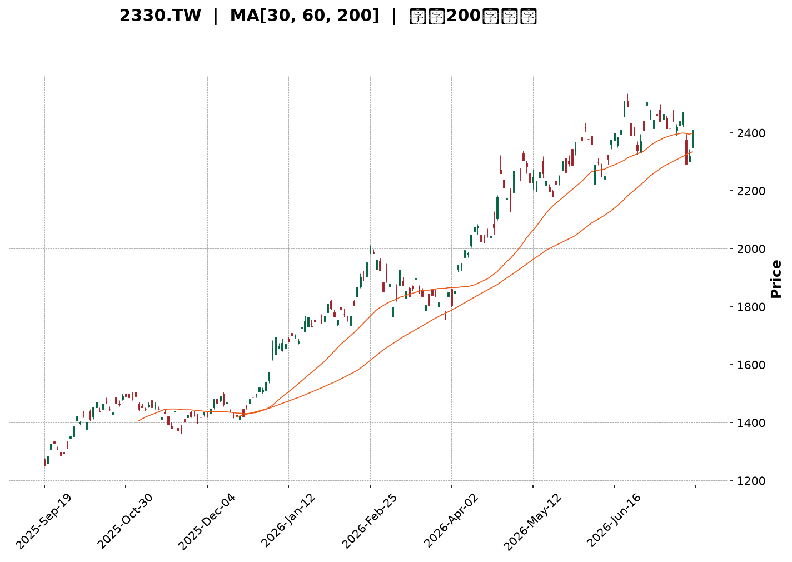
</details>

<html>
<head><meta charset="utf-8" /></head>
<body>
    <div style="height:500px; width:100%;">                        <script>window.PlotlyConfig = {MathJaxConfig: 'local'};</script>
        <script charset="utf-8" src="https://cdn.plot.ly/plotly-3.7.0.min.js" integrity="sha256-jvTGqxNp8AGWEcvNLVuKr+8j5dGe9Yw51LQkmDH+IYA=" crossorigin="anonymous"></script>                <div id="candlestick-chart" class="plotly-graph-div" style="height:100%; width:100%;"></div>            <script>                window.PLOTLYENV=window.PLOTLYENV || {};                                if (document.getElementById("candlestick-chart")) {                    Plotly.newPlot(                        "candlestick-chart",                        [{"close":{"dtype":"f8","bdata":"AAAAAGqVk0AAAAAATwyUQAAAAOCmvpRAAAAA4Ka+lEAAAABgY2+UQAAAAOAfIJRAAAAA4PAzlEAAAABANIOUQAAAAEC7IZVAAAAAQHGslUAAAABAJzeWQAAAAODj55VAAAAAQPhKlkAAAADg4+eVQAAAAICFD5ZAAAAAQAyulkAAAADgT\u002f2WQAAAAMCZcpZAAAAAAH\u002fplkAAAAAAf+mWQAAAAIA7mpZAAAAAwJlylkAAAAAAf+mWQAAAACCu1ZZAAAAAQJNMl0AAAABAk0yXQAAAAGDCOJdAAAAAQGRgl0AAAABAk0yXQAAAAIA7mpZAAAAAQAyulkAAAACAO5qWQAAAACCu1ZZAAAAAQAyulkAAAAAgrtWWQAAAAIA7mpZAAAAAYFYjlkAAAADgyF6WQAAAAABCwJVAAAAAQKCYlUAAAADAaoaWQAAAAKD+cJVAAAAA4FxJlUAAAADg4+eVQAAAAED4SpZAAAAAQCc3lkAAAABA+EqWQAAAAOAS1JVAAAAAYFYjlkAAAADAmXKWQAAAAODIXpZAAAAAgDualkAAAACg8SSXQAAAAAB\u002f6ZZAAAAAQJNMl0AAAACgSNWWQAAAAEAM\u002fZZAAAAAgMGFlkAAAABAHEqWQAAAAIA6NpZAAAAAgDo2lkAAAACAOjaWQAAAAMBmwZZAAAAAoM8kl0AAAACAsTiXQAAAAOBWdJdAAAAA4N3Dl0AAAABAGpyXQAAAAABlE5hAAAAAYJGemEAAAACAj\u002fCZQAAAAOC7e5pAAAAAQHEEmkAAAADgNCyaQAAAAABTGJpAAAAAgBZAmkAAAADAnY+aQAAAAMCdj5pAAAAAgBZAmkAAAABA6AabQAAAAEBvVptAAAAAoBSSm0AAAABA6AabQAAAAEBvVptAAAAA4DJ+m0AAAACgjUKbQAAAAID2pZtAAAAAoARFnEAAAABgXwmcQAAAAKAUkptAAAAAIFFqm0AAAACAffWbQAAAACDYuZtAAAAAIFFqm0AAAACA9qWbQAAAAMAiMZxAAAAA4JkznUAAAABAxr6dQAAAAAAhg51AAAAA4JeFnkAAAACgaUyfQAAAAKDi\u002fJ5AAAAAgFutnkAAAABATQ6eQAAAAID095xAAAAAACGDnUAAAABgXVudQAAAAABBHZxAAAAAQE+8nEAAAAAgLyKeQAAAAKB7R51AAAAAgPT3nEAAAACAbaicQAAAAAAZJJ1AAAAAoLmvnUAAAACAT9ScQAAAAMBqrJxAAAAAgLw0nEAAAACAvDScQAAAACBdwJxAAAAAwGqsnEAAAABAoVycQAAAAEAOvZtAAAAAwERtm0AAAADgQeicQAAAAIC8NJxAAAAAQDT8nEAAAAAAP2OeQAAAAGAxd55AAAAAwLYqn0AAAAAA0gKfQAAAAIAQA6BAAAAAYO40oEAAAACg5z6gQAAAAABlop9AAAAAoHKOn0AAAACALvKfQAAAAIAu8p9AAAAAYO40oEAAAABgXwahQAAAAGDypaFAAAAAgDZCoUAAAAAgZvygQAAAAICjoqBAAAAAwOS5oUAAAADgBoihQAAAAOAGiKFAAAAAILX\u002foUAAAABg0NehQAAAAEAbaqFAAAAAAACSoUAAAACgL0yhQAAAAKDrr6FAAAAAYPKloUAAAACAFHShQAAAACBELqFAAAAAYF8GoUAAAAAAImChQAAAAAAAkqFAAAAAILX\u002foUAAAACg66+hQAAAAMDC66FAAAAAgMnhoUAAAADAd1miQAAAAMB3WaJAAAAAwFWLokAAAABgGOWiQAAAAOBOlaJAAAAAIGptokAAAACAyeGhQAAAAOC79aFAAAAAAACSoUAAAAAAAJShQAAAAAAADKJAAAAAAACOokAAAAAAAMCiQAAAAAAAoqJAAAAAAADUokAAAAAAAJyjQAAAAAAAdKNAAAAAAACsokAAAAAAAKyiQAAAAAAASKJAAAAAAACEokAAAAAAANSiQAAAAAAAkqNAAAAAAABCo0AAAAAAABqjQAAAAAAAOKNAAAAAAAAQo0AAAAAAAEKjQAAAAAAA3qJAAAAAAADeokAAAAAAABCjQAAAAAAA6KJAAAAAAAAQo0AAAAAAAEyjQAAAAAAA5KFAAAAAAAAgokAAAAAAANSiQA=="},"high":{"dtype":"f8","bdata":"U8bsTn74k0AAAAAATwyUQAAAAOCmvpRAH6icdRn6lEAQPvgYBZeUQK3USnWSW5RAh36zdWNvlEC8lX2OSOaUQJzJmRyMNZVAAAAAQHGslUC2TBb5yF6WQBGXm7y0+5VAAAAA1mqGlkARl5u8tPuVQByVooc7mpZAAAAAQAyulkB1uBqZ8SSXQF8qaFUMrpZAmCKflfEkl0B1gylywjiXQD9+\u002fDjdwZZAHw54nGqGlkB1gylywjiXQPoglrUgEZdAXb\u002f7+DR0l0ALn3nVBYiXQGdmZq7Wm5dAcPI3+QWIl0C6fvex1puXQJ47d85P\u002fZZA+w0w1X7plkAfP35cDK6WQKfADtlP\u002fZZA9RtgavEkl0CnwA7ZT\u002f2WQD9+\u002fDjdwZZApRwQGfhKlkAxyF51O5qWQJGJ0SonN5ZAchzHsePnlUAOUJecO5qWQIAeIxJCwJVAsfYNC0LAlUAjLjeZhQ+WQAAAAED4SpZAbJkssmqGlkAAAADWaoaWQBk6YOfIXpZApRwQGfhKlkAAAADAmXKWQGbtdLyZcpZAAAAAgDualkAAAACg8SSXQHWDKXLCOJdAAAAAQJNMl0AAAACQOIiXQKbIZwXuEJdA0OpLRaOZlkBiLrTK33GWQLOkHNDfcZZAkeFeRRxKlkDVZ9pao5mWQL0IPoVI1ZZAAAAAoM8kl0BQ5llFk0yXQAAAAOBWdJdAAAAA4N3Dl0CivIbK3cOXQAAAAABlE5hAAAAAYJGemEB\u002fi9Na+FOaQAAAAOC7e5pAYtGyyjQsmkCCxTww2meaQFVVVRXaZ5pAaMPnz7t7mkC3ktpKYbeaQFtJbYV\u002fo5pARYKaCtpnmkCrqqrKqy6bQNJFF1X2pZtAAAAAoBSSm0CrqqoaUWqbQOmii8oyfptAVVVVpRSSm0BgBEZA2LmbQJasZEXYuZtAAAAAoARFnEBtdnEAqoCcQMdvl3p99ZtAAAAAIFFqm0CrqqoKQR2cQJVwJzVfCZxAeZoLcPalm0AAAACA9qWbQMcyKNWpgJxAAAAA4JkznUDdy7HKieadQNXvuWVNDp5AZ9KValutnkAM5KMqLXSfQAjMHvCHOJ9A1ShjleL8nkCDvqAvPcGeQGkO32\u002fkqp1AknasQLZxnkCrqqrqIIOdQAAAAABBHZxARrXlal1bnUAFvriq8kmeQLy6FUDGvp1AErFGlXtHnUAFCaPlmTOdQEzYBsH9S51ABAKBAKzDnUA5Dx3D\u002fUudQC1kIQMZJJ1AbceH4K5InEBoOz6ET9ScQDI4H2MLOJ1Ae9OboiYQnUBwCIegk3CcQAhFKMLXDJxAdNFFA\u002fPkm0AAAADgQeicQK6R1aUmEJ1AAAAAQDT8nEAAAAAAP2OeQAAAAGAxd55AAAAAwLYqn0Bcf3tgxBafQAAAAIAQA6BAxU7sINNcoED\u002fwUTQ4EigQC8xa6EJDaBAwhZscRADoEATtSsx9SqgQA\u002fE7wD8IKBAndiJcqOioEBpnEGQWBChQBjRNtOZJ6JA+WNJ893DoUCrM1JBPTihQFRcMoQ2QqFA4Ad+INfNoUBoRSOh66+hQHW5\u002fTHXzaFAH3zwcYVFokD0Lh4htf+hQDolAcLkuaFAFN898d3DoUDJZ91gFHShQAAAAKDrr6FA74X3oqAdokBJkiRB+ZuhQFEURREiYKFADw5IUT04oUAFhBPx\u002f5GhQASTPzD5m6FAAAAAILX\u002foUA28BmzoB2iQKBoq+GZJ6JAng8s83BjokC7f\u002fOAXIGiQC9\u002f2gIm0aJAgVwTgTqzokBDWrHwAwOjQHKnaAEm0aJATvDkoTO9okDGVDhxpxOiQO+VunCnE6JAJCs8ssLroUAAAAAAAKihQAAAAAAAKqJAAAAAAACOokAAAAAAAMCiQAAAAAAAoqJAAAAAAADeokAAAAAAAJyjQAAAAAAAzqNAAAAAAAAao0AAAAAAAOiiQAAAAAAAhKJAAAAAAAC2okAAAAAAAFajQAAAAAAAkqNAAAAAAABgo0AAAAAAAEKjQAAAAAAAiKNAAAAAAACIo0AAAAAAAEKjQAAAAAAAOKNAAAAAAADeokAAAAAAAGCjQAAAAAAA\u002fKJAAAAAAAA4o0AAAAAAAEyjQAAAAAAAtqJAAAAAAABSokAAAAAAANSiQA=="},"hovertemplate":"\u003cb\u003e%{x|%Y-%m-%d}\u003c\u002fb\u003e\u003cbr\u003e\u958b: $%{open:.2f}\u003cbr\u003e\u9ad8: $%{high:.2f}\u003cbr\u003e\u4f4e: $%{low:.2f}\u003cbr\u003e\u6536: $%{close:.2f}\u003cextra\u003e\u003c\u002fextra\u003e","low":{"dtype":"f8","bdata":"AAAAAGqVk0A8QeqxOqmTQCI9UJGSW5RA4VdjSjSDlEAAAABgY2+UQBu5kQNPDJRAAAAA4PAzlEAAAABANIOUQMdszIYZ+pRAAAAAOLshlUDvjF6qtPuVQN7RyCZCwJVAqqqqhlYjlkCqDPaQz4SVQEUPe6O0+5VADjDVXIUPlkAWj8ptDK6WQAAAAMCZcpZArRtMsWqGlkAAAAAAf+mWQODAgaNqhpZAoNWXKic3lkAAAAAAf+mWQK2feEPdwZZA9WCGqiARl0BSIIJjwjiXQAAAAGDCOJdAIBuQzSARl0CkQASH8SSXQODAgaNqhpZAAAAAQAyulkDgwIGjaoaWQFk\u002f8WYMrpZAAAAAQAyulkAG32mKO5qWQAAAAIA7mpZArvF3g4UPlkAAAADgyF6WQAAAAABCwJVAAAAAQKCYlUDWDzoq+EqWQAAAAKD+cJVAAAAA4FxJlUDe0cgmQsCVQAAAAKqFD5ZApdl0Y1YjlkBVVVVjJzeWQAAAAOAS1JVAXOPvprT7lUCg1ZcqJzeWQM43oUpWI5ZAggMHDvhKlkCHJvmXO5qWQAAAAAB\u002f6ZZAR4EIzk\u002f9lkCrqqraZsGWQLRuMLVI1ZZALxW0ut9xlkCe0Uu1WCKWQG8eobpYIpZATVvjL5X6lUAAAACAOjaWQIfugzWjmZZAIfnzikjVlkBfM0z17RCXQJO\u002fyY+xOJdAq6qqylZ0l0BeQ3m1VnSXQKcBbZo4iJdAgeAyNYP\u002fl0BOa7aPnz2ZQP3zz58mjZlAnS5Nta3cmUD8dIY\u002f6rSZQFVVVSXqtJlAAAAAgBZAmkBJbSU12meaQEltJTXaZ5pAun1l9VIYmkAAAACgnY+aQNJFF9tCy5pAt5bFOugGm0AAAABA6AabQBdddLWrLptAq6qqyqsum0AAAACgjUKbQBShCKWNQptAMP3S\u002f7nNm0CYwZeaffWbQAAAAKAUkptACjKbCsoam0AAAAAw2LmbQLZHbJUUkptAg8ymWm9Wm0BTm9pU6AabQAAAAMAiMZxA6jsbtYuUnECL0DgVuB+dQAAAAAAhg51A\u002feMSK8a+nUDmN7iK4vyeQAAAAKDi\u002fJ5AjHiSGi8inkAAAABATQ6eQAAAAID095xAdEucOj9vnUBVVVXVmTOdQPitkdUyfptAXCWNKshsnEDeLE8auB+dQAAAAKB7R51AqaJnpYuUnEAAAACAbaicQLMn+T40\u002fJxA9Pl8fuJznUAAAACAT9ScQAAAAMBqrJxA4BpZnQDRm0AncfC+1wycQAAAACBdwJxAAAAAwGqsnEA+3uO91wycQAAAAEAOvZtAAAAAwERtm0D6kmn9hYScQJQ4eB\u002fKIJxA11prXXiYnECd2Ikdg\u002f+dQDN1i311E55AUrgefQiznkDugY3e+saeQL9KGJubUp9AO7ETnwkNoEAHdGN+EAOgQAAAAABlop9AAAAAoHKOn0D4HYgfPN6fQPE7EL9Jyp9Aip3YbhADoEBpOeZbzGagQAAAAGDypaFAAAAAgDZCoUAq5laPet6gQAAAAICjoqBA\u002fMAPvFEaoUBMXW5\u002fFHShQExdbn8UdKFAAAAAILX\u002foUBPRZpu8qWhQAAAAEAbaqFA3NTDTT04oUAp8lkPRC6hQB6Xvh0iYKFAhB5CzwaIoUAkSZKONkKhQAAAACBELqFAAAAAYF8GoUAAAAAAImChQOiNgt4oVqFA4YMPzuS5oUAAAACg66+hQMuHcV\u002fQ16FAOavHjuuvoUBXoM\u002fOmSeiQBEgw49+T6JAf6Ps\u002fnBjokC+pU7PLMeiQAAAAOBOlaJA4yVKj35PokBi8NMMImChQAucg3\u002fJ4aFAAAAAAACSoUAAAAAAAEShQAAAAAAA5KFAAAAAAABSokAAAAAAAFyiQAAAAAAAXKJAAAAAAACiokAAAAAAAC6jQAAAAAAAdKNAAAAAAACsokAAAAAAAKyiQAAAAAAAKqJAAAAAAAA0okAAAAAAANSiQAAAAAAAVqNAAAAAAAAao0AAAAAAAN6iQAAAAAAALqNAAAAAAAAQo0AAAAAAAOiiQAAAAAAA3qJAAAAAAADeokAAAAAAABCjQAAAAAAArKJAAAAAAADeokAAAAAAAOiiQAAAAAAA5KFAAAAAAAD4oUAAAAAAAFKiQA=="},"name":"\u50f9\u683c","open":{"dtype":"f8","bdata":"DwVXcq3kk0A8QeqxOqmTQILK2W1jb5RAvxoTmUjmlEAAAABgY2+UQMmN3JjBR5RALSqRvMFHlEAAAABANIOUQGM2ZmPqDZVAAAAAOLshlUDvjF6qtPuVQO9oZAMT1JVAAAAAQPhKlkCqDPaQz4SVQGGkHatqhpZACuSfFSc3lkAWj8ptDK6WQB8OeJxqhpZAinzWjTualkDdYIrcT\u002f2WQAAAAIA7mpZAwOMPB\u002fhKlkB1gylywjiXQFNgh\u002fx+6ZZApEAEh\u002fEkl0Bdv\u002fv4NHSXQNejcPU0dJdAAAAAQGRgl0ALn3nVBYiXQH78+PF+6ZZA\u002flllHN3BlkAAAACAO5qWQK2feEPdwZZA98H6jSARl0Ctn3hD3cGWQAAAAIA7mpZArvF3g4UPlkBm7XS8mXKWQJGJ0SonN5ZAHMdxHHGslUDyr2jjmXKWQECPEVmgmJVA6aKLLnGslUAjLjeZhQ+WQKqqqoZWI5ZAEXOh1ZlylkAAAABA+EqWQBk6YOfIXpZAAAAAYFYjlkDA4w8H+EqWQAAAAODIXpZAoUKF6shelkAraox0DK6WQJgin5XxJJdA9WCGqiARl0CrqqrKVnSXQFo3mHoq6ZZAAAAAgMGFlkAAAABAHEqWQJHhXkUcSpZA3jxC9XYOlkDVZ9pao5mWQAAAAMBmwZZA2fo2UCrplkAAAACAsTiXQDGVmBp1YJdAAAAAkDiIl0Cvobx6OIiXQP0ly18anJdAYSjmv0YnmECb7RNVgVGZQP3zz58mjZlAnS5Nta3cmUAoDPAEzMiZQAAAALCt3JlARYKaCtpnmkC3ktpKYbeaQKW2kvq7e5pA3b6yujQsmkCrqqp6BvOaQNJFF9tCy5pAt5bFOugGm0BVVVUFyhqbQHTRRQVRaptAAAAA4DJ+m0B1AcIqUWqbQKpNbWpvVptAMP3S\u002f7nNm0AGOAk7yGycQER29O+5zZtAiGX0z6sum0CrqqoKQR2cQAAAACDYuZtAAAAAIFFqm0DpRz8ayhqbQBUm3g\u002fIbJxAbdR3em2onEB6tpHamTOdQAAAAAAhg51A\u002feMSK8a+nUDmN7iK4vyeQFiZX2XEEJ9AjHiSGi8inkDXPguleZmeQJsJ6h8\u002fb51AYaQdKy8inkBVVVXVmTOdQDl435oUkptAo9pyVdYLnUDj6gele0edQF7dCvAgg51AqaJnpYuUnEAEmkIguB+dQCZsg2ALOJ1A\u002fP1+P8ebnUBaN5hiCzidQMlCFkI0\u002fJxATeLg\u002ffLkm0BoOz6ET9ScQCHQFKImEJ1AZCELgU\u002fUnECu5moeyiCcQAAAAEAOvZtAuuii4Rupm0Bji3K+aqycQK6R1aUmEJ1A8L33fk\u002fUnEBe6IXeZyeeQEeVBJ9MT55AmpmZ3frGnkClgISf3+6eQKrQo\u002fuNZp9A7MROzwIXoEABPrtv7jSgQPyoLnEQA6BA61x5AGWin0AAAACALvKfQPgdiB883p9AYid2wOBIoEDS1SeMxXCgQHzhvfDdw6FAh1WEoQ1+oUAOosfvbPKgQMoQrCNELqFA7MRO7EokoUAAAADgBoihQAAAAOAGiKFAzaFiEZMxokB6F4\u002fAwuuhQOvbgGHypaFA8LMBPxtqoUAp8lkPRC6hQI9L394GiKFAc6Q5ErX\u002foUBJkiTvKFahQDEMw7AvTKFApnEGIUQuoUDPNG5gFHShQPjZgJ8NfqFA4YMPzuS5oUAaw9GCpxOiQDZ4jiC1\u002f6FA6CCvkn5PokA0YEkvjDuiQAAAAMB3WaJAQK6JIEifokAAAABgGOWiQAAAAOBOlaJAO7RrQUGpokBi8NMMImChQAAAAOC79aFAGHJ9IdfNoUAAAAAAAIChQAAAAAAAKqJAAAAAAABwokAAAAAAAI6iQAAAAAAAZqJAAAAAAAC2okAAAAAAAC6jQAAAAAAAnKNAAAAAAAAGo0AAAAAAANSiQAAAAAAAcKJAAAAAAAA0okAAAAAAABCjQAAAAAAAfqNAAAAAAAAko0AAAAAAAN6iQAAAAAAAQqNAAAAAAABgo0AAAAAAABqjQAAAAAAAJKNAAAAAAADeokAAAAAAADijQAAAAAAA1KJAAAAAAADyokAAAAAAAPyiQAAAAAAAjqJAAAAAAAD4oUAAAAAAAFyiQA=="},"x":["2025-09-19T00:00:00+08:00","2025-09-22T00:00:00+08:00","2025-09-23T00:00:00+08:00","2025-09-24T00:00:00+08:00","2025-09-25T00:00:00+08:00","2025-09-26T00:00:00+08:00","2025-09-30T00:00:00+08:00","2025-10-01T00:00:00+08:00","2025-10-02T00:00:00+08:00","2025-10-03T00:00:00+08:00","2025-10-07T00:00:00+08:00","2025-10-08T00:00:00+08:00","2025-10-09T00:00:00+08:00","2025-10-13T00:00:00+08:00","2025-10-14T00:00:00+08:00","2025-10-15T00:00:00+08:00","2025-10-16T00:00:00+08:00","2025-10-17T00:00:00+08:00","2025-10-20T00:00:00+08:00","2025-10-21T00:00:00+08:00","2025-10-22T00:00:00+08:00","2025-10-23T00:00:00+08:00","2025-10-27T00:00:00+08:00","2025-10-28T00:00:00+08:00","2025-10-29T00:00:00+08:00","2025-10-30T00:00:00+08:00","2025-10-31T00:00:00+08:00","2025-11-03T00:00:00+08:00","2025-11-04T00:00:00+08:00","2025-11-05T00:00:00+08:00","2025-11-06T00:00:00+08:00","2025-11-07T00:00:00+08:00","2025-11-10T00:00:00+08:00","2025-11-11T00:00:00+08:00","2025-11-12T00:00:00+08:00","2025-11-13T00:00:00+08:00","2025-11-14T00:00:00+08:00","2025-11-17T00:00:00+08:00","2025-11-18T00:00:00+08:00","2025-11-19T00:00:00+08:00","2025-11-20T00:00:00+08:00","2025-11-21T00:00:00+08:00","2025-11-24T00:00:00+08:00","2025-11-25T00:00:00+08:00","2025-11-26T00:00:00+08:00","2025-11-27T00:00:00+08:00","2025-11-28T00:00:00+08:00","2025-12-01T00:00:00+08:00","2025-12-02T00:00:00+08:00","2025-12-03T00:00:00+08:00","2025-12-04T00:00:00+08:00","2025-12-05T00:00:00+08:00","2025-12-08T00:00:00+08:00","2025-12-09T00:00:00+08:00","2025-12-10T00:00:00+08:00","2025-12-11T00:00:00+08:00","2025-12-12T00:00:00+08:00","2025-12-15T00:00:00+08:00","2025-12-16T00:00:00+08:00","2025-12-17T00:00:00+08:00","2025-12-18T00:00:00+08:00","2025-12-19T00:00:00+08:00","2025-12-22T00:00:00+08:00","2025-12-23T00:00:00+08:00","2025-12-24T00:00:00+08:00","2025-12-26T00:00:00+08:00","2025-12-29T00:00:00+08:00","2025-12-30T00:00:00+08:00","2025-12-31T00:00:00+08:00","2026-01-02T00:00:00+08:00","2026-01-05T00:00:00+08:00","2026-01-06T00:00:00+08:00","2026-01-07T00:00:00+08:00","2026-01-08T00:00:00+08:00","2026-01-09T00:00:00+08:00","2026-01-12T00:00:00+08:00","2026-01-13T00:00:00+08:00","2026-01-14T00:00:00+08:00","2026-01-15T00:00:00+08:00","2026-01-16T00:00:00+08:00","2026-01-19T00:00:00+08:00","2026-01-20T00:00:00+08:00","2026-01-21T00:00:00+08:00","2026-01-22T00:00:00+08:00","2026-01-23T00:00:00+08:00","2026-01-26T00:00:00+08:00","2026-01-27T00:00:00+08:00","2026-01-28T00:00:00+08:00","2026-01-29T00:00:00+08:00","2026-01-30T00:00:00+08:00","2026-02-02T00:00:00+08:00","2026-02-03T00:00:00+08:00","2026-02-04T00:00:00+08:00","2026-02-05T00:00:00+08:00","2026-02-06T00:00:00+08:00","2026-02-09T00:00:00+08:00","2026-02-10T00:00:00+08:00","2026-02-11T00:00:00+08:00","2026-02-23T00:00:00+08:00","2026-02-24T00:00:00+08:00","2026-02-25T00:00:00+08:00","2026-02-26T00:00:00+08:00","2026-03-02T00:00:00+08:00","2026-03-03T00:00:00+08:00","2026-03-04T00:00:00+08:00","2026-03-05T00:00:00+08:00","2026-03-06T00:00:00+08:00","2026-03-09T00:00:00+08:00","2026-03-10T00:00:00+08:00","2026-03-11T00:00:00+08:00","2026-03-12T00:00:00+08:00","2026-03-13T00:00:00+08:00","2026-03-16T00:00:00+08:00","2026-03-17T00:00:00+08:00","2026-03-18T00:00:00+08:00","2026-03-19T00:00:00+08:00","2026-03-20T00:00:00+08:00","2026-03-23T00:00:00+08:00","2026-03-24T00:00:00+08:00","2026-03-25T00:00:00+08:00","2026-03-26T00:00:00+08:00","2026-03-27T00:00:00+08:00","2026-03-30T00:00:00+08:00","2026-03-31T00:00:00+08:00","2026-04-01T00:00:00+08:00","2026-04-02T00:00:00+08:00","2026-04-07T00:00:00+08:00","2026-04-08T00:00:00+08:00","2026-04-09T00:00:00+08:00","2026-04-10T00:00:00+08:00","2026-04-13T00:00:00+08:00","2026-04-14T00:00:00+08:00","2026-04-15T00:00:00+08:00","2026-04-16T00:00:00+08:00","2026-04-17T00:00:00+08:00","2026-04-20T00:00:00+08:00","2026-04-21T00:00:00+08:00","2026-04-22T00:00:00+08:00","2026-04-23T00:00:00+08:00","2026-04-24T00:00:00+08:00","2026-04-27T00:00:00+08:00","2026-04-28T00:00:00+08:00","2026-04-29T00:00:00+08:00","2026-04-30T00:00:00+08:00","2026-05-04T00:00:00+08:00","2026-05-05T00:00:00+08:00","2026-05-06T00:00:00+08:00","2026-05-07T00:00:00+08:00","2026-05-08T00:00:00+08:00","2026-05-11T00:00:00+08:00","2026-05-12T00:00:00+08:00","2026-05-13T00:00:00+08:00","2026-05-14T00:00:00+08:00","2026-05-15T00:00:00+08:00","2026-05-18T00:00:00+08:00","2026-05-19T00:00:00+08:00","2026-05-20T00:00:00+08:00","2026-05-21T00:00:00+08:00","2026-05-22T00:00:00+08:00","2026-05-25T00:00:00+08:00","2026-05-26T00:00:00+08:00","2026-05-27T00:00:00+08:00","2026-05-28T00:00:00+08:00","2026-05-29T00:00:00+08:00","2026-06-01T00:00:00+08:00","2026-06-02T00:00:00+08:00","2026-06-03T00:00:00+08:00","2026-06-04T00:00:00+08:00","2026-06-05T00:00:00+08:00","2026-06-08T00:00:00+08:00","2026-06-09T00:00:00+08:00","2026-06-10T00:00:00+08:00","2026-06-11T00:00:00+08:00","2026-06-12T00:00:00+08:00","2026-06-15T00:00:00+08:00","2026-06-16T00:00:00+08:00","2026-06-17T00:00:00+08:00","2026-06-18T00:00:00+08:00","2026-06-22T00:00:00+08:00","2026-06-23T00:00:00+08:00","2026-06-24T00:00:00+08:00","2026-06-25T00:00:00+08:00","2026-06-26T00:00:00+08:00","2026-06-29T00:00:00+08:00","2026-06-30T00:00:00+08:00","2026-07-01T00:00:00+08:00","2026-07-02T00:00:00+08:00","2026-07-03T00:00:00+08:00","2026-07-06T00:00:00+08:00","2026-07-07T00:00:00+08:00","2026-07-08T00:00:00+08:00","2026-07-09T00:00:00+08:00","2026-07-10T00:00:00+08:00","2026-07-13T00:00:00+08:00","2026-07-14T00:00:00+08:00","2026-07-15T00:00:00+08:00","2026-07-16T00:00:00+08:00","2026-07-17T00:00:00+08:00","2026-07-20T00:00:00+08:00","2026-07-21T00:00:00+08:00"],"type":"candlestick"},{"hovertemplate":"MA30: $%{y:.2f}\u003cextra\u003e\u003c\u002fextra\u003e","line":{"color":"#2196F3","dash":"dash","width":2},"mode":"lines","name":"MA30","x":["2025-09-19T00:00:00+08:00","2025-09-22T00:00:00+08:00","2025-09-23T00:00:00+08:00","2025-09-24T00:00:00+08:00","2025-09-25T00:00:00+08:00","2025-09-26T00:00:00+08:00","2025-09-30T00:00:00+08:00","2025-10-01T00:00:00+08:00","2025-10-02T00:00:00+08:00","2025-10-03T00:00:00+08:00","2025-10-07T00:00:00+08:00","2025-10-08T00:00:00+08:00","2025-10-09T00:00:00+08:00","2025-10-13T00:00:00+08:00","2025-10-14T00:00:00+08:00","2025-10-15T00:00:00+08:00","2025-10-16T00:00:00+08:00","2025-10-17T00:00:00+08:00","2025-10-20T00:00:00+08:00","2025-10-21T00:00:00+08:00","2025-10-22T00:00:00+08:00","2025-10-23T00:00:00+08:00","2025-10-27T00:00:00+08:00","2025-10-28T00:00:00+08:00","2025-10-29T00:00:00+08:00","2025-10-30T00:00:00+08:00","2025-10-31T00:00:00+08:00","2025-11-03T00:00:00+08:00","2025-11-04T00:00:00+08:00","2025-11-05T00:00:00+08:00","2025-11-06T00:00:00+08:00","2025-11-07T00:00:00+08:00","2025-11-10T00:00:00+08:00","2025-11-11T00:00:00+08:00","2025-11-12T00:00:00+08:00","2025-11-13T00:00:00+08:00","2025-11-14T00:00:00+08:00","2025-11-17T00:00:00+08:00","2025-11-18T00:00:00+08:00","2025-11-19T00:00:00+08:00","2025-11-20T00:00:00+08:00","2025-11-21T00:00:00+08:00","2025-11-24T00:00:00+08:00","2025-11-25T00:00:00+08:00","2025-11-26T00:00:00+08:00","2025-11-27T00:00:00+08:00","2025-11-28T00:00:00+08:00","2025-12-01T00:00:00+08:00","2025-12-02T00:00:00+08:00","2025-12-03T00:00:00+08:00","2025-12-04T00:00:00+08:00","2025-12-05T00:00:00+08:00","2025-12-08T00:00:00+08:00","2025-12-09T00:00:00+08:00","2025-12-10T00:00:00+08:00","2025-12-11T00:00:00+08:00","2025-12-12T00:00:00+08:00","2025-12-15T00:00:00+08:00","2025-12-16T00:00:00+08:00","2025-12-17T00:00:00+08:00","2025-12-18T00:00:00+08:00","2025-12-19T00:00:00+08:00","2025-12-22T00:00:00+08:00","2025-12-23T00:00:00+08:00","2025-12-24T00:00:00+08:00","2025-12-26T00:00:00+08:00","2025-12-29T00:00:00+08:00","2025-12-30T00:00:00+08:00","2025-12-31T00:00:00+08:00","2026-01-02T00:00:00+08:00","2026-01-05T00:00:00+08:00","2026-01-06T00:00:00+08:00","2026-01-07T00:00:00+08:00","2026-01-08T00:00:00+08:00","2026-01-09T00:00:00+08:00","2026-01-12T00:00:00+08:00","2026-01-13T00:00:00+08:00","2026-01-14T00:00:00+08:00","2026-01-15T00:00:00+08:00","2026-01-16T00:00:00+08:00","2026-01-19T00:00:00+08:00","2026-01-20T00:00:00+08:00","2026-01-21T00:00:00+08:00","2026-01-22T00:00:00+08:00","2026-01-23T00:00:00+08:00","2026-01-26T00:00:00+08:00","2026-01-27T00:00:00+08:00","2026-01-28T00:00:00+08:00","2026-01-29T00:00:00+08:00","2026-01-30T00:00:00+08:00","2026-02-02T00:00:00+08:00","2026-02-03T00:00:00+08:00","2026-02-04T00:00:00+08:00","2026-02-05T00:00:00+08:00","2026-02-06T00:00:00+08:00","2026-02-09T00:00:00+08:00","2026-02-10T00:00:00+08:00","2026-02-11T00:00:00+08:00","2026-02-23T00:00:00+08:00","2026-02-24T00:00:00+08:00","2026-02-25T00:00:00+08:00","2026-02-26T00:00:00+08:00","2026-03-02T00:00:00+08:00","2026-03-03T00:00:00+08:00","2026-03-04T00:00:00+08:00","2026-03-05T00:00:00+08:00","2026-03-06T00:00:00+08:00","2026-03-09T00:00:00+08:00","2026-03-10T00:00:00+08:00","2026-03-11T00:00:00+08:00","2026-03-12T00:00:00+08:00","2026-03-13T00:00:00+08:00","2026-03-16T00:00:00+08:00","2026-03-17T00:00:00+08:00","2026-03-18T00:00:00+08:00","2026-03-19T00:00:00+08:00","2026-03-20T00:00:00+08:00","2026-03-23T00:00:00+08:00","2026-03-24T00:00:00+08:00","2026-03-25T00:00:00+08:00","2026-03-26T00:00:00+08:00","2026-03-27T00:00:00+08:00","2026-03-30T00:00:00+08:00","2026-03-31T00:00:00+08:00","2026-04-01T00:00:00+08:00","2026-04-02T00:00:00+08:00","2026-04-07T00:00:00+08:00","2026-04-08T00:00:00+08:00","2026-04-09T00:00:00+08:00","2026-04-10T00:00:00+08:00","2026-04-13T00:00:00+08:00","2026-04-14T00:00:00+08:00","2026-04-15T00:00:00+08:00","2026-04-16T00:00:00+08:00","2026-04-17T00:00:00+08:00","2026-04-20T00:00:00+08:00","2026-04-21T00:00:00+08:00","2026-04-22T00:00:00+08:00","2026-04-23T00:00:00+08:00","2026-04-24T00:00:00+08:00","2026-04-27T00:00:00+08:00","2026-04-28T00:00:00+08:00","2026-04-29T00:00:00+08:00","2026-04-30T00:00:00+08:00","2026-05-04T00:00:00+08:00","2026-05-05T00:00:00+08:00","2026-05-06T00:00:00+08:00","2026-05-07T00:00:00+08:00","2026-05-08T00:00:00+08:00","2026-05-11T00:00:00+08:00","2026-05-12T00:00:00+08:00","2026-05-13T00:00:00+08:00","2026-05-14T00:00:00+08:00","2026-05-15T00:00:00+08:00","2026-05-18T00:00:00+08:00","2026-05-19T00:00:00+08:00","2026-05-20T00:00:00+08:00","2026-05-21T00:00:00+08:00","2026-05-22T00:00:00+08:00","2026-05-25T00:00:00+08:00","2026-05-26T00:00:00+08:00","2026-05-27T00:00:00+08:00","2026-05-28T00:00:00+08:00","2026-05-29T00:00:00+08:00","2026-06-01T00:00:00+08:00","2026-06-02T00:00:00+08:00","2026-06-03T00:00:00+08:00","2026-06-04T00:00:00+08:00","2026-06-05T00:00:00+08:00","2026-06-08T00:00:00+08:00","2026-06-09T00:00:00+08:00","2026-06-10T00:00:00+08:00","2026-06-11T00:00:00+08:00","2026-06-12T00:00:00+08:00","2026-06-15T00:00:00+08:00","2026-06-16T00:00:00+08:00","2026-06-17T00:00:00+08:00","2026-06-18T00:00:00+08:00","2026-06-22T00:00:00+08:00","2026-06-23T00:00:00+08:00","2026-06-24T00:00:00+08:00","2026-06-25T00:00:00+08:00","2026-06-26T00:00:00+08:00","2026-06-29T00:00:00+08:00","2026-06-30T00:00:00+08:00","2026-07-01T00:00:00+08:00","2026-07-02T00:00:00+08:00","2026-07-03T00:00:00+08:00","2026-07-06T00:00:00+08:00","2026-07-07T00:00:00+08:00","2026-07-08T00:00:00+08:00","2026-07-09T00:00:00+08:00","2026-07-10T00:00:00+08:00","2026-07-13T00:00:00+08:00","2026-07-14T00:00:00+08:00","2026-07-15T00:00:00+08:00","2026-07-16T00:00:00+08:00","2026-07-17T00:00:00+08:00","2026-07-20T00:00:00+08:00","2026-07-21T00:00:00+08:00"],"y":{"dtype":"f8","bdata":"AAAAAAAA+H8AAAAAAAD4fwAAAAAAAPh\u002fAAAAAAAA+H8AAAAAAAD4fwAAAAAAAPh\u002fAAAAAAAA+H8AAAAAAAD4fwAAAAAAAPh\u002fAAAAAAAA+H8AAAAAAAD4fwAAAAAAAPh\u002fAAAAAAAA+H8AAAAAAAD4fwAAAAAAAPh\u002fAAAAAAAA+H8AAAAAAAD4fwAAAAAAAPh\u002fAAAAAAAA+H8AAAAAAAD4fwAAAAAAAPh\u002fAAAAAAAA+H8AAAAAAAD4fwAAAAAAAPh\u002fAAAAAAAA+H8AAAAAAAD4fwAAAAAAAPh\u002fAAAAAAAA+H8AAAAAAAD4f83MzIwL+5VAvLu7W3cVlkAiIiKCQyuWQFVVVRUZPZZAZmZmdpxNlkC8u7trFmKWQJqZmXk5d5ZAvLu727yHlkBVVVUll5eWQHd3d+ffnJZA3t3dzTaclkAAAAAw256WQM3MzJzkmpZA3t3dXU6SlkDe3d1dTpKWQImIiKhJlJZAd3d3F1OQlkDNzMw8YYqWQJqZmXkYhZZAVVVVhX1+lkAiIiLyhnqWQImIiKiLeJZAmpmZ2d15lkAzMzMj2XuWQLy7uzuCfJZAvLu7O4J8lkB3d3dHiHiWQN7d3b2KdpZAzczMDEFvlkC8u7t7o2aWQN7d3R1OY5ZAiYiIqE9flkCrqqpK+luWQO\u002fu7j5NW5ZAERERsUJflkCrqqqaj2KWQImIiMjUaZZAq6qqKrd3lkAiIiLySoKWQCIiInIhlpZAAAAAwO2vlkC8u7sbEc2WQKuqqmoX+JZAZmZm9nUgl0AAAAAQ30SXQFVVVQVRZZdAVVVVZb+Hl0AAAABQK6yXQO\u002fu7s6N1JdAd3d3R6X3l0BmZmb2uB6YQAAAAGAcSZhAq6qqeoFzmEDNzMxMo5SYQKuqqgpnuphAERERoTDemEAiIiIy9wOZQM3MzLy6K5lAIiIigsVcmUB3d3dH0I2ZQAAAAMCKu5lAd3d35\u002fHnmUC8u7ur\u002fBiaQJqZmdlmQ5pAmpmZGdpnmkCrqqqqoI2aQM3MzNwNtppA7+7u\u002fnHkmkAAAAAQzRibQCIiIjIxR5tAd3d3R495m0AAAADASaebQJqZmfm5zZtAREREhH31m0BmZmZ2oBacQImIiNglL5xAd3d3h\u002ftKnEAAAABA12KcQM3MzGwYcJxAREREhE2FnEARERHhz5+cQLy7u1thsJxAiYiIOE+8nEAAAAAQOsqcQGZmZpad2ZxAd3d3R1XsnEC8u7ubufmcQHd3dzd5Ap1Ad3d3R+4BnUARERFRYAOdQM3MzMxzDZ1AMzMzYzAYnUAzMzODoBudQKuqquq7G51Aq6qqGtUbnUCamZlZkyadQDMzMxOyJp1Aq6qqWtkknUCJiIjYVCqdQGZmZoZ3Mp1A3t3djfg3nUARERGRhDWdQKuqqvpbPp1AZmZmFi1NnUAAAACw9WGdQLy7uyu1eJ1AMzMz0yaKnUDNzMzcPqCdQCIiInLxwJ1Ad3d3B1TgnUB3d3c3vwGeQN7d3Q0YNZ5Ad3d3Z3FknkBVVVXlyZGeQJqZmSkHtZ5ARERE5DrmnkBmZmbmaxufQFVVVVXxUZ9Ad3d3l26Un0AAAAAAQ9SfQCIiIsoPBKBAREREnKcfoEBEREQcQDqgQO\u002fu7obUWqBAq6qqQmh8oEAiIiJyAZagQHd3d9dEsKBAAAAAwODFoEAzMzOzftigQLy7uxNx7KBAMzMzqw0BoUB3d3efqxOhQM3MzNT1I6FA7+7uZkEyoUC8u7sjNUShQERERAzRWaFAiYiImGtxoUARERGRWoqhQAAAALCgoKFA7+7uvpOzoUBVVVUV5LqhQO\u002fu7u6MvaFAiYiIyDXAoUAiIiJyQ8WhQAAAABBP0aFAmpmZCWHYoUBVVVU1x+KhQBEREWEt7KFAERER8UDzoUCJiIiYUwKiQGZmZha5E6JAzczMfB8dokAiIiKi2SiiQBEREWHrLaJAvLu7O1I1okCJiIhIDUGiQJqZmWlxVaJAzczMTH9ookBmZmbmOXeiQHd3d\u002fdKhaJAd3d3h16OokC8u7ubxZuiQHd3d7fYo6JA7+7u7kCsokCrqqqKVrKiQBEREdEWt6JARERE5IK7okAzMzMD8b6iQLy7u\u002fsHuaJAERERYXO2okAzMzNDhr6iQA=="},"type":"scatter"},{"hovertemplate":"MA60: $%{y:.2f}\u003cextra\u003e\u003c\u002fextra\u003e","line":{"color":"#9C27B0","dash":"dash","width":2},"mode":"lines","name":"MA60","x":["2025-09-19T00:00:00+08:00","2025-09-22T00:00:00+08:00","2025-09-23T00:00:00+08:00","2025-09-24T00:00:00+08:00","2025-09-25T00:00:00+08:00","2025-09-26T00:00:00+08:00","2025-09-30T00:00:00+08:00","2025-10-01T00:00:00+08:00","2025-10-02T00:00:00+08:00","2025-10-03T00:00:00+08:00","2025-10-07T00:00:00+08:00","2025-10-08T00:00:00+08:00","2025-10-09T00:00:00+08:00","2025-10-13T00:00:00+08:00","2025-10-14T00:00:00+08:00","2025-10-15T00:00:00+08:00","2025-10-16T00:00:00+08:00","2025-10-17T00:00:00+08:00","2025-10-20T00:00:00+08:00","2025-10-21T00:00:00+08:00","2025-10-22T00:00:00+08:00","2025-10-23T00:00:00+08:00","2025-10-27T00:00:00+08:00","2025-10-28T00:00:00+08:00","2025-10-29T00:00:00+08:00","2025-10-30T00:00:00+08:00","2025-10-31T00:00:00+08:00","2025-11-03T00:00:00+08:00","2025-11-04T00:00:00+08:00","2025-11-05T00:00:00+08:00","2025-11-06T00:00:00+08:00","2025-11-07T00:00:00+08:00","2025-11-10T00:00:00+08:00","2025-11-11T00:00:00+08:00","2025-11-12T00:00:00+08:00","2025-11-13T00:00:00+08:00","2025-11-14T00:00:00+08:00","2025-11-17T00:00:00+08:00","2025-11-18T00:00:00+08:00","2025-11-19T00:00:00+08:00","2025-11-20T00:00:00+08:00","2025-11-21T00:00:00+08:00","2025-11-24T00:00:00+08:00","2025-11-25T00:00:00+08:00","2025-11-26T00:00:00+08:00","2025-11-27T00:00:00+08:00","2025-11-28T00:00:00+08:00","2025-12-01T00:00:00+08:00","2025-12-02T00:00:00+08:00","2025-12-03T00:00:00+08:00","2025-12-04T00:00:00+08:00","2025-12-05T00:00:00+08:00","2025-12-08T00:00:00+08:00","2025-12-09T00:00:00+08:00","2025-12-10T00:00:00+08:00","2025-12-11T00:00:00+08:00","2025-12-12T00:00:00+08:00","2025-12-15T00:00:00+08:00","2025-12-16T00:00:00+08:00","2025-12-17T00:00:00+08:00","2025-12-18T00:00:00+08:00","2025-12-19T00:00:00+08:00","2025-12-22T00:00:00+08:00","2025-12-23T00:00:00+08:00","2025-12-24T00:00:00+08:00","2025-12-26T00:00:00+08:00","2025-12-29T00:00:00+08:00","2025-12-30T00:00:00+08:00","2025-12-31T00:00:00+08:00","2026-01-02T00:00:00+08:00","2026-01-05T00:00:00+08:00","2026-01-06T00:00:00+08:00","2026-01-07T00:00:00+08:00","2026-01-08T00:00:00+08:00","2026-01-09T00:00:00+08:00","2026-01-12T00:00:00+08:00","2026-01-13T00:00:00+08:00","2026-01-14T00:00:00+08:00","2026-01-15T00:00:00+08:00","2026-01-16T00:00:00+08:00","2026-01-19T00:00:00+08:00","2026-01-20T00:00:00+08:00","2026-01-21T00:00:00+08:00","2026-01-22T00:00:00+08:00","2026-01-23T00:00:00+08:00","2026-01-26T00:00:00+08:00","2026-01-27T00:00:00+08:00","2026-01-28T00:00:00+08:00","2026-01-29T00:00:00+08:00","2026-01-30T00:00:00+08:00","2026-02-02T00:00:00+08:00","2026-02-03T00:00:00+08:00","2026-02-04T00:00:00+08:00","2026-02-05T00:00:00+08:00","2026-02-06T00:00:00+08:00","2026-02-09T00:00:00+08:00","2026-02-10T00:00:00+08:00","2026-02-11T00:00:00+08:00","2026-02-23T00:00:00+08:00","2026-02-24T00:00:00+08:00","2026-02-25T00:00:00+08:00","2026-02-26T00:00:00+08:00","2026-03-02T00:00:00+08:00","2026-03-03T00:00:00+08:00","2026-03-04T00:00:00+08:00","2026-03-05T00:00:00+08:00","2026-03-06T00:00:00+08:00","2026-03-09T00:00:00+08:00","2026-03-10T00:00:00+08:00","2026-03-11T00:00:00+08:00","2026-03-12T00:00:00+08:00","2026-03-13T00:00:00+08:00","2026-03-16T00:00:00+08:00","2026-03-17T00:00:00+08:00","2026-03-18T00:00:00+08:00","2026-03-19T00:00:00+08:00","2026-03-20T00:00:00+08:00","2026-03-23T00:00:00+08:00","2026-03-24T00:00:00+08:00","2026-03-25T00:00:00+08:00","2026-03-26T00:00:00+08:00","2026-03-27T00:00:00+08:00","2026-03-30T00:00:00+08:00","2026-03-31T00:00:00+08:00","2026-04-01T00:00:00+08:00","2026-04-02T00:00:00+08:00","2026-04-07T00:00:00+08:00","2026-04-08T00:00:00+08:00","2026-04-09T00:00:00+08:00","2026-04-10T00:00:00+08:00","2026-04-13T00:00:00+08:00","2026-04-14T00:00:00+08:00","2026-04-15T00:00:00+08:00","2026-04-16T00:00:00+08:00","2026-04-17T00:00:00+08:00","2026-04-20T00:00:00+08:00","2026-04-21T00:00:00+08:00","2026-04-22T00:00:00+08:00","2026-04-23T00:00:00+08:00","2026-04-24T00:00:00+08:00","2026-04-27T00:00:00+08:00","2026-04-28T00:00:00+08:00","2026-04-29T00:00:00+08:00","2026-04-30T00:00:00+08:00","2026-05-04T00:00:00+08:00","2026-05-05T00:00:00+08:00","2026-05-06T00:00:00+08:00","2026-05-07T00:00:00+08:00","2026-05-08T00:00:00+08:00","2026-05-11T00:00:00+08:00","2026-05-12T00:00:00+08:00","2026-05-13T00:00:00+08:00","2026-05-14T00:00:00+08:00","2026-05-15T00:00:00+08:00","2026-05-18T00:00:00+08:00","2026-05-19T00:00:00+08:00","2026-05-20T00:00:00+08:00","2026-05-21T00:00:00+08:00","2026-05-22T00:00:00+08:00","2026-05-25T00:00:00+08:00","2026-05-26T00:00:00+08:00","2026-05-27T00:00:00+08:00","2026-05-28T00:00:00+08:00","2026-05-29T00:00:00+08:00","2026-06-01T00:00:00+08:00","2026-06-02T00:00:00+08:00","2026-06-03T00:00:00+08:00","2026-06-04T00:00:00+08:00","2026-06-05T00:00:00+08:00","2026-06-08T00:00:00+08:00","2026-06-09T00:00:00+08:00","2026-06-10T00:00:00+08:00","2026-06-11T00:00:00+08:00","2026-06-12T00:00:00+08:00","2026-06-15T00:00:00+08:00","2026-06-16T00:00:00+08:00","2026-06-17T00:00:00+08:00","2026-06-18T00:00:00+08:00","2026-06-22T00:00:00+08:00","2026-06-23T00:00:00+08:00","2026-06-24T00:00:00+08:00","2026-06-25T00:00:00+08:00","2026-06-26T00:00:00+08:00","2026-06-29T00:00:00+08:00","2026-06-30T00:00:00+08:00","2026-07-01T00:00:00+08:00","2026-07-02T00:00:00+08:00","2026-07-03T00:00:00+08:00","2026-07-06T00:00:00+08:00","2026-07-07T00:00:00+08:00","2026-07-08T00:00:00+08:00","2026-07-09T00:00:00+08:00","2026-07-10T00:00:00+08:00","2026-07-13T00:00:00+08:00","2026-07-14T00:00:00+08:00","2026-07-15T00:00:00+08:00","2026-07-16T00:00:00+08:00","2026-07-17T00:00:00+08:00","2026-07-20T00:00:00+08:00","2026-07-21T00:00:00+08:00"],"y":{"dtype":"f8","bdata":"AAAAAAAA+H8AAAAAAAD4fwAAAAAAAPh\u002fAAAAAAAA+H8AAAAAAAD4fwAAAAAAAPh\u002fAAAAAAAA+H8AAAAAAAD4fwAAAAAAAPh\u002fAAAAAAAA+H8AAAAAAAD4fwAAAAAAAPh\u002fAAAAAAAA+H8AAAAAAAD4fwAAAAAAAPh\u002fAAAAAAAA+H8AAAAAAAD4fwAAAAAAAPh\u002fAAAAAAAA+H8AAAAAAAD4fwAAAAAAAPh\u002fAAAAAAAA+H8AAAAAAAD4fwAAAAAAAPh\u002fAAAAAAAA+H8AAAAAAAD4fwAAAAAAAPh\u002fAAAAAAAA+H8AAAAAAAD4fwAAAAAAAPh\u002fAAAAAAAA+H8AAAAAAAD4fwAAAAAAAPh\u002fAAAAAAAA+H8AAAAAAAD4fwAAAAAAAPh\u002fAAAAAAAA+H8AAAAAAAD4fwAAAAAAAPh\u002fAAAAAAAA+H8AAAAAAAD4fwAAAAAAAPh\u002fAAAAAAAA+H8AAAAAAAD4fwAAAAAAAPh\u002fAAAAAAAA+H8AAAAAAAD4fwAAAAAAAPh\u002fAAAAAAAA+H8AAAAAAAD4fwAAAAAAAPh\u002fAAAAAAAA+H8AAAAAAAD4fwAAAAAAAPh\u002fAAAAAAAA+H8AAAAAAAD4fwAAAAAAAPh\u002fAAAAAAAA+H8AAAAAAAD4f1VVVdUsL5ZAIiIigmM6lkBmZmbmnkOWQCIiIiozTJZAvLu7k29WlkAzMzMDU2KWQBERESGHcJZAMzMzA7p\u002flkC8u7sL8YyWQM3MzKyAmZZA7+7uRhKmlkDe3d0l9rWWQLy7uwN+yZZAIiIiKmLZlkDv7u62luuWQO\u002fu7lbN\u002fJZAZmZmPgkMl0BmZmZGRhuXQERERCTTLJdAZmZmZhE7l0BERET0n0yXQERERATUYJdAIiIiqq92l0AAAAA4PoiXQDMzM6N0m5dAZmZmblmtl0DNzMy8P76XQFVVVb0i0ZdAd3d3RwPml0CamZnhOfqXQO\u002fu7m5sD5hAAAAAyKAjmEAzMzN7ezqYQERERAxaT5hAVVVVZY5jmECrqqoiGHiYQKuqqlLxj5hAzczMlBSumEAREREBjM2YQCIiIlKp7phAvLu7g74UmUDe3d1tLTqZQCIiIrLoYplAVVVVvfmKmUAzMzPDv62ZQO\u002fu7m47yplAZmZmdl3pmUAAAABIgQeaQN7d3R1TIppA3t3dZXk+mkC8u7trRF+aQN7d3d2+fJpAmpmZWeiXmkBmZmaubq+aQImIiFACyppARERE9ELlmkDv7u5m2P6aQCIiIvoZF5tAzczM5Fkvm0BERERMmEibQGZmZkZ\u002fZJtAVVVVJRGAm0B3d3eXTpqbQCIiImKRr5tAIiIimtfBm0AiIiICGtqbQAAAAPhf7ptAzczMrKUEnEBERET0kCGcQERERFzUPJxAq6qq6sNYnECJiIgoZ26cQCIiIvoKhpxAVVVVTVWhnEAzMzMTS7ycQCIiIoLt05xAVVVVLZHqnEBmZmYOiwGdQHd3d++EGJ1A3t3dxdAynUBERESMx1CdQM3MzLS8cp1AAAAAUGCQnUCrqqr6Aa6dQAAAAGBSx51A3t3dFUjpnUARERHBkgqeQGZmZkY1Kp5Ad3d3by5LnkCJiIio0WueQImIiLDJip5A3t3dzb+rnkDe3d1dEMieQERERHyy6J5AAAAA0FIKn0Dv7u4eSymfQBEREeGdQ59AVVVVbU1Yn0B3d3cfqW2fQO\u002fu7tashZ9AIiIi8gmdn0AAAADoba6fQCIiItIjw59AIiIi8tfYn0C8u7v7L\u002fWfQBEREdEVC6BAERERgT8boEC8u7v\u002fPC2gQImIiLSMQKBAVVVV4d5RoECJiIjY4V2gQO\u002fu7noMbKBAIiIiPjd5oEBmZmYyFIegQGZmZlLplaBA3t3dPb+loEBERESUPrigQN7d3QWTyqBAZmZmHrzeoEBERESMOvagQERERHDkC6FAiYiIjGMeoUAzMzPfjDGhQAAAAPRfRKFAMzMzP91YoUBVVVVdh2uhQImIiCDbgqFAZmZmBjCXoUDNzMxM3KehQJqZmQXeuKFAVVVVGbbHoUCamZmduNehQCIiIkbn46FA7+7uKkHvoUAzMzPXRfuhQKuqqu5zCKJAZmZmPncWokAiIiLKpSSiQN7d3VXULKJAAAAAkAM1okBEREQstTyiQA=="},"type":"scatter"},{"hovertemplate":"MA200: $%{y:.2f}\u003cextra\u003e\u003c\u002fextra\u003e","line":{"color":"#FF6F00","dash":"solid","width":2},"mode":"lines","name":"MA200","x":["2025-09-19T00:00:00+08:00","2025-09-22T00:00:00+08:00","2025-09-23T00:00:00+08:00","2025-09-24T00:00:00+08:00","2025-09-25T00:00:00+08:00","2025-09-26T00:00:00+08:00","2025-09-30T00:00:00+08:00","2025-10-01T00:00:00+08:00","2025-10-02T00:00:00+08:00","2025-10-03T00:00:00+08:00","2025-10-07T00:00:00+08:00","2025-10-08T00:00:00+08:00","2025-10-09T00:00:00+08:00","2025-10-13T00:00:00+08:00","2025-10-14T00:00:00+08:00","2025-10-15T00:00:00+08:00","2025-10-16T00:00:00+08:00","2025-10-17T00:00:00+08:00","2025-10-20T00:00:00+08:00","2025-10-21T00:00:00+08:00","2025-10-22T00:00:00+08:00","2025-10-23T00:00:00+08:00","2025-10-27T00:00:00+08:00","2025-10-28T00:00:00+08:00","2025-10-29T00:00:00+08:00","2025-10-30T00:00:00+08:00","2025-10-31T00:00:00+08:00","2025-11-03T00:00:00+08:00","2025-11-04T00:00:00+08:00","2025-11-05T00:00:00+08:00","2025-11-06T00:00:00+08:00","2025-11-07T00:00:00+08:00","2025-11-10T00:00:00+08:00","2025-11-11T00:00:00+08:00","2025-11-12T00:00:00+08:00","2025-11-13T00:00:00+08:00","2025-11-14T00:00:00+08:00","2025-11-17T00:00:00+08:00","2025-11-18T00:00:00+08:00","2025-11-19T00:00:00+08:00","2025-11-20T00:00:00+08:00","2025-11-21T00:00:00+08:00","2025-11-24T00:00:00+08:00","2025-11-25T00:00:00+08:00","2025-11-26T00:00:00+08:00","2025-11-27T00:00:00+08:00","2025-11-28T00:00:00+08:00","2025-12-01T00:00:00+08:00","2025-12-02T00:00:00+08:00","2025-12-03T00:00:00+08:00","2025-12-04T00:00:00+08:00","2025-12-05T00:00:00+08:00","2025-12-08T00:00:00+08:00","2025-12-09T00:00:00+08:00","2025-12-10T00:00:00+08:00","2025-12-11T00:00:00+08:00","2025-12-12T00:00:00+08:00","2025-12-15T00:00:00+08:00","2025-12-16T00:00:00+08:00","2025-12-17T00:00:00+08:00","2025-12-18T00:00:00+08:00","2025-12-19T00:00:00+08:00","2025-12-22T00:00:00+08:00","2025-12-23T00:00:00+08:00","2025-12-24T00:00:00+08:00","2025-12-26T00:00:00+08:00","2025-12-29T00:00:00+08:00","2025-12-30T00:00:00+08:00","2025-12-31T00:00:00+08:00","2026-01-02T00:00:00+08:00","2026-01-05T00:00:00+08:00","2026-01-06T00:00:00+08:00","2026-01-07T00:00:00+08:00","2026-01-08T00:00:00+08:00","2026-01-09T00:00:00+08:00","2026-01-12T00:00:00+08:00","2026-01-13T00:00:00+08:00","2026-01-14T00:00:00+08:00","2026-01-15T00:00:00+08:00","2026-01-16T00:00:00+08:00","2026-01-19T00:00:00+08:00","2026-01-20T00:00:00+08:00","2026-01-21T00:00:00+08:00","2026-01-22T00:00:00+08:00","2026-01-23T00:00:00+08:00","2026-01-26T00:00:00+08:00","2026-01-27T00:00:00+08:00","2026-01-28T00:00:00+08:00","2026-01-29T00:00:00+08:00","2026-01-30T00:00:00+08:00","2026-02-02T00:00:00+08:00","2026-02-03T00:00:00+08:00","2026-02-04T00:00:00+08:00","2026-02-05T00:00:00+08:00","2026-02-06T00:00:00+08:00","2026-02-09T00:00:00+08:00","2026-02-10T00:00:00+08:00","2026-02-11T00:00:00+08:00","2026-02-23T00:00:00+08:00","2026-02-24T00:00:00+08:00","2026-02-25T00:00:00+08:00","2026-02-26T00:00:00+08:00","2026-03-02T00:00:00+08:00","2026-03-03T00:00:00+08:00","2026-03-04T00:00:00+08:00","2026-03-05T00:00:00+08:00","2026-03-06T00:00:00+08:00","2026-03-09T00:00:00+08:00","2026-03-10T00:00:00+08:00","2026-03-11T00:00:00+08:00","2026-03-12T00:00:00+08:00","2026-03-13T00:00:00+08:00","2026-03-16T00:00:00+08:00","2026-03-17T00:00:00+08:00","2026-03-18T00:00:00+08:00","2026-03-19T00:00:00+08:00","2026-03-20T00:00:00+08:00","2026-03-23T00:00:00+08:00","2026-03-24T00:00:00+08:00","2026-03-25T00:00:00+08:00","2026-03-26T00:00:00+08:00","2026-03-27T00:00:00+08:00","2026-03-30T00:00:00+08:00","2026-03-31T00:00:00+08:00","2026-04-01T00:00:00+08:00","2026-04-02T00:00:00+08:00","2026-04-07T00:00:00+08:00","2026-04-08T00:00:00+08:00","2026-04-09T00:00:00+08:00","2026-04-10T00:00:00+08:00","2026-04-13T00:00:00+08:00","2026-04-14T00:00:00+08:00","2026-04-15T00:00:00+08:00","2026-04-16T00:00:00+08:00","2026-04-17T00:00:00+08:00","2026-04-20T00:00:00+08:00","2026-04-21T00:00:00+08:00","2026-04-22T00:00:00+08:00","2026-04-23T00:00:00+08:00","2026-04-24T00:00:00+08:00","2026-04-27T00:00:00+08:00","2026-04-28T00:00:00+08:00","2026-04-29T00:00:00+08:00","2026-04-30T00:00:00+08:00","2026-05-04T00:00:00+08:00","2026-05-05T00:00:00+08:00","2026-05-06T00:00:00+08:00","2026-05-07T00:00:00+08:00","2026-05-08T00:00:00+08:00","2026-05-11T00:00:00+08:00","2026-05-12T00:00:00+08:00","2026-05-13T00:00:00+08:00","2026-05-14T00:00:00+08:00","2026-05-15T00:00:00+08:00","2026-05-18T00:00:00+08:00","2026-05-19T00:00:00+08:00","2026-05-20T00:00:00+08:00","2026-05-21T00:00:00+08:00","2026-05-22T00:00:00+08:00","2026-05-25T00:00:00+08:00","2026-05-26T00:00:00+08:00","2026-05-27T00:00:00+08:00","2026-05-28T00:00:00+08:00","2026-05-29T00:00:00+08:00","2026-06-01T00:00:00+08:00","2026-06-02T00:00:00+08:00","2026-06-03T00:00:00+08:00","2026-06-04T00:00:00+08:00","2026-06-05T00:00:00+08:00","2026-06-08T00:00:00+08:00","2026-06-09T00:00:00+08:00","2026-06-10T00:00:00+08:00","2026-06-11T00:00:00+08:00","2026-06-12T00:00:00+08:00","2026-06-15T00:00:00+08:00","2026-06-16T00:00:00+08:00","2026-06-17T00:00:00+08:00","2026-06-18T00:00:00+08:00","2026-06-22T00:00:00+08:00","2026-06-23T00:00:00+08:00","2026-06-24T00:00:00+08:00","2026-06-25T00:00:00+08:00","2026-06-26T00:00:00+08:00","2026-06-29T00:00:00+08:00","2026-06-30T00:00:00+08:00","2026-07-01T00:00:00+08:00","2026-07-02T00:00:00+08:00","2026-07-03T00:00:00+08:00","2026-07-06T00:00:00+08:00","2026-07-07T00:00:00+08:00","2026-07-08T00:00:00+08:00","2026-07-09T00:00:00+08:00","2026-07-10T00:00:00+08:00","2026-07-13T00:00:00+08:00","2026-07-14T00:00:00+08:00","2026-07-15T00:00:00+08:00","2026-07-16T00:00:00+08:00","2026-07-17T00:00:00+08:00","2026-07-20T00:00:00+08:00","2026-07-21T00:00:00+08:00"],"y":{"dtype":"f8","bdata":"AAAAAAAA+H8AAAAAAAD4fwAAAAAAAPh\u002fAAAAAAAA+H8AAAAAAAD4fwAAAAAAAPh\u002fAAAAAAAA+H8AAAAAAAD4fwAAAAAAAPh\u002fAAAAAAAA+H8AAAAAAAD4fwAAAAAAAPh\u002fAAAAAAAA+H8AAAAAAAD4fwAAAAAAAPh\u002fAAAAAAAA+H8AAAAAAAD4fwAAAAAAAPh\u002fAAAAAAAA+H8AAAAAAAD4fwAAAAAAAPh\u002fAAAAAAAA+H8AAAAAAAD4fwAAAAAAAPh\u002fAAAAAAAA+H8AAAAAAAD4fwAAAAAAAPh\u002fAAAAAAAA+H8AAAAAAAD4fwAAAAAAAPh\u002fAAAAAAAA+H8AAAAAAAD4fwAAAAAAAPh\u002fAAAAAAAA+H8AAAAAAAD4fwAAAAAAAPh\u002fAAAAAAAA+H8AAAAAAAD4fwAAAAAAAPh\u002fAAAAAAAA+H8AAAAAAAD4fwAAAAAAAPh\u002fAAAAAAAA+H8AAAAAAAD4fwAAAAAAAPh\u002fAAAAAAAA+H8AAAAAAAD4fwAAAAAAAPh\u002fAAAAAAAA+H8AAAAAAAD4fwAAAAAAAPh\u002fAAAAAAAA+H8AAAAAAAD4fwAAAAAAAPh\u002fAAAAAAAA+H8AAAAAAAD4fwAAAAAAAPh\u002fAAAAAAAA+H8AAAAAAAD4fwAAAAAAAPh\u002fAAAAAAAA+H8AAAAAAAD4fwAAAAAAAPh\u002fAAAAAAAA+H8AAAAAAAD4fwAAAAAAAPh\u002fAAAAAAAA+H8AAAAAAAD4fwAAAAAAAPh\u002fAAAAAAAA+H8AAAAAAAD4fwAAAAAAAPh\u002fAAAAAAAA+H8AAAAAAAD4fwAAAAAAAPh\u002fAAAAAAAA+H8AAAAAAAD4fwAAAAAAAPh\u002fAAAAAAAA+H8AAAAAAAD4fwAAAAAAAPh\u002fAAAAAAAA+H8AAAAAAAD4fwAAAAAAAPh\u002fAAAAAAAA+H8AAAAAAAD4fwAAAAAAAPh\u002fAAAAAAAA+H8AAAAAAAD4fwAAAAAAAPh\u002fAAAAAAAA+H8AAAAAAAD4fwAAAAAAAPh\u002fAAAAAAAA+H8AAAAAAAD4fwAAAAAAAPh\u002fAAAAAAAA+H8AAAAAAAD4fwAAAAAAAPh\u002fAAAAAAAA+H8AAAAAAAD4fwAAAAAAAPh\u002fAAAAAAAA+H8AAAAAAAD4fwAAAAAAAPh\u002fAAAAAAAA+H8AAAAAAAD4fwAAAAAAAPh\u002fAAAAAAAA+H8AAAAAAAD4fwAAAAAAAPh\u002fAAAAAAAA+H8AAAAAAAD4fwAAAAAAAPh\u002fAAAAAAAA+H8AAAAAAAD4fwAAAAAAAPh\u002fAAAAAAAA+H8AAAAAAAD4fwAAAAAAAPh\u002fAAAAAAAA+H8AAAAAAAD4fwAAAAAAAPh\u002fAAAAAAAA+H8AAAAAAAD4fwAAAAAAAPh\u002fAAAAAAAA+H8AAAAAAAD4fwAAAAAAAPh\u002fAAAAAAAA+H8AAAAAAAD4fwAAAAAAAPh\u002fAAAAAAAA+H8AAAAAAAD4fwAAAAAAAPh\u002fAAAAAAAA+H8AAAAAAAD4fwAAAAAAAPh\u002fAAAAAAAA+H8AAAAAAAD4fwAAAAAAAPh\u002fAAAAAAAA+H8AAAAAAAD4fwAAAAAAAPh\u002fAAAAAAAA+H8AAAAAAAD4fwAAAAAAAPh\u002fAAAAAAAA+H8AAAAAAAD4fwAAAAAAAPh\u002fAAAAAAAA+H8AAAAAAAD4fwAAAAAAAPh\u002fAAAAAAAA+H8AAAAAAAD4fwAAAAAAAPh\u002fAAAAAAAA+H8AAAAAAAD4fwAAAAAAAPh\u002fAAAAAAAA+H8AAAAAAAD4fwAAAAAAAPh\u002fAAAAAAAA+H8AAAAAAAD4fwAAAAAAAPh\u002fAAAAAAAA+H8AAAAAAAD4fwAAAAAAAPh\u002fAAAAAAAA+H8AAAAAAAD4fwAAAAAAAPh\u002fAAAAAAAA+H8AAAAAAAD4fwAAAAAAAPh\u002fAAAAAAAA+H8AAAAAAAD4fwAAAAAAAPh\u002fAAAAAAAA+H8AAAAAAAD4fwAAAAAAAPh\u002fAAAAAAAA+H8AAAAAAAD4fwAAAAAAAPh\u002fAAAAAAAA+H8AAAAAAAD4fwAAAAAAAPh\u002fAAAAAAAA+H8AAAAAAAD4fwAAAAAAAPh\u002fAAAAAAAA+H8AAAAAAAD4fwAAAAAAAPh\u002fAAAAAAAA+H8AAAAAAAD4fwAAAAAAAPh\u002fAAAAAAAA+H8AAAAAAAD4fwAAAAAAAPh\u002fAAAAAAAA+H97FK5L1t+cQA=="},"type":"scatter"}],                        {"template":{"data":{"barpolar":[{"marker":{"line":{"color":"rgb(17,17,17)","width":0.5},"pattern":{"fillmode":"overlay","size":10,"solidity":0.2}},"type":"barpolar"}],"bar":[{"error_x":{"color":"#f2f5fa"},"error_y":{"color":"#f2f5fa"},"marker":{"line":{"color":"rgb(17,17,17)","width":0.5},"pattern":{"fillmode":"overlay","size":10,"solidity":0.2}},"type":"bar"}],"carpet":[{"aaxis":{"endlinecolor":"#A2B1C6","gridcolor":"#506784","linecolor":"#506784","minorgridcolor":"#506784","startlinecolor":"#A2B1C6"},"baxis":{"endlinecolor":"#A2B1C6","gridcolor":"#506784","linecolor":"#506784","minorgridcolor":"#506784","startlinecolor":"#A2B1C6"},"type":"carpet"}],"choropleth":[{"colorbar":{"outlinewidth":0,"ticks":""},"type":"choropleth"}],"contourcarpet":[{"colorbar":{"outlinewidth":0,"ticks":""},"type":"contourcarpet"}],"contour":[{"colorbar":{"outlinewidth":0,"ticks":""},"colorscale":[[0.0,"#0d0887"],[0.1111111111111111,"#46039f"],[0.2222222222222222,"#7201a8"],[0.3333333333333333,"#9c179e"],[0.4444444444444444,"#bd3786"],[0.5555555555555556,"#d8576b"],[0.6666666666666666,"#ed7953"],[0.7777777777777778,"#fb9f3a"],[0.8888888888888888,"#fdca26"],[1.0,"#f0f921"]],"type":"contour"}],"heatmap":[{"colorbar":{"outlinewidth":0,"ticks":""},"colorscale":[[0.0,"#0d0887"],[0.1111111111111111,"#46039f"],[0.2222222222222222,"#7201a8"],[0.3333333333333333,"#9c179e"],[0.4444444444444444,"#bd3786"],[0.5555555555555556,"#d8576b"],[0.6666666666666666,"#ed7953"],[0.7777777777777778,"#fb9f3a"],[0.8888888888888888,"#fdca26"],[1.0,"#f0f921"]],"type":"heatmap"}],"histogram2dcontour":[{"colorbar":{"outlinewidth":0,"ticks":""},"colorscale":[[0.0,"#0d0887"],[0.1111111111111111,"#46039f"],[0.2222222222222222,"#7201a8"],[0.3333333333333333,"#9c179e"],[0.4444444444444444,"#bd3786"],[0.5555555555555556,"#d8576b"],[0.6666666666666666,"#ed7953"],[0.7777777777777778,"#fb9f3a"],[0.8888888888888888,"#fdca26"],[1.0,"#f0f921"]],"type":"histogram2dcontour"}],"histogram2d":[{"colorbar":{"outlinewidth":0,"ticks":""},"colorscale":[[0.0,"#0d0887"],[0.1111111111111111,"#46039f"],[0.2222222222222222,"#7201a8"],[0.3333333333333333,"#9c179e"],[0.4444444444444444,"#bd3786"],[0.5555555555555556,"#d8576b"],[0.6666666666666666,"#ed7953"],[0.7777777777777778,"#fb9f3a"],[0.8888888888888888,"#fdca26"],[1.0,"#f0f921"]],"type":"histogram2d"}],"histogram":[{"marker":{"pattern":{"fillmode":"overlay","size":10,"solidity":0.2}},"type":"histogram"}],"mesh3d":[{"colorbar":{"outlinewidth":0,"ticks":""},"type":"mesh3d"}],"parcoords":[{"line":{"colorbar":{"outlinewidth":0,"ticks":""}},"type":"parcoords"}],"pie":[{"automargin":true,"type":"pie"}],"scatter3d":[{"line":{"colorbar":{"outlinewidth":0,"ticks":""}},"marker":{"colorbar":{"outlinewidth":0,"ticks":""}},"type":"scatter3d"}],"scattercarpet":[{"marker":{"colorbar":{"outlinewidth":0,"ticks":""}},"type":"scattercarpet"}],"scattergeo":[{"marker":{"colorbar":{"outlinewidth":0,"ticks":""}},"type":"scattergeo"}],"scattergl":[{"marker":{"line":{"color":"#283442"}},"type":"scattergl"}],"scattermapbox":[{"marker":{"colorbar":{"outlinewidth":0,"ticks":""}},"type":"scattermapbox"}],"scattermap":[{"marker":{"colorbar":{"outlinewidth":0,"ticks":""}},"type":"scattermap"}],"scatterpolargl":[{"marker":{"colorbar":{"outlinewidth":0,"ticks":""}},"type":"scatterpolargl"}],"scatterpolar":[{"marker":{"colorbar":{"outlinewidth":0,"ticks":""}},"type":"scatterpolar"}],"scatter":[{"marker":{"line":{"color":"#283442"}},"type":"scatter"}],"scatterternary":[{"marker":{"colorbar":{"outlinewidth":0,"ticks":""}},"type":"scatterternary"}],"surface":[{"colorbar":{"outlinewidth":0,"ticks":""},"colorscale":[[0.0,"#0d0887"],[0.1111111111111111,"#46039f"],[0.2222222222222222,"#7201a8"],[0.3333333333333333,"#9c179e"],[0.4444444444444444,"#bd3786"],[0.5555555555555556,"#d8576b"],[0.6666666666666666,"#ed7953"],[0.7777777777777778,"#fb9f3a"],[0.8888888888888888,"#fdca26"],[1.0,"#f0f921"]],"type":"surface"}],"table":[{"cells":{"fill":{"color":"#506784"},"line":{"color":"rgb(17,17,17)"}},"header":{"fill":{"color":"#2a3f5f"},"line":{"color":"rgb(17,17,17)"}},"type":"table"}]},"layout":{"annotationdefaults":{"arrowcolor":"#f2f5fa","arrowhead":0,"arrowwidth":1},"autotypenumbers":"strict","coloraxis":{"colorbar":{"outlinewidth":0,"ticks":""}},"colorscale":{"diverging":[[0,"#8e0152"],[0.1,"#c51b7d"],[0.2,"#de77ae"],[0.3,"#f1b6da"],[0.4,"#fde0ef"],[0.5,"#f7f7f7"],[0.6,"#e6f5d0"],[0.7,"#b8e186"],[0.8,"#7fbc41"],[0.9,"#4d9221"],[1,"#276419"]],"sequential":[[0.0,"#0d0887"],[0.1111111111111111,"#46039f"],[0.2222222222222222,"#7201a8"],[0.3333333333333333,"#9c179e"],[0.4444444444444444,"#bd3786"],[0.5555555555555556,"#d8576b"],[0.6666666666666666,"#ed7953"],[0.7777777777777778,"#fb9f3a"],[0.8888888888888888,"#fdca26"],[1.0,"#f0f921"]],"sequentialminus":[[0.0,"#0d0887"],[0.1111111111111111,"#46039f"],[0.2222222222222222,"#7201a8"],[0.3333333333333333,"#9c179e"],[0.4444444444444444,"#bd3786"],[0.5555555555555556,"#d8576b"],[0.6666666666666666,"#ed7953"],[0.7777777777777778,"#fb9f3a"],[0.8888888888888888,"#fdca26"],[1.0,"#f0f921"]]},"colorway":["#636efa","#EF553B","#00cc96","#ab63fa","#FFA15A","#19d3f3","#FF6692","#B6E880","#FF97FF","#FECB52"],"font":{"color":"#f2f5fa"},"geo":{"bgcolor":"rgb(17,17,17)","lakecolor":"rgb(17,17,17)","landcolor":"rgb(17,17,17)","showlakes":true,"showland":true,"subunitcolor":"#506784"},"hoverlabel":{"align":"left"},"hovermode":"closest","mapbox":{"style":"dark"},"paper_bgcolor":"rgb(17,17,17)","plot_bgcolor":"rgb(17,17,17)","polar":{"angularaxis":{"gridcolor":"#506784","linecolor":"#506784","ticks":""},"bgcolor":"rgb(17,17,17)","radialaxis":{"gridcolor":"#506784","linecolor":"#506784","ticks":""}},"scene":{"xaxis":{"backgroundcolor":"rgb(17,17,17)","gridcolor":"#506784","gridwidth":2,"linecolor":"#506784","showbackground":true,"ticks":"","zerolinecolor":"#C8D4E3"},"yaxis":{"backgroundcolor":"rgb(17,17,17)","gridcolor":"#506784","gridwidth":2,"linecolor":"#506784","showbackground":true,"ticks":"","zerolinecolor":"#C8D4E3"},"zaxis":{"backgroundcolor":"rgb(17,17,17)","gridcolor":"#506784","gridwidth":2,"linecolor":"#506784","showbackground":true,"ticks":"","zerolinecolor":"#C8D4E3"}},"shapedefaults":{"line":{"color":"#f2f5fa"}},"sliderdefaults":{"bgcolor":"#C8D4E3","bordercolor":"rgb(17,17,17)","borderwidth":1,"tickwidth":0},"ternary":{"aaxis":{"gridcolor":"#506784","linecolor":"#506784","ticks":""},"baxis":{"gridcolor":"#506784","linecolor":"#506784","ticks":""},"bgcolor":"rgb(17,17,17)","caxis":{"gridcolor":"#506784","linecolor":"#506784","ticks":""}},"title":{"x":0.05},"updatemenudefaults":{"bgcolor":"#506784","borderwidth":0},"xaxis":{"automargin":true,"gridcolor":"#283442","linecolor":"#506784","ticks":"","title":{"standoff":15},"zerolinecolor":"#283442","zerolinewidth":2},"yaxis":{"automargin":true,"gridcolor":"#283442","linecolor":"#506784","ticks":"","title":{"standoff":15},"zerolinecolor":"#283442","zerolinewidth":2}}},"xaxis":{"rangeslider":{"visible":false},"title":{"text":"\u65e5\u671f"}},"font":{"size":11},"title":{"text":"2330.TW  |  MA(30\u002f60\u002f200)  |  \u6700\u8fd1200\u4ea4\u6613\u65e5"},"yaxis":{"title":{"text":"\u80a1\u50f9 (USD)"}},"hovermode":"x unified","height":500},                        {"responsive": true}                    )                };            </script>        </div>
</body>
</html>

# 2330.TW 技術分析報告

> **報告日期**：2026-07-21 ｜ **語言**：繁體中文 ｜ **數據來源**：Yahoo Finance ｜ **當前價格**：$2410.00

---

## 目錄

| 章節 | 內容 |
|------|------|
| [1. 技術面概覽](#1-技術面概覽) | 訊號儀表板、核心指標、評分卡 |
| [2. 趨勢分析](#2-趨勢分析) | 多時框趨勢、長中短期走勢 |
| [3. 圖表形態分析](#3-圖表形態分析) | 形態識別、K線組合、目標價 |
| [4. 支撐與阻力](#4-支撐與阻力) | 關鍵價位、斐波那契回調 |
| [5. 技術指標深度解讀](#5-技術指標深度解讀) | MA/RSI/MACD/布林/成交量 |
| [6. 動能與波動率](#6-動能與波動率) | 動能評估、ATR、Beta |
| [7. 多時框架總結](#7-多時框架總結) | 時框架評分矩陣 |
| [8. 交易策略建議](#8-交易策略建議) | 多空策略、風險報酬比 |
| [9. 風險提示與監控](#9-風險提示與監控) | 監控指標、風險場景 |
| [10. 報告總結](#-報告總結) | 核心結論與最優策略組合 |

---

## 1. 技術面概覽

### 🎯 技術訊號儀表板

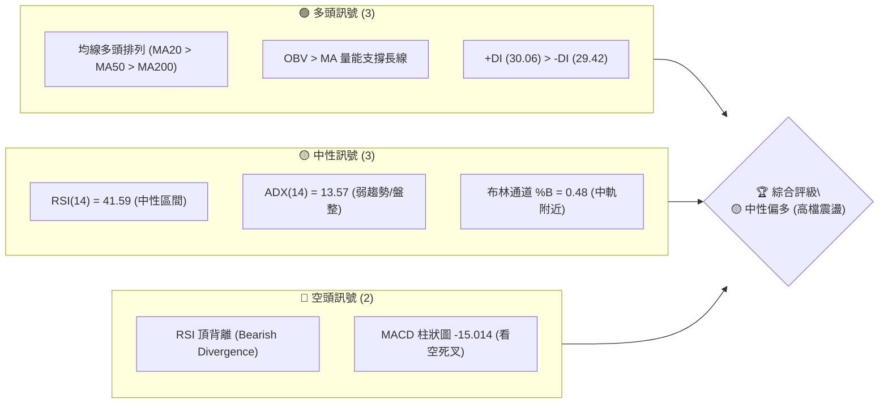

### 📊 核心指標速覽表

| 指標類別 | 指標名稱 | 當前數值 | 訊號 | 解讀 |
|----------|----------|----------|------|------|
| **價格** | 當前價格 | $2410.00 | 🟡 中性 | 位於 52W 高低點區間之 91.6% 高檔位置 |
| **均線** | MA20 | $2415.00 | 🔴 空頭 | 價格略低於 20 日均線（短期承壓） |
| **均線** | MA50 | $2354.32 | 🟢 多頭 | 價格維持在 50 日生命線上方 |
| **均線** | MA200 | $1847.96 | 🟢 多頭 | 長期牛市基調穩固，均線多頭排列 |
| **動能** | RSI(14) | 41.59 | 🟡 中性 | 處於 30-70 中性區間，但有頂背離隱憂 |
| **動能** | MACD | 7.625 | 🔴 空頭 | MACD (7.625) < Signal (22.639)，死叉向下 |
| **波動** | ATR(14) | $61.07 | 🟡 中性 | 每日波動率約 2.53%，處於正常震盪波幅 |
| **量能** | OBV | > MA | 🟢 多頭 | 量能仍具備長線支撐，未見恐慌性籌碼流出 |

### 🏆 技術評分卡

```
技術評分卡 — 2330.TW (2026-07-21)
════════════════════════════════════════════════════
趨勢強度      ███░░░░░░░░░░░░░░░░░  14/100  🟡 弱趨勢
動能指標      ████████░░░░░░░░░░░░  42/100  🟡 中性偏弱
支撐穩定度    ████████████████░░░░  80/100  🟢 強勁支撐
成交量配合    ████████████░░░░░░░░  60/100  🟡 中性配合
形態完整度    ██████████████░░░░░░  70/100  🟢 箱型成形
均線排列      █████████████████░░░  85/100  🟢 完美多頭
════════════════════════════════════════════════════
綜合評分      ████████████░░░░░░░░  59/100  🟡 中性偏多
════════════════════════════════════════════════════
```

---

## 2. 趨勢分析

### 🌐 多時框趨勢分析

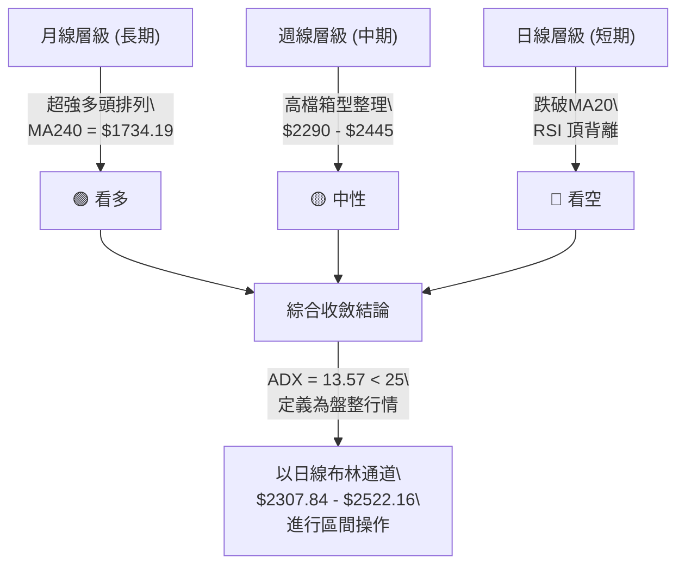

### 📈 長期趨勢 — 12個月走勢圖（Unicode）

```
2330.TW 月線走勢圖（過去12個月）
價格軸 ($)
$2500 ┤                                              ●(現價$2410)
$2300 ┤                                      ●     ●
$2100 ┤                              ●     
$1900 ┤                      ●             
$1700 ┤              ●                             
$1500 ┤          ●       ●                         
$1300 ┤      ●                                     
$1100 ┤  ●                                         
$900  ┤                                            
      └──────────────────────────────────────────────────────────
        08   09  10  11  12  01  02  03  04  05    06    07 (月份)
       (25) (25)(25)(25)(25)(26)(26)(26)(26)(26)  (26)  (26)
```

**走勢特徵分析表格**：

| 階段區間 | 價格起訖 | 漲跌幅 (%) | 價量特徵與技術解讀 |
|----------|----------|------------|-------------------|
| **2025-08 ~ 2025-10** | $1144.74 → $1486.19 | +29.83% | 主升段啟動，成交量顯著放大，多頭推升力道強勁。 |
| **2025-10 ~ 2025-12** | $1486.19 → $1540.85 | +3.68% | 高檔震盪整理，消化前波獲利了結賣壓。 |
| **2026-01 ~ 2026-02** | $1764.52 → $1983.22 | +12.39% | 噴射段，價格迅速逼近 $2000 大關，呈現超買狀態。 |
| **2026-02 ~ 2026-03** | $1983.22 → $1755.32 | -11.49% | 急速回檔修正，觸及中線支撐後迅速止跌。 |
| **2026-04 ~ 2026-06** | $2129.32 → $2410.00 | +13.18% | 震盪盤堅，創下 52W 新高 $2535.00，隨後進入高檔箱型整理。 |
| **2026-07 (當前)** | $2410.00 → $2410.00 | 0.00% | 橫盤整理，多空拉鋸，等待均線靠攏。 |

### 📊 中期趨勢（週線分析）

中期週線呈現明顯的**高檔震盪收斂**結構。近 5 週收盤價分別為 $2340.00、$2445.00、$2415.00、$2290.00 及 $2410.00，顯示多空雙方在 $2300 - $2450 區間進行激烈的拉鋸戰。

```
週線高檔多空拉鋸示意圖
$2520 (R2 阻力線) ───────────────────────────────────────
                      ▲ (2026-07-05 高點 $2445.00)
$2410 (現價位置)   ───────────────────●───────────────────
                      ▼ (2026-07-19 低點 $2290.00)
$2325 (S1 支撐線) ───────────────────────────────────────
```

### ⚡ 趨勢強度評估（ADX 解讀）

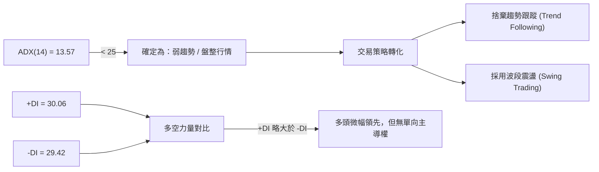

**ADX 趨勢強度對照表**：

| ADX 數值區間 | 趨勢強度分類 | 2330.TW 當前狀態 (13.57) | 適用交易工具 |
|--------------|--------------|-------------------------|--------------|
| **< 20** | **極弱趨勢 / 震盪盤整** | **✓ 處於此區間** | **布林通道、RSI 逆勢指標** |
| **20 ~ 25** | **過渡區間 / 趨勢萌芽** | | 觀望，等待突破 |
| **25 ~ 50** | **強趨勢行情** | | 均線系統、MACD 順勢指標 |
| **> 50** | **極強單邊行情** | | 趨勢極限，防範反轉 |

---

## 3. 圖表形態分析

### 🔍 形態識別系統

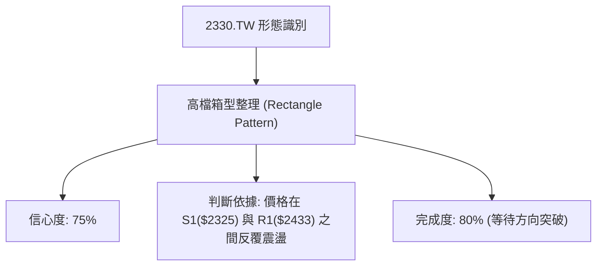

**形態信心度與目標價評估**：

| 形態 | 信心度 | 判斷依據（引用數據） | 完成度 | 目標價（附計算式） |
|------|--------|----------------------|--------|--------------------|
| **高檔箱型整理** | 75% | 1. 阻力區受限於 R1 $2433.51 及前高 $2445.00<br>2. 支撐區守穩於 S1 $2325.00 及前低 $2290.00 | 80% | **向上突破目標價**：$2580.00<br>計算式：$2445.00 (箱頂) + $135.00 (箱高) = $2580.00<br><br>**向下跌破目標價**：$2175.00<br>計算式：$2310.00 (箱底) - $135.00 (箱高) = $2175.00 |

*註：箱高計算採近期實體震盪區間：$2445.00 (7/5高點) - $2310.00 (6/14低點) = $135.00。*

### 🕯️ 重要K線形態分析

| 日期/月份 | 收盤價 | K線形態 | 解讀 | 訊號 |
|------|--------|---------|------|------|
| **2026-07-05** | $2445.00 | **高檔流星線 (Shooting Star)** | 盤中一度衝高，但隨後遭遇強大獲利回吐賣壓，留下長上影線，暗示 R1 $2433.51 上方阻力重重。 | 🔴 看空 |
| **2026-07-19** | $2290.00 | **長黑陰線 (Bearish Marubozu)** | 實體大黑K跌破中軌，空頭力道強勁，直接測試 S1 $2325.00 支撐。 | 🔴 看空 |
| **2026-07-26** | $2410.00 | **陽包陰 / 吞噬形態 (Bullish Engulfing)** | 收盤價大幅反彈，完全吞噬前一週陰線實體，顯示下檔買盤極強，S1 支撐獲得確認。 | 🟢 看多 |

### 📉 ASCII 走勢形態示意圖

```
高檔箱型整理 (Rectangle Pattern) 與 突破情境
                       (R2: $2520.00) ── ─ ─ ─ ─ ─ ─  ● (向上突破目標價: $2580)
                                                    / 
                     (箱頂: $2445.00) ───●─────────● (突破點)
                                        / \       /
                                       /   \     /
                                      /     \   /
                                     /       \ /
                     (箱底: $2310.00) ────────● (支撐確認)
                                             /
                                            /
                      (S2: $2194.59) ── ─  ● (向下跌破目標價: $2175)
```

---

## 4. 支撐與阻力

### 🗺️ 關鍵價位分布圖（Unicode）

```
2330.TW 價位結構分布圖
═══════════════════════════════════════════════════
$2535.00 ║████████████████████████║ 52W 歷史最高點 (極強阻力)
$2520.00 ║████████████████████    ║ 阻力 R2 (近一年波段高點聚類)
$2433.51 ║████████████████████████║ 關鍵阻力 R1 (近一年波段高點聚類)
$2410.00 ╠════════════════════════╣ ◄ 當前現價位置
$2325.00 ║▓▓▓▓▓▓▓▓▓▓▓▓▓▓▓▓        ║ 近期支撐 S1 (波段低點聚類)
$2194.59 ║████████████████████████║ 強支撐 S2 (波段低點聚類)
$1748.20 ║████████████████████████║ 長線強支撐 S3 (MA200 附近)
═══════════════════════════════════════════════════
```

### 🚧 阻力位分析表

| 阻力級別 | 價位 | 形成原因 | 突破難度 | 重要性 |
|----------|------|----------|----------|--------|
| **R1** | $2433.51 | 近一年波段高點聚類區，密集套牢區 | 🟡 中等 | 短期多空分水嶺，站穩此處方能挑戰歷史高點 |
| **R2** | $2520.00 | 接近 52W 高點 $2535.00 的整數心理關卡 | 🔴 極高 | 歷史天花板，需要極大成交量配合方能突破 |

### 🛡️ 支撐位分析表

| 支撐級別 | 價位 | 形成原因 | 守住機率 | 重要性 |
|----------|------|----------|----------|--------|
| **S1** | $2325.00 | 近一年波段低點聚類，且接近 MA50 ($2354.32) | 🟢 高 | 短期生命線支撐，不容失守，失守則中期轉弱 |
| **S2** | $2194.59 | 密集交易區底盤，接近 23.6% 斐波那契回調位 | 🟢 極高 | 中期趨勢防線，一旦跌破宣告多頭趨勢結束 |
| **S3** | $1748.20 | 長期波段低點，極度接近 MA200 ($1847.96) | 🟢 幾乎100% | 長線終極鐵板支撐，長線價值投資者布局點 |

### 📐 斐波那契回調位分析

*52週區間：$1050.99 (52W Low) → $2535.00 (52W High)*

```
斐波那契回調位與現價關係
0.0%  ($2535.00) ───────────────────────────────────────────────────────────
                         ◄ 當前現價: $2410.00 (位於超強勢整理區間)
23.6% ($2184.77) ───────────────────────────────────────────────────────────
38.2% ($1968.11) ───────────────────────────────────────────────────────────
```

* **現價位置解讀**：當前價格 $2410.00 處於斐波那契 **0.0% ($2535.00)** 與 **23.6% ($2184.77)** 之間的極強勢區間。
* **技術含義**：股價回檔甚至未曾觸及最淺的 23.6% 回調位（$2184.77），顯示長線牛市格局極為強勁，當前回檔僅為高檔技術性震盪。

---

## 5. 技術指標深度解讀

### 🎛️ 指標訊號總覽

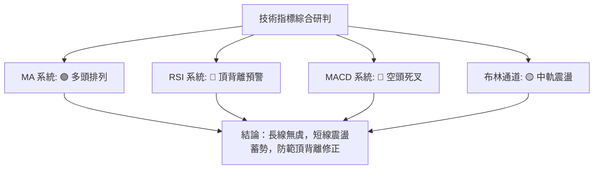

### 📈 移動平均線排列分析

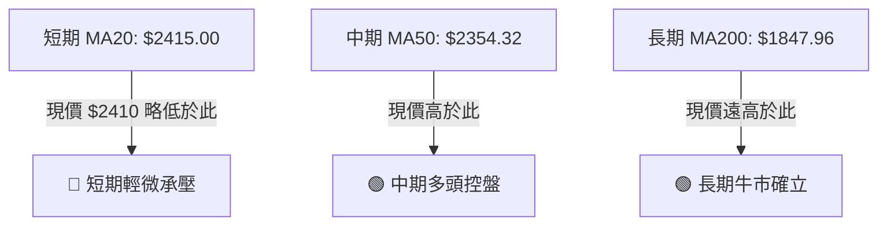

均線系統呈現完美的**多頭排列**（MA20 > MA50 > MA200），且長中短期均線皆保持上揚斜率。雖然短期價格跌破 MA20 ($2415.00)，但距離下方 MA50 ($2354.32) 仍有強力支撐，屬於健康的回檔蓄勢。

### 📉 RSI(14) 分析

*   **當前數值**：**41.59**
*   **區間強度**：
    ```
    [0] ░░░░░░░░░░ [30] ▓▓▓▓▓ [41.59] ░░░░░░░░░░ [70] ░░░░░░░░░░ [100]
    ```
*   **背離分析**：**⚠️ 頂背離 (Bearish Divergence)**。
    *   *現象*：股價在 2026-06 至 2026-07 期間創下新高（最高達 $2535.00），但 RSI(14) 卻未能同步創出新高，反而呈現高點下移。
    *   *結論*：這代表股價上漲動能正在減弱，高檔追高意願降低，短期內不宜盲目追多，須防範指標修正帶來的回檔。

### 📊 MACD(12/26/9) 訊號解讀

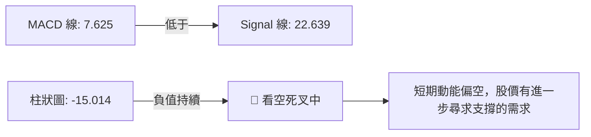

### 📦 布林通道分析

```
布林通道當前狀態與現價位置
$2522.16 ─────────────────────────────────────── (上軌：壓力區)
$2415.00 ───────────────●─────────────────────── (中軌：MA20)
                         ▲ (現價 $2410.00，%B = 0.48)
$2307.84 ─────────────────────────────────────── (下軌：強支撐)
```

*   **通道寬度**：$2522.16 - $2307.84 = $214.32 (帶寬正常，未見極度收窄或開口)。
*   **現價位置**：$2410.00 剛好處於中軌下方，%B 為 0.48，顯示股價正在中軌附近進行盤整，下軌 $2307.84 將提供極強的動態支撐。

### 💹 成交量分析（量價配合度）

*   **最新成交量**：29,931,277
*   **20日均量**：33,167,258（量比：**0.90x**）
*   **量價關係研判**：
    *   當前量比為 0.90x，呈現**價平量縮**。
    *   在回檔過程中成交量並未放大，顯示市場並無恐慌性拋盤。
    *   **OBV 趨勢**高於其移動平均線，說明長線資金（主力籌碼）依然鎖定良好，量能結構整體支持多頭。

---

## 6. 動能與波動率

### ⚡ 動能評估

| 象限 | 動能強度 | 波動率 | 當前狀態 | 技術評估 |
|------|------|------|----------|------|
| **Q1 (強/低)** | 強動能 | 低波動 | — | 最佳突破前夕 |
| **Q2 (弱/低)** | **弱動能** | **低波動** | **✓ 當前定位** | **高檔箱型盤整，適合區間低吸高拋** |
| **Q3 (強/高)** | 強動能 | 高波動 | — | 單邊暴風雨行情 |
| **Q4 (弱/高)** | 弱動能 | 高波動 | — | 混亂震盪，極易洗盤 |

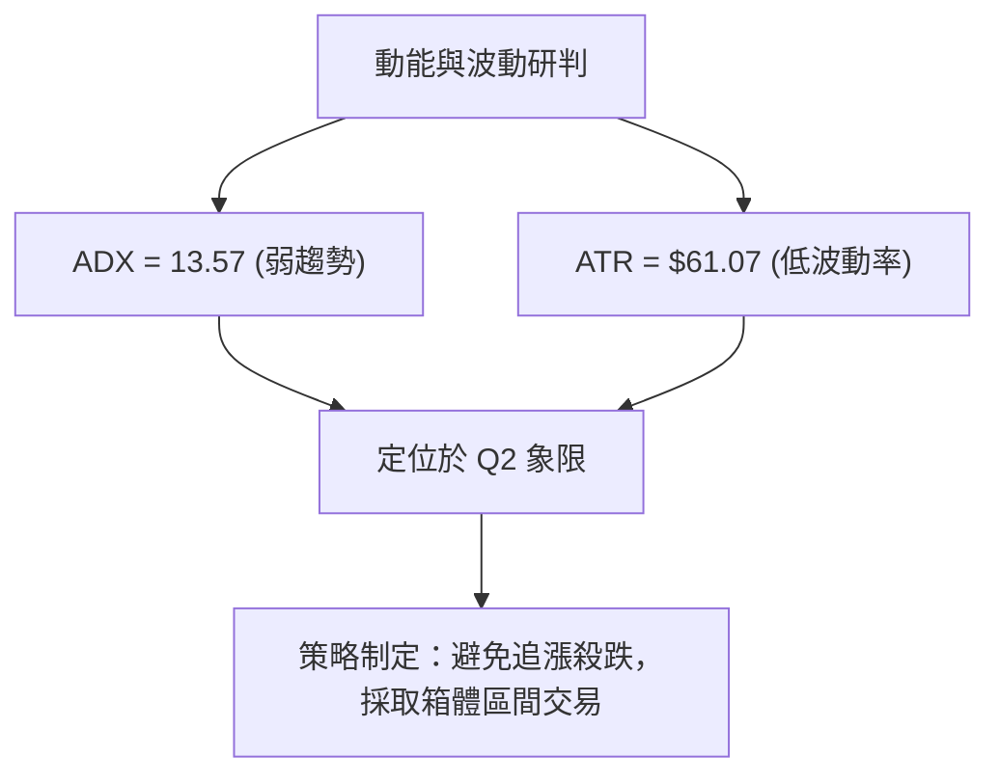

### 📊 ATR 波動率分析

*   **ATR(14)**：**$61.07**（佔股價比率為 **2.53%**）。
*   **交易風控應用**：
    *   *每日波動安全邊界*：$61.07。
    *   *建議止損寬度 (1.5倍 ATR)*：$61.07 × 1.5 = **$91.60**。
    *   *建議止損寬度 (2.0倍 ATR)*：$61.07 × 2.0 = **$122.14**。

### 📐 Beta 與市場相關性

*   **Beta 係數**：**1.246**。
*   **解讀**：波動度高於大盤（加權指數）約 24.6%。當大盤上漲 1% 時，2330.TW 理論上將上漲 1.25%；反之大盤下跌時亦然。屬於高 Beta 值之科技龍頭股，適合做為多頭波段操作的放大器。

---

## 7. 多時框架總結

### 📋 時框架評分表

| 時框架 | 趨勢方向 | 動能指標 | 均線排列 | 形態特徵 | 綜合評分 | 交易建議 |
|--------|----------|----------|----------|----------|----------|----------|
| **日線 (短期)** | 🟡 中性偏弱 | 🔴 MACD死叉 | 🟡 跌破MA20 | 🟡 箱型中軌震盪 | **45/100** | 觀望，等待下軌支撐 |
| **週線 (中期)** | 🟡 中性 | 🟡 RSI中性 | 🟢 站穩MA50 | 🟢 箱型底部形成 | **65/100** | 區間操作，逢低布局 |
| **月線 (長期)** | 🟢 極強多頭 | 🟢 OBV高檔 | 🟢 完美多頭 | 🟢 長期牛市通道 | **90/100** | 持股待漲，拉回即買點 |

### 🔲 綜合訊號矩陣

```
               短期 (日線)    中期 (週線)    長期 (月線)
趨勢方向 ───►     🟡             🟡             🟢
動能強度 ───►     🔴             🟡             🟢
量能配合 ───►     🟡             🟢             🟢
```

### ⚖️ 多時框收斂結論

> **⚖️ 最終收斂結論：盤整行情，中長期多頭保護短期震盪。**

由於 **ADX(14) 僅為 13.57**（遠低於 25 臨界值），當前市場主導力量並非單邊趨勢，而是**高檔箱型盤整**。

*   **收斂規則應用**：在此狀態下，日線布林通道上下軌（**$2307.84 - $2522.16**）成為最關鍵的交易區間。
*   **方向性結論**：長期趨勢（MA200 = $1847.96 向上）依然是極強的多頭格局，因此短期震盪回檔不應看作牛市結束，而應視為長線投資者「逢低吸納」的黃金機會。

---

## 8. 交易策略建議

### 🗺️ 策略決策流程圖

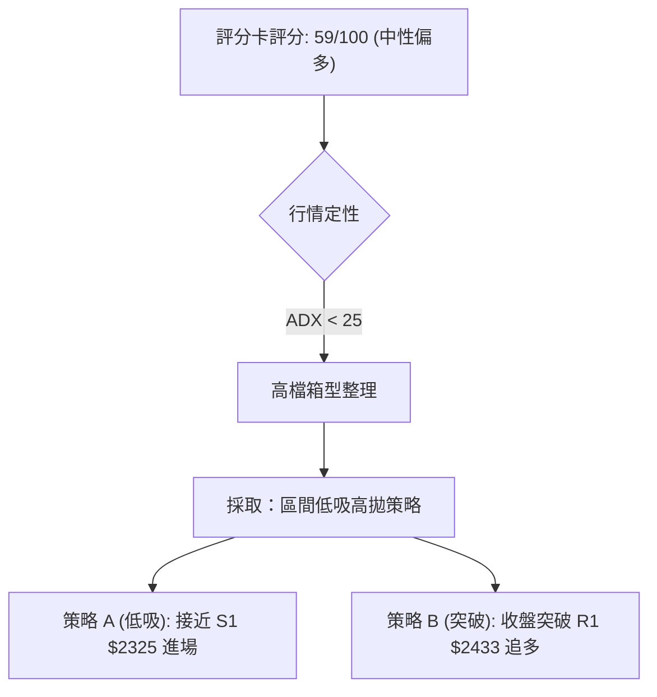

### 🧭 策略路由

*   **當前主策略方向**：**區間操作（評分 59/100，中性偏多，等待突破）**。

### 🎯 價格情境階梯（Price Scenarios）

| 觸發條件 | 下一目標 | 後續延伸 | 情境含義 |
|----------|----------|----------|----------|
| **突破阻力 R1 $2433.51** | R2 $2520.00 | $2580.00 (形態目標) | 短線轉強，重回多頭上升通道 |
| **維持在 $2325 - $2433 區間** | — | — | 區間震盪，持續時間延長 |
| **跌破支撐 S1 $2325.00** | S2 $2194.59 | 23.6% 斐波那契 $2184.77 | 中期轉弱，展開深幅波段修正 |

### 📊 情境機率分佈

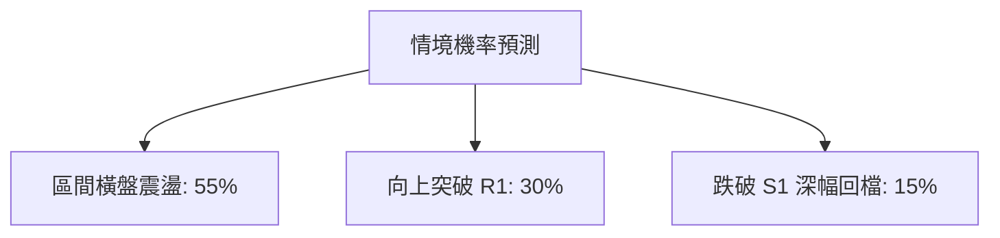

*   **區間橫盤震盪 (55%)**：ADX 處於極低水平，短期內多空均無力打破平衡。
*   **向上突破 R1 (30%)**：長線均線多頭排列提供向上推升的慣性。
*   **跌破 S1 深幅回檔 (15%)**：RSI 頂背離可能引發短線多頭踩踏。

### 🟢 主策略詳情

| 策略要素 | 策略 A（區間低吸 — 首選） | 策略 B（突破追多 — 次選） |
|----------|--------------------------|--------------------------|
| **進場條件** | 股價回檔至 S1 附近且日線出現止跌訊號 | 收盤價強勢突破阻力 R1 |
| **進場價格** | **$2325.00** | **$2435.00** (突破 $2433.51 確認) |
| **目標價 T1** | **$2433.51** (R1 阻力) | **$2520.00** (R2 阻力) |
| **目標價 T2** | **$2520.00** (R2 阻力) | **$2580.00** (箱型突破目標價) |
| **止損價格** | **$2280.00** (跌破前週低點 $2290.00) | **$2410.00** (重回布林中軌下方) |
| **風險報酬比** | **1 : 2.41** (目標T1) / **1 : 4.33** (目標T2) | **1 : 3.40** (目標T1) / **1 : 5.80** (目標T2) |
| **成功機率** | **65%** | **50%** |
| **建議倉位** | **15%** | **10%** |

### 🔴 反向風險觸發點（對沖提示）

*   若收盤價**跌破 $2290.00**（前週低點），必須立即暫停所有做多計畫，並對現有倉位進行減持，因為這意味著高檔箱型下軌失守，股價將直奔 **S2 $2194.59**。

### ⭐ 整體訊號強度評星

```
做多訊號強度：★★★☆☆  (3/5星 - 長線保護，但短線動能不足)
做空訊號強度：★★☆☆☆  (2/5星 - 短線有死叉，但長線多頭極強，不宜空)
整體可信度：  ★★★★☆  (4/5星 - 數據結構完整，指標共識度高)
```

---

## 9. 風險提示與監控

### ✅ 關鍵監控指標 Checklist

```
╔══════════════════════════════════════════════════════════════╗
║              每日交易監控清單 (Checklist)                    ║
╠══════════════════════════════════════════════════════════════╣
║ [ ] 價格是否跌破 S1 $2325.00？(若跌破，中期警報響起)         ║
║ [ ] MACD 柱狀圖是否開始收斂？(若收斂，代表跌勢趨緩)          ║
║ [ ] RSI(14) 是否跌破 40？(若跌破，防範加速下跌)              ║
║ [ ] 單日成交量是否大於 33,000,000 股？(放量代表方向選擇)     ║
║ [ ] 布林通道寬度是否急遽收窄？(暗示大行情即將爆發)           ║
╚══════════════════════════════════════════════════════════════╝
```

### ⚠️ 風險場景分析

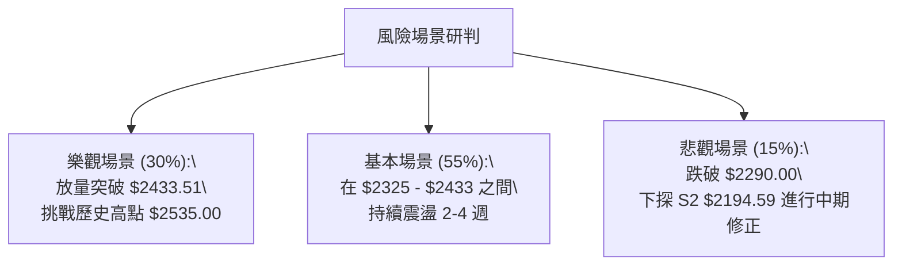

### 🛡️ 風險管理重要提醒

1.  **嚴格執行資金管理**：由於當前處於高檔震盪且有 RSI 頂背離跡象，單一標的總持股部位不宜超過總資金的 25%。
2.  **拒絕左側無底深淵**：若股價跌破 S1 $2325.00，切勿盲目攤平，應耐心等待股價在 S2 $2194.59 附近築底完成後，再行右側進場。
3.  **注意 Beta 放大效應**：當大盤出現系統性風險時，2330.TW 由於 Beta 值達 1.246，回檔幅度可能會大於大盤，需密切配合台股加權指數之強弱進行動態調整。

---

## 📋 報告總結

```
2330.TW 技術分析報告總結
════════════════════════════════════════════════════════
報告日期：2026-07-21
當前價格：$2410.00
分析評級：⚖️ 🟡 中性偏多（高檔箱型整理，長多短震）

關鍵結論：
├─ 長期趨勢：🟢 強烈多頭（均線多頭排列，MA200 上揚）
├─ 中期趨勢：🟡 區間震盪（$2310 - $2445 箱型整理）
├─ 短期趨勢：🔴 弱勢回檔（跌破 MA20，MACD 死叉，RSI 頂背離）
├─ 關鍵支撐：$2325.00 (S1) ｜ $2194.59 (S2)
├─ 關鍵阻力：$2433.51 (R1) ｜ $2520.00 (R2)
└─ 分析師共識目標價：$3075.71 (均值)

最優策略組合：
1. 🥇 首選機會：逢低吸納。於 $2325.00 附近輕倉布局，止損設於 $2280.00，目標看 $2433.51。
2. 🥈 次選機會：突破追多。若強勢收復 R1 $2433.51，順勢追多，目標看 $2520.00 及 $2580.00。
3. 🥉 保守選擇：觀望。等待 ADX > 25 或布林通道開口放大，確認新一波單邊趨勢後再行介入。
════════════════════════════════════════════════════════
```

---

> ⚠️ **免責聲明**：本報告為 AI 自動生成之技術分析，所有數據及估算均基於提供的歷史價格資訊。本報告**僅供研究與學術參考**，**不構成任何投資建議**。投資有風險，入市需謹慎。

---

*報告生成時間：2026-07-21 ｜ 數據來源：Yahoo Finance ｜ 分析框架：多時框技術分析*