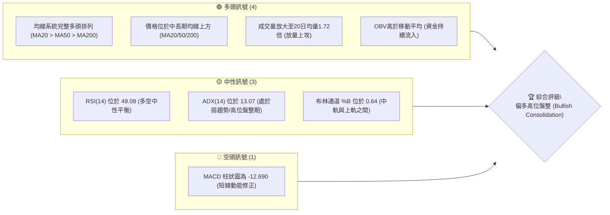
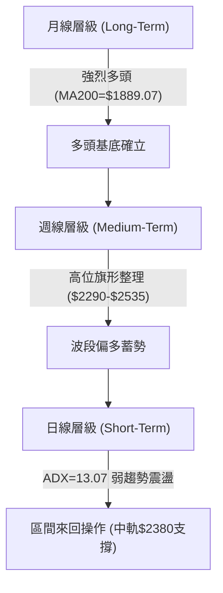
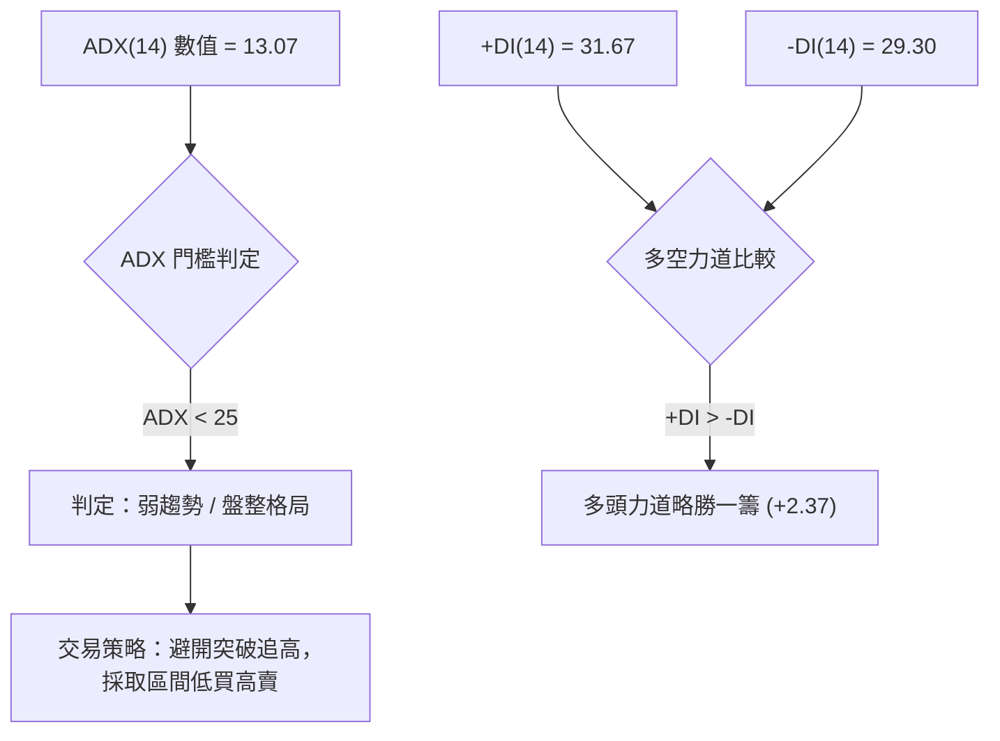
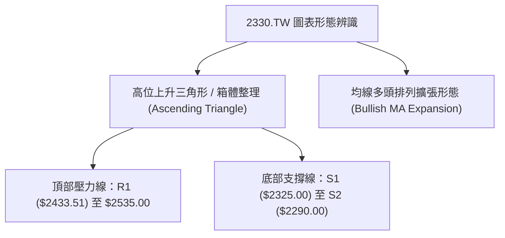
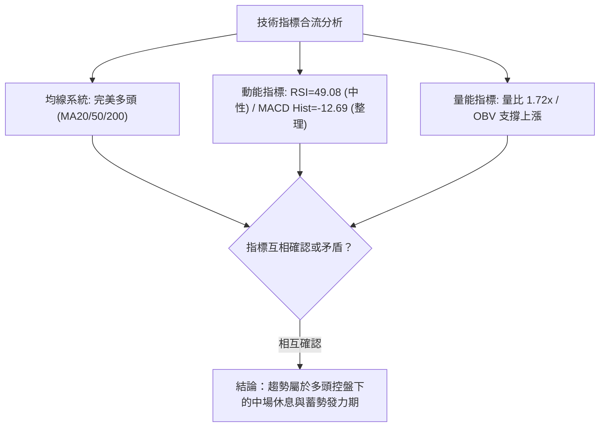
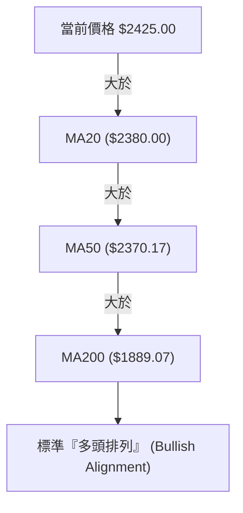
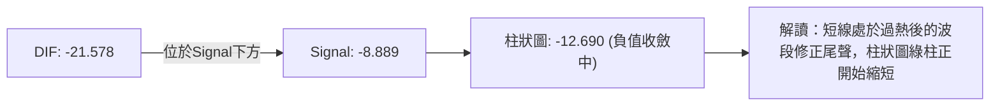
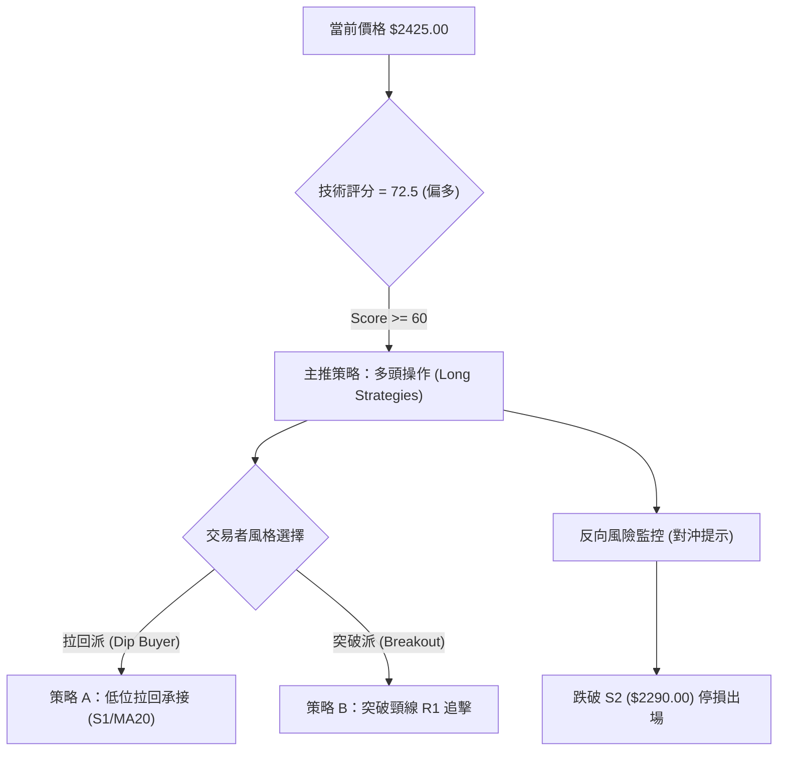
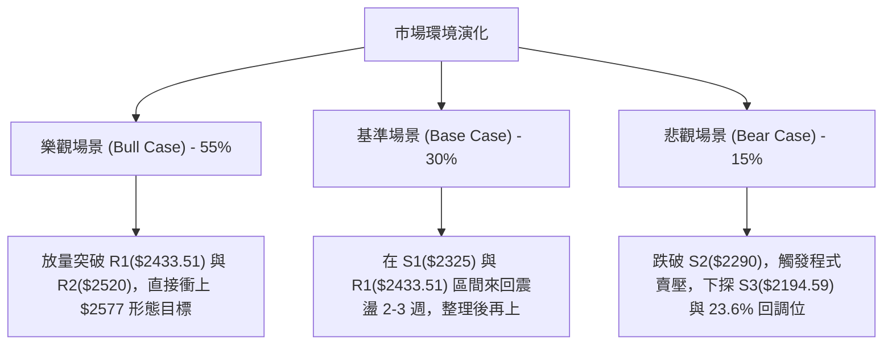

<details markdown="1">
<summary>📊 靜態圖表 (點擊展開)</summary>


</details>

<html>
<head><meta charset="utf-8" /></head>
<body>
    <div style="height:500px; width:100%;">                        <script>window.PlotlyConfig = {MathJaxConfig: 'local'};</script>
        <script charset="utf-8" src="https://cdn.plot.ly/plotly-3.7.0.min.js" integrity="sha256-jvTGqxNp8AGWEcvNLVuKr+8j5dGe9Yw51LQkmDH+IYA=" crossorigin="anonymous"></script>                <div id="candlestick-chart" class="plotly-graph-div" style="height:100%; width:100%;"></div>            <script>                window.PLOTLYENV=window.PLOTLYENV || {};                                if (document.getElementById("candlestick-chart")) {                    Plotly.newPlot(                        "candlestick-chart",                        [{"close":{"dtype":"f8","bdata":"AAAAQLshlUAAAABAcayVQAAAAEAnN5ZAAAAA4OPnlUAAAABA+EqWQAAAAODj55VAAAAAgIUPlkAAAABADK6WQAAAAOBP\u002fZZAAAAAwJlylkAAAAAAf+mWQAAAAAB\u002f6ZZAAAAAgDualkAAAADAmXKWQAAAAAB\u002f6ZZAAAAAIK7VlkAAAABAk0yXQAAAAECTTJdAAAAAYMI4l0AAAABAZGCXQAAAAECTTJdAAAAAgDualkAAAABADK6WQAAAAIA7mpZAAAAAIK7VlkAAAABADK6WQAAAACCu1ZZAAAAAgDualkAAAABgViOWQAAAAODIXpZAAAAAAELAlUAAAABAoJiVQAAAAMBqhpZAAAAAoP5wlUAAAADgXEmVQAAAAODj55VAAAAAQPhKlkAAAABAJzeWQAAAAED4SpZAAAAA4BLUlUAAAABgViOWQAAAAMCZcpZAAAAA4MhelkAAAACAO5qWQAAAAKDxJJdAAAAAAH\u002fplkAAAABAk0yXQAAAAKBI1ZZAAAAAQAz9lkAAAACAwYWWQAAAAEAcSpZAAAAAgDo2lkAAAACAOjaWQAAAAIA6NpZAAAAAwGbBlkAAAACgzySXQAAAAICxOJdAAAAA4FZ0l0AAAADg3cOXQAAAAEAanJdAAAAAAGUTmEAAAABgkZ6YQAAAAICP8JlAAAAA4Lt7mkAAAABAcQSaQAAAAOA0LJpAAAAAAFMYmkAAAACAFkCaQAAAAMCdj5pAAAAAwJ2PmkAAAACAFkCaQAAAAEDoBptAAAAAQG9Wm0AAAACgFJKbQAAAAEDoBptAAAAAQG9Wm0AAAADgMn6bQAAAAKCNQptAAAAAgPalm0AAAACgBEWcQAAAAGBfCZxAAAAAoBSSm0AAAAAgUWqbQAAAAIB99ZtAAAAAINi5m0AAAAAgUWqbQAAAAID2pZtAAAAAwCIxnEAAAADgmTOdQAAAAEDGvp1AAAAAACGDnUAAAADgl4WeQAAAAKBpTJ9AAAAAoOL8nkAAAACAW62eQAAAAEBNDp5AAAAAgPT3nEAAAAAAIYOdQAAAAGBdW51AAAAAAEEdnEAAAABAT7ycQAAAACAvIp5AAAAAoHtHnUAAAACA9PecQAAAAIBtqJxAAAAAABkknUAAAACgua+dQAAAAIBP1JxAAAAAwGqsnEAAAACAvDScQAAAAIC8NJxAAAAAIF3AnEAAAADAaqycQAAAAEChXJxAAAAAQA69m0AAAADARG2bQAAAAOBB6JxAAAAAgLw0nEAAAABANPycQAAAAAA\u002fY55AAAAAYDF3nkAAAADAtiqfQAAAAADSAp9AAAAAgBADoEAAAABg7jSgQAAAAKDnPqBAAAAAAGWin0AAAACgco6fQAAAAIAu8p9AAAAAgC7yn0AAAABg7jSgQAAAAGBfBqFAAAAAYPKloUAAAACANkKhQAAAACBm\u002fKBAAAAAgKOioEAAAADA5LmhQAAAAOAGiKFAAAAA4AaIoUAAAAAgtf+hQAAAAGDQ16FAAAAAQBtqoUAAAAAAAJKhQAAAAKAvTKFAAAAAoOuvoUAAAABg8qWhQAAAAIAUdKFAAAAAIEQuoUAAAABgXwahQAAAAAAiYKFAAAAAAACSoUAAAAAgtf+hQAAAAKDrr6FAAAAAwMLroUAAAACAyeGhQAAAAMB3WaJAAAAAwHdZokAAAADAVYuiQAAAAGAY5aJAAAAA4E6VokAAAAAgam2iQAAAAIDJ4aFAAAAA4Lv1oUAAAAAAAJKhQAAAAAAAlKFAAAAAAAAMokAAAAAAAI6iQAAAAAAAwKJAAAAAAACiokAAAAAAANSiQAAAAAAAnKNAAAAAAAB0o0AAAAAAAKyiQAAAAAAArKJAAAAAAABIokAAAAAAAISiQAAAAAAA1KJAAAAAAACSo0AAAAAAAEKjQAAAAAAAGqNAAAAAAAA4o0AAAAAAABCjQAAAAAAAQqNAAAAAAADeokAAAAAAAN6iQAAAAAAAEKNAAAAAAADookAAAAAAABCjQAAAAAAATKNAAAAAAADkoUAAAAAAACCiQAAAAAAA1KJAAAAAAADAokAAAAAAAMqiQAAAAAAAXKJAAAAAAABcokAAAAAAANChQAAAAAAAMKFAAAAAAAA6oUAAAAAAAPKiQA=="},"high":{"dtype":"f8","bdata":"nMmZHIw1lUAAAABAcayVQLZMFvnIXpZAEZebvLT7lUAAAADWaoaWQBGXm7y0+5VAHJWihzualkAAAABADK6WQHW4GpnxJJdAXypoVQyulkCYIp+V8SSXQHWDKXLCOJdAP378ON3BlkAfDnicaoaWQHWDKXLCOJdA+iCWtSARl0Bdv\u002fv4NHSXQAufedUFiJdAZ2Zmrtabl0Bw8jf5BYiXQLp+97HWm5dAnjt3zk\u002f9lkD7DTDVfumWQB8\u002fflwMrpZAp8AO2U\u002f9lkD1G2Bq8SSXQKfADtlP\u002fZZAP378ON3BlkClHBAZ+EqWQDHIXnU7mpZAkYnRKic3lkByHMex4+eVQA5Ql5w7mpZAgB4jEkLAlUCx9g0LQsCVQCMuN5mFD5ZAAAAAQPhKlkBsmSyyaoaWQAAAANZqhpZAGTpg58helkClHBAZ+EqWQAAAAMCZcpZAZu10vJlylkAAAACAO5qWQAAAAKDxJJdAdYMpcsI4l0AAAABAk0yXQAAAAJA4iJdApshnBe4Ql0DQ6ktFo5mWQGIutMrfcZZAs6Qc0N9xlkCR4V5FHEqWQNVn2lqjmZZAvQg+hUjVlkAAAACgzySXQFDmWUWTTJdAAAAA4FZ0l0AAAADg3cOXQKK8hsrdw5dAAAAAAGUTmEAAAABgkZ6YQH+L01r4U5pAAAAA4Lt7mkBi0bLKNCyaQILFPDDaZ5pAVVVVFdpnmkBow+fPu3uaQLeS2kpht5pAW0lthX+jmkBFgpoK2meaQKuqqsqrLptA0kUXVfalm0AAAACgFJKbQKuqqhpRaptA6aKLyjJ+m0BVVVWlFJKbQGAERkDYuZtAlqxkRdi5m0AAAACgBEWcQG12cQCqgJxAx2+Xen31m0AAAAAgUWqbQKuqqgpBHZxAlXAnNV8JnEB5mgtw9qWbQAAAAID2pZtAxzIo1amAnEAAAADgmTOdQN3LscqJ5p1A1e+5ZU0OnkBn0pVqW62eQAzkoyotdJ9ACMwe8Ic4n0DVKGOV4vyeQIO+oC89wZ5AaQ7fb+SqnUCSdqxAtnGeQKuqquogg51AAAAAAEEdnEBGteVqXVudQAW+uKrySZ5AvLoVQMa+nUASsUaVe0edQAUJo+WZM51ATNgGwf1LnUAEAoEArMOdQDkPHcP9S51ALWQhAxkknUBtx4fgrkicQGg7PoRP1JxAMjgfYws4nUB705uiJhCdQHAIh6CTcJxACEUowtcMnEB00UUD8+SbQAAAAOBB6JxArpHVpSYQnUAAAABANPycQAAAAAA\u002fY55AAAAAYDF3nkAAAADAtiqfQFx\u002fe2DEFp9AAAAAgBADoEDFTuwg01ygQP\u002fBRNDgSKBALzFroQkNoEDCFmxxEAOgQBO1KzH1KqBAD8TvAPwgoECd2Ilyo6KgQGmcQZBYEKFAGNE205knokD5Y0nz3cOhQKszUkE9OKFAVFwyhDZCoUDgB34g182hQGhFI6Hrr6FAdbn9MdfNoUAffPBxhUWiQPQuHiG1\u002f6FAOiUBwuS5oUAU3z3x3cOhQMln3WAUdKFAAAAAoOuvoUDvhfeioB2iQEmSJEH5m6FAURRFESJgoUAPDkhRPTihQAWEE\u002fH\u002fkaFABJM\u002fMPmboUAAAAAgtf+hQDbwGbOgHaJAoGir4ZknokCeDyzzcGOiQLt\u002f84BcgaJAL3\u002faAibRokCBXBOBOrOiQENasfADA6NAcqdoASbRokBO8OShM72iQMZUOHGnE6JA75W6cKcTokAkKzyywuuhQAAAAAAAqKFAAAAAAAAqokAAAAAAAI6iQAAAAAAAwKJAAAAAAACiokAAAAAAAN6iQAAAAAAAnKNAAAAAAADOo0AAAAAAABqjQAAAAAAA6KJAAAAAAACEokAAAAAAALaiQAAAAAAAVqNAAAAAAACSo0AAAAAAAGCjQAAAAAAAQqNAAAAAAACIo0AAAAAAAIijQAAAAAAAQqNAAAAAAAA4o0AAAAAAAN6iQAAAAAAAYKNAAAAAAAD8okAAAAAAADijQAAAAAAATKNAAAAAAAC2okAAAAAAAFKiQAAAAAAA1KJAAAAAAAAao0AAAAAAAMqiQAAAAAAAeqJAAAAAAAB6okAAAAAAAAKiQAAAAAAA0KFAAAAAAACooUAAAAAAAPKiQA=="},"hovertemplate":"\u003cb\u003e%{x|%Y-%m-%d}\u003c\u002fb\u003e\u003cbr\u003e\u958b: $%{open:.2f}\u003cbr\u003e\u9ad8: $%{high:.2f}\u003cbr\u003e\u4f4e: $%{low:.2f}\u003cbr\u003e\u6536: $%{close:.2f}\u003cextra\u003e\u003c\u002fextra\u003e","low":{"dtype":"f8","bdata":"x2zMhhn6lEAAAAA4uyGVQO+MXqq0+5VA3tHIJkLAlUCqqqqGViOWQKoM9pDPhJVARQ97o7T7lUAOMNVchQ+WQBaPym0MrpZAAAAAwJlylkCtG0yxaoaWQAAAAAB\u002f6ZZA4MCBo2qGlkCg1ZcqJzeWQAAAAAB\u002f6ZZArZ94Q93BlkD1YIaqIBGXQFIggmPCOJdAAAAAYMI4l0AgG5DNIBGXQKRABIfxJJdA4MCBo2qGlkAAAABADK6WQODAgaNqhpZAWT\u002fxZgyulkAAAABADK6WQAbfaYo7mpZAAAAAgDualkCu8XeDhQ+WQAAAAODIXpZAAAAAAELAlUAAAABAoJiVQNYPOir4SpZAAAAAoP5wlUAAAADgXEmVQN7RyCZCwJVAAAAAqoUPlkCl2XRjViOWQFVVVWMnN5ZAAAAA4BLUlUBc4++mtPuVQKDVlyonN5ZAzjehSlYjlkCCAwcO+EqWQIcm+Zc7mpZAAAAAAH\u002fplkBHgQjOT\u002f2WQKuqqtpmwZZAtG4wtUjVlkAvFbS633GWQJ7RS7VYIpZAbx6hulgilkBNW+MvlfqVQAAAAIA6NpZAh+6DNaOZlkAh+fOKSNWWQF8zTPXtEJdAk7\u002fJj7E4l0CrqqrKVnSXQF5DebVWdJdApwFtmjiIl0CB4DI1g\u002f+XQE5rto+fPZlA\u002ffPPnyaNmUCdLk21rdyZQPx0hj\u002fqtJlAVVVVJeq0mUAAAACAFkCaQEltJTXaZ5pASW0lNdpnmkC6fWX1UhiaQAAAAKCdj5pA0kUX20LLmkC3lsU66AabQAAAAEDoBptAF110tasum0CrqqrKqy6bQAAAAKCNQptAFKEIpY1Cm0Aw\u002fdL\u002fuc2bQJjBl5p99ZtAAAAAoBSSm0AKMpsKyhqbQAAAADDYuZtAtkdslRSSm0CDzKZab1abQFOb2lToBptAAAAAwCIxnEDqOxu1i5ScQIvQOBW4H51AAAAAACGDnUD94xIrxr6dQOY3uIri\u002fJ5AAAAAoOL8nkCMeJIaLyKeQAAAAEBNDp5AAAAAgPT3nEB0S5w6P2+dQFVVVdWZM51A+K2R1TJ+m0BcJY0qyGycQN4sTxq4H51AAAAAoHtHnUCpomeli5ScQAAAAIBtqJxAsyf5PjT8nED0+Xx+4nOdQAAAAIBP1JxAAAAAwGqsnEDgGlmdANGbQCdx8L7XDJxAAAAAIF3AnEAAAADAaqycQD7e473XDJxAAAAAQA69m0AAAADARG2bQPqSaf2FhJxAlDh4H8ognEDXWmtdeJicQJ3YiR2D\u002f51AM3WLfXUTnkBSuB59CLOeQO6Bjd76xp5Av0oYm5tSn0A7sROfCQ2gQAd0Y34QA6BAAAAAAGWin0AAAACgco6fQPgdiB883p9A8TsQv0nKn0CKndhuEAOgQGk55lvMZqBAAAAAYPKloUAAAACANkKhQCrmVo963qBAAAAAgKOioED8wA+8URqhQExdbn8UdKFATF1ufxR0oUAAAAAgtf+hQE9Fmm7ypaFAAAAAQBtqoUDc1MNNPTihQCnyWQ9ELqFAHpe+HSJgoUCEHkLPBoihQCRJko42QqFAAAAAIEQuoUAAAABgXwahQAAAAAAiYKFA6I2C3ihWoUDhgw\u002fO5LmhQAAAAKDrr6FAy4dxX9DXoUA5q8eO66+hQFegz86ZJ6JAESDDj35PokB\u002fo+z+cGOiQL6lTs8sx6JAAAAA4E6VokDjJUqPfk+iQGLw0wwiYKFAC5yDf8nhoUAAAAAAAJKhQAAAAAAARKFAAAAAAADkoUAAAAAAAFKiQAAAAAAAXKJAAAAAAABcokAAAAAAAKKiQAAAAAAALqNAAAAAAAB0o0AAAAAAAKyiQAAAAAAArKJAAAAAAAAqokAAAAAAADSiQAAAAAAA1KJAAAAAAABWo0AAAAAAABqjQAAAAAAA3qJAAAAAAAAuo0AAAAAAABCjQAAAAAAA6KJAAAAAAADeokAAAAAAAN6iQAAAAAAAEKNAAAAAAACsokAAAAAAAN6iQAAAAAAA6KJAAAAAAADkoUAAAAAAAPihQAAAAAAAUqJAAAAAAACiokAAAAAAAISiQAAAAAAAUqJAAAAAAAA0okAAAAAAALyhQAAAAAAACKFAAAAAAAAcoUAAAAAAAFKiQA=="},"name":"\u50f9\u683c","open":{"dtype":"f8","bdata":"YzZmY+oNlUAAAAA4uyGVQO+MXqq0+5VA72hkAxPUlUAAAABA+EqWQKoM9pDPhJVAYaQdq2qGlkAK5J8VJzeWQBaPym0MrpZAHw54nGqGlkCKfNaNO5qWQN1gitxP\u002fZZAAAAAgDualkDA4w8H+EqWQHWDKXLCOJdAU2CH\u002fH7plkCkQASH8SSXQF2\u002f+\u002fg0dJdA16Nw9TR0l0AAAABAZGCXQAufedUFiJdAfvz48X7plkD+WWUc3cGWQAAAAIA7mpZArZ94Q93BlkD3wfqNIBGXQK2feEPdwZZAAAAAgDualkCu8XeDhQ+WQGbtdLyZcpZAkYnRKic3lkAcx3EccayVQPKvaOOZcpZAQI8RWaCYlUDpoosucayVQCMuN5mFD5ZAqqqqhlYjlkARc6HVmXKWQAAAAED4SpZAGTpg58helkAAAABgViOWQMDjDwf4SpZAAAAA4MhelkChQoXqyF6WQCtqjHQMrpZAmCKflfEkl0D1YIaqIBGXQKuqqspWdJdAWjeYeirplkAAAACAwYWWQAAAAEAcSpZAkeFeRRxKlkDePEL1dg6WQNVn2lqjmZZAAAAAwGbBlkDZ+jZQKumWQAAAAICxOJdAMZWYGnVgl0AAAACQOIiXQK+hvHo4iJdA\u002fSXLXxqcl0BhKOa\u002fRieYQJvtE1WBUZlA\u002ffPPnyaNmUCdLk21rdyZQCgM8ATMyJlAAAAAsK3cmUBFgpoK2meaQLeS2kpht5pApbaS+rt7mkDdvrK6NCyaQKuqqnoG85pA0kUX20LLmkC3lsU66AabQFVVVQXKGptAdNFFBVFqm0AAAADgMn6bQHUBwipRaptAqk1tam9Wm0Aw\u002fdL\u002fuc2bQAY4CTvIbJxARHb077nNm0CIZfTPqy6bQKuqqgpBHZxAAAAAINi5m0AAAAAgUWqbQOlHPxrKGptAFSbeD8hsnEBt1Hd6baicQHq2kdqZM51AAAAAACGDnUD94xIrxr6dQOY3uIri\u002fJ5AWJlfZcQQn0CMeJIaLyKeQNc+C6V5mZ5AmwnqHz9vnUBhpB0rLyKeQFVVVdWZM51AOXjfmhSSm0Cj2nJV1gudQOPqB6V7R51AXt0K8CCDnUCpomeli5ScQASaQiC4H51AJmyDYAs4nUD8\u002fX4\u002fx5udQFo3mGILOJ1AyUIWQjT8nEBN4uD98uSbQGg7PoRP1JxAIdAUoiYQnUBkIQuBT9ScQK7mah7KIJxAAAAAQA69m0C66KLhG6mbQGOLcr5qrJxArpHVpSYQnUDwvfd+T9ScQF7ohd5nJ55AR5UEn0xPnkCamZnd+saeQKWAhJ\u002ff7p5AqtCj+41mn0DsxE7PAhegQAE+u2\u002fuNKBA\u002fKgucRADoEDrXHkAZaKfQAAAAIAu8p9A+B2IHzzen0BiJ3bA4EigQNLVJ4zFcKBAfOG98N3DoUCHVYShDX6hQA6ix+9s8qBAyhCsI0QuoUDsxE7sSiShQAAAAOAGiKFAAAAA4AaIoUDNoWIRkzGiQHoXj8DC66FA69uAYfKloUDwswE\u002fG2qhQCnyWQ9ELqFAj0vf3gaIoUBzpDkStf+hQEmSJO8oVqFAMQzDsC9MoUCmcQYhRC6hQM80bmAUdKFA+NmAnw1+oUDhgw\u002fO5LmhQBrD0YKnE6JANniOILX\u002foUDoIK+Sfk+iQDRgSS+MO6JAAAAAwHdZokBArokgSJ+iQAAAAGAY5aJAAAAA4E6VokA7tGtBQamiQGLw0wwiYKFAAAAA4Lv1oUAYcn0h182hQAAAAAAAgKFAAAAAAAAqokAAAAAAAHCiQAAAAAAAjqJAAAAAAABmokAAAAAAALaiQAAAAAAALqNAAAAAAACco0AAAAAAAAajQAAAAAAA1KJAAAAAAABwokAAAAAAADSiQAAAAAAAEKNAAAAAAAB+o0AAAAAAACSjQAAAAAAA3qJAAAAAAABCo0AAAAAAAGCjQAAAAAAAGqNAAAAAAAAko0AAAAAAAN6iQAAAAAAAOKNAAAAAAADUokAAAAAAAPKiQAAAAAAA\u002fKJAAAAAAACOokAAAAAAAPihQAAAAAAAXKJAAAAAAAAQo0AAAAAAAKKiQAAAAAAAZqJAAAAAAAA0okAAAAAAALyhQAAAAAAAqKFAAAAAAAA6oUAAAAAAAFyiQA=="},"x":["2025-10-02T00:00:00+08:00","2025-10-03T00:00:00+08:00","2025-10-07T00:00:00+08:00","2025-10-08T00:00:00+08:00","2025-10-09T00:00:00+08:00","2025-10-13T00:00:00+08:00","2025-10-14T00:00:00+08:00","2025-10-15T00:00:00+08:00","2025-10-16T00:00:00+08:00","2025-10-17T00:00:00+08:00","2025-10-20T00:00:00+08:00","2025-10-21T00:00:00+08:00","2025-10-22T00:00:00+08:00","2025-10-23T00:00:00+08:00","2025-10-27T00:00:00+08:00","2025-10-28T00:00:00+08:00","2025-10-29T00:00:00+08:00","2025-10-30T00:00:00+08:00","2025-10-31T00:00:00+08:00","2025-11-03T00:00:00+08:00","2025-11-04T00:00:00+08:00","2025-11-05T00:00:00+08:00","2025-11-06T00:00:00+08:00","2025-11-07T00:00:00+08:00","2025-11-10T00:00:00+08:00","2025-11-11T00:00:00+08:00","2025-11-12T00:00:00+08:00","2025-11-13T00:00:00+08:00","2025-11-14T00:00:00+08:00","2025-11-17T00:00:00+08:00","2025-11-18T00:00:00+08:00","2025-11-19T00:00:00+08:00","2025-11-20T00:00:00+08:00","2025-11-21T00:00:00+08:00","2025-11-24T00:00:00+08:00","2025-11-25T00:00:00+08:00","2025-11-26T00:00:00+08:00","2025-11-27T00:00:00+08:00","2025-11-28T00:00:00+08:00","2025-12-01T00:00:00+08:00","2025-12-02T00:00:00+08:00","2025-12-03T00:00:00+08:00","2025-12-04T00:00:00+08:00","2025-12-05T00:00:00+08:00","2025-12-08T00:00:00+08:00","2025-12-09T00:00:00+08:00","2025-12-10T00:00:00+08:00","2025-12-11T00:00:00+08:00","2025-12-12T00:00:00+08:00","2025-12-15T00:00:00+08:00","2025-12-16T00:00:00+08:00","2025-12-17T00:00:00+08:00","2025-12-18T00:00:00+08:00","2025-12-19T00:00:00+08:00","2025-12-22T00:00:00+08:00","2025-12-23T00:00:00+08:00","2025-12-24T00:00:00+08:00","2025-12-26T00:00:00+08:00","2025-12-29T00:00:00+08:00","2025-12-30T00:00:00+08:00","2025-12-31T00:00:00+08:00","2026-01-02T00:00:00+08:00","2026-01-05T00:00:00+08:00","2026-01-06T00:00:00+08:00","2026-01-07T00:00:00+08:00","2026-01-08T00:00:00+08:00","2026-01-09T00:00:00+08:00","2026-01-12T00:00:00+08:00","2026-01-13T00:00:00+08:00","2026-01-14T00:00:00+08:00","2026-01-15T00:00:00+08:00","2026-01-16T00:00:00+08:00","2026-01-19T00:00:00+08:00","2026-01-20T00:00:00+08:00","2026-01-21T00:00:00+08:00","2026-01-22T00:00:00+08:00","2026-01-23T00:00:00+08:00","2026-01-26T00:00:00+08:00","2026-01-27T00:00:00+08:00","2026-01-28T00:00:00+08:00","2026-01-29T00:00:00+08:00","2026-01-30T00:00:00+08:00","2026-02-02T00:00:00+08:00","2026-02-03T00:00:00+08:00","2026-02-04T00:00:00+08:00","2026-02-05T00:00:00+08:00","2026-02-06T00:00:00+08:00","2026-02-09T00:00:00+08:00","2026-02-10T00:00:00+08:00","2026-02-11T00:00:00+08:00","2026-02-23T00:00:00+08:00","2026-02-24T00:00:00+08:00","2026-02-25T00:00:00+08:00","2026-02-26T00:00:00+08:00","2026-03-02T00:00:00+08:00","2026-03-03T00:00:00+08:00","2026-03-04T00:00:00+08:00","2026-03-05T00:00:00+08:00","2026-03-06T00:00:00+08:00","2026-03-09T00:00:00+08:00","2026-03-10T00:00:00+08:00","2026-03-11T00:00:00+08:00","2026-03-12T00:00:00+08:00","2026-03-13T00:00:00+08:00","2026-03-16T00:00:00+08:00","2026-03-17T00:00:00+08:00","2026-03-18T00:00:00+08:00","2026-03-19T00:00:00+08:00","2026-03-20T00:00:00+08:00","2026-03-23T00:00:00+08:00","2026-03-24T00:00:00+08:00","2026-03-25T00:00:00+08:00","2026-03-26T00:00:00+08:00","2026-03-27T00:00:00+08:00","2026-03-30T00:00:00+08:00","2026-03-31T00:00:00+08:00","2026-04-01T00:00:00+08:00","2026-04-02T00:00:00+08:00","2026-04-07T00:00:00+08:00","2026-04-08T00:00:00+08:00","2026-04-09T00:00:00+08:00","2026-04-10T00:00:00+08:00","2026-04-13T00:00:00+08:00","2026-04-14T00:00:00+08:00","2026-04-15T00:00:00+08:00","2026-04-16T00:00:00+08:00","2026-04-17T00:00:00+08:00","2026-04-20T00:00:00+08:00","2026-04-21T00:00:00+08:00","2026-04-22T00:00:00+08:00","2026-04-23T00:00:00+08:00","2026-04-24T00:00:00+08:00","2026-04-27T00:00:00+08:00","2026-04-28T00:00:00+08:00","2026-04-29T00:00:00+08:00","2026-04-30T00:00:00+08:00","2026-05-04T00:00:00+08:00","2026-05-05T00:00:00+08:00","2026-05-06T00:00:00+08:00","2026-05-07T00:00:00+08:00","2026-05-08T00:00:00+08:00","2026-05-11T00:00:00+08:00","2026-05-12T00:00:00+08:00","2026-05-13T00:00:00+08:00","2026-05-14T00:00:00+08:00","2026-05-15T00:00:00+08:00","2026-05-18T00:00:00+08:00","2026-05-19T00:00:00+08:00","2026-05-20T00:00:00+08:00","2026-05-21T00:00:00+08:00","2026-05-22T00:00:00+08:00","2026-05-25T00:00:00+08:00","2026-05-26T00:00:00+08:00","2026-05-27T00:00:00+08:00","2026-05-28T00:00:00+08:00","2026-05-29T00:00:00+08:00","2026-06-01T00:00:00+08:00","2026-06-02T00:00:00+08:00","2026-06-03T00:00:00+08:00","2026-06-04T00:00:00+08:00","2026-06-05T00:00:00+08:00","2026-06-08T00:00:00+08:00","2026-06-09T00:00:00+08:00","2026-06-10T00:00:00+08:00","2026-06-11T00:00:00+08:00","2026-06-12T00:00:00+08:00","2026-06-15T00:00:00+08:00","2026-06-16T00:00:00+08:00","2026-06-17T00:00:00+08:00","2026-06-18T00:00:00+08:00","2026-06-22T00:00:00+08:00","2026-06-23T00:00:00+08:00","2026-06-24T00:00:00+08:00","2026-06-25T00:00:00+08:00","2026-06-26T00:00:00+08:00","2026-06-29T00:00:00+08:00","2026-06-30T00:00:00+08:00","2026-07-01T00:00:00+08:00","2026-07-02T00:00:00+08:00","2026-07-03T00:00:00+08:00","2026-07-06T00:00:00+08:00","2026-07-07T00:00:00+08:00","2026-07-08T00:00:00+08:00","2026-07-09T00:00:00+08:00","2026-07-10T00:00:00+08:00","2026-07-13T00:00:00+08:00","2026-07-14T00:00:00+08:00","2026-07-15T00:00:00+08:00","2026-07-16T00:00:00+08:00","2026-07-17T00:00:00+08:00","2026-07-20T00:00:00+08:00","2026-07-21T00:00:00+08:00","2026-07-22T00:00:00+08:00","2026-07-23T00:00:00+08:00","2026-07-24T00:00:00+08:00","2026-07-27T00:00:00+08:00","2026-07-28T00:00:00+08:00","2026-07-29T00:00:00+08:00","2026-07-30T00:00:00+08:00","2026-07-31T00:00:00+08:00"],"type":"candlestick"},{"hovertemplate":"MA30: $%{y:.2f}\u003cextra\u003e\u003c\u002fextra\u003e","line":{"color":"#2196F3","dash":"dash","width":2},"mode":"lines","name":"MA30","x":["2025-10-02T00:00:00+08:00","2025-10-03T00:00:00+08:00","2025-10-07T00:00:00+08:00","2025-10-08T00:00:00+08:00","2025-10-09T00:00:00+08:00","2025-10-13T00:00:00+08:00","2025-10-14T00:00:00+08:00","2025-10-15T00:00:00+08:00","2025-10-16T00:00:00+08:00","2025-10-17T00:00:00+08:00","2025-10-20T00:00:00+08:00","2025-10-21T00:00:00+08:00","2025-10-22T00:00:00+08:00","2025-10-23T00:00:00+08:00","2025-10-27T00:00:00+08:00","2025-10-28T00:00:00+08:00","2025-10-29T00:00:00+08:00","2025-10-30T00:00:00+08:00","2025-10-31T00:00:00+08:00","2025-11-03T00:00:00+08:00","2025-11-04T00:00:00+08:00","2025-11-05T00:00:00+08:00","2025-11-06T00:00:00+08:00","2025-11-07T00:00:00+08:00","2025-11-10T00:00:00+08:00","2025-11-11T00:00:00+08:00","2025-11-12T00:00:00+08:00","2025-11-13T00:00:00+08:00","2025-11-14T00:00:00+08:00","2025-11-17T00:00:00+08:00","2025-11-18T00:00:00+08:00","2025-11-19T00:00:00+08:00","2025-11-20T00:00:00+08:00","2025-11-21T00:00:00+08:00","2025-11-24T00:00:00+08:00","2025-11-25T00:00:00+08:00","2025-11-26T00:00:00+08:00","2025-11-27T00:00:00+08:00","2025-11-28T00:00:00+08:00","2025-12-01T00:00:00+08:00","2025-12-02T00:00:00+08:00","2025-12-03T00:00:00+08:00","2025-12-04T00:00:00+08:00","2025-12-05T00:00:00+08:00","2025-12-08T00:00:00+08:00","2025-12-09T00:00:00+08:00","2025-12-10T00:00:00+08:00","2025-12-11T00:00:00+08:00","2025-12-12T00:00:00+08:00","2025-12-15T00:00:00+08:00","2025-12-16T00:00:00+08:00","2025-12-17T00:00:00+08:00","2025-12-18T00:00:00+08:00","2025-12-19T00:00:00+08:00","2025-12-22T00:00:00+08:00","2025-12-23T00:00:00+08:00","2025-12-24T00:00:00+08:00","2025-12-26T00:00:00+08:00","2025-12-29T00:00:00+08:00","2025-12-30T00:00:00+08:00","2025-12-31T00:00:00+08:00","2026-01-02T00:00:00+08:00","2026-01-05T00:00:00+08:00","2026-01-06T00:00:00+08:00","2026-01-07T00:00:00+08:00","2026-01-08T00:00:00+08:00","2026-01-09T00:00:00+08:00","2026-01-12T00:00:00+08:00","2026-01-13T00:00:00+08:00","2026-01-14T00:00:00+08:00","2026-01-15T00:00:00+08:00","2026-01-16T00:00:00+08:00","2026-01-19T00:00:00+08:00","2026-01-20T00:00:00+08:00","2026-01-21T00:00:00+08:00","2026-01-22T00:00:00+08:00","2026-01-23T00:00:00+08:00","2026-01-26T00:00:00+08:00","2026-01-27T00:00:00+08:00","2026-01-28T00:00:00+08:00","2026-01-29T00:00:00+08:00","2026-01-30T00:00:00+08:00","2026-02-02T00:00:00+08:00","2026-02-03T00:00:00+08:00","2026-02-04T00:00:00+08:00","2026-02-05T00:00:00+08:00","2026-02-06T00:00:00+08:00","2026-02-09T00:00:00+08:00","2026-02-10T00:00:00+08:00","2026-02-11T00:00:00+08:00","2026-02-23T00:00:00+08:00","2026-02-24T00:00:00+08:00","2026-02-25T00:00:00+08:00","2026-02-26T00:00:00+08:00","2026-03-02T00:00:00+08:00","2026-03-03T00:00:00+08:00","2026-03-04T00:00:00+08:00","2026-03-05T00:00:00+08:00","2026-03-06T00:00:00+08:00","2026-03-09T00:00:00+08:00","2026-03-10T00:00:00+08:00","2026-03-11T00:00:00+08:00","2026-03-12T00:00:00+08:00","2026-03-13T00:00:00+08:00","2026-03-16T00:00:00+08:00","2026-03-17T00:00:00+08:00","2026-03-18T00:00:00+08:00","2026-03-19T00:00:00+08:00","2026-03-20T00:00:00+08:00","2026-03-23T00:00:00+08:00","2026-03-24T00:00:00+08:00","2026-03-25T00:00:00+08:00","2026-03-26T00:00:00+08:00","2026-03-27T00:00:00+08:00","2026-03-30T00:00:00+08:00","2026-03-31T00:00:00+08:00","2026-04-01T00:00:00+08:00","2026-04-02T00:00:00+08:00","2026-04-07T00:00:00+08:00","2026-04-08T00:00:00+08:00","2026-04-09T00:00:00+08:00","2026-04-10T00:00:00+08:00","2026-04-13T00:00:00+08:00","2026-04-14T00:00:00+08:00","2026-04-15T00:00:00+08:00","2026-04-16T00:00:00+08:00","2026-04-17T00:00:00+08:00","2026-04-20T00:00:00+08:00","2026-04-21T00:00:00+08:00","2026-04-22T00:00:00+08:00","2026-04-23T00:00:00+08:00","2026-04-24T00:00:00+08:00","2026-04-27T00:00:00+08:00","2026-04-28T00:00:00+08:00","2026-04-29T00:00:00+08:00","2026-04-30T00:00:00+08:00","2026-05-04T00:00:00+08:00","2026-05-05T00:00:00+08:00","2026-05-06T00:00:00+08:00","2026-05-07T00:00:00+08:00","2026-05-08T00:00:00+08:00","2026-05-11T00:00:00+08:00","2026-05-12T00:00:00+08:00","2026-05-13T00:00:00+08:00","2026-05-14T00:00:00+08:00","2026-05-15T00:00:00+08:00","2026-05-18T00:00:00+08:00","2026-05-19T00:00:00+08:00","2026-05-20T00:00:00+08:00","2026-05-21T00:00:00+08:00","2026-05-22T00:00:00+08:00","2026-05-25T00:00:00+08:00","2026-05-26T00:00:00+08:00","2026-05-27T00:00:00+08:00","2026-05-28T00:00:00+08:00","2026-05-29T00:00:00+08:00","2026-06-01T00:00:00+08:00","2026-06-02T00:00:00+08:00","2026-06-03T00:00:00+08:00","2026-06-04T00:00:00+08:00","2026-06-05T00:00:00+08:00","2026-06-08T00:00:00+08:00","2026-06-09T00:00:00+08:00","2026-06-10T00:00:00+08:00","2026-06-11T00:00:00+08:00","2026-06-12T00:00:00+08:00","2026-06-15T00:00:00+08:00","2026-06-16T00:00:00+08:00","2026-06-17T00:00:00+08:00","2026-06-18T00:00:00+08:00","2026-06-22T00:00:00+08:00","2026-06-23T00:00:00+08:00","2026-06-24T00:00:00+08:00","2026-06-25T00:00:00+08:00","2026-06-26T00:00:00+08:00","2026-06-29T00:00:00+08:00","2026-06-30T00:00:00+08:00","2026-07-01T00:00:00+08:00","2026-07-02T00:00:00+08:00","2026-07-03T00:00:00+08:00","2026-07-06T00:00:00+08:00","2026-07-07T00:00:00+08:00","2026-07-08T00:00:00+08:00","2026-07-09T00:00:00+08:00","2026-07-10T00:00:00+08:00","2026-07-13T00:00:00+08:00","2026-07-14T00:00:00+08:00","2026-07-15T00:00:00+08:00","2026-07-16T00:00:00+08:00","2026-07-17T00:00:00+08:00","2026-07-20T00:00:00+08:00","2026-07-21T00:00:00+08:00","2026-07-22T00:00:00+08:00","2026-07-23T00:00:00+08:00","2026-07-24T00:00:00+08:00","2026-07-27T00:00:00+08:00","2026-07-28T00:00:00+08:00","2026-07-29T00:00:00+08:00","2026-07-30T00:00:00+08:00","2026-07-31T00:00:00+08:00"],"y":{"dtype":"f8","bdata":"AAAAAAAA+H8AAAAAAAD4fwAAAAAAAPh\u002fAAAAAAAA+H8AAAAAAAD4fwAAAAAAAPh\u002fAAAAAAAA+H8AAAAAAAD4fwAAAAAAAPh\u002fAAAAAAAA+H8AAAAAAAD4fwAAAAAAAPh\u002fAAAAAAAA+H8AAAAAAAD4fwAAAAAAAPh\u002fAAAAAAAA+H8AAAAAAAD4fwAAAAAAAPh\u002fAAAAAAAA+H8AAAAAAAD4fwAAAAAAAPh\u002fAAAAAAAA+H8AAAAAAAD4fwAAAAAAAPh\u002fAAAAAAAA+H8AAAAAAAD4fwAAAAAAAPh\u002fAAAAAAAA+H8AAAAAAAD4f1VVVSWXl5ZAd3d359+clkDe3d3NNpyWQAAAADDbnpZAzczMnOSalkDe3d1dTpKWQN7d3V1OkpZAiYiIqEmUlkB3d3cXU5CWQM3MzDxhipZAmpmZeRiFlkBVVVWFfX6WQCIiIvKGepZAiYiIqIt4lkCamZnZ3XmWQDMzMyPZe5ZAvLu7O4J8lkC8u7s7gnyWQHd3d0eIeJZA3t3dvYp2lkDNzMwMQW+WQLy7u3ujZpZA3t3dHU5jlkCJiIioT1+WQKuqqkr6W5ZA7+7uPk1blkARERGxQl+WQKuqqpqPYpZAiYiIyNRplkCrqqoqt3eWQCIiIvJKgpZAIiIiciGWlkAAAADA7a+WQLy7uxsRzZZAq6qqahf4lkBmZmb2dSCXQAAAABDfRJdAVVVVBVFll0BVVVVlv4eXQAAAAFArrJdA7+7uzo3Ul0B3d3dHpfeXQGZmZva4HphAAAAAYBxJmECrqqp6gXOYQM3MzEyjlJhAq6qqCme6mEARERGhMN6YQCIiIjL3A5lAzczMvLormUAiIiKCxVyZQHd3d0fQjZlAAAAAwIq7mUB3d3fn8eeZQLy7u6v8GJpAmpmZ2WZDmkCamZkZ2meaQKuqqqqgjZpAzczM3A22mkDv7u7+ceSaQAAAABDNGJtAIiIiMjFHm0B3d3dHj3mbQAAAAMBJp5tAmpmZ+bnNm0BERESEffWbQGZmZnagFpxAiYiI2CUvnEB3d3eH+0qcQAAAAEDXYpxAzczMbBhwnEBERESETYWcQBEREeHPn5xAvLu7W2GwnECJiIg4T7ycQAAAABA6ypxAZmZmlp3ZnEB3d3dHVeycQLy7u5u5+ZxAd3d3N3kCnUB3d3dH7gGdQBEREVFgA51AzczMzHMNnUAzMzNjMBidQDMzM4OgG51Aq6qq6rsbnUCrqqoa1RudQJqZmVmTJp1AMzMzE7ImnUCrqqpa2SSdQImIiNhUKp1AZmZmhncynUDe3d2N+DedQBEREZGENZ1Aq6qq+ls+nUBmZmYWLU2dQAAAALD1YZ1AvLu7K7V4nUAzMzPTJoqdQM3MzNw+oJ1AIiIicvHAnUB3d3cHVOCdQHd3dze\u002fAZ5A3t3dDRg1nkB3d3dncWSeQFVVVeXJkZ5AmpmZKQe1nkBERETkOuaeQGZmZuZrG59AVVVVVfFRn0B3d3eXbpSfQAAAAABD1J9AIiIiyg8EoEBEREScpx+gQERERBxAOqBA7+7uhtRaoECrqqpCaHygQCIiInIBlqBAd3d310SwoEAAAADA4MWgQDMzM7N+2KBAvLu7E3HsoEAzMzOrDQGhQHd3d5+rE6FAzczM1PUjoUDv7u5mQTKhQLy7uyM1RKFAREREDNFZoUCJiIiYa3GhQBEREZFaiqFAAAAAsKCgoUDv7u6+k7OhQFVVVRXkuqFA7+7u7oy9oUCJiIjINcChQCIiInJDxaFAAAAAEE\u002fRoUCamZkJYdihQFVVVTXH4qFAERERYS3soUARERHxQPOhQImIiJhTAqJAZmZmFrkTokDNzMx8Hx2iQCIiIqLZKKJAERERYestokC8u7s7UjWiQImIiEgNQaJAmpmZaXFVokDNzMxMf2iiQGZmZuY5d6JAd3d390qFokB3d3eHXo6iQLy7u5vFm6JAd3d3t9ijokDv7u7uQKyiQKuqqopWsqJAERER0Ra3okBERETkgruiQDMzMwPxvqJAvLu7+we5okARERFhc7aiQDMzM0OGvqJARERERETFokCrqqqqqs+iQFVVVVVV1qJAAAAAAADZokCrqqqqqtKiQFVVVVVVxaJAVVVVVVW5okBVVVVVVbqiQA=="},"type":"scatter"},{"hovertemplate":"MA60: $%{y:.2f}\u003cextra\u003e\u003c\u002fextra\u003e","line":{"color":"#9C27B0","dash":"dash","width":2},"mode":"lines","name":"MA60","x":["2025-10-02T00:00:00+08:00","2025-10-03T00:00:00+08:00","2025-10-07T00:00:00+08:00","2025-10-08T00:00:00+08:00","2025-10-09T00:00:00+08:00","2025-10-13T00:00:00+08:00","2025-10-14T00:00:00+08:00","2025-10-15T00:00:00+08:00","2025-10-16T00:00:00+08:00","2025-10-17T00:00:00+08:00","2025-10-20T00:00:00+08:00","2025-10-21T00:00:00+08:00","2025-10-22T00:00:00+08:00","2025-10-23T00:00:00+08:00","2025-10-27T00:00:00+08:00","2025-10-28T00:00:00+08:00","2025-10-29T00:00:00+08:00","2025-10-30T00:00:00+08:00","2025-10-31T00:00:00+08:00","2025-11-03T00:00:00+08:00","2025-11-04T00:00:00+08:00","2025-11-05T00:00:00+08:00","2025-11-06T00:00:00+08:00","2025-11-07T00:00:00+08:00","2025-11-10T00:00:00+08:00","2025-11-11T00:00:00+08:00","2025-11-12T00:00:00+08:00","2025-11-13T00:00:00+08:00","2025-11-14T00:00:00+08:00","2025-11-17T00:00:00+08:00","2025-11-18T00:00:00+08:00","2025-11-19T00:00:00+08:00","2025-11-20T00:00:00+08:00","2025-11-21T00:00:00+08:00","2025-11-24T00:00:00+08:00","2025-11-25T00:00:00+08:00","2025-11-26T00:00:00+08:00","2025-11-27T00:00:00+08:00","2025-11-28T00:00:00+08:00","2025-12-01T00:00:00+08:00","2025-12-02T00:00:00+08:00","2025-12-03T00:00:00+08:00","2025-12-04T00:00:00+08:00","2025-12-05T00:00:00+08:00","2025-12-08T00:00:00+08:00","2025-12-09T00:00:00+08:00","2025-12-10T00:00:00+08:00","2025-12-11T00:00:00+08:00","2025-12-12T00:00:00+08:00","2025-12-15T00:00:00+08:00","2025-12-16T00:00:00+08:00","2025-12-17T00:00:00+08:00","2025-12-18T00:00:00+08:00","2025-12-19T00:00:00+08:00","2025-12-22T00:00:00+08:00","2025-12-23T00:00:00+08:00","2025-12-24T00:00:00+08:00","2025-12-26T00:00:00+08:00","2025-12-29T00:00:00+08:00","2025-12-30T00:00:00+08:00","2025-12-31T00:00:00+08:00","2026-01-02T00:00:00+08:00","2026-01-05T00:00:00+08:00","2026-01-06T00:00:00+08:00","2026-01-07T00:00:00+08:00","2026-01-08T00:00:00+08:00","2026-01-09T00:00:00+08:00","2026-01-12T00:00:00+08:00","2026-01-13T00:00:00+08:00","2026-01-14T00:00:00+08:00","2026-01-15T00:00:00+08:00","2026-01-16T00:00:00+08:00","2026-01-19T00:00:00+08:00","2026-01-20T00:00:00+08:00","2026-01-21T00:00:00+08:00","2026-01-22T00:00:00+08:00","2026-01-23T00:00:00+08:00","2026-01-26T00:00:00+08:00","2026-01-27T00:00:00+08:00","2026-01-28T00:00:00+08:00","2026-01-29T00:00:00+08:00","2026-01-30T00:00:00+08:00","2026-02-02T00:00:00+08:00","2026-02-03T00:00:00+08:00","2026-02-04T00:00:00+08:00","2026-02-05T00:00:00+08:00","2026-02-06T00:00:00+08:00","2026-02-09T00:00:00+08:00","2026-02-10T00:00:00+08:00","2026-02-11T00:00:00+08:00","2026-02-23T00:00:00+08:00","2026-02-24T00:00:00+08:00","2026-02-25T00:00:00+08:00","2026-02-26T00:00:00+08:00","2026-03-02T00:00:00+08:00","2026-03-03T00:00:00+08:00","2026-03-04T00:00:00+08:00","2026-03-05T00:00:00+08:00","2026-03-06T00:00:00+08:00","2026-03-09T00:00:00+08:00","2026-03-10T00:00:00+08:00","2026-03-11T00:00:00+08:00","2026-03-12T00:00:00+08:00","2026-03-13T00:00:00+08:00","2026-03-16T00:00:00+08:00","2026-03-17T00:00:00+08:00","2026-03-18T00:00:00+08:00","2026-03-19T00:00:00+08:00","2026-03-20T00:00:00+08:00","2026-03-23T00:00:00+08:00","2026-03-24T00:00:00+08:00","2026-03-25T00:00:00+08:00","2026-03-26T00:00:00+08:00","2026-03-27T00:00:00+08:00","2026-03-30T00:00:00+08:00","2026-03-31T00:00:00+08:00","2026-04-01T00:00:00+08:00","2026-04-02T00:00:00+08:00","2026-04-07T00:00:00+08:00","2026-04-08T00:00:00+08:00","2026-04-09T00:00:00+08:00","2026-04-10T00:00:00+08:00","2026-04-13T00:00:00+08:00","2026-04-14T00:00:00+08:00","2026-04-15T00:00:00+08:00","2026-04-16T00:00:00+08:00","2026-04-17T00:00:00+08:00","2026-04-20T00:00:00+08:00","2026-04-21T00:00:00+08:00","2026-04-22T00:00:00+08:00","2026-04-23T00:00:00+08:00","2026-04-24T00:00:00+08:00","2026-04-27T00:00:00+08:00","2026-04-28T00:00:00+08:00","2026-04-29T00:00:00+08:00","2026-04-30T00:00:00+08:00","2026-05-04T00:00:00+08:00","2026-05-05T00:00:00+08:00","2026-05-06T00:00:00+08:00","2026-05-07T00:00:00+08:00","2026-05-08T00:00:00+08:00","2026-05-11T00:00:00+08:00","2026-05-12T00:00:00+08:00","2026-05-13T00:00:00+08:00","2026-05-14T00:00:00+08:00","2026-05-15T00:00:00+08:00","2026-05-18T00:00:00+08:00","2026-05-19T00:00:00+08:00","2026-05-20T00:00:00+08:00","2026-05-21T00:00:00+08:00","2026-05-22T00:00:00+08:00","2026-05-25T00:00:00+08:00","2026-05-26T00:00:00+08:00","2026-05-27T00:00:00+08:00","2026-05-28T00:00:00+08:00","2026-05-29T00:00:00+08:00","2026-06-01T00:00:00+08:00","2026-06-02T00:00:00+08:00","2026-06-03T00:00:00+08:00","2026-06-04T00:00:00+08:00","2026-06-05T00:00:00+08:00","2026-06-08T00:00:00+08:00","2026-06-09T00:00:00+08:00","2026-06-10T00:00:00+08:00","2026-06-11T00:00:00+08:00","2026-06-12T00:00:00+08:00","2026-06-15T00:00:00+08:00","2026-06-16T00:00:00+08:00","2026-06-17T00:00:00+08:00","2026-06-18T00:00:00+08:00","2026-06-22T00:00:00+08:00","2026-06-23T00:00:00+08:00","2026-06-24T00:00:00+08:00","2026-06-25T00:00:00+08:00","2026-06-26T00:00:00+08:00","2026-06-29T00:00:00+08:00","2026-06-30T00:00:00+08:00","2026-07-01T00:00:00+08:00","2026-07-02T00:00:00+08:00","2026-07-03T00:00:00+08:00","2026-07-06T00:00:00+08:00","2026-07-07T00:00:00+08:00","2026-07-08T00:00:00+08:00","2026-07-09T00:00:00+08:00","2026-07-10T00:00:00+08:00","2026-07-13T00:00:00+08:00","2026-07-14T00:00:00+08:00","2026-07-15T00:00:00+08:00","2026-07-16T00:00:00+08:00","2026-07-17T00:00:00+08:00","2026-07-20T00:00:00+08:00","2026-07-21T00:00:00+08:00","2026-07-22T00:00:00+08:00","2026-07-23T00:00:00+08:00","2026-07-24T00:00:00+08:00","2026-07-27T00:00:00+08:00","2026-07-28T00:00:00+08:00","2026-07-29T00:00:00+08:00","2026-07-30T00:00:00+08:00","2026-07-31T00:00:00+08:00"],"y":{"dtype":"f8","bdata":"AAAAAAAA+H8AAAAAAAD4fwAAAAAAAPh\u002fAAAAAAAA+H8AAAAAAAD4fwAAAAAAAPh\u002fAAAAAAAA+H8AAAAAAAD4fwAAAAAAAPh\u002fAAAAAAAA+H8AAAAAAAD4fwAAAAAAAPh\u002fAAAAAAAA+H8AAAAAAAD4fwAAAAAAAPh\u002fAAAAAAAA+H8AAAAAAAD4fwAAAAAAAPh\u002fAAAAAAAA+H8AAAAAAAD4fwAAAAAAAPh\u002fAAAAAAAA+H8AAAAAAAD4fwAAAAAAAPh\u002fAAAAAAAA+H8AAAAAAAD4fwAAAAAAAPh\u002fAAAAAAAA+H8AAAAAAAD4fwAAAAAAAPh\u002fAAAAAAAA+H8AAAAAAAD4fwAAAAAAAPh\u002fAAAAAAAA+H8AAAAAAAD4fwAAAAAAAPh\u002fAAAAAAAA+H8AAAAAAAD4fwAAAAAAAPh\u002fAAAAAAAA+H8AAAAAAAD4fwAAAAAAAPh\u002fAAAAAAAA+H8AAAAAAAD4fwAAAAAAAPh\u002fAAAAAAAA+H8AAAAAAAD4fwAAAAAAAPh\u002fAAAAAAAA+H8AAAAAAAD4fwAAAAAAAPh\u002fAAAAAAAA+H8AAAAAAAD4fwAAAAAAAPh\u002fAAAAAAAA+H8AAAAAAAD4fwAAAAAAAPh\u002fAAAAAAAA+H8AAAAAAAD4f7y7uwvxjJZAzczMrICZlkDv7u5GEqaWQN7d3SX2tZZAvLu7A37JlkAiIiIqYtmWQO\u002fu7raW65ZA7+7uVs38lkBmZmY+CQyXQGZmZkZGG5dAREREJNMsl0BmZmZmETuXQERERPSfTJdAREREBNRgl0AiIiKqr3aXQAAAADg+iJdAMzMzo3Sbl0BmZmZuWa2XQM3MzLw\u002fvpdAVVVVvSLRl0B3d3dHA+aXQJqZmeE5+pdA7+7ubmwPmEAAAADIoCOYQDMzM3t7OphAREREDFpPmEBVVVVljmOYQKuqqiIYeJhAq6qqUvGPmEDNzMyUFK6YQBEREQGMzZhAIiIiUqnumEC8u7uDvhSZQN7d3W0tOplAIiIisuhimUBVVVW9+YqZQDMzM8O\u002frZlA7+7ubjvKmUBmZmZ2XemZQAAAAEiBB5pA3t3dHVMimkDe3d1leT6aQLy7u2tEX5pA3t3d3b58mkCamZlZ6JeaQGZmZq5ur5pAiYiIUALKmkBERET0QuWaQO\u002fu7mbY\u002fppAIiIi+hkXm0DNzMzkWS+bQEREREyYSJtAZmZmRn9km0BVVVUlEYCbQHd3d5dOmptAIiIiYpGvm0AiIiKa18GbQCIiIgIa2ptAAAAA+F\u002fum0DNzMyspQScQERERPSQIZxAREREXNQ8nECrqqrqw1icQImIiChnbpxAIiIi+gqGnEBVVVVNVaGcQDMzMxNLvJxAIiIigu3TnEBVVVUtkeqcQGZmZg6LAZ1Ad3d374QYnUDe3d3F0DKdQERERIzHUJ1AzczMtLxynUAAAABQYJCdQKuqqvoBrp1AAAAAYFLHnUDe3d0VSOmdQBEREcGSCp5AZmZmRjUqnkB3d3dvLkueQImIiKjRa55AiYiIsMmKnkDe3d3Nv6ueQN7d3V0QyJ5AREREfLLonkAAAADQUgqfQO\u002fu7h5LKZ9AERER4Z1Dn0BVVVVtTVifQHd3dx+pbZ9A7+7u1qyFn0AiIiLyCZ2fQAAAAOhtrp9AIiIi0iPDn0AiIiLy19ifQLy7u\u002fsv9Z9AERER0RULoEARERGBPxugQLy7u\u002f88LaBAiYiItIxAoEBVVVXh3lGgQImIiNjhXaBA7+7uegxsoEAiIiI+N3mgQGZmZjIUh6BAZmZmUumVoEDe3d09v6WgQERERJQ+uKBA3t3dBZPKoEBmZmYevN6gQERERIw69qBAREREcOQLoUCJiIiMYx6hQDMzM9+MMaFAAAAA9F9EoUAzMzM\u002f3VihQFVVVV2Ha6FAiYiIINuCoUBmZmYGMJehQM3MzEzcp6FAmpmZBd64oUBVVVUZtsehQJqZmZ2416FAIiIiRufjoUDv7u4qQe+hQDMzM9dF+6FAq6qq7nMIokBmZmY+dxaiQCIiIsqlJKJA3t3dVdQsokAAAACQAzWiQERERCy1PKJAmpmZmWhBokCamZk58EeiQLy7u2PMTaJAAAAAiCdVokAiIiLahVWiQFVVVUUOVKJAMzMzW8FSokAzMzMjy1aiQA=="},"type":"scatter"},{"hovertemplate":"MA200: $%{y:.2f}\u003cextra\u003e\u003c\u002fextra\u003e","line":{"color":"#FF6F00","dash":"solid","width":2},"mode":"lines","name":"MA200","x":["2025-10-02T00:00:00+08:00","2025-10-03T00:00:00+08:00","2025-10-07T00:00:00+08:00","2025-10-08T00:00:00+08:00","2025-10-09T00:00:00+08:00","2025-10-13T00:00:00+08:00","2025-10-14T00:00:00+08:00","2025-10-15T00:00:00+08:00","2025-10-16T00:00:00+08:00","2025-10-17T00:00:00+08:00","2025-10-20T00:00:00+08:00","2025-10-21T00:00:00+08:00","2025-10-22T00:00:00+08:00","2025-10-23T00:00:00+08:00","2025-10-27T00:00:00+08:00","2025-10-28T00:00:00+08:00","2025-10-29T00:00:00+08:00","2025-10-30T00:00:00+08:00","2025-10-31T00:00:00+08:00","2025-11-03T00:00:00+08:00","2025-11-04T00:00:00+08:00","2025-11-05T00:00:00+08:00","2025-11-06T00:00:00+08:00","2025-11-07T00:00:00+08:00","2025-11-10T00:00:00+08:00","2025-11-11T00:00:00+08:00","2025-11-12T00:00:00+08:00","2025-11-13T00:00:00+08:00","2025-11-14T00:00:00+08:00","2025-11-17T00:00:00+08:00","2025-11-18T00:00:00+08:00","2025-11-19T00:00:00+08:00","2025-11-20T00:00:00+08:00","2025-11-21T00:00:00+08:00","2025-11-24T00:00:00+08:00","2025-11-25T00:00:00+08:00","2025-11-26T00:00:00+08:00","2025-11-27T00:00:00+08:00","2025-11-28T00:00:00+08:00","2025-12-01T00:00:00+08:00","2025-12-02T00:00:00+08:00","2025-12-03T00:00:00+08:00","2025-12-04T00:00:00+08:00","2025-12-05T00:00:00+08:00","2025-12-08T00:00:00+08:00","2025-12-09T00:00:00+08:00","2025-12-10T00:00:00+08:00","2025-12-11T00:00:00+08:00","2025-12-12T00:00:00+08:00","2025-12-15T00:00:00+08:00","2025-12-16T00:00:00+08:00","2025-12-17T00:00:00+08:00","2025-12-18T00:00:00+08:00","2025-12-19T00:00:00+08:00","2025-12-22T00:00:00+08:00","2025-12-23T00:00:00+08:00","2025-12-24T00:00:00+08:00","2025-12-26T00:00:00+08:00","2025-12-29T00:00:00+08:00","2025-12-30T00:00:00+08:00","2025-12-31T00:00:00+08:00","2026-01-02T00:00:00+08:00","2026-01-05T00:00:00+08:00","2026-01-06T00:00:00+08:00","2026-01-07T00:00:00+08:00","2026-01-08T00:00:00+08:00","2026-01-09T00:00:00+08:00","2026-01-12T00:00:00+08:00","2026-01-13T00:00:00+08:00","2026-01-14T00:00:00+08:00","2026-01-15T00:00:00+08:00","2026-01-16T00:00:00+08:00","2026-01-19T00:00:00+08:00","2026-01-20T00:00:00+08:00","2026-01-21T00:00:00+08:00","2026-01-22T00:00:00+08:00","2026-01-23T00:00:00+08:00","2026-01-26T00:00:00+08:00","2026-01-27T00:00:00+08:00","2026-01-28T00:00:00+08:00","2026-01-29T00:00:00+08:00","2026-01-30T00:00:00+08:00","2026-02-02T00:00:00+08:00","2026-02-03T00:00:00+08:00","2026-02-04T00:00:00+08:00","2026-02-05T00:00:00+08:00","2026-02-06T00:00:00+08:00","2026-02-09T00:00:00+08:00","2026-02-10T00:00:00+08:00","2026-02-11T00:00:00+08:00","2026-02-23T00:00:00+08:00","2026-02-24T00:00:00+08:00","2026-02-25T00:00:00+08:00","2026-02-26T00:00:00+08:00","2026-03-02T00:00:00+08:00","2026-03-03T00:00:00+08:00","2026-03-04T00:00:00+08:00","2026-03-05T00:00:00+08:00","2026-03-06T00:00:00+08:00","2026-03-09T00:00:00+08:00","2026-03-10T00:00:00+08:00","2026-03-11T00:00:00+08:00","2026-03-12T00:00:00+08:00","2026-03-13T00:00:00+08:00","2026-03-16T00:00:00+08:00","2026-03-17T00:00:00+08:00","2026-03-18T00:00:00+08:00","2026-03-19T00:00:00+08:00","2026-03-20T00:00:00+08:00","2026-03-23T00:00:00+08:00","2026-03-24T00:00:00+08:00","2026-03-25T00:00:00+08:00","2026-03-26T00:00:00+08:00","2026-03-27T00:00:00+08:00","2026-03-30T00:00:00+08:00","2026-03-31T00:00:00+08:00","2026-04-01T00:00:00+08:00","2026-04-02T00:00:00+08:00","2026-04-07T00:00:00+08:00","2026-04-08T00:00:00+08:00","2026-04-09T00:00:00+08:00","2026-04-10T00:00:00+08:00","2026-04-13T00:00:00+08:00","2026-04-14T00:00:00+08:00","2026-04-15T00:00:00+08:00","2026-04-16T00:00:00+08:00","2026-04-17T00:00:00+08:00","2026-04-20T00:00:00+08:00","2026-04-21T00:00:00+08:00","2026-04-22T00:00:00+08:00","2026-04-23T00:00:00+08:00","2026-04-24T00:00:00+08:00","2026-04-27T00:00:00+08:00","2026-04-28T00:00:00+08:00","2026-04-29T00:00:00+08:00","2026-04-30T00:00:00+08:00","2026-05-04T00:00:00+08:00","2026-05-05T00:00:00+08:00","2026-05-06T00:00:00+08:00","2026-05-07T00:00:00+08:00","2026-05-08T00:00:00+08:00","2026-05-11T00:00:00+08:00","2026-05-12T00:00:00+08:00","2026-05-13T00:00:00+08:00","2026-05-14T00:00:00+08:00","2026-05-15T00:00:00+08:00","2026-05-18T00:00:00+08:00","2026-05-19T00:00:00+08:00","2026-05-20T00:00:00+08:00","2026-05-21T00:00:00+08:00","2026-05-22T00:00:00+08:00","2026-05-25T00:00:00+08:00","2026-05-26T00:00:00+08:00","2026-05-27T00:00:00+08:00","2026-05-28T00:00:00+08:00","2026-05-29T00:00:00+08:00","2026-06-01T00:00:00+08:00","2026-06-02T00:00:00+08:00","2026-06-03T00:00:00+08:00","2026-06-04T00:00:00+08:00","2026-06-05T00:00:00+08:00","2026-06-08T00:00:00+08:00","2026-06-09T00:00:00+08:00","2026-06-10T00:00:00+08:00","2026-06-11T00:00:00+08:00","2026-06-12T00:00:00+08:00","2026-06-15T00:00:00+08:00","2026-06-16T00:00:00+08:00","2026-06-17T00:00:00+08:00","2026-06-18T00:00:00+08:00","2026-06-22T00:00:00+08:00","2026-06-23T00:00:00+08:00","2026-06-24T00:00:00+08:00","2026-06-25T00:00:00+08:00","2026-06-26T00:00:00+08:00","2026-06-29T00:00:00+08:00","2026-06-30T00:00:00+08:00","2026-07-01T00:00:00+08:00","2026-07-02T00:00:00+08:00","2026-07-03T00:00:00+08:00","2026-07-06T00:00:00+08:00","2026-07-07T00:00:00+08:00","2026-07-08T00:00:00+08:00","2026-07-09T00:00:00+08:00","2026-07-10T00:00:00+08:00","2026-07-13T00:00:00+08:00","2026-07-14T00:00:00+08:00","2026-07-15T00:00:00+08:00","2026-07-16T00:00:00+08:00","2026-07-17T00:00:00+08:00","2026-07-20T00:00:00+08:00","2026-07-21T00:00:00+08:00","2026-07-22T00:00:00+08:00","2026-07-23T00:00:00+08:00","2026-07-24T00:00:00+08:00","2026-07-27T00:00:00+08:00","2026-07-28T00:00:00+08:00","2026-07-29T00:00:00+08:00","2026-07-30T00:00:00+08:00","2026-07-31T00:00:00+08:00"],"y":{"dtype":"f8","bdata":"AAAAAAAA+H8AAAAAAAD4fwAAAAAAAPh\u002fAAAAAAAA+H8AAAAAAAD4fwAAAAAAAPh\u002fAAAAAAAA+H8AAAAAAAD4fwAAAAAAAPh\u002fAAAAAAAA+H8AAAAAAAD4fwAAAAAAAPh\u002fAAAAAAAA+H8AAAAAAAD4fwAAAAAAAPh\u002fAAAAAAAA+H8AAAAAAAD4fwAAAAAAAPh\u002fAAAAAAAA+H8AAAAAAAD4fwAAAAAAAPh\u002fAAAAAAAA+H8AAAAAAAD4fwAAAAAAAPh\u002fAAAAAAAA+H8AAAAAAAD4fwAAAAAAAPh\u002fAAAAAAAA+H8AAAAAAAD4fwAAAAAAAPh\u002fAAAAAAAA+H8AAAAAAAD4fwAAAAAAAPh\u002fAAAAAAAA+H8AAAAAAAD4fwAAAAAAAPh\u002fAAAAAAAA+H8AAAAAAAD4fwAAAAAAAPh\u002fAAAAAAAA+H8AAAAAAAD4fwAAAAAAAPh\u002fAAAAAAAA+H8AAAAAAAD4fwAAAAAAAPh\u002fAAAAAAAA+H8AAAAAAAD4fwAAAAAAAPh\u002fAAAAAAAA+H8AAAAAAAD4fwAAAAAAAPh\u002fAAAAAAAA+H8AAAAAAAD4fwAAAAAAAPh\u002fAAAAAAAA+H8AAAAAAAD4fwAAAAAAAPh\u002fAAAAAAAA+H8AAAAAAAD4fwAAAAAAAPh\u002fAAAAAAAA+H8AAAAAAAD4fwAAAAAAAPh\u002fAAAAAAAA+H8AAAAAAAD4fwAAAAAAAPh\u002fAAAAAAAA+H8AAAAAAAD4fwAAAAAAAPh\u002fAAAAAAAA+H8AAAAAAAD4fwAAAAAAAPh\u002fAAAAAAAA+H8AAAAAAAD4fwAAAAAAAPh\u002fAAAAAAAA+H8AAAAAAAD4fwAAAAAAAPh\u002fAAAAAAAA+H8AAAAAAAD4fwAAAAAAAPh\u002fAAAAAAAA+H8AAAAAAAD4fwAAAAAAAPh\u002fAAAAAAAA+H8AAAAAAAD4fwAAAAAAAPh\u002fAAAAAAAA+H8AAAAAAAD4fwAAAAAAAPh\u002fAAAAAAAA+H8AAAAAAAD4fwAAAAAAAPh\u002fAAAAAAAA+H8AAAAAAAD4fwAAAAAAAPh\u002fAAAAAAAA+H8AAAAAAAD4fwAAAAAAAPh\u002fAAAAAAAA+H8AAAAAAAD4fwAAAAAAAPh\u002fAAAAAAAA+H8AAAAAAAD4fwAAAAAAAPh\u002fAAAAAAAA+H8AAAAAAAD4fwAAAAAAAPh\u002fAAAAAAAA+H8AAAAAAAD4fwAAAAAAAPh\u002fAAAAAAAA+H8AAAAAAAD4fwAAAAAAAPh\u002fAAAAAAAA+H8AAAAAAAD4fwAAAAAAAPh\u002fAAAAAAAA+H8AAAAAAAD4fwAAAAAAAPh\u002fAAAAAAAA+H8AAAAAAAD4fwAAAAAAAPh\u002fAAAAAAAA+H8AAAAAAAD4fwAAAAAAAPh\u002fAAAAAAAA+H8AAAAAAAD4fwAAAAAAAPh\u002fAAAAAAAA+H8AAAAAAAD4fwAAAAAAAPh\u002fAAAAAAAA+H8AAAAAAAD4fwAAAAAAAPh\u002fAAAAAAAA+H8AAAAAAAD4fwAAAAAAAPh\u002fAAAAAAAA+H8AAAAAAAD4fwAAAAAAAPh\u002fAAAAAAAA+H8AAAAAAAD4fwAAAAAAAPh\u002fAAAAAAAA+H8AAAAAAAD4fwAAAAAAAPh\u002fAAAAAAAA+H8AAAAAAAD4fwAAAAAAAPh\u002fAAAAAAAA+H8AAAAAAAD4fwAAAAAAAPh\u002fAAAAAAAA+H8AAAAAAAD4fwAAAAAAAPh\u002fAAAAAAAA+H8AAAAAAAD4fwAAAAAAAPh\u002fAAAAAAAA+H8AAAAAAAD4fwAAAAAAAPh\u002fAAAAAAAA+H8AAAAAAAD4fwAAAAAAAPh\u002fAAAAAAAA+H8AAAAAAAD4fwAAAAAAAPh\u002fAAAAAAAA+H8AAAAAAAD4fwAAAAAAAPh\u002fAAAAAAAA+H8AAAAAAAD4fwAAAAAAAPh\u002fAAAAAAAA+H8AAAAAAAD4fwAAAAAAAPh\u002fAAAAAAAA+H8AAAAAAAD4fwAAAAAAAPh\u002fAAAAAAAA+H8AAAAAAAD4fwAAAAAAAPh\u002fAAAAAAAA+H8AAAAAAAD4fwAAAAAAAPh\u002fAAAAAAAA+H8AAAAAAAD4fwAAAAAAAPh\u002fAAAAAAAA+H8AAAAAAAD4fwAAAAAAAPh\u002fAAAAAAAA+H8AAAAAAAD4fwAAAAAAAPh\u002fAAAAAAAA+H8AAAAAAAD4fwAAAAAAAPh\u002fAAAAAAAA+H97FK7HRISdQA=="},"type":"scatter"}],                        {"template":{"data":{"barpolar":[{"marker":{"line":{"color":"rgb(17,17,17)","width":0.5},"pattern":{"fillmode":"overlay","size":10,"solidity":0.2}},"type":"barpolar"}],"bar":[{"error_x":{"color":"#f2f5fa"},"error_y":{"color":"#f2f5fa"},"marker":{"line":{"color":"rgb(17,17,17)","width":0.5},"pattern":{"fillmode":"overlay","size":10,"solidity":0.2}},"type":"bar"}],"carpet":[{"aaxis":{"endlinecolor":"#A2B1C6","gridcolor":"#506784","linecolor":"#506784","minorgridcolor":"#506784","startlinecolor":"#A2B1C6"},"baxis":{"endlinecolor":"#A2B1C6","gridcolor":"#506784","linecolor":"#506784","minorgridcolor":"#506784","startlinecolor":"#A2B1C6"},"type":"carpet"}],"choropleth":[{"colorbar":{"outlinewidth":0,"ticks":""},"type":"choropleth"}],"contourcarpet":[{"colorbar":{"outlinewidth":0,"ticks":""},"type":"contourcarpet"}],"contour":[{"colorbar":{"outlinewidth":0,"ticks":""},"colorscale":[[0.0,"#0d0887"],[0.1111111111111111,"#46039f"],[0.2222222222222222,"#7201a8"],[0.3333333333333333,"#9c179e"],[0.4444444444444444,"#bd3786"],[0.5555555555555556,"#d8576b"],[0.6666666666666666,"#ed7953"],[0.7777777777777778,"#fb9f3a"],[0.8888888888888888,"#fdca26"],[1.0,"#f0f921"]],"type":"contour"}],"heatmap":[{"colorbar":{"outlinewidth":0,"ticks":""},"colorscale":[[0.0,"#0d0887"],[0.1111111111111111,"#46039f"],[0.2222222222222222,"#7201a8"],[0.3333333333333333,"#9c179e"],[0.4444444444444444,"#bd3786"],[0.5555555555555556,"#d8576b"],[0.6666666666666666,"#ed7953"],[0.7777777777777778,"#fb9f3a"],[0.8888888888888888,"#fdca26"],[1.0,"#f0f921"]],"type":"heatmap"}],"histogram2dcontour":[{"colorbar":{"outlinewidth":0,"ticks":""},"colorscale":[[0.0,"#0d0887"],[0.1111111111111111,"#46039f"],[0.2222222222222222,"#7201a8"],[0.3333333333333333,"#9c179e"],[0.4444444444444444,"#bd3786"],[0.5555555555555556,"#d8576b"],[0.6666666666666666,"#ed7953"],[0.7777777777777778,"#fb9f3a"],[0.8888888888888888,"#fdca26"],[1.0,"#f0f921"]],"type":"histogram2dcontour"}],"histogram2d":[{"colorbar":{"outlinewidth":0,"ticks":""},"colorscale":[[0.0,"#0d0887"],[0.1111111111111111,"#46039f"],[0.2222222222222222,"#7201a8"],[0.3333333333333333,"#9c179e"],[0.4444444444444444,"#bd3786"],[0.5555555555555556,"#d8576b"],[0.6666666666666666,"#ed7953"],[0.7777777777777778,"#fb9f3a"],[0.8888888888888888,"#fdca26"],[1.0,"#f0f921"]],"type":"histogram2d"}],"histogram":[{"marker":{"pattern":{"fillmode":"overlay","size":10,"solidity":0.2}},"type":"histogram"}],"mesh3d":[{"colorbar":{"outlinewidth":0,"ticks":""},"type":"mesh3d"}],"parcoords":[{"line":{"colorbar":{"outlinewidth":0,"ticks":""}},"type":"parcoords"}],"pie":[{"automargin":true,"type":"pie"}],"scatter3d":[{"line":{"colorbar":{"outlinewidth":0,"ticks":""}},"marker":{"colorbar":{"outlinewidth":0,"ticks":""}},"type":"scatter3d"}],"scattercarpet":[{"marker":{"colorbar":{"outlinewidth":0,"ticks":""}},"type":"scattercarpet"}],"scattergeo":[{"marker":{"colorbar":{"outlinewidth":0,"ticks":""}},"type":"scattergeo"}],"scattergl":[{"marker":{"line":{"color":"#283442"}},"type":"scattergl"}],"scattermapbox":[{"marker":{"colorbar":{"outlinewidth":0,"ticks":""}},"type":"scattermapbox"}],"scattermap":[{"marker":{"colorbar":{"outlinewidth":0,"ticks":""}},"type":"scattermap"}],"scatterpolargl":[{"marker":{"colorbar":{"outlinewidth":0,"ticks":""}},"type":"scatterpolargl"}],"scatterpolar":[{"marker":{"colorbar":{"outlinewidth":0,"ticks":""}},"type":"scatterpolar"}],"scatter":[{"marker":{"line":{"color":"#283442"}},"type":"scatter"}],"scatterternary":[{"marker":{"colorbar":{"outlinewidth":0,"ticks":""}},"type":"scatterternary"}],"surface":[{"colorbar":{"outlinewidth":0,"ticks":""},"colorscale":[[0.0,"#0d0887"],[0.1111111111111111,"#46039f"],[0.2222222222222222,"#7201a8"],[0.3333333333333333,"#9c179e"],[0.4444444444444444,"#bd3786"],[0.5555555555555556,"#d8576b"],[0.6666666666666666,"#ed7953"],[0.7777777777777778,"#fb9f3a"],[0.8888888888888888,"#fdca26"],[1.0,"#f0f921"]],"type":"surface"}],"table":[{"cells":{"fill":{"color":"#506784"},"line":{"color":"rgb(17,17,17)"}},"header":{"fill":{"color":"#2a3f5f"},"line":{"color":"rgb(17,17,17)"}},"type":"table"}]},"layout":{"annotationdefaults":{"arrowcolor":"#f2f5fa","arrowhead":0,"arrowwidth":1},"autotypenumbers":"strict","coloraxis":{"colorbar":{"outlinewidth":0,"ticks":""}},"colorscale":{"diverging":[[0,"#8e0152"],[0.1,"#c51b7d"],[0.2,"#de77ae"],[0.3,"#f1b6da"],[0.4,"#fde0ef"],[0.5,"#f7f7f7"],[0.6,"#e6f5d0"],[0.7,"#b8e186"],[0.8,"#7fbc41"],[0.9,"#4d9221"],[1,"#276419"]],"sequential":[[0.0,"#0d0887"],[0.1111111111111111,"#46039f"],[0.2222222222222222,"#7201a8"],[0.3333333333333333,"#9c179e"],[0.4444444444444444,"#bd3786"],[0.5555555555555556,"#d8576b"],[0.6666666666666666,"#ed7953"],[0.7777777777777778,"#fb9f3a"],[0.8888888888888888,"#fdca26"],[1.0,"#f0f921"]],"sequentialminus":[[0.0,"#0d0887"],[0.1111111111111111,"#46039f"],[0.2222222222222222,"#7201a8"],[0.3333333333333333,"#9c179e"],[0.4444444444444444,"#bd3786"],[0.5555555555555556,"#d8576b"],[0.6666666666666666,"#ed7953"],[0.7777777777777778,"#fb9f3a"],[0.8888888888888888,"#fdca26"],[1.0,"#f0f921"]]},"colorway":["#636efa","#EF553B","#00cc96","#ab63fa","#FFA15A","#19d3f3","#FF6692","#B6E880","#FF97FF","#FECB52"],"font":{"color":"#f2f5fa"},"geo":{"bgcolor":"rgb(17,17,17)","lakecolor":"rgb(17,17,17)","landcolor":"rgb(17,17,17)","showlakes":true,"showland":true,"subunitcolor":"#506784"},"hoverlabel":{"align":"left"},"hovermode":"closest","mapbox":{"style":"dark"},"paper_bgcolor":"rgb(17,17,17)","plot_bgcolor":"rgb(17,17,17)","polar":{"angularaxis":{"gridcolor":"#506784","linecolor":"#506784","ticks":""},"bgcolor":"rgb(17,17,17)","radialaxis":{"gridcolor":"#506784","linecolor":"#506784","ticks":""}},"scene":{"xaxis":{"backgroundcolor":"rgb(17,17,17)","gridcolor":"#506784","gridwidth":2,"linecolor":"#506784","showbackground":true,"ticks":"","zerolinecolor":"#C8D4E3"},"yaxis":{"backgroundcolor":"rgb(17,17,17)","gridcolor":"#506784","gridwidth":2,"linecolor":"#506784","showbackground":true,"ticks":"","zerolinecolor":"#C8D4E3"},"zaxis":{"backgroundcolor":"rgb(17,17,17)","gridcolor":"#506784","gridwidth":2,"linecolor":"#506784","showbackground":true,"ticks":"","zerolinecolor":"#C8D4E3"}},"shapedefaults":{"line":{"color":"#f2f5fa"}},"sliderdefaults":{"bgcolor":"#C8D4E3","bordercolor":"rgb(17,17,17)","borderwidth":1,"tickwidth":0},"ternary":{"aaxis":{"gridcolor":"#506784","linecolor":"#506784","ticks":""},"baxis":{"gridcolor":"#506784","linecolor":"#506784","ticks":""},"bgcolor":"rgb(17,17,17)","caxis":{"gridcolor":"#506784","linecolor":"#506784","ticks":""}},"title":{"x":0.05},"updatemenudefaults":{"bgcolor":"#506784","borderwidth":0},"xaxis":{"automargin":true,"gridcolor":"#283442","linecolor":"#506784","ticks":"","title":{"standoff":15},"zerolinecolor":"#283442","zerolinewidth":2},"yaxis":{"automargin":true,"gridcolor":"#283442","linecolor":"#506784","ticks":"","title":{"standoff":15},"zerolinecolor":"#283442","zerolinewidth":2}}},"xaxis":{"rangeslider":{"visible":false},"title":{"text":"\u65e5\u671f"}},"font":{"size":11},"title":{"text":"2330.TW  |  MA(30\u002f60\u002f200)  |  \u6700\u8fd1200\u4ea4\u6613\u65e5"},"yaxis":{"title":{"text":"\u80a1\u50f9 (USD)"}},"hovermode":"x unified","height":500},                        {"responsive": true}                    )                };            </script>        </div>
</body>
</html>

# 2330.TW 技術分析報告

> **報告日期**：2026-08-01 ｜ **語言**：繁體中文 ｜ **數據來源**：Yahoo Finance ｜ **當前價格**：$2425.00

---

## 目錄

| 章節 | 內容 |
|------|------|
| [1. 技術面概覽](#1-技術面概覽) | 訊號儀表板、核心指標、評分卡 |
| [2. 趨勢分析](#2-趨勢分析) | 多時框趨勢、長中短期走勢、ADX強弱 |
| [3. 圖表形態分析](#3-圖表形態分析) | 形態識別、信心度評估、K線組合與目標價推估 |
| [4. 支撐與阻力](#4-支撐與阻力) | 關鍵價位結構圖、波段聚類阻力/支撐、斐波那契回調 |
| [5. 技術指標深度解讀](#5-技術指標深度解讀) | 均線系統、RSI、MACD、布林通道與成交量OBV |
| [6. 動能與波動率](#6-動能與波動率) | 動能四象限、ATR波動率止損距離、Beta相關性 |
| [7. 多時框架總結](#7-多時框架總結) | 時框架評分矩陣、收斂規則導出最終方向 |
| [8. 交易策略建議](#8-交易策略建議) | 策略路由、價位階梯、機率分佈、多空詳細策略 |
| [9. 風險提示與監控](#9-風險提示與監控) | 監控Checklist、三情境演練與風控原則 |

---

## 1. 技術面概覽

### 🎯 技術訊號儀表板



---

### 📊 核心指標速覽表

| 指標類別 | 指標名稱 | 當前數值 | 訊號 | 深度解讀 |
|----------|----------|----------|------|----------|
| **價格** | 當前收盤價 | $2425.00 | 🟢 看多 | 位於 52 週高低價區間之 92.3% 位置，展現極強高位支撐 |
| **均線** | MA20 (月線) | $2380.00 | 🟢 看多 | 價格高於 MA20 (+1.89%)，提供短線動態支撐 |
| **均線** | MA50 (季線) | $2370.17 | 🟢 看多 | 價格高於 MA50 (+2.31%)，中期趨勢保護完整 |
| **均線** | MA200 (年線)| $1889.07 | 🟢 看多 | 價格高於 MA200 (+28.37%)，長線超強多頭基底 |
| **動能** | RSI(14) | 49.08 | 🟡 中性 | 無超買或超賣過熱現象，具備再上攻之蓄勢空間 |
| **動能** | MACD(12,26,9)| -21.578 | 🔴 看空 | DIF與DEA位於零軸下方，柱狀圖-12.690顯示短線整理 |
| **動能** | Stochastic | %K:84.48 / %D:33.16 | 🟡 交叉 | %K進入高位超買區，短線留意回檔或衝刺訊號 |
| **趨勢** | ADX(14) | 13.07 | 🟡 盤整 | ADX < 25 顯示當前非強烈單邊趨勢，屬箱體高位震盪 |
| **波動** | ATR(14) | $80.71 | 🟡 中性 | 日波幅約 3.33%，提供足夠的短線交易與止損空間 |
| **成交量**| 最新成交量 | 57,145,894 | 🟢 看多 | 大於 20日均量(33,221,281)達 1.72 倍，量能顯著增溫 |

---

### 🏆 技術評分卡

```
╔══════════════════════════════════════════════════════════════╗
║             2330.TW 技術面綜合評分卡 (2026-08-01)            ║
╠══════════════════════════════════════════════════════════════╣
║ 趨勢強度 (ADX/DIs)    ████████░░░░░░░░░░░░  40/100 🟡 中性盤整 ║
║ 均線結構 (MA System)  ███████████████████░  95/100 🟢 強勢多頭 ║
║ 動能指標 (RSI/MACD)   ███████████░░░░░░░░░  55/100 🟡 修正中性 ║
║ 支撐穩定度 (Support)  ████████████████░░░░  80/100 🟢 結構穩固 ║
║ 成交量配合 (Volume)   █████████████████░░░  85/100 🟢 顯著放量 ║
║ 形態完整度 (Pattern)  ██████████████░░░░░░  70/100 🟢 高位整理 ║
╠══════════════════════════════════════════════════════════════╣
║ 綜合技術評分          ███████████████░░░░░  72.5/100 🟢 偏多   ║
║ 最終評級評語          【偏多高位震盪 / 蓄勢挑戰歷史高點】    ║
╚══════════════════════════════════════════════════════════════╝
```

---

## 2. 趨勢分析

### 🌐 多時框趨勢分析



---

### 📈 長期趨勢 — 12個月走勢圖（Unicode ASCII 繪製）

下圖展示 2025年8月 至 2026年7月/8月 之月線收盤價格軌跡與關鍵拐點：

```
2330.TW 過去12個月歷史價格走勢示意圖
價格軸 ($)
$2500 ┼                                                  ● $2410  ● $2425 (現在)
$2300 ┼                                        ● $2348  │
$2100 ┼                              ● $2129  │        │
$1900 ┼                    ● $1983  │        │        │
$1700 ┼          ● $1764  │  ● $1755        │        │
$1500 ┼  ● $1540│        │                  │        │
$1300 ┼  │      │        │                  │        │
$1100 ┼  ● $1144(低點)    │                  │        │
      └─┴────────┴────────┴──────────────────┴────────┴─────────────► 時間
       25-08    26-01    26-02     26-03    26-05    26-06    26-07
```

#### 走勢特徵分析表格

| 時間階段 | 起始/結束價格 | 階段變動率 | 走勢特徵與技術解讀 |
|----------|---------------|------------|--------------------|
| **2025-08 ~ 2026-02** | $1144.74 → $1983.22 | **+73.25%** 🟢 | **主升段浪潮**：突破 $1500 心理關卡，成交量持續溫和放大，典型推升波。 |
| **2026-02 ~ 2026-03** | $1983.22 → $1755.32 | **-11.49%** 🔴 | **快速拉壓回洗盤**：單月回檔尋找 MA50 支撐，打出中期波段低點。 |
| **2026-03 ~ 2026-06** | $1755.32 → $2410.00 | **+37.30%** 🟢 | **強勢二次突破**：連續跨越 $2000、$2200 整數關卡，創下 $2535 歷史新高。 |
| **2026-06 ~ 2026-08** | $2410.00 → $2425.00 | **+0.62%**  🟡 | **高位狹幅箱體震盪**：ADX降至 13.07，價格進入高檔消化賣壓期。 |

---

### 📊 中期趨勢（週線分析）

從近 20 週數據觀察，價格在 2026-07-19 探底至 **S2 ($2290.00)** 後獲強勁買盤支撐，連續兩週回升至目前的 **$2425.00**，重新站回 MA20 ($2380.00) 上方。

```
週線等級關鍵阻力與支撐示意圖：
$2535.00 ─── [52週歷史高點 / 強阻力] ─────────────────── 52W High
$2433.51 ─── [波段高點聚類阻力 R1] ───────────────────── R1 (突破即挑戰歷史高點)
$2425.00 ─── ► 當前收盤價 ◄
$2380.00 ─── [MA20 月線動態支撐 / 布林中軌] ─────────── MA20
$2325.00 ─── [波段低點聚類支撐 S1] ───────────────────── S1
$2290.00 ─── [強支撐 S2 / 07-19 回檔低點] ────────────── S2 (多頭防守關鍵)
```

---

### ⚡ 趨勢強度評估（ADX 解讀）



#### ADX 強度對照與當前定位

```
ADX 數值分級表：
[ 0 ─── 13.07 ─── 25 ────────────── 50 ────────────── 75 ────────────── 100 ]
         ▲
         │ 當前 2330.TW 位置 (13.07) -> 無明確單邊強趨勢，屬高位盤整箱體
```

---

## 3. 圖表形態分析

### 🔍 形態識別系統



#### 形態信心度與目標價評估表

| 識別形態 | 信心度 (%) | 判斷依據（引用數據） | 形態完成度 | 形態推算目標價 |
|----------|------------|----------------------|------------|----------------|
| **高位上升三角形/箱體** | **78%** 🟢 | 頂部受制於 R1($2433.51) 與 52W高點($2535)，低點獲 S2($2290) 與 S1($2325) 強力支撐 | 85% (接近頂端突破點) | 頸線 $2433.51 + 形態高度($2433.51 - $2290.00 = $143.51) = **$2577.02** |
| **均線多頭排列擴張** | **88%** 🟢 | MA20 ($2380) > MA50 ($2370.17) > MA200 ($1889.07)，發散完整 | 100% (已確立) | 沿 MA20 推進，維持長多目標 |

---

### 🕯️ 重要 K 線形態分析

| 日期/週期 | 收盤價 | K線形態 | 技術特徵與解讀 | 多空訊號 |
|-----------|--------|---------|----------------|----------|
| **2026-07-19 (週)** | $2290.00 | **長下影錘子線 (Hammer)** | 週成交量爆量至 200.18M，股價觸及 S2 後強力拉回，形成堅實底部。 | 🟢 看多反轉 |
| **2026-07-26 (週)** | $2350.00 | **中陽線抵擋 (Bullish Engagement)** | 收復 MA20，量能適度縮減（148.9M），顯示賣壓停滯。 | 🟢 轉強 confirmation |
| **2026-08-02 (週)** | $2425.00 | **強勢長陽線** | 成交量擴大至 217.66M，一舉克服中軌與 R1 邊緣，準備挑落 $2433.51。 | 🟢 強烈看多 |

---

### 📉 ASCII 走勢形態示意圖（高位上升三角形）

```
$2535.00 ┤───────────────────────────┐ (52週歷史高點)
$2433.51 ┼─────────────●─────────────┼ (阻力 R1 頸線)
$2425.00 ┤           ●   ● (現價)    │
$2380.00 ┤         ●   ●             │  ▲ 上升三角形整理
$2325.00 ┤       ● (S1)              │  │ 高點平齊、低點抬升
$2290.00 ┴─────● (S2)────────────────┘  ▼
          07-19  07-26  08-01
```

---

### 🎯 形態目標價計算

1. **上升三角形突破推算公式**：
   $$\text{形態高度 (H)} = \text{頸線阻力 (R1)} - \text{波段支撐低點 (S2)} = \$2433.51 - \$2290.00 = \$143.51$$
2. **第一階段形態目標價**：
   $$\text{Target 1} = \text{R1} + \text{H} = \$2433.51 + \$143.51 = \$2577.02$$
3. **第二階段法人共識目標價**：
   $$\text{Target 2} = \text{Analyst Mean Target} = \$3117.26$$

---

## 4. 支撐與阻力

### 🗺️ 關鍵價位分布圖（Unicode ASCII 繪製）

```
2330.TW 價位結構分布圖
═══════════════════════════════════════════════════════════════
$2535.00 ║████████████████████████████████████████║ 52週歷史高點 (52W High)
$2520.00 ║██████████████████████████████        ║ 關鍵阻力 R2 (+3.92%)
$2433.51 ║██████████████████████████████████████║ 波段高點阻力 R1 (+0.35%)
$2425.00 ╠══════════════════════════════════════╣ ◄◄ 當前收盤價 (Current Price)
$2380.00 ║▓▓▓▓▓▓▓▓▓▓▓▓▓▓▓▓▓▓▓▓▓▓▓▓▓▓▓▓▓▓        ║ 均線動態支撐 (MA20 / 布林中軌)
$2325.00 ║▓▓▓▓▓▓▓▓▓▓▓▓▓▓▓▓▓▓▓▓▓▓▓▓▓▓▓▓▓▓▓▓▓▓▓▓▓▓║ 近期波段低點支撐 S1 (-4.12%)
$2290.00 ║██████████████████████████████████████║ 強力防守支撐 S2 (-5.57%)
$2194.59 ║██████████████████████████████        ║ 深度回檔支撐 S3 (-9.50%)
═══════════════════════════════════════════════════════════════
```

---

### 🚧 阻力位分析表

| 阻力級別 | 價位 | 形成原因（引用數據） | 突破難度 | 技術重要性 |
|----------|------|----------------------|----------|------------|
| **阻力 R1** | **$2433.51** | 近一年波段高點聚類位 (距離當前 +0.35%) | 🟡 中等 | 短線頸線壓力，突破即開啟新一輪攻勢 |
| **阻力 R2** | **$2520.00** | 近一年波段高點聚類位 (距離當前 +3.92%) | 🔴 偏高 | 歷史高點前的最後解套賣壓關卡 |
| **52W High** | **$2535.00** | 52週最高紀錄價格 | 🔴 極高 | 創高心理關卡，站穩將無上方套牢賣壓 |

---

### 🛡️ 支撐位分析表

| 支撐級別 | 價位 | 形成原因（引用數據） | 守住機率 | 技術重要性 |
|----------|------|----------------------|----------|------------|
| **支撐 S1** | **$2325.00** | 近一年波段低點聚類位 (距離當前 -4.12%) | 🟢 80% | 短線多頭退守防線，位於 MA20 下方不遠 |
| **支撐 S2** | **$2290.00** | 2026-07-19 波段低點 (距離當前 -5.57%) | 🟢 85% | 中期關鍵樞紐，不破則多頭結構完整 |
| **支撐 S3** | **$2194.59** | 近一年波段低點聚類位 (距離當前 -9.50%) | 🟢 95% | 深回檔強支撐，接近斐波那契 23.6% 位 |

---

### 📐 斐波那契回調位分析

基於 52 週價格區間（**低點 $1110.20 → 高點 $2535.00**）之精確計算：

```
斐波那契階梯與當前價位位置：
0.0%   (52W High)  $2535.00 ───┐
                               ├─► 當前價格 $2425.00 落在 [0.0% ~ 23.6%] 極強勢高位區間
23.6%              $2198.75 ───┘   (高於 23.6% 回調位達 +10.29%，顯示屬極強修正)
38.2%              $1990.73
50.0%              $1822.60
61.8%              $1654.47
78.6%              $1415.11
100.0% (52W Low)   $1110.20
```

#### 解讀重點
當前價格 **$2425.00** 穩穩運行於 **23.6% 回調位 ($2198.75)** 之上。在技術分析中，當標的物在經歷強烈上漲後，拉回連 23.6% 都未曾有效跌破（最低點 S2 為 $2290.00），此為「強勢高位消化」典型特徵，代表市場買盤極強，拒絕給予大幅回檔進場機會。

---

## 5. 技術指標深度解讀

### 🎛️ 指標訊號總覽



---

### 📈 移動平均線排列分析

```
均線價值與排列狀態：
MA 5   : $2292.00  (價格上方 +5.80%)  ── 短線強勢支撐
MA 10  : $2334.50  (價格上方 +3.88%)  ── 極短線支撐
MA 20  : $2380.00  (價格上方 +1.89%)  ── 月線 / 區間中軸
MA 60  : $2347.40  (價格上方 +3.31%)  ── 季線保護層
MA 120 : $2143.10  (價格上方 +13.15%) ── 半年線
MA 200 : $1889.07  (價格上方 +28.37%) ── 年線生命線
```



**解讀**：價格同時站於所有主要均線（MA5/10/20/60/120/200）之上，且短中長期均線方向全數向上發散。特別是 MA20 ($2380.00) 與 MA50 ($2370.17) 形成雙重黃金支撐帶，下行空間已被實體均線層層鎖死。

---

### 📉 RSI(14) 分析

```
RSI(14) 數值條：
[ 0 ────────────── 30 ─────── 49.08 ─────── 70 ────────────── 100 ]
                              ▲
                       當前位置 (49.08)
```

- **區間評估**：49.08 處於 30-70 的理想中性區間，擺脫了先前衝高時的過熱疑慮，提供了充足的再攻擊彈藥。
- **背離分析**：
  - **頂背離**：無（股價在 7 月打出 $2425 時，RSI 49.08 屬於合理回檔重置，非指標過熱衰退）。
  - **底背離**：無。
  - **結論**：RSI 指標未出現任何背離警訊，走勢健康。

---

### 📊 MACD(12/26/9) 訊號解讀

- **MACD 線 (DIF)**：-21.578
- **Signal 線 (DEA)**：-8.889
- **MACD 柱狀圖 (Histogram)**：-12.690 🔴



**解讀**：MACD 目前雖然位於零軸下方且柱狀圖呈紅/綠負值（-12.690），但觀察近 4 週週線數據，MACD 柱狀圖已從 07-19 的 `-15.213` 縮小至 `-12.690`，顯示空頭扣抵減弱，短線修正已接近尾聲，隨時可能出現黃金交叉向上突破。

---

### 📦 布林通道分析

```
布林通道現況軌道圖：
$2543.55 ┼───────────────────────────────── Upper Band (上軌)
         │                   ● $2425.00 (現價)
$2380.00 ┼───────────────────────────────── Middle Band (中軌 MA20)
         │
$2216.45 ┼───────────────────────────────── Lower Band (下軌)
```

- **上軌 (Upper)**：$2543.55
- **中軌 (Middle)**：$2380.00 (MA20)
- **下軌 (Lower)**：$2216.45
- **%B 指標**：`0.64` $\Rightarrow \frac{2425 - 2216.45}{2543.55 - 2216.45} = 0.64$

**解讀**：%B 數值 0.64 代表價格運行於中軌與上軌之間的黃金多頭區域。通道寬度保持適度張開，未出現擠壓極限，價格守住中軌 $2380 展現出良好的中軌支撐彈升力道。

---

### 💹 成交量與 OBV 分析

- **最新成交量**：57,145,894 股
- **20 日均量**：33,221,281 股（**量比 1.72x** 🟢）
- **OBV 趨勢**：OBV > MA，量能有效支撐價格上漲。

```
成交量比較進度條 (最新 vs 20日均量)：
最新量  █████████████████████████ 57.15M  (172%)
20日均  ███████████████ 33.22M           (100%)
```

**量價配合度**：在 2026-08-01 漲勢中，成交量顯著放大至 20 日均量的 1.72 倍，呈現標準的「**價漲量增**」良性多頭結構，證明法人與主力資金在高位換手積極，買盤湧入跡象明確。

---

## 6. 動能與波動率

### ⚡ 動能評估四象限

```
              高動能 (High Momentum)
                     │
        Q3 (高高)     │      Q1 (高強)
    高風險高收益     │     最佳買入/持有
                     │    [2330.TW 當前定位]
─── 低波動 ──────────┼────────── 高波動 ───
  (Low Volatility)   │   (High Volatility)
                     │
        Q2 (低低)     │      Q4 (低弱)
     盤整沉悶觀望    │     高風險弱勢區
                     │
              低動能 (Low Momentum)
```

#### 四象限定位說明

| 象限 | 動能狀態 | 波動狀態 | 當前狀態 | 綜合評估 |
|------|----------|----------|----------|----------|
| **Q1** | 強 (量能1.72x) | 中高 (ATR 3.33%) | **✓ 當前位置** | **優質突破象限**：具備充沛量能與充足振幅，適合波段與突破策略。 |
| **Q2** | 弱 | 低 | — | 缺乏波動與關注度。 |
| **Q3** | 強 | 低 | — | 沉穩推升型。 |
| **Q4** | 弱 | 高 | — | 崩跌或無秩序震盪區。 |

---

### 📊 ATR 波動率分析

- **ATR(14)**：**$80.71** (占當前股價 3.33%)
- **每日預期波動區間**：$2425.00 $\pm$ $80.71 $\rightarrow$ **$2344.29 ～ $2505.71**

#### 風險止損距離建議

```
基於 ATR 的風控止損矩陣：
1.0 x ATR :  $80.71   ---> 緊密止損價： $2344.29
1.5 x ATR : $121.07   ---> 標準止損價： $2303.93  (推薦：防守波段支撐 S2 $2290 附近)
2.0 x ATR : $161.42   ---> 寬鬆止損價： $2263.58
```

---

### 📐 Beta 與市場相關性

- **Beta 係數**：**1.246**
- **解讀**：2330.TW 之波動度較整體大盤高出 24.6%。在大盤呈多頭趨勢時，該股具有極佳的 Alpha 溢價與放大獲利效應；但在大盤拉回時，亦需提防稍大之波幅震盪。

---

## 7. 多時框架總結

### 📋 時框架評分表

| 時框架 | 趨勢方向 | 動能狀態 | 均線排列 | 形態結構 | 綜合評分 | 交易導向 |
|--------|----------|----------|----------|----------|----------|----------|
| **月線 (Long)** | 🟢 多頭 | 🟢 極強 | 🟢 多頭排列 | 主升段多頭 | **90 / 100** | 長線堅定持有 |
| **週線 (Medium)** | 🟢 偏多 | 🟡 中性 | 🟢 多頭排列 | 高位旗形/三角形 | **75 / 100** | 波段逢低拉回買進 |
| **日線 (Short)** | 🟡 盤整 | 🟡 修正中 | 🟢 站穩MA20 | 震盪蓄勢突破 | **65 / 100** | 區間操作/等待突破 R1 |

---

### 🔲 綜合訊號矩陣

```
時框架訊號收斂驗證：
[月線: 看多 🟢] + [週線: 偏多 🟢] + [日線: 盤整 🟡]
  └─► 多時框合流結論：長週線主導方向向上，日線盤整提供最佳「回檔進場點」！
```

---

### ⚖️ 多時框收斂結論

依據多時框收斂規則：
1. **行情性質**：ADX(14) = 13.07 (< 25)，技術面判定當前為**中短期高位盤整行情**。
2. **主導時框**：依規則，趨勢行情看中長線，盤整行情看日線布林通道 ($2216.45 ～ $2543.55) 與關鍵支撐阻力。月線與週線大結構均呈強烈多頭排列（MA200=$1889.07, MA20=$2380.00），故**日線的震盪回檔應視為多頭趨勢中的買進機會**。
3. **最終唯一方向性結論**：**偏多高位震盪，尋求支撐低買或突破加碼**。

---

## 8. 交易策略建議

### 🗺️ 策略決策流程圖



---

### 🧭 策略路由

> **當前主策略方向 = 🟢 多頭佈局（依據技術綜合評分 72.5 / 100 分）**

由於綜合評分達 72.5 分，且均線呈標準多頭排列，本報告**主推多頭操作策略**；空頭策略僅作為「反向風險觸發點」與避險參考。

---

### 🎯 價格情境階梯（Price Scenarios）

| 觸發條件 | 第一目標價 | 第二目標價 | 情境技術含義 |
|----------|------------|------------|--------------|
| **強勢突破 R1 ($2433.51)** | **R2 ($2520.00)** | **52W High ($2535.00)** | 短線消化高檔賣壓，展開新一波波段推升 |
| **突破歷史高點 ($2535.00)** | **形態目標 ($2577.02)** | **法人均價 ($3117.26)** | 開啟無套牢區之強烈主升延伸浪 |
| **守住現價區間 ($2380-$2425)**| **R1 ($2433.51)** | — | MA20 中軌防守成功，時間換取空間 |
| **回測跌破 S1 ($2325.00)** | **S2 ($2290.00)** | **S3 ($2194.59)** | 短線多頭退守中期防線，尋求打第二腳 |

---

### 📊 情境機率分佈

```
情境機率分佈圖：
[1] 向上突破挑戰歷史高點 (55%) ███████████████████████░░░░░░░░░░░
[2] 區間高位震盪消化賣壓 (30%) █████████████░░░░░░░░░░░░░░░░░░░░
[3] 深幅拉回測試 S2/S3   (15%) ██████░░░░░░░░░░░░░░░░░░░░░░░░░░░░
```

| 情境 | 機率 | 主要技術依據 |
|------|------|--------------|
| **向上突破挑戰高點** | **55%** | 量能放寬至 1.72 倍、均線多頭排列完整、OBV 向上支撐。 |
| **高位區間震盪** | **30%** | ADX = 13.07 (弱趨勢)、RSI 位於 49.08 中性位置需蓄勢。 |
| **深幅拉回測試** | **15%** | MACD 柱狀圖仍處於負值 (-12.690) 的短線修正殘餘力道。 |

---

### 🟢 主策略詳情

#### 策略 A：左側/右側 拉回承接策略（逢低做多 - 推薦首選）

- **進場條件**：價格回測 MA20 ($2380.00) 至 S1 ($2325.00) 支撐區，且出現 K 線止跌訊號。
- **進場價格**：**$2350.00** (於 S1 $2325 與 MA20 $2380 之區間均價進場)
- **目標價 T1**：**$2433.51** (阻力位 R1，預期獲利 +3.55%)
- **目標價 T2**：**$2520.00** (阻力位 R2，預期獲利 +7.23%)
- **止損價格**：**$2290.00** (精確鎖定於關鍵支撐 S2 下方，風險 -2.55%)
- **風險報酬比 (R/R)**：
  - 至 T1 = $\frac{2433.51 - 2350}{2350 - 2290} = \frac{83.51}{60} =$ **1.39 : 1**
  - 至 T2 = $\frac{2520 - 2350}{2350 - 2290} = \frac{170}{60} =$ **2.83 : 1** 🟢 (優質風報比)
- **成功機率**：**68%**
- **建議倉位**：**15% - 20%** 總資產

---

#### 策略 B：右側 強勢突破追擊策略（突破做多）

- **進場條件**：日線收盤價精確強勢突破 R1 ($2433.51)，且當日成交量 > 20日均量 1.5 倍。
- **進場價格**：**$2438.00** (突破 R1 確認後進場)
- **目標價 T1**：**$2520.00** (阻力位 R2，預期獲利 +3.36%)
- **目標價 T2**：**$2577.02** (形態推算目標價，預期獲利 +5.70%)
- **止損價格**：**$2380.00** (跌回 MA20 月線下方即止損，風險 -2.38%)
- **風險報酬比 (R/R)**：
  - 至 T2 = $\frac{2577.02 - 2438}{2438 - 2380} = \frac{139.02}{58} =$ **2.40 : 1** 🟢
- **成功機率**：**60%**
- **建議倉位**：**10% - 15%** 總資產

---

### 🔴 反向風險觸發點（對沖與撤退提示）

- **反轉關鍵價位**：跌破 **S2 ($2290.00)**。
- **風險觸發訊號**：若日線收盤價跌破 $2290.00，且 MACD 綠柱持續擴大、RSI 跌破 40，代表高位上升三角形形態失效，中期趨勢轉為深幅修正。
- **應對處置**：多頭部位全面停損出場，或建立適度反向期貨/選擇權避險對沖，下看 S3 ($2194.59) 及斐波那契 23.6% ($2198.75) 尋求二次支撐。

---

### ⭐ 整體訊號強度評星

```
做多訊號強度：★★★★☆  (4.0/5星) ── 均線與量能極佳，僅受限於ADX盤整
做空訊號強度：★☆☆☆☆  (1.0/5星) ── 缺乏頂部結構，僅屬短線指標修正
整體可信度：  ★★★★☆  (4.0/5星) ── 多時框指標一致性高
```

---

## 9. 風險提示與監控

### ✅ 關鍵監控指標 Checklist

```
╔══════════════════════════════════════════════════════════════╗
║                    每日交易前技術面 Check List                ║
╠══════════════════════════════════════════════════════════════╣
║ [ ] 價格是否維持在 MA20 ($2380.00) 之上？                    ║
║ [ ] 成交量是否保持在 20日均量 (33.22M) 以上？               ║
║ [ ] MACD 柱狀圖 (-12.690) 是否出現底背離或紅柱收斂？        ║
║ [ ] RSI(14) 是否在 40-60 區間健康運轉，未跌破 40 關卡？       ║
║ [ ] R1 ($2433.51) 是否出現高檔爆量長上影線之假突破？         ║
╚══════════════════════════════════════════════════════════════╝
```

---

### ⚠️ 風險場景分析



---

### 🛡️ 風險管理重要提醒

1. **資金控管與單筆曝險**：
   單筆交易最大虧損額度切勿超過總投資組合資產的 **1.5% - 2.0%**。以策略 A 為例，止損距離為 $60.00 (2.55%)，總持倉部位建議控制在 60% - 70% 內。
2. **ATR 動態追蹤止損**：
   若股價順利突破 R1 ($2433.51) 並向 R2 ($2520.00) 推進，應將止損點同步往上移至 **現價 - (1.5 × ATR)** 即 **現價 - $121.07**，確保已實現獲利不致轉盈為虧。

---

## 📋 報告總結

```
╔══════════════════════════════════════════════════════════════╗
║               2330.TW 技術分析報告總結 (2026-08-01)          ║
╠══════════════════════════════════════════════════════════════╣
║ 當前價格：$2425.00        52週高低價：$2535.00 / $1110.20     ║
║ 綜合技術評分：72.5 / 100   分析評級：🟢 偏多高位震盪 / 蓄勢再攻  ║
╠══════════════════════════════════════════════════════════════╣
║ 趨勢導引：                                                   ║
║ ├─ 長期趨勢 (月線)：🟢 強烈多頭 (MA200 = $1889.07 完整發散)  ║
║ ├─ 中期趨勢 (週線)：🟢 偏多旗形 (守住 S2 = $2290.00 強力反彈) ║
║ └─ 短期趨勢 (日線)：🟡 弱趨勢盤整 (ADX = 13.07，量能1.72x放量)║
╠══════════════════════════════════════════════════════════════╣
║ 關鍵技術價位：                                               ║
║ ├─ 關鍵阻力：R1 $2433.51  │  R2 $2520.00  │  52W High $2535.00 ║
║ ├─ 關鍵支撐：S1 $2325.00  │  S2 $2290.00  │  S3 $2194.59       ║
║ └─ 法人共識目標價：$3117.26 (Mean Target)                     ║
╠══════════════════════════════════════════════════════════════╣
║ 最優策略路線：                                               ║
║ 1. 🥇 首選策略：逢低佈局 (進場 $2350，止損 $2290，目標 $2520) ║
║ 2. 🥈 備選策略：突破追擊 (突破 $2433.51 進場，目標 $2577)    ║
╚══════════════════════════════════════════════════════════════╝
```

---

> ⚠️ **免責聲明**：本報告為 AI 自動生成之技術分析報告，所有數據、圖表及價位估算均嚴格基於所提供之歷史價格與量能資訊。本報告**僅供研究與學術參考**，**不構成任何形式之投資建議或買賣邀約**。金融市場投資具高風險，投資人應獨立思考、審慎評估並自負投資盈虧責任。

---

*報告生成時間：2026-08-01 ｜ 數據來源：Yahoo Finance ｜ 分析框架：多時框技術分析系統*