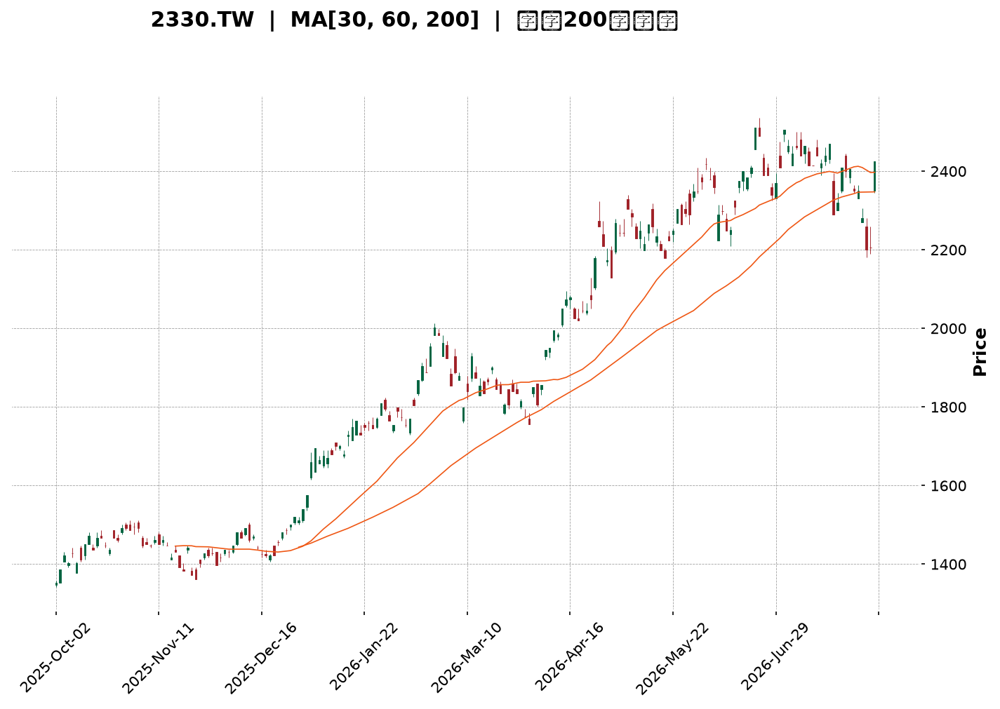
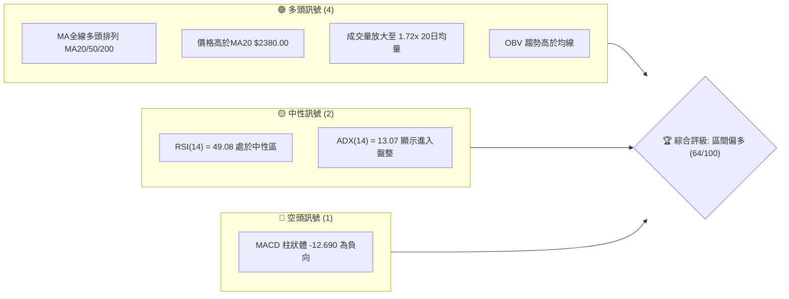
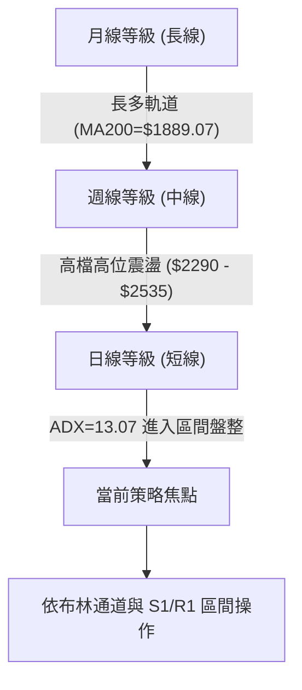
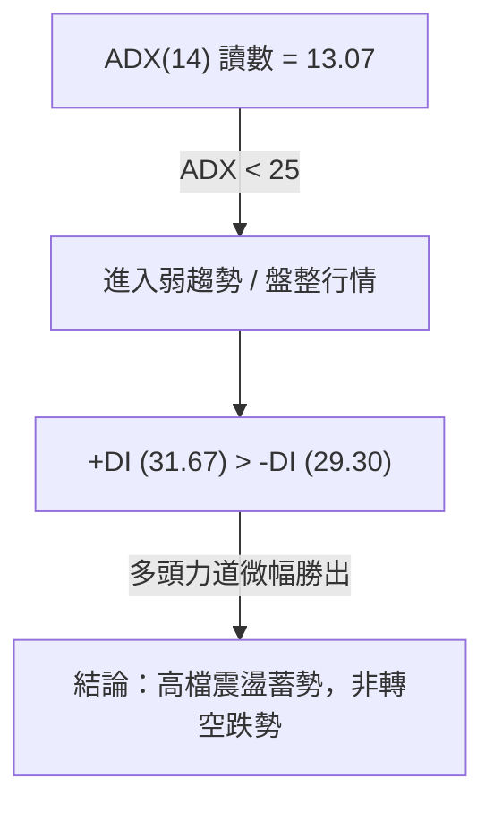
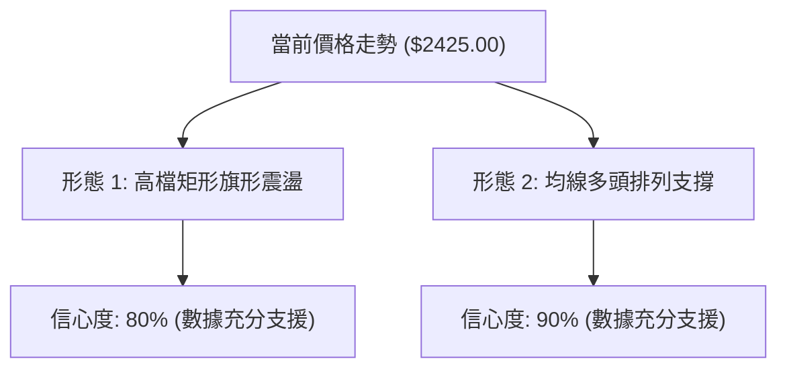
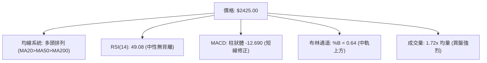
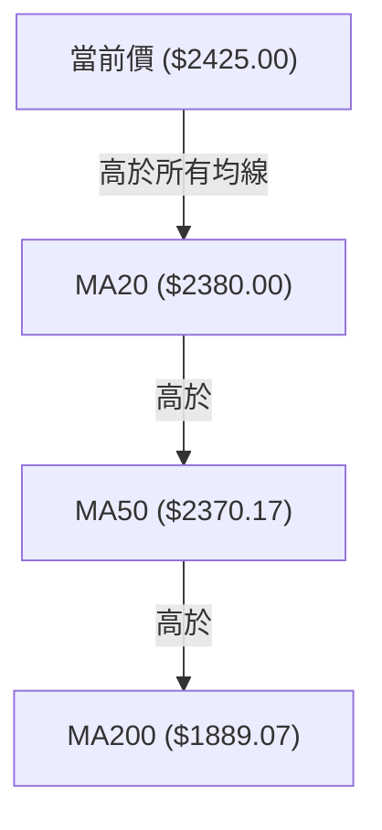
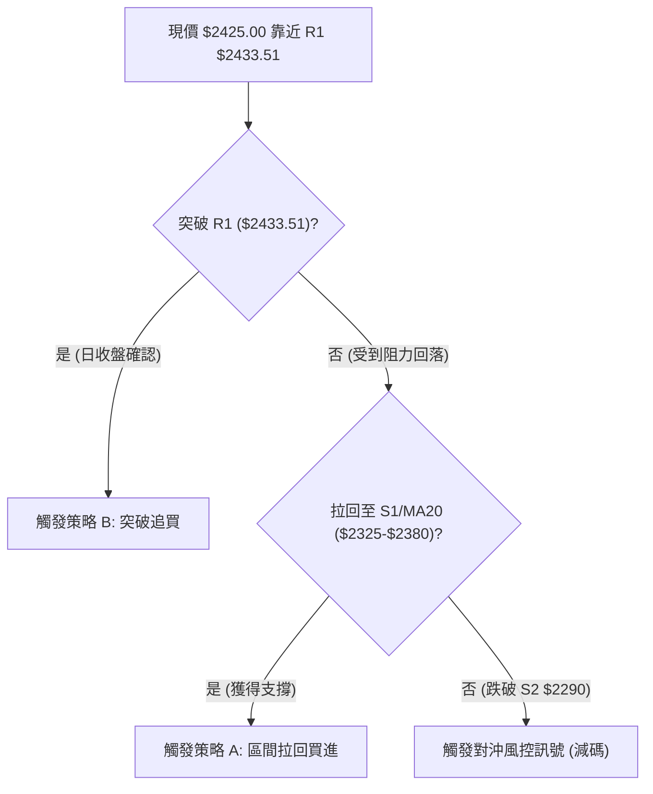
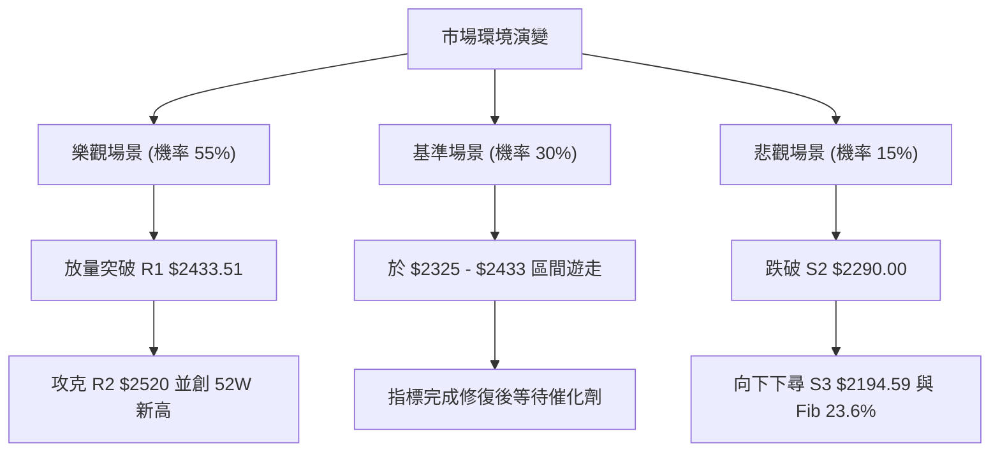

<details markdown="1">
<summary>📊 靜態圖表 (點擊展開)</summary>



</details>

<html>
<head><meta charset="utf-8" /></head>
<body>
    <div style="height:500px; width:100%;">                        <script>window.PlotlyConfig = {MathJaxConfig: 'local'};</script>
        <script charset="utf-8" src="https://cdn.plot.ly/plotly-3.7.0.min.js" integrity="sha256-jvTGqxNp8AGWEcvNLVuKr+8j5dGe9Yw51LQkmDH+IYA=" crossorigin="anonymous"></script>                <div id="candlestick-chart" class="plotly-graph-div" style="height:100%; width:100%;"></div>            <script>                window.PLOTLYENV=window.PLOTLYENV || {};                                if (document.getElementById("candlestick-chart")) {                    Plotly.newPlot(                        "candlestick-chart",                        [{"close":{"dtype":"f8","bdata":"AAAAILshlUAAAAAgcayVQAAAACAnN5ZAAAAAwOPnlUAAAAAA+EqWQAAAAMDj55VAAAAAgIUPlkAAAACADK6WQAAAAOBP\u002fZZAAAAA4JlylkAAAAAAf+mWQAAAAAB\u002f6ZZAAAAAoDualkAAAADgmXKWQAAAAAB\u002f6ZZAAAAAIK7VlkAAAABAk0yXQAAAAECTTJdAAAAAgMI4l0AAAAAgZGCXQAAAAECTTJdAAAAAoDualkAAAACADK6WQAAAAKA7mpZAAAAAIK7VlkAAAACADK6WQAAAACCu1ZZAAAAAoDualkAAAABAViOWQAAAAADJXpZAAAAAIELAlUAAAABAoJiVQAAAAKBqhpZAAAAAgP5wlUAAAADgXEmVQAAAAMDj55VAAAAAAPhKlkAAAAAgJzeWQAAAAAD4SpZAAAAA4BLUlUAAAABAViOWQAAAAOCZcpZAAAAAAMlelkAAAACgO5qWQAAAAKDxJJdAAAAAAH\u002fplkAAAABAk0yXQAAAAKBI1ZZAAAAAQAz9lkAAAACgwYWWQAAAACAcSpZAAAAAYDo2lkAAAABgOjaWQAAAAGA6NpZAAAAA4GbBlkAAAADAzySXQAAAAICxOJdAAAAA4FZ0l0AAAADg3cOXQAAAAGAanJdAAAAAAGUTmEAAAABgkZ6YQAAAAICP8JlAAAAA4Lt7mkAAAABAcQSaQAAAAMA0LJpAAAAAAFMYmkAAAACAFkCaQAAAAKCdj5pAAAAAoJ2PmkAAAACAFkCaQAAAAEDoBptAAAAAYG9Wm0AAAADAFJKbQAAAAEDoBptAAAAAYG9Wm0AAAAAAM36bQAAAAICNQptAAAAAgPalm0AAAACgBEWcQAAAAGBfCZxAAAAAwBSSm0AAAAAgUWqbQAAAAIB99ZtAAAAAQNi5m0AAAAAgUWqbQAAAAID2pZtAAAAA4CIxnEAAAADgmTOdQAAAAEDGvp1AAAAA4CCDnUAAAADgl4WeQAAAAKBpTJ9AAAAAgOL8nkAAAACAW62eQAAAAGBNDp5AAAAAgPT3nEAAAADgIIOdQAAAAGBdW51AAAAAIEEdnEAAAABAT7ycQAAAACAvIp5AAAAAoHtHnUAAAACA9PecQAAAAIBtqJxAAAAAABkknUAAAACgua+dQAAAAIBP1JxAAAAAwGqsnEAAAACAvDScQAAAAIC8NJxAAAAAIF3AnEAAAADAaqycQAAAAEChXJxAAAAAQA69m0AAAADARG2bQAAAAOBB6JxAAAAAgLw0nEAAAABANPycQAAAAAA\u002fY55AAAAAYDF3nkAAAADAtiqfQAAAAADSAp9AAAAAgBADoEAAAABg7jSgQAAAAKDnPqBAAAAAAGWin0AAAACgco6fQAAAAIAu8p9AAAAAgC7yn0AAAABg7jSgQAAAAGBfBqFAAAAAYPKloUAAAACANkKhQAAAACBm\u002fKBAAAAAgKOioEAAAADA5LmhQAAAAOAGiKFAAAAA4AaIoUAAAAAgtf+hQAAAAGDQ16FAAAAAQBtqoUAAAAAAAJKhQAAAAKAvTKFAAAAAoOuvoUAAAABg8qWhQAAAAIAUdKFAAAAAIEQuoUAAAABgXwahQAAAAAAiYKFAAAAAAACSoUAAAAAgtf+hQAAAAKDrr6FAAAAAwMLroUAAAACAyeGhQAAAAMB3WaJAAAAAwHdZokAAAADAVYuiQAAAAGAY5aJAAAAA4E6VokAAAAAgam2iQAAAAIDJ4aFAAAAA4Lv1oUAAAAAAAJKhQAAAAAAAlKFAAAAAAAAMokAAAAAAAI6iQAAAAAAAwKJAAAAAAACiokAAAAAAANSiQAAAAAAAnKNAAAAAAAB0o0AAAAAAAKyiQAAAAAAArKJAAAAAAABIokAAAAAAAISiQAAAAAAA1KJAAAAAAACSo0AAAAAAAEKjQAAAAAAAGqNAAAAAAAA4o0AAAAAAABCjQAAAAAAAQqNAAAAAAADeokAAAAAAAN6iQAAAAAAAEKNAAAAAAADookAAAAAAABCjQAAAAAAATKNAAAAAAADkoUAAAAAAACCiQAAAAAAA1KJAAAAAAADAokAAAAAAAMqiQAAAAAAAXKJAAAAAAABcokAAAAAAANChQAAAAAAAMKFAAAAAAAA6oUAAAAAAAPKiQA=="},"high":{"dtype":"f8","bdata":"vMd7\u002fIs1lUAAAAAgcayVQGk23djIXpZAo6R+nLT7lUBVVVWVaoaWQKOkfpy0+5VAHJWihzualkAAAACADK6WQHW4GpnxJJdADem8dQyulkCYIp+V8SSXQHWDKXLCOJdATZo0Wd3BlkCvTZS8aoaWQHWDKXLCOJdA+iCWtSARl0Bdv\u002fv4NHSXQAufedUFiJdA7+7uztabl0AEsgHZBYiXQLp+97HWm5dAwYED70\u002f9lkASz9cVf+mWQCZNmnwMrpZAp8AO2U\u002f9lkAlnq+r8SSXQKfADtlP\u002fZZATZo0Wd3BlkA+09b490qWQPDRs5U7mpZAnHSASyc3lkByHMex4+eVQFkpe3w7mpZAt9Ks8UHAlUCx9g0LQsCVQEZJ\u002fXiFD5ZAAAAAAPhKlkDSbLqRaoaWQFVVVZVqhpZAGTpg58helkA+09b490qWQAAAAOCZcpZA+0WR3JlylkAAAACgO5qWQAAAAKDxJJdAdYMpcsI4l0AAAABAk0yXQAAAAJA4iJdApshnBe4Ql0BgKmhlo5mWQBUYe6rfcZZAmrbGr99xlkDePEIlHEqWQFYwSzqjmZZAQf5ZpUjVlkAAAADAzySXQFDmWUWTTJdAAAAA4FZ0l0AAAADg3cOXQK+hvOrdw5dAAAAAAGUTmEAAAABgkZ6YQH+L01r4U5pAAAAA4Lt7mkBi0bLKNCyaQIDY8w\u002faZ5pAVVVVFdpnmkBow+fPu3uaQKuqqipht5pAVVVVZX+jmkBFgpoK2meaQKuqqsqrLptAGF10dfalm0AAAADAFJKbQKuqqhpRaptAjC666jJ+m0B+eWzFFJKbQKD7uR\u002fYuZtAlqxkRdi5m0AAAACgBEWcQG12cQCqgJxAINEKm331m0AAAAAgUWqbQKuqqgpBHZxAFTqDVV8JnEB5mgtw9qWbQAAAAID2pZtA43eC9amAnEAAAADgmTOdQN3LscqJ5p1AFQgjRU0OnkBn0pVqW62eQAzkoyotdJ9A+DPhz4c4n0DVKGOV4vyeQH1BX1A9wZ5AaQ7fb+SqnUC3xKkftnGeQKuqquogg51AAAAAIEEdnEBGteVqXVudQAW+uKrySZ5AvLoVQMa+nUASsUaVe0edQAUJo+WZM51ATNgGwf1LnUAEAoEArMOdQDkPHcP9S51ALWQhAxkknUBtx4fgrkicQGg7PoRP1JxAMjgfYws4nUB705uiJhCdQHAIh6CTcJxACEUowtcMnEB00UUD8+SbQAAAAOBB6JxArpHVpSYQnUAAAABANPycQAAAAAA\u002fY55AAAAAYDF3nkAAAADAtiqfQFx\u002fe2DEFp9AAAAAgBADoEDFTuwg01ygQP\u002fBRNDgSKBALzFroQkNoEDCFmxxEAOgQBO1KzH1KqBAD8TvAPwgoECd2Ilyo6KgQGmcQZBYEKFAGNE205knokD5Y0nz3cOhQKszUkE9OKFAVFwyhDZCoUDgB34g182hQGhFI6Hrr6FAdbn9MdfNoUAffPBxhUWiQPQuHiG1\u002f6FAOiUBwuS5oUAU3z3x3cOhQMln3WAUdKFAAAAAoOuvoUDvhfeioB2iQEmSJEH5m6FAURRFESJgoUAPDkhRPTihQAWEE\u002fH\u002fkaFABJM\u002fMPmboUAAAAAgtf+hQDbwGbOgHaJAoGir4ZknokCeDyzzcGOiQLt\u002f84BcgaJAL3\u002faAibRokCBXBOBOrOiQENasfADA6NAcqdoASbRokBO8OShM72iQMZUOHGnE6JA75W6cKcTokAkKzyywuuhQAAAAAAAqKFAAAAAAAAqokAAAAAAAI6iQAAAAAAAwKJAAAAAAACiokAAAAAAAN6iQAAAAAAAnKNAAAAAAADOo0AAAAAAABqjQAAAAAAA6KJAAAAAAACEokAAAAAAALaiQAAAAAAAVqNAAAAAAACSo0AAAAAAAGCjQAAAAAAAQqNAAAAAAACIo0AAAAAAAIijQAAAAAAAQqNAAAAAAAA4o0AAAAAAAN6iQAAAAAAAYKNAAAAAAAD8okAAAAAAADijQAAAAAAATKNAAAAAAAC2okAAAAAAAFKiQAAAAAAA1KJAAAAAAAAao0AAAAAAAMqiQAAAAAAAeqJAAAAAAAB6okAAAAAAAAKiQAAAAAAA0KFAAAAAAACooUAAAAAAAPKiQA=="},"hovertemplate":"\u003cb\u003e%{x|%Y-%m-%d}\u003c\u002fb\u003e\u003cbr\u003e\u958b: $%{open:.2f}\u003cbr\u003e\u9ad8: $%{high:.2f}\u003cbr\u003e\u4f4e: $%{low:.2f}\u003cbr\u003e\u6536: $%{close:.2f}\u003cextra\u003e\u003c\u002fextra\u003e","low":{"dtype":"f8","bdata":"h3AIZxn6lEDNzMwYuyGVQGIutIq0+5VAurYCB0LAlUDHcRxHViOWQNLIhnHPhJVARQ97o7T7lUDP1xWbhQ+WQBaPym0MrpZAAAAA4JlylkCtG0yxaoaWQAAAAAB\u002f6ZZA2bJlw2qGlkD0FkNKJzeWQAAAAAB\u002f6ZZArZ94Q93BlkD1YIaqIBGXQFIggmPCOJdAAAAAgMI4l0D5m\u002fytIBGXQKRABIfxJJdA2bJlw2qGlkAAAACADK6WQNmyZcNqhpZAWT\u002fxZgyulkAAAACADK6WQAbfaYo7mpZAAAAAoDualkBglpRjhQ+WQAAAAADJXpZAAAAAIELAlUAAAABAoJiVQPWDjgr4SpZAAAAAgP5wlUAAAADgXEmVQLq2AgdCwJVAqqqqaoUPlkDLZJFDViOWQOM4jiMnN5ZAAAAA4BLUlUDBLCmHtPuVQPQWQ0onN5ZAEC5MalYjlkBmy5Yt+EqWQIcm+Zc7mpZAAAAAAH\u002fplkBHgQjOT\u002f2WQKuqqtpmwZZAtG4wtUjVlkCh1Zfa33GWQOrnhJVYIpZAIsO9mlgilkBmSTkQlfqVQAAAAGA6NpZAfwNMVaOZlkBwA4aqSNWWQF8zTPXtEJdAk7\u002fJj7E4l0CrqqrKVnSXQFFeQ9VWdJdApwFtmjiIl0CB4DI1g\u002f+XQE5rto+fPZlA\u002ffPPnyaNmUCdLk21rdyZQAFPGCDqtJlAVVVVJeq0mUAAAACAFkCaQFVVVRXaZ5pAVVVVFdpnmkC6fWX1UhiaQAAAAKCdj5pAGF10+kLLmkBsDiRa6AabQAAAAEDoBptAddFF1asum0AJGk7qqy6bQAAAAICNQptAFKEIpY1Cm0Aw\u002fdL\u002fuc2bQJjBl5p99ZtAAAAAwBSSm0AKMpsKyhqbQAAAADDYuZtA9WI+tRSSm0CDzKZab1abQFOb2lToBptAAAAA4CIxnEDqOxu1i5ScQIvQOBW4H51AAAAA4CCDnUD94xIrxr6dQOY3uIri\u002fJ5AAAAAgOL8nkCMeJIaLyKeQAAAAGBNDp5AAAAAgPT3nEBG2rEaP2+dQFVVVdWZM51AEaTc9DJ+m0BcJY0qyGycQN4sTxq4H51AAAAAoHtHnUCpomeli5ScQAAAAIBtqJxAsyf5PjT8nED0+Xx+4nOdQAAAAIBP1JxAAAAAwGqsnEDgGlmdANGbQCdx8L7XDJxAAAAAIF3AnEAAAADAaqycQD7e473XDJxAAAAAQA69m0AAAADARG2bQPqSaf2FhJxAlDh4H8ognEDXWmtdeJicQJ3YiR2D\u002f51AM3WLfXUTnkBSuB59CLOeQO6Bjd76xp5Av0oYm5tSn0A7sROfCQ2gQAd0Y34QA6BAAAAAAGWin0AAAACgco6fQPgdiB883p9A8TsQv0nKn0CKndhuEAOgQGk55lvMZqBAAAAAYPKloUAAAACANkKhQCrmVo963qBAAAAAgKOioED8wA+8URqhQExdbn8UdKFATF1ufxR0oUAAAAAgtf+hQE9Fmm7ypaFAAAAAQBtqoUDc1MNNPTihQCnyWQ9ELqFAHpe+HSJgoUCEHkLPBoihQCRJko42QqFAAAAAIEQuoUAAAABgXwahQAAAAAAiYKFA6I2C3ihWoUDhgw\u002fO5LmhQAAAAKDrr6FAy4dxX9DXoUA5q8eO66+hQFegz86ZJ6JAESDDj35PokB\u002fo+z+cGOiQL6lTs8sx6JAAAAA4E6VokDjJUqPfk+iQGLw0wwiYKFAC5yDf8nhoUAAAAAAAJKhQAAAAAAARKFAAAAAAADkoUAAAAAAAFKiQAAAAAAAXKJAAAAAAABcokAAAAAAAKKiQAAAAAAALqNAAAAAAAB0o0AAAAAAAKyiQAAAAAAArKJAAAAAAAAqokAAAAAAADSiQAAAAAAA1KJAAAAAAABWo0AAAAAAABqjQAAAAAAA3qJAAAAAAAAuo0AAAAAAABCjQAAAAAAA6KJAAAAAAADeokAAAAAAAN6iQAAAAAAAEKNAAAAAAACsokAAAAAAAN6iQAAAAAAA6KJAAAAAAADkoUAAAAAAAPihQAAAAAAAUqJAAAAAAACiokAAAAAAAISiQAAAAAAAUqJAAAAAAAA0okAAAAAAALyhQAAAAAAACKFAAAAAAAAcoUAAAAAAAFKiQA=="},"name":"\u50f9\u683c","open":{"dtype":"f8","bdata":"QziEQ+oNlUDNzMwYuyGVQGIutIq0+5VAXVuB4xLUlUAAAAAA+EqWQNLIhnHPhJVAYaQdq2qGlkDbYVBUJzeWQBaPym0MrpZAr02UvGqGlkCKfNaNO5qWQN1gitxP\u002fZZAAAAAoDualkCjZNcm+EqWQHWDKXLCOJdAU2CH\u002fH7plkCkQASH8SSXQF2\u002f+\u002fg0dJdAXI\u002fCFTV0l0AAAAAgZGCXQAufedUFiJdAmjRpEn\u002fplkAGRZ1c3cGWQAAAAKA7mpZArZ94Q93BlkAfWRLPIBGXQK2feEPdwZZAAAAAoDualkBglpRjhQ+WQPtFkdyZcpZAnHSASyc3lkAcx3EccayVQKfWhMOZcpZAW2nWOKCYlUDpoosucayVQEZJ\u002fXiFD5ZAx3EcR1YjlkCe0Uu1mXKWQAAAAAD4SpZAGTpg58helkAAAABAViOWQKNk1yb4SpZAAAAAAMlelkCMGDEKyV6WQCtqjHQMrpZAmCKflfEkl0D1YIaqIBGXQKuqqspWdJdAWjeYeirplkAAAACgwYWWQAAAACAcSpZA3jxCJRxKlkBEhnvVdg6WQFYwSzqjmZZAAAAA4GbBlkCUguRvKumWQAAAAICxOJdAMZWYGnVgl0AAAACQOIiXQCivoZo4iJdA\u002fSXLXxqcl0BhKOa\u002fRieYQJvtE1WBUZlA\u002ffPPnyaNmUCdLk21rdyZQCuXaeXLyJlAAAAAsK3cmUBFgpoK2meaQKuqqipht5pAq6qq2rt7mkDdvrK6NCyaQKuqqnoG85pAGF10+kLLmkBsDiRa6AabQFVVVQXKGptARhddJVFqm0AAAAAAM36bQOBTkwpRaptAqk1tam9Wm0Aw\u002fdL\u002fuc2bQAY4CTvIbJxArbA5ELrNm0CIZfTPqy6bQKuqqgpBHZxAAAAAQNi5m0AAAAAgUWqbQOlHPxrKGptA69khMMhsnEBt1Hd6baicQHq2kdqZM51AAAAA4CCDnUD94xIrxr6dQOY3uIri\u002fJ5AUxFLRcQQn0CMeJIaLyKeQNNrn8V5mZ5AmwnqHz9vnUDPLXEKLyKeQFVVVdWZM51Ajw9BuhSSm0Cj2nJV1gudQOPqB6V7R51AXt0K8CCDnUCpomeli5ScQASaQiC4H51AJmyDYAs4nUD8\u002fX4\u002fx5udQFo3mGILOJ1AyUIWQjT8nEBN4uD98uSbQGg7PoRP1JxAIdAUoiYQnUBkIQuBT9ScQK7mah7KIJxAAAAAQA69m0C66KLhG6mbQGOLcr5qrJxArpHVpSYQnUDwvfd+T9ScQF7ohd5nJ55AR5UEn0xPnkCamZnd+saeQKWAhJ\u002ff7p5AqtCj+41mn0DsxE7PAhegQAE+u2\u002fuNKBA\u002fKgucRADoEDrXHkAZaKfQAAAAIAu8p9A+B2IHzzen0BiJ3bA4EigQNLVJ4zFcKBAfOG98N3DoUCHVYShDX6hQA6ix+9s8qBAyhCsI0QuoUDsxE7sSiShQAAAAOAGiKFAAAAA4AaIoUDNoWIRkzGiQHoXj8DC66FA69uAYfKloUDwswE\u002fG2qhQCnyWQ9ELqFAj0vf3gaIoUBzpDkStf+hQEmSJO8oVqFAMQzDsC9MoUCmcQYhRC6hQM80bmAUdKFA+NmAnw1+oUDhgw\u002fO5LmhQBrD0YKnE6JANniOILX\u002foUDoIK+Sfk+iQDRgSS+MO6JAAAAAwHdZokBArokgSJ+iQAAAAGAY5aJAAAAA4E6VokA7tGtBQamiQGLw0wwiYKFAAAAA4Lv1oUAYcn0h182hQAAAAAAAgKFAAAAAAAAqokAAAAAAAHCiQAAAAAAAjqJAAAAAAABmokAAAAAAALaiQAAAAAAALqNAAAAAAACco0AAAAAAAAajQAAAAAAA1KJAAAAAAABwokAAAAAAADSiQAAAAAAAEKNAAAAAAAB+o0AAAAAAACSjQAAAAAAA3qJAAAAAAABCo0AAAAAAAGCjQAAAAAAAGqNAAAAAAAAko0AAAAAAAN6iQAAAAAAAOKNAAAAAAADUokAAAAAAAPKiQAAAAAAA\u002fKJAAAAAAACOokAAAAAAAPihQAAAAAAAXKJAAAAAAAAQo0AAAAAAAKKiQAAAAAAAZqJAAAAAAAA0okAAAAAAALyhQAAAAAAAqKFAAAAAAAA6oUAAAAAAAFyiQA=="},"x":["2025-10-02T00:00:00+08:00","2025-10-03T00:00:00+08:00","2025-10-07T00:00:00+08:00","2025-10-08T00:00:00+08:00","2025-10-09T00:00:00+08:00","2025-10-13T00:00:00+08:00","2025-10-14T00:00:00+08:00","2025-10-15T00:00:00+08:00","2025-10-16T00:00:00+08:00","2025-10-17T00:00:00+08:00","2025-10-20T00:00:00+08:00","2025-10-21T00:00:00+08:00","2025-10-22T00:00:00+08:00","2025-10-23T00:00:00+08:00","2025-10-27T00:00:00+08:00","2025-10-28T00:00:00+08:00","2025-10-29T00:00:00+08:00","2025-10-30T00:00:00+08:00","2025-10-31T00:00:00+08:00","2025-11-03T00:00:00+08:00","2025-11-04T00:00:00+08:00","2025-11-05T00:00:00+08:00","2025-11-06T00:00:00+08:00","2025-11-07T00:00:00+08:00","2025-11-10T00:00:00+08:00","2025-11-11T00:00:00+08:00","2025-11-12T00:00:00+08:00","2025-11-13T00:00:00+08:00","2025-11-14T00:00:00+08:00","2025-11-17T00:00:00+08:00","2025-11-18T00:00:00+08:00","2025-11-19T00:00:00+08:00","2025-11-20T00:00:00+08:00","2025-11-21T00:00:00+08:00","2025-11-24T00:00:00+08:00","2025-11-25T00:00:00+08:00","2025-11-26T00:00:00+08:00","2025-11-27T00:00:00+08:00","2025-11-28T00:00:00+08:00","2025-12-01T00:00:00+08:00","2025-12-02T00:00:00+08:00","2025-12-03T00:00:00+08:00","2025-12-04T00:00:00+08:00","2025-12-05T00:00:00+08:00","2025-12-08T00:00:00+08:00","2025-12-09T00:00:00+08:00","2025-12-10T00:00:00+08:00","2025-12-11T00:00:00+08:00","2025-12-12T00:00:00+08:00","2025-12-15T00:00:00+08:00","2025-12-16T00:00:00+08:00","2025-12-17T00:00:00+08:00","2025-12-18T00:00:00+08:00","2025-12-19T00:00:00+08:00","2025-12-22T00:00:00+08:00","2025-12-23T00:00:00+08:00","2025-12-24T00:00:00+08:00","2025-12-26T00:00:00+08:00","2025-12-29T00:00:00+08:00","2025-12-30T00:00:00+08:00","2025-12-31T00:00:00+08:00","2026-01-02T00:00:00+08:00","2026-01-05T00:00:00+08:00","2026-01-06T00:00:00+08:00","2026-01-07T00:00:00+08:00","2026-01-08T00:00:00+08:00","2026-01-09T00:00:00+08:00","2026-01-12T00:00:00+08:00","2026-01-13T00:00:00+08:00","2026-01-14T00:00:00+08:00","2026-01-15T00:00:00+08:00","2026-01-16T00:00:00+08:00","2026-01-19T00:00:00+08:00","2026-01-20T00:00:00+08:00","2026-01-21T00:00:00+08:00","2026-01-22T00:00:00+08:00","2026-01-23T00:00:00+08:00","2026-01-26T00:00:00+08:00","2026-01-27T00:00:00+08:00","2026-01-28T00:00:00+08:00","2026-01-29T00:00:00+08:00","2026-01-30T00:00:00+08:00","2026-02-02T00:00:00+08:00","2026-02-03T00:00:00+08:00","2026-02-04T00:00:00+08:00","2026-02-05T00:00:00+08:00","2026-02-06T00:00:00+08:00","2026-02-09T00:00:00+08:00","2026-02-10T00:00:00+08:00","2026-02-11T00:00:00+08:00","2026-02-23T00:00:00+08:00","2026-02-24T00:00:00+08:00","2026-02-25T00:00:00+08:00","2026-02-26T00:00:00+08:00","2026-03-02T00:00:00+08:00","2026-03-03T00:00:00+08:00","2026-03-04T00:00:00+08:00","2026-03-05T00:00:00+08:00","2026-03-06T00:00:00+08:00","2026-03-09T00:00:00+08:00","2026-03-10T00:00:00+08:00","2026-03-11T00:00:00+08:00","2026-03-12T00:00:00+08:00","2026-03-13T00:00:00+08:00","2026-03-16T00:00:00+08:00","2026-03-17T00:00:00+08:00","2026-03-18T00:00:00+08:00","2026-03-19T00:00:00+08:00","2026-03-20T00:00:00+08:00","2026-03-23T00:00:00+08:00","2026-03-24T00:00:00+08:00","2026-03-25T00:00:00+08:00","2026-03-26T00:00:00+08:00","2026-03-27T00:00:00+08:00","2026-03-30T00:00:00+08:00","2026-03-31T00:00:00+08:00","2026-04-01T00:00:00+08:00","2026-04-02T00:00:00+08:00","2026-04-07T00:00:00+08:00","2026-04-08T00:00:00+08:00","2026-04-09T00:00:00+08:00","2026-04-10T00:00:00+08:00","2026-04-13T00:00:00+08:00","2026-04-14T00:00:00+08:00","2026-04-15T00:00:00+08:00","2026-04-16T00:00:00+08:00","2026-04-17T00:00:00+08:00","2026-04-20T00:00:00+08:00","2026-04-21T00:00:00+08:00","2026-04-22T00:00:00+08:00","2026-04-23T00:00:00+08:00","2026-04-24T00:00:00+08:00","2026-04-27T00:00:00+08:00","2026-04-28T00:00:00+08:00","2026-04-29T00:00:00+08:00","2026-04-30T00:00:00+08:00","2026-05-04T00:00:00+08:00","2026-05-05T00:00:00+08:00","2026-05-06T00:00:00+08:00","2026-05-07T00:00:00+08:00","2026-05-08T00:00:00+08:00","2026-05-11T00:00:00+08:00","2026-05-12T00:00:00+08:00","2026-05-13T00:00:00+08:00","2026-05-14T00:00:00+08:00","2026-05-15T00:00:00+08:00","2026-05-18T00:00:00+08:00","2026-05-19T00:00:00+08:00","2026-05-20T00:00:00+08:00","2026-05-21T00:00:00+08:00","2026-05-22T00:00:00+08:00","2026-05-25T00:00:00+08:00","2026-05-26T00:00:00+08:00","2026-05-27T00:00:00+08:00","2026-05-28T00:00:00+08:00","2026-05-29T00:00:00+08:00","2026-06-01T00:00:00+08:00","2026-06-02T00:00:00+08:00","2026-06-03T00:00:00+08:00","2026-06-04T00:00:00+08:00","2026-06-05T00:00:00+08:00","2026-06-08T00:00:00+08:00","2026-06-09T00:00:00+08:00","2026-06-10T00:00:00+08:00","2026-06-11T00:00:00+08:00","2026-06-12T00:00:00+08:00","2026-06-15T00:00:00+08:00","2026-06-16T00:00:00+08:00","2026-06-17T00:00:00+08:00","2026-06-18T00:00:00+08:00","2026-06-22T00:00:00+08:00","2026-06-23T00:00:00+08:00","2026-06-24T00:00:00+08:00","2026-06-25T00:00:00+08:00","2026-06-26T00:00:00+08:00","2026-06-29T00:00:00+08:00","2026-06-30T00:00:00+08:00","2026-07-01T00:00:00+08:00","2026-07-02T00:00:00+08:00","2026-07-03T00:00:00+08:00","2026-07-06T00:00:00+08:00","2026-07-07T00:00:00+08:00","2026-07-08T00:00:00+08:00","2026-07-09T00:00:00+08:00","2026-07-10T00:00:00+08:00","2026-07-13T00:00:00+08:00","2026-07-14T00:00:00+08:00","2026-07-15T00:00:00+08:00","2026-07-16T00:00:00+08:00","2026-07-17T00:00:00+08:00","2026-07-20T00:00:00+08:00","2026-07-21T00:00:00+08:00","2026-07-22T00:00:00+08:00","2026-07-23T00:00:00+08:00","2026-07-24T00:00:00+08:00","2026-07-27T00:00:00+08:00","2026-07-28T00:00:00+08:00","2026-07-29T00:00:00+08:00","2026-07-30T00:00:00+08:00","2026-07-31T00:00:00+08:00"],"type":"candlestick"},{"hovertemplate":"MA30: $%{y:.2f}\u003cextra\u003e\u003c\u002fextra\u003e","line":{"color":"#2196F3","dash":"dash","width":2},"mode":"lines","name":"MA30","x":["2025-10-02T00:00:00+08:00","2025-10-03T00:00:00+08:00","2025-10-07T00:00:00+08:00","2025-10-08T00:00:00+08:00","2025-10-09T00:00:00+08:00","2025-10-13T00:00:00+08:00","2025-10-14T00:00:00+08:00","2025-10-15T00:00:00+08:00","2025-10-16T00:00:00+08:00","2025-10-17T00:00:00+08:00","2025-10-20T00:00:00+08:00","2025-10-21T00:00:00+08:00","2025-10-22T00:00:00+08:00","2025-10-23T00:00:00+08:00","2025-10-27T00:00:00+08:00","2025-10-28T00:00:00+08:00","2025-10-29T00:00:00+08:00","2025-10-30T00:00:00+08:00","2025-10-31T00:00:00+08:00","2025-11-03T00:00:00+08:00","2025-11-04T00:00:00+08:00","2025-11-05T00:00:00+08:00","2025-11-06T00:00:00+08:00","2025-11-07T00:00:00+08:00","2025-11-10T00:00:00+08:00","2025-11-11T00:00:00+08:00","2025-11-12T00:00:00+08:00","2025-11-13T00:00:00+08:00","2025-11-14T00:00:00+08:00","2025-11-17T00:00:00+08:00","2025-11-18T00:00:00+08:00","2025-11-19T00:00:00+08:00","2025-11-20T00:00:00+08:00","2025-11-21T00:00:00+08:00","2025-11-24T00:00:00+08:00","2025-11-25T00:00:00+08:00","2025-11-26T00:00:00+08:00","2025-11-27T00:00:00+08:00","2025-11-28T00:00:00+08:00","2025-12-01T00:00:00+08:00","2025-12-02T00:00:00+08:00","2025-12-03T00:00:00+08:00","2025-12-04T00:00:00+08:00","2025-12-05T00:00:00+08:00","2025-12-08T00:00:00+08:00","2025-12-09T00:00:00+08:00","2025-12-10T00:00:00+08:00","2025-12-11T00:00:00+08:00","2025-12-12T00:00:00+08:00","2025-12-15T00:00:00+08:00","2025-12-16T00:00:00+08:00","2025-12-17T00:00:00+08:00","2025-12-18T00:00:00+08:00","2025-12-19T00:00:00+08:00","2025-12-22T00:00:00+08:00","2025-12-23T00:00:00+08:00","2025-12-24T00:00:00+08:00","2025-12-26T00:00:00+08:00","2025-12-29T00:00:00+08:00","2025-12-30T00:00:00+08:00","2025-12-31T00:00:00+08:00","2026-01-02T00:00:00+08:00","2026-01-05T00:00:00+08:00","2026-01-06T00:00:00+08:00","2026-01-07T00:00:00+08:00","2026-01-08T00:00:00+08:00","2026-01-09T00:00:00+08:00","2026-01-12T00:00:00+08:00","2026-01-13T00:00:00+08:00","2026-01-14T00:00:00+08:00","2026-01-15T00:00:00+08:00","2026-01-16T00:00:00+08:00","2026-01-19T00:00:00+08:00","2026-01-20T00:00:00+08:00","2026-01-21T00:00:00+08:00","2026-01-22T00:00:00+08:00","2026-01-23T00:00:00+08:00","2026-01-26T00:00:00+08:00","2026-01-27T00:00:00+08:00","2026-01-28T00:00:00+08:00","2026-01-29T00:00:00+08:00","2026-01-30T00:00:00+08:00","2026-02-02T00:00:00+08:00","2026-02-03T00:00:00+08:00","2026-02-04T00:00:00+08:00","2026-02-05T00:00:00+08:00","2026-02-06T00:00:00+08:00","2026-02-09T00:00:00+08:00","2026-02-10T00:00:00+08:00","2026-02-11T00:00:00+08:00","2026-02-23T00:00:00+08:00","2026-02-24T00:00:00+08:00","2026-02-25T00:00:00+08:00","2026-02-26T00:00:00+08:00","2026-03-02T00:00:00+08:00","2026-03-03T00:00:00+08:00","2026-03-04T00:00:00+08:00","2026-03-05T00:00:00+08:00","2026-03-06T00:00:00+08:00","2026-03-09T00:00:00+08:00","2026-03-10T00:00:00+08:00","2026-03-11T00:00:00+08:00","2026-03-12T00:00:00+08:00","2026-03-13T00:00:00+08:00","2026-03-16T00:00:00+08:00","2026-03-17T00:00:00+08:00","2026-03-18T00:00:00+08:00","2026-03-19T00:00:00+08:00","2026-03-20T00:00:00+08:00","2026-03-23T00:00:00+08:00","2026-03-24T00:00:00+08:00","2026-03-25T00:00:00+08:00","2026-03-26T00:00:00+08:00","2026-03-27T00:00:00+08:00","2026-03-30T00:00:00+08:00","2026-03-31T00:00:00+08:00","2026-04-01T00:00:00+08:00","2026-04-02T00:00:00+08:00","2026-04-07T00:00:00+08:00","2026-04-08T00:00:00+08:00","2026-04-09T00:00:00+08:00","2026-04-10T00:00:00+08:00","2026-04-13T00:00:00+08:00","2026-04-14T00:00:00+08:00","2026-04-15T00:00:00+08:00","2026-04-16T00:00:00+08:00","2026-04-17T00:00:00+08:00","2026-04-20T00:00:00+08:00","2026-04-21T00:00:00+08:00","2026-04-22T00:00:00+08:00","2026-04-23T00:00:00+08:00","2026-04-24T00:00:00+08:00","2026-04-27T00:00:00+08:00","2026-04-28T00:00:00+08:00","2026-04-29T00:00:00+08:00","2026-04-30T00:00:00+08:00","2026-05-04T00:00:00+08:00","2026-05-05T00:00:00+08:00","2026-05-06T00:00:00+08:00","2026-05-07T00:00:00+08:00","2026-05-08T00:00:00+08:00","2026-05-11T00:00:00+08:00","2026-05-12T00:00:00+08:00","2026-05-13T00:00:00+08:00","2026-05-14T00:00:00+08:00","2026-05-15T00:00:00+08:00","2026-05-18T00:00:00+08:00","2026-05-19T00:00:00+08:00","2026-05-20T00:00:00+08:00","2026-05-21T00:00:00+08:00","2026-05-22T00:00:00+08:00","2026-05-25T00:00:00+08:00","2026-05-26T00:00:00+08:00","2026-05-27T00:00:00+08:00","2026-05-28T00:00:00+08:00","2026-05-29T00:00:00+08:00","2026-06-01T00:00:00+08:00","2026-06-02T00:00:00+08:00","2026-06-03T00:00:00+08:00","2026-06-04T00:00:00+08:00","2026-06-05T00:00:00+08:00","2026-06-08T00:00:00+08:00","2026-06-09T00:00:00+08:00","2026-06-10T00:00:00+08:00","2026-06-11T00:00:00+08:00","2026-06-12T00:00:00+08:00","2026-06-15T00:00:00+08:00","2026-06-16T00:00:00+08:00","2026-06-17T00:00:00+08:00","2026-06-18T00:00:00+08:00","2026-06-22T00:00:00+08:00","2026-06-23T00:00:00+08:00","2026-06-24T00:00:00+08:00","2026-06-25T00:00:00+08:00","2026-06-26T00:00:00+08:00","2026-06-29T00:00:00+08:00","2026-06-30T00:00:00+08:00","2026-07-01T00:00:00+08:00","2026-07-02T00:00:00+08:00","2026-07-03T00:00:00+08:00","2026-07-06T00:00:00+08:00","2026-07-07T00:00:00+08:00","2026-07-08T00:00:00+08:00","2026-07-09T00:00:00+08:00","2026-07-10T00:00:00+08:00","2026-07-13T00:00:00+08:00","2026-07-14T00:00:00+08:00","2026-07-15T00:00:00+08:00","2026-07-16T00:00:00+08:00","2026-07-17T00:00:00+08:00","2026-07-20T00:00:00+08:00","2026-07-21T00:00:00+08:00","2026-07-22T00:00:00+08:00","2026-07-23T00:00:00+08:00","2026-07-24T00:00:00+08:00","2026-07-27T00:00:00+08:00","2026-07-28T00:00:00+08:00","2026-07-29T00:00:00+08:00","2026-07-30T00:00:00+08:00","2026-07-31T00:00:00+08:00"],"y":{"dtype":"f8","bdata":"AAAAAAAA+H8AAAAAAAD4fwAAAAAAAPh\u002fAAAAAAAA+H8AAAAAAAD4fwAAAAAAAPh\u002fAAAAAAAA+H8AAAAAAAD4fwAAAAAAAPh\u002fAAAAAAAA+H8AAAAAAAD4fwAAAAAAAPh\u002fAAAAAAAA+H8AAAAAAAD4fwAAAAAAAPh\u002fAAAAAAAA+H8AAAAAAAD4fwAAAAAAAPh\u002fAAAAAAAA+H8AAAAAAAD4fwAAAAAAAPh\u002fAAAAAAAA+H8AAAAAAAD4fwAAAAAAAPh\u002fAAAAAAAA+H8AAAAAAAD4fwAAAAAAAPh\u002fAAAAAAAA+H8AAAAAAAD4f6uqqiqXl5ZA7+7u7t+clkBmZmbWNpyWQImIiDjbnpZAVVVVpeSalkCJiIhoTpKWQImIiGhOkpZAERERsUmUlkDNzMwcU5CWQAAAAEBhipZAvLu7exiFlkBmZmaGfX6WQERERPSGepZAq6qqqot4lkC8u7vb3XmWQFVVVSXZe5ZA3t3dPYJ8lkDe3d09gnyWQJqZmUmIeJZA7+7uvop2lkAAAAAQQW+WQN7d3X2jZpZA3t3dHU5jlkBVVVWlT1+WQFVVVUX6W5ZAq6qqOk1blkC8u7urQl+WQFVVVZWPYpZAIiIiwtRplkBVVVUlt3eWQM3MzOxKgpZAvLu7ayGWlkCamZm57a+WQGZmZhYRzZZAZmZmZhf4lkAiIiLydSCXQLy7uwvfRJdAMzMzA1Fll0BERERkv4eXQAAAAFArrJdA3t3dzY3Ul0B3d3dHpfeXQFVVVfW4HphA7+7uXhxJmECamZl5gXOYQLy7u0ujlJhAq6qqCme6mEAiIiKiMN6YQCIiIjL3A5lAzczMvLormUARERGBxVyZQHd3d0fQjZlAIiIiwoq7mUCrqqrq8eeZQAAAALD8GJpA3t3d3WZDmkDNzMwc2meaQN7d3a2gjZpAERER4Q22mkAzMzMDcuSaQDMzMxPNGJtARERENDFHm0CamZlJj3mbQCIiIsJJp5tAq6qq+rnNm0BVVVWFffWbQJqZmXmgFpxAvLu72yUvnECamZmJ+0qcQDMzM0PXYpxAIiIichhwnECamZmJTYWcQGZmZubPn5xAAAAAYGGwnEC8u7s7T7ycQDMzMxM6ypxAiYiImJ3ZnECJiIhIVeycQN7d3Z25+ZxAmpmZOXkCnUCamZlJ7gGdQDMzM1NgA51A3t3dzXMNnUBERERkMBidQERERISgG51Aq6qq6rsbnUCrqqoa1RudQJqZmVmTJp1AIiIiErImnUCamZlZ2SSdQHd3d9dUKp1AZmZmhncynUDe3d2N+DedQBEREZGENZ1AvLu7+1s+nUB3d3cXLU2dQAAAALD1YZ1AvLu7K7V4nUBERETUJoqdQN7d3d0+oJ1AIiIicvHAnUB3d3cHVOCdQHd3dze\u002fAZ5A3t3dDRg1nkB3d3dncWSeQFVVVeXJkZ5AmpmZKQe1nkBERETkOuaeQGZmZuZrG59AVVVVVfFRn0B3d3eXbpSfQAAAAABD1J9AIiIiyg8EoEBEREScpx+gQERERBxAOqBA7+7uhtRaoECrqqpCaHygQCIiInIBlqBAd3d310SwoEAAAADA4MWgQDMzM7N+2KBAvLu7E3HsoEAzMzOrDQGhQHd3d5+rE6FAzczM1PUjoUDv7u5mQTKhQLy7uyM1RKFAREREDNFZoUCJiIiYa3GhQBEREZFaiqFAAAAAsKCgoUDv7u6+k7OhQFVVVRXkuqFA7+7u7oy9oUCJiIjINcChQCIiInJDxaFAAAAAEE\u002fRoUCamZkJYdihQFVVVTXH4qFAERERYS3soUARERHxQPOhQImIiJhTAqJAZmZmFrkTokDNzMx8Hx2iQCIiIqLZKKJAERERYestokC8u7s7UjWiQImIiEgNQaJAmpmZaXFVokDNzMxMf2iiQGZmZuY5d6JAd3d390qFokB3d3eHXo6iQLy7u5vFm6JAd3d3t9ijokDv7u7uQKyiQKuqqopWsqJAERER0Ra3okBERETkgruiQDMzMwPxvqJAvLu7+we5okARERFhc7aiQDMzM0OGvqJARERERETFokCrqqqqqs+iQFVVVVVV1qJAAAAAAADZokCrqqqqqtKiQFVVVVVVxaJAVVVVVVW5okBVVVVVVbqiQA=="},"type":"scatter"},{"hovertemplate":"MA60: $%{y:.2f}\u003cextra\u003e\u003c\u002fextra\u003e","line":{"color":"#9C27B0","dash":"dash","width":2},"mode":"lines","name":"MA60","x":["2025-10-02T00:00:00+08:00","2025-10-03T00:00:00+08:00","2025-10-07T00:00:00+08:00","2025-10-08T00:00:00+08:00","2025-10-09T00:00:00+08:00","2025-10-13T00:00:00+08:00","2025-10-14T00:00:00+08:00","2025-10-15T00:00:00+08:00","2025-10-16T00:00:00+08:00","2025-10-17T00:00:00+08:00","2025-10-20T00:00:00+08:00","2025-10-21T00:00:00+08:00","2025-10-22T00:00:00+08:00","2025-10-23T00:00:00+08:00","2025-10-27T00:00:00+08:00","2025-10-28T00:00:00+08:00","2025-10-29T00:00:00+08:00","2025-10-30T00:00:00+08:00","2025-10-31T00:00:00+08:00","2025-11-03T00:00:00+08:00","2025-11-04T00:00:00+08:00","2025-11-05T00:00:00+08:00","2025-11-06T00:00:00+08:00","2025-11-07T00:00:00+08:00","2025-11-10T00:00:00+08:00","2025-11-11T00:00:00+08:00","2025-11-12T00:00:00+08:00","2025-11-13T00:00:00+08:00","2025-11-14T00:00:00+08:00","2025-11-17T00:00:00+08:00","2025-11-18T00:00:00+08:00","2025-11-19T00:00:00+08:00","2025-11-20T00:00:00+08:00","2025-11-21T00:00:00+08:00","2025-11-24T00:00:00+08:00","2025-11-25T00:00:00+08:00","2025-11-26T00:00:00+08:00","2025-11-27T00:00:00+08:00","2025-11-28T00:00:00+08:00","2025-12-01T00:00:00+08:00","2025-12-02T00:00:00+08:00","2025-12-03T00:00:00+08:00","2025-12-04T00:00:00+08:00","2025-12-05T00:00:00+08:00","2025-12-08T00:00:00+08:00","2025-12-09T00:00:00+08:00","2025-12-10T00:00:00+08:00","2025-12-11T00:00:00+08:00","2025-12-12T00:00:00+08:00","2025-12-15T00:00:00+08:00","2025-12-16T00:00:00+08:00","2025-12-17T00:00:00+08:00","2025-12-18T00:00:00+08:00","2025-12-19T00:00:00+08:00","2025-12-22T00:00:00+08:00","2025-12-23T00:00:00+08:00","2025-12-24T00:00:00+08:00","2025-12-26T00:00:00+08:00","2025-12-29T00:00:00+08:00","2025-12-30T00:00:00+08:00","2025-12-31T00:00:00+08:00","2026-01-02T00:00:00+08:00","2026-01-05T00:00:00+08:00","2026-01-06T00:00:00+08:00","2026-01-07T00:00:00+08:00","2026-01-08T00:00:00+08:00","2026-01-09T00:00:00+08:00","2026-01-12T00:00:00+08:00","2026-01-13T00:00:00+08:00","2026-01-14T00:00:00+08:00","2026-01-15T00:00:00+08:00","2026-01-16T00:00:00+08:00","2026-01-19T00:00:00+08:00","2026-01-20T00:00:00+08:00","2026-01-21T00:00:00+08:00","2026-01-22T00:00:00+08:00","2026-01-23T00:00:00+08:00","2026-01-26T00:00:00+08:00","2026-01-27T00:00:00+08:00","2026-01-28T00:00:00+08:00","2026-01-29T00:00:00+08:00","2026-01-30T00:00:00+08:00","2026-02-02T00:00:00+08:00","2026-02-03T00:00:00+08:00","2026-02-04T00:00:00+08:00","2026-02-05T00:00:00+08:00","2026-02-06T00:00:00+08:00","2026-02-09T00:00:00+08:00","2026-02-10T00:00:00+08:00","2026-02-11T00:00:00+08:00","2026-02-23T00:00:00+08:00","2026-02-24T00:00:00+08:00","2026-02-25T00:00:00+08:00","2026-02-26T00:00:00+08:00","2026-03-02T00:00:00+08:00","2026-03-03T00:00:00+08:00","2026-03-04T00:00:00+08:00","2026-03-05T00:00:00+08:00","2026-03-06T00:00:00+08:00","2026-03-09T00:00:00+08:00","2026-03-10T00:00:00+08:00","2026-03-11T00:00:00+08:00","2026-03-12T00:00:00+08:00","2026-03-13T00:00:00+08:00","2026-03-16T00:00:00+08:00","2026-03-17T00:00:00+08:00","2026-03-18T00:00:00+08:00","2026-03-19T00:00:00+08:00","2026-03-20T00:00:00+08:00","2026-03-23T00:00:00+08:00","2026-03-24T00:00:00+08:00","2026-03-25T00:00:00+08:00","2026-03-26T00:00:00+08:00","2026-03-27T00:00:00+08:00","2026-03-30T00:00:00+08:00","2026-03-31T00:00:00+08:00","2026-04-01T00:00:00+08:00","2026-04-02T00:00:00+08:00","2026-04-07T00:00:00+08:00","2026-04-08T00:00:00+08:00","2026-04-09T00:00:00+08:00","2026-04-10T00:00:00+08:00","2026-04-13T00:00:00+08:00","2026-04-14T00:00:00+08:00","2026-04-15T00:00:00+08:00","2026-04-16T00:00:00+08:00","2026-04-17T00:00:00+08:00","2026-04-20T00:00:00+08:00","2026-04-21T00:00:00+08:00","2026-04-22T00:00:00+08:00","2026-04-23T00:00:00+08:00","2026-04-24T00:00:00+08:00","2026-04-27T00:00:00+08:00","2026-04-28T00:00:00+08:00","2026-04-29T00:00:00+08:00","2026-04-30T00:00:00+08:00","2026-05-04T00:00:00+08:00","2026-05-05T00:00:00+08:00","2026-05-06T00:00:00+08:00","2026-05-07T00:00:00+08:00","2026-05-08T00:00:00+08:00","2026-05-11T00:00:00+08:00","2026-05-12T00:00:00+08:00","2026-05-13T00:00:00+08:00","2026-05-14T00:00:00+08:00","2026-05-15T00:00:00+08:00","2026-05-18T00:00:00+08:00","2026-05-19T00:00:00+08:00","2026-05-20T00:00:00+08:00","2026-05-21T00:00:00+08:00","2026-05-22T00:00:00+08:00","2026-05-25T00:00:00+08:00","2026-05-26T00:00:00+08:00","2026-05-27T00:00:00+08:00","2026-05-28T00:00:00+08:00","2026-05-29T00:00:00+08:00","2026-06-01T00:00:00+08:00","2026-06-02T00:00:00+08:00","2026-06-03T00:00:00+08:00","2026-06-04T00:00:00+08:00","2026-06-05T00:00:00+08:00","2026-06-08T00:00:00+08:00","2026-06-09T00:00:00+08:00","2026-06-10T00:00:00+08:00","2026-06-11T00:00:00+08:00","2026-06-12T00:00:00+08:00","2026-06-15T00:00:00+08:00","2026-06-16T00:00:00+08:00","2026-06-17T00:00:00+08:00","2026-06-18T00:00:00+08:00","2026-06-22T00:00:00+08:00","2026-06-23T00:00:00+08:00","2026-06-24T00:00:00+08:00","2026-06-25T00:00:00+08:00","2026-06-26T00:00:00+08:00","2026-06-29T00:00:00+08:00","2026-06-30T00:00:00+08:00","2026-07-01T00:00:00+08:00","2026-07-02T00:00:00+08:00","2026-07-03T00:00:00+08:00","2026-07-06T00:00:00+08:00","2026-07-07T00:00:00+08:00","2026-07-08T00:00:00+08:00","2026-07-09T00:00:00+08:00","2026-07-10T00:00:00+08:00","2026-07-13T00:00:00+08:00","2026-07-14T00:00:00+08:00","2026-07-15T00:00:00+08:00","2026-07-16T00:00:00+08:00","2026-07-17T00:00:00+08:00","2026-07-20T00:00:00+08:00","2026-07-21T00:00:00+08:00","2026-07-22T00:00:00+08:00","2026-07-23T00:00:00+08:00","2026-07-24T00:00:00+08:00","2026-07-27T00:00:00+08:00","2026-07-28T00:00:00+08:00","2026-07-29T00:00:00+08:00","2026-07-30T00:00:00+08:00","2026-07-31T00:00:00+08:00"],"y":{"dtype":"f8","bdata":"AAAAAAAA+H8AAAAAAAD4fwAAAAAAAPh\u002fAAAAAAAA+H8AAAAAAAD4fwAAAAAAAPh\u002fAAAAAAAA+H8AAAAAAAD4fwAAAAAAAPh\u002fAAAAAAAA+H8AAAAAAAD4fwAAAAAAAPh\u002fAAAAAAAA+H8AAAAAAAD4fwAAAAAAAPh\u002fAAAAAAAA+H8AAAAAAAD4fwAAAAAAAPh\u002fAAAAAAAA+H8AAAAAAAD4fwAAAAAAAPh\u002fAAAAAAAA+H8AAAAAAAD4fwAAAAAAAPh\u002fAAAAAAAA+H8AAAAAAAD4fwAAAAAAAPh\u002fAAAAAAAA+H8AAAAAAAD4fwAAAAAAAPh\u002fAAAAAAAA+H8AAAAAAAD4fwAAAAAAAPh\u002fAAAAAAAA+H8AAAAAAAD4fwAAAAAAAPh\u002fAAAAAAAA+H8AAAAAAAD4fwAAAAAAAPh\u002fAAAAAAAA+H8AAAAAAAD4fwAAAAAAAPh\u002fAAAAAAAA+H8AAAAAAAD4fwAAAAAAAPh\u002fAAAAAAAA+H8AAAAAAAD4fwAAAAAAAPh\u002fAAAAAAAA+H8AAAAAAAD4fwAAAAAAAPh\u002fAAAAAAAA+H8AAAAAAAD4fwAAAAAAAPh\u002fAAAAAAAA+H8AAAAAAAD4fwAAAAAAAPh\u002fAAAAAAAA+H8AAAAAAAD4f7y7uwvxjJZAVVVVrYCZlkAAAABIEqaWQHd3dyf2tZZA3t3dBX7JlkBVVVUtYtmWQCIiIrqW65ZAIiIiWs38lkCJiIhACQyXQAAAAEhGG5dAzczMJNMsl0Dv7u5mETuXQM3MzPSfTJdAzczMBNRgl0Crqqqqr3aXQImIiDg+iJdAREREpHSbl0AAAABwWa2XQN7d3b0\u002fvpdA3t3dvSLRl0CJiIhIA+aXQKuqquI5+pdAAAAAcGwPmEAAAADIoCOYQKuqqnp7OphAREREDFpPmEBERERkjmOYQJqZmSEYeJhAmpmZUfGPmEBERESUFK6YQAAAAACMzZhAAAAAUKnumECamZmBvhSZQERERGwtOplAiYiIsOhimUC8u7u7+YqZQKuqqsK\u002frZlAd3d3bzvKmUDv7u52XemZQJqZmUmBB5pAAAAAIFMimkCJiIhoeT6aQN7d3W1EX5pAd3d33758mkCrqqpa6JeaQHd3d69ur5pAmpmZUQLKmkBVVVX1QuWaQAAAAGjY\u002fppAMzMz+xkXm0BVVVXlWS+bQFVVVU2YSJtAAAAASH9km0B3d3cnEYCbQCIiIppOmptAREREZJGvm0C8u7ub18GbQLy7uwMa2ptAmpmZ+V\u002fum0BmZmaupQScQFVVVfWQIZxAVVVVXdQ8nEC8u7vrw1icQJqZmSlnbpxAMzMz+wqGnEBmZmZOVaGcQM3MzBRLvJxAvLu7g+3TnEDv7u4ukeqcQImIiBCLAZ1AIiIi8oQYnUCJiIjI0DKdQO\u002fu7o7HUJ1A7+7utrxynUCamZlRYJCdQERERPwBrp1AERERYVLHnUBmZmYWSOmdQCIiIsKSCp5Ad3d3RzUqnkCJiIhwLkueQJqZmanRa55AERERscmKnkBmZmbOv6ueQGZmZl4QyJ5AREREfLLonkAAAADQUgqfQO\u002fu7h5LKZ9AiYiI4J1Dn0DNzMxsTVifQO\u002fu7h6pbZ9A7+7u1qyFn0AiIiLyCZ2fQAAAAOhtrp9Aq6qq0iPDn0Crqqry19ifQLy7u\u002fsv9Z9AERER0RULoEBVVVWBPxugQAAAAAA9LaBAiYiItIxAoEBVVVXh3lGgQImIiNjhXaBA7+7uegxsoEAiIiI+N3mgQGZmZjIUh6BAZmZmUumVoEDe3d09v6WgQERERJQ+uKBA3t3dBZPKoEBmZmYevN6gQERERIw69qBAREREcOQLoUCJiIiMYx6hQDMzM9+MMaFAAAAA9F9EoUAzMzM\u002f3VihQFVVVV2Ha6FAiYiIINuCoUBmZmYGMJehQM3MzEzcp6FAmpmZBd64oUBVVVUZtsehQJqZmZ2416FAIiIiRufjoUDv7u4qQe+hQDMzM9dF+6FAq6qq7nMIokBmZmY+dxaiQCIiIsqlJKJA3t3dVdQsokAAAACQAzWiQERERCy1PKJAmpmZmWhBokCamZk58EeiQLy7u2PMTaJAAAAAiCdVokAiIiLahVWiQFVVVUUOVKJAMzMzW8FSokAzMzMjy1aiQA=="},"type":"scatter"},{"hovertemplate":"MA200: $%{y:.2f}\u003cextra\u003e\u003c\u002fextra\u003e","line":{"color":"#FF6F00","dash":"solid","width":2},"mode":"lines","name":"MA200","x":["2025-10-02T00:00:00+08:00","2025-10-03T00:00:00+08:00","2025-10-07T00:00:00+08:00","2025-10-08T00:00:00+08:00","2025-10-09T00:00:00+08:00","2025-10-13T00:00:00+08:00","2025-10-14T00:00:00+08:00","2025-10-15T00:00:00+08:00","2025-10-16T00:00:00+08:00","2025-10-17T00:00:00+08:00","2025-10-20T00:00:00+08:00","2025-10-21T00:00:00+08:00","2025-10-22T00:00:00+08:00","2025-10-23T00:00:00+08:00","2025-10-27T00:00:00+08:00","2025-10-28T00:00:00+08:00","2025-10-29T00:00:00+08:00","2025-10-30T00:00:00+08:00","2025-10-31T00:00:00+08:00","2025-11-03T00:00:00+08:00","2025-11-04T00:00:00+08:00","2025-11-05T00:00:00+08:00","2025-11-06T00:00:00+08:00","2025-11-07T00:00:00+08:00","2025-11-10T00:00:00+08:00","2025-11-11T00:00:00+08:00","2025-11-12T00:00:00+08:00","2025-11-13T00:00:00+08:00","2025-11-14T00:00:00+08:00","2025-11-17T00:00:00+08:00","2025-11-18T00:00:00+08:00","2025-11-19T00:00:00+08:00","2025-11-20T00:00:00+08:00","2025-11-21T00:00:00+08:00","2025-11-24T00:00:00+08:00","2025-11-25T00:00:00+08:00","2025-11-26T00:00:00+08:00","2025-11-27T00:00:00+08:00","2025-11-28T00:00:00+08:00","2025-12-01T00:00:00+08:00","2025-12-02T00:00:00+08:00","2025-12-03T00:00:00+08:00","2025-12-04T00:00:00+08:00","2025-12-05T00:00:00+08:00","2025-12-08T00:00:00+08:00","2025-12-09T00:00:00+08:00","2025-12-10T00:00:00+08:00","2025-12-11T00:00:00+08:00","2025-12-12T00:00:00+08:00","2025-12-15T00:00:00+08:00","2025-12-16T00:00:00+08:00","2025-12-17T00:00:00+08:00","2025-12-18T00:00:00+08:00","2025-12-19T00:00:00+08:00","2025-12-22T00:00:00+08:00","2025-12-23T00:00:00+08:00","2025-12-24T00:00:00+08:00","2025-12-26T00:00:00+08:00","2025-12-29T00:00:00+08:00","2025-12-30T00:00:00+08:00","2025-12-31T00:00:00+08:00","2026-01-02T00:00:00+08:00","2026-01-05T00:00:00+08:00","2026-01-06T00:00:00+08:00","2026-01-07T00:00:00+08:00","2026-01-08T00:00:00+08:00","2026-01-09T00:00:00+08:00","2026-01-12T00:00:00+08:00","2026-01-13T00:00:00+08:00","2026-01-14T00:00:00+08:00","2026-01-15T00:00:00+08:00","2026-01-16T00:00:00+08:00","2026-01-19T00:00:00+08:00","2026-01-20T00:00:00+08:00","2026-01-21T00:00:00+08:00","2026-01-22T00:00:00+08:00","2026-01-23T00:00:00+08:00","2026-01-26T00:00:00+08:00","2026-01-27T00:00:00+08:00","2026-01-28T00:00:00+08:00","2026-01-29T00:00:00+08:00","2026-01-30T00:00:00+08:00","2026-02-02T00:00:00+08:00","2026-02-03T00:00:00+08:00","2026-02-04T00:00:00+08:00","2026-02-05T00:00:00+08:00","2026-02-06T00:00:00+08:00","2026-02-09T00:00:00+08:00","2026-02-10T00:00:00+08:00","2026-02-11T00:00:00+08:00","2026-02-23T00:00:00+08:00","2026-02-24T00:00:00+08:00","2026-02-25T00:00:00+08:00","2026-02-26T00:00:00+08:00","2026-03-02T00:00:00+08:00","2026-03-03T00:00:00+08:00","2026-03-04T00:00:00+08:00","2026-03-05T00:00:00+08:00","2026-03-06T00:00:00+08:00","2026-03-09T00:00:00+08:00","2026-03-10T00:00:00+08:00","2026-03-11T00:00:00+08:00","2026-03-12T00:00:00+08:00","2026-03-13T00:00:00+08:00","2026-03-16T00:00:00+08:00","2026-03-17T00:00:00+08:00","2026-03-18T00:00:00+08:00","2026-03-19T00:00:00+08:00","2026-03-20T00:00:00+08:00","2026-03-23T00:00:00+08:00","2026-03-24T00:00:00+08:00","2026-03-25T00:00:00+08:00","2026-03-26T00:00:00+08:00","2026-03-27T00:00:00+08:00","2026-03-30T00:00:00+08:00","2026-03-31T00:00:00+08:00","2026-04-01T00:00:00+08:00","2026-04-02T00:00:00+08:00","2026-04-07T00:00:00+08:00","2026-04-08T00:00:00+08:00","2026-04-09T00:00:00+08:00","2026-04-10T00:00:00+08:00","2026-04-13T00:00:00+08:00","2026-04-14T00:00:00+08:00","2026-04-15T00:00:00+08:00","2026-04-16T00:00:00+08:00","2026-04-17T00:00:00+08:00","2026-04-20T00:00:00+08:00","2026-04-21T00:00:00+08:00","2026-04-22T00:00:00+08:00","2026-04-23T00:00:00+08:00","2026-04-24T00:00:00+08:00","2026-04-27T00:00:00+08:00","2026-04-28T00:00:00+08:00","2026-04-29T00:00:00+08:00","2026-04-30T00:00:00+08:00","2026-05-04T00:00:00+08:00","2026-05-05T00:00:00+08:00","2026-05-06T00:00:00+08:00","2026-05-07T00:00:00+08:00","2026-05-08T00:00:00+08:00","2026-05-11T00:00:00+08:00","2026-05-12T00:00:00+08:00","2026-05-13T00:00:00+08:00","2026-05-14T00:00:00+08:00","2026-05-15T00:00:00+08:00","2026-05-18T00:00:00+08:00","2026-05-19T00:00:00+08:00","2026-05-20T00:00:00+08:00","2026-05-21T00:00:00+08:00","2026-05-22T00:00:00+08:00","2026-05-25T00:00:00+08:00","2026-05-26T00:00:00+08:00","2026-05-27T00:00:00+08:00","2026-05-28T00:00:00+08:00","2026-05-29T00:00:00+08:00","2026-06-01T00:00:00+08:00","2026-06-02T00:00:00+08:00","2026-06-03T00:00:00+08:00","2026-06-04T00:00:00+08:00","2026-06-05T00:00:00+08:00","2026-06-08T00:00:00+08:00","2026-06-09T00:00:00+08:00","2026-06-10T00:00:00+08:00","2026-06-11T00:00:00+08:00","2026-06-12T00:00:00+08:00","2026-06-15T00:00:00+08:00","2026-06-16T00:00:00+08:00","2026-06-17T00:00:00+08:00","2026-06-18T00:00:00+08:00","2026-06-22T00:00:00+08:00","2026-06-23T00:00:00+08:00","2026-06-24T00:00:00+08:00","2026-06-25T00:00:00+08:00","2026-06-26T00:00:00+08:00","2026-06-29T00:00:00+08:00","2026-06-30T00:00:00+08:00","2026-07-01T00:00:00+08:00","2026-07-02T00:00:00+08:00","2026-07-03T00:00:00+08:00","2026-07-06T00:00:00+08:00","2026-07-07T00:00:00+08:00","2026-07-08T00:00:00+08:00","2026-07-09T00:00:00+08:00","2026-07-10T00:00:00+08:00","2026-07-13T00:00:00+08:00","2026-07-14T00:00:00+08:00","2026-07-15T00:00:00+08:00","2026-07-16T00:00:00+08:00","2026-07-17T00:00:00+08:00","2026-07-20T00:00:00+08:00","2026-07-21T00:00:00+08:00","2026-07-22T00:00:00+08:00","2026-07-23T00:00:00+08:00","2026-07-24T00:00:00+08:00","2026-07-27T00:00:00+08:00","2026-07-28T00:00:00+08:00","2026-07-29T00:00:00+08:00","2026-07-30T00:00:00+08:00","2026-07-31T00:00:00+08:00"],"y":{"dtype":"f8","bdata":"AAAAAAAA+H8AAAAAAAD4fwAAAAAAAPh\u002fAAAAAAAA+H8AAAAAAAD4fwAAAAAAAPh\u002fAAAAAAAA+H8AAAAAAAD4fwAAAAAAAPh\u002fAAAAAAAA+H8AAAAAAAD4fwAAAAAAAPh\u002fAAAAAAAA+H8AAAAAAAD4fwAAAAAAAPh\u002fAAAAAAAA+H8AAAAAAAD4fwAAAAAAAPh\u002fAAAAAAAA+H8AAAAAAAD4fwAAAAAAAPh\u002fAAAAAAAA+H8AAAAAAAD4fwAAAAAAAPh\u002fAAAAAAAA+H8AAAAAAAD4fwAAAAAAAPh\u002fAAAAAAAA+H8AAAAAAAD4fwAAAAAAAPh\u002fAAAAAAAA+H8AAAAAAAD4fwAAAAAAAPh\u002fAAAAAAAA+H8AAAAAAAD4fwAAAAAAAPh\u002fAAAAAAAA+H8AAAAAAAD4fwAAAAAAAPh\u002fAAAAAAAA+H8AAAAAAAD4fwAAAAAAAPh\u002fAAAAAAAA+H8AAAAAAAD4fwAAAAAAAPh\u002fAAAAAAAA+H8AAAAAAAD4fwAAAAAAAPh\u002fAAAAAAAA+H8AAAAAAAD4fwAAAAAAAPh\u002fAAAAAAAA+H8AAAAAAAD4fwAAAAAAAPh\u002fAAAAAAAA+H8AAAAAAAD4fwAAAAAAAPh\u002fAAAAAAAA+H8AAAAAAAD4fwAAAAAAAPh\u002fAAAAAAAA+H8AAAAAAAD4fwAAAAAAAPh\u002fAAAAAAAA+H8AAAAAAAD4fwAAAAAAAPh\u002fAAAAAAAA+H8AAAAAAAD4fwAAAAAAAPh\u002fAAAAAAAA+H8AAAAAAAD4fwAAAAAAAPh\u002fAAAAAAAA+H8AAAAAAAD4fwAAAAAAAPh\u002fAAAAAAAA+H8AAAAAAAD4fwAAAAAAAPh\u002fAAAAAAAA+H8AAAAAAAD4fwAAAAAAAPh\u002fAAAAAAAA+H8AAAAAAAD4fwAAAAAAAPh\u002fAAAAAAAA+H8AAAAAAAD4fwAAAAAAAPh\u002fAAAAAAAA+H8AAAAAAAD4fwAAAAAAAPh\u002fAAAAAAAA+H8AAAAAAAD4fwAAAAAAAPh\u002fAAAAAAAA+H8AAAAAAAD4fwAAAAAAAPh\u002fAAAAAAAA+H8AAAAAAAD4fwAAAAAAAPh\u002fAAAAAAAA+H8AAAAAAAD4fwAAAAAAAPh\u002fAAAAAAAA+H8AAAAAAAD4fwAAAAAAAPh\u002fAAAAAAAA+H8AAAAAAAD4fwAAAAAAAPh\u002fAAAAAAAA+H8AAAAAAAD4fwAAAAAAAPh\u002fAAAAAAAA+H8AAAAAAAD4fwAAAAAAAPh\u002fAAAAAAAA+H8AAAAAAAD4fwAAAAAAAPh\u002fAAAAAAAA+H8AAAAAAAD4fwAAAAAAAPh\u002fAAAAAAAA+H8AAAAAAAD4fwAAAAAAAPh\u002fAAAAAAAA+H8AAAAAAAD4fwAAAAAAAPh\u002fAAAAAAAA+H8AAAAAAAD4fwAAAAAAAPh\u002fAAAAAAAA+H8AAAAAAAD4fwAAAAAAAPh\u002fAAAAAAAA+H8AAAAAAAD4fwAAAAAAAPh\u002fAAAAAAAA+H8AAAAAAAD4fwAAAAAAAPh\u002fAAAAAAAA+H8AAAAAAAD4fwAAAAAAAPh\u002fAAAAAAAA+H8AAAAAAAD4fwAAAAAAAPh\u002fAAAAAAAA+H8AAAAAAAD4fwAAAAAAAPh\u002fAAAAAAAA+H8AAAAAAAD4fwAAAAAAAPh\u002fAAAAAAAA+H8AAAAAAAD4fwAAAAAAAPh\u002fAAAAAAAA+H8AAAAAAAD4fwAAAAAAAPh\u002fAAAAAAAA+H8AAAAAAAD4fwAAAAAAAPh\u002fAAAAAAAA+H8AAAAAAAD4fwAAAAAAAPh\u002fAAAAAAAA+H8AAAAAAAD4fwAAAAAAAPh\u002fAAAAAAAA+H8AAAAAAAD4fwAAAAAAAPh\u002fAAAAAAAA+H8AAAAAAAD4fwAAAAAAAPh\u002fAAAAAAAA+H8AAAAAAAD4fwAAAAAAAPh\u002fAAAAAAAA+H8AAAAAAAD4fwAAAAAAAPh\u002fAAAAAAAA+H8AAAAAAAD4fwAAAAAAAPh\u002fAAAAAAAA+H8AAAAAAAD4fwAAAAAAAPh\u002fAAAAAAAA+H8AAAAAAAD4fwAAAAAAAPh\u002fAAAAAAAA+H8AAAAAAAD4fwAAAAAAAPh\u002fAAAAAAAA+H8AAAAAAAD4fwAAAAAAAPh\u002fAAAAAAAA+H8AAAAAAAD4fwAAAAAAAPh\u002fAAAAAAAA+H8AAAAAAAD4fwAAAAAAAPh\u002fAAAAAAAA+H8AAADIRISdQA=="},"type":"scatter"}],                        {"template":{"data":{"barpolar":[{"marker":{"line":{"color":"rgb(17,17,17)","width":0.5},"pattern":{"fillmode":"overlay","size":10,"solidity":0.2}},"type":"barpolar"}],"bar":[{"error_x":{"color":"#f2f5fa"},"error_y":{"color":"#f2f5fa"},"marker":{"line":{"color":"rgb(17,17,17)","width":0.5},"pattern":{"fillmode":"overlay","size":10,"solidity":0.2}},"type":"bar"}],"carpet":[{"aaxis":{"endlinecolor":"#A2B1C6","gridcolor":"#506784","linecolor":"#506784","minorgridcolor":"#506784","startlinecolor":"#A2B1C6"},"baxis":{"endlinecolor":"#A2B1C6","gridcolor":"#506784","linecolor":"#506784","minorgridcolor":"#506784","startlinecolor":"#A2B1C6"},"type":"carpet"}],"choropleth":[{"colorbar":{"outlinewidth":0,"ticks":""},"type":"choropleth"}],"contourcarpet":[{"colorbar":{"outlinewidth":0,"ticks":""},"type":"contourcarpet"}],"contour":[{"colorbar":{"outlinewidth":0,"ticks":""},"colorscale":[[0.0,"#0d0887"],[0.1111111111111111,"#46039f"],[0.2222222222222222,"#7201a8"],[0.3333333333333333,"#9c179e"],[0.4444444444444444,"#bd3786"],[0.5555555555555556,"#d8576b"],[0.6666666666666666,"#ed7953"],[0.7777777777777778,"#fb9f3a"],[0.8888888888888888,"#fdca26"],[1.0,"#f0f921"]],"type":"contour"}],"heatmap":[{"colorbar":{"outlinewidth":0,"ticks":""},"colorscale":[[0.0,"#0d0887"],[0.1111111111111111,"#46039f"],[0.2222222222222222,"#7201a8"],[0.3333333333333333,"#9c179e"],[0.4444444444444444,"#bd3786"],[0.5555555555555556,"#d8576b"],[0.6666666666666666,"#ed7953"],[0.7777777777777778,"#fb9f3a"],[0.8888888888888888,"#fdca26"],[1.0,"#f0f921"]],"type":"heatmap"}],"histogram2dcontour":[{"colorbar":{"outlinewidth":0,"ticks":""},"colorscale":[[0.0,"#0d0887"],[0.1111111111111111,"#46039f"],[0.2222222222222222,"#7201a8"],[0.3333333333333333,"#9c179e"],[0.4444444444444444,"#bd3786"],[0.5555555555555556,"#d8576b"],[0.6666666666666666,"#ed7953"],[0.7777777777777778,"#fb9f3a"],[0.8888888888888888,"#fdca26"],[1.0,"#f0f921"]],"type":"histogram2dcontour"}],"histogram2d":[{"colorbar":{"outlinewidth":0,"ticks":""},"colorscale":[[0.0,"#0d0887"],[0.1111111111111111,"#46039f"],[0.2222222222222222,"#7201a8"],[0.3333333333333333,"#9c179e"],[0.4444444444444444,"#bd3786"],[0.5555555555555556,"#d8576b"],[0.6666666666666666,"#ed7953"],[0.7777777777777778,"#fb9f3a"],[0.8888888888888888,"#fdca26"],[1.0,"#f0f921"]],"type":"histogram2d"}],"histogram":[{"marker":{"pattern":{"fillmode":"overlay","size":10,"solidity":0.2}},"type":"histogram"}],"mesh3d":[{"colorbar":{"outlinewidth":0,"ticks":""},"type":"mesh3d"}],"parcoords":[{"line":{"colorbar":{"outlinewidth":0,"ticks":""}},"type":"parcoords"}],"pie":[{"automargin":true,"type":"pie"}],"scatter3d":[{"line":{"colorbar":{"outlinewidth":0,"ticks":""}},"marker":{"colorbar":{"outlinewidth":0,"ticks":""}},"type":"scatter3d"}],"scattercarpet":[{"marker":{"colorbar":{"outlinewidth":0,"ticks":""}},"type":"scattercarpet"}],"scattergeo":[{"marker":{"colorbar":{"outlinewidth":0,"ticks":""}},"type":"scattergeo"}],"scattergl":[{"marker":{"line":{"color":"#283442"}},"type":"scattergl"}],"scattermapbox":[{"marker":{"colorbar":{"outlinewidth":0,"ticks":""}},"type":"scattermapbox"}],"scattermap":[{"marker":{"colorbar":{"outlinewidth":0,"ticks":""}},"type":"scattermap"}],"scatterpolargl":[{"marker":{"colorbar":{"outlinewidth":0,"ticks":""}},"type":"scatterpolargl"}],"scatterpolar":[{"marker":{"colorbar":{"outlinewidth":0,"ticks":""}},"type":"scatterpolar"}],"scatter":[{"marker":{"line":{"color":"#283442"}},"type":"scatter"}],"scatterternary":[{"marker":{"colorbar":{"outlinewidth":0,"ticks":""}},"type":"scatterternary"}],"surface":[{"colorbar":{"outlinewidth":0,"ticks":""},"colorscale":[[0.0,"#0d0887"],[0.1111111111111111,"#46039f"],[0.2222222222222222,"#7201a8"],[0.3333333333333333,"#9c179e"],[0.4444444444444444,"#bd3786"],[0.5555555555555556,"#d8576b"],[0.6666666666666666,"#ed7953"],[0.7777777777777778,"#fb9f3a"],[0.8888888888888888,"#fdca26"],[1.0,"#f0f921"]],"type":"surface"}],"table":[{"cells":{"fill":{"color":"#506784"},"line":{"color":"rgb(17,17,17)"}},"header":{"fill":{"color":"#2a3f5f"},"line":{"color":"rgb(17,17,17)"}},"type":"table"}]},"layout":{"annotationdefaults":{"arrowcolor":"#f2f5fa","arrowhead":0,"arrowwidth":1},"autotypenumbers":"strict","coloraxis":{"colorbar":{"outlinewidth":0,"ticks":""}},"colorscale":{"diverging":[[0,"#8e0152"],[0.1,"#c51b7d"],[0.2,"#de77ae"],[0.3,"#f1b6da"],[0.4,"#fde0ef"],[0.5,"#f7f7f7"],[0.6,"#e6f5d0"],[0.7,"#b8e186"],[0.8,"#7fbc41"],[0.9,"#4d9221"],[1,"#276419"]],"sequential":[[0.0,"#0d0887"],[0.1111111111111111,"#46039f"],[0.2222222222222222,"#7201a8"],[0.3333333333333333,"#9c179e"],[0.4444444444444444,"#bd3786"],[0.5555555555555556,"#d8576b"],[0.6666666666666666,"#ed7953"],[0.7777777777777778,"#fb9f3a"],[0.8888888888888888,"#fdca26"],[1.0,"#f0f921"]],"sequentialminus":[[0.0,"#0d0887"],[0.1111111111111111,"#46039f"],[0.2222222222222222,"#7201a8"],[0.3333333333333333,"#9c179e"],[0.4444444444444444,"#bd3786"],[0.5555555555555556,"#d8576b"],[0.6666666666666666,"#ed7953"],[0.7777777777777778,"#fb9f3a"],[0.8888888888888888,"#fdca26"],[1.0,"#f0f921"]]},"colorway":["#636efa","#EF553B","#00cc96","#ab63fa","#FFA15A","#19d3f3","#FF6692","#B6E880","#FF97FF","#FECB52"],"font":{"color":"#f2f5fa"},"geo":{"bgcolor":"rgb(17,17,17)","lakecolor":"rgb(17,17,17)","landcolor":"rgb(17,17,17)","showlakes":true,"showland":true,"subunitcolor":"#506784"},"hoverlabel":{"align":"left"},"hovermode":"closest","mapbox":{"style":"dark"},"paper_bgcolor":"rgb(17,17,17)","plot_bgcolor":"rgb(17,17,17)","polar":{"angularaxis":{"gridcolor":"#506784","linecolor":"#506784","ticks":""},"bgcolor":"rgb(17,17,17)","radialaxis":{"gridcolor":"#506784","linecolor":"#506784","ticks":""}},"scene":{"xaxis":{"backgroundcolor":"rgb(17,17,17)","gridcolor":"#506784","gridwidth":2,"linecolor":"#506784","showbackground":true,"ticks":"","zerolinecolor":"#C8D4E3"},"yaxis":{"backgroundcolor":"rgb(17,17,17)","gridcolor":"#506784","gridwidth":2,"linecolor":"#506784","showbackground":true,"ticks":"","zerolinecolor":"#C8D4E3"},"zaxis":{"backgroundcolor":"rgb(17,17,17)","gridcolor":"#506784","gridwidth":2,"linecolor":"#506784","showbackground":true,"ticks":"","zerolinecolor":"#C8D4E3"}},"shapedefaults":{"line":{"color":"#f2f5fa"}},"sliderdefaults":{"bgcolor":"#C8D4E3","bordercolor":"rgb(17,17,17)","borderwidth":1,"tickwidth":0},"ternary":{"aaxis":{"gridcolor":"#506784","linecolor":"#506784","ticks":""},"baxis":{"gridcolor":"#506784","linecolor":"#506784","ticks":""},"bgcolor":"rgb(17,17,17)","caxis":{"gridcolor":"#506784","linecolor":"#506784","ticks":""}},"title":{"x":0.05},"updatemenudefaults":{"bgcolor":"#506784","borderwidth":0},"xaxis":{"automargin":true,"gridcolor":"#283442","linecolor":"#506784","ticks":"","title":{"standoff":15},"zerolinecolor":"#283442","zerolinewidth":2},"yaxis":{"automargin":true,"gridcolor":"#283442","linecolor":"#506784","ticks":"","title":{"standoff":15},"zerolinecolor":"#283442","zerolinewidth":2}}},"xaxis":{"rangeslider":{"visible":false},"title":{"text":"\u65e5\u671f"}},"font":{"size":11},"title":{"text":"2330.TW  |  MA(30\u002f60\u002f200)  |  \u6700\u8fd1200\u4ea4\u6613\u65e5"},"yaxis":{"title":{"text":"\u80a1\u50f9 (USD)"}},"hovermode":"x unified","height":500},                        {"responsive": true}                    )                };            </script>        </div>
</body>
</html>

# 2330.TW 技術分析報告

> **報告日期**：2026-08-02 ｜ **語言**：繁體中文 ｜ **數據來源**：Yahoo Finance ｜ **當前價格**：$2425.00

---

## 目錄

| 章節 | 內容 |
|------|------|
| [1. 技術面概覽](#1-技術面概覽) | 訊號儀表板、核心指標、評分卡 |
| [2. 趨勢分析](#2-趨勢分析) | 多時框趨勢、長中短期走勢、ADX評估 |
| [3. 圖表形態分析](#3-圖表形態分析) | 形態識別、信心度矩陣、K線組合、目標價計算 |
| [4. 支撐與阻力](#4-支撐與阻力) | 關鍵價位分布圖、阻力/支撐分析表、斐波那契回調 |
| [5. 技術指標深度解讀](#5-技術指標深度解讀) | 均線系統、RSI、MACD、布林通道、量價配合 |
| [6. 動能與波動率](#6-動能與波動率) | 動能四象限、ATR波動率、Beta與大盤相關性 |
| [7. 多時框架總結](#7-多時框架總結) | 時框架評分、訊號矩陣、多時框收斂結論 |
| [8. 交易策略建議](#8-交易策略建議) | 策略路由、情境階梯、機率分佈、主策略與風控 |
| [9. 風險提示與監控](#9-風險提示與監控) | 關鍵監控Checklist、風險場景、資金管理 |

---

## 1. 技術面概覽

### 🎯 技術訊號儀表板



### 📊 核心指標速覽表

| 指標類別 | 指標名稱 | 當前數值 | 訊號 | 解讀 |
|----------|----------|----------|------|------|
| **價格** | 當前價格 | $2425.00 | 🟢 多頭 | 位於 52 週高低點區間 92.3% 高位 |
| **均線** | MA20 | $2380.00 | 🟢 多頭 | 價格位於月線上方 (+1.89%)，提供短線支撐 |
| **均線** | MA50 | $2370.17 | 🟢 多頭 | 價格位於季線上方，維持中期上漲軌道 |
| **均線** | MA200 | $1889.07 | 🟢 多頭 | 價格遠高於年線 (+28.37%)，長期牛市確立 |
| **動能** | RSI(14) | 49.08 | 🟡 中性 | 無超買超賣，多空在此處進行籌碼洗牌 |
| **動能** | MACD(12,26,9) | -12.690 | 🔴 空頭 | DIF下穿DEA且柱狀體為負，反映短期高位震盪 |
| **動能** | ADX(14) | 13.07 | 🟡 中性 | ADX < 25，單邊趨勢暫緩，處於震盪蓄勢期 |
| **波動** | BB %B | 0.64 | 🟢 多頭 | 位於中軌與上軌之間，屬於正常多頭區間 |
| **量能** | 20日量比 | 1.72x | 🟢 多頭 | 當日成交量達 57.15M，量能顯著增溫 |

### 🏆 技術評分卡

```
╔══════════════════════════════════════════════════════════════════╗
║                 2330.TW 技術評分卡 (2026-08-02)                  ║
╠══════════════════════════════════════════════════════════════════╣
║ 趨勢強度      ▓▓▓▓▓▓▓░░░░░░░░░░░░░  35/100  🟡 弱趨勢/盤整中      ║
║ 動能指標      ▓▓▓▓▓▓▓▓▓▓░░░░░░░░░░  50/100  🟡 動能中立中性      ║
║ 支撐穩定度    ▓▓▓▓▓▓▓▓▓▓▓▓▓▓▓░░░░░  75/100  🟢 下檔買盤堅實      ║
║ 成交量配合    ▓▓▓▓▓▓▓▓▓▓▓▓▓▓▓▓░░░░  80/100  🟢 攻擊量能顯著      ║
║ 形態完整度    ▓▓▓▓▓▓▓▓▓▓▓▓░░░░░░░░  60/100  🟡 高檔旗形構建中    ║
║ 均線排列      ▓▓▓▓▓▓▓▓▓▓▓▓▓▓▓▓▓▓░░  90/100  🟢 標準多頭排列      ║
╠══════════════════════════════════════════════════════════════════╣
║ 綜合技術總分  ▓▓▓▓▓▓▓▓▓▓▓▓▓░░░░░░░  64/100  🟢 區間蓄勢偏多      ║
╚══════════════════════════════════════════════════════════════════╝
```

---

## 2. 趨勢分析

### 🌐 多時框趨勢分析



### 📈 長期趨勢 — 12個月走勢圖（Unicode）

```
2330.TW 月線走勢圖（2025-08 至 2026-07/08）
價格軸 ($)
$2500 ┤                                              ●  ●  ● (創歷史高位)
$2300 ┤                                        ●  ●
$2100 ┤                                  ●
$1900 ┤                            ●  ●
$1700 ┤                     ●
$1500 ┤              ●  ●
$1300 ┤        ●  ●
$1100 ┤ ●  ●
      └─┬──┬──┬──┬──┬──┬──┬──┬──┬──┬──┬──┬──► 時間
       08 09 10 11 12 01 02 03 04 05 06 07
       (2025年)        (2026年)
```

#### 走勢特徵分析表

| 階段 | 時間區間 | 收盤價範圍 | 漲跌幅 | 走勢特徵與技術解讀 |
|------|----------|------------|--------|--------------------|
| 第一階段 | 2025/08 - 2025/10 | $1144.74 → $1486.19 | +29.8% | 主升段發動，連續突破千元整數關卡，成交量同步放大 |
| 第二階段 | 2025/11 - 2026/01 | $1426.74 → $1764.52 | +23.7% | 震盪換手後再創新高，均線呈完美發散多頭形態 |
| 第三階段 | 2026/02 - 2026/03 | $1983.22 → $1755.32 | -11.5% | 衝高 $1983 後出現獲利拉回，於千七關卡取得強烈支撐 |
| 第四階段 | 2026/04 - 2026/07 | $2129.32 → $2425.00 | +13.9% | 再次發動強攻突破 2000 大關，最高摸至 $2535.00 |

### 📊 中期趨勢（週線分析）

從近 20 週歷史走勢來看，價格於 2026 年 7 月攻抵歷史高點 $2535.00 後，呈現高檔橫盤震盪。近四周收盤分別為 $2415.00、$2290.00、$2350.00 與 $2425.00，下檔在 S2（$2290.00）附近展現極為強烈的逢低承接買盤，形成高檔強勢整理格局。

### ⚡ 趨勢強度評估（ADX 解讀）



| 指標項 | 當前數值 | 參考臨界值 | 技術含義 |
|--------|----------|------------|----------|
| **ADX(14)** | 13.07 | 25.0 | 數值低於 25，表示單邊趨勢動能暫停，盤面進入區間震盪階段 |
| **+DI** | 31.67 | - | 多頭買盤力道，高於 -DI，維持多頭主導權 |
| **-DI** | 29.30 | - | 空頭賣壓力道，雙線距離接近，顯示多空暫時均衡 |

---

## 3. 圖表形態分析

### 🔍 形態識別系統



#### 形態評估矩陣

| 形態名稱 | 信心度 | 判斷依據（引用數據） | 完成度 | 目標價計算與推論 |
|----------|--------|----------------------|--------|------------------|
| **高檔矩形旗形整理** | 80% | 頂部受阻於 R2 $2520.00 / 52W高點 $2535.00，底部獲 S2 $2290.00 強力支撐 | 75% | **突破目標** = 頸線 $2520.00 + (高點 $2535.00 - 低點 $2290.00) = **$2765.00** |
| **雙重底結構 (短期)** | 65% | 7/19 觸及低點 $2290.00 後快速反彈，7/26 底步墊高至 $2350.00 | 85% | **目標價** = $2445.00 (突破 R1 $2433.51 後測 R2 $2520.00) |
| **複雜幾何形態** | <40% | 數據不足以支撐複雜頭肩底/三角收斂 | 0% | 訊號不足，僅做指標型與區間突破解讀 |

### 🕯️ 重要K線形態分析

| 日期/週期 | 收盤價 | K線形態 | 解讀 | 訊號 |
|-----------|--------|---------|------|------|
| 2026-07-19 | $2290.00 | 下影長K線 | 實體探低至 $2290 (S2) 後獲強烈买盤推升，確認下檔支撐 | 🟢 多頭打底 |
| 2026-07-26 | $2350.00 | 溫和陽線 | 吞噬前週部分陰線，底步逐漸墊高 | 🟢 多頭反攻 |
| 2026-08-02 | $2425.00 | 中長陽線 | 伴隨 217.6M 週成交量大噴發，收盤站回 MA20 ($2380) 之上 | 🟢 多頭續強 |

### 📉 ASCII 走勢形態示意圖

```
2330.TW 高檔矩形旗形整理示意圖
$2535.00 ──────────┐ (52W High / R2 $2520.00) ─── 矩形天花板 (阻力區)
                   │   ●       ●
$2425.00 ──────────┼───┼───────┼───────● (當前價位，突破中軌)
                   │       ●       ●
$2290.00 ──────────┴───────────────────────────── 矩形地板 (S2強支撐)
```

---

## 4. 支撐與阻力

### 🗺️ 關鍵價位分布圖（Unicode）

```
2330.TW 價位結構分布圖
═══════════════════════════════════════════════════════════════
$2535.00 ║████████████████████████████████████║ 52週歷史高點 (52W High)
$2520.00 ║████████████████████████████        ║ 關鍵阻力 R2 (波段高點)
$2433.51 ║████████████████████                ║ 近端阻力 R1 (波段高點)
$2425.00 ╠════════════════════════════════════╣ ◄ 當前現價 (Current Price)
$2380.00 ║▓▓▓▓▓▓▓▓▓▓▓▓▓▓▓▓                    ║ 月線支撐 MA20 / BB中軌
$2325.00 ║▓▓▓▓▓▓▓▓▓▓▓▓▓▓▓▓▓▓▓▓                ║ 近端支撐 S1 (波段低點)
$2290.00 ║████████████████████████████        ║ 強力支撐 S2 (波段低點)
$2198.75 ║████████████████████████████████    ║ 斐波那契 23.6% 回調位
$2194.59 ║████████████████████████████████    ║ 關鍵防守 S3 (波段低點)
═══════════════════════════════════════════════════════════════
```

### 🚧 阻力位分析表

| 阻力級別 | 精確價位 | 形成原因（引用 OHLCV 數據） | 突破難度 | 重要性 |
|----------|----------|-----------------------------|----------|--------|
| **R1** | $2433.51 | 近一年波段高點聚類，距離現價僅 +0.35% | 🟡 中等 | 短線攻防關鍵，突破即化解高檔解套賣壓 |
| **R2** | $2520.00 | 近一年波段高點重鎮，距離現價 +3.92% | 🔴 偏高 | 中期前高天花板，需量能配合方可有效穿透 |
| **52W High**| $2535.00 | 52週最高價，心理整數與歷史天花板 | 🔴 極高 | 歷史新高位置，突破後上方無套牢賣壓 |

### 🛡️ 支撐位分析表

| 支撐級別 | 精確價位 | 形成原因（引用 OHLCV 數據） | 守住機率 | 重要性 |
|----------|----------|-----------------------------|----------|--------|
| **S1** | $2325.00 | 近一年波段低點聚類，距離現價 -4.12% | 🟢 高 | 短線多頭防禦第一線，跌破影響短線動能 |
| **S2** | $2290.00 | 近一年波段低點聚類（7/19測試），距離 -5.57% | 🟢 極高 | 中線多空分水嶺，此處買盤極度堅實 |
| **S3** | $2194.59 | 近一年波段低點聚類，距離現價 -9.50% | 🟢 極高 | 長線牛熊防線，接近斐波那契 23.6% 價位 |

### 📐 斐波那契回調位分析

> **計算基準**：52 週高點 $2535.00 至 52 週低點 $1110.20

```
0.0%  (52W High)  $2535.00 ─── 天花板
                  ▲
現價位置：$2425.00  │ 處於 0.0% 與 23.6% 之間的高位強勢區間 (92.3% 區間位置)
                  ▼
23.6% 回調位      $2198.75 ─── 第一道中期回調黃金支撐 (與 S3 $2194.59 重合)
38.2% 回調位      $1990.73 ─── 強支撐區域
50.0% 回調位      $1822.60 ─── 中軸分水嶺 (與 MA200 $1889.07 構成強防禦)
61.8% 回調位      $1654.47 ─── 黃金切割黃金底
78.6% 回調位      $1415.11 ─── 深度修正區
100.0% (52W Low)  $1110.20 ─── 起漲點
```

---

## 5. 技術指標深度解讀

### 🎛️ 指標訊號總覽



### 📈 移動平均線排列分析



- **均線排列狀態**：MA20 > MA50 > MA200，呈標準極為健康的**多頭發散排列**。
- **乖離率分析**：
  - 距 MA20 ($2380.00)：+1.89%（乖離適中，無過熱風險）
  - 距 MA50 ($2370.17)：+2.31%（中期多頭結構極度穩定）
  - 距 MA200 ($1889.07)：+28.37%（長線牛市軌道明確）

### 📉 RSI(14) 分析

- **當前數值**：**49.08**（進度條：`▓▓▓▓▓▓▓▓▓▓░░░░░░░░░░` 49.08%）
- **區間定位**：處於 30-70 的中性健康區間，完全擺脫過熱或超賣狀態。
- **背離診斷**：數據顯示「無明顯背離」。價格高檔震盪期間，RSI 回到 50 附近完成籌碼洗牌，為後續再攻擊蓄積動能。

### 📊 MACD(12/26/9) 訊號解讀

- **DIF 線**：-21.578
- **DEA 信號線**：-8.889
- **MACD 柱狀體**：**-12.690** 🔴
- **深度分析**：MACD 柱狀體位於零軸下方，顯示短期價格自 $2535 高點回落的修正波尚未完全結束。然而，觀察近期週 MACD 柱狀體（由 -15.213 縮小至 -12.690），顯示賣壓已開始出現收斂跡象。

### 📦 布林通道分析

```
布林通道結構示意圖
$2543.55 ─────────────────────────────────────── 上軌 (BB Upper)
$2425.00 ─────────────────●───────────────────── 當前價格 (%B = 0.64)
$2380.00 ─────────────────────────────────────── 中軌 (BB Middle / MA20)
$2216.45 ─────────────────────────────────────── 下軌 (BB Lower)
```

- **通道帶寬**：上軌 $2543.55，下軌 $2216.45，帶寬約 13.79%，屬於收斂後維持穩定擴張。
- **%B 指標**：0.64，顯示股價已回升至布林中軌（$2380.00）之上，重新奪回多頭主導權。

### 💹 成交量分析（量價配合度）

- **最新成交量**：57,145,894 股
- **20日均量**：33,221,281 股
- **量比 (Volume Ratio)**：**1.72x** 🟢（大幅放量）
- **OBV 趨勢**：OBV > MA，量能指標高於其移動平均線， confirmation 價格上漲得到實體資金推升，無量價背離隱憂。

---

## 6. 動能與波動率

### ⚡ 動能評估四象限

| 象限 | 動能強度 | 波動率水準 | 當前狀態 | 策略建議 |
|------|----------|------------|----------|----------|
| **Q1: 趨勢攻擊區** | 強 (ADX>25) | 低 (ATR%<2.5%) | — | 順勢加碼買進 |
| **Q2: 高檔蓄勢區** | 弱 (ADX<25) | 中/低 (ATR% 3.33%) | **✓ 2330.TW 定位** | **區間低買高賣 / 突破追買** |
| **Q3: 高風險衝刺** | 強 (ADX>25) | 高 (ATR%>4.0%) | — | 緊縮止損，適度獲利了結 |
| **Q4: 無序洗盤區** | 弱 (ADX<25) | 高 (ATR%>4.0%) | — | 觀望或減碼 |

### 📊 ATR 波動率分析

- **ATR(14)**：**$80.71**（佔股價比例：**3.33%**）
- **風控止損距建議**：
  - **1.0x ATR** = $80.71（適用於極短線貼身止損）
  - **1.5x ATR** = $121.07（標準交易止損間距）
  - **2.0x ATR** = $161.42（波段交易防守間距）

### 📐 Beta 與市場相關性

- **Beta 係數**：**1.246**
- **市場意義**：波動度較大盤高出約 24.6%。大盤上漲時具備強烈領漲特性；在盤整期則呈現幅度適中的高檔洗盤。

---

## 7. 多時框架總結

### 📋 時框架評分表

| 時框架 | 趨勢方向 | 動能狀態 | 均線排列 | 形態結構 | 綜合評分 | 建議方向 |
|--------|----------|----------|----------|----------|----------|----------|
| **月線 (Long)** | 🟢 強勢看多 | 🟢 多頭佔優 | 🟢 多頭發散 | 歷史新高天際線 | **90/100** | 長線堅定持有 |
| **週線 (Mid)** | 🟢 偏多震盪 | 🟡 中性整理 | 🟢 多頭排列 | 高檔矩形旗形 | **70/100** | 逢拉回布局 |
| **日線 (Short)** | 🟡 區間震盪 | 🟡 動能修復 | 🟢 站回MA20 | 雙底反彈探 R1 | **64/100** | 區間低買突破追 |

### 🔲 綜合訊號矩陣

```
           月線 (Long)      週線 (Mid)      日線 (Short)
趨勢指標   [🟢 多頭]        [🟢 多頭]        [🟡 盤整]
動能指標   [🟢 強勁]        [🟡 中性]        [🟡 中性]
成交量能   [🟢 放大]        [🟢 放大]        [🟢 1.72x爆量]
綜合定調   [🟢 堅定看多]    [🟢 區間偏多]    [🟢 突破在即]
```

### ⚖️ 多時框收斂結論

根據多時框收斂規則：
1. **行情性質**：ADX(14) = 13.07 (<25)，市場處於**高檔區間盤整行情**。
2. **主導時框**：中長期（月線/週線）均線呈完美多頭排列，長線牛市方向明確。短線日線落入 S1 ($2325.00) 至 R1 ($2433.51) 的區間震盪。
3. **最終收斂結論**：**區間蓄勢偏多**。日線的短線震盪不改中長期多頭格局，交易應以「逢低尋找支撐買進」或「確認突破阻力追買」為主，嚴禁盲目做空。

---

## 8. 交易策略建議

### 🗺️ 策略決策流程圖



### 🧭 策略路由

> **當前主策略方向 = 🟢 區間偏多與突破買進（綜合評分：64/100）**

### 🎯 價格情境階梯（Price Scenarios）

| 觸發條件 | 第一目標 (T1) | 第二目標 (T2) | 後續延伸 | 情境含義 |
|----------|---------------|---------------|----------|----------|
| **突破 R1 $2433.51** | R2 $2520.00 | 52W High $2535.00 | 分析師目標 $3117.26 | 短線強勢再起，開啟新一波主升段 |
| **站穩現價區間** | R1 $2433.51 | — | — | 於 $2380-$2433 消化賣壓橫盤蓄勢 |
| **跌破 S1 $2325.00** | S2 $2290.00 | 斐波那契23.6% $2198.75 | S3 $2194.59 | 短線轉弱，向中期強支撐區尋求打底 |

### 📊 情境機率分佈

| 情境 | 機率估計 | 主要依據 |
|------|----------|----------|
| **向上突破 R1 並挑戰前高** | **55%** | 均線多頭排列、OBV多頭 confirmation、1.72x 攻擊量能 |
| **高檔區間震盪 ($2325 - $2433)** | **30%** | ADX = 13.07 (<25) 顯現弱趨勢特徵，MACD 負向柱狀體 |
| **回落測試 S2 / S3 支撐** | **15%** | RSI 位於 49.08 中性區，若市場出現整體系統性賣壓 |

### 🟢 主策略詳情

#### 策略 A：區間拉回買進 (Pullback Buy)

- **進場條件**：價格拉回至月線 MA20 ($2380.00) 至 S1 ($2325.00) 止跌支撐時分批布局。
- **進場價格**：**$2350.00**（區間中軸偏低位）
- **目標價 T1**：**$2433.51**（阻力 R1）
- **目標價 T2**：**$2520.00**（阻力 R2）
- **止損價格**：**$2280.00**（低於強支撐 S2 $2290.00 經 1.5x ATR 防禦設定）
- **風險報酬比 (R/R Ratio)**：
  - 至 T1：`($2433.51 - $2350.00) / ($2350.00 - $2280.00)` = **1.19 : 1**
  - 至 T2：`($2520.00 - $2350.00) / ($2350.00 - $2280.00)` = **2.43 : 1**
- **勝率預估**：65%
- **建議倉位**：15% - 20%

#### 策略 B：強勢突破追買 (Breakout Buy)

- **進場條件**：日線收盤價強勢突破阻力 R1 ($2433.51) 且成交量保持在 20 日均量 1.5 倍以上。
- **進場價格**：**$2438.00**（突破確認點）
- **目標價 T1**：**$2520.00**（阻力 R2）
- **目標價 T2**：**$2650.00**（由矩形形態高度推算：頸線 $2520 + $130 = $2650）
- **止損價格**：**$2380.00**（MA20 月線位置）
- **風險報酬比 (R/R Ratio)**：
  - 至 T1：`($2520.00 - $2438.00) / ($2438.00 - $2380.00)` = **1.41 : 1**
  - 至 T2：`($2650.00 - $2438.00) / ($2438.00 - $2380.00)` = **3.65 : 1**
- **勝率預估**：58%
- **建議倉位**：10% - 15%（突破加碼）

### 🔴 反向風險觸發點（對沖提示）

若日線收盤價強勢跌破 **S2 ($2290.00)**，多頭形態將受到破壞，可能引發向斐波那契 23.6% ($2198.75) 與 S3 ($2194.59) 的深度修正。屆時應即刻執行策略止損，適度清減多頭部位或建立對沖避險。

### ⭐ 整體訊號強度評星

```
做多訊號強度：★★██☆  (4/5星)  — 均線量能極優，惟ADX處於盤整
做空訊號強度：★☆☆☆☆  (1/5星)  — 無明顯頂背離，逆勢做空風險極高
整體可信度：  ★★██☆  (4/5星)  — 歷史高位數據完整，指標收斂性高
```

---

## 9. 風險提示與監控

### ✅ 關鍵監控指標 Checklist

```
╔══════════════════════════════════════════════════════════════════╗
║                   每日交易前風險監控 CHECKLIST                   ║
╠══════════════════════════════════════════════════════════════════╣
║ [ ] 1. R1 突破確認：日收盤價是否突破 $2433.51？                 ║
║ [ ] 2. 均線防禦：價格是否穩守在 MA20 ($2380.00) 之上？           ║
║ [ ] 3. 支撐防線：價格是否跌破關鍵 S2 ($2290.00)？               ║
║ [ ] 4. 成交量配合：當日成交量是否維持在 33.22M 均量以上？        ║
║ [ ] 5. MACD 柱狀體：柱狀體負值 (-12.690) 是否持續收縮轉正？      ║
║ [ ] 6. ADX 趨勢強度：ADX(14) 是否升破 25 啟動單邊趨勢？          ║
╚══════════════════════════════════════════════════════════════════╝
```

### ⚠️ 風險場景分析



### 🛡️ 風險管理重要提醒

1. **嚴格執行 ATR 止損紀律**：目前 ATR 為 $80.71，價格單日波動較大，切忌將止損設定過窄（建議至少給予 1.0x - 1.5x ATR 空間），避免因盤中雜訊被洗出場。
2. **避免高檔滿倉操作**：由於 ADX 為 13.07，處於區間整理期，建議總持倉比例控制在 30%-50% 之間，待突破 R1 ($2433.51) 再行加碼。
3. **留意法人籌碼動向**：機構法人持股達 43.1%，高檔成交量放大至 1.72 倍時，需持續關注是否為法人換手買盤。

---

## 📋 報告總結

```
╔══════════════════════════════════════════════════════════════════╗
║               2330.TW 技術分析報告總結 (2026-08-02)              ║
╠══════════════════════════════════════════════════════════════════╣
║ 當前價格：$2425.00                52週高點：$2535.00             ║
║ 綜合技術評分：64/100 (🟢 區間蓄勢偏多)  法人目標價均值：$3117.26    ║
╠══════════════════════════════════════════════════════════════════╣
║ 趨勢定調：                                                       ║
║ ├─ 長期趨勢 (月線)：🟢 多頭排列極度健全 (MA200=$1889.07)          ║
║ ├─ 中期趨勢 (週線)：🟢 高檔旗形整理，下檔 S2 $2290.00 鋼鐵支撐     ║
║ └─ 短期趨勢 (日線)：🟡 站回 MA20 ($2380.00)，準備挑戰 R1 $2433.51║
╠══════════════════════════════════════════════════════════════════╣
║ 關鍵價位速查：                                                   ║
║ ├─ 阻力位：R1 $2433.51 ｜ R2 $2520.00 ｜ 52W High $2535.00       ║
║ └─ 支撐位：MA20 $2380.00 ｜ S1 $2325.00 ｜ S2 $2290.00          ║
╠══════════════════════════════════════════════════════════════════╣
║ 最優交易策略：                                                   ║
║ 1. 🥇 首選策略 (策略 A)：拉回 $2350 附近布局，止損 $2280，上看 $2520║
║ 2. 🥈 次選策略 (策略 B)：突破 $2433.51 追買，止損 $2380，上看 $2650║
╚══════════════════════════════════════════════════════════════════╝
```

---

> ⚠️ **免責聲明**：本報告為專業技術分析研究報告，所有數據與價位推演均嚴格基於歷史 OHLCV 財務數據計算。本報告**僅供學術研究與投資參考**，**不構成任何個人化的投資買賣建議**。金融市場投資具備風險，投資人應獨立評估並自負盈虧。

*報告生成時間：2026-08-02 ｜ 數據來源：Yahoo Finance ｜ 分析框架：多時框技術分析系統*