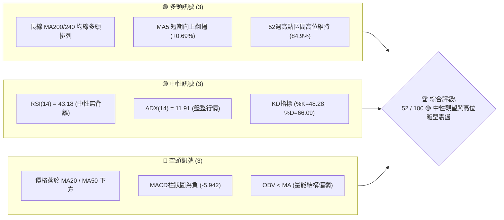
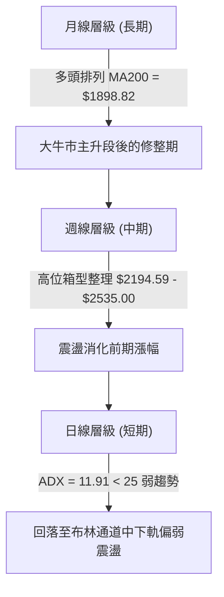
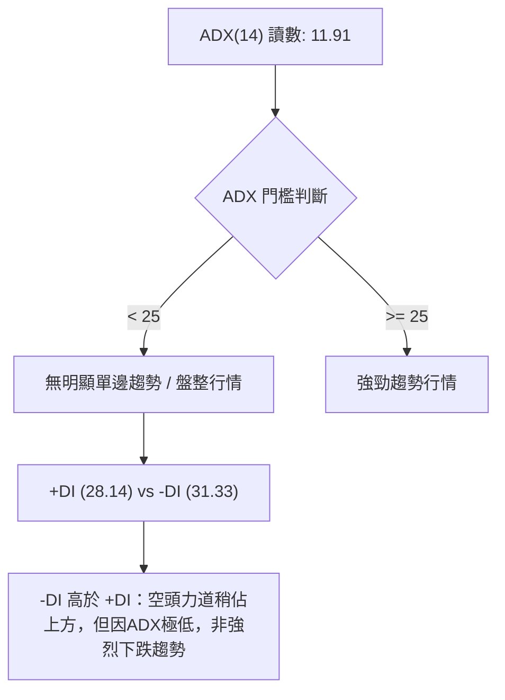
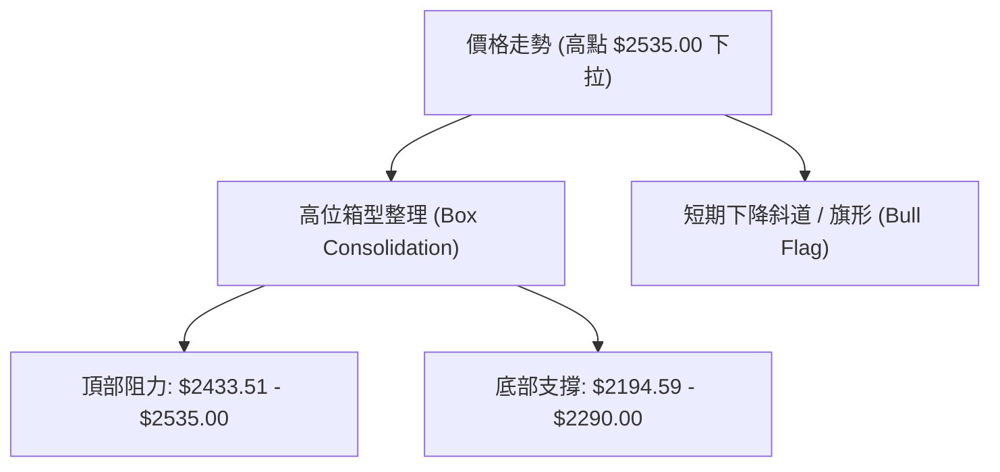
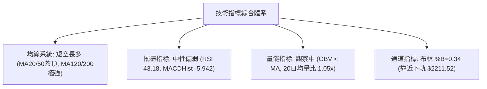
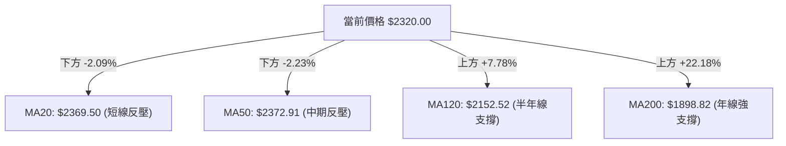
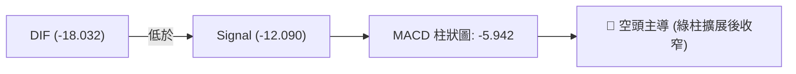
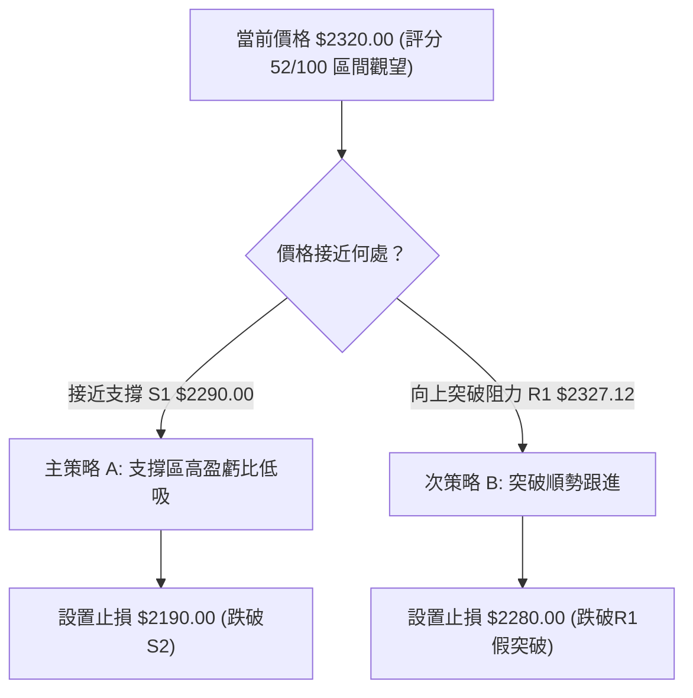
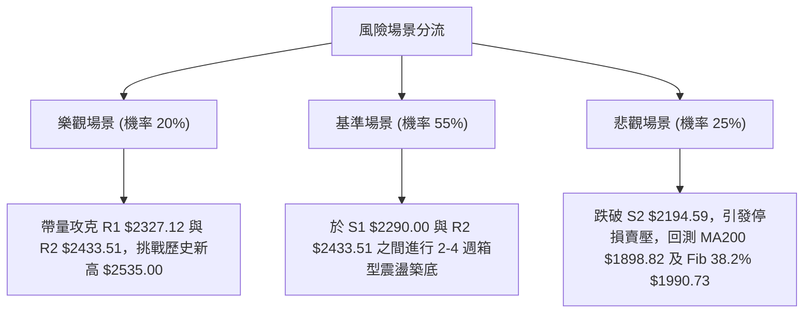

# 2330.TW 技術分析報告

> **報告日期**：2026-08-04 ｜ **語言**：繁體中文 ｜ **數據來源**：Yahoo Finance ｜ **當前價格**：$2320.00

---

## 目錄

| 章節 | 內容 |
|------|------|
| [1. 技術面概覽](#1-技術面概覽) | 訊號儀表板、核心指標、評分卡 |
| [2. 趨勢分析](#2-趨勢分析) | 多時框趨勢、長中短期走勢 |
| [3. 圖表形態分析](#3-圖表形態分析) | 形態識別、K線組合、目標價 |
| [4. 支撐與阻力](#4-支撐與阻力) | 關鍵價位、斐波那契回調 |
| [5. 技術指標深度解讀](#5-技術指標深度解讀) | MA/RSI/MACD/布林/成交量 |
| [6. 動能與波動率](#6-動能與波動率) | 動能評估、ATR、Beta |
| [7. 多時框架總結](#7-多時框架總結) | 時框架評分矩陣 |
| [8. 交易策略建議](#8-交易策略建議) | 多空策略、風險報酬比 |
| [9. 風險提示與監控](#9-風險提示與監控) | 監控指標、風險場景 |

---

## 1. 技術面概覽

### 🎯 技術訊號儀表板



### 📊 核心指標速覽表

| 指標類別 | 指標名稱 | 當前數值 | 訊號 | 解讀 |
|----------|----------|----------|------|------|
| **價格** | 當前價格 | $2320.00 | 🟡 中性 | 52週高點下方 -8.48%，位於區間 84.9% 高位 |
| **均線** | MA20 | $2369.50 | 🔴 看空 | 當前價格位於 MA20 下方 -2.09% |
| **均線** | MA50 | $2372.91 | 🔴 看空 | 當前價格位於 MA50 下方 -2.23% |
| **均線** | MA200 | $1898.82 | 🟢 看多 | 價格遠高於 MA200 +22.18%，長期趨勢強勁 |
| **動能** | RSI(14) | 43.18 | 🟡 中性 | 落於 30-70 中性區間，多空力道暫趨均衡 |
| **動能** | MACD | -18.032 | 🔴 看空 | DIF與Signal皆在零軸下方，柱狀圖 -5.942 |
| **波動** | ATR(14) | $82.50 | 🟡 中度 | 佔股價 3.56%，每日震盪空間約 82.5 元 |

### 🏆 技術評分卡

```
╔══════════════════════════════════════════════════════════════╗
║             技術評分卡 — 2330.TW (2026-08-04)               ║
╠══════════════════════════════════════════════════════════════╣
║ 趨勢強度      ▓▓▓▓▓▓░░░░░░░░░░░░░░  30/100  🔴 ADX=11.91 弱趨勢   ║
║ 動能指標      ▓▓▓▓▓▓▓▓░░░░░░░░░░░░  40/100  🔴 MACD負值/RSI偏弱   ║
║ 支撐穩定度    ▓▓▓▓▓▓▓▓▓▓▓▓▓▓▓░░░░░  75/100  🟢 S1/S2支撐結構明確   ║
║ 成交量配合    ▓▓▓▓▓▓▓▓▓░░░░░░░░░░░  45/100  🟡 1.05x 均量/OBV偏弱  ║
║ 形態完整度    ▓▓▓▓▓▓▓▓▓▓▓▓░░░░░░░░  60/100  🟡 高位箱型整理形態   ║
║ 均線排列      ▓▓▓▓▓▓▓▓▓▓▓░░░░░░░░░  55/100  🟡 短空長多混合排列   ║
╠══════════════════════════════════════════════════════════════╣
║ 綜合評分      ▓▓▓▓▓▓▓▓▓▓░░░░░░░░░░  52/100  🟡 中性觀望/區間操作║
╚══════════════════════════════════════════════════════════════╝
```

---

## 2. 趨勢分析

### 🌐 多時框趨勢分析



### 📈 長期趨勢 — 12個月走勢圖（Unicode）

```
2330.TW 月線走勢圖（過去12個月 2025-09 ~ 2026-08）
價格軸 ($)
$2535 ┤                                                 ● (52W高點 2026-07)
$2350 ┤                                           ●  ●  │
$2200 ┤                                     ●     │  │  ● (現在 $2320.00)
$2000 ┤                              ●      │     │  │  │
$1800 ┤                       ●      │      │     │  │  │
$1500 ┤          ●     ●      │      │      │     │  │  │
$1300 ┤   ●      │     │      │      │      │     │  │  │
$1100 ┤   │      │     │      │      │      │     │  │  │
      └─┼──────┼─────┼──────┼──────┼──────┼─────┼──┼──┼───────────
       09/25  10/25 12/25  01/26  02/26  04/26 05/26 06/26 08/26
```

**走勢特徵分析表格**：

| 時間區間 | 起始/結束價 | 漲跌幅 | 走勢特徵分析 |
|----------|-------------|--------|--------------|
| **2025-09 ~ 2025-12** | $1292.99 ➔ $1540.85 | +19.17% | 穩健墊高，站穩千元大關後加速推升 |
| **2026-01 ~ 2026-02** | $1764.52 ➔ $1983.22 | +12.39% | 爆發性拉升，刷新歷史新高，均線呈現完美多頭 |
| **2026-03 ~ 2026-05** | $1755.32 ➔ $2348.73 | +33.81% | 歷經短暫劇烈洗盤後強勢V型反彈，強勢破頂 |
| **2026-06 ~ 2026-08** | $2410.00 ➔ $2320.00 | -3.73% | 於 $2400-$2500 高檔遇壓，進入高位箱型拉回洗盤 |

### 📊 中期趨勢（週線分析）

```
中期壓力與支撐區間示意圖：
$2535.00 ────────────────────────────── 52W 歷史最高點 (歷史天花板)
$2433.51 ────────────────────────────── 波段高點壓力 R2 (箱型頂部)
$2327.12 ────────────────────────────── 近期波段阻力 R1
$2320.00 ◄─────── [當前收盤價] ───────── 中期震盪中軸區間
$2290.00 ────────────────────────────── 近期波段支撐 S1 (日線下影線密集區)
$2194.59 ────────────────────────────── 波段強支撐 S2 / Fib 23.6% ($2198.75)
```

### ⚡ 趨勢強度評估（ADX 解讀）



**ADX 趨勢強度對照表**：

| 指標項 | 當前數據 | 門檻基準 | 市場狀態與交易含義 |
|--------|----------|----------|--------------------|
| **ADX(14)** | **11.91** | < 25.0 | **弱趨勢 / 盤整狀態**。順勢突破策略易受挫，應採取區間逆勢高拋低吸策略。 |
| **+DI** | **28.14** | — | 多頭買盤力道，自先前高點回落。 |
| **-DI** | **31.33** | — | 空頭賣盤力道，略高於 +DI，顯示短線賣壓小幅主導。 |

---

## 3. 圖表形態分析

### 🔍 形態識別系統



**形態信心度與目標價計算**：

| 形態名稱 | 信心度 | 判斷依據（引用數據） | 完成度 | 目標價（附計算式） |
|----------|--------|----------------------|--------|--------------------|
| **高位箱型整理** | **75%** | 價格於 $2194.59 (S2) 與 $2433.51 (R2) 之間多次震盪，ADX=11.91 | 80% | 箱型向上突破目標：$2433.51 + ($2433.51 - $2194.59) = **$2672.43** (數據外推預測) |
| **高檔旗形整理** | **55%** | 自 07 月歷史高點 $2535 修正至 $2320，成交量逐步收縮 | 60% | 旗形突破目標：$2194.59 + ($2535.00 - $1755.32) = **$2974.27** (數據外推預測) |

### 🕯️ 重要K線形態分析

| 月份/週期 | 收盤價 | K線形態 | 解讀 | 訊號 |
|-----------|--------|---------|------|------|
| **2026-06** | $2410.00 | 高檔長上影線 | 衝高至 $2500 附近獲利結利賣壓湧現，買盤追高意願受阻 | 🔴 短期見頂 |
| **2026-07** | $2425.00 | 高檔十字星/陀螺線 | 多空於 $2400 上方激烈對峙，缺乏進一步推升動能 | 🟡 變盤訊號 |
| **2026-08 (當前)** | $2320.00 | 中陰線下探 | 回測均線支撐，測試 $2290 S1 支撐強度 | 🔴 短線偏弱 |

### 📉 ASCII 走勢形態示意圖

```
高位箱型整理與均線回測示意圖
$2535 ─────────────────────── 天花板 (52W High)
        ┌─┐
        │ │   ┌─┐
$2433 ──┼─┼───┼─┼──────────── 箱型頂部阻力 (R2)
        │ │   │ │   ┌─┐
$2369 ──┼─┼───┼─┼───┼─┼────── MA20 / MA50 阻力帶
        │ │   │ │   │ │   ●  現價 $2320.00 (回測中)
$2290 ──┴─┴───┴─┴───┴─┴───┼── 關鍵支撐 S1
$2194 ───────────────────┴── 箱型底部強支撐 S2 / Fib 23.6%
```

---

## 4. 支撐與阻力

### 🗺️ 關鍵價位分布圖（Unicode）

```
2330.TW 價位結構分布圖
═══════════════════════════════════════════════════════════
$2535.00 ║████████████████████████████████████████║ 52W 歷史最高點
$2520.00 ║████████████████████████████████████    ║ 強阻力 R3
$2433.51 ║████████████████████████████            ║ 波段阻力 R2 (箱型頂部)
$2369.50 ║▓▓▓▓▓▓▓▓▓▓▓▓▓▓▓▓▓▓▓▓▓▓▓▓                ║ MA20 / MA50 下降反壓
$2327.12 ║████████████████                        ║ 近期阻力 R1
$2320.00 ╠════════════════════════════════════════╣ ◄ 當前價格
$2290.00 ║▓▓▓▓▓▓▓▓▓▓▓▓                            ║ 近期支撐 S1
$2211.52 ║████████████████                        ║ 布林通道下軌
$2198.75 ║██████████████████                      ║ 斐波那契 23.6% 回調位
$2194.59 ║████████████████████                    ║ 強支撐 S2
$1898.82 ║████████████████████████████████        ║ 季/年線牛熊分界 MA200
$1748.20 ║████████████████████████████████████████║ 終極強支撐 S3
═══════════════════════════════════════════════════════════
```

### 🚧 阻力位分析表

| 阻力級別 | 價位 | 形成原因 | 突破難度 | 重要性 |
|----------|------|----------|----------|--------|
| **R1** | **$2327.12** | 近一年波段高點聚類、短線均線重疊區 (+0.31%) | 🟡 中等 | 短線轉強第一關卡 |
| **R2** | **$2433.51** | 波段高點聚類、高位箱型頂部 (+4.89%) | 🔴 較高 | 解套賣壓重區，多頭中期關鍵 |
| **R3** | **$2520.00** | 逼近 52W 歷史高點 $2535.00 之強壓區 (+8.62%) | 🔴 極高 | 歷史新高天花板 |

### 🛡️ 支撐位分析表

| 支撐級別 | 價位 | 形成原因 | 守住機率 | 重要性 |
|----------|------|----------|----------|--------|
| **S1** | **$2290.00** | 近期波段低點聚類、下影線防線 (-1.29%) | 🟢 70% | 短線多頭退路 |
| **S2** | **$2194.59** | 波段低點聚類、與 Fib 23.6% ($2198.75) 重疊 (-5.41%) | 🟢 85% | 中期結構防禦生死線 |
| **S3** | **$1748.20** | 2026年3月起漲點、長線波段低點聚類 (-24.65%) | 🟢 95% | 長線牛市基石 |

### 📐 斐波那契回調位分析

由 52 週區間 **$1110.20**（低點）至 **$2535.00**（高點）計算：

```
100.0% ($2535.00) ────────────────────────────────────── 52W High
 23.6% ($2198.75) ─────────────▲ 現價 $2320.00 落於此區間 ─────────────
 38.2% ($1990.73) ──────────────────────────────────────
 50.0% ($1822.60) ──────────────────────────────────────
 61.8% ($1654.47) ──────────────────────────────────────
 78.6% ($1415.11) ──────────────────────────────────────
  0.0% ($1110.20) ────────────────────────────────────── 52W Low
```

- **位置解讀**：當前價格 **$2320.00** 正好運行於 **0.0% ($2535.00)** 與 **23.6% ($2198.75)** 之間，屬於強勢修正範疇（修正未穿透 23.6%）。
- **關鍵關卡**：只要價格維持在 23.6% 回調位 $2198.75（與 S2 $2194.59 極度接近）上方，整體超長線多頭格局皆未遭到破壞。

---

## 5. 技術指標深度解讀

### 🎛️ 指標訊號總覽



### 📈 移動平均線排列分析



- **均線排列狀態**：MA5 ($2304.00) < 現價 ($2320.00) < MA20 ($2369.50) < MA50 ($2372.91)。短期均線彎頭向下死叉，呈現「短期修正、長線多頭」之**混合糾結排列**。

### 📉 RSI(14) 分析

```
RSI(14) 強度進度條
0  [超賣]    30               50      70    [超買]  100
├─────────────┼───────────────┼───────┼─────────────┤
              ▓▓▓▓▓▓▓▓▓▓▓▓▓▓█░░░░░░░░░
              當前讀數: 43.18 (中性偏弱區)
```

- **背離判斷**：日線及週線層級之 RSI 與價格走勢保持一致，**無明顯頂背離或底背離**。RSI 位於 43.18，顯示短線下挫動能已有所放緩，未進入 < 30 超賣區，具備築底反彈條件。

### 📊 MACD(12/26/9) 訊號解讀



- **解讀**：DIF 與 Signal 雙線雙雙穿過零軸下方，且柱狀圖呈現負值 (-5.942)，顯示過去 2-3 週處於空頭修正修正波中。然最新一週柱狀圖負值有收收斂跡象，需關注零軸下方是否出現金叉買訊。

### 📦 布林通道分析

```
布林通道現況示意圖 (20日, 2個標準差)
$2527.48 ───────────────────────────── 上軌 ( Upper Band )
                                      
$2369.50 ───────────────────────────── 中軌 ( MA20 )
            ● $2320.00 (%B = 0.34)    
$2211.52 ───────────────────────────── 下軌 ( Lower Band )
```

- **%B 指標**：0.34（位於下軌 $2211.52 與中軌 $2369.50 之間），股價靠近通道下緣，表示價格已進入短線超賣相對低位區，下軌 $2211.52 具備強烈通道支撐效果。

### 💹 成交量分析（量價配合度）

- **量比**：今日成交量為 **35,945,450**，相較於 20日均量 **34,161,387** 略增（**1.05x**），顯示下探過程中帶有少量換手賣壓，但未見恐慌性爆量。
- **OBV (能量潮)**：OBV < MA，顯示近期資金呈現淨流出狀態，量能未能有效確認價格反彈，需等待成交量放大至 50日均量（約 3,441 萬股）以上且收陽線，方可確認量能止跌轉強。

---

## 6. 動能與波動率

### ⚡ 動能評估四象限

| 象限 | 動能強度 | 波動率 | 當前位置 | 策略指引 |
|------|----------|--------|----------|----------|
| **Q1** | 強動能 (ADX>25) | 低波動 | — | 最佳趨勢續抱區 |
| **Q2** | **弱動能 (ADX<25)** | **中/低波動** | **✓ (當前 2330.TW)** | **箱型波段操作，高拋低吸** |
| **Q3** | 強動能 (ADX>25) | 高波動 | — | 突破追價/緊設止損 |
| **Q4** | 弱動能 (ADX<25) | 高波動 | — | 觀望避開洗盤 |

### 📊 ATR 波動率分析

- **ATR(14)**：**$82.50**（佔當前股價 **3.56%**）。
- **止損/風控距離建議**：
  - **短線交易 (1.5x ATR)**：$82.50 × 1.5 = **$123.75**，進場後止損點位建議設定於進場價下方約 124 元。
  - **波段交易 (2.0x ATR)**：$82.50 × 2.0 = **$165.00**，可承受更寬廣的正常市場噪音。

### 📐 Beta 與市場相關性

- **Beta 係數**：**1.258**。
- **市場意義**：2330.TW 波動度高於整體台股加權指數約 25.8%。當大盤上漲 1% 時，理論上該股將上漲 1.26%；在大盤拉回時亦承擔較高的波動風險。

---

## 7. 多時框架總結

### 📋 時框架評分表

| 時框架 | 趨勢方向 | 動能指標 | 均線排列 | 形態結構 | 綜合評分 | 建議 |
|--------|----------|----------|----------|----------|----------|------|
| **月線 (長期)** | 🟢 強勢多頭 | 🟢 超買後拉回 | 🟢 多頭排列 | 🟢 歷史天花板附近 | **85 / 100** | 長線持有 / 逢拉回布局 |
| **週線 (中期)** | 🟡 箱型震盪 | 🟡 中性整理 | 🟢 站穩MA50 | 🟡 高位大箱型 | **58 / 100** | 區間操作 / 逢低布局 |
| **日線 (短期)** | 🔴 偏弱修正 | 🔴 MACD負值 | 🔴 壓在MA20下 | 🔴 測試下軌防線 | **42 / 100** | 觀望 / 等待止跌訊號 |

### 🔲 綜合訊號矩陣

```
┌──────────┬────────────────────────────────────────────────────────┐
│ 時框架   │ 訊號一致性評估                                         │
├──────────┼────────────────────────────────────────────────────────┤
│ 短/中/長 │ 長期多頭基調不變，中期進入大箱型整理，短期處於箱型下緣  │
│ 衝突收斂 │ 日線死叉與弱勢動能 vs 月線強烈多頭 ➔ **判定為高位拉回**  │
└──────────┴────────────────────────────────────────────────────────┘
```

### ⚖️ 多時框收斂結論

依據多時框收斂規則：**當前 ADX(14) = 11.91 (< 25)**，明確指示市場處於 **「盤整行情（Range-bound Market）」**。
主導時框應收斂至**日線布林通道 ($2211.52 - $2527.48) 與關鍵支撐阻力區間 ($2194.59 - $2433.51)**。總體綜合評分為 **52/100 (中性)**，主策略採取**區間高拋低吸與關鍵支撐守備操作**。

---

## 8. 交易策略建議

### 🗺️ 策略決策流程圖



### 🧭 策略路由

**當前主策略方向 = 區間震盪低吸（依評分 52/100）**
因 ADX < 25 且評分處於 40–60 區間，禁止追高，主推「支撐位附近佈局多單」與「突破阻力確認後跟進」。

### 🎯 價格情境階梯（Price Scenarios）

| 觸發條件 | 下一目標 | 後續延伸 | 情境含義 |
|----------|----------|----------|----------|
| **突破 R1 $2327.12** | **R2 $2433.51** | **R3 $2520.00** | 短線轉強，重回箱型上軌 |
| **站穩現價 $2320.00** | **R1 $2327.12** | **S1 $2290.00** | 消化卖壓，窄幅消化平穩 |
| **跌破 S1 $2290.00** | **S2 $2194.59** | **Fib 38.2% $1990.73** | 中期拉回加深，下探強支撐 |

### 📊 情境機率分佈

| 情境 | 機率 | 主要依據 |
|------|------|----------|
| **區間震盪 / 支撐反彈** | **55%** | ADX=11.91 呈現低趨勢，S1 $2290.00 與布林下軌 $2211.52 護盤力道強 |
| **直接下探 S2 強支撐** | **30%** | MACD 柱狀圖仍為負 (-5.942)，-DI (31.33) 略佔優勢 |
| **強勢向上突破 R2/R3** | **15%** | 成交量未放大，OBV < MA 顯示資金追高意願不足 |

### 🟢 主策略詳情

| 策略要素 | 策略 A：S1 支撐低吸策略 (主推) | 策略 B：R1 突破追擊策略 (次推) |
|----------|──────────────────────────────|──────────────────────────────|
| **進場條件** | 回測 S1 $2290.00 附近現獲支撐止跌 | 強勢帶量突破 R1 $2327.12 並收高 |
| **進場價格** | **$2290.00** | **$2330.00** |
| **目標價 T1** | **$2433.51** (阻力 R2) | **$2433.51** (阻力 R2) |
| **目標價 T2** | **$2520.00** (阻力 R3) | **$2520.00** (阻力 R3) |
| **止損價格** | **$2190.00** (跌破 S2 $2194.59 / Fib 23.6%) | **$2280.00** (跌破 S1 $2290.00) |
| **風險報酬比** | **1.44 : 1** (以T1算) / **2.30 : 1** (以T2算) | **2.07 : 1** (以T1算) / **3.80 : 1** (以T2算) |
| **成功機率** | **65%** | **50%** |
| **建議倉位** | **15% - 20%** | **10% - 15%** |

*註：策略 A 風險報酬比計算 = (T1 $2433.51 - 進場 $2290.00) / (進場 $2290.00 - 止損 $2190.00) = $143.51 / $100.00 = 1.44 : 1。*

### 🔴 反向風險觸發點（對沖提示）

若股價收盤**放量跌破 S2 $2194.59**（或 斐波那契 23.6% $2198.75），宣告中期高位箱型失守，多頭結構遭到嚴重破壞，應立即執行止損或避險對沖，下一防線將下看 **Fib 38.2% $1990.73**。

### ⭐ 整體訊號強度評星

```
做多訊號強度：★★★☆☆  (3/5星 - 中期逢低佈局)
做空訊號強度：★★☆☆☆  (2/5星 - 長期牛市防禦力強)
整體可信度：  ★★██☆  (4/5星 - 價位密集重疊可信)
```

---

## 9. 風險提示與監控

### ✅ 關鍵監控指標 Checklist

```
╔══════════════════════════════════════════════════════════════╗
║                    每日技術監控 CheckList                   ║
╠══════════════════════════════════════════════════════════════╣
║ [ ] 價格是否站回 MA20 ($2369.50) 上方？                      ║
║ [ ] RSI(14) 能否重返 50 中軸區間？                            ║
║ [ ] MACD 柱狀圖 (-5.942) 是否出現翻紅金叉訊號？              ║
║ [ ] 日成交量能否回升至 50日均量 (34,417,495 股) 以上？        ║
║ [ ] 支撐關卡 S1 ($2290.00) 與 S2 ($2194.59) 是否完好無損？   ║
╚══════════════════════════════════════════════════════════════╝
```

### ⚠️ 風險場景分析



### 🛡️ 風險管理重要提醒

1. **資金控管**：當前 ADX 為 11.91，處於無趨勢洗盤期，**總持倉比例建議維持於 30%–50%**，切忌開高槓桿滿倉押注。
2. **嚴格止損**：各策略必須無條件執行止損機制，特別是 **S2 $2194.59 防線** 為中期強弱分界點。
3. **波動率調適**：日 ATR 高達 $82.50，日內震盪幅度較大，掛單宜採取分批限價單（Limit Order），避免市價單追高殺低。

---

## 📋 報告總結

```
╔══════════════════════════════════════════════════════════════╗
║             2330.TW 技術分析報告總結                         ║
════════════════════════════════════════════════════════════════
報告日期：2026-08-04
當前價格：$2320.00
分析評級：⚖️ 52 / 100 🟡 中性觀望 / 箱型高拋低吸

關鍵結論：
├─ 長期趨勢：🟢 強烈多頭 (MA200 $1898.82 穩固向上)
├─ 中期趨勢：🟡 高位箱型整理 ($2194.59 - $2433.51)
├─ 短期趨勢：🔴 弱勢修正 (受到 MA20 $2369.50 反壓)
├─ 關鍵支撐：$2290.00 (S1) / $2194.59 (S2)
├─ 關鍵阻力：$2327.12 (R1) / $2433.51 (R2)
└─ 分析師目標：$3117.61 (共識均價)

最優策略組合：
1. 🥇 最佳機會：策略 A — 回測 S1 $2290.00 逢低佈局，止損設 $2190.00，目標 $2433.51。
2. 🥈 次選機會：策略 B — 帶量突破 R1 $2327.12 後順勢跟進，目標上看 R2 $2433.51。
3. 🥉 保守選擇：觀望等待 ADX 回升至 25 以上、或 MACD 零軸下出現金叉買訊再行進場。
════════════════════════════════════════════════════════════════
```

---

> ⚠️ **免責聲明**：本報告為 AI 自動生成之技術分析報告，所有數據、圖表及價位推演均基於提供之歷史價格與量能資訊。本報告**僅供研究與學術參考**，**不構成任何形式的投資建議、邀約或承諾**。股市投資具有高風險，價格波動劇烈，投資人應獨立思考、審慎評估並自負投資盈虧風險。

---

*報告生成時間：2026-08-04 ｜ 數據來源：Yahoo Finance ｜ 分析框架：多時框技術分析 (MTFA)*