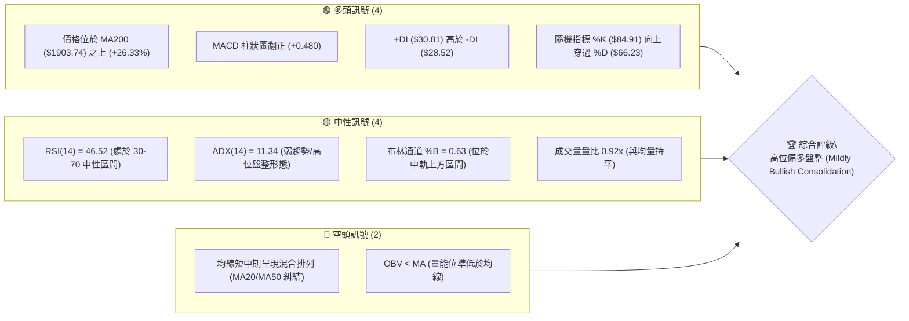
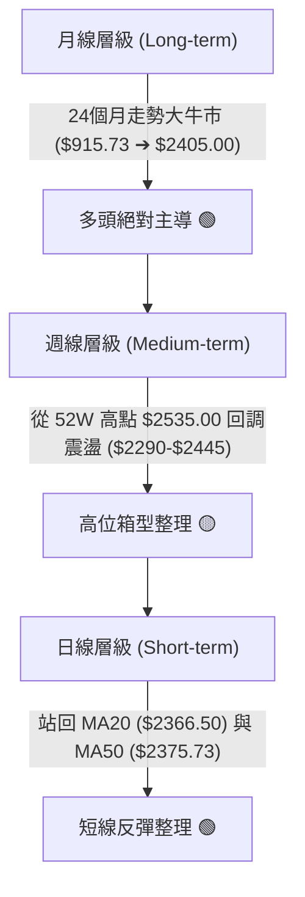
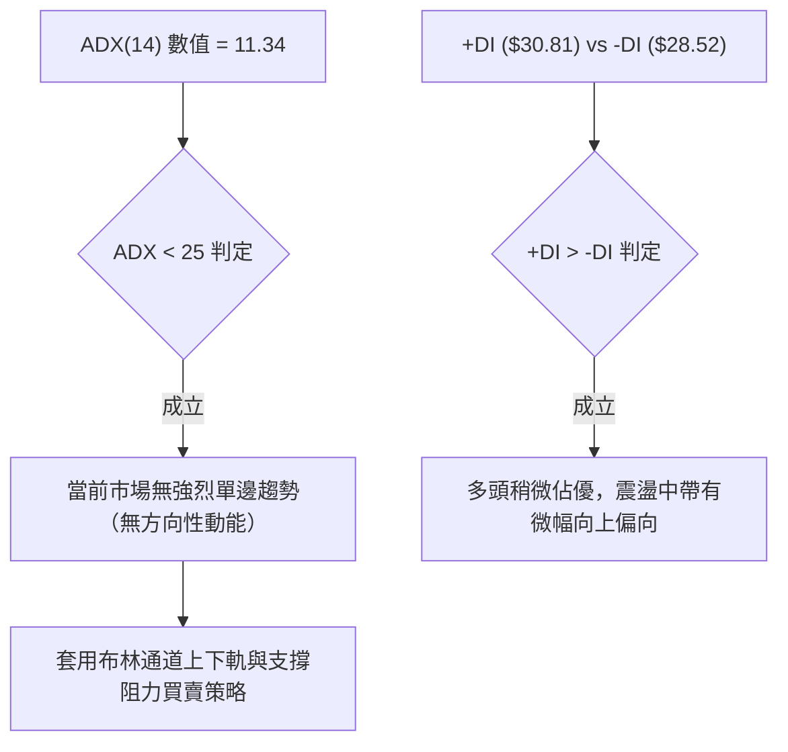
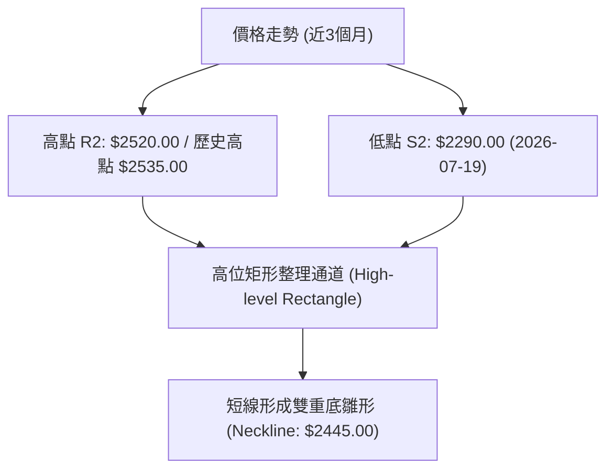
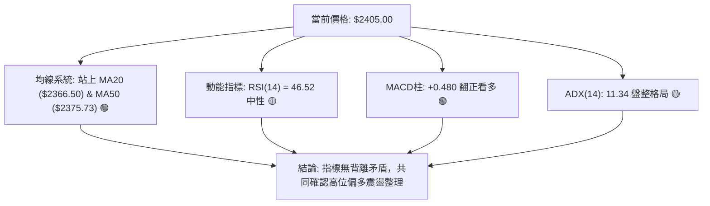
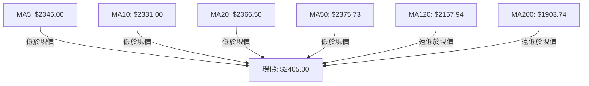
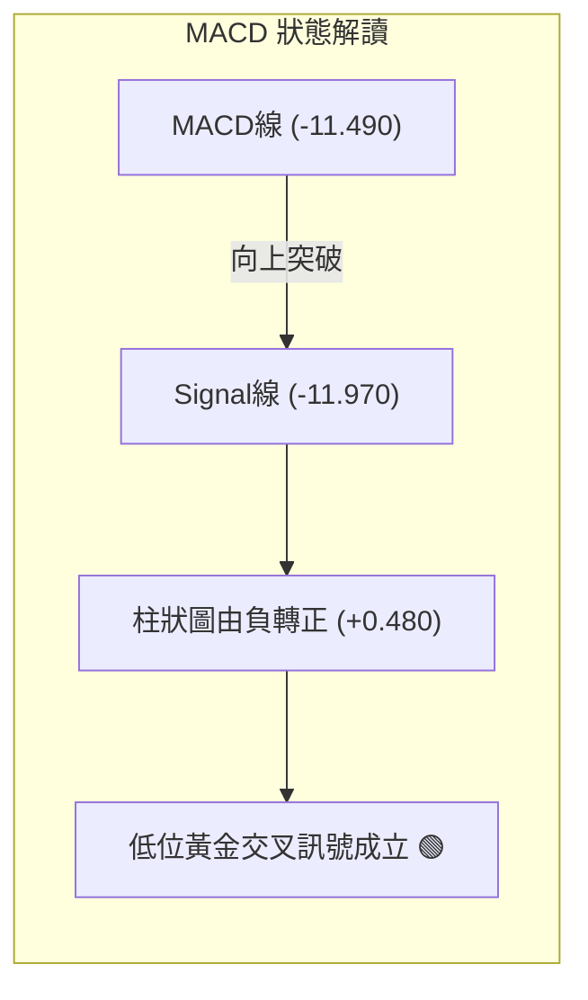
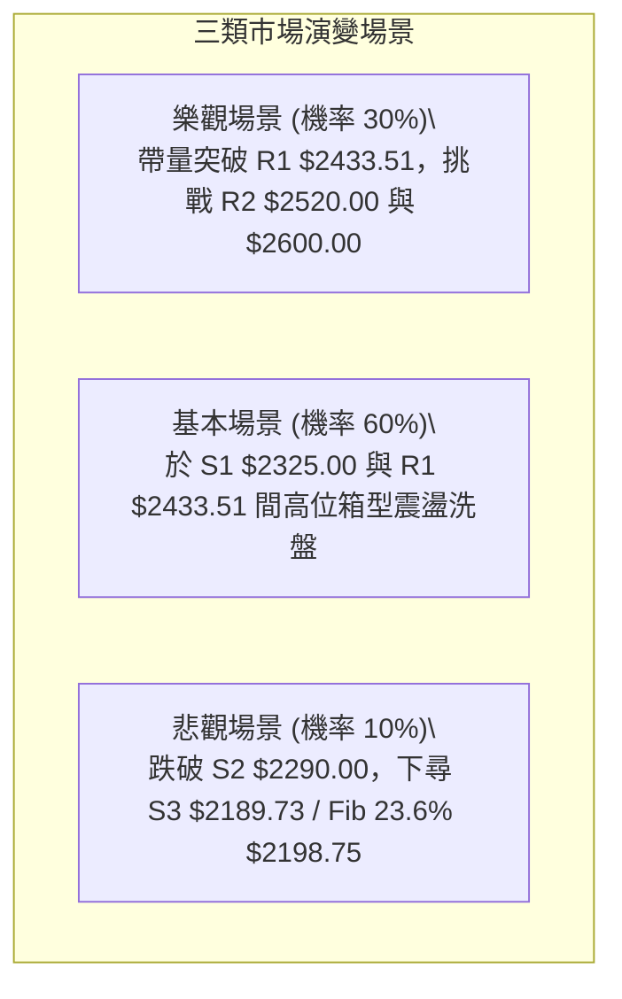

# 2330.TW 技術分析報告

> **報告日期**：2026-08-05 ｜ **語言**：繁體中文 ｜ **數據來源**：Yahoo Finance ｜ **當前價格**：$2405.00

---

## 目錄

| 章節 | 內容 |
|------|------|
| [1. 技術面概覽](#1-技術面概覽) | 訊號儀表板、核心指標、評分卡 |
| [2. 趨勢分析](#2-趨勢分析) | 多時框趨勢、長中短期走勢、ADX解讀 |
| [3. 圖表形態分析](#3-圖表形態分析) | 形態識別與信心度、K線組合、目標價推算 |
| [4. 支撐與阻力](#4-支撐與阻力) | 關鍵價位結構、斐波那契回調 |
| [5. 技術指標深度解讀](#5-技術指標深度解讀) | MA/RSI/MACD/布林通道/成交量 |
| [6. 動能與波動率](#6-動能與波動率) | 動能評估、ATR與止損空間、Beta分析 |
| [7. 多時框架總結](#7-多時框架總結) | 時框架評分矩陣、多時框收斂結論 |
| [8. 交易策略建議](#8-交易策略建議) | 策略路由、情境階梯、進出場與風報比 |
| [9. 風險提示與監控](#9-風險提示與監控) | 監控清單、三情境風險場景 |

---

## 1. 技術面概覽

### 🎯 技術訊號儀表板



### 📊 核心指標速覽表

| 指標類別 | 指標名稱 | 當前數值 | 訊號 | 解讀 |
|----------|----------|----------|------|------|
| **價格** | 當前收盤價 | $2405.00 | 🟢 | 位於52週區間（$1110.20 - $2535.00）之 90.9% 高位 |
| **均線** | MA20 (月線) | $2366.50 | 🟢 | 現價高於 MA20 +1.63%，短線支撐成立 |
| **均線** | MA50 (季線) | $2375.73 | 🟢 | 現價高於 MA50 +1.23%，維持季線上方 |
| **均線** | MA200 (年線)| $1903.74 | 🟢 | 現價高於 MA200 +26.33%，長多基調無虞 |
| **動能** | RSI(14) | 46.52 | 🟡 | 無過熱或過冷，具備向上攻堅空間 |
| **動能** | MACD (12,26,9)| -11.490 / Hist +0.480 | 🟢 | MACD 柱狀圖翻正，低位黃金交叉雛形 |
| **趨勢** | ADX(14) | 11.34 | 🟡 | 低於 25，屬於典型的高位箱型震盪整理 |
| **波動** | BB%B / ATR | 0.63 / $85.71 | 🟢 | 每日波動率約 3.56%，位於布林通道中軌與上軌間 |

### 🏆 技術評分卡

```
╔══════════════════════════════════════════════════════════════════╗
║                技術評分卡 — 2330.TW (2026-08-05)                ║
╠══════════════════════════════════════════════════════════════════╣
║ 趨勢強度 (ADX/MA)   ████████████░░░░░░░░  60/100  🟡 中性震盪    ║
║ 動能指標 (RSI/MACD) ██████████████░░░░░░  70/100  🟢 低位復甦    ║
║ 支撐穩定度 (S1/S2)  ████████████████░░░░  80/100  🟢 結構堅實    ║
║ 成交量配合 (OBV/Vol)██████████░░░░░░░░░░  50/100  🟡 量能觀望    ║
║ 形態完整度 (波段)   ██████████████░░░░░░  70/100  🟢 高位旗型    ║
║ 均線排列 (多時框)   ██████████████░░░░░░  70/100  🟢 長多短混    ║
╠══════════════════════════════════════════════════════════════════╣
║ 綜合技術評分        ██████████████░░░░░░  66/100  🟢 偏多盤整    ║
╚══════════════════════════════════════════════════════════════════╝
```

---

## 2. 趨勢分析

### 🌐 多時框趨勢分析



### 📈 長期趨勢 — 24個月走勢圖（Unicode ASCII）

```
2330.TW 過去24個月歷史價格走勢圖 ($)
$2535.00 ┤                                                    ● $2535.00 (高點)
$2300.00 ┤                                             ●───●──●←$2405.00 (現價)
$2100.00 ┤                                        ●   /
$1900.00 ┤                               ●   ●   /
$1700.00 ┤                       ●   ●  /   /
$1500.00 ┤               ●   ●  /   /  /
$1300.00 ┤           ●  /   /  /   /  /
$1100.00 ┤    ●   ● /  /   /  /   /  /
$900.00  ┤●──/───/─/──/───/──/───/──/
         └┬──┬──┬──┬──┬──┬──┬──┬──┬──┬──┬──┬──┬──┬──┬──┬──┬──┬──┬──┬──┬──┬──┬──┬──
          08 09 10 11 12 01 02 03 04 05 06 07 08 09 10 11 12 01 02 03 04 05 06 07 08
          2024                                2025                                2026
```

#### 走勢特徵分析表格

| 時間階段 | 價格區間 | 累積漲跌幅 | 趨勢特徵與結構 |
|----------|----------|------------|----------------|
| **2024-08 ~ 2025-02** | $915.73 ➔ $1017.24 | +11.08% | 千元大關突破後的築底蓄勢期 |
| **2025-03 ~ 2025-08** | $894.24 ➔ $1144.74 | +28.01% | 回測 $892.27 雙底成立後起漲 |
| **2025-09 ~ 2026-02** | $1292.99 ➔ $1983.22 | +53.38% | 主升段噴發，突破 $1500 與 $1800 關卡 |
| **2026-03 ~ 2026-07** | $1755.32 ➔ $2425.00 | +38.15% | 第二波強勢主升段，創 $2535.00 歷史新高 |
| **當前階段 (2026-08)** | $2405.00 | -5.13% (自高點)| 高位高吞吐區間盤整，維持於 MA200 ($1903.74) 極高上方 |

### 📊 中期趨勢（週線結構）

從近20週數據顯示，價格在 2026-07-19 下探低點 $2290.00（S2 支撐）後獲得強烈買盤支撐，隨後連續兩週回升至 $2350.00 與 $2425.00，目前拉回至 $2405.00，收在 MA20 ($2366.50) 上方，顯示中軌支撐強勁。

### ⚡ 趨勢強度評估（ADX 解讀）



| 指標項 | 數值 | 市場含義與操作指引 |
|--------|------|--------------------|
| **ADX (14)** | 11.34 | **弱趨勢 / 箱型盤整**。不可使用突破追價策略，應採取區間低買高賣 |
| **+DI (14)** | 30.81 | 多方力量佔 30.81% |
| **-DI (14)** | 28.52 | 空方力量佔 28.52%，多空對峙，多方略勝 +2.29% |

---

## 3. 圖表形態分析

### 🔍 形態識別系統與信心度評估



#### 圖表形態信心度矩陣（依據規則 15）

| 形態名稱 | 信心度 | 判斷依據（引用數據） | 完成度 | 目標價計算式與精確數值 |
|----------|--------|----------------------|--------|------------------------|
| **高位矩形整理 (Rectangle)** | **85%** | 上界 R2 ($2520.00)，下界 S2 ($2290.00) 兩度測試不破 | 80% | **突破上界目標**：$2520.00 + ($2520.00 - $2290.00) = **$2750.00** |
| **W底 (Double Bottom 雛形)** | **65%** | 2026-07-19 低點 $2290.00 形成第一腳，07-26 腳高點 $2350.00，頸線 $2445.00 | 60% | **頸線突破目標**：$2445.00 + ($2445.00 - $2290.00) = **$2600.00** |
| **頭肩頂形態** | **15%** | **訊號不足，僅做指標型解讀**（未見明確左肩右肩結構） | 0% | 不適用 |

### 🕯️ 近期重要週K線組合分析

| 週別日期 | 週收盤價 | 週K線形態 | 技術解讀 | 多空訊號 |
|----------|----------|-----------|----------|----------|
| **2026-07-19** | $2290.00 | 長下影陰線 | 下探 52W 區間波段低點 S2 誘空後強烈收復 | 🟡 底位變盤 |
| **2026-07-26** | $2350.00 | 築底小陽線 | 守住 S1 ($2325.00) 上方，止跌確認 | 🟢 買盤進駐 |
| **2026-08-02** | $2425.00 | 中陽線覆蓋 | 突破 MA20 ($2366.50)，多頭展現反彈意圖 | 🟢 多頭包覆 |
| **2026-08-09** | $2405.00 | 高位十字小陰線| 受到 R1 ($2433.51) 壓制，進行高位小幅消化 | 🟡 震盪整理 |

### 📉 ASCII 高位矩形與 W底 形態示意圖

```
2330.TW 高位矩形整理與W底形態示意圖 ($)
$2535.00 ┤-------------------------------------- (52W 歷史高點)
$2520.00 ┤====================================== (矩形頂部 R2 / 壓力區)
         │       ▲              ▲
$2445.00 ┤......┼──────────────┼.............. (W底頸線: 2026-07-05 高點)
         │     / \            / \      ● $2405.00 (現價)
$2366.50 ┤────/───\──────────/───\────●──────── (MA20 中軌支撐)
         │   /     \        /     \  /
$2290.00 ┤==●=======▼======●=======▼=========== (矩形底部 S2 / 雙底第一二腳)
         └──────────────────────────────────────
            06/21   07/05   07/19   08/02  當前
```

### 🎯 形態目標價計算過程

1. **W 底雛形（短線形態）**：
   - 頸線 (Neckline)：$2445.00 (2026-07-05 收盤高點)
   - 底部 (Bottom)：$2290.00 (2026-07-19 最低收盤)
   - 形態垂直高度：$2445.00 - $2290.00 = $155.00
   - **最小測量目標價**：$2445.00 + $155.00 = **$2600.00**

2. **高位矩形突破（中期形態）**：
   - 頂部阻力 (R2)：$2520.00
   - 底部支撐 (S2)：$2290.00
   - 矩形高度：$2520.00 - $2290.00 = $230.00
   - **向上突破目標價**：$2520.00 + $230.00 = **$2750.00**

---

## 4. 支撐與阻力

### 🗺️ 關鍵價位結構分布圖（Unicode ASCII）

```
2330.TW 價位結構分布圖 (當前現價: $2405.00)
════════════════════════════════════════════════════════════════
$2535.00 ║████████████████████████████████████████║ 52W 歷史最高點 (Fib 0.0%)
$2520.00 ║████████████████████████████████████    ║ 阻力 R2 (近一年波段高點聚類)
$2519.03 ║▓▓▓▓▓▓▓▓▓▓▓▓▓▓▓▓▓▓▓▓▓▓▓▓▓▓▓▓▓▓▓▓▓▓▓▓    ║ 布林通道上軌 Upper BB
$2433.51 ║██████████████████████████              ║ 阻力 R1 (第一壓力位)
$2405.00 ╠════════════════════════════════════════╣ ◄◄ 現價 (Current Price)
$2375.73 ║────────────────────────────────────────║ 均線 MA50 (季線)
$2366.50 ║────────────────────────────────────────║ 均線 MA20 (布林中軌)
$2325.00 ║▓▓▓▓▓▓▓▓▓▓▓▓▓▓▓▓▓▓▓▓                    ║ 支撐 S1 (第一支撐位)
$2290.00 ║██████████████████████████              ║ 強支撐 S2 (波段雙底區間)
$2213.97 ║▓▓▓▓▓▓▓▓▓▓▓▓▓▓▓▓▓▓▓▓▓▓▓▓▓▓▓▓▓▓▓▓        ║ 布林通道下軌 Lower BB
$2198.75 ║████████████████████████████████████████║ 斐波那契 23.6% 回調位
$2189.73 ║████████████████████████████████████████║ 強支撐 S3 (關鍵防守點)
$1903.74 ║████████████████████████████████████████║ 均線 MA200 (年線長多生命線)
════════════════════════════════════════════════════════════════
```

### 🚧 阻力位分析表

| 阻力級別 | 精確價位 | 形成原因與技術意涵 | 突破難度 | 重要性 |
|----------|----------|--------------------|----------|--------|
| **R1** | **$2433.51** | 近一年波段高點聚類與前波解套賣壓區 | 中等 🟡 | ★★★☆☆ |
| **BB上軌** | **$2519.03** | 布林通道標準差 +2σ 位置，短線超買邊界 | 較高 🔴 | ★★★★☆ |
| **R2** | **$2520.00** | 波段密集高點聚類，接近 52W 最高點 $2535.00 | 極高 🔴 | ★★★██ |

### 🛡️ 支撐位分析表

| 支撐級別 | 精確價位 | 形成原因與技術意涵 | 守住機率 | 重要性 |
|----------|----------|--------------------|----------|--------|
| **MA20** | **$2366.50** | 月線與布林通道中軌，短線多空分水嶺 | 高 🟢 | ★★★★☆ |
| **S1** | **$2325.00** | 近一年波段低點聚類與整數心理關卡 | 高 🟢 | ★★★★☆ |
| **S2** | **$2290.00** | 近20週前波強低點（2026-07-19 雙底支撐） | 極高 🟢 | ★★★██ |
| **Fib 23.6%**| **$2198.75**| 52週漲幅之 23.6% 黄金回調位 | 極高 🟢 | ★★★★☆ |
| **S3** | **$2189.73** | 波段低點聚類，跌破將引發中期趨勢轉弱 | 極高 🟢 | ★★★██ |

### 📐 斐波那契回調位深度分析（52週區間：$1110.20 ➔ $2535.00）

```
0.0%  (52W High)   $ 2535.00 ─── 歷史高點阻力
23.6%              $ 2198.75 ─── 第一黃金防守位 (現價 $2405.00 遠在此上方)
38.2%              $ 1990.73 ─── 強牛市回調極限 (接近 MA200 $1903.74)
50.0%              $ 1822.60 ─── 中性分水嶺
61.8%              $ 1654.47 ─── 熊市轉折臨界
78.6%              $ 1415.11 ─── 深度修正位
100.0% (52W Low)   $ 1110.20 ─── 起漲基點
```

- **當前位置解讀**：現價 $2405.00 處於 Fib 0.0% ($2535.00) 與 Fib 23.6% ($2198.75) 之間的**極強勢多頭領域**。價格回調幅度僅約總漲幅的 9.1%，顯示多頭長期籌碼極度鎖死，回調並未破壞長期黃金比例結構。

---

## 5. 技術指標深度解讀

### 🎛️ 指標訊號總覽與相互驗證



### 📈 移動平均線 (MA) 排列分析



| 均線天數 | 當前價格/均線 | 乖離率 (%) | 均線走勢方向 | 判定與技術意義 |
|----------|---------------|------------|--------------|----------------|
| **MA5** | $2345.00 | +2.56% | ▲ 扣抵低價急揚 | 短線極強支撐 |
| **MA10** | $2331.00 | +3.17% | ▲ 向上彎導 | 短期買盤回溫 |
| **MA20** | $2366.50 | +1.63% | ▲ 微幅上揚 | 月線支撐強勁 |
| **MA50** | $2375.73 | +1.23% | ▲ 走平偏上 | 季線平穩提供屏障 |
| **MA120**| $2157.94 | +11.45%| ▲ 強勢上揚 | 半年線多頭扣抵 |
| **MA200**| $1903.74 | +26.33%| ▲ 穩定上揚 | 年線牛市生命線 |

- **均線排列結論**：短中期均線（MA5、MA10、MA20、MA50）於 $2330-$2375 區間密合纏繞後，現價一舉站上所有短中期均線，呈現「多頭再開花」初期形態。

### 📉 RSI(14) 動能與背離分析

- **RSI (14) 當前數值**：`46.52`
  - 進度條：`█████████░░░░░░░░░░░ 46.52%` (中性無超買/超賣)
- **背離檢視**：
  - 價格於 2026-07-19 創下近期低點 $2290.00 時，RSI 為 43.1；2026-07-26 價格 $2350.00 時 RSI 為 40.2；至 2026-08-09 價格 $2405.00 時 RSI 回升至 46.52。**無頂背離或底背離**，動能與價格走勢同步。

### 📊 MACD (12, 26, 9) 訊號解讀

- **MACD 線**：`-11.490`
- **Signal 線**：`-11.970`
- **MACD 柱狀圖 (Histogram)**：`+0.480` (由負翻正 🟢)



### 📦 布林通道 (Bollinger Bands) 結構分析

```
布林通道現狀示意圖 ($)
$2519.03 ┤-------------------------------------- BB 上軌 (Upper Band)
         │                                       
$2405.00 ┤====================================== 現價 (位於中軌與上軌間, %B=0.63)
         │                                       
$2366.50 ┤────────────────────────────────────── BB 中軌 (MA20)
         │                                       
$2213.97 ┤-------------------------------------- BB 下軌 (Lower Band)
```

- **通道帶寬 (Bandwidth)**：($2519.03 - $2213.97) / $2366.50 = 12.89%，呈現收斂後的平穩狀態。
- **%B 指標**：0.63。價格落於中軌（$2366.50）與上軌（$2519.03）之間，代表多方掌控短線發球權。

### 💹 成交量與 OBV 量能分析

- **最新成交量**：31,905,196 股
- **20日均量**：34,587,961 股（量比 0.92x，量縮整理）
- **OBV 趨勢解讀**：OBV 指標目前低於其移動平均線，顯示市場在大漲後進入高位換手期，主力買盤採取「限價接單」而非「連續追價」，量能呈現健康縮量洗盤。

---

## 6. 動能與波動率

### ⚡ 動能評估四象限

| 象限分區 | 動能強度 | 波動率狀態 | 當前狀況判定 | 交易決策指引 |
|----------|----------|------------|--------------|--------------|
| **Q1 (高動能/低波動)** | 強 | 低 | — | 最佳突破加碼點 |
| **Q2 (低動能/低波動)** | 弱 | 低 | **✓ 2330.TW 當前位置** | **高位沉澱整理，蓄勢待發，適合分批低吸** |
| **Q3 (高動能/高波動)** | 強 | 高 | — | 主升段急漲，拉設移動止停 |
| **Q4 (低動能/高波動)** | 弱 | 高 | — | 恐慌殺多，避開或嚴格止損 |

### 📊 ATR 波動率與止損空間計算

- **ATR(14)**：`$85.71`（占股價約 3.56%）
- **止損距離建議**：
  - **短線交易 (1.0x ATR)**：$85.71 ➔ 建議止損空間置於現價下方 $85.71（約 $2319.29，可直接設定在 S1 $2325.00 下方）
  - **波段交易 (1.5x ATR)**：$128.57 ➔ 建議止損空間置於現價下方 $128.57（約 $2276.43，可設定在 S2 $2290.00 跌破處）

### 📐 Beta 與市場相關性分析

- **Beta 係數**：`1.258`
- **技術含義**：台積電相較於整體大盤（加權指數）具備 1.258 倍的波動槓桿，當大盤上漲 1% 時，台積電預期上漲 1.258%；在大盤高位震盪時，台積電波幅亦相對放大，適合利用回調至支撐位時進行波段操作。

---

## 7. 多時框架總結

### 📋 時框架評分矩陣

| 時框架 | 趨勢方向 | 動能狀態 | 均線排列 | 形態結構 | 綜合評分 | 戰術建議 |
|--------|----------|----------|----------|----------|----------|----------|
| **月線 (長期)** | 強勢看多 🟢 | 強勁 (85/100) | 完全多頭排列 | 歷史新高修正 | **88/100** | 核心持股堅定持有 |
| **週線 (中期)** | 箱型偏多 🟢 | 中性復甦 (65/100) | 季年線支撐強 | 矩形高位震盪 | **70/100** | 逢拉回支撐位分批加碼 |
| **日線 (短期)** | 反彈整理 🟢 | 柱狀圖翻正 (60/100)| 站回 MA20/50 | 短線 W底 雛形 | **62/100** | 突破 R1 前不追高，逢低布局 |

### 🔲 綜合訊號矩陣

```
           短期 (日線)    中期 (週線)    長期 (月線)
趨勢方向    🟢 反彈        🟡 箱型        🟢 大牛市
動能強度    🟢 MACD翻正    🟡 RSI中性     🟢 偏強
均線結構    🟢 站上MA20/50 🟢 季線守穩    🟢 完全多頭
```

### ⚖️ 多時框收斂結論（依據規則 14）

1. **行情性質判定**：ADX(14) = 11.34 (< 25)，明確判定為 **「盤整/箱型震盪行情」**。
2. **主導區間與優先級**：依據收斂規則，盤整行情以日/週線布林通道與波段高低點為主要操作區間。
   - **箱型上界**：R2 $2520.00 / BB上軌 $2519.03
   - **箱型下界**：S1 $2325.00 / S2 $2290.00 / BB下軌 $2213.97
3. **最終方向性結論**：**高位偏多震盪整理（Mildly Bullish Consolidation）**。中長期牛市結構極度健康，短線回調已在 S2 ($2290.00) 尋得強烈支撐並重回月線之上，策略應以「支撐區低吸做多」為主。

---

## 8. 交易策略建議

### 🗺️ 策略決策流程圖

```mermaid
graph TD
    A["檢視當前現價: $2405.00"] --> B{"價格與 MA20 ($2366.50) 關係"}
    B -->|"現價高於 MA20"| C{"ADX 11.34 (< 25) 判定"}
    C -->|"箱型震盪"| D["執行低吸高拋主策略（做多為主）"]
    D --> E{"股價回調至 S1 ($2325) ~ MA20 區間"}
    E -->|"提供買點"| F["策略 A：波段低吸偏多策略"]
    D --> G{"股價直接突破 R1 ($2433.51)"| H["策略 B：突破追價加碼策略"]
```

### 🧭 策略路由（依評分卡分流）

> **當前主策略方向：做多 / 波段逢低布局（技術綜合評分 66/100 偏多）**

### 🎯 價格情境階梯 (Price Scenarios)

| 觸發條件 | 第一目標 | 後續延伸目標 | 技術含義與應對操作 |
|----------|----------|--------------|--------------------|
| **突破 R1 $2433.51** | R2 $2520.00 | 52W High $2535.00 | W底頸線確定突破，波段加碼 |
| **穩守 MA20 $2366.50** | R1 $2433.51 | R2 $2520.00 | 區間震盪偏多，持股續抱 |
| **跌破 S1 $2325.00** | S2 $2290.00 | S3 $2189.73 | 震盪加深，短線多單減碼停損 |

### 📊 情境機率分佈

| 情境劇本 | 機率估計 | 主要技術依據 |
|----------|----------|--------------|
| **高位箱型震盪偏多（向 R1/R2 試探）** | **60%** | MACD 柱狀圖翻正 (+0.480)，站穩 MA20/MA50 上方，+DI > -DI |
| **區間狹幅橫盤整理（$2325 - $2433）** | **30%** | ADX = 11.34 顯示趨勢動能較弱，成交量呈現縮量 |
| **回落跌破 S2 探底（向 S3/Fib 23.6% 修正）** | **10%** | 年線遠在 $1903.74，中期下行空間受限於波段強支撐 |

### 🟢 主策略詳情

#### 策略 A：波段逢低買進策略（低吸型 — 推薦）

| 策略要素 | 詳細設定（引用精確數據） |
|----------|--------------------------|
| **進場條件** | 價格回調至 MA20 ($2366.50) 至 S1 ($2325.00) 附近獲得支撐，或現價分批布局 |
| **建議進場價** | **$2366.50** (或現價 $2405.00 先建立試探倉) |
| **目標價 T1** | **$2433.51** (阻力 R1，預期獲利 +2.83%) |
| **目標價 T2** | **$2520.00** (阻力 R2，預期獲利 +6.49%) |
| **止損價格** | **$2280.00** (設於強支撐 S2 $2290.00 下方 10 點，風險約 -3.66%) |
| **風險報酬比** | **2.32 : 1** (以目標 T2 計算：86.50 點獲利空間 / 37.30 點風險空間) |
| **建議倉位** | **20% - 30%** |

#### 策略 B：突破加碼策略（順勢型）

| 策略要素 | 詳細設定（引用精確數據） |
|----------|--------------------------|
| **進場條件** | 日線收盤價強勢帶量突破 R1 ($2433.51) |
| **建議進場價** | **$2435.00** |
| **目標價 T1** | **$2520.00** (阻力 R2，預期獲利 +3.49%) |
| **目標價 T2** | **$2600.00** (由 W底 形態高度推算：$2445 + $155 = $2600，獲利 +6.78%) |
| **止損價格** | **$2360.00** (設於跌破 MA20 $2366.50 之位置) |
| **風險報酬比** | **2.20 : 1** (以目標 T2 計算：165 點獲利空間 / 75 點風險空間) |
| **建議倉位** | **15% - 20%** |

### 🔴 反向風險觸發點（空頭/對沖提示）

- **觸發條件**：若價格無預警帶量跌破 S2 ($2290.00) 且 MACD 柱狀圖重新轉負擴大。
- **對沖應對**：多頭部位全面減碼 50%，短期不宜進場做多，下看 S3 ($2189.73) 與 Fib 23.6% ($2198.75) 支撐區尋求重新落腳點。

### ⭐ 整體訊號強度評星

```
做多訊號強度：★★★★☆  (4/5星 — 站穩MA20/50，MACD翻正)
做空訊號強度：★☆☆☆☆  (1/5星 — 長短期均線無大空頭特徵)
整體可信度：  ★★★★☆  (4/5星 — 數據結構完整，多時框一致)
```

---

## 9. 風險提示與監控

### ✅ 關鍵監控指標 Checklist

```
╔══════════════════════════════════════════════════════════════════╗
║                   每日交易前技術監控 Check List                   ║
╠══════════════════════════════════════════════════════════════════╣
║ [ ] 價格是否維持在 MA20 ($2366.50) 上方？                      ║
║ [ ] 日線成交量是否突破 20日均量 (34,587,961 股)？                ║
║ [ ] MACD 柱狀圖是否持續保持在 0 軸上方 (+0.480)？               ║
║ [ ] RSI(14) 是否向 60-70 強勢區推進？                           ║
║ [ ] 向上測試 R1 ($2433.51) 時是否有爆量解套賣壓？                ║
║ [ ] 往下測試 S1 ($2325.00) 時是否縮量守穩？                      ║
╚══════════════════════════════════════════════════════════════════╝
```

### ⚠️ 風險場景分析



### 🛡️ 風險管理與資金控管提醒

1. **嚴格執行資金控管**：單一股票總曝險建議不超過總投資組合之 30%-40%。
2. **止損紀律**：若以 $2366.50-$2405.00 進場，必須將 $2280.00（跌破 S2 $2290.00）設為停損紅線，絕不可因基本面優良而任意取消技術面止損。
3. **波動率保護**：當前 ATR 為 $85.71，日內波動劇烈屬於正常現象，避免使用過高槓桿（如極高倍數衍生性商品），建議以現股或低槓桿部位操作。

---

## 📋 報告總結

```
╔══════════════════════════════════════════════════════════════════╗
║                  2330.TW 技術分析報告總結                        ║
╠══════════════════════════════════════════════════════════════════╣
║ 報告日期：2026-08-05                                             ║
║ 當前價格：$2405.00                                               ║
║ 分析評級：🟢 高位偏多盤整 (Mildly Bullish Consolidation)        ║
╠══════════════════════════════════════════════════════════════════╣
║ 關鍵結構價位：                                                   ║
║ ├─ 長期趨勢：🟢 強烈牛市 (現價遠高於年線 MA200 $1903.74)          ║
║ ├─ 中期趨勢：🟡 箱型整理 ($2290.00 - $2520.00)                   ║
║ ├─ 短期趨勢：🟢 反彈回升 (成功站回 MA20 $2366.50 與 MA50)         ║
║ ├─ 關鍵支撐：S1 $2325.00 / S2 $2290.00 / S3 $2189.73             ║
║ ├─ 關鍵阻力：R1 $2433.51 / R2 $2520.00 / 52W High $2535.00       ║
║ └─ 法人共識目標價：Mean $3117.61 (最高 $4200.00)                 ║
╠══════════════════════════════════════════════════════════════════╣
║ 最優策略指引：                                                   ║
║ 1. 🥇 最佳機會：回調至 MA20 ($2366.50) - S1 ($2325.00) 分批低吸做多 ║
║ 2. 🥈 突破機會：帶量突破 R1 ($2433.51) 後追價，目標看 $2600.00     ║
║ 3. 🥉 風險防守：跌破 S2 ($2290.00) 嚴格執行止損對沖                ║
╚══════════════════════════════════════════════════════════════════╝
```

---

> ⚠️ **免責聲明**：本報告為專業技術分析研究成果，所有數據及估算均基於市場歷史價格與成交量資訊。本報告**僅供研究與學術參考**，**不構成任何買賣投資建議**。投資人應獨立思考，審慎評估風險並自負盈虧。

---

*報告生成時間：2026-08-05 ｜ 數據來源：Yahoo Finance ｜ 分析框架：多時框技術分析系統*