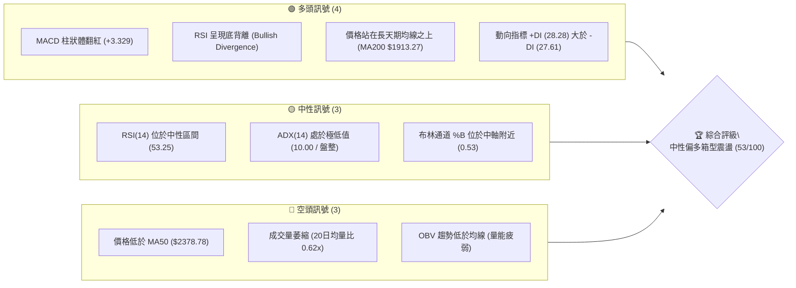
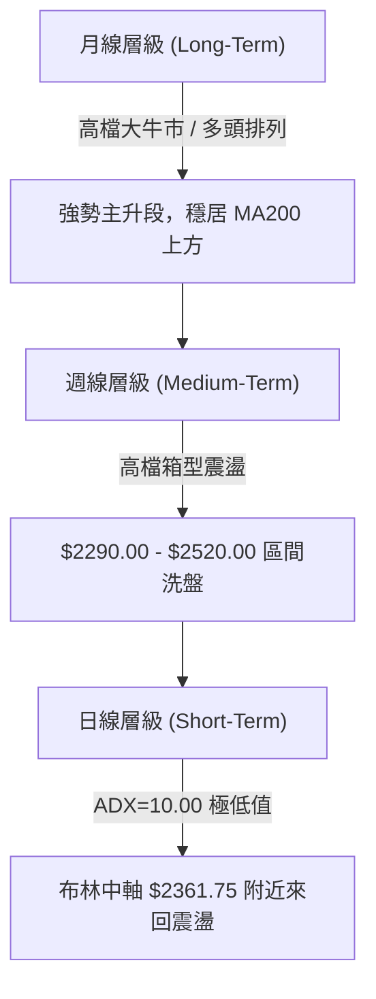
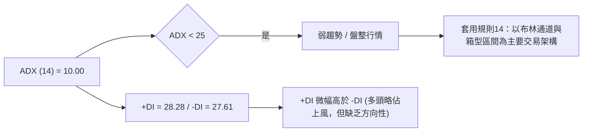
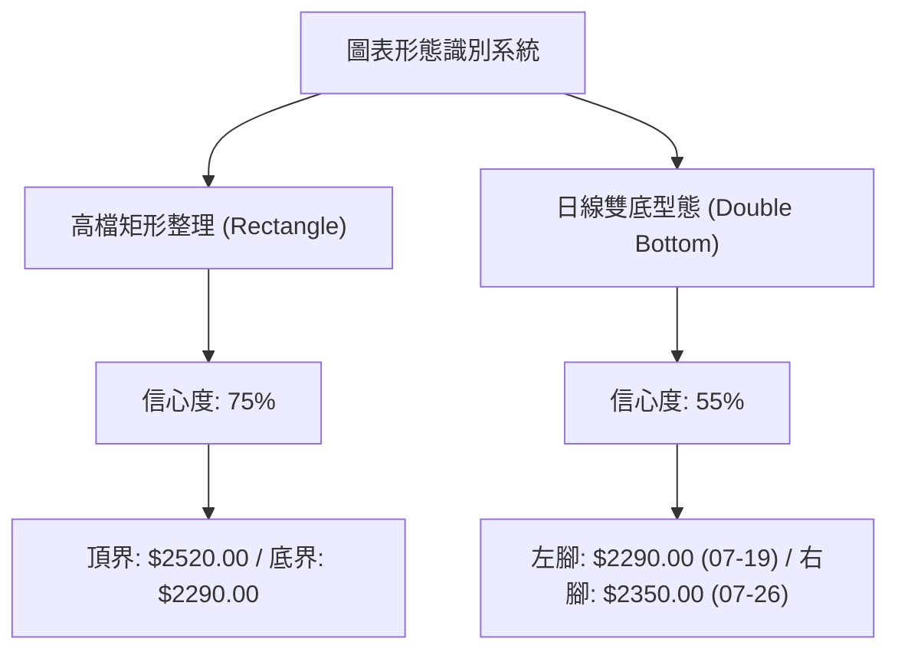
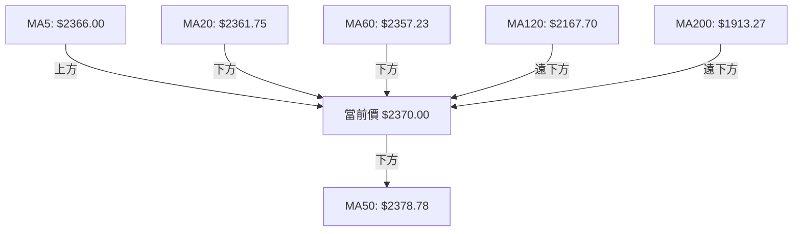
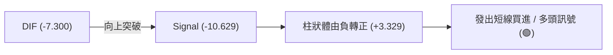
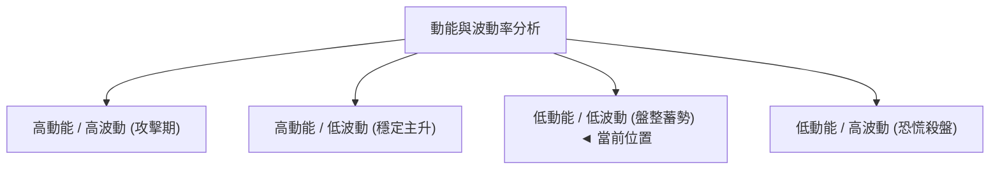
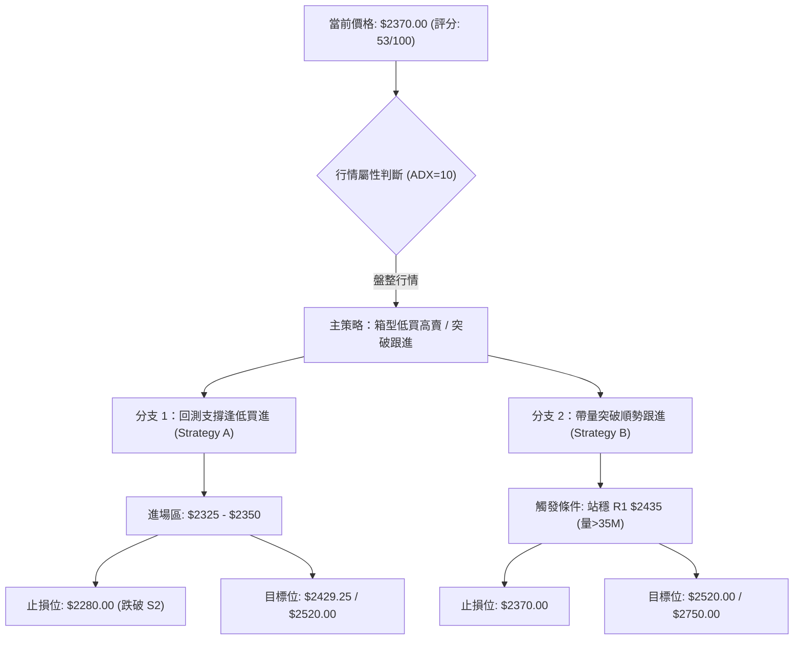
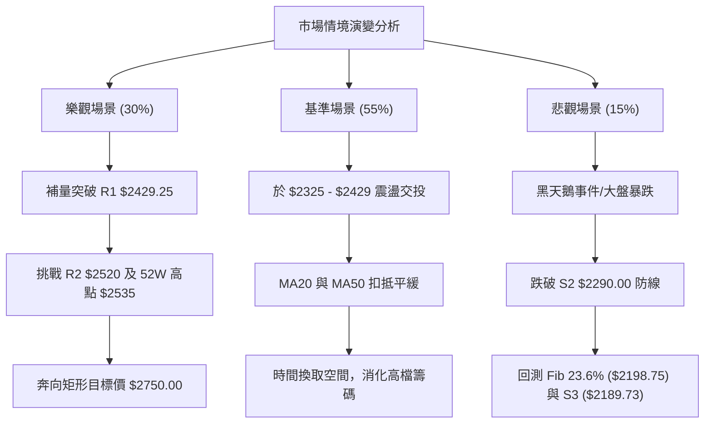

# 2330.TW 技術分析報告

> **報告日期**：2026-08-07 ｜ **語言**：繁體中文 ｜ **數據來源**：Yahoo Finance ｜ **當前價格**：$2370.00

---

## 目錄

| 章節 | 內容 |
|------|------|
| [1. 技術面概覽](#1-技術面概覽) | 訊號儀表板、核心指標、評分卡 |
| [2. 趨勢分析](#2-趨勢分析) | 多時框趨勢、長中短期走勢 |
| [3. 圖表形態分析](#3-圖表形態分析) | 形態識別、K線組合、目標價 |
| [4. 支撐與阻力](#4-支撐與阻力) | 關鍵價位、斐波那契回調 |
| [5. 技術指標深度解讀](#5-技術指標深度解讀) | MA/RSI/MACD/布林/成交量 |
| [6. 動能與波動率](#6-動能與波動率) | 動能評估、ATR、Beta |
| [7. 多時框架總結](#7-多時框架總結) | 時框架評分矩陣 |
| [8. 交易策略建議](#8-交易策略建議) | 多空策略、風險報酬比 |
| [9. 風險提示與監控](#9-風險提示與監控) | 監控指標、風險場景 |

---

## 1. 技術面概覽

### 🎯 技術訊號儀表板



### 📊 核心指標速覽表

| 指標類別 | 指標名稱 | 當前數值 | 訊號 | 解讀 |
|----------|----------|----------|------|------|
| **價格** | 當前價格 | $2370.00 | 🟡 中性 | 處於 52 週高低價區間之 88.4% 位置 |
| **均線** | MA20 | $2361.75 | 🟢 看多 | 價格在其上方 (+0.35%)，呈短期支撐 |
| **均線** | MA50 | $2378.78 | 🔴 看空 | 價格在其下方 (-0.37%)，上方面臨微幅壓力 |
| **均線** | MA200 | $1913.27 | 🟢 看多 | 價格遠在其上方 (+23.87%)，長期多頭無虞 |
| **動能** | RSI(14) | 53.25 | 🟡 中性 | 處於 30-70 常態區，伴隨潛在底背離 |
| **動能** | MACD | Hist +3.329 | 🟢 看多 | MACD 柱狀體翻紅，短線多頭動能修復 |
| **動能** | ADX(14) | 10.00 | 🟡 盤整 | 趨勢強度低於 25，屬典型無方向震盪 |
| **波動** | ATR(14) | $75.00 | 🟡 中等 | 日均波動率 3.16%，風險控制區間適中 |
| **成交量** | 20日均量比 | 0.62x | 🔴 疲弱 | 日成交量 21.96M，低於20日均量 35.48M |

### 🏆 技術評分卡

```
╔══════════════════════════════════════════════════════════════╗
║             技術評分卡 — 2330.TW (2026-08-07)                ║
╠══════════════════════════════════════════════════════════════╣
║ 趨勢強度 (ADX=10.00)   ▓▓▓░░░░░░░░░░░░░░░░░ 30/100  🟡 弱趨勢 ║
║ 動能指標 (MACD/RSI)    ▓▓▓▓▓▓▓▓▓▓▓▓░░░░░░░░ 62/100  🟢 中性偏多 ║
║ 支撐穩定度 (S1/S2支撐)  ▓▓▓▓▓▓▓▓▓▓▓▓▓▓▓░░░░░ 75/100  🟢 強固     ║
║ 成交量配合 (0.62x)     ▓▓▓▓▓▓▓░░░░░░░░░░░░░ 38/100  🔴 量能不彰 ║
║ 形態完整度 (矩形整理)  ▓▓▓▓▓▓▓▓▓▓░░░░░░░░░░ 50/100  🟡 區間待變 ║
║ 均線排列 (長多短盤)    ▓▓▓▓▓▓▓▓▓▓▓▓░░░░░░░░ 62/100  🟢 短期修復 ║
╠══════════════════════════════════════════════════════════════╣
║ 綜合評分               ▓▓▓▓▓▓▓▓▓▓▓░░░░░░░░░ 53/100  🟡 中性偏多 ║
╚══════════════════════════════════════════════════════════════╝
```

---

## 2. 趨勢分析

### 🌐 多時框趨勢分析



### 📈 長期趨勢 — 24個月走勢圖（Unicode）

```
2330.TW 歷史走勢圖（2024-08 至 2026-08）
價格軸 ($)
$2500 ┤                                           ●  ●  ●
$2300 ┤                                        ●  █  █  █  ●←現在($2370)
$2100 ┤                                  ●  ●  █  █  █  █  █
$1900 ┤                               ●  █  █  █  █  █  █  █
$1700 ┤                         ●  ●  █  █  █  █  █  █  █  █
$1500 ┤                   ●  ●  █  █  █  █  █  █  █  █  █  █
$1300 ┤             ●  ●  █  █  █  █  █  █  █  █  █  █  █  █
$1100 ┤       ●  ●  █  █  █  █  █  █  █  █  █  █  █  █  █  █
 $900 ┤ ●  ●  █  █  █  █  █  █  █  █  █  █  █  █  █  █  █  █
      └─┴──┴──┴──┴──┴──┴──┴──┴──┴──┴──┴──┴──┴──┴──┴──┴──┴──┴──
       08 10 12 02 04 06 08 10 12 02 04 06 08 (月份: 2024/08 - 2026/08)
```

**走勢特徵分析表格**：

| 階段 | 時間區間 | 價格區間 ($) | 漲跌幅 (%) | 關鍵走勢特徵與驅動因素 |
|------|----------|--------------|------------|------------------------|
| **第一階段** | 2024/08 - 2025/03 | 915.73 - 894.24 | -2.35% | 千元大關前消化獲利賣壓，落底 $892.27 |
| **第二階段** | 2025/04 - 2025/12 | 892.27 - 1540.85 | +72.69% | 突破千元限制，啟動主升段，季線與月線完美多頭 |
| **第三階段** | 2026/01 - 2026/05 | 1540.85 - 2348.73 | +52.43% | 突破 2000 元大關，強勢擴張，創下 52 週高價區間 |
| **第四階段** | 2026/06 - 2026/08 | 2410.00 - 2370.00 | -1.66% | 高檔獲利結算，於 $2290 - $2535 形成高位箱型整理 |

### 📊 中期趨勢（週線分析）

近 20 週數據顯示，股價於 2026-04-05 築底 $1805.18 後展開強烈反彈，並於 2026-07 突破歷史新高來到 52 週高點 $2535.00。隨後受制於短線獲利賣壓，回檔至 $2290.00 (2026-07-19 週收盤位) 尋求支撐。近三週於 $2290.00 - $2425.00 呈現「收斂震盪」與「量縮整理」，週 MACD 柱狀體由負轉正 (+3.329)，顯示中天期賣壓已顯著消化。

### ⚡ 趨勢強度評估（ADX 解讀）



| 指標 | 當前數值 | 臨界值 | 行情狀態判斷 | 交易導向建議 |
|------|----------|--------|--------------|--------------|
| **ADX** | 10.00 | < 25.0 | 無明顯單邊趨勢 (無方向震盪) | 嚴禁追高殺低，改採低買高賣高檔箱型策略 |
| **+DI** | 28.28 | > 25.0 | 多頭控盤力道尚存 | 逢支撐區（$2325-$2290）具備反彈動能 |
| **-DI** | 27.61 | > 25.0 | 空頭抵抗力道強烈 | 逢阻力區（$2429-$2520）具備打壓阻力 |

---

## 3. 圖表形態分析

### 🔍 形態識別系統



**圖表形態信心度與目標價評估**：

| 形態名稱 | 信心度 | 判斷依據（引用數據） | 完成度 | 目標價計算式與精確數值 |
|----------|--------|----------------------|--------|------------------------|
| **高檔矩形整理** | 75% | 頂界 R2 $2520.00 與底界 S2 $2290.00 經多次測試 | 70% | 頂界 $2520.00 + 形態高度 ($2520 - $2290 = $230) = **$2750.00** |
| **日線微型雙底** | 55% | 7/19 收盤 $2290 與 7/26 收盤 $2350 形成雙腳反彈 | 80% | 頸線 $2425 + (頸線 $2425 - 低點 $2290 = $135) = **$2560.00** |

*註：以上形態計算目標價為突破完成後的理論推算值，當前尚未正式突破 R2 ($2520.00)。*

### 🕯️ 重要 K 線形態分析

| 日期/週區間 | 收盤價 | K線形態 | 形態細節與市場心理 | 訊號評級 |
|-------------|--------|---------|--------------------|----------|
| **2026-07-19** | $2290.00 | 長下影陰線/探底錘頭 | 測試 S2 支撐，爆量（200.18M）換手，多頭強力防守 | 🟢 支撐確立 |
| **2026-07-26** | $2350.00 | 短陽星線/二次確認 | 量縮止跌，確認 $2290-$2325 為強烈買盤防守區 | 🟢 底背離確認 |
| **2026-08-02** | $2425.00 | 中長紅棒/多頭反攻 | 帶量（217.65M）突破 MA20，吞噬前一週跌幅 | 🟢 短線轉強 |
| **2026-08-09** | $2370.00 | 量縮小陰星線 | 回測試驗 MA20/MA50 區間，量能極度萎縮，屬健康回檔 | 🟡 震盪觀望 |

### 📉 ASCII 走勢形態示意圖

```
高檔矩形整理與微型雙底示意圖
$2520.00 ──┐───────────────────────────┐ (矩形頂界 R2 / 突破目標 $2750)
           │      ● (8/02 $2425)       │
$2429.25 ──┼───────▲───────────────────┼─ (矩形頸線 R1)
           │      / \    ● (現價 $2370)│
$2325.00 ──┼─────/───\──/──────────────┼─ (初級支撐 S1)
           │    /     ● (7/26 $2350)   │
$2290.00 ──┴──● (7/19 $2290)───────────┘ (矩形底界 S2 / 雙底底座)
```

---

## 4. 支撐與阻力

### 🗺️ 關鍵價位分布圖（Unicode）

```
2330.TW 價位結構分布圖
═════════════════════════════════════════════════════════════
$2535.00 ║████████████████████████████████████║ 52週歷史最高點 / Fib 0.0%
$2520.00 ║██████████████████████████████      ║ 強阻力位 R2 (高檔矩形上軌)
$2429.25 ║██████████████████                  ║ 關鍵阻力位 R1 (+2.50%)
$2370.00 ╠════════════════════════════════════╣ ◄ 當前價格 (Current Price)
$2325.00 ║▓▓▓▓▓▓▓▓▓▓▓▓▓▓▓▓                    ║ 近期支撐位 S1 (-1.90%)
$2290.00 ║██████████████████████████████      ║ 強支撐位 S2 (-3.38%)
$2198.75 ║▓▓▓▓▓▓▓▓▓▓▓▓▓▓▓▓▓▓▓▓▓▓▓▓▓▓▓▓▓▓▓▓▓   ║ 斐波那契 23.6% 回調位
$2189.73 ║████████████████████████████████████║ 長期強支撐位 S3 (-7.61%)
═════════════════════════════════════════════════════════════
```

### 🚧 阻力位分析表

| 阻力級別 | 精確價位 | 形成原因與技術意義 | 突破難度 | 重要性評級 |
|----------|----------|--------------------|----------|------------|
| **阻力 R1** | $2429.25 | 近一年波段高點聚類、短線密集交易區 (+2.50%) | 🟡 中等 | 🟢 衝擊波段高點門檻 |
| **阻力 R2** | $2520.00 | 箱型整理上軌、多頭前波解套壓力區 (+6.33%) | 🔴 極高 | 🔴 中期多空分水嶺 |
| **歷史高點**| $2535.00 | 52 週最高價位，無套牢賣壓，純心理關卡 | 🔴 極高 | 🔴 歷史新高天花板 |

### 🛡️ 支撐位分析表

| 支撐級別 | 精確價位 | 形成原因與技術意義 | 守住機率 | 重要性評級 |
|----------|----------|--------------------|----------|------------|
| **支撐 S1** | $2325.00 | 近一年波段低點聚類、短線買盤支撐 (-1.90%) | 🟢 高 (70%) | 🟢 短線多頭防線 |
| **支撐 S2** | $2290.00 | 箱型整理下軌、7月探底爆量換手低點 (-3.38%) | 🟢 極高 (85%)| 🔴 中期多頭生死線 |
| **支撐 S3** | $2189.73 | 近一年深縮波段低點聚類、接近 Fib 23.6% (-7.61%) | 🟢 極高 (95%)| 🔴 長期牛熊防禦牆 |

### 📐 斐波那契回調位分析

**基於 52 週價格區間（$1110.20 → $2535.00）之計算數據**：

```
斐波那契層級分布與現價相對位置：
  0.0% (52W High)   $2535.00 ───────────────────────────────────
                      ▲ 差距 +$165.00 (+6.96%)
  當前價格 (Current) $2370.00 ◄═════════════════════════════════
                      ▼ 差距 -$171.25 (-7.23%)
 23.6%              $2198.75 ───────────────────────────────────
 38.2%              $1990.73 ─────────────────────────────────── (接近 MA200 $1913.27)
 50.0%              $1822.60 ───────────────────────────────────
 61.8%              $1654.47 ───────────────────────────────────
 78.6%              $1415.11 ───────────────────────────────────
100.0% (52W Low)    $1110.20 ───────────────────────────────────
```

**解讀**：現價 $2370.00 穩穩運行於 0.0%（$2535.00）與 23.6%（$2198.75）之間的黃金高位區。此區間為強勢整理形態，股價連 23.6% 的回調幅度都未曾觸及（最低僅回測試驗 S2 $2290.00），展現長期極度強勁的基本面與技術面支撐力道。

---

## 5. 技術指標深度解讀

### 🎛️ 指標訊號總覽

```mermaid
graph TD
    A["當前價格: $2370.00"] --> B["均線系統: 混合排列 (MA20 < 價 < MA50)")
    A --> C["動能系統: 短線修復 (MACD Hist +3.329)"]
    A --> D["波動系統: 區間中軸 (BB %B 0.53)"]
    A --> E["量能系統: 低迷萎縮 (Volume 0.62x)"]
    
    B --> F{"綜合指標結論"}
    C --> F
    D --> F
    E --> F
    F --> G["多頭動能醞釀中，但缺乏量能突破阻力"]
```

### 📈 移動平均線排列分析



| 均線天期 | 當前價位 | 與現價偏離度 | 均線走勢 | 技術意義評估 |
|----------|----------|--------------|----------|--------------|
| **MA 5** | $2366.00 | +0.17% | ▲ 微幅上揚 | 短線極短支撐 |
| **MA 10**| $2329.00 | +1.76% | ▲ 上揚 | 短線扣抵低價，向上支撐 |
| **MA 20**| $2361.75 | +0.35% | ▲ 轉平上揚 | 短期生命線，現價站上變為支撐 |
| **MA 50**| $2378.78 | -0.37% | ▼ 微幅下移 | 季線微幅壓制，突破即解開短線枷鎖 |
| **MA 60**| $2357.23 | +0.54% | ▲ 穩定上揚 | 季線支撐，與 MA20 形成雙重護城河 |
| **MA120**| $2167.70 | +9.33% | ▲ 強勢上揚 | 半年線防線，中天期趨勢保護線 |
| **MA200**| $1913.27 | +23.87%| ▲ 強勢上揚 | 年線牛熊分界點，超強長期多頭基石 |

### 📉 RSI(14) 分析

*   **當前數值**：53.25
*   **強度進度條**：`▓▓▓▓▓▓▓▓▓▓▓░░░░░░░░░` 53.25% (位於 30-70 常態中性區)
*   **背離狀態判讀**：**⚠️ 存在底背離 (Bullish Divergence)**
    *   *背離細節*：7 月中下旬股價二次下探（7/19 收 $2290，7/26 收 $2350），但 RSI 底部由 40.2 逐步抬升至 49.1，隨後於 8/09 回升至 53.25，呈現典型的「價跌/價平而 RSI 底部抬升」之底背離特徵，暗示賣壓衰竭，反彈動能蓄勢待發。

### 📊 MACD(12/26/9) 訊號解讀

*   **DIF (MACD線)**：-7.300
*   **DEM (Signal線)**：-10.629
*   **MACD Histogram (柱狀體)**：**+3.329** 🟢 綠柱翻紅 (多頭交叉)



*   **解讀**：儘管 DIF 與 Signal 仍位於零軸下方（反映前期自 $2535 回檔的修正），但柱狀體已連續多週收斂並正式翻紅（+3.329），代表空頭力道衰退、短線買盤重新主導市場。

### 📦 布林通道分析

```
布林通道現況 ASCII 示意圖
$2510.69 ────────────────────────────────────── 上軌 (BB Upper)
                      ● (8/02高點 $2425)
$2370.00 ═════════════●════════════════════════ 現價 (Current) - %B = 0.53
$2361.75 ────────────────────────────────────── 中軌 (BB Mid / MA20)
                      ● (7/19低點 $2290)
$2212.81 ────────────────────────────────────── 下軌 (BB Lower)
```

*   **上軌**：$2510.69
*   **中軌 (MA20)**：$2361.75
*   **下軌**：$2212.81
*   **通道位置 (%B)**：0.53（精確位於中軌上方，顯示價格處於極度平衡狀態）
*   **通道型態**：通道寬度維持常態，未出現極端壓縮或擴散，預示股價將持續在中軌與上軌區間（$2361.75 - $2510.69）進行震盪堆疊。

### 💹 成交量分析（量價配合度）

*   **最新成交量**：21,959,343 股
*   **20日均量**：35,476,345 股 (量比：**0.62x**)
*   **OBV 狀態**：OBV < OBV_MA (量能指標偏弱)
*   **量價關係評估**：
    *   *價格回檔量縮*：當前價格自 8/02 的 $2425 小幅回落至 $2370，成交量顯著下降至 21.96M（僅為 20 日均量的 62%）。這種「價跌量縮」屬於健康的籌碼鎖定狀態，顯示市場並未出現恐慌性拋售。
    *   *突破潛力受限*：然而，由於 OBV 仍低於其均線，若多頭欲強勢突破阻力位 R1 ($2429.25) 及 R2 ($2520.00)，後續必須伴隨日成交量放大至 35.0M 以上，方能確認突破有效性。

---

## 6. 動能與波動率

### ⚡ 動能評估矩陣

| 評估維度 | 指標數值 | 狀態描述 | 矩陣象限歸屬 |
|----------|----------|----------|--------------|
| **動能強度 (Momentum)** | MACD Hist +3.329 / RSI 53.25 | 短線動能溫和回升 | **低動能 / 低波動區間** |
| **波動率 (Volatility)** | ATR(14) $75.00 (3.16%) | 波動率處於中低位 | *(象限 Q2：低動能中波動盤整)* |



### 📊 ATR 波動率分析

*   **ATR(14)**：$75.00
*   **價格百分比**：3.16%
*   **交易應用建議**：
    *   *短線止損距離 (1.0x ATR)*：$75.00（距進場價約 3.16%）
    *   *波段止損距離 (1.5x ATR)*：$112.50（距進場價約 4.75%）
    *   *每日正常波動區間*：$2370.00 ± $75.00 ($2295.00 - $2445.00)

### 📐 Beta 與市場相關性

*   **Beta 係數**：1.258
*   **解讀**：2330.TW 的 Beta 為 1.258，代表其波動性略高於大盤（加權指數）25.8%。當大盤上漲 1% 時，該股理論上上漲約 1.26%；當大盤回檔時，其承受之波動亦放大。在當前 ADX=10 的無趨勢環境下，該 Beta 值意味著個股將高度受到半導體產業整體消息與大盤走勢的短線牽引。

---

## 7. 多時框架總結

### 📋 時框架評分表

| 時框架 | 趨勢方向 | 動能狀態 | 均線排列 | 形態結構 | 綜合評分 | 建議導向 |
|--------|----------|----------|----------|----------|----------|----------|
| **月線 (Long)** | 🟢 多頭 | 🟢 強勁 | 🟢 多頭排列 | 🟢 主升段延伸 | **85/100** | 偏多持有/長期看好 |
| **週線 (Mid)** | 🟡 震盪 | 🟢 翻紅 | 🟢 多頭撐腰 | 🟡 高檔矩形整理 | **65/100** | 箱型操作/低買高賣 |
| **日線 (Short)**| 🟡 盤整 | 🟢 底背離 | 🟡 混合排列 | 🟢 微型雙底修復 | **55/100** | 逢低佈局/嚴控止損 |

### 🔲 綜合訊號矩陣

```
時框架訊號收斂矩陣
┌──────────┬─────────────┬─────────────┬─────────────┐
│ 時框架   │ 趨勢 (Trend)│ 動能(MACD/RSI)│ 策略一致性  │
├──────────┼─────────────┼─────────────┼─────────────┤
│ 月線     │  🟢 偏多    │   🟢 偏多   │   強烈偏多  │
│ 週線     │  🟡 震盪    │   🟢 偏多   │   中性偏多  │
│ 日線     │  🟡 盤整    │   🟢 偏多   │   中性偏多  │
└──────────┴─────────────┴─────────────┴─────────────┘
```

### ⚖️ 多時框收斂結論

**套用多時框收斂規則（規則 14）**：
1. **當前市場環境**：ADX(14) = 10.00 (< 25)，明確定義為 **「盤整行情 (Consolidation Market)」**。
2. **主導時框架與規則**：依據規則，盤整行情應以 **「日線布林通道 ($2212.81 - $2510.69) 與箱型區間支撐阻力」** 為主要交易依據。
3. **最終收斂方向**：長期（月線）牛態完全未破，中期（週線）於 $2290-$2520 進行高檔消化，短期（日線）已出現 RSI 底背離與 MACD 翻紅。**綜合評估為：中性偏多箱型震盪 (Neutral-Bullish Consolidation)**。交易策略應優先採取「區間下軌低買」與「突破跟進」，嚴禁在箱型中軸上方追高。

---

## 8. 交易策略建議

### 🗺️ 策略決策流程圖



### 🧭 策略路由

*   **當前主策略方向**：**區間低買與突破跟進（中性偏多，評分 53/100）**
*   **策略邏輯**：由於 ADX 低於 25，且價格位於布林中軸附近，當前不宜直接市價全倉追價。應採取「分批逢低佈局」或「等待帶量突破 R1 追勝」之雙軌策略。

### 🎯 價格情境階梯 (Price Scenarios)

| 觸發條件 | 下一目標價 | 後續延伸目標 | 情境技術含義 |
|----------|------------|--------------|--------------|
| **突破 R1 $2429.25** | R2 $2520.00 | 形態目標 $2750.00 | 短線轉強，啟動矩形上軌衝擊波 |
| **站穩現價區間 ($2350-$2380)** | R1 $2429.25 | — | 區間震盪蓄勢，時間換取空間 |
| **跌破 S1 $2325.00** | S2 $2290.00 | S3 $2189.73 | 震盪加劇，下探箱型底界強支撐 |

### 📊 情境機率分佈

```
情境機率分佈圓餅圖（推估）
┌──────────────────────────────────────────────────────────┐
│ 區間震盪蓄勢 / 緩步墊高 (55%)  █████████████████████████ │
│ 多頭帶量突破 R1/R2 (30%)       █████████████            │
│ 空頭跌破 S2 支撐 (15%)         █████                    │
└──────────────────────────────────────────────────────────┘
```

| 情境類型 | 估計機率 | 主要技術依據 |
|----------|----------|--------------|
| **區間震盪 / 緩步向上** | **55%** | ADX=10 指示盤整，日線 MACD 翻紅，RSI 底背離提供下檔支撐 |
| **強勢帶量突破** | **30%** | 長期多頭趨勢強勁，分析師目標價高遠 ($3126.75)，唯需成交量補量 (>35M) |
| **破位回檔再探底** | **15%** | 僅於美股半導體出現重大利空且成交量異常放大拋售時觸發 |

### 🟢 主策略詳情

| 策略要素 | 策略 A：區間逢低做多 (Range Low-Buy) | 策略 B：順勢突破做多 (Breakout Follow) |
|----------|-------------------------------------|---------------------------------------|
| **策略類型** | 逆勢 / 低接高拋 | 順勢 / 突破跟進 |
| **進場條件** | 價格回測 S1 $2325.00 - $2350.00 止跌 | 突破阻力 R1 站穩 **$2435.00** 且日量 > 35M |
| **進場價格** | **$2335.00** (區間均價) | **$2435.00** (突破確認價) |
| **目標價 T1** | **$2429.25** (阻力 R1) | **$2520.00** (阻力 R2 / 箱型頂界) |
| **目標價 T2** | **$2520.00** (阻力 R2) | **$2750.00** (矩形突破理論目標價) |
| **止損價格** | **$2280.00** (精確低於 S2 $2290 約 0.4%) | **$2370.00** (精確設於當前布林中軸) |
| **風險報酬比** | **1 : 2.64** (以 T2 計算: 185元利潤 / 55元風險) | **1 : 2.84** (以 T2 計算: 315元利潤 / 65元風險) |
| **成功機率** | 65% | 60% |
| **建議倉位** | 15% - 20% | 20% - 25% |

### 🔴 反向風險觸發點（對沖與避險提示）

*   **避險觸發條件**：若股價收盤價**實體跌破強支撐 S2 ($2290.00)**，且日成交量突破 45,000,000 股（爆量長黑）。
*   **應對處置**：主策略多頭全面停損離場，短線多頭倉位歸零；可考慮多頭套期保額策略，下方第一接盤觀察點下移至 S3 ($2189.73) 及斐波那契 23.6% ($2198.75) 區間。

### ⭐ 整體訊號強度評星

```
做多訊號強度：★★★☆☆  (3.5/5星 - 短線底背離修復，等待量能)
做空訊號強度：★★☆☆☆  (2.0/5星 - 長期多頭護航，空頭空間有限)
整體可信度：  ★★██☆  (4.0/5星 - 數據完整，支撐阻力結構清晰)
```

---

## 9. 風險提示與監控

### ✅ 關鍵監控指標 Checklist

```
╔══════════════════════════════════════════════════════════════╗
║              關鍵技術指標監控清單 (Checklist)                ║
╠══════════════════════════════════════════════════════════════╣
║ [ ] 1. 價格是否站穩 MA50 ($2378.78)？                        ║
║ [ ] 2. 日成交量是否回升至 35,476,345 股 (20日均量) 之上？     ║
║ [ ] 3. MACD 柱狀體 (+3.329) 是否持續擴大上升？                ║
║ [ ] 4. RSI(14) 是否進一步突破 60 衝向超買區？                 ║
║ [ ] 5. ADX(14) 是否自 10.00 開始上揚突破 25 (趨勢啟動)？      ║
║ [ ] 6. 價格是否有效突破阻力 R1 ($2429.25)？                   ║
╚══════════════════════════════════════════════════════════════╝
```

### ⚠️ 風險場景分析



### 🛡️ 風險管理重要提醒

1.  **波動率控管**：當前 ATR 為 $75.00，代表日均波動區間達 3.16%。操作上止損點務必給予至少 1.0x - 1.5x ATR（$75 - $112.5）的緩衝空間，避免被正常的日內噪聲震盪震出場。
2.  **量能假突破風險**：由於 ADX(14) 目前僅為 10.00，盤整型態顯著。若價格盤中上拉突破 R1 ($2429.25)，但當日預估成交量低於 30M 股，極易形成「量背離假突破」，切忌於尾盤前盲目追高。
3.  **資金配置**：在 ADX 低於 25 的震盪期，建議整體技術面交易資金不超過總資金的 30%，保留足夠現金以便在股價回測試驗 S2 ($2290.00) 甚至 S3 ($2189.73) 時能進行高品質的分批低接。

---

## 📋 報告總結

```
╔══════════════════════════════════════════════════════════════╗
║               2330.TW 技術分析報告總結                       ║
╠══════════════════════════════════════════════════════════════╣
║ 報告日期：2026-08-07                                         ║
║ 當前價格：$2370.00                                           ║
║ 分析評級：⚖️ 中性偏多箱型震盪 (53/100)                      ║
║                                                              ║
║ 關鍵結論：                                                   ║
║ ├─ 長期趨勢：🟢 強烈看多 (穩居 MA200 $1913.27 上方 +23.87%)    ║
║ ├─ 中期趨勢：🟡 高檔矩形整理 ($2290.00 - $2520.00 區間)       ║
║ ├─ 短期趨勢：🟢 止跌修復 (MACD柱翻紅 + RSI底背離)             ║
║ ├─ 關鍵支撐：S1 $2325.00 / S2 $2290.00                       ║
║ ├─ 關鍵阻力：R1 $2429.25 / R2 $2520.00                       ║
║ └─ 分析師共識目標：$3126.75 (潛在漲幅 +31.93%)               ║
║                                                              ║
║ 最優策略組合：                                               ║
║ 1. 🥇 最佳機會：策略 A — 逢低區間做多 (進場 $2335，止損 $2280)║
║ 2. 🥈 次選機會：策略 B — 帶量突破做多 (突破 $2435 跟進)      ║
║ 3. 🥉 保守選擇：觀望等待 ADX > 25 或量能 > 35M 訊號明確化     ║
╚══════════════════════════════════════════════════════════════╝
```

---

> ⚠️ **免責聲明**：本報告為 AI 自動生成之技術分析，所有數據及估算均基於提供的歷史價格與市場資訊。本報告**僅供研究與學術參考**，**不構成任何買賣投資建議**。金融市場投資具有風險，投資人應獨立思考，審慎評估並自負投資風險。

---

*報告生成時間：2026-08-07 ｜ 數據來源：Yahoo Finance ｜ 分析框架：多時框技術分析系統*