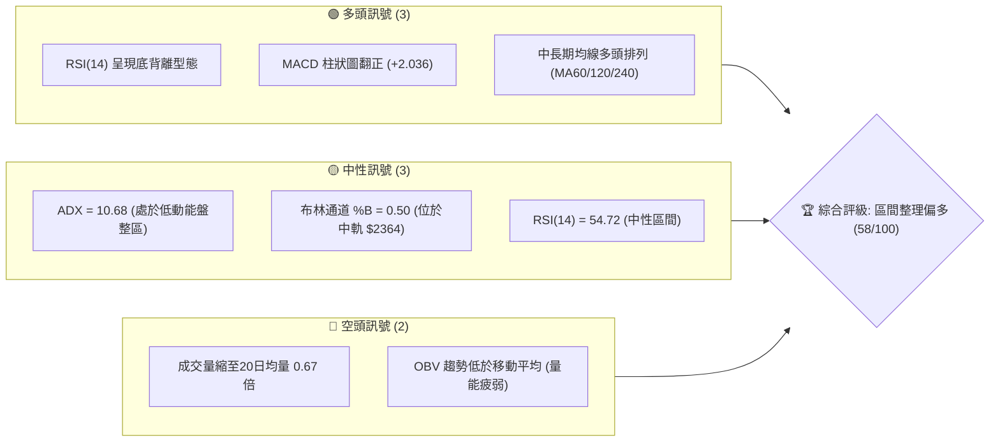
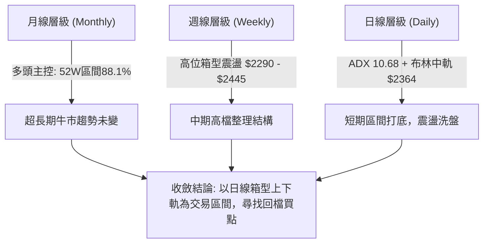
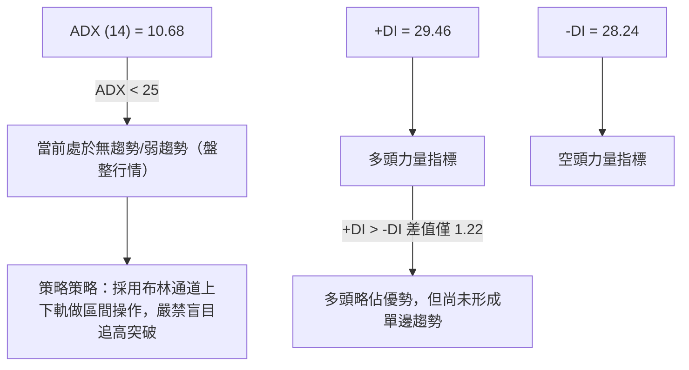
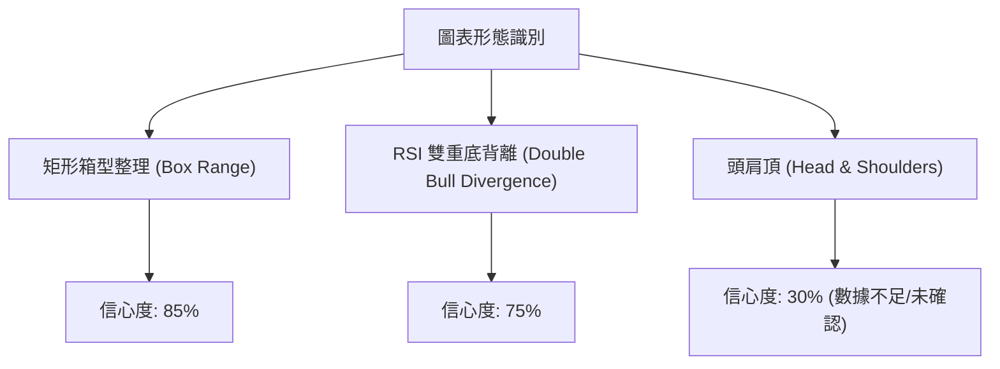
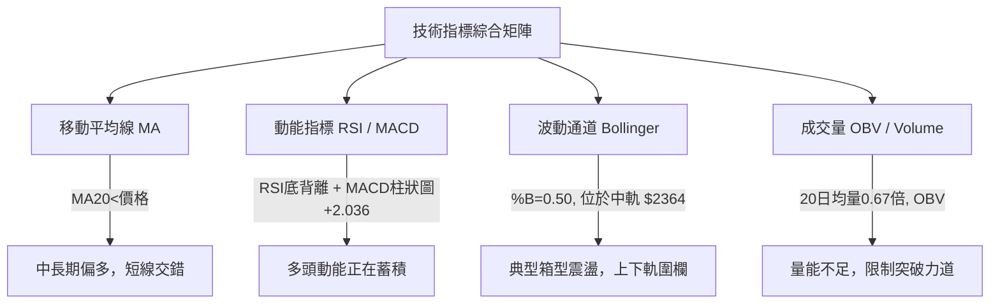
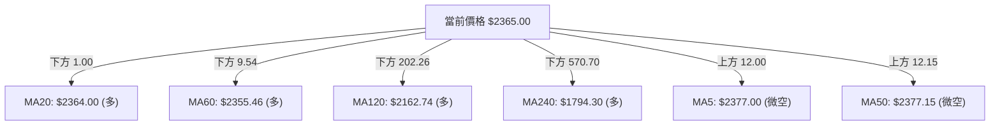
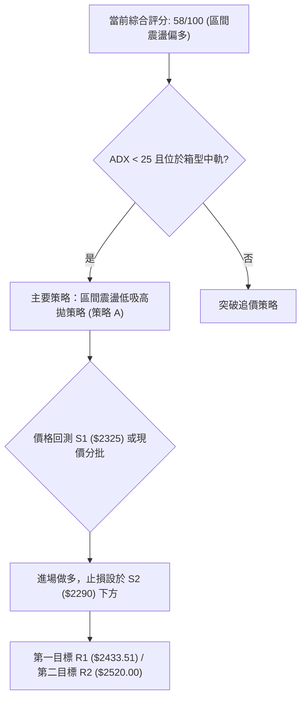
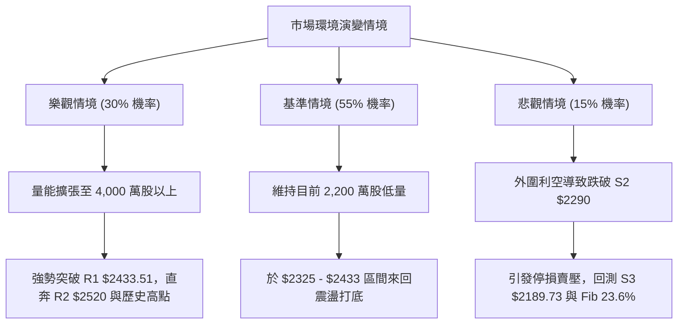

# 2330.TW 技術分析報告

> **報告日期**：2026-08-07 ｜ **語言**：繁體中文 ｜ **數據來源**：Yahoo Finance ｜ **當前價格**：$2365.00

---

## 目錄

| 章節 | 內容 |
|------|------|
| [1. 技術面概覽](#1-技術面概覽) | 訊號儀表板、核心指標、評分卡 |
| [2. 趨勢分析](#2-趨勢分析) | 多時框趨勢、長中短期走勢 |
| [3. 圖表形態分析](#3-圖表形態分析) | 形態識別、K線組合、目標價 |
| [4. 支撐與阻力](#4-支撐與阻力) | 關鍵價位、斐波那契回調 |
| [5. 技術指標深度解讀](#5-技術指標深度解讀) | MA/RSI/MACD/布林/成交量 |
| [6. 動能與波動率](#6-動能與波動率) | 動能評估、ATR、Beta |
| [7. 多時框架總結](#7-多時框架總結) | 時框架評分矩陣 |
| [8. 交易策略建議](#8-交易策略建議) | 多空策略、風險報酬比 |
| [9. 風險提示與監控](#9-風險提示與監控) | 監控指標、風險場景 |

---

## 1. 技術面概覽

### 🎯 技術訊號儀表板



### 📊 核心指標速覽表

| 指標類別 | 指標名稱 | 當前數值 | 訊號 | 解讀 |
|----------|----------|----------|------|------|
| **價格** | 當前價格 | $2365.00 | 🟡 中性 | 位於52週高低區間 88.1% 之高檔區 |
| **均線** | MA20 | $2364.00 | 🟢 看多 | 價格微幅站上 MA20，短期止跌回穩 |
| **均線** | MA50 | $2377.15 | 🔴 看空 | 價格位於 MA50 下方，中期承壓 |
| **均線** | MA200 | $1908.55 | 🟢 看多 | 遠高於生命線，超長期趨勢極其強勁 |
| **動能** | RSI(14) | 54.72 | 🟢 看多 | 位於中性區，但出現顯著「底背離」 |
| **動能** | MACD | -9.425 / +2.036 | 🟢 看多 | 柱狀圖轉正，黃金交叉初現 |
| **趨勢** | ADX(14) | 10.68 | 🟡 中性 | ADX < 25 表示無明確強趨勢，屬箱型盤整 |
| **波動** | ATR(14) | $76.07 | 🟡 中性 | 佔股價 3.22%，日內波動溫和可控 |

### 🏆 技術評分卡

```
╔══════════════════════════════════════════════════════════════════╗
║                技術評分卡 — 2330.TW (2026-08-07)                ║
╠══════════════════════════════════════════════════════════════════╣
║ 趨勢強度 (ADX)  ████░░░░░░░░░░░░░░░░  20/100  🟡 盤整無明確強趨勢║
║ 動能指標 (RSI/MACD)██████████████░░░░  70/100  🟢 底背離+MACD翻正 ║
║ 支撐穩定度      ████████████████░░░░  80/100  🟢 S1/S2支撐結構紮實║
║ 成交量配合 (OBV)████████░░░░░░░░░░░░  40/100  🔴 量能萎縮且OBV疲弱║
║ 形態完整度      ████████████░░░░░░░░  60/100  🟡 箱型震盪築底形態║
║ 均線排列 (MA)   ████████████████░░░░  80/100  🟢 長期均線完全多頭 ║
╠══════════════════════════════════════════════════════════════════╣
║ 綜合評分        ███████████░░░░░░░░░  58/100  ⚖️ 區間震盪偏多    ║
╚══════════════════════════════════════════════════════════════════╝
```

---

## 2. 趨勢分析

### 🌐 多時框趨勢分析



### 📈 長期趨勢 — 12個月走勢圖（Unicode）

```
2330.TW 月線走勢圖（過去12個月：2025-09 至 2026-08）
價格軸 ($)
$2500 ┤                                                 ●    ●   ● (近三月高檔)
$2300 ┤                                            ●   / \  / \ /
$2100 ┤                                  ●    ●   /   ●   ●   ●←當前 $2365
$1900 ┤                             ●   / \  /
$1700 ┤                        ●   /   ●   ●
$1500 ┤              ●    ●   /
$1300 ┤        ●    / \  /
$1100 ┤  ●    / \  /   ● (回檔低點)
       └──────────────────────────────────────────────────────────
        M1   M2  M3  M4  M5  M6  M7  M8  M9  M10 M11 M12 (2026-08)
```

**走勢特徵分析表格**：

| 階段 | 時間區間 | 收盤價變化 | 區間漲跌幅 | 主要技術特徵與驅動因素 |
|------|----------|------------|------------|------------------------|
| **起漲主升段** | 2025-09 至 2026-02 | $1292.99 → $1983.22 | +53.38% | 主升段放量大漲，均線呈標準多頭發散形態 |
| **洗盤洗籌段** | 2026-03 至 2026-04 | $1755.32 → $2129.32 | +21.31% | 3月出現急劇洗盤拉回至 $1755.32 後強勢V型反彈 |
| **高檔創高段** | 2026-05 至 2026-07 | $2348.73 → $2425.00 | +3.25% | 攀升至 52 週新高 $2535.00，動能開始減緩 |
| **當前整理段** | 2026-08 (當前) | $2365.00 | -2.47% | 於高位進行量縮橫盤震盪，尋找月線等級支撐 |

### 📊 中期趨勢（週線分析）

近 20 週數據顯示，價格於 $2290.00 至 $2445.00 之間進行寬幅震盪。週 RSI 維持在 40.2 ~ 64.0 的中性區間，且 MACD 柱狀圖在近數週多次於正負值間交替（從 -15.213 到 +2.036），顯示多空雙方在 2400 元關卡附近形成拉鋸。

```
中期壓力與支撐示意圖 (週線層級)
$2520.00 ─────────────────────────────────── 歷史高點壓力區 (R2)
$2433.51 ─────────────────────────────────── 短線波段高點阻力 (R1)
$2365.00 ═══════════════════════════════════ 當前現價 (BB中軌/MA20)
$2325.00 ─────────────────────────────────── 近期箱型下緣支撐 (S1)
$2290.00 ─────────────────────────────────── 強支撐位 (S2)
```

### ⚡ 趨勢強度評估（ADX 解讀）



**ADX 趨勢強度指標對照表**：

| ADX 數值區間 | 當前狀態 (10.68) | 市場行情特徵 | 建議交易策略 |
|--------------|------------------|--------------|--------------|
| **0 - 20** | ▓▓▓▓▓░░░░░ **當前** | 極弱趨勢 / 箱型震盪 | 高拋低吸、區間極限操作 |
| **20 - 25** | ░░░░░░░░░░ | 趨勢醞釀期 / 觀望區 | 觀察突破訊號，準備順勢 |
| **25 - 50** | ░░░░░░░░░░ | 強勁單邊趨勢行情 | 順勢操作、拉回加碼 |
| **50 - 100**| ░░░░░░░░░░ | 極端趨勢 / 過熱反轉 risk | 緊守止損、分批獲利了結 |

---

## 3. 圖表形態分析

### 🔍 形態識別系統



**圖表形態信心度與目標價評估表**：

| 形態名稱 | 信心度 | 判斷依據（引用數據） | 完成度 | 目標價計算式與精確數值 |
|----------|--------|----------------------|--------|------------------------|
| **高位矩形箱型** | **85%** | 上軌阻力 R1 $2433.51，下軌支撐 S2 $2290.00，成交量量縮 | 90% | 箱型突破目標 = R1 + (R1 - S2) = $2433.51 + $143.51 = **$2577.02**（註：未突破前僅供參考） |
| **RSI 底背離** | **75%** | 價格在 2026-07-19 探低 $2290，RSI 為 43.1；隨後價格於 07-26 為 $2350，RSI 下降至 40.2，但 08-09 價格拉回 $2365 時 RSI 逆勢回升至 54.72 | 100% | 短線反彈目標 = R1 阻力位 **$2433.51** |
| **頭肩頂形態** | **30%** | 僅具備 52W 高點 $2535 作為頭部，但左肩膀與右肩膀不對稱，且未跌破頸線 $2189.73 (S3) | 20% | 訊號不足，信心度 < 50%，不作形態突破計算，僅以指標操作 |

### 🕯️ 重要K線形態分析

| 月/週日期 | 收盤價 | 關鍵 K 線組合形態 | 技術解讀 | 多空訊號 |
|-----------|--------|-------------------|----------|----------|
| **2026-07-19** | $2290.00 | 長下影陰線 (Lower Shadow) | 下探 S2 支撐位 $2290 後逢低買盤強烈湧入，確立波段底部 | 🟢 看多反彈 |
| **2026-07-26** | $2350.00 | 晨星初現 (Morning Star) | 止跌回升，呈現孕育線與築底結構 | 🟢 看多 |
| **2026-08-02** | $2425.00 | 中紅實體棒 (Bullish Candle) | 多頭帶量上攻逼近 R1 $2433.51 | 🟢 看多 |
| **2026-08-09** | $2365.00 | 縮量十字星/小陰線 | 遭遇 R1 阻力拉回，屬高檔消化賣壓之正常整理 | 🟡 中性 |

### 📉 ASCII 走勢形態示意圖

```
高位矩形箱型震盪 (Box Consolidation) 與底背離示意圖
$2433.51 ┤------------- 頂部阻力位 (R1) -------------● (08-02 高點 $2425)
         │            / \                                 /
$2365.00 ┤.........../...\...............................● (當前現價 $2365)
         │          /     \                            /
$2290.00 ┤---------●-------●--------------------------- (底部支撐 S2)
          (07-19 低點)
─────────────────────────────────────────────────────────────
RSI(14)  ┤     43.1  -----> 40.2 -----> 54.72 (RSI 向上背離發散 🟢)
```

### 🎯 形態目標價計算

1. **矩形箱型上軌突破推算**：
   - 箱型頂部：$2433.51 (R1)
   - 箱型底部：$2290.00 (S2)
   - 箱型高度：$2433.51 - $2290.00 = $143.51
   - **向上突破測量目標價** = $2433.51 + $143.51 = **$2577.02**（以突破並站穩 R1 為前提）

2. **雙重打底回彈推算**：
   - 頸線位置：$2364.00 (MA20)
   - 底部支撐：$2290.00 (S2)
   - **短線第一目標價** = **$2433.51** (即阻力位 R1)

---

## 4. 支撐與阻力

### 🗺️ 關鍵價位分布圖（Unicode）

```
2330.TW 價位結構分布圖
═══════════════════════════════════════════════════════════════════
$2535.00 ║████████████████████████████████████████║ 52週歷史高點 (Fib 0.0%)
$2520.00 ║████████████████████████████████████    ║ 強阻力位 R2 (+6.55%)
$2433.51 ║██████████████████████████              ║ 關鍵阻力位 R1 (+2.90%)
$2365.00 ╠════════════════════════════════════════╣ ◄ 當前現價 (BB中軌)
$2325.00 ║▓▓▓▓▓▓▓▓▓▓▓▓▓▓▓▓▓▓▓▓                    ║ 近期箱型下緣 S1 (-1.69%)
$2290.00 ║██████████████████████████              ║ 強支撐位 S2 (-3.17%)
$2198.75 ║▓▓▓▓▓▓▓▓▓▓▓▓▓▓▓▓▓▓▓▓▓▓▓▓▓▓▓▓            ║ 斐波那契 23.6% 回調位
$2189.73 ║████████████████████████████████        ║ 波段關鍵支撐 S3 (-7.41%)
═══════════════════════════════════════════════════════════════════
```

### 🚧 阻力位分析表

| 阻力級別 | 精確價位 | 距現價幅度和 | 形成原因 | 突破難度 | 重要性 |
|----------|----------|--------------|----------|----------|--------|
| **R1** | **$2433.51** | +2.90% | 近一年波段高點聚類、前高壓力區 | 🟡 中等 | 🟢🟢🟢 短期多空分水嶺 |
| **R2** | **$2520.00** | +6.55% | 逼近 52 週歷史天花板 $2535 之密集成交區 | 🔴 極高 | 🟢🟢🟢🟢 中期關鍵解套壓力 |

### 🛡️ 支撐位分析表

| 支撐級別 | 精確價位 | 距現價幅度和 | 形成原因 | 守住機率 | 重要性 |
|----------|----------|--------------|----------|----------|--------|
| **S1** | **$2325.00** | -1.69% | 近一年波段低點聚類、MA10 支撐處 | 🟢 高 (75%) | 🟢🟢🟢 短期防守線 |
| **S2** | **$2290.00** | -3.17% | 近期多次下探不破之強烈密集買盤區 | 🟢 高 (85%) | 🟢🟢🟢🟢 箱型震盪底線 |
| **S3** | **$2189.73** | -7.41% | 波段低點聚類、與 Fib 23.6% ($2198.75) 重合 | 🟢 極高 (90%) | 🟢🟢🟢🟢🟢 中長期多頭最後防線 |

### 📐 斐波那契回調位分析

依據 52 週高低點區間（高點 **$2535.00** → 低點 **$1110.20**，波幅 $1424.80）計算：

| 斐波那契比例 | 精確計算價位 | 現價相對位置解讀 |
|--------------|--------------|------------------|
| **0.0% (52W High)** | **$2535.00** | 歷史最高價，終極阻力 |
| **23.6%** | **$2198.75** | **強烈支撐**（與 S3 $2189.73 形成高度共振支撐區） |
| **38.2%** | **$1990.73** | 中期多頭強弱分界（緊鄰 MA200 $1908.55） |
| **50.0%** | **$1822.60** | 52 週價格之中位數 |
| **61.8%** | **$1654.47** | 黃金分割回調黃金支撐 |
| **78.6%** | **$1415.11** | 深幅修正支撐 |
| **100.0% (52W Low)**| **$1110.20** | 52 週最低價 |

📌 **現價位置解讀**：目前價格 **$2365.00** 位於 0.0% ($2535.00) 與 23.6% ($2198.75) 之間，屬於高檔回調後的強勢整理區間，整體回調幅度甚至未觸及 23.6% 黃金分割線，顯示極強的中長期多頭格局。

---

## 5. 技術指標深度解讀

### 🎛️ 指標訊號總覽



### 📈 移動平均線排列分析



**移動平均線狀態詳情**：

| 均線天數 | 精確價位 | 當前與價格關係 | 扣抵與走勢解讀 |
|----------|----------|----------------|----------------|
| **MA5** | $2377.00 | 價格於下方 (-0.50%) | 短線微幅拉回，面臨扣抵高價壓力 |
| **MA10** | $2327.00 | 價格於上方 (+1.63%) | 短期下檔支撐，扣抵位置良好 |
| **MA20** | $2364.00 | 價格於上方 (+0.04%) | 月線扣抵平緩，轉為支撐 |
| **MA60** | $2355.46 | 價格於上方 (+0.40%) | 季線持續向上，提供穩定中長線支撐 |
| **MA120** | $2162.74 | 價格於上方 (+9.35%) | 半年線陡峭上揚，多頭防線 |
| **MA240** | $1794.30 | 價格於上方 (+31.81%)| 年線（生命線）長多格局極其穩固 |

### 📉 RSI(14) 分析

- **當前數值**：**54.72**
- **強度進度條**：███████████░░░░░░░░░ 54.72% (中性偏多)
- **背離判斷**：⚠️ **存在底背離 (Bullish Divergence)**
  - *分析解讀*：價格在 7 月中下旬回測低點 $2290 時，RSI 位於 43.1；隨後價格雖小幅震盪，但 RSI 未再破低，並在 8 月初拉升至 54.72。此為標準的「價格築底、指標先行」底背離訊號，預示短線向下空間有限，反彈機率高。

### 📊 MACD(12/26/9) 訊號解讀


### 📦 布林通道分析

```
布林通道結構示意圖 (Bollinger Bands)
$2514.81 ─────────────────────────────────────── 上軌 (Upper Band)
                                                 ▲
                                                 │ 區間震盪空間
$2364.00 ═══════════● $2365.00 ═════════════════ 中軌 MA20 (現價微幅高於中軌)
                                                 │
                                                 ▼
$2213.19 ─────────────────────────────────────── 下軌 (Lower Band)
```

- **上軌**：$2514.81 (距現價 +6.33%)
- **中軌 (MA20)**：$2364.00
- **下軌**：$2213.19 (距現價 -6.42%)
- **%B 指標**：**0.50**（精確位於通道中央，多空力量完全平衡）
- **帶寬解讀**：通道保持收斂狀態，配合 ADX=10.68，確認目前處於箱型壓縮盤整階段，突破上下軌前將維持 $2213 - $2514 的寬幅震盪。

### 💹 成交量分析（量價配合度）

1. **量能表現**：最新日成交量為 **22,943,128 股**，相較於 20 日均量 **34,378,378 股**，量比僅為 **0.67x**，呈現顯著縮量。
2. **OBV 能量潮**：數據顯示 `OBV < MA`，代表累計能量潮低於其移動平均線，量能並未對價格的反彈給予強烈的資金追捧。
3. **綜合量價解讀**：當前價漲/盤整時量縮，顯示市場追高意願較弱，但同時也表明高檔無恐慌性賣壓。無量盤整暗示行情需待觀望資金或基本面催化劑（如營收公布）注入後才能發起突破。

---

## 6. 動能與波動率

### ⚡ 動能評估四象限

| 象限 | 動能強度 (RSI/MACD) | 波動率 (ATR/BB) | 當前 2330.TW 位置 | 交易意涵 |
|------|---------------------|-----------------|-------------------|----------|
| **Q1** | 強 (High) | 低 (Low) | | 最佳順勢趨勢發動點 |
| **Q2 (當前)**| **中/強 (Med-High)** | **低 (Low)** | **✓ (當前狀態)** | **底背離蓄勢 + 低波動壓縮，蓄勢待變** |
| **Q3** | 弱 (Low) | 高 (High) | | 高風險下洗區，避免持股 |
| **Q4** | 強 (High) | 高 (High) | | 極端過熱，防範反轉風險 |

### 📊 ATR 波動率分析

- **ATR(14)**：**$76.07**
- **價格波動百分比**：3.22%
- **風控與止損距離設定建議**：
  - **緊密止損 (1.0 x ATR)**：$76.07 → 設於進場價下方約 3.2%
  - **標準止損 (1.5 x ATR)**：$114.11 → 設於進場價下方約 4.8%
  - **寬鬆止損 (2.0 x ATR)**：$152.14 → 設於進場價下方約 6.4%

### 📐 Beta 與市場相關性

- **Beta 係數**：**1.258**
- **解讀**：2330.TW 具備中度高於大盤的波動性（當大盤上漲 1% 時，預計 2330 上漲約 1.258%）。高 Beta 屬性使得其在市場信心回升時具備極佳的大盤領頭羊彈性。

---

## 7. 多時框架總結

### 📋 時框架評分表

| 時框架 | 趨勢方向 | 動能狀態 | 均線排列 | 形態結構 | 綜合評分 | 建議操作策略 |
|--------|----------|----------|----------|----------|----------|--------------|
| **月線 (Long)** | 🟢 強勢多頭 | 🟢 偏多 | 🟢 多頭排列 | 🟢 創高回檔整理 | **85/100** | 長線堅定持有 |
| **週線 (Mid)** | 🟡 高檔橫盤 | 🟡 中性 | 🟢 支撐穩固 | 🟡 箱型震盪 | **60/100** | 區間逢低佈局 |
| **日線 (Short)**| 🟡 震盪打底 | 🟢 底背離 | 🟡 均線糾結 | 🟢 RSI 底背離完成 | **58/100** | 買在支撐、賣在阻力 |

### 🔲 綜合訊號矩陣

```
      【時框架訊號收斂矩陣】
      長線 (月線):  🟢 看多 (52W 高檔 88.1%)
           ▲
           │ (多頭基調導向)
      中線 (週線):  🟡 中性 (箱型 $2290 - $2433)
           ▲
           │ (提供波動區間)
      短線 (日線):  🟢 看多 (RSI底背離 + MACD翻正)
```

### ⚖️ 多時框收斂結論

依據多時框收斂規則（規則 14）：
由於 **ADX(14) = 10.68 (< 25)**，當前市場被判定為 **「盤整行情」**。
在盤整行情下，交易策略應以 **日線布林通道 ($2213.19 - $2514.81)** 以及 **關鍵價位 S1/S2 ($2325/$2290) 與 R1 ($2433.51)** 組成的箱型區間為主要操作範圍。日線的 RSI 底背離與 MACD 黃金交叉提供了短線由箱型下緣向箱型上緣反彈的動力，但受限於量能偏弱（量比 0.67x），短期直接強勢突破 R1 的機率較低，操作上應採取**低吸高拋**的區間震盪思維。

---

## 8. 交易策略建議

### 🗺️ 策略決策流程圖



### 🧭 策略路由

**當前主策略方向 = 區間震盪高拋低吸（偏多佈局） （依評分 58/100）**

由于技術評分卡綜合評分為 58 分（屬於 40–60 區間震盪偏多範疇），且 ADX<25，**主推區間震盪逢低做多策略**。空頭操作不作推薦，僅列出反轉風險點。

### 🎯 價格情境階梯（Price Scenarios）

| 觸發條件 | 下一目標 | 後續延伸 | 情境含義 |
|----------|----------|----------|----------|
| **放量突破 R1 $2433.51** | R2 **$2520.00** | 52W High **$2535.00** | 箱型突破，展開新一波主升段 |
| **站穩現價區間 $2365.00** | R1 **$2433.51** | R2 **$2520.00** | 消化高檔賣壓，震盪溫和墊高 |
| **跌破 S1 $2325.00** | S2 **$2290.00** | S3 **$2189.73** | 短線整理轉弱，尋求箱型底線支撐 |

### 📊 情境機率分佈

| 情境 | 機率 | 主要依據 |
|------|------|----------|
| **箱型內向上反彈 (試探 R1)** | **60%** | RSI 底背離確認、MACD 柱狀圖轉正 (+2.036)、均線多頭排列支撐 |
| **維持窄幅區間震盪** | **25%** | ADX = 10.68 趨勢極弱、20日成交量縮至 0.67x |
| **跌破 S2 回測 S3 支撐** | **15%** | OBV 指標偏弱、MA5/MA50 於上方形成微幅短阻 |

### 🟢 主策略詳情（方向依上方路由）

| 策略要素 | 策略 A：區間低吸多單 (現價/拉回買進) | 策略 B：突破加碼多單 (確認突破R1) |
|----------|-------------------------------------|-----------------------------------|
| **進場條件** | 於現價 $2365 或拉回至 S1 $2325 附近分批建倉 | 日 K 線收盤價實體強勢突破 R1 $2433.51 且成交量>50日均量 |
| **進場價格** | **$2365.00** (或 $2325.00 - $2365.00 區間) | **$2435.00** (突破確認後) |
| **目標價 T1** | **$2433.51** (阻力位 R1，獲利幅 +2.90%) | **$2520.00** (阻力位 R2，獲利幅 +3.49%) |
| **目標價 T2** | **$2520.00** (阻力位 R2，獲利幅 +6.55%) | **$2577.02** (箱型突破目標價，獲利幅 +5.83%) |
| **止損價格** | **$2280.00** (跌破 S2 $2290 約 1.0x ATR) | **$2385.00** (跌回突破口與 MA20 下方) |
| **風險報酬比** | **1.80 : 1** (以T1計) / **3.65 : 1** (以T2計) | **2.25 : 1** (以T2計) |
| **估計成功率**| **65%** | **55%** |
| **建議倉位** | **15% - 20%** | **10% - 15%** |

*註：風險報酬比計算式（策略A以現價進場，以T2計算）：(2520 - 2365) / (2365 - 2280) = 155 / 85 = 1.82 : 1。若拉回至 $2325 進場，(2520 - 2325) / (2325 - 2280) = 195 / 45 = 4.33 : 1。*

### 🔴 反向風險觸發點（對沖提示）

若價格不幸跌破 **S2 $2290.00** 且日 K 線收低於該位置，代表矩形箱型下軌失守，短線多頭結構破壞。屆時應立即執行全數止損或進行空頭對沖，下檔風險目標將直接下看 **S3 $2189.73** (Fib 23.6% 區域)。

### ⭐ 整體訊號強度評星

```
做多訊號強度：★★★☆☆  (3/5星 — 底背離+MACD黃金交叉，但受限無量)
做空訊號強度：★☆☆☆☆  (1/5星 — 中長期均線強勢多頭，做空勝率低)
整體可信度：  ████████████░░░░  (3.8/5星 — 多指標收斂一致)
```

---

## 9. 風險提示與監控

### ✅ 關鍵監控指標 Checklist

```
╔══════════════════════════════════════════════════════════════════╗
║                   每日交易前關鍵監控 CHECKLIST                   ║
╠══════════════════════════════════════════════════════════════════╣
║ [ ] 1. 價格是否站穩 MA20 ($2364.00)？                             ║
║ [ ] 2. MACD 柱狀圖是否持續擴大正值 (目前 +2.036)？                 ║
║ [ ] 3. 成交量是否放大至 3,440 萬股 (50日均量) 以上？               ║
║ [ ] 4. RSI(14) 是否順利穿越 60 衝向超買區？                        ║
║ [ ] 5. 價格是否觸及並挑戰阻力位 R1 ($2433.51)？                    ║
║ [ ] 6. 下檔關鍵止損價 S2 ($2290.00) 是否完好未破？                 ║
╚══════════════════════════════════════════════════════════════════╝
```

### ⚠️ 風險場景分析



### 🛡️ 風險管理重要提醒

1. **量能不足風險**：當前 20 日均量僅為 0.67x，在無量配合的情況下，若股價直接強攻 R1 $2433.51，容易形成「假突破」，切忌在無量時追高。
2. **波動率控制**：ATR 為 $76.07，每日單日波幅約在 75-80 元之間，交易者應根據此波動幅度設定足夠寬鬆的止損空間（建議至少 85 元以上，即 $2280.00）。
3. **資金管理紀律**：鑑於 ADX < 25 處於震盪盤整期，總部位建議控制在 20% 以內，待放量突破 R1 後再行加碼。

---

## 📋 報告總結

```
╔══════════════════════════════════════════════════════════════════╗
║                   2330.TW 技術分析報告總結                       ║
════════════════════════════════════════════════════════════════════
報告日期：2026-08-07
當前價格：$2365.00
分析評級：⚖️ 區間震盪偏多 (評分 58/100)

關鍵結論：
├─ 長期趨勢：🟢 強勢多頭 (位於 52 週高檔區 88.1%，MA200 上揚)
├─ 中期趨勢：🟡 高檔箱型震盪 (區間界於 $2290.00 - $2433.51)
├─ 短期趨勢：🟢 底背離反彈 (RSI 底背離 + MACD 柱狀圖翻正)
├─ 關鍵支撐：S1 $2325.00 / S2 $2290.00 / S3 $2189.73
├─ 關鍵阻力：R1 $2433.51 / R2 $2520.00
└─ 分析師目標價：均價 $3117.61 (最高 $4200.00 / 最低 $2147.00)

最優策略組合：
1. 🥇 最佳機會：於 $2325.00 - $2365.00 區間分批佈局做多，目標看 R1/R2
2. 🥈 次選機會：靜待放量突破 R1 $2433.51 後追價買進，目標 $2577.02
3. 🥉 保守選擇：待價格回測箱型底線 S2 $2290.00 附近出現止跌訊號再進場
════════════════════════════════════════════════════════════════════
```

---

> ⚠️ **免責聲明**：本報告為 AI 自動生成之技術分析，所有數據及估算均基於提供的歷史價格資訊。本報告**僅供研究與學術參考**，**不構成任何投資建議**。投資有風險，入市需謹慎。

---

*報告生成時間：2026-08-07 ｜ 數據來源：Yahoo Finance ｜ 分析框架：多時框技術分析*