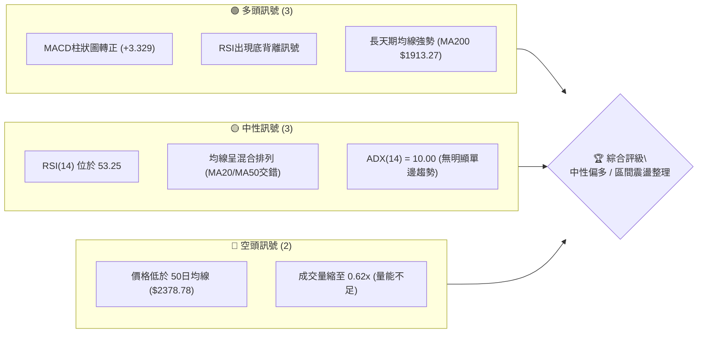
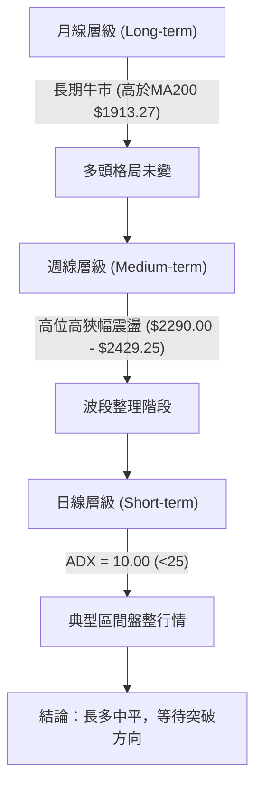
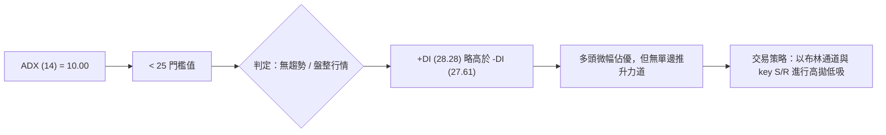
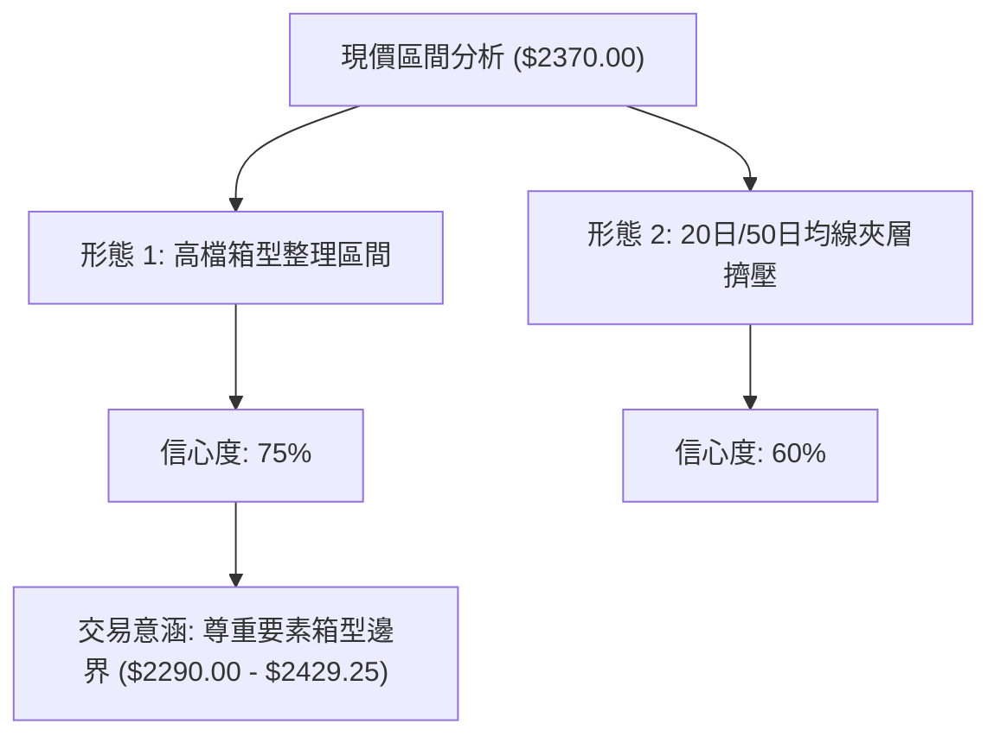
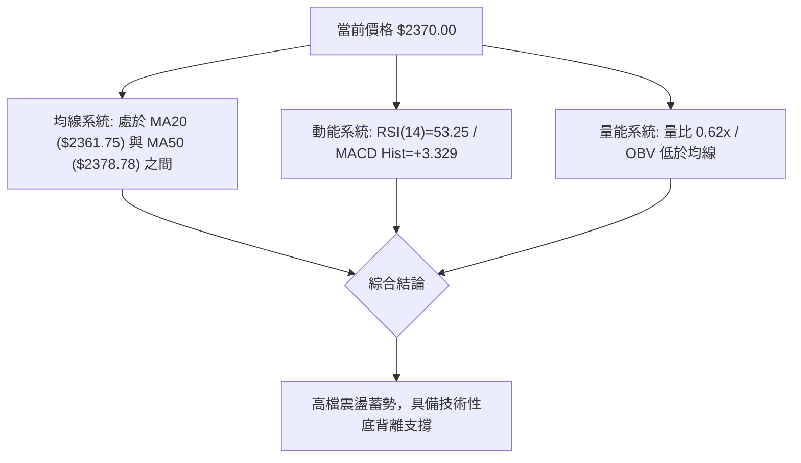
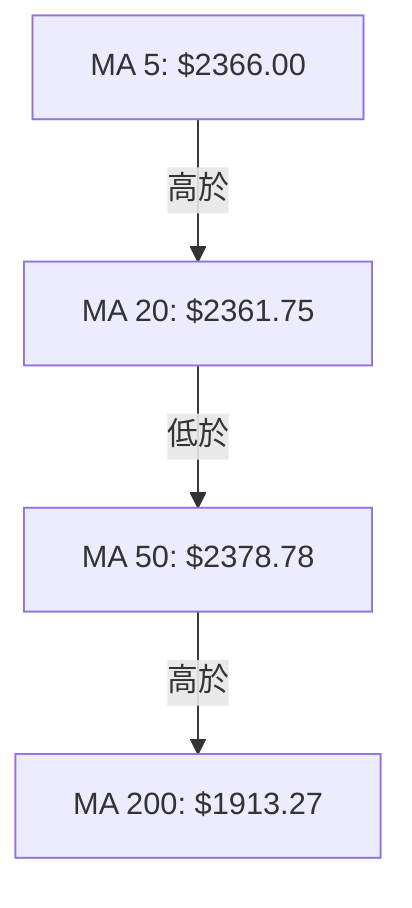
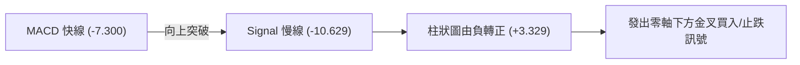
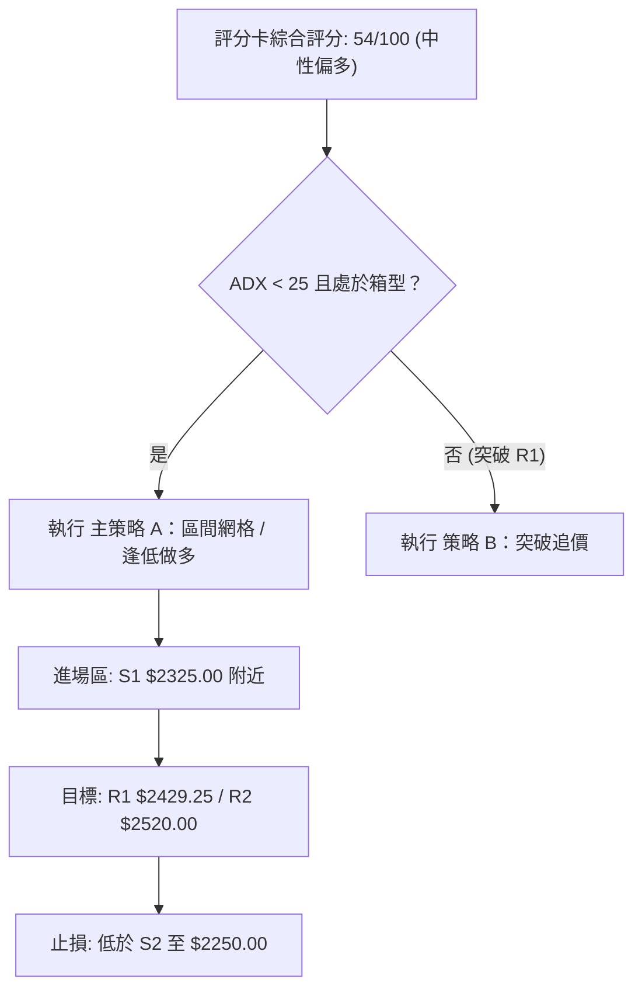
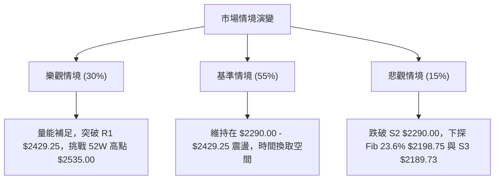

# 2330.TW 技術分析報告

> **報告日期**：2026-08-08 ｜ **語言**：繁體中文 ｜ **數據來源**：Yahoo Finance ｜ **當前價格**：$2370.00

---

## 目錄

| 章節 | 內容 |
|------|------|
| [1. 技術面概覽](#1-技術面概覽) | 訊號儀表板、核心指標、評分卡 |
| [2. 趨勢分析](#2-趨勢分析) | 多時框趨勢、長中短期走勢 |
| [3. 圖表形態分析](#3-圖表形態分析) | 形態識別、K線組合、目標價 |
| [4. 支撐與阻力](#4-支撐與阻力) | 關鍵價位、斐波那契回調 |
| [5. 技術指標深度解讀](#5-技術指標深度解讀) | MA/RSI/MACD/布林/成交量 |
| [6. 動能與波動率](#6-動能與波動率) | 動能評估、ATR、Beta |
| [7. 多時框架總結](#7-多時框架總結) | 時框架評分矩陣 |
| [8. 交易策略建議](#8-交易策略建議) | 多空策略、風險報酬比 |
| [9. 風險提示與監控](#9-風險提示與監控) | 監控指標、風險場景 |

---

## 1. 技術面概覽

### 🎯 技術訊號儀表板



### 📊 核心指標速覽表

| 指標類別 | 指標名稱 | 當前數值 | 訊號 | 解讀 |
|----------|----------|----------|------|------|
| **價格** | 當前價格 | $2370.00 | 🟡 中性 | 處於 52週高低點之 88.4% 高位區間 |
| **均線** | MA20 | $2361.75 | 🟢 看多 | 價格位於 20日均線上 (+$8.25 / +0.35%) |
| **均線** | MA50 | $2378.78 | 🔴 看空 | 價格位於 50日均線下 (-$8.78 / -0.37%) |
| **均線** | MA200 | $1913.27 | 🟢 看多 | 遠高於 200日均線 (+$456.73 / +23.87%) |
| **動能** | RSI(14) | 53.25 | 🟢 看多 | 中性偏多，具備底背離回升訊號 |
| **動能** | MACD | -7.300 / +3.329 | 🟢 看多 | MACD 柱狀圖轉正，多頭動能修復 |
| **動能** | ADX(14) | 10.00 | 🟡 中性 | 強度<25，處於盤整與區間消化階段 |
| **波動** | ATR(14) | $75.00 | 🟡 中性 | 日波動率約 3.16%，處於常態波動率 |
| **量能** | 20日量比 | 0.62x | 🔴 看空 | 當前量能 21,959,343，低於均量 35,476,345 |

### 🏆 技術評分卡

```
╔══════════════════════════════════════════════════════════════╗
║             技術評分卡 — 2330.TW (2026-08-08)                 ║
╠══════════════════════════════════════════════════════════════╣
║ 趨勢強度      ▓▓▓▓▓▓░░░░░░░░░░░░░░  30/100  🟡 盤整無強趨勢    ║
║ 動能指標      ▓▓▓▓▓▓▓▓▓▓▓▓░░░░░░░░  60/100  🟢 動能低位金叉    ║
║ 支撐穩定度    ▓▓▓▓▓▓▓▓▓▓▓▓▓▓▓░░░░░  75/100  🟢 S1/S2 結構紮實   ║
║ 成交量配合    ▓▓▓▓▓▓▓▓░░░░░░░░░░░░  40/100  🔴 量能顯著萎縮    ║
║ 形態完整度    ▓▓▓▓▓▓▓▓▓▓▓▓▓░░░░░░░  65/100  🟢 高位高狹幅整理  ║
║ 均線排列      ▓▓▓▓▓▓▓▓▓▓█░░░░░░░░░  55/100  🟡 中短期混亂/長期多║
╠══════════════════════════════════════════════════════════════╣
║ 綜合評分      ▓▓▓▓▓▓▓▓▓▓▓░░░░░░░░░  54/100  評級：中性偏多整理 ║
╚══════════════════════════════════════════════════════════════╝
```

---

## 2. 趨勢分析

### 🌐 多時框趨勢分析



### 📈 長期趨勢 — 12個月走勢圖（Unicode）

```
2330.TW 月線走勢圖（過去12個月：2025-08 至 2026-08）
價格軸 ($)
$2500 ┤                                        ●   ●
$2300 ┤                                    ●       ●←現價 $2370
$2100 ┤                                ●
$1900 ┤                        ●
$1700 ┤                    ●
$1500 ┤            ●   ●
$1300 ┤        ●
$1100 ┤●   ●
       └─┬───┬───┬───┬───┬───┬───┬───┬───┬───┬───┬───┬──
        08  09  10  11  12  01  02  03  04  05  06  07  08
        25  25  25  25  25  26  26  26  26  26  26  26  26
```

**走勢特徵分析表格**：

| 時間區間 | 起始價 | 終點價 | 漲跌幅 | 階段走勢特徵分析 |
|----------|--------|--------|--------|------------------|
| **2025/08 - 2025/10** | $1144.74 | $1486.19 | +29.83% | 強勢主升段啟動，快速突破千元大關 |
| **2025/11 - 2026/02** | $1426.74 | $1983.22 | +39.00% | 橫盤積蓄能量後展開第二次主升段 |
| **2026/03 - 2026/04** | $1755.32 | $2129.32 | +21.31% | 回踩波段低點後多頭迅速拉回 |
| **2026/05 - 2026/07** | $2348.73 | $2425.00 | +3.25%  | 衝高至歷史高點 $2535.00 附近後進入高檔消化 |
| **2026/08 (當前)**    | $2425.00 | $2370.00 | -2.27%  | 高位量縮盤整，守在 20日均線 ($2361.75) 之上 |

### 📊 中期趨勢（週線分析）

中期走勢顯示，價格自 2026 年 5 月突破 $2300.00 關卡後，主要交投區間被鎖定於阻力位 R1 ($2429.25) 與支撐位 S1 ($2325.00) 之間。最近 20 週數據顯示，RSI 在 40.2 至 86.4 之間振盪，目前週線 RSI 回升至 53.2，MACD 柱狀圖由負轉正至 +3.329，展現出高檔支撐極強、多頭具備下檔承接力道的特徵。

### ⚡ 趨勢強度評估（ADX 解讀）



| 指標名稱 | 當前數值 | 參考門檻 | 強度解讀 |
|----------|----------|----------|----------|
| **ADX(14)** | 10.00 | < 25 (弱趨勢/盤整) | 市場缺乏單邊方向性動能，屬於典型的區間消化格局 |
| **+DI** | 28.28 | > -DI | 多頭買盤力道維持在上方 |
| **-DI** | 27.61 | < +DI | 空頭賣壓並未失控，兩者差距極小 (0.67) |

---

## 3. 圖表形態分析

### 🔍 形態識別系統



| 形態類別 | 信心度 | 判斷依據（引用數據） | 完成度 | 目標價（附計算式） |
|----------|--------|----------------------|--------|--------------------|
| **高檔箱型整理** | **75%** | 上軌頂點受制於 R1 ($2429.25)，下軌守穩於 S2 ($2290.00) | 85% | 由箱型高度推算：$2429.25 + ($2429.25 - $2290.00) = **$2568.50** |
| **布林通道壓縮** | **60%** | BB 上軌 $2510.69 與下軌 $2212.81 逐漸收攏，%B = 0.53 | 70% | 向上突破對應 52W 高點 **$2535.00**；向下則測試 S3 **$2189.73** |

### 🕯️ 重要K線形態分析

| 日期/週別 | 收盤價 | K線形態 | 解讀 | 訊號 |
|-----------|--------|---------|------|------|
| **2026-07-19** | $2290.00 | 下影線回踩測試 | 成功觸及 S2 支撐位即獲逢低承接，確立強支撐 | 🟢 多頭支撐 |
| **2026-07-26** | $2350.00 | 溫和止跌陽線 | 止跌築底，RSI 從 40.2 開始回升 | 🟢 轉強訊號 |
| **2026-08-02** | $2425.00 | 衝高拉回陰線 | 向上測試 R1 ($2429.25) 未果，留上影線 | 🔴 阻力壓制 |
| **2026-08-09** | $2370.00 | 十字整理線 | 價格重回 20日均線 ($2361.75) 附近，多空均衡 | 🟡 觀望消化 |

### 📉 ASCII 走勢形態示意圖

```
高檔箱型整理形態示意圖 ($2290.00 - $2429.25)
───────────────────────────────────────────────────────────
$2429.25 ───┬───────────────● (波段高點 R1) ────────── 阻力邊界
            │              / \
            │             /   \      ●現價 $2370.00
            │            /     \    /
            │   ●       /       ●──/ (均線交錯區 $2361-$2378)
            │  / \     /
$2290.00 ───┴───┴────● (波段低點 S2) ────────────────── 支撐邊界
───────────────────────────────────────────────────────────
```

### 🎯 形態目標價計算

1. **向上突破箱型頂部 (R1 $2429.25)**：
   $$\text{形態高度} = R1 - S2 = \$2429.25 - \$2290.00 = \$139.25$$
   $$\text{測量目標價} = R1 + \text{形態高度} = \$2429.25 + \$139.25 = \$2568.50$$
   *註：因接近 52週高點 $2535.00，首要阻力仍以 R2 $2520.00 與 52W 高點為準。*

2. **向下跌破箱型底部 (S2 $2290.00)**：
   $$\text{測量下跌目標價} = S2 - \text{形態高度} = \$2290.00 - \$139.25 = \$2150.75$$
   *註：下檔接近 23.6% 斐波那契回調位 $2198.75 及 S3 $2189.73 區域。*

---

## 4. 支撐與阻力

### 🗺️ 關鍵價位分布圖（Unicode）

```
2330.TW 價位結構分布圖
═══════════════════════════════════════════════════════════
$2535.00 ║████████████████████████████████████║ 52週歷史高點
$2520.00 ║████████████████████████████████    ║ 強壓力 R2
$2510.69 ║▓▓▓▓▓▓▓▓▓▓▓▓▓▓▓▓▓▓▓▓▓▓▓▓▓▓▓▓▓▓▓▓    ║ 布林通道上軌
$2429.25 ║████████████████████████            ║ 關鍵阻力 R1
$2378.78 ║────────────────────────────────────║ 50日均線 (MA50)
$2370.00 ╠════════════════════════════════════╣ ◄ 當前價格
$2361.75 ║────────────────────────────────────║ 20日均線 (MA20)
$2325.00 ║▓▓▓▓▓▓▓▓▓▓▓▓▓▓▓▓                    ║ 近期支撐 S1
$2290.00 ║████████████████████████            ║ 強支撐 S2
$2212.81 ║▓▓▓▓▓▓▓▓▓▓▓▓▓▓▓▓▓▓▓▓                ║ 布林通道下軌
$2198.75 ║░░░░░░░░░░░░░░░░░░░░░░░░░░░░░░░░    ║ 斐波那契 23.6%
$2189.73 ║████████████████████████████████    ║ 長期防守位 S3
═══════════════════════════════════════════════════════════
```

### 🚧 阻力位分析表

| 阻力級別 | 價位 | 形成原因 | 突破難度 | 重要性 |
|----------|------|----------|----------|--------|
| **R1** | **$2429.25** | 近一年波段高點聚類、箱型整理頂部 | 🟡 中等 | 🟢🟢🟢 短線多空分水嶺 |
| **R2** | **$2520.00** | 近一年波段高點次高聚類、接近布林上軌 ($2510.69) | 🔴 較高 | 🟢🟢🟢🟢 波段轉強關卡 |
| **52W High** | **$2535.00** | 52週最高價，歷史極限賣壓區 | 🔴 極高 | 🟢🟢🟢🟢🟢 歷史新高天花板 |

### 🛡️ 支撐位分析表

| 支撐級別 | 價位 | 形成原因 | 守住機率 | 重要性 |
|----------|------|----------|----------|--------|
| **S1** | **$2325.00** | 近一年波段低點聚類、接近近期週線支撐 | 🟢 高 (75%) | 🟢🟢🟢 短線防守線 |
| **S2** | **$2290.00** | 波段密集低點聚類、箱型底層強防守 | 🟢 極高 (85%) | 🟢🟢🟢🟢 中線多頭底線 |
| **S3** | **$2189.73** | 波段低點聚類、接近 Fib 23.6% ($2198.75) | 🟢 極高 (90%) | 🟢🟢🟢🟢🟢 長線結構鐵板區 |

### 📐 斐波那契回調位分析

當前計算基準採用 52週區間：**低點 $1110.20 → 高點 $2535.00**（全波段漲幅 $1424.80）。

| 回調比例 | 計算價位 | 當前相對位置與技術意義 |
|----------|----------|------------------------|
| **0.0%** | **$2535.00** | 52週最高點，目前距離頂點約 -6.51% |
| **23.6%** | **$2198.75** | 強勢回調支撐位，與 S3 ($2189.73) 重疊形成強烈支撐共振帶 |
| **38.2%** | **$1990.73** | 中線分水嶺，接近 200日均線 ($1913.27) |
| **50.0%** | **$1822.60** | 多空中樞位置，接近 240日均線 ($1799.33) |
| **61.8%** | **$1654.47** | 黃金回調位，屬於極深幅度的回檔防線 |
| **78.6%** | **$1415.11** | 長線多頭最後防線 |
| **100.0%**| **$1110.20** | 52週最低點 |

**解讀**：當前價格 $2370.00 穩守於 23.6% 回調位 ($2198.75) 之上，顯示整體多頭大趨勢結構非常健康，僅處於高檔 0.0% ~ 23.6% 之間的極高位窄幅消化區間。

---

## 5. 技術指標深度解讀

### 🎛️ 指標訊號總覽



### 📈 移動平均線排列分析



| 均線名稱 | 當前價位 | 扣抵與走勢解讀 | 對價格影響 |
|----------|----------|----------------|------------|
| **MA5** | $2366.00 | 上升 (+0.17%)，短線價格回升至其上方 | 短線極輕微支撐 |
| **MA10** | $2329.00 | 上升 (+1.76%)，提供短線向上墊高動力 | 短線第一道支撐 |
| **MA20** | $2361.75 | 上升 (+0.35%)，現價落在 MA20 上方，扣抵低位 | 布林中軌支撐，維持多頭中樞 |
| **MA50** | $2378.78 | 扣抵高位，價格受制於其下方 (-0.37%) | 短線上方第一道動態阻力 |
| **MA200**| $1913.27 | 大幅上升 (+23.87%)，遠低於現價 | 長線牛市根基，絕對安全墊 |

### 📉 RSI(14) 分析

*   **當前數值**：**53.25** (中性溫和區間)
*   **進度條展示**：
    `0 [░░░░░░░░░░░░░░░▓▓▓▓▓▓▓▓▓▓░░░░░░░░░░] 100` （53.25%）
*   **背離分析**：數據顯示 RSI 存在 **🟢 底背離 (Bullish Divergence)**。價格在 7月中旬下探波段低點（近 S2 $2290.00）時，RSI 達到 40.2-43.1 低位，隨後價格重新震盪，RSI 率先回升至 53.25，指標低點墊高，預示下檔賣壓竭盡，短線蓄積反彈動能。

### 📊 MACD(12/26/9) 訊號解讀

*   **MACD 快線**：-7.300
*   **Signal 慢線**：-10.629
*   **MACD 柱狀圖**：**+3.329** (🟢 轉多)



### 📦 布林通道分析

```
布林通道現況示意圖 ($2370.00)
───────────────────────────────────────────────────────────
$2510.69 ────────────────────────────────────────────── 上軌 ( Upper )
                 
$2370.00 ─────────────────● (現價, %B = 0.53) ───────── 中軌上方
$2361.75 ────────────────────────────────────────────── 中軌 ( MA20 )
                 
$2212.81 ────────────────────────────────────────────── 下軌 ( Lower )
───────────────────────────────────────────────────────────
```

*   **上軌**：$2510.69
*   **中軌 (MA20)**：$2361.75
*   **下軌**：$2212.81
*   **%B 指標**：0.53（剛好位於中軌略上方，多空平衡）
*   **帶寬狀態**：通道呈現平行收窄狀態，屬於標準的震盪整理集氣形態。

### 💹 成交量分析（量價配合度）

*   **當前成交量**：21,959,343 股
*   **20日均量**：35,476,345 股（**量比 0.62x**）
*   **OBV 狀態**：OBV < MA，顯示量能處於遞減與疲弱狀態。
*   **解讀**：價格在高位震盪過程中量能顯著萎縮，反映市場觀望情緒濃厚，賣壓未放大，但多頭追高意願亦受限，突破 R1 ($2429.25) 必須要有 3500萬股以上的量能配合。

---

## 6. 動能與波動率

### ⚡ 動能評估四象限

| 象限區分 | 動能強度 | 波動率狀態 | 當前定位 | 策略解讀 |
|----------|----------|------------|----------|----------|
| **Q1: 攻擊區** | 強 (>60) | 低/中 | — | 強勢主升段 |
| **Q2: 蓄勢區** | **中/弱 (53.25)** | **低 (ATR 3.16%)** | **✓ (當前位置)** | **高檔壓縮，區間波段低買高賣** |
| **Q3: 警戒區** | 強 | 高 (>5%) | — | 擴大振盪，謹慎防範頂部 |
| **Q4: 衰退區** | 弱 (<40) | 高 | — | 空頭向下殺跌 |

### 📊 ATR 波動率分析

*   **ATR(14)**：$75.00
*   **ATR 占價格比**：3.16%
*   **止損與倉位設定建議**：
    *   **短線止損距離 (1.0x ATR)**：$75.00
    *   **波段止損距離 (1.5x - 2.0x ATR)**：$112.50 - $150.00
    *   若進場位在 S1 ($2325.00)，設定 1.0x ATR 止損價位剛好落在 $2250.00（低於 S2 $2290.00），防守效益極佳。

### 📐 Beta 與市場相關性

*   **Beta 係數**：**1.258**
*   **解讀**：相較於整體大盤（加權指數 Beta = 1.0），2330.TW 的波動性高出約 25.8%。在大盤強勢時具備領漲特質，但在盤整期則呈現出高位震盪特徵。

---

## 7. 多時框架總結

### 📋 時框架評分表

| 時框架 | 趨勢方向 | 動能 (RSI/MACD) | 均線排列 | 形態結構 | 綜合評分 | 建議策略 |
|--------|----------|-----------------|----------|----------|----------|----------|
| **月線 (Long)** | 🟢 多頭牛市 | 🟢 強勁 | 🟢 多頭發散 | 🟢 頂部高階整理 | **88/100** | 偏多持有 / 逢低加碼 |
| **週線 (Mid)** | 🟢 多頭整固 | 🟡 中性回升 | 🟢 MA20以上 | 🟢 高檔箱型 | **68/100** | 箱型區間低吸 |
| **日線 (Short)**| 🟡 區間盤整 | 🟢MACD柱轉正| 🟡 糾結(MA20/50)| 🟡 壓縮消化 | **54/100** | 嚴格區間高拋低吸 |

### 🔲 綜合訊號矩陣

```
╔══════════════════════════════════════════════════════════════╗
║                     多時框架訊號矩陣                          ║
╠══════════════════╦══════════════╦══════════════╦═════════════╣
║ 維度             ║ 短期 (日線)  ║ 中期 (週線)  ║ 長期 (月線) ║
╠══════════════════╬══════════════╬══════════════╬═════════════╣
║ 趨勢 (ADX/MA)    ║ 🟡 盤整 (10) ║ 🟢 多頭      ║ 🟢 多頭     ║
║ 動能 (RSI/MACD)  ║ 🟢 底背離金叉║ 🟡 中性      ║ 🟢 強勢     ║
║ 價位 (S/R)       ║ 🟡 接近中軸  ║ 🟢 守穩 S1   ║ 🟢 遠高於 S3║
║ 量能 (Volume)    ║ 🔴 縮量 0.62x║ 🟡 中等      ║ 🟢 充沛     ║
╠══════════════════╬══════════════╬══════════════╬═════════════╣
║ 時框架一致性     ║ 中度收斂 (中期與長期一致指向多頭，短期為修正)║
╚══════════════════╩══════════════╩══════════════╩═════════════╝
```

### ⚖️ 多時框收斂結論

依**多時框收斂規則**：當前日線 ADX(14) = 10.00 (<25)，市場明確處於**盤整行情**。
因此，短期交易應嚴格以**布林通道上下軌 ($2212.81 - $2510.69)** 與**箱型關鍵價位 S1/S2 與 R1/R2** 作為主要操作依據；而週線與月線的長多趨勢則為下檔支撐提供極高的安全墊，整體方向收斂為：**高檔區間震盪、逢支撐做多**。

---

## 8. 交易策略建議

### 🗺️ 策略決策流程圖



### 🧭 策略路由

**當前主策略方向 = 🟢 區間逢低做多 / 高檔網格操作（依綜合評分 54/100）**

因綜合評分處於 50-60 分區間，且 ADX 為 10.00，首選策略為以**箱型下軌與強支撐位做多**的波段交易；同時提供突破阻力位後的追價策略。

### 🎯 價格情境階梯 (Price Scenarios)

| 觸發條件 | 下一目標 | 後續延伸 | 情境含義 |
|----------|----------|----------|----------|
| **突破 R1 $2429.25** | R2 $2520.00 | 52W High $2535.00 | 短線向上突破箱型，多頭攻擊再起 |
| **站穩現價區間 ($2361 - $2378)**| R1 $2429.25 | — | 區間震盪消化，維持多空平衡 |
| **跌破 S1 $2325.00** | S2 $2290.00 | S3 $2189.73 | 測試箱型底層，回踩強支撐帶 |

### 📊 情境機率分佈

```
情境機率分佈預估
═════════════════════════════════════════════════════════
1. 區間震盪整理 (維持 $2290 - $2429) : ▓▓▓▓▓▓▓▓▓▓▓▓▓▓▓ 55%
2. 向上突破阻力 (挑戰 R1/R2/52W High): ▓▓▓▓▓▓▓▓░░░░░░░ 30%
3. 向下跌破支撐 (測試 S3/Fib 23.6%) : ▓▓▓▓░░░░░░░░░░░ 15%
═════════════════════════════════════════════════════════
```

### 🟢 主策略詳情

| 策略要素 | 策略 A：箱型下軌逢低做多 (首選) | 策略 B：突破 R1 追價多單 (次選) |
|----------|---------------------------------|---------------------------------|
| **進場條件** | 價格回踩至 S1 附近出現止跌訊號 | 帶量突破 R1 $2429.25 且收盤站穩 |
| **進場價格** | **$2325.00** (或現價 $2370 分批) | **$2435.00** |
| **目標價 T1** | **$2429.25** (R1 阻力位) | **$2520.00** (R2 阻力位) |
| **目標價 T2** | **$2520.00** (R2 阻力位) | **$2568.50** (形態測量目標) |
| **止損價格** | **$2250.00** (跌破 S2 $2290 約 1.0x ATR)| **$2378.78** (回跌至 MA50 下方) |
| **風險報酬比** | **1 : 1.39** (至 T1) / **1 : 2.60** (至 T2) | **1 : 1.51** (至 T1) / **1 : 2.37** (至 T2) |
| **成功機率** | **68%** | **55%** |
| **建議倉位** | **20% - 30%** | **15% - 20%** |

### 🔴 反向風險觸發點（對沖提示）

若收盤價無條件跌破 **S2 $2290.00** 且成交量放大，意味著高檔箱型整理失敗，短線將轉為向下尋求 **S3 $2189.73** 及 斐波那契 23.6% ($2198.75) 的支撐。此時多頭應立即止損離場或採取多頭對沖策略。

### ⭐ 整體訊號強度評星

```
做多訊號強度：★★★☆☆  (3.5/5星)  — 長多保護，短期底背離，但缺量
做空訊號強度：★★☆☆☆  (2.0/5星)  — 長期趨勢極強，做空勝率偏低
整體可信度：  ★★★★☆  (4.0/5星)  — 價位結構清晰，S/R 區間明確
```

---

## 9. 風險提示與監控

### ✅ 關鍵監控指標 Checklist

```
╔══════════════════════════════════════════════════════════════╗
║                    每日交易與風控監控清單                     ║
╠══════════════════════════════════════════════════════════════╣
║ [ ] 價位監控：是否突破 R1 ($2429.25) 或跌破 S1 ($2325.00)     ║
║ [ ] 量能監控：日成交量是否回升至 35,476,345 (20日均量) 以上   ║
║ [ ] 動能監控：MACD 柱狀圖 (+3.329) 是否持續放大正值           ║
║ [ ] 均線防守：價格是否穩守 20日均線 ($2361.75) 之上           ║
║ [ ] 指標背離：RSI (53.25) 是否持續向上穿越 60 關卡            ║
╚══════════════════════════════════════════════════════════════╝
```

### ⚠️ 風險場景分析



### 🛡️ 風險管理重要提醒

1. **量能不足風險**：當前量比僅 0.62x，缺乏大資金推升，切忌在 $2400.00 以上盲目追高，應堅持「拉回支撐進場」原則。
2. **波動率控制**：ATR 為 $75.00，代表日間正常波動幅度即達 75 元，合約或槓桿操作者需留足保證金，避免被正常噪聲掃出場。
3. **法人的態度**：外資/法人持股比重達 43.0%，高位整理期須持續觀察法人籌碼是否出現連續性賣超。

---

## 📋 報告總結

```
╔══════════════════════════════════════════════════════════════╗
║               2330.TW 技術分析報告總結                       ║
════════════════════════════════════════════════════════════════
報告日期：2026-08-08
當前價格：$2370.00
分析評級：⚖️ 中性偏多 / 高檔區間整理 (54/100)

關鍵結論：
├─ 長期趨勢：🟢 強勢多頭 (遠高於 MA200 $1913.27)
├─ 中期趨勢：🟢 箱型整理 ($2290.00 - $2429.25)
├─ 短期趨勢：🟡 縮量盤整 (ADX = 10.00)
├─ 關鍵支撐：S1 $2325.00 / S2 $2290.00 / S3 $2189.73
├─ 關鍵阻力：R1 $2429.25 / R2 $2520.00 / 52W High $2535.00
└─ 分析師目標：均價 $3126.75 (潛在空間 +31.93%)

最優策略組合：
1. 🥇 最佳機會：回踩 S1 $2325.00 附近佈局多單，目標看 R1 $2429.25。
2. 🥈 次選機會：帶量突破 R1 $2429.25 後追價多單，目標看 R2 $2520.00。
3. 🥉 嚴格風控：若收盤跌破 S2 $2290.00，應立即止損停損觀望。
════════════════════════════════════════════════════════════════
```

---

> ⚠️ **免責聲明**：本報告為 AI 自動生成之技術分析，所有數據及估算均基於提供的歷史價格資訊。本報告**僅供研究與學術參考**，**不構成任何投資建議**。投資有風險，入市需謹慎。

---

*報告生成時間：2026-08-08 ｜ 數據來源：Yahoo Finance ｜ 分析框架：多時框技術分析*