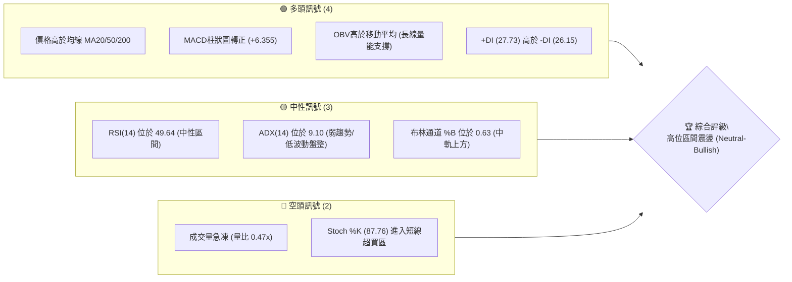
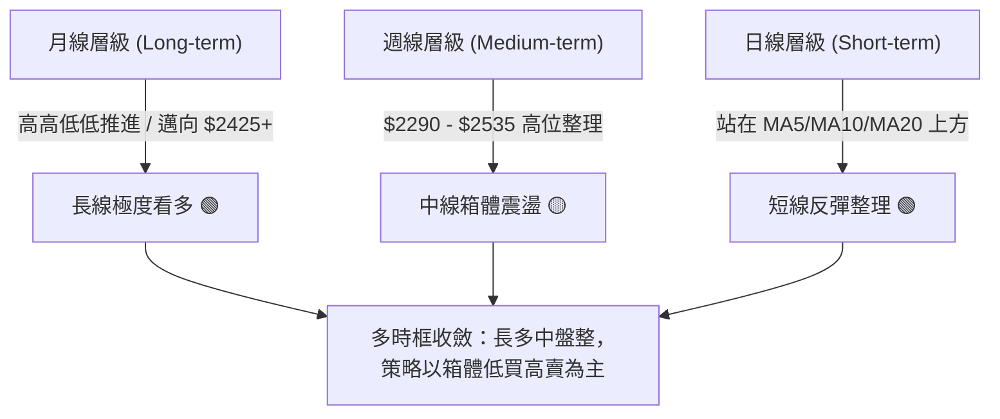
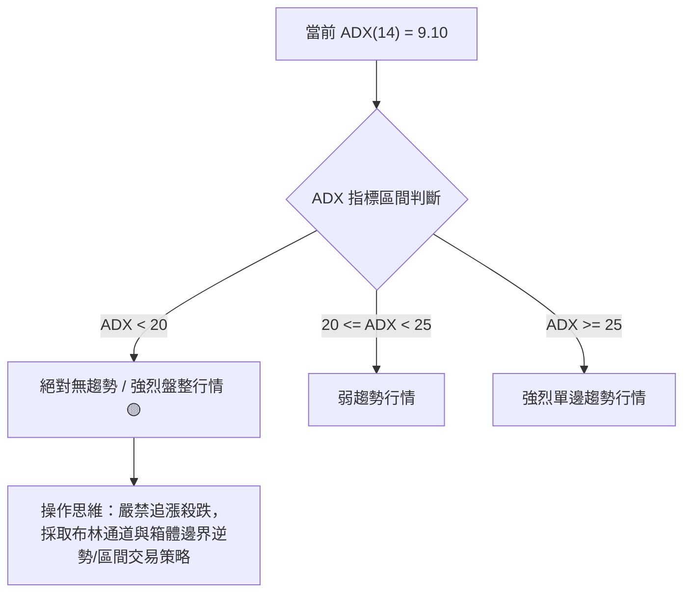
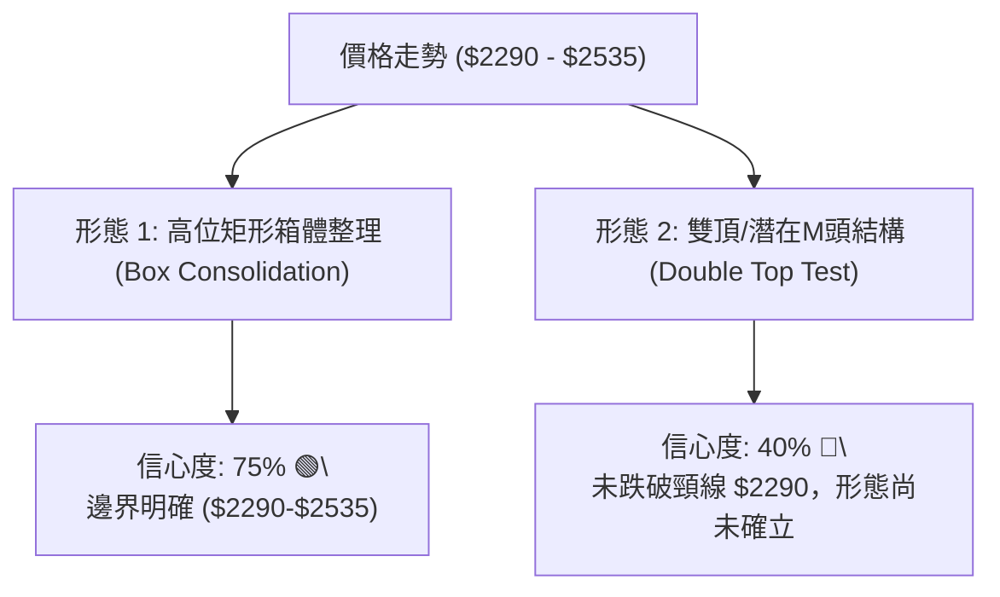
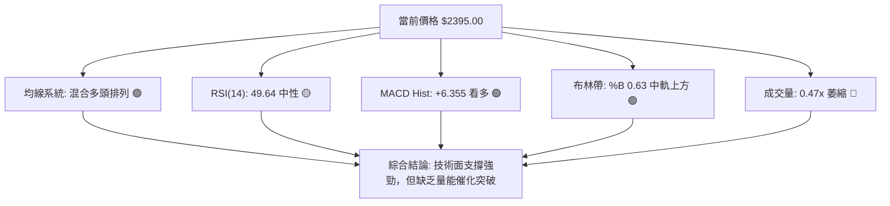
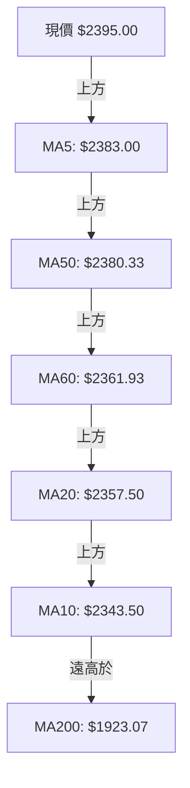
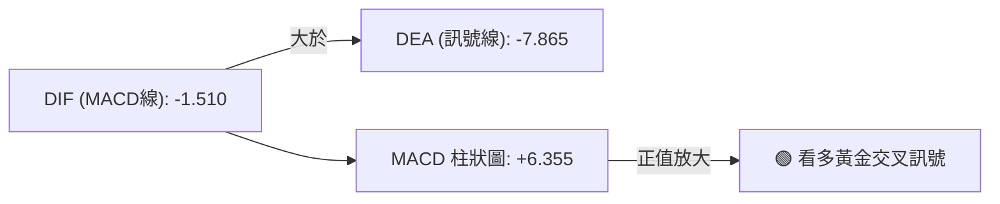
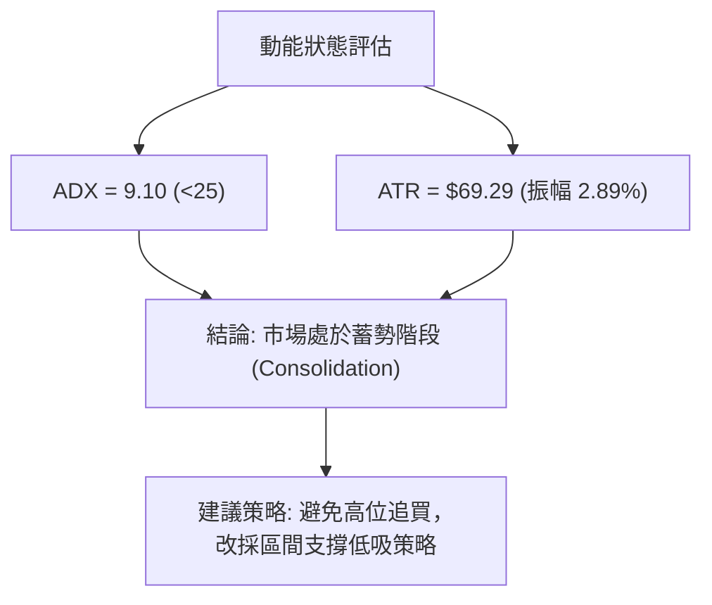
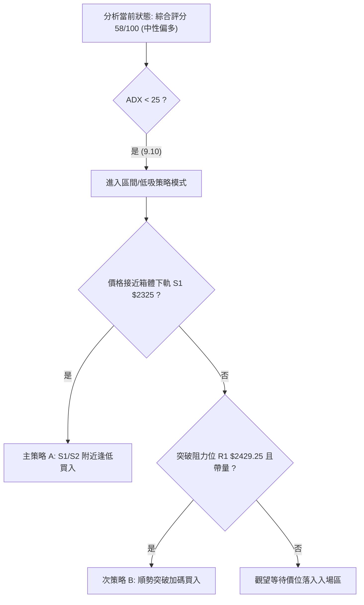
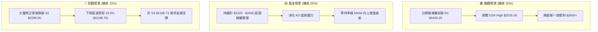

# 2330.TW 技術分析報告

> **報告日期**：2026-08-11 ｜ **語言**：繁體中文 ｜ **數據來源**：Yahoo Finance ｜ **當前價格**：$2395.00

---

## 目錄

| 章節 | 內容 |
|------|------|
| [1. 技術面概覽](#1-技術面概覽) | 訊號儀表板、核心指標、評分卡 |
| [2. 趨勢分析](#2-趨勢分析) | 多時框趨勢、長中短期走勢 |
| [3. 圖表形態分析](#3-圖表形態分析) | 形態識別、K線組合、目標價 |
| [4. 支撐與阻力](#4-支撐與阻力) | 關鍵價位、斐波那契回調 |
| [5. 技術指標深度解讀](#5-技術指標深度解讀) | MA/RSI/MACD/布林/成交量 |
| [6. 動能與波動率](#6-動能與波動率) | 動能評估、ATR、Beta |
| [7. 多時框架總結](#7-多時框架總結) | 時框架評分矩陣 |
| [8. 交易策略建議](#8-交易策略建議) | 多空策略、風險報酬比 |
| [9. 風險提示與監控](#9-風險提示與監控) | 監控指標、風險場景 |

---

## 1. 技術面概覽

### 🎯 技術訊號儀表板



### 📊 核心指標速覽表

| 指標類別 | 指標名稱 | 當前數值 | 訊號 | 解讀 |
|----------|----------|----------|------|------|
| **價格** | 當前價格 | $2395.00 | 🟢 多頭 | 處於 52 週區間高檔 90.2% 位置，離歷史高點僅 5.5% |
| **均線** | MA20 | $2357.50 | 🟢 多頭 | 價格位於 MA20 上方 (+1.59%)，短線獲得強支撐 |
| **均線** | MA50 | $2380.33 | 🟢 多頭 | 價格位於 MA50 上方 (+0.62%)，季線扣抵獲得企穩 |
| **均線** | MA200 | $1923.07 | 🟢 多頭 | 價格位於 MA200 上方 (+24.54%)，長線多頭結構穩固 |
| **動能** | RSI(14) | 49.64 | 🟡 中性 | 50 中性中軸徘徊，多空力量平衡，無超買超賣背離 |
| **動能** | MACD | -1.510 | 🟢 多頭 | MACD 柱狀圖呈 +6.355 正值，顯示短線黃金交叉修復 |
| **動能** | Stoch %K/%D | 87.76 / 78.31 | 🔴 空頭 | KD 指標雙雙高於 70，短線進入過熱超買區，慎防小回檔 |
| **趨勢** | ADX(14) | 9.10 | 🟡 中性 | ADX < 25 表示無強烈單邊趨勢，屬橫盤震盪行情 |
| **波動** | ATR(14) | $69.29 | 🟡 中性 | 日均波動率約 2.89%，屬於高價股合理振幅區間 |
| **成交量**| 最新量 / 20日均 | 15.9M / 33.8M | 🔴 空頭 | 量比僅 0.47x，量能顯著退潮，突破動能相對不足 |

### 🏆 技術評分卡

```
╔══════════════════════════════════════════════════════════════════╗
║                技術評分卡 — 2330.TW (2026-08-11)                 ║
╠══════════════════════════════════════════════════════════════════╣
║ 趨勢強度      ████░░░░░░░░░░░░░░░░  20/100  🟡 弱趨勢/低ADX      ║
║ 動能指標      ████████████░░░░░░░░  60/100  🟢 MACD轉正/RSI中性  ║
║ 支撐穩定度    ████████████████░░░░  80/100  🟢 月季線多重防線    ║
║ 成交量配合    ████████░░░░░░░░░░░░  40/100  🔴 量能萎縮/追高謹慎 ║
║ 形態完整度    ██████████████░░░░░░  70/100  🟢 高位矩形箱體結構  ║
║ 均線排列      ████████████████░░░░  80/100  🟢 長期均線完全多頭  ║
╠══════════════════════════════════════════════════════════════════╣
║ 綜合評分      ████████████░░░░░░░░  58/100  ⚖️ 中性偏多 (震盪)  ║
╚══════════════════════════════════════════════════════════════════╝
```

---

## 2. 趨勢分析

### 🌐 多時框趨勢分析



### 📈 長期趨勢 — 12個月走勢圖（Unicode）

以下為近 12 個月（2025-08 至 2026-08）收盤價歷史軌跡繪製之 ASCII 圖表：

```
2330.TW 月線走勢圖（2025-08 至 2026-08）
價格軸 ($)
$2500 ┤                                           ● 2425  ● 2395(現價)
$2300 ┤                                    ● 2348  
$2100 ┤                             ● 2129
$1900 ┤                      ● 1983
$1700 ┤               ● 1764
$1500 ┤        ● 1486
$1300 ┤ ● 1293
$1100 ┤● 1144 (歷史波段低點聚類)
      └────────────────────────────────────────────────────────
       08/25 09  10  11  12  01/26 02  03  04  05  06  07  08/26
```

#### 走勢特徵分析表

| 階段區間 | 起始/結束價格 | 漲跌幅 | 走勢特徵與技術解讀 |
|----------|────────────────|--------|────────────────────|
| **2025-08 ~ 2026-02** | $1144.74 → $1983.22 | **+73.2%** | 主升段行情，股價一路突破千元大關，均線呈現完美多頭排列。 |
| **2026-02 ~ 2026-03** | $1983.22 → $1755.32 | **-11.5%** | 高位獲利結調，回測 38.2% 斐波那契及 MA60 扣抵防線。 |
| **2026-03 ~ 2026-06** | $1755.32 → $2410.00 | **+37.3%** | 第二波主升段，突破 $2000 關卡並創下 $2535.00 歷史新高。 |
| **2026-06 ~ 2026-08** | $2410.00 → $2395.00 | **-0.62%** | 高位高檔震盪整理，價格鎖定在 $2290 - $2535 箱體內部。 |

### 📊 中期趨勢（週線分析）

從近 20 週數據來看：
- **高點聚類區**：$2445.00 - $2535.00（構成強烈上檔壓力區 R1-R2）。
- **低點防守區**：2026-07-19 週收盤跌至 $2290.00 後迅速獲得買盤承接，確認 $2290.00（S2）為中期關鍵頸線支撐。
- **週 RSI 軌跡**：從 2026-04 頂點 86.4 回落至當前 49.6，技術指標完成降溫，為下一波行情積蓄動能。

### ⚡ 趨勢強度評估（ADX 解讀）



| 指標項 | 當前數值 | 狀態 | 趨勢解讀 |
|--------|----------|------|----------|
| **ADX(14)** | **9.10** | 弱趨勢/盤整 | 屬於極低 ADX 讀數，說明當前市場處於無方向的盤整積蓄期。 |
| **+DI (多頭)** | **27.73** | 多頭佔優 | 多頭動能略高於空頭，但優勢不顯著。 |
| **-DI (空頭)** | **26.15** | 空頭拉鋸 | 與 +DI 僅差 1.58，顯示多空在 $2395 附近僵持。 |

---

## 3. 圖表形態分析

### 🔍 形態識別系統



#### 形態信心度與目標價計算表

| 形態名稱 | 信心度 | 判斷依據（引用數據） | 完成度 | 目標價計算公式與精確價位 |
|----------|--------|----------------------|--------|--------------------------|
| **高位矩形箱體** | **75%** | 上軌 $2535.00，下軌 $2290.00，價格多次於此區間來回 | 85% | 向上突破目標 = 頂部 $2535 + 箱體高 $245 = **$2780.00**（推算） |
| **雙頂形態 (潛在)** | **40%** | 前高 $2535.00 與 7月高點 $2445 未能創新高 | 30% | 跌破頸線 $2290.00 目標 = $2290 - $245 = **$2045.00**（推算） |
| **指標突破形態** | **65%** | 站上 MA20 ($2357.50) 且 MACD 柱狀圖轉正 (+6.355) | 70% | 向上測試阻力 R1 **$2429.25** 與 R2 **$2520.00** |

### 🕯️ 重要K線形態分析

| 月份/週期 | 收盤價 | K線形態 | 技術特徵與解讀 | 訊號 |
|-----------|--------|---------|----------------|------|
| **2026-06** | $2410.00 | 高位十字星 | 衝高至 $2535 歷史新高後拉回，顯示高檔獲利了結賣壓強烈。 | 🔴 轉弱預警 |
| **2026-07** | $2425.00 | 小陽錘子線 | 下探至 $2290 低點後獲得買盤強勢支撐，下影線長達 135 點。 | 🟢 底盤穩固 |
| **2026-08 (迄今)** | $2395.00 | 窄幅縮量實體 | 波動收縮，振幅收窄至 $2370-$2425，市場觀望氣氛濃後。 | 🟡 靜待突破 |

### 📉 ASCII 走勢形態示意圖

```
高位矩形箱體 (Box Consolidation) 結構示意圖
════════════════════════════════════════════════════════════
$2535.00 ─────────────▲─────────────────────────── 箱體上軌 (歷史天花板)
                     / \       ▲
$2429.25 ───────────/───\─────/─\─▲────────────── 關鍵阻力 R1
                   /     \   /   / \  ◄現價 $2395
$2357.50 ─────────/───────\─/───/───\──────────── 箱體中軸 (MA20)
                 /         ▼   /     \
$2290.00 ───────▼─────────────▼───────▼────────── 箱體下軌 (關鍵頸線支撐 S2)
════════════════════════════════════════════════════════════
```

---

## 4. 支撐與阻力

### 🗺️ 關鍵價位分布圖（Unicode）

```
2330.TW 價位結構分布圖
════════════════════════════════════════════════════════════
$2535.00 ║████████████████████████████████║ 52W High (歷史最高價)
$2520.00 ║████████████████████████████    ║ 阻力位 R2 (+5.22%)
$2429.25 ║████████████████████████        ║ 阻力位 R1 (+1.43%)
$2395.00 ╠════════════════════════════════╣ ◄ 當前價格 (現價)
$2325.00 ║▓▓▓▓▓▓▓▓▓▓▓▓▓▓▓▓▓▓▓▓            ║ 支撐位 S1 (-2.92%)
$2290.00 ║████████████████████████████    ║ 強支撐 S2 (-4.38%)
$2198.75 ║▓▓▓▓▓▓▓▓▓▓▓▓▓▓▓▓▓▓▓▓▓▓▓▓▓▓▓▓▓▓  ║ 斐波那契 23.6% 回調位
$2189.73 ║████████████████████████████████║ 關鍵支撐 S3 (-8.57%)
════════════════════════════════════════════════════════════
```

### 🚧 阻力位分析表

*註：價位嚴格引用 OHLCV 計算之數據。*

| 阻力級別 | 精確價位 | 形成原因與背景 | 突破難度 | 重要性 |
|----------|----------|────────────────|----------|--------|
| **R1** | **$2429.25** | 近一年波段高點聚類解套賣壓區（離現價 +1.43%） | 🟡 中等 | 短線多空分水嶺，突破方能挑戰新高 |
| **R2** | **$2520.00** | 歷史高點前夕最後阻力聚類（離現價 +5.22%） | 🔴 高 | 中期強阻力，需大成交量配合突破 |
| **52W High** | **$2535.00** | 歷史極限高點（2026 年天花板） | 🔴 極高 | 技術面與心理面終極關卡 |

### 🛡️ 支撐位分析表

*註：價位嚴格引用 OHLCV 計算之數據。*

| 支撐級別 | 精確價位 | 形成原因與背景 | 守住機率 | 重要性 |
|----------|----------|────────────────|----------|--------|
| **S1** | **$2325.00** | 近一年波段低點聚類，接近 MA10/MA20 買盤區 | 🟢 80% | 短線拉回第一買點與防守線 |
| **S2** | **$2290.00** | 2026年7月波段極限低點，高位箱體下軌頸線 | 🟢 85% | 中期多空生命線，失守將轉為中期修正 |
| **S3** | **$2189.73** | 密集的波段低點支撐聚類，疊加斐波那契 23.6% | 🟢 92% | 長線強固防線，強烈價值投資买點 |

### 📐 斐波那契回調位分析

基於 52 週波段區間：低點 **$1110.20** ➔ 高點 **$2535.00**（振幅 $1424.80）。

```
斐波那契回調層級結構：
100.0% ($2535.00) ─── 歷史高點
 23.6% ($2198.75) ─── 當前第一道長線黃金支撐 (現價 $2395 位於其上方)
 38.2% ($1990.73) ─── 接近 MA200 ($1923.07) 強重疊區
 50.0% ($1822.60) ─── 中期多空平分線
 61.8% ($1654.47) ─── 黃金分割率回調位
```

- **位置解讀**：當前價格 **$2395.00** 位於 0.0% ($2535.00) 與 23.6% ($2198.75) 之間的超強多頭領域。
- **結構意義**：股價連 23.6% 回調位都沒有跌破，證明整體中長期趨勢依然處於強勢主升段後的正常高位整理，並未進入深幅修正。

---

## 5. 技術指標深度解讀

### 🎛️ 指標訊號總覽



### 📈 移動平均線排列分析



#### 均線數據比較

| 均線名稱 | 價位 | 離現價距離 | 均線走勢 | 解讀 |
|----------|------|------------|----------|------|
| **MA5** | $2383.00 | +0.50% | ▲ 向上 | 極短線支撐，價格站在 MA5 上 |
| **MA10** | $2343.50 | +2.20% | ▲ 向上 | 短線急攻防線 |
| **MA20** | $2357.50 | +1.59% | ▲ 向上 | 月線支撐，布林中軌所在 |
| **MA50** | $2380.33 | +0.62% | ▲ 向上 | 季線防禦，多頭扣抵順暢 |
| **MA120** | $2178.13 | +9.96% | ▲ 向上 | 半年線防線，中長線趨勢基石 |
| **MA200** | $1923.07 | +24.54% | ▲ 向上 | 年線牛熊分水嶺，呈斜率陡峭向上 |

*均線評價*：短期均線（MA5、MA10、MA20、MA50）高度纏繞於 $2340-$2385 區間，此為典型的**變盤前夕均線糾合形態**，預示近期將有方向性突破。

### 📉 RSI(14) 分析

- **當前數值**：`49.64`
- **強度進度條**：`██████████░░░░░░░░░░ 49.64%` (位於 30-70 中性區間)
- **超買超賣判斷**：無超買或超賣現象，多空平衡。
- **背離分析**：
  - **日線/週線背離檢查**：近 8 週股價於 $2290-$2425 震盪，RSI 在 40.2 - 60.8 之間同步來回，未發現日線或週線級別的「頂背離」或「底背離」。指標與價格走勢保持高度一致。

### 📊 MACD(12/26/9) 訊號解讀



- **MACD 線**：-1.510
- **Signal 線**：-7.865
- **MACD 柱狀圖**：+6.355
- **解讀**：DIF 已經由下往上穿越 DEA，柱狀圖呈現綠轉紅（正值 +6.355），顯示短線下跌動能竭盡，多頭重新掌權，屬於標準的**低位黃金交叉修復訊號**。

### 📦 布林通道分析

```
布林通道現狀示意圖：
╔══════════════════════════════════════════════════════════════╗
║ BB 上軌:   $2500.35  (壓力位)                                ║
║            │                                                 ║
║            │  ▲ 現價: $2395.00 (%B = 0.63)                    ║
║            │                                                 ║
║ BB 中軌:   $2357.50  (MA20 支撐)                             ║
║            │                                                 ║
║ BB 下軌:   $2214.65  (強支撐)                                ║
╚══════════════════════════════════════════════════════════════╝
```

- **通道帶寬**：上軌 $2500.35 - 下軌 $2214.65 = $285.70（約為價格的 11.9%），通道處於收窄狀態。
- **%B 指標**：0.63，顯示價格運行於中軌（$2357.50）與上軌（$2500.35）之間，偏向多頭試探。

### 💹 成交量分析（量價配合度）

- **最新成交量**：15,907,911 股
- **20日均量**：33,789,063 股（**量比 0.47x**）
- **OBV (能量潮)**：OBV > MA，長線資金未見流出。
- **量價診斷**：
  - 目前呈現典型的**「價漲量縮」**與高位橫盤惜售特徵。
  - 縮量說明籌碼高度穩定，法人與大戶未大量出貨；但若要攻克 R1（$2429.25）及 R2（$2520.00），成交量必須回升至 20 日均量（33.8M）以上方為有效突破。

---

## 6. 動能與波動率

### ⚡ 動能評估

根據 ADX = 9.10（弱趨勢）與短線 ATR 波動率，定位當前市場狀態：

| 象限 | 動能強度 | 波動率 | 當前狀態 | 技術診斷與操作哲學 |
|------|----------|--------|----------|────────────────────|
| **Q1** | 強 | 低 | — | 最佳趨勢續航區 |
| **Q2 (當前)**| **弱** | **低** | **✓** | **高位沉悶整理區：價位在高檔，但振幅收縮、ADX低，宜低買高賣** |
| **Q3** | 強 | 高 | — | 高風險高收益突破區 |
| **Q4** | 弱 | 高 | — | 無序劇烈震盪區 |



### 📊 ATR 波動率分析

- **ATR(14)**：$69.29（佔價格 2.89%）。
- **止損距離建議**：
  - **保守型止損 (2.0 x ATR)**：$69.29 × 2 = **$138.58**（建議止損設於進場價下方 $138.58）。
  - **激進型止損 (1.0 x ATR)**：$69.29 × 1 = **$69.29**。

### 📐 Beta 與市場相關性

- **Beta**：1.258
- **市場解讀**：作為台股與半導體權值龍頭，2330.TW 波動度較大盤高出約 25.8%。當大盤反彈時，其具備強於大盤之槓桿效應。

---

## 7. 多時框架總結

### 📋 時框架評分表

| 時框架 | 趨勢方向 | 動能 (RSI/MACD) | 均線排列 | 形態結構 | 綜合評分 | 建議 |
|--------|----------|-----------------|----------|----------|----------|------|
| **月線 (Long)** | 🟢 強勢看多 | RSI 70+ 多頭 | 完全多頭排列 | 主升段進行中 | **85/100** | 長線堅定持有 |
| **週線 (Medium)**| 🟡 箱體震盪 | RSI 49.6 中性 | 5/10/20週糾合 | 高位矩形箱體 | **60/100** | 區間波段操作 |
| **日線 (Short)** | 🟢 短線反彈 | MACD柱狀轉正 | 站上 MA5/10/20 | 縮量築底回升 | **58/100** | 尋找支撐低吸 |

### 🔲 綜合訊號矩陣

```
╔══════════════════════════════════════════════════════════════════╗
║                   多時框訊號收斂矩陣                             ║
╠═════════════════┬════════════════════════════════════════════════╣
║ 長期 (月線)     │ 🟢 多頭主導 (MA200 = $1923.07 遙遙領先)         ║
║ 中期 (週線)     │ 🟡 箱體震盪 ($2290.00 - $2535.00)                 ║
║ 短期 (日線)     │ 🟢 止跌微反彈 (MACD Hist = +6.355)              ║
╠═════════════════╧════════════════════════════════════════════════╣
║ 多時框收斂結論：                                                 ║
║ 由於 ADX = 9.10 (<25)，市場由「中期箱體震盪」主導。依多時框規則：║
║ 日線的反彈屬於箱體內的整理波，策略應嚴格遵循箱體下軌 S1/S2      ║
║ 進行低吸，並於上軌 R1/R2 進行減碼獲利結算。                      ║
╚══════════════════════════════════════════════════════════════════╝
```

---

## 8. 交易策略建議

### 🗺️ 策略決策流程圖



### 🧭 策略路由

> **當前主策略方向 = 🟢 偏多區間操作與逢低布局（依綜合評分 58/100）**

由于 ADX < 25 且股價運行於 $2290 - $2535 大箱體內部，目前不宜高位盲目追高，首選策略為**「箱體下軌支撐逢低承接」**，次選策略為**「帶量突破 R1 後順勢追擊」**。

### 🎯 價格情境階梯（Price Scenarios）

| 觸發條件 | 下一目標價 | 後續延伸目標 | 情境含義與操作指引 |
|----------|------------|--------------|────────────────────|
| **帶量突破 R1 $2429.25** | R2 **$2520.00** | 52W High **$2535.00** | 短線轉強，多頭攻勢重啟 |
| **突破 52W High $2535.00** | **$2603.00** *(註)* | **$2780.00** *(形態推算)* | 創歷史新高，開啟新一輪主升段 |
| **價格回落至 S1 $2325.00** | S2 **$2290.00** | S3 **$2189.73** | 測試箱體下軌，優質低吸買點 |
| **跌破 S2 $2290.00** | S3 **$2189.73** | Fib 38.2% **$1990.73** | 中期結構破壞，轉為深幅修正 |

*註：$2603.00 計算式為 R2 $2520.00 + (ATR $69.29 × 1.2) = $2603.15。*

### 📊 情境機率分佈

| 情境劇本 | 機率估計 | 主要依據 |
|----------|----------|----------|
| **高位箱體震盪 (Low Volatility Range)** | **55%** | ADX(14) 僅 9.10，成交量大幅萎縮 (0.47x)，短線缺乏突破大量。 |
| **震盪向上突破 (Bullish Breakout)** | **30%** | MACD 柱狀圖轉正 (+6.355)，長期均線多頭排列且基本面勁揚。 |
| **回落測試 S3/半年線 (Correction)** | **15%** | Stoch %K (87.76) 超買，若大盤拉回可能回測 S3 ($2189.73)。 |

### 🟢 主策略詳情

*註：所有進出場位嚴格引用 OHLCV 算定之數據。*

| 策略要素 | 策略 A：箱體下軌逢低買入（主推） | 策略 B：帶量突破順勢追買（次選） |
|----------|──────────────────────────────────|──────────────────────────────────|
| **進場條件** | 價格拉回至 S1 附近且日線企穩 | 價格強勢收高於 R1 $2429.25 且成交量 > 33.8M |
| **進場價格** | **$2325.00**（引用 S1） | **$2435.00**（突破 R1 $2429.25 後） |
| **目標價 T1** | **$2429.25**（引用 R1） | **$2520.00**（引用 R2） |
| **目標價 T2** | **$2520.00**（引用 R2） | **$2603.00**（R2 + 1.2x ATR） |
| **止損價格** | **$2270.00**（跌破 S2 $2290.00 下方 20 點）| **$2380.00**（跌破 MA50 $2380.33） |
| **風險報酬比**| **1.90 : 1** (T1) / **3.55 : 1** (T2) | **1.55 : 1** (T1) / **3.05 : 1** (T2) |
| **勝率預估** | **68%** | **55%** |
| **建議倉位** | **20% - 30%** | **15% - 20%** |

#### 策略 A 風險報酬比計算詳解：
- **買入**：$2325.00
- **風險 (Risk)**：$2325.00 - $2270.00 = **$55.00**
- **報酬 T1 (Reward 1)**：$2429.25 - $2325.00 = **$104.25** ➔ **R:R = 104.25 / 55 = 1.90**
- **報酬 T2 (Reward 2)**：$2520.00 - $2325.00 = **$195.00** ➔ **R:R = 195.00 / 55 = 3.55**

### 🔴 反向風險觸發點（對沖與風控提示）

若發生以下情況，多頭主策略失效，應全面轉為防守或減碼對沖：
1. **收盤價跌破 S2 $2290.00**：代表箱體下軌破位，短線多頭結構瓦減。
2. **日成交量放大至 50,000,000 股以上且收長黑K**：代表主力高位出貨。

### ⭐ 整體訊號強度評星

```
做多訊號強度：★★──────  (2.5/5星 - 缺乏量能，但支撐穩固)
做空訊號強度：★───────  (1.5/5星 - 長線多頭極強，做空風險極高)
整體可信度：  ★★★☆☆  (3.5/5星 - 指標收斂，等待量能催化)
```

---

## 9. 風險提示與監控

### ✅ 關鍵監控指標 Checklist

```
╔══════════════════════════════════════════════════════════════════╗
║                     每日/每週技術面監控清單                      ║
╠══════════════════════════════════════════════════════════════════╣
║ [ ] 1. 價格是否守穩 MA20 ($2357.50) 與 MA50 ($2380.33) ?         ║
║ [ ] 2. 成交量能否回升至 20日均量 (33,789,063 股) 之上 ?         ║
║ [ ] 3. MACD 柱狀圖能否持續維持正值 (+6.355 以上) ?              ║
║ [ ] 4. Stoch %K 是否從超買區 (87.76) 出現死叉回落 ?              ║
║ [ ] 5. 價格試探 R1 ($2429.25) 時是否有假突破現象 ?              ║
╚══════════════════════════════════════════════════════════════════╝
```

### ⚠️ 風險場景分析



### 🛡️ 風險管理重要提醒

1. **量能不足風險**：當前量比僅 0.47x，無量上漲容易形成「誘多假突破」，切忌在接近 R1（$2429.25）時追高。
2. **波動度防護**：當前 ATR 為 $69.29，代表單日正常振幅即達近 70 點，止損設定切勿過窄，建議至少給予 1.5 - 2.0 倍 ATR（$100 - $140 點）緩衝空間。
3. **資金管理**：鑑於 ADX < 25 處於橫盤階段，總持倉比率建議控制在 30%-50% 中性水平，保留現金待突破確認後再行加碼。

---

## 📋 報告總結

```
╔══════════════════════════════════════════════════════════════════╗
║               2330.TW 技術分析報告總結                           ║
════════════════════════════════════════════════════════════════════
報告日期：2026-08-11
當前價格：$2395.00
分析評級：⚖️ 中性偏多 / 高位區間整理 (Neutral-Bullish Consolidation)

關鍵結論：
├─ 長期趨勢：🟢 極度看多 (站在 MA200 $1923.07 上方 +24.5%)
├─ 中期趨勢：🟡 箱體震盪 (運行於 $2290.00 - $2535.00 區間)
├─ 短期趨勢：🟢 反彈修復 (MACD 柱狀圖轉正 +6.355)
├─ 關鍵支撐：S1 $2325.00 / S2 $2290.00 / S3 $2189.73
├─ 關鍵阻力：R1 $2429.25 / R2 $2520.00 / 52W High $2535.00
└─ 分析師目標：平均 $3141.60 (最高 $4200.00)

最優策略組合：
1. 🥇 最佳機會：箱體下軌低吸（等待價格回落至 S1 $2325 附近布局）
2. 🥈 次選機會：突破追擊（待帶量突破 R1 $2429.25 順勢加碼）
3. 🥉 風控防線：收盤跌破 S2 $2290.00 嚴格執行止損
╚══════════════════════════════════════════════════════════════════╝
```

---

> ⚠️ **免責聲明**：本報告為 AI 自動生成之技術分析，所有數據及估算均基於提供的歷史價格資訊。本報告**僅供研究與學術參考**，**不構成任何投資建議**。投資有風險，入市需謹慎。

---

*報告生成時間：2026-08-11 ｜ 數據來源：Yahoo Finance ｜ 分析框架：多時框技術分析*