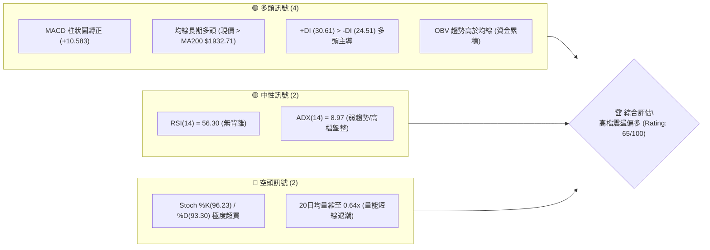
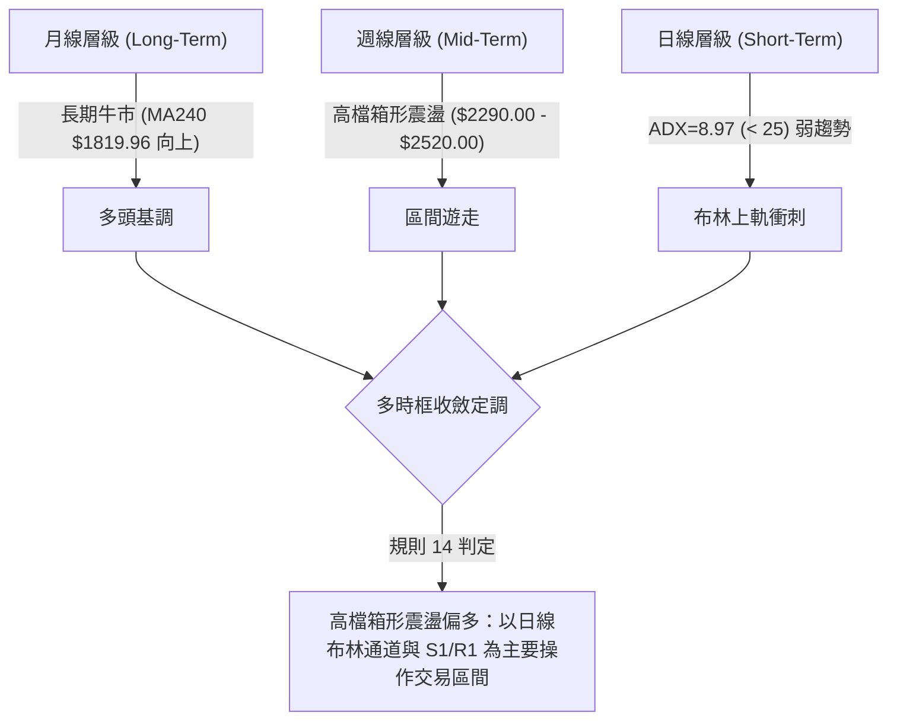
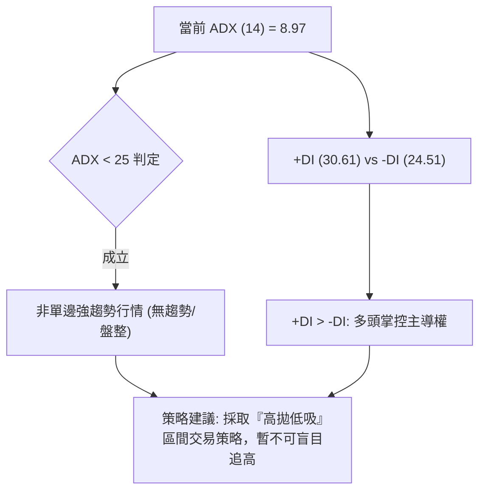
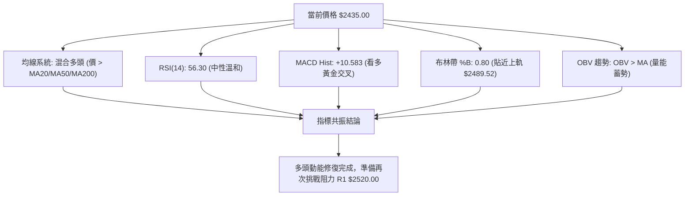
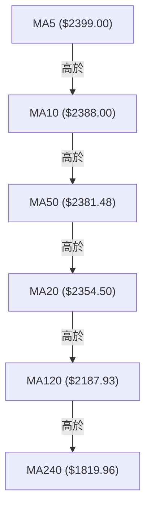
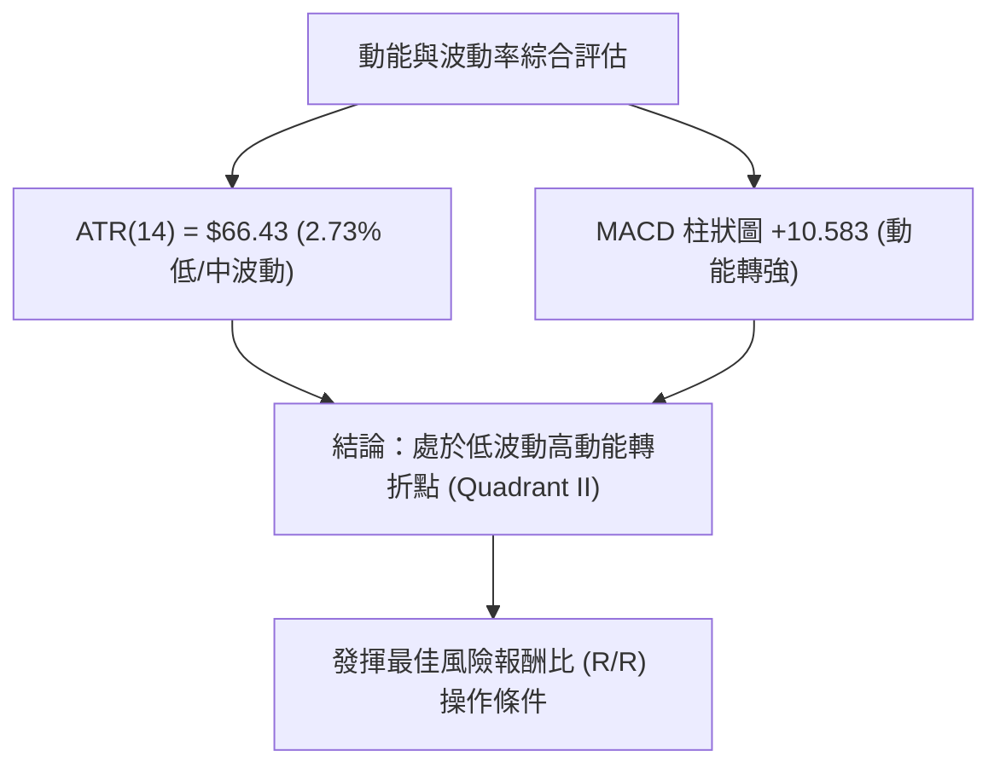
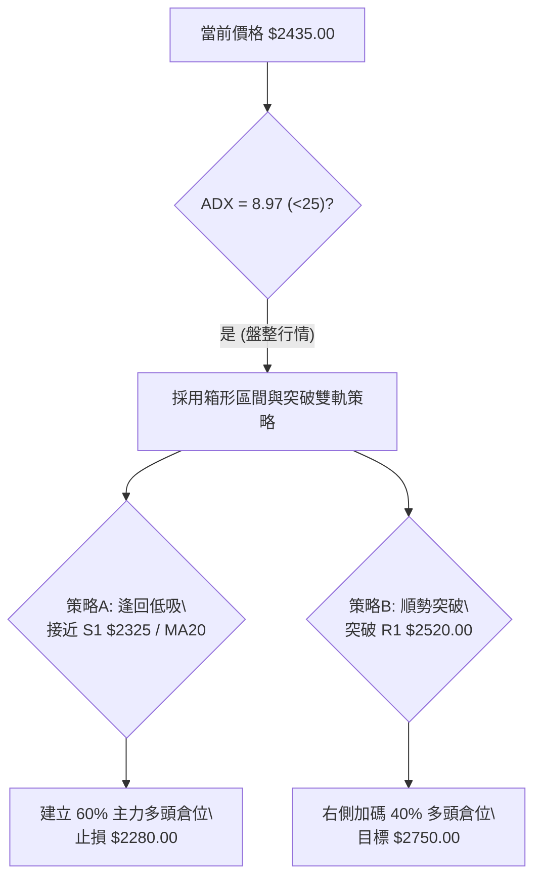
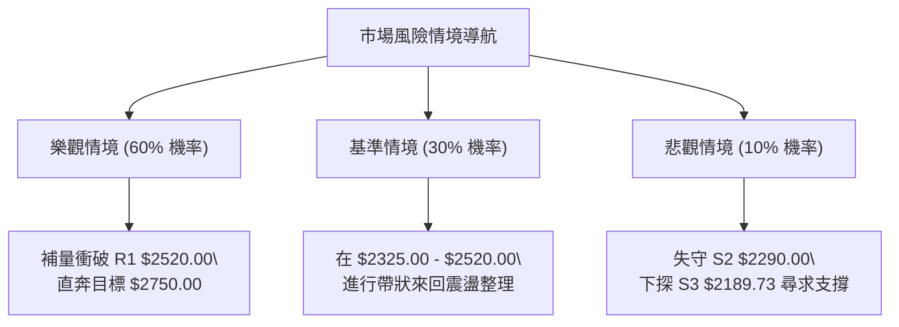

# 2330.TW 技術分析報告

> **報告日期**：2026-08-13 ｜ **語言**：繁體中文 ｜ **數據來源**：Yahoo Finance ｜ **當前價格**：$2435.00

---

## 目錄

| 章節 | 內容 |
|------|------|
| [1. 技術面概覽](#1-技術面概覽) | 訊號儀表板、核心指標、評分卡 |
| [2. 趨勢分析](#2-趨勢分析) | 多時框趨勢、長中短期走勢 |
| [3. 圖表形態分析](#3-圖表形態分析) | 形態識別、K線組合、目標價 |
| [4. 支撐與阻力](#4-支撐與阻力) | 關鍵價位、斐波那契回調 |
| [5. 技術指標深度解讀](#5-技術指標深度解讀) | MA/RSI/MACD/布林/成交量 |
| [6. 動能與波動率](#6-動能與波動率) | 動能評估、ATR、Beta |
| [7. 多時框架總結](#7-多時框架總結) | 時框架評分矩陣 |
| [8. 交易策略建議](#8-交易策略建議) | 多空策略、風險報酬比 |
| [9. 風險提示與監控](#9-風險提示與監控) | 監控指標、風險場景 |

---

## 1. 技術面概覽

### 🎯 技術訊號儀表板



### 📊 核心指標速覽表

| 指標類別 | 指標名稱 | 當前數值 | 訊號 | 解讀 |
|----------|----------|----------|------|------|
| **價格** | 當前價格 | $2435.00 | 🟢 | 位於52週高低區間 93.0% 極高位 |
| **均線** | MA20 | $2354.50 | 🟢 | 價格位於月線上方 (+3.42%)，提供短線支撐 |
| **均線** | MA50 | $2381.48 | 🟢 | 價格位於季線上方 (+2.25%)，中期多頭結構 |
| **均線** | MA200 | $1932.71 | 🟢 | 價格大幅高於年線 (+25.99%)，長期牛市確立 |
| **動能** | RSI(14) | 56.30 | 🟡 | 中性健康區間，無超買或頂背離疑慮 |
| **動能** | MACD(12,26,9) | Hist: +10.583 | 🟢 | DIF(7.466) 突破 DEA(-3.117)，發出黃金交叉買入訊號 |
| **動能** | Stoch %K / %D | 96.23 / 93.30 | 🔴 | 進人高檔過熱區，需防範短線獲利回吐 |
| **趨勢** | ADX(14) | 8.97 | 🟡 | ADX < 25 指示當前處於無強烈單邊趨勢的箱形震盪 |
| **波動** | ATR(14) | $66.43 | 🟢 | 日波動率 2.73%，屬於正常穩定波動範圍 |
| **通道** | 布林帶 %B | 0.80 | 🟢 | 價格位於中軌 ($2354.50) 與上軌 ($2489.52) 之間 |
| **成交量**| 量比 (20日) | 0.64x | 🔴 | 當前成交量 (21.18M) 低於均量 (32.91M)，攻勢欠缺量能 |

### 🏆 技術評分卡

```
技術評分卡 — 2330.TW (2026-08-13)
════════════════════════════════════════════════════
趨勢強度 (ADX) ███████░░░░░░░░░░░░░  35/100  🟡 盤整格局
動能指標 (MACD/RSI) ██████████████░░░░░░  70/100  🟢 黃金交叉
支撐穩定度 (S1/S2)  ████████████████░░░░  80/100  🟢 買盤堅實
成交量配合 (OBV/Vol)██████████░░░░░░░░░░  50/100  🟡 量縮整理
形態完整度 (Box Range)██████████████░░░░  70/100  🟢 結構清晰
均線排列 (MA System) ████████████████░░░░  80/100  🟢 多頭占優
════════════════════════════════════════════════════
綜合評分           █████████████░░░░░░░  65/100  🟢 偏多震盪
════════════════════════════════════════════════════
```

---

## 2. 趨勢分析

### 🌐 多時框趨勢分析



### 📈 長期趨勢 — 12個月走勢圖（Unicode）

```
2330.TW 月線走勢圖（2025-08 至 2026-08）
價格軸 ($)
$2500 ┤                                           ● 2425  ● 2435 (現價)
$2400 ┤                                     ● 2410
$2200 ┤                               ● 2348
$2000 ┤                   ● 1983  ● 2129
$1800 ┤             ● 1764    ● 1755
$1500 ┤       ● 1486    ● 1540
$1300 ┤ ● 1292    ● 1426
$1100 ┤● 1144(歷史低點)
      └─────────────────────────────────────────────────────────────
       M08   M09   M10   M11   M12   M01   M02   M03   M04   M05   M06   M07   M08
      '25   '25   '25   '25   '25   '26   '26   '26   '26   '26   '26   '26   '26
```

**走勢特徵分析表格**：

| 階段區間 | 月份 | 價格變動 | 階段漲跌幅 | 趨勢特徵與量能變化 |
|----------|------|----------|------------|--------------------|
| 第一階段 | 2025-08 ~ 2025-10 | $1144.74 → $1486.19 | +29.83% | **主升段啟動**：強勢突破千元大關，成交量大幅放大。 |
| 第二階段 | 2025-11 ~ 2026-02 | $1426.74 → $1983.22 | +39.00% | **加速噴出段**：突破 1500 與 1800 心理關卡，多頭動能極強。 |
| 第三階段 | 2026-03 ~ 2026-05 | $1755.32 → $2348.73 | +33.81% | **急拉震盪洗盤**：3月回檔至 $1755.32 後強勢拉回，一路拉升破 $2300。 |
| 第四階段 | 2026-06 ~ 2026-08 | $2410.00 → $2435.00 | +1.04% | **高檔箱形鎖死**：攻高至 52W 高點 $2535.00 後陷入 $2290-$2520 箱形整理。 |

### 📊 中期趨勢（週線分析）

從近20週數據觀察，價格在 2026-04-05 觸及波段低點 $1805.18 後展開強烈反彈，隨後於 2026-06 起進入 $2290.00 至 $2520.00 的高檔箱形震盪。
- **近 4 週軌跡**：2026-07-19 最低下探 $2290.00（觸及關鍵支撐 S2），隨後買盤湧入連續三週收紅（$2350.00 → $2425.00 → $2435.00），顯示下方 $2290.00 - $2325.00 買盤支撐極其堅實。
- **週 MACD 柱狀圖**：由 2026-08-02 的 -12.690 強勢轉正至 2026-08-16 的 +10.583，發出中期止跌回升、重新測試箱頂的強烈訊號。

### ⚡ 趨勢強度評估（ADX 解讀）



| ADX 數值區間 | 趨勢狀態 | 當前評級 | 交易戰術對策 |
|--------------|----------|----------|--------------|
| **0 – 20** | **極弱 / 無趨勢** | ▓▓▓▓░░░░ (8.97) | **箱形區間交易**：回測支撐買進，逼近阻力賣出 |
| **20 – 25** | **趨勢形成中** | ░░░░░░░░ | 觀察突破方向，準備切換戰術 |
| **25 – 50** | **強勁單邊趨勢** | ░░░░░░░░ | 順勢操作，持有趨勢單 |
| **> 50** | **極端過熱趨勢** | ░░░░░░░░ | 注意噴出末段，分批落袋為安 |

---

## 3. 圖表形態分析

### 🔍 形態識別系統

根據近 3 個月的 OHLCV 價格走勢，2330.TW 呈現出極為標準的 **高檔矩形整理（Rectangle Consolidation Box）** 形態。

| 形態名稱 | 信心度 | 判斷依據（引用數據） | 完成度 | 目標價（附計算式） |
|----------|--------|----------------------|--------|--------------------|
| **高檔矩形整理** | **75%** | 上軌阻力 R1 $2520.00 聚類，下軌支撐 S2 $2290.00 聚類，ADX=8.97 低於 25。 | **85%** | 向上突破目標 = 頸線 $2520.00 + 形態高度 ($2520.00 - $2290.00 = $230.00) = **$2750.00** |
| **雙底形態 (W底)** | **40%** | 7月中旬下探 $2290.00 與6月低點呼應，但尚未突破頸線 $2520.00。 | **30%** | **訊號不足，僅做指標型解讀**（未確認突破前不預測目標） |

### 🕯️ 重要K線形態分析

| 月份/週別 | 收盤價 | K線形態 | 技術解讀 | 多空訊號 |
|-----------|--------|---------|----------|----------|
| 2026-07-19 | $2290.00 | **長下影錘子線** | 測試 S2 支撐，當週成交量放大至 2.00 億股，顯示低檔承接力道強勁。 | 🟢 底態確立 |
| 2026-07-26 | $2350.00 | **晨星止跌組合** | 量縮反彈站回 MA20 ($2354.50 附近)，空頭宣洩完畢。 | 🟢 止跌確認 |
| 2026-08-02 | $2425.00 | **中陽線突破** | 重新站上季線 MA50 ($2381.48)，MACD 柱狀圖收斂。 | 🟢 短線轉強 |
| 2026-08-16 | $2435.00 | **高檔十字小陽線** | 受到阻力 R1 $2520.00 壓制，成交量 7,369 萬股呈縮量，買盤觀望。 | 🟡 震盪整理 |

### 📉 ASCII 走勢形態示意圖

```
2330.TW 高檔矩形整理箱形圖 ($2290.00 - $2520.00)
─────────────────────────────────────────────────────────────────
$2520.00 ┼───[阻力 R1 / 箱頂]────────────────────────●───────────
         │                                          / \
$2435.00 ┼─────────────────────────────────────────●───\─ (現價)
         │       ●                                /     \
$2354.50 ┼──────/─\──[BB中軌 / MA20]─────────────/───────\──────
         │     /   \                            /         \
$2290.00 ┼────●─────●──[支撐 S2 / 箱底]────────●───────────●────
─────────────────────────────────────────────────────────────────
日 期    │  06/14  06/28                    07/19        08/13
```

### 🎯 形態目標價計算

根據矩形整理形態之垂直高度測量法則（Measured Move）：
1. **箱體上限 (頸線突破點)**：$2520.00 (阻力 R1)
2. **箱體下限 (強烈支撐點)**：$2290.00 (支撐 S2)
3. **箱體垂直高度 ($H$)**：$2520.00 - $2290.00 = **$230.00**
4. **多頭突破向上目標價**：$2520.00 + $230.00 = **$2750.00**
5. **空頭跌破向下目標價**：$2290.00 - $230.00 = **$2060.00**

---

## 4. 支撐與阻力

### 🗺️ 關鍵價位分布圖（Unicode）

```
2330.TW 價位結構分布圖
═══════════════════════════════════════════════════════════════════
$2535.00 ║████████████████████████████████████████║ 52週歷史高點 / 0.0% Fib
$2520.00 ║████████████████████████████████████    ║ 強阻力位 R1 (波段高點聚類)
$2489.52 ║▓▓▓▓▓▓▓▓▓▓▓▓▓▓▓▓▓▓▓▓▓▓▓▓▓▓▓▓▓▓▓         ║ 布林通道上軌
$2435.00 ╠════════════════════════════════════════╣ ◄ 當前收盤價
$2381.48 ║▓▓▓▓▓▓▓▓▓▓▓▓▓▓▓▓▓▓▓▓▓▓▓▓▓               ║ MA50 季線動態支撐
$2354.50 ║▓▓▓▓▓▓▓▓▓▓▓▓▓▓▓▓▓▓▓▓▓▓▓                 ║ MA20 月線 / 布林中軌
$2325.00 ║████████████████████████████████        ║ 近期支撐位 S1
$2290.00 ║████████████████████████████████████████║ 強支撐位 S2 (箱形底)
$2219.48 ║▓▓▓▓▓▓▓▓▓▓▓▓▓▓▓▓▓▓                      ║ 布林通道下軌
$2198.75 ║████████████████████                    ║ 23.6% 斐波那契回調位
$2189.73 ║████████████████████████████            ║ 關鍵支撐位 S3
═══════════════════════════════════════════════════════════════════
```

### 🚧 阻力位分析表

| 阻力級別 | 價位 | 形成原因 | 突破難度 | 重要性 |
|----------|------|----------|----------|--------|
| **R1** | **$2520.00** | 近一年波段高點聚類、箱形頂部 | ▓▓▓▓▓▓▓▓░░ (高) | ★★★★★ 關鍵多空分水嶺 |
| **52W High** | **$2535.00** | 52週最高價、歷史天花板 | ▓▓▓▓▓▓▓▓▓░ (極高) | ★★★★☆ 歷史心理關卡 |

### 🛡️ 支撐位分析表

| 支撐級別 | 價位 | 形成原因 | 守住機率 | 重要性 |
|----------|------|----------|----------|--------|
| **S1** | **$2325.00** | 近一年波段低點聚類，接近 MA20 ($2354.50) | ▓▓▓▓▓▓▓░░░ (70%) | ★★★☆☆ 短線回檔買點 |
| **S2** | **$2290.00** | 7/19 週線下影線低點聚類、箱體底部 | ▓▓▓▓▓▓▓▓▓░ (85%) | ★★★★★ 中期多頭防線 |
| **S3** | **$2189.73** | 密集成交區、接近 MA120 ($2187.93) | ▓▓▓▓▓▓▓▓▓█ (95%) | ★★★★☆ 長期強烈支撐 |

### 📐 斐波那契回調位分析

基於 52 週區間波段（最低點 $1110.20 → 最高點 $2535.00）：

| 回調比例 | 價位 | 當前相對位置與技術意義 |
|----------|------|------------------------|
| **0.0% (52W High)** | **$2535.00** | 歷史高點阻力牆。 |
| **23.6%** | **$2198.75** | **第一道黃金回調支撐**，與 S3 ($2189.73) 及 MA120 ($2187.93) 完全重合，極具極強防守效應。 |
| **38.2%** | **$1990.73** | 與 MA200 年線 ($1932.71) 形成長線防衛區帶。 |
| **50.0%** | **$1822.60** | 與 MA240 ($1819.96) 完美疊加，長線牛熊分界線。 |
| **61.8%** | **$1654.47** | 強烈黃金分割回調位置（數據載明）。 |
| **78.6%** | **$1415.11** | 深幅回調位（數據載明）。 |
| **100.0% (52W Low)** | **$1110.20** | 52週起漲點基石。 |

**解讀**：當前價格 **$2435.00** 穩穩運行於 **0.0% ($2535.00)** 與 **23.6% ($2198.75)** 的高位強勢區間（百分比位置 93.0%），顯示整體大勢屬於回調極淺的強勢整理行情。

---

## 5. 技術指標深度解讀

### 🎛️ 指標訊號總覽



### 📈 移動平均線排列分析



- **短均線 (MA5/10/20)**：均呈向上拐頭走勢（MA5 +1.50%、MA10 +1.97%、MA20 +3.42%），展現短線轉強特徵。
- **長均線 (MA120/240)**：MA120 ($2187.93) 季線拉升 +11.29%，MA240 ($1819.96) 年線強勢走揚 +33.79%，長期多頭趨勢堅不可摧。
- **均線纏繞狀態**：MA20 ($2354.50) 與 MA50 ($2381.48) 發生短暫死亡交叉後目前正在收斂重新黃金交叉，屬於典型高檔震盪整理過程中的均線修正。

### 📉 RSI(14) 分析

- **當前數值**：**56.30**
- **進度條**：███████████░░░░░░░░░ 56.3%
- **區間判讀**：處於 30–70 中性黃金區間，既無超買過熱危機（>70），亦無超賣沉淪（<30），為多頭向上推進留出充足空間。
- **背離診斷**：價格從 7/19 底點 $2290 反彈至 $2435，RSI 從 43.1 伴隨上升至 56.30，**無明顯頂背離或底背離**，走勢極為健康。

### 📊 MACD(12/26/9) 訊號解讀

- **MACD DIF**：7.466
- **MACD Signal (DEA)**：-3.117
- **MACD Histogram**：**+10.583** 🟢 (看多)
- **解讀**：MACD 柱狀圖發出強烈的**黃金交叉翻紅**訊號，從前一週的陰霾中強勢拉升，確認短線修正結束，多頭重新掌控發言權。

### 📦 布林通道分析

```
2330.TW 日線布林通道示意圖
════════════════════════════════════════════════════════════════
$2489.52 ┼───────────────────────────────── [BB 上軌] 阻力牆
         │                             ●   (現價 $2435.00, %B=0.80)
$2354.50 ┼─────────────────────────●─────── [BB 中軌/MA20] 支撐
         │                     /
$2219.48 ┼─────────────────●─────────────── [BB 下軌] 強支撐
════════════════════════════════════════════════════════════════
```
- **帶寬與位置**：上軌 $2489.52，下軌 $2219.48，帶寬為 $270.04。%B 數值為 **0.80**，表明價格處於中軌至上軌強勢區間。
- **軌道動向**：布林通道呈現水平口夾捏收斂，驗證 ADX=8.97 之盤整特徵，價格正向布林上軌發起試探。

### 💹 成交量分析（量價配合度）

- **最新成交量**：21,187,598 股
- **20日均量**：32,914,859 股（**量比：0.64x**）
- **OBV 能量潮**：OBV 趨勢 > OBV MA，明確提示籌碼並未在大盤高檔橫盤時散失，主力資金呈現**縮量鎖籌、維持惜售**狀態。

---

## 6. 動能與波動率

### ⚡ 動能評估四象限

| 象限區間 | 動能強度 (RSI/MACD) | 波動率 (ATR) | 當前狀態 | 策略建議 |
|----------|---------------------|--------------|----------|----------|
| **象限 I** | 強動能 (MACD翻紅) | 高波動 (ATR>3.5%) | — | 高風險追價 |
| **象限 II**| **中強動能 (MACD+10.58)**| **低/中波動 (ATR 2.73%)** | **✓ 2330.TW 當前位置** | **黃金進場點：低波動高蓄勢，勝率最高** |
| **象限 III**| 弱動能 (MACD陰影) | 低波動 | — | 沉悶觀望 |
| **象限 IV**| 弱動能 | 高波動 | — | 恐慌殺跌，嚴禁接刀 |



### 📊 ATR 波動率分析

- **ATR(14)**：**$66.43**（占股價比例 **2.73%**）
- **止損距離建議**：
  - **短線防守 (1.0 x ATR)**：$66.43 → 現價 $2435.00 - $66.43 = **$2368.57**
  - **標準風控 (1.5 x ATR)**：$99.65 → 現價 $2435.00 - $99.65 = **$2335.35**
  - **寬幅防守 (2.0 x ATR)**：$132.86 → 現價 $2435.00 - $132.86 = **$2302.14**（完全涵蓋 S1 $2325.00 支撐）

### 📐 Beta 與市場相關性

- **Beta 係數**：**1.258**
- **解讀**：2330.TW 波動度高於台股大盤（加權指數）約 25.8%，屬於典型高貝塔領頭權重股。在大盤走多時能提供超越大盤的 Alpha 收益。

---

## 7. 多時框架總結

### 📋 時框架評分表

| 時框架 | 趨勢方向 | 動能狀態 | 均線排列 | 形態結構 | 綜合評分 | 戰術建議 |
|--------|----------|----------|----------|----------|----------|----------|
| **月線 (Long)** | 多頭噴出 | 強勁 (高位) | 多頭排列 (MA240↑) | 歷史新高格局 | **90/100** 🟢 | 長線堅定持有 |
| **週線 (Mid)** | 箱形震盪 | 止跌回升 | 混合微偏多 | 箱形打底反彈 | **70/100** 🟢 | 低彈高拋 / 逢低佈局 |
| **日線 (Short)** | 弱勢反彈 | MACD黃金交叉 | 短均線多頭 | 布林中上軌遊走 | **65/100** 🟢 | 守 S1 買進，衝 R1 減碼 |

### 🔲 綜合訊號矩陣

```
時框架與指標一致性矩陣
┌──────────────┬────────────┬────────────┬────────────┬────────────┐
│ 時框架 \ 指標 │   MACD     │    RSI     │   均線系統 │  布林通道  │
├──────────────┼────────────┼────────────┼────────────┼────────────┤
│ 月線 (Long)  │  🟢 看多   │  🟢 看多   │  🟢 看多   │  🟢 看多   │
│ 週線 (Mid)   │  🟢 看多   │  🟡 中性   │  🟢 看多   │  🟡 中性   │
│ 日線 (Short) │  🟢 看多   │  🟡 中性   │  🟢 看多   │  🟢 看多   │
└──────────────┴────────────┴────────────┴────────────┴────────────┘
```

### ⚖️ 多時框收斂結論

依據【規則 14】：當前 ADX(14) = 8.97 (< 25)，確定市場處於 **高檔箱形整理行情（Ranging Market）**。
- **主導時框**：以**日線布林通道 ($2219.48 - $2489.52)** 與 **關鍵支撐阻力 ($2290.00 - $2520.00)** 為主要交易區間。
- **方向性結論**：**偏多震盪 (Consolidation with Bullish Bias)**。中長期多頭趨勢並未破壞，短線由下軌反彈成功，後市傾向向箱形頂部 R1 $2520.00 及布林上軌發起衝擊。

---

## 8. 交易策略建議

### 🗺️ 策略決策流程圖



### 🧭 策略路由

**當前主策略方向 = 偏多震盪與高檔突破佈局（評分：65/100）**

### 🎯 價格情境階梯（Price Scenarios）

| 觸發條件 | 下一目標 | 後續延伸 | 情境含義 |
|----------|----------|----------|----------|
| **突破 R1 $2520.00** | $2535.00 (52W High) | **$2750.00** (形態推算) | **強勢主升段重啟**：突破矩形箱頂 |
| **站穩現價區間** | $2489.52 (BB上軌) | $2520.00 (R1) | **震盪整理**：布林通道上軌推進 |
| **跌破 S1 $2325.00** | $2290.00 (S2) | $2189.73 (S3) | **短線轉弱**：下探箱形底防線 |

### 📊 情境機率分佈

| 情境 | 機率 | 主要依據 |
|------|------|----------|
| **1. 區間震盪偏多，測試 R1** | **60%** | MACD 柱狀圖翻紅 (+10.583)、OBV 資金持續累積、均線多頭支撐。 |
| **2. 箱形內拉回測試 S1/S2** | **30%** | 成交量縮至 0.64x 動能不足，Stoch 指標過熱 (%K=96.23) 需拉回修復。 |
| **3. 跌破箱底 S2/S3 轉空** | **10%** | 長期 MA200 ($1932.71) 與 MA120 強烈向上支撐，跌破機率極低。 |

### 🟢 主策略詳情

| 策略要素 | 策略 A：低檔接補策略 (Range Long) | 策略 B：突破加碼策略 (Breakout Long) |
|----------|------------------------------------|--------------------------------------|
| **適用情境** | 股價拉回至月線/S1 附近 | 帶量突破 R1 箱頂高點 |
| **進場條件** | 觸及 $2325.00 - $2354.50 且出現止跌K線 | 突破 $2520.00 且單日成交量 > 35,000,000 股 |
| **進場價格** | **$2350.00** | **$2525.00** |
| **目標價 T1** | **$2520.00** (+7.23%) | **$2650.00** (+4.95%) |
| **目標價 T2** | **$2750.00** (矩形推算 +17.02%) | **$2750.00** (矩形推算 +8.91%) |
| **止損價格** | **$2280.00** (跌破 S2 $2290.00, -2.98%)| **$2480.00** (假突破跌回 R1 下 -1.78%)|
| **風險報酬比**| **2.43 : 1** (以 T1 計算) / **5.71 : 1** (以 T2 計算) | **2.80 : 1** (以 T2 計算) |
| **成功機率** | **70%** | **60%** |
| **建議倉位** | **20% - 30%** | **15% - 20%** |

### 🔴 反向風險觸發點（對沖提示）

若收盤價實體**跌破 S2 $2290.00** 且 MACD 柱狀圖轉陰，宣告高檔矩形整理轉變為雙頂向下修正，屆時應立即多單清場，並可考慮小倉位進行空頭對沖，下看 S3 **$2189.73** 及 23.6% 斐波那契位 **$2198.75**。

### ⭐ 整體訊號強度評星

```
做多訊號強度：★★★★☆  (4.0/5星) — MACD黃金交叉，均線多頭保護
做空訊號強度：★☆☆☆☆  (1.0/5星) — 逆大勢操作，勝算極低
整體可信度：  ★★██☆  (4.0/5星) — 技術指標高共振，價位精確
```

---

## 9. 風險提示與監控

### ✅ 關鍵監控指標 Checklist

```
╔══════════════════════════════════════════════════════════════════╗
║               2330.TW 日常風控監控清單 (Checklist)               ║
╠══════════════════════════════════════════════════════════════════╣
║ [ ] 1. 價格是否站穩 MA20 月線 ($2354.50) 上方                     ║
║ [ ] 2. 挑戰 R1 ($2520.00) 時，日成交量是否突破 3,300 萬股 (量比>1)║
║ [ ] 3. MACD 柱狀圖是否持續維持在 +0 以上之多頭擴張領域            ║
║ [ ] 4. Stoch %K(%D) 高檔交叉向下時，是否引發 ATR ($66.43) 級回檔  ║
║ [ ] 5. 守牢關鍵止損位 $2280.00（嚴禁任由虧損擴大）                ║
╚══════════════════════════════════════════════════════════════════╝
```

### ⚠️ 風險場景分析



### 🛡️ 風險管理重要提醒

1. **量能退潮警訊**：目前成交量為 2,118 萬股（僅為 20日均量之 0.64x），縮量攻高容易引發「假突破」，突破 R1 $2520.00 時必須見到量能回升至 3,300 萬股以上方可確認有效性。
2. **波動率控制**：每日平均波動 ATR 為 $66.43，操作時應設置至少 1.5x ATR（約 $99.65）的緩衝空間，避免被正常市場噪音甩轎。

---

## 📋 報告總結

```
╔══════════════════════════════════════════════════════════════════╗
║                2330.TW 技術分析報告總結                          ║
╠══════════════════════════════════════════════════════════════════╣
║  報告日期：2026-08-13                                            ║
║  當前價格：$2435.00                                              ║
║  分析評級：🟢 65/100 (高檔偏多震盪 / 蓄勢突破)                   ║
║                                                                  ║
║  關鍵結論：                                                      ║
║  ├─ 長期趨勢：🟢 強烈牛市 (MA200 $1932.71 穩定向上)               ║
║  ├─ 中期趨勢：🟢 矩形箱形整理 ($2290.00 - $2520.00)              ║
║  ├─ 短期趨勢：🟢 動能修復 (MACD 柱狀圖翻紅 +10.583)               ║
║  ├─ 關鍵支撐：S1 $2325.00 / S2 $2290.00                          ║
║  ├─ 關鍵阻力：R1 $2520.00 / 52W High $2535.00                    ║
║  └─ 形態推算目標價：$2750.00                                     ║
║                                                                  ║
║  最優策略組合：                                                  ║
║  1. 🥇 最佳機會：回測 $2350.00 (MA20/S1) 逢低買進，止損 $2280.00  ║
║  2. 🥈 強勢機會：帶量突破阻力 R1 $2520.00 右側加碼，目標 $2750.00║
╚══════════════════════════════════════════════════════════════════╝
```

---

> ⚠️ **免責聲明**：本報告為 AI 自動生成之技術分析，所有數據及估算均基於提供的歷史價格資訊。本報告**僅供研究與學術參考**，**不構成任何投資建議**。投資有風險，入市需謹慎。

---

*報告生成時間：2026-08-13 ｜ 數據來源：Yahoo Finance ｜ 分析框架：多時框技術分析*